THE  
TROPICAL  
AGRICULTURIST.

1------------------------------------------------

E S. 2016

*Economic Insects*

A circular purple ink stamp. The outer ring contains the text "BRITISH MUSEUM (NAT. HIST.)" at the top and "ENTOMOLOGY" at the bottom, separated by two small stars. In the center of the stamp is the Royal Coat of Arms of the United Kingdom, with the word "DEPARTMENT" printed in capital letters directly below it.

2------------------------------------------------

3------------------------------------------------

4------------------------------------------------

COMMENCED IN 1881.

"Step after step the ladder is ascended."—George Herbert, *Jacula Prudentum*.

THE TROPICAL AGRICULTURIST

A MONTHLY RECORD OF INFORMATION FOR PLANTERS

OF

TEA, CACAO, COFFEE, CINCHONA, PALMS, SUGAR, COTTON,  
TOBACCO, SPICES, CAMPHOR, RUBBER, RICE,

AND OTHER PRODUCTS SUITED FOR CULTIVATION IN THE TROPICS.

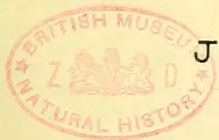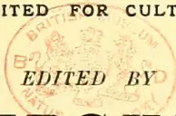

J. FERGUSON,  
of the "Ceylon Observer," &c.

"It is both the duty and interest of every owner and cultivator of the soil to study the best means of rendering that soil subservient to his own and the general wants of the community; and he who introduces, beneficially, a new and useful *Seed*, *Plant*, or *Shrub* into his district, is a blessing and an honour to his country."—SIR J. SINCLAIR.

VOL. XIV.

[Containing Numbers I. to XII.: July 1894 to June 1895.]

Colombo, Ceylon:

A. M. & J. FERGUSON.

LONDON:

MESSRS. JOHN HADDON & CO.; KEGAN PAUL, TRUBNER & CO., LTD.; LUZAC & CO.; &C.  
MADRAS: HIGGINBOTHAM & CO.—CALCUTTA: THACKER, SPINK & CO.;  
BOMBAY: THACKER & CO., LTD.—AUSTRALIAN COLONIES: GORDON & GOTCH.

MDCCCXCV.

5------------------------------------------------

<!-- stage4: FAINT old-images-only -->

[Faint page: no legible print of its own could be verified; text withheld (stage 4 review list)]

6------------------------------------------------

## TO OUR READERS.

In closing the Fourteenth Volume of the "**Tropical Agriculturist**," we would as usual direct attention to the large amount of useful information afforded and to the great variety of topics treated in the several numbers. From month to month, we have endeavoured to embody in these pages the latest results of practical experience and scientific teaching in all that concerns tropical agriculture; and our ambition has been to make our periodical not only indispensable to the planter, but of service to business men and capitalists, never forgetting that agriculture trenches upon every department of human knowledge, besides being the basis of personal and communal wealth.

While directing our attention chiefly to the products prominently mentioned on our title-page, we have always taken care to notice minor industries likely to fit in with sub-tropical conditions; and our readers have an ample guarantee in the pages before them, that, in the future, no pains will be spared to bring together all available information both from the West and East, the same being examined in the light of the teachings of common sense as well as of prolonged tropical experience in this, the leading Crown and Planting Colony of the British Empire.

Special attention has, during the past year, been given to the extension of the planting enterprise in coffee, cacao and rubber in Mexico, Central and some parts of South America; coffee and other products in Nyassaland, British Central Africa; to Arabian coffee and cacao in Java; Liberian coffee in Deli, Sumatra, and the Straits Settlements; and to other new developments in coffee in the Malayan Peninsula and North Borneo. In the great Dutch Dependency (Java) several Ceylon planters have lately been investing largely.

The Tea-planting Industry has sprung into so much importance in India and Ceylon, that a considerable amount of space is naturally given to this great staple, and we think it will be admitted by impartial judges that the *Tropical Agriculturist* should be filed, for ready reference, in every Tea Factory in this Island and in India.

A full and accurate Index affords the means of ready reference to every subject treated in this, the fourteenth volume, which we now place in our subscribers' hands, in the full confidence that it will be received with an amount of approval, at least equal to that which has been so kindly extended to its predecessors.

We are convinced that no more suitable or useful gift can be made to the tropical planter or agriculturist, whether he be about to enter on his career, or with many years of experience behind him, than the fourteen volumes of our periodical which we have now made available. They are full of information bearing on every department and relating to nearly every product within the scope of sub-tropical industries.

In conclusion, we have to tender our thanks to readers and contributors, and our wish that all friends may continue to write instructively and to read with approval; for then, indeed, must the "**Tropical Agriculturist**" continue to do well.

J. FERGUSON.

COLOMBO, CEYLON; 1ST JULY 1895.

7------------------------------------------------

<!-- stage4: SHOWTHROUGH tess-mirror:33/5/rot0 -->

8------------------------------------------------

# INDEX.

<table style="width: 100%; border-collapse: collapse;">
<thead>
<tr>
<th style="text-align: left;"></th>
<th style="text-align: right;">PAGE.</th>
</tr>
</thead>
<tbody>
<tr>
<td><b>A.</b></td>
<td></td>
</tr>
<tr>
<td>Abortion in Cattle .....</td>
<td style="text-align: right;">706</td>
</tr>
<tr>
<td>Acacia Dealbata .....</td>
<td style="text-align: right;">277</td>
</tr>
<tr>
<td>Acme Steel Tea Boxes .....</td>
<td style="text-align: right;">659</td>
</tr>
<tr>
<td>----- Tea Chests .....</td>
<td style="text-align: right;">20, 499</td>
</tr>
<tr>
<td>Adhatoda Vasica as an Insecticide .....</td>
<td style="text-align: right;">290, 292</td>
</tr>
<tr>
<td>Adulteration of Teas .....</td>
<td style="text-align: right;">132</td>
</tr>
<tr>
<td>Advances, Planters .....</td>
<td style="text-align: right;">385, 817</td>
</tr>
<tr>
<td>Africa, British Central Planting in .....</td>
<td style="text-align: right;">81, 102, 108, 123, 128, 236, 296, 333, 446, 451, 464, 467, 479, 513, 522, 637, 661, 673, 681</td>
</tr>
<tr>
<td>Africa, B.C., Ceylon Planters in .....</td>
<td style="text-align: right;">481</td>
</tr>
<tr>
<td>-----, B.C., Coffee in .....</td>
<td style="text-align: right;">232, 415, 729</td>
</tr>
<tr>
<td>-----, Chinese Tea in .....</td>
<td style="text-align: right;">738</td>
</tr>
<tr>
<td>-----, Coffee in .....</td>
<td style="text-align: right;">231</td>
</tr>
<tr>
<td>-----, German, Coffee in .....</td>
<td style="text-align: right;">409</td>
</tr>
<tr>
<td>-----, German East, Vanilla in .....</td>
<td style="text-align: right;">463, 508</td>
</tr>
<tr>
<td>-----, Investment in Central .....</td>
<td style="text-align: right;">118</td>
</tr>
<tr>
<td>-----, My First March in .....</td>
<td style="text-align: right;">490</td>
</tr>
<tr>
<td>-----, South, .....</td>
<td style="text-align: right;">495, 749</td>
</tr>
<tr>
<td>-----, West, Planting in .....</td>
<td style="text-align: right;">269</td>
</tr>
<tr>
<td>-----, Timbers of .....</td>
<td style="text-align: right;">251</td>
</tr>
<tr>
<td>Agave as a Fibre Plant .....</td>
<td style="text-align: right;">736</td>
</tr>
<tr>
<td>Agencies for Coolies .....</td>
<td style="text-align: right;">834</td>
</tr>
<tr>
<td>Agra Ouvah Estates Company, Limited .....</td>
<td style="text-align: right;">615</td>
</tr>
<tr>
<td>Agrapatanas, Tea in .....</td>
<td style="text-align: right;">195</td>
</tr>
<tr>
<td>Agricultural Chemistry .....</td>
<td style="text-align: right;">178</td>
</tr>
<tr>
<td>----- Class of People in Ceylon .....</td>
<td style="text-align: right;">523</td>
</tr>
<tr>
<td>----- Company of Mauritius, Ltd. ....</td>
<td style="text-align: right;">184</td>
</tr>
<tr>
<td>----- Implements, .....</td>
<td style="text-align: right;">65</td>
</tr>
<tr>
<td>----- Lands and Mining in Selangor .....</td>
<td style="text-align: right;">521</td>
</tr>
<tr>
<td>----- Magazine, The Ceylon .....</td>
<td style="text-align: right;">617</td>
</tr>
<tr>
<td>----- Products in the Philippines .....</td>
<td style="text-align: right;">376</td>
</tr>
<tr>
<td>----- Resources of Canada .....</td>
<td style="text-align: right;">27</td>
</tr>
<tr>
<td>----- School .....</td>
<td style="text-align: right;">285, 518, 535, 536, 565</td>
</tr>
<tr>
<td>----- Society of Ceylon .....</td>
<td style="text-align: right;">645</td>
</tr>
<tr>
<td>Agriculture in Brazil .....</td>
<td style="text-align: right;">330</td>
</tr>
<tr>
<td>Agricultural Teaching in the Elementary Schools .....</td>
<td style="text-align: right;">32</td>
</tr>
<tr>
<td>----- Experiments .....</td>
<td style="text-align: right;">344</td>
</tr>
<tr>
<td>----- "Gazette" .....</td>
<td style="text-align: right;">203</td>
</tr>
<tr>
<td>----- in China .....</td>
<td style="text-align: right;">141</td>
</tr>
<tr>
<td>----- in Honduras .....</td>
<td style="text-align: right;">684</td>
</tr>
<tr>
<td>----- in Nicaragua .....</td>
<td style="text-align: right;">257</td>
</tr>
<tr>
<td>----- in the Low-country of Ceylon .....</td>
<td style="text-align: right;">536</td>
</tr>
<tr>
<td>----- in Trinidad .....</td>
<td style="text-align: right;">700</td>
</tr>
<tr>
<td>-----, Laws of Ceylon Relating to .....</td>
<td style="text-align: right;">774, 846</td>
</tr>
<tr>
<td>-----, Native, Some Aspects of .....</td>
<td style="text-align: right;">644</td>
</tr>
<tr>
<td>-----, Tropical, Investigation of .....</td>
<td style="text-align: right;">217</td>
</tr>
<tr>
<td>Agri-horticultural and Botanical Gardens in India .....</td>
<td style="text-align: right;">392</td>
</tr>
<tr>
<td>Alcohol, Utilization of Bananas for .....</td>
<td style="text-align: right;">784</td>
</tr>
<tr>
<td>Algae, Fixation of Nitrogen in Soils and .....</td>
<td style="text-align: right;">223, 575</td>
</tr>
<tr>
<td>Algeria, Quinine in .....</td>
<td style="text-align: right;">97</td>
</tr>
<tr>
<td>-----, Production of Fibre from the Dwarf Palm in .....</td>
<td style="text-align: right;">377</td>
</tr>
<tr>
<td>Alliance Tea Co. of Ceylon Ltd., .....</td>
<td style="text-align: right;">550, 611</td>
</tr>
<tr>
<td>Aloe as a Fibre Plant .....</td>
<td style="text-align: right;">736</td>
</tr>
<tr>
<td>America, Central, Rubber in .....</td>
<td style="text-align: right;">301</td>
</tr>
<tr>
<td>-----, Ceylon Tea in .....</td>
<td style="text-align: right;">679, 793, 813, 815, 819</td>
</tr>
</tbody>
</table>

<table style="width: 100%; border-collapse: collapse;">
<thead>
<tr>
<th style="text-align: left;"></th>
<th style="text-align: right;">PAGE.</th>
</tr>
</thead>
<tbody>
<tr>
<td>America for Indian and Ceylon Teas .....</td>
<td style="text-align: right;">62</td>
</tr>
<tr>
<td>-----, Forestry in .....</td>
<td style="text-align: right;">506</td>
</tr>
<tr>
<td>-----, Reptiles in .....</td>
<td style="text-align: right;">396</td>
</tr>
<tr>
<td>-----, Tea in 62, 39, 107, 116, 191, 198, 238, 263, 274, 294, 327, 347, 393, 398, 404, 405, 411, 473, 483, 493, 533, 570, 609, 676, 682, 687, 739, 745, 756, 762</td>
<td style="text-align: right;"></td>
</tr>
<tr>
<td>-----, Tea Drunkenness in .....</td>
<td style="text-align: right;">543</td>
</tr>
<tr>
<td>-----, Teas for .....</td>
<td style="text-align: right;">263</td>
</tr>
<tr>
<td>-----, Tetley's Teas in .....</td>
<td style="text-align: right;">733</td>
</tr>
<tr>
<td>American Dewberry .....</td>
<td style="text-align: right;">211</td>
</tr>
<tr>
<td>-----, Tea Campaign .....</td>
<td style="text-align: right;">271, 807</td>
</tr>
<tr>
<td>-----, Vanilla Market .....</td>
<td style="text-align: right;">416</td>
</tr>
<tr>
<td>Amsterdam Cinchona Auctions .....</td>
<td style="text-align: right;">172, 346, 351, 416, 447, 466, 553, 596</td>
</tr>
<tr>
<td>-----, Coffee Planting Company, .....</td>
<td style="text-align: right;">166</td>
</tr>
<tr>
<td>-----, Drug Market .....</td>
<td style="text-align: right;">673</td>
</tr>
<tr>
<td>-----, Market .....</td>
<td style="text-align: right;">760</td>
</tr>
<tr>
<td>-----, Sampling of Cinchona in .....</td>
<td style="text-align: right;">172, 390</td>
</tr>
<tr>
<td>Analyses, Chemical, of Ceylon Tea .....</td>
<td style="text-align: right;">622</td>
</tr>
<tr>
<td>-----, of Milk .....</td>
<td style="text-align: right;">279, 353</td>
</tr>
<tr>
<td>Analysts, Chemical .....</td>
<td style="text-align: right;">171</td>
</tr>
<tr>
<td>Andamans, Tea in the .....</td>
<td style="text-align: right;">763</td>
</tr>
<tr>
<td>Angola, Coffee in .....</td>
<td style="text-align: right;">38</td>
</tr>
<tr>
<td>Ants, White, in Tea .....</td>
<td style="text-align: right;">749</td>
</tr>
<tr>
<td>Antwerp Exhibition and Indian Tea .....</td>
<td style="text-align: right;">661</td>
</tr>
<tr>
<td>Apiculture .....</td>
<td style="text-align: right;">182, 322</td>
</tr>
<tr>
<td>----- in Australia .....</td>
<td style="text-align: right;">322</td>
</tr>
<tr>
<td>----- in the Nilgiris .....</td>
<td style="text-align: right;">537</td>
</tr>
<tr>
<td>----- for the Sinhalese .....</td>
<td style="text-align: right;">165, 321, 322</td>
</tr>
<tr>
<td>Arabia, Southern, Mr. Bent on .....</td>
<td style="text-align: right;">167</td>
</tr>
<tr>
<td>Arabian Coffee .....</td>
<td style="text-align: right;">118, 201</td>
</tr>
<tr>
<td>Argentina, Coffee in .....</td>
<td style="text-align: right;">750</td>
</tr>
<tr>
<td>Argentine Republic, Vegetable Fibres in .....</td>
<td style="text-align: right;">581</td>
</tr>
<tr>
<td>Arrowroot in St. Vincent .....</td>
<td style="text-align: right;">258</td>
</tr>
<tr>
<td>----- in Travancore .....</td>
<td style="text-align: right;">557</td>
</tr>
<tr>
<td>Arsenate of Lead as an Insecticide .....</td>
<td style="text-align: right;">597</td>
</tr>
<tr>
<td>Arsenic and Arsenites as Insecticides .....</td>
<td style="text-align: right;">69</td>
</tr>
<tr>
<td>Assam, Coffee in .....</td>
<td style="text-align: right;">526</td>
</tr>
<tr>
<td>-----, Hailstorm in .....</td>
<td style="text-align: right;">760</td>
</tr>
<tr>
<td>Australia, Apiculture in .....</td>
<td style="text-align: right;">322</td>
</tr>
<tr>
<td>-----, Ceylon Tea in .....</td>
<td style="text-align: right;">392, 525, 613, 615, 750</td>
</tr>
<tr>
<td>-----, Planting in the Northern Territory of South .....</td>
<td style="text-align: right;">547</td>
</tr>
<tr>
<td>-----, Teas for .....</td>
<td style="text-align: right;">58</td>
</tr>
<tr>
<td>-----, Tea Trade in .....</td>
<td style="text-align: right;">170</td>
</tr>
<tr>
<td>-----, Western .....</td>
<td style="text-align: right;">692</td>
</tr>
<tr>
<td>Australian Hardwood Timbers .....</td>
<td style="text-align: right;">692</td>
</tr>
<tr>
<td>-----, Produce for Ceylon and India .....</td>
<td style="text-align: right;">413, 627</td>
</tr>
<tr>
<td>Avari Bark .....</td>
<td style="text-align: right;">200</td>
</tr>
<tr>
<td>Awards, Ceylon, at Chicago .....</td>
<td style="text-align: right;">119</td>
</tr>
</tbody>
</table>

## B.

<table style="width: 100%; border-collapse: collapse;">
<tbody>
<tr>
<td>Bahamas, Sisal Hemp in the .....</td>
<td style="text-align: right;">82, 378</td>
</tr>
<tr>
<td>Balangoda vs. Ratnapura .....</td>
<td style="text-align: right;">397</td>
</tr>
<tr>
<td>Bamber's, Tea-book .....</td>
<td style="text-align: right;">21</td>
</tr>
<tr>
<td>Bamboos, Hardy .....</td>
<td style="text-align: right;">677</td>
</tr>
<tr>
<td>Banana Trade of Jamaica .....</td>
<td style="text-align: right;">838</td>
</tr>
<tr>
<td>Bananas and Plantains .....</td>
<td style="text-align: right;">238, 283, 360</td>
</tr>
<tr>
<td>-----, Disease of .....</td>
<td style="text-align: right;">736</td>
</tr>
</tbody>
</table>

9------------------------------------------------

# INDEX.

<table border="0">
<thead>
<tr>
<th></th>
<th style="text-align: right;">PAGE.</th>
<th></th>
<th style="text-align: right;">PAGE.</th>
</tr>
</thead>
<tbody>
<tr>
<td>Bananas, Importation to the U. States of</td>
<td style="text-align: right;">377</td>
<td>Carobs</td>
<td style="text-align: right;">817</td>
</tr>
<tr>
<td>    in Colombia</td>
<td style="text-align: right;">33</td>
<td>Carolina South, Tea in</td>
<td style="text-align: right;">257</td>
</tr>
<tr>
<td>    in Costa Rica</td>
<td style="text-align: right;">304</td>
<td>    Tea Co. of Ceylon Ltd.</td>
<td style="text-align: right;">458</td>
</tr>
<tr>
<td>    in Jamaica</td>
<td style="text-align: right;">559</td>
<td>Carson, Mr. J. H., Return of, from Nyassaland</td>
<td style="text-align: right;">562</td>
</tr>
<tr>
<td>    Utilization of, for Meal, Alcohol, &amp;c.</td>
<td style="text-align: right;">784</td>
<td>Castlereagh Tea Co.</td>
<td style="text-align: right;">246, 615, 619</td>
</tr>
<tr>
<td>Bandarapola Ceylon Company, Limited</td>
<td style="text-align: right;">754, 841</td>
<td>Castor Oil Plant</td>
<td style="text-align: right;">319</td>
</tr>
<tr>
<td>Batgoda Tea Factory</td>
<td style="text-align: right;">665</td>
<td>    Production and Seeds</td>
<td style="text-align: right;">321</td>
</tr>
<tr>
<td>Battalgala Estates Company, Limited</td>
<td style="text-align: right;">738</td>
<td>    Seed, Copra, and Palm Oil in France</td>
<td style="text-align: right;">569</td>
</tr>
<tr>
<td>Bazaar Drugs in Veterinary Practice</td>
<td style="text-align: right;">773</td>
<td>Caterpillars and Plantations</td>
<td style="text-align: right;">544</td>
</tr>
<tr>
<td>Bees, Ceylon, and Apiculture</td>
<td style="text-align: right;">152</td>
<td>Cattle, Abortion in</td>
<td style="text-align: right;">706</td>
</tr>
<tr>
<td>    Indigenous</td>
<td style="text-align: right;">165</td>
<td>    Breeds of Indian</td>
<td style="text-align: right;">146</td>
</tr>
<tr>
<td>Belgium, Peach Culture in</td>
<td style="text-align: right;">689</td>
<td>    Keeping and Fodder Crops in Ceylon</td>
<td style="text-align: right;">140, 210, 282, 355, 571</td>
</tr>
<tr>
<td>Bent, Mr., on Southern Arabia</td>
<td style="text-align: right;">167</td>
<td>    Murrain at the Government Dairy</td>
<td style="text-align: right;">111</td>
</tr>
<tr>
<td>Blackstone Estate Company, Limited</td>
<td style="text-align: right;">189</td>
<td>    in Ceylon</td>
<td style="text-align: right;">280, 356, 429, 569</td>
</tr>
<tr>
<td>Blackwood, The, or Mudgerabah</td>
<td style="text-align: right;">374</td>
<td>    in India</td>
<td style="text-align: right;">640</td>
</tr>
<tr>
<td>Blechynden, Mr. : Tea Work in America</td>
<td style="text-align: right;">316, 630</td>
<td>    Native, in Towns</td>
<td style="text-align: right;">845</td>
</tr>
<tr>
<td>Blending and Estate Marks</td>
<td style="text-align: right;">331</td>
<td>    Skin Diseases</td>
<td style="text-align: right;">641</td>
</tr>
<tr>
<td>Blight Destroyer</td>
<td style="text-align: right;">222</td>
<td>Caucasus, Tea Cultivation in the</td>
<td style="text-align: right;">786</td>
</tr>
<tr>
<td>Boilers, Steam Engine</td>
<td style="text-align: right;">761</td>
<td>Central Province, News from</td>
<td style="text-align: right;">401</td>
</tr>
<tr>
<td>Bolivia and its Resources</td>
<td style="text-align: right;">316, 540</td>
<td>Ceylon, Agricultural Society of</td>
<td style="text-align: right;">645</td>
</tr>
<tr>
<td>Bombay Syndicate for the Treatment of Rhea</td>
<td style="text-align: right;">612</td>
<td>    Agricultural Magazine</td>
<td style="text-align: right;">617</td>
</tr>
<tr>
<td>    “Bond Tea”</td>
<td style="text-align: right;">630</td>
<td>    and South India, Rearing Ponies in</td>
<td style="text-align: right;">810</td>
</tr>
<tr>
<td>Borneo, British North</td>
<td style="text-align: right;">57, 451, 346, 335, 413, 739</td>
<td>    , A New Coccid from</td>
<td style="text-align: right;">24</td>
</tr>
<tr>
<td>    , Coy. Ltd.,</td>
<td style="text-align: right;">186, 189</td>
<td>    Association in London and Tea-making</td>
<td style="text-align: right;">477</td>
</tr>
<tr>
<td>    Coffee in</td>
<td style="text-align: right;">382, 395</td>
<td>    at the Chicago Exhibition</td>
<td style="text-align: right;">472</td>
</tr>
<tr>
<td>    A Decade in</td>
<td style="text-align: right;">794</td>
<td>    Chicago Awards</td>
<td style="text-align: right;">119</td>
</tr>
<tr>
<td>    Land in</td>
<td style="text-align: right;">98, 123</td>
<td>    Cinchona Company</td>
<td style="text-align: right;">91</td>
</tr>
<tr>
<td>    Planting in</td>
<td style="text-align: right;">171, 517, 542</td>
<td>    Coca Leaves in</td>
<td style="text-align: right;">15</td>
</tr>
<tr>
<td>    Tobacco Company, New London</td>
<td style="text-align: right;">127</td>
<td>    Cocoa</td>
<td style="text-align: right;">446</td>
</tr>
<tr>
<td>    Tobacco in</td>
<td style="text-align: right;">41</td>
<td>    Coconut Planting in</td>
<td style="text-align: right;">337, 350</td>
</tr>
<tr>
<td>Botanic Gardens Administration Report, Ceylon</td>
<td style="text-align: right;">666, 705</td>
<td>    Property in Western Province</td>
<td style="text-align: right;">331</td>
</tr>
<tr>
<td>    Caleutta</td>
<td style="text-align: right;">112</td>
<td>    Coffee Planting in</td>
<td style="text-align: right;">88, 125</td>
</tr>
<tr>
<td>    of Natal</td>
<td style="text-align: right;">768</td>
<td>    Early Planting Days in</td>
<td style="text-align: right;">340</td>
</tr>
<tr>
<td>    Trinidad</td>
<td style="text-align: right;">101</td>
<td>    Exports and Distribution</td>
<td style="text-align: right;">63, 137, 203, 275, 351, 499, 563, 637, 703, 769, 843</td>
</tr>
<tr>
<td>Botanical and Useful Information about Trees and Plants</td>
<td style="text-align: right;">701</td>
<td>    Fruit Culture in</td>
<td style="text-align: right;">349, 395</td>
</tr>
<tr>
<td>    Exploration in Borneo</td>
<td style="text-align: right;">19</td>
<td>    Green Bug in</td>
<td style="text-align: right;">768</td>
</tr>
<tr>
<td>Branding of Teas</td>
<td style="text-align: right;">414</td>
<td>    Gum Trees in</td>
<td style="text-align: right;">752</td>
</tr>
<tr>
<td>Brazil</td>
<td style="text-align: right;">617, 661, 738, 760</td>
<td>    in 1894</td>
<td style="text-align: right;">313</td>
</tr>
<tr>
<td>    Planting and Agriculture in</td>
<td style="text-align: right;">330, 808</td>
<td>    Land and Produce Co., Ltd.</td>
<td style="text-align: right;">485</td>
</tr>
<tr>
<td>Brazilian Coffee Duties</td>
<td style="text-align: right;">98</td>
<td>    Lands relating to Agriculture</td>
<td style="text-align: right;">774</td>
</tr>
<tr>
<td>    “Breaks” of Tea in London</td>
<td style="text-align: right;">525</td>
<td>    Liberian Coffee in</td>
<td style="text-align: right;">534</td>
</tr>
<tr>
<td>Breeds of Indian Cattle</td>
<td style="text-align: right;">146</td>
<td>    Maragogipe Coffee in</td>
<td style="text-align: right;">134, 400</td>
</tr>
<tr>
<td>Brisbane Ceylon Tea Planters’ Association</td>
<td style="text-align: right;">273</td>
<td>    Mines and Mining in</td>
<td style="text-align: right;">385</td>
</tr>
<tr>
<td>Bud, Graft or Seed</td>
<td style="text-align: right;">169</td>
<td>    New Areas of Cultivation in</td>
<td style="text-align: right;">125</td>
</tr>
<tr>
<td>Building Material in Ceylon</td>
<td style="text-align: right;">529</td>
<td>    Oranges and Fruit Culture in</td>
<td style="text-align: right;">337</td>
</tr>
<tr>
<td>Bulking, An Important Question as to Tea in London</td>
<td style="text-align: right;">816, 598</td>
<td>    Patents</td>
<td style="text-align: right;">156</td>
</tr>
<tr>
<td>Butter-Fat in Milk</td>
<td style="text-align: right;">357</td>
<td>    Planting Districts</td>
<td style="text-align: right;">593, 597</td>
</tr>
<tr>
<td></td>
<td></td>
<td>    Produce in London</td>
<td style="text-align: right;">527, 612</td>
</tr>
<tr>
<td></td>
<td></td>
<td>    Season Reports</td>
<td style="text-align: right;">217, 405</td>
</tr>
<tr>
<td></td>
<td></td>
<td>    Tea</td>
<td style="text-align: right;">818</td>
</tr>
<tr>
<td></td>
<td></td>
<td>        and New Markets</td>
<td style="text-align: right;">179</td>
</tr>
<tr>
<td></td>
<td></td>
<td>        and the Planters’ Tea Fund</td>
<td style="text-align: right;">603</td>
</tr>
<tr>
<td></td>
<td></td>
<td>        Crops</td>
<td style="text-align: right;">467</td>
</tr>
<tr>
<td></td>
<td></td>
<td>        Fund</td>
<td style="text-align: right;">464</td>
</tr>
<tr>
<td></td>
<td></td>
<td>        in Canada</td>
<td style="text-align: right;">607</td>
</tr>
<tr>
<td></td>
<td></td>
<td>        Mr. Morey on</td>
<td style="text-align: right;">293, 295</td>
</tr>
<tr>
<td></td>
<td></td>
<td>        in New York</td>
<td style="text-align: right;">246</td>
</tr>
<tr>
<td></td>
<td></td>
<td>        Planters’ Association at Brisbane</td>
<td style="text-align: right;">273</td>
</tr>
<tr>
<td></td>
<td></td>
<td>        Production in</td>
<td style="text-align: right;">305</td>
</tr>
<tr>
<td></td>
<td></td>
<td>    Teas</td>
<td style="text-align: right;">541, 380</td>
</tr>
<tr>
<td></td>
<td></td>
<td>    Tramways and Railways in</td>
<td style="text-align: right;">379</td>
</tr>
<tr>
<td></td>
<td></td>
<td>        vs. Indian Tea</td>
<td style="text-align: right;">762</td>
</tr>
<tr>
<td></td>
<td></td>
<td>Cheap Transport and How to Get it</td>
<td style="text-align: right;">802, 835</td>
</tr>
<tr>
<td></td>
<td></td>
<td>Chemical Analyses, Ceylon Manual of</td>
<td style="text-align: right;">9, 83, 157, 223, 297</td>
</tr>
<tr>
<td></td>
<td></td>
<td>    Analys to in India</td>
<td style="text-align: right;">171</td>
</tr>
<tr>
<td></td>
<td></td>
<td>Chemicals as Insecticides</td>
<td style="text-align: right;">250</td>
</tr>
<tr>
<td></td>
<td></td>
<td>Chemistry, Agricultural</td>
<td style="text-align: right;">178</td>
</tr>
<tr>
<td></td>
<td></td>
<td>Cherimoya</td>
<td style="text-align: right;">798</td>
</tr>
<tr>
<td></td>
<td></td>
<td>Chicago Exhibition, Ceylon at</td>
<td style="text-align: right;">472</td>
</tr>
<tr>
<td></td>
<td></td>
<td>China and Japan, Tea-Drinking in</td>
<td style="text-align: right;">248</td>
</tr>
<tr>
<td></td>
<td></td>
<td>    Coffee, Palm, Rice, etc. in</td>
<td style="text-align: right;">170</td>
</tr>
<tr>
<td></td>
<td></td>
<td>    Tea</td>
<td style="text-align: right;">116, 119, 130, 620, 691</td>
</tr>
<tr>
<td></td>
<td></td>
<td>Chinese Agriculture</td>
<td style="text-align: right;">141</td>
</tr>
</tbody>
</table>

10------------------------------------------------

## INDEX.

<table border="0" style="width: 100%; border-collapse: collapse;">
<thead>
<tr>
<th style="text-align: left;"></th>
<th style="text-align: right;">PAGE.</th>
<th style="text-align: left;"></th>
<th style="text-align: right;">PAGE.</th>
</tr>
</thead>
<tbody>
<tr>
<td>Cinchona Association Limited, Ceylon</td>
<td style="text-align: right;">183</td>
<td>Coffee, Amsterdam Planting Co.</td>
<td style="text-align: right;">166</td>
</tr>
<tr>
<td>    and Quinine</td>
<td style="text-align: right;">390, 496</td>
<td>    and Tea Planting : Relative Healthiness of</td>
<td style="text-align: right;">129</td>
</tr>
<tr>
<td>    Auctions in Amsterdam</td>
<td style="text-align: right;">63, 172, 346, 357, 416, 553, 596</td>
<td>    Arabian</td>
<td style="text-align: right;">105, 118</td>
</tr>
<tr>
<td>        London</td>
<td style="text-align: right;">391, 454</td>
<td>    A New</td>
<td style="text-align: right;">95</td>
</tr>
<tr>
<td>    Bark</td>
<td style="text-align: right;">600</td>
<td>    Blossom, Ceylon</td>
<td style="text-align: right;">121, 421</td>
</tr>
<tr>
<td>    Co., Patiagama, Ltd.</td>
<td style="text-align: right;">91, 680</td>
<td>    Coloured, Protest against</td>
<td style="text-align: right;">796</td>
</tr>
<tr>
<td>    in British India</td>
<td style="text-align: right;">308</td>
<td>    Company Limited, Spring Valley</td>
<td style="text-align: right;">171</td>
</tr>
<tr>
<td>        Java</td>
<td style="text-align: right;">307, 342</td>
<td>        Uva</td>
<td style="text-align: right;">173</td>
</tr>
<tr>
<td>    Netherlands India</td>
<td style="text-align: right;">763</td>
<td>        The Proposed</td>
<td style="text-align: right;">617</td>
</tr>
<tr>
<td>    Peru</td>
<td style="text-align: right;">582</td>
<td>        Ltd., the Nyassaland</td>
<td style="text-align: right;">682, 734</td>
</tr>
<tr>
<td>    Pioneer, A</td>
<td style="text-align: right;">821</td>
<td>        The Queensland</td>
<td style="text-align: right;">728</td>
</tr>
<tr>
<td>    Planter's Dirge</td>
<td style="text-align: right;">335</td>
<td>    Crops</td>
<td style="text-align: right;">55</td>
</tr>
<tr>
<td>    Sampling of, in Amsterdam</td>
<td style="text-align: right;">172, 390</td>
<td>        Cultivation Galore : Netherlands</td>
<td></td>
</tr>
<tr>
<td>Cinnamon</td>
<td style="text-align: right;">445, 463</td>
<td>        Peru, Central and North Africa</td>
<td style="text-align: right;">231</td>
</tr>
<tr>
<td>    Bark Decoction and Cancer</td>
<td style="text-align: right;">421</td>
<td>        Curing in Colombo</td>
<td style="text-align: right;">604</td>
</tr>
<tr>
<td>    Ceylon, as a Cure for Cancer</td>
<td style="text-align: right;">424</td>
<td>        by Malays</td>
<td style="text-align: right;">243</td>
</tr>
<tr>
<td>    Estate, Sale of</td>
<td style="text-align: right;">807</td>
<td>        Drinking : is it on the increase ?</td>
<td style="text-align: right;">31</td>
</tr>
<tr>
<td>    in Negombo</td>
<td style="text-align: right;">394</td>
<td>        Duties, Brazilian</td>
<td style="text-align: right;">98</td>
</tr>
<tr>
<td>    in the Veyangoda District</td>
<td style="text-align: right;">622</td>
<td>        in Costa Rica</td>
<td style="text-align: right;">201</td>
</tr>
<tr>
<td>    Prospects</td>
<td style="text-align: right;">459</td>
<td>        from Selangor, Export Duty on</td>
<td style="text-align: right;">95</td>
</tr>
<tr>
<td>    Sales, Recent</td>
<td style="text-align: right;">463</td>
<td>        Growing</td>
<td style="text-align: right;">197</td>
</tr>
<tr>
<td>Coal Mining and Plumbago</td>
<td style="text-align: right;">182</td>
<td>        in Ceylon</td>
<td style="text-align: right;">88, 125</td>
</tr>
<tr>
<td>Coca</td>
<td style="text-align: right;">579</td>
<td>        Hybrid, Liberian and Arabian</td>
<td style="text-align: right;">207</td>
</tr>
<tr>
<td>    in England</td>
<td style="text-align: right;">804</td>
<td>        Imports in the United States</td>
<td style="text-align: right;">257</td>
</tr>
<tr>
<td>    in India</td>
<td style="text-align: right;">14</td>
<td>        Tampering with</td>
<td style="text-align: right;">616</td>
</tr>
<tr>
<td>    Leaves from Ceylon</td>
<td style="text-align: right;">15, 244</td>
<td>        in Angola</td>
<td style="text-align: right;">38</td>
</tr>
<tr>
<td>    Paste</td>
<td style="text-align: right;">245</td>
<td>        Argentina</td>
<td style="text-align: right;">750</td>
</tr>
<tr>
<td>    Pate</td>
<td style="text-align: right;">420</td>
<td>        Assam</td>
<td style="text-align: right;">529</td>
</tr>
<tr>
<td>Cocaine, Crude</td>
<td style="text-align: right;">245</td>
<td>        Austria Hungary</td>
<td style="text-align: right;">548</td>
</tr>
<tr>
<td>Cocoid from Ceylon, A New</td>
<td style="text-align: right;">24</td>
<td>        B. C. Africa</td>
<td style="text-align: right;">113, 232, 415, 729, 812</td>
</tr>
<tr>
<td>Cockchafers, Destruction of</td>
<td style="text-align: right;">378</td>
<td>        B. N. Borneo</td>
<td style="text-align: right;">382, 395</td>
</tr>
<tr>
<td>Cocoa</td>
<td style="text-align: right;">244, 446, 557</td>
<td>        Brazil</td>
<td style="text-align: right;">808</td>
</tr>
<tr>
<td>    Adulteration of</td>
<td style="text-align: right;">660</td>
<td>        Ceylon</td>
<td style="text-align: right;">60, 88, 325, 399, 604</td>
</tr>
<tr>
<td>    and Coffee Drying Machine</td>
<td style="text-align: right;">345</td>
<td>        China</td>
<td style="text-align: right;">170</td>
</tr>
<tr>
<td>    and Cocoa-curing</td>
<td style="text-align: right;">49</td>
<td>        Coorg</td>
<td style="text-align: right;">28, 251, 551</td>
</tr>
<tr>
<td>    in Venezuela</td>
<td style="text-align: right;">169</td>
<td>        Costa Rica</td>
<td style="text-align: right;">220, 304</td>
</tr>
<tr>
<td>    in Ecuador</td>
<td style="text-align: right;">173</td>
<td>        Florida</td>
<td style="text-align: right;">239</td>
</tr>
<tr>
<td>    Producing Belt</td>
<td style="text-align: right;">399</td>
<td>        German Africa</td>
<td style="text-align: right;">409</td>
</tr>
<tr>
<td>    Trade</td>
<td style="text-align: right;">676</td>
<td>        Gold Coast</td>
<td style="text-align: right;">252, 763</td>
</tr>
<tr>
<td>Coconut and Palm Oil, Tests for</td>
<td style="text-align: right;">202</td>
<td>        Guatemala</td>
<td style="text-align: right;">87</td>
</tr>
<tr>
<td>    Crop Prospects</td>
<td style="text-align: right;">238, 459</td>
<td>        Hawaii</td>
<td style="text-align: right;">511</td>
</tr>
<tr>
<td>    Crops in Negombo</td>
<td style="text-align: right;">394, 511</td>
<td>        Honduras</td>
<td style="text-align: right;">300</td>
</tr>
<tr>
<td>    Cultivation in India</td>
<td style="text-align: right;">379, 396</td>
<td>        Jamaica</td>
<td style="text-align: right;">24, 249</td>
</tr>
<tr>
<td>    Culture and Legislation</td>
<td style="text-align: right;">42</td>
<td>        Java</td>
<td style="text-align: right;">46, 52</td>
</tr>
<tr>
<td>    Desiccated</td>
<td style="text-align: right;">316</td>
<td>        Matale</td>
<td style="text-align: right;">472</td>
</tr>
<tr>
<td>    Fibre</td>
<td style="text-align: right;">114</td>
<td>        Mexico</td>
<td style="text-align: right;">82, 130, 239, 496, 530</td>
</tr>
<tr>
<td>    Gardens, How to Improve</td>
<td style="text-align: right;">536</td>
<td>        Mysore</td>
<td style="text-align: right;">489</td>
</tr>
<tr>
<td>    Oil Situation</td>
<td style="text-align: right;">657, 632</td>
<td>        Nyassaland</td>
<td style="text-align: right;">551, 731, 753</td>
</tr>
<tr>
<td>    Palm Jaggery</td>
<td style="text-align: right;">118</td>
<td>        Perak</td>
<td style="text-align: right;">258</td>
</tr>
<tr>
<td>        in the Godavery District</td>
<td style="text-align: right;">469</td>
<td>        Peru</td>
<td style="text-align: right;">232</td>
</tr>
<tr>
<td>    Pickings and Crop</td>
<td style="text-align: right;">461</td>
<td>        Queensland</td>
<td style="text-align: right;">82</td>
</tr>
<tr>
<td>    Planting</td>
<td style="text-align: right;">620, 817</td>
<td>        Selangor</td>
<td style="text-align: right;">238, 487</td>
</tr>
<tr>
<td>        in Ceylon</td>
<td style="text-align: right;">337, 350, 610, 669, 673</td>
<td>        South India</td>
<td style="text-align: right;">95, 125</td>
</tr>
<tr>
<td>        in N.E. India</td>
<td style="text-align: right;">457</td>
<td>        Sumatra</td>
<td style="text-align: right;">237</td>
</tr>
<tr>
<td>        New Guinea</td>
<td style="text-align: right;">484</td>
<td>        the Caucasus</td>
<td style="text-align: right;">243</td>
</tr>
<tr>
<td>        in Veyangoda</td>
<td style="text-align: right;">622</td>
<td>        the Nilgiris</td>
<td style="text-align: right;">42</td>
</tr>
<tr>
<td>    Property in the Western Province</td>
<td style="text-align: right;">331</td>
<td>        the New World</td>
<td style="text-align: right;">302</td>
</tr>
<tr>
<td>        Kurunegalla</td>
<td style="text-align: right;">421</td>
<td>        the Philippines</td>
<td style="text-align: right;">233</td>
</tr>
<tr>
<td>    Region—Negombo District</td>
<td style="text-align: right;">323</td>
<td>        the Straits Settlements</td>
<td style="text-align: right;">60, 550, 661, 662</td>
</tr>
<tr>
<td>    Sugar</td>
<td style="text-align: right;">118</td>
<td>        Travancore</td>
<td style="text-align: right;">447</td>
</tr>
<tr>
<td>    Tree Disease in Travancore</td>
<td style="text-align: right;">336</td>
<td>        Uganda</td>
<td style="text-align: right;">266</td>
</tr>
<tr>
<td>    Vs. Kerosene Oil</td>
<td style="text-align: right;">582</td>
<td>        Uva</td>
<td style="text-align: right;">108</td>
</tr>
<tr>
<td>Coconuts</td>
<td style="text-align: right;">55, 460, 480, 686, 689, 743, 744</td>
<td>    Irrigated</td>
<td style="text-align: right;">697</td>
</tr>
<tr>
<td>    Ceylon and Indian</td>
<td style="text-align: right;">470</td>
<td>    Leaf Disease in Costa Rica</td>
<td style="text-align: right;">12</td>
</tr>
<tr>
<td>    Culture and Legislation</td>
<td style="text-align: right;">32</td>
<td>    Liberian</td>
<td style="text-align: right;">55, 58, 105, 118, 131, 134, 179, 244, 318, 397, 400, 557</td>
</tr>
<tr>
<td>    in Ceylon the Untaxed Product</td>
<td style="text-align: right;">623</td>
<td>        in Ceylon</td>
<td style="text-align: right;">534</td>
</tr>
<tr>
<td>    in Colombia</td>
<td style="text-align: right;">33</td>
<td>        in Sumatra</td>
<td style="text-align: right;">696</td>
</tr>
<tr>
<td>    in Florida</td>
<td style="text-align: right;">460</td>
<td>    Machinery</td>
<td style="text-align: right;">124</td>
</tr>
<tr>
<td>    Many-headed</td>
<td style="text-align: right;">792, 817, 818</td>
<td>        Maragogipe</td>
<td style="text-align: right;">8, 131</td>
</tr>
<tr>
<td>    Price of</td>
<td style="text-align: right;">620</td>
<td>        in Ceylon</td>
<td style="text-align: right;">134, 400</td>
</tr>
<tr>
<td>    Value of</td>
<td style="text-align: right;">245, 266, 267</td>
<td>        Mr. T. Christy on</td>
<td style="text-align: right;">115</td>
</tr>
<tr>
<td>Climatic Changes in India</td>
<td style="text-align: right;">633</td>
<td>        Notes from Brazil</td>
<td style="text-align: right;">738, 760</td>
</tr>
<tr>
<td>Clunes Estates Company, Limited</td>
<td style="text-align: right;">657</td>
<td>    New and Promising, and "Lady-bird" for Old Coffee</td>
<td style="text-align: right;">829</td>
</tr>
<tr>
<td>Coffee</td>
<td style="text-align: right;">25, 131, 177, 308, 317, 323, 345, 424, 476, 625, 633, 650, 697</td>
<td></td>
<td></td>
</tr>
</tbody>
</table>

11------------------------------------------------

## INDEX.

<table border="0">
<thead>
<tr>
<th></th>
<th style="text-align: right;">PAGE.</th>
<th></th>
<th style="text-align: right;">PAGE.</th>
</tr>
</thead>
<tbody>
<tr>
<td>Coffee on Digestion .....</td>
<td style="text-align: right;">308</td>
<td>Drug Growing in British India .....</td>
<td style="text-align: right;">725</td>
</tr>
<tr>
<td>—, Past Season and Future Prospects of .....</td>
<td style="text-align: right;">610</td>
<td>—Market of Amsterdam .....</td>
<td style="text-align: right;">673</td>
</tr>
<tr>
<td>—Planter's Manual, New Edition of .....</td>
<td style="text-align: right;">489</td>
<td>—Plants, Cultivation of .....</td>
<td style="text-align: right;">307</td>
</tr>
<tr>
<td>—Planters, Uva, Good News to .....</td>
<td style="text-align: right;">539</td>
<td>—Report 51, 62, 96, 137, 176, 236, 275, 312, 336, 341, 382, 393, 406, 415, 450, 458, 465, 509, 528, 544, 601, 612, 625, 674, 734, 750, 812, 839</td>
<td style="text-align: right;"></td>
</tr>
<tr>
<td>—, Scope for, in Colombia .....</td>
<td style="text-align: right;">33</td>
<td>Drugs (Bazaar) in Veterinary Practice .....</td>
<td style="text-align: right;">773, 849</td>
</tr>
<tr>
<td>—Situation .....</td>
<td style="text-align: right;">274, 351</td>
<td>Drying Machine for Coffee and Cocoa .....</td>
<td style="text-align: right;">345</td>
</tr>
<tr>
<td>—Stenopylla .....</td>
<td style="text-align: right;">261</td>
<td>Dunkeld Estate Co., Ltd. ....</td>
<td style="text-align: right;">551</td>
</tr>
<tr>
<td>—Stealing in Madras .....</td>
<td style="text-align: right;">727</td>
<td>Dye-Stuffs, Some Indian .....</td>
<td style="text-align: right;">847</td>
</tr>
<tr>
<td>—Supply of the World .....</td>
<td style="text-align: right;">237</td>
<td>Dystokia in a Cow and Embryotomy .....</td>
<td style="text-align: right;">431</td>
</tr>
<tr>
<td>—Tools .....</td>
<td style="text-align: right;">167</td>
<td></td>
<td></td>
</tr>
<tr>
<td>—Trade .....</td>
<td style="text-align: right;">808</td>
<td></td>
<td></td>
</tr>
<tr>
<td>—Vs. Tea in Ceylon .....</td>
<td style="text-align: right;">407</td>
<td></td>
<td></td>
</tr>
<tr>
<td>Colombia, State of .....</td>
<td style="text-align: right;">33</td>
<td></td>
<td></td>
</tr>
<tr>
<td>—, Cacao in .....</td>
<td style="text-align: right;">33, 154</td>
<td></td>
<td></td>
</tr>
<tr>
<td>Colombo Price Current 703, 769 843</td>
<td></td>
<td></td>
<td></td>
</tr>
<tr>
<td>—Rates for Produce, Exchange and Freights per Ton of Measure- ment .....</td>
<td style="text-align: right;">756</td>
<td></td>
<td></td>
</tr>
<tr>
<td>—Tea Averages .....</td>
<td style="text-align: right;">634</td>
<td></td>
<td></td>
</tr>
<tr>
<td>—Market .....</td>
<td style="text-align: right;">117</td>
<td></td>
<td></td>
</tr>
<tr>
<td>—Trader's Association .....</td>
<td style="text-align: right;">380</td>
<td></td>
<td></td>
</tr>
<tr>
<td>Colonia .....</td>
<td style="text-align: right;">216</td>
<td></td>
<td></td>
</tr>
<tr>
<td>Colonial Chemistry: Native Drugs and Soil Analyses .....</td>
<td style="text-align: right;">576</td>
<td></td>
<td></td>
</tr>
<tr>
<td>Colonies, A Good Friend of the .....</td>
<td style="text-align: right;">795</td>
<td></td>
<td></td>
</tr>
<tr>
<td>Committee of Thirty .....</td>
<td style="text-align: right;">793</td>
<td></td>
<td></td>
</tr>
<tr>
<td>Consolidated Estates Coy. Ltd. ....</td>
<td style="text-align: right;">408</td>
<td></td>
<td></td>
</tr>
<tr>
<td>Coolies .....</td>
<td style="text-align: right;">548</td>
<td></td>
<td></td>
</tr>
<tr>
<td>Cooly Agencies .....</td>
<td style="text-align: right;">834</td>
<td></td>
<td></td>
</tr>
<tr>
<td>Coorg, Coffee in .....</td>
<td style="text-align: right;">28, 251, 551</td>
<td></td>
<td></td>
</tr>
<tr>
<td>—Planters' Association .....</td>
<td style="text-align: right;">101</td>
<td></td>
<td></td>
</tr>
<tr>
<td>Copra from the Philippines .....</td>
<td style="text-align: right;">238</td>
<td></td>
<td></td>
</tr>
<tr>
<td>—in Fiji .....</td>
<td style="text-align: right;">486</td>
<td></td>
<td></td>
</tr>
<tr>
<td>—in France .....</td>
<td style="text-align: right;">509</td>
<td></td>
<td></td>
</tr>
<tr>
<td>Cossipore Institution, The .....</td>
<td style="text-align: right;">778</td>
<td></td>
<td></td>
</tr>
<tr>
<td>Correspondence 41, 43, 57, 115, 133, 179, 244, 263, 290, 319, 326, 347, 395, 419, 469, 493, 507, 533, 557, 623, 669, 739, 815</td>
<td style="text-align: right;"></td>
<td></td>
<td></td>
</tr>
<tr>
<td>Costa Rica, Coffee Disease in .....</td>
<td style="text-align: right;">12</td>
<td></td>
<td></td>
</tr>
<tr>
<td>—, — Duties in .....</td>
<td style="text-align: right;">201</td>
<td></td>
<td></td>
</tr>
<tr>
<td>Cotton in Mexico .....</td>
<td style="text-align: right;">95, 385</td>
<td></td>
<td></td>
</tr>
<tr>
<td>—Seed Products .....</td>
<td style="text-align: right;">239</td>
<td></td>
<td></td>
</tr>
<tr>
<td>Cow, Good Points in a Fine .....</td>
<td style="text-align: right;">169</td>
<td></td>
<td></td>
</tr>
<tr>
<td>Cows, Banana Leaves for .....</td>
<td style="text-align: right;">498</td>
<td></td>
<td></td>
</tr>
<tr>
<td>Creepers .....</td>
<td style="text-align: right;">182</td>
<td></td>
<td></td>
</tr>
<tr>
<td>Crypholemus Montrongeizieri or the Scale Insect's Enemy .....</td>
<td style="text-align: right;">764</td>
<td></td>
<td></td>
</tr>
<tr>
<td>Cubebs .....</td>
<td style="text-align: right;">702</td>
<td></td>
<td></td>
</tr>
<tr>
<td>Cultivation in Hadramut .....</td>
<td style="text-align: right;">178</td>
<td></td>
<td></td>
</tr>
<tr>
<td>—Ceylon, New Areas of .....</td>
<td style="text-align: right;">125</td>
<td></td>
<td></td>
</tr>
<tr>
<td>—of the Rubber Vine .....</td>
<td style="text-align: right;">267</td>
<td></td>
<td></td>
</tr>
<tr>
<td>Current Topics .....</td>
<td style="text-align: right;">461, 543, 789</td>
<td></td>
<td></td>
</tr>
<tr>
<td colspan="4" style="text-align: center;"><b>D.</b></td>
</tr>
<tr>
<td>Dairy, Cattle Disease at the .....</td>
<td style="text-align: right;">111</td>
<td></td>
<td></td>
</tr>
<tr>
<td>—, Ceylon Government .....</td>
<td style="text-align: right;">17</td>
<td></td>
<td></td>
</tr>
<tr>
<td>—Items .....</td>
<td style="text-align: right;">284</td>
<td></td>
<td></td>
</tr>
<tr>
<td>Datjeeling Tea Company .....</td>
<td style="text-align: right;">812</td>
<td></td>
<td></td>
</tr>
<tr>
<td>Dark Continent, Bound for the .....</td>
<td style="text-align: right;">338</td>
<td></td>
<td></td>
</tr>
<tr>
<td>Davidson-Maguire Patent Tea-Packer .....</td>
<td style="text-align: right;">547, 624</td>
<td></td>
<td></td>
</tr>
<tr>
<td>"Days of Old," by an Uva Planter .....</td>
<td style="text-align: right;">675</td>
<td></td>
<td></td>
</tr>
<tr>
<td>Death in the Cup .....</td>
<td style="text-align: right;">541</td>
<td></td>
<td></td>
</tr>
<tr>
<td>Delegate to America, Instructions to the .....</td>
<td style="text-align: right;">741</td>
<td></td>
<td></td>
</tr>
<tr>
<td>—, The Ceylon Tea .....</td>
<td style="text-align: right;">473</td>
<td></td>
<td></td>
</tr>
<tr>
<td>Delgolla Estates Co. Ltd. ....</td>
<td style="text-align: right;">751</td>
<td></td>
<td></td>
</tr>
<tr>
<td>Delusions about Tropical Cultivation .....</td>
<td style="text-align: right;">80</td>
<td></td>
<td></td>
</tr>
<tr>
<td>Desiccated Coconut .....</td>
<td style="text-align: right;">316</td>
<td></td>
<td></td>
</tr>
<tr>
<td>Dewberry, American .....</td>
<td style="text-align: right;">211</td>
<td></td>
<td></td>
</tr>
<tr>
<td>Distribution and Exports in Ceylon, 63, 137, 203, 351, 499, 563, 637, 703, 769, 843</td>
<td style="text-align: right;"></td>
<td></td>
<td></td>
</tr>
<tr>
<td>Dividend, Phenomenal, of a Tea Company .....</td>
<td style="text-align: right;">768</td>
<td></td>
<td></td>
</tr>
<tr>
<td>Divi-divi .....</td>
<td style="text-align: right;">452</td>
<td></td>
<td></td>
</tr>
<tr>
<td>Dolosbage, A Look-in at .....</td>
<td style="text-align: right;">593</td>
<td></td>
<td></td>
</tr>
<tr>
<td>Dominica, Island of .....</td>
<td style="text-align: right;">385</td>
<td></td>
<td></td>
</tr>
<tr>
<td>Drayton (Ceylon) Estates Co. Ltd. ....</td>
<td style="text-align: right;">731</td>
<td></td>
<td></td>
</tr>
<tr>
<td colspan="4" style="text-align: center;"><b>E.</b></td>
</tr>
<tr>
<td>Early Days of a Planter in Ceylon .....</td>
<td style="text-align: right;">340, 383</td>
<td></td>
<td></td>
</tr>
<tr>
<td>Eastern Produce and Estates Company .....</td>
<td style="text-align: right;">31, 828</td>
<td></td>
<td></td>
</tr>
<tr>
<td>Echoes of Science, 243, 311, 314, 550, 556 676, 762</td>
<td style="text-align: right;"></td>
<td></td>
<td></td>
</tr>
<tr>
<td>Economic Plants in India .....</td>
<td style="text-align: right;">167, 309</td>
<td></td>
<td></td>
</tr>
<tr>
<td>Economy in Working Wire-sheets .....</td>
<td style="text-align: right;">178</td>
<td></td>
<td></td>
</tr>
<tr>
<td>Ecuador, Cocoa in .....</td>
<td style="text-align: right;">172</td>
<td></td>
<td></td>
</tr>
<tr>
<td>Eggs, Large, from an Ordinary Cross-bred Hen .....</td>
<td style="text-align: right;">133</td>
<td></td>
<td></td>
</tr>
<tr>
<td>Egypt, Artificial Incubation in .....</td>
<td style="text-align: right;">724</td>
<td></td>
<td></td>
</tr>
<tr>
<td>Eila Tea Company .....</td>
<td style="text-align: right;">563</td>
<td></td>
<td></td>
</tr>
<tr>
<td>Electric Bells Battery .....</td>
<td style="text-align: right;">380</td>
<td></td>
<td></td>
</tr>
<tr>
<td>—Transmission of Power .....</td>
<td style="text-align: right;">336</td>
<td></td>
<td></td>
</tr>
<tr>
<td>—Light and Power in Ceylon .....</td>
<td style="text-align: right;">50, 114</td>
<td></td>
<td></td>
</tr>
<tr>
<td>Electricity and Motors .....</td>
<td style="text-align: right;">120</td>
<td></td>
<td></td>
</tr>
<tr>
<td>Electro-Motors for Plantation Factories .....</td>
<td style="text-align: right;">43</td>
<td></td>
<td></td>
</tr>
<tr>
<td>Elephants .....</td>
<td style="text-align: right;">498</td>
<td></td>
<td></td>
</tr>
<tr>
<td>Embryotomy .....</td>
<td style="text-align: right;">431</td>
<td></td>
<td></td>
</tr>
<tr>
<td>Enemies of Cacao Trees .....</td>
<td style="text-align: right;">422</td>
<td></td>
<td></td>
</tr>
<tr>
<td>—Tea .....</td>
<td style="text-align: right;">328</td>
<td></td>
<td></td>
</tr>
<tr>
<td>Engineer, The, and Mountain Tramways .....</td>
<td style="text-align: right;">789</td>
<td></td>
<td></td>
</tr>
<tr>
<td>"English Tea" .....</td>
<td style="text-align: right;">762</td>
<td></td>
<td></td>
</tr>
<tr>
<td>Entomology and its Local Application .....</td>
<td style="text-align: right;">116</td>
<td></td>
<td></td>
</tr>
<tr>
<td>Entomologist for Ceylon .....</td>
<td style="text-align: right;">5, 99, 241</td>
<td></td>
<td></td>
</tr>
<tr>
<td>Essences, Preparation of .....</td>
<td style="text-align: right;">646, 712</td>
<td></td>
<td></td>
</tr>
<tr>
<td>Essential Oil .....</td>
<td style="text-align: right;">26</td>
<td></td>
<td></td>
</tr>
<tr>
<td>Estate Marks and Blending .....</td>
<td style="text-align: right;">331</td>
<td></td>
<td></td>
</tr>
<tr>
<td>—Property in Ceylon Sold in 1894 .....</td>
<td style="text-align: right;">488</td>
<td></td>
<td></td>
</tr>
<tr>
<td>Eucalypti .....</td>
<td style="text-align: right;">82</td>
<td></td>
<td></td>
</tr>
<tr>
<td>Eucalyptus Microcary : Tallow Wood .....</td>
<td style="text-align: right;">184</td>
<td></td>
<td></td>
</tr>
<tr>
<td>—Tree in Southern France .....</td>
<td style="text-align: right;">508</td>
<td></td>
<td></td>
</tr>
<tr>
<td>Explosion, Steam Boiler .....</td>
<td style="text-align: right;">235</td>
<td></td>
<td></td>
</tr>
<tr>
<td>Exports of Ceylon and Distribution 63, 137, 203</td>
<td style="text-align: right;"></td>
<td></td>
<td></td>
</tr>
<tr>
<td>—of Indian and Ceylon Tea .....</td>
<td style="text-align: right;">658</td>
<td></td>
<td></td>
</tr>
<tr>
<td>—of Tea from China to United States .....</td>
<td style="text-align: right;">351, 499, 563, 637, 703, 769, 843</td>
<td></td>
<td></td>
</tr>
<tr>
<td></td>
<td style="text-align: right;">239</td>
<td></td>
<td></td>
</tr>
<tr>
<td colspan="4" style="text-align: center;"><b>F.</b></td>
</tr>
<tr>
<td>Farm Manure in South India .....</td>
<td style="text-align: right;">87</td>
<td></td>
<td></td>
</tr>
<tr>
<td>—Report of Poona .....</td>
<td style="text-align: right;">642</td>
<td></td>
<td></td>
</tr>
<tr>
<td>—School, Redhill, Surrey .....</td>
<td style="text-align: right;">496</td>
<td></td>
<td></td>
</tr>
<tr>
<td>—Yard Manure, Care and Manage- ment of .....</td>
<td style="text-align: right;">205</td>
<td></td>
<td></td>
</tr>
<tr>
<td>Farmer, The, and Modern Inventions .....</td>
<td style="text-align: right;">311</td>
<td></td>
<td></td>
</tr>
<tr>
<td>Farmer's Tests for Evils .....</td>
<td style="text-align: right;">641</td>
<td></td>
<td></td>
</tr>
<tr>
<td>Farming in Midland and Southern England .....</td>
<td style="text-align: right;">390</td>
<td></td>
<td></td>
</tr>
<tr>
<td>Feeding Stuffs .....</td>
<td style="text-align: right;">144</td>
<td></td>
<td></td>
</tr>
<tr>
<td>Fertilizer, A Home-made .....</td>
<td style="text-align: right;">444</td>
<td></td>
<td></td>
</tr>
<tr>
<td>—, Salt as a .....</td>
<td style="text-align: right;">356</td>
<td></td>
<td></td>
</tr>
<tr>
<td>Fertilizers of Green Crops .....</td>
<td style="text-align: right;">639</td>
<td></td>
<td></td>
</tr>
<tr>
<td>Fever and Its Treatment, .....</td>
<td style="text-align: right;">817</td>
<td></td>
<td></td>
</tr>
<tr>
<td>—, Malarial, in Ceylon .....</td>
<td style="text-align: right;">306</td>
<td></td>
<td></td>
</tr>
<tr>
<td>Fibre, Over-Production of .....</td>
<td style="text-align: right;">329</td>
<td></td>
<td></td>
</tr>
<tr>
<td>—Plants, Naming of .....</td>
<td style="text-align: right;">394</td>
<td></td>
<td></td>
</tr>
<tr>
<td>—from the Dwarf Palm in Algeria .....</td>
<td style="text-align: right;">377</td>
<td></td>
<td></td>
</tr>
<tr>
<td>—Industries and Planters .....</td>
<td style="text-align: right;">469</td>
<td></td>
<td></td>
</tr>
<tr>
<td>—, Rhea .....</td>
<td style="text-align: right;">526</td>
<td></td>
<td></td>
</tr>
<tr>
<td>—, Ramie, and New Zealand Flax .....</td>
<td style="text-align: right;">332</td>
<td></td>
<td></td>
</tr>
<tr>
<td>—, Vegetable, in the Argentine Republic .....</td>
<td style="text-align: right;">581</td>
<td></td>
<td></td>
</tr>
<tr>
<td>Fibres, Ceylon, in Request ; Room for New Industries .....</td>
<td style="text-align: right;">805, 818, 820</td>
<td></td>
<td></td>
</tr>
<tr>
<td>—, Commercial .....</td>
<td style="text-align: right;">766, 798, 804</td>
<td></td>
<td></td>
</tr>
<tr>
<td>—, Dr. Morris on .....</td>
<td style="text-align: right;">822</td>
<td></td>
<td></td>
</tr>
</tbody>
</table>

12------------------------------------------------

## INDEX.

<table border="0" style="width: 100%; border-collapse: collapse;">
<thead>
<tr>
<th style="text-align: left;"></th>
<th style="text-align: right;">PAGE.</th>
<th style="text-align: left;"></th>
<th style="text-align: right;">PAGE.</th>
</tr>
</thead>
<tbody>
<tr>
<td>Fiji, Copra in</td>
<td style="text-align: right;">486</td>
<td>Gums and Rubber</td>
<td style="text-align: right;">479</td>
</tr>
<tr>
<td>—, Tea in</td>
<td style="text-align: right;">726</td>
<td>Guttaperecha Industry</td>
<td style="text-align: right;">95</td>
</tr>
<tr>
<td>—, Trade of</td>
<td style="text-align: right;">328</td>
<td></td>
<td></td>
</tr>
<tr>
<td>—, Planting in</td>
<td style="text-align: right;">756, 791</td>
<td></td>
<td></td>
</tr>
<tr>
<td>Fire, A Tea-Factory destroyed by</td>
<td style="text-align: right;">521</td>
<td>Hailstorm in Assam</td>
<td style="text-align: right;">760</td>
</tr>
<tr>
<td>Flax from New Zealand</td>
<td style="text-align: right;">332</td>
<td>Hadramut, Flora and Cultivation in</td>
<td style="text-align: right;">178</td>
</tr>
<tr>
<td>Flora and Cultivation in Hadramut</td>
<td style="text-align: right;">178</td>
<td>Haldummulla, Tea-Factories in</td>
<td style="text-align: right;">498</td>
</tr>
<tr>
<td>— of Ceylon, Dr. Trimen's Handbook on</td>
<td style="text-align: right;">190, 199, 234</td>
<td>Hamburg Peeling Coffee in</td>
<td style="text-align: right;">114</td>
</tr>
<tr>
<td>Florida, Coffee Plants in</td>
<td style="text-align: right;">239</td>
<td>Haputale and Grazing Farms</td>
<td style="text-align: right;">276</td>
</tr>
<tr>
<td>—, Orange Crop</td>
<td style="text-align: right;">239</td>
<td>—, East</td>
<td style="text-align: right;">126</td>
</tr>
<tr>
<td>Fodder Crops and Cattle-Keeping in Ceylon</td>
<td style="text-align: right;">140, 210, 282, 354, 571</td>
<td>—, Revisited</td>
<td style="text-align: right;">275</td>
</tr>
<tr>
<td>—, Experiments</td>
<td style="text-align: right;">705</td>
<td>—, Coffee in</td>
<td style="text-align: right;">511</td>
</tr>
<tr>
<td>—, Grasses, Tropical,</td>
<td style="text-align: right;">708, 775, 857</td>
<td>—, Planting in</td>
<td style="text-align: right;">478</td>
</tr>
<tr>
<td>—, Leaves of Trees as</td>
<td style="text-align: right;">124</td>
<td>Hawaii, Tea in</td>
<td style="text-align: right;">256, 318, 545</td>
</tr>
<tr>
<td>Food, Effect of, on Milch Cows</td>
<td style="text-align: right;">281</td>
<td>Helopeltis, Notes on</td>
<td style="text-align: right;">809</td>
</tr>
<tr>
<td>—, Farm in California, Cost of Starting a</td>
<td style="text-align: right;">219</td>
<td>Hely-Hutchinson, Sir W. F., and Grenada</td>
<td style="text-align: right;">542</td>
</tr>
<tr>
<td>—, Plant, in Soil</td>
<td style="text-align: right;">229</td>
<td>Hemp Trade of Manila</td>
<td style="text-align: right;">216</td>
</tr>
<tr>
<td>—, Nitrogenous, and Plants</td>
<td style="text-align: right;">179</td>
<td>— and Tobacco in Manila</td>
<td style="text-align: right;">678</td>
</tr>
<tr>
<td>—, Supply (Chilaw)</td>
<td style="text-align: right;">98</td>
<td>"Highways and Hedges, By"</td>
<td style="text-align: right;">148</td>
</tr>
<tr>
<td>Foot and Mouth Disease</td>
<td style="text-align: right;">644</td>
<td>Hill Plantation, A Model</td>
<td style="text-align: right;">752</td>
</tr>
<tr>
<td>Forage for Ceylon and the East</td>
<td style="text-align: right;">63</td>
<td>Himalayas, Fruit-Culture in the</td>
<td style="text-align: right;">726</td>
</tr>
<tr>
<td>Forest Administration in the Madras Presidency,</td>
<td style="text-align: right;">833</td>
<td>Hobart International Exhibition</td>
<td style="text-align: right;">799</td>
</tr>
<tr>
<td>Forest Land in Selangor</td>
<td style="text-align: right;">462</td>
<td>Honduras, Agriculture in</td>
<td style="text-align: right;">684</td>
</tr>
<tr>
<td>Forestry in America</td>
<td style="text-align: right;">506</td>
<td>—, British, Resources of</td>
<td style="text-align: right;">295</td>
</tr>
<tr>
<td>—, Proposed School of</td>
<td style="text-align: right;">358</td>
<td>—, Coffee Culture in</td>
<td style="text-align: right;">300</td>
</tr>
<tr>
<td>Forests, Climatic Influences of</td>
<td style="text-align: right;">239</td>
<td>Honolulu, Coffee Growing in</td>
<td style="text-align: right;">825</td>
</tr>
<tr>
<td>—, Conservancy of</td>
<td style="text-align: right;">247</td>
<td>Horrekelly Estate Company</td>
<td style="text-align: right;">591</td>
</tr>
<tr>
<td>France, Castor Seed, Copra and Palm Oil in</td>
<td style="text-align: right;">509</td>
<td>Horses and Bad Grass</td>
<td style="text-align: right;">349</td>
</tr>
<tr>
<td>Fruit Culture in Ceylon</td>
<td style="text-align: right;">349, 395, 820, 823</td>
<td>Horticulture</td>
<td style="text-align: right;">99</td>
</tr>
<tr>
<td>— and Scale Insect in California</td>
<td style="text-align: right;">501</td>
<td>Horton Plains and New Galway District, A Trip to</td>
<td style="text-align: right;">715</td>
</tr>
<tr>
<td>— in the Highlands</td>
<td style="text-align: right;">726</td>
<td>House Property and Building Lots in Ceylon</td>
<td style="text-align: right;">488</td>
</tr>
<tr>
<td>— the Himalaya</td>
<td style="text-align: right;">526</td>
<td>Howrah Tea Patent, Exhibition in</td>
<td style="text-align: right;">127</td>
</tr>
<tr>
<td>— Exchanges between Ceylon and America</td>
<td style="text-align: right;">613</td>
<td>"Hybrid Coffee, Liberian and Arabian</td>
<td style="text-align: right;">291</td>
</tr>
<tr>
<td>— Market of the World</td>
<td style="text-align: right;">697</td>
<td>Hydraulic Motors</td>
<td style="text-align: right;">126</td>
</tr>
<tr>
<td>Fruits</td>
<td style="text-align: right;">489</td>
<td></td>
<td></td>
</tr>
<tr>
<td>Fruit Trees, Manuring of</td>
<td style="text-align: right;">628</td>
<td></td>
<td></td>
</tr>
<tr>
<td>—, Tropical, Trade in</td>
<td style="text-align: right;">677</td>
<td></td>
<td></td>
</tr>
<tr>
<td>Fungus, The White Thread, removable by Hand</td>
<td style="text-align: right;">686</td>
<td></td>
<td></td>
</tr>
<tr>
<td></td>
<td></td>
<td></td>
<td></td>
</tr>
<tr>
<td style="text-align: center;"><b>G.</b></td>
<td></td>
<td></td>
<td></td>
</tr>
<tr>
<td>Gambier, A Tanning Material to supersede</td>
<td style="text-align: right;">54</td>
<td>"Ibea" and Small Capitalists in Prospective</td>
<td style="text-align: right;">45</td>
</tr>
<tr>
<td>Garbling of Spices</td>
<td style="text-align: right;">163</td>
<td>Imitation Tea</td>
<td style="text-align: right;">392</td>
</tr>
<tr>
<td>Gas Engines to Ceylon, The Introduction of</td>
<td style="text-align: right;">123</td>
<td>Imperial Institute</td>
<td style="text-align: right;">559</td>
</tr>
<tr>
<td>—, Lime</td>
<td style="text-align: right;">643</td>
<td>Import Duties on Tea</td>
<td style="text-align: right;">727</td>
</tr>
<tr>
<td>Gaultheria Fragrantissima</td>
<td style="text-align: right;">172</td>
<td>Incubation, Artificial, in Egypt</td>
<td style="text-align: right;">724</td>
</tr>
<tr>
<td>General Items</td>
<td style="text-align: right;">73, 148, 214, 288, 361, 435, 573, 647, 774, 778, 854</td>
<td>Indigenous Bees</td>
<td style="text-align: right;">165</td>
</tr>
<tr>
<td>Germany, China Tea for</td>
<td style="text-align: right;">391</td>
<td>India, Agri-Horticultural and Botanical</td>
<td></td>
</tr>
<tr>
<td>—, Teas in</td>
<td style="text-align: right;">130</td>
<td>—, Gardens in</td>
<td style="text-align: right;">332</td>
</tr>
<tr>
<td>Ginger Crops, Jamaica</td>
<td style="text-align: right;">343</td>
<td>—, British, Cinchona in</td>
<td style="text-align: right;">398</td>
</tr>
<tr>
<td>—, Planter, A</td>
<td style="text-align: right;">760</td>
<td>—, —, Drug-Growing in</td>
<td style="text-align: right;">725</td>
</tr>
<tr>
<td>Glanders</td>
<td style="text-align: right;">67, 68</td>
<td>—, Cattle Disease in</td>
<td style="text-align: right;">640</td>
</tr>
<tr>
<td>Glasgow Estates Co. Ltd.</td>
<td style="text-align: right;">615</td>
<td>—, Climatic Changes of</td>
<td style="text-align: right;">633</td>
</tr>
<tr>
<td>Godavery District—Paradise of the Coconut</td>
<td></td>
<td>—, Coca in</td>
<td style="text-align: right;">14</td>
</tr>
<tr>
<td>—, Palm</td>
<td style="text-align: right;">469, 739</td>
<td>—, Coconut Cultivation in</td>
<td style="text-align: right;">379, 396</td>
</tr>
<tr>
<td>Gold Coast, W. Africa, Coffee Planting in</td>
<td style="text-align: right;">252, 763</td>
<td>—, Coffee in</td>
<td style="text-align: right;">231</td>
</tr>
<tr>
<td>Graft, Bud or Seed</td>
<td style="text-align: right;">169</td>
<td>—, Duty on Mauritius Sugar in</td>
<td style="text-align: right;">659</td>
</tr>
<tr>
<td>Grass, Curious</td>
<td style="text-align: right;">262</td>
<td>—, Economic Plants in</td>
<td style="text-align: right;">167, 309</td>
</tr>
<tr>
<td>Grazing Farms, Haputale and</td>
<td style="text-align: right;">276</td>
<td>—, Hints on Cattle Disease in</td>
<td style="text-align: right;">640</td>
</tr>
<tr>
<td>Green Bug and its Parasites</td>
<td style="text-align: right;">800</td>
<td>—, Netherlands, Tea and Cinchona in</td>
<td style="text-align: right;">763</td>
</tr>
<tr>
<td>—, Cure for</td>
<td style="text-align: right;">551</td>
<td>—, Poultry in</td>
<td style="text-align: right;">526, 765</td>
</tr>
<tr>
<td>— in Ceylon</td>
<td style="text-align: right;">768</td>
<td>—, Production of Jute and San Fibre in</td>
<td style="text-align: right;">578</td>
</tr>
<tr>
<td>— Crop Fertilizers</td>
<td style="text-align: right;">639</td>
<td>—, Quinine in</td>
<td style="text-align: right;">31</td>
</tr>
<tr>
<td>— Crops, Ploughing of</td>
<td style="text-align: right;">570</td>
<td>—, British Resources of</td>
<td style="text-align: right;">168</td>
</tr>
<tr>
<td>— Manure on Plantations</td>
<td style="text-align: right;">245, 432, 774</td>
<td>—, Soil Inverting Plough in</td>
<td style="text-align: right;">687</td>
</tr>
<tr>
<td>Grenada and Sir W. F. Hely-Hutchinson</td>
<td style="text-align: right;">542</td>
<td>—, South, An Old Ceylon Planter on</td>
<td style="text-align: right;">470</td>
</tr>
<tr>
<td>—, Nutmeg Cultivation in</td>
<td style="text-align: right;">256</td>
<td>—, —, Coffee in</td>
<td style="text-align: right;">95, 125</td>
</tr>
<tr>
<td>Guanos</td>
<td style="text-align: right;">72</td>
<td>—, —, Crops in</td>
<td style="text-align: right;">540</td>
</tr>
<tr>
<td>Guatemala, Coffee in</td>
<td style="text-align: right;">87</td>
<td>—, —, Farm Manuring in</td>
<td style="text-align: right;">87</td>
</tr>
<tr>
<td>Guiana, British, and Trinidad</td>
<td style="text-align: right;">691</td>
<td>—, —, Tea in</td>
<td style="text-align: right;">335, 394, 400, 509, 532, 760, 842</td>
</tr>
<tr>
<td>—, Rubber Vine in</td>
<td style="text-align: right;">222</td>
<td>Indian and Ceylon Tea, Rivalry between</td>
<td style="text-align: right;">762</td>
</tr>
<tr>
<td>Gum Trees in Ceylon</td>
<td style="text-align: right;">752</td>
<td>— and Lancashire Cotton</td>
<td style="text-align: right;">554</td>
</tr>
<tr>
<td></td>
<td></td>
<td>— Cattle, Breeds of</td>
<td style="text-align: right;">146</td>
</tr>
<tr>
<td></td>
<td></td>
<td>— Coast, N. E., Coconuts on</td>
<td style="text-align: right;">457</td>
</tr>
<tr>
<td></td>
<td></td>
<td>— Companies</td>
<td style="text-align: right;">418, 539</td>
</tr>
<tr>
<td></td>
<td></td>
<td>"— Forester"</td>
<td style="text-align: right;">680</td>
</tr>
<tr>
<td></td>
<td></td>
<td>— Kino</td>
<td style="text-align: right;">143</td>
</tr>
</tbody>
</table>

13------------------------------------------------

## INDEX.

<table style="width: 100%; border-collapse: collapse;">
<thead>
<tr>
<th></th>
<th style="text-align: right;">PAGE.</th>
</tr>
</thead>
<tbody>
<tr>
<td>Indian Patents 52, 95, 98, 127, 171, 198, 236, 252, 305, 324, 343, 383, 412, 448, 458, 464, 510, 540, 556, 606, 659, 674, 724, 738, 748, 751</td>
<td></td>
</tr>
<tr>
<td>----- Tea and Coffee Planters and the Antwerp Exhibition ...</td>
<td style="text-align: right;">261</td>
</tr>
<tr>
<td>----- Crops ...</td>
<td style="text-align: right;">604, 792</td>
</tr>
<tr>
<td>----- Districts ...</td>
<td style="text-align: right;">269, 692</td>
</tr>
<tr>
<td>----- District Association ...</td>
<td style="text-align: right;">103</td>
</tr>
<tr>
<td>----- Future of ...</td>
<td style="text-align: right;">668</td>
</tr>
<tr>
<td>----- in Manchester ...</td>
<td style="text-align: right;">750</td>
</tr>
<tr>
<td>----- : Mr. Blechynden's Work in America ...</td>
<td style="text-align: right;">316</td>
</tr>
<tr>
<td>----- Season ...</td>
<td style="text-align: right;">755</td>
</tr>
<tr>
<td>----- Supply Company ...</td>
<td style="text-align: right;">100</td>
</tr>
<tr>
<td>----- Tannin in ...</td>
<td style="text-align: right;">614, 817</td>
</tr>
<tr>
<td>----- Trade ...</td>
<td style="text-align: right;">251, 323, 532</td>
</tr>
<tr>
<td>Indiarubber ...</td>
<td style="text-align: right;">18, 122, 420</td>
</tr>
<tr>
<td>----- in Colombia ...</td>
<td style="text-align: right;">33</td>
</tr>
<tr>
<td>----- Tree, New, in Madagascar ...</td>
<td style="text-align: right;">702</td>
</tr>
<tr>
<td>Indies, East and West, Cacao in ...</td>
<td style="text-align: right;">196</td>
</tr>
<tr>
<td>----- West, Lime Cultivation in ...</td>
<td style="text-align: right;">250</td>
</tr>
<tr>
<td>Indigo in the Seven Korales ...</td>
<td style="text-align: right;">817</td>
</tr>
<tr>
<td>Indo-Ceylon Railway and Labour Supply</td>
<td style="text-align: right;">809</td>
</tr>
<tr>
<td>Influence of the Weather on Clouds and Vegetation ...</td>
<td style="text-align: right;">470, 472</td>
</tr>
<tr>
<td>Inoculation of the Soil ...</td>
<td style="text-align: right;">211</td>
</tr>
<tr>
<td>Insect Pests ...</td>
<td style="text-align: right;">115, 212, 437, 520, 800</td>
</tr>
<tr>
<td>----- Traps ...</td>
<td style="text-align: right;">217</td>
</tr>
<tr>
<td>Insecticide, Adhatoda Vasica as an ...</td>
<td style="text-align: right;">290, 292</td>
</tr>
<tr>
<td>----- Arsenate of Lead as an ...</td>
<td style="text-align: right;">397</td>
</tr>
<tr>
<td>Insecticides ...</td>
<td style="text-align: right;">69, 250, 256, 277, 764</td>
</tr>
<tr>
<td>Intemperance in Tea ...</td>
<td style="text-align: right;">549, 555</td>
</tr>
<tr>
<td>Inventions, Modern, and the Farmer ...</td>
<td style="text-align: right;">311</td>
</tr>
<tr>
<td>Investment in Central Africa ...</td>
<td style="text-align: right;">118</td>
</tr>
<tr>
<td>Irrigated Coffee ...</td>
<td style="text-align: right;">697</td>
</tr>
<tr>
<td>Irrigation in the Madras Presidency ...</td>
<td style="text-align: right;">636</td>
</tr>
<tr>
<td>Ivory Trade in China ...</td>
<td style="text-align: right;">106</td>
</tr>
</tbody>
</table>

### J.

<table style="width: 100%; border-collapse: collapse;">
<tbody>
<tr>
<td>Jacarantha Mimosifolia ...</td>
<td style="text-align: right;">674</td>
</tr>
<tr>
<td>Jackson's Patent Paragon Tea-Dryer ...</td>
<td style="text-align: right;">216</td>
</tr>
<tr>
<td>----- Tea-Rollers ...</td>
<td style="text-align: right;">624</td>
</tr>
<tr>
<td>Jaggery, Coconut Palm ...</td>
<td style="text-align: right;">118</td>
</tr>
<tr>
<td>Jamaica Banana Cultivation in ...</td>
<td style="text-align: right;">559</td>
</tr>
<tr>
<td>Jamaica, Banana Trade of ...</td>
<td style="text-align: right;">538</td>
</tr>
<tr>
<td>----- Coffee in ...</td>
<td style="text-align: right;">24, 190</td>
</tr>
<tr>
<td>----- Court at Chicago ...</td>
<td style="text-align: right;">50</td>
</tr>
<tr>
<td>----- Gardens ...</td>
<td style="text-align: right;">239</td>
</tr>
<tr>
<td>----- Ginger Crops in ...</td>
<td style="text-align: right;">343</td>
</tr>
<tr>
<td>----- Planting in ...</td>
<td style="text-align: right;">341, 751</td>
</tr>
<tr>
<td>----- Walnut ...</td>
<td style="text-align: right;">559</td>
</tr>
<tr>
<td>Japan and China, Tea-Drinking in ...</td>
<td style="text-align: right;">248</td>
</tr>
<tr>
<td>----- Tea in ...</td>
<td style="text-align: right;">116, 382, 513, 760</td>
</tr>
<tr>
<td>Java ...</td>
<td style="text-align: right;">27</td>
</tr>
<tr>
<td>----- A Quinine Factory in ...</td>
<td style="text-align: right;">512, 760</td>
</tr>
<tr>
<td>----- and the Dutch Produce Companies ...</td>
<td style="text-align: right;">109</td>
</tr>
<tr>
<td>----- Cinchona Notes ...</td>
<td style="text-align: right;">307, 346</td>
</tr>
<tr>
<td>----- Cocoa in ...</td>
<td style="text-align: right;">183</td>
</tr>
<tr>
<td>----- Coffee in ...</td>
<td style="text-align: right;">45, 46, 52, 55, 183, 249, 460</td>
</tr>
<tr>
<td>----- Planting in ...</td>
<td style="text-align: right;">29, 254</td>
</tr>
<tr>
<td>----- Six Weeks in ...</td>
<td style="text-align: right;">342</td>
</tr>
<tr>
<td>----- Tea and Dutch Tea Consumption ...</td>
<td style="text-align: right;">207, 203</td>
</tr>
<tr>
<td>Johnstone, Mr. H. H., C.B., and Sikhs for B.C. Africa ...</td>
<td style="text-align: right;">661</td>
</tr>
<tr>
<td>Jokai Tea Company ...</td>
<td style="text-align: right;">827</td>
</tr>
<tr>
<td>Jute and San Fibre in India, Production of ...</td>
<td style="text-align: right;">578</td>
</tr>
</tbody>
</table>

### K.

<table style="width: 100%; border-collapse: collapse;">
<tbody>
<tr>
<td>Kangani and Cooly Advance System ...</td>
<td style="text-align: right;">532</td>
</tr>
<tr>
<td>Kansas, Ceylon Tea in ...</td>
<td style="text-align: right;">389</td>
</tr>
<tr>
<td>Kaolin ...</td>
<td style="text-align: right;">749</td>
</tr>
<tr>
<td>Kelani Valley, Planting Notes ...</td>
<td style="text-align: right;">629</td>
</tr>
<tr>
<td>----- Railway ...</td>
<td style="text-align: right;">749</td>
</tr>
<tr>
<td>----- Tea Association, Ltd. ...</td>
<td style="text-align: right;">755, 832</td>
</tr>
<tr>
<td>----- Teas ...</td>
<td style="text-align: right;">610</td>
</tr>
</tbody>
</table>

<table style="width: 100%; border-collapse: collapse;">
<thead>
<tr>
<th></th>
<th style="text-align: right;">PAGE.</th>
</tr>
</thead>
<tbody>
<tr>
<td>Kelani Valley, Tea Garden Company ...</td>
<td style="text-align: right;">828</td>
</tr>
<tr>
<td>Kelebokka, Planting Notes ...</td>
<td style="text-align: right;">321</td>
</tr>
<tr>
<td>Kerosene Oil in Coconut Deseccating Mills ...</td>
<td style="text-align: right;">608</td>
</tr>
<tr>
<td>----- vs. Coconut Oil ...</td>
<td style="text-align: right;">582</td>
</tr>
<tr>
<td>Kew, Royal Gardens, 16, 178, 243, 296, 386, 445, 665, 796</td>
<td></td>
</tr>
<tr>
<td>Khewrah, Salt Mines of ...</td>
<td style="text-align: right;">142</td>
</tr>
<tr>
<td>Kino, Indian ...</td>
<td style="text-align: right;">173</td>
</tr>
<tr>
<td>Kola and Coca Leaves ...</td>
<td style="text-align: right;">55</td>
</tr>
<tr>
<td>----- and Cubebs ...</td>
<td style="text-align: right;">825</td>
</tr>
<tr>
<td>----- Leaves ...</td>
<td style="text-align: right;">244</td>
</tr>
<tr>
<td>----- Nut ...</td>
<td style="text-align: right;">317, 333, 498, 537</td>
</tr>
<tr>
<td>----- Trade in ...</td>
<td style="text-align: right;">554</td>
</tr>
<tr>
<td>Korales, Seven, Sugar and Indigo Cultivation in ...</td>
<td style="text-align: right;">817</td>
</tr>
<tr>
<td>Koumiss ...</td>
<td style="text-align: right;">146</td>
</tr>
</tbody>
</table>

### L.

<table style="width: 100%; border-collapse: collapse;">
<tbody>
<tr>
<td>Labour Supply for Ceylon Plantations ...</td>
<td style="text-align: right;">745, 755</td>
</tr>
<tr>
<td>----- 801, 818, 828, 838</td>
<td></td>
</tr>
<tr>
<td>Labour Supply, Agencies for ...</td>
<td style="text-align: right;">834</td>
</tr>
<tr>
<td>----- and Indo-Ceylon Railway ...</td>
<td style="text-align: right;">806</td>
</tr>
<tr>
<td>----- for Plantation ...</td>
<td style="text-align: right;">814</td>
</tr>
<tr>
<td>----- How to Economize ...</td>
<td style="text-align: right;">791</td>
</tr>
<tr>
<td>----- in Selangor ...</td>
<td style="text-align: right;">825</td>
</tr>
<tr>
<td>----- New Sources of ...</td>
<td style="text-align: right;">820</td>
</tr>
<tr>
<td>----- in Perak ...</td>
<td style="text-align: right;">15</td>
</tr>
<tr>
<td>----- Scarcity of, and Advances ...</td>
<td style="text-align: right;">817</td>
</tr>
<tr>
<td>Lactometer in its True Light ...</td>
<td style="text-align: right;">145</td>
</tr>
<tr>
<td>"Lady-Bird" for Old Coffee ...</td>
<td style="text-align: right;">829</td>
</tr>
<tr>
<td>Laggala Lowcountry Product Experiment ...</td>
<td style="text-align: right;">107</td>
</tr>
<tr>
<td>Land in Borneo ...</td>
<td style="text-align: right;">98, 123</td>
</tr>
<tr>
<td>----- Java ...</td>
<td style="text-align: right;">52</td>
</tr>
<tr>
<td>----- Selangor ...</td>
<td style="text-align: right;">16, 618</td>
</tr>
<tr>
<td>----- Vaccination of ...</td>
<td style="text-align: right;">429</td>
</tr>
<tr>
<td>Lanka Plantations Co., Ltd. ...</td>
<td style="text-align: right;">416, 389, 410, 417</td>
</tr>
<tr>
<td>"Lanka the Resplendent" ...</td>
<td style="text-align: right;">629</td>
</tr>
<tr>
<td>Lead-Coated Tea-Chests ...</td>
<td style="text-align: right;">620, 684</td>
</tr>
<tr>
<td>Liberian Coffee 32, 55, 58, 114, 118, 131, 179, 201, 244, 318, 344, 397, 400, 557, 696</td>
<td></td>
</tr>
<tr>
<td>----- in Ceylon ...</td>
<td style="text-align: right;">534</td>
</tr>
<tr>
<td>----- Prices of ...</td>
<td style="text-align: right;">114</td>
</tr>
<tr>
<td>Lime Cultivation in the West Indies ...</td>
<td style="text-align: right;">250</td>
</tr>
<tr>
<td>----- in Sugar Cane Soils ...</td>
<td style="text-align: right;">373</td>
</tr>
<tr>
<td>Limited Companies Registered in Ceylon in 1894, ...</td>
<td style="text-align: right;">484, 487</td>
</tr>
<tr>
<td>Linncean Society ...</td>
<td style="text-align: right;">97</td>
</tr>
<tr>
<td>Lipton as a Cacao Planter ...</td>
<td style="text-align: right;">478</td>
</tr>
<tr>
<td>Lipton's Teas ...</td>
<td style="text-align: right;">630</td>
</tr>
<tr>
<td>London, Ceylon Tea in ...</td>
<td style="text-align: right;">724</td>
</tr>
<tr>
<td>----- Adulterated Teas and Tea Sweepings in ...</td>
<td style="text-align: right;">608, 729</td>
</tr>
<tr>
<td>----- Ceylon Association in ...</td>
<td style="text-align: right;">477</td>
</tr>
<tr>
<td>----- Ceylon Produce in ...</td>
<td style="text-align: right;">527, 612, 637</td>
</tr>
<tr>
<td>----- Cinchona Auctions ...</td>
<td style="text-align: right;">391, 434</td>
</tr>
<tr>
<td>----- Bulking Tea in ...</td>
<td style="text-align: right;">598</td>
</tr>
<tr>
<td>----- Tea Sale Rules ...</td>
<td style="text-align: right;">477</td>
</tr>
<tr>
<td>----- Warehouses, Sweepings of the ...</td>
<td style="text-align: right;">477</td>
</tr>
<tr>
<td>Lunt, Mr. William ...</td>
<td style="text-align: right;">2-6</td>
</tr>
</tbody>
</table>

### M.

<table style="width: 100%; border-collapse: collapse;">
<tbody>
<tr>
<td>Macao, Ceylon Tea in ...</td>
<td style="text-align: right;">308</td>
</tr>
<tr>
<td>Macao and "Lie" Tea ...</td>
<td style="text-align: right;">334</td>
</tr>
<tr>
<td>Macgregor, Sir William, and British New Guinea ...</td>
<td style="text-align: right;">836</td>
</tr>
<tr>
<td>Machinery, Coffee ...</td>
<td style="text-align: right;">124</td>
</tr>
<tr>
<td>Madagascar, Resources of ...</td>
<td style="text-align: right;">520</td>
</tr>
<tr>
<td>Madras, Coffee Stealing in ...</td>
<td style="text-align: right;">727</td>
</tr>
<tr>
<td>----- Presidency, Irrigation in ...</td>
<td style="text-align: right;">636</td>
</tr>
<tr>
<td>----- Forest Administration in the ...</td>
<td style="text-align: right;">833</td>
</tr>
<tr>
<td>----- Tea Cultivation in ...</td>
<td style="text-align: right;">259</td>
</tr>
<tr>
<td>----- Season in ...</td>
<td style="text-align: right;">620</td>
</tr>
<tr>
<td>----- Reports ...</td>
<td style="text-align: right;">325, 334</td>
</tr>
<tr>
<td>Maha Uyah Estate Company, Limited ...</td>
<td style="text-align: right;">657</td>
</tr>
</tbody>
</table>

14------------------------------------------------

## INDEX.

<table border="0" style="width: 100%; border-collapse: collapse;">
<thead>
<tr>
<th style="text-align: left;"></th>
<th style="text-align: right;">PAGE.</th>
<th style="text-align: left;"></th>
<th style="text-align: right;">PAGE.</th>
</tr>
</thead>
<tbody>
<tr>
<td>Malarial Fever in Ceylon ...</td>
<td style="text-align: right;">306</td>
<td>Native Agriculture ...</td>
<td style="text-align: right;">532</td>
</tr>
<tr>
<td>Malays, Coffee Planting by ...</td>
<td style="text-align: right;">243</td>
<td>    —, Tea Transit Duty on ...</td>
<td style="text-align: right;">402, 414</td>
</tr>
<tr>
<td>Manchester, Indian Tea in ...</td>
<td style="text-align: right;">750</td>
<td>Negombo District, Planting in the ...</td>
<td style="text-align: right;">52</td>
</tr>
<tr>
<td>Mango Crop, An Abundant... ..</td>
<td style="text-align: right;">820</td>
<td>Netherlands, Coffee in ...</td>
<td style="text-align: right;">231</td>
</tr>
<tr>
<td>Mangoes in Moorshebad ...</td>
<td style="text-align: right;">685</td>
<td>Netherlands India, Tea and Cinchona in ...</td>
<td style="text-align: right;">763</td>
</tr>
<tr>
<td>    — in Queensland, The Future of ...</td>
<td style="text-align: right;">736</td>
<td>New Dimbula Company, Ltd. ...</td>
<td style="text-align: right;">412</td>
</tr>
<tr>
<td>Mangrove Bark 476, 489, 662, 667, 771, 847</td>
<td></td>
<td>New Guinea, British, Progress in ...</td>
<td style="text-align: right;">351, 515</td>
</tr>
<tr>
<td>Manila Hemp and Tobacco ...</td>
<td style="text-align: right;">216, 672, 678</td>
<td>    —, Coconut Planting in ...</td>
<td style="text-align: right;">484</td>
</tr>
<tr>
<td>Manual of Chemical Analyses 9, 83, 157, 223, 297</td>
<td></td>
<td>    —, —, —, and Sir Wm. MacGregor</td>
<td style="text-align: right;">836</td>
</tr>
<tr>
<td>Manure, A Cheap "Bulk" ...</td>
<td style="text-align: right;">454</td>
<td>New South Wales, Food Supply and Cost ...</td>
<td></td>
</tr>
<tr>
<td>    —, Farmyard, Care and Management of ...</td>
<td style="text-align: right;">205</td>
<td>    of Living in ...</td>
<td style="text-align: right;">814</td>
</tr>
<tr>
<td>    —, Green, on Plantations ...</td>
<td style="text-align: right;">215, 432</td>
<td>    —, —, Sugar Crops in ...</td>
<td style="text-align: right;">316</td>
</tr>
<tr>
<td>    —, Poultry ...</td>
<td style="text-align: right;">621</td>
<td>New Zealand, Ceylon Tea in ...</td>
<td style="text-align: right;">593, 778</td>
</tr>
<tr>
<td>Manures, Distribution of ...</td>
<td style="text-align: right;">218, 610</td>
<td>Nicaragua, Agriculture in ...</td>
<td style="text-align: right;">257</td>
</tr>
<tr>
<td>    —, Artificial ...</td>
<td style="text-align: right;">766</td>
<td>Nilgiri Leguminous Plants ...</td>
<td style="text-align: right;">454</td>
</tr>
<tr>
<td>    —, Minor ...</td>
<td style="text-align: right;">643</td>
<td>    —, Planters' Association ...</td>
<td style="text-align: right;">674</td>
</tr>
<tr>
<td>    —, Valuation of ...</td>
<td style="text-align: right;">710</td>
<td>Nilgiris, Agriculture in the ...</td>
<td style="text-align: right;">537</td>
</tr>
<tr>
<td>Manuring of Tea and its Consequences 60, 116, 271, 245, 604, 610, 733, 745</td>
<td></td>
<td>    —, Coffee in the ...</td>
<td style="text-align: right;">42</td>
</tr>
<tr>
<td>    — Fruit Trees ...</td>
<td style="text-align: right;">628</td>
<td>    —, Planting in the ...</td>
<td style="text-align: right;">672</td>
</tr>
<tr>
<td>Maraam Grass ...</td>
<td style="text-align: right;">202</td>
<td>    —, Tea in the ...</td>
<td style="text-align: right;">42</td>
</tr>
<tr>
<td>Maragogipe Coffee ...</td>
<td style="text-align: right;">8, 131</td>
<td>Nitrogen and Tropical Cultivation ...</td>
<td style="text-align: right;">403</td>
</tr>
<tr>
<td>    —, in Ceylon ...</td>
<td style="text-align: right;">134</td>
<td>    —, Fixation of ...</td>
<td style="text-align: right;">207, 233, 275</td>
</tr>
<tr>
<td>Market Quotations, Ceylon ...</td>
<td style="text-align: right;">703, 769, 843</td>
<td>Nitrogenous Foods and Plants ...</td>
<td style="text-align: right;">179</td>
</tr>
<tr>
<td>    — Rates for Old and New Products 64, 138, 204, 276, 352, 426, 500, 564, 638, 704, 770, 844</td>
<td></td>
<td>Nutmeg Cultivation in Grenada ...</td>
<td style="text-align: right;">256</td>
</tr>
<tr>
<td>Markets, New ...</td>
<td style="text-align: right;">179, 183</td>
<td>Nyassaland, 90, 108, 131, 333, 562, 673, 681, 686, 743, 744, 749</td>
<td></td>
</tr>
<tr>
<td>    —, —, for Indian and Ceylon Tea 261, 326</td>
<td></td>
<td>    — and its first "Coffee Company" from Ceylon ...</td>
<td style="text-align: right;">729, 734</td>
</tr>
<tr>
<td>Matale, Coffee in ...</td>
<td style="text-align: right;">473</td>
<td>    —, Coffee in ...</td>
<td style="text-align: right;">551, 731, 753</td>
</tr>
<tr>
<td>Mauritius ...</td>
<td style="text-align: right;">456, 636</td>
<td>    —, — Company, Ltd. ...</td>
<td style="text-align: right;">682, 734</td>
</tr>
<tr>
<td>    —, Experimental Tea Garden in Corepipe ...</td>
<td style="text-align: right;">634</td>
<td>    —, Planting in ...</td>
<td style="text-align: right;">123</td>
</tr>
<tr>
<td>    —, Sugar, Duty on, in India 659</td>
<td></td>
<td></td>
<td></td>
</tr>
<tr>
<td>    —, Tea in ...</td>
<td style="text-align: right;">636</td>
<td></td>
<td></td>
</tr>
<tr>
<td>    —, Vanilla in ...</td>
<td style="text-align: right;">330, 622</td>
<td></td>
<td></td>
</tr>
<tr>
<td>"Mazawatte" ...</td>
<td style="text-align: right;">591, 592</td>
<td></td>
<td></td>
</tr>
<tr>
<td>Meat and Parasites ...</td>
<td style="text-align: right;">357</td>
<td></td>
<td></td>
</tr>
<tr>
<td>Meteorological Observations in Lower Maskeliya 397</td>
<td></td>
<td></td>
<td></td>
</tr>
<tr>
<td>Meteorology and Planting ...</td>
<td style="text-align: right;">791</td>
<td></td>
<td></td>
</tr>
<tr>
<td>Mexico Onyx ...</td>
<td style="text-align: right;">628</td>
<td></td>
<td></td>
</tr>
<tr>
<td>    —, Coffee in 82, 130, 239, 385, 496, 530</td>
<td></td>
<td></td>
<td></td>
</tr>
<tr>
<td>    —, Cotton in ...</td>
<td style="text-align: right;">95</td>
<td></td>
<td></td>
</tr>
<tr>
<td>    —, Planting in ...</td>
<td style="text-align: right;">115, 695</td>
<td></td>
<td></td>
</tr>
<tr>
<td>    —, Progress in ...</td>
<td style="text-align: right;">239</td>
<td></td>
<td></td>
</tr>
<tr>
<td>Mica in Travancore ...</td>
<td style="text-align: right;">470</td>
<td></td>
<td></td>
</tr>
<tr>
<td>Microbes, Phœbus and ...</td>
<td style="text-align: right;">529</td>
<td></td>
<td></td>
</tr>
<tr>
<td>Mighty Trees ...</td>
<td style="text-align: right;">249</td>
<td></td>
<td></td>
</tr>
<tr>
<td>Milch Cows, Effect of Food on ...</td>
<td style="text-align: right;">281</td>
<td></td>
<td></td>
</tr>
<tr>
<td>Milk Analyses ...</td>
<td style="text-align: right;">279, 253</td>
<td></td>
<td></td>
</tr>
<tr>
<td>    —, Butter-fat in ...</td>
<td style="text-align: right;">357</td>
<td></td>
<td></td>
</tr>
<tr>
<td>Milking with and without Calf ...</td>
<td style="text-align: right;">711</td>
<td></td>
<td></td>
</tr>
<tr>
<td>"Mincing Lane of the East." Colombo Tea Market as the ...</td>
<td style="text-align: right;">117</td>
<td></td>
<td></td>
</tr>
<tr>
<td>Mines and Mining in Ceylon ...</td>
<td style="text-align: right;">385</td>
<td></td>
<td></td>
</tr>
<tr>
<td>Mining in Selangor ...</td>
<td style="text-align: right;">521</td>
<td></td>
<td></td>
</tr>
<tr>
<td>Model Farm, A New ...</td>
<td style="text-align: right;">55</td>
<td></td>
<td></td>
</tr>
<tr>
<td>Model Hill Plantation, A ...</td>
<td style="text-align: right;">752</td>
<td></td>
<td></td>
</tr>
<tr>
<td>Monsoon, Failure of the ...</td>
<td style="text-align: right;">122</td>
<td></td>
<td></td>
</tr>
<tr>
<td>Moon in Scotland ...</td>
<td style="text-align: right;">669</td>
<td></td>
<td></td>
</tr>
<tr>
<td>    —, The Influence of 470, 471, 472, 494, 534, 569, 610</td>
<td></td>
<td></td>
<td></td>
</tr>
<tr>
<td>    —, —, on Tea Flush ...</td>
<td style="text-align: right;">422</td>
<td></td>
<td></td>
</tr>
<tr>
<td>Moorshebad Mangoes ...</td>
<td style="text-align: right;">685</td>
<td></td>
<td></td>
</tr>
<tr>
<td>Morey, Mr., on Ceylon Tea and Trade 293, 295</td>
<td></td>
<td></td>
<td></td>
</tr>
<tr>
<td>Morris, Dr., ...</td>
<td style="text-align: right;">125, 766</td>
<td></td>
<td></td>
</tr>
<tr>
<td>Mortar, Common ...</td>
<td style="text-align: right;">849</td>
<td></td>
<td></td>
</tr>
<tr>
<td>Mouth and Foot Diseases ...</td>
<td style="text-align: right;">644</td>
<td></td>
<td></td>
</tr>
<tr>
<td>Murrain, in Ceylon ...</td>
<td style="text-align: right;">280, 356, 429, 569</td>
<td></td>
<td></td>
</tr>
<tr>
<td>Mushrooms, How to Grow ...</td>
<td style="text-align: right;">383</td>
<td></td>
<td></td>
</tr>
<tr>
<td>Mysore, Coffee Planting in, ...</td>
<td style="text-align: right;">489</td>
<td></td>
<td></td>
</tr>
<tr>
<td colspan="4" style="text-align: center;"><b>N.</b></td>
</tr>
<tr>
<td>Nahavilla Estates Company, Limited 457</td>
<td></td>
<td></td>
<td></td>
</tr>
<tr>
<td>Namunukula Tea Estate ...</td>
<td style="text-align: right;">380</td>
<td></td>
<td></td>
</tr>
<tr>
<td>Natal Botanic Gardens ...</td>
<td style="text-align: right;">762</td>
<td></td>
<td></td>
</tr>
<tr>
<td>Natal Tea ...</td>
<td style="text-align: right;">23, 121, 510, 768</td>
<td></td>
<td></td>
</tr>
<tr>
<td></td>
<td></td>
<td></td>
<td></td>
</tr>
</tbody>
</table>

15------------------------------------------------

## INDEX.

<table border="0">
<thead>
<tr>
<th style="text-align: left;"></th>
<th style="text-align: right;">PAGE.</th>
<th style="text-align: left;"></th>
<th style="text-align: right;">PAGE.</th>
</tr>
</thead>
<tbody>
<tr>
<td>Pepsine, Vegetable</td><td style="text-align: right;">688</td>
<td>Practical Notes and Formula</td><td style="text-align: right;">320</td>
</tr>
<tr>
<td>Perak</td><td style="text-align: right;">323</td>
<td>Premier Ceylon Tea Planting Company</td><td style="text-align: right;">305</td>
</tr>
<tr>
<td>    , Coffee in</td><td style="text-align: right;">132, 258</td>
<td>Preserves, An Industry in</td><td style="text-align: right;">395</td>
</tr>
<tr>
<td>    , Tamil Labour in</td><td style="text-align: right;">659</td>
<td>Produce, Ceylon, London Report on</td><td style="text-align: right;">437</td>
</tr>
<tr>
<td>Perfume Production</td><td style="text-align: right;">222</td>
<td>Products, Acclimatization of</td><td style="text-align: right;">781</td>
</tr>
<tr>
<td>Peru and British Central Africa</td><td style="text-align: right;">246</td>
<td>    , New and old</td><td style="text-align: right;">430, 449</td>
</tr>
<tr>
<td>Peru, Cinchona in</td><td style="text-align: right;">582</td>
<td>Pruning of Tea</td><td style="text-align: right;">526</td>
</tr>
<tr>
<td>    , Coffee in</td><td style="text-align: right;">231, 232</td>
<td>Pundalhuoya, A Peep into</td><td style="text-align: right;">597</td>
</tr>
<tr>
<td>Petroleum, Solid</td><td style="text-align: right;">115</td>
<td>Punjab, Forestland burnt by Incendiary</td><td style="text-align: right;">545</td>
</tr>
<tr>
<td>Philippines, Agricultural Products in the</td><td style="text-align: right;">376</td>
<td>    Agency in the</td><td style="text-align: right;">545</td>
</tr>
<tr>
<td>    , Coffee in the</td><td style="text-align: right;">238</td>
<td>Putupaula Tea Estate Company, Ltd.</td><td style="text-align: right;">260</td>
</tr>
<tr>
<td>    , Copra from the</td><td style="text-align: right;">238</td>
<td></td><td></td>
</tr>
<tr>
<td>Phœbus and the Microbes</td><td style="text-align: right;">529</td>
<td style="text-align: center;"><b>Q.</b></td><td></td>
</tr>
<tr>
<td>Pice Packets of Tea</td><td style="text-align: right;">519</td>
<td>Queensland, Coffee in</td><td style="text-align: right;">82</td>
</tr>
<tr>
<td>Pickings with a Local Application</td><td style="text-align: right;">187, 325, 546, 658, 830</td>
<td>    Coffee Company</td><td style="text-align: right;">738</td>
</tr>
<tr>
<td>    — Practical Application</td><td style="text-align: right;">55</td>
<td>    , The Future of Mango in</td><td style="text-align: right;">736</td>
</tr>
<tr>
<td>Pigmy Railway</td><td style="text-align: right;">831</td>
<td>    , Tropical</td><td style="text-align: right;">121</td>
</tr>
<tr>
<td>Pine Hill Estates Company, Ltd.</td><td style="text-align: right;">618</td>
<td>Quinine in America</td><td style="text-align: right;">122</td>
</tr>
<tr>
<td>Pioneers of the Colony</td><td style="text-align: right;">113</td>
<td>    and Cinchona</td><td style="text-align: right;">330, 436</td>
</tr>
<tr>
<td>    of the Planting Enterprise</td><td style="text-align: right;">1, 75, 149, 289, 363, 466</td>
<td>    Factory in Java</td><td style="text-align: right;">512, 760</td>
</tr>
<tr>
<td>Plantains and Bananas</td><td style="text-align: right;">238, 283, 360</td>
<td>    in Algeria</td><td style="text-align: right;">97</td>
</tr>
<tr>
<td>Plant Life, Romance of</td><td style="text-align: right;">455</td>
<td>    in India</td><td style="text-align: right;">316, 820</td>
</tr>
<tr>
<td>Plants and Nitrogenous Foods</td><td style="text-align: right;">179</td>
<td>    Prospects</td><td style="text-align: right;">243, 277</td>
</tr>
<tr>
<td>    , Economy in</td><td style="text-align: right;">167</td>
<td>    at Post Offices</td><td style="text-align: right;">8</td>
</tr>
<tr>
<td>    , Experimental Physiology of</td><td style="text-align: right;">787</td>
<td></td><td></td>
</tr>
<tr>
<td>    , Natural History of</td><td style="text-align: right;">190</td>
<td style="text-align: center;"><b>R.</b></td><td></td>
</tr>
<tr>
<td>    , Relative Value of</td><td style="text-align: right;">230</td>
<td>Railway and Tranways in Ceylon</td><td style="text-align: right;">379</td>
</tr>
<tr>
<td>    , Strange Tropical</td><td style="text-align: right;">466</td>
<td>    , Pigmy</td><td style="text-align: right;">831</td>
</tr>
<tr>
<td>Planters' Association of the Nilgiris</td><td style="text-align: right;">674</td>
<td>    , The Kelani Valley</td><td style="text-align: right;">749</td>
</tr>
<tr>
<td>    — Wynaad</td><td style="text-align: right;">553</td>
<td>Rain and Forest Fibres</td><td style="text-align: right;">440</td>
</tr>
<tr>
<td>    Associations, Novel Idea for</td><td style="text-align: right;">53</td>
<td>Rainfall</td><td style="text-align: right;">210, 610</td>
</tr>
<tr>
<td>    Advances</td><td style="text-align: right;">385</td>
<td>    at the School of Agriculture</td><td style="text-align: right;">65, 207, 281, 354, 428, 569, 640, 706, 846</td>
</tr>
<tr>
<td>Planters, Hints to</td><td style="text-align: right;">90, 542</td>
<td>    on Ceylon Estates, Singular Variation of 108</td><td></td>
</tr>
<tr>
<td>    of Standing, A Group of</td><td style="text-align: right;">410</td>
<td>    , Pairy Days and Tea Flush</td><td style="text-align: right;">396, 493</td>
</tr>
<tr>
<td>Planting and Produce</td><td style="text-align: right;">47, 165, 171, 197, 274, 305, 334, 344, 380, 409, 412, 446, 456, 497, 517, 522, 525, 541, 562, 599, 595, 633, 659, 695, 723, 733, 748, 798, 822, 831</td>
<td>Ramie</td><td style="text-align: right;">332, 473, 443, 511, 692</td>
</tr>
<tr>
<td>    and Meteorology,</td><td style="text-align: right;">791</td>
<td>Rangala, Oranges in</td><td style="text-align: right;">348</td>
</tr>
<tr>
<td>    Districts in Ceylon</td><td style="text-align: right;">593, 597</td>
<td>Rates for Produce in Colombo</td><td style="text-align: right;">746</td>
</tr>
<tr>
<td>    Districts, New, Opening up of</td><td style="text-align: right;">245</td>
<td>Ratnapura <i>vs.</i> Balangoda</td><td style="text-align: right;">397</td>
</tr>
<tr>
<td>    Early Days of, in Ceylon</td><td style="text-align: right;">340, 383</td>
<td>Reana Luxurians, Notes on</td><td style="text-align: right;">433</td>
</tr>
<tr>
<td>    in Africa, Central</td><td style="text-align: right;">457</td>
<td>Revamped Tea Leaves</td><td style="text-align: right;">512</td>
</tr>
<tr>
<td>    , West</td><td style="text-align: right;">269</td>
<td>Rhea</td><td style="text-align: right;">448, 523, 661, 729</td>
</tr>
<tr>
<td>    Borneo, North</td><td style="text-align: right;">171, 517</td>
<td>    , A Bombay Syndicate for the Treatment of 612</td><td></td>
</tr>
<tr>
<td>    Brazil</td><td style="text-align: right;">330</td>
<td>    , Limited</td><td style="text-align: right;">47, 48</td>
</tr>
<tr>
<td>    Fiji</td><td style="text-align: right;">791</td>
<td>    Redivivus</td><td style="text-align: right;">448</td>
</tr>
<tr>
<td>    Hawaii</td><td style="text-align: right;">478</td>
<td>Rice Growing and Preparation</td><td style="text-align: right;">371, 441</td>
</tr>
<tr>
<td>    Jamaica</td><td style="text-align: right;">311</td>
<td>    in China</td><td style="text-align: right;">170</td>
</tr>
<tr>
<td>    Java</td><td style="text-align: right;">29, 254</td>
<td>Riparian Rights</td><td style="text-align: right;">665, 811</td>
</tr>
<tr>
<td>    Kegalla District (Ceylon)</td><td style="text-align: right;">127</td>
<td>Road Pavements and Hardwoods</td><td style="text-align: right;">406</td>
</tr>
<tr>
<td>    Mexico</td><td style="text-align: right;">115</td>
<td>Romance of Plant Life</td><td style="text-align: right;">455</td>
</tr>
<tr>
<td>    Selangor</td><td style="text-align: right;">128, 401</td>
<td>Round the World Trip of Agricultural</td><td></td>
</tr>
<tr>
<td>    Sumatra</td><td style="text-align: right;">622, 637, 792</td>
<td>    Investigation</td><td style="text-align: right;">271</td>
</tr>
<tr>
<td>    the Nilgiris</td><td style="text-align: right;">672</td>
<td>Rubber</td><td style="text-align: right;">201</td>
</tr>
<tr>
<td>    Shiré Highlands</td><td style="text-align: right;">170</td>
<td>    and Gumis</td><td style="text-align: right;">470</td>
</tr>
<tr>
<td>    Southern Province (Ceylon)</td><td style="text-align: right;">131</td>
<td>    , Bolivian</td><td style="text-align: right;">27</td>
</tr>
<tr>
<td>    Straits Settlements</td><td style="text-align: right;">240</td>
<td>    in Central America</td><td style="text-align: right;">301</td>
</tr>
<tr>
<td>    Travancore</td><td style="text-align: right;">167, 265, 445, 451</td>
<td>    Vine : British Guiana</td><td style="text-align: right;">222</td>
</tr>
<tr>
<td>    Wynaad <i>vs</i> Ceylon</td><td style="text-align: right;">21</td>
<td>    , Cultivation of</td><td style="text-align: right;">26</td>
</tr>
<tr>
<td>    Industry</td><td style="text-align: right;">104</td>
<td>Ruby Buyers, A Caution to...</td><td style="text-align: right;">737</td>
</tr>
<tr>
<td>    Notes</td><td style="text-align: right;">197, 234, 329, 331, 335, 684, 693</td>
<td>Russia, Medicinal Plant Culture in...</td><td style="text-align: right;">696</td>
</tr>
<tr>
<td>Plough, Soil Inverting, in India</td><td style="text-align: right;">687</td>
<td>    , Tea in</td><td style="text-align: right;">198, 498</td>
</tr>
<tr>
<td>Ploughing of Crops</td><td style="text-align: right;">570</td>
<td>    Planting in</td><td style="text-align: right;">170, 696</td>
</tr>
<tr>
<td>Plucking Tea</td><td style="text-align: right;">180</td>
<td></td><td></td>
</tr>
<tr>
<td>Plumbago</td><td style="text-align: right;">390</td>
<td style="text-align: center;"><b>S.</b></td><td></td>
</tr>
<tr>
<td>    , and Coal Mining</td><td style="text-align: right;">182</td>
<td>Salt and Salt Lands</td><td style="text-align: right;">434</td>
</tr>
<tr>
<td>Ponies, Rearing of, in Ceylon and South India</td><td style="text-align: right;">810</td>
<td>    as a Fertilizer</td><td style="text-align: right;">356</td>
</tr>
<tr>
<td>Poona Farm Report</td><td style="text-align: right;">642</td>
<td>    Mines of Khewrah</td><td style="text-align: right;">142</td>
</tr>
<tr>
<td>Potash for Tea</td><td style="text-align: right;">481, 494</td>
<td>Scale in Steam Engine Boilers</td><td style="text-align: right;">761, 817</td>
</tr>
<tr>
<td>Potato, Otaheite</td><td style="text-align: right;">246</td>
<td>    Insect in California</td><td style="text-align: right;">501</td>
</tr>
<tr>
<td>Poultry in India</td><td style="text-align: right;">526, 765</td>
<td>Scotch Enterprise</td><td style="text-align: right;">662, 667</td>
</tr>
<tr>
<td></td><td></td>
<td>Scottish Ceylon Tea Company</td><td style="text-align: right;">448</td>
</tr>
<tr>
<td></td><td></td>
<td>    Trust and Loan Company of Ceylon</td><td style="text-align: right;">408</td>
</tr>
<tr>
<td></td><td></td>
<td>Season Reports, Ceylon</td><td style="text-align: right;">217, 405, 788</td>
</tr>
<tr>
<td></td><td></td>
<td>Seed, Graft, Bud or</td><td style="text-align: right;">169</td>
</tr>
<tr>
<td></td><td></td>
<td>Seeds, Vitality of</td><td style="text-align: right;">230</td>
</tr>
</tbody>
</table>

16------------------------------------------------

INDEX.

<table border="0">
<thead>
<tr>
<th></th>
<th style="text-align: right;">PAGE.</th>
</tr>
</thead>
<tbody>
<tr>
<td>Selangor, Agricultural Lands and Mining in</td>
<td style="text-align: right;">621</td>
</tr>
<tr>
<td>    Ceylon Planters in</td>
<td style="text-align: right;">262</td>
</tr>
<tr>
<td>    Coffee Planting in</td>
<td style="text-align: right;">238</td>
</tr>
<tr>
<td>    Export Duty on Coffee from</td>
<td style="text-align: right;">95</td>
</tr>
<tr>
<td>    Forest Land in</td>
<td style="text-align: right;">462</td>
</tr>
<tr>
<td>    Droughts in</td>
<td style="text-align: right;">246</td>
</tr>
<tr>
<td>    Land Sales in</td>
<td style="text-align: right;">618</td>
</tr>
<tr>
<td>    Notes from</td>
<td style="text-align: right;">382</td>
</tr>
<tr>
<td>    Planters' Association</td>
<td style="text-align: right;">400, 582, 632</td>
</tr>
<tr>
<td>    Planting in</td>
<td style="text-align: right;">128, 401, 487</td>
</tr>
<tr>
<td>Shade Trees Planting</td>
<td style="text-align: right;">260</td>
</tr>
<tr>
<td>Shevaroy, Coffee in</td>
<td style="text-align: right;">114</td>
</tr>
<tr>
<td>Shire Highlands and Nyassaland</td>
<td style="text-align: right;">749</td>
</tr>
<tr>
<td>    Planting in</td>
<td style="text-align: right;">170</td>
</tr>
<tr>
<td>Sierra Leone, Tour through the Hinterland of</td>
<td style="text-align: right;">312</td>
</tr>
<tr>
<td>Sikhs for British Central Africa</td>
<td style="text-align: right;">661</td>
</tr>
<tr>
<td>Sikkim, Tea Trade with</td>
<td style="text-align: right;">388</td>
</tr>
<tr>
<td>Sinhalese Settling on New Land</td>
<td style="text-align: right;">697</td>
</tr>
<tr>
<td>Sirocco Works</td>
<td style="text-align: right;">388</td>
</tr>
<tr>
<td>Sisal Hemp</td>
<td style="text-align: right;">228, 235, 349, 707</td>
</tr>
<tr>
<td>    in the Bahamas</td>
<td style="text-align: right;">82, 378</td>
</tr>
<tr>
<td>Skin Diseases of Cattle</td>
<td style="text-align: right;">641</td>
</tr>
<tr>
<td>Smallpox among Poultry</td>
<td style="text-align: right;">743</td>
</tr>
<tr>
<td>Soil Inoculation</td>
<td style="text-align: right;">211</td>
</tr>
<tr>
<td>    Needs of</td>
<td style="text-align: right;">410</td>
</tr>
<tr>
<td>Soils, Testing of</td>
<td style="text-align: right;">641</td>
</tr>
<tr>
<td>Soldiers, Preparation of</td>
<td style="text-align: right;">392</td>
</tr>
<tr>
<td>Spent Tea Leaves</td>
<td style="text-align: right;">649</td>
</tr>
<tr>
<td>    and Wrong Process of Infusing in</td>
<td></td>
</tr>
<tr>
<td>    London</td>
<td style="text-align: right;">421</td>
</tr>
<tr>
<td>Spices, Garbling of</td>
<td style="text-align: right;">163</td>
</tr>
<tr>
<td>Spider on Tea</td>
<td style="text-align: right;">127</td>
</tr>
<tr>
<td>    Red</td>
<td style="text-align: right;">796</td>
</tr>
<tr>
<td>Spraying Machines</td>
<td style="text-align: right;">431</td>
</tr>
<tr>
<td>Spring Valley Coffee Company, Ltd.</td>
<td style="text-align: right;">171</td>
</tr>
<tr>
<td>Standard Tea Company of Ceylon</td>
<td style="text-align: right;">19, 812, 814, 839</td>
</tr>
<tr>
<td>Stanton's, Mr. A. G., Paper on Tea</td>
<td style="text-align: right;">583</td>
</tr>
<tr>
<td>Steam Engine Boilers and Scale</td>
<td style="text-align: right;">761</td>
</tr>
<tr>
<td>Stock Items</td>
<td style="text-align: right;">70, 141</td>
</tr>
<tr>
<td>Straits Settlements, Arabian and Liberian</td>
<td></td>
</tr>
<tr>
<td>    Coffee in</td>
<td style="text-align: right;">105</td>
</tr>
<tr>
<td>    Coffee Planting in</td>
<td style="text-align: right;">60, 350, 661, 662, 825</td>
</tr>
<tr>
<td>    Pepper in</td>
<td style="text-align: right;">105</td>
</tr>
<tr>
<td>    Planting in</td>
<td style="text-align: right;">239</td>
</tr>
<tr>
<td>    Tapioca in</td>
<td style="text-align: right;">105</td>
</tr>
<tr>
<td>Straw and Paddy Cultivation</td>
<td style="text-align: right;">245</td>
</tr>
<tr>
<td>St. Vincent, Arrowroot Cultivation in</td>
<td style="text-align: right;">258</td>
</tr>
<tr>
<td>Sugar</td>
<td style="text-align: right;">398</td>
</tr>
<tr>
<td>    and Tea</td>
<td style="text-align: right;">676</td>
</tr>
<tr>
<td>    Cane Soils, Lime in</td>
<td style="text-align: right;">373</td>
</tr>
<tr>
<td>    Coconut</td>
<td style="text-align: right;">118</td>
</tr>
<tr>
<td>    Crops of New South Wales</td>
<td style="text-align: right;">316</td>
</tr>
<tr>
<td>    Factory, New</td>
<td style="text-align: right;">203</td>
</tr>
<tr>
<td>    in the Seven Korales</td>
<td style="text-align: right;">817</td>
</tr>
<tr>
<td>    Mauritius, Duty of, in India</td>
<td style="text-align: right;">659</td>
</tr>
<tr>
<td>    Trade</td>
<td style="text-align: right;">238</td>
</tr>
<tr>
<td>Sumatra, A Peep into</td>
<td style="text-align: right;">693, 753</td>
</tr>
<tr>
<td>    Ceylon Planter in</td>
<td style="text-align: right;">842</td>
</tr>
<tr>
<td>    Liberian Coffee in</td>
<td style="text-align: right;">696</td>
</tr>
<tr>
<td>Sunflower Oil</td>
<td style="text-align: right;">23</td>
</tr>
<tr>
<td>Sunheat and Tea Flush</td>
<td style="text-align: right;">424</td>
</tr>
<tr>
<td>    Coffee in</td>
<td style="text-align: right;">237</td>
</tr>
<tr>
<td>    Tobacco in</td>
<td style="text-align: right;">41, 237</td>
</tr>
<tr>
<td>Surrey, The Red Hill Farm School in</td>
<td style="text-align: right;">496</td>
</tr>
<tr>
<td>Sylhet, South, Planting in</td>
<td style="text-align: right;">50</td>
</tr>
<tr>
<td>Sylvakande Estate, Ceylon</td>
<td style="text-align: right;">122</td>
</tr>
</tbody>
</table>

**T.**

<table border="0">
<tbody>
<tr>
<td>Tahiti, Natives in</td>
<td style="text-align: right;">393</td>
</tr>
<tr>
<td>    Orange Culture in</td>
<td style="text-align: right;">679</td>
</tr>
<tr>
<td>Talawakele, Notes from</td>
<td style="text-align: right;">329</td>
</tr>
<tr>
<td>Talgaswela Tea Company, Ltd.</td>
<td style="text-align: right;">64</td>
</tr>
<tr>
<td>Talipot Palms in Flower</td>
<td style="text-align: right;">458</td>
</tr>
<tr>
<td>Tannin in Indian Tea</td>
<td style="text-align: right;">614</td>
</tr>
<tr>
<td>Tanning Material to Supersede Gambier</td>
<td style="text-align: right;">54</td>
</tr>
</tbody>
</table>

<table border="0">
<thead>
<tr>
<th></th>
<th style="text-align: right;">PAGE.</th>
</tr>
</thead>
<tbody>
<tr>
<td>Tapioca in the Straits</td>
<td style="text-align: right;">105</td>
</tr>
<tr>
<td>Tasting of Tea</td>
<td style="text-align: right;">350</td>
</tr>
<tr>
<td>Tax on Extensions of Tea</td>
<td style="text-align: right;">319, 349</td>
</tr>
<tr>
<td>Tea</td>
<td style="text-align: right;">25, 134, 625, 604, 686</td>
</tr>
<tr>
<td>    Adjuncts to</td>
<td style="text-align: right;">786</td>
</tr>
<tr>
<td>    Adulterated, and Tea Sweepings in</td>
<td></td>
</tr>
<tr>
<td>        London</td>
<td style="text-align: right;">608</td>
</tr>
<tr>
<td>    Adulteration of</td>
<td style="text-align: right;">132</td>
</tr>
<tr>
<td>    and Caffeine</td>
<td style="text-align: right;">554, 612</td>
</tr>
<tr>
<td>    Cinchona in Netherlands India</td>
<td style="text-align: right;">763</td>
</tr>
<tr>
<td>    Coffee Planting, Relative Health-</td>
<td></td>
</tr>
<tr>
<td>        ness of</td>
<td style="text-align: right;">129</td>
</tr>
<tr>
<td>    Flush</td>
<td style="text-align: right;">469</td>
</tr>
<tr>
<td>    Scandal</td>
<td style="text-align: right;">18, 23, 28, 46, 51, 96, 177, 241, 308, 391, 515, 528, 545, 555, 600, 606, 625, 675, 690, 735, 794, 829</td>
</tr>
<tr>
<td>    Sugar</td>
<td style="text-align: right;">676</td>
</tr>
<tr>
<td>    Transit Duty in Natal</td>
<td style="text-align: right;">402, 414</td>
</tr>
<tr>
<td>    Association Ltd., The Kelani Valley</td>
<td style="text-align: right;">755, 832</td>
</tr>
<tr>
<td>    Averages, Colombo</td>
<td style="text-align: right;">636</td>
</tr>
<tr>
<td>    Big Yields of</td>
<td style="text-align: right;">197</td>
</tr>
<tr>
<td>    Blights</td>
<td style="text-align: right;">269</td>
</tr>
<tr>
<td>    Bond</td>
<td style="text-align: right;">630</td>
</tr>
<tr>
<td>    Book, Mr. Bamber's</td>
<td style="text-align: right;">21</td>
</tr>
<tr>
<td>    Boxes, Acme Steel</td>
<td style="text-align: right;">659</td>
</tr>
<tr>
<td>    Wood for</td>
<td style="text-align: right;">401, 696, 768</td>
</tr>
<tr>
<td>    Branding of</td>
<td style="text-align: right;">414</td>
</tr>
<tr>
<td>    Breaks of</td>
<td style="text-align: right;">99, 525</td>
</tr>
<tr>
<td>    Broker, A Sydney, in Colombo</td>
<td style="text-align: right;">556</td>
</tr>
<tr>
<td>    Bulking in London</td>
<td style="text-align: right;">598</td>
</tr>
<tr>
<td>    Campaign, American</td>
<td style="text-align: right;">271</td>
</tr>
<tr>
<td>    Ceylon</td>
<td style="text-align: right;">380, 541, 603</td>
</tr>
<tr>
<td>    and Awards at Hobart</td>
<td style="text-align: right;">799</td>
</tr>
<tr>
<td>    and New Markets</td>
<td style="text-align: right;">179</td>
</tr>
<tr>
<td>    Caffeine in</td>
<td style="text-align: right;">462</td>
</tr>
<tr>
<td>    Chemical Analyses of</td>
<td style="text-align: right;">622</td>
</tr>
<tr>
<td>    in America</td>
<td style="text-align: right;">296, 492, 523, 670, 679, 682, 793, 813, 815, 849</td>
</tr>
<tr>
<td>    in Australia</td>
<td style="text-align: right;">392, 525, 613, 615, 750</td>
</tr>
<tr>
<td>    California</td>
<td style="text-align: right;">387</td>
</tr>
<tr>
<td>    Canada</td>
<td style="text-align: right;">607, 816</td>
</tr>
<tr>
<td>    Kansas</td>
<td style="text-align: right;">389</td>
</tr>
<tr>
<td>    London in 1894</td>
<td style="text-align: right;">728</td>
</tr>
<tr>
<td>    New Zealand</td>
<td style="text-align: right;">595</td>
</tr>
<tr>
<td>    Mr. Morey on</td>
<td style="text-align: right;">293, 295</td>
</tr>
<tr>
<td>    Plantations Co., Ltd.</td>
<td style="text-align: right;">797, 839, 841</td>
</tr>
<tr>
<td>    Chests</td>
<td style="text-align: right;">119, 132, 499, 691</td>
</tr>
<tr>
<td>    Lead-Coated</td>
<td style="text-align: right;">620, 684</td>
</tr>
<tr>
<td>    Chinese, in Africa</td>
<td style="text-align: right;">738</td>
</tr>
<tr>
<td>    for Germany</td>
<td style="text-align: right;">39</td>
</tr>
<tr>
<td>    Company, Bandarapola Ceylon Ltd.</td>
<td style="text-align: right;">841</td>
</tr>
<tr>
<td>    Darjeeling</td>
<td style="text-align: right;">812</td>
</tr>
<tr>
<td>    Debentures</td>
<td style="text-align: right;">414</td>
</tr>
<tr>
<td>    Jokai</td>
<td style="text-align: right;">827</td>
</tr>
<tr>
<td>    Ceylon, in America</td>
<td style="text-align: right;">807</td>
</tr>
<tr>
<td>    Phenomenal Dividend of a</td>
<td style="text-align: right;">769</td>
</tr>
<tr>
<td>    Scottish Ceylon</td>
<td style="text-align: right;">448</td>
</tr>
<tr>
<td>    Talgaswela, Ltd.</td>
<td style="text-align: right;">611</td>
</tr>
<tr>
<td>    The Alliance, of Ceylon, Ltd.</td>
<td style="text-align: right;">550, 611</td>
</tr>
<tr>
<td>    The Carolina, of Ceylon Ltd.</td>
<td style="text-align: right;">458</td>
</tr>
<tr>
<td>    The Castlereagh</td>
<td style="text-align: right;">246, 615, 619</td>
</tr>
<tr>
<td>    The Eila</td>
<td style="text-align: right;">563</td>
</tr>
<tr>
<td>    The Kelani Valley Garden</td>
<td style="text-align: right;">828</td>
</tr>
<tr>
<td>    The Ponawal</td>
<td style="text-align: right;">817</td>
</tr>
<tr>
<td>    The Standard, of Ceylon</td>
<td style="text-align: right;">814, 839</td>
</tr>
<tr>
<td>    The Uvakelie of Ceylon, Ltd.</td>
<td style="text-align: right;">543</td>
</tr>
<tr>
<td>    The We-Oya, Ltd.</td>
<td style="text-align: right;">618</td>
</tr>
<tr>
<td>    Wanarajah</td>
<td style="text-align: right;">272, 319</td>
</tr>
<tr>
<td>    Coffee and Cocoa, Increased Demand for</td>
<td style="text-align: right;">456</td>
</tr>
<tr>
<td>    Planted with</td>
<td style="text-align: right;">122</td>
</tr>
<tr>
<td>    Company, Yataderia, of Ceylon Ltd</td>
<td style="text-align: right;">616, 619</td>
</tr>
<tr>
<td>    Companies</td>
<td style="text-align: right;">617, 748, 806, 837</td>
</tr>
<tr>
<td>    of India</td>
<td style="text-align: right;">98, 418, 447, 751, 804, 812</td>
</tr>
<tr>
<td>    Prosperous</td>
<td style="text-align: right;">610</td>
</tr>
<tr>
<td>    Consumption, Java and Dutch</td>
<td style="text-align: right;">203</td>
</tr>
</tbody>
</table>

17------------------------------------------------

## INDEX.

<table border="0" style="width: 100%; border-collapse: collapse;">
<thead>
<tr>
<th style="text-align: left;"></th>
<th style="text-align: right;">PAGE.</th>
<th style="text-align: left;"></th>
<th style="text-align: right;">PAGE.</th>
</tr>
</thead>
<tbody>
<tr>
<td>Tea Consumption in the United Kingdom</td>
<td style="text-align: right;">523</td>
<td>Tea, Indian and Ceylon <i>vs.</i> China</td>
<td style="text-align: right;">238, 241</td>
</tr>
<tr>
<td>    in the United States</td>
<td style="text-align: right;">532</td>
<td>    Exports of</td>
<td style="text-align: right;">658</td>
</tr>
<tr>
<td>    Crops of Ceylon, .....</td>
<td style="text-align: right;">467, 472, 476, 523</td>
<td>    and Lancashire Cotton</td>
<td style="text-align: right;">554</td>
</tr>
<tr>
<td>        Indian .....</td>
<td style="text-align: right;">604, 792</td>
<td>    Future of</td>
<td style="text-align: right;">668</td>
</tr>
<tr>
<td>    Cultivation .....</td>
<td style="text-align: right;">43, 110, 135</td>
<td>    in America</td>
<td style="text-align: right;">40</td>
</tr>
<tr>
<td>        in Russia .....</td>
<td style="text-align: right;">196, 495</td>
<td>    Introducing of</td>
<td style="text-align: right;">323</td>
</tr>
<tr>
<td>        in Tasmania .....</td>
<td style="text-align: right;">48</td>
<td>    Season</td>
<td style="text-align: right;">735</td>
</tr>
<tr>
<td>    Experiments in Manur-</td>
<td style="text-align: right;">51</td>
<td>    Tannin in</td>
<td style="text-align: right;">798</td>
</tr>
<tr>
<td>        by Natives, the Selling</td>
<td style="text-align: right;">51</td>
<td>    Industry, Pioneer of the</td>
<td style="text-align: right;">82</td>
</tr>
<tr>
<td>        of Leaf in Gampola-</td>
<td style="text-align: right;">538</td>
<td>    Position of</td>
<td style="text-align: right;">526</td>
</tr>
<tr>
<td>        Nawalapitiya Valley</td>
<td style="text-align: right;">538</td>
<td>    Intemperance in</td>
<td style="text-align: right;">549, 555</td>
</tr>
<tr>
<td>    in the Caucasus</td>
<td style="text-align: right;">170, 766, 786</td>
<td>    Land for, in the Kalutara District, Ceylon</td>
<td style="text-align: right;">825</td>
</tr>
<tr>
<td>    in India</td>
<td style="text-align: right;">86, 101, 252, 259, 335, 336</td>
<td>    Leaf Controversy</td>
<td style="text-align: right;">558</td>
</tr>
<tr>
<td>        394, 748</td>
<td style="text-align: right;">394, 748</td>
<td>    Purchases</td>
<td style="text-align: right;">609</td>
</tr>
<tr>
<td>    Future of</td>
<td style="text-align: right;">190, 424</td>
<td>    Withering</td>
<td style="text-align: right;">473</td>
</tr>
<tr>
<td>    Districts, Indian</td>
<td style="text-align: right;">269, 692</td>
<td>    Leaves and Spots</td>
<td style="text-align: right;">183</td>
</tr>
<tr>
<td>        Association</td>
<td style="text-align: right;">103</td>
<td>    Spent</td>
<td style="text-align: right;">469</td>
</tr>
<tr>
<td>    Drinking in the United States</td>
<td style="text-align: right;">530</td>
<td>    Lipton's</td>
<td style="text-align: right;">626</td>
</tr>
<tr>
<td>        Japan and China</td>
<td style="text-align: right;">248</td>
<td>    Low Price of</td>
<td style="text-align: right;">175, 166</td>
</tr>
<tr>
<td>    Drunkenness in America</td>
<td style="text-align: right;">543</td>
<td>    Making, Methods of</td>
<td style="text-align: right;">30, 32</td>
</tr>
<tr>
<td>    Dryer, Jackson's Paragon Patent</td>
<td style="text-align: right;">216</td>
<td>    Market</td>
<td style="text-align: right;">551, 557</td>
</tr>
<tr>
<td>    Enemies of</td>
<td style="text-align: right;">45, 203, 262, 338, 809</td>
<td>        Colombo</td>
<td style="text-align: right;">27, 117</td>
</tr>
<tr>
<td>    English</td>
<td style="text-align: right;">762</td>
<td>    Manufacture, Oil Engines for</td>
<td style="text-align: right;">621</td>
</tr>
<tr>
<td>    Estate, Namunakula</td>
<td style="text-align: right;">380</td>
<td>    Manuring and its Consequence</td>
<td style="text-align: right;">60, 116, 271, 245, 319, 604, 672, 733, 745</td>
</tr>
<tr>
<td>    Exports from China to the United States</td>
<td style="text-align: right;">238, 241</td>
<td>    Mauritius</td>
<td style="text-align: right;">635</td>
</tr>
<tr>
<td>    Factories in Haldumulla</td>
<td style="text-align: right;">498, 665</td>
<td>    Messrs. Gow, Wilson &amp; Stanton on</td>
<td style="text-align: right;">130</td>
</tr>
<tr>
<td>        Destroyed by Fire</td>
<td style="text-align: right;">521</td>
<td>    New Markets for</td>
<td style="text-align: right;">136, 260, 336, 676</td>
</tr>
<tr>
<td>    Farm in the United States</td>
<td style="text-align: right;">258</td>
<td>    of Different Countries</td>
<td style="text-align: right;">216</td>
</tr>
<tr>
<td>    Fine <i>vs.</i> Trashy</td>
<td style="text-align: right;">172</td>
<td>    Over Production and Prices of</td>
<td style="text-align: right;">52, 91, 94, 122</td>
</tr>
<tr>
<td>    Flush and the Moon's Influence</td>
<td style="text-align: right;">420, 422, 471</td>
<td>    High Prices for</td>
<td style="text-align: right;">82</td>
</tr>
<tr>
<td>        and Weather</td>
<td style="text-align: right;">388, 397, 423</td>
<td>    Low Prices of</td>
<td style="text-align: right;">183</td>
</tr>
<tr>
<td>        Rainfall-Rainy Days</td>
<td style="text-align: right;">396</td>
<td>    on Digestion</td>
<td style="text-align: right;">308</td>
</tr>
<tr>
<td>    From the Kelani Valley</td>
<td style="text-align: right;">610</td>
<td>    Packer, A New</td>
<td style="text-align: right;">400, 499</td>
</tr>
<tr>
<td>    Full Extraction from, and the Trade in Revamped Tea Leaves</td>
<td style="text-align: right;">572</td>
<td>    Davidson-Maguire Patent</td>
<td style="text-align: right;">547, 624</td>
</tr>
<tr>
<td>    Fund of Ceylon</td>
<td style="text-align: right;">275, 464, 603, 601</td>
<td>    Packing</td>
<td style="text-align: right;">320</td>
</tr>
<tr>
<td>    Future of</td>
<td style="text-align: right;">190, 424, 613</td>
<td>    Paper on, by Mr. A. G. Stanton</td>
<td style="text-align: right;">583</td>
</tr>
<tr>
<td>        for America</td>
<td style="text-align: right;">263</td>
<td>    Patent Exhibition at Howrah</td>
<td style="text-align: right;">127</td>
</tr>
<tr>
<td>        Australia</td>
<td style="text-align: right;">58</td>
<td>    Patents</td>
<td style="text-align: right;">48</td>
</tr>
<tr>
<td>    Gardens, Unemployed</td>
<td style="text-align: right;">296</td>
<td>    Pice Packets of</td>
<td style="text-align: right;">519</td>
</tr>
<tr>
<td>    Garden, Experimental, in Curepipe, Mauritius</td>
<td style="text-align: right;">634</td>
<td>    Planters' Association, Brisbane</td>
<td style="text-align: right;">273</td>
</tr>
<tr>
<td>        and Grain Drying</td>
<td style="text-align: right;">548</td>
<td>    Planting Company, The Premier Ceylon Companies, Indian</td>
<td style="text-align: right;">805, 539</td>
</tr>
<tr>
<td>        Growing in the Andamans</td>
<td style="text-align: right;">763</td>
<td>    Plucking</td>
<td style="text-align: right;">180</td>
</tr>
<tr>
<td>        United States</td>
<td style="text-align: right;">174, 228</td>
<td>    Potash for</td>
<td style="text-align: right;">481, 494</td>
</tr>
<tr>
<td>    Heavy-bearing</td>
<td style="text-align: right;">474</td>
<td>    Production and Consumption of</td>
<td style="text-align: right;">480, 527</td>
</tr>
<tr>
<td>    Imitation</td>
<td style="text-align: right;">392</td>
<td>        of British</td>
<td style="text-align: right;">Grown 107</td>
</tr>
<tr>
<td>    Imparting Potency to</td>
<td style="text-align: right;">533</td>
<td>    in Ceylon</td>
<td style="text-align: right;">305</td>
</tr>
<tr>
<td>    Import Duties on</td>
<td style="text-align: right;">727</td>
<td>    Properties of</td>
<td style="text-align: right;">40, 133</td>
</tr>
<tr>
<td>    Improvers</td>
<td style="text-align: right;">411</td>
<td>    Prospects</td>
<td style="text-align: right;">90, 789</td>
</tr>
<tr>
<td>    in the Kelani Valley</td>
<td style="text-align: right;">540</td>
<td>    Pruning of</td>
<td style="text-align: right;">526</td>
</tr>
<tr>
<td>    Prices</td>
<td style="text-align: right;">680</td>
<td>    Public Sale Conditions of</td>
<td style="text-align: right;">267, 481, 733, 734</td>
</tr>
<tr>
<td>    Trade in</td>
<td style="text-align: right;">293, 295</td>
<td>    Refuse and Caffeine</td>
<td style="text-align: right;">247, 267, 419, 486</td>
</tr>
<tr>
<td>    in Agrapatanas (Ceylon)</td>
<td style="text-align: right;">196</td>
<td>    in Natal</td>
<td style="text-align: right;">121</td>
</tr>
<tr>
<td>    America</td>
<td style="text-align: right;">39, 62, 116, 107, 198, 191, 263, 238, 257, 274, 294, 327, 347, 404, 405, 398, 405, 411, 393, 483, 533, 609, 687, 752, 762, 739, 745, 725, 831</td>
<td>    Rivalry between India and Ceylon</td>
<td style="text-align: right;">762</td>
</tr>
<tr>
<td>    China</td>
<td style="text-align: right;">116, 513, 769</td>
<td>    Roller Case, The Great</td>
<td style="text-align: right;">787</td>
</tr>
<tr>
<td>    Egypt</td>
<td style="text-align: right;">277</td>
<td>    Rollers, Jackson's: a Query</td>
<td style="text-align: right;">624</td>
</tr>
<tr>
<td>    Fiji</td>
<td style="text-align: right;">726</td>
<td>    Room, An Up-to-Date</td>
<td style="text-align: right;">389</td>
</tr>
<tr>
<td>    Germany</td>
<td style="text-align: right;">130</td>
<td>    Sales and Averages of</td>
<td style="text-align: right;">799</td>
</tr>
<tr>
<td>    Hawaii</td>
<td style="text-align: right;">256, 318, 545</td>
<td>        Indian</td>
<td style="text-align: right;">107, 114, 381, 416</td>
</tr>
<tr>
<td>    India</td>
<td style="text-align: right;">400, 509, 532, 760, 842</td>
<td>    Sanitary, Gospel of</td>
<td style="text-align: right;">738</td>
</tr>
<tr>
<td>    Japan</td>
<td style="text-align: right;">116, 382, 513, 760, 828</td>
<td>    Seed</td>
<td style="text-align: right;">97, 445</td>
</tr>
<tr>
<td>    Macao</td>
<td style="text-align: right;">308</td>
<td>    Shares, Market for</td>
<td style="text-align: right;">274, 521, 593</td>
</tr>
<tr>
<td>    in Natal</td>
<td style="text-align: right;">113</td>
<td>    Shipping Suit, An Interesting</td>
<td style="text-align: right;">726</td>
</tr>
<tr>
<td>    Nilgiris</td>
<td style="text-align: right;">42</td>
<td>    Shipment Telegrams, Official</td>
<td style="text-align: right;">635</td>
</tr>
<tr>
<td>    Russia</td>
<td style="text-align: right;">198, 498</td>
<td>    Soil and Other Analytical Experiments</td>
<td style="text-align: right;">51</td>
</tr>
<tr>
<td>    Tonquin</td>
<td style="text-align: right;">89</td>
<td>    Spider on</td>
<td style="text-align: right;">127</td>
</tr>
<tr>
<td>    Uva</td>
<td style="text-align: right;">108</td>
<td>    Supply Company of India</td>
<td style="text-align: right;">100</td>
</tr>
<tr>
<td>    Wynaad</td>
<td style="text-align: right;">24, 200</td>
<td>        Future</td>
<td style="text-align: right;">381</td>
</tr>
<tr>
<td>    Indian, and Antwerp Exhibition</td>
<td style="text-align: right;">661</td>
<td>    Sweepings</td>
<td style="text-align: right;">446, 478, 596, 604, 620, 660, 694, 723, 744, 801</td>
</tr>
<tr>
<td>        Ceylon</td>
<td style="text-align: right;">92, 98</td>
<td>    Tabloid Business</td>
<td style="text-align: right;">462, 465, 466</td>
</tr>
<tr>
<td></td>
<td></td>
<td>    Tasting</td>
<td style="text-align: right;">350, 380, 413, 424, 621</td>
</tr>
<tr>
<td></td>
<td></td>
<td>    Tax on Extensions of</td>
<td style="text-align: right;">319, 493</td>
</tr>
</tbody>
</table>

18------------------------------------------------

## INDEX.

<table border="0" style="width: 100%; border-collapse: collapse;">
<thead>
<tr>
<th style="text-align: left;"></th>
<th style="text-align: right;">PAGE.</th>
<th style="text-align: left;"></th>
<th style="text-align: right;">PAGE.</th>
</tr>
</thead>
<tbody>
<tr>
<td>Tea, Thefts of</td>
<td style="text-align: right;">485</td>
<td>Tropical Products, New Source of</td>
<td style="text-align: right;">33</td>
</tr>
<tr>
<td>--- Topics</td>
<td style="text-align: right;">319</td>
<td>--- Queensland</td>
<td style="text-align: right;">131</td>
</tr>
<tr>
<td>--- Trade</td>
<td style="text-align: right;">238, 409</td>
<td></td>
<td></td>
</tr>
<tr>
<td>--- in Australia</td>
<td style="text-align: right;">170</td>
<td style="text-align: center;"><b>U.</b></td>
<td></td>
</tr>
<tr>
<td>--- , Indian</td>
<td style="text-align: right;">251</td>
<td>Udugama Tea and Timber Company, Ltd.</td>
<td style="text-align: right;">122, 461</td>
</tr>
<tr>
<td>--- with Persia</td>
<td style="text-align: right;">550</td>
<td>Uganda, Coffee Planting in</td>
<td style="text-align: right;">266</td>
</tr>
<tr>
<td>--- Trader's Association of Colombo</td>
<td style="text-align: right;">380, 641</td>
<td>United Planters' Company of Ceylon, Ltd.</td>
<td style="text-align: right;">131</td>
</tr>
<tr>
<td>--- V3. Coffee Planting in Ceylon</td>
<td style="text-align: right;">407</td>
<td>--- States, Coffee Imports in</td>
<td style="text-align: right;">257</td>
</tr>
<tr>
<td>--- , White Ants in</td>
<td style="text-align: right;">749</td>
<td>--- , Government Tea Farm</td>
<td style="text-align: right;">258</td>
</tr>
<tr>
<td>--- , Workers, Complaint of</td>
<td style="text-align: right;">554</td>
<td>--- , Importation of Bananas in</td>
<td style="text-align: right;">377</td>
</tr>
<tr>
<td>--- , Wynaad Company, Limited</td>
<td style="text-align: right;">324</td>
<td>--- , Tea in</td>
<td style="text-align: right;">174, 198, 228</td>
</tr>
<tr>
<td>--- , Yield, Highest in Ceylon</td>
<td style="text-align: right;">189</td>
<td>--- , Drinking in</td>
<td style="text-align: right;">530</td>
</tr>
<tr>
<td>Teak, Rate of Growth of</td>
<td style="text-align: right;">697</td>
<td>Uva, Planting in</td>
<td style="text-align: right;">312</td>
</tr>
<tr>
<td>Thefts of Tea</td>
<td style="text-align: right;">485</td>
<td>Wall, The Late George</td>
<td style="text-align: right;">476</td>
</tr>
<tr>
<td>Timbers, Felling</td>
<td style="text-align: right;">407</td>
<td>Unity of Principle in the Vegetable Kingdom</td>
<td style="text-align: right;">851</td>
</tr>
<tr>
<td>--- for Tea Boxes</td>
<td style="text-align: right;">401</td>
<td>Upper Maskelya Estates Company, Ltd.</td>
<td style="text-align: right;">657</td>
</tr>
<tr>
<td>--- Hardwood, Australian</td>
<td style="text-align: right;">692</td>
<td>Uva Coffee Company, Ltd.</td>
<td style="text-align: right;">173</td>
</tr>
<tr>
<td>--- of West Africa</td>
<td style="text-align: right;">251</td>
<td>--- , Fruit Culture in</td>
<td style="text-align: right;">825</td>
</tr>
<tr>
<td>--- , Seasoning</td>
<td style="text-align: right;">132</td>
<td>--- , in</td>
<td style="text-align: right;">108</td>
</tr>
<tr>
<td>Technical Teaching: the Agricultural and</td>
<td></td>
<td>--- Planters, Good News to</td>
<td style="text-align: right;">539</td>
</tr>
<tr>
<td>Technical Schools</td>
<td style="text-align: right;">535</td>
<td>--- Tea in</td>
<td style="text-align: right;">108</td>
</tr>
<tr>
<td>Telephone in the Planting Districts</td>
<td style="text-align: right;">447</td>
<td>Uva Planting Company, New</td>
<td style="text-align: right;">515</td>
</tr>
<tr>
<td>Temperature of Trees</td>
<td style="text-align: right;">230</td>
<td>Uvakele Tea Company of Ceylon, Ltd.</td>
<td style="text-align: right;">543</td>
</tr>
<tr>
<td>"Tetley's Teas" in America</td>
<td style="text-align: right;">733</td>
<td></td>
<td></td>
</tr>
<tr>
<td>Tibet, China Tea in</td>
<td style="text-align: right;">114</td>
<td style="text-align: center;"><b>V.</b></td>
<td></td>
</tr>
<tr>
<td>Tillage Implements</td>
<td style="text-align: right;">139</td>
<td>Vaccination of Land</td>
<td style="text-align: right;">429</td>
</tr>
<tr>
<td>"Timehri"</td>
<td style="text-align: right;">329</td>
<td>Vanilla, Artificial Fertilization of</td>
<td style="text-align: right;">300</td>
</tr>
<tr>
<td>Tobacco and Hemp in Manila</td>
<td style="text-align: right;">678</td>
<td>--- in Mauritius</td>
<td style="text-align: right;">330, 622</td>
</tr>
<tr>
<td>--- Company, New London Borneo</td>
<td style="text-align: right;">127</td>
<td>--- Madagascar</td>
<td style="text-align: right;">113</td>
</tr>
<tr>
<td>--- in Borneo and Sumatra</td>
<td style="text-align: right;">41, 237</td>
<td>--- German East Africa</td>
<td style="text-align: right;">463, 508</td>
</tr>
<tr>
<td>Tomato Disease</td>
<td style="text-align: right;">267</td>
<td>--- in Reunion</td>
<td style="text-align: right;">164</td>
</tr>
<tr>
<td>Tonquin, Industries of</td>
<td style="text-align: right;">684</td>
<td>--- Tahiti</td>
<td style="text-align: right;">19</td>
</tr>
<tr>
<td>--- , Tea in</td>
<td style="text-align: right;">89</td>
<td>--- Market in America</td>
<td style="text-align: right;">416</td>
</tr>
<tr>
<td>Tools for Coffee Plantations</td>
<td style="text-align: right;">167</td>
<td>Vegetable Cultivation in Bermudas</td>
<td style="text-align: right;">559</td>
</tr>
<tr>
<td>Tous-Les-Mois</td>
<td style="text-align: right;">212</td>
<td>--- Kingdom, Unity of Principle in the</td>
<td style="text-align: right;">857</td>
</tr>
<tr>
<td>Trade Marks Ordinance, Prosecution under</td>
<td style="text-align: right;">465</td>
<td>--- Resources</td>
<td style="text-align: right;">426</td>
</tr>
<tr>
<td>Tramways and Railways in Ceylon</td>
<td style="text-align: right;">379</td>
<td>--- Tallow, Export of</td>
<td style="text-align: right;">325</td>
</tr>
<tr>
<td>--- , Mountain</td>
<td style="text-align: right;">769, 789, 822</td>
<td>Venice, Fruit Market in</td>
<td style="text-align: right;">407</td>
</tr>
<tr>
<td>Transport, Cheap, and How to Get it</td>
<td style="text-align: right;">802, 835</td>
<td>Veterinary Lectures for the People</td>
<td style="text-align: right;">850</td>
</tr>
<tr>
<td>Traps for Insects, Rats and Thieves</td>
<td style="text-align: right;">217</td>
<td>Veterinarians</td>
<td style="text-align: right;">184</td>
</tr>
<tr>
<td>Travancore, Arrowroot in</td>
<td style="text-align: right;">557</td>
<td>Venezuela, Cocoa in</td>
<td style="text-align: right;">169</td>
</tr>
<tr>
<td>--- , Opening Land in</td>
<td style="text-align: right;">203</td>
<td>Vine Leaves, Dye from</td>
<td style="text-align: right;">262</td>
</tr>
<tr>
<td>--- Coconut Trees, Disease in</td>
<td style="text-align: right;">336</td>
<td>Vitality of Seed</td>
<td style="text-align: right;">230</td>
</tr>
<tr>
<td>--- , Coffee in</td>
<td style="text-align: right;">447</td>
<td></td>
<td></td>
</tr>
<tr>
<td>--- , Drought and Distress in</td>
<td style="text-align: right;">346</td>
<td style="text-align: center;"><b>W.</b></td>
<td></td>
</tr>
<tr>
<td>--- , Mica in</td>
<td style="text-align: right;">470</td>
<td>Walnut, Jamaica</td>
<td style="text-align: right;">559</td>
</tr>
<tr>
<td>--- , Planting in</td>
<td style="text-align: right;">25, 167, 445, 457, 448</td>
<td>Wanarajah Tea Company</td>
<td style="text-align: right;">272, 319</td>
</tr>
<tr>
<td>--- Tea in America</td>
<td style="text-align: right;">469</td>
<td>Warning to Would-be Tea Planters in</td>
<td></td>
</tr>
<tr>
<td>Traveller's Diary, Notes from a</td>
<td style="text-align: right;">147, 711</td>
<td>Western Lands</td>
<td style="text-align: right;">198</td>
</tr>
<tr>
<td>Trees, Foreign, and Wind Belts</td>
<td style="text-align: right;">749</td>
<td>Ward, Professor, New Books of</td>
<td style="text-align: right;">390</td>
</tr>
<tr>
<td>--- , Glory of</td>
<td style="text-align: right;">453</td>
<td>Watercress, Sanitary Qualities of</td>
<td style="text-align: right;">82</td>
</tr>
<tr>
<td>--- in the Southern Province, Ceylon</td>
<td style="text-align: right;">184</td>
<td>Water Lift, Patent Sultan</td>
<td style="text-align: right;">569</td>
</tr>
<tr>
<td>--- , Internal Temperature of</td>
<td style="text-align: right;">230</td>
<td>--- Power, Waste of</td>
<td style="text-align: right;">113</td>
</tr>
<tr>
<td>--- , Mighty</td>
<td style="text-align: right;">249</td>
<td>--- Testing</td>
<td style="text-align: right;">359, 471, 572</td>
</tr>
<tr>
<td>--- , Old</td>
<td style="text-align: right;">113</td>
<td>--- Wheels</td>
<td style="text-align: right;">349</td>
</tr>
<tr>
<td>--- , Planting</td>
<td style="text-align: right;">82</td>
<td>Wattle as a Manure</td>
<td style="text-align: right;">7</td>
</tr>
<tr>
<td>Trimen's, Handbook on Flora of Ceylon</td>
<td style="text-align: right;">199</td>
<td>Watts, Dr., on Tea Blights</td>
<td style="text-align: right;">269</td>
</tr>
<tr>
<td>Trinidad, Agriculture in</td>
<td style="text-align: right;">700</td>
<td>Weather and Tobacco Cultivation</td>
<td style="text-align: right;">789</td>
</tr>
<tr>
<td>--- and British Guiana</td>
<td style="text-align: right;">691</td>
<td>--- Reports from Outstations</td>
<td style="text-align: right;">816</td>
</tr>
<tr>
<td>--- Botanical Gardens</td>
<td style="text-align: right;">101</td>
<td>Webster, Mr. R. V., Letter from, and Ceylon</td>
<td></td>
</tr>
<tr>
<td>--- , Cacao in</td>
<td style="text-align: right;">101, 120</td>
<td>Tea Awards at Hobart</td>
<td style="text-align: right;">799</td>
</tr>
<tr>
<td>--- , Coffee Cultivation in</td>
<td style="text-align: right;">259</td>
<td>We-Oya Tea Company, Ltd.,</td>
<td style="text-align: right;">618</td>
</tr>
<tr>
<td><i>Tropical Agriculturist</i></td>
<td style="text-align: right;">65, 137, 218, 496</td>
<td>--- Killed by Electricity and Cacao Groves</td>
<td style="text-align: right;">816</td>
</tr>
<tr>
<td>--- Portrait Gallery:—</td>
<td></td>
<td>Weeds, The Value of</td>
<td style="text-align: right;">358</td>
</tr>
<tr>
<td>James Taylor, Esq.</td>
<td style="text-align: right;">1</td>
<td>"Well done Kelani Valley Teas;"</td>
<td style="text-align: right;">610</td>
</tr>
<tr>
<td>G. H. K. Thwaites, Esq.,</td>
<td></td>
<td>Wheels, Big Water</td>
<td style="text-align: right;">349, 399</td>
</tr>
<tr>
<td>F.R.S., F.L.S., PH. D.,</td>
<td></td>
<td>White Ants in Natal Timber</td>
<td style="text-align: right;">222</td>
</tr>
<tr>
<td>C.M.G.</td>
<td style="text-align: right;">75</td>
<td>Wind Belts and Foreign Trees</td>
<td style="text-align: right;">749</td>
</tr>
<tr>
<td>Alex. Brown, Esq.</td>
<td style="text-align: right;">149</td>
<td>Wire Shoots, Economy in Working</td>
<td style="text-align: right;">178</td>
</tr>
<tr>
<td>William Shelford, Esq.,</td>
<td></td>
<td>Withering Leaf</td>
<td style="text-align: right;">472, 544</td>
</tr>
<tr>
<td>C.E.</td>
<td style="text-align: right;">289</td>
<td>Wood, Good, How to Recognize</td>
<td style="text-align: right;">29</td>
</tr>
<tr>
<td>George Wall, Esq., F.L.S.,</td>
<td></td>
<td>--- for Tea Boxes</td>
<td style="text-align: right;">768</td>
</tr>
<tr>
<td>F.R.A.S.</td>
<td style="text-align: right;">363</td>
<td>Wood Ashes</td>
<td style="text-align: right;">645</td>
</tr>
<tr>
<td>Tropical Cultivation and</td>
<td style="text-align: right;">403</td>
<td>Woodhouse, Mr. Edmund</td>
<td style="text-align: right;">240, 489</td>
</tr>
<tr>
<td>--- Forest, In a</td>
<td style="text-align: right;">827</td>
<td></td>
<td></td>
</tr>
<tr>
<td>--- Lands, In</td>
<td style="text-align: right;">626, 649, 725</td>
<td></td>
<td></td>
</tr>
</tbody>
</table>

19------------------------------------------------

# INDEX.

<table style="width: 100%; border-collapse: collapse;">
<thead>
<tr>
<th style="text-align: left;"></th>
<th style="text-align: right;">PAGE.</th>
<th style="text-align: left;"></th>
<th style="text-align: right;">PAGE.</th>
</tr>
</thead>
<tbody>
<tr>
<td>Woods, Experiments on durability of ..</td>
<td style="text-align: right;">71</td>
<td>Yataderiya Tea Company, Ltd. ..</td>
<td style="text-align: right;">616, 619</td>
</tr>
<tr>
<td>    Hard, for Road Pavements ..</td>
<td style="text-align: right;">406</td>
<td>Yield of Tea and Manuring ..</td>
<td style="text-align: right;">745</td>
</tr>
<tr>
<td>Wynaad Planters' Association ..</td>
<td style="text-align: right;">553</td>
<td>    " You" (Poetry) ..</td>
<td style="text-align: right;">241</td>
</tr>
<tr>
<td>    Planting in ..</td>
<td style="text-align: right;">21</td>
<td>Yueca Gloriosa ..</td>
<td style="text-align: right;">336</td>
</tr>
<tr>
<td>    Tea in ..</td>
<td style="text-align: right;">24, 200</td>
<td></td>
<td></td>
</tr>
<tr>
<td>    Company, Ltd. ..</td>
<td style="text-align: right;">324</td>
<td></td>
<td></td>
</tr>
</tbody>
</table>

## Y.

<table style="width: 100%; border-collapse: collapse;">
<tbody>
<tr>
<td>Yarns ..</td>
<td style="text-align: right;">823</td>
</tr>
</tbody>
</table>

## Z.

<table style="width: 100%; border-collapse: collapse;">
<tbody>
<tr>
<td>Zoological Notes ..</td>
<td style="text-align: right;">71, 213, 432, 645, 70</td>
</tr>
</tbody>
</table>

20------------------------------------------------

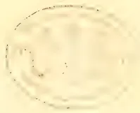A faint, circular embossed seal or stamp is centered on the page. The seal features a decorative border and contains some illegible text or a crest in the center. The embossing is subtle, creating a slight indentation and a raised border.

21------------------------------------------------

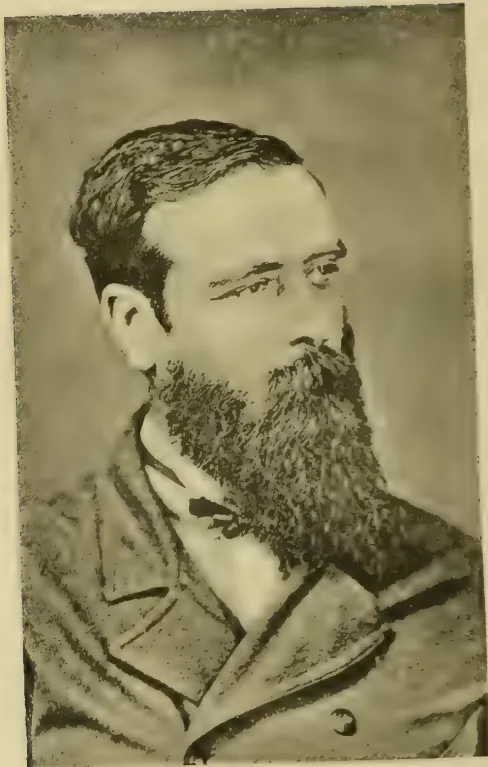A black and white portrait of a man with a full, dark beard and mustache. He is looking slightly to the right of the camera. He is wearing a dark suit jacket over a light-colored shirt and a dark bow tie. The portrait is set against a plain, light-colored background.

JAMES TAYLOR, Esq.

*Tropical Agriculturist Portrait Gallery,  
No. XI.*

22------------------------------------------------

# \* The TROPICAL AGRICULTURIST \*

## ∞ MONTHLY. ∞

Vol. XIV.]

COLOMBO, JULY 2ND, 1894.

No. 1.

## "PIONEERS OF THE PLANTING ENTERPRISE IN CEYLON."

### JAMES TAYLOR,

PLANTER FROM 1852 TO 1892; PIONEER IN CINCHONA AND TEA PLANTING IN CEYLON.

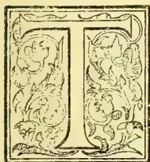

HE subject of this brief memoir lived a very quiet, retired life for nearly all his sojourn in Ceylon as Superintendent of the Loole Condéra plantation in the Hewaheta district. He would have been the last to seek or desire public notice; but the fact that he was one of the very first of Ceylon planters to experiment in the cultivation of both Cinchona and Tea, and the very careful way in which James Taylor persevered with both products to the establishment of successful industries, fully merits that his name should be included among CEYLON'S PLANTING PIONEERS, although his term of residence began a good deal later than that of most of the Colonists hitherto noticed in these pages. In one respect James Taylor stands unique among our biographies: he never was a "proprietor\*" but continued from first to last on the same plantation (never returning home even on a holiday !), the very ideal of a faithful, hard-working, intelligent Superintendent and a more devoted, reliable Manager an absent estate proprietor never had in Ceylon.

We now proceed to give all the facts within our reach, that go to make up a brief memoir

of James Taylor. For the following account of his early days and first Ceylon engagement, we are indebted to an Edinburgh correspondent:—

James Taylor was born at Mosspark, Monboddo, on March 29th, 1835. His father, who survives him and is now in his 84th year, was a respectable hard-working man, and his mother, Margaret Moir, was daughter of Robert Moir, of Laurence-kirk. James was the eldest of a family of six and deeply attached to his mother, whose death took place in 1844 when her little son had just completed his ninth year. This was to him a bitter sorrow and irretrievable loss, and after this, his home life was a sad one. James was educated at a school, in the lovely village of Auchenblae, which stands at the entrance to the beautiful glen of Drumtochty. His teacher, Mr. David Soutar, was a good and painstaking man, much beloved by his scholars in whom he encouraged a love of learning, and many of them made their mark in the world after Mr. Soutar's departure for Australia. In those days James Taylor is remembered by his minister as "a quiet, steady-going lad with prominent eyes and eyebrows and a heavy but thoughtful expression." When his father married again, home life became almost unbearable to the young lad who was no favorite with his stepmother. As he grew older he disliked what he considered the drudgery of farm-life, and pleaded with his father to allow him to continue his education or

\* As will be seen farther on, this has to be slightly qualified through Mr. Taylor having had for a very short time, a share in a small cinchona plantation,

23------------------------------------------------

2THE TROPICAL AGRICULTURIST.[JULY 2, 1894.]

learn a trade. Unfortunately his father had no sympathy with his son's eager pursuit after all kinds of solid and useful learning, and gave no encouragement to his desire to leave home and push his way in the world. At length Mr. Peter Moir, a native of Laurencekirk and a cousin of his mother, hearing how James Taylor was situated at home, helped him to an introduction to Messrs. Hadden of London, who were then sending young men out to Ceylon as assistants on plantations. James Taylor's engagement ran as follows:—

"MESSRS. G. & J. A. HADDEN, LONDON.  
"October, 1851.

"I hereby engage myself to Mr. George Pride of Kandy, Ceylon, for the space of three years to act in the capacity of Assistant Superintendent, and to make myself generally useful, at a salary of £100 per annum to commence from the time of my arrival on the estate and to have deducted from my salary the amount of money advanced for my passage and outfit.

"I am, gentlemen, your obedient servant,  
"(Signed) JAMES TAYLOR."

The young man sailed from London on October 22nd, 1851, when in his seventeenth year. That he had trials for some time in his new sphere as in his native land we learn from a letter written home some years afterwards, in which he says:—"The first two years in Ceylon were the most uncomfortable in my life." Another time he sends his respects to all old schoolfellows, adding:—"We were a noble lot, and how well many of us have got on, especially John Ross, now Rector of Arbroath Academy." It seems James Taylor was a pupil-teacher under Mr. Soutar for some time before coming to Ceylon.

We are able to supplement the above with some reminiscences of a contemporary, Mr. A. Morrison, who is still in our midst as a veteran planter. Mr. Morrison saw James Taylor in 1851, and reports as follows:—

"He was a big-headed, large-chested, burly lad, looking a picture of robust health, and had come to Fettercairn to confer with Henry Stiven in regard to coming out to Ceylon as coffee planter, both having been engaged by Mr. Peter Moir (then at home for the first time after nine years in the Island on the Haddens' estates) to come out here as Sinna Durais for the Prides on, I believe, three years' engagement on £100 a year. Both left Scotland towards the end of 1851, and coming round the Cape, must have arrived at Colombo in the early part of 1852. On arrival, Taylor was sent to Loole Condera and Stiven to Ancombera. I believe Taylor had as P. D. Mr. Williams who shortly afterwards re-opened old Sinnapittia and part of Weyangawatte as coffee estates for

Capt. Henry C. Byrde. When I came out in 1857, Taylor was manager of Loole Condera and Waloya, the greater part of which he had opened and never left until the time of his death after about 41 years' residence."

It may be surmised that there was nothing for the first 15 or 16 years, in the career of James Taylor as Assistant and afterwards full Superintendent on Loole Condera (of which Mr. George Pride was the then proprietor) to mark him off from his fellows, not even perhaps in his very close application to the duties allotted to him. In his turn, he had a succession of assistants who profited by his experience and careful mode of working, and all of whom seem to recall their former chief with feelings of esteem and regard.\* Among them was Mr. George Maitland, another veteran still with us, who went to Loole Condera as "sinne durai" to learn the mysteries of "coffee planting" in 1861, and who returned—strange to say—for some months in 1884 to pick up "all about tea," the new product which was then clearly destined to supersede the old staple, coffee. Another of his Assistants was Mr. P. R. Shand who was on Loole Condera in 1874, when Mr. Taylor took his first and only holiday out of Ceylon,† and even then he combined instruction with pleasure; for, his destination was Darjiling, where he doubtless observed and took notes of everything connected with tea as then cultivated and prepared. Before this, however, Mr. Taylor has been a pioneer in Loole Condera, under the instructions of his proprietors, Messrs. Harrison and Leake (then constituting Keir, Dundas & Co., Kandy) with another product, namely, cinchona. There is no need that we should here repeat the story (which we have so fully narrated in the "Ceylon Handbook and Directory") of the "failure of coffee," or of the rise of the colony to the first importance as a producer of cinchona bark, until

\* Here is a list of as many of Mr. Taylor's Assistants besides those given in the text, as we have been able to get:—Messrs. John Scott, J. H. Campbell, J. M. Pardon, E. S. Anderson, W. G. Mackilligin (now of Coorg or Mysore), G. F. Traill, H. F. Dunbar, Geo. E. Bowley, A. L. Scott, F. E. Waring, H. Bressy, Hugh Miller, A. C. Bonner, C. H. T. Wilkinson and J. G. Forsyth.

† One of James Taylor's little peculiarities was that when he opened a bottle of beer, which he did pretty often in the old days, he always poured a little on the floor. This was a good plan of clearing any dust from the cork out of the neck of the bottle, but it would have done equally well if a little of the beer had been poured into a glass kept for the purpose. No amount of "chaff," however, would make old Taylor alter this habit, and on a day when he had a number of visitors at his hospitable bungalow, the floor would be very wet indeed.—*Planting Correspondent.*

24------------------------------------------------

JULY 2, 1894.]THE TROPICAL AGRICULTURIST.3

the price of quinine fell to a rate that left no margin for the Ceylon planters; nor yet again of the rapid way in which "tea" became our staple, and its cultivation, an industry of importance as overshadowing as ever coffee was in the history of the island. Suffice it to say, that the first instalment of cinchona bark harvested on a Ceylon plantation was prepared by Mr. Taylor on Loole Condera in July 1867, and reached the London market early in 1868, when Mr. John Eliot Howard, the Quinologist, gave a favourable report upon it.\* Both *Succirubra* (red) and *Officinalis* (crown) barks were represented in this first consignment, and so satisfactory were the report and prices realized, that all the officinalis plants available in the Hakgala Government Gardens were at once got for Loole Condera, and early in 1870 a ton of bark was peeled and sent to London and sold well as also further shipments in 1871 and succeeding years.

But simultaneously with his attention to cinchona, did Mr. Taylor engage in cultivating a far more important product, Tea. So far back as 1865, by Mr. Harrison's orders, the Superintendent of Loole Condera began to get tea seed from Peradeniya Government Gardens, and early in 1866 he was able to put out tea plants along the sides of the roads or paths through the coffee plantation. At the instance of Mr. Leake, a special Inspection of and Report on the Assam Tea Districts by Mr. Arthur Morrice was got in that year, and this led to an importation of Assam-hybrid tea seed for the benefit of Loole Condera. Mr. Taylor's first tea clearing of 20 acres was felled in the end of 1867, and this may be considered as about the oldest regularly cultivated and cropped field of tea in Ceylon, and as such it has been the subject of report, year by year, the account being still that the tea (26 years old) is full of vigour and yields crop at the rate of from 450 to 500 lbs. per acre. We need say nothing as to the progress of the industry under Mr. Taylor's care from the early days when upwards of 2s. per lb. was readily got for the new Ceylon (Loole Condera) tea, and when Governor Sir William Gregory did so much to make its merits known, and to encourage the extension of the cultivation. Mr. James Taylor's experience and other incidental references are very fully recorded in the letter in which, in September 1891, he acknowledged a letter from the Planters' Association forwarding a testimonial that had

\* Mr. Howard wrote:—"There must be something in the soil or climate of Ceylon peculiarly adapted to the perfect growth of this plant."

been subscribed for in his honour. The Secretary's letter was as follows:—

"Secretary's Office, No. 42, King Street,  
Kandy, August 31st, 1891.

To James Taylor, Esq., Loole Condera.

"Dear Sir,—I have to perform the pleasing duty of handing you on behalf of the subscribers the accompanying tea and coffee service. On the silver salver is engraved the following inscription:—

'To James Taylor, Looleconda, in grateful appreciation of his successful efforts which laid the foundation of the Tea and Cinchona Industries of Ceylon 1891,'—and no words are needed to express the hearty and representative nature of the testimonial.

"You are doubtless aware that a portion only of the 'Fund' subscribed has been devoted to the silver tea set; a cheque for the balance will be sent to you so soon as the accounts have been received and closed.—I am, dear sir, yours faithfully,

(signed) A. PHILIP.  
Secretary to the Planters' Association of Ceylon."

From Mr. Taylor's reply, we quote as follows:—

"In acknowledging receipt of the Testimonial I feel that I do not know how to express my thanks for the honour and reward it gives me for my original successes in Tea-making and Cinchona cultivation. It had been publicly mentioned on several occasions that I was the first successful tea-maker in Ceylon or in the beginning the most successful. I was fully satisfied with that, and it was a startling surprise to me when I saw mention made in the newspapers of this testimonial.

"The credit for the starting of the tea industry as well as cinchona planting in Ceylon belongs to Messrs. Harrison and Leake as Keir, Dundas & Co. who were my employers and proprietors of Loole Condera. It was they who allowed me to plant cinchona and ordered me to plant tea, and it was they who paid for these things and stood the risk of failure. I took much interest in these cultivations, for I had before thought myself that surely something else besides coffee could be profitably grown on our estates.

"With regard to the manufacture of tea I learned that mainly from others and from reading, but it took a lot of experimenting before I was very successful. About the time we began planting China tea from seed got from Peradeniya Garden a Mr. Noble, an Indian tea planter from Cachar, passed through to see a neighbouring coffee estate that some of his friends were interested in, and I got him to show me the way to pluck and wither and roll tea with a little leaf growing on some old tea bushes in my bungalow garden. It was all rolled by hand then. He told me about fermenting and panning and the rest of the process as then in vogue, showing me the fermenting and panning as far as circumstances permitted. After that I frequently made experimental lots as I got leaf to pluck.

"Afterwards when Mr. Jenkins of the Ceylon Company, an old Assam tea planter, came to the country he called on me and I made a batch of tea under his direction. A sample of this and samples of seven lots that I had made before were then sent up to Calcutta together to be reported upon and valued. Mr. Jenkins' sample was valued a little higher than any of mine, but mine were also pronounced good except one indifferent and one spoiled. With these exceptions both Jenkins' sample and the rest of mine were said to be better than most of the Indian teas that were being sold in Calcutta at the time. From this I saw that I had been making tea rightly enough, but as I could not get it to taste like the China tea of the shops, I had been always varying my process and spoiling batches of it in various ways, sometimes purposely to see the nature of the results and throwing away lots that were no doubt really good tea, some of which was used by other people and pronounced good. Nevertheless I benefited largely by Mr. Jenkins in various ways, and that sample of his being better than mine settled me as to the degree to go to in the

25------------------------------------------------

4THE TROPICAL AGRICULTURIST.[JULY 2, 1894.]

different parts of the manufacturing process and gave me confidence.

"Up till this time all my makings of tea had been made with arrangements in the bungalow verandah and godowns. But I got a tea house finished soon after and regular tea making then became a necessary part of the working of the estate. Afterwards Mr. Jenkins put up a temporary tea house on Condegalla which I was surprised to find was a copy in all its working parts and arrangements of the one I had built which was according to a plan of my own and different from the style of Indian tea houses, and Mr. Jenkins did not like it when he first saw it.

"But Mr. Jenkins did not then make as good tea as I did. On visiting his tea house I found his tea very different from the lot he made with me and very different from what I was making; and his fermenting which I saw by ramming the roll as hard and tight as possible into a box was a plan that I had tried in the beginning of my experiments, but long before given up as a failure. The lot Mr. Jenkins made with me at Loole Condera was not fermented that way. One day I was in the coach going up to Nuwara Eliya with Mr. Parsons, Government Agent of Kandy, and some apparently stranger friend of his. Mr. Parsons did not know me, but I knew who he was. When we were passing the old patch of tea in Condegalla, Mr. Parsons pointed it out to his friend as being tea. His friend then asked if they made tea there. Mr. Parsons said: "Yes, they make tea here, but they do not make good tea here, the favourite tea is made on another estate they call Loole Condera," and from other quarters I heard the same.

"A Mr. Baker, a tea planter from Assam called, on me after my original field of Hybrid Tea was well grown up and showed me that I had not pruned it sufficiently in the pruning I had just then finished, and I pruned it all over again. I also saw light pruning and heavy cutting down of Hybrid tea in the Darjeeling Terrai in 1874 just before their plucking season commenced. Afterwards when Mr. Cameron came and took to visiting tea estates I was pleased to find that his pruning so far as I saw of it on Mariawatte seemed to entirely agree with what I had done.

"But Mr. Cameron started finer plucking than I had been doing, and began to top the sale lists which I think we began to get about that time or very shortly before. When I found this I also took to weekly plucking and topped the sale lists for a time. That finer plucking largely increased the selling prices of my tea, and still more largely the profit per acre. So I was greatly indebted to the example of Mr. Cameron, though I only met him two or three times casually about Kandy and Gampola.

"Regarding cinchona we were not the first to plant a few trees or even a small patch, but we were the first to regularly cultivate a few acres and to test the value of the bark in the market, and then to start the cultivation on a large scale. Our experiences as to raising seedlings in field nurseries, and that the bark of diseased trees if taken in time was valuable, and so on, must have been useful to others who planted later.

"Looking back to the beginning of our Cinchona and Tea experiments and recollecting how little they were generally thought of at the time, especially by some of my acquaintances whom I most respected as in various ways superior to myself, and now seeing this testimonial, makes me feel that the battle is not always to the strongest. The first person I believe who thoroughly appreciated our experiments and who really foresaw the necessity of new cultivations in Ceylon was Sir William Gregory; and Ceylon Tea is more indebted to Sir Wm. Gregory who so patronised it and gave it fame than we can ever know.

"Now I thank all who have helped towards this testimonial and the office-bearers of the Planters' Association who have taken trouble with it, and Mr. P. R. Shand who as I learned from the news-

papers took part in initiating the matter, and especially I thank Mr. Wall who first proposed it to the Association in words which are of themselves a grand testimonial, and who has taken a leading interest in it all through. It made me feel confused and surprised that I should be thought worthy of such honour as well as of the kind things said of me at that meeting by its Chairman and Mr. W. Mackenzie.

"The Testimonial is not only a valuable one, but one of a kind to make me remembered after I am not here. It will make my name and that of Loole Condera live in the history of Ceylon. I shall be proud of it though abashed in the receiving of it."

We may mention that the only proprietary interest in land we can learn Mr. Taylor ever had, was in Lover's Leap, Nuwara Eliya, which he opened as a Cinchona plantation, Mr. John Duncan being co-proprietor with himself. But after a year or two when mercantile troubles arose in Colombo, the whole place was taken over by mortgagees at home.

Little remains to be added. Forty years of continuous plantation work had told on James Taylor. The planters' testimonial seemed to crown his labours; but other disappointments due to a change in the proprietorship of Loole Condera told on his health and spirits, and he did not long survive, the end coming on the 2nd May 1892, when he had well rounded his fortieth year in the Island. His remains found a last resting-place in the Cemetery at Mahaiyawa, Kandy, rather than in the quiet "God's acre" attached to the little Deltota Church within sight of the plantation on which he had so long laboured, and with which James Taylor's name will ever be connected:

"Now the labourer's task is over."

Above the grave a memorial stone was raised bearing the following inscription:—

IN PIOUS MEMORY

OF

JAMES TAYLOR

OF LOOLECONDERA ESTATE, CEYLON

THE PIONEER OF THE

TEA AND CINCHONA ENTERPRISES

WHO DIED MAY 2ND 1892

AGED 57 YEARS.

THIS STONE WAS ERECTED

BY HIS SISTER AND MANY FRIENDS IN CEYLON.

So passed away a model Ceylon pioneer planter, an upright, industrious superintendent and good man. Relatives in distant lands had often got help from James Taylor who, for years, had made an allowance, among the rest, to the widow of a brother who died in America. But it is for the service rendered to the colony by a series of intelligent, careful, and successful experiments in the cultivation and preparation of both Cinchona and Tea that the name of James Taylor of Loole Condera will always be had in remembrance and esteem among the planting community of Ceylon.

26------------------------------------------------

JULY 2, 1894.]THE TROPICAL AGRICULTURIST.5

### THE APPOINTMENT OF AN ENTOMOLOGIST IN CEYLON.

It seems passing strange that at a time when the Government of India has expressed a readiness to appoint not one Entomologist, but two or three such scientists for the benefit of agriculturists throughout the country including tea planters, Mr. Haly should virtually tell us—in his letter given elsewhere—that what has already been done in India removes the necessity for any appointment at all in Ceylon. We are, in fact, to go on depending on, and learning from India! "Annexation"—with all its dreaded drawbacks—would at least bring us the *direct* service of the Entomological and also of the Geological Staff of India. The deficiency that most marks the official letters before us, is the absence of any recognition of the needs of coconut as well as tea planters, and indeed of our native agriculturists generally. The accomplished Director of the Botanic Gardens writes as if only the tea planters were concerned whereas perhaps the question of insect pests is an even more vital one for the coconut cultivator. After the devastation (even though temporary) wrought on certain tea estates some months ago—and all that we have seen of the ravages of the coconut beetles—it scarcely does, in our opinion, to speak lightly of our insect enemies in Ceylon.

But it is not so much in reference to lack of knowledge regarding local insect pests among the agricultural community, that the Government might well be requested to take action. We know that the hope of a great many planters in urging the appointment of an Entomologist was that the office might be associated with certain legislation by which careless agriculturists could be compelled—on the report to Government of a responsible officer—to do their duty in capturing or killing any pest, or in clearing away debris calculated to afford a breeding-ground. Our series of articles in reference to the effect of such neglect on coconut cultivation will not be forgotten by our readers, or the practical illustration afforded in the case of Mr. W. H. Wright of Mirigama, who is in the habit of paying the owners of native gardens adjoining his property, for the privilege of entering on their grounds, and taking and burning beetle-infested palms at the rate of 50 cents per tree. Now, owners who do their duty by their land ought not to have such a tax imposed on them, and indeed very often native neighbours are not accommodating enough to allow entrance to their grounds on a destructive mission, even for a consideration. And, moreover, natives are not the only culprits. From the Kelani Valley last year and early this season there came several complaints of estate owners or managers who seemed so inert or indifferent about capturing *helopeltis*, that their more energetic neighbours felt as if *their* labour was in vain, since the pest, multiplying on adjacent tea, flew in to the bushes which had been cleared. If we remember rightly, Mr. G. A. Talbot published a letter on the need of simultaneous and sustained effort in a campaign against the chief insect enemy of tea; but it is most difficult to secure this desirable end; and practically impossible, save under official influence, where natives are concerned.

It will be asked then what should the Sub-Committee or Committee of the Planters' Association do in the face of the rather discouraging letters from the three "Directors," and the evident disinclination of our Government to follow the example of that of India? Well, if we were in their place, we should act on the principle—"Better half a loaf than no bread." We would accept,

and back up, Mr. Haly's recommendation that an Entomological Referee in the person of Mr. E. E. Green of Pundaluoya should be appointed by Government; but apart from fees for special work, we think the Government ought to pay a certain retaining fee, of at least R1,000 per annum, to enable Mr. Green to deal with general inquiries from native as well as planting and other correspondents, and to impart information in such cases. Mr. Green can scarcely be expected to charge a fee for each letter, and yet references are sure to be made to him which can be dealt with by correspondence without any personal visit. Later on, and arising out of Mr. Green's work as a Visiting or Inspecting Entomologist, may come up the question of whether there ought to be any special legislation to enforce a prompt and uniform campaign against the insect enemies of tea, coconuts, paddy or any other product.

### THE PROPOSED ENTOMOLOGIST FOR CEYLON.

#### THE OPINIONS OF DR. TRIMEN, MR. HALY AND MR. CULL.

KANDY, June 20.

SIR,—I enclose for publication copy of correspondence with Government regarding the appointment of an Entomologist for Ceylon.—I am, sir, yours faithfully,

A. PHILIP.  
Secretary to the Planters' Association of Ceylon.

Kandy, Feb. 28th.

To the Hon. the Colonial Secretary, Colombo.

SIR,—I have the honour to submit for the consideration of Government the annexed copy of a resolution passed at a recent General meeting of the Planters' Association of Ceylon.—I am, sir, yours most obedient servant,

(Signed) A. PHILIP.  
Secretary to the Planters' Association of Ceylon.

#### RESOLUTION REFERRED TO,

That the Government be asked to arrange for the appointment of an Entomologist to be attached to the Colombo Museum.

Colonial Secretary's Office, Colombo, March 10th.

SIR,—With reference to your letter dated the 28th February 1894 submitting copy of a resolution, passed at a recent general meeting of your Association, requesting the Government to arrange for the appointment of an Entomologist to be attached to the Colombo Museum, I am directed to request you to be so good as to state for the Governor's information what class of officer the Association desires, what salary should be paid to him whether he should be paid by the Association, or by the general taxpayer, what should be his duties, what are the special objects to be served by the appointment in question, what are the present difficulties in now obtaining information on the subjects to be dealt with by the Entomologist, whether the officer should be permanently employed or for a term of years only, and any other information which in the opinion of the Association would enable the Governor to arrive at a decision on the subject.—I am &c.

(Signed) H. HAY CAMERON, for Colonial Secretary.  
The Secretary to the Planters' Association of Ceylon.

Kandy, 20th April 1894.

To the Hon. the Colonial Secretary, Colombo.

SIR,—Having laid your letter of the 10th ultimo, on the subject of a Government Entomologist for Ceylon before the Committee of the Planters' Association a Sub-Committee was appointed to reply to your enquiries.

27------------------------------------------------

6THE TROPICAL AGRICULTURIST.[JULY 2, 1894.

I am now requested by this Sub-Committee to submit for the consideration of His Excellency the Governor the following as embodying their opinions in reference to the various points mentioned in your communication.

**WHAT CLASS OF OFFICER THE ASSOCIATION DESIRES?**—The best Entomological Scientist available for the salary, the Government deems sufficient to attract such an officer.

**WHAT SALARY HE SHOULD BE PAID?**—The Committee do not think a first class Entomologist can be procured for a less salary than R5,000 per annum with the usual travelling allowances.

**HOW SHOULD HE BE PAID.**—The Committee is of opinion that he be paid out of the General Revenue, as his services would be available for all the agricultural classes of the community throughout the island, native as well as European, besides giving lectures to the students at the School of Agriculture and the Royal College.

**WHAT SHOULD BE HIS DUTIES?**—So far as the planting community is concerned to investigate insect pests as they are brought before him by managers of estates, to visit the infected localities, and to suggest remedies for their prevention and extermination. The Government will no doubt make the best arrangements for his investigating the insect pests which so seriously affect native growers of paddy, coconuts, &c.

**WHAT ARE THE SPECIAL OBJECTS TO BE SERVED BY THE APPOINTMENT IN QUESTION?**—Although the preceding paragraph partly answers this question a sentence from a recent work on "The Chemistry and Agriculture of Tea" by Mr. M. K. Bamber, Calcutta, will better serve to explain the position, viz:—Although most of the blights, with "their life history, have been described, the information given is not always complete, and few planters know the changes undergone and the period at which such changes occur. Such knowledge is very necessary in most cases to enable the planter to attempt the destruction of the blights with any prospect of success, as they must be attacked when in their most vulnerable condition. It is probable that the period of change is not exactly the same in all districts, being affected by climatic and other conditions but careful daily examination of suspected blighted bushes, with the aid of a microscope, or ordinary glass, and recording observations would reveal the stages in the life of many of the minute insect blights and enable the observer to apply insecticides, or adopt other means of eradication at the most suitable time."

**WHAT ARE THE PRESENT DIFFICULTIES IN OBTAINING**

**INFORMATION ON THE SUBJECTS TO BE DEALT**

**WITH BY THE ENTOMOLOGIST, &c.?**

At the present time when any particular blight or insect pest makes its appearance we have no official specialist to whom we can apply for information. Some few years ago serious attacks of *Helopeltis* affected cacao to such an extent that the extension of this product was checked for a time, and the value of cacao property affected. Within the last year or so *Helopeltis* has seriously damaged the tea fields in some parts of the low country, and has not been altogether unknown even upcountry. In India in the District of Dooars especially, whole estates were reported to have been abandoned for a time at least on account of mosquito blight. Other diseases in the Ceylon Tea Districts such as Rust and Red Spider and the attack of a species of moth are not uncommon yearly and may increase as tea cultivation becomes more extended and the great area of young tea planted comes into full bearing.

**WHETHER THE OFFICER SHOULD BE PERMANENTLY EMPLOYED.**

We think that he should be engaged at first for a fixed period of three years.

Commending the observations of the Sub-Committee to the attention of the Government.—I am, sir, your most obedient servant (Signed) A. PHILIP, Secretary to the Planters' Association of Ceylon.

Copy.

Colonial Secretary's Office,  
Colombo, May 22nd.

SIR,—With reference to your letter dated the 20th April 1894 relative to a resolution passed by your Association requesting the Government to arrange for the appointment of an entomologist to be attached to the Colombo Museum, I am directed to transmit to you the annexed copies of reports made by the Directors of the Royal Botanic Gardens, of the Colombo Museum, and of Public Instruction, embodying their independent views on the subject and I am to state that His Excellency the Governor does not feel disposed to make any addition to the staff of the Museum.

2. I am to request you to be so good as to favour the Governor with an expression of the views of your Association on reconsideration of the question after a perusal of the reports now forwarded to you.—I am, &c. (Signed) H. WHITE, for Colonial Secretary.

The Secretary, Planters' Association of Ceylon, Kandy.

PROPOSED APPOINTMENT OF AN ENTOMOLOGIST.  
No. 29. Royal Botanic Gardens, Peradeniya,  
7th May 1894.

Sir,—In reply to the request contained in your letter No. 31 of 4th May, I have the honour to offer the following opinion on the subject referred to.

1. The request of the Planters' Association would appear on the face of it to be made in the interest of the Colombo Museum, but from the views expressed in the Secretary's letter of the 20th April, this does not seem to be actually the case. What is desired is that the duties of the proposed entomologist shall be the investigation of insect pests, and that his services shall be available for all agriculturists in Ceylon especially the managers of estates; he is also to give lectures (I suppose on economic entomology) at the School of Agriculture and the Royal College.

2. If, however, an official entomologist, were to be attached to the Museum, his first duty and principal work should certainly be the immediate care and arrangement of the Insect collections there, though this need not prevent him from carrying out, under proper direction, some of the objects above specified.

3. I am not in a position to say whether such assistance in that department of his charge be desired by the Director of the Museum, but I am of opinion that there is ample work for such an officer and that his appointment would relieve the Director and strengthen the Museum.

4. I feel strongly that, apart from such Museum-work, the duties proposed cannot be regarded as affording sufficient justification for the proposed appointment. The occurrence of insects in such abundance as to cause serious damage is a somewhat rare event; as a matter of fact crops in Ceylon are by no means specially liable to insect ravages and tea—the principal Estate cultivation—may be regarded as remarkably free from them. Moreover, as a rule, the investigation of the life and habits of insects presents little difficulty to anyone with ordinary habits of observation, being in this respect very different from that of fungus parasites which are very minute, and require for their full investigation much time and skill and familiarity with and experience in the use of the microscope and other instruments. As things are at present, the restriction of the work of the proposed entomologist to the investigation of insect pests could not legitimately occupy much of his time.

5. I have had considerable experience in the matter as it has been the practice with many planters and others to refer to me (though I have no special knowledge of insects) specimens known or suspected to be harmful to crops. A large portion of these are obviously harmless and I cannot but remark that a little observation would have revealed this to the senders. Mere curiosity of this sort might possibly be encouraged by the existence of such an official as asked for, and his time occupied unnecessarily.

28------------------------------------------------

JULY 2, 1894.]THE TROPICAL AGRICULTURIST:7

6. The Committee of the Planters' Association remark that there exists "no official specialist" to whom they can refer such matters. But in the Director of the Museum they have a skilled naturalist able and willing to give them all the information required in entomological work. He has, moreover, long had the generous assistance of a member of the Planting Community, itself Mr. E. E. Green of Pundalnoya, a first rate entomologist. If Government were to make the appointment asked for I would suggest no fitter occupant for it than this gentleman, who adds to his scientific abilities the experience of a practical planter. I may add here that I doubt if any trained entomologist specialist from England would feel inclined to take the post on the lines drawn out by the Planters' Association.

7. I cannot therefore recommend the appointment of an entomologist for the agricultural community alone, but I would support the appointment of an entomological assistant to the Director of the Museum who would also pay special attention to injurious insects.

8. I think that, if not already made, a reference of this matter should be made to the Director of the Museum to whom a copy of this letter might also be forwarded.—I am, &c.

(Signed) HENRY TRIMEN.

The Hon'ble the Colonial Secretary, Colombo.

PROPOSED APPOINTMENT OF AN ENTOMOLOGIST FOR THE No. 37. COLOMBO MUSEUM.

Colombo Museum, May 15, 1894.

Sir,—With reference to your letter of the 4th instant calling for my opinion on the proposals of the Planters' Association of Ceylon for the appointment of an Entomologist, I have the honour to inform you that after due consideration and even after the careful perusal of the letter of the Hon. J. Buckingham, quoted in the *Observer* of the 12th instant, I cannot see the necessity of such an officer for the small area covered by Ceylon.

2. In the first place the whole of the results of the entomological section of the Agricultural Department of the Central Government of the United States are at our service and are in the Library of the Royal Asiatic Society, Ceylon Branch.

3. The Indian Museum Notes are also supplied to us by the Trustees of the Indian Museum. It is only last year that in Vol. III p. 46 details are given of a most successful method of treating red spider (*Tetranychus bioculatus*) by means of a sulphur, and another at page 49 by means of a Tomato, concoction and the whole publication is replete with information on every species of insect and the way of meeting its ravages.

4. An officer at say R5,000 per annum with R2,000 travelling expenses, peons and two clerks would do little more than read his Indian Museum Notes and apply the more or less successful treatments adopted therein and surely if the Notes were republished and distributed (perhaps gratis) the planters could do this for themselves.

5. An objection may be raised that in many cases the planter might not be able to say what it was that was affecting his crops. In all such cases I should be happy to do my best to determine the insect and to refer him to the proper remedies, at the same time, as Mr. Buckingham points out (Para. 9) it is very undesirable that Museum officers should be called upon for this class of duty.

6. In my opinion the case would be fully met by the appointment of an Entomological referee to the Ceylon Government who should not be paid a regular salary, but by fixed charges for consultation by letter or for visiting estates, &c. He must also have a good microscope with one of the best Glycerine immersion objectives, the publications of the United States and Indian Governments, and if needed other Governments, and such works of reference as he considers necessary.

7. I can heartily recommend Mr. E. E. Green of Eton, Pundalnoya, for such a post and feel confident

that he would be able to meet all the demands of either the Government or the Planters.—I am, &c.

Signed A. HALY, Director.  
The Hon. the Colonial Secretary, Colombo.

No. 34.

I hardly think that there is room for the inclusion of a systematic course of lectures on Entomology in the Royal College. Its curriculum is prescribed so exclusively by the various competitive examinations in which Entomology hardly finds a place, any extension on the scientific side of its curriculum must necessarily, in view of these examinations, be academic rather than specialistic.

As regards the School of Agriculture undoubtedly the introduction of a competent instruction in Entomological research would increase the utility of the school, especially as regards the insect ravages in native produce. But the school is still in its infancy, the numbers attending it are small, the area of instruction at present proposed is sufficient and cannot be extended without prospective loss of efficiency with regard to subjects already included in the course of instruction. The special subjects at present included are:—(1) Agriculture, (2) Veterinary science, (3) A school of Forestry, it is hoped to formulate under the direction of the Forest Department at an early date in connection with it, (4) and this will include Land Surveying and its germane subjects, (5) The ordinary education in English, Mathematics and Chemical sciences.

The programme seems to be sufficient "qua" education for the present.—(Signed) J. B. CULL, D. P. I 9-5-'94.

## WATTLE AS A MANURE.

(FROM OUR NILGIRI CORRESPONDENT.)

I am glad to see that this question is at last attracting some of the attention which it deserves, and am delighted to recognize in Mr. Leslie Rogers of Dehra Doon a kindred spirit in the matter of manuring experiments. He says he is himself trying various kinds of plant fertilizers to take the place of ordinary cattle manure; it would be of interest to know whether these are chemicals, artificials or green manure. Regarding the latter he wishes to know where he could get the wattles from and how and when these could be sown out. I shall be delighted to answer his questions as far as I am able. To begin with, an application to the Superintendent of the Government Gardens, Ootacamund ought to result in his getting as much seed as he required and at a not very prohibitive cost. The variety of wattle is that known as the common yellow Australian kind *Acacia dealbata*, and it grows freely—some think a great deal too freely—on waseland and on the roadside. It seeds abundantly if left to flower, and moreover sends out suckers from its lateral roots in all directions, so that once established in a place it is not at all an easy matter to get rid of it. As it moreover spreads very quickly care should be taken from the first to keep the stuff confined to the plot of land on which it is. A shallow ditch drawn round the wattle when one or two years old, and a clearing of its edges some three times a year should, however, amply suffice for this purpose. A great deal of rot is talked by some planters on the Nilgiris as to the awful curse the wattle has proved to owners of land on these hills, and its hideous way of spreading all over an estate. This is absolutely untrue, save in those cases where the gardens receive no cultivation save a yearly mamotie scraping. As these "totes" barely give enough return to pay their land-cases they may be practically classed as waste or abandoned land. Where careful cultivation is carried on the spreading of wattle is utterly impossible, and where it is planted up for the sake of manure, such simple measures as I have indicated are ample to keep the stuff within its proper boundaries, I would not have gone over this old ground again

29------------------------------------------------

8THE TROPICAL AGRICULTURIST.[JULY 2, 1894.]

but that I feel bound to give both sides of the question when it is proposed to introduce such a plant as a wattle into a new district. To briefly sum up the foregoing: many on these hills declare from their experience of the *Acacia dealbata* that it is a curse to the country; a few others have very opposite views; these latter would recommend planting it up all over the country, but the former heartily wish it had never left Australia.

However, if after this warning, Mr. Leslie Rogers still cares to take up the matter I will proceed to the next item—*i.e.*, when you have got the seed how to sow it. I should say that to begin with an acre would be quite enough to put down in wattle, in fact a quarter of an acre—yielding probably enough green manure for two to four acres—would be ample. Well, the land should be first cleared of all jungle, grass, etc., but roots, stumps, etc., can be left standing, and the seed can be sown broad-cast and lightly hoed or harrowed in in the showery season. Before the end of the year the wattle will have grown up some two feet, when the first crop can be cut level with the ground and subsequent cuttings may be taken every two or three months.

It is of importance to note that the chief value of the wattle lies in the nitrogen which is found in its tender leafy shoots; the wood itself being of but little manurial value. As to the quantity to be applied to each tree, I would recommend not more than 25 pounds of sun-dried tops previously passed through a chaff-cutter—to each tree.

I have mainly backed up using wattle as a manure on account of its growing in such abundance on these hills, but probably any leguminous plant would do as well. I do not know what kind of vetches you have up in Dehra Doon or other tea-districts up North, but surely seed could easily be obtained of the hardier and more prolific kind. The main point is I think, not to grow them among the tea itself, but to plant up a certain portion of land and merely cut what is required, dry it in the sun for a day or two, and apply direct to the field. By the way, it is as well to remember that deep pits are certainly not advisable to use for green manure, or in fact manure of any kind. The best method of all is to scatter the fertilizer broadcast immediately previous to a deep hoeing or forking, but if this is not practicable then long shallow trenches would do, covering the manure with only a very slight layer of soil.—*Indian Planters' Gazette*.

### MARAGOGIPE COFFEE.

This is a large-growing variety of Arabian Coffee found in Brazil and introduced to this country by Mr. Thomas Christy, F.L.S., in 1883. The plant has been grown in the Palm House at Kew and this year it has produced a good crop of fruit. It is large and vigorous looking, having, at first sight, much of the habit of Liberian Coffee. The leaves though fully twice the size of those of Arabian Coffee, have however, the papyrus texture and the undulating character distinguishing that species. The flowers, also are the flowers of *U. arabica*, and so are the cherries except in size. The latter are nearly an inch long, red and soft when ripe with a silky smooth surface and a very small proportion of pulp. The chartaceous integument knows as the "parchment skin," is thin as in Arabian Coffee and not hard and horny as in Liberian Coffee. The cleaned beans before drying, from fully 30 per cent by weight of the cherries, and in this respect Maragopipe Coffee is certainly very promising. From a culture point of view the heavy whippy branches may be a drawback, as also the very long internodes showing a considerable amount of barren wood. When first introduced maragopipe Coffee was described as follows: "It grows with extraordinary vigour, and trees three to four years old were already eight to ten feet high and full of fruit. The tree seems to come into full bearing much sooner than the ordinary coffee and the bean is very much larger ..... the weight of coffee per acre must be very much more than from the ordinary coffee tree." Although Maragopipe Coffee has

been grown experimentally in Ceylon, Java, Jamaica and Trinidad no reports have so far reached Kew as to the results. In Ceylon and Java the fact that it was attacked, equally with Arabian Coffee by the coffee-leaf fungus (*Hemileia vastatrix*) gave Maragopipe coffee no special advantage in those islands and possibly on that account it failed to receive attention. It is mentioned, however, in the *Tropical Agriculturist* (Vol. IV., p. 494), that a large quantity of seed was shipped to Ceylon direct from Brazil in 1884. As regards the West Indies, the Superintendent of the Botanic Gardens, Trinidad, mentions Maragopipe coffee as one of the sorts cultivated at that establishment in 1887. At Jamaica seed was received in 1883 and about a dozen plants raised from it were distributed for trial amongst the leading planters in the Blue Mountain district during 1884 and 1885.

The following account is extracted from the *Transactions of the Queensland Acclimatisation Society* for June 1893 (p. 56):—

"The demand for coffee plants during the past year has been on the increase, 5,956 plants having been sent from the gardens. These have been planted at various places along the coast, at Mackay, Bundaberg, Maryborough, Gympie, Maroochrie, Mooloolah, Cleveland, &c. The kinds sent were varieties of the Arabian and a few plants of the *Maragopipe*, or Brazilian Coffee, have also been distributed. The important plant of this fine coffee, originally introduced from Kew [*Report*, 1890, p. 14] growing in the society's gardens, is this season bearing heavily, and a large stock of plants will be raised from seeds for next year's distribution. Two hybrid coffee plants are also in full bearing this season. One of these plants has shown a distinct character; the cross was effected between the Mocha and the *Maragopipe*, the pollen from the latter being used to fertilise the Mocha."—*Kew Bulletin*.

### VARIOUS PLANTING NOTES.

QUININE AT POST OFFICES.—Up to the close of last year, over a million-and-a-quarter pie packets of quinine were sold by the Post Offices of Bengal. If, it is announced, the distribution continues to be worked at a profit, it may be possible to allow a larger commission, or some reduction in price, to purchasers of large quantities. It is impossible to reduce the price below one pie per packet, or to increase the dose above five grains; and as it is not the object of Government to make any profit from the industry, reductions calculated to encourage agents to push the sale of the packets are the only means of absorbing any balance on the credit side.—*Englishman*.

COFFEE AS AN ANTISEPTIC.—The experiments of Luderitz, of Vienna, tend to establish the belief in the antiseptic properties of coffee. A strong solution of coffee, for example, ended the career of a bacillus of typhoid in about twenty-four hours, the active streptococcus of erysipelas in twelve hours, while not longer than from three to four hours was sufficient to kill the malignant comma bacillus of cholera. Strong decoctions acted more quickly still; the effects, however, are stated to be due more to the products of the roasting of the coffee than to the active principle of the berry. In this connection it has been pointed out by a correspondent of the *Indian Medical Gazette* that it would be worth while to substitute coffee for tea among the cases of enteric fever in the European hospitals in India. Coffee also might be given a trial in the treatment of typhoid fever in this country. As a beverage, doubtless, it would be appreciated by the patient, and in the light of Luderitz's researches there is just the possibility that it might have some controlling influence over the disease.—*Public Opinion*.

30------------------------------------------------

JULY 2, 1894.]THE TROPICAL AGRICULTURIST.9

## CEYLON MANUAL OF CHEMICAL ANALYSES.

A HANDBOOK OF ANALYSES CONNECTED WITH THE INDUSTRIES AND PUBLIC HEALTH OF CEYLON FOR PLANTERS, COMMERCIAL MEN, AGRICULTURAL STUDENTS, AND MEMBERS OF LOCAL BOARDS.

By M. COCHRAN, M.A., F.C.S.,

(Continued from page 802.)

### CHAPTER XIII.

#### DISINFECTANTS, ANTISEPTICS AND DEODORIZERS.

DEFINITIONS OF DISINFECTANTS, ANTISEPTICS AND DEODORIZERS—EXPERIMENTS TO DETERMINE THE AMOUNTS OF ANTISEPTIC SUBSTANCES REQUIRED TO PREVENT AND TO CHECK PUTREFACTION—CHLORINE AND CHLORINATED LIME—PERMANGANATE AND MANGANATE OF POTASSIUM—HARTMAN'S CRIMSON SALT—PHENOLS—CARBOLIC ACID—DR. CALVERT'S EXPERIMENTS—LYSOL—CHIEF ANTISEPTICS USED AS FOOD PRESERVATIVES—CHIEF DEODORIZERS—DIRECTIONS FOR THE USE OF CARBOLIC ACID CRYSTALS, &c.—JEYES' DISINFECTANTS.

##### *Disinfectants, Antiseptics and Deodorizers.*

Disinfectants are bodies which destroy disease germs. Disinfectants are also antiseptics. Antiseptics are bodies which prevent putrefaction, but do not necessarily destroy living germs. Antiseptics therefore may or may not be disinfectants. Deodorizers absorb or destroy unpleasant odours; but do not necessarily act either as antiseptics or disinfectants.

In Thorpe's "Dictionary of Applied Chemistry," in the article on Disinfectants by A. H. Allen, to which I am indebted for a number of the following facts and figures, the results of experiments to determine the amounts of antiseptics required to prevent and check putrefaction in a liquid of known composition are given. Pasteur's liquid was used, consisting of 10 grams common sugar, 1 gram tartrate of ammonium and half a gram of phosphate of potassium in 100 cubic centimeters of distilled water. A number of tubes were filled with this solution together with different amounts of the antiseptic, and a few drops of a decomposing infusion of tobacco. The following table

shows the smallest amounts of antiseptics which prevent the development of bacteria:—

<table>
<thead>
<tr>
<th></th>
<th>1 part in</th>
</tr>
</thead>
<tbody>
<tr>
<td>Corrosive sublimate ...</td>
<td>20,000</td>
</tr>
<tr>
<td>Thymol ...</td>
<td>2,000</td>
</tr>
<tr>
<td>Sodium benzoate ...</td>
<td>2,000</td>
</tr>
<tr>
<td>Creosote ..</td>
<td>2,000</td>
</tr>
<tr>
<td>Benzoic acid ...</td>
<td>1,000</td>
</tr>
<tr>
<td>Methyl salicylic acid ...</td>
<td>666</td>
</tr>
<tr>
<td>Eucalyptol ...</td>
<td>666</td>
</tr>
<tr>
<td>Sodium salicylate ...</td>
<td>250</td>
</tr>
<tr>
<td>Carbolic acid ...</td>
<td>200</td>
</tr>
<tr>
<td>Quinine ...</td>
<td>200</td>
</tr>
<tr>
<td>Sulphuric acid ...</td>
<td>151</td>
</tr>
<tr>
<td>Boric acid...</td>
<td>133</td>
</tr>
<tr>
<td>Cupric sulphate ...</td>
<td>133</td>
</tr>
<tr>
<td>Hydrochloric acid ...</td>
<td>75</td>
</tr>
<tr>
<td>Zinc sulphate ...</td>
<td>50</td>
</tr>
<tr>
<td>Alcohol ...</td>
<td>50</td>
</tr>
</tbody>
</table>

The smallest amounts which would arrest putrefaction and render the bacteria incapable of further development when removed to fresh Pasteur's solution, were found to be as follows:—

<table>
<thead>
<tr>
<th></th>
<th>1 part in</th>
</tr>
</thead>
<tbody>
<tr>
<td>Chlorine ...</td>
<td>25,000</td>
</tr>
<tr>
<td>Iodine ...</td>
<td>5,000</td>
</tr>
<tr>
<td>Bromine ..</td>
<td>3,333</td>
</tr>
<tr>
<td>Sulphurous acid ...</td>
<td>666</td>
</tr>
<tr>
<td>Salicylic acid ...</td>
<td>312</td>
</tr>
<tr>
<td>Benzoic acid ...</td>
<td>250</td>
</tr>
<tr>
<td>Methyl salicylic acid ...</td>
<td>200</td>
</tr>
<tr>
<td>Sulphuric acid ...</td>
<td>161</td>
</tr>
<tr>
<td>Creosote ...</td>
<td>100</td>
</tr>
<tr>
<td>Carbolic acid ...</td>
<td>25</td>
</tr>
<tr>
<td>Alcohol ..</td>
<td>4.5</td>
</tr>
</tbody>
</table>

As a disinfectant or antiseptic, chlorine is mostly employed in the well-known form of chlorinated lime, or bleaching powder, which is often represented by the chemical formula  $\text{Ca}(\text{OCl})_2 + \text{CaCl}_2$ , but better represented by  $\text{Ca}(\text{OCl})\text{Cl}$ , seeing that in good bleaching powder nearly all the chlorine is available, a very small proportion being present as chloride. Thus a good bleaching powder has the following composition:—

##### *Analysis by J. Pattinson.*

<table>
<thead>
<tr>
<th></th>
<th>per cent.</th>
</tr>
</thead>
<tbody>
<tr>
<td>Available chlorine ...</td>
<td>37.00</td>
</tr>
<tr>
<td>Chlorine as chloride ...</td>
<td>35</td>
</tr>
<tr>
<td>Chlorine as chlorate ...</td>
<td>25</td>
</tr>
<tr>
<td>Lime ...</td>
<td>44.49</td>
</tr>
<tr>
<td>Magnesia ...</td>
<td>40</td>
</tr>
<tr>
<td>Peroxide of iron ...</td>
<td>05</td>
</tr>
<tr>
<td>Alumina ...</td>
<td>43</td>
</tr>
<tr>
<td>Oxide of manganese ...</td>
<td>trace</td>
</tr>
<tr>
<td>Carbonic acid ...</td>
<td>18</td>
</tr>
<tr>
<td>Siliceous matter ...</td>
<td>40</td>
</tr>
<tr>
<td>Water and loss ...</td>
<td>16.45</td>
</tr>
<tr>
<td></td>
<td>100.00</td>
</tr>
<tr>
<td>Total chlorine ...</td>
<td>37.60</td>
</tr>
</tbody>
</table>

Bleaching powder deteriorates by keeping even in closed vessels, part of the available chlorine passing into chloride which is not an available form.

The properties of lime as a disinfecting agent are universally recognised. Its purity depends on the purity of the limestone or natural carbonate of lime, from which it has been prepared, and on the thoroughness of the heating in the kiln.

The alkaline permanganates and manganates have for many years been in favour as disinfectants. Condy's crimson and green disinfecting fluids are well known; the colour of the former

2

31------------------------------------------------

10THE TROPICAL AGRICULTURIST.[JULY 2, 1894.

is from the chief ingredient being sodium permanganate, and of the latter from the chief ingredient being sodium manganate. Their value depends on the amount of available oxygen present. According to A. H. Allen's analyses, (Year Book of Pharmacy 1871) the green fluid contains 3.883, and the crimson fluid 3.921 grams of available oxygen per litre.

Hartman's crimson salt is a mixture of substances, each of which possesses antiseptic properties. The compound as patented consists of potassium permanganate, 1 part; potash alum, 8 parts; borax, 1 part; common salt, 6 parts.

#### Phenols.

Most of the substances containing phenyl  $C_6H_5$  have antiseptic properties. The best known of these bodies is carbolic acid  $C_6H_5OH$ , the synonyms for which are phenol, phenyl hydrate, phenyl alcohol, phenic acid, coal tar creosote. The best quality consists of almost chemically pure phenol; other qualities contain considerable quantities of homologous bodies, such as cresol, also called cresylic phenol, cresylic acid, and cresyl alcohol  $C_6H_4OH,CH_3$ . Calvert's No. 5 carbolic acid is mainly composed of cresylic acid. Cresylic acid is considered little inferior to true carbolic acid as a disinfectant; but it is different with the neutral tar oils which sometimes constitute as much as 50 per cent of the carbolic acid sold to Municipalities and Boards of Health. Carbolic acid containing tar oils should be rejected, as the latter have almost no antiseptic value. Mixtures of carbolic acid and slaked lime are sold as disinfecting powders. They contain from about 1 to 18 per cent of carbolic acid. Carbolic acid is considered to be much less active in this form, and, when cresylic acid is substituted for carbolic, the powder according to Dr. Tidy is practically valueless. The source of ordinary carbolic acid is gas tar. Phenoloid bodies of considerable antiseptic value are now prepared from blast furnace creosote oil, which is much richer in phenoloid bodies soluble in caustic soda, than the corresponding coal tar creosote oil, the proportion in the former being from 23 to 35 per cent, as against 5 to 10 per cent in the latter. The phenoloids from blast furnace creosote oil, when partially purified, furnish the "neosote" of commerce, which is considered equal in antiseptic value to crude carbolic acid, although it contains only from 1 to 2 per cent of crystallisable carbolic acid. It contains, however, a large proportion of cressols, and some of the higher homologues.

Other substances besides lime have been used for the absorption of carbolic acid in the manufacture of disinfecting powders. McDougall's disinfecting powder is a mixture of carbolic acid and crude sulphite of calcium; Calvert's carbolic powder has for the absorbent of the carbolic acid the siliceous residue left from the manufacture of aluminous substances from China clay. Calcium sulphate, kieselguhr (the spongy siliceous mineral used in the manufacture of dynamite) peat, ground blast furnace slag, limestone, gas lime, and dried borax have all been used in the manufacture of carbolic powders.

Dr. Crace Calvert, whose name is more particularly identified with the carbolic acid industry, made several series of experiments with a view to compare the antiseptic power of carbolic acid with other substances. Dr. J. Dougall also made a number of interesting experiments. I shall quote here in tabular form Calvert's series, in which he experimented with 1 part of antiseptic substances in 1,000 parts of a solution of

albumen. The figures given represent the number of days before vibrio life (animalcules), putrid odour, fungi, and mouldy odour were respectively developed.

#### Results of Calvert's Experiments with Antiseptics.

<table border="1">
<thead>
<tr>
<th>Substance Used.</th>
<th>Animalcules.</th>
<th>Putrid Odour.</th>
<th>Fungi.</th>
<th>Mouldy Odour.</th>
</tr>
</thead>
<tbody>
<tr>
<td colspan="5"><b>Acids :</b></td>
</tr>
<tr>
<td>Sulphurous</td>
<td>11</td>
<td>over 40</td>
<td>21</td>
<td>over 40</td>
</tr>
<tr>
<td>Nitric</td>
<td>10</td>
<td>50</td>
<td>10</td>
<td>23</td>
</tr>
<tr>
<td>Sulphuric</td>
<td>9</td>
<td>—</td>
<td>9</td>
<td>11</td>
</tr>
<tr>
<td>Carbolic</td>
<td>over 40</td>
<td>over 40</td>
<td>over 40</td>
<td>over 40</td>
</tr>
<tr>
<td>Cresylic</td>
<td>over 40</td>
<td>over 40</td>
<td>over 40</td>
<td>over 40</td>
</tr>
<tr>
<td>Acetic...</td>
<td>30</td>
<td>—</td>
<td>9</td>
<td>50</td>
</tr>
<tr>
<td>Picric</td>
<td>17</td>
<td>over 40</td>
<td>19</td>
<td>over 40</td>
</tr>
<tr>
<td colspan="5"><b>Alkalies :</b></td>
</tr>
<tr>
<td>Lime...</td>
<td>13</td>
<td>19</td>
<td>over 40</td>
<td>over 40</td>
</tr>
<tr>
<td>Potash</td>
<td>16</td>
<td>—</td>
<td>—</td>
<td>—</td>
</tr>
<tr>
<td>Soda ...</td>
<td>23</td>
<td>31</td>
<td>18</td>
<td>29</td>
</tr>
<tr>
<td>Ammonia</td>
<td>24</td>
<td>50</td>
<td>20</td>
<td>over 40</td>
</tr>
<tr>
<td>Chlorine Gas</td>
<td>7</td>
<td>21</td>
<td>21</td>
<td>—</td>
</tr>
<tr>
<td>Chlorinated Lime</td>
<td>7</td>
<td>18</td>
<td>16</td>
<td>—</td>
</tr>
<tr>
<td>Chloride of Zinc</td>
<td>over 40</td>
<td>over 40</td>
<td>50</td>
<td>over 40</td>
</tr>
<tr>
<td>Chloride of Aluminum</td>
<td>10</td>
<td>over 40</td>
<td>21</td>
<td>50</td>
</tr>
<tr>
<td>Bisulphite of Calcium.</td>
<td>11</td>
<td>21</td>
<td>14</td>
<td>over 40</td>
</tr>
<tr>
<td>Sulphate of Iron</td>
<td>7</td>
<td>over 40</td>
<td>15</td>
<td>—</td>
</tr>
<tr>
<td>Permanganate of Potassium...</td>
<td>9</td>
<td>50</td>
<td>22</td>
<td>over 40</td>
</tr>
<tr>
<td>Turpentine Oil</td>
<td>14</td>
<td>over 40</td>
<td>42</td>
<td>over 40</td>
</tr>
</tbody>
</table>

It will be observed that turpentine oil possesses considerable antiseptic power. This property of oil of turpentine has been utilized in the disinfectant known as "Sanitas," which is prepared by blowing air through warm oil of turpentine in presence of water. This treatment produces camphoric acid and other oxidation products, as well as the substance hydrogen peroxide, which itself is a powerful antiseptic owing to its property of giving out oxygen in a very active state. C. T. Kingzett is the inventor of Sanitas. Besides oil of turpentine other essential oils, such as Eucalyptus and Cinnamon oils, also oil of peppermint, possess strong disinfecting properties.

A comparatively new disinfectant, a product of tar oil, was introduced into Ceylon in 1881 by Dr. Kynsey, the Principal Civil Medical Officer. It is named lysol, and it is said to be possessed of remarkable properties which make it specially valuable for disinfecting surgical instruments. I extract the following from an article by Dr. Val. Gerlach in *Zeitschrift für Hygiene* edited by Dr. R. Koch and Dr. C. Flügger, vol. 10, part 2, 1891.

Dr. Gerlach says:—"It is a most valuable disinfectant, and in the destruction of bacteria is more effectual than carbolic acid and creolin.\* It is valuable for disinfecting the hands. This can be effected with one per cent solution of lysol without soap. For the disinfection of sick rooms, sputa, and excreta it is more efficacious than any other disinfectant. By spraying walls with a three per cent solution of lysol they will be effectually disinfected. In comparison with such other disinfectants as carbolic acid, creolin, and corrosive sublimate which closely approach it in efficacy lysol is by far the least poisonous."

The following are the chief antiseptics that have been used as food preservatives:—Sul-

\* A product of tar oil.

32------------------------------------------------

JULY 2, 1894.]THE TROPICAL AGRICULTURIST.11

phurous acid, or sulphur dioxide, ( $\text{SO}_2$ ); Potassium sulphite ( $\text{K}_2\text{SO}_3$ ); Sodium sulphite ( $\text{Na}_2\text{SO}_3$ ); Calcium sulphite ( $\text{CaSO}_3$ ); Calcium bisulphite  $\text{CaH}_2\text{SO}_3$ ; Boric acid ( $\text{H}_3\text{BO}_3$ ); Borax ( $\text{Na}_2\text{B}_4\text{O}_7$ ); Naphthol or hydronaphthol ( $\text{C}_{10}\text{H}_7\text{OH}$ ); Salicylic acid  $\text{HC}_7\text{H}_5\text{O}_3$ ; Benzoic acid  $\text{HC}_7\text{H}_5\text{O}_2$ ; Saccharin  $\text{C}_6\text{H}_4\text{CO}_2$ ,  $\text{CO}_2$ ,  $\text{N H}$  and hydrogen peroxide  $\text{H}_2\text{O}_2$ . Salicylic acid is used in the preservation of wine, beer, and milk. 1 part of salicylic acid is said to be capable of preserving 10,000 of wine or beer. The antiseptic power of benzoic acid on food is also very great, in some cases exceeding that of salicylic acid. It is now much used for the preservation of such solutions of alkaloids as are used in ophthalmic surgery.

The two chief deodorizers are charcoal and soil. The experiments made by Dr. Stenhouse in 1853 on the relative value of wood, peat and animal charcoal for absorbing gases may be quoted. Half a gramme of each kind absorbed the following proportions of different gases, expressed in cubic centimetres:—

<table border="1">
<thead>
<tr>
<th colspan="2" rowspan="2">Results of Stenhouse's Experiments with Deodorizers.</th>
<th rowspan="2">Kind of Charcoal</th>
<th rowspan="2">Ammonia.</th>
<th rowspan="2">Hydrochloric acid.</th>
<th rowspan="2">Sulphite of Hydrogen.</th>
<th rowspan="2">Carbolic acid.</th>
<th rowspan="2">Oxygen.</th>
<th rowspan="2">Sulphurous acid.</th>
</tr>
<tr>
</tr>
</thead>
<tbody>
<tr>
<td rowspan="3"></td>
<td rowspan="3"></td>
<td>Wood</td>
<td>98.5</td>
<td>45.</td>
<td>30</td>
<td>14.</td>
<td>.8</td>
<td>32.5</td>
</tr>
<tr>
<td>Peat</td>
<td>96.</td>
<td>60.</td>
<td>28.5</td>
<td>10.</td>
<td>.6</td>
<td>27.5</td>
</tr>
<tr>
<td>Animal</td>
<td>43.5</td>
<td>—</td>
<td>9.</td>
<td>5.</td>
<td>.5</td>
<td>17.5</td>
</tr>
</tbody>
</table>

Dr. Stenhouse thus found wood charcoal the most efficient absorbent for those gases that are usually met with as products of decaying matters. Charcoal is not a mere absorbent of gases, but it possesses the power of oxidising them by means of oxygen, which is condensed in its pores, and is therefore to some extent a disinfectant. Dr. Stenhouse turned his observations to account in the invention of a wood charcoal respirator, which he further improved by the addition of spongy platinum, as he found that platinised charcoal had greater powers of oxidation than charcoal alone.

Soil, especially in the forms of dry earth and clays, has strong deodorizing, and a certain amount of disinfectant power. In the economy of nature, the soil plays an all-important part in conjunction with air and water, as both a deodorizer and a disinfectant, hence efficient land drainage which enables the three agents to act in conjunction with each other is

the most effective means of disinfecting a country on the large scale. The soil soon deprives badly-smelling substances, such as may be applied in the form of manure of all offensive odour. In passing through the soil, the soluble constituents are oxidised, and the drainage water passes off free of smell, while what is fertilising is, to a large extent, retained for the use of plant life.

I may with advantage append to this short summary of disinfectants etc., the directions for the use of carbolic acid by the manufacturers, Messrs. J. C. Calvert & Co.

*Directions for the use of Carbolic Acid Crystals.*

"The crystallized carbolic acid is soluble in water, and one pound to every five gallons of water is sufficient for deodorizing and disinfecting purposes.

The bottle when opened should be placed in the water for about one hour (according to the temperature), 4, 8 or 12 of the bottles, which each contain a pound, being used for a tank of either 20, 40, or 60 gallons. The bottles should be cleaned of all adhering crystals, and the solution well stirred previous to use.

A solution of this strength is applicable for deodorizing of sinks, water closets, or wherever bad odours exist, and being neither alkaline, acid, nor corrosive, no injury need be apprehended to wood, iron, metal or clothes. In a concentrated form the acid acts as a caustic; but its action on the skin may readily be arrested by rubbing with sweet oil.

In hospital wards, night asylums, etc., to keep them in a healthy state and to prevent any spread of contagious diseases, dissolve 1 lb. of crystallized carbolic acid in 30 gallons of water, and sprinkle the floors with the solution, which may also be employed for deodorizing the chamber utensils.

The solution may be used in fetid ulcers, cancers and all offensive sores; it removes all disagreeable smell and putrescency, and renders the discharge innocuous to the contiguous living and unaffected tissues. In its diluted state, therefore, it is a great boon to patients labouring under that class of disease.

When small-pox, typhoid fever, etc., occur, the spread of contagion may be prevented by proper use of this disinfectant. In such cases the acid should be used in the crystalline form, viz., 1 lb. of the crystal to 5 or more lbs. of wet sand, placed in shallow vessels, in various parts of the sick room.

In case of any epidemic breaking out in a house, the same mixture should be used as a sanitary precaution throughout the same,

Infected clothing and bed linen can be thoroughly purified and rendered fit for use if well washed in the aqueous solution."

The liquid acid may be used in a similar manner to the above.

The disinfecting powder which contains 15 per cent of carbolic and cresyl alcohol is employed as follows.—

"For sick rooms.—Placed in dishes about the room this powder gives off carbolic acid freely, it must be renewed once in twenty-four hours. Infected clothing and bed linen can be purified and made fit for use, if well washed in water into which  $\frac{1}{2}$  lb. powder has been mixed with each bucket full.

As a Disinfectant.—The powder may be used by mixing one lb. in a bucket of water; or by sprinkling it lightly over the surface to be disinfected.

33------------------------------------------------

12THE TROPICAL AGRICULTURIST.[JULY 2, 1894.]

*For Dead Bodies.*—Spread over the bottom of the coffin 2 lbs. of the powder before putting the body in; then dip a sheet in a solution of the powder, 1 lb. to a gallon of water and cover the body with it; this will prevent any effluvia or disease being disseminated therefrom."

Carbolic acid is conveniently used in the form of vapour by placing half an ounce in one of the heated vaporizers designed by R. Le Neve Foster, F.C.S. This quantity is sufficient to disinfect a sick room of ordinary size.

Besides carbolic acid another disinfectant prepared from coal tar by Jeye's Sanitary Compounds Co., Ltd., is extensively used. The form of this disinfectant which is of most general application has the name Jeye's "perfect purifier." It is sold in a concentrated form and for many purposes may be diluted with about 100 parts of water to one of disinfectant. In mixing, the water is preferably added to the fluid, not the fluid to the water.

The manufacturers issue directions along with the substance for its use when applied to such varied purposes as the disinfection of water closets, urinals, sinks, drains, sewers cesspools; for purifying the air of barrack-rooms, workshops, schoolrooms, assembly halls, markets, shops, dairies, stables, ships, streets, hospitals. It may be used in the bath, and to remove grease from fabrics or furniture for cleaning metals. It may be used as an insecticide on domestic animals and as a medical and surgical disinfectant.

(To be continued.)

## COFFEE LEAF DISEASE IN COSTA RICA.

[Translated by A. M. FERGUSON for the "Tropical Agriculturist."]

National Physico-Geographical Institute.

(Concluded from page 897.)

Another coffee disease in Brazil produces a microlepidopter (*Elachista coffeella* Guérin-Méneville), whose larva introduces itself between the two epidermes of the leaf and feeds on the parenchyma. The boundaries of the spots were nearly defined by the healthy green of the neighbouring parts and, in the spotted portions, the epidermis came away easily.

These marks enabled one to distinguish without difficulty a spot of such origin, from those produced by the fungus. Yet it is not rare to meet with leaves with spots arising from both causes. The grub mentioned above (p. 7) as having been met with here, is probably the larva of a microlepidopter of the same genus. In several leaves which I have preserved it is seen in conjunction with the vegetable parasite.

It will be sufficient to mention, as other guests of the coffee tree in Brazil, a coccid (*Dactylopus adonidum*) and a small acarid (*Zercon coffee*), which are both harmless and, I believe, are met with also in the coffee plantations of Costa Rica.

As Mr. Göldi has well said, a list of all the creatures that are casually encountered upon, around, or under a coffee tree, would be most interesting from a natural history point of view, but would hardly advance our acquaintance with the epidemic diseases of the precious plant, as well as of the preventative and curative measures that might be used against them.

Besides the disastrous disease of the thread-worm, which exclusively attacks the coffee trees of Brazil, there is another, no less frightful, produced by a fungus of the group of Uredines—the *Hemileia vastatrix*. This has wrought its havocs specially in Sumatra, Java, Madagascar and Ceylon. The

enormous losses caused by it in the last island induced the British Government to appoint the well-known botanist, Prof. Marshall Ward, to make a thorough examination of it. This learned cryptogamist devoted no less than 20 months to his assiduous and profound investigations, the results of which were condensed in a classical work, which is considered as an unsurpassed model of phytopathological studies.

Dr. Ward describes in the following manner the exterior appearance of the leaves affected with the "coffee-leaf disease": small yellow spots appear upon the underside of the leaf. Each one of them gains in width and grows centrifugally and concentrically, at the same time that its colour also increases in intensity. Sections made across such a spot show that a young mycelium has spread through the intercellular spaces of the leaf, and that the discoloured portion corresponds to that occupied by the mycelium. In a few days small groups of orange corpuscles appear outwardly, which, rapidly increasing in number, shortly form a dust of the same colour on the underside of the leaf. This powdery deposit consists of spores produced by the internal mycelium. These rise in the form of rosettes from the stomata of the epidermis, which give free access to the filaments. What gives to the *Hemileia* its extraordinarily disastrous character is the facility and the rapidity with which it propagates itself. The leaves fall very quickly, and the denuded coffee tree is incapable of maturing its fruit.

Mr. Lock in his book on coffee says that "this disease was also made the subject of an official investigation by Mr. Daniel Morris, of the botanical gardens of Peradeniya, from whose report it appears that he has discovered a successful mode of treating it. Of the most lengthened experiments only one was invariably effective; a mixture of the best flower of sulphur and caustic lime in the proportion by weight or measurement of one part of the first to three of the second (1 to 2 gives better results, but with greater expense), thoroughly mixed before using.

"When only small areas have to be treated, the sulphur-bellows used in vineyards can be used to apply the powder; but it can also be applied by hand, taking care that it be spread over the bush, and that the trunk and branches are well covered; a sufficient quantity will fall to the ground to disinfect the vegetable matter that may be there; over very leafy and wide bushes a few handfuls extra must be sprinkled.

"This application should be especially made when green manure is buried, or when the shoots or twigs of the coffee tree are forming. Once the mycelium or vegetative part of the fungus has penetrated the textures of the leaf, no remedy can be employed, which would not also destroy the leaf.

"The exact time to combat the evil is when the fungus assumes the form of invisible filaments on the outside of the bark or leaves. At this time each tree ought to be treated with about five ounces of the mixture, not omitting to disinfect the earth and everything in the vicinity.

"It has been noticed that this treatment produces signal good effects upon the coffee trees in other ways; its appearance becomes more vigorous and healthy, the foliage better in texture and colour, the mature wood bears sooner, the blossom sets better, and the crop is fuller. The measure is singularly preventive.

"The disease being infectious and the spores of the fungus easily carried by the wind, all possible precautions must be taken to destroy or extirpate them from the patches of abandoned coffee, or from the jungle trees, which ought to be rooted out and burnt, and the ground planted with some other product."

On reaching the end of these lines, the reader will observe that there is more than one characteristic common to the various cryptogamic diseases that we have noticed. It can hardly be otherwise, seeing that these parasites have a similar manner of living, and that not only on coffee, but on many

34------------------------------------------------

JULY 2, 1894.]THE TROPICAL AGRICULTURIST.13

other plants cultivated and wild. The great difficulty consists in a systematic classification of those diminutive organisms, whose generic and specific differences consist chiefly in the mode of forming the organs of reproduction, which unfortunately do not at any time submit themselves to the view of the observer.

All this helps to demonstrate that the said studies are connected with the most delicate operations of histological technicality, as well as with the most intricate problems of vegetable biology.

I know as well as any one, Mr. Minister, that the discussion upon which I have entered would not afford much utility or interest unless accompanied by proofs, drawings, and typical samples, and for this purpose I would attract the attention of your honour to the collection, such as it is, of dried leaves placed in the national herbarium, along with various vessels containing numerous samples of the diseased organs, preserved in spirits.

I conclude this preliminary account, compiled in great haste, trusting that those interested in our national agriculture will keep a watchful eye upon the precious coffee trees which cover part of this beautiful country, so that, at the first signs of a disastrous epidemic, it may be combatted with expedition, and the principal source of the public wealth be preserved.

I am, Mr. Minister, with all respect and consideration,  
Your obedient and faithful servant,  
A. TONDUZ.

San José, 27th September 1893.

#### APPENDIX.

The preceding account was already being printed when I came to hear of an article entitled "Disease of the Coffee tree," written by Professor N. Saenz, and reproduced in the *Bulletin of the Minister of Finance, Public Credit and Support*, of the Republic of Salvador (No. 1, March 1893).

The work of Mr. Saenz does not appear to have attracted attention in Costa Rica, and as it turns out from the descriptive details given there that he treats of the same disease that I have studied, I thought it useful to reproduce here some extracts.

Unfortunately the investigations of Mr. Saenz concerning the classification of the parasite are far from being conclusive. For instance, the author does not admit that the fungus belongs to the *Stibum flavidum* of Cooke, because his personal observations induce him to believe that it rather resembles a *Peronospora* (p. 6. *loc. cit.*). Moreover, the same writer concludes his memoir by the reflection, truly strange from his mouth, that "considering the observations that he had made of living specimens and the luminous labours of Mr. H. Marshall Ward, the idea had taken possession of him that our fungus might be the *Hemileia vastatrix*" (p. 12. *loc. cit.*).

In order not to abandon the reserve I have put upon myself in this present account, with reference to the identity of the parasite, I will not take any part in this contradictory debate, until I know the opinion of the celebrated crypto-amist and micrographer, Doctor C. Cramer, of the Polytechnic School in Zurich (Switzerland), to whom I have just sent a collection of diseased portions of our coffee trees.

However, I shall consider it a duty to devote to the investigations of Professor Saenz all the attention that they merit, and, should there be need for it, I shall not hesitate to recognise in my next account his right of priority in the discovery of the true parasite of the disease.

Here are some paragraphs chosen from Mr. Saenz's article:—

"The disease of the coffee tree known by the different names of *spot*, *dorp*, *frost*, *rust*, *black-rot* and *green-spot* (?) has unfortunately sufficiently developed already upon various coffee estates in the interior of the Republic, occasioning true and undeniable ravages in the plantations, and the consequent injury to commerce and agriculture.

Its origin is a parasitical fungus whose classification has been discussed a little, while as yet there is hardly enough known about it.

Observations made upon leaves coming from Costa Rica and Venezuela, reveal that the fungus, which causes the disease in coffee, belongs to the genus *stibum*, investigated in a memoir, presented by Mr. M. O. Cooke to the Linnean Society of London, upon the coffee diseases of South America, in which are found the following lines:—

"This *stibum*, which has been called *Stibum flavidum* (Grevillea IX. p. 11, 1880), has, like all the other species, a compound stem, formed by a bundle of slender filaments, parallel to each other, reunited in a shoot terminated by a globular head, made up of the free ends of the component threads, subdivided and terminated by small subglobular spores. This corresponds very closely with the description of the parasite given by Professor Saenz, who notices the circular or elliptical spots of an ochre yellow colour and the hard points rising in the centre, which are the *perithecia* of the *sphaerella* and the small fungi of a yellow colour, formed on a slender pedicle, crowned by a bundle of small fibres in which there are numerous oval corpuscles. The only difference lies in the size of these corpuscles, which is double mine, a discrepancy not very important seeing that the measurement of such small bodies taken together is under consideration."

The special cause of the development of the fungus is not known; the active agent of it is a long rainy season accompanied by a relatively low temperature. It has been noticed that the mischief almost always begins on the high or cold portions of the estate, or on plantations with more than 19° C., after some crops and very soon the disease spreads rapidly to the neighbouring estates or plots favoured by a hard winter.

The infection shows itself in a sometimes very considerable number of spots, round or elliptical, more or less irregular, of an ochre yellow colour, scattered in great quantities over the branches, fruit, and the whole or the greater part of the leaves, amounting to as many as sixty in a single leaf. Perhaps owing to the appearance of the diseased plant, to the shape and colour of the spot, the name of *drop* came to be given, for it looks as if a shower of some caustic liquid had fallen.

At the beginning of the outbreak, and if the plant is in good soil, there is nothing to fear for the time being; one and another leaf falls, and the crop suffers very slightly or not at all; perhaps from the mildness of the attack the planter is not sufficiently impressed with the idea of considering how the germs of the terrible evil may be destroyed neglecting it till it costs him very dearly. If the soil is not good, the outlook is much more serious, and sometimes fatal from the very commencement.

In the first case the spot disappears at the end of winter and the approach of the dry and hot season, but reappears with greater vigour at the return of the next rains; and immediately as the healthy plants undergo a marked transformation, a species of poisoning, for all its functions suffer, the greater part of its leaves and fruit fall off, thus causing the loss of the larger portion of the crop, since the appearance of the fungus coincides with the time when the fruit begins to mature. On the return of summer the bush revives, throws out new leaves, and attempts to blossom, but very feebly. But if the plant is weak, it will not stand one, or at the most, two attacks of the disease; generally it dies, unless after the first attack it is cut down to the collar or a little above, and then there is hope that the tree will return to its pristine vigour after three years at least, which is equivalent to starting a new plantation. It is not necessary to point out that the loss which the planter incurs is almost ruinous.

It may be said that the *spot* is a very capricious disease, since it attacks one or several portions of the coffee estate, and indiscriminately all the bushes on a plot or only the half of a bush; it is present in the nurseries, in patches of coffee new and old, planted on slopes, on the flat, or in hollows, in soil manured and unmanured, in coffee in the open or under the shade of plantations, mucas, guanos,

35------------------------------------------------

14THE TROPICAL AGRICULTURIST.[JULY 2, 1894.

curor, caucho, &c. &c.; in fine, under all circumstances and conditions possible; a fact which readily shows that none of them can be the cause of the evil nor favour its development. Sometimes the epidemic is so abundant that it not only infects the coffee, but all the neighbouring plants also suffer from the destructive effects of the disease.

The disease reappears in the same plot every winter, and it has been observed that each time it spreads considerably, but less if the year is very dry.

Neither all the leaves nor all the fruit attacked by this disease fall to the ground; if the plague does not gain ground, the leaves that remain lose the infected portion and continue living; in the berries a complete mortification of the effected part of the sarcocarp is observed, a network of dead fibrous tissues alone remaining, and sometimes the evil effects penetrate as far as the seed, which experiences a check in its growth, and this is manifested by the crinkled portion of its surface.

It appears that so far no efficacious means of combating this destructive disease has been discovered in this country. In some localities the coffee trees have been cut down to the ground, the shade got rid off, suckers allowed to grow, &c, &c., and the results obtained do not allow us to deduce any precise conclusion or certain success; which could be considered as an axiom. In other parts the sick coffee tree has been allowed to go on growing, and it was noticed that the lower and older branches were attacked worst, the upper and newer ones not at all, and that from them was produced and gathered a good crop every one or two years. The application of some mineral manures has also been tried, but perhaps this operation was not performed with due care, and its results are somewhat obscure.

Considering the general causes of the development of the fungi, which may be excessive dampness, little evaporation, special temperature, abundance of nitrogenous material, &c, a system of treatment might be formed, taking also into calculation *los fundamentos aceptables de los medicaciones anteriores*.

Nothing can be done during the rainy season; but let us hope that at the approach of the dry weather the diseased patches will begin to revive, and then we should proceed in the following manner:—

If the plantation should become too dense and with too much shade, the drains must be slightly enlarged and the excess of shade be taken off the trees; if there are places liable to be overflowed the necessary drains must be cut, and lastly, during the beginning of summer and after the weeding of all the infected portions, a mixture of flower of sulphur and caustic lime must be sprinkled in the proportion of one part of the first to three of the second, and in a quantity of 150 to 200 grammes as a medium dose to each coffee tree. It is very probable that in this way would be destroyed all or nearly all of the spores of the fungus, which had lived and resisted without any injury the season of dry and hot weather. If it is thought that the effects of the treatment are not satisfactory, the application of sulphur and lime can be repeated a second time.

As the consequences of a disease are so disastrous, that in a few weeks almost all the crops of the affected parts are lost, whose value is now-a-days so considerable, the remedy that I have suggested, whose cost is so small and its results so favourable, although it may not entirely destroy the fungus, yet it ought to be undertaken without hesitation, in view of the beneficial effects that the plants receive from the action of those substances as manures; but if sufficient faith is felt in its results, it ought to be put to the test and a plot chosen for this purpose isolated from the rest of the plantation and free of the infection; taking into calculation the prevalent winds, the relative position, &c., &c.

Let practical planters consent to clear up their estates as much as possible, lessening the shade and destroying entire lines of coffee trees, leaving the next ones standing, so as to double the width of the lanes between, and cause the action

of the sun to become more powerful upon the sickly bushes. Thus, although the estate is lessened by a half and the cost of weeding is relatively increased, the probability is that the crop will not be completely lost, and that the isolated coffee bushes will grow stronger and will not sicken or will bear the disease better.

It may be said that to start a coffee estate, which should run the least risk of suffering from the havoc of the *spot*, a locality must be selected whose temperature should be 29°C. at least; a suggestion well founded, for it has been observed that in lower temperatures the fungus develops with great facility. The coffee trees should be planted at a distance of two metres with the views of obtaining crop from all during the first years, until the symptoms of the disease begin, and when that happens we must proceed to root out the alternate lines of bushes, leaving them a passage four metres in width.

As I have also seen special symptoms under shade, let it be decided to have either little or none at all, although the temperature of the place may be high. In this case, the result will be that the estate will yield abundant crops every two years, that they will generally come on with a rush, so that the planter will have great difficulty in gathering them and will most likely lose some, that these crops will alternate with small yields, and finally that the estate will last relatively a short time, for after each large crop a general array of bare sticks supervenes, which compromises the life of many of the trees which have to be supplied, until it comes to the replanting of the whole estate.

Under this system of cultivation it may be said that the *spot* attacks the patches of coffee in a less degree, and that the trees are able to stand it and promptly repair the ravages which it causes, although the soil may not be of the first quality, and if it is, the disease causes the plant either very little injury or none at all.

## CULTIVATION OF COCA IN INDIA.

The cultivation of Coca to supply the requirements of the Government Medical Departments in India appears to be in course of being established at the Government Cinchona Plantations at Mungpoo, Bengal. The following correspondence on the subject has appeared in the *Proceedings of the Agri-Horticultural Society of India*, January—March 1893:—

J. GAMMIE, Esq., Acting Superintendent, Cinchona Cultivation, Bengal, to the SECRETARY to the GOVERNMENT OF BENGAL, Financial Department, Government Cinchona Plantation, Mungpoo, Kurseong.

May 20, 1892.

Sir,—With reference to your office endorsement, No. 92, dated 6th January last, and your reminder, dated the 14th instant, concerning the manufacture of cocaine at the Government Cinchona Plantation, Sikkim, I have the honour to state that no experiments during the past year were made, as there are as yet no leaves to work upon.

During the year the stock of plants and cuttings has been raised to 3,600, of which 1,270 have been planted out at an elevation of 2,000 feet above the sea, and ground is now being got ready 600 feet lower down for another experimental plot. So far the plants look healthy, but their growth is slow, and they suffer somewhat from the cold in winter. There is but one old plant of *Erythroxylon Coca* on these plantations, all the others being 18 months old or less, and few of them over a foot in height, so that some time must elapse before leaves are available for manufacturing purposes on even an experimental scale. A few seeds of the plant have been got from Ceylon, Madras, and Calcutta, and the plants raised from them show at least two distinct types. These types will be carefully watched and compared with each other as regards hardness, rapidity of growth, and yet of alkaloids.

36------------------------------------------------

JULY 2, 1894.]THE TROPICAL AGRICULTURIST.15

A few Coca plants have been put out in different places by tea planters in the Darjeeling Terai, but I am given to understand that although the growth has been good, the leaves are so thin in texture that the yield in weight is not encouraging, and the prices offered have been so disappointing that no extensions are being made, which is perhaps an extra reason for the Government persevering with the experiment on these plantations. I have, &c., (Signed) J. GAMME, Acting Inspector.

Military Department, Government of India, Fort William, December 20, 1892.

EXTRACT paragraph 30, of a Military (Stores) Letter from the Right Hon. the Secretary of State for India, No. , dated the 24th November 1892.

"30. The information contained in the enclosure to the paragraph under reply regarding the cultivation of the Coca plant for the manufacture of cocaine in India has been noted. With regard to the letter from the Acting Superintendent, Cinchona cultivation in Bengal, No. 2EC/L, dated 20th May 1892, it has been ascertained from Surgeon-General Sir Benjamin Simpson, K.C.I.E., that the fine sample of Coca leaves referred to in Dr. Macnamara's Report of 7th March 1890, a copy of which was forwarded to your Government with Military (Stores) Department, No. 19, of 10th April 1890, was grown in the Meenglas Tea Estate in the Dooars. It is, therefore, thought that the plant would flourish equally well, and perhaps better, at a lower elevation than the Sikkim Cinchona Plantation, and it would appear to be desirable to make the experiment." By order, &c. (Signed) J. M. KING-HARMAN, Colonel, Deputy Secretary to the Government of India.—*Kew Bulletin*.

### CEYLON COCA LEAVES.

In the *Kew Bulletin*, 1889, pp. 1-13, an exhaustive account was given of the Coca plant, together with some interesting chemical notes respecting the yield of alkaloids obtained from the different sorts under cultivation in different parts of the world. It was shown that leaves from the Huanuco, *Erythroxylon Coca*, Lam., the typical plant, yielded the larger percentage of crystallisable cocaine, while the Truxillo leaves from *E. Coca*, var. *novo-granatense*, yielded nearly, if not quite, as much total cocaine, but a large proportion of it was in an uncrystallisable form. Under these circumstances, it was suggested that the broad-leaved typical *Erythroxylon Coca* was better for general cultivation at high altitudes to yield crystallisable cocaine; but that the variety *novo-granatense*, distributed largely from Kew up to 1889, was better suited for cultivation at low elevations, to yield large crops of leaves "for use in pharmacy and for Coca wine."

Leaves of the typical (Huanuco) *Erythroxylon Coca* were received from Ceylon in 1888, and the best were found to yield 0.60 per cent. of crystallisable with no uncrystallisable alkaloid cocaine. These leaves had been grown at Dolosbage, at an elevation of 2,300 feet.

We have recently received from Dr. Trimen, F.R.S. Director of the Royal Botanical Gardens, Peradeniya, a further supply of Ceylon Coca leaves, and these are of the Truxillo sort, and probably yielded by *Erythroxylon Coca*, var. *novo-granatense*. They were grown at the Henaratgoda Gardens, in the lowlands of Ceylon. These leaves were submitted to Mr. Alfred G. Howard, F.C.S., F.L.S., who has been good enough to furnish a result of his analysis. The dried leaves yielded crystallisable alkaloid, 0.56 per cent.; uncrystallisable alkaloid, 0.47 per cent; total, 1.03 per cent. The total yield of alkaloid is larger than in any leaves examined by Mr. Howard in 1888 (see *Kew Bulletin* 1889, p. 8), but the large proportion of uncrystallisable alkaloid fully agrees with the general character of Truxillo Coca.

The following correspondence gives further particulars respecting these Ceylon Coca leaves:—

MR. ALFRED G. HOWARD TO ROYAL GARDENS, KEW, Stratford, near London, E., June 6, 1893.

Dear Sir,—I now have the pleasure to enclose the analysis of the Coca leaves you sent me on May 1st, as follows:—

<table>
<tr>
<td>Crystallised alkaloid ...</td>
<td>0.56 per cent.</td>
</tr>
<tr>
<td>Uncrystallised alkaloid ...</td>
<td>0.47 "</td>
</tr>
<tr>
<td>Total ...</td>
<td>1.03 "</td>
</tr>
</table>

You will notice that the amount of uncrystallised alkaloid is large, and therefore would detract largely from their value from a commercial point of view. I am sorry that I have not been able to let you have the result before, but I only finished it yesterday, as I was exceedingly busy all last month.

Yours, &c. (Signed) ALFRED G. HOWARD.  
John R. Jackson, Esq., A.L.S.

MESSRS. BURGOYNE, BURRIDGES & Co. to ROYAL GARDENS, KEW.

16, Coleman Street, London, E., July 25, 1893.

Dear Sir,—In reply to our favour of the 21st, inst., I cannot give you a very favourable report of the position of coca leaves at the present moment. Stocks in London, Liverpool, and on the Continent are large, and the demand at present is very slow. Good green Truxillo leaves are held for 8½, per lb., and fair Huanuco range from 1s. 4d. to 1s. 6d., according to quality. I remain &c. (signed) H. ARNOLD.  
John R. Jackson, Esq., Royal Gardens, Kew.

### THE COST OF LABOUR IN PERAK.

The information supplied to us by Mr. A. B. Stephens, the Assistant Indian Immigration Agent at Perak, with regard to the cost of labor in the Straits will be perused with interest by many here. For all practical purposes the dollar may be taken at the equivalent of two rupees, so that 25 cents of a dollar is about the same as 50 cents of a rupee. This will enable our readers to follow what Mr. Stephens says on the subject. According to him Mr. Wm. Forsythe was inaccurate in stating in our columns "that a Tamil cooly gets from 30 to 35 cents of a dollar per diem." He receives a little over 17 cents in the case of the statute or indentured coolie, and 25 to 30 cents in the case of the free coolie. Mr. Forsythe was no doubt referring to the latter, and, inasmuch as the price of labor seems to vary according to the distance from "anywhere"—as Mr. Stephens puts it—in all probability he spoke of the price in the particular district which he had prospected for planting purposes. At the same time we are pleased to hear that indentured labor is to be had at as low a rate as 17½ cents per diem, equal to, say, 35 cents of a rupee; but we should like to have some information as to the ability of planters to obtain such indentured labor. If its cost is so much less than free labor, how is it that planters employ the latter? It can only be that indentured labour cannot be had in abundance or is unsatisfactory. The lowest price quoted for free labor by Mr. Stephens is 25 cents, say 50 cents of a rupee, for a day's work—a rate which the Ceylon tea enterprise could not afford to pay for a single day.

Sir,—Some little time back I think in January, there appeared in the *Penang Gazette* a copy of a letter from your paper, which had been written by Mr. W. Forsythe, giving a description of a visit which he paid, together with Mr. Fort, to Perak. What I wish to point out to you is that the labor question is easier solved than Mr. Forsythe would lead one to suppose when he says "A Tamil coolie gets from the planter 30 to 35 cents of a dollar a day, just double the rate given to a Ceylon labourer. The average coolie receives 9s to 10s a month and grumbles at that." As I am interested in statute immigration I would like first to give you the cost of the labour of statute immigrants, who are brought into this State under a three years' agreement and under the protection of the Government.

37------------------------------------------------

16THE TROPICAL AGRICULTURIST.[JULY 2, 1894.

The following statement, which is correctly based on last year's Indian immigration return, gives the actual expenses incurred on Gula estate.

Indian Immigration Office, Taiping, May 11th, 1894.

COST OF STATUTE IMMIGRANTS LABOUR: BASED ON PERAK 1893 ANNUAL REPORT.

<table border="1">
<thead>
<tr>
<th></th>
<th>dols.</th>
<th>cts.</th>
</tr>
</thead>
<tbody>
<tr>
<td>100 coolies cost 1,800 dols., less 600 dols. which is collected as passage money = 1,200 dols. divided over three years</td>
<td>400</td>
<td>00</td>
</tr>
<tr>
<td>Gula hospital expenses, including apothecary, dresser, food, medicines, burials, &amp;c., dols. 2,465.70. Depreciation of hospital buildings, dols. 234.30 = dols. 2,700. This must be divided amongst 1,700 persons who are on the estate, which gives dol. 1.59 each person. If divided only amongst those who work every day, viz., 1,050 persons, it would be dols. 2.57 each per annum</td>
<td>257</td>
<td>00</td>
</tr>
<tr>
<td>Deaths 3.7-100 per cent</td>
<td>18</td>
<td>40</td>
</tr>
<tr>
<td>Desertion 19 per cent. each coolie probably owing dols. 4</td>
<td>76</td>
<td>00</td>
</tr>
<tr>
<td></td>
<td>751</td>
<td>40</td>
</tr>
</tbody>
</table>

The average outturn per diem (310) working days was 86 per cent. in 1893 amongst the estate immigrants, so that the extras (as above) would give dols. 8.73 per head or an average of 2.82-100 cents per diem. Statute labour including men at 14 and 16 cents., and 20 per cent of women at 10 and 12 cents = 14½ cents., so that, including everything, statute labour costs per diem

17 32-190cts

Gula is a large estate of 6,000 acres, 1,612 acres of which are planted with sugar cane. There are about 1,700 Tamils on this estate, including women, with a daily average outturn of 1,050 labourers, 695 of whom were statute immigrants. Statute labour receive as pay: men 14 to 16 cents, women 10 to 12 cents a day; putting women down at 20 per cent., this gives an average of 14½ cents wages a day. The hospital expenses, of course, are a dead loss, and you will observe that the whole expenses are only divided amongst the actual workers, who only worked on 310 days last year. This, I think, is more than fair; but, even with all this added, it only brings the cost of statute labour up to 17 32-100 cents of a dollar a day, or just a trifle over half what Mr. Forsythe puts it at.

To shew where Mr. Forsythe has gone wrong is I think, easy. He has been principally guided by what he saw and heard in the Kinta district, where nothing but mining is carried on; there labour is 30 to 35 cents; but even this will, I think, as soon as the railways is opened, be reduced. At present the place is at least 50 miles from anywhere, and naturally food and labour is very dear. Free Tamil labour on Gula estate is 25 cents, on Kamuning coffee estate it is 28 cents, the reason for this being, that it is 12 miles off the nearest town—Kuala Kangsar. If other estates be opened in this locality no doubt labour would go to the price paid for it in Kuala Kangsar, viz., 25 cents. In Taiping, the chief town of Perak, 25 cents is usually paid for day labour. All over the Krian district, where there is a very large number of Tamils, labour is only 20 cents (P. W. D. price.) On Waterloo,\* Sir Græme Elphinstone's place, 30 cents is paid, and on Padang Rengas, also Sir Græme's, 25 cents.

\* Note received from Manager of Waterloo:—Waterloo estate, 16 miles from Taiping by road, 12½ from K.K. Men if working 20 *U days* per month 30 cents, otherwise 25 free labour, Women 15, children 10, no statute labour. Hospital free since about six months ago.—ARTHUR LUTYENS.

To sum up, I would put free Tamil labour at not more than 25 cents and statute at 17½ cents, and statute labourers once becoming free will generally stay on the estate they were brought to and work for from 20 to 22 cents willingly. This, with the dollar at two shillings, is by no means a ruinous rate.—I am, &c., A. B. STEPHENS.  
Assistant Indian Immigration Agent, Perak.

### TAKING UP LAND IN SELANGOR.

Sir,—I see by an article in your paper that you consider the terms on which land can be held in Selangor are unsatisfactory, and not such as to attract planters. This opinion is, I think, based on information given you by Mr. Forsythe. Now Mr. Forsythe is the best judge of what terms will suit him and what will not; and if he is of opinion that they are not favourable enough he has every right to hold it. But as, in my opinion, the conditions of terms are favourable to those who wish to plant there, though they may not be for those who desire to take up land and hold it with a view to selling it again, I give the terms on which I and my partners hold land there—namely, a quarter of the block to be opened in five years; quit rent 25 dollar cents an acre per annum, or \$3 premium and 10 cents quit rent. A permit to open is first given, and on fulfilment by the lessee of these terms the permit is cancelled, and a grant or lease of the land in perpetuity is issued by Government.

I believe that the Indian terms of land tenures are leasehold, coupled with stipulations regarding acreage to be opened; the object of leasehold, with this proviso is to ensure the immediate development of the country as opposed to the taking up of land with the object either of selling again at an enhanced rate, or of opening at some future time; and I cannot say that the system is a good one to attain that object, and more favourable to *bona fide* planters than the Ceylon system of land sales, which often enhances the price paid for land by the planter to a great degree. With regard to timber being a Government monopoly, the timber belongs to the occupier solely and absolutely, the Government no even having the right to cut the planter's timber for its own requirements. There have been many instances of prosecutions ending in favor of the planter in this connection. With regard to labor, there are difficulties in this respect in the Straits, as there are in any new district which employs free labor; but our experience is that the Government is always most willing and ready to help planters in their labor arrangements; and, as most of the work of the P. W. D. and Government railway is done by contractors, and not departmentally, it cannot be said to crimp the planters' coolies any more than the Government of Ceylon.

The rate of wages for these is 25 dollar cents, which at the present rate of exchange is equal to 40 rupee cents.

As a proof that the difficulties of getting labor are not insurmountable, I may add that Mr. Carey has in less than two years collected a force of over 300 free immigrant Tamil laborers.—Yours, &c.,

G. A. TALBOT.

—“Times of Ceylon.”

**NEW BULLETIN.**—The number for May contains notices on Licorice, Cocoa, Sugar-cane, Coffee, and other tropical agricultural products, together with notes on the flora of the Aldabra Islands, north of Madagascar. The genera are substantially the same as those of East Tropical Africa, and the adjoining islands. Mr. Rolfe continues his Decades of New Orchids, including *D. Sanderianum*, *Rolfe Borneo*, *D. glomeratum*, *Rolfe (Moluccas)*, *Thunia Brymeriana*, *Rolfe (Burma)*, *Celogye Mossiae*, *Rolfe (Nilghiri Hills)*, *Cattleya Brownii*, *Rolfe (Minas Gerais)*, *Serrastylis modesta*, *Rolfe, Nov. Gen. et Spec.*, *New Granada*, and others.—Gardeners' Chronicle.

38------------------------------------------------

JULY 2, 1894.]THE TROPICAL AGRICULTURIST.17THE CEYLON GOVERNMENT DAIRY.

We have to go to the official papers of a neighbouring Colony to learn what is taking place at our very doors! The Report which Mr. Bellamy has furnished to the Selangor Administration, on the Dairy in our Cinnamon Gardens will be perused with much interest by a large number of our readers. To planters especially who generally have milching cows on their estates, the information afforded ought to be of considerable practical value. Colombo residents too—especially the ladies who as house-keepers, have most to do with the cattle and milk supply—cannot fail to gather hints from the accounts of the cows, which do best for milking, the dietary scale, &c.

It is very satisfactory to find that this local Dairy experiment besides securing for the Hospitals, the great boon of an ample supply of pure rich milk, is proving a profitable investment—indeed showing profits so large per mensem that the whole cost of the building, cattle, &c. will very quickly be repaid to the public exchequer. This being the case, we would urge that a similar experiment be commenced for the benefit of hospital patients in connection with all our chief towns. What has succeeded so well in Colombo, should surely be a success at Galle, at Kandy, Badulla, Ratnapura, Trincomalee, Jaffna, Kurunegala and other of our towns and principal stations. We do not expect all these establishments to be set a-going at once. The "Managers" and attendant coolies should be gradually trained at Colombo, and the stock utilised from those bred in the headquarters premises, with an occasional cow from Scinde. If the Government plead that no more money can be spared, the public interested may well reply that it will only require the expenditure of the profits of the Colombo Dairy, to secure all that is required—the gradual establishment of dairies at each of the towns named, for the benefit, primarily, of the hospital patients.

We observe that Mr. Bellamy was so well satisfied that he strongly recommends the opening of a similar Dairy at Kuala Lumpur. It may seem strange to find our visitor pronouncing the site of our local Dairy to have been the bed of a considerable river. No doubt the Kelaniganga, at one time had its mouth considerably to the south of its present debouchure into the sea. The Colombo Lake is probably part of a lagoon or back-water at one time connected with the river and this lagoon no doubt extended through the Cinnamon Gardens, until the river gradually shifted Northwards. There is a marked difference in level now, however, between the river and the Colombo lake or Dairy site, although in a big flood, occasionally, the Kelani rises almost to the level of the lake at St. Sebastian.

REPORT ON CEYLON GOVERNMENT DAIRY.

District Office, Kuala Selangor, 5th March, 1894.  
To the Acting Government Secretary, Selangor.

Sir,—In accordance with instructions on your No. 333-94 requesting me to devote a portion of my recent vacation leave to an enquiry into the working of the Government Dairy in Ceylon, I have the honour to report as follows:—

2. I waited on His Excellency the Lieutenant-Governor, Sir Noel Walker, and explained the wishes of the Selangor Government. His Excellency offered every assistance in the matter and gave me a letter of

introduction to Mr. Drieterg, the Principal of the School of Agriculture, to which the Dairy is attached. On Wednesday, the 28th ultimo, I drove to the Dairy and spent some considerable time inspecting the place and getting information.

3. The Dairy is situated in the neighbourhood of the Cinnamon Gardens at Colombo, on a plot of ground which was evidently at one time the bed of a considerable river. The soil is composed entirely of fine loose sand with scarcely any vegetation in its immediate vicinity and judging from appearances the place seems altogether unsuitable for dairy purposes. It was started in June, 1893, principally with the object of supplying Government Hospitals and other public institutions with fresh milk. Only a small quantity of milk is supplied to the general public, as there is a desire on the part of Government to avoid competition with private enterprise. A sum of Rs. 3,300 was voted for the construction of the building, Rs. 4,500 were allowed for purchase of cattle, while materials, etc., cost Rs. 1,000.

4. The building is of brick and tile, and while of the plainest possible description it is constructed on highly sanitary principles. In shape it is oblong with a large open space inside the four walls. At one end, adjoining the entrance, are the quarters of the Manager and the offices. The cattle are arranged in the long sheds at the sides, which open on to the central space. The floors are of brick and cement, slightly sloping so as to allow all objectionable matter to run off quickly into the brick drains which convey it to a cistern placed outside the further end of the building, where it is all collected with a view to utilising it as liquid manure. All droppings from the cattle are carried away at once and everything is done to keep the place sweet and give it a tidy appearance.

5. The Dairy is stocked principally with cows from Scinde and what are usually known as Coast cows, obtained from Trichinopoly and Tuticorin. The cost is about Rs. 120 each, but the Scinde cattle are far superior to the other variety. The bulls, which were until recently used for stud purposes, numbered three, one being of the Scinde breed, another from Aden and a third, which proved an unsatisfactory animal, was a cross between the Nellore and Aden breeds. Contrary to the generally received idea, I found that cattle of the Nellore breed were not favourites in Ceylon. They appear to require a good deal more attention and fodder than other varieties of cattle. Of late the Government Dairy has had the loan of a very fine Cape bull, which covered twenty-six cows. The arrival of the calves of this mixed breed is awaited with considerable interest.

6. The staff engaged at the Dairy consists of a Manager, on Rs. 40 per mensem, and eight coolies, on salaries varying from Rs. 8 to Rs. 15 per mensem each according to their qualifications. The food allowance for each cow is 50 cents (Rupee) per diem. The accounts for the month of June, when the dairy was first started, showed an adverse balance of Rs. 148, but only a few of the cows were giving milk. In July there was a credit balance of Rs. 83 for the month, and at the present time, when forty-two cows are in good milking order, the profits are no less than Rs. 580 per mensem. The actual receipts for January last amounted to Rs. 1,379.80, while the working expenses were Rs. 798.67. These figures will of themselves prove how profitable dairying work can be.

7. The routine of work at the Dairy is as follows:—Milk is drawn at 3 a.m. and 1 p.m., and as soon as it is all collected it is weighed by the "Dairy Herd Recorder," which shows pints and pounds, so that the richness of the milk is at once ascertained. It is then poured into a large tin vessel inside which there is a graduated scale and the hospitals, etc., are supplied according to the amounts recorded on the scale. The idea being that the milk undergoes less handling and can be more rapidly distributed in this way. Such milk as may be left over is then passed through the cream separator, a very clever contrivance, but too well-known to require description.

3

39------------------------------------------------

18THE TROPICAL AGRICULTURIST.[JULY 2, 1894.

8 A careful record is kept of the milk given by each cow thus:—

<table border="1">
<thead>
<tr>
<th rowspan="2">No.</th>
<th rowspan="2">Name of Cow.</th>
<th colspan="2">Monday.</th>
<th colspan="2">Tuesday.</th>
<th colspan="2">W'day.</th>
</tr>
<tr>
<th>Morn.</th>
<th>Aft.</th>
<th>Morn.</th>
<th>Aft.</th>
<th>Morn.</th>
<th>Aft.</th>
</tr>
</thead>
<tbody>
<tr>
<td>1</td>
<td>Daisy—pints ..</td>
<td>..</td>
<td>..</td>
<td>..</td>
<td>..</td>
<td>..</td>
<td>..</td>
</tr>
<tr>
<td>2</td>
<td>Strawberry—pints ..</td>
<td>..</td>
<td>..</td>
<td>..</td>
<td>..</td>
<td>..</td>
<td>..</td>
</tr>
<tr>
<td></td>
<td>Etc., etc. do ..</td>
<td>..</td>
<td>..</td>
<td>..</td>
<td>..</td>
<td>..</td>
<td>..</td>
</tr>
<tr>
<td></td>
<td></td>
<th colspan="2">Th'day.</th>
<th colspan="2">Friday.</th>
<th colspan="2">Sat'day.</th>
</tr>
<tr>
<td></td>
<td></td>
<th>Morn.</th>
<th>Aft.</th>
<th>Morn.</th>
<th>Aft.</th>
<th>Morn.</th>
<th>Aft.</th>
</tr>
<tr>
<td>1</td>
<td>Daisy—pints ..</td>
<td>..</td>
<td>..</td>
<td>..</td>
<td>..</td>
<td>..</td>
<td>..</td>
</tr>
<tr>
<td>2</td>
<td>Strawberry—pints ..</td>
<td>..</td>
<td>..</td>
<td>..</td>
<td>..</td>
<td>..</td>
<td>..</td>
</tr>
<tr>
<td></td>
<td>Etc., etc. do ..</td>
<td>..</td>
<td>..</td>
<td>..</td>
<td>..</td>
<td>..</td>
<td>..</td>
</tr>
</tbody>
</table>

and the totals are made up at the end of the week. As an instance of the remarkable milk-giving qualities of the Scinde cow, I may mention that one of them named *Queen*, when in good condition gives no less than nine pints in the morning and seven pints in the evening.

9. The dietary scale is as follows:—7 lb. poonac, 2 lb cotton seed, and 8 small bundles of Mauritius grass for good milkers, while ordinary milkers get 4 lb. of poonac instead of 7 lb. The poonac is made of "gingelly," which is considered more milk-producing and wholesome than the ordinary coco cake. The cotton seed is obtained from the cotton shrub, and before being used is soaked in water for a few hours and then crushed in a pestle and mortar. Ordinary rice gruel (*kanji*) is sometimes given, but is not a favourite diet as, although it produces plenty of milk, there is a lack of richness in it. The cattle are fed at 9 a.m. and 3 p.m. daily, but are rarely turned out to graze, principally because the site of the Dairy offers no good grazing ground.

10. As a result of my visit to the farm, I feel certain that the establishment of a similar institution at Kuala Lumpur would be attended with satisfactory results, and I trust that the information given above may prove of value to the Government.—I have, etc.,  
GEORGE C. BELLAMY, District Officer.

#### OTTO-OF-ROSE MANUFACTURE IN ASIA MINOR.

Ten thousand rose-bushes brought from Kazanlik have lately been planted at Karessi and the environs of Broussa (Asia Minor.) These plantations will serve as nurseries; it is intended to extend the plantation of rose-bushes in the province and make experiments in the manufacture of otto of roses.—  
*Chemist and Druggist.*

#### INDIARUBBER.

We have noticed with much interest that the item of india rubber is beginning to creep into the catalogue of our exports. The custom's returns from Tehiromo show that during the year 1893 about £250 worth of indiarubber was exported from that port. The rubber chiefly came from the West Shire, Lower Shire, and Ruo Districts.

Nevertheless researches conducted by H. M. Commissioner at different times show that rubber yielding vines or trees grow in almost all parts of British Central Africa below an altitude of four thousand feet. So far as we yet know, the main sources of Indiarubber in this part of Africa are one or more species of *Ficus* (wild fig) and perhaps two species of the *Landolphia* creeper. The *Ficus* trees producing rubber are worth cultivating for their handsome appearance, their rapid growth, and splendidly umbrageous foliage. Numbers of them may now be seen growing round Fort Johnston on what has formerly a sandy waste.

But as the rubber produced by them is of an inferior quality they may be discarded from our present consideration because at the distance we are from the coast we can only afford to export the best rubber. Fortunately we have growing here almost universally in every bit of forest, in all luxuriant "bush" by the banks, of streams, one or two species of *Landolphia*, namely *L. owriensis* and *L. florida* or *kirkii*.

*Landolphia* produce some of the best rubber in the world. Good samples of the *Landolphia owriensis* rubber from West Africa were quoted at two shillings and threepence a pound two or three years ago; though we believe prices are now somewhat lower.

Nevertheless it must be remembered that the chief value of rubber lies in the way in which it has been prepared. Balls of rubber containing a large proportion of water or mixed up with dust, twigs, fragments of leaves or other extraneous substances are only half the value of the same substance properly dried and kept free from dirt rubbish. At the present scale of prices *Landolphia* rubber from this country prepared with only average care should realise in the European market from 1s 6d to 1s. 2d. a pound. We should think at these prices planters might afford to offer the natives a yard and a half of calico (say 6d) per pound of good rubber. The Yaos certainly know the *Landolphia*, which they like the Swahili call "Mpira" (rubber)—Whilst preparing this short article a Yao servant was asked to go out and cut two or three branches of *Landolphia* creeper. In half an hour he returned with the branches from which we have made the drawing overleaf. Unfortunately the creeper is not at present in flower so we can only trust to our readers identifying it by the leaves and tendrils. The flour is white with a sweet scent and the fruit is pear shaped and the size of a small orange. A slight scratch on the bark produces the white tick sap which soon coagulate into rubber.—*Central Africa Gazette.*

#### "TEA AND SCANDAL."

I send you this time two more of the diatribes against Tea that were published in America in 1774. The first is called

##### A LADY'S ADIEU TO HER TEA-TABLE.

Farewell the Tea-b and with its gaudy equipage,  
The cups and saucers, cream bucket, sugar tongs;  
The pretty Tea-chest also, lately stored  
With Hyson, C. nou, and best Double Fine.  
Full many a joyous moment have I sat by ye  
Hearing the girls tattle, the old maids talk scandal,  
And the sly coxcomb laugh at may-be nothing.  
No more shall I dish out the once loved liquor,  
Though now detestable;  
Because I'm taught, (and I believe it true,)  
Its use will fasten slavish chains upon my country,  
And Liberty's the goddess I would choose  
To reign triumphant in America.

The next is entitled

##### VIRGINIA BANISHING TEA.

(By a Lady. *Pennsylvania Journal*, Sept. 14, 1774.)  
Begone, pernicious, baneful Tea,  
With all Pandora's ills possessed;  
Hyson, no more beguiled by thee,  
My noble sons shall be oppressed;  
To Brittain fly, where gold enslaves,  
And venal men their birthright sell.  
Tell North and his bribed clan the news,  
Their bloody acts were made in hell;  
In Henry's reign these acts began,  
Which sacred rules of justice broke:  
North now pursues the hellish plan  
To fix on us his hellish yoke.  
But we oppose, and will be free,  
This great, good cause we will defend;  
Nor Bribe, nor Gage, nor North's decree  
Shall make us at his feet to bend.  
From Anglia's ancient sons we came,  
Those heroes, who for Freedom fought;  
In Freedom's cause we'll match their fame,  
By their example greatly taught.  
Our King we love, but North we hate,  
Nor will to him submission own;  
If death's our doom, we'll brave our fate,  
But pay allegiance to the throne.

A "Merchant" in 1803, in a Dictionary of Merchandize, says:—

"We know the Chinese reserve the best Tea for themselves, and adulterate that intended for exportation; we know also that since the exportation has been so great they are not so circumspect in the choice of the soil, nor so careful in the preparation of the Tea, and that our manner of using it so hot and strong, a way mixed with a deal of sugar, frequently with perfumes and sometimes

40------------------------------------------------

JULY 2, 1894.]THE TROPICAL AGRICULTURIST.19

with pernicious liquors, must contribute to lessen its virtues. Notwithstanding all this the frezy for this Asiatic infusion has now become almost universal in the northern parts of Europe. But it cannot be denied that since its first introduction, it has contributed more to the sobriety of the nation than the severest laws and most eloquent harangues of Christian orators, or the best treatises of morality."

I have just seen a Tea, named 'Dulcemona.' I suppose it is so called, being intended to be drunk in every *Dulce Domum*.

A. M. FERGUSON.

## BOTANICAL EXPLORATION IN BORNEO.

One of the most interesting papers read before the Royal Horticultural Society was that delivered by Mr. F. W. Burbridge, M.A., curator of the Royal Botanic Gardens, Dublin. He prefaced his remarks with a graceful allusion to the extensive social, political and commercial work which the late Sir James Brooke, better known as Raja of Sarawak, accomplished in Borneo. Sir Hugh Low was the first, however, to investigate the flora of West Borneo and to commence the introduction of plants which were new to science. It was in 1877 that Mr. Burbridge and Mr. Peter Veitch were sent out by a Chelsea firm to make botanical collections, more particularly in reference to the discovery of new species of "pitcher-plants" known to exist in great varieties and numbers in certain parts of that country. Before starting, Mr. Burbridge received a pleasantly frank description of the inhabitants of Borneo from the botanical traveller, Mr. Thomas Lobb, who had visited the place a quarter of a century before, and who described the natives as an unmitigated lot of thieves and liars. Mr. Burbridge gave some highly entertaining accounts of the difficulties of travel in that remote country where such luxuries as vehicles were practically unknown, and, for the matter of that, impracticable. It took his party six days to travel a distance of 18 miles. He succeeded in bringing home no less than fifty new species of ferns, besides several new pitcher-plants and orchids. Mr. Burbridge was enthusiastic over the number of fine orchids—notably one with flowers with a spike exactly resembling a lily of the valley—and rhododendrons still to be introduced into English gardens. The opportunities for botanical exploration are yearly becoming so many that doubtless even Borneo will soon be exhausted of its rarities. The paper was attentively followed by a large audience, and the author received a hearty vote of thanks. —*O. Mail*, April 27.

## VANILLA IN TAHITI.

The cultivation of vanilla has received a good deal of attention lately from our official representatives abroad. The British Consul in Tahiti (Polynesia) has just sent home an exhaustive report on the culture of the plant in his district, from which we take the following passages:—

The cultivation of vanilla has been carried on in the Island of Tahiti for several years, but is limited to a few districts only, that of Papara supply more than half of quantity sent into the market. The native mode of culture is, as a rule, simply to plant the cuttings of the vine under the shade of trees, and then to leave them to grow and twine round supports as best they can. Stalks, though not dense, is necessary to ensure a successful crop of beans. About one year from the time of planting the vine commences to flower, and the inoculation, which then takes place, must be carefully attended to; this is generally carried out by women and children whose

light hands are best suited for the delicate operation. In from six to nine months from the time of inoculation the bean will be ripe for picking and curing. The method of curing is to keep the beans alternately indoors rolled in cloths, and outdoors during the day spread on mats exposed to the sun, for periods of three or four days at a time, until they are dried and ready for the market, but many native planters now dry their vanilla in boxes with glass covers. At the Temacua plantation, which is under foreign management, great attention is paid to trimming the plants, and keeping the ground clear from weeds, and the vines are trained on well-selected supports invariably carefully attended to.

The boxes used for curing the beans are made of hard wood with glass covers, and measure 6 by 4 by 2 feet in depth. They are usually filled three-quarters full, the beans being placed on a blanket in the bottom of each box and covered with a double thickness of blanket at the top. The glass lids are then put on, and the boxes exposed to the sun for about fifteen days, when the beans are generally found to be sufficiently swelled to admit of their removal to the drying-house, which is constructed of corrugated iron, and contains three tiers of wire shelves. The beans are laid on the top tier first, and are then moved to the second and third in succession as they gradually dry, and remain on the latter until they are perfectly dry and fit for the market.

The Temacua plantation consists of about 51 acres. The annual expenses with an experienced foreman receiving 200*l.* per annum, amount to about 400*l.* The crop varies from 90 to 260 lb. per acre per year. An average of 175 lb. at the medium price of 4*s.* per lb. leaves a very fair profit.

The Tahiti vanilla is inferior to that of Mexico, Bourbon, and Mauritius, and the drawback is not improved by the careless manner in which the native, and even the European, dries and ties his bundles of beans for export. The following figures show the exports of vanilla from Tahiti during the last ten years:—

<table>
<thead>
<tr>
<th></th>
<th>1883.</th>
<th>1884.</th>
<th>1885.</th>
<th>1886.</th>
<th>1887.</th>
</tr>
</thead>
<tbody>
<tr>
<td>Weight, lb.</td>
<td>2,726</td>
<td>5,454</td>
<td>4,919</td>
<td>8,403</td>
<td>7,610</td>
</tr>
<tr>
<td>Value, £</td>
<td>818</td>
<td>1,636</td>
<td>1,475</td>
<td>2,522</td>
<td>3,044</td>
</tr>
<tr>
<td></td>
<td>1888.</td>
<td>1889.</td>
<td>1890.</td>
<td>1891.</td>
<td>1892.</td>
</tr>
<tr>
<td>Weight, lb.</td>
<td>12,569</td>
<td>8,789</td>
<td>15,882</td>
<td>24,585</td>
<td>25,560</td>
</tr>
<tr>
<td>Value, £</td>
<td>5,028</td>
<td>1,758</td>
<td>3,258</td>
<td>7,456</td>
<td>4,418</td>
</tr>
</tbody>
</table>

—*Chemist and Druggist*.

## STANDARD TEA COMPANY OF CEYLON: ON COFFEE AND TEA CULTIVATION.

The third annual meeting of this company was held at the offices, 25, Fenchurch Street, on Tuesday, 1st May. The directors present were: Mr. Alex. Brooke (in the chair), Mr. Peter Moir, Mr. Robert Kay Soutleworth and Mr. Norman W. Grieve. Among those present were Mr. A. E. Wright, Mr. George Johnston, Mr. H. L. Stables, Mr. E. Forman, Mr. Wilson, Mr. Capper and Mr. Robert J. Chippinall.

The Secretary read the notice calling the meeting. The report and accounts were taken as read.

The CHAIRMAN said that it was a pleasure for the directors to recommend for a third time a dividend equal to 10 per cent. per annum. Exchange had been favourable, averaging for the company 1*s.* 7-3*d.* The Indian Government had been assaying to improve exchange undeterred by the example of the United States Government and the hideous troubles consequent thereon in that country; but the Calcutta officials so far apparently had done little good or harm. Coffee as seen in the report had continued to contribute substantially to profits. There were received from all the estates in 1893 723 cwt., including 77 cw. from Gordon, the newest acquisition, and not in 1892 accounts. Excluding Gordon coffee, the company had in 1893 646 cwt. against 1892 530 cwt. Last year's inclusion was made to hopes entertained by some in Ceylon of benefiting the coffee by planting among its grevelous as shade trees. This was brought home to him (the chairman) when visiting in February the Liddesdale

41------------------------------------------------

20THE TROPICAL AGRICULTURIST.[JULY 2, 1894]

and St. Leonards estates. Coffee there was suffering a good deal from bug. Away from the grevilleas the coffee bushes were black-boughs, leaves, and such berries as there were. Under the full-grown grevilleas, where they had show-red down a thick covering of their foliage on the coffee bushes and the environing ground, the coffee looked vigorous and thriving, boughs and leaves healthy, and berries plentiful; in marked contrast to the bushes beyond the range of the grevilleas. All the coffee on the company's estates unplanted with tea had been planted up with grevilleas. It was to be hoped that a cure had been discovered for at least one of the evils that coffee suffers from. The St. Leonards tea factory being now complete is a great comfort. It is a handsome building, and very perfect of its kind, reflecting credit on all concerned, especially Mr. Bagot, and also on Mr. Michie, who designed it and started the machinery. The paragraph in the Report about the leaf plucked before and after the completion of the factory, though strictly accurate, required modification. The quantity sold to neighbouring estates was for a net price. For purposes of comparison there ought to be a charge added for making the tea; and it would be fairer to say that the two-thirds crop sold in Uda Pussellawa realised a sum equal to £3,400, and the one-third in London £4,000. The produce of Eskdale used to be sold to the Kandapola factory, where they treated the company well, paying for the tea on a sliding scale, giving a fair price as a minimum, and a share in whatever over that the tea eventually realised. Nothing could be fairer. The tea was now coming on, though there was still a great deal very young on most of the estates. It was so intermixed, tea and coffee together, that it was difficult to give exact acreage. Roughly Eskdale is the only estate without much tea not yet in bearing. Tea no doubt, the chairman contended, has its diseases; but it seems freer from disease than coffee and most articles of produce, owing probably to its periodic heavy pruning, when the plant is pretty well cut down altogether, and latent disease got rid of with the prunings—indeed, in some parts of the island the stumps left are cleaned with a solution rubbed into them. The chief risk in tea planting, bar war or such calamity, seems over-production and inadequate prices. Ceylon and Indian teas have displaced China in Great Britain, and doubtless in time will do so elsewhere. Native manufacture, whether in Chinaman or a nigger, means some indifference to cleanliness. The Ceylon process of tea making in a well-constructed factory is a clean one at all events. In St. Leonards factory everything is scrupulously clean—anyone might eat his dinner off the factory floor. The export demand for Ceylon teas increases. It helped our market tangibly when lately the home trade held off, probably frightened by rumoured heavy Colombo shipments; and the demand will continue to increase, and the cleanly, though possibly the most expensively made, tea of the British planter must more and more oust the native product, both in Europe and America. It must, however be borne in mind that it is a cheap article that has to be ousted, and that it is difficult to persuade those accustomed to buy a cheap tea to pay double the price for an article even many times as good.

The CHAIRMAN concluded by moving the adoption of the report and accounts, which was carried after remarks by those present, in which Mr. GRIEVE alluded to his planting the now matured grevilleas at Liddesdale in full expectation of benefit to the coffee, now apparently being realised, and said he had not quite shared the fears that coffee in Uva Pussellawa would suddenly out.

A dividend of 7½ per cent (making, with the interim 2½ per cent distributed on October 20th, ten per cent per annum) was voted, and also the paying off the balance remaining of the preliminary expenses, and the placing £2,000 to reserve. Mr. Robert Kay Shuttleworth was re-elected a director, and returned thanks.

Mr. WRIGHT said it seemed that there was a race for the coffee between bug and grevilleas. That bug might win by killing coffee before the grevilleas

were sufficiently mature; or the more happy result be obtained of the grevilleas winning by coming to maturity in time to save coffee. It was a highly interesting race. He moved, in very complimentary terms, a vote of thanks to the directors, to the managers of the estate, and to the Ceylon agents Messrs. George Stuart & Co., including Mr. Edward S. Grigs n. Mr. Johnston seconded.

The CHAIRMAN, in acknowledging the vote, expressed pleasure at Messrs. George Stuart & Co. and Mr. Grigon being included in it, and said he was sure he had with him Mr. Moir, his sole colleague in starting the Standard Tea Company, when he said how much they had been, from the commencement, wisely, thoughtfully, thoroughly guided by Messrs. George Stuart & Co., both in what they should buy and what they should not, from the time when they commenced with the purchase of the St. Leonards Estate and even before that.

Mr. Moir briefly but emphatically assented; and the proceedings terminated.—*R. and C. Mail*, May 4.

### THE ACME TEA CHEST.

In one of his recent reports, the Inspector-General under the Companies Winding-up Act pointed out that a very large proportion of the losses incurred by investors in connection with joint-stock companies was due to their putting money into enterprises promised to work patents. Notwithstanding this quasi-judicial utterance, which means a great deal, the enterprising patentee, or the syndicate farming his invention, is ever on the *qui vite* to secure the co-operation of the credulous investor. The latest exploit of this kind is the Acme Package Company, which appears to be a Glasgow venture, no less than five of the directors being Glasgow men, no doubt, of highly-approved respectability. The company is formed, according to the prospectus, to acquire the business and patent rights, together with the special machinery and plant, of the Acme Tea Chest Syndicate, incorporated for testing the practicability, cost of production, and commercial value of an invention for the manufacture of tea chests and similar packages. These chests are made of lead-coated sheet steel, under hydraulic pressure, and certain advantages are claimed for them which it probably requires an expert in the tea trade to appraise at their true value. We do not profess to any more knowledge on the subject than is possessed by the ordinary investor; but we have read the prospectus very carefully, and we fail to discover any good reason why the public should find £50,000 in hard cash for what, after all, is only an enlarged sort of experiment. The whole capital is fixed at £75,000 but shares of the value of £25,000 are to be allotted to the parent company in part payment of the purchase money, in addition to which it is to receive £3,000 in cash, "to cover expenditure already incurred." That is to say, the syndicate is to be recompensed for the whole of its outlay, to transfer the risk to the shareholders of the public, and to receive five thousand £5 shares as the price of good-will and patent rights. Whatever happens, the syndicate will be all right. If it gets its £3,000 in money, it will stand "five thousand shares to nothing" as a sporting man would put it. No evidence is forthcoming of the value of the plant, and, for all the investor knows, it may be worth nearer £500 than £3,000; but, whatever it is worth, the proposed arrangement is an uncommonly good one for the Acme Tea Chest Syndicate.

The authors of the prospectus appear to rely very much upon a trial of six weeks, when eleven thousand four hundred and sixty-nine chests were made and sold, showing a net profit of £268. We do not suggest that there is anything incorrect in this statement of results; but it is as well to point out the following clause:—"The foregoing statements in the separate sheet enclosed with the prospectus are founded on information supplied by the managing director of the syndicate, and the directors believe them to be in all respects true. It will, however, be a condition of allotment that applicants agree with the company as trustees for

42------------------------------------------------

JULY 2, 1894.]THE TROPICAL AGRICULTURIST.21

the directors and all other parties liable, 'to waive any claim under the Directors' Liability Act, 1890, for compensation in respect of any misstatement in the prospectus made by the directors or others in the belief that it was true.' That is certainly not a condition under any circumstances, to which prudent investors ought to subscribe. The directors are, no doubt, acting in good faith; but they rely on the managing director, and the managing director is one of the inventors, and this anxiety to guard themselves against possible future action for misrepresentation does appear to indicate that they have no sufficient means of testing the calculations put forward. Without imputing the least bad faith, we cannot help saying that the introduction of this new waiver clause is not the best of recommendations to the investing public. The Directors' Liability Act was passed for the protection of investors, and, no matter how good the thing offered to them may be, they can hardly be considered wise if they voluntarily forego such protection as the Act gives them. But even if the figures quoted are strictly accurate, the deductions drawn from them in the prospectus are, to say the least, problematical. The six weeks profit of £268 is "equal to a profit of £1,900 on the year of forty-five weeks, after deducting on cost, which, on an estimated output ten times larger, will represent a surplus of £18,979, or sufficient to pay 30 per cent. on £60,000 after allowing for depreciation. Even though only half of the output should be reached, the "profit would still be over 13 per cent." That sort of calculation is altogether in the region of hypothesis. On what basis is the output estimated at ten times larger—that is, at over eighty-six thousand chests per annum? There is no reason, so far as we can see, why the proportion sum was not worked out on the basis of an output one hundred times as large. If the promoting syndicate has substantial grounds for believing that it can sell eighty-six thousand chests at a profit of £18,979, why does it not take investors into its confidence and explain fully what these grounds are? That the calculation is of a very conjectural kind seems to be shown by the qualifying sentence—"even though only half of the output should be reached."

It is said that, conditionally on arrangements being made for an adequate future supply, planters representing more than one-fourth of the entire trade have placed orders with the syndicate for packages to be used in the season of 1895. If we read this correctly it means that the commercial success of the enterprise depends materially on the size of the factory and sufficiency of the plant. But these, again, depend upon the amount of capital invested, and it is a fair inference that if only a part of the required money be forthcoming only a part of the programme can be carried out; and if only a part of the programme be carried out it seems quite possible that the necessary assurances cannot be given which would justify the planters in discarding their present sources of supply. From this point of view, therefore, the scheme is veiled in uncertainty. Then, although this is an age of change, it remains to be seen whether tea traders will take kindly to the substitution of a sheet-steel box for the old familiar wooden chest, with its quaint characteristics. The grocer, as a rule, likes to give a foreign character to his window display, and the Chinese or Indian hieroglyphics on his tea chests are not only picturesque, but invest even inferior contents with a genuine appearance. He may not approve of metal sheeting manufactured in Glasgow, which does not promise to be either a thing of beauty or a warranty of origin. This is, perhaps, a sentimental objection; but even sentiment has still its place in business affairs. In any case, the company can only be regarded as more or less experimental, and we do not think, after the experience which the public has had of experimental undertakings, that it is likely to contribute the £50,000 for proving if the six weeks trial of the Tea Chest Syndicate does or does not justify the sanguine expectations upon which it bases its appeal for funds.—*Financial News*.

## PLANTING IN WYNAAD v. CEYLON.

The following opinion of an old traveller, who knows both South Wynaad and Ceylon well, is interesting:—"What I have seen of Wynaad as a tea-producing country I like; it is a fine country with a grand future. The climate is glorious, hard, bracing, yet forcing, the sort that puts iron and grit into men's bones and keeps the blood in the vein and the gastric juices in work. What it wants is more men and more money. England should send its capitalists to South Wynaad, and if they cannot go themselves, let them send their money—plenty of it. Things do not perhaps go so fast there as in Ceylon; but they are safer, and you are among men of the slow but sure stock and breed. Ceylon teas have fallen off so much in quality of late years, or such large quantities of comparatively speaking 'rubbish' have been shipped from Ceylon, that the chief use to which Indian teas are put is that of supplying the deficiencies of the Ceylon produce. A low quality and a large quantity of Ceylon tea mixed with a high quality and small quantity of Indian tea results in a merchantable article that is consumed by persons who do not dream that India has given the flavor and strength that they find palatable in 'the cup that cheers but not inebriates' them. South Wynaad can easily out Ceylon, and with more ease than that little Island did (with the help of India) China, from the tea market." We will not say that we are prepared to go the whole length with our worthy correspondent, but there is truth in his observations enough to set Ceylon cogitating.—*M. Times*.

## SOME REFLECTIONS ON MR. BAMBER'S TEA BOOK.

I do not suppose that every one will agree with everything written in this book. Mr. Bamber has certainly brought himself up to the present level of tea science (or knowledge) and probably has given us some new items to go into our Note Books. It is unfortunate from my view of the matter that he has not started with a definition of good tea. He was employed to find out for us what is best in every way but in default of a definition I presume that he has taken as his standard the tea that "sells" at the best prices. It does not follow that this is best for drinking for taste for sustaining qualities or for any virtue, but the one of meeting the want of our chief market, *i. e.* Mincing Lane. I leave alone all but what concerns the made tea; so I begin at page 150.

Page 150 of Mr. Bamber's book—'Essential oil' the quantity largely increases when the growth of the leaf is partially checked either by cold &c. &c. This could account for Hill teas being flavoury. Plain gardens also might make a certain quantity of flavoury tea in cold weather, and when attacked by green fly (see page 249 of Mr. Bamber's book) and when drinking tea is wanted this fine flavoury tea could be kept to bring up the quality of the rains tea—in fact to gain the benefit of blending for one's self.

Page 152. 153 *ibid.* "At the same time the tea with higher percentages of Theine would have a greater beneficial effect on the human system, only this fact is disregarded."—Not of course by the consumer, but as yet we have nothing to do with him.

Page 155 *ibid.* "This change would go on in imperfectly dried leaf, and the mellowing of the tea when kept for a long period is probably due to this." This won't do for the trade, they want the tannin and the tea, fresh. But for this mellowing our tea would be valueless, but we don't get the benefit of it. We could get the same result by processes of manufacture.

Page 158 *ibid.* "The young leaves of certain jats of tea which are of a pinkish brown colour up to

43------------------------------------------------

22THE TROPICAL AGRICULTURIST.[JULY 2, 1894.

the time of plucking probably contain less tannin for the above reason." I have often heard that heavy manuring spoils the quality of the tea (*i.e.* its bitterness) and it was attributed to the flush being more succulent and watery; here, however, we have a better reason.

Page 160 *ibid.* Legumin "and it is to th's that their intuitive value is chiefly due in tea, it also occurs up to 24 per cent."—See also page 229 as to the value of egumin. The possibility of making this soluble without spoiling the taste of the tea should be kept in view and experimented on—any how tea for certain purposes might be especially made with soda in order to get at the Legumin. I think that I saw a few days ago a patent for some combination of tea and soda. Perhaps the invention is on a good track.

Page 163 *ibid.* "The wax" in the leaf. I never heard of this before. The Chinese withering process is confusing. It has not the same meaning as our term "withering," but the gentle patting of leaf before rolling has a very good effect on the product (the tea made). Years ago Mr. Gow patented a withering which attempted this process—patting the leaf while it was being softened with warm air. The result was unfortunate, as the leaf turned red, and the machine never came into use. A more rapid patting and no hot air would probably have given the leaf the desired softness. I once got a fairly good result by putting leaf in a revolving barrel, and with it several beams of wood four inches square, but I abandoned the experiment for want of means.

Page 203 *ibid.* tells us that plantations in China "will not yield profitably after they are ten or twelve years old, and they are often dug up and replanted before that time." This idea sounds something like a theory held by some planters that old gardens will not give good tea, it is worth discussing.

Page 208 *ibid.* "Two leaves and a bud are now commonly plucked at a time." It is not so very long ago that four leaves could be plucked and 15 years ago, as many as six and seven leaves were taken and made into tea. It is a disputed point whether coarse plucking gives more tea per acre than fine plucking; this being a question of labour—but it certainly does not pay now to make coarse tea.

Page 210 *ibid.* "On comparing chemically the tea produced from fine and coarse plucking it has been found that the former has a higher total extract and more tannin while the theine is about the same." Before the time when Indian tea was wanted for its tannin we could pluck and send coarse tea because the theine was about the same. People do drink tea which is nasty, weak, and almost unpalatable because of its theine. For this chemical, people, the world over, hunt up any plant containing it—hoka, coffee, kola—it does not matter what the shell is so long as it contains theine. Having lost sight of what the consumer wants, we cannot now use our coarse leaves.

Page 211 *ibid.*—Lower percentage of tannin and is due "also to the presence of a larger proportion of cellulose and lignose matter." In Australia they used to drink "Posts and rails" *i.e.*, stalks, because they contained theine—but all that is done away with—so let it pass.

Page 217 *ibid.*—Withering.—I find nothing new—the latest idea is to use boards instead of cloth for withering on, but this came out after Mr. Bamber's book was published.

Page 225 *ibid.*—"Oxidation process."—The cool separate house, the water spray, are old ideas more or less believed in, these are all plans for retaining the strength of the tea.

Page 227 *ibid.*—"4th."—Experiment of supplying a limited quantity of air for checking oxidation might have been used with benefit in former days when deficient accommodation was allowed, as a rule, for heavy flushes of leaf. The rolled leaf used to lie about and get sour, whereas had it been placed under heavy weights it would have remained unchanged.

The above being the simplest means of allowing a "limited supply of air."

Page 228 *ibid.*—"With air and oxygen gas which gave a bright colour the liquor was flavoury but not very pungent." Liquid oxygen is now supplied: perhaps we shall use it when we want flavour and do not mind losing excessive pungency. I think that Mr. Bamber found that oxygen hastened the oxidation: in these days of haste this also may be of value.

Page 231 *ibid.* "If therefore wet fuel is employed at this stage the air, although heated will be almost saturated with moisture from the wood and incapable of rapidly removing the moisture from the leaf." There must be some mistake here; how does the air from the wet wood get to the tea? The furnace products go up the chimney, the heat from wet or dry wood is only used to heat the air chambers of the furnace.

Same page (231) last paragraph, states that the high temperature employed and the rapid escape of moisture as steam carries away the essential oil mechanically.

Page 232 *ibid.* The temperature employed for first firing averages about 270° F. This must be a misprint for 270° F. However this paragraph tells us of the harm done by driving off the final moisture by the use of too high a temperature and too great a draught. Now the down-draught sirocco reverses all the instructions given by Mr. Bamber. The wet leaf is put in the bottom and supplied with comparatively cool wet air, the dried tea at the top gets the maximum of temperature and the greatest draught. For this reason probably this machine is not liked as a finishing machine and is generally used only for half firing. Mr. Bamber remarks on the D. D. Sirocco in page 233, but does not seem to have detected the fault of doing exactly the reverse of what he considers right and proper.

Page 234 *ibid.* About "faty acids" and "cheesy flavour" should be studied thoroughly; for undoubtedly every pound of cheesy tea helps to give us a bad name.

Page 235 *ibid.* Final firing "in a temperature of 212° F for over two hours." Mr. Bamber shows us plainly the benefits of this, and it is probable that if his instructions were carried out universally, there would be much less bad tea sent to the breakfast table. When we work for the consumer, we shall have to attend to such details, as under-cured tea will be rejected, and rightly so. But as we make tea only to sell, it certainly is a great point to have it as heavy as possible up to the moment to its being knocked down, at say 5d. For a short period the under-cured tea is not very bad, but the process of long slow final firing will lose you as much as 5 per cent. in weight. It is argued that the loss of value through omitting this final firing, and the loss of weight by doing it thoroughly, just about counterbalance one another. So why take the trouble? Here again we have the "market" in full view, but the consumer is lost sight of.

Page (249) *ibid.*—Remarks on the "tea made from bushes blighted with green fly." The yield at such times is very small—the chemistry of green fly leaf might be carefully studied; perhaps such studies might lead to important results, and reveal some method of manufacture which would give the desired result of flavour and aroma. The Chinese have some way of shading the bushes for some weeks before they are plucked, in order to bleach the leaves partially, the result being a tea of peculiarly delicate flavour. But our market has no palate for shades of flavour,—so we will let it pass. I have seen green fly affected bushes of which the flush was stunted. I counted sixty fully grown (four and five leaf and a tip) shoots on one axil some of which were more than two inches long. It would be of value to know whether this temporary check to growth has any effect on the succeeding flush (when the blight clears off). I have found that this blight clears off very suddenly, and that an abnormally fine flush springs out at once. Should this invariably be so, planters would make preparations for the sudden rush of leaf.

44------------------------------------------------

JULY 2, 1894.]THE TROPICAL AGRICULTURIST.23

The above is very much what I would have said to Mr. Bamber if I had had the opportunity of discussing his book with him. The great thing to discover is, what has Mr. Bamber taught us which will be of value. Years ago Mr. Wood-Mason studied our enemy the Asam bug (or mosquito b'ight). This enemy is still in possession and very much to the front. A planter once jokingly said, "The remedy is to catch the animal between the thumb and first finger and squeeze his thorax until he succumbs." And this is still the only remedy. Many a true word is said in jest. Let me joke and say that some day we shall study tea from the consumer's point of view. Then we shall want another Chemical Expert.—*The Planter*.

### NATAL TEA REPORT.

Mr. G. W. Drummond, of Kearsney, sends us the following:—I shall have only one more report to send you before the present tea season closes, about mid-June. Considering everything, April was a good month, and, as compared with last year very good. We hope to have an equally satisfactory May, and I am glad to say that there is every prospect of this, as the plants on all the estates of this district are looking healthy and not too full of wood. The recent cold nights do not seem to have checked the sap so much as I anticipated, many of the shoots having full solid stems, and the leaves are still quite soft, especially from the well sheltered parts of the estates. A gentleman of 30 years' Mincing Lane experience has recently been visiting us, and he says that in his opinion Natal teas more closely resemble those of Ceylon than any other. This was my own opinion when I first came here, coupled with the teas of South Assam i.e., of Cachar and Sylhet. Our whole estimate is now within easy reach, and it is possible that we may make a substantial increase.

The report which we publish above from Mr. G. W. Drummond, of Kearsney, is not only of an interesting but highly encouraging character. The season which is now drawing to a close has been eminently successful, and there is every prospect of the year's output exceeding that of any previous year. The tea industry, no less than the sugar, has long since got beyond the sample stage, and this continual breaking of records speaks of a progress which cannot but be flattering to our colonial pride. The testimony of the visitor from Mincing Lane as to the quality of Natal tea is no less gratifying, and it is to be hoped the day is not far distant when Natal teas will secure as world-wide a reputation as those of Ceylon, which they are said to so closely resemble.—*Natal Mercury*, May 4.

### TEA AND SCANDAL.

Most of your readers, I suppose, know the stirring tune and words of "Old Simon, the Cellarer," and therefore on that account as well as from interest in our national product, I hope the following amusing parody will be acceptable. It is called

#### OLD TIM, THE TEETOTALER.

Old Tim, the teetotaler, keeps a rare store,  
Of black and strong green tea,  
Of Souchong—and who can tell how many more,  
For a thirsty old soul is he—e!  
A thirsty old soul is he.  
Of Pekoe and Twankay he never doth fail,  
Which all the day long he drinks out of a pail,  
For he never ale-th, he quaint y doth say,  
While he sticks to his fifty-two cups in a day  
For ho! ho! ho!  
Old Tim can't know  
How much of birch-broom there is in Pekoe!

His Landlady sits in her own sill-room,  
Alone with the cats sits she;  
Except when she asks in the maid or the groom,  
To join her in taking Tea—e!  
To join her in taking Tea.

Now Tim has a Tea-chest, but isn't aware,  
That his Landlady helps herself freely from there,  
Tho' the maid and the groom of the Landlady told,  
Yet Tim held his tongue—it was no use to scold.  
For ho! ho! ho!  
He now doth know  
Where all his Bohea and souchong doth go.

3

Old Tim he reclines in his high-backed chair,  
And plays a few tunes on a fife:  
He blows it for joy he doesn't care,  
Since he puzzled her out of her life,  
Yet his Landlady out of her life.  
For he's got a lock on his Tea-chest so strong,  
And the Landlady tries it for ever so long  
With hammer and tongs till she fainted away,  
And was then handed over to Policeman! A.  
And ho! ho! ho!  
Old Tim will show  
His Landlady up in the Court of Bow!

*Chorus of Teetotalers in their Caps:—*

For ho! ho! ho!  
Old Tim will show  
His Landlady up in the Court of Bow!  
—*Punch*, Feb. 4th, 1871.

### PRICES OF TEA.

(From *Read's Weekly Journal or British Gazetteer*,  
Saturday, April 27th, 1874.)

<table border="1">
<thead>
<tr>
<th></th>
<th>per lb.</th>
<th></th>
<th>per lb.</th>
</tr>
</thead>
<tbody>
<tr>
<td>Green Tea</td>
<td>9s to 12s</td>
<td>Pekoe</td>
<td>14s to 16s</td>
</tr>
<tr>
<td>Congou</td>
<td>10s to 12s</td>
<td>Imperial</td>
<td>9s to 12s</td>
</tr>
<tr>
<td>Bohea</td>
<td>10s to 12s</td>
<td>Hyson</td>
<td>20s to 25s</td>
</tr>
</tbody>
</table>

—[*Notes and Queries* p. 36, Vol. vii. 1853.]

TEA MARKS—Accident threw in my way lately a catalogue of a large sale of teas in Mincing Lane, and my attention was drawn to certain marks against the several lots, which appeared to indicate particular qualities, but to me as uninitiated, perfectly incomprehensible. In this dilemma I asked one of our principal brokers the meaning of all this and I was informed that teas are sampled and tasted by the brokers, and divided in the main into seven classes distinguished as follows:—

<table border="1">
<thead>
<tr>
<th>No. 1</th>
<th>No. 2</th>
<th>No. 3</th>
<th>No. 4</th>
<th>No. 5</th>
<th>No. 6</th>
<th>No. 7</th>
</tr>
<tr>
<th>F</th>
<th>T</th>
<th>11.a</th>
<th>11.</th>
<th>1.a</th>
<th>1.</th>
<th>1.</th>
</tr>
</thead>
<tbody>
<tr>
<td>Gallows</td>
<td>Tea</td>
<td>Good middling</td>
<td>Good middling</td>
<td>Middling</td>
<td>Middling</td>
<td>Ordinary</td>
</tr>
<tr>
<td></td>
<td></td>
<td>A</td>
<td></td>
<td>A</td>
<td></td>
<td></td>
</tr>
</tbody>
</table>

Can any of your correspondents tell us when this classification was first introduced, or the origin of the first two characters? Can they be Chinese, and the names given from some fancied resemblance to the Gallows, or the letter T turned sideways? My friend, the broker, though a very intelligent man could give me no information whatever on these points. W. T.

—[*Notes and Queries* p. 197, Vol. viii. 1853.]

It is sometime since I gave you a fanciful name of Tea. Here's the latest (suppressing name of grocer):—"You do not know what pleasure is possible in drinking Tea until you have tasted 'Liquid Joy' Tea (Registered). It is the Luxury of the Day. None Blended like it.

SUNFLOWER OIL.—Now that the price of cotton seed oil has risen, sunflower oil is nearly half as cheap as that oil, and it is now taking the place of it for many industrial purposes. Cotton-seed oil can, however, be easily distinguished by the nitric acid test, and its iodine value. With nitric acid of sp. gr. 1.37, sunflower oil gives no brown colouration. Messrs. Jolles & Wild report that sunflower oil is taking the place of cotton-seed oil as an adulteration of margarine.—*Indian Engineer*.

45------------------------------------------------

24THE TROPICAL AGRICULTURIST.[JULY 2, 1894.]COFFEE IN JAMAICA.

**A Novel Auction.**—Among the properties brought to the hammer at Tokenhouse-yard yesterday, was a freehold estate in the parish of Manchester, Jamaica, consisting in all of about 3481 acres of coffee growing, pasture and orange growing lands. Bidding was exceptionally keen, with the result that a sale was effected at £4,330.—*Daily Chronicle*, May 10.

TEA IN THE WYNAD.

COLOMBO TEA MARKET AS THE MINING LANE OF THE EAST.

Now that the Wynad Tea Company has commenced operations, it may be said that the cultivation of this product has been firmly established in this district, which, it has been proved, is so well suited for it. It is a matter for regret that it was not taken up sooner and when coffee Arabica showed unmistakable signs of dying back in certain localities that its place was not at once occupied by the Indica. However better late than never. This new departure has caused a good deal of attention to be attracted in one way and another to Wynad, which is all the better if only it is followed by capital. Ceylon stands forth as a great tea-producing country, and so it is not surprising that comparisons have been made with that Island. Comparisons, said Mrs. Malaprop, are odorous; and we may add they are quite as often ridiculous. Nevertheless people will make them. It was only the other day that we published a letter from "Old Wynadian," a gentleman who took a jaundiced view of Ceylon generally, while boasting in an unnecessarily extravagant tone, so it seemed to us, of his own district; and now we see that a correspondent has written to a contemporary stating that Wynad can easily out Ceylon from the tea-market. It is perhaps hardly necessary to remark that there is about as much sense in this observation as if he had said Mysore can easily out Brazil from the coffee market. Not only will Wynad not out Ceylon from the tea markets of the world, but neither will Southern India. It would need a bold prophet to prophesy today that ten years hence the total exports of tea from Southern India amounted to ten million lbs. Ceylon, it seems to us, is creating a necessary bugbear out of Southern India; its own extensions are likely to do it far more harm than ever the latter will. So far as Wynad is concerned, it is to the advantage of Ceylon that tea should be cultivated there, for it has been shown that this Indian District produces a leaf drawing strong full-bodied liquor, which mixes well with Ceylon leaf of inferior quality and therefore creates an increased demand for the latter. We should like to see the import duty on Indian teas withdrawn by the Ceylon Government, as there is no doubt that Travancore also grows a tea that mixes well with much of Ceylon, and when the young fields of Wynad come into bearing, as they will shortly, there will be still greater supply of this quality. It is always an advantage to an agricultural enterprise to have a good market close to its doors, and, so far as we are aware, it is not to the disadvantage of the market-town to have fresh fields to draw its supplies from. There is no reason why Colombo should not become the Mining Lane of the East. The tea industries of Ceylon and Southern India ought to work more in harmony with one another than they do at present for we feel certain that it would be greatly to their mutual advantage.—*M. Mail*.

A NEW COCCID FROM CEYLON.

The latest number of "Indian Museum Notes" is distinctly above the average and the notes gain much by being neatly illustrated. Mr. G. B. Buckton, F.R.S., contributes a paper on a new Coccid from Ceylon, which occupies first place. The insect which he had seen and describes he believes to be a distinct variety and since they only live a few days the opportunities for observing them must naturally be rare. Attention and address are therefore required in

securing them, and it is desirable that this should be done without delay, seeing that the insect has proved very troublesome in the Botanical Garden at Peradeniya where it multiplies with great rapidity and attacks the most showy plants in the Garden. A new species of Fulgoridae is next described by M. Lethierry. The specimen reported upon was taken from Ceylon, and it, it seems, to be found in its various stages of growth, swarming within the clasping sheaths of the leaves of the Indian corn plant. In wet weather it is covered by a sooty fungus, which has not been noticed at other times. It is also attended by ants. The eggs are buried in the tissues of the plant on the inside of the sheathing leaves, the orifice being concealed by a deposit of white woolly secretion. Their effect on the plants depended much upon the period at which they were attacked, the younger ones becoming stunted and weakened, the older ones suffering in a slight degree. A new enemy of the custard-apple is next dealt with. The specimen upon which the genus and species are founded was reared in the Museum from caterpillars found tunnelling into the fruit of the custard-apple in Calcutta. The insect proved to be new to the Indian Museum collection, so it was forwarded to Lord Walsingham, who submitted it to Mr. F. Moore. Mr. Moore writes:—"The moth from the custard-apple is also a phycid, the specimen sent home being that of a female. This has been kindly examined and described for me by my friend Mons. Ragonot, who has characterised it as belonging to a new genus and species of Phycidae, to which he has given the name of *Anonapesis bengalella*." As the female only has yet been described, it would be desirable to procure the male. Mr. G. B. Buckton then contributes some notes on Indian Aphids describing particularly an aphid which infests the bamboo throughout British India. The winged female, which is now described by Mr. Buckton, and for the first time was taken by Mr. E. E. Green, upon the cultivated yellow-tsumed bamboo in Ceylon. Mr. Green notices that although the aperiaceous form is sometimes so abundant as to completely cover the surface of the bamboo shoots, the plant does not appear to be injured to any very great extent. He adds that in life the wingless form is of a dull slate grey colour slightly obscured by a whitish bloom, the gravid females having a cushion of white meal upon the extremity of the abdomen. The winged form, on the other hand, is so dark in colour as to be almost black, and is without any whitish bloom. Finally, Mr. E. C. Cotes, Deputy Superintendent of the Indian Museum, contributes a series of miscellaneous notes for the Entomological Section of the Museum, which would alone render the number readable.—*Times of India*.

**MIXED FORESTS.**—We have before us a pamphlet "on Mixed Forests and their Advantages over Pure Forests" by John Nisbet of the Indian Forest Service. The argument seems to be that "mixed forests have the great advantages of denser growth, larger and finer production of timber both as regards quantity and quality, and lessened danger from storms, insects and fungoid diseases." We are told that, "in France where forestry is well understood and practised, although not quite so scientifically as in Germany, mixed forests form the bulk of the woodlands." There would appear, therefore, to be nothing novel in the question, but that it is not so well understood in Britain. Natural forests are of mixed growths, but in the struggle for existence shade-bearing species succeed in ousting trees that make greater demands on light. A condition of things however which can be controlled by the forester in cultivated areas. The principle would seem to have only a limited value for application in Ceylon, yet its guiding principles already named might well be borne in mind where extensive areas are set apart for the growth of timber trees.

46------------------------------------------------

JULY 2, 1894.]THE TROPICAL AGRICULTURIST.25COFFEE—TEA—CHOCOLATE.

[A *causerie* of Dr. Joseph de Pietra-Santa, in the "Journal d'Hygiène," apropos of what is said in Alfred Franklin's book, "La Vie Privée" Autrefois, on the subject of the use of coffee, tea, and chocolate in the earlier days of their introduction into Europe.]

COFFEE.

The use of coffee was not introduced into Paris without difficulties. It was not one of those sudden, fashionable fads of which the history of our customs furnishes us so many examples.

About the year 1660 some Armenians, or parties calling themselves such, brought some packages of coffee from the South to Paris, and for awhile tried to get people to use it, but they could not overcome the indifference of the public. Indeed, very few Parisians of that day even suspected the existence of kave, as it was then spelt, and those who had heard mention of it took very little stock in it, as is proven by some very bad verses on it, written and published by the advocate, Subligoy ("La Muse de Cour," December 2, 1666). One of them runs thus:—

Its virtues unequalled, this Arabian balm  
(Everyone knows it or thinks it),  
And specially for women, it works like a charm,  
When the husband it is who drinks it.

Our fathers did not take kindly to coffee as a beverage, and an extraordinary event, one susceptible of striking their imagination, was necessary to make it the fashion. This came in 1669, when Mohamed IV. sent an envoy-extraordinary to Louis XIV. in the person of Soliman Aga Mustapha Raca, who previous to this diplomatic mission, had been "Intended of the Gardens of the Seraglio" (plainly head gardener of the harem). He was very hospitable and received in grand style, especially welcoming the ladies who called in troops; and, following the custom of his country, coffee was served to all visitors. Young and handsome slaves, dressed in the costumes, presented the ladies with demask rapkin, embroidered and fringed with gold, and coffee served in cups, of the finest porcelain, imported from Japan. The liquid at first appeared detestable, and it was rarely swallowed without grimaces. All at once it became the rage, as by enchantment, the enchantress being the Ambassador, to whom it occurred to sweeten the beverage with a lump of sugar.

Everybody who had the honour of having been received by Soliman, now in turn offered coffee to his or her guest, and thus it was that coffee became fashionable. From high society it soon spread to commoner folk, though only the richest of those could afford to purchase the precious berry, the price of which was, in our money, 80frs. (about £3) a pound.

It was on sale only in Marseilles at first, and even there, the merchants not having foreseen its sudden popularity, had but little in stock. The Levant, Smyrna, and Egypt had lots of it and were eager to sell, so that in a very little time coffee was within the reach of all. Except, however, in the larger cities, there was not much demand for it. Its use reached the provinces about 1670.

As for coffee houses—shops for its sale as a beverage,—in spite of Paschal's effort to introduce it at the St. Germain Fair, they did not make their appearance until 1680. These were not much visited, or were rather shunned by good society. They were usually dirty, dark little holes, where the frequent smokers smoked, drank beer, and sipped adulterated coffee.

The honour of having changed all this belongs to a gentleman of Palermo, Francesco Procopio del Cancelli by name, who bought a suitable place and had it fitted up in the greatest luxury. Here assembled Parisians saw for the first time a shop fitted up with costly and elegant carpets and rugs, great mirrors, crystal chandeliers, and marble tables, on which they could be served not merely with excellent coffee, but with tea, chocolate, ice, liquors of all kinds, biscuits, confections, etc. The innovation instantly became the fashion, and from it we may date the reign of the café in Paris.

The use of coffee soon became universal, and even a tyrannical habit, a passion sufficiently strong to resist all criticism, and even prosecution for the berry had its strong opponents, even very table enemies. Among these were the physicians who denounced it roundly, prophesying all manner of diseases, which they declared would follow the use of so dangerous a beverage. Such doctors are not all dead yet, though not very numerous. [Liebig, the great chemist, was a great lover of coffee, drinking it at every meal in preference to the finest wines, (which were always on his table—presents from owned heads and the great vintners of the world). One day a physician said to Liebig, in the hearing of the writer, that he (Liebig) consumed too much coffee. "Coffee," said he, "is a slow poison." "Yes," retorted Liebig, "an exceedingly slow one. I have been drinking quantities of it for fifty years, and it has not poisoned me yet."—F. L. J.] According to some of these gentry, coffee taken fasting acted most injuriously in the stomach (*causait des ravages dans l'estomac*—literally, "caused ravages in the stomach"), and as proof of the fact they cited a proverb, which they ascribed to the great coffee drinkers of the world, the Turks, and which says:—"If you have nothing to eat with your coffee, swallow a button from your vest, or do not drink at all." Others being too polite to deprive their patients of what they loved, decentered upon the powerful nature of ground coffee, and advised their clientele to boil the whole berry, being careful to take off the husk, which was dangerously strong. Some followed this advice, drinking a sort of tisne of coffee, which was dignified by the name of *café à la Sultane*. It must, however, be confessed that there were many physicians who regretted this ostracism of coffee by the profession and it was one of these who counselled the use of cream with coffee and sugar. Under this form the doctors endorsed its use.

*Café au lait*, thus introduced as a medicine, has had a brilliant career. It was recommended in 1856, by Sieur Monin, a celebrated physician of Grenoble, who ordered it to be prepared as follows:—"Take a cup of good milk and heat it. When it commences to boil throw into it a table-spoonful of ground coffee and a spoonful of *cassonade* (unrefined sugar), and let the whole boil a little time. After drinking this liquid it is necessary to fast for four hours. Used in this way the effects of coffee are inappreciable." We should hope so! Dr. Monin declared that *café au lait* "did not curdle in the stomach nor obstruct the bowels." It stopped coughing and fattened the patient." Good Dr. Monin! The Faculty of Medicine of Paris concurred in the advice, and have remained of this mind up to today.

A thesis, dated 1697, sounded the virtues and recommended the use of *café au lait*; but another dated 1715 demonstrated that the constant use of coffee did not have much effect, for in the following year, the Faculty, in open school, admitted that coffee favoured *les travaux de l'esprit*, or as we would say today, is of benefit to brain workers. In March 1718, a candidate, in a thesis, demonstrated that "the long and habitual use of coffee in no way predisposed the user to apoplexy," from which we may infer that it did so predispose was one of the many charges against the priceless berry. At the same time we find Daniel Duncan, presumably a Scotchman, accusing coffee of being the cause of impotence in men and sterility in women.

The Parisian coffee guzzlers, however, did not bother their heads about these controversies, if we may believe the "Mercure Galant" concerning their favourite tipple:—

As they rail against woman.

So they rail at this brute.

They curse it and damn it,

But they drink of it too,

They rail at the ladies,

But love 'em the same:

With coffee and woman, they

Embrace what they blame, etc.

4

47------------------------------------------------

26THE TROPICAL AGRICULTURIST.[JULY 2, 1894.TEA.

The use of tea as a beverage did not spread in Europe as rapidly as that of coffee did. It was only well toward the middle of the seventeenth century that it made its first appearance in Paris.

Commissioner Delamarre, in his "Traité de la Police," tells us that tea commenced to come into use in Paris in 1636, an assertion not backed up with proofs, it is true, but one that I am disposed to accept. I find tea, however, first mentioned in a letter from Paris, written by Guy Patin, dated March 22, 1648. It cost a pretty penny at that time, if we may believe Father Alexander, of Rhodes, who says:—"The Hollanders carry *tay* [it is thus written in the original from which I would infer that Pere Alexander de Rhodes, like the "Wild Man of Borneo," of the dime museum, came rather from Tippe ary then from Rhodes. Concerning the price of the "*tay*," of which he complains, I would say that 24s per lb. (a *livre* was equivalent in value to about ten pence of our money, and a *sol* was a twentieth part of a *livre*) would be considered very low even now for a really first-class article of tea, such as Russians of the better class use today. The writer has paid as high as 20 roubles (£3 2s) the pound for the best tea, which at that time was brought overland through Asia by caravan. A specimen of tea from Ceylon recently sold in London at auction, at £8 the pound.—F. L. J.] from China to Paris, and there sell for 30 *livres* the pound what cost them in that country 8 to 10 *sols*, and yet I notice that, or the most part, the *tay* is very old and musty."

Chancellor Seguier, about this time, accepted the dedication to him of a thesis upon the virtues, medicinal and otherwise, of tea. It is very probable that the influence of this high dignitary had a marked effect upon the faculty of medicine, since the latter, so hostile, as we have seen, to coffee, allowed itself to be easily persuaded in the case of tea.

In 1659 the learned Dr. Denis Jonquet did not hesitate to call tea the "divine herb," in which he "found all the delights of ambrosia." In 1685 Dr. Sylvester Desfour declared that tea "infallibly cured" a great number of maladies; that it was such a powerful diuretic that, taken in quantity, it would cause diabetes in which there is according to the doctor, "a mighty copious flux of urine, resembling the tea that one has drunk."

Society followed the surrender of the faculty, and in spite of its high price tea was held in such honour in 1694, according to Apothecary Pomet, that "there were very few people of quality and of well-to-do bourgeois who did not use it." Scarron commenced to use tea in 1659, and in 1680 Madame de Sablier conceived the addition of milk to the brew. We learn that the Princess de Tarente, at this time, drank twelve cups of tea daily. She continued to use it though only in the mornings, up to the time of her death. Daniel Huet, the learned bishop of Avranches, who died at the good old age of 91 years, was a passionate lover of tea. He declared that its delightful odour seemed at once to clear away the mists from his brain, and hence he called it his brain-broom (*le balai de l'esprit*). The Princess Palatine, on the contrary, would use neither tea nor coffee, reserving to the last her German passion for beer, and for *choux au sucre* (cabbage dressed with sugar).

CHOCOLATE.

First imported into Europe from Mexico by the Spanish Conquistadores, chocolate was long considered a medicine, and it was as such that it first made its way into France. It was at once accepted by the faculty of medicine with whom it has ever been a favourite.

In 1684 the bicoalanreate Foucault took for his thesis the subject, "An chocolate usus salubris,"—"Is the use of chocolate healthy? His work was a poem, an enthusiastic eulogium on the Mexican bean. He declares, however, that if one uses it for the pleasure it gives, he must limit himself to two cups per diem. The bilious should prepare it with water of endives, and the constipated should add rhubarb

to it. It should always be avoided during the dog-days. It is of great service to those whose stomachs have become enfeebled by colics, diarrhoea, borborism (meteorism), and too copious evacuations. It is so nourishing that a soup or meat bouillon can sustain life so long or so well.

Dr. Blegny recommends its use in "cold (rheuma) and fluxions of the chest, inflammations of the throat, insomnia, chorela morbus, diarrhoea and dysentery"; while in the eyes of Dr. Hecquet, Dean of the Faculty in 1712, "chocolate was scarcely to be considered as having the quality or title of a drink, but should be placed among the bouillons and conommes, so nourishing is it and full of juice, being itself capable of sustaining the life and strength of even the most robust." Nicholas Andry, a colleague of Hecquet, in 1713, states that "chocolate cures even phthisis," but, he adds, as a saving clause, "not as a rule."

In this concert of praiseful song there is, of course, here and there a discordant note, while chocolate even had its enemies and detractors. The celebrated English doctor, Lister, in 1698, declares it to be "a dangerous aperient, but at the same time a gross sort of food that might suit the stomach of an Indian"; and Dr. Duncan, in 1705, gave his condemnation to chocolate. Contrary to Sangrado, M.D., of facetious memory, Duncan prescribed only hot drinks.

The Princess Palatine, along with tea and coffee, abhorred chocolate, and accused it of all manner of diet ict and hygienic misfeasances, not to say felonies. In a letter dated November 10th 1716, she even declared that chocolate had spoiled the teeth of Queen Christine.

Between two evils, it is a good rule to choose the lesser one. The Parisians, who knew how to prepare chocolate in the most perfect manner, were always passionately fond of chocolate, and its praises were sung by everybody.—Good Health.

ESSENTIAL OILS.

The Semi-Annual Report of Messrs. Schimmel & Co. of Leipzig & New York, is as usual full of interest.—We make two quotations of local interest:—

**CITRONELLA OIL.**—Practical results have already accrued from the measures taken by us to put a stop to the adulteration of this oil with kerosene and fixed oils, a malpractice which had been gradually gaining ground. As far back as October 1893 the firm of E. T. Delmege in Point de Galle, Ceylon, informed us that they were prepared to supply citronella oil answering the requirements prescribed by us. More recently, also, the firm of Volkart Brothers of Colombo offered us citronella oil "standing Schimmel & Co's test," and although the consignment of about 10 tons ordered by us as a result of this offer has not yet come into our possession, it can hardly be doubted that it will be delivered according to the terms of the contract. These statements seem to prove that up to the present everything has not been above board in the manufacture of citronella oil. It is to the interest of all importers that in placing their orders they should make it a condition that the oil be conform to our test, in order that the favourable result of our intervention may not be long be lost again.

The prices of citronella oil have remained unchanged and it may now be stated that they have reached the utmost possible limit of reduction. The shipments have decreased, during the last few years, to an extent which appears to indicate a reduced consumption, a kind of "citronella aversion," (if we may call it by that name), in the soap-industry.

The exports from Colombo and Galle, the only two Ceylon ports from which citronella oil is shipped were:—

<table>
<tbody>
<tr>
<td>10,696,431 oz.</td>
<td>...</td>
<td>in 1893, against.</td>
</tr>
<tr>
<td>13,512,026 "</td>
<td>...</td>
<td>" 1892</td>
</tr>
<tr>
<td>11,263,581 "</td>
<td>...</td>
<td>" 1891</td>
</tr>
<tr>
<td>14,559,075 "</td>
<td>...</td>
<td>" 1890</td>
</tr>
<tr>
<td>10,263,433 "</td>
<td>...</td>
<td>" 1889</td>
</tr>
</tbody>
</table>

48------------------------------------------------

JULY 2, 1894.]THE TROPICAL AGRICULTURIST.27

These figures show a falling-off during 1893, of 30 per cent compared with 1892, and 45 per cent compared with 1890.

This reduction lies simply in the enormous shrinkage in the consumption of citronella oil in the United States. The imports into that country during the last two years show the following contrast:—

<table>
<thead>
<tr>
<th>1892</th>
<th>1893</th>
</tr>
</thead>
<tbody>
<tr>
<td>5,878,938. oz.</td>
<td>2,602,368 oz.</td>
</tr>
</tbody>
</table>

On the other hand the exports to Germany, and especially to Australia, show an increase. The Australian soap-industry, by the way, has developed in an extraordinary degree during the last few years. The exports to Australia were as follows:—

<table>
<thead>
<tr>
<th>1892</th>
<th>1893</th>
</tr>
</thead>
<tbody>
<tr>
<td>45,280 oz.</td>
<td>1,126,288 oz.</td>
</tr>
</tbody>
</table>

Then of new products, we have an experiment with the flower of a tree wellknown in Ceylon:—

**CHAMPACA OIL.**—Said to be the distillate of the flowers of *Michelia Champaca* L. A pale yellow essential oil of thin consistency somewhat resembling oil of orris in odour. An oil distilled from the freshly-gathered flowers of the champaca, which we received from Manila many years ago was altogether different from the Java oil. Its colour was a reddish yellow and it had an incomparably fragrant perfume somewhat reminding of that of cassie-flowers. Even at ordinary temperature considerable quantities of crystals separated out from this oil.

The Java distillate to which we are now referring has a sp. gr. of 0.914 ardan opt. rot, power of—13 deg. 14 in. in a 100 mm tube. We did not consider the perfume of the specimen sufficiently fine and characteristic to warrant us in ordering any of this oil particularly as the price asked for it would have placed it among the costliest perfumes. It is not impossible, however, that the quality of the oil may be improved by alterations in the mode of preparation. We are now in correspondence with the manufacturer on this subject.

#### JAVA.

The Coffee and Cinchona Agricultural Company *Pagilaran* has held its annual meeting, and from the report it is observed that there were on the undertaking on Dec. 31st 1893, 2,157,828 cinchona and 310,800 coffee trees. In consequence of the constant fall of the cinchona prices and the decrease in the coffee production, the working gave a loss of fl. 28,143. Under the present circumstances it was impossible to redeem bonds, which is provisionally to be stopped.—*L. and C. Express.*

#### BOLIVIAN RUBBER.

The French Chargé d'Affaires La Paz, writing from Santiago, states, that some new groves of *ficus elastica* have been discovered on the river Verde, Taroo, Itenes, San Martin, Poragus, and their affluents. From Santa Cruz to Rio Paragua is a journey of 119 leagues, which would take fifteen days over a flat and traversable route, passing through numerous farms. But 22 leagues of the route would have to be through a desert which would have to be marked out from a point called Riavés as far as Rainconada where the first acacias "so rich in gum" are found. Rainconada (on the Rio Paragua) would have to be the dépôt for the *borracha* cakes, which would have to be exported through Puerto Saurcz, distant 165 leagues. This distance could be covered in twenty-five days, over a fair cart road, but with a poor water supply.—*Indianrubber Journal.*

**THE COLOMBO TEA MARKET**—says the Editor of the *Madras Mail*—might well serve the Wynaad and Nilgiri as well as Travancore districts if only the "import duty on Indian teas was withdrawn by the Ceylon Government," and in fact it might become the "Mining Lane of the East."

#### THE AGRICULTURAL RESOURCES OF CANADA.

The above is the title of a pamphlet, embodying a special report on the subject by Professor Wallace, and published by authority of the Government of Canada. The Professor who occupies the Chair of Agriculture at Edinburgh University is already known as a writer of agricultural works. Besides his "Farm live-stock of Great Britain," "Indian Agriculture," and "The Rural Economy and Agriculture of Australia and New Zealand," Professor Wallace has written a large number of pamphlets. In the preface to the present brochure we read that the High Commissioner for Canada believes that the report of Prof. Wallace will be read with much interest by the farmers of the United Kingdom, and that its value is much enhanced by the fact that the Professor visited Canada in 1879 as a member of the Tenant Farmers' Delegation, and is therefore able to bear witness to the great progress which has been made in the country in the intervening period. The following hints as to the land regulations in force in the different provinces may prove useful:—

In Manitoba and the North-West, free grants of 160 acres are offered to eligible settlers—i.e., males over 18 years of age, and females who are the heads of families; further quantities may be purchased either from the Government, or the various land and railway companies at prices ranging from 10s an acre. In Prince Edward Island, Government land may be purchased at from 4s 2d an acre. In Nova Scotia, the price of Crown land is £8 per 100 acres; New Brunswick gives free grants of 100 acres, on condition of certain improvements, and on payment of £4 in cash, or work on public works to the extent of £2 per annum for three years. Residence and certain improvements are also required. In Ontario free grants of from 100 to 200 acres are made with the option of purchasing more, if required, at a low rate. The grants in Ontario are subject to certain conditions. In the Rainy River district to the west of Lake Superior, free grants are also given from 120 to 160 acres, with the privilege of purchasing an additional quantity. In British Columbia, land can be obtained both from the Provincial and Dominion Governments at from 4s 2d per acre, on certain conditions of settlement and improvements. For land free of conditions 20s per acre is charged by the Dominion Government; but no sale, except in special cases, is to exceed 640 acres to one person. Improved farms may be purchased in all the provinces at reasonable rates. They are suitable for persons with some means who desire more of the social surroundings than can be found in those parts of the country in which Government lands are still available for occupation and settlement.

Most things in America are done on a colossal scale. Professor Wallace makes mention of a farm he visited at Indianhead, managed by Mr. W. B. Sheppard, the total area of which was 43,000 acres. He remarks incidentally that last season an excellent crop of wheat was reaped off 14,000 acres, oats and barley occupying another 200 acres. Referring to the subject of immigration, the Professor makes the following observations:—

The amount of capital which an enterprising emigrant possesses ought to govern him in the selection of the district in which he intends to settle. A man of limited means—say of £500 up to £1,000 of capital—would naturally go to the north of Alberta, to the Edmonton district, where he could secure, say, 50 cows at \$30 each, and rapidly breed a herd of 200 animals. He would take up a homestead at an original outlay of \$10. He cannot now secure a pre-emption, but may be got from Government land at 10 cents per ton, and can be put up at a cost of \$1½ a ton. A small number of cattle can be kept at home without straying into the general herd, and

49------------------------------------------------

28THE TROPICAL AGRICULTURIST.[JULY 2, 1894.]

can be maintained in excellent condition during winter with 2 tons of hay for each, or one feed of hay with another of straw. Where mixed farming is undertaken, it is believed that a more intensive method of management, which involved the growth of oats and barley, and roots of all kinds for the support of sheep, cattle, and hogs, would have every prospect of success in the immediate future. All these crops grow well in the North-West regions, which, however, are not suitable for the production of wheat to a greater extent than is required for home consumption. A settler with a limited amount of capital might do very well in the large ranch district to the south of the province, in the neighbourhood of McLeod, by investing in steers, which would run with the large mob of cattle of the district, while he engaged himself to work with someone who has been established for some time. The district association may be safely left to attend to the cattle at the round-ups for a moderate fixed sum per head. A man with a capital of £2,000 or £3,000 is in a different position. If he is confident that he can undertake the management of a ranch on his own account and learn by the way, he might start at once, although it is always advisable to gain some experience, of a new country before investing capital in any enterprise of this kind. He would take up a homestead, and prevent his stock from straying any considerable distance from home.

The difference between "chilled" and "frozen" meats is not generally known, and the following explanation is therefore interesting:—

It is a fact that the method of preservation which is known by the name of "chilling" does not injure the beef as it is injured when frozen through—a process which till recently was considered necessary in the case of Australian and New Zealand beef in order to enable it to cross the Equator. The chilling process only involves a reduction of temperature, in the chamber in which the beef is preserved, of a few degrees below the freezing point of water. This moderately low temperature does not affect the interior of the carcass, as the juices of meat freeze at a lower temperature than water, and the mass does not become hard and ice-like.

In connection with this subject reference is made to the Canadian Cold Storage Agricultural Company, which freezes about 25,000 sheep and some 6,000 or 7,000 head of cattle. A regular trade is maintained by this Company with Vancouver and Victoria for the supply of both beef and mutton by the aid of refrigerated cars, which carry it over the Canadian Pacific Railway through the Rocky Mountains; but since the opening of a market in England, Prof. Wallace believes that a considerable impetus has been given to the increase of livestock in this part of Canada. The Ontario Agricultural College is a well-known institution, and the good work done by it is fully recognized in the agricultural world. It is, therefore, not surprising to find Prof. Wallace saying in the course of a description of the institution—"Ontario may well be congratulated on her possession of one of the most perfect centres for instruction in agriculture to be found in any part of the British dominions." The Dominion Experimental Farms, three of which were visited by Prof. Wallace, from being at first ignored, are said to be now regarded by the most enlightened farmers of Canada as a boon to the country. These colleges grow various crops experimentally, distribute seed all over the country, and are centres where inquiry and research, with a view to benefit the agriculturist, are carried on. The following reference to Dr. Barnardo's farm is specially interesting:—

Dr. Barnardo's Industrial Farm, established in April 1883, is the visible evidence of a successful enterprise and is well worthy of a visit of inspection. The area extends to about 8,000 acres located between the As-

niboire River on the west and the Manitoba and North-Western Railway—the Russell branch—on the east. Fifty youths are now kept in residence, but it is proposed to increase the number to 100, the object being to train certain boys who have completed their school education at the Homes in London to the agricultural life of Canada, and to prepare them first to enter into the employment of Canadian farmer, who are as a rule, anxious to secure their services and who pay them \$5 to \$10 per month with food; and ultimately after a few years of experience and after accumulating a little capital, to take up homesteads of their own. The staff consists of the agent and manager (Mr. E. A. Struthers), a farm superintendent, a house master, a butter-maker and superintendent of the creamery, a gardener, a carpenter and four under foremen. The average length of time spent by the boys at the institution is about eight months. There are about 600 acres in cultivation, on-fifth being fallow, and the crops are the ordinary grain crops. The garden forms a prominent feature and extends to 25 acres, in which all sorts of vegetables are produced. The dairy department is perhaps one of the most complete; about 60 cows are kept and cream is also bought from farmers in the neighbourhood, who are allowed 15 cents per pound for the butter produced. The latter is sold in British Columbia and in Winnipeg direct to the wholesale merchants, and the price received in 1892 was 24½ cents per lb.

#### COFFEE PROSPECTS IN COORG

do not seem to be very good, but as far as may be judged from the conflicting reports about, what blossom there was seems to have set fairly well. The usual wails about the blossom having all gone "futy" are being heard, of course, but then "blossom estimates"—as proprietors know only too well—are apt to be deceptive.—*South of India Observer*.

#### TEA AND SCANDAL.

The Tea! The Tea! The Genuine Tea!  
Suchong, Young Hyson, Gunpowder, Bohea!  
Without a leaf that was not found  
Growing on Nqua's famous ground.  
It fills the Teapot, and from the spout  
The hand of beauty pours it out.

I'm for the Tea! I'm for the Tea!  
No Chocolate, Coffee, or such for me;  
No sky-blue milk to blend with its flow;  
No silence when round doth the Tea-tray go;  
If friends drop in, we will hail with glee  
Their presence, and quaff our cups of Tea!

I love oh! how I love to sip  
The green, green Tea, with my willing lip,  
When the toast is brown, and the mutton's hot,  
And there's plenty of Tea in the China pot;  
And to talk some scandal and how below  
Matters and things in this world do go.

I never sat down with a dull, tame "bore,"  
But I loved a tea-party more and more,  
And I backward flew to the cheerful sup  
Like a bird that nibbles its sugar up;  
And sugar it was, and more to me,  
For 'twas blent with the flavour of good green Tea!

The clouds were dull and rainy the morn—  
So the gossip say—when I was born;  
The kettle sang, and the jet was told,  
And the Tea-cups and saucers were green and gold;  
And never was heard such a chattering wild  
As welcomed to Congo the China child.

've lived since then upon "heavy wet,"  
And all sorts of drinks which a man can get,  
With splitting headaches and purpled nose,  
With empty pockets and tattered clothes  
But I've signed the pledge, and when death seeks me,  
He shall find me over a cup of Tea.

(ANONYMOUS.)

I have come across a literary curiosity among my collection of books on Tea. Joseph M. Walsh, himself a Tea-dealer in Philadelphia, has written on this

50------------------------------------------------

JULY 2, 1894.]THE TROPICAL ARICULTURIST.29

subject, and although he says in his preface that "utility, not originality has been aimed at in the compilation of this work," I do not think that justifies him in plagiarising wholesale without acknowledgment. I have another book written by S. P. Day, and I should like you to carefully observe the titles and dates of the two.

TEA: ITS MYSTERY AND HISTORY, by Samuel Phillips Day, London, 1878.

TEA: ITS HISTORY AND MYSTERY, (illustrated) by Joseph M. Walsh, Philadelphia, 1892.

Eminent writers, also, considered it no indignity to extol the precious beverage. What Bacchanalian and hunting songs, cavalier and sea-songs, rhapsodical treatises in laudation of hunting, coaching, and so forth are to the literature of England, such was Tea to the writers, artists and musicians of China and Japan. In other words their Dekense, their Goldsmiths, instead of having a wide variety of topics to treat of as was the case with their English compeers were confined to one subject—Tea. Indeed each plantation was supposed to possess its peculiar virtues and excellences like to the slightly varying vineyard of the Rhine, the Rhone, the Garonne or the Moselle. Each had its poet to sing its praises in running rhymes. In illustration one Chinese bard who seemingly was an Anacreon in his way, magnifies the shrub that grows on the Mong-shan mountains in the territory of Yachew in words which literally translated mean:

One ounce doth all disorders cure, &c., &c. However hyperbolic this testimony may be considered it at least serves to show the high estimation in which Tea was held. (p. 23.)

Almost the first literary eulogist to espouse the cause of the new drink was Edmund Waller. He recites how he became induced to taste Tea.

In the poem which furnishes several references to the infused leaf occurs the following pregnant allusion:

The Muses friend, Tea doth our fancy aid," &c. Byron in later times became an enthusiast in its favour averring that he

"Must have recourse to black Bohea" while he pronounces Green Tea

"The Chinese nymph of tears" (p. 38.)

That Queen Anne ranked among the votaries of the leaf is manifest from Pope's Couplet:—

"Thou great Anne whom

\* \* \* Eminent writers of all times and all countries considering it no indignity to extol the virtues of this precious and fascinating beverage. What Bacchanalian and hunting songs, cavalier and sea-songs, rhapsodies (sic!) and laudations of other subjects have been to our literature, such was tea to the writers, poets, artists and musicians of China and Japan, their being confined to the simple subject—Tea. Each plantation was supposed to possess its own peculiar virtues and excellences not unlike the vineyards of the Rhine, the Rhone and the Moselle, each had its poet to sing its praises in running rhymes. One Chinese bard who seemingly was an Anacreon in his way magnifying the product of the Woon-shan mountain in terms literally translated as follows:—

One ounce does all disorders cure, &c., &c. However hyperbolic this testimony may be considered, it at least serves to show the high estimation in which the plant was held in China. (p. 232.)

The first literary eulogist to espouse the cause of the new drink in Europe was Edmund Waller reciting how he became first induced to taste it. In a poem containing several references to the leaf occurs the following pregnant allusion to tea:—

"The Muses friend doth our fancy aid," &c. (p. 233) Byron in his latter years became an enthusiast on the use of tea averring that he "Must have recourse to black Bohea," still later pronouncing Green Tea to be the Chinese nymph of tears. (p. 234.)

That Queen Anne ranked among its votaries is manifest from Pope's celebrated couplet:—

"Though (sic!) great

three realms obey," &c. Anne whom the (sic!) realms obey," &c. (p. 233.)

Brady, in his well-known metrical version of the 'Psalms,' thus illustrates the advantages accruing therefrom:—

"When in discourse of Nature's mystic powers," &c. &c.

The poet Cowper's praise of the beverage has been sadly hackneyed, nevertheless as the laureate of the tea-table, his lines are worthy of further reproduction. (p. 65.)

Cowper's praise of the beverage has been sadly hackneyed, nevertheless as the laureate of the tea-table, his lines are worthy of reproduction here. (p. 234.)

And so on *ad infinitum*. An easy way of writing a book, but a certain way of getting caught if you steal the very blunders of your victim. Fancy Brady extolling Tea in a version of the "Psalms!" Nahum Tate wrote a 'Poem on Tea' called "Panacea": he also assisted Brady in writing a poetical version of the "Psalms": hence the confusion by Day, perpetrated to his own confusion by the false (*Knight*) Walsh. Truly the old adage verifies itself "Taffy was a Walsh-man," &c. &c.

The "Girl's Own Paper," or the *Gop*, as it is familiarly called, is giving prizes for the guessing of hieroglyphic poems, and in the May number 1893 the following announcement: "Tristesse. Foreign Award, Honourable Mention. E. BLAZE, Kandy, Ceylon." A. M. FERGUSON,

## HOW TO RECOGNISE GOOD WOOD.

Rankine says that there are certain appearances characteristic of good wood, to what class soever it belongs. In the same species of wood, that specimen will in general be the strongest and most durable which has grown the slowest, as shown by the narrowness of the rings. It should show no wootiness at a freshly-cut surface, nor should it clog the teeth of the saw with loose fibres. If the wood is coloured, darkness of colour is in general a sign of strength and durability. The freshly-cut surface of the wood should be firm and shining, and should have somewhat of a translucent appearance. In wood of a given species, the heavy specimens are in general the stronger and the more lasting. Among resinous woods, those having the least resin in their pores, and among non-resinous woods, those which have least sap or gum in them are in general the strongest and most enduring. Timber should be free from such blemishes as clefts, or cracks radiating from the centre; cup-shakes or cracks which partially separate one layer from another; upsets, where the fibres have been crippled by compression; wind-galls, or wounds in a layer of wood, which have been covered and concealed by the growth of the subsequent layers over them; and hollowed or spongy places indicating the commencement — *Home Paper*.

## PLANTING IN JAVA.

Mr. Duncan D. Fraser, Acting British Consul at Batavia, writes as follows in his report, dated Feb. 15 on the Trade, Commerce, and General Matters relating to the Island of Java for the year 1893:—

Sugar.—Last season's crop has been the largest on record, as the following figures will show:—

<table border="1">
<thead>
<tr>
<th></th>
<th>1891</th>
<th>1892</th>
<th>1893</th>
</tr>
</thead>
<tbody>
<tr>
<td>West Java ... Tons.</td>
<td>69,377</td>
<td>73,420</td>
<td>83,399</td>
</tr>
<tr>
<td>Mid " ... "</td>
<td>106,078</td>
<td>111,184</td>
<td>125,549</td>
</tr>
<tr>
<td>East " ... "</td>
<td>224,459</td>
<td>231,912</td>
<td>270,651</td>
</tr>
</tbody>
</table>

Total. 399,914 416,516 479,599

(These figures are exclusive of molasses or syrup sugar.) The output of 1893 exceeded that of 1892 by about 13 per cent., and that of 1891 by about 16½ per cent. Four new factories commenced work, two of which

51------------------------------------------------

30THE TROPICAL AGRICULTURIST.[July 2, 1894.]

in Mid Java and two in East Java, while a great many extended their plantations. The "serah" disease the great enemy of the sugarcane, seems to be gradually working its way from West to East of the Island, but would appear to be everywhere giving way before superior methods of cultivation bestowed on the districts affected by it. As regards its influence on the cane production in East Java, Mr. Vice-Consul Warren writes: The "serah" disease extended itself to a slight extent, and the quality of the cane-fields was only maintained by a further greatly increased importation of "bibiet" (plant cane) from hill nurseries and a free use of artificial manures. At the moment of writing I am informed that in some districts where rains were late an increase of "serah" is reported, but in general the fields look well, and the crop is not expected to be below last year's.

The somewhat heavy expenses entailed by the heavy manuring above referred to, and by the other methods now generally adopted for curing superior cane, have been in some measure compensated for by the high sugar prices which ruled during the whole of last season, the market for hard sugars having opened at 9 guilders first cost per picul, and having touched 10 guilders per picul toward the close of the season. Prospects for the coming crop are fair and the yield is expected to be a good one. The Government have renewed the export duty from Jan. 1st 1894, which will now definitely take the place of the provisional tax alluded to in last year's report. As, however, this provisional tax affected all sugars of last year's crop, of which more than 100,000 tons were still unshipped at the close of 1893, efforts are being made to obtain a remission of the duty on these sugars, which will otherwise have been doubly taxed.

Up to Dec. 31 the export of the 1893 crop were:—

<table border="1">
<thead>
<tr>
<th></th>
<th>1893</th>
<th>1892</th>
</tr>
</thead>
<tbody>
<tr>
<td>To Europe ... Tons</td>
<td>211,468</td>
<td>117,548</td>
</tr>
<tr>
<td>" Australia ... "</td>
<td>35,272</td>
<td>40,800</td>
</tr>
<tr>
<td>" China ... "</td>
<td>78,884</td>
<td>52,213</td>
</tr>
<tr>
<td>" America ... "</td>
<td>15,073</td>
<td>89,792</td>
</tr>
<tr>
<td>Sundries ... "</td>
<td>19,980</td>
<td>17,162</td>
</tr>
<tr>
<td>Total ...</td>
<td>360,678</td>
<td>317,515</td>
</tr>
</tbody>
</table>

COFFEE.—The unfavourable predictions expressed in last year's report with regard to the probable outturn of the 1893 crop have been more than justified, the total production from private and Government lands having been only 9,700 tons and 9,000 tons respectively, as against 21,500 tons and 42,000 tons in 1892. The coming crop, however, promises to be a much larger one, a good number of young estates bringing for the first time a fair amount of produce on the market. Present estimates for private estates show an aggregate of about 32,000 tons. The Government crop will only be a moderate one, say about 20,000 tons. A noticeable feature is the steady extension of the cultivation of the Liberian bean, which has hitherto commanded good prices in the European markets. It is feared, however, that when exported on a larger scale a fall in value, as compared with that of the Java bean, will take place.

TEA.—The production last year was somewhat smaller than in the preceding twelve months, exports amounting only to 8,791,960 lb., as compared with 9,156,634 lb. in 1892. Prices, however, ruled considerably higher, especially during the early part of the season, and results to planters were, therefore, more satisfactory. Towards the close of the year values receded about 1d per 1 lb. as compared with those current during the opening months. More than two-fifths of the total exports found their way this year to England, as compared with about one-third in 1892.

TOBACCO.—The crop was an average one as regards quantity, but the quality, especially of scrubs as usually produced by the natives, has been very poor, in consequence of which prices in Europe ruled somewhat lower. The Bezoeke crop gathered quite at the end of the year is reported to be considerably above the average in quantity.

RICE.—Considerable imports from Saigon and Singapore took place in East Java, owing to the poor

harvest at that end of the island. Owing to the plentiful rains in West and Mid Java the crop in these districts was a large one, and exports reached nearly 27,000 tons, as against only 18,000 tons in the previous twelve months. Of this quantity, about 21,000 tons were sent to Holland, and about 4,500 tons to England.

COCOA.—The cultivation of this tree, especially in Mid Java, is becoming more general every year, and in the event of the value of the article maintaining its present level in the home markets, it will no doubt prove a considerable source of income to European and native agriculturists.

CINCHONA.—Production of this article appears to have now become greatly in excess of the consumption, and Java planters are seriously contemplating combining to decrease the quantity harvested, as the only effectual way of raising prices which have now reached a wholly unremunerative level. Owing to the disproportion now existing between supply and demand home manufacturers have been able to combine both for the purpose of reducing the prices paid for bark and of raising their selling rates for the prepared drug. During 1893 the prices paid per kilogram unit in the Dutch market varied from c. 5½ (1.61.) in January to 2½ c. (¾.) in August, a recovery of 1.38 c. (¼.) taking place at the end of the year.

COPRAH.—The coconut crop has again been a very poor one and prices of the oil have ruled exceptionally high. The prospects for the coming crop are, however, good, especially in the south-east districts, and it is expected that the manufacture of coprah will be resumed on an increased scale, especially in view of the China markets being closed for coconut oil owing to the unfavourable exchange.—*L and C. Express.*

## METHODS OF TEA MAKING.

A writer to the *Planter* says:—

"I myself believe that the increase in value of Nilgiri tea is partly due to an increased demand for light flavoury tea, as teas of this class are preferred by the consumers to the heavy strong Asam. And as for "burnt" flavour, I know that you have to go very close to burning to get out the full aroma if it is in the leaf. The only time I succeeded in getting strong aroma, the outturn was darkened by the firing—a little more would have burnt the tea. It was in 1885 and my garden was supposed to be incapable of making good tea.

I plucked fine and coloured lightly. I had just got up a "T" Sirocco, and I could not get up any high temperature. I covered over the top with newspaper and sacking, and I got the thermometer to go as high as I pleased. I fired the kutcha tea on the old brick "chula," but I final-fired for packing in the "T" Sirocco. The temperature was about 350 to 370. I rushed the tea through as fast as possible and put it straight into lead lined chests—and left the chests open so that the heat could escape. At the bottom of the chests the tea was warm even 20 hours after. The heat of the tea after the warm bath was too great to keep the hand in it with comfort. I sent down samples and they created an excitement—they had the fire strong Drying aroma, which was supposed not to exist in our district at all. But the outturn was very dark and dull, in fact only a shade short of being burnt. You will say, "and why did you not keep it up?" I suppose now because I was not able to devote all my time to final firing and the shade was overstepped and some of the teas got burnt. However, that year, what with fine plucking and a new garden, I got a 10 annas 6 pie average, which was very fine in those days for that district. I attributed the aroma to the high firing, but a neighbour sent me a mound of dry tea to final-fire, and I could not put any aroma into his tea. I am certain, however, that without the high firing tea would not have the aroma. So you must have it in the leaf to begin with, then you must develop

52------------------------------------------------

JULY 2, 1894.]THE TROPICAL AGRICULTURIST.31

the aroma. Perhaps some Nilgiri planter found this out ages ago, and in the endeavour to develop the aroma the planters burn their tea.

"Mention is then made of the cold water system. I wish it had been stated whether this is Mr. Bamber's "spray of cold water" on the rolled leaf. I remember that in 1881 a planter watered all his rolled leaf—not a "spray" but buckets full. I think the idea is very old. I don't know its original discoverer. I have made very good tea from slighty over-withered leaf by mixing in a pailful of water through three maunds of rolled leaf; there is also a "Cold System" of manufacture: it is a very good system but you want really good, fine leaf. I was asking a planter once whether he had heard of a certain firm who spent 12 lakhs in starting a plant of Cold System Machinery, and he said, "Yes: and although it failed there was a good deal in it." I don't think the Cold System will make coarse acid tea."—*S. of India Observer*.

### IS COFFEE DRINKING ON THE INCREASE?

Certainly there is nothing in the Customs returns to indicate that coffee is increasing in favour, but the number of coffee drinking resorts is certainly on the increase. People sip coffee, and at some cafés they know how to make it. With tea it is otherwise. The abomination served out and called tea in nine out of every ten of the shops or bars where it is sold is totally unlike anything but medicine, and unless more care is taken in the use of tea in the pot a reaction will set in. It is not surprising that medicine men condemn tea-drinking as it is known at present. The only wonder is that the consumer does not protect himself against the stuff he is served with and abandon tea drinking. In many private houses it is much the same as at the public places. Planters take trouble, dealers blend judiciously, and grocers supply tea of good flavour, merely that some ignorant and careless user of tea may make a stew of it, and spread the idea that tea is a form of iritant poison rather than a refreshing and invigorating drink.—*H. and C. Mail*.

### COFFEE AND TEA: THE EASTERN PRODUCE AND ESTATES COMPANY.

The following is an extended report of the principal speakers' remarks at the annual meeting recently held in London:—

The CHAIRMAN said: Gentlemen, in rising to propose the adoption of the report I really have very little to say, but I think it is right to claim your congratulations upon what the directors consider is the best report we have yet presented to you; indeed, there is almost a monotony about our business, for so far each year has been better than the previous one and has shown a great improvement in the position of the company. We hope that this may continue and that, as years go on, our profits will show as large an increase as they have in the past year. If you will look at the report before you, you will see that our net profit after satisfying interest on debentures, during the year own under notice is nearly double what it was in the previous year, and that is in the face of a fall in the price of tea to 8d. per pound. I must confess that if, six years ago, we, your board, had been told that the price would fall from something like 1s. to 8½d., we should almost have despaired of ever doing any good, much less of bringing about the results that we are now able to present before you. These have been obtained through the great care which has been exercised on the other side, and I may tell you that our only instructions to our managers there are, "quantity if you will, but above all things quality." (Applause.) I must say that in that we have been well supported by our men there. We are represented, as you know, by a very able man in Mr. Stavey, and in these days, when the idea prevails that in the East everything is so

properous, it may not be out of place to say that the officials of this company deserve your warmest thanks. They work well, intelligently and zealously. (Applause.) I think it is due that that should come from this side of the table, so that you may join us in, and they may read of, this appreciation of their efforts. (Hear, hear.) If you will turn to the accounts for a moment I will not trouble you by going through each item, but I will take the assets, and first briefly refer to them. You will see that, under the head of outlay on tea extensions and acquisition of land, there is an addition of £3,733, owing to the purchase of some new land for cocoa and some tea extensions. A little lower you will find that in our estates reserve account and realisation and recoveries there is a reduction of £5,427, and on the other hand, down lower, there is the item of coast advances outstanding, £2,312 18s 3d, which perhaps you may like to know are advances made for procuring labour. Another item I would direct your attention to is produce on hand, £20,609; I may tell you that that has nearly all been realised at good prices since the date of these accounts. The large item of sundry debtors—£22,220—consists of amounts due from brokers and others, and is all money of a good and liquid character. Investments, representing £11,869 16s, are entirely in India three per cents, standing at a price lower than that at present ruling, and we consider that is a good investment for the moment. You may, perhaps, ask why the cash on deposit was so large on December 31st as £22,940. If you look on the other side you will see we have to disperse £20,000 if this report is adopted. I do not think there is anything for her which I need allude to, except that we notify here that "the directors have the satisfaction to inform the shareholders that they have succeeded in renewing the debentures of the company for a further period of three years. (Applause.) These debentures would have matured on December 31st next. You are all aware that debentures are in a very few hands, and are powerfully held, and that the debenture-holders are also largely interested in the concern as shareholders. We hope that at some future date they may meet us, as they have met us in the present instance, not only in the renewal of those debentures, but possibly in some amelioration of the terms of interest, seeing how good the security is. (Hear, hear.) I can only say we feel satisfied that, realising as they do that we are all in the same boat, they will see that every saving they can give to the company is a saving also to the debenture-holders themselves. I will ask Mr. Cameron, our managing director, to second this resolution, and I have the more pleasure in doing so because, if there is one of his children, or it may be his only child, in which he takes a deep and sincere interest it is the Eastern Produce and Estates Company. (Applause.) I will now formally move—"That the report of the directors dated April 12th, 1894, be received and adopted, and that a dividend at the rate of 5 per cent per annum on the capital paid on the preferred shares, and at the rate of 3 per cent per annum on the ordinary shares, for the year ending December 31st, 1893, be declared and made payable on May 2nd." When Mr. Cameron has ascertained that I shall be happy to answer any question that may be put. (Applause.)

Mr. RALPH A. CAMERON, the managing director, in seconding the resolution, said: In response to the suggestion of the chairman, I have a few remarks to make on points which I think deserving of attention, and first of all I would speak regarding the landed property, which of course we must all admit is the most important, in fact the all-important item in our accounts, because every thing hinges on the character of that asset. If you take into account that, after adding all we have spent on improvements and extensions in the last six years, and after deducting realisations and the debentures sinking-fund, the amount of the landed property account now stands at £15,000 less than it did in 1888, whilst I feel I am well within the mark in saying that the estates have doubled in value within that time—I think you will all admit that this is

53------------------------------------------------

32THE TROPICAL AGRICULTURIST.[JULY 2, 1894.

a very satisfactory state of things. This improvement in value has come about by the extensions and developments which have been carried on from year to year, the profitable result of which is shown by the fact that, whereas in 1888 the crop of tea was 986,000 lb., and the profit amounted to £12,000, in the present accounts the crop recorded is 2,638,000 lb. of tea, giving a profit of £30,000. (Applause.) I think that is very good evidence of the improvement that has taken place. Further than that, I do not think the whole of the improvement in value which we may expect has yet come about, because there are about two thousand acres of tea still more or less immature, and we may reasonably look for a further improvement as they become fully developed. With regard to the price of tea, no doubt 8½d is a low price, and we shall like to see it higher; but it is a matter of satisfaction to us that, while the price this year is nearly a penny less than last year, the cost of cultivation has decreased to a larger extent, so that we have really made more profit per pound of tea than we did in the previous year, notwithstanding the fall in price. And that is not accounted for to any great extent by a lower rate of exchange; it is due almost entirely to a greater production per acre, which makes the cost per pound less, and also to greater efficiency and economy in management. This result is obtained, too, after writing more than £5,000 off the cost of buildings and machinery, which is equal to a halfpenny per pound of tea produced. That heavy charge will continue for about two years more, but after that time the amount will fall considerably. Our machinery and buildings are practically completed, and we write them off in a very drastic way for the sake of the future so that we shall hereafter get the benefit to be derived by pursuing this policy. With regard to the debentures, I have nothing to add to what the chairman said, beyond this. I think it is a matter of satisfaction that we were able to carry out their renewal by friendly negotiation with the holders, for the mutual interest of all parties, and that it cost us nothing in commission or brokerage. (Hear, hear.) I thoroughly agree with what fell from our chairman as to the services of our staff. We are indebted to them both in Ceylon and at home for what they have done during the past year in bringing things to the point at which we see them. A great deal depends upon them, and I feel it a satisfaction to take this opportunity of recording our appreciation of their services. (Applause.)

The resolution was carried unanimously.

The CHAIRMAN next moved that Messrs. C. B. Smith and E. Wahab, the retiring directors, be reappointed. Mr. Smith, he said, knew every acre of their property in Ceylon and every man employed there, so that he was very valuable to the company. Mr. Wahab brought to the board very great experience of Eastern matters.

The motion was seconded by Mr. D. REM and carried.

Mr. WELTON said that the connexion he had with the foundation of the company was not so well known to the general body of shareholders as to himself, but he thought he might fairly congratulate all concerned on the happy issue of the terms that were arranged at that time. The prospects held out as to the future of the company had been more than fulfilled, and he might say that the great interests that he represented in the matter were thoroughly satisfied with all that had been done. Mr. Cameron had taken an important part in the conduct of the company, and he (the speaker) felt that something more than a mere acknowledgment of the services of that gentleman was due. He therefore moved—"That the sum of £250 additional remuneration be paid to Mr. R. A. Cameron, as managing director of the company, for the year 1894, and in future years until further order. (Applause.)

Mr. MALCOLM seconded the resolution in a few well-chosen words, and Mr. ROBERTS heartily supported the proposal, testifying as well as to the ability of Mr. Cameron as managing director, and to the uniform kindness and courtesy he had always received at the hands of that gentleman when seeking information with reference to the affairs of the company.

The resolution was carried with acclamation, and Mr. CAMERON briefly replied, remarking that it was pleasant to possess the confidence of those for whom one was working, and that the vote just passed would be an incentive to him to continue to do his best in furthering the interests of the company.

#### VARIOUS AGRICULTURAL NOTES.

TEA MANUFACTURE.—The whole question of tea manufacture is now being argued both in the North and Ceylon in planting journals, and if the correspondence only continues as briskly as it has begun, the student of the literature on the subject, should obtain some "tips" of use, *Nom* the many different systems advocated.—*Nigiri News*.

LIBERIAN COFFEE.—Someone is trying to boom Liberian Coffee in Ceylon now. There is certainly money and perhaps a fortune in it, if judiciously planted, it is said, and specimen berries are being sent round to the local press to show what can be done. Liberian Coffee has certainly sometimes proved a success where Arabica has failed, in some parts of the Straits for instance—*Pinang Gazette*.

COCONUT CULTURE AND LEGISLATION.—Our correspondent "Proprietor" while arguing as to the need of legislation in reference to the extirpation of beetles and especially the red beetle (*Kandapnuwa*), enemy of the coconut palm, does not see how it is practicable to prevent the overcrowding of palms and other fruit trees in native gardens. He asks if a young clearing should be interfered with. Now, our idea is to allow a wide latitude in the definition of what is overcrowding. Where there is a reasonable prospect of trees bearing fruit, we would not intude and seldom or never is a young clearing begun without such prospect.—It is afterwards the mischief is done through the owner sticking in a tree here and a plant there until he has added 50 to 100 per cent to the original clearing. We had in view native gardens so overcrowded that it is almost impossible for any single tree to bear fruit, and we would, in such cases, have a headman or Agricultural Instructor, with a small jury of the villagers to decide what should be done, to enable such gardens to bring forth fruit in due season.

AGRICULTURAL TEACHING IN THE ELEMENTARY SCHOOLS of Jamaica, seems to be going ahead. We read in an exchange:—

If the 90,000 children on our school registers have their eyes directed to lessons from the plant life around them, and are taught to see, the adult peasant mind of a new generation will, not in a merely appreciable degree, but by many degrees be far in advance of the present. From the very nature of the case there will on the part of the foremost be a demand for further advances in agricultural education. Young teachers have for years been getting instruction on physics, chemistry, physiology and botany on the same lines as their English and American brethren, and the application of these to agriculture has also been introduced and is now in force. The Code shows that they are required to know "the principles influencing the supply of plant food in the soil, the necessity for cultivation, and the circumstances making tillage more or less effective; the principles influencing the more or less perfect supply of plant food; manures as supplementary sources of plant food; the principles regulating the growth of crops, and the variations in their yield and quality." These things spread out in the simple lessons that may be given to children of twelve to fourteen years, as has been done in the rural schools of England under the guiding influence of Tanner and others, are of the essence of all agricultural education and cannot fail to work out a revolution in the habit of the peasant mind.

54------------------------------------------------

and Japan tea. If the Indian planters would start the loss, probably in a few years there might come such a displacement of China and Japan as would prove profitable to the Indian producer.

Years ago the markets of Europe were filled with American products for which there was little demand, with great loss to the shipper. In time they obtained a foothold, demand grew and a profitable export trade was secured. And there are good reasons to suppose that the Indian and Ceylon tea would prove the average grade of China and Japan tea imported. A large jodging house recently published the following advertisement:—

**LOW PRICED TEAS**

There are often a name and a delusion. "There never was a time in the history of the tea business in New York when there was so much trash offered as there is now. Consequently general quotations, and particularly auction sale figures are very misleading. Frequently we have inquiries such as: What kind of tea is it that we see quoted as low as 7 to 10 cents?"

"There is but one answer to this, viz: It is a grade of tea that would drive trade away from any respectable grocer. We do not buy or sell such goods, we can and do sell fair, sweet drawing Amoy Oolong, Alayoon Young Hyson, Congon and Japan, as low as 12 to 14 cents. Such teas can be sold by retailers without any special dissatisfaction, but no effort what a good cup of tea is."

If good sweet, choice Indian tea can be sold at auction from 15 to 30 cents per pound, it will in time cause a change in the character of the import, approximating the change brought about in Europe. The experiment is worth trying and the planters ought to pay the cost of introduction.—

**PROPERTIES OF INDIAN AND CEYLON TEA.**

A REPLY TO MR. BARNET HART.

Sir.—In a recent lecture on tea, &c., you state that an unerring instinct has led all the nations of the East and South, and subsequently all the Western nations, to adopt beverages of which the active principle is "theine." You stated as respects "tea," (after describing various methods of manufacture) that in all cases the leaf most highly valued was small top leaf of the twig and the bud.

I think that the Indian planters can easily prove to you that this fine leaf and bud are intrinsically better in all respects as to flavour and in "contents," than the lower and larger leaves. You state that there is no reason whatever to suppose this.

In former days Indian planters used to pick as many as six leaves on one shoot—later on the number was reduced to a limit of four: nowadays the price is taken only two leaves and the bud. Those who take the third leaf make it into coarse tea which sells at a very low price.

You have pointed out that the lowest leaves are made into congon, the medium leaves into souchong, and the fine leaves into orange pekoe. There is no Indian "congon" now. You virtually complimented Ceylon teas and Indian teas, pointing out, however, that the great favour with which Ceylon teas were now regarded was no doubt due to the fact that while equally rich in theine they had a less proportion of injurious? I would ask you to enlarge on this difference; for on this point depends the welfare of both Indian and Ceylon tea.

I wish you to note that in spite of the fact that the Ceylon teas are in great favour because "they had a less proportion of tannin," it is well known that Ceylon teas do not sell at as high a figure as Indian teas—so that the Ceylon planter will naturally endeavour, in spite of any consideration as to "flavour," to make his tea as strong in tannin as Indian tea, in order to get as high a price.

**INDIAN TEA IN AMERICA.**—We call attention to the very straightforward and satisfactory address of the Chairman at the annual meeting of the Indian Tea Association. Have the Ceylon Joint Suo-Committee, we are inclined to ask, got particulars of the scheme adopted for Mr. Bleeburn's guidance in America? This ought to be considered, seeing that Ceylon and India are expected to work together; but we see that Indian planters only propose spending Rs6,000 a year against the Rs6,000 to Rs90,000 (£5,000) which Ceylon is expected to devote to the Campaign annually.

—Calcutta Planter.

**AN INDIAN PLANTER.**

It remains with leading men of your position to discover what teas are good or bad; from the example of China and Russia, two countries of opposite extremes as to climate, it is evident that tea can be universally consumed without prejudice to health, and those who are interested, and pursue the subject professionally, must point out what sort of tea is good and what is bad. From the brief reports on your lecture (in our Indian papers) it strikes me that you have considered the question of "tea," more from the point of taste than from one of health.

From the planter's side in the discussion the question of quality is supreme, and no doubt you will admit that no highly flavoured article of diet can be consumed in very large quantities. So that in our interests, you might for a time put aside the question of high flavour and good taste. Even the tea you give preference to could not be consumed by the bulk of the people in large quantities daily, because the flavouring essences would surely be injurious. Could we discover the class of tea which can be consumed in the largest quantities with the least possible injury to health, we could undoubtedly supply that tea to the benefit of all concerned.—Yours very truly,

There is one sort of Indian tea which I think you can never have tasted, and that is good flavoury Indian tea kept for three years.

If not you have no idea of the mellowness effect of keeping tea, and what a superb beverage it is. There is no trace of bitterness, and I believe that such tea infused for only a few minutes would steal your affections from the Japanese green tea which you praise so highly.

I anticipate that when it is recognized that India and Ceylon can manufacture any and every class of tea, that tea to suit all tastes will be made, and by this means the consumption of tea by all classes will be enormously increased; and that tea can and will be supplied which will not injure those who consume it habitually.

It remains with leading men of your position to discover what teas are good or bad; from the example of China and Russia, two countries of opposite extremes as to climate, it is evident that tea can be universally consumed without prejudice to health, and those who are interested, and pursue the subject professionally, must point out what sort of tea is good and what is bad. From the brief reports on your lecture (in our Indian papers) it strikes me that you have considered the question of "tea," more from the point of taste than from one of health.

From your position as Chairman of the Health Society you are naturally on the *qui vive* as to any product in general use which is of benefit or the reverse to those who use it. By using the term vitated in connection with the ruling taste for strong tea, you disclose your opinion as to the effects of such tea.

There is one sort of Indian tea which I think you can never have tasted, and that is good flavoury Indian tea kept for three years.

If not you have no idea of the mellowness effect of keeping tea, and what a superb beverage it is. There is no trace of bitterness, and I believe that such tea infused for only a few minutes would steal your affections from the Japanese green tea which you praise so highly.

I anticipate that when it is recognized that India and Ceylon can manufacture any and every class of tea, that tea to suit all tastes will be made, and by this means the consumption of tea by all classes will be enormously increased; and that tea can and will be supplied which will not injure those who consume it habitually.

It remains with leading men of your position to discover what teas are good or bad; from the example of China and Russia, two countries of opposite extremes as to climate, it is evident that tea can be universally consumed without prejudice to health, and those who are interested, and pursue the subject professionally, must point out what sort of tea is good and what is bad. From the brief reports on your lecture (in our Indian papers) it strikes me that you have considered the question of "tea," more from the point of taste than from one of health.

From the planter's side in the discussion the question of quality is supreme, and no doubt you will admit that no highly flavoured article of diet can be consumed in very large quantities. So that in our interests, you might for a time put aside the question of high flavour and good taste. Even the tea you give preference to could not be consumed by the bulk of the people in large quantities daily, because the flavouring essences would surely be injurious. Could we discover the class of tea which can be consumed in the largest quantities with the least possible injury to health, we could undoubtedly supply that tea to the benefit of all concerned.—Yours very truly,

—Calcutta Planter.

55------------------------------------------------

July 2, 1894.]

THE TROPICAL AGRICULTURIST.

39

INDIAN TEA IN AMERICA.

Correa Estates.—Altogether the estates of Cazeng and Goinho Alto number somewhere between 15 and 20. The largest of them—one of eight, which are in the hands of the Banco Nacional Ultramarino of Portugal—was described to the writer by the... (text continues with details of the estates and the nature of the tea plantations).

INDIAN TEA IN AMERICA.

Correa Estates.—Altogether the estates of Cazeng and Goinho Alto number somewhere between 15 and 20. The largest of them—one of eight, which are in the hands of the Banco Nacional Ultramarino of Portugal—was described to the writer by the... (text continues with details of the estates and the nature of the tea plantations).

56------------------------------------------------

<!-- stage4: UNRESOLVED  -->

[Page not transcribed: OCR unreliable (stage 4 review list)]

57------------------------------------------------

<!-- stage4: UNRESOLVED  -->

[Page not transcribed: OCR unreliable (stage 4 review list)]

58------------------------------------------------

<!-- stage4: UNRESOLVED  -->

[Page not transcribed: OCR unreliable (stage 4 review list)]

59------------------------------------------------

<!-- stage4: UNRESOLVED  -->

[Page not transcribed: OCR unreliable (stage 4 review list)]

60------------------------------------------------

<!-- stage4: UNRESOLVED  -->

[Page not transcribed: OCR unreliable (stage 4 review list)]

61------------------------------------------------

A NEW SOURCE OF SUPPLY FOR TROPICAL

July 2, 1894]

THE TROPICAL AGRICULTURIST.

33

THE STATE OF COLOMBIA, SOUTH AMERICA: SCOPE FOR COFFEE, CACAO, BANANAS, COCONUTS, AND INDIA-RUBBER.

The name of Mr. Joseph Thomson has long been identified with exploration in various parts of South America and with reports upon their productive resources. He was formerly Superintendent of the Jamaica Botanical Gardens and, later on, became identified with several expeditions in connection with the search after different species of cinchona. Ever since we founded the Tropical Agriculturist, Mr. Thomson has been a constant reader of and frequent contributor, to its columns; and we have now to acknowledge the receipt from him of one of the most interesting Reports he has ever drawn up. It is introduced by consul Jenner as one of the Foreign Office series for the present year. Mr. Jenner informs us that the Minister of Public Works in Colombia privately commissioned Mr. Thomson—who, we suppose, by this time, is well up in Spanish, the commercial language par excellence of Central and South America—to study and report on the agricultural capabilities of the districts surrounding the Sierra Nevada of Santa Marta. Mr. Thomson divides his English Report into two parts, the first dealing chiefly with the cultivation of indigenous cacao (various wild species) in conjunction with bananas, while the second Report shows that land on mountain slopes and valley well adapted for coffee culture. The second Report shows that several indigenous india-rubber-yielding trees in the way of pioneers. Under the dense shade of the forest, the indigenous cacao attains a height of 35 to 45 feet with slender straight trunks devoid of branches or fruit till within a few feet of the top—many stems are not thicker than a walking-stick though 20 feet high. The crops vary exceedingly from scarcely anything to 10 or 12 per tree; the pods are generally yellow, though some of a reddish hue, but the seed is invariably white. Experiments made in cultivating the indigenous cacao at La Loma, we are told, have not been profitable, 10,000 full-grown trees giving only 1,200 lb. of cacao per annum; and Mr. Thomson is clearly of opinion that the proper way is to plant the cacao after the Cayon fashion, only he would have bananas as a mixed cultivation and also rubber trees for shade. He thinks well of the wild type for planting, for though the pods are small, the seeds are larger than those of the usual kind—10 or 11 pods yielding 1 lb. of cured cacao. At one place, wild cacao was found on the Sierra Nevada, 3,100 feet above sea level.

more is left to rot. The famous henequen ("agave rigida"), fibre plant also grows in wild proportion all over this plain. We cannot see that any fibre industry has been started as in the case with divi-divi; but that the cultivation of the banana has been started on the richer soil nearer the hills, is evident from the fact that already a steamer service mainly for the conveyance of banana ches of bananas has been started to serve Santa Marta. It is, however, a very small industry at present, while there is immense scope for extension with this as well as in the planting and proper cultivation of other indigenous products. At one point the hill slopes reach nearly to the sea-shore, first there is the sandy coast line, but a mile inwards there is a deep loamy soil on a swampy belt covered with a magnificent forest of palms. From these palms (unfortunately not described more particularly by Mr. Thomson) to the root of the hills, a blue limestone abounds over the soil and the forest consists chiefly of huge exogenous trees interspersed with cacao, the original, indigenous Theobroma cacao. Still nearer the hills, this wild cacao is very freely dispersed. Mr. Thomson traversed a zone of cacao eight miles wide and from 300 to 1,300 feet above sea level. The distribution of this indigenous species, Mr. Thomson estimates over 100 miles by from 1 to 8 miles in width and yet this country is existing uninhabited and unoccupied though the land with the cacaos can be obtained "for a few reals (2d each) per hectare"—say 6d per English acre! Who would not rush off to the Sierra Nevada de Santa Marta of Colombia after such a description as this; but, fortunately for the future of the cacao industry in Trinidad and Cayon, the indigenous cacao is not very productive or first-class, and there are of course difficulties of labour, transport &c., in the way of pioneers. Under the dense shade of the forest, the indigenous cacao attains a height of 35 to 45 feet with slender straight trunks devoid of branches or fruit till within a few feet of the top—many stems are not thicker than a walking-stick though 20 feet high. The crops vary exceedingly from scarcely anything to 10 or 12 per tree; the pods are generally yellow, though some of a reddish hue, but the seed is invariably white. Experiments made in cultivating the indigenous cacao at La Loma, we are told, have not been profitable, 10,000 full-grown trees giving only 1,200 lb. of cacao per annum; and Mr. Thomson is clearly of opinion that the proper way is to plant the cacao after the Cayon fashion, only he would have bananas as a mixed cultivation and also rubber trees for shade. He thinks well of the wild type for planting, for though the pods are small, the seeds are larger than those of the usual kind—10 or 11 pods yielding 1 lb. of cured cacao. At one place, wild cacao was found on the Sierra Nevada, 3,100 feet above sea level.

It is turning to coffee cultivation, we learn that from other districts of Colombia, coffee has already become the most important export of the state and its cultivation has of late years considerably extended, but the Sierra Nevada ranges are as yet quite untouched. At one point not far from the foot of this range—200 feet above sea level—Mr. Thomson saw coffee bushes only 2 years old with a fine crop ready to harvest. Mountain slopes and otherwise rich soil could not fail to be a paradise for the coffee planter; and we make no doubt that as the conditions of Mr. Thomson's reports became known and talked about among British and American merchants trading with Colombia, a plantation company will be formed

collected here annually for export while as much

62------------------------------------------------

JULY 2, 1894.]THE TROPICAL AGRICULTURIST.41Correspondence.To the Editor.TOBACCO IN BORNEO AND SUMATRA.

Fassifern, Lindula, May 23.

DEAR SIR.—The accompanying article in the *Financial News* on the subject of Borneo and Sumatra tobacco is interesting to such of your readers who take an interest in the New Ceylon.

Borneo's export in 1886 was 27 bales. In 1892 it reached 10,255. The new London Borneo Co. paid a dividend in 1893.

<table border="0">
<tr>
<td>British capital in Sumatra</td>
<td>..</td>
<td>£700,137</td>
</tr>
<tr>
<td>Do do Borneo</td>
<td>..</td>
<td>601,343</td>
</tr>
<tr>
<td>—Yours truly,</td>
<td></td>
<td>W. D. GIBBON.</td>
</tr>
</table>

THE SUMATRA TOBACCO INDUSTRY.

The second public sale of the year for Sumatra tobacco took place at Amsterdam on Thursday last, when prices ruled very high, on American and German buying. There is a prospect of prices continuing to be good during the whole of the season, as the supply is much diminished, and the demand is greater than that of last year. This is an important matter or investors, since there is no less than £1,301,480 of British capital put into the tobacco companies of the East Indies—namely, £700,137 in Sumatra and £601,343 in Borneo. It is well known that the production was small in 1892, and it does not appear to have greatly recovered in 1893. The following table gives the figures for the last ten years:—

<table border="1">
<thead>
<tr>
<th>Crop.</th>
<th>Bales.</th>
<th>Average price per lb.</th>
<th>Total value.</th>
</tr>
</thead>
<tbody>
<tr>
<td>1864</td>
<td>50</td>
<td>0s 9<math>\frac{1}{2}</math>d</td>
<td>£325</td>
</tr>
<tr>
<td>1874</td>
<td>12,895</td>
<td>2s 6<math>\frac{1}{2}</math>d</td>
<td>240,000</td>
</tr>
<tr>
<td>1884</td>
<td>125,447</td>
<td>2s 5d</td>
<td>2,304,000</td>
</tr>
<tr>
<td>1889</td>
<td>161,507</td>
<td>2s 5<math>\frac{1}{2}</math>d</td>
<td>3,049,000</td>
</tr>
<tr>
<td>*1890</td>
<td>219,644</td>
<td>1s 5d</td>
<td>2,042,000</td>
</tr>
<tr>
<td>1891</td>
<td>206,257</td>
<td>1s 6<math>\frac{1}{2}</math>d</td>
<td>2,431,000</td>
</tr>
<tr>
<td>1892</td>
<td>136,381</td>
<td>2s 1d</td>
<td>2,165,000</td>
</tr>
<tr>
<td>1893</td>
<td>†160,000</td>
<td>—</td>
<td>—</td>
</tr>
<tr>
<td>1894</td>
<td>†153,000</td>
<td>—</td>
<td>—</td>
</tr>
</tbody>
</table>

\* Year of tobacco crisis. † Estimated according to statistics to hand.

In Borneo it must be remembered, the industry is still in its infancy; nevertheless, its rapid growth is remarkable. The first crop in 1886 was twenty-seven bales, while that for 1892 was no less than ten thousand two hundred and fifty-five bales; and the average price for the latter was as good as that for the former.

The crisis of 1891 in the tobacco trade cost Holland about £1,750,000 sterling. The causes of the crisis were the McKinley Tariff Act raising the duty from 75c. to \$2, a large crop of inferior quality, and over-production through the rush of new concerns to participate in the large profits which were being made. The effect of the McKinley Tariff is seen in the following statement of the American imports:—

<table border="1">
<thead>
<tr>
<th>Year.</th>
<th>Bales.</th>
</tr>
</thead>
<tbody>
<tr>
<td>1881</td>
<td>2,900 (about)</td>
</tr>
<tr>
<td>1885</td>
<td>25,500 "</td>
</tr>
<tr>
<td>1889</td>
<td>42,500 "</td>
</tr>
<tr>
<td>1890</td>
<td>62,500 (in anticipation of tariff)</td>
</tr>
<tr>
<td>1891</td>
<td>10,000</td>
</tr>
<tr>
<td>1892</td>
<td>32,000</td>
</tr>
<tr>
<td>1893</td>
<td>18,000</td>
</tr>
</tbody>
</table>

The last importations show that even the high duty does not keep the tobacco out of the American market—a fact which says a good deal for its quality and the favour in which it is held. With regard to the second of the causes mentioned as contributing to the crisis it has to be remarked that in consequence of the closing of many estates which this crisis brought about, a great quantity of land has gone back to jungle. This has improved the climate, which was adversely influenced by the destruction of the primeval forest, and better tobacco is, as a

result, being produced. Over-production, again, has had its day. It would take several years before production could overtake consumption. It requires two or three years to open up a new estate, and cultivation can only be extended gradually. There is very little probability that we shall see the experience of 1891 repeated.

Last season's trade was characterised by prices such as had never been known before. The record price of 4.65fl. (7s. 9d.) was obtained for a parcel of one hundred and forty bales at the public sale of June 10; but when sales recommenced after the August vacation prices were very much lower all round, owing to the Americans ceasing to buy. Stringency of money in the United States was the only cause of this, otherwise the market there could have absorbed more leaf. The future prospects must be regarded as good, for three reasons: first, on account of diminished production; second, because the fall in silver has rendered cultivation possible at prices never known before; and, third, on account of the fall in price of labour consequent on the closing of estates through the crisis. In times past, the dividends paid by the great Dutch companies proved the highly-remunerative nature of this investment. It appears as if a recurrence of their prosperity were now in view, as the Arensburg Company has declared a dividend of 40 per cent., the Amsterdam Deli Company of 30 per cent., and the Deli Maatschappy of 50 per cent. The crisis caused a suspension of dividends by the different British companies, and heavy debit balances were piled up; but some of these, thanks to last year's results, have been already greatly reduced, and this year ought to see them wiped off entirely, and, possibly, a resumption of dividends.

Netherlands India Sumatra Company's shares have risen within the last two months from 4s to 10s-12s. This company made an excellent and novel arrangement for tidings over the critical period. A syndicate was formed amongst the shareholders to work the estate for a year, paying the company one-fourth of any profit made. The loss which would have been brought about by the closing of the estate and the dismissal of the staff and coolies employed was thus avoided. The shares of the syndicate already command a premium of 100 per cent. The United Lankat Plantations made a profit of £17,000 last year. The crop coming forward is a very fine one, as is proved by the fact that the parcels of this company's tobacco offered at the first two public sales in Amsterdam realised on both occasions the second highest prices. The British Deli and Lankat Company has also a good crop, and its parcels of leaf have sold at good prices. This company's cigars are already becoming favourably known here, through the agency of Messrs. Spiers and Pond and the different co-operative stores. To the New London Borneo Company belongs the honour of having paid a dividend for 1893. The New Darvel Bay and the New London and Amsterdam Companies promise well. To make this information as complete and practical as possible we add a table showing the capital of the companies and present price of shares:—

<table border="1">
<thead>
<tr>
<th>Company</th>
<th>Capital issued</th>
<th>Share</th>
<th>Price</th>
</tr>
<tr>
<th>SUMATRA</th>
<th>£</th>
<th>£</th>
<th></th>
</tr>
</thead>
<tbody>
<tr>
<td>British Deli and Lankat</td>
<td>134,263</td>
<td>Ordinary.....</td>
<td>1 3/6-4 6</td>
</tr>
<tr>
<td></td>
<td>100,000</td>
<td>7 1/2% Cum. Prfs</td>
<td>1 1/2-2</td>
</tr>
<tr>
<td></td>
<td>50,000</td>
<td>6% Dbntrs.</td>
<td>100 80-90</td>
</tr>
<tr>
<td>Netherlands India Sumatra</td>
<td>123,000</td>
<td>Ordinary.....</td>
<td>1 10/-11/</td>
</tr>
<tr>
<td></td>
<td>7,120</td>
<td>10% Cum. Prf</td>
<td>1 1-1/2</td>
</tr>
<tr>
<td></td>
<td>2,000</td>
<td>Founders...</td>
<td>—</td>
</tr>
<tr>
<td>Sumatra Tobacco Plntns.</td>
<td>53,316</td>
<td>Ordinary.. ..</td>
<td>1 2/6-5/ nom</td>
</tr>
<tr>
<td>United Lankat Plntns.</td>
<td>206,325</td>
<td>Ordinary.. ..</td>
<td>1 11/-12/6</td>
</tr>
<tr>
<td></td>
<td>10,113</td>
<td>10% Cum. Prf</td>
<td>1 11/4-11/4</td>
</tr>
</tbody>
</table>

6

63------------------------------------------------

42THE TROPICAL AGRICULTURIST.[JULY 2, 1894.]

<table border="0">
<tr>
<td colspan="4">BORNEO</td>
</tr>
<tr>
<td>New London and Amsterdam Borneo</td>
<td>93,000</td>
<td>Ordinary.....</td>
<td>10 —</td>
</tr>
<tr>
<td>New London Borneo...</td>
<td>110,000</td>
<td rowspan="2">
{ Vendors 80,000 } 
{ Share-holders 80000 }
</td>
<td rowspan="2">1 <math>\frac{1}{2}</math> —</td>
</tr>
<tr>
<td></td>
<td>10</td>
<td>Founders'...</td>
</tr>
<tr>
<td colspan="4">New Darvel</td>
</tr>
<tr>
<td>Bay (Borneo)</td>
<td>90,000.....</td>
<td></td>
<td>1 <math>\frac{1}{2}</math> —</td>
</tr>
<tr>
<td>Tobacco Co. of British N. Borneo</td>
<td>110,050.....</td>
<td></td>
<td>5 —</td>
</tr>
</table>

COCONUT CULTURE AND LEGISLATION.

May 29.

DEAR SIR,—I have seen old Planter's letter on the Kandapanuwa. Trees can be saved, and have been saved here, after attacks of the Kandapanuwa; but the chances are against success, as *generally* the enemy is discovered only after serious mischief has been done. Only very close scrutiny will disclose mischief at the earlier stages. The absolute destruction of all trees attacked without giving them a chance would cause widespread discontent, and even hardship, and induce opposition to the proposed legislation, and evasion of the law thereafter. It should be required of proprietors or lessees and their agents that they should report to the local headman or "the local authority" to be specially created by law, the presence of Kandapanuwa. The omission to do so, whether due to disregard of the law or neglect of the property, being equally mischievous, should be punishable by a fine. The headman or local authority, with assessors if necessary, should decide between cure and destruction, and be authorized to act promptly. In case of destruction proprietor to be compensated for each tree according to growth, say from 50 cents to R2. As for regulating the distance between palms and other fruit trees, however desirable the measure might be, it is not practicable I fear. Even if interference with the liberty and judgment of the subject in the management of his own property be defensible—and except where such liberty injuriously affects others interference can scarcely be justified—how is the machinery to be provided for so stupendous and inquisitorial an undertaking? What would the remedies besides? Would you root up and replant a young clearing and at what age? If a fine be imposed, how will that benefit the overcrowded plantation or the country?!

I do not agree with "W. B. L." as to the necessarily diverse operations of the Kandapanuwa and Kuruminiya. He is right as to their distinct operations generally; but I have found them in the closest proximity in the same stem, practically in the same hole! There is nothing improbable in the suggestion that, if the weevil finds the stem bark too stiff for his operations from below upwards, he should seek the succulent interior through an aperture made by the beetle which generally begins at top and works horizontally, if not downwards. I have not assisted at any obsequies in three feet of earth after cremation, but I believe in the efficacy of a well directed fire, and there is little danger in first seeking to save a tree, because when the final edict of destruction goes forth, the enemy ought to be secure within his entrenchments. There is greater satisfaction in slaying numbers than in extirpating a solitary foe!

PROPRIETOR.

THE NILGIRIS AND CEYLON COFFEE AND TEA.

The Nilgiris, May 31.

DEAR SIR,—You are so well informed on Nilgiris topics now from one source or another that I find a difficulty in telling you something new. There are not many things that this country is ahead of Ceylon in and for that reason I must draw your attention to one or two that it certainly can give you a "stone and a beating" in. First and foremost comes the climate. The residents on these Hills have, I am informed, no direct say in this matter, but even if they had it could not have been better arranged. Nuwara Eliya cannot "hold the proverbial half penny dip cauldron" to it. The atmosphere is much drier, but when it does rain it comes down "proper," and has done with it. The rainfall would be looked on in Ceylon as rather short for tea, but about right for coffee. The month just ended has been a grand one for flushing and though we don't near to 75 lb. averages (was this on Kanangama?) the leaf has simply "rowled in." I am credibly informed by a resident of 12 years' standing that the Monsoon burst last night. The bursting consisted of some vivid lightning, loud peals of thunder and '85 of an inch in the rain gauge this morning. These astronomical phenomena lead me to believe the aforesaid resident who is a keen observer of things meteorological and otherwise was correct in his surmise.

This letter would be of little interest to the Ceylon public if I failed to give them an idea of what the tea and coffee on the Nilgiris is like. Well, the tea is on a par with the climate of "very fine" and all I can say about the coffee is that if a Ceylon man had it, he would sit up all night to watch it. I must now tell you how these valuable tropical products are cultivated. But no! on second consideration, I won't. There are some big men up here, luckily they are a long distance off, and I am a Nilgiri planter myself. Another thing in which this district is miles ahead of you is their Game Laws and Game Association. I strongly recommend the former to the attention of those gentlemen who are at present forming an Association for the protection of game in Ceylon. Some years ago this must have been a sportsman's paradise and is I understand good in some parts still.

I had intended writing you on the subject of the Labor Laws here, but I find there are not any. The planter does not receive the paternal attention from Government that he does in Ceylon for several reasons. Red-tapeism is carried to an extreme, and a Forest Ranger, a highly paid native official drawing R8 per month, "has the honor" to inform you in an illegible hand on a huge sheet of official paper with about half-turned down as a margin, that you have transgressed section, chapter, and act of so and so. while he is quietly pocketing rupees from natives who flagrantly transgress Government regulations on all sides. The probability, however, is that the Foresters' report never reaches the Collector who is an unapproachable kind of being surrounded by obsequious myrmidons who scrape and bow to him but harass the planters about trivial matters and walk into your front verandah with boots on (if you allow them). The combination amongst the planters themselves is not strong enough—what is wanted is a Central Association such as you have in Ceylon with district affiliated Associations all over Southern India. Representations to Government from such a body must carry weight, and the Conference at Bangalore last year was a step in the right direction. The district is scattered and planters are at a disadvantage themselves in being unable to discuss matters of common interest except on rare occasions, but I regret to see there is dissension amongst the men themselves as regards the undoubted benefits to be derived from unity which as you know means strength.

64------------------------------------------------

JULY 2, 1894.]THE TROPICAL AGRICULTURIST.43

Can you send me one of J.R.'s Tea Tabloids? A friend of mine has just perfected a Whi-key Tabloid, one of which I will send in exchange; but be careful, Mr. Editor, in the use of same. A small piece will render you liable to write libellous articles; if you take and consume a whole one it will lay you under the editorial chair oblivious to your deadliest enemies' scathing criticism. Remember me to the boys in the K. lani Valley and to use an Irabisu, if you or they want a trip home come up here; it will do you more good than the Sprudel Well at Karlsbad at which I last had the pleasure of having a drink with you.— Yours,  
I,

CEYLON AND INDIAN TEA CULTIVATION:THE SELECTION OF SEED.

June 9.

DEAR SIR,—Reverting to the comparison of Ceylon and Indian Tea Cultivation, in the matter of the selection of seed, in recent years, the Indian planter has shewn far greater discrimination than his Ceylon brother.

To anyone who has seen the difference of results between high-class Indian indigenous seed and the commoner sorts of seeds sold locally in Ceylon, it seems marvellous that there should be any question as to which to plant. It is a notorious fact that in most instances *Helopeltis* (mosquito blight) has appeared in Ceylon on tea of inferior jât, which was grown from local seed, and that this terrible pest has increased and spread with alarming rapidity, no one who has travelled about the country will deny.

Two or three years ago its attacks were practically confined to a few estates in the lowcountry. Now it may be met with throughout the tea districts and I have seen it scattered on an estate at a higher elevation than Nuwara Eliya.

Catching the bug no doubt mitigates the pest, but the cost is heavy and the result only temporary.

For some years past in India it has been fully recognized that certain high jâts of tea are practically mosquito proof as well as heavy crop-bearers and as a result the seed of this class sells at very high rates and is almost universally used in India for extension, while thousands of acres have been uprooted to make way for this high-class plant—R100 to R200 per maund being freely paid for it on the spot.

In Ceylon on the other hand the demand for cheap seed has been surprising and a large amount of rubbish has been planted throughout the island, the yield from which is so miserable that it barely pays the cost of cultivation and in fact some of it already has been abandoned while much more will soon have to follow suit, when it will act as a hot-bed to mosquito blight,—spreading the fell disease to the surrounding areas.

I am indeed glad that the Director of the Botanical Gardens has already sounded a note of warning and advice to plant mosquito-proof jâts in his last annual Report, as, coming from such a scientific authority, it should carry great weight.

In this connection, Mr. Editor, I should like to ask you if a planter has no legal redress against a neighbour who forms a nursery for mosquito-blight by planting inferior jât tea to the damage of surrounding estates? Or should he not be compelled by law, when mosquito-blight makes its appearance, to take ordinary precautions for its destruction, at least till he becomes bankrupt, which I have no doubt he will be, when the district could subscribe for the cost of firing the estate as patana is done upcountry, extinguishing both tea and mosquito blight together with very

beneficial effects. It might be well here to consider how much is saved in the first instance by planting cheap and therefore inferior jât seed and what the difference of profits per acre per annum are likely to be subsequently.

The cost of inferior jât seed ranges from R10 to R60 a maund and taking the average of R40, one maund being sufficient for 4 acres, we get R10 per acre as cost of seed. The high, dark indigenous seed ranges from R100 to R200 per maund (a considerable quantity of this latter has been sold for next year's planting in Ceylon). Taking the average cost at R120, 4 acres to the maund gives R30 per acre, or a saving by using bad jât seed in the first instance of R20 per acre, or £1.15s at present rate of exchange.

Now as to results, I do not believe for an instant that inferior local seed averages over 250 lb. an acre, while seed of highest jât under same conditions would certainly average over 400 lb. per acre. Indeed I can shew you fields adjoining in which the higher imported seed is giving more than double the crop of the local seed. Taking the cost of production for 250 lb. crop at 33 cents per lb. and the selling price as 50 cents we get a profit of 17 cents, equal to R42.50 per acre. A 400 lb. crop under same conditions will cost from 26 to 28 cents per lb., or say 27 cents to produce, selling at 50c, a profit of R92 per acre or a difference of nearly R50 per acre per annum in favour of the higher jât tea on an initial expenditure of only R20 per acre extra.

I am presuming that the inferior jât tea is not attacked by mosquitoes: should this calamity occur, in most cases the profit is turned into an actual loss on the working expenditure.

No one who has not actually seen the ravages of mosquito-blight can have any idea of the terrible scourge it is to the industry and with preventative means at hand, such as we have in the selection of seed, I cannot understand under the circumstances how the inferior seed is planted at all. Should any of your readers be desirous of seeing the difference in these two teas, when the attack of mosquito-blight comes on, I will be very happy to shew them it, when they will find the flush in one field week after week completely destroyed and appearing exactly as if a singing machine had been passed over the bushes, the adjoining tea with no boundary whatever between, flashing luxuriantly with no signs of *Helopeltis* on it.

The importance of the subject and my desire to do what I can to prevent the further spread of this disease is my excuse for the inordinate length of this letter.—Yours faithfully

EUROPEAN EMPLOYEE.

ELECTRO MOTORS FOR PLANTATION FACTORIES.

DEAR SIR,—It is now some time since two leaders (see pages 813 and 839, Vol. XIII.) dealt with the question of the application of electro motors to the requirements of Ceylon tea factories. As far as I remember your paper rather threw cold water on the proposal, as being too impracticable to be worth the consideration of the Planting Industry. But even omniscience may err, and as we all know, the leader writers in papers of standing are nothing if not omniscient. When it was proposed to cross the Atlantic with vessels propelled by steam, a leading scientific man of the day undertook to eat the first steamer that did so, "because no steamer could carry sufficient fuel to last the voyage."

65------------------------------------------------

44THE TROPICAL AGRICULTURIST.[JULY 2, 1894.

It would be beyond the scope of a letter to a non-technical paper to attempt to enter into an explanation of what electricity is, but it may be worth stating, paradoxical as it may seem, that the mysterious something we call electricity performs its duty to the laws of nature, not so much in the conducting wire as in the "ether" round it. Without this assumption all the marvellous phenomena of "induction" would be quite inexplicable.

As far as the tea planter is concerned electricity yields a convenient means of transforming the energy of falling water (to speak loosely) in a distant waterfall into mechanical energy in the tea factory. Now water power, pure and simple, in many parts of Ceylon costs absolutely nothing. The cost of maintenance of a turbine is only interest on first cost, repairs, lubrication and very little attendance. The maintenance of the conducting wire is purely interest on capital; and of the dynamo as the turbine; and we have the total cost. Turbines and dynamos alike have no reciprocating motions and are, therefore, mechanically speaking, very easily kept in order if conscientiously constructed at first.

A boiler and steam engine, as I pointed out in a previous letter, have in them the elements of considerable expense for repairs and attendance and require fuel. The latter, when fallen timber is unobtainable, is of course an item of considerable importance.

Your article, among its objections to the proposed utilisation of electricity, dealt with the low efficiency of electrical transmission. Both turbines and dynamos are machines of very high efficiency. A good turbine will go up to over 80 per cent, a good dynamo to 90 per cent, a good motor over 90 per cent. The loss in the wire (which is expended in heat, and cannot be spoken of as friction) depends on the distance and the system adopted. Assuming this 10 per cent, the efficiency of the system is  $80\% \times 90\% \times 90\% \times 90\%$  or over 58% and all these figures are below what has been done. But even if the loss were considerably more, where the original power costs nothing the efficiency is of little importance.

It appears at first sight rather strange that dynamo machines began with alternating currents, and electricity made very little progress with them. Siemens and Gramme introduced direct current machines, Swan and Edison produced the incandescent lamp, (which had been invented but not made a practical success a generation before), and electricity advanced by leaps and bounds. Then it was found that the transmitting of electricity over long distances on the direct current system brought to light a number of unexpected difficulties, and inventors turned their attention to alternating currents again. The great advantage of alternating currents is the facilities they give for the economical transmission of electricity, but it is only within recent years that it has been found practicable to use alternating currents for driving electro motors. It would take a considerable expenditure of time, ink and paper to try to explain how this is done, but it may be worth mentioning that two years ago on the Continent about 100 horse power was successfully transmitted about 100 miles over 3 wires less than  $\frac{1}{4}$  of an inch in diameter. I regret that not having the necessary books of reference to consult I am forced to quote these figures from memory. Perhaps one of your correspondents may be able to give the exact facts. In this experiment the electricity generated near the fall was "transformed" into "high potential" electricity, to pass over the wire, which was again transformed into electricity of manageable "potential"

when the current was passed into the motors. As the high potential electricity might have been fatal to any injudicious meddler, the line of route was profusely embellished with representations of death's heads and warning notices.

A little of this and a few demonstrations "pour encourager les autres" on parish dogs, and a careful arrangement of oblique spikes pointing downwards on the supporting poles would probably render the wires safe from the depredations of native thieves, a possibility quoted in one of your articles. Who would I should imagine be very chary of provoking the demon of the "*pisasi kambi*?" If the direct current system were used the distance would be short and surveillance easy. Besides if the possibilities of theft were a matter of great importance, it might be practicable to substitute iron wire of one-seventh the conductivity of copper and less than one seventh the price. As far as secondary batteries are concerned the planter in districts beyond the reach of skilled labour would be well advised to keep clear of them, as a somewhat expensive luxury. Few contrivances of their class have so many different ways of unobtrusive shirking of their work.

Yours, &c.,—J. S. S.

DEAR SIR,—Your correspondent "J.S.S." writes with the ease and fluency of an expert on this subject, and now that electrical tramways have been sanctioned for Colombo and may soon be in operation here, the public will no doubt take a greater interest in the subject; but as they are not technically posted and far from omniscient, I and probably others would be glad to hear again on the subject from your correspondent.

I observe that in his second paragraph he just glances at the new theory of Electrical Transmission recently explained by Dr. J. Larmor F.R.S., to the effect that "an electrical disturbance is conveyed by the ether just outside the wire with the velocity of light, and the wire itself has absolute negative qualities, merely guiding the disturbance from one end to the other as it prevents the ethereal vibrations from being dissipated through space." This theory I think, upsets much that has hitherto been taught in explanation of current electricity through wires; but what the so-called "ether" itself is has not yet been learned and cannot be explained. We were always taught that it pervaded all space and all matter, and that it flowed like a breeze through the densest metal. If this were so, I do not see why the electrical disturbance should not pass by the ether in the wire as well as by that immediately surrounding it, but I have not Dr. Larmor's full text before me, though "J. S. S." probably could clear up this difficulty.

In an article on "Motive Power for Tea Estates" (April 27th) you noticed Mr. Rutherford's supposed objections to the distribution of power by electrical transmission from central sources. These objections "J. S. S." shows us how to overcome; and it would be well if our various Planters' Associations took note of this, and fixed upon suitable places in the various districts where water power is available and central enough to supply as many estates with power by electrical transmission from a turbine as care to join in the cost of its installation and maintenance.

Your correspondent also notices the objections to electrical motors on account of the "low efficiency of electrical transmission" as contained

66------------------------------------------------

JULY 2, 1894.]THE TROPICAL ARICULTURIST.45

in a paper in *Nature* by E. P. Bamber. It is satisfactory to learn that this efficiency is not so low as Mr. Bamber asserted, for the figures you printed were undoubtedly his; and as the subject is of importance, it is worth while to compare them with the figures now furnished by "J. S. S." Mr. Bamber was understood to say that "a turbine directly employed, transmits 60 per cent of the energy of the head of water, and that any intervening electrical motors would cause a still further loss of nearly half of this energy." But according to your correspondent "a good turbine will go up to over 80 per cent, a good dynamo to 90 per cent., a good motor to over 90 per cent resulting in a net efficiency of over 58 per cent." Surely in this calculation "J.S.S." has omitted to deduct the 10 per cent he had allowed for loss in the wire. I take it also that by "friction" Mr. Bamber was referring to the bearings, &c., of the several intervening machines, and not to loss of electricity in the wires. If I rightly understand "J.S.S.," therefore, he claims a total net efficiency of 48 per cent of the fall's energy against Mr. Bamber's "over half of 60 per cent" or, say 35 per cent. The discrepancy is not very large and, as "J.S.S." remarks, its importance vanishes altogether "where the original power costs nothing." It becomes, however, of high importance where the original power has to be generated by the consumption of fuel. This question of Electrical Transmission of Power to Tea Factories is far from being dismissed, and I think "J.S.S." should use the knowledge he possesses to urge its adoption first in some district affording tempting facilities for such a plant, to his own advantage as well as that of the planting districts, many of which would doubtless soon follow the lead thus made.—I am, yours truly,

ONE INTERESTED.

#### "I BEA" AND "SMALL CAPITALISTS IN PROSPECTIVE."

June 3rd.

DEAR SIR,—Your most interesting and instructive notices and articles on "Ibea" have been read by me with great interest, and I am sure many more besides myself have done the same.

Clearly Ceylon is no place now-a-days for the planting young man with no capital at present realizable, and he must vacate it, I suppose, to those who can put their hands on the "available," no matter what his qualifications may be.

In pointing out where the former class of individual might advantageously go, and where he would not be ashamed to work with his hands, you deserve the thanks of many.

There are many I know in Ceylon, who at the present moment cannot command capital. These have now been out here for say 3 to 4 and 5 years, learning their "trade," and they look forward to the time when they will be able to invest. Some may even be in good positions, others working hard as S. D's, sticking into their hard work, but with the pleasurable thought and hope of being their own masters some day. By the time this day draws near, they are earnest planters, with a thorough practical knowledge say.

They have gained the experience at either another's cost or profit. When they are managing their own places, they can utilize this experience gained, and they think, of course, to their own advantage. But as days go on, a thoughtful man cannot but see the uselessness of investing in tea, which every one grants

is being overdone (vide the average last week 7½). At present estate owners try to get rid of their small estates or join them with others into a Company.

Would it be wise of the small capitalist to go in for one of these cast-off small properties? He turns in disgust from tea to cacao, to find what good land there is for this product is all snapped up despite the assurances of those who have always laid "suitable for cacao" for sale. To buy a "ready made" cacao estate is almost impossible unless for a sum much beyond the small capitalist. What other chance for this poor individual but to turn to pastures new. If he has not come into his capital, his course, he deems is to leave Ceylon and start afresh in a new country in the same way as he began in Ceylon.

But where, may I ask, is the employment to be found of a like nature to S.D. in "Ibea"? Must one work and wait here for capital to be realized, and when it is so, then start life afresh elsewhere with no experience?

What the "Small Capitalists in Prospective," if I may so style them wish to know is if such employment as a paid assistant or manager is to be found in "Ibea." Surely one's experience dearly gained in Ceylon is not to be thrown away, but can find remuneration in "Ibea"?

I am sure it would be a great satisfaction to the class of young planters of whom I write, were you, Mr. Editor to inform us if this is within your knowledge.

For the young planter I know you have every sympathy if one were only to judge it by the excellent publications for his help which you turn out, and the many articles you have written for his guidance.

If you can enlighten us on the subject, I am sure many more will be grateful to you besides

"SMALL CAPITALIST IN PROSPECTIVE."

#### ENEMIES OF TEA.

Bogawantalawa, 11th June.

DEAR SIR,—Can you find out what these Tea leaves are affected with? they were found by a neighbour of mine and I should be glad to know whether they are eggs of the *Helopeltis*. Any information will much oblige.—Yours truly,

F. M. L.

[We referred the leaves to Mr. E. E. Green who kindly replies:—

Panduloya, 14th June.

The leaves received have undoubtedly been punctured either by *Helopeltis* or some allied bug of similar habits. I could not determine the species without seeing the insect or finding its eggs. These latter are usually embedded in the stalk of the young flush. To find them I should require for examination a number of shoots from the affected trees packed so as to arrive in a fresh condition. After the shoots have once become dry it is difficult or impossible to locate the eggs.

COFFEE &C. IN JAVA.—The annual meeting of shareholders of the "Coffee and Cinchona-growing Company, Paligaran," of Java, was held in Amsterdam the other day. The directors' report, which was adopted, announced a loss on the trading during the year 1893 of 28,143 florins, the chief cause of this being the continued decline in the price of cinchona bark. The company, on December 31 last, owned 2,157,828 cinchona, and 310,820 coffee trees.—*Chemist and Druggist*.

67------------------------------------------------

46THE TROPICAL AGRICULTURIST.[JULY 2, 1894.TEA AND SCANDAL.

Tea! Tea! only Tea! (Parody on *Thee! Thee! only Thee!* by T. Moore.)

1  
The dawn of the morn, the daylight's sinking,  
Five's cosy hour shall find me drinking

Of Tea, Tea, only Tea!  
When friends are met, and cups go round,  
And scandals fresh have all enchanted,  
When butter'd toast is bravely browned,  
My soul, like Stiggins's is haunted  
By Tea, Tea, only Tea!

2  
When crispy curls the breakfast bacon,  
Coffee by me shall be forsaken,  
For Tea, Tea, only Tea!  
Like ocean, which by light or dark,  
Gulps down the rivers, resting never,  
The cup that cheers when cares do cark  
I sip or sing of, doting ever  
On Tea, Tea, only Tea!

3  
I have no joy but of its bringing,  
And nerves themselves seem nice when springing  
From Tea, Tea, only Tea!  
Tea's spell there's naught on earth can break  
(Though Tea-cups can alas! be broken);  
Bohea the toper's scorn may wake;  
By me for aye the praise be spoken  
Of Tea, Tea, only Tea!—[Punch, June 7th, 1884.]

I have at last, after much hunting and enquiry found the wonderful letter to a friend against the use of Tea, by John Wesley, to which Walter Besant refers in his 'London.' It is too long to give here, but I hope to send it to you separately for the *T. A.* some time. Meanwhile I give you one result of it. Adam Clarke, L.L.D. in a letter to a Preacher in 1812 thus writes:—"Shun tea drinking visits: these in general, murder time and can answer no good purpose either to your body or soul. If you go out this way at any time, let it be only where you have every reason to believe your visit is likely to be useful to the souls of the people. But is it likely to be very useful where there is a large party? Thirty years ago I met with Mr. Wesley's letter on tea. I read it and resolved from that hour to drink no more of the juice of that herb till I could answer his arguments and objections. I have seen that tract but once since, yet from that day until now I have not drank a cup of Tea or Coffee. For these things I mostly found a substitute in the morning, and when I could not I cheerfully went, without breakfast; and in their place I never took anything in the evening. By this line of conduct I have not only joined hands with God to preserve a feeble constitution, but I can demonstrate that I have actually saved whose years of time, which otherwise must have been irrecoverably lost, and—perhaps my soul with them, for I have often had occasion to observe that tea-drinking visits open the flood-gates of various temptations. How can those exclaim against needless self-indulgence and waste of time who go out on such occasions in the evenings! It is a mystery to me which I never wish to be able to unravel, how men can act in this way, and preach afterwards! I have often wondered that this matter is never spoken of to the young preachers when they are admitted. But who can with propriety warn them against this evil? only those who are guiltless; and where are they? Alas! alas! do not we make a great outcry against evil's, however discreditable to us as Christians and ministers, which are in themselves and in their consequences of little moment in comparison of this epidemic and dangerous disorder? But if our own conduct in this respect reproach us, should we, while honest men withhold the word of caution and advice from our brother?"

Writing like the above tends to do more harm than good, I should say, and bears out what George R. Sims complains of in his *Ballads of Babylon* under the title of

THE DRINKER'S DIRGE.

1  
There's death in the Teapot, there's death in the jug;  
Try a drain of cold water, death lurks in the mug.  
No drink unfermented from danger is free,  
There are death and disease in Milk, Water, and Tea.

2  
From the lead that in "waters" is lurking I shrink—  
Oh, tell me, good doctors, what, what can I drink!  
From the worship of Bacchus a convert I'd be,  
Yet you bid me beware of Milk, Water and Tea.

3  
How a total-abstainer's to live isn't clear,  
For his conscience forbids him Wine, Spirits and Beer,  
And science commands us from death he should flee  
From those poisonous liquids, Milk, Water and Tea.

4  
In trying from all things our lips to debar,  
Hasn't science just galloped his hobby too far?  
Let the nervous go thirsting, they shan't frighten me  
With this nonsense concerning Milk, Water and Tea.

Since quoting that wretched man, Walsh, last week, I find that he has cribbed another part of his book from "The Art of Tea and Tea Blending," published by Whittingham & Co. I need not give you samples as they are of the same bold, untwisted quality as the last break. But here are some other amusing extracts which almost look like his own composition. At p. 38 he says:—"By botanists it is termed *Thea*, this last name being adopted by Linnaeus for the sake of its Greek orthography being exactly that of *Oez*—a Goddess—a coincidence doubtless quite acceptable to those who use and enjoy the beverage as it deserves." *Oez* is the nearest approach the American competitors could make to the Greek form *Thea* (*Bea*).

Again at p. 117 he says:—"Ceylon teas derive their trade names from the estates or plantations on which they are grown, being classed commercially as 'Loocanduris,' 'Matagalas,' 'Rusdwalee,' 'Kandaloys,' (sic!), 'Rakuwane,' 'Maduluma,' the finest being produced in the districts of Dambula and Dolosabage."

On Tuesday I took my children down to Amersham for a spring-flower hunt. The balmy air was delicious, and we were amply rewarded by armfuls of wild-hyacinth or blue-bell, yellow archangel or wasselsnout, bugle, cuckoo-flower, greater stitch-wort, violet, &c., &c., and sweet woodruff. Of this last Anne Pratt says:—"Dr. Wallich says that its flowers, infused in water, make a tea far superior to the Chinese tea." In Amersham village I saw advertised two new Ceylon teas—*Palmyra* and *Sattewattie*! Close to the Railway at Wembley Park we saw that the rival to the Eiffel Tower had reached its first stage.

The only indication that I have as yet discovered as to Shakespeare drinking Tea is in *Julius Caesar*, Act I Sec. III., where Cassius says—evidently referring to Tea-leaves and Etna—"Why you shall find that heaven hath infused them with these spirits." No doubt I shall find many more such references.

A. M. FERGUSON.

REPLIES:—(23,579) GEMS (to Ceylon").—Beryl is the name of a family of mineral crystals, otherwise named in several varieties, according to colour, as under, and they are all the same stone:—Transparent and bluish (beryl) are the most numerous, not very highly valuable; sea-green (aquamarine), if large, are of considerable value; deep-green (the emerald) are very valuable, some priceless. No red ones are known.—EMERALD ISLE.—Ibid.

COFFEE AND CACAO IN JAVA.

The report of the Company Wonomerto mentions that the coffee cultivation suffered much from insects, but the cocoa cultivation has a more favourable prospect, and will therefore be extended. The balance-sheet was approved, but no profit and loss account can be produced as yet. A proposal to issue a 6 per cent bonded loan was adopted. The Deli-Batavia Company will pay 10 per cent, and the Senembah Company 6 4-10 per cent dividend.—*L. and C. Express.*

68------------------------------------------------

JULY 2, 1894.]THE TROPICAL AGRICULTURIST.47PLANTING AND PRODUCE.

THE OFFICIAL REPORT OF THE CHICAGO EXHIBITION.—The Report of the Royal Commission for the Chicago Exhibition, just published officially, makes the following reference to Indian and Ceylon tea:—

INDIA.—A special committee was appointed for India of which Sir Owen Burne, K.C.S.I., was chairman, and Mr. S. Digby hon. secretary. On advice of this committee, the Commission made several appeals to the India Office, and to the Government of India, through the India Office, but without effect. Failing official aid, it endeavoured to enlist the support of the various Indian Chambers of Commerce, and other public bodies, with little better result. The Government of India did not at first propose to take any part in the Exhibition, but eventually they made a grant of 40,000 rupees to the Indian Tea Association, to assist them in exhibiting Indian teas, and a grant of 10,000 rupees to Messrs. Tellery, of Delhi, to aid in the formation of a representative collection of Indian art ware. Mr. R. Blechynden was appointed by the Tea Association to take charge of their interests, and that gentleman, in conjunction with Mr. Tellery, arranged for the erection of a characteristic Indian building on a site near Victoria House. In this pavilion, which was unfortunately not spacious enough to do justice to its admirable contents, the collection of art ware was displayed and the samples of tea exhibited. Messrs. Tellery's collection was valued at £26,000, and the expenses attendant on its exhibition are stated at £11,000. Permission was obtained for the sale and gratuitous distribution of the tea, which was served in the same building by native Indian attendants to large crowds of visitors daily. This liberality was greatly appreciated, and the popularity thus obtained for Indian tea can hardly fail to have a very considerable effect on its consumption in America, and to increase the future trade in it.

CEYLON.—One special object in Mr. Grinlinton's appointment was to promote the sale of Ceylon tea in America, and this he did most effectively by the sale of the tea, both dry and infused, in the Ceylon Pavilion, and in other pavilions which he set up on the various spaces allotted to the colony, the tea being served by Cingalese attendants whom Mr. Grinlinton had brought over from Ceylon for the purpose. He was so successful in his efforts that he was able, before leaving Chicago, to establish a permanent office in the city for the supply of tea from Ceylon.

TEA CULTIVATION IN RUSSIA.—A telegram from St. Petersburg states that the department which has the direction of the Crown domains has decided to send parties of experts to India, South China, and Ceylon in December next for the purpose of studying the cultivation of the tea plant in those countries.

THE JUTE CRISIS.—The condition of the jute trade in Dundee calls for reform. Among other proposals it is suggested by a writer in the *Pall Mall Gazette* that the London speculators and brokers should no longer be allowed to dominate the trade—that the Dundee consumers should initiate their own system of arbitration on the spot by a body of their own experts, and take the matter into their own hands entirely. The men of Mincing Lane, says the writer, are blamed for much of the wild speculation which has been such a marked feature of the jute business for some years. No doubt there is some foundation for this; but if Dundee should get its desire, wild speculation would be just as ripe there as it is in London. As it is, we do not know that Dundee is by any means blameless in this particular. The great trouble under which spinners and others concerned have all along laboured is found, not in speculation, not in an unstable currency, but in the present system of shipping and "watering" the goods in India. Save for a few well-known marks, which bear their own guarantee of quality, the spinner is quite at the mercy of the baler and the shipper. The practice of watering has reached such a level that the water is deliberately weighed and introduced into the bales in open daylight. At least half the jute ship-

ped from Calcutta to Dundee is packed by native balers, and they all take care that a certain—sometimes an uncertain—percentage of moisture is introduced. To do away with this rank abuse a contract form providing for a home guarantee and quality would, it is claimed, be sufficient. Jute packed dry would mean that it would be received in good condition, that there would be few claims for short weight or internal damage, that the fibre would be better, and a good yarn the inevitable result.—*H. and C. Mail.*

RHEA, LIMITED.

Capital £60,000.

Directors: W. O. Clough, M.P. (Messrs. Clough, Armstrong & Ford), 89, Gresham Street, London, E.C.; Chas. E. Shaw, M.P., Queen Anne's Mansions, Westminster, S.W., and Wolverhampton; Alfred J. Lusty (Messrs. Powley, Thomas & Co.), 150, Leadenhall Street, E.C., and Cardiff; \* Wm. Digby, C.I.E. (Messrs. Wm. Hutchinson & Co.), Trafalgar Buildings, Charing Cross, London.

\* Will join the Board after allotment.

PROSPECTUS.

Subscriptions are invited for 3,000 Shares of £10 each in this Company which has been formed for the purpose of acquiring and working the valuable Inventions of Mr. A. F. Bilderbeck Gomess, F.R.M.S., for the extraction of a textile fibre from Rhea, China Grass, and other members of the urtica or nettle family and from the cortex of other plants.

Patent Rights have been granted for the United Kingdom, and Patents are in course of issue for the following countries:—Germany, France, Austria, Spain, Italy, Belgium, United States, India, and Ceylon. Information has been received from Germany that the application has been examined and passed. The Company has acquired the sole Patent rights in the Inventions. The Company intend, for the present, to confine their attention to the production of material for sale to spinners, which can be done at a price leaving an excellent margin of profit.

The inventions have been submitted to most exhaustive experiments upon Indian Rhea, extending over nearly two years, which have demonstrated—1. That, from the raw material, 70 per cent of fibre, ready for combing, is obtained; 2. That a textile from the fibre is produced which a competent authority declares, "in quality, colour, lustre, softness, and freedom from gum," is "unapproachable"; 3. That the fibre readily spins into yarn; 4. That the fibre assimilates, in the spinning machines, with silk and wool, producing a "splendid" result, and that, from these mixed yarns, a close, equable, lustrous, and valuable, fabric is produced; 5. That the fibre bleaches well and takes dye in fast colours. Recent experiments by Mr. Gomess, in dyeing Silk and Rhea, and Wool and Rhea, together have resulted in complete success, the production of an identical shade in each fibre having been obtained thus opening up a large market for mixing with silk and wool.

The process is a purely chemical one, and the plant used is of the simplest kind.

At a meeting of textile manufacturers and others held in the Westminster Palace Hotel, London, on February 16th, 1894, a leading Lancashire manufacturer, referring to the following statements:—"The fibre readily spins into yarn"; "The fibre assimilates, in the spinning machines, with silk and wool fibres, producing a 'splendid' result"; remarked: "I can endorse what is here said. I may be asked, 'Why, then, do you not use it?' My answer is: I cannot get it. If I can get it I will use it largely." Samples of fibre prepared by this process have been placed in the hands of leading Fibre Brokers, Woollen Manufacturers, Wool Combers, and others, who have expressed the following opinions:—

a. "Yarn for the Continent can be sold at 1s. 6d. to 2s. per lb., in unlimited quantities. The French manufacturers sell Ramie Yarn, in the white, at 2s.

69------------------------------------------------

48THE TROPICAL AGRICULTURIST.[JULY 2, 1894.]

7d. per lb." b, "The samples are the best I have ever seen. Very, very, good: a big thing if the price is right and regular output can be relied on." c, "The combed and mixed spun samples are splendid. A demand for Rhea fibre is springing up and we have no doubt Rhea will be the article of the future." d, "I can use any quantity of this." e, "There is undoubtedly a good business to be done in the fibre. I believe it can largely replace Mohair, which is at present in great demand and very high in price."

The combed fibre, which sells in France at from 1s 2½d to 1s 4d per lb., can, all charges included, be produced by this process for 7d per lb. "Rhea fibre is the strongest fibre in Nature. According to the experiments made by Dr. Forbes, it is two and a half times as strong as the best Russian Hemp." Experiments made for the purpose of testing the relative strength of Machine-Roping made from Rhea Fibre as against Belting made from solid leather, has proved that the Fibre Roping stood, without breaking, more than double the strain at which the Solid Leather Belting broke. In this connection alone, therefore, a large demand for the fibre will arise when its strength and endurance become known. Answering his own question, "What is Rhea good for?" the late Dr. Forbes Watson, for many years Reporter on the Products of India, at the India Office, London, in a paper which he read before the Society of Arts, on the 10th December, 1893, said:—"It is difficult to say what it (Rhea Fibre) is not good for." Among many other uses it can be employed in the manufacture of sewing cottons, lace and other curtains, hosiery, handkerchiefs, muslin, sail cloths, upholstery, damask stuffs, plushes, and other similar goods. In France it is used for the Government Bank Notes, its adaptability for this purpose being unequalled. As to its general utility and value as a commercial commodity Mr. A. Sansone, Director of the Manchester School of Technical Dyeing, in an address delivered on the 2nd February 1886, said:—"Having watched very carefully all that has been done in the last few years for the advancement of the study of textile materials, I have come to the conclusion, that there is a brilliant future in store for the fibres derived from some of the varieties of the *Urtica* family," [of which Rhea is a member] "and my conviction goes so far on this point as to foresee, at no very distant future, a new and very important branch of textile industry." The experimental works at East Row, Kensal Road, the plant and the raw material, are included in the purchases, and the services of Mr. Gomes, as Consulting Chemist, have been secured to the Company.

The only contract entered into is one dated 2nd April, 1894, between William Digby, Sidney Albert Chalk, and Alfred Charles Colebrook Cold (Messrs. Wm. Hutchinson & Co.), of the 1st part, Alfred Francis Bilderbeck Gomes of the 2nd part, and Frederick William Fowler, a Trustee on behalf of the Company of the 3rd part. A copy of this contract, and of the Memorandum and Articles of Association together with samples showing the Fibre in the various stages of treatment, can be seen at the registered offices of the Company, and at the offices of the Solicitors of the Company.

#### A NEW TEA PATENT.

739. January 12, 1893, Tea. Leechman, W. C., 92, Sinclair Road, Middlesex.

TEA PREPARATION.—In the manufacture of the leaf the ordinary drying or firing is omitted and the cells of the leaves are broken, preferably by passing through a pair of rollers, one of which is driven faster than the other. The leaves are then pressed to extract the juice, from which the moisture is extracted by evaporation, a vacuum pan being preferably used.—*Patent Journal*, May 23.

#### TEA BLIGHTS.

At the instance of the planting interest in Assam the Revenue and Agricultural Department, Government of India, suggested to the Trustees of the Indian Museum the desirability of publishing in a separate form the information already collected in the Museum upon the subject of Tea Blights. The idea was favourably received by the Trustees, and Mr. Coter, the Deputy Superintendent, was deputed for the work. The compilation is now ready and in the press. As Mr. Cotes has proceeded to England, advantage will be taken of his presence there to have the illustrations prepared under his supervision.—*Indian Engineer*.

#### VARIOUS AGRICULTURAL NOTES.

"RHEA, LIMITED."—The prospectus referred to by our London Correspondent will be found reproduced in full on page 47. We give it not only on account of the way in which Ceylon is specially mentioned, but because we feel an unabated interest in any special improvement in the means of fibre extraction. No doubt Mr. Digby and his firm consider they have found the very process long sought after, but so have felt many of their predecessors, more especially Messrs. Death and Elwood. There are two things, however, which require demonstration:—(1) that the process when worked on a large scale is likely to be sufficiently successful; and (2) that the prospectus of the fibre market as a whole are proportionately encouraging. No doubt the promoters have satisfied themselves on these points and they quote Lancashire authorities in support of their view.

TEA-GROWING IN TASMANIA.—In his lecture before the Royal Colonial Institute on "Recent Economic Developments of Australian Enterprise," our old friend "Maori" (Hon. James Inglis) makes one statement of fact which is quite new to us. We quote as follows:—

Again, in certain regions on the coast of Northern Queensland, we have a rainfall and conditions of vegetation similar in character to those of Ceylon. On our northern rivers in New South Wales, we have cane-brakes as moist and luxuriant as those of Jamaica, and maize fields as fertile as any in America. We have floods, I regret to say, as sudden and strong as those of Lower Bengal, and forests as rank and thick as those of Brazil. In the west lands of the same Colony, it is now becoming a common sight to see a long kabla or file of camels, laden with bales of wool or other merchandise, much as you would see in Sind or the Punjab. In Tasmania you may find good Assam hybrid tea-plants growing side by side with barley, maize, or potatoes. In New Zealand you have every variety of climate and condition, from the giant glaciers of Mount Cook, the rolling prairie lands of Otago and Canterbury, where farming is practised with a skill and success not excelled even in the Lothians, to the dense forest lands and rank luxuriance of Tararaki and Wanganui, where from 80 to 100 bushels to the acre, of oats and wheat, is by no means uncommon yield. Still further north, in the Auckland district fruits and other products of the sub-tropics can be grown in the open air.

We never heard of Assam hybrid tea plants being cultivated in Tasmania of all Colonies? Had Mr. Inglis said in Queensland or Northern New South Wales or New Zealand, we should not be at all surprised; but Tasmania is perhaps, the last of the colonies, we should have chosen for a tea growing experiment. However, the tea plant is hardly enough to grow almost anywhere, though so to "flush" profitably.

70------------------------------------------------

JULY 2, 1894.]THE TROPICAL AGRICULTURIST.49TEA CULTIVATION :EXPERIMENTS IN MANURING.

We sent Mr. John Hughes, the eminent Analytical Chemist, a copy of Mr. Kelway-Bamber's new book on tea, published under the auspices of the Indian Tea Association, feeling assured that Mr. Hughes would take a special interest in the contents of the volume and favour us and our tea planting community with his criticism on the same. That our anticipation was well-justified, Mr. Hughes' interesting, though only preliminary, letter (see page 57) fully shews. His ready seizure of the weak points in the author's Manuring Experiments, his shrewd observations, and his keen, critical analysis of the same, cannot fail to impress all careful readers. The Indian Tea Association and the Assam planters who are inclined to regard the new book as a standard authority—and very valuable it is in many departments—should be obliged to Mr. Hughes for shewing them where the Experiments recorded therein, are deficient. For ourselves, we have all along regarded most of Mr. Kelway-Bamber's deductions in respect of cultivation, and in connection with some others of his experiments, as based on too limited a period of observation and record. We must have in Ceylon experience in manuring and results, more valuable, if not more trustworthy, than those recorded in the volume under notice, because carried on systematically, over a greater number of years. On Mariawa'to plantation for instance, and on the "K.A.W." group, and under the careful direction of the managing proprietor of Dambullagalla and Pitakanda, and again under the auspices of the experienced Manager of Great Western—than whom no man in Ceylon or India knows more of practical agriculture or believes more in due cultivation and "tillage,"—manuring has been carried on for a long time, the record of which, if published, could not fail to prove of the greatest value for general guidance. But managers and proprietors in such cases often do not feel justified in going directly into print, though we feel sure that to an agent of the Planters' Association, the results would be given for his guidance and for indirect reference.

We mean that the time has come for the Planters' Association of Ceylon to follow the example of the Indian Tea Association and to institute experiments both by analysis of soils and experimental manuring plots, such as Mr. Hughes has so often pressed on the attention of the Ceylon planters. The experimentalist, if he visited our different tea districts, could pick up, from planters of the stamp referred to, a great deal of information bearing on his work, and without giving names, he could well utilize the results in his Report.

Turning more particularly to the contents of Mr. Hughes' present letter, it will be observed that he considers, in the Chittagong experiments, the manures—apart from results—were too concentrated and applied in too large a quantity. So much was this the case, that "wasteful and positively injurious" are the terms applied; while Mr. Hughes is confident that judicious (that is moderate) and regular manuring of tea will be found to pay, inasmuch as it tends to permanently improve the fertility of the soil. In the case of a good many of our tea planters of the present day—who pooh-pooh the idea of applying manure to their tea so long as they see no appreciable difference in their crops,—is there not the danger of delaying too long? When a marked difference in the crops comes to be observed, it may be too late to apply manures after "the moderate, judicious fashion" recommended by Mr. Hughes,

because both the soil and trees have been neglected so long that they are nearly played out. Of course, there are very great differences in soils, and full allowance has to be made for the effect of tillage in burying prunings and other rubbish, and for the benefit derived from our highly-charged tropical rains and atmosphere; but allowing for all this, it cannot be right to go on taking, year by year, heavy crops per acre of made tea from Ceylon tea plantations without doing something by way of return, in moderate, "judicious and regular manuring."

COCOA AND COCOA CURING.JAMAICA AND TRINIDAD COMPARED.INTERVIEW WITH A PROMINENT TRINIDADIAN.

Of increased importance has become in these latter days what are called "the minor products" of Jamaica. The declension from its former status of the banana trade, the decadence of the sugar and the comparative failure of oranges, has led the agriculturist of Jamaica, to devote more of his attention than formerly to the smaller forms of trade. Of these minor products the cocoa or cacao is the chief and highest in commercial value.

We in Jamaica have not devoted much of our attention to this most profitable product, and what attention we have displayed, and the results arising therefrom, have not been of much material commercial benefit to ourselves. We can grow the trees better probably better than any country in the world; our seeds for plumpness and size come well out of the comparison, but our methods of curing—in drying and fermenting—are carried out with such a combination of carelessness and ignorance that our cocoa has neither a name in the market, nor can command a competitive price with the product of other countries.

Trinidad is the home of the cocoa. Here is it found in all its variety and excellence, and the cocoa seeds of the Trinidad exporter find a readier buyer and a higher price than those of their competitors.

A *Gleaner* reporter had the pleasure of an interview yesterday with Mr. Edwards George Kipps, a prominent solicitor and planter, and one of Trinidad's most ardent champions of constitutional liberty, who is at present on a visit to Jamaica for the purpose of bringing to the attention of planters here the enormous possibilities of proper cocoa cultivation.

"I do not see why," said Mr. Kipps, "Jamaica cocoa should not in the course of a few years acquire as high a reputation and become so profitable a trade as it is in Trinidad at present. You have here the very climate requisite for its growth, your extent of land is more and your country more populous. Cocoa will only grow within a certain zone or belt of temperature, and you in Jamaica have in my opinion a nearer approximation to the proper climate than we have in hotter Trinidad. It would not grow well of course on your high hill ranges, but in your temperate valleys and splendid soils it would find a lucrative home. In Jamaica you have besides the advantages of bananas as a trade. We plant bananas as shade trees for our cocoa, but we cannot utilize them as a trade and have simply to throw them aside. Here you can enjoin the two industries, and make a profitable trade of both.

"What is your opinion, Mr. Kipps, of the Jamaica bean as compared with the well known Trinidad varieties?"

"Cocoa of course is like mangoes, sugar cane, etc., different species result from different classes of soils, under different conditions and with different climates. I think so far as the bean is concerned Jamaica variety will naturally outstrip the Trinidad kind. It is larger, contains as much essential oils, is as rich and delicate. But where we have the advantage is that we have a proper and scientific system of curing. You have not.

7

71------------------------------------------------

50THE TROPICAL AGRICULTURIST.[JULY 2, 1894.]

Our merchants also do not as here ship all kinds and qualities, however inferior, but select and endeavour to keep up the name of the Trinidad cocoa. It is also shipped to special houses, certain qualities are sent to one house, certain to another. Our trees are also properly pruned; they are properly and scientifically cultivated; and looked after with a care and attention necessary to their growth. Here it is not so. Your trees are first of all not carefully pruned, their situation and necessity of shade not considered. Your process of curing leaves the seeds in a bad and unmarketable condition and your trader instead of looking after the name and reputation of his industry desires but to bring in the present shilling, without foresight or look into the future. Were some of the seeds I have seen here exposed for sale in Trinidad the vendor would be liable to a fine for exposing unmarketable produce. I am at present engaged in submitting some of these beans to a process of my own which as you can see has resulted in a marked improvement of the quality.

Mr. Kipp's at this stage submitted several samples of Cocoa at various periods of the process of curing, the most interesting of these was the ordinary Jamaica bean as it is put on the market by our native growers in three stages of Mr. Kipp's process. First was the ordinary bean, second was the intermediate stage, third the final and improved result of the process. The completed stage of the bean was certainly a marked improvement and to the unskilled eye no difference between it and the famous Trinidad cocoa detected. It had acquired a rich brown color, the cotyledons were full and plump, and the aroma delicate and pervading. The chance was great and would most certainly add to the commercial value of the product. Mr. Kipp states that the process is entirely a natural one, is not expensive or protracted, and can be made available by every one.

We are glad to state that Mr. Kipp has consented to deliver a public lecture on the subject to which we shall draw attention.—*Mauritius Gazette*.

### ELECTRIC LIGHT AND POWER IN CEYLON.

So successful have been Mr. J. Torr Todman's operations so far, that Messrs. Boustead Brothers are about to enter into several considerable contracts: the Grand Oriental and Galle Face Hotels are expected to follow the example of the Bristol, and no doubt certain official contracts—for Queen's House, part of the Customs premises and new General Port Office—will follow; as well as some of the local manufactories—oil-mills—where night work is often necessary and the needful power is already available. Meantime, Mr. Todman has gone upcountry to see what can be done about utilising the power from waterfalls and streams to drive electric motors, and it is stated that he is also to see Matakelle Factory supplied with electric light. Mr. J. M. Boustead deserves credit for going into the matter so energetically; but he has always displayed a great interest in electric motors and appliances. It is quite time that the great amount of power running waste in our rivers and falls in the planting country should be freely utilized.

### PLANTING IN SOUTH SYLHET.

The manager of a "Fibre Concern" in this district of Northern India, writes to us:—

"We are going largely in for Sissal and Fourcroys and other hems at this garden as well as experimenting with coffee, rubber, &c. I have been hitherto unsuccessful in procuring seeds of the

following plants:—Cocos, Brazil nuts, (*Bertholletia Excelsa*) Kolanut, (*Kola Acuminata*) Coco, (*Erythroxylon Coca*) Gambier, (*Uncaria Gambir*). This should be a chance for Messrs. J. P. William Bros. of Henara(goda).

### THE JAMAICA COURT AT CHICAGO.

In the report of the Hon. C. J. Ward, Honorary Commissioner of Jamaica at the World's Fair, which was presented to the Legislative Council on Tuesday, we have, for the first time and probably also for the last, a full authoritative account of the Jamaica Court and some of the results attained by the representation of the Island's products at the great exposition. Part of the preliminary work was the preparation of the illustrated guide-book and brochures, which was accomplished in the Island. Col. Ward mentioned his indebtedness. The guide-book assuredly has obtained a wide circulation. It was given away in the Court, and was sent to the Governor of every State in the Union, to the Mayor of every important city, to the leading medical men in the cities of New York and Chicago, to every recognised university, to libraries and school clubs, to foreign commissioners, Governors of British Colonies, &c. &c. Col. Ward states that he has reason to believe that the information thus circulated will not fail to be productive of good to the colony.

The remarks on the pioneer exhibits are of extreme interest. Much was hoped from the banana meal and on this product the report says:—"The banana meal engaged the careful attention of several of the leading grocers in Chicago, and elsewhere. One large house in Chicago, Sprague, Warner & Co., after testing samples of this meal, was so pleased with the result that it offered to undertake to introduce it as a food for infants and invalids, provided the producers would guarantee to supply the necessary amount to advertise it extensively throughout the United States. Messrs. Sprague, Warner & Co. estimated that a sum of not less than \$25,000 would be necessary to launch this new product on the American market, and unless this sum were forthcoming they did not see their way to dealing with it on the ground that no sales in any quantity could be expected. This proposal was in due course submitted to the exhibitors whose meal had been experimented upon; but unfortunately those gentlemen were unable at the time to adopt the course proposed, and the matter is still in abeyance. I am strongly of opinion that with a judicious outlay of capital, and with a reasonable certainty that no sudden changes will be made in tariff regulations there is a market open for banana meal in the United States. This would also benefit both directly, and indirectly the growers of bananas here; inasmuch as the quantity of fruit now rejected by the shippers as not being up to the standard, as regards the number of hands on each bunch, could be utilised for conversion into meal. At present the cost of producing banana meal is very heavy; but the cost would be appreciably reduced were large quantities manufactured and the necessary evaporating and grinding machinery introduced." There is less hope of a market for dried bananas. They do not stand the test of time. Perhaps as long as the ripe fruit is so popular—and it is becoming more and more an economical staple fruit of the people—there will be no chance of this delicacy making its way. Col. Ward states that he has seen bananas sold in the streets of Chicago for almost the same price as in Kingston, but naturally of inferior quality. The kola exhibit received some attention and the supply of Machado's cigars was easily disposed of, but there is no field for cigars under the existing tariff. A considerable amount of dagger and lace-bark work could be disposed of in the States if the duty were lowered. The experience of the Commissioner was that the Americans are attracted by this artistic class of goods. It is satisfactory to learn that our display of fibres was considered to be the finest in the Fair. Samples of the sisal hemp, penguin, &c., were asked for

72------------------------------------------------

JULY 2, 1894.]THE TROPICAL AGRICULTURIST.51

by the Fibre Investigation Department of Agriculture at Washington and specimens were accordingly presented to them. Col. Ward truly observes that the great problem is the manufacture of a good decorticating machine. So far as the Fair was concerned there was nothing new in this line of machinery on exhibit. The free "afternoon-coffees" prove a great attraction as has already been generally admitted. Appended to the report is a statement showing the expenditure of the £5,000 voted by the Legislature. There is a balance at the credit of the account amounting to £423, which may be slightly increased by the further sale of articles not yet disposed of. The compilation and distribution of the Handbook cost £964, the erection of the Court £1,182. It should be added that the Atlas Company conveyed the exhibits free of cost to and from New York, and Messrs. Macey and Dunham of that city acted gratuitously as forwarding agents. To the great credit of the Honorary Commissioner be it said that he has not charged in the account a single item of expense incurred by himself.—*leaner*.

### TEA SOIL AND OTHER ANALYTICAL EXPERIMENTS.

A planter, who is not keen about the Association following Mr. Hughes' advice, wrote, before he had seen letter on page 57:—"Why can't the Government make Cochran or someone else public analyst, and if any planter wants his soil or tea leaves analysed, send to him, and for a small fee get a report. What good was done by analyses of coffee soils, in times past! A decent clean-looking bean will fetch a good price, no matter where it has been grown. The same thing happens with tea, a fine flavoury tea will fetch a good price wherever grown, and I think most planters of 10 or 15 years' experience know what soils are suitable for tea. I would rather use my own judgment in a matter of that than go to any analyst."

Our correspondent should not suppose that analyses of soils and manuring experiments are the only steps (though these are very important). He cannot have read Mr. Hughes' letters in our columns during the past year very carefully. Take the very latest (before the one above referred to) and what did Mr. Hughes write (April 11th)?—

"With a variation of climate and soil, there will naturally be a variation in the quality and strength of the tea made.

But in what respects does the tea differ, and how far is the difference due to the soil, and how far to the climate; or still more how far is the difference due to the mode of manufacture?

There are the points which I have put forward from time to time in your paper, with a view of exciting the interest and support of your Planters' Association.

It is therefore a matter of regret, and possibly of distinct pecuniary loss to the Ceylon tea enterprise, that up to the present time the Planters' Association have not considered it desirable to promote scientific investigation into the principles of tea manufacture.

As was pointed out in my Report upon the Tea Analyses made last year in London, the market price of the samples examined, varied according to the amount of the soluble ash contained, and the results certainly suggested further research as being likely to yield useful as well interesting results.

It is probably only a question of time; and very likely a large Tea Company will first lead the way in scientific research and attach an experienced chemist to the Factory staff, who, if a good man, would soon be found most useful, for instance in reporting on the quality of the green leaf delivered from different estates.

In saying this I feel sure I am not simply expressing an opinion, but predicting a fact."

We sincerely regret that the enterprise of the Ceylon Planters' Association in the direction pointed out above, should have fallen so far behind that of the sister Tea Association in Calcutta.

### DRUG REPORT.

(From Chemist and Druggist.)

London, May 24th.

CASSIA FISTULA.—Twenty bags of fair, but somewhat wormy, Java pods, imported via Amsterdam, were bought in today at 30s per cwt. They are said to represent the residue of the recent imports.

COCAINE.—Next to the drop in salicylates the chief feature of interest in the drug market has been the sudden reduction of 4s per oz. (equal to about 2½ per cent) in the price of hydrochlorate of cocaine. From a minimum of 18s per oz., the quotation for the article (in parcels of at least 100 oz) has been lowered to 14s per oz. Smaller quantities are being offered at 14s 3d to 14s 6d per oz. For 1-oz. bottles 3d per oz. extra is charged. Delivery must be taken within three months from date of contract.

QUININE.—These has been no business at all in the article this week. In the wholesale market it would, perhaps, be possible to buy second-hand German bulk at 11d per oz., but 11½d per oz. is the asking price.

VANILLA.—A fairly large supply, offered at auction to-day, was well competed for, ordinary and medium kinds realising full prices, fine beans 1s per lb, advance. The following were the quotations:—Fine 8 to 9 inches, 20s to 21s 6d; 7 to 8 inches 18s to 18s 6d; 6½ to 7 inches 12s to 14s 6d; 5½ to 6½ inches 10s to 11s 6d; 4½ to 6 inches 8s to 9s 6d; pale oily and foxy, from 12s 6d down to 2s per lb.

### TEA AND SCANDAL.

MRS. PARTINGTON, MRS. RAMSBOTTOM and Mrs. GRUNDY are such historical characters that it would be interesting to get their experiences of Tea. I have as yet only come across those of the first-named lady, and I now hand them on to you. They are thus described in "Mrs. Partington's Tea Party:—" Mrs. P.'s first visit was to the Grocer's. "I want half a pound of the best black and a quarter of a pound of the best green if you please" said she, to the sharp young man behind the counter. "I'm told Souchong has the best savour, but I don't pretend to know. The real insignificance of the names passes my reprehension." "Perhaps you'd like to try Orange Pekos ma'am" suggested the shopman. "It's tea I want, thank you" was the reply. "I didn't know that you were conveyors of fruit as well." The man grinned and packed up the black tea. "Gunpowder I suppose ma'am?" he asked. "Lor bless the man; does he think I am going to kill anybody, or have a corrosion in the house or what?" she exclaimed. The man explained that he merely mentioned a certain kind of green tea. "Well" she said, greatly relieved; "if you're sure it won't blow up, I don't mind. I've often heard that it's dangerous to use much green tea and if they put gunpowder in it, I am sure it is no longer a project of surprise." The green tea was also packed up. . . . . The tea was made and passed round, and no one present ever tasted a better flavoured cup in his life. Mrs. P. had a genius for tea-making; "an excellent thing in woman." She did not give you all the strength of the leaf in the first cup, and the mere washings of the tea-pot in the second. She did not send you a pale yellow infusion with the first, and a black decoction with the second. She avoided both these faults and managed to give just the right and pleasant degree of strength to both, and even if you were unreasonable enough (as all her guests were) to ask for a third or even a fourth supply, you might be quite certain of finding the quality of the beverage unimpaired. Her tea pot was like a conjuror's bottle, and seemed inexhaustible in its supply of good liquor except that it continued to pour tea only, and not variously coloured water like the bottle in question. "Paul

73------------------------------------------------

52THE TROPICAL AGRICULTURIST.[JULY 2, 1894.]

always said I had a talon for it' said Mrs. P. to some of her guests, who praised her tea-making. "For my part I don't think talons has much to do with it. It's stinginess generally that makes bad tea. If you use plenty, the confusion is sure to be good." . . . Meanwhile Mrs. P. says, "there was such jugular feeling all the evening, and everybody was so anonymous in praising her tea, that she hopes it won't be the last time she shall see her friends heaped about in friendly concave."

**A BALLADE OF 5 O'C. TEA (AFTER AUSTIN DOBSON.)**

1  
Served in most delicate ware,—  
Dresden or Sevres,—where you spy  
Dainty devices and rare,  
Hues that enrapture the eye;  
Hands that are shapely and white  
Pour out the fragrant Bohea,  
Beauty presides at this rite  
This is your 5 o'clock Tea!

2  
Perched in the midst of the fair,  
Masher, resplendent, yet shy,  
Awkwardly shifts in his chair,  
He will gain courage by-and-by.  
Beaux so antique, most polite,  
Prattle in garrulous glee,  
Here in their element quite,  
This is your 5 o'clock Tea!

8  
Characters melt into air,  
Good reputations must die,  
Think you "my Lady" will spare  
For all that you murmur "Oh fy!"  
Colloquies vapid and trite,  
Slanderous tongues running free,  
Small emanations of spite,  
This is your 5 o'clock Tea!

ENVOY :—Sugar and cream can excite  
Envy and malice we see;  
Satirists cry with delight—  
This is your 5 o'clock Tea!

*Orchis.*—F. B. DOYETON.

We have got quite hardened now-a-days to hearing not only a few nourishing, but many wishy-washy, drinks dubb'd Teas, such as Beef Tea, Hot Tea, &c.; but it is curious to note how very early this habit began. In 1699 John Evelyn published a little work called "Acetaria, A Discourse of Sallets," and in recipe No. 27 Tea! as follows :—"Flowers.—Some of them are pickled and divers of them make also very pleasant and wholesome Teas, as do likewise the wild Time, Buglos, Mint, &c. *Penny-Royal.*—Of this plant discreetly dried, is made a most wholesome and excellent Tea." I was amused to see that one of the above flowers, happening to come at the end of a line, was divided not into Bei-gloss. (ox-tongue) as it should have been, but into Bug less as though good against B. flats or Norfolk—Howards!

A. M. FERGUSON.

**PLANTING IN NEGOMBO DISTRICT.  
COCONUTS AND CINNAMON.**

At last we are having the monsoon rains and the first half of June has been rather wet, 8.70 inches being the rainfall for the fortnight as against 6.37 inches in the corresponding period of the previous year. But this year April and May together only gave 6.85 inches, whereas in April 1893 alone we had 13.44 inches followed by 8.22 inches in May.

During the past two months harvesting of cinnamon was much hindered and retarded and as the growth of the bushes has been very unsatisfactory, owing to diminished rainfall since July last. The crop of 1893-94 is likely to be a small one.

From the same cause there will be a general short-fall in the crop of coconuts, but it will not be so serious as in the case of cinnamon. Among other advantages which the one has over the other the coconut planter can generally count on the certainty of securing the crop on his trees, whereas the cinnamon planter is greatly dependent on the weather for harvesting the produce of his bushes.

**INDIAN PATENTS.**

Calcutta, the 24th May 1894.

Applications in respect of the undermentioned inventions have been filed, during the week ending 19th May 1894 :—

Withering or Limping Tea Leaf.—No. 150 of 1894.—Samuel Cloland Davidson, of Sirocco Engineering Works, Belfast, Ireland, Merchant, for improvements in the process of withering or limping tea leaf in the course of its manufacture into black tea and in apparatus therefor.—*Indian Engineer.*

**CROWN LAND IN JAVA.**

In the Amsterdam letter (May 30th) of the *L. and C. Express*, we read :—

It is said that the Government intends to suspend the issue of waste grounds in Java, in order to direct more attention to the working of the other islands in the Archipelago.

**JAVA COFFEE CROP.**

AMSTERDAM, May 30.—According to a telegram from the Governor-General of Netherlands India, dated May 26th the Government's coffee crop in Java is estimated for this year at 306,980 piculs. This quantity is about double as much as estimated last year, and the out-turn of the private crop will also be considerably more, by which the agricultural companies hope to regain the losses sustained by the small crop of 1893. From the East of Java, however, reports are received that the great expectations are not fully realised, as the fruit seems to have suffered much from the heavy rains.—*L. and C. Express.*

**OVER-PRODUCTION : IN REFERENCE  
SPECIALLY, TO TEA.**

Many of the leading journals both in Europe and America have recently contained—or have reprinted—articles relative to the above subject. The consensus of opinion expressed throughout these is that the whole world is suffering, and must continue to suffer, from the fact that the producing power of the present day is, as the result in part to the wide employment of machinery, in excess of that of consumption. It is hardly necessary for us to restate the arguments adduced to demonstrate this fact. They must be, we fancy, patent to everyone who considers seriously the present depressed prices of nearly every article of food or of personal use. It is undoubtedly the disproportion between the two items mentioned, that is responsible for the difficulties that now beset us. Population has not increased in any corresponding ratio to the enormous increase of capacity for raising food stuffs. Our own leading industry furnishes a strong illustration in favour of this contention. Where would our tea industry have been, had we not succeeded in largely ousting from consumption the teas of China? What has most aided our planters in their struggle for existence, has no doubt caused some trouble, and possibly distress, to the Chinese tea-cultivators and middlemen. It has ever been the case that success in one quarter can only be secured by a reduction in the prosperity of another.

Hitherto, under the action of this invariable law, the leading industry of Ceylon has attained to a high point. The question to be faced is as to whether the industry, so far a production is concerned, is fast reaching its prescribed maximum. Already, as we know, there are not wanting signs which "he who run may read" that the present demand is more than met

74------------------------------------------------

JULY 2, 1894.]THE TROPICAL ARICULTURIST.53

Our daily endeavour is now to obtain fresh markets. But, since production has already outrun the growth of population throughout the world, these can only be obtained by restricting the chance at present enjoyed by the tea-producers of other nationalities. The question is now and again asked, whether the Chinese and Japanese will be long content to take a subordinate place in respect of products which have long enjoyed pre-eminence? It is when endeavouring to seek a reply to that question that the *dicta* of experts come into play. No doubt it is to the use of machinery that the planters of India and Ceylon largely owe their successful rivalry with the pioneering countries in tea-growing. But there are experts who think even now, that the day must surely come when both China and Japan will avail themselves of this powerful aid, and that the competition of the future will exceed that of the present and of the past. Where would our own position in a parallel competition have been, had we to rely on the primitive methods that have hitherto supplied the producers of those countries? As yet we have achieved success. Could it have been attained, but for that very agent now declared to be the prime cause of the evils apparent all the world over? The answer to this question is too apparent to need demonstration. Therefore it is, that certain London experts call upon us, seriously to consider how far it may be for our future interests to extend the area now under the cultivation of tea. They say that if we push this much beyond the present area, and eventually deprive our Far East neighbours of the American and Russian markets, the chances are we shall force the natives of China and Japan into the adoption of those mechanical aids that have proved so useful to ourselves, and instead of mitigating, we shall thus increase the difficulties that we have at present to contend against.

For such reasons as these it may be satisfactory to know that the prospects of our outturn of tea for the present year are not largely in excess of the quantity harvested during 1893. All the world over—our mentors inform us—"there is now a demand for a restriction of output. Economic reasons are said to impose this. The difficulty as to restraining this output is the annually increasing area of land under colonial settlement brought under cultivation. Perhaps in the distant future, increase of population may overtake production. But it must be a long time before it can do so. Machinery, which has hitherto been looked upon as an unmixed blessing, has not, it is evident, altogether maintained that attribute. It is no use having cheap food if the wage-earning power of normal labour diminishes in a larger ratio than the reduction in its price. Ceylon teas may yet hold their place as the 'best the world produces,' but a limit in their quantity must be reached if you are not to overdo the capacity for their consumption."

Such is the gist of representations made to us by absent proprietors and others interested in the prosperity of our "tea industry"; but there is one factor which they have overlooked in respect of our competition with China, namely, the readiness with which the Chinese turn their tea-gardens into cereal or vegetable fields. When they found, in certain districts, that the demand for their tea among foreigners had fallen off, we have been assured on good authority, that this industrious and self-contained people simply made up their minds to grow that which served them as well, for their own sustenance, as the money of the foreigner. Our latest testimony

to this effect came from a veteran Church Missionary resident many years in China, who said, in his district, the process of superseding tea by other culture, had gone very far. We see no reason why it should not go much farther—and therefore it is that we have a good deal of faith in the program put forth by Sir John Muir's Company, to the effect, that Indian and Ceylon tea planters have yet altogether to supersede the many million lb. of inferior China-Japan teas still used by English-speaking people. Surely, it stands to reason that the people of North America, Australasia and the Mother Country should drink the superior teas of India and Ceylon? That result alone, if achieved, would give us a demand for about 160 additional million of lb. of Indo-Ceylon teas; while for the 70 to 80 million lb. required in Russia and 20 million more lb. for the rest of Europe, all we ask, in competition with the Chinese and Japanese, is a fair field and no favour!

## A NOVEL IDEA FOR PLANTERS' ASSOCIATIONS.

EACH PLANTERS' ASSOCIATION TO HAVE AN EXPERIMENTAL ESTATE.

In a late issue of a planting contemporary published in Calcutta, a writer from Southern India advocates some rather novel ideas in the planting line. In the main they are sound enough, and we agree with them more or less thoroughly, but we doubt whether the Associations of South India would care to go to the expense or trouble to carry out the methods he advocates. Briefly put, he suggests that each Association should subscribe enough money to start and keep a sort of experimental estate, having for its basis the staple cultivation of the district, tea or coffee, as the case might be. The 'staple' would in a few years, be probably able to make the whole estate self-sustaining, but until then of course the Association would have to make a small monthly grant for the up-keep. The remainder of the estate would be to try, as the writer puts it, the "various fads and new products recommended from time to time." Of course, such things should be taken up very carefully at first and extended on a commercial scale only when the soundness of the new venture has been proven. Otherwise the strain on the funds of the Association would be too severe and the whole thing "chucked up" in disgust. Apart however from trying new adjuncts, the success of which must necessarily be extremely problematical, a great deal of excellent work might be done in testing and comparing different methods of pruning, cultivating, etc., the staple products, *i.e.*, tea or coffee. A grave objection and a *prima-facie* one, is, granted the actual expenses for labour and so on are within the means of the Association, who is to direct the working and what is the director to be paid for his trouble? An able man would require a good salary, say some R300 to R400, and what body of planters could afford to pay this sum? The only way it could be done would be to ask Government to subscribe say 50 per cent of the funds raised by the planters themselves! Then for the first few years devote the major part of the funds to planting up about half or more of the land in coffee or tea, utilizing the services of neighbouring planters for the work of supervision, or paying a monthly fee of R50 to a competent man to inspect account and generally direct the estate work. But we will not go much further into the subject at present till the idea has been a little more ventilated. We will content ourselves with remarking, that in the lieu of a Government experimental garden—not of course of the farcical muster which passes under that name on the Nilgiris—such a one as sketched above, would be able to carry out a vast amount of good work.—*South of India Observer*.

75------------------------------------------------

54THE TROPICAL AGRICULTURIST.[JULY 2, 1894.

## A NEW TANNING MATERIAL DESTINED TO SUPERSEDE GAMBIER ?

THE GENERAL SCARCITY OF TANNING MATERIAL ;  
" CANAIGRE " AS A SUBSTITUTE FOR BARKS IN  
TANNING.

The latest number of the *Board of Trade Journal* contains information respecting a new tanning material which is likely to affect, if not revolutionize the present trade. A Report on the subject has been made by an American Consul, who writes :—

" The first efforts to find out canaigre's value for tanning in Germany failed because the tests were made from the green plant. Still, so good were the results, that a Scotch firm offered to take 10,000 tons yearly if it could be sent for 40 dols. per ton. Nothing came of the offer. Herr Eitner, director of the experimental station for the leather industry at Vienna, took up the matter, made original experiments, and gave the facts to the world in a small pamphlet. He says canaigre is especially suited to upper, saddlers', and fancy leathers. He said further, that 30 marks, delivered in Vienna, per 100 kilogrammes (220 lb.), would be a moderate price. He has only words of praise for the new article. So, too, the tanning school at Freiburg ; although Director Haenlen stated he would like very much to get a large quantity dried, so as to make better experiments than he was able to make with what was sent him from Liverpool. The value of canaigre as a tanning medium is settled ; the only question now is to get enough at satisfactory prices. The plant is native to many parts of America. It has long been known in Mexico, both for its tanning and medicinal properties. It grows well in Mexico, New Mexico, Texas, both Californias, Utah, and in the Indian Territory.

In these places it appears in February, just after the rainy season, ripens rapidly, and is ready to harvest at the end of May. Sometimes it begins to grow in the fall, continues growing during the winter—of course, in countries where the winter is not severe—and gives in the spring a very strong plant.

The plant has seed and root, but is reproduced from the latter, because no experiments as yet have succeeded in doing much with the seeds. The roots yield the most tannic acid. Their growth depends mostly on soil and rain. The old roots, hard as wood and almost black, are especially rich in tannic acid. The stalks, stems, and leaves have tannin material too—enough to pay for harvesting. The cell juice in roots and leaves gives a pronounced reaction when touched with iron sulphate or double chromic acid-kali. Touch a thin cut in the root with either of these reactionary agents and a precipitation takes place as soon as the cell juice is met. Age aids to the roots an excellent colouring essence, as well as tanning material.

Analyses of New Mexican canaigre gave about the same results. The one-year roots yield from 20 to 25 per cent., the older roots 25 to 40 per cent. Fresh; the canaigre contains (average) 66 per cent. of water two months old, 58 per cent; one year old, 32 per cent.; dry 8 per cent. Thus, 3 lb. of fresh yield 1 lb. of dry—30 per cent. of tannin. One centner\* of dry roots yields 45 lb. of extract with 66 per cent. of tannin; hence, 6 centners of fresh yield 2 centners of dry 66 per cent. of tannin. Further, out of 6 centners of fresh one gets 2 centners of dry or 1 centner of extract. By taking the extract from roots and leaves where it grows much money might be saved and losses due to transport spared. The refuse could be used to burn or as cattle fodder, for which purpose it equals wheat straw. In extract-

ing the tannin it is best to cut up the roots and to use a defusion method similar to that used in extracting sugar from cane or beets. It is necessary to use copper kettles, as the canaigre influences and is influenced by iron. It is good, also, when extracting by means of lye and when steaming to use vacuum pans, otherwise the tannic acid runs the risk of going over into garlic acid. By steaming under small pressure there is no loss of tannin, and one gets an excellent extract of a bright colour, easily soluble in water." Then further we read :—

" The demand for tannin all over the world is very large. In every continent new tannin-containing plants are being sought. A fear has been felt for some time that with the constantly increasing demand the present sources of supply must soon run out. Most American leathers are tanned with oak and hemlock barks and extracts. The supply cannot last for ever. It is running down fast. Europe buys large quantities of the oak and hemlock, the best known barks. Even America, with its almost boundless forests of oak and hemlock, imports tannin in large quantities. In 1891 there were imported 15,000 tons of gambier (300,000 centners), worth 1,500,000 dols. A centner of canaigre extract equals a centner of gambier besides it has colouring and finishing qualities, as above indicated, fitting it for special needs, 1,800,000 centners of canaigre could keep out the 300,000 centners of gambier. Many practical tanners say gambier must go, that canaigre is destined soon to replace it. Large quantities are already finding their way into the world's markets and are being warmly welcomed.

Dr. Von Schroeder says that canaigre is rich in tannin that it dissolves and gives out its acid, even in cold water; and that which it does not give out can easily be got out by hot water or steam extraction. By grinding the dry roots or plant one gets a very good material to mix with tanning barks—oak, hemlock, &c. Canaigre gives leather a soft, bright colour, often a clear, bright orange. The leather comes out full smooth, and with a good grain. Dr. Von Schroeder agrees with the Vienna chemist that canaigre is especially suited to upper, saddler, and fancy leathers. He says it is one of the very best materials for uppers, and that it is also well suited to other kinds. He is very enthusiastic about it. Its large amount of tannin, the ease with which it dissolves in water, the presence of sufficient acid producing stuff, and the beautiful colour, touch, and grain that it gives commend it. If it is possible to produce canaigre in America in large quantities at fair prices, it will certainly sell, not only here, but all over the world. He says investigations made by himself resulted in showing that the centner (112 lb.) inclusive of freight, costs the tanner 15 to 16 marks. This, at an average of 28 per cent. of tannin, gives it to the tanners at 55 pfennigs. This is much too high, and precludes importation."

We referred to the Director of our Botanical Gardens for information respecting this new plant, and Dr. Trimen kindly replied as follows :—

" None of our native tanning barks are of first-rate quality though always employed locally. The Mangroves (several species) are perhaps the best, and I believe there is a small export of these barks to India where the native tanners employ them extensively; but it is a familiar fact that all Indian and Ceylon leather is soft and second-rate.

" Canaigre is a *Dook (Runex)* a large herb with a thick root, which is the part used. It is a native of Texas and New Mexico."

If " Canaigre " prove the success that is anticipated for it, the Gambier trade of the Straits Settlements may be greatly affected. There are nearly a million cwt. of Gambier exported every year from Singapore and adjacent ports. It is evident from what Dr. Trimen says that good tanning material is a *desideratum* in both India and Ceylon.

\* 1 centner = 112 lb.

76------------------------------------------------

JULY 2, 1894.]THE TROPICAL AGRICULTURIST.55

### PICKINGS WITH A PRACTICAL APPLICATION.

The Hon. H. M. S. Mathews, Acting Director of the Department of Land Records and Agriculture Rangoon, writing under date of February 12th, 1894, makes the subjoined statements of the rice crop prospects in Burma:—

In the eleven chief rice-producing districts, which comprise the area under report, it is estimated that there are 4,727,438 acres actually under cultivation. This shows an increase of 8,376 acres as compared with last month's estimate, and an increase of 101,824 acres as compared with the area actually cropped last year. Information obtained in the threshing-floors shows that in Pegu and Tenasserim the grain is deficient in weight and that the ears are not so full as expected. It has therefore been necessary to reduce the annual estimates (outturn per cropped acre) in Pegu, Tharawaddy, Bassein, Wakema, Henzada, and Shwegwin.

This reduction of district outturns was partly anticipated in framing last month's estimate of the total amount available for export.

A further reduction has been made on receiving the detailed reports for January, and the amount available for export is now estimated at 1,320,000 tons of cargo rice, equivalent to 22,372,881 cwt. of cleaned rice.

The Florida Farmer and Fruit Grower states that the annual value of the world's coconuts is estimated at 60,000,000 dollars.

The Horticultural Review states that Dr. Caldwell, in a paper on the PRESERVATION OF FRUITS, calls attention to the injuriousness of salicylic acid so largely used in France in the preservation of fruits and vegetables, also to the danger from lead poisoning, to which consumers of acid fruits put up in tin cans are subjected. In Germany the use of solder, containing more than 10 per cent. of lead, for soldering tin cans containing fruits, is prohibited by a special law. The solder used in this country often has as much as 50 per cent. of lead. Such solder is dangerous, and its use should be abandoned. Sulphuring fruits is another bad practice. Borax, salicylic acid, sulphurous acid—all are injurious to digestion.

The same paper says in regard to the question of PEOPLE'S PARKS that it is gratifying to find that the smaller breathing spaces, embracing no more than a square, or two, are receiving considerable attention: their being of the greatest benefit, the more they are dotted right in the most densely populated parts of cities. An ideal city, it says, should contain four of these spots in every square mile, or a large central space in the same extent of land. The advantage of these containing only a square at short intervals over larger spaces that are less frequent, is that they do not interfere with street traffic and allow a complete sweep of wind along their entire length. Noting the tendency of people for urban residence, every possible means should be used to reserve ground for the purposes indicated. The longer the question is put off the more costly will it be to secure the necessary land.

A German scientist treats of the PEANUT as an article of food rich in albumen, of which it contains forty-seven per cent, together with nineteen per cent. of fat and non-nitrogenous extractive matters. He recommends the use of roasted peanuts in the form of soup or mush. On account of their cheapness, peanuts are recommended as a popular article of food, especially in poorhouses and the like; moreover, they are recommended as an article of food for the corpulent, for the diabetics, and for the subject of kidney disease, in the last mentioned of which foods rich in animal albumen are to be avoided.

According to Eastern tradition, the BANANA formed the primitive diet of primitive man. From the time when Alexander's soldiers, as Pliny says, invaded India, and found its sages enjoying themselves on

this luscious fruit, till the present time, the banana in tropical climates has taken its place in the first rank of the food of man. This fruit is typical of Eden. In the "fruit of the tree," says Moses the hygienic lawgiver, "is man's life," and did man live in accordance with reason under natural conditions, principally upon the fruit of the tree, drugs, doctors, nor hospitals would much longer trouble or destroy the inhabitants of its mundane sphere. To those who have not put the system to the test, we can truly say that such Edenic fruit as food will enable nature to cool and purify their system in the most effectual manner.

### VARIOUS PLANTING NOTES.

LIBERIAN COFFEE, COCOA AND COCONUT PALMS seem a curious mixture to have on one plantation but in Ceylon they find the combination pay. We wonder whether any rash planters in South Travancore would care to try the recipe and report on results?—*S. I. Observer*.

NEW JAVA COFFEES—say Messrs. James Cook & Co. in their Monthly Despatch, 25th May—are only arriving in small quantities, the crop is likely to be much later than was expected; rains have caused some damage, and the proportion of inferior is said to be large, as many districts are suffering from leaf disease.

COCA-LEAVES AND KOLA.—The reports of the Chemist and Druggist for the week ending May 26th are deserving of attention by Ceylon men:—

Coca-leaves.—Fourteen cases good greenish-brown leaves from Ceylon (Huanoco character) sold today at 10s to 11½d per lb.

Kola.—No sales were made today, although some good bright kola was shown. It was bought in at 1s per lb.

A NEW MODEL FARM.—Mr. A. W. B. Power, the popular Commissioner of Burdwan, before leaving, laid the foundation stone, according to a Calcutta paper, of the Power Model Farm, the sole gift of Babu Bonomali Kundu, a local zemindar and merchant. The farm and garden are to be placed in a piece of land of about 75 bighas, the property of Bonomali Babu, who is making arrangements to add to it another 25 bighas. Mr. Power, before laying the foundation-stone, made a short speech in response to Bonomali Babu's address, after which the Babu presented to Mr. Power a beautiful silver trowel. Mr. Power was a very popular and highly-esteemed Commissioner. He went home carrying with him the good wishes of the people.—*Pioneer*.

THE COFFEE CROP.—Proprietors of coffee properties in your island, especially of those in Uva, are jubilant over the prospects of the coming crop of the berry, the only drawback being the limited number of berries. Of course, the accounts received here by Haputale and Badulla coffee owners vary much as to probable yield per acre because the fields are in many cases only partially covered, so much having been rooted out to make way for tea. All this is very remarkable, seeing how virulent the disease has been, but it bears out what one of the coffee pioneers (R. D. Gaird) said—that coffee would stand a deal of killing. I remember meeting him on the old road to the Kell-bokka Valley with a party of Kandyans armed with cattles. He had just bought the Ooroonagalle estate, which had been grown over with jungle for years, and he was then going to set about clearing it from the overgrowth which quite hid the coffee. He declared that in two years' time he would gather 8 cwt an acre from it or more, and he did so, one field of 60 acres yielding 12 cwt! That was a wonderful field, with deep, rich soil amongst large boulders. Just now Ceylon peaberry commands 12s, while I remember it realising only 4s.—"Types of Ceylon."

77------------------------------------------------

56THE TROPICAL AGRICULTURIST.[JULY 2, 1894.]

**LIBERIAN COFFEE AT THE STRAITS.**—We call attention to our old friend, Mr. T. H. Hill's letter (on page 57) and very elaborate tables—surely Mr. H. could devise a more concise form for these, "lumping," the fields a little more and giving total results which would be looked at by many more readers. The statistics now published are an extension of what we gave in the *Tropical Agriculturist* in August 1893; and certainly returns of from 4 to 6 cwt. per acre are very encouraging. Mr. Hill would do well to give us a readable Report without so many figures.

**KEROSENE OIL AND ECONOMY.**—A large consumer signing himself "Poor Joe" says:—I can give an opinion on the above subject seeing I have made it a study for this last  $4\frac{1}{2}$  years and burn it every night at the rate of  $4\frac{1}{2}$  gallons every night. A lamp running at its full power, will give off a stronger smell than a lamp running at half power; a lamp running under  $\frac{1}{2}$  power will consume less oil by a great deal than when it is running under full power. I am aware that some lamps when turned down give off an offensive smell, but that is not the fault exactly of the oil, but of having a foul burner. If your chambers are crusted with black it is easily removed by heating a little turpentine, say about a gill and apply while warm and then a very slight rubbing will remove all dirt. If your burner is choked inside the dust recess with flies or trimmings you must expect your lamp to give off an offensive smell when turned down, for the chamber gets a great deal more heated by a low light that it does at full power.

**FIBRE OF AGAVE AMERICANA.**—Mr. Thurston exhibited samples of Fibre prepared at Coimbatore:—(a) by scraping dry leaves; (b) by maceration; and of the bamboo scrapes used in the former process, in illustration of a note by him, published as Bulletin, No. 30 of the department of Land Records and Agriculture, Madras. It is there stated that "the Fibre of *Agave americana* (from Coimbatore) has been very well reported on (in England), and is considered to be nearly as good as Manilla hemp. "The extraction of the Fibre is performed by hand and no machinery is used. The Fibre is extracted by two methods, viz. (a) scraping and (b) maceration. (a) *Scraping*.—The leaves are cut, the sharp spines removed with a knife, and about six inches cut off from the top of the leaf. The leaf is then split longitudinally into four or five pieces, which are beaten with a wooden mallet and placed on a board  $4' \times 4' \times 3'$  held firmly by the toes. The pulp is then removed by means of a bamboo scraper, one edge of which is shaped in the form of a blade, and the Fibre dried by exposure to the sun. The fibre obtained by this simple process without washing or bleaching is very clean and free from pulp. The staple is not, however, very long. It is made into thread, which is used in weaving grass mats. (b) *Maceration*.—As in the previous method of Fibre-extraction, the leaves are cut, and the spines removed. The whole leaf is then beaten with a wooden mallet, and thrown in bundles into tanks or wells in which it is left to macerate for a fortnight to twenty days, or until the pulp is quite decomposed. The bundles are then taken out dried and bleached in the sun. "The Fibre obtained by this process is longer than that obtained by scraping but is not nearly so clean. A very large supply of the Fibre could be obtained, if a demand for it arose. At present it is sold in the bazaar at the rate of 2 annas per lb. but, if a regular trade in it was started, the price would doubtless be reduced. With reference to his statement that "a very large supply of the Fibre could be obtained, if a demand for it arose, Mr. Thurston stated that the *Agave* is planted by the Madras Railway Company primarily as a protective hedge, and not as a Fibre-producer; and that, in the event of a demand for the Fibre arising, the cultivation of the plant would probably have to be extended. Dr. Thurston is thanked for his interesting communication.—*Madras Agri-Horticultural Society*.

"AN EXPERIMENTAL ESTATE" to be worked under the control of each Planters' Association is the novel suggestion propounded by a Calcutta contemporary. We should not go so far as an "estate"; but an "experimental station" of some 10 or 20 acres, on which a good deal could be done in trying different manures or different modes of cultivating staple or new products, ought not to be beyond the Ceylon Planters' Association. We will not urge the proposal for the present, however; but reserve it until the capture of "America" a year or two hence gives the assurance of a new lease of prosperity for the "tea industry" which, at present low prices, cannot be said to be in a condition calculated to encourage expenditure in a new direction by the parent planting body.

**TROPICAL VEGETATION.**—At the gardens of the Royal Botanical Society, Regents' Park, Mr. David Morris, C.M.G., delivered the first two lectures upon "Tropical Vegetation," to a crowded audience of Fellows and visitors, illustrating his remarks with many limelight views of tropical scenery and vegetation in the West Indies and coasts of central America. He showed how the mangrove, one of the verbenace family, had become almost amphibious. To enable the seeds to sow themselves in the mud in which they grow, they were kept upon the tree until a root of over 1 ft. long had grown, when the increase of weight sent them straight down into the mud to a depth of 3 in. and 4 in., with the first leaves already formed, and the young plants able to take care of themselves. Thus was found one of Nature's agents in forming dry land. Other instances were found in the orchids and illandsias.—*Daily Chronicle*, May 7.

**INDIAN PLANTING AND AGRICULTURE.**—We have to acknowledge the receipt from the Department of Revenue and Agriculture (Government) of India) of Returns of Agricultural Statistics of British India and the Native State of Mysore for 1892-93 with Appendices giving the estimated area, among other things, of the cultivation under different products throughout British India. The information contained in this Blue Book of 84 pages is indispensable to us in revising our information for staple products. The main results are a total area under coffee of 122,788 acres against 127,648 in the previous year; of tea 360,463 acres against 381,219, which is inexplicable except we suppose the figures for 1891-2 were exaggerated; and for cinchona 14,653 acres, against 13,862—an increase which we also consider to be very puzzling, if not indeed explained through an extension of the Government Gardens.

**THE COLA NUT.**—The wonderful endurance shown by the West African negroes, who habitually masticate the bean when they have any specially hard work to perform, has long been known, and the drug seems now to be coming into more general use for the preparation of a drink similar to cocoa or chocolate. A large consignment has recently been sent to France, where the military authorities are taking it up for use in the army. A demand is also said to be developing in connection with the preparation of artificial coffee, which appears to be improved by the admixture of a certain amount of the coarser qualities of the bean. Recent researches show that while cola contains but little of the astringent tannin, which is so prominent a feature of both tea and coffee, it possesses about the same proportion of the refreshing theine as occurs in these beverages.—*Rural Californian*.

78------------------------------------------------

JULY 2, 1894.]THE TROPICAL AGRICULTURIST.57Correspondence.

To the Editor.

TEA CULTIVATION: MANURING EXPERIMENTS.

London, E.C., May 25.

DEAR SIR,—Thank you for the copy of Bamber's book on the Chemistry and Agriculture of Tea. It appears to be an interesting and highly suggestive work and I shall have much pleasure in carefully reading it through.

As regards the MANURING EXPERIMENTS referred to on pages 87 to 93, a brief examination is sufficient to impress one with the following points:—

1. That the manures use were both too concentrated and applied in too large a quantity.

2. That the increased yield from the application of such manure was naturally confined to the 1st and 2nd years.

3. That in calculating the profit due to such manuring a serious mistake has been made in treating the increased yield of tea as net profit, from which the cost of the manure only should be deducted, whereas it should have been treated as a gross profit from which the extra cost of manufacture, packages and carriage to place of sale, as well as the actual cost of the manure should be deducted before arriving at the net profit due to manuring. Thus on page 90 experiments with cotton seed on a garden at Chandore, Chittagong in 1882 and 1883 are given as follows from  $\frac{1}{2}$  acre plots:—

COTTON SEED (FERMENTED).

Plot A received 2 lb. per bush equal to 68 maunds per acre.

Taking a maund at \$2 lb. this would represent 5,576 lb. per acre, an enormous dressing which not even a Jersey farmer would think profitable to apply to raise a valuable crop like early potatoes for the London market.

In Plot B, however, as much as 3 lb. of cotton seed per bush were applied, equal to 102 maunds per acre.

In Plot C the cotton seed was reduced to 1 lb. and mixed with 5 lb. of Gobur per bush, making the full dressing up to 204 maunds per acre, on upwards of 7 tons!

Now let us see what the returns from these extraordinary dressing were:

RETURNS PER ACRE 1ST SEASON 1882.

<table border="1">
<thead>
<tr>
<th></th>
<th>Plot A</th>
<th>Plot B</th>
<th>Plot C</th>
</tr>
</thead>
<tbody>
<tr>
<td>Tea from manured plot lb.</td>
<td>694</td>
<td>831</td>
<td>730</td>
</tr>
<tr>
<td>Tea from unmanured plot ,,</td>
<td>564</td>
<td>554</td>
<td>633</td>
</tr>
<tr>
<td>Increase from manure ,,</td>
<td>130</td>
<td>277</td>
<td>97</td>
</tr>
<tr>
<td>Increase per cent ,,</td>
<td>23</td>
<td>50</td>
<td>15</td>
</tr>
</tbody>
</table>

RETURNS PER ACRE 2ND SEASON 1893.

<table border="1">
<thead>
<tr>
<th></th>
<th>A</th>
<th>B</th>
<th>C</th>
</tr>
</thead>
<tbody>
<tr>
<td>Tea from manured plot lb.</td>
<td>471</td>
<td>571</td>
<td>500</td>
</tr>
<tr>
<td>Tea from unmanured plot ,,</td>
<td>457</td>
<td>427</td>
<td>438</td>
</tr>
<tr>
<td>Increase from manure ,,</td>
<td>14</td>
<td>144</td>
<td>62</td>
</tr>
<tr>
<td>Increase per cent ,,</td>
<td>3</td>
<td>33<math>\frac{1}{2}</math></td>
<td>14</td>
</tr>
</tbody>
</table>

It is stated that the results from these plots were not registered after the 2nd season; but it was noticeable that the bushes were benefited through the third year, but (though it is much to be regretted) that no figures have been given.

Coming to the profits we find the following statement:—

PROFITS FOR THE 1ST YEAR.

<table border="1">
<thead>
<tr>
<th></th>
<th>A</th>
<th>B</th>
<th>C</th>
</tr>
<tr>
<th></th>
<th>R</th>
<th>R</th>
<th>R</th>
</tr>
</thead>
<tbody>
<tr>
<td>Manured plot—tea at 8 annas per lb.</td>
<td>347</td>
<td>415</td>
<td>365</td>
</tr>
<tr>
<td>Unmanured plot ,,</td>
<td>282</td>
<td>277</td>
<td>317</td>
</tr>
<tr>
<td></td>
<td>65</td>
<td>138</td>
<td>48</td>
</tr>
</tbody>
</table>

<table border="1">
<tbody>
<tr>
<td>Less total cost of manure</td>
<td>48</td>
<td>71</td>
<td>40</td>
</tr>
<tr>
<td>Amount in favour of manured plot</td>
<td>17</td>
<td>67</td>
<td>8</td>
</tr>
<tr>
<td>Profit per acre per cent on cost of manure</td>
<td>36<math>\frac{1}{2}</math></td>
<td>94<math>\frac{1}{2}</math></td>
<td>22</td>
</tr>
<tr>
<td colspan="4" style="text-align: center;">PROFIT FOR THE 2ND YEAR.</td>
</tr>
<tr>
<td></td>
<td>A</td>
<td>B</td>
<td>C</td>
</tr>
<tr>
<td></td>
<td>R</td>
<td>R</td>
<td>R</td>
</tr>
<tr>
<td>Manured plot—tea at 8 annas per lb.</td>
<td>235</td>
<td>285</td>
<td>250</td>
</tr>
<tr>
<td>Unmanured plot ,,</td>
<td>228</td>
<td>213</td>
<td>219</td>
</tr>
<tr>
<td></td>
<td>7</td>
<td>72</td>
<td>31</td>
</tr>
<tr>
<td>Less total cost of manure</td>
<td>nil</td>
<td>nil</td>
<td>nil</td>
</tr>
<tr>
<td>Amount in favour of manured plot</td>
<td>7</td>
<td>72</td>
<td>31</td>
</tr>
<tr>
<td>Profit per acre per cent on cost of manure</td>
<td>15</td>
<td>101</td>
<td>77</td>
</tr>
</tbody>
</table>

The above figures are accompanied by the following statement:—"These experiments show that manuring in certain cases is profitable and that a comparatively large outlay in the first instance as in the case Plot B is more profitable in the end than the smaller outlay for plot A.

This is an important statement to make, and before planters accept it as a fact the figures quoted should be inquired into.

If we assume the extra cost of manufacture, packing and cost of freight to place of sale to be 25 cents ( $R\frac{1}{2}$ ) per lb. we have to add the following for the 1st year:—

<table border="1">
<tbody>
<tr>
<td>Plot A 130 lb. at 25 cents =</td>
<td><math>R32\frac{1}{2}</math></td>
</tr>
<tr>
<td>Do B 277 do do =</td>
<td><math>62\frac{1}{2}</math></td>
</tr>
<tr>
<td>Do C 97 do do =</td>
<td><math>24\frac{1}{2}</math></td>
</tr>
</tbody>
</table>

And if these figures are added to the cost of the manure it will be seen that the total exceeds the money realised by the sale of the increased yield of tea from manuring thus:—

<table border="1">
<tbody>
<tr>
<td>In Plot A <math>R32\frac{1}{2}</math> added to <math>R47</math> cost of manure =</td>
<td><math>R79\frac{1}{2}</math></td>
</tr>
<tr>
<td>Do B <math>69\frac{1}{2}</math> do <math>71</math> do do =</td>
<td><math>140\frac{1}{2}</math></td>
</tr>
<tr>
<td>Do C <math>24\frac{1}{2}</math> do <math>49</math> do do =</td>
<td><math>64\frac{1}{2}</math></td>
</tr>
</tbody>
</table>

And if these figures are deducted from those representing the value of the tea yielded by manuring, there appears a loss rather than a profit for the first year.

In assuming 25 cents as the cost of producing the extra yield of tea, I may be putting too high a figure; but that planter can make allowance for and only wish to point out what appears to me to be a serious mistake in estimating the true value of the extra quantity of tea resulting from manuring.

Judicious and regular manuring no doubt will be found to pay, inasmuch as it tends to permanently improve the fertility of the soil; but excessive manuring such as that referred to in these Chittagong experiments must be regarded as wasteful and positively injurious by reason of the exhausting tendencies which must be specially marked in a hot and forcing climate like that of India and Ceylon.

In a future communication I shall hope to refer more fully to these Manuring Experiments as well as to other points of interest in Mr. Bamber's book.—Yours faithfully,

JOHN HUGHES.

NEWS FROM BRITISH NORTH BORNEO.

Kandy, June 15.

DEAR SIR,—The Japanese Consul Mr. T. J. Nakagawa has visited Sandakan to make himself acquainted with the position of the Japanese who have emigrated to North Borneo. He has been struck with the capabilities of the territory for supplying what is likely to be much wanted in Japan, viz., sugar for the proposed refineries they

8

79------------------------------------------------

<!-- stage4: ACCEPT_CAP r1O/O_001:37 -->

58

THE TROPICAL AGRICULTURIST.

[JULY 2, 1894.

mean starting there. Also the planting of cotton and the exporting of hard timber suitable for ship-building, and which is much wanted in Japan. The Japanese Government have promised to encourage emigration to British North Borneo. The population of Japan is about 40,000,000 and annually increasing by 40,000. So it is hoped Japan will prove a valuable source of labour for the tobacco, coffee, and cocoa plantations in British North Borneo.

The Telegraph wire has been laid between Singapore and Labuan and it is now being extended to Hongkong which when completed will probably be selected for messages in preference to the cable from Singapore to Hongkong via Saigon, as the former is completely under British Control. It is quite within the realms of possibility says the *British North Borneo Herald* that Labuan will once again be a British military station to protect the coal industry and the cable. A service path between the British North Borneo coast opposite Labuan, and Sandakan on the East coast along the telegraph line, will be of immense benefit in the advancement of the interior.

A fleet of one hundred and fifty six depangs with 2 or 4 men in each arrived from Tawi Tawi and the islands around, in search of sea produce during the calm weather.

Sago is being worked in such quantities in the Padas and north to Papar that the shipping available at Labuan has been unable to take it away.

The following advertisement in the *Herald* shows that British North Borneo is to be a field for Indian labour:—

“Indian Coolies.—The emigration to British North Borneo of the above class of labourers having now been finally arranged, Orders can be sent to Messrs. W. Mansfield & Co., Singapore, or to the undersigned for transmission to Singapore, from whom also full particulars in regard to contracts can be obtained.—Mansfield Bogaardt & Co.”

W. D. GIBBON,  
Agent, British North Borneo Government.

**FINE TEAS FOR AUSTRALASIA SHOULD BE IN ½ CHESTS.**

Colombo, June 18.

DEAR SIR,—Certain friends of ours write us as follows:—

“We think it would be better if all the fine teas were packed in half-chests of 50 lb. on the estate. We should be glad if you would mention this to managers. You can state that after considerable trouble we have succeeded in practically knocking China tea out of this market, and we continue to push Ceylon tea all over the Colony. We think therefore our suggestions should receive some consideration from planters.”

We ourselves would add to these remarks, that we think half-chests are better competed for in this market and that buyers here pay better rates for half-chests.

That half-chests carry better than full chests and stand the many movements and rough treatment they receive between this and the retailer and get less broken, is well-known to every one who has had the handling of tea.

As shippers we wish nothing larger than half-chests were ever used. We notice the use of full chests has been discontinued in Foochow.

To expect that the use of full chests will be given up for some years at least is perhaps to expect too much, but we would suggest to planters that they should at least pack their different grades as follows:—

Broken, broken orange pekoes, orange pekoes pekoes and dust in half-chests and pekoe souchong

and any lower grades in full chests of not exceeding 100 lb. nett.—Yours faithfully,  
Per Pro BATHGATE, PIM & Co.,  
F. F. STREET.

**LIBERIAN COFFEE IN THE MALAY PENINSULA.**

KANDY, 19th June 1894.

SIR,—At the request of the Committee I enclose for publication letter from Mr. Thos. H. Hill, Straits Settlements, giving particulars of a record of the crops grown of Liberian Coffee on the oldest estates in the Malay Peninsula.—I am, Sir, Yours faithfully,  
A. PHILIP.

Secretary to the Planters' Association of Ceylon.

BUKIT NANAS, SUNGEI UJONG,  
STRAITS SETTLEMENTS.  
7th May 1894.

To the Secretary of the Planters Association, Ceylon.  
Dear Sir.—As some members of your Association are already interested in the Malay Peninsula and it is the general hope here that many others may become so, it may prove of interest to you to have a record of the crops grown of Liberian Coffee on the oldest Estates.

It should be remembered that whilst our climate leaves little to be desired; at present, our soils often leave much; and the results shewn are those of systematic high cultivation from the 5th year.

The falling-off of crop on the older fields is not in my opinion permanent.

I have the honor to remain,  
Your Obedient Servant,  
THOS. H. HILL.

<table border="1">
<thead>
<tr>
<th rowspan="2">No. of Acres.</th>
<th rowspan="2">Field No.</th>
<th rowspan="2">Date Planted.</th>
<th colspan="3">CAMUNING FIELDS, AGE AND CROP 1891 TO 1893.</th>
<th rowspan="2">Yield per Acre.</th>
<th rowspan="2">Remarks.</th>
</tr>
<tr>
<th>Clean Coffee in Pools and Cattes.</th>
<th>Clean Coffee in Pools and Cattes.</th>
<th>Clean Coffee in Pools and Cattes.</th>
</tr>
</thead>
<tbody>
<tr>
<td rowspan="4">82</td>
<td rowspan="4">1</td>
<td rowspan="4">Oct. '88</td>
<td rowspan="4">71.20</td>
<td rowspan="4">51</td>
<td>137.50</td>
<td>1.67</td>
<td>356.83</td>
<td>4.35</td>
</tr>
<tr>
<td>183.80</td>
<td>3.28</td>
<td>285.45</td>
<td>5.09</td>
</tr>
<tr>
<td>2.80</td>
<td>2.25</td>
<td>56.70</td>
<td></td>
</tr>
<tr>
<td>2.25</td>
<td></td>
<td>11.60</td>
<td></td>
</tr>
<tr>
<td rowspan="10">56</td>
<td rowspan="10">2</td>
<td rowspan="10">Nov. 1888.</td>
<td rowspan="10">51</td>
<td rowspan="10">51</td>
<td rowspan="10">326.35</td>
<td rowspan="10">2.32</td>
<td rowspan="10">710.58</td>
<td rowspan="10">4.65</td>
</tr>
<tr>
<td>Acre. No. 1 not in bearing</td>
<td>20</td>
</tr>
<tr>
<td>Do 2 do do</td>
<td>57</td>
</tr>
<tr>
<td>Do 3 do do</td>
<td>13</td>
</tr>
<tr>
<td>Do 3 Pepper</td>
<td>18</td>
</tr>
<tr>
<td>Do 4 not in bearing</td>
<td>10</td>
</tr>
<tr>
<td>Do 5 do do</td>
<td>198</td>
</tr>
<tr>
<td>Do 1 &amp; 2 in bearing</td>
<td>276</td>
</tr>
<tr>
<td>Average yield per acre ...</td>
<td></td>
</tr>
<tr>
<td>1888.</td>
<td></td>
</tr>
</tbody>
</table>

80------------------------------------------------

JULY 2, 1894.]

THE TROPICAL AGRICULTURIST.

59

WELD'S HILL, AGE AND CROP FROM 1886 TO 1893.

<table border="1">
<thead>
<tr>
<th rowspan="2">No. of Acres.</th>
<th rowspan="2">Field No.</th>
<th rowspan="2">DATE PLANTED.</th>
<th colspan="10">Yield per Acre.</th>
<th rowspan="2">1893.</th>
</tr>
<tr>
<th>1886.</th>
<th>1887.</th>
<th>1888.</th>
<th>1889.</th>
<th>1890.</th>
<th>1891.</th>
<th>1892.</th>
<th>1893.</th>
</tr>
<tr>
<th></th>
<th></th>
<th></th>
<th>Clean Coffee in Pious &amp; Cats.</th>
<th>Clean Coffee in Pious &amp; Cats.</th>
<th>Clean Coffee in Pious &amp; Cats.</th>
<th>Clean Coffee in Pious &amp; Cats.</th>
<th>Clean Coffee in Pious &amp; Cats.</th>
<th>Clean Coffee in Pious &amp; Cats.</th>
<th>Clean Coffee in Pious &amp; Cats.</th>
<th>Clean Coffee in Pious &amp; Cats.</th>
<th>Clean Coffee in Pious &amp; Cats.</th>
<th></th>
</tr>
</thead>
<tbody>
<tr>
<td rowspan="5">55</td>
<td>1</td>
<td>Aug. '82</td>
<td>274.00</td>
<td>5.00</td>
<td>339.00</td>
<td>6.16</td>
<td>422.00</td>
<td>7.67</td>
<td>562.00</td>
<td>10.03</td>
<td>327.00</td>
<td>5.94</td>
<td>448.80</td>
<td>6.90</td>
<td>M. C. 17.48</td>
<td>295.57</td>
<td>4.81</td>
<td>314.52</td>
<td>4.83</td>
</tr>
<tr>
<td>2</td>
<td>in '88</td>
<td></td>
<td></td>
<td></td>
<td></td>
<td></td>
<td></td>
<td></td>
<td></td>
<td></td>
<td></td>
<td>122.50</td>
<td>3.50</td>
<td>M. C. 8.744</td>
<td></td>
<td></td>
<td></td>
<td></td>
</tr>
<tr>
<td>3</td>
<td>Oct. '87</td>
<td></td>
<td></td>
<td></td>
<td></td>
<td></td>
<td></td>
<td></td>
<td></td>
<td></td>
<td></td>
<td></td>
<td></td>
<td>163.95</td>
<td>3.27</td>
<td>4.93</td>
<td>183.23</td>
<td>4.58</td>
</tr>
<tr>
<td>35</td>
<td>June. '89</td>
<td></td>
<td></td>
<td></td>
<td></td>
<td></td>
<td></td>
<td></td>
<td></td>
<td></td>
<td></td>
<td></td>
<td></td>
<td></td>
<td></td>
<td>63</td>
<td></td>
<td></td>
</tr>
<tr>
<td>5</td>
<td></td>
<td></td>
<td></td>
<td></td>
<td></td>
<td></td>
<td></td>
<td></td>
<td></td>
<td></td>
<td></td>
<td></td>
<td></td>
<td></td>
<td></td>
<td></td>
<td></td>
<td></td>
</tr>
<tr>
<td colspan="3">105 Average yield per acre.</td>
<td>5.00</td>
<td>—</td>
<td>6.16</td>
<td>—</td>
<td>7.67</td>
<td>—</td>
<td>10.03</td>
<td>—</td>
<td>5.94</td>
<td>—</td>
<td>5.44</td>
<td>—</td>
<td>4.65</td>
<td>—</td>
<td>4.73</td>
<td>—</td>
<td>4.73</td>
</tr>
</tbody>
</table>

SLIAN ESTATE, FIELDS—AGE AND CROP FROM 1885 TO 1893.

<table border="1">
<thead>
<tr>
<th rowspan="2">No. of Acres.</th>
<th rowspan="2">Field No.</th>
<th rowspan="2">DATE PLANTED.</th>
<th colspan="10">Yield per Acre.</th>
<th rowspan="2">1893.</th>
</tr>
<tr>
<th>1885.</th>
<th>1886.</th>
<th>1887.</th>
<th>1888.</th>
<th>1889.</th>
<th>1890.</th>
<th>1891.</th>
<th>1892.</th>
<th>1893.</th>
</tr>
<tr>
<th></th>
<th></th>
<th></th>
<th>Clean Coffee in Pious.</th>
<th>Clean Coffee in Pious.</th>
<th>Clean Coffee in Pious.</th>
<th>Clean Coffee in Pious.</th>
<th>Clean Coffee in Pious.</th>
<th>Clean Coffee in Pious.</th>
<th>Clean Coffee in Pious.</th>
<th>Clean Coffee in Pious.</th>
<th>Clean Coffee in Pious.</th>
<th></th>
</tr>
</thead>
<tbody>
<tr>
<td rowspan="5">4</td>
<td>1</td>
<td>in 1888.</td>
<td></td>
<td></td>
<td></td>
<td></td>
<td></td>
<td></td>
<td></td>
<td></td>
<td></td>
<td></td>
</tr>
<tr>
<td>2</td>
<td>May 1882.</td>
<td></td>
<td></td>
<td></td>
<td></td>
<td></td>
<td></td>
<td></td>
<td></td>
<td></td>
<td></td>
</tr>
<tr>
<td>3</td>
<td>Nov. 1882.</td>
<td>78</td>
<td>90</td>
<td>2.84</td>
<td>6.92</td>
<td>2.08</td>
<td>5.07</td>
<td>4.17</td>
<td>10.17</td>
<td>3.96</td>
<td>9.65</td>
<td>409</td>
<td>9.97</td>
<td>183</td>
<td>40</td>
<td>23</td>
<td>96</td>
<td>10.66</td>
<td>87</td>
<td>9.66</td>
<td>72.90</td>
<td>8.10</td>
</tr>
<tr>
<td>23</td>
<td>April May 1883.</td>
<td></td>
<td></td>
<td></td>
<td></td>
<td></td>
<td></td>
<td></td>
<td></td>
<td></td>
<td></td>
<td></td>
<td></td>
<td></td>
<td></td>
<td></td>
<td></td>
<td></td>
<td></td>
<td></td>
<td></td>
<td></td>
</tr>
<tr>
<td>9</td>
<td></td>
<td></td>
<td></td>
<td></td>
<td></td>
<td></td>
<td></td>
<td></td>
<td></td>
<td></td>
<td></td>
<td></td>
<td></td>
<td></td>
<td></td>
<td></td>
<td></td>
<td></td>
<td></td>
<td></td>
<td></td>
<td></td>
</tr>
<tr>
<td colspan="3">Av. per Acre.</td>
<td>—</td>
<td>1.90</td>
<td>—</td>
<td>6.92</td>
<td>—</td>
<td>5.07</td>
<td>—</td>
<td>10.17</td>
<td>—</td>
<td>9.65</td>
<td>—</td>
<td>9.97</td>
<td>297</td>
<td>6.60</td>
<td>284</td>
<td>6.31</td>
<td>230</td>
<td>5.11</td>
<td></td>
<td></td>
<td></td>
</tr>
</tbody>
</table>

(Continued on next page.)

**OIL FUEL.**—An interesting discussion took place at the Society of Arts on 23rd May on the reading of a paper on this subject ("Liquid Fuel's") by G. Stockfleth. Mr. Edwin Henwood said he had some considerable experience of liquid fuel, and for four months he ran his yacht "Ruby" on the Thames day and night, which although not very big, was as large as the original "Rocket," which was the first steamer on the Clyde. . . . As carried out in the "Ruby," whereby one ton of oil was made to do the work of three tons of Welsh coal, coupled with the exclusion of manual labour they

found that only one man was required in the stokehole, and he had hardly anything to do but sit still and smoke his pipe. . . . Mr. Nelson Boyd said oil at anything over 2d a gallon could not compete with coals, but, in Mr. Henwood's opinion he overlooked the fact that a vessel going a long voyage, which had only to carry 1,000 tons of oil, instead of 3,000 tons of coal, would have room for an additional 2,000 tons of cargo, paying, perhaps, £2 a ton for freight; besides which, there was an immense saving in labour, and in the delay and nuisance inseparable from coaling.

81------------------------------------------------

60

THE TROPICAL AGRICULTURIST.

[JULY 2, 1894.

LINSUM ESTATE, FIELDS—AGE AND CROP FROM 1884 TO 1893.

<table border="1">
<thead>
<tr>
<th rowspan="2">No. of Acres.</th>
<th rowspan="2">Field, No.</th>
<th rowspan="2">DATE PLANTED.</th>
<th colspan="2">1884.</th>
<th colspan="2">1885.</th>
<th colspan="2">1886.</th>
<th colspan="2">1887.</th>
<th colspan="2">1888.</th>
<th colspan="2">1889.</th>
<th colspan="2">1890.</th>
<th colspan="2">1891.</th>
<th colspan="2">1892.</th>
<th colspan="2">1893.</th>
</tr>
<tr>
<th>Clean Coffee in</th>
<th>Piculs.</th>
<th>Yield per Acre.</th>
<th>Clean Coffee in</th>
<th>Piculs.</th>
<th>Yield per Acre.</th>
<th>Clean Coffee in</th>
<th>Piculs.</th>
<th>Yield per Acre.</th>
<th>Clean Coffee in</th>
<th>Piculs.</th>
<th>Yield per Acre.</th>
<th>Clean Coffee in</th>
<th>Piculs.</th>
<th>Yield per Acre.</th>
<th>Clean Coffee in</th>
<th>Piculs.</th>
<th>Yield per Acre.</th>
<th>Clean Coffee in</th>
<th>Piculs.</th>
<th>Yield per Acre.</th>
</tr>
</thead>
<tbody>
<tr>
<td>15</td>
<td>1</td>
<td>May July 1881.</td>
<td>84</td>
<td>210</td>
<td>495</td>
<td>311</td>
<td>439</td>
<td>345</td>
<td>547</td>
<td>542</td>
<td>860</td>
<td>615</td>
<td>976</td>
<td>583</td>
<td>925</td>
<td>111</td>
<td>740</td>
<td>95</td>
<td>50</td>
<td>636</td>
<td>78</td>
<td>50</td>
<td>523</td>
</tr>
<tr>
<td>25</td>
<td>2</td>
<td>Early in 1880.</td>
<td></td>
<td></td>
<td></td>
<td></td>
<td></td>
<td></td>
<td></td>
<td></td>
<td></td>
<td></td>
<td></td>
<td></td>
<td></td>
<td></td>
<td>200</td>
<td>8</td>
<td>143</td>
<td>—</td>
<td>572</td>
<td>162</td>
<td>50</td>
<td>650</td>
</tr>
<tr>
<td>23</td>
<td>4 &amp; 5</td>
<td>Apr. June 1882.</td>
<td></td>
<td></td>
<td></td>
<td></td>
<td></td>
<td></td>
<td></td>
<td></td>
<td></td>
<td></td>
<td></td>
<td></td>
<td></td>
<td></td>
<td>188</td>
<td>8</td>
<td>172</td>
<td>50</td>
<td>7</td>
<td>30</td>
<td>132</td>
<td>25</td>
<td>662</td>
</tr>
<tr>
<td>35</td>
<td>3</td>
<td>Dec. 87 May 1888.</td>
<td></td>
<td></td>
<td></td>
<td></td>
<td></td>
<td></td>
<td></td>
<td></td>
<td></td>
<td></td>
<td></td>
<td></td>
<td></td>
<td></td>
<td>21</td>
<td>50</td>
<td>3</td>
<td>58</td>
<td>31</td>
<td>50</td>
<td>525</td>
<td>36</td>
<td>6</td>
<td>713</td>
</tr>
<tr>
<td>18</td>
<td>7</td>
<td>Jany. 1889.</td>
<td></td>
<td></td>
<td></td>
<td></td>
<td></td>
<td></td>
<td></td>
<td></td>
<td></td>
<td></td>
<td></td>
<td></td>
<td></td>
<td></td>
<td>14</td>
<td>50</td>
<td>80</td>
<td>955</td>
<td>0</td>
<td>5</td>
<td>90</td>
<td>128</td>
<td>50</td>
<td>7</td>
<td>13</td>
</tr>
<tr>
<td>44</td>
<td>7</td>
<td>Nov. 1889.</td>
<td></td>
<td></td>
<td></td>
<td></td>
<td></td>
<td></td>
<td></td>
<td></td>
<td></td>
<td></td>
<td></td>
<td></td>
<td></td>
<td></td>
<td></td>
<td></td>
<td></td>
<td>121</td>
<td>50</td>
<td>2</td>
<td>76</td>
<td>143</td>
<td>50</td>
<td>9</td>
<td>26</td>
</tr>
<tr>
<td>50</td>
<td>8</td>
<td>Oct. Dec. 1891.</td>
<td></td>
<td></td>
<td></td>
<td></td>
<td></td>
<td></td>
<td></td>
<td></td>
<td></td>
<td></td>
<td></td>
<td></td>
<td></td>
<td></td>
<td></td>
<td></td>
<td></td>
<td>10</td>
<td>—</td>
<td></td>
<td></td>
<td></td>
<td>20</td>
</tr>
</tbody>
</table>

63.9 Acres of old average per acre— 63.9 652  
 66.3 Acres when 559 Boxes were gathered—to 66 piculs. 63.9 652

No. 7 44 acres November Planting was ripe, but was not gathered until Jan. 18. Coffee when 559 Boxes were gathered—to 66 piculs.

“ MANURING TEA ”—AND THE CONSEQUENCE.

DEAR SIR,—For any sake don't start the manuring fad unless you want the price of Ceylon tea to go down to about 4d per lb.

We are told by people who have been manuring that the crop may be increased 200 lb. per acre by application of artificial manure.

Two hundred pounds per acre on 250,000 acres of tea already planted means 50 millions increase! What are you going to do with it?

We are also told that ones begun, manuring must be continued, or else the tea dies out; so we have to face an increase of 50 millions, with an average price of Ceylon tea of about 4d per lb.—result general bankruptcy; or the alternative of leaving well alone.—Yours, MANURE.

[What about “gardens” giving 300 lb. per acre or less with tea averaging 7½d? Are their owners not to endeavour to better their position? It would be interesting, however, to have Mr. John Hughes' opinion on the situation as a whole. He recommends moderate, judicious manuring after a general fashion in order to maintain the fertility of the soil; but what does he say to the fear of many Ceylon planters, voiced above, that if general manuring set in, crops must be so increased that over-production would be accentuated with a vengeance? ]—ED. T.A.]

VARIOUS PLANTING NOTES.

COFFEE CULTIVATION IN THE STRAITS.—We have more than once remarked lately how rapidly the cultivation of coffee is extending in Selangor, whilst Perak is hardly doing anything in that direction. The following extracts from the *Pinang Gazette* shew still further advances in the neighbourhood of Klang, and also that a gentleman who has been working for years in Perak in mining pursuits is leaving that part of the country and taking up land in Selangor:—

Mr. J. R. O. Aldworth, the District Officer, reports that on the 14th November, Mr. Aylesbury, of Perak, put in a provisional application for a block of 1,000 acres of low-lying land for Liberian coffee planting. On the Kuala Klang road many acres had been cleared on both sides of the road, and coffee nurseries were being put in. The land is all taken up in small holdings under one omary tenure. The applications for land in the Kuala Selangor district for the cultivation of coffee continued to be numerous during the month of November, the applications varying from blocks of 10 to 100 local.—“Times of Ceylon.”

COFFEE PROSPECTS IN CEYLON.—It is cheering to hear of any little revival in our old staple. Gonomatava is said to have the best coffee left in Haputale, though Roehampton is not far behind if its coffee got equal justice done to it. In the Badulla district, Nahavilla (the new Company) is said to have 100 acres of coffee that has never been troubled with bug and which may go on bearing between 2 and 3 cwt. per acre with liberal treatment. Gowrakella and Mousagalla are also well off for coffee and there is a nice little crop on Namunacooly estate.—Perhaps the highest field now in Ceylon is the 45-acre one on Tommagong in the Kandapolla division, Nuwara Eliya. This is between 5,000 and 5,500 feet above sea-level, looks very luxuriant, yielded about 300 bushels last season and is expected to give 450 during the present year, or about 2 cwt. per acre. Our rather pessimistic friend and correspondent “An old coffee stump” in a letter which he subscribes as “not for publication” (because we suppose, of his extremely gloomy remarks about Ceylon tea) adds the following paragraph on coffee:—

“Will let you know later on what the result of the blossom (coffee) is going to be. At present green bug is increasing and looks as if it was preparing to be in force when the young berry is in the milky stage; as for leaf disease, it is always on the spot.”

We shall be glad to have the latest report; but “old coffee stump” should first make a round of Haputale, Badulla and Udapussellawa,

82------------------------------------------------

JULY 2, 1894.]THE TROPICAL AGRICULTURIST.61

**A RETURN TO COFFEE PLANTING.**—We are in receipt of an interesting communication from a correspondent who furnishes us with information regarding the amount of coffee planting which has been quietly going on for some little time past. He tells us that some planters are supplying their tea with Arabian coffee stumps, and that an estate near Kegalle has just opened a clearing of 25 acres.—“Local Times.”

**PLANTING COFFEE IN CEYLON.**—“R.C.” confers an obligation on the press and public by the interesting information he communicates respecting the planting up of small clearings and fields in different districts with our old staple and Liberian coffee. We trust the process will go on: in our last Directory up to 31st August 1893, we had in the island—2,438 acres of Liberian coffee and 30,096 of the old Arabian or rather the Abyssinian kind.

**PICKING TEA KNEE-DEEP IN WATER** is one of the pleasant experiences occasionally incidental to planting life in Assam. The floods in that district have been abnormal this year, and the difficulty in picking the leaf must largely affect the yields for the present year. This with the present out-turn below the average ought to influence the market in a favourable degree. It's an ill wind that blows no one any good, and short crops in Assam will be decidedly appreciated down here.—*S. of India Observer*.

**EFFECT OF TEA AND COFFEE ON DIGESTION.**—A German physiologist, Schultz-Schultzenstein, subjected chopped boiled egg to artificial digestion with hydrochloric acid, adding in different cases pure water, tea, and coffee. The percentage of albumen digested by the pure acid was 94, with the water 92, with the tea, 66, and with the coffee 61. Thus the addition of pure water affected the digestion little, but the tea and coffee lessened it very materially. In this experiment the egg was chopped into millimeter cubes. In a previous trial, in which the egg was not chopped so fine, the presence of tea and coffee was even more unfavourable.—*Zeitschrift für physiologische Chemie*.

**THE TREE TOMATO IN AUSTRALIA.**—It is of interest to find that the Australian Colonies are indebted to Ceylon for the addition of this useful addition to their fruit and food supply and primarily to that most obliging of Commanders, Capt. Murray, of the P. & O. Coy.'s s.s. “Shannon”, by whom the first two plants were taken over. Mr. J. H. Maiden, Consulting Botanist in New South Wales, writes as follows:—

*The Tree Tomato in Australia.*—In the year 1834, Captain Murray, of the P. & O.'s R.M.S. “Shannon”, brought from Ceylon, in a 4-inch pot, a plant, about 4 or 5 inches high, of the tree tomato, which had been attracting attention in Ceylon at the time. It is believed that this plant was one of the 1834 sowings by Dr. Trimen, from seed obtained from Jamaica as above mentioned, and therefore Captain Shannon's plant and the Ceylon plants were acclimatised together. The plant was presented to Mr. W. A. B. Greaves, of Bondi, and in eighteen months it fruited. In 1886 Mr. Greaves exhibited the fruit at a show of the New South Wales Agricultural Society and was awarded a special prize for it. The newspapers and agricultural journals took the matter up, and Mr. Greaves informs me that he, in reply to requests, distributed seeds and plants in all the colonies, including the various botanic gardens. He has obtained large crops from tree tomatoes ever since 1886. Captain Shannon was also kind enough to bring a plant the following season to Mr. E. O. Merewether, also of Bondi, but I do not know to what extent plants were propagated from this. Anyhow, the tree tomato is thoroughly well acclimatised in Australia in four colonies, and no difficulty need be experienced by anyone who wants plants of it.—*The Agricultural Gazette*.

**MULTIPLIED AND VARIED PRODUCTS.**—In no district in the island, perhaps, is “planting” at present so interesting, because of the variety of products cultivated, as in North Matale. It is, of course, specially a cacao district; but there also may be seen the two kinds of coffee—Arabian and Liberian—in full crop, while, of course, tea is creeping on to be the leading staple here as everywhere else. There are minor products; for it would be difficult to say what will not grow in the genial climate and good soil of the district. We have no authority from resident planters to say so; but we should fancy Matale and some parts of Uva to be pre-eminently the districts now where young men can best be taught all about “tropical products” in preparation for work in East or Central Africa or other sub-tropical lands.

“AGRICULTURAL LAND OFFERED ON LONG LEASE IN MADAGASCAR.”—Such is the heading of an editorial in the latest *Madagascar News* which opens as follows:—

Mauritius has for the last quarter-of-a-century forseen that Madagascar must eventually, by one means or another, become the field of enterprise for the rapid growing surplus population of that magnificent little island, whose fertility caused her to be rightly described as the Pearl of the Indian Ocean. For many a year have Mauritius waited for the Malagasy Government to say “come over and help us” to develop the vast natural resources of Madagascar. But somehow or other, for one reason or another, the invitation has been long delayed. However, it has become at last, and in a most desirable form. Agricultural land to an extent almost equal in size to one-third of Mauritius has been leased to the Hon'ble John L. Waller, lately United States Consul in Madagascar and who is a gentleman with many close friendships with Mauritians. Mr. Waller, therefore, desired to make known to his Mauritian friends and acquaintances that is to Mauritius he will give the opportunity of priority of selection of agricultural holdings, no matter how small or how large. The land is most advantageously situated in the District of Fort Dauphin, on the South-east coast of Madagascar.

Further on, our articles in the *Ceylon Observer* on “openings in East and South Africa” are noticed and we are advised for the benefit of emigrant planters, that—

Madagascar has a climate practically the same as East Africa, and her soil is far superior, being much better watered; but the superior advantages do not end with soil, they extend to situation. The location of the land-grant is practically on the coast, and but a very few miles from a good Port, which mail-steamers of very large tonnage pass, outward or homewards, and we believe, will call every fortnight. Consequently, the carriage to port would be performed by the farmer's or planter's cattle or horses.

But there is even another advantage. Thus a farmer or planter leasing land on this land-grant would, without the inconvenience of finding purchase-money by paying rent, for virgin soil, even in the eleventh and subsequent years, less than one-half of what he would be paying in interest, even at the low rate of 5 per cent for soil needing high manuring in Ceylon.

There is a great deal of truth in this; but then British planters like to be under British Government. Madagascar is now regarded as to all intents and purposes a French Protectorate; and if so, we fear it would not be long before trouble was given to British planters who had developed valuable properties in that island. We shall be interested in watching how the American Consul gets on with his land-grant or lease. The question of labour for planters is one not so easily solved in Madagascar as in East or Central Africa,

83------------------------------------------------

62THE TROPICAL AGRICULTURIST.[JULY 2, 1894.AMERICA FOR INDIAN AND CEYLON TEAS:HOW TO CAPTURE THE WESTERN CONTINENT FOR A SUPERIOR PRODUCT.

LET THE CRY BE FROM NEW YORK TO SAN FRANCISCO:—"DRINK CEYLON TEA!"

We call attention to an article from the *American Grocer*, given on page 39 which deals very fairly with the question of introducing our teas into the United States. Our contemporary advocates as, on the whole, the most likely plan of utilising the funds to be raised in India (and Ceylon) the placing of "large blocks of Indian (and Ceylon) teas in the auction room to be sold without reserve" so that the buyers of China and Japan teas would be induced to purchase when they found a better article going below value—the planters to bear the loss out of their fund. "This must force Indian (and Ceylon) teas into consumption"; but the *Grocer* seems to think the process would have to be continued for some years, in order to cause such a displacement of China and Japan teas as would make it profitable to the producers. Our contemporary gives an illustration gained from the experience of American products in European markets; but we do not think sufficient allowance is made for the rapid way in which superior teas win their way to the taste of householders using them. Both in the United Kingdom and Australasia, it has been again and again proved that after the use of a few lb. or packets of Ceylon tea, householders or other consumers have refused to go back to their old China brew, and have been permanently won over to the consumption of the new and superior teas. The *American Grocer* in one sentence makes a big and encouraging confession, when the editor says:—"There are good reasons to suppose "that fine Indian and Ceylon tea would gain a "prominent place here;" and in winding up our contemporary adds some practical remarks which are certainly calculated to stimulate the Indian and Ceylon Tea Campaign in America: "If," he says, "good, sweet choice Indian (and Ceylon) tea can be sold at auction from 15 to 30 cents (of a dollar) per lb., it will in time cause a change in the character of the imports, approximating the change brought about in England. The experiment is worth trying, and the planters ought to pay the cost of introduction." This, our contemporary must know, the planters are most willing to do so far as their self-imposed levy, or Customs cess, will permit. The tea planters of India and Ceylon are willing to expend 50,000 dollars per annum in promoting the introduction of their teas, in the way that may best commend themselves to the special agents who are about to represent them in America. But at the prices named above, (15 to 30 cents of a dollar per lb.), it may be asked whether good sound and even fine Ceylon teas—greatly superior to China at the same value could not be placed in the New York and Chicago auction rooms? If the above quotations may be considered equal to from 7d to 1s 3d per lb., we suppose there is not much to hinder the appearance of large blocks of Indian and Ceylon teas even now in the American auction room. Of course the payment of a bounty to the importers of such "auctioned" tea would be one way in which the planters could make good any loss.

But we should like to know what our American contemporary—who speaks in one part as if the work of advertising our teas had been already largely done—has to say to the counsel given by some of the biggest American wholesale tea dealers to an Indian and Ceylon tea producer who interviewed them a short time ago, as narrated in our columns. They said in effect,—"Undoubtedly Indian and Ceylon teas are bound to advance into consumption in America because they are a good,

superior article, while China and Japan teas so far from maintaining their old reputation are steadily deteriorating. Now, our advice to the planters is to advertise their superior article all over the country, and to send over batches of native servants to be utilised by wholesale houses for their retail agents in towns all over the Union to attract attention to the new teas." It would be interesting to learn what the *American Grocer* has to say to this mode of going to work to promote the rapid introduction of Ceylon teas, while we thank our contemporary for the practical hints already tendered.

In conclusion, we would strongly urge the Joint Committee to empower the Ceylon Agent to present to the editor of the *American Grocer* and to the conductors of other influential American Journals, a package of fine Ceylon tea (with clear instructions as to infusion) in order to give them a practical acquaintance with the product which we wish the people of the United States to consume as liberally as do the inhabitants of the Australasian Colonies—who are among the healthiest and most vigorous of peoples in the world. At the Australasian ratio per head, North America ought to be consuming 500 millions lb. of tea (in place of less than 100 millions) and the proportion of "Ceylons" ought not to be less than the present total export from this island! May the day be hastened then when all through the United States and Canadian Dominion, the inferior and "rapidly deteriorating China and Japan teas" may give place to what experts in New York, Chicago, San Francisco, and Toronto as in London, Glasgow, Belfast, Melbourne and Sydney all confess to be the cleanly prepared, unadulterated and superior teas of India and Ceylon. The great American Temperance party ought to lend a ready hand in this new campaign which Eastern producers of a sound superior article hope to carry on over the Great Western Continent, and if they want a good cry with which to wind up platform orations, we can recommend one which we found vastly popular when we ventured to give it at a great gathering in South London, two years ago, namely,—"DRINK CEYLON TEA!"

DRUG REPORT.

(From Chemist and Druggist.)

London, May 31st.

CINCHONA.—An interval of four weeks having elapsed since the last bark-sales, the supply offered at Tuesday's auctions was unusually heavy. The eleven catalogues comprised a total of:—

<table>
<thead>
<tr>
<th></th>
<th>Packages</th>
<th>Packages</th>
</tr>
</thead>
<tbody>
<tr>
<td>Ceylon cinchona ..</td>
<td>703 of which 573 were sold</td>
<td></td>
</tr>
<tr>
<td>East Indian cinchona ..</td>
<td>1817</td>
<td>1467</td>
</tr>
<tr>
<td>Java cinchona ..</td>
<td>131</td>
<td>53</td>
</tr>
<tr>
<td>West African cinchona ..</td>
<td>228</td>
<td>228</td>
</tr>
<tr>
<td>South American cinchona ..</td>
<td>115</td>
<td>68</td>
</tr>
<tr>
<td>Cuprea bark ..</td>
<td>221</td>
<td>72</td>
</tr>
<tr>
<td></td>
<td>3281</td>
<td>2511</td>
</tr>
</tbody>
</table>

The commencement of the auction was marked by a very dull tone, and a decline in value of many of the lots sold compared with the last auctions, but gradually the market underwent a distinct improvement, and at the end the result showed an average unit of about 7d per lb. Holders generally showed themselves very firm, and a fair proportion of fine East Indian bark was bought in on that account. One of the chief features of the auction lay in the offering of nearly 400 packages of Ceylon bark imported between 1887 and 1889, the greater part of which was now sold. The total of amount sulphate of quinine represented by the bark offered was about 22,000 lb.

The following are the approximate quantities of bark purchased by the principal buyers:—

<table>
<thead>
<tr>
<th></th>
<th>Lb.</th>
</tr>
</thead>
<tbody>
<tr>
<td>Agents for the Auerbach factory ..</td>
<td>163,290</td>
</tr>
<tr>
<td>Agents for the Brunswick factory ..</td>
<td>116,993</td>
</tr>
<tr>
<td>Agents for the Frankfurt-on-the-Main factory ..</td>
<td>66,550</td>
</tr>
</tbody>
</table>

84------------------------------------------------

JULY 2, 1894.]

THE TROPICAL AGRICULTURIST.

63

<table border="0">
<tr>
<td>Messrs. Howards &amp; Sons</td>
<td>..</td>
<td>43,786</td>
</tr>
<tr>
<td>Agents for the American and Italian factories</td>
<td>..</td>
<td>36,881</td>
</tr>
<tr>
<td>Agents for the Paris factory</td>
<td>..</td>
<td>20,836</td>
</tr>
<tr>
<td>Agents for the Mannheim and Amsterdam factories</td>
<td>..</td>
<td>19,060</td>
</tr>
<tr>
<td>Various druggists</td>
<td>..</td>
<td>78,743</td>
</tr>
<tr>
<td>Total quantity of bark sold</td>
<td>..</td>
<td>546,443</td>
</tr>
<tr>
<td>Bought in or withdrawn</td>
<td>..</td>
<td>158,079</td>
</tr>
<tr>
<td>Total quantity of bark offered..</td>
<td>..</td>
<td>704,523</td>
</tr>
</table>

It should be remembered that the proportion of bark secured by a buyer is no indication of the percentage of the total amount of quinine in the sales represented by his purchase.

The following prices were paid for sound bark :-

**CEYLON CINCHONA.**—Original:—Red varieties: Ordinary dusty to good bright quilly stem and branch chips 3d to 1 1/4d; fair to good stem shavings 1 1/2d to 2 1/2d; fine chips 2 1/2d per lb. Grey varieties: Ordinary dull to fair stem and branch chips 1d to 1 1/2d; fair to good shavings 1 1/2d to 2d; good root at 2 1/2d per lb. Yellow varieties: Dull stem chips 1 1/4d; fair bright branch chips 4 1/2d; fine rich shavings 6 1/2d per lb. Renewed:—Red varieties: Ordinary to good bright stem and branch chips 1d to 2 1/2d; dull to good bright shavings 1 1/2d to 2 1/2d; dust 1 1/2d per lb. Grey varieties: Dull and dusty to good bright quilly chips 1 1/2d to 3 1/2d per lb.

**JAVA CINCHONA.**—Of 131 bales yellow bark (Lejger) 53 sold at 4 1/2d for good root, 2 1/2d for siftings, and 1 1/2d per lb for quilly chips.

**WEST AFRICAN CINCHONA.**—A parcel of 283 packages of West African cinchona, recently imported via Lisbon, sold at 3d per lb. for partly dull, har\*, coarse open Succiruba quill 2 1/2d to 2 3/4d per lb. for fair bright ditto, and 1 1/2d to 2d per lb. for chips.

**SOUTH AMERICAN CINCHONA.**—The auction comprised 115 bales of cultivated Bolivian Calisaya quill of which 58 sold at 4 1/2d per lb for fair bright quill, and from 3 1/2d to 4d per lb for damaged bark.

**CUPREA BARK.**—The old familiar parcels of cuprea bark of 1882-3 imports were duly offered once more on Tuesday, and once again the bark was bought in at nominal rates. Seventy-two bales however (partly damaged) sold at from 3d to 1 1/2d per lb.

The exports of cinchona bark from the port of Guayaquil (Ecuador) amounted to 31,800 lb. (value £954) in 1892 and to 67,500 lb. (value £2,025) in 1893.

**COCAINE.**—There has been no further change in the price since the last reduction. A big business is said to have been done in crude cocaine lately, and the importers are now inclined to ask somewhat higher rates. In hydrochlorate, also, there have been fair transactions at the recent reduction.

**CUBANS.**—The exports of cubes from Java during the nine months from July 1st to March 3rd have been:—

<table border="0">
<tr>
<td>1889-90</td>
<td>1890-1</td>
<td>1891-2</td>
<td>1892-3</td>
<td>1893-4</td>
</tr>
<tr>
<td>Piculs...1,055</td>
<td>2,192</td>
<td>1,184</td>
<td>884</td>
<td>742</td>
</tr>
</table>

**QUININE.**—It is stated that a few days ago a small business was done in second-hand German bark at 11d per oz.; and it would certainly be possible, we think, to buy at that figure at present. The manufactures have lately received several inquiries pointing to the existence of a report that they are about to drop their official quotations. We are informed by one of the leading makers that he and his colleagues are as firm as ever, and have no intention of dropping their prices. These are now as follows:—Howard's in tins 1s 2d to 1s 3d; in bottles 1s 3d to 1s 4d; Whiffen's in tins 1s 1d; in bottles 1s 3d; Pelle tier's, in bottles 1s 5d to 1s 5 1/2d; Fabbrica Lombarda, in bottles 1s 3d; in tins 1s 1d; Brunswick, Mannheim, Auerbach, Zimmer and Jobst, in tins, all 1s 1d per oz.

London, June 7.

**COCAINE.**—There has been a further arrival of 11 packages crude cocaine from Callao by the "Orinoco."

**QUININE.**—After many weeks of quietness a little life has at last been infused in this article, though, unfortunately for the holders, at a decline in price. About 25,000 oz. second-hand German tulk have been sold this week on the spot in different lots, the first changing hands at 10 3/4d per oz., but 10 1/2d per oz being accepted afterwards. It would probably be possible today to buy at 10 1/2d per oz from the second-hand, but the manufactures quotations remain unchanged. The average richness of the Java bark which will be offered in Amsterdam on June 14th, is very high—viz., 4.86 per cent of sulphate of quinine. The exports of cinchona bark from Java in May amounted to about 980,000 half kilos, which is considerably in excess of the shipments in May 1893. We understand that the exports from the island for the first five months of the present year exceed those of 1893 by about 30,000 half kilos, and are, in fact, the largest on record for the period.

**THE DUTCH CINCHONA-AUCTIONS.**

Our Amsterdam correspondent writes on June 5:—"All the analyses for the cinchona-bark sales on June 14 have been completed. The manufacturing bark contains about 332 tons sulphate of quinine

or 4.86 per cent. on the average. About 1 ton contains 1-2 per cent., 30 tons contain 2-3 per cent., 65 1/2 tons contain 3-4 per cent., 99 tons contain 4-5 per cent., 126 tons contain 5-6 per cent., 41 tons contain 6-7 per cent., 16 1/2 tons contain 7-8 per cent., 2 tons contain 8-9 per cent., and 1 ton contains 9-10 per cent. sulphate of quinine."—Chemist and Druggist.

**FORAGE FOR CEYLON AND THE EAST.**

Compressed forage is a line which is perfectly new to Ceylon and the East, and has attracted as much attention at Colombo as all the other exhibits together. The line has "caught on" firmly, as the orders forwarded testify. But these first orders are only trial ones, as prejudice is difficult to overcome in the horse world as well as amongst mankind. There is no customs duty upon this compressed forage; therefore, if the Australian patentees include their royalty in a moderate charge for compressing, if none but the best material is used in the manufacture, and if shipping and other charges are reduced so as to allow the commodity to obtain a firm foothold in foreign markets, there is an absolute certainty of an excellent trade being done, not only in Ceylon, but through the East.—Australian Agriculturist, June 1.

**CEYLON EXPORTS AND DISTRIBUTION, 1894.**

<table border="1">
<thead>
<tr>
<th rowspan="2">COUNTRIES.</th>
<th rowspan="2">Plan- tation</th>
<th rowspan="2">Coffee cwt.</th>
<th rowspan="2">Orchona. 1894 B'nch &amp; Trunk lb.</th>
<th rowspan="2">Tea. 1894 lb</th>
<th rowspan="2">Cocoa. cwt.</th>
<th rowspan="2">Cinnamon. lbs.</th>
<th rowspan="2">Chips. lbs.</th>
<th rowspan="2">Coconut oil. Pags.</th>
<th colspan="2">Orchona. 1894 cwt.</th>
</tr>
<tr>
<th>1894</th>
<th>1893</th>
</tr>
</thead>
<tbody>
<tr>
<td>United Kingdom</td>
<td>6573</td>
<td>6573</td>
<td>1012052</td>
<td>4038804</td>
<td>9463</td>
<td>12793</td>
<td>255120</td>
<td>76529</td>
<td>89083</td>
<td>27739</td>
</tr>
<tr>
<td>Austria</td>
<td>775</td>
<td>775</td>
<td>15173</td>
<td>8956</td>
<td>34</td>
<td>37500</td>
<td>56000</td>
<td>10918</td>
<td>2824</td>
<td>8882</td>
</tr>
<tr>
<td>Belgium</td>
<td>102</td>
<td>255</td>
<td>64</td>
<td>8625</td>
<td>649</td>
<td>3000</td>
<td>74200</td>
<td>7522</td>
<td>903</td>
<td>2819</td>
</tr>
<tr>
<td>France</td>
<td>1</td>
<td>1</td>
<td>1</td>
<td>76975</td>
<td>124</td>
<td>19917</td>
<td>52000</td>
<td>15803</td>
<td>2137</td>
<td>695</td>
</tr>
<tr>
<td>Germany</td>
<td>64</td>
<td>1</td>
<td>1</td>
<td>100</td>
<td>87</td>
<td>37500</td>
<td>12600</td>
<td>3638</td>
<td>101</td>
<td>1</td>
</tr>
<tr>
<td>Holland</td>
<td>1</td>
<td>1</td>
<td>1</td>
<td>418</td>
<td>31</td>
<td>123100</td>
<td>30800</td>
<td>704</td>
<td>1821</td>
<td>220</td>
</tr>
<tr>
<td>Italy</td>
<td>39</td>
<td>12</td>
<td>1450</td>
<td>16588</td>
<td>...</td>
<td>...</td>
<td>560</td>
<td>...</td>
<td>...</td>
<td>...</td>
</tr>
<tr>
<td>Russia</td>
<td>...</td>
<td>...</td>
<td>...</td>
<td>13922</td>
<td>...</td>
<td>...</td>
<td>...</td>
<td>...</td>
<td>...</td>
<td>...</td>
</tr>
<tr>
<td>Spain</td>
<td>...</td>
<td>...</td>
<td>...</td>
<td>...</td>
<td>...</td>
<td>...</td>
<td>...</td>
<td>...</td>
<td>...</td>
<td>...</td>
</tr>
<tr>
<td>Sweden</td>
<td>...</td>
<td>...</td>
<td>...</td>
<td>...</td>
<td>...</td>
<td>...</td>
<td>...</td>
<td>...</td>
<td>...</td>
<td>...</td>
</tr>
<tr>
<td>Turkey</td>
<td>...</td>
<td>...</td>
<td>...</td>
<td>4950</td>
<td>...</td>
<td>...</td>
<td>...</td>
<td>...</td>
<td>...</td>
<td>...</td>
</tr>
<tr>
<td>India</td>
<td>199</td>
<td>...</td>
<td>560617</td>
<td>162</td>
<td>7385</td>
<td>...</td>
<td>...</td>
<td>18318</td>
<td>27615</td>
<td>881</td>
</tr>
<tr>
<td>America</td>
<td>4375</td>
<td>58</td>
<td>3889405</td>
<td>75</td>
<td>12886</td>
<td>1600</td>
<td>4704</td>
<td>1327</td>
<td>438</td>
<td>247</td>
</tr>
<tr>
<td>Africa</td>
<td>236</td>
<td>...</td>
<td>117235</td>
<td>8</td>
<td>438</td>
<td>74000</td>
<td>22400</td>
<td>36288</td>
<td>59579</td>
<td>27189</td>
</tr>
<tr>
<td>China</td>
<td>2</td>
<td>...</td>
<td>59026</td>
<td>150</td>
<td>340</td>
<td>10000</td>
<td>...</td>
<td>1579</td>
<td>395</td>
<td>...</td>
</tr>
<tr>
<td>Singapore</td>
<td>78</td>
<td>...</td>
<td>6440</td>
<td>975</td>
<td>...</td>
<td>...</td>
<td>...</td>
<td>3165</td>
<td>23459</td>
<td>...</td>
</tr>
<tr>
<td>Mauritius</td>
<td>117</td>
<td>95</td>
<td>23547</td>
<td>...</td>
<td>...</td>
<td>...</td>
<td>...</td>
<td>...</td>
<td>...</td>
<td>...</td>
</tr>
<tr>
<td>Malta</td>
<td>...</td>
<td>...</td>
<td>26530</td>
<td>...</td>
<td>...</td>
<td>...</td>
<td>...</td>
<td>...</td>
<td>...</td>
<td>...</td>
</tr>
<tr>
<td>Total Exports from 1st Jan. to 3rd July</td>
<td>12561</td>
<td>420</td>
<td>129881</td>
<td>11178</td>
<td>163761</td>
<td>616020</td>
<td>276493</td>
<td>189243</td>
<td>192582</td>
<td>129582</td>
</tr>
<tr>
<td>Do</td>
<td>1883</td>
<td>1632</td>
<td>329599</td>
<td>238743</td>
<td>4287421</td>
<td>21324</td>
<td>598496</td>
<td>146112</td>
<td>209498</td>
<td>146112</td>
</tr>
<tr>
<td>Do</td>
<td>1892</td>
<td>24068</td>
<td>1384</td>
<td>325780</td>
<td>4814216</td>
<td>12404</td>
<td>197057</td>
<td>250681</td>
<td>213514</td>
<td>250681</td>
</tr>
<tr>
<td>Do</td>
<td>1891</td>
<td>40347</td>
<td>8729</td>
<td>44076</td>
<td>13413</td>
<td>937371</td>
<td>173209</td>
<td>213883</td>
<td>205081</td>
<td>205081</td>
</tr>
</tbody>
</table>

85------------------------------------------------

64

THE TROPICAL AGRICULTURIST.

[JULY 2, 1894.

MARKET RATES FOR OLD AND NEW PRODUCTS.

(From S. Figgis & Co.'s Fortnightly Price Current, London, May 31st, 1894.)

<table border="1">
<thead>
<tr>
<th colspan="2">EAST INDIA.</th>
<th rowspan="2">QUALITY.</th>
<th rowspan="2">QUOTATIONS.</th>
</tr>
<tr>
<th colspan="2">Bombay, Ceylon, Madras Coast and Zanzibar.</th>
</tr>
</thead>
<tbody>
<tr>
<td>ALOE, Socotrine ...</td>
<td>Good and fine dry liver...</td>
<td>£4 a £5</td>
</tr>
<tr>
<td>Zanzibar &amp; Hepatic</td>
<td>Common and good</td>
<td>40s a £5 10s</td>
</tr>
<tr>
<td>BARK, CINCHONA Crown</td>
<td>Renewed ...</td>
<td>1½d a 4d</td>
</tr>
<tr>
<td>Red ...</td>
<td>Chips and shavings</td>
<td>1d a 4d</td>
</tr>
<tr>
<td>Bees' Wax, E. I. White...</td>
<td>Renewed ...</td>
<td>1½d a 4d</td>
</tr>
<tr>
<td>Yellow ...</td>
<td>Chips and shavings</td>
<td>1d a 4d</td>
</tr>
<tr>
<td>Mauritius &amp; Madagascar...</td>
<td>Good to fine</td>
<td>£7 10s a £8 10s</td>
</tr>
<tr>
<td>CARDAMOMS—</td>
<td>Red ...</td>
<td>£6 10s a £7 10s</td>
</tr>
<tr>
<td>Alleppe ...</td>
<td>Fair to fine</td>
<td>£8 7s 6d a £7</td>
</tr>
<tr>
<td>Mangalore ...</td>
<td>Fair to fine clipped</td>
<td>1s a 2s 6d</td>
</tr>
<tr>
<td>Malabar ...</td>
<td>Bold, bright, fair to fine...</td>
<td>2s a 3s</td>
</tr>
<tr>
<td>Ceylon, Malabar sort</td>
<td>Good to fine plump, clipped</td>
<td>2s a 2½d</td>
</tr>
<tr>
<td>Alleppe and Mysore sort</td>
<td>Fair to fine bold bleached</td>
<td>2s 3d a 3s</td>
</tr>
<tr>
<td>Long wild Ceylon...</td>
<td>Small to bold brown</td>
<td>1s 6d a 2s</td>
</tr>
<tr>
<td>CASTOR OIL, 1sts</td>
<td>Fair to fine bold</td>
<td>1s a 1s 6d</td>
</tr>
<tr>
<td>2nds</td>
<td>Common to good</td>
<td>1s a 1s 6d</td>
</tr>
<tr>
<td>CHILLIES, Zanzibar ...</td>
<td>White ...</td>
<td>1s a 1s 6d</td>
</tr>
<tr>
<td>CINNAMON, 1sts</td>
<td>Fair and good pale</td>
<td>2d a 2s 4d</td>
</tr>
<tr>
<td>2nds</td>
<td>Fair to fine bright</td>
<td>2½d a 2s 4d</td>
</tr>
<tr>
<td>3rds</td>
<td>Ord'y. and middling</td>
<td>30s a 40s</td>
</tr>
<tr>
<td>4ths</td>
<td>Ord'y. to fine pale quill...</td>
<td>25s a 1s 5d</td>
</tr>
<tr>
<td>Chips</td>
<td>Common dull and mixed</td>
<td>61a 1s</td>
</tr>
<tr>
<td>CLOVES, Zanzibar and Pemba.</td>
<td>Fair to fine bright</td>
<td>5½d a 10d</td>
</tr>
<tr>
<td>STEMS</td>
<td>Common to good</td>
<td>5d a 9d</td>
</tr>
<tr>
<td>COCCULUS INDICUS</td>
<td>Fair sifted ...</td>
<td>5½d a 10s 6d</td>
</tr>
<tr>
<td>COFFEE ...</td>
<td>Mid. Plantation Ceylon</td>
<td>103s 0d a 105s 6d</td>
</tr>
<tr>
<td>COLUMBO ROOT...</td>
<td>Low Middling ...</td>
<td>9s 0d a 103s 0d</td>
</tr>
<tr>
<td>CROTON SEEDS, sifted...</td>
<td>Good to fine bright sound</td>
<td>14s a 20s</td>
</tr>
<tr>
<td>CUTCH ...</td>
<td>Ordinary &amp; middling</td>
<td>8s 61 a 12s</td>
</tr>
<tr>
<td>DRAGONS BLOOD, Zan...</td>
<td>Fair to fine fresh</td>
<td>28s a 27s 6d</td>
</tr>
<tr>
<td>GALLS, Bussorah &amp; Turkey</td>
<td>Fair to fine dry</td>
<td>20s a 32s</td>
</tr>
<tr>
<td>GINGER, Cochin, Cut ...</td>
<td>Ordinary to good drop</td>
<td>40s a 50s</td>
</tr>
<tr>
<td>...</td>
<td>Fair to fine dark blue</td>
<td>5½s a 57 6d</td>
</tr>
<tr>
<td>...</td>
<td>Good white and green</td>
<td>45s a 50s</td>
</tr>
<tr>
<td>...</td>
<td>Good to fine bold</td>
<td>65s a 85s</td>
</tr>
<tr>
<td>...</td>
<td>Small and medium</td>
<td>45s a 65s</td>
</tr>
<tr>
<td>...</td>
<td>Fair to fine bold</td>
<td>55s a 85s</td>
</tr>
<tr>
<td>...</td>
<td>Small and medium</td>
<td>45s a 55s</td>
</tr>
<tr>
<td>Bengal, Rough</td>
<td>Fair to good nom...</td>
<td>50s</td>
</tr>
<tr>
<td>GUM AMMONIACUM ...</td>
<td>Blocky to fine clean</td>
<td>20s a 50s</td>
</tr>
<tr>
<td>ANIMI, washed ...</td>
<td>Picked fine pale in sorts,</td>
<td>£10 0s a £12 0s</td>
</tr>
<tr>
<td>...</td>
<td>Part yellow &amp; mixed do.</td>
<td>£9 0s a £10 0s</td>
</tr>
<tr>
<td>...</td>
<td>Bean &amp; Pea size ditto</td>
<td>£5 a £8 10s</td>
</tr>
<tr>
<td>...</td>
<td>Amber and red bold</td>
<td>£6 10s a £8 10s</td>
</tr>
<tr>
<td>...</td>
<td>Medium &amp; bold sorts</td>
<td>£5 0s a £7 10s</td>
</tr>
<tr>
<td>ARABIC E.I. &amp; Adeu...</td>
<td>Good to fine pale frosted sifted</td>
<td>35s a 45s</td>
</tr>
<tr>
<td>...</td>
<td>Sorts, dull red to fair</td>
<td>27s 6d a 30s</td>
</tr>
<tr>
<td>Ghatti</td>
<td>Good to fine pale selected</td>
<td>30s a 45s</td>
</tr>
<tr>
<td>...</td>
<td>Sorts middling to good...</td>
<td>20s a 2½s</td>
</tr>
<tr>
<td>Amrad cha.</td>
<td>Good and fine pale</td>
<td>35s a 45s</td>
</tr>
<tr>
<td>...</td>
<td>Reddish to pale brown</td>
<td>25s a 35s</td>
</tr>
<tr>
<td>Madras</td>
<td>Dark to fine pale</td>
<td>15s a 39s</td>
</tr>
<tr>
<td>ASSAFETIDA</td>
<td>Fair to fine pinky block and drop</td>
<td>50s a 80s</td>
</tr>
<tr>
<td>...</td>
<td>Ordinary stony to middling</td>
<td>20s a 50s</td>
</tr>
<tr>
<td>KINO ...</td>
<td>Fair to fine bright</td>
<td>£15 a £18</td>
</tr>
<tr>
<td>MYRRH, picked</td>
<td>Fair to fine pale</td>
<td>£5 a £7</td>
</tr>
<tr>
<td>Aden sorts</td>
<td>Middling to good</td>
<td>65s a 80s</td>
</tr>
<tr>
<td>OLIBANUM, drop...</td>
<td>Fair to fine white</td>
<td>35s a 60s</td>
</tr>
<tr>
<td>...</td>
<td>Reddish to middling</td>
<td>25s a 32s 6d</td>
</tr>
<tr>
<td>pickings...</td>
<td>Middling to good pale</td>
<td>10s a 18s</td>
</tr>
<tr>
<td>siftings ...</td>
<td>Slightly foul to fine</td>
<td>10s a 13s</td>
</tr>
<tr>
<td>INDIARUBBER ...</td>
<td>Red hard clean ball</td>
<td>2s a 2s 3½d</td>
</tr>
<tr>
<td>East African Ports, Zanzi-</td>
<td>White softish ditto</td>
<td>1s 7d a 2s</td>
</tr>
<tr>
<td>bar and Mozambique Coast</td>
<td>Unripe root</td>
<td>10d a 1s 6d</td>
</tr>
<tr>
<td>...</td>
<td>Liver ...</td>
<td>1s 4d a 1s 10d</td>
</tr>
<tr>
<td>...</td>
<td>Sausage, ordinary to fine</td>
<td>1s 3d a 2s 1d</td>
</tr>
<tr>
<td>...</td>
<td>without sticks...</td>
<td>2s a 2s 3d</td>
</tr>
<tr>
<td>Assam, ...</td>
<td>Good to fine</td>
<td>1s 7d a 2s 2d</td>
</tr>
<tr>
<td>...</td>
<td>Common foul &amp; middling</td>
<td>9d a 1s 5d</td>
</tr>
<tr>
<td>Rangoon</td>
<td>Fair to good clean</td>
<td>1s 7d a 2s</td>
</tr>
<tr>
<td>Madagascar, Tamatave,</td>
<td>Good to fine pinky &amp; white</td>
<td>2s 1d a 2s 5d</td>
</tr>
<tr>
<td>Majunga and Nosibe,</td>
<td>Fair to good black</td>
<td>1s 6d a 1s 9d</td>
</tr>
<tr>
<td>ISINGLASS or Tongue,</td>
<td>Good to fine pale</td>
<td>1s 9d a 2s 6d</td>
</tr>
<tr>
<td>FISH MAWS</td>
<td>dark to fair</td>
<td>9d a 1s 6d</td>
</tr>
<tr>
<td>Bladder Pipe</td>
<td>Clean thin to fine bold...</td>
<td>1s 6d a 2s 9d</td>
</tr>
<tr>
<td>Purse ...</td>
<td>Dark mixed to fine pale</td>
<td>9d a 1s 5d</td>
</tr>
</tbody>
</table>

<table border="1">
<thead>
<tr>
<th colspan="2">EAST INDIA Continued</th>
<th rowspan="2">QUALITY.</th>
<th rowspan="2">QUOTATIONS.</th>
</tr>
<tr>
<th colspan="2">East Coast Africa, Malabar and Madras Coast, Bengal.</th>
</tr>
</thead>
<tbody>
<tr>
<td>Karrichee Leaf ...</td>
<td>Good to fine pale</td>
<td>3s a 2s 6d</td>
</tr>
<tr>
<td>INDIGO Bengal</td>
<td>Middling to fine violet ...</td>
<td>5s 61 a 6s 2d</td>
</tr>
<tr>
<td>Kurpah ...</td>
<td>Ordinary to middling ...</td>
<td>4s 2d a 6s 2d</td>
</tr>
<tr>
<td>Madras (Dry Leaf)</td>
<td>Fair to good reddish violet ...</td>
<td>3s 3d a 4s</td>
</tr>
<tr>
<td>...</td>
<td>Ordinary and middling ...</td>
<td>2s a 3s</td>
</tr>
<tr>
<td>...</td>
<td>Middling to good ...</td>
<td>2s 2d a 3s 4d</td>
</tr>
<tr>
<td>...</td>
<td>Low to ordinary ...</td>
<td>10d a 2s</td>
</tr>
<tr>
<td>[IVORY—Elephants' Teeth</td>
<td>Soft sound</td>
<td>£25 10s £32 10s</td>
</tr>
<tr>
<td>60 lb. &amp; upwards ...</td>
<td>Hard ...</td>
<td>£50 a £58</td>
</tr>
<tr>
<td>over 30 &amp; under 60 lb</td>
<td>Hard ...</td>
<td>£27 a £48 10s</td>
</tr>
<tr>
<td>60 a 100 lb. ...</td>
<td>Soft ...</td>
<td>£19 10s a £38</td>
</tr>
<tr>
<td>Scrivelloes ...</td>
<td>Hard ...</td>
<td>£10 a £13</td>
</tr>
<tr>
<td>Billiard Ball Pieces 2½ 3¼</td>
<td>Sound soft ...</td>
<td>£63 a £80</td>
</tr>
<tr>
<td>Ragatelle Points ...</td>
<td>Slit, def. to fine sound soft</td>
<td>25s a 25½ 10s</td>
</tr>
<tr>
<td>Cut Points for Bills ...</td>
<td>Shaky to fine solid sd. soft</td>
<td>£60 a £70 10s</td>
</tr>
<tr>
<td>Mixed Points &amp; Tips...</td>
<td>Defective, part hard ...</td>
<td>£26 a £49</td>
</tr>
<tr>
<td>Cut Hollows ...</td>
<td>Thin to thick to sd. soft</td>
<td>£31 a £45</td>
</tr>
<tr>
<td>Set Horse Teeth —</td>
<td>Straight crckd part close</td>
<td>1s a 3s 6d</td>
</tr>
<tr>
<td>¼ a 1½ lb.</td>
<td>Bhimies I, good &amp; fine</td>
<td>6s a 10s</td>
</tr>
<tr>
<td>MYRABOLANES, Bombay</td>
<td>II, fair pickings</td>
<td>4s a 6d</td>
</tr>
<tr>
<td>...</td>
<td>Jubblore I, good &amp; fine</td>
<td>6s 3d a 7s 6d</td>
</tr>
<tr>
<td>...</td>
<td>II, fair rejectives</td>
<td>4s a 6d 6d</td>
</tr>
<tr>
<td>Madras, Upper Godavery</td>
<td>Vingorlas, good and fine</td>
<td>6s 3d a 7s</td>
</tr>
<tr>
<td>Coast ...</td>
<td>Good to fine picked ...</td>
<td>4s a 6s 3d</td>
</tr>
<tr>
<td>Pickings ...</td>
<td>Common to middling ...</td>
<td>4s a 6s 3d</td>
</tr>
<tr>
<td>MACE, Bombay</td>
<td>Fair ...</td>
<td>4s 9d a 5s 3d</td>
</tr>
<tr>
<td>...</td>
<td>Burnt and defective ...</td>
<td>3s 3d a 4s</td>
</tr>
<tr>
<td>NUTMEGS, ...</td>
<td>Dark to good bold pale...</td>
<td>1s 6d a 2s</td>
</tr>
<tr>
<td>...</td>
<td>W'd com. dark to fine bold</td>
<td>41 a 10d</td>
</tr>
<tr>
<td>...</td>
<td>65's a 81's ...</td>
<td>2s a 2s 11d</td>
</tr>
<tr>
<td>...</td>
<td>90's a 125's ...</td>
<td>8d a 2s</td>
</tr>
<tr>
<td>NUX VOMICA Madras</td>
<td>Small to fine bold fresh</td>
<td>6s a 10s</td>
</tr>
<tr>
<td>JL, CINNAMON ...</td>
<td>Fair to fine heavy</td>
<td>6d a 1s 6d</td>
</tr>
<tr>
<td>CITRONELLE ...</td>
<td>Bright &amp; good flavour ...</td>
<td>1d a 3d</td>
</tr>
<tr>
<td>LEMON GRASS ...</td>
<td>Mid. to fine, not woody</td>
<td>15s a 22s</td>
</tr>
<tr>
<td>ORCHELLA } Ceylon ...</td>
<td>Picked clean flat leaf</td>
<td>12s a 18s</td>
</tr>
<tr>
<td>WEED } Zanzibar ...</td>
<td>Wiry ...</td>
<td>22s a 32s</td>
</tr>
<tr>
<td>PEPPER—</td>
<td>Fair to bold heavy ...</td>
<td>2½ a 2½d</td>
</tr>
<tr>
<td>Malabar, Black sifted ...</td>
<td>Good ...</td>
<td>10d a 1s</td>
</tr>
<tr>
<td>Alleppe &amp; Tellicherry ...</td>
<td>Good ...</td>
<td>10d a 1s</td>
</tr>
<tr>
<td>Tellicherry, White ...</td>
<td>Good ...</td>
<td>10d a 1s</td>
</tr>
<tr>
<td>PLUMBAGO, Lump ...</td>
<td>Fair to fine bright bold</td>
<td>12s a 18s</td>
</tr>
<tr>
<td>Chips ...</td>
<td>Middling to good small</td>
<td>10s a 12s</td>
</tr>
<tr>
<td>Dust ...</td>
<td>Slit'ty foul to fine bright</td>
<td>7s a 10s</td>
</tr>
<tr>
<td>RED WOOD ...</td>
<td>Ordinary to fine bright...</td>
<td>2s 91 a 6s</td>
</tr>
<tr>
<td>SAFFLOWER, Bengal</td>
<td>Fair and fine bold ...</td>
<td>£3 10s a £4</td>
</tr>
<tr>
<td>...</td>
<td>Good to fine pinky nominal</td>
<td>65s a 100s</td>
</tr>
<tr>
<td>...</td>
<td>Ordinary to fair ...</td>
<td>70s a 80s</td>
</tr>
<tr>
<td>SANDAL WOOD, Logs ..</td>
<td>Inferior and pickings ...</td>
<td>30s a 50s</td>
</tr>
<tr>
<td>...</td>
<td>Fair to fine flavour ...</td>
<td>£35 a £55</td>
</tr>
<tr>
<td>SEEDLAC ...</td>
<td>Chips...</td>
<td>29 a £30</td>
</tr>
<tr>
<td>SENNA, Tinnevelly ...</td>
<td>Ordinary to fine bright</td>
<td>30s a 90s</td>
</tr>
<tr>
<td>...</td>
<td>Medium to bold green...</td>
<td>51 a 101</td>
</tr>
<tr>
<td>...</td>
<td>Small and medium green</td>
<td>2d a 4d</td>
</tr>
<tr>
<td>Bombay ...</td>
<td>Common dark and small</td>
<td>1d a 2d</td>
</tr>
<tr>
<td>SHELLS, M.-o'-P. ...</td>
<td>Ordinary to good ...</td>
<td>1d a 2d</td>
</tr>
<tr>
<td>...</td>
<td>EGYPTIAN—bold clean...</td>
<td>70s a 75s</td>
</tr>
<tr>
<td>...</td>
<td>medium thin and stout</td>
<td>75s a 87s 6d</td>
</tr>
<tr>
<td>...</td>
<td>chicken, thin and stout</td>
<td>75s a 82s 6d</td>
</tr>
<tr>
<td>...</td>
<td>BOMBAY—good to fine</td>
<td>87s 61 a 77s 6d</td>
</tr>
<tr>
<td>...</td>
<td>clean part good color</td>
<td>77s 6d a 92s 6d</td>
</tr>
<tr>
<td>...</td>
<td>bold sorts ...</td>
<td>30s a 90s</td>
</tr>
<tr>
<td>...</td>
<td>small and medium sorts</td>
<td>65s a 80s</td>
</tr>
<tr>
<td>...</td>
<td>Thin and good stout sorts</td>
<td>50s a 1s</td>
</tr>
<tr>
<td>Lingah Ceylon ...</td>
<td>Mid. to fine black not stony</td>
<td>21s a 32s</td>
</tr>
<tr>
<td>CAMARINDS ...</td>
<td>Stony and inferior ...</td>
<td>6s a 13s 6d</td>
</tr>
<tr>
<td>TORTOISE SHELL ...</td>
<td>Sorts, good mottle, heavy</td>
<td>3s a 9s</td>
</tr>
<tr>
<td>Zanzibar and Bombay</td>
<td>Pickings thin to heavy...</td>
<td>4s a 6s</td>
</tr>
<tr>
<td>FURMERIC, Bengal ...</td>
<td>Leanish to fine plump</td>
<td>22s a 25s</td>
</tr>
<tr>
<td>...</td>
<td>finger ...</td>
<td>7s a 15s</td>
</tr>
<tr>
<td>Madras ...</td>
<td>Fin. fair to fine bold brgt</td>
<td>116s a 12s</td>
</tr>
<tr>
<td>...</td>
<td>Mixed middling ...</td>
<td>17s a 20</td>
</tr>
<tr>
<td>...</td>
<td>Bulbs ...</td>
<td>15s a 16s</td>
</tr>
<tr>
<td>Cochin ...</td>
<td>Finger ...</td>
<td>10s a 12s</td>
</tr>
<tr>
<td>VANILLOES, Bourbon, 1sts ...</td>
<td>Fine, cryst'd 5 to 9 ia.</td>
<td>14s a 16s</td>
</tr>
<tr>
<td>Mauritius, 2nds ...</td>
<td>Foxy &amp; reddish 5 to 8 in.</td>
<td>10s a 22s</td>
</tr>
<tr>
<td>Seychelles, 3rds ...</td>
<td>Lean &amp; dry to mid. un-</td>
<td>7s a 14s</td>
</tr>
<tr>
<td>Madagascar, 4ths ...</td>
<td>der 6 in. and</td>
<td>4s a 7s</td>
</tr>
<tr>
<td>...</td>
<td>Low, foxy, inferior and pickings</td>
<td>3s a 6s</td>
</tr>
</tbody>
</table>

86------------------------------------------------

# THE AGRICULTURAL MAGAZINE, COLOMBO.

Added as a Supplement Monthly to the "TROPICAL AGRICULTURIST."

The following pages include the Contents of the *Agricultural Magazine* for July:—

Vol. VI.]

JULY, 1894.

[No. 1.

## OUR NEW VOLUME.

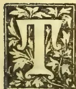

HE present number commences the sixth volume of the Magazine which was started in July 1889.

Our readers may remark that there has been a slight alteration in the title, but this will in no way affect the character or conduct of the publication, which will still be true to the interests it has served for the past five years. As hitherto, the Magazine will have for its main object the development of the agricultural resources of the Colony, and specially of native agriculture. And while it will contain a record of the work and progress of the School of Agriculture, all useful information relating to cultivated crops: new products, management of cattle and dairy matters, and in fact to everything having a bearing on the agriculture of the country will find a place in these pages. We take this opportunity of thanking our subscribers for their past support, which we trust will be continued to us in the future as well.

Mr. W. A. De Silva, G.B.V.C., has assumed duties as acting Colonial Veterinary Surgeon, and the School of Agriculture might well be proud of one of its old boys having attained to so responsible and honourable a post. We do not doubt but that Mr. De Silva with his capacity for work and sense of duty will perform the duties of his temporary appointment with the utmost satisfaction.

The Government Dairy which had so rough a time during the late outbreak of murrain has once more recovered its equilibrium. It has now a daily output of nearly 50 gallons, the whole of which is in demand.

Mr. J. Weerasooriya, late of the School of Agriculture, has been appointed a Forest Ranger in the Badulla district.

Mr. E. Hoole, assistant master at the School, was awarded the Government Veterinary Scholarship, and has already entered upon his course of studies at the Bombay Veterinary College.

Mr. George C. Bellamy, District Officer, Selangor, has made an official report on the Ceylon Government Dairy Farm for the Government of Selangor, as the result of a visit paid to that institution a few months ago. In concluding his report, Mr. Bellamy says:—"As a result of my visit to the farm, I feel certain that the establishment of a similar institution at Kwala Lumpur would be attended with satisfactory results, and I trust that the information given above will be of value to the Government."

With this number we issue an Index to Volume V.

## RAINFALL AT THE SCHOOL OF AGRICULTURE DURING JUNE.

<table><tbody><tr><td>1</td><td>...</td><td>Nil</td><td>11</td><td>...</td><td>Nil</td><td>21</td><td>...</td><td>·03</td></tr><tr><td>2</td><td>...</td><td>2·39</td><td>12</td><td>...</td><td>·97</td><td>22</td><td>...</td><td>·04</td></tr><tr><td>3</td><td>...</td><td>·46</td><td>13</td><td>...</td><td>·56</td><td>23</td><td>...</td><td>·01</td></tr><tr><td>4</td><td>...</td><td>·26</td><td>14</td><td>...</td><td>1·26</td><td>24</td><td>...</td><td>·18</td></tr><tr><td>5</td><td>...</td><td>·68</td><td>15</td><td>...</td><td>·51</td><td>25</td><td>...</td><td>·05</td></tr><tr><td>6</td><td>...</td><td>·14</td><td>16</td><td>...</td><td>·01</td><td>26</td><td>...</td><td>·01</td></tr><tr><td>7</td><td>...</td><td>·82</td><td>17</td><td>...</td><td>·75</td><td>27</td><td>...</td><td>·08</td></tr><tr><td>8</td><td>...</td><td>·38</td><td>18</td><td>...</td><td>·86</td><td>28</td><td>...</td><td>Nil</td></tr><tr><td>9</td><td>...</td><td>·03</td><td>19</td><td>...</td><td>·01</td><td>29</td><td>...</td><td>Nil</td></tr><tr><td>10</td><td>...</td><td>·01</td><td>20</td><td>..</td><td>·01</td><td>30</td><td>...</td><td>Nil</td></tr></tbody></table>

Recorded by P. VAN DE BONA.

## AGRICULTURAL IMPLEMENTS.

There can be no question that the implements in use among our native agriculturists are of the most primitive type, but whether they can be satisfactorily improved or replaced is another matter on which it would not be safe to dogmatise since much has been said and written about it *pro*

87------------------------------------------------

66Supplement to the "Tropical Agriculturist."[July 2, 1894.

and *con.* The native implements of husbandry in vogue in Ceylon have been in use from time immemorial, and while every year sees hundred of new patents for improved agricultural implements taken out in England, America and the Continent, the implements of our native cultivators remain the same as they were a thousand years ago. There are a great many things to be considered when the introduction of new or improved implements is thought of. The native cattle of the country are small in size, and by no means of great strength, and this is to be attributed to the negligence in the matter of breeding and to a want of proper attention to the feeding and care of animals. Again, it is necessary that the cultivator should have implements of the simplest make, such as, in his present ignorant and helpless condition, the husbandman would be easily able to repair, when they get out of order, for there are no capable blacksmiths to be found in most villages, and even if there were, it is a question whether the cultivator would be in a position to pay the cost of such repair. Thirdly, the conditions and methods of culture among the natives are in many ways peculiar, and any improved implements must exactly fit in with these conditions and methods. The question, then, we have to face is: is it probable that any new or improved implements can take the place of those which, albeit of a primitive type, have served their end for at least a thousand years? It is palpably not good reasoning to say that because a method or fashion has existed for a long period and suited our forefathers, therefore it should still be retained and must be considered good enough for us. The conditions of life are changing every day, and though in this country the change in the agricultural surroundings of the people may be imperceptible, still there is no doubt but that it is taking place. The remoter parts of the Island are being made more accessible by roads and railways; and education, both general and technical, is being carried into all parts of the country. These measures are in themselves calculated to give a great impetus to agricultural operations and enlarge the sphere of the cultivator's labours. If under the pressure of increasing population and greater competition the native agriculturist is to maintain the comparatively easy position he has occupied hitherto, he must endeavour to be up to date in his modes of culture. The work of the School of Agriculture, through its trained Agricultural Instructors, is no doubt slowly having its good effect, while the latest development of the school, in the Government dairy, may be expected before long to have an appreciable influence on the mind of the native cattle owner, by its lesson in the management and breeding of stock. On the other hand, the introduction of new plants and seeds is bound to enlarge the sphere of the native cultivator's operations. With these changes in view, we are inclined to think that it is not too soon to carefully consider the question, as to whether some desirable improvements may not be effected in native implements of husbandry, and whether new implements, suitable to his changed conditions, may not be brought to the notice of the cultivator. Any innovations will, of course, have to be gradually introduced, after close scrutiny of the

circumstances, and careful study of the needs, of those for whose benefit they are intended; but when we note the good results that have followed the improvement in implements of husbandry in other countries, in saving of labour and time, and in the production of good tilth and its incalculable advantages, we are induced to advise that the possibility of improving the ancient types of implements in Ceylon be taken into careful consideration and fully discussed. We do not specify any particular implement nor the direction in which its improvement lies; this can only be done (and that with the greatest caution), by an expert mechanic. Nor do we approve of implements in use in other countries being transferred, without due consideration of their suitability as regards form, size, weight and capacity for particular work, into this country. We only contend that the subject of the improvement of implements of native agriculture is worth the attention of those who are interested in the rural economy of the Island and in the development of its resources.

Since writing the above we have seen Professor Primrose M'Connell's interesting and exhaustive paper on "Tillage Implements old and new," which we hope to notice in our next issue.

#### OCCASIONAL NOTES.

In the Administration Report of the General Manager of the Ceylon Government Railway for 1892, reference is made by Mr. A. E. Brown, Locomotive Engineer, to native wood sleepers supplied by the Forest Department, which he characterises as unfit for the purpose; and from an economical point of view as inferior to imported creosoted pine sleepers. The latter has been in use from the inception of Railways in Ceylon, and has cost the Government 100 per cent more than locally-produced sleepers would have done, had the proper and more durable kinds of wood been used. The trials made were from (1) *Murraya Exotica* (Sin. Etteriya, not Etaheraliya, which is a misnomer); (2) *Carallia Integerrima* (Sin. Dawata); (3) *Ficus Arnottiana* (Sin. Alubo or Kaputu-bo); and (4) *Nauclea Coadunata* (Sin. Bakmi) all magnificent trees growing in great abundance in the Western Province, but the last in the vegetable world, that could be used as timber for building purposes or underground work, much less as railway sleepers. How comes it that no trials made with the wood of (1) *Bassia longifolia* (Sin. Mee); (2) *Mesua Ferrea* (Sin. Na) or iron-wood; (3) *Mimusops Indica* (Sin. Palu) or wild satin; (4) *Vites Altissima* (Sin. Millila or Milla), and a number of others too numerous to name, all very hard grained wood, which are to be found in abundance in different parts of the island, enough to supply the requirements of our railway as long as it lasts? As damp and white ant-proof timber, creosoted or not, these are known to have very few or no equals in other countries. It would not be exaggerating, therefore, to say that each of these would outlast a score of pine sleepers. It is a common practise on old coffee estates which are now in tea, to obtain firewood for the machinery from dead *na*, *milla* and *mee* trees that had been cut down whilst

88------------------------------------------------

July 2, 1894.]Supplement to the "Tropical Agriculturist."67

elling the original forests 60 to 70 years ago. The Kandyan villagers prefer this dead wood to any other timber for building houses. These buildings rise like mushrooms to be soon lost sight of again, but the dead timber, like heirlooms, pass from generation to generation.

In October last year a Reuter's telegram appeared in the local newspapers referring to Sir Evelyn Wood's report in the Autumn Manoeuvres which took place in England at that time, where it was said that coca leaves, used with a small quantity of slaked lime by the men, answered admirably in allaying thirst during the trying hot weather then prevailing in Europe. This ought to give another impetus to the coca plant being more extensively grown in Ceylon, as our climate has been found to be very favourable to its growth. After a time the leaf might possibly come into use among the natives in place of betel leaves. Where the supply of betel leaves, arecanuts, tobacco and chunam fails, I have often seen the Sinhalese make a *paun* of the bark of mora and illa trees, the tender roots of the coconut palm, ash obtained by burning the wood of kumbuk trees or the tender leaf buds of the doon trees. The two last are substitutes for lime.

An important commodity in the commerce of the island, chaya-root (*Hedyotis umbellata*) now almost forgotten, is referred to in the *Indian Industries* (1880, p. 118) in the following words:—"In Ceylon chay-root forms a considerable article of export, only a particular set of people are allowed to dig it, and at one time it was all bought up by Government, who gave the diggers a fixed price of 75 or 80 rix-dollars a candy; it being sold for exportation at about 175 rix-dollars." The author, Mr. Eliot James, must no doubt have had some reliable authority for making the above statement, but to me it seems apocryphal. Since the discovery of chemical substitutes all vegetable dyes have been driven out of the markets of the world; but as the present generation is just beginning to learn the deleterious effects of these dyes on the human body, a reversion to the old genuine articles will soon follow. Already anatto, indigo, sappan, orchilla weed, &c., all valuable dye stuffs of former days, are to the front again, a sure sign that aniline dyes are not being used now for purposes for which the vegetable dyes are wanted; hence I think Indian madder or chaya-root of which several species are found growing wild in the island is likely to be sought for very soon. But not at such fabulous prices as dollars 175 per candy of 500 lbs.!

The wild boar of Ceylon is to be found in every part of the island, and is a formidable enemy of the agriculturist. Be the produce grain, fruit or roots, woe be to the cultivator that neglects to properly fence his garden or watch his crop throughout the night with gun in hand. Scarecrows, rattles and traps sometimes prove effective, but more often the boar is too cunning even for those who seek to capture or destroy him. He is an animal despised by all when alive, but highly prized as a luxury at

table! But I have a word in favour of the boar, for he does us great service by indulging his voracious appetite in destroying and consuming every venomous reptile and snake that comes in his way during his nocturnal wanderings in search of food.

In the *First Steps in Economic Botany* published in 1854, p. 65, I read:—"Formerly all the teas imported into Europe was exported from China; its culture was however some time since attempted in Java, Penang, and Rio de Janeiro. After many failures it has fully succeeded, and large quantities are now raised in the two former places, and its cultivation is extending in South America under the Brazilian Government." Now this was 40 years ago. It would be interesting to know whether the tea that had fully succeeded in South America at that time is still in existence; if not, what has been the cause of its failure?

ALL PRODUCTS.

#### GLANDERS.

The disease glanders or more properly *Equinia* claims many victims among horses of temperate climes. Till recently it was believed that glanders was rare in the East, but for some time past hundreds of cases of this malady have been met. It may have existed for a long period and escaped detection till after the advent of veterinary science, or it may have actually been non-existent at first, but introduced by horses imported from Europe. There is much in favour of entertaining the latter view, for, up to now no cases of glanders have been met with in the chief horse-breeding centres of the East, Persia and Arabia; and such Arab horses as have contracted the disease have done so only after their arrival in India. The disease is fortunately still unknown in Australia, which if not the largest, is at least one of the largest horse-breeding countries of the world. Glanders is manifested in several ways. It is undoubtedly a malignant disease, contagious and infectious, communicated from horse to horse and from horse to man. The animals which are most susceptible to it are the donkey and the mule, though it is not uncommon in rabbits, guinea-pigs and even sheep, but it is an important fact in this country that cattle are immune from the malady.

The usual form in which glanders appears is that in which the respiratory passages are observed to be affected. The glands between the lower jaws become enlarged and adherent, and rather tense and hard, a mucous discharge runs from one or both the nostrils, and often adheres to the sides like a starchy paste. The membrane lining the nostril changes to a dirty greenish colour and ulcers of a peculiar nature (excavated) appear; there is often a running from the eyes. The animal gradually loses condition, all the symptoms become more aggravated, and if the creature is not destroyed it eventually dies a miserable death. In other cases the same disease appears in a form known as Farcy,

89------------------------------------------------

68Supplement to the "Tropical Agriculturist."[July 2, 1894.

when the glands of the groins enlarge and bud-like formations appear along the course of the lymphatics, especially in the limbs and the groins. These suppurate, and the animal develops the usual signs of glanders and succumbs. In some instances the disease runs a very chronic course.

It has also to be borne in mind that certain other diseases simulate glanders, for example, chronic catarrh, nasal gleet and caries of the molars. These also show such symptoms as the discharges from the nose and eyes, and even enlargement of the glands between the lower jaws, but there is no discolouration of the nasal membrane nor do ulcers appear. Unless the last two symptoms are observed, a horse showing other symptoms simulating glanders could at the most be looked upon as only "suspicious" and nothing more. But one need not take long to ascertain whether such a suspicious case is real glanders. A brisk purge or hard exercise would often cause the disease to take a definite course; or, if still doubtful, two or three, 15-grain doses of Bichromate of Potassium would show the malady in its true character. There is yet another and an unfailing test resorted to of late:—The inoculation of the suspected animals with *mallein*, a preparation discovered by Mons. Pasteur of Paris. *Mallein* when injected, rapidly raises the temperature of a horse having glanders poison in its system, whereas if that poison be absent, no change in temperature is observed.

Glanders at one time was supposed to originate spontaneously in crowded and ill-ventilated stables, but like many other diseases it has been positively demonstrated that there is no such thing as spontaneity in this disease. It is either communicated by contagion or infection.

This fact is of great importance to us here; for since the disease is not so common in the Island, the only possible source of communication may be attributed to animals brought from India. It is also evident that it is not essential that a diseased animal itself should import it, for any tainted fodder or gear, or animals that have stood with diseased subjects are quite capable of conveying the disease from place to place.

Glanders being not only a disease which spreads among animals, but one which brings on a fatal disease in man, its control is of great importance, and in a limited area like Ceylon, it should not be difficult to stamp it out if only proper measures are taken at once.

In India there is a special act of legislature enacted for the purpose of dealing with glandered animals, and the disease is now being controlled to a great extent in that country. In England, too, powers are vested in local authorities to devise measures to prevent its spread. A synopsis of these Acts and the byelaws connected with them will be given in another issue of the Magazine; in the meantime the following account of glanders in man would, it is to be hoped, be of some interest.

W. A. D. S.

24th July, 1894.

## GLANDERS IN MAN.

By DR. W. H. DE SILVA, M.B.C.M.

Although this disease has been recognized in the horse from the time of Hippocrates, yet it is only of late years that it has been satisfactorily proved to exist in man. It was formerly entirely overlooked, and the disease considered to be one of a purely local character attendant upon unhealthy and unclean wounds, terminating fatally. Dr. Elliotson was the first who accurately described the disease in man, and he termed it *Equinia*, as proceeding from the horse.

The susceptibility of man is less than that of the solipedes judging from the few real cases of glanders compared with the frequent exposures, yet when once established in the system it can hardly be said to be less malignant or fatal.

The one known cause of glanders is contagion, and the bacillus of the glanderous deposits is the one essential cause of the disease. Man is rarely infected from any other source than the horse. The modes of infection, immediate and mediate, are the main points to notice in this connection. Those employed about horses are usually infected by direct contact of the poisonous discharges, blood or tissues with abrasions on the skin or mucus membranes. The inoculations received in giving medicine, examining the nose, performing operations with effusion of blood, dressing cutaneous ulcers, slaughtering, skinning, making a post-mortem, burying, &c., is not uncommon. Again, direct infection is sustained through snorting of the horse, so that particles of the virulent discharge are lodged in the mucous membrane of the eye or nose. Closely allied to this is infection by inhaling the exhalations of glandered horses, and the bite of the glandered horse is a rare means of infection. From infection by eating glandered animals (sheep, goats and rabbits) man is usually saved by the cooking of his food and by his inherent power of resistance.

Among the mediate forms of contagion may be named drinking from the same pail, or trough after a glandered horse, using a knife that has been used to open a glanderous abscess, wiping a wound with an infected blanket or handkerchief, handling infected harness, waggon pole or manger with wounded hands, sleeping over glandered horses or in a stall or on litter previously used by such horses.

Conveyance of glanders from man to man has taken place through using or handling the same dishes, towels, or handkerchiefs, and through dressing the wounds.

Fortunately the susceptibility of man is slight, only few out of the multitudes handling glandered horses becoming infected. It is essentially an industrial disease. A condition of ill-health doubtless predisposes to this as to other invasions of infectious disease, yet men apparently in the most vigorous health have succumbed to the poison.

Glanders and Farcy in man usually occur together and run an acute course, although occasionally they may become chronic. The disease is communicated by inoculation which is followed by a stage of incubation, which

90------------------------------------------------

July 2, 1894.]Supplement to the "Tropical Agriculturist."69

lasts from 2 to 14 days. The invasion is marked by fever and a sense of illness, there may be rigors, vomiting and diarrhoea and severe pains in the limbs. The seat of inoculation becomes inflamed and the nearest lymphatic glands become enlarged and tender. Inflamed lymphatics with hard knots (Farcy buds) may also be present. From two days to a week or more after *invasion* a characteristic eruption makes its appearance. First, they are little red spots like flea-bites which soon assume the form of elevated yellowish tubercles. They soon soften and form small hæmorrhagic abscesses, they then burst, leaving small yellowish ulcers. There soon sets in an offensive discharge from the nose, at first watery but afterwards puriform, and the lymphatic glands under the jaw enlarge. Finally, subcutaneous abscesses form in various parts, which may be accompanied by hæmorrhages into the muscles and intermuscular tissue. Pneumonia or pleurisy may occur before death. The final stage resembles blood-poisoning in many respects. In some exceptional cases this disease may run a very chronic course.

The disease usually proves fatal in a week or fortnight. Glanders is not to be confounded with an eruptive disease produced by the morbid fluids generated in the affection called '*grease*,' an inflammation and swelling in the heels of the horse, from which at a certain period a very acrid thin matter issues. This, when applied to any abrasion of the hands, gives rise to a pustular affection of the skin and is termed *Equinia mitis*, in contradistinction to glanders, which is often called *Equinia Glandulosa*. It is not at all uncommon among coachmen, stable boys, farriers and other persons, who dress the heels of horses affected by the disease. The pustules in this condition are elevated, have a red, purple swelled base. They are about the size of a six-pence. The pustules become purulent about the third day, and begin to dry about the 10th or 12th forming thick scabs, which leave well-marked cicatrices. It was at one time supposed to be the origin of cow-pox. Its treatment consists merely in rest and mild local applications.

The constitutional treatment of glanders should be supporting, stimulating and soothing. In external inoculated cases the wounded surfaces should be early destroyed by caustics, e.g., fuming nitric acid, sulphate of copper or the hot iron. The swollen surfaces may be treated by leeching, followed by solutions of carbolic acid, ice, &c. Abscesses and tumours should be laid open and cauterised. Of the greatest importance is a general tonic and stimulating regimen. A nutritious diet (including beef tea) abundance of pure air, alcoholic stimulants, quinine, tincture of perchloride of iron, and above all arseniate of strychnia have been used with advantage.

*Prevention.*—The first step toward the prevention of glanders in man is the systematic restriction and extinction of the affection in animals. Further measures are the following:—The avoidance of contact with glandered or suspected horses by all persons having any wounds, abrasions, or ulcers in their skins. The cauterisation of all such sores on persons necessarily brought in contact with glandered or suspected animals, or their products; the general diffusion of in-

formation as to the danger from glandered animals; washing of hands and face in a solution of carbolic acid after handling infected animals or their products; the thorough disinfection or destruction (by fire) of harness, clothing, racks, mangers, waggon poles, buckets, troughs, brushes, combs, litter, and fodder that have been exposed to infection; and finally, the exclusion from the markets of all meats derived from suspected or infected animals. That glanders has never been recognised as arising from the consumption of diseased sheep or rabbits, does not prove that it has never reached man by this channel, any more than the absence of all recognition of the infection of man from the horse would prove the non-occurrence of such infection until the beginning of the present century. The knowledge that some of the animals used for food are liable to contact and convey this disease is an additional reason for the systematic and universal suppression of the disease among the equine population.

#### ARSENIC AND ARSENITES AS INSECTICIDES.

Arsenic is known to chemists as arsenious acid or white oxide of arsenic. It is considered an unsafe insecticide as its colour permits of its being mistaken for other substances of similar appearance, but in its various compounds it forms our best insecticides. A dose of from one to two grains usually proves fatal to an adult, thirty grains usually prove fatal to a horse, ten grains to a cow, and one grain or less is usually a fatal dose to a dog. In case of poisoning, while awaiting the arrival of a medical man, emetics should be resorted to, and after free vomiting, milk and eggs administered. Sugar and magnesia in milk is also useful. It may be mentioned that though arsenious acid or white oxide of arsenic goes by the name of arsenic, this latter term belongs to a black metallic element which by oxidation produces white arsenic. Arsenites are compounds of arsenic in which white arsenic unites with some metallic base. The principal arsenites used in destroying insects are Paris green and London purple. Paris green is an aceto-arsenite of copper. When pure it contains about 58 per cent of arsenic, but the commercial article usually contains less, often as little as 30 per cent. The following may be considered as an average analysis:—Arsenic, 47.68 per cent; copper oxide, 27.47; sulphuric acid, 7.16; moisture, 1.35; insoluble residue, 2.34. It is applied either as a solution or in a dry condition, but in any case it has to be much diluted. For making a dry mixture, plaster, flour, air-slaked lime, road dust or sifted wood ashes may be used. The strength of the mixture required depends upon the plants and insects to which it is to be applied. The strongest mixture now recommended is 1 part of poison to 50 of the diluent, but if the mixing is very thoroughly done, 1 part to 100 or even 200 is sufficient. Paris green is practically insoluble in water. When mixed with water, the mixture must be kept in a constant state of agitation, else the poison will settle, and the liquid from the

91------------------------------------------------

70Supplement to the "Tropical Agriculturist." [July 2, 1894.

bottom of the cask will be so strong as to do serious damage, while that from the top will be useless. For potatoes, apple trees, and most species of shade trees, one pound of poison to 200 gallons of water is a good mixture. For the stone fruits one pound to 300 or even 350 gallons of water, is a strong enough mixture. Peach trees are very apt to be injured by arsenites, and for them the mixture should be no stronger than one pound to 300 gallons. In all cases, the liquid should be applied with force in a very fine spray. At some seasons of the year foliage is more liable to injury than at others.

London purple is an arsenite of lime obtained as a by-product in the manufacture of aniline dyes. The composition is variable. The amount of arsenic varies from 30 to over 50 per cent. The two following analyses show its composition:—(1) Arsenic, 43.65 per cent; rose aniline 12.46; lime 21.82; insoluble residue, 14.57; iron oxide, 1.16; and water 2.27. (2) Arsenic 55.35 per cent; lime, 26.23; sulphuric acid, 22; carbonic acid, 27; moisture, 5.29. It is a finer powder than Paris green, and therefore remains longer in suspension in water. It is used in the same manner as Paris green, but is sometimes found to be more caustic on foliage. This injury is due to the presence of much soluble arsenic. London purple should not be used on peach trees.

The arsenites may be used in connection with some fungicides, and in this manner both insects and fungi combated at the same time. The arsenites may thus be combined with Bordeaux mixture or soap applications. The addition of lime to Paris green or London purple mixtures greatly lessens injury to foliage, and, as a consequence, they can be applied in larger doses than ordinarily. The free lime combines with the soluble arsenic, which is the material that injures the foliage and the combination is a harmless ones.

#### STOCK ITEMS.

A good nurse for a sick cow must be well acquainted with the management of a healthy cow. Although, however, each animal requires a nurse who is acquainted with its normal habits in health, yet there are certain fundamental elementary laws, that are applicable to all sick animals. The first consideration we have to deal with, especially with the large animals such as the horse and cow, is the provision of a suitable place wherein to nurse them. A place free from wind and rain, with a dry floor, an abundant supply of fresh air, and of sufficient dimensions to allow the animal to move or roll about without coming in contact with the walls is essential.

As far as possible, it is a wise plan to separate a sick animal from those that are healthy, and to nurse it in a place removed from all other animals. In contagious diseases this is one of the first essential conditions that requires attention. In all diseases it is a wise precaution, as tending to the promotion of recovery of the ailing animal, and in view of the disease turn-

ing out to be more serious than was at first supposed.

The following are the statistics referring to contagious disease in Great Britain during 1893:—The number of cattle slaughtered in Great Britain for pleuro-pneumonia in 1893, were as follows:—30 diseased, 1,157 in contact, and 86 suspected. In 1892 the figures were—134 diseased, 3,477 in contact, 186 suspected; while in 1890 there were 2,022 diseased, and 11,301 in contact. The number of swine that died or were slaughtered for swine fever last year were—6,133 died, 15,339 diseased or exposed to infection, and 93 suspected. In 1892 the number that died was 5,563, and there were 12,394 slaughtered as diseased or exposed to infection. The number of cases of anthrax in 1893 were—567 fresh outbreaks, and 1,294 animals attacked. In 1892 there were 286 fresh outbreaks, and 633 animals attacked. There were 1,384 fresh outbreaks of glanders, and 2,127 animals attacked, against 1,632 fresh outbreaks and 2,954 animals attacked in 1892.

The rearing of calves is a subject which should have special interest to stock-beeders in this country, and especially to the owners of milch cattle since so large a percentage of these animals succumb before they are a year old. The manager of the Ceylon Government Dairy has been very successful in the rearing of calves according to a method which his experience of cattle has taught him. The following description on this subject, given by a writer to the *Scottish Farmer*, referring to Ayrshire (perhaps the best milking) stock will not be without interest to many of our readers:—There are three methods of rearing calves: 1st, Allowing the calf to suck its mother. This is the most natural way. It makes the best calf, but is very expensive. This system is seldom, if ever, followed with Ayrshires. The calf is apt to get wild by this method, unless frequently handled. 2nd, Giving full milk alone, as it is drawn from the cow. This method is also expensive and not much practised. 3rd, The most prevalent method, and the one employed by most people who breed for profit, consists in giving the full milk only for eight or ten days. The new milk is gradually reduced, and skim milk substituted, which is made up to the standard of full milk by artificial foods—as boiled linseed at a temperature not exceeding 100 deg. Fahr. One gallon of skim milk with linseed gradually increased from one pound, and then to one pound and a half, is enough for an ordinary calf before weaning. Mixed half-and-half linseed meal and peameal is used by some, and considered good. Oatmeal is also a good substitute, but is very liable to cause acidity if the feeding is not regularly attended to. The calves should be learned to eat linseed cake before weaning, and may be allowed one pound per day on the grass through the summer to keep them in good thriving condition. In the latter end they may be allowed a run on the young clover seeds. They should be comfortably housed in winter, and receive hay, a small quantity of pulped roots, and about 2

92------------------------------------------------

July 2, 1894.] Supplement to the "Tropical Agriculturist."71

lb. linseed cake per diem. The treatment should be as liberal as to turn them out to the grass in good condition. In the following summer and autumn, they should be allowed to graze on good pasture, rich in phosphates, so that their growth of bone and substance will not be checked in any way. In winter, they should again receive, in addition to turnips, hay and straw, a little extra concentrated food, such as linseed cake or cotton cake, at the rate of 2 or 3 lb. per day. If, by the treatment they have received, they be large and strong, we may have them in milk between two and three years old.

The following is from a leaflet issued by the Royal Agricultural Society of England:—From the evidence which has recently been brought to the notice of the Society, it is considered desirable to recommend to the special attention of stock-owners, in whose herds abortion has appeared, the system of preventive treatment which is described in the following quotation from the article on Abortion in the Society's Journal, Vol. II., Part IV., 1891, page 738. The plan which Professor Nocard recommends to be used in cow-sheds and premises in which epizootic abortion occurs year by year is the following:—1. Every week the places in which cows are kept must be well cleansed, and especially the part behind the cows, and then disinfected by a strong solution of sulphate of copper (blue vitriol), or a solution of carbolic acid, one to fifty of water. 2. The under part of the tail, the anus, vulva, and parts below of all the cows must be sponged daily with the following lotion which, is a strong poison:—

<table>
<tr>
<td>Rain water or distilled water</td>
<td>..</td>
<td>2 gallons</td>
</tr>
<tr>
<td>Corrosive sublimate</td>
<td>..</td>
<td><math>2\frac{1}{2}</math> drachms</td>
</tr>
<tr>
<td>Hydrochloric Acid</td>
<td>..</td>
<td><math>2\frac{1}{2}</math> ounces</td>
</tr>
</table>

During the first season of this treatment only a moderate amount of improvement is to be expected, but after the next season abortion will cease entirely. It appears that in some districts no precautions are taken to destroy the foetuses after abortion. This should be done *without delay in every case* by burning or burial in quick-lime. Lime should also be freely scattered over the ground contaminated with the discharge.

#### EXPERIMENTS ON THE DURABILITY OF VARIOUS WOODS.

In order to obtain some data on the durability of Indian woods, the Government of India in a Circular dated the 31st October, 1879, ordered these experiments to be started. Specimens of various species were prepared, the size and shape of a metre-guage sleeper being chosen as most suitable. These were placed in the ground of the Imperial Forest School, one-half of each piece being left exposed, the other half under ground: in all 39 pieces were thus treated, most of them having been put down in 1881, and a few subsequently at different times. The soil in which the sleepers were buried was a rich sandy clay, giving, on a rough qualitative analysis made by Instructor Mr. A. F. Gradon:—

<table>
<tr>
<td>Sand</td>
<td>..</td>
<td>..</td>
<td>35 per cent.</td>
</tr>
<tr>
<td>Clay</td>
<td>..</td>
<td>..</td>
<td>24 "</td>
</tr>
<tr>
<td>Organic matter</td>
<td>..</td>
<td>..</td>
<td>5 "</td>
</tr>
</table>

One by one, the weaker and softer kinds disappeared, under the effects of rot and the attacks of white ants: and in August 1892, just eleven years after the commencement of the experiment, the surviving pieces were dug up by the Deputy Director, Mr. Smythies, in the presence of his class of Forest Utilization, with the following results:—

Three species had their wood still perfectly sound in every respect, both above and below ground. These were (1) the Himalayan Cypress, (*Cupressus torulosa*) 10 years buried; (2) Teak, 9 years buried; and (3) Anjan (*Hardwickia binata*) 7 years buried. Both Deodar and Sissu after 11 years' burial had their heartwood quite sound, but the sapwood has been entirely eaten away by white-ants. Next to these came the two species of Eugenia, Piaman (*Eugenia operculata*) and Jaman (*Eugenia Jambolana*) which lasted well for 9 years but are now beginning to show signs of decay. Sandan (*Ougeinia dalbergioides*) was much the same, as were also Toon (*Cedrela Toona*) and *Albizia procera*. The Toon was almost untouched above ground, but the buried parts were unmistakably traversed by the mycelia of fungi. Sain (*Terminalia tomentosa*) and *Albizia Lebbek* lasted 8 years; *Phyllanthus Emblica*, *Adina cordifolia*, *Cedrela serrata*, *Pinus excelsa* and *Abies Smithiana* remained good for 7 years and then succumbed. *Pinus longifolia* and the three oaks (*Quercus Semecarpifolia*, *incana* and *dilatata*) lasted 6 years. *Aegle Marmelos*, *Stephegyne parvifolia*, *Abies Webbiana* and *Schleichera trijuga* remained good for 5 years. A *Grewia* lasted for four years, while *Lagerstroemia parviflora*, *Anogeissus latifolia*, *Acacia arabica*, *Butea frondosa*, *Aesculus indica* and the Mango gave way in 3 years' time. It is as well to place on record that Dehra Dún is the broad valley at the base of the Himalaya, and between it and the Siwaliks, extending from the Jumna to the Ganges. The altitude of the locality is just about 2,100 feet, the climate is moderately cool and the average annual rainfall 73 inches.

The most remarkable thing about these experiments is the durability of the Cypress, a fact which ought to be remembered in planting trees in the hills, for few trees are so easily grown, even down to the plains in the Dún and further still to Saharanpur. The wood is not unlike deodar, but with a quite different strong scent. The tree thrives best on limestone, but is not really very particular and it grows straight and well in close plantations.—*Indian Forester*.

#### ZOOLOGICAL NOTES FOR AGRICULTURAL STUDENTS.

Next in order after the birds come the Mammals constituting the fifth and last class of vertebrate animals. The general characteristics of mammalia are that respiration is aerial: the lungs are not connected with air-sacs; the heart is four-chambered; the blood warm; the integumentary covering is in the form of hairs, the young are nourished by milk secreted by special glands—the mammary glands; the skull has two condyles.

93------------------------------------------------

72Supplement to the "Tropical Agriculturist." [July 2. 1894.

The *non-placental* mammals (in which no connection is established between the fetus and the mother) are represented only by two orders, viz., monotremata and marsupialia. The first contains only two genera, both belonging to Australia, viz., the Duck mole (*Ornithorhynchus*) and the Porcupine Ant-eater (*Echidna*). The order marsupialia, so named owing to its members possessing a "marsupium" or pouch in which the young are carried, includes the kangaroo, opossums, bandicoots and wombats. The order *Edentata* is the lowest of the *placental* mammals. The name is hardly a correct one, since it is only in two genera that there are absolutely no teeth, though the development of the teeth is very imperfect in all. The toes of the edentates are furnished with long and powerful claws, and the skin often covered with bony plates or horny scales. In this order are included the sloths, ant-eaters and armadillos.

*Sirenia* and *Cetacea* constitute the fourth and fifth orders of mammalia. The first-mentioned includes the Dugongs and Manatees, while the order *Cetacea* comprises the whales, dolphins and porpoises. The members of both orders are characterised by a powerful caudal fin which differs from that of the fishes in being placed horizontally, and in being a huge expansion of the integuments not supported by bony rays; the hind limbs are wholly wanting, and the anterior limbs are converted into swimming paddles or "flippers." In the *Cetacea* the nostrils are placed at the top of the head, constituting the so-called "blow-holes" or "spiracles." The body of the Sirenians is covered with scattered bristles, but that the *Cetaceans* is generally completely hairless. The head of the latter is as a rule of disproportionately large size, and is not separated from the body by any distinct constriction or neck. The skin of the Greenland whale is underlaid by a thick layer of subcutaneous fat which varies from eight to fifteen inches in thickness, and is known as the "blubber." The blubber serves partly to give buoyancy to the body, but more especially to protect the animal against extreme cold. It is the blubber which is the chief object of the whale fishery, as it yields the whale oil of commerce. In the lateral depressions of the whale's palate occur an enormous number of horny plates, constituting what is known as the "baleen" plates, from which the whale bone of commerce is derived. The porpoise, too, is often killed for the sake of its oil. Order VI.—*Ungulata*.—The order of the Ungulate or hoofed animals is one of the largest and most important of all the divisions of the mammalia. The following are the characteristics of the order:—All the four limbs are present, and that portion of the toe which touches the ground is always encased in a greatly expanded nail constituting a hoof. There are always two sets of enamelled teeth, and the molar teeth are massive, with broad crowns, adopted for grinding vegetable substances; no clavicles are present.

In accordance with the number of the digits, the order *Ungulata* is divided into two primary sections: the *Perissodactyla*, in which the toes or hoofs are odd in number (one or three), and the *Artiodactyla*, in which the toes are even in number (two or four).

## GUANOS.

The term guano is properly applied only to the dung of birds and some other animals; but the name has been erroneously used to describe various other mixtures and preparations that are in no way entitled to be so called.

*Peruvian guano* may be described as a general manure composed of the excrements of fish-eating birds, and containing nitrogenous compounds, phosphates, and potash.

High-class *Peruvian guano* is rich in nitrogenous matter, a large proportion of which is soluble. As formerly exported it was capable of yielding from 8 to 12 per cent of ammonia, part of which was derived from ammonia salts, and part (less than 1 per cent) from nitrates. Phosphates were low, seldom exceeding 30 per cent, but from one-quarter to one-half of the phosphates were soluble. The amount of potash was usually from 3 to 5 per cent. It cannot be now had of this quality.

Low-class *Peruvian guano*, as now offered in the market, is comparatively poor in nitrogenous matter, yielding from 3 to 5 per cent of ammonia. The phosphates are correspondingly high, viz., from 30 to 50 per cent, but the proportion of soluble phosphate is much smaller than in high-class *Peruvian guano*. Potash occurs to a very small extent, viz., about 1 to 3 per cent.

Low-class guanos are formed originally from high-class guanos, by the washing out of soluble constituents by rain, &c., and their composition varies greatly according to the amount of washing they have undergone.

Genuine *Peruvian guano* frequently contains a large proportion of stony insoluble matter. It ought to be riddled before purchasing.

*Fortified Peruvian Guanos*, also called by various names, such as improved, equalized, &c. Such guanos are mixtures, with low-class *Peruvian guano* for a basis. Sulphate of ammonia is added, and perhaps also other nitrogenous matter, to bring them up to the guaranteed analysis, say from 8 to 10 per cent ammonia.

*Dissolved Peruvian Guano*.—That is usually *Peruvian guano* dissolved in sulphuric acid, and fortified with sulphate of ammonia so as to make a strong, active manure.

*Ichaboe Guano*.—A true guano, but of recent formation. It is very rich in nitrogenous matter, which yields from 10 to 16 per cent of ammonia, but a large part of the nitrogenous matter is in the form of feathers, which are insoluble and of low manurial value, otherwise it resembles high-class *Peruvian guano*. The total phosphates vary from 18 to 30 per cent, of which from a fourth to a half is usually soluble. There is seldom as much as 2 per cent potash present.

Other commercial guanos are the *Patagonian* (2 to 3 per cent ammonia and 30 to 35 per cent of phosphate), *Bolivian guano* (2 to 8 per cent ammonia and 20 to 50 per cent of phosphate), and *Maldiv Islands guano* (a trace of ammonia and 70 to 75 per cent of phosphate).

*Fish Guano*.—Derived from fish-curing yards, and consisting of the heads and offal of fish, dried and ground. Properly speaking, it is not a guano.

High-class fish guano contains nitrogenous matter, yielding from 10 to 12 per cent of ammonia, but it is in the form of insoluble albuminous compounds, which only slowly de

94------------------------------------------------

July 2, 1894.] Supplement to the "Tropical Agriculturist."73

compose and become available as plant-food. The phosphates range from 18 to 30 per cent, and are all insoluble.

Low-class fish guanos are substances like the preceding, but containing less nitrogenous matter, and more phosphates. They are simply fish-bone manures, with somewhat more ammonia and less phosphate than ordinary bone-meal, and having no real resemblance to a guano.

Fish guanos are usually impregnated with fish-oil, which detracts from the value of the manure. The oil should not exceed 3 per cent.

*Frey-Bentos Guano.*—The dried and ground residue and débris of animals after the extraction of "Liebig's Extract." It is not a guano. There are various grades of this manure. One contains much bone matter, another a good deal of horn. It is a slow manure. The best manure is derived from muscular fibre, yielding about 14 per cent ammonia and about 5 per cent phosphate. It is a strong nitrogenous manure, variously named. The manure known as native guano is prepared from sewage precipitation. It is not considered of much value.

European guano is on the other hand considered a tolerably good manure. It consists of partially decomposed wood, horn, urine etc., brought into a powdery condition.

#### GENERAL ITEMS.

In every 1,000 parts, potato tubers contain 750 of water, nitrogen 3.4, ash 9.5, potash 5.8, and soda .3; cauliflowers contain 904 of water, 4.0 nitrogen, 8.0 ash, 3.6 potash, and .5 soda; cucumbers: 956 water, 1.6 nitrogen, 5.8 ash, 2.4 potash, .6 soda; sugar beets: 815 water, 1.6 nitrogen, 7.1 ash, 3.8 potash, and .6 soda.

The influence of nitrogen in its various forms upon plant growth is shown by at least three striking effects. The growth of stems and leaves is greatly promoted, while that of the buds and flowers is retarded; the colour of the foliage is deepened, which is a sign of increased vegetative activity and health; the relative proportion of nitrogen in the plant is increased in a very marked degree.

To rid potting-mould of any vermin it may contain, fill the pots the day before they are used, and water the soil in them with boiling water. Earthworms, however, call for some consideration since they, for one thing, ventilate the subsoil by boring in it channels for the admission of air. They may be ejected from pots or lawns, however, when they become troublesome, by means of lime-water; and the remedy will at the same time benefit the plant.

The *Journal of Horticulture* mentions that in addition to the leaves of *Mimosa Indica* and *Dionaea muscipula*, hairs of sundew (*Drosera*), stamens of *Berberis* and *Sparmannia Africana*, the stamens of *Mimulus* and its allied genus *Diplaenus*, the following plants have sensitive organs: *Oxalis sensitiva*, *O. stricta*, *Averrhoa bilimbi*, *Æschynomene Americana* and *Cassia nictitans*.

That it is easy to find microbes in the soil

capable of assimilating atmospheric nitrogen, if culture media, devoid of all combined nitrogen are employed, was pointed out by M. Winogradsky last summer, and in a recent number of the "Comptes Rendus" an account is given of important progress made by him in this most interesting subject. By progressive cultivation of a mixture of microbes derived from soil, in a nutritive liquid from which all traces of combined nitrogen were carefully excluded, Winogradsky reduced the varieties present to three bacilli, of which one was finally separated out and discovered to be endowed with this function of assimilating atmospheric nitrogen. This organism, we learn from "Nature," is strictly anaerobic, and will not grow in either broth or gelatine. It ferments glucose, producing butyric, acetic, and carbonic acid, and hydrogen. The amount of atmospheric nitrogen assimilated is proportional to the quantity of glucose contained in the culture material, and which undergoes decomposition in the presence of this bacillus. Winogradsky concludes his paper by suggesting that this phenomenon of the fixation of atmospheric nitrogen may be due to the union within the living protoplasm of the microbial cell, of atmospheric nitrogen and nascent hydrogen, resulting in the synthesis of ammonia.

The *Kew Bulletin* for May has the following note on the Agriculture of Jamaica:—"The fruit trade, which was referred to in last year's report as being in a depressed state, has somewhat recovered its former healthy condition, and the increase there spoken of in the crops of sugar and output of rum has been fairly maintained during the year under review. The export of cocoa shows an increase of 3,010 cwt. in quantity and 8,896*l.* in value; coffee an increase of 10,378 cwt. in quantity and 3,726*l.* in value; bananas, 676,280 bunches and 76,843*l.* in value; oranges, 3,806,526 in number and 11,526*l.* in value. The area of land in the island under cane and coffee cultivation has varied very little in recent years. There were during the year under review 32,466 acres in cane and 21,450 in coffee. The cultivation of bananas has increased to 14,860 acres from 9,959 in the year 1890-91. The total area under cultivation in the island was 666,741 acres, of which 499,053 was in guinea grass, pimento, and common pasture, against a total area of 1,958,678 acres of the whole island on which the property tax was collected.

Dr. L. Gebek, of Bonn, has published an elaborate research on the subject of coconut cake and meal.—1. *Preparation.*—The meal and cake are the residue of the kernels after the oil has been pressed out. This residue may be imported as such, the best coming from Ceylon, or the oil may be extracted in Europe. What is known as "copra" consists of dried pieces of kernel.—2. *Digestibility.*—The average composition of the cake is—Water, 10.66; albuminoid, 19.06; fat, 11.05; carbo-hydrates, 41.06; fibre, 14.12; ash, 4.05. Feeding experiments show that on the average 78 per cent, 95 per cent., and 80 per cent. are respectively digested of the albuminoids, fats, and carbo-hydrates. It also appears that the fat does not retard the digestive action of the gastric juice.—*Influence on Fattening and Pro-*

95------------------------------------------------

74Supplement to the "Tropical Agriculturist." [July 2, 1894.

duction of milk and Butter.—Cocoa-nut meal and cake compare very favourably in these respects with other concentrated foods, such as earth-nut cake, oatmeal, pea meal, cotton-seed meal, rape cake, and oil-cake.

The following are two useful suggestions for preserving eggs:—The eggs are first thoroughly cleansed, then dipped for some time in a solution of common salt, and finally packed in peat-dust and stored in ventilated wooden baskets in a dry, airy place. Of 100 eggs so packed in autumn, and used during the winter, only three were bad. The peat-dust checks the increase of the bacteria which penetrate the shell. Another method is to soap the eggs well and soak them for an hour in a solution consisting of as much permanganate of potash as will lie on the point of a knife added to half a gallon of water (or in dilute Condy's fluid). They are then thoroughly dried, wrapped in clean paper and after packing in a basket or box, kept in a dry place free from frost. Eggs so preserved will keep for six or seven months without losing their fresh taste, as is quickly the case with those packed in lime, straw, or chaff.

Few trades in this country have developed with such surprising rapidity as that in earth or ground nuts, or, as they are termed in America, pea nuts: an account of which is given in one of the "Handbooks of Commercial Products." The crop was first officially made mention of in the Madras Presidency, only as far back as 1851-52, but it now constitutes a most important item in the exports of Southern India. Earth-nuts were not introduced into Europe until 1840; but owing to the many useful purposes to which the oil is adaptable, its consumption has increased

to an enormous extent, estimated a year or two ago at little short of a million tons annually. The bulk of the nuts exported from India goes to France, mainly to that great seat of the oil-manufacturing industry, Marseilles (which port now absorbs more of this than any other oil-seed) where it is largely utilised in the preparation of salad oil; West Africa and China being the other chief sources of supply. Ground nuts afford an excellent substitute for olive oil, which they much resemble in taste, and the principal emporia of this branch of the trade are naturally, after the town mentioned, Barcelona and Genoa, because of their reputation for supplying pure Lucca oil. Easteru and western commercial morality are probably about on a par, and the produce of the earth-nut is sold largely as genuine olive oil, or mixed with the latter, in the same way that in Madras it is made to pass for gingelly oil (put through a mill, in which the latter seed has been crushed), and where it is also employed as an adulterant for ghee. The oil is also extensively used on the Continent in soap-making and for lubricating purposes, as an illuminant and for dressing cloth. There is a large local trade in earth-nut oil, in connection with which—the raw and manufactured material being alike produced and consumed in the country—the question of exchange does not arise; there is a not inconsiderable export business with the Mauritius, Burma, the Straits, &c.; the oil cake also appears to find a market in the latter settlement, London and Ceylon, and it is therefore somewhat singular that more vigorous efforts have not been made to establish large steam mills in India for the manufacture.

The *Horticultural Review* recommends the following for getting rid of ants; one pound of alum dissolved in two quarts of boiling water.

96------------------------------------------------

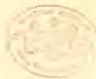A faint, circular embossed seal or stamp is centered on the page. The seal features a decorative border and contains some illegible text or a central emblem. The embossing is subtle, creating a slight indentation and a light shadow around the circular area.

97------------------------------------------------

G. H. K. THWAITES, F.R.S., F.L.S., PH.D., C.M.G.,

DIRECTOR OF THE ROYAL BOTANIC GARDENS, CEYLON, 1849-1880.

*(From a wood-engraving republished from the "Gardener's Chronicle.")*

Tropical Agriculturist Portrait Gallery,  
No. XII.

98------------------------------------------------

# \* The TROPICAL AGRICULTURIST \*

## ∞ MONTHLY. ∞

Vol. XIV.]

COLOMBO, AUGUST 1ST, 1894.

No. 2.

### "PIONEERS OF THE PLANTING ENTERPRISE IN CEYLON."

G. H. K. THWAITES, ESQ., F.R.S., F.L.S., PH.D., C.M.G.,

DIRECTOR OF THE CEYLON ROYAL BOTANICAL GARDENS, 1849-1880.

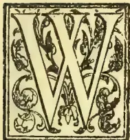

WE can scarcely speak of the late Dr. G. H. K. Thwaites, F.R.S., as a Pioneer of the Planting Industry in Ceylon, but, for over thirty years, he watched its development with much interest and was ever ready to render the planters all the aid in his power. In respect also of some new products, Dr. Thwaites did a good deal to encourage their introduction and extension. Indeed, new cultivations received all the stimulus and help he could render. Still we must always think of this veteran Director of our Botanical Gardens as a thorough savant and a very different type of humanity from the pushing "practical" pioneering Colonists who form the rest of our series. Dr. Thwaites' fame, of course, did not in any way rest on his "economic" work which he must have regarded as purely official and by no means specially congenial. He presided over the Peradeniya Gardens from December 1849 to January 1880 or just over 30 years.

When Dr. Thwaites arrived here at the end of December 1849\* (Lord Torrington being still Governor) things at Peradeniya Gardens were at a very low ebb. We cannot find that before this

time it had ever been contemplated that the Gardens should bear any very direct relationship towards the European planters, though a good deal of Coffee seed was grown at Peradeniya and some plants sold to them; though more was cured for Government. Vegetables for the Kandy market seem to have been the chief production, and Coconuts and Cinnamon for Government. Dr. Gardner's short administration had somewhat improved this state of things, but after his death in March 1849, expenditure had been greatly cut down and the Gardens brought to a condition of uselessness. Dr. Thwaites in his first Report, suggested experiments in new cultures, but like most newcomers to this country he seems to have thought that the cultivations of Central India and the Gangetic plain could be successfully carried on in our quite different insular climate. Time was consequently thrown away over Indigo, Jute, Cotton, Tobacco, Cochineal, &c., and it was not till after a few years that these were abandoned for more suitable products such as Vanilla—which Dr. Thwaites always strongly urged—China Grass, Manilla Hemp and other Fibres, as well as the resuscitation of the old cultivations of Nutmegs and Cloves and Cacao.

But at the time we speak of—in the early "fifties"—no one seems to have paid much attention to anything but Coffee growing, and Dr. Thwaites met with little encouragement in

\* He left Gravesend on 27th August, and, coming of course round the Cape, reached Ceylon on 26th November.

99------------------------------------------------

76THE TROPICAL AGRICULTURIST.[AUG. 1, 1894.]

his economic efforts, and so devoted himself more and more to his purely scientific Botanical work. There was, indeed, in 1854, a vigorous effort made in the Legislative Council (Sir G. Anderson being Governor) to put down the Gardens altogether, the attack being led by Mr. Andrew Nicol. We cannot find that Dr. Thwaites wrote anything about it; but the Gardens were powerfully backed by Prof. Lindley and others in London and by the late (Mr. Wm. Ferguson in the *Ceylon Observer*).

It is interesting now to find that so early as 1860, *Teaseed* was advertised for sale at Peradeniya from a small plantation made there in 1845, and Dr. Thwaites was even then—34 years ago—advocating its cultivation. In 1865 he drew up an elaborate paper of instructions for the Commissioner (Mr. A. Morrice)\* who was sent to India by the Government at the motion of the Planters' Association, and 200 lb. of tea seed were distributed from the Gardens in this year. This was, of course, China seed; for the "Hybrid" was first obtained in 1867 and the distribution of its seed began in 1870.

It is, however, with *Cinchona* that Dr. Thwaites' name is chiefly to be remembered in connection with planting. This industry, so profitable while followed in moderation, was almost wholly the creation of the efforts of Dr. Thwaites as head of the Botanical Gardens. We have told much of the story in the introduction to our "Handbook and Directory" and a great deal more in our volumes of the *Tropical Agriculturist*. [There was also given a full account of *Cinchona* introduction in the Handbook to the Calcutta Exhibition of 1883-4, pp. 16-23.] Hakgala was chosen by Mr. Clements Markham and Dr. Thwaites in 1859 as a suitable site and opened under Mr. MacNicol early in 1861. Dr. Thwaites had much difficulty in early days in getting the planters to utilize *cinchona* plants although offered for the taking. Mr. Wm. Smith was very anxious to plant out 150,000 plants on Craigie Lea, Dimbula, when he first opened; but his two partners would have nothing to do with the "medicine plant" and so they threw away (counting half of the lot to grow and valuing at 10s per tree which many realised in Dimbula,) no less than £37,500!

The South American *Rubbers* were received in 1876, and Heneratgoda was founded to receive them, being opened by Sir William Gregory in June 1876. There is an account of the acquisition of these given in Dr. Trimen's "Memorandum" attached to the Report of New Products Commission (Sessional Paper 13 of 1881) and indeed there is a good deal relating to Dr. Thwaites' work in the island in that same Memorandum.

\* Mr. Morrice's Report is reprinted in the *Tropical Agriculturist*.

With regard to *Coffee-leaf Disease*, Dr. Thwaites republished extracts from his Annual Reports 1871-74, referring to it and this formed Sessional Paper 25 of 1879. He took a serious view of the disease from the commencement. In his Report for 1872 he says that "though there is probably little hope of the disease quite disappearing from the Island," yet "it seems to me probable that in some years the disease may appear in a very light form, indeed, whilst in others it may be more pronounced;" and in 1873 he remarks that "it is difficult to see how leaf-disease can wear itself out and entirely disappear whilst Coffee trees remain for it to subsist upon." Along with these reprints Dr. Thwaites also published an official letter to Government dated 27th September 1879, on the complete failure of the sulphur and lime treatment to check the disease. In this letter and, more evidently, in a subsequent one dated 5th January 1880 (Sessional Paper 1 of 1880) Dr. Thwaites expresses views as to the nature of the disease which cannot be maintained in the light of Mr. Marshall Ward's subsequent researches. Liberian Coffee was introduced in 1875, and like all new products received a good deal of attention from Dr. Thwaites.

It will be seen from the foregoing how intimate was the relation between Dr. Thwaites, in the Economic Department of his duties, and the Planting Industry. But his heart was, of course, in his scientific work and his beloved Gardens. His visits to Colombo were few and at rare intervals, the chief being on the occasion of an Agri-Horticultural Exhibition where he was naturally the centre of authority. On these occasions there was always some rivalry about who was to act host. The only "Fellow of the Royal Society" in the island was highly esteemed in days of old. Learned Sir Charles MacCarthy and cultured as well as genial Sir William Gregory always insisted on Dr. Thwaites finding quarters at Queen's House. Sir Hercules Robinson took less interest and it was during his term of rule that, at a Show in the Racket Court, two leading ladies—the late Lady Layard (wife of the Government Agent) and the late Baroness Corbet were found to be rivals for the honour, of entertaining the *savant*—and Dr. Thwaites with his stiff white hair, ancient look and old-world ways was a typical philosopher, but he was equal to the occasion. Making a sweeping bow to each of the ladies and looking from right to left he responded in the words of the poet:—

"How happy should I be with either,  
Were t'other dear charmer away."

The courtesy in acknowledgment of the Baroness as well as her Ladyship—all three being well advanced in life—was a little picture in

\* This must be the origin of the idea that Dr. Thwaites predicted the entire destruction of Coffee in Ceylon, which he never did.

100------------------------------------------------

AUG. 1, 1894.]THE TROPICAL AGRICULTURIST.77

the centre of the Racket Court Gardens, never to be forgotten by those who saw it!

We have not entered on details of Dr. Thwaites' career, because we have two sketches from the pen of his accomplished successor, Dr. Trimen, F.R.S.—one of which (accompanying the engraving which we reprint) was given in the *Gardeners' Chronicle*, and one appeared in the local press. Both of these we now append *verbatim et literatim*:—

(“From the ‘*Gardeners' Chronicle*,’ April 4th 1874.)

This distinguished botanist began life at Clifton as an accountant, during the intervals of business applying himself to the pursuit of botany. In conjunction with Mr. Broome he made great accessions to our knowledge of fungi, especially amongst the Tuberacei, being quite indefatigable in the search for these curious productions. His attention was not, however, confined to Fungi. He made many interesting discoveries amongst Algae, the result of which appeared in the supplementary numbers of *English Botany*. An intimate study of the more obscure Algae led him to the brilliant discovery that each tribe of Lichens is represented by some particular Algoid form, which appears to be the true interpretation of what has lately been brought forward respecting the connection of Algae and Lichens. The most important observation, and one perfectly original, which was the reward of his studies, was the discovery of the mode of propagation in Diatomaceæ, which would alone give him a very high place amongst botanists. He also made many important observations amongst Desmidiaceæ. In Phænogams he made the curious observation that from a single seed of a *Fuchsia* containing two embryos, two entirely distinct varieties might be raised. His skill and ingenuity in the preparation of microscopical specimens for preservation are not the least valuable part of his services, though apt to be overlooked by the rising generation.

His botanical studies while still at Clifton had become of such importance, that he was selected to succeed Dr. Gardner in the important office of Superintendent of the Botanic Garden at Ceylon. The duties of this office were such as to confine him principally to the Phænogams, in which line he has discovered many new genera, and he has contributed many interesting plants to our collections, as well as an enumeration of the plants occurring wild in Ceylon, the first complete modern tropical *Flora*. Though necessarily called off from the study of Cryptogams, he made a very large collection of Fungi, causing most accurate drawings to be made of the greater part. Messrs. Berkeley and Broome have described these in the *Journal of the Linnean Society*. Nearly 1,200 species have been already described, and there are still more in hand for a supplementary report. The diseases to which cultivated plants in the island are subjected have been the object of Dr. Thwaites' careful investigation. Thwaites has also rendered important service to horticulture and agriculture in his capacity of Director of the Paradeniya Garden, by means of which a large number of useful tropical plants have been cultivated and dispersed, as, for instance, Chocolate, Tea, and Cinchona. The first seeds from imported plants of Cinchona are supposed to have been raised in the Ceylon garden. During his twenty-four years' tenure of office he has never left the island, and has scarcely taken a holiday unconnected with his professional work. Those who are best acquainted with Dr. Thwaites have not only a very high opinion of him as a botanist, but as a most amiable, excellent, and devoted friend.

(*Memoir written in 1882 by Dr. Trimen, F.R.S.*)

By the recent death of Dr. Thwaites, Ceylon loses one of its most eminent men. Perhaps, indeed, there was no person in the colony whose name was better known beyond its limits than that of the unassuming *savant* whose sudden departure from among us (briefly chronicled in a newspaper paragraph) seems scarcely to have arrested public attention. Yet it is but a little over 2½ years since he retired from a public position, intimately connected with the most important interests of the country, which he had held with great distinction to himself, to the benefit of the public and the prestige of the colony for an unbroken period of more than thirty years. Truly, “a prophet is not without honour, save in his own country.”

His friends had hoped that, freed from the numerous and petty worries of an official life which had for some years been pressing hardly upon him, Dr. Thwaites would in his pleasant retreat above Kandy have continued his favourite studies; but the infirmities of age gained on him, the stimulus to work was gone, and he did none. Some of this mental lassitude was due to circumstances attending his retirement. All that could be said of him with propriety at that time was that an old and eminent public servant clung too closely to the office which had become part of himself—a tendency so natural that it is generally to the young alone (to whom it is of no personal interest) that it is obvious as a fault. In a sense, however, he may be said to have lived too long, for, sudden as his death seemed to us out here, in the world of science—where men's names are coeval only with their work—surprise may perhaps be felt in learning that the man who was taking the lead as a microscopist when many of the now leading biologists were in the nursery, has been living so recently.

To those who have known Dr. Thwaites only during the latter years of his life, it may perhaps be news to learn that, long as he lived here, he was, before he came out to Ceylon, a man of mark in science. Among the small band of advanced workers with the microscope at that time in England—of whom Carpenter and the venerable Berkeley are now the chief survivors—Thwaites was prominent. Then a young man, living near Bristol, he devoted all his leisure to the investigation of the lower organisms. In 1841 he began to publish papers in the “*Annals of Natural History*,” and previously to that his reputation as a biologist was such that he was employed by Dr. Carpenter to revise the second edition of the “*Principles of Physiology*,” the standard book of the time on its subject. He paid special attention to the fresh-water Algae, and was in constant correspondence with the chief English and foreign cryptogamists of the day. His discoveries in this group were notable, and were embodied in papers in the “*Annals*” for 1844 to 1849. Of these the most important was on the discovery, in 1847, of the fact that the Diatoms (then considered animals) were true Algae an immense step forward in our knowledge of these minute organisms, which finally settled their position in nature; and his papers generally, though few and dealing with special points, were of that kind which point out the way to important generalizations. They gave him an European reputation. In 1846, the great French cryptogamist, Montagne, dedicated to him a genus of zygnetous Algae, *Thwaitesia*.

At this period Thwaites was a Lecturer on Botany at the School of Pharmacy in Bristol and afterwards at the Medical School there; and in

101------------------------------------------------

78THE TROPICAL AGRICULTURIST.[AUG. 1, 1894.

1847 he became a candidate for a Chair of Science in one of the new Queen's Colleges in Ireland. This application was powerfully supported by such men as Robert Brown ("botanicorum facile princeps"), Sir W. J. Hooker, Lindley, Montagne, Tulasne and many others, but it was unsuccessful. Sir W. Hooker, however, still kept Thwaites in view, and when Dr. Gardner's death here, in March, 1849, became known at home, the vacant post in Ceylon was offered by Earl Grey to Thwaites. This he accepted, and having sailed round the Cape arrived here on 28th November 1849 during the rule of Lord Torrington. Thus was Ceylon so fortunate as to obtain, as superintendent of its Botanic Gardens and at a salary of only £300 a year, a scientific man of established reputation; and it is needless to say how abundantly his appointment has been justified. Ceylon's gain, however, was England's loss; the general feeling of regret on the part of botanists at Thwaites' departure is expressed by Mr. Berkeley at p. 117 of his classical work, the "Introduction to Cryptogamic Botany." To this day, in England, upon no one has Thwaites' algological mantle fallen.

With his arrival in Ceylon commenced a new stage in Mr. Thwaites' scientific life. He at once turned his attention from the lower organisms to the varied and beautiful phanerogamic flora of the island. At that time the duties of the Superintendent were almost wholly of a scientific character, and he was undisturbed by other claims on his time. For the first ten years of his incumbency Thwaites was able to devote himself exclusively to the investigation of the flora of Ceylon. His predecessor, Dr. Gardner, was an indefatigable traveller and had made large collections, both in South America and India as well as Ceylon, and his sudden death had left everything in confusion. The first work of Thwaites was to separate the Ceylon plants from the others, for all were mixed together; Gardner's collections were to be sent home and sold on behalf of the family by auction in London, and little was retained at Peradeniya.\* After this work was finished, the sorting, arranging, and naming of the stores, accumulated and continually being brought in from the jungle and mountains, was proceeded with, and Thwaites made numerous excursions collecting. During this period a number of interesting novelties were detected, principally in the districts of Ambagamuwa, the neighbourhood of Ratnapura, the Singhe Rajah Forest, and other parts of the wet S.-W. of the island. Many of these were described by Thwaites in a series of papers published in Hooker's "Journal of Botany" from the year 1852 to 1856, wherein some 25 genera new to science were defined and illustrated, most of them peculiar to Ceylon. These papers are characterized by the terse accuracy noticeable in all the writings of their author. At the same time Thwaites worked indefatigably at forming a numbered series of Ceylon plants (now known as "C.P.") from the stores of unarranged specimens in the her-

barium and those collected under his own direction. Numerous sets of these series were made up and widely distributed among the principal herbaria and museums in Europe in exchange for other dried plants, or for botanical books, and in the course of a few years Ceylon plants for the first time began to be generally well represented in collections.

In 1857, with an increased salary, the title of Superintendent was altered to Director; and in the next was commenced the publication of the book by which Thwaites is most widely known, and which up to the present time is the only modern catalogue of the indigenous plants of Ceylon. This book, the "Enumeratio Plantarum Zeylanice," was printed in London at the risk of a publisher there, and received no assistance whatever from the Government. It proceeded steadily, part 2 appearing in 1859, part 3 in 1860, and part 4 in 1861; and then, after a pause, part 5, with copious additions and corrections, in 1864. Each part cost 5 shillings, the number printed was small and the book is now difficult to procure.

This important work first reduced into order the chaotic state of knowledge and the confusion in nomenclature of our flora. In its preparation Thwaites was greatly assisted by Dr. (now Sir) J. D. Hooker. To the writer of a systematic botanical work who lives away from the great stores of books and specimens, a *collaborateur* who can readily verify names, synonyms and references and consult original authorities and specimens, is necessary, if he would avoid numerous errors, omissions, wrong guesses and misapprehensions. The "Enumeratio" is, of course, essentially a botanist's book, and is of use to botanists only; descriptions are given only of the new species, which are very numerous, and these in Latin; for other plants references are made to various books, thus presuming an access to a good library. Dr. Thwaites never regarded it as other than a "prodrusus" or forerunner of a full descriptive and illustrated work; but the latter could of course never be undertaken unless large help from Government were forthcoming. But whenever such a Flora is written, the "Enumeratio," in spite of additions and changes due to the discoveries in European collections and in India and Ceylon, and numerous publications upon them during the past eighteen years, will form a very sure foundation.

The publication of this book secured its author's reputation as a systematic botanist, and acknowledgments of this were received from several quarters. In Germany the Imperial Leopoldo-Carolinian Academy granted the hon. degree of Ph. D. to the author, and a far more gratifying and substantial honour was his election in 1865 into the Royal Society. The customary compliment of dedicating a genus to a naturalist of repute had, as already noticed, been long before bestowed upon Dr. Thwaites; but the obscure little *Algae Thwaitesia*, was supplemented in 1867 by the foundation by Dr. J. D. Hooker of *Kendrickia*, this name being given to one of our most beautiful Ceylon flowering plants, of the order *Melastomaceæ* and which had been referred in the "Enumeratio" to the purely Malayan genus *Pachycentria*. A very poor figure has since been published by Beddome of this splendid epiphytic climber, which he found to grow also in the Anamallay Hills.

It had always been Dr. Thwaites' intention to publish a further part of the "Enumeratio" embodying the additions and new "C. P." numbers, but this he never accomplished. Indeed, after this time he devoted himself almost entirely to the cryptogams, returning thus to his first love. He worked out and arranged all the Mosses, Fungi

\* There can be little doubt more was sent to England than should have been, including some Government property. It is impossible otherwise to understand how it is that the Peradeniya Herbarium now contains so few of Gardner's plants and scarcely one of his tickets, very little indeed of Moon's Herbarium which Gardner had in 1844, brought back from Madras where Dr. Wight had the loan of it for 8 years, and which is said to have been a fine collection, and none of the specimens of Gen. and Mrs. Walker (a most valuable collection) of which Gardner had selected a fine set at Kew, for the Ceylon Herbarium, before he came out.

102------------------------------------------------

AUG. 1, 1894.]THE TROPICAL AGRICULTURIST.79

and Lichens, making them up into numbered sets in the same manner as the flowering plants. Dr. Thwaites did not, however, himself publish the result of so much labour, but submitted his collections, drawings, and notes, to specialists at home. The new Mosses were brought out by Mitten in 1872, the corticolous Lichens by Rev. W. A. Leighton in 1870, and the Fungi by Rev. M. J. Berkeley and Mr. Broome in 1870, 1871, and 1873. These botanists all acknowledge the great help they derived in their work from the labour already expended on it by Dr. Thwaites. Mr. Mitten remarks on the new mosses:—"As many of the species had already been clearly distinguished by Dr. Thwaites it has been arranged that our joint names should be attached to them, which appears to me a very small tribute to the energy with which he has investigated the Flora of Ceylon." I believe, that with the exception of a short note, printed in 1877, on Schwendener's then recently propounded theory of the nature of Lichens, which Dr. Thwaites could not accept, he contributed nothing further to botanical literature.

A sufficient reason, apart from advancing age, for this partial cessation in scientific activity, is to be found in the steadily increasing change in the character of his official position. The scientific officer was becoming more and more forced to address himself to the application of botanical knowledge to practical agriculture. Dr. Thwaites had never neglected this, witness the foundation of Hakgala Cinchona Nurseries in 1860-61, but he now threw himself into the new and less congenial work with as much enthusiasm as could be expected. In his Annual Reports of the Gardens there will be found much information on vanilla, cinchona, tea, cardamoms, cacao, Liberian coffee and other cultivations, all of which he at different times urged upon the attention of planters. Though but little heed was paid at the time to these recommendations, Dr. Thwaites lived to see them all adopted, and these various products become of very great interest to the colony. In connection with this change, it is natural to refer to Coffee-Leaf Disease. It was in 1869 that Dr. Thwaites' attention was first called to this, and it was from specimens sent by him in that year to Mr. Berkeley that *Hemileia vastatrix* was described. His views as to the character of the disease will be found in his reports from 1871 to 1874 (which were reprinted in 1879, with additional observations) and in a final letter to Government so recently as January 1880. Though his scientific views underwent considerable change during these years, and some expressions in his later utterances cannot be scientifically justified, he consistently maintained in all his published remarks, in spite of much unpopularity and opposition, the inutility of external "cures," and the paramount necessity of enabling the trees to bear the disease by liberal cultivation, the use of manure, &c., if any sufficient crop was to be matured.

In Sir W. Gregory, who governed the colony from 1872-1877, Dr. Thwaites found a firm friend, and one who with characteristic enthusiasm furthered all his plans for the development of his department. An assistant was granted in 1874, with the object principally of helping in the work of the herbarium and the preparation of "A Popular Flora of the Island," and Mr. Hartog, a purely scientific botanist, was appointed. The growth of new products for lowcountry districts was stimulated and greatly assisted by the foundation in 1876 of the Branch Experimental Garden at Heneratgoda. After Mr. Hartog's retirement in 1877, Dr. Thwaites' wishes were consulted by the appointment, in the person of Mr. Morris, of

a practical reformer as Assistant Director, to enable him to cope with the increasing work of the department. By the representation of the same powerful friend the distinction of C.M.G., was bestowed upon Dr. Thwaites in 1878.

After Mr. Morris's acceptance of a superior post in another colony and his departure in September 1879, Dr. Thwaites remained but a few months in charge of the Gardens, resigning his appointment in February, 1880, when he retired on a well-earned pension.

Having a great disinclination to leave the colony after so long a residence here, he purchased the pretty bungalow of Fairieland above Kandy, where he quietly passed his time in the cultivation of his garden and the reception of his friends. His death occurred somewhat suddenly on the night of the 11th September in Kandy, whither he had proceeded *en route* for the sea coast for the restoration of his health which had for a few weeks been indifferent. His funeral was attended by many Kandy friends including his successor at Peradeniya, and nearly all the staff and labourers of the Gardens over which he had ruled for so many years.

Thwaites was a naturalist pure and simple; by temperament, by long habit and determination. He never attempted any other character than the *savant*, which was his by right, and he had a perfectly genuine contempt for the "popular scientists" of the day. A keen and accurate observer, of great industry, quietly enthusiastic and with reasoning capacities of a high order, he possessed many of the attributes which go to make a philosopher and man of science of the first rank. Though he published comparatively little, he was an elegant and fluent writer, and his large correspondence with botanists was carried on in the most admirable manner. Perhaps amongst Eastern botanists, many of whom were accustomed to consult him in difficult cases, it is as a letter-writer that he will be best remembered. Ever ready to help where he knew that help would be well and properly bestowed and appreciated, he spared no time and trouble in the investigation of points referred to him; he was also most liberal in the distribution of his specimens and his stores of information in quarters he deemed suitable. Nor was it only in botanical science that he was so helpful to others; he was an ardent entomologist, and collected most extensively, paying special attention to the habits and life of insects. His notes on the families of butterflies in Moore's "Lepidoptera of Ceylon" are the best part of the text of that disappointing volume. He early adopted the views of Charles Darwin and announced his adhesion to them in the preface to his "Enumeration" (1864), and, though he never re-visited Europe, kept, till the last three or four years, well on a level with scientific progress. In forming a correct judgment of Thwaites, it must be remembered that he suffered all his life under the enormous drawback of a delicate and excitable organization and constantly feeble health; and continually found it necessary to spare himself fatigue and worry. He was forced to live by rule; his habits were extremely simple and his diet very frugal and monotonous. This tropical climate suited him well, and doubtless prolonged his life; but that he accomplished so much as he did shows with what zeal he devoted himself to his work. He leaves behind a worthy reputation as a diligent and conscientious servant of the State and a very successful student of Nature.

7th October 1882.

H. T.

103------------------------------------------------

80THE TROPICAL AGRICULTURIST.[AUG. 1, 1894.]DELICIOUS ABOUT TROPICAL CULTIVATION.

This is the heading of a lengthy article contributed to the July number of the *Nineteenth Century* by Sir William De Vaux, G.C.M.G. The burden of the writer's remarks is intended to apply to Tropical Australia, for as he admits, in the early part of the paper, he was induced to write the article after the perusal of a paper entitled "The Australian Outlook," written by Miss Snaw and lately read before the Royal Colonial Institute. So far as this region of the tropical world is considered Sir William no doubt writes with the authority of a man who speaks only of what he knows and understands; but when he generalizes from his partial experience there are many who will be inclined to cry "Hold!" The following is the opening paragraph of the article referred to:—

"The uncultivated regions of the tropical world afford a wide field for the indulgence of imagination. Though the soil is probably not more fertile on the average than that of temperate climates, the greater rainfall and more powerful sun produce a comparative wealth, brilliancy, and rapidity of vegetation which make a vivid impression upon eyes accustomed to a less prolific nature, and commonly lead to transports of enthusiastic prophecy. Whenever there is a question to taking possession of a new tropical country—whether it is Fiji, Borneo, Madagascar, or Central Africa—we are presented with the same picture of a not too far distant future, when the vast racts hitherto subordinate to an unaided Nature shall have been brought under the dominion of Man. The luxuriance of the virgin forest, with its flowering trees and its profusion of tangled leaves, so dear to the æsthetic sense of a Charles Kingsley, appeals to the colonising enthusiast chiefly as indicating possibilities of its succession by equal luxuriance of human plantations; and that which with a certain contempt he calls 'bush,' or 'jungle,' or 'scrub,' is seen in his mind's eye replaced by vast fields of sugar, cotton, rice and bananas. Now it is, no doubt, within the bounds of possibility that each of these forecasts may be realised some day; but, while each enthusiast regards that day as 'within the region of practical politics' for the country in which he is especially interested, that which they all ignore entirely, and what the rest of the world is apt to forget, is how extremely distant must be that day for all but a comparatively infinitesimal portion of the total of 'uncultivation,' and that, as a matter of fact, the very profusion of growth which so excites admiration is destined, for the most part, to defeat the aspirations based upon it."

The delusion under which some ignorant people labour, viz., that every tropical jungle is convertible into estates in which the crops will be as luxuriant as the forest growth that preceded them, cannot, with fairness, be laid to the charge of agriculturists with any commonsense. The ordinary agricultural "prospect" of the present day is not so light-headed as to purchase land—however vivid may be the impression of "the wealth, brilliancy and rapidity of vegetation"—before carefully weighing a hundred and one considerations relating to character of natural growth, soil, elevation, aspect, rainfall and other matters, which are always borne in mind by him, though they may escape the observation of the casual critic or impressionable globe-trotter. No, Sir William de Vaux does injustice to the "pioneering planter" of the present day when he classes him with such people as these. Our planters are now pretty well able to decide what lands are suited to tea, what to cacao, and what to coconuts, and we are not likely, in this enlightened age, to indiscriminately and ruthlessly clear forests and plant anything anywhere. We are not aware that there is any reason for calling the cacao tree a

vine, but Sir William de Vaux so doubts it cacao, he says, requires a combination of heat and moisture found only in very low latitudes. "In the Northern Hemisphere its cultivation has never, I think, met with commercial success in a higher latitude than 14°, and as the Southern Hemisphere has a lower average temperature, it may be doubted whether the cacao-vine could be anywhere profitably cultivated in Australia, except, perhaps, in the extreme north of York Peninsula." "Coconuts," we are told, "though they give a profitable return to cultivation only in the neighbourhood of the sea," &c. If this statement is intended to be applied to Tropical Australia good and well; but if to the whole tropical world, we, at least in Ceylon, cannot accept it as corresponding with our experience.

"I have grave doubts," says the writer again, "whether any tropical country can become a prosperous white man's colony. I mean a colony where white men are labourers as well as employers, and are able to rear a healthy progeny, inclined to, and physically capable of, work with the hands. . . . My somewhat varied experience, and what I have read of the experience of others, have caused me to believe that there is something in tropical latitude which, independently of temperature or elevation, operates against the 'physique' and the 'morale' of the white man; and that, apart from this, the mere presence in large numbers of an inferior race, causes manual labour to be regarded as a degradation, and thus affects, if it does not preclude, the energy which is so absolutely necessary to the pioneers of new countries." It would be interesting to have the opinions of veteran planters on these points. (1) How far the reproach against tropical countries applies to the "Een of the Eastern Wave," (2) what there is in this latitude (not in the men themselves!) that operate against their physique and morality, and (3) to what extent the alleged causes precluded (if, indeed, it did preclude at all) energy in the grand old pioneers of Ceylon? There are pioneers and pioneers and planters and planters, and one should be careful to distinguish between the worse types (for instance the ex-criminal who has been transformed into the Australian bush-ranger) and the better, honourable and educated agriculturists who are to be found in our own planting community.

EXTENSION OF TEA PLANTING IN TRAVANCORE.

From enquiries instituted by us we find that the information supplied by our London correspondent with reference to the sale of an enormous tract of country in Travancore for tea planting is substantially correct. It appears that Mr. H. M. Knight has for some time past been working in conjunction with one of Messrs. Finlay, Muir & Co.'s representatives to bring about the purchase of a tract of land 120 miles square from the North Travancore Association, who hold the land from the Travancore Government, and it is believed that all difficulties have now been arranged satisfactorily [although we understand that the purchase has not been quite completed yet.—Ed. C.O.] The land is described to us by one who has recently been in the neighbourhood as magnificent forest and grass land possessing soil of greater richness than anything we are acquainted with in Ceylon. It is well suited for the cultivation of tea. But it has one drawback—communications are very imperfect, and transport has to be carried on by means of tayalams. It is believed that Messrs. Finlay, Muir & Co. are acting on behalf of the North and South Sylhet Tea Company, and they intend to

104------------------------------------------------

AUG. 1, 1894.]THE TROPICAL AGRICULTURIST.81

open about 1,000 acres every year as they are able to secure labor gradually. The tract of land is said to possess a beautiful lay, and its purchase for tea cultivation is a most important fact to be borne in mind by those already interested in tea. The tract is about the size of the district of Dimbula, and it is hoped that at least two-thirds of it may soon be placed under tea. The land lies some distance from the coast, but, when opened up by good roads, will be no worse off in this respect than the district of Badulla was a few years ago. Altogether the news is most serious for Ceylon planters.

## THE LATEST FROM BRITISH CENTRAL AFRICA:

### NUMBER AND AREA OF COFFEE ESTATES.

We have files of the *B. C. Africa Gazette* up to June 4th. The issue of May 23rd contains an account of the Mlanje District and gives a good report of the roads now under construction and how a planter has put up a bungalow utilised as a rest-house. The first coffee estate was opened here, we learn, in 1890. The population is given at 18,000. We quote as follows:—

The price of native produce is fairly low, and the following is a fair indication of current rates; ufa  $\frac{3}{4}$  l per lb, maize and 'mapira' (in grain)  $\frac{3}{4}$ d, beans  $\frac{1}{2}$ d, rice  $\frac{3}{4}$ d, salt  $\frac{1}{2}$ d, goats 3s to 4s, fowls 2d and sheep 6 shillings.

Besides vegetables and grain, the natives have fruit:—

Such as custard apple, (poza), bananas, (sukari and mbingu) "masuku," "maula," lemons, limes, blackberry, (mkanda nkuku) mimbis, tauza katole, and nkuyu (fig).

In regard to planting in the Mlanje district we have the following interesting report from Mr. J. M. Bell, the Collector of the district:—

*Coffee Culture.*—Five planters are now actively engaged in this industry and a few statistics regarding the local estates will be found in the following table.

<table border="1">
<thead>
<tr>
<th>Total Acreage of Estates.</th>
<th>Culti- vated area.</th>
<th>Division of Area according to age of plants.</th>
</tr>
</thead>
<tbody>
<tr>
<td>7550</td>
<td>576</td>
<td>6 ms. 1 yr. 1½ yr. 2½ yr. 3 yrs.</td>
</tr>
<tr>
<td></td>
<td>176</td>
<td>197 120 70* 13*</td>
</tr>
</tbody>
</table>

\* All bearing heavily.

Most of the plants appear to be in a very healthy state in spite of the reported ravages of grab, borer, the insect world at large, lack of rainfall and strong wind. The plantations on the hillside probably suffer slightly from the violence of the wind, but this is being remedied by planting belts of banana and other trees to break its force.

No definite opinion of Mlanje coffee seems yet to have been expressed as the estates are all in a young stage and no fair samples have been submitted to experts.

One planter is at present busy erecting all the useful machinery and hopes to treat the crop from several acres very soon.

The prospects of good crops of coffee this season are satisfactory. In all the different districts the crops are said to be fairly heavy. The question as to what proportion there may be of light berry, can never be decided till the crop is picked; but as far as can be judged from reports from Mlanje, Zomba, Blantyre, Tsholo, &c—the present crop promises to be a sound one.

In addition to coffee, some efforts are being made to grow fruits, chillies, and oilseeds, about twenty acres being devoted to their cultivation. The oilseeds grow very well indeed and promise a good return. A few vegetables are also grown but barely suffice for home consumption.

In regard to Natural History, we read

We have recently seen the horns of a bushbuck, which was netted by natives on the top of Zomba mountain a year or so ago. They measure 14½ inches from the base of the horn to the tip, in a straight

line (not following the curve of the horns). The largest pair on record are given by Mr. Selous as 16½ inches.

Elsewhere we find Mr. T. H. Lloyd giving the distances between points near Fort Anderson 2,180 feet above sea-level and the junction of the Blantyre road. We are told that the desire of the Laka natives to come to the Shire Highlands to work on the coffee plantations is steadily spreading—and the labour supply is described as "practically inexhaustible."

From the paper of June 4th we take a paragraph indicating the terrible destruction of ELEPHANTS:—

Mr. Teixeira de Mattos writes to us, from Tete, stating that, at the rate at which elephants of all sizes are at present being killed off, in South Central Africa, there is little doubt that in a few years they will be practically exterminated in those regions. He states that from Tete and Zumbo alone, the traders annually send out fully 3,000 hunters to the country north of the Zambezi, who mob the elephants and shoot them indiscriminately, regardless of their age or of the size of their tusks. Our correspondent is of opinion that the only way of preventing this, would be an agreement between all the Powers having territories or spheres in Africa that they would prohibit the exportation of all tusks under 10 lb. in weight. He believes that if this were done, the natives would soon cease the slaughter of small elephants, as they would thereby be wasting their powder to no purpose.—He states that a large proportion of the ivory which now comes to Tete, and from the Zambezi regions generally is small and worthless.

Of drawbacks—in the lowcountry, at least,—we have the following:—

Locusts have done much damage in the country lying immediately behind the Pass to Matapwiri's country. Several of the Head-men there have asked to be allowed to settle on the N. W. side of Mlanje. Doubtless the locusts and consequent scarcity of food have had something to do with Mkanda's having come in to Fort Lister.

A list of 11 Consular Judicial Officers for as many separate districts is published, and to show how civilisation is advancing, we have the following announcement:—

June 1st 1894. R. S. Hunter, Barrister-at-law, has been authorised to practise as a Barrister and solicitor in the Consular Courts within the Local Jurisdiction known as the British Sphere north of the Zambezi.

Finally, here is a concise summary of the paper in the *New Review* for July by Mr. Johnston, C.B. Commissioner or Governor of the Central African State:—

The native population of the eastern half of British Central Africa numbers about three millions. Last April there were 247 British and 18 other nationalities, defended by 200 Sikhs and 40 Arabs. There are now fourteen steam vessels plying upon the waters of British Central Africa, and over a hundred sailing boats, barges, and steam launches. The exports and imports in 1890 were £20,000 a year; they are now £100,000. The revenue of the Protectorate has gone up from £1,700 to £9,000. The missionary societies have increased from four to seven, and the area under European cultivation from 1,250 acres to 7,300. There are three newspapers in the country and a literary society at Blantyre. There are, however, no hotels or banks. There are sixty miles of good road between Katunga and Zomba, with bridges. There are four million coffee trees planted in the Shire province all coming from a sickly little coffee tree which was brought out from Edinburgh. Coffee-planting is very profitable, planters making as much as a hundred per cent. Living is cheap, sport is ample, the scenery is magnificent, labour plentiful, but the climate is not good. Two-and-a-half per cent of the European inhabitants die every year of malarial fever. Blackwater fever is especially to be

105------------------------------------------------

82THE TROPICAL AGRICULTURIST.[AUG. 1, 1894.

dreaded; it only differs from yellow fever in not being so deadly, and not being infectious or contagious. Typhus fly is disappearing as cultivation spreads. Horse sickness is a more serious difficulty. More than twenty-five per cent of the natives are friendly and supporters of the British administration, but the slave-traders hate us. As for the Arabs, they must go, every one, and never be readmitted. The negro will do most of the heavy work; but for intelligent labour which needs to be executed under British supervision, Mr. Johnston would import coolies from India.

### COFFEE LANDS IN MEXICO.

The Bureau of the American Republics is informed that the Mexican Cotton-Coffee Colonization Society has purchased 2,500,000 acres of land in the State of Coahuila on the Mexican Central Railway, which will be colonized with both white and colored people. It is reported that coal has been found. Mr. J. S. McNemora, of San Antonio, Texas, is President of the company.

Another company, The Mexican Land and Improvement, having headquarters at Kansas City, Mo., has brought a large tract of coffee land in the vicinity of Tanaauhuitz lying near the line of the Mexican Railroad. They will commence colonizing at once.—*American Grocer*.

### SISAL HEMP IN THE BAHAMAS.

A correspondent writes concerning sisal hemp in the Bahamas as follows:—"Our fibre industry continues to advance rapidly. A new company with very large capital has commenced operations on Little Abaco, and employs 300 men. J. S. Johnson has turned his business into a Limited Company with £80,000, capital. They have about 3,000 acres already planted. Chamberlain has 2,000 and commences clearing next year. Monroe has about 2,500 and has just put up a Tod machine, and is only waiting to finish his railway to bring the leaves to it to commence steady cleaning. Albee Smith has two machines in the Colony now, but the only one I have heard from (at Rum Cay) is a failure, as the second grip (cutta-percha over chain) gave out after very little work. Menendez in this island is cleaning steadily now, using Van Buren's machine, until he can find a better, think we shall have a large export in 1895, and very fair one in 1894"—*Planters' Monthly*.

### VARIOUS PLANTING NOTES.

**LIBERIAN COFFEE** is taking a stronger hold year and year in the coffee-districts. The Travancore Government are realising more than ever the importance of the planting industry, and are distributing Liberian seed free of cost for experimental cultivation. If only experimental gardens had taken up the question a decade ago, the question would have been practically settled by this time. It is not too late now to start them if only a little energy could be imparted to all concerned.—*S. I. Observer*.

**TEA** is now successfully raised in China, Japan, Ceylon, India and Java, and experiments are being made with it in the United States, the Azores, Fiji, Mexico, Hawaii and perhaps other countries. A recent Scotch paper states that a chest of the new crop from the Azores had been received and was found to be very superior, though hardly equal to that raised in Ceylon and Japan. The experiment, however, shows that good tea can be produced in the Azores, and if there, why not here. It will cost more no doubt, but still it can be sold here at a profit, as compared with the Asiatic teas, and, still better, guaranteed to the pure article.—*Planters' Monthly*.

**PLANTING TREES.**—This is, I am sorry to say, practically a failure. They will not grow near the sea, and where they are planted in the interior, notably, near Matara, the natives ruthlessly destroy them; they will not grow in the Hambantota District except near water.—*Mr. Ormaby's Report for 1893*.

**A NOTABLE SALE OF GLASGOW TEA.**—The sales in Colombo went exceedingly well today (1st August), teas selling from 3d to 3d better than last week. A fine invoice of Glasgow estate in the Agras realized splendid prices. The sale is so notable that we reproduce it here:—

<table>
<tr>
<td>Glasgow 30 Chests bro. or. pek.</td>
<td>2,400 lbs</td>
<td>£1-11</td>
<td></td>
</tr>
<tr>
<td>25 Hf.-chests</td>
<td>1,500 "</td>
<td>80</td>
<td></td>
</tr>
<tr>
<td>22 Chests pekoo</td>
<td>2,200 "</td>
<td>63</td>
<td></td>
</tr>
<tr>
<td>Average</td>
<td>...</td>
<td>£6cts</td>
<td></td>
</tr>
</table>

**SANITARY QUALITIES OF WATERCRESS.**—The Watercress is a plant containing very sanitary qualities. A curious characteristic of it is that, if grown in a ferruginous stream, it absorbs into itself five times the amount of iron that any other plant does. For all anæmic constitutions, says the "Scientific American," it is therefore specially of value. But it also contains proportions of garlic and sulphur, of iodine and phosphates, and is a blood purifier, while abroad it is thought a most useful condiment with meat roast or grilled. The cultivated plant is rather more easy of digestion than the wild one.—*Journal of Horticulture*.

**A PIONEER OF THE TEA INDUSTRY.**—The death occurred last week, at Brighton, of Mr. G. Treutler, a pioneer of tea planting in Darjeeling from 1862 to 1865. He was a Prussian by birth, and, we believe, went to Darjeeling more than half a century ago as a missionary. Having secured some experimental plots of land in 1857, Mr. Treutler planted tea on a small scale, ultimately disposing of his gardens to the Himalaya Tea Company. He returned in 1866, having made a fortune by his experiments in tea and trade.—*H. and C. Mail, July 13*.

**COFFEE IN QUEENSLAND.**—Mr. W. J. Thompson writes to the *Australian Agriculturist* that "when the plants have matured the work of an expert will become necessary. A knowledge of the requirements of the market, and the best and quickest modes of curing must be given. Then a knowledge of the various habits of the tree, combined with the art of handling and pruning to obtain the greatest possible crop; and the addition from time to time of suitable manures to any patches that do not come up to the proper standard will be necessary. I think you were much under the mark in estimating half a ton to the acre as he return. I have 70 or 80 trees under my charge that are giving from four to five five lb to the tree, and they have been much neglected and in for soil. With 646 trees to the acre, 4 lb. to the tree, would be 2,484 lb. or 1 ton 2 cwt. 20 lbs value £124 4s.

**EUCALYPTI.**—The Calcutta Exhibition of 1883-84 lent a stimulus to the introduction of the *Eucalyptus* tree in India, its timber having some economical value, though not to the same extent as the mahogany, teak or a score of others which could be named in this connection. The planting of that foreign tree has been continued in the Northern Division of the Ganger Canal. *Eucalyptus robusta* is found to be the most suitable variety for the work for which they are intended, supplying timber for the cribs required for the head bunds. *Eucalyptus rostratus* grows quickly and well, but does not yield sufficiently straight logs for crib work. Col. C. W. I. Harrison, B.E., Chief Engineer, Irrigation Works, however, recommends that it would be as well now to suspend the planting of *Eucalyptus* until it has been ascertained if the wood is really a suitable one, and if it can be grown and delivered at Bhimgoda at a lower rate than the timber supplied by contractors.—*Indian Engineers*.

106------------------------------------------------

AUG. 1, 1894.]

THE TROPICAL AGRICULTURIST.

83

**CEYLON MANUAL OF CHEMICAL ANALYSES.**

A HANDBOOK OF ANALYSES CONNECTED WITH THE INDUSTRIES AND PUBLIC HEALTH OF CEYLON FOR PLANTERS, COMMERCIAL MEN, AGRICULTURAL STUDENTS, AND MEMBERS OF LOCAL BOARDS.

By M. COCHRAN, M.A., F.C.S.,

(Continued from page 12.)

CHAPTER XIV.

**CLAYS, CEMENTS, HYDRAULIC MORTARS, CONCRETES, PLUMBAGO.**

CEYLON KAOLIN AND OTHER CHINA CLAYS—CEYLON BRICK CLAY—VARIOUS KINDS OF CLAY—CEYLON CLAY USED FOR MANUFACTURE OF HYDRAULIC CEMENT—PORTLAND CEMENT—HYDRAULIC LIMES AND MORTARS—CONCRETES VARIOUS—DECAY OF CEMENT—INFLUENCE OF MAGNESIA ON QUALITY OF CEMENT—PLUMBAGO—ITS VARIETIES—ANALYSES OF CEYLON PLUMBAGO DUST—TABLES OF ANALYSES OF PLUMBAGOS OF VARIOUS COUNTRIES—CANADIAN AND CEYLON GRAPHITES—PROPORTIONATE AMOUNTS OF GRAPHITE USED FOR DIFFERENT PURPOSES IN THE ARTS.

*Kaolin or China Clay.*

The following is the analysis of a sample of China clay from a railway cutting at Bernwala. Considering that the clay had not been subjected to the process of levigation or washing, its composition compares well with that of superior qualities of washed China clay as will be seen in the accompanying table:—

<table border="1">
<thead>
<tr>
<th colspan="2" rowspan="2">Analyst.</th>
<th colspan="2">Author.</th>
<th colspan="2">Ebelen and Salvetat.</th>
<th colspan="2">Richardson.</th>
</tr>
<tr>
<th>Bernwala.</th>
<th>Ceylon.</th>
<th>St. Yriex.</th>
<th>Chinese.</th>
<th>Cornish.</th>
<th></th>
</tr>
</thead>
<tbody>
<tr>
<td rowspan="2">Silica</td>
<td rowspan="2">...</td>
<td>53.80</td>
<td rowspan="2">50.50</td>
<td>48.37</td>
<td rowspan="2">50.50</td>
<td>46.32</td>
<td rowspan="2">99.80</td>
</tr>
<tr>
<td>33.96</td>
<td>33.70</td>
<td>39.74</td>
</tr>
<tr>
<td rowspan="2">Alumina</td>
<td rowspan="2">...</td>
<td>.21</td>
<td rowspan="2">33.70</td>
<td>34.95</td>
<td rowspan="2">33.70</td>
<td>.27</td>
<td rowspan="2">99.60</td>
</tr>
<tr>
<td>—</td>
<td>1.80</td>
<td>1.26</td>
</tr>
<tr>
<td rowspan="2">Oxide of iron</td>
<td rowspan="2">...</td>
<td>—</td>
<td rowspan="2">1.80</td>
<td>—</td>
<td rowspan="2">1.26</td>
<td>.36</td>
<td rowspan="2">99.90</td>
</tr>
<tr>
<td>—</td>
<td>—</td>
<td>.44</td>
</tr>
<tr>
<td rowspan="2">Lime</td>
<td rowspan="2">...</td>
<td>trace</td>
<td rowspan="2">.80</td>
<td>trace</td>
<td rowspan="2">.80</td>
<td>—</td>
<td rowspan="2">99.90</td>
</tr>
<tr>
<td>Not determined</td>
<td>—</td>
<td>—</td>
</tr>
<tr>
<td rowspan="2">Magnesia</td>
<td rowspan="2">...</td>
<td>Not determined</td>
<td rowspan="2">.90</td>
<td>2.40</td>
<td rowspan="2">.90</td>
<td>12.67</td>
<td rowspan="2">99.90</td>
</tr>
<tr>
<td>—</td>
<td>12.62</td>
<td>—</td>
</tr>
<tr>
<td rowspan="2">Potash and Soda</td>
<td rowspan="2">...</td>
<td>11.80</td>
<td rowspan="2">11.20</td>
<td>—</td>
<td rowspan="2">11.20</td>
<td>—</td>
<td rowspan="2">99.90</td>
</tr>
<tr>
<td>—</td>
<td>—</td>
<td>—</td>
</tr>
<tr>
<td rowspan="2">Water</td>
<td rowspan="2">...</td>
<td>99.77</td>
<td rowspan="2">99.90</td>
<td>99.60</td>
<td rowspan="2">99.90</td>
<td>99.80</td>
<td rowspan="2">99.90</td>
</tr>
<tr>
<td>—</td>
<td>—</td>
<td>—</td>
</tr>
</tbody>
</table>

Besides being used in the manufacture of porcelain, China clay is also largely used in the manufacture of paper, aluminous cake, sulphate of aluminum, alum and ultramarine. It is also used for the objectionable purpose of filling up the pores

of calico and adding weight to cotton fabrics. For the manufacture of salts of aluminum it is desirable to have a clay as free as possible from iron, as the alum used for some purposes, such as the manufacture of the finest writing papers, should not contain as much as .001 per cent of iron.

Bernwala clay, it will be observed from the analysis, stands well in this respect of freedom from iron.

*Ceylon Brick Clay.*

The following two analyses exhibit the composition of two samples, submitted to the author, of Ceylon clays used for the manufacture of ordinary bricks for building purposes. No. 1 is rather a siliceous clay, and No. 2 contains rather much oxide of iron.

*Analyses of two samples of Ceylon Brick Clay.*

<table border="1">
<thead>
<tr>
<th></th>
<th>No. 1.</th>
<th>No. 2.</th>
</tr>
</thead>
<tbody>
<tr>
<td>Silica</td>
<td>61.35</td>
<td>54.14</td>
</tr>
<tr>
<td>Alumina</td>
<td>22.90</td>
<td>25.64</td>
</tr>
<tr>
<td>Oxide of iron</td>
<td>6.44</td>
<td>10.03</td>
</tr>
<tr>
<td>Lime</td>
<td>.92</td>
<td>.78</td>
</tr>
<tr>
<td>Magnesia</td>
<td>.19</td>
<td>.33</td>
</tr>
<tr>
<td>Alkalies</td>
<td>2.40</td>
<td>1.32</td>
</tr>
<tr>
<td>Organic matter</td>
<td>5.80</td>
<td>7.84</td>
</tr>
<tr>
<td></td>
<td>100.00</td>
<td>100.00</td>
</tr>
<tr>
<td>Water in prepared clay</td>
<td>23.80</td>
<td>29.58</td>
</tr>
</tbody>
</table>

The quality of brick clay may be regarded as superior according as its composition approximates to that of kaolin.

The following are analyses executed in Richardson's laboratory, and although somewhat incomplete, the alkalies not having been determined, are sometimes quoted as types of the varieties of clay used in the arts.

*Analyses of various kinds of Clay.*

<table border="1">
<thead>
<tr>
<th></th>
<th>Stourbridge Fire clay</th>
<th>Pipe clay.</th>
<th>Sandy clay.</th>
<th>Blue clay.</th>
</tr>
</thead>
<tbody>
<tr>
<td>Silica</td>
<td>64.10</td>
<td>53.66</td>
<td>66.68</td>
<td>46.38</td>
</tr>
<tr>
<td>Alumina</td>
<td>23.15</td>
<td>32.00</td>
<td>26.08</td>
<td>38.04</td>
</tr>
<tr>
<td>Oxide of iron</td>
<td>1.85</td>
<td>1.35</td>
<td>1.26</td>
<td>1.04</td>
</tr>
<tr>
<td>Lime</td>
<td>—</td>
<td>.40</td>
<td>.84</td>
<td>1.20</td>
</tr>
<tr>
<td>Magnesia</td>
<td>.95</td>
<td>trace</td>
<td>trace</td>
<td>trace</td>
</tr>
<tr>
<td>Water</td>
<td>10.00</td>
<td>12.08</td>
<td>5.14</td>
<td>13.57</td>
</tr>
<tr>
<td></td>
<td>100.05</td>
<td>99.49</td>
<td>100.00</td>
<td>100.23</td>
</tr>
</tbody>
</table>

I extract from the Ceylon Irrigation Board's Sessional Paper, 1891, an analysis of Ceylon clay regarded as suitable for the manufacture of hydraulic cement.

The analysis is by Mr. Harold Slater, F.I.C., F.C.S.

<table border="1">
<thead>
<tr>
<th></th>
<th>per cent.</th>
</tr>
</thead>
<tbody>
<tr>
<td>Carbonic anhydride</td>
<td>trace</td>
</tr>
<tr>
<td>Organic matter</td>
<td>10.76</td>
</tr>
<tr>
<td>Silica</td>
<td>60.23</td>
</tr>
<tr>
<td>Alumina</td>
<td>14.41</td>
</tr>
<tr>
<td>Iron oxide</td>
<td>12.36</td>
</tr>
<tr>
<td>Sulphate of lime</td>
<td>.51</td>
</tr>
<tr>
<td>Sulphate of magnesia</td>
<td>.21</td>
</tr>
<tr>
<td>Alkalies</td>
<td>1.52</td>
</tr>
<tr>
<td></td>
<td>100.00</td>
</tr>
</tbody>
</table>

Experiments are also detailed in the Sessional Paper referred to of cements locally manufactured from Ceylon clays. The best result obtained was from a mixture of 4 lb. slaked lime to 1 lb. clay, burnt for 4 hours. The briquette made in this manner showed a tensile strength of 123 lbs. to the square inch. This cement may be useful for

11

107------------------------------------------------

84

THE TROPICAL AGRICULTURIST.

[AUG. 1, 1894.

many local purposes where great tensile strength may not be required ; but it is of course far below the strength of English-made cement ; thus the average tensile strength of the cement manufactured at the Folkestone Works during 1881 was 497 lbs. per square inch of sectional area.

The following analyses from the *Engineer*, 1882, as quoted by Professor W. N. Hartley in article "Cements" in Thorpe's Dictionary of Applied Chemistry, include an analysis of the clay used for cement making, also of the mixture of clay and chalk, which, when mixed in the wet way, is called "slurry." The third column gives the analyses of the mixture after being dried and burnt, and the fourth column the analysis of the cement after it has been treated with water, and has had seven days to harden.—

"Cement manufacture, Cliff, Kent, Messrs. Francis & Co.—Table showing the percentage composition of the materials and products, and the changes due to burning, grinding, and mixing with water."

<table border="1">
<thead>
<tr>
<th></th>
<th>Clay.</th>
<th>Slurry.</th>
<th>Cement.</th>
<th>Guaged cement 7 days old.</th>
</tr>
</thead>
<tbody>
<tr>
<td>Sand ...</td>
<td>0.87</td>
<td>1.24</td>
<td>0.98</td>
<td>1.16</td>
</tr>
<tr>
<td>Silica ...</td>
<td>54.14</td>
<td>11.77</td>
<td>20.45</td>
<td>18.77</td>
</tr>
<tr>
<td>Ferric oxide ...</td>
<td>7.76</td>
<td>2.13</td>
<td>4.37</td>
<td>3.08</td>
</tr>
<tr>
<td>Alumina ...</td>
<td>14.68</td>
<td>4.45</td>
<td>8.05</td>
<td>7.04</td>
</tr>
<tr>
<td>Magnesia ...</td>
<td>—</td>
<td>—</td>
<td>1.48</td>
<td>1.52</td>
</tr>
<tr>
<td>Magnesium carbonate ...</td>
<td>4.48</td>
<td>2.87</td>
<td>1.48</td>
<td>1.52</td>
</tr>
<tr>
<td>Lime ...</td>
<td>—</td>
<td>—</td>
<td>62.13</td>
<td>54.89</td>
</tr>
<tr>
<td>Calcium sulphate ...</td>
<td>—</td>
<td>—</td>
<td>2.13</td>
<td>1.73</td>
</tr>
<tr>
<td>" carbonate ...</td>
<td>2.01</td>
<td>69.97</td>
<td>—</td>
<td>—</td>
</tr>
<tr>
<td>Water and carbonic acid ...</td>
<td>15.03</td>
<td>5.29</td>
<td>—</td>
<td>—</td>
</tr>
<tr>
<td>Water and organic matter ...</td>
<td>—</td>
<td>—</td>
<td>—</td>
<td>9.45</td>
</tr>
<tr>
<td></td>
<td>98.97</td>
<td>97.72</td>
<td>101.07</td>
<td>98.96</td>
</tr>
</tbody>
</table>

The following are some other examples of analyses of Portland cement, also from the *Engineer* of 1882:—

<table border="1">
<thead>
<tr>
<th rowspan="2"></th>
<th colspan="4">Analyses of Samples of Portland Cement.</th>
<th rowspan="2">5.</th>
</tr>
<tr>
<th>1.</th>
<th>2.</th>
<th>3.</th>
<th>4.</th>
</tr>
</thead>
<tbody>
<tr>
<td>Insoluble residue</td>
<td>1.260</td>
<td>2.566</td>
<td>2.894</td>
<td>4.909</td>
<td>1.674</td>
</tr>
<tr>
<td>Silica ...</td>
<td>20.990</td>
<td>18.917</td>
<td>21.307</td>
<td>18.583</td>
<td>23.832</td>
</tr>
<tr>
<td>Alumina ...</td>
<td>8.869</td>
<td>8.763</td>
<td>6.593</td>
<td>7.226</td>
<td>6.058</td>
</tr>
<tr>
<td>Ferric oxide ...</td>
<td>4.998</td>
<td>4.412</td>
<td>5.386</td>
<td>5.108</td>
<td>3.127</td>
</tr>
<tr>
<td>Lime ...</td>
<td>61.351</td>
<td>62.472</td>
<td>61.459</td>
<td>61.040</td>
<td>63.129</td>
</tr>
<tr>
<td>Magnesia ...</td>
<td>.669</td>
<td>.841</td>
<td>.449</td>
<td>1.565</td>
<td>1.206</td>
</tr>
<tr>
<td>Sulphuric anhydride ...</td>
<td>.886</td>
<td>.929</td>
<td>1.492</td>
<td>.763</td>
<td>.398</td>
</tr>
<tr>
<td>Potash ...</td>
<td>.978</td>
<td>1.100</td>
<td>.437</td>
<td>.754</td>
<td>—</td>
</tr>
<tr>
<td>Soda ...</td>
<td>—</td>
<td>—</td>
<td>.429</td>
<td>.271</td>
<td>—</td>
</tr>
<tr>
<td></td>
<td>100.000</td>
<td>100.000</td>
<td>100.376</td>
<td>100.219</td>
<td>99.424</td>
</tr>
</tbody>
</table>

No 1. The Folkestone Cement Company's, March, 1880.  
 No. 2. do do Sept. 1881.  
 No. 3. From works on the Thames.  
 No. 4. A sample which possessed a strength of 500 lb. on the square inch, made from a mixture of blue lias limestone. No. 5. is especially interesting. The cement was made from refuse from the Channel Tunnel boring at the end of 1881, and possessed a high tensile strength.

The same authority informs us that cement is in a proper state of division when not less than 80 per cent. passes through a sieve of 2,500 holes per square inch.

Some impure limestones, when calcined, form limes which harden under water, in periods varying from 20 days in the case of feebly hydraulic limes, to as little as 1 day in limes that are highly hydraulic. The following is E. O. Laurie's table of hydraulic limes:—

<table border="1">
<thead>
<tr>
<th></th>
<th>Proportion of clay to 100 parts of calcium carbonate in the limestone</th>
</tr>
</thead>
<tbody>
<tr>
<td>Lime feebly hydraulic contains</td>
<td>5.3 to 8.2</td>
</tr>
<tr>
<td>" fairly "</td>
<td>8.2 to 14.8</td>
</tr>
<tr>
<td>" hydraulic "</td>
<td>14.8 to 19.1</td>
</tr>
<tr>
<td>" highly hydraulic "</td>
<td>19.1 to 21.8</td>
</tr>
<tr>
<td>Limit of hydraulic lime "</td>
<td>21.8 to 26.7</td>
</tr>
</tbody>
</table>

A strong hydraulic lime is made from Aberthaw limestone, which has the following composition:—

<table border="1">
<thead>
<tr>
<th></th>
<th>per cent.</th>
</tr>
</thead>
<tbody>
<tr>
<td>Calcium carbonate ...</td>
<td>86.2</td>
</tr>
<tr>
<td>Clay ...</td>
<td>11.2</td>
</tr>
<tr>
<td>Water alkalies, &amp;c. ...</td>
<td>2.6</td>
</tr>
<tr>
<td></td>
<td>100.0</td>
</tr>
</tbody>
</table>

This lime, when mixed with pozzuolani alone, or with sand in addition, forms hydraulic mortars. The following example of hydraulic mortars, as also the above analyses of limestone, are from Thorpe's Dictionary of Applied Chemistry:—

*Composition of Hydraulic Mortars.*

Aberthaw lime  
 Slaked powder Pozzuolani. Sand.

Description of Mortar:—

<table border="1">
<tbody>
<tr>
<td>(1) Eddystone</td>
<td>2</td>
<td>2</td>
<td></td>
</tr>
<tr>
<td>(2) Stone Mortar</td>
<td>2</td>
<td>1</td>
<td>1</td>
</tr>
<tr>
<td>(3) do 2nd quality</td>
<td>2</td>
<td>1</td>
<td>2</td>
</tr>
<tr>
<td>(4) Face Mortar</td>
<td>2</td>
<td>1</td>
<td>3</td>
</tr>
<tr>
<td>(5) do 2nd quality</td>
<td>2</td>
<td>1</td>
<td>3</td>
</tr>
<tr>
<td>(6) Backing Mortar</td>
<td>2</td>
<td>1</td>
<td>3</td>
</tr>
</tbody>
</table>

*Concrete.*

When cement is mixed with sand, gravel, or broken stone, in such proportion that, in presence of water, the mixture solidifies to a hard artificial stone such a mixture constitutes what is known as concrete, so much used for marine buildings, water-works and other purposes.

*Proportions of Stones, Sand, and Cement in various Concretes.*

The following are the proportions by volume of the materials used for the concrete of the Colombo Breakwater, viz., six of stone, two of sand, one of cement.

For the Labugama and Maligakanda reservoirs, the concrete was made by mixing stones and sand in equal proportions, and then adding one part of cement to six parts of mixed stone and sand. The concrete for the floor of the Maligakanda reservoir was composed of four parts of sand and one of cement.

For foundations for tea machinery in Ceylon tea factories concrete is often employed. The following is an example of the proportions, viz., four of stones, two and a half of sand, one of cement.

These, along with some other concretes mentioned in the article on Cement by Professor W. N. Hartley already referred to, are put into tabular form for the sake of ready comparison:—

108------------------------------------------------

Aug. 1, 1894.]

THE TROPICAL AGRICULTURIST.

85

*Composition of different Concretes.*

<table border="1">
<thead>
<tr>
<th></th>
<th>Measures Cement.</th>
<th>Measures Sand.</th>
<th>Measures Broken stone.</th>
</tr>
</thead>
<tbody>
<tr>
<td>Colombo Beakwater.</td>
<td>1</td>
<td>2</td>
<td>6</td>
</tr>
<tr>
<td>Labugama and Maligakanda reservoirs, Ceylon</td>
<td>1</td>
<td colspan="2" rowspan="2">Mixture of equal measures.</td>
</tr>
<tr>
<td>Floor of Maligakanda reservoir</td>
<td>1</td>
</tr>
<tr>
<td>Foundations of Tea Machinery, Ceylon.</td>
<td>1</td>
<td>2</td>
<td>4</td>
</tr>
<tr>
<td>* Biarritz Harbour of Refuge.</td>
<td>1</td>
<td>2</td>
<td>3</td>
</tr>
<tr>
<td>* St. Jean de Luz</td>
<td>1</td>
<td>2</td>
<td>3</td>
</tr>
<tr>
<td>* Copenhagen Sea-forts.</td>
<td>1</td>
<td>4</td>
<td>16</td>
</tr>
<tr>
<td>* Dublin North Wall</td>
<td>1</td>
<td>Liffey Gravel.</td>
<td>—</td>
</tr>
<tr>
<td>Santorin earth. Slaked Lime.</td>
<td>7</td>
<td>2</td>
<td>7</td>
</tr>
<tr>
<td>Trieste, Quay Walls. Do.</td>
<td>14</td>
<td>15</td>
<td>12</td>
</tr>
</tbody>
</table>

\* In these cases, it is not stated whether the proportions are by measure or by weight.

*Decay of Cement.*

The decay of cements exposed to the action of sea water is attributed to the replacement of lime by magnesia. Professor Hartley would condemn cements used for harbour works which contain more than 1 per cent of magnesia. According to Lechartier, cements containing a considerable proportion of magnesia undergo a change in volume and disintegrate.

These views, referring the decay of cement to the action of magnesia present either in the cement or in the sea water, are recent, and as they are no doubt based upon careful observations are probably correct, though they appear to be opposed to the older views which regarded the magnesia in well-made cements, as adding greatly to the hardness and stability of the cement. It is easy to understand that the stronger affinity possessed by magnesia, as compared with lime, for silica, may gradually lead to the first of these metallic bases replacing the second in the case of cements exposed to sea water; but it is evident that this action of sea water would rather be a reason for originally replacing the lime in the cement as far as practicable with magnesia; but if Lechartier's view is also correct, it is evident that the presence of magnesia in the cement itself is a source of weakness.

The older view regarding the part played by magnesia in mortars and cement is well put in an article on "Cements" in "Chemistry: Theoretical, Practical and Analytical," from which, as the subject is one of great importance, I quote the following:—

*"Magnesia."*—When minerals chiefly composed of silicate of magnesium are brought into contact with lime they have no tendency to unite with it, and, therefore, form no cements. If, however, the magnesia is present in excess as in dolomite, then it contributes to the formation of a powerful mortar. This behaviour of magnesia is owing to the great affinity which exists between it and silica. In the first case, where lime and natural silicate of magnesium are brought into contact, there is no combination, because the silicic acid is united more energetically with the magnesium

than it could be with the calcium, and, therefore, no chemical change is produced which might give rise to a silicate of calcium when the powdered mass is mixed with water. But in the case where there is an excess of magnesia, not combined in the natural state with the silicic acid, then, on slaking, the magnesia and silica rapidly unite, and a very firm compound results. Indeed, so powerful is the affinity of silica for magnesia, that the dolomite limestones always afford a better and more binding compound than, if the metal were wholly calcium. Dolomites containing only carbonates of calcium and magnesium, after being burned, will yield a mortar that will set under water; and if silicic acid be present in the proportion of 6 to 10 per cent. or more, a very superior hydraulic mortar results from the formation of a double silicate of magnesium and calcium. Hence, when magnesia is one of the components of the hydraulic lime, and is not combined with the silica in the natural state, the setting of the mortar is afterwards to be attributed in a great measure to this body. The degree of compactness which mortar assumes is, however, to some extent dependent upon the molecular state of the silica, and also upon the amount of the bases combined with it."

*PLUMBAGO.*

Plumbago is a mineral mainly composed of graphitic carbon. In some places, this form of carbon is undoubtedly due to the alteration of coal formations by heat. It occurs in various different forms. Dana enumerates (a) foliated, (b) columnar and sometimes radiated, (c) scaly massive and slaty, (d) granular massive, (e) earthy amorphous, without metallic lustre, except in the streak ( ) in radiated concretions.

Plumbago occurs abundantly in Ceylon, particularly in the Western, Southern and North-Western Provinces, and is the most important mineral export of the Island. Its chief uses are for the manufacture of curcibles for metallurgy, as a lubricant, a polishing material for metallic surfaces, and for the manufacture of lead pencils, although it is commonly asserted that Ceylon plumbago is unsuitable for the last purpose. It is at all events used in conjunction with the graphite of other countries for this purpose.

In analysing plumbago for commercial purposes, it is important to determine the total percentage of graphite and of sulphur, the latter being regarded as an objectionable impurity. The following shews the amount of carbon and of sulphur in a number of samples of Ceylon plumbago dust. Lump plumbago has not hitherto been analysed locally for commercial purposes.

*Analyses of Ceylon Plumbago dust.*

<table border="1">
<thead>
<tr>
<th></th>
<th>1.</th>
<th>2.</th>
<th>3.</th>
<th>4.</th>
</tr>
</thead>
<tbody>
<tr>
<td>Carbon per cent.</td>
<td>99.3</td>
<td>99</td>
<td>98.05</td>
<td>98</td>
</tr>
<tr>
<td>Sulphur "</td>
<td>trace.</td>
<td>trace.</td>
<td>.02</td>
<td>.06</td>
</tr>
<tr>
<th></th>
<th>5.</th>
<th>6.</th>
<th>7.</th>
<th>8.</th>
</tr>
<tr>
<td>Carbon per cent.</td>
<td>97.8</td>
<td>95.3</td>
<td>95.9</td>
<td>91.35</td>
</tr>
<tr>
<td>Sulphur "</td>
<td>.09</td>
<td>.59</td>
<td>.83</td>
<td>.75</td>
</tr>
<tr>
<th></th>
<th>9.</th>
<th>10.</th>
<th>11.</th>
<th>12.</th>
<th>13.</th>
</tr>
<tr>
<td>Carbon p. c.</td>
<td>90.5</td>
<td>88.6</td>
<td>88.6</td>
<td>88.75</td>
<td>87.4</td>
</tr>
<tr>
<td>Sulphur "</td>
<td>.02</td>
<td>.19</td>
<td>.38</td>
<td>.72</td>
<td>.75</td>
</tr>
</tbody>
</table>

The preceding analyses were made by the process of J. B. Macintosh, the object of which is to get quit of the impurities, and to leave the

109------------------------------------------------

86

THE TROPICAL AGRICULTURIST.

[Aug. 1, 189

carbon, which is weighed. I found the process answered for the purer samples; but, when much gritty matter was present, a portion was apt to be left, making the carbon appear too high. In my subsequent analyses I reverted to the older process, in which the carbon is estimated by the loss of weight, when the mineral is burned in oxygen gas. The following samples, analysed in this way, were inferior in point of percentage of carbon to those already quoted:—

*Analyses of Ceylon Plumbago Dust.*

<table border="1">
<thead>
<tr>
<th></th>
<th colspan="4">per cent.</th>
</tr>
</thead>
<tbody>
<tr>
<td>Loss on ignition in air</td>
<td>3.1</td>
<td>2.2</td>
<td>3.5</td>
<td>1.8</td>
</tr>
<tr>
<td>Ash</td>
<td>22.4</td>
<td>22.6</td>
<td>28.4</td>
<td>16.2</td>
</tr>
<tr>
<td>Graphitic carbon</td>
<td>74.5</td>
<td>74.8</td>
<td>68.1</td>
<td>82.6</td>
</tr>
<tr>
<td></td>
<td>100.0</td>
<td>100.00</td>
<td>100.0</td>
<td>100.0</td>
</tr>
<tr>
<td>Sulphur</td>
<td>.17</td>
<td>.07</td>
<td>.22</td>
<td>.45</td>
</tr>
</tbody>
</table>

The following are a few more analyses of Ceylon plumbago dust in which the percentage of iron, as well as the other ingredients was determined:—

*Commercial Analyses of Ceylon Plumbago Dust.*

<table border="1">
<tbody>
<tr>
<td>Loss on ignition in air</td>
<td>1.7</td>
<td>1.00</td>
<td>1.5</td>
<td>2.10</td>
<td>.95</td>
<td>1.35</td>
<td>1.5</td>
</tr>
<tr>
<td>Ash</td>
<td>6.3</td>
<td>5.00</td>
<td>17.8</td>
<td>7.60</td>
<td>7.00</td>
<td>8.60</td>
<td>17.8</td>
</tr>
<tr>
<td>Graphitic carbon</td>
<td>92.3</td>
<td>94.00</td>
<td>80.7</td>
<td>90.30</td>
<td>92.05</td>
<td>90.05</td>
<td>80.7</td>
</tr>
<tr>
<td></td>
<td>100.0</td>
<td>100.00</td>
<td>100.0</td>
<td>100.00</td>
<td>100.00</td>
<td>100.00</td>
<td>100.00</td>
</tr>
<tr>
<td>Iron</td>
<td>.22</td>
<td>.74</td>
<td>1.01</td>
<td>1.08</td>
<td>1.34</td>
<td>2.33</td>
<td>2.66</td>
</tr>
<tr>
<td>Sulphur</td>
<td>.05</td>
<td>.01</td>
<td>trace</td>
<td>.77</td>
<td>.014</td>
<td>.49</td>
<td>.51</td>
</tr>
</tbody>
</table>

It will be observed from the above figures that, although the sulphur in whole or in part exists in plumbago as sulphide of iron, these two elements sulphur and iron do not bear any fixed proportion to each other, there being always excess of iron in other forms than sulphide.

The following are analyses of graphites of different countries by V. Regnault, C. Wheeler, and by C. Mene, quoted from Dana's Mineralogy:—

<table border="1">
<thead>
<tr>
<th rowspan="2">Country.</th>
<th colspan="3">Percentage composition.</th>
<th rowspan="2">Authority.</th>
</tr>
<tr>
<th>Carbon.</th>
<th>Hydrogen.</th>
<th>Ash.</th>
</tr>
</thead>
<tbody>
<tr>
<td>Canada (I)</td>
<td>86.8</td>
<td>.5</td>
<td>12.6</td>
<td>V. Regnault</td>
</tr>
<tr>
<td>" (II)</td>
<td>76.35</td>
<td>.70</td>
<td>23.4</td>
<td>do</td>
</tr>
<tr>
<td>" (III)</td>
<td>98.56</td>
<td>1.34</td>
<td>.2</td>
<td>do</td>
</tr>
<tr>
<td>Siberia</td>
<td>89.51</td>
<td>.60</td>
<td>10.4</td>
<td>do</td>
</tr>
<tr>
<td>Albert mine,</td>
<td></td>
<td></td>
<td></td>
<td></td>
</tr>
<tr>
<td>Siberia</td>
<td>94.70</td>
<td>—</td>
<td>5.3</td>
<td>C. Wheeler</td>
</tr>
<tr>
<td>Do</td>
<td>97.17</td>
<td>—</td>
<td>2.83</td>
<td>do</td>
</tr>
</tbody>
</table>

*Analyses of Graphites by C. Mene. (Dana's Mineralogy.)*

<table border="1">
<thead>
<tr>
<th rowspan="2"></th>
<th rowspan="2">Specific gravity.</th>
<th rowspan="2">Carbon.</th>
<th rowspan="2">Volatile matter.</th>
<th rowspan="2">Ash.</th>
<th rowspan="2">Silica.</th>
<th colspan="4">Composition of 100 parts of Ash.</th>
</tr>
<tr>
<th>Alumina.</th>
<th>Oxide of iron.</th>
<th>Magnesia and lime.</th>
<th>Alkalies and loss.</th>
</tr>
</thead>
<tbody>
<tr>
<td>Ural, Mt. Albert</td>
<td>2.1759</td>
<td>94.03</td>
<td>.72</td>
<td>5.25</td>
<td>64.2</td>
<td>24.7</td>
<td>10.1</td>
<td>.8</td>
<td>.3</td>
</tr>
<tr>
<td>Cumberland, England</td>
<td>2.3455</td>
<td>91.55</td>
<td>1.10</td>
<td>7.35</td>
<td>52.5</td>
<td>28.3</td>
<td>12.1</td>
<td>6.1</td>
<td>1.2</td>
</tr>
<tr>
<td>Mugran, Bohemia</td>
<td>2.1197</td>
<td>91.05</td>
<td>4.10</td>
<td>4.85</td>
<td>61.8</td>
<td>28.5</td>
<td>8.1</td>
<td>.7</td>
<td>1.0</td>
</tr>
<tr>
<td>Zapian, Lower Austria</td>
<td>2.2179</td>
<td>90.63</td>
<td>2.20</td>
<td>7.17</td>
<td>55.0</td>
<td>30.0</td>
<td>14.3</td>
<td>1.5</td>
<td>1.7</td>
</tr>
<tr>
<td>Sevarbock, Bohemia</td>
<td>2.3438</td>
<td>88.05</td>
<td>1.05</td>
<td>10.90</td>
<td>62.1</td>
<td>28.5</td>
<td>6.3</td>
<td>.5</td>
<td>2.2</td>
</tr>
<tr>
<td>Fagerita, Sweden</td>
<td>2.1092</td>
<td>87.65</td>
<td>1.55</td>
<td>10.80</td>
<td>58.6</td>
<td>31.5</td>
<td>7.2</td>
<td>.6</td>
<td>.4</td>
</tr>
<tr>
<td>Cumberland</td>
<td>2.5857</td>
<td>84.38</td>
<td>2.62</td>
<td>13.00</td>
<td>62.1</td>
<td>25.0</td>
<td>10.1</td>
<td>2.6</td>
<td>2.2</td>
</tr>
<tr>
<td>Passan, Bavaria</td>
<td>2.3032</td>
<td>81.08</td>
<td>7.30</td>
<td>11.62</td>
<td>53.7</td>
<td>35.6</td>
<td>6.8</td>
<td>1.7</td>
<td>1.2</td>
</tr>
<tr>
<td>Buckingham, Canada</td>
<td>2.2863</td>
<td>78.48</td>
<td>1.82</td>
<td>19.70</td>
<td>65.1</td>
<td>25.1</td>
<td>7.5</td>
<td>.5</td>
<td>1.2</td>
</tr>
<tr>
<td>Cumberland</td>
<td>2.4092</td>
<td>78.10</td>
<td>6.10</td>
<td>15.80</td>
<td>58.5</td>
<td>30.5</td>
<td>6.2</td>
<td>.5</td>
<td>1.5</td>
</tr>
<tr>
<td>Ceara, Brazil</td>
<td>2.3865</td>
<td>77.15</td>
<td>2.55</td>
<td>20.30</td>
<td>79.0</td>
<td>11.7</td>
<td>7.8</td>
<td>1.5</td>
<td>1.9</td>
</tr>
<tr>
<td>Passan, Bavaria</td>
<td>2.3108</td>
<td>73.65</td>
<td>4.20</td>
<td>22.15</td>
<td>69.5</td>
<td>21.1</td>
<td>5.5</td>
<td>2.0</td>
<td>0.6</td>
</tr>
<tr>
<td>Madagascar</td>
<td>2.4085</td>
<td>70.69</td>
<td>5.18</td>
<td>24.13</td>
<td>59.6</td>
<td>31.8</td>
<td>6.8</td>
<td>1.2</td>
<td>1.9</td>
</tr>
<tr>
<td>Ceylon</td>
<td>2.2659</td>
<td>68.30</td>
<td>5.20</td>
<td>26.50</td>
<td>50.3</td>
<td>41.5</td>
<td>8.2</td>
<td>1.5</td>
<td>.9</td>
</tr>
<tr>
<td>Pissie, Nantes-Alpes</td>
<td>2.4572</td>
<td>59.67</td>
<td>3.20</td>
<td>37.13</td>
<td>68.7</td>
<td>20.8</td>
<td>8.1</td>
<td>—</td>
<td>—</td>
</tr>
</tbody>
</table>

In the preceding table of analyses, Ceylon plumbago must have been represented by a very poor sample.

In his article on plumbago in the Journal of the Ceylon Branch of the Royal Asiatic Society, 1885, Mr. A. M. Ferguson, C.M.G., quotes from an article on plumbago in the "Mineral resources of the United States," by Mr. John A. Walker, some analyses of Canadian and Ceylon graphites which do full justice to the Ceylon article. These

110------------------------------------------------

Aug. 1, 1894.]

THE TROPICAL AGRICULTURIST.

87

analyses must be regarded as representative of the best qualities of lump plumbago in both cases. I reproduce here the table of analyses:—

*Analyses of Canadian and Ceylon Graphites.*

<table border="1">
<thead>
<tr>
<th>Locality.</th>
<th>Specific gravity.</th>
<th>Volatile matter, per cent.</th>
<th>Carbon, per cent.</th>
<th>Ash, per cent.</th>
</tr>
</thead>
<tbody>
<tr>
<td>Canada, Buckingham; vein graphite; variety, foliated ...</td>
<td>2.2689</td>
<td>0.178</td>
<td>99.675</td>
<td>0.147</td>
</tr>
<tr>
<td>Canada, Buckingham; vein graphite; variety columnar ...</td>
<td>2.2679</td>
<td>0.594</td>
<td>97.626</td>
<td>1.780</td>
</tr>
<tr>
<td>Canada, Grenville; vein graphite; variety foliated ...</td>
<td>2.2714</td>
<td>0.109</td>
<td>99.815</td>
<td>0.070</td>
</tr>
<tr>
<td>Canada, Grenville; vein graphite; variety columnar ...</td>
<td>2.2659</td>
<td>0.108</td>
<td>99.757</td>
<td>0.135</td>
</tr>
<tr>
<td>Ceylon; vein graphite; variety columnar ...</td>
<td>2.2671</td>
<td>0.158</td>
<td>99.792</td>
<td>0.050</td>
</tr>
<tr>
<td>Ceylon; vein graphite; variety foliated ...</td>
<td>2.2664</td>
<td>0.108</td>
<td>99.679</td>
<td>0.213</td>
</tr>
<tr>
<td>Ceylon; vein graphite; variety columnar ...</td>
<td>2.2546</td>
<td>.900</td>
<td>98.817</td>
<td>.283</td>
</tr>
<tr>
<td>Ceylon; vein graphite; variety foliated ...</td>
<td>2.2484</td>
<td>.301</td>
<td>99.284</td>
<td>.415</td>
</tr>
</tbody>
</table>

I reproduce from the same source an interesting analysis of the uses to which the mineral plumbago is put.

*Proportionate amounts of Graphite used for different purposes.*

<table border="1">
<thead>
<tr>
<th>Purpose for which used.</th>
<th>Source of Supply.</th>
<th>per cent.</th>
</tr>
</thead>
<tbody>
<tr>
<td>Crucibles and refractory articles as stoppers and nozzles ...</td>
<td>Ceylon, American</td>
<td>35.</td>
</tr>
<tr>
<td>Stove polish...</td>
<td>Ceylon, American, German ...</td>
<td>32.</td>
</tr>
<tr>
<td>Lubricating graphite</td>
<td>American, Ceylon</td>
<td>10.</td>
</tr>
<tr>
<td>Foundry facings &amp;c. ...</td>
<td>Ceylon, American, German ...</td>
<td>8.</td>
</tr>
<tr>
<td>Graphite greases ...</td>
<td>American ...</td>
<td>6.</td>
</tr>
<tr>
<td>Pencil leads ...</td>
<td>American and German ...</td>
<td>3.</td>
</tr>
<tr>
<td>Graphite packing ...</td>
<td>Ceylon, American</td>
<td>3.</td>
</tr>
<tr>
<td>Polishing shot and powder ...</td>
<td>Ceylon, American</td>
<td>2.</td>
</tr>
<tr>
<td>Paint ...</td>
<td>American ...</td>
<td>.5</td>
</tr>
<tr>
<td>Electrotyping ...</td>
<td>American, Ceylon</td>
<td>.25</td>
</tr>
<tr>
<td>Miscellaneous:—piano action, photographers, gilders' and hat-makers use, electrical supplies ...</td>
<td>...</td>
<td>.25</td>
</tr>
<tr>
<td></td>
<td></td>
<td>100.00</td>
</tr>
</tbody>
</table>

COFFEE IN GUATEMALA.

It is reported from Guatemala that President Barrios has sent M. Laugier as special emigration agent to Yokohama with instructions to contract for 10,000 Japanese labourers for six years to work on the Guatemala coffee plantations.—*L. and C. Express.*

THE CARE AND MANAGEMENT OF FARM-MANURE IN SOUTH INDIA.

The manure obtained from his cattle is almost everywhere the chief stand-by of the farmer for manuring his land.

It is only by manuring his land well and tilling it properly that the farmer can hope to secure good crops from it; and how greatly his success in this respect depends upon manure is a matter of common experience. With sufficient manure and abundance of water, there is scarcely any limit to the productiveness of the land in India. Manure and water are in this respect interdependent; the supply of water being that obtained in the falling rain or from irrigation works or wells. The matter at present to be considered is, however, the manure supply.

Unfortunately the amount of manure which the ryot finds at his disposal is usually but small. It is often also of but poor quality. Owing to want of proper care of the supplies available and to bad management, the stores of manure are generally small. Similar reasons explain the low quality of the manure.

In some places where wood fuel is scarce and near large towns, a very large proportion of the cattle dung is made into cakes and used for fuel; only a little ashes remaining for use as manure and even these, in cases where the cakes are sold into towns, being lost to the ryot. When his cattle dung is burnt by the ryot himself, the ashes are generally thrown into a heap in the open, where they become leached of much of their valuable matters. That the practice of burning cattle dung is a cause of great loss is known to every one. By using the dung of his cattle for fuel, the ryot makes only a very petty saving in expenditure, whilst he could be growing fences round his fields, as is done in parts of Coimbatore and Salem, or by setting apart a small portion of his fields on which to grow trees for fuel, easily provide himself with fuel sufficient for his wants. By such means the very wasteful practice of burning cattle dung may be avoided. Near large towns, the price of fuel is so high as to render the growth of fuel trees generally a profitable undertaking.

The more general practice of the ryot is, however, to accumulate the dung of his cattle in a loose heap in the open air. The dung there dries into hard lumps, and is thoroughly washed by any rain that falls. It suffers loss in every possible way, and the ultimate result is a small heap of very poor, almost valueless, stuff left to be carted to the fields. With the dung is to be seen a certain amount of straw and leaves. Each material is left to itself, the dung to lose its value, the stalks to become hard and de-iccated. Because in India no litter is supplied to the cattle, not once in a thousand times is any attempt made to save the urine of the cattle when they are kept in the houses or sheds of their owners. Wasteful this process is, because the solid manure is exposed as described. Still more wasteful and injurious is it, because the liquid manure is not only not preserved, but is allowed to sink into the ground, and especially into the hollows made by the feet of the cattle. The soil on which the cattle stand is saturated below by the urine, and the air of the house or shed becomes foul and contaminated. Every one has noticed the strong and peculiar odour found in these sheds in the morning. This is due mainly to the evaporation of valuable matters contained in the urine which drops on the floor and is lost.

The value of the urine of his cattle as manure is not, it is to be feared, appreciated fully by the ryot, even if the value thereof is not totally unknown. The urine, as a matter of fact, is richer in fertilising matters than the solid excreta of cattle, and the loss involved in letting the urine go to waste is very large. This loss may be avoided by the use of litter to absorb the urine, or even by sprinkling the floors of the cattle-sheds with dry earth, if litter be unprocurable. By the latter process, much of the

111------------------------------------------------

88THE TROPICAL AGRICULTURIST.[AUG. 1, 1894.]

urine could be saved; the earth being allowed to accumulate in the sheds till required for use as manure, or being removed as soon as it becomes saturated and carefully preserved in a manure pit as is described below. In cases where cattle are tethered or penned in the fields, the urine soaking into the land is not lost.

If the ryot be asked why he does not use litter for his stock, he usually says that he has not enough fodder to feed them properly, still less has he straw for use as litter. The appearance of so much waste straw, &c., in the manure heaps is, however, often evidence that this is not the reason, for these matters, as well as coarse grass, weeds, leaves, and rubbish of all sorts might be used as litter, and the quantity required, especially if dry earth be also sprinkled over the floors, is not large.

As has already been said, the most valuable portion of farm manure consists of the urine of the cattle. The manure comprises also, when properly made, the whole of the solid dung as well as the litter used for bedding the cattle. As it consists of litter and the voidings of animals fed on the produce of the soil, it forms in itself a complete fertiliser. In the making of good manure, it is of importance that all these matters should be thoroughly and intimately mixed and that they should be preserved carefully after they have been collected; so that the whole mass may ferment and decompose slowly and thoroughly. The value of farm-manure lies probably as much in the mechanical effect it has on the soil to which it is applied as on the fertilising matters it contains. The mechanical effect depends greatly, if not chiefly, on the state of decomposition in which the manure is when applied to the land.

An excellent method of managing farm-manure suited to the conditions of the ryot is described below. In this method the dung and the urine are not removed from the shed except at intervals of several months, when the manure is required. The litter used absorbs the urine.

The floor of the cattle-shed should be made 2 or 3 feet lower than the surrounding ground, and the sides and the bottom of the pit plastered with clay. On the floor a layer of ashes should then be spread once for all, and every day a layer of vegetable rubbish should be spread over the surface as litter, that is, for bedding. For this purpose leaves, coarse grass and other vegetable rubbish may be collected and stored during those parts of the year when they can be easily procured and when the ryot and his cattle have plenty of leisure. Waste fodder and various refuse portions of crops, such as the earheads from which corn has been threshed, &c., may be used as bedding. The shed may be 10 feet long and 6 feet broad for a pair of cattle. It is best that the cattle should be left loose in the shed so that they may tread on every part of the manure and press it down. If the manure is not pressed, it will rot too fast and become much heated and give off bad smells and the health of the cattle will be injured. Every morning the dung dropped by the cattle in the previous night should be evenly distributed and a thin layer of litter spread over it. In this manner the manure may be collected until the pit is filled, which may take about three months.

Too much bedding should not be supplied; otherwise the manure will be too dry and not decompose with sufficient slowness, and thus lose in value. The manure in the pit should always be thoroughly moist throughout its bulk. If the manure has an ash-colored appearance anywhere when it is being removed that is a sign that it has not decayed properly; this appearance being due to the great heat caused by the manure being too dry. If the straw, &c., supplied as bedding be long and hard, the manure will not rot properly; such litter should be cut up into short pieces. Unless the manure is well rotted, it will not be of much use to crops, as it will not act quickly. It will also make the soil too open, so that the crops thereon may suffer much from draught. The manure, if properly managed, will be of a black colour and of mellow substance, thoroughly rotted throughout so that it may almost be cut with a knife. In removing

manure from the pit the unrotted portion near the surface should be placed on one side, and after the well-rotted portion has been taken out, should be put back again at the bottom of the pit, and manure may be collected again as before.

By this method of managing manure, about 5 to 7 tons of good manure may be obtained yearly for each head of cattle kept, whereas if the dung be thrown out in loose heaps in the open air, only about half a ton of very inferior manure will be obtained in the year. The only objections raised to the system are:—

(1) That it is supposed to cause unhealthiness amongst the cattle housed.

(2) That it requires a large amount of litter to be supplied.

In reference to the last, it may be noted that in some parts of South Canara the ryots take great pains to collect leaves and grass, and supply bedding to their cattle; but they remove the manure at intervals of a few days, and throw it out in a hollow place where it can be compressed by the carts travelling to and from it. In reference to the first objection, experience has shown that it is groundless.

If, for any reason, it is inconvenient to the ryot to collect manure in the above-mentioned manner, the following method may be adopted:—

The floor of the cattle-shed should be made smooth and compact with a gentle slope towards the back, where a small channel should be placed so that all the urine falling on the floor may be carried by the channel to a pot placed outside the shed at one end. The dung can be removed every day and thrown into a pit, the sides and bottom of which should be plastered with clay, and over which a low thatched roof has been erected. Whatever vegetable refuse is available on the farm may be thrown into the pit, and the urine collected poured over the heap daily. The whole mass of dung, urine and vegetable rubbish should be kept uniformly mixed and well trodden and pressed down so as to make the mass decay uniformly and slowly.

If the manure pit last described cannot be protected by a simple shed the heap should be covered with earth. It has in all cases been found very useful to cover manure heaps with earth, as this prevents the loss of valuable fertilising matters into the air. This practice is fully adopted in some places, e.g., in Tinnevelly, with the best results. If the upper portions of a manure heap become dry, the heap should be turned over so as to mix the moisture and the drier portions together, and if there be any tendency for the heap to dry up generally, it may be watered slightly with advantage. The covering of the heap with earth to a great extent prevents undue drying. The great aim should be to maintain the heap in a moist state, so that the whole mass may decay slowly and completely, and thus the fertilising matters of the manure may be preserved and rendered more immediately useful than as they are found naturally.

—*Official Report, Madras.*

## COFFEE PLANTING ONCE MORE IN CEYLON.

Old coffee planters—and there are some of them still to the front in Ceylon—will be pleased to read the particulars given in another column of the result of certain experiments carried out on old Kondesalle estate, Dambara, with the replanting of coffee Arabica. Such fine prices are now realized for coffee—the current quotation for parchment in Colombo is Rs 19 per bushel—that, if only a good maiden crop can be secured, it would evidently pay well to plant it in conjunction with cocoa or tea, especially in localities where the growth would be rapid. Whether there is any probability of success resulting from a clearing of coffee planted in an old land may perhaps still be doubted, but, given a fairly rich soil, there must be less chance of disease in future now that so small an area is covered by coffee, and that it has almost entirely disappeared from the villages—the home of so much of the disease which once affected estates. Planned in conjunction with cocoa, however there is

112------------------------------------------------

AUG. 1, 1894.]THE TROPICAL AGRICULTURIST.89

no reason why the success attained by Kondesalle should not be possible in most cases provided sufficient care is taken in the selection of the soil. We believe that complete failure resulted from an attempt of a similar kind made by Mr. Farquharson with the same seed, the soil in his case evidently not being suitable or so long abandoned as had been much of that on Kondesalle. It is plain, therefore, that, without great care, success is not to be looked for; but, given a good soil, long abandoned and well covered with lantana and jungle growth, coffee will make a valuable feeder to cocoa whilst the latter is coming into bearing, and without affecting it in the least. We should also like to see an attempt made to grow coffee again for its own sake, both on old abandoned land in some of the lower-lying districts and in new land. With prices as high as they are at present—and there is no probability of any serious decline for many years to come—very small crops would pay handsomely; but it would be better to try coffee under light shade at a very low elevation. Anything like extensive clearings we do not now advocate, but those who have really good land at a low elevation might do worse than experiment with 15 and 20 acres in coffee. If, however, this be thought too risky, it might be planted in alternate rows with tea and taken out, after it had borne one or, say, two crops, to make way for the tea. No great loss could possibly follow such an undertaking, and, with reasonable care and foresight in the selection of the soil, such as any old coffee planter would use, it might be very remunerative. Planted in conjunction with cocoa, as has been so successfully done on Kondesalle, it evidently provides a valuable adjunct to the permanent cultivation, so much so that we can quite believe that the superintendent of that estate will sacrifice the coffee to the cocoa—as the latter grows—only with great reluctance, as befits an old experienced coffee planter. However, although it would not be prudent to open up large and unsupported clearings of coffee at any elevation, we are distinctly of opinion, from information reaching us from several sources, that it would be well to make small experiments in selected areas and under varying conditions such as those we have suggested. Care, of course, would have to be taken in the selection of seed, for it would be a great mistake to plant up Ceylon seed again. There ought to be no difficulty, however, in obtaining good Coorg seed, and we do not doubt that Mr. Hamlin—who has had a long experience of coffee planting in Southern India—would gladly be of assistance in endeavouring to get down only the best, from trees supposed to be free from disease than any others. His experience and knowledge in such a matter as that would be very valuable, for it is certainly remarkable that Southern India can still export 300,000 cwt. of coffee annually in spite of leaf-disease whilst our export has fallen from 1,000,000 cwt. to some 50,000 cwt. Whether that is due to the greater isolation of estates in India or to the general use of shade, we cannot say, but some estates in Coorg and in the Ouchterlony valley are yielding large and highly remunerative crops to this day, and promise to continue doing so for many years to come.—Local "Times."

#### TEA GROWING IN TONQUIN.

Sir,—There are several slight inaccuracies in your paragraph of the 21st headed "Over-production with a vengeance," as we'll as in that commented on ther in and taken from the *M. Mail*. This paper has made a hash of the name of the new tea district. It is, I expect, Phu-Lang-Tuong—not "Phu-Tuong." This place is in Tonkin, not Annam, and only eight hours' steam from Hai-Phong, the commercial capital of that country. I should have heard or read in the local papers if there were a "considerable area" under tea cultivation either in Annam or Tonkin. There cannot be. What has happened is likely this—M. Mepe de Vilers, the political officer who negotiated the late Franco-Siamese Treaty, is now, or was, Acting Governor of Indo-China, which, perhaps, I had better

state comprises what I will call the four Presidencies Cambodia, Cochin China, Annam, and Tonkin. We have very likely started tea planting; but, if so, it is only within the last six months, and he is a very clever chap if he has put "a considerable area" into tea in that time.

There would be no forest or heavy chena in or near Phu-Lang-Tuong, and the soil would be poor and worn-out with ages of chena cropping—for at this ruinous system of agriculture the Tonkinese can give their Sinhalese brothers long odd. The rainfall would be small—probably 50 inches—same as at Hanoi.

From this place the Government has been making for the last 2½ years a light railway to Lang Son, the French Metz of Tonkin. This place is close to the western frontier of the Chinese Empire, and only a day's march from the Sung-Chi-Kiang, or western river, which is here navigable all the way to Canton. The object of this railway is obvious. About half, or fifty miles, is now finished. Near to the place where the engineers have got, it crosses mountain ranges 3,000 feet high, and the land is all heavy forest. M. Mepe de Vilers may have started his plantation in this neighbourhood, but I doubt it. A short time since two Frenchmen were seized by the pirates here, and they still hold them, I believe, Government declining to pay any more ransoms. The last given away was for the chief engineer of the railway, seized in 1892, and kept several months in "safe custody." He did not like it, for when he returned to quieter scenes he was almost off his head, and his hair had changed from fair to grey. In this place an estate could only be opened close to a military post, and the superintendent would have to live within this (there are posts from five to ten miles along the railway for its protection) or start one on his own account. This would mean the keeping-up of a small native army not always to be depended on. The factory, too, would have to be inside the post, so as to save the expense of two garrisons. The superintendent and his assistants would have to take all care when in the fields that they did not share the fate of the engineer, with this difference—that they would have to find their own ransoms.

There are no Black Flags pirates in Tonkin now. The present pirates on the eastern frontier are nearly all Chinese, and many are regular troops from that country. I remember reading of 2,000 Chinese regulars, well-armed, having joined the pirates here; but this was in a few days contradicted by the officer commanding at Lang-Son, who stated that the number was only about 800.

China deserves a sound drubbing for her perfidy in connection with pirate supplying, and she will get it one of these days; but not before the railway to Lang-Son is completed and French steeds have sniffed or drunk the "sweet waters" of the Spree.

I was planting on the Black-river—not the Red—but I never saw Black Flags pirates "hunt the estate laborers." In the first place, as I have already stated, there are none now of this description, and if there were, they would not be so foolish as to chase common coolies, who had nothing worth taking except their lives—a form of "spoil," which would not substantially help towards the support of a gang. I was not allowed to plant tea, coffee, or cocoa, only cotton, and on land almost as swampy as the late Mr. Venn's rice fields near Colombo. For my amusement, however, I was permitted to collect tea seed from the villagers and start a small nursery. The job seemed all right. Tea is indigenous to Northern Tonkin. The natives there grow it in much the same fashion as the Sinhalese do, or did, coffee; but I never saw more than a few trees round their houses, and the greater number had none at all. It never flushed, and there did no mind in the least, when plucking, taking off coarse and bangy leaves. This was sold to market women, boiled green in large pots, and ladled out in cups to the thirsty wayfarer. I was often, when traveling, precious glad to get a cup of this beverage, though strongly suspecting the water was not

113------------------------------------------------

90

THE TROPICAL AGRICULTURIST.

[AUG. 1, 1894.

of the cleanest. In my inner heart, too, I cursed the exaggerated tales of travellers about the road-side tea-houses of China—the prototype of Tonkin. Many of these were no bigger than a railway contractor's cooly lines with a square hole dug in the middle of the floor, on the bank of which the visitor sat down, his legs dangling over, or resting on the bottom. The tea-housekeeper's purse was always a hollow bamboo. When trade was brisk it was very amusing to watch the airs that this moon-eyed barmaid gave herself.

Our prunings would fetch a "power of money" in China and Tonkin, but probably we have got far enough on this line in our export of dust and red leaf.

There was no trouble bringing up the "lead discs" or sapegues, a few of which I am sending per this post. They came by steamer (Shallope), tied in U-shaped bamboo strings called ligatures. Each ligature represented ten tiens or 600 sapegues. A ligature (1/16th of a dollar nominally—in out-of-the-way places 1/8) paid two coolies for one day's work. It was not much trouble handing it to them after we had got the money to the paying place properly tied into ligatures. A good cooly's load of sapegues only paid 40 labourers, and, having some days 400 to pay, I required ten loads, say 120,000, weighing, I suspect, from five to six cwts. For a month's supply the "balance cash" ran up to seven or eight tons, and required a fairly-sized room to store it in. The most annoying feature about this wonderful currency was the easy manner in which the bamboo strings broke away when a bundle was lifted, sending the coin in showers over the floor or roads. In this way we generally lost 5 per cent. "The ways that are dark and tricks that are vain" of the natives accounted for a lot of this.

Cochin China is a pukka French colony: the rest are held under a protectorate. Until this is done away with, the French, I expect, will have to return the sapegue currency.

In conclusion, this nation can never do us much harm in tea-planting. They drink very little tea and are merely planting—I should say—to keep out the vile Chinese rubbish from their colonies. In this they are right.

I saw many new things in Tonkin—one, silk raising, particularly struck me. I do not see why we should not beat the Chinese here in this "cultivation" as we have already done in tea. I do not think it is more difficult than the manufacture of the leaf of this shrub was supposed to be. The introduction of silk-worms and mulberry is the duty of Government. Let them show in their botanic gardens that Ceylon can raise silk, and the planters will do the rest. Better begin now than wait until it becomes an absolute necessity.

Apologising for the length of this letter,—I am &c,  
P. O. MACMAHON.

Deanstone, Rangalla, May 23rd, 1894.

INTERESTING FACTS ABOUT NYASSALAND.

Mr. E Woodhouse has placed at our disposal the following information received from Mr. H. P. Johnston in a letter dated 5th July:—

In regard to Nyassaland, land is very cheap at present ranging from almost nothing in the border districts to 2/6 in the settled country. The average rainfall is 55 inches annually. The country is exceedingly well timbered and well watered by running streams. The morality at present among Europeans is 65 per cent, though this proportion is considerably reduced when the deaths of people killed in warfare or hunting accidents or in infancy are deducted. The deaths from malaria fever and dysentery—the only two diseases of any seriousness—amount to about 3 per cent.

The natural aspect of the country is exceedingly beautiful. The soil is nearly every where fertile. Native labourers are very abundant and very cheap, wages

ranging from about 2s 6d to 3s a month besides food which costs 1s per week. Customs duties, taxes, &c. are very low. Some of the planters reckon that with ordinary good luck and with present prices, 100 per cent profit may be made on coffee directly the trees come into bearing.

There is a direct line of steamers (the German mail line) between Bombay and Tehinde (Tehinde) at the mouth of the Zambezi.

At Tehinde you change into small river steamers by which you are conveyed to Katunga, on the Shire and thence you ride up 25 miles to Blantyre which is to all intents and purposes the capital, though the seat of administration is at Zunba, 40 miles near to Lake Nyassa. There are about 265 Europeans settled in the country.—Local "Times."

IMPORTANT TO PLANTERS.

ORCHARDS PLANTED ON THE SEPTUPLE SYSTEM.

The following table will show the advantage of the septuple over the square system. The minimum distance between the trees is the same, but about 15 per cent more can be planted:—

<table border="1">
<thead>
<tr>
<th rowspan="2">Feet apart</th>
<th colspan="2">Square</th>
<th colspan="2">Septuple</th>
<th colspan="2">Check Rows.</th>
</tr>
<tr>
<th>Plants to an acre.</th>
<th>Plants to an acre.</th>
<th>feet</th>
<th>inches</th>
<th>feet</th>
<th>inches</th>
</tr>
</thead>
<tbody>
<tr><td>8</td><td>680</td><td>782</td><td>6</td><td>11 1/2</td><td></td><td></td></tr>
<tr><td>9</td><td>539</td><td>619</td><td>7</td><td>9 1/2</td><td></td><td></td></tr>
<tr><td>10</td><td>435</td><td>500</td><td>8</td><td>8</td><td></td><td></td></tr>
<tr><td>11</td><td>360</td><td>514</td><td>9</td><td>6 1/2</td><td></td><td></td></tr>
<tr><td>12</td><td>302</td><td>347</td><td>10</td><td>4 1/2</td><td></td><td></td></tr>
<tr><td>13</td><td>257</td><td>295</td><td>11</td><td>3</td><td></td><td></td></tr>
<tr><td>14</td><td>222</td><td>255</td><td>12</td><td>1 1/2</td><td></td><td></td></tr>
<tr><td>15</td><td>193</td><td>222</td><td>13</td><td>0</td><td></td><td></td></tr>
<tr><td>16</td><td>170</td><td>195</td><td>13</td><td>10 1/2</td><td></td><td></td></tr>
<tr><td>17</td><td>150</td><td>172</td><td>14</td><td>8 1/2</td><td></td><td></td></tr>
<tr><td>18</td><td>134</td><td>154</td><td>15</td><td>7</td><td></td><td></td></tr>
<tr><td>19</td><td>120</td><td>138</td><td>16</td><td>5 1/2</td><td></td><td></td></tr>
<tr><td>20</td><td>109</td><td>125</td><td>17</td><td>3 1/2</td><td></td><td></td></tr>
<tr><td>21</td><td>99</td><td>114</td><td>18</td><td>2 1/2</td><td></td><td></td></tr>
<tr><td>22</td><td>90</td><td>103</td><td>19</td><td>0 1/2</td><td></td><td></td></tr>
<tr><td>23</td><td>82</td><td>94</td><td>19</td><td>11</td><td></td><td></td></tr>
<tr><td>24</td><td>75</td><td>86</td><td>20</td><td>9 1/2</td><td></td><td></td></tr>
<tr><td>25</td><td>70</td><td>80</td><td>21</td><td>7 1/2</td><td></td><td></td></tr>
<tr><td>26</td><td>64</td><td>73</td><td>22</td><td>6 1/2</td><td></td><td></td></tr>
<tr><td>27</td><td>59</td><td>68</td><td>23</td><td>4 1/2</td><td></td><td></td></tr>
<tr><td>28</td><td>55</td><td>63</td><td>24</td><td>3</td><td></td><td></td></tr>
<tr><td>29</td><td>52</td><td>60</td><td>25</td><td>1 1/2</td><td></td><td></td></tr>
<tr><td>30</td><td>48</td><td>55</td><td>26</td><td>11 1/2</td><td></td><td></td></tr>
</tbody>
</table>

Trees grow much better when sheltered—a single tree will not grow nearly so fast as if planted in a clump or belts.

This was well illustrated in the olive plantation at the Dookie Agricultural College farm, Victoria, where single trees did not make half the growth that those did which were planted in clumps, as the one sheltered the other.

Never plant badly formed or unhealthy looking trees, such trees are dear at a gift.—J. L. THOMPSON.—Australian Agriculturist.

PROSPECTS OF TEA.—An experienced planter writes:—"Our chief reliance must be upon better quality and a decrease of 10 per cent, that so our may fail. This for the present; but meantime work up America." Undoubtedly, the latter advice is what every planter should take to himself; for, if promptly attended to, the Fund now started, would grow rapidly and a start be made in working up America which might mean an increased price for our teas, before the year is out.

114------------------------------------------------

AUG. 1, 1894.]THE TROPICAL AGRICULTURIST.91

## "OVER-PRODUCTION" OF TEA—AND NEW PRODUCTS.

COCONUTS, LIBERIAN COFFEE, CACAO,  
RUBBER, &c.

We call attention to a letter in another column as illustrating the way in which thoughtful planters are considering how to insure themselves against the risks involved in "Overproduction" and reducing prices for tea. One exceedingly practical suggestion—already acted on to our knowledge in a number of cases—is for lowcountry estate owners to add coconut palms to their tea fields. It is stated that the palms, even when grown up, do no harm to the tea, and the Peradeniya estate is offered as evidence. But our correspondent forgets that Peradeniya has an exceptionally rich soil—so rich that in olden times it was especially selected as the site of a sugar estate. We scarcely think that in the generality of the lowcountry, coconuts and tea would continue for any long period to prosper well together: we should expect the bushes immediately round the palms after a certain number of years rather to suffer. Nevertheless, we are quite clear as to the wisdom of the experiment in very many instances and it is a matter of very great importance indeed that the lowcountry tea planter should know he has other and profitable "strings to his bow" besides an overproduced staple. Indeed, there are several more products besides the palms to be considered: in the Polgahawela district there are fields where cacao, Liberian coffee and tea seem to grow and crop fairly well together. In the Kalutara district, some of the richer rubber-yielding plants have been added freely to the tea fields.

If therefore lowcountry tea plantations do not occupy so strong a position—in consequence of the quality of their teas—as those in the higher regions, the disadvantage may be balanced by the greater choice of other products which may, in certain eventualities, be cultivated along with tea. Some of these—rubber, Liberian coffee, cacao and even the palms—may flourish up to 2,000 feet above sea level: under favourable circumstances even higher. But there is a limit and then we may ask what can be added to tea in the higher regions, especially from 4,000 feet upwards? Our correspondent mentions the planting of cinchona. There is not much hope in that direction with Java holding sway through her very rich barks. For the improvement of the tea fields themselves, to diversify their appearance and to secure a stock of fuel if not timber, there is nothing better, we suppose, than to plant the fields all over—at proper distances, say 30 to 40 feet apart?—with "grevilleas." Practical men are very strong that these trees absolutely benefit the tea,—that their shedding of leaves alone is as good as a "surface manuring." There are a great number of plantations throughout the hillcountry, already well covered with grevilleas and from none have we heard any complaint; while two cases especially, have been held up to us as special illustrations of the great advantage of the process. Those are Mount Vernon estate, Dimbula, and Dambulagalia and Pitakanda estates, Matale East. No doubt there are others, equally well planted up; but we name the first places we think of, for the benefit of any sceptical estate owners; for, we feel sure, that Messrs. Cantlay and Fraser will not object if such choose to go and see for themselves. We have not referred here to experiments with minor or newer products of more or less interest, and which individual planters—studying the *Tropical Agriculturist* from time to

time—will no doubt carry on as leisure or opportunity offers. There may any day, through some discovery or change of habit in Europe, set in a phenomenal demand for Cocos, Kola or some other product more or less tried in Ceylon, but for which at present the market may seem very limited. Tea in its cultivation and preparation is a great deal of attention, and in neither Department has perfection by any means been attained; but among our enterprising and intelligent Ceylon planters there are sure to be many who will never be sore at to run along old groves merely, or to cease from further experiments both with the old and with new products.

## "OVERPRODUCTION" OF TEA AND NEW PRODUCTS, AND GOOD ADVICE FOR LOW- COUNTRY TEA PLANTERS.

22nd June.

DEAR SIR,—Your leading article (see above) on "Overproduction," was to the point and very ably demonstrated what must appear the inevitable result of the present anxiety to add more acres to the already large tea area. Yours seemed the voice of a prophet, and methinks your own words alarmed you, and you tried to comfort yourself and others by quoting the testimony from a Church Missionary, and then hug yourself in the belief that it is quite safe to go on until India and Ceylon produce 160 additional million lb. of tea! Glad you think so, but you cannot too strongly press on all owners of lowcountry tea estates the necessity and advisability of planting all their tea lands with coconuts. They have only to go and look at that fine field of tea and coconuts near the Peradeniya Railway station, to convince them how well both cultivations thrive together. The problem is a more difficult one so far as the higher estates are concerned. Cinchona at present prices does not offer much encouragement here; yet I have seen young tea fields regularly planted throughout with this now (so far as Ceylon is concerned) almost defunct product.

If there is nothing else we can turn to, we must use every endeavour to push our teas in other markets, and the question is, are we contributing enough money by the continuation of this 10 cts. per 100 lb.? Would it not pay us better to double this amount and give our representative a free hand to advertise and push our teas in the way he thought best amongst the wholesale dealers, and render to the *thirty* a monthly statement of the result of his labours? Would this be interfering with private enterprise? Would he not be helping merchants here, by introducing new buyers to them? Are our interests and those of the Colombo merchants, not on a par with the Indian tea growers and the Calcutta merchants? Why then cannot we work on similar lines?—Yours truly,

OLD PLANTER.

### A CEYLON CINCHONA COMPANY.

The twelfth annual report of the Pataigama Cinchona Company (Limited), of Ceylon, has just been presented to the shareholders. The directors regret that the report is not so favourable as had been hoped at the commencement of the season. Actual working of the year shows a small margin of 1,253-28r. The directors recommend that the total balance now at credit of profit and loss account, say 9,123 15r., should be appropriated in reduction of suspense account, which represents the loss incurred in working the estate previous to 1890, whilst the tea (which is now the staple product of the company) was coming into bearing.—*Chemist and Druggist*.

12

115------------------------------------------------

92THE TROPICAL AGRICULTURIST.[AUG. 1, 1894.]INDIAN AND CEYLON TEA:

THE ANNUAL REVIEW BY MESSRS. W. J. & HY.

THOMPSON OF MINCING LANE.

The well-known Mincing Lane leading firm of Tea Brokers always furnish an instructive and interesting Annual Report on the market and prospects, and the one supplied on the present occasion is no exception to the rule. It is full of suggestive remarks, and practical hints which ought to be turned to account, at least by the more careful and thoughtful among our planters. We see how clearly seasonal, climatic causes are recognised as affecting the crop, quality of leaf and even the manufacture; and the evidence that the planters and Factory managers were not to blame is afforded in the fact that the properties which were wanting in Indian tea, as a rule, last season, were those that must be "in the leaf when plucked." The result was found in lower prices, and the average for 1893-94 as well as the crop are likened unto those for 1891-92 and contrasted with the finer crop and better prices of 1892-93. The comparison is as follows:—

<table>
<thead>
<tr>
<th colspan="2">Indian tea—average price:—</th>
</tr>
</thead>
<tbody>
<tr>
<td>1893-94</td>
<td>... 9.65d.</td>
</tr>
<tr>
<td>1892-93</td>
<td>... 11.30</td>
</tr>
<tr>
<td>1891-92</td>
<td>... 10.17</td>
</tr>
<tr>
<td>1890-91</td>
<td>... 11.75</td>
</tr>
</tbody>
</table>

But there is one fact brought out in the figures appended to Messrs. Thompson's Report which deserves some consideration: the average yield per acre is wonderfully the same in the two years of high, as in the two years of lower, average prices. Thus in 1890-91, the crop per acre averaged 413 lb.; in 1892-93 it was 406 lb., and the prices approximated (notwithstanding increasing exports) to within 45 cents of a penny; while in 1891-92 the average crop per acre was as high as 441 lb. and last season it was 439 lb. Now, surely, here we have a close connection between fine plucking and a high average and between heavy crops per acre and a lower average?

What we are told about the wide diversity of type in tea required to meet the varying demand of different districts and towns in the United Kingdom, is very interesting; and the nature of the water in the various localities chiefly accounts for the variety. Moreover, in this fact we have the reason why Russia, the United States and Canada are slower to take up our British grown teas; but it seems that in such directions Ceylon has a considerable advantage over India, as it is her "clean sweet liquors" which are most in request in both America and Russia. But then we are glad to see that the Messrs. Thompson most emphatically—and more than once—insist that there can be no rivalry between Indian and Ceylon teas in respect of new markets; for, whatever quantity of the one is re-exported by so much must the other benefit in Mincing Lane. It would be well if Ceylon planters more clearly realized this lesson with reference to the Tea Campaign in America projected for both countries.—Finally our planters are urged, if possible, to arrange for greater variety in the character of their teas and more especially to see that their "Broken Pekoes" have the distinctive liquor and leaf associated with that favourite grade.

Turning to the Statistics appended, it is satisfactory to find how well "Ceylon" keeps up in home deliveries and re-exports; but the steady fall in average price from 10½d and 11d to 9¼d and 8½d is far from being equally satisfactory—even though India during the past season has suffered in equal if not greater proportion. Meantime we

commend this very full and able Annual Report—reproduced below—to the careful attention of our planting readers.

Since writing the above, we have seen an article in the *Indian Planters' Gazette* on the "prospects of the tea season," which contains a good deal of advice for the planters of Northern India. We make a few extracts of the more telling passages:—

It is, we believe, generally understood that fine plucking is to be the rule, and looking to the increased yield from fresh plantings and greater maturing of bushes, this is a wise decision. All must realise the injudiciousness of throwing a lot of coarse, weak tea, on the market, that but realises barely enough to meet expenses. The first two sales held in Calcutta emphasise the necessity of confining manufacture to the choicer varieties and, though possibly, owing to the rate of exchange, more tea is likely to be shipped to Europe on garden account, the idea of imagining that purchasers here will take anything, as a remitting medium, must so longer be indulged in. It must be patent to most people that the time has arrived when none but the better classes of tea will pay, and those proprietors who, from poorness of soil of their lands, inferior *yet*, difficulties of communication or other causes, cannot put their teas down here to realise an average of at least five annas, will have to seriously consider their position. The days for showing a big out-turn regardless of quality are gone, and coarse teas will no longer meet with attention at the hands of purchasers. \* \* \*

In so far as out-turn, strength and flavor the teas, of 1894 will hold their own against any previous season, and we have dwelt at length upon the only rock ahead, which should be earnestly studied, ere too late. The United Kingdom reckons upon receiving from India some 118 million pounds, but it would be far better for the grower to send but 100 million, though of solely good quality. One year's diminished supply to London would prove to the trade that we are not prepared to be satisfied with a mere fifth of the profits of our industry, and it is certainly time that the annually increasing downward tendency of the auction prices should be arrested; restriction of out-turn is the only way in which this can be accomplished. From the present date the season is promising enough—if the great mistake of flooding the markets is not committed. The tea interest has the command of affairs entirely in its own hands, and if it fails to steer clear of the shoals and quicksands we have pointed out, will have but itself to blame for the consequences. Since the foregoing was written we notice that Indian tea is more in favor in London, several samples of Ceylons shewing a marked inferiority not only being thin in liquor but sour. If this is correct our planters should strive their very utmost to retain the position. It is worth remarking that our opinions as to the market being in the hands of producers is endorsed, and we earnestly hope that this *consensus* of views will be laid to heart, by those responsible for the conduct of affairs. We cannot, however, in face of what we have written, share in the anticipations of *The Indian Daily News* that stocks are likely to be lower by the end of August than in any previous year, as we have shewn the amount in stock, and our advices from the districts indicate heavy consignments *en route*. If any proprietors can afford to hold; let them do so.

INDIAN AND CEYLON TEA:ANNUAL REVIEW.

38, Mincing Lane, June 1894.

Publication of the figures for the 12 months ending 31st May, completes the statistical record of the season, and gives an opportunity for reviewing the year that is past, and of examining prospects for the near future.

116------------------------------------------------

AUG. 1, 1894.]THE TROPICAL AGRICULTURIST.93

Progressive movement is the prominent feature in the retrospect—and progress neither spasmodic nor exceptional, but systematic and regular, in production; in consumption at home and demand from abroad; and in the application of skill and resource in solution of difficulties which the planter has to face at all times, and the merchant in periods of general trade depression. The outcome of the studious attention given in past years to the development of the great tea interest of India and Ceylon is—that the industry remains remunerative and prospering notwithstanding the decline in the market value of produce.

As regards INDIA—the season was one of exceptional difficulty owing to incidents, climatic in origin and out of control, in some places lessening the productiveness of the bush, or affecting the quality of the leaf; in others interfering with the process of manufacture. Although some few parts seem to have been specially favoured, others were at a disadvantage during the whole year; it is, therefore, not surprising that while there are instances of distinct improvement the entire crops from a considerable area have failed to maintain their full standard of excellence.

That the deficiency, where shown, was mainly due to the cause indicated, and not to lack of care or to undue eagerness for excessive yield, finds confirmation in the fact that the teas in question have been fairly good in appearance, and in the colour of infused leaf (the surest index of quality), though wanting the fullness and point in liquor characteristic of the typical Indian tea—properties which experience shows must be in the leaf when plucked, and are not to be acquired by subsequent treatment, though easily lost by want of skill and care. In respect of its composition and character the crop closely resembled that of 1891, presenting a marked contrast to the finer intermediate crop of 1892, which accounts for the altered range of quotations, and very different movements in the market compared with last season.

As one cannot foretell the variations of climate, which combine to lower or raise the general character of the crop, it would be impolitic to forecast the particular direction in which prices here may move but recollection of other years warrants the conclusion that a re-adjustment in the range of value, with distinct benefit to the average price, would follow the receipt of a finer crop; whereas another large one, not plainly marked as good, may still further accentuate the depression in the lower sorts, bringing serious hazard to those who make them, with compensation in the form of high prices for the best.

There is a policy, however, that we think without question those should pursue whose estates can give tea of distinctive character and quality—for whilst others may possibly find it safer to rely on a heavy yield at a low cost, they should aim at making a speciality, and not be diverted from doing so by temporary fluctuations in the market seemingly adverse to fine tea. This more especially applies to some parts of Darjeeling and Assam, but we fail to understand why more persistent endeavours on these lines are not made elsewhere, for fine tea will be appreciated here wherever it may come from, and in times past some of the choicest tea came from Oachar, Terai, and the Doors.

It is true that the reduced retail quotation current all over the country would seem to endanger the future of fine tea; but against this we set the fact that the grower has only borne a fraction of the loss incidental to the cheapening process; the greater part of it has been taken out of the middlemen's pocket by those who, following the modern tendency of trade deal as near as may be directly with the producer, and are thus able to meet the demand for good tea at a lower retail price than used to be paid. The importance attached to "quality" as distinct from "cheapness" by those who are trading successfully on these lines, is the sign-post for producers in doubt as to the direction they should take.

To the ever-recurring question, "What sort of teas should we make?" the answer today must be what it has been in the past—viz., the type that experience

shows to be the most suitable to your soil, plant, and appliances. A wide diversity of type is required in order to meet the varying demands of the Trade in different parts of the Kingdom, which do not change from year to year because the cause is constant—viz., the difference in the water used in the various localities. As the proportion of China tea used lessens, there is, it is true, more enquiry for soft and flavy kind from consumers who prefer them to those with strong and pungent liquor; but Ceylon, Sylhet, and the Doors can supply this want, and care must be taken elsewhere to provide the variety that has been such a valuable factor in the popularity of the Indian product.

This question of water mainly accounts, we believe for the slow progress made in trade with the United States and Canada, possibly also with Russia, which indeed is the most disappointing feature of the year; whereas Ceylon Tea, many years behind India in point of time, is making headway more rapidly. That the export will expand as years go on, seems patent—but so far, from one cause or another, neither the Continent nor America have appreciated the inherent good quality of our finest tea, and when trade is done the margin of profit is so narrow that there is no special inducement for any who are not personally interested to engage in it. The sustained efforts of Planters and others concerned should, however, take effect; for the thin end of the wedge has been driven in by the London Dealers who for years past have worked quietly on a mercantile basis—so far perhaps with little profit—with a view to the future. By gradually accustoming consumers abroad to the taste of our teas—as was done here in the infancy of the Indian trade—the way should be prepared for a larger business in the future. That foreign markets should call for our low priced teas with clean sweet liquors in preference to the finer qualities is not wholly a disadvantage, for Ceylon can give the supply if India cannot; it is with such kinds that the home market if often over-stocked, and the relief will be the same whether Ceylon or Indian be taken.

As regards Ceylon Tea, though from its marked individuality it is sometimes treated as an interest separate from that of India, or even as antagonistic to it, that is not really the case as far as this market is concerned; for the trade in the two growths moves on parallel lines, and whatever affects the value of the one eventually re-acts upon the other. Taken together they practically occupy the attention of the Home Trade to the exclusion of other kinds, and they meet each other in competition very much as teas from the different parts of India do, being appraised by the buyers from the standpoint of relative quality and value, allowing, of course for the special enquiry for Ceylon, Darjeeling, Assam, &c., as such. Our Comments under the head of India, as regards the general tendency of trade and the outlook for the future will, therefore, be more or less applicable to Ceylon; but a summary of the past year would be incomplete without recognition of the uniformly good tea produced in the Island, and the small proportion showing faulty manufacture.

The opinion often expressed that quality has greatly fallen off, arises from the memory of those few teas specially fine in grade as well as liquor, made years ago with a definite end in view, which certainly made the reputation of Ceylon. The system now generally adopted, and presumably the more profitable alters the grading of the leaf, and gives flavour or pungency in place of the deep rich liquor that at first constituted the special distinction of Ceylon tea; but the greater portion of the teas that now come before us are of fairly good quality, though often of low grade, and, as a whole, are superior to some of the intermediate crops received during the past seven or eight years. While expressing this view, we should like again to impress upon Planters that a greater variety in character is desirable, as the uniformity which now marks so much of the crop lessens the elasticity of prices, and, as a matter of fact, prevents the use of Ceylon by some who only buy tea with thick liquor, and will not take the light pungent variety now principally made.

117------------------------------------------------

94

THE TROPICAL AGRICULTURIST.

[AUG. 1, 1894.

The gradual change in the assortment of the leaf has somewhat to do with the lower d value of "Broken Pekoe;" much now so classified seems mainly composed of Pekoe Leaf reduced in size by mechanical process, and has not the liquor peculiar to the Broken Pekoe that makes itself, so to speak, in the course of manufacture. This applies to the Indian crop as well as to Ceylon, and is a matter deserving attention because the process tends to create small Fannings and Dust, which are unsaleable when plentiful. The majority of English buyers prefer whole leaf tea, which they can reduce by their own machinery to suit the special requirements of their trade; while the Irish buyers require Broken Pekoe with its distinctive liquor and leaf; and exporters will rarely take a mixture of leaf and broken.

Results of some of the INDIAN TEA CROPS sold in London, season 1893.

<table border="1">
<thead>
<tr>
<th rowspan="2">Acreage Yielding.</th>
<th rowspan="2">Crop.</th>
<th rowspan="2">Per Acre.</th>
<th colspan="2">Average Price Realized.</th>
</tr>
<tr>
<th>1893-94.</th>
<th>1892-93.</th>
</tr>
<tr>
<th></th>
<th>lb.</th>
<th>lb.</th>
<th>d.</th>
<th>d.</th>
</tr>
</thead>
<tbody>
<tr>
<td>Total ..</td>
<td>91,300</td>
<td>40,083,000</td>
<td>439</td>
<td>9.65</td>
</tr>
<tr>
<td colspan="5">Previous tables, which included most of the estates named above, showed the following results:—</td>
</tr>
<tr>
<th>Acreage.</th>
<th>Quantity. lb.</th>
<th>Per Acre.</th>
<th colspan="2">Price per lb.</th>
</tr>
<tr>
<td>1892-93</td>
<td>85,780</td>
<td>34,900,000</td>
<td>406</td>
<td>0 11.30</td>
</tr>
<tr>
<td>1891-92</td>
<td>78,500</td>
<td>34,640,000</td>
<td>441</td>
<td>0 10.17</td>
</tr>
<tr>
<td>1890-91</td>
<td>71,600</td>
<td>29,600,000</td>
<td>413</td>
<td>0 11.75</td>
</tr>
</tbody>
</table>

The following figures taken from the Board of Trade Returns, show the continuous movement by which British-grown teas are displacing those produced elsewhere:

Duty payments for the twelve months ending May:

<table border="1">
<thead>
<tr>
<th></th>
<th>1894.</th>
<th>1893.</th>
<th>1892.</th>
</tr>
<tr>
<th></th>
<th>per cent.</th>
<th>per cent.</th>
<th>per cent.</th>
</tr>
</thead>
<tbody>
<tr>
<td>Proportion of Indian</td>
<td>54.50</td>
<td>51.51</td>
<td>50.80</td>
</tr>
<tr>
<td>Do Ceylon</td>
<td>32.00</td>
<td>30.52</td>
<td>28.15</td>
</tr>
<tr>
<td>Do China &amp; Java</td>
<td>13.50</td>
<td>17.97</td>
<td>21.05</td>
</tr>
<tr>
<td></td>
<td>100</td>
<td>100</td>
<td>100</td>
</tr>
</tbody>
</table>

Exported from the United Kingdom for the twelve months ending May:

<table border="1">
<thead>
<tr>
<th></th>
<th>1894.</th>
<th>1893.</th>
<th>1892.</th>
</tr>
<tr>
<th></th>
<th>per cent.</th>
<th>per cent.</th>
<th>per cent.</th>
</tr>
</thead>
<tbody>
<tr>
<td>Proportion of Indian</td>
<td>10.30</td>
<td>9.40</td>
<td>11.30</td>
</tr>
<tr>
<td>Do Ceylon</td>
<td>13.30</td>
<td>10.32</td>
<td>8.20</td>
</tr>
<tr>
<td>Do China &amp; Java</td>
<td>76.40</td>
<td>80.28</td>
<td>80.50</td>
</tr>
<tr>
<td></td>
<td>100</td>
<td>100</td>
<td>100</td>
</tr>
</tbody>
</table>

The progress of the Ceylon trade is shown by the following statistics:—

<table border="1">
<thead>
<tr>
<th>Year ending</th>
<th>Imported lb.</th>
<th>Sold in Auction pkgs.</th>
<th>Average price per lb.</th>
</tr>
</thead>
<tbody>
<tr>
<td>31st May 1894</td>
<td>72½ million</td>
<td>850,000</td>
<td>8¾d</td>
</tr>
<tr>
<td></td>
<td colspan="2">(exclusive of reprints)</td>
<td>(approximate)</td>
</tr>
<tr>
<td>do 1893</td>
<td>64 million</td>
<td>790,000</td>
<td>do 9¾d</td>
</tr>
<tr>
<td>do 1891</td>
<td>47½ million</td>
<td>605,000</td>
<td>do 11d</td>
</tr>
<tr>
<td>do 1889</td>
<td>26½ million</td>
<td>381,500</td>
<td>do 10¾d</td>
</tr>
</tbody>
</table>

WM. JAS. & HY. THOMPSON, Brokers.

The TOTAL EXPORTS FROM INDIA during past three seasons were:—

<table border="1">
<thead>
<tr>
<th></th>
<th>1893.</th>
<th>1892.</th>
<th>1891.</th>
</tr>
</thead>
<tbody>
<tr>
<td>To the U. K.</td>
<td>113,660,000</td>
<td>106,655,000</td>
<td>109,623,000</td>
</tr>
<tr>
<td>To Australia and New Zealand</td>
<td>6,325,000</td>
<td>3,850,000</td>
<td>5,130,000</td>
</tr>
<tr>
<td>To America</td>
<td>227,000</td>
<td>89,000</td>
<td>187,000</td>
</tr>
<tr>
<td>To other places</td>
<td>3,500,000</td>
<td>1,531,000</td>
<td>3,819,000</td>
</tr>
<tr>
<td></td>
<td>123,712,000</td>
<td>112,125,000</td>
<td>118,759,000</td>
</tr>
<tr>
<td>Re-Exported from England</td>
<td>3,321,000</td>
<td>3,340,000</td>
<td>3,761,000</td>
</tr>
</tbody>
</table>

The TOTAL EXPORTS FROM CEYLON during the past three years were:—

<table border="1">
<thead>
<tr>
<th></th>
<th>1893.</th>
<th>1892.</th>
<th>1891.</th>
</tr>
</thead>
<tbody>
<tr>
<td>To the U. K.</td>
<td>75,500,000</td>
<td>64,815,000</td>
<td>68,744,000</td>
</tr>
<tr>
<td>To Australia and New Zealand</td>
<td>6,969,000</td>
<td>5,166,000</td>
<td>8,211,000</td>
</tr>
<tr>
<td>To other places</td>
<td>1,937,000</td>
<td>1,181,000</td>
<td>1,319,000</td>
</tr>
<tr>
<td></td>
<td>84,406,000</td>
<td>71,162,000</td>
<td>68,274,000</td>
</tr>
</tbody>
</table>

Re-Exported from

<table border="1">
<tbody>
<tr>
<td>England</td>
<td>4,066,000</td>
<td>3,447,000</td>
<td>2,093,000</td>
</tr>
</tbody>
</table>

LONDON WAREHOUSE RETURNS for 12 months ending 31st May.

<table border="1">
<thead>
<tr>
<th rowspan="2"></th>
<th colspan="4">Import.</th>
</tr>
<tr>
<th>1894. lb.</th>
<th>1893. lb.</th>
<th>1892. lb.</th>
<th>1891. lb.</th>
</tr>
</thead>
<tbody>
<tr>
<td>Indian</td>
<td>114,048,000</td>
<td>108,003,000</td>
<td>110,933,000</td>
<td>99,879,000</td>
</tr>
<tr>
<td>Ceylon</td>
<td>72,626,000</td>
<td>64,162,000</td>
<td>64,142,000</td>
<td>47,405,000</td>
</tr>
<tr>
<td>China</td>
<td>54,217,000</td>
<td>54,296,000</td>
<td>60,224,000</td>
<td>69,756,000</td>
</tr>
<tr>
<td>Java</td>
<td>2,700,000</td>
<td>4,553,000</td>
<td>3,121,000</td>
<td>3,781,000</td>
</tr>
</tbody>
</table>

<table border="1">
<tbody>
<tr>
<td>Total</td>
<td>243,591,000</td>
<td>231,014,000</td>
<td>238,420,000</td>
<td>220,821,000</td>
</tr>
</tbody>
</table>

<table border="1">
<thead>
<tr>
<th rowspan="2"></th>
<th colspan="4">Delivery.</th>
</tr>
<tr>
<th>1894. lb.</th>
<th>1893. lb.</th>
<th>1892. lb.</th>
<th>1891. lb.</th>
</tr>
</thead>
<tbody>
<tr>
<td>Indian</td>
<td>115,683,000</td>
<td>107,187,000</td>
<td>108,177,000</td>
<td>100,708,000</td>
</tr>
<tr>
<td>Ceylon</td>
<td>71,076,000</td>
<td>64,983,000</td>
<td>61,359,000</td>
<td>42,616,000</td>
</tr>
<tr>
<td>China</td>
<td>50,679,000</td>
<td>58,676,000</td>
<td>68,461,000</td>
<td>81,381,000</td>
</tr>
<tr>
<td>Java</td>
<td>3,053,000</td>
<td>4,017,000</td>
<td>3,341,000</td>
<td>3,995,000</td>
</tr>
</tbody>
</table>

<table border="1">
<tbody>
<tr>
<td>Total</td>
<td>240,491,000</td>
<td>234,863,000</td>
<td>241,338,000</td>
<td>228,700,000</td>
</tr>
</tbody>
</table>

Of which

<table border="1">
<tbody>
<tr>
<td>Home Consumption</td>
<td>206,000,000</td>
<td>199,863,000</td>
<td>204,338,000</td>
<td>196,800,000</td>
</tr>
<tr>
<td>Of which Export</td>
<td>34,500,000</td>
<td>35,000,000</td>
<td>37,000,000</td>
<td>32,500,000</td>
</tr>
</tbody>
</table>

<table border="1">
<thead>
<tr>
<th></th>
<th colspan="4">Stock 1st June.</th>
</tr>
</thead>
<tbody>
<tr>
<td>Indian</td>
<td>28,493,000</td>
<td>30,129,000</td>
<td>29,305,000</td>
<td>26,661,000</td>
</tr>
<tr>
<td>Ceylon</td>
<td>18,491,000</td>
<td>16,940,000</td>
<td>17,761,000</td>
<td>14,975,000</td>
</tr>
<tr>
<td>China</td>
<td>19,697,000</td>
<td>16,150,000</td>
<td>20,360,000</td>
<td>28,341,000</td>
</tr>
<tr>
<td>Java</td>
<td>832,000</td>
<td>1,185,000</td>
<td>798,000</td>
<td>851,000</td>
</tr>
<tr>
<td>Total</td>
<td>67,513,000</td>
<td>64,404,000</td>
<td>68,241,000</td>
<td>70,828,000</td>
</tr>
</tbody>
</table>

WM. JAS. & HY. THOMPSON, Brokers  
London, June 1894.

OVERPRODUCTION AND PRICES.—We long ago made up our mind as to the folly of attempting to dogmatize (and argue by the editorial column,) on a question which divides the very first currency and financial authorities of the age in the City of London. Our morning contemporary is therefore welcome, so far as we are concerned, to continue till the Greek Kalends his essay-writing on Gold, Silver and Currency topics. We do not know that they will do any one harm, while those who seek the highest authorities will scarcely give them the preference over the utterances of the metropolitan bi-metalism organs. But if there are to be local exhibitions at all, it seems to us they ought to have more of a distinctively local bearing. Now we should like to know how the cases of coffee and cocoa—to name but two of our products—can be taken, in their range of prices for ten or twenty years back, to illustrate our contemporary's theory. There has certainly been no "overproduction" of Ceylon or other coffee: nevertheless has the price fallen in consequence of the appreciation of gold?

118------------------------------------------------

AUG. 1, 1894.]

THE TROPICAL AGRICULTURIST.

95

EXPORT DUTY ON COFFEE FROM  
SELANGOR.

A notice dated 7th May 1894, has been issued to the effect that a duty of  $\frac{1}{2}$  per cent will be levied on the gross value of coffee exported on and after the 1st day of July 1894. This duty will be collected at Kuala Lumpur, Klang Kuala Selangor, Sabak Bernam, Kuala Langat and Sepang, as is now done in the case of other exports; and the usual charge of two cents per pikul will be made for weighing. Until further notice the average value for all coffee will be taken as \$40 per pikul, and duty at the rate of 60 cents per pikul will be levied. Each parcel of coffee exported must be accompanied by a certificate giving the name of the producer and the locality where grown; and the amount of the duty collected will in every case be credited to the district in which the coffee was produced. Receipts for the duty and weighing charges will be issued from counterfoil books, to be obtained from the Government Printer, and each receipt will give the name of the district in which the coffee was produced.—*Selangor Government Gazette*.

INDIAN PATENTS.

Calcutta, the 21st June, 1894.

Applications in respect of the undermentioned inventions have been filed during the week ending 16th June 1894:—

Oil and Gas Engines.—No. 170 of 1894.—Hugh Thompson Reid, of 9, Mill Street, Conduit Street, London, England, Mercantile Agent, for improvements in oil and gas engines.

The Keeler Seeder.—No. 174 of 1894.—Elisha S. Keeler, of Topeka, Kansas, Agricultural Implement Manufacturer for a seed drill and planter, to be known as the "Keeler Seeder."

The fees prescribed in Schedule 4 of Act V of 1888 have been paid for the continuance of exclusive privilege in respect of the undermentioned inventions:—

Stoves or Air-heating Apparatus.—No. 69 of 1889.—Samuel Cleland Davidson, of Sirocco Works, Belfast, Ireland, Merchant, for improvements in stoves or air-heating apparatus. (From 25th July 1894 to 24th July 1895).—*Indian Engineer*.

THE GUTTA-PERCHA INDUSTRY.

(From the "*Revue des Eaux et Forêts*," extract from "*Le Bois*" of 10th Jan. 1894.)

Gutta-percha is almost exclusively obtained from Malay, it is the sap of the *Isouandra Gutta*, a large tree which is fairly abundant in that region. The tree does not produce gutta-percha until it is full grown, i.e., after about 30 to 35 years. Its height is then as much as 100 feet and diameter about 3 feet on an average.

The mode of extracting the gutta-percha as practised by the natives is very simple. The tree is first felled and allowed to remain for some time, then a trip of bark is cut off longitudinally, and from this cut the gutta-percha slowly flows. Tapping of standing trees has been tried, as is done in the collection of resin, in order to prolong the period of production, but without success, the sap refuses to flow until after the tree is dead.

The material obtained as above is in a more or less pure state, but from the natives it passes into the hands of the Chinese, who mix various other substances with it in order to increase the weight, and it is only available for use after it has further passed through the hands of a series of traders whose business it is to boil it and increase the volume at the expense of the quality. As a result of this, for some years past the quality of the gutta-percha commerce has been steadily deteriorating, and to obtain the same effect a large and larger quantity has to be used.

THE VALUE OF THE COFFEE IN-  
DUSTRY IN SOUTHERN INDIA.

From a careful study of the exports from the different ports of shipment we have set down "Plantation" coffee at two-fifths and "Native" at three-fifths. We have with set purpose taken the f.o.b. price of coffee, as this represents the sum of money spent on the production and preparation of the bean in India, plus the gross profit to the planter at the time it leaves these shores.

The following table will show at a glance how our calculations are arrived at:—

<table border="1">
<thead>
<tr>
<th>Season.</th>
<th>Total Exports in cwt.</th>
<th>F.O.B. per cwt. Plantation.</th>
<th>F.O.B. per cwt. Native.</th>
<th>Total value.</th>
</tr>
</thead>
<tbody>
<tr>
<td>1888-89 ...</td>
<td>304,300</td>
<td>R57</td>
<td>R55</td>
<td>R1,69,79,940</td>
</tr>
<tr>
<td>1889-90 ...</td>
<td>190,100</td>
<td>R65</td>
<td>R58</td>
<td>R1,15,58,080</td>
</tr>
<tr>
<td>1890-91 ...</td>
<td>200,700</td>
<td>R61</td>
<td>R58</td>
<td>R1,18,81,440</td>
</tr>
<tr>
<td>1891-92 ...</td>
<td>270,000</td>
<td>R65</td>
<td>R60</td>
<td>R1,67,40,000</td>
</tr>
<tr>
<td>1892-93 ...</td>
<td>255,800</td>
<td>R73</td>
<td>R69</td>
<td>R1,80,59,480</td>
</tr>
</tbody>
</table>

Taking now the average value of these five years, we find that it reaches the sum of R1,50,63,788 or to put it in other words that during this quinquennium the average annual value of the Southern India coffee crop when it left the country amounted to one crore and fifty lakhs of rupees. According to these figures the average annual crop amounted to 244,180 cwt. If we set down the average yield per acre at 2 cwt. it would show that there were say 125,000 acres of coffee in bearing during this quinquennium. But we are of opinion that the acreage in reality is larger than this though not so large as the statistics, issued officially, would make out. The season of 1888-89 was by never the best, the total exports of that year having never been reached during the four succeeding ones though we think it is likely that the shipments last year did not fall far short, if at all, of the 15,000 tons, while in the coming season from all accounts we ought to see this figure past. Taking into consideration our previous statements, we do not consider we shall under-estimate the annual profit that the European coffee-planter takes out of the country if we put it down at £375,000, which means that half-a-million sterling is the money which the coffee industry puts in circulation each year throughout Southern India.—*Madras Mail*.

COTTON GROWING IN MEXICO.

Recent advices to the Bureau of the American Republics show that there are in the entire Republic of Mexico, about 84,000 hectares ( $2\frac{1}{2}$  acres each), dedicated to cotton growing, producing 30,000,000 kilograms (66,138,000 pounds), in value about \$18,000,000. The quantity of cotton raised is far from being sufficient to supply the demands of the country. For this reason there are imported annually from the United States about 4,500,000 kilograms (9,920,700 pounds), worth \$3,000,000. The cotton zone of today includes all the Gulf and Pacific States with the exception of Yucatan, but the region best adapted for cotton growing is La Laguna, situated northwest of the State of Durango and southwest of that of Coahuila.—*American paper*.

A NEW COFFEE.

Of substitutes for coffee there is no lack, and they range from roasted acorns and date-seeds to chicory and horsebeans; but a brand new variety of the well-tried old Arabian sort is a novelty worth recording, and such as has not been heard of since the Liberian species was brought to notice twenty years ago. The new coffee, unfortunately, has a very ugly name, but this may be fully compensated for by its superior quality when that part of the question comes to be tested, for at present no actual examination has been made of its properties or aroma when roasted and ground. Our information, so far as it goes, on this wonderful coffee is based on the high authority of the botanical bureau of Kew, and appears in the number of the *Bulletin* of that establishment for May. The plant, under the

119------------------------------------------------

96THE TROPICAL AGRICULTURIST.[AUG. 1, 1894.]

name of Maragogipe coffee, was introduced to the notice of planters by Mr. Thos. Christy, of 25 Lime Street, who obtained it from Brazil just ten years ago. The Kew plant, which is growing in the great palm-house, is some 10 or 15 feet high, and has this year produced a good crop of fruit. It is a vigorous grower, producing leaves fully twice the size of those of Arabian coffee, and the fruits or cherries are quite an inch long, or double the size of those of the old Arabian sort. They are soft when ripe, red in colour, with a silky smooth surface and a very small proportion of pulp. From the fact of the plant being a very vigorous grower, attaining a height of 8 or 10 feet in three or four years, and producing large crops of fruit at that age, it has been estimated that the weight of coffee per acre must be very much more than from the ordinary coffee-tree. Although Maragogipe coffee has been grown experimentally in Ceylon, Java, Jamaica, and Trinidad, no reports seem to have reached Kew as to the results. It would appear, however, to have taken some hold in Ceylon for a large quantity of seed was shipped direct to Ceylon\* from Brazil in 1884. It has also been cultivated since 1887 in the botanic gardens, Trinidad, while in Jamaica about a dozen plants were raised from seeds received in 1883, and these were distributed for trial amongst the leading planters in the Blue Mountain district during 1884 and 1885. In the gardens of the Queensland Acclimatisation Society a plant originally introduced from Kew bore heavy crops of seeds last year, from which a large stock of plants were to be raised for distribution this year, so that we may expect, before long, to hear of a general demand among coffee planters for this new kind of coffee, and ultimately to see it in our grocers' shops as a competitor with the far-famed Mocha.—*Chemist and Druggist.*

### DRUG REPORT.

(From *Chemist and Druggist.*)

London, June 14th.

CINCHONA.—Tuesday's bark-auctions were of moderate extent, the six catalogues comprising the whole of the bark offered. The circumstance that the entire contribution of Ceylon to the cinchona-auctions consisted of 7 packages, or about one-third of 1 per cent of the total offered, is an indication of the position of insignificance to which island has been reduced as a factor in the cinchona-market. The bark at auction represented an equivalent of about 12,000 lb. of sulphate of quinine. The total quantity of bark included in the auctions was as follows:—

<table border="1">
<thead>
<tr>
<th></th>
<th>Pkgs.</th>
<th>Pkgs.</th>
</tr>
</thead>
<tbody>
<tr>
<td>Ceylon cinchona</td>
<td>7 of which</td>
<td>7 were sold</td>
</tr>
<tr>
<td>East Indian cinchona</td>
<td>1978 do</td>
<td>1928 do</td>
</tr>
<tr>
<td>Java cinchona</td>
<td>69 do</td>
<td>46 do</td>
</tr>
<tr>
<td>Cuprea bark</td>
<td>327 do</td>
<td>173 do</td>
</tr>
<tr>
<td></td>
<td>2381 do</td>
<td>2154 do</td>
</tr>
</tbody>
</table>

The tone throughout the auctions was firm, and good barks were well competed for, the unit being from 1d to 1d per lb. The following prices were paid for sound bark:—

CEYLON CINCHONA.—Fair original Hybrid shavings 3d; small bright renewed Succiruba shavings 3½d per lb.

EAST INDIAN CINCHONA.—The East Indian bark included a considerable quantity of Officialis quill bark from Southern India (Nilgiri Hills.) There was also a fair proportion of grey and yellow chips among the Indian cinchona.

JAVA CINCHONA.—Ledger chips 1½d; dull dusty root 3½d good rich root 5¼d per lb.

CUPREA BARK.—Of 327 bales cuprea, imported in 1882-84, 172 sold at prices ranging from 1½d to 1¾d per lb.

HEALTHY COFFEE SEED AND WHERE TO GET IT.—We hear that Mr. T. H. Stephens, son of Mr. John Stephens, of Gampola, is importing Burmah coffee seed, which he tells us is supposed to be the true Mocha, is very prolific, and is entirely free from leaf disease and other diseases. Hybrids of the Arabian and Liberian variety have been raised, we believe, and ought also to be very hardy and suitable for experiment in Ceylon.

\* We know of no special clearing or field of this coffee—who has got any of it in Ceylon?—Ed. T. A.

### TEA AND SCANDAL.

CAMOMILE TEA (After E. A. Poe's "Annabel Lee.")

1  
It was many and many a year ago,  
In a cot by the Irish sea,  
A decoction I knew of, which you may know,  
By the name of Camomile Tea;  
A stuff which was brewed with no other end  
Than to plague and be drunk by me.

2  
I was a child—a mere bit of a child—  
When I lived in that cot by the sea,  
But I hated with hate which was more than hate,  
That horrible Camomile Tea!  
A hate which was visible, I have no doubt,  
To the eyes of my Aunt Magge.

3  
And this is the reason, I happen to know  
Why she always was down on me,  
Whenever I had the least malady filling  
A tumbler with Camomile Tea  
And drenching me three times a day with the same—  
The horriest bore that could be—  
And shutting me up in my bedroom for hours  
With a tract and more Camomile Tea!

4  
Even now, strange, it seems I have hideous dreams,  
Of that horrible Camomile Tea!  
Of its taste when I think, I still shudder and shrink  
At the nauseous Camomile Tea!  
And I muse in amazé at that old woman's craze;  
Oh! the loathing, the loathing I felt in those days  
When I lived in that cot by the sea,  
In that cot with my Aunt Magge!  
[Punch's Almanac, 1883.]

"There is no nation and there are very few individuals who do not make daily use of some substance to which the term Stimulant or Narcotic may be applied in strictest accordance with what we know of the action of drugs. Von Bibra (*Narkotischen Genussmittel und der Mensch*) puts the matter roughly, but strikingly:—

Coffee Leaves are taken in the form of infusion by 2,000,000 of the world's inhabitants.

Paraguay Tea is taken by 10,000,000.

Coca by as many.

Chicory either pure or mixed with coffee by 40,000,000.

Coca either as Chocolate or in some other form by 50,000,000.

Hassobisch is eaten and smoked by 300,000,000.

Opium by 400,000,000.

Chinese Tea is drunk by 500,000,000.

Finally all the known nations of the world are addicted to the use of tobacco (chiefly in the form of smoke, otherwise by snuffing and chewing.

Professor Johnstone (*Chemistry of Common Life*) completes the picture thus drawn by an ingenious map in which it is sufficiently shown that no considerable tract of the earth's surface is without some special indigenous narcotic plant, of which the natives freely avail themselves, not merely for medicinal purposes but for every day use." [*Stimulants and Narcotics*. Francis E. Anstie, M.D. 1864 p. 14.]

### A PROPHECY.

When Mother Goose a Fly is  
Beast Pig an Ounce of Tea.  
When daub'd with Paint the Sky is  
Then London, was to thee!

[*The Argus*, 6th Oct. 1832.]

"In the article of Tea a great saving may be made if the process of making it was altered. Make a tincture of tea by pouring boiling water on it in a metal pot. Let it stand twenty minutes and put no more water in it than is necessary for the company to fill their cups a third or a half-full without the necessity of adding more water. Then when tea is to be served, fill each cup a third or half full according to the strength of the tincture, and fill the cups from an urn or kettle. By this mode the tea will always be hot and equally strong to the end, and one tea-spoonful will be found sufficient for three cups for each person; whereas according to the present mode of making it, three times the quantity is often used. There are fourteen tea-spoonfuls in

120------------------------------------------------

AUG. 1, 1894.]THE TROPICAL AGRICULTURIST.97

an ounce; of course two ounces a week is sufficient for each person morning and evening. Those who drink tea use on an average  $\frac{3}{4}$  lb. weekly."

[The way to be rich and respectable. Rev. Dr. Trus'er, 1796. p. 27. note.]

#### A COUNTRY DIALOGUE.

Good b'ye to the Change  
Where Rantepoles range,  
Farewell cold Tea,  
And Rattafee,  
Hide-park, too, where pride  
In coaches do ride,

Altho' they be choak'd with Dust. [p. 6.  
Vol. I. *Wit and Mirth : or Pills to purge Melancholy*.  
Thos. Durfey. London 1719.]

#### THE LINNÆAN SOCIETY.

At a meeting of the Linnæan Society in their rooms in Burlington-house, on Thursday, the president, Mr. Charles Baron Clarke, F.R.S., taking the chair, Sir John Lubbock, M.P., F.R.S., read a paper on "Stipules and the Protection of Buds." He said that the paper on that occasion was a continuation of one he had previously read there. Stipules were the small leaflets at the base of the petiole of many plants. Vancher, in his History of Plants, many years ago called attention to the fact that some species of rockrose had stipules, while others had none, and suggested that it would be very interesting to attempt to ascertain the cause of the difference. To this, Sir John Lubbock went on to say, he would give the answer. Stipules served for several purposes in the economy of plants, one of the most general being the protection of the young leaves in the bud. The various plans adopted by nature for the protection of buds were a very interesting part of botany. The young leaves were very delicate; they suffered much, as gardeners knew too well, from frost, afforded a tempting food to insects and other animals. Moreover, their development was a slow process, the buds of the following spring being formed in many cases during the preceding summer, even as early as June or July. These delicate structures were in some cases protected by leaves, in others by scales, by hairs, by glands, gum, by mucus; in many cases they nestled between the stalk and the petiole of the leaf, and lastly, in very many cases, they were protected by the stipules. This was not, however, the only function of stipules, which in some species were developed into spines, in others into glands, while in some they assisted in performing the function of true leaves. Sir John Lubbock described the form and arrangement of the stipules in a great many species and the purposes they served in the economy of the plants. He pointed out that when stipules were absent there was some other arrangement for the protection of the bud, and in regard to the special problem suggested by Vancher in the case of the species of rockrose, he showed that in those which had broad petioles the petioles served for the protection of the bud and there were no stipules; while when the petioles were narrow stipules were developed and served the same purpose. This, then, seemed a complete and satisfactory answer to Vancher's problem. A vote of thanks to Sir John Lubbock for the paper was cordially passed. There were two exhibitions in the lecture-room—one by Dr. John Lowe, of flowers punctured by insectivorous birds for the purpose of attracting insects, and the second, by Mr. Raymond Dowling, of dwarf glaucous pine and remarkable nuts from Japan.—London Times.

#### WASTE TEA SEED.

Very many attempts have been made, from time to time, to find some use for the tea seed from those gardens planted at the commencement, but so far without avail. So great is the quantity of seed annually produced, especially in those abandoned plantings, that attention should be directed to its

utilisation. As a general rule it is unfitted for use in the planting line, being chiefly of the least desirable *jat*, a hybrid but little removed from pure China; the oil, which at one time was thought to afford a tolerably good lubricant has been found quite unsuitable either for that or any other purpose, being far too acid for any domestic purpose and clogging too much to permit of being used in machinery; as an illuminant, also, it is useless, giving but a feeble light and emitting more than the usual quantum of smoke. The cake is unfitted for cattle feeding, and though it might possibly be used as manure, it would, if prepared for this purpose, merely rank with that of other cake the fertilising qualities of all of which are of a very low order. It might probably be utilised as fuel in lieu of *goba* but even this is doubtful, hence we arrive at no other conclusion than that, apart from its characteristics as a propagating seed, pure and simple it is an unutilisable product. We have then, until chemistry discovers some economic value in it, to think over what can be done with it. In 1863-64 a couple of planters seeing that the large speculative clearances undertaken could not attain the requisite amount of seed to fill them, made early arrangements and purchased as much seed as their means permitted, establishing nurseries upon the banks of the Barak at Luckipore and Katigora with a view of raising seedlings for sale. The scheme, so far as they were concerned, proved tolerably successful, and a large number of plants were disposed of at remunerative rates, but at the former place a considerable area was left on their hands; Luckipore at that time being too remote from the speculative gardens; seeing this they set to work manufacturing, from tipping the nurseries, and though the plants had been packed too closely, as was the custom in those days, enough tea was made to give a remunerative return. These proceedings gave rise to an idea of close planting of six inches making nothing but fine teas from tipping and rather extensive operations in this line were contemplated but the price of seed rose too high and in 1865 people elected to raise their own plants instead of bringing them from a distance, thus the idea was shelved but it might be revived, for both land and seed are abundant; the method of raising the plants would be very inexpensive, the operations contracted within a ring fence and for two years the quantity of leaf obtainable should come up at least to between  $2\frac{1}{2}$  to 3 maunds per acre. Interlacing of roots after the period mentioned would induce choking, and as it is improbable that the plants could be sold, they could be pulled up and thrown away and the land resown. Of course we are aware that exhaustion of the soil has to be reckoned with, and it is well-known that old nurseries, when incorporated with the rest of the plantings make but a poor show, but heavy manuring would rectify this drawback, and such could be carried out for more effectually over a restricted area than over a plantation laid out in the orthodox manner. We do not advocate any departure from the present method of planting, but merely throw out the suggestion so as to utilise the vast amount of tea seed that now rots on the abandoned bushes. There is no reason to go to any great expense, the seed need not even be shelled but shown in the capsule, and we have an impression that, a very large area of bheel plantings that have turned out too low for permanency might be profitably utilised in this manner. It is certainly a pity that hundreds of maunds of seed should run to waste on the bushes, as at present, when something, however small might be made out of it.—Indian Planters' Gazette.

#### CHEAP GOVERNMENT QUININE IN ALGERIA.

M. Bogelot, counsel to the Association of French Pharmacists, writes to the *Union Pharmaceutique* of Paris, calling attention to a couple of circulars issued by the Prefect of Constantine, in the colony

121------------------------------------------------

98THE TROPICAL AGRICULTURIST.[AUG. 1, 1894.]

of Algeria, to the Mayors and other officials of his district, informing them that the Government are anxious to place cheap quinine within the reach of all colonists, "who are now often compelled" (the circulars say) "to pay for that remedy at the rate of a franc per gramme. The Algerian Government are therefore prepared to supply any commune with sulphate of quinine to be retailed to consumers who are able to pay at the rate of 0.85 fr. per 10 grammes, or about 2s 1d per oz. and distributed gratuitously to indigent applicants. In every case where it can be shown that 75 per cent. of the quinine applied for has been given away to the poor the department will only charge half-price, or about 1s. per oz., for the next batch of quinine ordered. M. Bogelot asserts that the circulars are illegal, inasmuch as they run counter to Act 25 of the Law of 21 Germinal of the year XI., which is still the pharmacy law of the Republic, and which prohibits any persons other than pharmacists from preparing, selling, or distributing medicaments. "If the authorities," says M. Bogelot, with much force, want to distribute cheap quinine to the million, why not employ pharmacists as agents, and allow them a commission on the sale of the drug?"—*Chemist and Druggist*.

#### BRAZILIAN COFFEE DUTIES.

The Brazilian Government has decided that the export duty on coffee now being levied by the Government, shall in future be wholly collected in gold which will increase the benefit to the Government about three times. This will doubtless be done by Act of Congress, and it is believed no difficulty in carrying the measure will be experienced. Coffee represents fully one-half the exports from Brazil, and in the new year it is estimated that the exportable surplus of that article alone will amount in sterling value to between £25,000,000 and £30,000,000.—*American Grocer*.

#### INDIAN AND CEYLON TEA.

The question of water accounts, it is said, for the slow progress made in the Indian trade with the United States and Canada, and, possibly, also with Russia, whereas Ceylon tea, many years behind India in point of time, is making headway more rapidly. That the export will expand as years go on seems probable; but, to far, neither the Continent nor America have appreciated even the finest Indian tea and the task of educating them to take it in preference to the China article seems, a difficult one. Although Ceylon tea is sometimes treated as an interest separate from that of India, or even as antagonistic, it is not really the case as far as this market is concerned; for the trade in the two growths moves on parallel lines, and whatever affects the value of the one eventually reacts on the other. They really meet each other in competition very much as teas from different parts of India do, and, together, they practically occupy the attention of the home trade to the exclusion of all others.

The only conclusion which can be drawn from the statistics is one which ought to be eminently satisfactory, namely, the remarkable progress made by British-grown teas in public favour, and the absence of anything approaching a glut in the market. We have not space to deal today with the dividends paid by the companies that are known in London; but, as a proof of the prosperity of the industry, we may add that out of a list of seventy companies which we have before us, there were only eight which failed to pay dividends in 1893.—*Financial News*.

#### FOOD SUPPLY: CHILAW DISTRICT.

The food of the people consists principally of rice, supplemented by fine grains, fish (both fresh and cured), cassava, plantain, pumpkins, jack-fruit, &c. Bread is more extensively consumed than formerly. The greater portion of the rice was imported, the quantity of locally-grown paddy and fine grain being estimated by the headmen to have been only 43,730 bushels. Neither of the harvests was successful; but the headmen's estimates are extremely low. The actual produce was, I believe about double the quantity given. This would have sufficed to feed the whole population of the district sixty years ago, which was then 13,575, while it is now 63,859.

The yield of coconuts in the district during the year is estimated to have been 318,513,600 nuts, as against 820,734,800 in 1892, the productiveness of the trees having been affected by the drought; but the value was greater, the average price being R35 per 1,000 instead of from R25 to R30. The supply of fish was abundant.—*Mr. Noyes' Administration Report*.

#### LAND IN NORTH BORNEO.

The British North Borneo Company has just issued new land regulations of a much more generous nature to holders than those hitherto in force. The main point is that those who held land—for which they had paid—were after twelve years liable to have some part taken back by the Company, if a certain proportion had not been cultivated. They now become virtually freeholders, for a 999 years' lease may be considered as equal to a freehold. In the case of those who received free grants they can now pay 20 cents an acre per annum, and retain land that was liable to forfeiture by their grant after twelve years. A feature of the new terms is that they are irrevocable.—*L. and C. Express*.

#### TEA PATENT.

January 10th, 1893. Tea. Gilbert, W., 2, Mount Pleasant, Elm Street, Gray's Inn Road, London.

Tea combined apparatus for mixing, sifting, and cutting.—The tea is charged into a series of oscillating hoppers the mouths of which are opened or closed by a register plate movable between a pair of fixed plates. Fish-head valves opposite the openings in the lower plate serve to adjust the rate of feed from each hopper. The tea falls from the hoppers on to a series of rotating discs by which it is thrown on the conical shelves passing finally into the receptacle. The sifting apparatus consists of a hopper and a flat sieve operated by an eccentric. The cutting apparatus consists of two honey-combed rollers rotating against a fixed knife. The combined apparatus is driven from one handle or pulley.—*Patent Journal*.

INDIAN TEA COMPANIES.—In the *Home and Colonial Mail* of June 22, is published the usual abstract compiled by Mr. Ernest Tye of results of the working in 1893 of 23 Indian Tea Companies, representing a total Capital of £2,435,936 and a planted area of 64,994 acres. The aggregate income from all sources had been £775,828 for the year, while the expenditure amounted to £613,136, leaving a net profit of £163,995. The dividends paid ranged from nil in the case of 4 Companies to 2½, 3½, 4, 5, 6, 7 for others and then 10 per cent for the Dooars and Lebong Tea Companies respectively, to 10½ per cent by the Doom Dooma, 12½ per cent by the Brahmapootra and highest of all 15 per cent by the Chandpore and Moabund Tea Companies respectively. It is to be noted that the figures for the income and expenditure of the Dooars Tea Company are not furnished in the list and not therefore included in the above totals.

122------------------------------------------------

AUG. 1, 1894.]THE TROPICAL AGRICULTURIST.99

## HORTICULTURE AND EXPERIMENTAL GARDENS.

(From Administration Report for North-Central Province.)

In this Province there is practically no horticulture. There are the experimental gardens, but these being watered from Tissa tank scarcely afford a fair test of adaptability of new introductions. They might, however be easily worked into a valuable institution, though at present they may be characterized as small, well laid out and pretty when not eaten down by the cattle I usually see in them.

*Eucalyptus alba* promises well, and as it has balsamic qualities ought to be largely planted round the bathing, drinking, and washing tanks, and in similar damp and unhealthy spots in the town as a protection against malaria.

CACAO exists here precariously without being watered, but only in favourable places, and can scarcely ever be of economic value except in Tamankaduwa, where I believe a large area is suitable for some of its varieties.

COCONUT is proved to thrive here by the one coconut grove of the Province—a plantation made in Anuradhapura by the enlightened enterprise of Godage Mudaliyar. Coconut trees exist in most villages, and afford enough young nuts for the hospitality exercised by the villagers to their visitors, and very little more.

JAK TREES exist in the moister villages below bands of tanks. The experimental garden ought to be supplied with seeds of many varieties, and specimen plants established there, whilst the others are distributed as widely as possible. Seeds procured from the drier Malay States might afford a race of jak that would suit the conditions of this Province better than the Ceylon varieties, but all these also should be introduced and tried. The Peradeniya Gardens have done almost nothing for village gardens as yet, and the Anuradhapura branch might easily be made to redeem this one deficiency in the record of that invaluable institution. I myself observed that the jak of Perak is a fruit very superior in flavour when ripe to the best I have eaten in Ceylon. It may possess other qualities differing from the trees grown here. As a vegetable, cooked while half ripe with a little coconut juice, the jak is as wholesome and important to the Sinhalese peasant as the potato is to the peasants in England.

BREADFRUIT.—This grows here and there as a single tree. Two closely allied varieties are found in Ceylon, introduced long ago from the Maldives, and probably prior to European rule. There are a great number of distinct varieties in the South Sea Islands, and several in the Malay Archipelago. A German official from Samoa, who tasted the Ceylon fruit, assured me that it was one of the worst varieties he knew. As there is steam communication between Samoa and Sydney it would be no great task to introduce new varieties, some of which might prove adaptable to the villages here where the Maldivic variety fails to thrive.

VINES.—As grapes grow well at Kalpitiya, Trincomalee, and Jaffna, they certainly would thrive here. The experimental gardens ought to make a special feature of viticulture and introduce new varieties. The grape grown at Jaffna, &c., is of a most inferior quality, and it is probable that selected vines from Persia and Syria would succeed better than the variety now grown, and afford a good quality of fruit. The grape at present grown appears to be identical with the outdoor grape of England, formerly grown in vineyards there and is presumably the variety least likely to succeed in North Ceylon. Vine culture is well adopted to native habits, and the villagers would soon learn how to train, prune and cultivate the vine and thin the fruit, if an example were made at the gardens. Those who elsewhere grow a vine or two gain a considerable profit from it, and the care required is a wholesome and educational effort.

This would probably grow very well here, though at Gallo and Colombo the fruit is poor. I do not see a single fig plant in the gardens. This tree, if a

variety could be selected that adapted itself here, would be a pleasant addition to the villager's little compound, which at present has only its pomegranate tree, and its bilimbi bush, and perhaps a guava of the old and inferior variety, or an orange tree.

To sum up. The Gardens here, if to be of any use to the Province, should introduce and test the varieties of well-known fruit trees and vegetables grown elsewhere or in Ceylon, as well as introduce new kinds. Little nurseries should be made of trees useful for food or affording, by profit or luxury, an incentive to careful home-culture by the peasantry. Soursop, pomegranates of better quality than now exist, oranges, limes, even country damsons, uguresa plums, West Indian papaws, and all such fruits could be sown in small plots of ground for distribution to the villagers.

Mahogany, eucalyptus, and other such trees might be experimentally introduced for ornamental planting in the district with advantage. Vegetables suited for village growth, such as improved varieties of beans, egg-plant, chilli, bandecai, gourd, beans, &c., should be systematically grown to stimulate the peasant's curiosity and emulation.

At present none of these economical branches are taken up, and yet the Director complains that no local interest is taken in the gardens! A few scorched *selagineae* and sun-bleached foliage plants, five *gardenia* bushes, a score or so of trees of botanical interest, and some cow-browed palm plants, added to a thriving row of mandarin orange trees, is my own present impression of the Anuradhapura Gardens.

### AGRICULTURE.

The usual rice cultivation exists here, and chenas are sown with kurakkan or gingelly. One or two Tamils have small plots of tobacco in the Province.

I believe cotton might be grown with great success, somewhat on the Egyptian system, over a large area in Tamankaduwa, but at present no cotton is produced here.

In regard to chenas the policy was initiated in 1892 of diminishing this wasteful and unsatisfactory system, so far as Crown lands are concerned. Owing, however, to the exceptional distress of the year, and uncertainty in regard to the expected rains, it was thought best to allow chenas in 1893, carefully restricting them to scrub jungle under ten years' growth.

## BREAKS OF TEA: AND ENTOMOLOGIST FOR CEYLON.

LONDON, June 15

Mr. Francis Long, of Messrs. J. S. Long & Co., Tea Brokers, of 10 and 11 Mincing Lane, whose interview with myself on the subject of the sale of

### SMALL BREAKS OF TEA

was mentioned in a former letter of mine, has written me taking exception to some points in my report of that interview. Mr. Long thinks that in some respects I unintentionally misrepresented the meaning of what he said to me. Of course, under such circumstances, I can do nothing less than reproduce here his written remarks to myself as to the points on which he considers me to have misrepresented him. His attention was called to the extract of my letter given in the *Overland Observer* of the mail before last, (see page 828 of Vol. XIII.) by Mr. Leake, as Secretary to the Ceylon Association in London. The last mentioned gentleman thinks that what I reported Mr. Long to have said reflects upon the procedure of the Tea Committee of the Association, as well upon himself in his capacity of Secretary. If you refer to my letter of April 20th you will, however, see that I was careful to state to Mr. Long—conjointly with Mr. Roberts, who was present—that we both knew that communication had been made by Mr. Leake of the result to the Committee's consideration of the Brokers' proposal. Mr. Leake's letter to Mr. Long reads in part:—"The statements imputed

13

123------------------------------------------------

100THE TROPICAL AGRICULTURIST.[AUG. 1, 1894.]

to you convey so wrong an impression of what has passed on this subject between the Brokers' Association and my Tea Committee, that I am obliged to send by the mail tomorrow an accurate statement of the facts." The recent correspondence was opened by me, not by the Brokers at all, in a letter dated 10th October last. To this letter I received a reply dated 28th December, which was submitted to my Tea Committee on 15th January, and a reply sent on 19th January containing the proposal of which it is said that you never heard. In reply to that letter the Brokers made the proposal for increasing the limits for small breaks. On that subject Mr. Price came and saw me, and on my saying that we were not likely to have a meeting till May, he replied that as any change would date from 1st July, the May meeting would be quite soon enough for us to consider the matter. Had he wished it I was prepared to call a meeting at once. I write, as you may wish to put yourself right before I write to Ceylon."

MR. LONG'S

letter to myself contains the following observation in reply to my suggestion that he should offer them to me for the purpose of communication to yourselves:—

"The first error that I wish to draw your attention to is that you make me say—'As for the proposal you tell me of the Tea Committee of the Association, of which I now hear for the first time, that small breaks should be sold on Tuesday' &c, &c. This was the point raised in the letter sent to the Brokers' Association by Mr. Leake in January last, and on which the Brokers were invited to give their opinion, and it was as an amendment to this proposition that I moved that the small breaks be sold on Thursdays—this is a point which Mr. Leake mentions. I enclose you his letter, and with regard to his second point, I have nothing further to add except that I did ascertain after seeing you that a verbal message had been sent to Mr. Price saying that merchants did not care for the Thursday plan, however I may add no official reply was sent till the middle of May last. My remarks about the buyers not wishing for an alteration in the sale are a little misleading as reported, inasmuch as I was referring to the present system of selling small breaks, which are now in the hands of a very few buyers, and who naturally did not wish for an alteration that would tend to throw open their Sales to better competition. With regard to the buyers generally, I believe they would hail with great satisfaction any change that would prevent such a large amount of tea being forced off on one day. So far the results of the arrangement that the quantity should be divided between the Tuesday and Thursday are as follows:—

<table>
<tbody>
<tr>
<td>Tuesday May 22 ..</td>
<td>20,567</td>
<td>Thursday 24 ..</td>
<td>5,884</td>
</tr>
<tr>
<td>" " 29 ..</td>
<td>18,972</td>
<td>" 31 ..</td>
<td>5,089</td>
</tr>
<tr>
<td>" June 8 ..</td>
<td>19,880</td>
<td>" 7 ..</td>
<td>1,150</td>
</tr>
<tr>
<td>" " 12 ..</td>
<td>15,656</td>
<td>" 14 ..</td>
<td>2,400</td>
</tr>
</tbody>
</table>

Thanking you in anticipation for your kind attention to these alterations.—Believe me, yours faithfully (signed) FRANCIS S. LONG."

I would suggest that, if possible, you should allow the above reference to this subject to be given in full in the next issue.

The information given above by Mr. Long as to the result to date of the arrangement agreed to by the importers to attempt to equalize their offerings between Tuesdays' and Thursdays' sales, is interesting. The evidence the figures given afford is not fully satisfactory. For two weeks, it is certain the Thursdays' entries showed improvement in the direction sought; but in the subsequent two weeks there would seem to have been a relapse towards former low standards of offering. Rome was not built in a day, however, and there must be difficulty in forcing trade out of the course to which it has been long accustomed.

Having read with a great deal of interest your editorial remarks and connected correspondence relative to the desirability of engaging the services of an

ENTOMOLOGIST

to enquire into the insect pests that attack

TEA

bushes and the

C'CONCT

tree, I took an opportunity occurring to me to enquire of Miss Ormerod if she would feel disposed to go out to Ceylon in that capacity. Miss Ormerod replied to me that it would be quite beyond her power to undertake the office. In the first place, she informed me that consideration for her health must form a paramount obstacle; and in the second place she tells me she is so occupied with the "really enormous" amount of agricultural entomologist work referred to her here, that she could not possibly spare the time that would be required to make the full and complete investigation needed. Finding that there was no chance of obtaining the services of Miss Ormerod, I proceeded to enquire of her if she knew anyone who would be capable of taking up such enquiry and would be likely to accept an offer to do so should it be made. Miss Ormerod replied that a very "trustworthy" person would be needed, and proceeded to remark that

PROFESSOR WALTER BLANDFORD

would, in her opinion, fulfill all the requirements needed for the quest mentioned. She has obliged me with the Professor's address at 48, Wimpole Street, Cavendish Square, and has suggested my communicating with him upon this subject. She tells me that Professor Blandford "has a good knowledge of Entomology—a very perfect knowledge (so as to be a chief authority) of one department of beetles; and while his learning and taste is for careful scientific research, he also works in reference to agricultural and forest bearings of the subject." Miss Ormerod further informed me that this gentleman is on the Council of the Entomological Society, and is the Lecturer on Entomology at the Royal Indian Engineering College at Cooper's Hill. She believes that Professor Blandford formerly spent some time in the West Indies, and that he might like to have the opportunity of studying the Entomology of Ceylon. Miss Ormerod concluded by observing that she did not know if the Professor would wish to accept the duty if offered to him; but that whatever he might decide she would feel that anything he undertook would be both ably and thoroughly, and honestly done. Miss Ormerod has kindly invited me to visit her sister and herself at St. Alban's, Hertfordshire, and as soon as I am tolerably free of many other engagements now pressing upon me, and which will probably occupy all my time to fulfill until about the 20th July, I hope to be able to avail myself of her invitation, and so to have the opportunity of more fully discussing the various entomological questions in which Ceylon is interested with her. I forgot to ask her if she sees the *Tropical Agriculturist*, but must do so on the next opportunity. She would doubtless obtain much special information from that publication that would indicate to her the line of enquiry needed in Ceylon.

#### INDIAN TEA SUPPLY COMPANY.

"A company for fostering a taste for tea among the masses" is something far beyond anything attempted yet in Ceylon:—

The report of this concern for the year ended 31st March is issued. The company was subscribed to

124------------------------------------------------

AUG. 1, 1894.]THE TROPICAL AGRICULTURIST.101

about six years ago by a number of people here interested in tea, for the purpose of fostering a taste for tea among the masses. The intention was not for direct profit as can be understood. There can be little doubt that much good has been done in retailing the article in fractional packets among the very poorest classes, and although the shareholders have lost over half their capital they can have nothing to regret in the knowledge that the taste has so spread as to make tea an article of occasional or daily diet among castes that were previously ignorant of it. The Managing Agents entertain hopes that the current year's working will show that operations can be continued and a profit nevertheless made. On 31st March there was a paid up capital of R100,960, a balance of R60,572 at debit of profit and loss account.—*Pioneer*.

### COORG PLANTERS' ASSOCIATION.

Proceedings of the Annual General Meeting held at the North Coorg Club House, Madras, on Monday May, 31st 1894, at 2 p.m. Present:—Messrs. C. Appiah, W. M. Ball, H. F. Davy, E. A. Fennell, H. Mann, J. T. Morley, J. R. Pearce, W. H. Sprott, G. K. Martin, President, and A. Lambert, Honorary Secretary. The Annual Report was read and approved of. We make a few extracts:—

The great event of last year was the Planters' Conference assembled in Bangalore during August, but, as the doings of this assembly and the benefits derive, or likely to be derived therefrom have been so well ventilated, I do not feel called upon to dilate upon this subject, but will merely add that the Conference, as far as it went, was a complete success, and has, in my opinion, had the effect of placing the Planting Industry more thoroughly in touch with Government than it had hitherto been. The 'borer' question, which owing to the very heavy losses caused by its ravages last year, attracted a good deal of attention, has been satisfactorily disposed of, and I trust that the information contained in the printed notices, pointing out the importance of removing and destroying all affected trees, which were widely circulated by Government throughout the Province, more especially amongst the Native Planters, have had the effect of causing the 'borer fly' to be more carefully looked after and destroyed. With regard to the live specimens of the beetle in all its various stages of existence required by Government for the purpose of making illustrations thereof for use in the vernacular schools in Coorg, the Rev. G. Richter has kindly undertaken to supply the same to the Indian Museum at Calcutta and I have no doubt but that this work will be thoroughly well carried out under his able and scientific supervision. Coffee stealing has I hope received a somewhat severe blow by the formation of a Coffee Stealing Prevention Fund, the object of which is to offer suitable rewards for the detection of coffee thieves, and to provide funds for prosecuting receivers of stolen coffee. The scheme was hardly in full working order during last coffee season, but doubtless by next crop time the Committee of the Fund will have everything thoroughly well organized and will be prepared to meet all bona fide cases with suitable rewards, and to provide funds for prosecuting "receivers" should the necessity for doing so arise.

### TRINIDAD BOTANICAL GARDENS.

From Mr. Hart's Report for 1893 we quote the Economic Section as follows:—

CALATHEA ALLOUYA has yielded under good cultivation a fine crop of tubers much larger in size than any hitherto seen, and nearly twice the size of the tuber as ordinarily seen in the markets. Supplies of this were successfully sent to numerous Botanic Gardens, and information has been received in several instances that the plants are thriving well.

MARANTA ARUNDINACEA.—From tubers obtained direct from Bermuda, we have manufactured a small quantity of starch or arrowroot. This is certainly a finer sample than any previously grown and fully proves

the constant need there is for change of plants and seeds from one district to another, as the quality of the product and the yield is much better from the imported plants.

LEMONS.—Our plants of these raised from seed of imported Sicily Lemons grow fruit of large size, and of excellent quality, but they are not much sought after, as the "Lime" is in most cases preferred.

CITRONS.—We have proved that Citrons can be grown of a fair size and of a good quality, but there appears to be no demand.

PIPER NIGRUM.—One of our plants this year produced good fruit. At the Convict Depot a nice crop was harvested which has been reported as of excellent quality by the London brokers, a report being obtained through the favor of the Director Royal Gardens, Kew (see Kew Bulletin for March 1894). This culture is reported on fully in our Garden Bulletin, No. 21, and Kew Bulletin for February 1894.

UNCARIA GAMBIR.—Plants which we reported last year as doing very poorly have taken a turn for the better, and one plant especially is growing freely and hopes are entertained that it may now be acclimatized.

VANILLA.—Our cultivation of the species mentioned last year has been continued with a view to testing which is most suitable for extended cultivation in Trinidad.

Elsewhere we give the part referring to cacao. We notice that the average rainfall for 32 years is 67.5 inches; but 1892 and 1893 had given over 92 inches. The temperature in 1893 ranged from 65° to about 90°.

### CACAO IN TRINIDAD.

The system of drying Cacao artificially by hot water, which was introduced at the local Exhibition of 1890 by a model made at our Gardens, has gained much approval during the three years which have since elapsed, and two or three large sets of apparatus are at work and others are now being put up on several of our largest estates.

We have made attempts during the year to find out whether any of the trees of the original type of Cacao, which is recorded as being formally cultivated were still in existence in Trinidad (*i.e.*) that type grown before the introduction of the Forastero varieties. The evidence from Nicaragua and Ceylon tended to show that this type of Cacao possessed a seed with uncoloured embryo and cotyledons. Nearly all the Cacao on the estates of to-day, proves to be of that kind which produces a bean coloured in the interior; which appears to be a characteristic of the Forastero type. Towards the end of the year a pod was kindly sent to the gardens, gathered from the high woods in the interior, which produced the uncoloured bean, and was of the form which common consent records to "Criollo" Cacao, and there appears thus to be little doubt that we have still the original variety with us. Whether it would pay to give more attention to its cultivation on account of its quality, is a matter to be proved by the planter, but it is fairly evident that if grown there would be no trouble in producing a *fac simile* of Ceylon Cacao in Trinidad, as it appears to be clear that the colour is not due to the influence of climate or cultivation, but to a difference in the variety of plant cultivated.—*Trinidad Botanic Gardens Report*.

TEA PLANTING IN ASSAM.—In spite of low prices and keen competition in other parts of Asia, tea cultivation in Assam continues to expand at the rate of from six to ten thousand acres per annum. About a year ago, the total acreage approached a quarter of a million, and if the average rate of increase has since been maintained the tea area probably exceeds that amount at the present time. In Bengal, official figures show considerable fluctuations in the acreage under tea. In 1890-91 the total was about 81,000, a year later 115,000, and in 1892-93 about 89,000.—*Indian Engineer*.

125------------------------------------------------

102THE TROPICAL AGRICULTURIST.[AUG. 1, 1894.]BRITISH CENTRAL AFRICA.NEWS OF OLD FRIENDS.

Our file of the *British Central Africa Gazette*, extends up to 30th April and contains a great deal of interesting information. Before leaving for Europe, Mr. Johnston C.B., the Commissioner was, on the 4th April, entertained at luncheon by the Shire Highland residents, at the Court House, Blantyre. At the meeting held afterwards, the following subjects (inter alia) were discussed:—The future prospects of the country; Regulations dealing with native labourers; the protection of caravans on roads; the route to be taken by the proposed railway, Import duties; measures to prevent the introduction of coffee leaf disease into this country, etc. The meeting was a satisfactory one, and has been of much assistance to H. M. Commissioner in enabling him to ascertain on the eve of his departure for England, the views of the European residents on various questions.—Mr. Vice-Consul Sharpe who acts for Mr. H. H. Johnston, H. M. Commissioner and Consul-General, during his absence, returned in the middle of March from a journey round Lake Nyasa.—As evidence of how the people seek British protection we learn, that the native population clustered round Fort Maguire now numbers over twelve hundred.

We read that April was to witness a considerable exodus of Administration officials going home on leave of absence. Mr. Alexander Whyte R.Z.S., returns to England after three years' hard work in British Central Africa. During his absence his place will be taken at Zomba by Mr. McCloune who will be glad to receive and acknowledge Natural History Specimens. Messrs. King, Millier, Whicker, Bell, and Hoare are all leaving during April for a visit to England. Vice-Consul King will be replaced during his absence from Tshinde by Vice-Consul Belche who has arrived there from Delagoa Bay.

Another Ceylon man's work is referred to:—

Mr. T. H. Lloyd is surveying the Central Shire (Cataract region) a part of the river which has been left untouched by the map maker since Livingstone's first rough survey. Mr. Vice-Consul Sharpe has fixed by latitude and longitude the positions of all important places from Tshikwawa on the Lower Shire to the shores of Lake Mweru and to Fort Rosebery the north end of the Johnston Falls on the river Luapula. The Commissioner has made surveys of the Shire from Tshiromo to Tshikwawa and from Matope to Lake Nyasa and has besides laid down on the map a good deal of the country round Zomba, Mlanje, Tshiromo, and Blantyre. The late Mr. Peile surveyed the whole of the Lower Shire Province, Captain Selater R.E. mapped out the Mwanza basin, Mlanje, and other Shire districts. Other work has been done by Mr. Crawshaw on the North West of Lake Nyasa and is being done by Captain Edwards on the South East and South West of the same Lake. In addition Commander Carr R.N. has surveyed the Lower Shire from Tshiromo to Pinda. All this work is being forwarded to the Royal Geographical Society and it is hoped that in time a really accurate map of the Eastern part of British Central Africa may be produced.

NOVELTIES FOR ENGLAND: MR. WHYTE'S COLLECTION.

Amongst the Natural History collections recently sent to England there were many novelties in beasts, birds, reptiles, fish, molluscs and insects. It is a very rare thing now a days to discover new mammals: nevertheless in the last consignment of specimens despatched by the Commissioner there were a new antelope from Lake Mweru and a new species of *Cercopithecus* Monkey from Mt. Mlanje. The Antelope—a handsome water buck—was discovered by Mr. Crawshaw and has been named after him—*Cobus Crawshawi*.

Mr. Whyte's journey home will be no sinecure. He has in charge an extensive managerie of unruly beasts and querulous birds which he hopes to deposit

safely, living or dead, in the Zoological gardens. Among them is a large Wart Hog, originally from Lake Mweru. By a *façon de parler* this animal is described as "tame"; that is to say he will not run away from his native attendants who however not infrequently have to yield place to his impetuous charges. The lower incisors and canines of this wart hog can be used on timber with the effect of a sharp chisel: it is therefore merely a matter of mathematical calculation to those that know him how long he will take to eat his way through the planks and beams of his travelling cage. A native carpenter travels in attendance to build up and repair as the pig destroys. In this way it is hoped that he may reach the dock of the ocean steamer still in his cage.

Mr. Whyte conveys to England at least a dozen creatures which have never been exhibited before in the Zoological Gardens. We therefore wish him good luck and warm weather between Madeira and London. The English Channel is a sore trial to tropical animals.

We must warn our readers against the risk of confusion between this division and that of British Eastern Africa or "Ibes" as it used to be called—between Nyasaland or Blantyre, for instance, and Uganda. About the latter Lord Stanmore has been holding forth in the House of Lords, and it is quite evident that attractive as the country is from Kinkiyu to Uganda—and we have more to say about it—some time must elapse before it is ready for planters. At Blantyre, on the other hand, great progress has been made in settlement and planting, and the London correspondent of an evening contemporary—who, however, seems rather mixed over Central and East Africa—shows that Messrs. John Gordon & Co., formerly of Kandy, and still of London, have been forwarding pulpers to Blantyre. This firm could not give the correspondent the information which has repeatedly appeared in our columns from Blantyre correspondents—ex-Ceylon residents—as to coffee fields and crop: the yield of young coffee being 5 cwt. per acre. The pioneer planter is Mr. John Buchanan, C.M.A., (no connection of any gentleman of the name in Ceylon or Assam,) who went out as a lay Mission Agent and began planting coffee 10 or 12 years ago. The area now planted altogether, we should say, must cover a few hundred acres, and the cost of labour is very favourable, while land is got on very easy terms and good sport must be readily available. We are thus answering our correspondent "£5,000" offhand; but in a few days we shall be able to give him more definite information, on most of the points raised by him.

Meantime to resume our notice of the latest African *Gazette*, an interesting account is given of Tete, a town in Portuguese East Africa:—

Lieutenant Commander Carr, R.N. has recently paid a visit to Zomba to see the Commissioner. He left Tete after the middle of March having landed most of the Telegraph gear safely. Captain Carr enjoyed his visit to Tete and made some very interesting journeys about the Central Zambezi, penetrating as far inland as the Jesuit Mission in Buroma (beyond the Juebrabaco Falls). This was the first time British Gunboats has ever visited Tete, but it evidently will not be the last judging from the ease with which they got there (never touching bottom) and the pleasantness of their stay. Captain Carr speaks warmly of the kindness and hospitality received at the hands of the European Portuguese, prominent among whom is the widely-known Senhor Nunes, the friend and guide of Livingstone. [Senhor Nunes is the brother of the late ex-British Vice-Consul Nunes at Quelimané]. Captain Carr pooh pooh'd the idea of a quarrel between the English and Portuguese at Tete in the matter of the Telegraph and pointed out that a great disturbance should be drawn between the Portuguese of European birth and the half Castes and Goanese.

126------------------------------------------------

AUG. 1, 1894.]THE TROPICAL AGRICULTURIST.103

European Portuguese like Senhor Nunes who plant all imaginable trees, shrubs, and vegetables, who make bricks, tiles, and cement, construct water wheels, turning lathes, and sugar mills, who feed cattle and dress hides are ideal colonists for Central Africa and are as welcome on British Territory as on Portuguese.

Fruit is available at Tete in abundance. Mangoes, which are famous everywhere for flavour, guavas, pine-apples, custard apples, oranges, and lemons, etc. etc. The mangoes were planted by the Jesuits, who appear to have done more for the country than anyone else and whose reward for their work was expulsion. No native of the Zambezi can be persuaded to plant a mango seed as they have a superstition that those who plant a seed of the mangoe inevitably die; but for this stupid idea the whole country would have been covered with these trees by this time. Wheat grows well in the Zambezi valley and bread is made at Tete by Senhor Teixeira's people, pombe making the yeast. The flour is of a good white quality and makes as good bread as the English variety. Coconut planting has begun to attract attention in good earnest in East and Central Africa and a great deal of information from recent articles of ours in the *Observer* and *Tropical Agriculturist* is given, but by a curious perversity is credited to the *Madras Mail* (which had also copied from our publications). We quote as follows to show the great scope there is for palm cultivation in Central Africa:—

#### COCONUT PLANTING.

Perhaps it is not known to all our readers how successfully the coconut palm has been introduced on the west coast of Lake Nyasa by Jumbe, the Arab Sultan of Mariamba. Jumbe furnished the Administration a year ago with some young plants which are now thriving at Fort Johnston. Makwira, a Makololo chief, has coconuts growing and yielding fruit on the Lower Shire just above Elephant Marsh. There is no reason why millions of coconut trees should not grow here and there along the shore of Lake Nyasa and on the banks of the River Shire. The writer of these lines has seen coconut palms growing luxuriantly on the banks of the River Kwanza in South West Africa, two hundred miles from the sea, and it is a mistake to suppose that the coconut requires sea air for its well being. It evidently prospers better for the presence of certain salts in the soil, but these are abundantly found on the low lying shores of the Lake and on the banks of the Shire. A very suitable district for coconut plantations would be the neighbourhood of the salt Lake Tshilwa. In Zanzibar the yield is excellent, the average being from 100 to 200 nuts per tree.

A description is given of Mlanje district, of British Central Africa:—

The total area is about 1,250 square miles, a large proportion of which is occupied by the Mlanje range of mountains, their area perhaps being about 300 square miles. It is the most easterly collectorate division of the British Central Africa Protectorate and adjoins the Zomba, Blantyre and Ruco districts. It has three Administration stations, namely Fort Anderson, Pangomani and Fort Lister.

Forest and Fruit Trees.—The invaluable cypress forests on the plateau rank first both in appearance and utility, the only drawback at present being the difficulty of access. These tracts of forest are all on Crown land and every effort is made to preserve them from damage by fire and other means of destruction. Quantities of this useful timber have been used for building purposes at Blantyre and Zomba with most gratifying results. Mr. Whyte, in whose honour the tree is named (*Widdringtonia Whytei*) has collected large quantities of seed and is endeavouring to introduce the tree to other districts. On Mlanje, it is seldom seen below 3,500 feet elevation. The Mananja name is "m'nguni". The most useful forest trees are "Mula" or "mpembu" (*Parinarium mobula*) a prettily grained wood. "Mpindimbi" (*Vitex umbrosa*) "Mialala" very tough and often used for bows, "Msuku" (*Napaca Kirkii*) a dark red wood and very common, "Nsopa" close grained, and "Mbawa"

(*Khaya senegalensis*) and "nkungnza" both a species of mahogany, and making most beautiful furniture.

Bamboos are to be seen at all altitudes, those on the higher slopes of the mountain being very small. Varieties of *Euphorbia* grow on the Tshilwa plain. Indian rubber is not tapped to any extent by the natives although the vine (*Landolphia*) is quite common.

Several orange trees are growing in the southern division, those at Tshipoka yielding fruit of a superior quality. Lemons and refreshing limes are also plentiful the latter however coming chiefly from around Mount Olarendon.

Fish.—Are found in nearly all the streams and the people make weirs and set nets and fish traps at every suitable locality.

Of sad news we have the following:—

It is with much regret that we announce the death at Rhodesia, Mweru, of Mr. F. G. Rainbridge, the Collector for the Luapula District of British Central Africa. Mr. Rainbridge originally came to this Country in the employ of the African Lakes Company, and was for some time engaged in carrying on their transport service between Lakes Nyasa and Tanganyika. He entered the service of the British Central Africa Administration 16th May 1893, and proceeded with the late Mr. John Kydd to form the new station of Rhodesia, on the Kalangwizi River (Lake Mweru). Upon the death of Mr. Kydd at Rhodesia September 24th, 1893, Mr. Rainbridge took charge of the station, pending the arrival there of Dr. Watson. At the date of his death, Dr. Watson had reached Mkala, only a few days distant from Rhodesia. His death was due to boematuric fever, this being the second death from that cause in the Mweru District.

Of progress again:—

Two iron boats for the British Central Africa Administration are now on their way north, one for Tanganyika, the other for Mweru. They will greatly facilitate and shorten the journey to the countries south (or west) of Lake Mweru. The stretch between Abercorn and Sumbu, which takes, by land, five days, can be done by boat in one to two days. From Mputa (N.E. corner of Mweru) to Katanga (Mshidi's) takes by land three weeks, whereas with the help of a boat on Mweru it can be done in eight days. Moreover, from Mputa to the new station, Fort Rosebery, on the Luapula, can be done by boat in eight days, whereas the same journey by land with a caravan could not be accomplished in less than fifteen days' actual travelling.

Captain Jacques paid a short visit to Zomba and Blantyre on his way from Tanganyika to the coast. He has, as most people interested in Africa are aware, held, with much gallantry, for some time past the Congo Free State station "Albertville" on the west side of Lake Tanganyika. His journey from Tanganyika to Tshinde has been accomplished in five weeks. Previous to Captain Jacques' departure from Albertville, Captain Desocamps, who passed through Blantyre on his way north some few months ago, had arrived there. Captain Jacques expressed his astonishment at the substantial progress made in the Shire Highlands.

#### INDIAN TEA DISTRICTS ASSOCIATION.

The following is from the fourteenth annual report:—The committee of the Indian Tea Districts Association have the pleasure to submit to the members the following statement on the conclusion of the fourteenth year of its operations:—

Shortly after this Association was formed in May, 1879, efforts were made to establish branches both in Calcutta and the various tea districts in India. Two years later, viz., in May, 1881, the Indian Tea Association was formed in Calcutta. It has from the first been the endeavour of your committee to bring about as close a union as possible between the two Associations, which have but one end in view, the promotion of measures tending to the advantage of the tea industry. With this special object communications have been made to Calcutta during the last two or three years, and the following resolutions

127------------------------------------------------

104THE TROPICAL AGRICULTURIST.[AUG. 1, 1894.]

were unanimously passed here at a meeting of members held on May 29th:—

1. "That in order to ensure unity of purpose and combination of strength, it is advisable, in the opinion of this meeting, that the Tea Associations of Calcutta and London be formed into one Association, to be entitled 'The Indian Tea Association' having its branches in Calcutta and London."

2. "That the London branch shall deal with questions arising in England, having especially under its control measures for promoting the interests of Indian tea in the public press, and in Parliament and with the Home Authorities, and for pushing and increasing sales in the Continental and American markets."

3. "That the Calcutta branch of the Association shall deal with questions arising in India, and shall have under its control matters which have heretofore been conducted by the Indian Tea Association of Calcutta."

4. "That even in matters within its special province each branch shall work in close association with the other branch."

5. "That a sufficient annual rate per acre of cultivation shall, after consultation between the two branches, be fixed to cover the cost of the operations of both branches of the Association, and that the rate so collected shall be received and dealt with as may be settled between the branches."

6. "That until further arrangements, the Office expenses in London shall be met as at present."

It is hoped that all members will signify to their representatives in India their desire and intention that full effect should be given to these resolutions. The Calcutta Association has already been asked to give due effect to them.

#### INDIAN TEA IN AMERICA.

As stated in the last annual report, Mr. R. Blechynden, the delegate of the Calcutta Association after visiting London and discussing arrangements and plans with the special committee returned to Chicago to superintend the erection of the Indian Pavilion in which the exhibit of the Indian Tea Association was to be placed. The necessary stores for effectively bringing the teas to the notice of visitors—both dry samples and tea for drinking purposes—were subsequently despatched to Chicago by your Committee. They also arranged for the constant supply of suitable teas through a firm of brokers. The following is a memo. of the tea sent to Chicago:—151 packages from Calcutta, weighing 6,288 lb.; 300 packages from London, weighing 25,251 lb; total, 451 packages, 31,539 lb. Of this quantity, 2,986 lb. were used by Mr. Blechynden in connection with his work at the pavilion, and 25,699 lb. have been disposed of by Messrs. Reid, Murdoch & Co., the agents in Chicago appointed by Mr. Blechynden, at an average net price of thirteen pence farthing a pound, leaving 2,854 lb. in their hands. Messrs. Reid, Murdoch & Co. have remitted altogether the sum of £1,431 9s 1d in payment for the tea they have sold. Small shipments of tea of the special brands introduced at the Indian Pavilion are still being made to Messrs. Reid, Murdoch & Co. On the return of Mr. Blechynden from Chicago, in February last, the Special Committee issued a circular to the members, in which they stated that in their opinion steps should be taken to keep Indian tea before the American public for another year or two, as otherwise the expenditure already incurred (£7,000) will be to a great extent wasted. The Calcutta Association resolved to reappoint Mr. Blechynden, and have sent him to the United States and Canada with a staff of native servants to promote the sale and consumption of Indian tea, and to follow up the work done at the Chicago Exhibition, asking your Committee to supervise and control his work in America. The following resolution on this subject was passed at the meeting held on the 29th May:—"That this meeting approves of the appointment of Mr. Blechynden to America, and appoints the following five members as a special committee to be called the American Tea Committee to control his work—viz., Messrs. A. Bryans, R. Lyell,

A. G. Stanton, W. H. Verner, and C. W. Wallace." Mr. Blechynden is now on his way to America with his native staff.

#### OCEAN FREIGHTS.

Arrangements have been made for running a special line of steamers from Calcutta to London, on a guarantee of a sufficient amount of support to maintain a strong and permanent competition with the combined lines of ocean steamers which have hitherto practically possessed a monopoly. It is hoped that, in their own interests, planters will support the new line, as a measure of protection against the exaction of arbitrary rates of sea freight on their produce—profiting, in fact, by the lessons of the past.

#### SMALL BREAKS.

With a view to enable the sales of Indian tea to be completed within a reasonable time without sacrificing the interests of growers, and also to encourage greater competition for small breaks, your committee resolved, on the recommendation of the Brokers' Association, that the limit of small breaks should be raised to any number under 20 chests, 30 half chests, and 50 boxes, such rule to take effect on and after July 1, 1894.

#### INDIAN TEA IN FRANCE.

It is a matter of regret that further funds for carrying on the issue of the "Palais Indian Tea Houses, Limited," were not forthcoming, and, in consequence, it was found necessary to close up the business with a loss to the parties interested of the money which had been subscribed. It may be satisfactory, however, to those concerned to know that the money spent has not been thrown away. The effect of the competition on the retail tea trade throughout Paris by the company's efforts has undoubtedly been to bring tea at a moderate cost within the reach of the Parisian population, while the example set by the attractive salon in the Rue Auber has given a stimulus to and increased, it is believed, the fashion of afternoon tea drinking in the French capital.

#### INDIAN TEA IN RUSSIA.

No organised effort appears yet to have been made by the Indian planters to capture this practically unlimited market for their teas on the lines which have been so well initiated by our Ceylon rivals through their representative Mr. R. give. Various suggestions have been made for effecting this object, and the matter is still engaging the attention of your committee.

#### INDIAN TEA IN BELGIUM.

Arrangements have been made for the exclusive supply of Indian tea, both infused and in packets, at the British Section of the Antwerp Exhibition. Photographs illustrative of the gardens and of tea manufacture are also being exhibited.—*H. and C. Mail.*

### PLANTING INDUSTRIES.

(From Administration Report for Province of Uva.)

COFFEE.—The returns supplied to me by the Planters' Association indicate a slight increase in the acreage under coffee, but as a matter of fact the area under cultivation is diminishing, and may now be computed at 18,000 acres, which is slightly below the estimate for 1892. There was no serious manifestation of disease during the year, and both plantation and native coffee have been bearing well and giving large profits.

Liberian coffee is attracting more attention, and its cultivation is being extended in the Monaragala District and in other directions. It can be grown at lower elevations than the ordinary variety, and a great deal of the country at the base of the Monaragala range and along the banks of the Kumbukana-oya is believed to be suitable to its growth, and is now being surveyed for sale.

TEA.—The area under tea has increased enormously and is now estimated to be 32,444 acres, with a yield approximately of 10,000,000 lb. of manufactured leaf. When the remaining available land has been planted

128------------------------------------------------

AUG. 1, 1894.]THE TROPICAL AGRICULTURIST.105

up the extent ultimately under cultivation will probably not fall short of fifty thousand acres, with a yield of close upon 20,000,000 lb. leaf. This development will, however, be the work of some years.

CACAO is doing remarkably well in the Badulla District at an elevation of 2,500 ft., and there is little doubt that it can be extensively grown both in the hill districts and in the low-country, now that conditions under which it should be cultivated are better understood. It is well established in the Monaragala District, and a small plantation has been started in Bintenna.

The prices realized for this product have been somewhat disappointing, but a large margin of profit is still left even though the market value has depreciated.

The total acreage under cultivation is 1,702, but only a small portion is yet in full bearing.

CINCHONA is rapidly going out of cultivation, and in a few years there will be scarcely any left.

FUEL TREES.—I have not been able to secure reliable statistics in respect to the acreage planted with fuel trees, but the estates generally are now independent of the Government reserves, and the question of fuel, which at the outset of tea enterprise gave rise to much discussion, no longer causes any anxiety.

#### ARABIAN AND LIBERIAN COFFEE, PEPPER, TAPIOCA &c. IN THE STRAITS.

The Selangor Resident has been on tour and from the interesting Notes of his journey we quote as follows from the *Selangor Government Gazette* of June 22:—

A considerable amount of Liberian coffee has been planted on the small holdings in this part (Klang) of the district, but, with the exception of the plots held by Chinese, the appearance presented by the trees is much less satisfactory than that of those growing along the Telok Menaghan Road. The planters are chiefly Javanese settlers, holding their land under customary tenure and who insist upon taking the utmost out of the soil by planting amongst the coffee such products as Indian corn, kladi, klidi, sweet potatoes, padi, plantain and tapioca.

A feature of the country round about the town of Klang is the extensive cultivation of kladi and klidi by Chinese. These crops mature, the former in eight months, the latter in four months, so that two crops a year at least are obtained from the latter. An acre yields about 14 and 20 pikuls, respectively, and the price obtained varies, according to the kind planted, from 85 cents to \$1.50 a pikul. The principal market for this produce is Kuala Lumpur.

Mr. Hüttenbach has nearly completed his coffee works, his intention being to buy up native coffee and prepare it for the market. This should prove a boon to the rapidly growing number of native coffee producers and be a factor in the progress of the district.

On the morning of the 18th the Resident was driven by Mr. Hemmy, Surveyor, along the Telok Menaghan road (3 miles), followed by the Acting District Officer, the District Engineer, and Penghulu Mohit. It was along this road that H. E. the Governor drove on his visit to Klang on the 21st April, when he was so favourably impressed by the flourishing appearance of the native coffee gardens along each side of the road. About 500 acres of land are under coffee in this part of the district and 200 acres are being opened by natives and Chinese, 50 or more acres by Mr. T. H. Hill and 40 acres by Mr. Forsyth, under the direction of Mr. P. Stephenson. Several applications for coffee land, by Europeans, have recently been sanctioned.

The history of the coffee industry in the district may briefly be given as follows:—In 1887 Haji Mahomed Tahir, a Javanese, known in pre-Residential times as the Penghulu Dagang or headman of the foreign settlers, obtained an advance of \$4,000 from the Government, he being the owner of 95 acres of land, now held on customary tenure, and 700 acres under lease or agree-

ment, and commenced planting up with arecanut palms, duriens, mangostins and coconuts. The demand for, and consequently the price of, arecanuts has of recent years been much depressed, and the cultivation is no longer a paying one in Selangor. In several places many acres of fine areca palms have now been cut down to make room for Liberian coffee, but the way was shewn by Haji Mat Tahir, who with extraordinary energy, for a native, has drained his land, and planted up a portion with coffee, which has proved so successful that he has been able to cut up most of his land into blocks, averaging from three to five acres, which he sublets at 50 cents an acre for coffee gardens, to Chinese and foreign Malays. The land is low and wet and for a long time it was considered by Europeans that so soon as the roots of the coffee reached water the trees would die out.

This theory has been disposed of by the results of the Haji's enterprise, his oldest trees having been planted for seven years and presenting now the most flourishing appearance. The result has been that applications for coffee land are coming in rapidly from Europeans, Chinese and natives, and the quit-rent for the District has been raised from 25 to 50 cents an acre for coffee estates. The history of the European coffee enterprise in the District remains to be written, it would be premature and perhaps dangerous to forecast it. There are already premonitory symptoms of demands by the European would-be planters for roads and drains and "facilities" never put forward by native and Chinese planters, and it would be lamentable if, in the long run, the European planter, who prides himself on his pluck and sturdy independence, is beaten by the native and Chinese holders of what may be termed garden coffee lots.

There can, however, be no reason to doubt that the Selangor planters will shew the same pluck and go-aheadness as their confreres in India, who contribute to a public cess which is utilized in the construction of accommodation roads, drains and ditches, and by the planters in Sumatra, who combined to make their own roads for common use, and goodness too.

Piloted by Mr. Hemmy, the Resident and his party, after discussing the question of the continuation of the Telok Menaghan Road, walked to the boundary of Mr. Hill's land, had a look at Mr. Forsyth's new clearing and flourishing coffee nurseries, and then proceeded across country to Tremelbyr Coffee and Pepper Estate, the property of Captain Trewewe and Mr. Melbye. This estate comprises 515 acres, of which 35 acres have been planted with pepper, some of which is seven years old, and 75 acres with Liberian coffee, ranging from four years and a half to one year in age.

White pepper only is exported, and is prepared from the ordinary pepper by soaking it for about a fortnight in water, with the object of removing the outer skin. In the case of black pepper the berry is plunged into hot water and then dried and smoked the outside skin being retained. With black pepper at \$9 a pikul, white pepper would fetch about \$15. Pepper is a pretty cultivation, but it has been passing through hard times of late, owing to over production and the consequent fall in price. There are not, however, wanting signs that stocks are decreasing and production falling off, and that those who have "held on" may yet reap the reward of pertinacity. Great care has to be exercised in the culture of the vine and in the operations of "turning down" and tying up to the posts, and it has been said that 25 acres of pepper require as much supervision and labour as 100 acres of coffee.

A well-looking-after vine, in favourable conditions, is said to bear for 20 years. The vines are not allowed to bear until they have fully covered the posts and are of a uniform diameter from top to bottom. The selection of the posts on which the vine is borne requires considerable care. In the Klang District there is a wood known as *brumbong* which, while useless for other purposes, is apparently unaffected by either burial in the soil or exposure to weather and it is consequently admirably adapted for pepper

129------------------------------------------------

106THE TROPICAL AGRICULTURIST.[AUG. 1, 1894.]

posts. It appears to be known in Province Wellesley and Perang under the name of *sarong katula*.

Much of Tremelbyr Estate was in laiang when first acquired by its present owners, and the consequence, as regards some of the coffee, is not entirely satisfactory. The land is hilly and includes some large and beautiful forest trees. It is hoped that the proprietors will be public spirited enough to preserve some of their fine timber on the ridges and along the Kuala Langat Road. After partaking of the kind hospitality of Mr. Nisson, the Manager, the Resident walked and drove along the Kuala Langat Road to the point where it crosses the Sungai Auh, a tributary of the Klang and one of the chief drainers of the Klang Mukim. The road from this point, right on for seven miles, passes through very low-lying country, with the rich black soil which is proving to be so well suited for Liberian coffee. Instructions were given for the deepening of the drains on each side of this portion of the road and for clearing the Auh and Sie Jingkong Rivers. The Kuala Langat Road is a section of the "Coast Road," to which reference has been made in previous "Notes." It forms one of the boundaries of a large freehold property comprising 3,000 acres, belonging to Lim Swee Keng & Co., and acquired by them from Government as auction for \$5,800, formerly the property of the Sago Company, Limited, who failed to pay their premium and so the land was sold. Recently 600 acres of this holding have been sold to Mr. W. Bailey, of Johor, at \$6 an acre, and 500 acres are now being sold to Mr. Tambusami Pilly, of Kuala Lumpur. Both are opening in coffee. Of the rest of the property, some 30 acres are under sago, 100 acres are let out to Chinese and Malays in small lots, planted up with kladi, klidi, coffee, and fruit-trees, and the remainder is uncultivated.

On the way, on the left-hand side of the road, some 60 healthy-looking nutmeg-trees, in bearing, were passed, the property of a Malay.

After breakfast the Resident and Mr. Robson took their horses across the Klang River, by the Government ferry, and rode out two and a half miles on the Kuala Road, another section of the "Coast Road." The natives are planting coffee on their roadside holdings, but in a somewhat desultory manner calling for the "advice" of the District Officer. The soil though sufficiently good, is not equal to that of the Klang Mukim.

Later on, accompanied by Raja Hassan, the District Officer and Mr. P. Stephenson, the Resident walked for about a mile and a half along the remains of the old Klang-Batu Tiga Road, on the right bank of the Klang River, which, before the railway, was constructed, was used as the route to Kuala Lumpur, joining the Damansara Road at Batu Tiga. On this road H. H. Tunku Dia Udio, the former vice-Suliah, holds 2,000 acres of leasehold land, which has hitherto remained uncultivated. The Tunku is now clearing some 150 acres, and has entered into arrangements with Javanese for opening in coffee.

Retracing their steps, the party visited Mr. Stephenson's pepper estate known as Beverlace. This is one of the oldest estates in the country, having been opened in 1882. It contains 250 acres, of which 28 acres are planted with pepper, in bearing. The land is held under lease subject to quit-rent at the rate of 10 cents an acre, and is specially exempted from paying an export duty on the pepper produced. The estate was opened with assistance from the Government. Black pepper only is prepared. The owners are now planting up with Liberian coffee. The labour employed for the pepper is Chinese, on daily wages at the rate of \$10 a month, the headman receiving \$18 monthly. Taskwork is not adopted.

Not far from here Messrs. Hill and Rathborne some seven years ago, established a steam sawmill, which has had a somewhat melancholy history. After passing through several hands, it has recently been acquired by Towkay Lok Yew and removed to Kuala Lumpur.

Rajah Hassan told a dismal tale of the destruction of his flourishing coconut plantation by the ravages of the beetles bred in the refuse stuff at the sawmill. He received no compensation for his heavy loss.

The experience of many sawmills in the East inaugurated with estimates conclusively showing an assured margin of clear profit, has provided that the European machinery cannot compete with the patient labour of the Chinese sawyer, who, in place of making the log to be operated upon come to him, at great cost, himself goes to the log, and camping alongside, in a modest hut erected at the cost of a few dollars, works away doggedly, spends little on food, luxuries, and amusements, and in due time receives the recompense of his labour. An unlovely life, but it pays.

On Sunday, the 20th, the Resident, Mr. Robson and Mr. Stephenson left by the 9 a.m. train for Batu Tiga, nine miles, where they were met by Mr. Hurth, the Manager of the Enterprise and Glenmarie Estates. The Resident and Mr. Robson drove along the old Damansara Road to the Jeang Heng Hin Tapioca Estate, about two miles. The road is only upkept for one mile from Batu Tiga on this side. The tapioca estate comprises 2,998 acres and stands in the names of Neo Swee Gam and Neo Sun Hong. It is held under lease with a quit-rent of 20 cents an acre, and with no conditions as to the mode in which the cultivation of the tapioca is to be carried out or the number of crops to be taken off the land. About half of the area has been used up by this destructive crop and the remainder will probably be exhausted in another six or seven years, when there will remain a plentiful crop of selang, which will supply seed to the neighbouring estates. In returning, a visit was paid to Mr. Stephenson's pepper estate, Ebor, consisting of 100 acres, of which 25 are under pepper in full bearing. Near this land, Mr. Stephenson owns 350 acres, not yet opened, which it is proposed to plant up with Liberian coffee. After inspecting Ebor and breakfasting with Mr. Stephenson, the party drove to the Glenmarie estate, two miles. This estate of 563 acres, of which 35 acres are planted with pepper, has recently been acquired by the Messrs. Hüttenbach, who are also the proprietors of the adjoining enterprise estate, on easy terms. The estate seems to have suffered seriously from bad management in the past. It is now proposed to plant up gradually with Liberian coffee. Statute immigrants are employed by the proprietors, and the estate appears to be free from serious sickness and the coolies to be contented. An estate hospital is to be supplied. The Enterprise estate of 123 acres, of which 40 acres are in pepper and 25 in coffee, presents a more flourishing appearance. These two estates lie on either side of the old Damansara Road, which was formerly the only route from Klang to Kuala Lumpur. Before the completion of the railway visitors to the State took lunch at Klang and ascended the river as far as Damansara, whence to Kuala Lumpur, by a road which avoided no hills, the distance was 15 miles. The road is now only upkept for two miles from Batu Tiga, where there is a Police Station.

After enjoying the hearty hospitality of Mr. and Mrs. Hurth, the Resident left by the 2.55 p.m. train for Kuala Lumpur. There is or was a notion that Klang is moribund, but such is far from being the case. As the chief port of the State—the most commodious port on the west coast of the Peninsula—and possessing the best coffee land in Selangor, with several estates opened and more in prospect, and with a considerable native agricultural population, this District has a very favourable outlook. Houses are scarce and in demand in the town, and it is strange that more buildings are not erected. The extension of the railway to Kuala Klang—five miles—will do no harm to the town, but the contrary. Port Dickson has not taken the place of Seremban, nor Port Weld of Taiping.

**IVORY TRADE IN CHINA.**—The Belgian Consul-General at Shanghai has recently forwarded to the Brussels commercial museums a sample of Siamese ivory, such as is used in manufacturing Chinese articles de luxe. The ivory used by the ivory workers of Shanghai costs them on an average about 4s 6d per lb., but the price varies according to the size of the tusks.—*Board of Trade Journal*.

130------------------------------------------------

Aug. 1, 1894.]

THE TROPICAL AGRICULTURIST.

107

**PRODUCTION AND CONSUMPTION OF  
BRITISH-GROWN TEAS.**

Messrs. Gow, Wilson & Stanton's Diagram-Circular arrives at a most opportune moment, when the whole community is being appealed to in the interests of a Campaign to win a new market for Ceylon teas on the North American Continent. For, in this document we have put together the very information requisite to convince the most sceptical of the serious position of the industry unless a further advance is made in ousting China and Japan teas.

At the very outset we may notice the encouragement offered to such a campaign in the figures which are found at the very end of the circular before us. It is there shown that, in 1892, the total consumption of tea, *outside of Asia*, amounted to very nearly 443 million lb. and of this, only 193 million lb. were British-grown, leaving 250 million of China, Japan and Java kinds as still in use in Europe, America, Australasia and Cape Colony. Now surely, there is encouragement here to fight a campaign on behalf of Indo-Ceylon teas and against the China-Japan article. But as the Rood Lane Firm shows, the closing of the Indian Mint has imposed a differential duty equal to a penny a lb. against British-grown teas, as compared with China and Japan teas, and this tells in attempting to drive the latter out of North America, the Continent of Europe and Australasia. Nevertheless, the clear duty of producers is to make the attempt and we are told that money would be spent more wisely in this direction than in extending cultivation and so increasing production.

In their Diagram, Messrs. Gow, Wilson & Stanton take Indian and Ceylon teas together and they show how the price has fallen from 1s 5d in 1881 when 48 million of (Indian) tea were consumed to 9 $\frac{1}{4}$ d in 1893 with a consumption of 172 million lb. This for the United Kingdom; but in contrasting this with the falling-off in China kinds from 112 to 36 million, the fact is omitted of the necessity for giving greater weight to the figures representing British-grown teas in view of the superior quality and strength of the latter. We are fairly well-pleased with the increase in the total consumption of the world, outside Asia, in the past ten years or from 359 $\frac{1}{2}$  million lb. in 1880-84 to 443 million in 1892. But if only we could get the Anglo-Saxon-Celtic people in North America to drink tea at the rate it is consumed in the United Kingdom, or, still more, by their brethren throughout Australasia, our difficulties would be at an end. The Canadians do fairly well at 4 lb. a head per annum, against 5 lb. say in Great Britain and less than 1 $\frac{1}{2}$  lb. in the United States; while the Australians drink at the rate of over 7 $\frac{1}{2}$  lb.! If North America did as well, the whole of the present production of tea would not suffice to cover the demand! But with "perseverance, pluck and promptitude," we do not at all see why the Ceylon planters (fighting shoulder to shoulder with their Indian brethren) should not cause a great rise in the total tea consumption of the United States and, still more, a notable supercession of China and Japan kinds, in favour of the purer, superior teas of Ceylon and India.

**INDIAN TEA SALES AT CALCUTTA.**

(From *William Moran & Co.'s Market Report*.)

CALCUTTA, July 3rd, 1894.

TEA.—During the past fortnight 22,500 chests have been sold at the usual Thursday auctions. The chief feature has been the strong demand

for the very fine quality teas arrived from Darjeeling, Assam, and the Dooras. Following are given particulars of the highest average obtained, with their equivalents in sterling at current exchange and freight. Several fine invoices from Cachar also met with keen competition and realised very satisfactory prices. There is no doubt that in almost every instance, these high prices have been justified, as the quality has been finer than for several years past.

<table border="1">
<thead>
<tr>
<th></th>
<th></th>
<th>Pkgs.</th>
<th>Average</th>
<th>s.</th>
<th>d.</th>
</tr>
</thead>
<tbody>
<tr>
<td>Ting Ling Tea Co.,</td>
<td>Ld. Darj.</td>
<td>60</td>
<td>R2</td>
<td>4</td>
<td>8 = 2 10<math>\frac{1}{2}</math></td>
</tr>
<tr>
<td>Ghyabaree do</td>
<td>do</td>
<td>55</td>
<td>2</td>
<td>3</td>
<td>0 " 2 8<math>\frac{1}{2}</math></td>
</tr>
<tr>
<td>Nagri Firm Estate</td>
<td>do</td>
<td>53</td>
<td>1</td>
<td>10</td>
<td>6 " 2 0<math>\frac{1}{2}</math></td>
</tr>
<tr>
<td>Sam Sing Estate</td>
<td>Dooars</td>
<td>145</td>
<td>1</td>
<td>9</td>
<td>8 " 2 0</td>
</tr>
<tr>
<td>Teesta Valley Tea Co.,</td>
<td>Ld. Darj.</td>
<td>98</td>
<td>1</td>
<td>9</td>
<td>1 " 1 11<math>\frac{1}{2}</math></td>
</tr>
<tr>
<td>Balasun Tea Co.,</td>
<td>Ld. do</td>
<td>50</td>
<td>1</td>
<td>9</td>
<td>0 " 1 11<math>\frac{1}{2}</math></td>
</tr>
<tr>
<td>Hattibaree Estate</td>
<td>Assam</td>
<td>70</td>
<td>1</td>
<td>9</td>
<td>0 " 1 11<math>\frac{1}{2}</math></td>
</tr>
<tr>
<td>National Tea Co.,</td>
<td>Ld. do</td>
<td>159</td>
<td>1</td>
<td>8</td>
<td>10 " 1 11</td>
</tr>
<tr>
<td>Singbulli &amp; Murmah Tea Co.,</td>
<td>Ld. (Sing-bulli)</td>
<td>111</td>
<td>1</td>
<td>7</td>
<td>10 " 1 10<math>\frac{1}{2}</math></td>
</tr>
<tr>
<td>Tumsong Estate</td>
<td>do</td>
<td>27</td>
<td>1</td>
<td>7</td>
<td>0 " 1 9<math>\frac{1}{2}</math></td>
</tr>
<tr>
<td>Gielle Tea Co.,</td>
<td>Ld. do</td>
<td>63</td>
<td>1</td>
<td>6</td>
<td>6 " 1 9<math>\frac{1}{2}</math></td>
</tr>
<tr>
<td>Ring Tong Tea Co.,</td>
<td>Ld. do</td>
<td>77</td>
<td>1</td>
<td>6</td>
<td>1 " 1 8<math>\frac{1}{2}</math></td>
</tr>
<tr>
<td>Tarajullie Estate</td>
<td>Assam</td>
<td>105</td>
<td>1</td>
<td>4</td>
<td>5 " 1 7<math>\frac{1}{2}</math></td>
</tr>
</tbody>
</table>

Other teas were firm on the 21st ultimo, but on the 28th, there was a decided fall, especially on neat leaf pekoes without much liquor and on ordinary pekoe souchongs.

Judging from musters now arriving, Assam and Darjeeling are still making fine quality but not so excellent as that of invoices arrived. Dooras and Terai samples generally show a marked falling off, and in many instances must be characterised as "rainy."

On Thursday next about 15,000 chests will be offered, including some fine invoices for which high rates may again be expected.

**TOTAL QUANTITY OF TEA PASSED THROUGH CALCUTTA  
FROM 1ST APRIL TO 1ST JULY.**

<table border="1">
<thead>
<tr>
<th></th>
<th>1894.</th>
<th>1893.</th>
</tr>
</thead>
<tbody>
<tr>
<td>Great Britain ..</td>
<td>10,826,135</td>
<td>9,055,005</td>
</tr>
<tr>
<td>Australia and New Zealand</td>
<td>782,107</td>
<td>149,850</td>
</tr>
<tr>
<td>America ..</td>
<td>4,625</td>
<td>18,368</td>
</tr>
<tr>
<td>Bombay and Persian Gulf</td>
<td>131,956</td>
<td>196,683</td>
</tr>
<tr>
<td>Sundry Ports ..</td>
<td>73,020</td>
<td>61,395</td>
</tr>
<tr>
<td></td>
<td><b>11,817,843</b></td>
<td><b>9,481,301</b></td>
</tr>
</tbody>
</table>

**THE LAGALLA LOWCOUNTRY PRODUCT  
EXPERIMENT.**

Mr. Ross-Wright has taken charge of Pallegama, on the Laggala side, the property (now of a Company) that Capt. Gordon Reeves obtained from Government to experiment on, in growing lowcountry products. The soil is very fine, and with a Manager who thoroughly understands Sinhalese labour, we hope soon to hear that this experiment is a great success.

**CEYLON TEA IN AMERICA.**

Dr. Trimen is good enough to write in answer to our inquiry:—"The best method of crying our wares to catch American buyers is a subject on which I find it quite impossible to take any interest; though no doubt it is very important commercially. Something in the way of a gratuitous distribution of samples to the right people is the kind of action that seems to be most dignified and proper. The expenditure on this could be easily reckoned and regulated according to circumstances. Our tea should find its way by its real merits."

14

131------------------------------------------------

108THE TROPICAL AGRICULTURIST.[AUG. 1, 1894.]

## SINGULAR VARIATION OF RAINFALL ON CEYLON ESTATES.

A striking instance was shown of the variation of rainfall lately. Two estates in the same district and within a few miles only of each other, measured respectively in June, inches 44.43 and 21.22, there being no apparent reason why one estate should be so much wetter than the other.—*Cor.* [Was there no hill or ridge between the estates? On the Wilson's Bungalow and Haldummulla roads, the traveller sometimes passes from pouring rain to a dry, dusty roadway within a few yards during the South-west monsoon; and in Laggala and Hantane we have seen rain falling heavily on one side of a ridge and the sun shining out on the other.—*Ed. T.A.*]

## COFFEE AND TEA IN UVA.

A correspondent in Haputale writes:—Last week I had a ramble down to Badulla, round by Passara, over the hill by Tonacombe down to Demodera and back by coach to this. The weather was most propitious, and somewhat dry, only a few flying showers having fallen about Passara, and one heavy shower after my return here. The S. W., never very severe on this side, has been a failure this year and notwithstanding, tea and coffee bushes were looking in excellent health, especially old King coffee with any amount of crop, from 2 to 5 cwt. an acre, in good heart and very free of leaf-disease or green bug. Even such coffee as I passed at the Dabedde Gap, part of Wewesse estate, allowed to grow at its own sweet will into clusters of suckers and all kinds of gormandizers, the lucky Parsee proprietor told me, had given him last year 8 cwt. per acre of sound good coffee. This does not look as if the "old King" was dying or defunct. On East Gourakelle and Namanacully, I saw coffee looking and bearing as good a crop as it ever did in the past—and I speak as you know with some knowledge of coffee, after 38 years' experience in Uva and never a day out of the Island. Everywhere the rapid strides of progress in tea cultivation strikes one,—new clearings, new roads, new tea factories, springing up like mushrooms on the hillsides, and what were called by a facetious writer as "the bleak and barren patanas of Uva." Floreat Uva and long live the old King Coffee and young Prince Tea and Mr. Fisher as Rajah of Uva!

## HOW THE CEYLON GOVERNMENT ENCOURAGES PADDY CULTIVATION.

It is now about two years since our columns contained a notice to the effect that Mr. Pole-Carew, of Hambantota for the purpose of cultivating paddy thereon. The land was about 800 acres in extent, and was sold as fit for paddy cultivation and under a new irrigation work. That was, as we have stated, two years ago. Our readers will perhaps hardly believe it, but, in spite of prolonged efforts on the part of Mr. Pole-Carew, and much correspondence between him and Government, not one drop of water has been carried to those parts of the land referred to as suitable for paddy cultivation. The land in question is, or, we should rather say, ought to be, irrigated from the Welawayaganga by an ancient and channel; but the latter, it was discovered after the purchase, was not cut as far as the land! Unable to get this work done by the authorities Mr. Pole-Carew asked to be allowed to cut the channel himself, Government paying him for the work, as he thought he could do it for considerably less than it would cost Government. This was permitted, and he has been paid for the work, but still no water reaches his land, because it is diverted on its journey by claimants to the land through which it runs! Gover-

ment so far has done nothing to remedy this disgraceful state of affairs, all attempts to make it fulfil its bargain having been met by shifty and evasive answers which would do credit to a pettifogging attorney, but which are highly discreditable to any Government. If this is how the employment of British capital and enterprise in the direction indicated is to be met and encouraged it is small wonder that progress is so slow throughout the Island. Not that the experience is novel. Far from it. It is the same old story which we have had to repeat whenever Europeans have attempted to improve the condition of the native agriculture of the country. Mr. F. Blatherwick had to abandon the attempt to grow paddy in the Southern Province below Tissah owing to his inability to obtain water from the irrigation work "restored" at great public expense; and a few years later Mr. Thomas North Christie's experiment below the Elahera Channel met with the same fate. Mr. Pole-Carew, however, was bold enough two years ago to disregard these warnings of the Government meets out to Europeans who wish to invest British capital in native agriculture; but he has met with no better success than they did.—*Local "Times."*

## BRITISH CENTRAL AFRICA: NYASSALAND.

INTERVIEW WITH COMMISSIONER JOHNSTON.

ENCOURAGING NEWS FOR INTENDING PLANTEES.

In the *St. James's Budget* there is a report of an interview with Mr. Johnston, some parts of which will be of interest to "£5,000" and others of our correspondents. Referring to the recent defeat and final collapse of a Native Chief who, from time to time, gave a good deal of trouble, Mr. Johnston mentioned,—

He also cut off the invaluable labour supply which comes down periodically from the west coast of the Lake to work in the coffee plantations of the Shiré Highlands. It is true that some of these men could be brought down by steamer; but in tens rather than in hundreds and thousands; and this method of transport is expensive. Makanjira used also to drive away from the south-west of the Lake numbers of labourers who had their homes there, and who, at no cost to the white planter, used to tramp to the Shiré settlements and do six months' work. The custom of the Nyassaland natives is to work for six months in the coffee plantations, return for three months' rest, and for the other three months cultivate their own crops."

"Is there an abundant labour supply?"

"Yes, that is the great factor in the future of Nyassaland—an abundant and willing labour supply."

"What is their race?"

Some of the best of Africans—Zulu hybrids, Angoni.

Then as regards Nyassaland, its colonists, coffee, minerals and transport service, we have the following interesting information:—

"Now, Mr. Johnston, what is the practical use of Nyassaland to the British race?"

"Inasmuch as the soil seems to be remarkably adapted to the cultivation of coffee, why should not the British grow their own coffee on their own territory, under their own laws, rather than get it from Brazil? As regards climate there is not much difference between Nyassaland and Brazil; that is to say, if a European can support the climate of Brazil he can equally well support the climate of Nyassaland. As Nyassaland becomes opened up it will probably be much healthier than Brazil. The only serious disease with which one has to contend is malarial fever. The risk in going to Africa is no more than that of going to tropical South America, to Singapore, or the Malay Archipelago; and there is no yellow fever in Africa as there sometimes is in tropical South America. The present ratio of deaths among Europeans in Central Africa is 6.5 per cent.

132------------------------------------------------

AUG. 1, 1894.]THE TROPICAL AGRICULTURIST.109

It is rather high; but it includes the large ratio of deaths incurred in warfare, in hunting, and the deaths of infants. The actual percentage of deaths during the last three years from malarial fever is per cent."

"How many Europeans are there in Nyassaland now?"

"At the commencement of '94 there were just 230; recent arrivals have brought this total up to nearly 270. Some of them are Australians, who, instead of going to Paraguay, are desirous of seeing whether they cannot profitably cultivate the kindlier regions of Nyassa."

"What are the chief places of European settlement?"

"The Shiré Highlands (No; they are not much healthier)—the little loop of country south of the Lake; the healthy plateaux of the Angoni to the south-west and west of the Lake; the north-west end of the Lake; and the south end of the Lake Tanganyika, which appears to be remarkably healthy for Europeans, considering that it is so near the Equator and not at a very great altitude."

"Suppose I go to Nyassaland tomorrow, Mr. Johnston, with £250 in my pocket. Should I be able to make money out of the land?"

"No; unless you had some means of existence there—employment with a planter, say. But if you had £500, and especially if you associated yourself with a planter already there, you could do very well. You should not go with a capital of less than £500."

I should start a Nyassaland edition of the *St. James's Budget*. Have you a newspaper yet?"

"No; but we have a sheet for official notices and the like, and the mission stations have printing presses."

"Suppose I go to Nyassaland with a sound constitution, an average head-piece, willing hands, and empty pockets: of what service would the country be to this item of the British race?"

"I should be delighted to see you; but you had better stay at home. Emigrants to Nyassaland should have capital. If a man have capital and can give up alcohol, save as a very rare tonic, he ought to live in health and do well in the region."

"What can one get out of the country, Mr. Johnston, besides coffee? Is there mineral wealth?"

"Yes; I have brought home some specimens of Nyassa coal, from the proximity of the Lake, but have not yet had expert opinion upon it. There is gold, too, in the rocks, but we have not yet found any alluvial gold. It is an open question at present whether the gold in the rocks would be worth the cost of working and of transport."

"What are the transport services and charges?"

"The transport service as regards steamers on the Lake and rivers is rapidly improving. The freights within the last twelve months have actually fallen 50 per cent. The steamers are owned locally. There are the African Lake Co., Sharrer's Zambesi Traffic Co., and the African International Flotilla Co. But the list of natural resources is not exhausted. There is everywhere iron of excellent quality, and already being used by us. The existence of petroleum is suspected. In the region of the Upper Shiré there are quantities of marble hills which furnish excellent lime. There is plenty of good building-stone, which is being used at Zomba; but the majority of the European buildings are of brick, the soil making capital bricks and tiles. Timber is also good and abundant, the cedars particularly furnishing building-timber of the finest description."

"Altogether a fine dominion, evidently, which you have secured for the Empire, Mr. Johnston; and I hope the Empire means to make your hands strong enough to keep it and develop it."

Recently we mentioned for "£5,000" an information that we feared the voyage and journey from Caylon to Blantyre would occupy the better part of three months? But we see that Mr. Johnston leaving on 4th April was in England early in

June, if not before May closed. If steamers served conveniently between Colombo, Port Louis, Zanzibar and the Shire River, no doubt a month might be knocked off our estimate.

## JAVA AND THE DUTCH PRODUCE COMPANIES.

The reports of some of the leading Dutch trading and financial concerns directly or indirectly interested in Java produce are issued. The Netherlands Trading Company, it is announced, will pay a dividend of 9 per cent for the past year, the extra reserve fund, however, being drawn upon for this purpose. The Netherlands India Agricultural Company, which is in relation with 26 sugar manufactories, will pay a dividend of 49 per cent. The Amsterdam Credit and Trading Company Bank will pay 10 per cent, although it is admitted that the sales of produce in Amsterdam were unfavourable last year owing to continually falling prices. The Java Agricultural Company will pay a dividend of 8.15 per cent.—*H. and C. Mail.*

## TRAVANCORE PLANTERS' ASSOCIATION NORTHERN (SHENCOTTAH) DISTRICT.

Minutes of meeting held at Colatcoorpulay, at noon on 16th June, 1894.

Present:—Messrs. H. M. Knight (Chairman T.P.A.), T. Clarke, J. Stewart, R. T. Miller, R. J. Berry, and A.C. Williams.

Mr. Knight having been asked to take the chair the following resolutions were passed:—

STOPPING CARTS LOADED WITH TEA AT CHOWKEY.

Mr. BERRY proposed and Mr. MILLER seconded.—A statement of tea exported from Travancore during M. E. 1068, having been called for by the Government and submitted through the T.P.A. this meeting protests against the action taken by Government, in stopping carts at Chowkeys' and calling upon bandymen to unload their freights on the road, when particulars of the loads are sent with the bandymen.

BONDED WAREHOUSES FOR TEA IN S. INDIAN PORTS.

The copy of letter from Madras Government having been read, giving consent to such a warehouse in a southern port, Mr. CLARKE proposed:—"That this meeting records its cordial support to Mr. Knight, and asks him to carry this matter to a successful issue." Mr. BERRY seconded and it was carried *nem. con.*

### AMERICAN MARKETS.

After considerable discussion the following was moved from the chair and adopted. This meeting approves of Travancore subscribing on same terms as any other Tea growing District in Northern India, it being clearly understood that Travancore be represented as a District, and not merely as a contributor.—Carried *nem. con.*

KULTHURIBY VALLEY HOSPITAL.—H. H. Government having agreed to assist the planting community by giving them an annual contribution, equivalent to a sum which could be raised by the Planters themselves, up to a maximum of R1,000, Mr. Berry proposed that, the Hospital be at once started, the Venture Bungalow and kitchen to be acquired for the purpose, and that Mr. Knight to ask the Government to grant the site on which the bungalow and out-buildings now occupy, and give another site for Medical Officers' residence—and that Messrs. Williams, Berry, and Knight next to settle preliminaries. Seconded from the chair and carried *nem. con.*

Mr. BERRY proposed the Government be asked to refund half the amount expended by Nagamallay estate since November last, till end of May, amounting to R535.

Mr. WILLIAMS seconded, and the proposal was carried.

IMPORTATION OF LABOUR.—Mr. Clarke and the Chairman spoke at some length on this subject. The latter declared it would cost no more in the shape of advances to import foreign labour

133------------------------------------------------

110THE TROPICAL AGRICULTURIST.[AUG. 1, 1894.]

than the present most undesirable system does, and he said Rs 10 per head might fairly be reckoned upon as the maximum advance, to put coolies upon the estates from a District North of Madras, and the labour being permanent, the advances would be recoverable; whereas at present he believed the outstandings on some estates amounted to quite as much per head of available labour, and were practically irrecoverable. It was, therefore, proposed that a subscription list should be again circulated to provide funds to send a delegate to the Congested Districts of Madras.—Moved from the chair, and carried *non con*.

**DELEGATES TO OOTACAMUND AND BANGALORE.**—A debt having been incurred in sending a delegate to Ootacamund and a sum being required to send a delegate to the conference at Bangalore, Mr. Miller proposed and Chairman seconded:—That the funds to meet delegates' expenses to Ooty, or elsewhere, be collected from members on a basis of tax, on cultivated area.—Mr. Berry argued that although it was most important that Travancore was represented at the late Deputation to H.E. Lord Wenlock, he did not approve of the Chairman of the Travancore Planters' Association's action in sending a delegate, knowing there were no funds of the Association in hand to meet the expenses. He said it was a bad precedent as there was no limit to such action.—Mr. Knight replied that it was a case for prompt action, and after reference to their Secretary, Mr. J. S. Valentine, only time remained to telegraph the name of delegate. He also communicated with Peermad Planters' Association which cordially agreed to pay a share of the expense, and approved of a Delegate being sent. The motion was then agreed to.

With a vote of thanks to the Chairman the meeting terminated. (Signed.) H. M. KNIGHT, Chairman.

## TEA CULTIVATION AND MANUFACTURE:

We call attention to Mr. Hughes' fuller review (see below) of Mr. Kelway-Bamber's new book on tea, which is full of discriminating criticism and suggestiveness. It will be seen that Mr. Hughes is by no means wedded to indiscriminate manuring. He recognizes cases where manuring is almost superfluous where there is a sufficiency of organic matter, or as in dark peaty soils where at most a little lime is required; while in other cases again some castor-cake or cattle-dung may well be applied. It is for each tea garden proprietor to decide for himself according to his returns and circumstances; but in so deciding, there can be no doubt that he will get valuable aid both from Mr. Kelway-Bamber's book and Mr. John Hughes' review of the same.

### MR. KELWAY-BAMBER'S NEW BOOK; ANALYSES OF INDIAN TEA SOILS.

By JOHN HUGHES, Agricultural Chemist.)

Nearly 40 pages of the above work are devoted to a consideration of the Chemical and Physical properties of soils upon which tea was being grown, and a great number of analyses are given in order to represent the greatly varying quality of the soils upon which the tea shrub could be grown. Unfortunately these analyses are not set forth in definite tabulated form, some of the results being given for the soil in its natural wet state, others in the air-dried condition, while some represent the perfectly dry soil. In order therefore to allow of better comparison the following 27 analyses have been calculated into the perfectly dry state, and give the proportions of the four chief constituents of plant food per cent. The variations are certainly very great and one can easily understand that the natural fertility of these soils must vary accordingly.

The great deficiency of lime is perhaps one of the most striking features of these tea soils, for, with a few exceptions the amount of lime present is reduced to a mere trace, the surface generally being poorer than the subsoil:—

#### INDIAN TEA SOILS (Pages 59 to 76)

Contain in the perfectly dry state the following:—  
No. District. Nitrogen. Potash. Phos. Lime Acid.

<table border="1">
<thead>
<tr>
<th></th>
<th></th>
<th></th>
<th></th>
<th></th>
<th></th>
<th></th>
<th></th>
<th></th>
</tr>
</thead>
<tbody>
<tr>
<td>1</td>
<td>Dam Dam in the Doors</td>
<td>surface</td>
<td>283</td>
<td>102</td>
<td>09</td>
<td>07</td>
<td></td>
<td></td>
</tr>
<tr>
<td></td>
<td>do do</td>
<td>subsoil</td>
<td>156</td>
<td>20</td>
<td>07</td>
<td>18</td>
<td></td>
<td></td>
</tr>
<tr>
<td>2</td>
<td>do do</td>
<td>surface</td>
<td>300</td>
<td>191</td>
<td>09</td>
<td>17</td>
<td></td>
<td></td>
</tr>
<tr>
<td></td>
<td>do do</td>
<td>subsoil</td>
<td>110</td>
<td>71</td>
<td>05</td>
<td>15</td>
<td></td>
<td></td>
</tr>
<tr>
<td>3</td>
<td>From another district in the Doors</td>
<td>surface</td>
<td>107</td>
<td>54</td>
<td>10</td>
<td>08</td>
<td></td>
<td></td>
</tr>
<tr>
<td></td>
<td>do do</td>
<td>subsoil</td>
<td>082</td>
<td>41</td>
<td>15</td>
<td>06</td>
<td></td>
<td></td>
</tr>
<tr>
<td>4</td>
<td>do do</td>
<td>surface</td>
<td>not done</td>
<td>140</td>
<td>17</td>
<td>187</td>
<td></td>
<td></td>
</tr>
<tr>
<td>5</td>
<td>Nowgong (Assam)</td>
<td>do</td>
<td>571</td>
<td>81</td>
<td>not done</td>
<td>trace</td>
<td></td>
<td></td>
</tr>
<tr>
<td>6</td>
<td>do do</td>
<td>do</td>
<td>268</td>
<td>41</td>
<td>15</td>
<td>trace</td>
<td></td>
<td></td>
</tr>
<tr>
<td>7</td>
<td>do do</td>
<td>do</td>
<td>211</td>
<td>not done</td>
<td>52</td>
<td>20</td>
<td></td>
<td></td>
</tr>
<tr>
<td>8</td>
<td>Jorehaut</td>
<td>do</td>
<td>336</td>
<td>23</td>
<td>03</td>
<td>01</td>
<td></td>
<td></td>
</tr>
<tr>
<td>9</td>
<td>do do</td>
<td>do</td>
<td>330</td>
<td>22</td>
<td>01</td>
<td>01</td>
<td></td>
<td></td>
</tr>
<tr>
<td>10</td>
<td>do do</td>
<td>do</td>
<td>988</td>
<td>13</td>
<td>11</td>
<td>45</td>
<td></td>
<td></td>
</tr>
<tr>
<td>11</td>
<td>Hailakandy (Cachar)</td>
<td>do</td>
<td>181</td>
<td>135</td>
<td>24</td>
<td>14</td>
<td></td>
<td></td>
</tr>
<tr>
<td></td>
<td>do do</td>
<td>subsoil</td>
<td>118</td>
<td>71</td>
<td>08</td>
<td>15</td>
<td></td>
<td></td>
</tr>
<tr>
<td>12</td>
<td>North Cachar</td>
<td>surface</td>
<td>051</td>
<td>30</td>
<td>04</td>
<td>trace</td>
<td></td>
<td></td>
</tr>
<tr>
<td>13</td>
<td>do do</td>
<td>do</td>
<td>107</td>
<td>31</td>
<td>16</td>
<td>trace</td>
<td></td>
<td></td>
</tr>
<tr>
<td>14</td>
<td>Central Cachar</td>
<td>do</td>
<td>102</td>
<td>31</td>
<td>20</td>
<td>06</td>
<td></td>
<td></td>
</tr>
<tr>
<td>15</td>
<td>do do</td>
<td>do</td>
<td>980</td>
<td>58</td>
<td>50</td>
<td>07</td>
<td></td>
<td></td>
</tr>
<tr>
<td>16</td>
<td>do do</td>
<td>do</td>
<td>187</td>
<td>27</td>
<td>49</td>
<td>trace</td>
<td></td>
<td></td>
</tr>
<tr>
<td>17</td>
<td>do do</td>
<td>do</td>
<td>522</td>
<td>40</td>
<td>35</td>
<td>trace</td>
<td></td>
<td></td>
</tr>
<tr>
<td>18</td>
<td>do do</td>
<td>do</td>
<td>507</td>
<td>41</td>
<td>34</td>
<td>03</td>
<td></td>
<td></td>
</tr>
<tr>
<td>19</td>
<td>Kurseong (Darjeeling)</td>
<td>do</td>
<td>440</td>
<td>250</td>
<td>27</td>
<td>26</td>
<td></td>
<td></td>
</tr>
<tr>
<td>21</td>
<td>Kangra</td>
<td>do</td>
<td>057</td>
<td>not done</td>
<td>12</td>
<td>28</td>
<td></td>
<td></td>
</tr>
<tr>
<td>23</td>
<td>Chota-Nagpore</td>
<td>do</td>
<td>164</td>
<td>41</td>
<td>24</td>
<td>01</td>
<td></td>
<td></td>
</tr>
<tr>
<td>24</td>
<td>do do (1)</td>
<td>do</td>
<td>131</td>
<td>not done</td>
<td>30</td>
<td>01</td>
<td></td>
<td></td>
</tr>
<tr>
<td></td>
<td>do do (2)</td>
<td>do</td>
<td>173</td>
<td>do</td>
<td>18</td>
<td>06</td>
<td></td>
<td></td>
</tr>
</tbody>
</table>

There is a great variation in the potash, from 2.50 per cent. in specimen 19 Darjeeling, to .13 in specimen 10 Jorehaut, Assam, in which Mr. Bamber remarks that tea did not flourish, though he ascribes the failure rather to the excess of nitrogen than to the deficiency of potash.

It would be interesting to know whether these figures for the potash represent the quantities dissolved out by acid, or obtainable only by fusion; and if by the former process whether the soil was treated with acid in its natural state or after calcination at a moderate heat.

Phosphoric acid appears to be nearly as scarce as lime and where the figures rise to over .50 ( $\frac{1}{2}$  per cent.) we are told that most of the phosphoric acid was combined with iron and alumina forming an insoluble Phosphate.

In the case of No. 6 soil, however, which contains .56 we are informed that tea had been grown for years and was *doing well*, so that it is quite possible that in the presence of sufficient organic matter and a favourable climate as regards moisture and heat, the phosphoric acid may be much more available than might otherwise be concluded.

Relatively compared, phosphoric acid is much more easily dissolved and rendered available as plant food than potash. In other words the vegetable acids resulting from the decomposition of organic matter are a much better solvent of phosphates than of potash compounds; so that provided the soil contains naturally a good supply of phosphoric acid, it is only necessary to apply an organic manure such as castor cake, or cattle dung in order to render such phosphoric acid available.

As regards the figures for nitrogen a glance at the tabulated results at once shows what a great variation exists; the higher figures being indicative of dark peaty soils very hygroscopic and retentive of moisture and capable of being rendered with careful treatment valuable tea gardens.

On soils such as that represented by specimen 15 the application of lime would certainly be attended with beneficial results as it would remove that sourness and acidity which act like a poison to certain plants.

134------------------------------------------------

AUG. 1, 1894.]THE TROPICAL AGRICULTURIST.III

These analyses of soils are accompanied with interesting notes from which planters may gather many useful hints and practical information as to the composition of soils best adapted to tea.

Tea must be remarkably hardy and capable of adapting itself to a great variety of soil and climate to grow as it does, and apparently to flourish under the varied circumstances referred to in Mr. Bamber's book.

Again as to the benefit of manuring, the authorities quoted appear to hold in many cases very strong and opposite views. The author himself opens the subject with the following statement, page 79:—"The use of manures for tea appears to have been long understood and employed by the Chinese and Japanese, manuring being the most important operation in the cultivation of tea with the latter, although in the interior of Japan where fertilising material may be scarce and transport costly, a great extent is cropped without much being returned to the soil."

Again:—"It is also stated that the Chinese restrict their area of tea (green?) cultivation rigidly to the amount of manure available, their principle being, that without continuous manuring there can be no continuous harvest."

Further on we find the following—"According to Ball (Cultivation and Manufacture of Tea) the Chinese used to water their tea bushes in dry weather with water in which rice had been washed, and manure them often with manure in a liquid state, or with the dung of silk worms."

This treatment probably refers to "Green" and not to "Black" tea as the Chinese generally agree that the latter is not manured being more fragrant when unmanured.

"The inferior Hyson teas known to the Chinese as 'Hill Tea' and the common Singh or Twankay shrubs receive no manure, beyond the grass and weeds, which twice a year are hoed up and placed about the roots to rot."

As opposed to the above we find the following:—"Colonel Money speaks of manuring having been carried on with great success in Chittagong, and says he was struck with the frequency and abundance of the flushes and the strength and flavour of the tea, and that although manuring was condemned by Chinese as having a tendency to spoil the flavour of teas, it was greatly approved of by the Calcutta brokers and the manured tea fetched high prices in the market."

As a fitting comment to the above we find on page 83 this statement:—"There seems to be a widespread opinion that it will never pay to apply manure to tea, because if once commenced, it will always have to be continued at intervals, or the plants will deteriorate more than ever." Again:—"Many planters especially in Assam hold the opinion that manuring is not required, as the outturn of some of the oldest gardens is stated not to have diminished since the gardens were first planted from 20 to 30 years ago."

"This opinion is held by Dr. Berry White, who states in lecture on the Indian Tea Industry in 1887, that manure was used to some extent both in Assam and Chittagong; and certainly in the North West Province, and the Kangra Valley; but in nearly all these cases they were not virgin soils but had been used by the ryots before to grow crops of rice and dhall. In such places ordinary farmyard manure was very useful and he had known it to treble the crop."

Now in reference to these strongly expressed views surely with the tabulated results of the 27 analyses before us, we can readily understand that the character and composition of the soil must be taken into consideration before arriving at any

practical conclusion as to the economy of manuring. Soils naturally rich in the important constituents of plant food, as many of these specimens are and at the same time possessing a physical character capable of retaining such constituents, will continue to yield good crops under favourable seasons for a great many years in succession, the actual amount of crop depending on the weather experienced. On the other hand poor sandy soils of a porous character, and with a low retentive power will naturally require some help in the form of manure, and such help must be continued if the crop returns are to be kept up. The success and permanency of a tea garden depends upon the soil, situation, season, and the skill devoted to the cultivation of the shrub and the subsequent treatment of the green leaf.

These analyses, therefore, furnish a useful and practical standard with which to compare those of tea soils from Ceylon and other tea-producing centres.

### THE LATE OUTBREAK OF CATTLE DISEASE AT CEYLON GOVERNMENT DAIRY.

Mr. A. Lye, the Colonial Veterinary Surgeon in his report on this subject to the Director of Public Instruction says with regard to the last imported Dairy Stock that he purchased these cows (twenty-three one of which was drowned in Kurachi owing to the boat having been capsized) in Kurachi on December 12th and 13th, and left Bombay per ss. "Culna" with them on December 22nd and arrived in Colombo on December 31st, all animals being healthy; and on the same day he handed them over to the Superintendent. Five out of the eight sick cows died, the first-named from diarrhoea and weakness consequent on the exposure they were subjected to, through not having been landed on their arrival, and the two last of abortion, which is not an uncommon cause of death. These cows were sufficiently quarantined, and the *post-mortem* examinations made on two of them showed that none of them suffered from or died of murrain. Regarding the old dairy stock he says that disease first showed itself amongst these cows on January 14th, on which date two were reported off their food. He prescribed for them, and they were reported well on the following morning. On the 17th January these two cows were again reported sick, as also another which recovered the others dying.

The chief symptoms which had exhibited themselves in these patients were acute diarrhoea and rise of temperature, and he was of opinion that the disease had assumed an infectious form; as under certain conditions bowel complaints would do. One recovered, and after the second day the most urgent symptoms of the two were acute congestion of the lungs, which was the immediate cause of death in each case. On making a *post-mortem* examination on one he found the faintest lesion in the intestines, which might possibly have led him to suspect murrain but as there was an absence of all other indications which would point to murrain, and as similar lesions are found in dysentery, he formed no definite opinion on that point. The other died the following day, and the *post-mortem* appearances did not present any indications of a suspicious character. Six cows were reported sick on the 24th January, six on the 25th January, two on the 28th January, and three on the 31st January, besides which sixteen calves at various dates during that period were admitted to the infirmary. Of the above seventeen cows he was successful in saving eleven; of the sixteen calves eight recovered. Two buffaloes died on the 24th and 27th January respectively and he then reported: "The diseases now appears to be identical with that known in Ceylon as murrain." These were the first animals which died of murrain.—On the 8th day of February he accidentally learnt that murrain had broken out amongst the cattle belonging to the Superintendent, and located on the premises. He

135------------------------------------------------

112THE TROPICAL AGRICULTURIST.[AUG. 1, 1894.

visited these cattle, and as he found they were not properly isolated he had them removed to the infirmary shed. Of these five one was sick, which had since recovered, and there were also three calves of which one died. The report then proceeds:—

It is a difficult matter to account for the introduction of the disease (murrain), and so far as I can see there are four ways in which it could have arisen, viz:—

(1) That it was introduced through contact with diseased animals in Colombo.

(2) That it was introduced with the cattle last imported.

(3) That it originated spontaneously.

(4) That it was maliciously introduced.

To these I may reply:—

(1) That so far as I am aware no disease has existed in Colombo or the district for some months previous to this outbreak.

(2) I am convinced that it was not introduced with the cows last imported. As previously explained, none of the animals exhibited symptoms or died of murrain.

They were shipped at Bombay on the 22nd December, and those which were in milk were removed from the quarantine shed to the dairy on January 6th, being six in number—"Bola" and "Koomarie" being amongst them. They had therefore fifteen days' quarantine, being five days beyond the average period of incubation of murrain, which is from four to eight or ten days. Further, there was no outbreak of murrain or rinderpest in Bombay until January 24th, being a period of thirty-three days after I left Bombay with the cattle, nor had there been any in Kurachi or in the district where I purchased the cows since December, 1892.

(3) The highest authorities state that it does not arise spontaneously.

(4) This is merely a hypothesis, but in view of the fact of the known antipathy of the native to the dairy it is possible that the disease may have been maliciously introduced, which would not be a very difficult matter.

#### PRECAUTIONARY AND REMEDIAL MEASURES.

The first and most important point in outbreaks of infectious and contagious diseases is to take every possible precautionary measure to prevent its spread, and the stock must at once be divided into three heads, viz:—

(1) Diseased cattle. (2) Cattle which have been in contact with the disease and, although they may not show signs of illness, must be regarded as suspected.

(3) Convalescent cattle.

These three batches must have separated and thoroughly detached quarters: each must have separate utensils, and no communication must be allowed between one and the other either by the attendants employed or others.

This cannot be too strongly enforced, as the infection can quite easily be conveyed from the diseased to the healthy cattle by an utensil from the diseased quarters being used for the healthy, or even on the clothes or feet of the coolies.

Disinfectants to be freely used in all the enclosures. Refuse, fodder, dung, &c., soraped up and burnt twice daily. The system of isolation for outlying districts, which I suggested in my report of May, 1892, I still consider best, viz., a double ring fence to be erected for each of (1) diseased, (2) suspected, (3) convalescent.

For remedial measures the following prescriptions which were used with success during the recent outbreak at the Government Dairy, will be found useful when procurable. Prescription No. 1 to be given to animals showing the least signs of illness, and to be continued until purging commences, when No. 2 should be administered and continued until the animal is better or commences, to pass blood with feces, when No. 3 should be given until the animal is convalescent or dead.

Prescription No. 1. Tincture of aconite 1 drachm, or aconite leaves 1 drachm. Nitrate of potash 2 drachms. Chlorate of potash 2 drachms. Sulphate of magnesia 2 ounces. Carbolic acid 1 drachm. Tincture of quinine 1½ ounce, or quinine 1 drachm Gruel or water 2 pints. To be given twice a day.

Prescription No. 2.—Tincture of aconite 1 drachm, or aconite leaves 1 drachm. Carbolic acid 1 drachm. Tannic acid 2 drachms. Tincture of belladonna 1½ ounce. Gruel or water 2 pints.—To be given twice a day.

Prescription No. 3.—Powdered ippecacuanha 2 drachms. Powdered opium 2 drachms. Acetate of lead 1 drachm. Powdered gentian 1 ounce.—To be given twice a day in a quart of gruel or water. Diet.—Rice, cauary seeds, bael fruits, congce, bovinia and bran.

11. Convalescent cows were allowed good hay (when procurable) damped, or a little grass partially dry, and an increased supply of bovinia. The foregoing rules are equally applicable for the Government stock as for the protection and saving of the cattle of the general community.

12. In addition to this I would suggest that the Government Dairy be properly enclosed by a permanent ring fence erected, where possible, at a distance of 200 yards from the extremities of the dairy buildings and various exercising enclosures. This fence to be of sufficient height and material to prevent access through it of animals to the dairy, and to have two properly secured gates, one for access to the grass lands at the back and the principal one at the present main entrance to the dairy, situated at the top of the School drive. I would suggest that the key of the back gate be in charge of the Manager and that of the front gate be in charge of a watchman who would, besides watching the entrance, take delivery of all sundries for the dairy at the gate. This watchman to allow no messengers or carts inside the gates. I would also suggest that a substantial shed capable of holding 40 cattle be erected as far as possible from the dairy and from the high road, and to be surrounded by a fence at the same distance from the shed as that of the dairy fence. This shed to be used as an infirmary and as a quarantine shed as occasions may require.

I also have the honour to suggest that in future cases of sickness amongst the dairy stock the Manager be relieved of his supervision over the sick cattle immediately they are removed from the dairy.

I am glad to be able to report that the stock still continues in good health, and that, unless anything unforeseen occurs, the whole area of the School of Agriculture can be declared free from infection on the 17th of March.

#### VARIOUS PLANTING NOTES.

CALCUTTA BOTANIC GARDENS.—From the order of the Bengal Government on the Annual Report of the Royal Botanic Garden, Calcutta, for the year 1893-4, we learn that,—

Dr. King's report gives an interesting account of the operations during the past year. A severe storm occurred in May, and though in the conservatories little damage was done; several trees outside were completely uprooted. Among the principal improvements effected during the year may be mentioned the repairs to Colonel Kyd's monument—a beautiful urn and obelisk—raised in memory of the founder of the garden. Attention was given as usual to the cultivation and distribution of plants having an economic value, which are suitable for cultivation in the plains of India. Of these the principal were plants of the rhea, of sissal hemp, of the cola nut, seeds of *bhabar* grass (*Ischænum angustifolium*) and *coca*. Dr. King remarks with reference to the latter that this alkaloid can never come into general use, and that the demand is at present greatly below the supply. The Lient-Governor shares his regret that his efforts to extend in Bengal the cultivation of the Japan-paper mulberry tree have met with so little success as this tree (of which a small stock still is available) provides an admirable fibre for paper. The collection in the Herbarium was increased by more than 16,000 specimens. During a portion of the year Dr. Prain was deputed to undertake an enquiry into the cultivation and storage of ganja, and he submitted an interesting and valuable report, the final orders of Government upon which have been postponed till the report of the Indian Hemp Drugs Commission has been received.

136------------------------------------------------

AUG. 1, 1894.]THE TROPICAL AGRICULTURIST.113

VANILLA CROP is just beginning; some small lots have arrived in town for preparation.—*Mada gascar News*, June 9.

OLD TREES.—In Upper Tonkin material for coffin boards, of which many are exported, is obtained from tree mines instead of from ordinary living forests. The trees are a kind of pine, very pitchy and very durable, and they are found buried in a sandy soil at a depth of 7 to 25 ft. The trunks, some of them more than 3 ft. in diameter, are in good preservation. Such evidence as can be found indicates that the trees grew in a large forest and were buried at no very remote time by an earthquake or other similar catastrophe.—*Indian Engineer*.

THE WASTE OF WATER POWER.—While he was away Mr. Todman noticed that there was an immense quantity of water running to waste in the Dimbula district, and he said that no doubt the same sort of thing went on in other districts. "It seems to me", he remarked, "a great pity that factories in the near vicinity of such fine waterfalls do not use the power of electrical transmission instead of the steam-engines that at present exist—and which are gradually denuding the country of forests. Firewood is terribly dear now on some estates and there is no need, with such plentiful water, to incur the expense. In the transmission of electrical power 75 per cent of the actual power obtained at the fall can be developed at the factory, and, as the prime cost is nothing, it is practically got for nothing but interest on capital and depreciation of the plant—which is very little. Mr. Todman says it is probable that Mr. W. Sandys Thomas will shortly adopt electrical transmission as a means of utilising the water on his estate at Lindula, where there is a good fall. Mr. Thomas questioned him about the matter while he was up-country, and seemed favorably impressed with the idea.

"PIONEERS OF THE COLONY."—It will be seen from the announcement in a special *Supplement* (issued with the last issue) that we purpose intermitting this series of biographies and portraits in our monthly periodical—to be resumed (d.v.) at a later date. Already in the first series, we have dealt with Sir Edward Barnes, G.C.B.; Major Skinner, C.M.G.; A. M. Ferguson, C.M.G.; O. Elliott, M.D.; R. B. Tytler; Andrew Nicol; John Walker; John Gavin; Gabriel and Maurice Worms; and Wm. Rudd, senior; and we have yet to give James Taylor of cinchona and tea fame; Thomas Wood of Spring Valley as representing Uva; and perhaps Alex. Brown, one of the earliest and staunchest supporters, of the Planters' Association. We have also portraits ready of Alex. Campbell White, one of our earliest and most extensive proprietary planters and G. H. K. Thwaites, whose career as Director of the Peradeniya and Hakgalla Gardens was very closely identified with our Planting Enterprise, more especially with the beginnings in cinchona and tea. But these we may reserve along with, we hope, among others, F. R. Sabonadiere, Capt. Payne Gallwey, Capt. John Keith Jolly, F. Hadden, W. B. Swan, John Brown, of Engineering as well as Planting and Uva Company fame, R. B. Downall, Wm. Grant, and others of local fame in a bygone day, for a second series of Pioneers. The first volume—and a handsome if characteristic illustrated book, the separate collection should prove,—will thus consist of either 13 or 14 biographies and portraits. We regret being unable hitherto to obtain photograph or portrait of Geo. Bird or Major Rogers to collotype and we must therefore in the second series, give biographical notices of them without portraits.—The District Planting Gazetteer and Maps that are to follow should interest and edify every planter in the island as well as afford interesting reading to retired Colonists and other friends of the Colony.

THE TEA OUTPUT IN NATAL.—The tea report for the current season supplied by Mr. Drummond, of Kearsney, (see page 119) is, says the *Mercury*, highly satisfactory. The output from Kearsney alone totals 450,000 lb. and the total output for the Colony is calculated to reach the original estimate of 690,000 lb. This is a substantial increase on last year's output, and as two new factories will be established next September it is very likely that next year the increase will be even greater. As Mr. Drummond points out, however, there is a much more important thing to consider than a mere increase of quantity. Improved quality is the greatest of all desiderata and to this end every effort should be made. Quantity is a useless aim if the quality is inferior, and if the improvement in the output is gained at the expense of quality, so far from the tea industry progressing it will assuredly go back and finally be run out of the market by the superior quality of the imported article. This cannot be too strongly impressed upon our planters, and they will be wise if they banish from their minds all idea of the present protection they enjoy and work to improve the quality of their teas as conscientiously as they would if the imported article were free of duty.

COFFEE IN CENTRAL AFRICA: PULPERS SENT OUT BY GORDON & CO.—The interest taken in the future of Central Africa by our readers will not be lessened by the active part taken by your late Governor in the House of Peers, in discussing the East African railway project.\* Feeling this to be the case I have placed myself in communication with Messrs. John Gordon & Co., coffee merchants, who, I learn, have forwarded pulpers to the Blantyre Mission, and other parties located in the great Central plateau along which the African Lakes Trading Company of Glasgow is carrying on operations. This firm of engineers gladly informed me of all they knew in regard to coffee-planting operations in that as well as in other parts of the world, for the senior partner is brother to Wm. Gordon—formerly of Berradewella, in Matala—with whom I made a voyage to London in 1850-1, under the care of Captain Linton, so that I needed but little introduction to the firm. Yes, they replied in answer to my enquiry they had shipped a number of pulpers to the African Lakes territory; but they were unable to give me any information as to the number of coffee plantations under cultivation. With regard to the age of the oldest coffee under European supervision, the first patch of coffee opened experimentally is now fully a dozen years old. It was planted by a member of the Blantyre Mission, mainly in order to supply their own wants, as coffee was better calculated to enable them to resist attacks of fever than tea; but as a matter of fact fever was scarcely known in the Lakes district, though there had been cases in other localities during the rainy season. They had no information as to the yield of coffee in the Blantyre district; but it should be very liberal now that a regular system of cultivation of the bushes was being carried on both there and in the adjacent districts. There did not appear to be any want of labour on the estates. Of course the question of transport was a serious matter over such a long distance; but the Shie river had now cargo steamers on it, and beyond that roads had been cut, i.e., fairly passable tracks for porters, but not for vehicles. The state of things compelled them to make their machine castings of small size capable of being carried by one or two porters. In reply to my enquiry whether any peeling machinery had been forwarded to the Lakes country, I was informed that none had as yet gone, all the crop being carried to the coast in the parchment, as it would be risking damage to the coffee beans to send them on such a long and uncertain journey without the protection of the skin. There is a good deal of business done in London in cleaning Central African coffee for the market, and the article now commands upwards of a hundred shillings per cwt. for ordinary samples.—*Local "Times."*

\* East and Central Africa—Uganda and Blantyre are very wide apart.—Ed. T.A.

137------------------------------------------------

114THE TROPICAL AGRICULTURIST.[AUG. 1, 1894.]

THE PRICE of Liberian coffee has risen to \$44.50 per picul, which is three times the price of Liberian coffee when it was first planted in Malaya.—*Straits Budget*.

CALCUTTA TEA SALES.—We call attention to the Market Report of Messrs. Wm. Moran & Co dated the 3rd ult. (see page 107). The splendid range of prices—1s 7½d to 2s 10¼d—realized for Darjeeling, Assam and Dooars teas, is enough to make the mouths water of Ceylon planters even in our high districts. Tea from the Dooars realizing 2s per lb. for 145 packages is very notable. A Broker in calling our attention to the Calcutta circular and the fine prices, remarks:—"Very little doubt about *India* going in for quality this year." A merchant on the other hand remarks on the very backward place now taken by Ceylon teas in prices in the Lane. Clearly, improvement in quality must be looked to, or "*Ceylon*" (as a whole) will become a name for inferior teas.

COCONUT BRISTLE FIBRE.—A considerable degree of activity has marked the demand for bristle fibre of late, and we hear that enterprising natives are going in freely for the preparing industry. One such is reported to have erected works at Veyangoda on quite an elaborate scale, with iron tanks for the steeping of the husks, machines for clearing and cleaning the fibre, &c. The worst of it is that there is so little guarantee for permanence in the demand for fibre of any particular description. Either the fashion changes, or there is such a rush to meet an encouraging demand that the supply is overdone. We trust in the present case that the demand may keep fairly well up.—In this connection we may remark that we hear nothing now of the use of "coir" or "coir refuse" as a backing of plates or boarding in shipbuilding, about which so much was made a short time ago.

ELECTRIC LIGHTING IN CEYLON: INSTALLATION ON MATTAKELLIE ESTATE.—Mr. J. Torr Todman, the electrical engineer connected with the firm of Messrs. Bonstead Bros., kindly gave us some information relating to his recent trip upcountry for the purpose of putting up an electric installation on Mattakellie estate. The installation in question consists of two arc lamps, and thirty incandescent lamps, and, when Mr. Todman left, the work was nearly finished. There are two arc lamps placed in the factory main building, which they light up very brilliantly; while Mr. Todman says that a portable light he has invented for enabling the factory hands to examine the tea on the withering tats has already been found of use on Mattakellie. He will return there later and finish the work, which is at present in the hands of the carpenters on the estate working under Mr. Todman's instructions. The power used on Mattakellie is steam, and the two arc lamps and thirty incandescent lamps absorb about 4½ horse-power.

COFFEE PEELING IN HAMBURG.—The mention of coffee peeling in London led to my informant remarking that there was a large and growing business of coffee peeling in Hamburg, where several firms had extensive mills for the work. These were for cleaning coffee from Southern and Central America, such as from Mexico, Brazil, Costa Rica, Guatemala, &c., the produce being shipped direct to Hamburg in German steamers. The firm of Gordon & Co. were large shippers of pulpers to all these countries; the difficulties of transport and the scarcity and high cost of labour have hitherto prevented the importation of peeling mills, at the same time necessitating the construction of pulpers in small sections, which involves an additional charge of £40 or £50, which is willingly paid for the additional convenience. For one machine sent to Central Africa a dozen are shipped to Central America, in addition to which better prices are obtained from planters in the latter country, where there is evidently more money than amongst English settlers in African countries.—*London Cor.*

THE SHEVAROY COFFEE BLOSSOM does not seem to be getting on so well as was expected. The continued drought has resulted in a good deal of burnt spike, and loss of young berries.—*S. of I. Observer*.

LIBERIAN COFFEE seems to be going ahead with a vim in the Mauritius. Mr. E. H. Edwards, an old Ceylon planter, expects to get two tons per acre from his plantations!—*Ibid.* [That is in the Seychelles.—*Ed. T.A.*]

AN INSECT PEST.—His Excellency the Governor has formerly proclaimed the *Selandria cerasi*, or pear and cherry slug, to be an insect within the meaning of the Vine, Fruit, and Vegetable Protection Act, and prohibited its introduction into the province.—*Adelaide Observer*.

CHINA TEA IN TIBET.—An interesting article appears in the *Glasgow Herald* dealing with the arrangement just completed with the Imperial Chinese Customs by which during the first five years of its operation, Indian tea will not be allowed entry at all into Tibet although after that period it will be admitted into Tibet under the same duty as Chinese tea will then be paying on entry into Great Britain. "This" it says, "is an important reservation, and it argues considerable astuteness on the part of the Chinese officials who made it for the Tibetans are probably the largest consumers of tea in the world. The markets of Tibet—hitherto monopolised by the 'brick tea' of Western China—have for many years been regarded with longing by the Indian tea-planters, among whom the failure of the Macaulay Mission a few years ago was acutely felt. The Chinese have evidently a keen appreciation of the same markets, and are not disposed to yield them without a *quid pro quo*." It then proceeds to say that the exports of China tea are increasing after a long term of steady decrease under the pressure of the competition of India and Ceylon, and that the fall in silver has given a stimulus to exports of all sorts from China; and discussing the question whether cheaper silver (as well as lower exchanges) will still leave it possible for China tea to be landed in larger quantities in London at lower prices than heretofore, but yet with a profit on the operation, says all the evidences are in support of the affirmative. It is the competition of all Indian and Ceylon tea that has driven down the price of China tea of late years though the Chinese were the first to put their product out of favour in our markets by shipping so much rubbish when prices were good. Had it not been for the present supplies from India it is quite certain that as exchange fell the silver price of China tea would have been put up in proportion to the decline in the gold value of silver. In conclusion it is said:—

So long, as China has no serious competitor in the Russian market, the probability seems to be that she will go on producing larger quantities of the cheaper teas at still lower prices—even now the price of common tea in China is from 25 to 30 per cent. lower than it was 15 or 20 years ago. On the other hand, the supplies of the very low grades from India and Ceylon last year were not up to expectations, a laudable desire to improve the quality and reputation of Indian tea having actuated many of the planters. For some years past China tea has been in our markets not much more than a make-weight. Many dealers do not keep it at all, and many more only to "blend" with Indian and Ceylon teas. We say nothing here about the comparative merits, but it is probable that few people now a days in this country ever taste genuine China tea, or would recognise the flavour of the "Bohea" that our grandmothers loved. But, according to present appearances, the wheel of fortune is revolving backwards and the closing of the Indian Mints seems destined to familiarise us once more with the unmixed leaf of the Flowery land.

138------------------------------------------------

AUG. 1, 1894.]THE TROPICAL AGRICULTURIST.115Correspondence.To the Editor.

MR. T. CHRISTY ON COFFEE; INSECT PESTS; SOLID PETROLEUM; PLANTING IN MEXICO,

London, E.C., June 15.

DEAR SIR,—You will see in this week's *Chemist and Druggist* a letter from me respecting Maragogipe. You may have copied the letter in the paper of the week before last on the same subject. Some of my friends have given me further information respecting this Maragogipe. It is as follows:—

"The experiments that were made in Brazil with this giant coffee which is a species of *Coffea Arabica* did not always answer, and it is only in certain soils that it yields this very large coffee. One friend of mine tells me that the Brazilians, thinking that they would have such splendid crops were very much disappointed when only perhaps a part of an acre on the estate would yield this large-sized coffee, all the rest reverted to about the ordinary size of *Coffea Arabica*."

I have been trying lately some very interesting experiments with preparations for destroying insects on plants, not only on the leaf, but also on the stems. A gentleman in the drug trade, of the name of Whiffen has been permitted by the English Government to treat the tobacco on the same principle as tea has been treated for Caffeine by denaturing it. He has two preparations; one which is used in copper saucers and vapourized by heat from a small spirit lamp. This I found very effective in the hothouses. Then the mixture or ingredient, the composition of which I am not well acquainted with, I mixed in a water-can with water, and syringed the plants with it. I found it was completely successful as regards mealybug, green fly and scale. I also applied it by painting the stems of the trees that had blight upon them, and there has been no return in three weeks. Of course it is a question whether it could be painted on to the coffee plants and also on to the coco-palms which are diseased with the boring beetle.

Another experiment I have been trying with material sent me, which is solid Petroleum. It has been discovered by a chemist that Petroleum could be solidified and then mixed with water and it dissolves perfectly. I painted many of the trees with this solution with a brush and I found it most effective against the boring caterpillar, also the young caterpillars and when syringed on to the plants, it formed a lather just like soap, and no stain was left on the plants. It is too early to say much about this yet, because up to the time of writing I have not heard at what price it can be purchased. As Mr. Ross is shortly returning to Ceylon I have suggested to him that it would be very advantageous if he took back with him some of these preparations.

Seeing by the reports in your periodical how many people had gone to Ceylon, I thought I would send my third son Percy out to the River Grijalva in Tropical Mexico. He arrived safely after a journey of 64 days, and reports very favourably on the position of the estate at Las Palmas. He thinks the quality of the coffee is excellent as a beverage, although freshly picked and cured. The climate is most agreeable, being cold at night.

In comparing it with Constantinople he says that after a hard week's work he did not feel so much depressed as he did in one day's work at

Constantinople. He speaks about there being any quantity of land of virgin soil, with trees from the river's bank up to the tops of the hills. I may perhaps be able to send you some more information later on.—Yours truly,

THOS. CHRISTY.

THE MARAGOGIPE COFFEE.

(From "*Chemist and Druggist*.")

You are perfectly right that I did introduce Maragogipe coffee many years ago, but I found out from a friend of mine in Brazil that it was no use taking the coffee-berries for a plantation from young plants. I received from one of the original growers of this special variety several bushels, and I have no doubt I should have been able to get more. The demand for this special seed of coffee was so great that my friends here urged me to telegraph to my correspondent for more. I did so, and my telegram arrived at its destination in the middle of the night. It caused the receiver such a shock, owing to the Government officer declaring that it was necessary that the telegram should be received, and the proper time recorded of its arrival. My friend expostulated from the window that he had better leave it till the morning. He said that the English were so exigent that it was absolutely necessary to record the time of receipt and obtain the signature. Suffice it to say that this native gentleman wrote us saying that he would have nothing more to do with collecting and sending us the Maragogipe seed after the shock his nerves had sustained from receiving this telegram during the night. Knowing the history of this Maragogipe seed, with the assistance of friends here I obtained two or three other shipments, varying from one to four bushels each; but they mostly proved disappointing, because the seed had evidently been gathered from very young trees, and not from the old standard trees which I had previously received it from, and although my friends wanted more seed, I declined to supply it.

Your indefatigable collector of material for the *Chemist and Druggist* will remember that some months ago I showed him a sample of coffee-seed, remarkably small, that came from Sierra Leone, on the West Coast of Africa, and I also informed him that Mr. G. F. Scott Elliott had found as many as fourteen new varieties of coffee on the West Coast. The information I gave to your representative was that I believed that this coffee fetched a high price on account of its being small, and resembling the coffee, known as Arabian mocha. This very small-grain coffee, called mocha, is got from India, and the bags are left in the hot sand to shrivel up the grain, which takes time and costs money. This small seed from West Africa I thought was to be palmed off as very old mocha, but time has shown me the mistake. It fetches, however, a very high price in Paris; and when carefully roasted it has a peculiar bitter taste, which greatly improves the flavour of the best coffee-mixtures (I allude, of course, to genuine coffee). In the London market where it has been sent after being collected by owners of caravans, the brokers not understanding it have sold it at 6d. and 8s. per lb. I traced out what became of this coffee, and who were the buyers here, and I found that the same people who buy the very highest class of coffee—namely the Blue Mountain coffee of Jamaica—bought this coffee, and they well knew what they were about. This coffee is used in the Black Country and the north of England, and for this reason: that a small quantity of this coffee put with "rubbish," composed partly of the common coffee and other material, fetches up the flavour, and is the cheapest in the end for this object. Poor Mr. Espent, of Jamaica, who grew the finest Jamaica coffee, used to lament the fact that all his coffee went into the hands of these people instead of coming into the London market and being appreciated at its value for flavour.

It I have not transgressed on your space too much I would like to add that an almost equally valuable coffee is found on the East Coast of Africa, near Iphane, From this place I have also obtained

15

139------------------------------------------------

116THE TROPICAL AGRICULTURIST.[AUG. 1, 1894.]

seed, and I can testify to the coffee being of the very highest quality. Mr. Hornung, who lives on the Zanzibar, informs me that they always try to get some of this small-grain coffee to mix with the ordinary *Coffee arabica* because it fetches up the flavour. These small coffee-seed I have introduced into Ceylon and into India. I am collecting large supplies of seeds for other planters who have got plants from my first seed. These facts will show you that there is plenty of work left for collectors and introducers of new food products to do, and the confirmation by the Director of Kew is very valuable to planters.—Yours truly,  
June 1st, THOS. CHRISTY.

## TEA IN CHINA AND JAPAN.

Upcountry, June 25.

DEAR SIR,—Re leader on page 53, did your missionary friend from China say what product was superceding tea? Is it not probable that some other product is being cultivated to renovate the soil and to prepare it for another spell in tea? I understand that the Chinaman re-plants his plot of tea in from 10 to 30 years, according to the richness of the soil.

A friend who has been recently in Japan informs me that the tea bushes there have often a flushing surface of 8 feet across, and have pandals erected over them, not to protect them from the sun, but from frost (they are not troubled with too much actinism there more than we are in Ceylon); he also said that a Channel Island market gardener would envy their style of cultivation.—Yours truly, AN OLD COFFEE STUMP.

[Dr. Bigg of the C. M. S. reported that owing to the falling-off in the demand for tea from the foreign ports, the Chinamen in his district were turning their tea fields into vegetable gardens, growing food products for themselves instead of for export. The Japanese are certainly the most careful of cultivators; but they turn out very poor tea all the same.—Ed. T.A.]

## MANURING TEA AND ITS CONSEQUENCES?

June 26th.

DEAR SIR,—I should be grateful if 'Manure' would answer the following questions suggested by his letter:

Is it not admitted that any man deserves well of his fellow-men who makes two blades of corn grow where one grew before?

Can he cite a case where a cheapening of production failed to benefit the producers who availed themselves of it?

Is not overproduction tested by an undue accumulation of unsold stocks? Is this the case with tea at the present time?

Is it fair to call manuring a "fad," and to ask you to bring down your editorial denunciation on those who propose to try it?

Will 'Manure' kindly quote irrefutable figures to substantiate his argument?—Yours &c.

YOUNG PLANTER.

## ENTOMOLOGY—AND ITS LOCAL APPLICATION.

DEAR SIR,—Re the question of an Entomologist for Ceylon, if there is no way of securing the services of an expert who should both teach and practice in Ceylon, our Agriculturists could not do better than become members of the Royal

Agricultural Society of England, the annual subscription to which is only £1. The members are entitled to many privileges, and absent the question of the day I append a cutting from the last journal:—

### MEMBERS' ZOOLOGICAL PRIVILEGES.

The Council have fixed the charge of £1 for information respecting any animal (quadruped, bird, insect, worm, &c.) which, in any stage of its life, affects the farm, or rural economy generally, with suggestions as to methods of prevention and remedy in respect to any such animal which may be injurious.

In inquiries concerning injuries, specimens of the injury done should accompany the animal supposed to cause it.

All specimens should be sent in tin or wooden boxes, or in quills, so as to prevent injury in transmission, and must be accompanied by the prescribed fees.

Parcels or letters containing specimens (carriage or postage paid) must be addressed to Mr. Cecil Warburton, M.A., Zoological Laboratory, Cambridge.

### THE ENTOMOLOGIST.

He's coming o'er from England across the foaming sea,

And with him comes a cargo-load of poisons

That he used against the weevil, the beetle and the bee,

Who will bless him, now he's gone, in their orisons.

The paddyflies start groaning and the caterpillars moaning,

And *Helopeltis* shivers on the Tea,

The Coconut beetles sigh and redspider wipes his eye

When they hear the talk of En-to-mol-o-gee—

There's that Kerosine Emulsion that's warranted to burn,

And horrid London Purple, Paris green,

And many other nostrums that will give us quite a turn.

We must keep a sharp lookout but not be seen,  
Good Planters! do desist; why would you thus persist

In plotting to exterminate our race?

But whist! whist! whist! here's the En-to-mol-o-gist  
So let's lie low and never show a face.

BUMBLE BEE.

## CEYLON TEA IN AMERICA:

THE CALL FOR PRIZE ESSAYS; AND HOW TO WORK IN AMERICA:

THE SERIOUS CRISIS APPROACHING IF THE PRICES CONTINUE TO FALL.

Upcountry, June 28.

DEAR SIR,—If you think my offer of a Prize not likely to be productive of any good or as now too late, you may withdraw it, provided you can satisfy yourself with a sufficient reason for doing so. I will then contribute the amount to help to push our teas in America as may be decided upon.\*

I am quite of your opinion that the bounty of about £2,000 is a farce, and I am not in favor of 'drummers' who take orders or cadge for such, unless directly employed by private firms or individuals.

As a *planting body* our work should be through Shows, Lectures and Press articles. The Show we might accomplish through Mr. A. E. Wright; the Lectures, however, would be weak (all are not born lecturers) and the Press untouched or uninfluenced to any good purpose. Sir J. Grinlinton would meet the first two requirements. You alone are able to meet all these conditions. Is it out of the question that you can arrange to go? I fear you cannot find a substitute here, to manage the *Observer*, *Tropical Agriculturist*, &c?

\* After this was written, the first "Essay" from a planter, reached our correspondent's hands and he telegraphed:—"Essay received; Prize stands if Essays are forthcoming."—Ed. T.A.

140------------------------------------------------

AUG. 1, 1894.]THE TROPICAL AGRICULTURIST.117

My idea was, failing a man able to work through the 'Press,' that we should spend *£100,000* during six (6) months, in starting three separate Agents with Shows. Better make a strong attack in various places at once, than one larger one moving tediously from one large town to another. A year's cess, with special subscriptions, would pay for all.

It is becoming serious, this steady fall in the Home market, especially as it really does not arise from any real glut of tea. Produce everywhere, and of every sort is tumbling; but in the case of tea, the middleman's prices and profits have not come down for three years. On the contrary, their profits have risen—because, take Lipton for instance, his prices still are 1s, 1s 4d and 1s 7d—the rates fixed when Indian and Ceylon teas were 3d higher in Mincing Lane. Cavillers notwithstanding, his teas are wonderful for the money, but not better than they were three years ago.

It would be invidious to quote names of estates; but let any one conversant with our industry during the last five years, cast his eye over the prices by the last mail's sale list, and mark how the dozen stand-out marks have fallen.

Another significant portent is the rush to import "creepers," whose premiums are needed to prop dwindling profits, keep up bungalow credit with the bazaars, and help meet remittances for children's education. That wave of matrimony, which has been flowing for five years, has had results, which must make men pause, and face their responsibilities. "Creepers" may ward off the pinch for a time; but unless prices improve, there is an evil day looming for Superintendents with families whose places can be filled cheaply, and let us be just to creepers,—equally efficiently—by the young deluded boys who are now being imported in dozens.

Already one hears ominous and unreasonable growls against managers whose crops and prices fall short of expectations, similar to the Agents' "stickers" of the early eighties—when coffee superintendents failed to ward off the effects of the *Hemileia Vastatrix*. Reflect on the miseries of those years, and urge ALL to put down their miles to Open New Markets. Why should owners alone pay a cess? Are they the only interested parties? Money is easily found for Races, Balls &c., by men who hold no acres. Why not divest some of it, for a season, to more serious matters?—Yours truly, PLANTER.

#### AN INDIAN TEA PLANTER ON THE COLOMBO TEA MARKET AS THE "MINCING LANE OF THE EAST."

DEAR SIR,—On page 27 you quote the Editor of the *Madras Mail* about the Colombo Tea Market. He says that Colombo may well become the Mincing Lane of the East. This would foward my views as to getting at the consumer round the "Market." And certainly if we are to get America and Australia and other markets by suiting the taste of the consumer it would be much more convenient to have our sale-rooms close at hand. For we could then be in touch with the Brokers and Dealers who might even go so far as to go into the tea districts and make more sure of getting suitable tea made, and keep the produce up to the mark.

Now it seems to me to stand to reason that if badly made, badly kept and almost unsaleable tea is made fit for selling by the help of good tea, the makers of the good tea must suffer; for the consumer will not pay as good prices for a mixture of good and bad as he would for intrinsically good tea. Some Indian and Ceylon planters make bad

tea but the reason of this is that our lower class teas are handicapped by the low-class Chinas. We must undersell to get them sold, for not only are our low-class teas poor in quality but also not suited to the consumer. And consequent on low prices comes the enforced economy, in manufacture in final firing, in boxes; so that as prices fall the tea becomes actually poorer. Our leaf is good, we don't send away tea which has been once infused and refired, we do not adulterate with foreign substances; but some of us save money by imperfect manipulation, careless packing and so on, and the result is that a good deal of really bad tea is sent out. And in order that this may be handled (which means profits to the dealers) our good tea is bought at low rates to mix with the inferior stuff. But I assume that *no Indian tea carefully made is so poor that it would be undrinkable by itself if only made to suit a certain class of consumers*, consequently there is no necessity to blend in order to make it good enough. And if mixing for the purpose of raising poor tea to a desired strength is done away with then any poor tea which is bad from imperfect curing or manufacture, would be unsaleable. And we shall make no headway until such time as really bad tea is unsaleable. For this means that bad tea will not be made. And if the consumer can get *only* good tea, we may rest assured that he will increase the amount of his consumption. The present market is simply devoted to passing off all and every sort of tea which comes to its net; but the ideal market would exclude *any* tea which was not really good and suited to the particular country, for which it was made.

Now it is possible that Colombo may become this ideal market, and that India and Ceylon will supply teas of various characters suited to the various markets. And if Indian planters will cease to make teas so strong that they can be used to bolster bad tea, and which in themselves are undrinkable (or injurious) then really bad tea cannot be made; as it will not be saleable. But our really good tea, made to suit, may fetch the fancy prices of the really good China teas.

The new Mincing Lane might also be the foster-parent to Compressed tea, to Tablet tea; these are "fancies" which would suit America, but it would have to see that only *good* tea went out in these new forms. Why should Americans take a strange looking Brick, which rouses suspicion by its novelty and backs up the dislike by being of unsuitable flavour? The greatest benefit to be obtained from Compressed tea is that it is of small bulk, and so could be supplied cheaper to the consumer at no extra cost to the producer. Then this tea would keep better, and this means that the consumer would get less damaged tea, and he might even be induced to lay in large stocks of a tea he fancies knowing that it will keep for years and only improve by keeping. Every ounce of bad tea supplied to a consumer probably loses us 8 ounces of tea sold, as he goes for coffee or other drinks.

The biggest new market is the *maximum consumption by our present customers*. We sell 200 millions pounds, but this might easily be doubled if we gave only good suitable tea. With our present style of tea and the great mass of absolutely bad tea sold, it is reasonable to think that no one drinks more than he can help, and that each one could easily double his consumption if we help him. Compressed tea would do away with one difficulty which is of no benefit either to the producer or to the consumer, and that is *appearance*, and the endeavour to suit "appearance" is the cause of heavy expense to the

141------------------------------------------------

118THE TROPICAL AGRICULTURIST.[AUG. 1, 1894.]

producer, and consequently to the consumer. When tea is judged by its liquor only it will be cheaper to make and to buy. Each Factory could not compress its tea; this would have to be done by the dealers who would buy up large quantities, and be able to supply the same tea at all times, of one quality, in fact of one brand. The establishment of a new Mincing Lane in Colombo would probably begin a new era in Tea, in which we could abandon our old course of making unsuitable tea for the benefit of our rivals. And to those who point to the glorious progress of Indian tea, and from that argue that our course must have been right, I would point to the fearful cost, the crores of rupees sunk and lost, which we have paid to out China. No nation but England could have afforded to rival China in Tea planting, or have faced such heavy losses; and besides the losses, many of us have supplied tea year after year at cost price.

How is it that China can make such very cheap tea? The answer is that it is made by individuals in their spare time, off waste land, with no expenditure for fuel, establishment, buildings, &c., &c. It is probably simply picked, rolled and dried in the sun. This economical method of manufacture must produce bad tea, but it is very cheap; it would probably show a profit at a penny a pound; and it can be sold because India supplies the means. 1874.

[Three cheers for the ancient Tarshish!!! (whether it tish or tishnt!)]

#### ARABIAN AND LIBERIAN COFFEE.

June 29:1.

SIR,—An advertisement for Arabian coffee plants for New Peradeniya estate seems to have caused some surprise. It will be interesting to know how many acres of Arabian coffee have been opened out for the last two years. In one of the oldest districts—Kegalla—about 25 acres have been planted on Andella, a 20 years' abandoned coffee estate, and the coffee seems thriving fairly. An upcountry notice appeared eight or ten months ago offering coffee stumps for sale. On the proprietor of Andella writing for them to fill in vacancies, he received a reply that these were not for planting but for firewood! The re-planting of Arabian coffee has been going on quietly on a small scale, those doing so basing their reasons chiefly on the fact that 5 lb. at 2s equals 10 lb. at 1s.

Liberian coffee as a hardier plant is, however, receiving more attention than Arabian coffee, and the cultivation is looked upon now as a sure and paying matter. On Mr. Strachan's property—Mousa—30 acres have in 3 years cleared expenses, and the field is in magnificent condition. When exploring for land I saw near Polgahawella a bit of Liberian coffee on a place I believe called Edella, equally good but needed a coffee planter's treatment. Many old coffee planters there are not, and the few available are the men to secure for coffee planting. Tea planters will gain experience in four years at some cost. It will take more time to write and give more reasons than I could spare now. For an example, it is not all who know what soil will grow coffee, and though Liberian coffee thrives in low warm districts it will not give ample returns in cabook and certain soils with deficient supply or no lime in it, &c. It will take a long time before the world's markets are over-supplied with any kind of coffee, and with the supply on the decrease for the last eleven years, good prices will prevail for years to come yet. For Liberian coffee the American market

has been open for the last six years, and another exhibition at Chicago or anywhere is not needed to create a taste for it there or even in Europe.

B. C.

#### COCONUT SUGAR.

DEAR SIR,—In "Young Ceylon" (vol. 1., page 20) I see a quotation made as follows:—"Ceylon, says the Colombo Observer, is par excellence, a coconut country and every good man we trust would rejoice to see the sweet juice of this palm converted into wholesome sugar, instead of being as at present fermented and distilled into the most pernicious of liquids, spreading as it does moral ruin and physical degradation over the land,—and L. N. (the initials being well-known in Ceylon) proceeded in the same paper to say: "hence, if the manufacture of sugar from the coconut tree promises even to diminish that of arrack the new experiment must be hailed as a blessing to the land, while it will increase its wealth and commercial prosperity."

It also appears that according to Dr. Marshall's little work on the coconut tree, 309,955 lb. of jaggery estimated at £4,946, was exported from Ceylon in the year 1825 and an export duty of 10 per cent. ad-valorem levied by the regulations of 1813.

Would some readers of your valuable journal tell us about jaggery now and the figures of the exportation of late years would enlighten the public whether the manufacture of jaggery pays or not? Now that Ceylon is well-known all throughout the world for the finest tea why should we not also turn out the sugar to be used along with the tea? If this done and the arrack distilleries diminished what a grand thing it will be!—Yours truly, CEYLONER.

[Last year, the export of "Sugarcandy, palm and jaggery" from Ceylon was 7,510 cwt. valued at £27,731.—Ed. T.A.]

#### COCONUT PALM JAGGERY.

DEAR SIR,—With reference to the above letter, I do not think it will pay to turn out jaggery in place of arrack! At page 120 of that most useful compilation "All about the Coconut Palm" there is reproduced copy of a letter addressed to Messrs. Lemarchand & Co., Jaffna, by Mr. J. Glanville Taylor, Batticaloa, dated November 27th 1849, relative to the experimental production of sugar from both coconut and palmyra toddy. The paper mentioned in the letter as having been forwarded, together with samples of the sugar, to the Asiatic Society for report, no doubt contained useful information on the subject and if it could be reproduced in the columns of the T.A. it would probably be of interest to your readers.—Yours truly, PLANTER.

#### A CEYLON PLANTER WISHES TO KNOW WHETHER HE SHOULD INVEST £5,000 HERE OR CARRY IT TO CENTRAL AFRICA.

DEAR SIR,—Referring to your various notices about coffee planting at Blantyre in British East Africa, will you or any of your correspondents kindly give me the following information, viz, what line of steamers run from Colombo and how long does the voyage take\*—the distance to Blantyre from the Coast and how reached; the area of land at present under coffee cultivation; cost of labor whether plentiful or otherwise; general elevation; season and so on—upon what terms land can be obtained—is big game shooting to be had and would it in your opinion be more profitable to invest there rather than in Ceylon. £5,000.

\* There are two routes:—via Aden or Mauritius to Zanzibar: to get to Blantyre from Colombo would, we suspect, occupy the better part of three months.—Ed. T.A.

142------------------------------------------------

AUG. 1, 1894.]

THE TROPICAL AGRICULTURIST.

119

**CHINA TEA; PLANTERS STRONGLY ADVISED TO MAKE FINE TEAS; COLOMBO BUYERS WARNED TO SEND NO RUBBISH TO AUSTRALIA.**

Central Province, July 5th

DEAR SIR,—I see by Messrs. Gow, Wilson & Stanton's circular of June 15th, that the quantity of China tea on which duty was paid in the United Kingdom, from 1st June 1893 to 31st May 1894, was 29,160,326 lb. The quantity exported during that time was 25,770,233 lb. Does this mean that a total of 54,930,559 lb. was sent from China to Britain; or that the total sent was only 29,000,000 lb. odd, of which 25 million odd were exported, leaving only 3,000,000 lb. odd for home consumption?

In our local market, the difference in prices between what our buyers consider *good* tea and what they consider *indifferent*, is becoming more and more accentuated. For fair teas the prices are really excellent, when compared to recent prices at home. While admitting that it is not always so, and perhaps never so is the case of some estates, I think it is clearly evident that it would pay most planters *at present* to reduce their quantity, and improve their quality.

I see it said that over 50 chests have recently been returned from Australia. But is this not the fault of the Colombo buyer, whose duty it is to see the tea is sound, before purchasing it? Whether the fault be with buyer or planter, the fact must equally tell against our staple in our most promising new market. With stocks rising, and quality in many cases very inferior, why should we not "go for" a season of better teas, as the Assam Planters did two years ago. **PLANTER.**

**THE CEYLON CHICAGO AWARDS.**

Colombo, July 5th.

DEAR SIR,—1. It gives me pleasure to forward herewith for publication copies of the "wording of awards" received (through the Ceylon Government) from the Chairman Executive Committee of awards, World's Columbian Exposition.

2. I shall be happy to forward the original papers to the different Exhibitors named in the attached list on their application to me at Colombo, I am however sending the papers to such of the Exhibitors named in the papers herewith, of whose addresses I am certain.

3. Further lists will doubtless follow, but these are the only papers which have as yet reached me. According as the documents arrive from America, I shall have pleasure in publishing them.

4. Will you oblige me by forwarding proofs of this letter and the "wording of awards" to each of the other daily papers, and to the Sinhalese paper "Dinakaraprakasa."—Yours faithfully,

J. J. GRINLINTON,  
Special Commissioner for Ceylon World's Columbian Exposition.

**WORDING OF AWARDS REFERRED TO.**

CEYLON—DEPARTMENT H.—MANUFACTURES. Exhibition Hon. J. J. Grinlinton (for Ceylon Government Colombo, Group 96, Class 598. Exhibit: "Carved Ebony and other woods" Award.

The magnificent and enthusiastic response of the Island of Ceylon to the invitation of the United States to participate in the "World's Columbian Exposition," emphasized by the erection of four separate courts of honor, thus placing before the people of other nations the best examples of ancient

Ceylon architecture and constructive and ornamental wood carving.—It shows simplicity and purity of the ornamental forms employed; the interesting and artistic carving of pillars, beams and bas-reliefs, and unique and artistic collection of carved commercial pieces exhibited, consisting of elephants, furniture boxes and pedestals.

DEPARTMENT A. AGRICULTURE.—Exhibitor, Charles de Soyea, Colombo, Ceylon. Group 6, class 37—Exhibit, Poonac (food preparation) and Desiccated coconut.—Award.

POONAC.—A carefully prepared by-product of coconut in the manufacture of oil and is of great importance in Ceylon. One grade is pressed into cakes and is used as a cattle food. Another grade is in fibrous form and loose, and is largely used by the natives as a food.

DESSICATED COCONUT.—Superior in quality and preparation.

DEPARTMENT A. AGRICULTURE.—Exhibitor, Vavae-sur & Co., Colombo, Ceylon. Group 6, class 37—Exhibit, Desiccated coconut.—Award.

Excellent preparation and condition.

DEPARTMENT A. AGRICULTURE.—Exhibitor, The Orient Company, Limited, Colombo, Ceylon. Group 6, class 37—Exhibit, Desiccated coconut.—Award.

Excellent preparation and condition.

DEPARTMENT A. AGRICULTURE.—Exhibitor D. P. Dias, Kandy, Ceylon. Group 6, class 37—Exhibit, Food Preparations. Award—An Excellent Exhibit of the various fruits of Ceylon, well prepared as preserves.

DEPARTMENT A. AGRICULTURE.—Exhibitor J. A. Gauder, Colombo, Ceylon, Group 6, class 37—Exhibit, Food Preparations. Award—This Exhibit includes various specimens of the fruits of Ceylon well prepared as preserves.

DEPARTMENT A. AGRICULTURE.—Exhibitor, Julian Heyzer, Colombo, Ceylon. Group 6, class 37—Exhibit, Sauce and Condiments. Award—A highly seasoned table sauce of excellent quality.

DEPARTMENT A. AGRICULTURE.—Exhibitor, Commissioner for Ceylon Government, Colombo, Ceylon Group 16, class 36—Exhibit, Agricultural Implement and grass-cutter. Award—Simplicity and efficiency of design; Excellence of construction. The collection comprises a press for Extracting oil and Implement or cutting grass.

DEPARTMENT N. FORESTRY.—Exhibitor, Leechman & Company, Colombo, Colombo. Oil Mills Group 19, Class—Exhibit—Coconut wood and boards.—Award.

For a collective exhibit showing unique forest products valuable for special purposes.

DEPARTMENT N. FORESTRY.—Exhibitor, the Colonial Government of Ceylon, (Hon. J. J. Grinlinton, Special Commissioner), Group 19 Class—Exhibit—Collection of woods.—Award.

For showing lucidly the riches of the hardwood resources of Ceylon.

DEPARTMENT H. MANUFACTURES.—Exhibitor, O. P. Hayley & Company, Galle, Ceylon. Group 87, class 549—Exhibit—"One case Essential Oils."—Award.

For fine quality, Cinnamon oil being especially noticeable.

DEPARTMENT H. MANUFACTURES.—Exhibitor, the Oriental Bank Estates Company, Colombo. Group 87, Class 547.—Exhibit—One case cinchona. Award.—For very fine quality.

DEPARTMENT H. MANUFACTURES.—Exhibitor—Julian Heyzer, Colombo Ceylon. Group 88, Class 552.—Exhibit—"Ink." Award—For advancement evidenced by its good color and easy flowing qualities. It does not appear to suffer from alteration through change of climate.

DEPARTMENT H. MANUFACTURES.—Exhibitor, Crystal Hill Estate, Colombo. Group 88, Class 552.—Exhibit, "One case anatto." Award.—For a case of anatto seed, very pure and brilliant in color, of great strength, especially when used for coloring leather, oils, butter or cheese.

DEPARTMENT H. MANUFACTURES.—Exhibitor, J. J. Grinlinton, (for Ceylon Government), Colombo. Group 91, class 576, Exhibit.—Earthenware.—Award.

143------------------------------------------------

120THE TROPICAL AGRICULTURIST.[AUG. 1; 1894.]

The clays are compact, well fired and decorated in the style of the Sinha'ese and are unglazed.—The ware is shaped by hand and turned on a potters' wheel.

DEPARTMENT H. MANUFACTURES.—Exhibitor, —S. L. Omer Lebbe Marikar, Colombo. Group 97, class 607. Exhibit,—"Silver box."—Award.

Fine design, carving and chasing in silver.

DEPARTMENT H. MANUFACTURES.—Exhibitor, —The Ceylon Government, J. J. Grinlinton Colombo, Group 98, class 612. Exhibit, —Jewelry.—Award.

Gold belt, very fine work in etruscan gold; also eight etruscan gold necklaces, all of different and unusual designs. The gold carving is well done and the designs particularly good.

DEPARTMENT H. MANUFACTURES.—Exhibitor, M. J. Perera, Colombo. Group 98, class 612—Exhibit, Jewelry.—Award.

Sinhalese Lady's head-dress in five pieces; the gold being carefully and artistically carved, indicating superior workmanship.

DEPARTMENT H. MANUFACTURES.—Exhibitor, D. D. Silva, & Co.; Colombo, Group 98 class 613—Exhibit, Jewelry.—Award.

Blue sapphires combining excellence of cutting and quality of stone.

DEPARTMENT H. MANUFACTURES.—Exhibitor, O. L. M. Mohoma Masan Marikar, Colombo. Group 98, class 613—Exhibit, Necklace of precious stones.—Award.

The cat's-eyes in necklace are of fine quality and very evenly matched.

DEPARTMENT H. MANUFACTURE.—Exhibitor, A. H. Ismail, Colombo. Group 98, class 613—Exhibit—Jewelry.—Award.

Antique etruscan gold necklace set with rubies; the workmanship is exceedingly good.

DEPARTMENT H. MANUFACTURES.—Exhibitor, A. T. Mohammed Baahy, Colombo. Group 98, class 613—Exhibit—Precious stones.—Award.

Great variety of coloured gems and for the unusual size and perfect quality of Aqua-marine and Chrysoberyl.

DEPARTMENT H. MANUFACTURES.—Exhibitor, P. T. Meera Lebbe Marikar, Colombo. Group 98, class 613—Exhibit—Precious stones.—Award.

Great variety and quality of coloured gems.

DEPARTMENT H. MANUFACTURES.—Exhibitor, A. L. M. Mohoma Mohammed, Colombo. Group 98, class 613. Exhibit—Jewelry.—Award.

Ruby and Cat's-eye bracelet, the Rubies and Cat's-eye are particularly well-matched and the workmanship, particularly the setting of the stones is very good.

DEPARTMENT H. MANUFACTURES.—Exhibitor, Ceylon Spinning and Weaving Company. Group 102, 638. Exhibit—Cotton Fabrics.—Award.

Good workmanship of drills and Ceylon coatings.

DEPARTMENT H. MANUFACTURES.—Exhibitor Hon. J. J. Grinlinton for Ceylon Government. Group 102, class 638. Exhibit—Cotton Fabric.—Award.

The material used is excellent, and the weave and finish are good.

DEPARTMENT H. MANUFACTURES.—Exhibitor, Ceylon Government, Colombo. Group 118, class 744. Exhibit—Brass art ware (trays, pots, flower vases and cuspidors) pewter plates.—Award.

For good workmanship in hammered brass-work.

## TRINIDAD AND CEYLON CACAO,

The Grove, July 6.

DEAR SIR,—Under the heading of "Cacao in Trinidad," the Botanic Garden's Report, (see page 101) has a reference to the discovery in Trinidad among the Foresters of a pod, "which produced the uncoloured bean and was of the form which common consent accords to Criollo cocoa," "and there appears to be little doubt," the writer adds, "that we have still the original variety with us." I write to tell you that it may not be the original variety in its purity; because with us it is quite a common occurrence in Ceylon to find the white or colourless inferior in the bean of the Forester hybrids planted by us.

Especially among the red varieties are the modifications, and the tendency to revert to the *Criollo* apparent. For, while the tree retains all the robust habit and appearance of the Forester, its shape, size and luxuriance of growth along with pods of large size and all pointing to its origin, yet the bean has lost its tint. In some cases the dark lilac has shaded down to light pink and in others the curious phenomenon of tinted as well as altogether colourless beans occur in one and the same pod.

I send you three pods from different trees of the red hybrid variety now eight years old. You will notice that the shape of bean also approaches that of the *Criollo*. This, in fact, is what we desiderated for Ceylon some years ago, and I think we have it fairly established now especially in the new clearing as there are few who plant the *Criollo* now-a-days, although it may fetch 10s per cwt. more in the Lane.—Yours truly, JAS. H. B.

[We are indebted to "J. H. B." for his note and also the specimen pods out of which, as he said, there could be taken seeds of different shades of colour—some white and others pink or even purple from the same pod.—ED T.A.]

## ELECTRICITY AND MOTORS.

Colombo, July 9th.

DEAR SIR,—I presume that what your correspondent wishes to know is: "What amount of electrical work can be performed by the spare power available in a Factory, or elsewhere; also the comparative cost of producing a certain amount of light either by Electricity or Coal Gas.

Although for some centuries subsequent to the researches of the Greek Philosopher "Thales" (B.C. 67), Electricity was more or less a "Fairy Tale," at the present day it is a power which can be utilised and measured by units in the same manner as any other power (which is estimated according to the amount of work done in a given time.)

With regard to electric power, it is not a difficult matter for a "Planter" or any other person who uses power either from a steam engine or turbine, to get at the cost of production, and it is an easy matter to calculate what can be done in the way of utilizing spare power, and the consequent cost of producing Electric light. As one mechanical horse-power is represented by 33 000 foot pounds of work done per minute, one electrical horse-power is represented by 746 "watts" per minute. The two units in estimating electrical horse-power are potential or electromotive force termed the "volt," and the current (or mass of electricity) termed the ampere then,  $\text{volts} \times \text{ampere} = \text{watts}$ .

In estimating electrical work, another unit comes into consideration i.e. resistance which is termed an ohm, and a simple formula, enables anyone to calculate electrical work.  $C = \frac{E}{R}$  meaning that the quantity of the current equals the electromotive force divided by the resistance of the circuit when

$C = \text{Ampere}$

$E = \text{Volts}$

$R = \text{Ohm}$

A 16 C.P. incandescent lamp working at a difference of potential of 100 volts absorbs .5 to .6 ampere. Taking it at .6 a 16 C.P. lamp requires 60 watts, therefore one electrical H.P. (746 watts) will theoretically light about 12 16 C.P. lamp, but in actual practice as a safe margin it is usual to allow about 80 per cent.—efficiency in calculating the requisite power. Therefore one B. H.P. will light 10, 16 C.P. incandescent lamps.

144------------------------------------------------

AUG. 1, 1894.]THE TROPICAL AGRICULTURIST.121

Lighting by means of arc lamps is much more economical, as will be readily seen by the following data although, of course, it is not always practicable.

An arc lamp of 1,000 C.P., absorbs about 500 watts, or about  $\frac{2}{3}$  H.P. Therefore in practice we may reckon that one B.H.P. will give 160 C.P. in incandescent lamp, or 1,000 C.P. in an arc lamp. The initial cost of an installation varies as to its location and requirements, but an installation of say 50 incandescent lamps, or 5 arc lamps could be erected at a cost varying from £150 to £200, this amount not providing for motive powers.

With regard to the saving in incandescent lamps as they can now be supplied of guaranteed efficiency at R1.50, and it is scarcely worth while to run them at a lower potential than their nominal E.M.F. as 1,000 hours may be taken as an average life. A 1,000 C.P. Arc Lamp consumes about 2 inches of carbon per hour, this size of carbon costing about £5 per 1,000 feet. The depreciation on plant may be reckoned at 5 per cent on the initial cost of the installation as being ample.

With regard to the comparative cost of producing Electric light and Gas, as far as Gas is concerned, I think I must refer your correspondent to the Gas Company in Colombo, if they care to supply the information as to the actual cost of manufacturing gas which is sold at so much per 1,000 cubic feet.

For the purposes of comparison an ordinary gas burner, which is supposed to give 16 C.P., burns 6 cubic feet of gas per hour. An equivalent electric light nominally is a 60 watt lamp, but virtually a 35 watt lamp would illuminate the same area more efficiently.

One thing which is very important your correspondent must remember is, the perfect immunity from fire in using electric light (especially valuable in withering lofts) as against kerosine lamps. I think I have given all the information necessary for your correspondent's calculations; but if he or any of your readers interested in the subject desire further particulars if they will communicate with me, I shall be pleased to give any information in my power.

There is one other matter, however, I must refer to, that is the transmission of water-power electrically, and this is a matter which every one who has available water-power should carefully consider. Apologising for taking up so much of your space.—I am yours faithfully,

J. TORR TODMAN,

### TROPICAL QUEENSLAND : WHO CAN TELL ABOUT IT ?

DEAR SIR,—I would feel greatly obliged if any of your travelled correspondents would furnish me through your columns with information in regard to Tropical Queensland, in the nature of that sought in the following questions :—

An intending settler accustomed to coffee and coconut cultivation, and who has lived many years in Ceylon, desires to move to Tropical Queensland. He has about £600 stg. as capital and an income of £200 per annum from home. He has a wife and family of boys and desires to get general information before moving, especially as to the Landlaws, &c. Are lands allotted on time payments as in other part of Australia? Is any additional allowance in acreage made for wife, sons and daughters? Is there malarial fever on the lands between the Burdekin and Fitzroy rivers? Are the blacks still troublesome? What is the range of the thermometer during the year?

How many inches of rainfall? Is there any pastorol land, *i. e.*, suitable for horses and cattle. Presumably the climate would be too hot for sheep. Any general information would be gratefully received, also names of any books (and their publishers) bearing on this subject.

Begging the favor of an early insertion.—I remain, yours truly, ALIQUIS.

[We could tell about some parts of Queensland as we saw them in 1869; but *cui bono*? Ten years in an Australian Colony makes as great a change as 50 or 100 in Europe. For much the same reason, books get very quickly out of date. Our advice to "Aliquis" is to write by first mail to "The Secretary to Government, Brisbane"; also to the same officer in Sydney; for some parts of New South Wales are among the most attractive in Australasia—*vide* "Old Colonist's" letters to us last year about the country beyond Bathurst. In any case a would-be colonist with a family; £600 cash and £200 a year, will be most readily furnished with official Handbooks and all necessary information by the officials mentioned above.—Ed. T.A.]

### NATAL TEA REPORT.

SEASON'S YIELD : 690,000 LB.

Mr. G. W. Drummond of Kearnsney, sends us the following report :—Herewith my last tea report for the current season. Pruning has already commenced in this district, and I have no doubt it will become general before the close of this month. Since the 4th of January, we have had good weather on the whole for tea manufacture. Previous to that date it was altogether too wet, and cold, and sunless. We consider that this season has been a great improvement on last season. An advance has been made in the right direction. The total outturn from this district will be 690,000 lb. The outturn from the Kearnsney Factory only being, in round figures, 450,000 lb. We think, therefore, that we shall be well within the mark when we put the entire outturn of the Colony at 690,000 lb. Our original estimate was 650,000 lb. (or 700,000 lb. if weather favourable.)

In my February report I stated that probably two new factories would start work on their own account next September. That statement I now corroborate. Mr. Adrien Colenbrander of Hummelo, will make his own tea, and also Mr. T. E. Peachey of Sprowston, our near neighbour. The latter estate has made great progress during the three years, the total outturn of Sprowston having gone up from 900 lb. in 1891-1892 to 40,000 lb. this season. It has an estimate of 70,000 lb. for next season, and therefore Sprowston now ranks third in its out-turn among all the tea estates of Natal.

The improved quality of tea made, has been a particular feature of the past season. We ourselves, have picked for quality throughout the whole nine months, thereby relinquishing an extra out-turn of fully 30,000 lb. of dry tea.

We sincerely hope, that in view of the yearly increasing competition with teas from India and Ceylon; in view of the fact that the merchants of London, Calcutta, and Colombo, in their eager search for "pastures new," are ready to sell at a large sacrifice to obtain a footing; and, in view of the over-production of India and Ceylon enabling them to do this, that all Natal tea planters will be most careful not to commit the short-sighted and almost irremediable blunder of sacrificing quality for quantity.—Natal Mercury.

### VARIOUS PLANTING NOTES.

COFFEE BLOSSOM.—We learn that a nice blossom is out on the coffee near the Haputalo station and along the road to Bandarawela, the Roehampton fields especially making a good show.

145------------------------------------------------

122THE TROPICAL AGRICULTURIST.[AUG. 1, 1894.]

**COFFEE PLANTED WITH TEA.**—We are much obliged to the practical planter signing "Cinohona" for the encouraging information he gives as to the planting of coffee along with tea and the success which has attended his own efforts—we may add—in a district situated at a medium altitude. Our wish is that many more may follow our correspondent's example.

**SYLVAKANDE.**—Had any one hinted 25 years ago that this estate would be sold for £2,000, he would have had the finger of scorn pointed at him at that time. I have it on the authority of the then Superintendent—ten hundredweights an acre was not an unusual crop to be despatched from the estate. This was good enough, but listen to what my informant added, "and sometimes I never put a coolie into my back fields at all, as it took all my force to pick the bungalow field only." These were glorious days, and it is sad to think how the mighty Sylvakande has fallen.

**QUININE IN AMERICA.**—In Ceylon, the question of the hour seems to be "how to compel Americans to drink Ceylon tea," and this has so engrossed every one's attention that subjects of minor importance have been lost sight of entirely. Have planters given up exporting cinchona bark, else why did your Commissioner omit pushing the sale of it also, when at Chicago? We know that no country is more in need of a regular supply of tonics, and there must be a limitless market for that drug when we read of such experiences as that, in a certain village in Michigan, so many people have the ague that the Church-bell is rung at specified hours for the inhabitants to take their quinine.

**THE FAILURE OF THE MONSOON** is likely to mean "dear rice" but "abundance of coolies" to the Ceylon planters. Coolies always flock over during a bad season in Southern India. The following editorial note is from the *Madras Mail* of the 17th inst.:

The Season in Tinnevelly is causing Government some anxiety. The Collector of the District, it is understood, has sent a special report on the unfavourable character of the season and has asked the sanction of Government to deepen the tanks in the villages and towns which are said to contain water just sufficient for drinking purposes. The merchants in the District are also understood to be sending large orders to Coonada and Rangoon for supply of rice and grains, as a precautionary provision against expected scarcity.

**INDIARUBBER.**—The adulteration of articles of commerce is the down-draught of the present time and those of your community who have planted rubber trees, in the hope of a rich reward, will read the following with as depressing sensations as the merchant did who, having purchased several tons of whalebone at £2,250 per ton, read in next morning's paper that a process of forming artificial whalebone from animal hair, consisting in subjecting the hair to a softening bath, then to a bath of acetic acid, and finally placing the mass under great pressure has been invented.

Artificial indiarubber from cotton-seed oil is one of the latest industrial products, and claimed to possess commercial adaptations of peculiar practical value, says the *Tradesman*. The manufacture involves a process not yet given out to the public by the discoverer, who states that, while experimenting with the cotton-seed oil to produce a varnish for painting, he obtained a substance entirely foreign in its make up and properties to what was sought—not a varnish, but rubber. So simple is the process, as alleged, that it is not within the protection of a patent—the only safeguard being, therefore, in the secrecy of the process, by the use of which, it is asserted, only 15 per cent is required of the genuine rubber to produce an article which can in no way be distinguished from the ordinary crude india-rubber even by experts in the handling of the latter article. Arrangements have been made for its extensive manufacture and its application to the various purposes so long peculiar to the natural material.

**THE UDUGAMA TIMBER COMPANY SAW MILLS AT GINTOTTE.**—I paid a visit to these mills and was much interested in what I saw. This mill lies on private land taken by the Company on a long lease about half a mile from the Gintotte toll-bar and adjoining the river. Two large buildings covered with Bangalore tiles have already been erected, and the machinery has just been fixed up under the supervision of Messrs. Templer and Pace. A number of logs ready for sawing have already been heaped up on the premises, and I learn that the mill will be in full swing this time next month. Amongst other machinery the mill possesses a huge boiler of 200 horse-power and a circular saw six feet in diameter. It is expected that the mill when at work will be capable of turning out 500 tea-chests a day. The approach to the mill presents a lively appearance, everyone being busy, men, women, and boys. I was extremely surprised to see some Moorish women working in the open with other men and boys at twisting coir-yarn—a very uncommon sight.—*Cor.*

**"OVER-PRODUCTION AND GOLD PRICES."**—Our evening contemporary of the local "Times" should really mind his own business: we had not the slightest idea of addressing an inquiry to him in reference to "Bimetallism," the last place we should look to for information of any weight or consequence! He took up our paragraph addressed to another quarter in order to tell us,—

In the case of coffee the falling-off in production has been most marked, and this scarcity of the article has been such as to maintain prices in spite of the increase in the purchasing price of gold. The other day, our contemporary endeavoured to prove his "bimetallic" argument by reference to "tea" statistics as follows:—

<table border="1">
<thead>
<tr>
<th>China</th>
<th>India &amp; Ceylon</th>
<th>Total</th>
<th>Avg</th>
</tr>
<tr>
<th>lb.</th>
<th>lb.</th>
<th>lb.</th>
<th></th>
</tr>
</thead>
<tbody>
<tr>
<td>1885...113,514,000</td>
<td>68,895,000</td>
<td>182,409,000</td>
<td>1/3½</td>
</tr>
<tr>
<td>1891... 52,287,304</td>
<td>150,169,538</td>
<td>202,456,837</td>
<td>1/10</td>
</tr>
<tr>
<td>1892... 34,483,408</td>
<td>172,630,296</td>
<td>207,113,704</td>
<td>9/4</td>
</tr>
<tr>
<td>1893a 27,900,235</td>
<td>142,244,630</td>
<td>173,522,345*</td>
<td>9/9</td>
</tr>
</tbody>
</table>

a 10 months only.

But he took care not to trouble himself with a fact repeatedly pointed out to him, namely, that one lb. of India and Ceylon tea should be counted as equal, at least, to 1½ lb. of China tea. This fact was brought out very prominently by Mr. Goschen in a Budget Speech some years ago and has often been referred to, since, and yet our contemporary persistently ignores it. The proper comparison of the above table (as against average prices) will thus show a very different result, working out as follows:—

REVISED.

<table border="1">
<thead>
<tr>
<th>China</th>
<th>India &amp; Ceylon</th>
<th>Total</th>
<th>Avg.</th>
</tr>
<tr>
<th>lb.</th>
<th>lb.</th>
<th>lb.</th>
<th>price</th>
</tr>
</thead>
<tbody>
<tr>
<td>1885...113,514,000</td>
<td>5 103,342,500</td>
<td>(Revised) 216,856,500</td>
<td>1/3½</td>
</tr>
<tr>
<td>1891... 52,287,304</td>
<td>225,254,300</td>
<td>277,541,604</td>
<td>1/10</td>
</tr>
<tr>
<td>1892... 34,483,408</td>
<td>258,945,444</td>
<td>293,428,852</td>
<td>9/4</td>
</tr>
<tr>
<td>1893c 33,480,282</td>
<td>256,039,254</td>
<td>289,519,536</td>
<td>9/9</td>
</tr>
</tbody>
</table>

b Counting 1 lb. Indian and Ceylon equal to 1½ lb. China.

c Adding 1-5th for the two months not included above, although, possibly, more should be added.

In this connection we may once again notice the curious result brought out in Messrs. Thompson's Annual Report, namely, how the average price of Indian tea, therein quoted, rose and fell during the past four seasons in exact correspondence with the quantity of crop. A big average yield per acre in 1891-92 and 1893-94 meant a lower average price: a smaller average yield in 1890-91 and 1892-93 resulted in a much better average price.

\* We leave this total as given by the local "Times" though the additions make 170,144,365.—*Ed. T.A.*

146------------------------------------------------

AUG. 1, 1894.]THE TROPICAL AGRICULTURIST.123

### THE PALLAGAMA EXPERIMENTAL PLANTATION, IN NORTH-EAST CEYLON.

We are wrong perhaps in calling it an "experimental" plantation; for the managing proprietor, Capt. Gordon Reeves, and his colleagues are as much assured of success as if they were investing their capital in any of the old, well-established districts instead of pioneering many miles beyond the recognised limits of our planting zone. Nevertheless, when we learn that in the Pallagama region, well developed coconut palms begin to bear fruit in five years, that fine coffee and cacao shrubs of 2½ to 3 years of age are found in the native gardens, while jaks, tamarinds and arecas are seen to flourish, it must be confessed that Capt. Reeves did not go into "Pallagama" without sufficient experience to warrant his confidence in its future. In the first place there can be no question as to the soil—that is of a quality only rarely to be equalled in Ceylon. 'But what about wind?' has been a question often put by men who have heard of, or experienced, what that enemy of planters can do in the Laggala region. It is reassuring therefore to learn on good authority that the wind which sometimes tears everything before it in the height of the monsoon on the upper Laggala slopes, and is so strong on the patanas, that coolies cannot travel with loads (this is not the Pallagama outlet!) dwindles to a light, pleasant breeze long before the altitude of 600 feet above sea-level is reached, while lower down it is most heartily welcomed as a relief to a high temperature. As to wind at Pallagama, the character of the forest at once showed the professional planter there was no risk. But then there was the inevitable difficulty about "labour" foretold; but so far, we are assured, there has been an abundance of village labour available and that a good deal of work is being done, may be judged from the expectation that 300 acres will be planted with Coconuts, Liberian Coffee and Cacao, before the close of the year. All the nurseries are doing exceedingly well, although there is some trouble with elephants which rather superabound in the neighbourhood. The only drawback we can think of is the risk of drought; but that risk is not greater on Pallagama than it is in Dumbara which is a rich and prosperous planting valley. Then as to opening an outlet, the official promise is being kept and bridges are being put in sufficient to carry a heavy timber traffic. Mr. Ross-Wright, who recently took charge of Pallagama, is recognised by his Directors as the right man in the right place, his familiarity with Sinhalese as well as Tamil labour gained at Labugama, giving him a special advantage.

There can be little doubt, therefore, that Pallagama, as an established plantation and as the nucleus of a Planting District, will shortly have to be added to the long roll of divisions rescued from unprofitable jungle in Ceylon through the enterprise of European Colonists. The fate of pioneers has become almost proverbial; but the proverb is far more applicable to the opening of a new country altogether than of a new district in an established Colony. The pioneers in Dimbula Fe'ix, in the new Valley of Dikoya, or in the Maskeliya Wilderness, or even in distant Uva, by no means made a loss: some of them continue to own the valuable properties they pioneered twenty-five to thirty years ago. And in the case of Pallagama we sincerely hope that Capt. Gordon Reeves may be richly rewarded for his enterprise, while his supporters share in that prosperity recording to the risk they have run by investing their capital.

16

### PLANTING IN NYASSALAND: B. C. AFRICA.

Mr. Edmund Woodhouse is certainly very enterprising—he is ready to go anywhere on any mission, within reason, to any region within the tropics! He advertises his willingness to explore and report on land suitable for coffee-planting purposes in the Shire Highlands. Mr. Woodhouse is a very experienced coffee-planter and if our correspondent "£5,000" and two or three friends chose to form a Syndicate to employ Mr. Woodhouse, we feel sure they would get the worth of their money in reliable and valuable information, indispensable to any intending investors.

### FREE GRANTS OF LAND IN NORTH BORNEO.

The British North Borneo Company advertise through their Agents in Ceylon the offer of free grants of land to young men with a capital of £2,000 and upwards, for the cultivation of coffee, cinchona, coconuts in their territory. The land offered is available up to an altitude of 10,000 feet, and 500 acres is mentioned as the extent to be given to each applicant. This ought to be a capital chance for enterprising youngmen with the means at their disposal.

### THE INTRODUCTION OF GAS ENGINES TO CEYLON.

We notice an advertisement in the *Ceylon Observer* giving some of the advantages of using gas engines in place of steam. These advantages are clearly stated in the advertisement, and they are such as commend gas as a motive power, somewhat more preferable than steam, especially for engines of moderate power. In places where a supply of gas may be had we have noticed these engines are fast supplanting steam as both more economical and handy. Colombo has been still recently behind hand in this respect, because we believe the opinion was prevalent that with gas at the price it is, both steam and cool labour were much cheaper, and the experience and knowledge of steam power prevented experimenting with a motive power about which conflicting statements were made regarding the reliability of the engine designed to apply it. It was better to bear with what was known than to perhaps get involved in the worse unknown, which is better expressed in the common saying, that it might be a case of "jumping from the frying-pan into the fire." This can now no longer be said of Colombo for the gas engine has been imported and tested and has been found to fulfil all that is claimed for it. This test has proved that instead of constant care and concern attaching to the correct handling of steam engines by native attendants, the gas engine may safely be left in charge of any person with a quarter-of-an-hour's instruction. No special attendant is necessary. We have put this to the test. As our readers already know our machinery in the *Tropical Agriculturist* and *Observer* office has been driven by a gas engine for some time, and we have had our machinemen acting in the capacity of engine-drivers ever since its introduction. This they have done with no hindrance to their work or any trouble as to handling the engine.

On considering the advisability of introducing a motive power into our office other than cool labour, we entered into the cost as compared with hand power. We have always considered steam to be objectionable in our office, and for many years looked forward to the day when water power or gas could be utilized. Unfortunately, the Water Supply

147------------------------------------------------

124THE TROPICAL AGRICULTURIST.[AUG. 1, 1894.]

could not give us the requisite pressure and for some time we were afraid the same would be the case with Gas. Our objection to steam was owing to the constant supervision necessary for efficient working, as well as the risk of fire, the dust, smoke, &c., as referred to in the advertisement, Mr. Ingrams, Manager of the local Gas Company, on our application, supplied us with necessary data to ascertain the probable cost of a gas engine, gas and water pipe connections, &c., and with these particulars we found that there would be a saving of money on labour with much superior efficiency, on the average of working 50 hours per week. Where we paid from R90 to R100 for hand labour per month the gas engine using per week 2,500 feet of gas even at R7 per 1,000 feet would cost just about R70, giving the engine the full working time. This shows a most remarkable saving, but the actual saving has been more remarkable still. Our gas consumption for June, with quite our usual amount of work, amounted to only R39.90; add rent of gas and water meters and cost of supply of water, say R8; total 47.90, or a saving of between 40 and 50 per cent. And this is in addition to—as the advertisement puts it regarding the engine:—“No tedious preparation before starting; cleaning required, almost nothing when compared with scaling a boiler and cleaning flues; no chimney to build—no smoke nuisance; no coal to get in, or ashes to cart away; no dust—no boiler, with risk of explosion; no water gauges or safety valves to watch; no fires to slack down or draw at stopping time—only gas to turn off and no regular attendance required beyond oiling, cleaning, and starting.” All this is worth recording, but we must state that the pay of one or two coolies has meantime to be deducted from the above total, which we expect will not be chargeable later on. Yet when it is understood that the engine has only to have a match applied to light a Bunsen burner, to start it in about three minutes, to stop it by turning off the supply of gas, it may be credited that the engine is equal to the most exacting economical requirements and is of extreme advantage in the case of work which may require short stoppages. But even in continuous running it is quite equal if not superior to the older motive power. One of the old pattern gas engines, with the troublesome slides,—which are not in the latest designs—have been known to run continuously night and day for ten years, with short stoppages for cleaning and repairs and is still working. The total cost of repairs and renewals for this period was only £25 or £2 10s per year. Ordinarily the life of a gas engine based on this experience would be twice or three times ten years as few have to run so continuously—even for a third of the time per day. Other instances of cost have shown that engines in everyday use for 10 years have only cost for repairs, “a few shillings per annum”!

One of the great advantages of the gas engine is its cleanliness. It might, it has been remarked, almost be run in a drawing room and with less dust than comes from an ordinary grate or stove! This saves having a separate compartment for it. The comparison is between the cleanliness of the gas engine and the condition of a place with a steam engine. The result is entirely in favour of the gas engine; and this advantage itself has commended it apart from its economy otherwise. There are none of the usual risks attendant on steam power, and, as to cleaning, five minutes every evening to wipe it down and about 10 minutes, or so every week to clean out the valves is almost all that is required. During the time we have been running our gas engine, it has worked with the greatest smoothness and efficiency. It is placed in the centre of our machine-room, having machinery on both sides. This is for handiness in starting and stopping, but which also relieves to a slight extent the torsion strain on the shafting. It is of the vertical type, occupies a floor space of about 4 feet square, with a round water tank behind occupying say 30 sq. inches. Both are raised on concrete and brick foundations, the former about a foot, the latter about 18 inches. The top of this brick and concrete work is neatly

finished off with beaded polished tank boarding, and on these the engine and tank rest. The tank of water is simply used for the purpose of keeping the cylinder of the engine cool, by the well-known law that heated water, being lighter than cold, rises to the surface, which is then carried away to give place to cooler, and thus a constant circulation is kept up between the tank and the engine cylinder. The heat of the burnt gas in the cylinder is about 1,000 degs. Fah. and it has therefore been found necessary to keep the cylinder jacket cool by this means. The engine is practically silent in its working when compared with a steam engine. All the waste products of the burnt gas go into an exhaust box and are then conveyed by ordinary zinc piping above the eaves of the building. As already stated all the fire burning in connection with the engine is a simple Bunsen flame, which plays on a hermetically sealed tube that opens by a valve into the cylinder. The gas is supplied to the cylinder by another valve, and on the gas being compressed by the return stroke of the piston, the heated tube valve opens, the gas is ignited, and the expansion drives the engine. Other valves are used for the exhaust and for drawing air into the cylinder to mix with the gas in proper explosive proportions. All these valves with governor attached are worked on cams within a space of six square inches, and are practically all the working parts of the engine. The extreme simplicity and effectiveness of the engine have been constantly remarked, and well shows the advance made in this type of engine.

The handiness and adaptability of the gas engine have made it to be extensively used in electric lighting, and in this connection it has held more than its own with steam. This has been, of course, where gas is cheaper than in Colombo, but we are sure, from calculations made, that the expense, even looking at the fuel side alone, will still be in favour of the gas engine. This has been recognized by Mr. Torr Todman who has been requested to install the electric light in the Bristol Hotel. For this purpose he has intended for a 12 horse-power horizontal gas engine, through Mr. Ingrams, manager of the Gas Company, and we believe it is only one of many others which it is expected will be intended for soon.

We are pleased to bear testimony to the most efficient way in which Mr. Ingrams has supervised and carried out the arrangements in connection with the installation of our own gas engine and connections, and we have no doubt but that others adopting gas as a motive power will receive the same attention and the same most satisfactory results as we have arrived at with respect to our gas engine—the first introduced to Ceylon.

#### COFFEE MACHINERY:

##### CEYLON PULPERS FOR LIBERIAN COFFEE.

On enquiry we learn from Messrs. Walker Sons & Co., Limited, with regard to their export of coffee machinery, that while as yet no orders have been received from Central Africa, fairly good business is being done with the Straits and Java in coffee pulpers for Arabian and Liberian varieties, chiefly in double-disc pulpers, but they have also sent a number of large machines with five discs working with sieves and buckets for Liberian coffee. They are now sending off one to a planter in Java who has already two of the same class at work. The cherry for these machines is sieved before it enters the pulper so as to separate the small from the large, and the two sorts are pulped by separate discs which have the chops adjusted to suit each sort.

This is the only way to get over the difficulty in pulping Liberian coffee, owing to the great difference in size of the cherry. A sample was lately got from the Coast and it was found that 50 per cent passed through a sieve with holes 15-16th inch diameter and the beans that passed through were about half the size of what remained. These two sorts when separated left two very even samples which are thus easily

148------------------------------------------------

AUG. 1, 1894.]THE TROPICAL AGRICULTURIST.125

pulped. The five-disc pulper arranged with separator sieve was judged by a Committee of the Java Planters' Association to be the best Liberian pulper introduced to Java.

### COFFEE PLANTING IN SOUTHERN INDIA.

I was glad to see your article with regard to the prospect of coffee and also the statistics, which although meagre are a sign that planters are taking some trouble to let the outside world know something of the condition of their industry, which in the case of well cultivated estates is about as flourishing as any form of cultivation in the world. The idea of advertising is, I think, open to discussion, but with any amount of advertising I doubt whether English capitalists would invest their money so far away from home unless it were in a paying well established Company, or they had sons or near relations in this country to look after their interests, but as coffee planters in South India do not number more than 600 at the most, the opportunities for investment under those circumstances would not be very plentiful. In coffee there are no doubt openings and good prospects for young men who have or can command capital for investment after they have learnt thoroughly their business. Young inexperienced planters should be prevented from plunging headlong into land purchase when they think they have learnt everything and could teach experienced planters a thing or two about coffee planting. This is a common mistake which young men fall into, and they generally get these ideas after they have been out about 18 months. After another 18 months' experience it is wonderful what a change comes over them for they have then got a grip of things and begin to see that coffee planting is a more serious and intricate business than they thought. I have heard one or two of the most successful planters in Mysore say that the longer they are in coffee the less they seem to know about it. This is of course their exaggerated way of expressing that one is always learning some thing new in coffee planting.—*M. Mail.*

### NEW AREAS OF CULTIVATION IN CEYLON.

(From Report by Mr. G. S. Saxton, Actg. Asst. Govt. Agent, Matale.)

A considerable acreage must have been opened in cacao. Land is being cleared for this product near Matale and in the Asgiri korales, and at Ratwatte and Hunuketa Ela. The natives are also planting a good deal of it in their gardens, but it is impossible to state the extent. Some planters have been selling plants, and I had a nursery made in my compound of 10,000 plants out of Gaesabhawa funds. The cost was recovered by the sale of about 6,040 plants.

A good deal of land is also being opened in tea, old abandoned estates being opened up again. This is chiefly noticeable near Bandarapola, Ratwatte, Hapuwida and Iriyagolla.

Planters are buying up a good deal of chena lands from villagers for tea and cacao, a course which is for their mutual benefit, I think, except where purchases are made of gardens and lands so close to the villages that it practically means that the villagers have hardly any lands left for them to live upon. I cannot think this is good policy. It drives away the villagers, whose labour would be useful. As for the villagers, they become "like Tamils," as a headman once expressed it to me. Their character must be quite changed with change of surroundings. They certainly have steady work and means of livelihood brought to their doors, but, on the other hand, they are at the caprice of a European employer. With all respect to the planters as a body, it must be admitted that they are not all skilled in managing Sinhalese labour. I have known instances of a proprietor ceasing suddenly to employ Sinhalese labour on account of perhaps a theft on the estate, or some other causes of disagreement. What is to become, for instance, of a village of over 300 inhabitants, who have sold all their lands, except their

fields, gardens, and twelve acres of chena, under such circumstances? I am writing of a case which has actually happened, and I think that those particular villagers have no bright prospect before them with a "cor-i" who does not understand the peculiarities of Sinhalese labourers. I do not for a moment maintain that estates are not of assistance to the Sinhalese for I see all round me every day evidence of the great help they are in giving work to men, women and children; but I do maintain that it is for the mutual benefit of both parties that a planter, making an estate out of village lands, should be careful to leave the villagers an ample margin for their village.

The experiment of cultivation in Laggala, for which Government gave a lease of 5,000 acres near Palle-gama, made no advance during the year, but at the time of writing nurseries have, I believe, been started and felling contracts given out.

### THE PALMYRA PALM.

It is well known to those who are acquainted with Jaffna that the palmyra palm is one of immense utility to the people. In no other part of the island was it so largely grown as in the peninsula of Jaffna some years ago. The palmyra palm and Jaffna are so intimately connected with each other that their identity, so to speak, has become almost proverbial. What the potato is to the Irishman, or the jack in a way to the Sinhalese, that is palmyra to the native Jaffnese. The absence of rivers or streams, the frequent droughts which occur in Jaffna, and the barren nature of the soil in general do not as in the case of other trees, materially affect the growth of the palmyra. It is peculiarly a tropical palm. The poor man in Jaffna depends on its produce all the year round. The trunk or stem is a valuable timber; the leaves are wrought into beautiful baskets and serve as good fodder for the cattle; and the stalks of the leaves are converted into strong and durable ropes and fibre.

Mr. Hansard's mission to inspect and report on the extent of land brought under the cultivation of the palmyra palm and the impetus given to palmyra planting in Hambantota have awakened in us a fresh interest on this subject on which we had intended to say something. The planting of palmyra though more useful to the native inhabitants and one entailing little expense, has yet been allowed to decay. It requires no capital and can be undertaken by one in any circumstances. Several villages are now denuded of the groves of palmyra which once graced them. The trees have been felled and utilised for building purposes, or they are exported to India as timber for sale. No attempt seems to have been made to plant anew those tracts of land from which the trees had been felled, with the palmyra palm. The people unlike olden days, are indifferent about planting waste land with the palmyra palm. This does not augur well for the future of Jaffna with regard to its timber and to some extent, food supply. If the felling of palmyras goes on at the present rate without any attempt at re-planting, it will be an uphill work a few years hence to procure timber for house-building in Jaffna—Jaffna "Patriot."

### DR. MORRIS.

A Grace of the Senate of the University of Dublin has passed conferring the degree of Doctor of Science upon Mr. Daniel Morris, M.A., C.M.G., Assistant-Director of the Royal Gardens at Kew.—*Gardeners' Chronicle*, June 30.

PLANTING COFFEE IN CEYLON.—"R. C." confers an obligation on the press and public by the interesting information (see further on) he communicates respecting the planting up of small clearings and fields in different districts with our old staple and Liberian coffee. We trust the process will go on: in our last Directory up to 31st August 1893, we had in the island—2,438 acres of Liberian coffee and 30,096 of the old Arabian or rather the Abyssinian kind,

149------------------------------------------------

126THE TROPICAL AGRICULTURIST.[AUG. 1, 1894.]HYDRAULIC MOTORS.

It is probably but little known, with you in Ceylon—writes a home correspondent—how very successful has been the result of the working of the Hydraulic Power Company in London. Although that Company has had to compete with many varied forms of power-producing, such as gas-engines, oil-engines, electric-motors, steam and several other readily applicable sources, yet hydraulic power is steadily gaining on all of these in the estimation of power users. We cannot state with precision how many miles of these singular-looking pipes, with their oddly-shaped junctions have already been added to the mysterious net-work of gas and water pipes, electric mains, sewers, and other concomitants of underground London. But many residents in London know the mileage to be large, and they daily witness its being extended throughout all quarters of the capital. It may be concluded, therefore, that this hydraulic (or probably more correctly hydrostatic) power is widely appreciated, and that in some departments it serves economic purposes that none of the other sources of power-transmission that have been above indicated so adequately fulfil. The question is whether it might not be found possible to provide a facility of a similar kind for power-users in Colombo at a cost with which it would be impossible for any other description of power supply to compete? Every child almost must know that the only thing required to obtain this power is either to draw the water from a higher level or to subject it to such weight pressure in accumulators as to obtain a pressure corresponding to that higher level. Power is, of course, necessary to obtain this pressure by the second method. In the case of Ceylon rivers, with their generally rapid water flow, it is pointed out to us that power should be ready to our hands. From the Kelani, it is supposed might be obtained the water required to transmit that power to all quarters of Colombo. This we take leave to doubt. It would seem on *prima facie* evidence that force so obtained and so transmitted must be, relatively, to any other form of supply, almost costless. We cannot estimate for ourselves what the demand might be for such an agent as we have described, but no doubt upcountry at least it would be considerable, and probably quite sufficient to make the investment of capital in the plant and distributing mains a paying one. Into this branch of the question, however, we do not feel ourselves competent to enter. We were very anxious, some years ago, to get pressure from the Labugama supply to drive a water-motor in our Printing Office, but were told, the pressure was insufficient. We very much doubt, therefore, if intending users of hydraulic motors in Colombo now could get an affirmative answer in reference to the pressure that might be obtained from Labugama proving sufficient to afford the power required. And yet we know there may be inventions of late years (as in the case of gas) to increase pressure for a special purpose. If then the question regarding Labugama pressure could be affirmatively answered, it might certainly be worth while to consider whether, in the necessary event of a second main being laid from that great reservoir to Colombo, this could be made of sufficient strength and capacity to form the medium of bringing to workshops so grand a source of power?

Probably the extra cost of strengthening the second main to the required standard would not exceed that of the plant that would have to be erected for utilizing the flow of the Kelani river. It seems a pity that a method that has been well tested elsewhere, and that has been proved to meet with so much public appreciation, should not be made available for local wants, especially considering how favourably circumstanced some of our towns—Kandy, Gampola, Nuwara Eliya, Badulla—are for obtaining it. In London, every gallon of water used for this hydraulic supply has to be pumped by steam power. In many of our towns this costly operation would not be necessary. Neither should we have to pay, as the London Hydraulic Power Companies have to do for the water passed through our mains. The power so economically obtained could be utilized, not only for factory purposes, but for the production of electricity for lighting purposes and for charging the mains for electric traction on our tramways. Nor is it difficult to see that the same agency might be made to convey power from the waterfalls at our upcountry districts to estates or groups of estates, whether above or below the level of the prime source of that power.

EAST-HAUTALE.

WEATHER—BREADFRUIT—FRUITS FROM UVA BY RAILWAY.

July 14.

Since I last wrote nearly a month ago, we have been favoured with only a couple of very moderate showers. The winds are variable, at times easterly and northerly, and from the South-West we do not expect now any regular rains, before say 10th or 12th September next, but hope to get thunder showers now and again. I cannot remember a July or August without showers of rain, though of course it becomes very sultry and hot before the periodical rains are experienced.

In reading over G. A. Nevill's Report (see page 99) I was struck with his valuable remarks regarding the breadfruit tree, and the fruit of it and can from my own knowledge, affirm that in some of the West India Isles the species of breadfruit tree that is cultivated, is greatly superior to any I have seen as yet in Ceylon; but the tree requires a rich loam to produce large nutritious and palatable fruit. I have heard the South Sea Islands are most famous for the best kinds of breadfruit. Any way if introduced they might supplement the ubiquitous jackfruit, and help the goiya in hard seasons, and in districts where there is not a heavy rainfall. Now that the railway will soon reach Bandarawela—in dells and valleys where the soil is fairly fertile, all about here, and on the high lands for miles and miles in Uva—it would pay well to cultivate oranges, peaches, and other suitable fruits. I have an orange tree here (4,500 ft. elevation) that bore I should say 150 oranges last season, and has now over 100 oranges on it as this year's yield, and this on *patana* land; but from time to time, this tree has been manured simply by throwing a few basketfuls of cattle pen manure round the tree, and now and again wood ashes have been thrown close to the trunk of the tree. I have also a couple of mango trees now bearing fruit, but the mango thrives best in low lying lands as also the plantain tree. I wonder the mulberry tree is not prized and cultivated, the juice of it is so rich, and would make a very acceptable "home made wine," and grows readily and without any trouble. The avoca-pear tree grows well on an adjacent estate, it might be profitably cultivated. The inside of the fruit eaten with pepper and salt in hot weather is to most palates very acceptable. I have seen two varieties of it and you may remember a fine tree that flourishes and yields famous crops at Peradeniya.

150------------------------------------------------

Aug. 1, 1894.]THE TROPICAL AGRICULTURIST.127NEW LONDON BORNEO TOBACCO CO.

The Report for year ended Dec. 31, 1893, states:—  
The profit and loss account for the year 1893, shows a credit balance of £8,324 12s. 1d., out of which an interim dividend of 6½ per cent., or 1s. per share has been paid, and the directors now recommend a further dividend of 1s. per share, less income tax, making a total distribution in respect of 1893 of 12½ per cent. The balance of £324 12s. 1d. will be carried to reserve, in accordance with the Articles of Association.

The crop of 1892 proved to be 3,580 bales, as compared with 2,174 bales in 1891. The average price obtained was about 1s. 9d. per lb. The crop of 1893 is estimated to produce about 3,330 bales, of which 1,385 bales have arrived, and the remainder is expected to reach Amsterdam before the end of July. At the sales held in Amsterdam on June 14, 612 bales of the Company's tobacco were sold at rates equivalent to about 4s. per lb. From the report received on the type samples of the tobacco as yet unsold, the Directors feel justified in anticipating satisfactory results from the crop of 1893. The latest advices from Borneo state that the preparations for a total planting of 800 fields during 1894 were fairly advanced.

Count de Geloes d'Elsloo, who had been Managing Director in Borneo since 1888, returned to Europe in September last, and the Directors have appointed Mr. A. Kamerman to be acting head manager in Borneo.  
—*L. and C. Express*, June 29.

A TEA PATENT EXHIBITION AT HOWRAH.

An interesting exhibition of the "Patent Acme Tea Sorting Machine," invented by Mr. G. M. Colom was given at Howrah recently at the works of Messrs. John King and Co. A close examination of the machine disclosed that it consisted of two angular steel frames measuring 8 feet long at the top, and 9½ feet at the base standing 2½ feet high, placed opposite each other, and stayed together two feet apart. Between these work (with a reciprocating motion) two long light steel frames, measuring 9 feet long and 2 feet wide, which are the sifters, placed one above the other. These work on four oscillating levers, securely fastened to the angle steel frame inside at four points, by strong case-hardened pins, upon which they work from the centre. The upper sifter is firmly secured by trunnion brackets on the side, to the levers at the top, and the lower one in the same way underneath. The latter better being direct to the crank or eccentric with a 3-inch pitch, receives a reciprocating motion, the same being transmitted to the one above it. Both sifters have an independent action, and work in opposite directions at a 100 to 140 revolutions per minute. These sifters can be placed at any incline from 1 to 10 inches at the user's option, so that the tea can be quickly discharged or delayed as the case may be. The upper sifter inclines towards the crank, and the lower one from the crank; these are fitted with four meshes of sizes (two in each); the trays being interchangeable sliding trays, and underneath, running the whole length, is an enamelled steel "shute" with four divisions (two in each, corresponding with the mesh above them: for instance, each sifter has two sizes in wire mesh, namely, the top Nos. 40 and 12, the lowers No. 10 and 8, and so are the divisions in the "shute" below, at the end of each division being a small discharge "shute" for the different classes of tea sorted. The bulk tea to be sorted is thrown in at the top back end of the upper sifter on Nos. 40 mesh which sift the dust, the residue passing to No. 12 mesh, which separates the broken pekoe. The tea is next deposited on the sifter of No. 10 mesh, which removes the pekoe. The remainder passes to No. 8 mesh, where the pekoe souchong the rest being coarse tea, is discharged at the back end of the machine as souchong or congou which completes the operation. By this ingenious contrivance, five classes of tea can be sorted by the machine and automatically delivered without any handling, it being thrown in at the top back end travelling down and out at the bottom back end.—*Indian Daily News*.

INDIAN PATENTS.

CALCUTTA, 5TH JULY 1894.

Specifications of the undrmentioned inventions have been filed under the provisions of Act V. of 1888:—

TEA ROLLING MACHINE.—No. 340 of 1893.—John Brown, of London, England, Engineer, for improvements in tea rolling machines. (Specification filed 12th June 1894.)—*Indian Engineer*.

"SPIDER ON TEA" AND A SULPHUR DISTRIBUTOR.

Mr. Driberg, Principal of the School of Agriculture, writes:—

"I send you a 'soufflet' or bellows (for distributing sulphur and other insecticides and insectifuges) for inspection. You referred to the apparatus in an editorial note in your daily issue of the 18th, and it struck me, as you were interested in the description of it by a Cachar correspondent, that you may like to see it. We procured two soufflets together with an 'Eclair' knapsack spraying machine, for liquids, about two years ago, for our use at the school."

We are much obliged to Mr. Driberg: the "soufflet" can be seen at our office for a week or so. It is very simple in construction and working and would undoubtedly be of service on tea plantations in fighting and preventing "spider" attacks after the fashion successfully adopted in Cachar.

PLANTING IN KEGALLA DISTRICT, CEYLON.

(From Mr. Davidson's Administration Report for 1893.)

Tea.—The area under cultivation has increased to about 24,392 acres, yielding about eleven million pounds of tea. This includes most of the Kelani Valley and a considerable part of Dolosbage and Yakkessa. Over 2,000 acres were opened in 1893. The prospects of this enterprise in this district appear as prosperous as in 1892. Total value of crop Rs. 4,400,000.

Cocoanuts.—The area under cultivation is slowly increasing. It now stands approximately at 20,800 acres. The yield is not to be compared with that in more suitable localities, but the permanent nature of the product and the little trouble it gives make it still the most attractive product to those whose lives are bound up with the soil. Total value of crop about Rs. 1,200,000.

Areca nuts.—Both the yield and price of this product have been disappointing: the short crop in this, the native staple of the district, has lessened the purchasing power of the Sinhalese population. Areca nut groves cover about 20,000 acres. Total value of crop about Rs. 1,500,000.

Cacao.—This product covers about 1,200 acres. In Four Korales—especially in Galboda and Paranakuru korales—it is freely grown in native gardens. Many hundred pods were distributed gratis from the kachcheri, the supply coming from the Royal Botanic Gardens. I firmly believe that in Kuigola, Paranakuru and Galboda korales the cultivation of cacao might be carried on with the most favourable results. I have been endeavouring to persuade the Government to sell lands suitable for the cultivation of the product, and it is probable that during 1894 an extent of 1,000 acres or so may be made available for sale.

Other Products.—There is more coffee cultivated now, all Liberian; but the area is after all still trifling. *Lumnimidella* is grown largely for its timber. *Sapawood* still yields a small profit, although both supply and demand have fallen off. *Coca erythroxylon* is being grown as an experiment, but the demand is still so small that the district could glut the markets of the world already. *Cinnamon* and *cardamoms* are cultivated over small areas. *Cotton* has disappeared.

151------------------------------------------------

128THE TROPICAL AGRICULTURIST.[AUG. 1, 1894.]

## PLANTING IN SELANGOR, STRAITS SETTLEMENTS.

### LIBERIAN COFFEE—PEPPER—COCONUTS AND COPRA.

(From Mr. Treacher's Administration Report for 1893.)

**COFFEE.**—The feature of the year in agriculture has been the spread amongst the Malays throughout the State—chiefly foreigners, Japanese and natives of Sumatra—of the cultivation of Liberian coffee, which may be ascribed to the high prices of late ruling for this product and to the ease with which this profitable culture can be carried on as compared with the laborious operations, followed by smaller profits, involved in the cultivation of rice.

In the Klang District the native coffee has attracted the special attention of European planters and has settled in the affirmative the question of the suitability and even the superiority of low, rather swampy land for the Liberian variety. In this district, in several instances, natives have cut down their arecanut trees with the object of planting up with coffee. Europeans are now making arrangements to buy up native coffee and cure it locally for the market, and this will have the effect of giving an additional stimulus to this branch of agriculture in the State. There have been several applications by European planters for land at Klang, but until the Government decides on a general scheme of drainage, the cost of which would fall directly or indirectly on the estate owners, the opening up of the District by Europeans will continue, as it now is, to be retarded. Few, I think, will dispute the desirability, in a country the prosperity of which is at present almost entirely due to the working of alluvial tin deposits, of giving every possible encouragement to agriculture, the soundest basis of permanent prosperity and of a contented population in all countries, both among the native and foreign sections of the community. "That all our eggs should not be put in one basket, and that one should possess two strings to one's bow" are accepted dicta. With simple rules, fair terms and prompt dealings, with applications, coupled with a climate especially favourable to the tropical planter, there is no reason why Selangor should not, on a smaller scale, emulate the agricultural success of Ceylon. Prompt dealing, in a wisely liberal spirit, with applications for land is an essential condition. There is only one planting season, this may be lost while an application is "under consideration," and with the season may be lost to the State a good planter and permanent settler.

By the end of the year there were 19 estates, confined to the Districts of Kuala Lumpur and Klang, owned by Europeans and devoted wholly or partly to coffee, aggregating 12,296 acres, of which 2,153 acres were planted or being planted with Liberian coffee.

A "Selangor Planters' Association" has, I am glad to say, been established, and is the first association of the kind in the Native States; it numbers some sixteen members, Europeans. I have no doubt that the association will prove of use and benefit to Government and planters alike.

In the Kuala Selangor District one Chinaman is opening 100 acres and another 30 acres, with Liberian coffee. In Ulu Selangor and Ulu Langat foreign Malays are interesting themselves in this cultivation to a considerable extent. In the Kuala Lumpur District over 500 acres of land held under customary tenure by Malays are planted or being planted with this product. Coffee was exported from the State to the extent of 1,908 pikuls, valued at \$61,302, as compared with 1,125 pikuls or \$25,572 in the previous year.

**PEPPER.**—At the time when the price of pepper, owing to the troubles in Achin, advanced to high rates, some Europeans engaged in the cultivation of this vine. Prices have of late been very low; there may be better prospects in view, but it is perhaps doubtful whether this cultivation is not better left to the Chinese and natives. There is a large pepper and gambier plantation owned by a Chinese Towkay at Sepang. The export of pepper in 1893 is returned at 8,158 pikuls, valued at \$74,971, as compared with 5,746 pikuls valued at \$57,134 in 1892.

**COPRA.**—Good prices have stimulated the business in this product; but I do not notice any large extension of coconut planting, coffee now engaging the native mind. There are no plantations in the hands of Europeans, but I consider that it would repay them to turn attention to this cultivation. The plantations are mainly the property of Malays, the manufacture of and the export trade in copra are given up to the more industrious Chinaman. The value of copra exported during the year was \$20,986, as compared with \$9,578.

## BRITISH CENTRAL AFRICA.

MS. H. H. JOHNSTON, IN THE "NEW REVIEW."

Quite 75 per cent of the natives of the eastern half of British Central Africa are the friends and supporters of the British administration. Were it not so we should not be there. But it is useless to disguise the fact that our presence in the country is eminently distasteful to the Arabs and to certain slave-raiding and trading tribes, like the Yaos of South-Eastern Nyasaland and the Awemba of the Nyasa-Tanganyika Plateau. The back of the Yaos resistance has been broken by the final defeat of Makanjira, but there are still a few recalcitrant smaller chieftains on our eastern border who may seek to renew their raids on our territory, who may therefore force us to fight out the struggle to the bitter end. The Awemba will settle into friendliness when the Arabs are gone. As regards the Arabs, they must all go—every one—and never be re-admitted. Some we may bribe to go, others we may have to expel by force; but as long as there is one Arab left in South Central Africa, so long will there be a centre of the slave trade and a source of endless intrigue and stealthy opposition to the white man's civilisation. That happy result will, however, be accomplished before many years are over; but even then we cannot look to the white man and the black man only to accomplish the regeneration of Central Africa; we want the yellow man some shape or form to fill an intermediate function between these two extremes.

In Tropical Africa, the white man cannot hope, except in a few isolated mountain districts, to permanently colonise and create for himself a new home; his rôle there, as in Tropical Asia, is simply to direct, govern, and instruct; to take the lead in the organisation of commerce, and the utilisation of the raw materials of a neglected continent. The function of the black man is to serve, for many generations yet, as the *main d'œuvre*—the brute force (so to speak)—which is the necessary complement of the directing will. The European cannot undertake outdoor physical labour in the unhealthy climate of Central Africa; if he attempts to dig, plough, hew, or quarry, as his regular avocation, he succumbs to the sun heat or to the strain on his physical powers. The negro can do all these things without harm to himself, but, on the contrary, to his own profit, and with distinct gain to his status as a man; only, left to himself, he would do little or nothing. He requires the stimulus of contact with a superior race, and, above all, he needs teaching, for his own arts and industries are elementary and unprogressive. In fact, the surface of the greater part of Central Africa has been, through untold ages, scarcely more affected by the presence of the negro variety of man, than by the baboons and the anthropoid apes.

Yet it is found that (especially in unhealthy districts) there is much intelligent work to be done which cannot be entrusted to the average negro who would be too careless, stupid, ignorant, or clumsy; and yet where the employment of the white man is too costly, both in risk to health and life, and in expenditure of money. Consequently

152------------------------------------------------

AUG. 1, 1894.]THE TROPICAL AGRICULTURIST.129

one seeks the solution in the introduction of a yellow race, able to stand a tropical climate and intelligent enough to undertake those special avocations which in temperate climates would be filled by Europeans.

There can be little question as to the yellow race which is called upon to take a share in the *Tridominium* of the eastern half of Africa: it is the Indian—the Sikh, the Parsi, the Hindu, the Hindi, the Khoja, the Mannon, the Kattshi (Cutoche), the Goanese and the Tamil. The Arab is condemned as hopelessly lazy, arrogant, ignorant, vicious and unskilled. The Chinese is an undesirable immigrant for many reasons, which it is not necessary to specify, and besides does not appear to be well suited to the African climate. The yellow race most successful hitherto in Eastern Africa is the native of Hindustan—that race in diverse types and of diverse religions which, under British or Portuguese regis, has created and developed the commerce of the East African littoral.

The immigration of the docile, kindly, thrifty, industrious, clever-fingered, sharp-witted Indian into Central Africa will furnish us with the solid core of our armed forces in that continent, and will supply us with telegraph clerks, the petty shopkeepers, the skilled artisans, the cooks, the minor *employés*, the clerks, and the railway officials needed in the civilised administration of Tropical Africa. The Indian, liked by both Black and White, will serve as a link between these two divergent races. Moreover, Africa, opening this vast field to the enterprise and overflow of the yellow races of the Indian Empire, will direct a large current of wealth to the impoverished peninsula, and afford space for the reception, in not far distant homes, of the surplus population of Southern Asia.—*Public Opinion*.

#### LEAVES OF TREES AS FODDER.

The United States Consul at Chemnitz, in a recent report, describes the experiments made by farmers on the Continent last year to feed their cattle on the leaves of trees. The French, he says, have taken the lead in the moment. They recommend exclusively the leaves of the hazel, espen, ash, elm, and willow. The leaves, after being gathered, are spread on the barn floor to the depth of three to four inches, and are turned once a day. They dry in from three to five days, according to the weather, when they are piled up ready for use. It is profitable to prepare each day's supply 24 hours beforehand. There is mixed with the leaves to be served each day a small amount of chopped-up turnips, leaving the whole to ferment. Just before feeding, clover, hay, or lucerne is sometimes added. This food has been found especially good for milch cows. Young shoots and branches of trees, with their new leaves, are picked off every five years and fed to sheep. These animals are very fond of the aspen, because of its resinous and sweet buds. Willow leaves and bark mixed with oats are regarded as a very pleasant, nutritious, and strengthening food for horses. It is not good to feed the leaves green; in fact, the cattle prefer them dried. Again, they should be served only with other fodder. When the leaves are young they contain a large quantity of nitrogen. As the season advances this gross lies, as do also their nourishing properties. It is said that July and August, when the leaves are full grown, is the best time for harvesting them. Experiments were made with potato leaves, but the results were unsatisfactory. They should be used only in times of greatest scarcity, and only then to save the live stock. The potatoes deprived of their leaves suffer much more than is made up by their leaf value for fodder. The Consul concludes:—"All this trouble in Europe is taken to find substitutes and to save cattle, and yet 2,000,000,000 bushels of the best food for man and beast burden the granaries and

barns of the United States. Why do not the European farmers take our maze? It is infinitely better than their best substitute, is one-third as dear as rye or wheat, and, in the testimony of their own chemists, almost as nutritious, though twice as dear as potatoes, it is more than four times as nutritious."—*The Times*.

#### THE RELATIVE HEALTHINESS OF TEA AND COFFEE PLANTING.

This subject has recently engaged a good deal of attention. Probably notice was first attracted to it by the statement made to our London Correspondent by the Secretary of the Standard Life Assurance Society, that it materially affected the question of reduction in the rate for Life Assurance in Ceylon. Subsequently we have seen the same cause assigned in our Correspondence columns as affording some excuse—or rather reason—for the alleged increase of a disposition among our planters to take more frequent holidays and relaxation than used to be the custom with those engaged in coffee planting. Now if there can be any good foundation for this contention we should be the last to dispute its wisdom. "All work and no play," we know results in "making Jack a dull boy." It cannot be for the welfare to any country that its industries should be open to such an indictment. It is, however, questionable, we think, if this can altogether be sustained against tea. We are quite prepared to admit the *prima facie* fact that the preparation—as apart from the cultivation—of tea, imposes a duty upon our planters to which they were not in former days subjected. When coffee was king all, or nearly all, the course of preparation was a distinct pursuit. The planter had little or nothing to do with this, and the word "factory" was unknown in estate procedure. But after all a planter can, and does, only work for so many hours daily. The coffee planter passed most of these among his coolies, exposed to the burning rays of the sun. Some of the time so passed is occupied by the tea planter in the factory, and he naturally selects that part of the day during which his predecessor probably suffered most from the heat of out-door supervision. Which of the two conditions would be more likely to injuriously affect health? If the tea planter is incautious enough to expose himself to external chilling by a sudden change from the air of the factory to that outside, of course it can be realized he incurs serious danger. But on comparatively few occasions need this risk be encountered. If disregard be shown to commonsense precautions we can hardly be expected to sympathize much; and if it be observed, it is open to considerable doubt, we believe, if the tea planter has not the better of the coffee planter in the situations compared. Nor should one additional circumstance be altogether overlooked. It was well-known that when the coffee trees were in full blossom and the air was charged by and with a heavy perfume, fever often became prevalent on estates. So well-known a danger was this, that European ladies often endeavoured to reside away from coffee plantations at the blossoming season. We have never heard that the wives of our tea planters are driven by any cause arising from tea cultivation to such an exodus. Of course the husbands or fathers whose duties compelled their remaining upon the coffee estates at the particular season mentioned must have suffered in some degree, and we doubt if, as a whole, fever is now so common on estates either among superintendents or coolies, as it was in the days of coffee planting. We by no means desire to curtail legitimate amusement among our younger generation of planters; but we doubt if the

153------------------------------------------------

130THE TROPICAL AGRICULTURIST.[Aug. 1, 1894.]

attempt to assign the necessity for extra relaxation to the relative unhealthiness of tea planting can be sustained. That the work connected with tea is more constant and continuous than in the case of coffee is evident from the fact mentioned above that it includes the full preparation of the product for shipment; but for this, additional help is provided. Tea cropping for the greater part of the year presents a contrast, but the rush of coffee in crop time oft-times perhaps entailed more work and responsibility—the risk of spoiling a season's crop by over-heating, bad pulping, &c.—than is the case at any one time with tea! At any rate from the Insurance point of view, considering how our planting country is now opened by roads and railway, and otherwise provided, we feel sure that the risks attached to tea planting should not be considered greater than those of coffee planters in the same districts.

#### MESSRS. GOW, WILSON & STANTON ON TEA.

(Communicated by an ex-Colonist.)

The Diagram-Circular issued by the above well-known London firm of tea brokers is remarkable for its fulness of detail and for the lucidity with which the facts dealt with are marshalled. It is of especial value to all producers of British-grown tea, because it sets clearly before them, not only the present position of Ceylon and Indian-grown tea, but because it enters fully upon the prospects of their industry in the future, and places before them in very full detail the figures upon which the predictions set forth are based. It is particularly to be noticed that Messrs. Gow, Wilson & Stanton unhesitatingly declare the opinion that the present fall of value in tea is due entirely to *overproduction*. They have nothing to say as regards the quality of Ceylon teas having conducted to the severe reduction in prices obtainable for it. Opinions to that effect have been very freely assigned as having led to this reduction, and it is satisfactory to note that a firm of brokers of such wide experience and careful observation do not endorse these. It will be seen that the paper under reference advises very strongly that no further area of tea should be brought under cultivation either in India or Ceylon. They argue that if the exports of these countries increase, it is impossible for the existing markets to dispose of them. Ceylon planters appear, therefore, at the present time to have reached the limit of profitable production. Your readers will perhaps bear in mind that Mr. J. Roberts, of Messrs. Rucker's firm, some twelve years ago held the view that this limit would not be reached until our export totalled between 80 and 100 million of pounds. That gentleman, however, could hardly have foreseen that depreciation in silver value, and the establishment of a fictitious value for the rupee throughout India and Ceylon, that had checked to a very considerable extent the complete ousting of China tea from the home market. This seems likely from various causes to remain comparatively stationary at from 30 to 36 million lb. Had this quantity experienced the fate of former fallings-off, Mr. Robert's figures wonderfully accurate as they were, would have proved still more strikingly true, and planters might have gone on in safety extending your cultivation until the maximum assigned by him had been reached.

Messrs. Gow, Wilson & Stanton have clearly indicated in their paper how the present position of the rupee has affected Indian and Ceylon Tea. To quote their own words as to this. They state: "the Indian Government has by closing the

mints to silver, practically placed a differential tax of about a penny per lb. against all tea grown in India and Ceylon, and in favour of tea grown in other countries with a silver currency, such as China and Japan, because the planter must pay more for his rupees than their intrinsic value, while actual value rules the price of China dollars." This tax, Messrs. Gow, Wilson & Stanton think, may be counterbalanced as to home consumption by the preference established for British-grown teas. This, some of us fear, is rather too hopeful an assumption. Price must have its influence among a large number of home consumers, and, indeed, we think we can see this effect in the check given to the downward course of China tea in the Home market during the last two years. It is evident that, all the circumstances being taken into account, not much reliance can be placed upon the chances of any further displacement of the teas of China among British consumers by those of India and Ceylon. It may perhaps be said that the conclusions stated in the paper under review are not novel; that they have long been anticipated; but, nevertheless, have Messrs. Gow, Wilson & Stanton done good service in bringing the facts clearly before you in Ceylon. The advice tendered by so eminent a firm cannot be disregarded. They assert the positive danger of a collapse to the present great Ceylon industry if any further large area of tea cultivation is opened. It is manifestly time, therefore, that planters should set their houses in order in this respect, and you should cordially re-echo the advice contained in the following further extract from the paper under notice, viz.:—"How much wiser it would be to devote some of the surplus earnings which might be appropriated to new clearings, towards the opening up of new markets." In the path of this counsel many are now no doubt endeavouring to follow; but it will need united effort to make that endeavour successful. It will be of little use for some to practise self-abnegation if others abstain from it. While liberal assistance should be given to those who are trying new fields of effort, arbitrary restraints should be imposed upon any disposition to extend the area of our existing cultivation.

#### TEA IN GERMANY.

The Consular Report on Mannheim for 1893 notes that the consumption of tea is steadily increasing, and also in 1893 the sale was satisfactory. As yet, indeed, tea hardly competes with coffee with the great mass of the population. Chinese tea still commands preference with us, but it is said to be only a matter of time when Indian and Ceylon teas will take possession of the market.—*L. and C. Express.*

#### COFFEE IN MEXICO.

From official reports we learn that in 1892, Mexico produced 23,339,994 pounds of coffee, an increase since 1889 of about 30 per cent. The State of Oaxaca leads as a coffee growing section, furnishing over one-half the total supply, or 12,445,392 pounds; next in importance is Vera Cruz, which reports a production of 5,609,857 pounds. In all, fourteen States are growing coffee, viz: Oaxaca, Vera Cruz, Puebla, San Luis Potosi, Michoacan, Hidalgo, Sonora, Chiapas, Jalisco, Colima, Morelos, Mexico, Guerrero, Tepic. The value of the 1892 crop was \$4,748,352.—*American Grocer.*

154------------------------------------------------

AUG. 1, 1894.]THE TROPICAL AGRICULTURIST.131

### MARAGOPIPE, LIBERIAN AND OTHER KINDS OF COFFEE, AND NEW PRODUCTS GENERALLY.

We call attention to "J. M." 's interesting letter on page 134, in reference to the Maragopipe coffee referred to the other day by our correspondent, Mr. T. Christy.

We cannot learn of any one else in the island who has experimented with this coffee in the way described by Mr. Christy. "J. M." gives us some interesting information of his experience and his exhortation not to be impatient over experiments with new products is very well timed. As regards other varieties of coffee received, or tried in Ceylon and elsewhere, we have the following response from Mr. E. Woodhouse to our inquiry:—

"Yes: I certainly obtained a number of samples of different kinds of coffee from the West Coast of Africa, but it is so long ago that I have been trying in vain to recollect by what channel they reached me. They came in little bags, 5 or 6 of them if not more; but on opening them up I found to my disappointment they contained *cleaned beans* instead of parchment, and consequently useless for sowing purposes, and they were therefore consigned to the cup. The tiny beans were excessively bitter and by the way they were all small-sized beans, with one exception, and that was a sample of the large Liberian variety which was tried with such little success in Ceylon. The Central African coffee I saw in Zanzibar in 1878 in the house of one of the principal slave-dealing Arabs who said it came from the Lake Tanganyika. The beans were small with something of the appearance of the 'monkey' coffee collected on the estate upcountry. I may here remark that the Liberian cherries I saw grown in Selangor were juicy enough to be put through a pulper, without difficulty, whereas the Ceylon Liberian (I understand cannot be pulped with any degree of satisfaction. This difference was acknowledged by an old Fussellawa kangani who showed me over the Batu Cave estate belonging to Mr. Hill, and also by the ex-Ceylon Superintendent of Pengerang in Johore."

We further call attention to the letter (on the same page) of a planter who thinks the colony will not be in a sound position until among other things, we are exporting 250,000 cwt. of Liberian coffee. We should certainly like to see that day; but much fear the export of *all* kinds of coffee from Ceylon will not reach that figure again before the close of the present century. At the same time, every little helps, and we are much in favour of careful experiments in small clearings such as "J. M." and some others of our estate proprietors have initiated.

### PLANTING IN SOUTHERN PROVINCE.

(From Mr. Levers' Administration Report for 1893.)

It is difficult to estimate the area under TEA. It was estimated last year by Mr. Elliott to be 5,000 acres in the Galle and 4,000 in the Matara Districts. There has certainly been an increase in the acreage, because Sinhalese are now opening up small gardens all over the district. I have collected the following information regarding the native growing of tea, but I cannot guarantee the figures. I am told it costs a native Rs100 to clear and plant an acre of forest, and Rs30 for an annual upkeep, and that an annual profit of Rs5 an acre is obtained when the tea comes into bearing.

CINNAMON.—The area has increased in the Galle District from 3,340 acres in 1892 to 3,875 in 1893. It is said that an acre of cinnamon land does not now give a profit of more than Rs8 per annum. The cultivation seems to be carried on more from sentiment and strong caste feeling than from its being lucrative.

SUGAR.—There is a decrease in the acreage in cultivation of cane, as only 864 acres are estimated to have been under crop, as against 1,040 in 1892. The yield was estimated to have been 6,912 cwt of sugar. The cost of cultivating an acre of cane is said to be Rs5 a year. The decrease is attributed to the necessity for allowing land to remain fallow, which had been cultivated for three successive years.

CITRONELLA OIL.—The area under this produce appears to have been normal.

### THE UNITED PLANTERS COMPANY OF CEYLON, LIMITED.

The Directors now present to the Shareholders their Third Annual Report, with the accompanying Accounts to the 31st December, 1893, and are pleased to be able to show such a satisfactory result, bearing in mind the depression that existed during the greater part of last year.

The quality of the Tea was fairly well maintained, and the yield considerably increased, but prices on the whole showed some slight falling-off from the previous year.

During the year 236 acres of new land have been planted in Tea, and are doing well.

The Accounts now presented show a Balance of Profit of £6,590 1s. 11d., after paying an Interim Dividend at the rate of 5 per cent. per annum, all Current Expenses and upkeep of Machinery and Buildings, and after writing £2,000 off the Factories and Machinery Account, £1,000 off the New Clearings Account, and making further provision for the Superintendents' Fund.

The Directors propose to add £950 to Reserve Account bringing the amount of that Account up to £4,000, to pay a Final Dividend of 3½ per cent., free of Income Tax, making 6 per cent. for the year, and to carry forward a Balance of £808 6s. 11d.

The Directors have again to place on record their appreciation of the excellent care and attention bestowed by the Superintendents on the Estates under their charge.

### INTERESTING FACTS ABOUT NYASSALAND.

Mr. E. Woolhouse has placed at our disposal the following information received from Mr. H. P. Johnston in a letter dated 5th July:—

In regard to Nyassaland, land is very cheap at present ranging from almost nothing in the border districts to 2/6 in the settled country. The average rainfall is 55 inches annually. The country is exceedingly well timbered and well watered by running streams. The mortality at present among Europeans is 6·5 per cent, though this proportion is considerably reduced when the deaths of people killed in warfare, or hunting accidents or in infancy are deducted. The deaths from malarial fever and dysentery—the only two diseases of any seriousness—amount to about 3 per cent.

The natural aspect of the country is exceedingly beautiful. The soil is nearly everywhere fertile. Native labourers very abundant and very cheap, wages ranging from about 2s 6d to 3s a month besides food which costs 1s per week. Customs duties, taxes, &c, are very low. Some of the planters reckon that with ordinary good luck and with present prices, 100 per cent profit may be made on coffee directly the trees come into bearing.

There is a direct line of steamers (the German mail line) between Bombay and Tshinde (Chinde) at the mouth of the Zambezi.

17

155------------------------------------------------

132THE TROPICAL AGRICULTURIST.[AUG. 1, 1894.]

At Tehinde you change into small river steamers by which you are conveyed to Katunga on the Shire and thence you ride up 25 miles to Blantyre which is to all intents and purposes the capital, though the seat of administration is at Zunba, 40 miles near to Lake Nyassa. There are about 265 Europeans settled in the country.

#### THE NEW SEASON'S (CHINA) TEAS.

Our own Mincing-lane correspondent reports that business has been more active in the tea market through the arrival of the new season's Black Leafs. Samples were shown on the 4th instant, and sales to a comparatively large extent were effected at a range of prices which must be satisfactory to importers. The highest prices so far is 2s 6d per lb. The general run of quality proves more on the useful class, but of finest there are not as many parcels as could be desired, though it is the grade most wanted. At current rates merchants will do well to at once quit their holdings.

It may perhaps be noted as a rather melancholy fact that not a single London paper specially noted the arrival of the "Moyune" with the first of the new season's teas.

The run of the "Moyune" from the Red Buoy at Woosung to Gravesend was 34 days 9 hours 40 minutes or a few hours shorter than last year, when the time, was 35 days. Messrs. Wills & Co. (Limited), the agents of the China Mutual Steam Navigation Company at Port Said, state that the "Moyune" took in at Port Said 570 tons of coal in one hour and twenty minutes.—*L. and C. Express*, July 6.

#### TEA ADULTERATION.

Thanks to the wise regulation by which teas are analysed by the Customs Department, tea adulteration has been practically made impossible in England. It is not so, however, in Sydney. According to our go-ahead contemporary, the *Westminster Gazette*, at a recent sitting of the local Parliament one of the members, Mr. Neild, "drew from his coat-tail pocket a sample of tea, and handed the same to Sir George Dibbs for the edification of the authorities." Ten days later the Premier assured the Assembly, upon the authority of the Government analyst, that the tea contained "distinct traces of lead and antimony, to say nothing of wooden chips and shavings, and was, in fact, quite unfit for consumption."

The sample, it appears, came from a bulk shipment of nearly a thousand chests, most of which had found its way into the "festive teapot" before the Parliamentary exposure. The lead discovered by the analyst has been described by a Sydney merchant as "colouring matter," and he says that if you picked out from the tea a piece of stalk you could write your name with it, almost as though you had a blacklead pencil in your hand. It seems that the common plan of colouring on the plantations is to "involve an infusion of lamp-black into the leaves, or else churn the leaves along with lumps of blacklead in a revolving barrel." A great deal of this mixture is we learn, landed in Sydney every year. Does any of it ever reach London?

The *Westminster's* inquiry if any of this reaches London is answered by the fact that we are protected from such adulterations by the Customs chemist's examinations of all imported teas. There is, however, a swindle practised with teas which we exposed some time ago, and which is still being carried on by some of the largest of the much-advertised packet tea firms, who use a "tea-faking" machine. The large refreshment eaters and hotels have a great quantity of exhausted tea leaves. These, on being dried and passed through the "tea-making" machine, can be, and are, made to have the appearance of the finest teas, and when mixed off in moderate proportions with genuine tea may be sold to the public without any risk of detection. It is only a few months since an offer was made to the Aerated Bread Co., by a gang of persons anxious to further develop and exploit this swindle, to collect

the waste leaves at a certain price from the whole of this company's establishments. We understand, however, the offer was declined. The company would not lend itself to any such practices, and it is a pity that a similar high sense of honour does not afflict some of the largest packet tea firms, who have been lately freely indulging in this swindle.—*Food and Sanitation*.

#### SEASONING TIMBER.

The timber, after cutting (known as felling), should be placed in a dry position, so that the air may circulate freely round it. It should not be placed in the sun or wind, or it will be sure to "crack" and "warp" very much in drying. If the timber is roughly squared with the axe, it will not split to such an extent as though it were left in the round. If the trees are large, they may with advantage be cut "on the quarter," after a period of drying in the whole state. A good plan is to set the timber upright, as it will dry much more rapidly. After remaining in the "quartered" state some time, it may be cut up into the desired size. The boards, as now cut, will require careful attention before being in a fit state to use. They should be placed in drying-sheds, with the ends open to the air, avoiding, if possible, positions in which the wind will act directly upon them. The floor should be of some hard material, such as cement, and should be kept perfectly dry. Bearers must be placed horizontally between the uprights, leaving a space between each equal to the width of boards; these bearers should be placed about four feet apart. The boards are placed on edge with strips between them, a nail being driven into the top of each strip to prevent its falling downwards. An alternative arrangement is to place the boards one upon the other, with strips between each piece, taking care to place the strips one exactly over the other. There are many methods of hastening the drying of timber, one of which is to place it completely under water for a time, afterwards placing it on end. This will prevent to a great extent the "warping" of "stuff" when used by the joiner. Nothing, however, equals natural drying, which makes the "stuff" more durable. For timber used by the carpenter, two years may be stated as a reasonable time for it to season, but for the purpose of the joiner it should not be used under three years, unless artificially dried.—From *Work* for July.

MR. D. MACKAY ON PERAK.—In a conversation I recently had with Mr. D. Mackay I gathered that he had a high opinion of the future of Perak for both kinds of coffee, and, moreover, that there would be a splendid opening for coconut planting as there is a grand market for the product in China, where the growers of tea as well as the crowds in the cities are eager buyers of the nut, which realises a good price in the bazaars. His opinion of the Waterloo estate is that it cannot fail to be a profitable investment, the soil and the climate being both in its favor. It is already yielding good returns, and I shall not be at all surprised to learn that the current report of a coffee plantation in Perak being converted into a limited company has reference to this property, though I cannot be certain in regard to it; but the names of those mentioned to me in connection with the enterprise would point to it. My informant thinks that, so long as fine and suitable land can be had in the Straits for £10 per acre, few will care to take up land in Ceylon at £100. For some time labor and the Government land regulations stood in the way of planting in the Malay Peninsula; but these things are now changed. The land regulations are now modified, and Chinese will make as good coffee cultivators as Indians, and far more reliable, for these latter get too much pay, and as a rule soon go to the dogs; whilst, if John Chinaman has equally good pay he does good work for it. As regards coconuts in Perak, it seems that the trees come into bearing sooner and bear more heavily than in Ceylon.—*London Cor.*, "Times of Ceylon."

156------------------------------------------------

AUG. 1, 1894.]THE TROPICAL AGRICULTURIST.133Correspondence.

To the Editor.

LARGE EGGS FROM AN ORDINARY CROSS-BRED HEN.

Dolosbage, July 13.

DEAR SIR,—It may interest you, or some of your readers, to know of a very unusual formation of eggs, laid by an ordinary cross bred hen. The first of them was laid on the 10th, and was larger than the average goose egg. The shell was slightly broken, and on being opened further, a complete egg was seen enclosed within it. This egg was of the ordinary size, with hard shell, and on being broken had the usual yolk and white. Again on the 12th she laid another egg equally large; but on the 13th one of the ordinary size; and seems well and healthy. I send you the egg that was laid on the 12th to make any use of it you like. It weighs  $5\frac{1}{2}$  oz.—Yours truly, L. R.

[Unfortunately, although carefully packed in two cases, the egg got broken en route: it must have been a very fine specimen; it would certainly carry off the prize at a Poultry and Egg Show. The chickens from such eggs should be valuable.—Ed. T.A.]

THE PALLAGAMA CO.'S PLANTATION: THE OTHER SIDE OF THE SHIELD.

July 15th.

SIR,—Having once before addressed you on this matter, I have been naturally much interested in the leading article on page 123. And I agree with you that you are wrong in calling it an "experimental" plantation. *Ergo* why the grant? You were not able in reply to my last letter on the subject to give me the particular terms of the grant, and I am still in ignorance on this point, but I take it that the land was conceded by Government on other and more favourable terms than those in force at an ordinary Kachcheri sale. And I want to know why. Was it because—as you say—in that fertile region well developed coconut palms begin to bear fruit in five years, and that "fine coffee and cacao shrubs of  $2\frac{1}{2}$  to 3 years of age are found in the native gardens," that it has been thought necessary to protect this part of the country at the expense of growers who have probably paid R20 to R30 per acre for their land, and find that their coconut palms don't begin to bear fruit till nearer ten years?

After all, one might view with equanimity the prospect of another 5,000 acres of coconuts, Liberian coffee and cacao coming in, within a measurable time, and under protected or subsidized conditions to swell the already bloated exports of Ceylon produce; but it doesn't mean that. It means tea. One of the avowed objects of the Pallagama Grant Association (see Memorandum) is to plant tea, and the chances are they will and with that as a product in chief—no matter what they begin with. Excellent business for the grantees—not bad for the Company who will doubtless get satisfactory dividends—but rough, very rough on the poor devils who still in many cases have to pay 8 per cent or more for their money, and who are in danger of being ruined by

OVER-PRODUCTION.PROSPECTS OF TEA: THE BRIGHT SIDE.

Lawrence, Norwood, July 17.

DEAR SIR,—In these times of rampant pessimists, the future of tea, it is refreshing to read Mr. Berry White's speech which I enclose for

reproduction in *Observer* if you consider it worth while doing so.—Yours faithfully,

WALTER AGAR.

[We quote the portions of Mr. Berry White's speech as Chairman of the Joka-Assam Company which are of local interest.—Ed. T.A.]

We imported during the year over 1,500 coolies, and the outlay under this head formed a considerable portion of the Indian expenditure. I am very hopeful that this has now very nearly come to an end; for although, no doubt, we shall have to go on importing on a smaller scale for some years to come, we had most gratifying evidence when my colleague and I were out last January and February that in the near future our labour requirements would, in a great measure, be supplied locally. Large numbers of time-expired coolies have settled down on or near the company's properties, and, as far as we could judge, have regularly taken root in the country. When we can once obtain sufficient labour without the expense of importation as a drawback, we in Upper Assam must inevitably stand in a superior position to all the other tea districts of the world. We make by far the finest and most valuable tea, and our output per acre is larger than that yielded by any other tea district except the Bheel lands of the Surma Valley. The only disadvantage we have to contend with is the cost of labour, and I am very sanguine that this drawback is rapidly disappearing. It appears that a great increase in the consumption of tea took place between June 1 and May 31 last, the deliveries for that period being 112,000,000 lb. of Indian tea, instead of the 109,000,000 lb. given in the report for the calendar year; so that on June 1 last there was an increased consumption of nearly 6,000,000 lb. over the previous year, and stocks were diminished by nearly 2,000,000 lb. Although very little tea has yet arrived, and it is always hard to forecast the quality of a season by the first arrivals, still, the reports and valuations we have received from India indicate that there is an unmistakable improvement in quality, and, without being unduly sanguine, we may look forward to considerably better prices ruling this season. Surgeon-General de Renzy and I inspected the estates in January and February last, and we were greatly pleased with all we saw.

I had not intended referring to the prospects of the Indian tea industry on this occasion; but on Monday last I received a most interesting circular, illustrated by a diagram prepared by Messrs. Gow, Wilson and Stanton, to whom the tea industry is indebted for much valuable statistical information; but although I admire and appreciate their industry and enterprise, I entirely dissent from their conclusions. It is shown that in the decade ended in the year 1892 the consumption of tea in the world (exclusive of the Chinese Empire) had increased by 94,000,000 lb. while in Great Britain alone during the same period the increase was no less than 37,000,000 lb. or about 3,500,000 lb. a year. This, I think, is a highly satisfactory increase, especially when it is considered that the increase has been wholly in British-grown tea, which, according to the late Chancellor of the Exchequer's estimate, should be put down at 33 per cent. more, as the same quantity of Indian tea gives one-third more, beverage of the same strength than China tea. I have just returned from India and Ceylon, and I think it very doubtful that the increased production of the next decade will amount to 94,000,000 lb. and probably will be much less. I think there is very little doubt that the next decade will see the last 4d. per round customs duty on tea removed, as the advocates of a free breakfast table gain strength annually. Free tea would mean much more than a reduction of 4d. per pound in the retail selling price, as it would then be released from all the many costs and charges involved by customs supervision. This would immensely increase the consumption in the United Kingdom; so that I consider the fear of over-production a mere phantom, and not worth discussing. Messrs. Gow, Wilson and Stanton are also greatly alarmed at the continued fall in the value

157------------------------------------------------

134THE TROPICAL AGRICULTURIST.[AUG. 1, 1894.]

of tea since 1881; but if they consulted Sauerbeck's tables they would find that tea had not fallen in greater proportion than any other known commodity, the fact being that the fall is altogether due to the demonetisation of silver and the consequent appreciation of gold, the only difference being that tea happens to be one of the few commodities where the fall in silver gives far more than it takes away. I cannot agree with them either that the closing of the Indian mints is any grievance to the Indian planter so long as it affects Ceylon, the only tea growing country that comes into any real competition with us. The taste for China tea, so far as Great Britain or the colonies are concerned, is as dead as Queen Anne, and I venture to predict that before many years any person requiring a pound of that commodity will have to hunt through the length and breadth of this city before he can obtain what will then be a rare curiosity. The next paragraph of the report refers to the proposed issue of preference shares, which we have to ask you to sanction. As I mentioned last year, we had then trenching upon our reserve fund on account of new extensions and other capital expenditure and I intimated as that all the ordinary capital had been issued, we had, after much thought, decided to make our next increase of capital in cumulative preference shares, and, as far as I could judge by the remarks made at the time, the general feeling of the meeting was in favour of the proposition. Although about one fifth of the entire capital of the Company is held by the board, we do not wish to take such an important step as this without the concurrence an approval of the shareholders as a body, and to obtain this we, for the first time in our history as a company, issued proxy forms. The response to this has been very remarkable, there having been only two dissentients, hold the inconsiderable number of 140 share between them; while, on the other hand, the capital approving of the proposition amounts to no less than £75,000. One shareholder writes suggesting that debentures at 4½ or 5 per cent would be a better mode of increasing capital than the issue of preference shares, but we could not issue a redeemable four-and-a-half or five per cent. debenture unless at a discount, or, if at par, it would need to be redeemable in ten or fifteen years, at a premium of 6 to 8 per cent. We should then be saddled with a mortgage creditor instead of a fellow shareholder, and if it were made an irredeemable debenture we should have this on our backs for life. We now propose to issue £50,000 of the sanctioned increment, and to make good the drafts on the reserve fund for new extensions, &c., already put out. As I have said before, we do not intend to put out one additional acre for some time to come; but we hold it to be a matter of the most vital importance that our reserve fund should be, in fact. We propose to issue the new shares at 10s premium. We have put on this nominal premium so as to cover any cost of issue, and leaves something to be carried forward to reserve. The calls will be made easy and convenient, having an interval of two months between each; but the whole will be called up before March 31st next, for, although the money may not be needed, we think it is desirable to get a Stock Exchange quotation as soon as possible, and, being such a small amount, we could not apply for such with any degree of confidence until the whole amount is fully paid. Like former issues, it will be offered rateably to all shareholders in proportion to one to every five ordinary shares held.

#### MARAGOGIPE COFFEE IN CEYLON.

DEAR SIR,—I had hoped to have had another year to continue my experiment, and wait and watch for any verification of my expectations from Maragogipe coffee, before speaking or writing about it; but the attention which has been drawn to the subject by your publishing Mr. Christy's letter to the *Chemist and Druggist* (on page 115) seems to make a few remarks desirable.

Mr. Christy speaks of its introduction in Ceylon as if it had been taken in hand by some planter seriously, and on a large scale; but we have not heard of any, and it would be very advantageous if you could induce the importer of the seed he mentions to give us the benefit of his experience. I regret very much the scantiness of the information I can afford, and the very limited scale of my experience; but the collapse of Arabian coffee was so complete that, except experimentally, attention was given to other products than coffee though the hybridizing of kinds had been looked for. My idea originally was to get a hardy variety of coffee possibly less liable to disease, but principally I kept in view the idea that this variety might give us in the lower elevations a finer class of coffee, and even if it diminished in size somewhat, or degenerated, still there was ample margin left, seeing that it was a splendid bold bean and our lowcountry coffee very small.

It was when our crops became so reduced in quantity that we felt more severely the great difference in value between low-grown and high-grown coffee, and size had more to do with it than elevation. I hoped also that hybridizing might be more effective than it had been with Liberian.

Mr. Christy's speaking of the degenerating of the plant, or reverting to the ordinary size of Arabian, is interesting. The following experience does not bear out that. Some few plants were put out by my conductor two or three years ago amongst Arabian coffee in cacao fields, and he forgot the exact locality and the trees could not be identified. The coffee began to give crop in April last and my Superintendent sent in some exceedingly large beans picked out of the Arabian, fully assured that at last I had got a Liberian hybrid. They had nothing of the Liberian character in any respect, and as the beans were about five times the size of my small low-grown Arabian I was forced to conclude they came from young Maragogipe planted by the conductor and now first bearing. I shall wait with interest for their next crop; but the whole matter is experimental, and there is so far nothing that I know of, to induce a large venture with this a present rather expensive "garden" plant. At the same time, as it said, we never know, how we may be rewarded for a little care and watchfulness in the direction of second strings to our low. All our swans may not turn out geese, nor all our foders Prickly Comfrey, and any one interesting himself in coffee, should give this species a trial even if only horticulturally. The few old trees I have are badly situated and were very much neglected for a period.

I shall have more to say on the subject hereafter. J. M.

#### TEA, CACAO, LIBERIAN COFFEE, AND OTHER PRODUCTS.

##### SOME OBSERVATIONS ON THE PRESENT SITUATION.

DEAR SIR,—Of what a few years ago was known as new products, the cultivation of cacao is now fairly established, while that of Liberian coffee is after all now steadily progressing. It was introduced into the island when the sister variety was failing to yield the usual quantity per acre, and was fetching low prices. At that time the credit of the island was really nil, and no one would risk his money or lend any to carry out any enterprise in coffee thoroughly, no matter what variety. With the export of Arabian coffee getting yearly less, there is every probability of Liberian coffee taking its place. A yield of 4 to 5 cwt. with proper manage-

158------------------------------------------------

AUG. 1, 1894.]THE TROPICAL AGRICULTURIST.135

ment is certain, and the price will not for years go below R6 per bushel and most probably for ten years it will average R10 per bushel. With the failure of Arabian coffee came the cultivation of cinchona, along with tea in a small way and as an experiment, and to many then a very doubtful one. It is now the staple product, but though the plant is not troubled with many enemies, the profits from its cultivation is lessening, and before another five years are over further extension will almost cease. The opening of new markets will some years hence meet the excessive supply. The benefit in a small way will be for the future proprietors, but as for the profits in future being as much as it is even now, that is a very doubtful matter. Ceylon is not the only tea-yielding country. When Arabian coffee failed the cry was: "Serve the planters right, why did they put all their money into one product." It was then sheets and sheets of coffee wherever you went in the Central Province chiefly. It is now "sheets and sheets" of tea in several provinces. With Exchange improving even slightly some day, scarce Tamil labour costing an advance of about R30 per head and the price of tea gently dropping what will be the profit is a sum that can be easily worked out. The only remedy against small profits is planting other products in places where it is feasible. Why have cardamoms been neglected? At a much smaller rate per lb. than they now fetches, they pay. Then again the market for croton has not been over-supplied. Those who have the means would do well to open in suitable soil and climate with the certainty of a very fair profit for years to come both Cacao and Liberian Coffee or even Cacao, Arccanuts and Coconuts at once. Liberian Coffee begins to yield early enough and the first three years' yield if it does not leave a margin of profit will leave amply to cover the cost of its cultivation and of Cacao together leaving the property unencumbered and worth at least R400 to R600 per acre. Tea Companies are plentiful now and generally provide in their Articles of Association for the cultivation of other products, but very few of these Companies have as yet ventured to open special estates or even portions of existing estates with other products. The Ceylon Tea Plantations Company has set a good example in opening a large property of Coconuts and Liberian Coffee and clearings of other products. By so doing it will weather any storm that may come and not as the late Ceylon Company, Limited, did not, with its auxiliaries of sugar estates, *not in Ceylon* but in a land miles away! I am not trying to increase the alarm about tea. It will hold out for a long time yet; but the profit will be far from what it has been and its extended cultivation must not only be stopped, but many acres of it abandoned as yielding too little per acre to make it pay and as only increasing the bulk to be exported. Many who started with this cultivation arrived at a certain income from a certain acreage. Low prices reduced the possibility of this income and to secure it, the acreage is being extended, and matters are getting from bad to worse by thus adding one *chief item* contributing to reduced prices. Surely many have the means to look about and try other products and that promptly on their own properties besides acquiring other places singly or in company. As matters stand now an acre of an estate of Cacao, Liberian Coffee and general products is likely to yield as much profit as 3 to 4 acres of average tea.

The move to deter Government from selling land is a foolish one. Restriction of Government land sales will seriously injure the advancement of the cultivation of other products, which Ceylon is beginning to need very much now. The condition

might be made that such lands are not to be planted with tea. There is a stretch of land from the Western sea coast to the Central mountain range available for other products; but with such revenue officers and Government Agents and more especially Assistant Agents as we have, the sales of thousands of acres of small blocks of Government land lying in and between lands belonging to private parties cannot be easily and promptly effected for the benefit of all. The prompt appointment of Crown Land Commissioners is much needed and these Assistant Agents must be relieved of much of their present work and be employed otherwise in the police and other departments. They are, as a rule, stumbling blocks in the way of intended cultivation of any products. The moment Ceylon's present export of Cocoa is quadrupled and 250,000 cwt. of Liberian Coffee finds its way out, then and there alone will then be some sound prosperity such as Ceylon had before, but has never had in the best days of the tea enterprise. ADIDAH.

#### THE EXTENDED CULTIVATION OF TEA: A WARNING.

Sir,—I regret to see that still many acres of Crown Forest and chena land are every year being bought for the extended cultivation of tea, in the face of falling prices and the likelihood of supply soon exceeding demand: and this apparent recklessness and short sightedness is due primarily to the following cause.

Planters, be they proprietors or superintendents, residing on high elevation estates, opine that their estates by reason of the better flavour and higher prices obtained, will be able to survive any period of depression longer than those of low elevation or which have less advantage in soil. In other words that the latter in any coming crisis will go to the wall first, leaving, after the horizon has cleared, a freefield to the former as survivors. And on the reverse side of this picture are the low-country planters, who imagine it is they who have the advantage, and stake their hope in their superior yield and consequent less cost of production, to pull them through the coming crisis. Each party, though not desirous of seeing the other go under, yet are confident in their superior position.

So this reckless and fatal game continues. As land is offered possessing in the purchasers' eyes some peculiar advantages for tea cultivation, it is greedily seized and opened in feverish haste, on the off chance that these presumed advantages will enable them to hold their own in the coming trial of strength, and rising out of the scramble victors, like lusty cocks to flaps their wings and crow defiance to the world. But I would warn them against hugging this delusion to their breast, lest one day they wake to find they have been nourishing a serpent and it has bitten them. And each party would do well to weigh all facts fairly in the balance, before they make themselves quite sure of the truth of their deductions.

Leaving out of account those estates which by their published dividends prove themselves really far and away above the rank, let us compare say the Dimbula estates with those in the Kelini Valley. As far as the general public can surmise from published accounts and brokers' statistics, the advantage is neither with one nor the other: for every high country estate which shows a big dividend, a low country one can be put against it with one equal. The former have good prices with a yield of about 400 to 450 lb. per acre, and also a dearer transport than the latter, which have lower prices but a yield of 500 to 600 lb. per acre.

159------------------------------------------------

136THE TROPICAL AGRICULTURIST.[AUG. 1, 1894.]

To the objection which some hold that in the lowcountry there is no depth of soil, and that the estates will soon be worn out, I have only to put forward the argument that Ceylon planters have proved themselves too clear-headed and business-like to neglect the obvious remedy of manure which, when suitably applied, will generally make up for what the soil lacks in depth or richness.

I take no objection to the clearing up and felling of the few reserve acres belonging to estates already in cultivation, but to the buying and felling of large tracts of Crown forest or native chena land for the purpose of planting tea. (Since penning the above I have seen the Report of the Kelani Valley Railway Commission, and the statement there made of the immense increase of yield expected in 3 years' time, which lends additional force to my argument.)

Another fatal practice is that of hungering after large profits by coarse plucking and large yields with low prices; in truth an unwise short-sighted policy! It is this hunger after speedy fortunes that is helping to hurry the market down, down, down, and losing for Ceylon her once fair name for superiority. How much better will it not be in the long run for tea planters to pluck good medium leaf (not necessarily fine leaf) and get good prices even though at first smaller profits! And though smaller, are they not likely to be more permanent, or is it even a fact that they are smaller?, for the difference in price between good and poor liquoring teas is now probably large enough to counteract the former advantage of "quantity." It is this inferior stuff, with 'cooty-sack' leaf and 'posts-and-rails' which is undoing us and may eventually prove our ruin.

A great deal of energy (with which I am in sympathy) is now being expended in gaining new markets in North America and elsewhere; but no amount of new markets will compensate for the evil done by selling rubbishy tea, and it is the superior article which will be the most likely to capture them. The enemy is at the door, and it behoves planters to set their houses in order and prepare for the fight, the way to commence which is to foreswear coarse plucking and the making of common teas.

I had intended to add a note upon the vexed question of overproduction, but as my epistle is long enough already, I will close; though perhaps I may make that the subject of a future letter.—  
I am sir, yours faithfully, OUDEIS.

#### AN INDIAN TEA PLANTER ON "NEW MARKETS FOR TEA."

DEAR SIR,—Regarding the advisability of making tea to suit new markets, up to now I have seen this policy advocated only by "Siward," by myself, and by the writer of the article on page 744 of *Tropical Agriculturist* of May 1st, 1894, and he states that the planters "must pander to the public taste." I don't like the word "pander" as it has usually an unfavourable significance. Is there anything derogatory in suiting the public taste? The whole cry now is that Indian teas are "too" bitter and strong; but the slightest reference to past records, such as the *Indian Tea Cyclopædia* of 1881, will prove that Indian tea has become so from the strong pressure exerted by our "market" to obtain the maximum of strength. And the result is that our medium teas go down on their own merits, our poor teas and our rivals are supported by our strong tea. Our best teas go for very moderate prices considering their status; they would obtain more favour if taken for consumption pure, i.e., if made

fit for it. There may be many ways of getting our teas better liked—which alone would increase the consumption. One method is simply maturing the tea by careful keeping. If every estate could be made to keep one per cent of its tea for one year, and this matured tea could be bulked (in several grades and qualities and prices) and offered to the consumer, I have no doubt that such tea would rapidly gain favour and get good prices and lead to an increase of consumption. There would be no adverse criticism as to bitterness, in fact it would come as a surprise to the consumer. This maturing is done by circumstances, that is to say the delay in distributing the crop; but once it leaves our hands, no special care is taken to keep it airtight.

So, again, one way of testing the possibility of making tea to suit any market would be to induce each estate to make one per cent of its crop on samples supplied. One per cent even if sold at low rates would affect no particular estate very grievously, but the mass of tea would be sufficient to test the scheme.

In imitating any particular sample one most important fact is overlooked; it is that the experimenter attempts to make "old tea," and failing to do so throws up the sponge. You get a sample made in China and it is probably 5 or 6 months old by the time you get it; it has been opened and closed several times, and yet one expects to make a similar tea. I very much doubt the possibility of getting the peculiarities of old tea into newly-made tea. I have some Orange Pekoe three years old, and I would defy any one to imitate it. So either we must wire to China and get samples posted with the utmost despatch, or we must taste our imitations several months after making, and try and recollect the flavour and taste, &c., of the sample which we try to copy. Your Associations talk seriously over the various schemes laid before them as to the conquering of New Markets, but I see that the scheme of making tea to suit public taste has not as yet been discussed by any public body. I believe that many planters hold the views given above and they should now declare themselves. Any leading planter who will give his opinion with the force of his own name might start the movement. And if sufficient force is brought to bear, it might be taken up by the Associations.

We have to fight China, Japan, Java, and we must combine to do so. No amount of anonymous writing will get anything done.

It looks ominous that so far only the *Indian Planters' Gazette*, "*The Planter*" and myself in your columns have advocated the making of tea with the deliberate intent of suiting the consumer. I argue from this that Ceylon takes no interest in the matter.

But what guide have you that your present style of tea is the best suited to anyone out of the market, and out of the mixing, blending and hocus-pocus business. If you are convinced that you cannot change with benefit to yourselves you will naturally go on with booming and bonusing, as that seems to be your last resource. But "Siward" said let us ignore small men and small things—apparently you think that there is no greater measure than handing round tea in cups, and putting up big posters with pretty pictures on them. At home those who know cry out at the harm done by our teas. The increase of lunacy in Ireland is attributed to our teas; America has refused our teas for many years. What need to say more except that where China tea can be got good it is the national beverage; witness China and Russia,

160------------------------------------------------

AUG. 1, 1894.]

THE TROPICAL AGRICULTURIST.

137

I happened to get the *Englishman* of May 29th, and the *Ceylon Observer* of the 22nd May on the same day. Regarding the increase of Lunacy in Ireland the *Englishman* says:—"The tea commonly used in Ireland is the cheapest China rubbish."

The *Observer* says:—"In nearly every case the extending use of Indian teas is assigned as the leading contributory cause."

Would you kindly refer your own London correspondent to the above-quoted para in the *Englishman*, and ask him to have the matter settled definitely at home, before we become alarmed.\* 1874.

DRUG REPORT.

(From Chemist and Druggist.)

London, June 28th.

CINCHONA.—A moderate quantity of cinchona-bark was offered for sale at Tuesday's auctions. There were six catalogues altogether, divided as follows:—

<table border="1">
<thead>
<tr>
<th></th>
<th>Packages</th>
<th>Packages</th>
</tr>
</thead>
<tbody>
<tr>
<td>Ceylon cinchona ..</td>
<td>205 of which 189 were sold</td>
<td></td>
</tr>
<tr>
<td>East Indian cinchona ..</td>
<td>392 "</td>
<td>388 "</td>
</tr>
<tr>
<td>Javan cinchona ..</td>
<td>318 "</td>
<td>318 "</td>
</tr>
<tr>
<td>West African cinchona ..</td>
<td>414 "</td>
<td>414 "</td>
</tr>
<tr>
<td>Cuprea bark ..</td>
<td>211 "</td>
<td>— "</td>
</tr>
<tr>
<td></td>
<td>1541</td>
<td>1289</td>
</tr>
</tbody>
</table>

The assortment was not remarkable in any way, save, perhaps, for the fact that the Ceylon bark, in point of number of packages offered, again stood at the bottom of the list. The supplies of East Indian bark will probably keep up for some months longer, and occasional consignments of West African cinchona may help to make up a decent show at the fortnightly auctions; but practically the London market, so far as cinchona-bark is concerned, now derives whatever importance it still possesses from the old stocks stored here, which are still fairly considerable, although shrinking rapidly.

The bark offered today was fairly well competed for, principally by two German factories who, between them, secured nearly two-thirds, by weights of the bark sold. The tone was firm throughout the sales and the unit may be put at fully  $\frac{1}{2}$ d per lb, or quite equal to that of the previous auctions.

The following were the approximate quantities purchased by the principal buyers:—

<table border="1">
<thead>
<tr>
<th></th>
<th>Lb.</th>
</tr>
</thead>
<tbody>
<tr>
<td>Agents for the Auerbach factory ..</td>
<td>78,492</td>
</tr>
<tr>
<td>Agents for the Brunswick factory ..</td>
<td>71,975</td>
</tr>
<tr>
<td>Messrs. Howards &amp; Sons ..</td>
<td>51,170</td>
</tr>
<tr>
<td>Agents for the Frankfurt-on-the-Main factory and Stuttgart-works ..</td>
<td>16,164</td>
</tr>
<tr>
<td>Agents for the Paris factory ..</td>
<td>14,348</td>
</tr>
<tr>
<td>Agents for the American and Italian works ..</td>
<td>13,420</td>
</tr>
<tr>
<td>Agents for the Mannheim and Amsterdam works ..</td>
<td>1,225</td>
</tr>
<tr>
<td>Druggists ..</td>
<td>27,046</td>
</tr>
<tr>
<td>Total quantity of bark sold ..</td>
<td>253,810</td>
</tr>
<tr>
<td>Bought in or withdrawn ..</td>
<td>49,740</td>
</tr>
<tr>
<td>Total quantity of bark offered ..</td>
<td>294,550</td>
</tr>
</tbody>
</table>

It should be remembered that the proportion of bark secured by a buyer is no indication of the percentage of the total amount of quinine in the sales represented by his purchase.

The prices paid for sound bark were as follows:—

CEYLON CINCHONA.—Original:—Red varieties: Poor woody to fair bright quilly stem and branch chips 1d to  $\frac{1}{2}$ d; rather dusty root 2d to  $\frac{3}{4}$ d per lb. Grey varieties: Low dull thin to fair bright strong stem and branch chips 1d to  $\frac{2}{3}$ d per lb. Renewed:—Red varieties: Small thin to good bright stem and branch chips  $\frac{1}{2}$ d to 2d; fine stem shavings  $\frac{3}{4}$ d per lb. Grey varieties: Ordinary to fair bright stem chips 2d to  $\frac{3}{4}$ d; good shavings  $\frac{2}{3}$ d per lb.

JAVAN CINCHONA.—A parcel of 318 packages (all declared to be of direct import) sold readily at the following rates:—Original yellow branch and stem chips  $\frac{1}{2}$ d to 3d; renewed ditto 4d to 5 $\frac{1}{2}$ d; root 3d to  $\frac{3}{4}$ d; fine quilly chips 7d to 7 $\frac{1}{2}$ d; good 5 $\frac{1}{2}$ d to 6 $\frac{1}{2}$ d per lb.

WEST AFRICAN CINCHONA.—Several consignments of recent import via Lisbon, aggregating 414 packages, found ready buyers. Fair medium to bold, somewhat irregular, quill of succirubra character at  $\frac{2}{3}$ d to  $\frac{3}{4}$ d; chips, more or less quilly  $\frac{1}{2}$ d to 2d per lb.

CUPREA BARK.—The usual small assortment of Cuprea bark of 1882-84 import was brought out again today, but not a single acceptable bid could be obtained, and the whole was bought in, fair quality per lb.

QUININE.—Very dull. There are sellers of second-hand German at 10 $\frac{1}{2}$ d per oz., but no business is reported. The manufacturers' quotations remain as follows:—Howard's, in 1-oz. Vials, is 3d to 1s; 4d in tins is 2d to 1s 3d per oz.; Whiffen's in vials is 3d; in tins is 1d per oz.; Pellattiere's, in vials is 5d to 1s 5 $\frac{1}{2}$ d per oz.; Fabbrika Lombarda, in vials is 3d; in tins is 1s 1d per oz.; all the German brands, in tins is 1d per oz.

"TROPICAL AGRICULTURIST."—Your Editor's departure in supplying District Maps and descriptions in the coming year is attracting much attention, and I expect a very large increase to the present subscribers—every estate ought to have this Magazine—for it contains so much of interest. So many people fancy they do better by selling tea in the local market. Let them study local sales and Mincing Lane's which are so carefully recorded in the *Tropical Agriculturist*, and I think the London market will carry the day. The way to do this is to note the prices of say Dolosbage or Lowcountry tea in the local market sales as recorded in the June *Tropical Agriculturist*, and then study the July number of *Tropical Agriculturist* containing the Mincing Lane sales as recorded in Gow, Wilson & Stanton's Circulars therein embodied—allowing on these cheap teas 1d or 1 $\frac{1}{2}$ d for London charges which include the Brokers' charges, not, however, included in Colombo averages.

CEYLON EXPORTS AND DISTRIBUTION, 1894.

<table border="1">
<thead>
<tr>
<th rowspan="2">COUNTRIES.</th>
<th colspan="2">Coffee cwts.</th>
<th colspan="2">Cinchona.</th>
<th colspan="2">Tea.</th>
<th colspan="2">Gummi Gum.</th>
<th colspan="2">Cinnamon.</th>
<th colspan="2">Coconut Oil.</th>
<th colspan="2">Phlog.</th>
</tr>
<tr>
<th>Plan-</th>
<th>Total.</th>
<th>1894 B'nch</th>
<th>1894 lb</th>
<th>cwt.</th>
<th>lb.</th>
<th>lb.</th>
<th>lb.</th>
<th>lb.</th>
<th>lb.</th>
<th>cwt.</th>
<th>lb.</th>
<th>cwt.</th>
<th>lb.</th>
</tr>
</thead>
<tbody>
<tr>
<td>To United Kingdom</td>
<td>8522</td>
<td>8522</td>
<td>1360154</td>
<td>46280513</td>
<td>8180</td>
<td>137795</td>
<td>339220</td>
<td>88769</td>
<td>106926</td>
<td>37236</td>
<td>63927</td>
<td></td>
<td></td>
<td></td>
</tr>
<tr>
<td>" Austria</td>
<td>775</td>
<td>775</td>
<td>15298</td>
<td>496</td>
<td>34</td>
<td>34</td>
<td>37500</td>
<td>56009</td>
<td>13633</td>
<td>2824</td>
<td>11699</td>
<td></td>
<td></td>
<td></td>
</tr>
<tr>
<td>" Belgium</td>
<td>259</td>
<td>259</td>
<td>1323</td>
<td>5625</td>
<td>649</td>
<td>1000</td>
<td>14333</td>
<td></td>
<td>8921</td>
<td>1707</td>
<td></td>
<td></td>
<td></td>
<td></td>
</tr>
<tr>
<td>" France</td>
<td>66</td>
<td>66</td>
<td></td>
<td>99397</td>
<td>124</td>
<td>2164</td>
<td>111748</td>
<td></td>
<td>453</td>
<td></td>
<td></td>
<td></td>
<td></td>
<td></td>
</tr>
<tr>
<td>" Germany</td>
<td>1</td>
<td>1</td>
<td></td>
<td>1017</td>
<td>87</td>
<td></td>
<td>37500</td>
<td>72800</td>
<td>18322</td>
<td>3542</td>
<td></td>
<td></td>
<td></td>
<td></td>
</tr>
<tr>
<td>" Holland</td>
<td>39</td>
<td>39</td>
<td>2028</td>
<td>517</td>
<td></td>
<td></td>
<td>143100</td>
<td>36400</td>
<td>4525</td>
<td>101</td>
<td></td>
<td></td>
<td></td>
<td></td>
</tr>
<tr>
<td>" Italy</td>
<td>12</td>
<td>12</td>
<td></td>
<td>18838</td>
<td>31</td>
<td></td>
<td></td>
<td></td>
<td>906</td>
<td>1921</td>
<td></td>
<td></td>
<td></td>
<td></td>
</tr>
<tr>
<td>" Russia</td>
<td></td>
<td></td>
<td></td>
<td>20673</td>
<td></td>
<td></td>
<td></td>
<td></td>
<td></td>
<td></td>
<td></td>
<td></td>
<td></td>
<td></td>
</tr>
<tr>
<td>" Spain</td>
<td></td>
<td></td>
<td></td>
<td></td>
<td></td>
<td></td>
<td></td>
<td></td>
<td></td>
<td></td>
<td></td>
<td></td>
<td></td>
<td></td>
</tr>
<tr>
<td>" Sweden</td>
<td></td>
<td></td>
<td></td>
<td></td>
<td></td>
<td></td>
<td></td>
<td></td>
<td></td>
<td></td>
<td></td>
<td></td>
<td></td>
<td></td>
</tr>
<tr>
<td>" Turkey</td>
<td>199</td>
<td>199</td>
<td>610</td>
<td>64820</td>
<td>162</td>
<td>8615</td>
<td></td>
<td></td>
<td>18508</td>
<td>46816</td>
<td></td>
<td></td>
<td></td>
<td></td>
</tr>
<tr>
<td>" India</td>
<td>5231</td>
<td>5231</td>
<td>4607854</td>
<td>38</td>
<td>38</td>
<td></td>
<td>2100</td>
<td>6944</td>
<td>1327</td>
<td>438</td>
<td></td>
<td></td>
<td></td>
<td></td>
</tr>
<tr>
<td>" Australia</td>
<td>379</td>
<td>379</td>
<td>146539</td>
<td>78</td>
<td>78</td>
<td>12898</td>
<td>95000</td>
<td>22400</td>
<td>65549</td>
<td>62250</td>
<td></td>
<td></td>
<td></td>
<td></td>
</tr>
<tr>
<td>" Africa</td>
<td>2</td>
<td>2</td>
<td>23881</td>
<td></td>
<td></td>
<td>340</td>
<td>20000</td>
<td></td>
<td>1579</td>
<td>875</td>
<td></td>
<td></td>
<td></td>
<td></td>
</tr>
<tr>
<td>" China</td>
<td>115</td>
<td>115</td>
<td>53723</td>
<td></td>
<td></td>
<td>763</td>
<td></td>
<td></td>
<td>3208</td>
<td>29823</td>
<td></td>
<td></td>
<td></td>
<td></td>
</tr>
<tr>
<td>" Singapore</td>
<td>1</td>
<td>1</td>
<td>11830</td>
<td></td>
<td></td>
<td></td>
<td></td>
<td></td>
<td></td>
<td></td>
<td></td>
<td></td>
<td></td>
<td></td>
</tr>
<tr>
<td>" Mauritius</td>
<td>197</td>
<td>197</td>
<td>52564</td>
<td></td>
<td></td>
<td></td>
<td></td>
<td></td>
<td></td>
<td></td>
<td></td>
<td></td>
<td></td>
<td></td>
</tr>
<tr>
<td>" Malta</td>
<td></td>
<td></td>
<td>28250</td>
<td></td>
<td></td>
<td></td>
<td></td>
<td></td>
<td></td>
<td></td>
<td></td>
<td></td>
<td></td>
<td></td>
</tr>
<tr>
<td>Total Exports from 1st Jan. to 30th July</td>
<td>15788</td>
<td>465</td>
<td>1619007</td>
<td>52046376</td>
<td>12654</td>
<td>152723</td>
<td>800501</td>
<td>298463</td>
<td>243655</td>
<td></td>
<td>163099</td>
<td></td>
<td></td>
<td></td>
</tr>
<tr>
<td>Do</td>
<td>1894</td>
<td>1735</td>
<td>2513465</td>
<td>50291164</td>
<td>22525</td>
<td>225971</td>
<td>842296</td>
<td>511108</td>
<td>187223</td>
<td></td>
<td>229280</td>
<td></td>
<td></td>
<td></td>
</tr>
<tr>
<td>Do</td>
<td>1893</td>
<td>38720</td>
<td></td>
<td></td>
<td></td>
<td></td>
<td></td>
<td></td>
<td>295580</td>
<td></td>
<td>251029</td>
<td></td>
<td></td>
<td></td>
</tr>
<tr>
<td>Do</td>
<td>1892</td>
<td>80827</td>
<td>3863624</td>
<td>46551226</td>
<td>18865</td>
<td>218140</td>
<td>958561</td>
<td>223195</td>
<td>233392</td>
<td></td>
<td>227711</td>
<td></td>
<td></td>
<td></td>
</tr>
<tr>
<td>Do</td>
<td>1891</td>
<td>47542</td>
<td>3260954</td>
<td>42852161</td>
<td>19525</td>
<td>165544</td>
<td>1115514</td>
<td></td>
<td></td>
<td></td>
<td></td>
<td></td>
<td></td>
<td></td>
</tr>
</tbody>
</table>

\* Certainly.—Ed. T.A.

161------------------------------------------------

<!-- stage4: ACCEPT_TABLE vsplitV/V_002:110+111+112+113+114 -->

138THE TROPICAL AGRICULTURIST.[AUG. 1, 1894.]

---

MARKET RATES FOR OLD AND NEW PRODUCTS.

(From S. Figgis & Co.'s Fortnightly)

<table border="1">
<thead>
<tr>
<th data-bbox="81 85 445 165">EAST INDIA. Bombay, Ceylon, Madras Coast and Zanzibar.</th>
<th data-bbox="540 115 695 140">QUALITY.</th>
<th data-bbox="790 115 995 140">QUOTATIONS</th>
</tr>
</thead>
<tbody>
<tr>
<td data-bbox="81 195 445 225">ALOES, Socotrine ... ..</td>
<td data-bbox="450 195 785 225">Good and fine dry liver...</td>
<td data-bbox="790 195 995 225">£4 a £5</td>
</tr>
<tr>
<td data-bbox="155 225 445 250">Zanzibar &amp; Hepatic</td>
<td data-bbox="450 225 785 250">Common and good ...</td>
<td data-bbox="790 225 995 250">40s a £5 10s</td>
</tr>
<tr>
<td data-bbox="81 250 445 275">BARK, CINCHONA Crown</td>
<td data-bbox="450 250 785 275">Renewed ... ..</td>
<td data-bbox="790 250 995 275">1½d a 4d</td>
</tr>
<tr>
<td data-bbox="355 275 445 300">Red ... ..</td>
<td data-bbox="450 275 785 300">Chips and shavings ...</td>
<td data-bbox="790 275 995 300">1d a 4d</td>
</tr>
<tr>
<td></td>
<td data-bbox="450 300 785 325">Renewed ... ..</td>
<td data-bbox="790 300 995 325">1½d a 4d</td>
</tr>
<tr>
<td></td>
<td data-bbox="450 325 785 350">Chips and shavings ...</td>
<td data-bbox="790 325 995 350">1s a 4s</td>
</tr>
<tr>
<td data-bbox="81 350 445 375">Bees' Wax, E. I. White...</td>
<td data-bbox="450 350 785 375">Good to fine ... ..</td>
<td data-bbox="790 350 995 375">£7 10s a £8 10s</td>
</tr>
<tr>
<td data-bbox="305 375 445 400">Yellow ... ..</td>
<td data-bbox="450 375 785 400">" " ... ..</td>
<td data-bbox="790 375 995 400">£6 10s a £7 10s</td>
</tr>
<tr>
<td data-bbox="81 400 445 425">Mauritius &amp; Madagascar...</td>
<td data-bbox="450 400 785 425">Fair to fine ... ..</td>
<td data-bbox="790 400 995 425">£6 0s a £6 15s</td>
</tr>
<tr>
<td colspan="3" data-bbox="81 425 445 450">CARDAMOMS—</td>
</tr>
<tr>
<td data-bbox="175 450 445 475">Allepee ... ..</td>
<td data-bbox="450 450 785 475">Fair to fine clipped ...</td>
<td data-bbox="790 450 995 475">1s a 2s 6d</td>
</tr>
<tr>
<td data-bbox="175 475 445 500">Mangaioie ... ..</td>
<td data-bbox="450 475 785 500">Bold, bright, fair to fine...</td>
<td data-bbox="790 475 995 500">1s 10s a 2s 8d</td>
</tr>
<tr>
<td data-bbox="175 500 445 525">Malabar ... ..</td>
<td data-bbox="450 500 785 525">Good to fine plump clipped</td>
<td data-bbox="790 500 995 525">2s a 2s 6d</td>
</tr>
<tr>
<td data-bbox="175 525 445 550">Ceylon. Malabar sort</td>
<td data-bbox="450 525 785 550">Fair to fine bold beached</td>
<td data-bbox="790 525 995 550">2s 3s a 3s</td>
</tr>
<tr>
<td></td>
<td data-bbox="480 550 755 575">" " medium "</td>
<td data-bbox="790 550 995 575">1s 6d a 2s</td>
</tr>
<tr>
<td></td>
<td data-bbox="480 575 755 600">" " small</td>
<td data-bbox="790 575 995 600">1s a 1s 6d</td>
</tr>
<tr>
<td></td>
<td data-bbox="450 600 785 625">Small to bold brown ...</td>
<td data-bbox="790 600 995 625">1s a 1s 6d</td>
</tr>
<tr>
<td data-bbox="270 625 445 650">Allepee and</td>
<td data-bbox="450 625 785 650">Fair to fine bold ...</td>
<td data-bbox="790 625 995 650">2s 3s a 3s 6d</td>
</tr>
<tr>
<td data-bbox="285 650 445 675">Mysore sort</td>
<td data-bbox="480 650 755 675">" " medium ...</td>
<td data-bbox="790 650 995 675">1s 6d a 2s</td>
</tr>
<tr>
<td></td>
<td data-bbox="480 675 755 700">" " small ...</td>
<td data-bbox="790 675 995 700">1s a 1s 5d</td>
</tr>
<tr>
<td data-bbox="175 700 445 725">Long wild Ceylon...</td>
<td data-bbox="450 700 785 725">Common to good ...</td>
<td data-bbox="790 700 995 725">5d a 2s 4d</td>
</tr>
<tr>
<td data-bbox="81 725 445 750">CASTOR OIL, 1sts</td>
<td data-bbox="450 725 785 750">White ... ..</td>
<td data-bbox="790 725 995 750">2½l a 3l</td>
</tr>
<tr>
<td data-bbox="385 750 445 775">2nds</td>
<td data-bbox="450 750 785 775">Fair and good pale ...</td>
<td data-bbox="790 750 995 775">2½l a 2½d</td>
</tr>
<tr>
<td data-bbox="81 775 445 800">CHILLIES, Zanzibar ...</td>
<td data-bbox="450 775 785 800">Fair to fine bright ...</td>
<td data-bbox="790 775 995 800">30s a 35s</td>
</tr>
<tr>
<td></td>
<td data-bbox="450 800 785 825">Ord'y. and middling ...</td>
<td data-bbox="790 800 995 825">24s a 28s</td>
</tr>
<tr>
<td data-bbox="81 825 445 850">CINNAMON, 1sts</td>
<td data-bbox="450 825 785 850">Ord'y. to fine pale quill...</td>
<td data-bbox="790 825 995 850">6½d a 1s 5d</td>
</tr>
<tr>
<td data-bbox="385 850 445 875">2nds</td>
<td data-bbox="480 850 755 875">" " " "</td>
<td data-bbox="790 850 995 875">6s a 1s</td>
</tr>
<tr>
<td data-bbox="385 875 445 900">3rds</td>
<td data-bbox="480 875 755 900">" " " "</td>
<td data-bbox="790 875 995 900">5½d a 10s</td>
</tr>
<tr>
<td data-bbox="385 900 445 925">4ths</td>
<td data-bbox="480 900 755 925">" " " "</td>
<td data-bbox="790 900 995 925">5d a 9d</td>
</tr>
<tr>
<td data-bbox="375 925 445 950">Chips</td>
<td data-bbox="450 925 785 950">Fair to fine plant ...</td>
<td data-bbox="790 925 995 950">2½d a 7d</td>
</tr>
<tr>
<td data-bbox="81 950 445 975">CLOVES, Zanzibar {</td>
<td data-bbox="450 950 785 975">Fair to fine bright ...</td>
<td data-bbox="790 950 995 975">2s 5-16d a 2½d</td>
</tr>
<tr>
<td data-bbox="245 975 445 1000">and Pemba. }</td>
<td data-bbox="450 975 785 1000">Common dull and mixed</td>
<td data-bbox="790 975 995 1000">2d a 2½d</td>
</tr>
</tbody>
</table>

<table border="1">
<tbody>
<tr>
<td>STEMS</td>
<td>Common to good</td>
<td>...</td>
<td>1/2 a 3/4</td>
</tr>
<tr>
<td>COCULUS INDICUS</td>
<td>Fair sifted</td>
<td>...</td>
<td>5s 9d a 6s 6d</td>
</tr>
<tr>
<td>COFFEE</td>
<td>Mid. Plantation Ceylon</td>
<td>...</td>
<td>10s 0d a 10s 0d</td>
</tr>
<tr>
<td></td>
<td>Low Middling "</td>
<td>...</td>
<td>9s 0d a 10s 0d</td>
</tr>
<tr>
<td>COLOMBO ROOT</td>
<td>Good to fine bright sound</td>
<td>...</td>
<td>12s a 1s 6d</td>
</tr>
<tr>
<td></td>
<td>Ordinary &amp; middling</td>
<td>...</td>
<td>9s 6d a 12s</td>
</tr>
<tr>
<td>CROTON SEEDS, sifted</td>
<td>Fair to fine fresh</td>
<td>...</td>
<td>20s a 27s 6d</td>
</tr>
<tr>
<td>CUTCH</td>
<td>Fair to fine dry</td>
<td>...</td>
<td>20s a 32s</td>
</tr>
<tr>
<td>DRAGONS BLOOD, Zanz.</td>
<td>Ordinary to good drop</td>
<td>...</td>
<td>20s a 50s</td>
</tr>
<tr>
<td>GALLS, Bussorah &amp; Turkey</td>
<td>Fair to fine dark blue</td>
<td>...</td>
<td>50s a 57 6d</td>
</tr>
<tr>
<td></td>
<td>Good white and green</td>
<td>...</td>
<td>45s a 50s</td>
</tr>
<tr>
<td>GINGER, Cochin, Cut</td>
<td>Good to fine bold</td>
<td>...</td>
<td>70s a 75s</td>
</tr>
<tr>
<td>"</td>
<td>Small and medium</td>
<td>...</td>
<td>55s a 65s</td>
</tr>
<tr>
<td>Rough</td>
<td>Fair to fine bold</td>
<td>...</td>
<td>42s a 55s</td>
</tr>
<tr>
<td>"</td>
<td>Small and medium</td>
<td>...</td>
<td>35s a 40s</td>
</tr>
<tr>
<td>Bengal, Rough</td>
<td>Fair to good nom.</td>
<td>...</td>
<td>30s</td>
</tr>
<tr>
<td>GUM AMMONIACUM</td>
<td>Blocky to fine clean</td>
<td>...</td>
<td>20s a 50s</td>
</tr>
<tr>
<td>ANIMI, washed</td>
<td>Picked fine pale in sorts,</td>
<td>...</td>
<td>£10 0s a £12 0s</td>
</tr>
<tr>
<td></td>
<td>Part yellow &amp; mixed do.</td>
<td>...</td>
<td>£9 0s a £9 15s</td>
</tr>
<tr>
<td></td>
<td>Bean &amp; Pea size ditto</td>
<td>...</td>
<td>£4 10s a £8 10s</td>
</tr>
<tr>
<td></td>
<td>Amber and red bold</td>
<td>...</td>
<td>£6 0s a £8 0s</td>
</tr>
<tr>
<td>scraped</td>
<td>Medium &amp; bold sorts</td>
<td>...</td>
<td>£4 10s a £7 0s</td>
</tr>
<tr>
<td>ARABIC E.I. &amp; Aden</td>
<td>Good to fine pale frosted</td>
<td>...</td>
<td>5s a 45s</td>
</tr>
<tr>
<td></td>
<td>sifted</td>
<td>...</td>
<td>27s 6d a 30s</td>
</tr>
<tr>
<td>Ghatti</td>
<td>Sorts, dull red to fair</td>
<td>...</td>
<td>30s a 45s</td>
</tr>
<tr>
<td></td>
<td>Good to fine pale selected</td>
<td>...</td>
<td>20s a 21s</td>
</tr>
<tr>
<td>Amrad cha.</td>
<td>Sorts middling to good</td>
<td>...</td>
<td>35s a 45s</td>
</tr>
<tr>
<td></td>
<td>Good and fine pale</td>
<td>...</td>
<td>25s a 35s</td>
</tr>
<tr>
<td>Madras</td>
<td>Reddish to pale brown</td>
<td>...</td>
<td>15s a 30s</td>
</tr>
<tr>
<td>ASSAFETIDA</td>
<td>Dark to fine pale</td>
<td>...</td>
<td>50s a 80s</td>
</tr>
<tr>
<td></td>
<td>Fair to fine pinky block</td>
<td>...</td>
<td>20s a 50s</td>
</tr>
<tr>
<td></td>
<td>and drop</td>
<td>...</td>
<td>£15 a £18</td>
</tr>
<tr>
<td>KINO</td>
<td>Ordinary stony to middling</td>
<td>...</td>
<td>£5 a £7</td>
</tr>
<tr>
<td>MYRRH, picked</td>
<td>Fair to fine bright</td>
<td>...</td>
<td>65s a 80s</td>
</tr>
<tr>
<td>Aden sorts</td>
<td>Fair to fine pale</td>
<td>...</td>
<td>30s a 55s</td>
</tr>
<tr>
<td>OLIBANUM, drop</td>
<td>Middling to good</td>
<td>...</td>
<td>19s a 25s</td>
</tr>
<tr>
<td>"</td>
<td>Fair to fine white</td>
<td>...</td>
<td>10s a 14s</td>
</tr>
<tr>
<td>pickings</td>
<td>Reddish to middling</td>
<td>...</td>
<td>10s a 13s</td>
</tr>
<tr>
<td>siftings</td>
<td>Middling to good pale</td>
<td>...</td>
<td>2s a 2s 4d</td>
</tr>
<tr>
<td>INDIARUBBER</td>
<td>Slightly foul to fine</td>
<td>...</td>
<td>White softish ditto</td>
</tr>
<tr>
<td>East African Ports, Zanzibar and Mozambique Coast</td>
<td>Red hard clean ball</td>
<td>...</td>
<td>Unripe root</td>
</tr>
<tr>
<td></td>
<td>White softish ditto</td>
<td>...</td>
<td>liver</td>
</tr>
<tr>
<td></td>
<td>Unripe root</td>
<td>...</td>
<td>sausage, ordinary to fine</td>
</tr>
<tr>
<td></td>
<td>liver</td>
<td>...</td>
<td>" without sticks</td>
</tr>
<tr>
<td>Assam,</td>
<td>Sausage, ordinary to fine</td>
<td>...</td>
<td>Good to fine</td>
</tr>
<tr>
<td></td>
<td>" without sticks</td>
<td>...</td>
<td>Common foul &amp; middling</td>
</tr>
<tr>
<td>Rangoon</td>
<td>Good to fine</td>
<td>...</td>
<td>Fair to good clean</td>
</tr>
<tr>
<td>Madagascar, Tamatave,</td>
<td>Common foul &amp; middling</td>
<td>...</td>
<td>Good to fine pinky &amp; white</td>
</tr>
<tr>
<td>Majunga and Nossibe</td>
<td>Fair to good clean</td>
<td>...</td>
<td>Fair to good black</td>
</tr>
<tr>
<td>ISINGLASS or Tongue.</td>
<td>Good to fine pinky &amp; white</td>
<td>...</td>
<td>good to fine pale</td>
</tr>
<tr>
<td>FISH MAWS</td>
<td>Fair to good black</td>
<td>...</td>
<td>dark to fair</td>
</tr>
<tr>
<td>Bladder Pipe</td>
<td>good to fine pale</td>
<td>...</td>
<td>Clean thin to fine bold</td>
</tr>
<tr>
<td>Purse</td>
<td>dark to fair</td>
<td>...</td>
<td>dark mixed to fine pale</td>
</tr>
</tbody>
</table>

*Price Current, London, July 12, 1894.)*

EAST INDIA *Continued*  
 East Coast Africa, Mala-  
 bar and Madras Coast,  
 Bengal.

QUALITY.

QUOTATIONS.

<table border="1">
<tbody>
<tr>
<td>Karrichee Leaf ...</td>
<td>Good to fine pale</td>
<td>2s a 2s 6d</td>
</tr>
<tr>
<td>INDIGO Bengal</td>
<td>Middling to fine violet...</td>
<td>5s 4d a 6s</td>
</tr>
<tr>
<td></td>
<td>Ordinary to middling ...</td>
<td>3s 8d a 5s</td>
</tr>
<tr>
<td>Kurpah ... ..</td>
<td>Fair to good reddish violet</td>
<td>3s a 4s</td>
</tr>
<tr>
<td></td>
<td>Ordinary and middling ..</td>
<td>1s 2d a 2s 10d</td>
</tr>
<tr>
<td>Madras (Dry Leaf).</td>
<td>Middling to good ...</td>
<td>2s a 3s 3d</td>
</tr>
<tr>
<td></td>
<td>Low to ordinary ...</td>
<td>10d a 1s 0d</td>
</tr>
<tr>
<td>IVORY--Elephants' Teeth- 
        60 lb. &amp; upwards ...</td>
<td>Soft sound</td>
<td>£55 10s £62 10s</td>
</tr>
<tr>
<td>over 30 &amp; under 60 lb. 
        60 a 100 lb. ...</td>
<td>Hard " "</td>
<td>£50 a £58</td>
</tr>
<tr>
<td>Scrivelloes ... ..</td>
<td>Soft " "</td>
<td>£37 a £48 10s</td>
</tr>
<tr>
<td>" ... ..</td>
<td>Hard " "</td>
<td>£19 10s a £38</td>
</tr>
<tr>
<td>Billiard Ball Pieces 2½ a 3½ in</td>
<td>Sound soft ... ..</td>
<td>£10 a £13</td>
</tr>
<tr>
<td>Bagatelle Points ...</td>
<td>sl. def. to fine sound soft</td>
<td>£6½ a £80</td>
</tr>
<tr>
<td>Cut Points for Balls</td>
<td>shaky to fine solid sd. sft</td>
<td>£55 a £64 10s</td>
</tr>
<tr>
<td>Mixed Points &amp; Tips... ..</td>
<td>Defective, part hard ...</td>
<td>£60 a £70 10s</td>
</tr>
<tr>
<td>Cut Hollows ... ..</td>
<td>Thin to thick to sd. sft</td>
<td>£38 a £49</td>
</tr>
<tr>
<td>Sea Horse Teeth - 
        ¾ a 1¼ lb.</td>
<td>Straight crked part close</td>
<td>£31 a £45</td>
</tr>
<tr>
<td>MYRABOLANES, Bombay</td>
<td>shinlies I, good &amp; fine 
        pale</td>
<td>1s a 3s 6d</td>
</tr>
<tr>
<td></td>
<td>" II, fair pickings</td>
<td>7s 6d a 9s 3d</td>
</tr>
<tr>
<td></td>
<td>Jubbeypore I, good &amp; fine 
        pale</td>
<td>3s 6d a 4s 3d</td>
</tr>
<tr>
<td></td>
<td>" II, fair rejections</td>
<td>6s 3d a 7s</td>
</tr>
<tr>
<td></td>
<td>Vingorias, good and fine</td>
<td>4s 6d a 4s 3d</td>
</tr>
<tr>
<td>Madras, Upper Godavery</td>
<td>Good to fine picked ...</td>
<td>1s a 5s 9d</td>
</tr>
<tr>
<td>" " ... ..</td>
<td>Common to middling ...</td>
<td>6s a 6s 9d</td>
</tr>
<tr>
<td>Coast ... ..</td>
<td>Fair ... ..</td>
<td>3s 3d a 4s 6d</td>
</tr>
<tr>
<td>Pickings ... ..</td>
<td>Burnt and defective ...</td>
<td>4s 6d a 4s 19d</td>
</tr>
<tr>
<td>MACE, Bombay ...</td>
<td>Dark to good bold pale...</td>
<td>3s a 3s 6d</td>
</tr>
<tr>
<td></td>
<td>W'd com. dark to fine bold</td>
<td>1s 6d a 2s</td>
</tr>
<tr>
<td>NUTMEGS, " ...</td>
<td>65's a 81's ... ..</td>
<td>4d a 8d</td>
</tr>
<tr>
<td></td>
<td>90's a 125's ... ..</td>
<td>1s 1d a 2s 10½d</td>
</tr>
<tr>
<td>NUX VOMICA Madras</td>
<td>Small to fine bold fresh</td>
<td>1s 4d a 1s 10½d</td>
</tr>
<tr>
<td>OIL, CINNAMON ...</td>
<td>Fair to fine heavy ...</td>
<td>6s a 10s</td>
</tr>
<tr>
<td>CIFRONELLE ...</td>
<td>Bright &amp; good flavour...</td>
<td>6d a 1s 6d</td>
</tr>
<tr>
<td>LEMON GRASS ...</td>
<td>" " " " ...</td>
<td>¾d a ¾d</td>
</tr>
<tr>
<td>ORCHELLA { Ceylon ...</td>
<td>Mid. to fine, not wood,</td>
<td>1¼d</td>
</tr>
<tr>
<td>WEED { Zanzibar ...</td>
<td>Picked clean flat leaf ...</td>
<td>15s a 22s</td>
</tr>
<tr>
<td>{ Mozambique</td>
<td>" wiry ... ..</td>
<td>12s a 18s</td>
</tr>
<tr>
<td>PEPPER—</td>
<td></td>
<td>22s a 32s</td>
</tr>
</tbody>
</table>

<table border="1">
<tbody>
<tr>
<td>Malabar, Black sifted ...</td>
<td>Fair to bold heavy ...</td>
<td>2½d a 2½d</td>
</tr>
<tr>
<td>Alleppe &amp; Tellicherry.</td>
<td>" good "</td>
<td>...</td>
</tr>
<tr>
<td>Tellicherry, White ...</td>
<td>" " " nom</td>
<td>6d</td>
</tr>
<tr>
<td>PLUMBAGO, Lump ...</td>
<td>Fair to fine bright bold</td>
<td>11s a 17s</td>
</tr>
<tr>
<td></td>
<td>Middling to good small</td>
<td>9s a 11s</td>
</tr>
<tr>
<td>Chips ...</td>
<td>Sli'tly foul to fine bright</td>
<td>7s a 10s</td>
</tr>
<tr>
<td>Dust ...</td>
<td>Ordinary to fine bright...</td>
<td>2s 9d a 6s</td>
</tr>
<tr>
<td>RED WOOD ...</td>
<td>Fair and fine bold ...</td>
<td>£3 10s a £4</td>
</tr>
<tr>
<td>SAFFLOWER, Bengal</td>
<td>Good to fine pinky nominal</td>
<td>95s a 100s</td>
</tr>
<tr>
<td></td>
<td>Ordinary to fair ...</td>
<td>70s a 80s</td>
</tr>
<tr>
<td></td>
<td>Inferior and pickings ...</td>
<td>30s a 50s</td>
</tr>
<tr>
<td>SANDAL WOOD, Logs ..</td>
<td>Fair to fine flavour ...</td>
<td>£35 a £55</td>
</tr>
<tr>
<td>" " Chips..</td>
<td>Inferior to fine ...</td>
<td>£9 a £30</td>
</tr>
<tr>
<td>SEEDLAC ...</td>
<td>Ordinary to fine bright</td>
<td>30s a 90s</td>
</tr>
<tr>
<td>SENNA, Tinnevelly ...</td>
<td>Medium to bold green...</td>
<td>5d a 10d</td>
</tr>
<tr>
<td></td>
<td>Small and medium green</td>
<td>2d a 4d</td>
</tr>
<tr>
<td></td>
<td>Common dark and small</td>
<td>1d a 2d</td>
</tr>
<tr>
<td>Bombay ...</td>
<td>Ordinary to good ...</td>
<td>1d a 2d</td>
</tr>
<tr>
<td>SHELLS, M.-o'-P. ...</td>
<td>EGYPTIAN—bold clean...</td>
<td>67s 6d a 70s</td>
</tr>
<tr>
<td></td>
<td>medium thin and stout</td>
<td>70s a 85s</td>
</tr>
<tr>
<td></td>
<td>chicken, thin and stout</td>
<td>80s a 85s</td>
</tr>
<tr>
<td>large ...</td>
<td>BOMBAY—good to fine thin</td>
<td>7s 6d a 72s 6d</td>
</tr>
<tr>
<td>medium part stout</td>
<td>clean part good color</td>
<td>77s 6d a 87s 6d</td>
</tr>
<tr>
<td>chicken part stout</td>
<td>" " "</td>
<td>75s a 82s 6d</td>
</tr>
<tr>
<td>oyster &amp; broken pcs</td>
<td>" " "</td>
<td>60s a 75s</td>
</tr>
<tr>
<td>Mussel ...</td>
<td>bold sorts ...</td>
<td>35s a 47s</td>
</tr>
<tr>
<td></td>
<td>small and medium sorts</td>
<td>17s a 30s</td>
</tr>
<tr>
<td>Lingah Ceylon ...</td>
<td>Thin and good stout sorts</td>
<td>5s a 13s 6d</td>
</tr>
<tr>
<td>TAMARINDS ...</td>
<td>Mid. to fine black knots</td>
<td>8s a 9s</td>
</tr>
<tr>
<td></td>
<td>Stony and inferior ...</td>
<td>4s a 6s</td>
</tr>
<tr>
<td>TORTOISE SHELL ...</td>
<td>Sorts, good mottle, heavy</td>
<td>22s a 21s</td>
</tr>
<tr>
<td>Zanzibar and Bombay</td>
<td>Picking thin to heavy...</td>
<td>4s a 16s</td>
</tr>
<tr>
<td>PURMERIC, Bengal ...</td>
<td>Leamish to fine plump</td>
<td></td>
</tr>
<tr>
<td></td>
<td>finger ...</td>
<td>3s a 11s</td>
</tr>
<tr>
<td>Madras ...</td>
<td>Fine, fair to fine bold bright</td>
<td>12s a 14s</td>
</tr>
<tr>
<td>" ...</td>
<td>Mixed middling ...</td>
<td>10s a 12s</td>
</tr>
<tr>
<td>" ...</td>
<td>Bulbs ...</td>
<td>3s a 9s</td>
</tr>
<tr>
<td>Cochin ...</td>
<td>Finger ...</td>
<td>11s a 13s</td>
</tr>
<tr>
<td>VANILLOES,</td>
<td></td>
<td></td>
</tr>
<tr>
<td>Bourbon, } 1sts ...</td>
<td>Fine, cryst'ed 5 to 9 in.</td>
<td>11s a 23s</td>
</tr>
<tr>
<td>Mauritius, } 2nds...</td>
<td>Foxy &amp; reddish 5 to 8 in.</td>
<td>9s a 16s</td>
</tr>
<tr>
<td>Seychelles, } 3rds...</td>
<td>Lean &amp; dry to mid. under 6 in. ...</td>
<td>5s a 6d</td>
</tr>
<tr>
<td>Madagascar, } 4ths...</td>
<td>Low, foxy, inferior and pickings ...</td>
<td>3s 6d a 7s</td>
</tr>
</tbody>
</table>

162------------------------------------------------

# THE AGRICULTURAL MAGAZINE, COLOMBO.

Added as a Supplement Monthly to the "TROPICAL AGRICULTURIST."

The following pages include the Contents of the *Agricultural Magazine* for August:—

Vol. VI.]

AUGUST, 1894.

[No. 2.

## TILLAGE IMPLEMENTS.

**P**ROF. Primrose McConnell contributes a most interesting paper on this subject to the last journal of the Highland and Agricultural Society of Scotland. He tells us that the origin of tillage husbandry is lost in the mist of ages, though we are able to infer from ancient Egyptian monuments that some forms of implements were in use more than 5,000 years before the Christian era; and though these were comparatively rude in construction, they contained the germ and principles of most modern forms.

The origin and evolution of the plough are first traced by the author in an ingenious manner. The modern plough—the implements for turning over a furrow slice—is of comparatively recent evolution, and was preceded for ages by the use of a manual tool resembling a sort of large hoe or pick. To this the Romans gave the name of *sarcel*.

Jethro Tull was of opinion that men must have got the first idea of cultivation from the rooting of their hogs. Antediluvian swine had enormously long snouts, and prehistoric man noticed that where the pigs rooted around, there seeds afterwards sprouted and grew best. Thus he came to think that if he dug up the soil with a stick and planted seed, the same results would follow; and in this way arable farming began. The *sarcel* was an improved form of stick, used exactly like a pick, and it broke up and pulverised the soil most efficiently. Work with it could, however, only be done on a small scale, and it became necessary to find some way of working

the *sarcel* with less trouble and in a more expeditious way. This led to the lengthening of the handle of the pick or *sarcel*, yoking an ox to it, and making the animal drag the digging point along through the ground. For the purpose of keeping the implement steady in the soil, a handle was fitted on to the heel or angle of the implement,—and thus became evolved the first plough.

The material of the first plough was undoubtedly the forked branch of a tree, cut to the form and size desired. At the best, however, a plough of this description could only tear out a jagged rut along the ground. The ancient implements known as the *Caschrom* was simply the branch of a tree sharpened at one end and shod with iron. Beyond this point it is unnecessary to trace the evolution of the plough so far as our native implements are concerned, for after this came the attempts at a mould-board or wrest which turned over all the torn-up or cut-out soil to one side—this state of development the Sinhalese plough never reached.

It is remarkable, says Prof. McConnell, that to the present day the most primitive forms of implements are adhered to throughout the East; and, he asserts, "though the progress of agriculture has undoubtedly been slow, it is doubtful, if it had been left to those Eastern peoples, whether it would have progressed at all!"

We have already indicated our views with regard to native implements in Ceylon. Their improvement, as we then stated, must be taken in hand after carefully considering the matter in all its bearings. It is just here that we feel the need of an Agricultural Department in Ceylon, or even of a properly organized Agricultural Association, for deliberations on all matters connected with the native agriculture of the country. That agriculture is in a backward condition among the indigenous population no one can truthfully deny, but the pity is that it has not yet been thought fit to appoint even a representative Board of Agriculture, that should have a well-thought-out scheme, for fostering and improving the methods and means, of cultivation among the natives of the Island.

163------------------------------------------------

140Supplement to the "Tropical Agriculturist."[Aug. 1, 1894.]

### FODDER CROPS AND CATTLE-KEEPING IN CEYLON.

"Farm stock" in Ceylon consists mainly, indeed we may say only, of cattle and buffaloes; and though in advanced farming animals are kept for draught purposes, farm labour and the production of milk, meat and manure, the native cultivator of Ceylon does not seem to keep cattle with any definite object in view. He may sell a few animals for draught purposes, especially as trotting bullocks, but the majority of our cart bulls are brought from India. In farm labour, he generally uses buffaloes and sometimes black cattle in ploughing and pudding the paddy fields, but hardly in any other form of cultivation. There is no desire in him for utilizing the milk except in the vicinity of towns, where there is a regular demand for the article. Moorman traders often travel in the villages and buy a few animals for sale for slaughtering purposes, but the idea of fattening stock for the butcher seldom or never enters the mind of a cattle-owner. As for manure the ordinary cultivator hardly thinks it worth his while to collect the dung.

It is also a noteworthy fact that our cultivators are very fond of owning stock, though they are sadly ignorant of their proper management or of the methods of obtaining the best profits out of them.

They complain that they are not encouraged to adopt better methods, because they cannot see their way to obtaining remuneration for extra trouble. One cannot but be struck by the utter absence of system in the treatment of native cattle, and the only way of impressing upon the cattle-owner the need of system is by force of example. If it can be practically proved to his satisfaction that the proper management of cattle will be to his benefit, there is some hope of his adopting a better method. But first and foremost the Ceylon *goyiya* should be made to see the absurdity of attempting to keep a large number of animals than he is able to manage. As things go, he never waits to think how he can feed, graze and shelter his stock, and his one desire seems to be to increase his herd at any cost, even at the expense of his own and his neighbours' crops. The question of profitable cattle-keeping will be more likely to be solved if native owners can be made to keep only such a number of animals as they can properly manage; and in this connection the quantity of fodder he could supply, the shelter he could provide, the legitimate pasture at his disposal, and the attention he is able to bestow, should all be taken into consideration.

It need hardly be said that the present careless method of cattle-keeping among native owners is a ruinous one in many ways. We have lately read a good deal, in the local press, in condemnation of the nuisance caused by cattle trespass. If certain restrictions were placed on cattle-owners, whereby they may not keep more animals than they could attend to, this nuisance, too, will in all probability be repressed. The necessary decrease in numbers which would be caused by such restrictions will no doubt result in the better treatment of the reduced herd and in an increase of the capabilities and improvement of

the produce of native cattle. As an example we may take the case of a villager owning a herd of say forty neat cattle. Of these he will have about ten ploughing cattle, four draught animals, ten cows and sixteen calves. The plough cattle are of such a size and of such condition, that they can hardly do a day's work if used continually for a few weeks. Two pairs of good animals would do more work than all the ten put together. The four draught animals could be replaced by two good ones, which could in addition be used in the plough. The ten cows would hardly yield ten bottles of milk a day, whereas two good cows would yield the same amount or more. Thus instead of an ill-fed herd of forty it would be more profitable to keep a herd of twelve,—six bullocks, two cows and say four calves. When the number is less more attention could be paid to them, better shelter could be given, and above all, a fairly large supply of fodder will be available. How can all this be attained?

In what way can the restriction as to numbers be practically enforced? It seems probable that the restriction would come of itself, if cattle owners are forced to shelter all their stock and prevent them from grazing on their neighbour's properties, whether fenced or not, uncultivated or in crops, under penalty of heavy fines. Such a course would bring many other advantages in its train, as for example a diminution of the ravages of cattle-plague &c.

Again, it is very probable that when restriction as to grazing is brought about, a necessity of growing fodder crops will follow. This is as it ought to be. There is perhaps no other county in the world where the cultivator totally neglects to grow food for his stock or utilize extra supplies of natural fodder for future use. Ceylon is capable of growing a variety of fodder crops, not only with advantage to cattle and their owners, but with a decided advantage to the soils. According to the present system of cultivation, hardly a single soil renovating crop is grown, and with regard to almost all varieties of fodder crops, but specially leguminous crops, it is a well-known fact that they not only tend to make land fit for more profitable plants, but also actually increase their fertility.

Before we proceed to consider what fodder plants could be profitably grown in this country, we might enquire what the present sources of the scanty fodder supply here are. These may be summed up in a few words,—they are the natural grasses and paddy straw which is very poor in quality. Even in the case of natural grasses, no attempt is made to utilize them for future use, where an abundance is met with after a favourable season.

The natural grasses in Ceylon are many, but the principal ones are comprised under the genera *Paspalum*, *Panicum*, *Cynodon*, *Andropogon*, *Heteropogon*, *Eleusine*, *Ischaemum*, *Chrysopogon*, and a few others. These either grow in cultivated grounds as in coconut lands, on the borders of gardens, the ridges of paddy-fields, and more often in the paddy-fields themselves, during the time they are not under cultivation. Natural grasses are also met with in the jungles and the *ovitas*.

The other source of fodder supply—rice straw—is obtained wherever paddy is grown, and is

164------------------------------------------------

Aug. 1, 1894.]Supplement to the "Tropical Agriculturist."141

much used in feeding draught bullocks, but in the vicinity of towns rice straw has a certain demand, and hence many a cultivator instead of using it for his own stock converts it into money. In any case, rice straw is a very inferior article of diet.

The following is the average of chemical analyses of rice straw according to a report of the Department of Agriculture, Madras:—Moisture 8.122; Ash 16.873; Woody fibre 30.025; Fat 2.187; Albuminoids 1.750; Non-albuminoid Nitrogen .362; other nutritive matter 40.648.

W. A. D. S.

(To be continued.)

### CHINESE AGRICULTURE.

Liebig and Eckeberg long before him, have drawn the attention of western farmers to the astonishing industry of the Chinese as cultivators of the soil. An account, which appeared a few months ago, on Chinese Agriculture (based upon a report by the Secretary to the American Legation) would tend to show that the people still maintain their character as industrious agriculturists, who, with many difficulties to face, and under particularly trying circumstances, make the most of their small opportunities. In some respects there is a similarity between the conditions, (for instance as regards implements and crops) between the natives of China and Ceylon, but there are many lessons which the latter can learn from the former race. It is, for this reason, that we would draw attention to the account (or rather certain parts of it which are of particular interest) referred to above.

The agricultural implements used by the Chinese are, we are told, very simple, and this is shown from the fact that a complete farm outfit can be purchased for from £5 to £6. This would consist of a plough with two plough-shares, two harrows, wooden pump or water-wheel, donkey, threshing-flail or roller, hoes, sickles, baskets, and a few smaller tools. The size of farms varies. In the south, two acres are sufficient to maintain a family of five or six persons, while seven or eight acres mean great wealth. In the north five acres mean comfort, while ten to thirty acres are owned by wealthy families. In some provinces, however, there are exceptions to these rules, and in Manchooria 500-acre farms are not uncommon.

The use of manure and the systems of irrigation are the two most characteristic features of Chinese farming. Manure is gathered from all conceivable sources. In the cities the night soil deposited on the sides of streets and alleys is gathered by men and boys in buckets, mixed with clay and dried in the sun, and sold to farmers on country roads. Boys, and often girls and women, are seen at places where large numbers of pack horses, camels, and mules pass, gathering the manure into baskets, which is sold to farmers and spread on the fields. Earth from the canals, rivers, and city streets is also carted for the same purpose. The quantity of these fertilisers used and the importance the Chinese attach to them are proved by the immense number of people whose livelihood is gained in their collection. For irrigation, numerous devices are used, more or less rude, and adapted

to the locality. When running water is at hand, the farmer turns it to advantage by directing it over his land in large channels banked in with clay, and sub-divided into smaller and smaller streamlets, until every part of the ground has been reached. If no running water is found, wells are dug and water drawn up by hand and poured into the main ditches, which are sub-divided into numerous smaller ones.

The wages of hired farm-labourers vary considerably in different provinces. In the south, £2 5s. to £3 per annum, with food and lodging, is the rule; but in one or two favoured districts in the north they go as high as £6 a year, also with food and lodging. These amounts are very small, but so are the needs of a Chinese agricultural labourer. Nearly all his garments are home-made by the women from home spun cotton. In each case the labourer also receives straw shoes and free shaving—the latter being an important item in a country where heads must be shaved three or four times a month! The profits of Chinese farmers are, as a rule, small, and are said to be generally only sufficient to enable them to live in greater or less comfort, and keep their families.

In spite of all drawbacks, the Chinese peasantry are happy and contented.

And by this method of cultivation, no less than 450,000,000 human beings in China depend for their daily sustenance!

### STOCK ITEMS.

Dr. T. W. Leather, Agricultural Chemist to the Government of India, in his first annual report, makes the following reference to two Government dairies visited by him in the course of the year:—Of the dairies which have been started within recent years under Government auspices, I visited those at Aligarh and Poona. That the value of these dairies is appreciated is, I believe, well recognized by both the Governments of Bombay and the North-Western Provinces and Oudh. The butter there made is of excellent quality, and keeps so well that its sale extends to very long distances. Aligarh supplies butter, for instance, to the Central Provinces. The question of the introduction of European dairy appliances into India has been considered by Dr. Voelcker in chapter 11, paragraphs 262 to 268, of his Report on the Improvement of Indian Agriculture, and whilst he expresses the opinion, in paragraph 266, that such improved machinery for butter-making is hardly likely to replace that with which the people make ghee, he points out in the following paragraph the advisability of introducing improvements in the milk-supply. This naturally includes better fodder for the cattle, good supplies of water for them, and above all cleanliness in the dairy surroundings and in the methods of milking. That there is room for such improvements no one will deny. Moreover, it seems to me that a well-conducted dairy forms as excellent an object lessons in cleanliness as could well be devised, and indirectly improved dairying will doubtless prove an aid in the direction of sanitary improvement. Several samples of the butter made at Aligarh, Lucknow, and the Military Grass Farm, Allahabad, have been analysed. Those from Aligarh and Lucknow were all that

165------------------------------------------------

1422Supplement to the Tropical Agriculturist."[Aug. 1, 1894.]

could be desired; those from Allahabad were good but contained rather much water. But they are all a very great advance on what is generally made and sold as butter, chemical analyses showing that the latter contains very much more curd and water than well-made butter, and in the matter of cleanliness there is no comparison.

Vet. Capt. Mills, Principal of the Bombay Veterinary College, and late Inspector of Cattle Diseases in the Madras Presidency, gives the following advice:—"Young animals which have not yet completed their growth, must not be allowed to breed. The small size of many Indian breeds has undoubtedly been brought about by a neglect of this rule. Young stunted progeny is the result, and in due course produce still smaller animals. There is much danger of this under the ordinary method of cattle management in this country. Directly the young female feels inclined to breed, the male covers her, and thus she becomes big with young before she has strength to support the calf, or to give enough milk for it after birth. Consequently, the growth of the mother is prevented, so that the unborn young may get nourishment to keep it alive. Much harm is done to males by allowing them to cover too early and too freely; they become uncertain getters of young, and are very early worn out and unfit for breeding. They, too, become thereby stunted in growth, and apt to beget small and unhealthy offspring. If young bulls, unfitted for breeding were castrated before they were 6 months old, instead of at the age of 5 or 6, much good would result, as only the selected bulls could then be used for breeding."

The hardships which native cattle often suffer during the hot season are well known, but the remarks of Capt. Mills under this head also deserve to be quoted as applicable to the state of affairs in our Island:—"Most Indian cattle select their own food from the grazing grounds of the village during the day time, and when they are brought in at night some are given paddy, straw, and other food. Instinct usually enables animals to decide what is good for food, but often want of water has so dried up the herbage that cattle have to appease their hunger by eating whatever they can find. When all grass is dried up, they may be seen eating the bark of trees, prickly shrubs, and poisonous plants, such as at other times they would refuse. This is a frequent cause of disease, such as indigestion and poisoning. When the rains set in, all along the edges of rivers and tanks, coarse grass and rank herbs grow in abundance, and are very dangerous to cattle, because when eaten they may produce colic, gas in the stomach, or diarrhoea, and some of these rank herbs are very poisonous. Thus, we see that too little or too much food may cause disease; therefore the supply should be so managed as to insure enough in dry weather, and not too much in the rainy season. The best way of regulating this is by storing fodder when it is plentiful, to make up for deficiency in dry seasons and famine years. This is one of the most important means of preventing cattle disease in India. Outbreaks of disease prove much more serious

among badly-kept and weak animals, than amongst those which are well fed and cared for."

Mr. Kipling, author of "Beast and Man in India," thus describes a case that came under his notice, showing the great importance of fresh air to cattle:—"I remember being told that our cow which had recently calved, was suddenly taken sick and like to die. The cow man had decided that she was suffering from an unusual form of deadly fever. So in the fierce hot weather he had her shut up in a close byre, stuffed the window with rags and straw, carefully closed the door, and wrapped her in thick clothing. She was very likely to die indeed, but recovered promptly on being rescued from heat and suffocation."

### THE SALT MINES OF KHEWRA.

The salt hills of the Punjab are not usually found marked on the atlases used in schools, but the range is understood to extend from the town of Thelum eastward to Kalabagh on the Indus. There is a salt range extending beyond Kalabagh, across the Indus, but the salt is of a different age and position. The Cis-Indus Range lies between 73° 30' and 71° 30' East Longitude, and between 32° 23' and 33° North Latitude,—historic ground, famous alike in ancient and in modern times.

Khewra is the name of the village where the most important of the mines are worked. These are called the Mayo Salt Mines in honour of Lord Mayo who visited them when Viceroy of India. The only inhabitants of Khewra are those whom the work connected with the mines renders necessary, but a railway makes communication with Thelum and Lahore easy. The depôt where the salt is collected and despatched is called the Warthganj depôt, after Dr. Warth, who was once the Collector of the Salt Rang district, and to whom the development of the mining industry is greatly indebted. In 1889, there were two European officers working in this depôt; there may be more now. Another officer was in charge of the mines, and above these was the Assistant Commissioner, with judicial power.

The Mayo Salt Mines are not mines in the sense of being far beneath the surface of the ground, like a coal mine, for instance. At the base of a high ragged hill there are two or three openings like the mouths of tunnels, and through these tunnels we walk or are trollied along, accompanied and guided by miners with torches and little earthen saucer-lamps called *dhivas* to light up the encircling darkness. When the first sensations of novelty and bewilderment are diminished, we look above and around us, and see nothing but salt,—salt floor, salt walls, salt roof, all blackened and begrimed with the soot from torches and *dhivas*. Sometimes we come upon large recesses (called *stations*) where salt ready for removal is collected; sometimes we meet trucks passing by us carrying salt to the depôt, or returning empty for another load; and sometimes a dark patch on the wall marks a passage leading upward, downward or in some horizontal direction to the different "chambers" where the miners work.

166------------------------------------------------

Aug. 1, 1894.]Supplement to the "Tropical Agriculturist."143

The salt, it may be noted, is rock-salt, and is obtained first by blasting, and then by cutting with a rough pick. The miners are so accustomed to the work that the little *dhivas* are all the light they require, and it is astonishing with what regularity and neatness the walls of the chambers are cut. These chambers are immense rooms—one of them being 320 ft. long and 150 ft. high. They are seen at their best when a small paper balloon is sent up and the surrounding space is thus lighted up. There are several "Show Rooms" of this kind into which visitors are taken.

The salt obtained is generally of a pink or pinkish colour, sometimes a dirty or muddy pink. Natural salt is said to be found in almost every colour—red, brown, green, blue, &c., but here the prevailing colour is pink. The transparent crystal salt is also found. A solid rectangular block of  $37\frac{1}{2}$  cubic ft., and weighing 2½ tons was sent to Vienna Exhibition of 1873. The quantity of rock-salt in this range is practically inexhaustible. It has been calculated that "if an average thickness of only 135 ft. and a width of 3 miles be assigned to the salt beds, then, in the 130 miles along which these are seen there may be 130 miles  $\times$  3 miles  $\times$  135 ft. of beds, giving as the solid content of the salt deposits nearly 10 cubic miles." As for the quality, Dr. Warth declared that the salt is "of a purity such as few known salt mines of the earth can yield. There is no such salt in England, nor in most mines on the Continent."

In concluding these notes it may be stated that the actual cost of production is said to be under 2 as. or 12 cts. a maund (=82 lbs.). But the Government duty on each maund is R2.8, so that to obtain a maund of salt at the mines the buyer has to pay R2.62.

L. E. B.

#### BY HIGHWAYS AND HEDGES.

*Hydrocotile asiatica* (the native name of which is *Hin-gotu-kola*) is a common enough weed in the Island. The plant, which is of a creeping habit, and is characterised by roundish or kidney-shaped leaves, is officinal in the pharmacopoeia of India. The leaves which are the part used, contain a pungent, pale-coloured, bitter, volatile oil named *vellarine*, and act as an alterative tonic when administered internally, as well as a stimulant when locally applied. Attention is being drawn in N. S. Wales to the medicinal properties of this plant which is said to be "credited locally as valuable when applied to wounds or sores in the form of a salve or poultice." The *Pharmacographia Indica* confirms the above estimate of the therapeutic value of the drug, and also states that it is so abundant in the Mauritius that it serves as forage for cattle, whose milk it improves; it is also said to be greedily eaten by pigs and other domestic animals. The plant is much used in native practice in Ceylon for purification of the blood, checking dysentery, and promoting digestion, as well as for curing nervous and skin diseases. Thwaites mentions that it is also used as an anthelmintic.

*Panicum crus-galli*, or barnyard grass (Sin. *Wel-marukku*) is a grass common in the hotter parts

of the Island. In Australia, to which it is native, *P. crus-galli* is much esteemed as a nutritious grass which produces an enormous quantity of feed. It is there said to be greedily eaten by horses and cattle, and to make a hay of good quality. In parts of America, it is mowed annually, and as much as 4 or 5 tons of hay are harvested per acre.

The Deputy Conservator of Forests, Andaman Islands, stated in reply to an official circular that "the possibility of creating a regular export trade in East Indian walnut (*Albizia lebbek*)\* from India appears to be well worthy of the consideration of the Forest Department as well as of timber merchants in Europe and this country." The wood seasons well, is easily worked and curved, develops a beautiful grain, and is susceptible of a fine polish. Owing to these and other good properties it produces pretty as well as substantial furniture, and the small consignments which have been occasionally sent from the Andamans to London have commanded for this purpose a ready sale. In India it is much used in ornamental carpentry and cabinet-making; and, owing to its hardness and fair durability, for sugar-cane crushers, oil-mills, well curbs, wheel-work, &c. It is also highly suitable for house building, although people in the northern provinces have a superstition that it is unlucky when applied to this purpose. The "East India walnut" [not to be confounded with the true walnut of India (*Juglans regia*)] is found wild or cultivated in most parts of the empire, Bengal, Bombay, Madras, and Burma. Specimens have been forwarded to the Imperial Institute from the Terai forests of the Darjeeling district, from Satara, Poonah, and other parts of the Western Presidency; from South Arcot, Malabar, &c., in the South; from Thayetmyo in Upper and Tenasserim in Lower Burma. The growth of the tree, which is said to attain a height of from forty to sixty feet, with a girth of six to eight, and at times even ten to twelve feet, is exceedingly rapid. Seventeen-year-old stems have been found in Sukkur, Sindh, to girdle five to six feet. The former Burmese Government, it is said, thought so highly of the timber (known in their vernacular as *kuk-kó*), that a higher tax was fixed on the felling of it than on that of any other tree. Burs of the East India walnut, as in the case of other furniture wood, increase in value with the intricacy and rarity of the design and the size of the burr. These, are, as a rule, sliced up into veneers, and cost not uncommonly ten to twenty times that of the plain wood; indeed, as high as one hundred times the value of the ordinary timber has been paid for extremely curious and unique specimens.

*The Revue de Eaux et Forêts*, in an article on the effects of humus on vegetation, observes that young trees require more nitrogenous matter than old ones, and these latter penetrate deeper into the sub-soil and lower layers, which contain more nitrogen than the upper layers. For these two reasons the removal of the covering of dead leaves must necessarily have greater influence in the case of young crops.

\* Known among the Sinhalese as *Mara*, and found in the Anuradhapura and Badulla districts.

167------------------------------------------------

144Supplement to the "Tropical Agriculturist." [Aug. 1, 1894.

This explains certain peculiarities which have often been noticed. For example, in such places as the neighbourhood of houses bordering on or inclosed in the forest, the small areas of coppice which have to bear the exercise of rights appertaining to proximity, such as the passing to and fro of the inhabitants and their cattle and carts, invasions of poultry, &c., the same symptoms of languishing vegetation are observable. In every case it is less vigorous than in the adjoining forest, the stems are smaller, covered with lichens and with a feeble crown. We have the same phenomena in those parts of the forest which are nearest to villages where grazing is heaviest, and this notwithstanding the fact that here, as in other parts of the forest, grazing is prohibited, the coppice is 10 or 12 years old, and that the dead leaves are not removed. It is simply that the surface covering of the soil is constantly being disturbed, kicked up and scattered about by the passing and repassing of men and cattle, and moving about is easy in these crops where the undergrowth is scarce. The result is no rotting or production of moulds, and at the same time little nitrogen and little vigour.

#### FEEDING STUFFS—THEIR COMPOSITION AND CHARACTERISTICS.

These are concentrated forms of fodder, whose value depends upon their albuminoid matter, oil, and carbohydrate (such as starch and sugar).

**Linseed** (seed of *Linum usitatissimum*, common Flax).—Bombay seed large and pale; Baltic seed smaller and dark brown, more liable to impurities than Bombay seed; should be crushed and plotted before feeding. Useful in calf fodders, also for milk-giving, and in the last stage of masting. Quantity, 1 to 3 lb. per 1000 lb. L. W.\*

**Linseed cake**.—Much approved feeding cake; merits well known. Home-made cake usually softer and more oily than foreign. Very hard-pressed cake is low in oil, and not so easily eaten and digested. Linseed cakes usually impure. Chief impurities: locust beans added to give flavour and relish, rape seed, less frequently chaff, and weed-seeds from badly-screened seed. Should be broken to small pieces before feeding. Quantity, 2 to 6 lb. per 1000 lb. L. W.

**Rape-cake** (seed of *Brassica napus* and *B. campestris*).—It has a greenish-mottled appearance and a bitter taste, which renders it distasteful to cattle at first. Should be given in small quantity to begin with. Not suited for calves. When given to milch cows, the quantity should not exceed 2 or 3 lb. per head per day, or it will give a disagreeable taste to milk and butter. Sometimes very impure. A dangerous impurity is mustard seed. May be detected by steeping in cold water for some hours, and noting smell of mustard. Danger may be avoided by steeping the ground cake in boiling water.

**Poppy cake** (seed of *Papaver Somniferum*).—Contains a savoury and easily-digestible oil. May be fed to cattle in considerable quantity—5 to 8 lb. per head per day. More than 5 lb.

per head per day to milch cows detracts from flavour of butter.

**Hemp cake** (seed of *Cannabis sativa*).—Not much used for feeding. Not so digestible as the above, owing to abundance of woody fibre (25 per cent). Fed chiefly to horses and sheep. To milch cows not more than 1 lb. per head per day. Apt to grow mouldy in summer.

**Sunflower cake** (seed of *Helianthus annuus*).—Relished by stock, and well-digested.

**Cotton cake** (seed of *Gossypium hirsutum*, &c.). Undecorticated.—Best quality from Egyptian and Sea Island seed. Inferior qualities are woolly, and to be avoided. Husk has astringent properties, and is a good cure for scour. Should be ground to the size of linseed. Not very digestible, owing to abundance of woody fibre (28 per cent). Should be used freshly made, because liable to mould on keeping. Decorticated—viz., cotton cake deprived of the husk. A very concentrated and powerful bye-fodder. Should be given with caution, crushed fine, and mixed with Indian corn, oats, or other farinaceous food. Large quantity is injurious, and may even be fatal, very variable in composition. Frequently very hard pressed, and therefore indigestible. When freshly-made, softly pressed, and of good quality, it is a valuable bye-fodder. Oil very bland and digestible; used to adulterate olive oil.

**Gingelly or Sesame cake** (seed of *Sesamum orientale*).—Seed imported from India. Excellent bye-fodder, easily digested, much relished by all kinds of stock. Favourable for milk giving, and also for masting. Oil bland and digestible, and much in favour for making margarine.

**Rice meal** (seed of *Oryza sativa*).—The meal is a bye-product obtained in preparing rice for the market. A very good, safe, and acceptable fodder, but less concentrated than ordinary oil cakes. Varies very much in quality, and frequently adulterated with meal derived from rice husks. Much relished by stock, and useful for milch cows as well as for fattening animals.

**Rye meal**.—Is the bran of rye, and rather more concentrated than wheat bran. It is very good fodder for cattle and sheep, but not for horses.

**Palm kernel or Coconut cake**.—An excellent, palatable, and easily-digested bye-fodder. Especially good for milch cows. Increases the proportion of fat in milk. Puts a finish upon flattening stock. When ground to powder and most of the oil extracted, it is sold as palm kernel meal, a much-relished and digestible bye-fodder. A useful addition to calf-meals.

**Earth-nut or Ground-nut cake**.—The pressed seed of a leguminous plant (*Arachis hypogaea*). The most concentrated of all cakes, containing from 45 to 50 per cent albumen and 6 to 9 per cent of oil. It is very palatable and digestible. A nutritious fodder when given in moderation. Apt to be contaminated with hair, and liable to rot on keeping if badly made.

**Locust Beans, Carob Bean**.—A sugary fodder, most palatable and acceptable to all kinds of stock. Used to mix with oil cakes and meals, so as to improve their flavour.

**Dried Grains**.—The draft from distilleries and breweries dried so as to contain only about 10 per cent water. It is a first-class feeding-stuff if of good quality, but the qualities differ considerably.

\* L. W.=live-weight.

168------------------------------------------------

Aug. 1, 1894.]Supplement to the "Tropical Agriculturist."145

The following is the average composition of genuine cakes and meals in common use:—

<table border="1">
<thead>
<tr>
<th></th>
<th>Albumi- noid.</th>
<th>Oil.</th>
<th>Carbo- hydrates.</th>
</tr>
</thead>
<tbody>
<tr>
<td>Linseed .. ..</td>
<td>21</td>
<td>37</td>
<td>20</td>
</tr>
<tr>
<td>Linseed cake .. ..</td>
<td>29</td>
<td>11</td>
<td>32</td>
</tr>
<tr>
<td>Rape cake .. ..</td>
<td>31</td>
<td>10</td>
<td>30</td>
</tr>
<tr>
<td>Poppy cake .. ..</td>
<td>35</td>
<td>10</td>
<td>22</td>
</tr>
<tr>
<td>Hemp cake .. ..</td>
<td>30</td>
<td>8½</td>
<td>17</td>
</tr>
<tr>
<td>Sunflower cake .. ..</td>
<td>33</td>
<td>9</td>
<td>27</td>
</tr>
<tr>
<td>Cotton cake .. ..</td>
<td>28</td>
<td>7½</td>
<td>30</td>
</tr>
<tr>
<td>„ (decorticated) ..</td>
<td>44</td>
<td>15</td>
<td>20</td>
</tr>
<tr>
<td>Gingelly cake .. ..</td>
<td>37</td>
<td>13</td>
<td>21</td>
</tr>
<tr>
<td>Rice meal .. ..</td>
<td>11</td>
<td>10</td>
<td>50</td>
</tr>
<tr>
<td>Rye meal .. ..</td>
<td>14½</td>
<td>3½</td>
<td>60</td>
</tr>
<tr>
<td>Palm kernel cake ..</td>
<td>17</td>
<td>10</td>
<td>41</td>
</tr>
<tr>
<td>Palm kernel meal ..</td>
<td>19</td>
<td>3½</td>
<td>44</td>
</tr>
<tr>
<td>Earth-nut cake .. (shelled) .. ..</td>
<td>47</td>
<td>7½</td>
<td>25</td>
</tr>
<tr>
<td>Locust bean meal ..</td>
<td>4</td>
<td>2</td>
<td>74</td>
</tr>
<tr>
<td>Dried grains .. ..</td>
<td>20</td>
<td>8</td>
<td>50</td>
</tr>
<tr>
<td>Bran .. ..</td>
<td>13½</td>
<td>3½</td>
<td>56</td>
</tr>
</tbody>
</table>

#### THE LACTOMETER IN ITS TRUE LIGHT.

The lactometer, or lactodensimeter, as it has been called, to distinguish it from another simple instrument, the creamometer, was at one time a great favourite. In France, a few years ago, if not indeed now, the Police would take action at once on a reading of that instrument, and turn milk out into the gutter if it were condemned. And in London, the lactometer is exposed for sale in shop windows, and both the public and milk dealers trust to it. Even in some recent manuals intended for the guidance of medical officers of health, the use of the lactometer is recommended. In one of them in particular—Dr. Edward Smith's—which claims a sort of pseudo-government sanction, the lactometer is very prominently put forward, and commended as being for milk what the hydrometer is for alcoholic fluids.

But, although it is so very popular, and although it has been so implicitly trusted, the lactometer is a most untrustworthy instrument. There hardly ever was an instrument which has so utterly failed as the lactometer. It confounds together milk which is exceptionally rich, with milk which has been largely watered; and many a poor French peasant, bringing the best and unadulterated produce of his dairy into a French town, has been ruthlessly stopped by the Police, who have dipped their lactometer into the milk, and forthwith sent it down the gutter as if it had been milk and water.

Very curious things, too, are done in this country by reason of trust in the lactometer. There is a prison not far from London, and the prison authorities are specially particular about their supply of milk. They allow no milk to enter the prison unless it comes up to the M. mark on a certain lactometer. The M. mark is pitched very high, and the milk purveyor reaches the M. mark by skimming the milk.

A very little consideration will suffice to make intelligible the obliquity of the indications of the lactometer, and to show how untrustworthy it must be. The lactometer, as, of course, will be understood, is simply the hydrometer applied

to milk; and readings of the instrument are neither more nor less than specific gravities. The more milk-sugar and caseine and mineral matter there is in a given specimen of milk, the greater (other things being equal) will be its density or specific gravity, and the higher the lactometer reading.

If, however, fat globules (as happens in the instance of milk) be diffused through the fluid, then, because fat is lighter than water, the effect of the other milk-solids on the gravity of the liquid will be more or less neutralized. The density of milk-fat is about 0·9 water being 1·0. Now, if a solution of caseine and milk-sugar, of specific gravity 1·030, be sufficiently charged with fat globules, its specific gravity may be sent down even below the gravity of water. How much would be required to bring about such a result is a matter of simple calculation.

This being understood, it will be obvious that if the specimens of milk differ in specific gravity, there must be two distinct and equally valid ways of accounting for the difference. The milk with the lower gravity may be milk let down with water, or let down with fat, *i.e.*, milk let down by being enriched.

By way of example, I would just refer to the specific gravity of the so-called strippings, which are the last portions of milk wrung out of the udder at the termination of the milking. These are richer in cream than the average mass of the milk, and they have a much lower density than average milk.

I have myself examined strippings with a specific gravity of 1·020, and a specific gravity of 1·025 is by no means uncommon. In the instance of strippings of the latter gravity, I found the percentage of solids to be 18·74.

Now, if all we knew concerning a sample of milk was that its gravity was 1·025, we might with equal reasonableness conclude, either that it contained fifteen or twenty per cent. of extraneous water, or that it was surcharged with cream.

If, by adding fat to milk, the specific gravity is lowered, it follows that by subtracting fat (*i.e.*, by skimming) the specific gravity is raised; and hence the explanation of the reaching of the high M. mark by skimming.

A certain trick of the milk trade is fostered by the employment of the lactometer. The milk is partially denuded of cream (accomplished conveniently by adding a certain quantity of skimmed milk to the fresh milk), and thereby raised in gravity. That being accomplished, it is dosed with water, and its gravity is thereby lowered to the normal standard.

Let no one think that he would discover such a trick by making an estimation of cream; for watered milk throws up its fat in the form of cream more perfectly than unwatered milk.

Another objection relative to the lactometer (which, however, pertains to the application of the hydrometer to organic fluids generally) is drawn from the circumstance that a comparatively small change in density corresponds to a great change in composition. Making total abstraction of the difficulty and uncertainty dependent on the cream, and regarding milk as a solution of caseine and milk-sugar, it will be seen that where-as the specific gravity of water rises only from 1·000 to 1·032 in passing into milk, the water

169------------------------------------------------

146Supplement to the "Tropical Agriculturist."[Aug. 1, 1894.

receives 9.2 per cent. of milk solids. In other words, whilst the density goes up only three per cent., the solids go up nine per cent. It is, therefore, disadvantageous to estimate rise in solid content by rise in density. Mineral substances, when they dissolve in water, raise the density far more rapidly than organic substances. The contrast in this respect is very well shown when chloride of potassium is compared with milk solids. Thus a ten per cent. solution of chloride of potassium has a specific gravity of 1.065 at 15° cent., whereas a ten per cent. solution of caseine and milk-sugar has a specific gravity of about 1.035.

To be of any value at all, a specific gravity determination in the case of such a fluid as milk must be taken with extreme accuracy; and, as is well known, the taking of specific gravities with great accuracy is not by any means one of the most facile of operations, and is certainly not easier than the taking of solid residues directly.

From a careful consideration of the whole subject I am convinced that one of the most necessary steps to be taken in milk analysis is to abandon the use of the lactometer.

DR. WANKLYN.

### KOUMISS.

Many people do not know the real origin of the substance known as koumiss. Koumiss is a sort of milk wine got by the fermentation of milk. In Tartary, where mare's milk is used for the purpose, the beverage is of great importance as an article of nourishment for the people. The use of koumiss is said, moreover, to impart immunity from phthisis. In England, where the substance is believed by many to be at least as efficacious as cod-liver oil, koumiss is to some extent made from cow's milk, but inasmuch as mare's milk contains a larger proportion of sugar than cow's milk, an addition of a little sugar is made to the milk before it is set to ferment.

"Full koumiss" forty-eight hours old, which had a specific gravity of 67° F., was found to contain in two parts by weight:—

<table>
<tbody>
<tr>
<td>Water</td>
<td>87.32</td>
</tr>
<tr>
<td>Alcohol</td>
<td>1.00</td>
</tr>
<tr>
<td>Carbonic acid</td>
<td>0.90</td>
</tr>
<tr>
<td>Solids</td>
<td>10.78</td>
</tr>
<tr>
<td colspan="2">The 10.78 parts of solids contained</td>
</tr>
<tr>
<td>Caseine</td>
<td>2.84</td>
</tr>
<tr>
<td>Lactose and lactic acid</td>
<td>6.60</td>
</tr>
<tr>
<td>Fat</td>
<td>0.68</td>
</tr>
<tr>
<td>Ash</td>
<td>0.66</td>
</tr>
</tbody>
</table>

At first, when fresh, koumiss contains about the same percentage of solids as skimmed milk; but, as it grows older, it loses sugar and total solids.

It is claimed for koumiss that it presents the caseine in a form specially assimilable by invalids, and that it will nourish persons when nothing else will.

There is more than one recipe given for making koumiss.

### BREEDS OF INDIAN CATTLE.

The vast continent of India has such a variety of climate and soil, that it is no wonder that we there find so many distinct breeds of cattle.

In some districts the Indian cattle are taken good care of, and hence are of a superior type, but in others they are much neglected and are therefore poor specimens. Two factors help to keep up the quality of the breed of Indian cattle, one of which is the religious veneration in which cows are held by the Hindus, some of whom consider it a sin even to sell an animal. Cattle are thus well fed and taken care of; they are the pets of the children and women, and are, in many instances of a very mild disposition. The second factor referred to is, the general esteem in which milk and butter is held as articles of diet. A Hindu does not take meat in any form, but ghee or clarified butter he must have, and milk and curds are important articles of diet, be he ever so poor. There are however other agencies at work which tend to check to a great extent these desirable influences, such as the want of pasture in many places, the ignorance of the peasant, who often neglects the first rules of breeding, does not concern himself much about the selection and mating of proper animals.

Up to recent times wild cattle were abundantly met with in some places of Hindustan and are even now to be seen in the large forests of Assam, the vicinity of the river Brahmaputra and in the forests of Deccan. The domesticated animal is met with in every district, for without cattle an Indian will have to starve not only because he will be without milk and butter, but because he will be unable to grow his crops, without animals for ploughing, irrigating, threshing, and carting.

The principal varieties of cattle that deserve notice on account of their special characters and uses are, the Nellores, Gujerats, Sinds, Mysores, Hissars, Deccanese and the Nepalese breeds.

The *Nellores* are met with in the Nellore district of the Madras Presidency. They are of a heavy build and measure on an average 60 inches from the tip of the hump to the ground. These animals have a broad head and face with short horns inclined backwards; their eyes are large and prominent and their ears droop. The neck is short, chest deep and wide, and the back short with a well-developed hump. The dewlap is as a rule of conspicuous size. In temper the *Nellores* are mild, slow and hardy, and in general good milkers and powerful draught animals.

*Gujerat* cattle are also known as *Gir* and *Kathiawar*, and are met with in Gujerat and the hilly districts of the Kathiwar Peninsula of the Bombay Presidency. In build they are heavy with a short head and a broad prominent forehead, the horns are crumpled and inclined backwards and the ears large and pendant,—a special characteristic of this breed. The *Gujerati* cattle are deep-chested and short-legged, and have comparatively thin tails and prominent humps. They are on an average about 58 inches in height and are very good draught animals and fairly good milkers.

The *Sinds* are a neat-looking breed of cattle found in the Province of Sind, a district bordering on Beluchistan, where there are extensive pasture lands, though not favoured with an abundance of rain. The Sind animals have a tapering head, a straight face, short horns and comparatively large drooping ears. Their hind quarters are well developed and the limbs fairly proportioned with a

170------------------------------------------------

Aug. 1, 1894.]Supplement to the "Tropical Agriculturist."147

straight back and a small hump. The Sinds are usually of a red colour. They are considered to be the best milkers in India, and are noted for their mild temper.

The *Mysores* are a historical breed of strong draught cattle found in Mysore in the Madras Presidency. At one time there had been regular breeding establishments in this province for supplying draught animals for Military transport purposes. The Mysores have a well-formed body and a long tapering head with a prominent forehead. The horns are long and curved and their ears neat and tapering, whereas their eyes show a characteristic fierceness and are coloured reddish. The chest is deep and the back and limbs well proportioned. On the whole these animals are known to be the best for draught purposes, but they are known to be bad tempered.

The *Hissar* breed of cattle is met with in the Punjab. The animals are of large build averaging about 56 inches in height. They have a long body and a broad head with long curved horns. The back is well-formed with a high-set hump and the chest is fairly broad. The Hissars have stout short legs and a thin and long tail. These animals are reported to be good draught animals and very fair milkers.

The *Deccanese* cattle take their name from the district in which they are found. They are at the present day in many places, losing their typical characters on account of the introduction of other breeds of cattle to the district. They are well-shaped and straight-faced and have strong upwardly inclined horns. The Deccan animals are long in body and well proportioned in their limbs; they are active and admirably adapted for draught purposes.

The *Nepal* cattle are met with in the Himalayan regions and are also known as "mountain cattle," as they thrive best in the hilly country. The Nepalese are small in build with thin limbs, very active and are good climbers. They are mostly used in the hillcountry.

W. A. D. S.

---

#### NOTES FROM A TRAVELLER'S DIARY.

---

There has been, and is a difference of opinion among leaders of thought in Ceylon as to whether any benefit has occurred to the native cultivator from the abolition of the grain-tax, but the more one travels about the country and studies for himself the real condition of village life in the interior of the island, he cannot help thinking that, if all the facts of the case were known, there would have been no opponents to abolition. After having read much of the literature on the subject, and having seen and studied for myself the real state of affairs in most parts of the island, I can say without hesitation that the removal of the tax is about the greatest blessing that the British Government could ever have conferred on the poorer classes of natives of the island. In some cases the abolition was tantamount to freedom from great bondage. About the time that the news of the repeal was spreading about the country, it was touching to see how many of the villagers received it. While some invoked blessings from Heaven on the Rajah, others were only able to express

their satisfaction with a sigh of resignation since their lands had already been sold in default of payment of the tax.

I have seen paddy fields springing up rapidly in some parts of the island. This is the case in Tumpane, Dumbara, &c. The paddy lands which had been covered up with Lantana for years, and which were not disturbed for fear that the harvest may be poor and that there might be trouble about the payment of the Government share, are now being rapidly cleared and brought under cultivation. It was a pleasant surprise to me on several occasions when some villagers came up and asked me whether there was any real truth in the report that the Paddy Tax was abolished. They were anxious to know the truth, so that they may put new lands under paddy, for, said they, if they were bound to pay the Government share, it was not worth their while to go to the trouble and expense of cultivation; so great was their dread of the means by which the tax was collected.

Some unprincipled headmen were much disheartened at this "foolish act of the Government" as they called it, and one of them who is supposed to command some influence in his district, confessed to me that the abolition of the tax would only tend to lessen their influence over the people, while the Government would suffer by the loss of so much revenue. "The headmen," he said, "will have very little hold on the people in future." The bondage under which the poor villagers were labouring is clearly demonstrated by the words of this local magnate!

Those of the poor villagers who still possess any suitable lands for paddy are now becoming emboldened to bring them under cultivation, and as I have mentioned, most of the available land is now gradually being put under cultivation. A planter of great experience tells me that he finds it very difficult to procure village-labourers since the abolition of the paddy tax, the people having turned their attention altogether to the cultivation of paddy.

I have just had a look round the lands that have been granted by the Government to Messrs. Gordon R. Reeves & Co., for experimental cultivation. The extent of the lands is five thousand acres, and they are situated in Pallagama in Matale East. The lands are very rich, consisting much of soil of a loamy character, and the country around is comparatively-speaking well watered. The work of clearing the lands, putting up nurseries, &c., has already been commenced in earnest under the able superintendence of Mr. C. Ross Wright, a gentleman of great experience in the planting line, and one who is thoroughly conversant with the habits and customs of the natives. To begin with, the Company has been very fortunate in securing the services of this gentleman, as it is the opinion of many that they have the right man in the right place.

It is the intention of the superintendent first of all to try all sorts of products to ascertain which will succeed better. A large acreage will be put under coconuts, while Coffee (both Arabian and Liberian), cocoa, cotton, Fibre-yielding plants, kola nuts, &c., are some of the other products that will be tried. Seeds of coffee imported directly from Arabia and

171------------------------------------------------

148Supplement to the "Tropical Agriculturist."[Aug. 1, 1894.

Liberia have already been put in the nurseries, and the plants are coming up beautifully.

(To be continued.)

#### GENERAL ITEMS.

Mr. J. H. Maiden, the Consulting Botanist of New South Wales, thus refers to the need of education for forest officers:—I think the time has now arrived for officers in Government or municipal employment who have, in the ordinary course of business, to diagnose hardwood, to pass an examination in the subject, just as professional men have to do in regard to other materials of construction. The pity is that we have so many men here learned in European and American timbers, and only possessing a rule-of-thumb knowledge of the timbers of the country in which they were born, or in which their lot is cast. How the knowledge shall be imparted or tested is a mere matter of detail; that the reform is desirable is undisputed, and I hope I may live to see it carried out. Knowledge of colonial timber can only be obtained by handling it as sawn stuff, and by careful observations as to the circumstances under which it grows in the forest. The subject is not an easy one, and I don't intend to say it is. There is no more a golden road to a knowledge of colonial timbers than there is to a knowledge of Greek. Very often the man who knows least about our colonial timbers is readiest to assail them. We must suspend our judgment with regard to the absolute merits of many of them, and what I plead for is a systematic attempt to get at the value of each timber—to test it from various points of view. Many of our timbers have not had a fair "show." These are times of reduced expenditure, but I would like to see £10,000 spent on a proper survey, examination, and test (not merely of strength), of colonial timbers. The sum mentioned might be spread over five years. I am sure that such a sum would be a justifiable expenditure in regard to a national property which is reasonably valued at millions of pounds.

FISH guano is a material the use of which is largely increasing, says the *Farmer's Gazette*. It consists of dried and powdered fish or fish refuse. Sometimes it is made from whole fish—sprats, herrings, menhaden, etc.—which are boiled to remove the bulk of the oil (which is a valuable commercial product) the residue being then dried for manure; sometimes—and very largely—it consists of the residue of offal from the cod-fisheries, haddock and herring curing operations, market fish offal, etc., similarly treated or simply dried. The more the oil has been extracted, the better the manure, for the more the rapid is its decomposition. Oil retards this, and is in itself useless as a manure. In good fish guano the nitrogen varies from 7 to 8 per cent up to 10 or 12 per cent, and the phosphates from about 6 to 16 per cent. As a rule, the higher the nitrogen the lower the phosphates. Like Peruvian guano, fish guano furnishes both phosphates and nitrogen; but its nitrogen is all in the form of undecomposed animal matter, whereas in guano it is already largely in the form of actual ammonia. Peruvian guano, therefore, acts much more rapidly

than fish guano, and while the former is generally best applied in the spring, fish guano is generally best applied in the autumn, so that it may become well rotten by the time it is wanted. It is much valued in market gardening and as a manure for hops. Considering the abundance of fish in Indian rivers, it is surprising that an industry in making fish guano out of putrid fish and offal is not started by some enterprising capitalists.

DR. W. J. BEAL, of the Michigan Agricultural College, says:—By possessing great vitality, seeds of weeds may last in the soil ten to fifteen years or more, until the soil is turned up, exposing them to conditions favourable for germination. It is now nearly fifteen years since I buried in bottles with barren soil numerous lots of seeds of twenty kinds, fifty seeds of each kind in each lot. Most of one lot grew after remaining in the soil for five years. The seeds of another set were tested after remaining buried for ten years.

Soot is not used in gardens half so much as it should be. In some respects, says the *Indian Agriculturist*, it is better than any kind of artificial manure, inasmuch as it not only enriches the soil, but destroys many sorts of insects. It may be dug into vegetable garden soils with much advantage, and mixed with soil for potting the majority of plants. There is no vegetable that is not benefited by soot, and in soil for onions, carrots and all kinds of roots it is excellent. It is not, however, lasting in its effects which hardly last a year, but it is cheap and easily obtained, and may be put in any quantity annually. It should be spread over the surface of the ground and dug in either into cattle manure or by itself. When sown in drills with potatoes it prevents them from being worm eaten. It cannot be sown on the surface after the crops appear, and if put on when rain is falling will be washed down to the roots. This is a good way of applying it; soot-feeding imparts a deep green colour to vegetation, and then satisfactory returns are sure to be the result. Potting soil sprinkled with soot always remains free from worms, and plants so treated always assume a bright, healthy appearance. It may be sprinkled on the surface of the pots and watered in, or, better still, given in the form of soot-water. Newly-potted plants, and those with few roots, do not require it, but when the soil is full of roots soot-water proves beneficial. Pines, vines, strawberry plants, kidney beans, orchids, pelargoniums, and nearly all growing vegetation may be watered with it safely. In some cases a difficulty is experienced in getting soot to mix with water. The best way is to put the soot into a sack, tying up the mouth of the bag; then put it in a pail, cask, or tank, and the water will soon penetrate through the foot, making it into a pulp, thus making pure soot-water. There is no time or season in particular in which soot-water may be especially used, as it may be given to fruiting and flowering plants all the year round. When it is desired to make the foliage assume a deep green, healthy colour, or the flowers a brighter hue, judicious application of soot-water will accomplish it better than anything else.

172------------------------------------------------

A faint, circular embossed seal or stamp is centered on the page. The seal appears to have a decorative border and some internal text or a crest, but the details are too blurred to be legible. The embossing is subtle, creating a slight indentation in the paper.

173------------------------------------------------

ALEXANDER BROWN, Esq.

*Tropical Agriculturist Portrait Gallery,  
No. XIII.*

174------------------------------------------------

# \* The TROPICAL AGRICULTURIST \*

◇ MONTHLY. ◇

Vol. XIV.

COLOMBO, SEPTEMBER 1ST, 1894.

No. 3.

## “PIONEERS OF THE PLANTING ENTERPRISE IN CEYLON.”

ALEXANDER BROWN, ESQ.,

COFFEE PLANTER AND ESTATE AGENT 1845 TO 1876.

ALEXANDER BROWN—more familiarly known throughout the planting and mercantile world of Ceylon as “Sandy Brown”—was born in Banff some time in the year 1820, being second of a family of five boys and two girls. His father, a highly respected and clever Accountant was Harbour-Master (“Shoredues”, for Banff). His son Alexander, after a good plain education, got a training to business in his father’s office, and soon afterwards became a clerk in the office of Messrs. Park Brothers, shipowners, Fraserburgh. After being with them for some years, A. Brown came to Ceylon a young man of 24 years in 1845; and his first appointment was as Assistant on Kandekettia estate in the Knuckles district, under Mr. James Wright, a veteran who is still to the front in the Dimbula district after an honorable and industrious career of 54 years as planter. We have heard “Sandy Brown” give a vivid account of his first journey from Kandy into the heart of the Knuckles. There was no road to speak of, nor the succession of native villages such as now indicate the vast change which has come over that side of the country. Part of the way he rode, but most he walked, until at last he

found himself with a number of coolies on the bank of the Huluganga, which was a raging torrent in full flood, and had been so for several days, preventing any one from getting across. Supplies of rice and other foodstuffs were thereby delayed on the Kandy side of the river, and planters beyond, including Mr. Wright and his coolies, were in danger of being famished, although their food was in full view. No wonder though the Manager gave the reply he did to his young fresh Assistant who, soon after he was able to get across, began to admire the scenery—the Kelebokka valley with the Knuckles being a delightful picture of tropical plantations with patana (natural pasturage) framed in by the everlasting hills. “The scenery, my young friend,”—said Mr. Wright—“is that what you are thinking of; the scenery is fine enough in its way, but it won’t give you rice and curry!”

Mr. Brown did not remain long in the Knuckles; promotion was rapid in those days; and we find him a few months later as Assistant on Selagama, Matale, under Mr. James Forbes. In this situation, again, Brown was only left a few months—so that his actual planting work lasted only for a year—his reputation as an Accountant, becoming known, Donald Davidson—a well-known merchant and proprietary planter—wrote to James Forbes to send down A.

175------------------------------------------------

150THE TROPICAL AGRICULTURIST.[SEPT. 1, 1894.]

Brown at once to the Colombo office of Messrs Read, Davidson & Co. to assist in winding up its affairs, necessitated by the financial crash which overtook so many Ceylon firms and proprietors in 1846. Mr. Brown very soon had the whole responsibility of winding-up on his shoulders; but he proved equal to the occasion and when he had finished, Mr. Gerard, Estate Agent, Katukelle, Kandy, invited him to join his firm. Of this he quickly became Manager and the firm of R. D. Gerard & Co., soon after became Gerard, Brown & Stainbank or Gerard, Brown & Co. (1852 to 1854). But this house did not live long, and very speedily (1855) Mr. Brown blossomed into a full-blown Estate and Mercantile Agent on his own account, having his office in Brownrigg Street, Kandy, while he resided two or three miles out at Bellevue below Hantane, where he built a handsome bungalow for himself and surrounded it with about 100 acres of coffee. Here he lived for many years till the collapse of his fortunes, when the place was taken over (in 1869) by Messrs. J. I. Strachan & Co., renamed Augusta, and later on, it became, as it now is, the property of Mr. W. B. Seton with 212 acres (180 in tea, some coconut palms and grass) and valued, as we heard lately, at £7,000 sterling.

To return to Mr. A. Brown, few men of his age (35) had a better start than he in 1855, when he began business on his own account. Coffee planting was just entering on a long spell of prosperity; the country was being rapidly opened up under the vigorous administration of Sir Henry Ward; and Mr. Brown himself had not only the reputation of being a clever and sound man of business—a total abstainer from his youth—but through Mr. Davidson, he had secured a capital Uva connection as Agent for the fine Kahagalla, Leangavella, Haputale and Canavarella group of estates. Had he only been content with his Agency and Commission business, all would have been well; but the temptation to become an extensive proprietor, on his own account, was too much, and before many years had elapsed, "the Banff loon"—who had come to the island a dozen years before without a cent of capital, but with a splendid sample of "northern brains and energy,"—was the proprietor or lessee of no fewer than 21 plantations!

Through Mr. A. Davidson, the enterprising proprietor of Kahagalla and Leangavella estates, as already stated, Mr. Brown got his first introduction into, and connection with, Uva; and he was fond of relating how, as his Agent, he not only got good prices for the coffee crops which Mr. Davidson brought over to Kandy once a year, but how he also was able to arrange for Mr. Davidson securing a good and suitable wife!

The story as told by Mr. Brown in one of our New Year numbers is so characteristic of the early days of planting in Ceylon and the loneliness of planters, as well as of Mr. Brown's crisp and direct style of writing, that if space permitted, we would have reproduced it here. Suffice it to say, that Mr. Davidson who usually accompanied his crops of coffee once a year to have them sold in Kandy or Colombo, told his Agent on one occasion, he would like to get married before he returned to lonely Uva; and the Agent (a bachelor himself) thinking over the few eligible ladies in Kandy, fixed on a niece (lately arrived) of the well-known Dr. Thwaites; took his client in to the Doctor to examine his heart which was pronounced "sound as a bell"; this led to an invitation to dinner where he met the young lady, and in a few weeks he had wooed and won her and carried his bride off to Kahagalla, Haputale!

On Mr. Davidson winding up his affairs previously to going to California in 1858, Mr. Brown became proprietor of this splendid Kahagalla plantation—still a very fine Uva property—as also of Leangavella and Cannaverella. If again, the subject of our notice had confined his proprietorship to these estates he might have become a wealthy man; but he had always a great hankering for lowcountry places in the Kurunegala, Polgahawela and Kegalla districts, as well as in Lower Matale, Lower Hewaheta, &c; and the large profits made from coffee in Uva were more than sunk in trying to get Oorakanda (the great "pig rock" estate as seen from the Alagalla incline,) Marokwatura ("the white man's grave" near Ambepussa) Ballywhindle and such like to become profitable places which they never did.

We find Mr. Brown in the year 1860 owning or leasing the following plantations:—

*Badulla District:*—Kahagalla; Leangavella; Haputale; Cannaverella; Dolosbaya;—Kelvin; Hantane;—Bellevue; Dodongwella; Richmond. *Hewaheta:*—Ballywhindle. *Kadugannawa:*—Punepettia and Johannesburg; Vermilion Rock; Colpetyhill; Wagirikande. *Kegalla:*—Marokwatura; Oorakanda. *Kurunegala:*—Moorootie Kanda; Rockhill; Bonaccord; Woolweila (J. Brown, Lessee). *Matale East:*—Godapo la No. 1. *Yakdessa:*—Kaberagalla; New Kaberagalla.

Later on as proprietor or agent, Mr. Brown became connected with Banff and Dunkeld estates in Dikoya; Wiharegame in Matale East; Roslin Upper and Lower in Kadugannawa; Marymount in Hewaheta; and Angamone in Pussellawa.

Mr. Brown made, in 1863, for the proprietor, the famous valuation of Spring Valley Estate, Uva, which led to its sale for £40,000 to the Spring Valley Company. He was sent on by Mr. Bannatyne, the proprietor, from Nuwara Eliya—the latter who had come all the way from Glasgow to see his estate, refusing to go any farther on account of the terribly bad condition of the roads; but urging Mr. Brown to bring back the Manager, Mr. Thos.

176------------------------------------------------

SEPT. 1, 1894.]THE TROPICAL AGRICULTURIST.151

Wood, with him! This Mr. Brown tried hard to do, but failed: Mr. Wood not having been as far off the estate as Nuwara Eliya for many years; but after Brown left, Wood followed him by easy stages. Mr. Brown told us he never saw finer coffee trees than on Spring Valley, with stems as stout as his thigh and rich in crop-bearing, though 25 years old.

No one could write a better "Planting Report" than "Sandy Brown." With pen and speech he was both equally ready; his letters as Special Planting Correspondent of the *Observer* were a feature of the Journal for some dozen years, and for a long time, he was among the most active members, if not the very life, of the Planters' Association.

As one little incident we may mention how "Sandy Brown"—writing a clear, round, flowing hand—copperplate in its firmness and beauty—was one day rather surprised by Mr. Lemarchand, Agent of the Mercantile Bank, Kandy, saying—"Brown, what a curious request that was in your note to me this morning!" "What request" said Brown—"I sent you none." "Why, here is your letter"; but on turning over the page, it was found to be signed by Mr. Brown's native clerk. "Well," said the Banker, "that man has caught your style of writing so exactly, that if he sends a cheque in here signed 'Alex. Brown,' it will be quite impossible for any of us to distinguish it from your own—you better get rid of him at once!"

As a permanent record of his facility as a writer and his thoroughness as a planting instructor, we have still the "COFFEE PLANTER'S MANUAL" written at our request and now being reprinted with considerable additions, in a third edition at the *Observer* Press. It is the most concise and practical Manual of the kind extant. But as is not unfrequently the case, Mr. Brown though well able to instruct others, never made a success himself either as practical or proprietary planter. He had some splendid chances as we have indicated above, but he was unfortunate enough to throw them away. Perhaps, some of his superintendents—relatives of his own—were not among the most careful; but he had, apart from them, some very capable, reliable men on his staff and bumper crops of coffee were for many years gathered in his day from his Uva properties. However, before even coffee-leaf disease began to play havoc with our staple, poor "Sandy Brown" succumbed to the pressure of mortgage debts, and all his places had to be taken over, while he was left stranded—and soon after died of apoplexy in Kandy on the 26th September 1876, and was buried next day in the cemetery, the Rev. J.

Watt, Presbyterian Chaplain, officiating. Mr. Brown had for a long time filled the office of Secretary to the Scottish Church Extension Committee in Kandy.

To Mr. W. Solomons, B.A., of Richmond Hill1 College, Galle, we are indebted for the following interesting notes:—

"One thing I distinctly recall. How regular Mr. Brown was in the attendance at the Scots Kirk, Kandy. He lived at Bellevue above Peradeniya, yet was as regular as possible at Church. I called at Bellevue with my father one morning. There was a Mr. Davidson and also Mr. Chas. Brown at the bungalow and we all sat down to a hearty morning meal. Either then or subsequently I saw Mr. Brown's books, and amongst them some Italian and French. Mr. Brown and my father had a close business connection and worked in this wise. Mr. Brown supplied funds for the purchase and upkeep of estates, my father giving him the crops. The estates were in my father's name. In this way large blocks of land came to be owned by my father. Mr. Brown in his early days in Ceylon was a rigid teetotaller and would have nothing to do with any sale of liquor. Alas, that he did not preserve this character to the last! *De mortuis nil nisi bonum*. Shall I be forgiven for stating that the last straw that broke the camel's back in his case was one that a relative had placed, and without justification, as it turned out, in connection with a charge of breach of trust. Mr. Brown never raised his head after that. All he sought to do was to drown his sorrows. When his property was realised there was more than enough to pay all his debts, so that his relative's interference was as unnecessary as it was cruel and unnatural. Mr. Brown had always been the main support of a wide circle of relatives, the reason perhaps why he never married. As a man of business he was exemplary. At the time that the coach used to start for Colombo at 5 a.m., Mr. Brown would be up and at work before that. His whole life was connected with Kandy, and there he died in the house adjoining the Scot's Kirk. He delivered a lecture on 'Ceylon' in the County Hall, Banff, which was published by the *Observer* and to his many letters to your columns under the signature of *Colonensis* I need not refer. My father ever looked upon Mr. Brown as his dear friend, and deeply regretted the cloud that settled on his friend and patron towards the close of Mr. Brown's life."

This allusion to Mr. Brown's habit of early rising reminds us of an occasion when he had to visit an estate in Hewaheta and get back to Kandy in time to post his report to England by that day's mail. His old appu woke him so early at Katukelle, that day had not broken when he reached the estate, a number of miles away, so that he walked over the coffee fields and made his inspection by moonlight!

In the Preface to our "Ceylon Handbook and Directory" for 1877-8, in recording the necrology of the year, we thus referred to the subject of our memoir as one who had recently passed away:—

"A. Brown, a pioneer and public-spirited planter equally ready with tongue and pen to help on the progress of the Co'ony."

In the foregoing brief sketch, however, we have barely touched on the connection, which brought Mr. A. Brown most prominently into notice in Ceylon, and that was with THE PLANTERS' ASSOCIATION. He was the first Secretary of that body in 1854,

177------------------------------------------------

152THE TROPICAL AGRICULTURIST.[SEPT. 1, 1894.]

Capt. J. Keith Jolly being Chairman. Mr. Pitts succeeded the Secretary on his going home in 1855; but "Sandy Brown" returned to the office in 1858 and held it until he was elected Chairman in 1861 when Capt. (now Lt.-Col.) Henry Byrde succeeded to the Secretaryship. Finally Mr. Brown came in as Secretary for a few months before his death in 1876, just before Mr. A. Philip took up the duties which he has so faithfully discharged ever since. From 1854 till 1876, however, it may be said that, "Sandy Brown"—whether as Secretary, Chairman or ordinary member,—took a most active interest in the work of the Association and largely contributed to its usefulness. No one could write a more scathing letter or make a more telling speech. He was a splendid debater, owing to his absolute freedom from any thought of self on any public question: ready forcible words expressed clear directness of thought. No one could be more absolutely trusted on any question affecting the general interests of the public or planting community; though, latterly at least, few were less reliable in respect of personal planting business. The tune or song generally associated with the Secretary at the old Association dinners—"Sandy is aye at the mill"—shews how great an institution he had become in reference to the representative body; and the following (in 1858) may be taken as typical of his briefer speeches, though by no means his best:—

RESOLUTION III.

Proposed by A. Brown Esq.

Seconded by W. Cohen, Esq.

"That constituted as the Legislative Council at present is, the good that can be done by unofficial members, unable as they are to originate motions, and too weak to carry measures, is not commensurate with the responsibility they incur, nor compatible with the position which the representatives of powerful interests ought to occupy. For these reasons this Association, while fully acknowledging the Governor's courtesy in offering us the election of a Planting member in lieu of Mr. Wall, is unable to find a member willing to devote his time to the duties of the office."

Mr. BROWN in proposing the 3rd Resolution said:—Sir, I have waited to see if any member would propose a member to this honorable distinction. No one appearing, does not however alter my intention of proposing the resolution I am about to lay before you. And in doing so I wish distinctly to disclaim any personal hostile feeling to his Excellency the Governor, or those who rule in the Legislative Council, nor do I wish to say anything disrespectful of either. It is the system I condemn, when I tell you that the Legislative Council is a farce. It is a farce as a representative institution. It is the same now as it was 25 years ago—not having kept pace which the improvement of the times or the wants of the country. No un-official member can introduce a measure. All must come through the Executive, while the official members being as 9 to 6 can always carry every measure. We might just as well send an Egyptian mummy to represent us at the Council board, as the best man we could select, and we are not wanting in men. I see a score around me who are sufficiently qualified for the position, did they consider either honor or dignity belonged to it. Some of my friends here seem to think that it contains both, yet they won't allow themselves to be put in nomination. I regret indeed that it has come to this pass, that those who consider the distinction honorable, and the privilege valuable, will not consent to be elected. I do not hope

at this time to carry the resolution; but I wish it put on record to shew that there is a growing feeling against the inadequacy of the representation (Cheers), I shall not therefore longer occupy your time, but will conclude by reading the resolution.

And further on,

MR. BROWN said:—If we do not stand out against the Council when we have a chance it will never be reformed. The cases quoted by Mr. Forsyth of reforming our own body by remaining in and reforming the Council by going in are not analogous: for while we have the power to reform our Association where defective, the constitution of the Council can only be altered by the Imperial Parliament. He (*Mr. Brown*) intended to press his motion whatever its result and he would continue to urge it on every occasion when the subject came before the Association till some suitable change were made in the constitution of the Legislative Council. It was not that official members were always compelled to vote with the Government—as the last speaker has said voting had been thrown open on the passing of the Railway Bill. He admitted it, and wished the Council had followed the advice of the only official member who availed himself of the privilege. But it was highly objectionable that the power of granting this option should rest with the Governor—and here again it was the system he condemned—not acts done upon that system. The Government had not a more loyal subject than himself (*Mr. B.*) Another fault he had to find was that the Governor presided at the sittings of the Council. This was not customary elsewhere. In our great type of representative institutions, the House of Commons, the Queen did not preside—nor the French Emperor in the Chamber of Deputies. The one selected a Speaker and the other a President from their own body. (Hear, hear).

Another correspondent—a Kandy resident—offers the following reminiscences of Mr. Brown's public career:—

"I recollect when Mr. Tytler was Chairman of the Planters' Association that he (*Mr. T.*) and Mr. Brown came under the censure of Sir Henry Ward's eloquence. It was, I believe, at the banquet in commemoration of the opening of the Katugastota bridge, when the Governor attacked both these worthies and the *Observer* for some keen criticism of the acts of Sir Henry. He declared he 'did not care a fig for any temporary unpopularity' and accused R. B. Tytler of 'duality of mind.' Of course they came out with long letters, and there was a strong leader in the *Observer*. Sir Henry was a despot in his way, and having been in Parliament and in the Ministry was rather fond of crossing swords with public men.

"The next occasion on which Mr. Brown distinguished himself was when the F.-I.-N. Society came into collision with Sir Henry Ward. The Rev. S. Hobbs was requested by the Committee of the F.-I.-N.-S. (I think Mr. Hobbs was Secretary) to write a letter to Government about its meddling with the Society's affairs. Dr. Peries who was in charge of the hospital was a great favourite with the public, and a letter from the Governor had been regarded as bearing hard on the worthy medico. Mr. Hobbs' letter was a defence of the Society and also of the Doc or and couched in strong language,—unparliamentary, some said—and that the padre went beyond his brief in making a personal attack on the Governor. This was too much. The Colonial Secretary's letter drew attention to this fact, and at the next meeting, a special one, Mr. Braybrooke, Government Agent as *ex-officio*, took the chair. There was a big gathering at this meeting and feeling ran high. Mr. Brown, R. B. Tytler and others strongly supported Mr. Hobbs. Mr. Gavin and K. D. & Co. kept away, and I can quite remember Mr. Brown in the course of a stirring speech closing his remarks with "truth must and will prevail amid the wreck of matter and the crash of worlds," and bringing down his fist as he finished on the table so as to make the Chairman and others of us jump!"

178------------------------------------------------

SEPT. 1, 1894.]THE TROPICAL AGRICULTURIST.153

One of the most interesting contributions ever made by Mr. A. Brown for the *Observer*—written in 1867 at our request—was contained in a couple of chapters on “The Vicissitudes of Coffee Estates,” all taken from his own experience. No romance could imagine stranger ups and down. Here are a few specimens, all containing statements of fact :—

REMINISCENCES OF A PLANTER, ON THE  
VICISSITUDES OF COFFEE ESTATES  
IN CEYLON.

TRUTH STRANGER THAN FICTION.

[From the “*Observer*” of June 17th, 1867.]

I could, as you suggest, by raking up my Reminiscences of the last 20 years, give you some curious facts illustrative of the unsettled and changeable value of Coffee Properties in Ceylon. This arises too from a variety of causes, frequently of a description over which neither buyer nor seller can have any control nor with which the character or condition of the Estate has anything to do. A run upon a District or a run from it, may raise or depress the value of Properties. An incursion of rats, or an invasion of bug, may depreciate to an extent hardly credible a very fine Plantation. A scarcity of money here or at home or a fall in the market, will lessen to an equal extent the worth of an Estate, while a panic will sometimes depreciate it in much greater proportion. On the other hand, a bumper crop, a beautiful looking Estate, a convenient locality, or a favorite mark, will, in an equal ratio, secure it a fancy price.

EXAMPLE No. 1.

Consisting of about 100 acres old coffee and some 300 acres jungle and abandoned land, was, when I first knew it, leased by two gentlemen for £5 a year, at which rental they lost money! It was afterwards purchased by one of them for £15, was partially manured and sold within a year for £700! In a few months more it changed hands again at £1,200! Subsequently it was bought for £1,000 and by the same party sold after a year's working, with a very showy crop on the trees, for £6,000! Of this price, £3,000 was paid in cash and, the buyer failing, the seller took it back for the other £3,000,— then leased it to another party for ten years at £600 a year. That party failing during his lease, it was sold for something under £3,000.

No. 2.

In the same district, and on the high road, containing about 100 acres good old coffee, considerably neglected; 100 more, abandoned; and probably 300 good standing forest,— was sold or rather thrown away for £100. After a few months it changed hands at £700. Again in two years it brought £11,000. It has since ruined the last buyers, and were it in the market now, might not probably bring £7,000.

No. 3.

Containing about 800 acres fine forest, was opened in a new district, upwards of twenty years ago. Shortly after, with about 50 acres good coffee, it was sold for £800. Neglected again and almost abandoned it sold for £200: the district was then decried and deserted. It was re-opened up to about 500 acres, by the purchaser at £200, who then sold and retired with about £16,000 in his pocket, the result of the cultivation of that property. It has since, when more enlarged, and improved, changed hands at £28,000 and the district is now one of the most favoured in the country.

No. 4.

Contained 100 acres very fine coffee, and about 500 excellent forest—but the bug had clung to the Estate for several years, and shortened its crops. It was also in a district far from a shipping port, and then consequently in low repute, although now a favourite district. It was sold at Fiscal's sale for £300. Two years afterwards it changed hands at £700. It was

opened up to 250 acres by the new purchaser, who after several years' working and it having cleared itself, sold it for £16,000.

No. 6.

Containing 120 acres coffee and 89 forest, was a perfect picture of a place—and was like an oasis in the desert: the only estate then in its district that had not been in whole or in part abandoned. The district itself being very much blown was much run down, and almost deserted.

It has since rallied—many sheltered nooks having been found in it. It is believed in again, and now contains some of the finest estates in the country. The one in question, at the date of my first acquaintance with it, was bought for £3,000. It was perfectly clean, and in fine order; but bug unfortunately overran it, and hugged it closely for several years. The proprietor fearing it would never leave him, sold the property for £1,700. 80 acres were added to it by the new proprietor. The bug left the estate; but it had no roads, no permanent buildings. He however, binding the lessee to erect these and manure the whole estate, leased it out shortly after for 10 years at £1,000 per annum. This lease is still running.

No. 9.

was conveniently situated in what was then thought a good district. It contained about 100 acres of coffee and 50 good forest. In 1846 £5,000 were offered and refused for this property. Yet in 1848 it was knocked down at public auction for £250 and everybody thought the purchaser had made his fortune. But it was not so. His first crop sold in London at 35s per cwt. and after working the Estate with great economy for 4 years and planting up the spare land, he cleared out of it with a loss of £400. Those were ticklish times and bold was the man who ventured to open new land then. An Estate was valued exactly in proportion to its immediate returns—coffee in cultivation only being counted; and no allowance whatever made for available land were it ever so good or so extensive.

No. 11.

In the same district and about the same period an Estate all in cultivation but neglected, sold for £250—the roof on the Store was worth all the money. But such was the prevailing distrust and impecuniosity that few cared to attend such sales; but those who did so, frequently came in for bargains. This was a case in point. It was purchased by a native of small means then, but who afterwards (dating his rise from that purchase) became in his own particular sphere, a star of the first magnitude—became owner of many and varied properties; but who becoming infected with a speculative mania, bought at every sale on chance, lands of which he knew nothing, till one day he bought too much: and his decadence was then more rapid than his ascent. This estate after many years of good bearing and remunerative crops, was sold last year for £7,000.

No. 14.

Situated in the once despised district before alluded to contained about 800 acres of land of which 250 or thereabouts had been planted with coffee and on which the proprietors, both resident but inexperienced, had expended of their own money £8,000, and as much more as they could draw from their agents, before the crash of 1848 put drawing beyond their reach. The estates adjoined and were within 6 miles of a great trunk road. The soil was excellent and the coffee grew remarkably well. Most of the remaining Forest was available. Sold by auction at the above panic period they realised £220. They have since been worked up—have yielded good crops—and are now worth probably from £10 to £12,000.

No. 15.

£250 was the purchase price in 1852 of 1,000 acres of land, forest and old chena, of which 200, or thereabouts had been spoiled by having been made into a Coffee Estate. It had been badgered, neglected and abandoned at a cost to its former Proprietor of £6,000. The Proprietor spent an equal sum in trying to reclaim the old land and then discovered that it would

179------------------------------------------------

154THE TROPICAL AGRICULTURIST.[SEPT. 1, 1894.]

not grow Coffee. Fortunately he had still enough left, and he had the courage to dip into 100 acres of the new land. The result was that in 3 years he sold out for £10,000, having got back all his money and a profit to boot. *Moral*:—Never re-open abandoned land, while you have new to go upon.

No. 18.

Disaster followed disaster in coffee-planting from 1847 to '51. And when the atmosphere cleared up, many a timid holder sacrificed at the first bid, a valuable Property. It was then that a Native offered a random sum of £250 for an Estate of 300 acres forest, and 120 acres coffee, which had been cultivated and abandoned, resuscitated and re-abandoned, for the previous 20 years. The offer took, and the property changed hands. £450 were immediately given the lucky buyer for the forest land. The Coffee he worked up a little, and in a few months sold for £2,400.

No. 24.

G—consisted of about 1,500 acres (a whole country side in fact) of very good forest which had gone a-begging for many years,—an evil report having blasted its reputation. It was called too high and blown—all slab rock—no water, &c.,—so at a venture, a European Planter bid £500 and got it. Frightened at reports which he never took the trouble to confirm or contradict, he sold it to a Native for £800. This Native opened two or three peddling little bits of the land at the two extreme ends of the Estate, worked up the old abandoned coffee and died. The estate was then put up for sale and only brought £4,000. The fortunate purchaser, bolder and more confident than his predecessors, went to reside on the place—opened it up—sold off bits of the forest at £5 an acre, and cleared out after 3 or 4 years with a profit of £8,000. It is now a large and valuable Property, worth probably £20,000.

No. 25.

#### VICISSITUDES OF COFFEE PRICES.

This series would probably be considered incomplete were not a word or two said on the vicissitudes also of Coffee prices, as well as of Coffee Estates. In 1848 and early in 1849 the value of Coffee had attained its lowest limit. It had been declining for years; and as it fell men ventured on another and yet another purchase believing its lowest possible limit had been attained; and that now it *must* advance. Many however doomed to disappointment in that expectation. The writer heard one of the oldest, shrewdest and most respected Merchants of that day say that for three years he had dabbled in Native Coffee and during all that time he had never had a successful transaction. Indeed this downward tendency of this article continued so long and so persistently, and so many had been bit by their operations, that the timid retreated from the field and the cautious would not venture on it. All seemed to fear that there would be no end to this declension: and prices fell very low in consequence. It told severely on the Planter, for his parchment Coffee fell in proportion: while Rice was exceedingly high. At that time a bushel of Rice and a hundredweight of Native Coffee could be purchased in Kandy for the same price, 9s. It was then that one of the now leading Colombo firms entered the field. Unhurt by the past, its founder was undeterred for the future from venturing on this, to others, forbidden ground. Supplied with ample means he went in boldly, buying up almost all that came to the market. The result was that in a few months he cleared an immense profit, and established his character as a clever and sagacious Merchant. Plantation Coffee was sold also at ridiculous figures during the period referred to. Pertaining to one of the Insolvent Estates with which that period abounded, two crops were sold on the Estates where they lay stored, in Badulla at 3s per Bushel of Parchment, equal to perhaps 4s 6d delivered in Colombo; while 35s per cwt, was the price realised for good average Plantation coffee in London!!!

Rice too has fluctuated even more than Coffee. I bought it in Kandy in 1849 @ 2/9 per Bushel: and in 1866 at the same place I paid for the same article 23/6!!

#### COCOA (CACAO) REVIVAL FOR COLUMBIA.

The following which has been translated for the *Tropical Agriculturist* from the Spanish will prove interesting to many of our planting readers:—

TO HIS EXCELLENCY DON M. A. CABO.

Sir,—I take the liberty to submit for your Excellency's consideration the following observations concerning one of the most valuable products of Columbia, namely cocoa. I desire your Excellency to note the interest I have taken in the cultivation of this plant, during a long series of years, first in Jamaica and then in this country. My object is to demonstrate that this cultivation deserves encouragement on the part of Columbia.

During the time that I was superintendent of the Botanical Department of Jamaica, for a period of over 12 years, one of the most valuable plants that drew my attention was cocoa, whose cultivation had been once flourishing in that Island, but had now become quite insignificant.

With the view of re-establishing in the Island this most important industry, the first step taken was, the Government commissioning me in 1873 to go to the Island of Trinidad and there to investigate the mode of cultivation in use in that colony. In my report relating to this mission, which was published by the Government, I gave an account of my experience based upon the opportunities I had of examining thousands of acres of this cultivation, whose products figure amongst the most valuable in the world.

From another of my officials records on the products which Jamaica contributed to the Philadelphia Exhibition in 1876, which record was presented to both Houses in the English Parliament, I take the following passage from the section relating to cocoa:—

"I have repeatedly and most energetically recommended the cultivation of this important plant in extensive districts of the Island. This plant is particularly adapted to the limited number of hands on the Island, if it is taken into consideration that the crops are produced with abundance, and with much less labour than the cultivation of the coffee plant requires. In view of stimulating the cultivation of cocoa the Government could offer premiums for each so many hundred trees upon their attaining a certain age. The advantages of this system would not fail to make themselves felt within a short number of years."

Whilst fulfilling my mission in Trinidad, I collected quite a number of beans of the best varieties, which beans I took over to Jamaica with a view of propagating this cultivation. The improvement produced by these seeds and their immediate productions, appear in the following extract from the first annual record (1879-1880) of my successor Mr. D. Morris, who took charge of the Botanical Department in 1879, that is to say upon my retirement in 1878.

"In the propagation and distribution of this valuable product attention has been exclusively given to the better grades of Trinidad cocoa, and a good many pods have been gathered from these varieties imported in 1873-1874.

Although the cultivation of cocoa 150 years ago had been an important industry in Jamaica, it had fallen to such a point some twenty years ago, that the only trees on the island were a few plants of inferior varieties disseminated here and there on the lands of the colonists. But, nevertheless, owing to the stimulus given to the industry by the Government, and to the introduction of the better varieties of Trinidad cocoa, and the vulgarization of facts upon the cultivation and preparation of so valuable a bean, a decided improvement has taken place both as to the quantity and quality of the exported article."

He then makes a recapitulation from which it appears that the total value of the cocoa exported in 1875 was £875, whereas in 1880 it amounted to to £10,918.

Subsequent to my retirement this same Mr. Morris paid a visit to the island of Trinidad in order to acquire practical knowledge on the cultivation of cacao, upon which he published a pamphlet,

180------------------------------------------------

SEPT. 1, 1894.]THE TROPICAL AGRICULTURIST.155

Notwithstanding the progress which has taken place up to this date, and the exertions of Mr. Morris the cultivation of that bean is far from being in a condition which brings it to the front. Without doubt, the result obtained by the Botanical Department of Ceylon, which took the initiative just at the time that Jamaica was making experiments, has been far more important, and the consequence of this is that Ceylon cocoa is now valued at double the price of that of Jamaica. In 1878 Ceylon exported only 10 quintals, but from 1886-1887 16,658 quintals were exported. During the last few years little has been the progress made in Ceylon.

Since my retirement from the Botanical Department of Jamaica, I have principally resided in Columbia. During the first year I devoted myself to the cultivation of the Peruvian bark, which cultivation is now paralyzed by the extraordinary low price of quinine; with all this the bark of the quina is without contradiction, the richest in the world. During my stay in Columbia my exertion have tended to stimulate an interest in the cultivation of cocoa in all the localities that I have visited. In notes sent to the Government and published by it, I have also called the attention of the public to this industry, which fact demonstrates that for years I have been preoccupied with the idea that this branch of Agriculture is one that should particularly draw the attention of landed proprietors in this country.

To begin with, the favourable conditions of Columbia, by far exceed those of either Ceylon or Jamaica. Just recently, for example, I visited a region in which I found hundreds of square miles of uncultivated cocoa, whose state of spontaneous growth is one of the points cocoa growers, in other countries particularly, desire to know.

Considering the unlimited agricultural resources of Columbia, it is truly a pity to see that so many energies have wasted themselves in political aspirations. This remark is suggested to me by the interest I bear for all those belonging to the country! How changed will Columbia be the day that the inclination of its inhabitants will tend, in the same way as in other fields of imitation, to unite with the great Republic in the way of estimating the influence of agriculture as was manifested in Washington after the great revolution.

"Peace being re-established the whole Union is enjoying the benefit of a governmental department destined to encourage what is the recognised basis of all industries, commerce and manufacturers. Under its influence those who cultivate the soil become a good deal more clear sighted and better, a torrent of light will be showered upon the work of nature in the economy of the vegetable products of the soil for our benefit and glory."

Within the last few years the cultivation of coffee has made decided progress, the reason for this is that the landed proprietors and the producers have been stimulated by the high prices which coincided with the exorbitant rise in exchange.

Should we withdraw coffee, there does not exist in the country any of her agricultural industry connected properly speaking, with commerce.

The importance which is attributed to the inauguration of another principal industry is then evident, and for the same reason, I here again take the liberty to draw your attention to the following extract, taken from my notes published by the Government in the "Diario Oficial" dated 6th March last.

"Cocoa—I place this amongst the first of the products which deserve the attention of the Government. The plant is indigenous here, and the article is largely consumed in the Republic, besides as an article destined for exportation, it is to my opinion much more important than coffee. Unfortunately in various parts of the country it is in a most pitiful state of degeneration. In a note upon this and other similar subjects published in the "Diario Oficial" of 7th November 1887, I referred to an insidious disease which affected cocoa trees in various parts of the country. In other countries many plants have been from time to time attacked by some disease or other, but without loss of time its causes were investigated. Here this industry is allowed to die

out and cause a considerable loss to the country every year. In the same document I indicated the following as a probable way of meeting the evil: "In all probability the most systematic and efficacious remedy would be to renovate all the plants selecting foreign seeds, thereby preventing the reproduction of plants arising from diseased trees. There would be another powerful remedy in the way of grafting healthy branches upon some variety of uncultivated cocoa."

I take the liberty to restate my conviction that the importation of seeds to which I then referred is an important measure which ought to be adopted, and it gives me the greatest satisfaction in saying that I have demonstrated the practicability of importing the above mentioned seeds. The best authorities upon the cultivation of cocoa affirm that the beans retain their vital properties from 8 to 10 days only. On my return from England to this country in April last, I went via the Island of Trinidad in order to procure some cocoa seeds. There I collected two barrels of pods.

The steamer in which I was travelling went by way of Grenada, St. Lucia and Jamaica, staying several days in each place, and I reached Panama 29 days after my departure from Trinidad. Nevertheless 80% of the seeds germinated. I must also mention that I, at the same time, brought nutmeg seeds from Trinidad which germinated with the greatest facility, and I believe that these are the only nutmeg plants known in Columbia.

Besides the utility of importing cocoa seeds as proposed by me, I take advantage of this opportunity to submit to Your Excellency's consideration another plan for the improvement of the cocoa cultivation. At present the cocoa which is cultivated in the different countries consists of various varieties of an original family (theobroma cocoa). This tree is also indigenous and grows wild in the plains of St. Martin, etc., The acquisition of a quantity of these seeds for purposes of cultivation would, if planted in the projected Government Botanical Gardens give, without doubt, important varieties, free from disease which would be a public boon of the highest consequence. In this respect I take from one of my papers, an extract of what I wrote concerning the importance of the above for the cultivators of wild cocoa, whom I met in Sierra Nevada. "In two of my letters published by the Columbian Government I energetically advocated the introduction of seeds of the Trinidad variety of cocoa with the object of improving the degenerated plants of the interior. The result of my excursion in the Sierra Nevada, as it is rendered in that letter, annuls altogether my former impression, as far as the convenience of importing those seeds is concerned. Today the conditions are different, the wild cocoa being the plant *par excellence* specially adapted for cultivation in the Republic.

"In those countries where this bean has become the principal industry, the production of each individual tree scarcely reaches the proportion of  $\frac{1}{2}$  lb, I am satisfied that, by a careful cultivation of our own wild cocoa that proportion could be doubled without counting that in matters of approximate calculations I always prefer to reduce rather than to exaggerate.

"The cocoa growers of Tolima, where yearly thousands of pounds of cocoa are gathered, obtain a little over  $\frac{1}{2}$  lb per tree. For this same reason, the renovation of the nurseries of the degenerated field in the interior, and the extension of the cultivation with seeds from Sierra Nevada is a measure whose importance can never be considered exaggerated. It is possible to fix a way of acquiring these precious seeds on a large scale, and in view of obtaining this result, I may add that through my recommendation, a person who is sowing cocoa in large proportions on his extensive banana fields near Santa Marta has provided the means of acquiring a quantity of seed of the wild type.

181------------------------------------------------

156THE TROPICAL AGRICULTURIST.[SEPT. 1, 1894.]

It seems to me that it lies in the power of this Government to give the positive and efficacious impulse to this cultivation.

We already know the influence exercised upon this industry by the Botanical Departments of Jamaica and Ceylon, and I am convinced that a similar impulse could be given here, in Tolima for example and in certain parts of Cundinamarca plants of approved types would be accepted and appreciated in the highest degree, by private enterprise. It is needless to affirm that the acquisition and distribution of the seeds of the wild cocoa are points which deserve to be taken into serious consideration, of course it is indispensable that the Government should give its attention to the means of securing the seeds.

Of the two great rivals of cocoa—coffee and tea—the last named holds the first place as far as popularity is concerned, with all this it is not a criterion of the real merit of any one of these beverages. For example it is said upon strong authority that the latter, in case of insufficient alimentation weakens the body, nor is the following opinion of a noted connoisseur of London, in matters of tea encouraging to those who drink it.

“In Ceylon teas of some value, the aroma is the principal characteristic so much so that an absence of astringent qualities is noted in them, the contrary takes place with regard to the Indian teas in which there is scarcely any aroma and an astringent qualities prevail, which qualities render it turbid.” Coffee and tea contain the same principles, so that they must be placed amongst the costly refreshing drinks. Although the consumption of coffee and tea exceeds that of cocoa, that of the last named is without doubt destined to extend on a large scale, with cocoa as well as with many other things, it is impossible to elude the law, which causes the article which has the greatest merit to prevail, because not only is cocoa the most exquisite and healthy beverage, but the most nutritious. To conclude, cocoa is what the great Lineus says—theobroma—that is to say food of the gods. Another great authority says, “as an article of nutrition cocoa differs both from tea and coffee. In the first place only an infusion is made with these last named, leaving a large part of the total weight of their substance unconsumed, on the other hand all the substance of the cocoa bean is prepared as an emulsion for drinking, and the whole is utilized in the system. While the contents of a cup of tea or coffee can scarcely be looked upon as a stimulant, both being deprived of all essential nutritive properties, a cup of chocolate besides containing theobroma, which introduces into the system a by no means small proportion of nitrogenous and oleagenous food is one of the most substantial nutriments.

Cocoa butter is obtained from the beans and its taste, color and smell are agreeable, it is used in pharmacy, and is employed in France in the manufacture of soaps and pomatums, these beans give, more or less 50 o/o of fat. In the same way, those delicious confectioneries known to every one are made of cocoa.

#### ANALYSIS OF COCOA BY LAYEN.

<table>
<tbody>
<tr>
<td>Fat, (cocoa butter) ...</td>
<td>52.00</td>
</tr>
<tr>
<td>Compounds (nitrogenous) ...</td>
<td>20.00</td>
</tr>
<tr>
<td>Starch ...</td>
<td>10.00</td>
</tr>
<tr>
<td>Cellulose ...</td>
<td>2.00</td>
</tr>
<tr>
<td>Theobroma ...</td>
<td>2.00</td>
</tr>
<tr>
<td>Saline substances ...</td>
<td>4.00</td>
</tr>
<tr>
<td>Water ...</td>
<td>10.00</td>
</tr>
<tr>
<td>Essential oil (cocoa red) Traces</td>
<td></td>
</tr>
<tr>
<td></td>
<td>100.00</td>
</tr>
</tbody>
</table>

It is worthy of observation that the consumption of cocoa in England has doubled itself in the space of 20 years, whilst the consumption of coffee has declined; during the same period the consumption of tea increased 30 o/o. Since 1860 the consumption of this bean has increased six-fold in the United States of America.

A book on agriculture published in Ceylon, gives the following approximate figures upon the production of cocoa in the world:—

<table>
<thead>
<tr>
<th>COUNTRIES.</th>
<th>QUINTALS</th>
</tr>
</thead>
<tbody>
<tr>
<td>Brazil ..</td>
<td>60,000</td>
</tr>
<tr>
<td>Celebes and adjacent Islands ..</td>
<td>8,000</td>
</tr>
<tr>
<td>Ceylon ..</td>
<td>19,000</td>
</tr>
<tr>
<td>Central America ..</td>
<td>85,000</td>
</tr>
<tr>
<td>Trinidad ..</td>
<td>140,000</td>
</tr>
<tr>
<td>Dominica ..</td>
<td>2,000</td>
</tr>
<tr>
<td>Grenada ..</td>
<td>20,000</td>
</tr>
<tr>
<td>Jamaica ..</td>
<td>5,000</td>
</tr>
<tr>
<td>Sant Domingo ..</td>
<td>10,000</td>
</tr>
<tr>
<td>St. Lucia ..</td>
<td>3,000</td>
</tr>
<tr>
<td>St. Vincent ..</td>
<td>3,000</td>
</tr>
<tr>
<td></td>
<td>53,000</td>
</tr>
<tr>
<td>Ecuador and Peru ..</td>
<td>200,000</td>
</tr>
<tr>
<td>Venezuela ..</td>
<td>200,000</td>
</tr>
<tr>
<td>Guadeloupe ..</td>
<td>2,000</td>
</tr>
<tr>
<td>French Guiana ..</td>
<td>2,000</td>
</tr>
<tr>
<td>Dutch Guiana ..</td>
<td>30,000</td>
</tr>
<tr>
<td>English Guiana ..</td>
<td>6,000</td>
</tr>
<tr>
<td></td>
<td>38,000</td>
</tr>
<tr>
<td>Haiti ..</td>
<td>38,000</td>
</tr>
<tr>
<td>Martinique ..</td>
<td>7,000</td>
</tr>
<tr>
<td>Mexico ..</td>
<td>20,000</td>
</tr>
<tr>
<td>Philippines ..</td>
<td>5,000</td>
</tr>
<tr>
<td>Reunion ..</td>
<td>1,000</td>
</tr>
<tr>
<td>Total in Quintals ..</td>
<td>876,000</td>
</tr>
</tbody>
</table>

Another great improvement tending to revive and extend this interesting cultivation would be to plant the trees sufficiently apart, so as to secure the vigour and growth of the tree, because nothing has contributed so much to the decay of cocoa plantations, as the pernicious system generally adopted in Columbia of planting the trees very near one another.

I am, etc.,  
ROBERT THOMSON.

#### CEYLON PATENTS.

The following grants of exclusive privilege have been granted under the Inventions Ordinance during the half-year ended December 31st, 1893:—

No. 408.—Alfred Brown, of Colombo, for improvements in tea rolling machines.—July 8, 1893.

No. 410.—Samuel Cleland Davidson, of Sirocco Works, Belfast, Ireland, merchant, for improvements in the manufacture of bifurcated rivets of two-pronged U shaped fasteners for leather or other substances, and in apparatus therefor.—July 22nd, 1893.

No. 412.—Michel John Paul, of 12 Montague place, Russell square, in the county of Middlesex, England, gentleman an invention for improvements in discharging coal and similar cargo from lighters to ships or wharves.—August 8, 1893.

No. 413.—Humphrey Aram Hole, tea planter of Atgram, Sylhet, in British India, invention for an improved tea drying and tea withering machine, and for improved appliances connected therewith.—September 16th 1893.

No. 406.—William Carey Leechman, of 92, Snc'air road, in the country of Middlesex, England, merchant, an invention for improved preparation of the tea, and the process of making the same.—October 24th 1893.

No. 420.—William Dundas Scott Moncrieff, of 14, Victoria street, Westminster, London, England, engineer, improvements in or relating to the treatment of sewerage and other contaminated liquids.—November 17, 1893.

No. 416.—Joseph Charles Dunbar, of St. Clair estate, Talawakele, tea planter, an appliance or method of facilitating the withering or drying of tea leaf, cacao, tobacco, coconut pulp, or any other substance which it may be necessary to wither or dry.—November 30, 1893.

No. 407.—Henry Carns Wilson, of 22, Fenchurch street, London, England, merchant, improvements relating to the treatment of tea.—November 30, 1893.

Government Record Office,

—Gazette. Colombo, August 22, 1894.

182------------------------------------------------

SEPT. 1, 1894]

THE TROPICAL AGRICULTURIST.

157

**CEYLON MANUAL OF CHEMICAL ANALYSES.**

A HANDBOOK OF ANALYSES CONNECTED WITH THE INDUSTRIES AND PUBLIC HEALTH OF CEYLON FOR PLANTERS, COMMERCIAL MEN, AGRICULTURAL STUDENTS, AND MEMBERS OF LOCAL BOARDS.

By M. COCHRAN, M.A., F.C.S.,

(Continued from page 87.)

CHAPTER XV.

PRECIOUS STONES AND GEMS.

LIST OF PRECIOUS STONES SHOWING THOSE FOUND IN CEYLON—HARDNESS, SPECIFIC GRAVITY AND CHEMICAL COMPOSITION OF SOME CEYLON PRECIOUS STONES AND GEMS—CHRYSOBERYL—CORUNDUM—QUARTZ—GARNET—BERYL—SPINEL—IOLITE—TOURMALINE—ZIRCON—ORTHOCLOSE FELSPAR—PEARL—CORAL.

The following list of precious stones and gems is, with a few additions and alterations taken from the work entitled Precious Stones by A. H. Church, M.A., F.C.S., F.I.C., Professor of Chemistry in the Royal Academy of Arts.

I have indicated by an asterisk those of them that are found in Ceylon.

(I am indebted to Mr. Geo. Armitage of Colombo for assistance in marking off the Ceylon stones.)

<table border="0">
<thead>
<tr>
<th>Common Name.</th>
<th>Mineralogical Name.</th>
</tr>
</thead>
<tbody>
<tr><td>* Achroite ...</td><td>Tourmaline</td></tr>
<tr><td>* Agate ...</td><td>Quartz</td></tr>
<tr><td>* Alexandrite ...</td><td>Crysoberyl</td></tr>
<tr><td>* Almandine ...</td><td>Garnet</td></tr>
<tr><td>Amazon-stone ...</td><td>Microcline</td></tr>
<tr><td>Amber ...</td><td>Succinite</td></tr>
<tr><td>* Amethyst ...</td><td>Quartz</td></tr>
<tr><td>* Amethyst (Oriental) ...</td><td>Corundum</td></tr>
<tr><td>Anatase ...</td><td>Anatase</td></tr>
<tr><td>* Aquamarine ...</td><td>Beryl</td></tr>
<tr><td>Avanturine ...</td><td>Quartz</td></tr>
<tr><td>Avanturine Felspar ...</td><td>Oligoclase</td></tr>
<tr><td>Axinite ...</td><td>Axinite</td></tr>
<tr><td>Azure-stone ...</td><td>Hauyne</td></tr>
<tr><td>* Balas Ruby ...</td><td>Spinel</td></tr>
<tr><td>* Beryl ...</td><td>Beryl</td></tr>
<tr><td>Bloodstone ...</td><td>Quartz</td></tr>
<tr><td>Boart ...</td><td>Diamond</td></tr>
<tr><td>Bronzite ...</td><td>Bronzite</td></tr>
<tr><td>Cacholong ...</td><td>Opal</td></tr>
<tr><td>* Cairngorm ...</td><td>Quartz</td></tr>
<tr><td>* Carbuncle ...</td><td>Garnet</td></tr>
<tr><td>* Cat's-Eye ...</td><td>Chrysoberyl</td></tr>
<tr><td>* Cat's-Eye ...</td><td>Quartz</td></tr>
<tr><td>Cat's-Eye ...</td><td>Crocidolite</td></tr>
<tr><td>* Chrysoberyl ...</td><td>Chrysoberyl</td></tr>
<tr><td>Chrysolite ...</td><td>Chrysolite</td></tr>
<tr><td>* Chrysolite (Oriental) ...</td><td>Chrysoberyl</td></tr>
<tr><td>Chrysoprase ...</td><td>Quartz</td></tr>
<tr><td>* Cinnamen-stone ...</td><td>Garnet</td></tr>
<tr><td>* Coral ...</td><td>Calcite</td></tr>
<tr><td>* Carnelian ...</td><td>Quartz</td></tr>
<tr><td>* Corundum ...</td><td>Corundum</td></tr>
<tr><td>Crocidolite ...</td><td>Crocidolite</td></tr>
<tr><td>* Cymophane ...</td><td>Chrysoberyl</td></tr>
<tr><td>Delessite ...</td><td>Delessite</td></tr>
<tr><td>Diamond ...</td><td>Diamond</td></tr>
<tr><td>* Dichroite ...</td><td>Diehroite</td></tr>
<tr><td>Diopside ...</td><td>Pyroxene</td></tr>
<tr><td>Egyptian Jasper ...</td><td>Quartz</td></tr>
<tr><td>Emerald ...</td><td>Beryl</td></tr>
<tr><td>Epidote ...</td><td>Epidote</td></tr>
</tbody>
</table>

<table border="0">
<thead>
<tr>
<th>Common Name.</th>
<th>Mineralogical Name.</th>
</tr>
</thead>
<tbody>
<tr><td>* Essonite ...</td><td>Garnet</td></tr>
<tr><td>Euclase ...</td><td>Euclase</td></tr>
<tr><td>* Felspar ...</td><td>Orthoclase</td></tr>
<tr><td>Felspar ...</td><td>Labradorite</td></tr>
<tr><td>Felspar ...</td><td>Microcline</td></tr>
<tr><td>Fish-eye-stone ...</td><td>Apophyllite</td></tr>
<tr><td>Flint ...</td><td>Quartz</td></tr>
<tr><td>Fossil Turquoise ...</td><td>Odontolite</td></tr>
<tr><td>* Garnet ...</td><td>Garnet</td></tr>
<tr><td>* Haematite ...</td><td>Haematite</td></tr>
<tr><td>Heliotrope ...</td><td>Quartz</td></tr>
<tr><td>Hiddenite ...</td><td>Spodumene</td></tr>
<tr><td>* Hyacinth ...</td><td>Zircon</td></tr>
<tr><td>Hyalite ...</td><td>Opal</td></tr>
<tr><td>Hydrophane ...</td><td>Opal</td></tr>
<tr><td>* Hypersthene ...</td><td>Hypersthene</td></tr>
<tr><td>Indicolite ...</td><td>Tourmaline</td></tr>
<tr><td>* Iolite ...</td><td>Diehroite</td></tr>
<tr><td>* Jacinth ...</td><td>Zircon</td></tr>
<tr><td>* Jargon ...</td><td>Zircon</td></tr>
<tr><td>* Jasper ...</td><td>Quartz</td></tr>
<tr><td>Labrador Spar ...</td><td>Labradorite</td></tr>
<tr><td>Lapis-lazuli ...</td><td>Hauyne</td></tr>
<tr><td>Lunachella ...</td><td>Calcite</td></tr>
<tr><td>Malachite ...</td><td>Malachite</td></tr>
<tr><td>* Marcasite ...</td><td>Marcasite</td></tr>
<tr><td>Mocha-stone ...</td><td>Quartz</td></tr>
<tr><td>* Moonstone ...</td><td>Orthoclase</td></tr>
<tr><td>Moss Agate ...</td><td>Quartz</td></tr>
<tr><td>Nephrite ...</td><td>Iade</td></tr>
<tr><td>Nephrite ...</td><td>Iadeite</td></tr>
<tr><td>* Obsidian ...</td><td>Obsidian</td></tr>
<tr><td>* Oligoclase ...</td><td>Oligoclase</td></tr>
<tr><td>* Onyx ...</td><td>Quartz</td></tr>
<tr><td>Opal (precious) ...</td><td>Opal</td></tr>
<tr><td>* Opal (common) ...</td><td>Opal</td></tr>
<tr><td>* Orthoclase ...</td><td>Orthoclase</td></tr>
<tr><td>* Pearl ...</td><td>Calcite</td></tr>
<tr><td>Peridot ...</td><td>Chrysolite</td></tr>
<tr><td>Plasma ...</td><td>Quartz</td></tr>
<tr><td>Phenakite ...</td><td>Phenakite</td></tr>
<tr><td>* Pleonaste ...</td><td>Spinel</td></tr>
<tr><td>Porcelain Jasper ...</td><td>Quartz</td></tr>
<tr><td>* Prase ...</td><td>Quartz</td></tr>
<tr><td>* Pyrites ...</td><td>Pyrites</td></tr>
<tr><td>* Pyrope ...</td><td>Garnet</td></tr>
<tr><td>* Quartz ...</td><td>Quartz</td></tr>
<tr><td>* Riband Jasper ...</td><td>Quartz</td></tr>
<tr><td>* Rock Crystal ...</td><td>Quartz</td></tr>
<tr><td>Rose Opal ...</td><td>Opal</td></tr>
<tr><td>* Rose Quartz ...</td><td>Quartz</td></tr>
<tr><td>* Rubellite ...</td><td>Tourmaline</td></tr>
<tr><td>* Ruby ...</td><td>Corundum</td></tr>
<tr><td>* Sapphire ...</td><td>Corundum</td></tr>
<tr><td>Sapphirine Quartz ...</td><td>Quartz</td></tr>
<tr><td>Sard ...</td><td>Quartz</td></tr>
<tr><td>Sardonyx ...</td><td>Quartz</td></tr>
<tr><td>* Smoky Quartz ...</td><td>Quartz</td></tr>
<tr><td>* Sphene ...</td><td>Titanite</td></tr>
<tr><td>* Spinel ...</td><td>Spinel</td></tr>
<tr><td>Spodumene ...</td><td>Spodumene</td></tr>
<tr><td>Sunstone ...</td><td>Oligoclase</td></tr>
<tr><td>* Topaz ...</td><td>Topaz</td></tr>
<tr><td>* Topaz (Oriental) ...</td><td>Corundum</td></tr>
<tr><td>* Tourmaline ...</td><td>Tourmaline</td></tr>
<tr><td>Turquoise ...</td><td>Calaite</td></tr>
<tr><td>* Zircon ...</td><td>Zircon</td></tr>
</tbody>
</table>

*Hardness Specific Gravity and Chemical Composition of some Ceylon Precious Stones and Gems.*

(For the following facts the work of Professor Church on Precious Stones has mainly been laid under contribution. The work of E. Streeter on the same subject has also been consulted.)

20

183------------------------------------------------

158THE TROPICAL AGRICULTURIST.[SEPT. 1, 1891.]

The following is the Common Mineralogical scale of hardness:—

<table border="1">
<tbody>
<tr>
<td>Diamond</td>
<td>... 10</td>
<td>Apatite</td>
<td>... 5</td>
</tr>
<tr>
<td>Sapphire</td>
<td>... 9</td>
<td>Fluorspar</td>
<td>... 4</td>
</tr>
<tr>
<td>Topaz</td>
<td>... 8</td>
<td>Calcite</td>
<td>... 3</td>
</tr>
<tr>
<td>Quartz</td>
<td>... 7</td>
<td>Rock Salt</td>
<td>... 2</td>
</tr>
<tr>
<td>Felspar</td>
<td>... 6</td>
<td>Talc</td>
<td>... 1</td>
</tr>
</tbody>
</table>

*Chrysoberyl.*

The chrysoberyl includes the cymophane or true cats' eye; also known as the oriental chrysolite, and the alexandrite.

The hardness of this stone is 8.5, its specific gravity varies from 3.644 to 3.84, and its chemical composition is as follows:—

<table border="1">
<tbody>
<tr>
<td>Alumina</td>
<td>... 76</td>
</tr>
<tr>
<td>Glucina</td>
<td>... 18</td>
</tr>
<tr>
<td>Ferrous oxide</td>
<td>... 4</td>
</tr>
<tr>
<td>Chromium oxide</td>
<td>... traces</td>
</tr>
<tr>
<td></td>
<td>100</td>
</tr>
</tbody>
</table>

*Corundum.*

Corundum includes besides the common mineral of that name, the sapphire, ruby, oriental amethyst and the oriental topaz.

The sapphire, oriental amethyst, and oriental topaz, have a hardness of about 9. The hardness of the ruby is 8.8. The specific gravity of these valuable forms of corundum is about 4. In chemical composition they consist almost entirely of oxide of aluminium with traces of oxide of iron and of silica.

*Quartz.*

Many precious stones consist almost entirely of quartz. The purest forms of quartz, such as rock crystal, milky quartz, cairngorm and amethyst vary in specific gravity to an appreciable extent, thus:—

<table border="1">
<tbody>
<tr>
<td>Milky quartz</td>
<td>... 2.642</td>
</tr>
<tr>
<td>Pure rock crystal</td>
<td>... 2.650</td>
</tr>
<tr>
<td>Brown cairngorm</td>
<td>... 2.656</td>
</tr>
<tr>
<td>Amethyst</td>
<td>... 2.659</td>
</tr>
<tr>
<td>Very dark amethyst</td>
<td>... 2.662</td>
</tr>
</tbody>
</table>

The hardness of these forms of quartz is 7.

*Garnet.*

The Ceylon garnets are essonite or cinnamon stone, almandine and carbuncle. The last mentioned does not indicate a distinct variety; but merely the form given to the almandine when cut en cabochon. Pyrope is also found in Ceylon.

The hardness of essonite is 7. Its specific gravity varies from 3.642 to 3.649.

The hardness of almandine is 7.3 to 7.5, and the specific gravity 4.2.

The hardness of pyrope or blood red garnet is 7.5, and the specific gravity 3.7 to 3.8.

*Chemical Composition of Garnets.*

<table border="1">
<thead>
<tr>
<th>Ceylon Essonite or Lime Aluminium Garnet.</th>
<th>Almandine or Iron Aluminium Garnet.</th>
</tr>
</thead>
<tbody>
<tr>
<td>Silica ... 40</td>
<td>Silica ... 36</td>
</tr>
<tr>
<td>Alumina ... 23</td>
<td>Alumina ... 21</td>
</tr>
<tr>
<td>Iron oxides ... 3.7</td>
<td>Iron oxides ... 34</td>
</tr>
<tr>
<td>Lime ... 30.6</td>
<td>Manganese oxides 1</td>
</tr>
<tr>
<td>Other substances 2.7</td>
<td>Magnesia ... 4</td>
</tr>
<tr>
<td></td>
<td>Lime ... 2</td>
</tr>
<tr>
<td>100.0</td>
<td>98</td>
</tr>
</tbody>
</table>

<table border="1">
<thead>
<tr>
<th>Pyrope or Magnesia Iron Lime Aluminium Garnet.</th>
<th>Bohemia.</th>
<th>Santa Fé.</th>
</tr>
</thead>
<tbody>
<tr>
<td>Silica ...</td>
<td>41.4</td>
<td>42.1</td>
</tr>
<tr>
<td>Alumina ...</td>
<td>22.3</td>
<td>19.4</td>
</tr>
<tr>
<td>Iron protoxide...</td>
<td>9.9</td>
<td>14.9</td>
</tr>
<tr>
<td>Manganese protoxide ..</td>
<td>2.6</td>
<td>4</td>
</tr>
<tr>
<td>Chromium sesquioxide ..</td>
<td>4.5</td>
<td>2.6</td>
</tr>
<tr>
<td>Magnesia ...</td>
<td>15.9</td>
<td>14.0</td>
</tr>
<tr>
<td>Lime ...</td>
<td>5.3</td>
<td>5</td>
</tr>
<tr>
<td></td>
<td>101.0</td>
<td>98.4</td>
</tr>
</tbody>
</table>

*Uwarowite or Lime-Chromium Garnet.*

<table border="1">
<tbody>
<tr>
<td>Silica...</td>
<td>37</td>
</tr>
<tr>
<td>Alumina ...</td>
<td>6</td>
</tr>
<tr>
<td>Chromium oxide ...</td>
<td>23</td>
</tr>
<tr>
<td>Lime ...</td>
<td>33</td>
</tr>
<tr>
<td></td>
<td>99</td>
</tr>
</tbody>
</table>

*Beryl.*

Beryl includes the aquamarine and emerald of which the former is found in Ceylon.

The hardness of beryl is from 7.5 to 8, and the specific gravity 2.7. The following is the approximate composition of beryl; but in addition to the constituents given, oxide of iron, water and traces of other compounds as oxide of chromium, to the last of which the color of the emerald is considered to be due, are present:—

*Analysis of Beryl.*

<table border="1">
<thead>
<tr>
<th></th>
<th>per cent.</th>
</tr>
</thead>
<tbody>
<tr>
<td>Silica ...</td>
<td>66.8</td>
</tr>
<tr>
<td>Alumina ...</td>
<td>19.1</td>
</tr>
<tr>
<td>Glucina ...</td>
<td>14.1</td>
</tr>
<tr>
<td></td>
<td>100.0</td>
</tr>
</tbody>
</table>

*Spinel.*

Spinels are of various colors: the red is called the spinel ruby, or balas ruby, the orange and flame colored are called rubicelle spinels, the violet and purple are called almandine spinels, and the black spinel of Ceylon is called pleonaste. The hardness of the spinel is 8 and its specific gravity from 3.590 to 3.715. It consists of:—

<table border="1">
<tbody>
<tr>
<td>Alumina</td>
<td>72</td>
</tr>
<tr>
<td>Magnesia</td>
<td>28</td>
</tr>
<tr>
<td></td>
<td>100</td>
</tr>
</tbody>
</table>

In black spinel the magnesia is to a great extent replaced by ferrous oxide, of which as much as 20 per cent has been found.

*Iolite.*

Iolite, also called dichroite and saphir d'enn, is a Ceylon stone remarkable for its beautiful changes of color when viewed from different directions. Blue, gray and straw colored tints are thus exhibited by the same crystal. The hardness of this stone is above 7 and its specific gravity from 2.6 to 2.66.

Its average composition is:—

<table border="1">
<tbody>
<tr>
<td>Silica ...</td>
<td>49</td>
</tr>
<tr>
<td>Alumina ..</td>
<td>32</td>
</tr>
<tr>
<td>Ferrous oxide ...</td>
<td>7</td>
</tr>
<tr>
<td>Magnesia ...</td>
<td>9</td>
</tr>
</tbody>
</table>

*Tourmaline.*

Indicolite or the blue tourmaline does not appear to be found in Ceylon; but the colorless variety achroite, the black or schorl, and the red or rubellite, are all found in the island.

The hardness of tourmaline is 7.5, its specific gravity varies from 3 to 3.25. The composition is very complicated, as Rammelsberg's analysis of a Brazilian specimen will show.

184------------------------------------------------

SEPT. 1, 1894.]

THE TROPICAL AGRICULTURIST.

159

Analysis of Brazilian Tourmaline :—

<table>
<tr><td>Silica</td><td>...</td><td>38.55</td></tr>
<tr><td>Alumina</td><td>...</td><td>38.40</td></tr>
<tr><td>Manganic oxide</td><td>...</td><td>.81</td></tr>
<tr><td>Ferrie oxide</td><td>...</td><td>5.13</td></tr>
<tr><td>Ferrous oxide</td><td>...</td><td>2.00</td></tr>
<tr><td>Magnesia</td><td>...</td><td>.73</td></tr>
<tr><td>Lime</td><td>...</td><td>1.14</td></tr>
<tr><td>Soda</td><td>...</td><td>2.37</td></tr>
<tr><td>Lithia</td><td>...</td><td>1.20</td></tr>
<tr><td>Potash</td><td>...</td><td>.37</td></tr>
<tr><td>Boron trioxide</td><td>...</td><td>7.21</td></tr>
<tr><td>Fluorine</td><td>...</td><td>2.09</td></tr>
<tr><td colspan="2"></td><td>100.00</td></tr>
</table>

*Zircon.*

The mineral zircon includes the jargon and true hyacinth or jacinth. Some of the best of these stones are found in Ceylon. The hardness of the zircon is about 7.5 and its specific gravity averages 4.7. The zircon is essentially composed of

<table>
<tr><td>Zirconia</td><td>...</td><td>67</td></tr>
<tr><td>Silica</td><td>..</td><td>33</td></tr>
<tr><td colspan="2"></td><td>100</td></tr>
</table>

But in addition to these two ingredients minute quantities of other oxides are found, which are important as conferring different shades of color on the stone which may be red, orange, yellow, green or brown.

*Orthoclase Felspar.*

Moonstone or adularia is a variety of orthoclase felspar distinguished from common orthoclase by its pearly lustre. The moonstone is of greatest value when it has a blue fluorescent appearance. Its hardness is 6 and its specific gravity 2.58. It is composed of

<table>
<tr><td>Silica</td><td>...</td><td>64.5</td></tr>
<tr><td>Alumina</td><td>..</td><td>18.5</td></tr>
<tr><td>Potash</td><td>...</td><td>17</td></tr>
<tr><td colspan="2"></td><td>100.0</td></tr>
</table>

*Pearl.*

Pearl consists of concentric layers of a nacreous material of the same nature as the mother-of-pearl lining of the shell. It is composed of lime and organic matter.

*Coral.*

The coral that is used for jewellery is white, pink or red. It is produced from the calcareous constituents of sea water by a species of Gorgonidae called corallium rubrum. It is composed for the most part of calcium carbonate, in addition to which it contains in very small proportion magnesium carbonate, oxide of iron, organic matter, and alkalies.

APPENDIX.

NOTE ON POTASH IN CATTLE MANURE—ANALYSIS OF CEYLON GUINEA GRASS—TANNING MATERIALS—EXTRACTS FROM CITY ANALYST'S REPORTS—ANALYSES OF AUSTRALIAN, BENGAL, ASSAM AND CARDIFF COALS—CHEMICAL EXAMINATION OF CHEKKU COCONUT OIL—NOTE ON SPECIFIC GRAVITY—TABLE OF SPECIFIC GRAVITY OF WATER AT VARIOUS TEMPERATURES—ANALYSES OF COLOMBO COWS MILK OF SUPERIOR QUALITY—TABLE OF RAINFALL FOR CEYLON—PURITY OF THE AIR IN DIFFERENT PARTS OF COLOMBO—NAMES, SYMBOLS AND FORMULÆ OF CHEMICAL ELEMENTS AND DEFINITE COMPOUNDS REFERRED TO IN THIS WORK—TABLE OF THE CHEMICAL ELEMENTS, THEIR SYMBOLS, ATOMICITY AND ATOMIC WEIGHTS.

*Note on Potash in Cattle Manure referring to page 419, Vol. XIII.*

These samples of cattle manure are unusually rich in potash shewing that the manure had been carefully prepared, the litter having been very well saturated with the liquid excrements of the animals. Much of the cattle manure used in Ceylon is poorer in potash and other mineral ingredients than the two examples given in the text. The following is the analysis of a sample of manure drawn by the author from the bulk on a Ceylon estate. Though poorer in quality it is probably more representative of the average composition of Ceylon cattle manure than the others. The cattle had been fed on coconut poonac, gingelly poonac and grass, the bedding being mana grass.

*Analysis of a sample of Ceylon Cattle Manure.*

<table>
<tr><td>Moisture</td><td>...</td><td>67.00</td></tr>
<tr><td>* Organic matter</td><td>...</td><td>20.09</td></tr>
<tr><td>** Ash</td><td>...</td><td>12.91</td></tr>
<tr><td colspan="2"></td><td>100.00</td></tr>
<tr><td>* Containing nitrogen...</td><td>...</td><td>.47</td></tr>
<tr><td>** Containing</td><td></td><td></td></tr>
<tr><td>Insoluble silica</td><td>...</td><td>10.52</td></tr>
<tr><td>Soluble silica</td><td>...</td><td>.20</td></tr>
<tr><td>Oxide of iron and alumina</td><td>...</td><td>1.04</td></tr>
<tr><td>Lime</td><td>...</td><td>.29</td></tr>
<tr><td>Magnesia</td><td>...</td><td>.12</td></tr>
<tr><td>Potash</td><td>...</td><td>.36</td></tr>
<tr><td>Sodium chloride</td><td>...</td><td>.09</td></tr>
<tr><td>Phosphoric acid</td><td>...</td><td>.08</td></tr>
<tr><td>Other constituents</td><td>...</td><td>.21</td></tr>
</table>

On the basis of the above analysis the following data may be added to the tables for experiments in the manuring of tea pages 4 and 5, Vol. XIII, and for manuring coffee pages 156 and 157, Vol. XIII. In the former case after "Cattle Manure No. 2" may be added Cattle Manure No. 3, with the following figures under their respective headings:—

*Nitrogen Table.*

<table border="1">
<thead>
<tr>
<th rowspan="2"></th>
<th colspan="3">For two years' crops only=800 lbs.</th>
<th colspan="3">For two years' crops and prunings.</th>
</tr>
<tr>
<th>Weight of manure in lbs. which contain 39.04 lbs. nitrogen.</th>
<th>Weight of phosphoric acid in lbs. in manure.</th>
<th>Weight of potash in lbs. in manure.</th>
<th>Weight of manure in lbs. which contain 95.17 lbs. of nitrogen.</th>
<th>Weight of phosphoric acid in lbs. in manure.</th>
<th>Weight of potash in lbs. in manure.</th>
</tr>
</thead>
<tbody>
<tr>
<td>(2a) Cattle manure No. 3.</td>
<td>8,306</td>
<td>6.6</td>
<td>29.9</td>
<td>20,248</td>
<td>16.2</td>
<td>78.9</td>
</tr>
</tbody>
</table>

185------------------------------------------------

160

THE TROPICAL AGRICULTURIST.

[SEPT. 1, 1894.

Phosphoric Acid Table.

<table border="1">
<thead>
<tr>
<th></th>
<th colspan="3">For two years' crops only 800 lbs.</th>
<th colspan="3">For two years' crops and prunings.</th>
</tr>
<tr>
<th>(2a) Cat-tle manure No. 3.</th>
<th>Weight of manure in lbs. which contain 6.08 lbs. phosphoric acid.</th>
<th>Weight of nitrogen in lbs. in manure.</th>
<th>Weight of potash in lbs. in manure.</th>
<th>Weight of manure in lbs. which contain 12.63 lbs. phosphoric acid.</th>
<th>Weight of nitrogen in lbs. in manure.</th>
<th>Weight of potash in lbs. in manure.</th>
</tr>
</thead>
<tbody>
<tr>
<td></td>
<td>7,600</td>
<td>35.62</td>
<td>27.4</td>
<td>17,037</td>
<td>80.07</td>
<td>61.33</td>
</tr>
</tbody>
</table>

Potash Table.

<table border="1">
<thead>
<tr>
<th></th>
<th colspan="3">For two years' crops only 800 lbs.</th>
<th colspan="3">For two years' crops and prunings.</th>
</tr>
<tr>
<th>(2a) Cat-tle manure No. 3.</th>
<th>Weight of manure in lbs. which contain 20.16 lbs. potash.</th>
<th>Weight of nitrogen in lbs. in manure.</th>
<th>Weight of phosphoric acid in lbs. in manure.</th>
<th>Weight of manure in lbs. which contain 46.03 lbs. potash.</th>
<th>Weight of nitrogen in lbs. in manure.</th>
<th>Weight of phosphoric acid in lbs. in manure.</th>
</tr>
</thead>
<tbody>
<tr>
<td></td>
<td>5,600</td>
<td>26.32</td>
<td>4.5</td>
<td>12,789</td>
<td>60.11</td>
<td>10.2</td>
</tr>
</tbody>
</table>

8,306 lbs. of this manure applied per acre supply approximately the theoretical amount of nitrogen and of phosphoric acid and  $1\frac{1}{2}$  times the theoretical amount of potash required to replace what is removed by two years' crops only; while 20,248 lbs. applied per acre supply the theoretical amount of nitrogen,  $1\frac{1}{2}$  times the theoretical amount of phosphoric acid and about  $1\frac{1}{2}$  times the theoretical amount of potash required to replace what is removed by two years' crops and prunings. Cattle manure of this composition thus supplies the elements of plant food in relative proportions not so very different from those in which they are removed by crop, approximating much closer to the theoretical proportions than is the case with the two richer cattle manures referred to in the text.

In the same manner to the tables of Coffee Manures on pages 156 and 157, Vol. XIII. may be added after Cattle Manure No. 2.

Nitrogen Table.

<table border="1">
<thead>
<tr>
<th></th>
<th>Weight of manure in lbs. which contain 41.8 lbs. nitrogen.</th>
<th>Weight of phosphoric acid in lbs. in the manure.</th>
<th>Weights of potash in lbs. in the manure.</th>
</tr>
</thead>
<tbody>
<tr>
<td>Ceylon Cattle Manure No. 3.</td>
<td>8,893</td>
<td>7.1</td>
<td>32.01</td>
</tr>
</tbody>
</table>

Phosphoric Acid Table.

<table border="1">
<thead>
<tr>
<th></th>
<th>Weight of manure in lbs. which contain 7.4 lbs. phosphoric acid.</th>
<th>Weight of nitrogen in lbs. in the manure.</th>
<th>Weight of potash in lbs. in the manure.</th>
</tr>
</thead>
<tbody>
<tr>
<td>Ceylon Cattle Manure No. 3.</td>
<td>9,250</td>
<td>43.5</td>
<td>33.3</td>
</tr>
</tbody>
</table>

Potash Table.

<table border="1">
<thead>
<tr>
<th></th>
<th>Weight of manure in lbs. which contains 46.6 lbs. potash.</th>
<th>Weight of nitrogen in lbs. in manure.</th>
<th>Weight of phosphoric acid in lbs. in manure.</th>
</tr>
</thead>
<tbody>
<tr>
<td>Ceylon Cattle Manure No. 3.</td>
<td>12,944</td>
<td>60.8</td>
<td>10.4</td>
</tr>
</tbody>
</table>

8,893 lbs. of this cattle manure applied per acre supply approximately the theoretical amounts of nitrogen and of phosphoric acid and  $\frac{7}{6}$  of the theoretical amount of potash required to replace these ingredients removed by two years' crops. If, on the other hand, sufficient manure, viz., 12,944 lbs. per acre be applied to furnish the theoretical amount of potash required, then there will be supplied 1.5 times the theoretical amount of nitrogen and 1.4 times the theoretical amount of phosphoric acid. Here again as in the case of tea this cattle manure supplies the ingredients of plant food in proportions approximating closer to those represented by loss in crop than the two richer cattle manures referred to in the text or the various mixtures of bones and poonac usually employed.

ANALYSIS OF CEYLON GUINEA GRASS.

The following exhibits the composition of a good sample of Ceylon Guinea Grass after being dried in the sun. The grass was grown near Kandy:—

<table>
<tbody>
<tr>
<td>Moisture</td>
<td>9.06</td>
</tr>
<tr>
<td>* Albuminous compounds</td>
<td>8.10</td>
</tr>
<tr>
<td>Fat (ether extract)...</td>
<td>2.80</td>
</tr>
<tr>
<td>Sugar</td>
<td>4.70</td>
</tr>
<tr>
<td>† Mucilaginous compounds, digestible fibre, &amp;c.</td>
<td>41.07</td>
</tr>
<tr>
<td>Vegetable fibre</td>
<td>22.50</td>
</tr>
<tr>
<td>** Ash</td>
<td>11.77</td>
</tr>
</tbody>
</table>

<table>
<tbody>
<tr>
<td></td>
<td>100.00</td>
</tr>
<tr>
<td>* Containing nitrogen</td>
<td>1.295</td>
</tr>
<tr>
<td>† " "</td>
<td>.455</td>
</tr>
<tr>
<td>Total nitrogen</td>
<td>1.750</td>
</tr>
</tbody>
</table>

<table>
<thead>
<tr>
<th colspan="2">** The Ash contained in 100 parts.</th>
</tr>
</thead>
<tbody>
<tr>
<td>Potash</td>
<td>3.15 ... 26.76</td>
</tr>
<tr>
<td>Potassium chloride</td>
<td>.40 ... 3.40</td>
</tr>
<tr>
<td>Sodium chloride</td>
<td>1.52 ... 12.91</td>
</tr>
<tr>
<td>Lime</td>
<td>.73 ... 6.20</td>
</tr>
<tr>
<td>Magnesia</td>
<td>.58 ... 4.93</td>
</tr>
<tr>
<td>Ferric oxide</td>
<td>.05 ... 0.43</td>
</tr>
<tr>
<td>Phosphoric anhydride</td>
<td>.63 ... 5.35</td>
</tr>
</tbody>
</table>

186------------------------------------------------

SEPT. 1, 1894.]

THE TROPICAL AGRICULTURIST.

161

<table border="1">
<tr>
<td>Sulphuric anhydride</td>
<td>11</td>
<td>94</td>
</tr>
<tr>
<td>Carbonic anhydride</td>
<td>trace</td>
<td>—</td>
</tr>
<tr>
<td>Silica</td>
<td>4.35</td>
<td>36.95</td>
</tr>
<tr>
<td>Sand and Carbon</td>
<td>25</td>
<td>2.13</td>
</tr>
<tr>
<td></td>
<td>11.77</td>
<td>100.00</td>
</tr>
</table>

The fat obtained was of a dark green colour from the presence of chlorophyll in the ether extract and not readily separable from it.

In order that the above analysis may be readily compared with that of other fodder crops, I have calculated the results to grass containing 15 per cent of moisture and all the nitrogen into albuminous compounds, as is customary, although some of the nitrogen exists in other forms.

The results are thus in a form in which they can be directly compared with the analyses of a number of fodder crops in an interesting table in Johnston and Cameron's Elements of Agricultural Chemistry and Geology. It will be observed that in the matter of albuminoids guinea grass compares favorably with the average results of other grasses, although of course the percentage is lower than in the clovers, trefoils, most of the vetches, lucerne and sainfoin which all belong not to the grasses but to the leguminous order of plants.

<table border="1">
<thead>
<tr>
<th rowspan="2"></th>
<th rowspan="2">Water in fresh plant per cent.</th>
<th colspan="5">Percentage.</th>
</tr>
<tr>
<th>Water in hay.</th>
<th>Albuminoids.</th>
<th>Fat.</th>
<th>Non-nitrogenous extractive matter.</th>
<th>Woody fibre.</th>
<th>Ash.</th>
</tr>
</thead>
<tbody>
<tr>
<td>Ceylon Guinea grass " ...</td>
<td>77</td>
<td>15</td>
<td>10.23</td>
<td>2.62</td>
<td>40.12</td>
<td>21.03</td>
<td>11.0</td>
</tr>
<tr>
<td>Grasses, mean of 18 species (Way)</td>
<td>68.8</td>
<td>15</td>
<td>9.4</td>
<td>2.6</td>
<td>38.8</td>
<td>28.5</td>
<td>5.7</td>
</tr>
<tr>
<td>Grasses, mean of 21 species (Ritthausen and Schaven)</td>
<td>70.8</td>
<td>15</td>
<td>7.8</td>
<td>2.1</td>
<td>35.1</td>
<td>34.0</td>
<td>6.0</td>
</tr>
<tr>
<td>Meadow-hay ...</td>
<td>78.0</td>
<td>15</td>
<td>9.2</td>
<td>2.8</td>
<td>41.0</td>
<td>25.8</td>
<td>6.2</td>
</tr>
<tr>
<td>Red clover ...</td>
<td>80.0</td>
<td>15</td>
<td>14.2</td>
<td>3.1</td>
<td>37.2</td>
<td>24.8</td>
<td>5.7</td>
</tr>
<tr>
<td>White clover...</td>
<td>80.0</td>
<td>15</td>
<td>15.7</td>
<td>3.6</td>
<td>36.7</td>
<td>22.1</td>
<td>6.9</td>
</tr>
<tr>
<td>Trefoil ...</td>
<td>80.0</td>
<td>15</td>
<td>15.7</td>
<td>3.3</td>
<td>34.4</td>
<td>25.8</td>
<td>5.8</td>
</tr>
<tr>
<td>Vetches ...</td>
<td>82.0</td>
<td>15</td>
<td>14.5</td>
<td>2.6</td>
<td>35.2</td>
<td>25.9</td>
<td>6.8</td>
</tr>
<tr>
<td>Lucerne ...</td>
<td>74.0</td>
<td>15</td>
<td>14.5</td>
<td>2.5</td>
<td>34.8</td>
<td>26.7</td>
<td>6.5</td>
</tr>
<tr>
<td>Sainfoin ...</td>
<td>79.0</td>
<td>15</td>
<td>13.9</td>
<td>2.6</td>
<td>34.7</td>
<td>28.7</td>
<td>5.1</td>
</tr>
<tr>
<td>Crimson clover ...</td>
<td>82.0</td>
<td>15</td>
<td>12.9</td>
<td>3.0</td>
<td>30.8</td>
<td>32.2</td>
<td>6.1</td>
</tr>
<tr>
<td>Kidney-vetch ..</td>
<td>83.0</td>
<td>15</td>
<td>9.5</td>
<td>2.4</td>
<td>39.5</td>
<td>28.5</td>
<td>5.1</td>
</tr>
</tbody>
</table>

The nutrient ratio or ratio of nitrogen to non nitrogenous digestible substances calculated after the same manner as for cereal grains is 1 : 4.56, while the mean of Way's analyses of 18 species of grass indicates a nutrient ratio of 1 : 4.82. In meadow-hay it is 1 : 5.21. The nutrient ratio in this sample of guinea grass is thus higher than is indicated by these analyses of grasses and of meadow-hay.

In making this comparison it is to be remembered that the analysis of meadow-hay is the mean result of 50 analyses, while in the case of the guinea grass a single sample of well-grown grass of a rich green colour was analysed.

As regards mineral matters guinea grass is very rich in potash and has also a considerable proportion of phosphoric acid.

### THE DANGER OF TROPICAL OVER-PRODUCTION.

(From "Delusions About Tropical Cultivation" in the "Nineteenth Century.")

But even if all these difficulties should in some unforeseen manner be overcome, and Australia should be able to obtain labourers in practicaly unlimited numbers, there would still remain the greater difficulty, which consideration will quickly show to be insuperable, of selling at a remunerative price the enormous quantities of produce which would be necessarily involved in the contemplated development.

In order to appreciate this and other economical difficulties, let us suppose cultivation extended over 6,000,000 acres or less than 1-100th part of the total area of Tropical Australia.

And let us in the first place consider of what this supposed extent of cultivation would be most likely to consist. We have seen that at present in Queensland, the only part of Tropical Australia where there is any agriculture of appreciable extent, the area of land in sugarcane is twice that of other cultivation. As it is now more than twenty years since the commencement of tropical agriculture there, it is probable that Australian enterprise and energy have by this time made considerable progress towards the discovery of what kinds of tropical produce and what proportion of each kind hold out the best prospects of profit in cultivation. But besides this, there are other and stronger reasons, which will be indicated in connection with the particular products, why the above proportion is not likely to be disturbed by the increase of other cultivation relatively to that of sugar. Indeed in view of the declining production of maize and bananas, which occupy areas in extent second only to that of sugar, indications would seem to point rather in the other direction. Let us suppose, however, that the proportion remains the same; in which case 4,000,000 acres of the above area would be in cane and 2,000,000 in other cultivation. According to the present yield in Queensland (one and a half ton to the acre) which the progress of science will probably increase, the above area of cane would produce 6,000,000 tons of sugar, this quantity being considerably more than double the whole of the cane sugar consumed by the civilized world (2,805,733 tons per annum according to the returns of 1887) of which, moreover, 139,168 tons came from temperate climates (Louisiana and Egypt). It thus appears that when the above point of development has been reached, the consumption of cane-sugar will have more than doubled even if, the production of the rest of the world being extinguished, Australia were monopolizing the whole supply and more than trebled if merely the increase of consumption were supplied from Australia, production elsewhere having remained stationary. Even if very large allowance be made for possible eventualities, the above consideration would seem to defer the supposed development to an extremely distant date; and there are also others, to be adverted to presently, which appear to indicate an even more indefinitely prolonged postponement. With a view, however, to estimate its effects, let us in the first place suppose that this development has

187------------------------------------------------

162THE TROPICAL AGRICULTURIST.[SEPT. 1, 1894.]

actually taken place. Six million acres would require at most 2,000,000 labourers. As with a few exceptions white men do not remain in the tropics after they have attained competency and are specially unlikely to do so in Australia, where they have a temperate climate on the same continent within easy reach, the number of them as compared with the labourers will be very small. The proportion of white to coloured varies greatly in different tropical countries under European Government, being one to 600 in Ceylon and one to ten in Barbados. It is abnormally large in the latter case because of the survival in a degraded condition of many descendants of the white slaves imported thither two centuries ago. Apart from Australia (where the mines have attracted a large and continually shifting population of whites, while the great extent of pasture supports a considerable number of white shepherds) no other colony in the tropics has a proportion nearly so large as Barbados. In order, however, to be again on the safe side, let us suppose that the white population connected with agriculture should be double that high ratio, or 20 per cent which for the above number of labourers would be 400,000, or less than one-eighth of the present white inhabitants of Temperate Australia. Considering that the mining and pastoral population, whatever it may be, is much more likely to be in sympathy with the democracy of the South than with the aristocracy of the North, I regard the probability of the former being appreciably affected, not to speak of 'profoundly modified,' by the latter as scarcely greater than that of the United States being affected by the future development of Labrador or Greenland.

I have mentioned that there are still other economical difficulties than those already indicated in the way of the supposed development. In order to appreciate these, it will be useful to take a separate glance at the case of each of the leading tropical products, beginning with an article which is at least as important as any other.

Cotton, though largely produced in the tropics, comes in far larger quantity from temperate climates. In 1891 the United States exported in quantity 2,907,359,000 lb., valued at \$290,713,000 or nearly 60,000,000¢, and Egypt exported a quantity of the value of about 9,000,000¢; while the export of Tropical India was in quantity only 536,390,512 lb. valued at 12,743,679¢, the contribution of the rest of the world being comparatively insignificant. During the civil war in North America which caused a partial failure of the world's cotton supply, many attempts were made elsewhere to fill the void thus created in the market, and several tropical countries (within my own experience Fiji and Guiana) showed that they could grow cotton equal to the finest sea-island of Carolina. But as soon as the war was over the United States quickly regained its former supremacy in production, with the result above indicated. As the available lands of the Southern States are still largely uncultivated, and the negro population which supplies the necessary labour, is rapidly increasing, the advantage thus gained is likely to be maintained with the result that a large portion of any increase of the world's consumption will be thence supplied. Failing the United States, there are large tracts still uncultivated in India, where labour is cheaper than in any other part of the world; and there is an immeasurably larger area of 'uncultivation' in Burmah, the Malay Peninsula, Siam, Sumatra, Borneo and the other islands of the Eastern Archipelago to each of which countries Indian labour will either flow naturally, or be carried under the contract as a stem at considerably less cost than to Australia; and several of which, moreover, have, or are likely to have the advantage of Chinese labour henceforward to be denied to Australia. Going farther afield, there are still uncultivated all but an infinitesimal portion of Tropical South America, and by far the larger portion of the West Indies,\*

Fiji and the Pacific Islands, which, though they are more distant than Australia from the Eastern labour markets, have all to a greater or less extent the more than compensating advantage of local labour. In respect of every one of these countries we have heard at one time or another, probably with truth, of its great fertility and its capability of growing successfully all kinds of tropical produce; and it would thus seem that all things considered, they between them leave but little opening for cotton cultivation to Tropical Australia.

Sugar, which is of importance next to or equal with cotton, comes also largely from temperate climates. For of the 5,532,545 tons (beet as well as cane-sugar) which appear in the returns for 1887 as the total of the world's supply, less than half came from the tropics. However, in the small agricultural development which has hitherto taken place in Northern Australia, the cultivation of the cane occupies, as we have seen, a large place. This industry has hitherto had not only the advantage of the low-waged Polynesian labour, which, for reasons given above, will not continue long, but also another which is likely to be equally ephemeral, viz. that of a protected market for a large portion of its produce. Of the 61,368 tons of sugar produced in 1892 only 36,914 tons were exported, so that apparently 24,454 tons were consumed on the spot, this consumption of the home product being encouraged by a duty on imported sugar of 5s a ton for 'raw,' and 6s 8d a ton for refined. It is evident, however, that this advantage will be rapidly lost as increase of production outside increases of consumption, and would dwindle almost to vanishing point when the production become really large or say, equal to that of the comparatively small island of Cuba (646,588 tons). Hence the progress which has hitherto been made in sugar cultivation would be altogether misleading if it were regarded as a measure of the further development of the future: though this produce is always likely to retain its present relatively prominent position, not only for reasons previously indicated, but also because, owing to the great outlay required for works and machinery, the cost of wages bears a less than ordinary proportion to the total cost.

Of other articles of tropical produce there are a considerable number unnecessary to be specified in detail, which as specially requiring cheap labour, are rarely, if ever grown for export elsewhere than in the cheap labour countries of the East. If their cultivation should ever spread beyond such countries, the causes indicated in connection with cotton would probably carry it into places presenting much more favourable conditions than Australia. In this category the important articles rice, tea and quinine may almost be included. For though the rice grown in the United States is protected both by duty and by comparative proximity to market, while it is of a quality which gives it a special high intrinsic value, yet I observe from an article by Mr. Chassey Depew in this Review of February last that the American planters are crying out of more protection against the rice of the East. And in further proof of the strength of the Eastern position as regards the production of this article is the fact that British Guiana and Trinidad which have shown themselves able to grow rice equal to the finest of Carolina, and require very large quantities for the food of some 200,000 coolie immigrants, yet find it cheaper to import from the East

only to a very small extent and thus afford an illustration of the narrowness of the area required for tropical cultivation. For instance, the island of Trinidad exported in 1890 51,000 tons of cane-sugar or more than one-fiftieth of the world's supply produced in the tropics, and 21,552,593 pounds of cacao which I know to be a much larger part of the general total, and yet of its area of 1,754 square miles under 200 square miles are cultivated. Except two or three of the smallest islands, such as Barbados and Antigua, all the rest are equally or more uncultivated. Cuba, the largest, besides tobacco and other articles exported in 1887 646,588 tons of cane-sugar, or more than one-fourth of the world's tropical supply.

\* The West Indies, which supply so large a proportion of the world's tropical produce, though they occupy to small a space on the map, might be supposed to be for the most part cultivated. But in fact they are so

188------------------------------------------------

SEPT. 1, 1894.]THE TROPICAL AGRICULTURIST.163

than to cultivate on the spot. Thus in the years 1890-92 these two colonies imported between them 193,115,415 lb. or an average of 64,371,805 lb. per annum. Then, again, though it has been successfully grown in various countries, has not, I believe, proved profitable elsewhere than in Ceylon, Java, Assam, China and Japan, the cultivation in the latter countries being, moreover, almost entirely extra-tropical. In Fiji, where the climate and soil proved specially favourable, the evenly distributed rainfall producing more frequent 'flushes' of leaves even than in Ceylon, yet the want of sufficient local labour proved a fatal obstacle to success. Lastly, quinine, though coming originally from South America is now being cultivated almost exclusively in the East. The low waged labour is especially necessary for it is shown by the fact that, though the cinchona tree grows and yields remarkably well in Ceylon, its cultivation is no longer profitable there (the export of quinine having fallen in value from 327,769*l.* in 1886 to 53,062*l.* in 1892), the cause probably being the reduction of the market price brought about by the still cheaper labour of India and Java.

Of articles which are largely or principally grown elsewhere than in the East, those which deserve notice, viz. coffee, cocoa, maize, bananas, coconuts and tobacco, will all of them probably meet with other obstacles, beside the labour difficulty to any large production in Tropical Australia. Coffee production was, up to a period still recent, becoming gradually monopolised by the East, when the destructive leaf-disease gave a renewed opportunity to other parts of the world. If this pest should not spread to the Western Hemisphere, any increase of production may be looked for there, or possibly in Africa; but as in the East it has reached the more distant Fiji, it is not likely to be excluded from Australia, should cultivation on a large scale be attempted there. And to this article also, as to so many others, cheap 'local' labour is almost a necessity, it being the want of this which, on the downfall of slavery, put an end to the formerly flourishing plantations of Demerara and Surinam. In the case of all the other articles last enumerated, there will probably be to a greater or less extent a climatic difficulty. And this specially in the case of cacao which requires a combination of heat and moisture found only in very low latitudes. In the northern hemisphere its cultivation has never, I think, met with commercial success in a higher latitude than 14 deg., and as the Southern hemisphere has a lower average temperature, it may doubted whether the cacao-vine could be anywhere profitably cultivated in Australia, except perhaps in the extreme north of the York Peninsula. Maize, on the contrary, is much more productive in temperate climates (unless I have been misled by what I have seen in Illinois and Iowa on the one hand, and in various tropical countries on the other); and hence by far the larger quantity consumed beyond the countries of production does not come from the tropics. In 1892 less than one-tenth part of the total quantity produced in Queensland came from the tropical district; and it may also be noted that between that year and 1891 the area occupied by maize in Queensland decreased by 9,426 acres, and the produce by 744,362 bushels, showing apparently, as I should have expected that this cultivation was not proving profitable. Coconuts, though they give a profitable return to cultivation only in the immediate neighbourhood of the sea, might yet be very largely cultivated along the immense coastline of Tropical Australia, if other conditions were favourable. The fact therefore that none of the various products of this palm appear in the Queensland Returns would seem to indicate a climatic difficulty in this case also. Possibly, however, the sole cause may be found in the fact that the great area which has been brought into cultivation in other countries (according to the Colonial Office List, 649,869 acres in Ceylon alone) has sometimes reduced the price of the produce below the remunerative point in countries affording much more favourable conditions for cultivation than Australia. Bananas, owing to the great productiveness above referred to, are never likely to occupy any large area in Australia, even if all conditions are favourable.

They can never be grown for export, because all temperate countries have nearer to them other tropical countries where the fruit can be produced under more favourable conditions, certainly as regards labour and probably as regards climate also. Indeed improvements in carriage and refrigeration are much more likely to increase the competition in Australia on the part of other countries than to enable Australia to compete in outside markets. And as regards Australian consumption, though it is probably larger per capita than in any other country, even a monopoly of its supply would require no larger area of cultivation. At present some 4,000 acres in Queensland and a somewhat larger area in the Pacific Islands—certainly under 10,000 acres altogether—are all that are required for this purpose; so that with a population now increasing (according to the latest statistics) at a rate little exceeding 2 per cent per annum, 50,000 acres would be more than enough for a century to come. If the Australian democracy should consent to a heavy import duty on one of its favourite luxuries, this area might be entirely in Australia; if not, the supply will probably come from other countries even in a larger proportion than now. For the production in Queensland, never very large at the best, appears to be exceedingly precarious, the return per acre varying in different years from 874 dozn in 1884, to 5,655 dozens in 1890 and falling again to 2,988 dozens in 1891. Probably owing to this cause in connection with the active competition of Fiji, the area of Queensland banana cultivation diminished by 838 acres between the years 1891-2. Here again we have an indication of a climatic difficulty—probably the hot winds from the desert—which has been noticed with reference to other products. Tobacco comes into civilised markets principally from temperate climates. The finer kinds which come from Cuba and a few other tropical countries occupy so small an aggregate area that the share of production obtainable by Australia would be insignificant even if all conditions were favourable. With regard to this point it may be noted that of the 318 acres of tobacco which was the total of Queensland in 1892 only 13 acres were in the tropical district; and the cultivation was moreover proving unprofitable, as the area of it was greater in 1891 by 472 acres.

In connection with the observations preceding it, the above review of the different articles of produce seems to indicate that there is nothing in the circumstances of any of them which points to any extensive cultivation in Australia within any near future, and that even as regards sugar, while it is likely to retain its present prominence, the development created by it cannot relatively to the size of the country, be otherwise than very small indeed.

G. WILLIAM DES VŒUX.

### GARBELLING OF SPICES.

Three hundred years ago spices seem to have been relatively more in demand than they are at the present time, and their preparation for sale was regarded by the grocers of London as an important process, to be regulated and controlled in its minutest details. The process of cleaning, sifting, and sorting into different qualities, it may be explained, was called *garbling*; and although this sense of the word may be found in any ordinary dictionary, it is not the one with which most of us are familiar. Certain persons were appointed and licensed as *garblers*, but they often failed in their duties, and even resorted to a variety of ingenious devices to cheat the vendors and consumers of spices. Towards the end of the sixteenth century the corruption of the *garblers* had reached such a pitch, that the company of grocers compiled a little book on the subject, which they dedicated to the Lord Mayor and Aldermen of the City of London. It was entitled "A Profitable and Necessary Discourse for the Meeting with the Bad Garbelling of Spices used in these Daies, and against the Combination of the Workmen of that Office, contrarie unto common good. Composed by Divers

189------------------------------------------------

164THE TROPICAL AGRICULTURIST.[SEPT. 1, 1894.]

Grocers of London, wherein are handled such Principal Matters, as followeth in the Table, before the Booke." The title-page is not dated, but the date 1592 appears in several places in the body of the work. A copy of this was one of a number of curious and rare old books presented last year to the Library of the Royal Gardens, Kew, by Mr. Thomas Hanbury in memory of his brother, the highly-esteemed and highly-endowed Daniel Hanbury, who laboured so assiduously and successfully in elucidating the origin and sources of drugs and spices. The matter and style of the book are equally quaint, and one wonders how many grocers were concerned in its composition. They took up a very exalted moral position, and treated their subject as one of vital importance to the stability and well-being of the community. The dedication may serve as a specimen of the whole:—

"Because the complaints of sundrye of the retayling grocers of London, to the cheefe officers the gardians, and to the first menne of that society, against the fact of bad garbelling of spices betweene them and the Marchantes, hath in lieu of reformation taught manye indignities and vyrought som indignation towards the coplainats. Therefore no councell was better (that despaire of remedie amongst them, could then conceive or bring forth) then to flie to your most godly visedome for such helps therein, as do bear an *Analogie* and proportion correspondent to the mischiefs and di-eases in the fact of garbling. Or if that doo faile to follow the saeing of the poet Museus, the vwhich is thus set forth:

"It is good sometime to sound in open street

The wicked works which men do think to hide," meaning that by the publishing of some small pamphlet touching the same, such good may ensue, either the workermanne to grov better, or the buier to be more viser, in the office of garbling (a matter right Honorable and worshipful, full of rashnesse to break open a discourse, vwhereinto a man may more easilie enter, than find the vvaie out againe). But since that authoritie and power (vwhich vorketh by operation) to redresse these defectes, is as ye leste, only in them vwhich are the authors of them, we meane in the Garbeller and workemen. Our vvit is such (vwhich ought to vork vwith cuncell and discretion) to allow and aduance this smal treatise vnder your Honors favor and protection, the effect vwhereof is to shevve the abuses doone in that office, vwith the right vse and motion thereof; vwherein your visdomes and Honor may be pleased, to excuse our boldnesse vnder this defense, that in great inconuenies, great Officers have not despised the meanest voices. Then shall our duties to the commonvelth be out of danger, and the same aduantaged by your vronted affection, to vwhatsoever concerneth common good, & by this our labour. In the vwhich affection we beseech the Creator of all thinges, to assist your Lordship and vworships vwith his holy spirit, and to giue you the same for cuncel and conduct ion in the seruice of hir Maiestie, this litle, and to his glory and your posteritie for ener hereafter.

"Grocers Hall in London.

"Your most humble the Retailers  
Grocers, London."

This is followed by an address "to the discreet and vertuous Readers;" and the history, definition, abuses, &c., of garbling, together with the regulations, acts of common council, rates, &c., are set forth in the same peculiar language. Then follows the oath of the "common garbeller," and the book concludes with a condensed summary, occupying less than three pages, of the foregoing consents. From this we learn that "King Henry the sixth, did giue the office of garbelling of spices, to the Lord Mayor and Comminaltie of London for ever, to the end that the spices brought into this realme, should bee made cleane, and the corrupt to be deuided from the good, for the health and good of the subiectes of this Realme." But in consequence of the acts relating thereto not being sufficiently precise and stringent with regard to the manner and extent to which the various spices should be garbled, "the Garbeller

under the Lord Mayor, garbelletth the said spices as it pleaseth him: and the retaylors grocers by force of the said actes, are inforced to put the same to sale in such manner as the said garbellers doo handle them, and in such sort:

That hir Maiestie is deceived in the goodnes and price of the said spice, to a great value in the yeere.

"The marchant and owners before their faces are defrauded and deluded, with their owne goods.

"The Retaylors are discredited, and their spice in markets and faires are made forfeit by reason of their corruption.

"The price is nothing abated.

"And all the people are deceived."

Further, garblers, are accused of "re-garbelling" the spices after they had been submitted and passed as being of the quality described and demanded by the purchaser, and also of charging about double the prices fixed by the magistrates. To prevent all such irregularities, the grocers proposed a system of supervision, which would ensure the marking and sealing of the spices as *bonus*, *melior*, or *optimus*, according to the quality of the spice, attested by the garbler's name.

It may be of interest to add the names of the spices in use in those days, as enumerated and spelled in the book under notice: cloves, maces synamon, nutmegges, ginger, gawles, ryse, anyseedes, woormeseed, graines, almonds, dates, senie, comineced, turmeric, orchall, gum arabeck, bayberries, mostlick, frankensence, orris, stavesacre, gallingall, setwall, spignard, colianders, cassia fistula, morriswax, and littmus.

Some of the foregoing hardly come under the category of what would be considered spices at the present day, and some of the names require explanation. Thus staves cre is the seed of *Delphinium Staphisagria*; gallingall the root of *Cyperus longus*; setwell, root of *Valerian*; littmus, the lichen, *R. c. cella tinctoria*, as given in Britten and Holland's *Dictionary of English Plant Names*. I have not been able to ascertain what is intended by morriswax. W. BOTTING HEMSEY.—Gardeners' Chronicle.

VANILLA IN REUNION—The following short but interesting note on the Vanilla produce of Reunion has recently been published by the Foreign Office in a Consular Report from that island. Reunion, it is stated, is the largest Vanilla producing country, nearly 96 tons, valued at £115,300, having been exported in 1892. Its quality is much appreciated in Europe, that from Mexico alone fetching a higher figure. The Seychelles Vanilla is recognized as much inferior. It is exported mainly by the Messageries Maritimes steamers to Marseilles and Havre at a freight of nearly £10 a ton. It is mostly bound for the French market, Paris, Bordeaux, and Nantes; but a considerable quantity goes to Hamburg for German, Austrian, Danish and Norwegian use. The London market is supplied mainly from the Seychelles and Mauritius, and receives very little Vanilla from Reunion even via France. This graceful creeper, hanging in heavy snake-like folds round the trunk of its supporter, grows in shady places underneath trees in any soil, which is kept fairly moist by rains, and it has the advantage of being produced in places fit for no other purpose, such as a forest of Filaos (*Casuarina equisetifolia*). Perhaps few other products have experienced such wonderful fluctuations in value, the price varying from 300 francs to 30 francs per kilo. The Vanilla pod loses about three quarters of its weight in preparation. It is either plunged in boiling water or heated in ovens. It is then placed in the sun, carefully covered over to prevent undue heating, after which it is dried under cover, and carefully watched for the slightest trace of moisture. After three months treatment it is carefully sorted according to length and quality, and finally packed for export in small tin cases, *Ibid.*

190------------------------------------------------

SEPT. 1, 1894.]THE TROPICAL AGRICULTURIST.165

### OUR CEYLON INDIGENOUS BEES : APICULTURE FOR THE SINHALESE.

It is a great pity that more is not done with our bees in Ceylon. The late Mudaliyar Samuel Jayatilaka of the Kurunegala Kachcheri was a very successful apiarian and to him we sent Professor Benton of Michigan College when he called here thirteen years ago, with a view to possess himself of specimens of the two bees peculiar to this island. At the cost of a severe attack of jungle fever—against which we warned the enthusiastic American—the Professor was, with the Mudaliyar's assistance in giving him guides, entirely successful in securing an ample supply of our two indigenous bees (*Apis dorsata*, the great East Indian bee, and *Apis Indica*, a veritable Tom Thumb among bees) to experiment with both in Cyprus and America. We have never heard the result beyond one letter reporting a safe arrival in America; but must endeavour now to get information respecting our old friend, and his colonies of bees.

All this has been brought to our mind by the letter which Mr. R. Patten, Experimental Apiarian of West Maitland, New South Wales, has addressed to His Excellency the Governor of Ceylon as given elsewhere. The two Ceylon bees, Mr. Patten would fain secure for his Apiary, are the *Apis dorsata*, the *Bambara* of the Sinhalese, a very large bee and the *Apis Indica*, the *Mimesa* of the Sinhalese, a bee not much bigger than an English house-fly. Professor Benton was intensely interested in both and did not at all see why they should not prove excellent honey-suppliers. The Sinhalese in some districts are great bee-hunters at certain seasons, though too lazy or wanting in enterprise to do much in establishing hives about their dwellings. But surely the time has come when this might be systematically attempted in certain of our lowcountry districts? A European resident proposed experimenting lately at Nuwara Eliya; but he found the climate was too cold and wet there, although in certain seasons when "the nillu" flowers, the natives bring in large quantities of honey from the districts around Nuwara Eliya.

Professor Benton presented a "colony" of Cyprian bees—*Apis mellifica*—to Mudaliyar Jayatilaka and another to Mr. W. H. Wright, and he reported that at Kurunegala the strangers were doing exceedingly well, the Mudaliyar stating afterwards that while his Sinhalese bees never went near his vanilla flowers, the Cyprians were found freely amongst them. The Professor's decision, after some weeks in Ceylon was that there was no valid reason why the island should not develop an industry in Apiculture of considerable importance, especially to the natives, and he regarded our rainy and dry seasons as affording—so far as the bees were concerned—a parallel distinction to the winter and summer seasons in temperate lands.

The practical question, however, at present, is who in Ceylon is prepared to supply Mr. Patten with the Ceylon bees he is anxious to get? The Government applied in the first instance to Messrs. W. H. Wright and C. Driberg, but neither of these gentlemen can help Mr. Patten. Surely, enterprising Messrs. J. P. William & Bros. of the Henaratgoda Nurseries might add Bee-keeping to their other good work, and arrange to supply Queen Bees of *Apis dorsata* and *Indica* to customers in any part of the world. We suggest they should make the trial and in the meantime communicate with Mr. Patten, to whom a copy of this issue will now be forwarded. Any who wish to learn a good deal on the subject and to read Professor Benton's letters about our indigenous bees and his adventures here—indeed "All About Bees in Ceylon"—are referred to the volumes of the *Tropical Agriculturist* for 1881-2 and 1882-3.

### PLANTING AND PRODUCE.

THE CONSUMPTION OF TEA AND COFFEE IN GERMANY.—Writing from Mannheim, Mr. Consul Ladenburg reports: "The consumption of tea is steadily increasing, and also in 1893 the sale was satisfactory. As yet, indeed, tea hardly completes with coffee with the great mass of the population. They have to acquire the taste for tea and appreciation for its stimulating qualities, moreover, for its cheapness compared with coffee. In 1893, coffee being dear, surrogates were largely consumed, and in almost all of the grocers' shops roasted malt, rye, and wheat were vended. Of course, when coffee again grows cheap, these miserable surrogates will disappear. Chinese tea still commands preference with us, but it is said to be only a matter of time, and the more carefully picked Indian and Ceylon teas will take possession of the market altogether." This is distinctly encouraging.

THE OUTLOOK FOR CHINA TEA.—Writing of the first arrival of new China teas, the *Grocer* says:—"Rightly or wrongly, however—we cannot positively say—but consignors of China descriptions this year affect to believe that the prospects for the article in the London market are not worse, if not decidedly better, than they have been in most other seasons of late, and are disposed to take a somewhat more sanguine view of the future than is their wont. They rely, among other things, upon the first-crop teas being 100,000 half-cheats short of those in 1893, as well as upon the lighter shipments from the North of China to this side, for producing a healthier tone in the market here, and derive additional confidence from the fact that stocks in the country are unusually scanty even for these inauspicious times in the history of the trade generally, and are prone to assert that, as the finer classes of teas are, and have been for many months comparatively scarce, there is reason to expect prices to be more firmly supported than they have been for several past seasons. The opinion is also expressed that notwithstanding the free purchases at Hankow on Russian account—taking 80,000 half-cheats more tea than in the preceding year—the Muscovite demand, being an increasing one, is far from satisfied and should their operations in the East be supplemented by important orders in London for further consignments by land or water to the neighbourhoods of Moscow and St. Petersburg, and other parts of Russian territory, a greater degree of steadiness will be imparted to prices, which could not otherwise be expected. There is, besides, the possibility of the consuming public at home changing their taste for one particular class of tea for that of another, and when they grow tired of extra strong-flavoured teas they may evince a liking for those such as China, which possess less pungency in the cup, and are soft and fragrant without being weak, flavourless, or destitute of any point or recommendation in their favour except that of extraordinary or unheard-of cheapness."

THE TRADE IN CONGOU.—At present the tendency in the value of tea is for quotations of low and fine qualities to stand wider apart—the worst kinds to be continually selling on repeatedly easier terms, while the choice and preferable grades are meeting with growing attention at gradually hardening rates—says the *Grocer*, and so long as this distinction is preserved the medium sorts are likely to remain at reasonable figures, and be more uniform in price from time to time. The extent of the requirements of China tea for home consumption will in this sense be closely watched; and an improvement in that direction in the ensuing months would be regarded by importers as a happy augury for the success of their enterprise in once more assaying to bring China teas to our shores. The comparison of this year's delivery of Congou—the stable article of the China trade—is just now anything but cheering, as it shows the total quantity cleared in London during the last six months to have been only 14,404,700 lb., as contrasted with 19,813,500 lb. in 1893 and 21,181,800 lb. in the same period of 1892; but, as some counteracting influence to this contraction of demand, arrivals lately have been greatly curtailed and the stock remaining on hand, though not above 9,483,100 lb.

21

191------------------------------------------------

166THE TROPICAL AGRICULTURIST.[SEPT 1, 1894.]

is 3,757,500 lb. heavier than at the beginning of last July, so that the existing surplus would have to disappear before any substantial or durable improvement could ensue.

**TEA AND COFFEE ADULTERATION.**—It was stated in the report of one of the general inspectors of the Local Government Board, before the Select Committee of the House of Commons appointed to consider the question of food adulteration, that tea had been adulterated in past years, but not so much recently. Nearly 1,600 samples had been examined during the last four years, and none had been reported against. This, the inspector explained, was no doubt partly due to the fact that tea was subjected to a special provision which enabled the Commissioners of Customs to examine it in bond and to refuse to allow its importation if adulterated. They had power to confiscate, and in the few cases which had occurred some were confiscated and some were sent back. It was stated that there had been some diminution in the percentage of samples of coffee reported against. The percentage was about eighteen in the ten years from 1877 to 1886 and since then it had been about 15 per cent. In many cases the proportion of chicory had been enormously large, 70 or 80 per cent. In one case the seller advertised his "Fine French coffee, a blend of the finest East India and other coffee, carefully prepared by the new French process, whereby the aroma and properties are fully developed." The process, it was found, consisted solely in mixing 90 per cent of chicory with 10 per cent of coffee.—*H. and C. Mail*, July 13.

#### LOW PRICE OF TEA.

My last letter, informed you of the opinion held by one such expert, and these have been made the basis of my further enquiry. In most of the instances of such consultation the condition has been imposed upon me not to give the names of those favouring me with their views. In one such case my interviewer said that he knew that the Colombo tea sales exercised no inconsiderable influence upon the biddings on this side. He remarked:—"You see the buyers here watch the published accounts of the sales in Colombo very closely. They know every mark put up at them, and if they have been withdrawn and are subsequently put up at auction here, the buying-in price is made the basis of the biddings here. The buyers note that perhaps this price has been sixpence. They make it a rule, therefore, not to go beyond fivepence for it, holding that the local men must have seen some reason for not increasing their offers. And even if it be sold in Colombo and subsequently sent home by speculators for resale the price paid for it in Colombo governs the offering on this side. There is no doubt that for this reason the Colombo sales operate adversely upon prices here, and it would be better, in my opinion, if there were none of these local public sales. Of course it will be said that we on this side have a selfish reason for this, that we desire to have the entire bulk of Ceylon tea passing through our hands. We are, however, above such a selfish consideration. We honestly believe that for the reasons above given these sales offer such a test of local value as cramps the bidding on this side. Do not give my name as associated with this opinion."

In another instance wherein this subject was discussed by me, on my mentioning the cost at which

#### TEA CAN BE PRODUCED

it was said to me:—"The fact is that the limit at which tea can now be produced is not generally known. You state 3½ per lb. as being the rule assigned for this in Tea Company prospectuses. I believe it is often produced at a much lower

figure. Only the other day ——— was in my office, and he said he would not venture to say what his last season's Ceylon teas cost him. For, he remarked:—"You would scarcely believe me if I told you." The fact is that now that the whole acreage of estates has come into full bearing, and that all the machinery requisite has been erected and paid for, the cost per pound has become extraordinarily reduced. I can't pretend to quote a figure, but I am sure that in numerous instances it might be placed materially lower than 3½d."

The next expert seen by me on this topic was my old and highly reputed mentor,

MR. ROBERTS

of Messrs. S. Rucker & Co. This gentleman raised no objection to my mentioning his name. On my referring to the effect above assigned to the Colombo sales, Mr. Roberts observed that without being prepared to fully endorse all that had been mentioned to me, he must admit that these local sales were not without their effect upon prices here. He scouted the idea raised by a former interviewer of mine that the knowledge of producing cost limited the offers of the buyers here. The question, he said, was entirely one of supply and demand. That, and that alone, he said, controlled the rates obtainable here. Nor would he give his assent to the explanation offered by many that overproduction had anything to do with the matter. "It is quite a bugbear," he remarked, "to suppose that there is, or can be within present limits, any such thing as overproduction to the extent of affecting prices. We can place any amount of Ceylon tea that reaches us, for the taste is too well-established to fear a diminution in the sale. This can continue until China tea is eventually driven entirely from our market. Just now, of course, and for the last year or two, China tea has been able to maintain some place in this because of the bonus the China growers obtain through the difference of exchange rates. But I certainly believe that the enormously increasing production of gold will ere long deprive them of this advantage, and that then the reduction formerly experienced will again recommence. Then many people here call out that it is a question of quality, and one large buyer said in my office the other day that he would willingly give an average of 10 pence instead of 7 pence for a better quality of tea than Ceylon now sends us. I must admit that the quality is not all that we should like, that we find it almost impossible to obtain the grade of Ceylon teas that we used to get. But, as I pointed out to the objector mentioned, it is more than likely that the extra three pence per pound would not remunerate the grower for fine plucking, and that it must pay the latter better to send home quantity rather than quality. We can't expect the Ceylon planter to sacrifice this advantage. It is quite true that people here begin to be very particular about their Ceylon tea. Their palate is becoming highly appreciative. Thus with the small distributing Company with which I am connected I find that there is a distinct preference for Bogavantalawa teas. If we send certain customers teas grown in other districts, however good they may be, those that had once had tea from that district recognize the difference at once, and demand to be supplied from it. This shows how curiously educated the public palate has become. The fact is that in my judgment the real cause of low prices of tea is general dullness. Everything is suffering owing to the ruling depression in trade, and it is not surprising that tea suffer in common with most other

192------------------------------------------------

SEPT. 1, 1894.]THE TROPICAL AGRICULTURIST.167

productions. The only exception known to me as to this is the case of coffee, which for some unexplained cause or other still keeps up its price. Of course our market has now a very full supply of teas, but it is not in excess of our wants. One thing certainly tells against price, and that is that the breakers sent home are so numerous that the tasters cannot find the time to taste all of them, and a great deal is therefore offered on the preference formed by appearance only, and not upon the verdicts of experienced tasters. The ground upon which bids are made is often therefore very uncertain. I still adhere most firmly to my formerly expressed opinion that the Americans will never be large consumers of your teas, whatever Messrs. Grinlinton & Co. may say. The climate of America is opposed to the appreciation of delicate flavourings."—*London Cor.*, July 13.

#### COFFEE PLANTATION TOOL PROSPECTS.

Manufacturers of coffee plantation and other tropical agricultural tools, and of irrigation implements and appliances, will congratulate themselves on a report just issued from Kew. It refers to the cultivation of a new and very prolific description of coffee plant, of which the first specimen was brought into notice in 1883. It is called the Maragogipe, a variety of Arabian coffee, and is remarkable for its vigorous growth, the abundance and large size of its berries, and of the contained seeds which are the coffee beans of commerce. The Kew plant is now of full size, and has this year produced an excellent crop. Seeds and plant, have been distributed to Ceylon, Java, Jamaica, Trinidad, and Queensland. The only report of the experiments thus initiated comes from Queensland. This is, however, very encouraging, especially with regard to the high productiveness of the plants, and it is stated that a large stock of them will be raised from seed for distribution next year. Unfortunately, the Maragogipe does not enjoy the reputation of its inferior rival, the Liberian variety, of comparative freedom from liability to the attacks of the leaf fungus which has proved so disastrous in Ceylon. Indeed, both there and in Java the plant has suffered from this disease in common with other descriptions of Arabian, from which most of the coffee brought into the markets is grown. It is announced that it does not appear, however, that the Maragogipe is more liable to injury than the related varieties, and its unusually vigorous habit may perhaps warrant the belief that it will prove better capable of resisting these attacks. From the fact that the coffee plant does not reach the stage of full bearing until the fifth year, it may be inferred that we have not yet heard the utmost concerning the possibilities of this new variety. Sufficient, however, is known to safely lead to the conclusion that the discovery is likely to develop the coffee cultivation industry, and thereby to certainly enlarge the demand for coffee plantation tools and implements.—*Implement & Machinery Review*.

#### PLANTING IN TRAVANCORE.

Crop prospects in the Nelliampathies are very hopeful. In Peermadam the crop prospects are excellent both for tea and coffee, and although the rainfall in the low country is deficient in June, it was above the average in June, while this month it is normal.—*Western Star*, July 28.

#### MR. BENT ON SOUTHERN ARABIA.

A special meeting of the members of the London Chamber of Commerce was held on July 10th, at Bolo House, Eastcheap, when Mr. J. Theodore Bent, delivered an address on Southern Arabia. The President of the Chamber (Sir A. R. R. M. P.) was in the chair. Mr. Bent last winter made an

expedition to the Hadramut Valley, and he described the locality as it was at present compared with ancient times. The Hadramut, he said, was a long, broad valley, with narrow collateral valleys falling into it from the north and from the south and ran for many miles almost parallel to the Indian Ocean, towards which it gradually sloped, and fell into the sea about 420 miles east of Aden. Anciently the Hadramut was very well known; indeed, few places better; but Mahomedan fanaticism blotted it out of the map and obliterated its commercial value. During modern times the valley had been absolutely unknown; a German reached it last year, but, owing to the fanaticism of the inhabitants, had to beat a hasty retreat. Mr. Bent and his wife, with a Government surveyor, a botanist from Kew, and a naturalist, through the hospitality of the Sultan of Shibam, spent three weeks in the country, and were able to do very satisfactory work, and they hoped to return during the ensuing winter. There was hardly a running stream in the whole district, the valleys being, without exception, silted up to a considerable height by sand which in the course of ages had invaded them from the great central desert of Arabia. Beneath the sand water was always found, and all the cultivation had to be carried on by an elaborate system of irrigation.—*O. Mail*.

#### ECONOMIC PLANTS IN INDIA.

(From Dr. King's Annual Report on Calcutta Botanic Gardens 1893-4.)

Attention has, as usual, been given to the cultivation and distribution of plants of economic interest which are suited for cultivation on the plains of India. Rhea plants still continue to be in occasional demand, and supplies of these have been issued gratuitously to various applicants. Seeds of *Coca* have been freely given to various tea-planters. *Coca* is the plant from which the anesthetic, known as *cocaine*, is prepared. This alkaloid can, from the nature of it, never come into very extensive use, and the demand for it is at present greatly below the supply. But, as high prices have occasionally within recent years been got for batches of coca leaves, planters have been led into taking up the cultivation with more enthusiasm than discretion. Plants of Sissal hemp were in active demand for a time, and these were met as far as possible. *Cola acuminata* (which produces the Cola nut) was also in demand to some extent. Seed of the grass, known variously as *bhabar*, *babui*, and *saban*, was issued to a few applicants outside of India. This grass (of which the botanical name is *Ischaemum angustifolium*) first attracted my notice as a possible raw material for paper twenty-five years ago, while I was in the Forest Department in the North-West Provinces. It is very common in the Siwalik range, and in the Bhabar forests of the Gharwal and Kuma on Himalaya. Samples of it, sent home by me in 1873 to a paper-maker in Scotland, were favourably reported upon; and again in 1877 a sample sent by me to the India Office, having been submitted to the late Mr. Routledge of the Ford paper mills (then a leading authority on paper making), was declared by him to be little inferior to *Esparto* as a raw material for paper. A year or two subsequently to this it was discovered by the help of Mr. J. S. Gamble of the Forest Department, that this grass is common in the forests of Chota Nagpur. Samples of it were accordingly sent by me to the Bally Paper Mill, then the only one near Calcutta. The sample was approved of at Bally, and since then the use of this grass has so increased that it now forms the chief raw material of an industry which, in this country, is yet probably only in its infancy. As seed of bhabar grass is now being applied far from abroad, it is possible that, before long, it may be cultivated in other tropical countries. It is a subject of much regret to me that my efforts to extend the

193------------------------------------------------

168THE TROPICAL AGRICULTURIST.[SEPT. 1, 1894.]

cultivation of the Japan paper mulberry tree in Bengal have hitherto led to so little result. The fibre of this tree is much superior to *babar*, and, as I stated in several of my annual reports some years ago, it can be most readily grown in Bengal. There is still a small stock of the tree in the garden ready for issue to any applicant who may be forthcoming.

### THE RESOURCES OF BRITISH INDIA.

The man of commerce who vantereth himself and is puffed up, or who in more modern language thinks he knows a thing or two, can always have a lesson in humility by dipping into the pages of Mr. O'Connor or of Dr. George Watt. He prides himself that he has pretty well scanned the commercial horizon, and that if a fortune was to be made, he would not have missed it. But let him glance at any of Mr. O'Connor's trade reports, and his wisdom is made naught. He learns that so many million railway tickets are absolutely necessary, and that not an inch of the requisite cardboard is manufactured in India; or the swelling importations of umbrellas are put before him with the reminder that there is no reason why they should be imported at all; or he is told to consider matches, and think what a mine of wealth their manufacture would open up; and so on. But the lesson is even more fully enforced by Dr. Watt in a little pamphlet he has drawn up in answer to a series of questions put by the Imperial Federation League. It is not quite accurate, we should think, to say that the fibre of the sloe is "not at all utilised," in as much as we have purchased door mats made therefrom\*; but doubtless Dr. Watt is right in insisting that its commercial uses have not been adequately realised. Then there is the *sida* fibre, which has from time to time been urged on the attention of the textile world with comparatively little result. It is gratifying to learn, however, that "interest may be said to have been at last roused in this most admirable fibre, and large supplies are being accordingly collected for experimental purposes." Of *rhea* the world has heard a good deal, and numerous inventions have been patented: but so far no fortunes have been made, though some have been lost. Of Rajmahal-hemp we confess to have hitherto been ignorant, but according to Dr. Watt it is far superior to *rhea*. "A line made of it broke when dry at 248 lb and when wet at 343 lb. against a similar line of the finest hemp, which broke at 158 lb. and 190 lb." Plainly the *Marsdenia tenacissima* would make an excellent hangman's rope. This opens up one considerable market. But the fibres Dr. Watt mentions, of which the value has not been properly gauged, are too numerous to name separately, and he tells us he could give a similarly long list of dyes, tans, oils, medicines and even edible substances well worthy of cultivation. "It is in fact easy to mention many such examples of possible revenue from useless tracts of country or of wild products, which, if experimentally grown, might in a few years rank among the recognised and valued crops of the country." It is certainly curious that while India has thus neglected her indigenous plants, she should have gone to the pains to import so many exotics. Study the present crops of the Indian field and garden, and it is astonishing how many exotics we find, many imported from America in comparatively recent times, and others at an earlier, though still historic date, from other parts of Asia or from Africa and Europe. Dr. Watt actually estimates that "from Calcutta to Lahore 50 per cent of the prevalent cultivated and wild vegetation has been imported by India within historic times."

Even more important, however, than his suggestions regarding the exploitation of fresh fields in the plant world, is Dr. Watt's emphatic plea for the necessity of improvement in the quality of existing crops. For years back we ourselves have been hammering away at the case of wheat. It has been proved over and over

\* While there is a regular trade from Mauritius though any sign of its being specially profitable—  
T.A.

again that Indian wheat can be cleaned far above the limit of refraction fixed by the exporters, but the latter persist in the fiction that the European buyers want dirty wheat. Thousands of tons of extraneous matter are annually shipped to Europe, the trade is discredited, prices are lowered and the demand is curtailed. The story of the Indian cotton trade as told by Dr. Watt is very similar. The Directors of the East India Company recognised a century ago the great possibilities of the trade, and they spent large sums of money in endeavouring to acclimatise the more highly prized forms of the American plant. This money Dr. Watt thinks would better have been spent in an endeavour to improve indigenous staples. However this may be, New Orleans cotton—a staple of far superior quality to the Indian—was ultimately grown successfully in Dharwar, and very high prices were obtained, especially when the Civil War in the United States broke out. Instead, however, of using the occasion to establish a high standard all round, exporters took to adulteration. An attempt was made to check this by legislation, the Cotton Frauds Act being passed in 1863; but the Act failed to effect its object, and was eventually repealed. The subsequent history of the Indian cotton trade is one of progressive deterioration. "The reputation of India for its once famous indigenous cottons had been completely destroyed, and its American crop having fallen into disfavour rapidly degenerated in quality, until at the present day it might almost be described as inferior to many of the indigenous cottons." In the last twenty years the exports have made no progress either in quantity or value; and the attempt to supply the English mills has practically had to be abandoned, 82 per cent of the exports going to the Continent and only 12 per cent to England. Not only so, but the Indian mills themselves are forced to look for their present and future supplies of superior staples to foreign countries. "It might almost be said," writes Dr. Watt, "that progression is deliberately stultified, the labours of centuries ruthlessly thrown away, and a large and important industry practically cornered or restricted in its possible development by interested parties, who advance the plausible axiom that demand is the controlling power of production." There is not a shadow of doubt that the Indian staples could be improved indefinitely by the careful selection of seed and the cultivation of specially selected plants for the production of seed; but if the trader refuse encouragement, the cultivator cannot be expected to move of his own accord. It is quite certain, however, that until reform takes place in the direction indicated by Dr. Watt, the cotton production of the country must deteriorate in quality and it is not likely to expand in quantity.

Admitting, however, to the full that there is much room for the cultivation of hitherto neglected products and for the improvement of most important staples, such as wheat, cotton and wool, Dr. Watt's survey of the prospects of Indian agriculture as a whole seems to be somewhat optimistic. He points out that there are at least 100 million acres—probably 120 million acres—of land still awaiting the plough; that 76 million acres, of which 43 are actually cultivated, still await irrigation, though they could be irrigated with advantage; that with the extension of irrigation there has always been a marked increase in the double-cropped area; and he quotes with approval a Resolution of the Agricultural Department, which, in drawing attention to this "vertical" expansion of produce, suggests the possibility of an increase of 50 per cent in the produce of the country independently of the extension of the cultivated area. In this way we are led onwards to the conclusion, that "few countries in the world can be said to possess so brilliant an agricultural prospect, if judged of by intrinsic value and extent of undeveloped resources." This account of the matter, however, has to be considerably qualified before it can be accepted as a safe representation of agricultural India as it is and as it may be. No mention is made of a possible decrease in the fertility of the soil. There are, we are aware, specialists, such as Professor

194------------------------------------------------

SEPT. 1, 1894.]THE TROPICAL AGRICULTURIST.169

Wallace, who are confident that the soil of India is not being exhausted, but Professor Wallace's conclusions were not always based on accurate data. For instance he greatly exaggerated the quantity of nitrogen which is given back to the soil in the rainfall, thereby of course magnifying its power of self-rejuvenation. Dr. Voelcker, on the other hand, a very cautious and competent observer, while hesitating to assert that there is a positive deterioration going on, declares that there is absolutely no evidence satisfactorily to establish the contrary. At the same time Sir W. Hunter in regard to the N.-W. P., Sir Charles Elliott in regard to the Nerbudha Valley, Mr. Robertson (formerly head of the Experimental Farm at Ssidapet in Madras) and many others have expressed their opinion that the productive capacity of the soil is declining. Sir Edward Buck, again, in the Resolution which Dr. Watt quotes, remarks with satisfaction on the extension of double-cropping consequent on irrigation but it is far from clear that this extension is always an advantage. "Undoubtedly," writes Dr. Voelcker in his Report, with the introduction of a canal into a district comes also the tendency to force the land to bear more crops than it ought to, unless it be plentifully supplied with manure, which is seldom the case." Finally, though it is true that 100 million acres still await cultivation, it is also true that all the best land has already been taken up. The Famine Commissioners calculated that the cultivable waste would on the average produce only one-tenth as much as the area already under cultivation. It follows that if cultivation extends, more labour and capital will be needed to bring back what will after all be a much smaller return. Dr. Watt's rose-coloured view of things might be justified were it clear how the ryot in the years to come is to get the manure without which he cannot put back what is taken from the soil in crops: were it certain that irrigation is always judiciously utilised: and were it possible to get the population to move on before the cultivated tracts are so overcrowded that fallow land has to be taken up and the land deprived of its necessary rest. All these are points which an energetic Agricultural Department may take up and settle satisfactorily, but in the meanwhile it is prudent to look on both sides of the shield.—*Pioneer*.

#### COCOA IN VENEZUELA.

The cocoa pods are carried to out-houses and spread in the shade, where they should be left for eight days in order that they may become mellow. They are then opened with a knife, the beans taken out and placed upon tables exposed to the sun until they become red.

To ferment or sweat the beans they should be placed in a cellar or in boxes and barrels in a cool place for 4 or 5 days, covering them with banana leaves with weights above, but must be stirred and aired every morning and evening, after which they are spread out in the sun and dried until they sound hollow on being stirred, when they are ready to be sacked for the market.

These beans, roasted or boiled for some time, will make an inferior kind of chocolate destitute of any fatty principle, but very agreeable to the taste; this process is resorted to amongst the poorer classes.

The ordinary class of cocoa comes from Rio Chico and Higuero (Port Carenero) and the better class from Ocumare and Caracas. Prices range from £3 to £3 6s and from £5 to £6 per 100 lb. Much cocoa has been lost owing to the prevailing heavy rains.—*British Consular Report*.

#### FIVE GOOD POINTS IN A COW.

(From the *Australian Agriculturist*.)

Name some good points of the dairy cow?

If you can find these five points in a cow, she will surely have the power of paying for her board and saving a profit for her owner. We name them in the

order of their value: 1. Long, large udder, broad and elastic. 2. Soft, mellow skin, covered with "mossy" silky hair. 3. A large barrel with broad ribs, wide apart, and very firm muscles in the abdomen. 4. Broad loins with long rumps and lean hips. 5. Long neck, clean cut face, and large eyes.

If possible, water should be kept in reach of the cow, also salt. Give as much food three times in the hours—at 6 a.m., 12 p.m. and 6 p.m.—as the cow wind eat without waste and properly digest; effect, nutritious and wholesome milk will be produced if the soil is from good stock.

#### GRAFT, BUD, OR SEED.

The idea that in order to get good varieties of fruit we must bud or graft from existing trees that are known to be such prevails so extensively that no other system of propagation can be said to be in general practice. Yet it is true of the most of our fruits that the best as well as the poorest of the varieties we have originated are seedlings. Not a few fruit growers are suspecting that the practice of budding and grafting has a tendency to degeneration and is at a least a cause equally potent with climatic changes and soil exhaustion for loss of vigor and the want of the power to resist unfavourable influences, in which the fruit trees of the olden time were superior to those of the present. That gratifying or budding on stocks and roots is the only certain method of reproducing exactly the variety we wish to perpetuate is freely admitted, but may it not also be true that the practice should become more general of raising fruit trees from selected seeds? In case of the peach we may fairly expect trees from the best varieties to possess many of the good qualities of the parent stock, and if the vigor, productiveness and freedom from disease of old time orchards can to any considerable extent be regained, it is certainly worth trying for. That we can originate a variety of the apple which will reproduce itself from the seeds with the same uniformity as from its scions is scarcely to be expected. It seems reasonable, however, to believe that by planting young trees from seeds of our best apples, short distances apart in the rows, and leaving them to be tested in future and then cutting out the least desirable, we may secure orchards of excellent fruit and, at the same time, more prolific and longer lived than many of the grafted and budded kinds of the present time.—*Field and Farm*.

#### TEA CHESTS.

Mr Roberts, lately of Ceylon, showed me the model of an improved wooden Tea Chest he had patented. You know the success the Acmé tea chest has secured; but although these are an admitted great improvement upon the wooden chests of recent patterns, the dealers here—and, more especially, the warehousemen—do not like them, because they are of metal, and, if injured, cannot be patched up as the wooden chest can be. Mr Roberts believes that his new patent wood chest will meet all the objections urged against those of old pattern. What is more, he tells me he can contract to deliver them in Colombo for two shillings each, as against the three shillings and fourpence charged for the Acmé metal chest. The sides of Mr Roberts boxes are hinged together and fold flat. When extended and the bottom piece placed in the grooves cut in the sides to receive it it shuts squarely and tightly, and the binding hoops also hinged to open out and finally secured in place by a single screw. The lid as at present designed though Mr Roberts tells me he is improving upon this. Slides in the grooves in the side, and when in and secured completes a remarkably firm and neat chest. The lead lining is put in while the box is opened out flat and so secures a perfect fit altogether I was much

195------------------------------------------------

170THE TROPICAL AGRICULTURIST.[SEPT. 1, 1894.]

impressed by the apparent value of Mr. Roberts' invention, and if he can deliver his chest at the price above mentioned it seems to be likely they will soon become favourite with your planters. For many reasons, well-seasoned wood is much to be preferred to metal for tea chest, and these new ones can be used over and over again, and folding flat as they do, can readily be re-shipped without occupying much space or with any risk of breakage. They can be closed up completely in a couple of minutes.—London *Cor.*, July 20.

### THE TEA TRADE IN AUSTRALIA.

The *Melbourne Argus* of the 12th ult. in reviewing the tea trade for the season 1893 says the most striking feature was the comparative absence of the disturbance which so seriously affected almost all the channels of commerce during the financial troubles of the past twelve months. Importations were heavier than usual, owing primarily to the low state to which stocks had fallen at the end of last season. This increase had not tended to benefit the small section of the community, composed of importers and dealers, but almost exclusively the public, who, through the whole year, had reaped the benefit of a fully-supplied market. The blending trade now took a distinct lead, the great bulk of the year's sales having been effected by these houses that had paid the closest attention to all the details of this interesting branch. In Melbourne and the country towns the exclusive tea shops had made rapid progress as direct suppliers and it only required a few more seasons to conquer the trade of the country and fair inland districts, where at present Foochow teas were in the main sold as imported. The expansion of the trade, both in Indian and Ceylon teas, had been very rapid. The consumption of these now exceeded that of the product of China, and this expansion was certainly due to merit. No doubt the finer Foochow blends had flavour and better keeping qualities, but they lacked strength; while both Indians and Ceylons had a great advantage both in strength and color—the qualities that, so far, the public appreciate. At present consumers were not educated up to fine quality, and consequently there had been a marked absence throughout the colonies of really fine tea. Ceylon sent quite a surfeit of common teas, and consequently all concerned in this trade reaped but little benefit from them. They had also received a larger proportion than they cared for of faultily-cured better class leaf; in fact a great blot in this trade had been the apparent belief of buyers in Colombo that any tea would suit Australia, and, acting upon it, they had caused heavy losses to all concerned; but latterly some really good quality had been sent, and all of it had found a ready sale. Indian paid very well for the first three months, held their own for another three months, and had gradually tended to more or less severe losses as the season closed. Ceylon also commenced well, but gradually lost way, excess of supply and their indifferent keeping qualities having led to some of the smartest losses of the season; so severe, indeed, had these losses been upon some of the "held over" shipments that it would be a bold importer who again held for a better market. Dealers had been more fortunate; there had always been plenty of stock, and therefore no occasion to speculate.

### COFFEE, PALMS, RICE &c. IN SOUTH CHINA.

It is an orthodox economical doctrine in China, for the agriculturist, that the man must plough the rice-fields, and the woman must rear silkworms and weave cloth, or starve. The officials sometimes take laudable pains in extending sericulture, for instance, in Kwangsi province in 1891, and, at the date of this

report, in this district. But it would probably be easy for people less opposed to novelties than the Chinese to grow many other things in the neighbourhood, screened by the existing bamboos and pine-woods from the violent winds which make such protection necessary.

The ricinus, or castor-oil plant, grows all about here and in South China as a wild weed. In Tong-King, when exploited, it is said to be almost at once remunerative. Areca and coconut palms and coffee would probably do well. In the same latitude and climate a little west, in the French territory, the traveller steaming up the Red River to Hanoi admires an interminable panorama of arecas raising their elegant crests above the bananas; and near Ta-Kow and Tainan, in Formosa, are flourishing plantations of this tree. The coconut grows abundantly in Hainan, quite close. Coffee grows well in Tong-King, at least as far north, and in the little island of Gwichow, only thirty miles south of Pakhoi, it thrives in the grounds of the Catholic Fathers of the Missions Etrangères. Of this, last, however, it must be said that it has not yet found its way to favour with the Chinese as an article of food.—*Consular Report*.

### PLANTING ON THE SHIRE HIGHLANDS.

Mr. A. J. Swann writing from the Zambezi River, says:—

Whatever prospects there may be offered at Johannesburg, Port Salisbury, or Barbaton, the Zambezi and Shire Highlands must be considered essentially a field for capitalists. Let no young man, led away with the glowing prospectuses of this company and the other, launch out from home for these parts unless he has an engagement before leaving. I parted with my fellow-passengers at Cape Town, Natal, Port Elizabeth and even Beira, all on spec, but bound up country, where doubtless situations will be obtainable almost at once for steady, trustworthy men. But that does not apply to Chindi and the Zambezi; therefore on no account emigrate here unless with capital. Providing one has capital—say, £1,000—he can commence operations either as a coffee or cocoa planter, and if one may judge by the present crops, be certain of success. The country immediately adjoining this grand river presents all sorts of inducements to the man eager and willing to work, but there is one fatal condition to be faced—viz., it belongs to Portugal. No one would question her right to the land, being the first pioneers, but it is a fact beyond contradiction that she will neither make use of it nor allow others. Capitalists are eager to start all kinds of legitimate undertakings, to rent their land, to improve their revenue, and make use of the finest East African waterway, but they invariably find that as soon as capital is expended, plant fixed up, and a concern set running, all kind of hindrances are thrown in their way, they are burdened with increasing taxes beyond reasonable bounds, their industry is crippled in its early stages and collapses, bringing ruin to the shareholders and dead loss to the Portuguese officials, who get little or no salary except what can be made by a disgraceful system which could only be tolerated in a Portuguese colony, and thus these out-of-date people, who pretend to be a civilised race, block the way of millions who are clamouring for room to work and live. No sane person who has studied the world's history and marked the ever-increasing rush of business competition in Europe, America and elsewhere can question the certain fate of such a race, providing they continue to stand in the way of progress—*Christian World*.

### PLANTING TEA IN RUSSIA.

An experiment already tried without success has been lately repeated. Tea plants have been sent from here to Russia to be planted on the slopes of the Caucasus. It is a private enterprise on the part of Messrs. Popoff, Freres, but the ground is granted by the Government. About 2,000 plants have been sent

196------------------------------------------------

SEPT. 1, 1894.]THE TROPICAL AGRICULTURIST.171

at great expense, in obtaining which there was a certain amount of difficulty, the people in some districts destroying the plants on their way down to Hankow. It is not generally considered that the experiment will prove more successful than the former one. I have, however, heard that the plants arrived in Russia in excellent condition.—*Consul Warren of Hankow.*

### PLANTING PROGRESS IN NORTH BORNEO.

We are half way through 1894 and can make a fairly correct forecast of the near future. The revenue farms, which were sold for the year, realized a large increase over 1893, a second increase has been realised on a re-auction of these let for 6 months only. The following prices have been realized in Amsterdam for portion of North Borneo 1893 crop:—

<table border="0">
<thead>
<tr>
<th></th>
<th></th>
<th>Guilders,</th>
</tr>
</thead>
<tbody>
<tr>
<td>Bandau Marudu Bay</td>
<td>1st parcel</td>
<td>2.75</td>
</tr>
<tr>
<td>Ranau</td>
<td>do. do.</td>
<td>2.50</td>
</tr>
<tr>
<td>Lamag Kinabangan</td>
<td>1st parcel</td>
<td>1.90</td>
</tr>
<tr>
<td></td>
<td>2nd parcel</td>
<td>1.85</td>
</tr>
<tr>
<td>Batu Puteh</td>
<td>do.</td>
<td>1.52</td>
</tr>
</tbody>
</table>

The managers deserve our best thanks for the plucky way they have held on and pulled their companies out of their difficulties. We also congratulate the latter on their profits which we understand will run as high in some instances as 150 per cent. They waited long, but have reaped their reward which is likely to be maintained every year.

Coffee is not old enough to pay a dividend, but the first crop looks very promising. We leave the managers to settle their disputes about who will have the best crop and pay the first dividend.

Manila Hemp only requires cutting and drawing into fibre. As previously reported Mr. Pryer has sent a consignment to Hongkong.

The gambier and pepper gardens at Kabin China are being extended, the Chinese owner being satisfied that he has done well and can do better.

The demand for labour in North Borneo and their determination to go ahead in developing the resources of the country have lead the Court of Directors to appoint a Protector of Chinese. They have secured the services of Dr. Denny whose long experience in China and the Straits will be utilized in settling the labour question and in promoting immigration. His first step after visiting most of the Estates here was to proceed to Deli and consult with the employers there with a view to common action and co-operation as regards advances to be made for coolies in China. A telegram has been received to say he has been successful in this mission.

The track for the telegraph line across North Borneo is being prospected and surveyed from both ends as fast as circumstances will permit; offers have been already received to plant on the track, and local enquiries are being made for land.

That more tobacco estates will be opened within the present year, especially where the soil and climate have been proved, seem very probable. It is also certain that the Government will find it necessary to increase their staff and forces within the near future as industries develop just as they found it expedient to reduce them during the recent period of depression.

The Gold Fields only wait exploring, and arrangements are being made to have them examined by a thoroughly qualified gold prospector or mineralogist. During the month of June two coffee planters arrived in the country and more are likely to follow. A gentleman writing to the *Ceylon Observer* regrets that he is not twenty years younger, in which case he would plant coffee in North Borneo. To the readers of the *Herald*, especially to those who think of coming to the country and are anxious to know something about it and what they will be taxed, these notes may be useful.—*B. N. Borneo Herald.*

### CHEMICAL ANALYSTS.

It is said that the Government of India has under consideration a scheme for the constitution of a separate Chemical Department for the whole of India, for the purpose of training medical officers as chemical analysts.—*Western Star.*

### INDIAN PATENTS.

Calcutta, the 9th July 1894.

The fees prescribed in Schedule 4 of Act V of 1888 have been paid for the continuance of exclusive privilege in respect of the undermentioned inventions:—

Construction of Light Ploughs.—No. 28 of 1888—Ambrose Shere Massey, Engineer and Partner in the Napier Works, Madras, for the construction of light ploughs. (From 18th July 1894 to 17th July 1895.)—*Indian Engineer.*

### PLANTING AND PRODUCE.

CEYLON TEA IN AUSTRIA-HUNGARY.—In his report upon the trade of Austria-Hungary Consul-General Von Schoeller writes from Vienna: "Some attention was attracted here by the introduction of Ceylon tea for the first time into this country on a mercantile scale, and also by the establishment here of direct Ceylon agencies, an of houses in London possessing establishments in Ceylon. I have since heard that the rapid growth of this tea has, like all over Europe, found a very good footing here; the Ceylon merchants have encouraged this trade through a system of sending out consignments, and have not failed to create great interest in their teas here, if they have not at once quite seized the market. There is no doubt that this class of tea has been received favourably, and that Ceylon will also find here one of her chief outlets and a growing market.

COFFEE IN BRITISH CENTRAL AFRICA.—Coffee prospects are said to be excellent in British Central Africa, which is likely before long to become one of the chief sources whence Europe will draw her coffee supply. It is calculated that some five millions of coffee plants have been set out in the Shire districts. This fact tends to show that the African Lakes Company, together with some half-dozen other planters have faith in the future of the country. Native labour is cheap, and there is plenty of it, the country itself charmingly picturesque. The dreaded malarial fever, however, very much discounts these advantages.—*H. and C. Mail*, July 20.

### SPRING VALLEY COFFEE COMPANY, LIMITED.

CROP:—1892-93.

In last year's Report, Shareholders were informed that the Coffee Crop of the above season was estimated at 1,200 cwt., and it will be seen that the actual weight sold amounted to 1,346 cwt. 2 qrs. 23 lb., exclusive of Clean and Refuse Coffee. This crop realised £6,799 8s 8d, the average selling price in London being 99s, as compared with 102s 7d per cwt. obtained for crop 1891-92.

The yield of Tea from the Company's Estates amounted to 189,300 lb., the estimate in last year being 193,000 lb., and this together with 33,381 lb., brought from neighbouring estates and manufactured at Spring Valley, sold for £8,747 11s 8d, or an average of 9½d per lb., the average selling price last year being 11d per lb.

Cinchona Bark to the extent of 22,117 lb. was also sold for £128 7s 3d, the average selling price being 1½d per lb.

The total proceeds from the sale of produce amounted to £15,657 7s. 7d., and deducting from this the total expenditure in Ceylon and London, there remains a profit of £3,190. 11s. 2d. on the year's working.

197------------------------------------------------

172THE TROPICAL AGRICULTURIST.[SEPT. 1, 1894.]

To this has to be added the sum of £1,527 4s. 9d. brought forward from last year, making a total of £4,717 15s. 11d. at the credit of profit and loss.

On the 16th January last an interim dividend of  $\frac{1}{2}$  per cent. was paid on the capital of the Company, and the Directors recommend that a further dividend of  $\frac{2}{3}$  per cent. be now declared, making 4 per cent. for the year, and leaving £1,517 15s. 11d. to be carried forward to next account.

#### CROP 1893-94.

The crop of coffee for this season is to be short, and it is not thought that it will exceed 720 cwt., this is only at the rate of about 1 cwt. per acre, whereas crop 1892-3, which was considered a poor one, produced over  $\frac{1}{2}$  cwt. of coffee to the acre.

The coffee area on Spring Valley has no doubt held out remarkably well, but it is feared that the gradual shrinkage in the yield of late years is a sure sign that it may not hold out much longer. It may, however, be stated that at the present time there are favourable blossoms for the following season, but under present conditions it is impossible to judge how they may mature.

The estimated crop of tea from Spring Valley for 1893-4 is 200,000 lb. being at the rate of 385 lb. per acre, against 169,000 lb. or 325 lb. per acre for crop 1892-3.

Taking into consideration the above small Coffee crop and the large area of Tea not yet in bearing to be maintained, the profit for season 1893-4 must necessarily be small. Considerable expenditure will also have to be incurred on the further extension of Tea, and for these reasons the Directors think it necessary to carry forward a substantial balance at the credit of profit and loss.

It will be seen that 2.8 acres have been planted up during 1893-4, and it is proposed to bring the Tea area on Spring Valley up to 1,000 acres during the following season.

It having been found that the Company could not work Oolanakande estate to advantage, this being an outlying property and not in the same district as Spring Valley, it has been leased to a neighbouring estate.

#### TEA.

The area under Tea on Spring Valley is as follows:—

<table>
<tr>
<td>Over five years old...</td>
<td>621</td>
<td>acres.</td>
</tr>
<tr>
<td>Planted Nov./Dec., 1890</td>
<td>100</td>
<td>"</td>
</tr>
<tr>
<td>" " 1893</td>
<td>218</td>
<td>"</td>
</tr>
</table>

Total area under Tea ... 839 "

Total area under Coffee... 672 "

The Directors regret to report the deaths of their esteemed Colleagues Mr. John Brown, the late Managing Director, and Mr. Edward Conder, and they have filled up these vacancies on the Board by the appointment of Mr. Alfred Brown and Mr. Norman Stewart.

Mr. N. Stewart, a Member of the Board, retires on this occasion, and, being eligible, offers himself for re-election.

Messrs. Deloitte, Daver, Griffiths & Co., the Auditors, also offer themselves for re-election.—By order, 19th July, 1894. J. ALEC. ROBERTS, Secretary.

#### GAULTHERIA FRAGRANTISSIAMA.

An enquiry was made by a firm of distillers in South Arcot, as to whether the flower of this plant was procurable on the Nilgiris. They believed they could distil an oil from this flower which they could advantageously substitute for that obtained from rubber for purposes of diluting their methylated spirits. Mr. Lawson, however, states that the oil is not from the flowers but from the leaves of the plant, which could be got in large quantities on the hills. He then goes on to say that the oil so obtained could not be substituted for that obtained from rubber, as instead of making the spirit nauseous, it would render it pleasant to taste and smell.—*Nilgiri News.*

#### FINE VS. TRASHY TEA.

It is becoming a matter of increasing interest to us to note what is said about tea in America, especially by the large distributing houses. Here, for instance, are extracts which we find in the American *Grocer* from an admirable circular letter lately issued by Reeves, Parvin & Co. Philadelphia:—

We all will admit that there is an infinite number of grades of tea, and that the difference in quality are not wholly discernable to the eye. Style counts for much in tea, as in everything else, but beyond the appearance of tea in the hand, its inherent value in the cup, comprehended by the term "flavor," is brought to light only by most careful and expert testing. Besides the flavor at first steeping, a good tea will develop strength and a lasting aroma, so that at table the second cup will be as good as was the first poured out. In these times of business depression, when competition sets people wildly astray in efforts to beat the world in prices, we find many dealers making a great ado in print about teas at absurdly low prices, some at less than half the import cost of good tea. No argument is required to prove that such prices always mean extremely poor qualities. It cannot be said that it pays the grocer to sell such tea to his customers if it prejudices them against tea in general, and sets them in particular against the goods of the grocer who sells it to them. The users of such tea are likely either to stop drinking the beverage altogether or go elsewhere for their supplies afterward.

Dealers who permit themselves to be inveigled into a hope of reward by the notoriety which an advertisement of trashy tea brings them will probably find, ere long, that the bird that once was in their hand has taken to the bush; their tea trade has "taken the wings of the morning;" other and wiser grocers are supplying their customers.

As to profit, the low grade article may show the largest immediate percentage, but the best ultimate reward comes to the man who sells the finer quality and wins the smile of his customers.

It is not inconsistent with these general principles to have in stock fair tea at a comparatively low price, to meet the demand from a certain class of people whose means require them to look to the price rather than to merit. Every grocer may judge for himself how best to cater to this class of buyers, without impinging upon his good rule to establish a reputation for satisfactory qualities in everything he sells.

#### THE AMSTERDAM CINCHONA AUCTIONS

Our Amsterdam correspondent telegraphs that at today's (July 19) public sales of Java cinchona in Amsterdam 3,012 packages were sold at an average unit of 43c (equal to 4-5ths d. per lb.) per  $\frac{1}{2}$  kilo, showing an advance of quite 10 per cent upon the June sales, the present unit being the highest reached during the current year. Manufacturing barks in entire and broken quills, and crushed bark realised from 42c to 39 $\frac{1}{2}$ c (equal to 3d to 7 $\frac{1}{2}$ d per lb.); ditto root from 62c to 34 $\frac{1}{2}$ c (1 $\frac{1}{2}$ d to 6 $\frac{1}{2}$ d per lb.); druggists' bark, in quills and broken quills, from 10c to 51 $\frac{1}{2}$ c (equal to 1 $\frac{1}{2}$ d to 9 $\frac{1}{2}$ d per lb.) The principal buyers were the Amsterdam, Mannheim, Frankfurt, Brunswick and Auerbach factories, and Mr. Gustav Briegleb, of Amsterdam.—*Chemist and Druggist.*

#### SAMPLING OF CINCHONA IN AMSTERDAM.

Four of the principal Amsterdam cinchona-bark brokers have issued a circular to the effect that, after the next Java bark sales, they will revert to the old system of sampling, which is similar to the London one, the new process of supplying samples of the bark in a ground state not having proved in all respect satisfactory.—*Chemist and Druggist*, July 14th.

198------------------------------------------------

SEPT. 1, 1894.]

THE TROPICAL AGRICULTURIST.

173

**OUVAH COFFEE COMPANY, LIMITED.**

Capital £100,000, in 10,000 Shares of £10 each.  
 Directors. Alfred Brown, Esq., Managing Director. H. H. Potts, Esq., L. Famin, Esq., Norman Stewart, Esq.,

Report to be presented to the Thirty-first Ordinary General Meeting of the Company, to be held at No. 5, Dowgate Hill, London, on Friday, the 27th day of July, 1894 at 12.30 o'clock p.m.

The following Annual Accounts are now presented to shareholders, viz:—Profit and Loss Account for Crop 1892-3 Balance Sheet made up to 31st May, 1894.

**Crop 1892-3.**

In the Directors' last Report the Coffee Crop of the above season was estimated at about 1,300 cwt., and it will be seen that the actual weight sold in London amounted to 1,348 cwt. 2 qrs.

The proceeds amounted to £6,687 4s 7d., giving an average of 99s 2d per cwt. against an average of 100s 7d obtained for the previous Crop. Coffee sold in Ceylon realized £189 3s.

The Crop of Tea was estimated at 365,000 lb. and the actual weight sold from the Company's own estates was 410,000 lb. Besides this, 369,902 lb. of Tea manufactured from leaf bought from neighbouring estates were sold.

The value of Tea sold was £32,596 14s 10d, or an average of 10d per lb. as compared with 10½d for the previous season.

The weight of Cinchona Bark sold was 1,949 lb. and the value £8 16s 11d or 1d per lb. against the former year's average of 2½d per lb.

Cocoa, weighing 86 cwt. 2 qrs. 3 lb. realized £308 15s 1d, the average selling price being 71s 4d per cwt. against 91s 4d for the former year's crop.

It will thus be seen that the total value of all produce sold amounted to £39,790 14s 5d.

The total Expenditure for the year in Ceylon and London, amounted to £30,944 11s 9d, and deducting this from the value of the produce, a Profit is shown on the season's working of £8 846 2s 8d.

An Interim dividend of 2 per cent on the capital of the Company was paid on the 16th January last, which absorbed £2,000 of the above-named sum, and the Directors now recommend that £4,000 be applied to the payment of a further dividend of 4 per cent, making 6 per cent for the year, and that the balance of £2,846 2s 8d be dealt with as follows:—

<table border="0">
<tr>
<td>To write off Balance of Machinery Account</td>
<td>£364 17 5</td>
</tr>
<tr>
<td>To be written off Cost of Ledgerwattie</td>
<td>1,150 0 0</td>
</tr>
<tr>
<td>To be credited towards Cost of Badulla</td>
<td></td>
</tr>
</table>

<table border="0">
<tr>
<td>Town Tea Factory</td>
<td>1,000 0 0</td>
</tr>
<tr>
<td>To be carried forward to next Account</td>
<td>331 5 3</td>
</tr>
</table>

£2,846 2 8

The Board consider the above result for Season 1892-3 satisfactory, especially when the small Crop of Coffee is taken into account. The Coffee came off an area of about 858 acres, thus giving an average yield of little more than 1½ cwt. to the acre.

The Crop of 410,000 lb. of Tea was obtained from an area of say 1000 acres, being equal to an average yield of 410 lb. per acre.

**Crop 1893-4.**

The Coffee Crop for this season will be very short, and it is estimated that the weight to be sold will not exceed 600 cwt.

The Tea area, however, is maturing well, and the yield for Season 1893-94 is expected total 540,000 lb.

Speaking generally, the views of the Board are, that the future of Coffee must be regarded with great caution, although it is possible that from time to time a fair Crop may be secured in a good season, should the pests which attack the bush lie dormant. At the present time good blossoms are reported for Season 1894-5.

With regard to future Tea Crops it seems possible to speak with more certainty, and in view of the area yet to come into bearing on the company's Estates, and the facilities they possess for manuring there seems every reason to believe that the returns from this product will continue to be satisfactory. It is proposed to plant up 150 acres of Tea during the current year.

22

The Company's Tea Factory accommodation being already overcrowded, it has been found necessary to extend it, and a new factory is now in course of construction in the town of Badulla. This factory is designed to relieve the three existing factories from the undue pressure, and further, to provide for the leaf from the area yet to come into bearing.

The area now under Tea is as follows:—

<table border="0">
<thead>
<tr>
<th colspan="3">TEA.</th>
<th>Acres.</th>
</tr>
</thead>
<tbody>
<tr>
<td>Over 5 years old</td>
<td>...</td>
<td>...</td>
<td>990</td>
</tr>
<tr>
<td>Planted November/December</td>
<td>...</td>
<td>1889</td>
<td>18</td>
</tr>
<tr>
<td>Do.</td>
<td>do.</td>
<td>1890</td>
<td>283</td>
</tr>
<tr>
<td>Do.</td>
<td>do.</td>
<td>1891</td>
<td>109</td>
</tr>
<tr>
<td>Do.</td>
<td>do.</td>
<td>1892</td>
<td>45</td>
</tr>
<tr>
<td>Do.</td>
<td>do.</td>
<td>1893</td>
<td>115</td>
</tr>
</tbody>
</table>

<table border="0">
<tr>
<td>Total area under Tea</td>
<td>...</td>
<td>1,569</td>
</tr>
<tr>
<td>Total area under Coffee...</td>
<td></td>
<td>765</td>
</tr>
</table>

The Directors regret to report the deaths of their esteemed Colleagues Mr. John Brown, the late Managing Director, and Mr. Edward Conder, and they have filled up these vacancies on the Board by the appointment of Mr. Alfred Brown and Mr. Norman Stewart.

Mr. H. H. Potts, a Member of the Board, retires on this occasion, and, being eligible, offers himself for re-election.

Messrs. Deloitte, Dever, Griffiths & Co., the Auditors, also offer themselves for re-election.

By order, J. ALEC. ROBERTS, Secretary.  
 19th July, 1894.

**COCOA PRODUCTION IN ECUADOR.**

The cocoa crop for the year 1893 is the largest on record, but the increase over 1892 has not been evenly distributed over the various cocoa producing districts. The following figures will serve to show the origin of the excess:

<table border="0">
<thead>
<tr>
<th colspan="3">Receipts at Guayaquil during the years 1892-93</th>
</tr>
<tr>
<th></th>
<th>1892.</th>
<th>1893.</th>
</tr>
</thead>
<tbody>
<tr>
<td>Arriba</td>
<td>10,966</td>
<td>13,693</td>
</tr>
<tr>
<td>Machala</td>
<td>2,232</td>
<td>3,077</td>
</tr>
<tr>
<td>Balao</td>
<td>1,752</td>
<td>1,782</td>
</tr>
<tr>
<td>Total tons</td>
<td>14,950</td>
<td>17,952</td>
</tr>
</tbody>
</table>

From the foregoing it will be seen that nearly the whole of the increase is due to the Arriba or up river crops, owing doubtlessly to the extensive increase in the cultivation of the cocoa tree, as mentioned in former reports, and to exceedingly favorable climatical causes.

Machala was fairly abundant if we take into consideration the permanent injury done to many plantations by flood the year before. But Balao, though showing an insignificant increase upon 1891-92, fell considerably short of the average for former years.

Prices were well maintained despite comparative high rates of exchange. Commencing in January at a rate of about £3 7s per cwt., they gradually rose to £3 12s 6d per cwt. in March, and in April reached £4 4s per cwt., after which they began to decline, falling to £3 10s 6d per cwt. in July, and finally as low as £3 3s 10d per cwt. in August at which rate they continued with very little variation to the end of the year. The mean average value for 1893 is slightly under £3 7s 3d per cwt.

As the greater part of the cocoa crop finds its way to Guayaquil, whence it is shipped by steamer for Europe and the United States, the receipts at this port may be taken as fair standards of the entire quantity produced throughout the Republic.

Beyond climatical causes, no reason whatever can be advanced to explain the variability of the cocoa harvests. The absence of a few weeks' rain will cause a notable decrease in the yield of an estate; and the same result may be apprehended from a few heavy showers; the young fruit in either case becoming blighted.—*British Consular Report.*

199------------------------------------------------

174THE TROPICAL AGRICULTURIST.[SEPT. 1, 1894.

### ORIENTAL BANK ESTATES COMPANY, LIMITED.

Directors.—Quintin Hogg, Chairman; Alex. William Crichton, Norman William Grieve, Henry Kerr Rutherford.

Report of the Board of Directors to be presented to the shareholders at the Eighth Annual Ordinary General Meeting, to be held at Winchester House, Old Broad Street, London, E.C., on Thursday July 26th 1894, at noon.

The Directors have pleasure in presenting to Shareholders their Report of Proceedings together with the accompanying Accounts for the eighth year of the working of the Company.

In the course of the year 1893, the Directors found that, owing mainly to the depletion (by the hurricane of 1892) of the working capital of the Company, and to the absence of any Banking facilities in the Island of Mauritius from which they could obtain the usual financial assistance they had always previously received towards the up-keep of the estates during the five months prior to the harvest, some fresh financial arrangements would have to be made if the operations of the Company were to be efficiently maintained.

The New Oriental Bank Corporation, Limited, had furnished the balance of the funds required for the above up-keep and cultivation expenses before its suspension, and it was, after considerable negotiation, arranged with the Bank in liquidation that the whole of the Company's liability (therefore represented by the  $\frac{4}{5}$  per cent Debentures held by it to the extent of £132,600, and the floating indebtedness in London and Mauritius) should be consolidated and discharged by the issue to the Liquidation of 6 per cent Debentures to the amount of £150,000, secured by a mortgage over the Ceylon properties of the Company, leaving all transactions with the Liquidation, subsequent to 31st December, 1892, to be settled in cash.

This arrangement does not interfere with the rights of the holders of the remaining  $\frac{4}{5}$  per cent. Debentures, amounting to £17,400, but they are at liberty, should they so elect, to exchange these Debentures for the new 6 per cent. Debentures, at the price set forth in the above arrangement, viz., £100 of the former for £65 of the latter.

It was stipulated by the Liquidation that the surplus of £46,410 in the Company's favour, resulting from the arrangement above described, should be applied to strengthen the position of the Company by writing down the values of various assets, which owing to the great fall in exchange, the loss sustained through the hurricane, or for other reasons, required adjustment. The above amount of £46,410 has therefore been so dealt with in the annexed Balance-Sheet, wherein the rate of exchange is taken at one shilling for the rupee, and the Profit and Loss Account of the Company remains unaffected.

The arrangement above described has received the sanction of the Court, which is exercising supervision over the Liquidation, and also the assent of those interested in the Company who are conversant with the position of affairs. The fact that the New Oriental Bank Corporation Liquidation was largely influenced in assenting to the scheme by regard for its interests as holding shares of both classes enables the Directors to report it with satisfaction to the Shareholders generally, as it not only frees the Company from heavy floating liabilities (exchanging them for debentures for a long term and reducing the total indebtedness of the Company), but by increasing the working capital, adds largely to its stability. The net profits of the Company, being released from the obligation to repay the above floating indebtedness, are thus left free for the benefit of the Company itself and of its shareholders.

In Ceylon the Company's tea crop, during the period under review, amounted to 1,455,295 lbs, as against 1,363,714 lb. in the previous year. The gross average price was 82d per pound in London, and the cost f.o.b. at Colombo varied with different estates from 45s 6d to 67s 6d per pound. The Ceylon cocoa crop suffered much from drought during the year, and only 826 cwt. of cocoa were harvested,

realizing gross 78s per cwt. as against 1,417 cwt. realizing gross 110s per cwt. in the previous year—a total diminution in value of the crop for the year of over £4,000.

Mr. H. K. Rutherford visited the Ceylon Estates of the Company during the months of November, December and January last, and recommended certain changes in the local administration, which have been carried out, including the appointment of Mr. J. N. Campbell as General Manager in the Island.

In Mauritius the crop of sugar dealt with by the Company on its own estates and those in which it is interested amounted to 12,876 tons, as against 6,783 tons in 1892-3, and 11,201 tons in 1891-2 and 10,100 tons in 1890-1. The results of the working of the Company's Estates in Ceylon and Mauritius respectively are given to the Profit and Loss Account, calculated at the average rate of exchange for the year, viz., 1/3s.

The cost of all machinery, plants and buildings supplied during the year in both islands has been paid out of the profits for the same period.

After making provision for the payment of interest on the Debentures, there remains a balance of £14,483 2s 5d, out of which the Directors recommend that a dividend of 3s 6d per share on the Preferred Shares be paid, and that £6,000 be placed to Reserve, leaving the sum of £1,325 5s 5d to be carried forward to the next account. The dividend now recommended as above will, if assented to by the Meeting be payable on the 1st August, 1894, at the Bishopsgate Street Office of the Company's Bankers, the National Provincial Bank of England, Limited.

The appointments of Mr. A. W. Crichton and Mr. W. Cotton Rohde as joint Managing Directors of the Company were terminated by consent, and Mr. W. Cotton Rohde retired from the Board in May last. Mr. Quintin Hogg, of No. 23, Rood Lane, E.C., was offered, and has accepted the Chairmanship of the Company, and a provincial agreement, subject to confirmation of the meeting, has been made by the Directors with Mr. A. W. Crichton, appointing him sole Managing Director for a term of five years, from the 1st day of February, 1894. In accordance with the Articles of Association Mr. H. K. Rutherford retires from the Board and, being eligible, offers himself for re-election.

By order of the Board, HENRY GREY,  
12th July, 1894. Secretary.

### INDIAN KINO.

At the drug sales today (July 19) a  $2\frac{1}{2}$  cwt. case of kino from Bombay was offered. The drug was in very small angular pieces, mixed with numerous tears and containing much vegetable debris, chiefly pieces of bark adherent to the gum. The colour of the sample was a brilliant ruby, and the taste intensely astringent. The bright colour and intense astringency preclude its belonging to one of the varieties of Australian Red Gum. The sample is of a very gummy character, and is almost entirely soluble in water and partially so in spirit, forming ruby red solutions. It resembles the astringent gum lately imported from Mashonaland and is probably of African origin, although some of its characters might point to its being Indian Butea Kino.—*Chemist and Druggist*.

### TEA-GROWING IN THE UNITED STATES.

Her Majesty's Consul at Charleston has lately written a report on an experimental tea farm at Summerville, a suburb of Charleston, which, owing to the climate conditions of that part of the State of South Carolina, gives promise that great success will attend the cultivation of the plant in question. Consul Rawson Walker says that the first tea plant in that section of the United States was planted by the French botanist, Michaux, in 1804. The publications of the United States Patent Office and the United States Department of Agriculture record the results of many subsequent attempts to inaugurate

200------------------------------------------------

SEPT. 1, 1894.]THE TROPICAL AGRICULTURIST.175

an American tea industry. It would appear that repeated failure has not checked the ardour of those engaged in these experiments, who constantly enjoy the realisation that their climate is especially favourable to the cultivation of the *Camelia Japonica*, *Azalea Indica*, and have read that the flora of the tea-producing countries of the East finds, to a certain extent, its counterpart in the United States. The little patches, and, in some instances, large gardens, which have resulted from these attempts have produced tea of fine flavour, although very generally devoid of that strength of infusion which appears to constitute a most desirable quality for many tea-drinkers. It has been stated, however, that this failure in pungency was largely due to defective curing, and especially to inadequate rolling of the leaf, in consequence of which the cup qualities were not fully developed. So far as is generally known, it remained for the National Department of Agriculture to begin, about ten years ago, the first serious attempt to produce American commercial tea on a scale sufficiently large to arrive at a decisive result, but after a time the gardens which had been established at great expense were abandoned by the Government. The present experiment owes its undertaking to the belief that the previous trials to produce tea in the United States were arrested before reaching definite conclusions, and that more careful cultivation and preparation might produce excellent results. According to the opinion of a firm of tea merchants of the highest reputation in Baltimore, the tea grown on the Summerville estate is equal to the best grade English breakfast tea, and superior to many grades that come from India and China. The samples submitted were all of one quality and character, black, crisp, and well scented. It makes a strong beverage, and this quality is said to be due to its treatment in fermentation and curing, and it is the opinion of this firm that perfected methods of curing, the American product will produce tea similar to the various kinds that come from India and China. An expert on tea planting gives the following estimate of the probable yield per acre on flat land, good soil, in a good tea climate, which Summerville in South Carolina is considered to be. This is with hybrid plants, if really high cultivation and liberal manuring is carried out. First and second year nil; third year 40 lb.; fourth, 160 lb.; fifth, 320 lb.; sixth 400 lb.; seventh, 480 lb.; eighth, 560 lb.; ninth, 600 lb.; and the 10th year, 640 lb. The announcement of the revival of tea experiments in the United States has excited the liveliest interest and assistance for the undertaking. The United States Department of Agriculture has manifested a deep concern in the project, and has borne a considerable part of the expenditure for procuring consignments of tea seed from Asia. The Department of State has also issued orders to its Consuls at the tea ports to obtain samples, and the foreign representatives of the United States Government have spared no efforts to secure the best quality of seed.—*Journal of the Society of Arts*.

### THE LOW PRICE OF TEA.

It must be exceedingly difficult to arrive at any conclusion amid the almost contradictory opinions expressed by several of the leading experts in the tea trade as to the causes that have conduced to the recent low rates at which tea has been selling in the London market. Taking first the theory that a knowledge of the cost of producing tea here operates in the minds of buyers to restrict the scale of their biddings, we find that this is supported but by one out of the several parties consulted. The idea that this knowledge can have such a tendency is scouted by such experienced gentlemen as Messrs. John Roberts, of Messrs. Rucker & Co., and Mr. George White. They hold that

Supply and Demand, and the consequent biddings, are altogether irrespective of the effects of such knowledge, and mainly control the biddings. We ourselves do not see how it could be that, among such a large body of competitors as the London tea buyers, any consideration could be given to a point of this character. For, were it to be known that our planters were being ruined by the depression in prices, can it be deemed likely that philanthropy would induce men who have to cut their trade exceedingly fine to go into the auction-room and say:—"Those poor planters,—we must really squeeze ourselves to help them?" At the same time, it would be perhaps altogether impossible for them to ignore in their own minds the fact that Tea Plantation Companies, both in India and Ceylon, are paying, and have for some time past paid, handsome dividends. But with this admission made, we yet think it to be impossible that this attempt at an explanation could be found to hold water. A further suggestion made is that the rates bid at our local auctions largely dictate those at the home sales. And yet it must nevertheless be a fact that purchasers here bid, subject to the knowledge of what their shipments may sell for in England. While, therefore, the home experts say that they offer upon the basis of prices at the Colombo sales, our own merchants would doubtless retort that they purchase upon the basis of ruling home prices! But it was a high authority, according to our London Correspondent, that offered this second suggestion, and it was to a certain extent endorsed by that well-known expert in all that relates to tea, Mr. John Roberts. Probably, we think, there is a certain amount of reflex action between the two sales. But buyers here have necessarily to work upon more speculative data than those who bid in the Mining Lane saleroom. The former have to some extent, to discount prospects at least six weeks in advance. The latter are free from this speculative disability, and bid upon an assured basis. At the same time the great value of the Colombo market in reference to purchases for Australasia, Persia, Africa, &c., also for direct American and Continental as well as London orders must ever be borne in mind.

There is evidently no certain view held as to the question of Over-production. Mr. John Roberts laughs at the fear of this, and declares that we are yet far from reaching it. Other authorities, such as Messrs. Gow, Wilson & Stanton, declare it has already been reached, and more than one of those consulted agree with their view. The solution of this point in the controversy seems to be dependent upon the chance that China teas may be yet further driven out of home competition. The firm last-mentioned, in their now famous diagram-circular, seemed to think that, so long as silver exchange remains as it is at present, the advantage it secures to the China growers will enable their teas to maintain their present level of consumption. But neither Mr. George White nor Mr. John Roberts backs this opinion, and the former pointed out that, even at the present time, there is going on a steady withdrawal of the China tea from use at home. As to the controlling factor in this question, the prospects of exchange rising, we find very considerable difference of opinion. Messrs. Gow, Wilson & Stanton's circular expressed very decided views that exchange would rise. Other experts think it to be extremely doubtful, though admitting their incapacity to speak with any decision. Certainly, at the present moment, it would appear as if China teas were to make a poorer show than ever before in the London market; but this is more especially owing to the

201------------------------------------------------

176THE TROPICAL AGRICULTURIST.[SEPT. 1, 1894]

recent low prices of our Ceylon teas—so that bad luck in one way is likely to bear good fruit for us in another!

(From Our Own Correspondent.)

London, July 20.

Seeking this week to see

MR. GEORGE WHITE

on the subject of the cause which have produced the present low selling prices of tea, that gentleman kindly favoured me with an interview. In reply to my question as to how far he could endorse the opinion given me by another gentleman that the knowledge of the cost at which tea can be produced greatly influenced the market, Mr. White expressed his view that he could not conceive that it could have anything to do with it. He felt sure, he said—and his opinion was backed up by other brokers in the tea trade, present—that the market was solely ruled by supply and demand, wholly irrespective of profit or loss by planters. "But," he went on to say, "have you considered how great an influence the item of quality may have upon the question? It is undoubtedly the fact that until recently there has been an exceeding dearth of really fine quality Ceylon tea put up to auction.

#### QUALITY AND QUANTITY.

I am not blaming your planters for sending home quantity instead of quality. Naturally they will pluck in the proportion that may pay them best, and of late, and until very recently, buyers did not seem disposed to pay enhanced prices for teas of good quality. In this respect there has just been a change for the better, and really good teas are fetching much better prices; qualities that up to the last few weeks we were compelled to part with for a maximum of 10½d. now selling readily at 1s 2d. to 1s 2½d. This will, of course, affect the average, though there is shown no disposition to bid higher for the commoner classes of tea, of which the great mass of the imports from Ceylon consists."

#### CHINA TEA.

My next question put to Mr. White was as to the probable further displacement of China tea, which, I told him, I had understood to have been almost altogether checked during the last two years. He replied that he believed me to have been mistaken as to this, and referring to figures just compiled by his firm (which are forwarded to you with a copy of its annual report on the tea trade) pointed out to me that from the 1st July 1892 to the 30th June 1893, the deliveries of China and Japan tea for home consumption had been 33,104,000 lb. or at the rate of 2,758,000 lb. per month. He contrasted these figures with those for the corresponding period from 1893 to 1894, wherein the total had diminished to 25,948,000 lb. or an average of 2,162,000 lb. per month. "These statistics, Mr. White went on to say, "have only just now become available for our compilation, and you will certainly find them interesting. They demonstrate very completely that the displacement still continues, and from all we can see or forecast it is likely to further continue;—while the increased consumption of Indian and Ceylon fully keeps pace with it. There would, therefore, seem little ground for the assumption that our home market is overstocked with tea, or that we cannot provide a market for all that we are likely to receive. You have always to take into account the annual increase of our population and, independently of that, the effect low prices are having in stimulating the increase

of individual consumption. As to exchange rates I am not prepared to speak with any certainty. We have been assured that the lowest depth has been reached and that an improvement is sure to soon become apparent. But I confess to personally doubting this, though I feel that I am no authority on the subject and should not care to give an opinion that might be quoted one way or the other. If Ceylon and India are likely largely to increase the quantity of tea they export, it will certainly be necessary for them to seek fresh outlets; but at the present rate of production I think that the displacement of China tea and the increase of our population can always assure our disposal of it. At the same time I should be glad to see a larger proportion of first-class teas sent home. We want it, and the last sales show that a good price can now be got for such teas. It is impossible, however, to say to what limit of import it would be safe to rely on a continuance of the recent improvement.

#### THE PROSPECT.

But the prospect for tea generally has of late certainly improved, and is likely to further improve if the exports from India and Ceylon remain stationary, or nearly stationary, for a little time." I asked Mr. White what he thought about the chances for green teas, such as the late Mr. Whittall told me he was endeavouring to introduce. On this point the answer was given me that there was little opening for such teas in this country. That a few chests had been received from Ceylon by way of a specimen of what it could do in this way, but the trade would not buy it for home consumption, and that the demand for it for America was extremely limited. The conclusion formed by me from all that Mr. White obligingly told me was that he, like all the other experts consulted, was unable to state with any definiteness any actual cause to which the recent depression can be fairly assigned. It appears to me that several causes are conjointly operative, but that the prime factor must be found in the general depression attending all business operations at the present time, and the diminished profits making by all classes of the community.

#### DRUG REPORT.

(From Chemist and Druggist.)

London, July 19th.

CARDAMOME.—Fairly steady, but the supply was rather small today, viz.: about 10 boxes, two-thirds of which was bought in. Samples were made at the following prices:—Telicherry, medium to bold dark to brown slightly mouldy 1s 7d to 2s. Ceylon-Mysore, medium to bold full pale 2s 9d; medium ditto 2s 4d to 2s 5d; small to medium fairly good pale 1s 11d to 2s; very small pale to medium pale 1s partly split 1s 6d to 1s 9d; dull small yellow and brown from 1s 5d down to 1s 4d per lb. Seed 1s 4d to 1s 6d per lb.

CINCHONA.—Forty-one bales of Guayaquil bark, the first arrival of that variety for nearly two years, were offered at auction today and realised exceedingly high prices. Good to fine bright grey and mossy quill brought from 1s to 1s 3d per lb.; long thin rusty and ordinary, partly damaged, from 9d down to 8d per lb. For a parcel of nine bales cultivated flat yellow Calisaya (damaged) 1s 8d per lb is required.

COCAINE.—On Monday the price of cocaine salts was advanced by the makers as suddenly as it was reduced some time ago. In Hydrochlorate the rise is 9d per oz. the present quotations being—for 100 oz. lots 15s 3d per oz. for parcels from 25 to 100 oz. 15s 6d per oz. and for smaller quantities 15s 9d per oz. These quotations are for bulk, to be taken within three months from date of order. One-ounce bottles are charged 3d extra.

QUININE.—The stock of quinine in London on the first of the month was 19,722 lb., or 2,195 lb. less than at the end of May. No quinine was landed during the month of June. The demand this week has shown a very considerable improvement; about 100,000 oz. having been sold, all second-hand German bulk, at from 10½d, rising to 11½d on the spot, 11¼d for August and September delivery, and 11¼d for October delivery. The market closes firm and advancing.

202------------------------------------------------

Sept. 1, 1894.]

THE TROPICAL AGRICULTURIST.

177

COFFEE.

**CEYLON COFFEE PRICES AND EXPORTS AND CORRESPONDING VALUES OF RUPEE FOR 24 YEARS.**—We received the other day a return furnished officially by Messrs. Lewis & Peat of the average prices per cwt. of Middling Plantation Ceylon Coffee in Feb. and Oct. for the past 24 years. This is very interesting as well as reliable; but to make the return more useful, we have added to it the total export of plantation Coffee on each year and through the aid of Banking friends we have also been able to fill in the approximate value of the rupee for February and October in each year. The result is a useful little table for reference from which it will be seen that the price of Coffee at least, does not fall in correspondence with exchange:—

The following are the variations in value of Middling Plantation Ceylon Coffee in London for the years 1870 to 1893; also the Exports of the same from Ceylon and the approximate value of the Rupee:—

<table border="1">
<thead>
<tr>
<th>Year.</th>
<th>M.P. Ceylon Coffee Exports. cwt.</th>
<th>Average price per cwt.</th>
<th>Approxi- mate value of Rupee.</th>
<th>Average price per cwt.</th>
<th>Approxi- mate value of Rupee.</th>
</tr>
<tr>
<th></th>
<th></th>
<th>Feb.</th>
<th>Feb.</th>
<th>Oct.</th>
<th>Oct.</th>
</tr>
</thead>
<tbody>
<tr><td>1870</td><td>885,728</td><td>76/</td><td>1/11</td><td>66/</td><td>1/11</td></tr>
<tr><td>1871</td><td>814,710</td><td>71/</td><td>1/11</td><td>75/</td><td>1/11</td></tr>
<tr><td>1872</td><td>576,878</td><td>81/6</td><td>1/111/2</td><td>84/</td><td>1/11</td></tr>
<tr><td>1873</td><td>860,366</td><td>95/</td><td>1/101/2</td><td>120/</td><td>1/103/4</td></tr>
<tr><td>1874</td><td>509,329</td><td>135/</td><td>1/103/4</td><td>118/</td><td>1/91/2</td></tr>
<tr><td>1875</td><td>873,654</td><td>104/</td><td>1/91/2</td><td>116/</td><td>1/91/2</td></tr>
<tr><td>1876</td><td>603,929</td><td>111/</td><td>1/81/2</td><td>115/</td><td>1/81/2</td></tr>
<tr><td>1877</td><td>850,911</td><td>114/</td><td>1/10</td><td>111/</td><td>1/9</td></tr>
<tr><td>1878</td><td>570,952</td><td>109/</td><td>1/81/2</td><td>110/</td><td>1/71/2</td></tr>
<tr><td>1879</td><td>774,774</td><td>100/</td><td>1/61/2</td><td>93/</td><td>1/81/2</td></tr>
<tr><td>1880</td><td>611,000</td><td>101/</td><td>1/71/2</td><td>87/</td><td>1/71/2</td></tr>
<tr><td>1881</td><td>414,365</td><td>89/</td><td>1/71/2</td><td>73/</td><td>1/71/2</td></tr>
<tr><td>1882</td><td>526,688</td><td>72/</td><td>1/71/2</td><td>68/</td><td>1/71/2</td></tr>
<tr><td>1883</td><td>248,557</td><td>82/</td><td>1/71/2</td><td>80/</td><td>1/71/2</td></tr>
<tr><td>1884</td><td>299,681</td><td>75/</td><td>1/71/2</td><td>67/</td><td>1/71/2</td></tr>
<tr><td>1885</td><td>283,824</td><td>66/</td><td>1/61/2</td><td>67/</td><td>1/51/2</td></tr>
<tr><td>1886</td><td>209,112</td><td>66/</td><td>1/51/2</td><td>75/</td><td>1/51/2</td></tr>
<tr><td>1887</td><td>1677,82</td><td>£0/</td><td>1/51/2</td><td>96/</td><td>1/41/2</td></tr>
<tr><td>1888</td><td>127,112</td><td>84/</td><td>1/41/2</td><td>92/</td><td>1/41/2</td></tr>
<tr><td>1889</td><td>76,416</td><td>93/</td><td>1/41/2</td><td>102/</td><td>1/41/2</td></tr>
<tr><td>1890</td><td>81,334</td><td>105/</td><td>1/41/2</td><td>107/</td><td>1/61/2</td></tr>
<tr><td>1891</td><td>82,324</td><td>112/</td><td>1/51/2</td><td>92/</td><td>1/41/2</td></tr>
<tr><td>1892</td><td>39,013</td><td>107/</td><td>1/31/2</td><td>108/</td><td>1/21/2</td></tr>
<tr><td>1893</td><td>52,000</td><td>110/</td><td>1/21/2</td><td>103/</td><td>1/31/2</td></tr>
</tbody>
</table>

TEA AND SCANDAL.

Changing houses in London with all the accompanying worries is not conducive to correspondence, so my communications under the above title have not appeared in your columns lately, much no doubt to the grief of your readers. I shall try to make reparation this week though I cannot do more than send one extract, I fear. It was "written and composed by Mr. Dibdin, and sung by him in his new entertainment called 'A Tour to the Land's End': and is named

THE TEA TABLE.

1

The inquest is set, for the tea-things they call, Miss Crab gave the kind invitation. Miss Verjuice, Miss Razor, Miss Spleen and Miss Tiff, Miss Hartshorn, Miss Scowl, and Miss Mump, and Miss Miff, Miss Cholic, Miss Nose, and Miss Nerves, and Miss Gall, As a jury deliberate in grand consultation, Not over such stuff as the affairs of the nation, But over their neighbours' reputation.

Silence!—You declare by your forewoman that you will without hesitation, fear or favour, rent, fear,

split, tatter, fritter, transmogrify, torture and disjoint the reputations indifferently of friends, foes, strangers, neighbours, young, old, rich, poor, married, single, handsome, ugly, short or tall, and that you return an account of all their vices, absurdities, failings, caprices, follies, fo'bles, faults, weakness, attachments, hobby horses, wanderings and back-slidings with (sic!) hesitation, fear, favour, partiality or affection as afore-said. And this you by your forewomen say and so say you all:—

Take the oath, kiss the cup. And thus at each sup.  
Take the oath, kiss the cup. And thus at each sup.  
As of folly and folly and whim and caprice make a handle,  
While round go the muffin, the tea, and the scandal.

2

Like a torrent let loose now away go their tongues, Swift as wind and as light as a feather, New bonnets, the opera, "bath, waters, the hour, The auctions, the nations, the beasts in the Tower. And as in succession they stretch out their lungs, The country, black pins, Matadores, and the weather, In glorious confusion they jumble together, And scandal let go to the end of its tether.

How d'ye like your tea? Vasily good. Where do you buy it? I buy it at Congo's. Oh yes I recollect the people that broke. Sad business that of the wife, shocking woman for intrigues. I knew her from a girl. Always as amorous as a cat upon panties. And it is impossible to find her out, she has as many wigs as would serve to disguise a highwayman between Hounslow and Bagesho'. Sad example for the daughter, great pity, pretty girl. Pretty? why lord Maam she's flat-footed and hopper-hipped. Sad things for the father if you will.—Very true.—But lord Maam, what can you expect from such people, no fashion, no life. The fellow was porter to an oil shop, used to carry out train-oil, pickel herrings, zoobditty, match and wax flambeaux.—I'll tell you a comical circumstance—No! true, well that's delightful, he, he, ha!

Thus they sip and they sip, Have their friends on the hip, And of foibles and faults and caprices make a handle, While round go the muffins, the tea, and the scandal.

3

The tea is removed, and now grave and demure, The case bat'les are ranged so judicious, Noyau Ratifie ala Teinture Vermeille, Eau d'ore, de mille fleurs, fleur de lis, sans Parcille, And every scarce and expensive liquer, They sip and they sip and each sip find delicious, Till they get rather whimsical, queer, and capricious, And their tongues if 't possible grow more malicious.

Dear me, I don't know what I was thinking of.—I have a sort of a vertigo.—Only look at Miss Cholic.—She certainly had a little drop before she came out; otherwise, you see, it is impossible. As for me now, who am not accustomed to these things, a thimblefull turns me quite topsy turvy. Well, ladies, suppose we go to cards. With all my heart, but I shall insist upon your keeping your foot in your shoe. I don't name anybody but I do know people that hold up their fingers behind their fans. And I Ma'am, for I plainly see you mean me, I know the people too, that when they are a little *non se ipse*. I desire Ma'am that you will make no reflections. I never indulge myself to an improper degree. I have heard of your Huskyba to be sure. Yes Ma'am and tasted it too. Why yes, I once took a teaspoon-full just to oblige you. Yes and a bumper just to oblige yourself. Well I declare, this is beyond bearance. Huskyba indeed! Here Miss Nerves declared she should go to hysterics: At last the company interfered. Miss Crab said there was nothing sour about her disposition; Miss Gall said she did not like bitter invectives: Miss Cholic said that it gave her a pain that her friends should fall out in this manner, at which Miss Razor intreated leave to notice that if she had said anything keen or cutting she begged pardon and was sorry for it. This was accepted a

\* Sir, Query—Bath Waters?—A.M.F.

203------------------------------------------------

178THE TROPICAL AGRICULTURIST.[SEPT. 1, 1894]

an apology and the Company resumed their good humour.

And they sip and sip, Have their friends on the  
hip,  
And of foibles and faults and caprices make a  
handle,  
While round goes the room, the liquer, and the  
scandal.

A. M. FERGUSON.

### ECONOMY IN WORKING WIRE SHOOTS.

Under this heading a notice appears in the *Ceylon Observer* regarding Michie's Patent "Lubrica" Runner with best cast steel wheels and bodies, a specimen of which and diagram can be seen at our office. Wire Shoot Runners now in use fail and are short lived because of imperfect lubrication of the bearing surfaces of axle and wheel; and many Runners are made without any attempt at provision for lubrication. The new Runner is fitted with an enlarged axle in the body of which an oil cavity is formed. This cavity or lubricant receptacle is filled with oil after the Runner is placed on the rope ready to start and the bearing surfaces draw their supply from it when the journey down the rope has commenced. The arrangement has been formed to work admirably.

### AGRICULTURAL CHEMISTRY.

#### THE NEED OF THE ANALYST AND THE PLANTERS WORKING TOGETHER.

A planting correspondent sends us the following cutting from the *Queensland Sugar Journal*:-

In connection with the general feeling in Queensland in favour of the appointment by the State of an agricultural analytical chemist, the following from the *Planters' Monthly* (Hawaii) is interesting:-

During the late sessions of the planter's meeting in this city, the subject of establishing an experimental station here was brought forward and urged with an earnestness which gives strong assurance to the hopes of all interested in it that an effort will be made to secure it without unnecessary delay. The benefits which have resulted from these centres of agricultural research, have been so great in every country where they have been established, as to leave no doubt of their value in the minds of those who have followed the teachings derived from the scientific investigations made.

We all know that to chemical research is in a large measure due the pre-eminence of European beet sugar culture. But it was not by chemistry alone that this has been achieved, rather by the happy combination of science with practice; the practical beet grower called the chemist in to aid him, and it was by their mutual efforts that the beet finally reached its present high quality. Working alone, neither would have attained such success, or at least not until the grower had become a chemist, or, what is more likely, the chemist had become a grower.

And this is the point we would emphasize here. It is an easy matter to secure the services of a chemist who would be able to analyse our soils and fertilisers, but before he could be of value, beyond that of a mere analysing machine, he must learn the practical and diverse details of our cane culture. How otherwise can he draw an intelligent conclusion; how can he give to each fact its logical meaning, if he must first learn the very rudiments of our practice? And not alone the practice but cane culture in general.

What could be expected even from the most learned doctor of chemistry, if he must at the outset be handicapped by learning such a simple thing as how to plant cane? The true agricultural chemist must first be a farmer, he must conduct his experiments and interpret his results in the light of cane field work, the soils, meteorological conditions, practical necessities, economical considerations, etc.\*

\* True, also of tea. This has always been my opinion.—*A Ceylon Planter*.

### FLORA AND CULTIVATION IN HADRAMUT, SOUTH ARABIA:

FROM AN ADDRESS DELIVERED BEFORE THE LONDON CHAMBER OF COMMERCE, ON THE 10TH JULY, BY

J. THEODORE BENT.

During our stay at Al Katan we had ample means for studying the habits of the inhabitants and their primitive system of agriculture. The cultivation of date-palm is the most important feature in Hadramut, the staple food for man, and in many cases for cattle, for they grind the date stone and feed the cows with the powder. Around the palace of Al Katan the palms extend for miles, and all this cultivated area is irrigated by wells sunk in the sand, the water which is drawn up by bullocks being conveyed to the fields by small channels executed with great skill. A stroll round these cultivated acres is interesting and instructive; there are several spices grown for table use—zamouts, an umbelliferous plant, the seed of which is used in coffee, habatarsobs, a nemophyll, the seeds of which are used for putting in the bread; coriander, fennel, chilli, cress and radishes; lucerne and clover is grown for the cattle; beans, eggapples, cucumbers and water-melons climb about under the shade of the trees; then there are henna trees, the leaves of which the women dry and pound to make a paste for decorating their hands and faces. Indigo for dyeing purposes is largely grown, and outside the town indigo is manufactured in large jars, for the universal dye for all clothes is dark blue, jowari or dourra is the chief grain produced here for cattle and the cultivation of this occupies many acres around Al Katan. Then we saw a man going round with an apron full of dried male spathe with which to fructify the female palms. With surprising agility he climbs up the stem, and with a long rounded knife cuts off the bark which encircles the female spathe, and shakes it out into a bushy shape, then he takes the male spathe and shakes into it the dried pollen, and as he does so he sings in a low chant, "May God make you grow and be fruitful." The palm is the life and soul of the Arab, and of all dates those of the Hadramut are reputed the best. On a journey a man carries a skin of dates and requires no other sustenance; the date flower provides the bees of the Hadramut with material for the most delicious honey, honey which is celebrated all over this part of Arabia, the merits of which Pliny extols, and the flavour of which I consider superior to any of the far-famed honeys of Italy and Greece.

The flora of the Hadramut is also meagre and to the casual observer uninteresting. Our botanist only collected a little over 200 specimens during the whole of our expedition, but these contained three new genera, and new species of such genera as *Aloe*, *Adenium*, *Arthrosolen*, *Littonia*, *Statice*, and *Vellozia*; they are now being worked up by the authorities at Kew, and as they are the first received from Southern Arabia eastward of Aden they are of considerable interest and value.—*Chamber of Commerce Journal*.

ROYAL GARDENS, KEW BULLETIN of Miscellaneous information for July has the following contents:—*Comino Trees of Colombia*—*Artificial Production of Citric Acid* (continuation)—*Supplementary Note to the Flora of British India*—*Cultivation of Vanilla in Tahiti*—*Vanilla at Fiji*—*Flora of the Solomon Islands*—*Methods for exterminating Locusts in the Caucasus*—*Preservation of Books in the Tropics*—*Table Oils from Beech and Linden*—*Cultivation of Vegetables*—*Production of Pure Turnip Seed*—*Miscellaneous Notes*.

204------------------------------------------------

SEPT. 1, 1894.]THE TROPICAL AGRICULTURIST179Correspondence.To the Editor.LIBERIAN COFFEE PLANTING.

DEAR SIR,—Now that the planting of this product is being taken up rapidly, there has been some discussion as to the distance the plants should be put out. When first introduced it was planted 12 feet apart—a ridiculous distance. In its native habitat there are veritable giants requiring even more space than a circumference of 30 feet. There even are exceptional trees here, and in very rich localities, I can point to certain trees in the island of exceptional growth, both topped and untopped trees, covering much ground and yielding crop at the rate of 20 cwt. per acre! In really good and new soils 6½ feet apart is a fair distance, but 5 feet by 5 feet is a much better distance, and in very poor soils 5 by 4 or 4½ by 4½. But even in the latter soils 5 feet apart is preferable, and the plants should be aided after two years with manure. Where cacao is planted, it is, of course, a sheer waste to allow the intervening ground to yield nothing, and Liberian coffee can well be put out and made to yield up to the 8th or 10th year, when the cacao will then only need ground as orchard trees. Much of the little existing Liberian coffee plots want treatment sadly. Not so much as to manuring as handling and pruning. The tree is best topped at 5½ feet, not lower than 5 feet certainly. The lower primaries die out very slowly; the upper and last set particularly grow out and throw excellent secondary and tertiary branches forming an immense umbrella covering the ground. To attain this the use of the knife for suckers, bad wood, and spindly off-shoots is indispensable. All this has to be attended to after the first bumper crop in 3 to 3½ years has been taken in. Five years hence the best selling tea estates will be those with a reserve of cacao and Liberian together or separately of one-fourth the extent of the estate at least. It will be very desirable that all those who have had some experience with this coffee should occasionally furnish hints and help each other to carry on its cultivation properly and thoroughly and not in a spasmodic and experimental fashion as hitherto. T. S. T.

P.S.—In 1880 or 1881 a field of 32 acres in the Kalutara district was planted 6 feet by 6 feet. The “*sprinkling*” or maiden crop was little over 300 bushels of parchment, which, at R4.25 per bushel, was a damper. The coffee was rooted up sharp, and never gave its bumper. Six feet apart was even then held as too far, and the soil too cabooky and not fit for coffee. The pulper used was an experimental one of Messrs. Walker & Co., and I believe it has been considerably improved since the enterprise in the Straits began to rise. We must not be beaten, so long as even a small percentage of coffee planters are still in the island.

PLANTS AND NITROGENOUS FOOD.

DEAR SIR,—Re your para about the “*fertilizing action of electricity*,” there may be said to be three known sources from which growing vegetation derives its nitrogenous food: (1) what may be called the common source, namely, from decomposing organic matter which yields first ammonia and then, by oxidation, nitric acid; (2) the nitrogen compounds following upon the union of nitrogen and oxygen in the atmosphere under the influence of electricity; (3) the third and last, and most recently discovered source, is traceable to the action of certain organisms called “*bacteroids*” which occupy the root tubercles, found on certain leguminous and other plants

and are able to bring about the combination of the elements of the atmosphere. There is no doubt that the prevalence of thunderstorms exerts no little influence on the fertility of our tropical soil. Visitors from the West have wondered how the white sand of cinnamon estates can support a healthy growth of the spicery bush as well as of luxuriant forms of wild vegetation, where the soil is practically destitute of organic matter which should supply the necessary nitrogenous food. The most reasonable explanation of vegetation flourishing on apparently pure mineral matter is that the soil's supply of combined nitrogen is due to the influence of electric discharges in the atmosphere, since there does not seem to be sufficient evidence for supposing that “*bacteroids*” are present in such situations as agents for the supply. There is no doubt that the “*mild*” monsoon, without the usual accompaniment of Jove's artillery, is proportionately bereft of its fertilizing power.—Yours truly,

AGRICULTURIST.

CEYLON TEA AND NEW MARKETS BY AN INDIAN TEA PLANTER.

July 18th.

DEAR SIR,—I have watched your paper with keen interest on tea matters, especially as regard new markets. You are determined to push your teas as they are, and with very good reason too I must admit, as I believe that the bulk of your teas, though not equally strong to the Indian teas, are really more suited to the majority of consumers.

Your teas are not so well suited for mixing, so that practically India has the burden of supporting and “*passing off*” the 30 to 50 millions of China tea. This little operation equalizes matters; India makes stronger tea, but the whole average of India and Ceylon will be very much alike.

I see that you are divided between Tom-toms and Bonuses. Some of you would “*bruit*” your teas and pour them through the eyes and ears of your intended customers. Others again would get at the “*taps*” (so to speak) and by the pressure of a percentage, would turn on the Ceylon, and turn off the China tap.

I myself am only a common or garden planter of India. Perhaps you really do try and make tea to suit all tastes, and I know nothing of it. And my interest in the matter is simply that (the common one) of trying to get one's self heard. Beyond that I, amongst many others, make poor tea. I think that this tea could be sold better if it could be landed where it is wanted instead of where it is not wanted. As a last resource it occurs to me that many of us (of both Continents) have to put up with 6-penny averages; we sell some tea indeed as low as 5 pence. I will whisper it that we have even got the handsome sum of 4 pence at times for tea over which we spent much energy. I don't see many China tea sales, but it is easy to guess that they are not much below us in price. Now we have two alternatives, firstly the one that we have chosen.

And that is to imitate “*strong*” Indian teas. We emulate the appearance and the characteristics of strong teas, and the result is 4d, 5d, 6d per pound. The second alternative is to emulate China, and supposing that certain teas of China get 6½, 5½, 4½ pence per pound, we might I think make the same teas and get no lower prices that we do now.

But this change in tactics would get our foot into America and other new markets.

Q. Would America take imitation China tea?

A. Yes; at a smaller price per pound.

But is it not reasonable to suppose that we could and would improve on the China tea and let the consumers have it at the same price as they now pay.

205------------------------------------------------

180THE TROPICAL AGRICULTURIST.[SEPT. 1, 1894.]

Given that we could do so, it would stimulate consumption.

The question is easily settled and we can within one year ascertain whether

1st. We can imitate the teas preferred by new markets.

2nd. Whether this imitation will be accepted.

3rd. Whether this line is worth going on with.

Some one once said to me and it is true: "There is very little margin now between our Broken Pekoes and our broken teas." But if our common teas could go to America and shove out say 20 millions of China tea then there would be a much better margin.

I think myself that I would rather imitate common China tea than try to make strong Assam tea. To do the first we could take a good many leaves on a shoot roll and fire it anyhow (as they probably do in China; we could send it away dry to the local market which is more than is done in China) in fact it does not seem hard in any way; for I believe that our bushes are up to making 5d. China tea, if we can find out the necessary operation. But the other attempt!!! I have to pluck a fine 2 leaves and a bud to make tea equivalent in strength to the tea made in Assam from the third leaf. Assam Pekoe Souchong rivals my Flowery-Orange Pekoe. It is humiliating, but it is a stern fact.

Having made your tea to suit the consumer, there would be nothing more valuable than the drums and bonuses. In fact we might give away whole pounds of tea, without losing much money. What do you say to sending out free tea to the Coxeites, or the Chicago wreckers? Some of them will get work and then they would buy our tea. I am at present engaged in a discussion on the "Flavour in Tea." I say that it can be got (where present) and developed by methods of manufacture; well I really think that the gardens which fail to make "strong tea" now-a-days might attain to Flavour if they adopted methods of manufacture, which would turn out teas similar to the China teas. For few of our tea gardens are so utterly abandoned as to possess neither Strength nor Flavour. But it is very easy to extinguish all Flavour in the attempt to attain Strength, where it does not exist.

I fancy that the worst China teas are not really bad, but become so from neglect and insufficient curing. The item of final firing is serious when you have to carry a pound of tea for many thousands of miles for 4 pence. Does the fault of bad tea lie with the tea bushes? When you come to consider it, this is a very vital question, for there is no remedy except through manure. And then if you can't manure you must "go out." And really it would be a good riddance.

You can readily discover whether the fault is in the leaf, for it is almost certain that you have within a day's journey some estate that is doing better. Then send some of your leaf to that estate at any cost, and if no more can be done with it there than "in situ," the garden had better be manured or abandoned.

If the fault is not in the leaf, then it lies in the system of manufacture, or in insufficient accommodation.

Bad tea has to be sold. It has to absorb good tea and make a compound which all know only too well. It would be policy (and good charity) to point out to the erring ones where their fault lies.

That's all I have to say. Let Assam go on in its proud career and let Darjiling flourish exceedingly, but to those of sixpenny and lower averages I would say, let us imitate China instead of

ASSAM.

1874.

P.S.—How is this as a "Prize Essay"?

[Our correspondent as a close reader of our paper should have seen long ago that we have had the best possible assurance—namely from the experts of the large wholesale houses in Chicago and New York—that there is no need to alter the make of Ceylon tea. This was further proved by the Chicago Exhibition and, later, at the San Francisco Exposition. We want to win the Americans from an inferior and often bad, to a superior article, and the process has begun, and all that is wanted to hasten it is a proper system of advertising.—Ed. T.A.]

## TEA PLUCKING; WHOLE LEAF *Vs.*

### HALF-LEAF PLUCKING:—NO. I.

July 30.

DEAR SIR,—Plucking to the half-leaf, or "shoulder plucking" as it is generally called, gives a larger yield by about 25 per cent, but the flush therefrom at certain periods of the year is not so strong and healthy as when the full leaf is left.

Bushes plucked to the "shoulder" do not, as a rule, run so long from pruning as with the full leaf plucking. The quality of tea resulting from the whole leaf system is better than when the entire  $\frac{3}{4}$  leaf is taken for very obvious reasons—it's a case of 2 and the bud, instead of  $2\frac{1}{2}$  and the bud; but as a matter of fact there are several places in Dimbula and elsewhere where the shoulder system is carried out with excellent results both in respect to quality and yield. In dealing with poor jât bushes the "shoulder" plucking is better than leaving the full leaf. As a general rule it may be said that the half-leaf plucking is the system which should be adopted on estates when quantity is the chief aim. On places where quality is considered a matter of first importance pluck to the full leaf, and allow no single or broken leaves into the factory.

A. B. C.

### NO. II.

July 30th.

DEAR SIR,—In the lowcountry where the growth is rapid and yearly pruning is more or less necessary, the half-leaf system gives, I should say, the largest yield; but at higher elevations the full leaf continued for 12 to 18 months even, with a drop on to the abortive leaf, from time to time, during the best growing months, and when the bush threatens to run away, is in my opinion preferable, and will I think during periods of two years from pruning give the largest yield, better tea on the average, and the best character of wood to prune on. No hard-and-fast rule can be laid down, however, as jât, exposure, and system of cultivation as regards pruning and manuring require to be taken into account and the bush plucked accordingly. D.

### NO. III.

DEAR SIR,—With regard to your questions re merits and demerits of continuous whole and half leaf plucking, my experience is that over 4,000 ft. elevation a continuous whole leaf plucking results in increase of quality with very little decrease if any in quantity; whereas at a few hundred feet above sea level, exactly the reverse holds good, viz. a continuous half leaf plucking results in an increase in quantity and very little if any decrease in quality. If this is correct, it should follow that at certain intermediate elevations either course should give the same resulting profit (or loss). Whole leaf plucking is less trying to the bush during a season of drought.

UPPER DIMBULA

206------------------------------------------------

SEPT. 1, 1894.]THE TROPICAL AGRICULTURIST.181No. IV.

DEAR SIR,—My experience of whole and half leaf plucking has been that no fixed rule should be adopted. Much depends upon the weather, length of time from pruning, soil, rainfall and climate. If the bushes are in good flushing condition and weather hot with a fair rainfall, half of leaf above the fish-leaf may be taken with safety and profit for a time; but as a general rule whole-leaf plucking is the safest and most profitable. Before pruning pluck to the fish.

J. S.

No. V.

DEAR SIR,—When the jât is of good quality whole-leaf plucking, I think, is preferable to half-leaf for at least a year after pruning; it may then be found advisable to pluck on the half, from four to six months, after which pluck to the fish-leaf as many rounds as you find the bushes will yield good returns. With an inferior jât of tea whole-leaf plucking does not give so good returns. I think it persisted in much beyond six months after pruning, unless the tea has been well manured, in which case the bushes may run to two years without pruning and you may treat them as you would a better jât. As a rule poor jât gives best returns from plucking on the half-leaf soon after the bush is in form after pruning.—Yours,

POOR SOIL.

No. VI.

August 1st.

DEAR SIR,—I have had good results from  $\frac{1}{2}$ -leaf plucking; but it has two disadvantages: 1st, it is very difficult to get proper half-leaf plucking carried out in the field; and one frequently sees small mutilated fragments left instead of  $\frac{1}{2}$ -leaves; 2nd, on manufacture, all halves and broken pieces tend to make the manufactured article red and choppy. Given a medium elevation, it will be found very good for the trees and made tea as well, to pluck whole-leaf for twelve months from date of pruning; or say 9 months from formation of surface after pruning; after which pluck to fish-leaf up to date of pruning again, alternating with whole leaf now and again when bushes appear too hard plucked. D. K.

No. VII.

Blair Athol, Dikoya, Aug. 2.

DEAR SIR,—The advisability of plucking to "whole leaf," continuously till just before pruning, depends greatly on jât and soil. With a high-class of tea, this system would be the best, and pay well, and makes the plucking easier, and the coolies prefer it.

But with a medium jât of Assam Hybrid, I consider it pays best to pluck to "full-leaf" for 12 months after pruning, and then to a "half-leaf." Plucking to a "half-leaf" forces on the flush, but care should be taken to have a good half-leaf so as to protect the bud.—Yours faithfully,

F. G. A. LANE.

No. VIII.

August 4th.

DEAR SIR,—In some fields I have seen as good results in yield and made tea from the one plucking as from the other, but on the whole I prefer full-leaf plucking at this elevation, all else being equal.

28

The advantages of this plucking, as a rule, are cheaper cost of plucking, much less bany and better condition of trees generally. For really fine plucking to get best results there ought to be no half-leaf; but for medium or coarser plucking, though there may be a slight gain in flavour, there is less strength perhaps than with  $\frac{1}{2}$  leaf plucking; with full leaf, if for yield prune and tip fairly low, if for quality and price study height in both of these.

I prune on system from 20 to 24 months, pluck to fish-leaf 12 to 14 months after pruning, and let up to full leaf and down again to fish as I find necessary for each field, and according to weather, &c. I do this also with  $\frac{1}{2}$  leaf plucking, but then I pluck to fish from 6 to 10 months after pruning and full leaf up to that. There is much in plucking each round up to a regular fixed time.

Result which is always better than mere opinion:—For season 1893-4 just finished on 30th June last, by this full leaf plucking, and all treated as above, I got on one estate of 275 acres just over the 700 lb. per acre made tea all round. Age of tea from 4 to 8 years. On the whole of these places I got 653 lb. per acre all round; age 3 to 8 years. Mostly Kelvin jât.

For lower elevation and with more rain, &c.,  $\frac{1}{2}$  leaf might give best result taking everything into consideration. W. B. J.

No. IX.

DEAR SIR,—I gave up half-leaf plucking years ago, and I consider, with fairly good jât, at an elevation over 3,000 ft., the yield is quite as good, and the quality of the made tea better, with whole-leaf plucking.

When the bushes get too much foliage, a round or two of plucking to the fish-leaf on the tops of the bushes will do good.

Have had no experience of lowcountry plucking. When a leaf and half are left above the fish-leaf, and only the bud, and  $\frac{1}{2}$  leaf taken, it may answer fairly well as regards quality, but whole-leaf plucking costs less, and in my opinion, is preferable in every way. A. O.

No. X.

DEAR SIR,—I consider there can be but little or no doubt but that whole-leaf plucking is the most advantageous, i.e., for nine to twelve months after pruning, as it gives a much evener tea, and your bushes are not so apt to be destroyed as plucking to the half-leaf, as no amount of looking after will make coolies leave a proper half-leaf, and they are very apt to take all to the fish-leaf in half-leaf plucking, saying if fish-leaf is a big one they thought it was a leaf, whereas in plucking to fish-leaf and full-leaf they have no excuse and know it. Plucking to the full-leaf also gives better teas as the finer teas are freer of flat broken tea, which with careful manufacture only come from half-leaves, and these half-leaves never give an even wither or an even fermentation; so your sample is spoiled. After ten months pluck half-leaf, especially in the lowcountry as your tea is to a certain extent "shutting up" and you want quantity. A month before pruning pluck to fish-leaf as that will give you a greater yield and at that time the flush is all small from bushes in want of pruning, and your proportion of fine tea larger than when the bushes are in vigorous health, but as can be fancied the yield is then less. Tip down to two leaves and then pluck to full leaf and pluck sides of bushes as well it's a loss to grow side branches and not pluck them. W. M.

207------------------------------------------------

182THE TROPICAL AGRICULTURIST.[SEPT 1, 1894.]No. XI.

3,000 TO 5,000 FEET.

DEAR SIR,—My system is:—Tip, leaving fish, two whole leaves and a shoulder, about a quarter of the leaf. Then pluck, leaving fish and one leaf right on to a month before pruning. I strongly object to leaving fish and half a leaf early in the life of the flush. It may give quantity. But my experience is that it seriously affects the quality, and I think it also injures the bush. Is it that the leaf cut in two was required by the bush to digest the plant food taken up from the soil and sent back through the bark to feed the roots? Will a more learned man than I am say?

When coffee was torn out to make way for tea, all must have remarked how bare of feeding rootlets the large roots were. The trees had been short of leaves for many a day. **WHOLE-LEAF.**

### THE PROSPECTS BEFORE OUR "CREEPERS."

[ENGLISH PAPERS REQUESTED TO COPY.]

DEAR SIR,—I have heard it contended that in getting out young men, who pay long premiums, and £10 to £12 10s stg. per mensem, for board which may cost R60, the favor is conferred by those in this import trade. I think the following advertisements culled from the last week's papers, are conclusive of the opposite:—

1st. A Company paying 25 and 30 per cent dividends advertise for an assistant on R100 per mensem. Supply so exceeds demand, that business men are not ashamed to offer such a pittance; yet the last holder of the post lost his health and his predecessor his life in the service.

2nd. Another billet is offered, in the same feverish district, with the noble salary of R70 per mensem.

3rd. Wanted an experienced European assistant salary R100 per mensem. [So that after gaining experience, £5 10s is what a "Creeper" may expect—one quarter of what he pays monthly for premium and board.]

4. "Wanted an experienced assistant, salary R150 per mensem. No creeper need apply."

5. There is a well authenticated report current that thirty-seven creepers applied for one small billet lately, and

6. I know that over a hundred Ceylon men applied for a billet with a small salary in another Colony.

I think your Overland issue should contain this, with the request that all home papers should copy and warn parents against creeper trappers who are becoming more and more numerous—the notorious success of a few stimulating the greed of many.—Yours, "OBSERVER."

"OBSERVER" may be sure that his letter will be prominently inserted in our *Tropical Agriculturist*; for there can be no doubt that its warning is called for, so far as employment and openings in Ceylon are concerned. The only qualification we would offer on our correspondent's position is with reference to the value of a training in Ceylon with the special view of finding a career elsewhere—in North Borneo, the Straits, Java or British Central Africa. Young men who lay their plans after this fashion may be exempted from the warning; but then they ought to see their way to an opening before coming out here, either through having capital to take up land, or the promise of employment after their training is over.—Ed. T.A.]

### APICULTURE AND OUR CEYLON BEES.

Colonial Secretary's Office, Colombo,

4th Aug. 1894.

SIR,—I am directed to forward to you the enclosed papers regarding Apiculture.—I am, sir, your obedient servant,  
H. WHITE,  
for Colonial Secretary.

West Maitland, N. S. W., Australia,

June 20th, 1894.

His Excellency the Governor of Ceylon.

YOUR EXCELLENCY,—Will you be kind enough to put me in communication with an apiarist, if such an one exists, who lives near or within easy distance, of a port of Ceylon at which the P. & O. or Orient steamers call?

I trust you will excuse the liberty I take in addressing you on this matter, but although I have made many enquiries here I have failed to ascertain the whereabouts of a gentleman who is at all interested in Apiculture in Ceylon. My desire for knowing a Beekeeper in your Colony is actuated by the wish to carry out experiments in importing Queen Bees from Europe and India successfully. Hitherto the death rate on such ventures has been as high as 70 per cent, and I believe if arrangements could be made with a gentleman in Ceylon to receive consignments addressed to Australia, investigate their condition and after a rest at Ceylon send them on to Australia much good would accrue to the industry here. Thanking you in anticipation, —I am, your obedient servant,  
R. PATTEN.  
[See page 165.—Ed. T.A.]

### PLUMBAGO (GRAPHITE) AND COAL MINING.

August 8th, 1894.

SIR,—"F. H. M."s interesting paper on the plumbago industry in the Kurunegala district brings back vividly to mind a visit I paid some years ago to one of the largest coal mines in Yorkshire, extending, in its ramifications, even underneath the sea. The means (1) of egress (by the "cage" which is an improvement on the plumbago-pit basket, though awful enough owing to the terrific speed at which it travels); (2) of locomotion inside, by trucks drawn on rails by horses, (3) of ventilation by exhausting the air in the mine and drawing in fresh air; (4) of illumination, by electricity and Davy's "safety," are all very different from the crude methods adopted in plumbago pits as described by "F. H. M."

If any of the metals and minerals mentioned as being found in association with plumbago occur to any appreciable or rather workable extent, how many valuable additions might we not have to our local arts and manufactures and even to our exports.

Steatite or soapstone, if it occurs in masses, might be worked into ornaments, plates, cups and saucers, as in Bengal. Magnetite (ferro-ferric oxide) may perhaps be found to be a richer ore of iron than the "black seasand" of the coast which experts thought some twenty-five years ago could not be remuneratively worked. Mica, if it could be obtained in large plates, would also have its value.

Some day (?) perhaps we shall hear of metallurgical operations in the island, and of gold, nickel and manganese and iron being extracted from their ores.—Yours, &c., GRAPHITE.

P.S.—Will "F. H. M." excuse me if I point out a little apparent confusion in his para on minerals? I do not know whether it is due to misprinting.

208------------------------------------------------

SEPT. 1, 1894.]THE TROPICAL AGRICULTURIST.183

"Columbian of iridium," I take it, is meant for "Columbian" (or niobium) "and yttrium." Manganese is mentioned as a mineral: the oxide or some other form is probably meant, since the metal is hardly ever known to occur in the free state like gold for instance.—G.

### AN INDIAN TEA PLANTER ON NEW MARKETS.

DEAR SIR,—Will you kindly refer to the *Englishman* of July 20th, 1894, "News of the day," and the para beginning as Dr. Watts points out, "India could ill-afford to lose her tea-planters now." I am glad to find that I have such good support for my pet theory, that we should make tea to suit the consumer. You should give the para (above noted) in full, or better still, get the whole subject of "Tea" by Dr. Watts reviewed by some practical planter. The book (*Economic Plants*) is not available to all. This one sentence runs exactly with my views:—*Dr. Watts urges the planters to give this subject serious consideration, and he suggests that the education of the people to the appreciation of Indian tea should be accomplished by studying the flavour and other peculiarities of the imported kind that find a ready market.*

Now, if planters and others interested do not listen even to the charming of Dr. Watts they are indeed beyond persuading.

An outsider would say that the planters must have tried to follow the advice, but have failed to make good tea of the sort wanted. The planter is supposed to have too much to do and to be too near his margin of profit, to try any wild schemes. If that is so, then appoint special men to make trials, and have the trials made on some of the estates which give over 10 per cent profit. Ask those estates for only one-half per cent (5 maunds out of every thousand) of their leaf. Or club together and buy up a moribund estate and reserve that for trials of making cheap tea suitable to various tastes.

Do anything and everything to vary the quality and character of teas. Fill the markets with every sort of known tea, but don't cram it with tea of one character. The ship is going down! Let us all rush to the highest end! Down goes that end, let us all rush back to the opposite one, and so on till only a few bubbles are left on the surface of the Trade Ocean to show where the good ship "Thea" sailed so proudly. And John in his junk seeing them says: "White devil, thinkee, savee, piecee! Gone!!! Ho! Ho!"

You have Prize Essays. I do believe that if someone cut out Dr. Watts' ideas and sent them as a prize essay they would be rejected. Because the idea of striving in a new line of suiting the consumer seems to be utterly hopeless.

Dr. Watts thinks that we planters only have to try and the thing would be done. What is the reason of our not making the attempt. Our market has so judiciously praised our tea to get the sort it wanted, and run down our tea so that it can be had cheaply, that we all believe firmly that our article is superior to all others.

In fact almost daily we see comments on China rubbish. If it is rubbish we could surely compete easily; prices tell us that our teas are rubbish. What is dirt? It is a matter out of place. Our tea is dirt. It seems to be the season for impassioned utterances. So I must follow suit. Unless you can compete with China by making the same tea at a smaller cost you are lost—you are lost!!

Take it this way: Mr. Blechynden will succeed or fail. Either way you can follow suit or not, but spend your money and this year's thought and endeavours to making the *similar* but better and cheaper than Chinese rubbish.

Perhaps India will then have to follow *your* lead. Get a chest of China tea sold at 1s per pound see whether you can land a duplicate in the same market at 11 pence per pound. If you can do so you will promptly oust China. How the Americans must be laughing!

The War between Japan and China may let us in to their tea markets, but by all that is reasonable take the chance of putting in teas as nearly like the ones in favour as possible. 1874.

### TEA LEAVES AND SPOTS.

Alton, Norwood, Aug. 2.

DEAR SIR,—Can you tell me what causes the spots on these tea leaves?—Yours truly,

C. E. WELLDON.

[We referred the leaves to Mr. Green of Fundaluya who kindly reports:—"The leaves have evidently been punctured by one of the several species of bugs that frequent our tea bushes. From the small size of the scars I do not think that the *Helopeltis* is the enemy. In attacks of *Helopeltis* the discoloured patches are usually more or less confluent. No importance need be attached to the present affection; but the field should be watched and if the symptoms increase, a sample of the affected shoots (packed in a tin box to keep fresh) should be sent for examination,"—ED. T.A.]

### VARIOUS PLANTING NOTES.

CEYLON CINCHONA ASSOCIATION, LIMITED.—The Annual General Meeting of the Ceylon Cinchona Association, Limited, was to be held at Kanapediwatta, on Saturday, 25th ult.

"THE LOW PRICE OF TEA."—Our London Correspondent furnishes us with a further series of the opinions of experts on this subject—and very varied they are (see page 161). Mr. Roberts of Messrs. Buckner & Co., it will be seen, is as strong as ever in his faith about Ceylon tea clearing China eventually out of the London market but we regret to see that he is still sceptical about America becoming a heavy consumer of our teas. Mr. Roberts refers this to the "climate"; but he surely forgets that the climate of a considerable portion of the vast North American Continent is closely allied to that experienced by the Australians who are the largest tea consumers in the world.

COFFEE AND COCOA IN JAVA.—The annual report of the Agricultural Company der Vorstenlanden contains the following particulars:—The coffee and indigo estates were generally worked at a loss, owing to small production; but the prospects for this year are much better, and a portion of the coffee crop has been sold already at a good price. The reports regarding the cultivation of Liberian coffee and cocoa continue very satisfactory. The sugar manufactures have shown a favourable result. A new manufactory, situated in Madiven is to be opened. The crop of the twenty-one undertakings is estimated at 820,000 piculs, of which 258,000 piculs have been sold at f.9½ to f.8. The ten estates owned by the Company have delivered in 1893 1,045 piculs coffee, 896 piculs cocoa, 49,854 pounds indigo, and 142 piculs Kapok. The net profit is fl.703,500, and the dividend 10 per cent. on the preference and 5 per cent. on the common shares.—*L. and C. Express.*

209------------------------------------------------

184THE TROPICAL AGRICULTURIST.[SEPT. 1, 1894.]VETERINARIANA.HINTS FOR HORSE-OWNERS.

It is generally admitted that all animals have some method peculiar to each class, of expressing their feelings and desires, and their language of signs and inarticulate sounds forms an interesting study. In the case of the domestic animals, however, and especially those that are impressed into the hard service of man, it might almost be said that it is a matter of duty that we should learn to understand their language. To many, such faithful beasts as the horse and ox are mere drudges, devoid of a sense of feeling fatigue or pain, and to be controlled only by whips and hard sounding words. These ideas are generally the result of ignorance of the habits and requirements of our animals,—even as regards most commonplace matters. Take for instance the simple case of watering a horse. Many persons who are fully aware of the importance of pure water for their use, yet often suppose that any water is good enough for their animals, oblivious of the fact that foul water causes many ailments in our horses. Intractable skin diseases, ulcers and sores, indigestion and loss of condition are often traceable to this source. Even more serious disorders owe their origin to an unwholesome water supply, such as fevers and parasitic diseases. In Western India and Burmah there occurs in the horse a form of fever which runs a long course. Sometimes as long as three months—and invariably terminates fatally. All known remedies have hitherto been tried unsuccessfully. The disease is commonly known in the East as *surra* (literally, rotten), and is caused by a parasite in the blood, that often enters the system through the medium of foul drinking water. The rule that every owner should enforce is, that the horse should be supplied with as pure water as is drunk by his master. It may here be mentioned that the quantity of water required by a horse is variously estimated: from 6 to 8 gallons a day will not be too much. An animal should be watered at least four times a day. Considering the large amount of water concreted by the skin or kidney of a horse, there should be no stinting in the water-supply. Water, it should be remembered, ought to be given before, and not after a meal. The stomach of the horse is comparatively small, and the intestines large. The water taken by the horse is believed to pass at once into the intestines, and hence it would be objectionable to water the animal after its meal, as undigested particles of food are likely to be carried into the intestines, and cause indigestion, colic or other disorders of the bowels.

The horse finds the greatest difficulty in drinking out of a shallow vessel: in fact it would hardly be able to drink unless there be a depth of at least 4 or 5 inches of water. This should be remembered by those who have to travel across country, and often expect their animals to slake their thirst at shallow pools and streams. It is a useful fact to remember that a horse generally takes its fill of water in 2½ minutes.

The points I have referred to in connection with so simple a matter as watering a horse, may be though trivial, but I can assure my readers that neglecting to give due attention to this is often of serious import. It is as well, therefore, that we should remember them, and it is with that object that I have written these notes, though there are perhaps some who may find nothing new in what I have said.—W. A. D. S.

TREES IN THE SOUTHERN PROVINCE.

For the Southern Province the Provincial Engineer forwards a report, from which the following has been extracted. It is to be regretted that his efforts at ingenuity growing has been such a failure, but he is quite in error in his opinion that *Pithecolobium saman* will not grow near the sea. Some of the finest trees in Ceylon are to be found near an quite close to the sea; e.g., at Mullaitivu, Negombo, atticagos, and many other places. It is surprising that more success has not attended shade tree culture in

the Hambantota District, where Mr. Macgregor is in charge for he has been generally successful at various stations in floriculture, and it was presumed that the cultivation of shade trees would have encroached with him, if with anybody.—Mr. Ormsby's Report for 1893.

EUCALYPTUS MICROCORYS: TALLOW WOOD.

This tree is variously known as "Tallow-wood" (owing to its greasy nature when freshly cut.) "Turpentine tree," and "Peppermint"—the foliage being remarkably rich in volatile oil. Another local name applied to it is "red shiny-bark" owing to its red fibrous-bark. The term *microcorys* is made up of two Greek words signifying "a little helmet" in allusion to the comparatively small cup of the flower.

An Udunpussellawa planter writing to the *Tropical Agriculturist* bears testimony to the fact that "of all Australian trees introduced into Ceylon, the tree which has grown beyond all compare is *E. Microcorys*. A specimen 8 years old" he says, "was 5 ft. 4 inches in girth, and tall in proportion."

The leaves of *E. Microcorys* yield an essential oil, which it is thought may be useful in varnish-making.

The gum is in many respects similar to the "Kino" of *Pterocarpus Marsupium*.

The timber, says Mr. Maiden, the Consulting Botanist to the N. S. Wales Government, is one of the most valuable the Colony produces: it is strong and durable under and above ground.

He mentions that it would be impossible to enumerate the various uses to which the timber can be put—among others being for saws, fellocks, spokes, cop, flooring of buildings, decking bridge work in general, pickets, turned pillars, for moulding and architraves, in fact for all building purposes requiring durability.

An ink has been made by steeping chips of tallow-wood in water for a day or two (presumably in contact with iron.)

Against this timber it may be said that it is liable to attack by white ants, and that it does not hold rails well. On the other hand the charcoal from tallow-wood is thought by some to be one of the best for the smiths, and no timber suffers less by exposure after being cut down.

The tree is generally admitted to give satisfaction as a well formed shade tree, so that its increased propagation in Ceylon is most desirable.

COMPANIES' MEETINGS.AGRICULTURAL COMPANY OF MAURITIUS, LIMITED.—LORD STANMORE PRESIDING.

The twenty-first ordinary general meeting of the shareholders was held on July 24, at the City Terminus Hotel, Cannon Street, Lord Stanmore, G.C.M.G., presiding.

The MANAGER and SECRETARY (Mr. Alfred G. Dick) read the notice convening the meeting.

The CHAIRMAN then said: Gentlemen, on the occasions on which I have presided previously at similar meetings to this, it has been my ill-fortune almost always to have had something more or less unpleasant to say; either a bad season, a hurricane, or a statement of affairs that was unpleasant, and on account of which we were unable to recommend any dividend to be divided amongst you. I am happy to say that this time I come before you under more favourable auspices, and I hope that I shall not again be regarded as a bird of ill-omen, for this year I have announcements to make to you of a satisfactory character. In the first place, instead of having to tell you of a loss on the year's transactions, I have to announce to you

A CLEAR PROFIT of £12,285 18s.

Last year, reverting from the general finances to those in connection with the management of the ex-

210------------------------------------------------

SEPT. 1, 1894.]THE TROPICAL AGRICULTURIST.185

tates, our net loss on the working of the estates was £21,297 : but this year I am happy to say that on the working of the estates there is a profit of no less than £38,529, and but for the extraordinary expenses which had to be incurred on account of the hurricane losses, some £4,000 or £5,000 might have been added to that sum. The proceeds of the call which the directors made on the shareholders have enabled the board to reduce the debenture debt of the company by an amount of £25,820; that is to say, they were able to reduce it by that amount at the close of the financial year, and the reduction is still going on. We propose to go further in that direction. The deficiency on the profit-and-loss account has been brought down to £25,652, the payment of which it is proposed to spread over a period of four years, and the directors consider themselves in a position which will justify the payment of a dividend of 5 per cent. on the capital paid up—that is, on the 31st March last, which will amount to about 2s 6d per share. So much for our general affairs. Then, turning to our balance-sheet, I may as well make one or two explanations, although the main part of them is already given in the report. Under the head of capital liabilities, the amount of share capital called up is now £3 per share, and taking into account the financial troubles of the last four years, the calls have been fairly well met, and it is hoped that the

#### SATISFACTORY ACCOUNTS

which we are now able to present to you on the condition of the affairs of the company will induce those shareholders who are still in arrear to pay up what they owe. By means of the calls thus received, the directors, as I have already told you, have been able to reduce the debenture debt by £25,820. Then, under the next head of liabilities, the sundry creditors in London show a reduction of £1,178 while the Mauritius debts, including the amounts due on current accounts, are increased by a sum of £4,520. Then the liabilities on mortgage of company's estates, including the Government loan of 400,000 rupees, repayable by yearly instalments extending over a period of 30 years, show a slight reduction. The exchange account remains the same, £39,740. Now, coming to the column of assets, the advances on produce in Mauritius show a reduction at the closing of the books of £21,954, which is satisfactory: while the interest derived from the same yielded

#### A SENSIBLE INCREASE.

The estates held by the company show an increase of £17,513, made up principally by the amount of hurricane repairs which have been added thereto. That is explained in the third part of the report. The business premises in Port Louis are the same as before. The investments in sugar estates companies have been reduced by £780. With regard to sugars unsold, the account is larger—£27,042, as against £9,155 last year; but it must be remembered that the past crop having been a good one, it took a proportionately longer time to realise. We have, therefore, no cause for complaint on that score, the bulk, if not all, the sugar on hand having been disposed of at prices which we believe will show not only no loss but a profit. Investments on securities at cost have been reduced to £4,991, and have been represented by securities which have been produced to the auditors. The cash at bankers and in hand in London shows a reduction of £2,239, and in Mauritius an increase of £13,580. The bills receivable in Mauritius show no change. Sundry debtors in London amount to £7,238, or which by far the greater part—that is to say, £7,000 out of the whole—are loans at call. In Mauritius, the debtors show an increase of £1,503. In office furniture there is no change under that head. The profit-and-loss account deficiency to the 31st March, 1891—namely, £32,065, has been written down to £25,652, and the directors feel sure the shareholders will approve of the course taken to extend the payment of this for a period of another four years.

#### THE HURRICANE REPAIRS

which appeared in the previous balance-sheet has been charged to the cost of estates held by the company, the total of which still stands below the valuation which has just been made. Turning to the profit-and-loss account on the expenditure side, the current expenses in London have been reduced by £110, and in Mauritius by £44. Debenture interest and charges show the substantial reduction of £1,572. Loss by exchange amounts to £7,429. This, of course, is an item that always appears, and it depends on circumstances over which we have no control; but, at the same time, I must ask the shareholders to bear in mind that, as far as our company is concerned—the Agricultural Company of Mauritius—it is not wholly a loss; in so far as we are an estate-owning company there is some benefit from the low rate of exchange. We must not regard that as if we were a company, not actually holders of estates and possessors of them. The interests on mortgages is higher, owing to the loan from Government. On the income side the figures are most encouraging. The interest and commission account shows an increase of £3,154, while the profit on the working of estates amounts to £38,529. There is as against a net loss last year of £21,297. I think, therefore, we may fairly congratulate the shareholders upon the

#### IMPROVED PROSPECT.

that is before them. (Hear, hear.) To me it is of course a source of gratification. In the first place, as a shareholder myself, I share the first gratification which my brother-shareholders must feel at the improved position of things. As one of the directors I rejoice to be able to present to you a more pleasant state of affairs. Finally, as chairman, I am delighted to be relieved of the duty of making the sort of speech I have made during the last two years, only bearing always in mind that during those years I always said I had not the faintest shadow of doubt as to the essentially safe condition of affairs, and that hope and trust, which has never failed me or any of the directors in the slig test degree, I hope will now be admitted to have been well founded, even by some of those who may have entertained an opposite view. (Hear, hear.) It is now twenty years since I ceased to be connected with Mauritius as its governor, but it is impossible not to take the greatest interest in the affairs of an island over which one once ruled as well as in the affairs of the company with which I am now connected. Therefore, in regard to the accounts of the Island of Mauritius and of this company, I am heartily rejoiced at being able to place before you a more prosperous picture of the state of affairs. (Cheers.) I now beg to move—"That the report of the directors and statement of accounts to the 31st March 1894, be received and adopted."

Mr. C. J. LINDSAY NICHOLSON seconded the resolution.

Mr. ATKINS asked at what amount the debenture issue now stood.

Mr. FISHER desired to know whether the unpaid calls represented the full amount of shares, or only portions of shares.

Mr. HAIGH asked how many shares were represented by the calls unpaid. He also wished to know how it was that whilst the liabilities on mortgages had decreased by £602, the interest in the mortgages had increased by £1,251. He presumed the difference was accounted for by the loan from the Government to the company. He was glad to see there was a decrease in the current expenses in London, and hoped these expenses would be still further decreased. In conclusion, he suggested that when a vacancy occurred on the board it should not be filled up, as in his opinion five directors were sufficient to do the work of the company in London.

The CHAIRMAN, in reply, said the amount of the debenture issued at the present time was about £154,000. There were only a few shareholders who had paid nothing on their calls. Information would be given to Mr. Haigh at the office as to the member of shares on which calls had remained

211------------------------------------------------

186THE TROPICAL AGRICULTURIST.[SEPT. 1, 1894.]

unpaid. That gentleman was quite right in supposing that the Government loan accounted for the increase of interest on mortgages. As to the expenses in London, the directors were always on the watch to reduce them as far as possible, and they would in future seize every opportunity to carry out the same policy. The board would take into serious consideration whether when a vacancy occurred in the directorate it would be advisable to fill it up or not.

The resolution was then put and carried unanimously.

The CHAIRMAN then moved:—"That the declaration by the board of a dividend of 2s 6d per share on all the shares of the company be sanctioned." Here-marked that it was practically equivalent to 5 per cent on the amount of capital paid up.

Mr. W. J. TANNER seconded the resolution, which was agreed to *nem. con.*

On the motion of Mr. NICHOLSON, seconded by Mr. HAIN, the retiring directors, Messrs. W. Stanley and W. J. Tanner, were unanimously re-elected; and on the proposition of Mr. CRAWFORD, seconded by Mr. FISHER, the auditors, Messrs. Turquand, Youngs & Co., were re-appointed.

Mr. FERGUSON proposed—"That a cordial vote of thanks be offered to the London and Mauritius boards and to the managers for their continued care and ability in the management of the affairs of the company."

Mr. ATKINS seconded the resolution, and it was carried unanimously."

The CHAIRMAN pointed out that in the last paragraph of the report, through a typographical slip the local manager had been omitted from the expression of thanks on the part of the directors. The proceedings then terminated.—*Investors' Guardian*.

## THE BRITISH NORTH BORNEO COMPANY.

The half-yearly general meeting of the shareholders of this company was held at the Cannon-street Hotel under the presidency of Mr. Richard B. Martin, M.P.

The CHAIRMAN, in moving the adoption of the report, said he was happy to inform them that the country appeared at last to be emerging from the gloom caused by the depression of 1892 and 1893, and he had a more cheerful report for them than he had been able to give them for some time. They had only to glance at the comparative statement of trade returns printed with the report to be satisfied that the progress was real. In 1883 the total exports of the country amounted to only \$525,000, whereas the figures were now not far short of four times that amount. Tobacco formed about half the total exports—a very important fact if they would watch the progress of the country. Previously to 1892 the imports were always in excess of the exports; but now the figures were all the other way and in favour of the investor in Borneo, who was at last receiving a return for money and goods imported. They had always stated in connexion with tobacco-growing in British North Borneo that those companies which had the necessary financial strength to hold on over the bad times would eventually succeed, and this belief was being borne out by the results of this year's sales. The New London Borneo Company had just declared a dividend of 12½ per cent for 1893, and had about paid their expenses by the sale of less than one-third of their crop this year. The prices realized in Amsterdam for Borneo tobacco grown on the Kina Batangan river and Maruda Bay estates had ranged from 3s to 4s a pound, and it had been demonstrated that it could be grown at less than 1s 6d per pound. A good deal of this tobacco had been shipped to New York, and no matter whether the duty were reduced from 3s to 1s per pound, as proposed by the modified tariff scheme, or to 1½s, as suggested by the Senate, the demand for America would continue. They had already heard of one or two schemes for reopening estates which had to close during the late crisis. The Tobacco Company of British North Borneo proposed to form a small company to work one of their estates

in Darvel Bay on land where first-rate tobacco had been grown. They also heard that there was another scheme for opening the Tungood estate on the Labak river, where excellent tobacco had also been grown, and where the closing of the estate was due entirely to pioneer difficulties. The reports they received from Borneo on other products were highly encouraging, especially as regarded Liberian coffee. Ceylon owed its prosperity chiefly to the immigration of young Englishmen with English capital, and it was hoped that history would again repeat itself in Borneo, where similar conditions of soil and climate prevailed. To encourage enterprise the directors had recently adopted more liberal land regulations. They had also inaugurated a labour department, under State control, and what was of more importance still they were turning their attention to the establishment of more rapid communication. Since their last meeting a cable had been successfully laid between Singapore and Labuan by the Eastern Extension Telegraph Company, with which they had arranged, in consideration of their connecting Labuan with the company's territory, to continue a land line across to Saudakan. They believed communication could be established for the moderate sum they had voted for the purpose; but this would only provide a rough track across country, and the question of road-making could be considered later, when it was seen what sort of country would be opened up. Their territory was a field ripe for British enterprise. The fall in the price of silver, which had capsized the financial equilibrium of the world, had worked in favour of silver-using countries. For instance, in Borneo the purchasing price of the dollar in the matter of coolie wages, &c., was the same now that owing to the fall in exchange, nearly \$10 could be got for a sovereign against \$6 two years ago. This was a very important fact. It should also help the owners of coal mines in Borneo and Labuan, as he saw that the Peninsular and Oriental and the Messageries Maritime Steamship Companies had entered into very large contracts for Japan coal to be delivered in Singapore at \$6 per ton. That was about 13s a ton against 20s., the price it cost to lay down English coal in Singapore. As Labuan was so much nearer Singapore it ought to be able to compete with Japan. They had hoped to have a further report from Captain Beeston on the Darvel Bay Goldfields, but unfortunately that gentleman had had to come to England for the benefit of his health. He was, however, very sanguine of ultimate results. They had recently granted one gold concession to a syndicate with a paid-up capital, and their mining engineer would soon be at work. They had two other applications under consideration, and meanwhile they had sent to Borneo for 6 cwt samples from various promising points. He could not conclude without paying a tribute to their Governor and officials for the loyal manner in which they had endeavoured to carry out reductions and for the cheerful way in which they had worked through trying times. It was necessary a few months ago, in pursuance of postal regulation of the International Bureau, to remodel the Company's stamps, and they had the satisfaction of seeing a comment in *The Times* that of all the modern stamps which delighted the hearts of stamp collectors those published by the Company were much the best. He was glad to state that the call made last January was at the present time almost intact. Some part of it would be required for the telegraph, but otherwise they sincerely hoped that their profits this year would enable them to pay all expenses. They had established a most valuable property, which they had developed to a certain extent, but of which the fringe only was touched at present. Since their last meeting they had had the advantage of the assistance of the two new directors, Mr. Brodie and Mr. Cowie. Mr. William C. Cowie, in seconding the motion, stated that the telegraph line referred to would connect Saudakan, and serve the tobacco estates on the Kina Batangan River; and it would also bring the remote villages of the interior more under the company's control. The branch line to the south would traverse the goldfields and connect Darvel Bay,

212------------------------------------------------

SEPT. 1, 1894.]THE TROPICAL AGRICULTURIST.187

where there were two tobacco estates. A very rich goldfield at Madai was worked by the Chinese as long ago as 1812, but this fact was not known to their predecessors or themselves. The whole of their land was covered with an uninterrupted giant forest possessing millions of tons of timber, hundreds of thousands of tons of cane, and tens of thousands of tons of gutta-percha, indiarubber, &c. All these things were very difficult to realize unless one had been in the country, but the shareholders—especially those who had taken an interest in the tobacco companies—were now beginning to realize what Borneo soil was. They had 20 million acres of land. The shareholders might say that they had waited a long time for dividends, and there was no doubt that they had hitherto been greatly disappointed with the results, as had also the directors, but he nevertheless advised them to remain hopeful in regard to the prospects of the undertaking.

In the discussion which followed some complaint was made with reference to the expenses, which were considered too high, especially in London. Mr. WAGSTAFF remarked that they had heard a good deal about hope, but they had only had one dividend in 11 years. He had been glad to hear the cheerful statement made by Mr. Cowie.

The CHAIRMAN, in reply, stated that the present was the first time he had heard that the staff was overpaid, but the directors would do all they could to keep the expenses as low as possible. The defalcation to which reference was made in the balance sheet amounted to about \$20,000, and it was committed by a Chinaman formerly in their employ—their agent for dealing with their copper coinage, especially in Labuan and Brunei. The defalcation was not likely to occur again. The revenue of Labuan was calculated to pay more than the pensions of which they assumed the responsibility when they took over the island from the British Government. He did not agree that the London expenses were too high; and it would be most impolitic to conduct the London business by means of an agency.

The resolution was then adopted.

On the motion for the re-election of the retiring directors—Mr. Edward Dent, Charles J. Jessel, and Admiral of the Fleet the Hon. Sir Henry Keppel—a discussion ensued regarding the holding of the directors.

The CHAIRMAN, in reply, stated that Mr. Dent held more than twice his necessary qualification. At a critical time, too, that gentleman put a considerable amount of money into other Borneo companies, although he might have done so by selling some of his shares in this company. The system of paying directors by results did not work well, and he did not think that the board of this company were overpaid.

Eventually the retiring directors were re-elected on a show of hands.—*London Times*.

## PICKINGS WITH A LOCAL APPLICATION.

RAINFALL.—“TEMPLETON'S WORKSHOP COMPANION” contains the following:—The mean average rainfall for the whole of England is 36 inches; at London it is 24 inches. The heaviest mean annual rainfall in England is at Stye-in-Borrowdale, Cumberland, where it is 165 inches, and the heaviest at any place on the globe is on the Khasis Hills, Bengal, where it is 600 inches. The quantity of rain decreases with the elevation from the ground. Dr. Hebrden found the annual rainfall at the top of Westminster Abbey to be 12.099 inches; at the top of a house close by, of much inferior altitude 18.139 inches; and on the ground, 22.603 inches.

A FLORIDA grower, after making several tests, is of opinion that the cause of ORANGE trees dropping their fruit is deficiency of potash in the soil. Potash is the largest mineral constituent of the orange. The Florida orchardist manured a part of his orange orchard, and left the rest alone. The trees in the one held their fruit, and those in the other dropped theirs. A reversal of the order of

treatment next season gave the same result, the trees that were treated in the first year and neglected in the second dropping their fruit while the others retained theirs, thus indicating that potash caused the trees to hold their fruit; but its effect lasted only one year, probably owing to the large amount of the mineral absorbed by the trees. The absence of potash is said also to be the cause of oranges splitting open on the trees.

In the Annual Report of the Department of Agriculture, Brisbane; the following note appears under the head, THEOBROMA CACAO:—

Theobroma Cacao.—A wardian case of Cacao beans were received from Ceylon during December. All or nearly all had germinated in transit, and most of them perished. All were given a chance in the bush-house, but only twenty spindly plants survived. These are doing fairly well and will be planted in the open next wet season. This is certainly a start with what should become in tropical Queensland a very important branch of agriculture. To simplify transit, I would recommend that the beans should be placed in a bed of coconut fibre refuse in bamboo cases about 2 inches in diameter and 10 inches long. A large number of them could be packed on end in a medium-sized wardian case with a lofty roof. Should the beans then germinate in transit they would have roothold in the coconut refuse, and room to grow above. The bamboo cases could be held in position in the usual way.

English writers of Fiction are at times in the habit of referring some of the incidents of their plots to Ceylon—as a place (like Africa) where anything may be said to have occurred, without anyone being in a position to contradict it. The editor of that interesting little school magazine

### “OUR BOYS”

lately drew attention to a passage in Smedley's novel “Lewis Arundel,” to wit: “Of the latter class Lewis Arundel had been one, since the day when Fraro, a stripling of seventeen, fought his rival, the cock of the school, for having thrashed the newcomer in return for his accidental transgression of some sixth-form etiquette. Ten years had passed over their heads since that day: the cock of the school was a judge in Ceylon, weighed sixteen stone, and had a wife and six children.” But in this instance there is good cause for believing that the reference to Ceylon is founded on fact and that the Judge mentioned was none other than Judge Smedley, a close relative of the novelist.

In the “Adventures of Sherlock Holmes” by that clever writer, Dr. Canon Doyle, reference is made in the opening sketch to “the tragedy of the ARKINSON BROTHERS at Trincomalee” which the detective—hero is mentioned as having investigated. So far as my memory can travel back I cannot remember any thrilling incident that might give warrant to the reference to the tragedy mentioned. Trincomalee, as far as my knowledge goes, is a peculiarly peaceful place; and the reference would seem to be one of those stray shots which fall wide of the mark.

## ORIENTAL BANK ESTATES.

### SUGAR—COFFEE—COCOA &c.

The eighth annual ordinary general meeting of the Oriental Bank Estates Company, Limited, was held on July 26, at Winchester House, Old Broad-street, E.C., Mr. Quintin Hogg presiding.

The Secretary (Mr. Henry Greely) read the notice convening the meeting, and the report and accounts were taken as read.

The CHAIRMAN said: Gentlemen, as this is my first appearance before you as chairman of this company, I hope you will be as patient as possible with me if any of the details are not quite at my fingers' end just at present. Indeed, the chairmanship of a company, dealing with articles of production such as tea and sugar, is by no means a bed of roses, as I daresay those of

213------------------------------------------------

188THE TROPICAL AGRICULTURIST.[SEPT. 1, 1894.]

you who have had connection with such estates are well aware. Certainly, as regards sugar we must all recognise the risky nature of the cultivation. Properly cultivated, it is very profitable in some years; but it is subject to many enemies, and those who have at all a wide knowledge of sugar cultivation, and know how Java and Barbados are at this moment suffering, and how in Mauritius itself certain diseases are threatening to develop themselves, will feel that the somewhat costly process of the production of sugar is both difficult and risky. Allow me to express a hope, as this is the first time I have met you, that the future may be successful, and that I and the whole board may be able to count on the co-operation of the shareholders in trying to do their best for the interests of the Company. (Hear, hear.) The report has gone pretty fully into what I had to say. The main feature of it is the agreement, and I will come to that in a few minutes. Before I do so, I may say that the past year has not, on the whole, been an unfavourable one. We have had no such disaster as the hurricane in Mauritius, and the main enemy we have had to contend against in Ceylon has been a somewhat serious fall in prices. In Mauritius the accounts show, I think, a very fair profit; in Ceylon, they also show a fairly good profit; but I will not touch upon the details of our estates in that island, as we have the advantage of Mr. Rutherford's presence amongst us this afternoon, and he will explain matters to you himself. He has only recently come back from Ceylon, and he will go into the condition of the various estates.

Now I come to the agreement. It has been mainly due to Mr. Crichton's energy and foresight that this agreement has become possible, and, though it is explained pretty fully in the report itself, you will all allow me to say a few words upon it to endeavour to make it a little plainer. Last year the condition of affairs was this: There were four-and-a-half per cent debentures—which were floating, not fixed, debentures—to the extent of £150,000. There was also a floating debt, over and above that amounting in all to about £66,000; so that the indebtedness of the company was £216,000. As regards the £66,000 interest was being paid, so far as Mauritius was concerned at the rate of 7 per cent, so far as London was concerned at the rate of 5 per cent, and the company was in this very unfortunate position—that at any moment the creditors to whom we owed this £66,000 could have come down upon us, and if they did not do so, if they held their hand then they had the right to require that not a half-penny of profit should be available for the shareholders until the £66,000 was extinguished. That was such a very unfortunate state of affairs that when at the commencement of last year, Mr. Crichton spoke to me about becoming connected with this company, I made it an absolute condition that some arrangement should be sanctioned by the court; for I really did not see my way to trying my hand at a company which possessed neither the working capital requisite for its operations, nor the stability which also is requisite seeing that its very existence depended upon the good will of the creditors. Now, it seems to me that the only criticism that can fairly be made as regards these arrangements is that whereas the old debentures bore  $4\frac{1}{2}$  per cent, the present ones bear 6 per cent. That is a serious detriment, though the net result is that the company, under the new arrangement, has achieved such a large diminution in the capital debt that the interest payable year by year is very slightly changed. It accounts, in round numbers, to nearly £10,000 a year in both cases. You save something in the interest on the floating debt of Mauritius, you save nearly £50,000 capital and interest, and, instead of the condition of affairs which existed last year, when we have £150,000 of six per cent debentures and £17,400 off our four-and-a-half per cent debentures, and that is the only indebtedness of the company. These debentures do not fall due until 1920; so that we have some time to turn round. Meanwhile we have the right to pay off earlier if we wish, and if we have the money in our pocket to enable us to do so. Mr. Crichton made a very hard struggle to get these debentures  $5\frac{1}{2}$  per cent instead of

6 per cent, but the question the directors had to decide was, "Shall we allow the whole scheme to be wrecked for the sake of  $\frac{1}{2}$  per cent, or are the advantages the company will gain under this arrangement sufficient to justify us in paying 6 per cent instead of 5 per cent?" The board agreed quite unanimously that the agreement was a very favourable one for the company in spite of the 6 per cent interest, and I hope that your judgment this morning will endorse the view the board has taken. I do not think I need say much as regards the report. The balance sheet pretty well speaks for itself. Perhaps some of you may ask, "If you have reduced the indebtedness by £50,000, what has been done with that?" The great bulk of it has been applied in this way—that, whereas the assets of the company stood in sterling at an exchange of 1s 3d to the rupee, now the rupee is being taken at 1s, putting us on a much sounder basis, and enabling us to face with tolerable complacency the condition of the silver market. That I think you will consider a judicious step. I shall be happy to answer such questions as I am able to, and with these few remarks I will move: "That the directors' report and statement of accounts to March 31st 1894, now submitted, be, and are hereby, adopted."

Mr. A. W. Crichton seconded the motion. To show how the different changes had improved the position of the company, he mentioned that two years ago they owed £150,000 on the four-and-a-half per cent debentures and £126,000 on open account, making a total of £276,000. Last year the Mauritius mortgage, £20,000, the debentures £150,000 and the floating account £76,000, together amounted to £246,000—a reduction of £30,000 indebtedness. This year the fixed indebtedness was £182,000 and the floating indebtedness £27,000, or a total of £209,000, showing a reduction of £40,000; so that the indebtedness had been reduced £70,000 in two years. They were, therefore, in a sounder condition. It must be a great source of relief to all to find that they were freed from apprehension with regard to the exchange. The whole scheme of the balance-sheet showed a sound state of affairs, and stability which he did not think the company had previously enjoyed.

Mr. Field wished for further information respecting the £6,000 carried to reserve. Would it be advisable in future?

Mr. Lawrence said the preference dividend was two years and a half, or £36,000 in arrear, and he did not think the preferred shareholders had been treated quite as they ought to have been, considering the amount of profits.

The Chairman, in reply, said the burden of the complaints appeared to be that out of the profits a certain amount had been put to reserve instead of dividend, but it was most important for the company to have a certain amount of capital in hand, in order to stand any sudden disaster. They owed £14,000 to the Mauritius Government for the last hurricane, and it was a matter of ordinary prudence to try and build up capital account, so as to be more or less independent of banks. It would be altogether *ultra vires* to divide profits among the ordinary shareholders when the preference shareholders were in arrear. When the dividend now recommended was paid, the latter would still be two years in arrear. His object was to get out of debt as fast as possible. Still, the ordinary shareholders were not being left out in the cold, because it was for their benefit that the estate should be kept in the best possible condition for producing revenue. It would pay better to maintain everything in a state of efficiency than to suck the blood out of the concern by asking for money which could not be spared. The prospect of the crops was quiet up to the average; but the outlook for prices was very poor indeed. The beet crop growing on the Continent was enormous, and he saw no likelihood of a rise in the price of sugar, unless there were very heavy rains on the Continent. The £6,000 placed to reserve might be divided hereafter, if thought advisable.

The resolution was unanimously agreed to.

A dividend of 8s. 6d. per share on the issued preference shares, payable on an after August 1, was proposed by the Chairman.

214------------------------------------------------

SEPT. 1, 1894.]THE TROPICAL AGRICULTURIST.189

Mr. H. K. RUTHERFORD, in seconding the resolution, said: As you are aware from the report, I visited the Ceylon properties of the company in November, December, and January last, and I will as briefly as possible explain to you the position and prospects of the company's interests there. Well, gentlemen, I joined the board of this company in September last, but refrained from suggesting any changes until I had gone out to Ceylon and seen every one of the company's estates, all the superintendents on these properties, and the company's Agents in Ceylon. Having made myself acquainted with the estates and the system of management, I came very soon to the conclusion that although those engaged in the company's service in Ceylon were each and all experienced and competent men for the various offices and duties entrusted to them, and were anxious that the company's affairs should prosper in their hands, still, the cumbersome system of control through the London and Colombo offices, the Colombo Agents, and visiting inspectors, rendered their best endeavours to a large extent ineffective. The changes made were simple, and, I think, will prove advantageous to the company. The visiting agents and the Colombo office have been abolished, and Mr. John N. Campbell, well-known in Ceylon as a planter of the highest standing and experience, and a gentleman we were most fortunate in securing, has been appointed sole manager in Ceylon. The system on which we are now working our business is, I venture to say, as economical and efficient as it is possible to make it, and I have every confidence that the friction which hitherto existed is not likely to occur again, and that beneficial results will be found to accrue from the changes that have been effected. As regards the properties themselves, I have reported fully to my colleagues on the board on all the estates, and what, in my opinion, ought to be our policy with each of them. Generally speaking, that policy is, to as rapidly as possible, plant up with tea the considerable area of cultivated, but almost unproductive land which we possess, and to gradually open out, as our finances permit, the reserve lands on our best properties. There will be a good deal of necessary expenditure on factories and extensions so that you cannot expect much immediate increase in profits from Ceylon. But as these new areas come into bearing the cost of production will be lessened, and in a few years time our profits should show a material increase, more especially if the produce markets improve. The estates are all well cultivated and in excellent order. It may appear to some that the cost of our tea is high; but it must not be lost sight of that this has to bear the charges of up-keep of a considerable area of unproductive coffee and cinchona land, and that in order to keep down our capital account we are debiting extension of planting and new buildings and machinery to profit and loss account. Your chairman has explained to you the loss we sustained by the failure of the cocoa crop through drought, and I regret to say that the effects of that drought will follow us into the current year as a very considerable area of our cocoa trees was so severely affected that it will take some time before it recovers and yields its normal crop. On our two cocoa estates, as it is such a precarious product we are steadily planting up these properties with coconuts; so that whatever may happen to the cocoa, we shall eventually have these properties under coconut cultivation. In conclusion, I would merely say that in my opinion, you have in your Ceylon estates an improving property, and that the maximum profit they are capable of yielding it will be the endeavour of the management in Ceylon and London to secure, by careful, economical, and efficient work.

The resolution was agreed to.

On the motion of Mr. N. W. Grieve, seconded by Mr. D. Reid, Mr. H. K. Rutherford was re-elected a director.

The Chairman proposed: "That the agreement entered into between the directors and Mr. Alexander William Crichton be, and is hereby, confirmed." He

explained that it was to the effect that Mr. Crichton should be managing director for five years at a salary of £700 a year. Formerly, there were two managing directors at £500 a year each.

Mr. Grieve seconded the motion, which was agreed to.

On the motion of Mr. Morgan, seconded by Mr. Geoghan, Messrs. Welton, Jones & Co. were re-appointed auditors at a remuneration of 50 guineas.

An extraordinary meeting was then held, at which the name of the Company was changed to the Oriental Estates Company, Limited, and Article 98 of the Articles of Association was altered by the substitution of "£1,200" for "£1,000."

A vote of thanks to the Chairman was proposed by Mr. Field, seconded by Major Speid, and agreed to. The meeting then terminated.—*H. and C. Mail*, July 27th.

#### VARIOUS PLANTING NOTES.

**HIGHEST YIELD OF TEA IN CEYLON.**—An Agrapatana correspondent recently reported that he had gathered for his year's crop an average of 653 lb. per acre all round (for about 500 acres) from tea 3 to 8 years' old. He asks and remarks:—

"Have you heard of any places giving better 'results' anywhere upcountry—in yields and with similar good prices as per yearly printed reports of sales of tea? I know of nothing to beat this."

Well done, the Agras! Has Bogawantalawa, or any other district, at an equal elevation above sea-level, equalled or excelled this average yield over so large an area?

**THE BRITISH NORTH BORNEO COMPANY.**—On page 186 we quote a report of the half-yearly meeting of this Company, showing a most hopeful tone, and encouraging facts. It will be seen that the Chairman in his speech held up Ceylon as an example. This island, he said, owed its prosperity chiefly to the immigration of young Englishmen with English capital and it was hoped that history would repeat itself in Borneo where similar conditions of soil and climate prevailed. Commenting on the meeting the *London and China Express* says:—

A curtailment of expenditure on such matters as public works in a new country may not seem as though development was being rapidly pushed, but we know that greater energy is being displayed in this direction during the current year. The company is running a land telegraph line across the country to Sandakan from the point where the Eastern Extension Telegraph Company has recently extended the Singapore-Labuan-Hong Kong Cable from Labuan to the mainland. The material for this land line has already been shipped from this country. From all the information which the Board had been able to obtain they believed that communication would be established for the modest sum which they had voted for that purpose. In running this line over the country a track would be made much of the class, we presume, as the pioneer six-foot tracks which are familiar to all who have been in the Protected States of the Malay Peninsula. The question of roads will be subsequently considered, and, as we said a few months ago, whilst we should certainly not favour a wholesale method, in the absence of abundant capital, of making roads anywhere and everywhere, certain lines seem to be laid out as being desirable to be constructed at the earliest opportunity. Next to the question of coolie immigration, now being properly taken in hand, this matter of roads is the most important, and certainly merits very careful attention. It is these aids that planters will look for in developing the country, and the future, which looks distinctly favourable for tobacco and coffee (not to mention possibilities of hemp, gold, &c.) may be productive of the same hopefulness, plus dividends to the proprietors.

24

215------------------------------------------------

190THE TROPICAL AGRICULTURIST.[SEPT. 1, 1894.]

**ENORMOUS EXTENSION OF TEA CULTIVATION.**—We presume that Mr. A. Y. Buchanan told our correspondent in London that his friends hoped to conclude the purchase of land in Travancore which "they" intended to convert into "200 miles of Tea," Messrs. Finlay, Muir & Co. were the friends referred to. This firm are the best judges as to whether so large an extension of the area under tea as is contemplated by them in Travancore is likely to prove remunerative when in bearing, but Ceylon men would do well to take note of this, especially those who have thought of opening more land in that product.

**"THE NATURAL HISTORY OF PLANTS."**—We have received from Messrs. Blackie & Son the third instalment of this excellent work. The present volume deals chiefly with the physiology and functions of the leaves and the reciprocal action of plants and soils. As in the case of the last volume the illustrations preserve a high average of merit. Prefixed to the whole is a coloured plate of Tropical Epiphytes in Ceylon, and the diagrams plentifully distributed throughout the body are peculiarly distinguished by the definiteness of their execution. The matter is, perhaps, rather more abstruse than that contained in the previous number; but it is nevertheless most interesting to peruse. Those of our readers who take a pride in their libraries should not allow this publication to pass unobserved.—*Journal of Horticulture*.

**THE ODOR AND USE OF ONIONS.**—The odour of this vegetable, which is what makes it so unpleasant, is due to a volatile oil, which is the same as that in garlic, though in the onion it is milder and naturally does not last so long. There are besides, easy ways of removing at once all unpleasantness from the breath. A little Parsley or a few grains of coffee, or even a swallow or two of milk, if taken after eating, proves an effective remedy. Boiled onions are the least objectionable in regard to odour, and are as easily digested as any. The oil in the onion passes off into the water in which the vegetables are boiled, and if the kettle be kept closely covered and the water changed after they have boiled five minutes, and then again ten minutes later, there will be no odour through the house, and the onions will be white instead of grey, as they so often are. Besides being rich in flesh-forming elements raw onions are especially good, in breaking up a heavy cold; they are also stimulating to fatigued persons, and are otherwise beneficial.—"Scientific American."

**COFFEE IN JAMAICA.**—In a chat which I recently had with Sir Henry Blake, Governor of Jamaica, I gathered that he has a high opinion of the future of that Island, especially of its coffee industry. On my venturing to remark that one Ceylon planter of much experience had not succeeded in making his estate pay to any large extent, Sir Henry replied that his case was entirely an exceptional one; his estate had been purchased under a misapprehension as to its acreage, and also as to the condition of the planted portions; the fact was it had seen its best days, but for all that there was, he was convinced, a brilliant future for anyone who entered on the industry with energy, skill, and sufficient capital. There were tens of thousands of acres of good and suitable land to be had in the Island, but he would not be a party to reeling very large contiguous blocks for the cultivation of one kind of produce, as he believed that that had been at the bottom of the coffee leaf-disease in Ceylon and elsewhere. I called his attention to the steady deterioration of coffee long before leaf-disease made its appearance, to which he replied "true, but that was not leaf-disease," and he reminded me that in a somewhat similar manner, and under similar conditions, terrible diseases were not attacking fields of sugar canes through the West Indies, all due to the like cause, viz., a fungest pest.—*London Cor.* Local "Times."

**TROPICAL AUSTRALIA.**—The *London Spectator* remarks as follows on the paper in the "Nineteenth Century" for August:—

Sir W. Des Voeux asserts strongly that Tropical Australia cannot be made as valuable as Temperate Australia, because dark labour cannot be procured in sufficient quantity. The settlers will not have Chinese, the Polynesian islands are getting depopulated, and India cannot supply enough coolies. Why not? India could supply five million without missing them or seriously reducing the natural increment her population.

**HANDBOOK OF THE FLORA OF CEYLON.**—After an interval of a twelvemonth the second part of Dr. Trimen's excellent work has been issued. It contains the Orders *Connaraceæ* to *Rubiaceæ*, and an index to parts one and two, with 25 quarto coloured plates, illustrating a selection of the more remarkable plants. The author has wisely altered the mode of publication originally decided upon; having separately paged this part, instead of continuing the pagination from part one. It is, or was, expected that two more volumes of about the same size would complete the work; but if the proportions of the Orders are about the same as in British India, a fifth will be necessary.—*Kew Bulletin*.

**THE FUTURE OF TEA.**—The *Indian Planters' Gazette* has some small remarks on this subject:—

Our chief endeavours should be made to find fresh outlets for the increasing production; and it is certainly to the interests of the industry to devote an appreciable share of profits to this purpose. No matter how much is written, it is impossible to materially retard progress in the direction of opening up new areas; and though abandonments do occur in some directions, such as referred to in the late report of the Cherra Company in Cachar, these are naturally on poor yielding land, and the quantity of out-put is reduced to a very small extent. In our opinion it would be well for many of us to rest a little and devote our attention to improving the old cultivation, so as to get a better quality of Tea from the bush. We do not mean "fine tea" for which, as it has been so often pointed out, there is on the whole, one year with another only a limited demand; but to avoid the rough looking thin liquoring kinds of which so much is offered in these days. Ceylon can give what are known as fresh flavoury liquors, but they have not so far been successful in getting much strength in their teas; and their newspapers are continually sounding a note of alarm regarding the depreciation in quality, and the absolute "filth" and "rubbish," as they characterize it, which is occasionally offered for sale. Here is India's opportunity; put as much good quality as you can on the market and let Ceylon instead of China provide the poorer teas that are wanted to mix with ours. It seems hopeless to expect the general public even to appreciate Indian teas alone. People at home will continue the old practice of steeping the Tea for any length of time; putting it on the "bob" to draw as they used to with weak Chinas 30 years ago; and the medical faculty have sounded a note of warning as to the nervous affections due to too much Tea drinking, which would not have been needed if tea drinkers would only infuse their tea for from three to five minutes, and not poison themselves with decoctions of theine and tannin fit to kill a horse. Let every one preach in season and out of season to all their friends at home, that tea, infused for a few minutes in boiling water, should then be poured into a separate tea pot when it may be left standing under a cosy as long as required. Let this system permeate from the drawing room to the kitchen and so through all grades of life, and we will keep the doctors on our side, and establish a taste for the pure unmixed Indian Tea. The doctors' aid is not to be despised: it is they who brought whisky into general use to the detriment of the brandy sellers; and who also put many a nervous person off tea and order them cocoa, or even coffee, so decreasing the number of our consumers.

216------------------------------------------------

SEPT. 1, 1894.]THE TROPICAL AGRICULTURIST.191CEYLON TEA IN AMERICA.

ESSAYS ON THE PROPOSAL TO SPEND R100,000 IN INTRODUCING CEYLON TEA INTO AMERICA.

(1ST PRIZE—R100.)

(Paid by "Planter.")

In making an effort to introduce Ceylon tea into America it must be borne in mind that the importers, the large dealers, the distributors and the consumers (of 70,000,000 lb. of tea) all exist, as was the case in the United Kingdom; and that it is desirable to make use of these existing trade channels to the utmost extent possible, avoiding competition at any point, and seeking only to substitute Ceylon tea for China to such an extent as the taste of the country will admit. Now any attempt to interrupt the channel in the middle is out of the question: it is only at the two ends that action is possible. Either the *importers* must be induced to give up an established and lucrative business, and to transfer at least a portion of their operations if not to a new country itself, to the *produce* of a new country; and to take on themselves the trouble and risk of creating a demand for the new produce; or, the *consumers* must be dealt with in detail, and the demand for the change created at the other end of the line. Beyond bringing our produce to their notice, introducing London houses, if necessary, giving them samples, and making them acquainted with the effort we were about to make to bring Ceylon Tea under the notice of the consumers, little then can apparently be done with *importers*. The proposal to offer them a "bonus" may be dismissed, for many cogent reasons which it is unnecessary to refer to here. Our proper field of action lies amongst the *consumers* at "the other end" of the channel and with the *grocers* who supply them. The grocers are to be found in every town, and are supplied by the larger dealers and middle-men much in the same manner as in England.

This principle admitted, the arrangement necessary seems to be very simple. They have already appeared in the *Observer* signed "The given quantity," but may be re-stated as follows:—

Our agent, (in New York,) would purchase tea in London; have it bulked in New York and made into  $\frac{1}{2}$  lb. sample packets. Each packet should have an outer cover, with a printed label, stating that the packet is forwarded by the P.A. of Ceylon, with the view of enabling the recipients to judge for themselves what Ceylon tea is; in the hope that they will give it a trial, stating also where it can be obtained (the house of a local tradesman) the present price per lb. in different forms of package up to 50 lb. boxes (to be arranged with the local tradesman) and "direction as to infusion." A short printed pamphlet should also be largely circulated.

On selecting a town or district which would in most cases be visited by the agent, his duty would be first to interview or send printed circulars to the tea dealers or grocers in the town or district, informing them that samples were being distributed and asking them to undertake to supply pure Ceylon tea, telling them where they could obtain it, either through his office in New York in the first instance, or direct, or through their own New York friends from London Houses (several well-known firms should be named) and offering to pay for local advertisements in the event of their agreeing to supply pure Ceylon tea only, to such of their customers as would take it. The importance of not interfering with existing trade channels must be impressed on the agent, and it must be understood that only in the event of the grocers desiring to do so should they draw their supplies direct from his agency at New York. Our agent would then obtain a list of the officials, clubs, hotels, and principal residents in the town, or district; and forward samples direct to them. He would also put advertisements in the local papers and send samples and pamphlets to the editors,

Our agent's proposal to the local tradesmen would simply be this:—I offer you this business—will pay for your advertisements if you like to take it up (not exceeding \$—) obtain the tea through your own friends. I would rather you did so—or, if you prefer it, in the first instance, from me in New York—at a price to cover cost only—or from any such and such firms in London, but understand that the Planters' Association has no wish to compete in any way with the trade—only in the event of your declining to take up the business I shall supply your customer direct from New York.

There can be no question that the extraordinary rapidity with which Ceylon tea took the place of China tea in the United Kingdom was very much owing to the free distribution of tea all over the country. There is no reason to suppose that the result would not be the same in America if arrangements are at the same time made to insure supplies being readily obtained. The amount of expenditure can be determined by the number of town or districts in which operations are conducted, and these operations, begun on a small scale, in only a few towns, can if found successful, be rapidly extended over fresh ground to any amount that may be desirable.

The expenditure would be the salary of the New York Agent and his assistant and office expenses. The cost of tea for samples, forwarding, advertising in the local papers—through the dealers chiefly—and the printing and distribution of pamphlets. A certain amount of tea would in all probability, in the first instance, have to be supplied from the New York office, which would wire orders for tea to London as required, and such orders would bring something in the way of a Commission towards the expenses of the establishment, but the principle of non-interference would prevent this business from at any time assuming large proportions or rendering a large office staff necessary. The Agent should be under the direct control of the Planters' Association or of a Joint Committee of that body and of the Chamber of Commerce appointed for the purpose.

There is nothing in the above scheme that the Government of America or the Government of Ceylon can take the exception to, and it is probable that the latter, were this scheme agreed to, would have no objection to continue the present small duty on tea—or to double it if asked to—and to hold the sum so collected at the disposal of the Committee. The advantages of raising the entire sum required in this manner are so obvious that it is scarcely necessary to add a word on the subject, but it is pretty well known that a large number of proprietors will decline to subscribe to any voluntary fund for the simple reason "that it is unfair that those who will pay should pay for those who won't." Equally divided, the R100,000 which it is proposed to raise and spend in six months would scarcely be felt at all.

CUSTOS PAUPERIS HORTI.

SECOND PRIZE (A)—R50.

(Paid by "Planter.")

It may at first sight seem superfluous, if not visionary, to offer a prize of R250 for the best Essay on the best means of spending R100,000 in America, in order to bring Ceylon Tea to the notice of the American public; and already some people have begun to cavil, and others to wax funny, over the offer and its object. Looking slightly below the surface, too, one might question the need of Prize Essays for indicating means for pushing Tea in the American market, when the very obvious one cannot escape attention—ADVERTISE! While myself seeing in that single word the surest and best solution of the difficulty, connected with falling prices and an inelastic demand, which stares the producer in the face, I cannot admit that "the call to arms" is needless. Advertise, certainly; but how? Closer and deeper study of the question can alone explain the need of the offer which has tempted me to enter the lists. The reward is offered, I take it, to ascertain what the special methods

217------------------------------------------------

192THE TROPICAL AGRICULTURIST.[SEPT. 1, 1894.]

of advertising are which are best calculated to secure the end in view, of a large and prompt demand for Ceylon Teas in America.

In almost every department of trade, the absolute need of advertising is fully recognized; and judicious, spirited advertisements have everywhere led to the most profitable and permanent results. It is needless to quote instances, when every day, if not every hour proves, in the pages of the newspapers, one reads the potency of advertisements. The sums spent by large firms and Companies in the advertisement of special goods through the newspapers, excite incredulity in the uninitiated; but they stand justified by results; and experience has generally proved that profits rise in the same ratio as the growth of the advertising bill. If these are truisms, it is equally a truism that the general principles which have been successful with other articles of commerce should be applicable to Tea. This truth has been recognized in a practical form by individuals and corporate dealers in Tea, of whom Lipton and the Mazawatee Company are but two among many; and even if evidence were not forthcoming of the success of their ventures, one might reasonably infer from the continuance of the methods, and the reputation for shrewdness which the people who resort to them enjoy, that they are the best. But the particular procedure which avails for the advancement of individual interests or of special Trade Marks, may prove wholly inadequate for furthering the demand for the products of a whole country, or for bringing them under the notice of whole peoples. Hence it is that, while recognizing the principle of advertising as underlying the best, if not the only, means of increasing the demand for Ceylon tea in America, the producers should seek counsel as to the swiftest and most certain methods of enforcing or applying the principle.

Advertisements are not now restricted to notifications in newspapers; and in counselling advertising, I do not mean that we should confine ourselves to flooding newspapers with notices. There are other channels than the columns of newspapers—though these are, perhaps, the most permanent in their results, and therefore essential in any scheme of advertising—for spreading the knowledge of any article for which a special demand is desired. This truth was realized by our Tea Planters when they established the Ceylon Planters' American Tea Company, when they started the Tea Fund which has done excellent service in its day, and, in a different way, when they spent money to secure prominence for tea in several Exhibitions in different parts of the world—notably at the Great Exposition at Chicago last year. None of these means can be said to have been unsuccessful; they have all had a share in bringing a knowledge of Ceylon tea home to people who had never heard of it, or tasted it, before; and they have contributed, each in its measure, to stimulate the demand for the article. It would be difficult to estimate the present position of the local tea industry, had not a demand been created for the article, by the operation of the means above referred to, in some way commensurate to the increased outturn of our estates. That the demand has not quite kept pace with the supply may not be the fault of the agencies employed. The fact remains that the supply is still in excess of requirements, though these have risen appreciably. Hence the absolute need of stimulating the demand still further, and of the adoption of exceptional measures towards that end—the more so as everything points to a steadily increasing supply, while the prices have never been lower.

It is not irrelevant to remark here that it would be futile to attempt to control the supply. So long as the belief prevails that tea pays—and the hopefulness inherent in human nature will find justification for the belief in the dividends earned by Tea Companies—so long will people continue to extend its cultivation. The remedy for the existing state of things, therefore—or rather for the prevention of a still gloomier outlook than the present—should be permanent. The £100,000 which it is proposed

to spend within six months should be made to purchase some permanent advantage, not some evanescent benefit, a brilliant flash in the pan. What, then, should be the character of the advertisements which are to secure this result? How are we to make America one of our large and permanent customers? That is the problem to be solved.

The most patent method is to make our teas known to and liked by, the trade. We are vain enough to believe—and the belief is supported by our experience in other countries—that they have only to be known to be liked. The creation of a taste for them by individuals, or even in particular localities—although important on the principle of "many a mickle makes a muckle"—is not enough. We want widespread results at once. Satisfactory results have flowed from Mr. Ellwood May's advocacy of our cause; and still more appreciable benefits, at least at the spot, have been secured through our Courts at the Chicago Exhibition; but they have lacked expansiveness; they have not spread themselves sufficiently throughout the country. At any rate, not to the extent called for by the growth of the industry, albeit perhaps through no fault of the special organizations referred to. Necessarily, they were limited in their scope. What is wanted now is a larger and more comprehensive attack—one which shall be felt, more or less, throughout the great Western Hemisphere, or at least throughout the United States:—

1st.—We shall want an accredited Commissioner, with plenary powers on the spot. No great campaign can be directed from a distance—certainly not with the same satisfactory results which personal direction, guided by observation of the varying phases of the conflict at different points, can command. It goes without saying that the choice should be of a man of ascertained business capacity, of unflagging energy, tactful, and above all, enthusiastic. Nowhere was tea better represented or more vigorously pushed than in Melbourne and in Chicago; and this was due to the enthusiasm which distinguished Mr. A. M. Ferguson and Mr. J. J. Grinlinton, and which rose superior to conventional ideas and the respectability of routine. That such a man—although the consideration may not weigh much with him—should be liberally recompensed, needs no demonstration. £1,000 *stg.* would be by no means an extravagant provision for six months.

2nd.—The Commissioner should be assisted by a competent and adequate staff of his own choice. You may call them Assistant Commissioners or "drummers," or by any other name you please; but they should be under his direction and carry out his behests. I have said that the chief should have full powers; for a good man would be harassed, rather than helped, by a multiplicity of instructions and restrictions. I am aware of the prejudice felt in some quarters against "drummers," but they are admittedly employed by individuals and Firms who are pushing Ceylon tea in America, and with good results, though they necessarily run counter to "drummers" of older Houses. Our Commissioner, therefore, should not be fettered against the use of "drummers;" for while himself visiting the chief centres and enlisting the sympathy of the larger and more influential commercial Houses, he might see fit that his staff should attack the tradesmen and convince them that there is both flavour and money in Ceylon tea. The methods cannot be applicable to all places; and while "drumming" is avoided in one set of circumstances, it might be vigorously and successfully prosecuted in others.

3rd.—Lectures should form a very obvious means of proclaiming the merits of our teas to the individual consumer, just as interviews and correspondence would be helpful in getting at the big distributing houses and the grocers. While the Chief would himself address the larger and more fashionable audiences, his assistants who have an aptitude for such work, and are of pleasant address, might be deputed to address people who assemble at shows, sale-rooms and other popular resorts. If the Lectures can be illustrated so as to exhibit views connected with the growth, preparation and shipment of tea,

218------------------------------------------------

SEPT. 1, 1894.]THE TROPICAL AGRICULTURIST193

the attraction and the effect would be obviously greater.

4th.—A staff of Sinhalese and Tamil servants in their distinctive national costumes, cannot fail to draw, judging from past experience in America. The opportunities and occasions when their services might be requisitioned must depend on circumstances, of which the Commissioner and his staff would be the best judges.

5th.—The preparation and circulation of a booklet with tea views and explanatory letterpress, setting forth some of the chief facts and figures connected with the small beginnings and wonderful development of the tea enterprise here, the distribution of our teas, the mode of preparation, &c., should be a special instruction to the Commissioner. The books—the basis for which could be found in the statistics and publications which were compiled for the Ceylon Court at Chicago—might either be sold at a nominal sum, or given away to purchasers of special quantities of tea. It should be both attractive through its illustrations—photographs, perhaps, would be best—and light and interesting in style; and a special edition *de luxe* should be struck for gifts to notabilities, to big commercial Houses, and to the Editors of the leading newspapers, who should be interviewed and asked to accept a small box or a packet of choice tea, with an advertisement for the paper. A frontispiece with a bird's-eye view of the Chicago Exposition buildings would appeal to the *amour propre* and the sympathy of the American people, and thus help the cause.

6th.—Advertisements proper, to be published in the more prominent newspapers in the States attacked, and to run for a fixed period, turn about. I mean, if there are 50 reputable newspapers in a State or District, it would be better to advertise a week in each, and thus conciliate rival editors, while reaching their special clientele, which will include every class of newspaper reader, than to advertise for 50 weeks in one newspaper, or even for five weeks in 10.

7th.—The Commissioner should have the command of a limited quantity of tea for distribution among friends, and of a consignment for a special purpose hereafter discussed.

The above are the principal suggestions I have to offer for the profitable expenditure of R100,000 within six months. The details will have to be filled up by the Commissioner to suit varying circumstances. I have assumed that he will be furnished with some of our choicest growths, purchased in the local market, though I am not unaware of the objections which may be raised to such a course. It seems to me essential that he should have a limited quantity for free distribution; and I can see no objection to his having the control of say 10,000 lb. to start with, consigned to some Firm or Agency which already handles our tea, so that present demands may not be neglected. Resolutions have a way of resolving themselves to nothing, and enthusiasm often dies off. If a House should say, "Well, we should like to make a beginning at once. Where can we get your tea?"—the Commissioner should be in a position to say, "There is a small quantity available; you can have no more than 1,000 lb. from X—, and meanwhile you must write or cable your orders to London or to Colombo, as I am not authorized to sell any Tea." As has often been pointed out, it is of little advantage to tell a man, and even convince him, that Ceylon tea is the best, and not be able to refer him to a house or dealer in the neighbourhood where he can be supplied. The advantage of the procedure I have suggested is that a customer will at once be enlisted, and perhaps an important name secured for the fly-leaf to go with the booklet, as connected with Ceylon tea, or from whom Ceylon tea could be obtained. It would be a double advertisement, according to the benefit of the island, and also of the firm whose willingness to handle Ceylon's would thus be made public. The 10,000 lb would thus serve to enlist and proclaim at least 10 big names, which would be inserted on the fly leaf with the names and addresses of the Firms and individuals who are already our allies

as importers, distributors or sellers of our teas in America. In the suggestions I have offered, I have further recognized and given weight to the following facts:—

1st.—That the consumption of Tea in America is already large, and that a taste for Tea has not to be created.

2nd.—That the quantity of Ceylon and Indian Teas consumed is out of all proportion to their ascertained merits, and that it is only by publication of their merits that they could be expected to oust China and Japan Teas, as they have done in the United Kingdom.

3rd.—In the United Kingdom they advertised themselves, so to speak, through the fact that most of the Tea grown here and in India has been planted with British capital. London capitalists being thus directly interested in our Teas took them up at once; but the quality of the article helped to establish it firmly in the market, and in public favour. In the United States special methods have become necessary; and those methods should run, as far as possible, on lines familiar to Americans.

4th.—Efforts have already been put forth to make our Teas known in America, and they have been successful in varying degrees. The increased, and yet increasing, importation into America of our Teas is due chiefly to those efforts; and these have necessarily had to run counter to the business or the methods, or both, of American Houses dealing with other Tea. It would be futile, therefore, to expect to gain our object only by conciliation, although conciliatory means should be specially studied, and causes of offence avoided, whenever practicable. One special instruction to the Commissioner will have to be carefully to consider on the spot whether it would be wiser, with the funds at his disposal, to spread his efforts over several States, or to concentrate them on the principal commercial centres in whose hands are the importation of Tea and its distribution among the inland States.

In conclusion, though it strictly forms no part of the Scheme for the expenditure of R100,000 in America, I would venture to make special mention of the need of the most watchful care in the manufacture of our Teas, and the prosecution of all sellers of impure Teas. This is essential to our success in America. Lavish expenditure in advertising might secure us a good foothold in America; but quality alone can retain a high position. Is it not by the quality of our Teas that we hope to oust our rivals? It were idle to attempt to increase the demand for our Teas on the ground of their purity and cleanliness, when it can be proclaimed with truth that our customers have taken, for good cause, to returning our Teas as rubbish. The reproach earned by a few, will stick to the whole enterprise. If the good name of Ceylon Tea be protected by legislation, then and then only will the prompt expenditure of R100,000 in judicious advertising, to be followed by a moderate expenditure for 2 or 3 succeeding years, through the Teas cess—yield the results so earnestly desired and so pluckily striven for by Ceylon Planters.

EXCELSIOR,

## SECOND PRIZE (B)—R50.

(Paid by "Planter\*")

Max O'Rell says:—"The Americans of today are so blasé on the matter of advertisements, that it is difficult to attract their attention without getting up extravagant baits for their eyes." "After the ordinary," he continues, "it is necessary to adopt the extraordinary, and in these times it is as much as the marvellous can do to produce an effect." Let us attempt the marvellous and so produce that effect.

We have to find the key that will unlock the gate and open to us the American market.

A temperate nation, they should certainly be judges of good tea, and where the thick, dirty China teas are drunk at present let us change them for

\* Of course "Planter" is R250 defrays all the prizes.

219------------------------------------------------

194THE TROPICAL AGRICULTURIST.[SEPT. 1, 1894.]

the balmy fragrance of those which Ceylon produces. Nothing succeeds in America that is not "boomed," Barnum, one of the most successful men of modern times, was the greatest "boomer" America ever had—not content with ordinary methods every five years he had a conflagration, and his tigers and elephants were burnt out of house and home. Then the newspapers were filled with paragraphs of it, flaming posters appeared all over the walls of American cities, representing Phineas Barnum rising from the flames like a modern phoenix.

Fires are no novelty in America now; it would hardly pay us to burn our *Show*; for this it is I would propose "A Monster Travelling Show," "bossed" by some "smart" energetic man, who could speak well on the platform, making his audience laugh (no one can take a joke better than an American) impressing them at the same time with what he says and convincing them that Ceylon tea is superior in every conceivable way to China tea, explaining to them the former's cleanliness and purity of manufacture over the latter.

"First catch your hare, then cook it," must be twisted into "First find your man, then send him to America." He must be our representative there, and "boom the show" for us. R100,000 is equal to £5,364.

With this we ought to be able to fix up a show worth seeing, and give it a six months' tour through America; this would *simply be as an advertisement*. When the Show was over, Agencies might be established in some of the principal cities.

Our representative, or "boomer" as the Americans would call him, should have half-a-dozen interesting Ceylonese types, in their various native costumes, to exhibit on his platform, such as

A Malay.

A Tamil.

A Chetty clerk, (with curious hat and rings in his ears.

A Kandyan.

A Veddah (if possible.)

And a Tamil and Sinhalese woman.

A tame elephant should also be included, and should be taught by some little sign, that the ingenuity of his keeper would devise to drink "pure Ceylon tea" and refuse China tea.

The platform should be prettily decorated, a few tea bushes in pots might be placed in a prominent place, if they could not stand the travelling; have a faithful reproduction taken of them artificially. Group the natives about on the platform, with piles of tea in attractively got-up packets.

We have all seen a drop of water magnified in a microscope; why not magnify a drop of China and Ceylon tea? Exhibit them in a prominent place side by side; let the former have such dirt in it as imagination can suggest likely to be there, but keep the Ceylon tea as pure as possible.

"All is fair in Love and War," and let us add "tea."

It might also be advisable to serve cups of tea free during the evening. This could be managed best perhaps by giving each person who attends the entertainment a ticket as they enter the room, for which on giving up at the refreshment bar, they would receive a cup of tea, and good, well made tea, it must be.

So far I have only described the "show." More interesting details that could be included, may still suggest themselves to our "representative," if we can manage to get hold of the right man. Anything novel is what we must strive to attain.

I will draw a slight sketch now as to what the lecture should be like.

To command attention let one of the natives commence beating a "tom-tom"; not that I think this will be luring to American ears, but being strange it will attract attention, and that is our object.

When the overture ceases then begin the lecture which must of course be illustrated by limelight views, of tea manufacture, tea estates, Ceylon scenery, native types, &c.

Describe in an interesting manner the growth and manufacture of tea; let it all be brief and witty.

Impress upon the Americans the superiority of

Ceylon tea, inform that through being so pure it is a tonic, and beautifier of the complexion, whereas the *hand manufactured* China tea is neither.

Urge upon them the necessity of importing it direct from Ceylon.

Exhort the merchants and grocers present to become "Tea Importers."

When the lecture is concluded, the natives should walk through the audience distributing free samples of tea.

Next day our representative should call on the principal dealers and grocers, give them samples and see if he could not book orders for Ceylon tea, to be sent to America direct.

This Show must be well advertised, or to use an Americanism, we must "drum it well." Advertise a lecture for instance as

FREE. FREE. FREE.

NOTHING HEAVY—BUT AMUSEMENT.

A NIGHT'S ENTERTAINMENT.

A NIGHT'S INSTRUCTION.

FREE. FREE. FREE.

YOU HAVE ONLY TO COME AND LOOK PRETTY.

—and so on. The more original, the better of course would it attract attention. In this line the elephant would be of immense use; let it parade all the principal streets during the day, with "Pure Ceylon Tea," in large letters of some vivid colour on either side of him: then below this a board should be fixed, extolling the virtues of Ceylon Teas, praising them for their purity and flavour, and setting forth how beneficial they are for the health and complexion, (this latter would be a strong point with American ladies, who pride themselves upon their complexion.) Also the names of Importers and Sellers of "Pure Ceylon Teas" in that particular town or city, should be printed in a prominent place in large letters. A canopy might be arranged on the elephant's back, to make it look more imposing.

A taking advertisement should also be put in all prominent American newspapers.

At the end of it should be published the names of all Importers of Pure Ceylon Tea in America, under some heading such as the following:—

"Pure Ceylon Tea can be obtained from the following Importers,

"Silas, K. Marks, Pure Ceylon Tea, Importer 106, 43rd Street."—and so on.

This would not only give them a little more prestige, than being merely grocers, but would also be a valuable free advertisement to anyone whose name was included in the list.

Then I should say it would be money very well spent, if several millions of pencils, prettily got up in metal cases with the words printed on them, "Pure Ceylon Tea is the best for the Health and the Complexion."

These should be freely distributed. A pencil is always useful and would bring the words Ceylon Tea, before many eyes.

This style of advertising often bears very good fruit, and is extensively used now-a-days. See the blotters issued by Davidson & Co., which cost that firm £100 annually, and many others of a similar type.

If you catch the populace, they will demand Ceylon tea; then the grocers will have to provide them.

Get some of the leading newspapers to notice pure Ceylon teas in their leaders, and thus bring it before a more educated class than the "show" would reach.

Also another good plan would be to present the newspapers with some short interesting accounts of Ceylon, pertaining more or less to tea.

To get a good selection of these, a competition might be started, and prizes given locally for the best works.

I have not gone into any details of expenditure, because when once a scheme is decided upon, I think all that rests with the man who undertakes it, to portion out and use to the best of his ability guided by circumstances, the money given him to spend.

With R100,000 the scheme I have proposed here should be quite feasible. We must not expect too great a return at first; let us make a good show to start with, and then work away steadily, establishing

220------------------------------------------------

SEPT. 1, 1894.]

THE TROPICAL AGRICULTURIST.

195

agencies and advertising and in the end our sprat will surely catch the mackerel, and there will be no more five penny averages, caused by supply exceeding demand. "OPEN SEASAME."

THIRD PRIZE (A.)—R25.

(Paid by "Planter.")

In considering the question as to the best means of promoting the sale of Ceylon Tea in America, one must at the outset recognize the fact that the Colombo market can only supply a very small percentage of the teas imported by dealers in the United States, and it is extremely unlikely that there will be any increase in the supply until there is a regular and greater demand for that class of tea, which would induce competition and afford the producer a better price than he at present obtains in Colombo.

My suggestions as to the best means of carrying out the scheme are:—

1.—Appoint a man with the confidence of the Planters' Association and Chamber of Commerce at a salary of £1,500 to include travelling expenses, but not the cost of lecturing, which should be additional.

2.—If the appointment is made in Ceylon let the representative start at once for San Francisco *via* China *en route* to New York, touching at the principal cities where he may, as it were, feel his way, and be in a position to arrange a program on arrival in New York.

3. The Committee of the Planters' Association to obtain, through the London Association, names of the principal buyers and wholesale dealers in London willing to do business in America; also samples of tea most suitable for the American trade with approximate prices at which they could be landed in New York. These samples to be sent direct to the representative in New York.

4. The representative, after having carefully considered the best means, should start on a lecturing tour carrying the samples with him to show American dealers on enquiry; or, if he thought it necessary or advisable, call at their offices, and induce them to visit his rooms, where the samples would be laid out. Prices should be attached to the samples, but the names of the London dealers given only when samples were selected, and a promise given that orders would be sent.

5. Abolish all thought of the bounty system, and let all surplus funds be spent in advertising in newspapers or by handbills, as is deemed best; with the small sum available, the latter would appear to be the better method.

It may be said that objections would be made by London dealers who are already doing a large trade with America, to our representative interfering with or interviewing their constituents, and possibly some might oppose at first thought, but, if the matter be taken up with firmness and carried out with determination, opposition from them would cease, and co-operation be the result.

The chief advantage of the above scheme is that the representative would be unknown to the London buyers, and there would be no suspicion of favouring one more than another. "ALFYSO."

THIRD PRIZE (B) R25.

(Paid by "Planter.")

It is a well-known, and generally admitted fact that any enterprise is better carried on under the direction of one capable man than if the same work were entrusted to a more or less irresponsible council or committee of men; and the reasons for this are obvious. When some decisive action has to be taken, and delay means disaster, the general of an army decides the matter for right or wrong according to his ability; but were it necessary to convocate some committee of generals, all of equal authority, and discuss the matter from their individual stand-points, the chances are they would only hasten their own destruction. The pushing of Ceylon tea in America must be looked upon as a battle, where the enterprise

and decision of one able man will accomplish far more than the studied "canny" wisdom of many; and the first question to be decided is: What sort of a man will answer the purpose? Americans are reputed to be unusually smart men of business, therefore, our hero must be a first-class man in business. He is going to sell tea, and must therefore know all about tea. It goes without saying that he must be a man who enjoys the confidence of the vast majority of Ceylon planters, to enable him to leave our shores feeling that we believe in him, and if he feels this, he will believe in himself, and to a determined man such a frame of mind is a guarantee of success. From a purely business point of view I daresay there are men who do not belong to the planting community, who would take up the work and attain considerable success, but I think a planter pure and simple would be a more acceptable delegate to the Yankee dealer, than a London broker or Colombo merchant.

We will assume that the right man has been found and we hand him our R100,000, telling him to use his own judgment in spending it, and to consider some R18,000 of it as payment for his own services, exclusive of travelling and entertaining allowances. The first question to be settled is: How is he to provide himself with tea samples and how to fulfil orders when received? It is obvious that in order to facilitate business he must be prepared to supply a definite article at a definite price, and it will not do, merely to show a merchant certain samples and have to say:—"I can't guarantee that you will get this tea at the price I mention; but if you wire or write to Colombo, I've no doubt you will get something near it." This will never do! Our man must have large quantities of tea in bulk at hand, and when he has induced the merchant to look at his samples, be able to say:—"I can let you have 5, 10, or 20,000 lbs (as the case may be) of this tomorrow morning at such and such a figure." If he thinks the price too high, then reduce it, but sell the tea. Our Representative should consequently take say 50,000 lbs. or 100,000 lbs. of tea with him, and having selected a suitable warehouse in New York and having put an assistant in charge to attend to orders promptly, he can now proceed to business. It should be no part of his policy to make a profit on the tea sold, of course if that can be done, well and good; but his main object should be to sell our teas, and to do this he needs have no acreage in selling at a loss; it will all come back later on, when the teas are asked for as they must be if only good samples are supplied. As to getting supplies of tea from Colombo, that can easily be arranged for in the ordinary way.

I have said he should put his Assistant in charge of the New York Warehouse, I think an Assistant a necessity, and in my opinion a smart young planter chosen by the Representative would suit admirably. A large stock of literature cracking up our staple, a quantity of photographs of the Island generally and tea cultivation in particular, should be provided for distribution. A few models of tea machinery to be exhibited in shop windows, as a proof of the clean manner in which our teas are made as compared to those of China and Japan would be a telling and attractive advertisement. Acting on these lines and provided he sells his tea cheap enough to begin with, our Representative would have little difficulty in placing 100,000 lb. a month with the wholesale dealers, of course any hard and fast estimate of cost is impossible, but roughly the plan I have indicated would cost for:—

<table border="0">
<tr>
<td>Manager's salary .. ..</td>
<td>£ 1,000</td>
</tr>
<tr>
<td>Do Allowances .. ..</td>
<td>600</td>
</tr>
<tr>
<td>Assistant's salary .. ..</td>
<td>400</td>
</tr>
<tr>
<td>Do Travelling expenses ..</td>
<td>150</td>
</tr>
<tr>
<td>Rent of store for 5 months ..</td>
<td>500</td>
</tr>
<tr>
<td>Fittings &amp;c. for same .. ..</td>
<td>100</td>
</tr>
<tr>
<td>Photographs and models ..</td>
<td>200</td>
</tr>
<tr>
<td>Pamphlets &amp;c. .. ..</td>
<td>50</td>
</tr>
<tr>
<td>Cost of 50,000 lb. tea in N.Y. ..</td>
<td>1,850</td>
</tr>
<tr>
<td>Stationery and postages .. ..</td>
<td>100</td>
</tr>
<tr>
<td>Advertising .. ..</td>
<td>500</td>
</tr>
<tr>
<td>.. ..</td>
<td>£ 5,400</td>
</tr>
</table>

221------------------------------------------------

196THE TROPICAL AGRICULTURIST.[SEPT. 1, 1894.]

Proceeds of tax could be utilised in further advertising or carrying on the scheme for a further period. In addition to the ordinary touting for orders I would start a weekly auction sale in New York and sell the teas at whatever they will fetch. Our Representative could print circulars advertising the lots and distribute samples among the dealers large and small in New York, giving at the same time full particulars of sale, letting it be known that he meant to sell the tea. An auctioneer would of course have to be employed. In this way he might sell to commence with some 20,000 lb. a week or as much more as may seem advisable. In a short time this method is bound to attract buyers, and I see no reason why a second Mincing Lane should not arise in New York. Many will object to this scheme on the ground that it may mean loss. I don't myself think the result will justify such a fear but even if it does mean a loss, are we not going to spend money in putting our teas into consumption? Surely the plan of selling by auction will accomplish this more thoroughly than by bribing newspaper editors. Some may suggest that the teas bought in New York might be re-shipped to London, but although this might be attempted the resulting profit would be so small that dealers would soon find out that it paid them better to sell again in America. The subject is one capable of being enlarged upon to any extent but the foregoing will sufficiently indicate the views of "TOPHER."

#### TEA IN THE AGRAPATANAS.

Aug. 13.

WEATHER.—We have had over 43 inches of rain up to date from 1st January and want a lot more yet to keep us well supplied with water for the year. August, so far, has been more like S.-W. weather than July was, and though this keeps back the flush, it is seasonable and is what we really want in this district. With plenty of moisture in the ground and hot sun later on we should easily make up for bad flushing just now. I have noticed that in dry weather for the last few years we have had much less supply of water than we used to have at command formerly. There will be very little tea sent down from these districts or some time yet.

#### CACAO-GROWING IN THE EAST AND WEST INDIES.

(By a Ceylon Planter.)

I have grown cacao for 20 years now, and for a long time I know that we pinned our faith to the Criollo. The Forestero came in only recently, and different varieties of it may now be seen in the Peradeniya Gardens, but long before its introduction officially, there was a well-known introduction of the plant made by certain private proprietors in Ceylon. The Ceylon Company, then a Company of coffee planters, got out a wardian case of plants, and Mr. Ferdinandus of the Royal Botanic Gardens was requested to bestow his skillful care and attention on them for a while till they could be safely transplanted. He, for the successful care bestowed on them by him, obtained a number of plants for himself. These in Mr. Ferdinandus' garden grew up into handsome trees, under favourable conditions, and became eventually the parent trees, whence pods were obtained for many Ceylon plantations. There may have also been other planters who afterwards imported the foreign varieties, but this is one source to my own certain knowledge, and I had the facts verified by Mr. Ferdinandus some years ago before stating them in my lecture delivered shortly after at Matale.

The Trinidad Royal Botanic Gardens' Bulletin for April is certainly of interest to Ceylon cacao growers, since referring to the Criollo cacao, of Trinidad, it is asserted "that it is now becoming clear that the Ceylon cacao, which they imported some forty years ago, was probably of the old Criollo type *i.e.*, naturally white-seeded, and that this type has been practically lost except in form to our Trinidad plantations." Also the statement following as to how it was lost should prove a warning to growers in all other countries, for similar conditions may arise at any time in other countries, and exterminate this variety. With all its superior claims the Criollo variety is a delicate plant, and we in Ceylon would fain stick to it still; but that there is no saying when it may yield to the ravages of *Helopeltis*, or a drought, or to excess of moisture during abnormally wet seasons. What happened in Trinidad, where the Criollo found a home for many years, before it came to Ceylon, may occur at any time in Ceylon also and indeed some few years ago *Helopeltis* played such mischief in our plantations that the Planters' Association appointed a Commission to inquire into the condition and state of affairs on the cacao estates. In one garden belonging to Mr. G. A. Ferdinandus, assistant to Mr. Thwaites and afterwards to Dr. Trimen, in the Royal Botanic Gardens, Peradeniya, I personally witnessed the burial of pods under the very trees that bore them, so virulent was the attack that it was thought the only certain way of destroying the pest, and sure enough there was comparative immunity secured the following year.

What happened in Trinidad was this, to quote from the Bulletin, and "we have it on record that our cocoa was attacked many years ago by disease and almost annihilated and complete ruin followed, and that it was only resuscitated by the introduction of the Forestero class of cacao which we know has a deep purple bean."

As regards colour of bean referred to by the writer it is not due to soil or climate. We never had but the white bean till the Foresteros were introduced into Ceylon; and hybridization alone is accountable for the differences in shade occurring among our hybrid Foresteros. It is important also to note that our cacao are not pure Foresteros. Mr. Ferdinandus' plants, I mean the parent stock, did not stand alone, without the older variety near them; and the Peradeniya Gardens have had Criollo cacao, for ever so long a time before the introduction of the new varieties.

And when seed or plants were obtained from these Foresteros they generally went to already planted estates where there were acres upon acres of the Criollo varieties already standing. So that the so-called Foresteros of Ceylon have much of the superior quality of the Criollo in their favour to recommend them in the market.

EXPERIMENTAL TEA-CULTURE IN RUSSIA.—In a report on the Tea trade of Hankow, it is stated that an experiment in the cultivation of Tea in Russia, which has been before tried without success, has recently been repeated, Tea plants having been sent from China to be planted on the slopes of the Caucasus. It is a private enterprise, but the ground has been granted by the Government. About 2,000 plants have been sent at great expense, and in obtaining them there was a certain amount of difficulty, the people in some districts destroying the plants on their way down to Hankow. Though the plants are said to have arrived in Russia in excellent condition, the experiment is not considered likely to prove more successful than the former one.—Gardeners' Chronicle.

222------------------------------------------------

SEPT. 1, 1894.]

THE TROPICAL AGRICULTURIST.

197

COFFEE GROWING.

"Coffee is being grown now in so many countries," writes a correspondent—"Borneo, the Straits Settlements, Central Africa, Mexico, Colombia, and other States of South America, all going into coffee planting on a large scale,—that they must in a few years, overflow the markets of the world, and reduce prices to an extent that will allow of no profit, to the producer. It was a gloomy time for coffee planting in Ceylon in 1846-47. Plantation coffee went below 40s per cwt. In those bad times, many estates were abandoned, or sold for one-tenth of what they had cost, and this rush into coffee, at so many centres, is likely to lead to like results in a few years."

But what about cheap labour? Will it not tell in coffee—as in tea—growing, and justify Ceylon men doing what they can with Liberian or with small fields of Arabian coffee?

NEWS FROM THE CENTRAL PROVINCE:  
PLANTING AND OTHERWISE.

(Notes by "Wanderer.")

August 9th.

BRITISH NORTH BORNEO.—I notice that in the Sandakan District the nationality of labor employed on tobacco estates was as follows:—

<table border="0">
<tr>
<td>Chinese .. .. .</td>
<td>1,548</td>
</tr>
<tr>
<td>Native .. .. .</td>
<td>224</td>
</tr>
</table>

Prices paid for Borneo tobacco—2.75, 2.50 and 1.52 guilders, the Company has declared a dividend of 12 per cent 92-93, and the profits 1893-94 will permit one or two of the Tobacco Companies to declare much larger dividends.

COFFEE.—*Alas!* the coffee bushes on most of the estates in Dimbula and Dikoya that promised to give good crops are now attacked by bug and leaf disease. The worst of these attacks of bug on coffee where tea is planted is that the tea plants are quite blackened, and must suffer also.

BIG YIELDS OF TEA.

The following is worth noting as the result of using cattle manure. Three fields Nos. 1, 2 and 3 were all pruned last year in February when all blackened from the frost.

<table border="0">
<tr>
<td>No. 1</td>
<td>Had not been pruned for</td>
<td>2 years</td>
<td>before</td>
</tr>
<tr>
<td>No. 2</td>
<td>do</td>
<td>do</td>
<td>1½ do</td>
</tr>
<tr>
<td>No. 3</td>
<td>do</td>
<td>do</td>
<td>1 do</td>
</tr>
</table>

These are adjoining fields:

No. 1 had been manured with cattle manure the preceding year, No. 2 has been manured with the same manure since, No. 3 has never been manured. I would remark here that this is a splendid tea; of the three, No. 3 has the best soil, and looks as good as the manured tea; a splendid cover. But while Nos. 1 and 2, the manured fields, are still flushing as well as the weather permits, No. 3 is blossoming and shooting up and needs pruning at once. No. 3 is the best sheltered. The average yield of the fields is over 700 lb. per acre per annum. No. 1 field is very still clay; a dark chocolate. At first I feared tea would not grow there, owing to the stiffness of the soil clogging in lumps to the coolies' manures and the constant supplying needed, the frost from which it suffered every year, killing the smaller plants out altogether and the larger down to the ground. These larger plants would then throw out shoots all round the collar and from the roots. At 4 years the field looked like a one year old clearing: and several planters said it would never grow tea. But I forked the ground over, and applied freshly slaked lime before it had lost its caustic state, and while it burnt the coolies' hands. The result was grand! It grew so rapidly and thickly that since then the frost has only affected the tops of the bushes, and they shelter the supplies.

Permit me here to contradict the statement that once manure your tea you must always manure it! It does not hold good with tea nor did it with coffee although the latter did look "shuck" after heavy crop whether the crop was the result of manure or not.

PLANTING AND PRODUCE.

SIR AMBROSE SHEA AND BAHAMA FIBRE.—In an article entitled "The Romance of a Governorship," the *Pall Mall Gazette* calls attention to the labour of Sir Ambrose Shea in connection with the fibre industry of the Bahamas. It says: "When Sir Ambrose first went out as Governor the industries of the population of the islands, some 50,000 souls, consisted of sponge fishing, which was not too remunerative a calling, and fruit cultivation, which was still more precarious a trade. Indeed, the islands were living from hand to mouth, and a state of intense depression prevailed. His Excellency had not long been in the colony when one day a man came into his office carrying a bundle. Sir Ambrose, who evidently possesses an observant eye, fastened it not so much upon the contents of the bundle as upon the rough piece of rope with which it was tied. Unless all his shipping experience was betraying him the rope was Manila. So he asked the man where he got that cord from. 'It grew in my garden, your Excellency,' was the reply. Sir Ambrose, according to the man's subsequent narrative of the incident, thought he was being 'sauced,' and spoke somewhat sternly, 'Why, there's plenty of it in your Excellency's own grounds, insisted the man with the bundle. Sir Ambrose doubtless now knew, that had there been any idea of a joke at the outset, it would have been dropped at the stage at which it brought a frown to his brow. Greatly surprised at this news he allowed himself to be conducted into the grounds, where the sisal plant was pointed out to him. Upon examination of the leaves of the plant he at once detected its fibrous appearance. He took a few leaves indoors, scraped off their surfaces, and picked out from them beautiful long fibres five or six feet in length. To say that his Excellency was astonished would be a feeble way of describing his feelings. This sisal plant was held in detestation in the colony. It overran the vegetable gardens, and strangled the yams and the sweet potatoes.

AN ALADDIN'S LAMP.—Attempts had been made to root it out of the islands, and, there having failed, equally unsuccessful efforts had been made to burn it out. Yet Sir Ambrose could see that this plant was going to be a genuine Aladdin's lamp to the colony, a source of endless wealth. He hinted something of this sort to some of his acquaintances, but one and all, as politely as might be declined to believe his Excellency. It was an article of belief in the islands that every new Governor had his own particular sad. This, then, was Sir Ambrose's, they said. He would soon get tired of it, they hoped if his hobby was not encouraged by any aggressive opposition, so they all looked on a little cynically while the Governor busied himself about this precious plant. Even the niggers were incredulous. 'You've been treading gold under your feet,' he observed to a group of them one day. They did not like to disbelieve so great a personage as the Governor, but even a nigger has a certain amount of self-respect, and they could not swallow that. So they assumed a mystified look, and tacitly wondered how the missionaries had overlooked the moral welfare of the Governor so unaccountably. But later on, when they found all their sisal plants were being bought up eagerly by operators, and were in strong demand, they turned to one another with staring eyes and open mouths, while the old men of the families sagaciously remarked, 'I 'speas dis 'ere sisal plant is what de Gubnor was tellin' us about when he says we was treadin' the gold under our feet.' The niggers are not in want of any information about the plant now. But this is in advance of the narrative.

25

223------------------------------------------------

198THE TROPICAL AGRICULTURIST.[SEPT 1, 1894.]

**DEVELOPING THE INDUSTRY.**—Sir Ambrose came back to England to raise capital for the development of this new source of wealth, and brought with him samples of the plant, which the Kew Gardens people declared to be the best fibrous leaves they had ever seen. Thus encouraged, Sir Ambrose soon got his capitalists. He organised a system of ten-year allotments and put 100,000 acres of Crown lands into the scheme. Mr. Joseph Chamberlain took 20,000 acres; Mr. Courage, the brewer of a company in which Lord Denbigh is concerned, and a big Newfoundland company, all took substantial holdings, and it was not long before the entire hundred thousand acres were taken up. Land which was difficult to sell at 5s. the acre now commands four dollars, and the result is a fine fund under the control of the Imperial Government for the making of roads, harbours, and other public works. Upon returning to the Bahamas, Sir Ambrose despatched a commissioner to Yucatan. There had been a similar industry there, which had resulted in the making of some enormous fortunes, during the last thirty years. So rumour said, at least; and the commissioner went to see to what extent these stories could be verified, for the statements in some cases seemed too fabulous for credence. The commissioner returned with a report to the effect that the whole thing was true. The samples of the Yucatan plants which he brought back, moreover were very inferior to the Bahamas variety. The latter indeed have proved to be from 25 to 30 per cent superior. After this the new industry was taken up enthusiastically."

**APPARENTLY FABULOUS, BUT TRUE.**—"Sir Ambrose distributed the allotments in such a way that there was no crowding, and no competition on the part of the holders for their neighbours' labourers. The system is something like a revival of a pleasant form of feudalism. In case the colonials should awake and think the English investors were making too good a thing out of the islands, Sir Ambrose gave to all heads of families who had neither land nor present means of purchasing it ten-acre lots, to be paid for out of the first crop. This year there will be a moderate export, while next year the exports should reach 2,500 tons and go on increasing at the rate of about 2,000 tons yearly. The estimated value of £20 per ton mentioned by Sir Ambrose is, I believe, a very low one, for the fibre is so fine that it is likely to get into linen fabrics and so on, increasing materially both its value and the demand for it. These people with the ten-acre lots can leave the cultivation to the women and children, and yet benefit more than £100 a year therefrom. The prosperity of the islands is felt by the very poorest man there, and in time the colony threatens to give the world an object-lesson in what happens to a community which is too well off. One matter which gave Sir Ambrose Shea, in his organisation of the industry, considerable anxiety, was the absence of any satisfactory labour-saving appliances. But now a New York man has invented a scutching machine, which separates the fibre from the vegetable part of the leaf so rapidly that leaves may be picked in the morning, and the fibre from them ready for shipment in the evening. Two women, one at each end of the machine, can separate from 1,500 to 2,000 lb. of fibre per day. Last year the fruit yield was a complete failure, and the colony must have been famine-stricken but for the sisal plant. Sir Ambrose Shea had applications from all the ends of the earth for plants, but in the interests of the islands he passed a law prohibiting the exportation of the plants. Regarded in the light of the fiscal principles which now obtain, such a law appears a little heterodox; but the case has special circumstances, and the Colonial Office have confirmed Sir Ambrose's pronouncement."

**COFFEE IN RUSSIA.**—We learn from St. Petersburg that a tobacco grower in the Kuban district of the Caucasus last year sowed four grains of Mocha coffee, which he had procured from Pori, where it had failed to realise expectations. Two grains died, but the other two gave eight hundred berries. These eight hundred being planted out have produced seven hundred fine healthy bushes, from which an excellent little crop is expected shortly.—*H. and C. Mail*, July 27.

## A WARNING TO "WOULD-BE TEA PLANTERS IN WESTERN LANDS:"

### TEA IN THE UNITED STATES AND RUSSIA.

An old planter writes:—"There are millions of acres, in and out of the tropics, fit to grow tea; much of it better than lands now under that product; but cheap and abundant labour, is a far more important factor, than suitable land. The average wages of day labour on Ceylon estates, runs from 4d to 5d. sterling, at the present value of the rupee, and any country that has to pay higher, had better let tea planting alone. Neither Russia nor the United States can obtain labour at this rate, and he can import tea much cheaper than they can produce it. As both those countries however, go in for the protection of home products, at the expense of home consumers, it may be feared, that if their experiments are attended with a fair measure of success, foreign-grown tea, would be heavily handicapped in their markets."

We see no immediate cause for a fear of this kind. It is impossible to make tea-growing a paying industry on any large scale, in either Russia or the United States.

## INDIAN PATENTS.

CALCUTTA, THE 26TH JULY 1894.

Applications in respect of the undermentioned inventions have been filed during the week ending 21st July 1894:—

**TEA ROLLING MACHINERY.**—No. 197 of 1894.—Lawrence Herbert Sutton, of Panitolla, Lakhimpur Assam, Engineer, of the Jotai Assam Tea Company, Limited, for improvements in tea rolling machinery.

**MANUFACTURE OF FOLDING BOXES OR CASES.**—No. 203 of 1894.—John Coryton Roberts, of 16, Cromwell Grove, West Kensington, London, England, Plaintiff for improvements in the manufacture of folding boxes or cases.

**OIL IN STEAM BOILER AND OTHER FURNACES.**—No. 207 of 1894.—Allan Stewart and Charles Stewart Brassfounders, of Port Eglinton Brass Foundry, Glasgow, Lanarkshire, Scot' and, and John Farmer, Engineer, of 147, St. Andrews' Road, Pollokshields Renfrewshire, Scotland, for improvements in and relating to appliances for burning oil in steam boiler and other furnaces.

**BURNING OIL IN STEAM BOILER AND OTHER FURNACES.**—No. 208 of 1894.—Allan Stewart, and Charles Stewart, Brassfounders of Port Eglinton Brass Foundry, in the City and Co. of Glasgow, Scotland and John Farmer, Engineer, of 147, St. Andrews' Road, Pollokshields, Renfrewshire, Scotland, for improvements in and relating to appliances for feeding and burning oil in steam boiler and other furnaces.—*Indian Engineer*.

CALCUTTA, THE 2ND AUG. 1894.

Applications in respect of the undermentioned inventions have been filed during the week ending 28th July 1894:—

**PORTABLE DOMESTIC APPLIANCES FOR THE THRESHING OF CEREALS AND OTHER SEEDS, &c.**—No. 216 of 1894.—James Mylne, Zemindar and Indigo Planter, of Beheer, in the district of Shahabad, Bengal, for portable domestic appliances for the threshing of cereals and other seeds and the production of bhoos from the straw of the same.

Specifications of the undermentioned inventions have been filed under the provisions of Act V of 1888:—

**BRICK KILNS.**—No. 252 of 1893.—Edward Lennon Cantwell, Civil Engineer, and Patent Agent, of 5, Old Post Office Street, Calcutta, British India, for improvements in brick kilns. (Filed 18th June 1894.)

**MACHINES.**—No. 11 of 1894.—Jean Alexandre Lacote, of 95, Boulevard Beaumarchais, Paris, in the Republic of France, Engineer, for improvements in machines for decorticating ramie and other fibrous plants. (Filed 20th July 1894).—*Indian Engineer*.

224------------------------------------------------

SEPT. 1, 1894.]THE TROPICAL AGRICULTURIST.199DR. TRIMEN'S HANDBOOK TO THE FLORA OF CEYLON:—PART II.

We now fulfil our promise of giving a certain number of extracts from the second part of this valuable work indicative of its general interest and usefulness. We have followed no special plan in making these selections, and we have omitted the scientific references and the full detailed technical descriptions, only giving the popular remarks appended in the case of each plant. These will be found, by our planting readers especially, and by all who are interested in the vegetation around them, to be both instructive and profitable. We quote some examples as follows:—

*Crotalaria Walkeri*, Arn. in Act. Acad. Nat. Cur. xviii. 328 (1836.) Plate xxvi.

Montane zone, especially at the higher elevations; rather common, scrambling over bushes like a climber. Fl. all the year, especially in December and January; bright golden yellow.

Eodem (?)

A very ornamental plant, well worth cultivation. Differs from (*C. semperflorens*, Vent., *C. Wallichiana*, W. and A.) of the Nilgiri Hills in its much less pubescent leaves and inflorescence, and its much smaller stipule, but possibly only a variety. *C. Wallichiana* is figured in Wight, Ic. t. 982. A dwarf variety occurs on the Horton Plains patanas, with short prostrate stems, small leaves,  $\frac{1}{2}$ — $\frac{3}{4}$  in. long, and smaller pods less inflated at the ends.

*Crotalaria Juncea*, L. Sp. Pl. 714 (1753). Hana, S. Low country, principally in the dry region; rather common. Doubtfully native in the moist region. Fl. Aug.—Oct.; brilliant yellow.

Found in E. Tropics generally but much cultivated. This affords the Sun or Sun Hemp of commerce; it is grown in small quantity by the Sinhalese as about Chiaw, and by the Tamils at Jaffna. It is generally known here simply as 'Hemp.'

*C. fulva*, Roxb., is given for Ceylon in Fl. B. Ind. on the faith of specimens in Kew Herbarium (Gardner, 199, and G. Thomson from Kandy). They may have been cultivated in the Gardens.

*Indigofera Tinctoria*, L. Sp. Pl. 751 (1753). Nil-awari, S.

Low country, by roadsides and waste places; rather common, especially in the dry region, but very doubtfully indigenous. Fl. all the year; pink, standard green outside.

Found also in India and Tropical Africa, but scarcely known as a wild plant anywhere, unless in West Tropical Africa.

This is the Indigo plant, so largely cultivated in India. Here there is no cultivation, but the natives of Jaffna use the leaves of the wild plant in obtaining a black dye for cloth.

*I. Anil*, L., is occasionally met with as a roadside weed. It is another indigo-producing species, and is generally believed to be of American origin.

*Eschynomene Aspera*, L. Sp. Pl. 713 (1753). Maha-diya-siyambala, S. Attuneddi, T.

Dry region, in tank and paddy fields, common. Fl. December; yellow.

Also in India, Malaya, and Trop. Africa.

This is remarkable for the light, spongy character of the tissue of the stem (which in large plants attains 3 in. in diameter), whence it is often called the 'pith-plant' by the English. It is the 'Shola' of Bengal, and from slices of the stem the well-known pith-hats are made. A manufacture of similar hats was started in 1885 in the jail at Hambantota, in the neighbourhood of which place the plant is plentiful.

*Abrus Precuratorius*, L. Syst. Nat. ed. 12, 472 (1767). Olindawel, S. Kuntumani, T.

Low country; common, especially in the dry region. Fl. Feb.; pale violet.

Every Tropical country.

The pretty scarlet and black seeds are well known, and are used as weights by jewellers. The flowers

are sometimes white when the seeds are of the same colour; there is also a form with the seeds wholly black.

The root is the well-known 'Indian Liquorice,' *Glycyrrhiza indica* of the older writers, and is used both internally and externally in native medicine. The seeds are an acrid poison unless cooked.

*Cassia Auriculata*, L. Sp. Pl. 379 (1753). Ranawara, S. Avareli, T. [Plate xxxiii.]

Low country, especially in the dry region and near the coast; common; locally gregarious and abundant. Fl. Feb., March; bright yellow.

Also in Peninsular India.

A great ornament to the barren coast regions.

The leaves of this form 'Ceylon Tea' or 'Matara Tea,' and the infusion is drunk by the natives on several parts of the coast; when properly cured, rolled, and dried, it is very like true tea in appearance, and somewhat aromatic,\* but slightly purgative. The bark is rich in tannin, and is largely employed for tanning leather in Colombo.

*Saraca indica*, L. Mant. 98 (1767). Diya-ratmal, Diya-ratambala S.

By streams in forests in the low country, especially in the drier districts rather common. Fl. Jan.—March, &c.; pale orange-scarlet; filaments purple, anth. black. Also in India and Malaya.

The flowers are very sweet-scented, especially in the evening; they are at first yellow, and become orange, and finally red, and are profusely produced for many months. The young leaves are pendulous and coloured. The plant is much cultivated for its beauty and sweet scent. Wood light, pale red, rather soft.

*Tamarindus indica*, L., Siyambala, S., Puli, T., the Tamarind is a very commonly planted tree, especially in the dry districts. There are specimens in Hermann's Herb., but it is nowhere wild here. In the dry region of the island it is very conspicuous, every village having several and of enormous specimens. Trees are occasionally found apparently wild in the jungle, but always on the sites of abandoned villages.

*Acacia Planifrons*, W. and A. Prod. 276 (1834). Odai, Udai, T. [Plate xxxv.]

Dry region; very rare. Confined to the island of Mannar (and a very small part of the mainland opposite), where it is extremely abundant. Fl. Oct.—March; pale creamy-white.

Also in S. India and in Ramaisseram Island.

This is the 'Umbrella Tree' of the English;† and very characteristic of Mannar, where it comprises almost the whole forest, and from the horizontal arrangement of the branches gives it a very peculiar aspect. The trees, when covered in Feb. with sheets of white blossom, look like old hawthorn trees. It is cultivated in a few Colombo gardens for ornament, and has occasionally appeared on the shore there, to doubt brought with ballast from Tuticorin, where it is also abundant.

The wood is very hard and heavy, pale yellow, and when fresh cut has a faint alaccous smell. It is much used for firewood, and there is a large export from Mannar to S. India (Tuticorin and Negapatam) amounting in 1890 to 3,445,422 lbs, value Rs68,243 (as I am informed by Mr. M. S. Crawford).

The pods are largely used as food for sheep, goats and cattle in the dry season.

The description under this name in Fl. B. Ind. is partly made up from some other species.

*Rubus lasiocarpus*, Sm. in Rees' Cyclop. xxx, 1815). Var B, subglaber, Thw. l.c. R. leucocarpus, Arn. Pag. 16. O. P. 1534.

\* A sample cured in Jaffna, where it is called 'Suga-Seevey,' gave on analysis (to Mr. A. C. Dixon) 3.71 per cent. of an alkaloid and 16.17 of other nitrogenous substances, with 41.14 per cent. of gum, tannin, and saccharine matters.

† The Rev. J. Cordiner, who visited Mannar in 1804, gives an account of the 'Umbrella Tree' in his 'Ceylon,' vol. ii. p. 8 and 32.

225------------------------------------------------

200THE TROPICAL AGRICULTURIST.[SEPT. 1, 1894.]

Montane region, 3,000-6,000 ft. or more; common. Var. B, Nuwara Eliya. Fl. throughout the year, pink. Also throughout India and in Java.

There are two forms, large and small-flowered, the former being met with at the higher elevations only.

This is known as the 'Wild Raspberry,' which it much resembles; the fruit, however, has no flavour, and is besides covered with a woolly coat, which renders it inedible.

*Frangaria vesca*, L. Walker-Arnott, in Pug. 16, says she has seen badly dried specimens from Ceylon gathered at 6,000 ft. And about Nuwara Eliya patches of so-called 'wild' strawberries are to be found occasionally, but only, I think, as escapes from cultivation. About Ootacamund in the Nilgiris, however, a wild strawberry, *F. nilgerensis*, Schidl., is said to be very common, and is figured (as *F. elatior*) in Wight, Ic. t. 988; but our plant does not agree with this, but with the common wild strawberry of England.

*Terminalia Chebulat* Reiz. Obe. Bot. v. 31 (1789). Aralu, S. Kadukay, T.

Low country up to 2500 ft. principally in the dry districts, rather rare, but locally abundant. Jaffna (Gardner); Watagoda (Thwaites); Panwila; Uva Province, frequent; abundant; about Nilga'a, where it is gregarious. Fl. April; greenish-white.

Also in India, Burma and Malaya.

The fruits are called 'ink-nuts' or 'Ga'l-nuts' by the English, and are collected for sale to the Moormen by the country people. In Uva the collection is leased and the sale in 1892 fetched R7,500. They are the 'Chebulic Myrobalans' of the old pharmacists, and are here a valuable medicine, both when young and in a mature condition. The flesh is very rich in tannin. When dried they show five blunt obscure angles. Wood heavy, very hard, dark brown with a purplish tinge, close-grained, durable.

*Terminalia Glabra*, W. and A. Prod. 314 (1834). Kumbuk, S. Marutu, T.

Banks of streams and rivers in the low country; very common in the dry region; rare in the moist districts. Fl. April, May; greenish-white, strongly honey-scented.

Also in India.

The name *T. Arjuna*, Bedd, seems a quite unnecessary synonym.

Grows to an enormous size in the beds of tanks and rivers in the dry region, and is, generally speaking, the most noticeable feature of such scenery. Coroner recorded specimens at Ya'a, north of Hambantota, in 1800 (which is the earliest notice I find of it for Ceylon), with trunks 23½ ft. in circumference at 5 ft. from the ground. A well-known one at Colombo measured, in 1879, 45 ft. in circumference round the base; and 24½ ft. at 8 ft. above ground.

The astringent bark is used in medicine. It is remarkable for the immense amount of lime it contains, and it is largely burnt as a source of lime for chewing with betel, the copious ash almost entirely consisting of pure calcium carbonate.

Wood greyish-brown, with bands of darker colour, very hard and heavy, smooth, strong.

[*T. tomentosa*, W. and A., is recorded for Ceylon in Fl. B. Ind. The specimen is in Herb. Kew., labelled by Gardner as from 'Jaffna, Dyke.' It was, doubtless, planted there by Mr. Dyke. The species is very doubtfully distinct from *T. glabra*.]

*Eugenia Fergusonii* Trin.

Var. B. minor, *Trim. Syzygium calophyllifolium* Thw. Enum. 118 (non. *F. calophyllifolia*, Wight). C. P. 160.

L. much smaller, not exceeding 1 in., very shortly stalked fruit about ½ in., nearly globular, purple.

Upper montane zone; in open sunny places. The type only in the North-eastern mountain block, Wattekelle (Ferguson), Knuckles Hills and Rana.

\* I am informed that the first wild strawberries noticed at N. Eliya came up in a Cicuchona clearing made in 1864, but Arnott's must have been collected at a much earlier date.

† The names *belerica* and *chebula* are Latinisations of the Arabic names for these two kinds of myrobalans by which they were first known in Europe.

Ridge. Var. B. Adam's Peak (Gardner and Thwaites). Fl. April; pinkish-white.

E. demic.

Var. B. seems to differ altogether from *E. calophyllifolia* (to which it is still referred in Fl. B. Ind. in its leaf-venation as well as its remarkably long calyx. The O. P. specimens are in fruit only, and I have not seen the flowers.

*Larsonia Alba*, Lam. Enc. Meth. iii. 106 (1789). Marutonti, T.

Dry and desert regions, especially near the sea-coast; rather rare. Batticaloa; near Chilaw; Mannar, Jaffna, abundant by the salt lakes. In the moist region cultivated only. Fl. Feb., March; pet. cream-yellow, sep. pinkish; very sweet-scented.

Also in Western India, Kabul, and Persia, and much cultivated elsewhere.

Called 'Tree-Mignonette' in cultivation in Colombo. This is the 'Henna'; the leaves are used for staining the finger-nails and teeth, and also for applying to the head when bathing.

*Hydrocotyle javanica*, Thunb. Diss. ii. 415 (1800). Maha-gotukola, S.

Moist places in grass under trees; very common in the moist region up to 7000 ft. Fl. May-October; pale green.

Also in India, Malaya, Trop. Australia, and E. Trop. Asia.

The large stip, completely enclose the end of the growing branch and young leaf. At the higher elevations the petioles and peduncles are more woolly, and the flowers on longish pedicels, var. B. Thw. (C. P. 2312). *H. zeylanica*, D.C., was collected by Leschenault at Kandy, and is merely a luxuriant form.

Used medicinally in the same way as *H. asiatica*. Mr. E. Green, of Pundahoya, states (Tapr. baian, iii. 7) that the Tamil coolies employ it as a fish-poison.

*Fergusonia zeylanica*, Hr. f. in Ic. Plant. xii. 23 (1876).

Moist low country in dry places; apparently rather rare. Near Colombo (Ferguson); Labugama; Karawite. Fl. Sept.-Jan.; very pale pink.

Also found in Coorg.

Of Sir J. Hooker's two names, *F. Thwaitesii* is apparently the older, but he uses *F. zeylanica* in Fl. B. Ind.

This insignificant but curious plant much resembles *Hedyotis nitida* and also *Spermocoe hispidu* and *S. stricta* in habit.

*Coffea Wightiana*.—Wall. Cat. n. 6246 (1828). Kadumaligani, T.

Dry region; rather rare. Jaffna; Mihintale; Uma-oya; Atskalan Korale. Fl. Aug., Sept; white, very sweet-scented.

Also in S. India.

A resinous gum envelops the calyx. This seems to me abundantly distinct from the next.

*C. travancorensis*, W. and A. Prod. 435 (1834). (Platellii.) *Coffea trifolia*, Moon Cat. 15 (noon Forest.)

Moist and intermediate region to 3000 ft.; rather rare. Ka'u'ara (Moon); Kurunegala (Gardner); Negombo; Deltota; Doliwe Kande. Fl. April-June; white, very sweet-scented.

Also in Travancore.

Moon's S. name for this is 'Gas-pitcha,' and the flowers much resemble those of a jasmine.

*C. arabica* L., the common Arabian coffee, introduced to Ceylon from Java by the Dutch about 1690, and largely cultivated, is often found about the sites of former native gardens or plantations, but has shown no tendency to become naturalised.

## TEA IN WYNAAD.

Writing on the subject of agricultural banks yesterday we spoke of coffee being regarded as "safe as a house" in those districts best suited for it. Unfortunately coffee does not thrive equally well on the

\* Commemorates the late W. Ferguson, F.L.S., of Colombo, for many years a diligent and very successful investigator of the flora of Ceylon, who died July 31st, 1887.

226------------------------------------------------

SEPT. 1, 1894.]THE TROPICAL AGRICULTURIST.201

hills of Southern India, but experience has shown that where it does not flourish it is but a sign that the soil and climate are more favourable for tea. Ceylon has proved this beyond a question, and in Travancore the truth of this dictum has also been fully established. South Wynad is following suit and the new clearings of tea there are giving a promise which, if the district were only in Ceylon, would ensure the proprietor being able without trouble to start a Company successfully and be so wished it. Renter telegraphed to us yesterday that the most noticeable feature in the London market is the remarkable rise in all the best stocks due to the plethora of money and to the bankers reducing the rate of interest on deposits to  $\frac{1}{2}$  per cent. This plethora of money is also causing people to pay more attention to investments other than public funds, railways and mines. The following paragraph which appears in the money article of *Vanity Fair*, received by last Mail, is but a sign of the times:—

We have been told that we do not give sufficient attention to the actions of Tea Shares, which—if we may believe all that we hear—run Consols a close race for security while completely out-distancing them in the matter of interest. Without subscribing to every extravagant encomium upon Tea Shares which is uttered by the true believers, we yet regard the following selection as being fairly good opening for the investment of a moderate amount of capital.

The selection includes some half dozen Companies in Assam and one in Ceylon. In another English contemporary we see it stated that there is beginning to arise an increasing desire among investors on the Continent, more particularly in France and in Holland, to turn their attention to tea-planting shares, owing to the good returns afforded, and in this connection it has been suggested that, to meet the requirements of foreigners, some of the larger companies might with advantage issue a portion of their capital in the shape of "Bearer" shares, the same as is done by most Continental industrial companies, and as has latterly been done by not a few English industrial and commercial companies as well. All this gives evidence that the investing public is beginning to evince more interest than formerly in tea-property. There is at the present time no new district that gives better promise than Wynad. Within the last two years some five hundred acres have been opened in the southern part of this district, 320 acres by the Honourable Mr. Romilly, and 170 acres by the Pauora Company, all of which is doing marvellously well. We understand the latest machinery is to be put up and every care bestowed on the manufacture of the leaf. The heavy yield which old tea can give in this district has already been established at Perth and the samples sent home from Richmond Estate in South-East Wynad some two years ago, showed what superior quality can be produced here by bushes of good jai. Extensiveness of tea in Wynad are not likely to be of any undoubtably is the time for investors, when there is plenty of land in the market and therefore a good choice at reasonable prices.—*M. Mail*.

#### AVARAI (CASSIA AURICULATA) BARK:

##### A NEW INDUSTRY IN THE NORTH OF CEYLON.

The collection of this bark has been extensively carried on this year in the Mannar district, and has afforded employment to the distressed villagers there. The plant grows wild over the district and other parts of the Province.

A Mohammedan merchant of Madras, who attended the fisheries of 1887 and 1888, and invested largely in pearl oysters, tried in the beginning of the year to get a monopoly of the trade in this bark. The bark is said to be used for tanning.

The following information is furnished to me by the Adigar of Musali regarding this industry:—

The quantity of avarai bark collected in 1893 in

the Mannar district was 288 tons, viz:—

<table border="1">
<thead>
<tr>
<th></th>
<th>Tons.</th>
</tr>
</thead>
<tbody>
<tr>
<td>Mannar .. .. .</td>
<td>15</td>
</tr>
<tr>
<td>Vidattaltivu .. .. .</td>
<td>157</td>
</tr>
<tr>
<td>Silayatturai .. .. .</td>
<td>87</td>
</tr>
<tr>
<td>Uyilankulam .. .. .</td>
<td>24</td>
</tr>
<tr>
<td>Kallikaddaikadu .. .. .</td>
<td>5</td>
</tr>
</tbody>
</table>

and the whole quantity was exported to Colombo. A sum of R2 was paid as royalty per ton, and the amount of cost to the traders per ton was from R35 to R40. The amount for which a ton was sold in Colombo was between R60 and R100. Deducting all the cost, there is a net profit of about R30 per ton. The persons engaged by the traders to collect the bark are paid at from R1.12 to R1.78 per cwt. —*Mr. Twynam's Report*.

#### RUBBER.

Under the heading "Rubber-yielding trees," the Government Botanist (Nilgiri) after relating the want of success, which attended the tapping-operations for rubber, performed on the *Cera* and *Castilloa* trees, growing in the Burliyar Gardens, suggests the advisability of Government applying to the Chief Commissioner of Assam with a view to obtaining the services of an expert rubber tapper, in order to ascertain whether the non-success hitherto experienced in the tapping of these plants was due to the unskilfulness of the operator.—*Nilgiri*.

#### COSTA RICA REDUCES THE DUTY ON COFFEE.

The Bureau of the American Republics has been officially informed that the government of Costa Rica, by decree of June 8th 1894, has reduced the export duty on coffee to 4 shillings, English money, for each 46 kilograms. When the coffee is exported in its inner husk, the said duty shall be reduced by making an allowance of 18 per cent. on the gross weight. This decree will be in force on and after October 15th 1894. —*American Grocer*.

#### LIBERIAN ARABICA COFFEE HYBRID.

We hear that Mr. Lamb of Vythery, to whose interesting find of hybrid coffee plants we alluded some months ago, is very sanguine as to the value of his plants. He had in the first place two plants only which are now  $\frac{3}{4}$  years old. A year ago one bush yielded 330 cherries (or seeds, we are not sure which) and this year 1760. Last year's crop Mr. Lamb sowed and the resulting seedlings are to all appearance true to the hybrid type.

The coffee of the hybrid has a very thin skin, in which it is very superior to pure Liberian, and it shows a strong tendency to run to pea-berry. By 1896 Mr. Lamb hopes to be able to supply seed to the public and he has meantime himself taken up 300 acres of land which he intends to plant with the new coffee. Of course it remains to be seen whether later generations will remain true to type, and it also has yet to be seen how far it will be proof against leaf disease and the other ills to which coffee is heir. Those however who have seen the plants, either at Panama or in Mysore, appear to be very hopeful, and, as we have before remarked, if these fulfil a tithe of what their owners anticipate, they will be of very great value.—*South of India Observer*.

JAVA TEA.—On page 203 will be found an interesting letter about the total exports of tea from Java (9,400,000 lb. in 1892-3) and the consumption in Holland, which has doubled in ten years being 3 million lb. in 1893. More than half the Java crop is still sent to the London market. This is a pity. We should like to see the Java planters more alive to pushing their produce into new markets on the Continent of Europe.

227------------------------------------------------

262THE TROPICAL AGRICULTURIST.[SEPT. 1, 1894.]

### TESTS FOR COCONUT AND PALM OIL.

The following scheme to detect the adulteration of these oils with others may be used:—

First operation.—20 c.c. of the sample are shaken for one minute in a graduated tube with 40 c.c. of alcohol of 90°, when the oil, deprived of its free fatty acids, sinks to the bottom. Alcohol of 85° then absorbs a certain quantity of neutral fatty matter, and the oil dissolves 15 to 20 per cent of alcohol. The solvent power of the oil diminishes sensibly in the presence of insoluble oils, whilst that of the alcohol increases in the presence of oils, soluble in alcohol of 95°, castor oil, resin oil, &c., which latter can be readily characterised by their physical and chemical properties.

Second operation.—5 c.c. of coconut oil, previously washed with alcohol of 95°, are treated in a graduated tube with 10 c.c. of absolute alcohol, and the mixture placed on the water bath at 30° to 31° C.; it is now shaken for 40 seconds and replaced on the waterbath. Pure coconut oil dissolves completely under those conditions, whilst contaminated with oils insoluble in alcohol, such as earthnut, sesame, cottonseed, and maize oils, it does not sensibly dissolve, but falls to the bottom of the tube. Coconut oil containing 20 per cent of palm oil separates, but when the percentage is below this a turbid emulsion results. Palm oil is treated in the same manner, only with 20 c.c. instead of 10 c.c. of absolute alcohol. Five c.c. of palm oil containing 20 per cent and upwards of coconut oil is soluble in 15 c.c. of absolute alcohol, whilst under these circumstances the pure oil forms a turbid emulsion.

The purity of coconut and palm oil cakes is determined by extracting the facts and treating them in the manner above described.

The volatile fatty acids in butter fat may be estimated thus:—

Five grams of filtered dry butter fat is placed in a flask of 300 to 350 c.c. capacity, and 2 c.c. of 50 per cent aqueous soda, and 20 c.c. of glycerol added. The mixture is then carefully boiled over wire gauze, until all the water is expelled, the flask being gently rotated the while; the heating is then continued with a smaller flame; in 15 min. a clear soap solution is obtained, which after cooling, is mixed with 90 c.c. of water and 50 c.c. of dilute sulphuric acid (50 c.c. of acid per litre), some fragments of pumice added, and the mixture distilled until 110 c.c. has passed over. The author regards the method as quicker and more convenient than the older methods, but the test analysis appears to be far from satisfactory.

Baudouin's test for sesame oil in olive oil is applied as follows:—

0.1 gram of sugar is dissolved in a test tube in 10 c.c. HCl, sp. gr. 1.19. 20 c.c. of the sample of olive oil is then added, the whole thoroughly shaken for a minute, and allowed to settle.

If the oil is pure, the acid and oils retain their original colour, but if sesame oil is present they are both of a decidedly reddish shade.—*Chemical Trade Journal*.

---

### MARRAM GRASS.

The following account of the successful planting of Marram grass on a large extent of sandhills is taken from the Melbourne newspaper, the *Leader*:—

“The Marram grass (*Psamma arenaria*), the seed of which was first introduced into the colony of Victoria by the Government botanist, Baron von Mueller, in 1883 (and by him entrusted to the Borough Council of Port Fairy for experiment on the barren shifting sand hummocks fronting the coast line of Port Fairy), has been proved to be the most effective sand stay ever planted. Practical evidence of its value can be seen in the 50 miles of sandhills extending between Warrnambool and Port Fairy, now reclaimed by the Marram plantations, sown under the direction of Mr. S. Avery, the park ranger. So

complete has been the reclamation of the lands that, where a few years ago not a sign of vegetation was to be seen, there now exists a succulent grass, eagerly devoured by cattle, and growing to the height of 4 feet. Marram grass is practically indestructible—burning, cutting, or eating off only makes it thrive—whilst, in exposed, shifting sand, it propagates as surely as in the most sheltered position. The grass for transplanting has been supplied by the Port Fairy Borough Council, not only to the Governments of Victoria and New South Wales, but to numerous municipal bodies and private individuals in all the Australian colonies, New Zealand, and Tasmania, and in no single instance has it failed to thrive. The grass is supplied at the actual cost of digging, packing, and carting to the wharf or railway station, Port Fairy, which does not exceed 2s per ton. The grass is planted in rows, at a distance of 6 feet apart, the space between the plants at least 2 feet. The depth to which each plant is put into the sand depends upon the nature of the sand. If in sand not likely to drift for two or three months, 9 inches is deep enough; but, if very loose and shifting, the grass should be placed from 12 to 15 inches deep. A “plant” consists of as much grass as a man can conveniently hold in his hand, and care is taken to have the roots regular. The system adopted in planting is for one man to dig the hole, and another puts in the “plant,” and well treads round the same. After 12 months' growth, the plants are fit for thinning out and transplanting. Oatle are not allowed to graze on the grass until the roots become thoroughly established. It takes 3,630 “plants” to the acre, and there are about 2,800 “plants” to the ton; thus, 1 ton 6 cwt. covers one acre. The most favourable time for planting is from the 1st May to the end of July. The grass retains its vitality, and strikes root after being out of its sand bed for three months or more. In a report upon the grazing capabilities of the grass, furnished to Baron von Mueller by Mr. Avery, from Port Fairy, under date the 18th inst., he says—“I generally put the cattle into the Marram grass enclosure after the first rains we get in April, and then allow them to graze there until the season begins to get too dry, when they are taken out and kept off till next season. I have been able to keep them in longer this season on account of the late rains we have had. During the last season, I have had about 100 head of cattle grazing on about 103 acres of Marram grass for six months, and the cattle kept in fair condition during that time. There seems to be some doubt in the minds of a great many persons, who have heard about the Marram grass, that it is of no use as fodder; but I can assure you that the cattle at Port Fairy thrive well on it, and, if it was not for the grass during the winter months, the residents' cattle would fare badly. I am of opinion that it would make a splendid ensilage.” Many hundreds of acres of the valuable potato lands bordering the western coast of Victoria have already been saved from destruction by this valuable grass; and the grateful testimony of the farmer is, that “if Baron von Mueller had conferred no other benefit on the colony than this alone, out of all his other good works, he would deserve to live in grateful remembrance as a great public benefactor.” Amongst the latest applications for plants of this grass are several from India and Africa.—*Journal of the Society of Arts*.

---

HONEY is beginning to figure more largely in the list of Australian exports to this country, and the attention given to apiculture is evident from the number of announcements concerning bees to be met with in the colonial papers. The following is a typical announcement from a Victorian specialist:—“Do you know that I have for sale beautiful Italian golden queens, some of them yellow to the tip? They have been bred for business, are consequently good honey gatherers, and quiet to handle. Bees in full colonies, or nucleus.”—*Gardeners' Chronicle*.

228------------------------------------------------

SEPT. 1, 1894.]

THE TROPICAL AGRICULTURIST.

203

**JAVA TEA AND DUTCH TEA CONSUMPTION.**

To the Editor of the HOME AND COLONIAL MAIL.

Sir,—At present, when so much interest is being aroused! in the opening up of fresh outlets for tea consumption, I think some importance may attach to the following figures regarding the position of the Java tea trade in Holland, about which I think we are a little in ignorance on this side. The figures are taken from the "Jaaroverzichten des Handels in Koloniale Producten," or "Annual Review of Colonial Products," published in Amsterdam (1893).

(a) Exports of Java Tea, with Destinations.

<table border="1">
<thead>
<tr>
<th></th>
<th colspan="3">(000 omitted.)</th>
</tr>
<tr>
<th></th>
<th>1890-91</th>
<th>1891-92</th>
<th>1892-93</th>
</tr>
<tr>
<th></th>
<th>lb.</th>
<th>lb.</th>
<th>lb.</th>
</tr>
</thead>
<tbody>
<tr>
<td>To Netherlands</td>
<td>2,270</td>
<td>3,655</td>
<td>4,320</td>
</tr>
<tr>
<td>To England</td>
<td>5,155</td>
<td>3,115</td>
<td>4,850</td>
</tr>
<tr>
<td>To Europe (elsewhere)</td>
<td>27</td>
<td>100</td>
<td>50</td>
</tr>
<tr>
<td>To Australia and Persia</td>
<td>36</td>
<td>300</td>
<td>200</td>
</tr>
<tr>
<td>say</td>
<td>7 488</td>
<td>7,170</td>
<td>9,400</td>
</tr>
</tbody>
</table>

(b) Approximate Import and consumption of Java Tea in Holland.

<table border="1">
<tbody>
<tr>
<td>1884</td>
<td>...</td>
<td>about 1,500,000 lb.</td>
</tr>
<tr>
<td>89</td>
<td>...</td>
<td>about 2,500,000 lb.</td>
</tr>
<tr>
<td>91 (Exceptional)</td>
<td>...</td>
<td>about 1,500,000 lb.</td>
</tr>
<tr>
<td>93</td>
<td>...</td>
<td>about 3,000,000 lb.</td>
</tr>
</tbody>
</table>

Note—Roughly speaking import and consumption kept on about a level.

From the above it would appear that—

- (1) The total Java products tends to augment.
- (2) About half the total crop comes to England.
- (3) Dutch consumption tends on balance to increase.
- (4) The proportion of the Java production going to Holland tends rather to augment.

The average price realised at auction for all Java tea sold in Amsterdam in 1893 was 38½ cts or just about 7¾ (7.70d) per lb.—I am, yours faithfully,

Geo. SETON.

126, Bishopsgate Street, E.C.,  
27th July 1894.—H. and C. Mail.

**VARIOUS PLANTING NOTES.**

**OPENING LAND IN TRAVANCORE.**—It is now stated that, in purchasing the large block of land from the North Travancore Association, Messrs. Finlay, Muir & Co. have no intention of planting tea, but propose to open up the more suitable portions in coffee, both Liberian and Arabica. We sincerely hope this may turn out to be the case, though we can hardly credit the statement made to us that a well-known Travancore planter, becoming so disgusted with the prices realized for his teas in London, has decided to root out his tea to make way for coffee. Labor there is, of course, scarce, and not very efficient; but it is a little difficult to believe that tea does not pay handsomely, in spite of the somewhat low range of prices obtained for Travancore teas.—"Times of Ceylon."

The "AGRICULTURAL GAZETTE" of New South Wales, Volume V. Part 6. June 1894, has the following contents:—

Useful Australian Plants, a Scented Grass (*Hierochloa rariflora*, Hook f.) J. H. Maiden; Colonial Timbers for Wine Casks, J. H. Maiden; Our Timber Trees and Forest Culture, W. MacDonald; Notes on Diseases of Plants, Diseases of the Bean Plant, etc., N. A. Cobb; A New Australian Fungus, N. A. Cobb; Apple Culture (continued), A. H. Benson; the Vineyard and the Cellar, February and March, J. A. D. Speiss; On the Choice of Artificial Manures, Composition and Action of Manures, F. B. Guthrie; Chemical Notes, F. B. Guthrie; Report on the Administration of the Diseased Animals and Meat Act; Practical Vegetable-growing, Directions for the mouth of July; Orchard Notes for July; General Notes: How to save Bananas from Flying Foxes, Worms in Fowls, Marketing the Choco, Spotted Gum or Wood-paving, Hawkesbury Agricultural College.

A NEW SUGAR FACTORY is to be erected in Northern India, under the name of the Cawnpore Sugar Works, Limited, more than four lakhs of rupees having already been subscribed, and it is hoped that the factory will be ready by the new year.—Sugar Cane, July 2.

TEA PESTS.—An article on this subject in the *Indian Planters' Gazette* deals particularly with mosquito blight and red spider among tea and the white borer in coffee. It is pointed out that the mosquito is as minute as a sandfly which it much resembles, and, if there is any real structural affinity between the two, it is stated that the remedy is crude petroleum, the vapour of which sandflies cannot stand. As to the application of the remedy our contemporary recommends a badly-effected patch being selected, down between the rows of which jute should be spread and the crude mineral thrown thereon by a common watering-pot. During the cold weather two applications per week would suffice, but during the rains the number of applications must be determined according to circumstances. For red spider spraying with a mixture of carbolic and lime water is recommended.

**CEYLON EXPORTS AND DISTRIBUTION, 1894.**

<table border="1">
<thead>
<tr>
<th rowspan="2">COUNTRIES.</th>
<th rowspan="2">Plan- tation</th>
<th rowspan="2">Native</th>
<th rowspan="2">Total.</th>
<th colspan="2">Cinnamon.</th>
<th colspan="2">Tea.</th>
<th colspan="2">Cinnamon.</th>
<th colspan="2">Cinnamon.</th>
<th colspan="2">Cinnamon.</th>
<th colspan="2">Cinnamon.</th>
</tr>
<tr>
<th>1894</th>
<th>1893</th>
<th>1894</th>
<th>1893</th>
<th>1894</th>
<th>1893</th>
<th>1894</th>
<th>1893</th>
<th>1894</th>
<th>1893</th>
<th>1894</th>
<th>1893</th>
</tr>
</thead>
<tbody>
<tr>
<td>United Kingdom</td>
<td>11699</td>
<td>11699</td>
<td>11699</td>
<td>1491412</td>
<td>513,750</td>
<td>12563</td>
<td>142933</td>
<td>407720</td>
<td>88759</td>
<td>134554</td>
<td>84716</td>
<td>80705</td>
<td>1894</td>
<td>1893</td>
</tr>
<tr>
<td>Austria</td>
<td>775</td>
<td>775</td>
<td>775</td>
<td>15228</td>
<td>951</td>
<td>34</td>
<td>...</td>
<td>40000</td>
<td>5182</td>
<td>15978</td>
<td>2824</td>
<td>14519</td>
<td>...</td>
<td>...</td>
</tr>
<tr>
<td>Belgium</td>
<td>...</td>
<td>...</td>
<td>...</td>
<td>1523</td>
<td>605</td>
<td>649</td>
<td>1000</td>
<td>14855</td>
<td>56000</td>
<td>8401</td>
<td>1966</td>
<td>...</td>
<td>...</td>
<td>...</td>
</tr>
<tr>
<td>France</td>
<td>259</td>
<td>255</td>
<td>514</td>
<td>...</td>
<td>118719</td>
<td>255</td>
<td>25407</td>
<td>235648</td>
<td>110040</td>
<td>19837</td>
<td>4434</td>
<td>...</td>
<td>...</td>
<td>...</td>
</tr>
<tr>
<td>Germany</td>
<td>66</td>
<td>66</td>
<td>66</td>
<td>...</td>
<td>100</td>
<td>87</td>
<td>...</td>
<td>45500</td>
<td>12600</td>
<td>5533</td>
<td>101</td>
<td>...</td>
<td>...</td>
<td>...</td>
</tr>
<tr>
<td>Holland</td>
<td>1</td>
<td>1</td>
<td>1</td>
<td>2088</td>
<td>597</td>
<td>31</td>
<td>...</td>
<td>45120</td>
<td>1902</td>
<td>1621</td>
<td>...</td>
<td>...</td>
<td>...</td>
<td>...</td>
</tr>
<tr>
<td>Italy</td>
<td>39</td>
<td>39</td>
<td>39</td>
<td>...</td>
<td>32713</td>
<td>...</td>
<td>...</td>
<td>560</td>
<td>...</td>
<td>...</td>
<td>...</td>
<td>...</td>
<td>...</td>
<td>...</td>
</tr>
<tr>
<td>Russia</td>
<td>...</td>
<td>...</td>
<td>...</td>
<td>...</td>
<td>5930</td>
<td>...</td>
<td>...</td>
<td>...</td>
<td>...</td>
<td>...</td>
<td>...</td>
<td>...</td>
<td>...</td>
<td>...</td>
</tr>
<tr>
<td>Spain</td>
<td>...</td>
<td>...</td>
<td>...</td>
<td>...</td>
<td>893004</td>
<td>...</td>
<td>...</td>
<td>...</td>
<td>...</td>
<td>20253</td>
<td>47831</td>
<td>...</td>
<td>...</td>
<td>...</td>
</tr>
<tr>
<td>Sweden</td>
<td>...</td>
<td>...</td>
<td>...</td>
<td>...</td>
<td>481666</td>
<td>...</td>
<td>...</td>
<td>...</td>
<td>...</td>
<td>2595</td>
<td>1012</td>
<td>...</td>
<td>...</td>
<td>...</td>
</tr>
<tr>
<td>Turkey</td>
<td>221</td>
<td>221</td>
<td>221</td>
<td>...</td>
<td>149889</td>
<td>75</td>
<td>12866</td>
<td>...</td>
<td>...</td>
<td>65848</td>
<td>74956</td>
<td>...</td>
<td>...</td>
<td>...</td>
</tr>
<tr>
<td>India</td>
<td>5478</td>
<td>5622</td>
<td>5622</td>
<td>...</td>
<td>26559</td>
<td>...</td>
<td>...</td>
<td>...</td>
<td>...</td>
<td>1579</td>
<td>875</td>
<td>...</td>
<td>...</td>
<td>...</td>
</tr>
<tr>
<td>Australia</td>
<td>379</td>
<td>379</td>
<td>379</td>
<td>310683</td>
<td>...</td>
<td>...</td>
<td>...</td>
<td>...</td>
<td>...</td>
<td>3248</td>
<td>29545</td>
<td>...</td>
<td>...</td>
<td>...</td>
</tr>
<tr>
<td>Africa</td>
<td>2</td>
<td>2</td>
<td>2</td>
<td>...</td>
<td>90462</td>
<td>...</td>
<td>...</td>
<td>...</td>
<td>...</td>
<td>...</td>
<td>...</td>
<td>...</td>
<td>...</td>
<td>...</td>
</tr>
<tr>
<td>China</td>
<td>120</td>
<td>120</td>
<td>120</td>
<td>...</td>
<td>12734</td>
<td>753</td>
<td>340</td>
<td>...</td>
<td>...</td>
<td>...</td>
<td>...</td>
<td>...</td>
<td>...</td>
<td>...</td>
</tr>
<tr>
<td>Singapore</td>
<td>1</td>
<td>1</td>
<td>1</td>
<td>...</td>
<td>63-78</td>
<td>...</td>
<td>...</td>
<td>...</td>
<td>...</td>
<td>...</td>
<td>...</td>
<td>...</td>
<td>...</td>
<td>...</td>
</tr>
<tr>
<td>Mauritius</td>
<td>197</td>
<td>197</td>
<td>197</td>
<td>...</td>
<td>29280</td>
<td>...</td>
<td>...</td>
<td>...</td>
<td>...</td>
<td>...</td>
<td>...</td>
<td>...</td>
<td>...</td>
<td>...</td>
</tr>
<tr>
<td>Malta</td>
<td>...</td>
<td>...</td>
<td>...</td>
<td>...</td>
<td>...</td>
<td>...</td>
<td>...</td>
<td>...</td>
<td>...</td>
<td>...</td>
<td>...</td>
<td>...</td>
<td>...</td>
<td>...</td>
</tr>
<tr>
<td>Total Exports from 1st Jan. to 20th Aug.</td>
<td>19237</td>
<td>575</td>
<td>19812</td>
<td>1820744</td>
<td>57437427</td>
<td>14847</td>
<td>194432</td>
<td>1014401</td>
<td>3-0671</td>
<td>280410</td>
<td>...</td>
<td>185550</td>
<td>...</td>
<td>...</td>
</tr>
<tr>
<td>Do</td>
<td>1893</td>
<td>1775</td>
<td>42718</td>
<td>2663607</td>
<td>53521473</td>
<td>2424</td>
<td>259601</td>
<td>960867</td>
<td>340478</td>
<td>20251</td>
<td>...</td>
<td>247199</td>
<td>...</td>
<td>...</td>
</tr>
<tr>
<td>Do</td>
<td>1892</td>
<td>32116</td>
<td>1913</td>
<td>50028698</td>
<td>14526</td>
<td>239308</td>
<td>1085661</td>
<td>328324</td>
<td>321024</td>
<td>321024</td>
<td>...</td>
<td>262168</td>
<td>...</td>
<td>...</td>
</tr>
<tr>
<td>Do</td>
<td>63747</td>
<td>3818</td>
<td>57665</td>
<td>3429621</td>
<td>45280614</td>
<td>16214</td>
<td>188794</td>
<td>1171754</td>
<td>270868</td>
<td>241453</td>
<td>...</td>
<td>245177</td>
<td>...</td>
<td>...</td>
</tr>
</tbody>
</table>

229------------------------------------------------

<!-- stage4: ACCEPT_TABLE vsplitV/V_002:115+116+117+118+119 -->

204THE TROPICAL AGRICULTURIST.[SEPT. 1, 1894.]

---

 MARKET RATES FOR OLD AND NEW PRODUCTS.

(From S. Figgis & Co.'s Fortnightly Price Current, London, August, 9th 1894.)

---

<table border="1">
<thead>
<tr>
<th data-bbox="19 351 191 444">EAST INDIA. Bombay, Ceylon, Madras Coast and Zanzibar.</th>
<th data-bbox="241 381 316 414">QUALITY.</th>
<th data-bbox="363 381 468 414">QUOTATIONS.</th>
<th data-bbox="478 341 653 434">EAST INDIA <i>Continued</i> East Coast Africa, Mala- bar and Madras Coast,</th>
<th data-bbox="701 374 776 407">QUALITY.</th>
<th data-bbox="826 401 928 434">QUOTATIONS.</th>
</tr>
</thead>
<tbody>
<tr>
<td></td>
<td></td>
<td></td>
<td></td>
<td></td>
<td></td>
</tr>
</tbody>
</table>

<table border="1">
<tbody>
<tr>
<td>ALOES, Socotrine ... ..</td>
<td>Good and fine dry liver...</td>
<td>£4 a £5</td>
</tr>
<tr>
<td>Zanzibar &amp; Hepatic</td>
<td>Common and good</td>
<td>40s a £5 10s</td>
</tr>
<tr>
<td>BARK, CINCHONA Crown</td>
<td>Renewed ... ..</td>
<td>1½d a 4d</td>
</tr>
<tr>
<td></td>
<td>Chips and shavings</td>
<td>1d a 4d</td>
</tr>
<tr>
<td>Red ... ..</td>
<td>Renewed ... ..</td>
<td>1½d a 4d</td>
</tr>
<tr>
<td></td>
<td>Chips and shavings</td>
<td>1d a 4d</td>
</tr>
<tr>
<td>Bees' Wax, E. I. White...</td>
<td>Good to fine ... ..</td>
<td>£7 10s a £8 10s</td>
</tr>
<tr>
<td>Yellow ... ..</td>
<td>" " ... ..</td>
<td>£6 10s a £7 10s</td>
</tr>
<tr>
<td>Mauritius &amp; Madagascar...</td>
<td>Fair to fine ... ..</td>
<td>£6 0s a £6 10s</td>
</tr>
<tr>
<td colspan="3"><b>CARDAMOMS—</b></td>
</tr>
<tr>
<td>Allepee ... ..</td>
<td>Fair to fine clipped ... ..</td>
<td>1s a 2s 6d</td>
</tr>
<tr>
<td>Mangalore ... ..</td>
<td>Bold, bright, fair to fine...</td>
<td>1s 10d a 2s 8d</td>
</tr>
<tr>
<td>Malabar ... ..</td>
<td>Good to fine plump, clipped</td>
<td>2s a 2s 6d</td>
</tr>
<tr>
<td>Ceylon, Malabar sort</td>
<td>Fair to fine bold bleached</td>
<td>2s 3d a 3s</td>
</tr>
<tr>
<td></td>
<td>" " medium "</td>
<td>1s 6d a 2s</td>
</tr>
<tr>
<td></td>
<td>" " small</td>
<td>1s a 1s 6d</td>
</tr>
<tr>
<td></td>
<td>Small to bold brown ... ..</td>
<td>1s a 1s 6d</td>
</tr>
<tr>
<td>Allepee and</td>
<td>Fair to fine bold ... ..</td>
<td>2s 3d a 3s 6d</td>
</tr>
<tr>
<td>Mysore sort</td>
<td>" " medium ... ..</td>
<td>1s 6d a 2s</td>
</tr>
<tr>
<td></td>
<td>" " small ... ..</td>
<td>1s a 1s 5d</td>
</tr>
<tr>
<td>Long wild Ceylon...</td>
<td>Common to good ... ..</td>
<td>6d a 2s 4d</td>
</tr>
<tr>
<td>CASTOR OIL, 1sts</td>
<td>White ... ..</td>
<td>2½d a 2½d</td>
</tr>
<tr>
<td>2nds</td>
<td>Fair and good pale ... ..</td>
<td>2d a 2½d</td>
</tr>
<tr>
<td>CHILLIES, Zanzibar ... ..</td>
<td>Fair to fine bright ... ..</td>
<td>30s a 35s</td>
</tr>
<tr>
<td></td>
<td>Ord'y. and middling ... ..</td>
<td>24s a 28s</td>
</tr>
<tr>
<td>CINNAMON, 1sts</td>
<td>Ord'y. to fine pale quill...</td>
<td>6½d a 1s 5d</td>
</tr>
<tr>
<td>2nds</td>
<td>" " " " ... ..</td>
<td>6d a 1s</td>
</tr>
<tr>
<td>3rds</td>
<td>" " " " ... ..</td>
<td>5½d a 10d</td>
</tr>
<tr>
<td>4ths</td>
<td>" " " " ... ..</td>
<td>5d a 9d</td>
</tr>
<tr>
<td>Chips</td>
<td>Fair to fine plant ... ..</td>
<td>2½d a 7d</td>
</tr>
<tr>
<td>CLOVES, Zanzibar</td>
<td>Fair to fine bright ... ..</td>
<td>2½da 2½d</td>
</tr>
<tr>
<td>and Pemba. }</td>
<td>Common dull and mixed</td>
<td>1½d a 2½d</td>
</tr>
</tbody>
</table>

<table border="1">
<tbody>
<tr>
<td>STEMS</td>
<td>Common to good</td>
<td>...</td>
<td>1/2d a 3/4d</td>
</tr>
<tr>
<td>COCULUS INDICUS</td>
<td>Fair sifted...</td>
<td>...</td>
<td>5s 9d a 6s 6d</td>
</tr>
<tr>
<td>COFFEE</td>
<td>Ord. Plantation Ceylon</td>
<td>...</td>
<td>106s 0d a 104s 0d</td>
</tr>
<tr>
<td></td>
<td>Low Middling "</td>
<td>...</td>
<td>100s 0d a 105s</td>
</tr>
<tr>
<td>COLOMBO ROOT...</td>
<td>Good to fine bright sound</td>
<td>...</td>
<td>10s a 15s</td>
</tr>
<tr>
<td></td>
<td>Ordinary &amp; middling</td>
<td>..</td>
<td>8s a 9s</td>
</tr>
<tr>
<td>CROTON SEEDS, sifted...</td>
<td>Fair to fine fresh</td>
<td>...</td>
<td>20s a 27s 6d</td>
</tr>
<tr>
<td>CUTCH</td>
<td>Fair to fine dry</td>
<td>...</td>
<td>20s a 32s</td>
</tr>
<tr>
<td>DRAGONS BLOOD, Zan.</td>
<td>Ordinary to good drop</td>
<td>...</td>
<td>20 a 50s</td>
</tr>
<tr>
<td>GALLS, Bussorah &amp; Turkey</td>
<td>Fair to fine dark blue</td>
<td>...</td>
<td>5s a 57 6d</td>
</tr>
<tr>
<td></td>
<td>Good white and green</td>
<td>...</td>
<td>45s a 50s</td>
</tr>
<tr>
<td>GINGER, Cochin, Cut</td>
<td>Good to fine bold</td>
<td>...</td>
<td>70s a 75s</td>
</tr>
<tr>
<td>"</td>
<td>Small and medium</td>
<td>...</td>
<td>55s a 65s</td>
</tr>
<tr>
<td>Rough...</td>
<td>Fair to fine bold</td>
<td>...</td>
<td>40s a 45s</td>
</tr>
<tr>
<td>"</td>
<td>Small and medium</td>
<td>...</td>
<td>43s a 55s</td>
</tr>
<tr>
<td>Bengal, Rough</td>
<td>Fair to good nom...</td>
<td>...</td>
<td>27s 6d a 30s</td>
</tr>
<tr>
<td>GUM AMMONIACUM</td>
<td>Blocky to fine clean</td>
<td>...</td>
<td>20s a 50s</td>
</tr>
<tr>
<td>ANIMI, washed</td>
<td>Picked fine pale in sorts,</td>
<td>...</td>
<td>£10 0s a £12 0s</td>
</tr>
<tr>
<td></td>
<td>Part yellow &amp; mixed do.</td>
<td>...</td>
<td>£9 0s a £9 15s</td>
</tr>
<tr>
<td></td>
<td>Bean &amp; Pea size ditto</td>
<td>...</td>
<td>£4 10s a £8 10s</td>
</tr>
<tr>
<td></td>
<td>Amber and red bold</td>
<td>...</td>
<td>£6 0s a £8 0s</td>
</tr>
<tr>
<td>scraped...</td>
<td>Medium &amp; bold sorts</td>
<td>...</td>
<td>£4 10s a £7 0s</td>
</tr>
<tr>
<td>ARABIC E.I. &amp; Adeu ..</td>
<td>Good to fine pale frosted</td>
<td>...</td>
<td>35s a 45s</td>
</tr>
<tr>
<td></td>
<td>sifted</td>
<td>...</td>
<td>27s 6d a 30s</td>
</tr>
<tr>
<td>Ghatti</td>
<td>Good to fine pale selected</td>
<td>...</td>
<td>30s a 45s</td>
</tr>
<tr>
<td></td>
<td>Sorts middling to good...</td>
<td>...</td>
<td>20s a 27s</td>
</tr>
<tr>
<td>Amrad cha.</td>
<td>Good and fine pale</td>
<td>...</td>
<td>32s 6d a 40s</td>
</tr>
<tr>
<td></td>
<td>Reddish to pale brown</td>
<td>...</td>
<td>25s a 32s</td>
</tr>
<tr>
<td>Madras</td>
<td>Dark to fine pale</td>
<td>...</td>
<td>15s a 30s</td>
</tr>
<tr>
<td>ASSAFETIDA</td>
<td>Fair to fine pinky block</td>
<td>...</td>
<td>40s a 80s</td>
</tr>
<tr>
<td></td>
<td>and drop</td>
<td>...</td>
<td>15s a 40s</td>
</tr>
<tr>
<td></td>
<td>Ordinary stony to midling</td>
<td>...</td>
<td>15s a 40s</td>
</tr>
<tr>
<td>KINO</td>
<td>Fair to fine bright</td>
<td>...</td>
<td>£15 a £18</td>
</tr>
<tr>
<td>MYRRH, picked</td>
<td>Fair to fine pale</td>
<td>...</td>
<td>£5 a £7</td>
</tr>
<tr>
<td>Aden sorts</td>
<td>Middling to good</td>
<td>...</td>
<td>65s a 80s</td>
</tr>
<tr>
<td>OLIBANUM, drop...</td>
<td>Fair to fine white</td>
<td>...</td>
<td>30s a 55s</td>
</tr>
<tr>
<td>"</td>
<td>Reddish to middling</td>
<td>...</td>
<td>17s a 25s</td>
</tr>
<tr>
<td>pickings...</td>
<td>Middling to good pale</td>
<td>...</td>
<td>3s a 14s</td>
</tr>
<tr>
<td>siftings</td>
<td>Slightly foul to fine</td>
<td>...</td>
<td>9s a 13s</td>
</tr>
<tr>
<td>INDIARUBBER</td>
<td>Red hard clean ball</td>
<td>...</td>
<td>2s a 2s 4d</td>
</tr>
<tr>
<td>East African Ports, Zanzibar and Mozambique Coast</td>
<td>White softish ditto</td>
<td>...</td>
<td>1s 7d a 2s</td>
</tr>
<tr>
<td></td>
<td>Unripe root</td>
<td>...</td>
<td>10d a 1s 6d</td>
</tr>
<tr>
<td></td>
<td>Liver</td>
<td>...</td>
<td>1s 4d a 1s 10d</td>
</tr>
<tr>
<td></td>
<td>Sausage, ordinary to fine</td>
<td>...</td>
<td>10d a 2s 1d</td>
</tr>
<tr>
<td></td>
<td>" without sticks...</td>
<td>...</td>
<td>2s a 2s 3d</td>
</tr>
<tr>
<td>Assam,</td>
<td>Good to fine</td>
<td>...</td>
<td>1s 7d a 2s 2d</td>
</tr>
<tr>
<td></td>
<td>Common foul &amp; middling</td>
<td>...</td>
<td>9d a 1s 5d</td>
</tr>
<tr>
<td>Rangoon</td>
<td>Fair to good clean</td>
<td>...</td>
<td>1s 7d a 2s</td>
</tr>
<tr>
<td>Madagascar, Tamatave,</td>
<td>Good to fine pinky &amp; white</td>
<td>...</td>
<td>2s 1d a 2s 4d</td>
</tr>
<tr>
<td>Majunga and Nossibe</td>
<td>Fair to good black</td>
<td>...</td>
<td>1s 6d a 1s 9d</td>
</tr>
<tr>
<td>ISINGLASS or Tongue.</td>
<td>Good to fine pale</td>
<td>...</td>
<td>1s 9d a 2s 6d</td>
</tr>
<tr>
<td>FISH MAWS</td>
<td>dark to fair</td>
<td>...</td>
<td>9d a 1s 6d</td>
</tr>
<tr>
<td>Bladder Pipe</td>
<td>Clean thin to fine bold...</td>
<td>...</td>
<td>1s 6d a 2s 9d</td>
</tr>
<tr>
<td>Purse...</td>
<td>Dark mixed to fine pale</td>
<td>...</td>
<td>3d a 1s 3d</td>
</tr>
</tbody>
</table>

Bengal.

<table border="1">
<tbody>
<tr>
<td>Karrachee Leaf ...</td>
<td>Good to fine pale</td>
<td>2s a 2s 6d</td>
</tr>
<tr>
<td>INDIGO Bengal</td>
<td>Middling to fine violet...</td>
<td>5s 4d a 6s</td>
</tr>
<tr>
<td></td>
<td>Ordinary to middling ...</td>
<td>3s 8d a 5s</td>
</tr>
<tr>
<td>Kurpah ... ..</td>
<td>Fair to good reddish violet</td>
<td>3s a 4s</td>
</tr>
<tr>
<td></td>
<td>Ordinary and middling...</td>
<td>1s 10d a 2s 10d</td>
</tr>
<tr>
<td>Madras (Dry Leaf).</td>
<td>Middling to good ...</td>
<td>2s a 3s 3d</td>
</tr>
<tr>
<td></td>
<td>Low to ordinary ...</td>
<td>10d a 1s 0d</td>
</tr>
<tr>
<td>IVORY--Elephants' Teeth</td>
<td></td>
<td></td>
</tr>
<tr>
<td>60 lb. &amp; upwards ...</td>
<td>Soft sound</td>
<td>£55 10s £61 10s</td>
</tr>
<tr>
<td>over 30 &amp; under 60 lb.</td>
<td>" "</td>
<td>£50 a £58 10s</td>
</tr>
<tr>
<td>60 a 100 lb. ...</td>
<td>Hard " "</td>
<td>£35 a £44</td>
</tr>
<tr>
<td>Scrivelloes ... ..</td>
<td>Soft " "</td>
<td>£3 10s a £37</td>
</tr>
<tr>
<td>" ... ..</td>
<td>Hard " "</td>
<td>£10 a £17</td>
</tr>
<tr>
<td>Billiard Ball Pieces 2½ a 3½ in</td>
<td>Sound soft ... ..</td>
<td>£63 10s a £81 10s</td>
</tr>
<tr>
<td>Bagatelle Points ...</td>
<td>Sli. def. to fine sound soft</td>
<td>£53 10s a £63 10s</td>
</tr>
<tr>
<td>Cut Points for Balls</td>
<td>Shaky to fine solid sd. sft</td>
<td>£6 a £69</td>
</tr>
<tr>
<td>Mixed Points &amp; Tips...</td>
<td>Defective, part hard ...</td>
<td>£28 a £47 10s</td>
</tr>
<tr>
<td>Cut Holes ...</td>
<td>Thin to thick to sd. sft</td>
<td>£28 10s a £41 10</td>
</tr>
<tr>
<td>Sea Horse Teeth— ¾ a 1¼ lb.</td>
<td>Straight erked part close</td>
<td>1s a 3s</td>
</tr>
<tr>
<td>MYRABOLANES, Bombay</td>
<td>Bhimlies I, good &amp; fine</td>
<td></td>
</tr>
<tr>
<td></td>
<td>pale</td>
<td>7s 6d a 9s 3d</td>
</tr>
<tr>
<td></td>
<td>" II, fair pickings</td>
<td>3s 6d a 4s 3d</td>
</tr>
<tr>
<td></td>
<td>Jubblepore I, good &amp; fine</td>
<td></td>
</tr>
<tr>
<td></td>
<td>pale</td>
<td>6s 3d a 7s</td>
</tr>
<tr>
<td></td>
<td>" II, fair rejections</td>
<td>3s 6d a 4s 3d</td>
</tr>
<tr>
<td></td>
<td>Vingorias. good and fine</td>
<td>1s a 5s 9d</td>
</tr>
<tr>
<td>Madras, Upper Godavery</td>
<td>Good to fine picked ...</td>
<td>6s a 6s 9d</td>
</tr>
<tr>
<td></td>
<td>Common to middling ...</td>
<td>3s 3d a 4s 6d</td>
</tr>
<tr>
<td>" " ... ..</td>
<td>Fair ... ..</td>
<td>4s 6d a 4s 9d</td>
</tr>
<tr>
<td>Coast ... ..</td>
<td>Burnt and defective ...</td>
<td>1s a 3s 6d</td>
</tr>
<tr>
<td>Pickings ...</td>
<td>Dark to good bold pale...</td>
<td>1s 6d a 2s</td>
</tr>
<tr>
<td>MACE, Bombay ...</td>
<td>W'd com. dark to fine bold</td>
<td>4d a 8d</td>
</tr>
<tr>
<td>NUTMEGS, " ...</td>
<td>65's a 81's ... ..</td>
<td>1s 1d a 2s 10½d</td>
</tr>
<tr>
<td></td>
<td>90's a 125's ... ..</td>
<td>1s 4d a 1s 10½d</td>
</tr>
<tr>
<td>NUX VOMICA Madras</td>
<td>Small to fine bold fresh</td>
<td>6s a 10s</td>
</tr>
<tr>
<td>OIL, CINNAMON ...</td>
<td>Fair to fine heavy ...</td>
<td>6d a 1s 6d</td>
</tr>
<tr>
<td>CITRONELLE ...</td>
<td>Bright &amp; good flavour..</td>
<td>6d a 7d</td>
</tr>
<tr>
<td>LEMONGRASS ..</td>
<td>" " " " ...</td>
<td>7d</td>
</tr>
<tr>
<td>ORCHELLA { Ceylon ...</td>
<td>Mid. to fine, not woody</td>
<td>10s a 22s</td>
</tr>
<tr>
<td>WEED { Zanzibar ...</td>
<td>Picked clean flat leaf ...</td>
<td>12s a 18s</td>
</tr>
<tr>
<td>{ Mozambique</td>
<td>" w.ry ... ..</td>
<td>22s a 32s</td>
</tr>
<tr>
<td>PEPPER—</td>
<td></td>
<td></td>
</tr>
<tr>
<td>Malabar, Black sifted ..</td>
<td>Fair to bold heavy ... }</td>
<td>2d a 2½d</td>
</tr>
<tr>
<td>Alleppe &amp; Tellicherry</td>
<td>" good " ... }</td>
<td></td>
</tr>
<tr>
<td>Tellicherry, White ..</td>
<td>" " " nominal</td>
<td>6d</td>
</tr>
<tr>
<td>PLUMBAGO, Lump ...</td>
<td>Fair to fine bright bold</td>
<td>11s a 17s</td>
</tr>
<tr>
<td></td>
<td>Middling to good small</td>
<td>9s a 11s</td>
</tr>
<tr>
<td>Chips ...</td>
<td>Slightly foul to fine bright</td>
<td>7s a 10s</td>
</tr>
<tr>
<td>Dust ...</td>
<td>Ordinary to fine bright...</td>
<td>2s 9d a 6s</td>
</tr>
<tr>
<td>RED WOOD ... ..</td>
<td>Fair and fine bold ...</td>
<td>£3 10s a £4</td>
</tr>
<tr>
<td>SAFFLOWER, Bengal</td>
<td>Good to fine pinky nominal</td>
<td>95s a 100s</td>
</tr>
<tr>
<td></td>
<td>Ordinary to fair ...</td>
<td>70s a 80s</td>
</tr>
<tr>
<td></td>
<td>Inferior and pickings ...</td>
<td>50s a 50s</td>
</tr>
<tr>
<td>SANDAL WOOD, Logs...</td>
<td>Fair to fine flavour ...</td>
<td>£35 a £55</td>
</tr>
<tr>
<td>" " Chips..</td>
<td>Inferior to fine ...</td>
<td>£9 a £30</td>
</tr>
<tr>
<td>SEEDLAC ... ..</td>
<td>Ordinary to fine bright</td>
<td>30s a 90s</td>
</tr>
<tr>
<td>SENNA, Tinnevelly ...</td>
<td>Medium to bold green...</td>
<td>5d a 10d</td>
</tr>
<tr>
<td></td>
<td>Small and medium green</td>
<td>2d a 4d</td>
</tr>
</tbody>
</table>

<table border="1">
<tbody>
<tr>
<td>Bombay</td>
<td>...</td>
<td>Common dark and small</td>
<td>1d a 2d</td>
</tr>
<tr>
<td>SHELLS, M.-o'-P.</td>
<td>...</td>
<td>Ordinary to good</td>
<td>1d a 2d</td>
</tr>
<tr>
<td></td>
<td>...</td>
<td>EGYPTIAN—bold clean...</td>
<td>67s 6d a 70s</td>
</tr>
<tr>
<td></td>
<td>...</td>
<td>medium thin and stout</td>
<td>70s a 85s</td>
</tr>
<tr>
<td></td>
<td>...</td>
<td>chi ken, thin and stout</td>
<td>80s a 85s</td>
</tr>
<tr>
<td>large</td>
<td>...</td>
<td>BOMBAY—good to fine</td>
<td>7s 61 a 72s 6d</td>
</tr>
<tr>
<td>medium part stout</td>
<td>...</td>
<td>thick cle n part good color</td>
<td>77s 6d a 87s 6d</td>
</tr>
<tr>
<td>chicken part stout</td>
<td>...</td>
<td>" " "</td>
<td>75s a 82s 6d</td>
</tr>
<tr>
<td>oyster &amp; broken pcs</td>
<td>...</td>
<td>" " "</td>
<td>65s a 75s</td>
</tr>
<tr>
<td>Mussel</td>
<td>...</td>
<td>bold sorts</td>
<td>55s a 47s</td>
</tr>
<tr>
<td>Lingah Ceylon</td>
<td>...</td>
<td>small and medium sorts</td>
<td>17s a 30s</td>
</tr>
<tr>
<td>PAMARINDS</td>
<td>...</td>
<td>Thin and good stout sorts</td>
<td>5s a 13s 6d</td>
</tr>
<tr>
<td></td>
<td>...</td>
<td>Mid. to fine black not stony</td>
<td>3s a 9s</td>
</tr>
<tr>
<td></td>
<td>...</td>
<td>Stony and inferior</td>
<td>1s a 6s</td>
</tr>
<tr>
<td>FORTOISES SHELL</td>
<td>...</td>
<td>Sorts good mottle, heavy</td>
<td>22s a 21s</td>
</tr>
<tr>
<td>Zanzibar and Bombay</td>
<td>...</td>
<td>Picking thin to heavy...</td>
<td>1s a 16s</td>
</tr>
<tr>
<td>MURMERIC, Bengal</td>
<td>...</td>
<td>Leanish to fine plump</td>
<td></td>
</tr>
<tr>
<td></td>
<td>...</td>
<td>finger</td>
<td>8s a 11s</td>
</tr>
<tr>
<td>Madras</td>
<td>...</td>
<td>Fin. fair to fine bold brgt</td>
<td>10s a 14s</td>
</tr>
<tr>
<td>"</td>
<td>...</td>
<td>Mixed middling</td>
<td>8s a 10s</td>
</tr>
<tr>
<td>"</td>
<td>...</td>
<td>Bulbs</td>
<td>7s a 8s</td>
</tr>
<tr>
<td>Cochin</td>
<td>...</td>
<td>finger</td>
<td>10s a 13s</td>
</tr>
<tr>
<td>VANILLOES,</td>
<td></td>
<td></td>
<td></td>
</tr>
<tr>
<td>Bourbon,</td>
<td>1sts...</td>
<td>Fine, cryst'ed 5 to 9 in.</td>
<td>11s a 23s</td>
</tr>
<tr>
<td>Mauritius,</td>
<td>2nds...</td>
<td>Foxy &amp; redd. sh 5 to 8 in.</td>
<td>9s a 16s</td>
</tr>
<tr>
<td>Seychelles,</td>
<td>3rds...</td>
<td>Lean &amp; dry to mid. under 6 in.</td>
<td>5s a 8s</td>
</tr>
<tr>
<td>Madagascar,</td>
<td>4ths...</td>
<td>Low, foxy, inferior and pickings</td>
<td>3s 6d a</td>
</tr>
</tbody>
</table>

230------------------------------------------------

# THE AGRICULTURAL MAGAZINE, COLOMBO.

*Added as a Supplement Monthly to the "TROPICAL AGRICULTURIST."*

The following pages include the Contents of the *Agricultural Magazine* for September:—

Vol. VI.]

SEPTEMBER, 1894.

[No. 3.

## THE CARE AND MANAGEMENT OF FARMYARD MANURE.

**T**HE Agricultural Department of Madras has issued a bulletin on this subject, with special reference to South India, which has been written by Mr. Benson, the Deputy Director. In the early part of the paper the author mentions that "with sufficient manure and abundance of water there is scarcely any limit to the productiveness of the land in India," and the same may be said to be true in all cases where the ordinary rules of tillage have been well observed. The author then endeavours to impress upon his readers the important fact that the more valuable part of cattle manure is the liquid excrement, and that this should be preserved together with the solid excrement in order to obtain the full benefit of the fertilizing properties of what is generally spoken of as "farmyard manure." There are, of course, many difficulties in the way of preserving the liquid part of farmyard manure, and the important part of the bulletin under review consists of practical suggestions in order to secure this end. Mr. Benson gives two methods for managing farmyard manure. The first he describes as follows:—

"The floor of the cattle-shed should be made 2 or 3 feet lower than the surrounding ground, and the sides and the bottom of the pit plastered with clay. On the floor a layer of ashes should then be spread once for all, and every day a layer of vegetable rubbish should be spread over the surface as litter, that is, for bedding. For this

purpose, leaves, coarse grass and other vegetable rubbish may be collected and stored during those parts of the year when they can be easily procured and when the ryot and his cattle have plenty of leisure. Waste fodder and various refuse portions of crops, such as the ear-heads from which corn has been threshed, &c., may be used as bedding. The shed may be 10 feet long and 6 feet broad for a pair of cattle. It is best that the cattle should be left loose in the shed, so that they may tread on every part of the manure and press it down. If the manure is not pressed, it will rot too fast and become much heated and give off bad smells and the health of the cattle will be injured. Every morning the dung dropped by the cattle in the previous night should be evenly distributed and a thin layer of litter spread over it. In this manner the manure may be collected until the pit is filled, which may take about three months.

"Too much bedding should not be supplied; otherwise the manure will be too dry and not decompose with sufficient slowness, and thus lose in value. The manure in the pit should always be thoroughly moist throughout its bulk. If the manure has an ash-colored appearance anywhere when it is being removed that is a sign that it has not decayed properly; this appearance being due to the great heat caused by the manure being too dry. If the straw, &c., supplied as bedding be long and hard, the manure will not rot properly; such litter should be cut up into short pieces. Unless the manure is well rotted, it will not be of much use to crops, as it will not act quickly. It will also make the soil too open, so that the crops thereon may suffer much from drought. The manure, if properly managed, will be of a black colour and of mellow substance, thoroughly rotted throughout so that it may almost be cut with a knife. In removing manure from the pit the unrotted portion near the surface should be placed on one side, and after the well-rotted portion has been taken out, should be put back again at the bottom of the pit, and manure may be collected again as before.

231------------------------------------------------

206Supplement to the "Tropical Agriculturist."[Sept. 1, 1894.

"By this method of managing manure, about 5 to 7 tons of good manure may be obtained yearly for each head of cattle kept, whereas if the dung be thrown out in loose heaps in the open air, only about half a ton of very inferior manure will be obtained in the year."

The author admits that there are two objections to this method of collecting the manure:—

1. That it is supposed to cause unhealthiness among the cattle housed.

2. That it requires a large amount of litter to be supplied.

The first objection is easily disposed of by Mr. Benson, who observes—"Experience has shown that it is groundless." Our experience, however, has been rather different, for in two instances have we traced outbreaks of foot-and-mouth disease to this method of accumulating cattle manure. We shall probably be told, however, that the method was not properly carried out, either by the decomposing manure being allowed to remain too long in the shed or an insufficiency of litter having been strewn over the mass. We remember seeing this system of manure collection in working at the Saidipet Farm, Madras, where animals were standing on a large accumulation of manure, which, while it made the surroundings decidedly unwholesome-looking, tended to make the cattle to all appearances miserably uncomfortable; and though it struck us that the conditions under which the animals were kept were far from healthy, we have Mr. Benson's word for it that experience has shown the objection to be groundless, so far as South India is concerned. Then, as regards litter, we are told that if straw is not available in easy terms, any vegetable refuse, such as leaves and grass would do. On upcountry estates we know that *mana* grass is used for this purpose, and in such situations and country places there would be no difficulty in obtaining some sort of vegetable refuse to serve as litter; but in towns, there is no denying the fact that to obtain even such refuse in a *clean* condition, is a matter of the utmost difficulty. We have seen coir-dust used as convenient and easily-obtained bedding, but though it served its purpose as an excellent absorber of liquid matter, it was found that the condition of the result and manure was not improved, for though it would have been suitable enough for application to perennial trees, the intractability of the coir-dust was a serious impediment to its use in garden or even grass cultivation; and it was impossible to get coir-dust in a well-decomposed mould-like form which would have materially added to its usefulness in this connection. There is this much, however, that cannot be gainsaid by any advocate of this system of manure preserving, that the method can never be carried out in connection with dairies, however suitable it may be where working bullocks are kept. The first law in connection with dairying enforces cleanliness and sweetness, and no one can say that the method is either clean or sweet, at least as these terms are understood in connection with dairy management. We doubt, even if the system is adopted in the case of cart or trotting bullocks kept within municipal limits, whether the Sanitary Inspectors would not consider they had a good case for prosecution. We must admit that we are not enamoured of this system, though

we have seen it practised in England and Scotland. In warm countries such as ours where decomposition goes on so rapidly, we do not think it a desirable one; while there is a dash of slovenliness, arising from what seems an attempt to shirk work, which does not commend itself to our minds. The same results can be attained without keeping the animals in contact with their own excrements, if a little more energy were expended. Mr. Benson is certain that the system does no harm to cattle. We will not contradict him, though we can as surely affirm that it does them no good. At any rate, we should like to see our own animals living, when we daily visit them, under more congenial circumstances; for we cannot agree to consider them as purely animated manure-making machines. We have seen a slight modification of—which is a decided improvement on—this system, whereby the cattle are housed in an elevated shed, the flooring of which admits of the liquid excrement dripping through and saturating vegetable refuse in the compartment underneath. By this means the floor of the shed is in a dry condition, and the comfort of the animals not altogether neglected. The liquid manure plus the vegetable refuse is, at the same time, preserved from waste or wash: while the solid manure is collected and thrown down below by a trap door. The only objection which may perhaps be brought against this method is the extra cost of the specially designed structure.

Mr. Benson, however, gives the Indian ryot the option of a second method of collecting cattle manure, which is described as follows:—

"The floor of the cattle-shed should be made smooth and compact with a gentle slope towards the back, where a small channel should be placed so that all the urine falling on the floor may be carried by the channel to a pot placed outside the shed at one end. The dung can be removed every day and thrown into a pit, the sides or bottom of which should be plastered with clay, and over which a low thatched roof has been erected. Whatever vegetable refuse is available on the farm may be thrown into the pit, and the urine collected poured over the heap daily. The whole mass of dung urine and vegetable rubbish should be kept uniformly mixed and well trodden and pressed down so as to make the mass decay uniformly and slowly.

"If the manure pit last described cannot be protected by a simple shed, the heap should be covered with earth. It has in all cases been found very useful to cover manure heaps with earth, as this prevents the loss of valuable fertilising matters into the air. This practice is fully adopted in some places, *e.g.*, in Tinnevelly with the best results. If the upper portions of a manure heap become dry, the heap should be turned over so as to mix the moister and the drier portions together, and if there be any tendency for the heap to dry up generally, it may be watered slightly with advantage. The covering of the heap with earth to a great extent prevents undue drying. The great aim should be to maintain the heap in a moist state so that the whole mass may decay slowly and completely, and thus the fertilising matters of the manure may be preserved and rendered more immediately useful than as they are found naturally."

232------------------------------------------------

Sept. 1, 1894.]Supplement to the "Tropical Agriculturist."207

This method is certainly the more acceptable of the two mentioned in the bulletin under notice. While the surroundings of the cattle will be preserved in a sanitary condition, excellent and well-rotted manure (for both systems aim at bringing the manure into this state) will be obtained. We are afraid that the first system, if sanctioned, will merely mean a licence to the average native cattle owner to attain to the supreme degree of felicity which will be his if he be permitted to be at rest while filth accumulates around him and his animals.

#### RAINFALL AT THE SCHOOL OF AGRICULTURE DURING JULY.

<table border="1">
<tbody>
<tr>
<td>1</td>
<td>..</td>
<td>Nil</td>
<td>13</td>
<td>..</td>
<td>Nil</td>
<td>25</td>
<td>..</td>
<td>Nil</td>
</tr>
<tr>
<td>2</td>
<td>..</td>
<td>Nil</td>
<td>14</td>
<td>..</td>
<td>Nil</td>
<td>26</td>
<td>..</td>
<td>Nil</td>
</tr>
<tr>
<td>3</td>
<td>..</td>
<td>Nil</td>
<td>15</td>
<td>..</td>
<td>·03</td>
<td>27</td>
<td>..</td>
<td>·27</td>
</tr>
<tr>
<td>4</td>
<td>..</td>
<td>Nil</td>
<td>16</td>
<td>..</td>
<td>·16</td>
<td>28</td>
<td>..</td>
<td>·01</td>
</tr>
<tr>
<td>5</td>
<td>..</td>
<td>Nil</td>
<td>17</td>
<td>..</td>
<td>·73</td>
<td>29</td>
<td>..</td>
<td>Nil</td>
</tr>
<tr>
<td>6</td>
<td>..</td>
<td>Nil</td>
<td>18</td>
<td>..</td>
<td>·27</td>
<td>30</td>
<td>..</td>
<td>Nil</td>
</tr>
<tr>
<td>7</td>
<td>..</td>
<td>Nil</td>
<td>19</td>
<td>..</td>
<td>·11</td>
<td>31</td>
<td>..</td>
<td>Nil</td>
</tr>
<tr>
<td>8</td>
<td>..</td>
<td>·04</td>
<td>20</td>
<td>..</td>
<td>·31</td>
<td></td>
<td></td>
<td></td>
</tr>
<tr>
<td>9</td>
<td>..</td>
<td>·15</td>
<td>21</td>
<td>..</td>
<td>·03</td>
<td>Total</td>
<td>..</td>
<td>2·39</td>
</tr>
<tr>
<td>10</td>
<td>..</td>
<td>·24</td>
<td>22</td>
<td>..</td>
<td>·01</td>
<td></td>
<td></td>
<td></td>
</tr>
<tr>
<td>11</td>
<td>..</td>
<td>·01</td>
<td>23</td>
<td>..</td>
<td>·01</td>
<td>Mean</td>
<td>..</td>
<td>·077</td>
</tr>
<tr>
<td>12</td>
<td>..</td>
<td>Nil</td>
<td>24</td>
<td>..</td>
<td>·01</td>
<td></td>
<td></td>
<td></td>
</tr>
</tbody>
</table>

Greatest amount of rainfall in any 24 hours on the 17th ·73 inches.

Recorded by P. VAN DE BONA.

#### THE FIXATION OF NITROGEN.

Dr. Andrew Wilson contributes to the "Science Jottings" column in the *Illustrated London News* an interesting article on the fixation of nitrogen by the vegetable world. Where and how in the plant is this free breakfast table utilized? Where and how is the free nitrogen actually fixed and made useful for the purposes of the plant's life? Professor Marshall Ward tells us that the view that it was the leaves of the plants which absorbed it, and that the living protoplasm of the leaf cells was the agent which effected the operation, will not bear criticism. Then comes a second possibility. The bacteria, it was held, lived naturally on the soil, as many microbes do. They acted the part of underground cooks and caterers, and produced in the soil itself the nitrogenous food elements, who were duly absorbed by the plant's own roots. Even the bacteria in the root swellings, it was contended, might perform this work, which really enriched the soil, of course, and through it gave to the plant its nitrogen. This view of things remains for further elucidation. It may, therefore, be left for the present.

The third possibility maintains that the fixation and utilization of the air-nitrogen could be conceived to result from the action of the plant *per se*, regarded as stimulated to an excessive degree of energy by the bacterial swellings on its roots. Here the matter is viewed as if the bacteria on the roots acted the part of instigators of an action which, but for their encouragement and assistance, the leguminous plant would not be able to undertake. It is clear that the difficulties of the problem increase when this view is considered. Without the bacteria the plants can not avail themselves of the free nitrogen. What, then, is the exact relation of the microbes to the plant's work?

Professor Marshall Ward, who inclines to this view of things, reminds us that there is an intimate connection between the root swellings and the roots themselves. These swellings are the seats of great activity. They are really chemical laboratories wherein business is always very brisk; so that it may well be that the living machinery of the plant is really stimulated in a direct degree by the efforts of the microbes on the roots, and that the plant is supplied from the root swellings with materials on which its own living cells can abundantly operate. My remarks that the plant gets its food materials cooked for it in this way, by the microbes, serves to explain the gist of this third view. It may be able to assimilate cooked food when it could not fix that which is raw.

Then comes the fourth and last suggestion. It is that the root swellings are merely so many accumulators of the nitrogen food, and that the plant simply absorbs what its microbe lodgers and boarders have prepared. This opinion regards the microbes as mere parasites, and unless the bacteria are capable of absorbing the free nitrogen from the air itself, as Prof. Marshall Ward observes, it is difficult to account for the gains by the plant on this theory. This, then, is the end of this story of plant feeding. That its real outcome—whensoever shall be settled—is of immense importance to agriculture cannot be doubted. Once again we see how the so-called "unpractical" work of science in its laboratory and with its microscope, has bearings of the most intimate kind on commercial prosperity and human interests.—*Sugar Journal*.

#### TOMATO DISEASES.

Growers of tomatoes, especially in the low-country, must often have experienced much difficulty in raising the plants owing to disease affecting them; and to most growers the attack known as "drooping disease" must be the most familiar. It is particularly disheartening to see healthy plants all of a sudden begin to show signs of withering—often only in certain regions at first—and finally dying out altogether. This and other diseases of the tomato-plant have been the subject of enquiry in the pages of the *Journal of Horticulture*, and the information elicited through the agency of that excellent periodical is of a most useful character, and will we are sure be welcomed by our readers. As regards "drooping disease," which is so familiar, we first give the opinions of two correspondents who write as follows on the subject:—

"Your readers may, some of them, be glad to know that a prompt earthing-up round the stem of a drooping plant will usually save it. I use light soil and a few loose bricks or boards. Plants treated thus promptly will often equal in crop the best in a house. For black spot in the fruit I find the best thing is to sprinkle sulphur on very hot lime whilst slaking in a bucket, then walk up and down the house, shaking the bucket violently, and the sulphur and fresh lime will fly all over the house. This makes the fruit a little dusty, but that is better than losing it. *Cladosporium* also does not seem to make headway where the lime and sulphur bucket is used. I attribute a comparative freedom from both clubbing and drooping in my Tomatoes to the use of chemical

233------------------------------------------------

208Supplement to the Tropical Agriculturist."[Sept. 1, 1894.]

instead of animal manures, also to the use of burnt ashes and mortar rubble, with gritty stuff of all sorts in the soil, to a large extent. My soil is greensand, but goes very closely together when rammed, which I find is necessary for Tomatoes. The ashes keep the soil sweet.—F. WILLIAMS.

"I take it Mr. F. Williams (page 9) is alluding to the *Phytophthora infestans* when he speaks of the drooping disease in Tomatoes; at least I do not know any other disease which makes the plants droop. I have not experienced the good result mentioned by your correspondent by top-dressing or earthing up the plants, though I have tried it this season. It seems to me almost impossible to outgrow it, for the moment we see a plant drooping brown patches of the fungi can be seen on the stem, showing quite clearly the tissue is destroyed and incapable of taking up or rather passing along further supplies of food. In all probability the earthing up as described by your correspondent would answer, provided the diseased parts were near the roots or low on the stem.

"At the present time I have only had ten attacked in a house containing about 400 plants, so I cannot complain of its ravages. I have grown many plants in pots, so that I can always fill a blank space, and my method of procedure is briefly this: when a plant is noticed drooping it is pulled up at once and promptly put in the fire, then one of the large plants in pots is used to fill up the vacancy. By this method no space is lost, and as the plants are large they do not make any noticeable difference in the house. I trust entirely to chemical manures for feeding purposes, because I find animal manure added to the loam causes the plants to grow grossly, whereas by planting out in firm loam a sturdy growth follows, and a good set results from such treatment. Immediately the first truss of bloom sets the feeding commences.

"I am under the impression that this particular fungoid pest can be almost avoided by careful and constant attention in ventilating and watering. While a light buoyant atmosphere is maintained very little trouble will be given; but allow the air to become charged with moisture and the ventilators closed for a few hours in the early morning, and the disease will readily appear. I have no doubt spraying with a Bordeaux mixture will prove very helpful where the plants are grown in single rows, so that the work may be done thoroughly, but I question its utility where the plants are grown thickly, as in market culture.—JAS. B. RIDING."

Lastly, we have the opinion of the management of the *Journal of Horticulture*, given under the heading of answers to correspondents:—

"In a thorough examination of your plant we found no pronounced disease. The roots were quite clean and healthy, free from nodules, excrescences, and root-knots. On the root-stem and at the part where the radicle or tap root had assumed the fibrous formation we found "canker," which had destroyed the bark, quite encircling the part affected and causing the destruction of the cambial layers, also the underlying woody tissue. In this there were some mycelial threads, possibly those of the Potato disease fungus (*Phytophthora infestans*), but that is not by any means certain, as there were no outgrowths, "fruits" or reproductive bodies, and could not produce the canker.

This yielded, in an alcoholic solution, a vast number of minute bodies or spores, which belong to the Myxomycetes or family of slime fungi. There was, however, no "slime," nor any abnormal swelling of the tissue or cells, or any ferment, such as usually accompanies attacks of Schizomycetes (bacteria). This condition may have been due to the disease being only in the initiatory stage, and could only be determined by examination of a plant which had succumbed or was succumbing to it in acute form. The stem of the plant above ground showed no signs of disease, and the fruits were quite clean and normal. The leaves were in some parts affected with "browning"—that is, they were dark brown or blackened, "drooping," and the tissue destroyed. This part had a clammy "feel," such as indicates the presence of Plasmodiophora, or slime fungus, but we were unable to detect anything beyond the disruption of the tissues or cells, which were not abnormally large, and the adjacent cells merely showed traces of discolouration. The examination leads to the deduction that the "drooping" is occasioned by "browning," and is caused by a fungus similar to that producing "browning" in Vines (see pages 519). If not the same it is an allied species of Plasmodiophora, which for the sake of distinction may be called *P. lycopersici*, though it also attacks Potatoes and causes the leaflets to wither and the tubers to be comparatively small, but perfectly free from disease. The fungus is unquestionably introduced with the soil or manure, as it has a great liking for decaying organic matter, and, though mainly a saprophyte, has been found in living tissues, the contents of which it speedily appropriates. Your soil seems of a vegetable or rather warpy nature; it certainly is alluvial, and needs lime. This is the best antidote to Plasmodiophora, therefore we advise your giving the plants a dressing of quicklime, fresh slaked, but cool, not using less nor much more than a peck per rod, and washing it in at once moderately. In future seasons we advise mixing one-tenth part of quicklime with the soil about a month or six weeks before using it for the plants. Cut away all the "drooping" leaves and parts of the plants and burn them. This should be done early, and be followed up as required. Under that routine the plants will generally grow out of the disease, or it will not prejudice the perfecting of the crop, though it will reduce the number and size of the fruit."

As regards the disease which seems to confine itself to the fruits, we have the following opinion given under the authority of the journal:—

"The fruits sent are infested with the destructive parasite *Cladosporium lycopersici*. This fungus causes the decay of the fruit. It begins with a minute black spot, which surrounds the small decaying style. The black spot gradually increases in size by new circles of growth, one beyond another in the style of fairy rings. The fungus growth at the same time flattens the apex of the fruit, till at last the whole substance is blackened and entirely destroyed by the *Cladosporium*. The fungus spreads from the leaves, also from one fruit to another, till at last leaves, stems, and fruits are all alike decayed. The brown spores of this *Cladosporium* are often produced in such enormous numbers upon both sides of the foliage that they fly

234------------------------------------------------

Sept. 1, 1894.]Supplement to the "Tropical Agriculturist."209

from the leaves in millions. Most of the Tomato fungi are in their earlier stages quite superficial, so that if remedies are applied in good time recovery seems to be possible. All such fruits as you have sent should be gathered and buried.

"If the plants become badly infested remove the worst leaves as well as the fruits attacked and burn them, then spray the plants thoroughly with Bordeaux mixture, using a weak one, say 2 oz. of sulphate of copper dissolved in half a gallon of water in a vessel by itself, slacking 2 oz. of quicklime in another vessel, and forming into a thin whitewash; pour this into the vessel containing the sulphate of copper solution slowly through a hair sieve, then add enough water to make  $3\frac{1}{2}$  gallons; stir well, and apply to every part of the Tomato plants, coating them evenly with the thinnest possible film of the Bordeaux mixture, also every part of the house. It will not injure the green fruit for use, and that near ripening may be cut, as it is not desirable to use it over fruit approaching ripeness. The lime must be quite fresh and the sulphate pure. It may be necessary to repeat the spraying in about a week or ten days. Ventilate freely, and top-dress with dissolved bones three parts nitrate of potash two parts; mix, and use 4 oz. per square yard over a little fresh loam."

On the subject of "clubbing" caused by the attack of eel-worm, the *Journal of Horticulture* recommends the use of phenyle. The following directions as regards the use of phenyle for "club" in cucumbers will be a guide to those who wish to try the remedy in connection with tomatoes:—

"Soluble phenyle ( $C_6 H_6$ ) is a cure, provided the plants are not too far gone, for when "clubbing" has set in so as to affect the foliage nothing will cure, though by earthing up the plants and getting new roots from the stem they may be continued in bearing some time. Phenyle is a preparation of coal tar, and to be of use must be soluble (Little's Soluble Phenyle can be had of all druggists). It should be used with soft or rain water, quarter pint to four gallons of water, mixed well, and a gallon applied to each square yard of bed. You mention the length of the border (100 feet), but do not state its width, yet ask how much of the liquid to use? The mixture may be applied at intervals of about fifteen days, and it will not injure (like carbolic acid) but invigorate the plants, as it is a nitrogenous manure. You can, however, use carbolic acid, one part to twenty of rain water, and employ a gallon of the solution per square yard, but it will act prejudicially upon the plants for a time. If you would like to still further experiment, procure some gas liquor from gasworks, and use half pint to a gallon of water, applying that to a square yard of bed. The cysts of the eel-worm may resist this, but when they emerge as eel-worms they will soon seek "pastures new" or wriggle themselves out of existence. The quantity named is for very strong gas liquor, but it is as well to be safe, otherwise it may be used at a strength of one part to eight of water—viz., one pint to a gallon. It is a sure preventive if applied in time."

Carbonate of copper has also been most successfully used in the case of tomato disease caused by fungus. The *Journal* draws to the experience of one of its correspondent who

entirely succeeded in banishing the fungus and gathering a very profitable crop of tomatoes through the use of carbonate of copper solution. He says:—

"Having read in the *Journal of Horticulture* of the value of carbonate of copper solution, I determined to give it a trial, and therefore applied to the wholesale drug stores, but was told by them that they kept the copper sulphate but not the copper carbonate. I also saw in the *Journal* a method by which the sulphate may be converted into carbonate. I proceeded to put it into practice as follows:—I purchased 4 lbs. of sulphate of copper and 4 lbs. of ordinary washing soda. I placed the sulphate in a wooden vessel and added thereto 9 gallons of hot water, stirring this vigorously until the sulphate was all dissolved. I then placed the soda in another vessel and dissolved it with a similar quantity of hot water. After allowing the two solutions to stand a sufficient time for the water to become cold I poured the soda solution into the vessel containing the copper, stirring well to thoroughly mix the two solutions, the effect of this being to cause the sulphur to part from the copper, the former floating as a thick yellow scum on the surface of the water, whilst the latter settled to the bottom, having the appearance of a thickish brown mud. The vessel was then covered with boards and left to stand quietly for twenty-four hours to give time for completing the partition and settling, after which the water with the floating yellow scum was most carefully poured off, leaving the sediment undisturbed. This was then collected in a pail and placed near the fire until the water was all evaporated, leaving it a dry, hard cake of a brownish orange colour, this being the carbonate of copper required, and which was stored away for use as required. This carbonate of copper is insoluble in water, but soluble in liquid ammonia. In using it I dissolved 2 oz. of the carbonate in one pint of liquid ammonia, and mixed this in 20 gallons of water, keeping it well stirred to prevent any settling and applying it as a fine spray with the syringe, using a jet thereon instead of a rose end, and breaking the jet into fine spray with the forefinger of the left hand. During the time necessarily taken up in obtaining and preparing these materials the disease had spread itself so rapidly that there was not a leaf upon the plants unattacked, the disease ceased to spread after the first spraying, and I continued throughout the remainder of the season to spray at intervals of ten or twelve days, thus protecting the young foliage as formed. I was soon able to clear away every leaf showing disease, and late in the autumn I had the house again well furnished with healthy clean foliage, and also, which was of more value, a good second crop of fruit, which continued ripening satisfactorily until considerably after Christmas. I have thus given as clearly as I can the methods I followed with the results, and the deductions I have myself drawn from them are that by commencing the sprayings with this ammoniacal solution of carbonate of copper early in July, before the disease has shown itself upon the foliage, I can practically bid defiance thereto, as I have proved most surely that its spores cannot germinate on foliage thus protected. The Bordeaux mixture, consisting of a solution of sulphate of copper and lime, is too

235------------------------------------------------

210Supplement to the "Tropical Agriculturist."[Sept. 1, 1894.]

astringent, and is found injurious to the young tender foliage, but the carbonate of copper solution seems to have no injurious effects whatever."

#### FODDER CROPS AND CATTLE KEEPING IN CEYLON. II.

The sources of the present scanty supply of fodder have already been mentioned. It is evident that if anything is to be done towards profitable cattle rearing in the Island, the supply of fodder should be looked to as of the greatest importance. In the vicinity of towns, especially in and about Colombo, a large quantity of grass is grown. This supplies the demand in the town. The cultivators of grass fields make a fair profit, which undoubtedly acts as an inducement for the extension of grass cultivation. Still, it is rarely that a person grows fodder for the sole purpose of feeding his own animals. The immediate profits are more aimed at than the results to be expected from a more systematic method of farming. The Ceylon cultivator is not the city man but the villager; and it is only in the villages that we could expect farming to be carried on; but the curious thing is that however large a number of cattle a villager keeps he never sees the necessity of growing fodder for their use. If, then, he is prohibited from allowing his animals, as he at present does, to find a "living" for themselves, he will be forced either to grow some food for his animals or to reduce the number of animals he keeps.

Among the grasses that would thrive well under cultivation, special mention could be made of two species, the Guinea grass and the Mauritius or water grass. *Guinea grass*, *Panicum Maxitius* thrives well wherever it is grown. It is a native of Africa and grows well in all tropical countries. Under cultivation it often attains to a height of from 6 to 8 feet, but ordinarily the grass grows to an average height of 4 feet. This grass does not do well at all in moist or marshy land; it requires a free soil of good average fertility. The common method of planting Guinea grass is by laying out the shoots. Each plant gives out such a large number of stems that within a year a single stem, becomes a bush of from twenty to forty stalks. The land should be well tilled and the grass stems planted in ridges two to three feet apart; the lesser distance adopted where the soil is not very rich. The richer the soil the better do the plants grow, and hence the ridges may be set a little wider apart. The selected stems are to be taken with the roots on their tops cut off and the roots pared before planting, which is done slightly slanting-wise. It need hardly be noted that the grass does better at a season when there is a fair amount of moisture present in the soil. A new Guinea grass plantation should be opened just before the rains. Manuring and weeding are essential for obtaining a successful plantation. Guinea grass is often grown from seeds. When it is necessary to grow the crop from seed, it is thinly sown in nursery beds, well prepared and levelled down. The nurseries require watering and careful attention till the plants are from nine to twelve inches high, at which time they are fit to be transplanted in a field. Guinea grass should be cut and used before the stems grow tough, always before flower-

ing. The mowing should be done quite close to the ground, and after each cutting a dressing of manure is almost essential. A Guinea grass field gives a crop every six weeks, (sometimes oftener), except during very dry weather. Eight crops a year could be easily obtained in this country. A report of the Babugath Breeding Farm in the North-Western Provinces of India gives the cost of planting Guinea grass in an acre of land with hired labour as follows:—

<table border="1">
<thead>
<tr>
<th></th>
<th>R.</th>
<th>a.</th>
<th>p.</th>
</tr>
</thead>
<tbody>
<tr>
<td>Ploughing .. ..</td>
<td>5</td>
<td>0</td>
<td>0</td>
</tr>
<tr>
<td>Harrowing, collecting and burning weeds .. ..</td>
<td>2</td>
<td>8</td>
<td>0</td>
</tr>
<tr>
<td>Clod crushing .. ..</td>
<td>0</td>
<td>14</td>
<td>0</td>
</tr>
<tr>
<td>Manuring (carts, coolies, &amp;c.)</td>
<td>10</td>
<td>0</td>
<td>0</td>
</tr>
<tr>
<td>Ridging .. ..</td>
<td>2</td>
<td>8</td>
<td>0</td>
</tr>
<tr>
<td>Planting .. ..</td>
<td>1</td>
<td>0</td>
<td>0</td>
</tr>
<tr>
<td>Total cost of planting..</td>
<td>21</td>
<td>14</td>
<td>0</td>
</tr>
</tbody>
</table>

and the cost of keeping up Guinea grass on one acre of land with hired labour per year is given as

<table border="1">
<thead>
<tr>
<th></th>
<th>R.</th>
<th>as.</th>
<th>p.</th>
</tr>
</thead>
<tbody>
<tr>
<td>Irrigation .. ..</td>
<td>36</td>
<td>0</td>
<td>0</td>
</tr>
<tr>
<td>Weeding .. ..</td>
<td>16</td>
<td>8</td>
<td>0</td>
</tr>
<tr>
<td>Manure, cart, and cooly hire</td>
<td>52</td>
<td>8</td>
<td>0</td>
</tr>
<tr>
<td>Ploughing and ridging ..</td>
<td>6</td>
<td>0</td>
<td>0</td>
</tr>
<tr>
<td>Total..</td>
<td>111</td>
<td>0</td>
<td>0</td>
</tr>
</tbody>
</table>

Now of these expenses it may be observed that the item under irrigation will not be incurred in Ceylon unless it be during a very unfavourable season, &c., the other expenses, with the exception of manure, are on hired labour. Here hired labour will not be necessary for any village who goes in for grass cultivation, but all the same the amount as set above would undoubtedly serve us to measure in a way the labour required for cultivating the crop. If the grass is grown for one's own stock, manure would be easily available. Coming to receipts, it is estimated that an acre of land would produce fifteen tons per cutting or hundred and twenty tons for the eight cuttings, which would mean that, taking everything into consideration, a ton of grass would cost a little less than a rupee.

Guinea grass is easily converted into hay, and this hay is considered to be an excellent feeding stuff.

W. A. D. S.

21st August, 1894.

(To be continued.)

#### RAINFALL.

The *Rural Californian* in considering the possibility of helping or assisting nature to furnish man with water in the shape of moisture from the clouds, draws attention to the fact that the "great American desert" mentioned by Geography books within the memory of the present has passed away, and enquires into the causes and conditions which have arisen to bring about this change. The change, it is replied, has been brought about by the advent of rail-roads, settlements, cultivation of the soil, planting of trees, and last but not least by irrigation.

236------------------------------------------------

Sept. 1, 1894.]Supplement to the "Tropical Agriculturist."211

We are told that the Engineers in charge of the Mexican central railway reported that in the building of the road, it was noted that with the coming of the construction train, bearing great quantities of steel rails, that the rain fell in advance of the train at unusual times and in unusual quantities. It is therefore inferred that in the construction of railways the electrical conditions of the country are disturbed that have an influence upon precipitation. The cultivation of the soil allows of moisture which falls to be absorbed by the soil, rather than allowing it to run off as is the case in hard and unworked soils, hence a greater amount of moisture is present in the soil, which evaporating, produces a higher percentage of moisture in the air; the food for a storm is heat and moisture, hence the influence of the cultivation of the soil is facilitating the deposit of moisture. The planting of trees serves a two-fold purpose in this connection. The leaf surface of the tree is very great, when the aggregate is considered, hence can be seen the great amount of increased humidity obtained from the moisture which is thrown off by the leaves; secondly, the roots of trees serve as a sponge, when taken in connection with the soil. Surrounding the roots, which serve to absorb and retain moisture and to allow its gradual escape to spores, thus affording a more constant supply to the streams, preventing their drying up and affording a greater amount of moisture to the atmosphere. The various systems of irrigation, distributing moisture to the soil which in turn is absorbed by the vegetation and finally evaporated, furnishes a most satisfactory means of making the air more humid and of making the conditions more favourable for possible rainfall. All of these conditions combined add very greatly to the moisture of the air, hence food for the storm and facilitate the possibility of rain, when without these artificial means rain would be practically impossible. Hence it may be considered that the opening up of the land to tillage, planting of trees, the building of railroads and general covering of many square miles with vegetation that were formerly barren wastes, have a tendency to retain the moisture from the clouds, and this in turn renders the air more humid, so that there is an actual increase in the moisture of the air, beneficial to vegetation.

#### THE AMERICAN DEWBERRY.

Some months ago we received a small parcel of the dewberry from the Saharanpur Gardens. Some of these seeds we distributed for trial in high as well as medium elevations, but have not heard with what result they were planted. We are, however, pleased to note that Mr. J. W. Ebert, Superintendent of the Dematagoda slaughter-house, has succeeded in raising a healthy plant, his other seedlings, as he believes, having been originally weeded out by his coolies. It will be interesting to watch the progress of this single plant, growing, as it does, in an apparently uncongenial situation as regards elevation and temperature. In the *Mayflower* for June 1893, appears an excellent coloured plate of the dewberry, and a description of the plant, from which

we call the following:—Among the most delicious berries of recent introduction are the dewberries, which are running or climbing varieties of the blackberry. They may be allowed to trail upon the ground, be trained on a trellis, or tied to a stake like a grape vine. When in flower, the tree is usually covered with manes of large, pure white, sweet-scented flowers, which are succeeded by a profusion of delicious fruits which are larger, richer, and more juicy than blackberries. The fruit ripens about two weeks earlier than most varieties of blackberries. It makes a delightful wine for invalids, possessing the same delicious flavour as the berries. The vines are perfectly hard, and do not sucker from the roots, but increase from the tips.

#### SOIL INOCULATION.

Nobbe and Hiltner have during the last few years carried out some important researches in this subject at Tharandt. The power which different leguminous plants possess of fixing free nitrogen by means of their root-tubercles varies widely in different cases, and is largely dependent on the nature of the soil. The bacteria in the tubercles of different genera all seem to belong to the same species (*Bacterium radicicola*), but are so energetically influenced by the plant in the roots of which they live that they lose more or less the power of infecting other leguminous plants, except those closely related to the kind which they inhabit. The practical outcome of this is that when any special leguminous plant is sown in a particular kind of soil, it will only develop tubercles on its roots if (a) unmodified root bacteria are present, or (b) root bacteria modified by living within closely-allied species. (a) will be the case if no leguminous plants have been grown on the land in question, or if they have not been grown for a long time; (b) will happen if the same or a very similar crop has recently grown on the land. If, however, the last crop been a leguminous one of very different kind, the new crop will either develop no tubercles or the tubercles will be few and small, this being associated with little or no power of fixing free nitrogen. This will be the case, for example, if clover follows peas. The farmer, therefore, in cultivating leguminous crops must take care that the soil is properly inoculated with earth from a field which has grown the special crop the previous year. The inoculating earth for peas must be taken from pea-fields, clover from clover fields, &c. In an experiment made in peas by Dr. Salfeld, soil from a pea-field distributed at the rate of 17 cwt. per acre, produced a marked effect. This soil is taken from the part where the roots are situated, strewn on the ready prepared field, and harrowed in. To what extent the bacteria from one kind of leguminous plant will infect other kinds needs careful determination; but this much is known that pea bacteria will infect vetches and vetch bacteria peas, while on the other hand pea (and vetch) bacteria have no effect on clover, and *vice versa*. The fact that the root bacteria undergo modification in different plants has not been sufficiently taken into consideration in past researches, and this accounts or some of the discrepancies between the obser-

237------------------------------------------------

212Supplement to the "Tropical Agriculturist."[Sept. 1, 1894.]

vations of various trustworthy observers. The importance of these bacteria in the cultivation of leguminous plants cannot be over-estimated, and inoculation of the soil in preparation for such crops will ultimately become a recognised rule of practice, not inferior to that which dictates the application of mineral manure.—*Scottish Farmer*.

#### TOUS-LES-MOIS.

This is a kind of arrowroot which has been experimentally grown at the School of Agriculture. The following particulars regarding the planting are given by Dr. Nicholls in his work on Tropical Agriculture:—

A kind of arrowroot called Tous-les-mois was imported into England from St. Kitts about the year 1836; and, as it was found to be a valuable article of food, it has made a place for itself in the home markets. The imports into England are still mainly from St. Kitts, but the plant producing the starch is now cultivated extensively in Australia. The starch granules of tous-les-mois are very large, and they can be distinguished with the unaided eye; whilst in the case of all other starches, with the exception of that from the potato, the granules can only be detected by means of the microscope.

Tous-les-mois is obtained from the fleshy underground stems, or tubers, or *Canna edulis*, a plant closely allied to the Marantas, and found growing wild in Brazil, Peru, and Trinidad. Other varieties of *Canna* producing tous-les-mois, are natives of Jamaica, Dominica and St. Kitts, but *C. edulis* is the one usually cultivated for the sake of its starch. It is a very hardy plant, and in Peru, where it is called Adeira, it is eaten like potatoes. The flowers are highly coloured; in *Canna edulis* they are bright red, and in other species they are various shades of yellow and orange.

The plant is a very ornamental one, and, for that reason, is cultivated in English hot-houses. The seeds are round, hard and black, and it is said that they have been used by the natives of India as shot, and hence the name "Indian shot," which is sometimes applied to Cannas generally. Tous-les-mois is very soluble in boiling water; and, on this account, and because of the large starch granules composing it, medical-men recommend it as one of the best starchy foods for children and invalids.

The plant is propagated by division of the underground stem, or by seeds which will germinate after being kept for many years. The land is ploughed up and prepared in the usual way, and the sets are planted a few inches under the ground in rows three feet distance each way. The cultivation of the plant is similar in every respect to that of ordinary arrowroot, and the starch is prepared in the same way as the arrowroot starch, which has been fully described in the preceding section of this chapter.

#### INSECT PESTS.

The appointment of an entomologist for Ceylon would seem likely to be postponed indefinitely, to judge from the coldness with which the Government have received the request for help in the matter. While sympathizing with our agricul-

tural friends, we trust that the zeal which has characterized every movement that was set on foot by the planting community, will soon effect the desired end in this matter also. We have seen it stated authoritatively that no less than £80,000 were saved in 1891 in the States of North Dakota and Minnesota, on account of operations based on the knowledge of some of the habits of the grass-hopper. We are aware that a good deal of loss is caused by insect attacks both directly on crops, and indirectly by lowering the vitality of trees which produce crops in the form of fruits or leaves: but the exact extent of the loss will probably remain unknown, till we are rid of the insects which cause the ravage.

It is quite a common experience to find some people expect an individual who is acquainted with the principles of entomology or zoology, to be able to suggest remedies after merely reading a description of the general appearance of an insect which is said to attack a particular crop. These people will not see that certain indispensable data are necessary (which involves time and work, and generally an inspection of the crop and its surroundings) before any remedial measures can be recommended.

The *Sugar Journal and Tropical Cultivator* for July last, gives the following list of questions as comprising the most important information which should be collected regarding any insect or grub which threatens to become a plague:—

1. What is the term of life of the insect, which means, how long does it exist as egg, or larva, or grub, as pupa or chrysalis, and as insect proper?

2. At what time as to season and day or night do the insects swarm and pair, and at what time are the eggs laid; when are they hatched; when, in the case of the grubs, are the larvae changed into pupæ, and when the latter into beetles?

3. At what depth are the eggs laid, and at what depth, in the case of the grubs, does the transformation into pupæ take place?

4. Where are the places chosen for laying the eggs? Are they laid on plants, or in the soil in a dry and rather sunny position, near creeks or scrubs, on the roads intersecting the cane fields, or in some other well-defined localities? Is land with a dense vegetation, as under green manures, or land with certain characteristics avoided by the females? Is the damage by grubs or insects mainly done in close neighborhood to the places where the eggs are laid, or do the animals migrate to the cane fields from certain breeding places?

5. Does the plague continue on the same fields, or are different localities attacked every year, or does it spread from a kind of centre?

6. Do the grubs at different times of the year keep at different depths in the soil, and can they be reached at these depths by the plough, the cultivator, the subsoiler, or by special implements, especially such that work the soil to greater depth than the plough?

7. Are there certain plants for which the larvae or beetles show great predilection, and others which do not agree with them, or even act as poisons?

8. Have the insects or their larvae, etc., certain natural enemies, as birds and others? and can the propagation of the latter be favored by protecting them against other animals and firearms or by other means?

238------------------------------------------------

Sept. 1, 1894.]Supplement to the "Tropical Agriculturist."213

9. Are there certain habits or incapacities of movement at certain stages of their development or at certain times of the year, day or night, which can be turned to use in checking the plague?

10. Do the insects congregate in large numbers at certain places, on trees or plants, and at certain times of the year, day or night, for various reasons and purposes as on account of the cold, in order to escape daylight, for pairing or feeding purposes, or when migrating in search of food from their breeding places?

#### ZOOLOGICAL NOTES FOR AGRICULTURAL STUDENTS.

The order Ungulata—the most important perhaps to agricultural students—is divided, as has already been mentioned, into the two primary sections—Perissodactyla and Artiodactyla.

To the perissodactyla belong the odd-toed ungulates, in which the toes are odd in number—either one or three; if horns are present, they are not in pairs; the stomach is simple and not divided into compartments. The living members which represent the perissodactyla are the rhinoceros, the tapirs, and the horse and its allies.

The horse, ass, and zebra go to comprise the family Equidae. In living forms the toes are reduced to one in each foot, enclosed in a single broad hoof, without any supplementary hoofs.

The functional toe in these animals is the 3rd, and the 2nd and 4th digits are represented by the so-called "splint-bones" hidden beneath the skin. There is a discontinuous series of teeth in each jaw; and in males, canines are present, but these are wanting in the females.

The genus *Equus* (to which the horse alone belongs) is distinguished by the fact that the animal is not banded, and has no dorsal line; both fore and hind legs have warts, and the tail is hairy throughout. The genus appears to contain no more than the well-marked species, as far as living forms are concerned, namely *equus caballus*. From this single species appear to have descended all the innumerable varieties of horses which are employed by man. The native country of the horse appears to have been Central Asia, but all the known wild individuals of the present day appear to be descendants of domestic breeds.

The ass (*Asinus vulgaris*) is characterised by the fact that there is always a distinct dorsal line, and the body is more or less banded; the fore-legs alone have warts, and the tail has a tuft of long hair at its extremity. The ass is probably a native of Northern Africa, or of South-Western Asia. The ass was undoubtedly domesticated in Egypt at the very earliest periods of its history, long before the introduction of the horse. The striped and banded asses are known as zebras and quaggas, and are distributed over a great part of Africa. In many Eastern countries,—Egypt, Palestine and even in India,—the ass is a most important beast of burden. As regards the horse little need be said, as its usefulness not only in agriculture but in many other ways, makes it generally perhaps the most useful of all animals.

The artiodactylæ or even-toed ungulates are possessed of either two or four toes, the functional toes being the 3rd and 4th which form a

symmetrical pair on each foot; two other toes, which hardly touch the ground, are also present. When true horns are present they are always in pairs, and supported by bony horn cores. The antlers of the deer are also paired, but they are not to be regarded as true horns. The stomach is always more or less complex, or is divided into separate compartments. The section artiodactyla comprise the hippopotamus, the pig, and the whole group of the ruminants, including oxen, sheep, goats, antelopes, camels, llamas, giraffes, deer, &c.

Pigs and hogs are included in the family *Suida*. Of true swine the best known is the wild boar (*Sus scrofa*) from which it is probable that most of our domestic varieties of swine has sprung. The wild boar, which is characterised by the size and sharpness of his canines, as is also its congeners the Indian hog (*Sus indicus*) is often hunted. The breeding of pigs is often associated with agriculture pure and simple, and very commonly in connection with dairy farming.

Oxen, sheep, goats, antelopes, deer, giraffes and camels go to form the family *Ruminantia* or ruminant ungulates. They are characterised by the cloven foot (with, generally, two small supplanting toes at the back) and they all ruminate or "chew the cud"—that is to say, they first swallow their food in an unmasticated or partially masticated condition, and then bring it up again, after a longer or shorter time, in order to chew it thoroughly.

This process of rumination is so characteristic of this group, that it will be necessary to describe the structure of the stomach, as showing the mechanism by which this singular process is effected. The stomach is divided into four (rarely three) compartments, which are usually so distinct from one another, that they have generally been spoken of as so many separate stomachs. The gullet opens at a point situated between the first and second of these cavities or "stomachs." Of these the largest lies on the left side, and is called the "rumen" or "paunch." This is a cavity of very large capacity, having its interior furnished with numerous hard papillæ of warts. It is the chamber in which the food is first received when it is swallowed, and here it is moistened and allowed to soak for some time. The second stomach, placed to the right of the paunch, is much smaller, and is known as the "reticulum" or honeycomb-bag. Its inner surface is reticulated, or is divided by ridges into a number of hexagonal or many-sided cells, somewhat resembling the cells of a honeycomb. The reticulum is small and globular, and it receives the food after it has lain a sufficient time in the paunch. The function of the reticulum, as usually believed, is to compress the partially masticated food into little balls or pellets, which are then returned to the mouth by a reversed action of the muscles of the oesophagus; but this is now discredited. After having been thoroughly chewed and prepared for digestion, the food is swallowed for the second time. On this occasion, however, the triturated food passes on into the third cavity, which is variously known as the "psalterium," "omasum," (Scottic) the "manyplies." The vernacular and the first of these technical names both refer to the fact that the inner lining of this cavity is thrown into a number of longitudinal

239------------------------------------------------

214Supplement to the "Tropical Agriculturist."[Sept 1, 1894.]

folds, which are so close as to resemble the leaves of a book. The psalterium opens by a wide aperture into the fourth and last cavity, the "abomasum," both appearing to be divisions of the pyloric portion of the stomach. The mucous membrane of the abomasum is thrown into a few longitudinal folds, and it secretes the true acid gastric juice. It terminates, of course, in the commencement of the small intestine, i. e, the duodenum. The intestinal canal of Ruminants, as in most animals, which live exclusively upon a vegetable diet, is of great relative length.

---

#### GENERAL ITEMS.

---

The following are the harvest seasons as they occur in different countries:—

In *January* the harvest is ended in most districts of Australia and New Zealand, while the people of Chili and other South American countries just begin their reaping.

In *February* and *March* India and Egypt begin and continue harvest.

With *April* we have harvest in Asia Minor, Mexico, Persia, Cuba and Cyprus.

*May* sees a busy time in Central Asia, Algeria, Morocco, Texas, China and Japan.

*June* is the harvester's month in California, Southern United States, Spain, Portugal, Italy, Hungary, Turkey, Greece, Sicily and the South of France.

*July* calls forth the harvesters in England, Switzerland, Upper Canada, Germany, Austria, Poland and the Northern States of America.

*August* adds to this list Belgium, Denmark and Russia.

*September* sees the harvest in Northern Scotland, Sweden, Norway, and the island, of the North Sea.

In *October* the Indian Corn harvest in America, and hardy vegetables in Ireland, Norway and Sweden are carried on.

*November* rules South Africa, Patagonia and South Australia, and

*December* ends the year by the ripening of corn in Northern Australia, Chili and certain South America States.

240------------------------------------------------

In consequence of the non-arrival of the Collotype portrait of Mr. Thomas Wood, we are obliged to delay the Memoir of this Pioneer of the Planting Enterprise—the closing one of the present series.

241------------------------------------------------

242------------------------------------------------

# \* The TROPICAL AGRICULTURIST \*

◇ MONTHLY. ◇

Vol. XIV.

COLOMBO, OCTOBER 1ST, 1894.

No. 4.

## COLONIA.

We have lately been favoured with a number of "Colonia"—the Colonial College Magazine published for the "Summer Session, August 1894." No doubt a good many of our readers are acquainted with

the existence of "The Colonial College, Hollesley Bay, Suffolk," where a thoroughly practical course of instruction is given to young men who intend to look to the colonies for a career. The provision for such training in the college buildings, arrangements, farm, gardens and other grounds seems to be wonderfully comprehensive, and so far as the great agricultural and farming colonies of Australasia, the Canadian Dominion, and South Africa are concerned, we have no doubt that the instruction is most suitable and generally invaluable. We take leave to doubt, however, whether it can be so specially applicable to the career of young men coming to tropical or sub-tropical regions; and yet there are many departments in which most useful instruction can be given. Land-surveying, for instance, is a branch of instruction and training which, we have long maintained, can never be thrown away on young men whether intended for the tropics or for temperate regions. There is much, too, to be learned in the gardens as to grafting and budding and horticultural cultivation generally most suitable for the future orange or other fruit-growers in Florida, California, South Africa or sub-tropical Australia. Indeed, to the future Indian, Sir its, Ceylon, Mexican or African planter such instruction could not come amies, although plantations of tea, coffee, cacao, &c., have to be treated after a very different fashion. Nevertheless the young man who goes through a course of "Estate, Farm and Building" with some Engineering instruction at Hollesley Bay ought certainly to be better fitted for a plantation as well as farming life, than youths fresh from Public Schools, one would think.

But the proof of the pudding will always be in the eating, and the Colonial College has alread

very widely justified its existence by the usefulness and success of its students in nearly every part of the world. We are much interested in the letters received for the Magazine from old students describing their experience, a feature which ought of itself to make "Colonia" an exceedingly useful journal. Then information from other sources of a useful character is reproduced, and we have no doubt that the *Tropical Agriculturist* now sent to the College will occasionally be laid under request. The reports of the work done each session is of more than ordinary interest:—"haymaking" on the 90 acres of Signal Hill, in glorious sunshine; or the news that of 493 lambs from 305 ewes in the college flock, all but 3 have thriven, so securing the head shepherd the prize given by the Suffolk Agricultural Association; or the trial of new inventions (a Disc churn, &c.) in the dairy; or the great extension of the fruit gardens through budding and grafting; or even the doings of the Athletic Club in Sports besides Cricket, Tennis, Sailing, Rowing, Swimming. From the report of Speech Day, we see how fully influential colonists take an interest in the College: Sir Charles Tupper (of Canada) in closing the proceedings, for instance, said:—

I can only say that the interesting speeches we have heard from gentlemen from Australia, South Africa and other places have been such as to give additional zest and interest to this College which aims at preparing young gentlemen not for any particular locality, but to fit and qualify them for the discharge of their duties efficiently in whatever outlying portions of the Crown they may reside.

One of the most interesting features is the report of visits from old students to the College, and also the connexion maintained, which enables young men to profit by the experience, advice and even assistance of their predecessors in making a start. In illustration we quote as follows:—

Mr. Gerald Murray was over for a short stay in England, after nearly five years in Florida, where he has an orange grove. He likes the country and life very much, and we fancy were it not for the occasional frosts in spring which sometimes nip his oranges in the bud, he would consider that his lines had fallen in altogether pleasant places. Anyhow he is a philosopher, and takes things as they come.

Mr. Van Someren had to tell us of 18 months' residence in Chicago, where he has been going in for electrical engineering. He is shortly sailing for Canada, where he proposes to follow the same profession—one of the best of the day; with out doubt.

243------------------------------------------------

216THE TROPICAL AGRICULTURIST.[Oct. 1, 1894.]

Mr. E. N. Howard who, after some experience of fruit-growing in California, settled with his brother in Georgia, where they have purchased a farm with a good house, and are grazing cattle and hogs, growing a little maize, wheat and cotton, as well as fruit for which there is a ready sale. They consider that with about £500 a fair start with good promise of success may be made in their district. The thermometer does not go higher than 95° in the summer. The winters are often warm, but subject to occasional "cold snaps," when they get some snow and sledging. Messrs. Howard would receive a student or two, who might wish to look about them before settling, on very moderate terms for board and lodging. E. H. Blyth is about to join them.

We have received a letter from Mr. E. J. Windham, De Clare, Moosomin, Canada, stating that he would be glad to receive another student as partner in his half-section (320 acres.) He writes that he has now been three years in Canada, and the longer he stays the more he likes it.

As a further indication of work done, we quote:—

Mr. Hedges, C.E., has earned well-merited praise this term for the energy with which he has conducted the work of his department. At all hours he has been ready to help any student who showed interest in his important profession. The log bridge, the model of roof, etc., by Stevenson, and the excellent class work by some students, are indications of much good and thoughtful work.

Professor Healy has also had a most interesting term. He and his class at the time of writing are engaged in Practical Examinations, and in an enquiry into alleged poisoning of cattle by the common brake fern.

Among the general information given is an account by the Earl of Glasgow of a visit to one of the largest and most notable farms in New Zealand. In the course of it we have the following interesting fact:—

The increase of red clover in this colony is a very remarkable thing. At first it was not a success, but the experiment of introducing the bumble bee was tried by the Acclimatisation Society, and it is claimed that the wonderful spread of clover during the last few years is the work of that insect in carrying and fertilizing the seed. There are fields of pasture everywhere where the red clover is spreading year by year in the most wonderful manner. Finally, we may mention an "Old Student's Directory" as a feature of "Colon'a"; the list includes from 160 to 170 names, and every British Dependency is represented in the addresses, as well as many parts of the United States, Central and South America; while among young Ceylon planters are four ex-students of the College. Our wish for "Colon'a" and the College it represents is for a long and prosperous career and increasing usefulness year by year in the time to come.

### THE TEA OF DIFFERENT COUNTRIES.

The tea of China, though we may suppose it the best, is not the only plant used in that capacity in the world. In Mexico and Guatemala the leaves of quite a different plant (*Psoralea glandulosa*) are used as tea. In the northern part of the same continent there is what is called *Labrador tea*, made from the leaves of the *Gualtheria procumbens* and *Ledum latifolium*. The most famous of all American teas, however, is the tea of Paraguay, of which large quantities are annually imported into Peru, Chili, and the States of Buenos Ayres, and the use of it is so universal in South America, that the inhabitants have always some of this tea ready prepared, when they engage in occupations at home or in the fields, and no person departs on a journey without being provided with a quantity of the herb. It is made by merely pouring warm water on the leaves, and is sipped through a silver or glass tube from a small vessel called a "Mate Pot" which is carried in the hand, or, should the person be on horseback or engaged in any occupation

requiring the use of his hands, it is suspended from the neck by means of a small chain. It is frequently mixed with a little lemon juice, and is used either with or without sugar. Many European travellers prefer this to any of the teas imported from China. The Paraguay tea is the more remarkable, from its being the produce of a species of holly, a genus hitherto considered as deleterious. This plant has an extensive geographical range, being found in the woody regions of Paraguay, watered by the Paraná, Ypané, and Jejuí; in the province of the Minas Gerais, and other districts of Brazil; and it appears to have been found in Guiana. The tree is about the size of the orange-tree, to which it bears considerable resemblance in its habit and leaves. The flowers are white, are tetrandrous, and are succeeded by scarlet berries, like those of the common holly. The leaves, whether fresh or dried, are destitute of smell; but, on a little warm water being poured upon them, they exhale an agreeable odour. Mr. Lambert has been so fortunate as to obtain a living plant of this highly interesting tree, which is now growing in his collection at Bayton House, Wilts. In New Holland the leaves of the *Correa alba* make very good tea. The inhabitants of those barren and remote islands denominated the Kurile Isles, in the sea of Kamtschatka, prepare a tea from an undescribed species of *Pedicularis*. Many other aromatic herbs of the order *Labiatae* are used as tea in different countries.—Derby Comet.

### JACKSON'S NEW PATENT "PARAGON" TEA DRYER.

Mr. George Reid of M'long Tea Estate, Assam now sends a further report to Messrs. Marshall, Sons & Co., Limited, upon this new machine after working it for several months as follows:—"I have much pleasure in stating that I am as much pleased with the Paragon Dryer as ever. I find that it ought to be cleaned out every week, i.e., the Soot Chambers; formerly, when we were only having small days, we cleaned it out once a fortnight, but lately working 12 to 14 hours a day, we found it very hard to keep up the heat unless cleaned out once a week. The machine has given us no trouble whatever since it was erected. On the whole, the machine is a good one and I can safely recommend it."—Indian Planters' Gazette.

### THE MANILA HEMP TRADE OF 1893.

#### FALLING-OFF IN EXPORTS.

Mr. W. Stigand, Her Majesty's Consul at Manila, in his commercial report to the Foreign Office for the year 1893, gives the following particulars of the hemp trade at that port—There has been a decrease of 149,037 bales or 17,604 tons in the export of hemp, the export having been 641,471 bales of 80,183 tons in 1893, against 790,508 bales or 18,814 tons in 1892. The average price of hemp for the year was 7.50 dols. per picul, which is lower than it was in 1892, when prices ruled from 8 dols. to 9 dols., from the beginning of the year to September, when it advanced to 10.75 dols., and remained at this valuation till the end of the year. The year 1892 was the year in which the greatest quantity of hemp was exported from the Philippines since the superiority of Manila hemp has been recognised in English and American markets. The commerce in this article, the chief product until lately of the islands, has almost entirely in recent years been in the hands of the English merchants, owing to their reliance on the superiority of Manila hemp and on its ready acceptance by foreign purchasers. The producers in the provinces, however, formerly forwarded their hemp to the capital insufficiently dried and in an otherwise unprepared state, and frequent complaints from purchasers were received of the deteriorated quality of the hemp. Alarmed at the danger thus threatening the reputation of Manila hemp, the chief export houses of Manila united together and published a circular by

244------------------------------------------------

OCT. 1, 1894.]THE TROPICAL AGRICULTURIST.217

which they bound themselves not to purchase hemp except of a specified quality as to weight, colour, &c. and arranged that in case of disagreement as to the quality of the purchasable article, the hemp should be submitted to the judgment of experts, and all the signatories bound themselves to observe the condition of the circular. The effect of this circular has already been felt in the improvement of the quality of hemp produced for export; an improvement which is likely to continue. There is a large decrease of the hemp exports to the United States and Canada, amounting to 171,613 bales, while there is an increase of export to Great Britain, Australia, China, and California. The Manila hemp is, as is well known, manufactured from the *musa textilis*, a species of banana, for which the soil and climate of the islands are favourable, as they are also to other textile plants peculiar to these islands; one of these is a species of the pineapple which produces a fine fibre from which are made extremely delicate gauze textures called *pina*, almost transparent, which is a great favourite with the natives. The export of island-made cordage has increased during the past year; the greater portion of it goes to China. There is a project afloat of establishing an English rope factory in the islands, which ought to be successful.—*Consular Report for 1893*.

### DEVICES FOR TRAPPING INSECTS, RATS, AND THIEVES.

The *Boston Journal of Commerce* has made the following extracts from patents which have been granted for trapping insects, rodents, and thieves:—

"Contrivances for catching insects are more numerous than any others. One of them is a furnace for slaughtering potato bugs. To begin with, a deep and wide furrow is to be ploughed all round an infested field; through this trench a smooth log is dragged to make the surface hard and smooth. The bugs in migrating to other grounds are unable to scale the trench, and the furnace, which is a cylinder of iron filled with fuel, is drawn along the furrow and destroys them. Other odd devices are cartridges intended to be inserted in the mouths of ant-holes and to be fired thus communicating stifling vapours to the subterranean chambers, also many kinds of lamps for attracting and burning up the moths of various worms in cotton fields. There is a toy pistol for insects, which sucks them in when the trigger is pulled.

"An ingenious Westerner has invented a trap for catching the horn fly, which is such an enemy to cattle in some parts of the country. It consists most importantly of a great frame to which brush is attached in such a manner that when the beasts walk through, eager, as they always are to scratch themselves, the flies will be scraped from their bodies by the branches. Finally the frame is closed up by means of doors and the captured insects are destroyed. Nearly everybody has heard of the gold tapeworm trap, which the patient swallows. B-dbug traps are of several varieties, all of them being intended to afford attractive hiding places for those bloodsuckers and to be burned or scalded out afterward.

"Much ingenuity has been expended in rat traps. Some of them are so elaborate that no full-witted rodent would go near them. One requires Mr. Rat to come in through a door, which drops behind him and makes him a prisoner. Seeing a bright light above, he ascends a flight of little steps and trots across a small plank that is so nicely adjusted as to balance that his weight causes it to tip and throw him into a tank of water. Another contrivance consists of a double chamber. One chamber has a glass end through which Mr. Rat sees two or three imitation rats having a nice time with a bit of cheese. Wishing to join them, he runs around the box, gets into the other chamber and is caught.

"There are a number of devices which employ mirrors for the purpose of luring Mr. Rat to his fate. He mounts on top of a barrel and sees a toothsome bit of cheese. As he approaches it he beholds another rodent—in reality his own reflection in a piece of

looking-glass—coming for the cheese from the opposite direction. He makes a dash to get there first, and a pivoted board drops him into the cage, which is half full of water. Rats will swim for a long time, so one humanitarian has patented a water trap with little shelves around the edge and just above the surface. On the shelves are placed small lead weights with fish-hooks hanging from them. The captured rat in trying to escape grasps one of the hooks, gets it fastened in his mouth, dislodges the piece of lead, and is carried to the bottom by the latter.

"Of greater interest are contrivances for catching thieves. One of them is designed to discourage bank sneaks. The sneak puts his hand in through the teller's window, and unintentionally actuates a mechanism which causes a slide with spikes to close suddenly upon his paw and impale it. A trap of a somewhat similar character is a steel shutter for a house window, so disguised with covering and fringes as to look like an ordinary curtain. If a burglar tries to enter at night, it shuts down upon him, the spikes hidden by the fringe helping to hold him fast." *St. James's Budget*.

### A ROUND-THE-WORLD TRIP INVESTIGATING TROPICAL AGRICULTURE.

At present there is in our midst a young gentleman, who arrived in Colombo on Monday from England, who has been travelling for some time all over the planting world, and is now on his way to India. Mr. F. Cailey Smith, of Adelaide, represents the *Adelaide Register*, the *Melbourne Argus*, *Sydney Morning Herald*, *Auckland Herald*, and the *Pacific Rural Press* of San Francisco. The object Mr. Smith has had in view more especially is to report on the wine producing districts of the world, and by the way to investigate tropical agriculture in view of introducing the same into Australia where already a number of his friends are in the work. He has already visited the United States, Canada, the Cape, England, Germany, Italy, Syria, Egypt, etc. He considers that for scientific agriculture the Germans are before all other peoples but that the Americans are not far behind. Great Britain is entirely out of the running, many of the Colonies far outstripping her in practical agriculture. Mr. Smith intends before leaving for India to go upcountry, to Kandy and Nuwara Eliya.

### CEYLON SEASON REPORTS FOR AUGUST.

From the abstract of the Season Reports for the month ended August 31st, 1894, published in *Friday's Gazette*, we make the following extracts:—

Colombo District.—Should the present unfavourable weather continue the "millet" crop in Alutkuru korale south will be a poor one. J-kfruit, breadfruit, and plantains are scarce and dear. Cucumber and sugarcanes are plentiful. The coconut crop is below the average; prices vary from R30 to R40 a thousand nuts.

Alutkuru Kora'e North.—Vegetables are scarce and dear. Coconut crops poor; prices good.

Hapitigam Kora'e.—During the month there was some rain, but not sufficient for cultivation purposes. Plantains are scarce and dear. For want of sufficient rain some fields have been abandoned.

Vegetables other than jack and breadfruit are plentiful and cheap in Kalutara Totumuna and Rayigam korale, but scarce in Pasdun korale. Plantains are plentiful in Kalutara Totumuna, but dear. Betel cultivation is carried on extensively in Rayigam korale. The coconut crop is fair; prices R30 to R35 a thousand. An outbreak of cattle murain is reported from Welipana in Pasdun-Walawitti korale.

245------------------------------------------------

218THE TROPICAL AGRICULTURIST.[OCT. 1, 1894.]

**Kandy District.**—Many fields are being abandoned for want of water. Prospects generally poor to bad, except in Pata Dambara, Uda Dambara, and Pata Hewaheta, where good crops are expected.

**Matale District.**—Rainfall fair in Matale south, especial in Kohon-japattu; none in the east; two showers in the north on the 24th and 25th. Some of the yalla fields are being reaped; chena are being cleared, for maha.

**Nuwara Eliya District.**—Kotmale: paddy ploughing and sowing for maha continued; kurakkan, young plants. Uda Hewaheta and Walapane: paddy, ploughing and sowing for the yala; clearing of chenas for kurakkan commenced.

**Jaffna District.**—Heavy rain throughout the district on the 27th and 28th. Dry grain, kurakkan, being transplanted, much benefited by rain. Palmirah fruits gathered, crop indifferent; cutting and curing of tobacco almost completed, crop on the whole good.

There were good showers of rain on the 26th, 28th and 29th August in Mannar island, but not on the main land, except in one or two villages.

**Mullaitivu District.**—Rain at intervals during the month.

**Vavuniya District.**—Mamadu and Iraperiyakulum reaped; paddy being very generally sown in tank beds; some rain in last week of month.

**Hambantota District.**—Paddy: yala crops in East Giruwa Pattu reaped; outturn good; standing crops in West Giruwa pattu middling; in Magam pattu standing crops at Tissa middling owing to failure of rain up-country, and consequent insufficiency of water in Kirinda river; crops at Werawila, Keligama, and Veragama good.

**Batticaloa District.**—Good showers of rain last week, but water in wells is yet short.

**Trincomalee District.**—Koddiyar: about 50 acres damaged for want of rain.

**Kurunegala District.**—Areas under yala crop everywhere below average; maha cultivation backward; slight showers fell everywhere, but added little to tank supply; appearances of distress.

**Chilaw District.**—Northern division: yala paddy crops a failure, except in one village.

**Pattalam District.**—Small extent yala paddy, Demala batpattu, maturing in some villages; others died owing to drought; chenas cleared in all pattus.

**North-Central Province.**—Continued drought; but slight rainfall at the end of the month, 1.42 inch; yala crops are being harvested under Anuradhapura tanks; the cultivation was late; paddy now only blossoming under many village tanks; the crop, partially or wholly, died from failure of water; very few tanks have more than enough for drinking purposes left.

**Province of Uva.**—Paddy crops in Bintenna, Udukinda, and Wellawaya withered by protracted drought; harvest in Wellawaya and Butala damaged by flies, and Okkanpitiya by heavy rain; yield in Yatikinda and Wiyaluwa fair; chenas being cleared generally.

**Ratnapura District.**—Crops generally good, but spoiled by drought in some villages of Kolonua korale; prospects of chena crops favourable; rain plenteous towards end of month, except in Kolonua korale.

**Kegalla District.**—Yala paddy prospects: Galboda and Kinigoda korales, Paranakuru korale, fair; Beligal korale middling; Three Korales and Lower Bulatgama good; maha sowing in progress. Foot-and-mouth disease in parts of Dehigampal korale and Beligal korale.

## THE "TROPICAL AGRICULTURIST."

A planter writes:—

"I have seen the collotype portrait, in last month's *Tropical Agriculturist* of the late Mr. Alex. Brown. As I knew him very well, I can answer for its being an excellent likeness, life-like in its expression, and in the outward calm which characterised the man. These memoirs and

portraits have been very interesting, and of them all, that of poor 'Sanny' Brown by no means the least so. He had confidence in himself, and knew how to hold his own, and to make his way in life, but was unable to bear misfortune and the ingratitude of people who owed all to him.

"But though these memoirs are to be for a time suspended, the new feature that will characterize the *Tropical Agriculturist* will be found of even more value by the present generation of Ceylon Colonists. To know the exact position each estate occupies in its district, and its distance on or from its outlet road, river or railway, is information I have often longed for; and now this is to be afforded in your excellent publication in detail, month by month, thus adding another to its already long list of attractions."

We thank our correspondent for his complimentary testimony and good wishes. We have still to give collotype and memoirs of Thomas Wood to complete our first series of Pioneers; unfortunately, our London Agents have made a mistake over Mr. Wood's collotype, but we trust the supply will soon be here.

## ON THE DISTRIBUTION OF MANURES.

But if comparatively little is known of the effect of manures in horticulture, how much less is known of their utility in relation to the method of their distribution! With the exception of the investigations of which this note is intended to give a summary, no previous experiments in this direction would appear to have been made, although it is a field of investigation which, as will be seen, may produce very important results.

Text-books and custom—perhaps because it is the custom, perhaps because it seems more natural—advise the minute subdivision of manures, their equal distribution, and their thorough mixture with the soil, as though their utility were greater in proportion to their dissemination. It would now appear that this procedure is not always the best.

In 1892, M. Th. Schloesing read before the French Académie des Sciences the results of investigations which he had made on the subject. This eminent authority explained how there are fertilisers, such as nitrate of soda, which are "travelling manures," so to speak, very soluble, infinitely diffusible; and how others, such as phosphatic and potassic manures, are "immobile," which, even when applied in combinations, such as potassium salts and superphosphates, which are themselves very soluble, soon enter into insoluble forms, or become wholly or partly fixed to the elements of the soil by what is known as its absorbing power. The proportion of the manure which thus becomes immobilised varies considerably not only in different soils, but even in the same soil. These manures, therefore, remain isolated in the soil, and the absorption of their fertilising principles depends on the roots themselves reaching them. But the roots interpenetrate only a portion of the ground in which they grow, and they therefore only absorb their required parts of the fertilisers which they actually reach. Hence, the utilisation of a potassic or phosphatic manure diminishes as the portion that becomes fixed is greater than the portion that remains in solution.

The question, therefore, which M. Schloesing investigated related to the best method of distribution of such manures. Whether there was a noticeable difference in the yield of two equal plots of the same kind of soil, which received equal portions of the same manures when in one case the fertilisers were very evenly, and in the other case very unevenly distributed? To this end experiments were made with four different crops, viz. Wheat, Potatoes, Haricot beans, and Peas. Homogeneous soil, containing 45 per cent. moisture, was divided into two lots, each weighing 1848 kilogrammes (very nearly 36 cwt.);

246------------------------------------------------

Oct. 1, 1894.]THE TROPICAL AGRICULTURIST.219

the fertilisers used were at the following rate per acre:—Sulphate of potash, 32½ lb; nitrate of soda, 430 lb; sulphate of magnesia, 208 lb; and bone superphosphate, 430 lb. They were weighed out into two equal portions, each containing its due weight of the above four substances. One of these portions, after being dissolved in distilled water, was mixed with one lot of soil, and to insure intimate distribution, this soil was divided into fourteen equal parts, with which was carefully incorporated a corresponding part of the solution. The soil was then again mixed, placed in a large shallow wooden case, divided into four sections, and the seeds were duly sown. To the other lot of soil similarly placed, the manures were applied in a dry state. Eight rows, 6 inches deep, were marked out to a depth of 4½ inches, and in each of the two was carefully distributed an eighth part of the total portion of fertilisers. In adjacent parallel lines was sown the same number of seeds as in the other case.

Without entering into the minute details of the results obtained by M. Schloesing, he found, as regards the phosphoric and potassic manures that where they had been applied in rows, they had been utilised by the plants to a considerably greater extent; and that although this method caused the crops to ripen later, it increased their development, and in every case gave a greater yield. The percentage increase in the yield was as follows:—Wheat, 63 per cent; and Potatoes, 26 per cent; Beans, 29 per cent; and Peas, 21 per cent. It should be added that the same kind of crop in each case was weighed on the same day, as soon as the earlier was considered ripe, so that this was to the disadvantage of the later crops, which even then gave the increase shown above.

A second series of experiments of the same nature was lately reported to the French Académie des Sciences, and is contained in one of the recent *Comptes Rendus*.

M. Prunet, confining his observations to the Potato, worked on a much larger area than M. Schloesing had done, one of his plots (B), being half a hectare (1.37 acre) in extent. Two kinds of soil of the following nature were selected:—

<table border="1">
<thead>
<tr>
<th>Soil.</th>
<th>Nitrogen.</th>
<th>Phosphoric Acid.</th>
<th>Potash.</th>
<th>Lime.</th>
</tr>
</thead>
<tbody>
<tr>
<td>Plot A (light soil) { contained }</td>
<td>.907</td>
<td>.695</td>
<td>2.64</td>
<td>17.0</td>
</tr>
<tr>
<td>Plot B (heavy soil) { per pa. ts }</td>
<td>1.02</td>
<td>.954</td>
<td>1.83</td>
<td>2.67</td>
</tr>
</tbody>
</table>

Each plot was divided into three sections here called I., II., and III., for the sake of clearness. Section I. in each plot was left unmanured, and served as the control section. To Sections II. and III. manures were applied as follows:—

- Nitrate of soda, at the rate of 120 lb per acre.
- Sulphate of potash at the rate of 120 lb per acre.
- Mineral superphosphate at the rate of 240 lb per acre.

In section II. of each plot the fertilisers were carefully mixed with the soil, but in III. they were placed in a line parallel to the tubers. The following table shows the calculated yield per acre of the crops in each section:—

<table border="1">
<thead>
<tr>
<th></th>
<th></th>
<th>Ton.</th>
<th>cwt.</th>
<th>qr.</th>
<th>lb.</th>
</tr>
</thead>
<tbody>
<tr>
<td rowspan="3">Plot A {</td>
<td>Section I.</td>
<td>.. 5</td>
<td>8</td>
<td>2</td>
<td>21</td>
</tr>
<tr>
<td>„ II.</td>
<td>.. 7</td>
<td>6</td>
<td>2</td>
<td>24</td>
</tr>
<tr>
<td>„ III.</td>
<td>.. 8</td>
<td>6</td>
<td>0</td>
<td>10</td>
</tr>
<tr>
<td rowspan="3">Plot B {</td>
<td>Section I.</td>
<td>.. 7</td>
<td>7</td>
<td>1</td>
<td>6</td>
</tr>
<tr>
<td>„ II.</td>
<td>.. 7</td>
<td>12</td>
<td>2</td>
<td>21</td>
</tr>
<tr>
<td>„ III.</td>
<td>.. 8</td>
<td>5</td>
<td>1</td>
<td>12</td>
</tr>
</tbody>
</table>

In each plot, therefore, the method of applying the manure in rows gave an increased yield per acre as under:—

<table border="1">
<thead>
<tr>
<th></th>
<th></th>
<th>Ton.</th>
<th>cwt.</th>
<th>qr.</th>
<th>lb.</th>
</tr>
</thead>
<tbody>
<tr>
<td>Plot A ..</td>
<td>..</td>
<td>.. 0</td>
<td>19</td>
<td>1</td>
<td>14</td>
</tr>
<tr>
<td>Plot B ..</td>
<td>..</td>
<td>.. 0</td>
<td>12</td>
<td>2</td>
<td>16</td>
</tr>
</tbody>
</table>

Without giving all the other detailed results, the

following table shows the calculated weight of starch per acre contained in the tubers:—

<table border="1">
<thead>
<tr>
<th></th>
<th></th>
<th>Ton.</th>
<th>cwt.</th>
<th>qr.</th>
<th>lb.</th>
</tr>
</thead>
<tbody>
<tr>
<td rowspan="3">Plot A {</td>
<td>Section I.</td>
<td>.. 1</td>
<td>4</td>
<td>3</td>
<td>2</td>
</tr>
<tr>
<td>„ II.</td>
<td>.. 1</td>
<td>8</td>
<td>1</td>
<td>25</td>
</tr>
<tr>
<td>„ III.</td>
<td>.. 1</td>
<td>13</td>
<td>3</td>
<td>14</td>
</tr>
<tr>
<td rowspan="3">Plot B {</td>
<td>Section I.</td>
<td>.. 1</td>
<td>10</td>
<td>4</td>
<td>6</td>
</tr>
<tr>
<td>„ II.</td>
<td>.. 1</td>
<td>10</td>
<td>2</td>
<td>24</td>
</tr>
<tr>
<td>„ III.</td>
<td>.. 1</td>
<td>15</td>
<td>1</td>
<td>14</td>
</tr>
</tbody>
</table>

Showing an increased yield of starch of III. over II. as follows:—

<table border="1">
<thead>
<tr>
<th></th>
<th></th>
<th>cwt.</th>
<th>qr.</th>
<th>lb.</th>
</tr>
</thead>
<tbody>
<tr>
<td>Plot A ..</td>
<td>..</td>
<td>5</td>
<td>1</td>
<td>17</td>
</tr>
<tr>
<td>Plot B ..</td>
<td>..</td>
<td>4</td>
<td>2</td>
<td>18</td>
</tr>
</tbody>
</table>

From the experiments of Schloesing and Prunet, it appears, therefore, that phosphatic and potassic manures are better utilised by plants when applied in rows than when they are equally distributed in the soil. In the latter case their points of contact with the elements of the soil being innumerable, the precipitation of the fertilising principles is more rapid than when the contact is limited in extent. M. Prunet also observed that the roots attained a greater development near the lines of manure, and he corroborates what M. Schloesing had said of the fertilising elements required by plants, that large quantities absorbed by even a few roots are of greater service to the plant than if even all the roots absorb small quantities.

It must, however, not be forgotten regarding phosphatic and potassic manures, that their better utilisation when they are applied in rows also implies a greater drain on the soil, which will be left relatively poorer in these fertilising principles, a fact to be taken into consideration in manuring for succeeding crops.—B.—*Gardeners' Chronicle*.

## THE COST OF STARTING A FRUIT FARM IN CALIFORNIA.

This is an important question to many, and while a larger capital is desirable, anyone possessing from £250 can make a very comfortable home in California, and maintain himself and family with his chickens, cows, and annual crops, until such time as his trees and vines begin to bear. After the land has been selected the following details will give an approximate idea of the amount necessary to start a 20-acre fruit farm the first season, as per diagram in my pamphlet, which can be had on application.

The price of the land is from \$100 per acre, which is about £12, and the terms of payment are one-quarter cash down, and the balance in the third, fourth, and fifth year, with interest on deferred payments. This arrangement enables the purchaser to realise on crops to make these payments.

Water, which is another factor in the success of this district, there is abundance of. It is derived from the Kern River, under a perfect system of irrigation comprising 350 miles of canals.

For the accommodation of all, the company undertake to furnish the best vines and fruit trees, and plant and cultivate the same with thorough attention for one year.

Thus a 20-acre fruit farm, which should bring in a net profit of from £20 to £60 per acre and more according to cultivation, would cost to have planted not including the house, and possibly some levelling as follows:—

<table border="1">
<tbody>
<tr>
<td>One quarter deposit on 20 acres, at $100 per acre, which at the English and American Exchange on money equals about</td>
<td>£62 10 0</td>
</tr>
<tr>
<td>10 acres of raisin vines, cultivation and attention to same one year at $35 per acre, equal to</td>
<td>72 18 4</td>
</tr>
<tr>
<td>5 acres of fruit trees, 100 to the acre, cultivating and attention to the same one year at $15 per acre equal to</td>
<td>46 17 6</td>
</tr>
<tr>
<td>2½ acres of alfalfa at $10 per acre, equal to</td>
<td>5 4 2</td>
</tr>
<tr>
<td>Fencing 20 acres, about</td>
<td>20 16 8</td>
</tr>
<tr>
<td>Water gates, about</td>
<td>6 5 0</td>
</tr>
<tr>
<td>Management and superintendence first year</td>
<td>20 16 8</td>
</tr>
</tbody>
</table>

4255 S 4

247------------------------------------------------

220THE TROPICAL AGRICULTURIST.[OCT. 1, 1894.]

In addition to the above there may be some charge for levelling the land, but this is often unnecessary and can stand over.

The above particulars as cost for 20 acres are all that is necessary to introduce the subject, and give an idea for those going into the industry on a larger scale, according to the capital in hand and the income needed.

#### WHAT TO DO WITH OUR BOYS.

##### And How Can a New Start be Made in Life?

The question of what to do with our boys is one that has long troubled parents, more especially those who, though of gentle birth and good connections, have not unlimited incomes. Where money is no object the difficulty is not great, but for those only able to spare a few hundreds, wherewith to give their youngsters a start in life the opportunities are not many. Owing to society prejudices there are many occupations that a well-bred son cannot follow in England were he willing, and as the amount of capital required in this country for anyone to turn gentleman-farmer is considerable, the prospects of fruit-farming in California are particularly attractive to this section of society. Sons of gentlemen can be boarded at the house of one of the settlers while their land is cultivated for them.

#### PROFITS OF FRUIT CULTURE.

The profits in this beautiful land of prosperity are most remarkable, from £20 to £60 per acre per annum, and more, according to the fruit grown, and the attention and care bestowed upon it.

Treating on the large profits of the Orange-Cling Peach, a special variety grown at Bakersfield, a statement is published by the Kern County Land Company, certified to as will be seen below. The statement in brief runs thus:—One orchard of 17 acres in which the oldest tree did not exceed six years in age, produced a gross income in the season of 1889 of over \$9,000 (£1,800). The crop of 1890 was sold at prices realizing a profit \$150 (£30) to \$300 (£60) per acre.

We certify that the above statement is not overdrawn, and is entitled to full credence in every particular:

Col. Jewett, President Kern Valley Bank, Bakersfield, Cal.

E. M. Roberts, Chairman Board of Supervisors, Kern County, Cal.

A. R. Conning, Judge, Superior Court.

W. R. Murdo, County Surveyor, Kern County, Cal.

Geo. K. Ober, Postmaster, Bakersfield, Kern County, Cal.

H. Horace Clapham, Rector of St. Paul's Episcopal Church, Bakersfield, Cal.

Rev. J. H. Henry, Pastor Methodist Episcopal Church, Bakersfield, Cal.

Rev. J. C. Jordan, Pastor Baptist Church, Bakersfield, Cal.

S. W. Wible, Superintendent, Miller and Lux, Kern County, Cal.

Referring to the profit of French prunes, I have samples of this fruit in my own office from trees five years old, each tree bearing a crop of 1,000 lb. which would equal 48,400 lb of dried fruit to the acre; but perhaps the best evidence of the success of the undertaking is the pride and satisfaction of those who have embarked in this business under my auspices, as shown by their sending to their friends, at home sample boxes of raisins grown on their places within a period of 17 months, which is a wonderful evidence of the fertility of the soil.

#### THE CAUSE OF SUCCESS.

After buying the land we assume the responsibility of cultivating the same, finding good vines and trees and paying all attention in having the work done well, and further undertake to study the best markets; and now, as a further help, we are sending out responsible practical gentlemen for the erection of a factory for the manufacture of jams, jellies, and th

preservation of fruit for market in all its branches. Table showing estimated acres and capital needed first year to produce future proportionate income, calculating from £20 to £60 per acre profit:

<table border="1">
<thead>
<tr>
<th>Acres.</th>
<th>Capital needed. First year.</th>
<th>Estimated income in full bearing.</th>
</tr>
</thead>
<tbody>
<tr>
<td>20</td>
<td>£23.</td>
<td>From £300</td>
</tr>
<tr>
<td>40</td>
<td>£455</td>
<td>do £600</td>
</tr>
<tr>
<td>60</td>
<td>£720</td>
<td>do £1,000</td>
</tr>
<tr>
<td>80</td>
<td>£909</td>
<td>do £1,400</td>
</tr>
<tr>
<td>100</td>
<td>£1,980</td>
<td>do £2,800</td>
</tr>
</tbody>
</table>

The above table provides for the one-fourth deposit for the purchase of the land at \$60 (about £17) per acre, the balance being paid by arrangement, and provides also for vines, fruit trees, alfalfa (forage plant), planting, cultivating, and attention for the first year, also fencing and water-gates.—*Broad Arrow and Naval and Military Gazette.*

#### PRODUCTION OF COFFEE IN COSTA RICA.

The coffee plant was introduced in Costa Rica in 1796, and its cultivation there has been continuous since that time. The production, which has been gradually and constantly increasing under the Spanish occupation, and since the independence of the country, amounted to 5,000 tons in 1861, and 18,000 in 1884. In 1891, the exports of coffee amounted in value to nearly 6,150,000 dollars. Costa Rica coffee is of superior quality, and commands the highest prices in the market. The Bureau of the South American Republics has recently issued a report, from which it appears that in 1890 the census of Costa Rica showed the existence of 8,130 coffee plantations, with 26,558,251 trees. These plantations were situated at various altitudes, from 2,500 to 5,000 feet above sea level, but the best results are obtained at 4,000 feet. The method of raising the young plants in nurseries, the distance at which they are planted, the preparation of the virgin lands for the plantations, and the subsequent cultivation of the trees, are the same as in the other coffee districts of the Western Continent. The seed beds are sown in May, and in the same month of the following year are set in the plantations. At the end of two years a few berries will be produced, the first regular crop being harvested the following season. The cultivation of other crops between the rows while the trees are young, is practised to some extent, as elsewhere; the banana, or a quick-growing tree called *poro blanco*, being used to shade the young plants. The average annual cost per acre of working a coffee plantation after it comes into bearing is estimated at about six dollars, and the annual yield is put at an average of 2,500 pounds per acre. The gathering of the berry, which lasts from December to March, is done by women and children, who pick the berries and place them in baskets, holding from eighteen to twenty quarts. The gatherers are paid about sixpence per basket, and active workers can fill eight to ten baskets per day. The provinces of San Jose, Alajuela, Cartago, and Heredia are those in which the cultivation of coffee is most extensively carried on; and in all these, except Cartago, the greater part of the available lands are already occupied by plantations. A vast extent of excellent coffee lands is found on the Atlantic side of the country between Cartago and Reventazón, and are said to be even better than those of Heredia and San Jose. The Costa Rican Government encourages the settlement of foreigners in the country, to engage in agricultural pursuits, and offers lands at very low prices, considering the great productiveness of the soil. Public lands may be acquired by pre-emption, in tracts of not less than 120 acres, by merely fencing them, and giving notice to the authorities of the intention of the occupant to put them under cultivation. If the cultivation be carried on for two years, a patent of ownership will be issued to the holder, and he may enclose, and claim in the same manner, another 120 acres, and so on. Lands may also be purchased, in areas not to exceed 1,500 acres for each person, at public auction, at prices varying from 3s. 4d. to 8s. per acre, according to

248------------------------------------------------

Oct. 1, 1894.]THE TROPICAL AGRICULTURIST.221

locality, quality, irrigation, and nature of growth on them. If the land at these prices are situated more than fifteen miles from a town of 3,000 inhabitants, or from a rail road, these prices will be reduced one-half; if from thirty to sixty miles, they will be sold at one-fourth; and if more than sixty miles, at one-eighth of the prices named. These lands may be paid for in cash, or in ten annual instalments at 6 per cent interest. If at any time the purchaser shows that the improvements he has made are worth double the interest due, he is excused from payment of such interest; and if the improvements be worth twice as much as the price to be paid by the terms of the sale, he is exempted from payment of all interest due.

*Journal of the Society of Arts.*

## NO RESULTS FROM RUBBER CULTURE UP TO DATE.

BY HERMAN REIMERS.\*

In requesting my views in relation to the practicability of planting Indiarubber as a commercial undertaking, *The Indiarubber World* is asking a question that is of great interest to me, and I want to take some pains to answer it. Suppose we examine the record of rubber-planting as chronicled in *The Indiarubber World*, and let me see if I can recognize any of the owners' names given there as present shippers of rubber. For instance, you spoke first of the experiments at the Royal Botanical Gardens at Ceylon, Singapore, and Trinidad; as far as I know they have resulted in demonstrating that the rubber-tree can be grown artificially under favourable conditions, but they have proved nothing of value commercially. Then there were the plants sent from the Kew Gardens in London to the Gambia settlement, on the west coast of Africa. These produced thrifty trees and were the means of inducing some parties to invest a good deal of money in rubber-culture. We get rubber from that section but have not been able to find that any of it comes from plantations. We would trace it in this way: a bale of rubber from a plantation would be prepared differently from that which comes from the virgin forest. Now we do not get any Assam rubber that is a bit different in quality from what we have had right along; hence I believe that the plantations are not producing anything for us.

Further on, it was mentioned that General Feron of Honduras owned a plantation grown from cuttings brought from Brazil. It is time we heard from that plantation if there is anything in it. The American Exporting and Trading Co. undertook the organization of companies for cultivating coffee, sugar, and rubber in Mexico, but so far we have not heard a word from them. In 1890 rubber-plantations in Chiapas, Mexico, were mentioned with the report that fine results were being obtained. I certainly have not heard of any rubber from there. Indeed, a friend of mine who is a banker at Zacatecas, Mexico, wrote me that as far as he knew there was nothing in any of the rubber-planting schemes there. This answer would also cover the report that a German syndicate had large lands in Guerrero, Mexico. Then it was reported that somebody who had invested \$5,000 in a rubber-plantation near Cordova, Mexico, drew out of it \$20,000 in one year. I would like to ask who he is, where he sends his rubber, and how it is labelled. In 1891 it was claimed that 1½ tons of cultivated rubber, from trees planted in Java ten years before, had been sold in Holland. This began to look like progress. We certainly ought by this time to get more Java rubber, and we should like it. Many of the rubber-manufacturers have wished to use it and from time to time, have called for it. There are two or three tons of it occasionally sold in London, but that is about all it amounts to.

At one time it was chronicled that rubber-plants were sent from Paris to Libreville, in French Gaboon. The first importation was 15,000 young plants, and

the next year they planned to send 200,000. No further information has come from this region, nor are we looking for any rubber from that plantation. In 1873 it was reported that a plantation for Assam rubber had been started by the British Government, and that in 1890 it covered 1,106 acres. It is now twenty years since that plantation was started, and it certainly is time for results. Where are they?

Turning to the United States consular reports that were secured by your journal I have looked in vain for names that should give us some clue as to the possible shippers of cultivated rubber, and I find none. I have mentioned but a few of all the experiments that I have seen chronicled, and it is my belief that, look as carefully as you will, you will not be able to discover that any successful rubber-planting has been done. From time to time we get samples of cultivated rubber, and then we hear nothing more from the senders. In one case, recently, a small lot of very fine rubber was sent from a plantation near Para. It was so good that we immediately cabled for 26,000 pounds of it, but that is the last we have ever heard of it. I have never personally known of a shipment of 1000 pounds from any plantation, and if that amount had been shipped from any of them I believe that I should have known of it. Two years ago, in Europe, I met a German who had a place in Cordova, who told me he had 20,000 rubber trees growing, and that I should have samples of rubber the next year. Hearing nothing from him, I looked up his New York connections. They smiled when I asked about the plantation, and intimated that it was sort of a fad of their client, and that they did not believe it to be a commercial success. I knew a case very similar to this in Peru. A gentleman had planted the trees and would soon be ready to send samples, but they have never arrived.

I honestly cannot see any real sign of progress in rubber-cultivation. I do not say this to discourage those who are putting time and money into the schemes, but am looking at it simply from the standpoint of a possible investor. I think that it would be a more practical thing to so cultivate the natives that they will not destroy the trees; indeed, much progress has already been made in this line. But, as a matter of fact, let the natives work as hard as they will in South America, I do not believe that they can exhaust the rubber, even by cutting down the trees. In the abused districts the trees start up again and grow very rapidly, and there will be a new forest in a very few years without any care or cultivation. There is another point about this cultivation business that should be considered. Rubber-trees grow in swampy and malarial districts, where none but the native Indians live. Some years ago a wealthy rubber-manufacturer sent a hundred men to gather rubber for him, but not one came back,—all perished miserably in the swamps. This is the case no matter what class of men are sent; Poles, Norwegians, and Chinese all succumb to the terrible exposure that they are forced to undergo. This matter of rubber-cultivation, if practical, would be of the greatest interest to us, but I repeat that I do not believe that it is practical, or that the results will ever justify the outlay of time and money that is necessary to even make a beginning.—*Indiarubber World*.

## AN EXPERIMENT WITH CACAO SEEDS.

It was mentioned in my Bulletin No. 19, page 2, that in Nicaragua the practice existed of removing the outer skin or *testa* before sowing Cacao or Mango seeds. The practice of softening by immersion in water the *testa* of seeds, or cutting or filling it until a sufficient opening has been made for moisture to enter, has long been practised by Horticulturists. Seeds of *Guilandina* or "Nicker," so cut, will germinate in a few days, while uncut, they will remain for twelve months without germinating. Again, in the case of Ceara Rubber—*Manihot glaziovii*—the Brazil nut—*Bertholletia excelsa*—the Queensland

\* Member of the firm of Reimers and Myer, Indiarubber importers, New York and Boston.

249------------------------------------------------

222THE TROPICAL AGRICULTURIST.[OCT. 1, 1894]

nut—*Macadamia ternifolia*—they quickly germinate if treated as above. It is seldom the practice, however, to remove the whole of the *testa* as in Nicaragua, for fear of damaging the cotyledons. A few weeks since I determined to test the matter by experiment, and for this purpose I selected two hundred seeds picked the same day and from pods of the same stage of ripeness. After mixing them together, they were divided into four sets of 50 each, and numbered respectively from one to four. These were sown on November 9th, 1893.

No. 1 set.—Had the *testa* wholly removed, and were sown on end, with the radicle pointing downwards.

No. 2 set.—The beans were sown flat, without removing the seed coat or *testa*.

No. 3 set.—Beans sown radicle downwards, without removing the *testa*.

No. 4 set.—Beans sown radicle upwards, without removing *testa*.

No. 1 appeared through the ground in 6 days, but no others were then apparent. On November 22nd, or 13 days after sowing, Nos. 2, 3 and 4 were making appearance above ground. On November 28th, or 9 days after sowing, No. 1 was 7 inches high; No. 2  $3\frac{1}{2}$  inches; No. 3, 8 inches; and No. 4,  $2\frac{1}{2}$  inches; with some seeds not through the ground. On December 12th, No. 1 set of plants were over 1 foot high; Nos. 2 and 3 were about equal, while No. 4 were greatly behind the others, and some of the cotyledons not yet out of the ground. The experiment conclusively shows that the removal of the *testa* and the planting of the radicle downwards hastens germination by some seven (7) days, and that the retention of the *testa* and the planting of the bean on end with the seed upwards retards germination for an equal period. The whole of the seeds in No. 1 set produced plants, and also in Nos. 2 and 3, while in No. 4 a few of the plants were disfigured by contortion, and some were broken in the endeavour of the plant to carry its cotyledons above ground. The plants raised from No. 1 to 4 collectively are all healthy, and promise in a day or two to be indistinguishable with regard to size. The cause of the process of germination being hastened is, the readier access given to the gases of the atmosphere, and the lesser resistance given to the development of the cotyledons by the method of planting. The knowledge of these facts places in the hands of cultivators who wishes to transport seeds to a distance some valuable information, for it is seen therefrom that germination can be delayed or hastened at will by the method of planting. In a late experiment of transporting large quantities of Cacao seed, our practice was to sow flat or on the edge without removing the cotyledons, and this method always produces healthy plants. It may be mentioned that two enquiries from Nicaragua respectively for consignments of 20,000 and 40,000 plants have recently been received, which shows that the value of a change of seed is fully known to our Central American friends.—J. H. H.—*Official Report*.

#### A RUBBER-VINE IN BRITISH GUIANA.

The *Indiarubber World* has been favored, by Mr. J. Rodway, of Georgetown (Demerara), with a copy of a "Report on Macwarrieballi (*Forsteronia gracilis*), a New Indiarubber plant of British Guiana," by the government botanist, Mr. G. S. Jenman. In the opinion of Mr. Jenman this vine, which reaches to the top of trees a hundred feet high, afterwards spreading out over the branches, seems to be generally dispersed over the whole of the great forest region of Guiana. It is assigned by him to the order *Apocynaceae*, which order is best known to rubbermen through the *Landolphia florida*, of Africa. "I never in any lactiferous plant saw milk run so freely," writes Mr. Jenman. "It was also richest in rubber of any such milk I had ever examined." He found it unnecessary to make the usual V-shaped incisions to procure the milk since, "by making a simple circular cut, by drawing a knife round the stem to the depth of the bark, as much milk apparently was obtained as by removing a section of

the bark." The advantage of this method would be that wounds of this character might heal quickly and permit an early repetition of the tapping, while removal of the bark would destroy or seriously injure the plant. Specimens of rubber from this source have been sent to England for experimentation. It is the opinion of Mr. Jenman that other rubber-producing plants exist in the same country.—*Indiarubber World*.

#### VARIOUS PLANTING NOTES.

THE "BLIGHT DESTROYER," the invention of Mr. George Winter and Dr. Cattell Jones, formerly of Shamshernagar, is now on its trial, practically, on several gardens in the Tirai, Cachar and elsewhere. So far the results are fairly satisfactory, but no definite reports have yet been received from the gardens on which the experiments are being carried on. One or two managers have reserved their opinion till they can give a reliable report as to the effects of the "D stroyer" on the bushes, not only as a blight destroyer *pro tem* but as to what effects, if any may be produced on the leaves or stems by the application of the fluid.—*Indian Planters' Gazette*.

THE WHITE ANT IN NATAL TIMBER.—Recently a paragraph found its way into circulation from which some might infer that a plague had fallen upon our forests in Natal, in the shape of this destructive insect, which has a habit of skeletonising furniture and the timber used in building operations. Of course, one does not quite believe in the ancient yarn as to the results of a day's work of the so-called ant upon an "upright grand," the disintegration of which was so complete that a sudden gust of wind being admitted in to the drawing-room of a bungalow sufficed to scatter as dust what to all outward appearance was a handsome instrument—all that was left in anything like coherence being the wires, which assumed the doleful aspect of a newly invented Aeolian harp—but a failure at that. It need hardly be added, that as these insect pests have always been found in Natal and similar regions, so in the future they will continue to be found.—*Gardeners' Chronicle*.

THE PRODUCTION OF PERFUME IN FLOWERS.—Chemists and botanists have long exhibited an eager curiosity concerning the production of perfumes in flowers, but hitherto the micro-chemical methods of examination which they have employed have not established with sufficient clearness the nature of the process by which the perfume is produced; hence it has been necessary to devise a more delicate method of investigation. E. Mesnard now soaks sections of the petals in strongly saccharised glycerine, and then treats them with hydrochloric acid; this brings out the fatty oils, to which the perfume is traceable, in tiny globules which are examined under the microscope. From an investigation of various flowers at different stages of development, Mesnard arrives at the following conclusions:—1. The oil generally occurs in the epidermal cells of the upper surfaces of the petals or sepals; but may occur on both surfaces, especially if the floral parts are completely hidden in the bud. 2. In every case the oil seems to have its origin in the chlorophyll [where present?]. This is quite comprehensible, if it be admitted, as is generally done, that the floral parts are only leaves which have been modified to fulfil new functions. 3. The perfume of a flower is not noticeable until the essential oil has sufficiently freed itself from the intermediate products from which it is formed, and its occurrence is in some way inversely proportional to the production of tannin and of pigments in the flower. This would explain why flowers with green petals have no scent [Vines?], why white or red flowers are most frequently odiferous, why the Composite, which are rich in tannin, have a disagreeable odour, and why the white "artificial" Lilac and forced Roses acquire a finer perfume. The paper in which Mesnard describes his investigation and experiments may be consulted in detail in the *Comptes Rendus* vol. cxv, pp. 892-895.—*Ibid*.

250------------------------------------------------

Oct. 1, 1894.]THE TROPICAL AGRICULTURIST.223

## CEYLON MANUAL OF CHEMICAL ANALYSES.

A HANDBOOK OF ANALYSES CONNECTED WITH THE INDUSTRIES AND PUBLIC HEALTH OF CEYLON FOR PLANTERS, COMMERCIAL MEN, AGRICULTURAL STUDENTS, AND MEMBERS OF LOCAL BOARDS.

By M. COCHRAN, M.A., F.C.S.

(Continued from page 161.)

APPENDIX—(Continued.)

### Tanning Materials.

The following list drawn up by Mr. W. Arthur de Silva (Magazine, School of Agriculture) "contains a number of trees common in Ceylon which yield tanning materials in different parts of their structure."

<table border="1">
<thead>
<tr>
<th></th>
<th>Common name. Sinhalese.</th>
<th>The portion which contains tan.</th>
</tr>
</thead>
<tbody>
<tr>
<td>Acorus Calamus</td>
<td>Wadakahah</td>
<td>Leaves</td>
</tr>
<tr>
<td>Acacia Catechu</td>
<td>Ratkihiri</td>
<td>Heartwood</td>
</tr>
<tr>
<td>Areca Catechu</td>
<td>Puwak</td>
<td>Fruit</td>
</tr>
<tr>
<td>Anacardium Occidentale</td>
<td>Kaju</td>
<td>Bark</td>
</tr>
<tr>
<td>Barringtonia Acutangula</td>
<td>Elamidella</td>
<td>Bark</td>
</tr>
<tr>
<td>Do Racemosi</td>
<td>Midella</td>
<td>Bark</td>
</tr>
<tr>
<td>Do Speciosa</td>
<td>Mudilla</td>
<td>Bark</td>
</tr>
<tr>
<td>Bassia Longifolia</td>
<td>Mi</td>
<td>Bark</td>
</tr>
<tr>
<td>Butea Frondosa</td>
<td>Kela</td>
<td>Bark</td>
</tr>
<tr>
<td>Cassia Auriculata</td>
<td>Ranawara</td>
<td>Bark</td>
</tr>
<tr>
<td>Careya Arborea</td>
<td>Kahata</td>
<td>Bark</td>
</tr>
<tr>
<td>Carilla Integrima</td>
<td>Davata</td>
<td>Bark</td>
</tr>
<tr>
<td>Casuarina Equisetefolia</td>
<td>Whip tree</td>
<td>Bark</td>
</tr>
<tr>
<td>Calotropis Gigantea</td>
<td>Wara</td>
<td>Whole plant</td>
</tr>
<tr>
<td>Calophyllum Inophyllum</td>
<td>Domba</td>
<td>Bark</td>
</tr>
<tr>
<td>Diospyros Embryopteris</td>
<td>Timbiri</td>
<td>Fruit</td>
</tr>
<tr>
<td>Eugenia Bradeata</td>
<td>Embilya</td>
<td>Bark</td>
</tr>
<tr>
<td>Erythrina Indica</td>
<td>Brabadu</td>
<td>Bark</td>
</tr>
<tr>
<td>Ficus Glomerata</td>
<td>Attikka</td>
<td>Bark</td>
</tr>
<tr>
<td>Do Benghalensis</td>
<td>Nuga</td>
<td>Bark</td>
</tr>
<tr>
<td>Do Religiosa</td>
<td>Bo</td>
<td>Bark</td>
</tr>
<tr>
<td>Lagerstremia Parvifolia</td>
<td>Muruta</td>
<td>Bark</td>
</tr>
<tr>
<td>Mangifera Indica</td>
<td>Amba</td>
<td>Bark</td>
</tr>
<tr>
<td>Mimusops Elengi</td>
<td>Munamal</td>
<td>Bark</td>
</tr>
<tr>
<td>Psidium Guava</td>
<td>Pera</td>
<td>Bark</td>
</tr>
<tr>
<td>Punica Granata</td>
<td>Delun</td>
<td>Fruit</td>
</tr>
<tr>
<td>Phyllanthus Embellica</td>
<td>Nelli</td>
<td>Fruit</td>
</tr>
<tr>
<td>Rhizophora Mucronata</td>
<td>Kadol</td>
<td>Bark</td>
</tr>
<tr>
<td>Semecarpus Gardneri</td>
<td>Badulla</td>
<td>Bark</td>
</tr>
<tr>
<td>Syzygium Jambolanum</td>
<td>Madan</td>
<td>Bark</td>
</tr>
<tr>
<td>Thespesia Populnea</td>
<td>Surya</td>
<td>Bark</td>
</tr>
<tr>
<td>Terminalia Bellerica</td>
<td>Bulu</td>
<td>Fruit</td>
</tr>
<tr>
<td>Do Chebula</td>
<td>Aralu</td>
<td>Fruit</td>
</tr>
<tr>
<td>Do Glabra</td>
<td>Kumbuk</td>
<td>Bark</td>
</tr>
<tr>
<td>Do Catappa</td>
<td>Kottamba</td>
<td>Bark</td>
</tr>
<tr>
<td>Vateria Acuminata</td>
<td>Hal</td>
<td>Bark</td>
</tr>
<tr>
<td>Vatica Roxburghiana</td>
<td>Mendora</td>
<td>Bark</td>
</tr>
</tbody>
</table>

The following table from "Chemistry: Theoretical, Practical, and Analytical," shews the percentage of tanning in a number of well-known tanning materials:—

<table border="1">
<thead>
<tr>
<th></th>
<th>Per cent.</th>
<th>Authority.</th>
</tr>
</thead>
<tbody>
<tr>
<td>Oak bark, 100 years old</td>
<td>8.45</td>
<td>Müller</td>
</tr>
<tr>
<td>Oak bark, young</td>
<td>13.87</td>
<td>do</td>
</tr>
<tr>
<td>Mimosa bark</td>
<td>27.92</td>
<td>W. N. Evans</td>
</tr>
<tr>
<td>Willow bark</td>
<td>3.95</td>
<td>Mulligan and Dowling</td>
</tr>
<tr>
<td>Do Leicester</td>
<td>6.80</td>
<td>Davy</td>
</tr>
<tr>
<td>Do Weeping</td>
<td>16.40</td>
<td>Cadet de Gassincourt</td>
</tr>
<tr>
<td>Larch bark</td>
<td>3.51</td>
<td>Mulligan and Dowling</td>
</tr>
<tr>
<td>Cork tree bark</td>
<td>12.16</td>
<td>do do</td>
</tr>
<tr>
<td>Do do</td>
<td>12.53</td>
<td>W. N. Evans</td>
</tr>
<tr>
<td>Hemlock bark</td>
<td>13.92</td>
<td>Mulligan and Dowling</td>
</tr>
<tr>
<td>Divi-divi, inferior</td>
<td>29.80</td>
<td>do do</td>
</tr>
<tr>
<td>Divi-divi</td>
<td>49.25</td>
<td>G. Müller</td>
</tr>
<tr>
<td>Valonia, Smyrna</td>
<td>34.78</td>
<td>Mulligan and Dowling</td>
</tr>
<tr>
<td>Do do</td>
<td>32.25</td>
<td>W. N. Evans</td>
</tr>
<tr>
<td>Do do honeydewed</td>
<td>22.00</td>
<td>do</td>
</tr>
<tr>
<td>Valonia Camatina</td>
<td>26.00</td>
<td>do</td>
</tr>
<tr>
<td>Do Greek</td>
<td>22.00</td>
<td>do</td>
</tr>
<tr>
<td>Myrabolans</td>
<td>20.91</td>
<td>Mulligan and Dowling</td>
</tr>
<tr>
<td>Do good sample</td>
<td>35.08</td>
<td>W. N. Evans</td>
</tr>
<tr>
<td>Myrabolans pulp, without stones</td>
<td>55.76</td>
<td>do</td>
</tr>
<tr>
<td>Myrabolans stones after washing and drying</td>
<td>4.02</td>
<td>do</td>
</tr>
<tr>
<td>Sumach</td>
<td>19.35</td>
<td>G. Müller</td>
</tr>
<tr>
<td>" Palermo</td>
<td>24.37</td>
<td>Mulligan and Dowling</td>
</tr>
<tr>
<td>" Malaga</td>
<td>10.40</td>
<td>Frank</td>
</tr>
<tr>
<td>" Virginian</td>
<td>10.00</td>
<td>Cadet de Gassincourt</td>
</tr>
<tr>
<td>Catechu, Bombay, light color</td>
<td>26.32</td>
<td>Mulligan and Dowling</td>
</tr>
<tr>
<td>Catechu, Bombay, light color</td>
<td>55.00</td>
<td>Davy</td>
</tr>
<tr>
<td>Catechu, Pegu, (cutch?) dark brown</td>
<td>46.88</td>
<td>Mulligan and Dowling</td>
</tr>
<tr>
<td>Catechu, Bengal</td>
<td>44.00</td>
<td>Davy</td>
</tr>
<tr>
<td>Mangrove bark</td>
<td>28.00</td>
<td>W. G. Fry</td>
</tr>
<tr>
<td>Do</td>
<td>17.21</td>
<td>W. N. Evans</td>
</tr>
<tr>
<td>Tormentil root</td>
<td>46.00</td>
<td>Cadet</td>
</tr>
<tr>
<td>Balsamiscarpum</td>
<td>50.00</td>
<td>J. Watts</td>
</tr>
<tr>
<td>Hemlock extract</td>
<td>25.00</td>
<td>Do</td>
</tr>
</tbody>
</table>

(Extracts from the City Analyst's Annual Report, 1890).

Colombo 10th January, 1891.

### Town Water.

In a letter to the Hon'ble the Colonial Secretary of 3rd September 1889, the late Chief Resident Engineer of the Colombo Water Works submitted, and commented at great length upon my monthly analyses of the Town water up to that date. This letter, supplemented by my remarks, has been before the Municipal Council. I need not, therefore, refer in detail to any of these analyses; but I shall embrace in the present report the analyses made from September 1889 to December 1890,

28

251------------------------------------------------

224THE TROPICAL AGRICULTURIST.[OCT. 1, 1894.]

During the period reported upon previous to September 1889, my object was partly to discover the cause of the Water Supply, at times, and in certain parts of the town, becoming discolored; and to this end some of the samples analysed were drawn from standpipes, the water from which had been reported to me as of inferior quality. During the present period reported upon I have aimed more at determining the average quality of the Water Supply, and, in my later analyses, to secure this object more effectually, the samples since July have been drawn from several standpipes. It is well to bear this consideration in mind when instituting a comparison between the qualities of the water during two periods referred to. I submit herewith a tabular view of these monthly analyses since September 1889, also the average results for both periods.

The analyses shew an appreciable increase in the average amount of free and saline ammonia, but more than a compensating decrease in the amount of albumenoid matter, as represented by the albumenoid ammonia. For an unfiltered upland surface water these results are very satisfactory, but the amount of albumenoid ammonia continues to be above the average of the 46 English Water Supplies, and of the 8 London Water Supplies quoted in my letter of 28th April last thus:—

<table>
<thead>
<tr>
<th></th>
<th>Albumenoid ammonia. Grs. per gal.</th>
</tr>
</thead>
<tbody>
<tr>
<td>46 English Water Supplies ...</td>
<td>·0042</td>
</tr>
<tr>
<td>8 London Water Supplies ...</td>
<td>·0039</td>
</tr>
<tr>
<td>Colombo water June 1887 to Aug. 1889</td>
<td>·0083</td>
</tr>
<tr>
<td>do Sept. 1889 to Dec. 1890</td>
<td>·0053</td>
</tr>
</tbody>
</table>

Many of the English, including the London Water Supplies, are filtered waters; but, as they are filtered before being supplied to the consumer, the above comparison is a legitimate one.

I have to record a noteworthy change in the living organisms predominating in the water from the standpipes. During the greater part of the first period reported upon the most conspicuous organism was cyclops quadricornis, of which 20 per gallon were frequently counted, and as many as 100 per gallon have been observed. During the present period, from September 1889 and for some time previously, this organism has not been met with in any of the samples drawn for analysis. It would be interesting to know to what cause the absence of this organism is to be attributed, whether from the multiplication of fish in the reservoir which prey upon it, or to the water being drawn off from a level not frequented by it. Some authorities say that it is always found within two feet of the surface, but in a bottle of water filled at 12 feet below the surface of the reservoir I found it, while from bottles filled at depths of 24, 36, 48 and 59 feet it was absent.

Other members of the entomostraca have been found in most of the samples drawn, but these were absent from the samples drawn in November and December, last.

#### Gas.

I have a very favorable report to make upon the quality and purity of the Colombo gas during the past year. The Gas Company is bound to supply gas of an illuminating power equal to that of 12 standard candles, and which does not contain more than 20 grains of sulphur per hundred cubic feet. The gas supplied during the past year has been of an average illuminating power equal to 16·1 standard candles, the minimum having been 15·3, and the maximum 17·2 standard candles.

The gas, too, has been remarkably free from sulphur, the maximum amount having been 8·6, the minimum 1·6, and the mean 3·6 grains per hundred cubic feet. This excellent result has been partly due to more efficient purification, but also to the small proportion of sulphur in the coal used, which has been Australian coal.

If we draw out the average results obtained for the past eleven years in tabular form the comparison will be found greatly in favour of the year just closed.

<table>
<thead>
<tr>
<th>Year.</th>
<th>Illuminating power in standard candles.</th>
<th>Sulphur in grains per hundred cubic feet.</th>
</tr>
</thead>
<tbody>
<tr>
<td>1880</td>
<td>14·4</td>
<td>10(?)</td>
</tr>
<tr>
<td>1881</td>
<td>14·4</td>
<td>11·9</td>
</tr>
<tr>
<td>1882</td>
<td>13·5</td>
<td>15·7</td>
</tr>
<tr>
<td>1883</td>
<td>13·5</td>
<td>18·8</td>
</tr>
<tr>
<td>1884</td>
<td>14</td>
<td>17·7</td>
</tr>
<tr>
<td>1885</td>
<td>13·8</td>
<td>15·6</td>
</tr>
<tr>
<td>1886</td>
<td>13·8</td>
<td>19·7</td>
</tr>
<tr>
<td>1887</td>
<td>13·9</td>
<td>18</td>
</tr>
<tr>
<td>1888</td>
<td>13</td>
<td>14·2</td>
</tr>
<tr>
<td>1889</td>
<td>15·1</td>
<td>9·3</td>
</tr>
<tr>
<td>1890</td>
<td>16·1</td>
<td>3·6</td>
</tr>
</tbody>
</table>

The past year is the first for which a minimum average pressure during the time-table-hours of lighting has been contracted for. The gas, according to contract, should be supplied at a pressure equal to that of a column of water ninetenths of an inch in height. The actual average registered pressure has been equal to that of a column of water of 9·59 tenths of an inch in height.

#### Miscellaneous Substances.

The following is a list of the miscellaneous substances I have been called upon to examine and report upon since the beginning of May. Proposed Water Supply for Negombo, other well waters, drainage water, various minerals, coconut poonac, castor cake, nitre, cow's milk, condensed milk, mineral oil, roasted coffee, sulphate of quinine from the Indian Government cinchona plantations, piece goods (to determine whether sea or fresh water damaged), prepared copperah, annatto, coconut-milk, boiler scale, sugar (to determine for the Customs whether refined or unrefined), crushed tallow oil cake.

The extensive adulteration of milk with water practised in Colombo has not come before me officially. Samples of ordinary milk have been received only from parents anxious to know if the cows kept for the use of their young children were yielding wholesome milk. The adulteration of milk with water which is so jealously watched in all large towns in England is not likely to be put

252------------------------------------------------

Oct. 1, 1894.]

THE TROPICAL AGRICULTURIST.

225

down in Colombo till the office of City Analyst is put upon a basis that will admit of analyses being made at a nominal cost.

(Extracts from the City Analyst's Annual Report for 1891.)

Colombo, 11th January, 1892.

The number of substances examined and reported upon was 106. This does not include determinations connected with gas examination, nor the testings of cinchona bark and citronella oil. Many of the examinations made have included full quantitative determinations of all the important ingredients present in the samples, involving, in some cases, the expenditure of several days' work on a single substance.

*Town Water.*

It is said by some authorities that public water supplies have a tendency to deteriorate. I am glad to report that, as yet, no deterioration in the quality of the water supplied to Colombo has taken place. On the contrary, the average of the analyses for the past year indicates a decrease in the results of three out of the four more significant determinations, as compared with previous years.

<table border="1">
<thead>
<tr>
<th rowspan="2"></th>
<th rowspan="2">Free and saline ammonia.</th>
<th colspan="2">Albumenoid ammonia.</th>
<th rowspan="2">Total solids.</th>
<th rowspan="2">Solids volatile on ignition.</th>
<th rowspan="2">Fixed mineral matter.</th>
<th rowspan="2">Chlorine.</th>
<th colspan="2">Iron.</th>
<th rowspan="2">Nitrates.</th>
<th rowspan="2">Oxygen absorbed.</th>
</tr>
<tr>
<th>grs. per gal.</th>
<th>grs. per gal.</th>
<th>grs. per gal.</th>
<th>grs. per gal.</th>
</tr>
</thead>
<tbody>
<tr>
<td>1889, September</td>
<td>.0003</td>
<td>.0016</td>
<td>1.9360</td>
<td></td>
<td>.8630</td>
<td>1.0730</td>
<td>.1710</td>
<td>.0630</td>
<td></td>
<td></td>
<td>.0262</td>
</tr>
<tr>
<td>October</td>
<td>.0007</td>
<td>.0053</td>
<td>1.8900</td>
<td></td>
<td>.7700</td>
<td>1.1200</td>
<td>.1670</td>
<td>.0700</td>
<td></td>
<td></td>
<td>.0558</td>
</tr>
<tr>
<td>November</td>
<td>.0004</td>
<td>.0039</td>
<td>1.6800</td>
<td></td>
<td>.8400</td>
<td>.9100</td>
<td>.1740</td>
<td>.0600</td>
<td></td>
<td></td>
<td>.0240</td>
</tr>
<tr>
<td>December</td>
<td>.0004</td>
<td>.0040</td>
<td>1.9600</td>
<td></td>
<td>1.0500</td>
<td>.9100</td>
<td>.1800</td>
<td>.0910</td>
<td></td>
<td></td>
<td>.0289</td>
</tr>
<tr>
<td>1890, January</td>
<td>.0004</td>
<td>.0045</td>
<td>1.9600</td>
<td></td>
<td>1.0500</td>
<td>.9100</td>
<td>.1780</td>
<td>.0700</td>
<td></td>
<td></td>
<td>.0311</td>
</tr>
<tr>
<td>February</td>
<td>.0015</td>
<td>.0059</td>
<td>2.6000</td>
<td></td>
<td>1.2600</td>
<td>1.3400</td>
<td>.1739</td>
<td>.1190</td>
<td></td>
<td></td>
<td>.0425</td>
</tr>
<tr>
<td>March</td>
<td>.0018</td>
<td>.0071</td>
<td>2.3100</td>
<td></td>
<td>1.1200</td>
<td>1.1900</td>
<td>.1506</td>
<td>.0490</td>
<td></td>
<td></td>
<td>.0335</td>
</tr>
<tr>
<td>do</td>
<td>.0008</td>
<td>.0060</td>
<td></td>
<td></td>
<td></td>
<td></td>
<td></td>
<td>Trace</td>
<td></td>
<td></td>
<td></td>
</tr>
<tr>
<td>April</td>
<td>.0009</td>
<td>.0055</td>
<td>1.7500</td>
<td></td>
<td>.7700</td>
<td>.9800</td>
<td>.1472</td>
<td>.0840</td>
<td></td>
<td></td>
<td>.0334</td>
</tr>
<tr>
<td>May</td>
<td>.0019</td>
<td>.0067</td>
<td>1.7150</td>
<td></td>
<td>.9450</td>
<td>.7700</td>
<td>.1886</td>
<td>.1140</td>
<td></td>
<td></td>
<td>.0441</td>
</tr>
<tr>
<td>June</td>
<td>.0007</td>
<td>.0064</td>
<td>1.8900</td>
<td></td>
<td>1.1200</td>
<td>.7000</td>
<td>.1575</td>
<td>.0140</td>
<td></td>
<td></td>
<td>.0363</td>
</tr>
<tr>
<td>July</td>
<td>.0004</td>
<td>.0060</td>
<td>1.6800</td>
<td></td>
<td>.9800</td>
<td>.7000</td>
<td>.1800</td>
<td>.0350</td>
<td></td>
<td></td>
<td>.0210</td>
</tr>
<tr>
<td>August</td>
<td>.0007</td>
<td>.0057</td>
<td>2.2400</td>
<td></td>
<td>1.0500</td>
<td>1.1900</td>
<td>.1814</td>
<td>.0360</td>
<td></td>
<td></td>
<td>.0265</td>
</tr>
<tr>
<td>September</td>
<td>.0012</td>
<td>.0052</td>
<td>2.4600</td>
<td></td>
<td>.8400</td>
<td>1.2600</td>
<td>.1760</td>
<td>.0380</td>
<td></td>
<td></td>
<td>.0305</td>
</tr>
<tr>
<td>October</td>
<td>.0008</td>
<td>.0056</td>
<td>2.1000</td>
<td></td>
<td>1.1200</td>
<td>1.3300</td>
<td>.1700</td>
<td>.0392</td>
<td></td>
<td></td>
<td>.0210</td>
</tr>
<tr>
<td>November</td>
<td>.0014</td>
<td>.0050</td>
<td>2.1000</td>
<td></td>
<td>1.1200</td>
<td>.9800</td>
<td>.1631</td>
<td>.0420</td>
<td></td>
<td></td>
<td>.0343</td>
</tr>
<tr>
<td>December</td>
<td>.0009</td>
<td>.0055</td>
<td>2.0225</td>
<td></td>
<td>.8400</td>
<td>1.9389</td>
<td>.1430</td>
<td>.0511</td>
<td></td>
<td></td>
<td>.0244</td>
</tr>
<tr>
<td>Sept., 1889 to Dec. 1890 average</td>
<td>.0007</td>
<td>.0083</td>
<td>2.2796</td>
<td></td>
<td>1.0867</td>
<td>1.1929</td>
<td>.1720</td>
<td>.0718</td>
<td></td>
<td></td>
<td>.0390</td>
</tr>
<tr>
<td>June 1887 to Aug. 1889 average</td>
<td></td>
<td></td>
<td></td>
<td></td>
<td></td>
<td></td>
<td></td>
<td></td>
<td></td>
<td></td>
<td></td>
</tr>
</tbody>
</table>

<table border="1">
<thead>
<tr>
<th></th>
<th>Free and saline ammonia.</th>
<th>Albumenoid ammonia.</th>
<th>Iron.</th>
<th>Oxygen absorbed.</th>
</tr>
<tr>
<th></th>
<th>Grs. per gal.</th>
<th>Grs. per gal.</th>
<th>Grs. per gal.</th>
<th>Grs. per gal.</th>
</tr>
</thead>
<tbody>
<tr>
<td>June to Nov.</td>
<td>1887 .0009</td>
<td>.0097</td>
<td>.0735</td>
<td>.0319</td>
</tr>
<tr>
<td>Jan. to Dec.</td>
<td>1888 .0008</td>
<td>.0076</td>
<td>.0620</td>
<td>.0360</td>
</tr>
<tr>
<td>do</td>
<td>1889 .0006</td>
<td>.0059</td>
<td>.0690</td>
<td>.0308</td>
</tr>
<tr>
<td>do</td>
<td>1890 .0011</td>
<td>.0058</td>
<td>.0450</td>
<td>.0316</td>
</tr>
<tr>
<td>do</td>
<td>1891 .0010</td>
<td>.0050</td>
<td>.0340</td>
<td>.0263</td>
</tr>
</tbody>
</table>

I append in tabular form the twelve analyses for the past year, by which it will be seen that, between the 14th March and 18th April, there was a phenomenal rise in the free and saline ammonia to .0025 grain per gallon. This proportion is, however, still much less than is present in ordinary rain water, and it is worth noting that the sample of water which gave this result was drawn a week after what was regarded as the burst of the little monsoon. With the advent of the south-west monsoon the free and saline ammonia again rose, though only to .0011 grain per gallon, which amount was maintained till the close of the year. The albumenoid matter was greatest in March, and at its lowest in July, October and December.

Some determinations, viz., total solids, solids volatile on ignition, and chlorine were discontinued from August. These, though important determinations when analysing water for the first time, have, with the exception of the second, been always so far below the limit recognised for the best class of waters that I considered they might safely be discontinued. The significance of the solids volatile on ignition is sufficiently indicated by the albumenoid matter and oxygen absorbed. On the other hand, I have added two other significant determinations, viz., the colour as determined by the tintometer, and the zymotic power of the water, as determined by treatment with sterilised culture medium. [The word zymotic is used here in its strictly etymological sense]. I have made as yet comparatively few determinations with these tests; but, so far as I have observed, a low degree of colour in the Labugama water is associated with a low zymotic power, the latter property increasing with the colour.

In my last year's report I pointed out that the Labugama water contained more organic matter than is present in the various London Water

Analyses of Colombo Water from standpipes—September 1889 to December 1890.

253------------------------------------------------

226THE TROPICAL AGRICULTURIST.[Oct. 1, 1894.]

Supplies as delivered to the consumer; but, when tested by the biological test, the Labugama water is found to be freer from micro-organisms than are the London Water Supplies from the Thames and Lea, even after these waters have had their zymotic power reduced by 96 to 99 per cent by passing through the filtering beds of the Water Companies. The case is different with the London Water Supplies from the Kent wells. According to Dr. P. F. Frankland "The water of the Kent Company leaves the well almost wholly destitute of living organisms, and the few organisms which it does contain are almost certainly imported into it in passing over the surfaces at the mouth of the well." Before it has reached the consumer, however, even the water of the Kent Company is more zymotic than the Labugama water, and sometimes more so than the filtered Thames and Lea waters. Of course, too much importance must not be attributed to the development of micro-organisms by treating water with culture media, as so many of these micro-organisms are developed from spores that are not pathogenic. At the same time, it is a point decidedly in favour of a drinking water, that it should have a low zymotic power, as is the case with the Labugama water. According to Dr. P. F. Frankland "the biological standard of purity as regards drinking water is of more importance than the chemical standard." The biological test is, at all events, a significant one, and I mean to continue the use of it during 1892.

#### Gas.

The illuminating power of the town gas, its purity and the pressure at which it is supplied have been satisfactorily maintained. According to contract the gas should have an illuminating power of not less than 12 standard candles, and should not contain more than 20 grains of sulphur in any form, in 100 cubic feet of gas, and should be supplied at a pressure that will balance a column of water nine-tenths of an inch in height. The following is a tabular view of the actual results obtained during 1891, as compared with the contract figures, and also with the results obtained in 1890.

<table border="1">
<thead>
<tr>
<th></th>
<th></th>
<th>Illuminating power in standard candles.</th>
<th>Sulphur in grains per 100 cub. ft.</th>
<th>Pressure in tenths of an inch of water.</th>
</tr>
</thead>
<tbody>
<tr>
<td>Contracted for ...</td>
<td>...</td>
<td>12</td>
<td>20</td>
<td>9</td>
</tr>
<tr>
<td rowspan="3">Obtained in 1890</td>
<td>Max.</td>
<td>17.2</td>
<td>8.6</td>
<td></td>
</tr>
<tr>
<td>Min.</td>
<td>15.3</td>
<td>1.6</td>
<td></td>
</tr>
<tr>
<td>Mean.</td>
<td>16.1</td>
<td>3.6</td>
<td>9.59</td>
</tr>
<tr>
<td rowspan="3">Obtained in 1891</td>
<td>Max.</td>
<td>16.4</td>
<td>4.2</td>
<td></td>
</tr>
<tr>
<td>Min.</td>
<td>15.1</td>
<td>2.6</td>
<td></td>
</tr>
<tr>
<td>Mean.</td>
<td>15.9</td>
<td>3.44</td>
<td>9.52</td>
</tr>
</tbody>
</table>

#### Miscellaneous.

The following is a list of the substances that I have been required to examine and report upon during the past year:—Well waters, stream waters, Kandy Water Supply, beer from the canteen, milk, arrack, extract of tea, native drug (supposed to contain opium), brandy and soda, lemonade, tea prunings, pods of theobroma cacao, various forms of desiccated coconut, coconut shells fresh and fermented, coconut poonac, crushed tallow oil cake, crushed castor cake, bone dust, steamed bones, dissolved bones, superphosphate of lime, sulphate of ammonia, sulphate of potash, nitrate of potash, muriate of potash, fish manure, sulphate of quinine

manufactured by the Government of India, aniline black, oil supply for the Ceylon and Minicoy Imperial Light Service, plumbage.

A few remarks on some of the above may be interesting.

*Manures.*—These were nearly all genuine; one sample of bone dust, however, contained 10 per cent excess of sand over the average amount, and 8 per cent over the extreme limit that should be passed as legitimate. In the case of fish manure it is difficult to say what is adulteration; it is evidently a substance that should only be purchased on analysis, as the sand varies from 3 per cent in specially prepared kinds to 50 per cent. The castor cakes, though not adulterated with foreign substances, were nearly all somewhat deficient in nitrogen as compared with that in the best quality produced.

*Drugs.*—Samples of the sulphate of quinine manufactured by the Government of India have been analysed for the Medical Department of the Ceylon Government. The results obtained by the analysis of different samples have been somewhat variable, due, no doubt, to different species of bark being operated upon at the factory at different times; thus *Ledgeriana* bark will yield its quinine in a pure state more readily than *succinbra*. Sulphate of quinine is regarded as pure for medical purposes, i.e., "official" if it does not contain more than 5 per cent of sulphates of other cinchona alkaloids. The following gives a tabular view of the composition of the four samples of Indian Sulphate of quinine which I have analysed as compared with the article manufactured in Europe. The latter sometimes so nearly approaches absolute purity that I give this as the superior limit of the European article.

<table border="1">
<thead>
<tr>
<th></th>
<th>Indian. 1890.</th>
<th>Indian. 1891.</th>
<th>Indian. 1891.</th>
</tr>
</thead>
<tbody>
<tr>
<td>Water of crystallisation and moisture</td>
<td>12.79</td>
<td>13.02</td>
<td>9.4</td>
</tr>
<tr>
<td>Anhydrous sulphate of quinine</td>
<td>79.57</td>
<td>86.28</td>
<td>85.6</td>
</tr>
<tr>
<td>Sulphates of other cinchona alkaloids</td>
<td>7.46</td>
<td>.64</td>
<td>5.00</td>
</tr>
<tr>
<td>Ash</td>
<td>.18</td>
<td>.06</td>
<td>trace</td>
</tr>
<tr>
<td></td>
<td>100.00</td>
<td>100.00</td>
<td>100.00</td>
</tr>
<tr>
<td></td>
<td colspan="3" style="text-align:center;">European.</td>
</tr>
<tr>
<td></td>
<td>Indian. 1891.</td>
<td>Official.</td>
<td>Pure.</td>
</tr>
<tr>
<td>Water of crystallisation and moisture</td>
<td>9.5</td>
<td>14.57</td>
<td>14.45</td>
</tr>
<tr>
<td>Anhydrous sulphate of quinine</td>
<td>84.08</td>
<td>80.43</td>
<td>85.55</td>
</tr>
<tr>
<td>Sulphates of other cinchona alkaloids</td>
<td>6.28</td>
<td>5.00</td>
<td>...</td>
</tr>
<tr>
<td>Ash</td>
<td>.14</td>
<td>...</td>
<td>...</td>
</tr>
<tr>
<td></td>
<td>100.00</td>
<td>100.00</td>
<td>100.00</td>
</tr>
</tbody>
</table>

The Indian product has not such a highly-finished appearance as the European article. This is partly due to a trace of colour and partly to the crystals not having their full complement of water. I should expect it, however, to be at least equally efficacious as a febrifuge from its high percentage of anhydrous sulphate of quinine and its high total alkaloidal strength. This article produced by the Indian Government, is to be commended. A very much cruder quinine sulphate than that of the Indian Government we find, makes an excellent febrifuge. I refer to the rough sulphate obtained in the first part of the process in the analysis of cinchona bark. Hundreds of fever-stricken natives have been cured by this crude sulphate of quinine distributed and

254------------------------------------------------

OCT. 1, 1894.]

THE TROPICAL AGRICULTURIST.

227

administered free by the missionaries. It is anhydrous containing no water except moisture taken up from the atmosphere. Its average composition is about 75 per cent anhydrous quinine sulphate, with about 25 per cent sulphates of other cinchona alkaloids, moisture, and a little coloring matter. When *Ledgeriana* bark is operated on, this crude sulphate contains about 95 per cent anhydrous quinine sulphate.

**Well waters.**—The town well waters have all shewn unmistakable signs of sewage contamination, yet so quickly does the process of nitrification, nature's method of rendering nitrogenous organic impurities innocuous, go on in Ceylon soils, that the well waters analysed have been mostly, so far as could be inferred from the chemical analysis alone, in a state fit for drinking. To cite an extreme case of how nature disposes of nitrogenous organic matter by oxidation, before it reaches some of the Colombo wells, I analysed water from a Colombo well situated inside a large enclosure but in a very populous locality. It contained no less than 15 grains per gallon of nitric acid, and fully 19 of chlorine, shewing that the sources of the well could have been little better than town sewage. Yet this water did not absorb more oxygen than Labugama water, and did not contain more albumenoid matter (but in this case of animal origin) than I have occasionally found in Labugama water. The water was of course condemned as the sources of the well were so manifestly polluted.

**Lemonade.**—One sample of lemonade was analysed. It was fortunate that the sender of it had merely tasted it, as it was found to contain a considerable quantity of arsenic, evidently introduced with criminal intention.

**Arrack.**—Four samples of commercial arrack were examined. All of them, I am glad to report, were fully up to the trade strength of 25 per cent under proof, both before and after redistillation.

**Milk.**—It does not require an analytical chemist to inform the public of Colombo that the milk supply is shamefully adulterated with water. With most other substances, adulteration is the exception. In the case of milk, it is not only the rule but it is scarcely possible for any one to get a regular supply of pure milk from a seller of the same. The adulteration of milk with water is regarded as such a matter of course that each householder takes the law into his own hand and inflicts whatever fines seems to him to be meet. Cow's milk and buffalo milk are also mixed and sold as cow's milk, the mixture being of coarse watered as well. Coconut is also mixed with milk to the peril of infant life. Some check upon these fraudulent practices seems called for, both in the interest of the public who buy, and also in the interest of those among the milkmen who might prefer to be honest. In the present demoralised condition of the milk trade, when milk of a kind can be purchased for less than the genuine article can be produced at a profit, it must be a difficult matter for a milkman to be honest. If the milk supplied by vendors were systematically tested, and the results registered in such a way that the householder could at any time ask the milk vendor to produce his record, it would, by and by, be as much against the interest of the seller to water his milk as it is against the interest of an appu to be found picking his master's pocket. To make an impression on the evil, however, the testings would have to be done free or at quite a nominal fee so far as householders are concerned.

Analyses of samples of Colombo Water drawn from Street Hydrants during 1891.

<table border="1">
<thead>
<tr>
<th rowspan="2">Date</th>
<th colspan="2">Colour in degrees.</th>
<th colspan="2">Free and saline ammonia.</th>
<th colspan="2">Albumenoid ammonia.</th>
<th colspan="2">Total solids.</th>
<th colspan="2">Solids volatile on ignition.</th>
<th colspan="2">Fixed mineral matter.</th>
<th colspan="2">Chlorine.</th>
<th colspan="2">Iron.</th>
<th colspan="2">Nitrates.</th>
<th colspan="2">Oxygen absorbed in 4 hours.</th>
<th colspan="2">Rainfall for previous 31 days.</th>
<th colspan="2">Biological results. Colonies of micro-organisms per 3 cubic centimeters.</th>
</tr>
<tr>
<th>Yel. low.</th>
<th>Red.</th>
<th>Grs. per gal.</th>
<th>Grs. per gal.</th>
<th>Grs. per gal.</th>
<th>Grs. per gal.</th>
<th>Grs. per gal.</th>
<th>Grs. per gal.</th>
<th>Grs. per gal.</th>
<th>Grs. per gal.</th>
<th>Grs. per gal.</th>
<th>Grs. per gal.</th>
<th>Grs. per gal.</th>
<th>Grs. per gal.</th>
<th>Grs. per gal.</th>
<th>Grs. per gal.</th>
<th>Grs. per gal.</th>
<th>Grs. per gal.</th>
<th>Inches.</th>
<th>Inches.</th>
<th>do</th>
<th>do</th>
</tr>
</thead>
<tbody>
<tr>
<td>January 13th.</td>
<td>...</td>
<td>...</td>
<td>.0007</td>
<td>.0050</td>
<td>2.17</td>
<td>1.05</td>
<td>1.1200</td>
<td>.1430</td>
<td>.0520</td>
<td>absent</td>
<td>.0207</td>
<td>no return</td>
<td>...</td>
<td>...</td>
<td>...</td>
<td>...</td>
<td>...</td>
<td>...</td>
<td>...</td>
<td>...</td>
<td>...</td>
<td>...</td>
<td>...</td>
</tr>
<tr>
<td>February 17th.</td>
<td>...</td>
<td>...</td>
<td>.0008</td>
<td>.0055</td>
<td>1.96</td>
<td>1.078</td>
<td>.8820</td>
<td>.1427</td>
<td>.0448</td>
<td>do</td>
<td>.0233</td>
<td>do</td>
<td>...</td>
<td>...</td>
<td>...</td>
<td>...</td>
<td>...</td>
<td>...</td>
<td>...</td>
<td>...</td>
<td>...</td>
<td>...</td>
<td>...</td>
</tr>
<tr>
<td>March 14th.</td>
<td>...</td>
<td>...</td>
<td>.0007</td>
<td>.0073</td>
<td>2.24</td>
<td>1.120</td>
<td>1.1200</td>
<td>.1597</td>
<td>.0280</td>
<td>do</td>
<td>.0374</td>
<td>do</td>
<td>...</td>
<td>...</td>
<td>...</td>
<td>...</td>
<td>...</td>
<td>...</td>
<td>...</td>
<td>...</td>
<td>...</td>
<td>...</td>
<td>...</td>
</tr>
<tr>
<td>April 18th.</td>
<td>...</td>
<td>...</td>
<td>.0025</td>
<td>.0065</td>
<td>1.89</td>
<td>.798</td>
<td>1.0920</td>
<td>.1359</td>
<td>.0315</td>
<td>do</td>
<td>.0393</td>
<td>do</td>
<td>...</td>
<td>...</td>
<td>...</td>
<td>...</td>
<td>...</td>
<td>...</td>
<td>...</td>
<td>...</td>
<td>...</td>
<td>...</td>
<td>...</td>
</tr>
<tr>
<td>May 30th.</td>
<td>...</td>
<td>...</td>
<td>.0007</td>
<td>.0060</td>
<td>1.54</td>
<td>.840</td>
<td>.7000</td>
<td>.1461</td>
<td>.0840</td>
<td>do</td>
<td>.0227</td>
<td>do</td>
<td>...</td>
<td>...</td>
<td>...</td>
<td>...</td>
<td>...</td>
<td>...</td>
<td>...</td>
<td>...</td>
<td>...</td>
<td>...</td>
<td>...</td>
</tr>
<tr>
<td>June 22nd.</td>
<td>...</td>
<td>...</td>
<td>.0009</td>
<td>.0054</td>
<td>1.68</td>
<td>.840</td>
<td>.8400</td>
<td>.1868</td>
<td>.0260</td>
<td>do</td>
<td>.0371</td>
<td>do</td>
<td>...</td>
<td>...</td>
<td>...</td>
<td>...</td>
<td>...</td>
<td>...</td>
<td>...</td>
<td>...</td>
<td>...</td>
<td>...</td>
<td>...</td>
</tr>
<tr>
<td>July 21st.</td>
<td>...</td>
<td>...</td>
<td>.0010</td>
<td>.0035</td>
<td>1.61</td>
<td>.840</td>
<td>.7700</td>
<td>.1665</td>
<td>.0140</td>
<td>do</td>
<td>.0231</td>
<td>do</td>
<td>...</td>
<td>...</td>
<td>...</td>
<td>...</td>
<td>...</td>
<td>...</td>
<td>...</td>
<td>...</td>
<td>...</td>
<td>...</td>
<td>...</td>
</tr>
<tr>
<td>August 18th.</td>
<td>1.8</td>
<td>...</td>
<td>.0008</td>
<td>.0050</td>
<td>not determined</td>
<td>not determined</td>
<td>not determined</td>
<td>not determined</td>
<td>...</td>
<td>...</td>
<td>...</td>
<td>...</td>
<td>...</td>
<td>...</td>
<td>...</td>
<td>...</td>
<td>...</td>
<td>...</td>
<td>...</td>
<td>...</td>
<td>...</td>
<td>...</td>
<td>...</td>
</tr>
<tr>
<td>September 21st.</td>
<td>1.8</td>
<td>...</td>
<td>.0006</td>
<td>.0045</td>
<td>do</td>
<td>do</td>
<td>do</td>
<td>do</td>
<td>do</td>
<td>do</td>
<td>.0215</td>
<td>19.21</td>
<td>...</td>
<td>...</td>
<td>...</td>
<td>...</td>
<td>...</td>
<td>...</td>
<td>...</td>
<td>...</td>
<td>...</td>
<td>...</td>
<td>...</td>
</tr>
<tr>
<td>October 24th.</td>
<td>2.5</td>
<td>...</td>
<td>.0011</td>
<td>.0038</td>
<td>do</td>
<td>do</td>
<td>do</td>
<td>do</td>
<td>.0385</td>
<td>do</td>
<td>.0196</td>
<td>27.8</td>
<td>...</td>
<td>...</td>
<td>...</td>
<td>...</td>
<td>...</td>
<td>...</td>
<td>...</td>
<td>...</td>
<td>...</td>
<td>...</td>
<td>...</td>
</tr>
<tr>
<td>November 26th.</td>
<td>3.2</td>
<td>...</td>
<td>.0011</td>
<td>.0042</td>
<td>do</td>
<td>do</td>
<td>do</td>
<td>do</td>
<td>.0227</td>
<td>do</td>
<td>.0272</td>
<td>24.99</td>
<td>...</td>
<td>...</td>
<td>...</td>
<td>...</td>
<td>...</td>
<td>...</td>
<td>...</td>
<td>...</td>
<td>...</td>
<td>...</td>
<td>...</td>
</tr>
<tr>
<td>December 12th.</td>
<td>1.5</td>
<td>...</td>
<td>.0011</td>
<td>.0038</td>
<td>do</td>
<td>do</td>
<td>do</td>
<td>do</td>
<td>.0112</td>
<td>do</td>
<td>.0250</td>
<td>24.85</td>
<td>...</td>
<td>...</td>
<td>...</td>
<td>...</td>
<td>...</td>
<td>...</td>
<td>...</td>
<td>...</td>
<td>...</td>
<td>...</td>
<td>...</td>
</tr>
<tr>
<td>Average...</td>
<td>2.2s</td>
<td>...</td>
<td>.0010</td>
<td>.0050</td>
<td>1.87</td>
<td>.938</td>
<td>.932</td>
<td>.1561</td>
<td>.0340</td>
<td>do</td>
<td>.0263</td>
<td>19.80</td>
<td>...</td>
<td>...</td>
<td>...</td>
<td>...</td>
<td>...</td>
<td>...</td>
<td>...</td>
<td>...</td>
<td>...</td>
<td>...</td>
<td>...</td>
</tr>
</tbody>
</table>

(To be concluded.)

255------------------------------------------------

228THE TROPICAL AGRICULTURIST.[Oct. 1, 1894.]

## EXPERIMENTAL TEA CULTIVATION IN THE UNITED STATES.

From a report recently furnished to the Agricultural Department at Washington, and communicated to the Foreign Office, it seems that Tea-growing in South Carolina has been successfully carried on of late, the seat of the operations being situated at Summerville, some 20 miles from Charleston. It is stated that many attempts have been made to grow Tea in America, in little patches, and in some instances in large gardens, but that the results from these attempts, though producing Tea of fine flavour, have been generally devoid of that strength of infusion which appears to constitute a desirable quality for many Tea-drinkers. It may be presumed, however, that the failure to produce this quality was largely due to defective curing, and especially to inadequate rolling of the leaf, in consequence of which, its qualities were not fully developed. So far as is generally known, it remained for the National Department of Agriculture to begin about ten years ago the first serious attempt to produce American commercial Tea on a scale sufficiently large to arrive at a decisive result. Many circumstances, however, followed to cause the total abandonment by the Government of the gardens which it had established at great expense on a plantation at a place called Newington.

The present experiment owes its undertaking to the belief that the previous trials to produce Tea in the United States were arrested before reaching definite conclusions, that more careful cultivation and preparation might be the result of a lengthened local observation, and that the subsequent production of a higher class of Teas might reverse the generally-entertained opinion that, as an industry, the cultivation of Tea in America must always prove a failure; and that, if successful, this new field for agricultural enterprise would furnish a wide and comparatively easy out-door employment for many who are unequal to those rougher operations, whose accomplishment under a summer sun can be borne but by few.

For the purpose of giving Tea cultivation a thorough trial in South Carolina, it seems that no trouble has been spared. The Department of State issued orders to its consuls at the Tea ports to obtain samples of seeds, and the foreign representatives of the United States government did all that was possible to secure the best quality of seed.

During the summer of 1893 some of the plants in the Pinehurst Tea plantation were sufficiently advanced to warrant picking the leaf. The great majority of the plants had been raised from seed in 1889, and planted out that autumn, but a limited number were a few months older. They are described as belonging to the Assam hybrid variety, namely, a cross between the Assam and Chinese sorts, and came from stock that had been thoroughly acclimatised by probably thirty years' growth in America. The plants had been systematically "topped" with garden shears, and afterwards carefully pruned with a knife. During the winter of 1891-92, and throughout, the plants had been carefully cultivated, and generously manured. They covered small areas on various soils, namely, under drained pond and high swamp, the slope of a clay hill, and a flat sandy Pineland. So free had been the artificial enrichment of all these plants that no material difference in the quality or quantity of yield was observed. It was designed to test by these experiments whether commercial Tea could be raised at all. The report on the quality of this Tea says: "A sample was sent to a travelling agent to a large Tea firm in Detroit for his judgment, advising him as to where the Tea was produced. He took the Tea to his store, and without giving them any previous information, it was tested by two of the leading members of the firm, each making a separate test. They pronounced it very excellent English breakfast tea, and when the information was given them as to the place of production, they

were very much surprised, and wished to know if any considerable amount could be purchased."

From the gardens now being established at Pinehurst, and in consequence of the great care bestowed on their composition, it is hoped to obtain much finer Teas in the future.—*Gardeners' Chronicle*.

## THE LIFE OF SISAL HEMP PLANTS.

There are numerous species of *Agave* (popularly called *Aloes*) belonging to the natural order *Amaryllidaceæ*. They are almost all monocarpic perennials. That is, they grow on for a number of years producing leaves only; finally they flower, and this they do but once in their life, and that period is apparently determined by the nature of their environment. Usually *Agaves* under cultivation in this country live to a great age. On this account they are sometimes called century plants. In their native country they live for seven to 15 years. When once the monocarpic species have flowered and produced seeds or bulbs (pole plants) they die. The following notes refer to the Sacqui (*Agave rigida* var. *elongata*) and to the Yaxci or Bahamas Pita (*Agave rigida* var. *sisalana*):—

(a.) Mr. Stoddart says, "the plant (the Sacqui of Yucatan) lasts.....for at least 25 years in a cutting state, depending on the soil and treatment." To renew a plantation after the original plants have become exhausted, "it is usual to plant at proper distances, by the sides of the old plants or between them, young shoots which three years afterwards (and upon the failure of the old ones) will be fit for cutting." A new field will thus "be kept up without any loss of time or suspension of work." (*Sisal Hemp*, its adaptation to Jamaica, p. 4.)

(b.) Mr. Stoddart describes the paling as follows: "This happens when the plant has arrived at cutting age and the plants are not cut."....."When the pole begins to come out and gains a length of about three or four feet, it is customary to cut it off close without injuring the leaves. These leaves will then mature and be fit to be taken off before the plant dies." (l.c. p. 7.)

(c.) Paling appears to be accelerated (1) by the leaves not being cut when they have arrived at maturity, (2) by the plants being exhausted by numerous suckers allowed to remain around their base, (3) by careless cutting of the leaves. Stoddart, on this latter point, says: "If the stump (or base) of the leaf be left of any length on the trunk it seriously injures the plant, spoils its vigor, and makes its existence a short one." (l.c. p. 7.)

(d.) Mr. Pierce says: "A hemp plantation in Yucatan lasts for some 15 years....on good land the crop commences in four years or earlier, whilst on rocky ground from six years or more." (*F. O. Report*, 1892, p. 2.)

(e.) Mr. Dodge, discussing the Pita or Yaxci plant of Florida and Bahamas, remarks that in one instance, on very poor soil, he noticed that "a long row of plants set out 10 years ago to form a boundary line had hardly made any growth." (*Report of C. H. Dodge on "Fluor Investigation in the United States*, Washington, 1893, p. 21.)

Mr. C. T. McCarty of Ankona, Florida, says: "With us *Agave sisalana* sends up its pole at seven years on our best lands.....So far as the plant is concerned the 'poor land' theory has no foundation in this locality. Our strongest and finest plants are on our best land." (Dodge, l.c. p. 15.)

(f.) Mr. Merrick Shaw, Polk County, Florida, describes a Sisal Hemp plant under his observation as follows: "The original plant growing on the soil, of which a sample was sent, poled at seven years old. Twenty layers of leaves had been cut from this plant, and the lowest of those remaining measured 5 feet 9 inches in length by 5 inches in width at the bradest part. About 100 suckers had been removed from (the base of) this plant and planted elsewhere." (Dodge, l.c. p. 17.)

(g.) Mr. Dodge figures and describes a plant with leaves barely a foot long, which had thrown up a

256------------------------------------------------

OCT. 1, 1894.]THE TROPICAL AGRICULTURIST.229

slender pole to a height of 8 feet or more." He adds: "I was informed by residents on Indian Key that this premature blossoming of a young plant or sucker while yet attached to the parent root is not of uncommon occurrence." (Dodge, l.c. p. 18.)

Kew, 16th August 1893.

[Note added.—The plant cultivated in Mauritius, and yielding what is known as Mauritius Hemp is the Green or Fœtid Aloe (*Furcraea gigantea*). The value of the exports are about 50,000L. annually. This plant is similar to an *Agave*, both in appearance and habit, and it also produces numerous bulbils or pole-plants after flowering. The experience in Mauritius with regard to poising of the *Furcraea* has a striking resemblance to what has been observed in regard to the *Agave* in Yucatan. M. de Chazal, who has written an account of "*La fibre d' Aloës*" (Mauritius, 1832) states (p. 21) "that the plants generally pole at the age of seven or eight years; they can, therefore, be cut four or five times before poising and before it is necessary to replace them." On the same subject Mr. John Horne, F.L.S., late Director of Gardens and Forests in Mauritius, writes under date of 4th September 1893, as follows: "The life of *Furcraea gigantea* in Mauritius is from seven to 10 years.....as many of the plants flower three to four years earlier than others, the leaves of the seedlings (or pole-plants) from these are fit for cutting when the late flowering plants are dying out, so cutting once begun on a plantation may be said to be continuous.....Supplying amongst old plants should be done in time so that as the old ones die out cutting from the young ones should begin. Over-cutting the leaves is common in Mauritius. This is generally held to be injurious to the plants, weakening their growth and causing them to flower and die prematurely. People in Mauritius say that by cutting only the mature leaves the growth of the plants is not weakened, and thus large fine leaves are obtained, yielding long fibre of the finest quality. But I have never heard the idea expressed that such a manner of cutting prolonged the life of the plant beyond what I might call the natural limits. It is said in Mauritius that over-cutting weakens the plant and causes them to flower and die prematurely, so it may be also said in Yucatan that cutting only the mature leaves prolongs the life of the plants to its natural limits. It comes to this, that what is said not to shorten the life of the plants in Mauritius is said to lengthen it in Yucatan—a case of arriving at the same place from opposite directions."]

—Kew Bulletin.

## PLANT FOOD IN SOILS.

A very useful contribution to our knowledge upon this important subject has recently been contributed by Dr. Bernard Dyer, to the *Journal of the Chemical Society*, and of which we give a summary.

The chemical analysis of soils, which, in the early days of agricultural chemistry was looked upon as likely to be of very great practical use in agriculture, was soon found to be, as ordinarily practised, of very limited value. Determinations of the total quantities of the most important mineral elements of plant food in the soil have been long recognised as affording useful information only in exceptional cases. Thus, the fact that a soil contains much less phosphoric acid than is contained in average soils is a "probable indication" only that it is in need of phosphatic manure; and the fact that another soil is much poorer in potash than average soils is regarded as a "probable indication" only that it needs potassic manure.

The reason is, that an analysis of soil, as ordinarily made, shows the total percentage of its constituents dissolved by strong mineral acids, without reference to the fact that only a very small proportion of this total may be available for plant use.

For example, it is very usual to find about 0.15 per cent of phosphoric acid in an ordinary average English agricultural soil. An average loamy soil, 9 inches deep, in its dry state, may be said to weigh 1,200 to 1,500 tons per acre. Such a soil, con-

taining 0.15 per cent. of phosphoric acid, would accordingly contain about 2 tons of phosphoric acid to the acre, disregarding the subsoil altogether. Such a soil contains as much phosphoric acid per acre as would be contained in about 17 tons of superphosphate, or in nearly 10 tons of bone-dust; and yet on such a soil the addition of a few hundredweights of phosphatic manure may make the difference between a full crop of Turnips and a bad one. And similar statements would apply to other constituents of the soil.

The obvious explanation of such anomalies is that it is not the total proportion of plant-food that rules a soil's fertility, but the proportion of each constituent that is present in an immediately available condition.

The end that the author has in view, therefore, is to distinguish between matter that a plant can or cannot take up and assimilate as food, and the chief solvent agent for soil minerals he finds is the root-sap of the plants.

### ACIDITY OF ROOT SAP.

It has long been accepted as a fact that plants help themselves to a part of their mineral food by means of the solvent action of their acid root-sap on the particles of soil with which the rootlets come into contact. In order, therefore, to obtain some information on this point, the author made determinations of the degree of acidity of root-sap in 100 plants, comprising ordinary agricultural and horticultural plants from twenty different natural orders—annuals, biennials, and perennials—all being taken, as far as was practicable, during active growth.

The results showed that the variations were wide even in plants of the same order, and even of the same species. The average "sap acidity" of the roots of the 100 plants is 0.91 per cent, reckoned as citric acid, which represents very nearly the averages found in each case for the plants included in Ranunculaceæ, Cruciferæ, Caryophyllaceæ, Leguminosæ, Onagraceæ, Araliaceæ, and Boraginaceæ, which averages vary between the limits of 0.81 per cent and 1.12 per cent.

Of the remaining orders, we have Tropæolaceæ, Primulaceæ, Umbelliferæ, Compositæ, Campanulaceæ, Chenopodiaceæ, and Gramineæ, ranging from 0.53 per cent to 0.68 per cent. Dipsaceæ and Solanaceæ (single species only) fall much below the average (0.44 per cent and 0.34 per cent), and so do the Liliaceæ (0.36 per cent), though one of the only two species comprising the four Liliaceous plants examined gave higher results. On the other hand, the plants examined in Rosaceæ and Plumbagineæ gave exceedingly high results, checked in each case by operating on two distinct plants of each species chosen.

These results appear to be sufficient to indicate that the ratio of the soluble free acid in the roots of plants to the moisture contained in them—which is here called sap acidity—probably generally fall within 1 per cent, calculated as crystallised citric acid.

Citric acid is chosen to express the acidity partly on account of its being an organic acid, and in that sense kindred to other root-sap acids.

### EXPERIMENTS ON ROTHAMSTED BARLEY SOILS.

The remainder of the research deals with the question of soil analysis. By permission of Sir John Lawes and Sir Henry Gilbert, the author was enabled to draw a complete set of samples of soil from the world-famed Hoosfield at Rothamsted, on which Barley has been grown for forty years in succession, and on which each plot has been year after year subjected to some one unvarying kind of manurial treatment.

A precise record having been preserved, not only of the manures applied to each plot, but also of its yield of grain and straw year by year, a study of a summary of the field's history is sufficient to show which plots are languishing for phosphoric acid, which for potash, which for nitrogen, and which, in varying degrees, for all.

From a careful consideration of the whole of the results obtained, the author thinks it would not be unreasonable to suggest that, when a soil is found to contain as little as about 0.01 per cent of phos-

257------------------------------------------------

230THE TROPICAL AGRICULTURIST.[Oct. 1, 1894.]

phoric acid soluble in a 1 per cent. solution of citric acid, it would be justifiable to assume that it stands immediate need of phosphatic manure.

Potash seems to be one of the constituents of soil most likely to be modified and rendered available by the action of winter, weathering, frost, rain, &c. There is good reason to suppose that the use of nitrate of soda, and possibly, to some extent, of superphosphate, helps to bring about by its solvent action on a part of the main stock in the soil a yearly supply of available potash.

In two sets of field experiments on Cabbages carried out by the author in Sussex and Essex, potash salts, as an addition to phosphatic manure and nitrate of soda, produced an abundant increase, but the substitution of common salt for potash salts on other plots answered just as well, probably owing to the decomposing action of the salt on the compound silicates of potash existing in the soil. It appears that the economy of potash in a soil is more complicated than that of phosphoric acid.—*Gardeners' Chronicle*.

#### VARIOUS PLANTING NOTES.

THE RELATIVE VALUE OF PLANTS FOR GREEN MANURING.—With a view to determining the amount of nitrogen by which various leguminous plants enrich the soil, some interesting and valuable experiments were made last year on the experiment fields at Hohenheim, Wurtemberg. The soil was a heavy loam, on which Rye and winter Peas had been grown in the third year previous, Rape manured with superphosphate and nitrate of soda in the second year previous, and winter Barley in the previous year. After the Barley was harvested, seventeen different kinds of leguminous and other plants were sown for green-manuring on seventeen plots, each containing about 50 square yards separated by uncultivated strips. In September following the crop on each plot was dug under, and Sheriff Wheat drilled on all the plots. The yield of Wheat where different leguminous plants had been used as green-manures (Lupines, Clovers, Field Beans, Peas, Vetch, and Serradella), ranged from 15 to 22 lb., averaging about 20 lb. It was lowest with Serradella and highest with red Clover and white and yellow Lupine. Second to the latter were Field Peas and Beans and scarlet Clover. The yield with Kohl was 16 lb., with white Mustard 15½ lb., and with three varieties of Buckwheat the average yield was 13 lb. per plot. It was noticed that on the plots, especially those with Lupines, many heads of grain were backward in ripening. On examination the roots of such plants were found to be covered with a white fungus. No such fungus was found on the roots where non-leguminous plants were used for green-manure. In how far this occurrence was due to the green-manuring with leguminous plants was not determined. In another series of experiments, the object was to compare the total amounts of nitrogen contained in crops of different leguminous plants, and in the leaves, stems, and roots of the same separately. The soil on which this trial was made had been in grain for three years previous. Whether or not it was manured in any way for the present crop is not stated in the abstract. The seed was broadcasted on the different plots. It was found that the large Field Beans gave the largest yield of nitrogen per square yard of land; but, considering the cost of seeding this crop, it is believed that, from a financial point of view, it does not exceed the Lupines in value. The difference in the nitrogen in the white and blue Lupines raised from native and from foreign seed is very marked, the foreign seed yielding over a third more. It is seen that an acre crop of large Field Beans is able to take from the air and so give to the soil more than 225 lb. of nitrogen, while the same crop of Lupines yields some 165 lb. To supply these amounts of nitrogen in the form of nitrate of soda, would require from a 1000 to 1,500 lb. of that material.—*Gardeners' Chronicle*.

THE INTERNAL TEMPERATURE OF TREES.—M. W. Prinz has been making observations for a period of nineteen months, at the Royal Observatory of Belgium, on the variation of the temperature in the interior of trees. These observations show that the sap contains large quantities of gas, which often escapes with a noise which recalls the murmur of effervescing water. This bubbling is sometimes so intense as to be perceived at a distance of 2 feet. The mean annual internal temperature of a tree is practically the same as that of the surrounding air, but the monthly means differ by two to three degrees. In general, it takes a day for a thermal variation to be transmitted to the heart of a tree. On some days the difference between the internal temperature of a tree and that of the air outside can vary as much as 10° C. Generally the difference is only a few degrees. When the temperature of the air falls below the freezing point and continues to decrease, the interior temperature of the tree descends to a point near that at which the sap freezes, and remains there. The sap freezes at some tenths of a degree above zero. The maximum absolute temperature of the interior of a tree may occur some time before the absolute maximum of the surrounding air, owing to the direct action of the spring sun and of the air upon the tree deprived of its foliage. During the high temperatures of the summer the interior temperature of trees maintain itself near 15° C., with a variation of 20° C. at the most, even when the thermal variations of them are exceptional. Speaking generally, a large tree is warmer than the air in the cold months, and a little colder than the air in warm months.—*Ibid*.

VITALITY OF SEEDS.—The fact that seeds of weeds, especially of annuals, are capable of retaining their vitality for a number of years in the soil, is a circumstance well known to farmers of arable land. An objection often advanced against deep ploughing particularly of light soils, is that it may "bring up the Charlock." To what length of time buried seeds may continue alive is not certainly known, but the following carefully-made observations set out to the *Times* by Mr. S. James A. Slater, F.R.S., of Basingfield, near Basingstoke, are well worth recording:—"Twenty-four years ago I purchased this property (Basingfield), a large portion of which was at that time arable land bearing good crops of grain, which were however in a very weedy condition, the principal weeds being Charlock (*Sinapis arvensis*), red Poppy (*Papaver Rhœas*), and Fumitory (*Fumaria officinalis*). It is important to note that all three of these plants are annuals. In the autumn of that year (1870) I laid the land down to grass, permanent pasture, and it has remained so ever since. I make hay annually with the first crop of grass, and the second I feed off with sheep. From time to time I dress the grass with artificial manure, kainit, and superphosphate. None of the before-named weeds are ever seen unless the soil is disturbed; but directly the surface is broken, and soil some 6 or 8 inches deep is brought up and exposed to atmospheric influences and light, all three of the weeds named appear in abundance, especially the Charlock and Poppy. This occurred conspicuously last year, 1893. The seeds producing these plants had been buried twenty-three years, but at depth beyond vivifying influences, though still retaining vitality. There can be no fallacy in the observation; it has occurred over and over again. Eight years ago, after a very hard frost and a thaw, the surface of the ground being very rotten, I had occasion to take a wagon heavily laden across this pasture; the wheels sank deeply into the soil, and tore up the ground, bringing to the surface much sub-soil. In the spring these furrows were filled with Charlocks, and presently, when they flowered there were two parallel yellow ribands to be seen across the land following the irregular course the wagon had taken. It was a most striking sight. There was not another Charlock to be seen in the field. The seeds producing these beautiful yellow ribands had been buried fifteen years."—*Ibid*.

258------------------------------------------------

Oct. 1, 1894.]THE TROPICAL AGRICULTURIST.231

COFFEE CULTIVATION GALORE!  
NETHERLANDS INDIA—PERU—CENTRAL  
AND NORTH-WEST AFRICA.

We do not know what intelligence Mr. Talbot has brought back from Java, although we have little doubt it is as satisfactory as Mr. Starey's experience seemed to be, in respect of coffee-planting operations in the North-east portion of that rich island. We have already referred to the extensive clearings of German capitalists in Sumatra; and had we been able to read all our correspondence by a recent mail beforehand, we should almost have hesitated to take exception to a correspondent's remark about the risk of coffee—like tea—being overdone. For, the mail brings us important information on this subject from the Amazonian settlement in Upper Peru; from an ex-Ceylon coffee planter in Central Africa; and in a series of papers referring to the Gold Coast, West Africa, which we owe to the courtesy of Mr. A. M. Ashmore formerly of our Civil Service and now Acting Colonial Secretary at Cape Coast Castle.

Coffee is the main subject of interest in each case. From Upper Peru we have intelligence of an unexpectedly encouraging character and Mr. Robb—the Aberdonian Scot in charge—is so sanguine of there being a fortune in coffee, that he is prepared as soon as he has comple'd his engagement with the Peruvian Corporation, to enter on the enterprise on a considerable scale either on his own account, or on that of a Company as Manager and shareholder. His letter (to "Old Colonist" see page 232) shews that even under their present labour difficulties, it only costs the equivalent of 12s (sterling) to produce 100 lb. of clean coffee, carriage to Lima 5s 4d; while in that town 60s per 100 lb. can be obtained for it! Here the margin of profit is over 200 per cent, and yet the value of the coffee—if at all well-prepared—is put at a very low rate. There must be room for larger returns if the produce were shipped to Europe or North America, while no doubt great improvements and economy can be effected in respect of both cultivation and preparation—more especially in the latter through the introduction of machinery.

Then from Central Africa we learn that an ex-Ceylon planter is eager and ready for the formation of a Coffee-growing Company on a large scale, his letter to the same friend in the North of Scotland showing that he has made a purchase of 100,000 acres of good land from which to form selections for plantations. He is most sanguine of success and is prepared to show his faith by taking the purchase money—a low figure—in shares. We shall publish the letter in full; but meantime may mention that the elevation is mainly from 2,000 to 2,500 feet, the soil varying from a rich chocolate to black loam, the rainfall 60 to 80 inches per annum spread over 118 to 130 days, a supply of very cheap labour freely available; no leaf or bug disease; and cost of transport by no means serious. Moreover, there is no trouble with wind and the coffee blossoming season extends from August to November, both months inclusive, "so that there can scarcely be a failure of crop." Another favourable condition is the proximity of a splendid sanatorium—half-a-day's journey dis-

tant—with an elevation of between 6,000 and 7,000 feet. If these conditions be only verified by Mr. J. H. Carson, now on his way to Central Africa, we may be quite sure that capital will not be wanting to secure the rapid development of a large acreage under coffee.

It is a striking and interesting fact that Aberdonians in the Far West, in the Amazonian regions in South America, and in British Central Africa should be simultaneously pioneering as coffee planters and appealing home to their countrymen for funds to aid in extensive developments. There can be little doubt as to which will be the favourite locality, considering the difference between British and Peruvian Government; and yet it would be hard to beat Mr. Robb's figures in the way of margin of profit. He adds, however, that labour is growing scarce, owing to so many of the people themselves—apart from the settlers—going in for coffee gardens of their own! Such a process must of itself, add to the cutturn of coffee produce and increase the shipments from Peru.

From the Gold Coast, Mr. Ashmore sends us a set of the Quarterly Reports—1890-94—on the Aburi Botanical and Experimental Station, situated some 1400 feet above sea-level with a rainfall of from 55 to 67 inches—very well distributed throughout the year, July-August-September, being the dry months,—and average temperature ranging from 63 deg. to 83 deg. There is nothing very remarkable about the Station or Gardens themselves, although Mr. Crowther and his Assistant or *locum tenens*, Mr. Willey, are evidently men who are specially interested in their work and in experimenting with new products. We shall quote a number of their remarks, but so far as we can judge Liberian coffee is here by far the most promising product from an economic point of view. The Arabian variety is also growing well, and the reports of cacao are favourable. But there is no question that in coffee, at least, this part of Africa might develop a really important industry and export trade. This we judge from a special report by Mr. Crowther on certain coffee plantations at Cape Coast and Elmina in the hands of private proprietors. We read of one of these having 150 acres under Liberian coffee and of trees three years old, being 5½ feet high with a splendid crop of cherries rapidly maturing. Nothing better than this could be desired by practical men even with Arabian coffee and if it be the general rule for the more robust Liberian variety to give an appreciable crop in the third year—the trees should be stripped rather than allow them to mature fruit at an earlier stage—we should certainly decide that West African planters could not do better than continue to cultivate the variety which is indigenous, as the name implies, to the neighbourhood. Of course, it is more interesting and in many cases desirable, to have several strings to one's bow, and so to add cacao, rubber, and other products to a plantation. But if the object be to develop a paying industry, in a limited period, concentrated effort on the one staple has always been found best and most profitable. Even at Aburi Botanical Station, we cannot see much good from experimenting with products so overdone—the world's supply being beyond the demand—as cinnamon and annatto, any more than if attention were given to cinchona and cardamoms. The West African Settlements, to our mind, ought pre-eminently to excel in the growth, preparation and export of its own, that is Liberian, coffee which seems to flourish exceedingly and for which there is clearly a strong and profitable demand in the European markets.

29

259------------------------------------------------

232THE TROPICAL AGRICULTURIST.[Oct. 1, 1894.

Altogether, it is evident that a good many rivals to Brazil are rapidly being developed both in its own neighbourhood of the Far West; in Africa, West and Central; and in the Far East of Netherlands India, the Straits Settlements and North Borneo; and we see no reason why success should not attend the several new efforts we have noticed, even if prices do not keep quite so high as they have done of recent years.

#### COFFEE PLANTING IN THE AMAZONIAN VALLEY, UPPER PERU :

##### AN ABERDONIAN REPORTS A PROFIT MARGIN OF 200 PER CENT. RAPID EXTENSION OF CULTIVATION AMONG THE NATIVES.

[We now give the main portion of Mr. Jas. Robb's letter from Central Peru addressed to Mr. Arthur Sinclair, Aberdeen, on which we wrote the other day.—*Ed. T.A.*]

What you say *re* the labour question reads well, and I note that you have ascertained that there will be no difficulty in contracting Chinese or Indian coolies for the Perené. The difficulty is that the Peruvian Government would not admit them into the Montana. The attitude of Peru is the great difficulty, though at the same time the Perené valley will never be properly developed until we have Asiatic labour.

On account of the number of people now going in for coffee-growing, labour is becoming a serious question, and it will become more and more so, as the colony develops.

Regarding affairs here I may say they are fairly satisfactory, although we have had a rough time. Our Italian colonists, or rather those who came out with Mr. Mackenzie, have all gone. They proved a rotten class of people, and thought they came out to pick up gold instead of working for it like honest men. The remaining colonists are now settling down to honest labour, and have every appearance of doing well. At one time things looked so shaky that I thought the whole scheme was to be a complete failure, but a better tone is now prevailing and I have great hopes of yet seeing this part of Peru develop into a great country.

Since taking over charge, I have cut down expenses all around and it was about time somebody acted; for the Corporation was being robbed in every department, and was becoming a scandal.

It has been a difficult job for me to get the colonists to settle down to work, and I had to give them a little assistance to get a commencement; but I think we can jog along nicely now as the most of them have planted or are planting coffee which is giving them more interest in their chacras.

We have now a good bridge over the Rio Colorado and an excellent road to La Merced, but communication with Dentville is in no way improved, and the Pichis road, which you traversed, is now in such a deplorable state that mules sink in mud to the belly-bands, and two or three journeys nearly kill them.

A colony of good people are establishing themselves along the bank of the Perené, about 8 miles below the confluence of the rivers, and all will plant a lot of coffee this season.

The present prices are indeed encouraging and when one considers that it only costs about 6 Solés\* to produce 100 lb. of cleaned coffee, and it sells locally at 22 Solés and in Lima at 30 Solés. Freight to Lima about 4 Solés per 150 lb.

This is the country for good Scotchmen with a few hundreds. Italians have proved a total failure; French nearly so. Give us north country people such as Scotch, English, Irish, Germans, Swedes, &c., of good character and a trifle of means, and our success is assured.

\* Depreciated Solé now worth 2s.

† With plenty of coolies; no use without.—"Old Colonist."

I may add that I am only in charge of the colony for a short period, and at its expiry will most probably take up land myself and have done with service. I can see my way to do well as a coffee grower, and I like the life.

The Chola labourers cost about 0·70 per diem with food and I find growers can afford to pay that, and still do well. My chief grievance is that we cannot get them to stay any length of time, for as soon as they get a little money they leave us and go on the spree until it is finished. If I can manage it I will come home for a short spell soon, as I would like to induce a number of Aberdeenshire young men to come out and join us in Peru.

#### A BIG COFFEE COMPANY WANTED FOR BRITISH CENTRAL AFRICA:

##### A BLOCK OF 100,000 ACRES OF GOOD LAND READY FOR A COMPANY.

##### A COUNTRY LIKE UVA.

[The following is the letter addressed to "Old Colonist," to which we referred in a recent issue:—*Ed. T.A.*]

British Central Africa, 10th June 1894.

DEAR SIR,—Having heard from \_\_\_\_\_ that you take an interest in this country and that you might help in the starting of a Company for coffee cultivation, I take the liberty of addressing you on the subject.

About a year ago I bought a tract of land comprising about 100,000 acres from Naruso, the paramount chief of the Machinjeras, a few hours' journey from my own estate, Dunraven, but on the other side of the Ruo (which is the boundary between the British and Portuguese sphere of influence) and within the latter. Although the Portuguese have never governed or presumed to govern those people, an attempt was made to conquer them about 10 years ago when the Machinjeras drove them to Quilimanza with heavy loss and would have destroyed the town had it not been for the interference of the English.

The chiefs and people are on the most friendly terms with me and pressed me to buy land and open a coffee estate in their country, which I did as stated above, and H. M. Commissioner and Consul-General. Mr. H. H. Johnston, after becoming conversant with the facts, wrote to say that my purchase was perfectly in accordance with the Brussels Act and Anglo-Portuguese Convention. Subsequently to receipt of this acknowledgment I went to work and put down a nursery of 6 bushels of coffee estimated to give 180,000 plants fit to put out during the next rainy season—December to April—and have also built a small bungalow and godowns and am felling a small clearing.

My deed of purchase was witnessed by 3 European residents, Messrs. Lloyd, Bradshaw and Imlab, and the interpreter was Dr. Geo. Robertson of the Misnzi Mission, and is considered a sound and good title.

The acreage is only estimated at 100,000, but no one has been over the boundaries; neither has a survey been made.

The country is well-watered by numerous streams and is composed of, for the most part, well-timbered land, mostly forest with stretches of grass to be met with here and there. The elevation is from 2,000 to 2,500 feet, slightly undulating with small hills here and there; the whole is surrounded by large hills which comprise the boundaries. The soil on the portion I visited is of a deep rich chocolate varying to black loam, but of course there is poor soil to be met with as well. The rainfall is the same as on my own property from 60 to 80 in. per annum distributed over 118 to 130 days. Climate—from November to April is our wet season, and hot, this averaging about 80°; from May to October dry and cool with monthly showers for a few days about the fall of each month; it is 60 to 71, but it sometimes goes so low as 54 during June and July.

Cents of a Solé—about 1s. 6d.

260------------------------------------------------

Oct. 1, 1894.]THE TROPICAL AGRICULTURIST.233

I have been here 3½ years and find the climate fairly healthy. Of course planters must get fever now and again, which I have had my share of, in pioneer work; but Mlanji fever is of a mild type and usually yields to a few mild doses of Epsom Salts and Quinine, leaving no bad effects. I have had much worse fever in Ceylon. Some residents have been in the Shire Highlands 7 years without having any fever, but they are not coffee planters and their work is mostly indoors.

The upper plateau of Mlanji from 6,400 to 7,000 ft. elevation is within half-a-day's journey and affords a grand saucatorium. I have a house and garden at 6,400 feet and the top of the mountain is 9,200 feet. It much resembles the Kandapola Plains both in appearance and climate; in fact the whole country resembles very much some parts of Uva.

There is any amount of labour in the Machinjero country. Large numbers come over to the Mlanji plantations to work, so that the labour question need give no alarm. Should we succeed in floating a Company, operations could be extended to almost an unlimited degree. There is also an adjoining territory under the brothers of Narusa, my vendor, which could be purchased, if need be, so that a very large concern might be made. Labour costs 8 yards, 6 yards and 4 yards of 3d calico stuff which we used to use for ceiling cloth in Ceylon—for men, women, and boys and girls per month—and food (fowl ½ a yard each, rice, potatoes and other food proportionately cheap.)

The mineral rights are included in the purchase, but no prospecting has been done. If need be, a survey and independent report could be got in the country by some of the Mlanji residents.

On the map of Africa the Machinjero is marked between Mlanji, Mount Clarendon, and Lomboca hills, although nearer the Ruo than represented. There is a Fort on the Ruo bank on the British side, with a guard of Sikhs and a force of police under a European Agent of the B. C. A. Administration within 2 hours of my clearing. There is a cart road completed from the above Fort which is named "Fort Anderson" by myself, a 12 feet cart road to the Tuchilla river, 30 miles, at its confluence with the Ruo, and it is intended to continue this on to Cheromo, the Shire river terminus for this part of the country (a distance of about 20 more miles) where several steamers arrive and depart during every month to and from Chindi the Zambezi mouth, where Union steamers call regularly. Goods are carried up at £4 per ton, and much less down, so that transport is nothing out of the way. It is expected that a railway will soon be made into this country. H. M. Commissioner, who is on a visit to England, took some statistics which will doubtless prove that a railway is necessary and will pay, and said before he left that he would return with a railway. The revenue has more than doubled during the past 2 years.

We have no coffee leaf-disease here, and no black or white bug, and only about as much grub and borer as are met with in Ceylon. Coffee yields good crops with clusters from 8 to 15 berries and has proved a success, bearing at 3 years old up to 7 cwt. per acre after giving a maiden crop of 4 cwt.

I came to this district to open coffee for the African Lakes Co. and cleared and planted 200 acres in one year, now called Landerdale East, purchased from the Co. by Mr. J. W. Moir (who now resides on the property) a year ago; after which I opened up land of my own, 160 acres, and am making a further extension of 100 acres this year. I simply mention this to prove my confidence in coffee here.

If there is any difficulty about starting a Company within the Portuguese sphere of influence, I have no doubt that authorities at Lisbon would acknowledge the purchase and gladly welcome the development of the country alluded to, as being a means of enabling them to get a footing amongst the Machingeras, although I doubt they will ever interfere in the matter; and as for governing the country the people are averse to it and they cannot, and it must sooner or later become British, for planters won't study Portugal, when they be-

come more numerous, considering that according to the Anglo-Portuguese Convention, the subjects of either Power are to be at liberty to settle freely under either sphere of influence. The Governor at Mozambique and Quilimane have both been informed of my action by both H. M. Commissioner and myself and have not interfered. It is some 250 miles from Quilimane, the seat of Government, Mr. Alex. Ross and Sir G. W. R. Campbell might be induced to take an interest in this matter. I am known to both, and the latter I see by late *Observers* is at present interesting himself in some Syndicates for the development of South Africa.

I would not ask cash down except for the actual purchase of the land, a small sum indeed; but would accept shares in the Company and would be glad to take the management here. I have many years' experience in planting, having commenced my career in 1873 in Dimbula under the late Jas. Ryan whom I served for two years. I was afterwards in Udupi, Ullawa and Matale and am very well known in Ceylon.

In conclusion should I hear from you that there is a good prospect of raising a Company I could send the deed of purchase home with sketch map of the property to my lawyers, or yourself or come home myself; this latter I would not care to do at present as I would like to see my coffee estate in bearing; further the winter would have to be faced and I have not been home for over 20 years. I can assure you the prospects in this country are good, not only for coffee, but also tea, tobacco and other products. Labour is abundant; soil and climate suitable for almost all tropical products. Trusting you will be favourably impressed with the prospects and do what you can in the matter.—I am, yours faithfully,  
HENRY BROWN.

P.S.—There has been no war in this part of the country, and not likely to be; peace and advancement only are the rule.

We have no wind, and our blossoming season is from August to November, both months inclusive so that there can hardly be a failure of crop.—H.B.

## FIXATION OF NITROGEN IN SOILS, AND

### ALGÆ.

In continuation of this important subject, to which we recently drew the attention of our readers, we see that the scientist "Kessowitch" has been further experimenting (as reported in the *Botanische Zeitung*, May 16th, 1894) in order to determine "the amount of nitrogen present in a nutritive soil before and after the growth of pure cultures of two kinds of algæ, *Cystacoccus* and *Stichococcus*. In neither case was any sensible increase of nitrogen detected; so that it appears that neither of these algæ alone have the power of fixing free nitrogen." Further experiments showed that *Cystacoccus*, even when mixed with pure cultures of the bacteria which enable the leguminosæ to assimilate free nitrogen, was found powerless in this direction; whereas a mixture of soil-bacteria and *Cystacoccus* which also contained a small amount of other algæ had the power of fixing free nitrogen to a large extent. Other experiments are referred to "with heterogeneous mixtures of algæ and bacteria," showing how in each case "the capability of fixing free nitrogen is greatly increased by the addition of *dextrosa* to the nutritive substratum." From these results, and also from the fact that "such mixtures of algæ and bacteria which are capable of fixing free nitrogen when exposed to light cannot be shown to assimilate it in the dark, he concludes that although in no case has it been proved that algæ by themselves possess the power of fixing free nitrogen, yet that they are in a symbiotic relationship with the nitrogen fixing bacteria."

261------------------------------------------------

234THE TROPICAL AGRICULTURIST.[Oct. 1, 1894.]

We give the above with all its technicalities to show that this discovery so valuable to economic agriculture (made first by Frank, and afterwards by Schloesing and Laurent) is still engaging the attention of leading chemists; and that, therefore, the cultivators of the soil everywhere, may yet look forward hopefully to the time when, by means of the leguminous and mixed algae saturated with the bacteria in search of the carbon needful for their existence, they will be able to enrich their soils with that principal element of nutrition now so sparingly supplied from the atmosphere, or so expensive and doubtful when sought for in artificial manures—nitrogen.

### PLANTING NEWS.

Talawakele, Aug. 22.

It is still wet here, though just of late two transient sunshines have enabled us to dry our clothes and air our rooms.

This week, owing possibly to the remembrance of a warm day a month ago, the tea flush gave a sudden jump, but has resolved itself again into that semi-queouscent state which yields 10 lb. every 10 days.

The rain is good for the coffee crop, but, as usual in autumn, leaf-disease has denuded the trees of half their foliage, and many a bean-laden sucker stands bare and will not ripen half its crop.

The cart-road, especially between Middleton and Logie, is in a downright disgraceful condition. One cannot walk along it without getting one's feet all bemired. I have never known it so bad in my 17 years' experience. The traffic is now so enormous, that the MacBride system of repairing is useless.

The road should either be widened from Lindula to Talawakele, or else be remetalled every 3 months.

Railway management too seems all to be going to the bad. First we get new 2nd-class carriages in which no one can sit, owing to their uncomfortableness and draught and sun danger, and now there seem to be no waggons or engines to bring up our goods. I am told of some goods taking 10 days to come from Colombo to Talawakele, and my own were booked 6 days ago and have not turned up yet. Two days ought to be the correct time. Next time I shall get them up from Colombo by cart, as one can't waste time the way the railway does. Seeing we pay for the railway, we have a right to demand that its service be prompt.

### THE FLORA OF CEYLON. REVIEW.

A Handbook to the Flora of Ceylon: containing Descriptions of all the Species of the Flowering Plants indigenous to the Island, and Notes on their History, Distribution and Uses. By Henry Trimen, M.B. (Lond.) F.R.S., Director of the Royal Botanic Gardens, Ceylon. With an Atlas of Plates illustrating some of the more interesting Species. Part I, Ranunculaceæ—Anacardiaceæ. 8vo. pp. xvi. 327, with plates i.—xxv. (4to.) Part II, Connaraceæ—Rubiaceæ pp. 392, with plates xxvi.—I. (Published under the authority of the Government of Ceylon. London: Dulau and Co., 1893-94.)

When Dr. Trimen left England at the beginning of 1880 to undertake the directorate of the Ceylon Gardens, he had already formed the determination to elaborate the flora of Ceylon, and to publish a descriptive handbook of its botany. Those who knew him knew that this work would only be undertaken after due preparation and without undue haste, but that it would be pushed forward steadily and with all reasonable speed to a satisfactory consummation: and the two instalments now before us amply justify such a conclusion.

Dr. Trimen was fortunate in having had so careful a predecessor as G. H. K. Thwaites, whose "Enumeratio Plantarum Zeylanice," published in 1858-64, he rightly describes as "an extremely accurate and

most valuable work," rendered more useful by the extensive series of illustrative specimens distributed by Thwaites to the principal herbaria of the world. The first work of the new Director was to bring this up to date which he did in a "Systematic Catalogue," published in 1855, and arranged in accordance with the "Genera Plantarum." In the course of a visit to England in 1866, Dr. Trimen found time to examine the invaluable Ceylon Herbarium of Hermann, preserved in the British Museum upon which Linnaeus based his *Flora Zeylanica*; and he published a complete enumeration and identification of the plants therein contained with notes, in vol. xxiv. of the *Journal of the Linnean Society*. Various new species have from time to time been published by Dr. Trimen in the *Journal of Botany*; and these with the results of the rest of his work are embodied in the "Handbook."

In his younger days, Dr. Trimen was known as a painstaking British botanist, and the "Flora of Middlessex," issued in 1869 for which he was mainly responsible, initiated a new departure in works of the kind. It was marked by thoroughness and accuracy; every page showed care and research: and these qualities are abundantly manifest in this Ceylon "Handbook." A careful correlation of the work of predecessors in the same field is another characteristic shared by each book; and in each there was need for this, for Middlessex plants have been recorded since the days of William Turner, while the Cingalese flora has been treated of by various authors from Hermann (1717) downwards.

The opening sentence of the brief introduction strikes the key-note of the work, with which the two volumes before us are in perfect harmony. "One principal object of this Handbook is to enable observers in Ceylon to ascertain the name of any plant they may find growing wild. When this is arrived at, they are in a position to learn all that may have been written about it in botanical and other literature, to appreciate its relationships to other plants, to trace its distribution in other lands, and to intelligently investigate its properties and uses." The book being intended as a guide to the flora of Ceylon, the descriptions have been made wholly from Ceylon specimens, and the information given under each species is restricted to what affects it as a Ceylon plant. Technicalities have been avoided so far as this could be done consistent with accuracy, and the definitions of orders and genera are only such as are shown by the species found in Ceylon.

The same restriction is carried out in the references to published books and papers, which are almost entirely limited to those wherein the species is noticed as a Ceylon plant. The Latin name is followed by the vernacular names when known, in Cingalese and Tamil. Thwaites's distributed numbers are always quoted, and figures of the species, preference being given to such as are known to have been made from Ceylon specimens, are referred to. After the description, made wherever possible from living specimens, come the general distribution and comparative frequency in Ceylon, and notes as to the times of flowering and colour of the flowers—points which are not always to be found in works of this kind, but which are very useful to the field botanist, especially if he be a beginner. In addition to these matters, information is frequently added on peculiarities in structure, or on the properties, products, and uses of the plants, with brief notes on the history and nomenclature of the species. The diagnostic description of each order is followed by keys for the rapid determination of the genera and species. Dr. Trimen has wisely refrained from the startling novelties in nomenclature which are to be met with in various transatlantic local floras, where they are more than usually out of place; and lays down dogmatically that "no botanical name in the modern taxonomic sense can be of earlier date than 1753, when Linnaeus first definitely published his binominal nomenclature."

Our colonial floras are for the most part so largely drawn up from dried specimens by botanists unacquainted with the plants in a living state, that their usefulness in the field must be considerably diminished,

262------------------------------------------------

OCT. 1, 1894.]THE TROPICAL AGRICULTURIST.235

Their value for herbarium work is undoubted, a fact of which one is continually reminded by the absence of any enumeration for some countries, and the unfortunate incompleteness of most of those which have been set on foot. New Zealand and Australia are well provided for, although the unflagging zeal of Baron Ferdinand von Mueller and his many helpers has already added so much to our knowledge that the "Flora Australiensis" is by no means up to date. Africa, both South and Tropical, is less fortunate, the "Flora Capensis" remaining what it was at the death of Harvey in 1866, and the "Flora Tropical Africa," although now once more in progress, having come to a standstill in 1877. Thanks to the energy of Sir Joseph Hooker, we are within reasonable distance of the completion of the "Flora of British India"; and the useful "Index Floræ Sinenis," although not a descriptive flora in the sense of those mentioned, is proceeding steadily. But we greatly need floras for the South American continent; and Mr. Hemslay's handsome Botany of the "Biologia Centrali Americana" can hardly be considered exhaustive for the region of which it treats. To take a much more limited area, we have no compendium for Madagascar, and our knowledge of its wonderful flora has to be gleaned from a large number of scattered papers.

The existing floras, however, do not contain in any great degree descriptions drawn from living material; and it is fortunate that the small area to which Dr. Trimen is restricted has enabled him to treat his plants in this rational manner. It is to be regretted that his aims will be to some extent frustrated by the unnecessarily bulky form which his "Handbook" has assumed. The two volumes already issued contain between seven and eight hundred pages, and at least as many more must be occupied by the remainder of the work. The paper employed is much too thick, and by a different arrangement of type considerable saving of space might have been effected, without materially detracting from the appearance of the volumes. It may well be, however, that when the work is completed, Dr. Trimen will issue an abridgement for use in the field, which would occupy the present handbook the position which Mr. Hayward's "Botanist's Pocket-book" holds with regard to our larger British manual.

A word must be said in praise of the excellent quarto plates which accompany the "Handbook." They are selected from a series of several thousand drawings, begun in 1823, when Mr. Moon was Director of the Gardens, and preserved in the library. These are entirely the work of three members of one family. H. R. de Alwis, who has just died at a very advanced age, held the post of draughtsman to the Gardens for thirty-eight years, and was succeeded by his sons, one of whom has held the post for twenty-seven years. Most of the drawings here reproduced are his work.

—Nature, Aug. 2.

JAMES BRITTEN.

## SISAL CULTURE: OR "THE ROMANCE OF A GOVERNORSHIP."

"Old Colonist" sends the following letter to the Aberdeen *Free Press*; but he seems to forget that a great falling-off in the value of sisal fibre, as in that of all fibres, has taken place of late:—

Sir,—Will you permit me to supplement your interesting article of yesterday on "The Romance of a Governorship" by a few notes on sisal culture?

I have not seen the article in the *Pall Mall Gazette* and would be sorry to spoil a good story, but it strikes me forcibly that the discovery—if discovery it be—is due to Sir Henry Blake, the previous Governor of the Bahamas. Sir Ambrose Shea's "achievement" simply consists in loyalty and enthusiastically following up the lines laid down by his predecessor.

Before Sir Henry Blake's time, sisal had only been known in the Bahamas as a troublesome weed. What the Bathurst burr is to the Australian, the ageratum to the Ceylon planter, the sisal plant was to the Bahama. From time to time vigorous efforts were made to eradicate the nuisance, but without success.

The tenacity of the plant was something astounding—  
The more you tried to pull it out,  
The more it stuck the faster.

The poor islanders gave it up in despair as an irremediable, irremovable pest; and it is not surprising that, when first told of the fortunes that might be made out of the despised weed, the information was received with incredulity.

The best variety of sisal is, however, the *agave rigida*, var. *sissalata*, plants of which were imported by Sir Henry Blake and freely distributed in the Bahamas, when the value of the fibre and importance of the industry was soon established. The *agave rigida* grows wild in several parts of South America. I found it abounding on many of the poor, dry, gravelly slopes of the Peruvian Andes. There is another plant which yields a large quantity of similar fibre—*fourcroya gigantea*: but the quantity only amounts to 2 or 3 per cent., whereas the *agave rigida* gives 4 per cent., equal to half a ton of merchantable fibre per acre worth, say, £50 per ton.

As to suitable land, there is any amount of this beyond the limits of the Bahamas. Many millions of acres seem fit for little else, and ought to be had for the asking, in both West and East Indies, Australia, and New Guinea. Any poor, rocky, gravelly soil will answer, and the poorer the soil the better the fibre. Rich, moist land must be avoided, as, though producing abundance of leaf, the fibre is inferior, albeit the sisal plant has the property of enriching rather than impoverishing the soil it grows in, as is intended by Providence to prepare the way for other plants.

The Colonial Governments have indeed, more than enough of this kind of soil to spare in the tropics; and our neighbours in Dundee, with their failing jute industry might do worse than turn their attention to sisal.—I am, etc., A. S.

July 27th 1894.

## STEAM BOILER EXPLOSIONS: THEIR CAUSE AND SOME SUGGESTIONS FOR THEIR PREVENTION.

There still remains in connection with hot-water work a subject which demands more detailed discussion than we have yet given it, for the very numerous and fatal accidents of high-pressure boilers, during severe frosts, seem to me to call for some more light to be thrown on the subject. There is surely need of it when the only suggestion that an expert of many years' experience could give was that people should either not light their kitchen fires during frosty weather, or else not let them out. So much for "experts." Much of the correspondence in the press has also been of a nature to excite panic in the minds of users of hot-water apparatus, and calculated to prejudice people against their use. I will endeavour to show that there is no need for fear, and to prove that, properly fitted up, a domestic hot-water system is as harmless as a domestic tea-kettle, and as likely to explode. . . . Though I have mentioned safety-valves, it must not be imagined that I consider them a perfect preventive. Far from it. Many of them, faulty in design and make are worse than useless, for they create a feeling of security that is not warranted, and is often rudely dispelled. For instance, a metal seated ground in valve, fixed up in the chimney as many are, will get so firmly corroded in time as to stand more pressure than even the boiler. It will be asked, "In what way can we ensure safety?" In the first place, a large flow and return from boiler to cylinder is essential. A small pipe quickly furs up and quickly freezes. I advise 1½-inch pipe for this, never less than 1¼-inch. Have the cylinder as near the boiler as convenient. All pipes that are at all exposed to cold or draughts should be wrapped with felt or cased with wood. Keep the expansion pipe inside the roof if possible, as shown. Place a Randell's Patent safety-valve on the crown of the cylinder, and let the top on the boiler-emptying pipe also be Randell's Patent. No safety-valve is then needed on the boiler. Do not omit the stop tap x 2. If these directions are carried out, all will have been done by the fitter to ensure a good and safe job, and with intelligent and proper management accident is impossible.—From *Cassell's New Technical Educator* for July.

263------------------------------------------------

236THE TROPICAL AGRICULTURIST.[Oct. 1, 1894.BRITISH CENTRAL AFRICA.FROM SOUTHAMPTON TO CENTRAL AFRICA IN 59 DAYS  
INCLUDING STOPPAGES.

The latest news to hand of this interesting country is in the *British Central Africa Gazette* of June 28th. Mr. John H. Nicoll writing about "Chikus's Country," says:—

"The Eastern slopes of the Kirk Range are remarkably fertile: the soil, though thin in some places, is yet mostly deep and rich; there are many well sheltered hollows at an elevation not too low for coffee cultivation: and the country generally is well wooded and watered."

A meeting of Blantyre land-owners was held in the Court House Blantyre on the 15th June, to discuss the question of forming a township at B'antyre. There were present, Mr. John Buchanan C.M.G. as representing Buchanan Brothers, Mr. I Lamagna, (Lamagna & Co.) Mr. Kasimir Steblecki, Mr. J E McMaster, (on behalf of the B.C.A. Administration) and Mr. Lloyd (Government Surveyor.) After some discussion, during which the question of a future water supply by gravitation, shelter from prevailing winds, health, the conditions to be agreed to by those whose property should form part of the township and other subjects, were considered, the members of the meeting adjourned to the site proposed as the centre of the future township. After a careful preliminary examination, it was unanimously agreed that the best site for the town would be one which would have for its centre the small V shaped piece of ground belonging to H. M. Government, near Chilimonis old village, and embracing the surrounding land of the Blantyre Mission, Buchanan Brothers, Lamagna & Co., Mr. Steblecks, Mr. H. M. Govt. Pettitt Bros. &c. It was also agreed that Mr. Lloyd should prepare a survey of 100 acres, more or less, to include the greater part of the ridge running from the "Boma" to Chilimonis old village; and to the East, into the Mission land, and possibly Mr. Sbarres; and to the West, into Buchanan Brothers land.

Mr. A. J. Swann informed the Editor, that his journey from Southampton to Fort Johnston was made in 59 days, and that this included stoppages at Zomba and other places en route.

A straight road from Zomba to Manje (Fort Lister) was completed for over two-thirds of its distance and should have been ready for traffic about the middle of July.

Mr. Poulett Weatherley, who recently passed through the Shire Highlands, was on his way with a large expedition for Lake Mweru and the Luapula river. Mr. Weatherley hoped to reach and explore Lake Bangwolo and the Upper Luapula, south of Johnston's Falls, and expected to be away for two years.

In Notes on Natural History by Mr. J. Bowhill we read:—"More people in British Central Africa are killed, it is presumed, by crocodiles than by all the rest of the wild beasts put together. At Tete, it was estimated that annually, 50 people lost their lives; and at this station alone, last year 10 were carried away."

"The peculiar conformation of a crocodile enables him to attack and seize his prey unawares. A long canal connects their nostrils with the back of their throats, their eyes and ears are placed in the upper part of the head so that while in the water they can see, hear, and breathe, while they are practically invisible. When they go below the water, they close their nostrils and ears by valves, and their eyes are covered over by a transparent membrane. A flap comes over their gullet to prevent the water going down their throats, when they are holding their prey under, to drown it. Their teeth are hollow at the base and each tooth serves as a sheath for another which will in time replace it. It is generally supposed that the crocodile has no tongue, but there is one at the bottom of the mouth. The lower jaw is hinged to the back of the skull and it is this alone which moves, not the upper portion, when it is catching prey or sitting sunning itself in a bank waiting for the crocodile bird to come and pick the leeches from its mouth."

PRESERVING BOOKS IN THE TROPICS.

In the Indian Museum Library, where the books are kept in close-fitting glass cases, with a few ounces of naphthaline upon each shelf, little or no damage is caused by insects. From a note furnished by Mr. B. Chapman, late librarian, it appears that the paste used in binding the Indian Museum books is poisoned by adding about half an ounce of sulphate of copper to each lb. of paste, while books already infected are disinfected by shutting them up for four or five days in a close-fitting box of loose naphthaline with as much of this substance as possible between the leaves.—*Kew Bulletin*.

DRUG REPORT.

(From *Chemist and Druggist*.)

London, August 2nd.

ANNATTO.—Fourpence per lb. is the price required for good seed from Cocon-da, but only 2d per lb. was bid. For good West Indian seed 2½d to 2¾d per lb. is the price.

CINCHONA.—The only lot sold today was a 150-lb. case of damaged South American red bark in broken qu'ls, which realised 5s 9d per lb.

COCA-LEAVES.—The price asked today for 4 bales good green Truxillo is 10d per lb.

INDIAN PATENTS.

Calcutta, Aug. 9th.

The fees prescribed in Schedule 4 of Act V of 1888 have been paid for the continuance of exclusive privilege in respect of the undermentioned inventions:—

ROTARY FANS.—No. 48 of 1890.—Henry Aland, of 73, Russell Street, Lambeth, in the Co. of Surrey, England, Engineer for improvements in the construction of rotary fans for producing or inducing currents of air, for blowing, ventilating and other analogous purposes. (From 19th August 1894 to 18th August 1895.)

COTTON MACHINE.—No. 69 of 1888.—William Sulton Bequet (deceased) late of Rawalpindi, India District, Locomotive and Carriage Superintendent, North-Western Railway, for a machine for pressing cotton and other substances of a like nature. (From 7th Aug. 1894 to 6th Aug. 1895.—*Indian Engineer*.)

UTILITARIAN SIDE OF BOTANY.

(From *Lord Salisbury's Address before the British Association*.)

Botanists do not seem to have realized, except in the case of medicine, that modern botany has an outlet. Chemists and physicists seek practical aims. Zoologists help the fishing industry; Professor Ray Lankester's laboratory at Plymouth contributes to the nation's prosperity as well as to research. But where is the practical outcome of modern botany? The brilliant work of Marshall Ward is full of purpose to many large industries, and that of Oliver has bearings on horticulture; but the trend of botanical work in this country has not been utilitarian. The Scottish Universities Commissioners made botany, bracketed with zoology, optional with mathematics for the degree in agriculture—an illustration of the little importance attached to botany by the lay mind. But it was its utilitarian side that gave the first impetus to the scientific study of botany. The plant world as the source of products of economic value and drugs attracted attention, and out of this grew by natural development the systematic study of plants. The point of view was that botany was an essential branch of medical study. A practical outcome was the establishment of botanical gardens—now in many instances appendages of teaching establishments, or mere pleasure grounds. But the gardens at Kew still maintain the old tradition of botany

264------------------------------------------------

Oct. 1, 1894.]THE TROPICAL AGRICULTURIST.237

gardens as a centre through which botany renders scientific service to national progress. Modern botany has not yet found in this country its full application; it has not rendered the service due to the State. In horticulture and agriculture it should find a sphere of application by which it may contribute to our national well-being. Botanists must be the apostles of forestry; and forestry in turn will re-act upon their treatment of botany. Botany cannot thrive in a purely introspective atmosphere; it can live only by keeping in touch with the national life.—*London Times*.

### TOBACCO IN SUMATRA.

AMSTERDAM, Aug 8.—A new limited company has been established at Rotterdam with a capital of fl. 2,000,000, which is already fully taken up. The company is styled Deli Agricultural Company, and will continue the working of the estates Mabar, Saentis, and Jermania in Deli, formerly belonging to the firm O. Eckels & Co. The director will be Mr. M. G. van den Arend, director of the Tobacco Company Arndenburg.

Of the crop of Sumatra tobacco of 1893 there have been sold in Holland up to this date 115,213 bales against 69,182 bales in the same period of the preceding year. For the Autumn sales, the first of which is to be expected on 18th September, there will be about 46,000 to 47,000 bales. According to the latest reports, the shipments of the 1893 crop have ceased, and the total quantity is about 167,000 bales. The sales held here in the month of July, although they went off satisfactorily, have not shown such high prices for the article as in the former months. The reason is that with the fine lots also lower qualities were offered combined, and thus the average bid must be lower. This system necessitates the buyers taking the fine and ordinary tobacco together, so that there remained very little unsold. Owing to the present war between China and Japan, fears were expressed that the Deli tobacco companies would not be able to engage the required number of coolies in China, and this has influenced the shares of some of these Companies. Deli Company's shares declined 31 per cent., Amsterdam Deli Company shares 14 per cent., and the Senembah Company shares 5½ per cent.

The following dividends have been announced.—Agricultural Company Gening 14 per cent.; Agricultural Company Maron 7½ per cent.—*L. and C. Express*.

### THE WORLD'S COFFEE SUPPLY.

Viewed broadly, it may be stated that since 1890 the aggregate yield of coffee in all places has been increased by nearly 4,000,000 bags says the *Grocer*, by far the greater portion of this heavier quantity raised having consisted of Brazil and Central American descriptions, which have been relied on more than most other kinds to fill up the awkward gaps that have been occasioned by the total or partial failure of the crops usually furnishing supplies of what are known as our "fancy" coffees, and which have always been in strongest request both for home use and exportation. These superior grades of coloury coffee, that formerly came from Ceylon, Java, and the other East Indies in rich abundance, have, as is too well known by the London trade, till now been grown and shipped hither in diminishing quantities, so that it has been more difficult than ever to obtain parcels of the requisite standard of quality for consumption, either here or on the Continent, where the taste and liking for the plantation sorts of coffee have become decidedly more marked with every succeeding season. On the other hand, as intimated above, the cultivation of the commoner growths of coffee, such as Brazil, and their importation into the United States where they are generally have appreciated,

has gone on at tremendous strides within the last five or six years, and have thus staved off what would have been a veritable coffee famine in the prolonged absence of consignments from fresh sources of production. This acquisition of supply, however, has not been completed without violent fluctuations in value, extending from 15s to 30s per cwt. at certain periods, and when long in the upward direction encouraging the planters everywhere to redouble their exertions in producing as plentiful a yield of coffee as possible in the subsequent year. The great American demand being thus satisfied, has left undisturbed, in a less degree than can be easily understood, the European markets, where a decoction of Brazil coffee is not the universal favourite with consumers; and although prices have been stiff and advancing since 1888, they have not been nearly so high as might have been the case if both the European and American markets had to be adequately supplied from the same kind of article. Besides keeping the value from mounting up to an extravagant height, the general outturn having been materially enlarged, has resulted in placing it much above the average of previous years, and in the table already referred to it will be seen that there has been a surprising augmentation in the supply of coffee since 1890. The figures pertaining to the present year, and more particularly those relating to 1895, are, of course, merely "estimates" for the time being, but may be taken as approximately near the truth, and help to make it clear that the expectations of still more abundant crops next season are founded upon reasonable calculations, as herewith shown:—

<table border="1">
<thead>
<tr>
<th></th>
<th>1895</th>
<th>1894</th>
<th>1893</th>
<th>1892</th>
<th>1891</th>
<th>1890</th>
</tr>
<tr>
<th></th>
<th>Bags</th>
<th>Bags</th>
<th>Bags</th>
<th>Bags</th>
<th>Bags</th>
<th>Bags</th>
</tr>
</thead>
<tbody>
<tr>
<td>Ontr. America.....</td>
<td>2,300,000</td>
<td>2,300,000</td>
<td>2,359,600</td>
<td>2,117,000</td>
<td>2,165,800</td>
<td>1,609,300</td>
</tr>
<tr>
<td>West Indian.....</td>
<td>750,000</td>
<td>750,000</td>
<td>746,200</td>
<td>733,000</td>
<td>634,600</td>
<td>732,500</td>
</tr>
<tr>
<td>Rio.....</td>
<td>3,500,000</td>
<td>2,900,000</td>
<td>2,943,000</td>
<td>3,702,000</td>
<td>2,350,000</td>
<td>2,441,000</td>
</tr>
<tr>
<td>Santos.....</td>
<td>4,000,000</td>
<td>1,750,000</td>
<td>3,406,000</td>
<td>3,558,000</td>
<td>3,041,000</td>
<td>2,061,600</td>
</tr>
<tr>
<td>Bahia.....</td>
<td>500,000</td>
<td>400,000</td>
<td>192,000</td>
<td>308,000</td>
<td>156,000</td>
<td>169,500</td>
</tr>
<tr>
<td>East Indies.....</td>
<td>483,000</td>
<td>386,500</td>
<td>473,600</td>
<td>501,000</td>
<td>437,000</td>
<td>595,500</td>
</tr>
<tr>
<td>Af'n and Mocha.....</td>
<td>250,000</td>
<td>240,000</td>
<td>210,300</td>
<td>215,000</td>
<td>114,000</td>
<td>150,400</td>
</tr>
<tr>
<td>Java.....</td>
<td>850,000</td>
<td>315,500</td>
<td>952,300</td>
<td>695,600</td>
<td>398,700</td>
<td>918,000</td>
</tr>
<tr>
<td><b>Totals.....</b></td>
<td><b>12,633,000</b></td>
<td><b>90,420,000</b></td>
<td><b>11,983,000</b></td>
<td><b>11,857,900</b></td>
<td><b>9,297,100</b></td>
<td><b>8,657,800</b></td>
</tr>
</tbody>
</table>

—*H. and C. Mail*.

### COFFEE IN SUMATRA.

The Coffee Company Uansa, has not yet declared a dividend, as the crop was still too small, having amounted to 649 piculs in 1893, while the estimate for 1894 is 3,250 piculs. The four undertakings are in a satisfactory condition, 1,537 bous with 2,450,000 trees (equal to 1,500 to 2,000 acres perhaps?) being cultivated.—*L. and C. Express*.

265------------------------------------------------

238THE TROPICAL AGRICULTURIST.[OCT. 1, 1894.]COCONUT CROP PROSPECTS:

IN NEGOMBO AND NORTH-WEST—THE SPREAD OF THE OPIUM HABIT—WANT OF QUININE.

(By a Planter.)

Negombo District, Aug. 25.

The weather on this side of the country is very dry and the ground hard. From Giriulla to Negombo and from Negombo to Chilaw the drought is severe and the coconut crops for next year are sure to be affected by it. Clouds drift over with an occasional drizzle, but except a local shower, here and there, there has been no rain worth speaking about for two months, and June's fall was very much below the average. Paddy cultivation and ohena sowing have suffered also. The natives of the Katugampola (Sat-Korale) tell me that for the past three years the rainfall has been scanty, and paddy cultivation a comparative failure.

Opium consumption seems to be gaining ground among the villagers; passing along the road from Negombo to Chilaw I observed two white jars on a counter and had the curiosity to inquire what they contained when I was informed that it was opium. The seller, by the way, is an officer under Government. There was a small crowd around the shop, and the officer pointed out four persons who are habitual consumers of from three to ten cents worth a day. One man said that he had on three occasions made great efforts to give up the habit but could not. All said that their reason for commencing the habit was to relieve rheumatic and other aches, and that it was effectual where other remedies failed. They all quite admitted that the habit was a bad one, and spoke feelingly of the suffering they sometimes endured when from impecuniosity they were not able to purchase their usual allowance. I advised them to try quinine for their aches and pains.

It is a pity the Ceylon Government does not, following the example of India, in placing quinine at all the post offices so that it is thus within the reach of the people in even distant villages.

COFFEE IN THE PHILIPPINES.

The production of coffee continues to be an important item in the agricultural industry of the Philippine Islands. The province of Batangas is the chief district for the production of this article, but the coffee plantations there have been ravaged for some years by various destructive insects, one of which of the genus of the *Hylotrochus*, called the *Unus*, perforates the stem of the plants and so honeycombs them in time that the plants are entirely destroyed. The Philippine Government has sent scientific inquirers down to the district to report on the ravages and to devise a remedy, and they have recommended the application to the plants of a varnish of mixed lime and water and other ingredients which it is said has checked in some measure the development of this insect, but the work of destruction had been carried on too far for the plantations to recover and bring production back to the amount of a few years ago which was 100,000 piculs. There has been an immense falling off this year in this produce, for the export has sunk down to 4,910 piculs (307 tons) from 21,247 piculs (1,322 tons) in the last year and 45,303 piculs in the previous one; the falling off for the year has been 1,015 tons.—*L. and C. Express*.

TEA IN AFRICA.

There is no one caravan leaving Tripoli for the Soudan that does not carry at least four cases of China tea. The tea is put up in packets of about 250 gr. well wrapped in Chinese paper and then packed in a wooden case enveloped with some kind of coarse cloth.—*French Official Report*.

COFFEE PLANTING IN SELANGOR.

The Resident arrived at Jugra about 9 p.m. on the 28th July in the G.S.Y. "Esmeralda," with the launch "Enid" in company. Walking down the road, towards Klang, the Resident visited the 500 acres of coffee-land recently taken up by Mr. Borring and on which a bungalow is rapidly approaching completion, while the jungle has been felled over some ten acres and drainage and nurseries commenced. The land in this direction forms, apparently, a portion of the great Klang alluvial flat, and the soil is to all appearance exactly similar to the magnificent soil in the Klang Mukim, of which so much has of late been said and written. Towards Bandar the character of the soil changes and it is less rich.

A considerable quantity of land has recently been taken up on each side of the road by Javanese and natives, for Liberian coffee, and in one place it was noticed that well-grown coconut palms were being cut down to make way for coffee. It was also remarked with regret that towards and past Klang a number of planted-up holdings had been abandoned by Javanese settlers. It is said that this was caused partly by some pressure having been put upon the settlers, a few years ago, to pay up Government advances and rents, and partly by the depredations of herds of wild elephants. It is probable that their holdings will be taken up again in no long time, fenced in and planted with coffee.—*Selangor Government Gazette*.

TEA AND SUGAR TRADE.

Turkey.—Russian sugar has entirely disappeared, and the markets of Asia Minor are now supplied by those of France and Australia. Increase in tea by 2,045 cwts. (6,645 l.) is to the benefit of Great Britain. The beverage is fast becoming in vogue among all classes, even among the poorest in Anatolia.—*British Consul at Trebizond, March 12 1894*.

TEA; INDIAN AND CEYLON V. CHINA (THE CHINA VIEW)

An article dealing with the Tea Industry has appeared in *The Times*, which, from a patriotic point of view, may be unexceptionable, but is otherwise inexact in many particulars. We are told that as regards quality China has not a chance against its competitors, but this is entirely ignoring the medical evidence in the case. The home of the very finest class of tea remains in China; if the ordinary British public prefers something which will brew out stronger, and will stand plenty of water, let them use Indian and Ceylon, which at a low price certainly gives better quantity. But these coarse and acrid mixtures cannot compete with the fine Chinas; or rather the British public prefers something that is cheap to the higher priced and more delicate flavoured. It is the *vin ordinaire* of commerce against the Chateau wine. They cannot be compared.—*L. and C. Express*.

COPRA FROM THE PHILIPPINES.

There was a falling-off in the export of copra last year although the business has begun to be very active again in the beginning of this year. The copra is the dried pulp of the coconut and is exported mostly to Europe, and in Europe chiefly to Marseille for the purpose of the extraction of oil for various purposes, among which it is feared the chief one is the adulteration of olive oil; a small portion goes to China, and a larger to Singapore and India. The export of copra for the year was 184,404 piculs against 259,539 piculs in 1892.—*Ibid*.

BANANAS AND PLANTAINS.—The Royal Gardens Kew Bulletin for August (No. 92) is an exceptionally useful one, for it is devoted to a summary of information relating to "Bananas and Plantains," with descriptions of the species and principal varieties of Musa grown for use and ornament. In addition, there are some 9 or 10 engravings illustrating different varieties,

266------------------------------------------------

Oct. 1, 1894.]THE TROPICAL AGRICULTURIST.239CLIMATIC INFLUENCE OF FORESTS.

Forests improve the soil drainage and modify miasmatic conditions. Trees, like green plants, assimilate carbon and purify the air; but it is not established that forests increase ozone. They stop air currents laden with dust particles and germs; they prevent extremes of temperature, they increase humidity, precipitate rainfall and control waterflow. These data are derived from large continental forests. How far do the effects appeal to us in this island? Dr. Nisbet says, 'Where the rainfall is over 40 in. it is undesirable to increase the forests area.' We have too many unfavourable wet years. But scientific silviculture would reap a harvest from land unsuited to agriculture, otherwise barren and waste, and therefore afforestation need not be prejudiced by increased local rainfall.—*Pro. F. D. Balfour, before the British Association, Aug. 1894.*

JAMAICA GARDENS.

The Hope Garden is situate at the foot of the Liguanea Hills, at an elevation of 650 feet. The mean temperature is 77° F. and the average rainfall 50 inches. It is proposed to make this garden the headquarters of the Botanical Department of Jamaica, and it is being laid out in Geographical Sections, a separate division being allotted to the plants of each country. It covers a considerable area, and when completed will be not only very beautiful but highly interesting and instructive. A considerable number of economic and ornamental plants are raised for sale, and large quantities are disposed of to the various planters in the Island and to the residents of Kingston and neighbourhood. The Nurseries are well stocked with a great variety of economic and ornamental plants, including Liberian and Arabian coffee, orange, limes, nutmegs, and various kinds of tropical fruits, such as mangoes, sapadillos, shaddock, guavas, &c. A large tract is set apart as an experimental ground for seedling sugarcanes, a considerable number of which are being tested. At the time of my visit some of the varieties were producing very large canes, but whether they possess such qualifications as will entitle them to be regarded as good sugar-producers remains yet to be seen. I noticed in this garden many old trees both of spice, such as nutmegs, cloves, cinnamon and pimenta, and also of Cacao and Liberian coffee. I was much impressed with some of the cacao trees here which have been pruned by Mr. Cradwick. Their stems and branches are clean, and they are well-opened and well-balanced trees, and besides their utility in producing large crops of fruit, they are an ornament to the garden. They are splendid examples of what a well-grown cacao tree should be, and afford a striking illustration of what can be accomplished with care and attention. An area of about 50 acres is devoted to the cultivation of Sisal Hemp (*Agave rigida*, var. *sisalana*.) There are about 28,000 plants, all of which are growing well and producing a large number of suckers. They are grown to afford material for experiments by machinery, and also to test the suitability of the soil for the growth of this class of plant.—*Report of Mr. Crowther, Curator, Botanic Station, Gold Coast Colony.*

COTTON-SEED PRODUCTS.

The rapidity with which the various products prepared from the seeds of the cotton bush have come into quite general use is remarkable. The cotton-seed industries have attained such a growth that a recent estimate by the Chattanooga *Tradesman* places the value of the products at more than \$10,000,000 a year. The progress of the seed from the buns in which it is stored to the bottles of cotton-oil, firkins of compound lard boxes of candles, or other familiar articles, is interesting.—*Bradstreet's.*

30FLORIDA ORANGE CROP.

Mr. Ives, Manager of the Florida Fruit Exchange, who is on a visit here for a few days, says, he believes the Florida orange crop will not be as large this coming season as last, when over 5,500,000 boxes were shipped out of the State.—*American Grocer, July 25.*

COFFEE PLANTS IN FLORIDA.

In the grove of Mr. Sprague at Crescent City, Putnam County, standing modestly apart is one tree twelve feet high, of bushy growth and narrow leaves of a bright green color, which is worthy of attention. It is a coffee tree. It is three years old, has grown well through winter and summer without the least protection or extra care, and affords every promise of abundant fruit next season. With coffee trees bearing fruit within three years, and continuing as long as these do in Brazil, a new source of wealth is opened to our people, and these who dislike the slower orange culture might mingle the coffee in their groves with both profit and pleasure. It is a most beautiful tree, the crop is abundant the third year, the harvest is simple and easy, the demand for the crop is steady and ample. With coffee plantations in Florida, dotting the clearing south of us, we cannot wish for the coal and iron of Alabama and will stand abreast with Georgia in 10 years. Who will try on a large scale the experiment that has been so successful in the hands of Mr. Sprague, of Crescent City?—*Plataka News.—Florida Agriculture.*

EXPORTS OF TEA FROM CHINA, TO THE UNITED STATES, 1893.

Official reports for the year 1893, make the total exports of tea from China 1,087,136 piculs, or 144,951,540, pounds, of which to the United States, 202,797 piculs, 27,039,600 pounds of Black and 139,490, or 18,587,718 pounds Green, divided as follows:—

<table border="1">
<thead>
<tr>
<th>Black.</th>
<th>Pounds.</th>
<th>Green.</th>
<th>Pounds.</th>
</tr>
</thead>
<tbody>
<tr>
<td>Congou</td>
<td>7,813,376</td>
<td>Yong Hyson</td>
<td>1,914,949</td>
</tr>
<tr>
<td>Oo'ong</td>
<td>19,175,466</td>
<td>Hyson</td>
<td>3,027,810</td>
</tr>
<tr>
<td>Souchong</td>
<td>10,533</td>
<td>Imperial</td>
<td>481,941</td>
</tr>
<tr>
<td>Pouchong</td>
<td>727</td>
<td>Gunpowder</td>
<td>13,174,023</td>
</tr>
<tr>
<td>Flowery Pekoe</td>
<td>267</td>
<td></td>
<td></td>
</tr>
<tr>
<td>Orange Pekoe</td>
<td>31,763</td>
<td>Total</td>
<td>18,598,728</td>
</tr>
<tr>
<td>Scented Caper</td>
<td>6,133</td>
<td></td>
<td></td>
</tr>
<tr>
<td>Mixed</td>
<td>1,335</td>
<td></td>
<td></td>
</tr>
<tr>
<td>Total</td>
<td>27,039,600</td>
<td></td>
<td></td>
</tr>
</tbody>
</table>

—*American Grocer.*

PROGRESS AND COFFEE IN MEXICO.

Many Americans are now turning their attention to Mexico, where many opportunities for making money await men of enterprise and capital. The poor man has no showing unless he goes with a capitalist or a strong corporation as his patron.

Coffee receives the greatest attention and is very remunerative at the present time. But many turn from coffee after careful investigation of the prospects and enter some other line of production or trade.

Day labor is cheap; one strong young fellow offered to work for me for four dollars per month and board himself! Twenty-five cents to a dollar a day are the usual wages paid—probably 36 cents a day being a fair average. Lands in large tracts can be bought as low as \$1.25 per acre, and from that up to several hundred dollars per acre.

Near Mexico City the cultivation of the Magney plant is doubtless of primary importance. Corn and beans are also important crops in Mexico, and with red peppers, form the bulk of the food of the lower classes—to which three-fourths of the population of the Republic belong.

Mexico is a land of strong contrast; the rich and the poor are farther apart even than in the United

267------------------------------------------------

240THE TROPICAL AGRICULTURIST.[Oct. 1, 1894.]

States; the several zones lying one above the other offer all the vegetable growths of tropic and temperature regions within a few miles of each other; and last, but not least noticeable we are brought to contrast the ancient Aztec, the Spanish, and the more modern styles of art and customs—all side by side.

Gross ignorance and superstition still hold the lower classes in subjection. Vice and filth equally abound and disease of every description make strong inroads on the population annually. Strangers almost invariably become victims of some disease the first year of their residence, and often, as in the writer's experience, within the first month of their arrival in the country. On the 20th of May the writer was taken with a fever, and on the 8th of June he was glad to return to California to recuperate.

—*West American Scientist.* O. R. ORCUTT.

### MR. EDMUND WOODHOUSE.

This gentleman, and veteran Ceylon planter, who has already been a great wanderer in many tropical lands, left by the A. H. Lloyd steamer on the 25th ult. for Bombay, to cross thence to Mombassa in a steamer of the East African German line. From Mombassa, if he has encouragement, Mr. Woodhouse may proceed via Kinkiyu to Uganda; or, if not, he will go on to Zanzibar and thence proceed to the Shire Highlands and Blantyre. We have arranged for some letters from Mr. Woodhouse's pen. We should not be surprised to find him crossing the Continent eventually, voyaging on the mighty Congo, and finding his way up the West Coast to look in upon Mr. Ashmore and his Aburi Gardens and plantations in the Gold Coast Dependency. It is marvellous how Mr. Woodhouse keeps his health; for he has now been over 33 years in the tropics without one change to Europe. We trust he may come well out of his African wanderings or find a peaceful prosperous home on the healthful highland country.

### PLANTING IN THE STRAITS SETTLEMENTS.

#### COFFEE—PEPPER—GAMBIER—TAPIOCA.

Mr. R. N. Bland in his Annual Report on the Straits of Sungei Ujong and Jelebu for 1893, states:—  
**COFFEE PLANTING.**—Two blocks of land of 1,000 acres each were taken up during the year for coffee planting—one at Sinawang, four miles from Seremban, by a syndicate represented by Messrs. Dauman and Penny, and one at Paroi (close by) Mr. A. Braddon. On both, planting has been commenced.

The Ribu Estate, under new owners, has greatly improved. The Linsum and Siliau Estates (Mr. T. H. Hill) continued to be prosperous. The output of coffee for the year was slightly less than in 1892 (941 pikuls against 1,061 pikuls) but there was a heavy crop taken in just at the end of the year, which could not be quickly dried owing to wet weather. The area in partial bearing was greater than in 1892 by 50 acres. I give the returns supplied to me by Mr. Hill, which speak for themselves.

It will be noticed that the average crop for the whole area in bearing is  $5\frac{1}{2}$  pikuls per acre (allowing 9 boxes to the pikul). The total export of coffee was stated to be 1,007 pikuls about 40 pikuls having been turned out on two small plantations on the Linggi River. Eight applications by natives for land for planting coffee were made in the Coast District, and many native owners both in Sungei Ujong and Jelebu are beginning to make small plantations of coffee. I am of opinion that these efforts should be encouraged, and regret that a small vote for Government coffee nurseries was cut out of the 1894 Estimates. It is

being found that Liberian coffee will grow on almost any kind of soil here. I have seen it growing on the spoil bank of an old tin mine, and, at the present prices, no form of agriculture could be more remunerative. The State is offering land in blocks up to 500 acres on merely nominal terms (as in Perak) subject to the condition that a fourth of the whole area must be planted within five years. This State benefits little directly by the prosperity of the Linsum Estate, owing to the exceptional terms under which it is held. No rent is paid, and at the present price of coffee (\$43 a pikul) the export duty is less than  $\frac{1}{4}$  per cent. Under the terms now offered to planters the duty cannot be raised above 2 $\frac{1}{2}$  per cent *ad valorem*.

TAPIOCA is grown on a number of estates owned and worked by Chinese along the coast. The export 25,694 pikuls, is less than that of last year by 5,423 pikuls—partly owing to land being worked out, and partly to the breaking down of an engine. The total area of land leased for tapioca is about 26,000 acres (17 estates). A lease for 8,000 acres at Jimah was issued to Chan Kim Bok and Chan Ong Bee, men of capital and experience in tapioca planting, on very easy terms, and preparations for opening out on an extensive scale were made. It is a matter of regret that in the majority of leases the export duty is limited to 10 cents a pikul, as should tapioca go up in value the State will not benefit. There is not much land on the coast now available in large blocks, and what there is should be reserved for coffee.

GAMBIER.—The export for the year amounted to 21,419 pikuls, exceeding that of the year before by 2,300 pikuls. Of this 12,680 pikuls came from Loh Cheng Keng's estate at Tanah Merah, 4,000 from Port Dickson and Lukut, and 5,000 from Pengkalan Kempas and Sungei Raya.

PEPPER.—The export for 1893 amounted to 3,872 pikuls, an increase of 750 pikuls over 1892. Of this 2,331 came from Loh Cheng Keng's estate at Tanah Merah. This estate, for the cultivation of gambier and pepper, lies between Tanah Merah on the Lukut River and the Sepang River, the boundary with Selangor. It covers (in Sungei Ujong) about 15,500 acres paying an annual rental of \$1,551, in addition to the export duty of 30 cents a pikul on pepper and 15 cents on gambier. It employs about 1,000 coolies distributed in some 52 different *bangsals* or farms. The estate is flourishing and well managed. Gambier and pepper are as a rule cultivated together, but there are a number of small holdings along the coast between Lukut and Pengkalan Kempas cultivated with gambier only by Malays, who never attempt to grow pepper. Owing to low prices the small holdings both for gambier and pepper were not prosperous during 1893. Pepper to a certain extent is cultivated on some tapioca estates, and the Dato Bandar's estate at Jimah (leased to a Chinaman) turned out 102 pikuls, "Linsum" and "Ribu" turned out a small quantity. The export duty of 15 cents per pikul on pepper and 10 cents on gambier is not high, but it would not be advisable to increase it in the present state of the market. The State has been much hampered by the existence of a concession granted in 1876 to a Chinaman named Toh Eng Siew, and now owned by a Chinese merchant in Singapore, named Seah L'ang Siah. Under this 11,000 acres are held free of rent, and no export duty can be levied on the pepper and gambier exported, while opium is admitted at \$1 a ball less than for the rest of the District, and spirits, gambling and pawnbroking are allowed free. In spite of these advantages only 3,000 acres have been opened up, and the export of both pepper and gambier has been steadily diminishing. Little is known of what goes on this estate, there being no access to it from any part of the District except up a muddy creek, and then only at high tide. Fortunately the concession will expire in 1896, and in the meantime it is proposed to connect it in 1894 with Port Dickson and Pengkalan Kempas by a bridle-path.

268------------------------------------------------

OCT. 1, 1894.]THE TROPICAL AGRICULTURIST.241THE P. A. AND AN ENTOMOLOGIST.

The Ceylon Planters' Association lately approached Government with a suggestion that an entomologist should be appointed to the Museum, their objects being to get further information regarding tea pests. It is unfortunate the authorities have not seen their way to incur this expenditure, but suggested a compromise that an Entomological referee might be appointed, who would not be paid a regular salary but fixed charges for consultation by letter or for visiting estates, etc.

It is, we think, a pity this suggestion has not met with more support in Ceylon and we hope it will not be long before the Indian Tea Association will be able to find funds and a suitable person willing to continue the experiments and researches commenced by Mr. Banber.

That there is still a great deal to learn no one will deny, and while individual planters do collect a certain amount of knowledge, very few really have the time or are always able to gather together the necessary particulars and to take the very careful notes in order that their conclusions may be accepted by others.

With special subscriptions for the American Tea Fund perhaps this proposal will not meet with so much favour this time, but considering the great advantages the industry may expect to reap, we think it would be a mistake to postpone matters for some time.

The more light and knowledge we can get on all subjects connected with tea, the better will we be able to cope with our competitors and improve our older properties, which in several instances suffer so severely from blights and all kinds of enemies.—*Indian Planters' Gazette*.

TEA AND SCANDAL.FIVE O'CLOCK TEA.

(Written for the Owlet Society, and Amateur Essay Club.)

1  
My dearest Jane, I fear you'll think  
I'm very poor in pen and ink;  
For seven months have passed away  
(How quickly!) since my wedding day,  
And you have never had a word  
To tell you what has since occurred.

2  
Well, nothing great, I'm bound to own;  
For Hugh and I live mitch alone;  
And being rather short of cash,  
And much averse to "going smash,"  
We take our modest pleasure here—  
Within our own domestic sphere.

3  
For me, I'm growing quite a c o k  
For Hugh, he means to write a book;  
We form a hundred plans a day  
How to contrive to pay our way,  
Nor altogether lose the power  
Of asking friends to spend an hour.

4  
Now, in the present race for wealth,  
When all is bought but joy and health,  
This would be rather hard to do,  
But for one fact—or rather two.  
The first, that friends care less by far  
For what you have than what you are.  
The second, that without a shock  
One may drink tea at five o'clock.

5  
Oh! excellent five o'clock tea!  
Unparalleled five o'clock tea!  
A muffin, a "bun," and cup of Bohea;  
The people you like best to hear and to see;  
Some gossip and chat, A song and all that,  
And your duty is due, You've had plenty of fun,  
And of worries, and fuss, and extravagance,—none.

6  
Just think of the angel-h of people of taste,  
Of diners to give and no money to waste;  
The fish over-boiled, The side-dishes spoiled;  
Your servants can't wait, And your "lions" come late,  
And the whole's overruled by inimical Fate.  
I can't tell you the comfort and saving to me  
Of this sweet institution of five o'clock tea,

7  
And then, my dear Jane, there are people you know,  
Who are terribly fast, or tremendously slow;  
Are gossips, or snobs, or disgracefully mean;  
Old maids who are blue, or youths who are green;  
And saints, in whose presence one feels quite a sinner  
(What a bore and a nuisance to ask them to dinner!)  
But now, since this fashion, one's quit,—don't you see?  
—By asking them just to a five o'clock tea.

8  
And then there are persons so sadly genteel,  
That they make you quite wretched at every meal;  
For if glasses for fingers, or claret, or hock,  
Are wanting, their feelings receive such a shock,  
That at mutton and beef and such trifles as those,  
They sit and do nothing but turn up their nose;  
Of course one must bear them, but then, dear, you see,  
There's so much less of them at five o'clock tea.

9  
So I wish her all joy, whoever she be,  
Who first invented the five o'clock tea!  
And new-married people, who haven't much money  
Should 'tea-pot' that lady—that would be so funny!  
Good-bye, my dear Jane, I will sign, for variety,  
Your affectionate **QUILLS**  
(Of the Owlet Society.)

—*The Argosy*, p. 80, July, 1875.

YOU.

The Chinaman praiseth his T's,  
The mandarin praiseth his Q.  
The gardner praiseth his turnips and P's,  
But I praise U.

The mariner loveth the C's,  
The billiardist loveth his Q.  
The husbandman loveth his cattle and B's  
But I love U.

The foolish have need of the Y's,  
The actor needeth his Q.  
The pilot hath need of two excellent I's,  
But I need U.

The huntress seeketh the J's,  
The shepherd seeketh his U.  
The College boys seek their final "B-A's"  
But I C, Q.

—"Jaffna College Miscellany."

LAPHSON SMILES.

CEYLON AND INDIAN TEA VS. CHINA.

(*London Times*, Aug. 6.)

One of the most striking episodes in the annals of modern commerce is the struggle between India and China for the tea supply of the world. Under the general heading China tea we include Japanese and small supplies from other non-British sources. As regards the consumption in Great Britain the result of that struggle is no longer doubtful. The Indian and Ceylon tea grower has won the battle; but at a serious cost to himself. During the past 13 years he has displaced China teas in the British market to the extent of 76 million pounds; in doing so the Indian planter has had to reduce the price of his competing product by nearly one-half. In 1881 Great Britain consumed 112 million pounds of China teas; in 1893 she consumed only 36 millions. In 1881 Great Britain consumed only 48 million pounds of Indian and Ceylon teas; in 1893 she consumed 172 millions. While, therefore, the total British consumption of tea had increased by 48 million pounds during the past 13 years, her purchases of tea from India and Ceylon have increased by 124 millions, and her purchases from China have decreased by 76 millions.

This great industrial revolution has been accomplished by an international rivalry almost without a parallel in the history of the world. The Chinese and the British tea growers have fought with all the characteristic qualities of their two races. British enterprise has been doggedly met by Chinese persistence. The economies in produc-

269------------------------------------------------

242THE TROPICAL AGRICULTURIST.[OCT. 1, 1894.]

tion effected by British capital and co-operation have been pitted against the parsimony of the Chinese peasant: British energy and dash against the inertia with which the Celestial clings to an established livelihood, however slender the substance which it yields. During the course of the contest its racial character has become more pronounced. At its commencement it was the Indian tea planter *versus* the Chinese tea grower. But Ceylon has taken a rapidly increasing share, till it is no longer a question between India and China, but between British enterprise in Asia and the Chinese power of endurance. It now stands revealed as a gigantic struggle between the East and the West, and between the ancient and the modern organization of industrial life.

Like all such struggles, it ultimately resolves itself into a question of quality and of price. It only takes a nation about ten years to get rid of its taste for bad teas and to acquire a preference for good ones. As regards quality China has not a chance against India and Ceylon. Her rule-of-thumb methods produce an article inferior in flavour and in high-class to that which the scientific appliances, the costly machinery, and the chemistry of arrested fermentation enable the British tea planter to send to the market. Whether the Indian soil and climate are really better suited to the growth of the fine qualities of teas has not yet and probably never will be determined. It should be remembered that there is an infinite variety of soil and climate in India, and that the present tea-growing tracts are the survivals of the fittest, the proved successes after many experiments and failures. There is also a wide variety of soil and climate in China. But in China an industry does not know how to move on till it reaches the most favourable local conditions, with the almost American celerity of adaptiveness which the British tea industry in India discloses. Nothing is more characteristic of our countrymen in India than the calmness with which they discover that they have made a mistake, close up a bad account, and open a more hopeful one. The Indian and Ceylon teas have now norival, as regards quality, in any sea-borne teas in the world. The China tea which struggles landward across Central Asia by the caravan route to Russia, stands in a category by itself. It is of a different character from that appreciated by the other nations, and its price is prohibitive in any country which can obtain sea-borne teas, whether from Japan, India, Ceylon, or China herself.

As regards price, the power of India and Ceylon to give the best value for the consumers' money has so far been maintained. But the eventual supremacy depends on how deeply India and China can cut into their respective margin of profits. The result of the conflict, so far, is that India and Ceylon have beaten China, and displaced her product in the greatest tea-mart of the world. It is the old equilibration of capital and co-operation, as against the self-denial of the peasant and *petite culture*. Our business is not to prophesy of the future, but to state the facts with reference to the past. In 1881 the average price of Indian teas in the London market was 1s 5d. During the keen competition by which they have almost ousted China teas from that market the average price was gradually reduced to 9 $\frac{1}{2}$ d in 1893. The decline has been steady, and it has kept pace with the extrusion of China teas from the British market. The Indian planters, whether consciously or unconsciously, have practically acted on the principle that they had to pretty nearly kill the China tea trade in Great Britain if they were to secure an adequate expansion for their own industry. They have, as shown by the returns already cited, pretty nearly killed it; and they are doubtless determined to go on with the struggle to the end. It is, as we have said, ultimately a question of quality and price. "The cost of the struggle between British grown and Chinese tea has been tremendous," write Messrs. Gow, Wilson, and Stanton in their valuable paper on "The Prospect of India and Ceylon Tea Cultivation," "and although the

British planter has come off victorious, the figures show the loss in price which the struggle has cost him." We follow the figures of the annual consumption instead of the not always identical statistics of exports and imports.

That struggle has now entered on a new phase. It is not merely between the British and the Chinese producer, but between the British producers themselves. Ceylon has sprung up from a small produce in 1861 to a tea-grower on the largest scale, the consumption of her teas having risen almost from zero to 64 million pounds in Great Britain during the past 18 years. A vast expansion has also taken place in tea planting in India. It is clear that the further displacement of China tea in Great Britain alone will not offer an adequate outlet for the rapidly increasing production of Indian and Ceylon teas. Indeed, if at the end of a 18 years' struggle the British tea planter has lost 81 per pound in reducing the consumption of China tea in Great Britain by 76 million pounds, what will it cost him to displace the remaining 36 millions? But even if he succeeded in displacing that quantity of China tea in the British market, he would still require to find new outlets for the additions which are being yearly made to the tea average in India and Ceylon.

It is, therefore, no longer in the British market, but in the market of the world, that the struggle must be fought out. The Indian tea planter has been heavily handicapped at the outset by the closing of the mints. The effect of that measure is estimated by experts to have already placed a differential tax of about a penny per pound upon Indian-grown tea, and in favour of tea grown in other silver-using countries, such as China and Japan. That is to say, the Indian Government, by its currency manipulations, "protects" China tea as against Indian tea to the extent of 11 per cent. in the open markets of the world. In those markets, as a whole, China has been more than able to maintain her position. Taking the annual tea consumption in the 25 chief tea-drinking countries we find that the total consumption of China tea has only fallen from 306 million pounds in 1880-84 to 250 million pounds in 1892. Allowing for their loss of 76 million pounds in Great Britain, China, &c., have, therefore, actually increased their tea exports to the rest of the world by 20 million pounds during the 13 years. On the other hand, the British planter of India and Ceylon has hitherto failed to get the world in general to adopt his teas. In 1892 he only managed to sell about 20 million pounds to the world outside Great Britain, and nearly half of this was taken by our Australasian colonies. Indeed, if we except Great Britain and her colonies and dependencies, China and Japan have still a practical monopoly of the tea supply of the world.

The efforts which the British tea planter of India and Ceylon is now making to effect an entrance into new markets are extremely interesting. His first attempts on the Australasian markets are still of a recent date. But it was not till last year that the subject was taken up with an organization and resources in some degree commensurate with the larger problem now involved. The Chicago Exhibition gave India and Ceylon their opportunity. Ceylon with its more concentrated geographical area and swifter powers of co-operation took advantage of it fully, but India only to a limited extent. The Ceylon planters provided a fund of £21,000 to push their teas in the United States. The Indian planters only expended £7,000 on the same purpose. Yet the total area under tea in India is returned at 371,600 acres, and in Ceylon at about 280,000 acres. The explanation is that in India it is difficult to secure unity of action. Indian producing centres are scattered wide apart, from Assam in the extreme east, to Kangra in the distant west, and to Travancore in the furthest south of the great Indian continent. The Indian tea plantations, moreover, are principally worked by limited liability companies, and these seem to be deficient in the power of taking prompt action which characterizes private concerns. In Ceylon, on the other hand, the industry is chiefly conducted by private individuals, the chief representatives of whom

270------------------------------------------------

Oct. 1, 1894.]THE TROPICAL AGRICULTURIST.243

are resident in the United Kingdom, and can be readily got to join for the purpose of pushing their interests. In Ceylon also the Government takes a more active and wisely benevolent interest in the industry.

While the honours of prompt action must thus be given to Ceylon, the results of the exhibits of British teas at Chicago have been satisfactory alike to Ceylon and to India. Indeed, the East India pavilion formed one of the features of the World's Show. In this imposing building, draped with the rich textures of the East, a staff of Indian servants distributed little pots of tea to all comers, for a time free of charge. Dainty cups, sugar bowls, and cream in small jugs were placed in readiness on the tables. By degrees the crowd of visitors became so unmanageable that it was found necessary to charge a price, which gradually rose to a shilling a pot, as the only means of keeping the demand within limits.

The result has been to bring Indian teas for the first time within the knowledge of the American consumer. Next to Great Britain the United States are the largest tea purchases in the world. But unfortunately the 90 million pounds which they take are almost entirely obtained from China and Japan. Indeed the American taste for tea has been formed upon the coarse leaf of those countries, and the fine flavoured India and Ceylon teas were a new revelation to most of the visitors at Chicago. Over seventy awards of merit or honours were carried off by Indian plantations, and before the close of the Exhibition 1,500 American tea firms had stocked Indian teas. The Indian Tea Association determined to make the most of the opening thus obtained. It has arranged to advertise and display Indian teas at the various food shows, which form a feature in parts of the United States during the coming winter and spring with a staff of Indian servants at each. Until the show season begins, the Indian servants in their picturesque costumes are lent to leading American tea firms, being moved on from store to store and from city to city as required. The Ceylon planters have been even more energetic. They won a still larger measure of success, and have opened a central permanent depot for Ceylon teas in Chicago itself.

Fortunately the interests of India and Ceylon are in this matter identical. It is the interest of the British tea planter as against the Chinese tea grower. The amount of British capital invested in tea plantations is about 20 millions sterling. The contest is for the largest tea market in the world next to Great Britain. The trade in British teas has hitherto followed the flag. Can it now establish itself on a great scale in countries outside the British Empire.

#### ECHOES OF SCIENCE.

Professor McAdie states that an average thundercloud contains about 300 horse-power of electric energy. A flash of lightning a quarter of a mile long practically means an electromotive force of millions of volts. A flash occurs when the electrical strain on the air is 1.37 pounds per square foot, so that the total electric energy in a cubic mile of the strained air just on the point of flashing is about 70 million foot-tons, that is to say, the energy required to raise a ton 70 million feet high. In these days of "transformers" and "home-made lightning," Mr. McAdie, as others have done before him, asks whether we can use this immense store of electricity in the higher atmosphere. It might be brought down by a modification of Franklin's kite. Professor Trowbridge shows that a discharge keeps in the same path for 300-1000-part of a second, and imagines that a "step-down" transformer might be able to render it fit for the service of man.—*Globe*.

JAPANESE LABOUR FOR GAUTEMALA.—It is reported from Gautemala that President Barrios has sent M. Laugier as special emigration agent to Yokohama, with instructions to contract for 10,000 Japanese labourers for six years, to work on the Gautemala coffee plantations.—*Siam Observer*.

#### VARIOUS PLANTING NOTES.

PRICE OF COCONUTS.—We draw attention to the note appended to a letter elsewhere, (see page 245) giving the approximate value of coconuts per thousand since 1840 for each decade and at the present time. It will be observed that there has been a steady advance, until the price has more than doubled in the past fifty years, that is in local currency. At the same time coconut oil in Europe is by no means so high as it was—in the time of the Crimean war for instance.

"KEW BULLETIN."—The June issue of the Bulletin of Miscellaneous Information from the Royal Gardens, Kew, contains, as usual, several important papers devoted to the following subjects: "Treatment of Diseased Sugar-canes in the West Indies," "The Citron in Commerce," "New Orchids, Decade 9," "Cold Storage of Fruit," "Sisal Hemp at the Bahamas, and Gambia Pans, or Native Cloths." Last, but not least, are the "Miscellaneous Notes," which are interesting to general as well as to scientific or technical readers.—*Gardeners' Chronicle*.

COFFEE PLANTING in the Caucasus appears to have been started on a very small scale, and to have prospered amazingly in its early infancy. A tobacco grower in the Kusch district last year sowed four grains of Mocha coffee which he had procured from Poti, where it had failed to realise expectations. Two grains died, but the other two gave eight hundred berries. These eight hundred being planted out have produced seven hundred fine healthy bushes, from which an excellent little crop is expected shortly.—*Madras Times*.

COFFEE PLANTING BY MALAYS.—Forty-one applications for customary land were received in June by the District Officer, Ulu Langat; most of these profess to be for coffee planting. Mr. Aldworth however confesses that he has but little faith in coffee planted by Malaya. The Malay coffee gardens at Klang are very poor compared to the Japanese-owned gardens, but the Malay gardens in Ulu Langat are still less cared for than those in Klang. Of course there are a few noteworthy exceptions in which Malays do their best to cultivate coffee, but these are few and far between, and are generally men who have a little capital.—*Pinang Gazette*.

"STRONG POSITION OF QUININE" is the heading of an editorial in the latest New York *Drug Reporter*: "not for many months has quinine occupied so strong a position as it does at the present time; the price in London is advancing"—nevertheless, we read:—

The stock of quinine in London must not be overlooked as a factor in the situation. It is large, but a good deal of it is said to be old, lacking in the water of crystallization, though suitable for making into pills. Some pill-makers, however, claim that they cannot use quinine when in this state as it will not work up well in their mass. Be that as it may, the mere fact that it is still in the old cases would deter many dealers here from purchasing it. So, holders of old quinine may find trouble in realizing: how about very old bark, such as has been kept in a Colombo store for several years—does it deteriorate?—The paper already quoted, shows that in Amsterdam, quinine has risen per unit from 3.95 (Dutch cents) in January 1894 to 4.50 in July.—With the scarcity of produce to freight steamers, the present should be a good time for getting rid of any cinchona bark stocks in Colombo if the price is likely to improve further in Europe.

271------------------------------------------------

244THE TROPICAL AGRICULTURIST.[Oct. 1, 1894.]Correspondence.To the Editor.LIBERIAN COFFEE—COCOA—KOLA AND COCA LEAVES :

INTERESTING INFORMATION FROM MR. THOMAS CHRISTY.

London, E. C. Aug. 3.

SIR,—I notice in the *Tropical Agriculturist* for July that Liberian coffee is likely to boom in Ceylon. Of course, if you go to any of the people who really understand what the flavour of a high class coffee is they turn up their noses at Liberian, but I have endeavoured to show that there are certain people in England and in France who purchase coffee only for the strong flavour and they purchase it because it impregnates or saturates more easily the different ingredients which they sell for "coffee" when ground up, and it is this class of dealer who wants the Liberian because it is found here to carry a great deal of strength. On the other hand the giant Maragogipe coffee and any of the varieties of coffee Arabica yield beautiful flavour, especially those coming from Central America and Mexico; but in the generality of houses coffee is never measured or weighed. The consequence is that it is unreliable in strength when made into a decoction for drinking. As a rule it is found that the cafe noir or black coffee requires an ounce of coffee to produce a really good rich cup of this beverage.

I am intending when I get a little time to write to the *Queen* newspaper, which is read by very many ladies who take a great interest in housekeeping to suggest that they should get at the stores some measure which would enable the cook without the trouble of weighing to take a certain quantity of coffee, so that if she has to make 5 cups of coffee she would know that she would want so many measures of coffee berries in the roasted state ready for grinding. If any of your readers can give me any hints in regard to this through the *Tropical Agriculturist* or the *Ceylon Observer* I should be very glad of them.

COCOA IN CEYLON.—You throw out a hint that if the planting of cacao increases in the Central American States there will not be much chance for Ceylon. Now the demand for cocoa is so great in the Central American States that they are large importers of cocoa in the face of a very high duty. We consider their own cocoa superior to any we can send them in the raw state. I have before me at the time of writing cocoa beans which I have accurately measured and I find that they are  $1\frac{3}{4}$ "  $\times$   $\frac{3}{4}$ " lengthwise; the circumference lengthways is  $3\frac{1}{4}$ " full and the circumference of the side 2". The post sample of 7 beans fermented and dried weighed 18 grammes.

KOLA.—The Africans on the coast, of course, produce 75 per cent more Kola than any other place in the world. They have stuck to their price, and will not sell the fresh nuts, which they use for money, below a certain price. These nuts, many of your readers know, are packed into a basket of a certain size, so large and small together they fill the basket, but there are very few small nuts put into these baskets when it is intended that they should represent money. The small nuts are dried, that is to say, the nut from the end of the pod and all that drop off the trees very often get mouldy and wormy. All these are sent to the Liverpool market

and we are told that we must be satisfied because we will not pay anything approaching 7d a lb. for the fresh kola, which for chemical purposes, as it contains 75 per cent of water, naturally loses weight when treated. But for some reason, which I am not quite sure of at present, the French and the Americans have gone in for green kolas, that is to say fresh kolas, and they are buying as much as three and four hundred pounds' weight at a time. We passed through this stage in England, but found that for fluid extracts and tinctures we get much better results from the dried kola, and therefore it pays us much better to get the dried kola at 1s or 1s 6s a lb. rather than pay 7d per lb. for the fresh kola, plus the extra carriage of the baskets being carried on deck to ensure the kolas arriving in a fresh, sound state. It is fortunate for the West Indian planters who obtained seed early from me that they can sell their fresh kolas picked off the trees at such a high price. They line the baskets and cases with leaves and secure the packages as well as they can and in a few days they arrive at the ports of the United States. The last West Indian mail brought 30 cwt. of fresh kolas to Southampton packed in 30 baskets.

One more subject and I think I have exhausted the new commercial products, and that is COCA LEAVES.—Enormous quantities of leaves are coming from Java. They are very good leaves; and I had a visit from a broker in Amsterdam (who came over here just at the time of the great fall in price of the cocoa paste or crude cocoa.) He asked me if I could buy leaves, as one of the brokers had sent him to me. I said that there was only one firm in Europe who could treat them advantageously. I offered to give him the name of this firm and he said at once: "The broker who sent me on to you told me I might rely upon what you said and I see that it is right, because it is only to this one firm that I am able to sell my coca leaves." I replied at once: "Return to this firm and try and make a contract with them, because there is no one else who has sufficient capacity and knowledge of the process of treating the crude coca leaf to buy your leaves." Some of the firms in England watch for the hydrochlorate of cocaine to go down in price; they then buy up all the cocaine they can get and then repurify it if necessary and stamp it with their own brand, because they inform me of the loss in treating the coca leaf. As you quote Mr. Howard in your paper (also the *T.A.* for this month) they do not know how to crystallise the product that they get from the leaves in the same proportion that the German house does, who almost commands the market. Hence none of our English or French makers of cocaine will buy the leaves for fear someone may say "What becomes of the leaves?" My reply is that they are used in medicine and for making preparations mixed with wine; they also go for sweetmeats and lozenges.—Your truly,  
THO. CHRISTY.

LIBERIAN COFFEE PLANTING.

Siangodde, August 23rd.

DEAR SIR,—The present South-west monsoon is not likely to last long, and a few dry weeks will enable those about to plant during the North-east rains to prepare their lands. In several places felling has been going on, the burning to follow as soon as a dry week sets in.

\* What has cocoa paste or crude cocoa to do with coca leaves?—the reference is we suppose, a mere coincidence.—Ed. T.A.

272------------------------------------------------

Oct. 1, 1894.]THE TROPICAL AGRICULTURIST.245

The holing should not be entrusted to contractors unless the work can be carefully supervised. Those planting new lands should pursue the following method, to ensure the growth of vigorous trees and the getting of heavy crops for years without the aid of artificial manures. After staking, the surface soil and ashes, &c., should be collected in heaps near each alternate stake. Then the holing should be done, and the holes filled with these scrapings mixed with the ordinary soil (also scraped when filling) around the holes. The sub-soil taken out of the holes should be made to form a walling on bund and on the upper side of sloping on hilly grounds. Holes 15 inches in width and depth is sufficient; but great care must be taken to secure this width and depth. A cheap plan is to get ordinary tea holes dug at R5 per thousand by contract, and then to widen and deepen them with estate men giving them task work, and each man a stick of 16 inches to guide him. In poorer soil "18 inch" holes are preferable. The plant, after being put, grows slowly for four months, and then begins to grow very rapidly. Even if all the leaves drop, so long as the stem is green, it must not be disturbed for another plant, as vigorous suckers come up from below. Spindly tap roots should be cut, and good planting coolies put to the work, or turned-up tap roots and stunted plants will be the result.

S. A. A.

P.S.—Money can be liberally spent in holing properly, as plants are very little more in price than Arabian coffee plants were, and costs less per acre, as less plants are used. S. A. A.

VALUE OF COCONUTS.

Kotagala, 20th Aug.

DEAR SIR,—Could you give the average value of coconuts at the present time as compared with those given in "All about the Coconut Palm?"—Yours truly, INQUIRER.

[To the Messrs. De Mell we are indebted for the following interesting decennial return based on their experience and recollections of the past:—

<table border="1">
<thead>
<tr>
<th></th>
<th>R.</th>
<th>c.</th>
<th>R.</th>
<th>c.</th>
</tr>
</thead>
<tbody>
<tr>
<td>1840 value of coconuts per 1,000</td>
<td>15</td>
<td>—</td>
<td>to</td>
<td>20 —</td>
</tr>
<tr>
<td>1850</td>
<td>do.</td>
<td>22</td>
<td>50</td>
<td>to 25 —</td>
</tr>
<tr>
<td>1860</td>
<td>do.</td>
<td>25</td>
<td>—</td>
<td>to 30 —</td>
</tr>
<tr>
<td>1880</td>
<td>do.</td>
<td>30</td>
<td>—</td>
<td>to 32 50</td>
</tr>
<tr>
<td>1890</td>
<td>do.</td>
<td>35</td>
<td>—</td>
<td>to 37 50</td>
</tr>
<tr>
<td>1894</td>
<td>do.</td>
<td>35</td>
<td>—</td>
<td>to 45 —</td>
</tr>
</tbody>
</table>

—Ed. T.A.]

GREEN MANURE FOR PLANTATIONS.

DEAR SIR,—In the July number of your *Tropical Agriculturist*, your Nilgiri correspondent mentions wattle as a good green manure, owing to the nitrogen contained in its tender shoots.

Can any of your correspondents, who have experimented with green manure, give me the benefit of their experience as to the results obtained, or tell me what plants easily obtained are the best, i.e., contain the most nitrogen? and whether such should be applied green or allowed first to rot in compost heaps?

Your correspondent writes that 25 lb of sun dried tops (of wattle) should be applied to each tree; surely this is an excessive amount, or is it a misprint?

I have heard of the common bracken being cut and applied as manure. Has this any quantity of nitrogen? Surely amongst the many plants growing wild in the jungle, or abandoned land,

and in ravines, some might be found useful as green manure.—Yours faithfully,

AGRICULTURIST.

[Here is work for Mr. Cochran as Chemical Analyst, if the P. A. would only employ him.—Ed. T.A.]

PADDY CULTIVATION AND STRAW.

DEAR SIR,—Colombo is supplied with straw from the Hewagam and Salpiti Korales; and I send you a well-informed native friend's calculations, from which you will see that he calculates an acre of land gives R5 worth of straw. This, he says, is a low estimate and at the present rates for straw, which are less than they were when there was a greater demand from upcountry.

The production of straw depends upon the distance from a market. In the out-of-the-way parts of Pasdum Korale, in reaping, little more than the ears are cut. On the other hand I heard of a case just outside the town of Colombo when an immature crop, which was threatened by flood, was hurriedly reaped for the sake and value of the straw alone.

The value of the straw as a manure is recognized and the length cut in reaping is settled by balancing the money value from them as against the manure value.

These figures bear out your view that the straw in the Colombo district, when there is a market for it pays the expenses of cultivation, being about R5 each.

A good deal of bone is used as manure, about R2 worth per acre—that is about 2 bushels by measurement or the same quantity as the seed used, more only improves the straw and this gives the maximum of crop.

Salpiti Korale.

1 Amunam sowing extent gives 20 Kolas of straw  
1 Kola straw worth 75 cents  
20 Kolas worth R15  
1 Amunam = 6 Bushels sowing  
2 Bushels = 1 Acre  
6 Bushels = 3 Acres  
3 acres give R15 worth straw  
1 acre gives R5 worth straw  
at a lowest estimate. R2 per acre bones.  
—Yours truly, GOIYIA.

CRUDE COCAINE—COCA PASTE.

DEAR SIR.—Mr Thomas Christy means *coca* paste or crude *cocaine*. I fancy it is prepared by boiling the leaves and throwing off the moisture and getting rid of the fibre.

Sugar, liquorice or spanish juice, confections of senna (from whence black draught) and heaps of other things are made the same way.—Yours,

ERYTHROXYLON.

THE MANURING OF TEA.

DEAR SIR,—Is it not about time to settle the vexed question as to whether manure, in any shape, takes away from the flavour of tea? I saw it stated the other day that the Chinese (or was it the Japanese?) did not manure their trees when making black teas, as it was their opinion that it deteriorated the flavour. Now these people, with all their centuries of traditions, ought surely to be credited with some knowledge of the matter; and yet the opinion in Ceylon (with our very brief experience) is much divided. Some say all manures are harmful to flavour; others that only artificial manures are so, and that cattle does not influence it for the worse,

273------------------------------------------------

246THE TROPICAL AGRICULTURIST.[OCT. 1, 1894.]

Could you not collect some sure evidence upon the matter, Mr. Editor?—Yours faithfully,

AGRICULTURIST.

[We shall be glad to hear from Ceylon planters who have experience of prices before and after manuring; for, we suppose it flavour deteriorated, the price would show? We cannot find any authentic reference on the point in our books on tea.—Ed. T.A.]

### THE CASTLEREAGH TEA COMPANY.

DEAR SIR,—Your paper gives us very little information concerning the half-yearly report of the Castlereagh Tea Company. Do you not consider this rather a mistake, seeing that the interests of the island and the savings of the majority of the Europeans are so deeply concerned in the working and dividends of our public Tea Companies? On Mr. Armitage's list the Castlereagh Company stands ninth out of thirty-four Companies as having the largest capital. I think it is therefore as much entitled to a full report as any of the other large or small Companies.\*

Will you kindly allow me space in your valuable paper to make a few comments of my own on the Circular now issued by the Company, and to reply to a correspondent in the *Observer* of the 23rd inst. who is making enquiries concerning it?

When the Company declared in January 3 per cent for the half-year, I foretold in this paper that the dividends would dwindle down to half or nothing.† I was wrong it appears, for by the Companies' Circular I find that there is to be no dividend at all. Thus on account of the Directors' action in working the estate the shares have dropped from R102.50 to R70.00 in the space of one year. But let us turn to the circular which so many are looking at almost with despair, I use this word advisably, for I know of a shareholder who is ill, and was ordered home. He only waited until the Company paid their half-yearly dividend to enable him to sell a few shares to meet his expenses. Now, the shares have dropped 30 per cent. in one month, and there is no dividend and no buyers.

Upwards of six years ago this Company was formed with a capital of R240,000 for 476 acres at R500. Then the Rupee was at 1s 6½d. Since then it has "dandled" on, giving in favourable seasons as much as 113,000 lb. of tea. This year they will be very short of their estimate getting little over 100,000 lb. and the Directors suddenly discover that they must spend R6,200 on the purchase of new machinery to make it work. How in the name of all that is wonderful has the tea been manufactured during the last four years, and now when we are getting less than formerly the Directors issue a circular, which say that they require "a much greater efficiency and to improve and add to the machinery at an estimated cost of R6,200."

If the shareholders were induced to subscribe R500 per acre for 400 acres, how comes it that there is not machinery sufficient to manufacture 100,000 lb. of tea? But what have Messrs. Rollo and Armstrong got to say to all this: was it not on their valuations and reports that the Company was floated? Should they not speak out and justify themselves?

\* A Shareholder is under some delusion: how can we give information about a Report we have never seen? We are not shareholders; and if no Director or Shareholder sends us a copy of a Report we are helpless.—We have had to strike out some parts of the above letter; because while any limited Company may, to some extent, be open to public criticism, still the proper course for a Shareholder with a grievance must first, surely, be to try and get up a meeting of those concerned, or to call on his Directors to explain?—Ed. T.A.

† Was "Shareholder" wise in thus prophesying evil about his own property? Who knows but he thus did harm to his own shares!—Ed. T.A.

Again the Circular states that during the six months "they got 51,905 lb. of tea, the quantity falling short on account of the dry weather," and further "it has been decided to extend the manuring by 100 acres more than what was estimated," viz. 50 acres to be included in the annual expenditure, and that "the same involves an additional outlay of about R5,000, which sum must be paid for."

A fine state of affairs this! It is a new idea to make good their shortness of rain by spending the profits on extensive manuring.

At the annual meeting in January not one word was said about this new machinery or increased outlay on manure, notwithstanding the cutturn of crops was raised. No, no, it was much more convenient for the Directors to choose their own time and advise their shareholders of the fact, after the money had been made and spent, and when there was no meeting of indignant holders to dispute the necessity of it. A SHAREHOLDER.

[Surely "A Shareholder" is hasty in condemning "manuring," the benefit of which he may well expect to reap during the next twelve months, not only in a fat dividend, but in seeing his shares rise correspondingly.—Ed. T.A.]

### VARIOUS PLANTING NOTES.

PERU AND BRITISH CENTRAL AFRICA.—We call attention to the letters from Messrs. Robb and H. Brown: the latter especially, contains information which must be considered very tempting by planting capitalists wanting to invest in coffee.—[See page 232.]

THE "OTAHEITE POTATO" said to be brought to West Africa from the Andamans is the subject of special notices in the papers sent us by Mr. Ashmore from the Gold Coast. In the opinion of Dr. Trimen, the name is probably a corruption, and the plant is obviously some ordinary yam (*Dioscorea*) and not at all likely to be anything new.

TRIMEN'S "CEYLON FLORA."—Mr. Britten's notice of Dr. Trimen's "Flora" which we republished the other day from *Nature* is appreciated; but our worthy Director does not understand why Mr. Britten should send him to Ceylon three years too soon,—1877 instead of 1880. As Mr. Britten took Dr. Trimen's place at the British Museum, he ought to know the date well enough!

DROUGHT IN SELANGOR.—Mr. G. C. Bellamy reporting for Ju'y from Kuala Selangor, writes:—"The drought which has lasted for so long assumed serious proportions during the month, so much so that only one well was available for drinking purposes and I had to put a guard on it to see that the water was not wasted. Fortunately we had a few light showers when matters were at their worst, and in the last day or so heavy rain has fallen, so that all anxiety is now removed."—*Selangor Government Gazette*.

"THE CEYLON BLEND."—A prominent New York Tea retail house winds up a very cleverly-worded circular—described by an American editor as a fine example of candid statement to consumers and one admirably calculated to command confidence, with the following paragraph:—

#### WHAT WE RECOMMEND.

A single pound will make from one hundred and fifty to three hundred cups of tea. A few cents more per pound adds but the merest trifle to the cost per cup.

We make it a rule, therefore, to advise tea-drinkers to purchase as high grade teas as they feel they can afford.

Our 40s teas are good drinking teas, but the 50c and higher grades, especially our *Ceylon blend* at 75c, are so much superior, we believe everyone will be well repaid by the additional outlay.

274------------------------------------------------

OCT. 1, 1894.]THE TROPICAL AGRICULTURIST.247

## IS THERE TO BE A BOOM IN CAFFEINE AND TEA REFUSE?

Mr. T. Christy, the well-known wholesale Drug-dealer, &c., has been asking of trial samples of "tea debris," that portion of the leaf, he says, not used by the planters, in order to make experiments for the extraction of "caffeine." At present this is mainly got from "tea refuse" obtained from the London warehouses; but surely the planters could give something more suitable, if the value be worth their trouble. Caffeine is evidently getting scarce and we find in an American paper the following information of special interest to tea planters:—

THE POSITION OF CAFFEINE.—Caffeine is one of the articles of minor importance in the drug market, and yet it is today receiving considerable attention by reason of its scarcity. It is practically in the control of three manufacturers and yet comparatively little information is obtainable regarding the state of the markets abroad. Last October the price was \$2.10 per pound, but early in January it advanced to \$2.15 at 2.20, and a little later to \$2.30 at 2.40, at which it ruled firmly until about two weeks ago, when our market reports indicated a further advance. That there should be any scarcity of tea sweepings, from which caffeine is made is considered very improbable, inasmuch as Englishmen drink just as much tea as they ever did. It has been suggested that manufacturers have worked up all the crude stock they had and sold heavily against it, and that they will now be obliged to await the next deliveries of the sweepings from the London warehouses, which, according to the terms of the contract they have with the Government, are made at stated intervals. It is understood that the contract is for a year, and that it still has eight months to run. As soon as the next deliveries are made it is thought the scarcity will be relieved. On the other hand, the suggestion is offered, that inasmuch as the bulk of the teas now sold in England are cultivated in Ceylon, dealers are so anxious to maintain the advantage they have thus far secured over the Chinese teas, that they exercise great care in protecting their product, hence there is comparatively little waste. If this view is the correct one, it would appear that the scarcity will become permanent.

Up to about three years ago all caffeine was made in Germany, though the tea sweepings were obtained in England. The British Government, ever ready to protect its revenue, refused to allow the sweepings of the warehouses to be sold in England for fear of their being used for consumption in place of the leaf, and the Exchequer thus defrauded of a certain amount of revenue. All sweepings were shipped abroad and sold, principally to Germany, but English chemical manufacturers protested so vigorously that the Government expressed a willingness to permit their use in England, provided they could be rendered unfit for domestic use. A scheme was hit upon, whereby they were rendered unfit for the making of anything but caffeine through an admixture of asafetida liquor and the manufacture of this very important drug commenced in London, where the bulk of it is now made, but one German manufacturer remaining in the business.

What does Mr. Cochran say to the extraction of caffeine from the large leaves of the tea bush, or from the factory "red leaf" out here; but no doubt the chemical processes required can be far more economically carried out in such large Chemical Works as those of Messrs. Böhringer at Mannheim, and others.

## OPENING UP A NEW PLANTING DISTRICT.

THE PALLEGAMA GRANT.—Mr. Ross Wright, who has charge of the Pallegama Grant Association Company's land in North Matale, is opening up what may be called a new district for tropical products. The work he has before him is onerous, as all new clearing work is, and in this case it is doubly difficult

by reason of the fact that he is far removed from other estates, and has to rely solely upon himself. His nearest neighbour is Mr. Fraser, of Brae, goodness knows how many feet above him, and fourteen miles as the crow flies. Mr. Wright lives at present in the Korale's house, in which he has two rooms, but an upstair bungalow is being built for him on the estates which will make him more comfortable when finished. He has already felled about 300 acres, and they are all burnt off, strips of jungle being left here and there to provide shelter and to keep out too much light. When the North-East monsoon sets in he will plant up the whole 300 acres with cocoa, coconuts, Liberian coffee, and Arabian coffee. Cotton and chillies are to be planted in between the rows of the coconut trees. It will thus be seen that he has a laborious task before him and a very anxious time. Mr. Ross Wright assures us that in all his experience of Ceylon he never saw such magnificent jungle and soil as is to be found on the property of which he has charge. We can only say that we shall watch the result of the experiment which is being undertaken in this new district with great interest, and we hope the success attained by the Association will induce others to take up land in the vicinity—of which there is an abundance—so that in time a large district may be formed on the banks of the Ambau-ganga.—Local "Times."

## FOREST CONSERVANCY.

We have to acknowledge receipt of the administration report for 1893 of Mr. A. F. Broun, Conservator of Forests, which seems to be of a very complete character. Today we can only quote the following paragraphs:—

### SALES OF FOREST LAND.

Considerable alarm has been expressed of late to the effect that Government is allowing forest lands to be sold for purposes of extending tea cultivation. Whether it is advisable to sell more land for tea is a question which it is hardly my duty to deal with, but all applications for large lots of land which are sent to me by Government Agents are carefully considered, and if in my opinion the land should be reserved, I decline to agree to the sale. Thus at the end of the year I requested the Hon. the Government Agent, Central Province, to delay the sale of a block of 1,000 acres of forest land near Laxapana until I had inspected it. My inspection satisfied me of the desirability of reserving the block with the rest of the Adam's Peak forest to which it belongs, and the sale was withdrawn. It is not likely that blocks of forest will be set up for sale unless they are too small for reservation, or unless their position renders them of little use to the Government.

### OPENING OF THE HAPUTALE EXTENSION.

The opening of the Haputale Extension has rendered accessible for exploitation the large stretch of forests between Nanu-oya and Haputale. A portion of these forests will yield the fuel for working the trains on the extension, but large areas are available for the supply of timber and firewood to estates. The freights on the railway are unfortunately high, and the prices of produce brought out of the forests must of necessity cover something more than the price of transport. If, however, the rates on freight of timber are reduced we should be able to satisfy all the requirements of the country near the railway.

### GAME LAWS.

It cannot be said that the Game Laws are sufficient to prevent the slaughter of wild animals in the low-country. The imposition of an export duty on hides has, no doubt, done some good. It will only be when the game will be able, as in India, to retire within reserved forests that it will have a chance of avoiding the annual butchery. The only portion of the Island where the game is on the increase is in the hills, and there the Game Laws are hardly necessary. Elk and deer are rarely shot in the hills,

31

275------------------------------------------------

248THE TROPICAL AGRICULTURIST.[Oct. 1, 1894.]

and the packs of hounds kept by sporting members of the planting community are hardly sufficient to keep down the game. The open season is now the most unfavourable one for hunting, and some owners have been obliged to sell their hounds in consequence. The Forest Department plantations at Nuwara Eiya and Nannuoya are suffering much from the attacks of red deer and elk. In some places as new parts are put in they are browsed down. I should not be surprised to hear that private properties suffer in the same way. It would be therefore desirable to make some provisions for keeping the game down within reasonable limits.

#### PROPOSED FORESTRY BRANCH AT THE SCHOOL OF AGRICULTURE.

Owing to the courtesy of the Government of India, some of our superior officers have been able to study at the Imperial Forest School at Dehra Dun, and in 1894 two rangers are to be sent from here. It has, however, struck me that, with the present staff of the Agricultural School, together with some additions from the Forest Department, it would be possible to give to our rangers and guards, and also to candidates for appointment in those grades, a training which, although not equal to that obtainable at the Indian school, would materially help in a proper and careful treatment of our forests. Large sums of money are no doubt spent on the Dehra Dun school; the best Professors are obtained from all parts of India, and an experience of thirteen years has now shown the best way to impart a practical knowledge of forestry and its appendant sciences, and we cannot hope all at once to compete with Dehra. But, whereas this Government cannot afford to send more than three or four men at a time for a lengthened period of time to a distant place like the north of India, it may be more practicable to have classes in Colombo and to teach forestry in the very forests in which officers will be called upon to practise it. I have therefore been ordered by Government to discuss the matter with the Director of Public Instruction, who has kindly offered to give all the assistance possible. The final proposals have not yet gone in, but we shall submit them before long.

The receipts for 1893 amounted to Rs65,758 (as against 462,427 in 1893) and the charges to Rs404,756 (as against 475,491 in the previous year.)

#### TEA DRINKING IN JAPAN AND CHINA.

To take a cup of social tea in China and Japan is not only a pleasure, as it is with us, but a solemn duty born of generations of custom. \*\*\* The delicate straw-coloured beverage which is consumed in Japan differs very materially from the infusion called tea at home. \*\*\* The teapot is heated with hot water before the tea is put in, then hot water, not boiling, is poured over the leaves, and immediately poured on and off, but it is never allowed to stand on the leaves more than a minute.

In most houses a kettle of water is always on the *hibachi*, a sort of portable stove, resembling a brazier, and this is set before the tea-maker, who watches the bubbles and steam with as much anxiety as if the fate of the whole Empire depended upon the water being used at a certain instant. Both men and women make tea so daintily and deftly that it is a perfect delight to watch them. \*\*\*

The natives themselves use neither milk nor sugar in their pale, yellow tea, but when they can get a cup of what they call China tea—which is a great treat, for they prefer it to their own—they use "all the trimming." \*\*\*

The Banko teapots, with the plainly visible thumb marks, are much prized by the Japanese, but a tiny teapot of Kaga ware, with ten cups—the Japanese dozen or set—is the one most commonly seen. Some of the fine tea sets cost fabulous sums.

Many of the old families have brass or iron kettles, beautiful and artistic, which they proudly show, and declare that they have come down to them by direct inheritance from ancestors who used them six and

seven hundred years ago. A story is told of one of the Shoguns, who, being very fond of tea, rather unscrupulously gratified his taste for fine kettles by robbing the pagodas of Buddhist temples of the brass rings that surmounted them, and used the metal thus secured for casting a kettle, which he declared gave "no harsh taste to the water." \*\*\*

The Chinese are as inveterate tea-drinkers as the Japanese, but they use leaves prepared in a different way. \* \* \*

The Chinese keep always a kettle of water boiling over the brazier ready to make tea at a moment's notice, for no visitor ever goes to a house without being offered tea on arriving and departing. They use boiling water, and pour it over the dry tea in each cup. Among the better class, a cup shaped like a small bowl is used with a saucer which is a little less in diameter than the top of the bowl, and is used for a cover when the tea is brewing. When the boiling water is poured over the tea, it is covered for the space of two or three minutes, by which time the leaves have unfolded and fallen to the bottom of the cup, leaving the tea clear and deliciously fragrant. \* \* \*

The Chinese have a variety of teapots, most of them much larger than the toy things of the Japanese, and many of them kept in a basket cosy. The handles or bails are often bamboo or metal, similar to the *do-bin* of the Japanese.—"The Lady," Aug. 9.

#### PIASSAVA FIBRE.

On my way to Cape Coast I noticed a small quantity of Piassava Fibre being shipped from Appam. This valuable fibre is obtained from the palm which is so common and plentiful in this part of the colony, namely, "Repia Vinifera." It is a very important product, being worth from £45 to £60 per ton according to quality. Great interest is at present shown in England in the discovery of similar fibres to this, and there is a good market for them, but the supply is very small, owing chiefly, I think, to the difficulty experienced in extracting and cleaning the fibre. It is chiefly used for brushmaking. I will make enquiries and endeavour to obtain information respecting suitable machinery for cleaning and preparing the fibre which information, if I am able to procure it shall be published in my next report.—Mr. W. Crowther's Report, Gold Coast.

#### SELECTED ENGLISH PATENTS.

TEA.—No. 15317.—The Waygood Topholme Grocers Machinery Co., Ltd., and B Topholme, Falmouth Road, London.—Relates to apparatus for cutting, equalizing and blending tea. The cutting apparatus consists in a pair of the usual cellular rollers and two knives A in contact therewith, which are fixed on shafts B carrying levers connected by a spring Pawls are pivoted on the levers and are usually supported by the fixed checks, but when nails, stones, or other articles push back either of the knives a little, the corner of the pawl moves in to gear with a cam on the roller shaft, and the lever C is thereby pushed further way, so that the knife A is turned sufficiently to allow the foreign body to pass. The spring D then brings the knife back to the cutting position. From the cutter the tea falls upon a travelling band, to which other tea may also be supplied, and is conveyed to a mixing-cylinder containing three canted wings and two byonet-sided trihedrons which during a few revolutions of the drum, effect the blending. The door of the drum is opened and closed by a pair of racks thereon, which can be put into gear with two pinions on shafts above and below, operated respectively by a pulley with an endless rope, and by a hand-wheel. From the mixing drum the tea glides gently into troughs in which scoops fit easily. Or the tea may be delivered into a chest by a travelling belt. For delivery into bins on the floor below a r.ceiver or carriage is used having four triangular

\* Written two years ago.—Ed T.A.

276------------------------------------------------

Oct. 1, 1894.]THE TROPICAL AGRICULTURIST.249

doors in the bottom supported by chains. The carriage is run over a hopper containing sliding doors so that either of the four bins may be filled.—*Indian Engineer*, Aug. 25.

### THE AMSTERDAM BARK SALES.

The Cinchona-bark sales to be held in Amsterdam on August 30th will consist of 355 cases and 4,451 bales (about 423 tons) divided as follows:—From Government plantations, 67 cases and 231 bales (about 28 tons); from private plantations 288 cases and 4,220 bales (about 395 tons.) This quantity contains of drugists' bark: *Succiirubra* quills 11 bales 296 cases; *succiirubra* broken quills and chips 150 bales 59 cases; *succiirubra* root 5 bales. Of manufacturing bark: *Ledgeriana* broken quills and chips 3,102 bales; *Ledgeriana* root 809 bales; *officinalis* broken quills and chips 10 bales; hybrids broken quills and chips 350 bales; hybrids root 14 bales.—*Chemist and Druggist*.

### COFFEE CULTIVATION IN THE BLUE MOUNTAINS: JAMAICA.

I reached Cedar Hurst shortly after noon and accompanied by Mr. Francis, I visited his Coffee Plantation. Fortunately the gathering of the crop was in full progress at the time and I had an opportunity of carefully observing this operation. The crop is gathered by men, women and children, who deposit the ripe berries in bags or baskets when picked. One very noticeable feature is the skilful way in which the negroes carry the basket, &c. on their heads. This is of great advantage on such occasions as the present because instead of being obliged to use one hand to move the basket both are available for picking the fruit. At the end of the day all the coffee is brought into the receiving-house, where it is measured and the pickers paid in proportion to the quantity they have gathered. If labourers are plentiful 1/ per tub is the price usually paid. Sometimes a woman will pick as much as a tub and a quarter in the day, but this is exceptional. Extreme watchfulness is necessary on the part of those who supervise the picking gangs, as there is a tendency to fill up with green berries. When however, this is detected, the defaulting is severely reprimanded and a deduction is made from his or her earnings. A tub of newly picked coffee should produce half a tub of parchement coffee or about 20 pounds of marketable coffee. Before leaving this part of the subject I might mention that whilst going round this estate I had a clear illustration of the imprudence of allowing the tree to grow to a greater height than say six, or at the most seven feet. The trees in many instances have not been topped, but have been permitted to grow as high as eight or ten feet. In order to reach the berries the pickers are obliged to pull down the branches, and the consequence is that the topmost ones are frequently broken and the tree itself very much injured. On the whole the trees on the Cedar Hurst Estate were bearing heavily and appeared to be in a healthy and flourishing condition. Some estates in the Blue Mountains of Jamaica produce as much as 100 tierces of coffee annually. A tierce is equal to 800 lb. so that the total produce is 80,000 lb. and the coffee realises from 115/ to 120/ or 130/ per cwt.—*Report of Mr. Crowther, Curator, Botanic Station, Gold Coast Colony*.

### MIGHTY TREES.

For the past fifteen years the Naval Dockyards have been partly supplied with a timber brought from the Antipodes. Thus under beneficent Free Trade the Britain of the South sends its substitute for oak to the Britain of the North, sixteen thousand miles away. It is largely used for spars and yards; and as masts for the largest war ships has been found superior to all others. The tree yielding a wood so favourably known to trade and naval experts is the kauri (Duammara Aus-

tralis). Confined to a very restricted area; it flourishes only in the northern part of New Zealand—chiefly in that narrow peninsula tapering off to a bold headland—and is the undisputed sovereign of the Australasian forest. No other tree can approach it in grandeur of proportion or in impressiveness, when, as one of a class, it holds its own over stretches of country hundreds of miles in extent. Unlike the pines of the Old World, it has no needles, but masses of small pinnate leaves of an olive-green colour, and in the early spring tiny white blossoms. In the autumn the branches are loaded with apple-shaped cones. When towering singly or in a group above the mixed bush it repels the undergrowth and wanton parasites on every side, the limits of its sway being marked by a bare, round patch of brown earth. As a rule, however, it grows in forests sacred to its own species. In Auckland Province there is, or was, a wood extending over hill and dale, mountain and gully, for fully 500 miles, and further south there are others of hardly less area. The trees stand close together, not branching out until near the top. The diameter at base measures from 30ft. to 60ft., attaining a height of from 100ft. to 130ft. before it shows a single bough. The boles of quite young trees are often 20ft. in girth, and 100ft. in height, while some patriarchs soar up straight as a larch to close on 200 ft. Above this magnificent pedestal spread the leafy crowns, interlacing with one another until daylight can only enter in a dim subdued fashion, as if afraid of intruding. When compared with the titanic dimensions of the stick, however, the boughs appear small and insignificant, and never display the graceful curves and noble dome of an English oak or elm. A kauri grove once seen can never be forgotten. To walk between its mighty pillars, smooth and dark as ebony uniform in age and height, and buried in a perennial twilight and a silence, that the wildest storms only disturb by the merest ripple of sound, awakens a feeling of awe. Mile upon mile they stretch into distance in a majestic procession, which follows every irregularity in the land. The monotony and stillness are absolute. Sounds of animal life are never heard. The contented droning of insects, and glad singing of birds, are as vigorously excluded as the sunshine. The kauri reigns supreme in its own domain. Nor is the luxurious undergrowth of the bush tolerated—no palms or tree ferns, no shrubs or orchids, none of the beautiful parasites which make the mixed woods so enchanting; nothing but a living carpet of delicate maiden-hair. But to bring home to the mind the stupendous size of the kauri it must be compared with the largest trees in these islands. In England there are several elms 70 ft. high and 30 ft. in girth; oaks 80 ft. high and 40 ft. in girth; and in Scotland there is an ash 90 ft. high and 19 ft. in girth. But these are regarded as extraordinary, and grow in solitary grandeur. The average girth of a tree in Britain is not more than 12 ft., or the average height above 60 ft. But in New Zealand there are miles of kauris whose average height is not less than 100 ft. and whose girth is not less than 30 ft.

A tree somewhat similar to it in appearance, but not so valuable in a commercial sense, is found in the Fiji Islands, a fact ascertained by Captain Cook in his several visits to the South Seas. He then pronounced the kauri pine superior to Norway pine, a judgment which has since been abundantly verified. Not only is it a source of wealth to the Colony—the value of the export trade averaging 176,732/ a year—but it is used

277------------------------------------------------

250THE TROPICAL AGRICULTURIST.[Oct. 1, 1894.

within the country itself as oak was once used in England. Except in the heart of the large towns, where brick and mortar are compulsory, the private houses and public buildings are built of it exclusively, and so is ordinary furniture, such as tables, chairs, and the like. This faith in the durability of the wood is more than justified. So solid and iron is its heart that the weather boards torn from huts rudely put together by the pioneers of fifty years ago, and lately demolished to make room for the improvements of progress, have been found in a perfect state of preservation, and are now exhibited as a curiosity. Kauri pillars sunk in the earth, or in fresh water, seem alike impervious to damp or the attacks of insect life. These merits having become known to the contractors who pave London streets, quite recently small blocks of the flexible, close-grained pine of the Antipodes were laid down in one of our great thoroughfares. If used before it is sufficiently dry, however, kauri timber is apt to shrink endways. Nor does the value of one of the royal trees in the world end with its death. When it has exhausted the properties of the soil necessary to its existence, large stretches are left rich in the gum which dropped from its mighty arms and trunk. After the lapse of time it solidifies into a brown or sherry-coloured substance not unlike amber, from which the finest varnishes are made. So important has the trade in this article of commerce become that it far exceeds in value the export of kauri timber. At intervals in the forests, too, the bushman comes across a tree whose trunk, instead of being smooth and dark as an ebony column, is rough and knotty. It yields the most ornamental of all New Zealand woods, and is described as mottled kauri, to distinguish it from the ordinary kind. Creamy rather than white in colour, and beautifully marked in rich designs of a deep, warm brown, it takes on a very high polish, and is so much prized for artistic and decorative purposes that the fortunate possessor can clear a profit of from 500*l.* to 600*l.* without any difficulty. One of the colonels of the 73rd Regiment, of Maori war fame, bought an estate near the once-renowned Gate Pab, and discovered in it a mottled kauri, with the timber of which he was able to line the whole of his house, and to have made a duchesse dressing-table, coffee-table, eight chairs, a wash-stand, a work-table and a bedstead. The profit on an ordinary kauri tree, whose height is 50ft. and whose girth at base is 20ft., averages 100*l.*

This huge tree, whose trunk is more like a factory chimney than anything else, which is unequalled for size in the whole realm of nature, upon which, when laid low, a party of eight can dance a quadrille with ease and upon which a small house can be built, is sometimes the victim of an enemy before which it is as powerless as the veriest sapling. This is the rata, a parasite with a bright red blossom. In the woods, where it reigns supreme, perhaps as in the human would for mutual protection, its beautiful enemy dare not intrude. It is only when it stands alone among the mixed bush that it falls a prey. Against the coy advances of the ropes of verdure that swing so alluringly from the boughs of a neighbouring tree it is as vulnerable as one under the spell of a witching woman. But not until they twine themselves in serpent-like windings round the trunk is the doom of the monarch of the woods a certainty. Month after month and year after year the murderous embrace grows tighter until the rata proudly flaunts its scarlet flowers from the crown. Then the end comes. An equinoctial gale sweeps through the forest, and with fierce delight assaults the kauri, which has defied it for a thousand years.

Sapped of its strength, it rocks to and fro and shivers in agony. Then it falls to the earth, dragging down with it the beautiful parasite which has been its ruin. Sometimes the rata grows downwards from a fork of a woodland giant, when, rooting itself firmly in the ground, it shoots upwards, clasping the trunk in its arms. After the final decay of the support by which it has raised itself to the light, it develops into one of the most beautiful of New Zealand forest trees.—*London Standard*, Aug. 11.

## LIME CULTIVATION IN THE WEST INDIES.

There is an interesting note on the West Indian lime in a recent number of the *Kew Bulletin*. The sour lime-tree (*Citrus medica*, L. var. *acida* Brandis) which yields the lime-juice and essential oil of lime familiar in the drug-trade was probably introduced into the West Indian islands from the East. Lime-juice is obtained by compressing the fresh ripe fruits between heavy rollers. It is exported in the raw state or concentrated. The concentrated variety is obtained by evaporating the raw juice in copper or enamelled-iron pans until it is reduced to about one-eighth or one-tenth of the original bulk. When exposed it is a dark, viscid fluid of the consistency of treacle. From the rind of the fresh fruits there is obtained by the sculling hand-process a fine essence of limes exported in copper vessels. The process which is a slow one, is performed by women and girls. The task per day is measured in fluid ounces. By distilling the raw lime-juice a spirit is obtained known as oil of limes. The essential oil of limes extracted by hand is far more valuable than the oil of limes, as the perfume of the latter is injuriously affected by the heat necessary in distillation.

Lime-trees were abundant in Dominica as long ago as 1781, but at that period they appear to have been grown only for their fruit. The lime-juice industry appears to have been started in Dominica by the late Dr. Imray, but shortly after the commencement of that gentleman's venture the Messrs. Sturge of Birmingham, quite independently of Dr. Imray, and without any knowledge of his experiments set to work to establish similar plantations in the neighbouring island of Montserrat. The industry appears to hold out prospects of being a remunerative one, for, according to a Dominica planter it takes about 1000*l.* to purchase about twenty acres of land and plant them with lime trees, to build a house for the manager, to erect a mill with copper boilers to concentrate the juice, to pay for superintendence, and cover all expenses for seven years. At the end of this time the estate would yield forty hogsheads of concentrated lime-juice a year, worth 480*l.* The yearly cost of cultivation and manufacture would amount to 240*l.*, the rest being gross profit.—*Chemist and Druggist*.

## CHEMICALS AS INSECTICIDES.

According to Professor Long, the agricultural station of the Pas de Calais has just published some particulars with regard to the materials used for the destruction of insects, from which it appears that insecticides are often used which really have no destructive power over insects of various kinds. He says some of these products, manifestly efficacious, not only destroy insects but the cultivated plants upon which they thrive; others he says, are extremely dear; while again, others, deadly to an insect of one order, have no effect upon those of another. Some insects, he remarks, have a resisting force which is really prodigious in face of the means of destruction which are commonly opposed to them. He gives an instance in which the larvae of a destructive insect were plunged in pure sulphide of carbon, but after an immersion of five minutes the little creatures, having been again exposed to the air, acquired their first vigor. M. Huet has made some experiments in

278------------------------------------------------

OCT. 1, 1894.]THE TROPICAL AGRICULTURIST.251

order to ascertain the resisting power of certain caterpillars in the presence of poisonous matters. A single drop was placed upon the head of the insect in each case. A solution of alum produced no effect whatever; sulphide of calcium produced no effect; a solution of lime was not fatal in every case; nicotine failed to destroy the insect, while benzine and petroleum were not always effective. Other substances were tried, such as phenic acid, turpentine, and sulphate of copper, all of which produced negative results. M. Huet's experiments have been conducted with caterpillars of several kinds, but particularly with those which live upon cabbage leaves, and the results were almost always the same. The writer says that a universal insecticide does not in reality exist, for if petroleum, for example, kills a caterpillar of one variety it is found, on the contrary, to be without effect upon those of another variety. Caterpillars of the *Lepidoptera*, the natural order which includes the butterflies and the moths, have a greater power of resistance than the larvae of the *Coleoptera*, the natural order to which the beetle belongs. These facts are all of supreme interest, and they will suggest to the cultivator, whether farmer or gardener, the importance of recognising that reliance cannot be placed upon any specific destroyer of dangerous insects, and more especially that prevention is better than cure.—*Chemical Trade Journal*.

### THE COFFEE CROP IN COORG.

The following returns have been received from the Madras Local Administration:—

<table border="0">
<thead>
<tr>
<th colspan="2">FORECAST OF THE COFFEE CROP FOR 1894-95.</th>
<th>Tons,</th>
</tr>
</thead>
<tbody>
<tr>
<td>Forecast of yield obtained from planters' returns...</td>
<td>Europeans...</td>
<td>1,907</td>
</tr>
<tr>
<td>Forecast estimated for area for which no returns have been furnished...</td>
<td>do</td>
<td>949</td>
</tr>
<tr>
<td></td>
<td>Natives</td>
<td>2,498</td>
</tr>
<tr>
<td>Total forecast for 1894-95...</td>
<td>...</td>
<td>5,354</td>
</tr>
<tr>
<td>Estimated average yield per acre of ordinarily well cultivated coffee in full bearing for 1894-95</td>
<td>...</td>
<td>Cwt. 4½*</td>
</tr>
<tr>
<td>Return of export of coffee from Coorg last year 1893-94 taken from Toll gate returns...</td>
<td>Tons</td>
<td>3,873†</td>
</tr>
<tr>
<td>Return of export of coffee for 10 previous years...</td>
<td>36,802 or 3,680 tons, annual av.</td>
<td></td>
</tr>
</tbody>
</table>

### TIMBERS OF WEST AFRICA.

Mr. W. Crowther, Curator of the Aburi Gardens, Gold Coast, writes:—

I have received the following interesting communication from a gentleman named Mr. R. B. W. Walker of Axim, regarding Camwood and Barwood. As there is still a doubt respecting the origin of these woods, it is very interesting. "As one who has purchased and shipped thousands of tons of Barwood and hundreds of tons of Camwood, I am able to answer your enquiry respecting these woods." "Barwood (commonly called Redwood)." Governor Moloney is wrong in thinking Redwood to be different from Barwood is found chiefly in Gaboon and places in the immediate vicinity and as far south as Mayemba, —also in the Oil Rivers, where, and at Batauga, &c. it is used for making canoes. Its correct botanical name, is, I think *Pterocarpus Angolensis*. It is totally distinct from Camwood which is a *Baphia*, but whether *B. nitida* or *B. laurifolia*, I am not quite certain, but

\* The figure for 1893-94 was 4½ cwt. The quantity forecasted for 1894-95, viz., 5,354 tons being nearly equal to that of last year viz. 5,248 tons, the same figure has been retained.

† These figures are not accurate. The number of carts only are given in the accounts and it is roughly calculated that each cart takes half a ton of coffee, but as a matter of fact most carts carry more than this.

on May or June 1876, I read a paper before the Society of Arts on "The Commerce of the Gaboon" in which after considerable enquiry and research, I gave the correct botanical names of both woods. Camwood is found from Sierra Leone, downwards as far as the Gold Coast, but I do not think it exists East of this colony certainly not in Gaboon. No one who has seen Barwood and Camwood could for a moment confound one with the other. "Having been forty-two years on the West Coast of Africa and knowing it from Goree to the Congo, you may be quite certain that I am correct in stating that Barwood and Camwood are different woods entirely."

"P.S.—I shall be happy to give you further information as to Barwood and Camwood if required. Barwood is practically inexhaustable, but Camwood has all been cut near the Coast. Sir A. Moloney displays ignorance in his remarks on the subject (see p. 139.) It is because it is so much more valuable than Barwood that it has nearly all been cut. The natives are quite wise awake, but the two woods do not grow in the same localities."

### THE INDIAN TEA TRADE.

The following letters referring to the Indian tea trade appear in the *Times* of the 18th ultimo:—

Aug. 11th.

Sir,—Referring to a letter which we see published in your issue of the 10th inst. on Indian teas, we think that your correspondent "T" might have made his letter still stronger had he given a few figures to demonstrate the necessity of producers introducing Indian tea into the markets of the world, even at the expense of a considerable amount of money.

During the last three years the imports of Indian tea into this country have been 333,000,000lb., and the consumption 330,000,000lb. Had an extra demand for only a few million pounds per annum been introduced into the market, this almost even balance of supply and demand would have been destroyed, and instead of a fall in price of about 1d. per pound, which has occurred during that period, we should doubtless have had an advance.

As was pointed out in the able article on the subject in your issue of the 6th inst., America consumes some 90,000,000b. of China and Japan tea per annum. Surely it is worth while for Indian producers to expend money freely to secure even a fractional part of such a vast trade, when it is remembered that at the present annual rate of production every 1d. per pound rise or fall in the price of the Indian crop represents a sum of some £500,000.

Producers must remember that America is a country where, owing to vast distances and scattered population, an article, however good in itself, can only become known to the multitude by advertisement of some kind on a large scale; and we doubt whether much good can be done to the Indian tea industry, in which millions of money have been invested, with the insignificant sum mentioned in "T's" letter, a sum that a private firm of moderate size would think nothing of expending.—Yours faithfully,

INDIAN TEA BROKERS.

Sir,—I entirely agree with what has fallen from your correspondent "T," that the sum of £3,000 is quite inadequate for introducing the merits of Indian tea to America, but "T" seems not to be fully informed as to what is really intended. The Indian Tea Association, both at home and in Calcutta, are fully alive to the necessity of liberal expenditure so as to push the tea in foreign markets. There is no thought on their part of stinting their outlay for this purpose, but before spending freely the money of the producers they would like to feel their way a little. They have now a special commissioner in the States, whose business is not only to advertise the tea as shows and in large grocery establishments by means of his staff of Indian servants, but also to inquire and ascertain as to every possible way in which the tea can best be brought before the American public.

279------------------------------------------------

252THE TROPICAL AGRICULTURIST.[Oct. 1, 1894.]

The present is but a preliminary and tentative measure, but as it proves a success (and we have good reason to think that it is already proving this) the tea associations, both in London and Calcutta, will, it is believed, heartily co-operate in more extensive operations, and will arrange for ten times three thousand pounds if required.—Yours obediently,

"ANGLO-INDIAN"

## COFFEE PLANTATIONS ON THE GOLD COAST, WEST AFRICA.

On my arrival at Cape Coast I went to see Mr. Batty, Messrs. Miller Brothers and Co.'s Agent, who kindly gave me quarters for the night and the next day I proceeded to Elmina to visit Mr. Hutchinson's coffee plantation. Mr. Hutchinson calculates that he has about one hundred and fifty acres planted with Liberian Coffee, and that he has planted out sixty thousand plants. The trees are in a very healthy and flourishing condition, and many which have only been planted a year and a half are already bearing a very fine crop of coffee. The trees on this plantation are in three stages; viz. 1st—there are a number of trees which were planted in May 1889. These trees are about five and a half feet high, and are compact, bushy plants; bearing a splendid crop of coffee, some of which was ripening at the time of my visit. 2nd—A large area was planted in May 1890. These have grown well and almost all of them are bearing a first crop of coffee. This speaks very well for the suitability of the soil and situation for coffee planting, as in Liberia and other places where this variety of coffee is grown, planters never expect the trees to bear until they are three years old. 3rd.—The remainder of the trees, which comprises the greater part of the plantation were planted in May of last year and on the whole are growing satisfactorily. Owing to the excessive dryness of the last season the mortality amongst the plants has been rather excessive, but that can be easily remedied by filling up the vacancies during the coming rainy season with good robust plants. The plantation is in a very creditable and flourishing condition. The work is done by a gang of seventy Krobboys and the land is kept in good order and free from weeds. Mr. Hutchinson seems to thoroughly understand the work and has every confidence in the ultimate success of the undertaking. The next morning on my way from Elmina to Messrs. Miller Brothers' plantation at Kuby Kul, I was asked to visit a coffee plantation belonging to Mr. Ter Meulen who accompanied me himself. This plantation is about twenty-five acres in extent and consists of about five thousand plants, all of which look very healthy. Many of the trees, which are about three years of age, are bearing an immense crop of coffee and others of two years' growth are also bearing. Mr. Ter Meulen informed me that he has been unable to personally superintend his plantation as much as he would have liked, and consequently it had been rather neglected. After spending an hour or two going over the plantation and directing Mr. Ter Meulen as to the best means of carrying on the work, I proceeded on my way to Messrs. Miller Bros.' plantation at Kuby Kul where I arrived at 12.30 p.m. Mr. Ter Meulen proposes to extend his coffee plantation very considerably, and is now raising a large quantity of young plants for that purpose. He is very energetic about the matter and very sanguine as to the results. Mr. Batty met me at Kuby Kul, and after resting a short time, I commenced to go over this plantation along with him. I should calculate that the area of this plantation is between one hundred and thirty and one hundred and fifty acres in extent. The land is undulating and the soil a black mould and very rich and I should say remarkably well adapted for the cultivation of coffee and cocoa. The trees here are much more luxuriant in growth than those at the other plantations mentioned. This may be accounted for by extra rainfall and humidity experienced here. Mr. Batty has planted his coffee plants fourteen feet apart, which considering the growth they have already made, does not seem too much,

The growth of some of the trees on this plantation is almost incredible. Many of them have grown as much as five feet in one year and the foliage is of great size and most luxuriant. Besides coffee, Mr. Batty has also planted cacao on an extensive scale. This valuable product seems to thrive equally as well as coffee, the plants which I saw, being in a healthy and flourishing condition especially the ones supplied from the Botanical Station at Aburi, during the previous year. The cacao is planted at distances of thirteen feet apart and shaded with plantains and bananas, which answer the purpose admirably. Tobacco was also being tried by Mr. Batty. He had about 2,500 plants each of the Havannah and Sumatra varieties. They were well grown plants with enormous leaves of a good texture, and if the operation of curing has been successful should produce a good marketable article. In my report for the period ended the 30th June, I omitted to mention, in connection with my visit to the cacao and coffee plantations at Cape Coast and Elmina, the coffee plantation of Mr. Kuofi at Cape Coast. It was an oversight on my part for which I am very sorry as Mr. Kuofi was most kind and hospitable to me on the occasion of my visit. Mr. Kuofi's plantation which is situated a short distance from Cape Coast was in a very clean and flourishing condition, many of the trees were bearing a good crop and coffee and altogether the plantation showed signs of care and attention and I have no doubt will turn out a success. In Mr. Kuofi's plantation I noticed several fine trees of the valuable rubber producing tree called "Mandios Glaziovii" this tree is of very rapid growth is well worth cultivating as it is the source of the valuable rubber called "Caava Scrap." The land in front of the House and extending to the Akropong road has been completely planted with Liberian coffee. Also a small plantation of Arabian coffee consisting of three hundred plants has been laid down. This variety of coffee is grown rather extensively by the natives in this district and thrives extremely well. I obtained the plants from the Rev. A. W. Clerk in exchange for cacao plants.

W. CROWTHER.

## INDIAN PATENTS.

Calcutta, the 16th August 1894.

Applications in respect of the undermentioned inventions have been filed during the week ending 11th August 1894:—

APPARATUS FOR TESTING SANDS.—No. 228 of 1894.—James Price Cleghorn, Executive Engineer, Public Works Department, Bengal, at present residing is No. 2, Pearl Bagan, Ballygunge, for an apparatus for testing sands used for building purposes.—*Indian Engineer.*

TEA-PLANTING EXTENSIONS IN INDIA.—While, on the one hand, we read of the Assam and Jokai Companies as refraining from making additions to their planted acreage this year, on the other, we find the following in *The Planter* of Aug. 3rd:—

A Surma Valley surveyor who is busy staking a large opening out writes:—"It is no easy matter to keep the staking ahead of some three or four hundred people planting; twenty acres a day is barely in it; and as the land is slightly rolling and intersected by streams and khals one has a lot of trouble. What very great strides are now being made in this industry? In November last there was not a stick of jungle cut, and now as I write there are four hundred acres planted and drained and with roads laid out. With fair weather seven hundred acres should be out by the end of August, and all thoroughly well planted too. The opening out of a five hundred acre garden in one year would have been considered simply madness ten years ago. We have been enjoying lovely weather for planting. The Chittagong-Assam railway runs quite close to this estate and should be a great boon in the way of obtaining labour and stores,

280------------------------------------------------

OCT. 1, 1894.]THE TROPICAL AGRICULTURIST.253VARIOUS PLANTING NOTES.

THE TEA PLANTATIONS started in the Caucasus on the initiative of the Russian Government have, says our St. Petersburg correspondent, to far been a great success. The first tea crop gathered from a plantation near Batoum has given considerable satisfaction. The tea grown on this plantation—according to Russian experts—is superior to the Chinese. About 40,000 acres of land have been set aside by the Department of State Domains for the cultivation of tea from shrubs obtained from China and India.—*Daily Chronicle*

ECONOMIC PLANTING IN THE WEST INDIES.—We have received from the Secretariat copy of an interesting report by Mr. Crowther, Curaçor of the Botanic Station of Gold Coast Colony, on his recent visit to the West Indies. His instructions were to visit for a fortnight each of the "Botanical Stations at Barbados, Demerare, Trinidad and Jamaica, for the purpose of enlarging your knowledge of the cultivation of valuable tropical economic plants, of observing the system and arrangements pursued at the Botanical Stations in the Colonies referred to and of procuring and bringing back with you such useful plants as you might consider that it would be of advantage to this Colony to receive and cultivate." The result is a very interesting Report which we shall notice more fully in an early issue.

JAPAN TEA IN AMERICA.—From the annual Report of Mr. Hugh Fraser, British Consul at Yokohama, we quote as follows:—

It is a matter for remark that, in face of the financial position in the United States, and the resulting adverse condition of markets there, the volume of the export from here has suffered hardly any diminution. This, there seems scarcely room for doubt, is attributable to the stimulating effect on the export of the constantly falling rates of exchange, and the consequent cheapening to the consumer of the gold price of tea. That a similar effect was not felt in silk may perhaps be attributed to the fact that tea is a commodity which can be dispensed with less readily than silk; and moreover, the Japanese producer must get rid of his tea for the American consumer, when once he has brought it forward for the foreign market; whereas it is open for the silk dealer to arrange to hold over his produce for a better or another market. The quality of the tea of the season was, as a rule, indifferent. The quantities of the export were as follows:—United States 21,275,000 lb., Canada 6,940,000 lb. Europe &c. 545,000 lb.

THE AMERICAN COFFEE TRADE.—The *American Grocer*, in a review of the trade year ending June 30th, indicates that the general trade depression, financial disturbances, a light Brazil crop and higher cost have combined to reduce consumption in the United States and Europe. It adds:—"It is apparent that any decrease in the Brazil supply below a crop permitting of minimum exports of 6,000,000 bags, or 54 $\frac{1}{2}$  per cent. of the world's total supply, means high prices until other producing countries extend their area under coffee to an extent great enough to produce and export an average of one-half of the world's requirements. This period has not arrived, but is approaching. During 1893 94 the receipts of other than Brazil coffee in Europe and the United States were over 1,000,000 bags greater than in 1891-93, or over 500,000 bags more than in 1892-93. It is evident that the efforts to push coffee cultivation in Mexico, Central America and the United States of Colombia are being continued with vigor, and that the production of the world, outside of Brazil, is soon likely to overbalance the existing proportions of supply. The situation in a nutshell is: "A big crop in Brazil means low prices and a short crop high prices." This is all very sensible on the part of the great trade organ of the United States. Meantime it is evident that "tea" ought to ten fit by any restriction in the consumption of coffee.

Of the hundred thousand plants catalogued by botanists, only one-tenth part have appreciable odours. Of fifty species of mignonette, that of our garden is the only scented one, and of a hundred varieties of the violet only twelve have the exquisite perfume that is so popular. In general the proportion of fragrant to odourless plants is about one per cent. *Globe*.

KANGRA VALLEY TEA.—At a recent meeting of the Indian Tea Association General Committee, we read:—

Considered letter of 9th July from the Honorary Secretary, Kangra Valley Planters' Association, requesting that the General Committee in their future returns and statistics would give Kangra Valley tea a separate place and not classify it with Dehra and Kumaon as there were in the Kangra Valley not less than 10,000 acres under tea and an annual out-put of not less than 4,500,000 lb. The Committee agreed to accede to his request, but the Kangra Valley Planters' Association were to be asked to supply their own statistics to prevent any mistakes.

TEA SALES IN AMERICA.—The other day at the meeting of the "Committee of Thirty," no one, we believe, was able to say whether there was anything like a "Mining Lane" or auction room for teas in New York. We see from a trade journal which reaches us regularly, that "the Montgomery Auction and Commission Co." seem to be the one great Agency for the sale of teas: at any rate, the burden of paragraphs before us is that "they sold last week 4,545 packages teas"; "they sell at noon today 4,700 packages" and so on. We see no such reference under the head of "coffee."—It is not encouraging to find that the imports of both tea and coffee into the United States were less in 1893 than in 1892.

"KEW BULLETIN."—The July number contains articles on the Comino tree of Colombia, a Lauraceous tree called *Aniba perutilis* by Hemslay. The timber is much valued for constructional and decorative purposes. It can be successfully cultivated at a temperature of 18° to 20° C. Other articles have reference to the cultivation of Vanilla in Tahiti and Fiji. A description of some newly-discovered plants from the Solomon Islands is given. An extract is inserted from the *Standard* of September 16th, 1893, on the cultivation of vegetables in this country, and on the importation of vegetables from abroad. In this article one side of the question is treated, but the writer has not availed himself of the very striking facts which were published on this subject in our columns last year, nor does he deal with the very difficult problems connected with markets and the means of distribution.—*Gardeners' Chronicle*.

BANANAS AND PLANTAINS.—A very complete and exhaustive paper on these plants forms the August number of the *Kew Bulletin*. It is in reality a monograph of the genus *Musa*, though entitled "A Summary of Information relating to Bananas and Plantains, with Descriptions of the Species and principal Varieties of *Musa* grown for Ornament." The history, botany, geographical distribution, cultivation, marketing, the diseases to which they are subject, the uses to which they may be put, the chemical composition, are all dealt with at some length. Advantage has been taken of the publications of Baker and others as to the botany, of Professor Church's researches as to the chemistry, and, as it would seem, of everything of importance that has been published upon the subject. Numerous illustrations are supplied, but one defect remains to be noted—there is neither a general summary of contents nor an index. Both these might be supplied in the next number of the *Bulletin*.—*Gardeners' Chronicle*.

281------------------------------------------------

254THE TROPICAL AGRICULTURIST.[OCT. 1, 1894.PLANTING IN JAVA.

COFFEE—CACAO—TEA.

The Ceylon Editors having intimated to me that my *Reminiscences of Java* would be to some extent of general interest I am pleased to submit the following notes for use at the Editors' discretion:—

Omitting particulars that may be found in the *Cyclopedia* there are matters interesting to a visitor from Ceylon too numerous for a newspaper notice, and we can only attempt an imperfect sketch of general impressions. No stranger to a country is entitled to speak of it with authority after a mere holiday tour of 6 weeks, the time itself being insufficient to visit all the important districts, or to study the principal products. Its

CHIEF INTEREST

for us lies in the circumstance that for a short time it was held by the English, having been virtually exchanged for Ceylon. Batavia lies in nearly the same latitude South as Colombo lies North, and the Dutch have carried through their Colonial system without interruption, for nearly a century in Java, while the English have followed an entirely different system in Ceylon contemporaneously. To apply any measure of respective success and failure to the two systems is beyond the sphere of these observations. The conditions common to the two countries are limited to their tropical situation, and it may be said that all other conditions vary most significantly.

A few remarks as to the

PLANTING ENTERPRISE

may be of interest to our readers: Java and Ceylon have been rivals in

COFFEE PRODUCTION,

and though Ceylon bore the palm for excellence of quality her importance as a coffee country has gone, while in Java many of the old Estates remain and new lands may be, and are being opened up to advantage: such is likely to be the case whilst the commodity maintains its present high value; for although in the wetter districts of the Country, particularly in West Java where planting received the first and the fullest attention, the trees have (in the low country) failed or fallen sick, these lands are to a considerable extent being replanted with the Liberian variety and with other things, including some Cocoa; and there remain in East and Central Java, where the climate is drier and therefore better, large tracts of land are available at the pleasure of the Dutch Government. It is impossible to say exactly what the

POLICY OF THE GOVERNMENT

is, but in the presence of a very rapidly increasing population the first object would seem to be to reserve land both in the low country and in the mountains for posterity; and the recent policy has certainly been to give out no lands to Planters if, throughout the stringent investigation preliminary to any grant, the slightest objection is raised by the local inhabitants or by any of the numerous officials through whom the process of enquiry is conducted. It is not enough that it will benefit the revenues and condition of the country for such and such a plantation to be opened or extended, but there must be no objection to it; and even then,

APPLICATIONS FOR LAND

have been refused in expansive wastes on mountain sides where there is no one to be interfered with. To begin with, an applicant has to search for

land he thinks suitable, and to choose such as he may hope will not be refused. Then he has to mark out the boundaries with stone pillars, and after all preliminaries extending over perhaps 3 years or more, he may be politely but distinctly refused. It would be virtually impossible for a stranger to enter the country with the object of taking up land for planting, for the most patient must lose heart and precious time. These hindrances might lead one to suppose that the acquisition of land involved its alienation by the Government; but no, when the land is eventually granted it is not in free hold or in fee simple but in "erfpacht," that is a lease for 75 years, the rent commencing in the sixth year—for a foreigner is prohibited by law from purchasing more than 10 *Bouws*. (= about 17 acres)—The Ceylon Planters who have acquired interests in Java obtained their lands on this system of 75 years lease. The District in which their interest lies is situated in East Java, on the South side of the Great Raoen mountain, which is an old Volcano about 11,000 feet high, clothed with magnificent forest from the sea to the summit.

THE EAST END OF JAVA

is much drier than the West, and even in the West Monsoon, October to March, which is the planting season, the temperature does not fall much, and days without any sunshine are rare. The East Monsoon April to September, which sets from New Guinea and Australia is dry, with local showers originating in the mountains rather than drifting up from the sea. It is at about the middle of this period that cold nights are experienced. Moisture is so continuous in

WEST JAVA

that in some localities even the stems of the coconut trees bear lichens and small ferns in a manner not experienced in Ceylon, but any bad effect of this superabundant humidity seems to be offset by the good natural drainage afforded by the free volcanic soil, and moreover the weather is not bad, or persistently dull and sunless, for weeks and weeks together as in our mountain region.

THE JAVA MOUNTAINS

differ from ours characteristically not being all clustered together in one Province monopolising all the rain clouds and defying for months together the genial sun; but they are individuals, or limited ranges, that rise in their grand sweep from the sea or from the low country so gently at first that fields and plantations lie on the slopes without seeming to have left the plain. A glance at a map will show how the mountains occur at intervals, principally along the centre of the Island, East and West, having their valleys set North and South—that is across the narrow sections of the Island. (Hence the rivers are not very great). The volcanic influences thus extend throughout the whole Island and the wondrous fertility of the country may be attributed to these circumstances, combined with the frequent supplies of tropical rains.

JAVA VERSUS CEYLON.

There seems no question but that any and every plant that grows can be cultivated to better advantage in Java than in Ceylon, while the higher lands (scarcely touched as yet) are conceivably capable of cultivation not practicable here. Cypresses and Casuarinas are indigenous on the highest mountains (though it puzzles science how they came there).

282------------------------------------------------

OCT. 1, 1894.]THE TROPICAL AGRICULTURIST.255THE NATIVES

are naturally indolent and unthrifty, but the Dutch planters are second to none in intelligence and in their capacity as agriculturists, and in thoroughness—in fact the latter quality might perhaps be deemed to more than compensate Anglo-Saxon exertion and activity. The Government are careful to correct the native apathy by many methods which we might deem extraneous; such as requiring them to cultivate, and dictating the succession of crops, preventing the sale or mortgage of their family and communal lands to aliens; but "let them laugh who win." There is

SCARCELY A PAUPER

among thirty million inhabitants, and the only difficulty our Ceylon friends have encountered in rapidly opening their extensive coffee lands arises from the prosperity of the indigenous population. The difficulty however is thought to be but temporary. The lands are in the middle of a vast expanse of primeval forest, and the villagers in the district have their occupations and means of livelihood.

LABOUR

can be attracted from more thickly populated centres (just as for Ceylon estates) and such people will not have occasion to return to their homes to harvest the tobacco or paddy crops. There is a difference of as much as four hundred per cent between cooly wages in West and East Java, the tea planters and others in West Java paying sometimes as little as 15 cents of a guilder a day, as against 60 cents paid in East Java; and here it may be remarked that the low wages on the estates enables planters to work profitably notwithstanding the comparatively low prices of

JAVA TEAS

and the absence of any discount in Exchange—20 cents of a guilder at 1s 8d is about the same as 25.7 cents of a rupee at 1s 2d. However, it does not seem probable that many new tea lands will be opened. At present Java exports nearly 8 million pounds and imports about 3 million, the people seeming to think that China tea is the correct article, though to our taste the Java is better. This may be accounted for by the presence of so many Chinese (nearly  $\frac{1}{2}$  million in all Java) principally traders and of the better class, none of them being labourers or domestic servants, though a few may be seen carrying goods near the wharves in Sourabaya.

THE WEAITHIEST MAN IN JAVA

is a Chinaman, and a large proportion of the Chinese were born in Java and have no intention of visiting China. There are some special laws and regulations regarding their domicile &c., for they are so much more intelligent than the native races that they could easily get the better of them if not restrained. They own sugar factories and trade whole cargoes to China &c.: and as railway clerks, Bank shroffs, writers, shopkeepers &c.: appear very useful and respectable members of society.

Notes of the visit would be incomplete without some reference to the

MODES OF TRAVEL.

There are many most admirable main roads which, speaking generally are much broader than those in Ceylon, and all are well shaded with fine trees, principally tamarind trees in the low country, but often Waa trees, called in Java, Djohar. The roads were made and are for the most part maintained by unpaid labour, each village or Kampong being assigned a share. Easy

travelling is much assisted by turning all the heavy cart-traffic on to one side of the road—really off the road, excepting at the culverts and bridges.

THE NATIVE PONIES,

which are everywhere met with, are a source of considerable wealth to the country. They are very hardy and long-winded and travel as well as any horses. Those bred in Sandalwood Island are reckoned the best, but the Birma and Timor ponies are scarcely less useful. The value of the native ponies is from £20 to £50 guilders and they will trot with their load 15 miles, with a short halt half way for a light repast of rice and molasses. The only reason apparent for these ponies being bred in Java and not in Ceylon is the better pasturage of green herbage in Java. The villagers own ponies as our villagers own bullocks, but the ponies are more serviceable. Men and women are seen riding them to market with their produce in paniers, and every form of vehicle on wheels is to be met with, having from one to four ponies as may be requisite. One can travel in the Java towns as far for 25 cents in a *dos-a-dos* for 2 as one can travel in a *wiksha* in Colombo. The roads in and near towns are lighted at night by kerosine oil lamps suspended over the middle of the road from wires stretched across tree to tree, which is much more effective than standard lamps on the road side.

Of the numerous Volcanoes, the agriculture, the trade and coasting steamer traffic, railways, tramways, posts, telegraphs and telephone, the standing army of 30,000 (about half of which is engaged in the Acheen war), the wonderful antiquities, the Government, and communal village system, land tenure &c., &c., more might be said, but it would be beyond the scope of these notes. One fact is however of interest.

THE NATIVES ARE GOVERNED THROUGH THENATIVES,

and admirable order and respect are maintained. The native officials are all paid, and well paid, on salaries (besides allowances) ranging from £40 up to £1,000 sterling a year in each Province or Residency, of which there are some 22. The Senior Officers are duplicated, so that there is one European and one Native at each of the more important posts throughout the country; and heavy though the cost may appear to be, the thorough system of responsible control is surely worth it all when compared with a system that does not attain, with equal success, to the primary objects of civilization—the safety of life and property—

THE TAXES

may be deemed high but they are mainly levied upon profits or profitable property—not tithe or "rent" upon gross returns whether profitable or not—and while the English are wont to express horror at the suggestion of export duty, the Dutch are content to take it, in a degree that is tolerable and when the agriculturist cannot be brought under contribution in any other way.

THE MONETARY SYSTEM

of Java and the Dutch East Indies represents the ideal which the Indian Government has aimed at in closing its Mints and offering to exchange 15 Rupees for a pound sterling. Silver and the dollars of the East fall, but 12 guilders (each worth 1s. 8d. when the rupee was worth 2s.) continue to exchange for a pound, and though there is thus a gold standard, gold is rarely seen in the internal commerce of the country and most of the natives would prefer to be paid in silver or by a note of the Java Bank. The Agriculturist who invests

82

283------------------------------------------------

256THE TROPICAL AGRICULTURIST.[Oct. 1, 1894.]

in Java has thus the benefit of placing his Capital on a sterling basis, but he misses the advantage gained by the Indian colonist in financing for his crops with the aid of a low exchange.

Here for the present we take leave of the country which Wallace, writing in 1866, described (in one of three similar outbursts) as "that noble and fertile island—the very garden of the East, and perhaps upon the whole the richest, the best cultivated, and the best governed tropical island in the world." S.

P.S.—It will interest some of our Planters to add that

#### CACAO PLANTING

receives a good deal of attention, and the quality produced ranks high in value, though the quantity exported is less from Java than from Ceylon. Our Ceylon friends have commenced to open a Cacao Plantation in East Java. The following are the recent exports viz:—

<table>
<tr>
<td>1890</td>
<td>=</td>
<td>8245</td>
<td>Piculs of 136 lb.</td>
</tr>
<tr>
<td>1891</td>
<td>=</td>
<td>5751</td>
<td>" "</td>
</tr>
<tr>
<td>1892</td>
<td>=</td>
<td>5029</td>
<td>" "</td>
</tr>
<tr>
<td>1893</td>
<td>=</td>
<td>8457</td>
<td>" "</td>
</tr>
</table>

The Java

#### COFFEE CROPS

for 1894 are estimated at 312,910 Piculs Government Account and 446,250 Piculs Private Estates.

#### AN INSECTICIDE.

Dr. George Watt and some tea planters in Northern India are becoming interested in a new insecticide, to which we drew the attention of the Director of the Peradeniya Gardens. Dr. Trimen in reply says:—"If I can get time I shall certainly try the effect of an infusion of *Adhatoda* on insect life. The plant is not uncommon in the lowcountry here, but I know it generally as a cultivated hedge-plant in native gardens. The names in Sinhalese are 'Agaládara' and 'Wanapala'; the Tamil name is '*Adhatodai*,' from which the botanical name is derived. In India it is known by the English as the 'Malabar Nut,' a name not used here. The leaves have a slightly bitter taste and the plant is used in native medicine in bronchial attacks and especially in children's coughs."

#### PLANTING IN TRAVANCORE.

##### THROUGH SOUTHERN INDIA—DROUGHT—IRRIGATION WORKS—COTTON MILLS.

Messrs. John and Joseph Fraser have returned recently after a very pleasant trip through a large portion of the Travancore Hill regions as well as Madura and Tinnevelly. They first went to Tinnevelly by rail, thence by bullock-transit to Palamcottu and thence by horses up to the estates of their friend Mr. Valentine where they found fine soil and good tea and coffee, but an irregular labour supply—a flood at one time, and a famine at another.—Coming back to the East, Messrs. Fraser next found their way to North Travancore. They visited Mr. Payne who is cultivating on the old Ceylon style, too generally neglected in Southern India; and afterwards got into the district (from 5,000 to 8,000 feet elevation) which has been lately coupled with the enterprise of Sir John Muir's Company. The land is there and the soil is unquestionably magnificent; but the difficulties of labour and outlet or transport are so great that Messrs. Fraser do not anticipate that any great extent could be opened and cultivated with tea for five or even ten years to come. At present, cinchona which requires little labour is chiefly attended to by Baron De Rosenberg and others.

The Ghauts are represented as terribly steep and the difficulties in getting up or down are very great. There was heavy rain all along the ranges; but in returning via Madura, the lowcountry was suffering from drought. Messrs. Fraser visited the sights at Madura, and also inspected a Cotton Mill which is paying well, making yarn only, but then active mill-workers who give 10 hours a day, are content with one farman of wages for the same.

All together the trip has been a very pleasant one, though the "crossing" to Colombo was very much the opposite.

#### TEA IN HAWAII.

The cultivation of tea in Hawaii is said to be merely a matter of planting it and keeping down weeds and that there is no need of the heavy expenditure necessary in Ceylon for roads, rains, etc., and their upkeep, not mentioning everlasting fertilizing. One optimistic individual feels assured, that with the better crops that are already promising Hawaii can make as good a thing out of tea as they are doing in Ceylon. "If," he says, "our labor costs three times, as much, I know that a Jap if he wants to can do twice as much in ten hours as a Ceylon coolie is physically capable of."—*American Grocer*.

#### NUTMEG CULTIVATION IN GRENADA.

The Bellevue Estate is 1,000 feet above the level of the sea. Near the house is a nutmeg plantation, which covers an area of about ten acres. The trees are 30 to 40 years old of great and productiveness, and at the time of my visit were bearing a very heavy crop. Nutmegs are also grown in other parts of the Estate, but the trees are much younger, and do not appear to be so productive as the older trees. On the estates in Grenada the cultivation of nutmeg and cacao is generally carried on at the same time, as the same conditions are favourable to both. The nutmeg requires a rich well-drained soil, a rainfall of 70 or 80 inches, a fairly hot climate, and a position sheltered from strong winds. There are different methods of beginning a Nutmeg Plantation. In some cases the plants are raised in Nurseries or bamboo pots, and then transplanted; in others, the seeds are at once sown where it is intended the trees shall grow permanently. In the latter case the trees begin to bear earlier than in the former. With respect to planting, there are various opinions as to the distance which should intervene between each tree; but, so far as I could learn, close planting is advantageous, as the trees afford shelter to each other, and grow more quickly. If they become overcrowded they can easily be thinned. The trees may safely be planted at a distance of from 20 to 30 feet. The sex of a nutmeg tree is not declared until it flowers, which is usually four or five years after planting, and as it is necessary that there should be a proportion of one male tree to 10 or 12 female trees, two or three trees should be planted close together to provide for the exigencies of disproportion. It is usually six or seven years before a nutmeg tree begins to produce, and it then continues to increase in value for some years to come. Before depositing the nuts in the bags and baskets, the labourers who gather them carefully take off the mace which surrounds the shell and place it in a separate receptacle. Both the nuts and mace are then carried away and dried. Neither the nuts nor the mace must be dried in the sun, nor is any specially constructed building required. All that is necessary is that it should be dried gradually in an ordinary building which is perfectly dry. When the nuts are thoroughly dried the shell is cracked with a small wooden mallet, and the kernel or nutmeg is taken out; the nutmegs are then arranged according to size, and packed in small wooden boxes for exportation. After it is thoroughly dried the mace is also packed tightly in boxes and exported at the same time. The yield of mace is about one-fifth of the weight of the nutmegs.—*Mr. Crowther's Report*.

284------------------------------------------------

OCT. 1, 1894.]THE TROPICAL AGRICULTURIST.257GROWING TEA IN SOUTH CAROLINA.

It is said that the tea-growing industry is likely to assume large proportions and to be a valuable addition to the sources of revenue in South Carolina. The Summerville plantation, under the charge of a Mr. Jackson, an expert tea-grower from Assam, is going into the business on a commercial scale. Mr. Jackson says he can raise tea in South Carolina with negro labor cheaper than it can be raised in Assam with coolie labor, as the negroes are much more reliable. Some of the tea raised on that plantation last year sold on its merits as high as \$1 a pound. The State Agricultural College is trying to spread among the planters information about tea culture and to interest them in the crop. The New Orleans "Picayune" has on a previous occasion called attention to this crop as one that could be raised with profit on the Gulf coast. Any doubter can have his doubts set at rest by going to Ocean Springs and inspecting the luxurious plants growing on the place of Captain June Poitevent, says our contemporary.—*New York Price Current*.

AGRICULTURAL PRODUCTS OF NICARAGUA.

The principal agricultural wealth of Nicaragua lies in its coffee plantations, and although this industry is still in its infancy every year witnesses its augmentation, and the Bureau of the South American Republics states that the time is near at hand when Nicaraguan coffee will take the prominent position to which it is certainly entitled. There are millions of acres in the country that are especially adapted to its cultivation. Coffee grows well almost everywhere in Nicaragua, but best in the mountainous districts. The production at a height of from 200 to 2,000 feet above the level of the sea is generally at the rate of  $\frac{1}{2}$  lb, and in some cases 1 lb per tree. At an elevation of 2,000 or 3,000 feet the production fluctuates between 1, 2, 3, 4, and even 5 lb per tree according to the quality of the ground. At a higher altitude the production diminishes gradually until it ceases entirely on account of the cold temperature. There are in Nicaragua, certain coffee regions offering the best possible advantages for the cultivation of this plant. They are to be found in the departments of Managua, Carazo, Matagalpa, Chontales, Jinotega, and on the slopes of the hills and volcanoes of the other departments. For some years past in consequence of the high price of coffee, a great impulse has been given to its production. According to the public records, 24,598 manzanas of public land were taken up in 1890, of which 16,740 manzanas were intended for the cultivation of coffee. Of these 8,491 manzanas are in the department of Matagalpa, and 4,101 in that of Managua. In the department of Matagalpa alone, there are at the present time about 2,000,000 young trees under cultivation, which will begin to yield in about a year's time. The construction of the Nicaragua Canal, and of railroads that are projected to the Atlantic coast will, it is expected give an immense impetus to coffee-growing. The production of india-rubber is an important industry in Nicaragua, but it is annually decreasing from the reckless slaughter of the trees. India-rubber, called in South America *caucho*, and in Central America *hule*, is obtained in South America from the *siphonia elastica*, a tree growing to 50 or 60 feet in height. The collectors of rubber, called *huleros*, employ several methods to obtain it. In some cases the trees are felled and channels cut round the trunk from which the sap or milk flows; in others the tree is left standing, and two or three vertical channels, according to the size of the tree, are cut through the bark from top to base; then numerous oblique channels are cut connecting with the vertical ones, to do this work the *huleros* improvise ladders from the vines and creepers, which everywhere abound in the tropical forests. In all the lower regions of Nicaragua, particularly in those extending towards the Caribbean coast there are large tracts of land suitable for growing rubber trees, and it is said that their cultivation would prove very profitable to anyone who

could afford to wait for a return from capital invested until the trees reach maturity which is from seven to ten years. Bananas are largely grown, and when the bars at the mouths of the rivers are improved, and when the interoceanic canal and railroads afford means of transportation, this fruit will become a still more prominent feature in the exports from Nicaragua and the large profits yielded to the producers will stimulate agricultural operations on thousands of acres of fertile land now practically uncultivated. There is a variety of the banana family the plantain whose production in Nicaragua need only be limited by the demand for it which must become immense when its merits are appreciated. In Nicaragua, this fruit is boiled, stewed, baked, roasted in the ashes, fried, dried and ground into flour, cooked in the skin or out of it green or ripe, and produces much more nutriment per acre than is yielded by wheat, maize, or potatoes. Cacao is grown in Nicaragua, and is sold with advantage in the markets of the world. The sugarcane grows with extraordinary luxuriance. The canes are soft, and contain no more woody substance or less saccharine matter than those produced in the East or West Indies, where their duration is wonderful. A great deal of the sugar manufactured in Nicaragua is of a coarse brown quality the juice being merely boiled until it crystallizes, without being cleared of the molasses. In this case it is poured into moulds forming small cakes, which are sold to the poorer classes. A very large quantity of the sugarcane is used in the manufacture of a species of rum called *aguardiente*. The bulk of the sugar produced in the Republic is manufactured in the district of Jinotega, in the Department of Granada, where although very primitive and imperfect methods are employed, it is stated that in the year 1890 the production amounted to about 2,500,000 pounds. The total production for 1890 exceeded 3,500,000 pounds. Cotton is indigenous in Nicaragua, and the finest quality can be produced in vast quantities. Instead of being an annual plant, as in the United States, the cotton plant is perennial in Nicaragua, and growing much larger yields double the quantity that it does in the most favoured locality in the United States. Maize, rice, and tobacco are abundantly grown. Indigo and cochineal were formerly produced in large quantities, but as they have been superseded by the introduction of mineral dyes, the cultivation of these articles has almost entirely ceased. The *yuca*, the yam (*name*) and the sweet potato are the principal farinaceous root that are extensively cultivated. The *yuca* is not only useful for food, but valuable from an industrial point of view, as the starch it yields could readily be made an extensive article of commerce. The breadfruit grows to perfection in Nicaragua. The tree consists of a massive trunk with dark green leaves and it begins to bear about three years after planting. It yields two crops in the year, one lasting through March and April, and the other from August to October. Each fruit weighs from six to ten pounds and is said to have a delicious taste when fried or boiled. The coconut tree is abundant, and on the Caribbean coast it is an important article of commerce, although no efforts have been made to utilise the fibre of the husk. *Frijoles*, the brown beans that form such a prominent article of diet throughout Spanish America, are produced abundantly in all parts of the Republic, while all other tropical fruits such as oranges, lemons, limes, citrons, pine-apples, guavas, mangoes &c. grow in great profusion. The vegetables of the temperate zone grow luxuriously in the more elevated districts.—*Journal of the Society of Arts*.

IMPORTS OF COFFEE INTO UNITED STATES.

Our readers will appreciate the kindness and courtesy of the Chief of the Bureau of Statistics, Worthington C. Ford, in furnishing them with the following statement, in advance of publication, show-

285------------------------------------------------

258THE TROPICAL AGRICULTURIST.[Oct. 1, 1894.]

ing the source and extent of the coffee supply of the United States for the fiscal and trade year ending June 30th 1894:—

#### FREE OF DUTY.

Countries from which imported.

<table border="1">
<thead>
<tr>
<th></th>
<th>Quantity. Pounds.</th>
<th>Value. Dollars.</th>
</tr>
</thead>
<tbody>
<tr>
<td>France ... ..</td>
<td>11,495,374</td>
<td>1,868,536</td>
</tr>
<tr>
<td>Germany ... ..</td>
<td>9,038,124</td>
<td>1,521,261</td>
</tr>
<tr>
<td>Netherlands ... ..</td>
<td>5,022,779</td>
<td>1,001,802</td>
</tr>
<tr>
<td>England ... ..</td>
<td>8,826,659</td>
<td>1,537,062</td>
</tr>
<tr>
<td>Costa Rica ... ..</td>
<td>13,237,553</td>
<td>2,122,110</td>
</tr>
<tr>
<td>Gustemala ... ..</td>
<td>13,939,926</td>
<td>1,928,939</td>
</tr>
<tr>
<td>Nicaragua ... ..</td>
<td>2,513,814</td>
<td>385,477</td>
</tr>
<tr>
<td>Mexico ... ..</td>
<td>38,265,712</td>
<td>6,984,785</td>
</tr>
<tr>
<td>British West Indies..</td>
<td>8,265,083</td>
<td>1,343,716</td>
</tr>
<tr>
<td>Brazil ... ..</td>
<td>377,825,972</td>
<td>60,377,765</td>
</tr>
<tr>
<td>British East Indies ...</td>
<td>1,448,985</td>
<td>251,639</td>
</tr>
<tr>
<td>Dutch East Indies ...</td>
<td>15,737,707</td>
<td>8,175,842</td>
</tr>
<tr>
<td>British Possessions (all others)</td>
<td>4,248,978</td>
<td>846,878</td>
</tr>
<tr>
<td>All other countries ...</td>
<td>21,781,240</td>
<td>3,772,181</td>
</tr>
<tr>
<td>Totals ... ..</td>
<td>531,677,906</td>
<td>87,167,993</td>
</tr>
</tbody>
</table>

#### DUTIABLE.

Countries from which imported.

<table border="1">
<thead>
<tr>
<th></th>
<th>Quantity. Pounds.</th>
<th>Value. Dollars.</th>
</tr>
</thead>
<tbody>
<tr>
<td>Colombia ... ..</td>
<td>2,657,070</td>
<td>443,538</td>
</tr>
<tr>
<td>Venezuela ... ..</td>
<td>16,515,888</td>
<td>2,689,479</td>
</tr>
<tr>
<td>All other countries ...</td>
<td>56,307</td>
<td>8,551</td>
</tr>
<tr>
<td>Totals ... ..</td>
<td>19,229,265</td>
<td>3,141,568</td>
</tr>
</tbody>
</table>

While Brazil furnished the world with 54½ per cent. of its supply, it sends to the United States 68½ per cent. of its imports. A few years since nearly 75 per cent. was contributed by Brazil, but these figures indicate the increasing importance of the supply drawn from Mexico, Central America, Venezuela and other countries.—*American Grocer*, Aug. 1st.

#### THE U.S. GOVERNMENT TEA FARM.

A Washington correspondent of the New York *Evening Post*, reviews the history of the attempts at tea culture made at Summerville, S.C. during the administration of Agricultural Commissioner Loring and concludes that "its ghost is not likely to be resurrected." He says:—

"It must not be assumed from this however, that tea cannot be raised successfully enough for private consumption in this country. It is only as a commercial product that it is necessarily a failure here. The tea plant or tree grows very well in the open air where climates much more rigorous than that about Summerville. But what we lack in this country is the combination of soil and climate which will enable us to take from the plant twelve or fourteen pickings in the course of a season; and without this we cannot hope to compete with the imported teas. A deep rich loam such as is found in our best garden soil, is a prime necessity and the rainfall should be so distributed as to encourage constant succession of fresh young leaves. In case the natural rainfall will not supply this need it must be supplied by artificial irrigation, which is somewhat expensive. The heat should also be continuous during spring and summer.

Even in our South, where negro labor is not expensive as measured by ordinary standards, it costs more to harvest a crop of tea than it does in China or in India, and unless we can have all the desired qualities of soil and climate to produce a rapid succession of crops, and the cheapest of labor, as well as the most skillful, for harvesting these crops, there is no money for the American farmer in tea-raising. It is thought by some experts that there are parts of Florida where tea culture might be more successfully carried on than in either Georgia or South Carolina, and the Department of Agriculture is still distributing the seed or plants necessary for modest private experiments; but the Government tea farm

as a separate institution is a thing of the past, and its ghost is not likely to be resurrected.

In the *American Grocer*, of April 5th 1893, there appeared two illustrations showing a three-year old tea garden in Pinehurst, South Carolina, and an account of the experiment being conducted there by Prof. Charles U. Shepard. He estimated that it would cost 20 cents per pound to grow and manufacture tea at Pinehurst, if machinery was used in cutting and leaving out of the calculation proper fixed charges. He stated the truth in saying: "There is an indeterminate 'if' about the whole calculation." In the present condition of the tea industry there is not the faintest shadow of encouragement that the United States can produce tea in competition with China, Japan, India or Ceylon.

#### COFFEE PLANTING IN PERAK.

On Wednesday, 22nd Aug. Mr. Caulfield, State Engineer, with the Assistant Engineer, Mr. Scott, (Inspector of Mines), and Mr. F. A. Stephen left Taiping for Mataung Road Station by first train. They stopped at Simpang and went out two or three miles on the New Kuan Road, and then returned to Simpang. From here they walked along the Railway line to the boundary of Mr. Stephens' newly acquired land for coffee planting. From there they walked along to the Public Works Department new Irrigation Works. On walking along the embankment, (about a mile or a mile and a half), the visitors were surprised to see, when about half a mile from the end of the embankment, near to Mataung Road, one of the fims-grown plantations of about five acres of Liberian Coffee that any of them had ever seen. The land was owned and worked by a Manila man. From what this man has been able to do on his small plantation, good prophecies may be made with regard to Mr. Stephens' large plantation closely adjoining. This will no doubt lead to a rush for land in the same neighbourhood. From observation, the new canal, now being opened owing to Mr. Stephens having taken up so much land, will not only prove "a boon and a blessing" to his land, but to a large area around it, and will encourage others to take up land there. It is the first real attempt at irrigation proper that has been made in this State, and for the honour of the State and the glory of its promoters we hope it may be a decided success, and, if it be so, that the good example thus afforded may be followed in other parts, and tend to the further great development of our great Native State of Perak.—*Singapore Advertiser*.

#### ARROWROOT CULTIVATION IN ST. VINCENT.

I left the gardens about 10 o'clock a.m., after breakfast, hired a horse and rode over to Belair. Mr. Browne, the owner, received me very kindly, and showed me over his estate and works and gave me all the information in his power. The arrowroot of St. Vincent is well known and forms one of the principal sources of supply of this well-known article of food. It is the product of *Maranta arundinacea*, a low-growing tuberous rooted plant. The arrowroot is obtained from the tubers of the plant. The usual mode of cultivation and manufacture carried on in St. Vincent is the following:—When the ground has been dug and carefully prepared portions of the root or tuber about six inches long (generally the upper end, which contains very little starch) are planted at intervals of six inches. Two or three weeks after planting the leaves begin to appear above the ground, and the fields are then weeded either by hand or with small hoes. It is very important in the cultivation of arrowroot that the land should be kept clean, and therefore this operation has to be performed several times until the plant has become of sufficient size to cover the ground and prevent the rapid growth of weeds. The crop is usually ripe and ready

286------------------------------------------------

OCT. 1, 1894.]THE TROPICAL AGRICULTURIST.259

to be gathered about 10 or 12 months from the time of planting. Its maturity is indicated by the tops or leaves turning yellow and falling off. The roots run to a depth of from 16 to 18 inches below the surface of the ground and are dug up with hoes. At the same time that the labourers are gathering the crop they break off the upper portion of the root and replant it so that the operations of gathering and planting are carried on simultaneously. All dead leaves &c. are dug into the ground, and form manure for the ensuing crop.

The manufacture of arrowroot is a simple process, and does not require expensive machinery. The most important thing is to have a good supply of clean fresh water. When the tubers arrive at the mill they are well soaked in water and thoroughly washed. The outer covering of skin is then taken off, and they are again washed. After this they are put through a pulping machine which tears the roots to pieces. The pulp is placed in a sieve and, whilst water is flowing on it, it is constantly stirred so that the grains of starch are separated from the fibrous portion. The fibre is further removed by being strained through sieves of varied fineness. The water containing the starch flows into tanks, where it is allowed to settle, and the water is then run off. It is again washed to remove any remaining impurities. The pure starch is taken from the settling-tanks and placed on trays to drain and harden, after which it is removed to the drying house. It is then placed in the to most of a series of sieves of progressive fineness, which are suspended over large wooden trays. The arrowroot becomes dry, cracks and falls through sieve after sieve, until it finally reaches the wooden tray at the bottom in a fine granulated form. This completes the preparation, and it is now ready to be put in barrels for exportation. The dry is done by means of air, the drying-house being open on all sides to ensure free circulation.—*Mr Crowther's Report.*

#### TEA CULTIVATION IN THE MADRAS PRESIDENCY DURING THE YEAR 1893.

The total area under tea cultivation in the Madras Presidency during the year 1893 amounted to 3,900 acres, against 5,694 acres in 1892. Tea planting was confined to the districts of the Nilgiris and Malabar during the year. The plantations in the Vizagapatam and Madura districts were abandoned during the year. From figures furnished by the owners of plantations the total area under mature plants during the year was 2,938 acres, against 5,467 acres in 1892, and under immature plants 387 acres, against 227 acres. These figures differ from the total area, as details of the area under mature and immature plants are not available in the case of some detached patches. There were 85 tea plantations, 80 on the Nilgiris and 5 in Malabar, against 97, 93 on the Nilgiris and 4 in Malabar in the previous year. The number of persons employed on these plantations during the year was permanently 150,726, against 54,105, and temporarily 41,577, against 13,245 in the previous year. The total yield of tea during 1893 was 829,303 lb., against 116,240 lb. in the previous year. The average yield in lb. per acre of mature plants was 301 in the Nilgiris, against 200 in 1892, and 66 in Malabar, against 299. 1,666 acres of land were taken up for planting but were not yet planted during the year, against 1,016 acres in the previous year.

The number of tea plantations in Travancore on the 31st December, 1873, were 82, against 70 on the same date in the previous year. The total area under tea during the year was 7,780 acres, against 7,324 acres in 1892; the area under mature and immature plants was 5,788 and 1,992 acres, against 5,068 and 2,256 acres in the preceding year. The total approximate yield was 2,077,012 lb. all being black tea, against 2,030,225 lb. viz., 1,870,225 black and 160,000 lb. of green tea. The total number of

persons employed permanently on the plantations and gardens in Travancore during the year was 1,115,040, against 955,935 in 1892. The average yield per acre was 359 lb., against 401 lb. in 1892. In Cochin there were only two plantations as in the previous year, with 57 acres under tea, against 51 acres in 1892. There were 51 acres under mature and 6 under immature plants, against 41 and 10 respectively in 1892. During 1893 only 2 persons were employed permanently on these plantations, against 19 in 1892, and 3,800 temporarily, against 2,000. The total approximate yield was 18,850 lb. of black tea, against 6,100 lb., viz., 6,050 of black and 50 lb. of green tea in the preceding year. The average yield in lb. per acre of mature plants was 370, against 149 in 1892.—*Madras Times.*

#### CACAO CULTIVATION IN TRINIDAD.

Accompanied by Mr. Hart, I rode through several Cacao Estates in the Maraval and Santa Cruz districts, with a view of examining the method of cultivation and arrangement; and by the kind permission of Mr. Watkins, the Manager of one of these estates, I was enabled to examine in detail the method of growing and curing cacao. I subsequently visited other cacao estates, but as the mode of cultivation, and the arrangement of the drying-houses, &c., are alike throughout the colony, it may be well to deal with the question fully now.

The young cacao plants are placed at intervals of twelve or fifteen feet apart according to the nature of the soil, and plantains or other vegetables are placed close to them for the purposes of temporary shade. At the same time the "cacao mother" (*Erythrina umbrosa*) is planted every 50 or 60 feet apart for permanent shade. Other plants are also used for this purpose, such as the Sandbox Tree (*Hura crepitans*) the Guango, &c., but *Erythrina* is the one most frequently used. During the early stages of the cultivation it is most important that the Cacao Plantation should be kept free from weeds; as the trees grow and cover the land the weeds do not grow so quickly, and are very easily disposed of. I observed that pruning was very much neglected in Trinidad. I visited one or two estates, however, where great attention was paid to this important branch of cultivation, but generally it was almost entirely disregarded. As the Cacao pods are borne on the stem and main branches of the tree, it is essential that these branches should be kept clear of foliage and small branches by careful pruning. A tree consisting of a single stem with four or five spreading branches about 2 ft. 6 in. or 3 ft. from the ground would undoubtedly produce the best crops, and development in this direction should be aimed at. The tree should be kept open in the centre to permit a free circulation of air, and the ends of the branches only should be covered with leaves so that they might afford shade to the inner portion of the tree. All suckers and inward-growing branches should be pruned off, and the branches kept free from mosses and other epiphytes, as they prevent the development of the flowers. In gathering the crop the greatest care must be exercised or permanent damaged will be done to the tree. The pod must be cut off cleanly with a sharp knife, and on no account must it be pulled or twisted off. It should be cut as close to the pod as possible, because at the place where the pod is attached there are eyes from which the flowers for the next year's crop will spring, and in the proportion that the eyes are damaged in that proportion does the tree become sterile. When gathered the pods are placed in heaps and cut open with a cutlass, and the beans are taken out and conveyed to the "sweating-house" to undergo the process of fermentation. There are many opinions as to the best mode of sweating, but I think the method generally preferred is to allow the beans to ferment for eight or nine days, turning them over about three times during this period, so that an equal degree of fermentation may take place throughout the mass. Some kinds of cacao do not require so much sweating as others, but only experience can determine this.

287------------------------------------------------

260THE TROPICAL AGRICULTURIST.[OCT. 1, 1894.]

When the fermenting process is completed, the beans are spread out in a layer to dry. At mid-day, if the sun is too strong, they are shaded. Occasionally they are turned over and rubbed between the hands and the trash is picked out. If the weather is favourable the beans are usually dried in four or five days; if unfavourable, a little more time is required, and they are sometimes dried by artificial heat. When artificial heat is not available there is risk of their being spoilt by mildew, but if they are partially dried and the damp does not penetrate to the interior, but only affects the exterior, the mildew is easily disposed of by rubbing. The drying is carried on in houses of special construction. One type of house consists of a prepared floor covered with a movable roof placed on rollers. The beans are spread on the floor, and the roof is rolled off whilst the sun is out and rolled on again during rain and at nights. Another type of house is fitted with a series of movable trays, one above the other, over which is fixed a roof of sufficient size to cover all the trays when they are "run in." No machinery is required for the curing of cacao. The only necessary works are a Sweating-House and a Drying-House, and it is estimated that for an estate of 300 acres the cost of these buildings need not exceed £160. The cost of labour in drying is also very small, as one man can take charge of a considerable quantity of cacao, and the work involved is not arduous.—*Mr. Crowther's Report.*

### PLANTING OF SHADE TREES.

The following is a tabulated statement of the number of shade and fruit trees actually growing, all of which have been planted since this meritorious work was begun in 1890:—

<table border="1">
<thead>
<tr>
<th rowspan="2">Province.</th>
<th colspan="2">Shade-giving Trees.</th>
<th>Fruit Trees.</th>
</tr>
<tr>
<th>Ingasaman.</th>
<th>Mangos and Suriya, &amp;c.</th>
<th>Various kind</th>
</tr>
</thead>
<tbody>
<tr>
<td>Western ..</td>
<td>3,439</td>
<td>5</td>
<td>1,309</td>
</tr>
<tr>
<td>Central ..</td>
<td>..</td>
<td>..</td>
<td>..</td>
</tr>
<tr>
<td>Northern ..</td>
<td>2,674</td>
<td>16,166</td>
<td>2,024</td>
</tr>
<tr>
<td>Southern ..</td>
<td>2,836</td>
<td>2</td>
<td>566</td>
</tr>
<tr>
<td>Eastern ..</td>
<td>4,637</td>
<td>207</td>
<td>727</td>
</tr>
<tr>
<td>North-Western ..</td>
<td>6,346</td>
<td>4</td>
<td>231</td>
</tr>
<tr>
<td>North-Central ..</td>
<td>3,640</td>
<td>—</td>
<td>1,377</td>
</tr>
<tr>
<td>Uva ..</td>
<td>4,173</td>
<td>30</td>
<td>361</td>
</tr>
<tr>
<td>Sabaragamuwa ..</td>
<td>2,239</td>
<td>3</td>
<td>777</td>
</tr>
<tr>
<td>Total ..</td>
<td>29,974</td>
<td>16,417</td>
<td>7,372</td>
</tr>
</tbody>
</table>

—*Gazette.*

### THE PUTUPAULA TEA ESTATE COMPANY, LIMITED.

The *Gazette*, contains the memorandum of Association of this Company formed to acquire the estates of Putupaula, Wattekande, and Currie, situated in the Kalutara District for the purpose of farming, manufacturing, or cultivating tea, and (or) any other products or trees, plants, or crops which may hereafter be approved. The capital of this Company is R200,000, divided into two thousand shares of R100 each (of which the shares numbered one to two thousand shall be called ordinary shares and shall be deemed fully paid up), with power to increase or reduce the capital. The memorandum is subscribed by H. J. McCull, Holmwood, Largs, N.B., by his attorney W. B. Paterson; Robert McCull, Glasgow, N.B., by his attorney W. B. Paterson; P. G. Spence, Colombo by his attorney W. B. Paterson; E. Aitken, Colombo, by his attorney W. B. Paterson; W. B. Paterson, Colombo; G. W. Suhren, Colombo; Gordon Spence, Colombo.

### NEW MARKETS FOR INDIAN AND CEYLON TEA.

The following letters have appeared in the *Times*:—

The Indian Tea Share Exchange, 126, Bishopsgate-street, E.C., Aug. 10.

Sir,—The Indian and Ceylon tea industries are indebted to you for the able article in your issue of Monday last under the heading of "Indian Affairs."

I would venture, however, with your permission, to make one or two remarks upon some points in the article which might occasion misapprehension on the part of your readers. I quote your own words:—

You say (1):—"Whether the Indian soil and climate are really better suited to the growth of the fine qualities of teas has not yet and probably never will be determined."

This matter of suitability of soil, so far as the principal Indian tea district is concerned, is beyond all question. It is true that certain lands, more notably on the *teelahs* of Cachar and in the Terai, as well as in Bengal (in Chota Nagpore), on which tea was planted 20 years ago proved unsuitable, and have now, in great part, been abandoned. But, as regards the greater part of the Assam province, including Sylhet and a large part of Cachar, as regards Darjeeling, and as regards the more recently opened Doons districts, from a quarter to half a century's experience has proved that the land is eminently suited for the production of the finest teas, the question of the degree of fineness being only mainly a matter of the fineness of the plucking and of the weather conditions prevailing at different times throughout the season, which lasts, roughly, from April to November.

You say (2):—"The decline (down) to an average of 9½d. has been steady, and it has kept pace with the extrusion of China teas."

It is true that the general tendency of tea prices, like the prices of nearly every other article, has, on the whole, been downwards, but the decline has not been steady and regular. Prices have generally ruled high and low year about, the result of (a) supply and demand and (b) differing quality of the crops; and, in regard to the latter point, where quality has been inferior and prices been lower this has almost always been largely compensated for by a large increase in the quantity produced. Notably the season 1892-93 was remarkable for a short crop, exceptionally good quality, and high prices, while the season 1893-94 was equally remarkable for a very large crop, poor quality, and, consequently, low prices. The present season's crop gives promise of following closely on the lines, in these respects, of that of two years ago.

You say (3):—"In markets other than England, as a whole, China has been more than able to maintain her position. . . . China has, therefore, actually increased her tea exports to the rest of the world (excluding England) by 20 million pounds in 13 years."

But this is an increase which is really a decrease, because you make no allowance for the enormous expansion which in other countries, just as in England though in a lesser degree, has been in progress. As (a matter of fact and for proof I appeal to the valuable figures of exports to different countries compiled by Messrs. Gow, Wilson & Co., from which you yourself quote in your article. An increasing displacement of China by Indian and Ceylon tea has been going on progressively in nearly every foreign and colonial country, since the total consumption of all these countries has undoubtedly increased to a far greater extent than by 20 millions. Russia and America alone have each increased its total consumption by more than 20 millions in the last 13 years.

In regard to the pushing of new markets by the Indian and Ceylon planters, you correctly say that their efforts at Chicago represent the first really powerful attempt to force consumption in a fresh market. But this is not the first of such attempts. In addition to a great many isolated private efforts made by Indian and Ceylon planters, and by commercial

288------------------------------------------------

OCT. 1, 1894.]THE TROPICAL AGRICULTURIST.261

houses interested in tea culture, organized schemes have been carried out by the Indian planters in the Australian colonies, in France, and Belgium, as well as, to some extent, in Germany, and, by the Ceylon planters, both in Germany, in France, and in Russia, in which last-mentioned country very great strides have been made in the introduction of Ceylon tea, which is now regularly imported by the Russian tea merchants, as well as by the representative of the Ceylon planters, Mr. Rogivue, in Moscow.

Trusting you will pardon the length of these remarks which I am only induced to make in the interests of accuracy.—I am,

GEORGE SETON.

Indian Tea Association (London), 14, St. Mary-axe,  
E. C., August 13th.

Sir,—In the valuable article on "Indian Affairs" appeared in *The Times* of Monday last a most interesting contribution is made to the knowledge possessed by the British public as to the tea it drinks.

Probably very few people are aware that 84 per cent. of the tea consumed in this country is British grown, and it must therefore be satisfactory to all to learn, on the high authority of your Correspondent, that, as regards quality, the Indian and Ceylon teas have no rival in any sea borne teas in the world.

There can it seems be no room for doubt that the Indian soil and climate are better suited to the growth of fine qualities of teas. This is clearly demonstrated by the high price paid for thousands of chests of the finest qualities of Indian teas at the weekly auctions in mincing-lane; and strangely enough, the most expensive Indian teas find their best market in the north of Ireland.

As to the efforts made by India and Ceylon to find an entrance into new markets, it must be remembered that the produce of Ceylon presents a greater similarity to that of China than Indian teas do, and hence the greater success of Ceylon in finding new markets in countries using China teas. It is also true that Ceylon spent three times as much as India at the Chicago Exhibition, but it is open to question whether the result was commensurate with the cost.

In any case, it is not as rivals but as brothers that India and Ceylon are doing their best to find a market for British grown teas among our great kindred people in the West. Your obedient servant.

ERNEST TYE (per A.E.H.) Secretary.

### COFFEE STENOPHYLLA.

A small box of seed of *Coffea stenophylla* was received from the Royal Gardens, Kew, a small quantity of which sown in the gardens and the rest distributed for experimental cultivation to the under-mentioned, viz:—Mrs. Muuro, Peermada. W. Gailan, Esq., Sahasrapur. Revd. G. Richter, Mervara. T. J. Ferguson, Esq., Calicut. J. Cameron, Esq., Bangalore. G. M. Woodrow, Esq., Poona. W. Hamilton-Holmes, Esq., Madras.

Appended is an extract from the Kew Bulletin of miscellaneous information for July, 1893, p. 167.

The narrow leaved "wild," or "native coffee," is sometimes found wild in the hills, and is more often cultivated by the natives than the Liberian. It grows very freely, and appears to yield quite as much as the Liberian, but it is somewhat longer in coming into bearing. Both the natives and French traders at Freetown say that it has a superior flavour, and prefer it to the Liberian. In fact, lately, a certain amount has been exported to a wholesale French dealer who is said to sell it at 4 francs 50 centimes a lb. as "best Mocha;" considering that it is worth in Freetown about 6d a lb. this should be a fairly profitable trade, and a trial shipment should be made by the English merchants to find out exactly what the market value in Liverpool would be. The plant appears to thrive best on the higher hills about Sierra Leone, on gneissose or granitic soil, and can be grown from 500 to 2,000 feet. Probably it may be grown both above and below these limits.—*Proceedings of the Agri-Horticultural Society of Madras.*

### INDIAN TEA AND COFFEE PLANTERS AND THE ANTWERP EXHIBITION.

The following is from the *Times* of the 21st inst:—

It is with regard to the two other great staples of the British planting industry in India, coffee and tea that most regret must be felt. The Indian coffee planters and the Indian tea planters are trying to open new markets, and the Indian tea planters know that on their ability to do so the future of their enterprise depends. The Javanese planters are equally alive to this fact and the Government of Holland has given a really admirable exhibition of the produce of the Dutch East Indies. To the European visitor who contrasts the well-designed collection in the Dutch section with the few tea samples in the section of British India it must seem that the Dutch East Indies still has the monopoly of the Indian trade. After some inquiry we believe we are correct in saying that the Government of British India has not found itself able to assist the exhibition of its teas and coffees by the subvention of a single rupee. A London tea Company, with a branch office in Brussels, has sent to the British section a small but interesting collection of its wares; and Indian tea is sold at the British refreshment bar. It is needless to enlarge on the utter inadequacy of the means adopted to the end in view. Indeed, the Dutch section, by way of illustrating the general Eastern trade of Holland, gives incidentally a more important collection of British Indian teas than is to be found in the British Indian section. With deficit grappling at its throat the Government of India was powerless to attempt any similar collection, and the time has not yet come when the widely-scattered industries of the Indian continent, any more than the Indian railways or Indian irrigation enterprises, can organize their own representation without State organization and aid. But for the unwearied energy and the courageous acceptance of personal responsibilities which have throughout marked the action of her Majesty's Consul General for Belgium the Indian section at the Antwerp Exhibition would have ended in something very like a fiasco. Any small success which it may have attained is due to Mr. de Courey-Perry, ably assisted by Sir Charles Kennedy, and to the three or four private firms or companies who have sent samples of their goods.

The inadequate representation of Indian produce at Antwerp is the more to be lamented, as it marks a retrograde step from the position which British Indian products won at Amsterdam. To take the single example of tea-planting, the Indian industry in which British capitalists are at this moment most vitally interested. At the Amsterdam Exhibition a valuable collection of British Indian teas was shown, over 2,700 specimen packets were sold, and more than 40,000 cups of tea were served. Notwithstanding the previous inclination of the jurors towards Javanese varieties, 58 awards were granted to Indian teas including a diploma of honour, even gold and 17 silver medals. The official report only regretted that while it was thus "in the power of the Indian Department of the Exhibition to create a demand for tea, it was unable to create also a constant supply. Those who brought packets almost invariably wanted more, and asked or wrote to know where it was to be obtained in similar packets after the close of the Exhibition." At this point the function of the Government very properly ceased and the business of the private merchant began. The direct shipment of tea from India to Holland is still insignificant, being under 16,000 lb.; but the transhipment of Indian teas from England to Holland exceeds a quarter of a million pounds. Indeed, a considerable re-exportation of Indian teas from Great Britain to Europe and America has developed since the Amsterdam Exhibition, and now amounts to 21-3 million pounds. It is this re-export trade which might have received a valuable impulse from the Antwerp Exhibition if Indian teas

289------------------------------------------------

262THE TROPICAL AGRICULTURIST.[Oct. 1, 1894.]

had been adequately brought to the notice of the European purchaser. The course of the trade shows that wherever Indian teas obtain a foothold they make their way. But it also shows that they are still scarcely known in the European market. The re-exports of China teas from Great Britain to the Continent and America continue ten times greater than the re-exports of Indian teas. It is no longer entirely a question of tea *versus* coffee for the upper classes in Holland, Belgium, and Germany are beginning to use tea more freely, and medical men have raised the question whether the excessive consumption of coffee has not something to do with the obesity and failure of nerve force which is so common among middle-aged Germans. Curiously enough, it would appear that, next to America, the largest purchaser of Indian teas from Great Britain is Turkey, which, according to the returns, took in 1893, nearly half-a-million pounds. As we pointed out some time ago with regard to America, so also in Europe, the struggle is developing into one between the British capitalist and the Chinese peasant for the tea trade of the world. The Korean war, if sufficiently prolonged, will give the Indian and Ceylon planters another opportunity which they are not likely to let slip.

#### VARIOUS PLANTING NOTES.

**A DYE FROM VINE-LEAVES.**—Schuuk, Knecht, and Marchlewski, three German chemists, as reported in the *Journal of the Chemical Society*, have obtained from brown vine-leaves gathered in autumn a dye that colours wool mordanted with chrome and tin respectively brown and yellow. The substance was obtained primarily as a brownish-yellow, partially crystalline glucosid. When boiled with sulphuric acid this yields sugar and the colouring matter, which is obtained as a reddish-brown powder.—*Public Opinion*.

**GREVILLIA SEEDLINGS.**—A writer in the *Madras Mail* gives his experience regarding casuarina seeds. He says:—I planted about half a pound of seeds, and only one or two seedlings came up. I planted some more, and watched results. Squirrels came and carefully removed all those on the surface. Streams of ants appeared from every direction, and each ant as he departed took away a seed. I afterwards succeeded by planting in large pots, setting them in water, and covering them with a wire netting.

**TEA LEAVES AND INSECTS.**—A few days ago we received specimens of withered and sound leaves from the same tea-trees, about 10 years old and about 7 months from last pruning. The tea in question is at about 4,000 ft. elevation. Dr. Trimen to whom we submitted the specimens has kindly favoured us with the following:—The brown and dry patches on the older leaves are probably due to the attacks of a mite, either "Red-spider" or one of its allies. There are no insects now on the leaves, but their cast skins can be still seen on the dead patches.

**A CURIOUS GRASS.**—In the eighth number of the first volume of *Contributions from the United State National Herbarium, Washington*, is described and figured a curious grass, *Chloris longifolia*, Vasey, which produces branching panicles on or beneath the surface of the ground. The flowers borne on these subterranean branches are larger than those borne on the ordinary panicles, and are female only. They cannot, therefore, be considered as cleistogamic, and must be fertilised by pollen from other flowers. Amphicarpum is mentioned as a grass with similar habit. It may be that this is a provision against the ill-effects of drought.—*Gardeners' Chronicle*.

**EFFECT OF RAIN ON PLANTS.**—We learn from *Nature* of January 11, 1894, that "Professor J. Wiesner, who has recently been studying the influence of artificial rain upon European and exotic plants, gave an account of his results at a recent meeting of the Vienna Academy. Some of the plants, called by Professor Wiesner "ombrophobe," can only for a short time stand continuous rain, and soon shed their leaves and decay. Others, called "ombrophil," can stand it for months together. Plants growing in dry places are, as a rule, ombrophobe, but the reverse cannot be said of plants growing under wet surroundings. Leaves appear to gain in power of resisting rain as they develop, and to reach a climax in this respect at the period of their greatest vital activity, after which they lose much of that power. Leaves which can be wetted by water are usually ombrophil, those which cannot are usually ombrophobe, but in cases where leaves are both ombrophobe and easily wetted, they are extremely sensitive to rain. Professor Wiesner thinks that ombrophobe leaves are enabled to resist the putrefactive action of water, especially at high temperatures, by certain antiseptic substances which they contain. The same may be said of hydrophil roots and submerged parts of aquatic plants."—*Gardeners' Chronicle*.

**THE PAPAW TREE.**—A correspondent sends us the following paragraph taken from a foreign contemporary:—"Some thirteen years ago we planted a large number of papaw trees at our station at Masasi in the Rovumo district. As these began to grow many proved to be males, and not wishing to occupy our plantation with what we considered to be useless trees, we proceeded to root up and throw away the male trees. Our native deacon who had lived many years in Zanzibar asked us why we did this, since if we wished it, he said we could probably obtain fruit from all or most of the trees we were destroying. Asked how that was to be done he replied, 'By breaking off all the upper part of the tree, and allowing the tree to sprout again from the bare trunk.' We were incredulous, but he persisted that it was a thing commonly done in Zanzibar on the Arab plantations, and induced us at length to make the experiment. It was quite successful. We broke off the entire upper part of all the male trees at a point below all the leaves and flowers. In due time they sprouted again, when we discovered that many of them, though by no means all, put forth this time the characteristic female flower, the 'squat blossom growing close to the trunk of the tree,' which in course of time set, and then the fruit formed in the ordinary manner, and was developed, in no way differing from that of a tree that is, so to speak, a born female. With regard to the others that sprouted again with male flowers, we broke them off again, when a proportion of them on the second occasion would turn out females. Others we tried three or four times in the same way without succeeding in changing the sex. In all cases where male trees changed into female in this way, female trees were growing in close proximity to them. We would like to ask experts whether what we are now describing is known to them, and in what way it is to be accounted for. So little did we see a good reason for the tree on being broken off, sprouting again of the opposite sex, that until the phenomenon really occurred we felt that we were behaving in a manner worthy of the pork-butcher, who, noticing that the Asters in his garden were more than usually streaky, attributed the fact to his having buried a side of bacon in their vicinity the year before. After all though, and for aught we know, it may be as well known to naturalists as to others, that by the means we have been describing papaw trees may be induced to change their sex."—*Journal of Horticulture*.

290------------------------------------------------

Oct. 1, 1894.]THE TROPICAL AGRICULTURIST.263

## Correspondence.

### To the Editor.

#### CEYLON TEA IN AMERICA.

New York, Aug. 2nd.

DEAR SIR.—We enclose proof of an article which will appear in the next issue of our paper, and if our technical knowledge of localities and consumption will be of use to the Representative of the Tea Planters' Association, we will aid him all in our power.

From our wide circulation among the whole sale and best class of retail merchants throughout the United States, the *American Grocer* can be of great service in the introduction of these goods if the Association will use its advertising columns freely. There are scores of private price lists and other publications possessing little or no paid circulation which would yield but small returns, but we feel that we can and do give value received for money expended in advertising. The enclosures indicate the reasons why.—Yours truly, THO. F. THURBER, Prest.

#### CEYLON TEA IN AMERICA.

A recent article in the *American Grocer*, bearing upon the efforts made to introduce Ceylon tea in the United States, and the possibilities for increasing the demand, has attracted considerable interest in the journals of India and Ceylon. The *Ceylon Observer*, in commenting upon our suggestion, says;—

But we should like to know what our American contemporaries—who speak in one part as if the work of advertising our teas had been already largely done—has to say to the counsel given by some of the biggest American who sell tea dealers to an Indian and Ceylon tea producer who interviewed them a short time ago, as narrated in our columns. They said in effect: "Undoubtedly Indian and Ceylon teas are bound to advance into consumption in America because they are a good, superior article, while China and Japan teas so far in maintaining their old reputation are steadily deteriorating. Now, our advice to the planters is to advertise their superior article all over the country, and to send over batches of native servants to be utilized by wholesale houses for their retail agents in towns all over the Union to attract attention to the new teas." It would be interesting to learn what the *American Grocer* has to say to this mode of going to work to promote the rapid introduction of Ceylon teas, while we thank our contemporary for the practical hints already tendered.

The recommendation quoted by our esteemed contemporary that Ceylon planters should advertise the merits of Ceylon tea in America, is undoubtedly a wise course and the only way in which the object can be accomplished. The method of advertising, however, is an important consideration, for money can be wasted in advertising as quickly as it can be made. The consumer should be reached in the way suggested, viz., by having native servants clad in Cingalese costume make and serve tea in the most approved style at the principal fairs, food exhibitions and other public places, including the finer grocery stores whose proprietors would welcome such an exhibit, and act as agents for the goods, thus furnishing a local supply depot where persons desiring Ceylon tea could permanently supply their wants.

Second: This should be supplemented by advertising in such of the principal trade papers as have a paid circulation and which reach the retail grocers of the country.

Third: There should be established in New York a general agent who should supply both the wholesale and retail trade, charging the retail dealer a somewhat higher price than if the agent were to supply large quantities to the wholesale trade and

thus all classes of dealers would be enabled to receive fair compensation for their labour in the distribution.

This method of introduction by demonstration has been followed successfully in the introduction of various new articles, such as foreign makes of chocolate and cocoa, sundry brands of soup, coffee, Cerealine and other proprietary articles. There is one thought, however, as to whether grocers would be as free to offer facilities for the demonstration of any new article like tea, which tends to supplant their most remunerative line, as they would on such proprietary articles as we have mentioned; but if they could make as good a profit on Ceylon teas as they do on other varieties or their special marks or blends and have the labor of exhibiting done for them, we see no reason why there should not be found plenty of enterprising grocers who would welcome such a meritorious new article as Ceylon tea, which would, perhaps, bring trade to their stores for other articles.

It should also be borne in mind that the United States is a very large country, and that different varieties of tea are now consumed in the different sections, some of which have prejudices in favor of either green or black tea. The best results in the introduction of Ceylon teas could probably be more quickly attained in the sections that consume fermented teas, such as Oolong and Congou.

The field is a large one, and it is certain that from among 70,000,000 people good results would flow from a persistent and intelligent effort.

#### AN INDIAN PLANTER ON TEAS FOR AMERICA.

Aug. 19,

DEAR SIR,—No. 32 of the *Overland Observer* to hand. In this I see my letter dated July 18th and appended to it a note by yourself. (See *T.A.*, page 179.) I am tempted to begin by declaring that "I will come down Kurnel, don't shoot!" (as the coon said) but on my way down I wish to expostulate.

I began reading the *Observer* only as far back as April of this year, so the assurances by the large wholesale houses that there is no need to change the make of Ceylon teas, has escaped my notice. But even so the advice has less force for "Indian Teas" and as regards Ceylon tea the assurances may possibly be modified if the whole bearings of the case are discussed.

Your contention is that the Ceylon tea met with the approval of those who tried it at the Chicago and San Francisco Expositions, but is this the class of customer to which you devote your energies in capturing? I take this class to be one which seeks for superiority of flavour and strength. They get that to a certain extent in their China tea, and as soon as you can overcome the opposition of the dealers, it is probable that our teas will replace a certain amount of China tea, but only on the score of cheapness. To succeed fully we must be assured that our tea is not used for mixing, otherwise we have the same incubus that has kept down Indian tea to date. The Americans won't get pure Ceylon tea, they will get it doctored with China rubbish. Again as Ceylon sends better and better tea, China can and will send worse and worse rubbish. Has all your advertising got you the lead of the British market? Have you got the pull of the dealers in England? And will the same tactics bring all the American dealers to your feet? Years ago some men pointed out that you could gain the dealers by supplying suitable teas, that was almost before Ceylon tea was born, but we disregarded the advice, and we are where we are. You had a proprietor who set up as a dealer but he found that it did not pay to sell pure Ceylon tea. Do you not understand how he or any other man can place his authority above that of the American authority which you have quoted (Please refer to the lines on a level with your note to my letter, and in the

33

291------------------------------------------------

264THE TROPICAL AGRICULTURIST.[OCT. 1, 1894.]

succeeding column in which Mr. P. R. Buchanan is mentioned). If we go on doing the "Excelsior" business some of us will perish with cold, the altitude will get too refined for small estates which have only a *quantum suff.* of machinery and money, &c., &c. My letter of 18th will show that I am not arguing for those who make big profits but for the others, and it will not be long before the "others" will be the majority.

The American dealers want cheaper Chinese tea and the Ceylon proprietor-dealer wants cheaper Chinese tea, and I ask whether we ourselves cannot supply this want. We make tea bad enough to fill the vacancy, but we don't offer it in the right shape. We send a very bad imitation Assam Fannings and call it "Broken Pekoe." Then there is a cry (see page 846) of "burn it," "withdraw it," ("chuck it into the harbour to kill the crabs," &c., &c.) But over the way we hear of China tea being brought before a Senate (out of a coat tail pocket) which contains wool shavings and cheap lead pencils. If you can force America with waving flags, there is no one who will offer less opposition than myself, and if I find that Ceylon has captured America, and that there is no room for Indian tea I will send for Ceylon samples, and I don't expect much difficulty in copying them; it will be easier anyhow than what I am doing now—copying Assam tea. I think that the present efforts are too exclusively devoted to selling a certain quantity of our tea in America, and that in addition to selling our own tea the main object should be "*how to out our rivals.*" Against the blustering policy we have the opposition of the whole trade, and probably of the bulk of the consumers, so that to conquer we must spend freely in bribes, (the dealers by bousses, and the consumers by drums and picture). I propose to supplant, to undermine, to under-rell, to understand, to get a good hold from below, then with one wrench to gain possession. Let us supply the American dealers with the tea they want, let us give Lipton the tea he wants, and instead of chucking rubbish into the harbour, let the leaf it is made from be twisted up into "China tea." If you roll good leaf while it is being fired you spoil the tea but if you roll hard coarse leaf while it is being fired it will twist up into quite a decent looking tin, and instead of being howled at, Lipton might take it for mixing purposes if cheap enough. And if beyond this, you take care that it does not get too highly coloured, and it may really pass as China tea, and no one be the worse for it except China. If you are frightened at the idea of imitating good China tea why not begin at the bottom, and make bad China tea. There is no hiding it that we would ruin the China trade if we can do so, I feel rather "Machiavellian" for suggesting such low class means; but necessity knows no law.

I quote one of your Ceylon men who had it admitted to him that your pekoe-touchongs are 50 per cent, better than the same class of China tea, but wanted appearance. Do we study appearance. Are we not content with ramming in the leaf into the roller and bringing it out as "pure Ceylon tea" or pure Indian tea? We are enamoured of purity that we will not study any other requirement. On the bush the leaf is any sort of tea, but once in the Tea Factory it has got to come out as Ceylon tea or Indian tea. If you got a Chinaman to make up the leaf he would make you Chinese tea, and if it had the proper marking on the chest the dealers would take it. But not our tea must "go" as indigenous and if it is not up to a certain standard we will fill up the harbours with it.

I was glad to see the interview with Mr. Roberts (on page 838) by your London correspondent, and that Mr. Roberts scouts the idea about "those who know too much."

Your American authority is opposed by Mr. Roberts. What could be stronger for my side of the argument than this, "If we send certain customers' teas grown in other districts, however good they may be," they simply refuse to have it." That is in our own market. Mr. Roberts' "small distributing Company"

refused to supply the Bogawantalawa teas that are wanted, in order to humour some other district which boouel them or advertised them, promising great things, that Company would fail, and would deceive to fail. It is quite a novel thing that any customers should be humoured: that they should discriminate and have the good fortune to be supplied. It is a most hopeful sign, and it will lead to good things if the planter who plucks the leaf, knows that he has got to suit a certain taste and does so. But even Mr. Roberts makes one mistake (in my humble opinion) when he says that the Americans will never be large consumers of our teas, because the "climate is opposed to the appreciation of delicate flavourings." By this he infers that delicate flavouring is an essential to Ceylon tea; that let sold by Messrs. Somerville will show that it is not so, but, of course, Mr. Roberts only knows Ceylon tea as it is, and not as it might be. How can he controvert the idea that if we can supply the same tea at a lower price it will not be taken in large quantities. Why should it be refused? Would the absence of adulteration spoil our chances? Tea can be produced at 3/4, but as Ceylon tea it can't get into America, but a China tea it would. Can the Chinese produce at a lower cost?

The correspondence about whole v. half leaf plucking is almost settled in India. The question now is whether to take the third leaf at all or to leave it on the bushes. But mention is made of plucking leaf 12 months from the date of pruning. Of course, in India there is no such leaf; the bushes are pruned annually (except in some very poor districts) so that at the most you can get only leaf nine months after pruning. I imagine that a Ceylon garden pruned annually would give stronger tea than one pruned with intervals of 18 months, and that at the end of two years the leaf would be very poor and weak—even a leaf and a bud would make poor tea. This is a question for yourselves only, but it may account for the inferior strength of Ceylon as compared with Indian tea, and the matter might be tested by plucking leaf off bushes left for several years for seed and leaf from the same bushes, soon after pruning.

As to the Voluntary subscribers, I advise them to subscribe a large break of China tea and see whether it sells at a greater loss in America than their own tea does in Colombo. If not, then they might improve by practice, or even go so far as to hire a Chinaman to show them how to improve. We now have a chance of establishing the tea trade on a firm basis; that of discovering the consumer who will take such tea as we can make, and who will refuse all other tea although such tea is "better" in the estimation of other people. Let me be thoroughly understood, I propose no change for those who are getting good and paying prices for their tea. I merely suggest a line of action for those who are not remunerated to the value of their leaf, those who are crowding and pushing on the lower levels, and who have caused the cry, and fear of over-production.

"1874."

## AN INDIAN TEA PLANTER ON TEA TOPICS.

August 22.

DEAR SIR,—I should like to make a few remarks on various subjects which I see published in the *Overland Observer* for July 23rd to August 3rd (No. 31.) From an extract in the *Planter* of the 10th August from the *Observer* headed "Ceylon Tea for America" the writer says:—"Let us notice, before we go further, the side-cry which has been raised that the people of the United States being accustomed to 'green' teas are not likely to take to black teas of India and Ceylon." And he says that they will take to our black teas because they rush for novelties (not novel-teas) of any sort. I don't recommend making only green teas. There are many sorts of black and semi-green teas such as Oolongs sold in America but we have what appears to me to be a reply nega-

292------------------------------------------------

Oct. 1, 1894.]THE TROPICAL AGRICULTURIST.265

tiving my proposals, and I am looking forward to others, (who share my views even in part only) to give their opinions in favour of the idea of making tea similar in character to the teas now selling in America. Americans go to England; if they prefer our teas they would send for them to our market. It is absurd to suppose that a whole nation don't get what they want because it is not forced on their view in the shape of advertisement. It is very probable that the nation, as in the case of Oatmeal Porridge, which is quoted as a parallel, will not take to an entirely new form of food or drink unless it is brought before them prominently, but now that they have taken to Oatmeal it would take a lot of talk to get them to devour some form of Oatmeal which differed from what they are used to.

But I have not begun yet to comment on the paper before me.

I see some prepositions about stopping the sale of land for tea extension, also urgent appeals not to go on extending; also that 120 miles of land are to be taken up across the way for the purpose of tea extension. And it certainly points to a bad time coming for small proprietors unless we can gain all the markets of the world, and then the supply of labour will put a stopper on too much extension. I have been trying to point out one way by which the new markets can be gained. I have only recommended a trial on a sufficiently large scale. Perhaps it would be worth while asking the American dealers whether such an attempt is feasible. Just now when perhaps China tea may not be procurable, I feel for the Americans who will have to change their tastes "willy-nilly" and I think that if we could continue the supply of tea they have now, they would be grateful to us. I should like the use of your biggest type in saying that we shall find it easier and cheaper to make light liquoring teas than to continue making the heavy, thick liquoring teas which are wanted for our own market." Most of us make this weak tea without an effort, we have only to change its character to find that it will be liked by the new markets.

The notes from your London letter (page 809) are very interesting. I quite feel with your correspondent in not following the arguments used by the gentleman who has an interest in Ceylon estates, and is presumably also an expert in the tea trade, but I have some "answers to repel" his views on the cause of low prices. If the buyers know too much and refuse to give good prices because a few concerns make over 15 per cent. profit, they must be a "ring." How otherwise can they control the bidding. Later on it is shown that the buyers are controlled by Lipton and such-like mammoth dealers. The Jokai Company declared less than 10 per cent. dividend for the first time last year; and a good deal of the tea sold went at below cost price.

If it is a fact that the buyers hold their bids because too much profit is made, it behoves the producers to enquire into the profits made by the buyers, and if any of them make 5 per cent, the producers should withhold their tea, even going so far as to sell it at cost price until the buyers curtail their profits down to 3 per cent. as an exception, the bulk of them only being allowed to cover expenses.

If the buyers know too much, then we know too little.

The big buyers, Lipton, &c., are said to run down prices because they expect to make only a small margin of profit, and because no other dealers dare bid higher.

It seems to me that those who expect to make larger profits can afford to bid higher. But let that alone, does Lipton get his small margin out of the producer or out of the dealers and rather buyers? It is shown that he out-bids the other buyers; so it does not seem as if he paid us less. But he sells cheap, hence the small margin. Does it matter to us? Does it not benefit us immensely that the consumer gets his tea cheaper? I don't think Lipton has run down the prices. It strikes me that since he (&c., &c.) began to bid, the price of low-class teas

has gone up from 41 to 6d. and of the lowest from 31 to 5d. It is very bad for the buyers who used to get the cheap tea, but it has saved many an estate which was at the point of ruin.

No! no! we are not calling out before we are hurt, the 15-per cent wallas don't cry, but the below-10-per-cent ones do, and those barely covering expenses do very much cry out. Let us thank Lipton who has forced the hands of those who know too much. Without being ungrateful let us associate to force Lipton's hand and see that his Million Pound Company does not make too much money.

I am very interested to see the views of other tea experts. I wish some other planter (the man who swerts to make the tea, the man who lives in Colonies for the best of his life, the man who can see no blue sky for his estate, the man who wants to live out his working life as a planter) would take up the cudgels for his side, and put his name to his letters. Set up a Planter "General." Have we got a general, or a captain or a mouthpiece of any sort? We have Associations it is true, but they don't answer letters, they don't repel attacks from Mr. Ernest Hart, or Miss Ellis. They don't instruct us how to make tea or how to sell it; at the most they howl out that we must pluck finer forgetting that we shall get the same price for our fine tea as we do for our coarse tea. Go back to the argument about "knowing too much." Say we make finer tea, finer prices, finer profits, there we are, the buyers cut us down to our old level, what is the use of striving against men who can run down our prices. They are giants, we are pignies. Be content to live, oh! ye pignies! Too much money will make you bilious in that hot climate.

Page 815—"China and Japan Tea Exports. We suspect that low exchange and the very cheap rates at which our teas have been selling for some months past had most to do with discouraging trade in China's or Japan's this year for the London Market." Does not this give the clue wanted as to our course in the struggle with China and Japan? The secret is that we spend too much money in making the low-class teas; if we can only make that low priced tea a little cheaper it would pay us to make it, actually pay a profit to make it, and at the same time drive out our rivals. My advice as a planter to planters is to make more low-class tea, but not to spend so much money in making it. If you have any tea which you propose to abandon, then spend the minimum on cultivation. Let the flush grow well and pluck off down to four or five leaves: the plucking will be very cheap. Don't spend much money or labour, or withering this leaf or in firing it; use the sun as much as possible. Roll hard, that is the only thing which must be thoroughly done. If there is any big red Congou leaf in the tea, cut it up and put it back into the rolling machine with the fresh leaf. This should be done when the fresh rolled leaf has attained sufficient colour (say 3 hours after the first rolling.) Add little water when you put in the dry red leaf; it will all get soft and get covered with juice and come out back after the firing, and it will go through the sieves with the rest of the tea. In order to sort out the big coarse leaf from the tea you should send the whole tea over a No. 3 sieve before breaking. The big flat leaf will not go through. It can then be broken up separately and passed through a No. 8 sieve and returned to the roller with the fresh leaf, as described above. I guess that you will find this sort of tea will sell as well as that made out of 3 leaves and a bud, but it will have cost you very little to make. Remember that this is all good honest tea, no wood-shavings, no sloe leaves. Why should we be forced to make only fine tea when our rivals can send and be paid for rubbish, and our fine tea is used to brace up that rubbish. No! but let us make the coarse tea; it is wanted, it is taken. Only let us make it at a profit. I make good tea and I get 5d. I make bad tea and I get 3d. I will make worse tea and I shall still get enough to make it pay,

293------------------------------------------------

266THE TROPICAL AGRICULTURIST.[OCT. 1, 1894.]

"Oudeis" on page 814 is very strong about making rubbish tea. He says that the makers of it hunger after large profit, but if you go round the rubbish makers, you won't find them rolling in wealth; they spend too much in making the rubbish. They have found that rubbish gets the same price as better tea, so the fault lies with those who won't pay enough for good tea—"the men who know too much." But note that the low prices have driven out our rivals and go on in that line; make tea (not necessarily rubbish) which you can afford to sell at still lower rates.

Does "Oudeis" know that it takes longer to grow six leaves than it does to grow four leaves, and that if you pluck 2 leaves and leave one, you can pluck round your garden in 4 to 6 days which means 4 times a month, and that to pluck 4 leaves and leave one you will only be able to go round twice a month; you get no greater weight of leaf, but you want fewer coolies, fewer buildings, less expense in every way; you get less leaf, less prices but as a rule as much profit. One is led to imagine the rubbish maker as a bearded ruffian wearing the life out of his bushes and generally stamping round like a fiend, recking not what he does so long as he makes a huge fortune. Whereas you will find him an anxious planter striving might and main to make both ends meet and keep his billiet. Really "Oudeis" ought to know better. (Page 819) I see that a Traders' Association is to be started at R10 subscription and is to see to the interests of tea sellers and tea buyers. Like the rope in "tug-of-war" this Association may bind both sides together, but it must be a strong rope.

(Page 821) The letter from Mr. Melville White and his statement that it is proposed to set to work among the "Consumers" seems to me the most promising phase of the American Campaign, but I don't see why the voluntary subscriptions should be put aside. No matter how little is done by the Volunteers they should be encouraged, they can't do any harm. Why not try all the schemes, even mine as an adjunct, and not only cajole the consumer, but persuade him that you are doing your utmost to humour his wants. I should like to see Mr. Melville White's comments about the "men who know too much" and whether he thinks planters are humbugs who pull long faces to get better prices.

About the rough tea I have spoken up for, let me say that it was tea of this sort made in past times which won us the British market, because it was made cheaply and because it is good tea; it is quite fit to drink; it contains taste and flavour and theine and tannin and all that is wanted. There is no fear of its swamping the market, because one can't get more of it than of fine leaf tea; or I should say of medium leaf tea. It will always be wanted by people who can't afford to pay for fine tea and it will do them less harm. It will create a demand for tea amongst millions who can now barely afford a solitary cup as a treat, and I don't see why it should not be given to horses instead of impure water, if we can only make it cheap enough. I hold extreme views, I don't expect them to be taken up, but the pulling in both directions always helps to steadiness.

About China tea and fears of infection of the plague (is there anything of the sort spoken of?). I remember hearing that on the jetty at Guernsey there was once a notice displayed, to the tourists and passengers on the steamers, which said that "there is cholera in Jersey." But these two islands are supposed to be sisters and not rivals. "1874."

#### A VETERAN COCONUT PLANTER ON THE PRICE OF COCONUTS.

Aug. 24.

DEAR SIR,—I had no practical knowledge of coconuts till 1857, when I left coffee planting and settled in the lowcountry. I have no notes to refer to, as to the price of coconuts then or at

any subsequent time; so that I merely depend on my memory for what information I can give.

The price of coconuts according to my experience has been, first for quality which varies from less than 1,000 up to 1,700 nuts to a candy of copra; second, the price of copra has always followed the price of oil in England, which has ranged in my time from £21 to £36 per ton.

While the exchange value of the rupee was at or about 2s the price of average coconuts ran from R20 to R30 per thousand, in the period from April to January, but the light gatherings, between December and April, used to hardly supply local consumption, and prices were therefore higher at that time. On one occasion I got R40 for the March gatherings, but for the May gatherings I had to close with the highest offer which was only R25. I believe that the gold value of the products of the coconut is governed by the relations of supply and demand, and that the rise in rupee prices for coconuts and copra is due entirely to the fall in gold value of the rupee, an average of R25 when the rupee was worth 24d will be R43 at 131 the rupee.

The demand for coconut oil has gradually increased within the past forty years, but as supply has kept pace with the increasing demand, prices remain very much the same, or have rather if anything fallen off somewhat.

In those latter days it is the cheap rupee that has stimulated production and kept it at least square with the very considerable Desiccation trade that has sprung up as well as the greatly increased demand abroad for the raw material.

The foreign demand for poonac is an important factor in the present price of coconuts. Twenty-five years ago the average price per ton was R25; it is now R70—an addition of R4 to every candy.—Yours truly,  
W.B.L.

NO. II.

Aug. 25.

DEAR SIR,—I regret I am not able to give you the prices of coconuts at the time named. In 1860 I know the price varied from R26 to R30 according to quality, for I purchased large numbers in that year for the firm of Wilson, Ritchie & Co. The rupee was then worth 2s, so that in sterling value the price of coconuts was higher than it is now at from R33 to R40 per 1,000.—Yours truly, PLANTER No. II.

#### UGANDA—AND COFFEE PLANTING.

Ions, Agra Patnae, 29th Aug.

DEAR SIR,—There is an interesting article on Uganda and its resources in the *Field* of the 28th July, page 130. According to the writer, labour is practically unprocurable, and transport costs £224 sterling per ton and is dangerous and bad at that!

So much for Uganda as a coffee-producing country.—Yours faithfully,

A. BOSSI ASHTON.

[Our correspondent must take care not to confound Uganda with Nyassaland or the Shire Highlands:—in the former no practical man has dreamed of investing capital in plantations until the railway, to be some hundreds of miles in length, is at least begun. Idea or British East Africa is most of it, a fine country with great possibilities. But for the present, it is British Central Africa, and especially Blantyre and the Shire Hills that invite coffee planters with money and offer them good prospects. Labour is reported cheap and plentiful, and transport by no means too heavy in the latter.—Ed. T.A.]

294------------------------------------------------

Oct. 1, 1894.]THE TROPICAL AGRICULTURIST.267VALUE OF COCONUTS.

Negombo District, Sept. 1st.

DEAR SIR,—In response to your request I give below the range of prices and the average value of coconuts, per thousand, in this district for the concluding years of the quinquennial periods ending with the years 1865, '70, '75, '80, '85, and '90, and for the last 4 years.

It will be observed that the value has steadily advanced since 1891, owing partly to the increased exports of the raw material and pomac, and partly to the very large demand created by the new industry of preparing desiccated coconuts.

A notable feature here just now is the demand for seed nuts from this favourite locality, and the price of these has gone up by leaps and bounds. In this connexion let me add a word of advice to the inexperienced who intend to plant up with this invaluable palm. They should be careful to procure nuts, for nursery purposes, from a reliable source, as the success of a plantation largely depends on the proper selection of the seed nuts—a matter which does not seem generally to receive the attention which its importance demands.

—Truly yours,

POLGAHA.

<table border="1">
<thead>
<tr>
<th>Years.</th>
<th colspan="2">Range of prices, per thousand, for 12 months.</th>
<th colspan="2">Average value per thousand for 12 months.</th>
</tr>
<tr>
<th></th>
<th>£ s. d.</th>
<th>£ s. d.</th>
<th>£ s. d.</th>
<th>£ s. d.</th>
</tr>
</thead>
<tbody>
<tr>
<td>1865...</td>
<td>3 2 0</td>
<td>to 3 5 0</td>
<td>3 4 8</td>
<td></td>
</tr>
<tr>
<td>1870...</td>
<td>2 13 0</td>
<td>to 3 7 6</td>
<td>1 10</td>
<td></td>
</tr>
<tr>
<td></td>
<td>R. c.</td>
<td>R. c.</td>
<td>R. c.</td>
<td></td>
</tr>
<tr>
<td>1875...</td>
<td>26 25</td>
<td>to 33 75</td>
<td>29 46</td>
<td></td>
</tr>
<tr>
<td>1880...</td>
<td>26 50</td>
<td>to 33 25</td>
<td>29 01</td>
<td></td>
</tr>
<tr>
<td>1885...</td>
<td>27 50</td>
<td>to 33 75</td>
<td>31 25</td>
<td></td>
</tr>
<tr>
<td>1890...</td>
<td>30 75</td>
<td>to 35 12½</td>
<td>32 89</td>
<td></td>
</tr>
<tr>
<td>1891...</td>
<td>28 00</td>
<td>to 37 25</td>
<td>32 02</td>
<td></td>
</tr>
<tr>
<td>1892...</td>
<td>30 50</td>
<td>to 40 50</td>
<td>34 21</td>
<td></td>
</tr>
<tr>
<td>1893...</td>
<td>36 00</td>
<td>to 47 75</td>
<td>40 81</td>
<td></td>
</tr>
<tr>
<td>1894...</td>
<td>37 25</td>
<td>to 39 50 to end August.</td>
<td></td>
<td></td>
</tr>
</tbody>
</table>

TEA RUBBISH FOR CAFFEINE.

Talawakele, Sept. 4th.

DEAR SIR,—I read with much interest your article on the scarcity of Tea Rubbish for the manufacture of Caffeine.

I fancy that a great amount of valuable rubbish is being daily thrown away by every tea factory, viz., the delicate hairs of the tea leaf commonly called "fluff." I have advocated the use of fluff for this purpose amongst the planters here. On Saturday I advised a gentleman to send some to one of the German firms for a trial.

I have made a rough analysis of "fluff" and I estimate that it contains as much theine weight for weight as what the leaf does.

It would also be easier extracted as there is not so much colouring matter etc., to be got rid of.

With regard to the value of the large leaf for this purpose I am not quite sure. But from results I have obtained in studying the chemistry of the manufacture of tea, I would say, that a greater percentage of alkaloids would be obtained from the green leaf.

I am of opinion that in the process of firing there is a splitting up of a portion of the theine into its constituent parts. But I would strongly advise some enterprising planter to send a packet of "fluff" to the firm you name for trial.—I am, etc.,

P. M. SHORT.

[We must arrange ourselves for a packet of "green leaf" and of "fluff" to be sent to Mr. Christy for the purpose in view.—Ed. T.A.]

THE CEYLON TEA SALES CONDITIONS.

A general meeting of those interested in the tea trade was held on the afternoon of Sept. 12th in the Chamber of Commerce room, just before the weekly sales commenced, to consider Rule XII. of the present Conditions of Sales, and to vest in the Colombo Tea Traders' Association the power of dealing with the conditions of sale generally under the following resolution to be proposed by Mr. J. H. Renton, and seconded by Mr. F. Duplock:—"That Rule XII. of the conditions of sale be altered to read as follows:—Additions or alterations to the above rules may be made from time to time, as occasion arises, at the general meeting of the Colombo Tea Traders' Association to be called for such purpose in accordance with the rules of the Association." Mr. J. H. Renton occupied the chair, and among the others present were:—Messrs. C. A. Loechman, H. Worship, A. C. Gale, C. E. H. Symons, A. H. Ayden, F. F. Street, W. Haslam, H. S. Jeaffreson, A. M. Gepp, E. M. Leefe, J. N. Campbell, H. Tarrant, F. Duplock, W. Seale, W. E. Keele, John Barber and Foster.

Mr. J. H. RENTON, Chairman of the Chamber of Commerce, who presided explained that they had been called to consider rule 12 of the present conditions of sale which was as follows:—"Additions or alterations to the above rules may be made from time to time as occasion arises, at a general meeting of the Tea Trade to be called for such purpose, by the Chairman of the Chamber of Commerce, on the written request of not less than 5 of those interested. At least a week's previous notice must be given in one or more of the local newspapers." He had called the meeting in accordance with a letter addressed to him by five members of the Tea Trade. Most of them had now joined the Colombo Tea Traders' Association, and they wished now to hand the conduct of the Trade over to that Association. It was, therefore, necessary that this rule should be altered and he had given notice of a motion that it should be altered to read as follows:—

Additions or alterations to the above rules may be made from time to time, as occasion arises, at a general meeting of the Colombo Tea Traders' Association to be called for such purpose in accordance with the rules of the Association.

The Committee of the Colombo Tea Traders' Association had met and adopted as their rules all the rules in the old conditions of sale, with the exception of Rule 12, which they had altered as above. The Colombo Tea Traders' Association having adopted all these rules, it naturally only remained for the general body of the trade to hand the conduct of the business over to the Association, and they could best do so by adopting his resolution.

MR. DUPLOCK.

Mr. DUPLOCK in seconding said they had hitherto been a very important body as being engaged in the tea-trade of this island, but more or less a non-descript one, no one knowing who the head was, or with whom they had to deal, and they had done things in a haphazard sort of way. Now that they had a President, a Secretary, and a Committee, they hoped to get on swimmingly. It was only right that the conditions of sale under which they bought and sold their tea should be under the guidance and control of a properly organised and constituted Association, such as the Colombo Tea Traders' Association.

AN OBJECTION.

Mr. J. N. CAMPBELL:—I regret that I am compelled to oppose the resolution proposed by

295------------------------------------------------

268THE TROPICAL AGRICULTURIST.[Oct. 1, 1894.]

Mr. Renton and seconded by Mr. Duplock—or rather, to move an amendment to it, unless I can prevail upon Mr. Renton to alter his resolution. I may say at once that I agree with the general principle of the resolution. I think it is much better that the conditions of sale should be dealt with by an organised body rather than that they should be liable as heretofore to alteration at any time by a general meeting of those interested in the trade. But I contend that the planters, as a body, are more interested in the Colombo Tea sales than any other body, and they would be very sorry to see anything done which would in any way interfere with the good relations which have always prevailed between the buyers and sellers. Hitherto they have felt that if any rule were carried which might be to their detriment, they could always call a meeting of the Trade and endeavour to have the rules rescinded. But now it is proposed to hand over, once and for all, the power of making and altering the conditions to an Association of Colombo Tea Traders to which I believe, members are elected by ballot. If Mr. Renton's resolution is carried as it stands the rights of producers and of all those connected with the Tea Trade to have a voice in the management of the sales will have been handed over beyond recall to this new Association. This point cannot be made too clear. It will be no use to pass resolutions of the Planters' Association or to call any future meetings of the trade. Once the authority is vested in the Tea Traders' Association it cannot be recalled but will remain with them as long as they choose to keep it. Now sir, the Colombo Tea Traders' Association is an excellent institution, if I may be permitted to say so. I welcome it and wish it every kind of prosperity, and would desire to join it if a planter may be admitted into it, but it does not represent the Planters and there is no other Association that does represent them, except the Planters' Association of Ceylon. I say, sir, that the Planters' Association should have an equal voice with the Tea Traders' Association in the settlement of the conditions of sale. This is not a great thing to ask and I therefore move that certain words be added to Mr. Renton's resolution which will then read:—

"Additions or alterations to the above rules may be made from time to time as occasion arises, at a general meeting of the Tea Traders' Association or a general meeting of the Planters' Association of Ceylon to be called for such purpose in accordance with the rules of the Associations; such additions or alterations not to take effect until sanctioned by both Associations."

This resolution will give each Association the power of initiation and the power of veto. If there should be any disagreement it could easily be settled by referring the point in dispute to a Sub-Committee of both Associations. But as it is to the interest of all concerned that the Colombo market should be strong and well supported by both buyers and sellers, I trust that no such disagreement will ever arise. I regret that the planters are not more numerously represented at this meeting, but their numerous avocations prevent their coming down. It is not that they do not realize the importance of the subject but they cannot get away. I have no authority to speak on their behalf, but I can say that the subject has been a good deal spoken about upcountry and the feeling is pretty strong. There is to be a Committee meeting of the Planters' Association on Friday next when the matter will be discussed, but I fear that unless you will listen to me today and accept my plea for the absent planter, it will then be too late to move in the matter. I ask you, therefore, gentlemen

to give us that fair play which we all have a right to expect from one another, and allow us an equal voice with yourselves. If you will make me this allowance, which, though we claim it as a right we are not too proud to accept as a concession at your hands, I can only say that I believe it will be very much appreciated by the planters and will do more to increase the prosperity and usefulness of the Colombo tea market than anything else you can do.

Mr. HASLAM at a later stage seconded the amendment.

#### DELAY WANTED.

Mr. A. M. GEPP said he should like to suggest that the Chairman's resolution should be postponed for a short time to enable the planters to give their views generally to the Colombo tea buyers.

Mr. F. STREET supported this.

#### MR. DUPLOCK AGAIN.

Mr. DUPLOCK did not think it would be fair to the Tea Traders' Association that they should permit this resolution with Mr. Campbell's amendment to go without one more word from those who had more or less placed the resolution before the meeting. It would at once be admitted, he thought, that they were anxious the planters should be well represented on any Association which had for its interest the well-being of the Tea Trade generally, whether buyer or seller, or producer; but Mr. Campbell had apparently forgotten that the sellers were already considerably represented through agents while only one-fifth were buyers pure and simple. In suggesting that the rules of the Association be settled by the Association they did not say by any means that the rules were to be framed by the buyers alone, and as far as he could see as a buyer, he was afraid he should have considerable difficulty in getting the Committee to adopt such alterations as he thought should be carried out. There were a few minor alterations that he should like to suggest, but he thought he should be out-voted by the sellers in getting even certain modest reforms carried out. Mr. Campbell, he thought, need be under no apprehension that the producer was under-represented on that Association. His own private opinion was that the producer was far too much represented in the matter of the conduct of the actual weekly work which the putting up of tea involved and the selling of it involved. Such a matter was outside the actual scope of the planter's work. He entrusted these matters to his agents, and they were represented on the Association.

The CHAIRMAN said he had perhaps exceeded the rules in allowing Mr. Duplock the right of reply; but he hoped the meeting would take it as an explanation. He was quite certain the interests of the sellers would be very well and thoroughly looked after by those who represented them in Colombo (Hear, hear.) He was anxious, seeing that Mr. Campbell was the solitary representative of the planters there that day, to do everything in his power to treat him and his motion fairly; but, speaking as a planter himself and as a member of the Planters' Association, he felt quite certain that the sellers of Colombo were too wide-awake to their own interests and too powerfully supported by pressure or influence which might be brought upon them to allow any rule to creep in which would interfere the sellers' interests. (Hear, hear.) He should like to say at the same time that he knew of nothing to prevent any upcountry men becoming members of the Association, and the large companies and individual producers could come in as far as he saw, so that if at any time

296------------------------------------------------

OCT. 1, 1894.]THE TROPICAL AGRICULTURIST.269

there was a question coming forward on which they wished to express an opinion they could easily set things right by coming forward as members.

He then asked Mr. Gepp for how long he wished the consideration of the business postponed to?

Mr. GEPP:—This day fortnight.

The CHAIRMAN announced his intention of putting Mr. Gepp's amendment first if some one would second it.

On a vote being taken the CHAIRMAN announced that Mr. Gepp's amendment had been lost by five votes to four.

Mr. F. F. STREET claimed as one who voted with the minority, that he had two votes—one for his own firm and one for the firm of Bathgate Pim & Co., which he represented.

The CHAIRMAN said that in that case he would give a casting vote against the amendment, which would therefore be lost by six votes to five.

Mr. CAMPBELL said that before they put his motion to the meeting he should like to say that by the rules upcountry men were not prevented from joining the Association, but the Association elected members by ballot and at any time they could exclude any number of members who were brought forward. This was all he had to say; but he would ask the gentlemen present, if they were strong to be merciful.

The CHAIRMAN then put Mr. Campbell's amendment and it was lost by five votes to two—only the mover and seconder (Mr. Has'am) voting for it.

The CHAIRMAN was understood to say that he was sorry to see this, because he moved the motion himself, and he thought it would have been better if the amendment were adopted. He then put the original resolution.

Ten voted for the resolution and three against it, and the CHAIRMAN declared it carried.

The CHAIRMAN:—The affairs of the Trade will now be conducted by the Colombo Tea Traders' Association, and, as I have said, they have adopted all the other rules of the Trade entirely.

The meeting concluded with a vote of thanks to the Chairman, proposed by Mr. LEECHMAN.

## THE CULTIVATION OF THE RUBBER VINE.

It seems to me desirable to ask you whether it be not possible to again stimulate the cultivation of the rubber vine in Ceylon. The demand for Indian rubber is becoming almost excessive, and there appears to be no limit to be assigned to it. The causes that have recently tended towards this are mainly two. The chief of these is undoubtedly the large and increasing use of pneumatic tyres for bicycles. If it were not for the almost prohibitory price of these they would be universally used, for they remove the chief sanitary objection to cycling. It has been told me that these pneumatic tyres, composed entirely of india-rubber, cost about £2 each, and then they require very frequent renewal. I suppose, however, that their material can be again and again worked up, but not of course without very serious wastage. Then in the second place, a very large proportion of our Hansom cabs now are fitted with india-rubber tyres. The comfort of these is so appreciated in London that no one will select a Hansom off the cab-stands without carefully looking for one so fitted. Both these causes must largely increase the demand for the raw material. This is already at a high price, but even the present figure must shortly largely increase. If, therefore, it may be possible to overcome the difficulties in

the cultivation of the vine that appear to be hampering its extension in Ceylon, it is certain that all you could produce is not likely to fail of an appreciative market here as well as on the Continent, where the use of bicycles and tricycles is largely extending.

A great stimulus would further be given to the use of steam vehicles on common roads if india-rubber could be more freely adapted for the tyres. This is not likely while the supply of it is relatively so short. In France this question of steam road vehicles is receiving a large amount of attention, and some fifty such vehicles were recently entered for long-distance competition, several of them achieving a remarkable success. It may be conjectured that should their use become popularized they might prove a great boon to travellers in Ceylon. Sir Frederick Bramwell, the distinguished engineer, lately read a paper showing the large amount of success obtained between the twenties and forties of the present century with these steam carriages, and, singularly enough, the boilers of all of these were of the water tube type that now appears likely to supersede the old arrangements of such steam generators. And much depends, as I have said, as to whether this past success can be revived and surpassed upon the plentiful supply of india-rubber. Cannot your planters make up their minds to once more attempt the large cultivation of the vine? Reasons sufficient have been given above to stimulate them to do this, and they have rarely failed when sufficient inducement has been offered to them to persevere.  
—*London Cor.*

## DR. WATT ON TEA BLIGHTS.

CALCUTTA, Sept. 10.—On the recommendation of Dr. George Watt, Messrs. Barry & Co., tea garden agents, have made a very large number of experiments with an extract of *adhatoda vasica* for exterminating mosquito and red spider from tea bushes. These have been so completely successful that Dr. Watt has been invited by the Tea Association to make a tour through the tea districts. He leaves Simla on the 15th instant to prosecute further enquiries into tea blights.—*Madras Mail.*

## INDIAN TEA DISTRICTS.

The *Gazette of India* notes that for the week ending 21st August the weather has been seasonable in Assam, and that harvesting of summer and transplanting of winter paddy continue. From Cachar tea blight is reported. The condition of cattle is fair and fodder sufficient, except in parts of Sylhet. Water abundant.—*Indian Planters' Gazette.*

## PLANTING IN WEST AFRICA.

(From Reports by Mr. W. Crowther.)

The Gold Coast Colony is situated on the Coast of the Gulf of Guinea. It extends from 2° 40' W. to 1° 10' E. a distance of about 390 miles, and runs inland about 50 miles. The total area is about 29,400 square miles. The country consists of extensive open plains and high lands, covered with large timber. Behind Accra, the capital of the Colony, are the Akrappi Hills, which are covered with thick forest and rise to a height of from 1,600 to 2,000 feet. In the Eastern part of the Colony is the River Volta, its largest river, which is navigable for a considerable distance, and is the outlet for much of the produce of this part of the Colony. The Sweet river, near Cape Coast, and the Ancona, in the mining and timber-producing district of Axim, are the only other large rivers of importance though there are numerous smaller ones in different parts of the Colony.

297------------------------------------------------

270THE TROPICAL AGRICULTURIST.[OCT. 1, 1894.]

The mean temperature on the coast is about 83°. On the higher lands it is somewhat less, and at Aburi it is about 78°. The rainfall varies from about 40 to 50 inches in some districts on the coast, to 70 or 80 inches in the hills. The soil in almost all parts of the Colony is exceptionally rich, and, as by far the greater portion of it has not been under cultivation, almost all tropical plants grow most luxuriantly.

**COFFEE.**—For more than 40 years Coffee has been grown on the Aquapim Hills, and during the last few years it has been planted extensively in other parts of the Colony. The coffee first planted was Arabian, and was introduced into the Colony from the West Indies by the Basle Mission; that most extensively grown at the present time is the Liberian Coffee. It is much more suitable for the lower lands, and will thrive in almost any part of the Colony, whereas the Arabian Coffee will only grow satisfactorily on the hills. The cultivation of coffee should be extended as much as possible, as I think it will be of enormous advantage to the Colony. The work is very simple, and is such as the native likes and is quite capable of doing. Since the hucking of the coffee can now be done in England at a lower price than it would be possible to do it for in the Colonies, the only machinery required is a "Pulper."

At the Botanical Station at Aburi there is an area of about 20 acres of Liberian coffee which is just beginning to bear. At no very distant date it will be necessary to obtain a "Pulper," and the one made by Messrs. J. Gordon and Company—a specimen of which I saw at the Botanical Gardens at Trinidad—will be the most suitable. Since my return from the West Indies I have visited Messrs. Gordon's establishment, and have obtained all information and particulars in connection with the various Coffee Pulpers.

**CACAO.**—This is another very important product, which might be cultivated with profit and to the advantage of the Gold Coast Colony. When once it is started the cultivation is easy, and as the preparation of it is also simple, it should be taken up with energy by the natives. A considerable number of plants have been sold to them from time to time by the Botanical Station, and now that the trees are beginning to bear they unfortunately do not know how to prepare the beans for exportation. As, however, it will shortly be necessary to build a small Drying-House for the use of the Botanical Station, practical lessons in the curing of cacao might be given to the natives, and when the house is not being used by the station, it might be placed at their disposal for the purpose of drying their own cacao. The cacao plant grows well in the Colony and comes into bearing earlier than in the West Indies, and I have no doubt the cacao industry might be made quite as profitable in the Gold Coast Colony as in the West Indies.

**SUGAR.**—I am afraid it will be a long time before sugar becomes an article of export from the Gold Coast. The climate and soil are admirably suited to its cultivation, and I have no doubt it would grow as well as it does in the West Indies, but the cost of preparing the land, the labour involved in its cultivation, &c. and the large outlay required for buildings and machinery are against its success.

**NUTMEGS AND OTHER SPICES** might be advantageously introduced and cultivated. Nutmegs are the most valuable of the spices, and their cultivation might be very profitable. It does not involve a great amount of labour, and the curing is very simple. The great drawback would be the objection of the natives to wait for several years before receiving any return for their labour. So far as I am able to judge from the plants already growing at the station at Aburi, I have no doubt the climate and soil would be very suitable for the successful cultivation of the nutmeg. This opinion is strengthened by the fact that cacao grows well on the Gold Coast, and it is well known that the climate and soil which are favourable to Cacao are likewise suitable for the nutmeg.

**ARROWROOT** grows well on the Gold Coast, but judging by the low prices realised in the West Indies under the most favourable conditions, it is doubtful whether it could be made a profitable industry. A

serious obstacle to its introduction on a large scale would be the lack of water in many parts of the Colony, and it could only be successfully produced when in proximity to a River where plenty of water was obtainable.

Firns could be grown extensively and satisfactorily on the plains and land near the coast. A large area of the land is of a sandy character, and would suit the various kinds of fibre-producing plants admirably. Owing, however, to the want of suitable machinery for the successful cleaning of the fibre, it is doubtful whether its cultivation could be carried on profitably. Fibre-growing has been taken up extensively in the Bahamas and elsewhere, but in consequence of the expense of the machinery and its comparative inefficiency, it is still doubtful whether the fibre-growing industry will ultimately prove successful.

Nearly all kinds of fruits produced in the West Indies have already been introduced to the Gold Coast Botanical Station and grown satisfactorily. They are being propagated, and in the course of time a large stock of trees will be raised and disseminated throughout the Colony. I fear, however, that on account of the distance from the markets, fruit-growing for exportation can never become a profitable industry, but it might with advantage be cultivated largely for use in the Colony.

Having regard to all the circumstances of the Gold Coast Colony, and especially to the character and habits of its people, I think it would be advisable, in the best interests of the Colony, to encourage by every possible means the cultivation of the three valuable commercial products of coffee, cacao and nutmegs. The soil and climate of the Gold Coast are very suitable for their successful cultivation, the labour involved is not great, the expenditure on buildings and machinery for curing, &c., is small, and they are articles for which there is a large and constant demand and from which a good profit might be obtained. In time the energies of the natives might be directed to other branches of cultivation, but in the first instance I think it is most desirable that they should be confined mainly to the three above-mentioned articles, namely, coffee, cacao, and nutmegs.

Whilst in the West Indies I made arrangements with the Director of the Public Gardens and Plantations at Jamaica to send to the Gold Coast Colony a case of plants and seeds of the Blue Mountain Coffee. This coffee is superior to that now growing in the Colony, and I considered that it would be of advantage to introduce it. I have also made arrangements with the Superintendent of the Botanical Gardens at Trinidad to forward a case each of the best varieties of cacao and nutmegs.

I was desired by His Excellency the Governor of the Gold Coast to consider the advisability of following the example already set by the Government of Lagos of sending youths to the West Indies to be apprenticed at the Botanic Stations. It would be of great advantage to the Colony if the services of well-trained native gardeners could be secured. Up to the present time there has been considerable difficulty in getting apprentices at Aburi, but I think that if better inducements were held out we should be able to get intelligent youths to take up the work; and after careful consideration of the question I have come to the conclusion that, after they have spent a certain time with me at the Station at Aburi, it would be very advisable to send them to one or other of the Botanical Stations in the West Indies for a period of two years to complete their training. On their return they would be qualified to take charge of branch Stations, which might be established in other parts of the Colony, and also to hold responsible positions at the Chief Station at Aburi. It should be a condition that, in consideration of the expenditure on their training, they should, on their return from the West Indies, be bound to the Government for a period of three or five years. This subject is discussed in the *Kew Bulletin* 1893. pp. 363-365. The two young men already trained at the Botanical Gardens, Jamaica, and afterwards at the Royal Gardens, Kew, are now about to return to West Africa.

298------------------------------------------------

Oct. 1, 1894.]THE TROPICAL AGRICULTURIST.271

## MANURING TEA AND ITS EFFECT ON "FLAVOUR" AND PRICES.

The question was asked in our columns a few weeks ago as to whether manure affected the flavour of the resulting flush or rather of the manufactured tea and so led to a reduction in price? We called for the experience of some of our older tea planters and the outcome of inquiry and of much information which has reached us, is, we are glad to say, on the whole, adverse to the opinion that judicious manuring need affect the quality or price of tea.

The question is a very old one and was raised and answered by Colonel Money in his original Prize Essay on Tea Cultivation. From the revised edition of his book, we quote as follows:—

An idea existed formerly—got, I believe, from stray Chinamen, who I don't think knew much about tea in any way—that manure, though it increased the yield, spoilt the flavour of tea. The idea is opposed to all agricultural knowledge, for high cultivation, which in no case can be carried out to perfection without manure, much improves the strength and flavour of all edibles, the product of mother earth. My first experience of manure to the tea plant was obtained in the Chittagong district from a small garden close to the station, which has been for some years highly manured. I was struck with the frequency and abundance of the flushes and the strength and flavour of the tea. My high opinion of the tea was later borne out by the Calcutta brokers. I allude to the "Pioneer" garden, close to the Chittagong station. During the best tea months flush succeeded flush at intervals of less than a week, while eight to ten maunds (640 to 800 lb.) was the yearly yield per acre! The soil was very sandy and poor. After-experience showed me that manuring nearly doubles the yield of plants, and that so far from injuring the flavour of tea it improves it, while it adds greatly to the strength. I shall therefore, beg the question that manure is an advantage. If any planter doubts, let him try it, and his doubts will soon be solved. Any manure is better than none, but I believe one of the best manures for the tea plant (always excepting night-soil and the excrements of birds, which cannot be procured) is cattle manure. It is not heating, like horse-dung, and may be applied in large quantities without any risk. The fresher it is applied, in my opinion, the better, for it has then far more power. If mixed with any vegetable refuse, the bulk being increased, it will go further, but I do not think it is intrinsically any the better for it. There are several chemical manures advertised for tea plants. All garden refuse should be regarded as manure and buried between the plants. I allude to the prunings of the bushes and the weeds at all times from the land. To carry these off the ground, as I have sometimes seen done, is simply taking off so much strength from the soil. The greener, too, all this is buried the better. When it is considered how much is taken from the tea plant, it is evident the soil will be exhausted, sooner or later, if no means are adopted to repair the waste. Where manure cannot be got the waste must be made up, as far as possible, by returning all other growth to the soil. But manure should be got if possible, for it will double the yield of a garden; and highly concentrated chemical manures will, I am sure, be eventually much used on tea gardens.

From the above it will be seen that cattle manure is specially recommended; and yet, curiously enough, this is just one of the manures that one experienced Ceylon planter thinks may—at least for a time—affect the quality of the leaf; while bones and castor-cake judiciously applied should not. A certain proportion of fish manure is also a favourite application. One case that

reerrs to us in the earlier years of tea in Ceylon is that of plantations at a medium elevation, above 3,000 feet, where the commencement of manuring seemed to have a distinctly adverse effect on the average prices of tea under the estates' mark. On the other hand, we have several groups in which manuring has now been systematically kept up for a number of years with most satisfactory results both in respect of quantity and quality. There is no need that we should mention names or particularize more than to point to a well-known case in Matala where old coffee estates have been so dealt with—to the wonderful illustration afforded near Gampola—and to prominent Dimbula plantations under very experienced management, where the prices secured are always above the average, and the crops, we believe, very satisfactory in quantity owing in no small degree, to judicious and systematic manuring.

## THE AMERICAN TEA CAMPAIGN. THE SCHEME OF A CANDIDATE.

We have seen the application of one of the candidates for the post of Ceylon representative in America—a gentleman of scientific education and experience as a lecturer, but employed in the island in a commercial capacity—from which we quote as follows:—

### PLAN OF WORK.

Wholesale Dealers.—The wholesale dealers would be the first to whom I would direct my energies; and by interviewing them, showing samples, and giving practical scientific reasons for taking up our product, I would elicit their sympathy, and induce them to stock Ceylon teas, giving them every possible information as to where and how to buy.

Retail Dealers.—After gaining the sympathy of the large buyer, I would then turn my steps towards the retailer, and by all means in my power get him to go in for selling our teas. I would assist him in advertising by means of circulars and, if thought necessary, a native servant or two.

The Consumer next would come under my care, and this would be done by means of lectures on various subjects relating to Ceylon and Ceylon teas. I would cultivate an interest in Ceylon among the working classes by connecting myself with their various friendly society and trade organisations. At all my lectures I would distribute sample packets of tea along with circulars, on which the names and addresses of dealers in Ceylon teas would be clearly printed. I would make my lectures as interesting as possible by means of lime-light pictures, models and practical experiments.

The Medical Profession.—As a means of creating a taste of Ceylon teas, the Medical Profession would be one of the most valuable sources of advertising. It only requires a few practical demonstrations to them of the value of pure Ceylon teas as compared with the chemically faced and impure article so skilfully prepared by the Chinese. It should not take much time to convert the Americans from green teas, were it only brought prominently before the Medical Profession as to the plan adopted by the Chinese to preserve the green appearance, and the dangers arising therefrom. Much was said at home by the medical and public health authorities, about two years ago, with reference to green teas. The same can be said about the green teas of China and Japan, which are to a great extent prepared with sulphate of copper. Their black teas are also acted upon with chemicals after they have had the first infusion for themselves. Such facts as these brought practically before the Medical Profession would do noble work, and also the insidious condition of the Chinese people and factories. I would interview the leading medical men on this subject, and also attend their society meetings and bring the matter as prominently before them as possible.

34

299------------------------------------------------

272THE TROPICAL AGRICULTURIST.[Oct. 1, 1894.]

**Schools of Cookery.**—There being many such institutions in America, I would make it part of my duty to visit them, and by means of lectures on "The Dietetics of Tea" I would get them interested in Ceylon grown products. I would give practical lessons on the best means of infusing and preserving the flavour of tea. To each member of the classes a sample packet would be given, with the names of dealers in each town from whom Ceylon teas were to be had. I would also give an occasional small box to the leading medical men.

**Means of Advertising.**—This would be done on as large a scale and as cheaply as possible, through the medium of the newspapers, magazines, journals, &c., and by handbills; and a native or two would also be made use of.

**The Press.**—I would interview the editors, and write short articles for the various newspapers and magazines, &c., on tea and its uses, bringing Ceylon tea prominently to the front as an article of diet.

#### SYNOPSIS OF LECTURES.

##### POPULAR LECTURES TO THE CONSUMERS IN GENERAL.

**Ceylon.**—Its people and their habits, illustrated by lime-light.

**Tea.**—Its cultivation and manufacture, illustrated by means of views of estates and models of factories and machinery.

**Ceylon Tea vs. China and Japan.**—A comparison of the mode of manufacture in Ceylon and that of China and Japan, shewing the advantages of the cleanly and scientific process adopted here, and the primitive unclean and insanitary conditions of the Chinese and Japanese with special emphasis on the means adopted by China and Japan of doctoring up old infused leaves.

**The History of Ceylon Tea.**—An account of the rapid rise and progress, and the place Ceylon now holds as a tea producing country.

**Demonstrations.**—As to way to infuse tea.

##### LECTURES TO THE MEDICAL PROFESSION.

**Manufacture.**—The various processes adopted in the manufacture of tea.

**Chemistry.**—The chemistry of tea.

**Physiological Action.**—Showing its superiority over alcohol as a stimulant and sustaining agent.

**Its place in Dietetics.**—By practical experiments to show its value as a dietetic, and to show that pure tea *per se* is not injurious but that it is due to the bad name given to tea in general owing to the chemically prepared teas of China having set up a lot of disease.

##### LECTURES TO SCHOOLS OF COOKERY, ETC.

**Tea as an Article of Diet.**—Practical demonstrations as to its action on digestion by means of experiments.

**Preparation.**—Lessons on the proper method of infusing and keeping tea.

### THE WANARAJAH TEA COMPANY.

The second ordinary general meeting of the shareholders of the Wanarajah Tea Company of Ceylon, Limited, was held on Sept. 14th, in the office of the Agents and Secretaries, Messrs. Baker and Hall, 4, Queen Street, Colombo. Mr. J. C. Dunbar presided, and the others present were Messrs. E. S. Anderson, Thos. Mackie, A. Cantlay, J. Buchanan, R. L. M. Brown (as attorney for Mr. R. Collinson), J. W. Vanderstraaten, and T. W. Hall. By proxy there were present Messrs. Geo. Noel, H. M. Alkeyn, A. Orchard, J. J. de Havilland, and C. A. Hutson, and Margaret Ryan, and Margaret Rollo.

Mr. HALL read the notice calling the meeting and the minutes of the previous meeting which were duly confirmed.

#### THE REPORT.

The CHAIRMAN then moved the adoption of the Report of the Directors for the second year of the Company's working which was published on the 25th August. He said there was

really nothing to add to the Report which the Directors had endeavoured to make as full as possible, being desirous of giving the shareholders all the information in their power. If shareholders had any questions to ask he would do his best to answer them.

Mr. BROWN referring to the statement that the water-course had subsided at the road diversion, asked whether the water-course had now been put thoroughly in order.

The CHAIRMAN replied that this particular break had been put in order, but information had been received from the Superintendent that another piece had gone.

Mr. BROWN asked if that was due to the unusually wet weather.

The CHAIRMAN replied that it was partly due to that, and

Mr. MACKIE added that as stated in the Report it was also due to the treacherous nature of the soil.

#### MR. MACKIE'S REPORT.

The CHAIRMAN then read Mr. Mackie's last report as follows:—

Great Western, Talawakelle, Aug. 15th.

Messrs. Baker & Hall, Colombo.

DEAR SIR,—I beg to inform you that I went over the Wanarajah Company Estates last week accompanied by the other three Uppcountry Directors. It is usual to give an outline of the general appearances of an estate in sending in a report; but in the case of these two estates this is a some what difficult matter as the original plantings were not confined to whole fields, but to patches here and there where the coffee shewed signs of weakness.

The growth of the bushes throughout the estate is satisfactory, but from the appearance of the older Tea I am of opinion that a considerable increase of yield would be obtained by a more liberal system of cultivation, and this can only be got by the application of artificial manures which I would strongly recommend to be taken in hand as early as possible.

It is well-known that these estates for many years have been in a somewhat neglected condition—no manures, few drains; and indifferent weeding which give the ridges and exposed parts a washed out and worn look.

Since the Company was formed the draining has to a considerable extent been put in order. There is yet however a good deal to be done and a fair allowance has been made to continue the work during the current season.

**WEEDING.**—The order and condition under this heading shews great improvement and it is to be hoped that with the careful attention which this work has, and is now receiving a reduction of the rates will shortly be made.

**Clearing and supplying.**—The Company was fortunate in having such a large area of virgin forest. The clearing of 104 acres planted last year is a success. The jât is good, the growth well forward, and the whole has been well supplied this season. The yield from these fields will be large and the quality should help the selling value of the teas from the low land.

We were unanimous in coming to the conclusion that funds should be provided to open the remaining 99 acres of forest this season. The plantings under the coffee are only of average growth, but when the bushes are relieved of the shade and roots of the coffee trees they will have a better chance of developing.

As one good, or even average, coffee crop does not succeed another, the trees that are bearing well this year should be removed immediately after crop, but any good parts likely to be remunerative the following season should be left.

**Fuel Trees.**—A considerable sum was spent on nurseries, and planting not only through the estate generally, but on the abandoned ravines and steep river faces owing to the steep and weedy nature of

300------------------------------------------------

OCT. 1, 1894.]THE TROPICAL AGRICULTURIST.273

the latter, many supplies have been required. Provision has been made to carry on the work including wind belts through the estate, and especially in the forest clearings.

**Factory and Machinery.**—The Factory has been in working order for the last four to five months, but I regret to have to report that about six weeks ago the water course below the cart road diversion gave way on account of the loose and friable nature of the soil, and in consequence it was necessary to put down strong iron spouting. This interfered with manufacturing for some three to four weeks, during which time the green leaf was sent to Darawella to be made.

The Machinery consists of a 40 horsepower turbine with the necessary gearing and shafting, the latter being sufficient for all future requirements. one rapid roller, one universal roller, one twelve-tray sirocco, one large down draft sirocco, (latter has to be paid for in this year's accounts) one roll breaker and one sifter. A further sum of R2,000 will be required to erect sufficient tats for withering the present crop.

The cost of spouting referred to and sluices as well as brick and cement work for water-course amount to R2,900 and this sum has yet to be charged.

Although the factory and machinery are sufficient for present requirements it will be necessary next season to provide for an extra roller and firing machine as well as more withering tats.

The tea crop for estimating purposes has been put down at 130,000 lb. made but with a favourable flushing season with such a large area to pluck over 150,000 lb. made may be got with medium plucking.

The coffee crop is good in parts but estimating with any degree of accuracy is very difficult as the trees and suckers vary so much in size and condition. There are spots and individual trees scattered all over the 1,000 acres, but making all due allowance for this as well as for bug and leaf disease 2,000 bushels are considered safe to estimate.—I am, dear sir, yours faithfully,  
THOS. MACKIE,

P.S.—The Superintendent's estimate for the year accompanying this.—T. M.

Mr. Brown thereafter seconded the adoption of the Directors' report.

The report was unanimously adopted.

In the report it was stated:—

The Directors, at a full board, having carefully considered the present financial position of the Company the advisability of opening up in tea the available reserve jungle, and the advantages of building boutiques and cattle and cart sheds on the Government cart road, have decided to recommend the increase of a sum of R63,000 to the capital of the Company by the issue of additional ordinary shares. The Shareholders will be called upon to decide this by special resolution, of which notice has been given separately.

The estimate of the tea crop for the coming season is 130,000 lb., and the income will be largely increased by the addition of some 2,000 bushels, or more of coffee; so that the prospects for the current season are very favourable, and as was anticipated at the formation of the Company, satisfactory dividends are likely to be earned from the end of the second year.

#### RE-ELECTION OF DIRECTORS.

On the motion of Mr. Brown seconded by Mr. BUCHAN, Messrs. Dunbar and Mackie were re-elected directors.

#### AUDITOR.

On the motion of Mr. BUCHAN seconded by Mr. BROWN, Mr. John Guthrie was re-elected Auditor.

#### EXCEEDING THE VALUATION.

The CHAIRMAN said that in the profit and loss statement it appeared that 10,885 lb. of tea afloat had been valued at R4,530-50 but the quantity had realised £70 9s 2d sterling over the valuation which he thought would be considered satisfactory.

#### VOTE OF THANKS.

This was all the business and the proceedings terminated with a vote of thanks to the Chairman proposed by Mr. Buchan.

#### INCREASING THE CAPITAL OF THE COMPANY.

Later on an extraordinary meeting was held for the purpose of considering the following resolution:—"That the capital of the Wanarajah Tea Company of Ceylon Ltd. be increased from R315,000 to R378,000 by the creation of 126 new shares of R500 each.

There were present:—Messrs. J. C. Dunbar, (Chairman), J. W. Vanderstraaten, Thos. Mackie, E. S. Anderson, T. W. Hall, A. Cantlay, and R. L. M. Brown.

Mr. HALL having read the notice convening the meeting,

The CHAIRMAN desired before bringing forward the resolution, to say that for a long time the directors had thought it necessary to increase the capital. There were still standing 99 acres of forest which might well be utilized in the cultivation of tea. Another matter which he wished to bring forward was that cattle-sheds might well be erected from which the manure could be collected. It would also be well if they could get hold of a good Chetty to take charge of the boutiques to be erected. They were quite satisfied with the value per acre of R380, although there is no other Company with such a low rate per acre. He thereafter moved the resolution given above.

Mr. R. L. M. BROWN was perfectly satisfied with the progress of Company and he would therefore second the motion.

On the CHAIRMAN wishing to know if anyone present wished to put any question,

Mr. BROWN wanted to know if there were any articles of association that regulated these shares.

The CHAIRMAN read the articles referred to.

Mr. MACKIE seconded and the resolution was the re after adopted.

The CHAIRMAN next proposed that a meeting be held at the same place at 4 p.m. on the 19th October next to confirm the resolution.

Mr. BROWN desired to know if any further time should be allowed to elapse, but

The CHAIRMAN did not think it necessary.

This was all the business.

## THE CEYLON TEA PLANTERS' ASSOCIATION, BRISBANE.

The Melbourne *Journal of Commerce* of August 28th says:—

A circular issued by "The Ceylon Tea Planters' Association," Brisbane, Queensland, announces with evident gratification that "the company will have the services of Mr. John S. Smellie, the well-known tea expert; and also his valuable agencies and connections with the tea planters will be a guarantee to the public that their requirements in the way of the choice of blends of teas will be well catered for. Mr. Smellie is a recognised authority in the trade, and his reputation as a tea-taster is well-known; at the last Melbourne Exhibition, after a careful and exhaustive examination, he was awarded the medal as a tea-taster." According to the circular the Association's Ceylon address is "Cinnamon Gardens, Colombo." This information is given because we think there are many traders and others in Melbourne more or less interested in knowing where a tea expert with such a high reputation is at present located.

301------------------------------------------------

274THE TROPICAL AGRICULTURIST.[Oct. 1, 1894.]

### MARKET FOR TEA SHARES.

Thurday Evening Aug. 30.—The week just closed has been characterised by an increased amount of business, and stocks generally have shown an upward tendency, specially noticeable in the case of the Assam Company's shares, the recent advance being carried £1 higher.

Mincing Lane Market for Indian and Ceylon Teas has been firm, and prices were inclined to harden a little.

Ceylon Shares.—No business to report in Ceylon Plantations shares. The ordinary remain buyers at 16½, and the pref. sellers at 14½. The Debentures. There has been an enquiry for the debentures of Assam Frontier Tea Company at a slight discount, but holders keep firm for par.—*H. and C. Mail*, Aug. 31.

### PLANTING AND PRODUCE.

BANANA CULTIVATION.—Not so very many years ago the banana was a costly luxury, even in the large cities, and a veritable curiosity in remote districts. About the only ones that found their way to the United States were a few bunches which some skipper, calling at some West India or Central American port, took aboard his vessel as a present to his friends at home. But it was some time before it was realised that the delicious, nutritious fruit was destined to become one of the most profitable products, and perhaps the most popular and widely-consumed fruit grown on the face of the earth. But during the last 20 years the industry has grown to enormous proportions, until, during the year 1892, 13,000,000 bunches were consumed in the United States alone. In the business of importing bananas New Orleans leads with a total of 4,483,351 bunches; New York follows with 3,745,625 bunches; Philadelphia had 1,818,328; Boston, 1,719,021; Baltimore, 625,077; Savannah, 190,000; Mobile, 150,000; Galveston, 3,000 and some thousands went to Tampa. The leading points of export in the tropics are in Central America:—Bluefields, Belize, Greytown, Livingston, Puerto, Cortez, Truxillo, and Boca del Toro; in Cuba:—Baracca, Banes, and Sama in Jamaica:—Port Antonio, which is the chief point of shipment on the island and Kingston, Port Morant, Port Marie, St. Ana's Bay, Orrecabessa and Anatto Bay.

METHODS OF CULTIVATION.—On the starting of a new plantation the dense tropical growth of brush, trees, and creepers are first cut down, and when these have sufficiently dried fire is set in several places on the windward side. A few hours of cracking flame and the field is covered with a pall of grey ashes, and with black tree trunks from which leaf and branch have been burned. A few of the larger branches remaining unconsumed are chopped and piled on the trunks for a later burning. The ground is then ploughed as well as can be done after the roots have rotted in the ground. The banana sprouts or suckers are then set in the rich, black soil, and rich alluvial intervals lands are usually chosen for banana fields. The suckers are dug either from cultivated plantations or from where they have been growing wild; they look like clumsy clubs, from 1 ft. to 4 ft. long, and from 2 in. to 5 in. in diameter, and from the small end of each of these clubs peeps a little bit of green. In eight or nine months after the planting the plants will have their pumes, 18 ft. high, sheltering bunches of full fruit, which is ready to cut in two or three months thereafter. Soon after the first suckers are set their spreading roots send up a number of new shoots, all of which would bear fruit if allowed to grow, but it is deemed best to keep back the new sprouts until the first stalks have been growing three or four months, and then let new ones start. Each three or four months thereafter a new set is allowed to come on to take the place of the older ones as they mature their fruit and are cut down. By this plan three or four crops, of 190 to 225 bunches each, or 570 to 900 bunches per acre per annum can be obtained, and

by planting fields in succeeding months the fruit is ready for export the year round. As the price to the planter for good to choose fruit seldom sints below 37½ cents per bunch, and ranges from that to 1 dol. per bunch, it is obvious that the business is a profitable one.—*H. and C. Mail*, Aug. 31.

### TEA IN AMERICA.

The market shows very little animation. There is a fair trade with new teas steady on Formosa, rather easy on Japans and low grade Blacks. Fine Greens are well held.

Last week the Montgomery Auction and Commission Co. sold 2,369 packages teas, as follows: Moyune—25 packages Hyson 17c., 164 do. Young Hyson 74 to 204c., 167 do. Imperial 8 to 19c., 221 do. Gunpowder 8 to 22c. Pingsuey—60 packages Young Hyson 9c., 42 Gunpowder 9c. Japan—244 packages pan-fred 43 to 124c., 128 do. sittings 24 to 69c., 149 do. Congou 93 to 164c., 7 India and O. Pekoe 13c. Oolong—1,162 packages Formosa 10 to 14c. Today at noon the Montgomery Auction and Commission Co. will sell 1,083 packages viz: 113 half-chests Moyune, 68 half-chests and boxes Pingsuey, 20 half-chests Japan, 140 half-chests Japan Dust, Nibs and Stabs, 321 half-chests Congou, 41 packages India, Java and Pekoe, and 300 half-chests and boxes Formosa.—*American Grocer*, Aug. 8.

### THE COFFEE SITUATION.

This is considered at length by W. H. Crossman & Bro., coffee importers and dealers of this city. They call attention to the profitable cultivation of the coffee berry, and argue that the enormous returns received by the coffee planters is the strongest incentive to increase production in every part of the world where coffee planters are practical and the necessary labor is attainable. They estimate the Brazil crop of 1894-95 at 7,500,000 bags, but intimate that unfavourable circumstances might bring the exportability down to 7,000,000 of Rio and Santos to which must be added a probable supply from Victoria, Bahia and Ocará of 1,000,000 bags. They estimate the entire supply for the year at 13,500,000 bags. They point out as the American Grocer did recently that the consumption is not increased, and to point to the marked reduction that has taken place in other staples and argue that coffee must have a similar experience. The circular containing says:—

When the cost of production of coffee does not exceed six to eight cents per pound, according to quality, on the basis of United States gold value, it is obvious that such a profitable business to the producer, compared with the present market rates, will cause him to push the cultivation to the extreme. This is what has been, and is being done and will continue most assuredly until it drags values down 50 per cent of the present range—and even then coffee would bring a profit to the producers.

Another feature to be considered in regard to future value of coffee, especially in high grades, is the provision contained in the new Tariff bill now pending in Congress, that will do away with the obnoxious discriminating duty of three cents per pound now levied on Venezuelan, Haitian and other coffees, under the Reciprocity Law. This law became operative in the spring of 1892, and the imposition of this duty exerted a considerable influence on the values of the higher grades of coffee, especially the better qualities of Santos, which served as the best substitutes for Maracaibo, L'aguyras, Port Cabellos and others.

Three years ago the Rio and Santos crops were estimated by the usual houses at about 9,000,000 bags. The outturn was 7,300,000 bags. At that time the extremely high estimates were the outcome of the bearish sentiment prevailing in Rio and Santos, and the interests of the estimators lay in same direction. This year the Rio and Santos crop is estimated from 6,500,000 to

302------------------------------------------------

Oct. 1, 1894.]THE TROPICAL AGRICULTURIST.275

7,500,000 bags but as the feeling and the interests of the coffee people there are now on the side of higher prices it is by no means impossible that their estimates are now too low, as they were three years ago too high.

Consumption countries last season managed very well with only 4,300,000 bags from Rio and Santos, thanks to the liberal supplies from other countries, and whether the present Rio and Santos crops yield 6,500,000 or 7,500,000 bags the quantity is certain to be far in excess of actual requirements of consumption when we look at the probable large quantity to be derived from Victoria and Bahia and the other coffee producing countries of the world.

It is very certain also, that the surplus supplies over and above the wants of consumers will not be eagerly sought after by speculators, unless it should be that price run extremely low. On the other hand capital and speculation prefer to seek investment in many other lines of produce which now are running lower in value than ever known.

It is not difficult to reach the conclusion that, as the crops progress, a lower range of values must be reached from month to month as supplies increase, and in the second half of the Brazil crop, when competition develops in the large quantities of Central American and West Indian coffees, a basis of values is likely to be established much below what anyone would care to express in figures today; lower, in fact, than the actual situation would warrant, as extremes in coffee have been the rule for years back.—*American Grocer*.

### THE CEYLON TEA FUND.

#### MEETING OF STANDING COMMITTEE.

Minutes of proceedings of a meeting of the Standing Committee of the "Ceylon Tea Fund" held at Kandy on Friday, the 14th day of Sept. 1894, at 8.45 a.m.

Present:—Messrs. A. Melville White, (Chairman, Planters' Association of Ceylon); A. Philip, (Secretary to the Planters' Association of Ceylon); Hon. Giles F. Walker, M.L.C., (Kandy); Messrs. W. D. Gibbon, (Kandy); F. G. A. Lane, (Kandy); J. G. Crow, (Chairman, Pussellawa Planters' Association); Hugh Blacklaw, (Ambagamuwa); D. Kerr, (Chairman, Ambagamuwa Association); R. S. Duff Tytler, (Honorary Secretary, Pussellawa Association); A. L. Cross, (Nuwara Eliya and Kandy); A. C. Kingsford (Chairman, Kelani Valley Association).

The notice calling the meeting was read.

The minutes of proceedings of a meeting of the Committee held at Kandy on Friday, the 10th August 1894 were submitted for confirmation. Resolved:—"That they be and they hereby are confirmed."

Read letter from the Chairman, Ambagamuwa Association.

Read letter from Messrs. Chas. Strachan & Co.

Read letter from the Honorary Secretary, Dolosbage and Yackdessa Planters' Association.

#### CEYLON TEA IN SAN FRANCISCO.

Read letter from Mr. Harry Whitham.

Read letters from the Ceylon Tea Company, Limited.

#### ADVERTISING CEYLON TEA.

Read letter from the Manager, Ceylon Tea Kiosk.

Read letter from Mr. J. H. Renion.

Read letter from Mr. A. Thomson.

Read letters from Messrs. Walker, Sons & Co., Ltd. Resolved:—"That the sum of £500 be granted towards the proposed illumination on the Ceylon Tea Kiosk for the purpose of advertising pure Ceylon tea."

#### CEYLON TEA IN THE TRANSVAAL.

Read letter from Mr. Alex. F. Souter, making an application for a grant of Ceylon tea for free distribution in the South African Republic. Resolved:—"That consideration of the question be referred to the 'Thirty Committee.'"

#### CEYLON TEA IN RUSSIA.

Read letter from Mr. M. Rogivine.

Read letters from Messrs. Whittall & Co.

#### CEYLON TEA IN QUEENSLAND.

Read letter from Mr. M. B. Saoad.

#### WINDING UP OF THE CEYLON TEA FUND.

Resolved:—(I) "That whereas a joint Committee of the Planters' Association of Ceylon and Ceylon Chamber of Commerce for the purpose of pushing the sale of Ceylon Tea in America and elsewhere, hereafter to be known as the "Thirty Committee," has been recently appointed, and an export duty for that purpose has been imposed on tea by the Government, this Committee deems it unnecessary to continue as heretofore the pushing of Ceylon Tea by means of voluntary contributions. (II) That at the next meeting of this Committee the questions of (1) the disposal of the balance of its funds, (2) the future supervision of the Tea Kiosk, (3) the dissolution of the Committee or its continuance for purposes other than those for which the "Thirty Committee" has been appointed, be finally considered. (III.) That the Standing Committee of the Tea Fund therefore preparatory to resigning, appoints Mr. John H. Starey, and the Chairman and Secretary of the Planters' Association of Ceylon, a Sub-Committee to draw up a report to be presented to next General Meeting of the Planters' Association. (IV.) That subscriptions on leaf gathered up to June 30th 1894 are however due to this Committee authorises the Honorary Treasurer to collect these as speedily as possible."

The Standing Committee of the Ceylon Tea Fund then adjourned.

A. PHILIP,

Secretary to the Planters' Association of Ceylon.

### HAPUTALE REVISITED.

#### AN OLD COFFEE PLANTERS' IMPRESSIONS.

Matale, N.E., Sept. 20th.

I had the best intentions, on starting from this on the 3rd on a trip to Haputale, but those intentions so far, as writing to the papers, were knocked out of me, I saw so much and had so little spare time for writing you or any one else. How the leading V.A.'s can manage to cover so much ground, go into all sorts of calculations as to cost of work, plan it, write long able reports on what has been done, what should be done, or left to another time, all seems very surprising to one unaccustomed to travel far from his own estate. Yet I suppose they get used to it, and enjoy it, and much prefer it to the Colombo office life—or even to that of days gone by when they used to look forward to the visit of their V.A.

I am not going to write about V.A.'s, or their work but of my trip to the good old coffee district of Haputale—a combination of business and pleasure—required that I should leave Matale by the 9.20 on the 3rd, having come over 14 miles that morning, to reach Haputale Pass the same night. The journey was from the land of cocoa and sunshine, through the finest tea in the world, on through the cold bleak and barren moors near Ambawella and Patapolla, through the dense and dripping forests of the Ohija Valley, but the grandeur of the mountain scenery affords better material for the reputeous song of the poet, than prosy emanations from the pen of an old planter. My first real acquaintance with the Ohija Valley was in 1872 when at my P.D.'s request I sent an application to the then Mr. J. J. G., who was the Government Surveyor in Badulla to send surveyors to the Valley to cut out a block of about 300 acres and another of about 80 which I wished put up for sale. Messrs. Coulter and Hastley were sent up and I accompanied them. We rigged up a hut for the night, but a more miserably cold night I never experienced in Ceylon. At that time about 3,000 acres were surveyed in blocks of about 250 to 300 acres each, but Government refused to put them up for sale although they would have probably fetched very good prices. The reasons given for not selling, were that the then Government Agent objected to the streams being polluted by the coffee pulp, and it was possible

303------------------------------------------------

276THE TROPICAL AGRICULTURIST.[Oct. 1, 1894.

the Government might have to buy part of it back for the Railway Extension, the agitation for which had just been commenced. Now that the railway is an accomplished fact, Government ought to have all the land available for cultivation under the railway put up for sale in blocks suitable for small capitalists. That Government mean to help the planters is very evident, once it is clearly understood what is required, and if their request is reasonable or likely to be beneficial to them. The recent grant of half the estimated cost of construction of the road from West Haputale estates to the Ohiya Station is one instance, and I think were capitalists here to represent to Government the mutual benefit the sale of these lands would be, they would be put up for sale at an early date. The coffee in Haputale, from the 4th to the 8th inst. was a grand sight, a full rich blossom almost on every tree not already loaded with crop. I had seen nothing like it since 1885. That it set well there can be no doubt, as the heaviest of the rain was not so bad as to do any serious damage. The topics of the day were the Bandarawella extension, the breakfast party, and the blossom—each very important, but all seemed to lack some leading feature. At the opening ceremony and the breakfast the genial presence of His Excellency was wanting, while at the Pass one looked in vain for something commemorating the memory of the great advocates for the Haputale Extension. It is not too late is it for all Uva to come forward and erect a water fountain or something useful at the Pass or Bandarawella to commemorate the names of the Editors of the *Observer* and of their 16 years' persistent advocacy for Railway Extension to "Out-cast Uva"?

The coffee lacked giving the old certainty one had in estimating the crop from the fine looking blossom then on the trees. There it was in all its beautiful fulness, rich and pure like in the days of old, surrounded with a wonderfully healthy foliage, yet few could with any certainty tell what he would gather from it in spring.

The coffee on almost every estate I passed through looked as if it had taken a new lease of life, and meant to respond to fair treatment. Fields which had been manured had the trees loaded with crop and giving such returns as to make the manager feel uneasy about their future. Cocoa seemed to be doing well on an old estate along the Lemas Road, and as there are lands available for the cultivation of this product, Haputale will soon be as famous for its cocoa as it is for its fine colony coffee. After 18 years' residence in Haputale without the privilege of railway communication as they have it now, I felt a deep sense of gratitude at being able to stand on the site of the Barren Pass and look around and watch the train puff! puff!! puffing!!! through that fine sheet of coffee covered with blossom, more than fulfilling my most sanguine expectations. The line of railway and the commodious Hotel at Bandarawella have so often been described, that I need say nothing beyond adding my quota of praise and admiration of the administrative ability of the Engineering staff of the Railway Extension.

#### HAPUTALE AND GRAZING FARMS.

Sept. 18.

Here at 4,400 feet above sea level, perched on the top of the mountains, I can look over a large stretch of what is called the

#### BINTENNA COUNTRY.

It presents an ever-moving panorama of what I may call cloud-land. At times you seem to gaze on a vast unbounded ocean in which tiny isles uprear their conical tops, and anon it is a painted ocean, without a ripple and of the softest blue, as I have seen it for weeks together on the tropical line, when the ship rocked like a cradle on the ocean and when the rising sun spread out a broad and golden fabric from its mighty orb to the ship's side, of heaven's

own design, inviting you to a golden shrine to worship and to adoration. Alas! that most of the vast stretch of land of this Bintenna country should be so steeped for months together with noxious exhalations and foul

#### MALARIA.

as to make it unfit for even the natives of Ceylon to live in; and so potent is the malaria from these extensive low-lying lands stretching to the salt flashes and the ocean that even here at this altitude, we experience its malign influences at times; and when southerly winds reach us, doubtless the malaria is mollified by mountain winds, and is not of a virulent or dangerous type, at the elevation from which I write you; but to the delicate and to invalids such winds are injurious and depressing.

The other day a young friend of mine, who had been travelling on the "new extension" from

#### NANOOYA TO BANDARAWELLA

was expatiating on the beauty of the scenery, the velvety green of the pastures and of the little chapel built by Mr. S. Langdon with its window panes of semi-transparent talc, shedding a "dim-religious light," and said the

#### HAPPY VALLEY STATION

could be seen from the railway and that there was a small station within a mile of Mr. Langdon's house, and Farm and School and Hospital, and I wondered whether the Farm had succeeded. I was aware that grazing farms, with dairies attached to them, had in several instances been a failure, chiefly through the want of suitable farm labourers. I know that a class of planters in old times would have only been too glad to establish

#### GRAZING FARMS

could they have obtained thrifty and steady working men to mind the cattle and see after the poultry-yard, &c; but this has always been the difficulty, and remains so to the present time as I can testify from bitter experience. At the base of the hills of some of the two districts there is grass and water and timber, and farms could be established, but the Sinhalese villager is a rogue, takes little interest in live stock of any kind and it is impossible to induce Tamils to remain for any length of time on isolated estates where there are few labourers employed. Then again the

#### BUFFALoes

from the Sinhalese villages at times make dreadful havoc with a farm homestead and any patches of Guinea or Mauritius grass planted for protection near the bungalow, and fenced round about. Sometimes a small herd of half-a-dozen would be heard rushing through the paddy field battering down your fences, and devouring the vegetable garden and this in the middle of the night.

Then again

#### WILD BOARS

are also very destructive, and will, as also will buffaloes, march for miles to find out where a patch of sweet potatoes are planted; such is their love for the sweet tuberous plant. And the

#### PORCUPINE

dearly loves a cocoa yam or sweet potato, and is a most cunning fellow; and you must be clever to trap him. Yet with all these drawbacks, grazing farms might I think be profitably worked in Ceylon if suitable farm labourers could be obtained. The sale of milk, poultry and cattle would suffice to make the farm a paying concern and if—ah! there's the rub—if a valuable kind of

#### SHEEP

could be introduced into Ceylon, that would thrive and yield good mutton, why, a grazing farm would be an assured success; but, alas! sheep do not thrive in Ceylon. Ceylon, almost as large as Ireland, cannot boast of one flock of healthy sheep nor of a sheep market, and must depend for all time I suppose on importations of wholesome three-year old muttons from Australian ports.

304------------------------------------------------

Oct. 1, 1894.]

THE TROPICAL AGRICULTURIST.

277

Since I last wrote you, we have had two good

SHOWERs,

one of over an inch and the other 87 cents of an inch, and sundry light and very refreshing rains; and to-day it is sultry, and cloudy and that presages a thunder shower. I see there is a flush now over the tea bushes that have not been pruned all over this district.

VARIOUS PLANTING NOTES.

**TEA IN EGYPT.**—Referring to the note in our last issue on the demand for Tea at Alexandria, and the sale there of a quantity of manifestly spurious "Ceylon Tea" we are glad to have to announce that Messrs. Lyall Marshall & Co., the enterprising and energetic Directors of the Indian Tea Supply Association, have arranged to send 100 lb. of assorted Teas, made up in neat and attractive looking packets, to our Alexandria correspondent, who will no doubt do his best with the consignment, and endeavour to make it the "thin end of the wedge" for opening out an additional market for our produce, however small.—*Indian Planters' Gazette*.

**THE BARK SITUATION AND QUININE.**—Reviewing the whole bark situation—says the *New York Daily Report* of Aug. 13—we find a decrease in the arrivals at Amsterdam and London, especially since the 1st of January, and an increase in sales in both markets, hence a corresponding decrease in the spot stocks, coupled with a higher value per unit of quinine, all of which appears very favorable to the continued strong position of the alkaloid. The amount of quinine contained in the bark sold at the first five auctions held this year in Amsterdam is 3,150,400 ounces, against 2,245,760 ounces for the corresponding period of 1893. The London stock of quinine in warehouse is put at about 3,100,000 ounces on the first of July. As to the New York stock nothing definite is known but it is variously estimated at three to six months' supply.

**INSECTICIDES.**—We read in an American exchange:—For washing the trunks of trees to repel the attacks of borers, and to destroy such insects as may be upon them, the carbolic acid and kerosene emulsion is excellent. The kerosene emulsion is made exactly as for any other purpose, except that one quart of soft soap should be substituted for the hard soap, and, without the final dilution, one pint of crude carbolic acid of good strength should be added. When scale insects are on the larger branches, they can be easily destroyed by this wash. The emulsion will consist of 1 quart soft soap, 1 pint kerosene, and 2 quarts water, to which 1 pint of carbolic acid is added. Other tree washes contain—instead of kerosene—lime, sulphur, or arsenites, but they are less reliable than the one given above. Where borers are troublesome, however, the addition of a small amount of paris green to the kerosene wash will render it more lasting it its effects.

**ACACIA DEALBATA.**—As in Australia, so on the Riviera, the "Silver Wattle Tree" is confined to a very limited area, which proves that the soil is the chief element of its well-being, and none but granite seems to suit it. In Australia it appears to be found chiefly between latitudes 34° to 38°, and on the Riviera it may be said to be entirely confined to Cannes and its environs. It may be seen further along the Riviera, but does not attain anything like the same dimensions. From a picturesque point of

view there is no tree amongst the hundreds of introduced plants in our gardens, which enhances the beauty of our landscape so much as this, and when in bloom its drooping branches of golden flowers send forth a fragrance which may be detected at some distance. The exportation of this Acacia is carried on to a large extent, many tons of which are exported to all parts of Europe. Several weeks before the Acacia is in bloom, large quantities may be seen in most of the European markets, a fact accounted for by the large amount which is forced. There are many ingenious methods of forcing it amongst the peasants; the principle of success is a moist, hot temperature from 70° to 85°. The branches are tied tightly together, stood in water, and bound entirely around with moist cloths, which are kept continually moist by springing or by removing them and dipping in water of the same temperature. When in bloom it is taken out and left for a short time to dry, when it is ready for exportation. Five to six days are generally the limit, and if it does not flower in that time it may be considered not sufficiently advanced for forcing, although on approaching the season of its flowering in the open air, it will flower in a much shorter time.—*Gardeners' Chronicle*.

CEYLON EXPORTS AND DISTRIBUTION, 1894.

<table border="1">
<thead>
<tr>
<th rowspan="2">COUNTRIES.</th>
<th rowspan="2">Cobee cwts.</th>
<th colspan="2">Chinchona.</th>
<th rowspan="2">Tea.</th>
<th colspan="2">Cinnamon.</th>
<th colspan="2">Cinnamon.</th>
<th rowspan="2">Plugo.</th>
</tr>
<tr>
<th>1894 B'ndh &amp; Trunk lb.</th>
<th>1894 cwts.</th>
<th>Bales lb.</th>
<th>Chips lb.</th>
<th>1894 cwts.</th>
<th>1893 cwts.</th>
<th>1894 cwts.</th>
</tr>
</thead>
<tbody>
<tr>
<td>To United Kingdom</td>
<td>14453</td>
<td>185227</td>
<td>57449775</td>
<td>13494</td>
<td>164165</td>
<td>592830</td>
<td>106898</td>
<td>160799</td>
<td>43600</td>
<td>106359</td>
</tr>
<tr>
<td>" Austria</td>
<td>775</td>
<td>775</td>
<td>429</td>
<td>34</td>
<td>...</td>
<td>2102</td>
<td>9128</td>
<td>19381</td>
<td>4119</td>
<td>...</td>
</tr>
<tr>
<td>" Belgium</td>
<td>259</td>
<td>514</td>
<td>951</td>
<td>...</td>
<td>...</td>
<td>57500</td>
<td>56009</td>
<td>9810</td>
<td>2663</td>
<td>17659</td>
</tr>
<tr>
<td>" France</td>
<td>66</td>
<td>66</td>
<td>10970</td>
<td>649</td>
<td>1000</td>
<td>19433</td>
<td>443</td>
<td>443</td>
<td>...</td>
<td>...</td>
</tr>
<tr>
<td>" Germany</td>
<td>1</td>
<td>1</td>
<td>121431</td>
<td>255</td>
<td>25947</td>
<td>306548</td>
<td>116268</td>
<td>23651</td>
<td>4841</td>
<td>50348</td>
</tr>
<tr>
<td>" Holland</td>
<td>1</td>
<td>1</td>
<td>100</td>
<td>87</td>
<td>...</td>
<td>45500</td>
<td>12600</td>
<td>6234</td>
<td>101</td>
<td>1401</td>
</tr>
<tr>
<td>" Italy</td>
<td>12</td>
<td>12</td>
<td>197</td>
<td>...</td>
<td>...</td>
<td>54320</td>
<td>560</td>
<td>1902</td>
<td>1921</td>
<td>...</td>
</tr>
<tr>
<td>" Russia</td>
<td>39</td>
<td>39</td>
<td>32713</td>
<td>31</td>
<td>...</td>
<td>164600</td>
<td>...</td>
<td>99</td>
<td>...</td>
<td>220</td>
</tr>
<tr>
<td>" Spain</td>
<td>...</td>
<td>...</td>
<td>5920</td>
<td>...</td>
<td>...</td>
<td>...</td>
<td>...</td>
<td>...</td>
<td>...</td>
<td>...</td>
</tr>
<tr>
<td>" Sweden</td>
<td>...</td>
<td>...</td>
<td>777063</td>
<td>162</td>
<td>15377</td>
<td>...</td>
<td>...</td>
<td>21010</td>
<td>66369</td>
<td>1150</td>
</tr>
<tr>
<td>" Turkey</td>
<td>221</td>
<td>221</td>
<td>5386106</td>
<td>481</td>
<td>...</td>
<td>2400</td>
<td>8285</td>
<td>2595</td>
<td>1012</td>
<td>404</td>
</tr>
<tr>
<td>" India</td>
<td>144</td>
<td>430</td>
<td>165410</td>
<td>226</td>
<td>14402</td>
<td>137400</td>
<td>22400</td>
<td>91149</td>
<td>87477</td>
<td>65192</td>
</tr>
<tr>
<td>" Australia</td>
<td>2</td>
<td>2</td>
<td>6711</td>
<td>205</td>
<td>371</td>
<td>...</td>
<td>...</td>
<td>1705</td>
<td>885</td>
<td>...</td>
</tr>
<tr>
<td>" Africa</td>
<td>131</td>
<td>131</td>
<td>104522</td>
<td>876</td>
<td>...</td>
<td>20000</td>
<td>...</td>
<td>3709</td>
<td>34709</td>
<td>...</td>
</tr>
<tr>
<td>" China</td>
<td>1</td>
<td>1</td>
<td>7451</td>
<td>...</td>
<td>...</td>
<td>...</td>
<td>...</td>
<td>...</td>
<td>...</td>
<td>...</td>
</tr>
<tr>
<td>" Singapore</td>
<td>12</td>
<td>12</td>
<td>71518</td>
<td>...</td>
<td>...</td>
<td>...</td>
<td>...</td>
<td>...</td>
<td>...</td>
<td>...</td>
</tr>
<tr>
<td>" Mauritius</td>
<td>278</td>
<td>278</td>
<td>29280</td>
<td>...</td>
<td>...</td>
<td>...</td>
<td>...</td>
<td>...</td>
<td>...</td>
<td>...</td>
</tr>
<tr>
<td>" Malta</td>
<td>...</td>
<td>...</td>
<td>...</td>
<td>...</td>
<td>...</td>
<td>...</td>
<td>...</td>
<td>...</td>
<td>...</td>
<td>...</td>
</tr>
<tr>
<td>Total</td>
<td>22696</td>
<td>2181459</td>
<td>61258275</td>
<td>16007</td>
<td>212102</td>
<td>1346213</td>
<td>380482</td>
<td>342527</td>
<td>942732</td>
<td>237588</td>
</tr>
<tr>
<td>Exports from 1st Jan. to 24th Sept.</td>
<td>1834</td>
<td>3029609</td>
<td>61249756</td>
<td>24973</td>
<td>25324</td>
<td>1257824</td>
<td>355081</td>
<td>24767</td>
<td>275988</td>
<td>326764</td>
</tr>
<tr>
<td>Do</td>
<td>1893</td>
<td>4588965</td>
<td>54737008</td>
<td>14956</td>
<td>261157</td>
<td>1481183</td>
<td>336116</td>
<td>380654</td>
<td>336764</td>
<td>308675</td>
</tr>
<tr>
<td>Do</td>
<td>1892</td>
<td>31978</td>
<td>21137088</td>
<td>...</td>
<td>212313</td>
<td>1557225</td>
<td>360999</td>
<td>514665</td>
<td>...</td>
<td>...</td>
</tr>
<tr>
<td>Do</td>
<td>1891</td>
<td>63798</td>
<td>51625617</td>
<td>16956</td>
<td>...</td>
<td>...</td>
<td>...</td>
<td>...</td>
<td>...</td>
<td>...</td>
</tr>
</tbody>
</table>

305------------------------------------------------

<!-- stage4: ACCEPT_TABLE vsplitV/V_002:120+121+122+123+124 -->

78THE TROPICAL AGRICULTURIST.[Oct. 1, 1894.]

---

 MARKET RATES FOR OLD AND NEW PRODUCTS.

(From S. Figgis & Co.'s Fortnightly Price Current, London, September 6th 1894.)

---

EAST INDIA.  
Bombay. Ceylon. Madras

QUALITY.

QUOTATIONS.

EAST INDIA *Continued*  
East Coast Africa. Mala-

QUALITY.

Coast and Zanzibar.

<table border="1">
<tbody>
<tr>
<td>ALOES, Socotrine ... ..</td>
<td>Good and fine dry liver...</td>
<td>£4 a £5</td>
</tr>
<tr>
<td>Zanzibar &amp; Hepatic</td>
<td>Common and good ... ..</td>
<td>40s a £5 10s</td>
</tr>
<tr>
<td>BARK, CINCHONA Crown</td>
<td>Renewed ... ..</td>
<td>1½d a 4d</td>
</tr>
<tr>
<td></td>
<td>Chips and shavings ... ..</td>
<td>1d a 4d</td>
</tr>
<tr>
<td>Red ... ..</td>
<td>Renewed ... ..</td>
<td>1½d a 4d</td>
</tr>
<tr>
<td></td>
<td>Chips and shavings ... ..</td>
<td>1d a 4d</td>
</tr>
<tr>
<td>Bees' Wax, E. I. White...</td>
<td>Good to fine ... ..</td>
<td>£7 10s a £8 1s</td>
</tr>
<tr>
<td>Yellow ... ..</td>
<td>" " ... ..</td>
<td>£6 10s a £7 1s</td>
</tr>
<tr>
<td>Mauritius &amp; Madagascar...</td>
<td>Fair to fine ... ..</td>
<td>£6 0s a £6 10s</td>
</tr>
<tr>
<td colspan="3"><b>CARDAMOMS—</b></td>
</tr>
<tr>
<td>Allepee ... ..</td>
<td>Fair to fine clipped ... ..</td>
<td>1s a 2s 6d</td>
</tr>
<tr>
<td>Mangalore ... ..</td>
<td>Bold, bright, fair to fine...</td>
<td>1s 10d a 2s 8d</td>
</tr>
<tr>
<td>Malabar ... ..</td>
<td>Good to fine plump, clipped</td>
<td>2s a 2s 6d</td>
</tr>
<tr>
<td>Ceylon. Malabar sort</td>
<td>Fair to fine bold bleached</td>
<td>2s 3d a 3s</td>
</tr>
<tr>
<td></td>
<td>" " medium "</td>
<td>1s 6d a 2s</td>
</tr>
<tr>
<td></td>
<td>" " small</td>
<td>1s a 1s 6d</td>
</tr>
<tr>
<td></td>
<td>Small to bold brown ... ..</td>
<td>1s a 1s 6d</td>
</tr>
<tr>
<td>Allepee and</td>
<td>Fair to fine bold ... ..</td>
<td>2s 3d a 3s 6d</td>
</tr>
<tr>
<td>Mysore sort</td>
<td>" " medium ... ..</td>
<td>1s 6d a 2s</td>
</tr>
<tr>
<td></td>
<td>" " small ... ..</td>
<td>1s a 1s 5d</td>
</tr>
<tr>
<td>Long wild Ceylon...</td>
<td>Common to good ... ..</td>
<td>6d a 2s</td>
</tr>
<tr>
<td>CASTOR OIL, 1sts</td>
<td>White ... ..</td>
<td>2¾d a 2¾d</td>
</tr>
<tr>
<td>2nds</td>
<td>Fair and good pale ... ..</td>
<td>2d a 2½d</td>
</tr>
<tr>
<td>CHILLIES, Zanzibar ...</td>
<td>Fair to fine bright ..</td>
<td>32s 6d a 40s</td>
</tr>
<tr>
<td></td>
<td>Ord'y. and middling ... ..</td>
<td>27s 6d a 32s 6d</td>
</tr>
<tr>
<td>CINNAMON, 1sts</td>
<td>Ord'y. to fine pale quill...</td>
<td>6½d a 1s 5d</td>
</tr>
<tr>
<td>2nds</td>
<td>" " " " ... ..</td>
<td>6d a 1s</td>
</tr>
<tr>
<td>3rds</td>
<td>" " " " ... ..</td>
<td>5½d a 10d</td>
</tr>
<tr>
<td>4ths</td>
<td>" " " " ... ..</td>
<td>5d a 9d</td>
</tr>
<tr>
<td>Chips</td>
<td>" " " " ... ..</td>
<td>2½d a 7d</td>
</tr>
<tr>
<td></td>
<td>Fair to fine plant ... ..</td>
<td>2¾d a 2¾d</td>
</tr>
<tr>
<td>CLOVES, Zanzibar } Fair to fine bright ... ..</td>
<td></td>
<td>2¾d a 2¾d</td>
</tr>
<tr>
<td>and Pemba. } Common dull and mixed</td>
<td></td>
<td>2¾d a 2¾d</td>
</tr>
</tbody>
</table>

<table border="1">
<tbody>
<tr>
<td>STEMS</td>
<td>Common to good</td>
<td>4d a 3d</td>
</tr>
<tr>
<td>COCULUS INDICUS</td>
<td>Fair sifted...</td>
<td>5s 9d a 6s 6d</td>
</tr>
<tr>
<td>COFFEE</td>
<td>Mid. Plantation Ceylon</td>
<td>0s a 10s</td>
</tr>
<tr>
<td></td>
<td>Low Middling ,, ,,</td>
<td>10s 0d a 10s 6</td>
</tr>
<tr>
<td>COLOMBO ROOT...</td>
<td>Good to fine bright sound</td>
<td>1 0s a 15s</td>
</tr>
<tr>
<td></td>
<td>Ordinary &amp; middling</td>
<td>8s a 9s</td>
</tr>
<tr>
<td>CROTON SEEDS, sifted...</td>
<td>Fair to fine fresh</td>
<td>20s a 27s 6d</td>
</tr>
<tr>
<td>CUTCH</td>
<td>Fair to fine dry</td>
<td>20s a 32s</td>
</tr>
<tr>
<td>DRAGONS BLOOD, Zan.</td>
<td>Ordinary to good drop</td>
<td>20 a 50s</td>
</tr>
<tr>
<td>GALLS, Bussorah &amp; Turkey</td>
<td>Fair to fine dark blue</td>
<td>5s a 52 6d</td>
</tr>
<tr>
<td></td>
<td>Good white and green</td>
<td>45s a 47s</td>
</tr>
<tr>
<td>GINGER, Cochin, Cut</td>
<td>Good to fine bold</td>
<td>70s a 85s</td>
</tr>
<tr>
<td></td>
<td>Small and medium</td>
<td>55s a 65s</td>
</tr>
<tr>
<td></td>
<td>Rough...</td>
<td>40s a 45s</td>
</tr>
<tr>
<td></td>
<td>Small and medium</td>
<td>37 6s a 40s</td>
</tr>
<tr>
<td></td>
<td>Bengal, Rough</td>
<td>27s 6d a 30s</td>
</tr>
<tr>
<td>GUM AMMONIACUM</td>
<td>Blocky to fine clean</td>
<td>20s a 50s</td>
</tr>
<tr>
<td>ANIMI, washed</td>
<td>Picked fine pale in sorts,</td>
<td>£10 0s a £12 0s</td>
</tr>
<tr>
<td></td>
<td>Part yellow &amp; mixed do.</td>
<td>£9 0s a £9 15s</td>
</tr>
<tr>
<td></td>
<td>Bean &amp; Pea size ditto</td>
<td>£4 10s a £8 10s</td>
</tr>
<tr>
<td></td>
<td>Amber and red bold</td>
<td>£6 0s a £8 0s</td>
</tr>
<tr>
<td></td>
<td>scraped...</td>
<td>£4 10s a £7 0s</td>
</tr>
<tr>
<td>ARABIC E.I. &amp; Aden...</td>
<td>Medium &amp; bold sorts</td>
<td></td>
</tr>
<tr>
<td></td>
<td>Good to fine pale frosted</td>
<td></td>
</tr>
<tr>
<td></td>
<td>sifted</td>
<td>35s a 45s</td>
</tr>
<tr>
<td></td>
<td>Sorts, dull red to fair</td>
<td>27s 6d a 30s</td>
</tr>
<tr>
<td></td>
<td>Ghatti</td>
<td>30s a 45s</td>
</tr>
<tr>
<td></td>
<td>Good to fine pale select...</td>
<td>20s a 27s</td>
</tr>
<tr>
<td></td>
<td>Sorts middling to gooded</td>
<td></td>
</tr>
<tr>
<td></td>
<td>Amrad cha.</td>
<td>32s 6d a 40s</td>
</tr>
<tr>
<td></td>
<td>Good and fine pale</td>
<td></td>
</tr>
<tr>
<td></td>
<td>Reddish to pale brown</td>
<td>25s a 32s</td>
</tr>
<tr>
<td></td>
<td>Madras</td>
<td>15s a 30s</td>
</tr>
<tr>
<td></td>
<td>Dark to fine pale</td>
<td></td>
</tr>
<tr>
<td>ASSAFETIDA</td>
<td>Fair to fine pinky block...</td>
<td></td>
</tr>
<tr>
<td></td>
<td>and drop</td>
<td>40s a 80s</td>
</tr>
<tr>
<td></td>
<td>Ordinary stony to midling</td>
<td>15s a 40s</td>
</tr>
<tr>
<td>KINO</td>
<td>Fair to fine bright</td>
<td>£15 a £18</td>
</tr>
<tr>
<td>MYRRH, picked</td>
<td>Fair to fine pale</td>
<td>£5 a £7</td>
</tr>
<tr>
<td></td>
<td>Aden sorts</td>
<td>65s a 80s</td>
</tr>
<tr>
<td></td>
<td>Middling to good</td>
<td>30s a 55s</td>
</tr>
<tr>
<td>OLIBANUM, drop...</td>
<td>Fair to fine white</td>
<td></td>
</tr>
<tr>
<td></td>
<td>Reddish to middling</td>
<td>17s a 25s</td>
</tr>
<tr>
<td></td>
<td>pickings...</td>
<td>3s a 14s</td>
</tr>
<tr>
<td></td>
<td>siftings ..</td>
<td>9s a 13s</td>
</tr>
<tr>
<td>INDIARUBBER</td>
<td>Red hard clean ball</td>
<td>2s a 2s 4d</td>
</tr>
<tr>
<td>East African Ports, Zanzibar and Mozambique Coast</td>
<td>White softish ditto</td>
<td>1s 7d a 1s 10d</td>
</tr>
<tr>
<td></td>
<td>Unripe root</td>
<td>10d a 1s 4d</td>
</tr>
<tr>
<td></td>
<td>Liver</td>
<td>1s 4d a 1s 10d</td>
</tr>
<tr>
<td></td>
<td>Sausage, ordinary to fine</td>
<td>10d a 1s 10d</td>
</tr>
<tr>
<td></td>
<td>" without sticks...</td>
<td>2s a 2s 3d</td>
</tr>
<tr>
<td>Assam,</td>
<td>Good to fine</td>
<td>1s 7d a 2s</td>
</tr>
<tr>
<td></td>
<td>Common foul &amp; middling</td>
<td>9d a 1s 5d</td>
</tr>
<tr>
<td>Rangoon</td>
<td>Fair to good clean</td>
<td>1s 7d a 2s</td>
</tr>
<tr>
<td>Madagascar, Tamatave,</td>
<td>Good to fine pinky &amp; white</td>
<td>2s 1d a 2s 4d</td>
</tr>
<tr>
<td>Majunga and Nossibe</td>
<td>Fair to good black</td>
<td>1s 6d a 1s 9d</td>
</tr>
<tr>
<td>ISINGLASS or Tongue.</td>
<td>Good to fine pale</td>
<td>1s 9d a 2s 8d</td>
</tr>
<tr>
<td>FISH MAWS</td>
<td>dark to fair</td>
<td>9d a 1s 6d</td>
</tr>
<tr>
<td>Bladder Pipe</td>
<td>Clean thin to fine bold...</td>
<td>1s 6d a 2s 9d</td>
</tr>
<tr>
<td>Purse...</td>
<td>Dark mixed to fine pale</td>
<td>3d a 1s 4d</td>
</tr>
</tbody>
</table>

bar and Madras Coast,  
Bengal.

QUOTATIONS.

<table border="1">
<tbody>
<tr>
<td>Karrachee Leaf ...</td>
<td>Good to fine pale</td>
<td>2s a 2s 6d</td>
</tr>
<tr>
<td>INDIGO Bengal</td>
<td>Middling to fine violet...</td>
<td>5s 4d a 6s</td>
</tr>
<tr>
<td></td>
<td>Ordinary to middling ...</td>
<td>3s 8d a 5s</td>
</tr>
<tr>
<td>Kurpah ... ..</td>
<td>Fair to good reddish violet</td>
<td>3s a 4s</td>
</tr>
<tr>
<td></td>
<td>Ordinary and middling</td>
<td>1s 10d a 2s 10d</td>
</tr>
<tr>
<td>Madras (Dry Leaf)</td>
<td>Middling to good ...</td>
<td>2s a 3s 3d</td>
</tr>
<tr>
<td></td>
<td>Low to ordinary ...</td>
<td>10d a 1s 10d</td>
</tr>
<tr>
<td>08 08 IVORY--Elephants' Teeth- 60 lb. &amp; upwards ... over 30 &amp; under 60 lb. 60 a 100 lb. ... Scrivelloes ... .. " ... .. Billiard Ball Pieces 2½ a 3½ in Bagatelle Points ... Cut Points for Balls ... Mixed Points &amp; Tips... Cut Holes Sea Horse Teeth - ... ¾ a 1¼ lb.</td>
<td>Soft sound Hard " " Soft " " Hard " " Sound soft ... .. Sli. def. to fine sound soft Shaky to fine solid sd. sft Defective, part hard ... Thin to thick to sd. sft Straight crked part close</td>
<td>£55 10s £61 10s £50 a £58 10s £35 a £44 £23 10s a £37 £10 a £17 £63 10 a £81 10s £53 10s a £63 10s £6 a £69 £38 a £47 10s £28 10s a £44 10s 1s a 3s</td>
</tr>
<tr>
<td>MYRABOLANES, Bombay</td>
<td>Bhimlies I, good &amp; fine pale " II, fair pickings Jubblepore I, good &amp; fine pale " II, fair rejections</td>
<td>7s 6d a 9s 3d 3s 6d a 4s 3d 6s 3d a 7s 3s 6d a 4s 3d</td>
</tr>
<tr>
<td>Madras, Upper Godavery " " y Coast ... .. Pickings ... ..</td>
<td>Vingorlas. good and fine Good to fine picked ... Common to middling ... Fair ... .. Burnt and defective ... Dark to good bold pale... W'd com. dark to fine bold</td>
<td>4s a 5s 9d 6s a 6s 9d 3s 3d a 4s 6d 4s 6d a 4s 9d 3s a 3s 6d 1s 6d a 2s 4d a 8d</td>
</tr>
<tr>
<td>MACE, Bombay ...</td>
<td>65's a 81's ... .. 90's a 125's ... ..</td>
<td>1s 11d a 2s 10½d 1s 4d a 1s 10½d</td>
</tr>
<tr>
<td>NUTMEGS, " ...</td>
<td>Small to fine bold fresh Fair to fine heavy ... Bright &amp; good flavour...</td>
<td>6s a 10s 6d a 1s 6d 8d a 1¼d</td>
</tr>
<tr>
<td>NUX VOMICA Madras OIL, CINNAMON ... CITRONELLE ... LEMONGRASS ...</td>
<td>Mid. to fine, not woody Picked clean flat leaf ... " wiry ... ..</td>
<td>15s a 22s 12s a 18s 22s a 32s</td>
</tr>
<tr>
<td>ORCHELLA { Ceylon WEED { Zanzibar Mozambique</td>
<td>Fair to bold heavy ... " good " ... " " " nom</td>
<td>¾d a 2½d 6d</td>
</tr>
<tr>
<td>PEPPER-- Malabar, Black sifted ... Alleppe &amp; Tellicherry Tellicherry, White ..</td>
<td>Fair to fine bright bold Middling to good small Sli'tly foul to fine bright</td>
<td>11s a 17s 9s a 11s 7s a 10s</td>
</tr>
<tr>
<td>PLUMBAGO, Lump ... Chips ... Dust ...</td>
<td>Ordinary to fine bright... Fair and fine bold ...</td>
<td>2s 9d a 6s £3 10s a £1</td>
</tr>
<tr>
<td>RED WOOD ... ..</td>
<td>Good to fine pink nominal Ordinary to fair ... Inferior and pickings ...</td>
<td>95s a 100s 70s a 80s 30s a 50s</td>
</tr>
<tr>
<td>SAFFLOWER, Bengal</td>
<td>Fair to fine flavour ... Inferior to fine ...</td>
<td>£35 a £55 £9 a £30</td>
</tr>
<tr>
<td>SANDAL WOOD, Logs . " " Chips..</td>
<td>Ordinary to fine bright Medium to bold green...</td>
<td>30s a 90s 5d a 10d</td>
</tr>
<tr>
<td>SEEDLAC ... ..</td>
<td>Small and medium green</td>
<td>2d a 4d</td>
</tr>
<tr>
<td>SENNA, Tinnevelly ...</td>
<td>Common dark and small</td>
<td>1d a 2d</td>
</tr>
</tbody>
</table>

<table border="1">
<tbody>
<tr>
<td>Bombay</td>
<td>...</td>
<td>Ordinar to good</td>
<td>...</td>
<td>1d a 2d</td>
</tr>
<tr>
<td rowspan="3">SHELLS, M.-o'-P.</td>
<td>...</td>
<td>EGYPTIAN—bold clean...</td>
<td>57s 6d a 60s</td>
<td></td>
</tr>
<tr>
<td>...</td>
<td>medium thin and stout</td>
<td>72s 6d a 87s 6d</td>
<td></td>
</tr>
<tr>
<td>...</td>
<td>chicken, thin and stout</td>
<td>80s a 85s</td>
<td></td>
</tr>
<tr>
<td>large</td>
<td>...</td>
<td>BOMBAY—good to fine and</td>
<td>5s a 60d</td>
<td></td>
</tr>
<tr>
<td>medium part stout</td>
<td>...</td>
<td>clean part good color</td>
<td>85 a 95s</td>
<td></td>
</tr>
<tr>
<td>chicken part stout</td>
<td>...</td>
<td>" " "</td>
<td>5s a 85s</td>
<td></td>
</tr>
<tr>
<td>oyster &amp; broken pcs</td>
<td>...</td>
<td>" " "</td>
<td>60s a 77s 6d</td>
<td></td>
</tr>
<tr>
<td>Mussel</td>
<td>...</td>
<td>bold sorts</td>
<td>55s a 48s</td>
<td></td>
</tr>
<tr>
<td>Lingah Ceylon</td>
<td>...</td>
<td>small and medium sorts</td>
<td>17s a 30s</td>
<td></td>
</tr>
<tr>
<td rowspan="3">TAMARINDS</td>
<td>...</td>
<td>Thin and good stout sorts</td>
<td>4s a 11s</td>
<td></td>
</tr>
<tr>
<td>...</td>
<td>Mid. to fine black not stony</td>
<td>8s a 9s</td>
<td></td>
</tr>
<tr>
<td>...</td>
<td>Stony and inferior</td>
<td>4s a 6s</td>
<td></td>
</tr>
<tr>
<td>TORTOISE SHELL</td>
<td>...</td>
<td>Sorts, good mottle, heavy</td>
<td>20s a 21s 6d</td>
<td></td>
</tr>
<tr>
<td>Zanzibar and Bombay</td>
<td>...</td>
<td>Pickings thin to heavy...</td>
<td>1s 9d a 16s</td>
<td></td>
</tr>
<tr>
<td rowspan="3">TURMERIC, Bengal</td>
<td>...</td>
<td>Leanish to fine plump</td>
<td></td>
<td></td>
</tr>
<tr>
<td></td>
<td>finger</td>
<td>9s a 11s</td>
<td></td>
</tr>
<tr>
<td>Madras</td>
<td>...</td>
<td>Fin. fair to fine bold brgt</td>
<td>10s a 13s</td>
</tr>
<tr>
<td>"</td>
<td>...</td>
<td>Mixed middling</td>
<td>8s a 10s</td>
<td></td>
</tr>
<tr>
<td>"</td>
<td>...</td>
<td>Bulbs</td>
<td>7s a 8s</td>
<td></td>
</tr>
<tr>
<td>Cochin</td>
<td>...</td>
<td>Finger</td>
<td>10s a 13s</td>
<td></td>
</tr>
<tr>
<td colspan="5">VANILLOES,</td>
</tr>
<tr>
<td>Bourbon,</td>
<td>1sts ...</td>
<td>Fine, cryst'ed 5 to 9 in.</td>
<td>11s a 23s</td>
<td></td>
</tr>
<tr>
<td>Mauritius,</td>
<td>2nds...</td>
<td>Foxy &amp; reddish 5 to 8 in.</td>
<td>9s a 16s</td>
<td></td>
</tr>
<tr>
<td>Seychelles,</td>
<td>3rds...</td>
<td>Lean &amp; dry to mid. un-</td>
<td></td>
<td></td>
</tr>
<tr>
<td></td>
<td></td>
<td>der 6 in.</td>
<td>5s a 8s 6d</td>
<td></td>
</tr>
<tr>
<td>Madagascar,</td>
<td>4ths...</td>
<td>Low, foxy, inferior and</td>
<td></td>
<td></td>
</tr>
<tr>
<td></td>
<td></td>
<td>pickings</td>
<td>3s 6d a 7s</td>
<td></td>
</tr>
</tbody>
</table>

306------------------------------------------------

# THE AGRICULTURAL MAGAZINE, COLOMBO.

*Added as a Supplement Monthly to the "TROPICAL AGRICULTURIST."*

The following pages include the Contents of the *Agricultural Magazine* for October:—

Vol. VI.]

OCTOBER, 1894.

[No. 4.

### MILK ANALYSES.

**D**R. Fream, in his text-book on Agriculture (one of the latest and most complete works on the subject, and published under the authority of the Royal Agricultural Society of England) gives the following as the percentage composition of whole milk in Great Britain:—

<table style="width: 100%; border-collapse: collapse;">
<tr>
<td>Water .. .. .</td>
<td style="text-align: right;">87.0</td>
</tr>
<tr>
<td>Albuminoids (Casein albumin) ..</td>
<td style="text-align: right;">4.0</td>
</tr>
<tr>
<td>Milk sugar .. .. .</td>
<td style="text-align: right;">4.6</td>
</tr>
<tr>
<td>Fat .. .. .</td>
<td style="text-align: right;">3.7</td>
</tr>
<tr>
<td>Ash .. .. .</td>
<td style="text-align: right;">0.7</td>
</tr>
</table>

In June, 1888, Mr. Cochran, the city analyst, communicated to the local press the results of an investigation into the composition of Colombo milk. We quote the following from his report:—

"It was necessary, in the first place, to obtain samples of milk known to be genuine, in order to ascertain between what limits the different constituents might be expected to vary. Analyses Nos. 1 to 5 represent the composition of genuine milk from cows fed upon more than one kind of food.

Besides the chemical analysis, I have given, in tabular form, a few other particulars in connection with these samples of genuine milk.

<table style="width: 100%; border-collapse: collapse;">
<thead>
<tr>
<th></th>
<th style="text-align: center;">No. 1.</th>
<th style="text-align: center;">No. 2.</th>
<th style="text-align: center;">No. 3.</th>
</tr>
</thead>
<tbody>
<tr>
<td>Specific gravity ..</td>
<td style="text-align: center;">1.029</td>
<td style="text-align: center;">1.030</td>
<td style="text-align: center;">1.032</td>
</tr>
<tr>
<td>Fat .. .. .</td>
<td style="text-align: center;">2.97</td>
<td style="text-align: center;">2.11</td>
<td style="text-align: center;">5.57</td>
</tr>
<tr>
<td>Sugar and Casein ..</td>
<td style="text-align: center;">7.49</td>
<td style="text-align: center;">7.73</td>
<td style="text-align: center;">8.66</td>
</tr>
<tr>
<td>Salts .. .. .</td>
<td style="text-align: center;">.60</td>
<td style="text-align: center;">.76</td>
<td style="text-align: center;">.77</td>
</tr>
<tr>
<td>
</td>
<td>
</td>
<td>
</td>
<td>
</td>
</tr>
<tr>
<td>Total solids ..</td>
<td style="text-align: center;">11.06</td>
<td style="text-align: center;">10.60</td>
<td style="text-align: center;">15.00</td>
</tr>
<tr>
<td>Water .. .. .</td>
<td style="text-align: center;">88.94</td>
<td style="text-align: center;">89.40</td>
<td style="text-align: center;">85.00</td>
</tr>
<tr>
<td>
</td>
<td>
</td>
<td>
</td>
<td>
</td>
</tr>
<tr>
<td>Solids-not-fat ..</td>
<td style="text-align: center;">100.00</td>
<td style="text-align: center;">100.00</td>
<td style="text-align: center;">100.00</td>
</tr>
<tr>
<td>Age of calf ..</td>
<td style="text-align: center;">8.09</td>
<td style="text-align: center;">8.49</td>
<td style="text-align: center;">9.43</td>
</tr>
<tr>
<td>Food of cow ..</td>
<td style="text-align: center;">4 mos. grass, cotton seed, ponac.</td>
<td style="text-align: center;">7 mos. grass, cotton seed, ponac.</td>
<td style="text-align: center;">1 mo. grass, ponac.</td>
</tr>
</tbody>
</table>

<table style="width: 100%; border-collapse: collapse;">
<thead>
<tr>
<th></th>
<th style="text-align: center;">No. 4.</th>
<th style="text-align: center;">No. 5.</th>
<th style="text-align: center;">No. 6.</th>
</tr>
</thead>
<tbody>
<tr>
<td>Specific gravity</td>
<td style="text-align: center;">1.033</td>
<td style="text-align: center;">1.036</td>
<td style="text-align: center;">1.032</td>
</tr>
<tr>
<td>Fat .. .. .</td>
<td style="text-align: center;">3.62</td>
<td style="text-align: center;">1.51</td>
<td style="text-align: center;">4.55</td>
</tr>
<tr>
<td>Sugar and Casein</td>
<td style="text-align: center;">8.66</td>
<td style="text-align: center;">8.66</td>
<td style="text-align: center;">8.95</td>
</tr>
<tr>
<td>Salts .. .. .</td>
<td style="text-align: center;">.80</td>
<td style="text-align: center;">.80</td>
<td style="text-align: center;">.73</td>
</tr>
<tr>
<td>
</td>
<td>
</td>
<td>
</td>
<td>
</td>
</tr>
<tr>
<td>Total solids ..</td>
<td style="text-align: center;">13.08</td>
<td style="text-align: center;">10.97</td>
<td style="text-align: center;">14.23</td>
</tr>
<tr>
<td>Water .. .. .</td>
<td style="text-align: center;">86.92</td>
<td style="text-align: center;">89.03</td>
<td style="text-align: center;">85.77</td>
</tr>
<tr>
<td>
</td>
<td>
</td>
<td>
</td>
<td>
</td>
</tr>
<tr>
<td>Solids-not-fat ..</td>
<td style="text-align: center;">100.00</td>
<td style="text-align: center;">100.00</td>
<td style="text-align: center;">100.00</td>
</tr>
<tr>
<td>Age of calf ..</td>
<td style="text-align: center;">9.46</td>
<td style="text-align: center;">9.46</td>
<td style="text-align: center;">9.68</td>
</tr>
<tr>
<td>Food of cow ..</td>
<td style="text-align: center;">4 mos. oot. seed, ponac, rice.</td>
<td style="text-align: center;">2 mos. grass, cotton seed, ponac.</td>
<td style="text-align: center;">4 mos. grass only.</td>
</tr>
</tbody>
</table>

The following is the average composition of these six samples:—

<table style="width: 100%; border-collapse: collapse;">
<tbody>
<tr>
<td>Specific Gravity ..</td>
<td style="text-align: center;">..</td>
<td style="text-align: center;">..</td>
<td style="text-align: center;">1.032</td>
</tr>
<tr>
<td>Fat .. .. .</td>
<td style="text-align: center;">..</td>
<td style="text-align: center;">..</td>
<td style="text-align: center;">3.39</td>
</tr>
<tr>
<td>Sugar and Casein ..</td>
<td style="text-align: center;">..</td>
<td style="text-align: center;">..</td>
<td style="text-align: center;">8.34</td>
</tr>
<tr>
<td>Salts .. .. .</td>
<td style="text-align: center;">..</td>
<td style="text-align: center;">..</td>
<td style="text-align: center;">.74</td>
</tr>
<tr>
<td>
</td>
<td>
</td>
<td>
</td>
<td>
</td>
</tr>
<tr>
<td>Total Solids ..</td>
<td style="text-align: center;">..</td>
<td style="text-align: center;">..</td>
<td style="text-align: center;">12.47</td>
</tr>
<tr>
<td>Water .. .. .</td>
<td style="text-align: center;">..</td>
<td style="text-align: center;">..</td>
<td style="text-align: center;">87.53</td>
</tr>
<tr>
<td>
</td>
<td>
</td>
<td>
</td>
<td>
</td>
</tr>
<tr>
<td>Solids-not-fat ..</td>
<td style="text-align: center;">..</td>
<td style="text-align: center;">..</td>
<td style="text-align: center;">100.00</td>
</tr>
<tr>
<td></td>
<td style="text-align: center;">..</td>
<td style="text-align: center;">..</td>
<td style="text-align: center;">9.08</td>
</tr>
</tbody>
</table>

No. 3 was richest in fat, and was indeed found to be too rich for a young child, with whom No. 2 agreed very well. The milk from the cow reported to be fed exclusively on grass was only second to No. 3 in respect of fat, while it was highest of all in non-fatty-solids. No. 5 was very poor in fat. This was demonstrated both by the chemical determination and microscopical examination; nevertheless, it was a genuine sample of cow's milk, and had a normal amount of solids-not-fat. The amount of fat in cow's milk being subject to wide variation, it is customary to judge of the amount of water that has been added to an otherwise genuine sample of milk, by the amount of solids present minus the fat. In England 9 $\frac{1}{4}$  per cent. was for a time regarded as the minimum quantity

307------------------------------------------------

280Supplement to the "Tropical Agriculturist"[Oct. 1, 1894.

of solids-not-fat present in genuine cows' milk. Then, as the processes for extracting the fat were further perfected, 9.2 and 9.0 per cent. were the minima successively adopted. Finally, the Milk Committee of the Society of Public Analysts, after analysing 283 samples of milk, between February 1884 and May 1885, recommended that no sample of milk should be passed as genuine, which contained less than 8.5 per cent. of non-fatty solids. Of the six Colombo samples only No. 1 fell decidedly below this limit; but unless a large number of analyses should prove this to have been a very exceptional case, I fear we cannot fix a minimum for Ceylon above 8 per cent., and it may possibly be even less."

These analyses are valuable to those who have any interest in the production and even the consumption of milk. "The only really safe and satisfactory manner of examining milk," says Dr. Wanclyn, in his treatise on *milk analyses*, "is by means of an analysis of it." This authority referring to the lactometer states:—"I am convinced that one of the most necessary steps to be taken in milk analysis is to abandon the use of the lactometer," and again with regard to another device for testing milk, "The creamometer is at best a treacherous guide." Since these remarks were written many other instruments for testing milk have been patented (*e.g.*, the Babcock milk tester,) but though these are improvements on the appliances which have been superseded, they do not give as accurate results as chemical analyses do. Mr. Cochran's published analyses are thus particularly valuable records.

We are glad to find that dairies under responsible managers are springing up in Colombo. There is no doubt that people (whether private householders or heads of such institutions as hospitals) will pay good prices for pure milk of good quality; and it is because this is so that we find new dairies being established, in which attention is given to good feeding and general management, and that these dairies are found to be remunerative when properly worked. The Colombo Dairy Company of Park Grounds, Bambalapitiya, have lately had their milk analysed by the city analyst, with the following results:—

<table>
<tbody>
<tr>
<td>Fat</td>
<td>..</td>
<td>6.25</td>
<td>per cent.</td>
<td>6.43</td>
<td>per cent.</td>
</tr>
<tr>
<td>Sugar and Casein</td>
<td>8.43</td>
<td>"</td>
<td>"</td>
<td>9.17</td>
<td>"</td>
</tr>
<tr>
<td>Salts</td>
<td>..</td>
<td>.82</td>
<td>"</td>
<td>.70</td>
<td>"</td>
</tr>
<tr>
<td></td>
<td></td>
<td>"</td>
<td>"</td>
<td>"</td>
<td>"</td>
</tr>
<tr>
<td>Total solids</td>
<td>..</td>
<td>15.50</td>
<td>"</td>
<td>16.30</td>
<td>"</td>
</tr>
<tr>
<td>Water</td>
<td>..</td>
<td>84.50</td>
<td>"</td>
<td>83.70</td>
<td>"</td>
</tr>
<tr>
<td></td>
<td></td>
<td>"</td>
<td>"</td>
<td>"</td>
<td>"</td>
</tr>
<tr>
<td></td>
<td></td>
<td>100.00</td>
<td>"</td>
<td>100.00</td>
<td>"</td>
</tr>
<tr>
<td></td>
<td></td>
<td>"</td>
<td>"</td>
<td>"</td>
<td>"</td>
</tr>
<tr>
<td>Non-fatty solids</td>
<td>9.25</td>
<td>"</td>
<td>"</td>
<td>9.87</td>
<td>"</td>
</tr>
</tbody>
</table>

"The above results," says Mr. Cochran, "judged by English standards, indicate not only genuine milk, but milk of excellent quality."

#### NOTES ON THE CATTLE MURRAIN OF CEYLON.

In transmitting to us a copy of a pamphlet on Rinderpest or Cattle Plague, being one of a series published by the Civil Veterinary Department of India, the assistant to the Inspector-General of that department made a request that we should communicate to him any local ex-

perience of the fell disease as it occurred in Ceylon. In a previous number of the Magazine we gave a summary of the exhaustive contents of the pamphlet itself, which we subsequently submitted to Mr. Veterinary Surgeon William Smith, now of Belgravia Estate, as the best qualified person to annotate the pamphlet. Mr. Smith has given almost a lifetime's study to the subject of cattle plague in Ceylon, and having been a large stock-owner, has had abundant opportunity for making himself thoroughly acquainted with it in all its bearings. The notes which follow, though they were written as disconnected remarks on the pamphlet, are still of inestimable value, and will no doubt be much appreciated by the veterinary authorities of India. We owe Mr. Smith our best thanks for permitting us to reprint his notes in the pages of the *Agricultural Magazine*:—

#### NOTES ON RINDERPEST OR CATTLE PLAGUE BY MR. WILLIAM SMITH, M.R.C.V.S.

Ceylon herds, from the earliest records of the Island as a British Possession, have been ravaged by Rinderpest, of my own personal knowledge for 38 years. This disease was identified, for the first time, by the Ceylon Cattle Commission of 1868, as identical with the Rinderpest of Europe, and so named by them (*vide* Indian Cattle Commission Report). I believe and maintain that the disease is endemic, and liable to outbreaks whenever conditions, favourable to its development, are present. Being highly contagious it often assumes an epidemic form, after having been carried from a common centre and disseminated over large districts. I have been able in several instances to trace its origin, and have even predicted outbreaks which speedily followed when insanitary conditions have presented themselves to me where cattle congregated.

In my opinion the Rinderpest of this country has been a more fruitful cause of the poverty and misery we find prevailing among the agricultural population of Ceylon, than all the other vicissitudes incidental to their mode of life.

Rinderpest in an epidemic form is most highly contagious and infectious, most subtle and insidious in its transmissibility by any vehicle coming in contact with disease and brought sufficiently near healthy stock. An instance in my own experience:—I held a postmortem examination on an animal which had died of Rinderpest more than 100 miles from my house, had the clothes I was wearing at the time packed away in my dirty-clothes box, and reached home two weeks after, when my servant unpacked the dirty-clothes box, hanging the contents on a rope stretched between two poles. Some six cattle I had passed under the rope and clothes while going to water; and 12 days after all were dead of true Rinderpest. These cattle were near no other cattle, nor was the disease anywhere in the neighbourhood then or afterwards.

The earliest pathognomonic symptoms of this disease are the peculiar twitchings of muscles, conjointly with the involuntary pharyngeal spasms (simulating deglutition) which usher in each muscular tremor; these with the rough staring coat afford sufficient evidence, should desquamations of the epithelium have in the least degree set in. (Discharge of a watery nature

308------------------------------------------------

Oct. 1, 1894.]Supplement to the "Tropical Agriculturist."281

from eyes and nose follow in due time.) But long before this a skilled Veterinarian will have taken every known precaution to stamp out this disease ere it has reached the stage of giving off the emanations which render it so highly contagious, be the *vera causa* what it may.

The later symptoms of the disease, discharge from eyes and nose, with purging, are all so well-known and self-evident, as to require no comment. The characteristic fetor of Rinderpest is so marked that no experienced person coming within its pervading area requires other means of forming a true diagnosis.

Had Great Britain not stamped the plague out, it would have remained permanent as other introduced diseases have done.

I am of opinion that no animal which has been in any way near others suffering from the disease (although not attacked) should be allowed near healthy stock. I have known several fresh outbreaks to arise from animals, to all appearance healthy, being taken from an infected district, and there setting up a centre of disease among others and still retaining their own immunity from attack. Thirty days is, in my experience, the shortest period after which to safely allow such animals to come in contact with herds of healthy animals, and that should be only after severe disinfection, the bodies being several times well washed with the best known disinfectants.

Heretofore, animals carried from one district to another (often cart cattle fleeing from the dreaded disease so much feared by the owners) have carried the disease along high roads even from province to province. This has been one of the most prolific means of dissemination in Ceylon.

(To be continued.)

#### RAINFALL AT THE SCHOOL OF AGRICULTURE DURING AUGUST.

<table>
<tbody>
<tr>
<td>1</td>
<td>.. Nil</td>
<td>14</td>
<td>.. Nil</td>
<td>25</td>
<td>.. Nil</td>
</tr>
<tr>
<td>2</td>
<td>.. '02</td>
<td>15</td>
<td>.. Nil</td>
<td>26</td>
<td>.. Nil</td>
</tr>
<tr>
<td>3</td>
<td>.. '20</td>
<td>16</td>
<td>.. Nil</td>
<td>27</td>
<td>.. Nil</td>
</tr>
<tr>
<td>4</td>
<td>.. '43</td>
<td>13</td>
<td>.. Nil</td>
<td>28</td>
<td>.. Nil</td>
</tr>
<tr>
<td>5</td>
<td>.. '01</td>
<td>17</td>
<td>.. Nil</td>
<td>29</td>
<td>.. Nil</td>
</tr>
<tr>
<td>6</td>
<td>.. '19</td>
<td>18</td>
<td>.. Nil</td>
<td>30</td>
<td>.. Nil</td>
</tr>
<tr>
<td>7</td>
<td>.. '01</td>
<td>19</td>
<td>.. Nil</td>
<td>31</td>
<td>.. Nil</td>
</tr>
<tr>
<td>8</td>
<td>.. Nil</td>
<td>20</td>
<td>.. '05</td>
<td></td>
<td></td>
</tr>
<tr>
<td>9</td>
<td>.. '30</td>
<td>21</td>
<td>.. Nil</td>
<td>Total</td>
<td>.. 1.37</td>
</tr>
<tr>
<td>10</td>
<td>.. '01</td>
<td>22</td>
<td>.. Nil</td>
<td></td>
<td></td>
</tr>
<tr>
<td>11</td>
<td>.. '11</td>
<td>23</td>
<td>.. '03</td>
<td>Mean</td>
<td>.. '044</td>
</tr>
<tr>
<td>12</td>
<td>.. '01</td>
<td>24</td>
<td>.. Nil</td>
<td></td>
<td></td>
</tr>
</tbody>
</table>

Greatest amount of rainfall in any 24 hours on the 4th instant, '43 inches.

Recorded by P. VAN DE BONA.

#### THE EFFECT OF FOOD ON MILCH COWS.

We referred a short time ago to the fact that experiments conducted in America and Europe pointed to the result that milk is but little affected by the richness or other quality of food. The result of the American investigations were received in Great Britain with scepticism, and several men of eminence in dairy matters de-

clared that if the American experiments were correct, their whole experience on the subject had been at fault. Numerous experiments were at once undertaken in England and Scotland to prove the correctness or otherwise of the American investigations. Notably, Mr. John Speir, well-known as a careful and accurate experimentalist, set himself the task of thoroughly enquiring into the matter, and in an address given by him at West Calder, entitled, "Intricate dairy problems," made public the results of his experiments and observations, which in general confirmed the findings of the American experimentalists. Mr. Speir found that when the cows were fed on a ration, including 8 lbs. of meal per day, they gave no richer milk than when they were fed on green maize. It should, however, be noted that liberal rich feeding has the effect of increasing the quantity of the milk, and, although not affecting the quality, it in that way compensates the liberal feeder, because, although the average quality is not increased, the larger quantity will necessarily contain more butter fat than the smaller quantity.

"This subject," says J. L. T. of the Hawkesbury Agricultural College, N. S. W. (where, by the way, the experiments conducted also tended to support the American results already referred to), "is of such importance to all dairymen, that it will be interesting to see what has been done in connection with this subject in Great Britain and America up to date." This writer then summarizes these investigations as follows (published in the *Adelaide Observer* of June 23rd):—

"That when a cow is in full milk and full flesh she will give her normal quantity of milk for at least a limited time, even although the quality and quantity of the food may be deficient.

"That when in good condition a cow will take off her body whatever is deficient in the food in order to give her normal quantity of milk.

"That an extra supply of nutritious food at all times increases the quantity of milk, but the percentage of fat is not in any way improved by it, if anything the tendency being rather the other way.

"That an extra supply of nutritious food almost invariably very slightly increases the solids not fat of the milk.

"That a ration poor in food ingredients has a very slight tendency to reduce the solids not fat of the milk," but has little appreciable effect on the fat.

"That with a poor ration a cow in full milk will lose carcass weight, while on a rich diet she will gain weight.

"That although the percentage of fat in a cow's milk may vary daily, we at present seem unable to control these variations or to account for them.

"That for limited periods up to one month or thereabout, all ordinary quantities and qualities of foods seem to have no material effect on the quality of the milk.

"That the only food which seems to have any material effect on the percentage of butter in the milk, is an excess of brewer's grains.

"That very succulent grass has had only a very trifling effect in altering the percentage of fat.

"That most foods convey some flavour to the butter, but scarcely any of them will alter its percentage in the milk.

309------------------------------------------------

282Supplement to the "Tropical Agriculturist."[Oct. 1, 1894.

"That some foods exercise a material effect in raising the melting point of butter.

"That the aim of all producers of milk, butter, or cheese should be to feed what will give quantity in moderate amount and of a mixed nature, and the produce will be the best the cow can give.

"The extra quality must be looked for by improving the breeds and judicious selection rather than by any special foods or method of feeding.

"That the variations in the percentage of fat in a cow's milk are caused by something, but what that something is we at present do not know, though if we did we might be able to influence the quality."

We would now draw attention to the following editorial paragraph in the *Melbourne Leader* :—

"Cow keepers, almost from time immemorial, had a fixed belief that the quality as well as quantity of the milk depended in a great measure upon the food of the animal. So general was this belief that feeding for quality was a common practice until experiments conducted in America, and subsequently in England and elsewhere, went to show that while the quantity of milk depended in a great measure upon the class of food, the quality—that is, the percentage of butter fat which it contained—remained unchanged. The question has since occasioned a considerable diversity of opinion, upsetting as it did all pre-conceived ideas, but the balance of evidence has been in favor of the reliability of the experiments. The latest account is of a trial carried out on the Ontario College Experimental Farm, where, by the way, previous trials were conducted, which showed that the quality of the milk remained unchanged no matter what the food was. Eight cows were fed for a month on pasture, 1 lb. of bran per day being given to each animal to induce her to come into the stalls. For the second month the food consisted of the same pasture with 1 lb. each of bran, peas and wheat during the first week, double quantities in the second, and treble in the third and fourth weeks. For the next fortnight the cows were fed on pasture and all the green peas and oats they liked to eat. Just here it may be mentioned that before being in the first instance turned out of the byre on to the pasture the cows were fed on 1 bushel of roots, 20 lb. of hay, 4 lb. of wheat and 4 lb. of bran each day. The average percentage of fat in their milk under this treatment was 3.51, but during the first week on pasture alone, with the addition of 1 lb. of bran per day, the percentage was increased to 4.22, with a much enlarged volume of milk. Here then was a remarkably clear demonstration of food making a striking difference in the richness of milk, and indicating that good pasture will produce richer milk than corn and root crops. Dry weather and consequent deterioration of the pasture caused the quantity of milk to shrink during the second monthly period, and the percentage of butter fat was reduced during the first fortnight to an average of 3.62. It is more than probable at this time the more nutritious of the grasses were eaten bare, yet with an increase of corn during the last week of the second period the percentage was raised to 3.82. Again, in the last fortnight of the trial, when the cows, still running on the pasture, had all the green peas and oats they liked to eat, the

percentage was raised from 3.82 to 4.01. Comparing the results of the last period with those of the first week of the second period (when the cows had poor pasture and little corn), the increase is from 3.62 to 4.01. But the most striking difference is that first mentioned, viz., 3.51 of butter fat when the cows were kept exclusively in the byre and fed as already described, and 4.22 when their food was pasture with only 1 lb. of bran each additional. Seeing that the trials made in a previous year at the Ontario College were relied on to a great extent as having indicated that food made no difference to the richness of the milk, it is important to notice the latest evidence from that source. The last experiment goes a long way towards upsetting recent theories, and it is to be hoped that further experiments will be undertaken with a view of setting all doubts at rest on the subject."

The statement of the result of the latest experiments at Ontario College must come as a surprise—though, at the same time, a pleasant one—to all who have any interest in this subject of the feeding of milk cows. It is certainly curious that the American investigations should on separate occasions have produced different results. This inconsistency warns us that we should not rest satisfied with the latest conclusions arrived at, but await further corroborative testimony. We, as interested in dairy matters, should certainly wish to see it established, that by judicious feeding we can not only increase the quantity but also the quality of the milk produced by dairy cows. Our experience so far has certainly tended to support this belief.

#### FODDER CROPS AND CATTLE KEEPING IN CEYLON.—III.

Another grass which is largely cultivated in Ceylon is the Mauritius grass (*Panicum Molle* or *Barbinode*) commonly known as "water grass." This may be said to be the only fodder crop grown to any extent in the Island. Its growth is confined chiefly to Colombo and its vicinity, and it is only seen to a very small extent in other towns. The cultivation is in the hands of Tamil men from the South Indian Coast, who after a long experience have come to know the best methods to be adopted in growing it. Why this grass is known as Mauritius grass it is hard to say, though it might have come to the Island from Mauritius. It is very little known in India. The term "water grass" is applied to it obviously for two reasons,—one, that it thrives best in moist localities; and the other, that it is a grass containing a large percentage of moisture somewhere about 60 per cent of its total weight.

Mauritius grass is a succulent plant with creeping underground stems, which give off numerous stalks. These stalks are round and tubular and have dark green lanceolate leaves. The plants grow to the height of two to four feet, and in many instances when not cropped properly the stalks may be seen trailing along the ground to the extent of five to six feet or even longer.

A friable soil with a large amount of moisture, or where water is close to the surface, and

310------------------------------------------------

Oct. 1, 1894.]Supplement to the "Tropical Agriculturist."283

especially in the vicinity of canals, rivers or marshes is the best fitted for the growth of this grass. The grass-fields of Colombo are mostly situated in such localities. The Cinnamon Garden soil is noted for its loose texture and the amount of moisture contained in it; water is found in this locality quite close to the surface. The lowlands in the vicinity of the Kelani river are more or less marshes. In all these places when under proper cultivation, the grass thrives well. Though watergrass is eminently one so partial to moisture, it is known to grow fairly well in average soils, but then the development of the leaves and stems show a marked falling off. The produce of such localities is not so succulent as that grown in moist soils, but contains a comparatively large percentage of nutritive matter.

The cultivation of Mauritius grass is one that requires careful attention, which it well repays, since it is one of the most profitable crops grown at present.

Land selected for a grass plot is first well tilled and manured before it is planted. The planting is done by scattering, broadcast, pieces of mature stalks of the grass, say about six inches in length, along with some manure, usually cattle and horse dung, and covering them lightly. The first shower makes the planted stem to put forth numerous buds, and these within the space of from five to eight weeks grow up and form a thick bed of tall grass stalks. During the rains and when the season is favourable, a grass-field yields a crop once in five weeks; when the season is unfavourable this period is slightly extended. On an average a Mauritius grass-field gives eight crops a year. After each mowing the land has to be weeded and dressed with manure, consisting of cattle and horse dung and any refuse from road sweepings to weeds from stagnant pools &c.

The laying out of an acre of grass including the cost of tillage, manure, and the stalks for planting, costs on an average about R50.00. Upkeep of one man and one woman working daily, @ 120/ per annum for the man and 60/ for the woman .. 180 00

<table>
<tbody>
<tr>
<td>First year's expenses .. ..</td>
<td>230 00</td>
</tr>
<tr>
<td>Second and subsequent year .. ..</td>
<td>180 00</td>
</tr>
</tbody>
</table>

Yield 1,250 bundles a cutting value 40/;  
eight cuttings give a net income of.. 320 00  
per annum.

Mauritius grass is undoubtedly a bulky food, considering the large percentage of moisture it contains, but at the same time it is one of the best foods to keep up animals in health, and as a change from coarse grass it is invaluable.

The cultivation of this grass should be encouraged in the villages. There are lands suitable for its growth in almost every village, and such land is for the most part unsuitable for any other paying crop. A supply of Mauritius grass if available in the villages would be a great factor in the improvement of various kinds of stock in this Island.

W. A. D.

(To be continued.)

## BANANAS AND PLANTAINS.

The August number of the Kew Bulletin is entirely taken up with "miscellaneous information," relating to bananas and plantains, with a description of the botanical characters and uses of the principal varieties of *Musa*, grown for use or ornament. The tribe *Museæ* belongs to the Natural Order SCITAMINEÆ, which includes many economic plants, such as Arrow-root, Turmeric, Cardamoms, Ginger, &c. The *Museæ* embrace four genera: *Heliconia*, *Musa*, *Strelitzia*, and *Revenala*. The *Heliconias* are ornamental plants. The *Musas* include the wild and cultivated bananas and plantains. The *Strelitzias* belong to South Africa, and the *Revenalas* are known as the "Travellers' palms," the leaves of which are arranged like the ribs of a fan. They derive their name from the fact, that in the foot stalks of the leaves a supply of water may be obtained by trapping.

The *Musas* comprise the species of economic value, with their inestimable, edible fruits, and form the principal subject of the Kew Bulletin under notice. Notwithstanding the prominent place the bananas and plantains occupy among the cultivated fruits and foods of this Island, they have never yet attained the position they have gained elsewhere, or the attention they deserve in Ceylon.

With regard to the botanical characteristics of the tribe the plants are so familiar that little need here be said. The plantain tree has no real stem. That which serves as a stem for most of the species consists of the leaf stalks, which are succulent, and form sheaths, or coatings, like those of an onion, one over another. The flower bud is formed in the ground, and pushes its way up thence to the position it occupies at the top, where it attains its full growth and maturity.

Under the head of *cultivated varieties*, those that are found in different countries are specified in the Bulletin for each country separately. *India* heads the list, not that the greatest variety is found there, for the Philippines and Indian Archipelago are richest, and according to Moon, Ceylon comes next. Roxburgh reports that he found in India only three varieties of "plantain," and about thirty of the "banana." Eleven varieties are briefly described in the Bulletin before us, as being the chief of those that are cultivated in India; and they are used almost exclusively as table fruit when ripe, or as vegetables when unripe. When we come to consider the much more extended uses of the plantains and bananas in other countries, we shall have more to say about India.

Regarding Ceylon, Moon enumerates 47 kinds by their Sinhalese and English names. Yet, rich as the Island is in varieties, and though the list comprises some of the most delicious in flavour, and most productive and nourishing, Ceylon is far behind in the economic uses to which the fruit is applied, as compared with several other countries. Our main object in reviewing the Bulletin before us is to point out, as we have done several times before in these columns, the various uses of which the fruit is capable, economically, and commercially.

311------------------------------------------------

284Supplement to the "Tropical Agriculturist."[Oct. 1, 1894.

In the Bulletin before us 20 pages are taken up by descriptions of the varieties of bananas and plantains that are found in different countries, but we have not time nor space for so formidable an enumeration, nor would it serve the purpose we have in view. What we desire, in the interest of Ceylon and its people is to direct attention to several important purposes to which the fruit has not yet been applied here, and to the great extension of which its present known uses might, with great advantage, be applied. Ceylon is not over abundantly supplied with either quantity or variety of food; and it may safely be said that, both as an additional supply, and as an agreeable variety of wholesome food, the bananas and plantains offer the greatest scope. In this connection it may be remarked that both the growing plant, and the mature fruit, are singularly free from attacks of either insect or fungoid pest. We cannot remember during our sojourn of nearly half a century in the Island, that we ever saw any kind of insect in the fruit, nor have we ever noticed the plant subject to such attack. In the Bulletin before us, we find it remarked that "*Taking into account the immense areas over which these plants have been cultivated, and the lengthened period during which they have been subject to the control of man, it is remarkable that no choronic disease has manifested itself among them except in one or two localities.*"

Of the economic uses of the fruit to which we would first direct the attention of our readers because it is the one to which the least attention has as yet been given in Ceylon, is its wholesomeness in the sense of being curative, or medicinal.

Mr. H. M. Stanley, in the narrative of his journey through darkest Africa, says:—

When between the Albert Edward Nyanza and the Albert Nyanza (Vol. ii., pp. 239-240):—"For the first time we discovered that the Awamba, whose territory we were now in, understood the art of drying bananas over wooden gratings, for the purpose of making flour. We had often wondered, during our life in the forest region, that the natives did not appear to have discovered what invaluable, nourishing, and easily digestible food they possessed in the plantain and banana. All banana lands—Cuba, Brazil, West Indies—seem to me to have been specially remiss on this point. If only the virtues of the flour were publicly known it is not to be doubted but it would be largely consumed in Europe. For infants, persons of delicate digestion, dyspeptics, and those suffering from temporary derangements of the stomach, the flour, properly prepared, would be of universal demand. During my two attacks of gastritis, a light gruel of this, mixed with milk, was the only matter that could be digested."

There is probably no more obstinate disorder than that of chronic gastritis, yet, during two attacks to which Mr. Stanley alludes, on that most trying journey, he found in gruel of plantain meal and milk a cure. He naturally recommends it for infants, persons of delicate digestion, dyspeptics, and those suffering from temporary derangements of the stomach, and he says that if the virtues of the flour were publicly known, it is not to be doubted but it would be *largely consumed in Europe.*

Similar testimony is to be found in other countries. In the Malay Archipelago "man begins with plantains," as the meal, Rumph says, "is used for making pap for new-born infants." Dr. Shier reporting on the food products of British Guiana, says the flour of plantains is largely employed as the food of infants and invalids. Again in the public hospital in Kingston, Jamaica, the use of plantain meal, as distinct from banana meal, is reported as follows:—

"Some years ago plantain meal—as distinct from banana meal—was in use at the public hospital in Kingston, and was considered a wholesome and nutritious food. It formed an excellent diet for patients suffering from diarrhoea, dysentery, and allied ailments. This is confirmed by experience in India. 'Flour made out of green plantain dried in the sun is used in the form of *chappatis* (unleavened cakes) in certain parts of Tirhoot in cases of dyspepsia with troublesome flatulence and acidity. I have known,' says a medical officer, 'one case in which it agreed remarkably well whenever a diet of plain sago and water brought on a severe attack of colic. The *chappatis* are taken dry with a little salt.' There is always present in plantain meal a certain small percentage of tannin."

In the same extract we read that "in Tirhoot (India) flour made out of green plantains, dried in the sun, is used in the form of *chappatis* in cases of dyspepsia, with troublesome flatulence and acidity." The fact that when even plain sago brought on a severe attack of colic, the *chappatis* agreed remarkably well, shows its extraordinary virtue.

Such a variety of testimony leaves no doubt of the fact, that in Ceylon we possess, in the bananas and plantains, so abundant in supply, so cheap in price and so delicious in flavour, not only a most remarkably wholesome food, but a singularly effective cure for indigestion, and a specially suitable diet for infants and invalids. —*Ceylon Independent.*

#### DAIRY ITEMS.

Very much fat is lost in butter-milk in the process of churning, which, with greater care, might be saved; and a study of this subject, recently made at the Iowa Experiment Station in America, and published as a bulletin by the U.S.A. Agricultural Department, suggests that this loss might be greatly minimised, if not entirely prevented, by testing the acidity of the cream. The work, so far as it has gone, shows that the acidity of the cream bears a decided relation to the loss of fat in churning, and that a test of this kind for acidity cannot but be of considerable help to the butter-maker, even though he has had years of experience. The experiments are merely of a preliminary nature, and are being continued, so that they do not admit of drawing anything but general conclusions. They showed, however, that until cream reached a certain acidity, loss of fat in butter-milk to a greater or less extent took place. The other two factors which have an influence are the temperature of the cream and its amount in the churn; for when this latter is more than half full, the results are not satisfactory.

312------------------------------------------------

Oct. 1, 1894.]Supplement to the "Tropical Agriculturist."285

"Hot water for cows" is the maxim of the French dairy farmers in the department of Finistère. They claim to have proved by experiments that when cows drink hot water they yield one-third more milk than when they are refreshed with cold water only. Caution must, of course, be observed in adopting the new system. Avaricious dairymen must beware of scalding the throats of their cows in their haste to avail themselves of this discovery, which is vouched for by our consul at Brest. The proportion, we are told, are half a pail of boiling water and half a pail of cold.

A method has been recently described by which butter adulteration can be detected by means of a thermometer and some sulphuric acid. It appears that when strong sulphuric acid is mixed with pure butter the temperature of the mixture rises to about 79 deg. Fahr. If, on the other hand, margarine is mixed with sulphuric acid the temperature of the mixture rises to 88 deg. Fahr., or from that up to 104 deg. Fahr. If, then, on adding common sulphuric acid to a sample of butter the temperature rises to, say, 84 deg. Fahr., there is reason to suspect adulteration. If the thermometer marks 86 deg. Fahr., one part of margarine has been added to every 13 parts of butter; if it goes up to 90 deg. Fahr., the mixture half consists of butter and half of margarine.

Professor J. Forster, of Amsterdam, finds that to make sure of killing the tubercle bacteria in milk by means of heat (Pasteurisation) it must be exposed in one of the following ways:—131 deg. Fahr. for four hours, 140 deg. Fahr. for one hour, 149 deg. Fahr. for fifteen minutes, 158 deg. Fahr. for ten minutes, 176 deg. Fahr. for five minutes, 194 deg. Fahr. for two minutes, 203 deg. Fahr. for one minute.

A correspondent to the *Scottish Farmer* writes:—No one has as yet mentioned Schering's Formalin Solution. I claim from practical experience that it is the best article of the kind in the market. A quantity of it was procured for me from the Sorn Dairy Supply, Glasgow—the sole agents for Scotland—and I find it of the greatest value in all kinds of weather. During the recent thunderstorms I never had a drop of sour milk. That is something to boast of. Formalin solution is a clear liquid, and it neither affects the taste, character, or flavour of the milk or cream.

#### REPORT OF THE SUPERINTENDENT OF THE SCHOOL OF AGRICULTURE FOR 1893.

I have the honour to submit the following Report on the working of the Government Dairy during 1893:—

The dairy herd consists of 47 cows, of which 21 were imported from the Bombay Presidency, and the remaining 26 were procured locally.

Among the locally-procured animals are five pure Sinhalese cattle, the rest being natives of South India, and commonly known as "Coast cows." The Bombay animals are a well-selected lot, and they may all be said to have turned out satisfactory milkers, except one which has gone completely

off her milk owing to injuries sustained during the voyage to Ceylon. The "Coast cows" do not of course come up to the Bombay cattle as milkers, though a few of them are exceptionally good specimens. The Sinhalese animals are kept chiefly with a view to see what can be done with our indigenous breed under proper management and with good feeding and housing.

I think that the unsatisfactory cows should be sold, the amount realized by such sale, together with the balance left after completely stocking the dairy, being invested in the purchase of animals of a better type. It will be remembered that the first batch of 45 cows was estimated to cost R4,500, at R100 each. They have, however, averaged a fraction below the estimated cost. The average dairy yield of the whole herd for the first half year, during the milking periods of the cows, was eight pints nearly.

The average of the best cows (Sindh animals) during their period of milking was for the first half year 12½ pints per day.

The ordinary charge for the milk supplied was at the rate of 18 cents a bottle. In the case of the Leper Asylum, a distance of 26 miles to and from the dairy, the cost of transport raised the price of milk supplied to that institution to 20 cents a bottle.

During the month of June the dairy stock consisted mainly of the Bombay cattle which arrived on the 30th of May. Only a few of these had calved on the journey to Ceylon, and a large number of non-milking animals had to be fed and tended for various periods at considerable expense, with no return. This could not have been avoided, as the cattle from Bombay were, as far as possible, timed to calve within a month of their arrival. The greater part of the milk produced during June was taken by a milk contractor, and the rest was disposed of in the shape of butter. The opportunity afforded of making use of the "separator" and manufacturing the cream into butter—at a time when there was no regular demand from the hospitals to meet—was after all a welcome one.

Though it was expected that the dairy would be in a position to undertake the milk supply of all the medical institutions in Colombo from the 1st of July, the idea had eventually to be abandoned owing to the insufficiency of the output of milk to meet the large demand. And this is attributable to two causes: (1) some of the cows which were calculated to come into milk by 1st July were late in calving; (2) (and this the chief cause) only a few animals could be purchased during June, owing, to some extent, to a scarcity of milk cattle as the result of a severe drought in South India, but also and chiefly owing to a clique having been formed among the Tamil cattle-dealers, who tried their utmost to "swamp" the Government Dairy by refusing to have any dealings with it.

In this crisis the Principal Civil Medical Officer very kindly came to our assistance, requiring us to meet only the demand of the General Hospital for 126 bottles of milk a day during July. This gave us more time to look about. In the course of that month further purchases were successfully made after much manoeuvring, the prices paid being slightly higher than the ordinary rates. Thus the milk supply was gradually increased during July, the surplus milk (which was alwa

313------------------------------------------------

286Supplement to the "Tropical Agriculturist."[Oct. 1, 1894.

a variable quantity) being disposed of to private persons or converted into butter. But still there were some non-milking animals being fed for various periods till August 1, and the expenses under this head tended to lower the profits for the month.

I should have stated that at the end of June there was a balance on the wrong side of R148.80. At the end of July it was found that there was a small profit of R85.94.

By the end of July the output of milk had been brought up to about 230 bottles a day, and from the 1st August the dairy was able to undertake the milk supply of the various medical institutions in Colombo. At the start many difficulties were encountered, especially in the matter of delivery, but after a little time they were got over. The net profit realized at the end of August was R511.47. The success of the dairy during August was greater than was ever anticipated, but we have been fortunate, in the fact that everything has gone well with us so far. There has been hardly any sickness to speak of among the cows. Two or three animals suffered from slight ailments, but they speedily recovered under the treatment of the Veterinary Surgeon. Two deaths occurred among the calves, but there has been no diminution in the milk given by the mothers.

On the advice of the Veterinary Surgeon a "ring fence" has been constructed with the dairy as a centre, in order to prevent the possibility of diseased cattle coming in contact with our herd. Gates or bars have also been set up across the various paths leading to the dairy with the same object. No cattle or carts are permitted to enter the dairy premises, while strict regulations are enforced in the case of coolies and others.

It is to be hoped that these precautionary measures will be the means of keeping the cows free from contagion and infection.

Mr. Lye generally visits the dairy once or twice a day when he is in Colombo, and enters his remarks as to the health of the cattle in a book kept for that purpose. It is undoubtedly of the greatest advantage to the dairy that it has the benefit of Mr. Lye's services.

The statement of accounts for September shows that the income from the dairy was R1,245.06, the expenditure R751.19, and the profits R493.87.

In October the income was R1,379.80, the expenditure R798.67, and the profits R581.13. During the month the last two in calf cows of the 45 animals purchased (viz., the two cows Buttercup and Jasmine) calved on the 19th and 25th respectively.

In November the income was R1,358.64, the expenditure (including the salaries of two extra coolies) was R805.15, and the profits, R553.49. During this month there was one case of serious illness (inversion of the vagina), the cause of which was not ascertainable. Every attempt was made to treat the animal in the absence of the Government Veterinary Surgeon (who had left for India about the middle of the month with the object of bringing another batch of cows for the dairy), but inflammation and eventually ulceration of the organ set in, and the cow was in a very bad way, when a "vedarāla" in the employ of Mr. J. W. C. de Soysa was called in. This native cattle doctor succeeded in completely restoring the animal to health after a fortnight's treatment.

Early in the month another stud bull of the Aden breed was sent out from Poona by the Superintendent of Farms, Bombay Presidency, at a cost of R150. This animal was in poor condition on its arrival, and since the Sindh bull which came out with the Bombay cattle, as well as the Nellore bull that had been attached to the school previous to the opening of the dairy, were not very satisfactory as stud animals, under the circumstances, and as it was most important that the dairy cows should be served without delay, arrangements were made with Mr. J. W. C. de Soysa for the loan of a Cape stud bull. This animal, a proved stock setter, served 26 cows during the nine weeks it remained on the premises. Seven other cows were served by the Aden bull and one by the Nellore. All the cows served are timed to calve between the 16th of August and 19th of October, 1894.

During November two fresh animals were purchased locally with the balance available from the vote for the purchase of cows for the dairy, and the total number of cows in the dairy was raised to 47.

In December the income of the dairy was R1,387.90, the expenditure R832.61, and the profits R555.29. At the end of the month there were 44 calves in the dairy, only 2, of those which were born on the premises, having died: one cow having lost its calf before coming to us.

I may mention that the rearing of calves is a matter of great difficulty in Ceylon, and that a large percentage die when a few months old. Those belonging to the dairy were carefully reared, and grew up to be fine specimens for their ages. The calves, when a week or two old, were first given what is known as "kollu" water, or water in which kollu (*Dolichos biflorus*), a leguminous seed, had been boiled. Later, a few of the boiled seed were allowed, and then poonac or coconut cake gradually added. Eventually the calves took the ordinary diet of poonac and cotton seed.

In this way much of the milk which would have been sucked up by the calves, if they were to be nourished in the usual manner, was saved, as the calves were only permitted to suck for a short while till the secretion of milk was started in the udder, and again after milking was completed.

The cows still require—as all Indian cows do—the presence of the calf at milking; and the cows that have lost their calves have been trained to allow other calves to suck them. A distinct account of the expenditure on the feeding of calves is being kept by the Manager of the Dairy; the amount will have to be deducted from the value the animals will realize when sold. It is intended, however, to retain a number of calves for the use of the dairy.

#### Land attached to the School.

The new grant of land, about 40 acres, which was made to the school in 1891, originally consisted of neglected cinnamon and low scrub with about 1½ acre of cultivated grass. Since the land came to the school it has been gradually cleared and put under grass, under the superintendence first of Mr. Jayawardana, late Head Master, and then of Mr. Rodrigo, now Manager of the Dairy. This was done without any extra cost to Government, and according to the usual plan of apportioning blocks to Tamil coolies, who undertook the clearing, preparation, and planting of the land on the understanding that they would be allowed to

314------------------------------------------------

Oct. 1, 1894.]Supplement to the "Tropical Agriculturist."287

repay themselves by taking the crop for the usual specified period.

The result of this has been that about 15 acres are at present under grass. I beg to suggest that the grass land should now be taken in hand and systematically worked on Government account. If the necessary expenditure for labour, manure &c. be sanctioned, I anticipate that a net profit of not less than R60 per mensem will accrue.

The Alfred Model Farm was taken over for purposes of the Government Dairy from lessees in May last on the payment of R4,400 as compensation.

The income for the eight months—May to December—was R1,667.10, an average of R208.38 per mensem; the expenditure was R344.40, or an average of R43.05, and the profits amounted to R1,322.70, or an average of R165.33 per mensem.

The extent of cultivated grass land is capable of extension, and it is expected that when the farm is taken fairly in hand and proper supervision exercised by a responsible officer who should be placed in charge, the profits will, in the course of 1894, be raised to R200 per mensem.

The natural grass land on the farm will be available for pasturing the dry cows of the dairy. Parts of the farm contain cabook rock of good quality, which, if permitted to be judiciously worked, is capable of yielding at least another R150 a year.

The Dairy Manager, Mr. J. A. G. Rodrigo, has, after the unavoidable preliminary struggle, fallen into the groove of work which has been cut out for him, and it should be said to him is credit that he is doing his very best for the interests of his charges. His time is fully occupied, what with superintending the milking of the cows, the weighing of the milk, refrigerating and filling it for delivery, weighing and apportioning of food, &c., and all this twice a day. He thus has to be up before 3 a.m., when the first milking begins, and up till 9 or 10 p.m. When the 30 additional cows come into the dairy next year, it will be high time to consider the advisability of giving Mr. Rodrigo an assistant. For the present I have arranged that four students in turn should take duty at the dairy from 5 a.m. to 8 a.m. to allow Mr. Rodrigo to get some rest, and at the same time to gain for themselves some experience in the management of cattle.

In addition to the duties detailed above, the Manager has a good deal to do in the way of keeping records and accounts. Here also some help is rendered by the students during their leisure hours.

I also forward three statements of accounts: (1) of the Alfred Model Farm from May to December, 1893; (2) capital cost of the Government Dairy; and (3) receipts, cost of maintenance, and profit of the dairy.

*Statement of the Alfred Model Farm from May to December, 1893.*

<table border="1">
<thead>
<tr>
<th>Receipts.</th>
<th>Amount. R. c.</th>
</tr>
</thead>
<tbody>
<tr>
<td>May To lease of grass lands in small blocks</td>
<td>210 0</td>
</tr>
<tr>
<td>June Do do</td>
<td>207 0</td>
</tr>
<tr>
<td>July Do do</td>
<td>211 0</td>
</tr>
<tr>
<td>August Do do</td>
<td>211 50</td>
</tr>
<tr>
<td>September Do do</td>
<td>210 0</td>
</tr>
<tr>
<td>October Do do</td>
<td>210 0</td>
</tr>
<tr>
<td>November Do do</td>
<td>205 50</td>
</tr>
<tr>
<td>December Do do</td>
<td>202 10</td>
</tr>
<tr>
<td>Total ...</td>
<td>1,667 10</td>
</tr>
</tbody>
</table>

<table border="1">
<thead>
<tr>
<th rowspan="2"></th>
<th rowspan="2">Expenditure.</th>
<th colspan="2">Amount.</th>
<th rowspan="2">Total. R. c.</th>
</tr>
<tr>
<th>R.</th>
<th>c.</th>
</tr>
</thead>
<tbody>
<tr>
<td>May</td>
<td>Pay of four watchers</td>
<td>37</td>
<td>0</td>
<td></td>
</tr>
<tr>
<td>"</td>
<td>Cost of four mamoties and one katty</td>
<td>3</td>
<td>0</td>
<td></td>
</tr>
<tr>
<td>June</td>
<td>Pay of four watchers and petty expenses</td>
<td>47</td>
<td>0</td>
<td></td>
</tr>
<tr>
<td>July</td>
<td>Pay of four watchers</td>
<td>37</td>
<td>0</td>
<td></td>
</tr>
<tr>
<td>August</td>
<td>Do</td>
<td>37</td>
<td>0</td>
<td></td>
</tr>
<tr>
<td>September</td>
<td>Do</td>
<td>40</td>
<td>0</td>
<td></td>
</tr>
<tr>
<td>"</td>
<td>Cost of rethatching a shed</td>
<td>12</td>
<td>0</td>
<td></td>
</tr>
<tr>
<td>October</td>
<td>Pay of four watchers</td>
<td>40</td>
<td>0</td>
<td></td>
</tr>
<tr>
<td>"</td>
<td>Cost of coir yarn and petty expenses</td>
<td>5</td>
<td>0</td>
<td></td>
</tr>
<tr>
<td>November</td>
<td>Pay of four watchers</td>
<td>40</td>
<td>0</td>
<td></td>
</tr>
<tr>
<td>December</td>
<td>Pay of four watchers and petty expenses</td>
<td>46</td>
<td>40</td>
<td>344 40</td>
</tr>
<tr>
<td></td>
<td>By Profit ...</td>
<td>1,322</td>
<td>70</td>
<td></td>
</tr>
<tr>
<td></td>
<td>Total ...</td>
<td>1,667</td>
<td>10</td>
<td></td>
</tr>
</tbody>
</table>

*Capital cost of the Government Dairy Farm. Particulars.*

<table border="1">
<thead>
<tr>
<th>Particulars.</th>
<th>Amount. R. c.</th>
</tr>
</thead>
<tbody>
<tr>
<td>Cost of erecting the dairy buildings</td>
<td>3,330 0</td>
</tr>
<tr>
<td>Value of two draught bulls</td>
<td>60 0</td>
</tr>
<tr>
<td>Value of 47 cows</td>
<td>4,479 21</td>
</tr>
<tr>
<td>Value of two stud bulls</td>
<td>300 0</td>
</tr>
<tr>
<td>Cost of utensils and materials</td>
<td>940 52</td>
</tr>
<tr>
<td>Cost of two return tickets to Bombay allowed to Messrs. Drieberg and Lye for the selection of cows...</td>
<td>370 28</td>
</tr>
<tr>
<td>Cost of water service with cistern, &amp;c.</td>
<td>351 37</td>
</tr>
<tr>
<td>Cost of a ring fence for the cows</td>
<td>60 0</td>
</tr>
<tr>
<td>Cost of two telegrams sent to Mr. Lye at Bombay for the purchase of cows, &amp;c.</td>
<td>5 0</td>
</tr>
<tr>
<td>Amount paid to the lessees of the Alfred Model Farm as compensation</td>
<td>4,400 0</td>
</tr>
<tr>
<td>Total ...</td>
<td>14,296 38</td>
</tr>
</tbody>
</table>

*Statement of Dairy Accounts for the Month of December, 1893.*

<table border="1">
<thead>
<tr>
<th>Receipts.</th>
<th>Amount. R. c.</th>
</tr>
</thead>
<tbody>
<tr>
<td>4,618½ bottles milk supplied to General Hospital at 18 cents per bottle</td>
<td>831 33</td>
</tr>
<tr>
<td>1,583 bottles and 9 ounces milk supplied to Lunatic Asylum at 18 cents per bottle</td>
<td>285 0</td>
</tr>
<tr>
<td>835½ bottles to Hendala Leper Asylum at 20 cents per bottle</td>
<td>167 10</td>
</tr>
<tr>
<td>38 bottles and 19 ounces to De Soysa Lying-in Home at 18 cents per bottle</td>
<td>6 97</td>
</tr>
<tr>
<td>71 bottles 18 oz. to Police Hospital, Borella, at 18 cents per bottle</td>
<td>12 91</td>
</tr>
<tr>
<td>32 bottles 21 oz. to S. H. F. D. W. at Borella, at 18 cents per bottle</td>
<td>5 90½</td>
</tr>
<tr>
<td>25 bottles to House of Observation at 18 cents per bottle</td>
<td>4 50</td>
</tr>
<tr>
<td>19 bottles 20 oz. to Branch Hospital, Borella, at 18 cents per bottle</td>
<td>3 56</td>
</tr>
<tr>
<td>13½ bottles to Smallpox Hospital, Kanatta, at 18 cents per bottle</td>
<td>2 40</td>
</tr>
<tr>
<td>71¾ bottles to Branch Hospital, Kanatta, at 18 cents per bottle</td>
<td>12 90</td>
</tr>
<tr>
<td>9¾ bottles to Chickenpox Hospital, Kanatta, at 18 cents per bottle</td>
<td>1 72½</td>
</tr>
<tr>
<td>248 bottles to Club House at 20 cents per bottle</td>
<td>49 60</td>
</tr>
<tr>
<td>Manure ...</td>
<td>4 0</td>
</tr>
<tr>
<td>Total ...</td>
<td>1,387 90</td>
</tr>
</tbody>
</table>

315------------------------------------------------

288Supplement to the "Tropical Agriculturist."[Oct. 1, 1894.

<table border="1">
<thead>
<tr>
<th>Expenses.</th>
<th>Amount. R. c.</th>
<th>Total. R. c.</th>
</tr>
</thead>
<tbody>
<tr>
<td>Cost of feeding 40 cows at 50 cents per day per head ...</td>
<td>620 0</td>
<td></td>
</tr>
<tr>
<td>Cost of feeding 5 cows at 46 cents per day per head ...</td>
<td>71 30</td>
<td></td>
</tr>
<tr>
<td>Pay of 8 coolies ...</td>
<td>80 0</td>
<td></td>
</tr>
<tr>
<td>Cost of carriage and ferrying of milk to Hendala Leper Asylum ...</td>
<td>13 75</td>
<td></td>
</tr>
<tr>
<td>Carriage of milk to Club House ...</td>
<td>7 56</td>
<td></td>
</tr>
<tr>
<td>Pay of the Manager ...</td>
<td>40 0</td>
<td></td>
</tr>
<tr>
<td></td>
<td></td>
<td>832 61</td>
</tr>
<tr>
<td>Net profits ...</td>
<td>—</td>
<td>555 29</td>
</tr>
<tr>
<td></td>
<td></td>
<td>
</td>
</tr>
<tr>
<td>Total ...</td>
<td></td>
<td>1,387 90</td>
</tr>
</tbody>
</table>

*Statement showing the Receipts, Cost of Maintenance, and the profit of the Government Dairy Farm during 1893.*

<table border="1">
<thead>
<tr>
<th></th>
<th>Amount. R. c.</th>
</tr>
</thead>
<tbody>
<tr>
<td>Receipts.</td>
<td></td>
</tr>
<tr>
<td>June Amount realized by sale of milk, butter, manure, &amp;c. ...</td>
<td>257 70</td>
</tr>
<tr>
<td>July Do do ...</td>
<td>750 24</td>
</tr>
<tr>
<td>August Do do ...</td>
<td>1,248 52</td>
</tr>
<tr>
<td>September Do do ...</td>
<td>1,245 6</td>
</tr>
<tr>
<td>October Do do ...</td>
<td>1,379 80</td>
</tr>
<tr>
<td>November Do do ...</td>
<td>1,358 64</td>
</tr>
<tr>
<td>December Do do ...</td>
<td>1,387 90</td>
</tr>
<tr>
<td></td>
<td>
</td>
</tr>
<tr>
<td>Total ...</td>
<td>7,627 86</td>
</tr>
<tr>
<td>Expenditure.</td>
<td></td>
</tr>
<tr>
<td>Amount paid to the Manager as salary from July 1 to December 31 ...</td>
<td>240 0</td>
</tr>
<tr>
<td>Amount paid to six coolies as wages from June 1 to September 30 ...</td>
<td>240 0</td>
</tr>
<tr>
<td>Amount paid to eight coolies as wages from October 1 to December 31 ...</td>
<td>240 0</td>
</tr>
<tr>
<td>Amount expended in feeding cows from June 1 to December 31 ...</td>
<td>4,192 95</td>
</tr>
<tr>
<td>Amount expended in transporting milk to Hendala Leper Asylum, &amp;c. ...</td>
<td>64 93</td>
</tr>
<tr>
<td></td>
<td>
</td>
</tr>
<tr>
<td>Amount paid to the Manager being 6 per cent commission due to him on the profits realized ...</td>
<td>157 94</td>
</tr>
<tr>
<td>Net Profit ...</td>
<td>2,492 4</td>
</tr>
<tr>
<td></td>
<td>
</td>
</tr>
<tr>
<td>Total ...</td>
<td>7,627 86</td>
</tr>
</tbody>
</table>

The total cost to Government of establishing the dairy, maintaining it, and working it from June to December, 1893, including the purchase of stock, was R19,432.10.

On 31st December the estimated value of the dairy, including buildings, stock, utensils, Model Farm, &c., was R12,510.

The net profits realised from the dairy from June to December, 1893, were R2,492.04. This is exclusive of the profits realized from the working of the Alfred Model Farm, which aggregated R1,322.70.

The percentage of profit to Government for 1893 on the capital cost (R14,296.38) was 26½ for six months.

C. DRIEBERG,  
Superintendent.

## GENERAL ITEMS.

The drought in Colombo and its suburbs is telling severely on cultivated grass lands, with the result that the supply is short of the demand and prices are going up.

Mr. A. M. Fernando, late of the School of Agriculture, has been appointed by the Hon. the Government Agent of the Western Province to visit and report on cattle disease in the villages as soon as the occurrence of any cases is made known. Mr. Fernando has given much of his time and attention during the past two years to the subject of diseases among cattle, and should be able to do some good work among native cattle-owners.

A museum of a unique character, and the first of its kind in the Colonies, is about to be established in Brisbane. In it will be principally stored pathological specimens, by means of which information respecting the origin and nature of animal diseases could be given. This would seem to be an excellent idea and one which should be carried out wherever veterinary work is being done.

In the inaugural address of the President of the Association of Economic Entomologists of America, Mr. James Fletcher gives, among other interesting, information, a fair idea as to what degree the knowledge of the habits of life of insects helps in devising means for checking them. He roughly estimates the damage done in the United States by insects at ½ of the value of the agricultural produce, or at the enormous sum of £76,000,000 per year.

The practice of branding is universal, and it is hardly possible to do without it, especially in the country, where the owners of cattle must use some distinguishing mark that is difficult to alter in order that their cattle can be recognised. But it is not necessary that the skin of the animal should be covered with letters or figures each about 1 foot square, or that the very best portions of the hide should be selected as the most fitting place to affix these marks. The brands used are, as a rule, far too large, particularly when young stock are being marked. A large brand applied to a young calf leaves a mark which grows with the growth of the animal, and finally spreads over a considerable portion of the side. If the calf is sold two or three times before it matures, and each successive owner affixes his own brand, the result is a series of grotesque symbols which by no means add to the appearance of the animal, and have the effect of greatly reducing the value of the hide to the leather merchant. If branding cannot be done without, the least, and not the most, valuable portions of the hide should be selected, and in the case of young stock brands of very much smaller dimensions should be used, so as not to create an immense mark when the animal is full grown. Brands would be just as readily distinguishable if placed on the neck, high up on the forearm, or low down on the thigh. Some owners have adopted the proceeding of branding the cattle on the forehead, and this has the advantage of leaving the useful portion of the skin intact. A change from the practice of indiscriminately spoiling hides should be devised and generally adopted.

316------------------------------------------------

This image is a scan of a blank page. The background is a uniform light beige or cream color. There are a few very small, dark specks scattered across the surface, which appear to be scanning artifacts or dust. A faint, circular, slightly darker mark is visible near the center of the page, possibly a watermark or a physical mark on the paper. No text, lines, or other graphical elements are present.

317------------------------------------------------

MR. WILLIAM SHELFORD.

MEMBER OF THE COUNCIL OF THE INSTITUTES OF CIVIL ENGINEERS.

*Tropical Agriculturist Portrait Gallery.*  
No. XIV.

318------------------------------------------------

# \* The TROPICAL AGRICULTURIST \*

## ∞ MONTHLY. ∞

Vol. XIV.

COLOMBO, NOVEMBER 1ST, 1894.

No. 5.

### MR. WILLIAM SHELFORD, C. E.,

CO-PROJECTOR OF THE INDO-CEYLON RAILWAY

is destined to be closely associated with the development of the North-western portion of the Island and of railway traffic between India and Ceylon. We are indebted for the engraved block from which we print, and also for the letter-press which we reproduce below, to the courtesy of the proprietors and editor of *The Indian Engineer*, to whom we return our best thanks. Curiously enough the writer of the memoir takes no notice of the Indo-Ceylon Railway scheme with which Sir George Bruce and Mr. Shelford have identified themselves. That the scheme is by no means moribund is shown by the countenance given to it by the Indian authorities, the present Secretary of State for India (Mr. Henry Fowler) being especially favourable to the proposal. The Madras Government, too, has just given orders for the survey of the section between Madras and Paumben. It will be observed that Mr. Shelford is one of the Consulting Engineers for Railways to the Colonial Office, so he ought to be able to make himself heard there; and another link with Ceylon has just been formed in that Mr. Shelford has been appointed Consulting Engineer

MR. WILLIAM SHELFORD.

The subject of our memoir this week is Mr. William Shelford, a Member of Council of the Institution of Civil Engineers, who has lately shown the interest he takes in Indian Railways by his address to the London Chamber of Commerce, which we have reason to hope will have some practical results. The son of a Wrangler and a member of a family distinguished in mathematical honours at Cambridge University for several generations, Mr. Shelford, who is still in the prime of life and looks it, combines theoretical knowledge with, as will be seen, very great practical experience, and is sure to keep his place for many years in the front rank of the profession.

Trained, as young engineers were wont to be in those days in engine shops, Scotch ones in his case and in the Glasgow and other gravitation water-works, young Shelford entered the office of Mr. (now Sir John) Fowler at an early age and began his railway engineering career chiefly in connection with the first section of the Underground Railway in London, a most valuable experience, as the difficulties to be overcome were both novel,

319------------------------------------------------

☞ We regret that the engraved block has got damaged in transit—hence the specks which appear upon it.

320------------------------------------------------

# \* The TROPICAL AGRICULTURIST \*

∞ MONTHLY. ∞

Vol. XIV.

COLOMBO, NOVEMBER 1ST, 1894.

No. 5.

## MR. WILLIAM SHELFORD, C. E.,

CO-PROJECTOR OF THE INDO-CEYLON RAILWAY.

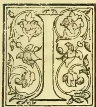

UNSTEAD of a Ceylon planting Pioneer—or a district planting map (the difficulties of reproduction causing delay)—we venture this month to lay before our readers a portrait of Mr. William Shelford C.E.,

whose name has become very familiar to the Ceylon public during the past year; while, we trust, it is destined to be closely associated with the development of the North-western portion of the Island and of railway traffic between India and Ceylon. We are indebted for the engraved block from which we print, and also for the letter-press which we reproduce below, to the courtesy of the proprietors and editor of *The Indian Engineer*, to whom we return our best thanks. Curiously enough the writer of the memoir takes no notice of the Indo-Ceylon Railway scheme with which Sir George Bruce and Mr. Shelford have identified themselves. That the scheme is by no means moribund is shown by the countenance given to it by the Indian authorities, the present Secretary of State for India (Mr. Henry Fowler) being especially favourable to the proposal. The Madras Government, too, has just given orders for the survey of the section between Madras and Paumben. It will be observed that Mr. Shelford is one of the Consulting Engineers for Railways to the Colonial Office, so he ought to be able to make himself heard there; and another link with Ceylon has just been formed in that Mr. Shelford has been appointed Consulting Engineer

for the Colombo Tramways—a position that may yet lead to his taking an interest in supplying tramways to many of the planting districts in our hill-country to connect them with the main line of railway. A brother of Mr. Shelford is well-known in the East as a merchant in Singapore and an energetic member of the Straits Legislative Council.

We quote from *The Indian Engineer* as follows:—

MR. WILLIAM SHELFORD.

The subject of our memoir this week is Mr. William Shelford, a Member of Council of the Institution of Civil Engineers, who has lately shown the interest he takes in Indian Railways by his address to the London Chamber of Commerce, which we have reason to hope will have some practical results. The son of a Wrangler and a member of a family distinguished in mathematical honours at Cambridge University for several generations, Mr. Shelford, who is still in the prime of life and looks it, combines theoretical knowledge with, as will be seen, very great practical experience, and is sure to keep his place for many years in the front rank of the profession.

Trained, as young engineers were wont to be in those days in engine shops, Scotch ones in his case and in the Glasgow and other gravitation water-works, young Shelford entered the office of Mr. (now Sir John) Fowler at an early age and began his railway engineering career chiefly in connection with the first section of the Underground Railway in London, a most valuable experience, as the difficulties to be overcome were both novel,

321------------------------------------------------

290THE TROPICAL AGRICULTURIST.[Nov 1, 1894.]

at that time, various and innumerable. Then he became associated with the London, Catham and Dover Railway and its extensions to the Crystal Palace at Sydenham and to Greenwich. He has since been in practice in Westminster, London, for nearly 30 years, during which period he has been engaged upon a great variety of works in various parts of the world as well as in the United Kingdom. Mr. Shelford was Chief Engineer in the design and construction of the Hull and Barnsley Railway, which is the most recent addition to the main line systems of England and he has acted in the same capacity for several other railways, constructed under agreements with the Great Northern, Caledonian, Great Eastern, Great Western and other railway companies.

Mr. Shelford has visited Canada and the United States and having become practically acquainted with American methods he has successfully applied them in many instances. In the Argentine Republic he made good use of the opportunities for comparing the practice obtaining on either side of the Atlantic. On the continent of Europe, in Italy especially, he has also been largely concerned in the design, construction and working of railways. In all these lines the resources of civilization were at hand and quickly obtainable. But Mr. Shelford has also experienced the want of these aids to rapid progress, having promoted and carried out pioneer railways in the Malay Peninsula, in Sierra Leone and in other parts of Africa. He is now one of the consulting Engineers for Railways to the Colonial Office, and it will be gathered from the foregoing that any opinions in which he may enunciate with regard to matters concerning railways of any kind, are entitled to respect, and will carry the greatest weight with them. We therefore hope that Mr. Shelford will persevere in the course he has so brilliantly entered and that he will aid us with might and main in the development of our means of communication and *pari passu* of our prosperity.—*Indian Engineer*.

### "ADHATODA VASICA" AS AN INSECTICIDE.

(To the Editor of the "Tropical Agriculturist.")

Sir,—I enclose copy of correspondence on the subject of "Adhatoda Vasica" as an insecticide. I am, sir, yours faithfully, A. PHILIP,  
Secretary to the Planters' Association of Ceylon.

Relugas Madulkelle, Oct. 21st.

The Director, Royal Botanic Gardens.

Sir,—I have the honour to forward for your perusal some papers sent to me, by the Indian Tea Districts Association referring to a plant, whose infusion is supposed to be an insecticide and to request that you will kindly inform me whether the plant grows in Ceylon and any other information you may think desirable.

Please return the enclosure to me.—I am &c,

(Signed) MELVILLE WHITE,  
Chairman Ceylon Planters' Association.

Royal Botanic Gardens, Peradeniya, 22nd October 1894.

Sir,—I have to acknowledge the receipt of your letter of yesterday and now return the papers referring to *Adhatoda Vasica*. As these have reached me from two other sources,\* I am already well acquainted with what has been done in India in the matter.

2 The plant is found in the low-country of Ceylon but not in the Hills: but cannot be considered common here.

Indeed I have usually seen it planted as a hedge in native gardens. It has a considerable reputation in native medicine as a remedy for coughs especially of children; the leaves are bitter to the taste and I notice that they do not seem to be eaten by insects. The Sinhalese name is "*Agaladara*" or "*Wana-epala*," and the Tamil one "*Aditodai*" (whence the scientific name) which I am told means that goats will not eat it.

3 It appears certain that the plant possesses the power of clearing water of low organisms, both animal and vegetable, and that this property has been long known to the inhabitants of certain parts of India, but the destructive power of an infusion of the leaves on insect life seems to be scarcely yet fully established. That this is probable however is shown by the chemical analysis of Mr. Hooper of Ootacamund in 1888, who found it to contain a well-marked bitter alkaloid—"Vasicine" of which small quantities in water found to kill leeches, centipedes and insects.

4 If I can obtain sufficient material I hope to experiment here. The plant is easily grown and a small plantation is readily made. The large lithographic sketch accompanying the papers is very rough and not very accurate. If desired I can send you a specimen.—I am, yours faithfully (Signed) HENRY TRIMEN, (Director R. B. G.)

Relugas, Madulkelle, October 25th, 1894.

The Director Royal Botanic Gardens.

Sir,—I have to acknowledge your letter of 22nd October (No. 117) with enclosures and to thank you for the information contained therein.

Should you be able to make any satisfactory experiments with the plant, I shall feel obliged by your communicating the results to me, as the matter may turn out to be of general interest and utility.—I am, &c. (Signed) A. MELVILLE WHITE, Chairman C. P. A.

[From the series of papers referred to above, We give the following as containing the gist of the information available so far.—ED. T.A.]

Khonikor Tea Estate, July 16th, 1894.

DR. GEORGE WATT, M.B., C.I.E., SIMLA.

Dear Sir,

I beg to thank you for your letter to Messrs. Barry & Co., regarding the "*Adhatoda Vasica*," copy of which has been forwarded to me. I have done my best to carry out your suggestions with the following results:—

1st—Samples of leaves, and shoot with bud and leaves, have been dried and sent to your address at Simla, as desired. I hope they will reach you in good enough condition, for you to be able to pass an opinion on as to whether it is the *Adhatoda V.* written about by Mr. Bamber, or one of the same family.

Leaves soaked in cold water, without being bruised give a perfectly clear water.

Leaves thoroughly bruised and soaked in water (cold) for 12 hours give a dirty brownish bitter liquid. Some leaves soaked, after being bruised, for 48 hours gave a thickish brown liquid, which had an oily film over it. Proportion 1 lb. leaf to 1 gallon water.

\* We ourselves forwarded papers to Dr. Trimen, a short time ago.—ED. T.A.

322------------------------------------------------

Nov. 1, 1894.]THE TROPICAL AGRICULTURIST.291

2nd—I have had some slimy stagnant water from drains brought in and put into a bottle with a frog and placed two leaves of the *Adhatoda* V. in it. The leaves in a measure did disintegrate the stuff in the water, had no effect on the frog, but did not clear the water, the water remained of a greyish yellowish colour.

3rd—I had a number of Mosquitos brought in and placed in a box with top and bottom covered with net, the infusion was freely used twice (leaves soaked for 24 and 48 hours) it seemed to have no effect on the Mosquitos beyond in a way stupefying them. I had some dozens in the box for a day and a night; they were twice wetted with the infusion—strength 1 lb. to 1 gallon water—they seemed lively enough at evening, but were all dead in the morning. Now the question arises—what is the duration of a Mosquito's life? how long does it live? did they die a natural death? or were they killed by the infusion? I have not so far found, after my experiments on tea bushes, and dead Mosquito's or even full grown ones, but any number of young ones in, I should say, a state of coma. Only in one case have they returned to the same bush and that after a lapse of nearly a month—they decidedly leave the bush after it has been syringed, but whether they die, or take long flights I have not been able to ascertain. I have now tried some 20 patches attacked by this blight, and in every case they have disappeared after 4 to 6 applications. They are easier got rid of in dry than in wet weather.—Yours faithfully,  
(Signed) F. C. MORAN.

Simla, dated August 1st, 1894.

To F. C. MORAN, Esq., Khonikor Tea Estate,  
Dibrugarh, Upper Assam.

DEAR SIR.—Yours of the 16th, as also your samples of leaves, reached me here yesterday. It is a little difficult to identify the plant by leaves only, as a great number of the *Acanthaceæ* are almost identical in their foliage. The leaves sent by you are a little longer and narrower than those of the plant in Bengal, but still I suspect they may be the correct thing. The Bengal *ADHATODA*, on being dried nearly always turns a yellowish brown colour and the leaves are generally thicker and smaller than in your sample. If not the right plant, since it belongs to the same family undoubtedly, your experiments would point to the same property being possibly possessed by other *Acanthaceæ* than *ADHATODA*.

2. Your experiments with life-infested water, I do not think very satisfactory. If the water chanced to contain mineral impurities, as well as animal and vegetable forms of life, the *ADHATODA* would not clear it of the mineral matter. What you should have done was to have taken two clear glass jars and to have filled these with the self same water at the same time. You should have next examined the contents of both with a low power microscope to see if they were equally infested with the same forms of life. Then you should have put into one of the jars a few leaves squeezed or broken a little or a measured quantity (to be recorded) of your standard infusion. After, say, 2 or 3 hours you should have then examined both fluids to see the action comparatively. By 4 to 5 hours (according to my results) the jar treated with *ADHATODA* would have been found to have had all the contained minute organisms not only killed but more or less decomposed, and the water thus cleared of these impurities, while such higher forms of life as a frog or fish would be seen to have remained unaffected. The drug is in other words perfectly harmless on the higher forms of both animal and vegetable life.

3. To obtain satisfactory evidence your experiments must be comparative. Since the minute forms of life are found to remain in the jar of water not treated with *ADHATODA*—a jar filled from the self same source and at the same time as that which had been treated—the comparison would show that whatever change had been effected in the jar treated with the insecticide must be attributed to the *ADHATODA*, since all other conditions remained the same. Even if you do

not chance to possess a microscope, by which to examine the minute forms of life in the water, two jars, the one to compare with the other, would be preferable to working with one, the more so if they both contain visible (that is, to the naked eye visible) green slimy *algæ*, the destruction of which could be recognized. Moreover, in a day or two the one jar would be seen to contain life, its contents would gradually get darker coloured, the *algæ* would begin to stain the glass by growing upon it and the proportion of life to visibly increase, whereas if *ADHATODA* had killed the lower organisms, no such further growth would take place, and the one fluid as compared with the other would then appear cleared. It was in this sense that I used the word "cleared," not cleared in the sense of having all animal, vegetable and mineral matter precipitated. The expression cleared or purified was intended by me, when originally used, to be a literal translation of the expression employed by the Sutlej valley cultivator, when he drew my attention to the fields that had been treated with *ADHATODA* as compared with those that had not been so treated.

4. I do not for a moment think that on being syringed, the bushes should be regarded as for ever after freed from Mosquito. On the contrary, that would necessitate that the tea leaf had been so saturated that it was permanently poisoned to the Mosquito and possibly thereby injured in flavour as an article of human consumption. If 50 square yards in the middle of a badly infested plantation be treated, it might be but a matter of a few days only when the cleansed portion would be again attacked from the neighbouring bushes. But I do not doubt that assuming that *ADHATODA* has been found a specific against Mosquito and other such pests, the systematic treatment of all and every portion of the plantation where these insects appear should in time result in their complete extermination.

5. Your experiment with Mosquito in a specially prepared cage I don't think very satisfactory for the same reason as detailed in paragraph 2 and 3. You should have made two cages at least, and placed them under identical conditions, the one with the leaves syringed and the other not. The question you raise as to the cause of death of the Mosquito would have then been placed beyond doubt. Your observations on the general effect on bushes treated in the plantation are more instructive than your specific experiments. The remarks for example, that "they decidedly leave the bush after it has been syringed," and again that "I have now tried some 20 patches attacked by this blight and in every case they have disappeared after 4 to 6 applications," show that the subjects is well-worthy of thorough investigation. I would recommend you to try the following method of substantiating these observations. Select two plots as remote from each other as possible, and each in the middle of badly infested portions of the estate. Syringe them both at the same time and to the same extent, the one with pure water and the other with the *ADHATODA* infusion. This would prove whether the mechanical action of syringing or the substance used as an insecticide possessed the action attributed to it. But even such an experiment would have to be repeated many times and by different observers in order to obtain an absolute opinion. So far as I can see, it is more important to deal with the infant or even the egg, than the perfect insect, and if these were destroyed by *Adhatoda* the pest could at all events be thereby controlled. This might be solved by syringing young twigs that are seen to possess the eggs,—some with one dose, others with two, &c., and then placing these twigs in cages or by carefully tying them within muslin cloth (without separating the twigs from the plant) in order to see if subsequently the mature insect escaped from the eggs.

6. You ask me as to the duration of the mature Mosquito life. I have read through every article that I can find on that subject, and have failed to procure you the required information. This point might easily be solved, however, by cultivation in a cage, such as that mentioned in my former letter and as already indicated in paragraph 5 above. The late Mr. Wood-Mason (as you doubtless are aware) wrote a paper on the Tea-mite and Tea-bug. He published thereby certain interesting contributions to our knowledge of

323------------------------------------------------

292THE TROPICAL AGRICULTURIST.[Nov. 1, 1894.]

these insect pests, but did not complete the life history of either. The question as to the duration of Mosquito life he does not even touch upon. But he showed that the eggs were deposited on the young twigs: that the respiratory processes of the newly laid eggs so closely resembles the fine pubescence which clothes the surface of the shoots as to be quite indistinguishable from it to the unaided eye: that the knobbed ends and also the sides of the two tubular processes of the mouth of the egg-shell, to a greater or less extent, are studded with button-shaped elevations, each of which has a minute pit in his centre; that these pits are probably the ends of minute tubes which place the lunens of the processes in direct communication with the exterior, and thus serve to carry air to the developing ovum: that the eggs are provided with deep saucer-shaped lids, perforated sieve-like, with holes which are large enough to admit spermatozoa.

These and one or two more of Mr. Wood-Mason's observations, I venture to think, are of much practical value. By thoroughly saturating the young twigs, it may be possible to cause the insecticide to penetrate through the respiratory tubes and thus destroy the embryos.

But if attention be directed to the destruction of the embryo, it should not be forgotten, as pointed out by Mr. Wood-Mason, that the females instinctively avoid puncturing the shoots or parts of the shoots in which they have laid their eggs, for, says Mr. Wood-Mason, "one can rarely find eggs on badly injured shoots." A thorough syringing of affected bushes, more especially of the sprouting buds of these (which to the casual observer may seem free from the pest) would give full scope to the treatment. But in concluding this paragraph, I would caution you against the mistake made on more occasions than one, of regarding the eggs as young insects; the two unequal processes which spring from the mouth of the egg have been regarded as the antennæ of young (perfect) insects deposited in that state.

7. But Mr. Wood-Mason, in trying to account for the reported greater prevalence of the disease on the Chinese or hybrid Chinese stock of tea bushes, dwells on the fact that the discrimination manifested by many insect pests is doubtless due to a high sense of smell possessed by these creatures. And I would add to his observations that it is well-known that fungoid pests are remarkably good botanists. They choose not only uniformly the same hosts upon which to live, but may even frequent but one variety of the species. The practical value of these observations may lie in the fact that without poisoning the Mosquito it is just possible the ADHATODA infusion may drive the insect away by its offensiveness. If driven away and systematically kept from the tea plant, the effect would be the same to the planter as if poisoned.

My experiments with the drug satisfied me beyond all doubt, however, that to certain forms of life it is a powerful poison, and I am therefore sanguine in my expectation that careful investigations will reveal the fact that it is an actual insecticide to Mosquito and other minute insect pests that frequent the tea and other plants, such as the green fly of the garden rose. But I wish it to be clearly understood that I hold that it requires to be demonstrated in each case whether or not ADHATODA possesses that property on the pests that may be in question.

8. You do not appear to be troubled with the Tea-mite. It would seem to me that ADHATODA might be even more energetic with that pest than with Mosquito, from the fact that the entire life of the mite is spent on the surface of the tea leaf. The eggs are laid in the recesses formed by the branching of the veins of the leaf, and the tapering extremities of the eggs are directed upwards in such a manner that there should be no difficulty in killing their contained embryos. The young arachnids leave the egg as 6-footed larvae, but they do not emigrate from the plant as voyagers on the backs of winged insects (as many other mites do), but attain to adult state by a change of skin. It seems probable that the entire life of the Tea-mite is spent on the self-same leaf as it was born on, so that assuming that ADHATODA is a specific against this

pest, its extermination should be comparatively easy matter.

9. In a communication I have had the pleasure to receive from Messrs. Barry & Company, (dated 23rd July) a tea planter, furnishes certain particulars regarding "Green fly." "It lives," he says, "entirely on the lower side of the leaf and is not got at so easily as mosquito or red spider, and I doubt if it could be syringed out in the same way. It also curls the leaf downwards on all sides and so forms a hollow dome in which it lives and breeds." This would also be the means of protecting it from the syringe. There are doubtless many mechanical difficulties that would have to be got over, but these need not be considered at present. What we have to discover in the first place is whether green fly, mosquito and red spider are killed by the insecticide or not. To yourself and your enlightened brother planters, I trust may soon be due the credit of having brought the experiments with ADHATODA to final and successful issue.

(Geo. Watt,

Reporter on Economic Products to the Government of India.

### "ADHATODA VASICA."

DEAR SIR,—The plant that Mr. Melville White has recently been writing about, is common in the Western Province, it is known to the Sinhalese by no less than three names viz.: *Ayaladara*. *Wana Epala*. and *Pawatta*. It is used medicinally by the Sinhalese in the shape of decoctions for cough, but is a most nauseating drug. The dry leaves are rolled into cigars or filled into pipes and smoked also for cough, similarly as the *Datura* (attara) leaves are for asthma. A fomentation of the leaves boiled is greatly relied on for lumbago. That cattle, sheep and goats will not eat the leaves is a fact, but whether it is an insecticide remains to be proved.

C. A. C.

### THE NEW ALLEGED INSECTICIDE, "ADHATODA."

We are disappointed to see by the interesting letter Mr. E. E. Green has sent us (see below)—that an experiment instituted by him with the new insecticide has not been successful. We have given above the important portions of the letters of Dr. Geo. Watt and Mr. Moran sent to the Chairman, P.A. Dr. Watt does not speak of distillation in the required infusion, but of a few leaves squeezed or broken into a glass jar with water clearing, in 4 or 5 hours, the said water of minute organisms which would be found not only killed, but more or less decomposed. Mr. Moran was successful in clearing some 20 patches of tea attacked by mosquito after 4 to 6 syringings with an infusion from the leaves.

### "ADHATODA"—AS AN INSECTICIDE; AN UNSUCCESSFUL EXPERIMENT.

Eton, Pundaluoya, Oct. 29th. "

DEAR SIR,—I have noticed in the local papers some correspondence about a Ceylon plant—the "Adhatoda"—which is said to possess insecticidal properties. I hope it will be thoroughly tested and that the statement may be corroborated. But a little experiment that I have just tried with this plant failed to prove anything of the sort. Dr. Trimen very kindly sent me a small piece of the "Adhatoda," from which I brewed a strong tea-coloured infusion. The quantity was insufficient for experiment in the field. But to test its qualities I immersed in the mixture several tea branches, infested with the tea aphid (*Ceylonia theaecola*), until both leaves and insects were thoroughly wetted. I then took them out and

324------------------------------------------------

Nov. 1, 1894.]THE TROPICAL AGRICULTURIST.293

put them in a closed box until the following day, when, to my disappointment, I found the insects as lively as ever! Not a single corpse to be seen! Further experiments were prevented by the rapid putrefaction of the infusion. It is possible that the fault lay in the preparation of the mixture. Perhaps it is necessary to obtain an extract by distillation instead of infusion. These are points that should be ascertained from headquarters.

I think it very probable that we may possess in Ceylon many native plants or trees with hitherto unsuspected insecticidal properties. I am now engaged in making experiments in this direction.—Yours truly,

E. ERNEST GREEN.

### AMERICAN CONSUL MOREY ON CEYLON TEA AND TRADE GENERALLY.

A Colombo merchant in sending us a copy of the *Shipping and Commercial List* of New York, in which we find Consul Morey's Report on Ceylon Tea Trade, &c., writes:—"I think Mr. Morey has gone too far in dogmatizing about low-country teas, and in quality, and market deterioration in quality, all of which is calculated to do damage to the interests of the Island, and will not help Ceylon tea into America. The paragraph about American drills being displaced by locally manufactured drills, 'neither as good nor as cheap as pepperill,' is altogether gratuitous; for, the local production is much cheaper. I am surprised at Mr. Morey's tone altogether." And so are we, because while it is the bounden duty of a Consul to give a fair and outspoken Report for the benefit of his countrymen, it is equally his duty to seek information from those best qualified to give it to him, and surely one or other of the Directors of the Cotton Mills ought to have been inquired of; while as regards our tea we certainly think Mr. Morey goes a little too far. We quote from his Report the main portions as follows:—

#### CEYLON TEA FOR THE UNITED STATES.

By W. Morey, United States Consul at Ceylon.  
In June, 1886, I reported upon tea, the production of which was then being prosecuted as a "new Ceylon industry." The shipments had amounted to 435,000 pounds in the previous year, and both planters and exporters were anxiously considering ways and means for introducing their product into different countries, especially the United States. In 1889 a "Ceylon Planters' American Tea Company" was formed locally, which merged in 1891 into an American company, bearing the same name, I believe, and incorporated under the laws of New Jersey. Considerable advertising was done in the United States by the last-named company, but very little tea was handled by them, and in 1893 the company went into liquidation. In the meantime the Ceylon Government had appropriated \$100,000 toward making an exhibit at the World's Columbian Exposition at Chicago, and it appears that most of that money was expended in the interest of Ceylon tea. With this incentive the local shipments of tea to the United States amounted to 250,945 pounds in 1893, though about 163,000 pounds, say nearly two-thirds, of that quantity went to California, quite independent of any stimulus whatever from the World's Fair exhibit. The total shipments to the United States in 1891 having been 268,554 pounds (about the same quantity as in 1890), and only 250,945 pounds in 1893, it is plain that up to the present the considerable attempts that have been made to introduce Ceylon tea into the United States have met with small success. The planters, however, are

not discouraged, and at their meeting in Newara Eluja, [sic] on the 14th of April, they voted to ask the Government to continue indefinitely the export duty on tea of one-tenth of one cent per pound (imposed in 1893 to raise funds for the exhibition at Chicago) for the purpose of continuing what they call "the American campaign." \* \* \*

As hereinbefore mentioned, the total shipment of Ceylon tea to all countries in 1885 was 4,353,000 pounds, and 84,406,064 pounds in 1893, showing the enormous increase in eight years of over 80,000,000 pounds. In the meantime prices have so fallen annually that in 1893 the average price of Ceylon tea at public sales in England was 9d (18 cents) per pound.

For this fall in price several reasons are given. One authority says the price of tea follows the price of silver; another says plucking for quantity instead of quality is the cause; another says carelessness in the manufacture has much to do with it; another that Ceylon tea does not keep well i.e., it soon loses its fine flavour; and others say that it is actually deteriorating in quality.

I am much inclined to believe that the last-named cause is the most nearly correct, for it is within my knowledge that estates which ten or fifteen years ago produced good tea grow nothing now worthy of that name. This is especially true of properties in the low country, and to a great extent of old coffee lands among the hills converted into tea estates. In the low country the soil is poor, and constant cropping soon exhausts the tea elements therefrom. Accordingly, after ten years at most, the tea product is so very poor that the liquor from it resembles more a decoction from boiled herbs than from good tea.

To keep up the quality manuring is necessary, but the price of tea in Europe (18 cents per pound) does not pay for fertilizing; neither will manuring pay in the higher altitudes, though the price of high-grown tea is about 25 per cent more than of that which is grown in the low country nearer the sea.

Much of the upcountry tea is grown on hill-sides, where, owing to the steepness of the land, most of the manure applied is washed away by the rains. But if the theory of electric storms producing an abundance of plant manure in the form of nitrogen is correct, the high altitude estates have a great advantage, as there is much thunder and lightning and rain in the hills of Ceylon nearly all the year round. Therefore high-grown tea may be expected to hold its own and keep its flavor for some years to come. More especially is this the case where the estates have been made on virgin soil in favorable localities.

Considering that most low-grown teas are too poor in quality for anything but blending purposes, some not being even fit for that, it follows that, as a rule, only high-grown Ceylon tea is suitable for the American market; more especially as the object is to displace China and Japan teas, already largely in use there. This can only be done by presenting a better article to the dealers and consumers at as low, or perhaps lower price, than now obtains. To do this, I conceive that nothing cheaper than 20 to 25 cents (United States money) per pound locally can be successfully used. Of course there is plenty of such tea produced here, but very little is sold in the local market, for as a matter of fact, producers of such tea mostly send their product to London, where its quality is so well known to the trade that it is sure to be sold profitably, and there may be other reasons for its going there that need not be mentioned here. It will be hard, therefore, to induce them to send it on speculation to the United States.

Tea suitable for the United States will therefore need to be bought in London, after its cost has been greatly enhanced there by many intermediate expenses and charges, and where, perhaps, its purity or quality has not been improved by manipulations. Accordingly it is by no means certain that China and Japan teas will be easily or largely displaced in a country where they are already used to the extent of 85,000,000 pounds per annum while Ceylon tea, notwithstanding the expenditure of large

325------------------------------------------------

294THE TROPICAL AGRICULTURIST.[Nov. 1, 1894.]

sums of money and much advertising in the last five years, has not attained the proportions of even 500,000 pounds per annum. \* \* \*

Unfortunately, the element of reciprocity of trade is absolutely absent between the United States and Ceylon; for while the United States takes nearly \$2,500,000 worth of Ceylon products yearly, and mostly free of duty, Ceylon imports nothing directly from the United States, and very little indirectly, while transportation between the two countries is circuitous and expensive.

Formerly some kerosene oil came here direct from New York—not much, to be sure, and never amounting in value to \$100,000 per annum. Even upon this an import duty was levied in 1885 against my protest. Now the import of kerosene oil direct from the United States has actually ceased. The same is true of American drills, which formerly came here in considerable quantities, but which are now dispensed, mostly by locally manufactured drills, which are neither as good nor as cheap as the Pepperill drills. \* \* \*

Possibly, however, after several years of careful consideration and observation, I may state as an opinion that Ceylon tea, worth locally free on board, 20 to 25 cents per pound, is probably as good an article at present as can be got for the same price anywhere; but as a rule, that quality of tea is not largely sold locally. Again, as the years roll by, Ceylon tea, to re-state the fact mildly, does not improve in quality.

I am informed by the largest local shipper of tea to the United States that his advices from the United States intimate that the Ceylon export price should not exceed 15 cents per pound. If such is the case it is doubtful if any considerable tea trade can be done between the two countries; for, in my judgment, the teas sold locally, for much less than a rupee per pound, are very poor. I myself have sampled some that were invoiced at 18 cents (United States money) per pound free on board, and it was not, to my taste, drinkable.

The Editor of the paper above-mentioned, remarks:—

\* \* \* The production of Ceylon tea has increased from 4,353,000 pounds in 1885 to 84,406,064 pounds in 1893—a truly wonderful increase—nearly twenty fold. Unfortunately, this increase in production has been accompanied by a marked deterioration in quality, for which several reasons are alleged; the chief reason being, in the opinion of the Consul, the constant cropping, which practice soon exhausts the tea elements in the soil. It may be gathered from the report that another reason is the employment of soil which is not well adapted to the cultivation of the tea plant. The inferiority of quality has naturally led to a serious decline in prices, and it is now complained of that the average price of Ceylon tea at public sales in England in 1893 had fallen as low as nine pence (18 cents) per pound. \* \* \*

In a former attempt to establish a trade in Ceylon teas in the United States, agents were appointed in this city and in Chicago for the purpose of pushing this trade. The enterprise proved a failure, as might have been expected, because by this plan the wholesale trade was slighted and overlooked. In order to succeed, the wholesale trade must be enlisted, by whose co-operation alone can any new article be successfully introduced to their wide connection among the retail trade.

The imposition or continuance of the proposed export duty cannot improve the export trade to the United States, as the exports to London will obtain the same advantage as those to New York, so that the proposed plan would simply continue things just as they are now. We have no great faith in the success of this trade through the appointment of the proposed representative in New York. As the resolution passed at the meeting of the planters above referred to reads, this representative would have to pay the bonus of 2½ per cent on Ceylon tea imported into the United States, via England or other route.\*

\* This refers to the abandoned bounty scheme.  
—Ed. T.A.

In order to the establishment and extension of the trade in Ceylon teas, there must be direct importation from Ceylon. This must be followed up by a general distribution among the wholesale trade. With the fund obtained from the export duty, part of it might be invested in the venture of the direct shipment of a carefully selected cargo of Ceylon teas expressly gathered for the United States market. The cargo, whose expected arrival should be largely advertised in the principal cities, should be offered to the trade of auction, the date, hour and place of auction being widely announced on arrival. There should not be any fear but that the sale will be largely attended, and that the competition will be keen enough to ensure that the whole, or at least the greater part, of the cargo would be sold at such fair prices as the merits of the different lots should command.

## CEYLON TEA IN AMERICA.

Mr. Consul Morey sticks to his Report as may be seen from his letter elsewhere. He is quite right not to base his writing on information which he considers interested and one-sided; but we meant that a Director of the Local Cotton Mills could probably have given him information which, when compared with what he got elsewhere, would have enabled him to generalize a little more accurately. Certain we are, at any rate, that in respect of our tea industry, its condition and prospects, Mr. Morey has generalized in a way to do the Colony some injustice. He has by no means so discriminated as to leave a fair impression on the minds of his American readers. They ought to have been told that the old worn-out tea land to which he refers is chiefly confined to a limited middle belt, where, however, liberal cultivation with manure is effecting wonders with tea even in very old coffee land; while the vast proportion of our higher and lower tea plantations being on virgin land, or on land that had done very little in coffee, are as vigorous and promising as any similar tea gardens in the world.

In this connection, we may refer to the receipt by this mail of the "25th Anniversary" number of the American *Grocer*, splendidly printed with numerous engravings. The paper was started in 1869, and ever since, with but brief intervals, we have studied its pages. In this special issue, the staples of grocers—cacao (chocolate), coffee, tea and sugar—are the subjects of special papers well illustrated. Central America is referred to for illustrations of coffee plantations and preparation; while some 12 pages are devoted to "tea," led off by a very beautiful engraving of "a tea plantation, Ugi, Japan," a fine level garden on the side of river or lake, backed by a cedar-clad mountain range. Then follow pictures of "Firing Tea," "Sorting Tea" and "Picking Tea" in Japan with maps on very small scales of Japan and China Tea districts. Then comes a chapter on "Indian Tea and its Manufacture by Modern Methods," well written and fairly illustrated showing "a flush," withering room rolling tables, firing, handsome coolie woman picking leaves, sorting room, &c. There is no reference to Ceylon save in the statistics. Mr. Blechynden has, no doubt, seen that justice was done to India; for we find the following advertisement prominently displayed in this number of the *Grocer*:—

Indian Tea Demonstrations—are being given by—  
Natives of—India in costume At Grocers' Stores Only,  
By way of Introducing India Teas to the American Consumer. R. Blechynden, Commissioner Indian Tea Association, (Gare of L. Sutro & Co.) 105 Hudson Street, New York.

It is quite time that Sir Grame Elphinstone, Bart., and his colleague were on the spot, to push the claims of Ceylon tea.

326------------------------------------------------

Nov. 1, 1894.]THE TROPICAL AGRICULTURIST.295THE AMERICAN CONSUL'S REJOINDER.

United States Consulate at Ceylon, Colombo,

Oct. 22.

DEAR SIR,—The "Colombo Merchant" who sent you the "Shipping and Commercial List" of New York, containing my report on Ceylon tea, presumes to tell me and the readers of your paper, how I ought, or ought not, to write my official report—*noblesse oblige*.

In the line of duty, his sapient remarks will be sent to the Government at Washington with my comments thereon; but as the absence of the writer's name may detract somewhat from the force of those remarks, I would be glad to have them authenticated.

As for the cotton drill of the local Mill being "much cheaper" than Pepperill drill, I deny it and say that for quality the price is dearer.

For obvious reasons, I would not think of asking a Director of the Spinning and Weaving Company about the price and quality of their goods. I prefer to adopt a more practical method of obtaining that information.—I am, sir your obedient servant,  
W. MOREY, Consul.

RESOURCES OF BRITISH HONDURAS.

A very exhaustive report on the present condition of the Colony of British Honduras, prepared by the Governor, His Excellency Sir Alfred Moloney, K. C. M. C., has recently been issued by the Colonial Office (*Colonial Office Reports; Annual, No 73, 1893*). From this Report the following general survey of the resources of the Colony will prove of interest not only in this country, but in many portions of Her Majesty's Possession.

The commercial prosperity of colonies which depend on a limited number of articles of export is liable to disastrous fluctuations. Striking instances are to be found in the ruin of a once extensive trade, that had been confined to a single commodity, from competition and the inevitable fall in price, from the ravages of rats or locusts, or from a single blight. So far British Honduras would seem to have stood exceptionally in the Colonial Empire in having for the past two centuries relied almost entirely upon its forest produce and on its rivers as means of transport to the sea. Some of our West African Possessions have stood somewhat similarly since palm oil succeeded the slave export trade; that industry is now seriously threatened by animal fats and other sufficiently available and equally suitable commodities. One of the extracts from coal tar practically killed the once flourishing and profitable cochineal trade, and also affected the indigo trade of India. Beet has contributed to the depression of the sugar trade. The substitution of iron for wood in shipbuilding, particularly in men-of-war, at one time almost killed the large timber export trade of the Gambia and West Africa. These are again attracting attention for their mahogany, cedar, rosewood, dye and other woods; and the marked and progressive revival of the trade, and the dimensions it is assuming must naturally be a subject of direct concern and anxiety to all wood-cutting centres.

Mahogany and logwood trees have been for several generations the principal articles of commerce in British Honduras, but they are said to be getting more and more difficult of access and consequently more expensive to work and get to the market. The value of these industries is not for one moment questioned. On the contrary, it is highly desirable to promote them and to protect the forests on which they depend. The Colony's motto, "Sub umbra flores," should have now a more extended application.

In view, however, of such experiences as have been referred to, it has been generally accepted that even in commerce it is a hazardous experiment to "carry all your eggs in one basket."

As guides in establishing profitable industries we must look to the source of supply, the prospects

and disposal of growth, and the area of the field of demand. It has now become a generally accepted policy in the Colonies to encourage the production of varied staple articles of export of a more or less permanent character. Much has been done in this direction by the active interest and assistance of the authorities of the Royal Gardens at Kew to develop new industries and to distribute plants of commercial importance. With this object there have been established in all our West Indian Possessions Botanic Stations. A similar institution has been established as a tentative measure in Belize, the capital of this Colony, which has such exceptional advantages whether we look to climate, soil, or a market. It has with some justice been advanced that British Honduras can be made the tropical garden of North America, and it may be remembered that 28° North is generally accepted as the frost line, which may be said to mark the limit northwards within which the growth of economic products in demand can be profitably undertaken. FERTILITY OF SOIL.—As to fertility of soil, what more convincing proof can be advanced than the facts that in the sugar areas to the north and south of the Colony cane has been known to "ratoon" from 20 to 30 years, and that in the rich and naturally fertilised valley beds, bananas have maintained themselves without degeneration for 10 to 12 years, if not longer.

PRODUCTS.

The products of cultural industries, still really in their infancy, are chiefly bananas, plantains, coconuts, coffee, henequen, Indian corn, limes, mangoes, sour and sweet oranges, pineapples, avocado pears, rubber, to which there should be added in time a natto, cacao, coir, ground-nut, indigo, jute, pita, ramie, spices, vanilla and doubtless other promising marketable commodities.

To the small extent to which the banana has been successful to the north of the frost line referred to, where it will always be a precarious crop at best, it has proved inferior in quality to the West Indian and Central American fruit. Whilst in 1879 it did not appear among our records its export was represented by 72,436 bunches in 1891.

The plantain is a staple of food over a large section of Negroland in West Africa. The descendants of its interesting people to the north of the Gulf of Mexico represent a consuming power of probably 9,00,000. Tons of this fruit from Cuba and elsewhere meet with a ready sale in Florida. This Colony's shipments to New Orleans rose from 50,000 plantains in 1879 to 1,580,200 in 1891.

CACAO.—The home of the cacao is in tropical America. One or more valuable species may belong to British Honduras and include that which is said to be the best in a marketable sense. Notwithstanding, it may be said to be here remarkable for its absence from the export cultures of the Colony which have grown in value, in round numbers, from \$12,000 in 1879 to \$296,667 in 1891. Yet, in the Island of Grenada, of the West Indies, and but 5° to 6° to our south, and with an area of 133 square miles and an estimated population in 1889 of 50,000, cacao has developed into its main export, which reached in 1890 a value of 228,319/.

GROUND-NUT AND VANILLA.—The clover-like ground-nut, so desirable as a pasture where the bread-nut is not available, apart from its valuable oil-yielding seed, and henequen would seem to be admirably suited for growth in the pine ridges, as would also the Ceara rubber. That interesting orchid, the vanilla, whose home is as so in Central America, is one of the most valuable products and has, near at hand, a rich and ever-growing market. Its cured pod sometimes fetches as much as 30s. per lb. It is a plant easily propagated by means of cuttings, and has developed into a considerable export from Vera Cruz.

COFFEE.—Our Guatemalan neighbours seem to turn no small attention to the cultivation of the Arabian coffee. Whilst it will doubtless prove suitable to the high areas of the Colony, the introduction of the hardy and rich Liberian coffee—so well suited to low-lying areas, with its comparatively heavier crop, averaging from 6 lb. to 8 lb. per tree, 400 of which

327------------------------------------------------

296THE TROPICAL AGRICULTURIST.Nov. 1, 1894.]

can be accommodated on each acre—should receive the consideration it deserves. Judging from the exports from the Malay Peninsula, and the imports to the United States, there is a promising field of demand offered in the direction of the later for the growth of Liberian coffee and of such commodities as jute and other fibres, indigo, giuger, and spices generally.

**COHUNE OIL.**—The Cohune oil industry remains yet dormant, if I expect the use for domestic and cooking purposes to which it is put among the families of manogany and logwood cutters. Two-fifths of the Colony, viz., 1,933,762 acres are, it is estimated, under this graceful native "Prince of Wales" palm. If we allow 25 trees to the acre, a very low average, and 1,000 nuts as the annual yield per tree, and accept that 100 nuts yield a quarter of oil, this dormant industry, if awakened to full activity, would yield 276,537 tons of oil at a price per ton appreciably above that which obtains for coconut oil, to which it is superior.

**PINE PRODUCTS.**—Then, again, apart from its resinous property, which was turned, I understand, to profitable account some years back, the native pine is estimated to cover a third of the Colony, or, 1,613,136 acres, and to average 100 trees per acre on our great southern pine ridge. Its wood is said to almost equal that of the yellow pine of the United States, which, in the beginning of 1888, was reported to have been nearly worked out and might, in part, have to be replaced by the local pine. The growth on the older pine-ridges of the Colony may, when opened up, prove of sufficient age and diameter to make it worth while to have attention turned to adding this timber to our exports, as can doubtless be done with many other valuable woods as yet unknown.

**COCO-NUTS AND HENEQUEN.**—The coral patches and marine islets we know as "Cays," that fringe to the eastward the waters of this Colony, offer a condition of site exceptionally favourable for the growth of henequen and the coconut tree, described as the most tender of palms as regards frost, the friend of tropical agriculturist. The area of such Cays is given approximately as 112,577 acres, which might be turned to much more profitable uses and yield than obtain at present. With even a quarter of such screage suitable for the culture of such products as coconuts and henequen, it could be covered with plantations of the former numbering 2,813,200 trees with an annual yield of at least 100 nuts (a low average) aggregating 281,320,000, worth, at the current rate per thousand, 1,406,600 $\frac{1}{2}$ , I might explain that such an aggregate of nuts on the basis of 1 lb. from 7 nuts or 14 per cent. fibre, should yield 18,000 tons of fibre that would realise in the London markets from 30 $\frac{1}{2}$  to 10 $\frac{1}{2}$  per ton, according as it is suited for brushes, mats, or stuffing.

The annual export from the Colony of coconuts during the past five years have averaged in number 1,651,333, and in value \$32,505.

**SAPODILLA AND PIMENTO.**—That delicious fruit, the sapodilla, if picked green, will stand shipment; the tree abounds in this Colony, and apart from its valuable and durable wood, yields an extract which contributes mainly to the manufacture of what is advertised and so widely used in the United States as "chewing gum." Then, again, trees yielding the pimento of commerce abound in a wild and unappreciated state, yet this spice was exported from Jamaica to the value of 81,326 $\frac{1}{2}$  in the year 1890-1. —*Kew Bulletin*.

**DEAFNESS.** An essay describing a really genuine Cure for Deafness, Ringing in Ears, &c., no matter how severe or long-standing, will be sent post free.—Artificial Eardrums and similar appliances entirely superseded. Address THOMAS KEMPE, VICTORIA CHAMBERS, 19, SOUTHAMPTON BUILDINGS, HOLBORN, LONDON.

## VARIOUS PLANTING NOTES.

**ROYAL GARDENS, KEW.**—*Bulletin of Miscellaneous Information* for September has for contents:—Vegetable Resources of India; Botany of the Hadramaut Expedition; Decades Kewenses: IX; Miscellaneous Notes.

Mr WILLIAM LUNT, in the employ of the Royal Gardens, has been appointed by the Secretary of State for the Colonies, Assistant Superintendent of the Royal Botanic Gardens, Trinidad. Mr. Lunt was also lately employed as botanical collector, attached to Mr. Theodore Bent's Expedition to the Hadramaut Valley, Southern Arabia.—*Kew Bulletin*

**CENTRAL AFRICA AND PLANTING PROSPECTS.**—The Board for Botany of the Royal Society decided not long since to send Mr. Scott Elliot, the well-known botanist, to make a botanical exploration in Central Africa. Mr. Elliot reached his destination a few weeks ago. His first report has been received. It shows that the flora over the whole of this region up to an altitude of 6,000 feet remains unchanged, and points to the probability that it extends similarly down to the Zambezi. There are only very few trees to be seen, the commonest being the euphorbia and erythrina, and the variety of plants is likewise somewhat limited, the principal being the acanth—a plant richly ornamented with red spikes of flowers and large prickly leaves. The banana supplies the wants of the people, but coffee and tobacco and all other tropical plants could be grown if properly cultivated. He is, however, prevented from progressing as satisfactorily as he could wish by obstructive weeds, which grow in great thickness and to a great height, and, as the compass shows most extraordinary variations, he finds it almost impossible to make out his course.—*H. and C. Mail*.

THE ATTEMPT to train European and Eurasian apprentices for work in Botanical gardens is unfavourably reported on, and, for want of recruits, the Botanical Superintendent at Saharunpore proposes, with some diffidence to train juvenile offenders from the Bareilly Reformatory for botanical work.—*M. Times*, Oct. 24.

THE UNEMPLOYED TEA-GARDENS.—We read that the offices of Tea-garden agents are being deluged with letters from those who are out of work or who expect to be soon. The world seems to have Orange-Pekoe and Congo enough! But the question is whether there is anything at all that the world wants which unemployed might turn to supplying!—*M. Times*, Oct. 25.

**CEYLON TEA IN AMERICA.**—It is interesting to learn of the number who have begun, or are about to begin, a business in supplying America with Ceylon tea. The Company for whom Mr. Webster travels was perhaps, earliest in the field having commenced, we believe, in 1892 and seemed almost at once to secure considerable orders from Canada as well as the States. Messrs. P. R. Buchanan & Co. turned their attention to America in 1891, and for three years the senior partner visited the States, but did not secure much attention to India and Ceylon teas till early in 1893. Mr. A. E. Wright organized a business agency for certain Ceylon tea during his visit in the Exhibition year; and a contemporary correspondent mentions that Mr. Farr (formerly of Watson & Farr) is doing a fair and increasing business in Ceylon leaf; while we know of Mr. J. A. Henderson's special visits to New York on behalf of the enterprising Firm he represents. But all this—to judge by the actual figures representing exports so far—is as nothing to what we have a right to look for when once a "Ceylon campaign" is properly set a-going.

328------------------------------------------------

Nov. 1, 1894.]THE TROPICAL AGRICULTURIST.297

## CEYLON MANUAL OF CHEMICAL ANALYSES.

A HANDBOOK OF ANALYSES CONNECTED WITH THE INDUSTRIES AND PUBLIC HEALTH OF CEYLON FOR PLANTERS, COMMERCIAL MEN, AGRICULTURAL STUDENTS, AND MEMBERS OF LOCAL BOARDS.

By M. COCHRAN, M.A., F.C.S.

(Concluded from page 227.)

APPENDIX—(Continued.)

*Analyses of four samples of the Coals used by the Colombo Gas and Water Coy., Ltd., during 1893.*

<table border="1">
<thead>
<tr>
<th rowspan="2">Description of Coal.</th>
<th colspan="3">Gas Coal.</th>
<th>Steam Coal.</th>
</tr>
<tr>
<th>Australia.</th>
<th>Bengal.</th>
<th>Assam.</th>
<th>Cardiff.</th>
</tr>
<tr>
<th>Source of Coal.</th>
<th>percent.</th>
<th>percent.</th>
<th>percent.</th>
<th>per cent.</th>
</tr>
</thead>
<tbody>
<tr>
<td>Volatile matters ...</td>
<td>(35.5)</td>
<td>(36.00)</td>
<td>(39.35)</td>
<td>(16.7)</td>
</tr>
<tr>
<td>Gas, tar, &amp;c.</td>
<td>32.515</td>
<td>33.18</td>
<td>35.29</td>
<td>15.31</td>
</tr>
<tr>
<td>Sulphur ...</td>
<td>.245</td>
<td>.12</td>
<td>.62</td>
<td>.13</td>
</tr>
<tr>
<td>Water ...</td>
<td>2.740</td>
<td>2.70</td>
<td>3.44</td>
<td>1.26</td>
</tr>
<tr>
<td>Coke ...</td>
<td>(64.5)</td>
<td>(64.00)</td>
<td>(60.65)</td>
<td>(83.3)</td>
</tr>
<tr>
<td>Fixed carbon</td>
<td>56.919</td>
<td>53.14</td>
<td>51.86</td>
<td>81.68</td>
</tr>
<tr>
<td>Sulphur ...</td>
<td>.441</td>
<td>.22</td>
<td>.95</td>
<td>.62</td>
</tr>
<tr>
<td>Ash...</td>
<td>7.140</td>
<td>10.64</td>
<td>7.84</td>
<td>1.00</td>
</tr>
<tr>
<td></td>
<td>100.000</td>
<td>100.00</td>
<td>100.00</td>
<td>100.00</td>
</tr>
<tr>
<td>Specific gravity</td>
<td>1.363</td>
<td>1.363</td>
<td>1.304</td>
<td>1.304</td>
</tr>
<tr>
<td>Heating power in units ...</td>
<td>8.400</td>
<td>7.938</td>
<td>7.834</td>
<td>11.088</td>
</tr>
<tr>
<td>Weight per cubic foot in lbs.</td>
<td>85.187</td>
<td>85.187</td>
<td>81.500</td>
<td>81.500</td>
</tr>
<tr>
<td>Colour of Ash</td>
<td>Light brown</td>
<td>Light grey</td>
<td>Red</td>
<td>Red</td>
</tr>
</tbody>
</table>

The above represent the composition of the coal proper, and judging from the results the Assam coal might be expected to yield most gas while the Bengal might be also expected to shew a slightly higher yield than the Australian; but in practice the Australian coal gave the best results and the Bengal next best, the reason being that the Australian coal was freest from stones and dirt, and the Bengal cleaner than the Assam.

The Cardiff coal was not used for its gas-producing power which is small, but for its heating power. The analysis brings out its marked superiority in the latter respect to the others shewing, as it does, nearly 25 per cent more fixed carbon. The heating power is expressed in terms of units (say pounds) of water at 212°F converted into steam by the consumption of one unit (say 1 lb.) of the coal. The heating power may therefore be also termed the steam-producing power of the coals.

88

### *Chemical Examination of a sample of Chekkoo Coconut Oil.*

<table>
<tbody>
<tr>
<td>Specific gravity at 84°F. (water at 60°F. = 1000)</td>
<td>916.1</td>
</tr>
<tr>
<td>Specific gravity at 212°F. (water at 60°F. = 1000)</td>
<td>872.4</td>
</tr>
<tr>
<td>Iodine absorption, expressed in centigrams of iodine absorbed per gram of oil</td>
<td>8.49</td>
</tr>
<tr>
<td>Saturation equivalent, expressed in centigrams of caustic potash required to saturate fatty acids in one gram of oil</td>
<td>26.92</td>
</tr>
<tr>
<td>Free fatty acids in oil, per cent</td>
<td>1.97</td>
</tr>
<tr>
<td>Insoluble fatty acids in oil, per cent</td>
<td>91.38</td>
</tr>
<tr>
<td>Soluble fatty acids in oil, per cent</td>
<td>1.15</td>
</tr>
<tr>
<td>Unsaponifiable oil, per cent...</td>
<td>20</td>
</tr>
</tbody>
</table>

#### *Note on Specific Gravity.*

The specific gravities determined by the author, in connection with milk and oils, represent when not otherwise stated, the weight of a given volume of milk or oil, at the observed temperature, compared with the weight of an equal volume of distilled water at the same temperature. In the case of milk, the specific gravity thus determined gives a close approximation to what it would be at standard temperature.

In Colombo there is a drawback to the determination of the specific gravity of liquids after cooling them to the standard temperature of 15.5°C. or 60°F., as the moisture of the atmosphere at this low temperature condenses on the surface of the specific gravity bottle, during the operation of weighing. Some liquids also, for example, coconut oil, when cooled, change their physical condition from liquid to solid long before the standard temperature is reached. The true specific gravity of liquids at the high temperatures prevailing in the tropics, *i.e.*, the weight of a certain volume of the liquid at the observed temperature, compared with the weight of an equal volume of water at standard temperature, may be deduced from the specific gravity determined as above described, by multiplying this result by the factor opposite the observed temperature as in the following table. We cannot, however, calculate the specific gravity of a liquid at standard temperature from the observed weight of a given volume at any higher temperature unless the co-efficient of expansion of the liquid be known.

#### *Table of the Specific Gravity of Water at various Temperatures.*

<table border="1">
<thead>
<tr>
<th>Temperature.</th>
<th>Specific gravity.</th>
<th>Temperature.</th>
<th>Specific gravity.</th>
</tr>
</thead>
<tbody>
<tr>
<td>15° C.</td>
<td>1.00000</td>
<td>26° C.</td>
<td>.99778</td>
</tr>
<tr>
<td>20° C.</td>
<td>.99918</td>
<td>27° C.</td>
<td>.99752</td>
</tr>
<tr>
<td>21° C.</td>
<td>.99897</td>
<td>28° C.</td>
<td>.99725</td>
</tr>
<tr>
<td>22° C.</td>
<td>.99875</td>
<td>29° C.</td>
<td>.99697</td>
</tr>
<tr>
<td>23° C.</td>
<td>.99852</td>
<td>30° C.</td>
<td>.99668</td>
</tr>
<tr>
<td>24° C.</td>
<td>.99828</td>
<td>100° C.</td>
<td>.95953</td>
</tr>
<tr>
<td>25° C.</td>
<td>.99804</td>
<td>...</td>
<td>...</td>
</tr>
</tbody>
</table>

#### *Milk.*

Although the milk generally sold in Colombo, especially in the poorer districts, is a weak nutritious fluid consisting largely of added water, there is no doubt that milk of first-rate quality can be produced in Colombo. The following analyses of samples of milk drawn from a Colombo dairy shew that, if the legitimate industry were encouraged by the suppression of fraudulent competition, Colombo might become as conspicuous for the excellence, as it has hitherto been for the poverty of the milk sold to its inhabitants.

329------------------------------------------------

298

THE TROPICAL AGRICULTURIST.

[Nov. 1, 1894]

*Analyses of two samples of Cows Milk of superior quality.*

<table border="1">
<tr>
<td>Specific gravity</td>
<td>... 1029</td>
<td>1028</td>
</tr>
<tr>
<td></td>
<td>per cent.</td>
<td>per cent.</td>
</tr>
<tr>
<td>Fat</td>
<td>... 6.25</td>
<td>6.43</td>
</tr>
<tr>
<td>Sugar and Casin</td>
<td>... 8.43</td>
<td>9.17</td>
</tr>
<tr>
<td>Salts</td>
<td>... .82</td>
<td>.70</td>
</tr>
<tr>
<td>Total solids</td>
<td>... 15.50</td>
<td>16.30</td>
</tr>
<tr>
<td>Water</td>
<td>... 84.50</td>
<td>83.70</td>
</tr>
<tr>
<td></td>
<td>100.00</td>
<td>100.00</td>
</tr>
<tr>
<td>Non-fatty solids</td>
<td>... 9.25</td>
<td>9.87</td>
</tr>
</table>

*Table of Rainfall for Ceylon*

Deduced from the Public Work's Department's return of rainfall for 1891, shewing average rainfall per annum taken during periods varying from 2 to 20 years.

<table border="1">
<thead>
<tr>
<th>Province.</th>
<th>Number of Stations.</th>
<th>Inches.</th>
</tr>
</thead>
<tbody>
<tr>
<td>Western</td>
<td>3 (2 coast 1 inland)</td>
<td>117.19</td>
</tr>
<tr>
<td>Central</td>
<td>16</td>
<td>115.44</td>
</tr>
<tr>
<td>Northern</td>
<td>6</td>
<td>49.02</td>
</tr>
<tr>
<td>Southern</td>
<td>18</td>
<td>76.27</td>
</tr>
<tr>
<td>Eastern</td>
<td>17</td>
<td>50.90</td>
</tr>
<tr>
<td>North Western</td>
<td>5</td>
<td>49.42</td>
</tr>
<tr>
<td>North Central</td>
<td>...</td>
<td>48.57</td>
</tr>
<tr>
<td>Uva</td>
<td>...</td>
<td>78.25</td>
</tr>
<tr>
<td>Sabaragamuwa</td>
<td>...</td>
<td>177.00</td>
</tr>
</tbody>
</table>

*Purity of the Air in different parts of Colombo.*

A few determinations of the purity of the air in different parts of Colombo were made, based upon the proportion of carbon dioxide, or, as it is popularly called, carbonic acid, present.

The normal amount of carbonic acid in pure air is 4 parts per 10,000 by volume. Some writers state that the range of carbonic acid in normal air is from 2 to 5 volumes per 10,000.

In inhabited rooms where the carbonic acid exceeds 6 volumes per 10,000, the organic matters given off from the lungs by respiration become appreciable to the sense of smell, and one then becomes aware that one is breathing a foul atmosphere.

<table border="1">
<thead>
<tr>
<th></th>
<th>Date.</th>
<th>Volumes per 10,000.</th>
</tr>
</thead>
<tbody>
<tr>
<td>Kollupitiya Road, air contained</td>
<td>18/4/90</td>
<td>3.7</td>
</tr>
<tr>
<td>Ferry Street, Hultsdorf, air "</td>
<td>24/4/90</td>
<td>4.2</td>
</tr>
<tr>
<td>Grandpass Road</td>
<td>25/4/90</td>
<td>4.9</td>
</tr>
<tr>
<td>Dean's Road, new market, air "</td>
<td>23/4/90</td>
<td>5.5</td>
</tr>
<tr>
<td>Malay Street, Slave Island, air contained</td>
<td>21/4/90</td>
<td>8.4</td>
</tr>
<tr>
<td>St. John's Road, Pettah, air contained</td>
<td>22/4/90</td>
<td>10.0</td>
</tr>
</tbody>
</table>

*Names, Symbols, and Formulae of chemical elements and definite compound substances referred to in this work.*

Note.—For the convenience of those accustomed to the older nomenclature, salts are entered under two names e.g. potassium nitrate appears also as nitrate of potash.

<table border="1">
<tbody>
<tr>
<td>Acetate of lead</td>
<td>Ps (C2 H3 O2)2</td>
</tr>
<tr>
<td>Acetate of potash</td>
<td>KC2 H3 O2</td>
</tr>
<tr>
<td>Acetic acid</td>
<td>HC2 H3 O2</td>
</tr>
<tr>
<td>Albumen</td>
<td>C72 H112 N18 O22 S</td>
</tr>
<tr>
<td>Alcohol (ethyl)</td>
<td>C2 H6 O</td>
</tr>
<tr>
<td>Alum (common)</td>
<td>Al K (SO4)2 12 H2 O</td>
</tr>
<tr>
<td>Alumina</td>
<td>Al2 O3</td>
</tr>
<tr>
<td>Aluminium sulphate</td>
<td>Al2 (SO4)3</td>
</tr>
<tr>
<td>Ammonia</td>
<td>NH3</td>
</tr>
<tr>
<td>Ammonium acetate</td>
<td>NH4 C2 H3 O2</td>
</tr>
<tr>
<td>Do carbonate</td>
<td>(NH4)2 CO3</td>
</tr>
<tr>
<td>Do chloride</td>
<td>NH4 Cl</td>
</tr>
<tr>
<td>Do sulphate</td>
<td>(NH4)2 SO4</td>
</tr>
</tbody>
</table>

<table border="1">
<tbody>
<tr>
<td>Ammonium sulphocyanide</td>
<td>NH4 CNS</td>
</tr>
<tr>
<td>Atropine</td>
<td>C17 H22 NO4</td>
</tr>
<tr>
<td>Benzene or benzol</td>
<td>C6 H6</td>
</tr>
<tr>
<td>Benzoic acid</td>
<td>C6 H5 O2</td>
</tr>
<tr>
<td>Biphosphate of lime</td>
<td>Ca2 PO4</td>
</tr>
<tr>
<td>Bixin</td>
<td>C31 H22 O11</td>
</tr>
<tr>
<td>Borax</td>
<td>Na2 B2 O4</td>
</tr>
<tr>
<td>Boric acid</td>
<td>H3 BO3</td>
</tr>
<tr>
<td>Boron</td>
<td>B</td>
</tr>
<tr>
<td>Boron trioxide</td>
<td>B2 O3</td>
</tr>
<tr>
<td>Bromine</td>
<td>Br</td>
</tr>
<tr>
<td>Calcium carbonate</td>
<td>Ca CO3</td>
</tr>
<tr>
<td>Calcium hypochlorite</td>
<td>Ca (OCl)2</td>
</tr>
<tr>
<td>Calcium sulphate</td>
<td>Ca SO4</td>
</tr>
<tr>
<td>Cane sugar</td>
<td>C12 H22 O11</td>
</tr>
<tr>
<td>Carbolic acid</td>
<td>C6 H6 O</td>
</tr>
<tr>
<td>Carbonic acid</td>
<td>H2 CO3</td>
</tr>
<tr>
<td>* Carbonic anhydride or } Carbon dioxide }</td>
<td>CO2</td>
</tr>
<tr>
<td>Carbonate of ammonia</td>
<td>(NH4)2 CO3</td>
</tr>
<tr>
<td>Do lime</td>
<td>Ca CO3</td>
</tr>
<tr>
<td>Do potash</td>
<td>K2 CO3</td>
</tr>
<tr>
<td>Do soda</td>
<td>Na2 CO3</td>
</tr>
<tr>
<td>Carnallite</td>
<td>K Cl2 Mg Cl2 12 H2 O</td>
</tr>
<tr>
<td>Cellulose</td>
<td>n (C6 H10 O)n</td>
</tr>
<tr>
<td>Chloride of calcium</td>
<td>Ca Cl2</td>
</tr>
<tr>
<td>Do magnesium</td>
<td>Mg Cl2</td>
</tr>
<tr>
<td>Do potassium</td>
<td>K Cl</td>
</tr>
<tr>
<td>Do sodium</td>
<td>Na Cl</td>
</tr>
<tr>
<td>Chlorinated lime</td>
<td>Ca (O Cl)2 + Ca Cl2</td>
</tr>
<tr>
<td>Chlorine</td>
<td>Cl</td>
</tr>
<tr>
<td>Chlorophyll</td>
<td>?</td>
</tr>
<tr>
<td>Chromium oxide</td>
<td>Cr O</td>
</tr>
<tr>
<td>Do sesque oxide</td>
<td>Cr2 O3</td>
</tr>
<tr>
<td>Cinchonidine</td>
<td>C17 H22 N2 O4</td>
</tr>
<tr>
<td>Do sulphate cryst.</td>
<td>(C17 H22 N2 O4)2</td>
</tr>
<tr>
<td>Cinchonine</td>
<td>[H2 SO 3 H2 O]</td>
</tr>
<tr>
<td>Do sulphate cryst.</td>
<td>C17 H22 N2 O4</td>
</tr>
<tr>
<td>Cinnamic acid</td>
<td>(C10 H8 N2 O)2</td>
</tr>
<tr>
<td>Do aldehyde</td>
<td>[H2 SO4 2 H2 O]</td>
</tr>
<tr>
<td>Cocaine (Dragendorff)</td>
<td>C18 H21 NO4</td>
</tr>
<tr>
<td>Cocaine</td>
<td>C17 H21 NO4</td>
</tr>
<tr>
<td>Do hydrochlorate</td>
<td>C17 H21 NO4 H Cl</td>
</tr>
<tr>
<td>Corrosive sublimate</td>
<td>Hg Cl2</td>
</tr>
<tr>
<td>Creosote (coal tar)</td>
<td>C6 H5 OH</td>
</tr>
<tr>
<td>Cresyl alcohol</td>
<td>C6 H4 OH, CH3</td>
</tr>
<tr>
<td>Cresylic acid</td>
<td>C7 H8 O</td>
</tr>
<tr>
<td>Copper sulphate</td>
<td>Cu SO4</td>
</tr>
<tr>
<td>Cyanide of iron</td>
<td>Fe (CN)2</td>
</tr>
<tr>
<td>Dextrin</td>
<td>C6 H10 O5</td>
</tr>
<tr>
<td>Dextrose</td>
<td>C6 H12 O6</td>
</tr>
<tr>
<td>Ethal</td>
<td>C16 H34 O</td>
</tr>
<tr>
<td>Eucalyptal cryst.</td>
<td>C10 H18 O</td>
</tr>
<tr>
<td>Ferric oxide</td>
<td>Fe2 O3</td>
</tr>
<tr>
<td>Fluorine</td>
<td>F</td>
</tr>
<tr>
<td>Gallic acid</td>
<td>C7 H6 O5</td>
</tr>
<tr>
<td>Glucina</td>
<td>Be O</td>
</tr>
<tr>
<td>Glucose</td>
<td>C6 H12 O6</td>
</tr>
<tr>
<td>Gold</td>
<td>Au</td>
</tr>
<tr>
<td>Gypsum</td>
<td>Ca SO4 2 H2 O</td>
</tr>
<tr>
<td>Hydrochloric acid</td>
<td>H Cl</td>
</tr>
<tr>
<td>Hydrogen peroxide</td>
<td>H2 O2</td>
</tr>
<tr>
<td>Hydranaphthol</td>
<td>C10 H7 OH</td>
</tr>
<tr>
<td>Hyoscyamine</td>
<td>C17 H23 NO3</td>
</tr>
<tr>
<td>Iodine</td>
<td>I</td>
</tr>
<tr>
<td>Iron</td>
<td>Fe</td>
</tr>
<tr>
<td>Iron cyanide</td>
<td>Fe (CN)2</td>
</tr>
<tr>
<td>Iron peroxide</td>
<td>Fe2 O3</td>
</tr>
<tr>
<td>Iron phosphate</td>
<td>Fe PO4</td>
</tr>
<tr>
<td>Iron protoxide</td>
<td>Fe O</td>
</tr>
<tr>
<td>Laevulose</td>
<td>C6 H12 O6</td>
</tr>
<tr>
<td>Lauric acid</td>
<td>C12 H24 O2</td>
</tr>
<tr>
<td>Lead acetate</td>
<td>Pb (C2 H3 O2)2</td>
</tr>
<tr>
<td>Lignin</td>
<td>n (C6 H10 O5)</td>
</tr>
<tr>
<td>Lime</td>
<td>Ca O</td>
</tr>
</tbody>
</table>

330------------------------------------------------

Nov. 1, 1894.]

THE TROPICAL AGRICULTURIST.

299

<table border="0">
<tr><td>Magnesia</td><td><math>Mg O</math></td></tr>
<tr><td>Magnesium carbonate</td><td><math>Mg CO_3</math></td></tr>
<tr><td>Do chloride</td><td><math>Mg Cl_2</math></td></tr>
<tr><td>Do sulphate</td><td><math>Mg SO_4</math></td></tr>
<tr><td>Magnetic oxide of iron</td><td><math>Fe_3 O_4</math></td></tr>
<tr><td>Do do manganese</td><td><math>Mn_3 O_4</math></td></tr>
<tr><td>Manganate of potassium</td><td><math>K_2 Mn O_4</math></td></tr>
<tr><td>Do sodium</td><td><math>Na_2 Mn O_4</math></td></tr>
<tr><td>Manganese</td><td><math>Mn</math></td></tr>
<tr><td>Do protoxide</td><td><math>Mn O</math></td></tr>
<tr><td>Melissyl alcohol</td><td><math>C_{30} H_{61} OH</math></td></tr>
<tr><td>Methyl salicylic acid</td><td><math>C_6 H_4 (OCH_3) CO_2 H</math></td></tr>
<tr><td>Monocalcium hydrogen phosphate</td><td><math>Ca H_4 2 PO_4</math></td></tr>
<tr><td>Myristic acid</td><td><math>C_{14} H_{28} O_2</math></td></tr>
<tr><td>Naphthol</td><td><math>C_{10} H_7 OH</math></td></tr>
<tr><td>Nicotine</td><td><math>C_{10} H_{14} N_2</math></td></tr>
<tr><td>Nitrate of potash</td><td><math>KNO_3</math></td></tr>
<tr><td>Do soda</td><td><math>Na NO_3</math></td></tr>
<tr><td>Nitric acid</td><td><math>HNO_3</math></td></tr>
<tr><td>Do anhydride</td><td><math>N_2 O_5</math></td></tr>
<tr><td>Nitrogen</td><td><math>N</math></td></tr>
<tr><td>Nitro is acid</td><td><math>HNO_2</math></td></tr>
<tr><td>Oleic acid</td><td><math>C_{18} H_{34} O_2</math></td></tr>
<tr><td>Oxalate of lime</td><td><math>(NH_4)_2 C_2 O_4</math></td></tr>
<tr><td>Oxygen</td><td><math>O</math></td></tr>
<tr><td>Palmitic acid</td><td><math>C_{16} H_{32} O_2</math></td></tr>
<tr><td>Permanganate of potash</td><td><math>KMnO_4</math></td></tr>
<tr><td>Do soda</td><td><math>Na Mn O_4</math></td></tr>
<tr><td>Phenol</td><td><math>C_6 H_5 OH</math></td></tr>
<tr><td>Phosphate of lime monobasic</td><td><math>Ca 2 PO_3</math></td></tr>
<tr><td>Do do tribasic</td><td><math>Ca_3 2 PO_4</math></td></tr>
<tr><td>Do do tetrabasic</td><td><math>(Ca O)_4 P_2 O_5</math></td></tr>
<tr><td>Phosphoric acid</td><td><math>H_3 PO_4</math></td></tr>
<tr><td>*Phosphoric anhydride</td><td><math>P_2 O_5</math></td></tr>
<tr><td>Picric acid</td><td><math>C_6 H_3 (NO_2)_3 OH</math></td></tr>
<tr><td>Potash</td><td><math>K_2 O</math></td></tr>
<tr><td>Do alum</td><td><math>Al K (SO_4)_2, 12 H_2 O</math></td></tr>
<tr><td>Potassium acetate</td><td><math>KC_2 H_3 O_2</math></td></tr>
<tr><td>Do carbonate</td><td><math>K_2 CO_3</math></td></tr>
<tr><td>Do chloride</td><td><math>K Cl</math></td></tr>
<tr><td>Do manganate</td><td><math>K_2 Mn O_4</math></td></tr>
<tr><td>Do nitrate</td><td><math>K NO_3</math></td></tr>
<tr><td>Do permanganate</td><td><math>K Mn O_4</math></td></tr>
<tr><td>Do sulphate</td><td><math>K_2 SO_4</math></td></tr>
<tr><td>Quinidine</td><td><math>C_{20} H_{24} N_2 O_2</math></td></tr>
<tr><td>Do sulphate</td><td><math>(C_{20} H_{24} N_2 O_2)_2 H_2 SO_4</math></td></tr>
<tr><td>Quinine</td><td><math>(C_{20} H_{24} N_2 O)_2</math></td></tr>
<tr><td>Do sulphate</td><td><math>(C_{20} H_{24} N_2 O)_2 H_2 SO_4</math></td></tr>
<tr><td>Do do cryst.</td><td><math>(C_{20} H_{24} N_2 O)_2 H_2 SO_4 + 7 H_2 O</math></td></tr>
<tr><td>Red oxide of manganese</td><td><math>Mn_3 O_4</math></td></tr>
<tr><td>Saccharine</td><td><math>C_6 H_4 CO CO_2 NH</math></td></tr>
<tr><td>Salicylate of sodium</td><td><math>(Na C_7 H_5 O_3)_2 H_2 O</math></td></tr>
<tr><td>Salicylic acid</td><td><math>HC_7 H_5 O_3</math></td></tr>
<tr><td>Silica</td><td><math>Si O_2</math></td></tr>
<tr><td>Soda</td><td><math>Na_2 O</math></td></tr>
<tr><td>Sodium acetate</td><td><math>Na C_2 H_3 O_2</math></td></tr>
<tr><td>Do carbonate</td><td><math>Na_2 CO_3</math></td></tr>
<tr><td>Do chloride</td><td><math>Na Cl_2</math></td></tr>
<tr><td>Do manganate</td><td><math>Na_2 Mn O_4</math></td></tr>
<tr><td>Do nitrate</td><td><math>Na NO_3</math></td></tr>
<tr><td>Do permanganate</td><td><math>Na Mn O_4</math></td></tr>
<tr><td>Do phosphate</td><td><math>Na_2 HPO_4</math></td></tr>
<tr><td>Do salicylate</td><td><math>(Na C_7 H_5 O_3)_2 H_2 O</math></td></tr>
<tr><td>Do sulphate</td><td><math>Na_2 SO_4</math></td></tr>
<tr><td>Starch</td><td><math>C_6 H_{10} O_5</math></td></tr>
<tr><td>Stearic acid</td><td><math>C_{18} H_{36} O_2</math></td></tr>
<tr><td>Sucrose</td><td><math>C_{12} H_{22} O_{11}</math></td></tr>
<tr><td>Sulphate of ammonia</td><td><math>(NH_4)_2 SO_4</math></td></tr>
<tr><td>Do iron cryst.</td><td><math>Fe SO_4 7 H_2 O</math></td></tr>
<tr><td>Do lime</td><td><math>Ca SO_4</math></td></tr>
<tr><td>Do do hydrated</td><td><math>Ca SO_4 H_2 O</math></td></tr>
<tr><td>Do potash</td><td><math>K_2 SO_4</math></td></tr>
<tr><td>Do quinine cryst.</td><td><math>(C_{20} H_{24} N_2 O)_2 [H_2 SO_4 + 7 H_2 O]</math></td></tr>
<tr><td>Do soda</td><td><math>Na_2 SO_4</math></td></tr>
</table>

<table border="0">
<tr><td>Sulphate of zinc cryst.</td><td><math>Zn SO_4, 7 H_2 O</math></td></tr>
<tr><td>Sulphide of lime</td><td><math>Ca S</math></td></tr>
<tr><td>Sulphite of do</td><td><math>Ca SO_3</math></td></tr>
<tr><td>Sulphuric acid</td><td><math>H_2 SO_4</math></td></tr>
<tr><td>* Sulphuric anhydride</td><td><math>SO_3</math></td></tr>
<tr><td>Sulphurous acid</td><td><math>H_2 SO_3</math></td></tr>
<tr><td>Do anhydride</td><td><math>SO_2</math></td></tr>
<tr><td>Tannic acid or tannin</td><td><math>C_{27} H_{22} O_{17}</math></td></tr>
<tr><td>Theine</td><td><math>C_8 H_{10} N_4 O_2</math></td></tr>
<tr><td>Theobromine</td><td><math>C_7 H_8 N_4 O_2</math></td></tr>
<tr><td>Zinc sulphate cryst.</td><td><math>Zn SO_4, 7 H_2 O</math></td></tr>
<tr><td>Zircon</td><td><math>Zr</math></td></tr>
<tr><td>Zirconia</td><td><math>Zr O_2</math></td></tr>
</table>

Table of the Chemical Elements.

A work dealing with chemical analyses is scarcely complete without a table of the chemical elements which form the alphabet of the science. In the following table the first column gives the names of the elements, the second column the symbols used instead of the names. The third column represents the combining powers exhibited by the elements in their most stable compounds as compared with hydrogen. The figures in this column represent the number of atoms of hydrogen which one atom of the different elements can combine with or release. The third and fourth columns each represent the relative weights of the atoms of the elements as compared with hydrogen, the atomic weight of which is regarded as unity. The third column contains the older determinations and is here retained as, for the commoner elements, these determinations are very nearly accurate, and being in most cases whole numbers, their use renders calculations easier than the more exact determinations given on the fourth column.

Table of the Symbols, Atomicity, and Atomic Weights of the Elements.

<table border="1">
<thead>
<tr>
<th>Element.</th>
<th>Symbol.</th>
<th>Atomicity.</th>
<th>Atomic weight.</th>
<th>Atomic weight. Latest determination.</th>
</tr>
</thead>
<tbody>
<tr><td>Aluminum</td><td>Al</td><td>IV</td><td>27.5</td><td>27.04</td></tr>
<tr><td>Antimony (Stibium)...</td><td>Sb</td><td>V</td><td>122.0</td><td>119.6</td></tr>
<tr><td>Arsenicum</td><td>As</td><td>V</td><td>75.0</td><td>74.9</td></tr>
<tr><td>Barium</td><td>Ba</td><td>II</td><td>137.0</td><td>136.86</td></tr>
<tr><td>Beryllium or Glucinum</td><td>Be</td><td>II</td><td>9.2</td><td>9.08</td></tr>
<tr><td>Bismuth</td><td>Bi</td><td>V</td><td>208.0</td><td>207.5</td></tr>
<tr><td>Boron</td><td>B</td><td>III</td><td>11.0</td><td>10.9</td></tr>
<tr><td>Bromine</td><td>Br</td><td>I</td><td>80.0</td><td>79.76</td></tr>
<tr><td>Cadmium</td><td>Cd</td><td>II</td><td>112.0</td><td>111.7</td></tr>
<tr><td>Caesium</td><td>Cs</td><td>I</td><td>133.0</td><td>132.7</td></tr>
<tr><td>Calcium</td><td>Ca</td><td>II</td><td>40.0</td><td>39.91</td></tr>
<tr><td>Carbon</td><td>C</td><td>IV</td><td>12.0</td><td>11.97</td></tr>
<tr><td>Cerium</td><td>Ce</td><td>VI</td><td>92.0</td><td>141.2</td></tr>
<tr><td>Chlorine</td><td>Cl</td><td>I</td><td>35.5</td><td>35.37</td></tr>
<tr><td>Chromium</td><td>Cr</td><td>VI</td><td>52.5</td><td>52.45</td></tr>
<tr><td>Cobalt</td><td>Co</td><td>VI</td><td>58.8</td><td>58.6</td></tr>
<tr><td>Copper (Cuprum)</td><td>Cu</td><td>II</td><td>63.5</td><td>63.18</td></tr>
<tr><td>Decipium</td><td>Dp</td><td>?</td><td>?</td><td>?</td></tr>
<tr><td>Didymium</td><td>D</td><td>II</td><td>96.0</td><td>145.00</td></tr>
<tr><td>Erbium</td><td>E</td><td>...</td><td>...</td><td>166.00</td></tr>
<tr><td>Fluorine</td><td>F</td><td>I</td><td>19.0</td><td>19.06</td></tr>
<tr><td>Germanium</td><td>...</td><td>...</td><td>...</td><td>72.30</td></tr>
<tr><td>Gold (Aurum)</td><td>Au</td><td>III</td><td>196.7</td><td>196.8</td></tr>
</tbody>
</table>

\* In accordance with long established custom, in analyses in the preceding pages, carbonic anhydride, phosphoric anhydride and sulphuric anhydride are for the most part written carbonic acid, phosphoric acid and sulphuric acid.

331------------------------------------------------

300THE TROPICAL AGRICULTURIST.[Nov. 1, 1894.]

Table of the Symbols, Atomicity, and Atomic Weights of the Elements.—(Contd.)

<table border="1">
<thead>
<tr>
<th>Element.</th>
<th>Symbol.</th>
<th>Atomicity.</th>
<th>Atomic weight.</th>
<th>Atomic weight. Latest determination.</th>
</tr>
</thead>
<tbody>
<tr><td>Hydrogen</td><td>... H</td><td>I</td><td>1.0</td><td>1.00</td></tr>
<tr><td>Indium ..</td><td>... In</td><td>II</td><td>113.4</td><td>113.4</td></tr>
<tr><td>Iodine ...</td><td>... I</td><td>I</td><td>127.0</td><td>126.54</td></tr>
<tr><td>Iridium ..</td><td>... Ir</td><td>VI</td><td>198.0</td><td>192.5</td></tr>
<tr><td>Iron (Ferrum)</td><td>... Fe</td><td>VI</td><td>56.0</td><td>55.88</td></tr>
<tr><td>Lanthanum</td><td>... La</td><td>II</td><td>92.0</td><td>138.5</td></tr>
<tr><td>Lead (Plumbum)</td><td>... Pb</td><td>IV</td><td>207.0</td><td>206.39</td></tr>
<tr><td>Lithium ...</td><td>... Li</td><td>I</td><td>7.0</td><td>7.01</td></tr>
<tr><td>Magnesium ...</td><td>... Mg</td><td>II</td><td>24.0</td><td>23.94</td></tr>
<tr><td>Manganese ..</td><td>... Mn</td><td>VI</td><td>55.0</td><td>54.8</td></tr>
<tr><td>Mercury (Hydrargyrum)</td><td>... Hg</td><td>II</td><td>200.0</td><td>199.8</td></tr>
<tr><td>Molybdenum ...</td><td>... Mo</td><td>VI</td><td>92.0</td><td>95.9</td></tr>
<tr><td>Mosandrium ...</td><td>... Ms</td><td>...</td><td>...</td><td>?</td></tr>
<tr><td>Nickel ...</td><td>... Ni</td><td>VI</td><td>58.8</td><td>58.6</td></tr>
<tr><td>Niobium ...</td><td>... Nb</td><td>IV</td><td>97.6</td><td>93.7</td></tr>
<tr><td>Nitrogen ...</td><td>... N</td><td>V</td><td>14.0</td><td>14.01</td></tr>
<tr><td>Norwegium ...</td><td>... Ng</td><td>...</td><td>...</td><td>?</td></tr>
<tr><td>Osmium ...</td><td>... Os</td><td>VI</td><td>199.0</td><td>195.00</td></tr>
<tr><td>Oxygen ...</td><td>... O</td><td>II</td><td>16.0</td><td>15.96</td></tr>
<tr><td>Palladium ...</td><td>... Pd</td><td>IV</td><td>106.5</td><td>106.2</td></tr>
<tr><td>Phosphorus ...</td><td>... P</td><td>V</td><td>31.0</td><td>30.96</td></tr>
<tr><td>Platinum ...</td><td>... Pt</td><td>IV</td><td>197.4</td><td>194.3</td></tr>
<tr><td>Potassium (Kalium)</td><td>... K</td><td>I</td><td>39.0</td><td>39.03</td></tr>
<tr><td>Praesodymium ...</td><td>... Prd</td><td>...</td><td>...</td><td>143.6</td></tr>
<tr><td>Rhodium ...</td><td>... Rh</td><td>VI</td><td>104.0</td><td>104.1</td></tr>
<tr><td>Rubidium ...</td><td>... Rb</td><td>I</td><td>85.5</td><td>85.2</td></tr>
<tr><td>Ruthenium ...</td><td>... Ru</td><td>VI</td><td>104.0</td><td>103.5</td></tr>
<tr><td>Samarium ...</td><td>... Sa</td><td>...</td><td>...</td><td>?</td></tr>
<tr><td>Scandium...</td><td>... Sc</td><td>...</td><td>...</td><td>43.97</td></tr>
<tr><td>Selenium ...</td><td>... Se</td><td>VI</td><td>79.0</td><td>78.87</td></tr>
<tr><td>Silicon ...</td><td>... Si</td><td>IV</td><td>28.5</td><td>28.3</td></tr>
<tr><td>Silver (Argentum)</td><td>... Ag</td><td>I</td><td>108.0</td><td>107.66</td></tr>
<tr><td>Sodium (Natrium)</td><td>... Na</td><td>I</td><td>23.0</td><td>22.96</td></tr>
<tr><td>Strontium ...</td><td>... Sr</td><td>II</td><td>87.5</td><td>87.3</td></tr>
<tr><td>Sulphur ...</td><td>... S</td><td>VI</td><td>32.0</td><td>31.98</td></tr>
<tr><td>Tantalum ...</td><td>... Ta</td><td>IV</td><td>137.5</td><td>182.00</td></tr>
<tr><td>Tellurium ...</td><td>... Te</td><td>VI</td><td>128.0</td><td>126.3</td></tr>
<tr><td>Terbium ...</td><td>... Tb</td><td>...</td><td>...</td><td>162.2</td></tr>
<tr><td>Thallium ...</td><td>... Tl</td><td>III</td><td>204.0</td><td>203.7</td></tr>
<tr><td>Thorium ...</td><td>... Th</td><td>IV</td><td>231.5</td><td>231.36</td></tr>
<tr><td>Thulium ...</td><td>... Tm</td><td>...</td><td>...</td><td>?</td></tr>
<tr><td>Tin (Stannum)</td><td>... Sn</td><td>IV</td><td>118.0</td><td>117.35</td></tr>
<tr><td>Titanium ...</td><td>... Ti</td><td>IV</td><td>50.0</td><td>48.00</td></tr>
<tr><td>Tungsten (Wolfram)</td><td>... W</td><td>VI</td><td>184.0</td><td>183.6</td></tr>
<tr><td>Uranium ...</td><td>... Ur</td><td>VI</td><td>120.0</td><td>239.8</td></tr>
<tr><td>Vanadium ...</td><td>... V</td><td>V</td><td>51.2</td><td>51.1</td></tr>
<tr><td>Ytterbium ...</td><td>... Yb</td><td>...</td><td>...</td><td>173.0</td></tr>
<tr><td>Yttrium ...</td><td>... Y</td><td>II</td><td>68.0</td><td>89.6</td></tr>
<tr><td>Zinc ...</td><td>... Zn</td><td>II</td><td>65.0</td><td>64.88</td></tr>
<tr><td>Zirconium ...</td><td>... Zr</td><td>IV</td><td>90.0</td><td>90.4</td></tr>
</tbody>
</table>

THE ARTIFICIAL FERTILISATION OF VANILLA PLANTFOLIA.—The fertilisation of the Vanilla, says a correspondent in the *Deutsche Gärtner Zeitung* for May 20, like that of other Orchids, cannot be left to Nature if fruit is to be obtained. The chief point is abundant ventilation in favourable weather. The pollination should be undertaken daily with newly opened blossoms about noon. As the pollen of the Vanilla is not powdery but sticky, the operation is not performed with a camel-hair pencil but with a wooden spatula by means of which the pollen mass is lifted and smeared on the stigma. In this simple manner a plant, certainly a large one, in the Jardin des Plantes in Paris set about 100 fruits.—*Gardeners' Chronicle*.

## COFFEE CULTURE IN HONDURAS.

The United States Consul at Tegucigalpa in a recent report to his Government, deals with the subject of the prospects of coffee culture in Honduras, and states:—

"The cultivation of the coffee plant is yet in its infancy in the Republic of Honduras. While there are numerous so-called plantations of coffee, they are small and indifferently cared for, and, consequently, the production is far from being up to the proper standard.

"The soil, climate, and conditions in Honduras are equal in every respect to those of Guatemala, Nicaragua, or Costa Rica, where the coffee industry has already reached large proportions. The only drawback in Honduras is lack of means of transportation and facilities for shipment to the coast. At present, there is practically no exportation of coffee from Honduras, the product of the plantations being readily sold at home. I have known the price of coffee, even in time of peace, to reach the sum of 40 cents (gold) per pound, and in time of war, as much as 75 cents notwithstanding the splendid adaptation of the country to its production.

"The Honduran coffee is equal in every respect to the Mexican, Guatemala or Costa Rican product, and is well-known to be of a superior quality, commanding a price in the great markets of from 20 to 25 cents per pound.

"In the Republic of Honduras land can be had in either of three ways—by direct concession from the Government or municipalities, by preemption under the agricultural law, or by direct purchase from individuals. In the first two ways, the lands will cost nothing or a nominal price; in the latter, the lands will cost from 5 dols. to 10 dols. per acre.

"A new plantation of coffee will commence to produce a profit by the end of the fourth year after planting, and after the seventh year a profit of from 100 to 300 per cent, on the capital invested may be expected. The average cost of the production of coffee, after the plantation is well started and five years old, will not exceed 7 cents per pound.

"The preparation of the land for a coffee plantation will consist only of clearing it off well and keeping it clean. The young trees are to be secured from a nursery, and cost from 10 dols. to 20 dols. per thousand. Nurseries, of course, are maintained on every plantation. The young tree is planted from 12 to 15 feet apart, in regular rows, like an orchard in the United States, and the holes are dug about 1 foot square and 15 inches deep.

"The following extract is taken from the *Two Republics of Mexico*: All expenses of cost and planting 1,000 trees are estimated at 100 dols.; their keeping and attendance during the three following years or until they reach the bearing age, at from 80 dols. to 100 dols. per 1,000 trees. During the third year the plantation produces sufficient coffee to pay expenses. The outlay for every 100 lb. of coffee prepared ready for market does not exceed 7 dols. as a maximum price, the market price of which is, at the present time, 20 dols. to 22 dols. per 100 lb. The value of coffee plantations in full bearing is calculated at the rate of 1 dol. per grown tree, a single acre producing from 400 to 500 trees, which price only serves as a basis of purchase, at it includes besides the land and buildings, cattle, implements, and machinery. Much of the labour required for the cultivation and preparation of coffee is performed by women and children, which largely increases the labour supply and reduces the cost, the average being 30 cents per day. The season for planting commences in April and ends in November, but plants raised from seed require eight months to mature before they are ready for transplanting to the field in which they are finally to grow. The altitude best suited for coffee culture is from 1,000 to 4,000 feet above sea level, that is, up to what is termed the frost line. If the soil be rich and deep, 500 trees to the acre is a sufficient number. Results have been found more satisfactory with this number than with a greater or less number of trees per acre. The coffee districts

332------------------------------------------------

Nov. 1, 1894.]THE TROPICAL AGRICULTURIST.301

are also among the healthiest in the country, and the climate suitable for coffee-growing is adapted also for persons accustomed to living in a temperate zone.

"The soil and climate suitable for coffee-growing are also adapted for the cultivation of tobacco, corn, beans, bananas, and oranges, and in the lower-lying districts for sugar-cane, rice, and most tropical and subtropical fruits, the growing of which is made accessory to coffee culture. The pineapple is the least expensive and the most profitable, especially where the planter has close and cheap transportation to the gulf ports. To the last paragraph of the above extract might be added the fact that a rubber tree can be placed in the centre of each square of 12 feet, which, in the course of a few years, would vastly augment the income and profits of the plantation. To do a paying business in Coffee-raising in Honduras, I should recommend that no one attempt it at present unless he can command a capital of not less than 25,000 dols. and double that amount would bring in much better returns. As above mentioned, no income from a plantation can be expected for the first five years, and a part of the capital invested will, therefore, go towards expenses and management, labour, and care after the planting has been done. In the meantime, the machinery can be placed, the arrangements made for transportation, &c. so that no time will be lost in useless waiting.

"Transportation from the interior is very primitive in its character, being by 'pac mule' over the steep and rocky trails of the mountain passes to reach the coast or other shipping point. A project is now on foot to improve and navigate the River Ulua, on the north slope of the Republic, which, if carried out, will greatly facilitate transportation from the coffee regions of this republic.

"The part of Honduras best adapted to coffee culture in my opinion, is the department of Santa Barbara, and the country contiguous to the towns of Seguatepeque, Santa Barbara, and Santa Cruz de Yojoa. These parts of the country are from three to six days' mule travel from San Pedro Sula, the terminus of the Honduras railroad, which connects with the port of Puerto Cortez: and a shorter length of time to the River Ulua, should that river be made available for steam transportation.

"For the establishment of a plantation of 250,000 coffee trees, an estimate might be made as follows:—Cost of sufficient land, 5,000 dols.; clearing, fencing, planting, and cultivation, 25,000 dols.; houses, warehouses, &c., 2,500 dols.; machinery, purchased and placed, 5,000 dols.; management, 10,000 dols.; incidentals, 2,500 dols.; total, 50,000 dols. This estimate is intended to cover all expenses up to the fourth year, when the plantation is expected to pay its own expenses, a large part of which it will pay the third year. The fifth year, as mentioned above, will yield a profit on the investment, but the plantation will be in its prime from the eighth to the fifteenth year of its existence. Taking the tenth year as an average, the following estimate may be made as to the production and profits: Each tree should produce, say, 5 pounds of coffee—a very conservative estimate—therefore 250,000 trees will produce, say, 1,250,000 pounds; 1,250,000 pounds at 20 cents per pound amounts to 250,000 dols.; cost of production and transportation at say, 8 cents per pound, 100,000 dols.; total profit on 250,000 trees 150,000 dols. The investment, as above seen, has been 50,000 dols., showing a profit of 300 per cent., taking the tenth year as the average. Up to the tenth year, from the fourth such profits can hardly be expected, but for the seventh, eighth, and ninth years they will almost equal. A smaller amount of money invested would not give equal returns in proportion, because the management, houses, and machinery would cost nearly as much for a small plantation as for a large one. A larger sum invested would give better results, as the cost of land, planting, and care are the only matters of additional expense. As above said, a small business in coffee cultivation will not pay in Honduras, but a man, or men, who can invest from 25,000 dols. up, and can afford to wait five years for returns, can find, in my opinion, no better field anywhere for the

investment of their money than coffee-growing in the Republic of Honduras. Any man who means business, and who can satisfy this Government that he is acting in good faith, will receive all the aid and encouragement possible from the authorities."—*Board of Trade Journal*.

## CENTRAL AMERICAN RUBBER.

### PRACTICAL INFORMATION.

(*Castilloa Elastica of Cervantes*.)

To meet the increasing demand the cultivation of many different plants have been recommended, and among the most promising appears to be *Castilloa Elastica*, Cerv., producing what is known as Central American Rubber. This tree, its varieties, and allied species have apparently a very wide range of distribution as they are said to be indigenous from Mexico down to Guayaquil, and the slopes of Chimborazo. This extensive range would tend to make it appear that the tree is capable of existing under considerably varied climatic conditions. In Central America, however, it appears to be most vigorous, and produces the best quality of Rubber. That known as West Indian, not because it is produced in the West Indies, but on account of its coming to the English Markets in steamers sailing from West Indian ports, is at present one of the best classes of rubber now being sent to market. The greater part of this rubber is collected in the provinces of Veragua, Costa Rica, Nicaragua, and Spanish Honduras, while British Honduras supplies not a little of the genuine article. In the province of Veragua, a part of the Columbian Republic which lies North of the Isthmus of Panama, this rubber is well manufactured by the Indians. The process by which the ultimate result is reached is unknown to the writer, but water-proof clothing and bags are produced which would indeed be credit to European manufacture. The most important article in use by the natives is the Rubber bag, and whether proceeding by land or by water, it forms the general receptacle into which all clothes and other property is deposited for safety. The bags are completely water-proof and can bear a long immersion without the contents becoming damp, besides which, when in the shallow and frail canoe of the Indian it forms a life buoy of a very effective kind for, notwithstanding it being partially full of clothes, &c., it will still contain sufficient air to give it buoyancy enough to support a man in the water, and care is always taken to prepare it for such an emergency, by inflating it and tying up its aperture securely before starting on a water journey. The material used as the basis to which the rubber is affixed, is simply the ordinary unbleached calico or cotton cloth of various strengths, according to the article required. When well prepared these articles are seen to be covered with a soft, smooth, flexible, almost transparent coat of brown-coloured rubber which is thoroughly water-proof, and may be exposed to the sun or the weather for considerable time without injury. Traveling in Nicaragua in 1893 I found the tree a common one along the roadside, and although the most of the large trees up the country had been destroyed by the rubber collectors, still I saw that efforts were being made to grow them on the plantation system for future use, and with no little success. Since writing in 1888 we have sold large numbers of plants to local planters, a considerable number have also been purchased for Tobago. One of our planters is much impressed with the suitability of our climate for planting the *Castilloa*, as it has succeeded well with him, and grows naturally and rapidly in partially cleared land with a minimum amount of care. In good land, trees will come to sufficient maturity to allow of bleeding being commenced in from five to six years. The tree is readily raised from seed, but the seed itself loses vitality in two or three days, and cannot safely be transported any distance except in a growing state. Trees begin to produce seed in Trinidad at about ten years old. The *Castilloa* tree luxuriates in a moist climate, and

333------------------------------------------------

302THE TROPICAL AGRICULTURIST.[Nov. 1, 1894.]

an equable temperature, and thrives best in forests where there is naturally a great amount of moisture, it, however, avoids anything approaching to marshy or boggy land, and manifests a preference for warm loam, or a sandy clay, often growing on the margin of small streams in clumps or groups, in situations where it is protected from the wind.

This tree was introduced into the Botanic Gardens, Trinidad, some years ago, but from the absence of any certain records it is impossible to give the date. We have specimens, however, over thirty feet in height, which have produced seeds for several years from which a large number of plants have been raised and distributed. From the similarity of the climate of Trinidad to that of Central America lying as it does within the same parallels of latitude, it is to be inferred that our climate is admirably suited to the growth of this plant, and that we should do well to propagate it upon an extensive scale. Mr. Morris in his work on British Honduras says, that the tree "gives a safe and sure return, and is capable of being rendered of the greatest value to planters not only in this Colony but everywhere in connection with the cultivation of Bananas, Cacao, Coffee, Oranges and other shade-loving plants. In most countries planters are obliged to have permanent shade-trees for their plantations, and generally the trees used are worthless, except at shade-trees." It is well-known in Trinidad that the Bois Immortelle has no economic value other than as a cacao nurse, or mother to the cacao as the Spanish cultivator-term it. It is therefore reasonable to suggest that if we can supply a plant which has all the advantages that the Immortelle is said to possess, and one which will in the future, under proper management, bring in a "safe and sure return" that there is room for experiment and trial.

I do not think however that the tree is so well suited for cacao shade as the "Bois Immortelle" or the "Madera" of Nicaragua, still it may sometimes with advantage be planted conjointly with crops such as Cacao or Nutmegs, but it would be certainly preferable to cultivate it by itself and give it the protection of such trees as the "Saman," or "Cow-bean" tree "*Pithecolobium Saman*," as it is in such positions that it is found to thrive best in its original home.

At thirteen feet apart there are 257 trees to the acre, or say in round numbers, 250. If each tree produces one pound (1 lb) of rubber and this sells (as it should) at 2/ per lb, it would yield a return of some £25 per acre, but it is estimated that when fairly established the yield per tree per annum would be three or four times the quantity mentioned. There need be little hesitation in deciding that to plant the tree at intervals or amongst other crops is far from being an economical procedure, for it is evident that a crop from trees systematically planted can be collected at half the cost of one taken from trees planted at intervals with other crops.

The method of collecting Rubber is extremely simple. The system common to the Orinoco is well described by Dr. Ernst of Caracas in *Revista Nacional de Agricultura* which was translated and published in our Bulletin No. 18, of June 1893, and from which planters can gather sufficient to enable them to carry on operations in a successful manner, but where further information is deemed necessary it will be readily afforded on application at the Garden's office by letter or by appointment. Caution however must be exercised in selection of sites, as *Castilloa Elastica* is not a tree that will stand strong winds, such as prevail in on the shores of some West Indian Islands. It should therefore be only planted in well-protected situations. Plants that are fully twelve months old are the best for planting out, but other sizes can be used, if proper care is taken. The young plants should be kept in a shady position until the place is prepared where they are intended to be planted. To commence, a hole should be opened out, not less than three feet in diameter and one deep, and the old soil entirely removed. Then prepare soil by cutting up the turf six inches thick from a loamy pasture where it has been closely grazed by cattle; chop this

fine with a spade or hoe until the pieces are not more than  $\frac{1}{4}$  inches square, then mix it thoroughly with one third of its bulk of clean and fine river sand, fill the whole with this compost treading it down somewhat firm with the feet, but not hard, let it rest a day or two and then put in your plant. In placing the plant in the whole great care should be exercised not to put it in too low down. Never bury the stem of your plant below the surface but let what was originally the surface of the earth in the pot or bamboo b. again at the surface when you have finished planting. If the plant does not stand firmly, place a small stake to its side and tie it loosely to it until the roots have taken sufficient hold. As the tree commences to grow it should be kept to one stem, or rather one leader. Two leading branches should not be allowed as our object is to produce a clean smooth stem to render the collection of the rubber a more simple operation than if the tree had branching stems. The tree at certain seasons sheds some of its leaves and not a few of its smaller branches but is seldom without some foliage all the year round. It may be stated.—

1st—That the industry is a very promising one.

2nd—That it can be introduced with a very small expenditure.

3rd—The returns from rubber are fairly regular, as the material is produced at several seasons.

4th—The cost of up-keep is very small indeed, probably less than any other West Indian Crop.

5th—The market for produce is constant and good and not liable to any considerable fluctuations and has a tendency to better prices.

Such reasons as the above should at least induce planters and proprietors to give the matter a very full consideration.

## COFFEE CULTIVATION IN THE NEW WORLD.

In the year 1874-75 Ceylon exported 988,328 cwt. of coffee, or a little under one million cwts. In the year 1892 the total exports were only 43,143 cwt. or less than one-twentieth of the exports of 1874-75. In fact, it may be said that the splendid coffee industry of Ceylon has within the last 20 years almost ceased to exist. This, as is well known, has happened owing to the appearance of a deadly fungoid disease amongst the coffee plants, rendering them incapable of producing remunerative crops. This disease (*Hemileia vastatrix*) is known as the "Ceylon coffee-leaf disease." It has extended its ravages into nearly every coffee producing country in the Old World. It first of all spread from Ceylon to Southern India and then gradually extended itself to the rich coffee plantations of Java, to Sumatra, the Straits Settlements, Mauritius, Natal, Madagascar, and last of all to Fiji. The effects of the disease have been almost as deadly in other countries as in Ceylon. Hence in the Old World tropics coffee cultivation is carried on under very disadvantageous circumstances, and the total yield is comparatively small. Fortunately, the disease has not, as yet, appeared in any portion of tropical America, either in the West India Islands, in Central America or tropical South America. The falling off in the production of coffee in the Old World has naturally produced a stimulating effect upon coffee cultivation in the New World. Prices have ruled high and the industry has, on the whole, proved of a very remunerative character. The important coffee industries in Guatemala, Costa Rica, and Brazil have greatly contributed to keep up the supplies in the world's markets, and as might naturally be expected they have in consequence become singularly prosperous. In Guatemala especially the exports during the last few years have nearly doubled, and they are now of the annual value of nearly three million sterling.

Attention was called to coffee production in Guatemala in the *Kew Bulletin* for November last (1892, p. 23). It was then sought to call into existence a similar industry in the rich lands of the adjoining Colony of British Honduras. Everything necessary

334------------------------------------------------

Nov. 1, 1894.]THE TROPICAL AGRICULTURIST.303

for such an Industry could be made available in British Honduras, and the fact that one estate has already been established there, shows that the soil and climate are favourable to the production of excellent coffee. It is probable that before long sufficient capital and enterprise will be forthcoming to bring to this British Colony some of the prosperity which is now so much in evidence within a few miles over its frontiers. Jamaica is an old coffee-producing country, and some of its produce from the Blue Mountains ranks as nearly the best in the world. Of late years, however, there has been little or no increase in the exports of Jamaica coffee. In fact what change has taken place has been for the worse and not for the better. In 1882 the exports (according to the *Handbook of Jamaica*) were 41,004 cwt.; in 1892 they had fallen to 25,677 cwt. There are yearly fluctuations depending upon seasons and prices, but the general tendency lately, in spite of good prices, has been towards a smaller production of Jamaica coffee. At a first glance this may have been attributable to a gradual exhaustion of the present estates and to a want of suitable land for opening up new estates. It is true that some of the old estates are becoming less productive than formerly, but there are still excellent tracts of land suitable for coffee cultivation in Jamaica, and these only require to be rendered accessible by railways and roads to support a considerable industry. As may be gathered from the correspondence below, it appears that not only are no new coffee plantations opened in suitable lands for Jamaica, but the labour that might be employed upon them is being attracted from the island for service on the coffee plantations of Guatemala.

The forest lands still remaining in the interior of Jamaica require to be carefully protected in certain localities, but after all reasonable precaution is taken in the interest of forest conservation there is room for numerous flourishing coffee estates in the island, and now, when so much is done in other countries in the New World in regard to coffee cultivation, it would be singular if little or nothing were done in British Colonies possessing equal, or, in some cases superior, advantages.

#### ROYAL GARDENS, KEW, TO COLONIAL OFFICE.

Sir, Royal Gardens, Kew, July 15, 1893.

I am desired by Mr. Thiselton-Dyer to inform you that the remarkable development of the coffee industry in the Republic of Guatemala was noticed in the *Kew Bulletin* for November last, and attention was directed to the very favourable prospects which the cultivation of coffee offered to suitable men in the adjoining Colony of British Honduras.

2. In a report just issued by the Foreign Office (No. 1245 Annual Series, 1893), there are further interesting facts given in regard to coffee cultivation in Guatemala, and these concern very intimately the important Colony of Jamaica.

3. It appears that an effort has been made to supply the deficiency of labour in Guatemala by importing free Coolies from Jamaica. The Report states that "a comparatively smaller number of coolies have been brought from Jamaica by an American firm of coffee planters, and are found to do extremely well. This is the first time foreign labour has been managed with success, and may indicate the direction in which to look for a possible solution of the problem."

4. These coolies are time-expired immigrants whose movements cannot be controlled by the Jamaica Government. They have, however, cost the community large sums of money, and after having been brought all the way from India and taught plantation work it is a disheartening circumstance that they should be attracted out of the island.

5. This is all the more to be regretted as there are at the present time thousands of acres of valuable land in Jamaica as well adapted for coffee cultivation as any portions of Guatemala. In a lecture delivered before the Institute of Jamaica on the 17th May, 1891, with the late Hon. Alan Ker, Senior Puisne Judge, in the chair, I stated:—"With regard to

amount of land still available in the Island for coffee cultivation, reports from Manchester and St. Ann show that there are thousands of acres of good coffee lands at elevations between 2,000 and 2,500 feet in the Mile Gully mountains, and on through Clarendon and St. Ann, which might be very advantageously brought under cultivation. In the Blue Mountains districts and on the southern slopes there are not many tracts unopened, but on the northern slopes there are extensive areas finer and richer than any now cultivated lying in the upper portions of the valleys of the Rio Grande, Swift and Spanish Rivers. These tracts are estimated at from 60,000 to 100,000 acres and consist almost entirely of untouched virgin forest."

6. These lands require to be opened up by railways and roads, and as regards the former a good deal has already been done by the enterprise of the Jamaica Government in that direction. If the Government could see its way to open roads from the railways into some of the lands above mentioned and offer them for sale after making their existence thoroughly well known in the United States and in Europe, it is probable that successful new coffee plantations could be established in Jamaica worked by the labour which is just now being attracted elsewhere.

7. In spite of the great difficulties experienced in Guatemala with regard to labour, it is noticed that the production of coffee has risen from 49 million pounds in 1888, to 75 million pounds in 1892. Of the later quantity more than eight million pounds, of the value of 322,000*l.*, have been received in the United Kingdom. These facts are of considerable importance to Jamaica, and Mr. Thiselton-Dyer is of opinion that the Government of that island would do well at the present time to encourage in every possible way the development of so important an industry. It is one well understood amongst all classes of the community and thoroughly adapted to the soil and climate of districts that only require to be made accessible to render them the richest of any in the Colony.—I have, &c.

(Signed) D. MORRIS,  
Assistant Director,

Edward Wingfield, Esq., C.B.  
Colonial Office S.W.

#### FOREIGN OFFICE REPORT. ANNUAL SERIES, 1893, No. 1245, GUATEMALA. (Extracts.)

On some plantations, to meet these increasing difficulties, South Sea Islanders have been imported but owing to difference of climate, food, language, and perhaps more especially because their employers have no experience in dealing with these people, the ventures have not proved successful.

On the other hand, a comparatively small number of coolies have been brought from Jamaica by an American firm of coffee planters, and are found to do extremely well. This is the first time foreign labour has been managed with success, and may indicate the direction in which to look for a possible solution of the problem .....

The growth of the coffee industry during the last 5 years has been as follows, viz.:-

TABLE H.

<table border="1">
<thead>
<tr>
<th rowspan="2">Year.</th>
<th rowspan="2">Crop.</th>
<th colspan="2">Excess over previous year.</th>
<th rowspan="2">Value.</th>
</tr>
<tr>
<th>lbs.</th>
<th>lb.</th>
<th>£</th>
</tr>
</thead>
<tbody>
<tr>
<td>1888</td>
<td>48,743,024</td>
<td>203,757</td>
<td></td>
<td>2,003,734</td>
</tr>
<tr>
<td>1889</td>
<td>51,571,939</td>
<td>2,828,919</td>
<td></td>
<td>2,119,162</td>
</tr>
<tr>
<td>1890</td>
<td>51,978,414</td>
<td>401,475</td>
<td></td>
<td>2,135,743</td>
</tr>
<tr>
<td>1891</td>
<td>52,197,353</td>
<td>224,439</td>
<td></td>
<td>2,185,397</td>
</tr>
<tr>
<td>1892</td>
<td>74,622,985</td>
<td>22,435,132</td>
<td></td>
<td>2,724,644</td>
</tr>
</tbody>
</table>

Note.—These values are calculated at the rate of 4*l.* to the quintal of 190 lb. on board.

The apparently small increase in value (523,247*l.*) as compared with the increase in production (22,455,132 lb.) in the crop of 1892 is due principally to the depreciation in the value of the dollar.

335------------------------------------------------

304THE TROPICAL AGRICULTURIST.[Nov. 1, 1894.]

The exportation of coffee has been as follows, viz:—

TABLE I.

<table border="1">
<thead>
<tr>
<th rowspan="2">Country.</th>
<th colspan="2">Quantity.</th>
<th>Value.</th>
</tr>
<tr>
<th>lb.</th>
<th></th>
<th>£</th>
</tr>
</thead>
<tbody>
<tr>
<td>Germany</td>
<td>23,075,027</td>
<td></td>
<td>923,001</td>
</tr>
<tr>
<td>United States</td>
<td>16,843,903</td>
<td></td>
<td>663,756</td>
</tr>
<tr>
<td>England</td>
<td>8,049,724</td>
<td></td>
<td>321,988</td>
</tr>
<tr>
<td>France</td>
<td>3,305,975</td>
<td></td>
<td>132,239</td>
</tr>
<tr>
<td>Austria</td>
<td>303,953</td>
<td></td>
<td>12,158</td>
</tr>
<tr>
<td>South America</td>
<td>149,933</td>
<td></td>
<td>7,197</td>
</tr>
<tr>
<td>Italy</td>
<td>73,030</td>
<td></td>
<td>1,721</td>
</tr>
</tbody>
</table>

The total number of Coffee trees now standing is estimated to be 64,186,924, there being this year an increase of 25,138,994.

MESSRS. LEWIS and PEAT to ROYAL GARDENS, KEW.

6, Mincing, Lane, London, E.C.

Dear Sir, August 28, 1893.

In reply to yours of 31st ultimo, we give you for what they are worth the following remarks on coffee.

After a period of comparatively low prices, the value of this product rose rapidly about six years ago, since when prices of the finer grades (plantation sorts) have remained fairly steady. We look upon the position of this particular kind of coffee, which is that which a European planter would aim at producing, as a strong one, the supplies from both Ceylon and East India having fallen off (in the former case they have almost entirely ceased), and their place being only very imperfectly filled by the finer coffees from Costa Rica, Guatemala, &c., especially Vera Paz and New Gernada. Among the British colonies the West India Islands, or some of them, Trinidad, Dominica and Jamaica, offer perhaps the best field for the cultivation of this product, the very serious drawback being possibly the difficulty in obtaining an adequate supply of labour. Fortunately the requirements in this respect are not so great with coffee as with some other products, as after the ground has once been cleared and planted the trees have only to be kept clean, pruned, and manured, when they will last for many years, giving, after the fifth year, their yearly crop of fruit, varying in quantity and quality according to the season and to the care bestowed on them. The number of hands required is, of course, much larger during crop time than during the rest of the year, but a good deal of the picking, &c. is done in many parts by women and children.

The machinery required for preparing the bean for market is not expensive, especially when there is sufficient water power available to work it, and no drying power beyond that of the sun is required for drying the produce. The climate in the higher parts of Jamaica is very pleasant, and suitable for Europeans to live in, and we understand that in the centre of the island there are large districts in which land very well suited to the cultivation of coffee may be obtained, though there is, we believe, this disadvantage, that heavy crops are not obtained in the very highest altitudes more than about once in three years. The difficulty, as we have said before, may be the securing a sufficient amount of reliable labour, but this is a difficulty common, we think, to almost every part of the globe, and, at the present time, to all industries. If this can be surmounted, as we doubt not it can be to a sufficient extent, with care and energy, we should consider that a young Englishman, with some knowledge of outdoor work, and with an inclination towards a planter's life, would have the prospect of a good future before him in coffee planting, supposing always that he is possessed of sufficient capital to buy, clear, and plant his land, and to keep his estate going for the four or five years before payable crops can be harvested, without having to borrow for the purpose at a heavy rate of interest.

The statistical position you have doubtless already before you. Notwithstanding the increased crop

from Brazil during the past few years as compared with the previous production from that place, there has been little or no accumulation of stock at the consuming centres of the world, while dealers in the finest descriptions find frequently considerable difficulty in satisfying their requirements.

Always at your service,

We are, &c.,  
(Signed) LEWIS & PEAT.

D. Morris, Esq., C.M.G.,  
Royal Gardens, Kew.

—Kew Bulletin.

#### VARIOUS PLANTING NOTES.

COFFEE AND BANANA CULTIVATION IN COSTA RICA.—The cultivation of Coffee in Costa Rica, is said by Consul Sharpe to be increasing, and lands are being taken up, especially on the Line of railway between Cartago and Reventzon, which, although an experiment bids fair to become a most productive and profitable undertaking. All suitable Coffee lands in the interior have long ago been utilised; but many estates have been neglected in past years, when Coffee was unremunerative, consequently the production has not increased with the growth of years. Nevertheless, greater attention is now being given to them by manuring and replacing old trees, as also to a better class of machinery, which will all tend to improve their plantations, and give better value to their coffee in foreign markets. The cultivation of Bananas is also extending, especially on the lower lands of the Atlantic coast, where several concessions have been granted with the view of planting Bananas and Cocoa. The export of Bananas will be considerably increased in the course of the year 1894, notwithstanding that many of the old lands are now past giving good shipping fruit. Preference is given to Banana-planting, on account of its rapid growth and quick returns, but Cocoa is also very profitable though it requires from four to five years before yielding a crop.—*Gardeners' Chronicle*.

THE CAMPHOR TRADE OF CHINA.—Some idea of the extent of the Chinese traffic in camphor may be gathered from a Customs Report on the trade of Tainan for 1892. The yield was less in 1892 than it was in 1891, owing to the district of Tokoham (one day from Tamsin, and whence the Tainan export is largely drawn) having been raided by the aborigines, who destroyed every still. This fact, coupled with the somewhat smaller production in Japan, and the cholera scare in Europe, which raised the demand considerably, caused the price to rise gradually in Hong-Kong. Meanwhile large tracts of camphor forest have been opened up south of Tokoham, which it was estimated would soon bring the prices to the usual level. Some tribes, whom the Chinese are trying to conciliate by largesse, have made treaties with foreign firms, allowing them to build stills, the head men of these tribes, receiving a monthly stipend of 30 cents for each still. Such treaties are easily ratified—a few pigs supplemented by some samshu and followed by a carousal, are the only essentials. The loss in weight of camphor between shipments at Tainan and re-shipments at Hong-Kong is great, some 15 to 20 per cent, partly due to the wetting after production, and partly to the amount of essential oil given off by the article during transit. It is said that North Formosan firms have commenced to press the camphor immediately after leaving the stills, thereby removing the excess of oil and moisture before packing. The stills are said to be poor, and are manufactured by natives on the spot where the trees seem likely to yield the best return. Foreign stills would be too cumbrous for transportation inland. The difficulty of transporting machinery over inaccessible places in which the camphor trees usually grow forbids the use of foreign appliances. Around Chip-chip, vast forests of camphor exist, and it is hoped that the day will soon arrive when these, now under a ban through internal disturbance, will be opened to foreign enterprise.—*Ibid*.

336------------------------------------------------

Nov. 1, 1894.]THE TROPICAL AGRICULTURIST.305TEA PRODUCTION IN CEYLON.

The present season following on diversified experience in the past will probably have some effect in mitigating the fear of "Over-production" which haunts the minds of not a few Ceylon planters. With the immense increase in our crops between 1888 and 1892, when our tea exports rose by leaps and bounds, it was natural to anticipate and to fear that Ceylon was to swamp the tea market. In 1889 our export was 34 million lb.; next year it became 47 million lb.; in 1891 we sent away 68½ million—so that here we had the Ceylon tea crop *doubling itself in three years!* Was it any wonder then if the 100 million lb. export seemed within an easy measurable distance, seeing that the hardy ubiquitous tea plant appeared to flourish from districts on the sea coast up to the mountain slopes overlooking Nuwara Eliya? But if the three years ending with 1891 added 100 per cent or 34 million lb. to our tea crops, let us see what the next triennial period ending with 1894 is likely to do. In 1892 we shipped very little over 71 million lb.; in 1893 our total certainly rose again very considerably, being over 84 million lb but for the current year it is doubtful if the estimate of the Planters' Association will be made up or 87 million lb. exceeded. This would give us a total increase between 1892 and 1894 of not more than 16, or at most 17, million lb. against double that quantity or 34 million added to our exports in the previous three years.

We do not wish at all to make too much of these figures; but we believe the feeling is growing among thoughtful and practical observers that the dread of local "Over-production" is one that is not justified by the prospect for some time to come. For one thing, there is a growing belief that the cost of production is likely to increase now rather than diminish. Many too hold that the era of manuring and more liberal cultivation generally, is rapidly approaching for our tea districts as a whole, and the price of manures is not likely to diminish. If the average yield of our plantations, throughout the districts, is to be maintained, more attention must be given to cultivation as Mr. John Hughes long ago warned the Ceylon planters would be the case. It would seem, then, that with the check given to extension of planting during the past two seasons, the prospect of our reaching an export of 100 million lb. is by no means so near as was at one time considered to be the case. It is also very clear that more allowance must be made for seasonal influences than people have been inclined hitherto to acknowledge. The present year with the South-west monsoon rains running into those of the North-east for one section of the country, while another has been suffering from drought, shows this. Up to this year, we have been accustomed to believe that if the weather proved unfavourable for flush one month, it was almost certain to be right in the succeeding one. But now we see that an experience of three or four months of continuously unfavourable weather may have to be allowed for. All this goes to affect the fear of "Over-production" and to show that the Tea Industry of Ceylon is by no means exempt from the conditions which govern all other agricultural enterprise on the face of the earth. "In the sweat of thy face shalt thou eat thy bread" is what we are all liable too often to forget; and yet there is a "silver lining to the cloud"—if we may be supposed to have indicated a cloud in these remarks;—for if the prospect is of exports only very gradually increasing year by year from Ceylon, this very fact ought not only to give us steadier but better

prices, and so afford ample compensation for any individual disappointments in respect of quantity of output.

INDIAN PATENTS.

Calcutta, 22nd Aug. 1894.

Specifications of the undermentioned inventions have been filed under the provisions of Act V. of 1883:—

APPARATUS FOR DRYING TEA, &c.—No. 343 of 1893.—Edward Robinson of 4, Oastleman Gardens, Barnes, S.W., in the Co. of Surrey, England, merchant, for apparatus for drying tea, grain and other substances. (Filed 15th August 1894.)

APPARATUS FOR DRYING COCOA, COFFEE, TEA, BARKS, MALT, &c.—No. 27 of 1894.—Richard White, Merchant of 35, Queen Victoria Street, in the City and Co. of London, England for improvements in apparatus for drying cocoa, coffee, tea, barks, malt and other substances. (Filed 10th August 1894.)

Whereas the inventors of the undermentioned inventions have failed to pay within the time limited in that behalf the prescribed fee, it is hereby notified that the exclusive privilege of making, selling and using the said inventions in British India and of authorizing others to do so has ceased:—

SUPS FOR WINNOWING TEA, &c.—No. 291 of 1893. Mr. W. Robb's invention for improvements in the manufacture of sups for winnowing tea, rice, grain, seeds, &c. (Specification filed 16th May 1890.)

APPARATUS FOR ALLURING AND KILLING INSECTS, &c.—No. 14 of 1890.—Mr. F. Scherer's invention for an improved apparatus for alluring and killing insects, rats, mice and other animals. (Specification filed 15th May 1890.)—*Indian Engineer*.

Calcutta, 13th Sept. 1894.

The fees prescribed in Schedule 4 of Act V of 1888 have been paid for the continuance of exclusive privilege in respect of the undermentioned inventions for the periods shown against each:—

Tea Rolling Machinery.—No. 61 of 1889.—John Brown, of London, England, Engineer, for improvements in tea rolling machinery. (From 10th Sept. 1894 to 9th Sept. 1895.)—*Indian Engineer*.

PLANTING AND PRODUCE.

THE WAR AND ITS EFFECT ON THE TEA TRADE.—The war between China and Japan is a further advertisement for Indian and Ceylon tea, as public attention is directed to the sources of the tea supply. Numerous paragraphs have appeared in the papers pointing out how thoroughly China has been distanced in the tea trade by urging the plauters of India and Ceylon to take advantage of the war to push their trade in the United States and elsewhere. The *Daily Chronicle* says, "However the war between China and Japan may be used as a lever to raise the price of tea in New York, the housewives of merry England have little reason to fear that their cheering cup will cost them any dearer. The English supply is not so dependent on China as to give reasonable occasion for any tangible rise, or any rise at all, except in special qualities. The case is very different on the other side of the Atlantic, for America obtains her tea mainly from China. Now is the time for Ceylon to cut in, and this apparently the planters of that island appear determined to do." Both Indian and Ceylon tea planters have determined to cut in long before the war broke out, but this does not affect the fact that their efforts are now recognised at home, and it only remains for them to go in and win. For those who like figures the following serves as a reminder. Thirty years ago India sent about 4,000,000 pounds of tea to London annually, whilst China sent about 100,000,000. From 1870 to 1880 there was a rapid increase on both sides,

30

337------------------------------------------------

306THE TROPICAL AGRICULTURIST.[Nov. 1, 1894.]

China rising to 126,000,000 pounds and India to 34,000,000. Then China began to lose ground, and in 1890 she sent only 57,000,000 pounds against 102,000,000 from India. In 1892 China sent 34,000,000 pounds, and from June to December in 1893 only 25,000,000. But in the same year India sent 113,500,000 pounds. In 1885 Ceylon sent about 3,000,000 pounds, and last year nearly 69,000,000.

**STRAINING AFTER EFFECT.**—About twelve centuries ago lived Lo-Yu. He is dead now, by the way, but when he was alive he wrote: "Tea tempers the spirit and harmonises the mind; dispels lassitude, and relieves fatigue; awakens thought, and prevents drowsiness; lightens and refreshes the body, and clears the perceptive faculties." A Liverpool firm of tea dealers who have an antipathy to Indian and Ceylon tea have sized upon the words of the Chinese sage, and are using them as an advertisement for China tea. "Lo-Yu was right," say these household tea dealers, "but he did not refer to the rough, bitter, astringent teas so largely used in Liverpool. These are full of tannin; they create dyspepsia and all sorts of gastric disorders. There were no Indian teas when the learned Lo-Yu wrote. His remarks apply only to rich, pure, mellow-flavoured teas which, those possessing these qualities, are non-injurious." This seems a little rough on the memory of Lo-Yu, but it will not do much harm to the Indian and Ceylon tea industries.

**TEA WEIGHING BY THE CUSTOMS.**—With reference to the following complaint, which is published in this week's *Truth*, we may mention that it is an old grievance, and one which the Indian Tea Districts' Association through their secretary tried to remedy some time since, but without success. "An Indian tea-grower sends me a letter," says the *Truth*, "strongly complaining of the slovenly system of weighing tea which is adopted by the English Customs. According to the writer's account, the Customs officers do not condescend to consider ounces, except by knocking them off or putting them on weights to make up even pounds. Suppose, for instance, a chest of tea is shipped with gross weight 127lb. 6oz., tare 27lb. 6oz., net tea 100lb. The Customs weights will come out thus: Gross 127lb. 6oz.; tare 28lb. 6oz.; net tea 99lb. This means a loss of 11lb. of tea to the seller, and of 4d. duty to the revenue. The buyer, on the other hand, is practically presented with 1lb. of tea. My Correspondent asserts that he himself last year lost the value of 3,109lb of tea. Taking the total quantity of tea shipped to Great Britain from Calcutta, Ceylon and China, and assuming the average shrinkage per chest to be the same as in his own experience, he estimates that there must be a yearly loss to the revenue of over £21,000, with a corresponding loss to the sellers and gain to the buyers. If this be so, the question is clearly worthy of attention in the interests of the national exchequer as well as in those of the sellers."

**THE YEAR'S REVENUE AND TEA AND COFFEE.**—The thirty-eight report of the Commission of Customs, just published, gives some particulars of the consumption of tea and coffee. The previous annual report showed for the first time for many years a decrease in the consumption of tea. In 1893-94, however, there has been a substantial advance in the revenue from tea, the figures for the three years being:—1891-92, £3,424,830; 1892-93, £3,406,225; 1893-94, £3,499,909. The increased use of tea has been the subject of a good deal of discussion. The price was very low, especially in the autumn and winter of 1893-94, and it is probable that the enforced abstention from alcoholic drinks in the mining and manufacturing industries, in consequence of the coal strike, has stimulated the consumption of tea. The consumption of coffee continues to decrease, the diminished income being £8,035 or 4.5 per cent. Cocoa again shows a decreased consumption of the considerable amount of over 1,285,000 lb yielding £4,191 or 3.9 per cent less.

**COFFEE AND INDIGESTION.**—Medical men have so long and so freely abused tea as a cause of indigestion that it is quite time coffee had a turn again, Dr. Von Blarcom

one of the most distinguished physicians in Berlin, expresses the opinion, after careful investigation, that coffee long boiled produces more indigestion than any other substance taken into the human stomach; but he adds, by way of soothing the feelings of coffee drinkers that a simple infusion facilitates digestion.

**THE QUARTERLY SALES OF CINNAMON.**—The ten lots of cinnamon during the thirty-four weeks ended August 25th were fully 1,000 bales less than in 1893; and, as the deliveries were 580 bales above what they were in that year up to the same date, the stock remaining on hand on Saturday last was reduced so as to show a relative deficit of 1,635 bales. The position is thus a strong one, and as the supply reserved for the periodical sales on Monday last was cut down to only 520 bales Ceylon, the quantity offered was eagerly taken by the trade and exporters at an advance of 3d to 1½d per lb. on the May rates, the finer qualities exhibiting the greatest improvements in value, viz.—First at 7½d to 1s 1d, superior plantation at 1s 6d to 1s 4d; seconds at 7d to 11½d; finest at 1s 1d; thirds at 6½d to 11d and 1s; fourths at 6d to 8d; unworked at 6½d to 7½d; and broken (5 boxes) at 5½d to 6½d per lb.—*H. and C. Mail*, Sept. 7th.

## MALARIAL FEVER AND HOW TO WARD IT OFF IN CEYLON.

### SUGGESTIONS BY DR. THORNHILL.

Writing of malarial fever in his Report for 1893 Dr. Thornhill, the Government Medical Officer of Uva, says:—

It is especially prevalent in the low-lying portions in Bintenna, Welassa, and Kongalla-Bintenna, where it may be said to be a veritable scourge, the destruction of life and labour caused by it being immense. The condition of the majority of the inhabitants of these division indicates the necessity for measures calculated to improve the condition of the people as regards food and water supply, irrigation and roads, and also as regards sanitation and the provision of more hospitals, so that they could be more easily availed of. I would urge, too, that quinine in 5-grain packets should be far more largely and widely distributed; in fact that it should be made available free of cost in every village and house in these malarious divisions, and that it should be sold with printed labels at every post office, police station, headman's and registrar's house, and at every dispensary, at 2-cents for each 5-grain packet and at 5 cents for 3 packets of 4 grains each. I recently issued the following instructions to all the Medical Officers in the Province:—(1) You should, both in the hospital and dispensary, and when travelling, advise the inhabitants of malarious places—(a) To construct their houses or huts with one or more rooms raised on posts or pillars some 6 ft. to 10 ft. above the ground, and to sleep in these, and never, if possible, to sleep on the ground. Inform them that the poison of malaria does not float higher than 6 feet above the ground. (b) Never to drink any water that has not been first thoroughly boiled. (c) Before and during the malarious season to apply to you for quinine, and to take it and give it to their children and relatives daily according to the printed directions. Inform them that it will always be issued free of cost. (d) To plant as many red or blue gum trees (*Eucalyptus*) as they can round about their houses. (2) Issue a copy of these instructions written in Sinhalese and Tamil to each headman in your district, and on all possible occasions explain the reasons for these precautions to headmen, and urge on them to do all they can to get the people to adopt them as far as possible. I forwarded a copy of these to the Government Agent, and suggested that he might have them printed in Sinhalese and Tamil and circulated in numbers to all headmen for distribution to all persons able to read, with instructions to use their best endeavours to persuade the inhabitants of these malarious places to adopt and systematically attend to these precautions, at least to (b), viz., to drink only water that had been

338------------------------------------------------

Nov. 1, 1894.]THE TROPICAL AGRICULTURIST.307

boiled; and (c), viz., to procure and use quinine freely. I think a real effort should be made to try and induce the residents in these malarious places to construct their houses or huts on posts or pillars, i.e., with the floor raised some 6 feet above the ground, or at least to construct sleeping places inside their houses raised 6 ft. above the floors. To effect this I think a practical example should be given at two or three places in each malarious division, and I would suggest that certain headmen be provided with a type plan of such raised houses, and that one or two villagers' houses at certain places should be reconstructed on this plan, the expense of doing so being provided by Government. I would also suggest that some such instructions as are contained in the above circular should be printed in all school reading books (English and vernacular), and also a rough sketch of a house raised on posts or pillars in the way suggested, and that all school teachers should be instructed to continually draw the attention of the children to this picture and instructions and to explain the reasons to them, and to all whom they meet, and to instruct the children in their turn to show the picture and instructions, and to explain them to their parents and others.

### CULTIVATION OF DRUG PLANTS.

As we are now within a couple of months of the time when the usual vegetable gardens are formed on our tea factories, we would direct the attention of the planting community towards the advisability of including in the usual seed indents many of those plants from which the drugs in most common request are derived; for though the Act insists upon a due proportion being kept in the medicine chest, the majority of Motuissil residents know full well how rapidly the imported articles deteriorate, and the loss and inconvenience arising from having to keep the supply up to the regulations both in quantity and quality. The common *Monkshood*, which should thrive well at the heights we mention, yields the poisonous but valuable medicine, aconite; the botanical name is *Aconitum Napellus*. Aconites are so numerous that only three should be retained for medicinal purposes, and we give the names so that those willing to initiate the industry may obtain those seeds alone, they are *Aloe Spicata*, *A. Vulgaris*, *A. Socotrina*; the seeds or plants of the latter ought to be procurable either in Bombay, Aden or Zanzibar. Columns might be written upon this order of plants, for not only are the majority medicinal, but supply also scents and fibres; and the new shoots of a good number are used as vegetables; but it will be enough for the beginner to add to those we have already mentioned the bulb of the *Urginea Maritima*, from which the squills of the chemist are obtained. Indigenous as we believe this bulb to be in the neighbourhood of Carwar and other parts of the Western Ghats, it would be better to obtain it from some botanical garden than run the risk of obtaining merely some degenerate hybrid. The well-known Angostura bitters (the genuine we mean) is derived from the bark of *Galipea Officinalis* the seeds of which, we believe, are available from the Burlier garden, low down on the Nilghiris, but there is no little difficulty in obtaining the nucleus of any known economic plant in these days. The plant under notice being semi-tropical would be suitable on the most gardens in Assam, Sylhet and Cachar. Absinthe is one of the wormwoods, but can hardly be classed as a medicinal plant; though the order contains *Anthemis Nobilis* or camomile, valuable as an extract. The condiment Elecampane is derived from the variety *Inula Helenium*, procurable from any of the importers of these seeds, Messrs. Christy of Lime Street, London, E.C., dealing largely in them. Anise is found wild in almost all the low-tila jungles in Assam, needing but cultivation to enable it to compete with that imported in large quantities into Bombay from China, chiefly for transhipment to the Gulf ports. The common hemlocks belong to this order and has been established on, if it is not indigenous to, the Nilghiris. *Asafetida*, the well-

known antispasmodic, is common enough in primeval forests such as the Namba and the ravines of the Bhutan hills. *Copaiba*, balsam is the produce of *Copaifera*, the seedlings of which were imported many years since; but recently this medicine has been to a great extent replaced by less nauseous ones, among others chalmogra oil, the produce of the fruit of *Gyocardia*, which has lately been so much before the public as an arrestor of leprosy; still *Copaifera* is easily reared and might well be accorded a place in the economic plantation. The Calabar bean, though not very much in request in general, is used in diseases of the eye, so may be included; *Phystostigma Venenosum* is the scientific name. *Belladonna*, otherwise called the deadly nightshade, is indigenous though differing somewhat from the European plant; there are numerous varieties but the best is *B. Atropa*. We may pass over the gums for the present, though most of them are medicinal, but they partake more of a purely commercial character. The oil distilled from the leaves of the "caipat," *Metaluca Cajeputa*, is valuable, and as the plant is abundant enough in many of the Sylhet *bustees* there should be no difficulty in raising it; this oil must, like that of chalmogra, be tried out on the spot, for neither its leaves nor the fruit of the latter will bear transport with impunity. Cinnamon was once tried at Golabgunge, near the Sylhet station, but the property changing hands shortly after the introduction of the plant, the experiment was discontinued. Camphor is present in a more or less degree in all the cinnamon, but the plant cultivated in Formosa for the special purpose of obtaining the drug is *Camphora Officinarum*, which is impregnated in stem, root and leaves; the process of extraction is that of dry distillation and as the shrubs in Formosa are reported as dying out this would be a valuable plant to put in on the gardens in the plains. Cassia bark would doubtless thrive well in the Wynad and upper table lands in Travancore, but though produced in the hot steamy ravines of the Assam mid-range it deteriorates considerably when the attempt to raise it in the plains proper has been tried. Many of the laurels, to which order the cinnamon belongs, possess the qualities of berberines very little less effective than quinine itself. *Sassafras Officinale*, which is common enough, possesses in the bark of its roots a medicine that is specially valuable in the hot stage of fever and a wild variety is grown by the Mishmis and Singphos for this purpose. It is best raised in shingly or gravelly soil, therefore better adapted for N. Sylhet and similar places in Brahmaputra Valley. The demand for *teepat* all over India either as a vehicle for nauseous drugs, or cooking, should suggest the planting of the rue laurels or *Laurus Nobilis*, which strikes readily from slips, obtainable all along the south face of the Garrow, Khasia and Jaintia hills. The common foxglove can only, we fear, be raised as an annual in the plains, but is found in the small woods between Jaintia and Roopnath in the Jaintia hills; from this is obtained the alkaloid *digitalis* so useful in the primary stages of heart disease. *Cochleia* is so plentiful that it needs but referring to; from its seeds is obtained strychnine, the most powerful vegetable tonic known. We have given a few of those plants that would be found most useful and which almost any native apothecary could make up, though it is but a tithe of those that exist in the jungles or that could be easily obtained, and for which the climate of our tea gardens, hill and plain alike, is suited.—*Indian Planters' Gazette*.

### JAVA CINCHONA NOTES.

The Cinchona-Company Tjikebang of Rotterdam and Java worked last year at a net loss of about 770/., and is therefore unable to distribute a dividend. The directors have recently had offered to them gratuitously a cinchona plantation adjoining their own, which had been abandoned by its owners. The eight and nine year old succorubras and hybrids, with which this estate was stocked, have been cut down at the

339------------------------------------------------

308THE TROPICAL AGRICULTURIST.[Nov. 1, 1894.]

root by the owners, but are sprouting up fresh again. The offer has been accepted with thanks. The cinchona company Melat'ie, more fortunate than some of its competitors, is able to pay its shareholders 5½ per cent dividend as a result of last year's trading. It has been decided to amalgamate the company with three other estates, and to increase the capital to 650,000 florins (54,000*l.*) The directors of the Java coffee and cinchona plantation Tomba report that last year owing to a disease in the cinchona trees, they were compelled to harvest nearly 51 tons of bark which under ordinary circumstances would have been left on the trees for some time. The cinchona disease continues to spread in the grown trees on the company's estates, and no fewer than 111,630 young trees have therefore been planted last season.—*Chemist and Druggist.*

### CINCHONA CULTIVATION IN BRITISH INDIA.

In a recent report of the Indian Government it is stated that on the Government plantation of the Darjeeling district in Bengal there were, at the end of the year 1892-93 4,331,000 cinchona trees, or 100,000 less than in the preceding year. During the year 466,000 trees were uprooted for their bark or died, while 184,000 were planted out. The harvest of dry bark was 304,000 lb. The factory produced during the year 3,481 lb. of cinchona febrifuge and 4,242 lb. of sniphate of quinine. The sales and issues of medicine during the year yielded a profit, after meeting all charges for maintaining the plantations, renewing plant, and working the factory. As soon as the remaining million of red-bark trees are used up, it is intended to manufacture only quinine, and to cease making cinchona febrifuge at the Darjeeling factory. The capital cost of the plantation has been repaid by the sale of cinchona drugs in previous years. Ample ground has been reserved for extending the Darjeeling plantations. In the Government plantations on the Nilgiri hills, in Madras, the cinchona trees are almost all of the quinine-yielding varieties. Drought, and the absence of sunshine, made the year 1893 unfavourable for cinchona cultivation on the Nilgiri hills. The produce of the factory at these plantations during the year was 4,933 lb. of quinine and 3,139 lb of cinchona febrifuge; 3,204 lb. of the former and 2,600 lb. of the latter were sold or issued to Government and municipal or local departments. The area under cinchona on private plantations outside Bengal is returned at 10,862 acres, nearly a 1/10 of which are in Madras. The exportation of cinchona bark from India by sea, which was 3,074,000 lb. in 1888-89, and 2,693,000 lb. in 1891-92, amounted to 2,814,000 lb in 1892-93.—*Chemist and Druggist.*

### MARAGOGIPE COFFEE IN S. INDIA.

A. S. E. Wynad correspondent writes as follows:—'Maragogipe' and 'Santos' Coffee are both doing grandly here. The 'Mara' clearing planted in July 93 is a sight, many trees being over 5 feet high. There was a little sprinkling of fruit on them which I have had picked off but they will give a crop in '95 only 2 years old them! The 'Santos' were planted in '92 two leaved seedlings and were watered through the first hot weather, to keep them alive. They are now grand plants and had fruit on them this year, which I have had removed. I look for good results from my 'Mara' and have planted out some 30,000 more plants this monsoon. I think the Hybrid between Arabica and Mara will be good." Rather a different story, this, from what we have been told of Mara' at Kulhutti.—*South of India Observer.*

### COFFEE CULTIVATION.

BANGALORE, Sept. 22.—Lord Wenlock this morning, accompanied by Colonel Henderson, British Resident, and Major Ravenshaw, Assistant Resident, rode out, under an escort of Lancers, to

Rochdale Park, the property of Mr. Meenachaiya, Legislative Secretary, Mysore Service. His Excellency inspected his coffee plantation under irrigation. Twenty thousand plants are in flourishing condition, specimens of which took a special prize at the last Horticultural Show at Bangalore. The Madras Government may possibly introduce coffee cultivation similarly in the low country.—*Times of India.*

### COFFEE AND TEA ON DIGESTION.

BY DR. ANDREW WILSON

Some interesting experiments on the influence of tea and coffee on digestion have lately been undertaken by Professor Schützenstein. It is fairly well known that both tea and coffee retard the digestion of meat. The practice of taking coffee after dinner can only be explained, I presume, on the theory that the coffee acts as a corrective to any alcoholic effects; otherwise one can hardly find a justification for adding it to the menu on physiological grounds—unless, perchance, it may be regarded merely as an agreeable adjunct to pipe or cigar. "Meat tea" have long been the abomination of physiologists, for the reason that the combination is an indigestible one, although experiment has shown that salt foods digest more readily alone with tea or coffee than fresh meats. Certainly, a "high tea," much as it may be thought of popularly, is an unphysiological meal. Professor Schützenstein showed that while gastric juice (the stomach's own secretion), which is specially destined to dissolve and digest nitrogenous or meat foods, of itself was able to digest 94 per cent. of egg albumen (or white of egg) in the space of eight hours, it could only affect 66 per cent. when tea was added. With coffee the effects were of even more strongly marked character, for then only 61 per cent. of the white of egg was assimilated. Another point elicited by these researches was that which showed the difference produced by a strong and weak infusion of tea and coffee respectively. The weaker the infusion, as might have been expected, the less disturbance was noted in the work of the gastric juice. The Professor inclines to think that it is the tannin of the tea and coffee which is chiefly responsible for these results. He exempts the active principles of tea and coffee (theine and caffeine) from the charge of delaying and hindering the digestive work.—*Science Jottings.*

### CEYLON TEA IN MACAO.

The trade of the tea merchants in the Portuguese Indian settlement of Macao is, according to our Vice-Consul's report, in anything but a flourishing condition, owing to the increasing tendency of the Indian and Ceylon teas to drive out the China-grown product in the Australian colonies and elsewhere. One exception, however, is noted, and this is said indeed to be the only sort that has brought in any return to the Macao dealers of late. This is a new "blend," which goes under the old familiar designation of "lie tea." It is manufactured from exhausted tea leaves, which are dried, refined, and mixed with a certain preparation of genuine tea and of seeds and dust. Most of this preparation proceeds, we are told, to Hamburg, but is often packed in chests labelled "Best Congou," and shipped to India for popular consumption.—*British Daily Mail.*

### TEA AND SCANDAL.

It would take up too much of your space, and be foreign to the object of my contributions were I to reproduce any of the delightful chats "Over the Teacups" by Oliver Wendell Holmes, but I give a few sententious remarks that occur directly connected with the "cups that cheer." At page 6 he says:—The morning cup of coffee has an exhilaration about it which the cheering influence of the afternoon or evening cup of tea cannot be expected to reproduce. The toils of the forenoon, the heats of midday, in the

340------------------------------------------------

Nov. 1, 1894.]THE TROPICAL AGRICULTURIST.309

warm season, the slanting light of the descending sun, or the sobered translucency of twilight have subdued the vivacity of the early day. Yet under the influence of the benign stimulant many trains of thought which will bear recalling, may suggest themselves to some of our quiet circle, and prove not uninteresting to a certain number of readers."

Again at page 21:—"Tea cups are not coffee-cups. They do not hold so much. Their pallid infusion is but a feeble stimulant compared with the black decoction served at the morning board. And so perhaps, if wisdom like yours were compatible with years like mine, I should drop my pea and make no further attempts upon your patience."

And at page 71:—"If the reader thinks that all these talking teacups came together by mere accident, as people meet at a boarding house, I may as well tell him at once that he is mistaken. Does he suppose we want to be known and talked about in public as 'Tea cups'? No: so far as we give to the community some records of the talks at our table our thoughts become public property, but the sacred personality of every Teacup must be properly respected. If any wonder at the presence of one of our number, whose eccentricities might seem to render him an undesirable associate of the company, he should remember that some people may have relatives whom they feel bound to keep their eye on; besides, the cracked Teacup brings out the ring of the sound ones as nothing else does. Remember also that the soundest teacup does not always hold the best tea, nor the cracked teacup the worst."

I borrowed from the Library of the Royal Asiatic Society a book by G. C. Stent called "Entombed Alive," and other songs and ballads, from the "Chinese," as I thought there might be something about Tea, and I was not mistaken. There is a long poem on an earthen teapot that was made out of a murdered man's ashes, and that considerably startled its purchaser; for he was just going to use it "when a voice from within, Roared out 'Don't begin! That's my nose! What the deuce are you doing?'" I may give you the whole of it some day, but at present I merely give the tea-extracts from another funny poem called "Inverted Facts," which tells you that "Killing a man is not considered a crime—so long as you kill him but once at a time." The following refer to tea:—

When a person gets tipsy it's always on tea;  
The favourite perch of a mule is a tree.

The tiger's an insect it lives in the sea,  
Its chief occupation is gathering tea.

If you wish to make tea, that is easily done,  
Boll your water at night in the shade of the sun.

A cat is a dog, and young kittens are pups;  
Plates are tea-pots and kettles, but chopsticks are cups.

I have already sent you many slang terms connected with Tea. Here are some more. *Black tea pot*, A Negro footman. *Bun-struggle, bun-worry*, (military). A tea-meeting given to soldiers. And in Studenten-Sprache (German student's slang) *condition* is *Café*, *Thes-Gesellschaft* (Coffee or Tea-meeting) *Auf den Thee kommen*, Von einer Sache übel weg kommen (to come off badly from an affair.) The following instances of the use of *cat-lap* and *cold tea* are quoted from J. S. Farmer's "Slang and its analogues."

*CAT-LAP*. 1824. Scott. *Redgauntlet*, Ch. xiii. "We have tea and coffee aboard . . . You are at the age to like such cat-lap." 1864. M. E. B. Addou. *Aurora Floyd*, Ch. xvii. "I've washed the tea for 'ee" said the 'softy.' I thought you'd like a cup. "The Tariner shrugged his shoulders." "I can't say I'm particular attached to the cat-lap," he said laughing.

*COLD TEA*. 1690. D. C. Cat. Cr. w. *Cold Tea-Brandy*. 1693. *Remonstrance of the bachelors in Harl. Misc* (ed. Park) iv. 505. "Since their sex has been so familiar with brandy (blasphemed by the name of cold tea.) 1838. C. J. Dumphie. *The Chameleon*. 235. It is worthy of remark that cold tea was a slang name for brandy in the 16th century."

Even as the Chinese have their Lie Tea, so I shall, I fear, under cover of my title emuggle in many a paragraph that has little resemblance to tea, but it may be taken as the sugar or milk, which some people cannot take their tea without. In Crowther's *Yoruba* (West African) Vocabulary the word Oya is said to mean "The wife of Thunder, a goddess to whom the river Niger is dedicated, which therefore is called Odò oya." Doesn't it remind one of our lovely Nana Oya, which is the name by-the-bye, wherewith I have called our new house in Hampstead.

A. M. FERGUSON.

## ECONOMIC PLANTS IN SOUTHERN INDIA.

From the latest Report of M. A. Lawson, Esq., Government Botanist and Director of Government Cinchona Plantations, &c., Nilgiris, we quote as follows:—

*POLYGONUM SACHALINENSE*.—This has been cracked up in many quarters a fodder yielding an enormous crop. It is said that it will yield 95 to 190 tons of green stuff an acre per annum. But these figures cannot be taken seriously. There are many *Polygonums* on these hills, such as *P. rude*, *P. Nepalense*, *P. Chinense*, &c., which cattle eat freely, either fresh or when converted into silage; but they are all said to have a tendency to scour the animals when fed so largely upon them.

*CASSIA AURICULATA*.—Messrs. Cooper, Allen and Co., of Cawnpore, asked for information respecting the cultivation of the *Cassia auriculata*, and were told that, so far as was known in this department the plant was never cultivated, but was obtained as a minor forest product; but that if they wished to cultivate it, it was believed that it would not need irrigation, as in a wild state it grows in hot dry places. It was also pointed out to Messrs. Cooper, Allen and Co. that if they undertook its cultivation, they should allow it to grow for several years before barking the shrubs; as Mr. Cooper's analyses had conclusively proved that the bark taken from old stems was many times richer in tannin than that taken from young stems or branches.

*IPOMÆA CYMOSA*.—The District Forest-officer, Chingleput, sent specimens of a plant which was identified as the *Ipomæa cymosa*, called in Tamil *Pundi kodi*, and the fibres of the roots of which are said to be used extensively in the Chingleput district for making brushes used in white-washing.

*RUBBER*.—In January last Messrs. Raju and Co., a Madras firm, wrote for information respecting India-rubber. They wanted to know where it could be obtained in large quantities for commercial purposes. They were informed that beyond the production of an inferior kind which could be had from the Wynad and Malabar, no rubber was produced in the Madras Presidency; and that their best plan was, therefore, to address the Conservator of Forests, Asam, where the better sorts are produced from the *Ficus elastica*. A specimen of the rubber from trees in the Wynad was forwarded to them to experiment upon. They sent this sample to their agents in Europe, who reported that it was not a desirable article, and the utmost it might fetch in the London market was one penny a pound, so that for the present at least this inferior commercial product of Southern India may be regarded as lying outside the pale of all markets.

*COFFEE HYBRIDS*.—In July last a gentleman interested in coffee planting in the Wynad asked if the Arabian coffee (*Coffea Arabica*) and the Liberian coffee (*Coffea Liberica*) when planted side by side would produce a hybrid that would be more likely to resist the attacks of *Hemileia vastatrix* than either of the parents. It is not likely that this would be the case but it is a point which experiment alone could settle. Further, in the long run it is not likely that the Liberian coffee will prove any more immune to the attacks of the *Hemileia* than the Arabian coffee.

*RUBBER-YIELDING TREES*.—In February last the *Ceara* and *Castilloa* trees growing in the Barliyar Gardens were again tapped, but with the most dis-

341------------------------------------------------

310THE TROPICAL AGRICULTURIST.[Nov. 1, 1894.

appointing results; neither of these trees would bleed freely; and the rubber contained in the latter was proportionately very meagre, though when purified by Mr. Hooper it was said by him to be of an exceptionally fine quality. The *Castilloa* operated upon is now over twelve years old, and the *Ceara* over sixteen, and both large trees. It would be well if Government was to apply to the Chief Commissioner of Assam for the loan of the services of an expert rubber-tapper; as it would then be settled, once for all, whether, or not, the want of success is due to the unskilfulness of the operator. If Government sanction this proposal, the best time for the rubber-tapper to be sent would be about the end of January, or the beginning of February.

**BLUEGUM OIL.**—The distillation of this oil in the Government Gardens has almost ceased, as it is now manufactured by private persons in sufficient quantities to supply all the demands of the Medical Stores Departments of Madras and Bombay and of private persons, and can be had wholesale from them at the rate of R2—4—0 to R2—8—0 per lb. The ten pounds of bluegum oil manufactured by Mr. Wallace, and mentioned in the last year's report as having been sent to the Imperial Institute, have just been reported upon by Sir Frederick Abel, whose letter upon the subject is as follows:—I have the honour to inform you that the Eucalyptus oil (No. 2924—93) prepared upon an experimental scale by the Government Botanist at Ootacamund has been submitted to two well known London firms (Messrs. Allan and Hanbury of Pough Court, Lombard Street and Bethnal Green, and Messrs. Figgis and Co., of 44, Frenchchurch Street, E.C.) for examination and report. The opinions of both the above named firms are favorable to the quality of the oil, which is considered likely to compete successfully with the many brands of oil from the Eucalyptus globulus, which are offered for sale in the London market. Messrs. Allan and Hanbury, however, notice the dark colour of the oil as being likely to effect its sale unfavourably; and, I would, therefore, suggest that the attention of the Government Botanist at Ootacamund should be drawn to the importance of remedying that defect in future consignments. The value of the soil has been estimated by Messrs. Figgis and Co. at 1s. 3d. to 1s. 6d. per lb., or perhaps even a little more.

**GAULTHERIA FRAGRANTISSIMA.**—In July last the proprietors of a distillery at South Arcot asked if they could be supplied from these hills with the flowers of this plant, as they wished to distil the oil from them in order to mix it with their methylated spirit instead of oil distilled from rubber. The oil is not distilled from the flowers but from the leaves, of which an unlimited supply could be collected on the Nilgiris; but the oil extracted from them would not take the place of that distilled from rubber, as instead of making the spirit nauseous, it would give it, if anything a pleasant flavour.

**GUM TRAGACANTH AND GUM AMMONIACUM.**—A gentleman residing near Neditivattam asked the Board of Revenue to procure him the seed of the plants which produce the gum *tragacanth* and gum *ammoniacum* from the Consuls, or other English officials in Persia. The question as to whether they would be likely to grow in this region satisfactorily was referred by the Board to this department. The gum *ammoniacum* is the product of two species of *Dorema* and the gum *tragacanth* is collected from several species of *astragalus*, all are lovers of high elevations, where the climate is hot and dry in summer and cold in winter. None of them would be likely to prove profitable on the western side of the Nilgiri plateaux, though they might possibly do better on the northern and eastern slopes.

**IPPECACUANHA.**—In last year's report, page 5, paragraph 11, it was stated that a packet of seed was sent by Mr. Malcolm of the Vellera Mullays, who had collected it from the plants which had been sent to him in 1888. The seed was sown in one of the hot-houses in the Government Gardens, Ootacamund

its germination was very slow, several months elapsing before the first seedling showed itself above the soil. There are in stock now 430 healthy young plants, which are growing vigorously; the majority will be sent to Mr. Malcolm, who intends increasing his plantation. The reports sent in by those to whom plants have been sent are, as usual, very varying. Mr. Hadfield, District Forest-officer, Nilambur, writes: "I have the honour to report that the *Ippecacuanha* plants are not doing well down here. They frequently die down and spring up again. There is something radically wrong with them. There are only 186 that look fairly healthy, 20 are sickly and 44 have died down, but may sprout up again." Mr. Malcolm of the Vellera Mullays writes that his "*Ippecacuanha*" plants seem to have come to a standstill during the past year, so perhaps it is time to take them up and see what the results will be." Mr. F. Mackenzie of Atgram Sylhet writes that the *Ippecacuanha*, which he had in January 1893 have come on so well, that he would be greatly obliged if 100 more could be sent to him. From Mr. Hadfield's report of 1892-93 it will be seen that the *Ippecacuanha* put out in 1884 are from two to three feet in height and are very thriving, from which it would appear that when grown in suitable places and under proper conditions, the cultivation of this plant may yet be expected to prove successful.

**ERYTHROXYLON COCA.**—In accordance with the orders contained in G.O., No. 1,232, of 21st March 1894, Revenue, and G.O., No. 1,736, dated the 2nd May 1894, Revenue, fifty plants will be put out during the forthcoming season in the experimental garden at Gudalur; about two thousand cuttings are now being raised in the hot houses in the Government Gardens at Ootacamund, half of which may be expected to grow into plants fit for planting out in July 1895. The coca fruit freely and can be grown readily from cuttings, so that in a very few years a large area can be placed under cultivation. A present it is not known to be attacked by any disease. Mr. Hooper some years ago made a small quantity of the hydrochlorate of cocaine, and reported that it could be easily manufactured in the Medical Stores Department, Madras; a sample of the chlorate, which he made, was sent to Dr. Drake-Brockman, formerly Superintendent of the Ophthalmic Hospital, Madras, who reported upon it favorably. There can be no doubt but that the *Erythroxylon coca* can be grown in abundance on the Nilgiris; but it is not likely that it would prove remunerative to planters (1) because so little of the drug *Cocaine* is used, and (2) because such an enormous number of the leaves (which have to be very carefully prepared) are required for the extraction of one pound (three to four hundred pounds of dried leaf being needed to produce one pound of *Cocaine*).

**JALAP IPOMOEA PURYA.**—In May last two thousand pounds of dried jalap tuber were supplied to the Madras Medical Stores Department for Rs. 1,510, or at the rate of twelve annas per pound, the London market rate, at the period, being one shilling and six pence, or at the then rate of exchange one rupee three annas and four pies. The ground under cultivation was too small to yield so heavy a crop, and the result is that this year only five hundred pounds of the dry tuber have been lifted. No ring disease, such as that mentioned by Mr. W. Gollan, Superintendent, Botanical Gardens, Sahrapore in his report for the year 1892-93 has as yet been observed in any of the tubers, although it is too frequently met with in potatoes grown on land on all sides. The chief enemy to jalap, so far, has been the common earth-rat.

**RADIX TARAXACI.**—195 lb. of Dandelion root was supplied to the Bombay Medical Stores Department for Rs. 4.70 or at the rate of six annas a pound. The Bombay Medical Department asked for 224 lb. but the extra 29 could not be procured. The roots were collected from wild plants; this year half an acre or thereabouts on the land adjoining the Crewe Hall estate has been broken up and will be planted during the present season with seedlings, which have been raised in the Government Gardens.

342------------------------------------------------

Nov. 1, 1894.]THE TROPICAL AGRICULTURIST.311THE FARMER AND MODERN INVENTIONS.

In modern life one of the most striking features that has been and is being developed more and more rapidly is the interdependence of the members of the human family. As the population increases, the hermit or quasi-hermit life so frequent years ago, when the farmer for months in the winter saw hardly any faces except those of his own family, and when he conducted his farming operations in almost complete independence of the rest of the world, is fast becoming an impossibility. In old times the farm was a self-supporting world in itself. The wells, springs and cisterns supplied water; the domestic animals got all their food from it, and it produced its own fertilisers. By rotation of crops, by letting land lie fallow, and by the use of fertilising material produced on the farm, the land was kept fertile. Rain descended from the clouds without any human agency. Now the conditions are very different. The farmer's children wish to compete with city children in education and in general culture. But outside of the personal aspect, of which this is but one element, modern conditions affect his life in a much broader sense. The tendency now is to work the soil in large areas devoted to a single crop, and to use machinery in all farming operations. For many years past the American inventor has been busy inventing most ingenious machines for cultivating the ground, for sowing the seed, and for harvesting the crops. On account of the inventor's work the Western farms, with fields of wheat reaching to the horizon, cultivated by steam-drawn ploughs, and whose crops are harvested by great machines drawn by teams of many horses, have become a possibility. The great cereal crop of the United States is due to the mechanical inventor.

In the same order of things is the modern fertiliser. For different crops different fertilisers are made in factories. As the great natural sources of phosphoric acid were overdrawn, the European agriculturist has utilised the finely ground slag of the basic steel process. The farmer depends no longer on his barn yard, but purchases his plant food in the most approved form, made in factories from the most unpromising sources of supply. The Atlantic coast is patrolled by steamers whose occupation is the catching of mackerel or hony fish. After the oil is extracted from these fish, the farmer has a claim on what is left as a source of nitrogen for his crops. South American nitrate of soda is another source of nitrogen. The German mines supply him with his potash, and the blending of all the elements is effected in the fertiliser factories, whose process are guided by the most exact chemical analyses of their materials. Even in the matter of local transportation the farmer is being taken care of. The electric road, to whose operations, heedless of vested rights, so many highways have been surrendered, bids fair to revolutionise the aspects of rural life. It is believed by many that the electric road will eventually haul the farmer's products to the cities or railroad stations, and the improvement of country roads has actually been discouraged by those who believe in the highest development of this form of traction.

Where the process of development of modern life will end, it is hard to see. The farmer, who would seem to be the last to be subjected to modern scientific advancements, is really, speaking relatively, the one most affected. Mechanical, chemical, and electrical science have changed his entire status. Among inventors the farm is recognised as the field for most useful work in invention. Man may yet learn to

dispense with oil, and the steam-engine may be relegated to the past. The self-contained energies of the cosmic system may yet be used to replace the motor which during the last decades has replaced them. Windmills and water-wheels represent the utilisation of cosmic energy, and mankind may yet be driven to a more extensive use of the mechanical powers of nature. But for food production, it seems as if the soil for many years to come must be the only resource. Synthetic chemistry has to make enormous advances before it can produce palatable food. Already it has done something in producing glucose and saccharine as sugar substitutes, but until the synthesis on the large scale of carbon and hydrogen is effected, the synthetic chemistry will be inchoate. In the modern march of progress the farmer will hold his own. The changes in his processes, the abolishment of the quiet rural life, and of the farm as an almost self-contained unit of existence, are brought about by the devotion to his interests of the enlightenment of the world, and the world in its turn is more and more dependent on him.—*Scientific American*.

ECHOES OF SCIENCE.

Mr. Alexander McAdie, of the U. S. Department of Agriculture, states in a report just published that the danger from lightning is five times greater in the country than in a town. He recommends that the lightning rod, where it passes near gas or water mains, should be connected to them by soldered wire, and he prefers for the rod an independent connection with the earth or ground by an "earth-plate," to a connection by a water or gas pipe. Another recommendation, which we heartily endorse, and which cannot be too well known is that every person struck by lightning, and to all appearance dead, should be treated like a drowned person, and every effort made to restore him or her to life by artificial respiration and stimulating the circulation for an hour at least. Experiment and experience have shown that persons apparently killed by lightning and the electric shock are not always really dead, but in a condition of suspended animation. Probably many lives have been lost heretofore by mere ignorance of this fact, both in the case of lightning stroke and the electric shock.

Humboldt, the great German traveller and naturalist, argued with much force that ancient Mexican civilisation showed an Asiatic influence, and, as Dr. E. B. Tylor has recently pointed out, the Aztec picture writing of the Soul's Journey the Land of Spirits, as given in the Vatican Codex, is almost identical with scenes of the Buddhist purgatory in Japanese temples. The Aztec represented the soul crossing a river, then passing between two mountains that clashed together, then climbing a mountain brittling with knives of obsidian, and exposed to danger from other knives, hurled through the air. The Japanese depicts the soul wading across a river, then passing between two iron mountains which are pushed together by demons, then climbing a mountain of knives, and also blades flying through the air. For our own part, we think few can compare the human features to be seen on some Central American monuments in the South Kensington Museum with those of Japan without being struck with their remarkable likeness; and when we remember that even in historical times Japanese and other Asiatics have been driven by stress of weather to the West Coast of America, we need not be surprised at the fact.

Olivine is a neutral oil which does not become rancid, and of vegetable origin. Since its recent introduction, it has superseded olive oil in many quarters, not only for lubrication mechanism, but in perfume, pharmacy, and so on. It comes from Marseilles, and its use is extending rapidly in France, Belgium, Germany, and the Levant.—*Globe*.

343------------------------------------------------

312THE TROPICAL AGRICULTURIST.[Nov. 1, 1894.]DRUG REPORT.

(From Chemist and Druggist.)

London, Sept. 6th.

**CINCHONA.**—At Tuesday's cinchona auctions a moderate supply of bark was placed on sale. There were eight catalogues, and these aggregated of:—

<table border="1">
<thead>
<tr>
<th></th>
<th>Packages</th>
<th>Packages</th>
</tr>
</thead>
<tbody>
<tr>
<td>Ceylon cinchona .....</td>
<td>753 of which</td>
<td>679 were sold</td>
</tr>
<tr>
<td>East Indian cinchona...</td>
<td>141 do</td>
<td>141 do</td>
</tr>
<tr>
<td>African .....</td>
<td>628 do</td>
<td>628 do</td>
</tr>
<tr>
<td>Cuprea bark .....</td>
<td>200 do</td>
<td>— do</td>
</tr>
<tr>
<td></td>
<td>1722 do</td>
<td>1443 do</td>
</tr>
</tbody>
</table>

The assortment was a poor one, the bulk of the Eastern cinchonas being ordinary *Sucrebrubras*, Ceylon supplying a small pricking of *Officialis*, and India of *Ledebriana* barks. The highest price paid for any lot of Eastern growth was 4½d per lb. A fair competition prevailed, especially among the German manufactures, and the sales, although somewhat irregular at first, close with a steady tone, at an average unit of 15-16ths d. per lb.

The following are the approximate quantities of bark purchased by the principal buyers:—

<table border="1">
<thead>
<tr>
<th></th>
<th>Lbs.</th>
</tr>
</thead>
<tbody>
<tr>
<td>Agents for the Frankfurt and Stuttgart works</td>
<td>75,129</td>
</tr>
<tr>
<td>Agents for the Brunswick works ..</td>
<td>65,348</td>
</tr>
<tr>
<td>Agents for the Auerbach factory ..</td>
<td>65,063</td>
</tr>
<tr>
<td>Agents for the Mannheim and Amsterdam works</td>
<td>32,408</td>
</tr>
<tr>
<td>Messrs. Howards &amp; Sons ..</td>
<td>29,597</td>
</tr>
<tr>
<td>Agents for the American and Italian works..</td>
<td>17,214</td>
</tr>
<tr>
<td>Agents for the Paris works ..</td>
<td>8,850</td>
</tr>
<tr>
<td>Sundry Druggists ..</td>
<td>13,850</td>
</tr>
<tr>
<td>Total quantity of bark sold..</td>
<td>307,569</td>
</tr>
<tr>
<td>Bought in or withdrawn ..</td>
<td>43,570</td>
</tr>
<tr>
<td>Total quantity offered ..</td>
<td>351,129</td>
</tr>
</tbody>
</table>

The total weight of sulphate of quinine represented by the bark in sale was only about 56,000 oz.

It should be remembered that the quantity of bark bought affords no indication of the amount of sulphate of quinine represented by the purchase.

The following prices were paid for sound bark:—

**CEYLON CINCHONA.**—Original—Red varieties: Ordinary dull and woody to fair quilly stem and branch chips ¾d to 1¼d per lb. Fine stem chips 2½d per lb. Good to fine rich shavings 2¼d to 4¾d per lb. Root ¾d to 1¼d per lb. Grey varieties: Ordinary to good bright stem and branch 1¼d to 2¼d; dull dusty root 1¼d to 2d; good 3¼d per lb. Renewal—Red varieties: Ordinary to good bright stem and branch chips ¾d to 3d per lb. Grey shavings 2¼d; fair to good chips 2d to 2¾d per lb.

**WEST AFRICAN CINCHONA.**—The large quantity of 628 bales *Sucrebruba* bark from San Thomé sold with good competition at from 2½d to 3½d per lb. for fair to fine bright quill, and at 1¼d to 2¼d per lb. for dull small to good bright bold chips.

**CUPREA BARK.**—Two hundred bales of old import were offered, but all bought in at ¾d per lb.

The Amsterdam cinchona auctions on Thursday last ended in disappointment to the bark owners, among whom there was a general belief that the unit would advance again. The total weight of sulphate of quinine represented by the bark offered was 20,265 kilos, of which 18,551 kilos sold at an average unit of 4.35c. (equal to about 4-5ths per lb.) again 4.50c. at the July auctions. The richest parcel in the sales was one of 11 bales Leiger in broken quills, containing the equivalent of 10.63 per cent sulphate of quinine. It realised 48c. per half-kilo. Fine pharmaceutical barks were in demand at high prices, but medium and common grades are offering plentifully and are hardly saleable. The August shipments of cinchona from Java are cabled at 820,000 half-kilos. The total exports from the island during the first eight months of 1894 are slightly in excess of those during the corresponding period of 1893.

**QUININE.**—Most people interested in quinine still affect to consider the position of the market a sound one. Nevertheless, there has been a slightly increased reaction towards lower rates this week, about 20,000 oz. German quinine (Brunswick and Mannheim) in tins having been sold on the spot at from 12½d to 12d per oz., while for 10,000 oz Auerbach 12d per oz has been accepted. Transactions of Brunswick and Mannheim quinine for October-November delivery are also reported to have taken place at from 12½d to 12¼d per oz. On Wednesday another 5,000-oz. parcel sold at 12d per oz. on the spot. The market closes with a weak and uncertain tendency. All the business reported this week has been in second hand. The makers' quotations are qualified.

VARIOUS PLANTING NOTES.

**GENIAL UVA.**—"I don't think I have seen any rain to speak of in Haputale since Christmas last" was the expression we overheard a railway official constantly travelling between Uva and Colombo, make to a friend recently. No wonder, though there is a fine coffee crop there this season. Mr. A. Ross's experience in Matale was that no season could be too dry and hot for coffee. A planting correspondent in *Observer* suggests, that Government should sell small blocks of land in the Uva country opened by the railway—the Ohiya district for instance. How would it do to bind purchasers down to plant no tea—only coffee, cacao, &c. On virgin soil, many think coffee could now be profitably grown; and how pleasant for the planters who scarcely see the sun from June to November on the Nawalapitiya-Nanuoya side, to be able to run across the range into sunshine and a cool temperature to look after little clearings on the other side!

**TOUR THROUGH THE HINTERLAND OF THE COLONY OF SIERRA LEONE.**—A long tour through the Hinterland of the Colony of Sierra Leone has just been most successfully concluded by Colonel Gardew, C.M.G., the Administrator of the Colony, by which many entirely untravelled districts have been explored, and a vast amount of hitherto unknown information has been collected. We quote a few paragraphs:—

For natural resources its wealth seemed unlimited. Palm-nuts were liberally bestrewed over the little track along which the column wended its way, dropping from the stately oil palms, and the rubber vine was to be found in all big vegetation, adorning the forests with graceful festoons, some of the vines being 8 to 4 inches in diameter. It is, indeed, pitiable that a country so bountifully supplied with useful natural productions should be today absolutely depopulated and devastated from no other cause than to furnish supplies for the carrying out of a nefarious traffic in human beings. Some of the flowers throughout the entire journey were very beautiful, huge bunches of large white lilies were constantly met with; also delicately tinged ground orchids, and many other kinds of flowers, for tropical flowers of some description or other seemed to be ever present; but nothing could compare for exquisite daintiness to the indescribable ferneries of a sort which appeared to be closely allied to the familiar maiden-hair, whose climbing tendencies over the Palmettos upon both sides of our track formed a vista of transcendental magnificence, transforming that part of the Bush into a veritable fairyland.

The one great drawback to the rapid advancement of the Colony by the development of its natural resources is the want of the means of transporting the produce to the markets at the coast, and to receive in return Manchester cottons and other importations which are eagerly purchased whenever they are shown in remote places. The demand is very great, but owing to the distance little or nothing finds its way into the far Hinterland; and as regards that most productive of all districts—Upper Mendi—50 miles from the coast is probably the limit to which imported cottons are carried, and in no way represent the tithe of what the country is capable of receiving. The only articles which really go great distances inland are guns, powder and salt, the latter being repacked into narrow cylindrical palm-leaf bundles before they leave the coast. The difficulties in the way of land transport will be more readily understood when it is remembered that 40 men are required to "tut" (carry) down a ton of palm kernels, each man carrying on his back a long narrow palm-leaf hamper containing about 80 lb. weight, for which he receives in barter merchandise to the value about 4s. This produce may have occupied four or five days to bring down, so that it can hardly be wondered at that a greater quantity does not find its way to the merchants.

344------------------------------------------------

Nov. 1, 1894.]THE TROPICAL AGRICULTURIST.313CEYLON IN 1894.

[The following summary of the Colony's progress up to the present year was intended, primarily, as a supplementary paper to be included in the form of an enclosure in copies of our volume "CEYLON IN 1893" so as to bring its information up to date in certain departments. It was sent by a London friend to *Colonies and India* and has appeared in large type, covering more than two pages of the issue of August 25th, and also in the *European Mail*.—ED. T.A.]

COLOMBO, 1894.

The Customs Trade and Shipping Returns of the Ceylon Government for 1893 have only just been published. They show a steady increase in the trade of the Colony, which, deducting specie, has during the past twelve years risen in value as follows:—

<table>
<thead>
<tr>
<th></th>
<th></th>
<th>Rupees.</th>
</tr>
</thead>
<tbody>
<tr>
<td>1882</td>
<td>...</td>
<td>78,101,205</td>
</tr>
<tr>
<td>1893</td>
<td>...</td>
<td>139,237,891</td>
</tr>
<tr>
<td colspan="3">while the gross Customs revenue has risen—</td>
</tr>
<tr>
<th></th>
<th></th>
<th>Rupees.</th>
</tr>
<tr>
<td>1882</td>
<td>...</td>
<td>2,867,139</td>
</tr>
<tr>
<td>1893</td>
<td>...</td>
<td>4,498,912</td>
</tr>
</tbody>
</table>

Unfortunately, this branch of our general revenue is disfigured by import duties, not only on the staple food of the people, rice, but by taxes on raw material such as iron and other metals, to the discouragement of local industry. The main cause of the increase in our trade and of the revival of local prosperity is found in the wonderful development of a tea-planting industry in succession to, and supersession of, that in coffee. This also explains, to a great extent, the increase in tonnage frequenting our ports, and this has now risen to—

<table>
<thead>
<tr>
<th></th>
<th>Number of vessels.</th>
<th>Total tons.</th>
</tr>
</thead>
<tbody>
<tr>
<td>1882</td>
<td>6,671</td>
<td>3,212,434</td>
</tr>
<tr>
<td>1893</td>
<td>7,306</td>
<td>6,152,393</td>
</tr>
</tbody>
</table>

The discrepancy in the "number" of vessels is explained by the supersession of sailing ships and the increasing size of the mail steamers, for which Colombo is the great calling port in the East.

There can be no doubt that the past year has been a fairly prosperous one in Ceylon. In respect of the two great branches of agriculture represented in the island—tea cultivation, on the part mainly of European planters aided by immigrant Tamil coolies, and the coconut palm groves, chiefly to Ceylonese owners, our export returns testify to satisfactory results. The tea-planting industry has advanced in the past ten years, so that less than 2½ million lb. exported in 1884 stands in contrast to no less than 84,406,064 lb. in 1893. This is an increase of 13 million lb. in 1892; but no such addition is expected in 1894. Indeed, so far, as the tea crop has been turning out very little more than in the corresponding period of 1893. This is due to unfavourable weather, especially a spell of drought in the early part of the year, and for the half-season ending 30th instant the increase is not likely to exceed 2,000,000 lb. For the whole year 1894 the total export will probably be between 88 and 90 million lb., of which 77 to 78 millions should go to the United Kingdom. Looking forward, there is no reason to doubt that Ceylon is bound to rise to an export of tea in one year equalling 100 million lb. The only obstacle is the dread of *over-production*—of prices falling so as to leave no margin of profit—for Ceylon planters have had experience of this in respect of cinchona bark and some other products. The

remedy is found in opening up a trade with new countries for the consumption of British-grown teas, to the supersession of the inferior and sometimes "faced" and impure China and Japan teas. This has been done to a considerable extent in Australia and on the continent of Europe, notably in Russia, and now, following on the efforts put forth at the Chicago Exhibition, special attention is being given to the United States and Canada by Indian and Ceylon tea planters.

It is notorious that about the best cup of coffee and worst of tea is to be drunk in the United States. Nearly all the Japan tea goes to the States, and scarcely a pound of it can be considered free from artificial "facing" and "colouring."

If the 90 million lb. of China and Japan teas now used in a year in North America could be replaced by a corresponding quantity of the superior and quite pure teas of India and Ceylon, there would be room for a considerable expansion of the planting enterprise in these countries. Objection is sometimes taken to British-grown trees as being harsher and stronger in tannin than those of China. The Ceylon teas, as a rule, stand between those of Assam and China; but it is well known that the percentage of tannin all depends on the infusion, and that if our teas are only allowed to stand four or five minutes before being poured off there is no chance of the infusion being otherwise than pleasant, refreshing, and beneficial.

I have thus put tea cultivation in the forefront of my paper, because, apart from its great importance in Northern India, the present prosperity of Ceylon is undoubtedly wrapped up with it. One interesting feature of the industry is the great extent to which the Sinhalese—men, women and children—are helping the planter in plucking the leaf. This is light work, which suits them. In "coffee" days the planters had to depend entirely on immigrant coolies; but many thousands of Sinhalese work on the tea plantations, and earn regular wages. Not only so, but a good many of the well-to-do Ceylonese have opened tea gardens of their own and the mass of the people in the towns and along the roadsides have begun to drink tea in place of coffee. The drinking of tea among the people of Northern India has been encouraged by the Government in a variety of ways, and there can be no doubt that if the millions of India and Ceylon were to become tea drinkers, temperance and health would be greatly promoted, and comparative freedom from cholera, dysentery, and fever secured. "Nothing more dangerous to drink in India than brandy *savé* water," runs the old saying, and it is a very true one.

If we turn to the palm-growing industry of Ceylon, we find a steady extension of cultivation, more especially in respect of the coconut. There are other useful palms freely grown in certain parts of the island, such as the palmyra, the kitul or sugar (*Caryota urens*), and the areca; but none is so useful or so ubiquitous all round the coast line, and for many miles inland on the western side. The estimate in Ferguson's "Handbook and Directory" is that there must be 50 million coconut palms covering about 650,000 acres, in Ceylon, and all but about 50,000 acres belong to the natives themselves, who consume the greater part of the produce as food, for building, and domestic purposes. Still the export trade from this palm is of much importance, coming next to that of tea in value. Coconut oil is the chief product—

40

345------------------------------------------------

314THE TROPICAL AGRICULTURIST.[Nov. 7, 1894.]

so largely used in soap and candle making, and as a lubricant—and of this no less than 551,000 cwt. were shipped in 1892. Last year the quantity was less—crops of nuts are often alternately big and smaller, according to season, although in another new preparation, “desiccated coconut” (used largely in “confectionery,” and an export only begun a few years ago), the increase is nearly 100 per cent. on the previous year. It will be of interest to show the whole of the Ceylon exports for 1893 derived from the coconut palm alone:—

<table>
<tbody>
<tr>
<td></td>
<td></td>
<td>cwt.</td>
</tr>
<tr>
<td>Coconut oil ...</td>
<td>...</td>
<td>389,712</td>
</tr>
<tr>
<td>Copra (dried kernel) ...</td>
<td>...</td>
<td>44,923</td>
</tr>
<tr>
<td>Poonac (kernel after extracting oil)</td>
<td>...</td>
<td>188,538</td>
</tr>
<tr>
<td></td>
<td>lb.</td>
<td></td>
</tr>
<tr>
<td>Desiccated coconut ...</td>
<td>...</td>
<td>6,414,908</td>
</tr>
<tr>
<td></td>
<td>Number</td>
<td></td>
</tr>
<tr>
<td>Coconuts ...</td>
<td>...</td>
<td>11,079,028</td>
</tr>
<tr>
<td>Coir (fibre prepared)</td>
<td>...</td>
<td>cwt.</td>
</tr>
<tr>
<td>“ rope ...</td>
<td>...</td>
<td>7,819</td>
</tr>
<tr>
<td>“ yarn ...</td>
<td>...</td>
<td>84,831</td>
</tr>
<tr>
<td>“ fibre ...</td>
<td>...</td>
<td>56,401</td>
</tr>
</tbody>
</table>

This represents a very large native industry, not only in attending to the gardens and harvesting the nuts, but in the work of preparing most of the above products, and more especially the oil and fibre. For desiccating the coconut special mills have been erected within the past few years, but there is a danger of the trade being overdone if pressed on too rapidly.

Coffee production in Ceylon is no longer worthy of mention, though renewed attention in several districts is being given to the Liberian variety, which can be readily associated with the cultivation of cacao (the chocolate plant). The better species of rubber are also being experimented with. For rice, Ceylon—essentially a leaf and fruit, and especially palm-growing country—continues to be largely dependent on India, and there is no sign of diminution in the imports made from the rich alluvial plains of Bengal and Burma.

As much as 27,000,000r. a year are paid to India for food grains, but largely to meet the wants of immigrant coolies from Southern India on the plantations and of the people in the towns. Last year, more than once, scarcity and consequent dearth of rice were experienced in Colombo, and there was a great deal of grumbling, more especially as one of the anomalies of our fiscal system at present is the existence of an import Customs duty on grain, without a counterbalancing excise on land levies. The Sinhalese in towns and villages had thus levies at the Customs as well as from town boards, which their country neighbours entirely escape. But, to turn to rise production, the hope of Ceylon ever growing enough for its own wants lies in the utilisation of the vast tracts of unoccupied land in the northern and north-central parts of the island by the restoration of the old irrigation tanks. This work, begun by Governor Sir William Gregory and steadily pursued by Sir Arthur Gordon, has been necessarily checked by the abolition of the rice-land levy (paddy tax), from which, indirectly, their big tank funds came. If it were possible for the Indian and Ceylon authorities to co-operate in providing irrigation and colonising the region referred to, the good results to both countries would be very manifest. In Southern India we have an overflowing population, very often on the verge of famine for a large number. The rice-growing country is fully taken up

there. In North-Central Ceylon there is unoccupied country—once the home of a numerous population—ready to be turned into fertility by an industrious Tamil population, if only the Governments restored the reservoirs of water anciently constructed. One indispensable condition, however, is to get the people readily transferred; and a proposal now maturing in London, under high engineering authority, for an Indo-Ceylon Railway, seems to offer the means required. This project is promoted by Sir George Bruce, formerly of the South of India Railways, and Mr. W. M. Shelford, M.Inst.C.E., and they design to continue the Indian Railway (on the metre gauge) from Madura to Paumben, cross by a screw-pile viaduct, and enter Ceylon by Manaar. If such a metre-gauge line were prolonged thence *via* the western coast to Colombo, there would be no interference with the broad-gauge railway system of the Ceylon Government; there would be a very profitable as well as through traffic; and the branch lines from Manaar to Auradhapura, Jaffna, and Trincomalee—passing through the unoccupied country I spoke of—could be afterwards arranged. If this were done the broad-gauge system could be confined to the south and centre of the island, there being several advisable extensions in these divisions which will probably be enough to occupy the Government for some years.

An Indo-Ceylon railway, connecting Southern India with the splendid Colombo harbour—designed by the genius of the late Sir John Coode—is a work of Imperial importance, apart from its great local usefulness to Ceylon and Southern India. It would render Colombo more than ever the commercial capital for a considerable portion of the Madras Presidency. Already its central and controlling position in respect of mail steamers is fully recognised, so that our Post-master-General is frequently applied to for information in respect of the despatch of mails from Colombo to various ports, including Rangoon, by the business community of Madras. Among other public works sanctioned during the time of our present Governor, Sir Arthur Havelock, is a new and extensive structure in a central and prominent position, as the General Post Office of the Colony, serving for the twin postal-telegraph department. This will be a credit to a city that is now recognised as the great meeting port of mails and passengers, and of much traffic in Eastern seas. The Governor is no less interested in completing the harbour works, protection from the North and North-West being still requisite, and breakwaters for this purpose are to be begun at once under the guidance of Messrs. Code, Son and Matthews. The complete harbour will then have an area of 660 acres, with ample depth for the largest vessel afloat or that can be built, and Colombo will be one of the safest and most convenient ports in the world. All that will then remain to make it complete will be a good graving dock, and if the Admiralty gave some encouragement—there are several reasons why, in a year or two, Colombo should supersede Trincomalee as naval headquarters for the East India station—the dock would also be speedily constructed.

I am bound to confess that a good deal will have to be done to improve our port management and along-shore arrangements, as well as Customs tariff, before Colombo can hope to rival Bombay or Singapore. The establishment of a Port Trust, such as is found at all the Presidency ports of India, would be the very best means of securing the improved management

346------------------------------------------------

Nov. 1, 1894.]THE TROPICAL AGRICULTURIST.315

desired by the mercantile and shipping community. The manifest destiny of Colombo being what the Duke of Buckingham pointed out 20 years ago to Sir William Gregory, in reference to Southern India and the Southern Asiatic as well as Australian world generally, it is a pity any fiscal or administrative obstacles should be allowed to delay the special development and success generally anticipated.

The currency complication has provoked a commission (the Hon. J. A. Swettenham, C.M.G., Auditor-General, being chairman) here as at the Straits, and its report recently appeared—a very able document, though it advocates no immediate action on the part of our Government. The Indian rupee being our standard, and our largest trade and closest relations being with India, it seems impossible for the majority of our officials, bankers, and merchants to see how we can venture on any currency different to that prevailing on the adjacent continent. We should prefer an "honest" rupee following the course of silver, for many reasons and it is a grievance as matters stand that our revenue gets no benefit, as that of India does from the closing of the mints, except so far as remittances to England for the Ceylon public debt, pensions, and leave allowances go. But, on the other hand, we can see very grave practical difficulties in the way our starting a coinage of our own, as some members of the commission and a few merchants and planters urge; and, if our manifest destiny is to get into closer alliance with Southern India through a railway junction, and Colombo becoming its commercial capital to propose a separate and distinct currency for this little island, would seem to be an unwise, even if practicable, project. At the same time, we are all keenly alive to the "bounty," as Mr. Goschen described it, which the difference between the rupee and its silver value gives to China as against Ceylon and Indian tea. Should this fact lead to any marked increase in the shipments of China tea during the approaching season to the United Kingdom, there would certainly be a loud protest against the injustice done to them from the planters of India, and especially of Ceylon.

If, as is expected, the planters of Assam and Ceylon begin to work together in advertising their teas in America, the coalition may lead to joint defensive, if not aggressive, action in other directions.

Our beautiful little island generally is fast becoming quite a show place for visitors and tourists. Every winter now brings us an instalment of visitors from Europe and America, and many take a health trip from Northern or Central India, Burma, the Straits, or China, or even Australia, to see the Eden of the eastern waves, and few, if any, are disappointed with the beauty of Colombo, its vegetation, and the interesting, diversified peoples in its bazaars; or with our first-class mountain railways, covering 200 miles and rising 6,200 feet above sea level; with Kandy, the last capital of the Sinhalese kings, and its uniquely charming situation, old palace, Buddhist temples, and adjacent extensive botanical gardens; with Nuwara Eliya, Uva, and hill tea and cinchona districts, or with Anuradhapura and its ancient buried ruins.

The island is now so well opened up by railways and roads that public health is much improved, and, in the case of European residents, an effort is being made to get all

English and American life assurance office to remove the extra charge imposed for tropical residence. Some offices have already done so; others only continue it for five years.

Opium has never been grown or prepared in Ceylon, and until forty or fifty years ago the Sinhalese never used it. There is, therefore, no difficulty in a little island like this in dealing with it, as in Burma, and the leaders of the Buddhists, Hindoos, and Mahomedans here are very keen that the sale of the drug should be placed under medical restrictions.

Following Western examples and modes of working, educated leaders among the Buddhists have of late given their attention to opening schools—and for girls as well as boys—especially in Colombo and its neighbourhood. But the scandalous waste and misappropriation of Buddhist temple endowments in the remotest native districts continues unchecked by Sir Arthur Gordon's Temporalities Act. It is a great pity that that very able as well as strong Governor did not take steps, in accordance with the wishes of the people, towards devoting the larger proportion of the said temporalities in each district to primary vernacular, unsectarian, and industrial education. The intelligent portion of the Sinhalese people would have cordially voted for and endorsed such a step, for they view with disgust the corrupt conduct and waste of many of their Buddhist priests left in possession of lands and rents.

I must not omit reference, even at the close of this long summary, to a movement initiated by Lady Havelock (after Lady Dufferin's example in India) for the establishment of a Women's Hospital for the different races, and qualified female medical attendants, in Colombo. Already about R40,000 have been collected as donations towards this very desirable object.

Let me mention the very striking way in which English games, as well as English instruction and habits, are taking a hold of the Sinhalese. Every town, if not village, has now its cricket votaries, if not club; tennis is freely played, and golf is just coming into vogue. One team of Ceylonese cricketers is considered to be as strong as any team picked from the Europeans in the island, and there has been a talk of inviting the Bombay Parsee Club to send the team to Colombo that visited Europe not long ago, to play a series of matches. Such competitions between Asiatic-born subjects of our Queen-Empress must be regarded with much interest.

"The schoolmaster" is verily abroad in Ceylon; a great work in educating the people through missionary as well as private and official agencies is going on, though much remains to be done. And this little island has already begun to send forth enterprising sons (Sinhalese, Tamil, and Eurasian) to become teachers, clerks, dispensers, and medical assistants in India, Burma, the Straits, East and South Africa and Australia.

Two Sinhalese Wesleyan ministers are at work as missionaries among their fellow Buddhists in Burma: preparations are now being made in Jaffna, our Northern Peninsula, to train in college and hospital, under qualified male and female European and American doctors and nurses, medical assistants and qualified nurses to work among the millions of India.

One point more. Now that Ceylon tea has covered nearly as much ground as is desirable in the island, many of our planters, now being trained, are looking to East Africa, at Nyassa as well as Uganda, as their future field of labour for the cultivation of coffee, cacao (chocolate), rubber, coca, kola and other tropical plants.

347------------------------------------------------

316THE TROPICAL AGRICULTURIST.[Nov. 1, 1894.]

Already, not a few Ceylon-trained planters are leading the way in German as well as British East Africa, and very many more are bound to follow; for Ceylon is the best training-school in the world for the tropical planter, and its periodical-instructor, the *Tropical Agriculturist*, is sent right round the world every month with the latest information available in respect of new and old products.

I have one sad piece of news to give in conclusion, namely, the death at Kandy on the night of June 17th, of one of the Egyptian exiles, Mahmud Fehmi Effendi, the engineer officer *par excellence* of the band, who designed the earthworks at Tel-el-Kebir, and who was about the most respected of Arabi's Lieutenants. Indeed, he was supposed to have rather a contempt for Arabi himself. Mahmud Fehmi distinguished himself in Ceylon by doing a good deal of literary work, translating into Arabic Rollin's "History of the World." He always expressed himself well-satisfied with his residence in the island and sneered at the grumbling of his old companions-in-arms, most of which he considered due to idleness. His widow and family are in Egypt—all but the youngest son, who is entered as a student of medicine at the Medical College, Colombo. One other exile, Abdullah Helmy Effendi, died here about two years ago. There now remain—

Ahmad Arabi Effendi, 61 Haloluwa Road, Kandy.

Mahmud Samy Effendi, 3 Trincomalie Street, Kandy.

Ali Fahmy Effendi, 8 Gregory Road, Kandy.

Yacoob Samy Effendi, 12 Lake Road, Kandy.

Toulba Ismat Effendi, 5 Gregory Road, Kandy.

JOHN FERGUSON.

#### QUININE IN INDIA.

It is announced that the Assam Government has decided to introduce in the plains districts a scheme for the sale of quinine similar to that which has been successfully adopted in Bengal. With the sanction of the Government of India and the concurrence of the Lieutenant-Governor of Bengal, a supply of quinine will be procured from the Inspector-General of Juile, Calcutta, and kept in piec packets for distribution to the various post offices at two central depôts in Tezpur and Silhet. The scheme is to be regarded as experimental, and for the present the sale of quinine will be restricted to those sub and branch post-offices in the neighbourhood of which dispensaries do not exist.—*M. Mail.*

#### BOLIVIA AND ITS RESOURCES.

Bolivia is a country of extraordinary natural resources; but thus far they are unavailable. George Earl Church, in commenting on what he witnessed in Bolivia in 1867, writes as follows:—"I found millions of sheep, llamas, and alpacas browsing upon the mountain-sides, and not a cargo of wool was exported; vast herds of cattle roamed the plains and yet an ox-hide was worth scarcely more than a pound of leather in the European markets; hundreds of tons of the richest coffee in the world were rotting on the bushes, and only about ten tons per annum were sent abroad as a rare delicacy; abundant crops of sugar in the river districts were considered a misfortune by the planter because there was no market; the valleys of Cochabamba were rich in cereal wealth, unsaleable when the crop was too great for home consumption; not a valley or mountain-side but gave agricultural, medicinal, or other products such as commanded ready sale in any foreign market; sixty-five kinds of rare and beautiful cabinet-woods stood untouched by man in the great virgin forests of the north and east. The

mountains were weighted down with silver, copper, tin, and other metals, and the people gazing upon a wealth sufficient to pay the national debts of the world, and yet unavailable for lack of a means of communication. There was abundant evidence that not a river that carried its waters from Bolivia to the Amazon, but washed through auriferous deposits as rich as any in California or Australia, and for lack of power to take machinery to them they did not produce £60,000 per annum, where they ought to have produced millions."

Admitting that the author of this quotation may have been blessed with that large faith in things unseen which is probably characteristic of most explorers, Bolivia must still be very rich potentially. But hundreds of tons of coffee rotting on the bushes, and millions of unborn fleeces on the sheep, will not help to pay the interest on bonds. Were there no dependence but potential resources the prospect would not be encouraging.

But the real resources of Bolivia are also considerable. No country illustrates a statistical chaos so well as Bolivia, unless it may be some country that keeps no official records of any kind, and nearly every thing known in relation to production and trade must be a result of investigation. By this method of computation the internal of domestic commerce of Bolivia, however, is estimated at \$100,000,000 annually at this time, and the total foreign trade, exports and imports, at over \$32,000,000. As to the value of the national wealth as a basis for taxation, it is probable that no estimate has ever been made. There must be some means for apportioning the tax levy, but if the total valuations have ever been published the figures are not accessible.—*India Rubber World.*

#### DESICCATED COCONUT.

Mr. Robert Bracy has at last acquired the secret of desiccating coconut so that it shall retain its full flavor, a white color and not be too ready to absorb the moisture and become mildewy. The samples he has brought in are unquestionably equal to anything imported. It is hoped Mr. Bracy's efforts will meet with prosperity at last, and that his desiccating coconut factory will become an important manufactory in our midst.—*Torres Straits Pilot.*

#### THE NEW SOUTH WALES SUGAR CROPS.

Delgetty's *Monthly Review* says:—"The cane cutting season, which commenced last month, will not be so long as usual. In the Clarence district, besides the Harwood mill, only one or two small mills will be worked. The Clarence yield is estimated by the local press at about 55,000 tons of cane. As regards the Richmond River, the season will be much heavier, owing to the disease not having worked such destruction in past years there as on the Clarence. It is expected that the Broadwater (Richmond) mill will put through about 80,000 tons of cane, and the other mills 30,000. The Condong mill on the Tweed will crush about 30,000 tons, and other mills not mentioned 20,000 tons. The total yield of the colony will be somewhere about 230,000 tons, which is smaller than in previous years. Next year, if the disease does not play such havoc with the crop as it has done during the past few years, the return should be nearly twice that figure.

#### INDIAN TEA: MR. BLECHYNDEN'S WORK IN AMERICA.

Mr. Blechynden arrived in New York on the 20th of June, and has since been busily engaged in exploring that city and Brooklyn in the interests of the Indian tea trade. Regular weekly reports, giving evidence of satisfactory progress, have been received from him by the Committee of the Indian Tea Association, London, who write that the lines on which he is proceeding appear to be sound, and the evidence so far afforded by the work he has done seems to show that good results may fairly be anticipated to follow, and

348------------------------------------------------

Nov. 1, 1894.]THE TROPICAL AGRICULTURIST.317

at no distant date. Mr. Blechynden's plan has been to divide New York and Brooklyn into districts, placing his native assistants, for about a week at a time, at different stores where they are advertised to serve Indian tea, a free cup being given to all purchasers. This system has had the result of attracting large crowds of people to the different stores in which the demonstrations have taken place, and in consequence very wide advertisement has been given to Indian tea.

Soon after his arrival in New York Mr. Blechynden wrote that, although business was very dull, and in consequence of the hot weather many heads of firms were away at the seaside and elsewhere, yet he was quite satisfied that Indian tea was making a reputation, and he received considerably more attention than when he first visited New York two years ago. Mr. Blechynden has thought it best to devote all his energies, for the present, to the thorough working of New York and Brooklyn, leaving the Western States, where business has not yet quite resumed its normal position since the great railway strike, to a latter date. He reports that not only does he find no difficulty whatever in getting grocers to allow him to exhibit in their stores, but that, on the contrary, he is being invited on all sides. He selects the stores at which he exhibits on a regular method, with a view of covering all quarters of the city without creating ill-feeling by causing rivalry. He writes that he considers the results extremely satisfactory, the great end of advertising causing the article to be talked about, is being gained, and it is also a direct incentive to the grocers to stock the tea. He is constantly assured that he is on the right track, and that in all the smaller towns his system will make a splendid advertisement. In one store in Brooklyn where a very successful show had been given the proprietor subsequently informed Mr. Blechynden that although he had hardly sold a pound of unmixed Indian tea before, he had since been selling regularly some 20 lb. a day. Mr. Blechynden is confident that Indian tea is getting an excellent advertisement, and the exhibitions already given have appealed to a very large number of people. Several grocers have also distributed large numbers of handbills, and Mr. Blechynden writes that the result of these efforts is becoming apparent in the creation of a permanent demand, which forces the grocers to stock the tea. Although he has made a point of only exhibiting at one store in each block or district, the demand created has caused the neighbouring grocers to lay in stocks of Indian tea.

Mr. Blechynden also writes that, while he is satisfied that the New Yorkers readily appreciate a good tea, the high profits demanded by grocers make it desirable to deal in tea which can be landed in New York at about 18 cents per lb.

Mr. Blechynden proposes lecturing on the cultivation and manufacture of tea whenever he can find a good opportunity, and has had a number of slides prepared from photographs for the purpose of illustrating the lectures. He appears to be working with his usual energy and thoroughness, and the General Committee look forward with interest to the further reports which they expect to receive from him.

Two hundred and two gardens have now contributed to the American Market fund, and total sum paid and promised amounts to Rs6,564. This includes substantial contributions from the Assam Branch of the Association and from the Travancore Planters' Association. The general Committee appeal for further help, as they consider it important that Mr. Blechynden's efforts should extend over three years, if possible, but this cannot be accomplished without an expenditure of about a lakh of rupies.—*Times of India*.

KOLA-NUTS are reported in the Home paper by this mail to be getting scarce. In Liverpool, from 6d to 8½ per lb. is the price for West African. Ceylon planters in suitable districts should look after kola and cocoa among their minor products.

## THE COFFEE TRADE: PRODUCTION AND PRICES.

Brazil contributes about three-fifths of the quantity of coffee required for the world's consumption, unless crop conditions happen to have been exceptionally unfavourable. With a more stable government and better facilities for labour she is capable of doing even more. Her position in the coffee trade is, therefore, a commanding one, and it is the price of Brazil coffee which more or less regulates the value of other descriptions of coffee.

In the term markets of the Continent the principal standard is Santos coffee of good average quality, in those of the United States and the United Kingdom it is Rio coffee of a lower quality, known as No. 7 in New York and Fair Channel in London. Now, it is obvious that the first thing requisite is to know the *cost of production*. This necessarily varies, partly owing to distance from shipping ports and partly to cost of plantations. Three years ago the average cost of production in the province of São Paulo was 35s per cwt. It may now be a little more, but it may be taken for granted that Brazil coffee equal to Fair Channel can be laid down in London at 40s per cwt. without loss. The price at present is 67s 6d per cwt. for delivery in September, 62s 9d per cwt. in December, and 61s per cwt. in March. It will be seen that there is ample room for a heavy decline, and yet leaving a fair profit to the grower and full commissions to shippers and intermediaries. I call special attention to the cost of production, because it is the principal factor to determine what is a fair price for a large article of commerce like coffee. If it sinks below cost of production it is only a question of time when a lessened output will rectify that anomaly; if, on the other hand, it rises to a price considerably over cost, it is equally only a question of time when increased supplies will lower prices. It requires, however, a long time to bring about the latter result in the case of coffee, as it takes four years before the coffee tree begins to yield. If we bear in mind that coffee costing 40s per cwt. for years has been selling at from 60s to 80s per cwt. it is not surprising that great efforts should have been made everywhere to extend the cultivation of coffee. The time has at last arrived when the result of such efforts outside of Brazil has become a *fait accompli*, and when as a matter of fact, supplies coming forward are in excess of actual consumption.

The season 1891-1892 was in many respects a remarkable one, and I believe that a brief summary of the principal events will be useful just now, when we have started on a season which presents at once both very similar and dissimilar features. Then, as now, the statistical position was strong. The visible supply of coffee on the 1st July, 1891, according to Messrs. G. Duaring and Zoon, amounted to 113,328 tons. On the 1st July this year it was 128,770 tons, some 15,000 tons larger, but still a small supply.

Invisible stocks had then as now almost disappeared. We were then expecting about the same supplies which we look for now, when increased supplies of other kinds will make up for a possible shortage of Rio and Santos as compared with 1891-2. Then, as now, there was a disposition to push-poop materially lower coffee prices, and this was notably the case in the United States, where people East and West had been geared on to buy coffee on speculation. This is not so now, and here we have a very important dissimilar feature. In spite of this strong sentiment in America, prices broke in June, 1891, and a decline of about 8s to 10s per cwt. was established.

A leading New York operator, at that time residing in Europe, now came to the rescue—as he stated, for the purpose of helping his friends—and through his and their manipulations the term markets recovered very nearly the lost ground in August, but only to drop lower than ever before in September and October, owing to large receipts at Rio and Santos. On the 15 October, 1891 Rio Fair Channel in London was quoted at 49s per cwt. for delivery and month from

349------------------------------------------------

318THE TROPICAL AGRICULTURIST.[Nov. 1, 1894.]

December, 1891, to August, 1892. It was then that the seeds were sown of the "kizautic speculation", which afterwards developed in Havre and Paris, a speculation which lasted nearly during the whole of 1892; to uphold which in face of large supplies it was necessary to deal in upwards of a million bags of coffee, and send away from the dear market at Havre to the cheaper German markets and elsewhere large quantities of coffee at a loss. This speculation is still so fresh in people's minds that it is unnecessary to enlarge on it. It has done infinite harm to the coffee trade generally, and it has not particularly benefited the majority of the participants.—*Statist*

### LIBERIAN COFFEE.

We notice that at the London auctions at the beginning of the month 90 bags of Travancore Liberian Coffee, chiefly bold yellow and brownish, sold at 85s per cwt., and at the same time fifteen bags of Liberian, fine bold bright yellow, from Freetown on the West Coast of Africa realised 94s 6d.—*M. Mail*, Sept. 27.

### TEA CULTURE IN HAWAII: A NEW RIVAL.

A CEYLON PLANTER AS PIONEER.

From the Hawaiian *Planters' Monthly* we have the following:—

It is well known to our readers that an effort to raise tea is being made in Kona, Hawaii, under the auspices of the Hawaiian Coffee & Tea Company. The first crop raised on it some months since shows that a superior article can be produced, and one which will readily command a good price. The tea venture is in charge of Mr. Wm. G. Wait, who has resided in Ceylon and has had considerable experience in the culture and curing of tea. In a communication published in the *Gazette*, Mr. Wait says:

"The Hawaiian Coffee & Tea Company's experimental tea garden contains 5,700 bushes. These, though spread over an area of four acres, represent only 1/7-12 acre at the proper distance of 3 by 4. About 1000 of the plants are uniform of the Japanese variety and are worthless, leaving what represents less than 1/3 acre of good hybrid. The first crop was taken off a few weeks ago entirely from the hybrids. The bushes had, however, been prepared more than three months before, and, awaiting preparations for manufacture, had overgrown and showed nothing but hard leaf. The output was about 60 lb. of coarse Cougou, or at the rate of about 400 lb. per acre, and it is to be borne in mind that the bushes were not yet quite two years old. This tea was machine plucked, machine rolled, and machine fired, at a cost of about 10 cents per lb. as against 7½ in Ceylon. The great saving was, of course, effected in the plucking, which was done by a specially-constructed machine which, when perfected, will still further reduce the cost. The improvements, however, will be rather in the mode of planting and arrangement of the fields than in the principle of the machine."

The introduction of machinery in the gathering and curing of tea, if judiciously done, will no doubt reduce its cost, but it will take time to bring any new labor-saving machinery to that perfection which will insure permanent success. The labor question is a very important one in connection with tea culture, for unless its cost can be materially reduced by machinery, it will be difficult to compete with the cheap labor of China, India, Japan and Ceylon. Mr. Wait has sent us photos of two of his machines, the first being a novel leaf picker, the details of which are not fully shown, and therefore we omit inserting an illustration of it. The other represents a machine for rolling the leaves, which work in China and Japan is wholly done by hand. Mr. Wait thinks that with the improvements which he has introduced, tea can be sent to market at a cost about 18½ cents per pound, and says further:—

"I have taken as a basis of cost of cultivation a return of 600 pounds per acre, which is considered

a fair yield in Ceylon, where, however under system of expensive fertilization and cultivation as much as 1,300 pounds per acre is secured. In Kona, however, all indications go to show that the ordinary yield per acre will be equal to the highest in Ceylon, so that a return of 1,200 pounds per acre would cost but 5s per pound for cultivation, etc., and tea could be put on the market for £3.45s per pound."

We have full confidence in this effort to grow tea on Hawaii, and believe that it only requires fair test by competent persons to demonstrate that the best of tea can be produced to supply all that may be required for domestic consumption, and if so, the why not for export also. No good tea can be had here now for less than thirty cents per pound, and from that to one dollar for fancy brands. All the choice tea raised on Hawaii will probably bring at least fifty cents a pound for home consumption, and the quantity now imported here is quite large, probably not less than 250,000 pounds annually.

That a enterprise is more likely to prove successfully as it is carried on in connection with coffee culture, thus utilizing the labor of the plantation when not wanted in other service. Mr. Wait concludes his interesting article with the hope that "with signal on the Kona or low lands, coffee up to 1,800 feet, and tea on the up-lands, a large extent of country now entirely unproductive, and that is nearly seven-eighths of the two Kona may, eventually be paying plantations."

### VARIOUS PLANTING NOTES.

THE BRITISH NORTH BORNEO OFFICIAL GAZETTE of 1st August contains Proclamation No. 3 of 1894, to amend the law relating to Lands. Regulations are given as to country, and town lands and lands generally, based chiefly on a 999 years' lease system.

RUBBER.—A discovery that bids fair to revolutionize the gathering of rubber in South America is the subject of articles in the American *Indian Rubber World* which we are quoting into this issue. The object is to preserve the rubber in its liquid state, and the discoverer has spent 18 years in experiments!

U. S. DEPARTMENT OF AGRICULTURE.—Very valuable bulletins are issued by this American Department, we have to acknowledge a splendidly illustrated pamphlet entitled:—"The pollination of pear flowers by Merton B. Waite, special agent. Report on experiments made under the direction of B. T. Galloway, Chief of the division of vegetable pathology." Also a pamphlet on some destructive potato diseases: what they are and how to prevent them, by B. T. Galloway, Chief of the division of Vegetable Pathology.

INDIAN TEA AND NEW MARKETS.—Messrs. Watson, Sibthorpe & Co., of Calcutta write as follows in their circular of 26th Sept:—

The active trade now established here with Bombay, Persia, Turkey and various other places, as well as the Colonies, the United States and Canada, is worthy of the attention of all interested in the trade as the prices paid by the buyers for these markets is, in most cases, far above London rates. In the sales under review pekoe souchongs worth 61 to 62½ in London sold for as. 7.0 to 7.6 and pekoe worth between 7d and 8d at home fetched as. 8 to 9 per lb. As there is no sign at present of this good demand falling off, growers will find it worth their while to think again before passing this market for London where the heavy imports have once more begun to tell the usual tale. A large amount of energy is now being exclusively expended on opening up the American markets, whereas here we have in Bombay, Persia and Turkey a demand already created that only requires a sufficient supply to develop itself into a substantial outlet in the immediate future.

350------------------------------------------------

Nov. 1, 1894.]THE TROPICAL AGRICULTURIST.319Correspondence.

To the Editor.

THE MANURING OF TEA.

11th Sept.

DEAR SIR,—None have come forward to give their experiences as to whether or no manuring tea deteriorates the flavour. I have noticed that the tea from one or two well-known estates (to name them would be invidious), where manure has been regularly applied, has gone down in price considerably of late. Whether this is due to the manure or to coarser plucking, would be interesting to know. If the flavour does deteriorate, no doubt the extra yield obtained more than compensates for the lower price; but still it is a question which should be settled, and whether all manures act in the same way. What gives the tea its flavour? Is it nitrogen? If so, nitrogenous manures should be chosen where flavour is required.

I am much obliged to the *South of India Observer* for their valuable notes on the minerals contained in bracken. I wish some local scientist would help not only me, but all Ceylon tea planters, by publishing the names of our commonest up-country plants which do contain nitrogen.—Yours faithfully,  
AGRICULTURIST.

WANARAJAH TEA COMPANY.

Sept. 17th.

SIR,—I see that the Chairman of the Company states in his remarks that the Wanarajah Company has the lowest rate of capital per acre (R380) of any company in Ceylon. This is not correct, the Yatayantota, Weoya, and Yataderia companies, all have a much lower rate of capital per acre.

The latter Company has 700 acres of tea in bearing or R271 per acre with a reserve fund of R2,000 which really means a capital of R243.—Yours,  
Z. Y. X.

THE CASTOR OIL PLANT.

Kotmale, 18th Sept.

DEAR SIR,—Has the cultivation of the Castor Oil plant been tried to any extent in Ceylon? Does it require rich soil, and is there any difficulty in extracting the oil?

The plant grows freely round cool lines, and where the soil is of average quality yields a heavy crop of seed.

Now that castor cake is extensively used as a manure, it might be worth while trying it on some of the waste land so plentiful in the old coffee districts.

The imports I observe were valued at R86,893 for 1892. Those for 1893 and 1894 would show a considerable increase on this amount, and the saving in freight alone, if manufactured locally, would amount to a substantial sum every year.  
A. F. S.

A TAX ON EXTENSIONS OF TEA.

DEAR SIR,—Messrs. Gow, Wilson & Stanton assert positively the danger of a probable collapse of the Ceylon Tea Industry. Of course the Tea Industry is of vital importance to your Colony, so much so that you have been able to have a cess put on all your tea for the purpose of opening new markets. When one foresees a danger one must recognize the quarter from which the danger pro-

ceeds. The danger in this case is from over-production, but this cannot be classed as a positive danger if no more tea is planted. It stikes me that you are raising money on the tea now made in order to open markets for tea which is not yet planted. I will leave you to judge of the class of Planter from whom the greatest addition to the present tea area is to be feared. But whether the future plantations be owned by individuals or by Mammoth Companies, it is equally certain that your present small proprietors are paying hardly-earned money for their benefit. Is there any particular difficulty in making the future owners of tea subscribe to the general subscription for opening out new markets?

You have the power to get your Government to tax the existing Planters. Why should you not insist on a *Tax on Extensions of tea*. The amount should be sufficient to defray all Campaign Expenses; and if made sufficiently severe to prohibit fresh Extensions, (whether by existing or prospective Tea concerns) there would be no need of Campaigns of any sort.

In Australia and America when there was any fear of outside competition the people "took the law" and they stopped any fresh influx of competitors.

How far this is feasible, or advantageous or possible, and a line of action to be imitated, I can have nothing to say in your case. I merely place the idea before you.

I think it very hard that Planters should be ruined for the benefit of others who have the whole world before them, or of those already doing well and who wish to do better. If the very fear of overproduction keeps prices down, how will it be when it has become a fact?

A VERY SMALL PART-PROPRIETOR,AN INDIAN TEA PLANTER ON TEA TOPICS.

PRIZE ESSAYS.

SIR,—The award was given for the best means of spending 100,000 rupees in six months in introducing Ceylon Tea to America.

I have thought out a plan by which you could sell nearly 900 thousand pounds of tea and possibly have 50 thousand rupees in hand.

The idea is bred from the advice given by an American to force our teas on their market at a loss.

Let us estimate for a loss of 1 anna per pound steadily. I think that you could manage monthly shipments, with plenty of noise over their arrival.

Estimate to purchase 100,000 rupees worth of tea in your Colombo market at an average of  $\frac{1}{2}$  rupee.

1st month you ship 2,500 maunds at 8 annas (the maund=80 lb. and the rupee equal to 16 annas) and you lose 1 anna per pound (R5); the loss is 12,500 leaving a balance of R87,500.

With each balance a fresh stock of tea is bought and sold at a loss of R5 per maund

In tabular form it shows somewhat as follows:—

<table border="1">
<thead>
<tr>
<th></th>
<th>Md.</th>
<th>Loss at R5.</th>
<th>Rs. Balance.</th>
</tr>
<tr>
<th></th>
<th>lb.</th>
<th></th>
<th></th>
</tr>
</thead>
<tbody>
<tr>
<td>1st. month</td>
<td>2,500</td>
<td>12,500</td>
<td>87,500</td>
</tr>
<tr>
<td>2. d. do</td>
<td>2,187<math>\frac{1}{2}</math></td>
<td>10,936<math>\frac{1}{2}</math></td>
<td>76,563<math>\frac{1}{2}</math></td>
</tr>
<tr>
<td>3. d. do</td>
<td>1,914<math>\frac{1}{2}</math></td>
<td>9,573<math>\frac{1}{2}</math></td>
<td>66,989<math>\frac{1}{2}</math></td>
</tr>
<tr>
<td>4th. do</td>
<td>1,674<math>\frac{1}{2}</math></td>
<td>8,373<math>\frac{1}{2}</math></td>
<td>58,615<math>\frac{1}{2}</math></td>
</tr>
<tr>
<td>5th. do</td>
<td>1,465<math>\frac{1}{2}</math></td>
<td>7,326<math>\frac{1}{2}</math></td>
<td>51,289</td>
</tr>
<tr>
<td>6th. do</td>
<td>1,232<math>\frac{1}{2}</math></td>
<td>6,411<math>\frac{1}{2}</math></td>
<td>44,877<math>\frac{1}{2}</math></td>
</tr>
<tr>
<td>Total...</td>
<td>11,024<math>\frac{1}{2}</math></td>
<td></td>
<td></td>
</tr>
<tr>
<td></td>
<td>80 lb.</td>
<td></td>
<td></td>
</tr>
<tr>
<td></td>
<td>881,980</td>
<td></td>
<td></td>
</tr>
</tbody>
</table>

Preceding this loss of 12 $\frac{1}{2}$  per cent (which is not likely over a period of 6 months) the plan offers

351------------------------------------------------

320THE TROPICAL AGRICULTURIST.[Nov. 1, 1894.]

great advantages. It is an advertisement to the men who deal in the tea. It succeeded it would establish a direct trade with America. It would be advisable previous to sending a shipment to send a large variety of samples to the American dealers, and get advice as to the most suitable tea for their own purposes, or to invite some dealer to your market and offer him the pick of it at  $\frac{1}{2}$  less than the market price.

As soon as the dealers find that they can sell your teas they will want more than the limited monthly bonus, allowed and you will have an established demand from the dealers. You can leave them to push the teas when once they are known.

If you care to spend the balance, or possibly the profit on the capital on advertising it might do some good. If you make tea of suitable character it will make it easier for the dealers to dispose of it.

Don't hang your faith on the idea that yours is a superior product; the test of superiority is the preference shown by the dealers.

Get a good tea taster to haunt the auction rooms in New York, to study the sorts and kinds of tea which are paid for at certain prices, and to ascertain whether anything similar can be supplied from Ceylon. Perhaps some of your most despised districts are actually selling their weak teas at a low price which could be sold as first-class teas in America when once they are known.

The Planters' Stores and Agency Co., sent me a Compendium for Tea Planters, and this gives the export to India Teas for the last 26 years to each country.

The maximum of 676,507 pounds was sent in 1882-83. The amount has steadily decreased till in 1892-93 it is only 49,957 lb. Say that the decrease is made up by shipments from London; this cannot be of much benefit to the Tea Industry. There is only one possible way in which it could be of benefit, and that is in the delay of sending the tea round; it has longer time to mature and lose some of its most objectionable properties.

Still the fact that our tea has not made more headway on its own merits, (whether of quality or low price,) to my mind clearly shows that there is some radical defect in it.

In the "Planter" the subject of maturing tea has been mooted and it is probably one which will gain in importance when once called to general notice. Let us suppose that our tea is sold and into the tea pot, within a year; it is probable that another year added to its age would render it more acceptable to the consumer.

This is my hobby and I always return to it—to suit the consumer. Can any one tell me by what means the dealers take steps to entice the consumer. Undoubtedly they do find out to a certain extent; and when once they find out what teas are preferred they pay more for it; gravely this attracts the attention of the Planters, who by degrees come round to the desired change in character. But all this strikes me as a very round-about way of working and it is time that the planting community appoint experts to discover what can be done in the way of suiting the consumers of all markets, and to lay down rules by which this can be done to a certainty.

Now that withering machines have become available, the Indian Tea crop is less dependent on the seasons; and it would be interesting to find out whether the Brokers notice any marked tendency towards more equal quality year by year.

There are many things that require clarifying up, and of which we Planters have the most hazy notions.

How is it that the character of Cachar and Sylhet teas has suddenly been raised from medium to good? Is it due to change in methods, or of manufacture, or to a change in the requirements of the market? We don't know and no one will trouble to tell us.

If these districts attain to their leading place as in 1875-78 the other districts will strive to follow them, but without any distinct knowledge of the reason of the change. Well; it's a wide subject and none of us, as yet, can do more than is done by the Prize essays, and give a few hints from what we consider to be our experience. I am going slightly against my principles in asking you to humour the

dealers as I believe that they are more anxious to make the utmost profit out of every pound of tea than to stimulate consumption by supplying good ones, but I urge this course only as a first step and in order to introduce a large bulk of our teas into America.

In all the forms of advertising I do not see mentioned one very favourite device for introducing new products. And that is the coupon by tea publishers in several or certain newspapers. "This coupon will entitle the holder to 5 lb. of Ceylon tea for so many cents or dollars, apply to so and so."

Personally, I think that too much fuss is made over America, and that Canada or any other temperate-to-tropical climate would offer a better hope of success for our comparatively strong teas in the event of our entirely refusing to copy China in the character of their teas.

I was astonished to read, in the essay by "Open Sesame" the following:—"A Temperate Nation, they should certainly be jugs of root tea, and whole the thick, dirty, China teas, etc., etc."

The epithet of "thick" applied to China tea seems to me contrary to all I have heard of it, but a still greater mistake is the other epithet of "dirty," it is making little of a really formidable rival, and a reflection on the taste of the Americans which they don't deserve. In Russia, I hear that certain China teas still sell at very much higher prices than we ever obtain for even our best teas, showing that the Chinese have succeeded in meeting the tastes of their customers, whereas we have as yet only succeeded in supplying our customers' wants. "1874."

## UNSUITABLE WOODS FOR PACKING TEA

Kandy, Sept. 20.

DEAR SIR,—At the request of the Committee I enclose copy of a letter inviting attention to the advisability of avoiding the use of unsuitable woods for packing tea.—I am, dear Sir, yours faithfully,  
A. PHILIPS.

Secretary.

(Copy).

Colombo, 3rd Sept. 1894.

The Secretary, the Planters' Association, Kandy.

DEAR SIR,—We enclose a cutting of Tea Leaves sent us by certain friends of ours in New Zealand, which was taken from a package of a break of Tea bought by us in the Local market. You will notice one (the outer) side has become discolored and has a peculiar and objectionable smell. Our friends say they were so fearful that this smell would affect the Tea, that they disposed of the teas at once. They express their opinion in which we concur, that the discolorization and smell were caused by the use of unsuitable and unsound woods for the boxes. We have made enquiries and find the packages, (there were two breaks from different estates similarly affected) were in one case imported from Cochin and in the other locally made.

Our own recollection of the packages was that they were damp and musty and quite unsuitable for the packing of a sensitive article like tea.

Our object in bringing this matter to your notice is, that planters may avoid the use of unsuitable Ceylon woods in future and see that the wood is dry and properly seasoned. As shippers, we could wish Ceylon male packages were never used, as the construction and woods are, as a rule bad and unsuitable.

Japanese momi packages, on the other hand are invariably well seasoned and constructed and beautifully finished, standing the rough usage they must necessarily get, much better, to say nothing of greater uniformity in tares.

The Press would doubtless be the best means of circulating this letter, if you think the subject of sufficient interest for publication.—We are, dear Sir, yours faithfully, (Signed) per pro. Bathgate Pim, & Co., F. STREET.

P.S.—We have mislaid the cutting of lead referred to, but will post you same later. (Signed) F. STREET.

352------------------------------------------------

Nov. 1, 1894.]THE TROPICAL AGRICULTURIST.321

### IMPORTS OF CASTOR SEED POONAC; AND CASTOR OIL PRODUCTION IN CEYLON.

In answer to our inquiry, the Acting Principal Collector of Customs is good enough to write as follows:—

Customs, Colombo, Oct. 1st.

Sir,—Thanking you for your note of the 29th ultimo I have the honour to inform you that the error in the statement of imports of castor seed poonac manure was pointed out by the Manager of the Commercial Company on the 14th June.

2. Examination then made showed that by the carelessness of a clerk a quantity of 1,454 tons 8 cwt. had been taken as 14,548 tons; and that the quantity imported in 1893 was really 2,339 tons.—I am, sir, your obedient servant, LIONEL LEE, Acting Principal Collector.

We think it a pity that on or soon after 14th June, the Customs Department did not publish the above important correction in the *Government Gazette* for general information.

Castor seed poonac is sure to be in increased demand and it is a pity that it should not be produced and made available locally. Anesteemed planting correspondent "A.F.S." put some questions in a letter about a fortnight back in reference to the cultivation of the castor oil plant in Ceylon, which we were not able to answer at the time. We really cannot see why the cultivation should not be tried on a fitting scale on waste ground in the island. The plant is evidently a very hardy one. We saw it flourishing at Nuwara Eliya on very ordinary soil, and on our way down we noted luxuriant plants running wild near Peradeniya. As to what has been done in the past, we can only refer our correspondent to the back volumes of the *Tropical Agriculturist* (a set of which every Manager of large plantations ought certainly to have by him). For instance on page 364 of the volume for 1881-2, a Balangoda planter in reporting experiments with different new products, wrote as follows:—

*Castor oil (ricinus communis of Linn.)* deserves attention. In Farre's *Materia Medica*, two varieties are given, a large, and a small. The former yields from 25 per 30 per cent and the latter from 38 to 40 per cent of oil. The trees, which come into bearing in four months and then give from three-fourths to one pound of clean seed each, are best propagated from seeds, put out direct. I have planted in holes six feet apart, 18 x 18 x 9 four seeds in each, filled up loosely with manure grass, so as to give light, air, and shade, and have had very few failures.

Full papers on the cultivation of the plant will be found in our volumes for 1882, 1884, 1888 and 1891. In 1890 Mr. Le Mesurier reported the plant to be growing like a weed in Walapane and a Colombo firm at once offered to take 400 gallons per month of the oil from the natives, if they chose to prepare and supply it. In India, the oil is often made with the ordinary native cheku mill; in other districts it is got by boiling. The leaves are used to feed cattle and they tend to increase the flow of milk. We append a further account by an Indian authority of how to get the oil:—

"From my own personal experiments one pound of oil is obtained from three pounds of oil seed. The process consists in first scorching the seeds in an earthen pan over a fire and then pounding them in a mortar to reduce them to flour. Two bottles of water are boiled, and into the boiling water the pounded castor seeds are thrown, and the mixture

is well and constantly stirred with a wooden ladle for a time till the oil gradually rises to the surface and is skimmed off. A fresh supply of boiling water is added to the mass in the vessel and it is boiled for the second time to remove any remnants of oil it may contain. The whole of the oil obtain is now boiled to evaporate any water it may contain, and the oil is then ready to be bottled for use. Care must be taken to see that the oil does not get burned in boiling."

Finally, here is the practical proposal made by a Colombo correspondent in November 1889, in allusion to the large importation of the oil as well as cake or poonac from India:—

The castor plant grows almost wild both in chena and the lowlying land almost all over the island, and a small central mill in connection with the Wellawatta big mills would I think be a remunerative concern, where, no doubt, growers (or rather gatherers) of castor seed can send their produce for sale along with the cotton that is shortly expected.

This is surely a matter worthy of the attention of the Directors of the Wellawatta Mills; for if the people knew there was a demand for the castor-oil seed, they might be expected to collect these very freely all over the country.

### APICULTURE AS AN INDUSTRY FOR THE SINHALESE.

It is a curious coincidence that our attention should be directed to apiculture or bee-keeping at the same time by our London Correspondent and by Mr. Patten, the well-known Australian Apiculturist. The former in sending on a letter which appeared in the *London Times* (see next page) adds:—

"You have of late devoted some space in your columns to the matter of bee-keeping. I think, therefore, that a letter enclosed, may be of interest to those whose communications on this subject have been published by you. It seems to be evident from the details afforded by this letter that bee-keeping can be made a very fairly remunerative pursuit, and, if I recollect rightly, the bazaars in Ceylon are but poorly furnished with the very pleasant breakfast comestible honey. The hints given may therefore prove useful to those who may be induced to attempt to remedy this deficiency. At all events it will be a contribution towards the literature you have yourselves made public on the subject."

As already intimated, we have in the past written very fully on the subject of bee-keeping as an industry for our native people. We have in Ceylon two excellent indigenous species of bees and a very little attention and enterprise would in many districts, enable the Sinhalese to add considerably to their resources through the production and sale of honey. But the enterprise is wanting and it is far more difficult than Mr. Patten would suppose, to get a start made with anything new among apathetic orientals. If an enthusiast like our correspondent came amongst us, he ought to be able to lead the way with some advantage to himself; for any labour he required would be readily available at a very cheap rate and the people would also help to capture any number of bees for export or local use. Mr. Patten favours us with a number of copies of *The Australian Bee Bulletin*, a monthly journal, devoted to Bee-keeping which affords us a new idea of the extent to which the industry has spread and is spreading throughout Southern Colonies. There really can be no good reason why a set of hives should not form

41

353------------------------------------------------

322THE TROPICAL AGRICULTURIST.[Nov. 1, 1894.

a feature of every estate bungalow garden in Ceylon? The garden cooly could quickly be taught all that is necessary in the way of attention to the bees, and through the planters or their wives leading the way, we might expect the natives gradually to follow. As to the closing request of Mr. Patten, we would ask him to give some hints as to how a specimen bee is to be kept alive between Ceylon and New South Wales? Mr. Patten had better arrange to take a holiday trip to Colombo; and during his stay in the island he can lay in a stock of our indigenous bees and write all about his travels to the "Bulletin," besides probably being enabled to start a new industry in Ceylon itself.

### ON BEE-KEEPING.

TO THE EDITOR OF THE "TIMES."

Sir,—The subject of bee-keeping having come more to the front of late, you may perhaps find space some day in your valuable paper for a few particulars from a bee-keeper in the Vale of White Horse. My reason for asking the favour of your publishing my experiences is that, though the *Bee Journal* and *Bee-keepers' Record* are valuable papers, they rarely come under the eye of the British farmer, to whom I especially address myself.

Bee-keeping seems an insignificant thing to introduce to a farmer, and by many is pooh-poohed, but herein I will show that for the outlay and the attention required the result is not to be despised.

I have had bees more or less for twenty years. When I purchased my first three stocks in straw skeps I had not previously been within 50 yards of a hive of bees, but from instructions from one and another and from books I gained sufficient knowledge to manage them so that I secured about 40 lb. of honey the first year, and increased my stocks by two. I continued with more or less success, purchasing and making hives, and putting in swarms, till in the year 1887 I had at the beginning of May 16th bar-frame hives, and for the result of my labours in that year I had 1,137 lb. of honey, all saleable, besides a quantity of rough which I made into mead, a capital beverage, preferable to any foreign wines that I have tasted; you do know what is in it, and it is very little trouble to make.

1888 was a very bad year for honey—scarcely half a hundredweight from the same number of hives as in 1887. 1890, 1891, and 1892 were all good years, the produce being within a few pounds of 1887. All these years my stocks had been about the same—increased in the summer by swarms to 24 or 26, and reduced in the following spring by uniting to 14 or 16.

At the end of 1892 I sold 24 stocks, keeping only two for myself, and from those two hives I took 262 saleable sections of lb. each in 1893. It was a grand year for honey in this neighbourhood. I had the misfortune to lose a swarm from each hive; they came out at the same time, got mixed, and went away.

This year opened well and gave promise of exceeding all previous years up to the middle of April, by which time I had each hive working in two crates of sections, when a change set in, and very little was done for nearly six weeks, and from that time to the end of July the income of honey was very fitful. Had the weather continued good in April, May, and June, I will not venture to say what amount of honey I should probably have had; but having finished up and counted, I find I have taken 260 lb. of honey, and increased my stocks by two. If these four winter well, two may be sold in the spring, or, united with the others, make strong stocks ready for the 1895 flow, which I hope may be a good one.

A man of ordinary intelligence could manage from 20 to 30 stocks and attend to many other little things about a farm, and in an ordinary season a profit of 50s. could be counted upon from each hive, besides having a good supply of honey for home consumption, and a beverage surpassing all others either for winter (strong) or summer (well diluted).

Many people refuse to entertain the thought of bee-keeping because the bee carries a sting. Well, after all, it is a mere nothing when you become used to it. The dread of it is worse than the thing itself; I take no notice of a dozen stings a day, though at first I felt one for a day or two.

It is not only as a honey collector that the bee is useful, but as a fertilizer of fruit trees, fruit being much more abundant if bees are kept in the neighbourhood.

A word or two of advice in conclusion to those who do commence bee-keeping—viz., let all your hives be made to one pattern, so that frames, crates, quite, rearers, and tops, &c., be interchangeable, by which arrangement much labour and annoyance will be saved.

### A BEE-KEEPER OF LOCKINGE.

### BEE-CULTURE (APICULTURE) IN AUSTRALIA—AND WHY NOT IN CEYLON FOR THE SINHALESE?

West Maitland, N. S. W. Australia, Sept. 3rd.

DEAR SIR,—I thank you for sending me two copies of your valuable, and interesting paper the *Ceylon Observer* and in the issue of Aug. 8th I notice your stirring article on "Apiculture for the Sinhalese." From it I gather two important facts, one that I half expected, viz. that no systematic attempt has yet been made, in your beautiful country, to establish Modern Apiculture, on commercial lines, the other, which is a revelation to me—that at stated times "large quantities of honey are obtained by the natives from the districts around Nuwara Eliya."

It was a source of satisfaction to me to learn that the visit made some years ago in the interest of Apiculture by that intrepid American, Mr Frank Benton, was not altogether forgotten. At the same time permit me to express my astonishment that the recorded decision of such an able Apiarist on the possibility of a grand future for the Bee-keeping Industry in Ceylon has not been made a matter of fact.

When I ventured to address His Excellency your Governor on the 20th June, I had hope that possibly some gentleman acquainted with modern Apiculture would be found in Ceylon, who might be induced to co-operate with me in experimenting with the various races of bees. I did not desire, as you rightly replied to your correspondent in the Aug. 9th issue of the *Observer*, to find a mere "agent" but rather hoped as I have stated above to discover an Apiarist who would help me in experimental work, especially in the line of perfecting a safe method of mailing queen bees through the post. However, seeing from your article that such an one does not at present exist, may I through you, sir, draw the attention of your thoughtful readers to the fact that Mr Benton, years ago, pronounced in favour of your country as a good field for Apiarian operations? It seems to me a great pity that so many pounds' weight of one of Heaven's best gifts—nectar—should be allowed to go to waste, simply for the want of a little enterprise in starting such an industry as Bee-keeping. With the many modern appliances and knowledge at our command, in the present day, I feel sure many in your island could add materially to their health and wealth by entering such a pleasant pursuit as Bee-keeping, and I also feel sure by following it up carefully taking into consideration your very favoured position and nearness to an enormous number of consumers, the industry could be made in time to add somewhat to the revenue of your country.

354------------------------------------------------

Nov. 1, 1894.]THE TROPICAL AGRICULTURIST.323

Should any of your readers desire to hear further from me, I, being an enthusiast, shall be delighted to render them any assistance in my power. With kind wishes, and thanks to you, sir.—I am faithfully yours,  
R. PATTEN.

N.B.—I shall, indeed, be thankful if any of your readers will forward me a specimen alive, of your indigenous bees, *Apis dorsata*, and *A. indica*.

#### FROM THE COCONUT REGION, NEGOMBO DISTRICT.

Sept. 29th.—The drought still continues all the way from Colombo to Puttalam and in a North-westerly direction to within about 12 miles round Kurunegala. The palms are suffering much, and every additional day of drought now is felt with increasing severity. I fear that large numbers of trees must in some localities be killed outright. Such an intense and long-protracted drought has not been experienced for many years back. Tanks and wells are dried up and animals suffer from want of water; and human beings are obliged to drink the most vile looking stuff loaded with sediment. The effects upon crops for the coming year will be most disastrous. As for cinnamon the bushes have not had a decent flush of young wood for goodness knows how long; and the sticks are in consequence stunted in growth, thick in the bark and most difficult to peel. Those who are relying upon the Puchy Mosama for any appreciable portion of their crop will I fear have much difficulty in securing it.

#### PERAK.

Mr. F. C. Jackson, the Taiping Agent of the Chartered Bank, will shortly be relieved by Mr. Greig of Penuag.

Mr. C. L. Gibson has applied for 1,000 acres of land at Matang for coffee planting, and Mr. Ogilvie is taking up 640 acres for a similar purpose in the same district.

A project is on foot to organise a Planters' Association for the whole of the Native States, and a meeting of Perak residents concerned in planting, numbering about twenty-six will shortly be held in Taiping to ascertain the views of those interested in the question.

Mr. G. L. Bailly of Kinta has been up-country on a visit to the Ocherakoh gold fields, which are situated near the Ulu Perak boundary, and intends to try his luck in that district (Kuala Kangsar). Gold has in times gone by been worked by the natives in a rough and ready fashion and judging by the amount obtained in this manner, the venture if properly worked by Europeans should prove extremely lucrative.—*Penang Gazette*.

#### INTRODUCING INDIAN TEA.

It gives us (*American Grocer*) pleasure to make prominent the following communication from Mr. R. Blechyn, resident representative of the Indian Tea Association, a branch of the Calcutta Chamber of Commerce, whose sole mission is to create a demand for India tea, and not to trade in the article. We learn that the demonstrations in Brooklyn have resulted in making a very satisfactory demand for India tea. The intelligent and equitable policy pursued by Mr. Blechyn is calculated to open many avenues of introduction. Grocers desiring demonstrations would do well to open correspondence with him.

INDIAN TEA ASSOCIATION,  
Brooklyn, N. Y., Aug. 28, 1894

Editor *American Grocer*:

My attention has been called to the article in your issue of the 8th inst. on "Ceylon Tea in America."

have read it with great interest, and have risen from its perusal with a feeling of considerable satisfaction, for reasons I will set forth.

On examining the plans you advocate for introducing Ceylon tea into America, I find they coincide very closely with those adopted by the Indian Tea Association for introducing India tea into this country, and as I am entrusted with the carrying out of the scheme, it is very encouraging to me to have for it the approval of such an authority as the AMERICAN GROCER.

After the experience gained at the World's Fair of the attraction and interest aroused by the natives who served India tea in our building there, it was determined to continue our advertising on the lines we followed there, and I had the honour to be commissioned to return to this country with a staff of natives.

It was proposed to attend the food shows and fairs held in different parts of the country, and as these take place only at a certain season, to take place the men in grocery stores in the interim.

I arrived in New York on the 20th of June, and have since then given demonstrations in twenty different stores, giving a clear week to each. The great majority of these demonstrations have been given in Brooklyn.

The results have been satisfactory both to myself and to the grocers, for they have not only sold a good deal of India tea, but have found that the presence of the natives in their stores has given a good increase to their general sales. Numbers of people drawn into the store by curiosity to see the natives, have, while taking the tea provided, made other purchases.

Now that the residents will be returning to their town homes, I propose making a few demonstrations in New York City, and the length of my stay will be guided to some extent by the demand I find for them among the New York grocers. I do not suppose they are a whit behind their transpontine brethren in their appreciation of the good solid ad. they get from such a show as we gave.

As regards your suggestion that a general agent should be appointed to New York to sell our product to the trade, wholesale and even retail, the scheme you advocate, and that adopted by the Indian Tea Association, diverge. The association is affiliated to the Bengal Chamber of Commerce, and represents the entire tea industry of India, but is not formed as a trading corporation. It can open the way for trade, but cannot itself trade. The association, therefore, must confine itself to bringing India tea to the notice of consumer and grocer in various ways, having the latter to obtain his supply through the regular channels. In this way the enterprising merchant who finds a demand for the article has no need to fear any but the ordinary trade rivalry, as no firm or individual will be subsidized by the association and given an undue advantage. The association is here to create a demand for an article which, as its history shows, has only to be known to be appreciated, and it leaves the supply to that spirited body of merchants which has made New York one of the greatest commercial centres of the world.—I am, sir,

Your obedient servant,  
R. BLECHYNDEN,  
Commissioner for the Indian Tea Association, Calcutta and London.

#### THE COFFEE TRADE.

In a recent number of the *Statist* there is a second article on Coffee, signed "Anton Hivstendahl," in which the writer deals with consumption and production.

Now, with regard to the consumption for the season 1894-95, it may possibly reach 10½ million bags, if we have a decline of from 25 per cent. to 30 per cent. in present spot values, and the distribution of such estimated consumption would probably be as follows:—

<table>
<tbody>
<tr>
<td>United States ..</td>
<td>..</td>
<td>4,200,000 bags.</td>
</tr>
<tr>
<td>Europe ..</td>
<td>..</td>
<td>5,900,000 bags.</td>
</tr>
<tr>
<td>Elsewhere ..</td>
<td>..</td>
<td>400,000 bags.</td>
</tr>
</tbody>
</table>

Total ... 10,500,000 bags.

Out of the 400,000 bags allotted elsewhere, I serve 100,000 bags for coffee in Europe, on sid

355------------------------------------------------

324THE TROPICAL AGRICULTURIST.[Nov. 1, 1894.]

the statistical field. This is ample, because Europe is practically supplied from ports represented in the statistical circular of Messrs. R. Duaring and Zoon, of Rotterdam. This firm, however, makes no allowance in their figures for cross imports, but is probably wise in leaving such corrections to individual enterprises. According to this authority, the deliveries of coffee in Europe from July 1, 1893, to July 1, 1894, amounted to 377,380 tons, or say, about 6,400,000 bags; but it is necessary to deduct from this total at least 500,000 bags, in order to arrive at the real deliveries for European purposes inasmuch as no less than 160,000 bags which have been exported to America figure as deliveries in Europe; and, in addition to this, fully 350,000 bags have been counted twice over as arrivals and deliveries, owing to cross shipments. The reduced consumption, to which I now call the attention of the coffee trade, will explain the reason why some writers on the bean—notably one in Antwerp—have fallen into error in forecasting reductions in the visible supply which have not occurred.

I now propose to deal with the production of coffee and the quantities likely to be available for the season 1894-95.

#### PRODUCTION.

The enormous profits which coffee planters have made during the last five years have given a great impetus to the cultivation of the bean wherever extension was practicable and soil and climatic condition suitable. In Brazil there has been a very large increase in the province of Sao Paulo. In the province of Bahia this has also been the case, and it is stated on excellent authority that in a few years Bahia will export a million bags of coffee. In the province of Rio de Janeiro, however, there has been retrogression rather than progress. The political disturbances have of late interfered sadly with coffee cultivation in Brazil. Emigration has not only been arrested, but there has actually been some outflow of labour. Again, coffee reasons vary; there are small crops and there are large crops. Last season they were exceptionally small; this season they will not be bumper crops except in the province of San Paulo, for which Santos is the outlet but still very considerable.

Outside of Brazil there has been a great increase of cultivation in Central America, Mexico, and Africa. How large or how small this increase is no one can say with absolute certainty. I can, however, give some indications of results so far. The bulk of what are termed mild coffees reach consuming countries between January and July, and I now give a table showing the imports of coffee, other than Rio and Santos, in leading European ports and New York from January 1st to June 30th in each of the last five years.

<table border="1">
<thead>
<tr>
<th></th>
<th>Europe.</th>
<th>New York.</th>
<th>Total.</th>
</tr>
<tr>
<th></th>
<th>bags.</th>
<th>bags.</th>
<th>bags.</th>
</tr>
</thead>
<tbody>
<tr>
<td>1890</td>
<td>1,632,500</td>
<td>466,316</td>
<td>2,148,816</td>
</tr>
<tr>
<td>1891</td>
<td>1,426,837</td>
<td>569,198</td>
<td>1,996,071</td>
</tr>
<tr>
<td>1892</td>
<td>1,509,452</td>
<td>590,842</td>
<td>2,100,294</td>
</tr>
<tr>
<td>1893</td>
<td>2,159,938</td>
<td>465,730</td>
<td>2,625,668</td>
</tr>
<tr>
<td>1894</td>
<td>1,858,986</td>
<td>618,142</td>
<td>2,477,128</td>
</tr>
</tbody>
</table>

It will be observed that there was a large increase in 1893, and but for the failure of the last Java crop, there would have been a further increase this year. We have to remember now that, with every year that passes, the recent new plantations will yield more and more under normal conditions, and that it is not too much to expect an increase of coffee outside of Rio and Santos this season of fully one million bags compared with 1891. Next week I shall continue this subject and give a detailed estimate of the production for this season, a production which cannot fail to enforce a materially lower range of prices for coffee.

#### TO ENCOURAGE CACAO PLANTING.

The bureau of the American Republics has received official information that by an Act of Congress approved July 28, 1894, the Government of Costa Rica offers to pay a premium of 25 cents per tree to every one who shall engage in the cultivation of the cacao, and who shall plant not less than 500 trees.

The law takes effect from date of promulgation, July 29th. The premium shall be paid on evidence that the tree is three years old, and has been properly cultivated. No premium shall be paid under this law to any one commencing the cultivation of the cacao tree subsequent to 1900. Companies and individuals in whose favour other premiums may have been already allowed shall not be entitled to the benefits of the law.—*American Grocer*.

#### INDIAN PATENTS.

Applications in respect of the unmentioned inventions have been filed during the week ending 15th September 1894:—

Punkha-pulling Apparatus.—No. 266 of 1894.—Rev. Fr. Phillip, o.c. R. C. Chaplain, Meerut for an improvement in punkha-pulling apparatus.

Machine for Extracting Fibres from Plants.—No. 268 of 1894.—Noorbhoy Ismaljee, Merchant residing at Musjid Bundar, Bombay for an improved machine for extracting fibres from plants.

Tanning Skins and Hides.—No. 270 of 1894.—Thomas Henry Lee Bake, of 7, Coburg Place, Bayswater, Gentleman, and Henry Alfred Leverett, of 16 Tokenhouse Yard, in the City of London, Engineer, for improvements in tanning skins and hides.

Specifications of the undermentioned inventions have been filed under the provisions of Act V of 1888:—

Roller Cotton Gin.—No. 144 of 1893.—Frederick L. Montgomery, Machinist, of 390-11th Avenue, in the City, Co. and State of New York, United States of America, for roller cotton gin. (Filed 10th September 1894.)

The fees prescribed in Schedule 4 of Act V of 1888 have been paid for the continuance of exclusive privilege in respect of the undermentioned inventions:—

Tea Cutting Shears, etc.—No. 246 of 1889.—John Ashington Thompson, Tea Planter, at present of 3, Mission Row, Calcutta for cutting and gathering tea leaves from off the tea bushes by means of specially constructed shears, scissors, knives, hooks or sickles. (From 3rd November 1894 to 2nd November 1895.)

Apparatus for Cleaning Cotton Seeds.—No. 278 of 1889.—Edward Sheardown and John Charles Barker, of No. 44 High Street, Hull, in the Co. of Hull, England, Seed Crushers, for a method of and apparatus for cleaning cotton seed. (From 26th September 1894 to 25th September 1895.)—*Indian Engineer*.

#### THE WYNAAD TEA COMPANY, LIMITED.

#### AN OLD COFFEE COMPANY RECON- STRUCTED.

##### TEA, ARABIAN AND LIBBIAN COFFEE.

The first ordinary general meeting of this Company was held on Wednesday last at 23, College Hill, E.C., under the presidency of Mr. James Labouchere who said:—When we met last, in the month of January, it was at a confirmatory meeting, to liquidate and reconstruct the old Tambracherry Company. Well that reconstruction got so far advanced in the spring as to enable us to send out letters of allotment; and I am very thankful to say that since that time everything has gone on smoothly, and that the accounts we have received of the past season and of the present season are such as to give us the greatest amount of confidence in the future. I have here a rough balance-sheet made up to the 30th of April

356------------------------------------------------

Nov. 1, 1894.]THE TROPICAL AGRICULTURIST.325

last, which shows that our income from coffee and bark will probably be £3,468. Our expenditure on the crop of last year was £2,793, so that we will probably have a profit of £675. Now, you are aware that the London expenses were extremely heavy. Up to the 30th of April last they came to about £200, and in previous years they were heavier. Then there was another £100 which had to be paid away in interest, so that if you deduct all those expenses you will find that we have carried on the company at a profit of £250. Now, I ask you whether our chances of paying a dividend are not very much greater than they were formerly, more especially as instead of having to pay a dividend on a capital of £100,000 we only have to pay on practically £12,000. We could issue up to £32,000 but at present we have only about 6,000 preference shares and 6,000 ordinary shares upon which we have to pay dividends, so that our prospects for the future are decidedly good. At the meeting at which it was decided to reconstruct the company—one of the things discussed was that the management of the company proper should not be in the hands of the London board, but in the hands of a local manager. That point we have strictly observed. We decided to make Mr. R. R. Walker our manager in India, and we have given him full powers. We have a sort of guarantee that he will do the best he can in the interests of the company, because he has become a shareholder to the extent of £500. Letters have been received regularly from Mr. Walker, and he reports favourably about the future. He has thinned out a good many shade trees which prevented the coffee from cropping; he has planted Liberian coffee on another estate; and he has written to the effect that he will make the thing pay. He estimates the coming crop of coffee at twenty-five tons, and in a subsequent letter he states that this estimate will be realised, and also that he will ship 30,000 lb. of bark, which is a little more than half we had last year. The price of barks about 20 per cent better than it was, and, taking coffee at £80 a ton, those two items should give us £2,350. We have allowed Mr. Walker to spend on the property £38,000, which, at the present exchange, is about £2,100, but part of that expenditure will probably go against capital, so that there is every hope of getting £400 or £500 on the first year's working, which would be applied to paying a dividend on the preference shares. The monsoon has broken favourably, and the weather after the monsoon has also been favourable, and at this moment there is really nothing to interfere with the maturing of the coffee. There is no doubt that if we had the other £10,000 which we originally offered underwritten, we should be able to amalgamate or absorb other properties which would give us immediate returns. I do not want to mention names here, but I think that in the future something may be done in that way. I have only recently been able to secure the services of an excellent secretary, and we have now definitely moved into this building.

Dr. R. M. Inman corroborated the chairman's statement, and referred to the anxious and laborious work which he had performed in the interests of the company. The prospects of the company were better than he (Dr. Inman) would have ventured to prophesy six months ago, and that was largely due to the valuable exertions of Mr. Labouchere. He also expressed his acknowledgments to his colleague, Mr. Sanderson, for the valuable assistance he had rendered.

Mr. H. Lamb proposed the confirmation of the election of Messrs. James Labouchere, Robert Mathew Inman, and John Cornelius Sanderson as directors until the next general meeting in 1895.—*Bullionist*, Sept. 18.

#### PICKINGS WITH A LOCAL APPLICATION.

The following is the reply of a correspondent to an inquiry in the *Journal of Horticulture* about the PAPAU tree: "... I have grown it here for the last five years, and also fruited it for three years. I have three plants in fruit now, one of the bearing twelve fruits the size of a small melon. The plants

are grown in pots, and some are now planted out in a bed in the same house. They are in a house where we grow the guavas, eugard apple, monstera and mango."—T. W. *Inwood House Gardens*.

Other correspondents write of trees that grew and fruited at Byfleet, Surrey (some 30 years ago) and at Stanmore Hall Gardens.

We read in the *Florida Agriculturist* that a new use for

#### FRUIT

is foreshadowed in the discovery by an English electrician named Hill that a difference of potential exists between parts of the various fruits, to such an extent that an electric current may be obtained by connecting such parts by wire. In his own experiments he has already succeeded in securing a current powerful enough to ring an electric bell from a battery of twelve melons, which had been connected in series by platinum wires inserted at their tops and bottoms. While it seems scarcely possible that fruit will ever be utilized generally for the production of electricity, Mr. Hill's discovery may lead to the disclosure of certain hitherto unrecognized properties of fruit, which may prove to be peculiarly valuable in medicine and dietetics.

Says an Australian exchange:—

A few years ago the COFFEE industry offered poor inducement to Queens'and planters. The quantity required for the world's consumption was provided by Arabia, Ceylon, Brazil, Java, and other countries, where coffee-growing was an established industry and berries of the best quality were produced. The spread of the destructive disease in Ceylon, however, forced many of the planters there to abandon coffee and turn their attention to tea, and their success with the new crop has been so marked as to induce the majority of the remaining advocates of coffee to give up the attempt to combat the disease and embark in the new venture also. This leaves a way open for Queensland. As yet we have not been able to submit samples of coffee of local production to the decisive test of the market, but now that the question of cultivation is solved we shall not be surprised to very soon see Queensland coffee figuring in the London quotations at top prices.

#### VARIOUS PLANTING NOTES.

HAVING TO BUY ONE'S COFFEE!—It is very hard on old coffee planters who give preference to the "fragrant bean" rather than the "delicately flavoured leaf" in their decoctions, to have to buy their coffee!—What should we all have said in the "sixties and seventies" if anyone had prophesied that in the "nineties," planters in Hantane, in Rangals, in Pussellawa, &c., &c., should have to buy every bean of coffee for bungalow use,—and that now the disease has practically left us, many of them should be without a yard of forestland wherein to try a few plants of the old staple whether of the hybrid or Liberian kinds.

THE MADRAS SEASON REPORTS.—Yesterday the Board of Revenue telegraphed to the Government of India for the week ending the 29th ultimo as follows:—"Rainfall is fair in the greater part of the Circars and South Canara, moderate in portions of Bellary and Kurnool and light or scattered showers in most other districts. Agricultural operations continue. Standing crops are generally good, but more rain wanted in the Deccan, Central and Southern districts. Harvest is going on with a fair outlook. Pasture is generally sufficient and fodder is available though dear in places. Condition of cattle is generally good. Prices continue falling slightly though still somewhat higher than the average."—*M. Mail*, Oct. 3rd.

357------------------------------------------------

326THE TROPICAL AGRICULTURIST.[Nov. 1, 1894.]Correspondence.

To the Editor.

INDIAN AND CEYLON TEA IN NEW MARKETS.

DEAR SIR,—In the weekly edition for Aug. 30th to Sept. 5th, I note that you think that enough has been said regarding proposals for the opening of new markets. This I take to be only concerning the actual operations to be undertaken, and not as to general remarks on what will benefit or prejudice the Tea Industry.

You quote the remarks of a correspondent who sent you a sample of green tea, (in case you had forgotten the taste of it) and as you remark his letter comes too late to influence the course of action, but I do hope that you do not consider it too late to advocate the only course, which, to the correspondent quoted, and in my opinion, is the only one which can put our industry on a better footing. Your London letter contains interviews with leading men on tea subjects, and these contain more valuable information on the subjects than I ever remember having seen in print; they give information on the subject of Tea selling, whereas up to date the planter is quite in the dark as to all that relates to this,—the most important branch of the Industry.

We see that there is a wide diversity of opinion even among experts; on some points; the planter would give information, such as the one of the change noticed in tea, judging by reports in your local market and the result of tasting the same tea later on in the London market.

The "Planter" Aug. 24th p. 12, gives an instance of a tea taster being sent out to improve the teas of certain properties, but when he arrived he said that he would not have known the fresh stuff to be tea at all, although he had tasted the teas of those estates for several years. He gave up the attempt to improve the tea with the amount of knowledge he possessed. There is in fact a want of knowledge between the various departments of the Tea Industry and each one seeks only its own advantage.

In your No. 36, we see from the interview with Mr. Webster, that he has a good line of action, and that it pays the Company for which he works. Here then we have one means of getting better results, and I fancy that before long we shall see many Co-operative tea concerns employing agents of their own. This is what I take to be the meaning of what your correspondent said who advocated the pushing of teas by private enterprise; and I cannot but think that men of Mr. Webster's stamp will do more for our tea than can be done by any such means as advocated by the three prize Essays. I apologize for reverting to the forbidden subject, but any suggestion which will induce proprietors to Co-operate, (or as we usually say to "Associate") must be of value. Without some schemes for bettering our condition the tea Industry must pass from the hands of the present proprietors into those of large companies, and the struggle to come is to decide the point whether the revenues from tea planting are to be gained by private owners or to be gained by shareholders in Companies. My view is that it is advisable that the present owners of tea property shall continue to profit by their properties, and that the present body of (active) Planters shall continue to gain their living by working in tea instead of wandering so other employments. And so the present proprietors and tea planters should combine to find out all they can about their tea after it leaves the factory, even going so far as to employ a dealer of their own if they find that the present body of dealers cannot give them a paying price for their tea.

It would be hard to point to any determined endeavour to sell tea at a profit, which has failed, and it has even succeeded with private individuals.

As to America, you regret to note that the amount exported to that country was less in 1893 than in

1892. It can't be said that the Americans returned any tea sent to them, but it is probable that there was not sufficient encouragement to continue sending tea, so that the individuals who sent tea in 1892 where checked off. This would not happen to any large Association, they would see the harm done by not keeping up the supply, and they would be able to bear a small loss without being ruined. In 1893 the price of commonest teas was actually better (in London than in 1892. Were these the teas that went to) America? if so the cause of the falling off, which you note, is explained. Since Lipton & Co., &c. wanted tea, common tea has risen, that also may keep it from going to America, and we probably see all the tea which should now be educating the Americans, heaped up on our Indian railway platforms.

I should say that any falling off in supply must ruin the chances of gaining a new market; I don't speak of Tea only. In your Editorials I note the continual assertion of the superiority of 'our' Teas, but you can hardly say that you send your superior teas to any country but England. If you will consent to send a proportion of your tea crop of all qualities to any market there is little doubt that they would gain a footing and cut any other teas. I suggest that beyond merely ending what you make you should study the requirements of that market, and make tea as near as possible to the desired standards of quality, character, and appearance. The measure of failure in attaining any of these, would be the measure of the sacrifice in price which you would have to submit to until your teas got into favour. But you must not desert your market to gain a temporary advantage in some other temporarily inflated market.

I as an Indian Planter would do anything to get your Ceylon teas out of the market for which we have paid so dearly. You must admit that Indian tea is superior to Ceylon tea, and yet with the same breath you (Ceylon Planters) say that Ceylon tea is better than Indian tea. Both however are too superior for the new markets, and we are left to jostle one another.\* I think that the superiority of tea should be recognized to mean character and not quality, and that we should strive after character only, then the conditions of good and bad soil, of good and bad manipulation &c., &c. will have their due value in influencing prices, but we shall gain all markets by the virtue of cheapness.

It is very evident that our dealers cannot extend our markets without our assistance. Our dealers have by much study and constant endeavour succeeded in placing 193 millions pounds, but our supply of one sort of tea is exceeding their capacity for selling any more at a profit to us although undoubtedly they can sell a great deal more at a profit to themselves. We must help the dealers as planters, and not as interlopers into the dealer's domain. We must suit our teas to the market, we alone can do so, now that the limit of mixing has been attained.

I wish to show my admiration for the enterprise shown by your paper in obtaining interviews from leading tea men. So far you have heard only the views of the great brokers and dealers, perhaps later on you might get the opinions of leading planters (both proprietors and managers.) I have certainly never been able to get so much information on planting matters, and particularly all concerning tea selling has been a sealed book to planting managers. "1874."

ELECTRIC TRANSMISSION OF POWER.

Upcountry, Sept. 1894.

DEAR SIR,—We are hearing with increasing frequency of instances of the application of electricity to the transmission of power. The Liverpool Chamber of Commerce Journal recently gave a concise abstract of the comparative cost of steam

\* We cannot follow this: the fight is against inferior adulterated China's and Japan's and in favour of pure superior Indian's and Ceylon's. As for our tea, Ceylon produces some of the best and also some of the most common of teas.—ED. T.A.

358------------------------------------------------

Nov. 1, 1894.]THE TROPICAL AGRICULTURIST.327

power and electricity developed from water power in several different countries. The figures tending to show that the economy as compared with steam was not so great as might at first be imagined.

Planters may possibly wish to know how such an estimate would work out as applied to engineering requirements in this country.

Any one with the most elementary knowledge of costs will probably agree with me in saying that no comparison of costs is to be taken as accurate unless all the details are given, and the compilers of the figures can be cross-examined as to how they treat minor details. It is scarcely necessary to illustrate this by examples. Another source of error in these modern days of rapid inter-communication of news, financial quotation, and the artificial manipulation of labour by combinations of employers or employed, is the rapid fluctuation of all prices. As an instance of this the price of small coal in the north of England within the year 1888 rose from under 4s to over 7s a ton. The history of this revival of trade is of some interest. In the early part of that year trade was down to dead low water mark. "Watch freights," said a thoughtful commercial man to the present writer. Some trifling addition to one scale of the balance of demand and supply, put demand for freights slightly in excess of supply, hence more ships were wanted, hence more iron, hence more coal, hence more ships to carry the coal, hence more iron to make the additional ships, and so on in quasi geometrical progression. Again the labourers got higher wages, waxed fat and kicked, 'stopped in the lines' or struck, hence less output of coal, hence higher prices still, &c., &c.

To return to the original point. Apart from costs it may be stated that the most favourable conditions for the successful competition of electricity against steam are where fuel is dear and water power abundantly and constantly available, in sufficient but not unmanageable amount. In a country of hard winters the possible freezing of the supply and consequent damage to plant and interruption of work, introduce complications of not inconsiderable importance.

In our temperate upcountry climates of the tropics, to use what may sound a contradiction in terms, this last difficulty vanishes. It would be out of place here to go at length into the question of hydraulic prime movers, except to say that the selection of the most suitable form of turbine or water wheel for any particular place, is not a matter to be decided on without due attention to the conditions of height of fall, variation of supply, and purity of water. Some planters are too apt to condemn turbines *in toto* when they have used a delicate machine fit for high pressure and clean water, in a place when they should have put in a strong turbine of low efficiency with the digestion of an ostrich for stones and sand.

Given the water supply available and power required the selection and installation of the turbine can of course be safely entrusted to the experienced hydraulic engineers of this country. The selection of the electro motor plant will depend almost entirely on the distance. For moderate distances measurable by hundreds of yards the simple low potential direct current system, (a dynamo at one end driving a similar machine at the other) would naturally be chosen. For longer distances the loss of power on the way, and the consequent necessity for larger machinery to supply the wasted power renders such a simple system impracticable. Without cumbering your column with an excess of technical detail it may be stated that the higher the potential the less current is required to transmit

the same amount of energy, and there is the less proportionate loss in the conducting wires.

Now high potential dynamos and motors are difficult to construct and somewhat "perily" to manage. This difficulty has been got over by the three-phase system where three conducting wires are used instead of two and the current is changed by a so-called transformer to a current of higher potential and less amount to be let down again to a lower potential with greater amount at the other end of the conductors where it feeds the motor. An installation on this system was alluded to by your London correspondent in your paper of the 21st ult.—This adaptation of (theoretically) very complicated electrical principles is one of the greatest triumphs of modern electricity.

It would not be fair to attempt to estimate the cost of such a system for any given horse power, but perhaps it may be said that a dynamo or motor has only one moving portion, and requires about the same amount of lubrication as a rotary fan. The cost is somewhere about £10 per horse power, not including spare parts. The cost of a turbine and accessories is sufficiently well known to planters.

If any planter of pioneering spirit interested in this question wishes to help on the cause of scientific enterprise, I should suggest his submitting a rough specification to a few of the leading electrical firms, and obtaining from them an estimate for his requirements.

J. S. S.

#### CEYLON TEA IN AMERICA BY AN INDIAN PLANTER.

DEAR SIR,—Your *Overland Observer* No. 37, page 990, contains a letter from Tho. F. Thurber on Ceylon Tea in America. Below this is another article with the same heading a portion of which catches my attention. I mean the sentence which says that "the best results in the introduction of Ceylon teas could probably be more quickly attained in sections (of America) that consume fermented teas, such as Oolongs and Congou." I presume that the reason for this supposition is that your Ceylon teas are more "similar" to these noted than to other forms of China tea. So that the question arises—how far should this "similarity" be encouraged? Would it be possible to dispose of any perfect imitation oolongs in the sections noted at a paying price, given that such imitations shall be steadily forced on those sections, and a constant supply be ready to meet the demand? The *Englishman* of 14th Sept. has given us some letters in reply to one by "T" to the *Times*. One of these is from Mr. Ernest Tye, the Secretary of the Association in London. Mr. Tye says that Ceylon teas have a better chance in markets which use China tea because its teas have a greater "similarity" to China Tea than those of India have. You see that Mr. Tye brings this up as an argument in your favour, whereas you yourselves have, up to date, lamented the fact. And it is a fact. To me it is an encouraging fact, and points out (to me) that by encouraging this similarity to China tea, and perfecting it, we shall have the pleasure of seeing your teas transferred to other markets than the one built up by India. Your place instead of your company would be preferable in Mincing Lane. If you go to America on the score of "superiority" (as understood at present) you will take second place to India as you do in London. But should you take the hint given, unintentionally by Mr. Tye, you may take first place there. Should you refuse to take the hint, I suppose that sooner or later India will take it, and succeed (although you have a better chance) because many of our districts are on the Ceylon level of capability of making good drinking tea, but incapability of making the strongest, or most "superior" mixing tea. In another of the letters, in reply to "T," Mr. G. Saton says that India has proved itself

359------------------------------------------------

328THE TROPICAL AGRICULTURIST.[Nov. 1, 1894.]

capable of making the finest tea, "T," speaking of new markets, says, that this fact is disputed and has still to be determined. Mr. Seton says that thousands of chests of finest tea are sold in Mincing Lane, but strange to say this finds its best market in the North of Ireland. So you see that the test for superiority is determined by the taste of the North of Ireland. (You may remember the "Lunacy" controversy.) We make tea on the model of the North of Ireland and expect it to capture the world.

In the endeavour to gain strength we spoil the flavour of our leaf. The flavour is wanted in America, but the strength is objected to; still we hope to force our tea by advertising.

I would ask your planters whether they think that by making up their leaf as Oolong tea the necessary manipulation would spoil the quality of the tea.

They have bad Oolong in America, but you could give them good Oolong at the same price. They have bad, adulterated Congous in America, and you could give them good, clean Congous. If you do so you will find that the grocers will taste your teas and pass them off in quantities calculated by their good quality as compared with what they get from China.

"1874."

### TEA AND ITS ENEMIES.

Central Province, Sept. 28.

SIR,—I send by parcel post a small box containing some caterpillars which is doing a great deal of damage to a patch of tea on this estate, and some of the damaged leaves and, if something cannot be done to stop them, will, I think, do very serious damage. I shall feel obliged if you will inform me and the readers of your paper if these caterpillars have been seen before and what you think is the best to be done to get rid of them.—  
Yours faithfully,  
E. E. M.

[Mr. Green of Pondaluya, to whom we referred the above, is good enough to write us the following interesting and instructive letter:—]

Pondaluya, Oct. 3.

DEAR SIR,—Your letter of 29th ult. and enclosure duly to hand. On opening the box I found a number of damaged tea leaves, but not a vestige of any caterpillar or insect of any sort. As the cover of the parcel was open at the ends, and there were numerous breathing holes made in the box, I fear the insects must have made their escape and wandered off amongst the other postal matter. It would be as well to inform your correspondents that it is quite unnecessary to leave air holes in sending insects by post. They will travel much fresher and in better condition if packed in a close fitting box. Nothing is better for the purpose than the ordinary tea sample box in which an ordinary caterpillar would live for a week without any air holes.

In the present instance, from the nature of the injury, I can make a pretty fair guess at the perpetrator. It is in all probability the caterpillar of the very pretty moth *Eterusia Cingala*, an insect peculiar to Ceylon. The moth and caterpillar are figured in Moore's Lepidoptera of Ceylon, (Plate 96-figures 1, 1a.)

I have lately seen a similar attack in this district. In this case the caterpillar devoured all the lower leaves of the bushes over a considerable acreage; but left the tops of the trees uninjured. They were afterwards almost exterminated by their natural enemies—the ichneumon flies. If I am correct in my surmise—the moth is a moderate-sized insect, black and yellowish white with brilliant metallic blue reflections—especially on the hinder wings. These details of colour would of course be only noticeable upon close inspection. On the wing, the insect would look merely black and white. The moths fly in the mornings and evenings and were rather abundant here about two months ago. The caterpillar is lozenge-shaped, reddish-brown with small spiny tubercles on its back upon which little viscid globules may often be noticed.

If it should be found necessary to fight the pest, hand picking—where practicable—would be most effective. If the area affected should be too large for this treatment, the lower parts of the bushes might be sprayed with some insecticide. For which purpose I could recommend the handy "strawsonizers" in knapsack form for which the Eastern Produce and Estates Co. are agents. They also supply a very effective antipest mixture. But kerosine emulsion, if properly compounded, is as good an insecticide as could be desired.—Yours faithfully,

E. ERNEST GREEN.

### THE TRADE OF FIJI.

The imports, exports, and total trade of the colony during the past five years have been as follows:—

<table border="1">
<thead>
<tr>
<th rowspan="2">Year.</th>
<th>Imports.</th>
<th>Exports.</th>
<th>Total Trade.</th>
</tr>
<tr>
<th>£</th>
<th>£</th>
<th>£</th>
</tr>
</thead>
<tbody>
<tr>
<td>1889</td>
<td>189,393</td>
<td>364,281</td>
<td>553,674</td>
</tr>
<tr>
<td>1890</td>
<td>206,757</td>
<td>364,532</td>
<td>571,290</td>
</tr>
<tr>
<td>1891</td>
<td>253,019</td>
<td>474,334</td>
<td>727,353</td>
</tr>
<tr>
<td>1892</td>
<td>253,586</td>
<td>484,791</td>
<td>638,377</td>
</tr>
<tr>
<td>1893</td>
<td>276,398</td>
<td>355,631</td>
<td>632,030</td>
</tr>
</tbody>
</table>

The imports show a steady advance during each of the five years. The imports of 1893 show an increase of 46 per cent on those of 1889.

The exports of the year 1893 on the other hand are lower than in any of the five years.

The total trade, however, is the third highest during the period.

The quantity and value of the three staple products of the colony—sugar, green fruit and copra—exported during the five years in question are given in the following table:—

<table border="1">
<thead>
<tr>
<th rowspan="3">Year</th>
<th colspan="2">Sugar</th>
<th>Green Fruit</th>
<th colspan="2">Copra</th>
</tr>
<tr>
<th>Quantity</th>
<th>Value</th>
<th>Value</th>
<th>Quantity.</th>
<th>Value</th>
</tr>
<tr>
<th>Tons</th>
<th>£</th>
<th>£</th>
<th>Tons</th>
<th>£</th>
</tr>
</thead>
<tbody>
<tr>
<td>1889</td>
<td>13,178</td>
<td>263,533</td>
<td>42,525</td>
<td>5,567</td>
<td>39,179</td>
</tr>
<tr>
<td>1890</td>
<td>15,291</td>
<td>244,655</td>
<td>57,525</td>
<td>3,446</td>
<td>31,013</td>
</tr>
<tr>
<td>1891</td>
<td>20,471</td>
<td>327,526</td>
<td>61,501</td>
<td>5,019</td>
<td>46,431</td>
</tr>
<tr>
<td>1892</td>
<td>18,883</td>
<td>302,133</td>
<td>62,442</td>
<td>5,901</td>
<td>49,422</td>
</tr>
<tr>
<td>1893</td>
<td>15,389</td>
<td>246,231</td>
<td>36,597</td>
<td>4,970</td>
<td>42,285</td>
</tr>
</tbody>
</table>

These figures represent exports the produce of these colony only.

The total falling off in exports during the year 1893 as compared with the previous year amounts to £79,160. The falling off on the three principal items of export amounts to—

<table border="1">
<tbody>
<tr>
<td>Sugar</td>
<td>...</td>
<td>£55,902</td>
</tr>
<tr>
<td>Green Fruit</td>
<td>...</td>
<td>25,845</td>
</tr>
<tr>
<td>Copra</td>
<td>...</td>
<td>7,187</td>
</tr>
<tr>
<td>Total</td>
<td>...</td>
<td>£88,934</td>
</tr>
</tbody>
</table>

The decrease in the export of sugar and copra may be regarded as due principally to floods and inclement weather.

The falling off in the export of green fruit is due mainly to the temporary lack of a profitable market in the Australian Colonies through the competition of Queensland in the fruit trade.—Fiji Times.

THE EXPORT OF VEGETABLE TALLOW FROM CHINA—The introduction of vegetable tallow from *Exscaria sebifera* into Marseilles from China for candle-making has already been noticed. We now learn that this export from Hankow is a revival after a lapse of twenty years. During the last quarter of 1893 there seems to have been a very strong demand at Hankow both from natives and from foreign exporters, so that a considerable advance was expected during the early part of the present year. The quantity of vegetable tallow that could be produced, if there were a demand for it, is stated to be practically unlimited.—Gardener's Chronicle.

360------------------------------------------------

Nov. 1, 1894.]THE TROPICAL AGRICULTURIST.329THE OVER-PRODUCTION OF FIBRE.

We are not in the secrets of Government and cannot say, therefore, what thought was in the official mind in causing some pages of information about "Mauritus Hemp Machines" to be reproduced in the *Gazette* of 28th Sept. from the "Kew Bulletin" of so old a date as May 1890. If we owe this to a desire to induce some fresh interest in the aloes and other fibrous plants which so freely grow in Ceylon, we are by no means inclined to find fault; for, indeed we had just been writing on the subject of Fibres, when the *Gazette* came to hand. But alas, our recent mail news from London was, to the effect, that the European market for nearly all kinds of fibres was clogged and overstocked! The fortunes that were to be made in "Sisal" and "Ramie" are likely to melt into the same thin air that received those of the Ceylon planters some years ago, when based on cinchona!

Recently we made remarks upon the large outturns by mechanical aids, as being one of the chief of the causes, that have led to the general over-stocking of the world's markets. Among the productions which seem to have suffered to a greater extent from this employment than almost any other, is this of fibre. Not very many years back, an urgent demand was made in innumerable quarters, for the designing of machinery whereby fibre might be obtained from some of the known sources of supply left almost entirely untouched because of the difficulty then experienced of economically treating them. This demand was more or less successfully met, and markets became erelong crowded with fibres of many descriptions of a novel character in quantities that proved to be greatly in excess of the power of consumers to absorb. This glut has proved to have very unfavourable results even for Ceylon. Only within the past few years a demand had sprung up for the fibre of our palmyra palm, and we have only to examine the Customs returns to see how speedily this demand was met from Colombo. Quite a halcyon time then seemed to have commenced for those of our northern districts that had a plentiful growth of this particular palm. Prices for the fibre ran up very speedily, and everything seemed to promise fairly for the continuance and for the permanence of this form of industry. But the result that has attended so many other forms of production soon became felt in this branch. The markets for disposal soon became overstocked, and prices fell even to below those quoted before the active demand had set in. As a consequence the hopeful anticipations that had been formed as to the outlook for palmyra gardens tumbled to the ground. The export fell off largely, and it must be a matter of extreme doubt if it can experience a satisfactory revival. We fear that this disappointing result must operate in producing discouragement with regard to our island fibre-yielding plants generally. So many tropical countries can compete with us in the supply of these, that it is difficult to see that our island can occupy any very active part in the competition. It is fortunate, perhaps, that, having so many other branches of industry to attend to, no large outlay was attempted in Ceylon to endeavour to meet the demand. Other countries have not had the same good fortune. The Bahamas—to quote a foremost instance among these—set to work on the first appearance of the demand to largely cultivate and manipulate the plant yielding the well-known and valued sisal fibre. What has been the result? It has been the same as has, for the last few years, attended so many items of production. In an incredibly

short space of time the prices of this celebrated fibre in the European markets seriously fell, and stocks of it so accumulated that they have now but little chance of becoming depleted to the extent that would cause prices once again to reach a remunerative level. A good many years must elapse, it is much to be feared, before we shall again be able to write hopefully as to the prospects before fibre collectors. At one time it seemed likely to be the case that the mania grass, that grows so luxuriantly throughout many localities in this island, might have a successful future for its treatment. This hope met with disappointment, and there would seem to be no present prospect before us, that advantage might be gained by the endeavour to experiment with any others of our indigenous fibre-yielding grasses or trees.

Whether in the good time that is always coming, the shadow that has now fallen upon the fibre-producing industries of the world may be removed, it is impossible to say. At all events at the present time the outlook with regard to them is as clouded as it well can be. References made to the London dealers are answered to the effect that there is a plethora of supplies of fibre of all kinds, and that it would be futile to encourage further increase of production. Metal has succeeded to fibre for all the standing rigging of ships, to supply which in times past, gave rise to much of the demand to which allusion has been made. Machinery has enabled the world to more than keep pace with requirements, and in no branch has that result been more forcibly exemplified than in the fibre trade. Unless some at present wholly unforeseen cause of demand should arise, it must be a very long time before we shall again be called upon to turn our attention to the numerous plants in Ceylon from which useful fibres may be obtained. We must be content to rest upon our oars until such time arrives—should it ever do so—at which demand may once more overtake supply.

PLANTING NOTES FROM TALAWAKELE, CEYLON.

Oct. 2.—I think that at last we have come to the most delightful season of the year, the interregnum between the S.-W. and N.-E. monsoons—at least, since the 27th, when the rain at last ceased, we have been enjoying warm breezes and sunshine and cloud effects at sunset on the Great Western, though there were a couple of showers on the 30th. The present heat, besides enabling us to get our household belongings dried, will give us nice flushes towards the end of the month.

Coolies are still displaying their hopeless incapacity to distinguish between verity and falsehood, between what is mine and what is thine. Regarding the latter, factory coolies think that the firewood heap for the driers is put there for their personal benefit, especially do they think so when departing from their scene of labor at 6 or 7 o'clock.

One coolie was found the other day seated on the cartroad enjoying the contents of a tin of raspberry wafers. Extravagance is perhaps one of the points of the *fin de siècle*, but coolies seem now-a-days to get whatever they like, and they are not bothered with the thought of payment. Posterity will do that.

"TIMEHRI."

The Journal of the Royal Agricultural and Commercial Society of British Guiana, for June (which has just reached us) has for contents:—

PAPERS.—The Guiana Orchids, by the Editor; Construction and Maintenance of Roads and Bridges in

42

361------------------------------------------------

330THE TROPICAL AGRICULTURIST.[Nov. 1, 1894.]

British Guiana, by Thos. N. King, Commissary of Taxation; A Few Popular Facts about Diffusion, by L'ewellyn Jones, Engineer, Plantation Nonpareil; Margarita, a Health Resort, by Dr. J. F. Chittenden, C.M.Z.S., Triuclid; Reflections on the Increase of Town Populations, by O. E. Macnamara, Diplomat in State Medicine, &c. &c.; Late Rainfalls, some of their Effects, by James Gillespie, Manager, Plantation Houston; Steam Husbandry with Open Drainage in Demerare; by the Hon. E. O. Luard; Some Enemies of our Canefields, by S. R. Cochran, Manager, Plantation Versailles; Cost of Sugar Production in British Guiana, by R. G. Dunsan, F.R.; Payment by Results in British Guiana, by Peter de Wever, Assistant Secretary, N.G. Teachers' Association; The Life History of an Indian, by the Editor.

Reports of Society's Meetings, from January to June 1894. Jubilee Celebration.

## VANILLA CULTIVATION IN MAURITIUS.

A correspondent in Mauritius calls attention to the fact that the cultivation of vanilla which has hitherto been one of the staple products of the island is rapidly diminishing, and will soon be a thing of the past. The cause has been put down to the continued robbery of the vanilla estates by the Indian immigrants, but the real reason of the discontinuance is the increasing competition of the vanilla grown in Bourbon, which can be produced there at much cheaper rate owing to the soil being more suited for its cultivation. The planters also complain that the fluctuation in prices, varying from 20r. to 100r. per kilo, render the article a very speculative one.—*Chemist and Druggist*.

## BATTERY FOR ELECTRIC BELLS.

To charge a Leclanché cell, make a strong solution of ordinary sal-ammoniac, and three parts fill the outer jar; it is advisable never to more than three-quarter fill the jars, as the salts of the solution have such a habit of creeping. In a few hours the cell will be ready for use. Should you not have time to wait, you must take the trouble to pour in, through the little glass tubes in the seal, as much of your solution as you can get; in that case the cell will be in working order in a minute or so.—From *Work* for September.

## PRACTICAL NOTES AND FORMULA.

### BORAX AND ALKALOIDS.

It is not generally known that Borax will precipitate most of the alkaloids from solution. Precipitation at once occurs with cocaine, quinine, and atropine salts; more slowly with morphine. Borax behaves like an alkali, and its association with alkaloidal salts should be avoided. Such mixtures are all the more dangerous where the precipitation is slow, as in the case of morphine.

### A BLUE INK FOR USE ON GLASS.

A blue fluid for writing on glass, which is not attacked by water, can be made, according to *Neueste Erfindungen und Erfahrungen*, as follows:—Shellac, bleached, 10 parts; Venice turpentine, 5 parts; oil of turpentine, 15 parts; indigo, in powder, 5 parts. Mix the shellac, turpentine, and oil of turpentine and place in a waterbath, under gentle heat, until solution takes place, and then stir in the indigo.—*Chemist and Druggist*.

## PLANTING AND AGRICULTURE GENERALLY IN BRAZIL:

### SCIENTIFIC INVESTIGATION.

We had no idea so much attention was given by the authorities in Brazil to scientific agriculture and connected branches; but our eyes have been opened by the receipt, lately, of a handsome quarto-volume—admirably illustrated with

numerous engravings—embodying the annual Reports of the Agronomic Institute of the State of St. Paulo (Brazil), at Campinas, for 1893, prepared by the director Dr. Philo. F. W. Dafert, M.A., in collaboration with members of the Institute. The Institute has done us the honor of presenting him with this important volume, and albeit the whole is in Portuguese, the great value of the contents may be judged from the following translation of the Index or Contents:—

### PREFACE; ADMINISTRATIVE REPORTS.

#### I.—AGRICULTURAL CHEMISTRY.

1. 1. Study on the Fodders of the country
2. 2. " on our Sugar Canes.
3. 3. " on Coffee.
4. 4. On the Soils of the State with analyses.
5. 5. On the Preservation of Animal Manures in a tropical climate.

#### II.—AGRICULTURE.

1. 6. The local price of agricultural productions.
2. 7. Experiments in cultivation.
3. 8. Reports on la Fazenda de Sao Joao at Piracicaba.
4. 9. Agricultural Calendar.
5. 10. Observations on the consolidation of the earth in Coffee Plantations.

#### III.—HORTICULTURE.

1. 11. Some observations on local horticulture.
2. 12. Application of artificial manures in the cultivation of fruit-trees, vegetables and flowers by Professor Paul Wagner.

#### IV.—PHYTOPATHOLOGY.

1. 13. Advice to cultivators on the appearance of diseases upon cultivated plants.

#### V.—FORESTRY.

1. 14. Note on the acclimatization of foreign conifers.

#### VI.—VITICULTURE.

1. 15. Analysis of national wines.
2. 16. On the *Phylloxera Vastatrix* of Brazil.

#### VII.—VETERINARY.

1. 17. Treatise on the sheeing of animals.

#### VIII.—ANALYTICAL CHEMISTRY.

1. 18. Analytical observations. Doses of Chloral, Apparatus for regulating the pressure of gas. Filtration of sulphides of nickel and of Cobalt.

#### IX.—HYGIENE.

1. 19. On the value of food substances.
2. 20. On the local natural waters.

#### X.—INDUSTRIES.

1. 21. On the composition of "Lard-Oil."
2. 22. On the national Manure.

#### XI.—METEOROLOGY.

1. 23. Frosts and the Coffee tree.
2. 24. Meteorological Observations on 1893.

#### XII.—RURAL ECONOMICS.

1. 25. Agricultural questions, new theory of land rent. Systems of tropical agriculture. Reform of local agriculture.

#### XIII.—FOREIGN LITERATURE.

Culture of the Coffee trees in India.

Improvements in fermentation.

Do in Sugar refining.

List of the Staff of the Institute.

It can be judged from the above how very extensive and important is the work of the Institute and the principal papers are not only written with great care evidently, but have very clear engravings of the different products to set off the letterpress. Planters in Brazil are, therefore, well looked after with the latest information and scientific experiments towards improved agriculture.

362------------------------------------------------

Nov. 1, 1894.]THE TROPICAL AGRICULTURIST.331PLANTING NOTES FROM KELE-  
BOKKA, CEYLON.

October 6.

The weather for the last two months has been very wet here and nearly all the estates in the district is, I believe, much shorter in their tea than in the corresponding months of last year. The flush seemed to collapse altogether and three or four days' plucking a week was sufficient to keep it in hand. An improvement has now set in, in both flush and weather, and there is every indication of the beginning of the N. E. monsoon setting in. Tea below 2,000 feet elevation has flushed well I hear during August and September. In only the higher elevations has there been a serious diminution. There is one thing I am struck with in this district and that is that coolies are settled and we have not that continual restlessness and moving about so common in most other districts. There are head kanganis who have been on estates here for 20 and 30 years and on this particular one for over 40 years! Labour is recruited direct from the Coast as it should be and there is very little here of that vile and pernicious system of granting "tundus." Advances too are very low, in short the district is an example and shipping light to all others.

Mr. H. Bressey of Nilloomally is expected to arrive from home in the district with his bride on 1st prox. and will be welcomed by a large circle of friends. On handing over then to Mr. Bressey, Mr. H. L. Blacklaw will take charge of Dangkande, Ratotta, the former Superintendent, Mr. J. S. Nicolls, having left to take up an appointment in Wynaad.

BLENDING AND ESTATE MARKS.

The question raised with reference to the use of the names of estates in our London Letter is a singular one. We do not know how it may be viewed by our planting and mercantile community. For ourselves we can only discuss it in the light that outsiders must regard it. Put into few words the point at issue thus resolves itself. Is it legitimate that teas grown on other estates should be scheduled by their purchaser by the name of some particular garden of which he may be the owner? We are told that the practice of doing this is not an uncommon one, and that it has been acknowledged to have prevailed from the days when coffee was king. It must be evident that, presuming teas so scheduled to come again into the market, their repurchaser must buy under a false impression as to the locality of their growth. This fact should, we think, satisfy us that the practice cannot be morally defended. The argument on the other side is that the purchaser of such outside tea, being himself an estate owner, is warranted in labelling such teas as being shipped from his estate. But in reply to this it must be apparent that such labelling would convey to ninety-nine out of every hundred buyers, the belief that the tea was the production of the estate, the name of which had been so employed. Can this conclusion be contested? We should say that it cannot. And if it cannot be, the practice, as it seems to us, must stand condemned. For, manifestly the repurchaser does not get the article he imagines himself to be buying.

We do not know how far this alleged practice prevails among estate proprietors; but if it be at all common, it must follow as of course that a considerable amount of Ceylon tea is being made to "sail (through the markets) under false colours." We cannot think that this can be desirable; nor

can we bring ourselves to believe that the practice is any but a most exceptional one. Purchasers no doubt sometimes place considerable reliance as to the quality of the teas they buy, upon the name of the estate under which they are sold. We might instance many of such estates, the names of which at the present moment, would probably add a penny of value to their produce. It is to be believed that this addition would not be paid were it known that the tea was not absolutely grown upon the estate itself. It might be the case, of course, as it probably in most instances is, that the teas so vended are fully up to the standard of quality grown upon the sponsor estate. It would scarcely serve the purpose of any proprietor to godfather teas of inferior quality to those by which he had made and sought to retain his reputation. It is upon such a basis, no doubt, that the practice we have referred to would be defended. But on the other hand, it must be apparent that it may be possible by such a course to build up a false reputation. It can be conceived that by purchasing teas of a high class and packing them under the name of an as yet unknown garden, the production of this may be given a repute which, if it stood on its own merits alone, would not be deserved. Hence it must be manifest that the course indicated may be made to serve an improper if not absolutely dishonest purpose. It would have seemed to us, therefore, that it must be impossible of defence. And yet we are told that it has been both excused and defended by at least some men of standing among our estate proprietors. We are surprised to learn that such is the case. Morally, in our view, the practice is not to be defended. Further, we doubt much if it could be demonstrated to be commercially wise or advantageous. It has been shown that a fictitious reputation might be built upon it. Now, although for a time this might prove commercially valuable, it must be certain that it could not be permanently maintained, and that the inequality of shipments that must ensue, must end in pulling down the reputation as fast as, or faster than, it had been achieved. However exceptional the practice may be, therefore, we trust it will be discontinued altogether.

COCONUT PROPERTY IN THE WESTERN  
PROVINCE, CEYLON.

Notwithstanding the present protracted drought and its consequences in reference to next year's crop, there can be no doubt of the very high estimation in which coconut property is held in the Western Province and the adjacent divisions of the North-Western Province. We hear it stated on good authority that Mr. Oliveira has made a very special bargain in his purchase of Waljapala-coconut estate of 204 acres at a good deal less than Mr. Rickards had paid Mr. Cooke. A year ago it realized £77,500: the recent sale was at £62,500. In the interval Mr. Rickards had neglected the place and at last he had to make a sale. Hence the difference in price. But a coconut garden does not take any permanent harm from the neglect of a year or so, if justice is then done to it, and so the present proprietor can be congratulated on a really very good bargain. Then the Morapolla coconut garden near Henaratgoda purchased from Mr. Andrew de Silva by Mr. F. Phillips, covering 80 acres, has realized £30,000. Finally, Perth estate in the Panadure district, of 900 acres—575 of coconuts, 40 acres cinnamon and the rest forest-reserve—has been sold by representatives of K. Hurmusjee to a Syndicate for £110,000 which ought to be a bargain, only the

363------------------------------------------------

332THE TROPICAL AGRICULTURIST.[Nov. 1, 1894.]

place has been rather neglected. Perhaps the most valuable coconut estate in the country is that of Mr. W. H. Wright at Mirigama which is already coming into liberal bearing with the trees seven years old. Mr. Wright would not sell this property at any price under R600 an acre. But then he has given the greatest possible justice to his palms in selection, planting and cultivation. We hear from the Kurunegala district very good accounts of the prospects of the coconuts on the Delgolla estate. There have been fine rains on the place and in two years' time, it is said the palms on this estate will be very fine. There can be no doubt that as a permanent investment in Ceylon, nothing approaches the coconut palm under suitable conditions; and the Ceylon Tea Plantations Coy., Ltd. have shown a wise example in investing their surplus funds in "coconuts" under the direction of so experienced a veteran as Mr. Wm. Jardine.

#### FIBRES:—RAMIE AND NEW ZEALAND FLAX.

In view of the reported glut in the European markets, it seems superfluous to write about fibres. And yet what can be the meaning of the activity we notice in the Australian Colonies and also in forming Companies even in England? Indeed, we may suppose that fibre production is erelong to attract increased attention in Ceylon, if it be true that a Company has been formed in London (with Mr. Digby among the Directors) to promote the cultivation and manufacture of ramie more particularly in this island. So far as production is concerned, this country may well be considered to be a paradise for fibre plants: the question hitherto has always been how to secure the profitable extraction of the fibre. From a paper recently published in the *Australasian* we extract some information bearing on this point and also a reference to New Zealand flax which grows well in the hill country of Ceylon—specially on the Uva side:—

##### CULTIVATION.

The planting and cultivation of ramie, or rhea, resembles somewhat that of the raspberry, and the plant is also similar in appearance and manner of growth. Plants are set out in rows at convenient distances for working the land. They are placed in rows about 15in. apart; these soon become one continuous course of young canes, and they may be cut 12 to 18 months from time of planting, and, with proper cultivation and attention, should give two or three cuttings annually. According to some experiments made with the plants by the firm referred to, one hundred stalks with leaves weighed 32 lb., which yielded, when stripped of foliage, 16 lb.; when decorticated and the fibre separated from the woody portion of the stalk, there remained 1 lb. 7½ oz. of green decorticated fibre. After the final treatment there were 10 oz. of dressed fibre, and, according to these experiments, the yield per acre would be about 2,235 lb. of good fibre and 395 lb. of tow. The good fibre is estimated at 4d. to 5d. per pound, the tow at 2d., and, according to the prices named—4d. for good fibre and 2d. for tow—the returns per acre would be £40 10s. This fibre is one of the strongest known. It has many times the strength of hemp, and is said to withstand a greater jerking strain than a steel strand of the same thickness. It is grown largely in China, Japan, and also India to a more limited extent. It is known in the trade as Chinese grass. It is largely used at present for adulterating silk fabric, and enters into competition with the finer class of cotton material. The price debars it from coming into a more general use. The opinion of those who are most acquainted with the various fibres is that, when more perfect machinery is available, rhea will become one of the most valuable commercial vegetable products we have. It can be propagated in various ways, either by

seed, cuttings, or shoots; the latter is the most general, and those who are entering into the cultivation of fibre will do well to secure a few sets, and gradually extend their area from these. The market at present is limited, and it would be advisable to work cautiously, as those engaged in the manufacture of the fibres are cautious in departing from the usual line, as it is a serious matter for them to make alterations in the expensive machinery which is found in those manufacturing establishments.

In many parts of America ramie is cultivated to a limited extent, but the trouble which is met with there is also found here, namely, the want of proper machinery for treating the product in a more expeditious manner. According to the returns of the Patents Office of the United States there have been upwards of 300 patents registered recently for the treatment of this and other fibre-producing plants. Many of these have considerable merit, but cannot be said to reach that stage of perfection that is desired.

One machine used in Australia is known as the "Keir," and is capable of treating 500 lb. of decorticated fibre at a single operation, and of being charged twice per day of eight or ten hours.

Then as regards New Zealand Flax (*Phormium tenax*) we are told:—

##### METHOD OF PLANTING.

From the root system of the plant each shoot strikes out from the parent root and forms, as it were, a perfect system within itself. In planting out each one of these forms a set or plant. The number taken from each depends on the variety, and also as to whether it is intended to destroy the parent plant or not. It is a good system to have one known variety planted, as the class of fibre produced will probably be of a more uniform quality, and also the treatment will be more easily carried out; and where the parent plants can be allowed to remain it is wise to do so. The system adopted by those who have planted differs somewhat, but the following may be taken as a criterion. It is given by a Mr. Hirst, who has planted out 24 acres. He states as follows:—"The flax is planted in rows 6 ft. apart, with a space for carting of 10 ft. at every fourth row. Three plants are placed in each hole, well rammed, and the holes are 6 ft. apart. The contract for digging the holes and planting—the ground having been previously cleared, but not ploughed—was 9s. 6d. per 100 holes. The plants cost 6s. per hundred for procuring, and were gathered under the direction of an experienced gardener, who devoted some time to attaining a knowledge of his business." The returns from a plantation of New Zealand flax depend on conditions. If these be favourable a small return may be expected in two or three years from planting, but it should continue to increase for several years.

##### CUTTING.

In cutting, the centre of the plant is usually left, and only the outside or matured leaves taken. This course should be recommended, as when the plant is deprived of all foliage its growth is seriously checked, and sometimes totally destroyed. Many useful experiments are recorded as to the effect of cutting, and the universal opinion is that the plant should not be deprived of all its foliage for the reason given. The usual price paid for cutting the leaves is from 10s to 12s per ton of green leaves, but much depends on the condition or character of the crop worked on. As we have before stated, the flax is gathered from self-sown crops principally, and where this is found evenly grown the labour of gathering is much less than if scattered or intermixed with defective samples.

The after-treatment of the raw product is one that has given considerable trouble and anxiety to the New Zealanders, and does so to the present day. The fibre is one that is capable of being brought to a very fine state, and may be worked up in many forms, even to the spinning of coarse, strong clothing, but little of this class of material is manufactured from it, its chief use being that of cordage making. The method of extracting the fibre from the raw material differs

364------------------------------------------------

Nov. 1, 1894.]THE TROPICAL AGRICULTURIST.333

somewhat from those plants previously described. The long green stems are subject to a bruising, which crushes and liberates the strands. The mucilage which binds these together is washed away. There are many methods in use for accomplishing this, and as before stated, inducements are held out for their improvement, which no doubt, will be done.

As we have stated above, New Zealand flax grows in our hill-country, especially on the Uva side, as freely as do aloes. With reference to the latter—in which Mauritius does a considerable trade—it may be well to quote the following portion of the papers published the other day in the Government *Gazette* merely premising that *Fourcroya gigantea* is one of the ordinary aloes for merely known as the *Agave fetida*:—

Answers to queries respecting machines in use at Mauritius for extracting fibres from leaves of *Fourcroya gigantea*.

(1) The machine in general use in this Colony is a drum of 2 ft. in diameter by 1 ft. in width, upon which are bolted blades in 2-inch L steel, and which revolves at a great speed, the blades passing close to a guide in cast iron ("servante"). The machine is called a ("gratte") scraper. It is manufactured in the Colony by all engineers' shops, but chiefly by the "Forgers et Fonderies de Maurice."

(2) The weight of the drum is about 4 cwt., the cost, including the driving pulley and bolts (exclusive of framework, machinery, and setting), is about R250 per "gratte."

(3) This gratte has been in general use in Mauritius for the last six years.

(4) The machine is worked by steam or by water power.

(5) The registered horse-power to drive one gratte is 3 h.p.

(6) One gratte is served by two men who stand on each side of the gratte, and who work alternately. One of them must be left-handed. One carrier will bring in sufficient leaves from the yard to the gratte, and another man will suffice to remove the wet fibre produced by two grattes and to carry this fibre to the weighing machines and thence to the clearing pits.

(7) The outturn of wet fibre for each machine per hour is on an average, 42½ kilog., that is taking eight hours' work per day, which is as much as the men can do, the work being very fatiguing.

(8) The outturn per day of eight hours is per machine (gratte) 340 kil. wet supplying on an average 97 kil. of dry fibre (or 22½ per cent of the wet fibre).

(9) The average cost in labour, fuel, &c., in clearing a ton of dry fibre, packing and transporting to the place of shipment is R150.

If to the above we add other charges, viz., collecting leaves, carting, mill management, interest on capital, &c., say about R75.

The total average cost of one ton of fibre ready for shipment is R225.

A. VANDERMEERSCH,

Acting Surveyor-General, Mauritius  
Feb. 17th, 1890.

### THE KOLA NUT.

[We commend the following extract from "Naval and Military Notes," in the Journal of the United Service Institution for August 15th, to the attention of our planting readers.—Ed. T.A.]

The "Revue du Service de l'Intendance" for June, 1894, contain an interesting note, by Dr. Gustave le Bon, on the properties of the kola nut, well worth the study of soldiers and travellers. The nut grows along a belt of Central Africa extending from the west coast up to the head waters of the Nile, and its extraordinary qualities in conferring endurance and practical immunity from thirst have been long known to the natives of those parts, but have only recently become known to Europeans.

Interesting details as to the degrees of resistance to hardship and power of prolonged labour developed by its use will be found in the report of the British Consul at Bahia for 1890, from which Dr. le Bon

quotes the following instance: "A sack of sugar weighing 200 lb. rejected as too heavy by the young Brazilian porters, was picked up with ease by an aged African accustomed to the use of the nut, and carried by him for 12 miles in the day." Further very remarkable information is also to be obtained in the monograph of Professor Heckel, of the School of Medicine at Marseilles, on the African kolas, a work of 400 pages, published in Paris, 1893. Experiments made in Europe hitherto have given divergent, and frequently unsatisfactory results, owing mainly to the fact that the only nuts available commercially for the purpose reach us in a dried condition, and the natives, trading on the ignorance of the buyers, adulterate their consignments with so-called "false" kola nuts, which possess no special properties whatever. Another cause of difficulty arises from the ignorance of European chemical experts as to the real nature of the chemical basis of the nut. Broadly speaking caffeine and theobromine are its essential characteristics, and the restorative qualities of caffeine being well known, it has been assumed that this is the active principle of the stuff. Dr. le Bon shows that this is not the case. According to his experiments, neither caffeine nor theobromine alone gives the required results, a mixture of the two, in the proportion by weight of five of the former to one of the latter, are required for the purpose, and these give results at least equal to those of the fresh nut.

M. Heckel started a Company to manufacture kola biscuits of sugar and flour, but the Company has since gone into liquidation, and Dr. le Bon states that he is not surprised, as these biscuits had "un gout detestable." It appears that these are the biscuits used by Messrs. Conway and MacCormic in the Kharkorm, and also recommended in the "Travellers' Guide," published under the auspices of the Geographical Society.

Dr. le Bon's advice is to import fresh nuts, properly selected, direct from the West Coast, and suggests that no difficulty exists to this proceeding; he has done so himself, and obtained his nuts at a cost of 3 francs per kilo., using, as sole, precaution, a packing of moist leaves. Our own experiments have been made with the ordinary dried nut of commerce, or with the various alcoholic extracts of the nut to be obtained from any chemist. Like Dr. le Bon, we have found considerable irregularity in the results, but in the great majority of cases the nut has thoroughly satisfied our anticipations, having enabled us to accomplish marches over mountainous ground, and without food or water, which were absolutely beyond our unaided physical capacity. As it was suggested by friends in the A.M.S. that these results were merely due to the aid of imagination, prolonged experiments were carried out on horses and ponies, and these animals responded to the stimulus more markedly than human beings. As matters now stand, we should prefer the fresh nut if available, but in its absence would much rather rely on the ordinary nuts and preparations to be obtained at the Army and Navy Stores, than on any other concentrated food preparations with which we are acquainted, and we have tried most of them. Arrangements are now being made for a consignment of these nuts, fresh, and selected by experts on the spot, and we shall be glad to afford every aid in our power to officers interested in the matter.

### NYASALAND (B. C. AFRICA).

The London *Times* of Sept. 15th has a long account of the country now being visited by Mr. J. H. Carson and also later probably by Mr. E. Woodhouse, from which we quote as follows:—

The whole of British Central Africa, with the exception of the land immediately adjoining Lake Nyasa, the Shire River, and Lake Shirwa, consists of highlands, or mountainous masses, intersected by rivers and watercourses, and studded with villages. The highlands are practically undulating plateaus, broken by mounds, hills, and lofty peaks. Most of this hilly

365------------------------------------------------

334THE TROPICAL AGRICULTURIST.[Nov. 1, 1894.]

country is well wooded with small trees, but the prevailing smallness of the trees is not owing to the quality of the soil, but rather to the fact that bush fires, caused by the burning of the grass by the natives in August generally destroy the growth at an early stage: and in the neighbourhood of streams big trees are met with. The plains west of Lake Shirwa abound in game of all sorts. From these and the other plains the hill land rises in most places with considerable abruptness. Lake Nyasa is about 1,400 ft. above the sea, and from its level to Katunga, on the Shire, about 150 miles below, there is a descent of 1,100 ft., chiefly my means of the series of rapids known as the Murchison Falls, which are in the upper part of the long bend below Matope.

At present the most important portion of British Central Africa is the Shire Highlands, which mainly consist of two mountainous tracts, one, 6,000 ft. high, around Zomba, and the other, 9,000 ft. high, between Fort Lister and Fort Anderson. The latter tract is the Mlanji Mountains. From Zomba to near Blantyre there is also a subsidiary range which, at Blantyre, bifurcates, one spur running to the Murchison Falls, and the other running nearly south and forming the Cholo Range. On the lower portions of the hills near Blantyre and Zomba there are now numerous flourishing coffee plantations. There is also good coffee land on the Cholo Mountains, and some plantations recently established on the north-west slopes of Mlanji are reported to be doing well. Throughout the Shire Highlands, owing to the prevalence of road robberies, it has been found necessary to plant small posts garrisoned by Sikhs and Makua. These serve their purpose; but, on the other hand, they lock up part of the military force, for which there is generally plenty of other employment.

Blantyre is, in some respects, the most important centre. It has a fine church, many brick buildings, including the vice-consulate, the postoffice, the administrative office of the collector of the district, and several merchants' houses, and is the headquarters of the African Lakes Company; but Zomba is the administrative capital, and contains the Residency of the Commissioner, the chief post office, and the houses of about twenty whites. The other stations in the Shire Highlands are Domasi, where there is a branch of the Blantyre Mission, Fort Lister, Fort Anderson, where the collector of the Mlanji district resides, three posts held by the Sikhs; Chiromo, Mpimbi, and Chilwara, which are administrative centres; Matope, which is a station of the African Lakes Corporation, and is also a seat of the Universities' Mission; Liwondi, where there are two forts garrisoned by Sikhs and Makua, and where the collector of the Upper Shire district resides; Fort Johnston, where there are a collector and an assistant collector, an agent of the African Lakes Company, and a naval dockyard for her Majesty's vessels on the Lake; and several detached plantations, especially in an around the Mlanji Mountains where there is a mission, and on Mount Cholo.

Not many miles behind Fort Johnston there rises a wall of steep mountains, at the summit of which is the stronghold of the irreconcilable chief, Zaza, who raids thence. He has, since Makanjira was driven into Portuguese territory, been much strengthened by accessions of numbers of the former followers of that potentate, and, as he has twice beaten the British and has taken their big gun, he is regarded in the district as the great leader of the anti-British party. M'Kata, whose stronghold is near at hand, is Zaza's brother. The influence of these two persons is so extensive that the road on the east side of the Shire has had to be abandoned between Liwondi and Fort Johnston. Travellers going upwards on the east side have to cross river at Liwondi and continue their journey on the west bank. A fairly good native road connects Zaza's headquarters with those of Kawinga which are situated among some more nearly inaccessible peaks. Both Zaza's and Kawinga's people have gardens on the streams run-

ning into Lakes Shirwa and M'piri and into the upper portion of the Lujenda river, Livingstonia, at the south end of Lake Nyasa, is thickly populated and quite peaceful. On the east shore of the lake, the lakeland or low-lying district has a breadth of from half a mile to five miles. Behind this the hills rise quickly to 4,000 ft. To the south of the lake the lakeland is broader. At the north end of the lake there is scarcely any lakeland at all, the Livingston Mountains rising almost out of the water to a maximum height of about 10,000 ft.

Northward from Fort Johnston there is a road along the coast to Fort Maguire, but at present it is unsafe, as Makanjira's people from Chikalu, in the mountains, are in the habit of crossing it to obtain fish from Nyasa, and to get food near the shore. Further up the coast the towns of Kalawiri, Losewa, Chingomajiji, and M'tengulu are all under Yao rule, all full of Arabs and co-artmen, and all busily engaged in the slave traffic. They are in Portuguese territory, but not in any sense under Portuguese control, for the nearest Portuguese official is nearly four hundred miles away from them. Still more to the northward are some villagers of Lake people, among whom the Likoma mission has started work. The first chief to be punished for slave-raiding was one living in the Mlaogi Mountains, south of Lake Shirwa, on the spot now occupied by Mr. Brown's coffee plantation. Captain Maguire with 70 Sikhs and 400 armed native irregulars, crushed him completely.

The lakeland on the western side of Nyasa is very much broader than elsewhere, and teems with all kinds of game, from the elephant down to the mpale, a small species of antelope. There are lions, leopards, hyenas, zebras, buffaloes, wild hogs, wart hogs, clands, koodoes, hartebeests, water-bucks, reed-bucks, and bush-bucks, and, behind, on the mountains, there are sable antelopes. It is a sportsman's paradise.

#### PLANTING AND PRODUCE.

THE SAME OLD GAME.—The Chinese tea growers, or at least many of them, have played into the hands of Indian and Ceylon planters by ignoring the requirements of foreign markets, and refusing to make any improvements in their methods. They follow the old plan, and when trade is bad they cast about how to mend matters by ways that are vain. Our consul at Amoy writes of the tea from that port: "There was no improvement in quality, but, on the contrary, some unscrupulous dealers took to mixing inferior leaf with good Formosa tea, a trick which seriously threatens the existence of that article on the American market, where it already shows a considerable falling off."

MACAO AND "LIE" TEA.—In his report on the trade of Macao, Mr. Joly, the acting vice-consul, throws some light on the trade in "lie" tea, which, by the way, it has been said had almost ceased to exist. The trade of Macao is genuine tea is in such a sad plight that it has been found extremely useful to develop the trade in a composition known by the appropriate name of "lie." These teas are manufactured from exhausted tea-leaves, which are dried, refined and mixed with a certain proportion of genuine tea and of seeds and dust. Most of this preparation proceeds to Hamburg, where no "Adulteration Act" is in force; but a good deal of mystery surrounds its ultimate fate. According to Mr. Joly, some of this "lie" tea is often packed in chests labelled "best congou," and shipped to India for the lower classes. It is better to assume that its precise destination is not traced, for no doubt it goes wherever there is a market for it. In America and Australia they strongly object to the stuff, and the more they know of India and Ceylon teas the less likely are they to put up with bogus or of inferior tea of any kind.—*H. and C. Mail.*

LADY BUGS FOR INDIA.—Henry Hubbard, of Florida, made a shipment of lady bugs to India a few days ago. A small colored boy has been employed to capture a thousand or more of these bugs which are wanted in India to destroy the scale insect.—*Florida Agriculturist*, Sept. 5.

366------------------------------------------------

Nov. 1, 1894.]THE TROPICAL AGRICULTURIST.335

BRITISH NORTH BORNEO NOTES:—  
GENERAL.

Sept. 1.

The Japanese who came by the "Memmon" have been obtained for the estates by Mr. S. A. Korceki. They pay their own passages and require no advances.

A delightful innovation in our rides in Sandakan was introduced lately by a lady who invited her friends to "a Moonlight ride and return to supper." The night was beautifully fine and the riding party pulled up under the coconut trees at Tata's Compong and, sitting on a log on the beach, sang songs, and the natives declared they were "banus" (ghosts); a swift ride brought them back to supper—and so home!

*Byte*.—Coffee coming on well, bushes looking very strong and healthy, little picking in progress almost daily. Manila hemp also doing well. Advantage is being taken of the rains to plant padi, hemp, cotton and coconuts.

*Loong Piasow*.—A slight flush of blossom on the older coffee (14 months of age.) Ground being cleared for fresh planting. Coconuts also being put in.—*B. N. B. Herald*.

NEWS FROM THE CENTRAL PROVINCE:  
PLANTING AND OTHERWISE.

(Notes by "Wanderer.")

Oct. 8.

COCOA.—Last advices from London, Sept. 15th, are to following effect:—"Prices for Ceylon dropped 2s at last Tuesday's sales. The quality of Ceylon cocoa from recent arrivals is not up to the old standard, but the low price and depressed market are due to the absence of the American demand and competition of Java.

COFFEE is firm for all good coloury sorts. The stocks in Europe are small; but the receipts in Rio and Santos are about one-third larger than last year. The forward quotations for fair Channel Rio are 68s for September and 63s for December.

GOVERNMENT ENTOMOLOGIST.—We can afford to have new Steam Barges to our Governor and Electric Light in his Colombo Palace; but a subsidy cannot be thought of when insect pests are threatening our staple commodities, tea and cacao. Ask a cacao planter what keeps his crops down? Insect pests. Ask the tea planter what is his bogie? Insect pests. Ask the native cultivator what takes the gilt off his gingerbread. Insect pests? Insect pests. So the Northern association is busy trying to

Convince a man against his will  
He's of the same opinion still.

The Governor has made up his mind that there is to be no special legislation to protect the cacao planter be he European or native. A cacao planter in Kurnegala told me he paid more for watching than he did to secure his crop. Nice state of matters in civilized Ceylon.

RURAL POLICE! RURAL NONSENSE!—The native headman must be paid what he has lost in commission for collecting paddy tax at the expense of the cacao growers.

THE CINCHONA-PLANTER'S DIRGE.

What would be the feeling of Mincing Lane if a London cinchona-broker were to rise gravely from his rostrum after a disappointing day's sale, and recite aloud an "Ode to the Hard Times" before closing the proceedings with the conventional "Gentlemen, we are much obliged"? The scene may be imagined, it cannot be described. Yet an incident on all-fours with such a shocking display of unseemly levity occurred at a recent meeting of Dutch business men,

of all people in the world! The scene was in Java, the date July 14 last, and the occasion the annual general meeting of the Java Cinchona-planters' Association. The chief subjects on the agenda were the prospects of the cinchona-trade, the tea-business, and the soul-stirring question, bimetallism. The President, Mr. G. Mundt, read a paper on the cinchona outlook, taking for his text an editorial article in the *Chemist and Druggist* of March 31, and then observing that this concluded the agenda, drew from his pocket an "Ode" to which he regaled the assembly. The "Ode," or dirge, turned out to be a parody on the famous old German student's song, "O, alte Burschenherrslichkeit, wohin bist du verschwunden," and appears to have been received in a silence broken only by the suppressed sobs of those who failed to control their emotions. The verses were written in German, but, business being slack in the drug-trade, the *C. & D.* man has found time to turn "Ode poet" for once, and to render into English the presidential effort, keeping as closely as possible to the German original and preserving the dog-Latin chorus characteristic of the German "Commerzbuch." More than once the translator was on the point of throwing up the sponge, but the thought of the still unappropriated Laureate's butt of cherry inspired him with strength to hold out until the end. If anyone feels inclined to make light of his difficulties, let him attempt to retranslate the effusion into Dutch, not even necessarily of the double variety:—

THE CINCHONA-PLANTERS' WAIL.

O glorious bark-trade days of yore,  
Say, whither are ye banished?  
Will ye return with gold galore?  
Ar ye for ever vanished?  
Twere vain to try that problem's knot;  
The shilling unit's gone to pot.

*O jerum, jerum, jerum!*  
*O quae mutatio rerum!*  
The quinine-makers roll in oof,  
Stone-broke are all we growers!  
From us Dame Fortune holds aloof,  
On them her wealth she showers.  
Happy the man who escaped our fate,  
On some secluded coffee-estate!

*O jerum, &c.*  
The Planters' Club is in a fright,  
No remedy they wot of;  
Full many empty words they write,  
Statistics they've a lot of!  
But action never comes to pass,  
There's no *esprit de corps*, alas!

*O jerum, &c.*  
The Government's plantations grow  
In spite of dwindling prices;  
They reap, they strip, they plant, they sow;  
The planters' dander rises,  
In vulgar Dutch their wrath they vent:  
"Portz-Himmel-tausend-Sacrament"!

*O jerum, &c.*

As Dante said, there is no greater pain than the recollection of happy times in days of misery. The "Ode," as printed in the official proceedings, with never a word of comment, looks bald enough, but who shall tell what agonies the unhappy President had borne before he thus burst forth into rhyme? And if it be true that

Most wretched men  
Were cabled in o poetry by wrong,  
They learned in suffering what they taught in song,  
what a terrible load of responsibility rests upon the  
Quinine-makers' combination which prevents the  
Planters from earning an honest crust! The Ode,  
we may add, may be sung to the tune of Luther's  
well-known hymn.—*Madras Mail*.

INDIA TEA PLANTING.

General.—Upper and Lower Assam have experienced unfavourable weather. In spite of this, leaf is reported as plentiful, but not of good quality. Cachar, Sylhet and South Sylhet gardens have had good weather for growth. Darjiling, Terai and Duars had no better weather than last reported, but latest reports from the Terai announce a change for the better. Mosquito blight is exceptionally bad in the Duars and Terai, and still increases.—*The Planter*, Sept. 28.

367------------------------------------------------

336THE TROPICAL AGRICULTURIST.[Nov. 1, 1894.]

## DISEASE OF COCONUT TREES IN TRAVANCORE.

Sir,—I shall feel thankful if any of your readers would, suggesting remedies, kindly explain for the benefit of us Travancorians, the following interesting yet disastrous phenomenon:—

Quite recently, in the central and northern districts of Travancore, we have lost several beautiful coconut trees from decay of the tender, unexpected leaf shoot. At first, the lower end of the shoot grows discoloured, and, in a few days, general perfection of this and more or less of the cabbage ensues; the shoot droops and, in some cases falls to the ground; the tree decays soon after, and we are left lookers-on and losers.

In trying to account for this remarkable disease, we are convinced that it cannot be the work of the Rhinoceros or Longi-corn beetle; for both these predators bore into the shoot, cabbage or stem of the palm and, by early detection and careful tending, in the majority of cases, death can be stayed. But in the case in hand, the only sign to us of the presence of the disease is the drooping on the tree of the leaf-shoot when obviously, all our efforts to remedy the evil are ineffectual because too late. The explanation most generally accepted by the natives is that "falling stars" (meteorites, they say) have been at work. Another reason advanced has it that decay is brought about by an exuberance of sap, and that it can be remedied by bleeding the tree. This would at least appear to be plausible, from the fact that in our very moist climate evaporation is too slow to keep pace with the incessant ascent of water in the stem, and that it is only the most vigorous trees that are, as a rule, affected; but the remedy is desperate. By a third cause given, the malady is attributed to the attacks of fungi.

With all these explanations, however, the fact remains that we are losing many of our valuable trees without making any attempt, so far as I know, to, if possible, prevent it. The hot weather has been unusually severe with this year, and the monsoon rains unprecedentedly scanty; but I am not at all certain whether these facts are of themselves sufficient to explain away the very unsatisfactory state of affairs now obtaining in our coconut gardens.

—*Indian Forester.*

A. M. SAWYER.

## DRUG REPORT.

(From Chemist and Druggist.)

London, Sept. 13th.

ANNATTO.—Good bright seed from Madras was bought in at today's auctions at 4½d per lb. A lot of very common seed sold "without reserve" at 3d per lb. and another parcel of fairly bright appearance realised 2½d per lb.

CASHEW-NUTS.—At the auctions today a barrel of this drug, which is not often met with in the open market sold at 5s per cwt. The fruit came from St. Lucia (W. Indies.)

CINCHONA.—The auctions on Tuesday next will be larger than these sales have been of late. About 1,900 packages bark of East Indian, and some 500 bales of African growth will be offered on that occasion. The South American barks offered at today's drug-sales did not meet with as good an inquiry as has been shown for some of these varieties lately, and prices generally were rather easier. Of Loxa bark, 26 serons sold at 1s 4d to 1s 5d per lb. for good bright sound, and at 1s 1d per lb. for damaged quill. Fifteen serons good bold bright Huan co quill realised 9d per lb., and for 18 serons Guayaquil Loxa, fair mixed, partly thin and broken from 1d to 10d per lb. was paid. Eighty-four bales yellow Calisaya bark were all bought in, good genuine orange, but very broken, at 1s 7d per lb. For a parcel of spuri us Calisaya from Mollendo, bold bright yellow flat prices 1s 5d per lb. is required. Recently as much as 1s 6d per lb. has been paid for this kind of bark, which a couple of years ago, when genuine calisaya was more plentiful than now, could be bought in quantity at 6d per lb.

COCA.—The only parcel of leaves offered today was one of 12 bales fair bright but broken Truxillo character, which was bought in at 10d per lb.

CROTON-SEED.—Scarce, and small parcels are eagerly bought up at high prices; 2½s per cwt. was paid for a ½ cwt. bag of small dark-brown mixed imported from Ceylon.

KOLA in demand at firm prices. Seven packages West Indian kolas sold at from 1½d to 1s per lb. for good to fine bright washed, partly slightly mouldy.

QUININE.—On Saturday a 5,000-oz. spot-parcel of second-hand German quinine, in tins, sold at 12d per oz. No business whatever is reported this week. The nearest price for second-hand German in bulk would be 1s per oz.

VANILLA.—A considerable part of the vanilla offered at auction today (about 150 tins) consisted of second-hand parcels, of which the bulk sold without reserve; good crystallised 7½ to 8½ inches, 14s 6s to 17s; fair 6 to 7½ inches 13s; common foxy and dull, down to 4s 3d per lb.

## VARIOUS PLANTING NOTES.

TREE-PLANTING AT SIMLA.—The Forest Department did some good work in connection with tree-planting at Simla during the late rains, 26,649 trees having been planted in all; viz., 16,104 in Simla and 10,545 in the new catchment area.—*Indian Forester.*

YUCCA GLORIOSA.—Our Supplementary Illustration in the press at issue depicts a view at Nant Hall, Prestatyn, North Wales, of a bed of Yucca gloriosa, Adam's Needle, called so because it not only provides the needle, in the long sharp thorn at the apex of the leaves, but also the thread. It is not uncommon to see Yuccas of several species used for the furnishing of vases, the central plants in a bed of flowers, and as isolated specimens on the lawn, and sometimes on rockwork, and nearly always with good effect. But it is in masses of a number of these plants that the true characteristics of the plants are best observed and admired. They lose the stiffness of habit shown by erect single specimens, by the crowding and elbowing inevitable from their position, and it is only here and there in a group that erect growing plants may be seen, although there is always a strong trend upwards of the head, however much the stem may lean over, and the flower shaft is nearly always erect. As furnishing of a hardy perennial character for subtropical gardens the Yuccas rival the hardy Bamboos and Chamerops excelsa, and should never be missing, whether the fine effectiveness of foliage or flower, or both combined, are desired in this kind of garden. A word as to culture. If we would see Yuccas at their best, they should, above all things, have shelter from those points of the compass whence blow the strongest and coldest winds. The position ought to be high rather than low, dry rather than wet, and the soil a rich friable porous loam, and then, if pieces of natural rock in size from cubes of 1 foot to double that size be half sunk in the soil, and amongst which the Yuccas may be planted, the latter will never suffer from drought in the summer, nor will the roots be so easily disturbed by the wind acting on the crowns as is the case with plants in a soil unweighted with masses of stone. In fact, the stout stakes that are indispensable in the one case may almost be done without in the other, a great gain in point of appearance. The natural appearance of the Yuccas, when grown in masses, should be preserved, and all trimming of dead leaves and the removal of dead tips forbidden. The most that might be tolerated in this way would be the removal of heads that have once flowered, their retention serving no useful purpose, whilst it helps to exhaust the soil. As a manure aid, some rotten manure may be spread over the roots any time in the spring months, covering this with a little mould, so as to hide it from view, if that be thought worth while. The bed in our illustration is one the site for which was chosen with much judgment, and that occupies a sheltered part of the garden. Nant Hall is an old place, its history going back about 300 years. Of course in that long period it has changed owners several times, and has undergone considerable alterations and extensions. The present proprietors, who have converted it into an hotel, purchased it from H.D. Pochin, Esq.—*Gardeners' Chronicle.*

368------------------------------------------------

Nov. 1, 1864.]THE TROPICAL AGRICULTURIST.337

## ORANGES GALORE—AND FRUIT CULTURE GENERALLY IN CEYLON.

We have long been aware of orange trees growing and producing fruit exceedingly well in certain of our planting districts—more especially in the comparatively dry Uva divisions. In Lower Hewaheta, too, in the olden days we have seen some splendid trees covered with golden fruit. But certainly never in the history of the island have we had such a revelation of luxuriance as that made by a Ranggala planter elsewhere,—“25,000 mandarin oranges from two trees in one year!” The statement sounds incredible, and were it not attested to us by the name of a well-known planter, we should say there had been exaggeration. But it is absolute fact and it ought to set a good many practical men a-thinking that in certain of our hill districts, a very limited grove of orange trees might prove as reliable a source of income as a very much bigger acreage of coconuts. We have related how, in Florida, we found an ex-Udapus-sellaws coffee planter, content with his *ten acres* of oranges, assured that if they turned out well, they ought to give him a clear income of from £400 rising to £800 a year. Ten acres of the Ranggala “mandarins” ought to beat this by a long way, even although we are far distant from such a market as Florida commands—in the season when foreign oranges are out of it—in New York and other big towns—with cheap transport from the groves to the American Covent Garden. Still, it is impossible to doubt that there is a very considerable market in Ceylon, including the port of Colombo, for good fruit and more especially oranges. We recall a month last year when, for invalids, no oranges worthy of the name, could be purchased under 25 cents each in Colombo. See what “North of Kandy” in a letter today says about fruit as well as vegetables. Oranges are getting a very high reputation among the faculty; and indeed we can recall the saying of worthy and clever Dr. Dickman of Kandy, twenty years ago, in bemoaning the quantity of medicine he was called on by his planting patients and others to prescribe:—“They will have “it you know; nothing but a big bottle and a nauseous draft will assure them they get value “from their doctor; now if I myself feel ‘seedy,’ I “take an orange; if quite out of sorts, I take “two; and if very bad three or four—with the “best effect possible!” There can be no doubt of the wholesomeness of the fruit, or of the fact that every man, woman and child in the Colony might probably, with great advantage to health, consume one hundred times the number of oranges they now do in the year. So, surely, we are safe in urging an extension of orange cultivation, among both Europeans and Ceylonese. There are other fruits, too, that might be far more freely planted; for instance, peaches and figs, in the Uva districts especially. Asking not long ago an experienced planter what a waste piece of land amidst the Happy Valley pataas could be made to grow,—“Why,” he said, “planted up with fig trees, that three acres would give tons of fruit for the supply of Nuwara Eliya, Nawalapitiya, Gampola, Kandy and Colombo markets.” Why then is there not far more done in fruit culture within the Principality? Are there none of our enterprising trained young planters (“creepers” even of some local experience) who can command a little capital and go to work to form 10 or 20 acre groves for oranges, peaches and figs?

## THE BEGINNINGS OF COCONUT PLANTING IN CEYLON.

### HOW THE PALM GOT TO CEYLON.

The coconut palm is by no means indigenous to Ceylon. Though the most striking and ubiquitous of all plants over a great part of the lowcountry, the palm is nowhere found that its planting cannot be accounted for; and unlike the cinnamon bush, or rather tree, it can nowhere be discovered in a wild state. De Candolle, the greatest authority on the subject, places the original habitat of the coconut palm in the Eastern Archipelago somewhere in the neighbourhood of Sumatra and Java, and surmises that nuts floated thence both East and West. Eastwards to the islands of the Pacific and the coast of Central America, and Westward to Ceylon and the East Coast of Africa. The native tradition that locates the earliest specimen or grove of this palm in the neighbourhood of Weligama, on our Southern Coast, is in strict accordance with what might be expected under De Candolle's theory. The tradition is that a king of Ceylon was a leper, or afflicted with some skin disease, and that he (Kusta Raja) was cured by sea-bathing and the milk of the coconut, or the use of the expressed oil. Curiously enough the *Mahawansa* (the ancient Sinhalese history of Ceylon) does not contain nearly so many references to the coconut as it does to the palmyra palm, although the latter now, does not cover nearly the area occupied by coconut. One shrewd surmise why the *Mahawansa* has so little to say about the coconut, hazarded by Mr. H. Nevill, is that the practice of toddy-drawing after a time, and its distillation into spirit, would prejudice the priestly historians against the palm and its cultivation. Be this as it may, Mr. Nevill notices that the *Mahawansa* (XLII. chapter) records how King Aggrabodhi I. about A.D. 589 caused “a coconut plantation of three yojanas (about 36 English miles) in extent” to be formed, probably between Dondra and Weligama, and so it is surmised that his statue was set out of the rock near the Weligama Vihara as a memorial of the King who introduced coconut planting into Ceylon!

We are indebted for the next link in the chain of local coconut planting to the intelligent Atapattu Mudaliyar of the Colombo Kachcheri. Looking over his English copy of the *Mahawansa*, Mudaliyar Solomon Seneviratne came on the passage where it is related that the Minister of Prakarama Bahu the Great formed a coconut plantation between Bentota and Kalutara, one yojana or 12 English miles in width. The original passage bearing on the planting is worth transcribing as follows:—

Thence this great minister proceeded to the port of Bhimatittha. And there he built a bridge, eighty-six cubits' span, at the mouth of the Kalanadi\* river; one of about one hundred yatthis† span at the village Kadalisena; † one of forty yatthis' span over the Salaggama river,‡ and one of fifty cubits' span over the Salapidapa river.|| Thus did he build these and other bridges at divers places where it was difficult to cross over; and likewise also he made numerous gardens and halls for preaching and the like, and did even give away much alms and hold feasts (in connection therewith).

Afterwards this great minister of the king formed a large coconut garden, full of fruit and fine shade, and gave it the famous name of Parakkama Bahu;

\* The Black river, Kalu-ganga.

† A yatthi is equal to seven cubits of two spans to the cubit.

‡ Kehelsen, Kehel-lenava?

|| Salgamu-ganga.

|| Salruk,

43

369------------------------------------------------

338THE TROPICAL AGRICULTURIST.[Nov. 1, 1894.]

and it extended from the Bhimatittha Vihara (Bentota unto the ford of the Kalanadi, (Kaluganga), a space of about one yojana in width.

And when he had caused the great forest Mahalabujacccha\* to be cut down altogether and rooted up, he made a fine village thereon and planted a large grove of jak trees near it.

The Atapattu Mudaliyar, in calling our attention to the passage, writes:—

"It appears that coconut estates on a large scale were planted on the South Western Coast of Ceylon long before the arrival of the Portuguese. See 44th verse of the 86th chapter "Bhima-tittha" in modern Bentota "Kalanadi" is the Kaluganga. The whole of the coast line from Kalutara to Bentota formed one coconut garden, and was named after the King who caused it to be planted.

"It is very interesting to find that the Sinhalese of that date had found the best soil in the Island for coconuts to plant the Royal garden. It is possible as you mentioned to me that on the Southern part of the coast; the coconut first grew from nuts washed ashore from the Eastern Archipelago."

The strange part is, if there were extensive coconut groves in the South-west part of the island before the advent of the Portuguese, that there is little or no mention of the coconut by the Portuguese historian Ribeiro or his French editor. The areka and talipot palms are freely mentioned; but the coconut scarcely at all. It is only after the arrival of the Dutch that we hear of a stimulus to the extension of coconut planting being afforded. But even then, it will take most people by surprise to learn that so late as A.D. 1740 the coast line between Colombo and Kalutara—now a continuous coconut grove—remained unplanted and was described as "nine-tenths waste," and so Governor Van Imhoff in that year, proposed surveying and distributing this land in limited portions to "persons who are inclined to plant them with coconuts and to pay Government duties on them." So, by a system of "Rajakariya" right through, was all the coconut planting (as also all the tank building and canal digging) done in Ceylon previous to the advent of the British. And yet we have no hesitation in saying that the present century, and indeed, the past fifty years have seen more than ten times the area covered with the coconut palm that can be credited to all the Kings or Governors in the twelve hundred and sixty years between A.D. 589 and 1840!

## BOUND TO THE DARK CONTINENT.

### LETTER FROM MR. E. WOODHOUSE.

Zanzibar, Sept. 19, 1894.

#### HASTE IN GETTING ABOARD.

When you have been taking it easy in anticipation of getting away on Sunday night or Monday morning it rather puts one out to get a notice at 7 o'clock on Friday evening to be on board before 12 noon, the following day.

The tailor hasn't brought the clothes; the shoes haven't come; the buttons to be put on and the bits of things that were to have been sewn up next afternoon have to be left undone; whilst the dhoby hasn't turned up, &c.

And then having sat up the greater part of the night and spent the next morning in a whirlwind of packing and paying, and sending the old boy into a frenzy by bad language and irritation, you rush to the jetty and urging the boatmen to pull like mad, you get on board as the clock strikes 12 noon, to be coolly told "no chance of getting

away till midnight, you had better sleep on board" is enough to turn a saint into a sinner all in a hurry. The fact after all is that

#### THE GOOD SHIP "MARQUIS BACHQUEHEM"

did not leave her moorings till 10 o'clock, the following morning—and one wonders where the Colombo agents of the Austrian Lloyd's Company expect to go when "all things mortal fade away." About the said Austrian Lloyd ships, I must confess to a good deal of prejudice born of previous experience in voyages to Madras and Penang—and so was agreeably surprised with the "Marquis." Roomy cabins and wide bunks well forward, away from the noise of the engines, excellent food, stewards who could speak English, as well as most of the officers, baths available at any time and but few passengers. One or two little details seemed strange of course, no soap nor any provision made for any in the washstands, a sheet given you for a bath towel, and eccentric forms of serving the food—not the least remarkable being a miniature mountain of real ice with a light inside. However, there was plenty of good food nicely cooked and abundance of vegetables. The Captain turned out to be an old acquaintance, having been on board the ss. "Orion" on one of my trips to the Straits. His English has improved somewhat, but he retains the same grim look and saturnine demeanour as of yore. A young Indian engineer returning from a trip to Australia, and a Bavarian botanist and his wife returning home from Sumatra and Java were the

#### OTHER SALOON PASSENGERS,

whilst in the 2nd class was a maid who had been in the Seychelles and knows our old friend Edwards and his family erst of Madulaisima. The German doctor and the Bavarian Botanist supplied most of the conversation at table, a good deal of which was understandable even without more than the merest smattering of the German language. One day on being served with beefsteak and vegetables, the doctor would have it that meat was not good for human beings to eat, whereupon the botanist (in the opposition as usual) declared it was good. After an animated discussion for some minutes, in which the doctor quoted

#### CONFUCIUS AND MUHAMMAD

and other authorities on his side of the question, the botanist declared his opinion that Confucius and Mohammed knew nothing about modern beefsteaks or they would have never put their veto on eating meat, and advised the doctor to imitate the example of himself and his wife and take a piece—which he eventually did. Other days we had long dissertations on "bananas," again on grasses and citronella oil, and again on the different ships of the Austrian Lloyd's, and so on. We got on very well together, cocoa, cinchona, india rubber, the different botanical gardens, &c., &c., a word or two of Malay every now and again serving to explain each other's meaning.

#### THE WEATHER

was fine save a few showers and the water was smooth, four days (to almost a minute) taking us from our moorings in Colombo to the Victoria Dock in Bombay, and a more comfortable time I have never had in any vessel in the East.

#### THE GREAT WESTERN CAPITAL OF INDIA

was bathed in monsoon showers during the two days we remained there, and this naturally made

\* Madelgasvanaya.

370------------------------------------------------

Nov. 1, 1894.]THE TROPICAL AGRICULTURIST.339

the air pleasantly cool. Amazing progress in the erection of fine buildings in the old fort of Bombay has been made during the 17 years which have elapsed since my last visit. In fact they are a good deal crowded together in some parts, and more are going up every day, whilst the widow of a rich Parsee has just offered R750,000 for the erection of a Public Hall, and some other building—a library, I believe, on the Esplanade—an offer which has been accepted by the Municipality. Bombay of the present day merits the appellation of "City of Palaces" much more than does Calcutta; however it may have been in years gone by. There was no time, however, for much sight-seeing in Bombay, as the haste with which we had been hustled out of Colombo had caused us to "leave undone a good many things which we should have done," and these omissions had to be supplied in Bombay, to say nothing of a friendly visit to the two principal newspaper offices in the city, and, moreover, not unmindful of a long hunt for some

PHRASE BOOKS IN THE SWAHILI TONGUE

so commonly spoken on the East Coast of Africa. The search was not so successful as might have been wished, which is surprising considering the intimate connection of Bombay and Zanzibar. Some "Swahili Exercises" and a "Hand-book" were eventually discovered, but the demand for an Arabic phrase-book in Roman characters was unable to be met anywhere. At 8 a.m. on the second morning passengers were all to be on board the German East African Company's steamer "Safari"

FOR ZANZIBAR DIRECT,

but I did not bid goodbye to Bombay without meeting with

MISFORTUNE.

Rupees to the tune of 120 or 150 which I had been carefully putting by for use on the African Coast, were taken out of the travelling box, probably during dinner at the Central Hotel, but the loss was not discovered till next morning an hour or two before starting. However, the depredator had been good enough to leave behind a note for R100, fearing no doubt it might be difficult to change, and with this with the best grace possible under the circumstances, I had to content myself plus what few rupees I had in my pocket at the time, and so farewell Bombay and heigh ho for the shores of the Dark Continent in a little boat of 1,700 tons gross, or 900 tons cargo measurement.

THE GOOD SHIP "SAFARI"

set forth on her journey of 2,350 miles in the teeth of the south-west monsoon, and though the weather was fine, she pranced and danced and wallowed (see Edwin Arnold) her way across the Indian Ocean at the rate of 200 miles a day. After having been rocked in the cradle of the deep for twelve days and nights without seeing a sail or any living thing save flying fish and a bird or two, we came in sight of Lamoo on the African coast and signalised our first acquaintance therewith by running on a sandbank as we entered the harbour.

LAMOO,

a little Swahili town with some of the streets so narrow as to make it impossible to carry an open umbrella; is noted as the base of operations in the Witu Expeditions, as also the landing-place of the illstarred Frieland venture—which never got beyond the precincts of the town—at any rate as regards all but one or two individuals.

From Bombay we had brought a German and a Dane who were Finlanders, after visiting Bombay and Poona; and at Lamoo we took in two more, one a nephew of the Bosanquets of Ceylon. The other cabin passengers on the "Safari" were two young men from Southern India bound for Matabeleland and a Portuguese officer. Deck passengers (numbering 150) comprised Jews, Turks, infidels and heretics of a dozen different races, the irrepressible Ramasamy by no means absent and seen off from the dock by half-a-dozen good-looking Meenatchies and Caruapies. Many of these deck passengers were bound for Natal and other Southern ports while others left us at Zanzibar and other ports at which we touched. Before finally dismissing the steamers on which I travelled it would be as well to remark that in spite of all the outcry about continental trade ousting that of our own country—we found Cutler & Palmer's biscuits on the Austrian Lloyd's boat, and Morton's pickles, Crosse & Blackwell's jams and other preserved food on the German boat, to say nothing of a steam winch from a Liverpool maker. Our next port after Lamoo was

MOMBASSA.

where we stayed but a few hours. It is at Mombassa that Mr. Pigott reigns as Administrator of the Imperial British East Africa Company, which all the world knows has done a great deal for East Africa with but poor return either in cash or credit. Mr. Pigott is well and still hopeful of better days if the British Government will only awake up to the claims the Company have upon the country and not waste too much time in haggling over details which are a mere drop in the bucket to the taxpayers of Great Britain and Ireland. The next port was

TUNGA,

where the Germans have been showing what they can do when they try. The channels are all buoyed and provided with sea marks and a light house (which by the way was not lighted when the "Safari" arrived off the port). The railway has been well commenced though we heard of difficulties with contractor and labour and want of skilled engineers, &c. However, the Germans intend pushing it on as fast as they can and it won't be for want of material if it does not advance rapidly, every steamer bringing out some hundreds of tons, and a jetty being in course of construction to facilitate the landing. The harbour itself is admirably situated and amply protected. The houses and offices are modern and civilised habitations, and if the official element can only be restricted to more reasonable proportions—there seems every prospect of the colony doing well. All the same there is

A SPIRIT OF UNREST

making itself felt all along the coast line but more especially amongst the natives in South German territory which necessitates military operations at frequent intervals, and does not augur well for the immediate future of civilisation and pacification in these regions. A large expedition has lately left Dar es Salaam—the seat of Government—to punish some chief or other who is giving trouble—and the last new boat for river navigation, loaded with supplies, was lost within a few hours of its leaving the harbour and before it could reach the river on which it was destined to run. At Tunga one of the two

ELEPHANTS, SHIPPED AT COLOMBO

r some sporting expedition on the coast now for sale at R1,000. The second one died

371------------------------------------------------

340THE TROPICAL AGRICULTURIST.[Nov. 1, 1894.]

after being landed—not immediately. I believe one would think the Bailway people could do a good thing by getting hold of it—if it has been trained to work. On asking the reason why the coconut palms were in such a dilapidated condition we were told it was the result of a visit from the

LOCUSTS,

which appear to have caused something like a famine in the interior.

THE USAMBARA MOUNTAINS

at the foot of which Cowley and Maudesley are working are visible from Tunga and give a fine appearance to the harbour.

Half a days easy steaming brought the "Safari" to

ZANZIBAR,

the great central port of East Africa—already much advanced during the past decade, and the future of which has every element of prosperity if there was only a decent newspaper to air its wants and capabilities.

Located in the very building in which I sojourned in 1878 (altered in name and arrangement) I have already observed a vast number of additions to the buildings around me—including a new palace for the Sultan, adjoining the old one and used for reception. Sixteen days from Bombay and twenty two from Colombo—(3,500 miles of sea) have brought me to my present haven of rest, and it remains to be seen whether the future will do better for me in the land of Ham than the past has done in the spicy isle of Eastern waters.

A PLANTER'S EARLY DAYS IN CEYLON.—NO. I.

(By an old Planter.)

Haputale, Oct. 6.

I reached the roadstead of Colombo from Europe, after encountering frightful weather for days past—how many I cannot say—all round the south end of Ceylon from Dondra Head, where we first sighted land, till we reached Colombo; and a few hours after I trod *terra firma*, the gallant

SHIP "SYBELLA"

was sunk on the Drunken Sailor rocks in a terrible storm, and literally broken into fragments. This sad event took place with the big burst of the North-East monsoon, in the month of November 1857. After spending a few weeks in Point de Galle, with relatives there, I returned to Colombo and was engaged by the head of the firm, then in Colombo, to take charge of a coffee estate in

A NORTHERN DISTRICT,

famous for coffee and rain, and for jovial and hearty coffee planters. A snug and compact little district I found it to be, encircled by hills and overshadowed by mountain peaks, hid away from the haunts of civilization and separated from the cart road. This wild region could only be reached by descending a steep hillside, and by a most unique and dangerous bridle path called

JOHN'S HILL ROAD.

On one side of this hillside was a deep ravine and the road in its curious curves touched the very side of the hill next the ravine as if it invited horse and rider to try a tumble into the deep recesses of the ravine below. Noble specimens of the

ARRA TREE,

delighted the traveller with their massive, tall, round trunks, high as the highest mast of a man-of-war; the like of which in girth and height I have never since seen in Ceylon. At the base of this hill ran the

HOOLOGANGA.

over a rocky bed. There the planter had to be ferried over by old Charon as I called him. Somehow I felt right glad when I passed over this rapid river and reached the tavalam road on the other side. A ride of some four miles brought me to the

"ELEPHANT PLAINS ESTATE,"

and there I resided with the kind Superintendent for a couple of weeks, when I took up my own special duties as superintendent of the

K'OYA COFFEE ESTATE.

There was no kind of bungalow; it had recently been burnt to the ground, and consequently I had taken up my quarters in the coffee store. It was crop time; lots of coolies were picking daily ripe cherry, amid falling rain, and yet they looked cheerful and happy. We measured the cherry at 4 p.m.—the conductor and myself—and during the day I looked after the pulping, curing, &c., all altogether new work to me. Indeed it was a very

LONELY SORT OF A LIFE

to me; only one person on the estate that knew English, Mr. Appaccoty, a Jaffna Tamil; and in the evenings more especially, I felt sad and deserted. The furniture saved from the fire consisted of two couches, two chairs, and a small table, that was all. After dinner every evening I had a fire lighted, to keep out the damp and cold, warmed myself with a cup or two of coffee, smoked my cigar and fell into the arms of Morphæus. At the end of the first month Mr. Appaccoty left me, for Jaffna, he said, and except my Tamil boy, there was no one on the estate that I could speak a word of English to, and I could not speak many Tamil words myself. Nevertheless, the estate's works went on as usual—pulping and washing and curing and picking cherry—that was all. During the latter part of November and December,

THE COOLIES

seemed as happy as they could be with their umbrellas sheltering their heads and bodies from the constant rains. I took a sort of liking to the Tamil race, from the first day I saw them working so willingly amid storm and rain. No other labourers would thus brave the elements, at least I have not met with them, and as tropical labourers they are invaluable and are a docile kindly race of people. Had Europeans had to depend on

THE SINHALESS,

I do not believe half-a-dozen coffee or tea estates would ever have been opened out. For some reason or other they won't work in the rain, neither for love nor money. From the very first the Tamils and myself agreed well; and though I was quite a stranger to them, their ways, customs, language, &c., yet after my arrival on the estate the work went on without any interruption or hindrance and they accepted me as their *dwai* without dispute, or hesitation. Still my life was a solitary one. I had the curing of the coffee to attend to daily, pickers to look after—some 170 or 180 in number—measuring of the cherry in the evenings; and the entering of the coolies' names in check-roll, and here I may well remark that the whole of the K'oya-tenne estate was covered with weeds that grew close together and were almost as high as the coffee trees, weeds that bore a white flower and this nuisance was called the

GOAT WEED.

It seemed strange to me that on an estate yielding good coffee crops, weeds should be allowed to grow all over the place, some 200 acres in extent, without an attempt to eradicate them, but so it was. How the place had been allowed to be seeded all over with weeds was a mystery to me and I waited an explanation. Meantime I was informed, that all hands were required to gather in the cherry, as it would drop, if not speedily picked, from the constant rain, which quickly destroyed the cherry stalk and that weeding must remain in abeyance. In those early days of planting life I drew my

372------------------------------------------------

Nov. 1, 1894.]THE TROPICAL AGRICULTURIST.341SUPPLIES

for daily use from

GEO. AND H. DON

of Madulkellie; they kept a small store and butchery, and on Saturdays I sent to Kandy, 22 miles distance by short-cut, to Abraham Saibo & Co., the first of that name—the original Abram Saibo—that supplied planters with bread, beef, &c., who used to smoke his hookah with repose and dignity at his shop doors. I must confess at times I felt lonely and sad, and I wondered if the rain would ever stop or ever bright sunny days would gladden the place again and make me feel more happy and contented. Then again it was difficult to dry the parchment, we had to keep putting it out and taking it in again ever so many times in a day. At last the clerk of the weather issued his commands—a dry north-east wind set in, the sun shone out in great splendour, and we all rejoiced—coolies, self and my monkey "Jacko" also; and one evening to my surprise I heard

HORSES FEET ON THE BARBAQUE,

and lo and behold! a white face turned up who proved to be the late steward of the barque I came out to Ceylon in from the old country. I was not sorry he was a hardy chap, could make bread and cook almost equal to Mons. Soyer himself. He was a Teuton and called himself Augustus Fredericks, but I called him only Fred:

PLANTING IN JAMAICA:COFFEE AND TEA IN CEYLON.

OUR old friend, Mr. Wm. Sabonadiere, writing from the Blue Mountains, Jamaica, has the following about coffee and tea:—

"I am truly sorry to read Dr Trimen's opinion that 'Hemileia Vastatrix' is sooner or later likely to spread to all coffee producing countries, and it is my opinion that the Governments of such countries should exclude all plants coming from Ceylon, in wardian cases or otherwise, and should also take precaution, as is now done here to destroy the coverings of all tea chests coming from Ceylon, by having them burnt by the Customs' authorities immediately on arrival. Anyhow, any coffee growing country, that escapes the longest, being like in other cases, 'the survival of the fittest' should reap a great benefit; for prices will be very 'fanciful' indeed. Even now I am glad to see at late sales, that some of our Blue Mountain coffee was kept back for better prices.

"The gilt seems certainly to have been taken off the tea-growing enterprise, because the tea average has so been lowered in the last few years, and it would be wise to refrain from planting any more tea in India and Ceylon, until America and Russia became large consumers and there was no fear of production overtaking consumption. I was glad to note the China and Japan war was sending up tea prices; it is an ill-wind that blows no one any good.

"Artfully is for sale, as I am now getting old, and find the work a little too much for me, if we succeed in selling, I hope to end my last years in Guernsey."

We sincerely trust that this veteran Ceylon and Jamaica coffee planter may make a good sale, and may have many years before him in the beautiful and salubrious Channel island to enjoy his well-earned rest from planting labours.

DRUG REPORT.

(From Chemist and Druggist.)

London, Sept. 20th.

CAFFEINE has been very difficult to obtain from the makers lately, although the price still remains what it has been for a long time, namely 7s 9d per lb. It would that there is a great scarcity of the raw material.

CINCHONA.—As forecast in our last Trade Report, this week's cinchona-auctions were rather heavier than usual. The catalogues numbered nine, and the total number of packages specified in them was as follows:—

<table border="1">
<thead>
<tr>
<th></th>
<th>Packages</th>
<th>Packages</th>
</tr>
</thead>
<tbody>
<tr>
<td>Ceylon cinchona ..</td>
<td>625 of which</td>
<td>347 were sold</td>
</tr>
<tr>
<td>East Indian cinchona ..</td>
<td>1064 "</td>
<td>404 "</td>
</tr>
<tr>
<td>Javan cinchona ..</td>
<td>85 "</td>
<td>85 "</td>
</tr>
<tr>
<td>West African cinchona ..</td>
<td>534 "</td>
<td>470 "</td>
</tr>
<tr>
<td>South American cinchona ..</td>
<td>120 "</td>
<td>120 "</td>
</tr>
<tr>
<td></td>
<td>2428</td>
<td>1426</td>
</tr>
</tbody>
</table>

The average quality of the Eastern barks was very poor, only a few lots of good Officialis and Ledger cinchona being offered. Several hundred packages of the Ceylon and Indian bark were of old import, and held by second-hand owners. These were nearly all bought in. African barks did not sell so readily as at the last sales. There was very little competition, and pile after pile was bought in, with scarcely as much as a tid made for it. On the whole, the result must be described as unsatisfactory, and some slight decline took place in the unit value, which is now barely 3d per lb.

The following are the approximate quantities of bark purchased by the principal buyers:—

<table border="1">
<thead>
<tr>
<th></th>
<th>Lib.</th>
</tr>
</thead>
<tbody>
<tr>
<td>Agents for the Frankfurt works ..</td>
<td>61,981</td>
</tr>
<tr>
<td>Messrs. Howards &amp; Sons ..</td>
<td>56,666</td>
</tr>
<tr>
<td>Agents for the Brunswick works ..</td>
<td>44,203</td>
</tr>
<tr>
<td>Agents for the American works ..</td>
<td>33,892</td>
</tr>
<tr>
<td>Agents for the Auerbach works ..</td>
<td>12,590</td>
</tr>
<tr>
<td>Agents for the Mannheim and Amsterdam works ..</td>
<td>8,680</td>
</tr>
<tr>
<td>Agents for the Paris works ..</td>
<td>4,760</td>
</tr>
<tr>
<td>Sundry druggists and others ..</td>
<td>73,703</td>
</tr>
<tr>
<td>Total quantity of bark sold ..</td>
<td>296,385</td>
</tr>
<tr>
<td>Bought in or withdrawn ..</td>
<td>230,240</td>
</tr>
<tr>
<td>Total quantity of bark offered ..</td>
<td>556,625</td>
</tr>
</tbody>
</table>

It should be remembered that the quantity of bark bought affords no indication of the amount of sulphate of quinine represented by the purchase.

The following prices were paid for sound bark:—

CEYLON CINCHONA.—Original.—Red varieties: Dull, dusty, stem chips 1d; fair to good bright shavings, 1½d to 2d; dusty root 1½d per lb. Grey stem chips, dull, woody, 1½d to 1d; fair stem shavings 2½d per lb. Dull yellow stem chips 3d to 1½d per lb. Hybrid stem shavings 1½d to 2d; chips 1½d per lb. Renewed.—Red varieties: Dull, dusty to fair bright stem chips 1½d to 2½d; fine stem shavings 3d to 3½d per lb. Fair to good bright grey stem chips 3½d to 4d per lb. Yellow stem chips, dull to fair 1½d to 2½d per lb. Hybrid stem shavings 2½d to 3½d; chips 2½d to 3d per lb.

ESSENTIAL OILS.—The principal feature in the essential oil market this week has been a kind of "run" on oil of cassia, the spot quotation of which has advanced from 3s 2d or 3s 3d per lb., at which it stood last Thursday, to 3s 8d per lb. Some holders will not sell, they say, below 3s 9d per lb., and we hear that bids of 3s 8d have been rejected. For shipment 3s 2d per lb. c.i.f. was the quotation until a few days ago, but at present there is nothing offering from first hands. On Change today 20 cases sold at 3s 6d per lb., and afterwards 3s 8d per lb. was reported paid. The low quotations of American oil of peppermint appear to have attracted attention. Several buyers have come into the market, and the spot price has now risen to 10s 6d per lb., at which, however, only a few cases are offered. For October shipment 10s 3d per lb. c.i.f. is the asking-price. Mail reports from the States, dated September 8th, say that large offerings of new crop have lowered the price still further, and cases can now be had at \$2.25 to \$2.30, as to quantity. Wayne county in tins offers at \$1.75, and Western at \$1.60. Spearmint oil offers at \$1.50, though \$1.25 might buy. Staranise oil has quickly recovered from its little depression of last week. There are no longer any sellers of oil on the spot at 6s 10d per lb., 7s, in fact, has again been paid. For October-December shipment 7s has been paid. The rise in exchange is mainly responsible for this advance. Nothing appears to be an offer for early shipment. Lemon-grass oil is quoted on the spot at 1½d per oz., and Citronella at 10½d per lb. for fair native brands. A parcel of Cajuput oil was sold at Amsterdam recently at 115c (equal to 1s 1d) per bottle, local market terms.

QUININE.—The market is dragging, and although 12d per oz. is the nominal quotation for second-hand German bulk, it might be possible, perhaps, to buy at 11½d per oz. There is a report that 10,000 oz. Auerbach quinine sold yesterday at 11½d per oz., which would be a very fair price, but we have not been able to get this rumour confirmed. At the meeting of the Soekaboemi (Java) Agricultural Association on July 14th last (the same gathering at which occurred the poetic incident to which reference is made on another page), some interesting statements were made concerning the quinine-syndicate. In

373------------------------------------------------

342THE TROPICAL AGRICULTURIST.[Nov. 1, 1894.

the course of a debate on the question whether the Association should join the Union for the Promotion of the Interests of Cinchona-Cultivation, recently established in Amsterdam, a planter who had recently returned from Europe asserted that no good could come from any reduction of the exports. The coalition of the German quinine-makers, he observed, was too powerful to be overcome by the planters. The stock of bark in Europe was sufficient to supply the manufacturers' requirements for two years, and until that was cleared off the growers were powerless. A capital of at least £150,000 would be required to keep a planters' syndicate going, and no such amount could be brought together by the planting interest. The German system of quinine-making was totally different from, and much superior to, that followed by the French and American factories. The Milan quinine-works also used the German system, but an agreement had been made between that factory and the German syndicate, by virtue of which the German makers paid an annual royalty to the Italian factory on condition that it should cease working. The President of the Association pointed out that however anxious all the Java planters might be to improve the price of bark, it was not they, but the directors of the great cinchona-companies, who had their headquarters in Amsterdam, who could take effective action. Some time ago the Association agreed to restrict the exports of cinchona, but no sooner was this decision taken than a few planters outside the Association commenced to increase their own exports, thus nullifying the Association's object. Unless the whole of the Java plantations, without exception, agreed upon common action nothing could be done. Another point of danger to Java planters lay in the decline of the exchange-value of the rupee. Java has a gold standard, and cannot profit on exchange, but the Ceylon planters now receive about 50 per cent more rupees for every £1 worth of bark sold in Europe than they did in the first years of their cinchona industry. On the other hand wages are the same as they were then, and the Java growers are therefore, at present, seriously handicapped against their Ceylon colleagues.

TEA.—The Assam market has been severely tested this week with heavy sales, and has borne the trial well as regards prices. On Monday the auctions lasted from noon till past 5 o'clock, and showed remarkably steady rates for all grades, and while there and there prices were not quite so stiff on Wednesday, the result of the sales for the week shows that Indians are wanted, and that the recent advance was fully justified. A good trade has been done in the country, and Irish buyers are now getting an assortment of useful broke Pekoes. Ceylon sales are lighter and likely to continue so for a while, and very full prices were realised, Tuesday's sale going off rapidly with plenty of competition. In Ceylon tea fine Kintucks and Keemans continue to advance, showing in man cases a rise of from 4d to 6d per lb. from original opening quotations. Capers are steady at recent low rates.

## SIX WEEKS IN JAVA.

THE island of Java has been receiving considerable attention in the English press of late: the *Pall Mall Gazette* had an illustrated contribution on this Dutch Dependency not long ago; and in a recent *Blackwood*, Col. Sir H. Collett gives an interesting account of "Six Weeks in Java" from which we quote a few passages. First in reference to travelling:—

The dry season in Java commences in April, and the most favourable time for travelling is from the beginning of that month to about the end of June. July and August are hot, especially in eastern Java where the rainfall is less than in the western provinces, and where drought is apt to prevail during the autumn. In October the rainy season begins.

In a few years Java will possess a railway extending from Batavia on the west to Soerabaja on the east—that is, throughout nearly its entire length. At present the difficulties of construction through a hill country leave a gap of over one hundred miles between Garot and Tijatjap on the southern coast. The journey between these points is somewhat difficult, and requires arrangement beforehand; we therefore, found it most convenient, when leaving the western for the central provinces, to return to Batavia and go by sea to Samarang.

The train service in Java is very regular and punctual, and even an unlocked portmanteau appears to be quite safe in the luggage-vans. The carriages are built on the American plan, which ensures good ven-

tilation; and we found the second class sufficiently comfortable. The speed is slow according to European ideas, and the stoppages prolonged and frequent but in Java no one is in a hurry and as the scenery is always interesting, small delays are rather welcome than otherwise.

Then about Gardens, cultivation and vegetation:—

The Buitenzorg Botanical Garden may perhaps somewhat disappoint the expectation of the unscientific mind, as more attention is paid therein to the requirements of botany than to the picturesque. But the garden possesses mere named species of plants than any other similar establishment, except perhaps Kew; and its collection of palms, all growing in the open instead of being crowded under a glass roof, is certainly unrivalled. The plant-houses are poor, and not much money is spent on them. The orchids also are in the open, and there is nothing at Buitenzorg to compare with the orchid-house in the Calcutta Gardens, where ferns and foliage plants combine with gorgeous flowers to produce a scene of vegetable beauty that is, I think, unequalled.

A visit should also be paid to the Government experimental plantation, about two miles from the Buitenzorg hotel. The two varieties of coffee (*C. arabica* and *C. liberica*) commonly seen in cultivation, several species of the plants producing gutta-percha, mahogany trees, cardamoms, and numerous other interesting plants possessing economic value, may be seen there.

We left Buitenzorg by railway on the morning of the 3rd May, and arrived at Bandoeng, the capital of the Preanger Regency, the same afternoon. The scenery was always interesting, and sometimes fine, as the train passed along deep ravines draped with tropical vegetation and seamed with waterfalls. It was interesting to note the dark-green Nipa palms (*N. fruticans*) standing with erect fronds in marshy hollows and to remember that in Tertiary ages the same palm grew in the Thames valley and dropped its fruit into the muddy waters. The sugar palm (*Arena saccharifera*) one of the most useful of plants is always to be seen growing near villages, with enormous bunches of barries pendent from its lofty stem. This palm produces at the bases of its leaves a black fibre, like horse-hair, which is put to a variety of uses, and may be seen covering the ridges of the native huts all over the island.

We saw much rice, coffee, and cinchona cultivation, often separated by hedges of *erythrina*, the "Indian coral-tree."

Taller tree-ferns than we had seen elsewhere, some attaining a height of at least sixty feet. A handsome fern (*Dipteris Horsfieldii*) grows abundantly in shady nooks, and is remarkable from its large deeply-lobed fronds dark-green above and pale coloured below.

There is much cultivated land round Sindanglaja, and it is curious to observe the mechanical scarecrows which the ingenious Malayan mind has evolved. The natives are also fond of keeping birds in cages. Every house has at least two or three; but instead of hanging against a wall the cages are hoisted up high above the roofs on bamboo poles; and thus the little prisoners obtain fresh air and sunshine, and are clear of the mosquitoes and other baneful insects that swarm below.

We left Borobodar at 7 a.m. on 25th May, and arrived in three hours at Djokjakarta, a large town on the line of railway to Soerabaja. Every yard of the country through which we passed was cultivated the principal crops being sugar-cane and manihot. Sugar is the staple export from eastern Java; and the cane-fields, with their waving plumes of silvery-grey inflorescence, form a charming addition to the landscape. In India the cultivated sugar-cane bears no flowers, and the plants are propagated by cuttings, and even in Java the seeds do not mature. Manihot, (*M. utilisissima*) is grown on dry elevated land not suited for rice, and its quershaped tuberous roots are seen in every bazaar. From these the meal known as cassava is prepared in tropical America, and tapines

374------------------------------------------------

Nov. 1, 1894.]THE TROPICAL AGRICULTURIST.343

for the European market. The manihot is a handsome plant, with large deeply-lobed leaves; but the raw root is bitter, and more or less poisonous until the juices have been expelled by pressure. As to Dutch life in Java, the following is interesting:—

From Sindanglaja to Buitenzorg is a drive of twenty-four miles through charming scenery and over an excellent road. It takes about four hours. We returned from Buitenzorg to Batavia, and sailed at 9 a.m. on the 17th May in a Dutch coasting steamer for Semarang in Central Java. The steamer was comfortable, but was rather crowded, as in addition to the ordinary passengers we carried twenty Dutch young ladies, on the way to their homes for the holidays. The girls were in high spirits, and kept us amused with playing games and singing chorus songs until the ship became a little lively, when they disappeared below. The Anglo-Indian in Java is much struck by the manner in which the Dutch make themselves at home in their Eastern possessions, as contrasted with our habits in India. Few fathers of families in Java think it necessary to send their boys and girls to Holland for education; and it is common, even in Batavia, to see troops of little pale-faced children creeping unwillingly to school. The Dutch ladies also seem to resign themselves quite willingly to perpetual exile. The difference is no doubt partly due to the superior climate which the interior of Java possesses, as compared with the burning plains of India; but it is also in some degree attributable to the sensible manner in which the Dutch adapt their dress and daily habits to the conditions of life in the tropics. In Java the Europeans seem to make up their minds to live their lives there, while in India we are all birds of passage. Our "temple-tree" (*Plumiera acutifolia*) seems to be given over to cemeteries in Java, all native burial-places had them and they were the largest trees of the kind, Sir H. Collett had ever seen. A great deal of information is given about the volcanic mountains and craters in Java, also on the Buddhist and Hindu temple remains. One such reference we quote:—

The wonderful temple of Borobodar is conjectured by Fergusson to have been erected in the seventh century of the Christian era, the golden age of Buddhism in Java, "just when the Buddhist system had attained its greatest development, and just before its fall. This temple thus contains within itself a complete epitome of all we learn from other sources and is a perfect illustration of all we know of Buddhist art and its revival."

The temple is built on the summit of a commanding hill, and has the form of a pyramid with its apex removed. Each side of the base measures 370 feet, and on the upper platform are placed the seventy-two small shrines (or dagobas), each with a seated statue of Buddha in it, which formed the temple proper. In the centre of these rises a larger shrine now empty, but which no doubt once contained relics or a statue. Four galleries, or procession paths encircle the structure, and lead to the upper platform, where a grand view of the fertile plain enclosed by rugged mountains is obtained.

"It is not, however," Fergusson writes, "either from its dimensions or the beauty of its architectural design that Borobodar is so remarkable, as for the sculptures that line its galleries. These extend to nearly 5,000 feet, almost an English mile, and as there are sculptures on both faces of the galleries, we have nearly 10,000 feet of bas-reliefs; or if we like to add those which are in two storeys, we have a series of sculptures which, if arranged consecutively in a row would extend over nearly three miles of ground. Most of them are singularly well preserved; for when the Javanese were converted to Muhammadanism it was not in anger, and they were not urged to destroy what they had before reverenced: they merely neglected them, and, except for earthquakes these, monuments would now be nearly as perfect as when they were first erected."

The outer face of the basement is extremely rich in architectural ornaments and figure sculptures, but is not historically important. The first enclosed gallery is the most interesting, and contains on its inner wall 120 elaborate bas-reliefs portraying scenes in the life of Buddha. In the three upper galleries Buddhism is represented as a religion. Groups of Buddhas, three, five, or nine, are repeated over and over again, mixed with representations of saints and sages. The carvings have been executed in a hard trachytic rock, and if the covering of moss and lichens is scraped off, the finest tracings of the artist's chisel are still to be discerned.

We are accustomed to regard Buddhism as a widely-spread religion even in these days; but the faith is now in its decadence as compared with the golden age which witnessed the nearly contemporaneous erection of temples in Afghanistan, in India, and in Java—countries where the tenets of Sakya Muni have long ceased to hold sway.

## INDIAN PATENTS.

Calcutta, the 27th September 1894.

Specifications of the undermentioned inventions have been filed under the provisions of Act V of 1885:—

DYEING FIBRES.—No. 55 of 1894.—Alexander Beith Hay, Manufacturing Chemist, and James Moffatt Park, Chemist, both of Maryhill, Glasgow, in the Co. of Lanark, Scotland, for improvements in dyeing fibres, yarns and fabrics. (Filed 18th September 1894.)

MACHINE FOR HUSKING, ETC.—No. 112 of 1894.—Robert Rickie, of Messrs. Rickie & Co., Bangalore Iron Works, Bangalore City, for an improved machine for husking, decorticating and crushing seeds, grains or berries. (Filed 13th September 1894.)—Indian Engineer.

## REPORT ON GINGER CROPS IN JAMAICA.

Mr. W. Fawcett, the Director of Public Gardens, has issued his report on the Ginger Crops of Jamaica. He says:—

The quality of commercial ginger upon which the price depends, is due chiefly to soil, but also to curing to the variety, white or blue and to whether it has been freshly planted a few months before or has been "ratooning" for one or more years.

The soil, which produces the very highest quality realising perhaps £10 per cwt. in the London market is the very deep black soil of virgin forest. To grow ginger under this condition involves the destruction of large areas of forest.

Magnificent trees, six feet in diameter, may be seen in some districts lying rotting on the ground while the ginger cultivators have gone further to the centre of the island, abandoning the woodlands already cut down. The plan adopted in cleaning the forest is for a cultivator to invite 10 or 12 of his friends to a "cutting match," he provides food and drink and the laborious work of felling trees is carried on merrily and without much expense. Afterwards fire is put, and the place is burnt over. This burning is considered very important as much as the virgin soil probably its importance is due principally to the deposit of potash and other mineral matters contained in the ashes, but the fire will also sweeten the ground correcting sourness and moreover it destroys insect pests. Some cultivators will only grow ginger in freshly cleared woodland and next year they move on to a new clearing, but although in this way they get very fine ginger it is at the expense of forest land which would require a very heavy outlay and perhaps a term of a hundred years to restore. Albert Town was not so long ago a centre for the cultivation, but I was told there that growers had already got as far as fourteen miles further inland.

Ginger can be and is grown in many places year after year on the same ground. An intelligent cul-

375------------------------------------------------

344THE TROPICAL AGRICULTURIST.[Nov. 1, 1894.]

tivator at Borobridge stated that he knew a ginger growing for forty years in the same patch.

Seaford Town is a German colony and one of the original colonists, Somers, an active old man of 86 years of age, has been cultivating ginger and arrowroot there since his youth; he and the other colonists have been in the habit of planting a small patch a year leaving it to ratoon as long as it was profitable then throwing it up or growing other plants until after a term of years they again plant the same patch with ginger. This is an irregular rotation of crops. "Plant ginger" the produce of planting is of better quality than the ratoons, and the ratoons in each succeeding year are inferior. When the ground is too poor to grow "white ginger" then "blue ginger" the inferior variety can be grown.

More depends upon the curing of ginger, considering the crop as a livelihood than soil. At Seaford Town there was a wet season about two years ago, the people could not dry the ginger in the sun it mildewed, there was consequently very little sale, and the cultivators suffered some distress. I believe from what I saw that as a rule careful attention is given to the curing, and that the badly cured ginger brought sometimes to market is due to wet weather rather than to want of care.

It is difficult to make any recommendations on the subject but the following hints may indicate what points are worthy of consideration by the cultivators. The first is the application of manure. There is a prejudice against its use, some maintaining that it breeds worms, and that there also is a difficulty in getting it in any quantity. It is probable that those who have not succeeded with manure, have used it improperly by applying it fresh or not sufficiently mixed with soil. As to obtaining it in quantity, example should be taken from the Chinese labourer who preserves every particle of matter that can in any way be utilised as manure, not only cattle manure, but decaying matter of any kind, night-soil, etc., even soapy water left after washing is most useful. To imitate the formation of forest soil, a pit might be filled with alternate layers of bush and manure, everything in the nature of manure or decaying matter should be thrown in and a layer of soil directly over the manure would be useful. The pit ought to be lined with clay to prevent the very valuable part of the liquid of the manure from escaping, and a cover of some kind, e.g. a sheet of corrugated iron, should be fixed in some way over the pit to keep out rains. I noticed several head of cattle in the Seaford Town district, and apparently the manure is lost, because the cattle wander about in search of food. Possibly grass or clover might be grown in old ginger grounds, and the cattle tethered so as to confine them in one place and the manure easily collected.

To facilitate curing and even sometimes to save the crop, the chief storekeeper in a district, who buys the ginger might find it advantageous to himself and the people to invest in an American Evaporator and dry the ginger artificially.

Possibly the Government could take steps through the Surveyor-General to prevent the forests from being ruthlessly destroyed.

The export of ginger is on the whole on the increase as seen from the following table, but if this is accompanied by the general destruction of woods and forests it is not a subject for congratulation.

<table border="1">
<thead>
<tr>
<th>Year.</th>
<th>Cwt.</th>
<th>Value.</th>
</tr>
</thead>
<tbody>
<tr>
<td>1887</td>
<td>9,927</td>
<td>£17,789</td>
</tr>
<tr>
<td>1888</td>
<td>10,222</td>
<td>19,463</td>
</tr>
<tr>
<td>1889</td>
<td>8,952</td>
<td>18,615</td>
</tr>
<tr>
<td>1890 (<math>\frac{1}{2}</math> year)</td>
<td>4,948</td>
<td>11,133</td>
</tr>
<tr>
<td>1891</td>
<td>10,885</td>
<td>24,493</td>
</tr>
<tr>
<td>1892</td>
<td>16,272</td>
<td>40,631</td>
</tr>
<tr>
<td>1893</td>
<td>13,632</td>
<td>27,264</td>
</tr>
<tr>
<td>1894</td>
<td>14,932</td>
<td>44,796</td>
</tr>
</tbody>
</table>

#### ECHOES OF SCIENCE.

The essential oils, which were prized by the ancients have been found to kill bacteria by Chamberlain Mucifer and others. The most active essences are

those of cinnamon, lavender, marjoram, clove, geranium vervain, and taberna. The vapours of these essences will, it is said, destroy the germs of cholera in an hour.

The camphor tree of China and Japan is a large evergreen not unlike a linden with a white flower and red berry. The gum is taken from chips out of the root or base, which yield 5 per cent. or more of it. The Japanese Government owns large forests of camphor trees, able to keep up the average supply of the gum for 25 years; and young plantations are growing up. These are under the Japanese Forestry Department. Hitherto the gum has only been taken from trees 70 or 80 years old but it is proposed to operate on younger ones in future.—*Globe*.

#### PLANTING AND PRODUCE.

CHEAP TEA AND THE INDUCEMENTS TO BUY IT.—All kinds of articles are offered by retailers with the tea sold by them, varying from a fryingpan to a suit of boy's clothes. So long as some grocers appeal to the public in this way there will always be a demand for cheap and inferior tea. The buyer of a pound of tea who receives a stirron or a looking-glass with it cares nothing for the quality of the tea.

NINETY PER CENT OF CHICORY.—A grocer was recently summoned for selling adulterated coffee. The public analyst certified that the sample consisted of 10 per cent. of coffee and 90 per cent. of chicory. Defendant told the Bench that he purchased the mixture wholesale at 10d per lb., and retailed it at 1s. per lb. The idea of calling this coffee at all is preposterous. The vendor should have been charged with selling chicory adulterated with coffee.

A GIGANTIC COFFEE PLANTATION.—At a meeting recently held in Liverpool of a Company interested in coffee planting in Lagos, a report from the plantation was read, showing that 15,061 coffee trees had been planted, as well as 1034 cocoa trees and 1,500 cocoa seeds. Other reports received showed that satisfactory progress had been made with the work in the plantation, on which it is proposed to establish a regular colony of coffee growers of African nationality.—*H. and C. Mail*, Sept. 28.

#### VARIOUS PLANTING NOTES.

LIBERIAN COFFEE.—We notice that at the London auctions at the beginning of the month 90 bags of Travancore Liberian Coffee, chiefly bold yellow and brownish, sold at 85s. per cwt., and at the same time fifteen bags of Liberian, fine bold bright yellow, from Freetown on the West Coast of Africa realised 94s. 6d.—*M. Mail*.

AGRICULTURAL EXPERIMENT.—Mr. R. Regunatha Rao, the Dewan Peishar of the Travancore Division is carrying on agricultural experiments, on a scientific basis, in rice cultivation. We hear that some very promising results have been achieved in the direction of bumper crops. As rice is the staple food of Travancore, and for that matter places outside this State, the publication of Mr. Regunatha Rao's methods in a popular and easily understood form is calculated to do much good.—*Western Star*.

THE MADRAS SEASON REPORTS.—Yesterday the Board of Revenue telegraphed to the Government of India for the week ending the 6th instant as follows:—"Moderate rainfall in the greater portion of the Circars and South Canara; light scattered showers in parts of the Deccan, Southern Districts and Malabar. Agricultural operations are going on. Standing crops are generally fair, but more rain is wanted in the Deccan, Central and Southern districts. Harvests continue with fair outlook. Pasture is generally sufficient; fodder is available. Condition of cattle is generally good. Prices continue falling slightly though still somewhat higher than the average."—*Madras Mail*, Oct. 10.

376------------------------------------------------

Nov. 1, 1894.]THE TROPICAL AGRICULTURIST.345THE COFFEE TRADE.(From the *Statist.*)PRODUCTION:

RIO AND SANTOS CROPS FOR TEN YEARS.

<table border="1">
<thead>
<tr>
<th></th>
<th>Rio.</th>
<th>Santos.</th>
<th>Total.</th>
</tr>
<tr>
<th></th>
<th>Bags.</th>
<th>Bags.</th>
<th>Bags.</th>
</tr>
</thead>
<tbody>
<tr>
<td>1884-85</td>
<td>4,105,000</td>
<td>2,096,374</td>
<td>6,201,374</td>
</tr>
<tr>
<td>1885-86</td>
<td>3,887,500</td>
<td>1,692,000</td>
<td>5,579,500</td>
</tr>
<tr>
<td>1886-87</td>
<td>3,513,500</td>
<td>2,579,000</td>
<td>6,092,500</td>
</tr>
<tr>
<td>1887-88</td>
<td>1,941,000</td>
<td>1,144,000</td>
<td>3,085,000</td>
</tr>
<tr>
<td>1888-89</td>
<td>4,200,000</td>
<td>2,636,787</td>
<td>6,836,787</td>
</tr>
<tr>
<td>1889-90</td>
<td>2,377,000</td>
<td>1,859,000</td>
<td>4,236,000</td>
</tr>
<tr>
<td>1890-91</td>
<td>2,395,000</td>
<td>2,950,000</td>
<td>5,345,000</td>
</tr>
<tr>
<td>1891-92</td>
<td>3,713,000</td>
<td>3,688,000</td>
<td>7,401,000</td>
</tr>
<tr>
<td>1892-93</td>
<td>2,977,000</td>
<td>3,217,000</td>
<td>6,194,000</td>
</tr>
<tr>
<td>1893-94</td>
<td>2,585,000</td>
<td>1,722,000</td>
<td>4,307,000</td>
</tr>
</tbody>
</table>

It will be observed that last season the crop was an exceedingly poor one both in Rio and Santos, and at the same time the Java crop was a failure. It is very significant that the visible supply in the circumstances should only have been reduced by a million bags in the twelve months, a feature which obviously confirms my statement as to a greatly reduced consumption.

This season, fortunately, we are certain to have largely augmented supplies. The best authority on the Santos crop gives an estimate of 4,000,000 bags; but as a portion of this *may* be held over I place it at 3,500,000 bags. Estimates of the Rio crop vary from 3 to 3½ million bags. As, however, considerable quantities which last year, owing to the naval demonstrations before Rio, found their way to Victoria, this season will be shipped from Rio, I estimate that crop at 3½ million bags. For Bahia I take only credit for 350,000 bags, although estimates by conservative people run from 400,000 to 500,000 bags, while Ceara and Victoria are lowly placed at 400,000 bags together. For Java and the Dutch East Indies I adopt the estimate of the best authorities in Holland, which is 1,000,000 bags. A leading authority in Havre advises me that the Hayti crop probably will yield 450 to 500,000 bags of 75 kilo each (Brazil bags have a uniform weight of 60 kilo each), while that of Venezuela is estimated by one of the best authorities at 800,000 bags. Mexico has made great strides in coffee cultivation. She has not only doubled her exports to the United States, but is sending large quantities across the border into Guatemala, whence it is shipped as Guatemala coffee.

I now present in a tabulated form my estimate of the production for the season 1894-95, with the remark that I believe there is a strong probability of its being exceeded by fully half a million bags.

WORLD'S COFFEE PRODUCTION, 1894-95.

<table border="1">
<thead>
<tr>
<th></th>
<th>Bags.</th>
</tr>
</thead>
<tbody>
<tr>
<td>Rio</td>
<td>3,250,000</td>
</tr>
<tr>
<td>Santos</td>
<td>3,500,000</td>
</tr>
<tr>
<td>Bahia</td>
<td>350,000</td>
</tr>
<tr>
<td>Victoria and Ceara</td>
<td>400,000</td>
</tr>
<tr>
<td><b>Total, Brazil...</b></td>
<td><b>7,500,000</b></td>
</tr>
<tr>
<td></td>
<td>Bags.</td>
</tr>
<tr>
<td>Java and Dutch East Indies</td>
<td>1,000,000</td>
</tr>
<tr>
<td>Hayti</td>
<td>500,000</td>
</tr>
<tr>
<td>Mexico, Costa Rica and Central America...</td>
<td>1,500,000</td>
</tr>
<tr>
<td>Venezuela...</td>
<td>800,000</td>
</tr>
<tr>
<td>Porto Rico</td>
<td>150,000</td>
</tr>
<tr>
<td>East Indies, Ceylon and Manila</td>
<td>320,000</td>
</tr>
<tr>
<td>Africa</td>
<td>230,000</td>
</tr>
<tr>
<td><b>Grand Total...</b></td>
<td><b>12,000,000</b></td>
</tr>
</tbody>
</table>

These estimates of 12 million bags must be regarded however, as a very conservative one. It is lower by 383,000 bags than that given by the four leading brokers in Rotterdam in their annual circular issued February 23rd last, and the coffee trade will do well to be prepared for an excess of fully 500,000 bags. Indeed, this excess is more than likely to be derived from one Brazilian port alone, namely, Santos apart from what fairly may be expected from other sources.

Against a maximum consumption of 10½ million bags we have thus to place a minimum production of 12 million bags, the largest known in the annals of the coffee trade, and there is a very great probability that it eventually will turn out fully 12½ million bags.

What possible justification can there be for high prices with such prospects of supply and a reduced consumption?

A NEW COCOA AND COFFEE DRYING MACHINE.

LONDON Sept. 28.

This week an invitation was sent me to be present at a trial of a new cocoa and coffee drying machine, the invention of a Mr. Gammara, an Ecuador planter now in England. The machine has been constructed by Messrs. Bowes, Scott & Western, of the Phoenix Wharf, Battersea, and on my reaching that somewhat far away locality it was worked for the information of the company invited to witness the trials. The machine consists of what may be termed a large iron box, 60 feet in length, 7 feet in width, and about 3 feet in height. Within it, working on fixed rollers, is a band of copper woven wire the full length and width of the box. Hot water pipes below the upper surface of this band supply the heat, the steam from the drying material being taken off by a fan at the end of the box. Circular stirrers keep the beans constantly turned over during their travel from one end of the box, where they are fed in from a hopper on to the band, to the other extremity, when they are discharged dried. The travel of the band, with its load of beans two inches thick upon it, is designedly very slow, the entire passage occupying four hours, at the end of which time the beans are delivered in a perfectly dry state. The machine seemed to me to be very effective, and it is far from being a costly one. £250, I should think, would suffice to pay for it erected in Ceylon, but as to this there is no positive data for me to go upon. Calculation was made that a ton of cocoa beans could be efficiently dried in a working day. It is not known to me whether the climatic condition of Ceylon would call for the use of such a machine. In Ecuador, however, there is no reliance to be placed on uninterrupted sunshine for natural drying. Rain falls most unexpectedly at all seasons, even while the sun is blazing fiercely, so that exposure to the rays of the latter can scarcely ever be relied upon. In this respect the climate of Ceylon is very different; but nevertheless it might be that your cocoa planters would find such a machine useful to them. Scarcely any power is required to work it. Probably not more than half a horse-power, and one or two coolies could supply this, a handle being fitted for the employment of manual power if desired. Mr. Gammara has had six of these machines made for his own estate, and they will shortly be despatched by the makers. His production must be large, as these six machines could easily dry six tons of cocoa beans in a day. The machine is very simple and has nothing about it likely to get out of order. Hot water is preferred to any other means of producing heat, as by its use the careless employment of too great a heat is prevented. The water is kept in natural circulation through the heating tubes and the boiler, so as to ensure uniformity of temperature. Messrs. Bowes, Scott, & Western would certainly reply to any references made to them by Ceylon planters as to this machine, which has, we hear, been extensively patented. Their address is Phoenix Wharf, Church Road, Battersea; or Broadway Chambers, Westminster.—London Cor.

44

377------------------------------------------------

346THE TROPICAL AGRICULTURIST.[Nov. 1, 1894.

## DROUGHT AND DISTRESS IN TRAVANCORE:

NO PROPER MONSOON FOR THREE YEARS.

From a resident who dates Nagercoil, October 13th we have the following sad account of the state of things in South Travancore:—

"We are having a time of most severe drought here. No rain here for months—in fact we have not had a proper monsoon for three years, and now things have become very serious with us. Even drinking water is hard to be got. Relief works are being started and rice is being given out, at Government expense, to the poor. And unless rain comes in a few days, all hope of a harvest in February will be gone—which is the most serious matter of all."

## NOTES FROM NORTH BORNEO.

(FORWARDED BY MR. W. D. GIBBON, KANDY.)

SANDAKAN, Sept. 24th.—Mr. Sarell, late of Nillomally, has reached Kudat and is residing there with the resident Mr. Little for a few days, before taking up his appointment at Taritapan estate. The weather is pretty warm at present, but he thinks everyone looks healthy, and the scenery is lovely. The Bungalows are most comfortable; floors well raised from ground.

Very good news has been received at Sandakan from London about tobacco. New companies are being formed. Men are wishing to send their sons with money to invest in North Borneo; but of course are handicapped by the few openings for creepers. A good year in tobacco is expected, and prices are likely to keep up.

Mr. Walker writes that Coconut planting is taking hold in Borneo, and trees planted so far, are equal to anything of their age in Ceylon which he attributes to the equal distribution of rain throughout the year.

## NOTES BY THE WAY.

(By an old Coffee Planter.)

Dimbula, Oct. 15th.

How pleasant it is, after a number of years' absence to re-visit the scenes of one's earlier days in the Island, and to receive as I have done a most cordial reception from all and sundry of those still located in the old districts I have passed through. I will not weary you with long accounts, but may just remark that from Gampola on to Nawalapitiya it is amazing to see the expense of healthy looking tea which has replaced the many sickly old coffee "Totums" which in by gone days kept up a continuously struggling existence. How long they may keep up without systematic manuring is, I confess, to me a rather stiff problem. Opinions differ much on this head, and even visiting agents appear anything but sanguine as to the benefit to be derived; but one thing I do know that without a suitable stimulant carefully applied there are numbers of estates that are bound to collapse from sheer poverty of soil already exhausted in the King Coffee days. Passing on through Kotmale it was pleasing to observe the astonishing area of promising tea where coffee of old held sway, and although perhaps results per acre may not compete with some other districts there is a very fair return and estimates generally are for the past year well realized. As you know the climate of Kotmale, although pretty wet, is very healthy, and now the planters there are enjoying a spell of fine weather, with good prospects. Here I may remark that taking the estates generally there is an absence of the eyesore of weeds to any great extent as used to be not uncommon in earlier times, and pruning is being evidently systematically carried on with good results.

Arriving at the "gap," by the short cut through Queensberry, where our much lamented friend Elder so long was in charge and who was so much respected all round—we look along this Dimbula district with surprise at the transformation from, first, the old expanse of unfettered jungle, then fields of fine coffee, afterwards rendered useless by the fall leaf disease, and now green and bright again with the new product, tea! A! seems now hearty and healthy, although until lately the weather has been much against good flushes. Now the sun has reappeared and all are busy, and looking for good averages. May tea flourish and give returns approaching to the good old coffee king.

## THE JAVA CINCHONA INDUSTRY.

Mr. J. A. Watering of the firm of D M & C Watering of Amsterdam cinchona and general produce merchants left for Java on Friday last, with the object of investigating the actual position of the cinchona industry in the Dutch Indies. It is thought that Mr. Watering's journey is connected with a scheme for forming a trust for regulating the supplies of Java cinchona bark. It is reported that the Government cinchona gardens in Java will be gradually given up, and ultimately limited to an experimental station. At present these gardens contain in the open ground 2,958,800 trees (of which 2,208,000 are Ledgers, 112,500 Officialis, and 634,000 Succirubras) and in nurseries 725,000 shrubs, of which 300,000 are Ledgers and 425,000 Succirubras.—*Chemist and Druggist*, Sept. 29.

## THE COMING AMSTERDAM CINCHONA AUCTIONS.

The next Amsterdam cinchona sales will take place on October 4th. On that occasion 6,920 bales and 376 cases Java cinchona bark, weighing together about 603 tons will be offered. The average percentage of sulphate of quinine to the manufacturing barks is 4.93 and these barks represent a total weight of 22,835 kilos (641,360 oz) of sulphate of quinine; the pharmaceutical barks, of which the aggregate weight is 30½ tons represent 628 kilos (or about 204 per cent) of sulphate of quinine. Of the manufacturing barks about ½ ton contain 0.1 per cent; 2 tons 1.2 per cent; 27½ tons 2.3 per cent; 110½ tons 3.4 per cent; 176 tons 4.5 per cent; 146 tons 5.6 per cent; 49 tons 6.7 per cent; 44 tons 7.8 per cent; 6 tons 8.9 per cent; 2 tons 11.13 per cent.—*Ibid.*

## THE NAMUNUKULU TEA COMPANY.

PASSARA, Oct. 18th.—A very powerful and influential Company has been formed in London for the purpose of acquiring several estates in the Cannavarella and Mousagalla Valleys. The Company bears the well-known name of "The Namunukulu Tea Company Ltd." The shares in this Company were speedily disposed of by private treaty. The coffee estimate for its first year of working is between 5,000 and 6,000 bushels, besides returns from a large area under tea, and cinchona bark bearing the well-known brand "Cannavarella."

The London Directors of this large Company have been advised to await any announcement it may please His Excellency Sir Arthur Havelock to make respecting the extension of the Namunukulu Railway feeder, prior to deciding upon a site for the large Factory which must necessarily be erected, the feeding at home being that the Government Railway should be patronised if possible, were Sir Arthur's Government able to see its way by helping them to put their produce on the Railway. The capital of this Company is £50,000 sterling.—The "Times" is not acquainted with this part of our island, hence its many mistakes.—*Qtr.*

378------------------------------------------------

Nov. 1, 1894.]THE TROPICAL AGRICULTURIST.347Correspondence.

To the Editor.

CEYLON TEA IN AMERICA.

New York, Sept. 10th, 1894.

DEAR SIR.—Again, I take up my pen to worry you with another long letter. However, I think the same will interest you. First I will call your attention to the enclosed letter, received by me from the Board of Lady Managers, World's Columbian Commission by which you will notice that the usefulness of the Exhibition or the work of the Board of Lady Managers is not dead yet and in my opinion the results will show more prominently in the future. Since the close of the Exhibition business has undergone a most terrible ordeal owing to the unsettled condition of the Tariff Question; happily this has been settled, not to the entire satisfaction of the people, but in time will adjust itself. This question being settled for the time, business will again resume, and we look for better things in the near future and the good results of the World's Columbian Exhibition are sure to follow. If the enclosed article that I have written on the request of the Board of Lady Managers meets with your approval and you should care to publish the same in your valuable journal it would be quite agreeable to me, and would afford your readers an opportunity of knowing that the good work in Ceylon's interest is still going on in America. [The paper in question does credit to Mr. Bleach, but it contains nothing new to Ceylon readers to warrant local republication.—Ed. T.A.]

I am more than sorry that valuable time is going by that might have been utilised most profitably to the tea interests of Ceylon tea in America. As you are aware, on June 29th, I made a proposition as to the New York office. I am sure if such an appointment would come to me that I would do the office the justice required and with a dignity and results that would be most satisfactory to the Joint Committee, the Planters' Association and all interested. I have also made another proposition to the worthy Chairman of the Planters' Association A. Melville White, Esq., with this mail, in relation to the coming Exposition at Atlanta, Georgia, known as the Cotton States and International Exhibition. This will be a most excellent opportunity and in a section of the United States that will be most desirable, attracting visitors from all the Southern States as well as from the East and West and within reach of a large portion of our population. I herewith hand you a copy of my proposition and if agreeable to Mr. White would be glad to see same in the *Observer* for the general information of all that may feel interested in the enterprise.\*

To do the American Campaign justice we must strike while the iron is hot; the work cannot be done by fits and starts; a bite now and a bite then will not fill the bill; it requires persistent push without abatement. The success of India at the World's fair in no way compared with that of Ceylon yet India lost no time in following up the exhibition by returning the tea representative at Chicago with a native staff to follow up the work.

Ever this reaches you, should Ceylon have decided as to the future, I trust that my proposition as to the exhibition will be taken up with a spirit that the occasion requires, and should Ceylon elect to take up the Atlanta exposition I am more than

convinced that the enterprise would never be regretted and that the results would be profitable. Quick action will be required so that we may have first choice of site. I believe in this case I am ahead of India; I am in communication with the president of the exhibition and as soon as I receive the plans of the building &c, I shall take the precaution to have the refusal of a choice location so as to be fully and advantageously prepared should Ceylon endorse the enterprise and elect to have a representation at the Cotton States and international exposition.

And if my request meet with favour I confidently promise a representation that will interest, be lasting and most satisfactory, with my exhibition experience of the past I know just what I am capable of doing and what can be done, so if I can enlist the required confidence I will assure success and display and advertise pure Ceylon tea in a way that has never been done before. This exhibition has the endorsement of the Government as per clipping from the *New York Herald*.

PREPARING FOR THE EXPOSITION.

Preparations are already being made for the Cotton States and International Exposition which will be held in Atlanta, Ga., during September, October, November and December of next year. A bill has just passed the United States Senate, appropriating \$200,000 for a Government exhibit. The Government Building, which is still standing at the World's Fair Grounds at Chicago, will, in all probability, be remanded to Atlanta.

Between now and then the opportunities are numerous for good practical work with pure food shows in New York and Brooklyn and other desirable points insuring the attention of the consumer. Interviewing the large importers and wholesale houses, the tea school, distribution of advertising matter &c. and booming Ceylon tea generally.

I was very much interested in your editorial in *Overland Observer* of July 23rd on "Ceylon Tea for America"; you are quite right, India acted with the utmost promptitude and despatched its agent to America without loss of time. Mr. Blechyniden is getting in his work and his native servants are being noticed as my attention has been called on several occasions to the exhibitions made in good shops. You are quite right. Ceylon, I know, though taking the lead at Chicago is being left behind. You are also quite right as to this side cry which has been raised as to green teas and the Americans; there is nothing in it. Also when you say "we unhesitatingly declare in reply that there are no people on the face of the earth more ready to take up with a new product, new food or drink if it can be demonstrated to be a good, much more superior article, than the people of the United States."

I learned to eat oatmeal porridge, I learned to drink Ceylon tea, my whole family did the same. At first we thought oatmeal a horrible dish, the same with thousands and thousands of American families, who today love it and oatmeal has come to stay. You are quite right it has only to be demonstrated to the mass of people that they are simply asked to exchange an inferior, artificially faced and often adulterated product in the teas they now get from China and Japan, for an absolutely pure, cleanly-prepared and superior article,—in order to get them by thousands and millions to drink the new tea, and in doing so more especially to get them to like the mid "Ceylons." You are not asking them to make a leap in the dark in making the change. What Ceylon has to offer is the best and purest tea in the world, and Americans would be blind, would be foolish to refuse this pure and delicious offering of the paradise of the world, your beautiful Ceylon. Ceylon tea properly placed before the American public is bound to win the American market, only follow up the work, Americans will learn to drink the best in the world "pure Ceylon tea" and like it as they learned to eat and like oatmeal porridge. Without a question in my mind Ceylon tea is the tea for Americans

\* This letter to the Chairman, P. A., contains practical proposals with reference to the Exhibition referred to: it will no doubt be laid before the next P. A. Committee meeting and duly discussed. We were much interested on our visit to Atlanta, Georgia, in 1884: it is one of the most commanding, central and important of towns in the Southern States.—Ed. T.A.

379------------------------------------------------

348THE TROPICAL AGRICULTURIST.[Nov. 1, 1894.

and the tea of the future. Only last Sunday we entertained some company at my home, China tea drinkers you may be sure. I produced my pride "pure Ceylon tea"; at first they seemed afraid of it; I found, however, no trouble to urge a second cup.

Our endorsement at the World's Fair of a half a million cups I am sure does not stand for nothing and I am sure the good it did the weary people is not forgotten, and I am sure many would use only Ceylon tea if it were only put within their reach. So-called Ceylon teas are sold that are not Ceylon, others are gambling on our success at the exhibition, the people do not wish to be deceived, give the American public and put them in the way of our delicious teas and I repeat the market is ours, but in order to win we must be up and doing, activity is required without any intermission. The work so well and faithfully performed at the World's Columbian exhibition by your active Commissioner and his staff should have been followed up without any delay whatever.

Now that the Tariff question is settled insuring a new impetus to business generally, with the Cotton States and international exposition in view and terminating the year 1895, will give us between now and then an opportunity that it would be suicidal to throw away, and I am sure that if the work be taken up and pushed at an early day we may possibly gain ground and make up for the valuable time lost.

It seems to me the man for the Planters is the man that understands the requirements, and not only the requirements but the tea as well. I am not entirely selfish in putting forward my propositions in this matter, another gentleman, now on this side of the water, who is from Ceylon, and one who I am satisfied from my associations with him at Chicago is a thorough Ceylon man, with the Ceylon interests at heart and with an opportunity and proper backing I am sure would do the business justice. This is a big U.S. and I am sure he of whom I speak, Mr. Thomas A. Cockburn could be placed in a position of usefulness that Ceylon would not regret his appointment. His position at the woman's court required a gentleman of no ordinary ability or endurance as the pressure of business was so great, and from all reports that have been made show that he filled the place in a most satisfactory manner, and I do know that your honorable Commissioner now the Hon. Sir John J. Grinlinton was more than pleased with his ability.

Unfortunately fate associated him with another at the Midwinter Exhibition at San-Francisco. I very much regretted the alliance at the time and the results are just what I expected they would be. From the word Co. nothing succeeds unless all parties concerned thoroughly understand their business and are interested, honestly interested in the enterprise. If Mr. Cockburn had received direct backing and sent to Fresco as a direct representative of Ceylon I am sure the results would have been far different and the show would not have ended as it did. Particulars, I am sure, have reached Ceylon before this. If he with whom Mr. Cockburn was associated understood the requirements and possessed the proper interest, the interest that Mr. Cockburn did, I am sure the record would have been more satisfactory and that Ceylon Court would not have been turned into a restaurant selling sandwiches at five cents a piece, served by German waiters. The real object was never accomplished for the reason that the attention was divided; coffee and cocoa were served, when only tea and nothing else but pure Ceylon tea should have received the most prominent attention as at Chicago. Mr. Cockburn, being under pay of this man who proposed to be boss, was helpless, and could not express or dictate his wishes. An allowance must be made in his favor as things stand, I understand he has lost quite considerably by not being paid all that was due him, and I sincerely trust that he will stand exonerated from any blame for mismanagement at the Mid-winter Exhibition and not have his future prospects affected in anyway.

To manage an Exhibit rightly requires tact and the proper experience and understanding which bring in economy, and proper economy and management bring in the end results that are satisfactory and successful. I am very much afraid Mr. F. lacked the qualifications required to the detriment of himself and others.

Now, Mr. Editor, I have given you a long letter in detail, trusting that its contents will interest and that my propositions and schemes will receive the favourable attention of the Joint Committee, the Planters' Association and the planting public generally and that Ceylon elects for a representation at the Cotton States and International Exposition.

With kindest regards to yourself and all Ceylon friends, I am yours faithfully S. BIERACH.

## 25,000 ORANGES FROM TWO TREES IN RANGALA.

Rangala, 9th Oct.

DEAR SIR,—In your paper some time ago one of your correspondents—an Uva man I suppose—wrote that if Haputale were planted with fruit trees they would rival California in their productiveness. I do not for a moment wish to dispute this—all I assert is that this side would run it pretty close.

A neighbour of mine has given me in "black and white" the following facts:—Two Mandarin orange trees belonging to him gave in 1891 25,000 oranges. Of last year's crop of which no account was taken 2,500 fruit sold in Kandy for R100. At this rate the crop of 1891 would have sold for R1,000! Can Uva or California beat this? Now, thanks to our Chairman and his august Council of XXX, the markets of America are in a fair way of being opened up to Ceylon tea, it is a pity something in a less dignified way is not done for Ceylon fruit and afford us all an opportunity of retiring in a few years as millionaires.—Yours faithfully,

PLANTER.

## FRUIT AND VEGETABLES IN CEYLON.

DEAR SIR,—Why should not some of the Government Gardens come to our aid about supplying fruit and vegetables, as they have started a Dairy? I don't mean that they should be turned into Market Gardens and supply steamer, say, with their produce; but I do think that residents in the island ought to be supplied with fruit and vegetables at a reasonable cost. It would not only be a great boon to the public but would make the Gardens self-supporting. I saw in the *Observer* a correspondent asking a recipe for "canning fruit." Well, the difficulty would lie in getting the fruit to can. Our cartman has orders to bring us fruit twice a week, and he can never get anything but plantains and not always these. Vegetables just the same. Our butcher charges R1.50 for a handful of vegetables that you would get at home for 3d; the same with our fowls that are bought from villagers. There is much room for improvement if Government were to excite emulation amongst the villagers and give prizes of good fowls; for he best kept or most productive native gardens, much might be done at little cost to anyone. Natives, as we all know, can work if it is made worth their while.—A better class of cattle ought to be introduced, too; when the young stock gets too numerous in the Government dairy it ought to be distributed amongst the most industrious of the native farmers.—Yours truly,

NORTH OF KANDY.

380------------------------------------------------

Nov. 1, 1894.]THE TROPICAL AGRICULTURIST.349FRUIT CULTURE IN CEYLON.

Oct. 13.

DEAR SIR,—It is interesting to read Planter's letter (on page 348) wherein he states that two mandarin orange trees gave in 1891 25,000 oranges. That this is within the limit is supported by Bentley in his Manual of Botany where he says:—

"The orange tree is remarkable for the enormous number of fruits, it is capable of yielding: thus, one tree will sometimes produce as many as 20,000 good oranges."

In your article drawing attention to Planter's letter you rightly recommend the value of oranges and also mention figs.

I do not know many fruits that are more enjoyable than green figs. But they are hardly ever seen in Ceylon! Why?—Yours truly, DIMBULA.

HORSES AND BAD GRASS.

DEAR SIR,—Owners of horses in Ceylon must be thankful that there is such a plentiful supply of water grass (*Panicum mole*) to be had at a very small cost, so that they have no necessity to ask Government for grass farms, as their brethren in Bengal and Bangalore have to do. The majority of the Ceylon horses are fed on water grass but there are some who prefer to feed their animals on *Katu-pilla* or jungle grass, which is supplied by Tamil women—but this is not unattended by a certain amount of risk, for during long periods of drought as the present season, the jungle grass is quite parched and dry and there is not a single blade to be seen—the grass women then resort to the subterfuge of mixing *Etora* (*Panicum repens*) with the dry shoots of the jungle grass. *Etora* although suitable pasture for bullocks, is unwholesome for horses and in more cases than are suspected, have horses died of gripe, due solely to this cause.

Mauritius or Guinea grass (*Panicum maximum*) suits horses very well, but it is not easily procurable in Colombo, as it is seldom grown by natives, and land owners do not care to plant it because it impoverishes their soil.

It is wonderful to observe how well native cattle thrive on the dry parched plains of Hambantota where there is not a single green blade to be seen. Whilst on a shooting expedition in that district I was struck with this and it excited my curiosity so much that I made it a point to observe closely, the cattle actually dig for fodder; within half an inch of the surface of the ground there are rich succulent roots of grass (not unlike asparagus!) very sweet and nutritious, on this these poor animals live and thrive and yield excellent milk.

C. A. C.

BIG WATER WHEELS.

DEAR SIR,—The following on the water wheel of "The Clyde Sugar Refining Co.," Greenock, which runs the Laxey wheel very close, may interest you. I went to see it last year when visiting the Clyde, and the Manager very kindly got the enclosed particulars copied out for me. You will observe, though the diameter of Laxey wheel is 2' 4" greater than the one at Greenock, it only represents 150 H.P. against 230.—Yours truly,

PLANTER.

DESCRIPTION OF WATER WHEEL.

The wheel was constructed by Mr. Smith of Deanston in 1841. The arches and foundations consist of 5,000 tons of dressed masonry, the stones forming it being from 1 to 10 tons in weight. The wheel is 70 feet 2 in. in diameter, or 220ft. 6 in. in circumference and 12ft. wide. The shrouding is 17 ins. deep of cast iron in 104 pieces, and is formed into 160 buckets each containing 100 gallons or 1,000 lb. of water. The wheel is constructed on the tension principle, having 32 arms 2½ in. diameter and

an equal number of diagonal braces of similar diameter. The axle is 11 tons in weight, fitted with 2 centres 10 ft. in diameter, each weighing 8½ tons. The toothed segments are 32 in number, containing in all 704 teeth. The pinion gearing into same is 18ft. 3 in. diameter, weighs 23 tons. The pitch velocity of this pinion is 600 feet per minute. The pinion and main shaft into mill weighs 13 tons. The main bearings of wheel are 24 in. long by 18 in. diameter. The wheel weighs 117 tons, makes one turn a minute and indicated 230 horse power. The iron plates forming sole of wheel are fixed by 20,000 rivets. The water is from the Shaws Water Works at Loch Thom, the supply being 1,200 cubic feet per minute for twelve hours per day during 310 days per year.

TAX ON PLANTING EXTENSIONS.

DEAR SIR,—"An Old Coffee Stamp" is quite right to object to any new tax. I don't suppose that a tax on Extensions is possible unless it is included in one on tea "area" as distinguished from tea in its commercial form. The Indian Associations pay a fixed sum *per acre*, as well as *per pound*, so that new extensions are taxed. The amount (about 6 pies *per acre*) is not large, but it falls only on those who belong to the Association. In Ceylon you tax all, and so a tax *per acre* would really be fair all round. At present you tax your tea for the purpose of making new markets for new extensions, which are exempt from taxation for that purpose; and in my letter of the 18th ultimo my words were "the amount should be sufficient to defray all campaign expenses." Theoretically the idea is just; those who now join in and reap the advantage of the work done by their predecessors, should be made to pay for their advantages. In fact up to now tea proprietors may be called the Pioneers of tea, and they have to make room for those who wait to profit until there is little risk in their venture. I rather dispute the idea that putting a check on Ceylon Extension; will give a premium to other producers, because outside extension will be limited by no other factors than "outlet" and "labour" the first will put a check on profits and the second on the possibility of extending. Outsiders might make more, but Ceylon would make no less, if Tea Extension was prohibited, and I take the word "premium" to mean advantage gained at the expense of Ceylon. As a prohibitive tax is not possible, it is not worth discussing, but the plan of taxing extensions to the same extent as yielding tea area, and by this means forcing them to join the Association might be worth considering, and seems equitable. It would no doubt be advantageous to India to find means of forcing all estates to join the Associations for any purpose particularly that of subscribing to new market funds. In Ceylon you have done so, only leaving out extensions. In India there is a severe tax on extensions which is levied by almost weighing the timber on the grants, and charging full rates for it. There might be many other means of checking extension until new markets have been opened out, and then the bonds could be relaxed by the powers that imposed them. And it must not be forgotten that extensions work prejudicially in both directions, by lessening prices, and also by embarking the rates for labour. The big capitalist can extend even now with equanimity, because he can afford to wait till we are ousted, he can pay more for the already limited labour supply, and he can command the markets with large quantities of tea.

A. V. S. P.

Sisal Fibre.—It is pointed out by an English paper that rather too much has been said on behalf of Sir Ambrose Shea, and not sufficient credit given to Sir Henry Blake for the efforts made by them in the development of the Sisal industry of the Bahamas. Each of these should be credited with a share of the merit attaching to the good work.—*Jamaica Post*, Sept. 1;

381------------------------------------------------

350THE TROPICAL AGRICULTURIST.[Nov. 1, 1894.]

### COFFEE PLANTING AND PROGRESS IN THE STRAITS SETTLEMENTS.

With two Surveyors at work here there is every prospect of a sale of agricultural land before the end of the year—but in the meantime European planters are being kept out of the District. It is a pleasure to report that the Europeans, who have recently taken up land here give clear proof that they mean business by appointing European Managers to open up their estates. Mr. A. Forsyth has a manager here (Mr. Innes); Mr. Bailey, who bought 600 acres from Mr. Lim Swee Keng, has a manager here (Mr. Walker); Mr. Rodger, who was recently granted 500 acres, has a manager waiting in Klang till he can get on to the land (Mr. T. Gibson); Mr. Aylebury has also secured the services of an Englishman here who is to start opening up the 1,000 acres of jungle land which is to be known as the Fordorn Hope Estate.

Mr. Huttenbach's coffee mill, complete with engine and machinery, is now finished and in working order.

On the 17th of August, H. H. Tunku Dia Ulio, who has been so energetic of late in opening up his 2,000 acres of agricultural land across the river, left Klang for Penang, being called away by urgent private affairs.

On the 24th of August the District Engineer and myself walked along the Klang-Kuala Selangor Road from Kapar to the boundary at Sungai Serdang, and were both of opinion that the road was eminently suited for the construction of a light railway to connect Klang and Kuala Selangor. I have since written in to the Government on the subject.

On the 30th and 31st Mr. Walsh and myself were engaged in assessing the amount of compensation to be paid to the 30 people through whose land the new Kuala Railway will pass. I estimate the amount of compensation to be about \$1,700. Mr. Walsh's assistance was most valuable.

Work on the Klang-Kuala Selangor Road is still progressing—the earthwork is practically finished, want of pipe culverts and bridges preventing completion of the work being chronicled.—*Selangor Government Gazette*.

### HOME AND LOCAL TEA TASTING.

Mr. John Hughes' views on the above topic as communicated to our London Correspondent reopen a question that was some time ago discussed. It has of late been alleged that the discrepancies between the verdict of home and local tea tasters have a significant effect upon the biddings at the Mining Lane tea auctions. If this has any foundation in fact—and we are not prepared to dogmatise one way or the other—it is evident that the allegation has a more practical bearing than was supposed during the former discussion. It seemed then to be apparently only a matter affecting the convenience of the home traders in tea. It is now one that would appear to affect the profits made by the planters. There is, therefore, some reason why we should again consider the question in its more modern bearing. Mr. Hughes says that tea infused in Glasgow is quite a different thing to tea infused in London. The liquor in the first case is far stronger and of more excellent flavour than it is in the second. Mr. Hughes attributes this to the softness of the water drawn for the supply of Glasgow from Loch Katrine. He further gives a presumed analogy in this respect between our Ceylon water supply and that of Glasgow. The London water he pronounces to be relatively "hard" and he assigns this as the reason for the different results obtained by tea tasters here in Colombo and in London. This discrepancy he

admits may affect the sales. Why, we would ask, should not distilled water be used in all cases? We believe that in water so prepared, the proportion of mineral elements present that constitutes hardness, is altogether eliminated. There surely can be no special reason why this purified water, which must be of the same quality in all localities, should not be adopted as the standard for use? The varying practice now adopted, no doubt cause the discrepancy of judgment to which reference is made. If these were modified in the way we have pointed out, this discrepancy would disappear and the supposed valid objection taken to our local sales of tea might be removed. According to Mr. Hughes' view, it would seem to be likely that practised dealers are more willing to accept local verdicts than those given by their own tasters. From the former they obtain a higher grading than they would themselves be justified in giving. But the outside buyers can have no equivalent opportunity for judging, and they therefore are said occasionally to pronounce the teas they purchase to be inferior in quality to the description given of them.

### THE BEGINNINGS OF COCONUT PLANTING IN CEYLON:

#### REFERENCES TO THE COCONUT PALM IN THE "MAHAVANSA."

Besides the two references to the coconut palm which we have already mentioned, we find the following in the "Mahavansa," Parts I and II:—

(Chapter XXV, page 98). During the battle between Dutugamunu and Elāla (about 161 B.C.) Gōtha (one of the former's warriors) is said to have seized a coconut tree and Mahāsōna (another warrior) a paimyra tree—with which they slaughtered the Dāmilas.

In Chapter LXXIV (page 214) the following passage occurs:—"He (Prākrama Bahu—1164 to 1197 A.D.) also adorned both sides of the road with fruit-bearing trees, as the king-coconut, plantain, areca, coconut and such like; and with water jars filled with bunches of beautiful flowers, and with many kinds of banners and flags, and with lamps, censers and such like."

Then, in Chapter LXXXVI, page 294, we read that King Prākrama Bahu II (1240 to 1275 A.D.) is said to have thought within himself saying:—"Great indeed his (Minister Devapatriāja's) piety, for once he prayed that he might become a Buddha, and planted a coconut, having earnestly prayed and resolved (that some sign should be shown him that his desire would be fulfilled), and lo, there opened up three buds from the three eyes thereof." And the King ordered his Minister (among other things)—"At the Bhīmatītha Vibāra, where the King Nissanka planted an orchard, do thou likewise, in my name, lay out a large garden full of coconut and other fruitful trees."—Of course this refers to the Bentota-Kalutara coconut plantation which has been already alluded to in our columns.

In Chapter XCVII, page 335, we find the following reference:—"And this chief of men (Sri Vīra Prākrama Narēndra Sīpha—1701-1734 A.D.) formed a suburb named Kundasāla, nigh unto the chief city, in the large coconut grove hard by the beautiful bank of the river," etc.

In Chapter C, page 357, Kirti Sri Bāja Sīpha (1747-1780 A.D.) is said to have honoured the Tooth-relic daily with (besides other things) green and yellow coconuts,

382------------------------------------------------

Nov 1, 1894.]

THE TROPICAL AGRICULTURIST.

351

PROGRESS IN BRITISH NEW GUINEA.

Sir William Macgregor has evidently done good work in British New Guinea and while there can be little doubt that he feels a certain degree of justifiable pride in the success which has attended his efforts, there can be still less that the Queensland people are equally proud of the result of their share in bringing under the British flag the country which is being administered by our old friend. That achievement is undoubtedly to the credit of the northern colony of Australia and it is pretty evident that the Administrator intends to make the most of it. Of his last reported sayings the following is the concluding observation:—"I have been at times urged, unofficially, from England to work for it (New Guinea) being proclaimed a separate Crown Colony; but my idea and aim have always been to prepare the possession to ultimately form part of Australasia."

But be the form of Government in the future what it may, the fact of good work effected, and the no less valuable fact of knowledge gained and communicated remain, as they ever must, in substantial evidence of Sir William MacGregor's energy and foresight. Not but that an immense amount of labour has yet to be undertaken and more management and tact to come to the fore. A certain proportion of the natives are with the Government, but to use Sir William's reported words, "there are still hundreds, probably thousands, of tribes in the interior who do not know anything at all about us. These inland trips come down and attack the coast tribes, simply with the object of slaughter. Tribes band together for the purposes, and the coast tribes, having come under the influence of the Government, and having to a large extent given up warlike habits, are taken by surprise and at a disadvantage." This is so like what the position was in Fiji in the olden days that it may be fairly assumed history will repeat itself and the subjugation of the mountain tribes be but a question of time. Already, it appears coast chiefs have been induced to visit mountain tribes on behalf of the Administration. It is stated that they frequently go to places they have never known of before, or perhaps only heard of with terror, and that they are generally successful in their mission. That in cases peace has been made in this way between inland and coast, and head men from the mountains have made visits to settlements on the latter. Sir William is of opinion that to bring about a good understanding all round requires only time and patience. The system of tribal policemen is gradually being extended, and the coast tribes are becoming more and more civilised and trade with one another to a greater extent every year.

It appears that inquiries for land are made from the United States, Italy and Germany. There are, it is declared, vast areas of fertile country, and that in the interior, near the foot of the mountains, the climate is, in fact, really magnificent. The time is anticipated when New Guinea will be considered one of the wealthiest of Great Britain's tropical colonies, and then her exports will equal to those of all the islands of Polynesia. But to bring this about a white population is necessary and that does not appear likely to be secured just yet.

But there is gold, and very good it must be if, as the *Brisbane Telegraph*, to whose columns we are indebted for these particulars, states—"the traders give the miners from £3 12s to £3 14s for the gold with the dust in." Presumably that is per ounce. A high price indeed. The pearl fisheries are not to be despised, for the Doctor states that during the latter part of the year ended June, he should think that at least £8,000 or £10,000 worth of pearls was exported, and there is abundance of pearlshell, although in deep water. Coconuts are being largely planted and copra is expected "to bulk largely among the exports of the possession." Coal of excellent quality has been found; but, as yet, no seams. These will no doubt yet be discovered, and the Doctor is confident that, if but the right class of people can be got to settle in the country, there is a very great future before British New Guinea.—*Fiji Times*.

THE AMSTERDAM CINCHONA AUCTIONS.

October 4th.

Our Amsterdam correspondent telegraphing on Thursday evening reports that the very heavy sales of Java cinchona-bark which took place at Amsterdam today resulted in a great disappointment to the holders. The total quantity offered amounted to 7,296 packages, weighing 603 tons, and containing for the manufacturing barks an average of 4.93 per cent of sulphate of quinine. The tone at the auctions was an exceedingly dull one, and there was hardly any competition, only about 1,500 bales selling at an average decline of 25 per cent, the unit being 3.25c. against 4.50 at the September auctions.—*Chemist and Druggist*.

THE COFFEE SITUATION.

This year will send to market the largest crop of coffee ever harvested. Estimates of its size vary from 12,000,000 to 13,500,000 bags, the latter the figures adhered to by W. H. Crossman & Bro. of this city.—*American Grocer*, Sept. 19.

CEYLON EXPORTS AND DISTRIBUTION 1894

<table border="1">
<thead>
<tr>
<th rowspan="2">COUNTRIES.</th>
<th rowspan="2">Plan- tation</th>
<th colspan="2">Coffee</th>
<th rowspan="2">Tea.</th>
<th colspan="2">Cinnamon.</th>
<th rowspan="2">Chips</th>
<th colspan="2">Coconut Oil.</th>
<th rowspan="2">Pebble.</th>
</tr>
<tr>
<th>Live</th>
<th>Total</th>
<th>1894</th>
<th>1894</th>
<th>1893</th>
<th>1894</th>
</tr>
</thead>
<tbody>
<tr>
<td>United Kingdom</td>
<td>15488</td>
<td>15488</td>
<td>180056</td>
<td>60674552</td>
<td>158137</td>
<td>716768</td>
<td>101648</td>
<td>176770</td>
<td>52047</td>
<td>114626</td>
</tr>
<tr>
<td>Austria</td>
<td>803</td>
<td>803</td>
<td>15228</td>
<td>2212</td>
<td>...</td>
<td>2102</td>
<td>9128</td>
<td>27150</td>
<td>7659</td>
<td>...</td>
</tr>
<tr>
<td>Belgium</td>
<td>259</td>
<td>259</td>
<td>1523</td>
<td>667</td>
<td>61000</td>
<td>61000</td>
<td>67209</td>
<td>9810</td>
<td>3918</td>
<td>19665</td>
</tr>
<tr>
<td>France</td>
<td>66</td>
<td>66</td>
<td>...</td>
<td>10970</td>
<td>25947</td>
<td>336148</td>
<td>145688</td>
<td>23550</td>
<td>10085</td>
<td>52314</td>
</tr>
<tr>
<td>Germany</td>
<td>2</td>
<td>2</td>
<td>...</td>
<td>122236</td>
<td>...</td>
<td>24338</td>
<td>12900</td>
<td>483</td>
<td>704</td>
<td>1401</td>
</tr>
<tr>
<td>Holland</td>
<td>38</td>
<td>38</td>
<td>2088</td>
<td>660</td>
<td>67680</td>
<td>71120</td>
<td>71120</td>
<td>7148</td>
<td>3906</td>
<td>1</td>
</tr>
<tr>
<td>Italy</td>
<td>...</td>
<td>...</td>
<td>...</td>
<td>39713</td>
<td>...</td>
<td>172100</td>
<td>...</td>
<td>560</td>
<td>...</td>
<td>290</td>
</tr>
<tr>
<td>Russia</td>
<td>...</td>
<td>...</td>
<td>...</td>
<td>...</td>
<td>...</td>
<td>...</td>
<td>...</td>
<td>...</td>
<td>...</td>
<td>...</td>
</tr>
<tr>
<td>Sweden</td>
<td>...</td>
<td>...</td>
<td>...</td>
<td>7655</td>
<td>...</td>
<td>...</td>
<td>...</td>
<td>...</td>
<td>...</td>
<td>...</td>
</tr>
<tr>
<td>Spain</td>
<td>10</td>
<td>10</td>
<td>...</td>
<td>808664</td>
<td>15592</td>
<td>2400</td>
<td>8288</td>
<td>21652</td>
<td>76431</td>
<td>1150</td>
</tr>
<tr>
<td>Turkey</td>
<td>221</td>
<td>221</td>
<td>...</td>
<td>581248</td>
<td>...</td>
<td>...</td>
<td>...</td>
<td>2702</td>
<td>1012</td>
<td>484</td>
</tr>
<tr>
<td>India</td>
<td>6514</td>
<td>6514</td>
<td>...</td>
<td>173649</td>
<td>18029</td>
<td>137400</td>
<td>22400</td>
<td>96155</td>
<td>9448</td>
<td>78866</td>
</tr>
<tr>
<td>Australia</td>
<td>430</td>
<td>430</td>
<td>310693</td>
<td>70491</td>
<td>571</td>
<td>...</td>
<td>...</td>
<td>1705</td>
<td>1021</td>
<td>...</td>
</tr>
<tr>
<td>America</td>
<td>2</td>
<td>2</td>
<td>...</td>
<td>...</td>
<td>340</td>
<td>30000</td>
<td>...</td>
<td>3708</td>
<td>34789</td>
<td>...</td>
</tr>
<tr>
<td>Africa</td>
<td>135</td>
<td>135</td>
<td>...</td>
<td>108070</td>
<td>...</td>
<td>...</td>
<td>...</td>
<td>...</td>
<td>...</td>
<td>...</td>
</tr>
<tr>
<td>Cina</td>
<td>1</td>
<td>1</td>
<td>...</td>
<td>18431</td>
<td>...</td>
<td>...</td>
<td>...</td>
<td>...</td>
<td>...</td>
<td>...</td>
</tr>
<tr>
<td>Singapore</td>
<td>12</td>
<td>12</td>
<td>...</td>
<td>846000</td>
<td>...</td>
<td>...</td>
<td>...</td>
<td>...</td>
<td>...</td>
<td>...</td>
</tr>
<tr>
<td>Madagascar</td>
<td>283</td>
<td>283</td>
<td>...</td>
<td>42816</td>
<td>...</td>
<td>...</td>
<td>...</td>
<td>...</td>
<td>...</td>
<td>...</td>
</tr>
<tr>
<td>Malta</td>
<td>...</td>
<td>...</td>
<td>...</td>
<td>...</td>
<td>...</td>
<td>...</td>
<td>...</td>
<td>...</td>
<td>...</td>
<td>...</td>
</tr>
<tr>
<td>Total Exports from last Jan. to 2nd Oct.</td>
<td>24255</td>
<td>24255</td>
<td>2219883</td>
<td>67516593</td>
<td>219616</td>
<td>1549929</td>
<td>438632</td>
<td>374529</td>
<td>265777</td>
<td>305742</td>
</tr>
<tr>
<td>Do</td>
<td>1864</td>
<td>1864</td>
<td>3098277</td>
<td>4639953</td>
<td>276940</td>
<td>1481337</td>
<td>470186</td>
<td>247782</td>
<td>267492</td>
<td>248319</td>
</tr>
<tr>
<td>Do</td>
<td>1892</td>
<td>1892</td>
<td>5168600</td>
<td>7822777</td>
<td>292256</td>
<td>1669136</td>
<td>454673</td>
<td>436496</td>
<td>340319</td>
<td>351427</td>
</tr>
<tr>
<td>Do</td>
<td>1891</td>
<td>1891</td>
<td>4713038</td>
<td>66401252</td>
<td>265263</td>
<td>1883604</td>
<td>479468</td>
<td>354684</td>
<td>...</td>
<td>...</td>
</tr>
</tbody>
</table>

383------------------------------------------------

<!-- stage4: ACCEPT_TABLE vsplitV/V_002:125+126+127+128+129 -->

352THE TROPICAL AGRICULTURIST.[Nov. 1, 1894.]

---

**MARKET RATES FOR OLD AND NEW PRODUCTS.**

(From S. Figgis & Co.'s Fortnightly Price Current. London. October 4th 1894.)

**EAST INDIA.**

**Bombay, Ceylon, Madras  
Coast and Zanzibar.**

**QUALITY.**

**QUOTATIONS.**

<table border="1">
<tbody>
<tr>
<td><b>ALOES, Socotrine</b> ... ..</td>
<td>Good and fine dry liver...</td>
<td>£3 a £4</td>
</tr>
<tr>
<td>Zanzibar &amp; Hepatic</td>
<td>Common and good ...</td>
<td>40s a £5</td>
</tr>
<tr>
<td><b>BARK, CINCHONA Crown</b></td>
<td>Renewed ... ..</td>
<td>1½d a 4d</td>
</tr>
<tr>
<td></td>
<td>Chips and shavings ...</td>
<td>1d a 4d</td>
</tr>
<tr>
<td>Red ...</td>
<td>Renewed ... ..</td>
<td>1½d a 4d</td>
</tr>
<tr>
<td></td>
<td>Chips and shavings ...</td>
<td>1d a 4d</td>
</tr>
<tr>
<td><b>Bees' Wax, E. I. White...</b></td>
<td>Good to fine ...</td>
<td>£7 0s a £8 10s</td>
</tr>
<tr>
<td>Yellow ...</td>
<td>" " ...</td>
<td>£6 0s a £7 0s</td>
</tr>
<tr>
<td><b>Mauritius &amp; Madagascar...</b></td>
<td>Fair to fine ...</td>
<td>£6 0s a £6 15s</td>
</tr>
<tr>
<td><b>CARDAMOMS—</b></td>
<td></td>
<td></td>
</tr>
<tr>
<td>Allepee ... ..</td>
<td>Fair to fine clipped ..</td>
<td>1s a 2s 6d</td>
</tr>
<tr>
<td>Mangalore ... ..</td>
<td>Bold, bright, fair to fine...</td>
<td>1s 10d a 2s 8d</td>
</tr>
<tr>
<td>Malabar ... ..</td>
<td>Good to fine plump, clipped</td>
<td>2s a 2s 6d</td>
</tr>
<tr>
<td>Ceylon. Malabar sort</td>
<td>Fair to fine bold bleached</td>
<td>2s 3d a 3s</td>
</tr>
<tr>
<td></td>
<td>" " medium "</td>
<td>1s 6d a 2s</td>
</tr>
<tr>
<td></td>
<td>" " small</td>
<td>1s a 1s 6d</td>
</tr>
<tr>
<td></td>
<td>Small to bold brown ...</td>
<td>1s a 1s 6d</td>
</tr>
<tr>
<td>Allepee and</td>
<td>Fair to fine bold ...</td>
<td>2s 3d a 3s 6d</td>
</tr>
<tr>
<td>Mysore sort</td>
<td>" " medium ...</td>
<td>1s 6d a 2s</td>
</tr>
<tr>
<td></td>
<td>" " small ...</td>
<td>1s a 1s 5d</td>
</tr>
<tr>
<td>Long wild Ceylon...</td>
<td>Common to good ...</td>
<td>6d a 2s</td>
</tr>
<tr>
<td><b>CASTOR OIL,</b> 1sts</td>
<td>White ... ..</td>
<td>2½d a 2¾d</td>
</tr>
<tr>
<td>2nds</td>
<td>Fair and good pale ...</td>
<td>2d a 2½d</td>
</tr>
<tr>
<td><b>CHILLIES, Zanzibar</b> ...</td>
<td>Fair to fine bright ...</td>
<td>18s a 32s</td>
</tr>
<tr>
<td></td>
<td>Ord'y. and middling ...</td>
<td>26s a 28s</td>
</tr>
<tr>
<td><b>CINNAMON,</b> 1sts</td>
<td>Ord'y. to fine pale quill..</td>
<td>6¼d a 1s 5d</td>
</tr>
<tr>
<td>2nds</td>
<td>" " " " ...</td>
<td>6d a 1s</td>
</tr>
<tr>
<td>3rds</td>
<td>" " " " ...</td>
<td>5½d a 10d</td>
</tr>
<tr>
<td>4ths</td>
<td>" " " " ...</td>
<td>5d a 9d</td>
</tr>
<tr>
<td>Chips</td>
<td>Fair to fine plant ...</td>
<td>2¼d a 7d</td>
</tr>
</tbody>
</table>

<table border="1">
<tbody>
<tr>
<td>CLOVES, Zanzibar and Pemba.</td>
<td>Fair to fine bright ...</td>
<td>2 3/4 a 2 1/2 d</td>
</tr>
<tr>
<td></td>
<td>Common dull and mixed</td>
<td>2 3/4 a 2 1/2 d</td>
</tr>
<tr>
<td>STEMS</td>
<td>Common to good ...</td>
<td>1 d</td>
</tr>
<tr>
<td>COCULUS INDICUS ...</td>
<td>Fair sifted... ..</td>
<td>5s 9d a 6s 6d</td>
</tr>
<tr>
<td>COFFEE ... ..</td>
<td>Mid. Plantation Ceylon</td>
<td>10s a 10s</td>
</tr>
<tr>
<td></td>
<td>Low Middling " "</td>
<td>9s a 10s</td>
</tr>
<tr>
<td>COLUMBO ROOT... ..</td>
<td>Good to fine bright sound</td>
<td>10s a 15s</td>
</tr>
<tr>
<td></td>
<td>Ordinary &amp; middling ...</td>
<td>8s a 9s</td>
</tr>
<tr>
<td>CROTON SEEDS, sifted...</td>
<td>Fair to fine fresh ...</td>
<td>20s a 27s 6d</td>
</tr>
<tr>
<td>CUTCH ... ..</td>
<td>Fair to fine dry ...</td>
<td>20s a 32s</td>
</tr>
<tr>
<td>DRAGONS BLOOD, Zanz.</td>
<td>Ordinary to good drop ...</td>
<td>20 a 50s</td>
</tr>
<tr>
<td>GALLS, Bussorah &amp; Turkey</td>
<td>Fair to fine dark blue ...</td>
<td>50s a 52 6d</td>
</tr>
<tr>
<td></td>
<td>Good white and green ..</td>
<td>45s a 47s</td>
</tr>
<tr>
<td>GINGER, Cochin, Cut ...</td>
<td>Good to fine bold ..</td>
<td>6s a 7s</td>
</tr>
<tr>
<td>" ... ..</td>
<td>Small and medium ..</td>
<td>5s a 6s</td>
</tr>
<tr>
<td>Rough... ..</td>
<td>Fair to fine bold ..</td>
<td>40s a 47s</td>
</tr>
<tr>
<td>" ... ..</td>
<td>Small and medium ...</td>
<td>35s a 40s</td>
</tr>
<tr>
<td>Bergal, Rough</td>
<td>Fair to good nom...</td>
<td>30s a 34s</td>
</tr>
<tr>
<td>GUM AMMONIACUM ...</td>
<td>Blocky to fine clean ...</td>
<td>20s a 50s</td>
</tr>
<tr>
<td>ANIMI, washed ...</td>
<td>Picked fine pale in sorts,</td>
<td>£10 0s a £12 0s</td>
</tr>
<tr>
<td></td>
<td>Part yellow &amp; mixed do.</td>
<td>£9 0s a £9 15s</td>
</tr>
<tr>
<td></td>
<td>Bean &amp; Pea size ditto ..</td>
<td>£4 10s a £8 10s</td>
</tr>
<tr>
<td></td>
<td>Amber and red bold ..</td>
<td>£6 0s a £8 0s</td>
</tr>
<tr>
<td>scraped...</td>
<td>Medium &amp; bold sorts ..</td>
<td>£4 10s a £7 0s</td>
</tr>
<tr>
<td>ARABIC E.I. &amp; Aden...</td>
<td>Good to fine pale frosted sifted ... ..</td>
<td>25s a 45s</td>
</tr>
<tr>
<td></td>
<td>Sorts, dull red to fair ...</td>
<td>27s 6d a 30s</td>
</tr>
<tr>
<td>Ghatti ...</td>
<td>Good to fine pale select...</td>
<td>30s a 45s</td>
</tr>
<tr>
<td></td>
<td>Sorts middling to good</td>
<td>20s a 27s</td>
</tr>
<tr>
<td>Amrad cha.</td>
<td>Good and fine pale ...</td>
<td>32s 6d a 40s</td>
</tr>
<tr>
<td></td>
<td>Reddish to pale brown ...</td>
<td>25s a 32s</td>
</tr>
<tr>
<td>Madras ...</td>
<td>Dark to fine pale ...</td>
<td>15s a 30s</td>
</tr>
<tr>
<td>ASSAFETIDA</td>
<td>Fair to fine pinky block... and drop ... ..</td>
<td>40s a 80s</td>
</tr>
<tr>
<td></td>
<td>Ordinary stony to midling</td>
<td>15s a 40s</td>
</tr>
<tr>
<td>KINO ... ..</td>
<td>Fair to fine bright ...</td>
<td>£15 a £18</td>
</tr>
<tr>
<td>MYRRH, picked</td>
<td>Fair to fine pale ...</td>
<td>£5 a £7</td>
</tr>
<tr>
<td>Aden sorts</td>
<td>Middling to good ...</td>
<td>6s a 80s</td>
</tr>
<tr>
<td>OLIBANUM, drop...</td>
<td>Fair to fine white ..</td>
<td>30s a 55s</td>
</tr>
<tr>
<td>" ... ..</td>
<td>Reddish to middling ...</td>
<td>17s a 25s</td>
</tr>
<tr>
<td>pickings...</td>
<td>Middling to good pale ..</td>
<td>8s a 14s</td>
</tr>
<tr>
<td>siftings ..</td>
<td>Slightly foul to fine ...</td>
<td>9s a 13s</td>
</tr>
<tr>
<td>INDIARUBBER ... ..</td>
<td>Red hard clean ball ...</td>
<td>2s 1d a 2s 5d</td>
</tr>
<tr>
<td>East African Ports, Zanzibar and Mozambique Coast</td>
<td>White softish ditto ...</td>
<td>1s 8d a 2s 1d</td>
</tr>
<tr>
<td></td>
<td>Unripe root ... ..</td>
<td>10d a 1s 4d</td>
</tr>
<tr>
<td></td>
<td>Liver ... ..</td>
<td>1s 6d a 2s 1 1/2 d</td>
</tr>
<tr>
<td></td>
<td>Sausage, ordinary to fine</td>
<td>1s a 1s 10d</td>
</tr>
<tr>
<td></td>
<td>" without sticks...</td>
<td>2s a 2s 3d</td>
</tr>
<tr>
<td>Assam, ... ..</td>
<td>Good to fine ...</td>
<td>1s 7d a 2s</td>
</tr>
<tr>
<td></td>
<td>Common foul &amp; middling</td>
<td>9d a 1s 5d</td>
</tr>
<tr>
<td>Rangoon ... ..</td>
<td>Fair to good clean ...</td>
<td>1s 7d a 2s</td>
</tr>
<tr>
<td>Madagascar, Tamatave, Majunga and Nosibe</td>
<td>Good to fine pinky &amp; white</td>
<td>2s 1d a 2s 4 1/2 d</td>
</tr>
<tr>
<td>ISINGLASS or } Tongue.</td>
<td>Fair to good black ...</td>
<td>1s 6d a 1s 9d</td>
</tr>
<tr>
<td>FISH MAWS } } good to fine pale ...</td>
<td>1s 8d a 2s 6d</td>
</tr>
<tr>
<td></td>
<td>} dark to fair ...</td>
<td>9d a 1s 4d</td>
</tr>
<tr>
<td>Bladder Pipe</td>
<td>Clean thin to fine bold...</td>
<td>1s 6d a 2s 9d</td>
</tr>
<tr>
<td>Purse...</td>
<td>Dark mixed to pale fine</td>
<td>8d a 1s 4d</td>
</tr>
</tbody>
</table>

EAST INDIA *Continued*  
 East Coast Africa, Mala-  
 bar and Madras Coast,  
 Bengal.

QUALITY.

QUOTATIONS.

<table border="1">
<tbody>
<tr>
<td>Karrachee Leaf ...</td>
<td>Good to fine pale</td>
<td>2s a 2s 6d</td>
</tr>
<tr>
<td>INDIGO Pengal</td>
<td>Middling to fine violet...</td>
<td>5s 4d a 6s</td>
</tr>
<tr>
<td></td>
<td>Ordinary to middling ...</td>
<td>3s 8d a 5s</td>
</tr>
<tr>
<td>Kurpah ... ..</td>
<td>Fair to good reddish violet</td>
<td>3s a 4s</td>
</tr>
<tr>
<td></td>
<td>Ordinary and middling</td>
<td>1s 10d a 2s 10d</td>
</tr>
<tr>
<td>Madras (Dry Leaf).</td>
<td>Middling to good ...</td>
<td>2s a 3s 3d</td>
</tr>
<tr>
<td></td>
<td>Low to ordinary ...</td>
<td>10d a 1s 10d</td>
</tr>
<tr>
<td>IVORY--Elephants' Teeth- 60 lb. &amp; upwards ...</td>
<td>Soft sound</td>
<td>£55 10s a £61 10s</td>
</tr>
<tr>
<td>over 30 &amp; under 60 lb. 60 a 100 lb. ...</td>
<td>Hard " "</td>
<td>£50 a £58 10s</td>
</tr>
<tr>
<td>Scrivelloes ... ..</td>
<td>Soft " "</td>
<td>£35 a £44</td>
</tr>
<tr>
<td>" ... ..</td>
<td>Hard " "</td>
<td>£23 10s a £37</td>
</tr>
<tr>
<td>Billiard Ball Pieces 2½ a 3½ in</td>
<td>Sound soft ... ..</td>
<td>£63 10s a £81 10s</td>
</tr>
<tr>
<td>Bagatelle Points ...</td>
<td>Sli. def. to fine sound soft</td>
<td>£53 10s a £63 10s</td>
</tr>
<tr>
<td>Cut Points for Balls ...</td>
<td>Shaky to fine solid sd. sft</td>
<td>£65 a £69</td>
</tr>
<tr>
<td>Mixed Points &amp; Tips...</td>
<td>Defective, part hard ...</td>
<td>£28 a £47 10s</td>
</tr>
<tr>
<td>Cut Hollows</td>
<td>Thin to thick to sd. sft</td>
<td>£28 10s a £44 10s</td>
</tr>
<tr>
<td>Sea Horse Teeth— ... ¾ a 1¼ lb.</td>
<td>Straight crked part close</td>
<td>1s a 3s</td>
</tr>
<tr>
<td>MYRABOLANES, Bombay</td>
<td>Bhimlies I, good &amp; fine pale</td>
<td>7s 6d a 9s 3d</td>
</tr>
<tr>
<td></td>
<td>" II, fair pickings</td>
<td>3s 6d a 4s 3d</td>
</tr>
<tr>
<td></td>
<td>Jubblepore I, good &amp; fine pale</td>
<td>7s 2d a 7s</td>
</tr>
<tr>
<td></td>
<td>" II, fair rejections</td>
<td>3s 6d a 4s 3d</td>
</tr>
<tr>
<td></td>
<td>Vingorlas. good and fine</td>
<td>5s a 5s 9d</td>
</tr>
<tr>
<td>Madras, Upper Godavery</td>
<td>Good to fine picked ...</td>
<td>6s a 6s 9d</td>
</tr>
<tr>
<td></td>
<td>Common to middling ...</td>
<td>3s 3d a 4s 6d</td>
</tr>
<tr>
<td>Coast ... ..</td>
<td>Fair ... ..</td>
<td>4s 6d a 4s 9d</td>
</tr>
<tr>
<td>Pickings ...</td>
<td>Burnt and defective ...</td>
<td>3s a 3s 6d</td>
</tr>
<tr>
<td>MACE, Bombay ...</td>
<td>Dark to good bold pale...</td>
<td>1s 6d a 2s</td>
</tr>
<tr>
<td></td>
<td>W'd com. dark to fine bold</td>
<td>4d a 8d</td>
</tr>
<tr>
<td>NUTMEGS, ...</td>
<td>65's a 81's ... ..</td>
<td>2s a 2s 10½d</td>
</tr>
<tr>
<td></td>
<td>90's a 125's ... ..</td>
<td>1s 4d a 1s 11d</td>
</tr>
<tr>
<td>NUX VOMICA Madras</td>
<td>Small to fine bold fresh</td>
<td>6s a 10s</td>
</tr>
<tr>
<td>OIL, CINNAMON ...</td>
<td>Fair to fine heavy ...</td>
<td>6d a 1s 6d</td>
</tr>
<tr>
<td>CITRONELLE ...</td>
<td>Bright &amp; good flavour...</td>
<td>¾d a ¾d</td>
</tr>
<tr>
<td>LEMONGRASS ...</td>
<td>" " " " ...</td>
<td>¾d</td>
</tr>
<tr>
<td rowspan="2">ORCHELLA { Ceylon ...</td>
<td>Mid. to fine, not woody</td>
<td>16s a 22s</td>
</tr>
<tr>
<td>Picked clean flat leaf ...</td>
<td>12s a 18s</td>
</tr>
<tr>
<td>WEED { Zanzibar ...</td>
<td>" wiry ... ..</td>
<td>22s a 32s</td>
</tr>
<tr>
<td></td>
<td>Mozambique</td>
<td></td>
</tr>
<tr>
<td>PEPPER—</td>
<td></td>
<td></td>
</tr>
</tbody>
</table>

<table border="1">
<tbody>
<tr>
<td>Malabar, Black sifted ...</td>
<td>Fair to bold heavy ...</td>
<td>2½d a 4d</td>
</tr>
<tr>
<td>Alleppe &amp; Tellicherry</td>
<td>" good "</td>
<td>...</td>
</tr>
<tr>
<td>Tellicherry, White</td>
<td>" " " nominal</td>
<td>6d</td>
</tr>
<tr>
<td>PLUMBAGO, Lump</td>
<td>Fair to fine bright bold</td>
<td>11s a 17s</td>
</tr>
<tr>
<td></td>
<td>Middling to good small</td>
<td>9s a 11s</td>
</tr>
<tr>
<td>Chips</td>
<td>Sli'tly foul to fine bright</td>
<td>7s a 10s</td>
</tr>
<tr>
<td>Dust</td>
<td>Ordinary to fine bright...</td>
<td>2s 9d a 6s</td>
</tr>
<tr>
<td>RED WOOD</td>
<td>Fair and fine bold ...</td>
<td>£3 10s a £4</td>
</tr>
<tr>
<td>SAFFLOWER, Bengal</td>
<td>Good to fine pinky nominal</td>
<td>95s a 100s</td>
</tr>
<tr>
<td></td>
<td>Ordinary to fair ...</td>
<td>70s a 80s</td>
</tr>
<tr>
<td></td>
<td>Inferior and pickings ...</td>
<td>30s a 50s</td>
</tr>
<tr>
<td>SANDAL WOOD, Logs...</td>
<td>Fair to fine flavour ...</td>
<td>£35 a £55</td>
</tr>
<tr>
<td>" " Chips...</td>
<td>Inferior to fine ...</td>
<td>£9 a £30</td>
</tr>
<tr>
<td>SEEDLAC</td>
<td>Ordinary to fine bright</td>
<td>30s a 90s</td>
</tr>
<tr>
<td>SENNA, Tinnevelly</td>
<td>Medium to bold green...</td>
<td>5d a 10d</td>
</tr>
<tr>
<td></td>
<td>Small and medium green</td>
<td>2d a 4d</td>
</tr>
<tr>
<td></td>
<td>Common dark and small</td>
<td>1d a 2d</td>
</tr>
<tr>
<td>Bombay</td>
<td>Ordinary to good ...</td>
<td>1d a 2d</td>
</tr>
<tr>
<td>SHELLS, M.-o'-P.</td>
<td>EGYPTIAN—bold clean...</td>
<td>57s 6d a 60s</td>
</tr>
<tr>
<td></td>
<td>medium thin and stout</td>
<td>70s a 85s</td>
</tr>
<tr>
<td></td>
<td>chicken, thin and stout</td>
<td>80s a 85s</td>
</tr>
<tr>
<td>large</td>
<td>BOMBAY—good to fine thick</td>
<td>50s a 60d</td>
</tr>
<tr>
<td>medium part stout</td>
<td>clean part good color</td>
<td>85 a 90s</td>
</tr>
<tr>
<td>chicken part stout</td>
<td>" " "</td>
<td>80s a 87s 6d</td>
</tr>
<tr>
<td>oyster &amp; broken pcs</td>
<td>" " "</td>
<td>55s a 75s 6d</td>
</tr>
<tr>
<td>Mussel</td>
<td>bold sorts ...</td>
<td>35s a 48s</td>
</tr>
<tr>
<td></td>
<td>small and medium sorts</td>
<td>17s a 30s</td>
</tr>
<tr>
<td>Lingah Ceylon</td>
<td>Thin and good stout sorts</td>
<td>5s a 13s</td>
</tr>
<tr>
<td>TAMARINDS</td>
<td>Mid. to fine black not stony</td>
<td>8s a 9s</td>
</tr>
<tr>
<td></td>
<td>Stony and inferior ...</td>
<td>4s a 6s</td>
</tr>
<tr>
<td>TORTOISE SHELL</td>
<td>Sorts, good mottle, heavy</td>
<td>20s a 2 s 6d</td>
</tr>
<tr>
<td>Zanzibar and Bombay</td>
<td>Pickings thin to heavy...</td>
<td>5s a 15s</td>
</tr>
<tr>
<td>URMERIC, Bengal</td>
<td>Leanish to fine plump</td>
<td></td>
</tr>
<tr>
<td></td>
<td>finger ...</td>
<td>9s a 11s</td>
</tr>
<tr>
<td>Madras</td>
<td>Fine, fair to fine bold brgt</td>
<td>11s 6d a 14s</td>
</tr>
<tr>
<td>"</td>
<td>Mixed middling ...</td>
<td>9s 6d a 11s</td>
</tr>
<tr>
<td>"</td>
<td>Bulbs ...</td>
<td>7s 6d a 8s 6d</td>
</tr>
<tr>
<td>Cochin</td>
<td>finger ...</td>
<td>10s a 13s</td>
</tr>
<tr>
<td>VANILLOES,</td>
<td></td>
<td></td>
</tr>
<tr>
<td>Bourbon,</td>
<td>1sts ... Fine, cryst'ed 5 to 9 in.</td>
<td>12s a 24s</td>
</tr>
<tr>
<td>Mauritius,</td>
<td>2nds... Foxy &amp; reddish 5 to 8 in.</td>
<td>9s a 16s</td>
</tr>
<tr>
<td>Seychelles,</td>
<td>3res... Lean &amp; dry to mid, under 6 in.</td>
<td>5s a 8s 6d</td>
</tr>
<tr>
<td>Madagascar,</td>
<td>4ths... Low, foxy, inferior and pickings ...</td>
<td>2s 6d a 7s</td>
</tr>
</tbody>
</table>

384------------------------------------------------

# THE AGRICULTURAL MAGAZINE, COLOMBO.

*Added as a Supplement Monthly to the "TROPICAL AGRICULTURIST."*

The following pages include the Contents of the *Agricultural Magazine* for November:—

Vol. VI.]

NOVEMBER, 1894.

[No. 5.]

## MILK ANALYSES.

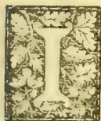

In continuation of our remarks on this subject in last month's issue of the *Agricultural Magazine* we now give the following analyses of a sample of milk from the Ceylon Government Dairy, by Mr. Cochran, the city analyst:—

"Analysis of a sample of cow's milk received on the 20th instant from the Manager of the Government Dairy, Colombo:—

<table style="width: 100%; border-collapse: collapse;">
<tr>
<td style="width: 60%;">Specific gravity at 86° F.</td>
<td style="width: 10%; border-left: 1px solid black; padding-left: 5px;">1.028</td>
<td style="width: 30%;"></td>
</tr>
<tr>
<td>Distilled water at 86° F. = 1.000</td>
<td style="border-left: 1px solid black; padding-left: 5px;"></td>
<td></td>
</tr>
<tr>
<td></td>
<td style="text-align: center;">Per cent.</td>
<td></td>
</tr>
</table>

<table style="width: 100%; border-collapse: collapse;">
<tr>
<td style="width: 60%;">Fat .. .. .</td>
<td style="width: 10%; text-align: right;">7.22</td>
<td style="width: 30%;"></td>
</tr>
<tr>
<td>Sugar and casein .. .. .</td>
<td style="text-align: right;">8.92</td>
<td></td>
</tr>
<tr>
<td>Ash .. .. .</td>
<td style="text-align: right;">.72</td>
<td></td>
</tr>
</table>

<table style="width: 100%; border-collapse: collapse;">
<tr>
<td style="width: 60%;"></td>
<td style="width: 10%; text-align: right; border-top: 1px solid black;">16.86</td>
<td style="width: 30%;"></td>
</tr>
<tr>
<td></td>
<td style="text-align: right; border-top: 1px solid black;">83.14</td>
<td></td>
</tr>
</table>

<table style="width: 100%; border-collapse: collapse;">
<tr>
<td style="width: 60%;"></td>
<td style="width: 10%; text-align: right; border-top: 1px solid black;">100.00</td>
<td style="width: 30%;"></td>
</tr>
</table>

<table style="width: 100%; border-collapse: collapse;">
<tr>
<td style="width: 60%;">Non-fatty solids .. .. .</td>
<td style="width: 10%; text-align: right;">9.64</td>
<td style="width: 30%;"></td>
</tr>
</table>

This is a very rich sample of milk.

(Signed) M. COCHRAN, F.C.S.,

*City Analyst.*

In sending the results of his analysis, Mr. Cochran writes:—"The analysis shows it (the sample) to be very considerably richer than the average of English milk." This may be seen by comparing the present analysis with the percentage composition of the milk of English cows given in our last article on milk analyses. It is a notorious fact that the ordinary milk of the peripatetic milkman is often adulterated to a more or less extent with such substances as buffalo's milk, coconut milk, sugar, flour and condensed milk, and, last but not least, water.

In the valuable contribution (referred to in our last issue) made by Mr. Cochran on the composition of Colombo milk, he says:—"I got a friend, on three different occasions to purchase samples of milk from passing milk-sellers, just as it is sold to the people of Colombo who do not keep cows for their own supply. The first of these samples gave the following results:—

<table style="width: 100%; border-collapse: collapse;">
<tr>
<td style="width: 60%;">Specific gravity .. .. .</td>
<td style="width: 10%; text-align: right;">1.014</td>
<td style="width: 30%;"></td>
</tr>
<tr>
<td>Fat .. .. .</td>
<td style="text-align: right;">1.95</td>
<td></td>
</tr>
<tr>
<td>Sugar and casein .. .. .</td>
<td style="text-align: right;">4.13</td>
<td></td>
</tr>
<tr>
<td>Salts .. .. .</td>
<td style="text-align: right;">.39</td>
<td></td>
</tr>
</table>

<table style="width: 100%; border-collapse: collapse;">
<tr>
<td style="width: 60%;"></td>
<td style="width: 10%; text-align: right; border-top: 1px solid black;">Total solids .. .. .</td>
<td style="width: 30%; text-align: right; border-top: 1px solid black;">6.47</td>
</tr>
<tr>
<td>Water .. .. .</td>
<td style="text-align: right;">93.53</td>
<td></td>
</tr>
</table>

<table style="width: 100%; border-collapse: collapse;">
<tr>
<td style="width: 60%;"></td>
<td style="width: 10%; text-align: right; border-top: 1px solid black;">100.00</td>
<td style="width: 30%;"></td>
</tr>
</table>

<table style="width: 100%; border-collapse: collapse;">
<tr>
<td style="width: 60%;">Solids-not-fat .. .. .</td>
<td style="width: 10%; text-align: right;">4.52</td>
<td style="width: 30%;"></td>
</tr>
</table>

"Basing the calculation upon our 8 per cent minimum of non-fatty solids, this sample of milk contained 44.6 per cent of added water, i.e., the milk had been diluted with nearly its own volume of water.

"The following was the composition of the other two samples of bought milk:—

<table style="width: 100%; border-collapse: collapse;">
<tr>
<td style="width: 60%;">Specific gravity .. .. .</td>
<td style="width: 10%; text-align: right;">1.0185</td>
<td style="width: 30%; text-align: right;">1.0148</td>
</tr>
<tr>
<td>Fat .. .. .</td>
<td style="text-align: right;">3.46</td>
<td style="text-align: right;">2.96</td>
</tr>
<tr>
<td>Sugar and casein .. .. .</td>
<td style="text-align: right;">5.83</td>
<td style="text-align: right;">3.17</td>
</tr>
<tr>
<td>Salts .. .. .</td>
<td style="text-align: right;">.33</td>
<td style="text-align: right;">.33</td>
</tr>
</table>

<table style="width: 100%; border-collapse: collapse;">
<tr>
<td style="width: 60%;"></td>
<td style="width: 10%; text-align: right; border-top: 1px solid black;">Total solids .. .. .</td>
<td style="width: 30%; text-align: right; border-top: 1px solid black;">9.62</td>
<td style="width: 10%; text-align: right; border-top: 1px solid black;">6.46</td>
</tr>
<tr>
<td>Water .. .. .</td>
<td style="text-align: right;">90.38</td>
<td style="text-align: right;">93.54</td>
<td></td>
</tr>
</table>

<table style="width: 100%; border-collapse: collapse;">
<tr>
<td style="width: 60%;"></td>
<td style="width: 10%; text-align: right; border-top: 1px solid black;">100.00</td>
<td style="width: 30%; text-align: right; border-top: 1px solid black;">100.00</td>
<td style="width: 10%; text-align: right; border-top: 1px solid black;">100.00</td>
</tr>
<tr>
<td>Solids not fat .. .. .</td>
<td style="text-align: right;">6.16</td>
<td style="text-align: right;">3.50</td>
<td></td>
</tr>
</table>

"Neither of these can be regarded as genuine cow's milk. If the 8 per cent solids-not-fat formula be adopted, the one marked A could not have contained more than 77 per cent, and the one marked B more than 43.75 per cent of genuine cow's milk respectively. I am of opinion, however, that these were not simply samples of

385------------------------------------------------

354Supplement to the "Tropical Agriculturist."[Nov. 1, 1894.

cow's milk diluted with water. The fact that these two samples were whiter in colour than cow's milk, and that while the specific gravity and solids-not-fat were very low, the fat was present in very fair proportion, I draw the conclusion that A consisted mainly of buffalo milk, and that B contained both buffalo milk and added water. Feeling pretty sure of the presence of buffalo milk in these two samples, I sent a trustworthy servant to procure some samples of genuine buffalo milk, which I analysed with the following results:—

<table border="1">
<tbody>
<tr>
<td>Specific gravity</td>
<td>1.0174</td>
<td>1.0278</td>
<td>1.0163</td>
</tr>
<tr>
<td>Fat ..</td>
<td>4.77</td>
<td>5.57</td>
<td>5.41</td>
</tr>
<tr>
<td>Sugar and casein</td>
<td>5.09</td>
<td>7.14</td>
<td>3.45</td>
</tr>
<tr>
<td>Salts ..</td>
<td>.27</td>
<td>.73</td>
<td>.57</td>
</tr>
<tr>
<td>Total solids</td>
<td>10.13</td>
<td>13.44</td>
<td>9.43</td>
</tr>
<tr>
<td>Water..</td>
<td>89.87</td>
<td>86.56</td>
<td>90.57</td>
</tr>
<tr>
<td></td>
<td>100.00</td>
<td>100.00</td>
<td>100.00</td>
</tr>
<tr>
<td>Solids-not-fat ..</td>
<td>5.36</td>
<td>7.87</td>
<td>4.02</td>
</tr>
</tbody>
</table>

"It would appear from these three analyses that, unlike the case of cow's milk, the fat in buffalo milk does not vary in amount so much as the solids-not-fat; but to establish this as a fact, a much more extended series of analyses would be required. In all three cases, the solids-not-fat were lower than, and, in one case, only half of the minimum amount found in genuine cow's milk.

"The only three samples of Colombo milk, purchased in a casual way as cow's milk, which I have analysed, have thus turned out to be abundantly watered or mixed with buffalo milk, or both watered and mixed with buffalo milk.

"I submitted a sample of the liquid from a drinking coconut, and also a sample of coconut milk to the same analytical treatment, as the samples of cow and buffalo milk, with the following results:—

<table border="1">
<thead>
<tr>
<th></th>
<th>Liquid from drinking coconut.</th>
<th>Coconut milk.</th>
</tr>
</thead>
<tbody>
<tr>
<td>Specific gravity ..</td>
<td>1.0148</td>
<td>.994</td>
</tr>
<tr>
<td>Oil ..</td>
<td>.23</td>
<td>36.78</td>
</tr>
<tr>
<td>Sugar and other constituents ..</td>
<td>3.56</td>
<td>7.60</td>
</tr>
<tr>
<td>Salts ..</td>
<td>.61</td>
<td>.87</td>
</tr>
<tr>
<td>Total solids and oil..</td>
<td>4.40</td>
<td>45.25</td>
</tr>
<tr>
<td>Water ..</td>
<td>95.60</td>
<td>54.75</td>
</tr>
<tr>
<td></td>
<td>100.00</td>
<td>100.00</td>
</tr>
<tr>
<td>Solids free from oil ..</td>
<td>4.17</td>
<td>8.47</td>
</tr>
</tbody>
</table>

"Supposing the coconut milk, which was rather thick, had been diluted till it contained 89 per cent of water, its composition would then have been—

<table border="1">
<tbody>
<tr>
<td>Oil ..</td>
<td>8.94</td>
</tr>
<tr>
<td>Sugar and other constituents ..</td>
<td>1.85</td>
</tr>
<tr>
<td>Salts ..</td>
<td>.21</td>
</tr>
<tr>
<td>Total solids and oil ..</td>
<td>11.00</td>
</tr>
<tr>
<td>Water ..</td>
<td>89.</td>
</tr>
<tr>
<td></td>
<td>100.00</td>
</tr>
<tr>
<td>Solids free from oil ..</td>
<td>2.06</td>
</tr>
</tbody>
</table>

"Buffalo milk, coconut milk, the liquid of the drinking coconut, and water, if added to cow's milk, will thus reduce its specific gravity and

the solids-not-fat. Buffalo milk will maintain, and, as a rule, considerably increase the amount of fat. Coconut milk will increase the fat or oil still more. If added of the same degree of consistency as the sample analysed, coconut milk would add non-fatty-solid in about normal proportion, but the great increase in the fat or oil would lead to its detection.

"Under the microscope, the average size of the fat globules of buffalo milk is somewhat larger than that of cow's milk, while the average size of the fat globules of coconut milk is much larger than either of the others."

With the increase in the number of dairies under responsible management, householders will have the choice of getting their supply of milk from a reliable source, though they may, perhaps, have to pay a little higher price. (We notice that a dairy has just been established in Galle.) The peripatetic milkman may thus come to find his occupation gone, unless he desists from 'ways that are dark,' seeing that the public could from choice do without him.

#### RAINFALL AT THE SCHOOL OF AGRICULTURE DURING SEPTEMBER.

<table border="1">
<tbody>
<tr>
<td>1 ..</td>
<td>.01</td>
<td>13 ..</td>
<td>.01</td>
<td>25 ..</td>
<td>.01</td>
</tr>
<tr>
<td>2 ..</td>
<td>.01</td>
<td>14 ..</td>
<td>.01</td>
<td>26 ..</td>
<td>.03</td>
</tr>
<tr>
<td>3 ..</td>
<td>Nil</td>
<td>15 ..</td>
<td>.01</td>
<td>27 ..</td>
<td>.04</td>
</tr>
<tr>
<td>4 ..</td>
<td>Nil</td>
<td>16 ..</td>
<td>Nil</td>
<td>28 ..</td>
<td>Nil</td>
</tr>
<tr>
<td>5 ..</td>
<td>Nil</td>
<td>17 ..</td>
<td>Nil</td>
<td>29 ..</td>
<td>.01</td>
</tr>
<tr>
<td>6 ..</td>
<td>Nil</td>
<td>18 ..</td>
<td>.04</td>
<td>30 ..</td>
<td>.22</td>
</tr>
<tr>
<td>7 ..</td>
<td>.01</td>
<td>19 ..</td>
<td>.02</td>
<td>1 ..</td>
<td>.04</td>
</tr>
<tr>
<td>8 ..</td>
<td>Nil</td>
<td>20 ..</td>
<td>.01</td>
<td></td>
<td></td>
</tr>
<tr>
<td>9 ..</td>
<td>Nil</td>
<td>21 ..</td>
<td>Nil</td>
<td>Total ..</td>
<td>.76</td>
</tr>
<tr>
<td>10 ..</td>
<td>.03</td>
<td>22 ..</td>
<td>.05</td>
<td></td>
<td></td>
</tr>
<tr>
<td>11 ..</td>
<td>.05</td>
<td>23 ..</td>
<td>Nil</td>
<td>Mean ..</td>
<td>.025</td>
</tr>
<tr>
<td>12 ..</td>
<td>.01</td>
<td>24 ..</td>
<td>.15</td>
<td></td>
<td></td>
</tr>
</tbody>
</table>

Greatest amount of rainfall in any 24 hours on the 30th instant, .22 inches.

Recorded by P. VAN DE BONA.

#### OCCASIONAL NOTES.

We are indebted to a Ceylon planter—a successful agriculturalist of advanced views—for a copy of Prof. Aikman's valuable little work on "Farmyard Manure—its Nature, Composition and Treatment." The book is a compendium of useful and up-to-date information on a subject which closely concerns every cultivator of the soil, and being moderately priced, is within the reach of all to purchase. The publishers are Messrs. Blackwood and Sons. We quote the following general remarks, constituting the *Introduction* to the little work, and may in a future issue refer again to the text:—

"The tendency of modern times towards centralisation, the modern methods of sewage disposal and of cultivation, involving thorough drainage of our soils, and the so-called "intensive" cultivation of our crops, have all combined to render the function of manures at the present day of greater importance than ever before. While it is true the farmer is no longer—as he was a century ago—entirely dependent for his supply of manure on that produced on the farm, and while, therefore,

386------------------------------------------------

Nov. 1, 1894.]Supplement to the "Tropical Agriculturist."355

farmyard manure can scarcely be looked upon as an absolute essential, inasmuch as it is a bye-product of the farm, and will always continue to be so, a thorough knowledge of its nature and composition must ever remain for the farmer and agricultural student of the highest importance.

"The question of the fertility of the soil is a wide and complex one. It depends on many and various circumstances and conditions. Apart altogether from the influence exerted by climate, latitude, altitude, and exposure, it may be said to be dependent on properties of a physical, chemical and biological nature.

"The first class of properties consist of the absorptive and retentive powers of the soil for water, gases, and heat. These properties depend on the proportion in which the so-called proximate constituents of a soil are present—such as gravel, sand, clay, humus, and lime—as well as on the size of the soil particles, and on their colour. The chemical composition of the soil furnishes, however, the most important source of fertility. As the plant has to derive a portion of its food from the soil, the possession by the latter of the ingredients constituting this food is a fundamental condition of plant growth. A very small portion of the soil is directly concerned in promoting growth. Some of the necessary ingredients are apt to be lacking in sufficient amount, and it is in making good this want that the chief function of manures consists. The substances in which most soils are generally found to be deficient are *nitrogen*, *phosphoric acid*, and *potash*. Manures, therefore, are chiefly applied to make good this deficiency. While, however, this is so, manures, it must not be lost sight of, perform other and important functions, and may be of value not merely because they supply to the soil nitrogen, phosphoric acid, or potash, but also because they exercise some influence on the soil's mechanical properties, or it may be, in preparing for the plants' use inert fertilising substances. The functions of a manure, therefore, may be very varied, and no manure exemplifies this to a greater extent than farmyard manure."

In another column we reproduce the remarks made by the Director of Public Instruction (in his Administration Report for last year) on the proposed School of Forestry. We may mention that some start has been made in the development of this scheme already. The Conservator of Forests has been sending a number of written "lectures" to be given to the students of the School of Agriculture, and has himself been over at the school to explain and illustrate the substance of these lectures. The great desideratum in a forestry course (as, we believe, Mr. Broun has himself said in his own Administration Report) is the arrangement by which the students may be given a practical training in the subject. This as well as the arrangement for teaching the auxiliary subjects allied to Forestry have as yet to be worked out and to receive the sanction of Government. We trust that the scheme in its fully-developed form will soon come into working, for, despite the opinion of some, who cannot surely fully understand the full significance of the term *forest conservancy* and the work it involves, we believe that there is much to be done in the way of instilling a

technical knowledge of our tropical forests into the minds of those who seek admission into the Forest Department, and that it would be a penny-wise policy that would refuse the aid that is necessary to bring our forests under scientific treatment by experts.

#### FODDER CROPS AND CATTLE-KEEPING IN CEYLON.—IV.

In the previous instalments of this paper two of the important fodder crops grown in the Island, viz., Guinea grass and Mauritius grass, have been dealt with. These two have already gained ground here, and we are more or less familiar with them. It has to be noted, however, that the above grasses do not necessarily thrive in all descriptions of soils, nor under all circumstances; and therefore other species of fodder crops, grown successfully in various tropical and sub-tropical countries, deserves attention in this country, as their introduction would tend to an increase of our fodder supply. The introduction of a new and little known crop is beset with many preliminary difficulties, and takes much time before it meets with any degree of favour. Two crops which are extensively grown in India for fodder purposes deserve special notice. These are the lucerne plant *Medicago sativa* and the Jowari, *Sorghum vulgare*.

Lucerne thrives in good loamy soils and has to be well cultivated if a profitable crop is to be obtained. Being a leguminous plant it is especially partial to soils containing a fair percentage of lime. Before a crop could be raised the land requires very careful preparation. The seed is generally sown in shallow furrows two inches deep and lightly covered up. The furrows are made a foot apart and kept carefully weeded. The land requires artificial irrigation when there is not sufficient rain. The plants grow up in two months and should be cut just before they commence flowering. Under good cultivation, a plot of lucerne could be kept up for years with proper care and manuring and a cutting obtained nearly every six weeks. In this manner an acre of land yields a large quantity of a very nutritious and wholesome fodder. The amount of produce differs greatly according to the nature of the soil, the climatic conditions, and the method of cultivation, and hence it would be misleading to give a detailed account of expenses and profit, especially as lucerne has not been hitherto grown to any appreciable extent in our soils. The results deduced from an experimental crop of a few square yards could show nothing more than the adaptability of the plant to a particular locality. Lucerne as a food, whether it be for horses or cattle, for sheep or milch cows, stands pre-eminently the best among leaf crops.

*Sorghum vulgare*, great millet, the Indian Jowari or Tamil Cholum, is one of the staple food crops in Upper India. The plant belongs to the grass family and yields a large quantity of nutritious edible grain. The poorer class of ryots in some districts in India live for months entirely on a diet of sorghum. We have, however, to consider sorghum here solely as a leaf crop, and as such it has been found

387------------------------------------------------

356Supplement to the "Tropical Agriculturist."[Nov. 1, 1894.]

to be not only an excellent fodder in respect to its nutritive value, but one which produces a comparatively large yield. The method of growing sorghum solely as a fodder crop differs greatly from that which is usual in growing it as a cereal. The plant grows in a variety of soils, it thrives best in loams and rich sands, and a fair crop is obtained even on clayey lands. The seed is sown thick (about four inches apart) in the prepared land and the plants allowed to come up close together. This method of growth gives a tendency to the plants to develop leafage and that less succulent than usual. In six weeks or two months' time the crop is ready to be cut. In some places, especially in sandy soils, the plants are pulled up roots and all and given to cattle. In other places where the lands are richer, they are cut close to the ground, and the root stocks allowed to remain. These shoot out again and give a second and smaller crop.

Sorghum thus grown is preserved for future use by converting into hay. Sorghum hay is very sweet and is much relished by all kinds of stock.

H. A. D. S.

(To be continued.)

#### IS SALT A FERTILIZER.

The use of salt for fertilizing purposes still prevails to some extent, and especially in such agricultural regions where fertilizers have only recently been introduced and where the principles of artificial manuring are as yet little understood.

It is true that salt occasionally produces upon some crops and upon certain soils a moderate increase of yield, for a season or two, but the apparent benefit is not lasting; on the contrary such applications leave the soil in an impoverished condition, that is, a continued application of salts is followed by decreasing yields. The effect of common salt is readily explained by the fact that it acts as a solvent upon potash compounds contained in the soil, and potash being plant food causes an increased yield. Salt in this manner acts as a stimulant and enables the plant to draw from resources already present in the soil at a much quicker rate than would be the case under normal conditions, and instead of increasing fertility it promotes a rapid exhaustion of the soil which becomes apparent as soon as the plant food stored therein has been consumed.

Anyone familiar with agricultural chemistry knows that salt does not contain anything that may serve as plant nourishment; it is a simple compound of chlorine and sodium. Chlorine, if anything, is injurious to plants (hence the disastrous effect sometimes observed where salt is used at the time of planting, or in too large quantities), while sodium, though not harmful, cannot by any means assist plant growth. The small quantities needed are always and abundantly present in every soil, and it is not any more advantageous to fertilize with sodium than it would be to use sand or silica as a fertilizer.

Now it has been recently claimed by one evidently not familiar with the simplest agricultural principles that soda may take the place of potash, and he even went so far as to recommend common soda as a fertilizer. How could this be in the face of the fact that ashes of plants usually contain ten times as much potash as soda? It is true that

Prof. Wagner demonstrated that plants, when oversupplied with sodium, did absorb more of this ingredient than they would have done had the supply been normal, but there is no experiment on record to show that any plant can live and grow without potash. The ill-advised farmer, then, who follows such extravagant theories and tries to feed his crops with soda, will waste his money and shorten his crop.—*Rural Californian*.

#### NOTES ON THE CATTLE MURRAIN OF CEYLON.

Referring to the congested appearance of the skin, Mr. Smith remarks:—"I have often seen the eruption, but have noticed at other times an entire absence of it." And the following description of the disease by Veterinary Surgeon Thacker, he considers "a very characteristic description of the various stages of the disease."

*First stage.*—The attack generally comes on gradually, evidenced by occasional shivering fit; the appetite less; animal appears dull, with drooping ears and a rough staring coat; the bowels costive; rumination ceased or slightly performed; eyes weeping; pulse quickened.

*Second stage.*—Appetite gone; nose dry and hot, and commencing to discharge thick mucus from the eyes; purging commenced; lining membrane of the eyelids of a dark red colour; pulse quick and small.

*Third stage.*—Generally lying down from weakness; purging violent and offensive; faeces, mixed with slimy mucus and blood, is passed frequently in small quantities and attended with straining; the eyes become sunk, the countenance anxious; general restlessness, partial insensibility and death.

As regards rumination, Mr. Smith writes:—"It has always appeared to me, from the loaded condition of the rumen found on postmortem, (despite the continued purgation throughout the course of the disease) that rumination must be suddenly suspended at a very early stage of the disease."

"In all outbreaks of rinderpest, I have made my diagnosis as to its fatality, dependent on the severity of the pharyngeal lesions, shown on its outbreak—and have invariably seen all the worst symptoms intensified, fewest recoveries, and deaths more rapid. The virulence of the epidemic seemed to me to be attributable, and dependent on the extent and severity the disease had assumed in the fauces; postmortem appearances upheld this view. I observed this form of the disease very marked among buffaloes and that deaths were rapid."

"In a previous page it is characterized as 'absolutely false' to state that rinderpest can develop itself spontaneously. If anyone can answer the following satisfactorily, I might be convinced:—

"Why do we find rinderpest becoming developed among the cattle in the wake of an army in the field?

"Why have fairs to be broken up in consequence of outbreaks of this disease?

"Why at gatherings at almost every shrine in India and Ceylon does cholera break out?

"Why is vesicular epizootic annually introduced into Scotland by Irish cattle brought over

388------------------------------------------------

Nov. 1, 1894.]Supplement to the "Tropical Agriculturist."357

from that country, and driven from fair to fair for sale?

"The rationale of all such being cause and effect, certain conditions given produce certain effects."

"I distinctly disagree with the statement (as to spontaneous development being impossible), so far as Ceylon is concerned, as I have known the disease break out in several instances where no known cause of contagion existed. I quote one instance:—

In January, 1877, when on my way to Colombo, at Nawalapitiya, I found all approaches to Railway Station and all around in a very filthy condition, owing to the large concourse of carts and bullocks conveying the abundant coffee crop of that year, Nawalapitiya being then the Railway Terminus.

On seeing this state of things, I was at once impressed with the danger of an outbreak of rinderpest; and made all inquiry (being an interested party) if disease existed, but could hear of none: some hundreds of cart-cattle were standing aulke deep in their filth, with the vile emanations arising therefrom, under a powerful sun.

I spoke to several people and pointed out the danger, went on my journey, returned in about 8 days, to find the large concourse of cattle and carts utterly dispersed.

Rinderpest, meantime, having broken out, all fled who could. I lost six pairs of bullocks out of twelve pairs I had at work, they being quite well as I passed them on their way to Station the day I left. All after-inquiry could in no way elicit any other cause for the sudden appearance of the disease in its most virulent form except that of spontaneous outbreak.

I also know of many instances of cattle being driven from the lowcountry tanks, where all the meat supply of Ceylon are fattened.

Owing to the hardships of travel and sudden exposure in the higher regions, the cattle often standing without shelter, all night during the monsoon rains, rinderpest breaks out.

I have many cases on record, some of single animals suddenly brought from the hot lowcountry and exposed to the cold of higher regions, developing rinderpest after weeks of change.

I am unable to account for such outbreaks in any other way than by spontaneity.

(To be continued.)

#### TO ESTIMATE BUTTER FAT IN MILK.

Before its examination the milk must be thoroughly mixed, 10 cc. should then be drawn up into a pipette and run into a graduated tube. Now take 10 cc. of ether and add it to the milk in the tube. Close the tube with a well fitting cork or the thumb and shake well, the gas being allowed to escape by removal of cork or thumb, and the tube again shaken, and so on until the ether and milk are thoroughly mixed. Then add, by means of pipette 10 cc. of 91 per cent. alcohol and continue the shaking. During the shaking the cork or thumb must be several times removed. The tube should then be closed with the cork and placed in the water at 100 degrees to 110 degrees F.

Soon after the insertion of the tube in the warm water, small fat globules will be seen rising

to the surface, where they unite to form a clear layer. When, after five or ten minutes, no more globules of fat are seen rising the tube may be placed in the glass cylinder, which has been filled beforehand with water at 70 degrees F. In most cases the layer of fat will somewhat increase, at first it will be cloudy and then become clear. The quantity of fat can then be read off, as indicated by the graduated lines in the tube, each division representing  $\frac{1}{20}$  cc. and the corresponding number indicating the amount of fat per cent. in the milk. The addition of 3 or 4 drops of a solution of Potassium Hydrate to the milk and ether before they are shaken, will facilitate the process.—*Australian Agriculturist*.

#### MEAT AND PARASITES.

A large quantity of buffalo meat is palmed off as prime ox-beef in many towns. It has been found, for instance, that rather more than 25 per cent. of the carcasses exposed for sale at Perambore, the chief cattle slaughter-house in Madras, are those of the buffalo. As far as nutritious qualities are concerned, there is probably no difference between the beef obtained from these two animals; but as the buffalo is a foul feeder as compared with the ox, the flesh of the former is less palatable.

2. As there are so many diseases and parasites which are communicable to man from cattle and sheep, it is very important that the animals to be slaughtered should be examined by a Veterinary Officer or any other duly qualified man, both before and after the slaughter. The parasites commonly found in the carcasses of cattle and sheep are—(1) The different species of *Tœniada* in their various stages, and especially the hydatid of the *Tœnia echinococcus*, called *Echinococcus veterinorum*; (2) *Distoma hepaticum*; (3) *Amphistoma conicum*; and (4) *Æstrus ovis*. Of these the most dangerous to mankind are the *Tœniada* or tapeworms of which there are three kinds that occur in man, the commonest being *Tœnia Solium* which originates from *Cysticercus cellulosa*, the hydatid found in "measly pork."

3. *Echinococcus Veterinorum* is the most widely-distributed of all the hydatids or cystic forms of the *Tœniada*, and is therefore very important from a sanitary point of view. It is found mostly in the liver and in the lungs of cattle, and occurs more frequently in old animals than in young.

Great care should be taken to instruct all men in the slaughter-house, even the coolies, as to the appearances of these pests. A large chatty of water should be constantly kept boiling in a corner of the yard, and as soon as any of these parasites are noticed, that part of the carcass containing them should at once be cut out and placed in the boiling water. This recommends itself as a very safe and ready method of destroying them and is practised in many parts of India at the suggestion of Captain Mills of the Bombay Veterinary College.

Dogs being the chief hosts of tape worms and the chief medium for the propagation of the *Echinococcus veterinorum*, they should be strictly kept out from the slaughter-house.

389------------------------------------------------

358Supplement to the "Tropical Agriculturist."[Nov. 1, 1894.]

4. The practice of the South Indian villagers of burning cowdung bratties as fuel, although not commendable from an agricultural standpoint, is not without its redeeming features; for it is calculated to check the spread of parasites by destroying the germs that may be found in the dung.

Here may also be mentioned the importance of properly cooking meat and other articles of food. Greens and salads that are eaten uncooked, such as Radishes and Lettuces, should be properly cleaned before use, as they might otherwise contain parasitic ova communicated from the dung used as manure.

5. In connection with meat examination it will be interesting to note that there are certain appearances of beef and mutton found at nearly all seasons of the year, which are very liable to be mistaken for evidences of disease. One of them in particular may be mentioned, namely certain enlargements situated in the fat lining the loins near the kidneys. They are simply enlarged glands, and on careful microscopic examination it has been found that the tissues are perfectly healthy.

E. T. HOOLE.

### THE VALUE OF WEEDS.

Our readers may remember the correspondence that appeared some time ago, in our own pages as well as in the local press, on the subject of weeds. Some writers championed the cause of weeds, stating that many of them were to be considered welcome guests and utilized as fertilizers of the soil after being pulled up. From the results of late research in connection with the nitrogen question, we are warranted in attaching much value to certain leguminous and other plants as fixers of atmospheric nitrogen. There is, however, yet another function which weeds may perform with beneficial effects to the agriculturist. It is generally believed that nitrogen to become available as plant food must reach the condition of a nitrate by the usual process of nitrification in the soil, but it so happens, that it is just in the nitrate form in that nitrogen is most liable to be washed out of the soil. It is in their capacity of retainers of the nitrates in the soil—especially during wet seasons—that we would now refer to weeds. The *Sugar Journal and Tropical Cultivator* of August 15th contains a reprint of a paper, read before a Chemical Association in Louisiana, in which reference is made to *Stellaria media*, (more commonly known as chick-weed), in relation to the nitrogen question. This plant, more or less naturalized in Ceylon, may be familiar to some of our readers. The writer of the paper (Mr. Edson) says:—I collected samples of the weed and made the following analysis of them:—

<table>
<thead>
<tr>
<th colspan="3">Tops.</th>
</tr>
</thead>
<tbody>
<tr>
<td>Per cent. moisture</td>
<td>..</td>
<td>89.17</td>
</tr>
<tr>
<td>Per cent. dry matter</td>
<td>..</td>
<td>10.83</td>
</tr>
<tr>
<th colspan="3">Roots.</th>
</tr>
<tr>
<td>Per cent. moisture</td>
<td>..</td>
<td>84.98</td>
</tr>
<tr>
<td>Per cent. dry matter</td>
<td>..</td>
<td>15.12</td>
</tr>
</tbody>
</table>

The dry matter gave the following amounts of nitrogen:—

<table>
<tbody>
<tr>
<td>Tops</td>
<td>..</td>
<td>2.73 per cent.</td>
</tr>
<tr>
<td>Roots</td>
<td>..</td>
<td>1.65 per cent.</td>
</tr>
</tbody>
</table>

"I will not consider further the analyses of the roots because the amount of the root growth was so small as compared to the tops that they would not very materially affect the results. It can merely be remembered that the figures I will give would be all slightly increased were the root growth taken into account.

"I also cut considerable quantities of the weed and weighed the amount cut, and measured the ground from which it was cut. These latter amounts were taken from places at which the growth of the weed was very luxuriant, and the figures therefore represent the maximum amounts for the year 1894. I only calculated the results to a third of the total area because I estimated this was about the amount of the ground covered by the weed, it having a decided preference for the ridge on which the cane was planted. With these bases I found that there was on an acre of ground 5,863 lbs.

"I presume that the vast majority of cane growers in the State will laugh at me when I advise them to grow weed, but that is just exactly what I would advise and what, were they wise, they would do, only limiting the time of cultivating this kind of a crop to the winter months. Even if later experiments should prove that the nitrogen in the chickweed was taken from the air it would more thoroughly establish the soundness of the advice to grow it, for then the nitrogen would be secured for nothing. It may seem like passing encomiums on a lowly thing to praise chickweed, but were a whole plantation thickly strewn with it during the winter months the proprietor could cut down on his fertilizer bill just one-half the following season."

### PROPOSED SCHOOL OF FORESTRY.

Mr. J. B. Cull, the Director of Public Instruction, thus refers to the proposed Forest School in his Annual Report for 1893:—

During the course of the year the Conservator of Forests incidentally addressed me as to the possibility of the formation of a School of Forestry in connection with the School of Agriculture in Colombo. It was pointed out by him (1) that the facilities for the formation of such a school readily exist in the Island; and (2) that by the formation of such a school considerable expense would be saved to Government in the matter of sending up students for qualification at the accredited Indian schools.

The initial difficulty obviously is that of the provision of a proper and sufficient course of instruction, but upon this point Mr. Broun reassured me by promising that, so far as forestry was concerned, he would be very glad to form a class from the students available and to give them practical illustration in the subject.

Mr. Broun has already addressed Government on the point, and I subjoin his letter:—

No. 516. Office of Conservator of Forests,  
Colombo, November 27, 1893.

SIR,—I have the honour to report that the Director of Public Instruction and I have had a conversation on the subject of utilizing the School of Agriculture as a training school for the upper subordinate staff of the Forest Department.

390------------------------------------------------

Nov. 1, 1894.]Supplement to the "Tropical Agriculturist."359

2. I have lately, in nominating candidates for Forest Guardships, given the preference to successful students at the School of Agriculture, and the Director of Public Instruction and I am both of opinion that in a couple of years or so a branch of Forestry might be established at the school. This would not only save to the Government considerable expenditure at present incurred, in sending the students to the North of India, but it would greatly increase the usefulness of the school, and would enable Government to train a larger number of men each year, and thus to bring the Department quicker to a state of efficiency.

3. The main difficulty against taking the school in hand at once is the establishment of classes of sylviculture, forest organization, and forest utilization; and although I should be most willing to lecture on these subjects, and shall still be very pleased to do so if Government approves of the creation of a Forestry branch at the School of Agriculture, yet I should prefer not to be single-handed. There are at present only three officers (Messrs. Tatham, Ferguson, and Walker) who have passed through the Forest school and obtained the Ranger's certificate, and whose services are at present required elsewhere.

The school has of late made great strides in practical teaching, and I should like to have to assist me an officer who has gone through the course. My duties as Conservator and frequent absences on tours of inspection might interfere with my regular attendance, and I should require the services of an officer to take my place during my absence and to supervise the execution of forest works by students.

4. If the proposal meets with the approval of Government Mr. Cull and I could draw up a scheme for the establishment of a Forestry branch at the School of Agriculture and submit it to Government.—I am, &c.,

A. F. BROWN,  
*Conservator of Forests.*

There are minor details to be worked out, *e.g.*, the standard of mathematics at the school would have to be raised; certain special subjects, *e.g.*, land surveying in its higher form, &c., would have to be taught; in fact, speaking generally, the syllabus of instruction required at the Forest School at Dehra Doon would have to be attempted.

For my own part I see no reason why this should not be done, always admitted that the practical instruction in forestry can be supplied by the Forest Department. This is the initial step. As regards the details of a higher standard of mathematics at the school than now is required, the whole history of education of the Island for the past decade goes to show that when the need of a higher standard in any special subject has been recognized it has been fulfilled. And as regards forestry, with the abundance of opportunity for its systematic study in the Island, coupled with the assurance of the Conservator of Forests that as regards selection of individual Foresters he is prepared to open out the new area of usefulness for the sons of the soil, and to supplement it in course of time by nominations of such students as qualify themselves for such nominations, there can be but little doubt that the addition of this new prospect would add materially, not merely to the attractiveness, but to the usefulness of the School of Agriculture.

Details have still to be worked out; the experiment would involve a little more cost in the maintenance of the school than is at present entailed; but a Forest School in Ceylon might in the course of the next few years be regarded as a normal condition of the Island; and the extraneous forest training on the mainland for Ceylon regarded as abnormal and anomalous.

---

## WATER-TESTING.

---

The importance of testing the materials which a manufacturer has to use is admitted on all hands though these tests are not always taken advantage of owing to their cost and the delay obtained in the necessary reports on the materials. There are simple as well as elaborate methods of testing, and we shall in this paper deal with a simple procedure for testing water, accurate enough for all practical purposes—and more particularly looking at water from an industrial point of view. It is not possible to draw a distinct line between water suitable for the use of man and that for industrial purposes. Water which may not be fit for human consumption may in cases be suitable for industrial purposes, but good water even if it entails a higher expenditure is the cheapest in the long run.

Water in its chemical sense is a compound formed by the combination of two dissimilar gases—Hydrogen and Oxygen—one a very light (the lightest known) and inflammable substance; the other a little heavier than common air and found abundantly in a free state, being indispensable for the life of animals, inasmuch as it is the medium through which the purity of their blood is maintained. Physically, water exists in all the three forms in which matter is known to exist. As a solid, in the form of ice; liquid, as common water; and gas, in the form of steam. To speak definitely, water at and below the Temperature of 0° Centigrade is a solid; from 0°C. up to 100°C. a liquid; and 100°C. and above it is a gas. *Pure* water in its strict sense should not contain anything else besides its two constituent gases, but the presence of traces of many substances does not necessarily make water unfit for economical uses.

Before testing a sample of water it is necessary to know the impurities we may expect to find in it, the nature and the sources of these impurities, and the manner in which they have gained access to the water. The impurities contained in water may be solids, or gases. The solids may either be found dissolved in the water or may only be suspended, and they may consist of organic (matter of vegetable or animal origin) or inorganic (mineral) matter. It would be well, here, to bear in mind the distinction between the terms *dissolved* and *suspended* matter. A substance is said to be dissolved in water when its particles have become so intimately mixed with it, that it is not possible to separate them by any mechanical means, without the aid of heat or chemicals; whereas, suspended matter consists of particles so mixed with water that they easily separate from the fluid medium either by allowing the fluid to rest, or by passing it through porous material, such as bibulous paper, sand or charcoal. Ordinarily, the impurities

391------------------------------------------------

360Supplement to the "Tropical Agriculturist."[Nov. 1, 1894.

to be looked for in a water may be classed as follows:—

**MINERAL MATTER.**—Basic radicles, as Lime, Magnesia, Sodium, Iron, Lead, Zinc, and Copper.  
*Acid radicles*—as Chlorine, Sulphuric Acid, Nitric Acid, and Phosphoric Acid.

**ORGANIC MATTER.**—Ammonia, and also animal and vegetable remains.

**GASES**—as Carbonic Acid, Sulphuretted hydrogen, and Carburetted hydrogen. These and other impurities are obtained, at the sources of supply in the collection and storage of water, or in its distribution.

Rain is without doubt the main source of supply of our water. From the surface of the land, rivers, lakes, and oceans, evaporation takes place through the agency of the sun's heat, and when the atmosphere contains as much moisture as it can possibly hold, and when its temperature is reduced, a portion of the moisture is condensed into fine globules and forms clouds, which eventually come down in the form of rain. After having fallen, a portion of the rain water is lost by evaporation, another portion runs off the surface of the soil, carrying with it, both in suspension and solution, impurities from the soil over which it flows, and forms streams &c. The remainder of the water penetrates into the soil, carrying into it substances in solution, and is brought to the surface in the form of springs or wells.

Water is collected in wells, tanks or artificial cisterns, whether constructed of masonry or metal. The chances of substances getting into these places are very great since a tank may be polluted by human beings or cattle bathing in it, or by the washing of linen, while wells and tanks are liable to be contaminated by vegetable and animal matter. When water is distributed by hand, impurities of various kinds may easily get into it. When distributed through pipes the lead or iron of the pipes is likely to contaminate it, while if noxious gases are introduced into pipes they will be absorbed by the water.

W. A. D. S.

(To be continued.)

## BANANAS AND PLANTAINS.

(Continued.)

Continuing our article of yesterday *re* the *Kew Bulletin*, and referring to the large quantities of bananas that are imported into New York, in a perishable shape, about which a correspondent says:—

"If we had a desiccating plant, that would convert the fruit into dried fruit or flour, we could largely increase our importations and turn out a product which would command a sale all over the coast and in the East."

Now what is wanted in New York to convert the perishable fruit into a far more valuable and permanent form, we, in Ceylon, possess, namely, the desiccating apparatus. We have, moreover, the fruit locally grown, and not needing, as in New York, to be imported. Of the two forms of the dried fruit to which we would draw the attention of those especially who have desiccating machines, one is a dainty dessert dish, excelling the dried fig in texture and flavour; the other is the *flour* or

*meal* which possesses the special virtues described in the foregoing paragraphs, published under the high authority of the *Kew Bulletin*. Now, while Revalenta, the meal of the Lentil, commands the extraordinary price for which it is sold in our local stores; while the advertising columns of the Newspapers of the day teem with special "foods" for invalids and infants, it is a strange fact that we possess a food, bearing such a character as we have quoted that is absolutely neglected. Amid all the flowery advertisements by which those numerous and pretentious "foods" are recommended, there is not one that can compare, for substantial qualities, with the banana flour of which Stanley bears such high testimony, along with so many medical authorities, and such hospital practice as above quoted, extending over several generations, in point of time, and over the length and breadth of the tropical world.

In regard to the preparation of the fruit for the purpose of dessert, we extract the following from the *Bulletin* before us, from which the principle of the process of drying will be sufficiently explained.

If a good opening were established for well-preserved bananas, a very attractive and palatable food, capable of being kept for some time, would be available to the population of temperate climates. Ripe, or nearly ripe, bananas have sufficient sugar in them to enable them to be dried like figs.

A sample of preserved bananas or plantains prepared at Kurunegala, Ceylon, by Mr. Morris, the Assistant Government Agent in 1840, was presented in that year by Dr. Wallich to the Agri.-Hort. Society of India (*Trans.* VIII., pp. 58-59). The kind of plantain used was that known in Ceylon as "Suandelle."

Dr. Shier, of Demerara, is quoted in the "Catalogue of the Paris Exhibition of 1867," in regard to preserved bananas as follows:—

"Ripe plantains and bananas.—It was supposed by the Society of Arts (*Trans.*, vol. L., pt. i.) that the dried yellow plantain [or banana] might come into competition with figs, and the sample exhibited at the great London Exhibition of 1851, which had been prepared in Mexico many years before, proved the great superiority of the *platano pasado* over figs in keeping properties and in immunity from insect ravages. In Mexico, the simple exposure of perfectly ripe plantains or bananas to the sun's rays is sufficient to prepare them for the market in an exportable form.

Since Dr. Shier's time a great advance has been made in drying fruit. What are called "American" fruit-drying machines have been rendered so effective that little difficulty is experienced in drying the most succulent fruits in a few hours, and at the same time preserving all their fresh flavour, and also in many cases even their colour. The fumes of sulphurous acid, in no way injurious to the subsequent value of the preserved fruit for food purposes, are used to render some fruits like sliced apples of an attractive colour, and there is no doubt, although it does not appear to have been tried, a similar treatment would be of advantage if applied to the bananas.

It may be added that the comparative weight by evaporation has been observed bet

392------------------------------------------------

Nov. 1, 1894.]Supplement to the "Tropical Agriculturist."361

apples and bananas with the result that while apples yield only 12 per cent. of the original weight, bananas, with the skins removed, will give within a fraction of 25 per cent. of thoroughly desiccated fruit. Professor Church, with fruit grown at Kew, obtained 31.7 per cent. of dry matter from ripe bananas.

The following is an extract from a letter of Messrs. Gordon, Grant & Co. giving the result of a shipment they disposed of in Canada:—

Dealing with the first item in the account, namely, 97 boxes, this number represents the result of drying six bunches, weighing on an average 52 lbs. per ripe bunch. A loss of one-third takes place in the peeling and drying process. The 97 boxes contained one pound of dried fruit each and sold for 19 dols. 40c. or 20c. per lb. box, or, after deducting freight charges, 15 dols. 47c., a fraction under 16c. per lb.

I do not desire to set up as a teacher, but facts and figures speak for themselves. The account shown is not an approximate one, but the money has been received, and the Canadians are asking for more at the same price.

Little need be added to what we have already quoted in reference to the simple manufacture of the *Plantain meal* which served the Stanley-Emin expedition so well. The following extracts from the Bulletin may, nevertheless, prove interesting and explanatory. This is what Dr. Park says:—

Ever since we learned this method of preparing our bananas we have been able to diminish our risk of starvation very considerably. We can make enough flour in one day for several days' rations; and the weight is so much less than that of the corresponding quantity of the green bananas that men can carry a considerable number of days' rations with them, in addition to their other loads, whereas they could not manage more than a couple of days' supply of the green bananas. The banana flour is most nutritious and very sustaining."

It is generally recommended that to make the best banana meal the fruit should be in an unripe condition.

Again, in Jamaica, plantain meal is prepared by stripping off the husk of the plantain, slicing the core, and drying it in the sun. When thoroughly dry it is powdered and sifted. It is known among the Creoles of the Colony under the name of *conquintay*. It has a fragrant odour, acquired in drying.

From information communicated to Kew by Mr. Louis Asser, of the Hague, Holland, the preparation of dried bananas and of banana and plantain meal is proposed to be taken up on a large scale in Dutch Guiana. Already various preparations from this part of the world have been shown at the International Exhibition held at Brussels by an association called the "Stanley Syndicate." Preference appears to be given in this case to the banana on account of its lesser value locally, and because it is believed in Surinam to be a stronger plant "and less liable to be injured by rain and storms which are particularly severe on the plantain." The meal was obtained by slicing the fruit by machinery into thin pieces and drying them in a fruit-drying apparatus. The dried slices were

then ground into a meal in a mill and carefully sifted. The analyses of various meals made in Surinam show that the meal prepared from both plantain and banana has almost the same composition.—*Ceylon Independent*.

#### GENERAL ITEMS.

The following is a translation from a Continental paper:—Not only feeding, general care, and race peculiarities, but also the details of milking, have an important bearing on milk production. The principal rules to be observed are the following:—(1) Milking should be done as quickly as possible, since the rapidity has a considerable influence on the percentage of fat and also upon the total quantity of milk obtained. (2) The cows must be completely milked; first, because the last milk obtained is richest in fat; and further, because milk left in the udder is liable to set up inflammation, and may even stop the secretion of the milk glands. (3) The milking time should be punctually observed, as otherwise the cows become restless and allow some milk to run. (4) The cows should be milked cross-ways—i.e., one hind teat should always be milked at the same time as the fore teat on the other side. The udder will thus be uniformly moved, and increased secretion of milk thereby induced. It is well known that most of the milk is formed in the udder during milking, for it can only contain about 5 $\frac{1}{2}$  to 7 pints at the same time. (5) All milking machines should be avoided. (6) The method adopted by many unskilled milkers, of taking the teat between thumb and forefinger only, is to be strongly condemned. It not only prolongs the time of milking, but also causes the animals unnecessary discomfort. The whole hand should be used, and in such a way that a part of the udder above the teat is grasped. By opening and closing the hand the muscle which keeps up the milk is opened and closed, so that the milk is obtained quickly and painlessly. (7) Cows, especially young ones which are difficult to milk, should be grasped by the root of the tail; or, if this does not suffice, one of their forelegs should be lifted up during milking. Under no circumstances should they be made to keep quiet by scolding or beating. (8) Cleanliness in milking is indispensable, if milk and butter that will keep are desired. (9) Whether there should be two or three milkings a day depends on circumstances. Cows freshly in milk must obviously be milked the most frequently. (10) The byre should be quiet while milking is going on, so that the cows remain undisturbed.

*Abnormal Eggs.*—The production of one egg within another, occasionally reported as a curiosity, is very simple, according to Mr. W. B. Tegetmeier. It occurs in domestic poultry from over-stimulation of the system by over-feeding. The ovum, or yolk, when mature is received into the upper part of the oviduct—a tube nearly two feet in length in the domestic fowl—and in its descent is clothed successively with the layers of albumen, or white, the lining membrane of the shell, and finally arriving at the calcifying portion of the oviduct, is enveloped in the shell itself.

393------------------------------------------------

362Supplement to the "Tropical Agriculturist."[Nov. 1, 1894.

Ordinarily, the egg is then expelled, but in the case of the production of a double-yoked egg a reverse action of the oviduct takes place, and the egg is carried back, meets with another ovum and re-descends with it, the two being surrounded with albumen, membrane, and shell.

Forests are of importance to a country, first as a source of timber and fuel, and second on account of their hygienic and climatic influences. That is to say, they are beneficial as directly increasing the national wealth, and as exerting an influence on the soil and climate. In regard to the latter, it has now been ascertained that forests modify the soil drainage, and thereby improve miasmatic conditions. In other words, forests have a tendency to relieve the air of the deadly poisons which rise from swamps and morasses; by opposing obstacles to air currents they prevent the dissemination of poisonous air particles, they reduce the extremes of air temperature, they increase the relative dampness of the air and regulate the rainfall, and they protect and control the waterflow from the soil. These results, flowing from the scientific planting of forests, are of vital importance to the health and fertility of a district.

It must be owned that there are those who do not regard the suggestion of forest exhaustion as a serious one. They argue that the prophecy is no new one, and yet we are none the worse off than we have been; that failing supply from one source, it has always been possible to tap another, and so it will probably continue; and then the period when exhaustion is likely to take place is so far off, there is ample time for the growth of new forests to replace those being cut. No doubt there is time. But this is just the kernel of the whole forestry question. With proper conservancy of forest areas, the application of scientific principles to the recuperation of areas recklessly denuded, and the afforestation of barren and waste lands, timber sufficient to meet a greater demand than is now made could be produced. This is the

aim of scientific forestry, and it is to secure this that those who have given attention to the subject are working, conceiving it to be a duty of this generation to hand down to its successors a heritage no less valuable than that which it received.

The pig's legs perform a function not known to any other animal, and that is of an escape pipe or pipes for the discharge of waste water or sweat not used in the economy of the body. These escape pipes, says the *Swine Breeders' Journal*, are situated upon the inside of the legs, above and below the knee in the forelegs, and above the gambrel joints in the hind legs, but in the latter they are very small and functions light; upon the inside of the foreleg they are in the healthy hog always active, so that moisture is always there from about and below these orifices or ducts in the healthy hog. The holes in the leg and breathing in the hog are the principal and only means of ejecting an excess of heat above normal, and when very warm the hog will open the mouth and breathe through that channel as well. The horse can perspire through all the pores of the body, like man, and cattle do the same to a limited extent, but the hog never. His escape valves are confined to the orifices upon the inside of his legs.

The *Louisiana Planter* refers to a report which states that "a process has been recently discovered for utilizing the nitrogen of the air in the production of sulphate of ammonia. It is said that when the gases or vapors of coal or petroleum are heated to 2200 deg., the carbon and hydrogen separate; air is introduced, the mixed gases are passed over me, a cyanide is formed which is decomposed by steam, and finally sulphate of ammonia is obtained, at a cost of a cent a pound. We quote this reported process simply for the purpose of showing that the chemistry of a not distant day may be able to extract a fertilizer from the air which will renovate our soils and increase production."

394------------------------------------------------

# TEA, COFFEE, CINCHONA, COCOA, AND CARDAMOM SALES.

**NO. 30.]**

COLOMBO, OCTOBER 6, 1894.

{ PRICE:—12½ cents each; 3 copies.  
30 cents; 6 copies ½ rupee.

## COLOMBO SALES OF TEA.

Messrs. BENHAM & BREMNER put up for sale at the Chamber of Commerce Sale-room on the 19th Sept., the undermentioned lots of tea (7,140 lb.) which sold as under:—

<table border="1">
<thead>
<tr>
<th>Lot No.</th>
<th>Mark.</th>
<th>Box No.</th>
<th>Pkgs.</th>
<th>Descript.</th>
<th>Weight lb.</th>
<th>c.</th>
</tr>
</thead>
<tbody>
<tr>
<td>1</td>
<td>Oolajane ..</td>
<td>86</td>
<td>3 ½-ch</td>
<td>dust</td>
<td>213</td>
<td>25</td>
</tr>
<tr>
<td>2</td>
<td>Nagur ..</td>
<td>88</td>
<td>1 ch</td>
<td>pe sou</td>
<td>80</td>
<td>18</td>
</tr>
<tr>
<td>3</td>
<td></td>
<td>90</td>
<td>1 do</td>
<td>pekoa</td>
<td>94</td>
<td>39</td>
</tr>
<tr>
<td>4</td>
<td></td>
<td>92</td>
<td>1 ½-ch</td>
<td>bro pek</td>
<td>66</td>
<td>52</td>
</tr>
<tr>
<td>5</td>
<td>Tavalam-tenne ..</td>
<td>94</td>
<td>6 ch</td>
<td>pekoa</td>
<td>600</td>
<td>41</td>
</tr>
<tr>
<td>6</td>
<td></td>
<td>96</td>
<td>9 do</td>
<td>bro pek</td>
<td>900</td>
<td>60</td>
</tr>
<tr>
<td>7</td>
<td>Sutton ..</td>
<td>98</td>
<td>5 ch</td>
<td>fans</td>
<td>515</td>
<td>27</td>
</tr>
<tr>
<td>8</td>
<td>Elston, in est. mark ..</td>
<td>100</td>
<td>2 do</td>
<td>bro mix</td>
<td>200</td>
<td>29 bid</td>
</tr>
<tr>
<td>9</td>
<td></td>
<td>102</td>
<td>3 do</td>
<td>dust</td>
<td>210</td>
<td>27</td>
</tr>
<tr>
<td>10</td>
<td></td>
<td>104</td>
<td>4 do</td>
<td>engou</td>
<td>400</td>
<td>18</td>
</tr>
<tr>
<td>11</td>
<td></td>
<td>106</td>
<td>43 do</td>
<td>pe sou</td>
<td>3870</td>
<td>37</td>
</tr>
</tbody>
</table>

Messrs. A. H. THOMPSON & CO. put up for sale at the Chamber of Commerce Sale-room on the 19th Sept., the undermentioned lots of tea (52,556 lb.) which sold as under:—

<table border="1">
<thead>
<tr>
<th>Lot No.</th>
<th>Mark.</th>
<th>Box No.</th>
<th>Pks.</th>
<th>Descript.</th>
<th>Weight lb.</th>
<th>c.</th>
</tr>
</thead>
<tbody>
<tr>
<td>1</td>
<td>Ferndale, Rangalla ..</td>
<td>1</td>
<td>9 ch</td>
<td>bro pek</td>
<td>900</td>
<td>65</td>
</tr>
<tr>
<td>2</td>
<td></td>
<td>3</td>
<td>6 do</td>
<td>or pek</td>
<td>600</td>
<td>62</td>
</tr>
<tr>
<td>3</td>
<td></td>
<td>5</td>
<td>14 do</td>
<td>pekoa</td>
<td>1400</td>
<td>42</td>
</tr>
<tr>
<td>4</td>
<td>Wellaioya ..</td>
<td>7</td>
<td>16 do</td>
<td>pekoa</td>
<td>1600</td>
<td>33 bid</td>
</tr>
<tr>
<td>5</td>
<td>Myraganga ..</td>
<td>9</td>
<td>30 box</td>
<td>or pek</td>
<td>300</td>
<td>63</td>
</tr>
<tr>
<td>6</td>
<td></td>
<td>10</td>
<td>15 ch</td>
<td>bro or pe</td>
<td>1 920</td>
<td>70 bid</td>
</tr>
<tr>
<td>7</td>
<td></td>
<td>12</td>
<td>20 do</td>
<td>or pek</td>
<td>2000</td>
<td>63 bid</td>
</tr>
<tr>
<td>8</td>
<td></td>
<td>14</td>
<td>24 do</td>
<td>bro pek</td>
<td>2520</td>
<td>67</td>
</tr>
<tr>
<td>9</td>
<td></td>
<td>16</td>
<td>20 do</td>
<td>pekoa</td>
<td>1900</td>
<td>49</td>
</tr>
<tr>
<td>10</td>
<td></td>
<td>18</td>
<td>10 do</td>
<td>pe sou</td>
<td>900</td>
<td>45</td>
</tr>
<tr>
<td>11</td>
<td></td>
<td>20</td>
<td>2 do</td>
<td>fans</td>
<td>260</td>
<td>32</td>
</tr>
<tr>
<td>12</td>
<td></td>
<td>21</td>
<td>1 do</td>
<td>ed eaf</td>
<td>86</td>
<td>12</td>
</tr>
<tr>
<td>13</td>
<td>Relugas ..</td>
<td>23</td>
<td>10 ch</td>
<td>pekoa</td>
<td>900</td>
<td>41 bid</td>
</tr>
<tr>
<td>14</td>
<td></td>
<td>24</td>
<td>8 do</td>
<td>pek sou</td>
<td>720</td>
<td>36</td>
</tr>
<tr>
<td>15</td>
<td></td>
<td>26</td>
<td>1 do</td>
<td>dust</td>
<td>150</td>
<td>25</td>
</tr>
<tr>
<td>16</td>
<td></td>
<td>27</td>
<td>1 do</td>
<td>red leaf</td>
<td>91</td>
<td>14</td>
</tr>
<tr>
<td>17</td>
<td>Nahalma ..</td>
<td>28</td>
<td>8 do</td>
<td>congou</td>
<td>800</td>
<td>30</td>
</tr>
<tr>
<td>18</td>
<td></td>
<td>30</td>
<td>3 ½-ch</td>
<td>dust</td>
<td>225</td>
<td>25</td>
</tr>
<tr>
<td>19</td>
<td>A G C ..</td>
<td>31</td>
<td>1 ch</td>
<td>pe fans</td>
<td>140</td>
<td>28</td>
</tr>
<tr>
<td>20</td>
<td></td>
<td>32</td>
<td>4 do</td>
<td>pe sou No. 2</td>
<td>450</td>
<td>24</td>
</tr>
<tr>
<td>21</td>
<td></td>
<td>34</td>
<td>1 do</td>
<td>dust</td>
<td>150</td>
<td>30</td>
</tr>
<tr>
<td>22</td>
<td>XX X ..</td>
<td>35</td>
<td>1 do</td>
<td>sou</td>
<td>85</td>
<td>30</td>
</tr>
<tr>
<td>23</td>
<td>Preston ..</td>
<td>36</td>
<td>1 do</td>
<td>bro tea</td>
<td>114</td>
<td>15 bid</td>
</tr>
<tr>
<td>24</td>
<td>Comar ..</td>
<td>37</td>
<td>7 ½-ch</td>
<td>bro pek</td>
<td>750</td>
<td>50 bid</td>
</tr>
<tr>
<td>25</td>
<td>R A ..</td>
<td>38</td>
<td>32 ch</td>
<td>pek sou</td>
<td>3200</td>
<td>22 bid</td>
</tr>
<tr>
<td>26</td>
<td>Kintyre ..</td>
<td>40</td>
<td>20 do</td>
<td>or pek</td>
<td>1603</td>
<td>91</td>
</tr>
<tr>
<td>27</td>
<td></td>
<td>42</td>
<td>38 box</td>
<td>bro or pek</td>
<td>760</td>
<td>94</td>
</tr>
<tr>
<td>28</td>
<td></td>
<td>44</td>
<td>4 ch</td>
<td>pek fans</td>
<td>400</td>
<td>51</td>
</tr>
<tr>
<td>29</td>
<td></td>
<td>45</td>
<td>2 do</td>
<td>bro pek sou</td>
<td>200</td>
<td>38</td>
</tr>
<tr>
<td>30</td>
<td></td>
<td>46</td>
<td>1 ½-ch</td>
<td>dust</td>
<td>90</td>
<td>26</td>
</tr>
<tr>
<td>31</td>
<td>G G ..</td>
<td>47</td>
<td>1 ch</td>
<td>dust</td>
<td>120</td>
<td>25</td>
</tr>
<tr>
<td>32</td>
<td></td>
<td>48</td>
<td>2 do</td>
<td>sou</td>
<td>160</td>
<td>16</td>
</tr>
<tr>
<td>33</td>
<td>Rakwane ..</td>
<td>50</td>
<td>69 ch</td>
<td>bro pek</td>
<td>7452</td>
<td>45 bid</td>
</tr>
<tr>
<td>39</td>
<td></td>
<td>60</td>
<td>13 do</td>
<td>pekoa</td>
<td>1300</td>
<td>36 bid</td>
</tr>
<tr>
<td>40</td>
<td></td>
<td>62</td>
<td>4 do</td>
<td>sou</td>
<td>369</td>
<td>20</td>
</tr>
<tr>
<td>41</td>
<td>Dikmu'ala ..</td>
<td>63</td>
<td>10 ½-ch</td>
<td>bro pek</td>
<td>500</td>
<td>68 bid</td>
</tr>
<tr>
<td>42</td>
<td>Vogan ..</td>
<td>65</td>
<td>39 ch</td>
<td>bro pek</td>
<td>3900</td>
<td>68</td>
</tr>
<tr>
<td>43</td>
<td></td>
<td>67</td>
<td>41 do</td>
<td>pekoa</td>
<td>3690</td>
<td>46</td>
</tr>
<tr>
<td>44</td>
<td></td>
<td>69</td>
<td>25 ch</td>
<td>pek sou</td>
<td>2125</td>
<td>42</td>
</tr>
<tr>
<td>45</td>
<td></td>
<td>71</td>
<td>6 do</td>
<td>sou</td>
<td>480</td>
<td>39</td>
</tr>
<tr>
<td>46</td>
<td></td>
<td>73</td>
<td>3 do</td>
<td>dust</td>
<td>195</td>
<td>27</td>
</tr>
<tr>
<td>47</td>
<td>Manigwatte ..</td>
<td>74</td>
<td>3 do</td>
<td>or pek</td>
<td>300</td>
<td>64</td>
</tr>
<tr>
<td>48</td>
<td></td>
<td>75</td>
<td>2 do</td>
<td>pekoa</td>
<td>200</td>
<td>50</td>
</tr>
<tr>
<td>49</td>
<td>V ..</td>
<td>76</td>
<td>8 do</td>
<td>bro pek</td>
<td>800</td>
<td>50</td>
</tr>
<tr>
<td>50</td>
<td></td>
<td>78</td>
<td>14 do</td>
<td>unas</td>
<td>1120</td>
<td>38 bid</td>
</tr>
</tbody>
</table>

Messrs. FORBES & WALKER put up for sale at the Chamber of Commerce Sale-room on the 26th Sept., the undermentioned lots of tea (131,564 lb.), which sold as under:—

<table border="1">
<thead>
<tr>
<th>Lot No.</th>
<th>Mark.</th>
<th>Box No.</th>
<th>Pkgs.</th>
<th>Descript.</th>
<th>Weight lb.</th>
<th>c.</th>
</tr>
</thead>
<tbody>
<tr>
<td>1</td>
<td>Damagastalawa ..</td>
<td>80</td>
<td>2 ch</td>
<td>pek sou</td>
<td>200</td>
<td>54</td>
</tr>
<tr>
<td></td>
<td></td>
<td>82</td>
<td>9 ½-ch</td>
<td>dust</td>
<td>495</td>
<td>60</td>
</tr>
</tbody>
</table>

<table border="1">
<thead>
<tr>
<th>Lot No.</th>
<th>Mark.</th>
<th>Box No.</th>
<th>Pkgs.</th>
<th>Descript.</th>
<th>Weight lb.</th>
<th>c.</th>
</tr>
</thead>
<tbody>
<tr>
<td>3</td>
<td>Andra'deniya ..</td>
<td>84</td>
<td>4 ch</td>
<td>bro pek</td>
<td>400</td>
<td>60</td>
</tr>
<tr>
<td>4</td>
<td></td>
<td>86</td>
<td>6 do</td>
<td>pekoa</td>
<td>540</td>
<td>47</td>
</tr>
<tr>
<td>5</td>
<td></td>
<td>88</td>
<td>2 do</td>
<td>pek sou</td>
<td>150</td>
<td>39</td>
</tr>
<tr>
<td>6</td>
<td></td>
<td>90</td>
<td>1 do</td>
<td>dust</td>
<td>80</td>
<td>26</td>
</tr>
<tr>
<td>7</td>
<td>Horagas-kelle ..</td>
<td>92</td>
<td>6 ½-ch</td>
<td>bro pek</td>
<td>360</td>
<td>53</td>
</tr>
<tr>
<td>8</td>
<td></td>
<td>94</td>
<td>6 do</td>
<td>pekoa</td>
<td>310</td>
<td>38</td>
</tr>
<tr>
<td>9</td>
<td></td>
<td>96</td>
<td>10 do</td>
<td>pek sou</td>
<td>560</td>
<td>36</td>
</tr>
<tr>
<td>10</td>
<td></td>
<td>98</td>
<td>1 do</td>
<td>congou</td>
<td>54</td>
<td>20</td>
</tr>
<tr>
<td>11</td>
<td></td>
<td>100</td>
<td>2 do</td>
<td>bro mix</td>
<td>116</td>
<td>19</td>
</tr>
<tr>
<td>12</td>
<td>Ambalawa ..</td>
<td>102</td>
<td>32 do</td>
<td>bro or pek</td>
<td>1920</td>
<td>62</td>
</tr>
<tr>
<td>13</td>
<td></td>
<td>104</td>
<td>13 do</td>
<td>bro pek</td>
<td>1170</td>
<td>50</td>
</tr>
<tr>
<td>14</td>
<td></td>
<td>106</td>
<td>8 do</td>
<td>sou</td>
<td>640</td>
<td>38</td>
</tr>
<tr>
<td>15</td>
<td></td>
<td>108</td>
<td>3 do</td>
<td>dust</td>
<td>240</td>
<td>26</td>
</tr>
<tr>
<td>16</td>
<td>Meddetenne..</td>
<td>110</td>
<td>1 do</td>
<td>bro pek</td>
<td>55</td>
<td>60</td>
</tr>
<tr>
<td>17</td>
<td></td>
<td>112</td>
<td>1 ch</td>
<td>pekoa</td>
<td>95</td>
<td>47</td>
</tr>
<tr>
<td>18</td>
<td></td>
<td>114</td>
<td>1 ½-ch</td>
<td>pek sou</td>
<td>45</td>
<td>37</td>
</tr>
<tr>
<td>19</td>
<td></td>
<td>116</td>
<td>1 ch</td>
<td>fans</td>
<td>105</td>
<td>46</td>
</tr>
<tr>
<td>20</td>
<td></td>
<td>118</td>
<td>1 do</td>
<td></td>
<td></td>
<td></td>
</tr>
<tr>
<td>21</td>
<td>Weoya ..</td>
<td>120</td>
<td>51 ½-ch</td>
<td>congou</td>
<td>155</td>
<td>26</td>
</tr>
<tr>
<td>22</td>
<td></td>
<td>122</td>
<td>33 do</td>
<td>bro pek</td>
<td>2805</td>
<td>66</td>
</tr>
<tr>
<td>23</td>
<td></td>
<td>124</td>
<td>56 do</td>
<td>pekoa</td>
<td>1 550</td>
<td>47</td>
</tr>
<tr>
<td>24</td>
<td></td>
<td>126</td>
<td>9 do</td>
<td>pek sou</td>
<td>2520</td>
<td>41</td>
</tr>
<tr>
<td>25</td>
<td></td>
<td>128</td>
<td>9 do</td>
<td>fans</td>
<td>540</td>
<td>38</td>
</tr>
<tr>
<td>26</td>
<td>Polatagama..</td>
<td>130</td>
<td>9 do</td>
<td>dust</td>
<td>630</td>
<td>35</td>
</tr>
<tr>
<td>27</td>
<td></td>
<td>132</td>
<td>5 do</td>
<td>bro pek</td>
<td>2 850</td>
<td>60</td>
</tr>
<tr>
<td>28</td>
<td></td>
<td>134</td>
<td>6 do</td>
<td>or pek</td>
<td>270</td>
<td>43</td>
</tr>
<tr>
<td>29</td>
<td></td>
<td>136</td>
<td>79 do</td>
<td>pekoa</td>
<td>3555</td>
<td>43</td>
</tr>
<tr>
<td>30</td>
<td></td>
<td>138</td>
<td>42 do</td>
<td>pek sou</td>
<td>1890</td>
<td>36</td>
</tr>
<tr>
<td>31</td>
<td>L, in estate mark ..</td>
<td>140</td>
<td>1 ½-ch</td>
<td>fans</td>
<td>1815</td>
<td>45</td>
</tr>
<tr>
<td>32</td>
<td></td>
<td>142</td>
<td>1 ch</td>
<td>bro pek</td>
<td>39</td>
<td>54</td>
</tr>
<tr>
<td>33</td>
<td>Talgaswella ..</td>
<td>144</td>
<td>14 do</td>
<td>pek sou</td>
<td>100</td>
<td>34</td>
</tr>
<tr>
<td>34</td>
<td></td>
<td>146</td>
<td>12 do</td>
<td>bro pek</td>
<td>1330</td>
<td>68</td>
</tr>
<tr>
<td>35</td>
<td></td>
<td>148</td>
<td>12 do</td>
<td>pekoa</td>
<td>1080</td>
<td>48</td>
</tr>
<tr>
<td>36</td>
<td>Am'lakande ..</td>
<td>150</td>
<td>10 do</td>
<td>pek sou</td>
<td>900</td>
<td>42</td>
</tr>
<tr>
<td>37</td>
<td></td>
<td>152</td>
<td>15 ½-ch</td>
<td>bro pek</td>
<td>825</td>
<td>64</td>
</tr>
<tr>
<td>38</td>
<td></td>
<td>154</td>
<td>1 ch</td>
<td>pekoa No. 1</td>
<td>560</td>
<td>50</td>
</tr>
<tr>
<td>39</td>
<td></td>
<td>156</td>
<td>10 do</td>
<td>do No. 2</td>
<td>900</td>
<td>45</td>
</tr>
<tr>
<td>40</td>
<td></td>
<td>158</td>
<td>9 do</td>
<td>pek sou</td>
<td>810</td>
<td>42</td>
</tr>
<tr>
<td>41</td>
<td>St. Heller's ..</td>
<td>160</td>
<td>17 ½-ch</td>
<td>sou</td>
<td>109</td>
<td>36</td>
</tr>
<tr>
<td>42</td>
<td></td>
<td>162</td>
<td>7 ch</td>
<td>bro or pek</td>
<td>850</td>
<td>77</td>
</tr>
<tr>
<td>43</td>
<td></td>
<td>164</td>
<td>12 do</td>
<td>pekoa</td>
<td>665</td>
<td>49</td>
</tr>
<tr>
<td>44</td>
<td>Middleton ..</td>
<td>166</td>
<td>21 ½-ch</td>
<td>pek sou</td>
<td>1140</td>
<td>43</td>
</tr>
<tr>
<td>45</td>
<td></td>
<td>168</td>
<td>11 do</td>
<td>bro pek</td>
<td>1260</td>
<td>75</td>
</tr>
<tr>
<td>46</td>
<td></td>
<td>170</td>
<td>6 do</td>
<td>er pek</td>
<td>550</td>
<td>69</td>
</tr>
<tr>
<td>47</td>
<td>A, in estate mark ..</td>
<td>172</td>
<td>8 ch</td>
<td>pekoa</td>
<td>570</td>
<td>58</td>
</tr>
<tr>
<td>48</td>
<td>Drom're ..</td>
<td>174</td>
<td>9 ½-ch</td>
<td>bro pek</td>
<td>1343</td>
<td>43</td>
</tr>
<tr>
<td>49</td>
<td></td>
<td>176</td>
<td>18 do</td>
<td>bro pek</td>
<td>1680</td>
<td>75</td>
</tr>
<tr>
<td>50</td>
<td></td>
<td>178</td>
<td>19 ch</td>
<td>pekoa No. 1</td>
<td>1900</td>
<td>57</td>
</tr>
<tr>
<td>51</td>
<td></td>
<td>180</td>
<td>39 do</td>
<td>do "</td>
<td>2 3900</td>
<td>38</td>
</tr>
<tr>
<td>52</td>
<td></td>
<td>182</td>
<td>3 ½-ch</td>
<td>dust</td>
<td>240</td>
<td>28</td>
</tr>
<tr>
<td>53</td>
<td>Melrose ..</td>
<td>184</td>
<td>2 ch</td>
<td>red leaf</td>
<td>217</td>
<td>18</td>
</tr>
<tr>
<td>54</td>
<td></td>
<td>186</td>
<td>12 ch</td>
<td>bro pek</td>
<td>1200</td>
<td>69</td>
</tr>
<tr>
<td>55</td>
<td></td>
<td>188</td>
<td>12 do</td>
<td>pekoa</td>
<td>1200</td>
<td>53</td>
</tr>
<tr>
<td>56</td>
<td></td>
<td>190</td>
<td>10 do</td>
<td>pek sou</td>
<td>1000</td>
<td>39</td>
</tr>
<tr>
<td>57</td>
<td>Anningkande ..</td>
<td>192</td>
<td>2 do</td>
<td>sou</td>
<td>260</td>
<td>34</td>
</tr>
<tr>
<td>58</td>
<td></td>
<td>194</td>
<td>19 do</td>
<td>bro pek</td>
<td>2 900</td>
<td>73</td>
</tr>
<tr>
<td>59</td>
<td></td>
<td>196</td>
<td>17 do</td>
<td>pekoa</td>
<td>1700</td>
<td>47</td>
</tr>
<tr>
<td>60</td>
<td></td>
<td>198</td>
<td>17 do</td>
<td>pek sou</td>
<td>1700</td>
<td>38</td>
</tr>
<tr>
<td>61</td>
<td></td>
<td>200</td>
<td>2 ½-ch</td>
<td>dust</td>
<td>150</td>
<td>25</td>
</tr>
<tr>
<td>62</td>
<td></td>
<td>202</td>
<td>1 ch</td>
<td>red leaf</td>
<td>160</td>
<td>19</td>
</tr>
<tr>
<td>63</td>
<td>Lyegrove ..</td>
<td>204</td>
<td>3 do</td>
<td>engou</td>
<td>300</td>
<td>31</td>
</tr>
<tr>
<td>64</td>
<td></td>
<td>206</td>
<td>13 do</td>
<td>bro pek</td>
<td>1430</td>
<td>66</td>
</tr>
<tr>
<td>65</td>
<td></td>
<td>208</td>
<td>4 do</td>
<td>pekoa</td>
<td>400</td>
<td>45</td>
</tr>
<tr>
<td>66</td>
<td>B D W P ..</td>
<td>210</td>
<td>3 do</td>
<td>pek sou</td>
<td>300</td>
<td>41</td>
</tr>
<tr>
<td>67</td>
<td>B D W A ..</td>
<td>212</td>
<td>48 ½-ch</td>
<td>bro pek</td>
<td>2400</td>
<td>54</td>
</tr>
<tr>
<td>68</td>
<td></td>
<td>214</td>
<td>2 ch</td>
<td>fans</td>
<td>245</td>
<td>45</td>
</tr>
<tr>
<td>69</td>
<td></td>
<td>216</td>
<td>1 do</td>
<td>dust</td>
<td>140</td>
<td>28</td>
</tr>
<tr>
<td>70</td>
<td>B D W P ..</td>
<td>218</td>
<td>3 ½-ch</td>
<td>bro mix</td>
<td>120</td>
<td>28</td>
</tr>
<tr>
<td>71</td>
<td></td>
<td>220</td>
<td>3 do</td>
<td>bro pek fan</td>
<td>112</td>
<td>43</td>
</tr>
<tr>
<td>72</td>
<td>B F B G ..</td>
<td>222</td>
<td>2 do</td>
<td>dust</td>
<td>261</td>
<td>25</td>
</tr>
<tr>
<td>73</td>
<td>B F B ..</td>
<td>224</td>
<td>2 do</td>
<td>unas</td>
<td>96</td>
<td>31</td>
</tr>
<tr>
<td>74</td>
<td>Chongleigh ..</td>
<td>226</td>
<td>2 do</td>
<td>dust</td>
<td>165</td>
<td>26</td>
</tr>
<tr>
<td>75</td>
<td></td>
<td>228</td>
<td>10 ch</td>
<td>bro pek</td>
<td>100</td>
<td>62</td>
</tr>
<tr>
<td>76</td>
<td></td>
<td>230</td>
<td>4 do</td>
<td>pek</td>
<td>364</td>
<td>49</td>
</tr>
<tr>
<td>77</td>
<td></td>
<td>232</td>
<td>5 do</td>
<td>pe sou</td>
<td>450</td>
<td>41</td>
</tr>
<tr>
<td>78</td>
<td></td>
<td>234</td>
<td>3 do</td>
<td>sou</td>
<td>248</td>
<td>35</td>
</tr>
<tr>
<td>79</td>
<td>Torwood ..</td>
<td>236</td>
<td>1 do</td>
<td>dust</td>
<td>162</td>
<td>28</td>
</tr>
<tr>
<td>80</td>
<td></td>
<td>238</td>
<td>13 ch</td>
<td>bro pek</td>
<td>1235</td>
<td>73</td>
</tr>
<tr>
<td>81</td>
<td></td>
<td>240</td>
<td>19 do</td>
<td>pekoa</td>
<td>1815</td>
<td>50</td>
</tr>
<tr>
<td>82</td>
<td></td>
<td>242</td>
<td>7 do</td>
<td>pek sou</td>
<td>630</td>
<td>40</td>
</tr>
<tr>
<td>83</td>
<td></td>
<td>244</td>
<td>4 do</td>
<td>fans</td>
<td>440</td>
<td>45</td>
</tr>
<tr>
<td></td>
<td></td>
<td>246</td>
<td>2 do</td>
<td>bro pek dust</td>
<td>169</td>
<td>27</td>
</tr>
</tbody>
</table>

395------------------------------------------------

2

CEYLON PRODUCE SALES LIST.

<table border="1">
<thead>
<tr>
<th>Lot No.</th>
<th>Mark.</th>
<th>Box No.</th>
<th>Pkgs.</th>
<th>Descrip-tion.</th>
<th>Weight lb.</th>
<th>c.</th>
</tr>
</thead>
<tbody>
<tr><td>84</td><td>M W</td><td>246</td><td>2 ch</td><td>dust</td><td>280</td><td>24</td></tr>
<tr><td>85</td><td>Iddagodda</td><td>248</td><td>4 do</td><td>bro pek sou</td><td>340</td><td>35</td></tr>
<tr><td>86</td><td></td><td>250</td><td>2 do</td><td>dust</td><td>260</td><td>25</td></tr>
<tr><td>87</td><td>Dunbar</td><td>252</td><td>18 1/2-ch</td><td>bro pek</td><td>900</td><td>87</td></tr>
<tr><td>88</td><td></td><td>254</td><td>13 ch</td><td>pekoe</td><td>1170</td><td>65</td></tr>
<tr><td>89</td><td></td><td>256</td><td>11 do</td><td>pek sou</td><td>990</td><td>52</td></tr>
<tr><td>90</td><td></td><td>258</td><td>10 do</td><td>sou</td><td>900</td><td>44</td></tr>
<tr><td>91</td><td></td><td>260</td><td>1 do</td><td>fans</td><td>120</td><td>33</td></tr>
<tr><td>92</td><td></td><td>262</td><td>1 do</td><td>dust</td><td>140</td><td>27</td></tr>
<tr><td>93</td><td></td><td>264</td><td>1 do</td><td>congou</td><td>0</td><td>24</td></tr>
<tr><td>94</td><td>Bloomfield</td><td>266</td><td>18 ch</td><td>flow pek</td><td>18 0</td><td>76</td></tr>
<tr><td>95</td><td></td><td>263</td><td>14 do</td><td>pekoe</td><td>1400</td><td>52</td></tr>
<tr><td>96</td><td>Brunswick</td><td>270</td><td>18 1/2-ch</td><td>young hyson</td><td>1080</td><td>76</td></tr>
<tr><td>97</td><td></td><td>272</td><td>16 do</td><td>hyson</td><td>880</td><td>55</td></tr>
<tr><td>98</td><td></td><td>274</td><td>25 do</td><td>do No. 2</td><td>1375</td><td>44</td></tr>
<tr><td>99</td><td></td><td>276</td><td>3 ch</td><td>twankay</td><td>214</td><td>25</td></tr>
<tr><td>100</td><td>Wattagalla</td><td>278</td><td>22 do</td><td>bro pek</td><td>24 0</td><td>71</td></tr>
<tr><td>101</td><td></td><td>280</td><td>19 do</td><td>pekoe</td><td>2090</td><td>52</td></tr>
<tr><td>102</td><td></td><td>282</td><td>9 do</td><td>pek sou</td><td>900</td><td>37</td></tr>
<tr><td>103</td><td>Kirklees</td><td>284</td><td>39 1/2-ch</td><td>bro pek</td><td>2280</td><td>78</td></tr>
<tr><td>104</td><td></td><td>286</td><td>21 ch</td><td>pekoe</td><td>2100</td><td>57</td></tr>
<tr><td>105</td><td></td><td>288</td><td>21 do</td><td>pek sou</td><td>2100</td><td>45</td></tr>
<tr><td>106</td><td></td><td>290</td><td>1 1/2-ch</td><td>dust</td><td>95</td><td>27</td></tr>
<tr><td>107</td><td>Aberdeen</td><td>292</td><td>14 box</td><td>bro or pek</td><td>280</td><td>90</td></tr>
<tr><td>108</td><td></td><td>294</td><td>55 1/2-ch</td><td>bro pek</td><td>27 0</td><td>60 bid</td></tr>
<tr><td>109</td><td></td><td>296</td><td>30 do</td><td>pekoe</td><td>1500</td><td>47 bid</td></tr>
<tr><td>110</td><td></td><td>298</td><td>15 do</td><td>pek sou</td><td>760</td><td>41</td></tr>
<tr><td>111</td><td></td><td>300</td><td>1 do</td><td>dust</td><td>90</td><td>25</td></tr>
<tr><td>112</td><td></td><td>302</td><td>2 do</td><td>pek fan</td><td>140</td><td>28</td></tr>
<tr><td>113</td><td>Augusta</td><td>304</td><td>9 ch</td><td>bro pek</td><td>900</td><td>87</td></tr>
<tr><td>114</td><td></td><td>306</td><td>8 1/2-ch</td><td>bro pe No. 2</td><td>440</td><td>67</td></tr>
<tr><td>115</td><td></td><td>308</td><td>21 ch</td><td>pekoe</td><td>1575</td><td>53</td></tr>
<tr><td>116</td><td></td><td>310</td><td>28 do</td><td>pek sou</td><td>2100</td><td>45</td></tr>
<tr><td>117</td><td></td><td>312</td><td>4 do</td><td>sou</td><td>260</td><td>36</td></tr>
<tr><td>118</td><td>Ganapalla</td><td>314</td><td>24 do</td><td>pek sou</td><td>1920</td><td>37 bid</td></tr>
<tr><td>119</td><td>Manangoda</td><td>316</td><td>16 do</td><td>bro pek</td><td>1600</td><td>62</td></tr>
<tr><td>120</td><td></td><td>318</td><td>19 do</td><td>pekoe</td><td>1900</td><td>44</td></tr>
<tr><td>121</td><td></td><td>320</td><td>9 do</td><td>pek sou</td><td>945</td><td>25</td></tr>
<tr><td>122</td><td></td><td>322</td><td>1 do</td><td>dust</td><td>129</td><td>23</td></tr>
<tr><td>123</td><td>G P M, in est.</td><td>324</td><td>7 1/2-ch</td><td>bro or pek</td><td>420</td><td>95</td></tr>
<tr><td>124</td><td>mark</td><td>326</td><td>7 do</td><td>or pek</td><td>420</td><td>97</td></tr>
<tr><td>125</td><td></td><td>328</td><td>13 do</td><td>pekoe</td><td>728</td><td>74</td></tr>
<tr><td>126</td><td></td><td>330</td><td>22 do</td><td>do No. 2</td><td>1320</td><td>67</td></tr>
<tr><td>127</td><td></td><td>332</td><td>5 do</td><td>sou</td><td>280</td><td>56</td></tr>
<tr><td>128</td><td></td><td>334</td><td>2 do</td><td>bro pe fans</td><td>154</td><td>57</td></tr>
<tr><td>129</td><td></td><td>336</td><td>2 do</td><td>red leaf</td><td>100</td><td>22</td></tr>
<tr><td>130</td><td>P G</td><td>338</td><td>7 do</td><td>bro pek</td><td>420</td><td>40</td></tr>
<tr><td>131</td><td></td><td>340</td><td>9 do</td><td>pekoe</td><td>405</td><td>34</td></tr>
<tr><td>132</td><td></td><td>342</td><td>5 do</td><td>pe sou</td><td>225</td><td>33</td></tr>
<tr><td>133</td><td>M P</td><td>344</td><td>10 ch</td><td>pekoe</td><td>1060</td><td>38 bid</td></tr>
<tr><td>134</td><td>A P K</td><td>346</td><td>4 ch</td><td>bro pe</td><td>400</td><td>56</td></tr>
<tr><td>135</td><td></td><td>348</td><td>7 do</td><td>pekoe</td><td>630</td><td>37</td></tr>
<tr><td>136</td><td></td><td>350</td><td>4 do</td><td>dust</td><td>560</td><td>26</td></tr>
<tr><td>137</td><td>Carlabeck</td><td>352</td><td>3 do</td><td>pek sou</td><td>300</td><td>80</td></tr>
<tr><td>138</td><td></td><td>354</td><td>12 1/2-ch</td><td>dust</td><td>660</td><td>60</td></tr>
<tr><td>139</td><td>N W D</td><td>356</td><td>1 ch</td><td>dust</td><td>232</td><td>27</td></tr>
<tr><td>140</td><td></td><td>358</td><td>1 ch</td><td>sou</td><td>92</td><td>37</td></tr>
<tr><td>141</td><td>S S S</td><td>360</td><td>5 do</td><td>bro pe fan</td><td>700</td><td>45</td></tr>
<tr><td>142</td><td></td><td>362</td><td>3 do</td><td>dust</td><td>531</td><td>27</td></tr>
<tr><td>143</td><td></td><td>364</td><td>2 do</td><td>bro tea</td><td>210</td><td>34</td></tr>
<tr><td>144</td><td>T</td><td>366</td><td>2 do</td><td>bro pek</td><td>190</td><td>53</td></tr>
<tr><td>145</td><td></td><td>368</td><td>5 do</td><td>pekoe</td><td>475</td><td>39</td></tr>
<tr><td>146</td><td>Moalpedde</td><td>370</td><td>8 do</td><td>bro pek</td><td>720</td><td>75</td></tr>
<tr><td>147</td><td></td><td>372</td><td>11 do</td><td>pekoe</td><td>935</td><td>52</td></tr>
<tr><td>148</td><td></td><td>374</td><td>6 do</td><td>pek sou</td><td>510</td><td>37</td></tr>
<tr><td>149</td><td>Munamal</td><td>376</td><td>2 ch</td><td>bro pek</td><td>203</td><td>54</td></tr>
<tr><td>150</td><td></td><td>378</td><td>3 do</td><td>pekoe</td><td>289</td><td>47</td></tr>
<tr><td>151</td><td></td><td>380</td><td>2 do</td><td>pek sou</td><td>220</td><td>36</td></tr>
<tr><td>152</td><td></td><td>382</td><td>2 do</td><td>bro tea</td><td>196</td><td>52</td></tr>
<tr><td>153</td><td></td><td>384</td><td>1 do</td><td>congou</td><td>132</td><td>29</td></tr>
<tr><td>154</td><td></td><td>386</td><td>1 do</td><td>bro mix</td><td>41</td><td>34</td></tr>
<tr><td>155</td><td></td><td>388</td><td>1 do</td><td>dust</td><td>75</td><td>27</td></tr>
<tr><td>156</td><td>M</td><td>390</td><td>3 do</td><td>bro pe fan</td><td>183</td><td>45</td></tr>
<tr><td>157</td><td>Gomalia</td><td>392</td><td>2 do</td><td>bro tea</td><td>149</td><td>41</td></tr>
<tr><td>158</td><td>Dambagalla</td><td>394</td><td>11 ch</td><td>bro pek</td><td>11 0</td><td>66</td></tr>
<tr><td>159</td><td></td><td>396</td><td>13 do</td><td>pekoe</td><td>1170</td><td>50</td></tr>
<tr><td>160</td><td></td><td>398</td><td>11 do</td><td>pek sou</td><td>880</td><td>41</td></tr>
<tr><td>161</td><td></td><td>400</td><td>2 do</td><td>do No. 2</td><td>150</td><td>34</td></tr>
<tr><td>162</td><td></td><td>402</td><td>1 1/2-ch</td><td>dust</td><td>80</td><td>26</td></tr>
<tr><td>163</td><td>Macaldeniy</td><td>404</td><td>16 do</td><td>bro pek</td><td>8 0</td><td>86</td></tr>
<tr><td>164</td><td></td><td>406</td><td>6 ch</td><td>pekoe</td><td>600</td><td>61</td></tr>
<tr><td>165</td><td></td><td>408</td><td>8 do</td><td>pek sou</td><td>800</td><td>54</td></tr>
<tr><td>166</td><td>H A T, in est.</td><td>410</td><td>5 1/2-ch</td><td>bro pek</td><td>200</td><td>45</td></tr>
<tr><td>167</td><td>mark</td><td>412</td><td>1 ch</td><td>pek sou</td><td>150</td><td>25</td></tr>
<tr><td>168</td><td></td><td>414</td><td>1 do</td><td>dust</td><td>74</td><td>25</td></tr>
</tbody>
</table>

<table border="1">
<thead>
<tr>
<th>Lot No.</th>
<th>Mark.</th>
<th>Box No.</th>
<th>Pkgs.</th>
<th>Descrip-tion.</th>
<th>Weight lb.</th>
<th>c.</th>
</tr>
</thead>
<tbody>
<tr><td>169</td><td>C M P</td><td>416</td><td>10 ch</td><td>pekoe</td><td>1000</td><td>34 bid</td></tr>
<tr><td>170</td><td>W</td><td>418</td><td>1 ch</td><td>pek sou</td><td>100</td><td>25 bid</td></tr>
<tr><td>171</td><td>B D W G</td><td>420</td><td>1 1/2-ch</td><td>dust</td><td>90</td><td>33</td></tr>
</tbody>
</table>

Messrs. SOMERVILLE & Co. put up for sale at the Chamber of Commerce Sale-room on the 26th Sept. the undermentioned lots of tea (92,453 lb.), which sold as under:—

<table border="1">
<thead>
<tr>
<th>Lot No.</th>
<th>Mark.</th>
<th>Box No.</th>
<th>Pkgs.</th>
<th>Descrip-tion.</th>
<th>Weight lb.</th>
<th>c.</th>
</tr>
</thead>
<tbody>
<tr><td>1</td><td>G W</td><td>169</td><td>4 ch</td><td>sou</td><td>330</td><td>34</td></tr>
<tr><td>2</td><td></td><td>170</td><td>2 do</td><td>red leaf</td><td>140</td><td>21</td></tr>
<tr><td>3</td><td></td><td>171</td><td>2 do</td><td>fans</td><td>210</td><td>26</td></tr>
<tr><td>4</td><td></td><td>172</td><td>5 1/2-ch</td><td>dust</td><td>390</td><td>27</td></tr>
<tr><td>5</td><td>Mount Plea-</td><td>173</td><td>8 do</td><td>bro pek</td><td>400</td><td>49 bid</td></tr>
<tr><td>6</td><td>sant</td><td>174</td><td>5 do</td><td>pek e</td><td>235</td><td>36 bid</td></tr>
<tr><td>7</td><td></td><td>175</td><td>6 do</td><td>sou</td><td>258</td><td>31 bid</td></tr>
<tr><td>8</td><td></td><td>176</td><td>2 do</td><td>congou</td><td>83</td><td>34</td></tr>
<tr><td>9</td><td></td><td>177</td><td>2 do</td><td>fans</td><td>88</td><td>33</td></tr>
<tr><td>10</td><td></td><td>178</td><td>1 do</td><td>dust</td><td>62</td><td>29</td></tr>
<tr><td>11</td><td>T, in estate</td><td>179</td><td>5 ch</td><td>unas</td><td>500</td><td>46</td></tr>
<tr><td>12</td><td>mark</td><td>180</td><td>12 do</td><td>pek sou</td><td>1140</td><td>37</td></tr>
<tr><td>13</td><td></td><td>181</td><td>12 do</td><td>sou</td><td>1020</td><td>38</td></tr>
<tr><td>14</td><td></td><td>182</td><td>7 do</td><td>bro mix</td><td>735</td><td>36</td></tr>
<tr><td>15</td><td></td><td>183</td><td>2 do</td><td>fans</td><td>240</td><td>36</td></tr>
<tr><td>16</td><td></td><td>184</td><td>1 do</td><td>dust</td><td>160</td><td>26</td></tr>
<tr><td>17</td><td>J C D S</td><td>185</td><td>20 1/2-ch</td><td>bro pek</td><td>1000</td><td>64</td></tr>
<tr><td>18</td><td></td><td>186</td><td>10 ch</td><td>pekoe</td><td>1000</td><td>53</td></tr>
<tr><td>19</td><td></td><td>187</td><td>9 do</td><td>Pek sou</td><td>865</td><td>38</td></tr>
<tr><td>20</td><td></td><td>188</td><td>2 do</td><td>do</td><td>170</td><td>35</td></tr>
<tr><td>21</td><td></td><td>189</td><td>2 do</td><td>sou</td><td>200</td><td>33</td></tr>
<tr><td>22</td><td></td><td>190</td><td>5 do</td><td>bro mix</td><td>6 0</td><td>46</td></tr>
<tr><td>23</td><td></td><td>191</td><td>2 do</td><td>red leaf</td><td>180</td><td>34</td></tr>
<tr><td>24</td><td></td><td>191</td><td>1 do</td><td>do</td><td>72</td><td>34</td></tr>
<tr><td>25</td><td></td><td>192</td><td>1 1/2-ch</td><td>unas</td><td>60</td><td>34</td></tr>
<tr><td>26</td><td>D E</td><td>193</td><td>3 ch</td><td>pek dust</td><td>4 0</td><td>26</td></tr>
<tr><td>27</td><td>A C W</td><td>194</td><td>19 do</td><td>bro pek</td><td>22 0</td><td>75</td></tr>
<tr><td>28</td><td>Debatagama</td><td>195</td><td>1 do</td><td>sou</td><td>80</td><td>26</td></tr>
<tr><td>29</td><td></td><td>196</td><td>7 do</td><td>1 1/2-ch</td><td>675</td><td>36</td></tr>
<tr><td>30</td><td>Raga'lla</td><td>197</td><td>1 do</td><td>dust</td><td>70</td><td>21</td></tr>
<tr><td>31</td><td></td><td>198</td><td>3 do</td><td>fans</td><td>240</td><td>32</td></tr>
<tr><td>32</td><td>Pantiya</td><td>199</td><td>2 do</td><td>dust</td><td>130</td><td>26</td></tr>
<tr><td>33</td><td>Ingeriya</td><td>200</td><td>1 ch</td><td>dust</td><td>180</td><td>26</td></tr>
<tr><td>34</td><td></td><td>201</td><td>10 1/2-ch</td><td>bro pek</td><td>550</td><td>59</td></tr>
<tr><td>35</td><td></td><td>202</td><td>10 ch</td><td>pekoe</td><td>600</td><td>42</td></tr>
<tr><td>36</td><td></td><td>203</td><td>3 1/2 do</td><td>pek sou</td><td>765</td><td>36</td></tr>
<tr><td>37</td><td></td><td>204</td><td>4 4 do</td><td>bro mix</td><td>2 3</td><td>30</td></tr>
<tr><td>38</td><td></td><td>205</td><td>5 2 do</td><td>bro tea</td><td>134</td><td>39</td></tr>
<tr><td>39</td><td>Ovoca, A I</td><td>206</td><td>6 2 do</td><td>dust</td><td>181</td><td>25</td></tr>
<tr><td>40</td><td></td><td>207</td><td>7 16 ch</td><td>bro or pe</td><td>1 69</td><td>93</td></tr>
<tr><td>41</td><td></td><td>208</td><td>8 14 do</td><td>pekoe</td><td>1200</td><td>69</td></tr>
<tr><td>42</td><td>Benvula</td><td>209</td><td>9 13 do</td><td>pek sou</td><td>1 00</td><td>54</td></tr>
<tr><td>43</td><td></td><td>210</td><td>10 12 do</td><td>bro pek</td><td>12 0</td><td>63</td></tr>
<tr><td>44</td><td></td><td>211</td><td>11 16 do</td><td>pekoe</td><td>1600</td><td>46</td></tr>
<tr><td>45</td><td></td><td>212</td><td>12 6 do</td><td>pek sou</td><td>600</td><td>37</td></tr>
<tr><td>46</td><td>Ellatenne</td><td>213</td><td>2 do</td><td>bro mix</td><td>200</td><td>32</td></tr>
<tr><td>47</td><td></td><td>214</td><td>35 do</td><td>bro pek</td><td>3500</td><td>48</td></tr>
<tr><td>48</td><td>D</td><td>215</td><td>30 do</td><td>pekoe</td><td>2860</td><td>36 bid</td></tr>
<tr><td>49</td><td></td><td>216</td><td>14 do</td><td>bro pek</td><td>1400</td><td>53 bid</td></tr>
<tr><td>50</td><td>D A</td><td>217</td><td>16 1/2-ch</td><td>pekoe</td><td>800</td><td>45</td></tr>
<tr><td>51</td><td></td><td>218</td><td>1 ch</td><td>pek sou</td><td>153</td><td>29</td></tr>
<tr><td>52</td><td>K'hena</td><td>219</td><td>9 ch</td><td>bro pek</td><td>990</td><td>61</td></tr>
<tr><td>53</td><td></td><td>220</td><td>9 do</td><td>pekoe</td><td>855</td><td>41</td></tr>
<tr><td>54</td><td></td><td>221</td><td>8 do</td><td>pek sou</td><td>760</td><td>36</td></tr>
<tr><td>55</td><td>R V K</td><td>222</td><td>1 do</td><td>pe dust</td><td>140</td><td>26</td></tr>
<tr><td>56</td><td></td><td>223</td><td>1 1/2-ch</td><td>bro pek</td><td>134</td><td>49</td></tr>
<tr><td>57</td><td></td><td>224</td><td>1 ch</td><td>pekoe</td><td>95</td><td>32</td></tr>
<tr><td>58</td><td>R, in estate</td><td>225</td><td>2 do</td><td>pek sou</td><td>204</td><td>27 bid</td></tr>
<tr><td>59</td><td>mark</td><td>226</td><td>7 1/2-ch</td><td>dust</td><td>480</td><td>22 bid</td></tr>
<tr><td>60</td><td>Penrith</td><td>227</td><td>19 ch</td><td>bro pek</td><td>1900</td><td>76</td></tr>
<tr><td>61</td><td></td><td>228</td><td>17 do</td><td>pekoe</td><td>1360</td><td>49 bid</td></tr>
<tr><td>62</td><td></td><td>229</td><td>12 do</td><td>pek sou</td><td>1020</td><td>39 bid</td></tr>
<tr><td>63</td><td></td><td>230</td><td>1 do</td><td>fans</td><td>104</td><td>35</td></tr>
<tr><td>64</td><td>Alitkelle</td><td>231</td><td>5 1/2-ch</td><td>bro pek</td><td>250</td><td>61</td></tr>
<tr><td>65</td><td></td><td>232</td><td>7 do</td><td>pekoe</td><td>350</td><td>39</td></tr>
<tr><td>66</td><td></td><td>233</td><td>6 do</td><td>pek sou</td><td>300</td><td>34</td></tr>
<tr><td>67</td><td></td><td>234</td><td>1 do</td><td>fans</td><td>60</td><td>31</td></tr>
<tr><td>68</td><td></td><td>235</td><td>2 do</td><td>red leaf</td><td>100</td><td>19</td></tr>
<tr><td>69</td><td></td><td>236</td><td>1 do</td><td>pek dust</td><td>75</td><td>31</td></tr>
<tr><td>70</td><td>Gampolawatte</td><td>237</td><td>59 box</td><td>bro pek</td><td>1120</td><td>66</td></tr>
<tr><td>71</td><td></td><td>238</td><td>59 do</td><td>pekoe</td><td>1180</td><td>48</td></tr>
<tr><td>72</td><td></td><td>239</td><td>2 ch</td><td>pek sou</td><td>200</td><td>34</td></tr>
</tbody>
</table>

396------------------------------------------------

CEYLON PRODUCE SALES LIST.

3

<table border="1">
<thead>
<tr>
<th>Lot No.</th>
<th>Mark</th>
<th>Box No.</th>
<th>Pkgs.</th>
<th>Description.</th>
<th>Weight lb.</th>
<th>c.</th>
</tr>
</thead>
<tbody>
<tr><td>77</td><td></td><td>45</td><td>9 ch</td><td>bro pek</td><td>990</td><td>62 bid</td></tr>
<tr><td>78</td><td></td><td>46</td><td>11 do</td><td>pekoe</td><td>1100</td><td>47</td></tr>
<tr><td>79</td><td></td><td>47</td><td>2 do</td><td>pek sou</td><td>200</td><td>36</td></tr>
<tr><td>80</td><td>W G</td><td>49</td><td>10 1/2-ch</td><td>pek dust</td><td>750</td><td>37</td></tr>
<tr><td>81</td><td></td><td>49</td><td>5 do</td><td>bro pe dust</td><td>230</td><td>30 bid</td></tr>
<tr><td>82</td><td>G L A</td><td>50</td><td>23 ch</td><td>pekoe</td><td>1810</td><td>43</td></tr>
<tr><td>83</td><td>R X</td><td>51</td><td>2 do</td><td>sou</td><td>200</td><td>33</td></tr>
<tr><td>84</td><td></td><td>52</td><td>2 do</td><td>dust</td><td>300</td><td>26</td></tr>
<tr><td>85</td><td>D B G</td><td>53</td><td>9 ch</td><td>fans</td><td>900</td><td>25</td></tr>
<tr><td>86</td><td></td><td>54</td><td>1 do</td><td>dust</td><td>150</td><td>21</td></tr>
<tr><td>87</td><td>Bollagalla</td><td>55</td><td>2 1/2-ch</td><td>bro pek</td><td>1479</td><td>50 bid</td></tr>
<tr><td>88</td><td></td><td>56</td><td>14 ch</td><td>pekoe</td><td>1170</td><td>41</td></tr>
<tr><td>89</td><td>C A, in estate mark</td><td>57</td><td>67 1/2-ch</td><td>pek sou</td><td>3752</td><td>44</td></tr>
<tr><td>90</td><td></td><td>58</td><td>8 do</td><td>bro mix</td><td>544</td><td>38</td></tr>
<tr><td>91</td><td></td><td>59</td><td>5 do</td><td>pek dust</td><td>400</td><td>27</td></tr>
<tr><td>92</td><td>M G A</td><td>60</td><td>9 ch</td><td>bro pek</td><td>999</td><td>55 bid</td></tr>
<tr><td>93</td><td>Alpitikande..</td><td>61</td><td>12 1/2-ch</td><td>bro or pek</td><td>720</td><td>57 bid</td></tr>
<tr><td>94</td><td></td><td>62</td><td>7 do</td><td>pekoe</td><td>350</td><td>41 bid</td></tr>
<tr><td>95</td><td></td><td>63</td><td>8 do</td><td>pek sou</td><td>360</td><td>35 bid</td></tr>
<tr><td>96</td><td></td><td>64</td><td>1 do</td><td>dust</td><td>80</td><td>25</td></tr>
<tr><td>97</td><td>Kelani</td><td>65</td><td>34 do</td><td>bro pek</td><td>1570</td><td>67</td></tr>
<tr><td>98</td><td></td><td>66</td><td>18 do</td><td>pekoe</td><td>900</td><td>45</td></tr>
<tr><td>99</td><td></td><td>67</td><td>16 do</td><td>pek sou</td><td>720</td><td>39</td></tr>
<tr><td>100</td><td></td><td>68</td><td>1 do</td><td>bro tea</td><td>40</td><td>20</td></tr>
<tr><td>101</td><td></td><td>69</td><td>2 do</td><td>dust</td><td>150</td><td>26</td></tr>
<tr><td>102</td><td>P H</td><td>70</td><td>20 box</td><td>unas</td><td>390</td><td>48 bid</td></tr>
<tr><td>103</td><td>Sirisanda</td><td>71</td><td>12 do</td><td>or pek</td><td>144</td><td>R1.40 bid</td></tr>
<tr><td>103a</td><td></td><td>71a</td><td>18 do</td><td>do</td><td>216</td><td>R1.35 bid</td></tr>
<tr><td>104</td><td></td><td>72</td><td>13 1/2-ch</td><td>bro pek</td><td>780</td><td>75</td></tr>
<tr><td>105</td><td></td><td>73</td><td>16 do</td><td>pekoe</td><td>800</td><td>47</td></tr>
<tr><td>106</td><td></td><td>74</td><td>22 do</td><td>pek sou</td><td>1100</td><td>41</td></tr>
<tr><td>107</td><td></td><td>75</td><td>21 do</td><td>unas</td><td>1100</td><td>44</td></tr>
<tr><td>108</td><td></td><td>76</td><td>1 ch</td><td>dust</td><td>121</td><td>35</td></tr>
<tr><td>109</td><td>J F</td><td>77</td><td>1 ch</td><td>congou</td><td>114</td><td>24</td></tr>
<tr><td>110</td><td></td><td>78</td><td>1 do</td><td>bro mix</td><td>90</td><td>21</td></tr>
<tr><td>111</td><td></td><td>79</td><td>2 do</td><td>dust</td><td>310</td><td>25</td></tr>
<tr><td>112</td><td>Ukuwella</td><td>80</td><td>21 do</td><td>bro pek</td><td>2100</td><td>61</td></tr>
<tr><td>113</td><td></td><td>81</td><td>14 do</td><td>pekoe</td><td>1400</td><td>45</td></tr>
<tr><td>114</td><td></td><td>82</td><td>12 do</td><td>pek sou</td><td>1140</td><td>37</td></tr>
<tr><td>115</td><td></td><td>83</td><td>1 do</td><td>dust</td><td>80</td><td>28</td></tr>
<tr><td>116</td><td>K O E</td><td>84</td><td>1 ch</td><td>pekoe</td><td>93</td><td>61</td></tr>
</tbody>
</table>

Mr. E. JOHN put up for sale at the Chamber of Commerce Sale-room on the 26th Sept., the undermentioned lots of Tea (18,427 lb.), which sold as under :-

<table border="1">
<thead>
<tr>
<th>Lot No.</th>
<th>Mark</th>
<th>Box No.</th>
<th>Pkgs.</th>
<th>Description.</th>
<th>Weight lb.</th>
<th>c.</th>
</tr>
</thead>
<tbody>
<tr><td>1</td><td>Oakfield</td><td>261</td><td>5 ch</td><td>bro pe</td><td>500</td><td>72</td></tr>
<tr><td>2</td><td></td><td>263</td><td>5 do</td><td>pekoe</td><td>500</td><td>50</td></tr>
<tr><td>3</td><td></td><td>265</td><td>5 do</td><td>pek sou</td><td>500</td><td>42</td></tr>
<tr><td>4</td><td></td><td>266</td><td>1 do</td><td>bro mix</td><td>100</td><td>31</td></tr>
<tr><td>5</td><td></td><td>267</td><td>1 do</td><td>pek dust</td><td>80</td><td>27</td></tr>
<tr><td>6</td><td>New Tunisgalla</td><td>268</td><td>4 ch</td><td>bro pek</td><td>420</td><td>68</td></tr>
<tr><td>7</td><td></td><td>269</td><td>3 do</td><td>pekoe</td><td>270</td><td>45</td></tr>
<tr><td>8</td><td></td><td>270</td><td>1 do</td><td>pek sou</td><td>90</td><td>36</td></tr>
<tr><td>9</td><td>Cattaratenne</td><td>271</td><td>5 1/2-ch</td><td>dust</td><td>400</td><td>27</td></tr>
<tr><td>10</td><td>Marguerita</td><td>272</td><td>1 ch</td><td>bro tea</td><td>65</td><td>41</td></tr>
<tr><td>11</td><td></td><td>273</td><td>4 do</td><td>bro pe dust</td><td>300</td><td>63</td></tr>
<tr><td>12</td><td></td><td>274</td><td>3 do</td><td>dust</td><td>285</td><td>28</td></tr>
<tr><td>13</td><td>Yahalakelle</td><td>275</td><td>3 do</td><td>bro tea</td><td>240</td><td>36</td></tr>
<tr><td>14</td><td></td><td>276</td><td>6 do</td><td>red leaf</td><td>480</td><td>26</td></tr>
<tr><td>15</td><td></td><td>277</td><td>4 do</td><td>dust</td><td>610</td><td>25</td></tr>
<tr><td>17</td><td>Hunugalla</td><td>279</td><td>11 ch</td><td>bro pek</td><td>1210</td><td>50 bid</td></tr>
<tr><td>16</td><td></td><td>281</td><td>9 do</td><td>pekoe</td><td>945</td><td>37 bid</td></tr>
<tr><td>19</td><td></td><td>283</td><td>8 do</td><td>pe sou</td><td>800</td><td>33</td></tr>
<tr><td>20</td><td></td><td>285</td><td>1 do</td><td>dust</td><td>105</td><td>25</td></tr>
<tr><td>21</td><td></td><td>286</td><td>1 do</td><td>mixed</td><td>108</td><td>20</td></tr>
<tr><td>22</td><td>Agar's Land...</td><td>287</td><td>17 1/2-ch</td><td>bro or pek</td><td>850</td><td>75 bid</td></tr>
<tr><td>23</td><td></td><td>289</td><td>26 do</td><td>pe son</td><td>1170</td><td>42</td></tr>
<tr><td>24</td><td>S P B</td><td>301</td><td>5 do</td><td>bro mix</td><td>500</td><td>18</td></tr>
<tr><td>25</td><td>Dartry</td><td>303</td><td>5 ch</td><td>bro tea</td><td>400</td><td>31</td></tr>
<tr><td>26</td><td></td><td>304</td><td>3 1/2-ch</td><td>pek dust</td><td>210</td><td>28</td></tr>
<tr><td>27</td><td>Wewesse</td><td>306</td><td>15 do</td><td>bro pe</td><td>800</td><td>67</td></tr>
<tr><td>28</td><td>Blackburn</td><td>308</td><td>12 ch</td><td>bro pek</td><td>1320</td><td>59</td></tr>
<tr><td>29</td><td></td><td>310</td><td>12 do</td><td>pekoe</td><td>1320</td><td>42</td></tr>
<tr><td>30</td><td>Doonhinda</td><td>312</td><td>3 1/2-ch</td><td>bro pek</td><td>180</td><td>64</td></tr>
<tr><td>31</td><td></td><td>313</td><td>6 ch</td><td>pekoe No. 1</td><td>600</td><td>47</td></tr>
<tr><td>32</td><td></td><td>316</td><td>5 do</td><td>do</td><td>500</td><td>42</td></tr>
<tr><td>33</td><td></td><td>317</td><td>3 1/2-ch</td><td>dust</td><td>240</td><td>26 bid</td></tr>
<tr><td>34</td><td>Overton</td><td>318</td><td>13 ch</td><td>bro pe</td><td>1300</td><td>76</td></tr>
<tr><td>35</td><td></td><td>320</td><td>10 do</td><td>pekoe</td><td>1000</td><td>54</td></tr>
<tr><td>36</td><td>Eila</td><td>322</td><td>30 do</td><td>bro pek</td><td>3000</td><td>67</td></tr>
<tr><td>37</td><td></td><td>324</td><td>20 do</td><td>pekoe</td><td>1800</td><td>43 bid</td></tr>
<tr><td>38</td><td></td><td>326</td><td>6 do</td><td>pe sou</td><td>640</td><td>37</td></tr>
<tr><td>39</td><td></td><td>328</td><td>2 1/2-ch</td><td>bro tea</td><td>200</td><td>30</td></tr>
</tbody>
</table>

<table border="1">
<thead>
<tr>
<th>Lot No.</th>
<th>Mark</th>
<th>Box No.</th>
<th>Pkgs.</th>
<th>Description.</th>
<th>Weight lb.</th>
<th>c.</th>
</tr>
</thead>
<tbody>
<tr><td>40</td><td>Templestowe</td><td>329</td><td>20 ch</td><td>or pek</td><td>2000</td><td>83</td></tr>
<tr><td>41</td><td></td><td>331</td><td>21 do</td><td>pekoe</td><td>1890</td><td>52</td></tr>
<tr><td>42</td><td></td><td>333</td><td>20 do</td><td>pek sou</td><td>1700</td><td>44</td></tr>
<tr><td>43</td><td>B K</td><td>335</td><td>3 do</td><td>bro tea</td><td>373</td><td>20</td></tr>
<tr><td>44</td><td></td><td>336</td><td>5 do</td><td>dust</td><td>475</td><td>27</td></tr>
<tr><td>45</td><td>Ardlaw and Wishford..</td><td>337</td><td>23 box</td><td>bro or pek</td><td>460</td><td>R1.05</td></tr>
<tr><td>46</td><td></td><td>338</td><td>12 ch</td><td>bro pek</td><td>1298</td><td>89</td></tr>
<tr><td>47</td><td></td><td>340</td><td>9 do</td><td>pekoe</td><td>855</td><td>59</td></tr>
<tr><td>48</td><td>Agra Ouvah..</td><td>342</td><td>44 1/2-ch</td><td>bro or pe</td><td>2860</td><td>R1.00</td></tr>
<tr><td>49</td><td></td><td>344</td><td>58 do</td><td>or pek</td><td>3190</td><td>77</td></tr>
<tr><td>50</td><td></td><td>346</td><td>35 do</td><td>pekoe</td><td>1980</td><td>57</td></tr>
<tr><td>51</td><td>Ayr</td><td>348</td><td>33 do</td><td>bro pek</td><td>1551</td><td>67</td></tr>
<tr><td>52</td><td></td><td>350</td><td>22 ch</td><td>pekoe</td><td>1650</td><td>47</td></tr>
<tr><td>53</td><td></td><td>11</td><td>12 do</td><td>pe sou</td><td>980</td><td>41</td></tr>
<tr><td>54</td><td></td><td>13</td><td>2 1/2-ch</td><td>dust</td><td>150</td><td>26</td></tr>
<tr><td>55</td><td>S C</td><td>14</td><td>11 ch</td><td>unas</td><td>1320</td><td>50</td></tr>
<tr><td>56</td><td></td><td>16</td><td>4 do</td><td>sou</td><td>400</td><td>34</td></tr>
<tr><td>57</td><td></td><td>18</td><td>13 do</td><td>dust</td><td>1131</td><td>28</td></tr>
</tbody>
</table>

Messrs. A. H. THOMPSON & Co., put up for sale at the Chamber of Commerce Sale-room on the 26th Sept., the undermentioned lots of tea (56,76 lb.), which sold as under :-

<table border="1">
<thead>
<tr>
<th>Lot No.</th>
<th>Mark</th>
<th>Box No.</th>
<th>Pkgs.</th>
<th>Description.</th>
<th>Weight lb.</th>
<th>c.</th>
</tr>
</thead>
<tbody>
<tr><td>1</td><td>V B &amp; Co.</td><td>1</td><td>5 1/2-ch</td><td>pek dust</td><td>318</td><td>ont</td></tr>
<tr><td>2</td><td>B &amp; D</td><td>2</td><td>1 ch</td><td>dust</td><td>119</td><td>24</td></tr>
<tr><td>3</td><td>S L</td><td>3</td><td>3 do</td><td>bro pek</td><td>300</td><td>52</td></tr>
<tr><td>4</td><td></td><td>4</td><td>3 do</td><td>pekoe</td><td>285</td><td>36</td></tr>
<tr><td>5</td><td>W O</td><td>5</td><td>16 do</td><td>pekoe</td><td>1600</td><td>37</td></tr>
<tr><td>6</td><td>Myraganga</td><td>7</td><td>30 box</td><td>or pek</td><td>300</td><td>61 bid</td></tr>
<tr><td>7</td><td></td><td>8</td><td>16 ch</td><td>bro or pek</td><td>1920</td><td>68 bid</td></tr>
<tr><td>8</td><td>P, in estate mark</td><td>10</td><td>1 do</td><td>sou</td><td>114</td><td>18</td></tr>
<tr><td>9</td><td>Sapitiyagodde</td><td>11</td><td>18 do</td><td>or pek</td><td>1100</td><td>65</td></tr>
<tr><td>10</td><td></td><td>13</td><td>32 do</td><td>bro pek</td><td>3520</td><td>69</td></tr>
<tr><td>11</td><td></td><td>15</td><td>33 do</td><td>pekoe</td><td>3260</td><td>66</td></tr>
<tr><td>12</td><td></td><td>17</td><td>1 do</td><td>pek fans</td><td>100</td><td>35</td></tr>
<tr><td>13</td><td></td><td>18</td><td>2 do</td><td>dust</td><td>300</td><td>26</td></tr>
<tr><td>14</td><td>Hemingford..</td><td>19</td><td>12 1/2-ch</td><td>bro or pek</td><td>720</td><td>68 bid</td></tr>
<tr><td>15</td><td></td><td>21</td><td>40 do</td><td>bro pek</td><td>2005</td><td>55 bid</td></tr>
<tr><td>16</td><td></td><td>23</td><td>24 ch</td><td>pekoe</td><td>1800</td><td>40 bid</td></tr>
<tr><td>17</td><td></td><td>25</td><td>20 do</td><td>pek sou</td><td>1400</td><td>37</td></tr>
<tr><td>18</td><td></td><td>27</td><td>5 1/2-ch</td><td>dust</td><td>350</td><td>27 bid</td></tr>
<tr><td>19</td><td>Hemingford...</td><td>23</td><td>8 ch</td><td>sou</td><td>600</td><td>30</td></tr>
<tr><td>20</td><td></td><td>31</td><td>1 1/2-ch</td><td>pe fans</td><td>55</td><td>31 bid</td></tr>
<tr><td>21</td><td>A</td><td>31</td><td>1 do</td><td>bro pek</td><td>50</td><td>52</td></tr>
<tr><td>22</td><td></td><td>32</td><td>1 ch</td><td>pekoe</td><td>95</td><td>37</td></tr>
<tr><td>23</td><td></td><td>33</td><td>2 do</td><td>pe sou</td><td>140</td><td>31</td></tr>
<tr><td>24</td><td></td><td>34</td><td>2 do</td><td>red leaf</td><td>168</td><td>16</td></tr>
<tr><td>25</td><td></td><td>35</td><td>1 do</td><td>dust</td><td>125</td><td>25</td></tr>
<tr><td>26</td><td>Court Lodge...</td><td>36</td><td>9 1/2-ch</td><td>bro or pek</td><td>630</td><td></td></tr>
<tr><td>27</td><td></td><td>38</td><td>37 do</td><td>bro pek</td><td>2405</td><td></td></tr>
<tr><td>28</td><td></td><td>27</td><td>2 do</td><td>pekoe</td><td>1350</td><td>withd'n.</td></tr>
<tr><td>29</td><td></td><td>42</td><td>7 do</td><td>pek sou</td><td>560</td><td></td></tr>
<tr><td>30</td><td></td><td>44</td><td>2 do</td><td>fans</td><td>158</td><td>35</td></tr>
<tr><td>31</td><td>Martin's Town</td><td>45</td><td>25 do</td><td>bro pek</td><td>2500</td><td>55</td></tr>
<tr><td>32</td><td></td><td>47</td><td>19 do</td><td>pekoe</td><td>1900</td><td>46 bid</td></tr>
<tr><td>33</td><td>Ranasinbage</td><td>49</td><td>41 do</td><td>bro pek</td><td>4120</td><td>54</td></tr>
<tr><td>34</td><td></td><td>51</td><td>41 do</td><td>pekoe</td><td>3890</td><td>49</td></tr>
<tr><td>35</td><td>T, in estate mark</td><td>53</td><td>5 do</td><td>bro pek fans</td><td>3850</td><td>37 bid</td></tr>
<tr><td>36</td><td>Egin</td><td>55</td><td>2 do</td><td>pe sou</td><td>180</td><td>43</td></tr>
<tr><td>37</td><td></td><td>56</td><td>1 do</td><td>dust</td><td>140</td><td>30</td></tr>
<tr><td>38</td><td>K</td><td>57</td><td>5 do</td><td>bro pek dust</td><td>702</td><td>34 bid</td></tr>
<tr><td>39</td><td>Saidawatte</td><td>59</td><td>34 do</td><td>bro pek</td><td>4025</td><td>51 bid</td></tr>
<tr><td>40</td><td></td><td>61</td><td>40 do</td><td>pekoe</td><td>4000</td><td>48</td></tr>
<tr><td>41</td><td>A K A C in estate mark</td><td>63</td><td>32 1/2-ch</td><td>bro pek</td><td>1800</td><td>79 bid</td></tr>
<tr><td>42</td><td>Ceylon</td><td>65</td><td>58 do</td><td>pekoe</td><td>2800</td><td>50</td></tr>
<tr><td>43</td><td></td><td>66</td><td>3 do</td><td>dust</td><td>240</td><td>25</td></tr>
<tr><td>44</td><td>M M, in est. mark</td><td>68</td><td>20 ch</td><td>pek No. 1</td><td>1900</td><td>48 bid</td></tr>
<tr><td>45</td><td>Bogahagoda Watte</td><td>70</td><td>3 1/2-ch</td><td>bro pek</td><td>150</td><td>59</td></tr>
<tr><td>46</td><td></td><td>71</td><td>5 do</td><td>pekoe</td><td>275</td><td>42</td></tr>
<tr><td>47</td><td></td><td>72</td><td>12 do</td><td>pe sou</td><td>650</td><td>33</td></tr>
<tr><td>48</td><td></td><td>74</td><td>2 do</td><td>congou</td><td>100</td><td>30</td></tr>
<tr><td>49</td><td></td><td>75</td><td>1 do</td><td>dust</td><td>80</td><td>25</td></tr>
<tr><td>50</td><td></td><td>76</td><td>1 do</td><td>red leaf</td><td>55</td><td>14</td></tr>
<tr><td>51</td><td>Ossington</td><td>77</td><td>12 ch</td><td>bro pek</td><td>1320</td><td>63 bid</td></tr>
<tr><td>52</td><td></td><td>79</td><td>2 do</td><td>or pek</td><td>188</td><td>58</td></tr>
<tr><td>53</td><td></td><td>80</td><td>19 do</td><td>pekoe</td><td>1900</td><td>42 bid</td></tr>
<tr><td>54</td><td></td><td>82</td><td>7 do</td><td>pe sou</td><td>700</td><td>35 bid</td></tr>
<tr><td>55</td><td></td><td>84</td><td>2 do</td><td>dust</td><td>213</td><td>26</td></tr>
</tbody>
</table>

397------------------------------------------------

4

CEYLON PRODUCE SALES LIST.

Messrs. BENHAM & BREMNER put up for sale at the Chamber of Commerce Sale-room on the 26th Sept., the undermentioned lots of Tea (2,765 lb.), which sold as under:—

<table border="1">
<thead>
<tr>
<th>Lot No.</th>
<th>Mark</th>
<th>Box No.</th>
<th>Pkgs.</th>
<th>Description.</th>
<th>Weight lb.</th>
<th>oz.</th>
</tr>
</thead>
<tbody>
<tr>
<td>1</td>
<td>Mahanilu</td>
<td>88</td>
<td>5 ch</td>
<td>pe sou</td>
<td>450</td>
<td>48</td>
</tr>
<tr>
<td>2</td>
<td></td>
<td>90</td>
<td>5 do</td>
<td>bro mix</td>
<td>425</td>
<td>41</td>
</tr>
<tr>
<td>3</td>
<td></td>
<td>92</td>
<td>5 ½-ch</td>
<td>dust</td>
<td>450</td>
<td>33</td>
</tr>
<tr>
<td>4</td>
<td>D T N</td>
<td>94</td>
<td>16 ch</td>
<td>or pek</td>
<td>1440</td>
<td>58</td>
</tr>
</tbody>
</table>

Messrs. BENHAM & BREMNER put up for sale at the Chamber of Commerce Sale-room on the 3rd Oct., the undermentioned lots of Tea (4,470 lb.), which sold as under:—

<table border="1">
<thead>
<tr>
<th>Lot No.</th>
<th>Mark</th>
<th>Box No.</th>
<th>Pkgs.</th>
<th>Description.</th>
<th>Weight lb.</th>
<th>oz.</th>
</tr>
</thead>
<tbody>
<tr>
<td>1</td>
<td>Battalgalla</td>
<td>90</td>
<td>4 ½-ch</td>
<td>dust</td>
<td>400</td>
<td>27</td>
</tr>
<tr>
<td>2</td>
<td></td>
<td>93</td>
<td>9 ch</td>
<td>pe sou</td>
<td>900</td>
<td>48</td>
</tr>
<tr>
<td>3</td>
<td>Lynford</td>
<td>94</td>
<td>1 do</td>
<td>red leaf</td>
<td>100</td>
<td>19</td>
</tr>
<tr>
<td>4</td>
<td></td>
<td>96</td>
<td>2 ½-ch</td>
<td>dust</td>
<td>180</td>
<td>27</td>
</tr>
<tr>
<td>5</td>
<td></td>
<td>98</td>
<td>3 ch</td>
<td>sou</td>
<td>300</td>
<td>41</td>
</tr>
<tr>
<td>6</td>
<td>T R E</td>
<td>100</td>
<td>1 do</td>
<td>unas</td>
<td>90</td>
<td>20</td>
</tr>
<tr>
<td>7</td>
<td></td>
<td>102</td>
<td>1 do</td>
<td>sou</td>
<td>100</td>
<td>22</td>
</tr>
<tr>
<td>8</td>
<td></td>
<td>104</td>
<td>3 do</td>
<td>bro tea</td>
<td>300</td>
<td>20</td>
</tr>
<tr>
<td>9</td>
<td></td>
<td>108</td>
<td>4 do</td>
<td>pe sou</td>
<td>400</td>
<td>35</td>
</tr>
<tr>
<td>10</td>
<td></td>
<td>106</td>
<td>4 do</td>
<td>pekoe</td>
<td>400</td>
<td>38</td>
</tr>
<tr>
<td>11</td>
<td></td>
<td>110</td>
<td>3 do</td>
<td>bro pek</td>
<td>300</td>
<td>57</td>
</tr>
<tr>
<td>12</td>
<td>Orange field</td>
<td>112</td>
<td>5 do</td>
<td>pekoe</td>
<td>500</td>
<td>40</td>
</tr>
<tr>
<td>13</td>
<td></td>
<td>114</td>
<td>5 do</td>
<td>bro pek</td>
<td>500</td>
<td>57</td>
</tr>
<tr>
<td></td>
<td>Alston, in estate mark</td>
<td>9</td>
<td>do</td>
<td>pek sou</td>
<td>810</td>
<td>39</td>
</tr>
</tbody>
</table>

Messrs. A. H. THOMPSON & Co., put up for sale at the Chamber Commerce Sale-room on the 3rd Oct., the undermentioned lots of tea (30,253 lb.), which sold as under:—

<table border="1">
<thead>
<tr>
<th>Lot No.</th>
<th>Mark</th>
<th>Box No.</th>
<th>Pkgs.</th>
<th>Description.</th>
<th>Weight lb.</th>
<th>oz.</th>
</tr>
</thead>
<tbody>
<tr>
<td>1</td>
<td>Portwood</td>
<td>1</td>
<td>14 ch</td>
<td>sou</td>
<td>1120</td>
<td>60</td>
</tr>
<tr>
<td>2</td>
<td></td>
<td>3</td>
<td>5 ½-ch</td>
<td>dust</td>
<td>400</td>
<td>37</td>
</tr>
<tr>
<td>3</td>
<td>Ossington</td>
<td>4</td>
<td>16 ch</td>
<td>pe oe</td>
<td>1600</td>
<td>45</td>
</tr>
<tr>
<td>4</td>
<td></td>
<td>6</td>
<td>7 do</td>
<td>pe sou</td>
<td>700</td>
<td>37</td>
</tr>
<tr>
<td>5</td>
<td></td>
<td>8</td>
<td>1 do</td>
<td>unas</td>
<td>87</td>
<td>34</td>
</tr>
<tr>
<td>6</td>
<td>Hemlingford</td>
<td>9</td>
<td>40 ½-ch</td>
<td>bro pek</td>
<td>2005</td>
<td>64</td>
</tr>
<tr>
<td>7</td>
<td></td>
<td>11</td>
<td>24 ch</td>
<td>pekoe</td>
<td>1800</td>
<td>45 bid</td>
</tr>
<tr>
<td>8</td>
<td></td>
<td>13</td>
<td>5 ½-ch</td>
<td>du-t</td>
<td>350</td>
<td rowspan="2">withd'n</td>
</tr>
<tr>
<td>9</td>
<td></td>
<td>14</td>
<td>1 do</td>
<td>pe fans</td>
<td>55</td>
</tr>
<tr>
<td>10</td>
<td>Lavant</td>
<td>15</td>
<td>20 ch</td>
<td>dust</td>
<td>2800</td>
<td>28</td>
</tr>
<tr>
<td>11</td>
<td>Mayfield</td>
<td>17</td>
<td>12 do</td>
<td>bro pek</td>
<td>960</td>
<td>82</td>
</tr>
<tr>
<td>12</td>
<td></td>
<td>19</td>
<td>20 do</td>
<td>pekoe</td>
<td>1400</td>
<td>55</td>
</tr>
<tr>
<td>13</td>
<td></td>
<td>21</td>
<td>5 do</td>
<td>pe sou</td>
<td>350</td>
<td>43</td>
</tr>
<tr>
<td>14</td>
<td>Woodend</td>
<td>22</td>
<td>1 do</td>
<td>dust</td>
<td>145</td>
<td>25</td>
</tr>
<tr>
<td>15</td>
<td></td>
<td>23</td>
<td>1 do</td>
<td>congou</td>
<td>90</td>
<td>25</td>
</tr>
<tr>
<td>16</td>
<td></td>
<td>24</td>
<td>2 do</td>
<td>red leaf</td>
<td>180</td>
<td>16</td>
</tr>
<tr>
<td>17</td>
<td>Myraganga</td>
<td>25</td>
<td>32 ch</td>
<td>bro or pek</td>
<td>3200</td>
<td>68</td>
</tr>
<tr>
<td>18</td>
<td></td>
<td>27</td>
<td>26 do</td>
<td>bro pek</td>
<td>2800</td>
<td>54</td>
</tr>
<tr>
<td>19</td>
<td></td>
<td>29</td>
<td>15 do</td>
<td>pekoe</td>
<td>1515</td>
<td>44</td>
</tr>
<tr>
<td>20</td>
<td>Martin's Town</td>
<td>31</td>
<td>19 do</td>
<td>pekoe</td>
<td>1900</td>
<td>47</td>
</tr>
<tr>
<td>21</td>
<td>Ferndale, Rangalla</td>
<td>33</td>
<td>3 ch</td>
<td>pe sou</td>
<td>300</td>
<td rowspan="2">withd'n</td>
</tr>
<tr>
<td>22</td>
<td></td>
<td>34</td>
<td>2 ½-ch</td>
<td>dust</td>
<td>200</td>
</tr>
<tr>
<td>23</td>
<td>Rose Hill</td>
<td>35</td>
<td>3 box</td>
<td>bro pek</td>
<td>70</td>
<td>48</td>
</tr>
<tr>
<td>24</td>
<td></td>
<td>36</td>
<td>3 ch</td>
<td>pekoe</td>
<td>68</td>
<td>36</td>
</tr>
<tr>
<td>25</td>
<td>S-T</td>
<td>37</td>
<td>4 ½-ch</td>
<td>bro or pek</td>
<td>234</td>
<td>44 bid</td>
</tr>
<tr>
<td>26</td>
<td>O-T</td>
<td>38</td>
<td>2 do</td>
<td>bro pek</td>
<td>110</td>
<td>49</td>
</tr>
<tr>
<td>27</td>
<td></td>
<td>39</td>
<td>1 do</td>
<td>pekoe</td>
<td>45</td>
<td>41</td>
</tr>
<tr>
<td>28</td>
<td></td>
<td>40</td>
<td>4 do</td>
<td>pek sou</td>
<td>168</td>
<td>38</td>
</tr>
<tr>
<td>29</td>
<td></td>
<td>41</td>
<td>1 ch</td>
<td>pe fans</td>
<td>90</td>
<td>26</td>
</tr>
<tr>
<td>30</td>
<td>Kalkande</td>
<td>42</td>
<td>9 ½-ch</td>
<td>bro or pek</td>
<td>450</td>
<td>76</td>
</tr>
<tr>
<td>31</td>
<td></td>
<td>44</td>
<td>7 do</td>
<td>or pek</td>
<td>350</td>
<td>64</td>
</tr>
<tr>
<td>32</td>
<td></td>
<td>45</td>
<td>8 do</td>
<td>pek No. 1</td>
<td>400</td>
<td>55</td>
</tr>
<tr>
<td>33</td>
<td></td>
<td>47</td>
<td>8 do</td>
<td>do</td>
<td>400</td>
<td>47</td>
</tr>
<tr>
<td>34</td>
<td></td>
<td>49</td>
<td>16 do</td>
<td>pe sou</td>
<td>500</td>
<td>38</td>
</tr>
<tr>
<td>35</td>
<td></td>
<td>51</td>
<td>24 do</td>
<td>sou</td>
<td>1200</td>
<td>31</td>
</tr>
<tr>
<td>36</td>
<td></td>
<td>53</td>
<td>7 do</td>
<td>pe fans</td>
<td>420</td>
<td>45</td>
</tr>
<tr>
<td>37</td>
<td></td>
<td>54</td>
<td>2 do</td>
<td>dust</td>
<td>125</td>
<td>30</td>
</tr>
<tr>
<td>38</td>
<td>K</td>
<td>55</td>
<td>3 do</td>
<td>red leaf</td>
<td>168</td>
<td>16</td>
</tr>
<tr>
<td>39</td>
<td>H, in estate mark</td>
<td>56</td>
<td>6 do</td>
<td>bro pek</td>
<td>405</td>
<td>35</td>
</tr>
<tr>
<td>40</td>
<td></td>
<td></td>
<td>1 ch</td>
<td>bro tea</td>
<td></td>
<td>15</td>
</tr>
</tbody>
</table>

CEYLON COFFEE SALES IN LONDON.

(From Our Commercial Correspondent)

MINCING LANE, September 6th, 1894.

Marks and prices of CEYLON COFFEE sold in Mincing Lane up to 6th September:—

- Ex "City of Oxford"—Mahakande, 1t 89s 6d; 1½ 82s Kahagalla, 2c 1b 105s 6d; 2c 1t 104s; 127s; 1t 90s 1 bag 100s.
- Ex "Mira"—Leangawella, 2c 1t 108s; 5c 104s; 1c 1b 103s 6d; 1c 1b 100s; 1c 126s; 1c 1b 89s; 3 bags 102s 6d.
- Ex "Ameer"—North Matale, 1t 95s; 1c 1b 92s 6d; 1½ 85s; 1b 101s; 1t 83s; 6 bags 81s; 7 bags 65s; 2 bags 75s 6d; 1 bag 70s; 1 bag 77s; 1 bag 72s; 4 bags 69s 6d.
- Ex "Traveller"—PD, 1t 82s.
- Ex "Orion"—Kuslar Hangson, 1t 78s.
- Ex "Prometheus"—Louisiaca, 5 bags 83s.

Marks and prices of CEYLON COFFEE sold in Mincing Lane up to 14th September:—

- Ex "Kintuck"—Thotalaella, 1b 107s; 4c 105s; 2c 103s; 1b 123s; 1b 86s; 1c 98s; 1b 88s; 1 bag 101s.
- Ex "Jumna"—Ampitakande, 1b 1c 1t 98s; 4c 1t 98s; 1b 98s; 1t 101s; 1t 89s; 1b 81s; 1b 81s; 1c 82s; 1 bag 90s.
- Ex "Barrister"—Haputale, 1c 108s; 5c 104s; 3c 104s; 1c 126s; 1c 1b 91s; 1 bag 103s; 5 bags 101s; 1 bag 87s. Leangawella, 1b 88s; 1 bag 100s. 1 bag 99s; 1c 1b 102s 6d; 1c 102s.
- Ex "Kintuck"—Craig, 4c 1t 1b 102s; 1c 90s 6d.
- Ex "Jumna"—Craig, 1b 110s; 2c 105s; 5c 1t 103s 6d; 1b 119s; 1b 91s. (DC), 2c 1b 103s; 2c 1b 101s; 1c 100s; 1c 101s; 1t 87s 6d; 1b 83s; 5 bags 81s; 1 bag 83s.

CEYLON COCOA SALES IN LONDON.

(From Our Commercial Correspondent.)

MINCING LANE, September 6th, 1894.

- Ex "Clan Matheson"—Gangarowa, 7 bags SD 61s 6d.

(From our Commercial Correspondent.)

MINCING LANE, September 14th, 1894.

- Ex "Austral"—Warripolla, 20 bags 70s withdrawn, 20 bags 78s withdrawn. 15 bags 51s 6d sold.
- Ex "Ameer"—Maoussava, 7 bags 69s withdrawn, 3 bags 45s; 23 bags 35s.
- Ex "Glengary"—Kotua, 12 bags 65s withdrawn, 2 bags 50s. Hentimalie, 6 bags 70s withdrawn.
- Ex "Glenorchy"—Hentimalie, 28 bags 70s withdrawn.
- Ex "Glenavon"—Anniewatte, 2 bags 56s SD.
- Ex "Guadiana"—Anniewatte, 20 bags 70s withdrawn.
- Ex "Ameer"—Anniewatte, 2 bags 50s.

CEYLON CARDAMOM SALES IN LONDON.

(From Our Commercial Correspondent.)

MINCING LANE, September 14th, 1894.

- Ex "Mira"—Gavatenne, 5c 1s 10d; 5c 1s 11d; 5c 1s 3d; 1c 1s 6d; 1c 1s.
- Ex "Ameer"—Cottagonz, 2c 2s 3d; 2c 1s 11d; 4c 1s 8d; 3c 1s 7d. Gallantenne, 1c 2s 9d; 2c 2s 1d; 1c 2d; 6c 1s 8d; 1c 2s 2d. Lebanon, 2c 1s 6d; 2c 1s 1d; 1c 1s 6d.
- Ex "Mira"—Myore, Kuru, 1c 1s 8d; 1c 1s 7d; 1c 1s 3d; 1c 1s 8d; 1c 1s 2d.

"CEYLON OBSERVER" PRESS, COLOMBO.

398------------------------------------------------

# TEA, COFFEE, CINCHONA, COCOA, AND CARDAMOM SALES.

NO. 31.]

COLOMBO, OCTOBER 13, 1894.

{ PRICE:—12½ cents each; 3 copies  
30 cents; 6 copies ½ rupee.

## COLOMBO SALES OF TEA.

Messrs. SOMERVILLE & Co. put up for sale at the Chamber of Commerce Sale-room on the 3rd Oct., the undermentioned lots of tea (52,810 lb.) which sold as under:—

<table border="1">
<thead>
<tr>
<th>Lot No.</th>
<th>Mark.</th>
<th>Box No.</th>
<th>Pkgs.</th>
<th>Descrip-tion.</th>
<th>Weight lb.</th>
<th>c'</th>
</tr>
</thead>
<tbody>
<tr><td>1</td><td>Depedene</td><td>85</td><td>18 ¼-ch</td><td>bro or pek</td><td>990</td><td>69</td></tr>
<tr><td>2</td><td></td><td>86</td><td>26 do</td><td>bro pek</td><td>1300</td><td>59</td></tr>
<tr><td>3</td><td></td><td>87</td><td>30 do</td><td>pekoe</td><td>1500</td><td>46</td></tr>
<tr><td>4</td><td></td><td>88</td><td>26 do</td><td>pek sou</td><td>1300</td><td>40</td></tr>
<tr><td>5</td><td></td><td>89</td><td>2 do</td><td>dust</td><td>160</td><td>26</td></tr>
<tr><td>6</td><td></td><td>90</td><td>2 do</td><td>red leaf</td><td>110</td><td>19</td></tr>
<tr><td>7</td><td>Kelani</td><td>91</td><td>31 do</td><td>bro pek</td><td>1705</td><td>68</td></tr>
<tr><td>8</td><td></td><td>92</td><td>21 do</td><td>pekoe</td><td>1200</td><td>46</td></tr>
<tr><td>9</td><td></td><td>93</td><td>24 do</td><td>pek sou</td><td>1089</td><td>44</td></tr>
<tr><td>10</td><td></td><td>94</td><td>1 do</td><td>bro tea</td><td>40</td><td>20</td></tr>
<tr><td>11</td><td></td><td>95</td><td>1 do</td><td>dust</td><td>80</td><td>27</td></tr>
<tr><td>12</td><td>Doom</td><td>96</td><td>19 ch</td><td>bro pe</td><td>1900</td><td>82</td></tr>
<tr><td>13</td><td></td><td>97</td><td>26 do</td><td>pekoe</td><td>2470</td><td>56</td></tr>
<tr><td>14</td><td>Lcnach</td><td>98</td><td>23 do</td><td>bro pek</td><td>1380</td><td>89</td></tr>
<tr><td>15</td><td></td><td>99</td><td>38 ch</td><td>pekoe</td><td>3610</td><td>58</td></tr>
<tr><td>16</td><td></td><td>100</td><td>18 do</td><td>pek sou</td><td>1440</td><td>45</td></tr>
<tr><td>17</td><td>L</td><td>101</td><td>5 ¼-ch</td><td>dust</td><td>450</td><td>27</td></tr>
<tr><td>18</td><td></td><td>102</td><td>4 ch</td><td>bro mix</td><td>380</td><td>26</td></tr>
<tr><td>19</td><td>Forest Hill</td><td>103</td><td>18 do</td><td>bro pek</td><td>1792</td><td>68</td></tr>
<tr><td>20</td><td></td><td>104</td><td>27 do</td><td>pekoe</td><td>2835</td><td>51</td></tr>
<tr><td>21</td><td></td><td>105</td><td>16 do</td><td>pe sou</td><td>1600</td><td>41</td></tr>
<tr><td>22</td><td></td><td>106</td><td>1 do</td><td>congou</td><td>100</td><td>30</td></tr>
<tr><td>23</td><td></td><td>107</td><td>5 ¼-ch</td><td>dust</td><td>450</td><td>27</td></tr>
<tr><td>24</td><td>Diyagama</td><td>108</td><td>1 ch</td><td>bro pek</td><td>100</td><td>55</td></tr>
<tr><td></td><td></td><td></td><td>1 do</td><td>do</td><td>100</td><td>45</td></tr>
<tr><td>35</td><td></td><td>109</td><td>2 do</td><td>pekoe</td><td>200</td><td>40</td></tr>
<tr><td>26</td><td></td><td>110</td><td>1 do</td><td></td><td></td><td></td></tr>
<tr><td></td><td></td><td></td><td>1 ¼-ch</td><td>pe sou</td><td>150</td><td>36</td></tr>
<tr><td>27</td><td></td><td>111</td><td>1 do</td><td>fans</td><td>50</td><td>38</td></tr>
<tr><td>28</td><td>Labugama</td><td>112</td><td>20 do</td><td>bro pek</td><td>1100</td><td>66</td></tr>
<tr><td>29</td><td></td><td>113</td><td>10 ch</td><td></td><td></td><td></td></tr>
<tr><td></td><td></td><td></td><td>1 ¼-ch</td><td>pekoe</td><td>940</td><td>52</td></tr>
<tr><td>30</td><td></td><td>114</td><td>10 ch</td><td>pek sou</td><td>940</td><td>52</td></tr>
<tr><td>31</td><td>L B</td><td>115</td><td>1 do</td><td></td><td></td><td></td></tr>
<tr><td></td><td></td><td></td><td>1 ¼-ch</td><td>bro pek</td><td>155</td><td>55</td></tr>
<tr><td>32</td><td></td><td>116</td><td>1 ch</td><td>pekoe</td><td>90</td><td>44</td></tr>
<tr><td>33</td><td></td><td>117</td><td>1 do</td><td>pek sou</td><td>90</td><td>35</td></tr>
<tr><td>34</td><td></td><td>118</td><td>1 ¼-ch</td><td>dust</td><td>75</td><td>26</td></tr>
<tr><td></td><td></td><td></td><td>1 do</td><td>do</td><td>75</td><td>25</td></tr>
<tr><td>35</td><td>Penrith</td><td>119</td><td>17 ch</td><td>pekoe</td><td>1360</td><td>withd'n</td></tr>
<tr><td>36</td><td>Wattagalla K V</td><td>120</td><td>4 do</td><td></td><td></td><td></td></tr>
<tr><td></td><td></td><td></td><td>1 ¼-ch</td><td>bro pek</td><td>450</td><td>58</td></tr>
<tr><td>37</td><td></td><td>121</td><td>4 ch</td><td>pekoe</td><td>400</td><td>44</td></tr>
<tr><td>38</td><td></td><td>122</td><td>3 do</td><td>pek sou</td><td>340</td><td>37</td></tr>
<tr><td>39</td><td></td><td>123</td><td>1 do</td><td>dust</td><td>130</td><td>26</td></tr>
<tr><td>40</td><td>M G</td><td>124</td><td>9 do</td><td>bro pek</td><td>390</td><td>63</td></tr>
<tr><td>41</td><td>Mount Pleasant</td><td>125</td><td>8 ¼-ch</td><td>bro pe</td><td>400</td><td>49</td></tr>
<tr><td>42</td><td></td><td>126</td><td>5 do</td><td>pekoe</td><td>25</td><td>36</td></tr>
<tr><td>43</td><td></td><td>127</td><td>6 do</td><td>sou</td><td>258</td><td>34</td></tr>
<tr><td>44</td><td>R V K</td><td>128</td><td>2 ch</td><td>pek sou</td><td>204</td><td>33</td></tr>
<tr><td>45</td><td>I N G in est. mark</td><td>129</td><td>4 ¼-ch</td><td>dust</td><td>300</td><td>29</td></tr>
<tr><td>46</td><td></td><td>130</td><td>1 do</td><td>bro mix</td><td>50</td><td>35</td></tr>
<tr><td>47</td><td></td><td>131</td><td>1 ch</td><td>red leaf</td><td>100</td><td>25</td></tr>
<tr><td>48</td><td>Ga ta</td><td>132</td><td>1 do</td><td>sou</td><td>80</td><td>17</td></tr>
<tr><td>49</td><td></td><td>133</td><td>1 do</td><td>congou</td><td>100</td><td>20</td></tr>
<tr><td>50</td><td></td><td>134</td><td>2 do</td><td>dust</td><td>247</td><td>26</td></tr>
<tr><td>51</td><td>T</td><td>135</td><td>2 ch</td><td>bro pek</td><td>190</td><td>69</td></tr>
<tr><td>52</td><td>O</td><td>136</td><td>3 do</td><td>pekoe</td><td>330</td><td>57</td></tr>
<tr><td>53</td><td></td><td>137</td><td>1 ¼-ch</td><td>or pek fans</td><td>50</td><td>32</td></tr>
<tr><td>54</td><td></td><td>138</td><td>3 do</td><td>or pek fans</td><td>209</td><td>27</td></tr>
<tr><td>55</td><td>W G</td><td>139</td><td>5 ¼-ch</td><td>bro pek sou</td><td>280</td><td>27 bid</td></tr>
<tr><td>56</td><td>A A</td><td>140</td><td>6 ch</td><td>pekoe</td><td>590</td><td>37 bid</td></tr>
<tr><td>57</td><td></td><td>141</td><td>8 do</td><td>sou</td><td>600</td><td>30 bid</td></tr>
<tr><td>58</td><td></td><td>142</td><td>3 do</td><td>dust</td><td>230</td><td>26 bid</td></tr>
<tr><td>59</td><td>Ellatenne</td><td>143</td><td>22 ch</td><td>bro pek</td><td>2200</td><td>52</td></tr>
<tr><td>60</td><td></td><td>144</td><td>32 do</td><td>pekoe</td><td>3040</td><td>36 bid</td></tr>
<tr><td>61</td><td>Ukuwella</td><td>145</td><td>21 do</td><td>bro pek</td><td>2100</td><td>60</td></tr>
<tr><td>62</td><td></td><td>146</td><td>15 do</td><td>pekoe</td><td>1500</td><td>45</td></tr>
<tr><td>63</td><td></td><td>147</td><td>12 do</td><td>pe sou</td><td>1140</td><td>38</td></tr>
<tr><td>64</td><td>M-D</td><td>148</td><td>14 do</td><td>or pek</td><td>1400</td><td>51 bid</td></tr>
</tbody>
</table>

Messrs. FORBES & WALKER put up for sale at the Chamber of Commerce Sale-room on the 3rd Oct., the undermentioned lots of tea (119,862 lb.), which sold as under:—

<table border="1">
<thead>
<tr>
<th>Lot No.</th>
<th>Mark.</th>
<th>Box No.</th>
<th>Pks.</th>
<th>Descrip-tion.</th>
<th>Weight lb.</th>
<th>c.</th>
</tr>
</thead>
<tbody>
<tr><td>1</td><td>Springkell</td><td>422</td><td>10 ch</td><td>sou</td><td>800</td><td>36</td></tr>
<tr><td>2</td><td></td><td>424</td><td>3 do</td><td>bro mix</td><td>390</td><td>23</td></tr>
<tr><td>3</td><td></td><td>426</td><td>14 do</td><td>dust</td><td>1120</td><td>28</td></tr>
<tr><td>4</td><td></td><td>428</td><td>6 do</td><td>pek fans</td><td>470</td><td>36</td></tr>
<tr><td>7</td><td>R A H, in est. mark</td><td>434</td><td>2 ch</td><td>dust</td><td>278</td><td>26</td></tr>
<tr><td>8</td><td>A, in estate mark</td><td>436</td><td>1 ch</td><td></td><td></td><td></td></tr>
<tr><td></td><td></td><td></td><td>1 ¼-ch</td><td>bro pek</td><td>165</td><td>52</td></tr>
<tr><td>9</td><td></td><td>438</td><td>5 box</td><td>bro pek</td><td>50</td><td>53</td></tr>
<tr><td>10</td><td></td><td>440</td><td>10 do</td><td>bro pek</td><td>50</td><td>50</td></tr>
<tr><td>11</td><td></td><td>442</td><td>3 ch</td><td>pekoe</td><td>270</td><td>34</td></tr>
<tr><td>12</td><td></td><td>444</td><td>5 box</td><td>pekoe</td><td>50</td><td>34</td></tr>
<tr><td>13</td><td></td><td>446</td><td>4 ch</td><td>pek sou</td><td>330</td><td>30</td></tr>
<tr><td>14</td><td></td><td>448</td><td>1 do</td><td>sou</td><td>85</td><td>26</td></tr>
<tr><td>15</td><td></td><td>450</td><td>2 oo</td><td>fans</td><td>120</td><td>37</td></tr>
<tr><td>16</td><td></td><td>452</td><td>1 ¼-ch</td><td>red leaf</td><td>50</td><td>16</td></tr>
<tr><td>17</td><td>A N K</td><td>454</td><td>5 do</td><td>bro pek</td><td>250</td><td>53</td></tr>
<tr><td>18</td><td>Chesterford</td><td>456</td><td>20 ch</td><td>bro pek</td><td>2000</td><td>64</td></tr>
<tr><td>19</td><td></td><td>458</td><td>15 do</td><td>pekoe</td><td>100</td><td>41</td></tr>
<tr><td>20</td><td></td><td>460</td><td>14 do</td><td>pek sou</td><td>1400</td><td>36</td></tr>
<tr><td>21</td><td>Tonacombe</td><td>462</td><td>29 do</td><td>bro pek</td><td>3190</td><td>82</td></tr>
<tr><td>22</td><td></td><td>464</td><td>89 do</td><td>pekoe</td><td>8400</td><td>57 bid</td></tr>
<tr><td>23</td><td></td><td>466</td><td>12 do</td><td>pek sou</td><td>1200</td><td>45</td></tr>
<tr><td>24</td><td></td><td>468</td><td>5 do</td><td>dust</td><td>450</td><td>27</td></tr>
<tr><td>25</td><td>A</td><td>470</td><td>2 ch</td><td>bro pek</td><td>196</td><td>45</td></tr>
<tr><td>26</td><td></td><td>472</td><td>2 do</td><td>pekoe</td><td>192</td><td>44</td></tr>
<tr><td>27</td><td></td><td>474</td><td>2 do</td><td>pek fans</td><td>193</td><td>30</td></tr>
<tr><td>28</td><td></td><td>476</td><td>3 do</td><td>dust</td><td>450</td><td>27</td></tr>
<tr><td>29</td><td>O</td><td>478</td><td>3 ch</td><td>bro pek</td><td>315</td><td>40</td></tr>
<tr><td>30</td><td></td><td>480</td><td>2 do</td><td>pekoe</td><td>124</td><td>26</td></tr>
<tr><td>31</td><td></td><td>482</td><td>1 do</td><td>pek sou</td><td>90</td><td>32</td></tr>
<tr><td>32</td><td></td><td>484</td><td>1 do</td><td>pek fan</td><td>109</td><td>26</td></tr>
<tr><td>33</td><td></td><td>486</td><td>8 do</td><td>dust</td><td>1300</td><td>36</td></tr>
<tr><td>34</td><td></td><td>488</td><td>1 do</td><td>fans</td><td>108</td><td>36</td></tr>
<tr><td>39</td><td>T E R R</td><td>498</td><td>2 ch</td><td>bro pek</td><td>200</td><td>56</td></tr>
<tr><td>40</td><td></td><td>500</td><td>2 do</td><td>pekoe</td><td>200</td><td>40</td></tr>
<tr><td>41</td><td>O</td><td>502</td><td>1 ¼-ch</td><td>pekoe</td><td>60</td><td>39</td></tr>
<tr><td>42</td><td></td><td>504</td><td>5 do</td><td>dust</td><td>450</td><td>23</td></tr>
<tr><td>43</td><td>Rockside</td><td>506</td><td>18 ch</td><td>pekoe</td><td>1900</td><td>52</td></tr>
<tr><td>44</td><td></td><td>508</td><td>15 do</td><td>pe sou</td><td>1500</td><td>48</td></tr>
<tr><td>45</td><td></td><td>510</td><td>6 do</td><td>Bro mix</td><td>600</td><td>36</td></tr>
<tr><td>46</td><td>Meemoraoya</td><td>512</td><td>8 ¼-ch</td><td>bro or pek</td><td>360</td><td>64</td></tr>
<tr><td>47</td><td></td><td>514</td><td>7 do</td><td>pekoe</td><td>315</td><td>42</td></tr>
<tr><td>48</td><td></td><td>516</td><td>6 do</td><td>bro pe sou</td><td>270</td><td>38</td></tr>
<tr><td>49</td><td></td><td>518</td><td>4 do</td><td>sou</td><td>180</td><td>35</td></tr>
<tr><td>50</td><td></td><td>520</td><td>1 do</td><td>dust</td><td>70</td><td>27</td></tr>
<tr><td>51</td><td>Stistel</td><td>522</td><td>18 do</td><td>bro pek</td><td>990</td><td>80</td></tr>
<tr><td>52</td><td></td><td>524</td><td>21 do</td><td>pekoe</td><td>150</td><td>55</td></tr>
<tr><td>53</td><td></td><td>526</td><td>22 do</td><td>pe sou</td><td>1100</td><td>48</td></tr>
<tr><td>54</td><td></td><td>528</td><td>6 do</td><td>sou</td><td>340</td><td>36</td></tr>
<tr><td>55</td><td></td><td>530</td><td>3 do</td><td>dust</td><td>195</td><td>27</td></tr>
<tr><td>56</td><td>Palmerston</td><td>532</td><td>9 do</td><td>bro pek</td><td>535</td><td>99</td></tr>
<tr><td>57</td><td></td><td>534</td><td>9 ch</td><td>pekoe</td><td>855</td><td>65</td></tr>
<tr><td>58</td><td>Midlands</td><td>536</td><td>5 do</td><td>pek sou</td><td>425</td><td>52</td></tr>
<tr><td>59</td><td></td><td>538</td><td>2 do</td><td>sou</td><td>180</td><td>36</td></tr>
<tr><td>60</td><td></td><td>540</td><td>6 ¼-ch</td><td>dust</td><td>450</td><td>30 bid</td></tr>
<tr><td>61</td><td>M T L, in est. mark</td><td>542</td><td>3 ch</td><td>sou</td><td>240</td><td>21</td></tr>
<tr><td>62</td><td></td><td>544</td><td>3 do</td><td>bro mix</td><td>240</td><td>90</td></tr>
<tr><td>63</td><td></td><td>546</td><td>5 do</td><td>dust</td><td>400</td><td>27</td></tr>
<tr><td>64</td><td>Aberdeen</td><td>548</td><td>30 ¼-ch</td><td>pekoe</td><td>1500</td><td>50</td></tr>
<tr><td>65</td><td>Farnham</td><td>550</td><td>37 box</td><td>bro or pek</td><td>814</td><td>76</td></tr>
<tr><td>66</td><td></td><td>552</td><td>22 ¼-ch</td><td>or pek</td><td>924</td><td>56 bid</td></tr>
<tr><td>67</td><td></td><td>554</td><td>35 do</td><td>pekoe</td><td>1875</td><td>52</td></tr>
<tr><td>68</td><td></td><td>556</td><td>43 do</td><td>pe sou</td><td>1808</td><td>39</td></tr>
<tr><td>69</td><td></td><td>558</td><td>8 do</td><td>dust</td><td>522</td><td>26</td></tr>
<tr><td>70</td><td></td><td>560</td><td>3 do</td><td>congou</td><td>126</td><td>39</td></tr>
<tr><td>71</td><td></td><td>562</td><td>12 do</td><td>bro tea</td><td>504</td><td>23</td></tr>
<tr><td>72</td><td>Edcapolla</td><td>564</td><td>15 box</td><td>or tips</td><td>150</td><td>59</td></tr>
<tr><td>73</td><td></td><td>566</td><td>50 ¼-ch</td><td>bro pek</td><td>2500</td><td>61</td></tr>
<tr><td>74</td><td></td><td>568</td><td>19 ch</td><td>pekoe</td><td>1520</td><td>45</td></tr>
<tr><td>75</td><td></td><td>570</td><td>19 do</td><td>pek sou</td><td>1445</td><td>37</td></tr>
<tr><td>76</td><td></td><td>572</td><td>2 do</td><td>sou</td><td>170</td><td>34</td></tr>
<tr><td>77</td><td></td><td>574</td><td>1 do</td><td>bro tea</td><td>91</td><td>29</td></tr>
<tr><td>78</td><td>B D W</td><td>576</td><td>10 ch</td><td>bro pek</td><td>1000</td><td>40 bid</td></tr>
<tr><td>79</td><td></td><td>578</td><td>18 do</td><td>pekoe</td><td>1500</td><td>40 bid</td></tr>
<tr><td>80</td><td></td><td>580</td><td>18 do</td><td>pek sou</td><td>1800</td><td>37</td></tr>
</tbody>
</table>

399------------------------------------------------

2

CEYLON PRODUCE SALES LIST.

<table border="1">
<thead>
<tr>
<th>Not Lo. Mark.</th>
<th>Box No. Pkgs</th>
<th>Descrip- tion.</th>
<th>Weight lb. c.</th>
</tr>
</thead>
<tbody>
<tr><td>81</td><td>583 10 ch</td><td>red leaf</td><td>1000 20 bid</td></tr>
<tr><td>82</td><td>584 2 do</td><td>dust</td><td>184 25 bid</td></tr>
<tr><td>83 Alla ..</td><td>586 6 1/2-ch</td><td>bro pe</td><td>270 40 bid</td></tr>
<tr><td>84</td><td>588 9 ch</td><td>pekoe</td><td>9.0 43 bid</td></tr>
<tr><td>85</td><td>590 1 1/2-ch</td><td>pek sou</td><td>45 6</td></tr>
<tr><td>86</td><td>592 3 do</td><td>fans</td><td>181 28 bid</td></tr>
<tr><td>89 S M K ..</td><td>598 4 do</td><td>out</td><td></td></tr>
<tr><td>90 Langdale ..</td><td>600 21 do</td><td>bro pek</td><td>2520 84 bid</td></tr>
<tr><td>91</td><td>602 21 do</td><td>pe-coo</td><td>2100 70</td></tr>
<tr><td>92</td><td>604 4 do</td><td>pe sou</td><td>3.0 50</td></tr>
<tr><td>93</td><td>604 1 do</td><td>fans</td><td>183 41</td></tr>
<tr><td>94</td><td>606 2 do</td><td>dust</td><td>300 42</td></tr>
<tr><td>95 Wolleyfield ..</td><td>610 1 ch</td><td>bro pe</td><td>90 58</td></tr>
<tr><td>96</td><td>612 2 do</td><td>pe-coo</td><td>170 41</td></tr>
<tr><td>97</td><td>614 1 ch</td><td></td><td></td></tr>
<tr><td>98</td><td>616 2 ch</td><td>pe sou</td><td>145 84</td></tr>
<tr><td>99 H, in estate mark ..</td><td>618 2 ch</td><td>bro mix</td><td>200 25</td></tr>
<tr><td>100 Y ..</td><td>620 14 do</td><td>pek sou</td><td>184 35</td></tr>
<tr><td>101 VO ..</td><td>622 7 do</td><td>red leaf</td><td>14.0 20</td></tr>
<tr><td>102</td><td>624 7 do</td><td>dust</td><td>840 27</td></tr>
<tr><td>103 Ingurugalla</td><td>626 2 do</td><td>bro tea</td><td>770 22</td></tr>
<tr><td>104</td><td>628 2 do</td><td>pe sou</td><td>1.0 39</td></tr>
<tr><td>105 E ..</td><td>630 34 1/2-ch</td><td>bro tea</td><td>240 35</td></tr>
<tr><td>106</td><td>632 14 do</td><td>bro or pe</td><td>2040 68</td></tr>
<tr><td></td><td></td><td>bro pek</td><td></td></tr>
<tr><td></td><td></td><td>(Acm-cheests)</td><td>784 55 bid</td></tr>
<tr><td>107</td><td>634 26 do</td><td>pekoe</td><td>1456 47</td></tr>
<tr><td>108</td><td>636 4 do</td><td>pe sou</td><td>232 33</td></tr>
<tr><td>109</td><td>638 3 do</td><td>dust</td><td>180 27</td></tr>
<tr><td>110 Scrubs ..</td><td>640 3 ch</td><td>bro pek fans</td><td>360 54</td></tr>
<tr><td>111</td><td>642 4 do</td><td>dust</td><td>560 34</td></tr>
<tr><td>112 Polatagama</td><td>644 24 1/2-ch</td><td>bro pek</td><td>17.0 63</td></tr>
<tr><td>113</td><td>646 60 do</td><td>pekoe</td><td>2700 45</td></tr>
<tr><td>114</td><td>648 32 do</td><td>pek sou</td><td>1485 38</td></tr>
<tr><td>115</td><td>650 35 do</td><td>fans</td><td>1680 47</td></tr>
<tr><td>116</td><td>652 7 do</td><td>dust</td><td>560 27</td></tr>
<tr><td>117</td><td>654 9 do</td><td>bro mix</td><td>450 25</td></tr>
<tr><td>118 Sandringham</td><td>656 39 ch</td><td>bro pe</td><td>4290 57</td></tr>
<tr><td>119</td><td>658 21 do</td><td>pekoe</td><td>1890 65</td></tr>
<tr><td>120 C-M ..</td><td>660 13 ch</td><td>bro or pek</td><td>1365 63 bid</td></tr>
<tr><td>121 Kirimita ..</td><td>662 12 1/2-ch</td><td>bro pek</td><td>590 57</td></tr>
<tr><td>122</td><td>664 8 ch</td><td>pe-coe</td><td>720 43</td></tr>
<tr><td>123</td><td>666 1 1/2-ch</td><td>bro pe dust</td><td>78 41</td></tr>
<tr><td>124</td><td>668 1 ch</td><td></td><td></td></tr>
<tr><td></td><td>670 2 do</td><td>3 1/2-ch</td><td>3.8 34</td></tr>
<tr><td>125</td><td></td><td>dust</td><td>142 27</td></tr>
<tr><td>126 H M Y, in est. mark ..</td><td>672 9 ch</td><td>pek sou</td><td>8.0 24</td></tr>
<tr><td>127</td><td>674 2 do</td><td>sou</td><td>160 25 bid</td></tr>
<tr><td>128</td><td>676 2 1/2-ch</td><td>dust</td><td>160 28</td></tr>
<tr><td>129 S ..</td><td>678 4 ch</td><td>bro pek</td><td>420 out</td></tr>
<tr><td>130 C P ..</td><td>680 10 do</td><td>pekoe</td><td>10.0 42</td></tr>
<tr><td>131 Ganapalla ..</td><td>682 52 do</td><td>bro pek</td><td>2800 69</td></tr>
<tr><td>132</td><td>684 52 ch</td><td>pe-coe</td><td>4.60 47</td></tr>
<tr><td>133</td><td>686 32 do</td><td>pek sou</td><td>2580 38</td></tr>
<tr><td>134 Woodslee ..</td><td>688 14 do</td><td>unas</td><td>700 39</td></tr>
<tr><td>135</td><td>690 3 do</td><td>cangou</td><td>150 30</td></tr>
<tr><td>136</td><td>692 4 do</td><td>fans</td><td>260 28</td></tr>
<tr><td>137 G ..</td><td>694 2 ch</td><td>bro pek</td><td>310 41</td></tr>
<tr><td>138</td><td>696 3 do</td><td>sou</td><td>276 18 bid</td></tr>
<tr><td>139 Atherfield ..</td><td>698 2 1/2-ch</td><td>unas</td><td>80 48</td></tr>
<tr><td>140</td><td>700 33 do</td><td>sou</td><td>1650 35</td></tr>
<tr><td>141</td><td>702 10 do</td><td>bro mix</td><td>510 33</td></tr>
<tr><td>142</td><td>704 4 do</td><td>pe dust</td><td>240 28</td></tr>
<tr><td>143</td><td>706 4 do</td><td>dust</td><td>320 26</td></tr>
<tr><td>144 R C W, in est. mark ..</td><td>708 1 ch</td><td>bro pek</td><td>89 48 bid</td></tr>
<tr><td>145 Verulupitiya</td><td>710 16 do</td><td>bro pe</td><td>16.00 61</td></tr>
<tr><td></td><td>712 1 do</td><td>do</td><td>100 46</td></tr>
<tr><td>146</td><td>714 8 do</td><td>pekoe</td><td>900 47</td></tr>
<tr><td>147</td><td>716 9 do</td><td>pek sou</td><td>720 38</td></tr>
<tr><td>148 W'bedde ..</td><td>718 2 do</td><td>bro pek</td><td>960 81</td></tr>
<tr><td>149 D K ..</td><td>720 2 do</td><td>bro pek fans</td><td>300 66</td></tr>
<tr><td>150</td><td>722 1 do</td><td>fans</td><td>100 35</td></tr>
<tr><td>151</td><td>722 1 do</td><td>dust</td><td>100 28</td></tr>
</tbody>
</table>

<table border="1">
<thead>
<tr>
<th>Lot No. Mark.</th>
<th>Box No. Pkgs.</th>
<th>Descrip- tion.</th>
<th>Weight lb. c.</th>
</tr>
</thead>
<tbody>
<tr><td>4 B B, in estate mark ..</td><td>23 7 ch</td><td>bro tea</td><td>685 21 bid</td></tr>
<tr><td>5</td><td>25 1 do</td><td>pe dust</td><td>100 24</td></tr>
<tr><td>6 Claremont ..</td><td>26 12 1/2-ch</td><td>bro pe</td><td>6.00 61</td></tr>
<tr><td>7</td><td>28 16 do</td><td>pekoe</td><td>7.50 45</td></tr>
<tr><td>8</td><td>30 15 do</td><td>pe sou</td><td>6.75 26</td></tr>
<tr><td>9 Wewesse ..</td><td>32 16 do</td><td>bro pe</td><td>10.00 76</td></tr>
<tr><td>10</td><td>34 20 do</td><td>pekoe</td><td>14.0 57</td></tr>
<tr><td>11</td><td>36 20 do</td><td>pe sou</td><td>11.00 45</td></tr>
<tr><td>12</td><td>38 20 do</td><td>sou</td><td>4.00 27</td></tr>
<tr><td>13 Anamalai ..</td><td>40 1 1/2-ch</td><td>dust</td><td>65 25</td></tr>
<tr><td>14 Kanangama..</td><td>41 17 ch</td><td>bro pek</td><td>17.65 61</td></tr>
<tr><td>15</td><td>43 16 do</td><td>pe-coo</td><td>13.20 42</td></tr>
<tr><td>16</td><td>45 16 do</td><td>pek sou</td><td>10.80 36</td></tr>
<tr><td>17</td><td>47 2 do</td><td>dust</td><td>2.0 26</td></tr>
<tr><td>18 K ..</td><td>48 9 1/2-ch</td><td>pek sou</td><td>3.80 28 bid</td></tr>
<tr><td>19</td><td>49 2 do</td><td>fans</td><td>80 19</td></tr>
<tr><td>20 K B T, in est. mark ..</td><td>50 8 do</td><td>bro tea</td><td>3.60 19 bid</td></tr>
<tr><td>21 Glanrhos ..</td><td>51 13 ch</td><td>bro pe</td><td>12.35 71</td></tr>
<tr><td>22</td><td>53 23 do</td><td>pekoe</td><td>19.55 60</td></tr>
<tr><td>23</td><td>55 6 do</td><td>pek sou</td><td>4.80 42</td></tr>
<tr><td>24</td><td>57 6 do</td><td>pe fans</td><td>6.30 45</td></tr>
<tr><td>25</td><td>59 1 do</td><td>sou</td><td>1.05 34</td></tr>
<tr><td>26</td><td>60 1 do</td><td>dust</td><td>1.85 58</td></tr>
<tr><td>27 St. Catherine</td><td>61 14 1/2-ch</td><td>bro pek</td><td>8.10 58</td></tr>
<tr><td>28</td><td>63 9 do</td><td>pekoe</td><td>4.60 45</td></tr>
<tr><td>29</td><td>65 7 do</td><td>pek sou</td><td>3.15 37</td></tr>
<tr><td>30</td><td>66 1 do</td><td>pe fans</td><td>70 26</td></tr>
<tr><td>31 Patulpana ..</td><td>67 5 do</td><td>or pek</td><td>2.50 64 bid</td></tr>
<tr><td>32</td><td>68 2 do</td><td>bro pe</td><td>1.00 41 bid</td></tr>
<tr><td>33</td><td>69 5 do</td><td>pekoe</td><td>2.50 37</td></tr>
<tr><td>34</td><td>70 4 do</td><td>pe sou</td><td>2.00 31</td></tr>
<tr><td>35 Alnoor ..</td><td>71 1 box</td><td>golden tips</td><td>10 B7.50</td></tr>
<tr><td>36</td><td>72 23 do</td><td>bro pek</td><td>11.50 72</td></tr>
<tr><td>37</td><td>74 15 do</td><td>pekoe</td><td>7.50 49 bid</td></tr>
<tr><td>38</td><td>76 11 1/2-ch</td><td>pe sou</td><td>5.50 45</td></tr>
<tr><td>39</td><td>78 3 do</td><td>cangou</td><td>1.60 35</td></tr>
<tr><td>40</td><td>79 6 do</td><td>fans</td><td>3.90 43</td></tr>
<tr><td>41 Peru ..</td><td>80 7 do</td><td>bro pe</td><td>4.20 70</td></tr>
<tr><td>42</td><td>82 5 do</td><td>pe-coe</td><td>3.00 50</td></tr>
<tr><td>43</td><td>84 2 do</td><td>pe sou</td><td>1.00 49</td></tr>
<tr><td>44 Glentilt ..</td><td>84 23 ch</td><td>bro pek</td><td>2.115 74</td></tr>
<tr><td>45</td><td>86 16 do</td><td>pe sou</td><td>1.000 49</td></tr>
<tr><td>46 Tart ..</td><td>88 9 ch</td><td>bro pek</td><td>9.45 49</td></tr>
<tr><td>47</td><td>90 21 do</td><td>pekoe</td><td>2.000 34</td></tr>
<tr><td>48</td><td>102 2 do</td><td>pek sou</td><td>1.75 33</td></tr>
<tr><td>49 Eadella ..</td><td>103 14 do</td><td>bro pek</td><td>1.000 69</td></tr>
<tr><td>50</td><td>105 12 do</td><td>pe-coe</td><td>10.80 46</td></tr>
<tr><td>51</td><td>107 13 do</td><td>pe sou</td><td>1.0 23</td></tr>
<tr><td>52 Talagalla ..</td><td>109 12 ch</td><td>bro pek</td><td>12.60 69 bid</td></tr>
<tr><td>53</td><td>111 2 do</td><td>dust</td><td>3.29 37</td></tr>
<tr><td>54 Hunugalla ..</td><td>112 12 do</td><td>bro pek</td><td>1.120 65</td></tr>
<tr><td>55</td><td>114 8 do</td><td>pekoe</td><td>6.40 43</td></tr>
<tr><td>56</td><td>116 10 do</td><td>pek sou</td><td>10.00 33</td></tr>
<tr><td>57 Glasgow ..</td><td>118 47 do</td><td>bro pek</td><td>3.200 B102 bid</td></tr>
<tr><td>58</td><td>120 29 1/2-ch</td><td>or pek</td><td>17.10 77</td></tr>
<tr><td>59</td><td>122 39 ch</td><td>pekoe</td><td>30.30 63 bid</td></tr>
<tr><td>60</td><td>124 12 do</td><td>pe sou</td><td>12.00 64</td></tr>
<tr><td>61</td><td>124 9 do</td><td>dust</td><td>9.00 23</td></tr>
<tr><td>62 Agar's Land</td><td>127 17 1/2-ch</td><td>bro or pek</td><td>8.0 81</td></tr>
<tr><td>63</td><td>128 18 do</td><td>bro pek</td><td>9.00 70</td></tr>
<tr><td>64</td><td>130 21 do</td><td>pekoe</td><td>9.15 54</td></tr>
<tr><td>65</td><td>132 5 do</td><td>or pe dust</td><td>3.00 69</td></tr>
<tr><td>66 Ford ..</td><td>134 21 ch</td><td>pe-coe</td><td>21.00 59</td></tr>
<tr><td>67 Bogawana, in est. mark ..</td><td>135 3 do</td><td>pek sou</td><td>2.85 67</td></tr>
<tr><td>68</td><td>136 2 do</td><td>sou</td><td>1.90 50</td></tr>
<tr><td>69</td><td>137 1 1/2-ch</td><td>bro tea</td><td>60 25 bid</td></tr>
<tr><td>70</td><td>138 1 do</td><td>dust</td><td>90 30</td></tr>
<tr><td>71</td><td>139 2 do</td><td>fans</td><td>1.40 45</td></tr>
<tr><td>72 E T K ..</td><td>140 1 ch</td><td>bro mix</td><td>1.20 30</td></tr>
<tr><td>73</td><td>141 8 1/2-ch</td><td>dust</td><td>6.40 23</td></tr>
<tr><td>74</td><td>143 3 ch</td><td>red leaf</td><td>3.00 20</td></tr>
<tr><td>75 C M P A ..</td><td>144 5 do</td><td>pekoe</td><td>5.70 30</td></tr>
<tr><td>76 S S F ..</td><td>145 2 do</td><td>bro pek</td><td>1.87 45</td></tr>
</tbody>
</table>

Mr. E. JOHN put up for sale at the Chamber of Commerce Sale-room on the 3rd Oct., the undermentioned lots of tea (56,606 lb.), which sold as under:—

<table border="1">
<thead>
<tr>
<th>Lot No.</th>
<th>Box No. Pkgs.</th>
<th>Descrip- tion.</th>
<th>Weight lb. c.</th>
</tr>
</thead>
<tbody>
<tr><td>1 P, in estate mark ..</td><td>20 4 1/2-ch</td><td>bro tea</td><td>220 20</td></tr>
<tr><td>2</td><td>21 2 do</td><td>fans</td><td>100 33</td></tr>
<tr><td>3</td><td>22 2 do</td><td>pe dust</td><td>150 27</td></tr>
</tbody>
</table>

Messrs. FORBES & WALKER put up for sale at the Chamber of Commerce Sale-room on the 10th Oct., the undermentioned lots of tea (190,497 lb.), which sold as under:—

<table border="1">
<thead>
<tr>
<th>Lot No. Mark.</th>
<th>Box No. Pkgs.</th>
<th>Descrip- tion.</th>
<th>Weight lb. c.</th>
</tr>
</thead>
<tbody>
<tr><td>1 Sinnapittia ..</td><td>724 13 ch</td><td>bro mix</td><td>10.80 32</td></tr>
<tr><td>2</td><td>726 1 do</td><td>dust</td><td>120 27</td></tr>
<tr><td>5 Dangkande ..</td><td>732 1 1/2-ch</td><td>dust</td><td>95 37</td></tr>
<tr><td>6</td><td>734 2 do</td><td>red leaf</td><td>1.0 18</td></tr>
<tr><td>7 Havilland ..</td><td>736 9 ch</td><td>bro mix</td><td>9.00 21 bid</td></tr>
</tbody>
</table>

400------------------------------------------------

CEYLON PRODUCE SALES LIST.

3

<table border="1">
<thead>
<tr>
<th>Lot No.</th>
<th>Mark.</th>
<th>Box No.</th>
<th>Pkgs.</th>
<th>Description.</th>
<th>Weight lb.</th>
<th>c.</th>
</tr>
</thead>
<tbody>
<tr><td>8</td><td></td><td>738</td><td>6 1/2-ch</td><td>dust</td><td>480</td><td>26</td></tr>
<tr><td>9</td><td>Clarendon ..</td><td>740</td><td>9 ch</td><td>bro pek</td><td>1026</td><td>54</td></tr>
<tr><td>10</td><td></td><td>742</td><td>8 do</td><td>pekoe</td><td>849</td><td>42</td></tr>
<tr><td>11</td><td></td><td>744</td><td>6 do</td><td>pek sou</td><td>602</td><td>35</td></tr>
<tr><td>12</td><td></td><td>746</td><td>1 1/2-ch</td><td>dust and con</td><td>37</td><td>27</td></tr>
<tr><td>13</td><td>S M K ..</td><td>748</td><td>4 ch</td><td>fans</td><td>644</td><td>27</td></tr>
<tr><td>14</td><td>C R D ..</td><td>750</td><td>3 ch</td><td>dust</td><td>330</td><td>28</td></tr>
<tr><td>15</td><td></td><td>752</td><td>4 do</td><td>red leaf</td><td>400</td><td>19</td></tr>
<tr><td>16</td><td>Bagdad ..</td><td>754</td><td>5 do</td><td>pekoe</td><td>325</td><td>37</td></tr>
<tr><td>17</td><td></td><td>755</td><td>2 1/2-ch</td><td>bro tea</td><td>108</td><td>19</td></tr>
<tr><td>18</td><td>Gonawella ..</td><td>758</td><td>11 ch</td><td>bro pek</td><td>1100</td><td>64</td></tr>
<tr><td>19</td><td></td><td>760</td><td>4 do</td><td>pekoe</td><td>360</td><td>43</td></tr>
<tr><td>20</td><td></td><td>762</td><td>4 do</td><td>pek sou</td><td>360</td><td>35</td></tr>
<tr><td>21</td><td>St. Helen ..</td><td>764</td><td>36 1/2-ch</td><td>bro pek</td><td>2160</td><td>89</td></tr>
<tr><td>22</td><td></td><td>766</td><td>21 do</td><td>pekoe</td><td>1050</td><td>47</td></tr>
<tr><td>23</td><td></td><td>768</td><td>18 do</td><td>pek sou</td><td>810</td><td>36</td></tr>
<tr><td>24</td><td>S ..</td><td>770</td><td>6 ch</td><td>mix</td><td>600</td><td>20</td></tr>
<tr><td>25</td><td></td><td>772</td><td>8 do</td><td>mix</td><td>720</td><td>19</td></tr>
<tr><td>26</td><td></td><td>774</td><td>1 do</td><td>fans</td><td>110</td><td>36</td></tr>
<tr><td>27</td><td>Geragama ..</td><td>776</td><td>5 do</td><td>bro pek</td><td>500</td><td>32</td></tr>
<tr><td>28</td><td></td><td>778</td><td>4 1/2-ch</td><td>do No. 2</td><td>200</td><td>61 bid</td></tr>
<tr><td>29</td><td></td><td>780</td><td>10 ch</td><td>pekoe</td><td>750</td><td>57</td></tr>
<tr><td>30</td><td></td><td>782</td><td>13 do</td><td>pek sou</td><td>975</td><td>46</td></tr>
<tr><td>31</td><td></td><td>784</td><td>2 do</td><td>sou</td><td>120</td><td>37</td></tr>
<tr><td>32</td><td></td><td>786</td><td>1 1/2-ch</td><td>dust</td><td>75</td><td>28</td></tr>
<tr><td>33</td><td></td><td>788</td><td>1 do</td><td>red leaf</td><td>27</td><td>20</td></tr>
<tr><td>34</td><td>Kiriindi ..</td><td>790</td><td>6 ch</td><td>bro pek</td><td>600</td><td>81</td></tr>
<tr><td>35</td><td></td><td>792</td><td>6 1/2-ch</td><td>do No. 2</td><td>300</td><td>60 bid</td></tr>
<tr><td>36</td><td></td><td>794</td><td>13 ch</td><td>pekoe</td><td>975</td><td>51</td></tr>
<tr><td>37</td><td></td><td>796</td><td>16 do</td><td>pek sou</td><td>1200</td><td>46</td></tr>
<tr><td>38</td><td></td><td>798</td><td>3 do</td><td>sou</td><td>160</td><td>36</td></tr>
<tr><td>39</td><td></td><td>800</td><td>1 1/2-ch</td><td>dust</td><td>75</td><td>28</td></tr>
<tr><td>40</td><td></td><td>802</td><td>1 do</td><td>red leaf</td><td>35</td><td>18</td></tr>
<tr><td>41</td><td>California ..</td><td>804</td><td>4 ch</td><td></td><td></td><td></td></tr>
<tr><td></td><td></td><td></td><td>1 1/2-ch</td><td>bro pek</td><td>444</td><td>56</td></tr>
<tr><td>42</td><td></td><td>806</td><td>9 ch</td><td>pekoe</td><td>900</td><td>36</td></tr>
<tr><td>43</td><td></td><td>808</td><td>1 do</td><td>fans</td><td>83</td><td>39</td></tr>
<tr><td>44</td><td></td><td>810</td><td>1 do</td><td>bro tea</td><td>88</td><td>29</td></tr>
<tr><td>45</td><td></td><td>812</td><td>1 1/2-ch</td><td>bro pek dust</td><td>76</td><td>27</td></tr>
<tr><td>46</td><td>Kelaneiya ..</td><td>814</td><td>21 ch</td><td>bro pek</td><td>1785</td><td>79</td></tr>
<tr><td>47</td><td></td><td>816</td><td>18 do</td><td>pekoe</td><td>1500</td><td>58</td></tr>
<tr><td>48</td><td></td><td>818</td><td>1 do</td><td>dust</td><td>115</td><td>29</td></tr>
<tr><td>49</td><td></td><td>820</td><td>1 do</td><td>sou</td><td>100</td><td>37</td></tr>
<tr><td>50</td><td>Bismark ..</td><td>822</td><td>10 1/2-ch</td><td>bro pe</td><td>600</td><td>92</td></tr>
<tr><td>51</td><td></td><td>824</td><td>15 ch</td><td></td><td></td><td></td></tr>
<tr><td></td><td></td><td></td><td>1 1/2-ch</td><td>pekoe</td><td>1550</td><td>62</td></tr>
<tr><td>52</td><td></td><td>826</td><td>3 ch</td><td></td><td></td><td></td></tr>
<tr><td></td><td></td><td></td><td>1 1/2-ch</td><td>pek sou</td><td>350</td><td>55</td></tr>
<tr><td>53</td><td></td><td>828</td><td>1 ch</td><td>dust</td><td>115</td><td>30</td></tr>
<tr><td>54</td><td>Ireby ..</td><td>830</td><td>16 do</td><td>or pek</td><td>1600</td><td>77</td></tr>
<tr><td>55</td><td></td><td>832</td><td>13 do</td><td>pekoe</td><td>1300</td><td>54</td></tr>
<tr><td>56</td><td></td><td>834</td><td>12 do</td><td>pek sou</td><td>1200</td><td>43</td></tr>
<tr><td>57</td><td>Fred's Ruhe ..</td><td>836</td><td>36 1/2-ch</td><td>bro pek</td><td>2160</td><td>68</td></tr>
<tr><td>58</td><td></td><td>838</td><td>23 ch</td><td>pekoe</td><td>2500</td><td>45</td></tr>
<tr><td>59</td><td></td><td>840</td><td>9 do</td><td>pek sou</td><td>900</td><td>38</td></tr>
<tr><td>60</td><td>WA ..</td><td>842</td><td>1 do</td><td></td><td></td><td></td></tr>
<tr><td></td><td></td><td></td><td>1 1/2-ch</td><td>bro mix</td><td>165</td><td>28</td></tr>
<tr><td>61</td><td>Dunfeld ..</td><td>844</td><td>20 ch</td><td>bro pek</td><td>2100</td><td>74</td></tr>
<tr><td>62</td><td></td><td>846</td><td>23 1/2-ch</td><td>or pek</td><td>1035</td><td>75</td></tr>
<tr><td>63</td><td></td><td>848</td><td>14 ch</td><td>pekoe</td><td>1300</td><td>53</td></tr>
<tr><td>64</td><td>DK D ..</td><td>850</td><td>1 do</td><td>pek sou</td><td>102</td><td>40</td></tr>
<tr><td>65</td><td></td><td>852</td><td>4 do</td><td>pek fans</td><td>600</td><td>26</td></tr>
<tr><td>66</td><td></td><td>854</td><td>10 do</td><td>unas</td><td>1000</td><td>47</td></tr>
<tr><td>67</td><td>Gallota ..</td><td>856</td><td>3 1/2-ch</td><td>bro pek</td><td>164</td><td>65</td></tr>
<tr><td>68</td><td></td><td>858</td><td>7 do</td><td>pekoe</td><td>363</td><td>39</td></tr>
<tr><td>69</td><td></td><td>860</td><td>5 do</td><td>pek sou</td><td>276</td><td>32</td></tr>
<tr><td>70</td><td>A P K ..</td><td>862</td><td>2 ch</td><td>dust</td><td>150</td><td>29</td></tr>
<tr><td>71</td><td>D ..</td><td>864</td><td>2 do</td><td>bro tea</td><td>252</td><td>27</td></tr>
<tr><td>72</td><td>Torwood ..</td><td>866</td><td>11 do</td><td>bro pek</td><td>1330</td><td>76</td></tr>
<tr><td>73</td><td></td><td>868</td><td>24 do</td><td>pekoe</td><td>2160</td><td>80 bid</td></tr>
<tr><td>74</td><td></td><td>870</td><td>4 do</td><td>pek sou</td><td>180</td><td>35</td></tr>
<tr><td>75</td><td></td><td>872</td><td>3 do</td><td>fans</td><td>300</td><td>43</td></tr>
<tr><td>76</td><td></td><td>874</td><td>2 do</td><td>dust</td><td>160</td><td>29</td></tr>
<tr><td>77</td><td>T ..</td><td>876</td><td>2 do</td><td>bro pek</td><td>180</td><td>60</td></tr>
<tr><td>78</td><td></td><td>878</td><td>2 do</td><td>pekoe</td><td>200</td><td>43</td></tr>
<tr><td>79</td><td>Condagalla ..</td><td>880</td><td>4 ch</td><td>bro pe</td><td>400</td><td>78</td></tr>
<tr><td>80</td><td></td><td>882</td><td>3 ch</td><td>or pek</td><td>270</td><td>71</td></tr>
<tr><td>81</td><td></td><td>884</td><td>4 do</td><td>pekoe</td><td>360</td><td>54</td></tr>
<tr><td>82</td><td></td><td>886</td><td>8 do</td><td>pek sou</td><td>672</td><td>49</td></tr>
<tr><td>83</td><td></td><td>888</td><td>3 do</td><td>pek sou</td><td>252</td><td>49</td></tr>
<tr><td>84</td><td>Labookellie ..</td><td>890</td><td>8 do</td><td>pe sou</td><td>672</td><td>46</td></tr>
<tr><td>85</td><td></td><td>892</td><td>9 do</td><td>bro pek fan</td><td>600</td><td>50</td></tr>
<tr><td>86</td><td>L ..</td><td>894</td><td>4 do</td><td>bro tea</td><td>400</td><td>22</td></tr>
<tr><td>87</td><td>A G ..</td><td>896</td><td>2 ch</td><td>bro tea</td><td>170</td><td>47</td></tr>
<tr><td>88</td><td></td><td>898</td><td>1 do</td><td>dust</td><td>124</td><td>29</td></tr>
<tr><td>89</td><td>M ..</td><td>900</td><td>1 1/2-ch</td><td>pek</td><td>60</td><td>36</td></tr>
<tr><td>90</td><td>ANK ..</td><td>902</td><td>3 do</td><td>bro pek</td><td>150</td><td>54</td></tr>
<tr><td>91</td><td></td><td>904</td><td>1 do</td><td>pekoe</td><td>150</td><td>27</td></tr>
<tr><td>92</td><td></td><td>906</td><td>1 do</td><td>fans</td><td>50</td><td>30</td></tr>
<tr><td>93</td><td>Glendon ..</td><td>908</td><td>37 ch</td><td>or pek</td><td>1850</td><td>67</td></tr>
<tr><td>94</td><td></td><td>910</td><td>13 do</td><td>bro pek</td><td>1140</td><td>61 bid</td></tr>
</tbody>
</table>

<table border="1">
<thead>
<tr>
<th>Lot No.</th>
<th>Mark.</th>
<th>Box No.</th>
<th>Pkgs.</th>
<th>Description.</th>
<th>Weight lb.</th>
<th>c.</th>
</tr>
</thead>
<tbody>
<tr><td>95</td><td></td><td>912</td><td>35 ch</td><td>pekoe</td><td>3325</td><td>47</td></tr>
<tr><td>96</td><td></td><td>914</td><td>16 do</td><td>pek sou</td><td>1520</td><td>42</td></tr>
<tr><td>97</td><td>G ..</td><td>916</td><td>6 do</td><td>sou</td><td>570</td><td>33</td></tr>
<tr><td>98</td><td></td><td>918</td><td>1 do</td><td>dust</td><td>140</td><td>27</td></tr>
<tr><td>99</td><td>Yataleria ..</td><td>920</td><td>15 ch</td><td>bro or pek</td><td>1575</td><td>50</td></tr>
<tr><td>100</td><td></td><td>922</td><td>22 do</td><td>bro pek</td><td>2310</td><td>45</td></tr>
<tr><td>101</td><td></td><td>924</td><td>12 do</td><td>or pek</td><td>1200</td><td>40</td></tr>
<tr><td>102</td><td></td><td>926</td><td>60 do</td><td>pekoe</td><td>6000</td><td>35</td></tr>
<tr><td>103</td><td></td><td>928</td><td>13 do</td><td>pek sou</td><td>1235</td><td>35</td></tr>
<tr><td>104</td><td>Castlereagh ..</td><td>930</td><td>13 ch</td><td>bro pek</td><td>1365</td><td>77 bid</td></tr>
<tr><td>105</td><td></td><td>932</td><td>17 do</td><td>or pek</td><td>1445</td><td>61</td></tr>
<tr><td>106</td><td></td><td>934</td><td>29 do</td><td>pekoe</td><td>2465</td><td>49</td></tr>
<tr><td>107</td><td>J H S, in est. mark ..</td><td>936</td><td>13 ch</td><td>bro pek</td><td>400</td><td>76 bid</td></tr>
<tr><td>108</td><td></td><td>938</td><td>5 do</td><td>pekoe</td><td>425</td><td>52</td></tr>
<tr><td>109</td><td></td><td>940</td><td>2 do</td><td>pek sou</td><td>170</td><td>45</td></tr>
<tr><td>110</td><td>Patiagama ..</td><td>942</td><td>16 do</td><td>bro or pek</td><td>1760</td><td>64 bid</td></tr>
<tr><td>111</td><td></td><td>944</td><td>7 do</td><td>bro pek</td><td>700</td><td>61 bid</td></tr>
<tr><td>112</td><td></td><td>946</td><td>13 do</td><td>pekoe</td><td>1360</td><td>45 bid</td></tr>
<tr><td>113</td><td></td><td>948</td><td>2 do</td><td>pek sou</td><td>200</td><td>40</td></tr>
<tr><td>114</td><td></td><td>950</td><td>1 do</td><td>dust</td><td>150</td><td>30</td></tr>
<tr><td>115</td><td>RA H, in estate mark ..</td><td>952</td><td>1 ch</td><td>dust</td><td>129</td><td>27</td></tr>
<tr><td>116</td><td>Pansala-tenne ..</td><td>954</td><td>20 do</td><td>bro pek</td><td>2100</td><td>61</td></tr>
<tr><td>117</td><td></td><td>956</td><td>19 do</td><td>pekoe</td><td>1900</td><td>44 bid</td></tr>
<tr><td>118</td><td></td><td>958</td><td>13 do</td><td>pek sou</td><td>1235</td><td>36</td></tr>
<tr><td>119</td><td></td><td>960</td><td>2 do</td><td>cougou</td><td>200</td><td>35</td></tr>
<tr><td>120</td><td></td><td>962</td><td>2 1/2-ch</td><td>dust</td><td>150</td><td>27</td></tr>
<tr><td>121</td><td>Freds' Ruhe</td><td>964</td><td>27 ch</td><td>pekoe</td><td>2700</td><td>40 bid</td></tr>
<tr><td>122</td><td>Jambugaha-watte ..</td><td>966</td><td>2 1/2-ch</td><td>bro pek</td><td>100</td><td>58</td></tr>
<tr><td>123</td><td></td><td>968</td><td>4 do</td><td>pekoe</td><td>200</td><td>43</td></tr>
<tr><td>124</td><td></td><td>970</td><td>7 do</td><td>pek sou</td><td>350</td><td>35</td></tr>
<tr><td>125</td><td>H M Y, in est. mark ..</td><td>972</td><td>2 ch</td><td>sou</td><td>160</td><td>22 bid</td></tr>
<tr><td>126</td><td>Scuba ..</td><td>974</td><td>7 ch</td><td>bro or pek</td><td>735</td><td>96</td></tr>
<tr><td>127</td><td></td><td>976</td><td>18 do</td><td>bro pek</td><td>1890</td><td>77 bid</td></tr>
<tr><td>128</td><td></td><td>978</td><td>24 do</td><td>pekoe</td><td>2160</td><td>64</td></tr>
<tr><td>129</td><td></td><td>980</td><td>9 do</td><td>pek sou</td><td>810</td><td>51</td></tr>
<tr><td>130</td><td>Kalirishande ..</td><td>982</td><td>14 1/2-ch</td><td>bro pek</td><td>770</td><td>62</td></tr>
<tr><td>131</td><td></td><td>984</td><td>20 do</td><td>pekoe</td><td>1000</td><td>49</td></tr>
<tr><td>132</td><td></td><td>986</td><td>12 do</td><td>pek sou</td><td>600</td><td>33</td></tr>
<tr><td>133</td><td></td><td>988</td><td>1 do</td><td>red leaf</td><td>61</td><td>19</td></tr>
<tr><td>134</td><td></td><td>990</td><td>2 do</td><td>dust</td><td>143</td><td>30</td></tr>
<tr><td>135</td><td></td><td>992</td><td>1 do</td><td>cougou</td><td>58</td><td>28</td></tr>
<tr><td>136</td><td></td><td>994</td><td>1 do</td><td>bro mix</td><td>62</td><td>27</td></tr>
<tr><td>137</td><td>Midlands ..</td><td>996</td><td>6 do</td><td>dust</td><td>450</td><td>31</td></tr>
<tr><td>138</td><td>Middleton ..</td><td>998</td><td>27 do</td><td>bro pe</td><td>1620</td><td>83</td></tr>
<tr><td>139</td><td></td><td>1000</td><td>16 do</td><td>or pek</td><td>800</td><td>81</td></tr>
<tr><td>140</td><td></td><td>2</td><td>8 ch</td><td>pekoe</td><td>760</td><td>56</td></tr>
<tr><td>141</td><td>W ..</td><td>12</td><td>25 ch</td><td>bro pek</td><td>2510</td><td>49</td></tr>
<tr><td>142</td><td>D M ..</td><td>26</td><td>5 do</td><td>bro or pek</td><td>300</td><td>60</td></tr>
<tr><td>143</td><td></td><td>28</td><td>5 ch</td><td>pekoe</td><td>500</td><td>44</td></tr>
<tr><td>144</td><td>Battawatte ..</td><td>30</td><td>7 ch</td><td>pek sou</td><td>700</td><td>37</td></tr>
<tr><td>145</td><td></td><td>32</td><td>1 do</td><td>dust</td><td>100</td><td>30</td></tr>
<tr><td>146</td><td>Kirklees ..</td><td>34</td><td>26 1/2-ch</td><td>bro pek</td><td>1560</td><td>78</td></tr>
<tr><td>147</td><td></td><td>36</td><td>32 do</td><td>pekoe</td><td>1600</td><td>60</td></tr>
<tr><td>148</td><td></td><td>38</td><td>32 do</td><td>pek sou</td><td>1600</td><td>47</td></tr>
<tr><td>149</td><td></td><td>40</td><td>1 ch</td><td>dust</td><td>100</td><td>31</td></tr>
<tr><td>150</td><td>Essex ..</td><td>42</td><td>5 do</td><td>bro mix</td><td>590</td><td>27</td></tr>
<tr><td>151</td><td></td><td>44</td><td>2 do</td><td>dust</td><td>340</td><td>30</td></tr>
<tr><td>152</td><td></td><td>46</td><td>20 do</td><td>red leaf</td><td>1800</td><td>17</td></tr>
<tr><td>153</td><td>S K ..</td><td>48</td><td>5 1/2-ch</td><td>bro or pe</td><td>300</td><td>27</td></tr>
<tr><td>154</td><td></td><td>50</td><td>6 do</td><td>or pek</td><td>318</td><td>01</td></tr>
<tr><td>155</td><td></td><td>52</td><td>6 do</td><td>pekoe</td><td>300</td><td>96</td></tr>
<tr><td>156</td><td></td><td>54</td><td>6 do</td><td>do</td><td>270</td><td>85</td></tr>
<tr><td>157</td><td></td><td>56</td><td>2 do</td><td>pek fan</td><td>140</td><td>59</td></tr>
<tr><td>158</td><td>Elfindale ..</td><td>58</td><td>9 do</td><td>fans</td><td>450</td><td>27</td></tr>
<tr><td>159</td><td></td><td>60</td><td>7 do</td><td>sou</td><td>350</td><td>26</td></tr>
<tr><td>160</td><td>G ..</td><td>62</td><td>3 ch</td><td>sou</td><td>276</td><td>17</td></tr>
<tr><td>161</td><td>Ellehande ..</td><td>64</td><td>44 do</td><td>bro pek</td><td>1936</td><td>70</td></tr>
<tr><td>162</td><td></td><td>66</td><td>48 do</td><td>pekoe</td><td>2160</td><td>52</td></tr>
<tr><td>163</td><td></td><td>68</td><td>25 do</td><td>pe sou</td><td>1750</td><td>36</td></tr>
<tr><td>164</td><td></td><td>70</td><td>6 do</td><td>cougou</td><td>390</td><td>32</td></tr>
<tr><td>165</td><td></td><td>72</td><td>2 do</td><td>red leaf</td><td>180</td><td>18</td></tr>
<tr><td>166</td><td></td><td>74</td><td>3 1/2-ch</td><td>dust</td><td>210</td><td>29</td></tr>
<tr><td>167</td><td>Melrose ..</td><td>76</td><td>1 ch</td><td>pekoe</td><td>99</td><td>50</td></tr>
<tr><td>168</td><td>B D W G ..</td><td>78</td><td>1 1/2-ch</td><td>red leaf</td><td>50</td><td>18</td></tr>
<tr><td>169</td><td>B D W A ..</td><td>80</td><td>1 ch</td><td>fan</td><td>120</td><td>44</td></tr>
<tr><td>170</td><td></td><td>82</td><td>1 do</td><td>dust</td><td>150</td><td>29</td></tr>
<tr><td>171</td><td></td><td>84</td><td>1 do</td><td>bro mix</td><td>105</td><td>29</td></tr>
<tr><td>172</td><td></td><td>86</td><td>6 do</td><td>cougou</td><td>600</td><td>40</td></tr>
<tr><td>173</td><td>North Cove ..</td><td>88</td><td>7 1/2-ch</td><td>dust</td><td>550</td><td>21</td></tr>
<tr><td>174</td><td></td><td>90</td><td>10 ch</td><td>red leaf</td><td>100</td><td>20</td></tr>
<tr><td>175</td><td>B D W ..</td><td>92</td><td>36 1/2-ch</td><td>bro pek</td><td>1980</td><td>62</td></tr>
<tr><td>176</td><td>Dea Ella ..</td><td>94</td><td>23 do</td><td>pekoe</td><td>1150</td><td>49</td></tr>
<tr><td>177</td><td></td><td>96</td><td>9 do</td><td>pek sou</td><td>405</td><td>27</td></tr>
<tr><td>178</td><td></td><td>98</td><td>2 do</td><td>dust</td><td>180</td><td>27</td></tr>
<tr><td>179</td><td></td><td>100</td><td>1 ch</td><td>bro pek</td><td>105</td><td>27</td></tr>
<tr><td>180</td><td>M M S ..</td><td>102</td><td>1 do</td><td>pekoe</td><td>80</td><td>40</td></tr>
<tr><td>181</td><td></td><td>104</td><td>1 do</td><td></td><td></td><td></td></tr>
</tbody>
</table>

401------------------------------------------------

4

CEYLON PRODUCE SALES LIST.

<table border="1">
<thead>
<tr>
<th>Lot No.</th>
<th>mark.</th>
<th>Box No.</th>
<th>Pkgs.</th>
<th>Descriptions</th>
<th>Weight lb.</th>
<th>c.</th>
</tr>
</thead>
<tbody>
<tr><td>197</td><td></td><td>116</td><td>3</td><td>ch dust</td><td>324</td><td>27</td></tr>
<tr><td>198</td><td>Munamal</td><td>118</td><td>2</td><td>do bro pek</td><td>210</td><td>59</td></tr>
<tr><td>199</td><td></td><td>120</td><td>2</td><td>do</td><td></td><td></td></tr>
<tr><td>200</td><td></td><td>122</td><td>1</td><td>½-ch pekoe</td><td>261</td><td>46</td></tr>
<tr><td>201</td><td></td><td>124</td><td>1</td><td>ch pek son</td><td>219</td><td>35</td></tr>
<tr><td>202</td><td></td><td>126</td><td>1</td><td>½-ch bro tea</td><td>137</td><td>20</td></tr>
<tr><td>203</td><td></td><td>128</td><td>1</td><td>do congou</td><td>45</td><td>24</td></tr>
<tr><td>204</td><td>Glencorse</td><td>130</td><td>15</td><td>do dust</td><td>81</td><td>25</td></tr>
<tr><td>205</td><td></td><td>132</td><td>14</td><td>ch bro or pek</td><td>500</td><td>81 bid</td></tr>
<tr><td>206</td><td></td><td>134</td><td>11</td><td>do bro pek</td><td>1400</td><td>72</td></tr>
<tr><td>207</td><td></td><td>136</td><td>13</td><td>do pekoe</td><td>889</td><td>49</td></tr>
<tr><td>208</td><td></td><td>138</td><td>13</td><td>do pek son</td><td>1010</td><td>37</td></tr>
<tr><td>209</td><td></td><td>140</td><td>1</td><td>do dust</td><td>150</td><td>27</td></tr>
<tr><td>210</td><td>Glendon</td><td>142</td><td>14</td><td>½-ch or pek</td><td>770</td><td>71</td></tr>
<tr><td>211</td><td></td><td>144</td><td>6</td><td>do bro pek</td><td>330</td><td>50 bid</td></tr>
<tr><td>212</td><td></td><td>146</td><td>24</td><td>do pekoe</td><td>2280</td><td>49</td></tr>
<tr><td>213</td><td></td><td>148</td><td>6</td><td>ch pe sou</td><td>540</td><td>43</td></tr>
<tr><td>214</td><td></td><td>150</td><td>3</td><td>do pe dust</td><td>375</td><td>40</td></tr>
<tr><td>226</td><td>G</td><td>152</td><td>2</td><td>do dust</td><td>290</td><td>38</td></tr>
<tr><td>216</td><td></td><td>154</td><td>2</td><td>do scu</td><td>160</td><td>33</td></tr>
<tr><td>223</td><td>Clyde</td><td>168</td><td>17</td><td>ch bro pek</td><td>1700</td><td>67</td></tr>
<tr><td>224</td><td></td><td>170</td><td>20</td><td>do pekoe</td><td>1800</td><td>47</td></tr>
<tr><td>225</td><td></td><td>172</td><td>6</td><td>do pek son</td><td>600</td><td>35</td></tr>
<tr><td>226</td><td></td><td>174</td><td>2</td><td>do dust</td><td>280</td><td>26</td></tr>
<tr><td>227</td><td>AV</td><td>176</td><td>1</td><td>do bro pek</td><td>190</td><td>54</td></tr>
<tr><td>228</td><td></td><td>178</td><td>2</td><td>do pekoe</td><td>180</td><td>43</td></tr>
<tr><td>230</td><td>CH, in estate</td><td></td><td></td><td></td><td></td><td></td></tr>
<tr><td>232</td><td>B D V</td><td>182</td><td>10</td><td>ch sou</td><td>900</td><td>36</td></tr>
<tr><td>233</td><td></td><td>186</td><td>28</td><td>ch fans</td><td>2680</td><td>34</td></tr>
<tr><td>234</td><td></td><td>188</td><td>13</td><td>do dust</td><td>1820</td><td>27</td></tr>
<tr><td>237</td><td>Knaveemire</td><td>196</td><td>18</td><td>do bro pek</td><td>1800</td><td>61 bid</td></tr>
<tr><td>238</td><td></td><td>198</td><td>4</td><td>do do No. 2</td><td>400</td><td>50 bid</td></tr>
<tr><td>239</td><td></td><td>200</td><td>32</td><td>do pekoe</td><td>2580</td><td>42 bid</td></tr>
<tr><td>240</td><td></td><td>202</td><td>25</td><td>do pek son</td><td>2250</td><td>36</td></tr>
<tr><td>241</td><td></td><td>204</td><td>1</td><td>do sou</td><td>95</td><td>30</td></tr>
<tr><td>242</td><td></td><td>206</td><td>2</td><td>do dust</td><td>250</td><td>26</td></tr>
<tr><td>243</td><td>Chalmers</td><td>208</td><td>8</td><td>ch bro pek</td><td>640</td><td>75 bid</td></tr>
<tr><td>244</td><td></td><td>210</td><td>12</td><td>do pekoe</td><td>1020</td><td>52 bid</td></tr>
<tr><td>245</td><td></td><td>212</td><td>3</td><td>do pek son</td><td>210</td><td>38 bid</td></tr>
<tr><td>246</td><td>GA</td><td>214</td><td>50</td><td>½-ch bro or pe</td><td>2750</td><td>75 bid</td></tr>
<tr><td>247</td><td>C C C</td><td>216</td><td>51</td><td>do bro or pe</td><td>2805</td><td>77 bid</td></tr>
</tbody>
</table>

Messrs. BENHAM & BREMNER put up for sale at the Chamber of Commerce Sale-room on the 10th Oct., the undermentioned lots of tea (2,718 lb.) which sold as under:—

<table border="1">
<tbody>
<tr><td>1</td><td>PA</td><td>2</td><td>6</td><td>ch bro tea</td><td>600</td><td>19 bi</td></tr>
<tr><td>2</td><td>Nagar</td><td>4</td><td>3</td><td>do pe sou</td><td>276</td><td>19</td></tr>
<tr><td>3</td><td></td><td>6</td><td>1</td><td>do</td><td></td><td></td></tr>
<tr><td>4</td><td></td><td>8</td><td>3</td><td>½-ch pekoe</td><td>140</td><td>33</td></tr>
<tr><td>10</td><td>W, in estate</td><td>20</td><td>15</td><td>½-ch or pek</td><td>750</td><td>61</td></tr>
</tbody>
</table>

Messrs. A. H. THOMPSON & Co. put up for sale at the Chamber of Commerce Sale-room on the 10th Oct., the undermentioned lots of tea (76,850 lb.) which sold as under:—

<table border="1">
<tbody>
<tr><td>1</td><td>Wellaioya</td><td>1</td><td>15</td><td>ch bro pek</td><td>1550</td><td>55</td></tr>
<tr><td>2</td><td></td><td>3</td><td>16</td><td>ch</td><td></td><td></td></tr>
<tr><td>3</td><td></td><td>5</td><td>1</td><td>½-ch pekoe</td><td>1650</td><td>39</td></tr>
<tr><td>4</td><td></td><td>6</td><td>1</td><td>½-ch pe sou</td><td>200</td><td>34</td></tr>
<tr><td>5</td><td></td><td>7</td><td>1</td><td>½-ch bro tea</td><td>50</td><td>32</td></tr>
<tr><td>6</td><td>Kennington</td><td>8</td><td>4</td><td>ch dust</td><td>80</td><td>27</td></tr>
<tr><td>7</td><td></td><td>9</td><td>2</td><td>½-ch pek son</td><td>400</td><td>34</td></tr>
<tr><td>8</td><td></td><td>10</td><td>3</td><td>ch bro tea</td><td>170</td><td>28</td></tr>
<tr><td>9</td><td>S</td><td>11</td><td>1</td><td>ch dust</td><td>240</td><td>30</td></tr>
<tr><td>10</td><td>Yathalanie</td><td>12</td><td>25</td><td>do or pek</td><td>100</td><td>45</td></tr>
<tr><td>11</td><td></td><td>14</td><td>19</td><td>do bro pek</td><td>2500</td><td>64</td></tr>
<tr><td>12</td><td></td><td>16</td><td>1</td><td>do pekoe</td><td>1710</td><td>45</td></tr>
<tr><td>13</td><td></td><td>18</td><td>1</td><td>do bro mix</td><td>90</td><td>35</td></tr>
<tr><td>13</td><td>Dikmukalana</td><td>18</td><td>21</td><td>box dust</td><td>100</td><td>27</td></tr>
<tr><td>14</td><td></td><td>20</td><td>22</td><td>½-ch bro pek</td><td>1100</td><td>72</td></tr>
<tr><td>15</td><td></td><td>22</td><td>8</td><td>do pekoe</td><td>400</td><td>50</td></tr>
<tr><td>16</td><td></td><td>23</td><td>11</td><td>do pek son</td><td>550</td><td>40</td></tr>
<tr><td>17</td><td></td><td>25</td><td>6</td><td>do pe fans</td><td>300</td><td>41 bid</td></tr>
<tr><td>18</td><td></td><td>26</td><td>1</td><td>do congou</td><td>45</td><td>32</td></tr>
<tr><td>19</td><td></td><td>27</td><td>1</td><td>do dust</td><td>70</td><td>26</td></tr>
<tr><td>20</td><td></td><td>28</td><td>1</td><td>do red leaf</td><td>40</td><td>22</td></tr>
<tr><td>21</td><td>Nahalma</td><td>29</td><td>3</td><td>do dust</td><td>225</td><td>26</td></tr>
<tr><td>22</td><td></td><td>30</td><td>8</td><td>ch congou</td><td>600</td><td>28</td></tr>
<tr><td>23</td><td>Myraganga</td><td>32</td><td>13</td><td>do bro or pek</td><td>1495</td><td>73</td></tr>
<tr><td>24</td><td></td><td>34</td><td>19</td><td>do or pek</td><td>1900</td><td>67 bid</td></tr>
<tr><td>25</td><td></td><td>36</td><td>17</td><td>do bro pek</td><td>1785</td><td>65</td></tr>
<tr><td>26</td><td></td><td>38</td><td>18</td><td>do pekoe</td><td>1710</td><td>50 bid</td></tr>
</tbody>
</table>

<table border="1">
<thead>
<tr>
<th>Lot No.</th>
<th>Mark.</th>
<th>Box No.</th>
<th>Pkgs.</th>
<th>Description.</th>
<th>Weight lb.</th>
<th>c.</th>
</tr>
</thead>
<tbody>
<tr><td>27</td><td></td><td>40</td><td>16</td><td>do pek son</td><td>1440</td><td>65 bid</td></tr>
<tr><td>28</td><td></td><td>42</td><td>3</td><td>do pek fans</td><td>364</td><td>32</td></tr>
<tr><td>29</td><td></td><td>43</td><td>1</td><td>½-ch red leaf</td><td>21</td><td>17</td></tr>
<tr><td>30</td><td>M G A</td><td>44</td><td>2</td><td>do bro pek</td><td>110</td><td>with</td></tr>
<tr><td>31</td><td></td><td>45</td><td>2</td><td>ch pekoe</td><td>146</td><td>44</td></tr>
<tr><td>32</td><td>Hemingford</td><td>46</td><td>5</td><td>½-ch dust</td><td>570</td><td>with d'n</td></tr>
<tr><td>3</td><td></td><td>47</td><td>1</td><td>do pe fans</td><td>85</td><td></td></tr>
<tr><td>34</td><td>A G C</td><td>48</td><td>6</td><td>do pe son No. 2</td><td>540</td><td>27</td></tr>
<tr><td>35</td><td></td><td>50</td><td>4</td><td>ch pek fans</td><td>560</td><td>30 bid</td></tr>
<tr><td>36</td><td></td><td>52</td><td>1</td><td>do dust</td><td>170</td><td>26</td></tr>
<tr><td>37</td><td></td><td>53</td><td>1</td><td>do bro tea</td><td>80</td><td>17</td></tr>
<tr><td>38</td><td>Sapitliyagoda</td><td>54</td><td>15</td><td>ch or pek</td><td>1500</td><td>66</td></tr>
<tr><td>39</td><td></td><td>56</td><td>25</td><td>do bro pek</td><td>2750</td><td>69</td></tr>
<tr><td>40</td><td></td><td>58</td><td>15</td><td>do pekoe</td><td>1500</td><td>49</td></tr>
<tr><td>41</td><td></td><td>60</td><td>1</td><td>do dust</td><td>150</td><td>27</td></tr>
<tr><td>42</td><td>Mayfield</td><td>61</td><td>20</td><td>do bro pek</td><td>1570</td><td>73 bid</td></tr>
<tr><td>43</td><td></td><td>63</td><td>30</td><td>do pekoe</td><td>2550</td><td>82 bid</td></tr>
<tr><td>44</td><td></td><td>65</td><td>3</td><td>do pe son</td><td>560</td><td>40 bid</td></tr>
<tr><td>45</td><td>M F</td><td>67</td><td>1</td><td>do pekoe</td><td>70</td><td>44</td></tr>
<tr><td>46</td><td></td><td>68</td><td>5</td><td>do dust</td><td>610</td><td>27 bid</td></tr>
<tr><td>47</td><td></td><td>70</td><td>4</td><td>do pek son</td><td>260</td><td>30</td></tr>
<tr><td>48</td><td>D G O A, in est.</td><td></td><td></td><td></td><td></td><td></td></tr>
<tr><td>mark</td><td></td><td>71</td><td>30</td><td>ch bro pek</td><td>3300</td><td>58 bid</td></tr>
<tr><td>49</td><td></td><td>73</td><td>25</td><td>do bro pek</td><td>2750</td><td></td></tr>
<tr><td>50</td><td>Bullatwatte</td><td>75</td><td>10</td><td>ch pekoe</td><td>3600</td><td>47</td></tr>
<tr><td>51</td><td></td><td>77</td><td>5</td><td>do pekoe</td><td>3000</td><td></td></tr>
<tr><td>52</td><td></td><td>79</td><td>9</td><td>do bro pek</td><td>1000</td><td>51</td></tr>
<tr><td>53</td><td>Vogan</td><td>81</td><td>20</td><td>ch pekoe</td><td>500</td><td>39</td></tr>
<tr><td>54</td><td></td><td>83</td><td>30</td><td>do pek son</td><td>900</td><td>36</td></tr>
<tr><td>55</td><td></td><td>85</td><td>21</td><td>do bro pek</td><td>2000</td><td>70</td></tr>
<tr><td>56</td><td></td><td>87</td><td>3</td><td>do pekoe</td><td>180</td><td>47 bid</td></tr>
<tr><td>57</td><td></td><td>89</td><td>2</td><td>do pe son</td><td>120</td><td>41</td></tr>
<tr><td>58</td><td>P D</td><td>91</td><td>2</td><td>do scu</td><td>255</td><td>35</td></tr>
<tr><td>59</td><td>H, in estate</td><td>93</td><td>17</td><td>do dust</td><td>130</td><td>27</td></tr>
<tr><td>mark</td><td></td><td>97</td><td>8</td><td>ch bro pe (in 1 lb. pkt.)</td><td>1755</td><td>41 bid</td></tr>
<tr><td>60</td><td></td><td>99</td><td>8</td><td>do bro pe (in 1 lb. pkts.)</td><td>720</td><td>63 bid</td></tr>
<tr><td>61</td><td></td><td>101</td><td>5</td><td>ch pekoe</td><td>640</td><td></td></tr>
<tr><td>62</td><td>Kandalawera</td><td>104</td><td>54</td><td>do bro pek</td><td>447</td><td>37 bid</td></tr>
<tr><td>63</td><td></td><td>106</td><td>45</td><td>do pekoe</td><td>5400</td><td>56 bid</td></tr>
<tr><td>64</td><td></td><td>108</td><td>53</td><td>do pekoe</td><td>4500</td><td>48 bid</td></tr>
<tr><td>70</td><td>W E Ouya</td><td>108</td><td>2</td><td>½-ch bro pek</td><td>2655</td><td>out</td></tr>
<tr><td>71</td><td></td><td>2</td><td>2</td><td>ch pekoe</td><td>2920</td><td>42 bid</td></tr>
</tbody>
</table>

CEYLON COFFEE SALES IN LONDON.

(From Our Commercial Correspondent).

MINCING LANE, September 21st, 1894.

Marks and prices of CEYLON COFFEE sold in Mincing Lane up to 21st Sept. :—

- Ex "Palinurus"—Idulgashena, 2c 1b 104s; 3c 101s 6d; 1t 118s. (IHT), 1b 89s 6d. Idulgashena, 1 bag 101s. Haldummulla, 1b 110s; 1t 107s; 2c 105s; 1c 99s; 1b 122s. (HMT), 1t 89s 6d. HM, 1b 89s. Haldummulla, 1 bag 101s.
- Ex "Shropshire"—Lunugalla, 1b 111s; 2c 106s 6d; 2c 1b 102s; 1t 121s; 1b 90s 6d; 1 bag 109s.
- Ex "Ophir"—Gampaha, 1t 110s; 4c 1b 106s 6d; 5c 1t 103s; 1t 121s; 1b 92s 6d.
- Ex "Austral"—Gampaha, 1 bag 80s.
- Ex "Mira"—Battawatte, 1c 1t 1b 100s 6d; 1c 98s; 1b 93s; 1b 109s; 1b 83s.
- Ex "Palinurus"—Wiharagalle, 1b 115s; 1c 113s; 4c 108s; 2t 102s; 1 127s; 1 91s; 1b 90s; 1b 105; 1b 1c 85s; 1 bag 106s. Nibedda, 1c 104s; 4c 1b 104s; 1b 115s; 1t 91s; 6c 88s; 1 bag 101s; 1 85s.

CEYLON COCOA SALES IN LONDON.

(From Our Commercial Correspondent.)

MINCING LANE, September 21st, 1894.

- Ex "Clenorchy"—MKA, 13 bags 62s 6d; 12 bags 56s 6d; 12 bags 58s 6d; 8 bags 55s 6d.
- Ex "Orizaba"—MK, 3 bags 62s; 2 57s; 3 58s; 2 56s; 1 bag 51s; 3 55s; 1 13s. CMKT, 5 bags 49s; 2 50s; 2 bags 35s; 4 17s 1d. Wattagalla, 4 bags 62s 6d; 2 57s; 1 pocket 34s; 1 pocket 1s 6d.
- Ex "Shropshire"—Maragalla, 4 bags 49s 6d.

"CEYLON OBSERVER" PRESS, COLOMBO.

402------------------------------------------------

# TEA, COFFEE, CINCHONA, COCOA, AND CARDAMOM SALES.

NO. 32.]

COLOMBO, OCTOBER 24, 1894.

PRICE:—12½ cents each; 3 copies  
80 cents; 6 copies ½ rup ee.

## COLOMBO SALES OF TEA.

Mr. A. M. GEPP put up for sale at the Chamber of Commerce Sale-room on the 10th Oct., the undermentioned lots of tea (3,758 lb.), which sold as under:—

<table border="1">
<thead>
<tr>
<th>Lot No.</th>
<th>Mark.</th>
<th>Box No.</th>
<th>Pks.</th>
<th>Description.</th>
<th>Weight lb.</th>
<th>c.</th>
</tr>
</thead>
<tbody>
<tr>
<td>5</td>
<td>A O W ..</td>
<td>28</td>
<td>5 do</td>
<td>bro pek</td>
<td>467</td>
<td>50</td>
</tr>
<tr>
<td>6</td>
<td></td>
<td>30</td>
<td>2 do</td>
<td>pekoe</td>
<td>160</td>
<td>42</td>
</tr>
<tr>
<td>7</td>
<td></td>
<td>32</td>
<td>1 ch</td>
<td></td>
<td></td>
<td></td>
</tr>
<tr>
<td></td>
<td></td>
<td></td>
<td>1 ½-ch</td>
<td>fans</td>
<td>212</td>
<td>27</td>
</tr>
<tr>
<td>8</td>
<td></td>
<td>34</td>
<td>1 ch</td>
<td></td>
<td></td>
<td></td>
</tr>
<tr>
<td></td>
<td></td>
<td></td>
<td>1 ¼-ch</td>
<td>dust</td>
<td>227</td>
<td>26</td>
</tr>
<tr>
<td>9</td>
<td>A ..</td>
<td>36</td>
<td>1 do</td>
<td>sou</td>
<td>59</td>
<td>22</td>
</tr>
<tr>
<td>10</td>
<td>B ..</td>
<td>38</td>
<td>2 ch</td>
<td>bro pek</td>
<td>235</td>
<td>42</td>
</tr>
<tr>
<td>11</td>
<td>C ..</td>
<td>40</td>
<td>1 do</td>
<td>bro tea</td>
<td>100</td>
<td>20</td>
</tr>
<tr>
<td>12</td>
<td>N ..</td>
<td>42</td>
<td>3 ½-ch</td>
<td>bro pek</td>
<td>172</td>
<td>43 bid</td>
</tr>
<tr>
<td>13</td>
<td>C B D ..</td>
<td>44</td>
<td>1 ch</td>
<td>unas</td>
<td>75</td>
<td>24</td>
</tr>
</tbody>
</table>

Mr. E. JOHN put up for sale at the Chamber of Commerce Sale-room on the 10th Oct., the undermentioned lots of Tea (64,570 lb.), which sold as under:—

<table border="1">
<thead>
<tr>
<th>Lot No.</th>
<th>mark.</th>
<th>Box No.</th>
<th>Pkgs.</th>
<th>Description.</th>
<th>Weight lb.</th>
<th>c.</th>
</tr>
</thead>
<tbody>
<tr>
<td>1</td>
<td>Richlands ..</td>
<td>147</td>
<td>6 ½-ch</td>
<td>bro pek</td>
<td>360</td>
<td>78 bid</td>
</tr>
<tr>
<td>2</td>
<td></td>
<td>148</td>
<td>4 ch</td>
<td>pekoe</td>
<td>400</td>
<td>53</td>
</tr>
<tr>
<td>3</td>
<td></td>
<td>149</td>
<td>1 do</td>
<td>congou</td>
<td>100</td>
<td>37</td>
</tr>
<tr>
<td>4</td>
<td></td>
<td>150</td>
<td>5 ¼-ch</td>
<td>dust</td>
<td>40</td>
<td>28</td>
</tr>
<tr>
<td>5</td>
<td>Maria ..</td>
<td>151</td>
<td>6 ch</td>
<td>bro pek</td>
<td>600</td>
<td>61</td>
</tr>
<tr>
<td>6</td>
<td></td>
<td>153</td>
<td>3 do</td>
<td>pekoe</td>
<td>300</td>
<td>43</td>
</tr>
<tr>
<td>7</td>
<td></td>
<td>154</td>
<td>6 do</td>
<td>pe sou</td>
<td>600</td>
<td>35</td>
</tr>
<tr>
<td>8</td>
<td>Wewesse ..</td>
<td>156</td>
<td>25 ½-ch</td>
<td>bro pek</td>
<td>1500</td>
<td>75</td>
</tr>
<tr>
<td>9</td>
<td></td>
<td>158</td>
<td>29 do</td>
<td>pekoe</td>
<td>1595</td>
<td>54 bid</td>
</tr>
<tr>
<td>10</td>
<td></td>
<td>160</td>
<td>22 do</td>
<td>pek sou</td>
<td>1216</td>
<td>45</td>
</tr>
<tr>
<td>11</td>
<td></td>
<td>162</td>
<td>10 do</td>
<td>sou</td>
<td>550</td>
<td>40</td>
</tr>
<tr>
<td>12</td>
<td></td>
<td>164</td>
<td>1 do</td>
<td>dust</td>
<td>90</td>
<td>28</td>
</tr>
<tr>
<td>13</td>
<td>Farm ..</td>
<td>165</td>
<td>2 do</td>
<td>dust</td>
<td>130</td>
<td>27</td>
</tr>
<tr>
<td>14</td>
<td>Faithlie ..</td>
<td>166</td>
<td>8 ch</td>
<td>sou</td>
<td>480</td>
<td>38</td>
</tr>
<tr>
<td>15</td>
<td></td>
<td>168</td>
<td>3 ½-ch</td>
<td>dust</td>
<td>210</td>
<td>28</td>
</tr>
<tr>
<td>16</td>
<td>Gonavy ..</td>
<td>169</td>
<td>30 ch</td>
<td>bro pek</td>
<td>3600</td>
<td rowspan="2">withd'n.</td>
</tr>
<tr>
<td>17</td>
<td></td>
<td>171</td>
<td>15 do</td>
<td>pekoe</td>
<td>1760</td>
</tr>
<tr>
<td>18</td>
<td></td>
<td>173</td>
<td>12 do</td>
<td>pe sou</td>
<td>1152</td>
<td></td>
</tr>
<tr>
<td>19</td>
<td></td>
<td>175</td>
<td>1 do</td>
<td>pe fans</td>
<td>146</td>
<td></td>
</tr>
<tr>
<td>20</td>
<td>Verelapatna</td>
<td>176</td>
<td>19 ½-ch</td>
<td>bro pek</td>
<td>1140</td>
<td>75</td>
</tr>
<tr>
<td>21</td>
<td></td>
<td>178</td>
<td>19 ch</td>
<td>pekoe No. 1</td>
<td>1800</td>
<td>56</td>
</tr>
<tr>
<td>22</td>
<td></td>
<td>180</td>
<td>26 do</td>
<td>do ..</td>
<td>2300</td>
<td>46 bid</td>
</tr>
<tr>
<td>23</td>
<td>Little Valley</td>
<td>182</td>
<td>10 do</td>
<td>bro pek</td>
<td>1100</td>
<td>77</td>
</tr>
<tr>
<td>24</td>
<td></td>
<td>184</td>
<td>20 do</td>
<td>pekoe</td>
<td>2000</td>
<td>54</td>
</tr>
<tr>
<td>25</td>
<td></td>
<td>186</td>
<td>5 ½-ch</td>
<td>pe sou</td>
<td>310</td>
<td>46</td>
</tr>
<tr>
<td>26</td>
<td></td>
<td>187</td>
<td>1 do</td>
<td>dust</td>
<td>80</td>
<td>28</td>
</tr>
<tr>
<td>27</td>
<td>Kotuwegedera</td>
<td>188</td>
<td>20 ch</td>
<td>bro pe</td>
<td>2000</td>
<td>66</td>
</tr>
<tr>
<td>28</td>
<td></td>
<td>190</td>
<td>14 do</td>
<td>pekoe</td>
<td>1400</td>
<td>43</td>
</tr>
<tr>
<td>29</td>
<td></td>
<td>192</td>
<td>13 do</td>
<td>pe sou</td>
<td>1235</td>
<td>37</td>
</tr>
<tr>
<td>30</td>
<td></td>
<td>194</td>
<td>1 ½-ch</td>
<td>dust</td>
<td>60</td>
<td>26</td>
</tr>
<tr>
<td>31</td>
<td>Great Valley</td>
<td>195</td>
<td>66 do</td>
<td>bro pe</td>
<td>3630</td>
<td>72</td>
</tr>
<tr>
<td>32</td>
<td></td>
<td>197</td>
<td>32 do</td>
<td>pekoe</td>
<td>3200</td>
<td>57</td>
</tr>
<tr>
<td>33</td>
<td></td>
<td>199</td>
<td>14 do</td>
<td>pe sou</td>
<td>1330</td>
<td>46</td>
</tr>
<tr>
<td>34</td>
<td></td>
<td>201</td>
<td>2 do</td>
<td>bro mix</td>
<td>190</td>
<td>20</td>
</tr>
<tr>
<td>35</td>
<td></td>
<td>202</td>
<td>2 ½-ch</td>
<td>dust</td>
<td>170</td>
<td>27</td>
</tr>
<tr>
<td>36</td>
<td></td>
<td>203</td>
<td>1 ch</td>
<td>sou</td>
<td>90</td>
<td>24</td>
</tr>
<tr>
<td>43</td>
<td>Mahakellie ..</td>
<td>213</td>
<td>18 ½-ch</td>
<td>bro or pek</td>
<td>900</td>
<td>84</td>
</tr>
<tr>
<td>44</td>
<td></td>
<td>215</td>
<td>20 ch</td>
<td>pe sou</td>
<td>2000</td>
<td>45 bid</td>
</tr>
<tr>
<td>45</td>
<td>S S F ..</td>
<td>217</td>
<td>2 do</td>
<td>bro pek</td>
<td>157</td>
<td>53 bid</td>
</tr>
<tr>
<td>46</td>
<td>Alnoor ..</td>
<td>218</td>
<td>15 ½-ch</td>
<td>bro pek</td>
<td>750</td>
<td>69</td>
</tr>
<tr>
<td>47</td>
<td></td>
<td>220</td>
<td>16 do</td>
<td>pekoe</td>
<td>1300</td>
<td>50</td>
</tr>
<tr>
<td>48</td>
<td></td>
<td>222</td>
<td>5 do</td>
<td>pe sou</td>
<td>400</td>
<td>43</td>
</tr>
<tr>
<td>49</td>
<td></td>
<td>224</td>
<td>5 do</td>
<td>fans</td>
<td>325</td>
<td>42</td>
</tr>
<tr>
<td>50</td>
<td>Claremont ..</td>
<td>225</td>
<td>5 ½-ch</td>
<td>bro pek</td>
<td>300</td>
<td>59 bid</td>
</tr>
<tr>
<td>51</td>
<td></td>
<td>226</td>
<td>17 do</td>
<td>pekoe</td>
<td>850</td>
<td>46</td>
</tr>
<tr>
<td>52</td>
<td></td>
<td>228</td>
<td>10 do</td>
<td>pe sou</td>
<td>400</td>
<td>42</td>
</tr>
<tr>
<td>53</td>
<td>P, in estate mark ..</td>
<td>229</td>
<td>7 do</td>
<td>bro mix</td>
<td>315</td>
<td>20</td>
</tr>
<tr>
<td>54</td>
<td></td>
<td>330</td>
<td>1 do</td>
<td>pek dust</td>
<td>65</td>
<td>28</td>
</tr>
<tr>
<td>55</td>
<td>Glasgow ..</td>
<td>231</td>
<td>40 ch</td>
<td>bro pek</td>
<td>3200</td>
<td>8103 bid</td>
</tr>
<tr>
<td>56</td>
<td></td>
<td>233</td>
<td>3 do</td>
<td>pekoe</td>
<td>3000</td>
<td>64 bid</td>
</tr>
<tr>
<td>57</td>
<td>Ethipolla ..</td>
<td>235</td>
<td>9 ½-ch</td>
<td>bro pek</td>
<td>504</td>
<td>60</td>
</tr>
<tr>
<td>58</td>
<td></td>
<td>237</td>
<td>11 do</td>
<td>pekoe</td>
<td>616</td>
<td>45</td>
</tr>
<tr>
<td>59</td>
<td>Logan ..</td>
<td>239</td>
<td>20 ch</td>
<td>bro pek</td>
<td>2000</td>
<td>64</td>
</tr>
<tr>
<td>60</td>
<td></td>
<td>241</td>
<td>18 do</td>
<td>pekoe</td>
<td>1440</td>
<td>44</td>
</tr>
<tr>
<td>61</td>
<td></td>
<td>243</td>
<td>17 do</td>
<td>pek sou</td>
<td>1445</td>
<td>35 bid</td>
</tr>
<tr>
<td>62</td>
<td></td>
<td>245</td>
<td>5 do</td>
<td>bro tea</td>
<td>425</td>
<td>33</td>
</tr>
<tr>
<td>63</td>
<td></td>
<td>246</td>
<td>2 do</td>
<td>dust</td>
<td>140</td>
<td>27</td>
</tr>
</tbody>
</table>

Messrs. SOMERVILLE & Co. put up for sale at the Chamber of Commerce Sale-room on the 10th Oct. the undermentioned lots of tea (95,587 lb.), which sold as under:—

<table border="1">
<thead>
<tr>
<th>Lot No.</th>
<th>Mark.</th>
<th>Box No.</th>
<th>Pkgs.</th>
<th>Description.</th>
<th>Weight lb.</th>
<th>c.</th>
</tr>
</thead>
<tbody>
<tr>
<td>1</td>
<td>H J S ..</td>
<td>154</td>
<td>8 ½-ch</td>
<td>bro pek</td>
<td>460</td>
<td>63</td>
</tr>
<tr>
<td>2</td>
<td></td>
<td>155</td>
<td>9 do</td>
<td>pekoe</td>
<td>450</td>
<td>44</td>
</tr>
<tr>
<td>3</td>
<td></td>
<td>156</td>
<td>10 do</td>
<td>pek sou</td>
<td>500</td>
<td>36</td>
</tr>
<tr>
<td>4</td>
<td></td>
<td>157</td>
<td>3 do</td>
<td>sou</td>
<td>150</td>
<td>34</td>
</tr>
<tr>
<td>5</td>
<td></td>
<td>158</td>
<td>2 do</td>
<td>congou</td>
<td>100</td>
<td>25</td>
</tr>
<tr>
<td>6</td>
<td>Woodthorpe..</td>
<td>159</td>
<td>3 do</td>
<td>bro pek</td>
<td>150</td>
<td>77 bid</td>
</tr>
<tr>
<td>7</td>
<td></td>
<td>160</td>
<td>3 do</td>
<td>pek</td>
<td>225</td>
<td>51</td>
</tr>
<tr>
<td>8</td>
<td></td>
<td>161</td>
<td>4 do</td>
<td>pek sou</td>
<td>300</td>
<td>47</td>
</tr>
<tr>
<td>9</td>
<td></td>
<td>162</td>
<td>1 do</td>
<td>dust</td>
<td>45</td>
<td>26</td>
</tr>
<tr>
<td>10</td>
<td></td>
<td>163</td>
<td>1 do</td>
<td>bro pek No. 2</td>
<td>50</td>
<td>57</td>
</tr>
<tr>
<td>11</td>
<td>Neuchatel</td>
<td></td>
<td></td>
<td></td>
<td></td>
<td></td>
</tr>
<tr>
<td></td>
<td>Ceylon</td>
<td>164</td>
<td>19 ch</td>
<td>bro pek</td>
<td>3045</td>
<td>70</td>
</tr>
<tr>
<td>12</td>
<td></td>
<td>165</td>
<td>25 do</td>
<td>pekoe</td>
<td>2470</td>
<td>50</td>
</tr>
<tr>
<td>13</td>
<td></td>
<td>166</td>
<td>21 do</td>
<td>Pek sou</td>
<td>1890</td>
<td>40</td>
</tr>
<tr>
<td>14</td>
<td></td>
<td>167</td>
<td>6 ½-ch</td>
<td>pek fans</td>
<td>450</td>
<td>27</td>
</tr>
<tr>
<td>15</td>
<td></td>
<td>168</td>
<td>2 ch</td>
<td>bro tea</td>
<td>170</td>
<td>18</td>
</tr>
<tr>
<td>16</td>
<td>Eilandhu ..</td>
<td>169</td>
<td>19 do</td>
<td>bro pek</td>
<td>1520</td>
<td>62</td>
</tr>
<tr>
<td>17</td>
<td></td>
<td>170</td>
<td>20 do</td>
<td>pekoe</td>
<td>1600</td>
<td>42</td>
</tr>
<tr>
<td>18</td>
<td></td>
<td>171</td>
<td>2 do</td>
<td>bro tea</td>
<td>150</td>
<td>35</td>
</tr>
<tr>
<td>19</td>
<td></td>
<td>172</td>
<td>2 ½-ch</td>
<td>dust</td>
<td>180</td>
<td>25</td>
</tr>
<tr>
<td>25</td>
<td>Mausazalla ..</td>
<td>173</td>
<td>10 ch</td>
<td>bro pek</td>
<td>1070</td>
<td>57 bid</td>
</tr>
<tr>
<td>26</td>
<td></td>
<td>179</td>
<td>7 ch</td>
<td>Pekoe</td>
<td>700</td>
<td>45</td>
</tr>
<tr>
<td>27</td>
<td></td>
<td>180</td>
<td>1 ½-ch</td>
<td>dust</td>
<td>62</td>
<td>25</td>
</tr>
<tr>
<td>28</td>
<td>S Y ..</td>
<td>181</td>
<td>32 ch</td>
<td>Pek e scu</td>
<td>2516</td>
<td>37</td>
</tr>
<tr>
<td>29</td>
<td></td>
<td>182</td>
<td>5 do</td>
<td>congou</td>
<td>410</td>
<td>34</td>
</tr>
<tr>
<td>30</td>
<td></td>
<td>183</td>
<td>3 do</td>
<td>fannings</td>
<td>411</td>
<td>26</td>
</tr>
<tr>
<td>31</td>
<td></td>
<td>184</td>
<td>1 ½-ch</td>
<td>red leaf</td>
<td>68</td>
<td>16</td>
</tr>
<tr>
<td>32</td>
<td>Malvern A ..</td>
<td>185</td>
<td>18 do</td>
<td>bro pekoe</td>
<td>990</td>
<td>58</td>
</tr>
<tr>
<td>33</td>
<td></td>
<td>186</td>
<td>20 do</td>
<td>pekoe</td>
<td>1005</td>
<td>41</td>
</tr>
<tr>
<td>34</td>
<td></td>
<td>187</td>
<td>5 do</td>
<td>pek sou</td>
<td>275</td>
<td>34</td>
</tr>
<tr>
<td>35</td>
<td></td>
<td>183</td>
<td>5 do</td>
<td>fans</td>
<td>275</td>
<td>38</td>
</tr>
<tr>
<td>36</td>
<td></td>
<td>189</td>
<td>2 do</td>
<td>dust</td>
<td>110</td>
<td>26</td>
</tr>
<tr>
<td>37</td>
<td>Wewelmadde</td>
<td>190</td>
<td>1 do</td>
<td>red leaf</td>
<td>63</td>
<td>18</td>
</tr>
<tr>
<td>38</td>
<td></td>
<td>191</td>
<td>3 ch</td>
<td>dust</td>
<td>357</td>
<td>25</td>
</tr>
<tr>
<td>39</td>
<td>S W J ..</td>
<td>192</td>
<td>3 ch</td>
<td>unassorted</td>
<td>290</td>
<td>33</td>
</tr>
<tr>
<td>40</td>
<td>Deniyaya</td>
<td>193</td>
<td>15 ch</td>
<td>bro pek</td>
<td>1650</td>
<td>76</td>
</tr>
<tr>
<td>41</td>
<td></td>
<td>194</td>
<td>18 ½-ch</td>
<td>pekoe</td>
<td>900</td>
<td>55</td>
</tr>
<tr>
<td>45</td>
<td>Galkacua ..</td>
<td>195</td>
<td>25 ch</td>
<td>bro pek</td>
<td>2500</td>
<td>64</td>
</tr>
<tr>
<td>43</td>
<td></td>
<td>196</td>
<td>20 do</td>
<td>pekoe</td>
<td>1900</td>
<td>40</td>
</tr>
<tr>
<td>44</td>
<td></td>
<td>197</td>
<td>12 do</td>
<td>pek sou</td>
<td>1200</td>
<td>36</td>
</tr>
<tr>
<td>45</td>
<td>G ..</td>
<td>198</td>
<td>1 do</td>
<td>sou-hong</td>
<td>100</td>
<td>19</td>
</tr>
<tr>
<td>46</td>
<td>Pelawatte ..</td>
<td>199</td>
<td>6 do</td>
<td>bro pek</td>
<td>685</td>
<td>59</td>
</tr>
<tr>
<td>47</td>
<td></td>
<td>200</td>
<td>9 ch</td>
<td>pekoe</td>
<td>930</td>
<td>48</td>
</tr>
<tr>
<td>48</td>
<td></td>
<td>1</td>
<td>7 ch</td>
<td>pek sou</td>
<td>700</td>
<td>37</td>
</tr>
<tr>
<td>49</td>
<td></td>
<td>2</td>
<td>1 do</td>
<td>sou</td>
<td>100</td>
<td>32</td>
</tr>
<tr>
<td>50</td>
<td>I P ..</td>
<td>3</td>
<td>28 do</td>
<td>pek sou</td>
<td>2100</td>
<td>36</td>
</tr>
<tr>
<td>51</td>
<td>R X ..</td>
<td>4</td>
<td>1 do</td>
<td>dust</td>
<td>150</td>
<td>26</td>
</tr>
<tr>
<td>52</td>
<td>Polgahakanie</td>
<td>5</td>
<td>15 do</td>
<td></td>
<td></td>
<td></td>
</tr>
<tr>
<td></td>
<td></td>
<td>1</td>
<td>½-ch</td>
<td>bro pek</td>
<td>1650</td>
<td>70</td>
</tr>
<tr>
<td>53</td>
<td></td>
<td>6</td>
<td>19 ch</td>
<td>pekoe</td>
<td>1895</td>
<td>50</td>
</tr>
<tr>
<td>54</td>
<td></td>
<td>7</td>
<td>13 do</td>
<td>pek sou</td>
<td>1235</td>
<td>42</td>
</tr>
<tr>
<td>55</td>
<td></td>
<td>8</td>
<td>4 ch</td>
<td></td>
<td></td>
<td></td>
</tr>
<tr>
<td></td>
<td></td>
<td>1</td>
<td>½-ch</td>
<td>scuchong</td>
<td>430</td>
<td>35</td>
</tr>
<tr>
<td>56</td>
<td></td>
<td>9</td>
<td>2 ½-ch</td>
<td>dust</td>
<td>190</td>
<td>25</td>
</tr>
<tr>
<td>62</td>
<td>Rcseneath ..</td>
<td>15</td>
<td>55 ½-ch</td>
<td>bro pek</td>
<td>2970</td>
<td>65</td>
</tr>
<tr>
<td>63</td>
<td></td>
<td>16</td>
<td>16 ch</td>
<td>pek</td>
<td>1440</td>
<td>51</td>
</tr>
<tr>
<td>64</td>
<td></td>
<td>17</td>
<td>19 do</td>
<td>pek sou</td>
<td>1710</td>
<td>38</td>
</tr>
<tr>
<td>65</td>
<td>Penrith ..</td>
<td>18</td>
<td>16 do</td>
<td>bro pek</td>
<td>1600</td>
<td>75</td>
</tr>
<tr>
<td>66</td>
<td></td>
<td>19</td>
<td>15 do</td>
<td>pekoe</td>
<td>1200</td>
<td>53</td>
</tr>
<tr>
<td>67</td>
<td></td>
<td>20</td>
<td>8 do</td>
<td>pek sou</td>
<td>680</td>
<td>40</td>
</tr>
<tr>
<td>68</td>
<td></td>
<td>21</td>
<td>2 do</td>
<td>bro tea</td>
<td>172</td>
<td>30</td>
</tr>
<tr>
<td>69</td>
<td></td>
<td>22</td>
<td>1 do</td>
<td>dust</td>
<td>150</td>
<td>27</td>
</tr>
<tr>
<td>70</td>
<td>Wallahanduwu</td>
<td>23</td>
<td>12 do</td>
<td>bro pek</td>
<td>1200</td>
<td>71</td>
</tr>
<tr>
<td>71</td>
<td></td>
<td>24</td>
<td>23 do</td>
<td>pekoe</td>
<td>2300</td>
<td>51</td>
</tr>
<tr>
<td>72</td>
<td></td>
<td>25</td>
<td>9 do</td>
<td>pekoe sou</td>
<td>555</td>
<td>36</td>
</tr>
<tr>
<td>73</td>
<td>Δ S ..</td>
<td>23</td>
<td>5 do</td>
<td>souchong</td>
<td>450</td>
<td>33</td>
</tr>
<tr>
<td>74</td>
<td></td>
<td>27</td>
<td>1 do</td>
<td>dust</td>
<td>150</td>
<td>27</td>
</tr>
<tr>
<td>75</td>
<td>Citrus ..</td>
<td>28</td>
<td>9 ½-ch</td>
<td>bro pek</td>
<td>466</td>
<td>65</td>
</tr>
<tr>
<td>76</td>
<td></td>
<td>29</td>
<td>10 ch</td>
<td>pekoe</td>
<td>1000</td>
<td>40</td>
</tr>
<tr>
<td>77</td>
<td></td>
<td>30</td>
<td>10 ½-ch</td>
<td>pek sou</td>
<td>550</td>
<td>36</td>
</tr>
<tr>
<td>78</td>
<td></td>
<td>31</td>
<td>2 ch</td>
<td></td>
<td></td>
<td></td>
</tr>
<tr>
<td></td>
<td></td>
<td>1</td>
<td>½-ch</td>
<td>pek fannings</td>
<td>240</td>
<td>33</td>
</tr>
<tr>
<td>79</td>
<td>T D S ..</td>
<td>32</td>
<td>1 ½-ch</td>
<td>bro tea</td>
<td>74</td>
<td>24</td>
</tr>
<tr>
<td>80</td>
<td></td>
<td>33</td>
<td>3 ch</td>
<td>fannings</td>
<td>300</td>
<td>28</td>
</tr>
<tr>
<td>81</td>
<td></td>
<td>34</td>
<td>1 ch</td>
<td></td>
<td></td>
<td></td>
</tr>
<tr>
<td></td>
<td></td>
<td>1</td>
<td>½-ch</td>
<td>pek dust</td>
<td>218</td>
<td>27</td>
</tr>
<tr>
<td>82</td>
<td>Weddigola ..</td>
<td>35</td>
<td>6 ½-ch</td>
<td>bro pek</td>
<td>300</td>
<td>47</td>
</tr>
<tr>
<td>83</td>
<td></td>
<td>36</td>
<td>2 ½-ch</td>
<td>pekoe</td>
<td>100</td>
<td>33</td>
</tr>
<tr>
<td>84</td>
<td>Barnagalla CK</td>
<td>37</td>
<td>2 ch</td>
<td>fannings</td>
<td>170</td>
<td>43</td>
</tr>
<tr>
<td>85</td>
<td></td>
<td>38</td>
<td>5 do</td>
<td>dust</td>
<td>325</td>
<td>39</td>
</tr>
</tbody>
</table>

403------------------------------------------------

2

CEYLON PRODUCE SALES LIST.

<table border="1">
<thead>
<tr>
<th>Lot No. Mark.</th>
<th>Box No.</th>
<th>Pkgs.</th>
<th>Descrip-tion.</th>
<th>Weight lb.</th>
<th>c.</th>
</tr>
</thead>
<tbody>
<tr><td>86</td><td>Naseby ..</td><td>39</td><td>7 1/2-ch bro pek</td><td>350</td><td>27</td></tr>
<tr><td>87</td><td></td><td>40</td><td>20 do pek e</td><td>1000</td><td>73</td></tr>
<tr><td>88</td><td>D C ..</td><td>41</td><td>3 ch bro pek</td><td>315</td><td>41</td></tr>
<tr><td>89</td><td>Doomo ..</td><td>42</td><td>20 do bro pek</td><td>2200</td><td>70</td></tr>
<tr><td>90</td><td></td><td>43</td><td>23 do pekoe</td><td>2500</td><td>52</td></tr>
<tr><td>91</td><td></td><td>44</td><td>11 do pek son</td><td>1100</td><td>40</td></tr>
<tr><td>92</td><td></td><td>45</td><td>2 do dust</td><td>200</td><td>23</td></tr>
<tr><td>93</td><td>D S ..</td><td>46</td><td>2 ch bro pek</td><td>200</td><td>57</td></tr>
<tr><td>94</td><td></td><td>47</td><td>1 do bro pek</td><td>69</td><td>48</td></tr>
<tr><td>95</td><td></td><td>43</td><td>6 1/2-ch pekoe</td><td>240</td><td>35</td></tr>
<tr><td>96</td><td>K P H in estate mark ..</td><td>49</td><td>16 ch bro pek</td><td>1800</td><td>61 bid</td></tr>
<tr><td>97</td><td></td><td>50</td><td>8 do pekoe</td><td>720</td><td>44</td></tr>
<tr><td>98</td><td>S D ..</td><td>51</td><td>22 1/2-ch pekoe</td><td>1100</td><td>49 bid</td></tr>
<tr><td>99</td><td>Ellatenne ..</td><td>52</td><td>11 ch pekoe</td><td>1045</td><td>35 bid</td></tr>
<tr><td>100</td><td>Haglla ..</td><td>53</td><td>26 1/2-ch bro pek</td><td>1760</td><td>60 bid</td></tr>
<tr><td>101</td><td></td><td>54</td><td>22 do pekoe</td><td>1100</td><td>45 bid</td></tr>
<tr><td>102</td><td></td><td>55</td><td>14 do pek son</td><td>770</td><td>28</td></tr>
<tr><td>103</td><td></td><td>56</td><td>4 do bro mix</td><td>240</td><td>31</td></tr>
<tr><td>104</td><td></td><td>57</td><td>1 do dust</td><td>75</td><td>28</td></tr>
<tr><td>105</td><td>Peria Kande-kettia ..</td><td>58</td><td>2 ch or pek</td><td>230</td><td>45</td></tr>
<tr><td>106</td><td></td><td>59</td><td>13 do bro pek</td><td>1625</td><td>62</td></tr>
<tr><td>107</td><td></td><td>60</td><td>9 do pekoe</td><td>890</td><td>41</td></tr>
<tr><td>108</td><td></td><td>61</td><td>2 do pe sou</td><td>200</td><td>35</td></tr>
<tr><td>109</td><td></td><td>62</td><td>4 do bro mix</td><td>200</td><td>18 bid</td></tr>
<tr><td>110</td><td></td><td>63</td><td>1 1/2-ch dust</td><td>70</td><td>25</td></tr>
<tr><td>111</td><td></td><td>64</td><td>8 boxes bro or pek</td><td>152</td><td>61</td></tr>
<tr><td>112</td><td>Castlemilk..</td><td>65</td><td>6 1/2-ch dust</td><td>450</td><td>28</td></tr>
<tr><td>113</td><td>H H H ..</td><td>66</td><td>9 do bro pe No. 1</td><td>920</td><td>54</td></tr>
<tr><td>114</td><td></td><td>67</td><td>1 do bro pek No. 2</td><td>100</td><td>45</td></tr>
<tr><td>115</td><td></td><td>68</td><td>1 1/2-ch pekoe</td><td>50</td><td>35</td></tr>
<tr><td>116</td><td></td><td>69</td><td>1 do pe sou</td><td>58</td><td>30</td></tr>
<tr><td>117</td><td>Moragalla ..</td><td>70</td><td>5 ch bro pek</td><td>50</td><td>53 bid</td></tr>
<tr><td>118</td><td></td><td>71</td><td>6 do pekoe</td><td>655</td><td>37</td></tr>
<tr><td></td><td></td><td>1</td><td>1/2-ch</td><td></td><td></td></tr>
<tr><td>119</td><td></td><td>72</td><td>4 ch pe sou</td><td>430</td><td>32</td></tr>
<tr><td>120</td><td></td><td>73</td><td>3 do fans No. 1</td><td>350</td><td>26</td></tr>
<tr><td></td><td></td><td>1</td><td>1/2-ch</td><td></td><td></td></tr>
<tr><td>121</td><td></td><td>74</td><td>1 ch pek dust</td><td>130</td><td>24</td></tr>
<tr><td>122</td><td>Silver Valley</td><td>75</td><td>2 1/2-ch bro pek</td><td>100</td><td>50</td></tr>
<tr><td>123</td><td></td><td>76</td><td>2 do pekoe</td><td>95</td><td>35</td></tr>
<tr><td>124</td><td></td><td>77</td><td>2 do pek son</td><td>95</td><td>24</td></tr>
<tr><td>125</td><td></td><td>78</td><td>1 do congou</td><td>45</td><td>25</td></tr>
<tr><td>126</td><td></td><td>79</td><td>1 do red leaf</td><td>45</td><td>22</td></tr>
</tbody>
</table>

Messrs. FORBES & WALKER put up for sale at the Chamber of Commerce Sale-room on the 17th Oct., the undermentioned lots of tea (184,959 lb.), which sold as under:—

<table border="1">
<thead>
<tr>
<th>Lot No. Mark.</th>
<th>Box No.</th>
<th>Pkgs.</th>
<th>Descrip-tion.</th>
<th>Weight lb.</th>
<th>c.</th>
</tr>
</thead>
<tbody>
<tr><td>1</td><td>Moneragalla</td><td>218</td><td>1 ch pek fans</td><td>70</td><td>28</td></tr>
<tr><td>2</td><td>N ..</td><td>20</td><td>17 do bro tea</td><td>2210</td><td>31</td></tr>
<tr><td>3</td><td>Pemberton ..</td><td>222</td><td>4 1/2-ch dust</td><td>290</td><td>24</td></tr>
<tr><td>4</td><td></td><td>224</td><td>1 do red leaf</td><td>45</td><td>19</td></tr>
<tr><td>5</td><td>Downside ..</td><td>226</td><td>1 1/2-ch dust</td><td>60</td><td>27</td></tr>
<tr><td>6</td><td></td><td>228</td><td>1 do dust</td><td>50</td><td>27</td></tr>
<tr><td>7</td><td>D H ..</td><td>230</td><td>1 ch pek dust</td><td>125</td><td>28</td></tr>
<tr><td>8</td><td></td><td>232</td><td>2 do pek dust</td><td>270</td><td>28</td></tr>
<tr><td>9</td><td>C P H, Galle in estate mark ..</td><td>234</td><td>1 1/2-ch dust</td><td>90</td><td>20</td></tr>
<tr><td>10</td><td></td><td>235</td><td>1 do dust</td><td>50</td><td>25</td></tr>
<tr><td>11</td><td></td><td>238</td><td>1 do congou</td><td>55</td><td>23</td></tr>
<tr><td>12</td><td></td><td>240</td><td>6 do souchong</td><td>267</td><td>30</td></tr>
<tr><td>13</td><td>Sana ..</td><td>242</td><td>15 1/2-ch bro pek</td><td>750</td><td>65</td></tr>
<tr><td>14</td><td></td><td>244</td><td>12 do pekoe</td><td>600</td><td>45</td></tr>
<tr><td>15</td><td></td><td>246</td><td>27 do pekoe son</td><td>1215</td><td>38</td></tr>
<tr><td>16</td><td>D E C ..</td><td>248</td><td>3 1/2-ch bro tea</td><td>150</td><td>22</td></tr>
<tr><td>17</td><td>Talgaswela ..</td><td>250</td><td>19 ch bro pekoe</td><td>1805</td><td>76</td></tr>
<tr><td>18</td><td></td><td>252</td><td>17 do pekoe</td><td>1530</td><td>51</td></tr>
<tr><td>19</td><td></td><td>254</td><td>10 do pekoe son</td><td>900</td><td>33</td></tr>
<tr><td>20</td><td></td><td>256</td><td>1 do congou</td><td>70</td><td>33</td></tr>
<tr><td>21</td><td>A M B ..</td><td>258</td><td>10 ch bro tea</td><td>830</td><td>15</td></tr>
<tr><td>22</td><td></td><td>260</td><td>6 do fannings</td><td>630</td><td>28</td></tr>
<tr><td>23</td><td>Weoya ..</td><td>262</td><td>50 1/2-ch bro pek</td><td>2750</td><td>68</td></tr>
<tr><td>24</td><td></td><td>264</td><td>53 do pekoe</td><td>2650</td><td>47</td></tr>
<tr><td>25</td><td></td><td>266</td><td>41 do pek son</td><td>1845</td><td>38</td></tr>
<tr><td>26</td><td></td><td>268</td><td>5 do fannings</td><td>300</td><td>38</td></tr>
<tr><td>27</td><td></td><td>270</td><td>5 do dust</td><td>300</td><td>29</td></tr>
<tr><td>28</td><td>Harrington ..</td><td>272</td><td>9 1/2-ch flowery pek</td><td>405</td><td>76</td></tr>
<tr><td>29</td><td></td><td>274</td><td>8 ch bro or pek</td><td>890</td><td>75</td></tr>
<tr><td>30</td><td></td><td>276</td><td>8 do pekoe</td><td>720</td><td>61</td></tr>
<tr><td>31</td><td></td><td>278</td><td>2 do pek son</td><td>180</td><td>50</td></tr>
<tr><td>32</td><td></td><td>280</td><td>1 do dust</td><td>150</td><td>29</td></tr>
</tbody>
</table>

<table border="1">
<thead>
<tr>
<th>Lot No. Mark.</th>
<th>Box No.</th>
<th>Pkgs.</th>
<th>Descrip-tion.</th>
<th>Weight lb.</th>
<th>c.</th>
</tr>
</thead>
<tbody>
<tr><td>33</td><td>N P ..</td><td>282</td><td>7 1/2-ch pek fans</td><td>490</td><td>78</td></tr>
<tr><td>34</td><td>Kalupahane ..</td><td>284</td><td>13 1/2-ch pekoe</td><td>650</td><td>36</td></tr>
<tr><td>35</td><td></td><td>286</td><td>1 do congou</td><td>72</td><td>27</td></tr>
<tr><td>36</td><td></td><td>288</td><td>1 do souchong</td><td>40</td><td>27</td></tr>
<tr><td>37</td><td>Nugagalla ..</td><td>290</td><td>10 1/2-ch bro pek</td><td>600</td><td>83</td></tr>
<tr><td>38</td><td></td><td>292</td><td>24 do pekoe</td><td>1300</td><td>60</td></tr>
<tr><td>39</td><td></td><td>294</td><td>3 do pek son</td><td>150</td><td>46</td></tr>
<tr><td>40</td><td>W italawe ..</td><td>296</td><td>15 1/2-ch bro pek</td><td>750</td><td>83</td></tr>
<tr><td>41</td><td></td><td>298</td><td>29 do pekoe</td><td>1450</td><td>58</td></tr>
<tr><td>42</td><td></td><td>300</td><td>8 do pek son</td><td>400</td><td>45</td></tr>
<tr><td>43</td><td>Brunswick ..</td><td>302</td><td>4 ch unas</td><td>360</td><td>44</td></tr>
<tr><td>44</td><td></td><td>304</td><td>2 do pek fans</td><td>280</td><td>31</td></tr>
<tr><td>45</td><td>Caskieben ..</td><td>306</td><td>19 ch flowery pek</td><td>1900</td><td>71 bid</td></tr>
<tr><td>46</td><td></td><td>308</td><td>14 do pekoe</td><td>1400</td><td>50</td></tr>
<tr><td>47</td><td></td><td>310</td><td>1 do unas</td><td>100</td><td>42</td></tr>
<tr><td>48</td><td></td><td>312</td><td>1 do pek fans</td><td>140</td><td>29</td></tr>
<tr><td>49</td><td>Clunes ..</td><td>314</td><td>23 1/2-ch bro pek</td><td>1150</td><td>65</td></tr>
<tr><td>50</td><td></td><td>316</td><td>33 ch pekoe</td><td>2240</td><td>45</td></tr>
<tr><td>51</td><td></td><td>318</td><td>12 do pekoe son</td><td>1980</td><td>36 bid</td></tr>
<tr><td>52</td><td>Queens'and..</td><td>320</td><td>14 ch flowery pek</td><td>1400</td><td>74</td></tr>
<tr><td>53</td><td></td><td>322</td><td>10 do pekoe</td><td>1000</td><td>49</td></tr>
<tr><td>54</td><td></td><td>324</td><td>1 do pek fans</td><td>140</td><td>29</td></tr>
<tr><td>55</td><td>Ambalakande</td><td>326</td><td>20 1/2-ch bro pek</td><td>1100</td><td>63</td></tr>
<tr><td>56</td><td></td><td>328</td><td>8 ch pek No. 1</td><td>840</td><td>53</td></tr>
<tr><td>57</td><td></td><td>330</td><td>11 do pek No. 2</td><td>690</td><td>42</td></tr>
<tr><td>58</td><td></td><td>332</td><td>13 do pek son</td><td>1170</td><td>49</td></tr>
<tr><td>59</td><td></td><td>334</td><td>1 do souchong</td><td>100</td><td>34</td></tr>
<tr><td>60</td><td>Palmerston ..</td><td>336</td><td>14 1/2-ch bro pek</td><td>605</td><td>96</td></tr>
<tr><td>61</td><td></td><td>338</td><td>11 ch pekoe</td><td>1260</td><td>66 bid</td></tr>
<tr><td>62</td><td></td><td>340</td><td>8 do pek son</td><td>865</td><td>49 bid</td></tr>
<tr><td>63</td><td>St. Heliers ..</td><td>342</td><td>19 1/2-ch bro or pek</td><td>950</td><td>80</td></tr>
<tr><td>64</td><td></td><td>344</td><td>11 ch pekoe</td><td>1045</td><td>58</td></tr>
<tr><td>65</td><td></td><td>346</td><td>11 1/2-ch pe sou</td><td>1045</td><td>42</td></tr>
<tr><td>66</td><td></td><td>348</td><td>9 do bro mixed</td><td>164</td><td>15</td></tr>
<tr><td>67</td><td>Chongleigh ..</td><td>350</td><td>14 ch bro pe</td><td>1400</td><td>65</td></tr>
<tr><td>68</td><td></td><td>352</td><td>7 do pek e</td><td>618</td><td>45 bid</td></tr>
<tr><td>69</td><td></td><td>354</td><td>4 do pe sou</td><td>320</td><td>36</td></tr>
<tr><td>70</td><td></td><td>356</td><td>1 do dust</td><td>160</td><td>29</td></tr>
<tr><td>71</td><td>Ambalangoda</td><td>358</td><td>11 ch bro pe</td><td>1180</td><td>68</td></tr>
<tr><td>72</td><td></td><td>360</td><td>10 do pekoe</td><td>1070</td><td>51</td></tr>
<tr><td>73</td><td></td><td>362</td><td>5 do pe sou</td><td>300</td><td>37</td></tr>
<tr><td>74</td><td></td><td>364</td><td>2 1/2-ch dust</td><td>160</td><td>28</td></tr>
<tr><td>75</td><td>A ..</td><td>366</td><td>5 ch congou</td><td>389</td><td>23</td></tr>
<tr><td>76</td><td>Aigburth ..</td><td>368</td><td>8 ch dust</td><td>880</td><td>30</td></tr>
<tr><td>77</td><td></td><td>370</td><td>3 do congou</td><td>300</td><td>25</td></tr>
<tr><td>78</td><td></td><td>372</td><td>8 do fannings</td><td>280</td><td>20</td></tr>
<tr><td>79</td><td>P D M ..</td><td>374</td><td>3 ch souchong</td><td>270</td><td>41</td></tr>
<tr><td>80</td><td>C ..</td><td>376</td><td>17 ch bro pe</td><td>1700</td><td>50 bid</td></tr>
<tr><td>81</td><td>R C W, in es-tate mark ..</td><td>380</td><td>20 brx br or pe</td><td>400</td><td>75 bid</td></tr>
<tr><td>83</td><td></td><td>382</td><td>16 ch bro pe fans</td><td>1258</td><td>32 bid</td></tr>
<tr><td>84</td><td>R ..</td><td>384</td><td>21 1/2-ch pe sou</td><td>1050</td><td>35</td></tr>
<tr><td>85</td><td>R A H, in es-tate mark..</td><td>386</td><td>3 ch dust</td><td>312</td><td>29</td></tr>
<tr><td>86</td><td>Castleton ..</td><td>388</td><td>72 1/2-ch bro or pe</td><td>5400</td><td>77 bid</td></tr>
<tr><td>87</td><td></td><td>390</td><td>26 ch bro pe</td><td>3600</td><td>56</td></tr>
<tr><td>88</td><td></td><td>392</td><td>27 do pekoe</td><td>2700</td><td>43 bid</td></tr>
<tr><td>89</td><td></td><td>394</td><td>23 do pe sou</td><td>3065</td><td>36</td></tr>
<tr><td>90</td><td></td><td>396</td><td>8 do dust</td><td>280</td><td>30</td></tr>
<tr><td>91</td><td>P R M ..</td><td>398</td><td>10 1/2-ch sou</td><td>500</td><td>45</td></tr>
<tr><td>92</td><td></td><td>400</td><td>3 do bro mix</td><td>168</td><td>52</td></tr>
<tr><td>93</td><td></td><td>402</td><td>7 do pek dust</td><td>481</td><td>29</td></tr>
<tr><td>94</td><td>B D W ..</td><td>404</td><td>5 1/2-ch dust</td><td>377</td><td>29</td></tr>
<tr><td>95</td><td>Thornfield ..</td><td>406</td><td>87 boxes bro pek</td><td>1740</td><td>87 bid</td></tr>
<tr><td>96</td><td></td><td>408</td><td>24 1/2-ch or pek</td><td>1050</td><td>83</td></tr>
<tr><td>97</td><td></td><td>410</td><td>12 ch pekoe</td><td>1140</td><td>66</td></tr>
<tr><td>98</td><td></td><td>412</td><td>3 do pek son</td><td>270</td><td>56</td></tr>
<tr><td>99</td><td></td><td>414</td><td>4 do dust</td><td>360</td><td>32</td></tr>
<tr><td>100</td><td>T in estate mark ..</td><td>416</td><td>27 do bro pek</td><td>2970</td><td>50 bid</td></tr>
<tr><td>101</td><td>Haviliand ..</td><td>418</td><td>9 do bro mix</td><td>900</td><td>22</td></tr>
<tr><td>102</td><td>Lowlands ..</td><td>420</td><td>5 do bropek</td><td>500</td><td>60</td></tr>
<tr><td>103</td><td></td><td>422</td><td>4 do pekoe</td><td>380</td><td>43</td></tr>
<tr><td>104</td><td></td><td>424</td><td>4 do pek son</td><td>320</td><td>35</td></tr>
<tr><td>105</td><td></td><td>426</td><td>1 do fans</td><td>120</td><td>41</td></tr>
<tr><td>106</td><td>K ..</td><td>428</td><td>1 1/2-ch sou</td><td>40</td><td>32</td></tr>
<tr><td>107</td><td>Pedro ..</td><td>430</td><td>5 ch bro or pe</td><td>1920</td><td>59 bid</td></tr>
<tr><td></td><td></td><td>21</td><td>1/2-ch</td><td></td><td></td></tr>
<tr><td>108</td><td></td><td>432</td><td>2 ch bro pek</td><td>240</td><td>77</td></tr>
<tr><td>109</td><td></td><td>434</td><td>19 do pekoe</td><td>1710</td><td>75</td></tr>
<tr><td>110</td><td></td><td>436</td><td>10 do pe sou</td><td>750</td><td>60</td></tr>
<tr><td>111</td><td>Chesterford...</td><td>438</td><td>25 do bro pek</td><td>2500</td><td>61 bid</td></tr>
<tr><td>112</td><td></td><td>440</td><td>15 do pekoe</td><td>1700</td><td>40 bid</td></tr>
<tr><td>113</td><td></td><td>442</td><td>14 do pek son</td><td>1400</td><td>38</td></tr>
<tr><td>114</td><td>goraka</td><td>444</td><td>6 do bro pek</td><td>600</td><td>58</td></tr>
<tr><td>115</td><td></td><td>446</td><td>4 do pek</td><td>400</td><td>38</td></tr>
<tr><td>116</td><td></td><td>448</td><td>4 do pek son</td><td>400</td><td>32</td></tr>
<tr><td>117</td><td></td><td>450</td><td>1 do congou</td><td>100</td><td>27</td></tr>
<tr><td>118</td><td></td><td>452</td><td>1 do bro tea</td><td>105</td><td>24</td></tr>
<tr><td>119</td><td>Lilawatte</td><td>454</td><td>6 do congou</td><td>600</td><td>20</td></tr>
</tbody>
</table>

404------------------------------------------------

CEYLON PRODUCE SALES LIST.

3

<table border="1">
<thead>
<tr>
<th>Lot No.</th>
<th>Box No.</th>
<th>Pkgs.</th>
<th>Description.</th>
<th>Weight lb.</th>
<th>c.</th>
</tr>
</thead>
<tbody>
<tr>
<td>120</td>
<td>Stisted ...</td>
<td>456 28 1/2-ch</td>
<td>bro pe</td>
<td>130)</td>
<td>75</td>
</tr>
<tr>
<td>121</td>
<td></td>
<td>458 35 do</td>
<td>pek</td>
<td>1575</td>
<td>54</td>
</tr>
<tr>
<td>122</td>
<td></td>
<td>461 19 do</td>
<td>pekoe sou</td>
<td>810</td>
<td>41</td>
</tr>
<tr>
<td>123</td>
<td>C P M in estate mark ...</td>
<td>462 9 1/2-ch</td>
<td>bro or pek</td>
<td>540</td>
<td>R101</td>
</tr>
<tr>
<td>124</td>
<td></td>
<td>464 8 do</td>
<td>or pek</td>
<td>480</td>
<td>89</td>
</tr>
<tr>
<td>125</td>
<td></td>
<td>466 14 do</td>
<td>peke</td>
<td>784</td>
<td>77</td>
</tr>
<tr>
<td>126</td>
<td></td>
<td>468 19 do</td>
<td>rek No. 2</td>
<td>1140</td>
<td>66</td>
</tr>
<tr>
<td>127</td>
<td></td>
<td>470 7 do</td>
<td>souchong</td>
<td>332</td>
<td>57</td>
</tr>
<tr>
<td>128</td>
<td>Manangoda</td>
<td>472 8 ch</td>
<td>bro pe</td>
<td>80</td>
<td>72</td>
</tr>
<tr>
<td>129</td>
<td></td>
<td>474 8 do</td>
<td>pekoe</td>
<td>800</td>
<td>43</td>
</tr>
<tr>
<td>130</td>
<td></td>
<td>476 4 do</td>
<td>pe sou</td>
<td>400</td>
<td>34</td>
</tr>
<tr>
<td>131</td>
<td>Castleresagh</td>
<td>478 13 do</td>
<td>bro pek</td>
<td>1365</td>
<td>77 bid</td>
</tr>
<tr>
<td>132</td>
<td>Koorooloogalla</td>
<td>480 12 do</td>
<td>bro pe</td>
<td>1900</td>
<td>67</td>
</tr>
<tr>
<td>133</td>
<td></td>
<td>482 11 do</td>
<td>pekoe</td>
<td>1045</td>
<td>47</td>
</tr>
<tr>
<td>134</td>
<td></td>
<td>484 4 do</td>
<td>pe sou</td>
<td>558</td>
<td>36</td>
</tr>
<tr>
<td>135</td>
<td></td>
<td>485 6 do</td>
<td>s uchung</td>
<td>525</td>
<td>35</td>
</tr>
<tr>
<td>136</td>
<td></td>
<td>488 3 do</td>
<td>read leaf</td>
<td>270</td>
<td>25</td>
</tr>
<tr>
<td>137</td>
<td>Ula Radella</td>
<td>490 3 1/2-ch</td>
<td>dust</td>
<td>270</td>
<td>30</td>
</tr>
<tr>
<td>138</td>
<td>Clydesdale</td>
<td>492 25 1/2-ch</td>
<td>bro or pe</td>
<td>1500</td>
<td>75 bid</td>
</tr>
<tr>
<td>139</td>
<td></td>
<td>494 16 ch</td>
<td>bro pe</td>
<td>1680</td>
<td>86</td>
</tr>
<tr>
<td>140</td>
<td></td>
<td>496 20 do</td>
<td>pekoe</td>
<td>2000</td>
<td>70</td>
</tr>
<tr>
<td>141</td>
<td></td>
<td>498 2 do</td>
<td>pe sou</td>
<td>180</td>
<td>51</td>
</tr>
<tr>
<td>142</td>
<td></td>
<td>500 3 1/2-ch</td>
<td>dust</td>
<td>240</td>
<td>31</td>
</tr>
<tr>
<td>143</td>
<td>Abe.deen ..</td>
<td>502 61 do</td>
<td>bro pe</td>
<td>3050</td>
<td>65 bid</td>
</tr>
<tr>
<td>144</td>
<td></td>
<td>504 27 do</td>
<td>pekoe</td>
<td>1350</td>
<td>49</td>
</tr>
<tr>
<td>145</td>
<td></td>
<td>506 20 do</td>
<td>rek sou</td>
<td>1000</td>
<td>39</td>
</tr>
<tr>
<td>146</td>
<td>Blackwood..</td>
<td>508 6 1/2-ch</td>
<td>fans</td>
<td>450</td>
<td>40</td>
</tr>
<tr>
<td>147</td>
<td>Gleneagles</td>
<td>510 13 ch</td>
<td>bro pek</td>
<td>1430</td>
<td>80 bid</td>
</tr>
<tr>
<td>148</td>
<td></td>
<td>512 11 do</td>
<td>pekoe</td>
<td>1015</td>
<td>61</td>
</tr>
<tr>
<td>149</td>
<td></td>
<td>514 1 1/2-ch</td>
<td>dust</td>
<td>50</td>
<td>29</td>
</tr>
<tr>
<td>150</td>
<td>Sandringham</td>
<td>516 39 ch</td>
<td>bro pek</td>
<td>4630</td>
<td>85 bid</td>
</tr>
<tr>
<td>151</td>
<td></td>
<td>518 23 do</td>
<td>pekoe</td>
<td>2300</td>
<td>66</td>
</tr>
<tr>
<td>152</td>
<td>O G A ...</td>
<td>520 11 do</td>
<td>bro pek</td>
<td>1100</td>
<td>73</td>
</tr>
<tr>
<td>153</td>
<td></td>
<td>522 9 do</td>
<td>pekoe</td>
<td>810</td>
<td>54</td>
</tr>
<tr>
<td>154</td>
<td></td>
<td>524 4 do</td>
<td>rek sou</td>
<td>360</td>
<td>38</td>
</tr>
<tr>
<td>155</td>
<td></td>
<td>526 1 do</td>
<td>dust</td>
<td>150</td>
<td>28</td>
</tr>
<tr>
<td>156</td>
<td>Knavesmire</td>
<td>528 18 do</td>
<td>bro pe</td>
<td>1800</td>
<td>69</td>
</tr>
<tr>
<td>157</td>
<td></td>
<td>530 4 do</td>
<td>bro pe No 2</td>
<td>2400</td>
<td>54</td>
</tr>
<tr>
<td>158</td>
<td></td>
<td>532 32 do</td>
<td>pekoe</td>
<td>2850</td>
<td>45</td>
</tr>
<tr>
<td>159</td>
<td>Polatagama..</td>
<td>534 51 1/2-ch</td>
<td>bro po</td>
<td>2550</td>
<td>63</td>
</tr>
<tr>
<td>160</td>
<td></td>
<td>533 66 do</td>
<td>pekoe</td>
<td>2970</td>
<td>43 bid</td>
</tr>
<tr>
<td>161</td>
<td></td>
<td>538 47 do</td>
<td>pe sou</td>
<td>2115</td>
<td>35</td>
</tr>
<tr>
<td>162</td>
<td></td>
<td>540 23 do</td>
<td>fans</td>
<td>1265</td>
<td>47</td>
</tr>
<tr>
<td>163</td>
<td></td>
<td>542 14 do</td>
<td>bro mix</td>
<td>630</td>
<td>26</td>
</tr>
<tr>
<td>164</td>
<td>Mcalefeide</td>
<td>544 10 ch</td>
<td>bro pe</td>
<td>900</td>
<td>78</td>
</tr>
<tr>
<td>165</td>
<td></td>
<td>546 13 do</td>
<td>pekoe</td>
<td>1105</td>
<td>46</td>
</tr>
<tr>
<td>166</td>
<td></td>
<td>548 5 do</td>
<td>pe son</td>
<td>425</td>
<td>34</td>
</tr>
<tr>
<td>167</td>
<td>W ..</td>
<td>550 78 ch</td>
<td>pek</td>
<td>1630</td>
<td>out</td>
</tr>
<tr>
<td>168</td>
<td></td>
<td>552 1 1/2-ch</td>
<td>dust</td>
<td>45</td>
<td>25</td>
</tr>
<tr>
<td>169</td>
<td>Ascot..</td>
<td>554 22 ch</td>
<td>bro pe</td>
<td>2300</td>
<td>61</td>
</tr>
<tr>
<td>170</td>
<td></td>
<td>556 21 do</td>
<td>pekoe</td>
<td>2100</td>
<td>44</td>
</tr>
<tr>
<td>171</td>
<td></td>
<td>558 2 do</td>
<td>cougou</td>
<td>200</td>
<td>27</td>
</tr>
<tr>
<td>172</td>
<td></td>
<td>560 3 do</td>
<td>dust</td>
<td>450</td>
<td>29</td>
</tr>
<tr>
<td>173</td>
<td>B T N</td>
<td>562 1 1/2-ch</td>
<td>sou h ong</td>
<td>69</td>
<td>35</td>
</tr>
<tr>
<td>174</td>
<td></td>
<td>564 1 do</td>
<td>unas</td>
<td>48</td>
<td>37</td>
</tr>
<tr>
<td>175</td>
<td></td>
<td>566 4 do</td>
<td>dust</td>
<td>325</td>
<td>33</td>
</tr>
<tr>
<td>176</td>
<td>Rambodde</td>
<td>568 6 1/2-ch</td>
<td>s uchung</td>
<td>300</td>
<td>36</td>
</tr>
<tr>
<td>177</td>
<td></td>
<td>570 2 do</td>
<td>dust</td>
<td>150</td>
<td>30</td>
</tr>
<tr>
<td>178</td>
<td></td>
<td>572 3 do</td>
<td>bro pe dust</td>
<td>120</td>
<td>56</td>
</tr>
<tr>
<td>179</td>
<td></td>
<td>574 1 do</td>
<td>fans</td>
<td>75</td>
<td>28</td>
</tr>
<tr>
<td>180</td>
<td>Lunugalla</td>
<td>576 5 1/2-ch</td>
<td>red leaf</td>
<td>180</td>
<td>24</td>
</tr>
<tr>
<td>181</td>
<td>Glenorchy</td>
<td>578 29 do</td>
<td>bro pe</td>
<td>1740</td>
<td>83</td>
</tr>
<tr>
<td>182</td>
<td></td>
<td>580 42 do</td>
<td>peke</td>
<td>2310</td>
<td>54</td>
</tr>
<tr>
<td>183</td>
<td></td>
<td>582 1 do</td>
<td>pek sou</td>
<td>50</td>
<td>44</td>
</tr>
<tr>
<td>184</td>
<td>Clunes ..</td>
<td>584 8 1/2-ch</td>
<td>bro or pe</td>
<td>520</td>
<td>54</td>
</tr>
<tr>
<td>185</td>
<td></td>
<td>586 55 do</td>
<td>bro pe</td>
<td>2475</td>
<td>77</td>
</tr>
<tr>
<td>186</td>
<td></td>
<td>588 48 ch</td>
<td>pe</td>
<td>480</td>
<td>48</td>
</tr>
<tr>
<td>187</td>
<td></td>
<td>590 12 do</td>
<td>pe sou</td>
<td>1000</td>
<td>37</td>
</tr>
<tr>
<td>188</td>
<td></td>
<td>592 5 do</td>
<td>bro mixed</td>
<td>500</td>
<td>31</td>
</tr>
<tr>
<td>189</td>
<td></td>
<td>594 6 do</td>
<td>dust</td>
<td>750</td>
<td>30</td>
</tr>
<tr>
<td>190</td>
<td>Ambalawe..</td>
<td>596 36 1/2-ch</td>
<td>bro or pe</td>
<td>2630</td>
<td>68</td>
</tr>
<tr>
<td>191</td>
<td></td>
<td>598 10 ch</td>
<td>bro pe</td>
<td>900</td>
<td>50</td>
</tr>
<tr>
<td>192</td>
<td></td>
<td>600 9 do</td>
<td>pe sou</td>
<td>720</td>
<td>35</td>
</tr>
<tr>
<td>193</td>
<td>R G ..</td>
<td>602 2 1/2-ch</td>
<td>pe fans</td>
<td>120</td>
<td>50</td>
</tr>
<tr>
<td>194</td>
<td>R ..</td>
<td>604 6 do</td>
<td>bro tea</td>
<td>540</td>
<td>23</td>
</tr>
<tr>
<td>195</td>
<td>Labookelle..</td>
<td>606 4 ch</td>
<td>bro p3</td>
<td>400</td>
<td>83</td>
</tr>
<tr>
<td>196</td>
<td></td>
<td>608 4 do</td>
<td>or pe</td>
<td>380</td>
<td>69</td>
</tr>
<tr>
<td>197</td>
<td></td>
<td>610 5 do</td>
<td>pe</td>
<td>450</td>
<td>60</td>
</tr>
<tr>
<td>198</td>
<td></td>
<td>612 2 do</td>
<td>pe sou</td>
<td>188</td>
<td>50</td>
</tr>
<tr>
<td>199</td>
<td></td>
<td>614 4 1/2-ch</td>
<td>pe sou</td>
<td>335</td>
<td>49</td>
</tr>
</tbody>
</table>

<table border="1">
<thead>
<tr>
<th>Lot No.</th>
<th>Mark.</th>
<th>Box No.</th>
<th>Pkgs.</th>
<th>Description.</th>
<th>Weight lb.</th>
<th>c.</th>
</tr>
</thead>
<tbody>
<tr>
<td>3</td>
<td></td>
<td>5 15 ch</td>
<td>bro pek</td>
<td>1800</td>
<td>49</td>
<td></td>
</tr>
<tr>
<td>4</td>
<td></td>
<td>7 2 do</td>
<td>pek sou</td>
<td>200</td>
<td>40</td>
<td></td>
</tr>
<tr>
<td>5</td>
<td>Gordon ..</td>
<td>8 3 do</td>
<td>dust</td>
<td>300</td>
<td>28</td>
<td></td>
</tr>
<tr>
<td>7</td>
<td></td>
<td>9 6 1/2-ch</td>
<td>bro pek</td>
<td>300</td>
<td>54</td>
<td></td>
</tr>
<tr>
<td>8</td>
<td></td>
<td>10 8 do</td>
<td>pekoe</td>
<td>400</td>
<td>40</td>
<td></td>
</tr>
<tr>
<td>9</td>
<td>M L C ..</td>
<td>11 2 do</td>
<td>pek sou</td>
<td>106</td>
<td>32</td>
<td></td>
</tr>
<tr>
<td>10</td>
<td></td>
<td>12 18 do</td>
<td>sou</td>
<td>810</td>
<td>35</td>
<td></td>
</tr>
<tr>
<td>11</td>
<td>S L ..</td>
<td>14 19 do</td>
<td>dust</td>
<td>1425</td>
<td>28</td>
<td></td>
</tr>
<tr>
<td>12</td>
<td></td>
<td>16 6 do</td>
<td>pekoe</td>
<td>360</td>
<td>39</td>
<td></td>
</tr>
<tr>
<td>13</td>
<td>K in estate mark ..</td>
<td>17 3 do</td>
<td>uns</td>
<td>540</td>
<td>37</td>
<td></td>
</tr>
<tr>
<td>14</td>
<td>Rathke le ..</td>
<td>18 8 1/2-ch</td>
<td>pe oe</td>
<td>400</td>
<td>47 bid</td>
<td></td>
</tr>
<tr>
<td>16</td>
<td></td>
<td>19 9 do</td>
<td>bro pe No 1</td>
<td>1595</td>
<td>66 bid</td>
<td></td>
</tr>
<tr>
<td>17</td>
<td></td>
<td>21 18 ch</td>
<td>bro pek</td>
<td>1800</td>
<td>53 bid</td>
<td></td>
</tr>
<tr>
<td>18</td>
<td></td>
<td>23 18 do</td>
<td>pekoe</td>
<td>1500</td>
<td>42 bid</td>
<td></td>
</tr>
<tr>
<td>19</td>
<td>Ranasinabage</td>
<td>25 22 do</td>
<td>re scu</td>
<td>1900</td>
<td>54 bid</td>
<td></td>
</tr>
<tr>
<td>20</td>
<td></td>
<td>27 45 do</td>
<td>bro pek</td>
<td>4500</td>
<td>60</td>
<td></td>
</tr>
<tr>
<td>21</td>
<td></td>
<td>29 22 do</td>
<td>pekoe</td>
<td>2200</td>
<td>45 bid</td>
<td></td>
</tr>
<tr>
<td>22</td>
<td>Hemingford ..</td>
<td>31 8 do</td>
<td>pe sou</td>
<td>760</td>
<td>37 bid</td>
<td></td>
</tr>
<tr>
<td>23</td>
<td></td>
<td>33 7 do</td>
<td>s u</td>
<td>555</td>
<td>50</td>
<td></td>
</tr>
<tr>
<td>24</td>
<td>Cemar ..</td>
<td>34 1 1/2-ch</td>
<td>pe fans</td>
<td>55</td>
<td>31</td>
<td></td>
</tr>
<tr>
<td>25</td>
<td></td>
<td>36 3 do</td>
<td>bro or pek</td>
<td>150</td>
<td>58 bid</td>
<td></td>
</tr>
<tr>
<td>26</td>
<td></td>
<td>38 6 ch</td>
<td>or pe</td>
<td>300</td>
<td>50</td>
<td></td>
</tr>
<tr>
<td>27</td>
<td></td>
<td>37 3 1/2-ch</td>
<td>pekoe</td>
<td>150</td>
<td>44</td>
<td></td>
</tr>
<tr>
<td>28</td>
<td></td>
<td>38 13 do</td>
<td>bro tea</td>
<td>650</td>
<td>20</td>
<td></td>
</tr>
<tr>
<td>29</td>
<td>Nahalma ..</td>
<td>39 1 do</td>
<td>dust</td>
<td>50</td>
<td>25</td>
<td></td>
</tr>
<tr>
<td>30</td>
<td>Relugas ..</td>
<td>40 8 ch</td>
<td>cougou</td>
<td>800</td>
<td>30 bid</td>
<td></td>
</tr>
<tr>
<td>31</td>
<td></td>
<td>42 12 do</td>
<td>or pek</td>
<td>1200</td>
<td>53 bid</td>
<td></td>
</tr>
<tr>
<td>32</td>
<td></td>
<td>44 15 do</td>
<td>bro pek</td>
<td>1725</td>
<td>62 bid</td>
<td></td>
</tr>
<tr>
<td>33</td>
<td></td>
<td>46 14 do</td>
<td>pekoe</td>
<td>1330</td>
<td>45</td>
<td></td>
</tr>
<tr>
<td>35</td>
<td>D ..</td>
<td>48 12 do</td>
<td>pek sou</td>
<td>1092</td>
<td>38 bid</td>
<td></td>
</tr>
<tr>
<td>36</td>
<td>Myraganga ..</td>
<td>52 5 do</td>
<td>sou</td>
<td>475</td>
<td>25</td>
<td></td>
</tr>
<tr>
<td>37</td>
<td></td>
<td>53 19 do</td>
<td>or pe</td>
<td>1900</td>
<td>65</td>
<td></td>
</tr>
<tr>
<td>38</td>
<td>M in estate mark ..</td>
<td>55 17 do</td>
<td>bro pek</td>
<td>1785</td>
<td>67 bid</td>
<td></td>
</tr>
<tr>
<td>39</td>
<td>A G C ..</td>
<td>57 28 do</td>
<td>bro pek</td>
<td>380</td>
<td>58 bid</td>
<td></td>
</tr>
<tr>
<td>40</td>
<td>Mayfield ..</td>
<td>59 4 do</td>
<td>rek sou</td>
<td>560</td>
<td>34</td>
<td></td>
</tr>
<tr>
<td>41</td>
<td></td>
<td>61 20 do</td>
<td>bro pe</td>
<td>1000</td>
<td>72 bid</td>
<td></td>
</tr>
<tr>
<td>42</td>
<td></td>
<td>63 30 do</td>
<td>pekoe</td>
<td>2550</td>
<td>53</td>
<td></td>
</tr>
<tr>
<td>43</td>
<td>B A in estate mark..</td>
<td>65 5 do</td>
<td>dust</td>
<td>600</td>
<td>28</td>
<td></td>
</tr>
<tr>
<td>44</td>
<td>Charlie Hill</td>
<td>67 5 1/2-ch</td>
<td>pe sou</td>
<td>225</td>
<td>35 bid</td>
<td></td>
</tr>
<tr>
<td>45</td>
<td></td>
<td>68 4 do</td>
<td>bro or pek</td>
<td>200</td>
<td>65</td>
<td></td>
</tr>
<tr>
<td>46</td>
<td></td>
<td>69 3 do</td>
<td>do</td>
<td>150</td>
<td>65</td>
<td></td>
</tr>
<tr>
<td>47</td>
<td></td>
<td>70 3 do</td>
<td>bro pek</td>
<td>143</td>
<td>54 bid</td>
<td></td>
</tr>
<tr>
<td>48</td>
<td></td>
<td>71 4 do</td>
<td>or pek</td>
<td>200</td>
<td>52 bid</td>
<td></td>
</tr>
<tr>
<td>49</td>
<td></td>
<td>72 8 do</td>
<td>pekoe</td>
<td>400</td>
<td>41</td>
<td></td>
</tr>
<tr>
<td>50</td>
<td></td>
<td>73 9 do</td>
<td>sou</td>
<td>450</td>
<td>35</td>
<td></td>
</tr>
<tr>
<td>51</td>
<td>S L ..</td>
<td>74 1 do</td>
<td>pekoe fans</td>
<td>60</td>
<td>31</td>
<td></td>
</tr>
<tr>
<td>54</td>
<td>Gleralvah ..</td>
<td>75 1 1/2-ch</td>
<td>bro mix</td>
<td>50</td>
<td>17</td>
<td></td>
</tr>
<tr>
<td>55</td>
<td></td>
<td>79 3 do</td>
<td>bro pek</td>
<td>300</td>
<td>55</td>
<td></td>
</tr>
<tr>
<td>56</td>
<td></td>
<td>80 3 do</td>
<td>pekoe</td>
<td>315</td>
<td>45 bid</td>
<td></td>
</tr>
<tr>
<td>57</td>
<td></td>
<td>81 5 do</td>
<td>pekoe sou</td>
<td>500</td>
<td>32 bid</td>
<td></td>
</tr>
<tr>
<td>58</td>
<td></td>
<td>83 4 do</td>
<td>bro tea</td>
<td>400</td>
<td>19</td>
<td></td>
</tr>
<tr>
<td>59</td>
<td></td>
<td>84 2 do</td>
<td>dust</td>
<td>180</td>
<td>28</td>
<td></td>
</tr>
<tr>
<td>60</td>
<td>Layant ..</td>
<td>85 29 do</td>
<td>bro pek</td>
<td>2900</td>
<td>60 bid</td>
<td></td>
</tr>
<tr>
<td>61</td>
<td></td>
<td>86 25 do</td>
<td>pe No. 1</td>
<td>2145</td>
<td>47</td>
<td></td>
</tr>
<tr>
<td>62</td>
<td></td>
<td>87 11 do</td>
<td>pekoe</td>
<td>990</td>
<td>41</td>
<td></td>
</tr>
<tr>
<td>63</td>
<td></td>
<td>91 37 do</td>
<td>pe sou</td>
<td>1145</td>
<td>35 bid</td>
<td></td>
</tr>
<tr>
<td>64</td>
<td>R W T ..</td>
<td>93 1 do</td>
<td>bro p k</td>
<td>100</td>
<td>52</td>
<td></td>
</tr>
<tr>
<td>65</td>
<td></td>
<td>94 1 do</td>
<td>pekoe</td>
<td>100</td>
<td>40</td>
<td></td>
</tr>
<tr>
<td>66</td>
<td></td>
<td>95 1 do</td>
<td>pe sou</td>
<td>200</td>
<td>30</td>
<td></td>
</tr>
</tbody>
</table>

Mr. E. JOHN put up for sale at the Chamber of Commerce Sale-room on the 17th Oct., the undermentioned lots of tea (104,543 lb.), which sold as under:—

<table border="1">
<thead>
<tr>
<th>Lot No.</th>
<th>Mark.</th>
<th>Box No.</th>
<th>Pkgs.</th>
<th>Description.</th>
<th>Weight lb.</th>
<th>c.</th>
</tr>
</thead>
<tbody>
<tr>
<td>1</td>
<td>Agra Ouva..</td>
<td>247 33 1/2-ch</td>
<td>bro or pek</td>
<td>2280</td>
<td>94 bid</td>
<td></td>
</tr>
<tr>
<td>2</td>
<td></td>
<td>249 37 do</td>
<td>or pek</td>
<td>2075</td>
<td>76 bid</td>
<td></td>
</tr>
<tr>
<td>3</td>
<td></td>
<td>251 23 do</td>
<td>pekoe</td>
<td>125</td>
<td>60</td>
<td></td>
</tr>
<tr>
<td>4</td>
<td>Lameliere ..</td>
<td>253 15 ch</td>
<td>bro pek</td>
<td>1680</td>
<td>82</td>
<td></td>
</tr>
<tr>
<td>5</td>
<td></td>
<td>255 12 do</td>
<td>pekoe</td>
<td>1200</td>
<td>53 bid</td>
<td></td>
</tr>
<tr>
<td>6</td>
<td></td>
<td>257 12 do</td>
<td>pek sou</td>
<td>1140</td>
<td>49</td>
<td></td>
</tr>
<tr>
<td>7</td>
<td></td>
<td>259 2 1/2-ch</td>
<td>fans</td>
<td>168</td>
<td>28</td>
<td></td>
</tr>
<tr>
<td>8</td>
<td>Mocha ..</td>
<td>260 31 ch</td>
<td>bro pek</td>
<td>3410</td>
<td>83 bid</td>
<td></td>
</tr>
<tr>
<td>9</td>
<td></td>
<td>262 23 do</td>
<td>pekoe</td>
<td>2360</td>
<td>65 bid</td>
<td></td>
</tr>
<tr>
<td>10</td>
<td></td>
<td>264 12 do</td>
<td>pek sou</td>
<td>1080</td>
<td>52</td>
<td></td>
</tr>
<tr>
<td>11</td>
<td></td>
<td>265 3 do</td>
<td>fans</td>
<td>450</td>
<td>30</td>
<td></td>
</tr>
<tr>
<td>12</td>
<td>Cabragalla ..</td>
<td>267 22 1/2-ch</td>
<td>bro pek</td>
<td>1320</td>
<td>69 bid</td>
<td></td>
</tr>
<tr>
<td>13</td>
<td></td>
<td>269 38 do</td>
<td>pekoe</td>
<td>1900</td>
<td>59</td>
<td></td>
</tr>
<tr>
<td>14</td>
<td></td>
<td>271 49 do</td>
<td>pek sou</td>
<td>2450</td>
<td>44</td>
<td></td>
</tr>
<tr>
<td>15</td>
<td></td>
<td>273 7 do</td>
<td>sou</td>
<td>350</td>
<td>37</td>
<td></td>
</tr>
<tr>
<td>16</td>
<td></td>
<td>274 4 do</td>
<td>fans</td>
<td>300</td>
<td>38</td>
<td></td>
</tr>
<tr>
<td>17</td>
<td></td>
<td>275 1 do</td>
<td>red leaf</td>
<td>60</td>
<td>23</td>
<td></td>
</tr>
<tr>
<td>18</td>
<td>Ma'oltenne</td>
<td>276 12 ch</td>
<td>bro pek</td>
<td>1200</td>
<td>62</td>
<td></td>
</tr>
<tr>
<td>19</td>
<td></td>
<td>278 2 do</td>
<td>bro or pek</td>
<td>260</td>
<td>42</td>
<td></td>
</tr>
<tr>
<td>20</td>
<td></td>
<td>279 17 do</td>
<td>pek sou</td>
<td>1700</td>
<td>33</td>
<td></td>
</tr>
<tr>
<td>21</td>
<td></td>
<td>281 1 do</td>
<td>dust</td>
<td>150</td>
<td>28</td>
<td></td>
</tr>
<tr>
<td>22</td>
<td></td>
<td>283 1 do</td>
<td>red leaf</td>
<td>100</td>
<td>17</td>
<td></td>
</tr>
</tbody>
</table>

Messrs. A. H. THOMPSON & Co. put up for sale at the Chamber of Commerce Sale-room on the 17th Oct., the undermentioned lots of tea (58,506 lb.) which sold as under:—

<table border="1">
<thead>
<tr>
<th>Lot No.</th>
<th>Mark.</th>
<th>Box No.</th>
<th>Pkgs.</th>
<th>Description.</th>
<th>Weight lb.</th>
<th>c.</th>
</tr>
</thead>
<tbody>
<tr>
<td>1</td>
<td>Freudale</td>
<td></td>
<td></td>
<td></td>
<td></td>
<td></td>
</tr>
<tr>
<td>2</td>
<td>Rangalla..</td>
<td>1 16 1/2-ch</td>
<td>bro or pek</td>
<td>598</td>
<td>66 bid</td>
<td></td>
</tr>
<tr>
<td></td>
<td></td>
<td>3 15 do</td>
<td>pekoe</td>
<td>840</td>
<td>60</td>
<td></td>
</tr>
</tbody>
</table>

405------------------------------------------------

4

CEYLON PRODUCE SALES LIST.

<table border="1">
<thead>
<tr>
<th rowspan="2">Lot No.</th>
<th rowspan="2">Mark.</th>
<th rowspan="2">Box No.</th>
<th colspan="2">Descrip.</th>
<th colspan="2">Weight</th>
</tr>
<tr>
<th>Pkgs.</th>
<th>tion.</th>
<th>lb.</th>
<th>c.</th>
</tr>
</thead>
<tbody>
<tr>
<td>26</td>
<td>C W R</td>
<td>269</td>
<td>13 ch</td>
<td>bro pek</td>
<td>1260</td>
<td>out</td>
</tr>
<tr>
<td>27</td>
<td></td>
<td>301</td>
<td>3 do</td>
<td>bro pek</td>
<td>320</td>
<td>52 bid</td>
</tr>
<tr>
<td>28</td>
<td></td>
<td>302</td>
<td>17 do</td>
<td>pekoe</td>
<td>1680</td>
<td>85 bid</td>
</tr>
<tr>
<td>29</td>
<td></td>
<td>304</td>
<td>8 do</td>
<td>sou</td>
<td>670</td>
<td>28 bid</td>
</tr>
<tr>
<td>30</td>
<td>Goravy</td>
<td>305</td>
<td>40 ch</td>
<td>bro pek</td>
<td>4800</td>
<td>72</td>
</tr>
<tr>
<td>31</td>
<td></td>
<td>306</td>
<td>17 do</td>
<td>pekoe</td>
<td>1870</td>
<td>55</td>
</tr>
<tr>
<td>32</td>
<td></td>
<td>310</td>
<td>14 do</td>
<td>pek sou</td>
<td>1344</td>
<td>45</td>
</tr>
<tr>
<td>33</td>
<td></td>
<td>312</td>
<td>1 do</td>
<td>pek fans</td>
<td>146</td>
<td>28</td>
</tr>
<tr>
<td>34</td>
<td>Callander</td>
<td>313</td>
<td>10 1/2-ch</td>
<td>fans</td>
<td>620</td>
<td>39</td>
</tr>
<tr>
<td>35</td>
<td></td>
<td>315</td>
<td>16 1/2-ch</td>
<td>bro pek dust</td>
<td>560</td>
<td>29</td>
</tr>
<tr>
<td>36</td>
<td>N</td>
<td>317</td>
<td>17 ch</td>
<td>pek sou</td>
<td>1700</td>
<td>36</td>
</tr>
<tr>
<td>37</td>
<td>Orwell</td>
<td>319</td>
<td>1 do</td>
<td>bro mix</td>
<td>160</td>
<td>21</td>
</tr>
<tr>
<td>38</td>
<td></td>
<td>320</td>
<td>2 do</td>
<td>dust</td>
<td>350</td>
<td>29</td>
</tr>
<tr>
<td>39</td>
<td>P G, in estate mark...</td>
<td>321</td>
<td>4 ch</td>
<td>bro pek</td>
<td>400</td>
<td>58</td>
</tr>
<tr>
<td>40</td>
<td></td>
<td>322</td>
<td>1 do</td>
<td>pekoe</td>
<td>100</td>
<td>39</td>
</tr>
<tr>
<td>41</td>
<td></td>
<td>323</td>
<td>4 do</td>
<td>sou</td>
<td>320</td>
<td>31</td>
</tr>
<tr>
<td>42</td>
<td></td>
<td>324</td>
<td>2 bags</td>
<td>red leaf</td>
<td>140</td>
<td>16</td>
</tr>
<tr>
<td>43</td>
<td></td>
<td>325</td>
<td>6 1/2-ch</td>
<td>dust</td>
<td>510</td>
<td>28</td>
</tr>
<tr>
<td>44</td>
<td>Blackburn</td>
<td>326</td>
<td>11 ch</td>
<td>bro pek</td>
<td>1012</td>
<td>59 bid</td>
</tr>
<tr>
<td>45</td>
<td></td>
<td>2.8</td>
<td>15 do</td>
<td>pekoe</td>
<td>1760</td>
<td>37 bid</td>
</tr>
<tr>
<td>46</td>
<td>B B</td>
<td>330</td>
<td>2 do</td>
<td>pe sou</td>
<td>203</td>
<td>30</td>
</tr>
<tr>
<td>47</td>
<td></td>
<td>331</td>
<td>2 do</td>
<td>dust</td>
<td>280</td>
<td>27</td>
</tr>
<tr>
<td>48</td>
<td>Gonavy</td>
<td>333</td>
<td>20 do</td>
<td>bro pek</td>
<td>3300</td>
<td>74</td>
</tr>
<tr>
<td>49</td>
<td></td>
<td>334</td>
<td>16 do</td>
<td>pekoe</td>
<td>1760</td>
<td>58</td>
</tr>
<tr>
<td>50</td>
<td></td>
<td>336</td>
<td>12 do</td>
<td>pek fans</td>
<td>1152</td>
<td>51</td>
</tr>
<tr>
<td>51</td>
<td></td>
<td>338</td>
<td>1 do</td>
<td>pek sou</td>
<td>146</td>
<td>30</td>
</tr>
<tr>
<td>52</td>
<td>Anamallai</td>
<td>339</td>
<td>1 1/2-ch</td>
<td>dust</td>
<td>85</td>
<td>27</td>
</tr>
<tr>
<td>53</td>
<td>B B, in estate mark...</td>
<td>340</td>
<td>4 do</td>
<td>bro tea</td>
<td>360</td>
<td>19</td>
</tr>
<tr>
<td>54</td>
<td></td>
<td>341</td>
<td>4 do</td>
<td>pek dust</td>
<td>270</td>
<td>31</td>
</tr>
<tr>
<td>55</td>
<td>S</td>
<td>343</td>
<td>4 ch</td>
<td>bro pek</td>
<td>400</td>
<td>61</td>
</tr>
<tr>
<td>56</td>
<td></td>
<td>349</td>
<td>4 do</td>
<td>pekoe</td>
<td>40</td>
<td>40</td>
</tr>
<tr>
<td>57</td>
<td></td>
<td>350</td>
<td>2 do</td>
<td>pek sou</td>
<td>200</td>
<td>32</td>
</tr>
<tr>
<td>58</td>
<td></td>
<td>10</td>
<td>1 do</td>
<td>dust</td>
<td>100</td>
<td>27</td>
</tr>
<tr>
<td>59</td>
<td>Maria</td>
<td>11</td>
<td>1 do</td>
<td>bro pek</td>
<td>103</td>
<td>67</td>
</tr>
<tr>
<td>60</td>
<td></td>
<td>12</td>
<td>4 do</td>
<td>pekoe</td>
<td>400</td>
<td>40</td>
</tr>
<tr>
<td>61</td>
<td></td>
<td>13</td>
<td>3 do</td>
<td>pek sou</td>
<td>303</td>
<td>35</td>
</tr>
<tr>
<td>62</td>
<td></td>
<td>14</td>
<td>30 1/2-ch</td>
<td>bro pek</td>
<td>1410</td>
<td>70</td>
</tr>
<tr>
<td>63</td>
<td>Ayr</td>
<td>16</td>
<td>19 ch</td>
<td>pekoe</td>
<td>1425</td>
<td>48</td>
</tr>
<tr>
<td>64</td>
<td></td>
<td>18</td>
<td>11 do</td>
<td>pek sou</td>
<td>880</td>
<td>56 bid</td>
</tr>
<tr>
<td>65</td>
<td></td>
<td>20</td>
<td>1 1/2-ch</td>
<td>bro pe dust</td>
<td>75</td>
<td>27</td>
</tr>
<tr>
<td>66</td>
<td>Cleaveland</td>
<td>21</td>
<td>5 ch</td>
<td>bro pek</td>
<td>500</td>
<td>85</td>
</tr>
<tr>
<td>67</td>
<td></td>
<td>23</td>
<td>7 do</td>
<td>pekoe</td>
<td>633</td>
<td>61</td>
</tr>
<tr>
<td>68</td>
<td></td>
<td>25</td>
<td>3 do</td>
<td>pe sou</td>
<td>270</td>
<td>46</td>
</tr>
<tr>
<td>69</td>
<td></td>
<td>26</td>
<td>1 do</td>
<td>sou</td>
<td>75</td>
<td>34</td>
</tr>
<tr>
<td>70</td>
<td>Glentilt</td>
<td>27</td>
<td>25 do</td>
<td>bro pek</td>
<td>2925</td>
<td>70</td>
</tr>
<tr>
<td>71</td>
<td></td>
<td>29</td>
<td>17 do</td>
<td>pek sou</td>
<td>1700</td>
<td>45</td>
</tr>
<tr>
<td>72</td>
<td>Glasgow</td>
<td>31</td>
<td>27 do</td>
<td>bro pek</td>
<td>2160</td>
<td>99 bid</td>
</tr>
<tr>
<td>73</td>
<td></td>
<td>33</td>
<td>19 do</td>
<td>or pek</td>
<td>1140</td>
<td>75 bid</td>
</tr>
<tr>
<td>74</td>
<td></td>
<td>35</td>
<td>16 do</td>
<td>pekoe</td>
<td>1610</td>
<td>61 bid</td>
</tr>
<tr>
<td>75</td>
<td>Fadella</td>
<td>40</td>
<td>16 ch</td>
<td>bro pek</td>
<td>1800</td>
<td>72</td>
</tr>
<tr>
<td>76</td>
<td></td>
<td>42</td>
<td>13 do</td>
<td>pekoe</td>
<td>1170</td>
<td>46</td>
</tr>
<tr>
<td>77</td>
<td></td>
<td>44</td>
<td>14 do</td>
<td>pek sou</td>
<td>1120</td>
<td>38</td>
</tr>
<tr>
<td>78</td>
<td>Ardlaw and Wihford</td>
<td>46</td>
<td>14 do</td>
<td>bro or pek</td>
<td>1512</td>
<td>89</td>
</tr>
<tr>
<td>79</td>
<td></td>
<td>48</td>
<td>17 1/2-ch</td>
<td>or pek</td>
<td>850</td>
<td>77</td>
</tr>
<tr>
<td>80</td>
<td></td>
<td>50</td>
<td>15 ch</td>
<td>pekoe</td>
<td>1425</td>
<td>62</td>
</tr>
<tr>
<td>81</td>
<td>A, in estate mark...</td>
<td>52</td>
<td>3 do</td>
<td>pek sou</td>
<td>270</td>
<td>43</td>
</tr>
<tr>
<td>82</td>
<td>Chicago</td>
<td>53</td>
<td>22 1/2-ch</td>
<td>bro pek</td>
<td>1210</td>
<td>61</td>
</tr>
<tr>
<td>83</td>
<td></td>
<td>55</td>
<td>49 do</td>
<td>pekoe</td>
<td>2205</td>
<td>40 bid</td>
</tr>
<tr>
<td>84</td>
<td></td>
<td>57</td>
<td>14 do</td>
<td>pe sou</td>
<td>703</td>
<td>36</td>
</tr>
<tr>
<td>85</td>
<td></td>
<td>59</td>
<td>1 do</td>
<td>sou</td>
<td>45</td>
<td>30</td>
</tr>
<tr>
<td>86</td>
<td></td>
<td>60</td>
<td>1 do</td>
<td>dust</td>
<td>70</td>
<td>26</td>
</tr>
<tr>
<td>87</td>
<td>New Tenis-galla</td>
<td>61</td>
<td>8 ch</td>
<td>bro pek</td>
<td>840</td>
<td>67</td>
</tr>
<tr>
<td>88</td>
<td></td>
<td>63</td>
<td>4 do</td>
<td>pekoe</td>
<td>360</td>
<td>40 bid</td>
</tr>
<tr>
<td>89</td>
<td></td>
<td>64</td>
<td>1 do</td>
<td>pe sou</td>
<td>90</td>
<td>37</td>
</tr>
<tr>
<td>90</td>
<td>S Y D</td>
<td>65</td>
<td>6 1/2-ch</td>
<td>pek fan</td>
<td>462</td>
<td>28 bid</td>
</tr>
<tr>
<td>91</td>
<td></td>
<td>66</td>
<td>2 ch</td>
<td>fans</td>
<td>252</td>
<td>35</td>
</tr>
<tr>
<td>92</td>
<td></td>
<td>67</td>
<td>1 do</td>
<td>bro pek</td>
<td>165</td>
<td>46 bid</td>
</tr>
<tr>
<td>93</td>
<td>Talagalla</td>
<td>68</td>
<td>12 ch</td>
<td>bro pe</td>
<td>1260</td>
<td>72</td>
</tr>
<tr>
<td>94</td>
<td></td>
<td>70</td>
<td>13 do</td>
<td>or pek</td>
<td>1235</td>
<td>50 bid</td>
</tr>
<tr>
<td>95</td>
<td></td>
<td>72</td>
<td>13 do</td>
<td>pekoe</td>
<td>1235</td>
<td>41 bid</td>
</tr>
<tr>
<td>96</td>
<td>P T E</td>
<td>74</td>
<td>5 1/2-ch</td>
<td>dust</td>
<td>425</td>
<td>27</td>
</tr>
<tr>
<td>97</td>
<td>Portree</td>
<td>75</td>
<td>3 ch</td>
<td>bro mix</td>
<td>270</td>
<td>21</td>
</tr>
<tr>
<td>98</td>
<td>Meddagelere</td>
<td>76</td>
<td>26 do</td>
<td>bro pe</td>
<td>2830</td>
<td>61</td>
</tr>
<tr>
<td>99</td>
<td></td>
<td>78</td>
<td>32 do</td>
<td>pekoe</td>
<td>3040</td>
<td>44</td>
</tr>
<tr>
<td>100</td>
<td></td>
<td>80</td>
<td>13 do</td>
<td>pe sou</td>
<td>1620</td>
<td>33</td>
</tr>
<tr>
<td>101</td>
<td>Henegama</td>
<td>82</td>
<td>1 do</td>
<td>bro mix</td>
<td>106</td>
<td>28</td>
</tr>
<tr>
<td>102</td>
<td></td>
<td>83</td>
<td>2 1/2-ch</td>
<td>dust</td>
<td>160</td>
<td>28</td>
</tr>
<tr>
<td>103</td>
<td>St. Catherine</td>
<td>84</td>
<td>11 do</td>
<td>bro pe</td>
<td>650</td>
<td>51</td>
</tr>
<tr>
<td>104</td>
<td></td>
<td>85</td>
<td>8 do</td>
<td>pekoe</td>
<td>403</td>
<td>37</td>
</tr>
<tr>
<td>105</td>
<td></td>
<td>87</td>
<td>9 do</td>
<td>pe sou</td>
<td>405</td>
<td>29</td>
</tr>
<tr>
<td>106</td>
<td></td>
<td>88</td>
<td>1 do</td>
<td>pe fans</td>
<td>70</td>
<td>27</td>
</tr>
</tbody>
</table>

CEYLON COFFEE SALES IN LONDON.

(From Our Commercial Correspondent).

MINCING LANE, September 28th, 1894.

Marks and prices of CEYLON COFFEE sold in Mining Lane up to 28th September:-

- Ex "Palmurus"—St. Leonards, 1c 103; 5c 102s; 2c 1t 102s; 1b 118s. (SLT), 1c 93s. St. Leonards, 1 bag 102s. Standard Co., Lidderdale, 1t 104s; 3c 1b 109s 6d; 1b 119s. (UIT), 1s 93s. Lidderdale, 1 bag 102s.
- Ex "Senator"—Brookside, 1t 108s; 5s 1t 103s; 1b 119s; 1c 98s; 1 bag 103s.
- Ex "Ningchow"—R. ckhill, 12 bags 89s; 1 bag 80s; SD. 1 bag 80s.
- Ex "Orizaba"—St. Leonards, 1c 1t 104s 6d; 5s 102s 6d; 5c 2b 102s; 1c 122s. (SLT), 2t 91s. St. Leonards, 1 bag 102s 6d. Cranley, 2c 1t 105s 6d; 1c 99s; 1c 119s; 1c 1b 91; 1 bag 100s.
- Ex "Senator"—Mahadowa, 1s 103s; 1b 98s; 1b 95s; 1b 96s; 1b 84s (MC&CCo.M), 1b 86s; 1b 86s; 1 bag 88s; 1 bag 78s.
- Ex "Keemnu"—Goramotav, 2c 1b 106s 6d; 5b 102s; 4b 1t 102s 6d; 4c 99s 6d; 2b 119s 6d; 1c 1t 116s; 2s 1t 91s; 5 bags 102s 6d; 1 bag 90s.

CEYLON COCOA SALES IN LONDON.

(From Our Commercial Correspondent.)

MINCING LANE, September 28th, 1894.

- Ex "Chusan"—Trelle, 10 bags 50s. Maynetrees, 2 bags 43s. Orystall Hill, 23 bags 56s. Periwatte, 8 bags 60s 6d; 3 bags 50s 6d.
- Ex "Jumna"—Rosa, 49 bags 64s.
- Ex "Austral"—Yattewatte, 120 bags 62s.
- Ex "Mina"—Yattewatte, 20 bags 63s; 57 bags 63s.
- Ex "Barrister"—Grove. WHD&Co., 8 bags 65s; 14 bags 56s SD. Wattarantunc, K WHD&Co., 12 bags 57s SD.
- Ex "Cheshire"—Keerakelle, 3 bags 53 6d, SD.
- Ex "Legislator"—JJV&Co., 1 bag 51s; 77 bags 58s 6d.
- Ex "Glenorchy"—Britton Coco, 10 bags 56s; 26 bags 50s 6d.

CEYLON CARDAMOM SALES IN LONDON.

(From Our Commercial Correspondent.)

MINCING LANE, September 28th, 1894.

- Ex "Jumna"—Nagalla, 7c 2s; 1c 1s 6d; 1c 1s 9d; 1c 1s 6d; 1c 1s 7d. Nellaoolla, 4c 2s 2d; 7c 1s 10d; 2c 1s 5d; 1c 1s 3d; 1c 1s 6d. Nagalla, 2c 2s 4d; 4c 2s 3d.
- Ex "Senator"—Nawinagalla, 1c 2s 3d; 2c 1s 10d. Kitoolmoolla, 2c 2s 4d; 2c 1s 11d; 3c 1s 10. Gallacenne, 2c 2s 8d; 1c 2s 7d; 5c 1s 11d; 6c 1s 9d. Nilloomaly (OBEC), 1c 1s 1d; 1c 1s 5d.
- Ex "Oceana"—Mahakanda, 1c 2s 1d; 1c 1s 9d; 3c 1s 10d; 1c 1s 11d; 3c 1s 5d; 2c 1s 3d; 1 bag 1s 5d. Waragalla, 1c 2s 1d; 2c 1s 10d; 1c 1s 2d; 2c 1s 4d.
- Ex "Orizaba"—Delpotonoyo, 1c 2s 7d; 2c 2s 1d; 3c 1s 10d; 4c 1s 9d; 1c 1s 5d; 1c 1s 7d.
- Ex "Austral"—Campaha, 2c 1s 10d.
- Ex "Oroya"—AL, Mysore, 4c 1s 4d.
- Ex "Capella"—Hentemalle, 2c 1s 11d; 1s 1s 7d; 1c 1s 4d.

"CEYLON OBSERVER" PRESS, COLOMBO.

406------------------------------------------------

# TEA, COFFEE, CINCHONA, COCOA, AND CARDAMOM SALES.

NO. 33.]

COLOMBO, OCTOBER 30, 1894.

PRICE:—12½ cents each; 3 copies  
30 cents; 6 copies ½ rupee.

## COLOMBO SALES OF TEA.

Messrs. BENHAM & BREMNER put up for sale at the Chamber of Commerce Sale-room on the 17th Oct., the undermentioned lots of tea (6,447 lb.) which sold as under:—

<table border="1">
<thead>
<tr>
<th>Lot No.</th>
<th>Mark.</th>
<th>Box No.</th>
<th>Pkgs.</th>
<th>Description.</th>
<th>Weight lb.</th>
<th>c.</th>
</tr>
</thead>
<tbody>
<tr><td>1</td><td>Oolpae</td><td>4</td><td>2 ch</td><td>dust</td><td>28½</td><td>25</td></tr>
<tr><td>2</td><td>Sutton</td><td>6</td><td>4 do</td><td>fans</td><td>440</td><td>27</td></tr>
<tr><td>3</td><td></td><td>8</td><td>2 do</td><td>pek sou</td><td>162</td><td>49</td></tr>
<tr><td>4</td><td>Hope Well</td><td>10</td><td>2 ½ ch</td><td>pe sou</td><td>96</td><td>37</td></tr>
<tr><td>5</td><td></td><td>12</td><td>1 do</td><td>pekoe</td><td>63</td><td>45</td></tr>
<tr><td>6</td><td></td><td>14</td><td>1 do</td><td>bro pek</td><td>47</td><td>56</td></tr>
<tr><td>7</td><td>Airy Hill</td><td>16</td><td>1 ½ ch</td><td>bro pek</td><td>50</td><td>52</td></tr>
<tr><td>8</td><td></td><td>18</td><td>4 do</td><td>pekoe</td><td>200</td><td>out</td></tr>
<tr><td>9</td><td>Hornsey</td><td>20</td><td>2 ch</td><td>fans</td><td>210</td><td>29</td></tr>
<tr><td>10</td><td></td><td>22</td><td>2 do</td><td>red leaf</td><td>100</td><td>18</td></tr>
<tr><td>11</td><td></td><td>24</td><td>8 do</td><td>pek sou</td><td>800</td><td>51</td></tr>
<tr><td>12</td><td>Elstoniu estate</td><td></td><td></td><td></td><td></td><td></td></tr>
<tr><td></td><td>mark</td><td>26</td><td>28 do</td><td>pek sou</td><td>2520</td><td>36 bid</td></tr>
<tr><td>13</td><td></td><td>28</td><td>2 do</td><td>bro mix</td><td>200</td><td>34</td></tr>
<tr><td>14</td><td>DA</td><td>30</td><td>18 ½ ch</td><td>or pek</td><td>900</td><td>53 bid</td></tr>
<tr><td>15</td><td>Nagar</td><td>32</td><td>1 ch</td><td>pek sou</td><td>85</td><td>19</td></tr>
<tr><td>16</td><td></td><td>34</td><td>1 do</td><td>pekoe</td><td>95</td><td>31</td></tr>
<tr><td>17</td><td></td><td>36</td><td>1 ½ ch</td><td>bro pek</td><td>55</td><td>50</td></tr>
</tbody>
</table>

Mr. A. M. GEPP put up for sale at the Chamber of Commerce Sale-room on the 17th October, the undermentioned lots of Tea (5,927 lb.), which sold as under:

<table border="1">
<thead>
<tr>
<th>Lot No.</th>
<th>mark.</th>
<th>Box No.</th>
<th>Pkgs.</th>
<th>Description.</th>
<th>Weight lb.</th>
<th>c.</th>
</tr>
</thead>
<tbody>
<tr><td>1</td><td>Burnside</td><td>38</td><td>18 ½ ch</td><td>bro pek</td><td>900</td><td>60</td></tr>
<tr><td>2</td><td></td><td>40</td><td>18 do</td><td>pekoe</td><td>900</td><td>45</td></tr>
<tr><td>3</td><td></td><td>42</td><td>4 do</td><td>pek sou</td><td>100</td><td>36</td></tr>
<tr><td>4</td><td></td><td>44</td><td>1 do</td><td>dust</td><td>60</td><td>25</td></tr>
<tr><td>5</td><td>G</td><td>46</td><td>3 ch</td><td>bro pek</td><td>309</td><td>50 bid</td></tr>
<tr><td>6</td><td>C</td><td>48</td><td>5 do</td><td>bro pek</td><td>525</td><td>53 bid</td></tr>
<tr><td>7</td><td></td><td>50</td><td>3 ½ ch</td><td>pek fans</td><td>209</td><td>28</td></tr>
<tr><td>8</td><td>Burnside</td><td>52</td><td>7 do</td><td>bro pek</td><td>350</td><td>60</td></tr>
<tr><td>9</td><td></td><td>54</td><td>12 do</td><td>pekoe</td><td>600</td><td>44 bid</td></tr>
<tr><td>10</td><td></td><td>56</td><td>5 do</td><td>pek sou</td><td>250</td><td>35</td></tr>
<tr><td>11</td><td></td><td>58</td><td>1 do</td><td>dust</td><td>60</td><td>26</td></tr>
<tr><td>12</td><td>M</td><td>60</td><td>1 do</td><td>dust</td><td>80</td><td>27</td></tr>
<tr><td>13</td><td>S</td><td>62</td><td>2 ch</td><td>red leaf</td><td>218</td><td>19</td></tr>
<tr><td>14</td><td>G</td><td>64</td><td>1 do</td><td>unas</td><td>134</td><td>18 bid</td></tr>
<tr><td>15</td><td>A H S</td><td>66</td><td>14 ½ ch</td><td>fans</td><td>710</td><td>19</td></tr>
<tr><td>16</td><td>K</td><td>68</td><td>4 do</td><td>bro or pek</td><td>200</td><td>62</td></tr>
<tr><td>17</td><td>A</td><td>70</td><td>1 do</td><td>unas</td><td>50</td><td>30</td></tr>
<tr><td>18</td><td>N</td><td>72</td><td>3 do</td><td>bro pek</td><td>170</td><td>45</td></tr>
</tbody>
</table>

Messrs. SOMERVILLE & Co. put up for sale at the Chamber of Commerce Sale-room on the 17th Oct., the undermentioned lots of tea (100,870 lb.) which sold as under:—

<table border="1">
<thead>
<tr>
<th>Lot No.</th>
<th>Mark.</th>
<th>Box No.</th>
<th>Pkgs.</th>
<th>Description.</th>
<th>Weight lb.</th>
<th>c.</th>
</tr>
</thead>
<tbody>
<tr><td>1</td><td>Allakolla</td><td>1</td><td>48 ½ ch</td><td>bro pek</td><td>2640</td><td>65</td></tr>
<tr><td>2</td><td></td><td>2</td><td>29 do</td><td>pekoe</td><td>2755</td><td>51</td></tr>
<tr><td>3</td><td></td><td>3</td><td>8 do</td><td>pek sou</td><td>750</td><td>40</td></tr>
<tr><td>4</td><td></td><td>4</td><td>2 ½ ch</td><td>dust</td><td>190</td><td>29</td></tr>
<tr><td>5</td><td>Lyndhurst</td><td>5</td><td>7 ch</td><td>bro pek</td><td>85</td><td>63</td></tr>
<tr><td>6</td><td></td><td>6</td><td>13 do</td><td>pekoe</td><td>1300</td><td>45</td></tr>
<tr><td>7</td><td></td><td>7</td><td>6 do</td><td>pek sou</td><td>540</td><td>37</td></tr>
<tr><td>8</td><td></td><td>8</td><td>1 do</td><td>sou</td><td>110</td><td>21</td></tr>
<tr><td>9</td><td></td><td>9</td><td>1 do</td><td>dust</td><td>100</td><td>28</td></tr>
<tr><td>10</td><td>Hatdowa</td><td>10</td><td>10 do</td><td>bro pek</td><td>1000</td><td>66</td></tr>
<tr><td>11</td><td></td><td>11</td><td>11 do</td><td>pekoe</td><td>925</td><td>44</td></tr>
<tr><td>12</td><td></td><td>12</td><td>14 do</td><td>pek sou</td><td>1190</td><td>35</td></tr>
<tr><td>13</td><td></td><td>13</td><td>1 do</td><td>dust</td><td>148</td><td>28</td></tr>
<tr><td>14</td><td></td><td>14</td><td>5 do</td><td>unas</td><td>500</td><td>38</td></tr>
<tr><td>15</td><td></td><td>15</td><td>5 do</td><td>red leaf</td><td>375</td><td>20</td></tr>
<tr><td>16</td><td>Tyspany</td><td>24</td><td>19 ch</td><td>bro pek</td><td>1900</td><td>78 bid</td></tr>
<tr><td>17</td><td></td><td>25</td><td>30 do</td><td>pekoe</td><td>2850</td><td>50 bid</td></tr>
<tr><td>18</td><td>Benveula</td><td>26</td><td>12 do</td><td>bro pek</td><td>1209</td><td>62</td></tr>
<tr><td>19</td><td></td><td>27</td><td>14 do</td><td>pekoe</td><td>1400</td><td>46</td></tr>
<tr><td>20</td><td></td><td>28</td><td>3 do</td><td>pe sou</td><td>300</td><td>28</td></tr>
<tr><td>21</td><td>Ukuwella</td><td>29</td><td>5 do</td><td>bro mix</td><td>500</td><td>28</td></tr>
<tr><td>22</td><td></td><td>30</td><td>30 ch</td><td>bro pek</td><td>3000</td><td>63</td></tr>
<tr><td>23</td><td></td><td>31</td><td>20 do</td><td>pekoe</td><td>2000</td><td>44</td></tr>
<tr><td>24</td><td></td><td>32</td><td>17 do</td><td>pek sou</td><td>1235</td><td>37</td></tr>
<tr><td>25</td><td></td><td>33</td><td>1 ½ ch</td><td>red leaf</td><td>45</td><td>16</td></tr>
<tr><td>26</td><td></td><td>34</td><td>1 do</td><td>dust</td><td>80</td><td>23</td></tr>
</tbody>
</table>

<table border="1">
<thead>
<tr>
<th>Lot No.</th>
<th>Mark.</th>
<th>Box No.</th>
<th>Pkgs.</th>
<th>Description.</th>
<th>Weight lb.</th>
<th>c.</th>
</tr>
</thead>
<tbody>
<tr><td>35</td><td>Carney</td><td>35</td><td>35 ½ h</td><td>bro pek</td><td>1800</td><td>55 bid</td></tr>
<tr><td>36</td><td></td><td>36</td><td>16 do</td><td>pe oe</td><td>800</td><td>45</td></tr>
<tr><td>37</td><td></td><td>37</td><td>43 do</td><td>pek sou</td><td>2150</td><td>35 bid</td></tr>
<tr><td>38</td><td></td><td>38</td><td>8 do</td><td>bro tea</td><td>400</td><td>30</td></tr>
<tr><td>39</td><td></td><td>39</td><td>2 do</td><td>dust</td><td>100</td><td>29</td></tr>
<tr><td>40</td><td>S</td><td>40</td><td>1 do</td><td>bro tea</td><td>50</td><td>24</td></tr>
<tr><td>41</td><td></td><td>41</td><td>1 do</td><td>dust</td><td>80</td><td>38</td></tr>
<tr><td>42</td><td>A</td><td>42</td><td>3 do</td><td>bro tea</td><td>150</td><td>25</td></tr>
<tr><td>43</td><td></td><td>43</td><td>3 do</td><td>dust</td><td>240</td><td>19</td></tr>
<tr><td>44</td><td>T A</td><td>44</td><td>8 ch</td><td>pek dust</td><td>900</td><td>30</td></tr>
<tr><td>45</td><td>Glenalla</td><td>45</td><td>6 do</td><td>bro or pek</td><td>660</td><td>62</td></tr>
<tr><td>46</td><td></td><td>46</td><td>12 do</td><td>or pek</td><td>1200</td><td>55</td></tr>
<tr><td>47</td><td></td><td>47</td><td>12 do</td><td>pekoe</td><td>1140</td><td>43</td></tr>
<tr><td>48</td><td></td><td>48</td><td>17 do</td><td>pek sou</td><td>1615</td><td>36</td></tr>
<tr><td>49</td><td>G</td><td>49</td><td>20 do</td><td>tro mix</td><td>1800</td><td>21</td></tr>
<tr><td>50</td><td>R</td><td>50</td><td>1 do</td><td>congou</td><td>77</td><td>30</td></tr>
<tr><td>51</td><td></td><td>51</td><td>1 do</td><td>bro tea</td><td>87</td><td>24</td></tr>
<tr><td>52</td><td></td><td>52</td><td>1 ½ ch</td><td>fans</td><td>65</td><td>30</td></tr>
<tr><td>53</td><td>Ellatenne</td><td>53</td><td>11 ch</td><td>bro pek</td><td>1100</td><td>45 bid</td></tr>
<tr><td>54</td><td>W</td><td>54</td><td>1 do</td><td></td><td></td><td></td></tr>
<tr><td>55</td><td></td><td>55</td><td>1 ½ ch</td><td>bro pek</td><td>137</td><td>61</td></tr>
<tr><td>56</td><td></td><td>56</td><td>1 do</td><td>pekoe</td><td>87</td><td>45</td></tr>
<tr><td>57</td><td></td><td>57</td><td>1 ½ ch</td><td>pek sou</td><td>81</td><td>42</td></tr>
<tr><td>58</td><td>Bollagalla</td><td>58</td><td>1 ½ ch</td><td>dust</td><td>55</td><td>31</td></tr>
<tr><td>59</td><td></td><td>59</td><td>23 do</td><td>bro pek</td><td>1265</td><td>61</td></tr>
<tr><td>60</td><td></td><td>59</td><td>15 ch</td><td>pekoe</td><td>1370</td><td>43</td></tr>
<tr><td>61</td><td></td><td>60</td><td>13 do</td><td>pek sou</td><td>1235</td><td>35</td></tr>
<tr><td>62</td><td></td><td>61</td><td>1 do</td><td>bro tea</td><td>95</td><td>22</td></tr>
<tr><td>63</td><td>M'Kande</td><td>62</td><td>1 do</td><td>dust</td><td>84</td><td>28</td></tr>
<tr><td>64</td><td></td><td>63</td><td>25 do</td><td></td><td></td><td></td></tr>
<tr><td>65</td><td></td><td>64</td><td>11 ½ ch</td><td>bro pek</td><td>2560</td><td>56 bid</td></tr>
<tr><td>66</td><td></td><td>65</td><td>9 ch</td><td>pekoe</td><td>990</td><td>45</td></tr>
<tr><td>67</td><td>Moragalla</td><td>66</td><td>5 do</td><td>pek sou</td><td>900</td><td>38</td></tr>
<tr><td>68</td><td></td><td>66</td><td>5 do</td><td>bro pek</td><td>500</td><td>53</td></tr>
<tr><td>69</td><td>Mousagalla</td><td>67</td><td>4 do</td><td>pek sou</td><td>400</td><td>33</td></tr>
<tr><td>70</td><td>D G</td><td>68</td><td>10 do</td><td>bro pek</td><td>1070</td><td>57</td></tr>
<tr><td>71</td><td></td><td>69</td><td>4 do</td><td>bro mix</td><td>340</td><td>23</td></tr>
<tr><td>72</td><td></td><td>70</td><td>4 ½ ch</td><td>dust</td><td>300</td><td>21</td></tr>
<tr><td>73</td><td>F A, in estate</td><td>71</td><td>2 do</td><td>fans</td><td>120</td><td>35</td></tr>
<tr><td>74</td><td></td><td>72</td><td>2 ch</td><td>bro tea</td><td>270</td><td>32 bid</td></tr>
<tr><td>75</td><td>I N G</td><td>73</td><td>5 do</td><td>dust</td><td>750</td><td>29</td></tr>
<tr><td>76</td><td></td><td>74</td><td>1 ½ ch</td><td>bro tea</td><td>50</td><td>32</td></tr>
<tr><td>77</td><td></td><td>75</td><td>5 do</td><td>dust</td><td>375</td><td>34</td></tr>
<tr><td>78</td><td></td><td>76</td><td>1 ch</td><td>red leaf</td><td>100</td><td>24</td></tr>
<tr><td>79</td><td>Hopewell</td><td>77</td><td>10 ½ ch</td><td>or pek</td><td>600</td><td>55</td></tr>
<tr><td>80</td><td></td><td>78</td><td>10 do</td><td>pekoe</td><td>600</td><td>41</td></tr>
<tr><td>81</td><td>Alpitakande</td><td>79</td><td>12 do</td><td>bro or pek</td><td>720</td><td>63</td></tr>
<tr><td>82</td><td></td><td>80</td><td>7 do</td><td>pekoe</td><td>350</td><td>44</td></tr>
<tr><td>83</td><td></td><td>81</td><td>7 do</td><td>pek sou</td><td>380</td><td>43</td></tr>
<tr><td>84</td><td></td><td>82</td><td>21 ch</td><td>bro pe</td><td>2100</td><td>62</td></tr>
<tr><td>85</td><td>Penrith</td><td>83</td><td>14 do</td><td>pekoe</td><td>1400</td><td>45</td></tr>
<tr><td>86</td><td></td><td>84</td><td>12 do</td><td>pek sou</td><td>1140</td><td>37</td></tr>
<tr><td>87</td><td></td><td>85</td><td>17 do</td><td>bro pek</td><td>1700</td><td>51</td></tr>
<tr><td>88</td><td></td><td>86</td><td>17 do</td><td>pekoe</td><td>1300</td><td>51</td></tr>
<tr><td>89</td><td></td><td>87</td><td>11 do</td><td>pek sou</td><td>295</td><td>41</td></tr>
<tr><td>90</td><td>Monrovia</td><td>88</td><td>1 do</td><td>dust</td><td>150</td><td>29</td></tr>
<tr><td>91</td><td></td><td>89</td><td>16 ½ ch</td><td>bro pek</td><td>800</td><td>69 bid</td></tr>
<tr><td>92</td><td></td><td>90</td><td>19 ch</td><td>pekoe</td><td>1900</td><td>44</td></tr>
<tr><td>93</td><td></td><td>91</td><td>10 ½ ch</td><td>pek sou</td><td>500</td><td>38</td></tr>
<tr><td>94</td><td></td><td>92</td><td>4 ch</td><td>fans</td><td>400</td><td>33</td></tr>
<tr><td>95</td><td>Knutsford</td><td>93</td><td>2 do</td><td>pek dust</td><td>250</td><td>25</td></tr>
<tr><td>96</td><td></td><td>94</td><td>2 ½ ch</td><td>or pek</td><td>107</td><td>67 bid</td></tr>
<tr><td>97</td><td></td><td>95</td><td>3 do</td><td>bro pek</td><td>181</td><td>52</td></tr>
<tr><td>98</td><td></td><td>96</td><td>10 do</td><td>pekoe</td><td>673</td><td>39</td></tr>
<tr><td>99</td><td></td><td>97</td><td>1 do</td><td>pek sou</td><td>57</td><td>28</td></tr>
<tr><td>100</td><td></td><td>98</td><td>1 do</td><td>fans</td><td>85</td><td>26</td></tr>
<tr><td>101</td><td>W J</td><td>99</td><td>1 do</td><td>unas</td><td>12</td><td>34</td></tr>
<tr><td>102</td><td></td><td>100</td><td>3 ch</td><td>bro pek</td><td>300</td><td>55</td></tr>
<tr><td>103</td><td>T</td><td>101</td><td>1 do</td><td>pek dust</td><td>110</td><td>25</td></tr>
<tr><td>104</td><td>Mousakande</td><td>102</td><td>14 do</td><td>bro pek</td><td>1568</td><td>61</td></tr>
<tr><td>105</td><td></td><td>103</td><td>30 do</td><td>pekoe</td><td>3180</td><td>44</td></tr>
<tr><td>106</td><td></td><td>104</td><td>11 do</td><td>pek s u</td><td>1100</td><td>40</td></tr>
<tr><td>107</td><td></td><td>105</td><td>1 do</td><td>congou</td><td>100</td><td>28</td></tr>
<tr><td>108</td><td></td><td>106</td><td>2 do</td><td>dust</td><td>180</td><td>28</td></tr>
<tr><td>109</td><td>M</td><td>107</td><td>7 ½ ch</td><td>bro mix</td><td>315</td><td>23 bid</td></tr>
<tr><td>110</td><td>K P H, in est</td><td></td><td></td><td></td><td></td><td></td></tr>
<tr><td>111</td><td>mark</td><td>108</td><td>16 ch</td><td>bro pek</td><td>1600</td><td>61 bid</td></tr>
<tr><td>112</td><td></td><td>109</td><td>24 boxes</td><td>bro or pek</td><td>480</td><td>90</td></tr>
<tr><td>113</td><td>T T</td><td>110</td><td>5 ½ ch</td><td>bro pek</td><td>300</td><td>60 bid</td></tr>
<tr><td>114</td><td></td><td>111</td><td>17 do</td><td>pekoe</td><td>850</td><td>46 bid</td></tr>
<tr><td>115</td><td></td><td>112</td><td>26 do</td><td>bro pek</td><td>1560</td><td>61 bid</td></tr>
<tr><td>116</td><td></td><td>113</td><td>32 do</td><td>pekoe</td><td>1100</td><td>60</td></tr>
<tr><td>117</td><td>Narangoda</td><td>114</td><td>13 ch</td><td>bro pek</td><td>1430</td><td>56</td></tr>
<tr><td>118</td><td></td><td>115</td><td>16 do</td><td>pekoe</td><td>1600</td><td></td></tr>
<tr><td>119</td><td></td><td>116</td><td>3 do</td><td>pek sou</td><td>185</td><td></td></tr>
</tbody>
</table>

407------------------------------------------------

2

CEYLON PRODUCE SALES LIST.

<table border="1">
<thead>
<tr>
<th>Lot No. Mark.</th>
<th>Box No.</th>
<th>Pkgs.</th>
<th>Description.</th>
<th>Weight lb.</th>
<th>c.</th>
</tr>
</thead>
<tbody>
<tr><td>117</td><td>117</td><td>2 ch</td><td>sou</td><td>180</td><td>30</td></tr>
<tr><td>118</td><td>118</td><td>1 do</td><td>dust</td><td>80</td><td>29</td></tr>
<tr><td>119 J C D S</td><td>119</td><td>18 1/2-ch</td><td>bro pek</td><td>900</td><td>68 bid</td></tr>
<tr><td>120</td><td>120</td><td>12 ch</td><td>pekoe</td><td>120</td><td>50</td></tr>
<tr><td>121</td><td>121</td><td>9 do</td><td>pek son</td><td>855</td><td>38</td></tr>
<tr><td>122</td><td>122</td><td>4 do</td><td>bro mix</td><td>480</td><td>42</td></tr>
<tr><td>123</td><td>123</td><td>2 do</td><td>red leaf</td><td>170</td><td>20</td></tr>
<tr><td>124 N</td><td>124</td><td>3 do</td><td>pek son</td><td>275</td><td>25</td></tr>
<tr><td>125 Kelani</td><td>125</td><td>4 1/2-ch</td><td>bro pek</td><td>2255</td><td>60 bid</td></tr>
<tr><td>126</td><td>126</td><td>21 do</td><td>pek son</td><td>1080</td><td>35</td></tr>
<tr><td>127</td><td>127</td><td>1 do</td><td>bro tea</td><td>40</td><td>20</td></tr>
<tr><td>128</td><td>128</td><td>1 do</td><td>dust</td><td>80</td><td>25</td></tr>
<tr><td>129 Woodlands</td><td>129</td><td>7 ch</td><td>bro pek</td><td>770</td><td>67</td></tr>
<tr><td>130</td><td>130</td><td>7 do</td><td>pekoe</td><td>700</td><td>48</td></tr>
<tr><td>131</td><td>131</td><td>5 do</td><td>pek son</td><td>475</td><td>38 bid</td></tr>
<tr><td>132</td><td>132</td><td>1 do</td><td>red leaf</td><td>95</td><td>19</td></tr>
<tr><td>133 Veniel</td><td>133</td><td>8 do</td><td>bro pek</td><td>800</td><td>60</td></tr>
<tr><td>134</td><td>134</td><td>5 do</td><td>pekoe</td><td>500</td><td>39</td></tr>
<tr><td>135</td><td>135</td><td>8 do</td><td>pek son</td><td>800</td><td>34 bid</td></tr>
<tr><td>136</td><td>136</td><td>1 do</td><td>dust</td><td>190</td><td>25</td></tr>
</tbody>
</table>

Mr. E. JOHN put up for sale at the Chamber of Commerce Sale-room on the 24th Oct., the undermentioned lots of tea (72,989 lb.), which sold as under :—

<table border="1">
<thead>
<tr>
<th>Lot No. Mark.</th>
<th>Box No.</th>
<th>Pkgs.</th>
<th>Description.</th>
<th>Weight lb.</th>
<th>c.</th>
</tr>
</thead>
<tbody>
<tr><td>1 Hunugalla</td><td>103</td><td>12 chest</td><td>bro pek</td><td>1320</td><td>60</td></tr>
<tr><td>2</td><td>105</td><td>6 do</td><td>pekoe</td><td>630</td><td>33 bid</td></tr>
<tr><td>2a</td><td>106</td><td>3 do</td><td>pekoe</td><td>315</td><td>37</td></tr>
<tr><td>3</td><td>107</td><td>11 do</td><td>pek son</td><td>1100</td><td>35</td></tr>
<tr><td>4 Pati Rajah</td><td>109</td><td>9 do</td><td>bro pek</td><td>900</td><td>72</td></tr>
<tr><td>5</td><td>111</td><td>9 do</td><td>pekoe</td><td>600</td><td>45</td></tr>
<tr><td>6</td><td>113</td><td>1 1/2-ch</td><td>congou</td><td>65</td><td>35</td></tr>
<tr><td>7</td><td>114</td><td>1 do</td><td>dust</td><td>65</td><td>28</td></tr>
<tr><td>8 Peru</td><td>115</td><td>6 do</td><td>bro pek</td><td>360</td><td>71</td></tr>
<tr><td>9</td><td>116</td><td>6 do</td><td>pekoe</td><td>360</td><td>49</td></tr>
<tr><td>10</td><td>117</td><td>2 do</td><td>pe son</td><td>100</td><td>33</td></tr>
<tr><td>11 Wewesse</td><td>118</td><td>20 do</td><td>bro pe</td><td>1200</td><td>74</td></tr>
<tr><td>12</td><td>120</td><td>24 do</td><td>pekoe</td><td>1320</td><td>51 bid</td></tr>
<tr><td>13</td><td>122</td><td>15 do</td><td>pe son</td><td>990</td><td>44</td></tr>
<tr><td>14 Eila</td><td>124</td><td>31 chest</td><td>bro pek</td><td>3100</td><td>75</td></tr>
<tr><td>15</td><td>126</td><td>20 do</td><td>pekoe</td><td>1600</td><td>46</td></tr>
<tr><td>16</td><td>128</td><td>5 do</td><td>pek son</td><td>450</td><td>36</td></tr>
<tr><td>17 Allington</td><td>130</td><td>5 1/2-ch</td><td>bro or pek</td><td>275</td><td>67</td></tr>
<tr><td>18</td><td>131</td><td>7 do</td><td>bro pek</td><td>350</td><td>51</td></tr>
<tr><td>19</td><td>132</td><td>9 do</td><td>pekoe</td><td>460</td><td>45</td></tr>
<tr><td>20</td><td>133</td><td>8 do</td><td>pek son</td><td>300</td><td>38</td></tr>
<tr><td>21 Great Valley</td><td>134</td><td>40 do</td><td>bro pek</td><td>2100</td><td>75</td></tr>
<tr><td>22</td><td>136</td><td>21 chest</td><td>pekoe</td><td>2100</td><td>85</td></tr>
<tr><td>23</td><td>138</td><td>2 do</td><td>bro mix</td><td>190</td><td>22</td></tr>
<tr><td>24</td><td>139</td><td>2 1/2-ch</td><td>dust</td><td>170</td><td>28</td></tr>
<tr><td>25 Whyddon</td><td>140</td><td>13 chest</td><td>bro pek</td><td>1400</td><td>67 bid</td></tr>
<tr><td>26</td><td>142</td><td>14 do</td><td>pekoe</td><td>1400</td><td>59</td></tr>
<tr><td>27</td><td>144</td><td>12 do</td><td>pe son</td><td>1200</td><td>45</td></tr>
<tr><td>28 Dartry</td><td>146</td><td>8 1/2-ch</td><td>dust</td><td>600</td><td>30</td></tr>
<tr><td>29 Kotuwagedera</td><td>148</td><td>20 chest</td><td>bro pek</td><td>2000</td><td>66</td></tr>
<tr><td>30</td><td>150</td><td>13 do</td><td>pekoe</td><td>1300</td><td>44</td></tr>
<tr><td>31</td><td>152</td><td>12 do</td><td>pek son</td><td>1140</td><td>39</td></tr>
<tr><td>32</td><td>154</td><td>1 1/2-ch</td><td>dust</td><td>85</td><td>29</td></tr>
<tr><td>33 Meerlatenne</td><td>155</td><td>12 do</td><td>bro pe</td><td>720</td><td>71</td></tr>
<tr><td>34</td><td>157</td><td>9 do</td><td>pekoe</td><td>504</td><td>55</td></tr>
<tr><td>35 N B</td><td>159</td><td>4 chest</td><td>sou</td><td>410</td><td>59</td></tr>
<tr><td>36</td><td>161</td><td>11 do</td><td>dust</td><td>1705</td><td>30</td></tr>
<tr><td>37 Shawlands</td><td>163</td><td>13 1/2-ch</td><td>bro pek</td><td>780</td><td>68 bid</td></tr>
<tr><td>38</td><td>165</td><td>8 ch</td><td>pek No. 1</td><td>800</td><td>47</td></tr>
<tr><td>39</td><td>167</td><td>19 do</td><td>pek No. 2</td><td>1900</td><td>40</td></tr>
<tr><td>40 Verelapatna</td><td>169</td><td>9 1/2-ch</td><td>dust</td><td>720</td><td>29</td></tr>
<tr><td>41 Kanangama</td><td>171</td><td>22 ch</td><td>bro pek</td><td>200</td><td>62</td></tr>
<tr><td>42</td><td>173</td><td>2 do</td><td>pekoe</td><td>1500</td><td>40</td></tr>
<tr><td>43</td><td>175</td><td>10 do</td><td>pek son</td><td>900</td><td>35</td></tr>
<tr><td>44</td><td>177</td><td>2 do</td><td>dust</td><td>280</td><td>25</td></tr>
<tr><td>45 M M</td><td>178</td><td>16 1/2-ch</td><td>bro pe</td><td>950</td><td>51 bid</td></tr>
<tr><td>46</td><td>180</td><td>12 ch</td><td>pek son</td><td>1200</td><td>27 bid</td></tr>
<tr><td>47 A B</td><td>182</td><td>5 do</td><td>bro pek</td><td>500</td><td>46 bid</td></tr>
<tr><td>48</td><td>184</td><td>3 do</td><td>bro pek</td><td>315</td><td>out</td></tr>
<tr><td>49</td><td>185</td><td>6 do</td><td>pek son</td><td>540</td><td>25 bid</td></tr>
<tr><td>50</td><td>187</td><td>2 do</td><td>fans</td><td>273</td><td>28 bid</td></tr>
<tr><td>51</td><td>189</td><td>3 1/2-ch</td><td>dust</td><td>237</td><td>24 bid</td></tr>
<tr><td>52</td><td>190</td><td>6 do</td><td>dust</td><td>295</td><td>21 bid</td></tr>
<tr><td>53 Patulpane</td><td>192</td><td>4 do</td><td>bro pek</td><td>200</td><td rowspan="2">with'dn</td></tr>
<tr><td>54</td><td>192</td><td>6 do</td><td>pekoe</td><td>300</td></tr>
<tr><td>55</td><td>193</td><td>4 do</td><td>pe son</td><td>200</td><td>31</td></tr>
<tr><td>56 Callender</td><td>194</td><td>21 do</td><td>bro or pek</td><td>1302</td><td>79</td></tr>
<tr><td>57</td><td>196</td><td>9 do</td><td>pekoe</td><td>468</td><td>71</td></tr>
<tr><td>58</td><td>198</td><td>15 do</td><td>pek son</td><td>755</td><td>60</td></tr>
<tr><td>59 Oakfield</td><td>200</td><td>6 ch</td><td>bro pek</td><td>600</td><td>71</td></tr>
<tr><td>60</td><td>202</td><td>5 do</td><td>pekoe</td><td>500</td><td>51</td></tr>
<tr><td>61</td><td>204</td><td>6 do</td><td>pek son</td><td>600</td><td>43</td></tr>
</tbody>
</table>

<table border="1">
<thead>
<tr>
<th>Lot No. Mark.</th>
<th>Box No.</th>
<th>Pkgs.</th>
<th>Description.</th>
<th>Weight lb.</th>
<th>c.</th>
</tr>
</thead>
<tbody>
<tr><td>62</td><td>206</td><td>1 1/2-ch</td><td>pek dust</td><td>60</td><td>32</td></tr>
<tr><td>63 Verelapatna</td><td>207</td><td>25 ch</td><td>pekoe No. 2</td><td>2900</td><td>40 bid</td></tr>
<tr><td>64 T T &amp; Co. in estate mark</td><td>209</td><td>64 1/2-ch</td><td>bro pek</td><td>2250</td><td>65</td></tr>
<tr><td>65</td><td>211</td><td>71 ch</td><td>pekoe</td><td>2290</td><td>46</td></tr>
<tr><td>66</td><td>213</td><td>17 do</td><td>pe son</td><td>1530</td><td>39</td></tr>
<tr><td>67</td><td>215</td><td>6 do</td><td>bro pek fans</td><td>840</td><td>20</td></tr>
<tr><td>72 Blackburn</td><td>224</td><td>11 ch</td><td>bro pek</td><td>1210</td><td>42 bid</td></tr>
<tr><td>73 Ayr</td><td>226</td><td>11 do</td><td>pek son</td><td>850</td><td>37</td></tr>
</tbody>
</table>

Messrs. SOMERVILLE & Co. put up for sale at the Chamber of Commerce Sale-room on the 24th Oct. the undermentioned lots of tea (79,683 lb.), which sold as under :—

<table border="1">
<thead>
<tr>
<th>Lot No.</th>
<th>Box No.</th>
<th>Pkgs.</th>
<th>Description.</th>
<th>Weight lb.</th>
<th>c.</th>
</tr>
</thead>
<tbody>
<tr><td>1 Hiralouyah</td><td>137</td><td>6 1/2-ch</td><td>bro or pek</td><td>333</td><td>65 bid</td></tr>
<tr><td>2</td><td>138</td><td>9 ch</td><td>bro pek</td><td>890</td><td>63 bid</td></tr>
<tr><td>3</td><td>139</td><td>1 1/2-ch</td><td>bro pek</td><td>45</td><td>60 bid</td></tr>
<tr><td></td><td>140</td><td>6 ch</td><td></td><td></td><td></td></tr>
<tr><td>4</td><td></td><td>1 1/2-ch</td><td>pekoe</td><td>600</td><td>48 bid</td></tr>
<tr><td>5</td><td>141</td><td>1 box</td><td>pekoe</td><td>12</td><td>18 bid</td></tr>
<tr><td>6</td><td>142</td><td>5 ch</td><td>pekoe son</td><td>428</td><td>23 bid</td></tr>
<tr><td>7</td><td>142</td><td>3 do</td><td>bro mix</td><td>268</td><td>27 bid</td></tr>
<tr><td>8</td><td>144</td><td>1 1/2-ch</td><td>dust</td><td>42</td><td>23</td></tr>
<tr><td>9 Tyspany</td><td>145</td><td>19 ch</td><td>bro pek</td><td>1900</td><td>64</td></tr>
<tr><td>10</td><td>146</td><td>30 do</td><td>pekoe</td><td>2850</td><td>56</td></tr>
<tr><td>11 Carney</td><td>148</td><td>26 1/2-ch</td><td>bro pek</td><td>1800</td><td>with'dn</td></tr>
<tr><td>12 Lonach</td><td>149</td><td>24 1/2-ch</td><td>bro pek</td><td>1500</td><td>78 bid</td></tr>
<tr><td>13</td><td>150</td><td>41 ch</td><td>pekoe</td><td>3995</td><td>56</td></tr>
<tr><td>14</td><td>151</td><td>15 do</td><td>pek son</td><td>1820</td><td>44</td></tr>
<tr><td>15 Rontura</td><td>152</td><td>16 ch</td><td>bro pek</td><td>1850</td><td>73</td></tr>
<tr><td>16</td><td>153</td><td>16 do</td><td>pekoe</td><td>1500</td><td>52</td></tr>
<tr><td>17</td><td>154</td><td>7 do</td><td>pek son</td><td>655</td><td>42</td></tr>
<tr><td>18</td><td>155</td><td>3 1/2-ch</td><td>pekoe dust</td><td>210</td><td>29</td></tr>
<tr><td>19</td><td>155</td><td>1 do</td><td>fannings</td><td>60</td><td>31</td></tr>
<tr><td>20</td><td>157</td><td>1 do</td><td>bro tea</td><td>50</td><td>30</td></tr>
<tr><td>21 Irix</td><td>158</td><td>13 ch</td><td>pekoe son</td><td>1300</td><td>43</td></tr>
<tr><td>22 S Y</td><td>159</td><td>28 ch</td><td>bro pek</td><td>290</td><td>58</td></tr>
<tr><td>23</td><td>160</td><td>19 do</td><td>pekoe</td><td>1710</td><td>47</td></tr>
<tr><td>24</td><td>161</td><td>14 do</td><td>pek son</td><td>1232</td><td>37</td></tr>
<tr><td>25</td><td>162</td><td>2 do</td><td>souchong</td><td>188</td><td>32</td></tr>
<tr><td>26</td><td>163</td><td>1 do</td><td>dust</td><td>131</td><td>33</td></tr>
<tr><td>27 Kudanganga</td><td>164</td><td>13 ch</td><td>bro pek</td><td>1430</td><td>73</td></tr>
<tr><td>28</td><td>165</td><td>9 do</td><td>pekoe</td><td>185</td><td>45</td></tr>
<tr><td>29</td><td>166</td><td>14 do</td><td>pek son</td><td>1400</td><td>42</td></tr>
<tr><td>30</td><td>167</td><td>4 do</td><td>bro tea</td><td>480</td><td>38</td></tr>
<tr><td>31</td><td>168</td><td>1 do</td><td>congou</td><td>90</td><td>26</td></tr>
<tr><td>32</td><td>169</td><td>1 do</td><td>dust</td><td>150</td><td>23</td></tr>
<tr><td>33 Malvern</td><td>170</td><td>21 1/2-ch</td><td>pekoe</td><td>1320</td><td>60</td></tr>
<tr><td>34</td><td>171</td><td>4 do</td><td>pek son</td><td>220</td><td>36</td></tr>
<tr><td>35</td><td>172</td><td>1 do</td><td>souchong</td><td>55</td><td>39</td></tr>
<tr><td>36</td><td>173</td><td>3 do</td><td>fannings</td><td>165</td><td>37</td></tr>
<tr><td>37</td><td>174</td><td>1 do</td><td>dust</td><td>55</td><td>37</td></tr>
<tr><td>38 T in estate mark</td><td>175</td><td>13 ch</td><td>bro pek</td><td>1300</td><td>70</td></tr>
<tr><td>39</td><td>176</td><td>13 do</td><td>pekoe</td><td>1235</td><td>62</td></tr>
<tr><td>40</td><td>177</td><td>16 do</td><td>pek son</td><td>1360</td><td>40</td></tr>
<tr><td>41 Inchstelly L.O.N.</td><td>178</td><td>2 ch</td><td>pek son</td><td>200</td><td>34</td></tr>
<tr><td>42</td><td>179</td><td>1 do</td><td>souchong</td><td>100</td><td>28 bid</td></tr>
<tr><td>43</td><td>180</td><td>3 1/2-ch</td><td>fannings</td><td>165</td><td>38</td></tr>
<tr><td>44</td><td>181</td><td>3 do</td><td>dust</td><td>165</td><td>26</td></tr>
<tr><td>45 L K</td><td>182</td><td>1 1/2-ch</td><td>bro pek</td><td>50</td><td>54</td></tr>
<tr><td>46</td><td>183</td><td>2 do</td><td>orange pek</td><td>90</td><td>40</td></tr>
<tr><td>47</td><td>184</td><td>2 do</td><td>pekoe</td><td>82</td><td>55</td></tr>
<tr><td>48 Ellatenne</td><td>185</td><td>22 ch</td><td>bro pekoe</td><td>2300</td><td>48</td></tr>
<tr><td>49 Ceylon</td><td>186</td><td>6 1/2-ch</td><td>bro pek</td><td>336</td><td>62</td></tr>
<tr><td>50</td><td>187</td><td>7 do</td><td>pekoe</td><td>350</td><td>48</td></tr>
<tr><td>51</td><td>188</td><td>7 do</td><td>pek son</td><td>270</td><td>35</td></tr>
<tr><td>52</td><td>189</td><td>4 do</td><td>souchong</td><td>200</td><td>32</td></tr>
<tr><td>53 K'bande</td><td>190</td><td>18 ch</td><td>pekoe</td><td>1500</td><td>45</td></tr>
<tr><td>54</td><td>191</td><td>22 do</td><td>pek son</td><td>1980</td><td>36</td></tr>
<tr><td>57 Ukuwela</td><td>194</td><td>28 ch</td><td>bro pek</td><td>2900</td><td>92</td></tr>
<tr><td>58</td><td>195</td><td>20 do</td><td>pekoe</td><td>2000</td><td>48</td></tr>
<tr><td>59</td><td>193</td><td>12 do</td><td>pek son</td><td>1140</td><td>39</td></tr>
<tr><td>60</td><td>197</td><td>1 1/2-ch</td><td>dust</td><td>80</td><td>27</td></tr>
<tr><td>61 M</td><td>198</td><td>9 ch</td><td>bro pek</td><td>930</td><td>62</td></tr>
<tr><td>62 W</td><td>199</td><td>3 ch</td><td>bro tea</td><td>270</td><td>19</td></tr>
<tr><td>63 Sirisanda</td><td>200</td><td>7 1/2-ch</td><td>bro pek</td><td>420</td><td>75 bid</td></tr>
<tr><td>64</td><td>1</td><td>11 do</td><td>pekoe</td><td>550</td><td>52</td></tr>
<tr><td>65</td><td>2</td><td>8 do</td><td>pek son</td><td>400</td><td>43</td></tr>
<tr><td>66</td><td>3</td><td>13 do</td><td>unassorted</td><td>650</td><td>49</td></tr>
<tr><td>67</td><td>4</td><td>1 do</td><td>dust</td><td>70</td><td>31</td></tr>
<tr><td>68 J F</td><td>5</td><td>1 ch</td><td>congou</td><td>1116</td><td>30</td></tr>
<tr><td>69</td><td>6</td><td>2 do</td><td>dust</td><td>1311</td><td>28</td></tr>
<tr><td>70 M P in estate mark Ceylon</td><td>7</td><td>1 1/2-ch</td><td>bro pek fan</td><td>69</td><td>33</td></tr>
<tr><td>71</td><td>8</td><td>1 do</td><td>dust</td><td>75</td><td>26</td></tr>
</tbody>
</table>

408------------------------------------------------

CEYLON PRODUCE SALES LIST.

3

<table border="1">
<thead>
<tr>
<th>Lot No.</th>
<th>Mark</th>
<th>Box No.</th>
<th>Pkgs.</th>
<th>Description.</th>
<th>Weight lb.</th>
<th>c.</th>
</tr>
</thead>
<tbody>
<tr><td>72</td><td>AGC</td><td>9</td><td>6 ch</td><td>bro or pek</td><td>720</td><td>53</td></tr>
<tr><td>73</td><td></td><td>10</td><td>20 do</td><td>pekoe</td><td>2000</td><td>37 bid</td></tr>
<tr><td>74</td><td>S</td><td>11</td><td>2 ch</td><td>bro tea</td><td>180</td><td>19 bid</td></tr>
<tr><td>75</td><td>Kananka</td><td>12</td><td>15 ch</td><td>bro pek</td><td>1624</td><td>70</td></tr>
<tr><td>76</td><td></td><td>13</td><td>66 do</td><td>pekoe</td><td>6600</td><td>45</td></tr>
<tr><td>77</td><td></td><td>14</td><td>29 do</td><td>pek sou</td><td>2610</td><td>36</td></tr>
<tr><td>78</td><td></td><td>15</td><td>17 do</td><td>fannings</td><td>1867</td><td>35</td></tr>
<tr><td>79</td><td></td><td>16</td><td>7 do</td><td>bro tea</td><td>755</td><td>27 bid</td></tr>
<tr><td>80</td><td></td><td>17</td><td>1 do</td><td>dust</td><td>143</td><td>26</td></tr>
<tr><td>81</td><td>GW</td><td>18</td><td>4 ch</td><td>souchong</td><td>300</td><td>35</td></tr>
<tr><td>82</td><td></td><td>19</td><td>2 do</td><td>fannings</td><td>220</td><td>35</td></tr>
<tr><td>83</td><td></td><td>20</td><td>1 do</td><td>red leaf</td><td>90</td><td>22</td></tr>
<tr><td>84</td><td></td><td>21</td><td>2 1/2-ch</td><td>dust</td><td>170</td><td>23</td></tr>
<tr><td>85</td><td>M</td><td>22</td><td>7 1/2-ch</td><td>bro mix</td><td>315</td><td>23 bid</td></tr>
<tr><td>86</td><td>GLA</td><td>23</td><td>19 ch</td><td>pekoe</td><td>1425</td><td>50</td></tr>
<tr><td>87</td><td></td><td>24</td><td>5 do</td><td>pek sou</td><td>450</td><td>33 bid</td></tr>
</tbody>
</table>

Messrs. FORBES & WALKER put up for sale at the Chamber of Commerce Sale-room on the 24th Oct., the undermentioned lots of tea (151,283 lb.), which sold as under:—

<table border="1">
<thead>
<tr>
<th>Lot No.</th>
<th>Mark</th>
<th>Box No.</th>
<th>Pkgs.</th>
<th>Description.</th>
<th>Weight lb.</th>
<th>c.</th>
</tr>
</thead>
<tbody>
<tr><td>1</td><td>ANK</td><td>616</td><td>5 1/2-ch</td><td>bro pek</td><td>275</td><td>56</td></tr>
<tr><td>2</td><td></td><td>618</td><td>1 do</td><td>pekoe</td><td>50</td><td>38</td></tr>
<tr><td>3</td><td></td><td>620</td><td>9 do</td><td>fans</td><td>630</td><td>30</td></tr>
<tr><td>4</td><td>Diyagama</td><td>622</td><td>24 ch</td><td>pek sou</td><td>1320</td><td>57</td></tr>
<tr><td>5</td><td></td><td>624</td><td>5 do</td><td>sou</td><td>400</td><td>55</td></tr>
<tr><td>6</td><td></td><td>626</td><td>22 1/2-ch</td><td>dust</td><td>1870</td><td>36 bid</td></tr>
<tr><td>7</td><td>Harangal'a...</td><td>628</td><td>36 ch</td><td>bro pek</td><td>3600</td><td>71</td></tr>
<tr><td>8</td><td></td><td>630</td><td>28 do</td><td>pekoe</td><td>2520</td><td>50</td></tr>
<tr><td>9</td><td></td><td>632</td><td>12 do</td><td>pek sou</td><td>950</td><td>40</td></tr>
<tr><td>10</td><td></td><td>634</td><td>2 do</td><td>dust</td><td>300</td><td>29</td></tr>
<tr><td>11</td><td>Thedden</td><td>636</td><td>14 do</td><td>bro pek</td><td>1540</td><td rowspan="2">withd'n</td></tr>
<tr><td>12</td><td></td><td>638</td><td>17 do</td><td>pekoe</td><td>1700</td></tr>
<tr><td>13</td><td>Pingarawa</td><td>640</td><td>7 1/2-ch</td><td>dust</td><td>630</td><td>28</td></tr>
<tr><td>14</td><td>RAW</td><td>642</td><td>2 ch</td><td>fans</td><td>210</td><td>40</td></tr>
<tr><td>15</td><td></td><td>644</td><td>5 1/2-ch</td><td>dust</td><td>325</td><td>33</td></tr>
<tr><td>16</td><td>A</td><td>646</td><td>1 ch</td><td>pekoe</td><td>101</td><td>32</td></tr>
<tr><td>17</td><td></td><td>648</td><td>3 do</td><td>dust</td><td>469</td><td>25</td></tr>
<tr><td>18</td><td></td><td>650</td><td>1 do</td><td>fans</td><td>80</td><td>30</td></tr>
<tr><td>19</td><td></td><td>652</td><td>2 do</td><td>bro scu</td><td>190</td><td>30</td></tr>
<tr><td>20</td><td>O</td><td>654</td><td>2 ch</td><td>bro pek</td><td>195</td><td>47</td></tr>
<tr><td>21</td><td></td><td>656</td><td>1 do</td><td>pekoe</td><td>105</td><td>9</td></tr>
<tr><td>22</td><td></td><td>658</td><td>2 do</td><td>fans</td><td>220</td><td>32</td></tr>
<tr><td>23</td><td></td><td>660</td><td>1 do</td><td>scu</td><td>108</td><td>33</td></tr>
<tr><td>24</td><td></td><td>662</td><td>1 do</td><td>dust</td><td>555</td><td>27</td></tr>
<tr><td>25</td><td>S</td><td>664</td><td>4 ch</td><td>pek sou</td><td>380</td><td>22</td></tr>
<tr><td>26</td><td></td><td>666</td><td>4 do</td><td>dust</td><td>529</td><td>23</td></tr>
<tr><td>27</td><td></td><td>668</td><td>3 do</td><td>red leaf</td><td>701</td><td>18</td></tr>
<tr><td>28</td><td>Macaldenla</td><td>670</td><td>10 do</td><td>pek No. 2</td><td>1000</td><td>58</td></tr>
<tr><td>29</td><td>Dromoland</td><td>672</td><td>8 do</td><td>pek sou</td><td>950</td><td>35</td></tr>
<tr><td>30</td><td></td><td>674</td><td>7 do</td><td>bro tea</td><td>840</td><td>49</td></tr>
<tr><td>31</td><td>Ingurugalla</td><td>676</td><td>6 do</td><td>bro tea</td><td>720</td><td>35</td></tr>
<tr><td>32</td><td></td><td>678</td><td>4 do</td><td>pek sou</td><td>360</td><td>34</td></tr>
<tr><td>33</td><td></td><td>680</td><td>1 do</td><td>red leaf</td><td>90</td><td>20</td></tr>
<tr><td>34</td><td>Kirrimetila</td><td>682</td><td>3 ch</td><td>bro mix</td><td>309</td><td>31</td></tr>
<tr><td>35</td><td></td><td>684</td><td>2 do</td><td>bro pe dust</td><td>304</td><td>29</td></tr>
<tr><td>36</td><td></td><td>686</td><td>2 do</td><td>fans</td><td>230</td><td>31</td></tr>
<tr><td>37</td><td>VO</td><td>688</td><td>7 do</td><td>dust</td><td>810</td><td>29</td></tr>
<tr><td>38</td><td></td><td>690</td><td>5 do</td><td>bro tea</td><td>550</td><td>22</td></tr>
<tr><td>39</td><td>DB</td><td>692</td><td>1 1/2-ch</td><td>bro pek</td><td>56</td><td>50</td></tr>
<tr><td>40</td><td>KC</td><td>694</td><td>5 ch</td><td>pekoe</td><td>700</td><td>40</td></tr>
<tr><td>41</td><td></td><td>696</td><td>5 do</td><td>dust</td><td>650</td><td>34</td></tr>
<tr><td>42</td><td>Lyegrove</td><td>698</td><td>10 do</td><td>bro pek</td><td>1100</td><td>70</td></tr>
<tr><td>43</td><td></td><td>700</td><td>3 do</td><td>pekoe</td><td>300</td><td>49</td></tr>
<tr><td>44</td><td></td><td>702</td><td>2 do</td><td>pek sou</td><td>200</td><td>39</td></tr>
<tr><td>45</td><td></td><td>704</td><td>1 do</td><td>dust</td><td>150</td><td>26</td></tr>
<tr><td>49</td><td>B DW</td><td>712</td><td>5 ch</td><td>fans</td><td>489</td><td>19 bid</td></tr>
<tr><td>50</td><td>Middleton</td><td>714</td><td>8 1/2-ch</td><td>bro or pek</td><td>520</td><td>65</td></tr>
<tr><td>51</td><td></td><td>716</td><td>21 do</td><td>bro pek</td><td>1250</td><td>80</td></tr>
<tr><td>52</td><td></td><td>718</td><td>16 do</td><td>pekoe No. 1</td><td>850</td><td>72</td></tr>
<tr><td>53</td><td></td><td>720</td><td>10 ch</td><td>do No. 2</td><td>1000</td><td>63</td></tr>
<tr><td>54</td><td></td><td>722</td><td>11 do</td><td>sou</td><td>990</td><td rowspan="2">withd'n</td></tr>
<tr><td>55</td><td>M</td><td>724</td><td>5 1/2-ch</td><td>bro pek</td><td>300</td><td>70</td></tr>
<tr><td>56</td><td></td><td>726</td><td>6 do</td><td>pekoe</td><td>330</td><td>60</td></tr>
<tr><td>57</td><td></td><td>728</td><td>3 do</td><td>pek sou</td><td>150</td><td rowspan="2">withd'n</td></tr>
<tr><td>58</td><td>MW</td><td>730</td><td>2 ch</td><td>pek sou</td><td>180</td><td>24</td></tr>
<tr><td>59</td><td></td><td>732</td><td>3 do</td><td>dust</td><td>420</td><td>24</td></tr>
<tr><td>60</td><td>Langdale</td><td>734</td><td>18 do</td><td>bro pek</td><td>2160</td><td>90 bid</td></tr>
<tr><td>61</td><td></td><td>736</td><td>18 do</td><td>pekoe</td><td>1860</td><td>70 bid</td></tr>
<tr><td>62</td><td></td><td>738</td><td>4 do</td><td>pek sou</td><td>360</td><td>55</td></tr>
<tr><td>63</td><td></td><td>740</td><td>1 do</td><td>fans</td><td>137</td><td>57</td></tr>
<tr><td>64</td><td></td><td>742</td><td>2 do</td><td>du-t</td><td>320</td><td>34 bid</td></tr>
<tr><td>65</td><td>Chesterford</td><td>744</td><td>25 do</td><td>bro pek</td><td>2590</td><td>61 bid</td></tr>
<tr><td>66</td><td></td><td>746</td><td>15 do</td><td>pekoe</td><td>1500</td><td>36 bid</td></tr>
<tr><td>67</td><td>Dunbar</td><td>748</td><td>22 1/2-ch</td><td>bro pe</td><td>1100</td><td>81</td></tr>
</tbody>
</table>

<table border="1">
<thead>
<tr>
<th>Lot No.</th>
<th>Mark</th>
<th>Box No.</th>
<th>Pkgs.</th>
<th>Description.</th>
<th>Weight lb.</th>
<th>c.</th>
</tr>
</thead>
<tbody>
<tr><td>68</td><td></td><td>750</td><td>23 1/2-ch</td><td>pekoe</td><td>1150</td><td>64</td></tr>
<tr><td>69</td><td></td><td>752</td><td>12 ch</td><td>pek sou</td><td>1080</td><td>54</td></tr>
<tr><td>70</td><td></td><td>754</td><td>11 do</td><td>sou</td><td>990</td><td>52</td></tr>
<tr><td>71</td><td></td><td>756</td><td>2 do</td><td>fans</td><td>240</td><td>39</td></tr>
<tr><td>72</td><td></td><td>758</td><td>1 do</td><td>congou</td><td>90</td><td>32</td></tr>
<tr><td>75</td><td>Palmerston</td><td>764</td><td>9 1/2-ch</td><td>bro pek</td><td>500</td><td>94</td></tr>
<tr><td>76</td><td></td><td>766</td><td>9 ch</td><td>pekoe</td><td>810</td><td>70</td></tr>
<tr><td>77</td><td></td><td>768</td><td>4 do</td><td>pek sou</td><td>320</td><td>51</td></tr>
<tr><td>78</td><td>Bramley</td><td>770</td><td>21 1/2-ch</td><td>bro tea</td><td>1134</td><td>31</td></tr>
<tr><td>79</td><td></td><td>772</td><td>6 ch</td><td>dust</td><td>699</td><td>28</td></tr>
<tr><td>80</td><td>Eastlani</td><td>774</td><td>22 1/2-ch</td><td>bro pek</td><td>1320</td><td>75 bid</td></tr>
<tr><td>81</td><td>A</td><td>776</td><td>1 do</td><td>bro pek</td><td>49</td><td>20</td></tr>
<tr><td>82</td><td>St. Mary</td><td>778</td><td>20 do</td><td>bro or pek</td><td>1200</td><td>62 bid</td></tr>
<tr><td>83</td><td></td><td>780</td><td>33 do</td><td>bro pe</td><td>2160</td><td>55 bid</td></tr>
<tr><td>84</td><td></td><td>782</td><td>42 do</td><td>pekoe</td><td>2520</td><td>42 bid</td></tr>
<tr><td>85</td><td></td><td>784</td><td>33 do</td><td>pek sou</td><td>1900</td><td>37 bid</td></tr>
<tr><td>86</td><td>KHL</td><td>786</td><td>1 ch</td><td>bro mix</td><td>85</td><td>23</td></tr>
<tr><td>87</td><td>KA, in est. mark</td><td>788</td><td>2 ch</td><td>or pek</td><td>252</td><td>39</td></tr>
<tr><td>88</td><td></td><td>790</td><td>1 do</td><td>bro pek fan</td><td>140</td><td>29</td></tr>
<tr><td>89</td><td></td><td>792</td><td>1 do</td><td>dust</td><td>170</td><td>24</td></tr>
<tr><td>90</td><td></td><td>794</td><td>1 1/2-ch</td><td>bro tea</td><td>70</td><td>18</td></tr>
<tr><td>91</td><td>ANK</td><td>796</td><td>4 do</td><td>dust</td><td>340</td><td>28</td></tr>
<tr><td>92</td><td>Scrubs</td><td>798</td><td>5 ch</td><td>bro or pek</td><td>500</td><td>91 bid</td></tr>
<tr><td>93</td><td></td><td>800</td><td>21 do</td><td>bro pek</td><td>2310</td><td>70 bid</td></tr>
<tr><td>94</td><td></td><td>802</td><td>18 do</td><td>pekoe</td><td>2520</td><td>62 bid</td></tr>
<tr><td>95</td><td></td><td>804</td><td>11 do</td><td>pek sou</td><td>990</td><td>52</td></tr>
<tr><td>96</td><td>Dinmark Hill</td><td>806</td><td>8 1/2-ch</td><td>or pek</td><td>344</td><td>91 bid</td></tr>
<tr><td>97</td><td></td><td>808</td><td>5 do</td><td>bro or pek</td><td>300</td><td rowspan="2">Rt. 01</td></tr>
<tr><td>98</td><td></td><td>810</td><td>10 do</td><td>bro pek</td><td>550</td><td>94</td></tr>
<tr><td>99</td><td></td><td>812</td><td>5 ch</td><td>pekoe</td><td>470</td><td>70 bid</td></tr>
<tr><td>100</td><td></td><td>814</td><td>2 do</td><td>pek sou</td><td>160</td><td>56</td></tr>
<tr><td>101</td><td>Wattagalla</td><td>816</td><td>23 do</td><td>bro pek</td><td>2530</td><td>75</td></tr>
<tr><td>102</td><td></td><td>818</td><td>24 do</td><td>pekoe</td><td>2640</td><td>53</td></tr>
<tr><td>103</td><td></td><td>820</td><td>11 ch</td><td>pek sou</td><td>1100</td><td>45</td></tr>
<tr><td>104</td><td></td><td>822</td><td>2 do</td><td>pek dust</td><td>200</td><td>23</td></tr>
<tr><td>105</td><td></td><td>824</td><td>2 1/2-ch</td><td>red leaf</td><td>100</td><td>18</td></tr>
<tr><td>106</td><td>Maha Uva</td><td>826</td><td>32 do</td><td>bro pek</td><td>1769</td><td>77 bid</td></tr>
<tr><td>107</td><td></td><td>828</td><td>12 ch</td><td>pekoe</td><td>1200</td><td>52 bid</td></tr>
<tr><td>108</td><td></td><td>830</td><td>6 do</td><td>pek sou</td><td>600</td><td>44</td></tr>
<tr><td>109</td><td>Ganapaila</td><td>832</td><td>49 1/2-ch</td><td>bro pek</td><td>2450</td><td>65 bid</td></tr>
<tr><td>110</td><td></td><td>834</td><td>56 ch</td><td>pekoe</td><td>4480</td><td>43 bid</td></tr>
<tr><td>111</td><td></td><td>836</td><td>27 do</td><td>pe sou</td><td>2160</td><td>38</td></tr>
<tr><td>112</td><td></td><td>838</td><td>7 do</td><td>dust</td><td>1050</td><td>27</td></tr>
<tr><td>113</td><td>Kil'arney</td><td>840</td><td>4 ch</td><td>pekoe</td><td>400</td><td>43</td></tr>
<tr><td>114</td><td></td><td>842</td><td>1 do</td><td>pek sou</td><td>140</td><td>20</td></tr>
<tr><td>115</td><td></td><td>844</td><td>1 1/2-ch</td><td>dust</td><td>95</td><td>19</td></tr>
<tr><td>116</td><td>Morankande</td><td>846</td><td>24 do</td><td>bro pek</td><td>1250</td><td>74</td></tr>
<tr><td>117</td><td></td><td>848</td><td>18 ch</td><td>pekoe</td><td>1800</td><td>55</td></tr>
<tr><td>118</td><td></td><td>850</td><td>19 do</td><td>pek sou</td><td>1900</td><td>41</td></tr>
<tr><td>119</td><td></td><td>852</td><td>3 1/2-ch</td><td>fans</td><td>225</td><td>32</td></tr>
<tr><td>120</td><td>Anningkande</td><td>854</td><td>13 ch</td><td>bro pek</td><td>1950</td><td>70</td></tr>
<tr><td>121</td><td></td><td>856</td><td>15 do</td><td>pekoe</td><td>1500</td><td>47</td></tr>
<tr><td>122</td><td></td><td>858</td><td>14 do</td><td>pek sou</td><td>1400</td><td>36</td></tr>
<tr><td>123</td><td></td><td>860</td><td>2 1/2-ch</td><td>dust</td><td>170</td><td>39</td></tr>
<tr><td>124</td><td></td><td>862</td><td>2 ch</td><td>congou</td><td>200</td><td>30</td></tr>
<tr><td>125</td><td>P</td><td>864</td><td>7 1/2-ch</td><td>bro pek</td><td>255</td><td>49</td></tr>
<tr><td>126</td><td></td><td>866</td><td>1 do</td><td>pekoe</td><td>50</td><td>30</td></tr>
<tr><td>127</td><td>Waltalawa</td><td>868</td><td>29 do</td><td>pekoe</td><td>1450</td><td>64</td></tr>
<tr><td>132</td><td>Polwatte</td><td>874</td><td>9 do</td><td>bro pek</td><td>970</td><td>70</td></tr>
<tr><td>133</td><td></td><td>880</td><td>10 do</td><td>pekoe</td><td>950</td><td>44</td></tr>
<tr><td>134</td><td></td><td>882</td><td>2 do</td><td>pek sou</td><td>190</td><td>34</td></tr>
<tr><td>135</td><td></td><td>884</td><td>1 do</td><td>dust</td><td>140</td><td>29</td></tr>
<tr><td>136</td><td>Munamal</td><td>886</td><td>3 ch</td><td>bro pek</td><td>313</td><td>65</td></tr>
<tr><td>137</td><td></td><td>888</td><td>2 do</td><td>pekoe</td><td>404</td><td>43</td></tr>
<tr><td>138</td><td></td><td>890</td><td>7 ch</td><td>pek sou</td><td>715</td><td>34</td></tr>
<tr><td>139</td><td></td><td>892</td><td>1 do</td><td>dust</td><td>123</td><td>28</td></tr>
<tr><td>140</td><td></td><td>894</td><td>1 1/2-ch</td><td>congou</td><td>71</td><td>22</td></tr>
<tr><td>143</td><td>Knavesmire</td><td>900</td><td>7 do</td><td>bro pek</td><td>700</td><td>65</td></tr>
<tr><td>144</td><td></td><td>902</td><td>4 do</td><td>do No. 2</td><td>400</td><td>53</td></tr>
<tr><td>145</td><td></td><td>904</td><td>17 do</td><td>pekoe</td><td>1530</td><td>44</td></tr>
<tr><td>146</td><td></td><td>906</td><td>17 do</td><td>pek sou</td><td>1530</td><td>37</td></tr>
<tr><td>147</td><td></td><td>908</td><td>1 do</td><td>dust</td><td>110</td><td>25</td></tr>
<tr><td>143</td><td>IKV</td><td>910</td><td>1 1/2-ch</td><td>bro mix</td><td>53</td><td>18</td></tr>
<tr><td>149</td><td>RS, in estate mark</td><td>912</td><td>2 do</td><td>dust</td><td>150</td><td>26</td></tr>
<tr><td>157</td><td>Ederapolla</td><td>928</td><td>45 1/2-ch</td><td>bro pek</td><td>2250</td><td>61</td></tr>
<tr><td>158</td><td></td><td>930</td><td>22 ch</td><td>pekoe</td><td>1570</td><td>46</td></tr>
<tr><td>159</td><td></td><td>932</td><td>15 do</td><td>pe sou</td><td>1275</td><td>36</td></tr>
<tr><td>160</td><td>Hethersett</td><td>934</td><td>13 1/2-ch</td><td>bro or pe</td><td>1080</td><td rowspan="2">Rt. 12</td></tr>
<tr><td>161</td><td></td><td>936</td><td>19 do</td><td>or pek</td><td>817</td><td>93 bid</td></tr>
<tr><td>162</td><td></td><td>938</td><td>12 ch</td><td>bro pek</td><td>1320</td><td>95 bid</td></tr>
<tr><td>163</td><td></td><td>940</td><td>12 do</td><td>pekoe</td><td>123</td><td>76 bid</td></tr>
<tr><td>164</td><td></td><td>942</td><td>7 do</td><td>pe sou</td><td>560</td><td>58 bid</td></tr>
<tr><td>165</td><td></td><td>944</td><td>3 1/2-ch</td><td>fans</td><td>270</td><td>36</td></tr>
<tr><td>166</td><td></td><td>946</td><td>10 do</td><td>bro or pek</td><td>630</td><td>97</td></tr>
<tr><td>167</td><td></td><td>948</td><td>9 ch</td><td>pekoe</td><td>927</td><td>73</td></tr>
<tr><td>168</td><td></td><td>950</td><td>4 do</td><td>pe sou</td><td>360</td><td>58</td></tr>
</tbody>
</table>

409------------------------------------------------

4

CEYLON PRODUCE SALES LIST.

Mr A. M. GERR put up for sale at the Chamber of Commerce Sale-room on the 24th Oct., the undermentioned lots of tea (3,179 lb.), which sold as under :—

<table border="1">
<thead>
<tr>
<th>Lot No.</th>
<th>Mark.</th>
<th>Box No.</th>
<th>Pkgs.</th>
<th>Descript.</th>
<th>Weight lb.</th>
<th>c.</th>
</tr>
</thead>
<tbody>
<tr>
<td>1</td>
<td>Kosgahawelle</td>
<td>20</td>
<td>2 ½-ch</td>
<td>bro pek</td>
<td>107</td>
<td>52</td>
</tr>
<tr>
<td>2</td>
<td>...</td>
<td>21</td>
<td>9 do</td>
<td>pekoe</td>
<td>448</td>
<td>35</td>
</tr>
<tr>
<td>3</td>
<td>O</td>
<td>...</td>
<td>24</td>
<td>5 ch</td>
<td>681</td>
<td>46 bid</td>
</tr>
<tr>
<td>4</td>
<td>...</td>
<td>26</td>
<td>3 ½-ch</td>
<td>bro pek</td>
<td>600</td>
<td>35</td>
</tr>
<tr>
<td>5</td>
<td>...</td>
<td>28</td>
<td>5 ch</td>
<td>pek sou</td>
<td>403</td>
<td>30 bid</td>
</tr>
<tr>
<td>6</td>
<td>...</td>
<td>30</td>
<td>4 do</td>
<td>bro tea</td>
<td>815</td>
<td>20 bid</td>
</tr>
</tbody>
</table>

Messrs. BENHAM & BREMNER put up for sale at the Chamber of Commerce Sale-room on the 24th Oct., the undermentioned lots of Tea (4,602 lb.) which sold as under :—

1 Elston, 1 in est.

<table border="1">
<thead>
<tr>
<th>Lot No.</th>
<th>Mark.</th>
<th>Box No.</th>
<th>Pkgs.</th>
<th>Descript.</th>
<th>Weight lb.</th>
<th>c.</th>
</tr>
</thead>
<tbody>
<tr>
<td>2</td>
<td>mark</td>
<td>6</td>
<td>18 ch</td>
<td>pek sou</td>
<td>1620</td>
<td>58</td>
</tr>
<tr>
<td>3</td>
<td>...</td>
<td>8</td>
<td>1 do</td>
<td>bro mix</td>
<td>100</td>
<td>34</td>
</tr>
<tr>
<td>4</td>
<td>...</td>
<td>10</td>
<td>2 do</td>
<td>du-t</td>
<td>140</td>
<td>27</td>
</tr>
<tr>
<td>7</td>
<td>Oolpane</td>
<td>12</td>
<td>6 do</td>
<td>congou</td>
<td>600</td>
<td>35</td>
</tr>
<tr>
<td>8</td>
<td>...</td>
<td>18</td>
<td>12 ch</td>
<td>sou</td>
<td>1692</td>
<td>36</td>
</tr>
<tr>
<td>9</td>
<td>F &amp; R</td>
<td>20</td>
<td>1 do</td>
<td>dust</td>
<td>100</td>
<td>27</td>
</tr>
<tr>
<td>10</td>
<td>...</td>
<td>22</td>
<td>6 ½-ch</td>
<td>pe sou</td>
<td>360</td>
<td>38</td>
</tr>
<tr>
<td>10</td>
<td>...</td>
<td>24</td>
<td>8 d</td>
<td>sou</td>
<td>400</td>
<td>35</td>
</tr>
</tbody>
</table>

Messrs. A. H. THOMPSON & Co. put up for sale at the Chamber of Commerce Sale-room on the 24th Oct., the undermentioned lots of tea (53,586 lb.) which sold as under :—

<table border="1">
<thead>
<tr>
<th>Lot No.</th>
<th>Mark.</th>
<th>Box No.</th>
<th>Pkgs.</th>
<th>Descript.</th>
<th>Weight lb.</th>
<th>c.</th>
</tr>
</thead>
<tbody>
<tr>
<td>1</td>
<td>Courtledge</td>
<td>1</td>
<td>18 ½-ch</td>
<td>bro or pe</td>
<td>700</td>
<td>R. 21</td>
</tr>
<tr>
<td>2</td>
<td>...</td>
<td>3</td>
<td>33 do</td>
<td>bro pek</td>
<td>2145</td>
<td>91</td>
</tr>
<tr>
<td>3</td>
<td>...</td>
<td>5</td>
<td>26 do</td>
<td>pekoe</td>
<td>1430</td>
<td>74</td>
</tr>
<tr>
<td>4</td>
<td>...</td>
<td>7</td>
<td>10 do</td>
<td>pek sou</td>
<td>850</td>
<td>61</td>
</tr>
<tr>
<td>5</td>
<td>...</td>
<td>9</td>
<td>1 do</td>
<td>pe fans</td>
<td>94</td>
<td>35</td>
</tr>
<tr>
<td>6</td>
<td>Manickwatte</td>
<td>10</td>
<td>9 c</td>
<td>bro pek</td>
<td>900</td>
<td>72</td>
</tr>
<tr>
<td>7</td>
<td>...</td>
<td>12</td>
<td>4 do</td>
<td>pekoe</td>
<td>400</td>
<td>47</td>
</tr>
<tr>
<td>8</td>
<td>Glenalvah</td>
<td>13</td>
<td>3 do</td>
<td>pekoe</td>
<td>315</td>
<td>45</td>
</tr>
<tr>
<td>9</td>
<td>...</td>
<td>14</td>
<td>5 do</td>
<td>pek sou</td>
<td>500</td>
<td>33 bid</td>
</tr>
<tr>
<td>10</td>
<td>Lavant</td>
<td>15</td>
<td>29 do</td>
<td>bro pek</td>
<td>2900</td>
<td>61 bid</td>
</tr>
<tr>
<td>11</td>
<td>...</td>
<td>17</td>
<td>37 do</td>
<td>pe sou</td>
<td>3145</td>
<td>37 bid</td>
</tr>
<tr>
<td>12</td>
<td>Ugieside</td>
<td>19</td>
<td>2 do</td>
<td>dust</td>
<td>280</td>
<td>28</td>
</tr>
<tr>
<td>13</td>
<td>...</td>
<td>20</td>
<td>2 do</td>
<td>bro mix</td>
<td>210</td>
<td>22</td>
</tr>
<tr>
<td>14</td>
<td>Mayfield</td>
<td>21</td>
<td>11 do</td>
<td>bro pek</td>
<td>1100</td>
<td>75 bid</td>
</tr>
<tr>
<td>15</td>
<td>...</td>
<td>23</td>
<td>20 do</td>
<td>pe oe</td>
<td>1703</td>
<td>10</td>
</tr>
<tr>
<td>16</td>
<td>...</td>
<td>25</td>
<td>6 do</td>
<td>pek sou</td>
<td>480</td>
<td>44</td>
</tr>
<tr>
<td>17</td>
<td>Hardenhuish</td>
<td>26</td>
<td>6 ½-ch</td>
<td>dust</td>
<td>540</td>
<td>27</td>
</tr>
<tr>
<td>18</td>
<td>...</td>
<td>27</td>
<td>8 ch</td>
<td>pe fans</td>
<td>744</td>
<td>37</td>
</tr>
<tr>
<td>19</td>
<td>Engurukante</td>
<td>28</td>
<td>18 do</td>
<td>bro pek</td>
<td>1800</td>
<td>64 bid</td>
</tr>
<tr>
<td>20</td>
<td>...</td>
<td>30</td>
<td>12 do</td>
<td>pekoe</td>
<td>1200</td>
<td>with n.</td>
</tr>
<tr>
<td>21</td>
<td>Saidawatte</td>
<td>32</td>
<td>29 do</td>
<td>bro pek</td>
<td>2900</td>
<td>61</td>
</tr>
<tr>
<td>22</td>
<td>...</td>
<td>34</td>
<td>50 do</td>
<td>pekoe</td>
<td>3000</td>
<td>50</td>
</tr>
<tr>
<td>23</td>
<td>...</td>
<td>36</td>
<td>37 do</td>
<td>pe sou</td>
<td>3145</td>
<td>37 bid</td>
</tr>
<tr>
<td>24</td>
<td>Dehiowita</td>
<td>38</td>
<td>7 ch</td>
<td>engou</td>
<td>650</td>
<td>24</td>
</tr>
<tr>
<td>25</td>
<td>...</td>
<td>39</td>
<td>3 do</td>
<td>dust No. 1</td>
<td>420</td>
<td>28</td>
</tr>
<tr>
<td>26</td>
<td>...</td>
<td>40</td>
<td>1 do</td>
<td>do</td>
<td>160</td>
<td>27</td>
</tr>
<tr>
<td>27</td>
<td>Sapitiyagodde,</td>
<td>41</td>
<td>16 ch</td>
<td>or pek</td>
<td>1800</td>
<td>64 bid</td>
</tr>
<tr>
<td>28</td>
<td>Invoice No. 39</td>
<td>43</td>
<td>23 do</td>
<td>bro pek</td>
<td>2530</td>
<td>68 bid</td>
</tr>
<tr>
<td>29</td>
<td>...</td>
<td>45</td>
<td>16 do</td>
<td>pekoe</td>
<td>1600</td>
<td>57</td>
</tr>
<tr>
<td>30</td>
<td>...</td>
<td>47</td>
<td>1 do</td>
<td>peke fans</td>
<td>160</td>
<td>30</td>
</tr>
<tr>
<td>31</td>
<td>...</td>
<td>48</td>
<td>1 do</td>
<td>dust</td>
<td>100</td>
<td>27</td>
</tr>
</tbody>
</table>

<table border="1">
<thead>
<tr>
<th>Lot No.</th>
<th>Mark.</th>
<th>Box No.</th>
<th>Pkgs.</th>
<th>Descript.</th>
<th>Weight lb.</th>
<th>c.</th>
</tr>
</thead>
<tbody>
<tr>
<td>40</td>
<td>Belgravia</td>
<td>61</td>
<td>4 ch</td>
<td>pe sou</td>
<td>400</td>
<td>40</td>
</tr>
<tr>
<td>41</td>
<td>...</td>
<td>62</td>
<td>3 do</td>
<td>dust</td>
<td>200</td>
<td>29</td>
</tr>
<tr>
<td>42</td>
<td>Rakwane</td>
<td>63</td>
<td>24 do</td>
<td>bro pek</td>
<td>2400</td>
<td>55 bid</td>
</tr>
<tr>
<td>43</td>
<td>...</td>
<td>65</td>
<td>24 do</td>
<td>1 ½-ch</td>
<td>2450</td>
<td>44 bid</td>
</tr>
<tr>
<td>44</td>
<td>...</td>
<td>67</td>
<td>26 ch</td>
<td>pet sou</td>
<td>2325</td>
<td>35 bid</td>
</tr>
<tr>
<td>45</td>
<td>...</td>
<td>69</td>
<td>4 do</td>
<td>sou</td>
<td>300</td>
<td>20 bid</td>
</tr>
<tr>
<td>46</td>
<td>...</td>
<td>70</td>
<td>6 do</td>
<td>fans</td>
<td>680</td>
<td>20 bid</td>
</tr>
<tr>
<td>47</td>
<td>Tallegalla Kande</td>
<td>72</td>
<td>7 ½-ch</td>
<td>bro pek</td>
<td>370</td>
<td>43</td>
</tr>
<tr>
<td>48</td>
<td>...</td>
<td>73</td>
<td>10 do</td>
<td>pekoe</td>
<td>500</td>
<td>33</td>
</tr>
<tr>
<td>49</td>
<td>...</td>
<td>75</td>
<td>5 do</td>
<td>pe sou</td>
<td>240</td>
<td>30</td>
</tr>
<tr>
<td>50</td>
<td>A</td>
<td>76</td>
<td>8 ch</td>
<td>red leaf</td>
<td>282</td>
<td>16</td>
</tr>
<tr>
<td>51</td>
<td>...</td>
<td>77</td>
<td>3 do</td>
<td>dust</td>
<td>226</td>
<td>27</td>
</tr>
</tbody>
</table>

CEYLON COFFEE SALES IN LONDON.

(From Our Commercial Correspondent).

MINCING LANE, October 5th, 1894.

Marks and prices of Ceylon coffee sold in Mincing Lane up to 5th Oct. :—

Ex "Lancashire"—Broughton, 1b 108s; 3c 105s; 2c 101s 6d; 1c 120s; It 90s; 1 bag 100s.

Ex "Oceana"—Ouvah OGA, 1b 104s; 3c 100s; 1c 96s; 1b 111s; 1b 88s; 1 bag 99s.

Ex "Senator"—Ambawelle, 2c 1t 103s; 5c 1b 100s 6d; 1b 99s; It 112s; It 88s; 1b 82s 6d; 1 bag 89s; 1 bag 88s; 1 bag 82s.

Ex "Pindari"—Ouvah OGA, 1t 104s; 5c 103s; 5c 1b 100s; 1c 99s 6d; 1b 119s; 1c 116s; 1c 1b 89s 6d; 1 bag 98s.

Ex "Jumna"—Roehampton, 2c 101s.

Ex "Palinurus"—Ouvah JB, 2c 1b 106s; 5c 101s 6d; 5c 101s 6d; 4c 1t 101s 6d; 3c 1t 98s 6d; 1b 116s; 1c 113s; 1c 111s; 2c 1b 90s; 1 bag 94s SD.

Ex "Atlantis"—MG, 1 bag 78s.

Ex "Capella"—Alkwick, 1c 102s; 1c 1b 100s 6d; 1b 110s; 1b 92s; 1b 86s; 1 bag 104s; 1 bag 83s; 1 bag 85s; Brookside, 1b 112s; It 91s; 1 bag 100s.

Ex "Pindari"—Ragalla, 1c 1b 103s; 1b 110s; 1c 1b 90s; 1 bag 100s.

Ex "Formosa"—Balagola Ella, 1c 3t 103s; 2c 3t 101s; 2t 101s; It 109s; 1b 86s; 1 bag 98s; 1 bag 94s.

Ex "Orizaba"—St. Leonards, 1 bag 76s.

Ex "Palinurus"—St. Leonards, 1 bag 76s.

Ex "Senator"—Gowerakellie, 3c 1t 99s; It 87s; It 1c 88s.

Ex "Glenshiel"—Gowerakellie, 2t 100s 6d; 1b 87s.

Ex "Senator"—Divanellakelle, 1b 87s; 1b 97s; 1b 82s.

Ex "Glenshiel"—Gonakelle, 1b 1c 100s 6d; 1b 85s; 1b 87s; It 76s.

CEYLON COCOA SALES IN LONDON.

(From Our Commercial Correspondent.)

MINCING LANE, October 5th, 1894.

Ex "Senator"—Goonambil, 1 bag 47s. Eriagastenne, 10 bags 62s; 1 bag 46s.

"CEYLON OBSERVER" PRESS, COLOMBO.

410------------------------------------------------

A faint, circular embossed seal or stamp is centered on the page. The seal appears to have a decorative border and some internal text or a design that is too faded to be clearly legible. The embossing is subtle, creating a slight indentation in the paper's surface.

411------------------------------------------------

MR. GEORGE WALL, F.L.S., M.C.B.R.A.S.

*Tropical Agriculturist Portrait Gallery*  
No. XIV.

412------------------------------------------------

# \* The TROPICAL AGRICULTURIST \*

## ◇ MONTHLY. ◇

Vol. XIV.]

COLOMBO, DECEMBER 1ST, 1894.

[No. 6.

## "PIONEERS OF THE PLANTING ENTERPRISE IN CEYLON."

GEORGE WALL, ESQ., F. L. S., F. R. A. S.

PIONEER PLANTER, MERCHANT, POLITICIAN, JOURNALIST, &C.

### INTRODUCTORY.

E are not in a position to enter into details of Mr. Wall's early life. All that we know of his career before coming to Ceylon is from our recollection of certain conversations with the subject of our notice well-nigh thirty years ago, in reference to his employment as a clerk or assistant in the office of Messrs. Whitworth & Co., the great machinists, gun and tool makers of Manchester. Mr. Wall had for his fellow assistant Mr., now Sir, Edward Watkin; and they became very great friends, living and working together. Their work was laborious and trying and long hours at the desk undermined the health of Mr. Wall who was by no means strong as a young man. Indeed, he broke down more than once and had to get short leave each time, to recover from the effect of close confinement on delicate lungs, culminating in spitting of blood. Returning from one of these furloughs, greatly discouraged by finding very little improvement in strength and by the fear that he would have to throw up his employment, Mr. Wall found his fellow-worker excited over an offer which had been made to him to proceed to Ceylon to take the business management of a Plantations Company which had just been formed for the cultivation of coffee. "I can't and don't want to go" said Mr. Watkin, "but it is the very place and climate for you, my friend;" and so Mr. Wall first came out to Ceylon. We may not recall the facts exactly as related by Mr. Wall, but we retain a vivid general impression of the narrative he offered to us of this episode in his life. Many years after—in 1863—when the late Mr. A. M. Ferguson took his first holiday to the old country after a residence here of over 25 years, he found himself in Manchester, and was much interested in all he saw especially in

the huge cotton factories. During one day's drive, he happened to come to the gate of Messrs Whitworth's establishment. He recalled his interest in "the battle of the guns" (between Whitworth and Armstrong) and the connection of his fellow-colonist, Mr. Wall, with the factory before him; but he had never thought of a letter of introduction. However, he tried to introduce himself as from Ceylon, a newspaper editor and very anxious to see over an establishment of which he had heard so much, and finally as a friend of Mr. George Wall. The gentleman to whom he spoke looked dubious:—"We are very particular," he said. Mr. Ferguson responded:—"I'll describe Mr. Wall to you: he is a man with a most active brain, energetic and clever; but one who, when any great public work, like a Railway, is started, always takes a gloomy view of the difficulties ahead and conjures up every possible obstacle in opposition." The Manchester man laughed and responded:—"Come away in; there is no doubt you know my old friend, Wall." One other little reminiscence related by Mr. Wall comes back to us: before he was 20 years of age Mr. Wall had brought out his first patent and his hair had begun to turn grey!

### IN CEYLON: AT KANDY 1846-56.

Mr. George Wall landed in Ceylon, we believe, on some date in September 1846, he being then about 25 or 26 years of age. The group of estates he came to manage belonged to "The Ceylon Plantations Company,"—including then or afterwards Algooltenne, Dotelagalla, Elcadua, Happoowidde, Kitoolgalla and Nillookande cut out of a block of 1,760 acres of forest-land and cultivated eventually up to 1,500 acres of coffee. These estates were situated at Elkadua in the Hunasgiriya District, some miles North of Kandy. In that town Mr. Wall took up his residence and he either came out married, or Mrs. Wall, his first wife, a pious lady of the Wesleyan Methodist denomination, joined him soon after. In those early days, Mr. Wall took a warm

413------------------------------------------------

364THE TROPICAL AGRICULTURIST.[DEC. 1, 1894.]

and active interest in the progress of Mission and Educational work, he and Mrs. Wall often attending the services at the Baptist Chapel in Kandy. He became the attached friend and supporter, along with Mr. Tytler, of Mr. (now Dr.) John Murdoch who threw up his Government Schoolmastership, to found and carry on the Sinhalese Tract Society afterwards developed into the Christian Vernacular Education, and later into the Religious Tract, Society of India and Ceylon. But it is a singular fact that although the "Government Calendar and Directory" of those early years purported to give an annual list of all arrivals of shipping and passengers at the chief Ceylon ports, and also included a Directory, supposed to contain the names of, at least, all European residents, in none of the yearly volumes up till 1851, can we find the slightest reference to Mr. George Wall. And yet, Mr. Wall by no means hid his light under a bushel, or refrained from making his presence known. He very early began to take an interest in local politics and we have a distinct recollection of hearing from our predecessor, of how Mr. Wall headed a Kandy movement against the *Observer*, and in favour of Lord Torrington's thoughtless and arbitrary proceedings in the troublous times of 1848, and even of his presiding at a meeting held in the Kandy Library in connection therewith. Very strange, therefore, is the fact that five years elapsed after his arrival and not until the "Calendar and Directory of 1851" did the official compilers seem to be aware of Mr. Wall's name and residence in Kandy. In that volume we find under the heading of mercantile firms in Kandy, "George Wall"; but the name did not appear in the Directory of residents in the island until 1853! In 1854, the firm of "George Wall & Co." was opened in Colombo. In that same year, the "Planters' Association of Ceylon" was founded and Mr. Wall took a prominent part in this work, he having penned the original draft of the circular issued proposing such an Association. The first chairman was Captain John Keith Jolly of Farieland (the father of Mrs. Dr. Kynsey) who then or afterwards was closely connected with Mr. Wall in business, the first Secretary being Mr. Alex. Brown. After Captain Jolly retired, Mr. Tytler was elected and it was not till he left for home, that Mr. Wall came in as third Chairman of the Association. He distinguished his term of office—(1856-57) by collecting and compiling the first reliable list of plantations with acreage and the average crop for two years, according to districts—that is giving the total for each district, but not for the separate estates. This list was embodied in Sir Emerson Tennent's book on "Ceylon." Its compilation undoubtedly entailed a good deal of trouble; but it presents a contrast to the elaborate returns

compiled in our Directory from the "sixties" onwards. In 1857, the total number of districts was 27, of separate estates 403, of total extent in cultivation 80,950 acres. Now, we have 63 districts, 1949 separate properties (1,439 cultivated estates) and over 360,000 acres in cultivation. It is of interest, however, to refer to the very earliest statistical return of the kind in 1857 which was afterwards extended so as to give the main particulars for each plantation in the first *Observer* Directory, that of 1859. But it was not until we had personally travelled over all the planting districts in 1869, that the cultivated, as well as total, acreage for each estate was first compiled. On July 19th, 1857, the death of his first wife, Alice, in Colombo, was a sore affliction to Mr. Wall.

#### IN THE LEGISLATIVE COUNCIL: 1858-9.

The proceedings of the Planters' Association bear witness to the activity of Mr. Wall in respect of roads, labour supply and all legislation affecting planting interests in the early days. It is impossible for us to enter into a consideration of the different discussions or movements in which he bore a part during the first decade of his residence. In 1858 he became for the first time Planting Member of the Legislative Council. This was in succession to Capt. H. C. Bird and during the administration of Sir Henry Ward. Of this great Governor, Mr. Wall has been the greatest possible admirer—at any rate of recent years. He acquired the habit in the "sixties" of constantly referring to Sir Henry Ward as a most liberal-minded Governor and model ruler and of quoting his policy and administration; but during his term in the Legislative Council up to 1858, Mr. Wall does not seem to have been quite so enthusiastic about the Governor, at any rate, in his rôle of President of the Council. Distance in this, as in so many other cases, it may be, lent "enchantment to the view." At any rate here is the letter (of historic as well as practical interest) in which Mr. Wall conveyed his resignation to the Planters' Association written just as he was embarking at Galle for England and the publication of which attracted a good deal of attention at the time:—

To R. B. TYTLER Esq. Chairman of the Planters' Association.

Galle, April 16th, 1859.

Sir,—As I am about to proceed to England and shall be absent from Ceylon for several months, I have felt it my duty to resign my seat in Council.

Elected by the planters, whose energy and enterprise have raised the Colony to its present scale of importance and on whom its future progress and prosperity depend, I have ever felt the responsibility as sensibly as I have appreciated the honor of representing in Council the planting interest.

I regret that I have not been able to accomplish so much as I should have wished for my constituents. An unofficial member, however, has not much influence in the Council as it is now constituted. It may have been otherwise formerly, when we had Governors of little power; but, in the hands of an able, resolute

414------------------------------------------------

DEC. 1, 1894.]THE TROPICAL AGRICULTURIST.365

Head, the Council is a mere instrument for giving effect to his own views. *Official* members cannot be expected to oppose the will of a strong and determined chief, even where they are at liberty to do so. *Unofficial* members, therefore, find themselves with their inferior numbers and heterogeneous material, opposed to a solid and immovable phalanx. Resistance in the face of such inevitable defeat, becomes as spiritless as it is vain. The hopelessness of successfully opposing the views of Government, was strikingly proved by the passing of the Pangwella Tolls Bill in spite of the unanimous votes of the unofficials, supported by one of the Government members. The refusal to concede, even so small a point, to the representatives of the public, had its effect in helping to make a seat on the unofficial benches a very unenviable position.

Power so absolute is even more liable to abuse in the expenditure of the public money, than in matters of general policy. Large sums are expended without votes, and the Council is superseded in its principal functions. The Government, it is true, fully admits and strongly deprecates the unconstitutional character of such expenditure, but makes out a strong case for a departure, in the particular instances, from the usual rules. This is repeated annually and the votes of Council become a mere form. It is willingly admitted on all hands that the money so expended is generally *well applied*, hence the unofficial members, though feeling that their rights have been infringed, are little disposed to censure strongly the *way* in which the thing was done, when the thing itself was really good, and was prompted by a spirit of earnest zeal for the public service.

For the sake of the Colony, I sincerely hope we may always have Governors as wise, able and vigorous as he who now governs it, but I should wish to see a Council correspondingly efficient. For this end, I do not think, any great change necessary, but I deem it essential that the Governor should cease to preside at the Legislative Council. The dignity of his position, and the usefulness of his unprecedented labours, would be rather augmented than diminished by his retirement from a place where the influence of his presence, paralyses all freedom of action and expression. I would further recommend an increase of two to the number of the unofficial members, and the right to all members to initiate measures in Council.

I commend this subject to the earnest consideration of the Planters' Association. It is of vital importance at the present critical juncture. The Legislature will shortly have to deal with subjects of deep interest to the Colony in general, and to the Planters in particular. It behoves them, therefore, to have representatives who may be heard not in vain remonstrance merely, but with force and effect.

The Railway question is in a critical position and must engage the early attention of the Association and the Colony. The surveys and estimates on which the measure was originally based, have been abandoned, and their substitutes are yet incomplete. Even the route is yet undecided. It is impossible therefore, in the present position of affairs to know what the work may cost. It was agreed by all parties, and by the Governor as strongly as by the Colonists, that the Railway ought not to be made at all, if it could not be made within £1,200,000. There is now no doubt that it will cost far more than that sum. What then is to be done? The work is begun, and a considerable expense is already incurred. Shall it be completed regardless of cost? or, if not, at what point shall it be made to terminate?

I wish you farewell, and in doing so, assure you that if I could be of any service to my fellow Planters during my stay in England, it will afford me the greatest pleasure.

I have the honor to be, Sir,  
Your obedient servant,  
(Signed) GEORGE WALL.

The Planters' Association acknowledged the above letter by the following resolution:—

"That a vote of thanks be passed to Mr. Wall for his valuable services; for the unceasing energy he

has displayed and the independence of character he has evinced, in the discharge of his duties as representative of the Planting interest, in the Legislative Council."

Sir Henry Ward was much taken aback by Mr. Wall's "Parthian shot," declaring that he never had an inkling of such sentiments being held and he blamed Mr. Wall for not avowing them from his seat in Council or sending his letter earlier before his departure, so that he could have been at once answered.

After the receipt of Mr. Wall's letter, the Planters' Association at the instance of Mr. Alexander Brown had discussed the following resolution:—

*Resolution:* Proposed by A. Brown Esq., seconded by W. Cohen, Esq.

That constituted as the Legislative Council at present is, the good that can be done by unofficial members, unable as they are to originate motions, and too weak to carry measures, is not commensurate with the responsibility they incur nor compatible with the position which the representative of powerful interests ought to occupy. For these reasons this Association, while fully acknowledging the Governor's courtesy in offering us the election of a Planting member in lieu of Mr. Wall, is unable to find a member willing to devote his time to the duties of the office.

Amendment on Mr. Brown's resolution, proposed by W. F. Fox-yth, Esq., seconded by J. Tyndall, Esq.

That while fully acknowledging the courtesy of the Governor in giving us the nomination of a member of Council, the Association regret they have been unable to find a gentleman willing to devote so much of his time as would be requisite for the performance of the duties.

Amendment on the above amendment, proposed by A. H. Bailli, Esq., seconded by M. H. Thomas, Esq.

That while fully acknowledging the courtesy of the Governor in giving us the nomination of a member of Council, the Association regret they have been unable to find a gentleman willing to accept the office—Carried by a majority.

Further correspondence then ensued, and we cannot help quoting the Governor's defence against Mr. Wall's attack as follows:—

The Pavilion, Kandy, June 6, 1859.

The Chairman Planters' Association.

Sir,—I am directed by the Governor, to inform you that he has received a letter, signed by the Secretary of the Planters' Association, acknowledging the "courtesy" of the Governor, in placing at its disposal the nomination of a member of the Legislative Council, in the place of Mr. Wall, but expressing the regret of the Association at its inability to find a gentleman willing "to accept the office."

2. The Governor begs to be informed, whether he is to consider this resolution as definitive—and whether, at a moment when, from the unforeseen difficulties that have arisen with regard to the Railway, it is peculiarly desirable that the Government should have the aid of a full representation of the Planting interest in Council, the Association declines, altogether, to avail itself of a privilege, which it has exercised for the last four years, with much advantage to itself and to the public.

3. His Excellency desires me to point out to you that it was not simply as a matter of "courtesy," but from a sincere desire to improve the institutions of the Colony, so far as it depended upon him, that the right of selecting members of Council, vested in the Governor by the Crown, was given up by him wherever he found an organised body competent to undertake the duty. His Excellency has no power to alter the fundamental conditions of the system, which he is sent to administer.

He cannot increase the number of the members of Council, or alter the established proportions between official and un-official members, or divide the

415------------------------------------------------

366THE TROPICAL AGRICULTURIST.[DEC. 1. 1864]

island into Electoral Districts, without the Queen's commands; and up to the present moment, no such alteration in the constitution of the Council has been suggested, much less urged upon him by address or petition, from any section of the community.

4. Indeed it must be obvious to every reflecting mind, that the difficulties attending the change, if seriously contemplated, can hardly be over-rated. The true principles of Representative and Responsible Government cannot be introduced into a Colony, the population of which consists of six or eight hundred European settlers—a small, though intelligent, class of Burghers—and two millions of Cingalese, Tamils and Moors, equal to the Europeans in all legal rights, but wholly unaccustomed to the working of a constitutional system.

5. In such a community, the Crown must hold the balance between conflicting interests, if order is to be preserved,—legislation impartially conducted,—and capital applied to purposes of general improvement. Besides—even amongst the Europeans, there is no large proprietary class, with leisure and money to devote to public affairs. All are men of business, all look to England as their home, and seek to shorten the period of their absence by incessant exertions—and under the circumstances though the Governor is far from saying that change is impossible, it is evident that it must be gradual, and cautious.

6. The first step was that which has been already taken, by substituting real for virtual Representation, where there was a body, like the Chamber of Commerce, or the Planters' Association, to exercise the privilege; and it would be unfortunate if, at a time, when the Presidencies of India are striving to arrive at something like the same extent of self-government, that exists in Ceylon, the European residents here should repudiate this right because the sacrifice of time at all must be made to public duty, trenches largely upon the more pressing demands of private business.

7. The Governor is aware, from former proceedings of the Association, that other reasons have been assigned for the reluctance evinced, at the present moment to accept the office of a member of the Legislative Council. It would have been a more manly and dignified course, had these reasons been assigned at the time when they are supposed to have occurred, or at all events, before the complainant left the island—and if just cause of offence had been given His Excellency would have been the first to express his regret for it. But though, in a small deliberative assembly there may be gentlemen of such very delicate susceptibilities as to take umbrage at marks of assent or dissent, occurring in the course of debate, which no man, however high his position, would find fault with in the House of Commons, His Excellency can affirm, unhesitatingly, after a long experience in public life, that there are few places where a man of good business habits, and clear head, carries more weight, than in the Legislative Council of Ceylon, or may combine more friendly relations, with his official colleagues, with the firmest assertion of his own independence.

8. His Excellency appeals with confidence to the amount of useful work done in the last four years, and to the expressions of satisfaction, which it has elicited from Merchants, Planters and Natives, to shew that the system cannot be a very bad one, that has produced so much unanimity. Any change, however, that can be suggested in the standing orders of the Council, tending to expedite the work of the Session, or to enable members to originate bills,—not being money bills,—for these must follow the same rule as in England,—shall have His Excellency's willing consideration, and he trusts that, after these explanations, both the Planters' Association and the Chamber of Commerce will feel that their own credit is concerned in the proper working of the system, under which they live, and that if they wish to extend popular rights, the best course will be to make so good an use of the power that they have, as to shew the policy of increasing it.

I have the honour to be, Sir,  
Your most obedient servant,  
(Signed) J. BAILEY, Asst. Col. Secy.

And further in a second letter from the Colonial Secretary it was stated:—

"It was to Mr. Wall not to the Planters' Association that His Excellency referred in saying that it would have been a more manly, and dignified course to have expressed his dissatisfaction when the cause of complaint occurred, instead of reserving it for a time when his departure from Ceylon rendered reply or explanation impossible. It certainly never entered into the Governor's mind after reading the proceedings at the last meeting, to say that the members, who took part in it, had not been sufficiently 'out-spoken'; nor, I am directed to assure you did it air 'caudour' leave behind the least unpleasant impression.

This led to a reconsideration of their position by the planters and, accordingly, Mr. Tytler, Major H. Byrde, Mr. A. Nicol and Mr. R. J. Corbet accepted the post in rapid succession. Before Mr. Wall's return to the Colony, Sir Henry Ward had left for Madras and died there to the deep regret of all who knew him. For his successor in Ceylon we got a very different type of man in polished, scholarly, but inert Sir Charles MacCarthy. In 1863 Mr. Wall (who had returned from home, married a second time, in 1861,) once again entered Council as Planting representative.

RETURN TO THE LEGISLATIVE COUNCIL IN 1863.

The writer's first acquaintance with the Legislative Council and with the subject of this notice as a public man began about the same period, 1863. The times were stirring, not to say exciting, in a political sense. The coffee industry was in the full flow of prosperity; the Railway to Kandy (of the successful issue of which Mr. Wall had always been, and continued, sceptical) was properly commenced in February of this year through a responsible contractor (Mr. W. F. Faviell) and under the direction of a competent Engineering Staff headed by Mr. (now Sir) Guildford Molesworth; but the roads throughout the planting districts and those to the sea-borde had got into a frightfully neglected state. This was due to the niggardly policy of Mr. Colonial Secretary W. C. Gibson who could not bring himself to believe that the coffee prosperity which brought him an overflowing exchequer was going to continue, and who therefore declined year after year, to enter in the estimates, the full amount of the votes deemed necessary by the head of the Public Works Department. It was only, indeed, by going to the Governor direct and interesting him personally, that Major Skinner secured a vote for his new road from Balangoda to Haputale, in express opposition to the Colonial Secretary. And yet in the one year 1863, there was a surplus of Rs2,145,960 out of a total revenue of Rs9,527,900; while in the five years (1861-5), no less than 6½ million of rupees accumulated as surplus revenue which could not be touched without the express permission of the Secretary of State. The consequence was that in 1864 Mr. Cardwell swooped down and at one stroke of his pen appropriated various considerable

416------------------------------------------------

DEC. 1, 1894]THE TROPICAL AGRICULTURIST.367

funds for military and other purposes, on the plea of past-due contributions from Ceylon, while ordering other votes as he thought fit. To do him justice, Mr. Gibson never anticipated such a result to his under-estimating policy; he was always a stout opponent of the imperial claims for an increased sum for military expenditure and it nearly broke his spirit when the arbitrary order came that the surplus revenue he had so carefully hoarded against an evil day—or to pay off Railway debt—was simply to be transferred and paid away at the bidding of the Secretary of State. We mention all this, simply to indicate the stirring period which was approaching when Mr. Wall entered the Legislative Council for a second time. In the session of 1863, he at once made his mark and although Messrs. Lorenz and Dias had rather longer experience as legislators and the first-named especially was a keen, well-equipped debater, Mr. Wall speedily became the acknowledged leader of the Opposition against such veterans as Colonial Secretary Gibson, Queen's Advocate Morgan, Messrs. Saunders, senior, Pennfather, Layard (afterwards Sir Charles), Braybrooke, etc.

#### RESIGNATION OF UNOFFICIAL MEMBERS AND FORMATION OF THE CEYLON LEAGUE 1864-65.

There was a good deal of exciting work during the session of 1863; but it was not till the session of the following year when Major-General O'Brien was administering the Government after the death at Spa. while on leave, of Sir Charles MacCarthy, that a crisis arose between the Official and Unofficial sides of the house on the Military Expenditure Vote. Rather than countenance the arbitrary exactions of the Secretary of State, Mr. Cardwell, the Unofficial members resigned in a body. On the Military Question they had the sympathy of many of the Officials—specially Messrs. Gibson and Morgan;—but when Mr. Wall and his colleagues supposed that their absence would prevent the Legislative Council doing any work at all, it was found they were mistaken. The necessary votes in supply were passed and the action of the Council in legislating without Unofficials, was supported in Downing Street. Public meetings adopting Memorials on the Military Expenditure grievance were, however, held in Colombo and Kandy during the next few months; but without any immediate result.

Many hoped that a new era would dawn with the advent in March 1865 of Sir Hercules Robinson as that able Governor had written very strongly on a similar Hongkong grievance. Without, however, waiting for the Governor to declare his policy, Mr. Wall and his colleagues hurried on the formation of "The Ceylon League" (on May 26th) to secure the Reform of the Legislative Council; and tacitly binding its members

to have nothing to do with the Council, pending such reform. This at once divided the community into two camps. The reform of the Council being, undoubtedly, a most desirable object, the League was at first very enthusiastically supported; and Messrs. George Wall and Lorenz were especially delighted to get the aid of the *Observer* and the large majority of the planters. But there were not a few influential Colonists—with shrewd Mr. G. S. Duff, Manager of the Oriental Bank at their head—who felt that the movement was scarcely fair to a new and untried Governor who was bound to advance cautiously and who had the undoubted power, to fill up the whole six unofficial seats with Ceylonese, even with his headmen if he chose. Accordingly Messrs. Duff, C. B. Smith (of the Ceylon Coy. Ltd.) and Alfred Wise (of Messrs. Geo. Stewart & Co.) took the European, while Messrs. Maartensz (Proctor) and Dehigama got the Native seats, Sir Coomaraswamy, Tamil Member, who was absent in England, not having resigned. A very bitter feeling arose out of these appointments, and an agitation both here and in England was carried on for some years. We gave Mr. Wall our hearty support up to a certain point—working shoulder to shoulder with the Leaguers and we republished from the *Observer*, his *Speculum* letters condemning the mode of Government and especially the Fiscal system of the Colony—*the import duty on rice, be it noted*, nearly as much as the paddy rents, salt tax, &c.\*

#### GOVERNOR SIR H. ROBINSON'S WORK 1865-1871.

But, meantime, Sir Hercules Robinson had secured a Royal Commission of Inquiry,—on which the Colony was fairly well represented, Major Skinner being Chairman,—to settle the Military Contribution grievance. He moreover began as one of the most active and progressive of Governors to lay his mark on nearly every province in the island, and the planters were especially pleased with his activity in completing a system of roads for Uva and in opening up Dimbula, Dikoya and Maskeliya. Sir Hercules also got concession after concession for the Legislative Council which put a new face on its powers. The absurd locking-

\* We make two extracts from "*Speculum*" to shew this:—

"The dependence of Ceylon on foreign markets for her grain, has a special bearing on the impolicy of an import duty. She wants grain, and yet puts an impediment in the way of its import! Her people cannot raise enough for the consumption of their own families and dependents, and her paternal Government lays a penalty on their supplying themselves elsewhere! If some neighbouring country possessing superior advantages were deluging the Island with cheap grain, and destroying the market for home-grown produce, there might be some excuse for imposing an import duty to protect native grain culture. Whether such protection would be wise or not, is immaterial to my present purpose: it would certainly give the sellers of home grown grain a better market. This of course would be at the expense of the buyers, who would thus be prevented buying in the cheaper, and compelled to resort to the dearer market.

"IMPORT DUTY ON RICE.—This tax is in direct violation of all modern principles of political economy, and is utterly indefensible."

417------------------------------------------------

THE TROPICAL AGRICULTURIST.[DEC. 1, 1894.]

up of any surplus revenue was knocked on the head, the Council being empowered to deal with Surplus Funds or Supplementary ordinances on the initiative of the Governor and to revoke Unexpended Balances of Annual Votes for Works, &c. without previous reference home. The unproductive reserves lying in the Treasury were first invested at interest by Sir Hercules and added £10,000 a year to the revenue; and later on, he saved the Colony a good deal by securing the disbandment of the Ceylon Rifles' Regiment.

All these improvements weakened public interest in the League; but there were spurts of revival, notably in 1866 when Mr. Wall was for the first time made Chairman of the Colombo Chamber of Commerce and in 1868 when he was carried into the chair of the Planters' Association after an exciting contest with Capt. Byrde, by a majority of 105. Then came Mr. (now Sir Edward) Watkin's motion in the House of Commons for an Inquiry into Ceylon affairs; and Mr. Wall's mission home in September to interview, and support the movement. But when all this came to nought—when Mr. Wall returned without achieving any practical result,—the League as good as collapsed altogether and many people who had fought for its aims, felt that the best must be made of the situation. This was especially the case after Sir Hercules Robinson himself returned from short leave to England in June 1869, full of schemes for the benefit and advancement of the Colony. Among these was the new Silver Currency, which, at the instance of Sir Guildford Molesworth, the Governor made a Decimal Currency. This was unfortunately opposed by Mr. Wall who, with one or two more, tried to keep their accounts under the old system; but the reform was too real and beneficial not to be universally adopted ere long.—In 1869 we may mention the firm of Messrs. Geo. Wall & Co. owned 7 Estates aggregating 1,736 acres in cultivation and were agents for 90 estates with 32,328 cultivated acres. We ought to refer here to the opening of the Colombo and Kandy Railway in August 1867. Mr. Wall and the writer were of the party taken over the line in a special train before the formal opening and he explained to us then his position, that he had never meant that a locomotive could not be taken round Kaduganawa Pass—nothing was impossible to engineering—but that no engineer would be foolish enough to follow the Kaduganawa route when a much better one was available. Mr. Wall had strenuously advocated a Northern route via the Yattawatte Pass and Matale for entering the Kandyan country; but this was examined and condemned by the responsible Engineers, before Molesworth finally chose the route which has proved so great a success.

MR. WALL AND MR. TYTLER.

One of the periodical "depressions" in the Planting Enterprise occurred in 1866-67, beginning from "Black Friday" (Overend Gurney's failure in London) and Mr. Wall to turn this to practical account, began a discussion in the *Observer* on "Estate Expenditure: how it had increased, was increasing and ought to be diminished." It attracted a deal of interest and did good. Towards the end, but before the Correspondence ceased, Mr. R. B. Tytler arrived from home full of the artificial manure "Sombreorum" which he had devised to renovate the coffee tree. He had written letters beforehand from Scotland and was impatient of anything else distracting public attention. After discussing the subject with him on his arrival, our senior asked Mr. Tytler whether he had read the letters on "Estate Expenditure" and what he thought of the calculations and deductions. The reply was rather startling:—"Yes I've read them and I'll tell you what it is: W-ll is mad—mad as a hatter!" Laughter followed and the incident was forgotten. That same afternoon, however, Mr. Wall came to the office with some "copy" on his own favourite topic. It was discussed and the conversation turning on Mr. Tytler (who had been round, meantime, to see his old friend) and "Sombreorum," the question was quite innocently put:—"Well, what do you think of this new manure and Tytler's anticipations?" Again came the surprising rejoinder:—"I'll tell you at once—between you and me in this matter T t-l-r is an ass—a downright donkey!" A peal of laughter in which Mr. Wall heartily joined without knowing the full reason, crowned his departure; for had the two friends but rivals, met at the door, nothing could exceed their esteem for each other! In the early days in Kandy Messrs. Tytler and Wall were always more or less rivals: the latter had the keener and more logical intellect; but Tytler, though slower was weightier and more of an all-round character, while in *bonhomie* and humour, which go so far in managing men, Mr. Tytler was greatly superior, as was shown by his uniform popularity in the Planters' Association.

IN THE "SEVENTIES" AND "EIGHTIES."

If the Ceylon League had not already been dead and buried, a big nail in its coffin would have been placed by the death of Mr. C. A. Lorenz on August 9, 1871. In October 1873, Mr. Wall was chosen Chairman of the Planters' Association in succession to Mr. Leake, Mr. Bowden Smith being selected at the same time as Member of the Legislative Council. The bearing of this fact will be understood when it is known that a few days later Messrs. Wall and R. V. Dunlop did all they could to oppose the nomination of any one for the Legislative Council.

418------------------------------------------------

DEC. 1, 1894.]THE TROPICAL AGRICULTURIST.369

the Chamber of Commerce; but their motion was defeated and Mr. J. T. White was duly selected.

During the next few years, the Coffee leaf disease (*Hemileia vastatrix*), occupied the attention of Mr. Wall as it did of every one interested in and dependent on the Planting Enterprise. He took a full share in the discussions and experiments and was as hopeful as the rest, indeed perhaps more sanguine than most, of the final disappearance of the fungus without permanently injuring coffee fields that had been cultivated and cared for. Mr. Wall was elected Chairman of the Chamber of Commerce for 1874-5 (and again for 1875-79.) At this time (1875-78) his Firm of Messrs. Geo. Wall & Co. were owners of 21 estates with a cultivated acreage of 3,614 and were Agents for 85 estates representing 20,513 acres in cultivation. Railway Extension from Nawalapitiya to Haputale, first memorialized for, at our instance, in 1872, had now become the great question of the day. Mr. Wall as usual in the face of a great public work, adopted a critical, dubious attitude. He was placed on the Railway Commission by Governor Gregory and favoured a Maturata or Loweï Dumbera route, as well as narrow gauge, to Uva. In the midst of this period, February 1876, Mr. Wall ventured on a contest for the Chair of the Planters' Association with Mr. H. S. Saunders who was supported by the *Observer* and generally by the party in favour of Railway Extension from Nawalapitiya to Haputale, in reference to which work Mr. Wall was generally suspected to be lukewarm if not in opposition. The result of the contest was the defeat of Mr. Wall who only got 135 votes against his opponent's 194. Mr. Downall was at the same time nominated Planting M.L.C. Planting and business affairs closely occupied Mr. Wall during the next few years; for it had become evident a crisis was approaching in "coffee." A trip home early in 1879 to endeavour to restore confidence was not successful; for in August 1879, his firm of Geo. Wall & Co., after more than a quarter of a century's existence, had to suspend operations and be wound up. Much sympathy was felt for its head who had laboured so long and strenuously in business, in planting and in colonial affairs generally. Fortunately, after a time, through the aid of Sir Edward Watkin, Mr. Wall was able to secure proprietorship in a young plantation of the new industry, tea, which has done so much to restore prosperity to the planters and to the island generally. In September 1882, the death at Farieland, Kandy, of his old friend, Mr. G. H. K. Thwaites, F.R.S. was a blow to Mr. Wall, who, himself a Fellow of the Linnean Society, had long taken an intelligent interest in the Botany of the island and had written on some branches, Ferns especially. Having been made a Vice-President of

the local Branch of the Royal Asiatic Society in 1873, Mr. Wall began to turn his attention to the early agricultural industries of the island and wrote some papers on the subject for the Journal of that Society. He was however, elected once more Chairman of the Planters' Association in 1881 and again in 1883-5 retiring finally in the latter year when Mr. T. N. Christie was elected. Soon after this Mr. Wall fathered a scheme for a Colonial Parliament or Imperial Council which created a good deal of discussion. Mr. Wall continued to write in the columns of the *Observer* from time to time, and he took an especial interest in the *Tropical Agriculturist*, a monthly periodical, to serve sub-tropical planters all round the world, which we had commenced in 1881. In all discussions concerning new products Mr. Wall was full of interest and he himself experimented with not a few of these.

#### JOURNALIST AND POLITICIAN: UP TO 1894.

Then followed what has been not the least notable portion of the career of this versatile and active-minded colonist, his journalistic career as Editor during several years and nominally up to the day of his departure from the island of a local paper, the "Ceylon Independent." Though, latterly, in weak health and obliged to live by himself at Nuwara Eliya—his family being in England—Mr. Wall kept up his writing, his style easily revealing his newspaper work. In 1889-90 a great opportunity arose of making capital against his old *bête noire*, the fiscal system of the island, through an official report on the result of a certain limited number of evictions among paddy land tenants in the Kandyan country at the instance of that most pro-native of British Civil Servants, Sir J. F. Dickson. The explanation really was that the natives in question, like their European neighbours, had been ruined by the failure of coffee, for, on their coffee gardens they depended far more than on paddy. However, the cry, "Down with the paddy tax," was taken up under the most favourable circumstances, the very word "eviction" being hateful to the ears of British statesmen at a time when Irish evictions gave so much trouble; while Sir Edward Watkin did all in his power in and out of the Cobden Club to serve his old friend and his supporters in the Colony. The result (to make a long story short) was that a new, inexperienced Governor and Lord Knutsford as Secretary of State agreed to abolish the immemorial paddy rents of Ceylon. As the writer took an entirely opposite view to Mr. Wall, his statement of the facts may be deemed a one-sided one; but we think every point advanced can be verified. The abolition was in the face of the opinion of very nearly the entire Civil Service and Legislative Council, and against the views of five ex-Governors

419------------------------------------------------

370THE TROPICAL AGRICULTURIST.[DEC. 1. 1894.]

of the Colony—some of whom (like Sir Arthur Gordon who had a scheme for reducing and modifying its incidence.) had come to Ceylon with a strong wish to abolish the paddy rents, but had seen cause, in the five or six years of their stay, to agree that it would be wiser, in the interests of the people themselves, to continue the levy. All the greater triumph therefore for Mr. Wall and his party of supporters; and no one grudged him, in return, the gold medal of the Cobden Club, on the terms on which he had earned it, namely by his labours to secure the abolition of an undoubted food-tax in Ceylon. But, it is absolutely necessary to mention that Mr. Wall ignored—while the Cobden Club postponed their dealing with—the remaining and corresponding food-tax of the Colony, namely the Customs duty on imported grain which affects one-half the natives of Ceylon, just as the paddy rents affected the other half. So that the curious result arrived at was, that Mr. Wall,—a son of Manchester, born and bred in a Free Trade atmosphere, the writer in 1867-8 of *Speculum*,\* a worker in connection with the Cobden Club,—by doing away with the internal grain tax in Ceylon and leaving the Customs duty, *actually established Protection*. Mr. Wall, we believe, would strenuously deny our proposition; but any one interested can see the facts in the Ceylon Customs returns—how rice grown in the Eastern Province of the island is shipped free of tax to the Northern Province, there to compete with Indian rice which pays Customs duty; and how in all the markets of the South Western part of the island, Ceylon and Indian rice are sold together. The fact, therefore, of “Protection” being established with the direct countenance, if not active aid, of the Cobden Club is to our mind undeniable and must be noted by the future impartial historian of the Colony; just as he will note that from 1st January 1892, Lord Knutsford and Governor Sir Arthur Havelock arranged that one-half the natives of Ceylon should eat *free*, and one-half eat *taxed*, rice. On the other hand, it must be acknowledged that Mr. Wall made out a strong indictment against the paddy rents for the corruption and oppression attending their collection through native headmen of various grades, such being the accompaniment in a more or less degree, of all direct taxation collected through natives in an Oriental land. As to results, opinions differ greatly on two very important points, namely, first, whether the bulk of the rent remission has gone to benefit the mass of the poorer cultivators in whose interest abolition was urged, or into the pockets of well-to-do landlords and money-lending middlemen and traders who virtually control the crops; and, secondly, whether the result of abolition has been to lead to the local

extension of rice cultivation and increased production. On both these points, Mr. Wall and ourselves would, probably, give opposite opinions. Our information so far is unfavourable under both heads; while Mr. Wall and the friends of “abolition” would argue and demonstrate according to their light and information that, in the interests of the people at large, the abolition has proved a great success. Time and an impartial Official Inquiry under a new Governor, alone can settle this moot point. An Oriental people whose idea, in many districts at least, is that the abolition of a tax, means to them so much less occasion to work, and who regard the Civil Servant and headman much in the light of taskmasters or schoolmasters to keep them at work, obviously cannot be judged in the light of Western experience. Another test which ought to be almost infallible should be found in our Customs accounts:—if the local production of rice is increasing, through the abolition of the paddy rents, the importation of rice from India ought inevitably to fall off. So far— with the experience of two years it has not done so. There we leave the matter. It was impossible not to deal at some length with a subject so closely associated with the later years of Mr. Wall’s public life in Ceylon. As a journalist, he was further instrumental in starting a local Society for the prevention of cruelty to animals, which, unfortunately, is not so well supported as it might and ought to be.

Mr. Wall’s health began greatly to fail in the autumn of 1894 and friends became very anxious about him. On 15th October he was removed from Nuwara Eliya to Colombo where, at the residence of Dr. Kynsey, C.M.G., he hovered between life and death for some weeks; but the most unremitting care, medical attention and careful professional nursing resulted in his being so far restored as to be enabled to take the voyage home to England to join his family. He embarked on the P. & O. S.S. “Valetta” on November 9th, and landed at Plymouth on 4th December. He left England originally a young man of 26 and returned finally a patriarch in his 75th year. At that advanced age and with an enfeebled constitution, Mr. Wall’s lifework, at any rate in Ceylon, may be said to be closed, and it is fitting that a notice of his strenuously active, keenly intellectual and very varied career as *lanter*, *Meichaut*, *Politician* and *Journalist* should be embodied in, and, indeed, should close our first series of the

#### PLANTING PIONEERS OF CEYLON.

It only remains to mention that Mr. Wall was twice married, his first wife dying in Ceylon on July 19th, 1857, leaving him with a family of five daughters; while by his second marriage (Mrs. Wall happily surviving with her husband in England) there have been four daughters and five sons. Most of the daughters are married and all the sons are actively employed in the Army, the Medical Service, South Eastern Railway, Education or in the Straits—so that curiously enough not one of them has sought or found a career in his father’s adopted land, Ceylon. In our record of Mr. Wall’s literary work, besides a great deal of newspaper writing, circulars and pamphlets on a variety of topics—many bearing on the practical work of the tropical planter—we ought not to forget two volumes of his, of a more thoughtful and even philosophical character:—one being on “Good and Evil” written in England at a time when Mr. Wall was threatened with blindness; and the other on the “Natural History of Thought.”

\* See our former quotations.

420------------------------------------------------

Dec. 1, 1894.]THE TROPICAL AGRICULTURIST.371

## RICE GROWING AND ITS PREPARATION FOR MARKET.

By R. W. McCULLOCH.

(Published by Department of Agriculture, Queensland.)

### INTRODUCTORY.

Rice *Oryza* (Linn.), order *Gramineæ*, is a genus of grasses. The inflorescence is in panicles. Glumes two, not exactly opposite, outer pale, ribbed. The seeds grow on separate pedicels, which spring from the main stalk, and each grain is usually terminated by an awn or beard resembling some kinds of wheat. *Oryza sativa* and its varieties yield the well-known rice of commerce. "Paddy" is the name by which it is known in its unhusked unprepared state, when it closely resembles barley in appearance. It has been said before, and will bear repeating again, that probably few people realise, if they have even given it a thought, the important part that rice plays in the economic history of the world; that probably there does not exist any other product of the soil which forms the staple food of as great a number of human beings—compute it at three-fifths of the entire human race—as depend for subsistence on rice.

Rice is supposed to be of Asiatic origin, but it is found growing wild in several other parts of the world, notably in Central America, Africa, and even in our own Colony, Queensland. To India, however, belongs the honour of first utilising it as a food, and by the cultivation of centuries altering the wild product into what it now is. Wild rice is still considered a luxury in Madras and other parts of India, but it is scarcely ever cultivated owing to the smallness of the return and the difficulty of harvesting as the grain is shed as soon as it ripens. It is a very fine white rice and sweet to the taste. In India it is known as "oori," and is treated as a weed. The rice plant is to be found growing between the 45th parallel north and the 30th south. Rice is extensively cultivated in India and the East generally, and when it is mentioned that it is also cultivated in the South of Italy, Spain, Portugal, the West Indies, Central America, United States, and Australasia, it will be readily seen that the plant thrives under varying conditions of climate and soil.

### VALUE AS A FOOD

The nutritive value of rice has hitherto been considerably underrated. An acknowledged authority once said that 1 lb. of rice cooked for the table gave up 88 per cent. of its bulk as nutriment, whereas the same quantity of beef on a y gave 25 per cent. Farther, boiled rice was digestible in an hour, while roast beef took three hours. The former cost just one-third of the price of the latter. The natives of India perform very long journeys and undergo a great amount of exertion on a handful or two of parched or roasted rice; indeed, they subsist for days on such a diet and Nature's beverage, water. Rice analysed contains: starch, 86.9; gluten, 7.5; fat y matter, .7; sugar and gum, .5; epidermis, 3.5; ash, .9; total, 100. The general composition of rice from another analysis shows: water, 13.7; flesh-forming substances, 6.5; non-nitrogenous substances, 79.4; ash, .4; total 100.

Rice-dust, meal, or refuse, made up of the husk and external layers of rice obtained by preparing the paddy for market, has been found good feed for poultry, cows, and pigs, containing as much fatty substances, it is said, as the best oats. The composition of rice meal or dust is as follows:—Water, 12.1; woody fibre, 46.5; starch, gum, and sugar, 25.5; protein compounds, 6.6; fatty matter, 5.6; soluble saline substances, 3.7; total 100. Rice-meal as a flesh-forming food has only to be known to be appreciated. A diet of three parts of rice-meal to one of barley, cooked and fed when cool, will put flesh on pigs in a most surprising manner, and has rather a beneficial effect on their general health. The hardy little Manipore ponies used by the planters in Assam and Cachar are almost entirely fed on paddy. The stamina of these hill ponies and the weights they carry over long journeys on a paddy diet are ample testimony to

its nutritive value—in fact, a very large proportion of the equine race in India have paddy as their sole food. Sheep, goats, cows, and pigs eat it with relish, thrive on it, and indeed are exceedingly fond of it. Elephants are also fed on it, and their liking for it is so great that next to the wild pig the elephant is reckoned by paddy-growers as the most destructive enemy they have to a growing crop. Rice straw crushed and mixed with molasses or linseed meal as a diet for milch cows is thought highly of. Rough rice, or "paddy," is therefore valuable as stock feed. The following analyses by Mr. Norman Tait, of Liverpool, show this clearly:—

<table border="1">
<thead>
<tr>
<th></th>
<th>Rice meal.</th>
<th>Indian meal.</th>
<th>Rice husk.</th>
</tr>
</thead>
<tbody>
<tr>
<td>Flesh-formers</td>
<td>12.30</td>
<td>11.27</td>
<td>4.18</td>
</tr>
<tr>
<td>Oil and fatty matter</td>
<td>9.00</td>
<td>6.50</td>
<td>1.10</td>
</tr>
<tr>
<td>Starch, sugar &amp;c.</td>
<td>57.00</td>
<td>60.98</td>
<td>44.94</td>
</tr>
<tr>
<td>Woody fibre</td>
<td>4.40</td>
<td>5.02</td>
<td>26.80</td>
</tr>
<tr>
<td>Ash</td>
<td>7.20</td>
<td>1.27</td>
<td>13.18</td>
</tr>
<tr>
<td>Moisture</td>
<td>10.10</td>
<td>14.96</td>
<td>9.80</td>
</tr>
<tr>
<td>Total food</td>
<td>78.30</td>
<td>78.75</td>
<td>50.22</td>
</tr>
</tbody>
</table>

It will be seen that corn meal is a little in advance of the rice meal, but it costs about double the price of rice meal. The straw also makes a capital bedding for horses, and is universally used in all well-kept stables. For mulching purposes it cannot be beaten.

Rice, in comparison with potatoes, as the following analyses show, contains just three times as much nutriment:—

<table border="1">
<thead>
<tr>
<th></th>
<th>Rice.</th>
<th>Potatoes.</th>
</tr>
</thead>
<tbody>
<tr>
<td>Water</td>
<td>13.0</td>
<td>75.0</td>
</tr>
<tr>
<td>Flesh-formers</td>
<td>6.5</td>
<td>1.4</td>
</tr>
<tr>
<td>Starch, &amp;c.</td>
<td>80.0</td>
<td>22.6</td>
</tr>
<tr>
<td>Total food</td>
<td>86.5</td>
<td>24.0</td>
</tr>
</tbody>
</table>

Hence 1 lb. of rice is equivalent to 4 lb. of potatoes. Rice, from its composition, is essentially an article of diet suitable for tropical countries such as Queensland, and were more of it and less beef consumed, the doctor's services would soon be at a discount. Rice can be made up into a variety of enticing dishes, clean, nourishing, strengthening, and healthful. Probably only one European cook in a hundred knows how to cook rice. In properly cooked rice each grain should be of a firm consistency, and separate—not as one sees it on most tables, in a mushy, lumpy, sticky state, positively uninviting. A description of the proper method of cooking rice as practised by Orientals will not come amiss in a paper "on rice." In the first place, the rice requires to be thoroughly washed in cold water; it takes three or four washings to do it properly. It should then be placed in a saucepan or other vessel three parts full of water, and allowed to boil just long enough to soften the grain, which is ascertained by taking a grain or two from time to time and pressing between finger and thumb, and when found to be soft it should be taken off the fire immediately, the lid of the vessel opened a bit, and the vessel inverted to allow the water to drain off thoroughly; the lid should then be fastened tight and the rice allowed to steam. It is then turned out, and will be found to be quite white, with each grain separate. Rice should never be stirred while boiling. The great mistake made in cooking rice consists of not allowing sufficient water, and overcooking. When it is considered that rice, in boiling, absorbs three times its weight of water, the advisableness of allowing a larger quantity of water is obvious.

### PRODUCTS FROM RICE.

In India a very intoxicating spirit named "arrack" is distilled from rice, and is consumed by the lower classes principally. In Japan a rice beer, known as "sake," is extensively brewed, and is the principal fermented beverage of the inhabitants.

Rice contains 70 per cent. of starch, and is largely used by starchmakers, so that a good demand exists for it for that purpose.

### STATISTICAL.

Queensland imported in 1890 nearly 3,350 tons of rice, valued at £17,193, and exported during the same period 215,167 lb., valued at £1,304, leaving for home

47

421------------------------------------------------

372THE TROPICAL AGRICULTURIST.[DEC. 1, 1894.]

consumption over 3,200 tons, valued at £45,889. The greater portion of this rice came from Hongkong. Australasia imports annually nearly 20,000 tons, worth £250,000. Allowing 30 bushels as the average yield per acre of paddy, it will require close in 18,000 acres of land under paddy to produce the quantity of rice at present annually imported into these colonies. Rice cultivation has been in existence in Queensland, principally in the hands of Chinamen, for some years past. In 1886 there were 887 acres under rice in the Colony; in 1889 this area decreased to 249 acres, and in 1890 a slight increase is observed, the area being 300 acres,—16 acres in the Southern portion of the Colony and 284 in the Northern. The produce of 887 acres in 1886 amounted to 1,741,320 lb., in 1889 249 acres yielded 230,761 lb., while in 1890 300 acres yielded 590,989 lb. Since 1886 there has been a very great falling off. The cause is not far to seek—a want of judicious seed selection, the crop produced from inferior or old seed being liable to parasitic or fungi attacks, which was the case in 1887 and 1888. Of the total amount of rice produced in 1890, Cairns supplied 367,520 lb. from 164 acres, Port Douglas, with an area of 61 acres furnished 77,680 lb. Cooktown, 62,445 lb. from 37 acres, and Mackay, 57,584 lb. from 22 acres. It will be seen from these figures that the average yield per acre at Cairns was just 1 ton, Port Douglas just under  $\frac{3}{4}$  of a ton, Cooktown just over  $\frac{3}{4}$  of a ton, and Mackay, over 1 ton. The 16 acres in the Southern portion of the Colony yielded 25,760 lb. of rice, or an average of nearly 27 bushels per acre.

#### SUITABILITY OF QUEENSLAND FOR RICE CULTIVATION.

There can be no two questions about this. Queensland, as the above statistics show, is eminently suited to the growth of this cereal. We have here the rainfall, temperature and soil best adapted to the growth of the plant. The average yield per acre obtained in 1890 was over 32 bushels, while the average obtained in India does not exceed 12. Within the last few years the Indian Government have spent a large amount of money, time, and patience in trying to educate the natives out of their prehistoric methods of cultivating rice, with the result that where improved ploughs were used and deeper cultivation given, a yield of 40 bushels per acre has been obtained. This only serves to show that with our rich soils and modern farming methods and appliances an average yield of from 60 to 70 bushels per acre can and should be obtained. Mr. McPherson, in his experiments in Brisbane, obtained at the rate of 68 bushels per acre. In the Mackay district  $2\frac{1}{2}$  tons to the acre, value £20 per acre, was got by Mr. Thomas in 1887. In the previous year, 84 bushel per acre was the return. Queensland possesses immense tracts of what are commonly designated wretched swamps, and there is scarcely a farm in the whole Colony which has not a few acres of this sort of country; but it is not fully recognised that these very same swamps can be made to produce untold wealth; were the value of rice cultivation more generally known, thousands of acres of such swamps would in a short while be transformed into waving paddyfields, surrounded by the cottages of a prosperous and contented community. The knowledge requisite for rice-growing can be easily imparted, no very great agricultural skill being wanted. On the Herbert River innumerable acres of the finest paddy land the writer ever saw are lying fallow, and the same is to be said of almost every district in the North. Whether the cultivation of rice in Queensland will stand by itself or not, there can be no doubt about its being a valuable adjunct to other products. Rice is an article for which the demand is not at all likely to decrease, and with an increased cheap production an increased consumption must come about.

#### PROLIFIC NATURE OF RICE.

The following extract from the *Florida Despatch* is sufficiently interesting to warrant insertion in this paper, as showing the prolific nature of rice:—"There came up in my garden in a hole of water, may be 6 inches deep, a single grain of rice. It produced more than ninety heads at the first crop, and over

110 at the second. The first crop was stripped from the heads, and the grain poured into water, and the imperfect grains floated off. Then the mass was measured with a spoon. The spoon was filled three times and each spoonful counted by itself. The three were then added and an average struck. Equal care was bestowed on the second crop. The whole number of grains from that one grain I found to be 25,706."

#### VARIETIES OF RICE.

The varieties of rice cultivated nowadays are so numerous it is utterly impossible to specify them. In India alone there are several hundred varieties, the classifying of which is further complicated by their having different names in different localities. The prevalent custom has been to classify them according to the seasons in which they are sown. All these innumerable varieties, therefore, have been classed under the following three heads:—"Aus," "aman," and "boro."

The "aus," early crop, so called because it is sown in the spring, comprises all the varieties that do not require flooding and are grown on higher lands. These varieties are known in European countries as "upland or mountain rice." A very mistaken notion is prevalent about this "upland" rice, some people believing under the impression that it is entirely a dry land rice—that is to say, it is independent of water either in the shape of rain or irrigation. No greater delusion can be imagined. Rice is an aquatic plant, pure and simple, and requires a fair amount of water or moisture for its successful cultivation. Be it planted on the top of a mountain or in a swamp, moisture it must have, either in the shape of rain, irrigation, or a naturally moist soil. It is true, however, that there are certain varieties of "aus" rice which require less water than others, notably the "jetka" and "chally," cultivated principally in the Bankura district in India. Some highly valued varieties are also raised in Burmah. In Siam a variety known as "na moong" procurable in Bangkok, is also said to possess this property, and is highly prized; in addition to requiring less water it is said to need less attention during growth. In Assam, on the Garo Hills, a variety is grown which is as nearly a dry land rice as can be grown. In Madagascar, again, a variety known as "rajafatky" as also the same properties. The famous Carolina rice, so much thought of in the United States, is nothing more nor less than this same "rajafatky" variety, altered by careful seed selection and improved cultivation; till now some of the choicest Indian varieties of rice are grown from Carolina seed. Another curious point about this so-called "upland" rice is that it can be grown under exactly the same conditions as the swamp rice and give exactly the same results—that is to say, "upland" rice planted in a swamp will produce as good a crop as if planted on a dry ridge and the same can be said of the swamp rice when planted on a dry ridge. This is no theory but actual fact, as anyone who knows anything about rice cultivation can prove. The "aus," as its name implies, is an early crop, and is a quick grower, some varieties ripening in two months. The quantity of this crop grown in India is limited, being very much smaller than any of the others. These extra dry varieties are not considered quite so nourishing as the swamp or wet rice, nor so palatable.

The "aman"—literally cold weather—is a late crop, and is reckoned the most important—in fact, it is the staple crop, and where this fails famine is the result. The varieties grown under this head all require a good deal of water in the shape either of rain or irrigation to insure successful crops. A variety in Siam known as "na soon" is said to be far superior to any of the Indian varieties, commanding the highest price in Siam. This would be worth importing here. All the "aman" varieties are first grown in nurseries, and transplanted when three weeks old on to the fields, which are prepared by being puddled—that is to say, after the land is well ploughed, and just before the time for planting arrives, water is let on to the field, and the soil puddled, by tramping about on it. However, this puddling is not absolutely essential, provided the soil is soft and moist when

422------------------------------------------------

DEC. 1, 1894].THE TROPICAL AGRICULTURIST.373

transplanting, or having 2 inches or 3 inches of water covering them, and during the whole period of their growth having more or less water lying on the fields.

The "boro," or big-grained, the poor man's crop, for value ranks third. This is a coarser variety of rice than the others, is grown on swamps subject to inundation, sown either broadcast or transplanted, and is depended on the rapidity or otherwise of the rise of water. Owing to the length of time the water submerges the land, the straw of this crop is useless and is usually burnt.

Of the above-mentioned three, the "aman," or wet land rice, is by far the most profitable, and is advocated in preference to the others, where a good table rice, nourishing, palatable, and having a heavy crop is desired. Before entering into rice growing, the intending grower should satisfy himself first what crop he intends to grow. If a table rice, for stock feed, or for starch, he should get seed accordingly, for it is very certain that a coarse, dark-coloured rice suitable for stock feed, although very nourishing and palatable, will not suit the present demand for a short, plump, pearly white table rice, and rice *versus*.

The rice consumed most extensively in Queensland at the present day is that known as "Japan" rice, a short, plump, bright yellow grain, which when hulled gives a pearly-white grain; and rice-growers are earnestly advised to grow this, and this only, for the present. For the last two years a variety of rice has been grown, the principal features of the majority of them being a thin, long grain, which has been practically unsalable, to the great discouragement of the growers. Farmers must study the public taste for rice, for the present, at all events, till the industry has assumed bigger dimensions, by which time the public will have been educated to appreciate some of the finer varieties of Indian rice, when a change of variety will be found profitable. In the meantime the demand for this short, plump, pearly rice exists and varieties, be they from Japan or India, having this characteristic, should only be cultivated, in view of which fact, the Department for Agriculture has ordered a quantity of this Japan variety for distribution.

**Black Burmese Rice.**—A notice of this rice has lately appeared in the proceedings of the Agri-Horticultural Society of India, wherein it is mentioned that the black Burmese "Jooma Choul" is grown by Mughis in Chittagong and the hill tracts, in the Jhooms, or newly cleared jungle land. This paddy is sown in April and cut in October, and is more glutinous and nutritious than ordinary rice. This rice indeed is described as getting quite glutinous when cooked, and for this reason it is frequently steamed instead of being boiled in the ordinary manner. Besides being used as a food in the regular way, it is made into a sort of pudding flavoured with scraped coconut. The black rice is not procurable in any large quantities on the Arracan coast, but is more plentiful on the Martaban coast at Moulmein, Rangoon, &c., and is only used for sweetmeats. Professor Church, reporting to the Royal Gardens, Kew, on Burmese Rice, states that the results amply confirm the opinion entertained of its high dietetic value, and that flesh-forming substance, in oil, and in mineral matter this black rice shows a marked superiority over all samples of other varieties hitherto examined.

The most noticeable peculiarity of this rice is its unusual richness in albuminoides and in oil. Some of the most highly esteemed of the Japanese glutinous rices have indeed been found to contain from  $\frac{1}{2}$  to 2 per cent. of oil, instead of the 0.4 or 0.5 per cent. commonly present in Carolina rice, but then they are comparatively poor in albuminoides. In the sample now under discussion it was found that the coagulable albuminoides, as determined by the phenol method, amounted to 8.5 per cent.—a figure which compared favourably with the average—namely, 7.3 per cent. present in other Indian rices. And it must be remembered that a similar reduction (say 0.6 per cent.) must be made in the latter figure, in order that a fair comparison between the two percentages may be made. The numbers will then be true albuminoides in 100 parts of black Burmese rice, 8.5;

other Indian rices, 6.7. One of the results of this richness in albuminoides, according to Professor Church, is brought out on calculating the nutrient ratio of this Burmese rice, which is much nearer to that of a complete food than is the case with the common kinds of Indian rice. These latter are likewise poorer in phosphoric acid than the Burmese variety.

#### SEED.

Too much attention cannot be paid to a choice of seed; only good seed from vigorous plants should be selected. Age has to be considered as well as selecting seed. Both new and old seed have to be avoided. Seed about twelve months old is reckoned the best. New seed will come up soon, and grow rapidly, but will give a very light crop; old seed will either not germinate or give a very straggly crop and weak plants. Good seed not only gives an increased yield per acre but produces a hardier plant—one less liable to the attacks of parasitic or other diseases. Another matter not to be lost sight of in selecting seed is to see that it is pure, of one variety only, not mixed, otherwise an unsatisfactory crop is the result. Most of the seed rice used in the Colony was originally imported from China, and the product sown again and again; the original rice was by no means the best, and the practice of replanting the same year after year cannot be too strongly condemned. An entire change of seed is wanted. Rice growers would do well, if they have not got the seed through this office, to submit a sample of it to the Department for planting. By this means they will avoid growing a variety for which there might possibly be no demand.

(To be concluded.)

#### LIME FOR SUGARCANE SOILS.

(Translated from the French by HUBERT DYER for the *Planters' Monthly*.)

Lime is always met within plants in varying amounts, but its principal action is upon the physical and chemical properties of a soil. It forms part of the mineralogical composition of almost all arable soils, wherein it is present in considerably larger amounts than is any other of the fertile elements. Its action is most pronounced upon soils deficient in lime, in which case it acts both as a fertiliser and as an amendment, this being especially the case in the French colonies. At Guadeloupe it exists in cane soils in very small amounts; this is an indication that its use would produce most excellent results. Many commercial manures contain lime in combination with sulphuric or phosphoric acid; in soils it is present as carbonate of lime or as the silicate. Quicklime is obtained by obtaining carbonate of lime which is thus broken up into caustic lime and carbon dioxide. In Guadeloupe there are large strata of limerock, and it is also found along the sea shore as coral; these two are almost exclusively used for making lime. They contain only two or three per cent. of impurities and produce a very pure lime, if the burning has been well conducted.

Besides its important action as a plant food, lime exerts a most considerable action on the organic and mineral constituents of a soil. Under the influence of air and warmth humid organic substances all decomposed with absorption of atmospheric oxygen and liberation of water and carbon dioxide. There is thus operating a slow combustion which transforms the vegetable matter into humus, the importance and usefulness of which is so well known. Lime, as well as the alkalies, possesses in a high degree the property of hastening this decomposition and rendering as similar a number of organic substances which are difficult and slow of decomposition, and which without its intervention would remain in the soil powerless to help to feed the plant.

This disorganizing influence of lime is often made use of to transform the woody matter of weeds into vegetable mould; it suffices to mix alternate layers of weeds and quicklime in order to obtain in several

423------------------------------------------------

374THE TROPICAL AGRICULTURIST.[Dec. 1, 1894.]

weeks a pulverulent mould very valuable as a fertiliser. The action of lime on mineral matter is equally important; it facilitates the decomposition and transformation of the soil's insoluble elements; in clayey and volcanic soil it hastens the disassociation of the insoluble silicates and sets free the silica and alkalis of which they are composed. ("Alkalies" is here used in its chemical sense and not as the colloquial term for those mischievous aggregations of alkaline salts which are so prevalent in the great interior valleys of Western America, and in India, where it is called "reh."—*Trans.*)

The action of caustic lye in a soil is very energetic, particularly during the first year, but before long it is changed into carbonate of lime, the effects of which are felt for many years.

In most cases lime does not act as a manure, it simply aids in the assimilation of the organic and mineral principles of the soil. When used without fertilisers it must then exhaust the soil, since it favors the absorption of the insoluble and inert matters therein contained; furthermore, since it greatly increases the yield, it results that the more one times the more must one fertilise.

This exhaustion of the soil by copious and repeated liming in the absence of any important fertilising is no reason against its use. It is plain that the lime draws out the insoluble reserves of the soil; but this reserve is wholly useless if it is not assimilable, and one has every interest to develop it and to make it contribute to the production of a crop.

The abuse of lime may be dangerous, because from its mode of action it is plain that heavy liming may momentarily decompose a very large amount of fertile elements which are liable to be carried away by rains, unless the vegetation is able to utilise them as fast as they are set free.

Nearly all the estates of Guadeloupe can be improved by the rational use of lime; as well the lower lands, which are clayey and rich in organic matter as the high volcanic soils. The amount to use varies according to the soil; in Guadeloupe it must be considerably less for those light soils on the higher levels than for the clayey ones of the lower lands. In liming every five or six years, at each repanting one may use with light soils 25 to 40 hectolitres per hectare (1 hectolitre equals 2.8 bushels, and 4 hectare equals 2.4 acres), and with heavy soils 40 to 60. An excessive liming has always less inconveniences in strong clayey soils than in either light or sandy soils.

Liming has always given good results in Guadeloupe when done properly, and it would be advantageous to practise it on a larger scale than has usually been done. As it would be difficult to lime while cane occupies the land, it is best to do so before planting and after the first work has been done towards breaking up an old field or preparing a new one. In order that the lime be evenly distributed it must be reduced to a fine powder. A partial slacking with water will do this, but it is preferable to scatter the lime in little heaps at regular intervals over the field, and then to cover them with earth. After a fortnight the lime and its earthy cover are mixed and spread over the soil. Liming during heavy rains must be avoided, as the water renders the lime pasty and consequently difficult to spread.

While these methods are noteworthy because of their simplicity we would, however, specially recommend the following:—During hoeing large quantities of weeds often accumulate about the edges of a field and in order to transform them into valuable compost it is advisable to make use of the decomposing action of lime. For that purpose a ternate layer of weeds and lime are piled up and the whole covered with the earth. After thorough decomposition of the vegetable matter the pile is all stirred up and spread over the fields. In this way we have converted all the cumbersome weeds into a lime compost, the good effects of which are beyond the least doubt.

After spreading the fine lime evenly over the field, and before making the ridges for planting, it is well to give the soil a good harrowing. The lime should not be put in the furrow, but always spread uni-

formly on the surface. It is necessary when liming to avoid fertilising at that time because the lime in reacting on the unstable principles of the fertiliser may set free and cause a more or less considerable loss of valuable fertile elements. This action will be less to fear if the reaction is produced in the heart of the soil, because then the volatile elements may be absorbed and fixed; but it is better not to run this chance of loss and to lime before fertilising.

[The author, in the above article, has said nothing about the wonderfully favourable action of lime in promoting a better tilth—mechanical condition—of clayey soils. Even a small percentage of lime will render a waxy *adobe* most brittle and pulverulent, and transform it from an obstinate putty-like moss to a granular friable soil which works well. The lime causes the smooth clay to flocculate, to aggregate into little lumps which thus render the whole mass brittle. Everyone has noticed on clayey soils that puddles of water are slow to deposit their suspended mud and that they remain turbid even till completely dried up when suspended clay is seen lining the bottom of the puddle with a hard, dense layer. Such soils have a poor tilth and can be most astonishingly improved by liberal use of lime. Furthermore, lime is a strong promoter of the formation of sugar.—*Trans.*]

## THE BLACKWOOD OR MUDGERABAH.

(*Acacia melanoxylon*, R. Br.)

By J. H. MAIDEN, Consulting Botanist to the New South Wales Government.

It is called "blackwood" on account of the very dark colour of the mature wood. \* \* \*

*Botanical name.*—*Acacia*, from *ac*, a point (Celtic), or *akazo*, I sharpen, (Greek), as many of the species are furnished with spines. Spines are, however, the exception in Australian species. *Melanoxylon*; this is from two Greek words signifying "black wood," and Robert Brown, the botanist, who adopted this designation, simply translated the commonly accepted colonial name.

*Foundation.*—Many of our *Acacias* yield gums, but I have never seen gum on a blackwood, although I have carefully looked for it in different parts of New South Wales and Victoria, and upon trees growing under widely different circumstances.

*Bark.*—The bark of this valuable timber-tree has usually gone to waste after the wood has been obtained from the logs. Baron Mueller says: "The bark is, however, rich in tannic acid, and ought not to be left unutilized, though no trees of this species should be sacrificed for their bark alone." This may be true as regards Victorian trees, but I have not seen any new South Wales blackwood barks of much value. One from an oldish tree from Monga, near Bridwood, yielded 11.12 per cent. of tannic acid, and 20.63 per cent. of extract. This is the only specimen I have subjected to chemical analysis, but I have roughly tested other barks of the same species, and am inclined to think that blackwood bark is very inferior for the purposes of the tanner.

*Timber.*—This is considered by some people to be the most valuable of Australian timbers. Perhaps this is a bold claim to make bearing in mind the high merits of such timbers as ironbark and red cedar, but it is undoubtedly a timber of the highest class, happily combining an ornamental character with great strength. It is hard and close grained, and is much valued for furniture, billiard-tables, cabinet-work, picture frames, gun-stocks, walking-sticks, crutches, tool-handles, railway and other carriages, boat-building (stem and stern-poles, ribs, rudder), naves of wheels, parts of cranes, pianofortes (sound-boards and actions), and many other purposes too numerous to individualise. Blackwood is strikingly like American walnut in most respects, in fact the former is probably often substituted for the latter without the purchaser being any the wiser, the incentive being that walnut brings about a shilling a foot, and blackwood about a fourth of that price in the Sydney market. If blackwood be

424------------------------------------------------

DEC. 1, 1894.]THE TROPICAL AGRICULTURIST.375

treated with lime water or potash, the deception will be complete. Blackwood is pushing itself forward on its own merits, but it has to fight against a good deal of the prejudice which is shown to colonial timbers, largely caused by unseasoned timber having so often been supplied. The similarities of walnut and blackwood are not confined to outward appearance, for their properties appear much the same. Hence a knowledge of the many uses to which the former timber is put is useful as a guide to the capabilities of our blackwood. A good deal of it possesses a "broken grain" and satiny lustre which are exceedingly ornamental. Nothing in my opinion, resembles the figure of picked samples so strongly as the South African mineral crocidolite, which, as is well known, has a characteristic and beautiful appearance. The figured wood is cut into veneers. It takes a fine polish. It is an excellent wood for bending under steam. It requires fair play in the matter of seasoning, and will well repay any reasonable care expended on it. A drawback to this valuable timber is that it does not take the glue as well as many others. Rosewood behaves similarly to glue. I do not know the reason of this; it may be from the presence of oil-cells. It was largely used for oil-casks, chiefly for the Hobart whaling trade. The lightwood was chiefly used for this purpose. As regards its use for wine casks, Mr. Thomas Hardy, of Adelaide, has pointed out that this timber is open to the objection that it leaks through the pores when sawn, but it is tight when split on the quarter. As a charcoal wood, its charcoal burns with intense heat, but almost as fast without blowing as it does with, which is of course objected to by blacksmiths. Blackwood is not proof against white ants. Its specific gravity, according to Baron von Muehler, is from 664 to 777, i.e., the weight of a cubic foot of the dry timber varies between 41 and 38 lb. Mr. Gamble gives the weight per cubic foot of an Indian grown specimen at 36 lb., and states that it was cut from a tree twenty years old, and 90 feet high, which gave a blank 2 feet broad; but in India it appears to lack density and deteriorates in value. It is a wood much appreciated by the Victorian backs. For instance, the Yarra blacks used to make their mulgas or club-shields of it, their throwing sticks (for propelling spears), and their "lil lil," a curved fighting weapon with a knob. Following is a report by Mr. Alien Ransome on some samples of this timber sent from Victoria to the Colonial and Indian Exhibition:—"Samples of both old and young trees were sent for trial. The former were made into joiners' specimens, the latter into casks. The figure of the old-growth wood is very fine, and the surface left by the cutters was all that could be desired. The casks proved a complete success. The wood has already been imported into England in small quantities, and sold at prices from 2s. to 3s. per cubic foot." I quote descriptions of Tasmanian wood by the same authority, as, since we look forward to an increasing trade in colonial timbers with the United Kingdom and the Continent of Europe, a report by a well-known English expert has peculiar value.

"Blackwood.—A sound, mild working timber of a brownish colour, closely striped with streaks of various shades of reddish-brown, and frequently crossed by diagonal marks of a light golden colour. The more ornamental logs of this wood are exceedingly beautiful, and should fetch a high price in this (London) market, where they could be used to advantage in place of the best Honduras mahogany, while the less ornamental logs would serve for the higher class of joinery work, such as counter and shop fittings. The younger growth is well suited for cooperage work and a barrel made from one of the pieces submitted for trial, before being artificially seasoned, is still quite tight, and shows no sign of shrinkage.

"Lightwood.—This is an inferior description of blackwood, from which it differs mainly in being of a lighter colour, and having a somewhat more open grain. Although it will not compete with the blackwood for highly ornamental cabinet work, it can be used in the place of cheap mahogany for wardrobe backs and other similar work."

It will be observed that most of the reports on the utility of this timber refer to Tasmanian and Victorian wood. This is because the occurrence of blackwood in the New South Wales is known to very few people, whereas, as is stated in the proper place, it is very widely distributed in this Colony, although usually looked upon as some other timber. In sending a New South Wales specimen for identification, Mr. Van Wen, of Gunnendah, writes to the Department:—"It is only lately that it has been brought to the saw-mills at Boggabri, and the sawyers do not know it. It grows in this district, and is being used by coachmakers and cabinet-makers, who speak very highly of it." Neither do the saw-millers in the Richmond River district know anything about it. There it is chiefly cedar, pine, hardwood, the changes being rung on these three indefinitely. Beyond these, little is locally known of colonial timbers. Strange to say, that while the timber is highly spoken of in the southern localities of New South Wales I have mentioned below, it is hardly ever used. Now this does not indicate that it is of little value, as some cynics who delight to sneer at native timbers infer, but simply that the public in the district are not yet alive to its value, and shippers are ignorant of its occurrence in the particular locality. In a sparsely populated district the local demand for even a popular timber will be readily satisfied, but when we consider the cause of a little known timber, users are timid about giving an order for something of whose value they are at present ignorant. Still, even in the southern districts it is worked up to some extent, and it only requires that our people shall be informed that they have growing near them the true blackwood for them to use it a good deal more. I know of a Braidwood tradesman who has made, for many years, articles of the local blackwood. His work has a deservedly good reputation, and he does not make chests of drawers, secretaries, plate-chests, &c., out of a timber of whose value he has any doubt. I know of another tradesman at Delegate who used to make beautiful gun-stocks of it. The price he gets for his gun stock is so high that I am afraid to mention it, as everybody may turn to gun-stock making. Another tradesman uses it for buggy haves. He from time to time goes out and cuts down a fair-sized tree, lets it season outside in the log, and cuts length by length off as he wants it.

The manufacture of gun-stocks from this timber is a very old industry, particularly in Tasmania. I find that in the season 1841-5 that 430 gun-stocks were exported from Launceston to Great Britain.

\* \* \* \* \*  
Size.—In the southern mountain districts, there are many trees 70 or 80 feet in height, with a diameter of 2 or 3 feet. The Mudgerabah, which may be taken as a type of the northern New South Wales form, is usually 40 to 50 feet high, and also has a diameter of 2 or 3 feet. In Tasmania and Victoria, it is as large and larger than those in the southern mountain districts of New South Wales.

\* \* \* \* \*  
Propagation.—From seed, which is readily purchasable. I recommend this valuable tree to be conserved and planted in the cooler, moist districts of the Colony, i.e., in the coastal and dividing-ranges and table lands. It is also a shady, ornamental tree, and hence is often cultivated in Sydney gardens. With me, it has grown 20 feet high in three years—healthy, thick foliaged trees. This tree has been extensively cultivated in Madras for revenue purposes, but the wood has been found to possess the few qualities prized by the cabinet-maker and builder. It warps after many months of seasoning, is not easily worked, and is not as durable as other timber accessible to the residents of the hill stations. The slowness of growth is much against the tree, and where it has been tried, in two instances, as an avenue tree, it has proved a failure. It is liable to attacks from a mistletoe. As a fuel tree it is not prized so highly as *A. dealbata* (Silver Wattle). The blackwood was introduced on the Nilgiris in 1840, and is now completely naturalised. It is also being grown on the

425------------------------------------------------

376THE TROPICAL AGRICULTURIST.[Dec 1, 1894.]

hills of the Punjab, Kumaun, and Sikkim, in India. I am not surprised at the want of success with this tree in tropical countries.—*New South Wales Agricultural Gazette*.

## AGRICULTURAL PRODUCTS IN THE PHILIPPINES.

The present commercial value of the islands consists of sugar, hemp, tobacco, coffee, copra or dried coconut, sapan wood, and indigo (the two latter of small importance). I have no doubt tobacco is their principal, if not only, article of export; but it will probably surprise most of you to learn that, with regard to cane sugar, the Philippines are the third in importance of all the countries in the world. Their crops, some 250,000 tons, forms about 9 per cent. of the total supply of cane sugar, and in quantity is only exceeded by Cuba, with some 900,000 tons, and Java, with about 430,000. In Manila hemp they possess a unique product, which, so far, cannot be grown anywhere else, and the export of which is increasing by leaps and bounds, having risen from 38,300 tons in 1872 to 98,800 tons, valued at about £2,500,000, in 1892. The trade in tobacco leaf is almost entirely with Spain, under contract with the Spanish Tobacco Regie, or farmed Government monopoly; and though cigars and cheroots are shipped almost all over the world, yet the trade in both leaf and manufactured tobacco is a speciality, and is not considered of much importance by the large export houses.

Agriculture is carried out almost entirely on the metayer or share system; the owner of the land provides the instruments, animals, machinery, and seed required, the "inkuilino" provides the labour, and the produce is divided, in certain proportions; but labour is generally in debt to the landlord, for advances, subject to heavy interest, so that, when accounts are made up after the crop is got in, he generally finds that, instead of receiving anything in cash, he still has a debit balance against him to carry forward to the next year. The landlord usually suffers in the same way. So long as the registration of titles and mortgages is in so unsatisfactory a state I see no remedy; insufficiency of guarantee naturally leads to high interest, and, until the whole matter is taken in hand, and a radical change made, it cannot be expected that capital will be forthcoming on reasonable terms. This is unquestionably the crying want of the islands; with the judicious employment of capital the production would enormously increase, and the quality of the products improve, but these are "Cosas de Espana" (Spanish matters), and I see no hope for a change.

The cultivation of sugar is practically confined to the following islands:—Luzon, Panay, Negros, and Cebu. Each district produces what is called dry and wet sugar, the former being subdivided into various grades. The Manila dry sugar is what is called clayed sugar, which means that, after the juice is cooked in open pans the mass is poured into earthenware receptacles, or "pilones," shaped like an inverted cone. A thin layer of liquid mud is put on the top, the moisture from which gradually percolates through the mass, washing the molasses from the crystals, and carrying off the bulk of it through an aperture at the bottom into earthenware jars set underneath. After standing for some weeks or months, the sugar is ready for further manipulation on the drying grounds, or "Farderies," which are entirely in the hands of the Chinese, who purchase the "pilones" from the planters. When they are opened the sugar at the top is almost white, and gradually becomes darker towards the bottom. The white and dark sugar is mixed together in certain proportions, according to the grade which is to be produced; it is then spread out on mats to dry in the sun, for which one day is sufficient in dry hot weather; when dry it is packed in mat bags and is ready for shipment. I much prefer the system

ruling in the Visayas. Here the juice is cooked to a very high point, almost all moisture being driven off; the mass is then poured on to large wooden trays, and stirred up, to allow the escape of any moisture which may remain; it rapidly crystallises after which it is at once packed in the usual mat bags, and suffers no further manipulation before shipment. Why this system is not adopted in Luzon it would be hard to say. I should ascribe it to the inveterate conservatism of the natives, summed up in the expression, which covers such a multitude of anomalies in the Philippines, "Costumbre del País," the custom of the country.

I now come to the second in importance, of Manila hemp, though it is really not hemp at all, but is produced from a species of plantain, or banana tree the scientific name of which is *Musa textilis*, and which differs little, if at all, in appearance from that which produces the edible banana. This valuable plant grows only in the Philippine Islands. Attempts have been made to introduce it into North Borneo, Cochinchina, the Indian Penal Colony of the Andamans, and other places, but they have hitherto met with no success. It evidently owes its characteristics to some peculiar condition of soil and atmosphere which are found in conjunction in the hemp districts of the Philippines, and nowhere else so that they have up to now the monopoly. The plant flourishes best in hilly or mountainous districts; drought is its worst enemy; it is a perennial, not an annual crop. After the plantation—locally called a "late"—is laid out, the plants go on reproducing themselves. At the age of three years the shoots attain their maturity, and they should be cut just before they bear their first fruit, as they then yield the fibre in its perfection; if cut too young the fibre is apt to be weak and short; if too old it is harsher and more brittle. The plantain is an indigenous plant, and if the stem be cut across it is seen to consist of a number of concentric layers or petioles. The mode of preparation is to all appearance a very rude one, but no scientific machine has as yet been invented, though many have been tried, which can advantageously replace the native instrument. This consists of a portable wooden bench, to which is attached a knife blade, hinged at one end and connected at the other to a treadle, by which the pressure can be regulated. The layers of the plant are stripped off and drawn through two or three times between the knife and the bench; this removes all the sappy matter, and the clean fibre remain. It is then dried in the sun, and is ready for sale. If properly prepared, the fibre is strong clean and white; but a practice has sprung up in some districts, and is, I regret to say, spreading, of notching the blades of the knives in order to facilitate the work, which discolours and weakens it. Strong measures are sometimes taken by the local authorities to put a stop to the abuses, inferior hemp being seized, and burnt; but so long as the consumer in the United States and the United Kingdom continues to pay a correspondingly high price for the inferior fibre no steps which may be taken by the exporters or local authorities can possibly attain their object.

The Manila coffee crop has never been a large one, the maximum yearly export not having exceeded 6,000 or 7,000 tons, and I am sorry to say that the plantations have almost been destroyed by disease during the last few years, so that the crop has dwindled to something like 300 to 400 tons. How great a loss this has been to the producers in the coffee districts you will understand when I tell you that, since the year 1887, when the price advanced very materially, the ton of coffee has yielded the planter a profit of not far short of £30 to £35 a ton.

Copra has been added quite lately to our list of exports. Rice is large grown throughout the islands, but is not exported, and does not even suffice for local consumption. One or two mills provided with all modern improvements in machinery have lately been erected, and are turning out a very fine quality of cleaned rice. Until about twelve years ago the export of tobacco and the manufacture of cigars was

426------------------------------------------------

DEC. 1, 1894.]THE TROPICAL AGRICULTURIST.377

a strict Government monopoly. The cultivation and manufacture is now quite free, but the improvement in quantity and quality has not quite fulfilled the expectations which were formed of the results of this new departure.

In reply to Mr. A. Rodgers as to the nature of the character in which the native language was written, the lecturer said that it was not known to be connected with any known character, and in reply to another question Mr. MacPherson stated that there were very few good books about the Philippines in English, but several in Spanish.

The Chairman, in proposing a vote of thanks to Mr. MacPherson, quoted from a recent French official report, that the trade of Manila had suffered by recent changes, but tobacco was improved, the cultivation of coffee on the increase, and agriculture was good, especially hemp. The same French report also mentions the improvements in Manila: the harbour being enlarged, railway construction, and the introduction of the electric light. If titles were granted to the land and facilities given for mining, no doubt the country would develop. However, a large part of the trade and shipping is English.—*London and China Express*.

### PRODUCTION OF FIBRE FROM THE DWARF PALM IN ALGERIA.

The French *Monde Economique* says that the dwarf palm, which furnishes considerable quantities of fibre, grows in great profusion in Algeria, and is one of the principal obstacles to the clearing of the land, so thickly does it grow and so difficult to pull up; its roots, in shape resembling carrots, penetrate into the ground to the depth of a yard or more, and when its stem is only cut, it sprouts out again almost immediately. As its name indicates, this palm is very small, and can only attain a certain height when protected, as in the Arab cemeteries, for example. Various uses are made of this plant; its roots serve as combustibles, a light kind of coal being made out of them, and the natives have employed the fibres that they extract from the leaves and the stems, mixed with camel-hair or wool, in the manufacture of stuffs for tents; with the leaf itself they make baskets, mats, hats, fans, bags, and other articles. Considerable attention is now being paid by the authorities to the encouragement of this industry in Algeria, as, in the first place, it affords to the Arabs an easy means of making a living, and, in the second, the land is thus rapidly cleared of this parasite. The idea of embarking in the industry of fibre production from the dwarf palm, originated, a few years ago, with a landed proprietor living in Chéragas about eight miles from Algiers. At the present time there are, in Algeria, numerous establishments which are devoted to this branch of industrial enterprise. The principal factories are those of Averising, Eladroun, Chiffa, Duperré et Douera, and the exports of late years have exhibited a decided increase. In 1880, the quantity of fibre exported from Algeria amounted to 9,000,000 kilogrammes; in 1885 to 15,000,000 kilogrammes, and in 1891 to 19,000,000 of kilogrammes. In preparing the fibre, the following is the system adopted. The leaves are plucked by the Arabs, and carried into the courtyard of the factory in a green state, at a price of twenty francs per ton. As they are at once used, and as they fear neither the rain nor the sun, it is only necessary to pile them on the floor in a heap. The first operation consists of sorting, which is effected by women and children. The weeds are removed from the stems which frequently adhere to them, and the broken or dried up leaves are cut away. Another operation consists in combing the leaves, or rather in carding them. This is effected as follows. A workman holds tightly in his right hand a handful of green leaves which he applies to a small carding machine. This machine consists of a drum on which some nails have been roughly fixed, and is constantly turning with great rapidity; to protect the hands of the workman it is encased in wood with only an opening sufficiently

large to admit the leaves. As it is necessary that these leaves should be damped during the work, a tap is placed above the drum, from which a constant stream of water falls upon the leaves. With this most primitive system, a workman is able to card from five to six hundred kilogrammes of leaves a day. When the leaves have been combed at both ends, they present the appearance of a handful of rough and short fibre. They are then dried, and, after a certain preparation, are ready for use in stuffing chairs, couches, &c. To curl the fibre, a workman takes up a quantity of carded leaves and applies it to a bent hook, fixed upon the axle of a wheel, which is turned by a child. The first fibres accumulate round the hook, and wind themselves round it; the latter, which is constantly turning, draws in the other, and the workman recedes from the wheel while grinding the fibres with his hand. The latter soon constitute a sort of cord, one end of which is fixed to the hook, the other held firmly and horizontally by the workman. At this stage of the proceeding, the child who turns the wheel stops and detaches one extremity of the cord, which he returns to the workman, after having passed it round the hook. In this operation the cord is subject to the natural impulse of twisting and rolls upon itself, so that it is only necessary to fix the ends so that it cannot come unrolled. The fibre is kept in this condition for several weeks, and is then untwisted, and is then considered to be sufficiently curled. African fibre is employed in its natural state or dyed. In the latter case, the fibres are passed through various solutions of sulphate of iron and logwood, then curled, and again plunged into the solution.—*Journal of the Society of Arts*.

### UNITED STATES BANANA IMPORTATIONS.

*Garden and Forest* (New York) says:—"Thirty-six years ago the steamer '*North Star*' brought to this port 50 bunches of bananas. The New York market had never before received anything like that quantity at once. \* \* \* As late as 1865 the market was glutted by as small a supply as twelve bunches, which arrived here in June, when strawberries were abundant, and the fruit was left on the hands of the enterprising importers. \* \* \* It was not until 1879 that the first steamers were chartered as fruit-carriers for the West Indian trade, but the business has developed so rapidly that for the twelve months ending with July 1 last not less than 133 steamers were engaged in carrying bananas between the West Indies, Central America, Aspinwall and the United States, and as many as twenty-eight have discharged here in a week. Sailing vessels are too slow for this traffic, and the trip by steam from Jamaica requires but seven and a half days, and from Aspinwall a day longer. Three lines of steamers, comprising twelve vessels, make a regular trip every ten days between Colon, Puerto Limon, Jamaica and New York, 120 more being chartered by brokers or run on the owners' account. Norway provides a majority of the vessels, which range from 400 to 2,000 tons burden, and the flags of Great Britain, the United States, Spain and Denmark also appear in the service.

"The trade has already grown, until in 1892 the receipts of bananas in this port amounted to 3,715,625 bunches. In July the highest figures of the current year were reached, 567,067 bunches having come to New York during that month. The largest New York supplies are now drawn from Jamaica, 1,055,876 bunches having been received here from that Island during the year. The Cuban ports, Banes, Sama, Gibra and Cabanico, where the trade has more recently been established, together sent about 600,000 bunches last year, the remainder of the supply coming from Aspinwall, Honduras, Nicaragua and Costa Rica. Besides these large importations by New York nearly 2,000,000 bunches went to Philadelphia last year and almost as many more to Boston, while Baltimore, Savannah and Mobile are also large consumers. New Orleans is, however, the most important market in the country, the enormous quantity of 4,483,351 bunches having passed into that city from Central America during last year, three-quarters

427------------------------------------------------

378THE TROPICAL AGRICULTURIST.[Dec. 1, 1894.]

of a million bunches more than were disposed of in New York. The water transportation to that port is short, and the bananas are quickly and cheaply distributed by special trains throughout the entire Mississippi valley. So well organized is this service, that the fruit is often cheaper in Chicago than in New York. The total importations into all United States ports during last year were 12,695,386 bunches, weighing about 325,000 tons.

The general business depression, and the abundant supply of peaches and other domestic fruits, have affected the fall banana trade, prices now being nearly 50 per cent lower than during last spring, when first-grade fruit, which can now be bought at wholesale as low as 30c., commanded \$1.75 a bunch, averaging 125 fruits. Only a few years ago bananas sold at the fruit stands for \$1 a dozen. The same number can now be bought for 15c to 25c., and very often for less than 1c. apiece. Since the nutritive value of the banana is almost equal to that of the potato, both in starchy and nitrogenous elements, this makes an exceedingly cheap diet.

The cargoes range from 8,000 to 32,000 bunches. The fruit sold on deck to local buyers is rapidly carted away on trucks, while large quantities are loaded in cars resting on floats by the vessel's side for shipment to other cities. The experiment of sales by auction, begun in August, is said to be meeting with considerable success, although but a small proportion of the supply is disposed of in this way. In these sales the bunches are swiftly passed from the hold, being rated by a 'sorter' as number one, two or three as they are handed over the vessel's side and placed in trucks; 100 bunches, all of one grade, constitute a truck load. \* \* \* The buyers, among whom Italians, Greeks and Hebrews outnumber the American dealers, are ranged along the taffrail of the steamer, overlooking the trucks as they are loaded. \* \* \* Upon delivery to the buyer the bananas are stored in dry cellars, those intended for early use being suspended in an air-tight compartment, where they are ripened by heat from gas stoves."

## SISAL THE HOPE OF THE BAHAMAS.

[BARBADOS AGRICULTURAL GAZETTE].

Every one knows the wail of the West Indian—"Ware sugar! Ware sugar!" Every visitor to these islands is told of the "good old days" when they were sugar-giants in the land, before the beet-root giant-killer arose to challenge the monopolist's supremacy. It is refreshing therefore to arrive at an island, where pessimism is not the prevailing tone where mahy are sanguine and not a few are confident of future fortune, where a new industry is born of the weeds of the waste land, where a fatherly Governor's foresight and enterprise bid fair to change poverty to Brilliant prosperity. Such a prospect is to be met in the Bahamas. Here Sir Ambrose Shea, the Governor has developed to a high degree the hitherto almost unknown industry, the growing of sisal-hemp—an ente prise which it is expected will make the Bahamas independent of the fruit-trade with America, and improve the welfare of the people.

For many years the sharp, lancet-leaved wild aloe of the Bahamas (*agave rigida*) was literally a thorn in the side of the fruit planters. Ubiquitous, irrepres- sible, it showed a preference for pine-apple lands; the innumerable suckers which sprang up hydra-like around the parent-stem defied attempts at extermination. It revelled in droughts, it scorned the hurricane. But although a noxious weed, with a price upon its head, the sisal has long been of service to the local fishermen, who have for generations fashioned their lines and hawsers from the fibre extracted from its great five-foot leaves.

All this time no one suspected that the despised fibre was worth £26 (\$130), per ton in London.

It has been only during the administration of Sir Ambrose Shea that the full value of the "weed" has been recognized. Experts in fibre pronounced emphatically in favor of the new hemp; a marke

could be obtained for all that might be produced. Thus encouraged, the systematic plantation of acres of this aloe was commenced, though many, especially the creoles, scorned and derided, for the plant, like the prophet, was without honor in its own country. On the other hand, outsiders, and amongst them Mr. Joseph Chamberlain, planted their thousands of acres.

The following are a few of the facts concerning sisal growing which any sisal enthusiast will vouch for. The plants will grow upon almost any soil in the Bahamas without any previous preparation of the ground beyond the actual clearing. The plant prefers a lime-stone rocky soil—in fact flourishes best in desert places where nothing else will grow. Consequently thousands of acres of land, previously considered as waste land, are now under profitable cultivation. The initial cost of cultivation is estimated at about 25 per acre; this includes clearing, and purchasing of young plants or suckers. The expenses of the second and third year are almost nominal, being confined to the labor for keeping down the suckers, and labor is very cheap—4 to 5 shillings per day for men and one shilling for women. At the end of the third year the crop commences, the horizontal leaves are cut and carried away to be crushed and the fibre extracted. The crop is now continuous—as the leaves become horizontal they are cut, and since the life of a plant thus continually pruned is estimated variously at from ten to sixteen years, the harvest is a long one. The extraction of the fibre is at present rather a primitive process. The leaves are thrust half-way between corrugated rollers, withdrawn, reversed, and crushed again. The horse-tail mass of fibre, is then rinsed in the sea, and dried in the sun. A skein of glistening silk-like fibre four to six feet in length, is the result. There are many other fibre-producing aloes, but it is claimed that the Bahama's sisal is almost entirely free from resin or gum, the presence of which makes the preparation a more tedious and expensive process. The estimated yield of fibre per acre is half a ton per annum, and the estimated cost of placing it on the market is £12 per ton; while the market price is £26 per ton, or £2 more than manilla hemp. Sisal therefore may be called, "The Hope of the Bahamas."

## THE DESTRUCTION OF COCKCHAFERS.

[Translated for the SUGAR JOURNAL from the *Bulletin Agricole*.]

M. Gatson de Vaux, an agriculturist, has made some experiments with the object of destroying the cockchafers on his estate. On the cockchafers first appearance he gathers together a certain number. He then prepares the following mixture:—Three litres of water, the white of two eggs, a large tablespoon of kitchen salt, and a large spoonful of honey. To all this he adds two tubes of *Botrytis tenella*, which is obtained at the chemists. He then puts the cockchafers in a flower pot, about 9 in. high, which has a hole in the bottom, and pours over them the mixture he has prepared. The insects get well wetted through by the sticky fluid, and the operation is quickly repeated several times. In three or four minutes the insects have been sufficiently moistened, and they are then spread out on the ground in the sun. Most of them regain their strength and fly away, carrying with them the spores of *Botrytis tenella*.

With this solution M. de Vaux has been able to infect two or three hectolitres of cockchafers, and the results have been most surprising. Three or four weeks after the operation, dead bodies of cockchafers were found everywhere, on the ground and buried in the earth. Having obtained this success, M. de Vaux proposes this year to establish in his neighbourhood several places for cockchafers infected and owing to the lively and roaming nature of these insects he hopes that they will carry death to the majority of cockchafers in the district,

428------------------------------------------------

DEC. 1, 1894.]THE TROPICAL AGRICULTURIST.379

## ROAD TRAMWAYS IN COMPETITION WITH, AND AS FEEDERS TO, RAILWAYS IN CEYLON.

Our London Correspondent tells us he has had referred to him the question as to whether the prospects before a Kollupitiya line of Tramway would not be injuriously affected by the fact of its running so close to, and parallel with, our seaside Railway. We do not think that serious fear of the Railway largely affecting the Tramway traffic need be entertained. Long distance traffic no doubt must gravitate towards the Railway, but it is to be presumed that distances of one or two miles, or even less, would form the average journeys for which tramcar passengers would avail themselves of the promised facility. We should say that such a distance represents the bulk of the movement to and from upon the Kollupitiya road. Again our seaside trains run at relatively long intervals. It would not be worth the while in most instances of persons only desirous of making the short journeys we have mentioned, to await the departure of the trains. They would, we feel sure, prefer to use the tramcar which is timed to pass them on this line at every ten minutes' interval. We believe the facility for short trips and indiscriminated stoppages will induce the use of the tramways by many thousands who would not think of resorting to the railway stations. The Colombo Municipality has doubtless considered all this before determining on the construction of a Kollupitiya tramcar line, and we feel confident that it has done so upon justifiable grounds. One thing is certain, that useful as our seaside railway has been in serving suburban passenger traffic, its existence has by no means reduced the number of horses and carriages employed, while of late years a whole army of "rickshas" has been introduced.

So much in reference to Tramways in Colombo as competitors with our Railway; but let us tell our London Correspondent and his friend of the grand opportunity presented in Ceylon for laying down two-feet Tramways as feeders to our Railways and for which undertaking, no doubt, the Ceylon Government would be prepared to give every facility, so far as allowing the tram rails to be laid on the side of existing macadamized roads. Practical men in our midst, are, we believe, convinced that the following lines are feasible and would bring in a handsome return on the capital invested:—

### LINES OF TRAMWAYS REQUIRED IN CEYLON AS FEEDERS TO EXISTING RAILWAY LINES:—

<table>
<thead>
<tr>
<th></th>
<th>Miles.</th>
</tr>
</thead>
<tbody>
<tr>
<td>(1) Nanuoya to Nuwara Eliya</td>
<td>5 or 6</td>
</tr>
<tr>
<td>(2) Talawakele to Agrapatana</td>
<td>10 to 12</td>
</tr>
<tr>
<td>(3) Hatton to Norwood</td>
<td>5 or 6</td>
</tr>
<tr>
<td>(4) Norwood to Bogawantalawa</td>
<td>12</td>
</tr>
<tr>
<td>(5) Norwood to Maskeliya</td>
<td>11</td>
</tr>
<tr>
<td>(6) Wattegama to Madulkele</td>
<td>10</td>
</tr>
<tr>
<td>(7) Bandarawela to Badulla</td>
<td>18</td>
</tr>
<tr>
<td>(8) Haputale to Haldummulla</td>
<td>6</td>
</tr>
</tbody>
</table>

In order to get a beginning made in this direction upcountry, why should not that enterprising firm, Messrs. Brown & Co., Ltd., of Hatton, take up the scheme of laying a Tramway up towards Bogawantalawa and Maskeliya? If a Company were formed, we should expect the proprietors and residents in these districts to take up a large proportion of the shares.—In the same way, Messrs. Walker & Greig should consider whether they could not do a similar service for the sister district as well as for Uva. If technical aid and a proportion of capital are required from the old country, they can, we feel sure, be readily made available.

## COCONUT CULTIVATION ON THE NORTH- EAST COAST OF INDIA.

We have received the following letter requesting certain information as to the growth of the coconut tree:—

No. 2,232, Kistna Collector's Office, Forest Branch Masulipatam, Dated 17th Oct. 1894.

From A. W. Lushington, Esq., District Forest Officer, Kistna.

To the Editor of the *Tropical Agriculturist*, Colombo,

SIR.—In the Narsapar Taluq of Godavary District and Bandar Taluq of Kistna District some excellent coconuts are grown producing nearly 200 fruits per annum. It is stated that these coconut trees must be transplanted 7 times within the first 5 years; that otherwise the trees do not produce until about 10 or 15 years, and that even then they do not produce so prolifically. I take it that the necessity for transplantation is due either to the exhaustion of fertilizing ingredients of the soil or to the imperativeness of checking the woody growth of the tree, thereby encouraging the fruit growth. Can you tell me which, if either of these solutions is correct; and, if the former, whether the fertilizing ingredients of the soil could not be replaced by manuring and what manure should be used.—I have the honor to be, sir, your most obedient servant.

F. MAC O'LEARY,  
For District Forest Officer.

In the first place, we may inform the District Officer of Kistna that a yield of 200 coconuts per tree per annum is a crop almost, if not quite, unheard of in the very best palm districts of Ceylon: 40 nuts per tree is a very good average for ordinarily cultivated plantations; 60 nuts would be considered a splendid return and 80 to 100 nuts the very maximum even from a limited number of trees cultivated in the most liberal fashion. At the same time, we are not prepared to say what may not be got from coconut palms transplanted seven times in the first five years! In all our experience we never heard of any similar process: indeed, in Ceylon, any transplanting is not considered desirable except from the nursery to the holes specially prepared for the growing nuts and in which the future palms are expected to grow and yield crops until after 50, 70 or even 100 years, they are finally cut down. As regards the supposed reasons for the many transplantings, the first is out of the question, for it would be far better to apply manure to the plant in its original location—cattle manure, castor-cake or rubbish mixed with salt if cheaply available. As to the second reason, there may be some basis of experience in it, especially if the 200 nuts yield be a fact; but we should expect that trees so checked in "woody growth" and forced into fruit-bearing, would be comparatively short-lived? It is true that 10 to 15 years is the average age at which coconut palms come into bearing in Ceylon; but is certain districts, and where liberal cultivation is adopted, the bearing of good crops in 7 years is not uncommon; while Mr. W. H. Wright reports that the trees on his splendid Mirigama plantation of a substantial growth, are bearing freely in their fifth year. It would be very interesting if Mr. Lushington tried an experiment after the Ceylon fashion alongside of one in the fashion described in his letter; but what we especially would like to know is how long trees live that have been transplanted seven times? Is there such a thing at Kistna as a garden of palms which after 40 or 50 years, still continues to bear 50 nuts and upwards per tree per annum in crops year by year? Should further information be required as

48

429------------------------------------------------

380THE TROPICAL AGRICULTURIST.[DEC. 1, 1894.]

to the various departments of coconut cultivation in Ceylon, it can be obtained from the "Coconut Planters' Manual," a new and revised edition of which is at present passing through the *Ceylon Observer Press*.

#### DISTILLED WATER AND TEA-TASTING.

A Lower Dimbula planter writes:—Your suggestion that distilled water should always be used for tasting tea is very much to the point, as tea tastes so differently with different waters. I have known a planter from, say the Kelani Valley, scarcely recognises his own tea when tasted up here.

Write the idea large in your paper.—This change in the weather will shorten crops *pro. tem*.

#### COLOMBO TEA TRADERS' ASSOCIATION.

A special general meeting of this Association has been called for today to consider several important matters. The first item is a recommendation of the Committee:—

"That rule 4 of the conditions of sale be altered to read as follows:—Payment to be made on delivery in cash, without discount other than the amount levied as a cess at the customshouse on the export of tea in terms of Ordinance 4 of 1894, and delivery to be taken at sellers' stores within three days from date of sale, Sundays and public holidays excepted. (2) That all lots of teas weighing less than 400 lb. shall be treated as small breaks and sold after the large lots have been offered, the order of sale remaining unaltered."

Mr. F. Duplock seconded by Mr. F. F. Street will move:—

(1) That the following new clause be inserted in the conditions of sale after clause 7:—Gross weights to be marked on all packages and weights to be verified prior to delivery. (2) That clause 8 shall read as follows:—All teas to be paid for on sale weights, but buyers who are members of the Colombo Tea Traders' Association to have the option of ascertaining net weights within 7 days of the date of sale, provided that the gross weights of the packages remain the same as when delivered. Twenty-four hours' notice to be given to the sellers to enable a representative to be sent to the buyers' godowns to see the teas weighed. To a certain net weight 10 per cent of each break, but not less than three packages to be turned out and weighed, and the average result taken as representing the actual net weight. Fractions of a pound to be disregarded, any difference between sale and actual weights to be paid or allowed for as the case may be.

#### CEYLON TEA

having been the only tea advertised at the Imperial Institute. Its Secretary wrote to and interviewed Mr. Leake on the subject, and then learned for the first time the arrangement that had been made by your Tea Fund Committee with the contractor. Now although two members of the Committee of the India Tea Association are also members of the Tea Committee of the Ceylon Association, and were present when the last mentioned body declined to have anything to do with the arrangement with the contractor, they never communicated the circumstances of the agreement having been made to the Indian Association. We thought that body had been remarkably quiescent throughout the disastrous arrangement made, which involved your Tea Fund having paid a bonus of £300 for the sale of £200 worth of Ceylon tea! We hear the arrangement was dropped at the end of the twelfth month, and no wonder! It is ours, however, that the contractor still indents upon Mr. Leake

for the supplies of the Ceylon teas he requires. It can only be presumed that he cannot be better or more advantageously served by any other quarter. —*London Cor.*, Oct. 5.

#### NAMUNAKULA TEA ESTATE COMPANY.

A new Ceylon Company, entitled the

NAMUNAKULA TEA ESTATE COMPANY,

has just been registered. Below are given the particulars as to this new undertaking extracted from a financial paper. Endeavour has been made by me to obtain a copy of the prospectus, but my application for this has been refused on the ground that it has been printed for private circulation only. From this refusal it must be concluded that the new venture is simply of the character of a private arrangement, and that no appeal is to be made to the general public for subscription towards its capital.

NAMUNAKULA TEA ESTATE CO., LIMITED (42,042).

This Company was registered on the 26th inst. with a capital of £50,000, in 500 shares of £100 each, to acquire tea or other plantations in Ceylon, or elsewhere, and to carry on the business of tea planters, or growers of tea, coffee, cinchona, or any other vegetable product. The subscribers are:—

<table>
<thead>
<tr>
<th></th>
<th>shares.</th>
</tr>
</thead>
<tbody>
<tr>
<td>C. B. Smith, 7 Grove End Rd, gent</td>
<td>1</td>
</tr>
<tr>
<td>W. W. Simpson, Winkley Whalley Lance, coal owner</td>
<td>1</td>
</tr>
<tr>
<td>C. Harrison, 57 Lincoln's Inn Fie'de, solr</td>
<td>1</td>
</tr>
<tr>
<td>W. Negus, Walton-on-Thames, solr</td>
<td>1</td>
</tr>
<tr>
<td>J. L. Seymour, 67 Lincoln's Inn Fie'de, solr</td>
<td>1</td>
</tr>
<tr>
<td>H. D. Booth, 67 Lincoln's Inn Fie'de, solr</td>
<td>1</td>
</tr>
<tr>
<td>T. C. Lane, 67 Lincoln's Inn Fie'de, acct</td>
<td>1</td>
</tr>
</tbody>
</table>

The number of directors shall not be less than 3 or more than 5. Qualification 8, shares; remuneration to be determined in general meeting. Managing director, C. B. Smith, until 1899, at a salary of £100 per annum.—*Ibid*.

#### PLANTING AND PRODUCE NOTES.

PITY THE POOR TEA TASTER.—Nearly everyone connected with tea knows that a tea taster's life in these days of heavy sales is not exactly an ideal one. It is attended with a more than ordinary amount of monotony, and in some cases it may be prejudicial to health. We were not prepared, however, to learn that the pursuit carried quite so many horrors in its train. Perhaps the fact that at this season of the year the entertaining newspaper paragonist is on the track of sensational matter may account for something, but after due allowance is made for his desire to make our flesh creep, the following cheerful statement, which we take from the columns of the *Echo*, is just a little strong. It runs thus:—"If persisted in, the tea-tasting profession is certain death to all who pursue it. It inevitably sets up ulceration of the lungs and death. In overhauling a cargo of tea the taster classifies it and determines the value of each sort. In doing this he looks at the colour of the leaf and the general cleanliness of it. He next takes a quantity of the herb in his hand, and, breathing his warm breath upon it, snuffs up the fragrance. In doing this he draws into his lungs a quantity of irritating dust, which is by no means wholesome. Then, sitting down at a table in his office, on which is a long row of little porcelain cups and a pot of hot water, he 'draws' the tea and tastes it. In this way he classifies the different sorts of the minutest shades, the different prices, and then compares his work with the invoice. The skill of some of these men is marvellous, but the effect of the business on their health is ruinous. They grow lean, nervous and consumptive." The "if persisted in" is delightful at suggests that a man who has been a tea taster for some time will, if he value his health, become a teetotal lecturer, sell coals on commission, or do

430------------------------------------------------

DEC. 1, 1894.]THE TROPICAL AGRICULTURIST.381

one or another of the hundred things there are to do rather than invite certain death in his original business. Few men would, we imagine, "persist" in tea tasting if they were not compelled to do so by the exigency of the situation, and we have never yet heard of a case where a duke or a very wealthy man pursued tea tasting as a recreation from the pure love of it, although in the annals of the "Lane" there may be such a record. We have known a few stout tea tasters, however, especially of the old China school, also several who were not consumptive, and quite a number also even of jovial mood. These persisted in tea tasting for years and suffered no grievous hurt, although their palates were frequently jaded. As a rule they were not given to drinking tea round the domestic hearth, but we have known some hardened sinners who actually drank tea at home after tasting it all day, just out of what our American friends would call "pure cussedness." The paragraph we quote should have an appreciable effect on salaries, and it may also prompt someone to compile some tables of statistics on the subject. To persist in tea tasting after becoming acquainted with the consequence is surely an indictable offence.

**TEA AND COFFEE IN BAVARIA.**—An official report on the trade of Bavaria last year has the following:—"Coffee dealers and importers suffered losses from depressed prices, which showed great variations. There was an increasing demand for coffee surrogates. A large firm in Oberbayern dealing in malt coffee productions reports a brisk trade. Tea is increasing in favour, the principal cause, perhaps, being the dearth of a good quality of coffee at a reasonable price."

**THE TRADE IN BANANAS.**—The banana trade is rapidly increasing. Those coming to the London market are chiefly from Canary and Madeira, as being the nearest places in which the fruit grows. West India bananas go chiefly to the United States and Canada. Twenty-five years ago 4,000 bunches were lauded in New York and took ten days to sell. Ten years later 10,000 bunches took four days to sell. Five years ago fourteen steamers unloaded within a week, each loading from 10,000 to 16,000 bunches. Last year the trade done by the West Indies in bananas amounted to £4,000,000 for the United States alone. British Honduras began to ship in 1880 to the value of £700. Now the annual shipments amount to at least £40,000. In Jamaica fruit is now a more important article of commerce than sugar. A correspondent, writing to a leading horticultural journal, inveighs against the banana as sold in England. It is gathered quite green, and when it comes here is hung up in dark cellars and subjected to artificial heat to ripen it. Fermentation sets in, and the fruit becomes tough and indigestible. The writer advocates the banana grown and ripened in English hot-houses; the comparison between such fruit and the fruit that is imported is that between light and darkness.—*H. and C. Mail*, Oct. 5.

### FUTURE TEA SUPPLIES.

Questions have been often asked by those interested in tea as to the probable future supplies likely to be received in this country from both India and Ceylon.

In this connection it is of interest to learn the total acreage of tea planted in India, how much is not yet mature, and what land is taken up for tea, so as to form an estimate of the acreage likely to be planted annually in coming years.

By comparing the acreage of the land under tea ten years back with figures for the present year some forecast may be made of future production as bearing on the necessity for new markets.

On inquiry at the office of the Indian Tea Association (London), we learn that the latest returns show a total planted area under tea in India, in round numbers of 352,000 acres, of which 300,000 are mature and 52,000 are immature.

The total area of grants taken up for tea but not yet planted is 1,153,000 acres.

Statistics of the land planted with tea show that there were in the province of Assam in:—

<table border="1">
<thead>
<tr>
<th></th>
<th>1885.</th>
<th>1890.</th>
</tr>
</thead>
<tbody>
<tr>
<td>Mature</td>
<td>160,000 acres</td>
<td>Mature 201,000 acres</td>
</tr>
<tr>
<td>Immature</td>
<td>37,000 "</td>
<td>Immature 30,000 "</td>
</tr>
<tr>
<td></td>
<td>197,000 acres</td>
<td>231,000 acres</td>
</tr>
</tbody>
</table>

For the whole of India there were in:—

<table border="1">
<thead>
<tr>
<th></th>
<th>1890.</th>
<th>1893.</th>
</tr>
<tr>
<th></th>
<th>acres.</th>
<th>acres.</th>
</tr>
</thead>
<tbody>
<tr>
<td>Mature</td>
<td>287,000</td>
<td>Mature .. 300,000</td>
</tr>
<tr>
<td>Immature</td>
<td>43,000</td>
<td>Immature .. 52,000</td>
</tr>
<tr>
<td></td>
<td>330,000</td>
<td>352,000</td>
</tr>
</tbody>
</table>

It is difficult to form any estimate of the annual extension likely to be made in the future, as there are many circumstances to be considered, such as the profitable or unprofitable working of the existing area, the supply of labour, &c., &c.

The annual crops of tea from India since 1881 have, we learn, been as follows:—

<table border="1">
<thead>
<tr>
<th></th>
<th>million lb.</th>
<th></th>
<th>million lb.</th>
</tr>
</thead>
<tbody>
<tr>
<td>1881</td>
<td>48</td>
<td>1888</td>
<td>96</td>
</tr>
<tr>
<td>1882</td>
<td>59</td>
<td>1889</td>
<td>103</td>
</tr>
<tr>
<td>1883</td>
<td>60</td>
<td>1890</td>
<td>105</td>
</tr>
<tr>
<td>1884</td>
<td>63</td>
<td>1891</td>
<td>119</td>
</tr>
<tr>
<td>1885</td>
<td>69</td>
<td>1892</td>
<td>114</td>
</tr>
<tr>
<td>1886</td>
<td>79</td>
<td>1893</td>
<td>125</td>
</tr>
<tr>
<td>1887</td>
<td>87</td>
<td></td>
<td></td>
</tr>
</tbody>
</table>

There can, it seems, be no question that new markets will be urgently needed for all the tea British India is able to produce (if a margin of profit is to remain), when it is recognised that Ceylon will very shortly contribute almost, if not quite, as much as India to the world's consumption, considering that there are already 280,000 acres planted up with tea in that Island—a quite phenomenal area when it is remembered that 20 years ago there were altogether only 350 acres of tea in Ceylon.

At the same time it must be borne in mind that the world's consumption of tea is at present more than double the total output of India and Ceylon, and is likely to increase with the growth of population and spread of civilisation.—*H. & C. Mail*, Oct. 5.

### INDIAN TEA SALES.

(From *Watson, Elthorpe & Co.'s Tea Report*.)

CALCUTTA, Oct. 17th, 1894.

A quiet tone prevailed in the sales held on the 3rd instant. Fine and finest were in good demand and sold well, but other kinds, in sympathy with London, went off irregularly with a general downward tendency. The demand for the Colonies and Bombay was not so strong as in the previous sale and prices for suitable teas were rather lower. 23,781 packages changed hands, of which probably about 7,000 go to outside markets.

Since the season opened on the 17th May last, 19 series of sales have been held at which 314,111 packages sold at an average of As. 9-2 or about 9½d per lb. as compared with 283,432 packages sold in 21 sales before the holidays last year at As. 7-4 or about 8¾d per lb. and 232,671 packages sold in 18 sales in 1892 at As. 8-4 or about 9¾d per lb. Details annexed.

The average price of the 23,781 packages sold is 8-5 or nearly 8¾d per lb. as compared with 19,488 packages sold on the 5th October 1893 at As. 7-3 or about 8¾d per lb. and 24,239 packages sold on the 7th October 1892 at As. 8-6 or nearly 10d per lb.

The exports from 1st May to 13th October from here to Great Britain are 69,503,240 lb. as compared with 64,496,412 lb. at the corresponding period last season and 59,758,586 lb. in 1892.

Note.—Last sale's average was As. 8-10 or about 9¾d per lb.

Exchange.—Document Bills, 6 months' sight, 1s 1-5-16d.

Freight.—Steamer £1-7-6 to £1-17-6 per ton of 50 c. feet.

431------------------------------------------------

382THE TROPICAL AGRICULTURIST.[DEC. 1. 1894.]COFFEE PLANTING IN NORTH BORNEO.

We have pleasure in calling attention to the interesting letter (see farther on) sent to us by Mr. W. B. Pryer (who is, we believe, H. M. Consular Agent at Sandakan), and which gives our readers the result of personal observation and experience in reference to planting operations there. The facts and figures afforded, certainly tell very strongly in favour of North Borneo and to balance its greater distance from Europ an markets, there is the more settled state of the country and better Government than can be found in some other of the now settlements which are springing up as planting rivals. Our only wonder is that with the ruins mentioned by Mr. Pryer, there has not been "a rush into coffee" in North Borneo—more especially when our correspondent objects to our warning (based on Ceylon experience) that planters should wait three years before taking a crop from their coffee bushes, in order to give the young trees sufficient time to mature. We can quite understand, however, that under specially favourable circumstances of growth, due to rich virgin soil and a good climate, this precaution may not be necessary; and, therefore, we have the prospect before planters of coffee in North Borneo of reaping a first harvest after the second year—a very great encouragement in the case of tropical cultivation. Here, then, is a new and desirable opening for those of our "creepers" (assistants learning planting in Ceylon) who, after their period of training is over, can command a little capital. Let them take their training, experience and capital to Sandakan, North Borneo. Land is granted on the most favourable terms and cheap labour is available—what more is required? Only, before leaving Ceylon, let these young Assistants get the needful practical acquaintance with the planting, cultivation and preparation of coffee and cacao—and not confine their attention to our staple tea, of which about enough is already planted.

TEA IN JAPAN.

The Tea trade has not been brisk, but this is more due to the paucity of the stock than to lack of demand, as buyers pick up all the good parcels of leaf that come to hand at recent figures.—*Japan Mail*, Sept. 22.

DRUG REPORT.

(From Chemist and Druggist.)

London, Oct. 4th.

**CAFFINE.**—The manufacturers' prices—as foreshadowed in our last report—have been advanced. The extent of the rise is about 2s per lb., pure caffeine being now quoted, according to quantity, at from 9s 6d to 9s 9d, citrate at from 8s 6d to 8s 9d per lb.

**CINCHONA.**—The cinchona-bark shipments from Java during the first month of the new season (July) have been as under:—

<table border="1">
<thead>
<tr>
<th></th>
<th>1894 Amst. lb.</th>
<th>1893 Amst. lb.</th>
<th>1892 Amst. lb.</th>
<th>1891 Amst. lb.</th>
<th>1890 Amst. lb.</th>
</tr>
</thead>
<tbody>
<tr>
<td>Govt. Plantation.....</td>
<td>83,538</td>
<td>96,172</td>
<td>101,12</td>
<td>60,990</td>
<td>12,487</td>
</tr>
<tr>
<td>Private Plantation.....</td>
<td>573,567</td>
<td>692,168</td>
<td>288,932</td>
<td>1,103,173</td>
<td>373,025</td>
</tr>
</tbody>
</table>

Total..... 657,105 788,610 279,094 1,164,163 387,512  
There has been another arrival of flat Bolivian Cacao which will be offered for sale at the next drug-auctions.

**COCOA-BUTTER.**—At the auction on Tuesday 600 2-cwt. cases of Cadbury's cocoa-butter sold at 13d to 13½d per lb. and in Holland 60 tons of Van Houten's brand realised 72s. per half-kil., which is equal to about 13d per lb. in London.

**CUBERS.**—The Amsterdam market remains very flat, 20 bales have changed hands lately at from 20s to 3s (equal to 3½ to 4½ per cwt.) according to quality.

**ESSENTIAL OILS.**—Oil of lemongrass fair native brands, offers at 1½ per oz.; ditto citrus-olea 3½ per oz. The new Italian essential oils are not being quoted yet, but owing to the advance in the exchange higher prices are asked for lemon, orange, and bergamot oils.

**QUININE.**—At the end of last week the quinine-market was very active, about 75,000 oz. second-hand German bark selling at from 1½d to 1¾d per oz. on the up. Since then no business has been reported, and there are now sellers, but no buyers, at 1½d per oz. spot.

NOTES FROM SELANGOR.

(BY A CEYLONESE)

Since the British occupation of the Malaya Peninsula the immigration of Ceylonese to this part of the globe has been very steady. At present there are more than a thousand souls employed in different walks of life. Of this number the Jaffers form the majority. They are employed as contractors, surveyors, station-masters, clerks, overseers, dispensers, dressers &c. The number of Sinhalese though few still surpasses that of the Ceylon Eurasians. The cultivation of coffee is carried on to a greater extent than hitherto and many acres of jungle land are being bought, cleared and utilized for the planting of Liberian coffee. The function of laying the foundation stone of a Buddhist Temple came off last month and it was performed by Mrs. Spooner, the wife of our worthy State Engineer, at the request of the Sinhalese Buddhists in the presence of a large gathering.

Mr. Treacher, our British Resident, was entertained at dinner by the leading Chinese on his departure home with his family. Mr. Rodger, the Acting Government Secretary, is acting for him. Mr. and Mrs. Spooner are in the Northern part of India where they went for a change and will be back shortly. H. E. the Governor paid three visits to Selangor, the last in connection with the opening of the Kuala Kubu Section of the railway and the laying of the foundation stone of the New Government Office.

ELEPHANTS THAT WORK.

The display of trained animals, broken for show purposes, cannot offer the slightest comparison in interest to the trained elephant one sees in the city of Moulmein, British Burmah. The most absorbingly entertaining feature of the novel sight is the paradoxically industrial character which the work of these huge Indian pachyderms assumes. It hardly seems possible that the work of a saw-mill, usually done by human hands, could be accomplished through the medium of the elephant's trunk and the elephant's sagacity; nevertheless, it is a fact that the Trawadi Steamship Company uses some 40 to 50 elephants in the operation of its saw-mills at Moulmein, and the teakwood so largely entering into the construction of ships is here made ready for the hands of the artisan. A gentleman, lately returned from a tour of the East, gives an interesting account of the manner in which the mills are operated. The logs are chopped in the interior and floated several hundred miles down the Salween River to the mill, which is situated on the banks of the stream at Moulmein. Here the logs are formed into a boom, and henceforth the work of transporting is done by the elephants. The boom is very similar to those seen in the lumbering districts of Wisconsin and Michigan, but instead of the sight of men, brightly garbed in red and blue, running from log to log; and moving them with long steel-pointed poles, we see great ponderous elephants wading and swimming among the teak logs, and pushing them towards the shore. The logs are not sawn directly from the water, but are first seasoned; and the elephants not only bring the logs from the water to the land, but also stack them in huge piles, convey them to the mill, saw them, and afterwards pile the lumber. Of course, each elephant performs only certain parts of the work.

432------------------------------------------------

DEC. 1, 1894.]THE TROPICAL AGRICULTURIST.383

for which he has been trained, and the entire herd is divided into companies of from two to eight.—*Echo*, Oct. 2.

## INDIAN PATENTS.

Calcutta, the 11th October 1894.

Applications in respect of the undermentioned inventions have been filed during the week ending 6th October 1894:—

IMPROVEMENTS IN DRIERS.—No. 284 of 1894:—Thomas Craney, of 624, Harrison Street, Bay City, Michigan, United States of America, manufacturer, for improvements in driers.

NON-CONDUCTING COVERING FOR STEAM PIPES, &c.—No. 286 of 1894.—William Don, Engineer and Merchant, of No. 1, Clive Row, in the Town of Calcutta, India, for an adjustable non-conducting covering for steam-pipes, &c.—*Indian Engineer*.

## A NEW WAY TO GROW MUSHROOMS.

Some years ago I saw a system of Mushroom culture which was very successful indeed, and a description of the method may be interesting to readers. The man who adopted the plan had been seeking a simple way of securing Mushrooms all the year round, with the least possible trouble, and his efforts had resulted in his finding that for which he had sought. The method was as follows:—He obtained a good-sized crate, strong, and with a good bottom, such as hardware is sent by rail in. The staves at one end were all cut out, simply leaving the top rim to keep the thing together, for without that, the crate could not have supported the bed laid upon it. The crate was turned upside down, and the bed prepared and spawned in the usual way, so far as the outer crust of it was concerned. But there was not nearly so much manure used as in the ordinary hot-bed, for the heat was obtained in another way. When the bed was made the inside of the crate was hollow; but the open end had been left uncovered, the close end being all built over with the bed. The method of heating was by placing inside the crate the Grass cut from the lawn. This within a few days generated sufficient heat to develop the Mushrooms in the bed. When the heat appeared to be exhausted, the spent Grass was taken out and fresh placed therein. This, it will be at once seen, is a very simple plan, and one that could be worked almost anywhere. Of course, the Grass will not last nearly as long as a well-made Mushroom bed, but there is no limit to the number of times it may be renewed. The gentleman at whose place I first saw this method adopted told me that he had found his beds last three or four times as long as under the old system, and that he secured by means of it a more regular and better supply of Mushrooms. It can be employed either indoors or outside, though it is, perhaps, more suited to the former conditions.—C. G.—From "*Cottage Gardening*" for October.

## EARLY DAYS IN CEYLON.—NO. II. COFFEE-PLANTING IN DAYS OF OLD. (By an old Planter.)

And now the days were bright and hot, but the nights were chilly and mornings cold. I realized that fact when mustering the coolies in the early morn. I had been working from morn to eve, exposed to a blazing sun for many years in one of the driest and hottest climates of the Western world, and felt the change of climate, but cold-water bathing and woolen wraps, enabled me to stand the

### DAILY SUDDEN CHANGES OF TEMPERATURE

of this high Northern district. I found that the parchment coffee dried better and was of a better colour, I always thought so, when cured in the North-East monsoon.

### TRANSPORT.

At last having gathered in a crop of some 4,200 bushels of parchment coffee, I commenced to transport it not by tavalams but by coolies, for tavalam cattle had not come to the district this season for some unknown reason. Three times a week all able hands conveyed each of them two bushels of parchment coffee to John's Hill rice store, the proprietors being Messrs Pitts and Bird, of Kandy. I found the coolies did not object, though they felt the pull up the John's Hill, some three-quarters of a mile long. But if the transport of crop was difficult, what shall I say about the

### WEEDING OF THE ESTATE.

A very ocean of green weeds was before me—an estate of 200 acres completely covered with grassy weeds when young, and full of stalks when old, it was most appalling.

This carpet of weeds had been growing long before my arrival on the estate and we could not spare a hand to weed the place for some months, for the simple and very sufficient reason that we needed all the coolies' services to pick cherry. The crop in this district was gathered in 90 days virtually, though we gathered small pickings for 100 or even 110 days. Thus it was that with heavy and increasing crops in succeeding years, coolies could not be spared to continue the weeding in crop time and it mattered not how clean the estate had become by 9 months weeding and the burying of all weeds by day's-pay weeding. During the crop time the estate was allowed to grow weeds without let or hindrance. The plan of weeding adopted by planters in general, was to let the coolies pull up with the hand the long weeds first of all, shake them well, then with mamoties or *carandies* to weed clean the land of small weeds, shaking them and putting them in small heaps. Lads were told off to bury all weeds and cover them well with soil, and in a wet soil with rain constantly falling on these crops of buried weeds quickly decayed, and became humus. We were only able to weed this estate through and through four times a year, and this we did only by putting a very large force of coolies daily out of crop time to weed the place. Such was day's-pay weeding, on weedy coffee estates in Ceylon in the year of grace 1858. It was an expensive, unsatisfactory process, an unmitigated nuisance,—really absorbed half the labour of the estate for 9 months out of the 12—year by year; and to make the matter worse, when the weeds grew up for a few weeks, the coolies took advantage of the fact, for in picking cherry, they gathered the ripe cherry by *binches*, and then deftly separated the ripe berries from the green ones, throwing the latter into the weeds at their feet and it was impossible to see them, in fact, they were lost. Here were coffee estates yielding handsome crops yearly, seeded through others with the seeds of the goat-weed, how did it arise, why were these coffee estates, all the old ones in this district allowed to get into weeds? What was the cause of it? Either

### LABOR

must have been very short at times, or expenditure must have been very greatly restricted, for undue restriction of expenditure would result in a short supply of Indian labourers; anyway a ride through the district just before crop, was a rather gloomy and depressing one, notwithstanding the merry look of bumper crops of bright red cherry, for the simple reason that the weeds in profusion were half as high as the coffee trees. Lastly, though the goat-weed was not a very hurtful weed, it was a very prolific and quick growing one, spoiling the appearance of an estate and giving the coffee planter immense anxiety, worry and trouble. With this weeding, and transport of crop,

### PRUNING

was, however, begun and carried on, when the coolies did not carry coffee. The able men were employed pruning the trees.

433------------------------------------------------

384THE TROPICAL AGRICULTURIST.[DEC. 1, 1894.]

I had also begun to build

A SMALL BUNGALOW

with solid stone walls. Many of the old planters had lived in very small and wretchedly built houses; the *Peria Durai* of the next estate, told me he had lived in a shed for years no better than a stable. Fretz and myself

SAW FEW STRANGE FACES

in the K'oya estate in those days; there was no road through the property. It was encircled by mighty hills, a curiously shut-in estate it was, sheltered entirely from strong blasts of wind, had a superior soil, and by the lay of the land, on a very gentle slope towards the *oya*, the place was naturally drained, and this was most important, for very few estates had any artificial drains, in those early days of coffee planting. I well remember that one day the Superintendent of the Elephant Plains estate came over, with

MR. I—

the first of that name. He was then Superintendent of one of the Rajawella estates; at one time he had been a lost sheep, but good "R. B. T." captured him, took him to his home, now he looked happy and well and was respected by all who knew him. He was making arrangements to return to the old country. Soon after he took passage in Colombo by ship and was never more heard of; the vessel he sailed in having foundered off the Mauritius coast in a mighty typhoon-storm and leaving not a wreck behind. Now and again the

SUPERINTENDENT OF THE BAMBERELLA ESTATE

gave me a friendly call, and right glad I was to see him and gain a few words of advice from him, but I could fully depend on it, and he loved to do a man a good turn. He is still a planter, and an able one too, and I think has resided in rainy districts for almost half-a-century:

On the top fields of Bamberella lived

A GENUINE SON OF OLD IRELAND,

formerly a soldier in one of her Majesty's Foot Regiments now *Sinna Durai*, of upper B'ella. The shanty he lived in was a very small one; you had to search for it, with a thatched roof; his blooming and happy looking spouse was of the primrose variety reared on the top of a hill near Galle. She was *mistressly* and kept the check-roll for her husband who was called O'Hara and gave out rice to the coolies, also she was his magnet, the very light of his eyes and O'Hara followed feminine influences, but, alas! all men are frail at heart, and all of a sudden O. H. took it into his head that he must have a trip to Kandy and back, and having obtained leave of his irate dame walked in,—only a walk of some 25 miles, which was an easy feat to the Irishman, and having met with comrades in Kandy—old soldiers like himself, he became fired with a martial spirit, and imagined, he had re-enlisted in Her Majesty's Horse Guards, that he must needs have a fiery charger to ride home on,—it was an evil hour for the *Sinna Durai* when he became a bold Hussar, nevertheless he rode all unarmed and he rode all alone, and all the way out safely till he reached the K'oya estate. There he had a friendly chat with the German Fretz I believe—I was not there at the time—took a stirrup glass and left for the upper fields of Bamberella Estate. As rain had been falling fast the stream was up, but what cared our bold Hussar: He would ford the swift stream, where ford there was none, in plunged the gallant steed, but alas, rider and steed were swept down the current of roaring waters at a fearful rate.

O'HARA

only escaped by clinging to a rock, in middle waters, but the new purchase, his gallant grey was never more seen alive again though I believe the saddle and bridle were recovered. Poor O'Hara! the last time I heard of him he had joined the Police Force, in Colombo, and died some years ago, a member of the Service.

PROGRESS IN BRITISH CENTRAL AFRICA.

We are in receipt of files of the British *Central African Gazette* up to August 20th. It is now, apparently, published once a month. The number for July has a long account of the Nyasa-Tanganyika road, connecting the two lakes, and further back then the existing planting settlement. We quote as follows:—

Coffee has been experimented with on the plateau. An all patch grown at the 'herenje mission station (n. ar. Mwinewanda) was bearing well; but when that station was abandoned, the trees were choked with jungle growth and have doubtless now all disappeared. Coffee grown in these districts would probably find a market, for moderate quantities, at Tanganyika, as all the Arabs purchase it, and the European missions and stations in the Tanganyika Regions would consume a certain quantity. For export, coffee grown at any distance from the shores of Nyasa would be hampered by big transport rates. In the high country behind Karonga, there is magnificent coffee land: the greater part of which is within German Territory. The journey from Nya a to Tanganyika is now a trifle: a pleasant trip, a most without any of the customary troubles generally connected with travel in Africa. It has been made in ten days. The 'African Lakes Trading Co. are the local "Cook," and if a traveller wishes, he can hand over his person and his loads, and be "done for" at so much a ton.

There is a good deal of discussion about the best route for the proposed railway; but it is useless until a survey is made, only we read:—

A Syndicate in England have expressed their willingness to construct a railway from Chiromo through the Shire Highlands, on certain conditions.

It is interesting to read about the new township of Blantyre, and also such signs of progress as the following:—

A meeting of the Shire Highlands Literary Association was held in the Court House, Blantyre, on Wednesday evening, the 4th inst., when a paper was read by Mr. McMaster on "Burma and its people, before and after the annexation in 1886." At the conclusion of the lecture a number of new members were elected, and others proposed. The next meeting will take place on Wednesday, the 25th inst., when there will be a musical evening under the direction of Mr. Keiller.

Here are lively paragraphs:—

On the 4th inst. a leopard got into the goat-house at the Residency Zomba, and killed 15 goats. It also attacked a donkey which was in the same house, but only slightly injured it. The leopard was found to be in the goat-house in the early morning, and was shot.

Two beautiful tiger cats (*njuzi*) recently arrived at Zomba from Tanganyika, sent to H. M. Commissioner by Mr. Purves: they are fine healthy young specimens, and have not suffered from their long journey.

Mr. L. Monteith Fotheringham as Manager of "The African Lakes Corporation, Ltd." at Maraca is prepared to do banking or agency business, advance on coffee and other produce. Here is an awkward experience in August:—

A wooden barge containing 98 bags of coffee and 20 bags of *strophanthus* was lately sunk, on its way down the Shire river from Chikwawa to Chiromo. This lot of coffee was from Buchanan Brothers' plantation at Michira and was a splendid sample which had been cured with great care.

The Shire Highlands Shooting Club is all alive and Mr. T. H. Lloyd is one of the Committee. In a report on S.-E. Mlanji, we read:—

Game is plentiful such as pigs, bushbuck, kudu, mbalap, sable antelope, hartbeeste, &c. Finally, Mr. John Buchanan, C.M.G., one of the first pioneers, has been making experiments with artificial manure—sulphate of ammonia, potash, &c.—

434------------------------------------------------

DEC. 1, 1894.]THE TROPICAL AGRICULTURIST.385

for coffee—and he gives instructive facts and figures in a paper which we must quote later on.

### COFFEE PLANTING IN MEXICO.

The Editor of the "Inter-State Grocer," writing from St. Louis in the United States to effect an exchange of journals, gives us this piece of news:—

Mr. Allan Black,—who informs me that he is a personal friend of yours—is writing a series of articles on coffee planting for our paper with the intention of interesting American investors in the Mexican Republic, and I am happy to state that he is meeting with a great deal of success and that there is a great deal of interest manifested by the capitalists.

### PLANTERS' ADVANCES.

The U. P. A. S. I. has now approached the Government of Madras on the subject of the jurisdiction difficulties that exist in those planting districts that are situated within the territories of Mysore, Travancore and Cochin, with regard to the recovery of advances from absconding maistries and contractors. The United Association has reminded the Government of representations made on behalf of planters in the past, and has drawn attention to the heavy losses that occur in consequence of the absence of satisfactory protective measures. We have nothing to add to the arguments that have been stated in these columns may times. There can be no question that the planter has a real grievance in this matter. It is not too much to say that Government, by its inaction, deliberately connives at roguery on the part of cooly and maistry and contractor. But it is believed that some fanciful ideas about Extradition and some other chimerical notions have deterred the Government of India from trying to remove the disabilities under which many planters in Southern India labour. That there is a way out of present troubles is certain. Everything depends, therefore, upon the will of the Government.—*M. Times*, Oct. 23.

### MINES AND MINING IN CEYLON.

In the last Report of the Government Agent of Sabaragamuwa attention is called to the fact that no provision is made by Government for the regulation of the working of mines in the island and that consequently numerous accidents occur in connection with plumbugo and gem mining. This is a matter that should have the immediate attention of the Governor, for, though a law has been passed authorizing the Government to appoint persons to see to the safety of mines, no definite rules have been drawn up, and consequently every mine-owner does as he likes, even to the jeopardizing the lives of unfortunate miners.

The Mining Laws of Great Britain provide for the protection of boys under the age of 12 years, and will allow no girls or women of any age to be employed in any mines below ground. Then, amongst other provisions, are regulations in respect of wages, number of shafts, division of mines into parts, certificated managers' returns, plans, notices, abandonments, inspection, arbitration, coroners, ventilation, a competent person to examine once, at least, in every twenty-four hours, the state of the external parts of the machinery, the state of the guides, &c., the fencing of every entrance not in actual use, safety lamps when necessary, fencing top and all entrances including sunp, rate of winding when no automatic contrivance to prevent over-winding, single-linked chain not to be used for lowering or raising persons in working shaft, &c., &c. The Mining Laws of Great Britain are divided into 84 clauses, and some again into sub-clauses, for instance clause 47 is sub-divided into 18 sub-clauses. Of course

these laws are specially intended for coal mines; but in the discussion which followed the reading of a paper on accidents in mines, by Sir Frederick Augustus Abel, before the Institution of Civil Engineers in London, Mr. George Seymour said he wished to speak rather as a metalliferous than as a coal mining engineer. Although the paper on which the discussion was founded was in every respect an admirable one as regards accidents in collieries, the author had, after all, only taken one side of the question since he had made no allusion to the frequent accidents, and grave loss of life which occurred from time to time in metalliferous mines. He then goes on to say that the proportion of accidents in 1886 in English coal mines, from falls of rock was 48 per cent, and in metal mines 32 per cent, so that after all the difference was not very great. Falls of roofs in collieries were not usually more numerous than in metalliferous mines. Mr. C. Le Neve Foster, in reference to deaths from accidents and diseases in metal mines, said he pointed out on more than one occasion in his official reports, and in papers read before the British Association and the Statistical Society, that the ore miner had very nearly as dangerous an occupation as the collier, and that in some metalliferous districts, such as Cornwall, the average death rate from accidents was higher than in coal mines. In considering the well-being of a class of workmen, such as miners, it was necessary to look at the mortality from disease, as well as the mortality from accidents. It had been shown by Dr. Ogle that, in spite of accidents, the death-rate of coal-miners was not high. In order of comparative mortality, coal-mining stood 30th in the list of 94 occupations which he cited, whilst mining in Cornwall, was as low as 91,—that was to say only three of the ninety-four trades exceeded tin-mining in deadliness. His late colleague, Mr. Frecheville, called attention to this fact in his report for 1885, and ascribed the high mortality to inadequate ventilation and excessive climbing of ladders from deep mines.

If in Great Britain, then, mining is deemed to be such a dangerous pursuit, what must it not be out here, where there are no laws, nor regulations, and no inspectors. Everything is subject to the cupidity of the mine-owner and if to save a few rupees he likes to risk the lives of his servants by bad ventilation, insecure ropes, chains, &c., who is there to care? If the men die of disease, there is no record to show that these unfortunate were sacrifices to the Moloch of Avarice, or on the other hand if they are killed through a weakness in the materials used, the matter is hushed up as much as possible, so that no Government officials shall hear of it. Here is the return—confessedly an imperfect one—from the latest Blue Book of the number of Mines and Gem Pits in the island:—

NO. OF MINES IN CEYLON IN EACH PROVINCE IN 1893.  
(Compiled from the Blue Book.)

<table border="1">
<thead>
<tr>
<th>Province.</th>
<th>Plumbago Mines and Pits.</th>
<th>Gem Mines and Pits.</th>
</tr>
</thead>
<tbody>
<tr>
<td>Western</td>
<td>201</td>
<td>—</td>
</tr>
<tr>
<td>Central</td>
<td>—</td>
<td>—</td>
</tr>
<tr>
<td>Northern</td>
<td>—</td>
<td>—</td>
</tr>
<tr>
<td>Southern</td>
<td>154</td>
<td>20</td>
</tr>
<tr>
<td>Eastern</td>
<td>—</td>
<td>—</td>
</tr>
<tr>
<td>North-Western</td>
<td>37</td>
<td>—</td>
</tr>
<tr>
<td>North-Central</td>
<td>—</td>
<td>—</td>
</tr>
<tr>
<td>Uva</td>
<td>—</td>
<td>—</td>
</tr>
<tr>
<td>Sabaragamuwa</td>
<td>133</td>
<td>151</td>
</tr>
<tr>
<td>Total..</td>
<td>525</td>
<td>171</td>
</tr>
</tbody>
</table>

Surely, it would be a simple matter to draw up a few simple but absolutely needful regu.

435------------------------------------------------

386THE TROPICAL AGRICULTURIST.[DEC. 1, 1894.]

lations, and to appoint experienced men to visit and report to Government at least once or twice a year on each mine; and a great portion, if not all, of the costs involved should, of course, be borne by the mine owners. The Tamil immigrant cooly has his health most carefully looked after, by the Government; but the unfortunate Sinhalese villager—even though a miner—is left to himself in one of the most dangerous of occupations. This is not as it should be, and the sooner a Ceylon Mining Law is drawn up and enforced, the sooner will Ceylon Mining become an industry worthy of the attention of the English capitalist, and the sooner will some attention be given to the safety of Ceylon miners. The introduction of Regulations for Mining in Ceylon may be looked upon as the advent of a new and improved era in the Plumbago, and no less in the Gem and Mica Digging, Industry.

### THE ISLAND OF DOMINICA.

#### ATTRATIONS FOR SETTLERS.

The report of the Royal Commission to inquire into the condition and affairs of the Island of Dominica, has just been issued in the form of a Blue-book. Dominica, though one of the most fertile of the British West India Islands, is less developed than any of the others, and its inhabitants appear to be less prosperous and contented.

The report gives a general sketch of the physical conditions of the island, its history and constitution, together with the causes of its backwardness, and proposals are made for increasing the revenue, which shows an annual deficiency. The people are described as loyal and law abiding, and with good government would become prosperous and contented. The report strongly urges that Dominica should be withdrawn, for purposes of local administration, from the federation of the Leeward Islands, but points out the advantages of a system in which the magisterial and judicial service of the whole of the British West Indies should be treated as one service, and advocates the eventual federation of all the islands for purposes which affect them as a whole, leaving local matters to be dealt with by the separate island Legislatures. Sir R. Hamilton, the Commissioner, believes, however, that much advantage would accrue from an administrative union of the Antilles under one Governor-General, and adds.

"There is room in Dominica for four or five times its present population. But as its own inhabitants advance in prosperity both settlement and population will be attracted from outside its borders, and I should hope that not only will emigration be checked, but that many of the emigrants from the island to South America and other places will find their way back. Even now, however, with all the drawbacks arising from imperfect means of communication, Dominica offers a fine field for any young man of energy with a little capital at his back. There is plenty of land he could get, and if he settled on the Leeward side of the island, near the sea, he would be practically independent of land carriage, for the conveyance of his produce by water carriage would always be available. I do not believe, anyhow for some time to come, that he would find any difficulty in getting as much labour as he required. He would find himself in a healthy climate at only a fortnight's distance from England, and among friendly neighbours. A few settlers of the right kind, moreover, would be of great benefit to the island itself. I think that in process of time a trade in fresh fruit will be developed from

Dominica. I believe it would pay well to grow both tea and tobacco in the island, but these cultivations have never yet been carried beyond the experimental stage. There is also a fair opening for the establishment of farms for stock raising, which would pay well, and for developing the timber, industry in the many excellent woods which abound in Dominica.

#### FUTURE PROSPECTS

"There is no royal road to increasing the wealth and prosperity of the island. This can only come from an increased production in it of articles for which there is a constant demand. A beginning in this direction is already observable, and when once the corner has been fairly turned, the increase will go on at an accelerated pace. With an increase of production the revenue will increase, and means will become available for improving and extending the means of communication throughout the island. The people are not wanting in energy and resource, and they will have to exercise both, in the present condition of the island, in getting their produce to market. But what disheartens them is that they have no sale for the only produce which many of them now grow, namely, provisions, which are bulky and difficult of carriage. With their little holdings, however, stocked with cocoa, coffee, and limes, for all of which there is a constant demand, they will get their produce to market somehow. For the next few years their difficulties in this respect will in some cases be very great, but not greater than they were in the days of the island's prosperity, when roads were no better than they are now. Improvements however, in means of communication will come as the island can afford to pay for them, and the people will have confidence in the speedy advent of better times when they know that they have got a Legislative Assembly with power to deal with their taxation and public expenditure, and which is fairly representative of their wants and views. I speak from personal knowledge when I say that the materials for such an Assembly exist in Dominica. My knowledge of the present elective members, and of the residents from among whom the elected and nominated members would be selected, satisfies me that the destinies of the island would be safe in their hands." Lord Ripon, in a dispatch of August 31st last, approves Sir R. Hamilton's suggestions so far as to place the island under the local supervision of an officer to be called the Administrator, with greater powers, responsibility, and freedom of action than the Commissioner of Dominica now possesses. He does not, however, think it necessary to separate the island entirely from the existing federation. Sir R. Hamilton's recommendations as to the reconstruction of the Legislative Assembly, the loan, and the system of taxation are approved with some slight modifications.—*Globe*.

"THE Kew BULLETIN."—The September number (No. 93) contains an interesting article on the "Vegetable Resources of India," comprising a summary of a report prepared by Dr. Watt; a list of the plants collected in the Hadramut Valley, Arabia, by Mr. W. Lunt, one of the Kew Garden staff, who accompanied Mr. Bent's expedition, is also given. Mr. Lunt brought home about 150 species, including representatives of twenty-five new species and two new genera. The ninth decade of new plants is published, consisting of specimens in the herbarium previously undescribed.—*Gardeners' Chronicle*, Oct. 6.

436------------------------------------------------

DEC. 1, 1894.]THE TROPICAL AGRICULTURIST.387

## A TRIP IN THE GOLDEN STATE, AND CEYLON TEA IN CALIFORNIA.

San Francisco, California, U.S.A., Sept. 19.

MY DEAR "OBSERVER,"—Once more I take up my pen to send you

AN ACCOUNT OF MY DOINGS  
and any news of information that may be of interest to Ceylon and her planters. We have a spell of very

HOT WEATHER  
and while I was south (I remained away for over three weeks) I felt the heat much more so than I used to in Ceylon's Isle.

THE JOURNEY SOUTH  
was uneventful, with the exception of the oppressive heat in one long tunnel. We reached Los Angeles in good time, where I met my sister, whom I hadn't seen for about four years.

The heat was so very great that we went down to Santa Monica,

THE FASHIONABLE SEA-SIDE RESORT,  
where there is a good hotel, and surf-bathing. The tennis tournament was going on, also polo, and pony races, which were all fairly good. Here I again met Mr. C. E. Orr, the redoubtable Scotch Footballer. There was not much doing in

CEYLON TEA  
here, but I determined to return when the gaieties were over and things quieter, which I did a week later. I drove down one evening with Mr. Cawston, the Charterhouse cricketer, and genial proprietor of the Ostrich Farm at Norwalk, 18 miles from Los Angeles, in another direction. The drive was beautiful (I ought to say "elegant" now!!!) and the roads fairly good, though they cannot be compared to our Ceylon roads. Tea men were interested greatly, but it was unfortunate I had no samples with me.

THE DRIVE BACK TO LOS ANGELES  
one Saturday afternoon, neither of us will soon forget, nor the horse either! We had the sun on our backs, and not a breath of air stirring, at Los Angeles it was 110 deg. in the shade that day and must have been, more I think, where we were. The dust was from 3 to 6 inches deep, and several times we had to pull up under the shade of a tree and rest a little. After going round Los Angeles for two or three days, we decided to visit the famous

OSTRICH FARM OF NORWALK,  
where over 100 birds are to be seen roaming abouts of all ages from 3 days old chicks, to 9 or 10 year old birds, full grown, immense, in all the splendour and glory of their fine plumage. This is one of the most interesting sights I have seen it this, or any other country. The farm is nicely situated one mile from Norwalk, a thriving little town which is 18½ miles from Los Angeles. The bungalow nestles cosily amongst all kinds of beautiful trees, amongst which I found many old favourites, *grevillea robusta*, several kinds of *eucalyptus*, juniper, oak, cedar, and palms of various kinds. Rose and honey suckle creepers on the verandah reminded me of many a pretty bungalow in Ceylon.

We first visited the Orchard, five acres of prunes and almonds, and had some nice ripe prunes. We then visited the older breeding birds, all penned off in their separate corrals, a pair in each, with a passage of five or six feet in width between each corral to prevent the birds fighting with each other. The largest pairs are magnificent birds, and one male bird was very fierce, and no one could safely go near him, his mate was "sitting" on her nest of eggs, the *fourth* nest they have had within twelve months! The best female laid 85 eggs one season, but this large number was obtained by removing eggs daily from the nest. The little chicks, a few days old, are what is called here very "cute" and very "cunning" and are marvellously tame.

The non-breeding birds roam in flocks together, in large corrals or paddocks fenced in securely, and look beautiful when something excites them, or when they come running swiftly, with their plumes all ruffled and outspread, to be fed. They are very tame, and large birds standing six and seven feet high will pick at anything bright, such as one's ring, watch, chain, buttons, etc.

About forty of the birds were ready for "plucking", and Mr. Cawston and his man performed this task, which requires great care and skill, as mistakes or careless plucking, interfere with the future growth of feathers, and can never be righted, however long the birds may live. If a "socket" is pulled out, a feather can never grow there again. All feathers are *pulled* out, including the tails, only the large wing feathers are cut off by a heavy short scissors or sort of nippers, sharp. Stumps are left in the sockets of these large feathers, about 3 inches in length, and are pulled out about 3 months after the plucking has taken place, by which time the new feathers have begun to grow in the sockets.

Plucking takes place once in eight months, so that there are three crops in two years. The birds are driven into a smaller corral, at the end of which is a small "V"-shaped boarded place, into which single ostriches are driven, a long bag, narrow, with a hole in the end, is thrown over the head of the bird, and his beak protrudes through the hole, allowing him to breathe, being blind—folded as it were, they remain comparatively quiet, during the plucking process, but care has always to be taken to keep towards the back of the bird, to prevent any risk of being kicked, as one kick is sufficient to *do* for anyone, the narrowest part of the small plucking pen, consists of a door leading into a large corral, and as soon as a bird is plucked, the door is opened, the bag whipped off his head, and off he goes quite delighted with himself. The breeding birds are somewhat excited for a week after being plucked. The different kinds of feathers are put into different bags when plucked, as in "grading" them, it is easier: male and female have to be kept separate, also tail feathers, plumes, from the wings, white, black, browns, &c., and these different colours and kinds have to be "graded" to different sizes. This is somewhat monotonous work, but I was initiated into its mysteries, and while the plucking was going on, I did the "grading" inside.

We drove over to Santa Fe Springs, some three miles off to sleep and dine, as most of the household furniture was stored up in one room. We had our own Ceylon tea there you may be sure. At Norwalk I found some fairly good Ceylon, but not so good as it should have been. The "hatching" process is long, six weeks I think, the female bird sits all day, with the exception of an hour at mid-day, when the male bird relieves her. The male bird also turns the eggs in the nest, and "sits" *all night*, so that "Woman's Rights" are not quite understood yet amongst these wonderful birds! We packed and despatched the feathers, and they realized some \$600 I believe. Mr. Cawston is going to enlarge his farm, and purchase some 200 more birds, when his will be

### THE FINEST AND MOST SUCCESSFUL OSTRICH RANCH IN THE UNITED STATES.

After a stay of five days at Norwalk, we returned to Los Angeles. I forgot to mention that the birds feed on Alfalfa hay, cut up: beets, Indian corn, &c., and of course the better they are fed and taken care of, the more valuable is the crop of feathers, as they are of better quality. There is the machine for cutting the hay, driven by horse power; but an engine, is to be got soon for this purpose also Artesian well with windmill to pump the water into the large tank, water is laid on to the different corrals, and is somewhat scarce this summer, as the rainfall was very light last year,—5 inches only, instead of 12 inches.

Mr. Cawston returned to San Francisco a week sooner than I did, as I wished to look up the tea men thoroughly. I gave the address of the Chicago store, to some people who inquired as to where

### GOOD TEAS

could be obtained; one good house (Jevnes), the head of which house is a brother of the famous Chicago Firm of that name, seemed, to be quite anxious to have some good Ceylons in stock. One store into which I went and had a long chat with the manager, did a large business in commoner teas, and cheaper than Jevnes, the latter house doing a fine high-class business.

49

437------------------------------------------------

388THE TROPICAL AGRICULTURIST.[DEC. 1, 1894.]

The other store to which I refer is a branch of  
A VERY LARGE CONCERN  
in this city. They have 100 branches all over the state,  
but I think deal in lower grade and poorer teas.

I asked for their "Ceylons"; they had only one  
grade, poor, coarse, grey, dull, untwisted, without a  
single tip!!! they charged 60 cents for this or over R2  
per lb. now I am sure they could lay it down for under  
considerably, and I told the manager they must be  
making over 250 per cent on such tea! He said  
he had inquiries for Ceylon tea, and wrote to San  
Francisco for some, and this was what his people had  
sent him. I informed him his inquiries would soon  
cease if that was what he supplied and charged 60  
cents for. He asked me to go and interview the  
firm on my return here, and speak to them as to the  
advisability of sending out good fair Ceylons with  
point, flavour, and appearance, and I told him what  
was wanted was a good tippy broken pekoe, if only  
one grade was to be kept in stock, and 60 cts. would  
be ample to charge the consumer for such a tea.

#### THE BEAUTIFUL TEA

I saw being sold in Detroit, Mich. at 60 cts. out  
of the original chests was far and away ahead of  
the stuff I speak of. These people had another  
branch in Los Angeles, the manager asked me to  
send him samples, but I told him I could not do  
so at present, as all the Exhibition samples were use-  
less. He informed me that only one hour previous  
a lady and gentleman had been in asking him,  
"what was the nature of Ceylon teas, how was it  
different from any other tea, why was it considered  
superior, and so much more expensive, &c., &c., &c."  
and he said, "I could not really tell them, for I  
knew nothing about it myself." I had half-an-  
hour's talk with him at the counter, and in time  
had several of his customers listening, and some  
of them took home *Ceylon tea* instead of  
Japan or China which they had come in to buy;  
he seemed quite grateful for the information supplied  
at first hand, and will no doubt be able now to do  
better with such Ceylon tea as he has even, than  
he was before. It was much the same with others  
I visited, but one example is sufficient to show you  
in Ceylon how ignorant these tea dealers are about  
our teas.

#### LOS ANGELES

is a pretty place, thriving and go-ahead; they do  
not seem to have felt the hard times so much there  
as elsewhere, and house-building is going on at a  
great rate. Southern California is the winter resort  
of the United States, there are a great number of  
"resident" people if I may say so, those who have  
come there to live, and settle, from elsewhere; a  
very nice class of people, the town is rapidly  
extending, and will soon number 100,000 inhabitants.  
It would be a great pity if California were to be  
left out in any scheme that may be decided upon by  
the "Committee of 30."

If I can get away next week, I am going North  
to Sacramento, the State Capital, and Stockton and  
some other towns, and you may be sure Ceylon  
tea will be the object of my continued exertions.

I found three issues of your overland edition  
awaiting me on my return from the South, and two  
more came together next day; I skimmed through  
them hurriedly to see what was being done in  
reference to

#### "CEYLON TEA IN AMERICA"

and am much pleased to see that there is a better  
prospect of something being done in the immediate  
future. Whoever is to come here, let him come  
soon, valuable time is being lost, and India is  
getting ahead of us. Now that this war between  
China and Japan is likely to be prolonged over the  
approaching winter, it seems to me the present  
moment is a very opportune time to push our tea  
with the trade, as existing arrangements with those  
countries may be interfered with by the war.

#### THE SIROCCO WORKS.

Mr. F. G. MacGuire, Representative Engineer to  
Messrs. Davidson & C. left for Calcutta by the  
ss. "Chusan" on 7th ult. on a matter of urgent  
business. His visit to India will be a very brief one,

and he hopes to be back in Ceylon before Christmas.  
During his absence Mr. H. Garrath his assistant  
will be in charge of the engineering work of the  
Firm. We understand Messrs. Davidson & Co.'s  
local staff is to be further augmented by another  
Engineer, Mr. Farbridge, who has booked his pas-  
sage for Ceylon per ss. "Staffordshire" due here on  
9th inst.

#### THE TEA TRADE WITH SIKKIM.

Information has reached us from an authentic  
source that, as one of the results of the Sikkim-Tibet  
Convention, the importation of tea into Sikkim  
from Tibet has been stopped by the Tibetans. This  
appears to be a case of pure obstruction to trade on  
the part of this most obstructive people, as tea is  
one of the articles of commerce which is left by the  
Convention without any restriction. The opportu-  
nity seems to be a favourable one for the Darjiling  
planter to avail themselves of; the field is open  
for anyone's enterprise, and we trust that Darjiling  
tea, adapted to the peculiarities of the Sikkim  
palate, will now replace once for all in that State  
the supplies of brick tea, which have hitherto been  
imported overland all the way from China. Mr.  
White, the Political Officer in Sikkim, will, no  
doubt, be willing to give every assistance in this  
direction in his power.—*Englishman*.

#### TEA FLUSH AND WEATHER.

The interesting discussion started in our  
columns by our correspondent "K. T. H." and  
continued by "An Old Coffee Stump" as to  
the bearing of rainfall and sunheat on the flushing  
of tea, is sure to attract much attention  
among planters. We thought it well to ask  
for the opinion of the Planting Representative  
in Council, as a gentleman who has perhaps given  
more attention to meteorological observations  
and conditions than any other upcountry resident.  
Mr. Walker is, in this respect, the  
successor of Mr. R. H. Barnes of Gangarooa  
(son of Governor Barnes) who so long  
made observations and studied the weather  
cycles and conditions near Kandy. Mr.  
Walker's own observations for a series of  
years pretty well settled the ordinary record  
for the climate of Bogawantalawa, so far as  
approximate average rainfall and temperature  
were concerned, and it is very instructive to see,  
what a trained careful observer as well as ex-  
perienced resident planter, has to say on a matter  
which so closely affects planting prosperity.  
Mr. Walker is good enough to write:—

St. John Del Rey, Bogawantalawa, Nov. 1st, 1894.—  
In reply to your letter of October 27th I have much  
pleasure in giving you my opinion. The correspond-  
ent whose letter you allude to is wrong. I think, in  
attributing the falling-off in tea flushing to excess of  
rain; heavy rainfall with sunshine and a warm  
temperature is favourable to flushing. What checks  
flush is want of sunshine and a low temperature.  
My observations lead me to the conclusion that the  
"mean maximum temperature" during any given  
period is the best guide as to whether such period  
was favourable to flushing or the reverse.

The "mean temperature" is not a safe guide,  
because it does not necessarily denote a high mean-  
maximum, i.e. day-temperature, or in other words sun-  
shine.

For example, a mean maximum of 70 deg. with a  
mean minimum of 50 deg., and a mean maximum of  
62 deg. and a mean minimum of 58 deg. would both  
give a mean temperature of (approximately) 60 deg.;  
but the former would mean more or less sunshine,  
and (assuming a sufficiency of rain) good flushing  
weather (for the comparative cold "minimum" i.e.  
night temperature would have but little adverse effect),  
whereas the latter would mean cloudy, overcast  
skies, and bad flushing weather.

438------------------------------------------------

DEC. 1, 1894.]

THE TROPICAL AGRICULTURIST.

389

As regards the bad flushing weather during the past few months in the higher districts on this side, this is due entirely to want of sunshine and long-continued cold temperature.

My "mean maximum" temperature for the past five months here was:—

<table border="1">
<thead>
<tr>
<th></th>
<th>1893.</th>
<th>1894.</th>
</tr>
</thead>
<tbody>
<tr>
<td>June ..</td>
<td>67°</td>
<td>66.5°</td>
</tr>
<tr>
<td>July ..</td>
<td>65.6°</td>
<td>65.5°</td>
</tr>
<tr>
<td>August ..</td>
<td>66.7°</td>
<td>63.0°</td>
</tr>
<tr>
<td>September ..</td>
<td>67.6°</td>
<td>65.1°</td>
</tr>
<tr>
<td>October ..</td>
<td>68.7°</td>
<td>66.9°</td>
</tr>
<tr>
<td>Mean ..</td>
<td>67.1°</td>
<td>65.6°</td>
</tr>
</tbody>
</table>

It will be seen that this is about the same for both years in June-July, which are always cold months, but that this year there was not the usual return to warmer weather in August-October: the mean for those three months was:—

<table border="1">
<thead>
<tr>
<th>1893.</th>
<th>1894.</th>
</tr>
</thead>
<tbody>
<tr>
<td>67.7°</td>
<td>65.3°</td>
</tr>
</tbody>
</table>

The mean for this year being therefore almost 2.5 deg. below that of last year.

Generally speaking the S.-W. monsoon up here this year has been mild as regards rainfall and wind, but has been long-protracted and exceptionally cold.

CEYLON TEA IN KANSAS.

Sir John Grinlinton has had a letter from Dr. Roby of Kansas—the writer of poems about the Ceylon Court, but who is also a practical agriculturist and man of business—in which he states:

"I am now using Ceylon tea with great pleasure. It is a fine beverage, and many of my friends are using it. Our Kansas friends never tire of talking about their visit to the Fair Courts of Ceylon and especially their visit to you, in the little octagonal tower, by the Lake. We feel that our two countries are brought many miles nearer together by reason of our mutual acquaintance."

Dr. Roby is anxious to publish a review of Agriculture in Ceylon in the *Kansas Farmer* and he cannot do better, we think, than summarize and extract from the Agricultural Record which preceded our last "Handbook and Directory." The preparation of a new edition of our book has been commenced, but it will necessarily take some time to get it completed

AN UP-TO-DATE TEA ROOM.

Messrs. W. Hill & Son have started an original idea in their pretty tea-rooms at 29, High-street, Kensington, and 60, Bishopsgate-street. Here, a lady ordering her tea is accorded the unusual privilege of actually brewing it herself, after her own taste, selecting any blend she chooses from a dainty silver tea caddy that is brought to her, together with the cups and saucers and a kettle with spirit lamp attached. Such consideration for customers has surely never before been shown. Messrs. Hill make a special feature of his agreeable system of brewing one's own tea, and have introduced something that has hitherto been carefully denied us away from our own boudoir. Visitors thus have the satisfaction of knowing that the tea has not been stewing for hours, to the destruction of their nerves and digestion. Again, however fresh the tea may be that we are provided with at the ordinary tea-room, in the matter of strength it is generally at fault, and to avoid delay it is clear that the water has been poured upon the leaves before it has reached that boiling point that is the secret of success in tea making.—*Gentleman*. 15 Sept.

THE LANKA PLANTATIONS COMPANY, LIMITED.

Directors.—George Allen Esq., Chairman; Edward Pettit Esq., Henry Bois Esq., William Austin Esq., Agents in Colombo.—Messrs. J. M. Robertson & Co. Secretary.—Mr. Charles M. Robertson.

REPORT.

to be presented at the Fourteenth Ordinary General Meeting of the Lanka Plantations Company, Limited, to be held at the Office of the Company, on Wednesday, the 31st October, 1894, at Twelve o'clock noon.

1. The Directors now submit their Report for the twelve months ending 30th June last, together with the balance sheet and accounts of the Company made up to that date, and duly audited.

2. The coffee crop shipped to London was 789 cwt. 1 qr. 18 lb. against 337 cwt. last year, and realized £3,790 0s 1d net. The acreage under coffee alone was 225 acres on the 30th June last, all on the Ouvah side of Ceylon. This is a decrease of 122 acres. Every possible care will be taken of the remaining coffee, the coffee crop having always been of material assistance to the Company pending the changes in cultivation which have resulted in so large a portion of the estates being turned from coffee into cinchona, and afterwards into tea.

3. The total crop of Cocoa gathered on Yattawatte, from the 429 acres in bearing, amounted to 979 cwts. 3 qrs. 11 lb. against 1,399 cwts. 3 qrs. 26 lb. last year, and realized £3,061 2s. 11d. net. This is a for decrease of about 420 cwts. in Cocoa, and £3,390 in cash, which materially affects the amount available dividend, £1,500 being one per cent. on the Company's Ordinary Stock. In the year 1892/93 part of the crop was of an exceptionally fine character and there was a strong American demand for Ceylon Cocoa which unduly raised its value. Though that demand suddenly ceased it is to be hoped that, under the altered condition of affairs in America, it may be revived. The Directors are gradually extending the cultivation of Cocoa to the full extent of the suitable land, 95 acres having been planted during the late financial year. A further extension has been sanctioned for the present season.

4. The Tea received from the Company's estates amounted to 518,136 lb. being at the rate of about 300 lb. per acre from fields in full and partial bearing, and has been sold at an average of rather over 7½d. per lb. nett, realising £15,873 5s. 5d. Last year the Company received 415,833 lb. which was sold at an average of 8½d. nett, and realized £14,048 10s. The Company's total acreage under Tea now stands at 2,141 acres, against 2,009 acres last year.

5. The following Statement shows the acreage and state of cultivation of the Company's Estate on the 30th June last:—

<table border="1">
<thead>
<tr>
<th>Estate.</th>
<th>Coffee</th>
<th>Tea</th>
<th>Cocoa</th>
<th>Grass</th>
<th>Pattina</th>
<th>Forest &amp; Timber Trees</th>
<th>Total</th>
</tr>
</thead>
<tbody>
<tr>
<td>Ampittiakande</td>
<td rowspan="2">} 50</td>
<td>409</td>
<td>..</td>
<td>4</td>
<td>172</td>
<td>70</td>
<td>705</td>
</tr>
<tr>
<td>Arnhall</td>
<td>..</td>
<td>225</td>
<td>..</td>
<td>..</td>
<td>12</td>
<td>..</td>
<td>237</td>
</tr>
<tr>
<td>Fruit Hill</td>
<td rowspan="2">} ..</td>
<td>767*</td>
<td>..</td>
<td>34</td>
<td>..</td>
<td>135</td>
<td>936</td>
</tr>
<tr>
<td>Fordyce, Garbawn, Gonagalla and Paramatta</td>
<td>..</td>
<td>..</td>
<td>..</td>
<td>..</td>
<td>..</td>
<td>..</td>
<td>..</td>
</tr>
<tr>
<td>Rappahannock</td>
<td>23</td>
<td>302*</td>
<td>..</td>
<td>25</td>
<td>43½</td>
<td>80</td>
<td>473½</td>
</tr>
<tr>
<td>Rillamulla</td>
<td>..</td>
<td>232</td>
<td>..</td>
<td>..</td>
<td>6</td>
<td>20</td>
<td>258</td>
</tr>
<tr>
<td>Thulagalla</td>
<td>152</td>
<td>206*</td>
<td>..</td>
<td>4</td>
<td>114</td>
<td>79</td>
<td>555</td>
</tr>
<tr>
<td>Yattawatte</td>
<td>..</td>
<td>..</td>
<td>592</td>
<td>95</td>
<td>92</td>
<td>168</td>
<td>947</td>
</tr>
<tr>
<td></td>
<td>225</td>
<td>2141</td>
<td>592</td>
<td>162</td>
<td>439½</td>
<td>552</td>
<td>4111½</td>
</tr>
</tbody>
</table>

\* Partly in Coffee.

6. The profits for the past year amounted to £5,176, out of which 10 per cent. has been written off the Suspense Account, viz., £1,830. Having already paid a half-year's interim dividend on the Six per cent. Preference Shares to the 31st December, 1893, the Directors recommend the payment of a similar dividend on those Shares to the 30th June last, and a Dividend of 4/- per Share, free of Income Tax (being 2 per cent. per annum), on the Ordinary Shares, carrying forward a balance of £458 17s. to the next account.

7. Shortly after the last general meeting the late Sir Robert Palmer Harding, who had been Chairman of the Company since its incorporation, in consequence of continued ill-health and much to his own regret and the regret of his Co-Directors, resigned the chairmanship, and his seat at the Board. Consequent upon such resignation, Mr. George Allen was

439------------------------------------------------

390THE TROPICAL AGRICULTURIST.[DEC. 1, 1894.]

offered and accepted the chairmanship, and Mr. William Austin, who is not only one of the original Shareholders in the Company but is the largest holder of the ordinary shares, was elected a Director to fill the vacancy caused by the resignation.

### CINCHONA AND QUININE.

LONDON, Oct. 18th, 1894.

It is satisfactory to note that the exports of quinine, &c., from Germany are slightly larger this year than last, although manufacturers have raised their prices, and their quotations have been for some time past considerably above the price of second hand quinine on the spot.

On the 4th instant, the large supply of 7,300 packages Java bark was offered in Amsterdam but met with a very slow demand, and only about one-fifth sold, at a decline of fully 25 per cent. on previous sale; the average value of the unit being 3½ to 3¾ cents. (equivalent to about ¼d per lb.), against 4.50 cents on 31st August. This depression was no doubt mainly due to telegraphic advices that shipments from Java during September amounted to 1,100,000 Amsterdam lb., against 540,000 lb. last year.

In London public sales of bark were held last Tuesday after an interval of a month, the supplies offered were moderate and chiefly consisted of Druggist Bark which mostly sold at about steady prices, there was not enough manufacturing bark up to make a market, but the unit of quinine may be quoted ¼d to ¾d nominal.

The following resolution was passed at the sales, viz. :—"With the decreased and decreasing interest in London Bark market now offers to quinine manufacture, the remaining auctions for 1894 should be held on November 13th and December 11th, and that throughout 1895 they should be held not oftener than monthly, and as nearly as possible on such dates as will fall midway between the periodical Amsterdam auctions to be eventually fixed."

Quinine has been dull of sale, closing with sellers of German on the spot at 11¾d per oz.

Stock of Quinine 30th September .. 2,915,984 oz.

The present value of British Sulphate of Quinine (Howards) in bottle is 1s 4d to 1s 5 per oz. against 1s 2d to 1s 3d per oz. last year.

The present value of German Sulphate of Quinine (best marks) on the spot is 11¾d per oz.

C., M. & C. WOODHOUSE.

### PROF. WARD'S NEW BOOK—CEYLON TEA PLANTATION CO.—PLUMBAGO.

LONDON Oct. 19.

PROFESSOR MARSHALL WARD

has part edited a new edition of Professor Hartig's valuable work mentioned "Text-Book of the diseases of Trees." This new edition includes a preface written by your former fellow-colonist. The work is so well-known among foresters, that it cannot be doubted that this new edition will be welcomed by those of that professor practising among you.

THE CEYLON PLANTATION COMPANY.

The directors of the Ceylon Plantation Company have declared an interim dividend of 7 per cent (being 14s per share) on the ordinary share capital.

The many who are concerned in the

PLUMBAGO

trade of Ceylon will find much to interest them in the following extract from a scientific journal:—

An improvement in the manufacture of plumbago or graphite has been described in a recent patent specification. Graphite crushed and passed through a sieve of from 120 to 150 meshes per inch, is stirred into a saturated solution of alum or aluminium sulphate at 212 deg. Fah.; steatite is then added, and more water if required. After mixing, excess of water is evaporated until a consistency suited to grinding in a chilled steel or other mixer is obtained. More graphite may here be added; then, after thorough grinding, the material may be compressed into cakes for household use, or is ready for the manufacture of pencils or crucibles. The average formula for the mixture is: Graphite, 80; steatite, soapstone, or talc, 14; alum, 6; but this varies with the purpose to which the material is to be applied. When several different

kinds of graphite have to be employed, the richest in carbon is first mixed into the alum solution. By this process graphites previously regarded as incapable of being compact are utilisable, and are improved in polishing power; for pencils, the material may be hard without being brittle, and black without being soft; while crucibles made from the treated graphite are at once harder, more durable, and lighter. The process described in it is likely, it seems to me, to cause a demand for qualities of the mineral that have not hitherto been deemed marketable; or, if they do at present find purchasers only at a rate that must considerably lessen the profits now made in the industry.—*London Cor.*

### FARMS, GARDENS AND FRUIT IN MIDLAND AND SOUTHERN ENGLAND.

KEW AND DR. MORRIS, C. M. G.

A COMPLIMENT TO "LIPTON'S 1s 7d TEA."

(Extracts from a letter from Mr. W. Nock of Hakgalla dated Stowebridge, Worcestershire, 18th Oct.)

The weather is very cold just now and we feel it a good bit. The leaves are falling very fast and the trees will soon be quite bare. There has been but little summer weather this year and the fruit generally has been far behind in flavour. Apples are very scarce everywhere, but pears are abundant and there is a lot of perry being made about here this year. Hops have been below the average in Worcestershire and Herefordshire. Farmers are dreadfully down about the low price of wheat and if it does not command a better price they say there is no profit in it. I have been to a good many gardens of all sorts but have been rather disappointed in most of them, as there has not been the improvement I expected in the last 6 years. Some noblemen's gardens have gone down very much and a great many are now little better than market gardens.

Kew was looking well and very much improved in every way and the authorities as courteous and kind as ever. Our old friend Mr. D. Morris, now Dr. Morris, C. M. G., had a very bad turn of illness last year, but is now getting quite strong again. I have been down to Ashton Court, near Bristol, to see Sir Greville Smyth's place. It is very grand and beautifully well kept. He keeps 30 gardens at this one place. You will no doubt remember he spent 3 months in Nuwara Eliya 2 years ago. He took the "Priory" from Mr Hamlin.

Lipton's teas are beginning to be used largely about here now. His 1s 7d is really a very good tea and I recommend it to all my friends. I inquired about it at his agency in our little town of Stowebridge and I find that two years ago he only sold 2 cwt. a week but he now sells from 5, 6 cwt. and he tells me that when a person once has it he is sure to come again which I think says a good deal for it.

### IMPORTED COFFEE.

In the Legislative Assembly of Queensland, Mr. Barlow, Minister of Agriculture, in reply to a question stated that coffee plants or seeds for planting purposes had been prohibited from entering the colony from any place whatever since 1892, excepting by special permission and through the Department of Agriculture.—*Australian Agriculturist.*

### CINCHONA-SAMPLING IN AMSTERDAM.

The recent decision of a few prominent importers of Java cinchona in Amsterdam to revert to the old system of sampling instead of continuing to have samples drawn by the officials of the "Kine" establishment, which is the chief clearing-house for the drug, has caused a good deal of grumbling among parties interested in the cinchona trade. The Cinchona Association of Amsterdam have addressed a circular to all the quinine makers asking them whether they prefer the old or the new method of sampling. The replies were publicly read at a special meeting of the

440------------------------------------------------

DEC. 1, 1894.]THE TROPICAL AGRICULTURIST.391

members of the Association, and are unanimous in their appreciation of the new method of sampling followed at the "Kina" establishment and their depreciation of the action of the dissident importers who have broken away from the organisation. Messrs. Howards & Sons write:—

"Previous to the introduction of the present system we found it most difficult to obtain samples upon which we could depend of the bark for sale in Amsterdam. The system now in force at the Kina Establishment is the only one that has been found fully satisfactory.

"In London a sample is taken from every package, and the whole of them mixed together, and from that great sample are taken the samples sent to the buyers.

"This proved far more satisfactory than the old system in Amsterdam, but as the samples are not ground together it is not nearly equal to the present system there."

The majority of the importers reproach their dissenting colleagues with being the partial cause of the recent break-down in the Amsterdam bark-market; they say that the principal quinine manufacturers refuse to bid for barks not sampled by the "Kina" establishment, and that the presence of these outside lots spoils the auctions.—*Chemist and Druggist*, October 13th.

### CHINA TEA FOR GERMANY.

While in former years China tea has only been transported by British steamers to Europe, the lots, which were destined to Germany, being transshipped, at present a thorough change is to be reported as far as supplies for Germany are concerned. During the present season for Chinese tea, till October 15th, about 14,000 chests have been shipped in four steamers of the Norddeutscher Lloyd directly to Bremen, and 17,000 chests to Hamburg, while eight steamers of the Kingsin line took 29,000 chests in direct passage to Hamburg—thus about 60,000 chests have been sent in favour of German shipowners.—*L. and C. Express*, Oct. 19.

### THE LONDON CINCHONA-AUCTIONS.

#### THE FORTNIGHTLY AUCTIONS ABOLISHED.

A considerable surprise was sprung upon the dealers in cinchona bark when they assembled on Tuesday to hold the customary fortnightly auctions. The first brokers to sell were Messrs. Wilson, Smithett & Co., and when one of the members of the firm mounted the rostrum there was put into his hand a piece of paper with the request that he would propose the motion written upon it. This he did, the proposition read out by him being worded as follows:—"That with the decreased and decreasing interest the London bark market now offers to quinine manufacture the remaining auctions for 1894 should be held on November 13th and December 11th, and that throughout 1895 they should be held not oftener than monthly, and as nearly as possible on such dates as will fall midway between the periodical Amsterdam auctions to be eventually fixed."

Mr. Tabor, of the firm of W. H. Cole & Co., the proposer of the resolution, said nothing in its support. Mr. David Howard who seconded, offered some remarks in which he regretted the necessity of the resolution; but submitted that it would not be to the interests either of buyers or sellers to continue the auctions on the absurdly small scale to which they had dwindled within the last few months. Mr. S. Figgis said that he did not like to see English merchants and brokers compelled to follow the lead of foreigners, but offered no opposition to the motion, which was put and carried *nem. con.*, some four or five German agents being the only persons present who held up their hands in more or less hesitating fashion in its support.

The feeling among those connected with the London cinchona-trade, especially brokers and importers, is one of general indignation at the manner

in which the resolution was brought forward, and of disapproval at its wording. Although it is not denied that the present condition of the London cinchona market may render the continuation of the fortnightly auctions inadvisable, it is held that no alteration should have been made excepting after full consideration by all the firms interested in the trade, and with their general concurrence. Some months ago the question was informally raised, but on that occasion no decision was arrived at; and it is asserted that the mover of the resolution did not give any hint whatever of his intention until he asked Mr. David Howard, just before the commencement of the auctions, to second it. This action is considered exceedingly autocratic, and is resented accordingly. Several importers declare that they will ignore the resolution altogether and suit themselves in the matter of auctions. Moreover, the phraseology of the resolution is freely criticised, especially that portion in which the waning importance of the London market and the rise of that of Amsterdam are gratuitously advertised.

So far as we have been able to trace at present, the first separate cinchona-auctions in London were held early in 1871. Until that time all cinchona (there was none but South American bark then) was included in the drug-auctions. As the quantity of wild Bolivian and New Granadian barks imported increased, the cinchonas used to be taken out of the drug-sales and sold in an adjacent room. Afterwards the sales were held at the brokers' rooms, the buyers, catalogue in hand, proceeding from one office to the other. This arrangement was found inconvenient, and two firms of brokers were then selected, and the auctions held alternately at their offices. The first sale of East Indian bark in London took place, we believe, on July 25, 1867, when three cases of bark, grown on the Nilgiri hills, were offered on account of the Government. The first auctions in Amsterdam took place on October 20, 1870; but no sales of any commercial importance were held there until 1879.—*Chemist and Druggist*.

### TEA AND SCANDAL.

THE TEA.—By Barry Cornwall.

1  
The Tea! The Tea! The leaf, brief Tea!  
The brew from gravy-beef for me!  
Without a doubt as I'll be bound,  
The best for an invalid 'tis found;  
It's better than gruel, with sago vies;  
Or with the cradled babe's supplies.

2  
I like beef-tea! I like beef-tea!  
I'm satisfied, and eye shall be,  
With the brew I love, with the brew I know  
And take it whereso'er I go,  
If the price should rise, or meat be cheap,  
No matter I'll to beef-tea keep.

3  
I love—oh! how I love to guide  
The strong beef-tea to its place inside,  
When round and round you stir the spoon  
Or whistle thereon to cool it soon;  
Because one knoweth or ought to know  
That things get cool wherein you blow.

4  
I never have drunk the dull souchong  
But I for my beloved beef-tea did long,  
And inly yearned for that bountiful zest  
Like a bird; as a child, on that I missed—  
And a mother it was and is to me,  
For I was weaned on the beef, beef tea!

TOM HOOD, the Younger.

### FOREIGN LUXURIES.

An Impromptu on the late seizure of Sloe Leaves prepared to sell for Tea.

—Quod petis, hic est,  
Est Ulubris.—*Horace*.  
The things you seek the Bard alleges,  
Are here at home, in all our hedges.

CHINA and PORTO now farewell,  
L't others buy what you've to sell,  
Your Port and your Bohes;  
For we've our native sloe, divine,  
Whose fruit yields all our Porto wine,  
Whose leaves make all our Tea!

"Here we get the meaning of the remark of our doctors, that Wine and Tea are Sloe poisons."—*The Literary Journal and General Miscellany*, p. 15, March 1812.

A. M. FERGUSON.

441------------------------------------------------

392THE TROPICAL AGRICULTURIST.[DEC. 1, 1894]

### INDIAN AGRICULTURAL AND BOTANICAL GARDENS.

The Report on the Government Horticultural Gardens, Lucknow, for the year ending 31st March 1894 has reached our hands. The section on Fruit Culture contain special notes on a number of fruit trees familiar to us, such as oranges, limes, pummelos, pineapples and jaks. Reference is also made to the *Zizyphus jujuba* the wild plum or berry, more commonly known amongst us as the *Masan*, and a consignment of seed is reported to have been received from Mauritius. The Director remarks:—"I have been told that this variety is a very superior one. A good proportion of the seeds received have germinated, and a stock of young plants is coming on promisingly."

The American Dewberry (*Rubus trivialis*) is said to have realized better results this year, and afford ground for believing that this fruit may be successfully added to those already cultivated. The plants in the garden are reported to be healthy and as having yielded some good samples of ripe fruit. We have heard only of one thriving specimen of the Dewberry in Ceylon, namely that being given by Mr. Ebert, the Superintendent of the Dematagoda Slaughterhouse. We are interested to know whether the vine has yet fruited. Tagasuste (*Cystisus proliferus albus*) is reported as a failure, owing, probably, to bad seed. A few seeds of the superior Mauritius Masan might advisedly be applied for, so that the variety may be introduced into Ceylon.

In the Report on the proposed condition of the Government Botanical Gardens, Saharanpur, and Mussoorie, for the year ending 31st March 1894—which has also reached us,—there is the following reference to the Dewberry:—"This fruit-bearing bush may now be looked upon as one of our established varieties of small fruits. The latter is not good enough to class as a dessert variety but it makes excellent jam, and is, therefore, well worth growing for such a purpose. A large stock of young plants is now ready for distribution, and as the plant is easily raised from seed or by division, the garden is now prepared to meet a large demand for young plants should such at any time arise." The American cow-pea has also been raised with great success at Saharanpur and might well be tried in Ceylon. Of Sisal hemp, we read:—"This plant promises of being as easily grown as *Agave Americana* and *A. vivipara*, the two species so unusually good for fencing purposes. The plant promises to be easy of propagation, and the garden will, therefore, likely be in a position to begin the general distribution of plants for trial in other parts of the country during the current season." The annual forage grass, Teosinte (*Euchana luxurians*) is reported to be much in favour and is another plant that might be tried in the islands. Seeds are available from the Saharanpur Gardens.

### HOW TO PREPARE SOLDERS.

In preparing solder, whether hard or soft, great care is requisite to avoid two faults: a want of uniformity in the melted mass, and a change in the proportions of the constituents by the loss of volatile, or oxidable ingredients. Thus, where copper, silver, and similar metals are to be mixed with tin, zinc, etc., it is necessary to melt the more infusible metal first. When copper and zinc are heated together, a large portion of the zinc passes off in fumes. In preparing soft solders, the material should be melted under the tallow to prevent waste by oxidation; and in melting hard solders, the same object is accomplished by covering them with thick layer of powdered charcoal. Hard

solders are usually reduced to powder, either by granulation or filing, and then spread along the joints after being mixed with borax, which has been fused and powdered. It is not necessary that the grains of solder should be placed between the pieces to be joined, as with the aid of the borax they will "sweat" into the joint as soon as fusion takes place.—From *Work* for September.

### CEYLON TEA IN AUSTRALIA.

(Melbourne, Oct. 20, the Australasian Office.)

Tea.—There has been a steady demand for all descriptions, and especially for the lower grades of China and Ceylon teas. Prices continue to show an hardening tendency on account of the considerable falling off in shipments for the colonies, as compared with last season. In Ceylon, over 300 packages have been placed at 7d. to 10½d. At auction on Thursday catalogues of Indian tea ex "Booldana," amounting to 3,406 packages (viz., 2,706 chests, 596 half-chests, and 50 boxes), were offered, and sales were made of 2,606 packages (2,241 chests, 315 half-chests, and 50 boxes). Bidding was slow throughout, but the prices realised, although somewhat irregular, were generally firm. Sales were as follows:—Broken and orange pekoe, 565 chests, 138 half-chests, and 50 boxes at 7d. to 1s. 3d.; pekoe, 1,142 chests and 109 half-chests, at 6½d. to 11½d.; pekoe souchong, 584 chests and 68 half-chests, at 6½d. to 8½d. Shipments from Foochow to the Australian colonies so far this season show a decrease of 1,640,000 lb.; as compared with the corresponding period last season; from India a decrease of 1,030,000 lb.; and from Ceylon in decrease of 520,000 lb.

### IMITATION TEA.

At Worship-Street, London on Oct. 19th, 14 summonses directed to Nicholas Sherwin White, and James D. Cahill, jointly, both of 8, Oliver's-yard, City-road, came before Mr. Bushby, the charges, laid by Mr. Starkey, an officer of the Inquiry Department of the Board of Customs, being that the defendants did, on divers days mentioned, "fabricate and manufacture certain leaves of tea that had been used, in imitation of tea," and with uttering and offering for sale the said goods in imitation of tea. Mr. McConnell, barrister, appeared for the Board of Customs; and Mr. Moysses, barrister, defended White. Cahill was not represented. Counsel for the Customs said that the proceedings were taken under an Act of Parliament little enforced and perhaps little known—17 Geo. III., cap 29, sec. I.—which rendered all persons fabricating or dealing with fabricated tea liable to a penalty of £5 for every pound weight of such stuff. Information had been obtained by the Customs that two persons, named Nicholls and White, were carrying on a business in Oliver's-yard, with Cahill as manager, as tea driers and improvers. It was found that they had a machine, which had been manufactured by Messrs. Ingalls, engineers, of Shoe-lane, to the order of Cahill, who was understood to have invented it, and that the machine was used for what was called "refining" of tea leaves. It had then been discovered that arrangements had been made by Cahill to purchase from restaurant-keepers the leaves of tea used by them. This refuse had been supplied in large quantities by the British Tea Table Company, "Pearce and Plenty," the Express Dairy Company, the Mecca Caffe Company, and others, and the prosecution were prepared to prove that that stuff was paid for by White, who had also paid the cost of the machine. The leaves obtained were put through the machine and by a powerful fan blown against a large pipe heated nearly red-hot. By the time they reached the end of the pipe the tea had curled again, and then they fell looking like ordinary tea into a receptacle at the end. The prosecution was prepared to prove that in the months of May and June no less than 6,092 lb. weight of this fabricated tea had been disposed of by the defendants, and that the defendant White had found the money for starting the business, receiving the money for the sales, whilst Cahill was the inventor of the machine and did the managing

442------------------------------------------------

DEC. 1, 1894.]

THE TROPICAL AGRICULTURIST.

393

work. Counsel added that whilst these proceedings were primarily taken to put a stop to the business in the interests of the public, the Customs had been defrauded of the duty of 4d a pound, which would have been obtained by the sale of good teas. Mr. Moyses here intimated that he was prepared to plead "Guilty" on behalf of White, who had, he said, acted quite innocently, being unaware that any such Act of Parliament existed or that any offence was being committed. No doubt, in acting as they had done—in "resuscitating or reviving" the tea leaves—they believed they were putting upon the market an article which had a value in its unexhausted properties. Directly the defendants learned that the thing was illegal the business was stopped, though a considerable loss had been incurred over it, and the defendant White had taken steps to promote a syndicate to work it. Mr. Bushby.—What, after a loss had been incurred? Mr. Moyses.—Well, the loss was in stopping the business. The first information that the defendants had that it was illegal was from an auctioneer, to whom some of the tea had been sent for sale. He thought that, under the circumstances, a nominal penalty would suffice. Mr. Bushby said the case touched so much the interests of the public that he wished to have some evidence as to the price the stuff was sold at and under what name. Mr. George William Small, trading as Cave, Johnson, and Co., tea merchants, Bishopsgate, was called and deposed to buying in April last 15 chests, about 1,340lb., of tea through the defendant Cahill, who called with a sample. It was bought as damaged tea which had been refired, and the price paid was 6d per pound. The witness said it was mixed with other teas "of a better brew," and when "blended and packed," sold by him at 9½ per pound. Mr. Bushby asked what name was given to the article, but the witness did not say. He was then asked what he understood by "damaged" tea, and he replied that it might be by either fire or water. Mr. Bushby.—Not damaged by water in a tea-pot? Witness.—No. (Laughter): By Mr. M. Connell.—It was not within his knowledge that ocean-carried tea damaged in transit was never landed but was seized by the Customs. Mr. Moyses.—I suppose there was some virtue in what the defendants sold? Witness.—Oh, yes, it made a very good brew when it was mixed in equal proportions with a better class of liquid-making tea. The prosecution accepted the plea of "Guilty," counsel saying that the loss to the Revenue was about £100. Mr. Bushby said that as the business was stopped he would impose a fine of 20s on each of the summonses and apportion the costs of the prosecution between the defendants. The order made was that each defendant should pay £14 fine and £20 costs, the full penalty incurred being stated to amount to something over £36,000. White paid the money; the other defendant was given time.—*London Times*, Oct. 22.

INDIAN TEA IN AMERICA.

MR. BLECHYNDEN'S work in Brooklyn has resulted in a considerable increase in the demand for Indian tea. "I arrived in New York," he writes, "on the 20th of June, and have then given demonstrations in twenty different stores, and given a clear week to each. The great majority of these demonstrations have been given in Brooklyn. The results have been satisfactory both to myself and to the grocers, for they have not only sold a good deal of Indian tea but have found that the presence of the natives in their stores has given a good increase to their general sales. Numbers of people drawn into the store by curiosity to see the natives have, while taking the tea provided, made other purchases." In the autumn Mr. Blechynden began operations in New York and no doubt with equal success.—*M. Mail* Nov. 6.

THE NATIVES in Tahiti are, says the *American Grocer*, paying increased attention to the cultivation of coffee.

DRUG REPORT.

(From *Chemist and Druggist*.)

London, October 11.

ANNATTO.—Rather lifeless. Fine bright Madras seed was bought in at from 4d to 4½d per lb.; for fair Ceylon and West Indian bids of 2d per lb. were rejected.

ARECA-NUTS.—Ninety-one bags of fair quality were bought in today at 14s per cwt.

CAFFEINE.—The manufacturers have great difficulty in keeping up supplies of this article, the advance in price of which we have already announced. We are informed that 347 tons of tea-sweepings were sold by the Dock Company for caffeine-making purposes last year at the rate of 45s per ton. For the present the stock of sweepings is exhausted, and although the caffeine makers would be quite willing to pay a higher price, they cannot get material on any terms. The stock of tea-sweepings in Germany is said to have been quite used up, and the manufacturer of the drug in that country has become practically impossible. "I should not be surprised," added our informant, "to see caffeine quoted at 15s per lb shortly."

COCOA-LEAVES.—Very little was offered today, but for a parcel of 7 bales good stroud and dark Huanoco leaves 1s 4d per lb is the price.

ESSENTIAL OILS.—At auction today 3 cases Cinnamon-leaf oil, unblushingly labelled "finest cinnamon oil," sold at 1½d per oz, and another 2-case parcel of the same quality at 1d per oz. Three cases low-grade Cinnamon oil, offered without reserve, realised 4d per oz. Five cases Cajaput oil, of fair appearance and colour, realised 2s per bottle. Two cases distilled and 2 cases hand-pressed West Indian Oil of limes, although shown, were not offered. For 47 cases Lemongrass oil, from Bombay, 1½d per oz is required. Eucalyptus oil remains neglected. Two cases of the new brand (Porcupine) were offered, and nominally bought in at 3s per lb.

London, October 18th.

CHILLIES keep very firm indeed. At auction, of 116 bales newly imported Zanzibar offered, 91 sold at firm prices, viz., from 34s 6d to 38s per cwt for good to good bright fiery; common stalky and dark realising 30s per cwt. Fourteen bags fine bright red Natal capsicums, off stalk, realised 98s per cwt.

CINCHONA.—Five of the six catalogues which represented the whole of Tuesday's cinchona auctions were attenuated shadows of former glory, the sixth enumerated a fair quantity of African bark. The total supply at auction was made up as follows:—

<table border="1">
<thead>
<tr>
<th></th>
<th>Packages</th>
<th>Packages</th>
</tr>
</thead>
<tbody>
<tr>
<td>Ceylon cinchona</td>
<td>139 of which</td>
<td>73 were sold</td>
</tr>
<tr>
<td>East Indian cinchona</td>
<td>66 "</td>
<td>54 "</td>
</tr>
<tr>
<td>Java cinchona</td>
<td>5 "</td>
<td>5 "</td>
</tr>
<tr>
<td>West African cinchona</td>
<td>474 "</td>
<td>474 "</td>
</tr>
<tr>
<td>South American cinchona</td>
<td>199 "</td>
<td>115 "</td>
</tr>
<tr>
<td>Cuprea bark</td>
<td>403 "</td>
<td>" "</td>
</tr>
<tr>
<td></td>
<td>1286</td>
<td>721</td>
</tr>
</tbody>
</table>

The Eastern cinchonas contained a few lots of fine druggists quills, but manufacturing barks of good quality were almost unrepresented among them. The bulk of the sale was made up by the African supply, of which the quinine makers purchased the greater part. The tone throughout the sales was exceedingly weak, and buyers had it practically their own way. The auctions show a considerable decline upon the unit value of the last sales (September 18), but went slightly above the level of those held in Amsterdam last Thursday, the average unit for manufacturing-barks—if it is possible to draw one where so little was sold—being about 9-16ths d. per lb against ¾d at the last sales. The following are the approximate quantities of bark purchased by the principal buyers:—

<table border="1">
<thead>
<tr>
<th></th>
<th>Lb.</th>
</tr>
</thead>
<tbody>
<tr>
<td>Agents for the Mannheim and Amsterdam works</td>
<td>25,298</td>
</tr>
<tr>
<td>Messrs. Howards &amp; Sons</td>
<td>22,008</td>
</tr>
<tr>
<td>Agents for the Brunswick works</td>
<td>16,757</td>
</tr>
<tr>
<td>Agents for the Frankfort works</td>
<td>12,240</td>
</tr>
<tr>
<td>Agents for the American works</td>
<td>560</td>
</tr>
<tr>
<td>Various druggists</td>
<td>25,186</td>
</tr>
<tr>
<td>Total quantity of bark sold</td>
<td>102,049</td>
</tr>
<tr>
<td>Bought in or withdrawn</td>
<td>72,434</td>
</tr>
<tr>
<td>Total quantity of bark offered</td>
<td>174,483</td>
</tr>
</tbody>
</table>

It should be remembered that the quantity of bark bought affords no indication of the amount of sulphate of quinine represented by the purchase.

The following prices were paid for sound bark:—

CEYLON AND EAST INDIAN CINCHONA.—A parcel of fine bold red quill bark, from Calicut, was bought in at the nominal price of 1s per lb; smaller, but still good heavy

443------------------------------------------------

394THE TROPICAL AGRICULTURIST.[DEC. 1, 1894.]

druggists' quill sold at 6½d per lb for sound, and 4d to 6d per lb for damaged lots. A small lot of original yellow chips realised 1d to 1¼d per lb. No other East Indian cinchona was offered. Of Ceylon bark a small lot of original red shavings sold at ¾d per lb, renewed red chips realised 1½d per lb, and renewed yellow chips 2½d per lb. A small parcel of fine bright Hybrid and Official chips (said to contain an equivalent of 2·87 per cent sulphate of quinine) sold at 2½d to 3d per lb. Fair chips of the same varieties realised 1¾d per lb.

JAVA CINCHONA.—Only five bales crushed Ledger bark were offered, and these sold at 2½d per lb.

WEST AFRICAN CINCHONA.—Several parcels of West African bark totalling 474 bales, all imported via Lisbon, formed the chief dish at the auctions. The whole of it was sold with some difficulty, at 2½d per lb for fine bold partly silvery quill, 1¼d to 2½d per lb for good bright quill, and 7d to 1¼d per lb for fine quilly chips.

SOUTH AMERICAN CINCHONA.—The only bark of this kind offered was a parcel of 199 bales cultivated Bolivian Calisaya, in good bright, partly irregular quills, mostly damaged, and the bulk of which sold at 4d to 5d per lb for sound, and 4½d to 4¼d per lb for damaged bark.

CUBERS.—No business was transacted at the auction last week. Forty bags of fair greyish-brown berries, slightly mixed with stalk, were bought in at 50s, a suggestion of 45s per cwt finding no response.

CAFFEINE.—The makers' prices are nominally unaltered but they cannot supply anything for immediate delivery; second-hand holders have sold today at 10s per lb, and we believe that a little could still be had at that price.

KOLA-NUTS.—Fifteen packages good West Indian Kolas, slightly mouldy, mixed, sold with excellent competition on Wednesday at the high figure of 1s 5d per lb.

QUININE.—Business is very slack. A few thousand ounces second-hand German bulk are reported to have been sold on the spot at 11½d per oz, and there are further sellers at that figure.

VANILLA.—About 280 tins were offered last Thursday, and sold at steady prices; good chocolate, slightly crystallised, 7 to 8 inches, 20s to 22s 6d; 6 to 6½ inches, 15s to 19s; 4½ to 5½ inches, 12s to 12s 6d; fair chocolate, 5½ to 6½ inches 11s to 12s; rather dull and brown, 6½ to 8 inches, 10s 6d to 14s 6d; ordinary foxy and dull, from 2s 6d to 3s 6d per lb.

## NAMING OF FIBRE PLANTS.

(Communicated.)

A want of precision in descriptions of, and reference to, plants has been the cause of much confusion to students of Natural History. This is well illustrated in the case of fibrous plants. The hemp plant, for instance, is *Cannabis sativa* (order *Urticaceæ*), but other plants having no botanical relation (that is not belonging to the same order) have been called hemp, such as *Mauritius* hemp, *Fourcroya gigantea*, (order *Amaryllidaceæ*), Bows ring hemp, *Sansevieria zeylanica* (order *Haemodoraceæ*) and Sunn hemp, *Crotalaria juncea* (order *Leguminosæ*). The resemblance of the fibre of these plants to real hemp has no doubt given rise to this nomenclature.

Again the Flax plant is *Linum usitatissimum* (order *Liniaceæ*), but we have New Zealand flax which is *Phoreium tenax* and belongs to the order *Liliaceæ*. The word Aloe, too, is rather confusing. Aloe is a genus belonging to the Lily order, like *Phormium* and *Yucca* and (according to some botanists) also *Sansevieria*—all fibre-yielding. The true aloes are sometimes distinguished as African aloes from the Acaves or American aloes which are, of course, not true aloes and belong to the *Amaryllis* family. Among the latter are *Agave rigida* var. *sisaana* (Sisal hemp), *Fourcroya gigantea*—once named *Agave fetida*—(Mauritius hemp). *Boehmeria nivea*, Rheas or Ramie—the so-called China "grass"—belongs to the family *Urticaceæ*. Even the term ju e (the product of *Corchorus Capsularis*) has been erroneously applied to the fibre of other plants. So that one has to be careful in using the term hemp, flax, aloe and jute to employ, at the same time, such qualifying epithets as would indicate the plant intended to be referred to—and so help to avoid much confusion that may arise.

## COCONUT AND CINNAMON CROPS IN NEGOMBO AND N. W. PROVINCE.

The severe and long continued drought which prevailed here and caused very serious damage to both Cinnamon and Coconuts, came to an end on the 16th ultimo, from which date up to the 31st about 10 inches of rain were registered. The record to date for November is 97 cents. The crop for the current *punchy mosama* will be very poor as the growth of the cinnamon has been stunted and for the same reason next year's yield, too, will be much below the average. The coming year's coconut crop will compare very unfavourably with this year's.—*Planter*.

## INDIA: TEA PLANTING AND PRODUCE.

GENERAL.—The Doorga Poojahs have made a break in work in all the districts since the date of last report. The weather in Darjiling, Dooars and Terai has been better lately which will probably make the season in the last two districts later than was recently anticipated. Upper and Lower Assam have been having weather favourable for growth, and manufacture and teas are reported to be improving in quality. Cachar has had a little unseasonable weather, but latest reports advise a change to better weather. Sylhet gardens are doing well both as regards weather and manufacture.

The weather in Darjeeling has been far from favourable; and latest reports advise heavy rain. Mosquito blight is reported from Darjiling, Dooars and the Terai, and in the last two districts the pest has not been known to be so bad for many years past. Cachar and Sylhet districts have been fairly fortunate in weather. So have Lower and Upper Assam, but if both these districts the prospects for a good line month during October altogether rests with the weather.—*Planter*, October 12.

## VARIOUS PLANTING NOTES.

THE LANKA PLANTATIONS COMPANY DIRECTORS furnish, as usual, a very full Report (see page 389) for the benefit of their shareholders. The Company's affairs are evidently very carefully managed and a better Chairman than Mr. George Allen, we feel sure, does not preside over any Ceylon Company. But the failure of coffee has left a great deal of leeway to make up, and we trust to see the good progress already made in tea and cacao, continued and increased.

CEYLON TEA IN AMERICA.—Mr. P. R. Buchanan (whom we are glad to welcome back in full vigour) is well pleased with the arrangements which Ceylon has at length made to start an American campaign. Mr. Blechynden is doing good work and the trade is increasing; but the more agents there are to interview, exhibit and lecture, the better, if China and Japan are to be overcome within a reasonable time. Mr. Buchanan is better pleased that China tea shows an increased export this season to America, than if it had been in "Japan's"; because we can fight the former more readily. Should the war in the Far East continue much longer, Mr. Buchanan is sanguine there will be interference with tea culture and cropping in some of the districts and therefore a less export from this cause, apart from other causes, such as the disturbance of trade. All this and the prospect of short crops both in India and Ceylon give encouragement to Sir John Muir's Company to persevere with their programme of buying up more land and adding to cultivation. The ousting of China and Japan teas from America, Russia and Australasia is, evidently, a matter of a limited number of years, in the opinion of the Company's Directors.

444------------------------------------------------

DEC. 1, 1894.]THE TROPICAL AGRICULTURIST.395Correspondence.

To the Editor.

NORTH BORNEO AS A COFFEE-GROWING COUNTRY.

THE RESULTS OF ACTUAL EXPERIENCE IN COFFEE—  
WHILE CACAO, COTTON, MANILLA HEMP AND COCONUTS  
FLOURISH.

Sandakan, Sept. 27.

SIR,—In the *Overland Observer* of the 30th Aug. there are several communications with regard to countries suitable for coffee planting in which but one small reference to North Borneo is made, and as undoubtedly this country affords a good many more advantages than most if not all, others for this cultivation, I think it only right to point some of them out.

I am aware that "comparisons are odious" but nevertheless propose to make a few as the best means of bringing out this country's strong points.

In Africa, according to one of your correspondents, trees three years old are 5½ feet high with a splendid crop of cherries rapidly maturing: trees here usually attain the height of about 7 feet when two years old and are then lopped back. When 18 months old they show a good deal of blossom every fortnight or three weeks, and at from 26 to 28 months of age their branches are heavy with fruit of which some is then beginning to ripen.

With regard to the heavy profits quoted from Peru I take it that the calculation that it costs only 12s to produce 100 lb. of clean coffee refers to the actual cost of picking, pulping, husking and carriage without allowing anything for planting and upkeep; if this is the case we can certainly do better here, parchment coffee being delivered in town at \$5 per picul (133½ lb.) where it is readily saleable at more than five times as much.

That there is nothing to be wondered at in this is apparent when the price of our labour is compared with that in Peru where "Chola labourers cost about 0.70 (about 1s 6d) with food." Here I am paying from 27 to 30 cents for practised Malay labour and 27 cents for Chinese. The labourers feed themselves, live in their own houses and find most of their tools except bars. This I calculate, taking the dollar at 2s 2d about 2s 5d of the price paid in Peru.

The coffee estates in this district are all within a comparatively few miles of the Sandakan wharf and there is good water communication with all of them, whereas both in Peru and Africa the estates are various distances upcountry. I understand.

I must take exception to the editorial dictum that trees should be stripped rather than allow them to mature fruit before they are three years old; not to speak of the expense of the extra labour required to strip every tree every month for something like a year. It is even a question whether they would not be more damaged than benefited by this treatment. Although the amount of crop showing is usually positively alarming, the cherry matures so slowly that there is in reality no particular strain on the trees.

In addition to Liberian Coffee which is now a settled cultivation, we are experimenting on a small scale with cocoa which so far promises very well, and are also getting on with manila hemp, cotton and coconuts.—I remain, yours very truly,

W. B. PRYER

FRUIT CULTURE ON PLANTATIONS IN CEYLON:—HILL AND LOWCOUNTRY; AN INDUSTRY IN "PRESERVES."

Uva, Oct. 17.

DEAR SIR,—I was glad to see the subject of the cultivation of tropical fruits had again been brought before your readers. Your Ranga correspondent tells us of an enormous yield of mandarin oranges from a couple of trees on his estate. I had read of 1,000 oranges having been grown in a season on a tree in California; but give me a sunny clime to grow fruit in—a warm and well-sheltered spot—with a moderate slope, not liable to much wash from heavy rains, and there are such lands in Uva; in sunny Matale, Rattota and Kurunegala I should think also. If you want sweet, well-ripened fruit, you must have sun, and lots of it. Doubtless on many tea estates fruits of various kinds could be advantageously grown, for they could be easily managed there and the lady of the bungalow might enjoy marmalades of choicest varieties of her own make and at a small expense. Even the lequat that grows and bears fruit readily on most estates, gives a fruit that will afford to planters a delicate-flavoured and delicious jam if well made; but my favourite fruit and I call it the king of tropical fruits is the despised banana. Only let the cultivator of the banana get choice varieties—and there are many of them—and let them be carefully planted in rich soil and he can boast of a wholesome and delicious fruit, grown without much trouble or expense all round his vegetable garden. I think the variety with the deep pink skin is the very best I have tasted in Ceylon; but then we have the "suwandel," little sugar plantain, and a dozen more of various flavours and sizes. The large kind of plantains make most excellent fritters, when ripe and well cooked, and no Ceylon garden should be without a few kinds of this wholesome and delicious fruit. The Sinhalese will seldom allow it to be ripened on the stalk, they cut it when green and it has then a poor flavour. Let your readers take up Stanley's "Darkest Africa" and see what he writes over and over again regarding the great value of the products of the banana and plantain. If the natives of Ceylon cultivated these fruits properly and extensively around their dwellings, and in their gardens they would not have to complain that they had to live at times on one meal a day of kurakan or cassava, and the plantain tree will grow at almost any elevation, but of course it takes a longer time to mature its fruit at high altitudes; its fruit can be grown as the rich man's luxury and the poor man's food: for H. M. Stanley remarks that the flour of the plantain is very nourishing and that when he was ill from fever he could only digest it in thin gruel, this flour. But how is it made—that is the question, I should like to see fully answered.

I once called upon a native lady who had amassed a small fortune by a little industry which might be profitably introduced into Colombo and elsewhere. I allude to the manufacture of tropical preserves, pickles, &c., &c. At any rate this fortunate dame had such a name for her pineapple and guava jellies, and for preserved ginger and other condiments that she had been able to buy two or three small houses by her skill and industry. Perhaps the Happy Valley ladies may take a lesson from this native lady. Sago we can get cheap enough at the bazaars, but can we procure reliable arrowroot or genuine tapioca? Yet in the drier districts of Ceylon, they could be easily and profit-

60

445------------------------------------------------

396

THE TROPICAL AGRICULTURIST.

[DEC. 1, 1894.

ably cultivated, and would find a sale in the island at good prices if only they could be guaranteed a free from adulteration—and done up in one and two pound parcels with labels on them and the maker's name on them.—Yours truly,

OLD PLANTER.

PIGS—AND SNAKES AND SCORPIONS IN SOUTH AMERICA :

A HINT TO PLANTERS IN THE LOWCOUNTRY OF CEYLON.

London, E.C., Oct. 17.

SIR,—It was not long ago that I referred to the custom in one country of harbouring snakes on account of their eating the insects : on the present occasion I want to report that one of the planters, who was with me from the United States of Columbia, told me that large quantities of pigs were always obtained as soon as new land was opened, the reason being that the pigs went about the land and ate up the snakes and scorpions. The planters then found that it was always safe for them to move about ; so much was this the case, that the pigs were kept very close to the house and the part that was going to be the garden. I asked my informant if he had ever seen pigs tackle a large snake : he said he had done so, and further, that once the pigs had got the snakes under, even poultry could protect themselves from the moderate-sized snakes by killing them.—Yours truly,

THOS. CHRISTY.

COCONUT CULTIVATION ON THE NORTH EAST COAST OF INDIA.

Kistna Collector's Office, Forest Branch. Masulipatam, dated 2nd November 1894.

From A. W. Lushington Esq., District Forest Officer, Kistna.

SIR,—I have the honour to thank you for so kindly replying to my queries regarding coconut cultivation ; and to state that, as we have an Experimental Garden here in Masulipatam, I am quite prepared to start the experiments which you suggest, viz. (1) of transplantation and (2) of cultivating the coconuts without transplanting but highly manuring. Manure is easily obtainable, for all the Municipal night soil is handed over to us, and is buried in our Experimental Garden ; and being on the coast within five miles of three salt factories, that ingredient is also inexpensive. If my successors carry out the arrangements which I have started here, and keep up the records efficiently, there will be no difficulty in informing you of the results from time to time. In the meantime, I shall make further inquiries regarding the coconut plantations, and endeavour to obtain the most accurate statistics relating to the average yield and the longevity of the trees ; and shall let you know the results of these inquiries.—I have the honor to be, sir, your most obedient servant,

F. MAC O'LEARY.  
For District Forest Officer.

RAINFALL—RAINY DAYS—AND TEA FLUSH : A PROBLEM FOR EXPERTS.

Oct. 26th.

DEAR SIR,—I often see mention made in your paper "that tea flush has been checked by too much moisture Upcountry." Well that may be the case, or otherwise ; but your correspondents write in such a way as to lead to the belief that we have had an excess of moisture this year ; now such has not been the case ; here are figures to end Sept. 1893 and 1894.

To end September 1893 we had 95 days on which rain did not fall, and our rainfall to that date was 115.06 inches. 1894 to same date we had 103 days on which no rain fell, and our fall of rain this year to end September 110.10 inches,—so you will see we have had 8 more dry days this year and 5 inches less rain.

Our Oct. rainfall in 1893 to 25th, was 8.95 inches fell in 16 days. Our Oct. rainfall in 1894 to 25th, is 9.41 inches, fell in 16 days.

So you will see the moisture theory is "bunkum." It is the same old cry every year. Our flush would stop once a year whatever sort of weather we have. Now Mr. Editor get some of your smart correspondents such as "J. S. S." "Jaffna College," or "Ignoramus" to solve the question of moisture or no moisture—it should be more practicable than "Ether." Our flush is now coming in fast and the moisture has not stopped.—Yours,  
K. T. B.

RAINFALL AND TEA FLUSH : LOWER MASKELIYA.

Theberton, Watawala, Nov. 5.

DEAR SIR,—I notice you have a letter from K.T.B. on rainfall, days' rainfall and tea flush. He remarks that though the rainfall to end of Sept. 1894, is less than 1893, yet the flush is not so good for the S.W. monsoon months as 1893. No doubt, excess of rain has little to do with flush. If we have sunshine and warmth, or less cloudy and overcast weather, an excess of moisture, to a certain point, will only stimulate growth.

But cold cloudy weather with even less moisture, will retard the growth or flush. I enclose a table of temperature and cloud for 1893-4. You will note, that the mean minimum temperature for both years is the same, but the mean maximum is nearly 2° more for 1893 shewing more sunshine. The sunshine for the 5 months of 1894 must have been very small, only 1/6 of clear sky. Considering the sun would only shine out when it passed a patch of clear sky, the chances of it doing so in so small a % of it, would be very slight.

If we had the instrument for registering the amount of sunshine per day, we should be able to arrive at more correct results.—Yours very truly,  
T. J. GRIGG.

<table border="1">
<thead>
<tr>
<th rowspan="2"></th>
<th colspan="5">1893.</th>
<th colspan="5">1894.</th>
</tr>
<tr>
<th>Mean Max. Temp.</th>
<th>Mean Min. Temp.</th>
<th>Mean Temp.</th>
<th>Mean Temp.</th>
<th>Mean Cloud.</th>
<th>Mean Max. Temp.</th>
<th>Mean Min. Temp.</th>
<th>Mean Temp.</th>
<th>Mean Temp.</th>
<th>Mean Cloud.</th>
</tr>
</thead>
<tbody>
<tr>
<td>June ..</td>
<td>69.5</td>
<td>63.3</td>
<td>66.4</td>
<td>6.8</td>
<td></td>
<td>68.0</td>
<td>63.5</td>
<td>65.7</td>
<td>9.0</td>
<td></td>
</tr>
<tr>
<td>July ..</td>
<td>67.9</td>
<td>62.8</td>
<td>65.3</td>
<td>8.4</td>
<td></td>
<td>66.8</td>
<td>61.7</td>
<td>64.2</td>
<td>8.2</td>
<td></td>
</tr>
<tr>
<td>August..</td>
<td>68.0</td>
<td>62.0</td>
<td>65.0</td>
<td>5.7</td>
<td></td>
<td>66.6</td>
<td>61.6</td>
<td>64.1</td>
<td>8.9</td>
<td></td>
</tr>
<tr>
<td>Sept. ..</td>
<td>70.1</td>
<td>60.7</td>
<td>65.4</td>
<td>6.1</td>
<td></td>
<td>67.2</td>
<td>61.8</td>
<td>64.5</td>
<td>8.4</td>
<td></td>
</tr>
<tr>
<td>October.</td>
<td>72.1</td>
<td>61.8</td>
<td>66.9</td>
<td>5.7</td>
<td></td>
<td>69.4</td>
<td>61.4</td>
<td>65.4</td>
<td>7.5</td>
<td></td>
</tr>
<tr>
<td>By 5 months</td>
<td>347.6</td>
<td>310.6</td>
<td>329.0</td>
<td>32.7</td>
<td></td>
<td>338.0</td>
<td>310.0</td>
<td>323.9</td>
<td>42.0</td>
<td></td>
</tr>
<tr>
<td>Mean for 1893..</td>
<td>69.5</td>
<td>62.1</td>
<td>65.8</td>
<td>6.5</td>
<td></td>
<td>67.6</td>
<td>62.0</td>
<td>64.8</td>
<td>8.4</td>
<td></td>
</tr>
<tr>
<td>" for 1894..</td>
<td>67.6</td>
<td>62.0</td>
<td>64.8</td>
<td>8.4</td>
<td></td>
<td></td>
<td></td>
<td></td>
<td></td>
<td></td>
</tr>
<tr>
<td>Difference for 1894...</td>
<td>1.9</td>
<td>0.1</td>
<td>1.0</td>
<td>1.9</td>
<td></td>
<td colspan="5">More cloud for 1894</td>
</tr>
</tbody>
</table>

T. J. GRIGG.

Nov. 5th 1894.

446------------------------------------------------

Dec. 1, 1894.]THE TROPICAL AGRICULTURIST.397TEA FLUSHING AND MOISTURE.

DEAR SIR,—What can be expected of me but to respond when I hear my name called, however inappropriate the call may be. Your correspondent K. T. B. suggests that tea flushing would furnish a more "practicable" subject for discussion than "Ether." It would doubtless be more *practical* for him, but hardly *practicable* for one who is "lost away up in remote Jaffna." I trust that my "modesty" will be recognized for once when I admit that I have no practical knowledge of tea growing. The problem to be solved is not stated plainly enough for those not on the heights to make out well, but I infer it is as to why continued moisture sometimes seems to stop flushing and at other times does not. My extreme "modesty" will allow me to venture only one general remark, which may seem trite. Most plants and trees have alternating periods of rest and rapid growth; during the rest or period of slow growth, leaf buds and sometimes flower buds, are prepared with all the parts in miniature, and when abundant moisture is supplied what was before prepared, develops rapidly. The amount of rapid growth depends largely upon the amount prepared, which varies as the duration of the preparation, the vigor of the plant, the richness of supply, etc. Thus in some cases, the moisture continuing, the rapid growth is stopped because of the small supply prepared. If I have missed the mark in this remark, it must go to the credit of my "modesty."

—Yours JAFFNA COLLEGE.

METEOROLOGICAL OBSERVATIONS IN LOWER MASKELIYA.

Watawala, Nov. 12th.

DEAR SIR,—In your entry of my letter of the 5th inst., my report on cloud reads rather peculiar. My entry in 0° cloudless, 5° half cloud, and 10° completely overcast, was simply to explain the notation in numbers, for clouds. The form is:—

0-10th clear sky.  
1-10th of cloud.  
2-10ths do or more cloud.  
3-10ths do do  
4-10ths do do  
5-10ths or half cloud, half clear sky.  
6-10ths of cloud or more cloud.  
7-10ths do do  
8-10ths do do  
9-10ths do or only a small patch of clear sky.  
10-10ths sky completely overcast with cloud.

[The same as given in the Instructions for Meteorological Observations in Ceylon issued by Major Clarke, C.M.G.]

Wind also is registered by numbers viz., 0 to 12. So very few understand this estimation of clouds. Therefore, I gave a rough outline of it. This system of notation is the same as kept at all Observatories.

—Yours very truly, T. J. GRIGG.

BALANGODA V. RATNAPURA.

3rd Nov.

DEAR SIR,—I see in your rainfall returns of 30th Oct. Ratnapura had only .22, whereas 20 miles by road, or 13 miles in a direct line in a S.-W. direction, on the hill range, we had 4.41 inches, followed by 4.75 on 31st, and 1.85, 1.15 for two days of Nov. So that Ratnapura has to be thankful that it escapes these showers. And yet this may account for its floods, a good share of which comes from Bambarabotuwa as well as Gillemale. Our rainfall this year for Oct. is just double that of last Oct.

PLANTER,

"ARSENATE OF LEAD" AS AN INSECTICIDE NOT SUITABLE FOR CEYLON.

[We sent Mr. Green a copy of an American Agricultural paper for his opinion of a new Insecticide. He is good enough to write as follows:—ED. T.A.]

Eton, Punduloya, Nov. 8th.

DEAR SIR,—Many thanks for copy of *Florida Agriculturist*. I note you have marked an article headed "A New Insecticide," describing the use of Arsenate of Lead. It would be most unsafe to use this insecticide on tea plants, as although it is guaranteed not to injure the foliage of the plant, it is in itself as poisonous as all the arsenic compounds, and I do not think that the manufacture of the leaf would eliminate the poison. It might doubtless be safely used against green bug on coffee. But I do not consider that it would have any advantage over a properly compounded kerosine emulsion, except for use on plants with very delicate foliage. Kerosine emulsion is a most effective insecticide. The question is chiefly a mechanical one, viz: the distribution of the insecticide. The improved modern spraying machine, such as the "Strawsonizer" and the American sprayers, have greatly overcome the difficulty. But even with this improved apparatus it is impossible to insure the complete destruction of a pest, even after many applications. Actual contact is requisite, and in thick bushes a large number of individuals must escape. The only *theoretically* perfect treatment for insuring complete extermination of a pest on any given plant in the Gas Treatment, originated, I believe, by Mr. D. W. Coquillett, and practised in the orange-growing States of America. This process consists in covering the infested trees with an air-tight tent, beneath which is placed a vessel containing sulphuric acid and cyanide of potassium, which generates a highly poisonous and suffocating gas (Hydrocyanic acid gas). A period of 15 to 30 minutes is sufficient to kill every living insect enclosed in the tent.

But this treatment is a cumbersome one, and quite impracticable on hilly, rocky ground. The cost prohibits its use over any but limited areas. And it can be practised without injury to the trees only at night or in cloudy weather. Altogether I do not consider that the system would be practicable on the large tea and coffee estates of Ceylon.—Yours truly,

E. ERNEST GREEN.

LIBERIAN COFFEE CULTIVATION.

Sianipitta, S. Korle, Nov. 12th.

Sir,—The progress in the Straits made with this cultivation has evidently now attracted the attention of those in Ceylon who had experience in the growth of Arabian coffee. With prices ranging from R10 to R13 per bushel in the local markets, additional interest has been aroused, and at last this product has been allowed a small start this year. In a quiet way lands have been acquired, and preparations are being made to open land with this product alone, but in most cases with cocoa or coconuts, &c., as adjuncts. Those who have not already taken steps to begin clearing are not, however, late. The N.-E. monsoon is late, and much land can be cleared in January and February next—the S.-W. season—the best for coffee of any kind. The cultivation of tea was once much condemned, and those first in the field did well. It was the same as regards cinchona, and I have no doubt that 7 or 8 years hence Liberian coffee estates will be considered safe investments. The fortunes will not be made by those trying later on, but by those who will reap the profits of the next five years' extraordinary prices. In the planting of any new product there is often much reference to different types and as to what is the best kind to plant. When Liberian coffee was first introduced there was scarcely anything noticeable in the first fruits or plants. Of late it has been discovered that there are varieties—the original large round berry, the long-shaped, the small round yellowish red, &c., the spindly leaf plants, the crisp round leaf, and other shapes. It is, how-

447------------------------------------------------

398THE TROPICAL AGRICULTURIST.[DEC. 1, 1894.]

er, unnecessary to select any particular kind. They all yield a merchantable crop, and nothing has been discovered to show that one type is superior in yield, quality, or flavour to another. These varieties are doubtless the result of hybridization. A true hybrid between two distinct types has not yet been produced. The Maragogipe is possibly a hybrid, but apparently not one obtained from the Arabian and Liberian. The selection of hybrid varieties for planting must be postponed for another ten years. Till then there is money to be made by planting such Liberian as we have. The planting of Liberian coffee, however, cannot be carelessly done. I agree with Mr. Munton in saying that it needs shade but very scant, and that only in climates below the Kandy table land. Topping is essential, but so also is handing. No tree should be topped under 5 feet save in wind-blown places. I have seen a small plot so treated which black cattle can easily walk under. The last four upper primaries of these trees curve upwards and out, with ends only bending. I have seen much neglected Liberian coffee *hacked*, not *pruned*—unhandled, and covered with crows' feet yet vigorous, but with a poor crop on them. The owners of such coffee will be astonished at the results of proper treatment, and regret that they had not larger fields. Liberian or Arabian, the best selling product of the future is

#### PARCHMENT COFFEE.

### CEYLON TEA IN AMERICA.

Niagara Falls, N. Y. Sept. 14.

DEAR SIR,—After my fourteen years' residence in Ceylon, eight years' experience in the Australian Tea trade, and two years of commercial life here, I am going to trouble you with my views as to the way of getting hold of the American Market.

First, have a resident Manager in New York with a full stock of straight drinking (not blending) teas in all sizes from chests to half pounds packets.

The Manager to have such capable American Assistants as he may require to send out through all the principal cities and towns in the United States to place your teas for sale with one or more merchants (well rated and of high standing) in each city or town according to its size.

Give the said merchants such consignments of tea on sale for trial as he may desire at your prime cost, and allow the merchant to make his own profit (and if the American merchant can make his own and the importer's profit at the business, you can depend upon his doing his level best to create a demand) giving him to understand that if he does not push the business to the satisfaction of the Manager, the tea will be at any time taken up and placed elsewhere.

The duties of the Assistants will be to personally and at stated periods look after the agencies and consignments.

This will demand a lot of very active work, but it is in my humble opinion the best way of introducing your Ceylon teas. As I mentioned in the beginning straight-drinking teas (not too pungent) are the class you should export to America, as very little blending is done in this country.

The American merchants are as a class strictly honorable, although what we would call sharp in practice and the commercial rating of every merchant you consign tea to can readily be found on referring to Bradstreet or Dun.—Yours faithfully,

D. W. CAMPBELL.

### SUGAR EXPORTS TO INDIA.

DEAR SIR,—The latest Blue Book, *i.e.* for 1893 (and the Return I referred to is a copy embodied in it); the figures you have taken come under the

heading—"Sugar candy—Palm and Jaggery"—and the article exported from Ceylon is, I believe, palmyra jaggery. So is it not misleading to call it Sugar?—Yours truly, MERCHANT.

[We can only understand that the Indian authorities have included the Ceylon produce in Sugar-candy and Jaggery—under their head of "Sugar" in making their returns.—ED. T.A.]

### CEYLON AND INDIAN TEA IN AMERICA.

DEAR SIR,—My letter in issue of Oct. 1st contained an unfortunate clerical error which you noted at once. The mistake was the word "India" instead of "China." "You must admit that Indian Tea is superior to Ceylon Tea, and yet with the same breath you (Ceylon planters) say that Ceylon Tea is better than China Tea. Both, however, are too superior for the new markets, and we are left to jostle one another." This is what I intended to write, and I intended to convey the idea that superiority, judged by our standards, will not help us in gaining new markets. Our standard of quality is price obtainable in the London market. By this we find that Indian is superior to Ceylon—both are superior to China tea, and yet we cannot compete successfully.

I have, so far, given my poor opinion without the new light thrown on the subject by Sir J. Grinlinton. What he told you about "giving credit" seems to me so very like the bottom of the whole question, that I can only wait to see what notice is taken of it, and whether means will be found to either give credit to the present dealers, or to build up a new tea trade which can be trusted.

With this new light, the combined efforts of Ceylon and India seem more than ever advisable, so that all risk of loss may be divided, and lightened. The risk to any individual must be too severe to be attempted, but the very fact that the American dealers do eventually pay the China merchants, should be sufficient guarantee that they will pay us, if we can only get a sufficient number to join in taking the risk. By risking the Association funds in toto, Ceylon and India could get a good deal of tea introduced. Judging by the last four years, we are due for 1895, a season of large outturn and low prices, so that it may be advisable to risk the surplus outturn by giving it to new market dealers on credit, leaving them to select the teas they require; and to invite the chosen dealers to establish agencies in our local markets, because I do not think that many of our teas of unsuitable character would be sold, even by giving unlimited credit. Indian Tea gained the British market by cheapness and by education; the dealers struggled in our tea without crying the fact from the housetop. Had they proclaimed the fact, the consumers would have objected, but in time our tea got to be liked. The superiority of ours over China tea took so long in being admitted in London, that the same plea does not hold out any hope of rapid success in new markets. If suitable teas can be supplied to the American dealers on credit there is little doubt that an extensive trade will be established, and although Sir J. Grinlinton has given a good reason for want of success, I still hold that, to gain any rapid and permanent results, we must suit the character of your teas to the markets they are intended to occupy.

The "Times of Ceylon," Sept. 26th has an editorial which advises the planter not to meddle in any way with dealers' work; but to those who do not pay much attention to the importance of "character" in tea, surely the very fact that an immense quantity of China tea, (some of it adulterated) can be moved on the credit system, should lead us to suppose that the dealers could more easily move our pure tea with the same advantage. And also the fact that finding our dealers have reached a limit at which a great deal of tea does not pay expenses, it is time for the Planter to make the subject his special business.

"1874,"

448------------------------------------------------

DEC. 1, 1894.]THE TROPICAL AGRICULTURIST.399ARIOUS PLANTING NOTES.

**THE MADRAS PADDY CROP.**—According to the reports received from the Government villages, the area of paddy sown up to the end of September last amounts to acres 3,524,000, which is nearly 5 per cent more than the normal area but 3·3 per cent less than the area sown in the corresponding period of the previous year. The decrease as compared with last year occurred in 13 out of the 21 districts of the Presidency, omitting Madras. This was due to the south-west monsoon having been generally late this year. In many districts the rains were partial, and insufficient to replenish the tanks. The condition of the crop in the delta tracts and under river-fed tanks and channels is reported to be generally good. More rain is required for the crop in other tracts.—*M. Mail.*

**THE BIG WHEELS OF THE WORLD.**—In *Cassell's Magazine* Mr. T. H. Coggin has a paper on the Ferris and other big wheels, in which he points out that the great attraction in the Midway Plaisance at the World's Fair, although an engineering feat of great ingenuity and interest, was not after all such a very new idea. For example, the tension principle introduced by Mr. Ferris, and regarded by him as one of the chief points in the wheel, was well-known and practically applied forty years before the designer of the Ferris wheel was born, and for the last forty years it has been prominently in practical use in America. Finally, Mr. Coggin mentions the great overshot water-mill at Laxey, in the Isle of Man which is the largest and most expensive water-wheel ever built:—It is 72 feet 6 inches in diameter, and is supposed to develop about 150 horse-power, which is transmitted several hundred feet by means of wood trust rods having supports. The power thus transmitted operates a system of pumps in a lead mine, the duty of which is raising 250 gallons of water per minute to an elevation of 1,200 feet. The water is brought some distance to the wheel in an underground conduit, and is carried up by the masonry tower by pressure, flowing over the top into the buckets. This great wheel was constructed some forty years ago, and is said to have been running continuously during all this time. But the big tension wheel now being erected in London will throw the Ferris wheel into the shade, for this one will rise to a height over 300 feet, and will accommodate 1,600 people in its forty cars.

**COFFEE IN HAPUTALE (CEYLON).**—It is quite cheering to hear details of the liberal coffee crops, blossoms and prospects in the "premier coffee district" this year. Lucky Mr. Lipton on his fine group has already scored to a very handsome amount and there is a good deal more in prospect from the fine autumn blossom. We have several times referred to the show on Roehampton, Kahagalla, Nayabodde, and Gonomatava (whose first coffee we saw planted in 1865); and now we learn of the other end and of the wonderful sight Sir George Pilkington's Lunagalle has presented, the crop and blossom this year being enough to remind the veteran Manager (Mr. Bisset) of the good old days. The same may be said of that fine old property, Macalden, whose 33 year old coffee (over 300 acres) planted by Mr. W. H. Wright, has been doing wonders; while Mr. Maartensz has been leading the way with good prices for his tea, gathered from 250 acres. Nor have rains been unknown on that side of the district: but the showers though sometimes giving an inch of rainfall, have done no harm to the coffee prospects. With both coffee and tea crops in view, the sooner Eastern Haputale gets its direct road to the Bandarawela station, certainly

the letter it will be for Mr. Pearce's traffic returns and therefore for the Government. A more shortsighted policy cannot be imagined than to delay providing the means by which all the Uva traffic can be brought on the Railway. To delay is truly to endanger our financial ship for the sake of a laporth of tax, as Sir Wm. Gregory used to put it.

**CUSTOMS DUTY ON MOTHER-OF-PEARL SHELLS IN RUSSIA.**—According to the *Indiarubber and Gutta-percha and Electrical Trade Journal*, of Oct. 8th, the following change has been effected lately in the duty on mother-of-pearl shells, by the Russian Customs authorities:—"Mother-of-Pearl Shells, new, shaped into circular and oblong pieces, or generally, strips of other form; but unworked, to be cleared under sections 68; duty, 3 roubles, per gold, pound." A gold rouble is equal to 3s 2d, while a pound is 36 lbs. avoirdupois.

**THE RAINFALL IN MADRAS.**—Yesterday the Board of Revenue telegraphed to the Government of India for the week ending the 3rd instant as follows:—"Rain fall is good generally, but light for the season in the Carnatic. Agricultural operations are progressing fairly, but more rain is wanted for wet cultivation in parts. Standing crops are generally good. Harvests continue with moderate outturn. Pasture and fodder are available. Condition of cattle is good. Prices are practically stationary though slightly easier in the Deccan districts."—*M. Mail.*

"THE COCOA PRODUCING BELT (says the *American Grocer*) lies within the tropics, almost wholly in the Western Hemisphere. The crops of producing countries are estimated at 877,000 hundredweight and the consumption of countries importing the famous bean at 875,000 hundredweight. At present it is extensively cultivated in Peru, Ecuador, Venezuela, Trinidad, Central America, the West Indies, Mexico, Brazil, and in a small way in Ceylon. Its use is constantly increasing, particularly in Mediterranean countries and the United States. And this on the intrinsic merits of the bean."—The above figures are taken from the estimates in our "Handbook and Directory."

**THE PROSPECTS OF TEA CULTIVATION** in Chota Nagpore appear to become more discouraging year by year. The outturn in 1893-1895 was considerably above the average, but the prices realised were so small as to threaten the industry with extinction in the near future. In Lohardugga, for instance, the average yield per acre was 156lb, as against 112lb, the total outturn about 350,000lb as against 270,000lb, but the produce scarcely realized four-and-half annas per pound. Both soil and climate are against the tea planter in Chota Nagpore and he can never hope to compete with his rivals in the more favoured districts of India and Ceylon. The prospects of indigo cultivation in this division are scarcely more satisfactory. One of the four indigo factories at Patkum ceased work last year, and owing to the heavy rainfall the outturn both at Patkum and Barrabhum was very small.—*Indian Agriculturist.*

**THE "INDIAN FORESTER"** No. 10, for October has the following contents:—Original Articles and Translations—Note on the use of Simul Wood for Tea Boxes in Assam, by A. Smithies, with Note, by Hon. Editor, and Extract from a letter from Mr. Fordyce, Andamans Forest Department; The Influence of Places on the Spirits, by Rahdari; Forestry and Silviculture, a lecture by D. E. Hutchins delivered in Capetown. Correspondence—Water Areas in Reserved Forests, letter from 'B.H.B.P'; A Cure for Snakebite, letter from 'O.C.'; White-ants and Mr. Cotes' Manual, letter from 'R.C.W.'; The Strongest Timber, letter from S. H. Koorders. Official Papers and Intelligence. Extracts, Notes and Queries—The New System of Coupes in the C.P.; Seeding of Forest Trees; Bamboo Seeding in Bengal; Forsters as Cyclists in France; The Restoration of Scenery. Timber and Produce Trade. Extracts from Official Gazettes.

449------------------------------------------------

400THE TROPICAL AGRICULTURIST.[Dec. 1, 1894.MAROGPIPE AND LIBERIAN COFFEE.

We have seen a curious collection of Liberian coffee cherries showing in some cases 5 or 6 separate beans, picked from Mr. Munton's trees on Wiharagama. These are, perhaps, the oldest trees (14 years) in the island and they are bearing very satisfactorily, the crop being gathered for nine months of the year, while Mr. Munton is gradually overcoming the pulping difficulty.

But it is the fine sample of Marogpipe coffee that is most attractive: the seed is fully 60 per cent larger than ordinary Arabian with very fine beans, and the trees are stout and vigorous. We are glad to learn that there is quite a demand for plants and seed of this kind from Wiharagama, shewing that patches, at least, of coffee are being quietly planted up throughout the country. Mr. Munton is quite a public benefactor for having stuck to his coffee so faithfully, and for having done so much with new kinds.

SELANGOR PLANTERS' ASSOCIATION.

Part of Minutes of a General Meeting of the Selangor Planters' Association, held on Saturday, the 15th of September, 1894, at 10-30 a.m. Present: Mr. E. V. Carey, Chairman, Mr. H. Hüttenbach, Hon. Secretary, Messrs. Porcher, Lake and Stephenson, Members of Committee, and Messrs. Nicholas, Tambusami Pillai, Gibson, Nisset, Skinner, Mitchell, Bailey, J. Glassford and R. Meikle.

5. Proposed by Mr. Carey, seconded by Mr. Tambusami Pillai, that the nuisance of ill-educated and disreputable petition writers now pursuing their calling in the town of Kuala Lumpur is becoming intolerable and that the Government be asked, if petition writers are to be allowed at all, to sanction the issue of licenses only to men possessing such qualifications as will ensure their practising their vocation in an efficient and respectable manner. Carried unanimously.

6. Proposed by Mr. Carey, seconded by Mr. Hüttenbach that owing to the existing Government Orders debarring lawyers from practising in Selangor, and the consequent difficulty experienced in obtaining sound legal advice, the interests of investors are, in the opinion of the Association, seriously jeopardised, and further, that this want of protection is keeping capital out of the State, which might otherwise be invested in the country; that the urgent need for relief in this direction be brought to the notice of the Government, and that, as a remedial measure, the Government be asked to permit a limited number of thoroughly qualified legal advisers to practise in this State.

Amendment.—Proposed by Mr. Bailey seconded by Mr. Tambusami Pillai, that instead of asking the Government to admit lawyers into the State as a body, the scale of petition writers' fees be increased to such an extent as to offer inducement to legal advisers to settle in the State.

The amendment on being put to the vote was lost and the original motion carried by 10 votes to 4.

7. Proposed by the Chairman, seconded by the Hon. Secretary (on behalf of the Committee) that Mr. T. H. Hill be asked to meet the Committee of the Selangor Planters' Association to decide definitely what steps should be taken in connection with the formation of a large Central Association.—Carried unanimously.

TEA IN INDIA.

The great idea in certain quarters now is to manipulate the shares in tea gardens so as to make them look more attractive to the innocent public—Amalgations, Preference and ordinary shares, and so forth. The Grob Tea Company, that has paid on dividend of 3 per cent during the last 15 years is to have its capital divided into half preference and ordinary shares. The former to be cumulative 6 per cent. The Punkabarrie and second Fallothi gardens are to be amalgamated on the basis of a R50 share for every Punkabarrie and a R30 share

for every Secona Fallothi. This will total up about R150,000, and this sum is to be divided into two parts, of which half will be preference and half ordinary. The Tea industry is an undoubtedly sound one, but the good old maxim of *careat emptor* should be borne in mind by investors—especially if they have in view the contingency of wishing to borrow money on their shares.—Calcutta Cor., "Pioneer," Nov. 6.

THE NEW TEA PACKER.

We have had placed at our disposal the following report on the working of the Davidson-Maguire Tea Packer during its preliminary trial at Henfold Estate, Lindula, Ceylon, on the 3rd of November, 1894:—

<table border="1">
<thead>
<tr>
<th>Speed in min.</th>
<th>Size of chest.</th>
<th>Grade.</th>
<th>Description of gade.</th>
<th>Quantity packed per chest.</th>
<th>Time required.</th>
</tr>
</thead>
<tbody>
<tr>
<td>2,300 ..</td>
<td rowspan="3">18 x 12 x 18</td>
<td>B.P.</td>
<td>Fine, well made,</td>
<td>*117<math>\frac{1}{2}</math></td>
<td>3 min.</td>
</tr>
<tr>
<td>2,120 ..</td>
<td>"</td>
<td>containing wiry</td>
<td>116<math>\frac{1}{2}</math></td>
<td>4<math>\frac{1}{2}</math> "</td>
</tr>
<tr>
<td>2,000 ..</td>
<td>"</td>
<td>unbroken O. P.</td>
<td>113<math>\frac{1}{2}</math></td>
<td>3 "</td>
</tr>
<tr>
<td>2,280 ..</td>
<td rowspan="3">18 x 12 x 18</td>
<td>P.</td>
<td>"</td>
<td>90</td>
<td>3 "</td>
</tr>
<tr>
<td>2,000 ..</td>
<td>"</td>
<td>Bold, well made</td>
<td>96</td>
<td>3 "</td>
</tr>
<tr>
<td>2,000 ..</td>
<td>"</td>
<td>"</td>
<td>95<math>\frac{1}{2}</math></td>
<td>2 "</td>
</tr>
</tbody>
</table>

\* The variation in the quantity packed per chest in the B.P.'s is due to the size of the chest being slightly different.

The above table shows the working of the machine during its preliminary trial, and in comparison with ordinary hand packing of the same teas its working is as follows:—

Taking the first three experiments made with broken pekoe, the above table shows an average of 117 lb. packed in each chest. When packing the same teas by hand shaking 110 lb. were packed into each chest, and in order to do so in many cases the last two or three pounds had to be pressed in by hand, in order to make the chest contain them; while, in other cases, one or two pounds had to be taken out in order to bring the chest to its correct weight, i.e. 110 lb. With machine packing we therefore stand 7 lb. per chest to the good over hand shaking. This is equal to 6.37 per cent or a saving of 63 $\frac{1}{2}$  chests per thousand. The actual figures for this estate show an annual saving of 89 chests in this one grade of tea alone, which is equal to an equivalent saving in ocean freight of about R267, and to this saving may be added the cost of the tea chests, lead and reduction in transport charges from the estate to the shipping port.

Looking at the second three experiments, that is, those made with Pekoe, we have an average of 96 lb. packed per chest. This result has to be compared with teas *trampled* into the chest by coolies. By *trampling*, 100 lb. are packed in each chest—4 lb. more than by machine packing. However, on turning out a chest which had been packed by trampling in the best manner, and on re-sifting it, a considerable quantity of dust and broken tea was obtained. Similar teas were packed two or three times over in the packer, without making a grain of dust or breaking the teas in any way. By using the packer, in addition to the direct saving in ocean freight, costs of chests, tea-lead, &c., in the case of the larger and more important proportion of fine teas, and the reduction in labour required for packing, the following advantages are of importance:—

(1.) During the packing operation the chest receives about two thousand vibrations per minute, which causes the tea to settle down firmly and tightly, without in any way breaking it or making dust.

(2.) The machine packs so equally and regularly that, with tea of one quality and bulk, each chest of the same size contains almost exactly the same weight of tea, thus reducing to a minimum the difficulty in taring and weighing tea chests for shipment. This item is most important, if economy is to be effected in the duty payable to the Customs and in London warehouse charges. (See circular issued by Messrs. George White and Company, entitled "Notes for the Tea Factory," and dated April, 1894.)

(3.) As the teas, after having been packed, are not exactly the same condition as they were immediately after re-bulking in the factory, all necessity for re-

450------------------------------------------------

DEC. 1, 1894.]THE TROPICAL AGRICULTURIST.401

bulking on their arrival in London should be entirely done away with, thus effecting a very considerable saving in London charges. At present many well-sorted and carefully re-bulked teas are perfectly spoilt in make through packing by pressure. (In Messrs. George White & Co.'s circular above referred to those brokers say; "Parcels containing dust are not readily saleable; therefore this should be sifted out," etc.)

(4) The time required for packing the tea with the machine is exactly half of that taken by the coolies in hand-packing.

(5) In machine-packing the coolies required to shake or tramp the chests can be entirely dispensed with.

The tea packer now offered to the public will greatly assist in simplifying the operations of tea-packing, and it is worth remembering that it will pack into a chest the maximum quantity of tea that it is possible to put into it without breaking or altering the tea in appearance or make.

#### PLANTING IN SELANGOR.

Mr. Fort so well-known in Ceylon as planter and merchant—has not been treated very well in Selangor as the following extract from the Singapore Free Press will show. We cannot understand the official action unless the land required had been specially reserved. Few planting pioneers in new territory would care to take up less than 1,000 acres:—

#### THE SELANGOR GOVERNMENT AND THE PLANTER.

HOW HE WAS "ENCOURAGED": THE WAY TO ATTRACT CAPITAL.

There has just been concluded an incident in Selangor which exemplifies in a very emphatic manner what reading the Government have adopted of the statements which have been made from time to time by Residents of the Native States and by the Secretary of State for the Colonies on "the encouragement of agriculture and planting."

The facts are simple. Mr. F. G. Fort, a Ceylon Planter of considerable experience, and one of the leading men there, travelled all over the Native States intending to select land for planting Liberian Coffee. He made his selection, and offered \$5 an acre for 1,000 acres of land, with the intention of planting it with coffee. Passing over the usual lengthy delays which occur when land is applied for in Selangor, we may quote the final letter of Mr. Fort's agent to Government.—

October 30th, 1894.

To the Secretary to Government, Selangor.

SIR,—I am instructed by Mr. F. G. Fort to inform the Government of Selangor that he declines with thanks the 320 acres granted to him. His reason is the insufficient area, which, in his opinion, does not justify an investment in such a distant country.

Perhaps I may be permitted to say it is a matter for regret that the Government have not seen their way to grant a sufficient area of land to a planter of Mr. F. G. Fort's standing, at the price that was offered by him, such price being higher than has hitherto ever been paid for agricultural land in a Native State on the area he asked for, which is not more than sufficient to form an estate of a suitable size for economical working.—I have the honour to remain, your obedient servant,  
THOS. H. HILL.

The price offered for the land was \$5 an acre—a higher rate than has hitherto been paid for a large block of agricultural land in a Native State. The export duty on coffee amounts to at least \$3.60 per acre per annum. It is easy to calculate the direct revenue the State of Selangor has lost by this niggardly policy of refusing to grant the very reasonable area of 1,000 acres. One wonders at the foolishness of it. But when the amount of money that would have to be spent in the State in planting that land; the opening up that would have to be done; the coolies to be employed; the indirect increase to the revenue in a hundred ways by the undertaking of an extensive planting enterprise; one is lost in astonishment at the adoption of such a suicidal policy. There can be

no doubt that 320 acres is insufficient with the necessary forest reserve for coffee, to form an estate of a character remunerative to the planter. The experience of Ceylon has shown that.\* \* \*

The whole transaction, being a typical one, and one that will stand as premonitory precedent, is unfortunate for the agricultural future of the State. If it saves planters from a fruitless visit to Selangor and Perak and from a waste of time and money in personal inspection, it will have done good service. Neither the Native States' rulers, Councils, nor the British Residents, nor the people in general, nor Singapore and Penang merchants and traders can do anything but strongly disapprove of his puerile trifling in the name of a policy.

There are 19 European Coffee Estates in Selangor. Thirteen of them are over 320 acres in extent; twelve of them are 500 acres or over; and four are 1,000 acres or more. It is true there are but two that have yet opened more than 320 acres. The estates are only in their infancy, however, and opening up is a slow process. Gambier and pepper planters are "encouraged" (Land Regulation 54) by being allowed to select an area of not less than 250 nor more than 2,000 acres. There is hardly any comparison possible between the Chinese gambier estate and a coffee estate, in respect to their value to a country.

#### NEWS FROM THE CENTRAL PROVINCE: PLANTING AND OTHERWISE.

(Notes by "Wanderer.")

Nov. 9.

FRUIT CULTURE.—You now and again urges some of our small capitalists to go in for this cultivation. The Calcutta *Englishman* follows your lead in the following editorial paragraph:—

Fruit culture in the Nilgiris is at present the subject of an interesting correspondence in the Madras papers. One writer, who is firmly convinced of the excellent commercial prospects of the enterprise, suggests that it will afford an admirable opening for Europeans with a turn for planting. After a residence of twenty-six years in the Nilgiri hills, he knows of only three cases in which Europeans have opened up orchards with a view to profit, but in each instance the undertaking has yielded a handsome return. The initial cost is, if his calculations be correct, extremely small, and in one case an orchard of less than an acre in area gave an annual return of about three hundred rupees. The question is worthy of further consideration as affording a possible opening for Anglo-Indians who remain in this country after retiring from active life.

Some of the passed pupils in the School of Agriculture ought to give fruit culture a thorough trial. What is wanted is a market for thoroughly well-ripened fruit. Our Hotel proprietors and Steamer Companies certainly give little or no encouragement. As for our appus they are too completely in the hands of our fruit vendors.

#### TIMBER FOR TEA BOXES.

The latest *Indian Forester* has an interesting "note on the use of simul wood for tea-boxes in Assam." Mr. Smythies reports that there is no immediate prospect of the supply becoming exhausted, as the simul tree is of very fast growth, but contractors will have to go farther and farther from the mills every year. Although the wood is extensively used for tea-boxes in Assam, there appears to be a strong prejudice against it among planters in Dehra Dun. The "simul" turns out to be an old acquaintance in "Bombax Malabaricum," the "Katu-imbul" (the well-known cotton tree) of the Sinhalese. It seems to be very largely used in Assam, no fewer than nine saw mills being engaged in cutting up the timber of this tree alone and 368,323 tea-boxes paid royalty to Government

451------------------------------------------------

402THE TROPICAL AGRICULTURIST.[Dec. 1, 1894.

in 1893-94 yielding R20,016. Mr. Smythies adds:—

There is no doubt that well seasoned Simul is a favourite material among the tea planters for boxes, and as the tree is very fast growing, there is not much chance of the supply being exhausted just yet, though the contractors have to go farther and farther from the mills every year.

Mr. Fordyce, another Forest Officer, reports:—

The following are some of the woods I have seen used:—Simul (*Bombax Malabaricum*), Raghoo (*Anthocephalus Cadamba*), Sontiana (*Alstonia scholaris*), Hollong (*Dipterocarpus pilosus*) &c., &c. Hollong is one of the woods that, if not thoroughly seasoned, has an acid reaction on the lead, forming a white precipitate, and ultimately entirely destroying it. The chief wood used in the biggest saw-mill was Simul. For the Sissi mills contractors fell chiefly Simul; it is cut along the bank of the Brahmaputra river, and thrown into the water, where it is made up into rafts and floated down to the mills. Here the timber lies in the water until required for cutting up. It is then taken straight into the mills and cut up into shooks of the required size. These shooks are then taken off to a long thatched drying or seasoning shed, where they are packed carefully with spaces between each shook, so as to allow the air to circulate freely between the boards. If the weather is fine these shooks are often taken out and stood on end in threes or fours in the open air. After the shooks have undergone this process for a certain time, they are put into bundles tied round with cane, and despatched to their destination. On arriving at their destination some plan-ers, I believe, open out the bundles, others leave them as they arrive, until required for making into tea boxes.

Again he adds respecting the Andamans where he now is,—

In the Andamans we use what is said to be "*Bombax insigne*" for cutting up into boxes for the local tea garden. The logs we use have been in dépot for two years or more, Chester having used them for floating down "*Lagerstroemia hypoleuca*" and "*Pterocarpus Indicus*." These logs are not sound and ever since they have been in dépot, they have been constantly submerged at high tide. We take these logs over to the mill, floating them over, cut them up at once into shooks and let them season, as a rule, for about three weeks under cover.

Drawing my conclusions from the above facts I should say:

1st—That water seasoning, either before or after sawing Simul, is not necessary.

2nd—That if water seasoning is done it should be done in the log.

3rd—That after Simul has been cut up into planks or shooks, 3 to 5 weeks in a covered drying shed is sufficient seasoning for all practical purposes, for the making of tea boxes.

4th—In dry, fine weather the drying and seasoning process can be greatly helped by standing the shooks on end in the open.

The Editor adds,—

In the Darjeeling Terai, it used to be the custom for planters who used Simul wood, or other soft woods like *Anthocephalus cadamba*, *Canarium bengalense*, and *Dubanga sonneratioides* to cut them up into planking immediately after felling, stack them on end for a while, and then make them up into boxes. In Dehra Dún there is too great a prejudice against Simul wood, to allow of its use, if it were to be regularly used it would be advisable to plant, for there are many areas of land which will not grow Sal, but which would grow Simul excellently. As regards the colour and quality of the wood, we believe that seasoning, either in water or not, is a mistake, as it has the effect of discolouring the wood. To keep it white, we believe, it ought to be cut up at once after felling.

Regarding the cotton tree in Ceylon we quote as follows from Trimen's "*Ceylon Flora*":—

*B. malabaricum*, D.C. Prod. i. 479 (1824). *Katu-imbul*, S. Parutti, T.

A tall, deciduous tree, with a straight, erect, but tressed trunk and wide-spreading branches, bark

smooth, whitish, set with broad-based, conical, hard sharp prickles, young parts glabrous.

Low country, up to 2,500 ft.; common, but often planted. Fl. Jan., Feb.; bright pinkish-red.

Also throughout India, and in Burma, Java, and Sumatra.

The well known 'cotton-tree,' very conspicuous in the dry season from its display of large showy flowers on the bare branches and soon after strewing the ground followed quickly by the ripe pods. It is one of our few completely deciduous trees, and often grows to an immense size.

The calyx separates from the receptacle by a clean annular scar, and carries away with it the pet. and stam. in one piece.

Linnaeus included under his *B. Ceiba* a Tropical American species also, and it is to that that his name is now restricted by botanists. Hermann does not seem to have noticed this tree.

The cotton is used for stuffing cushions, &c. The wood is very light and soft, whitish, with no heartwood.

The late Wm. Ferguson has the following in his "*Timber Trees*":—

"*Salmalia Malabarica*," *Katu-imbul-gas* S. Elarummaran, Tam. The red-flowered Silk Cotton tree. Wood white, light and spongy; used for small boats, floats and models.

"*Alstonia Scholaris*," B. Br. 193. *Kurkattana*, S. Common up to 3,000 feet. The light wood of this tree is employed for making coffins, packing cases, &c. Thwaites, Mendis. Wood white, compact and valuable for the turning lathe. Dr. Gibson.

And from the "*Treasury of Botany*" we quote for the latter:—

*A. scholaris*, called Devil-tree or Pali-mara about Bombay, is a widely-diffused plant in India and the Moluccas. It is a tree of fifty to eighty feet, with a furrowed trunk; oblong stalked leaves, three to six inches long, and two to four wide, disposed in whorls of four to six round the stem, their upper surface glossy, the under white, and marked with nerves running at right angles to the midrib. It has a powerfully bitter bark, which is used by the natives in India in bowel complaints, and its light wood is used in Ceylon for making coffins. The wood taken from near the root of what appears to be the same species in Borneo, is of a white colour, very light, and used for floats for nets, and household utensils, as trenchers, corks, &c. The genus bears the name of Alston, once Professor of Botany at Edinburgh. A very fine specimen of *Alstonia scholaris* is to be seen on the side of Turret Road near the gate of "Canella Villa" in Colombo.

## TEA AND THE TRANSIT DUTY IN NATAL.

In placing tea on the 5 per cent. transit list, we think the Government has acted opportunely and in the best interests of the Colony. The annual shipment of foreign tea will soon be here, and had the duty of 6d. per lb. not been removed the whole of the shipment intended for inland consumption would assuredly have been imported *via* Delagoa Bay instead of this port, with a consequent loss of both the Customs duty and the railway carriage. With tea now on the 5 per cent. list the probability is that the inland supplies will be landed here. The tea-growers may not appreciate the action of the Government, but we cannot see that they are affected in the very slightest. The only effect of the 6d. per lb. rate was to compel up-country merchants to import their foreign teas by another port. It did not compel inland consumers to take another pound of Natal tea. The competition against Natal teas in the Transvaal will not be an iota greater if the whole of the foreign article passes through this Colony than it would be if it were all forced to go round *via* Delagoa Bay. Therefore, while the lowering of the duty to the ordinary transit rate does the tea-growers no harm, as they have still local protection, the chances are that the Colony will benefit by regaining the bulk of the transit trade in tea. In fact, the reduction can harm no one and most likely will benefit many.

—*Natal Mercury*.

452------------------------------------------------

DEC. 1, 1894.]THE TROPICAL AGRICULTURIST.403

HOW TO SECURE "NITROGEN" FOR  
TROPICAL CULTIVATION:  
A NEW DISCOVERY—"VACCINATION OF LAND"  
—AND ITS APPLICATION TO CEYLON  
PLANTATIONS.

One of our most experienced planters and careful agriculturists calls our attention to an exceedingly interesting article reprinted from an American journal into a home paper and which, he thinks, cannot fail to be of value to all planting readers of the *Tropical Agriculturist*. We have great pleasure in reproducing it as follows, and in adding the practical comments of our friend:—

THE VACCINATION OF LAND.

Some of the most extraordinary agricultural experiments ever undertaken, considered both practically and scientifically, are described in *Le Génie Civil*. Everyone who has ever owned a lawn knows that to plough the ground at intervals, and raise a crop of certain vegetables, improves the subsequent growth of grass; and a drive through the suburbs of any large city will show lawns undergoing this treatment, sometimes with a crop of potatoes, sometimes with beans, according to the notions of the owners or their gardeners. The process by which this alternation of crops improves the soil has never been very clearly explained. Most people suppose that the repeated digging up of the earth, to plant the potatoes and harvest the crop, is the secret of the success of the treatment, but chemists have fancied for many years that, in such rotations of crops, one set of plants might have the power of absorbing nitrogen from the atmosphere and conveying it to the soil. With this idea a long series of experiments was carried out fifty years ago by the greatest chemists in Europe, who analysed various plants, the air in which they grew and the soil, before they were planted, during their growth, and afterward, and came to the unanimous conclusion that the absorption and storage of nitrogen by growing plants was an impossibility.

For all this, farmers continued to observe that certain plants, particularly of the leguminous tribe, such as clover, lucerne, sainfoin, and some others, instead of exhausting the soil, seemed to enrich it, so that, even after the leaves and stems had been cut and carried away, the roots alone, left in the ground, sensibly increased its fertility. Analysis showed that these roots contained a considerable quantity of nitrogen. If, according to Bossingault, Lawes, Gilbert, and others, it was impossible that this nitrogen should be derived from the atmosphere, it must be drawn from nitrogenous matters in the soil. The inference would be, in this case, that nitrogenous manures would be beneficial to crops requiring so much nitrogen for their growth; yet it is well known to farmers that these plants not only derive no benefit from nitrogenous fertilisers, but are injured by them, while, although through the nitrogen contained in their roots they improve the soil greatly for succeeding crops of other plants, they injure it for themselves; and leguminous crops, cultivated too long in the same ground, become sickly. It was not until a few years ago that science and observation were reconciled, by the persistent investigations of M.M. Hellriegel and Willfarth, who demonstrated beyond question the fact that the leguminosæ do, in growing, absorb large quantities of nitrogen from the air, but with the singular condition that the absorption of nitrogen begins only with the appearance of a diseased state, which is marked by the development of tubercles, about the size of a millet seed, on the roots, and is apparently, caused by minute animals, which are always found in the tubercles, and seem to give the plant the nitrogen-absorbing power. Further investigations showed that the young, healthy plants lived on the nitrogen already contained in the soil, and that it was not until this was exhausted, and the plants began to suffer, that the nitrogen-absorbing excrescences made their appearance; and proved, also, that the tiny inhabitants

of the tubercles were, as a rule, confined to one species of plant, the acacia microbe, for example, refusing to live on the bean, or the clover microbe on the lentil.

It is evident that a plant capable of absorbing nitrogen, which is a costly as well as indispensable adjunct to farming, and of storing it up in the soil for its master's profit, is a valuable possession; and, as only diseased plants have that property, it is obvious that it is desirable to spread the nitrogen-storing disease. With this view, several skilful farmers in France and Germany have, within the past two or three years, been trying experiments, by "vaccinating," as they say, fields of leguminous plants, by sprinkling them with earth in which tuberculous plants have been growing, or water in which they have been soaked; and the results have been extraordinary. Analysis has shown that a single crop of tuberculous leguminosæ, if the tops are ploughed in, adds to the soil from five to twelve thousand pounds of nitrogen, worth from eighteen to forty-five dollars, to the acre; and even when the tops are cut and carried away there is, enough nitrogen left in the roots to insure a good crop of cereals on the same ground the next season, without other fertilisers. In 1890, a tract of old, peaty soil was "vaccinated" with a ton and a half to the acre of earth from a diseased field. Besides this, five hundred and twenty pounds to the acre of scoria from a dephosphorating furnace were spread over the ground, and about a thousand pounds to the acre of kainite, but very little nitrogenous manure. The tract was then sown with clover, which produced nearly three tons of hay to the acre. The next year, a virgin peaty soil was treated with half a ton to the acre of sand, from a field which had borne a crop of "serradelle," a small leguminous plant, unknown to us. The sand was harrowed in. No other manure of any kind was put on. The ground was sown with winter rye. In May, thirty-five pounds to the acre of serradelle seed was sown among the rye. The rye produced a good crop, and, after the harvest, the serradelle, which had absorbed and fixed about sixty pounds to the acre of atmospheric nitrogen, was ploughed in, as green manure. The next year, the land was planted with potatoes, and similar potatoes were planted in neighbouring fields, which had not had the new treatment, but were simply enriched with barn-yard manure. At the harvest, the yield from the vaccinated fields, which had received no other manure, was from twenty-eight to sixty-two per cent. greater than from the manured fields, according to the variety planted. The most surprising result from the treatment appears, however, to have been obtained in Prussia, where a tract newly brought under cultivation was divided, and part vaccinated with earth from a lupin field. The whole was then sown with lupins; and the yield from the vaccinated portion was five and one-half times as great as that from the other portion, for equal areas.

On this our correspondent makes the following extremely useful remarks for the consideration of his brother planters:—

The difficulty for us will be in finding the right legume that will grow the tubercle, producing the microbe that will absorb free nitrogen for us. It strikes me that the article suggests a reason for tea improving and yielding well under, and grown in conjunction with, grevilleas, toons and Albizzias. They all seem to have the tubercle referred to and it is probably the seat of the useful microbe. Though the article seems in some parts exaggerated a bit, it is full of suggestiveness and indicates that the microbe theory in the point referred to, will lead to an explanation of many conflicting and difficult points in agriculture. If the grevillea is found to be the collector of nitrogen indicated, sowing it broadcast, and digging in the seedlings, may be a simple method of increasing the supply of nitrogen, though on the other hand its dominant element, lime, may act detrimentally and might counteract the beneficial effects if repeated too often. I have seen no indication of harm, however, from several applications of the fallen leaves to the same spot. The analysis of toona and Albizzia leaves which fall annually I have not seen.

51

453------------------------------------------------

404THE TROPICAL AGRICULTURIST.[DEC. 1, 1894.]

given in any work of reference I have. If Mr. Cochran would add these to the analysis of grevillea leaves that he has already given, there would be added useful data to the practical experimentalist; though I think these and many others should be done at the expense of the Planters' Association and published in the book of proceedings for reference.

One difficulty may be to shew how grevilleas, toons, &c., start the disease which is supposed to develop the tubercles previous to the absorption of nitrogen? At any rate, the fact is clear that a number of our shrewdest planters are agreed from close observation that the interspersing of grevilleas and some other trees is beneficial to the tea bush. We trust, therefore, that the Committee of the Planters' Association will lose no time in calling on Mr. Cochran to examine and analyse the leaves, &c., of the grevillea and allied trees referred to. That should be the first step; while an examination of the roots ought to follow. Then, as our correspondent in a second letter suggests, an experiment ought to be tried, with regard to which we want some information, as follows:—

An experiment with some "Serradilla" would be interesting; but what is it, and where can the seed be got? What is the price of the seed, and will it grow in tropical countries? It is said to fix 60 lb. of atmospheric nitrogen or equal to a manuring of 900 to 1,000 lb. of white castor cake or fish manure or to 500 lb. of nitrate of potash. The absorbed and fixed atmospheric nitrogen in this way is probably more active and available than the nitrogen of white castor or fish and less liable to be lost from filtration through the soil than the soluble nitrate.

The rise, at this end, in the price of nitrogenous manures makes this question a pressing one; but if it can be solved in what appears a natural and simple process the difficulties and dangers ahead will be largely removed.

In regard to "serradilla" we find the following information in a Botanical authority which may enable our correspondent to judge that seed could be got from home—from Messrs. Sutton or Carter's for instance:—

ORNITHOPUS. A genus of leguminous plants of which one species, *O. perpusillus* is a small prostrate herb well marked by its umbellate heads of minute cream-coloured flowers veined with crimson, which have a bract at the base; and its jointed curved pods, which bear a singular resemblance to the claws of a bird, whence the name *Ornithopus*, or Bird's-foot. It is not uncommon on gravelly commons in Great Britain, but owing to its small size, is perhaps often overlooked. *O. sativus*, the Serradilla, by some considered a variety of *O. perpusillus*, a native of Portugal, is a valuable agricultural plant, introduced in 1818, and particularly worthy of attention from the fact of its producing an abundant crop of excellent fodder where nothing else will grow to perfection. All the species are annuals. French, *Pied d'oiseau*; German, *Vogelfuss*.

#### INDIAN TEA IN AMERICA AND CANADA.

The Indian Tea Association, Calcutta, has received the following letter, dated Victoria, British Columbia September, 8th, 1894:—

Gentlemen,—I note with pleasure the efforts of the Association in pushing the sales of Indian tea in Canada and the United States of America. Having had some experience in selling tea on the Pacific coast since I left Assam, in 1886, I understand the difficulties you will have to contend with; but I believe, if your enterprise is conducted cautiously and with system, that success will ultimately result at a moderate cost.

Indian tea is well advertised in this city, and I purchase in 5 lb. parcels pay the same price for each purchase and expect to get the same standard of tea, but in this respect I have frequently been dis-

appointed. A friend to whom I recommended the tea had an experience similar to mine and complained to me that he had been deceived.

Now, a grocer or dealer can ask for a certain brand of China tea and depend upon getting, year by year, an article uniform in all essential points. I mention this as a matter deserving your consideration.

I enclose herewith the latest authentic returns of tea imported into the United States and Canada, and distribution thereof. I shall be pleased at all times to furnish similar or other available information if desired. Wishing you every success in your new-fields,—I am, &c., F. Elworthy, Secretary, British Columbia Board of Trade.

The Customs' Districts in the United States which took the largest quantities were New York, Chicago, San Francisco, Minnesota, Detroit, and Omaha, in Nebraska. New York took 60 million pounds, Chicago 15 millions, and then there is a drop to 14 million, for Minnesota.

Imports of tea into the Dominion of Canada during the year ending June 30th, 1893:—

Black tea from Great Britain, 5,992,342 lb.; British East Indies, 86,218 lb.; British West Indies, 6,265 lb.; China, 1,556,419 lb.; Japan, 142,208 lb.

Green tea, from Great Britain, 1,815,047 lb.; British East Indies, 400 lb.; China, 620,812 lb.; Japan 7,555,277 lb.

Imports of tea into the United States during the year ending June 30th, 1893:—

Countries from whence received:—

Germany, 658 lb.; Netherlands, 15,850 lb.; Russia, Baltic and White Seas, 1,990 lb.; England, 2,546,499 lb.; Scotland, 276 lb.; Ireland, 586 lb.; Nova Scotia, New Brunswick etc., 16,386 lb.; Quebec, Ontario, etc., 674,187 lb.; British Columbia, 94,846 lb.; British West Indies, 1,500 lb.; Spanish West Indies, Cuba, 525 lb.; China, 45,653,173 lb.; British East Indies, 164,806 lb.; Dutch East Indies, 6,746 lb.; Hongkong, 281,451 lb.; Japan 39,602,519 lb. Total 89,611,287 lb.

#### CEYLON TEA IN AMERICA—AND THE NEED FOR EXTENDING TEA CULTIVATION IN CEYLON:

##### CRITICISM ALL ROUND—AND THE OTHER SIDE OF THE "EXTENSION" QUESTION.

##### THE NEED OF A REVISION OF THE CEYLON PLANTING DISTRICTS.

An old Ceylon planter and one who has had much experience in pushing Ceylon teas in a variety of ways ought to have an opinion of value to give on the great "tea question" of our day, namely, how to push the Ceylon staple in America. We, therefore, asked this London friend for his opinion of the "Ceylon-American" position and he has been good enough to respond in a letter to us personally from which we venture to quote as below. It will be observed that criticism is dealt out freely all round:—to the Commissioner; to our Prize Essayists; to the Committee of Thirty and the planters at large—and certainly the loss of time "in starting this American Campaign" is enough to provoke a saint. Allowance may, therefore, well be made for the following outburst, remembering, too, that it is well "to see ourselves as others see us":—

"To begin with what was the Commissioner about? He made a very good and attractive Show and behaved with urbanity to all; but that, any one with sufficient money and sufficient tact could have done and surely that was not all he was sent for and the large expenditure was incurred; and besides, he well knew that; for, on his triumphant re-entry into London and Colombo, he made a great mystery of a

454------------------------------------------------

DEC. 1, 1894.]THE TROPICAL AGRICULTURIST.405

wonderful scheme for 'capturing the American markets' which he could only divulge in the first instance to his planting constituency. Where is that scheme now? and then what of all your Prize Essays? and the deliberations of your Thirty *Magi*?—After a year's waste of time and I fear lost opportunity they have decided to do what any one man so soon as he learned the Commissioner had failed to make any permanent arrangement, would have decided to do in five minutes, namely to send another man to see what could be done. I do not blame the Commissioner (he was doubtless fully occupied with his Exhibition) for anything except mystifying the public and professing that he had an ace up his sleeve. He should, long before the Exhibition closed, have confessed that he was powerless to make future arrangements and then one or more emissaries should have been sent to see what could be done.

"Sir Graeme Elphinstone's is a very good appointment; he is a baronet which is in his favor; he is a gentleman which is against him; but planters must not expect impossibilities. It is not so easy and it takes longer to get round the United States than the Port in Colombo and however energetic a man is, a visit of a few weeks cannot accomplish much. But in spite of Ceylon planters—I say in spite because I think they have wasted money and lost opportunity,—the taste for 'black teas' is steadily growing and will continue to grow in America; but you must not expect one man, however good, to change the tastes of 50,000,000 people and overcome trade prejudices,—in a few weeks."

We next call special attention to the following opinion which deserves consideration, from many points of view though it may be said to be written by a tea-dealer who perhaps naturally thinks the more tea, the more business. At the same time, it indicates the prescience of Sir John Muir, Mr. P. R. Buchanan, and their fellow Directors; and we have always held that if Ceylon holds back in extending her tea area, India will more than make up for the difference—in fact we encourage her planters to go all the faster ahead:—

"Meanwhile we want and are likely to want all the tea you can produce, in London for sometime. You are far too afraid of extensions to keep things healthy. We should see about 10,000 acres opened every year in Ceylon. We want to move forward not backward, and the production of 10,000 acres every year, say 4,000,000 lb. will be wanted if we are to hold our own, and if your revenue is to be maintained."

Finally, we commend the closing paragraph of our friend's letter to the consideration of the Chairman and Committee of the Planters' Association:—

"If the planters want to do a good and useful work which will, I believe, tend considerably to their advantage in London, they will appoint a Committee and revise the Districts. You will not mind my saying so, but the Districts as at present defined in your Directory are a source of constant annoyance; it is impossible to make tea dealers understand that two adjoining estates are classified in different Districts. The present divisions are obsolete, inconvenient and discreditable to all concerned."

We are quite prepared to fall in with the decision of the P. A. Committee so far as our Directory, &c., is concerned. For many of the Ceylon Planting Districts as at present divided, arranged and even named, *we* are personally respon-

sible. The Planters' Association defined the districts last, so far back as 1856 when there were out 26 in their list. Now there are between 50 and 60! A score of years ago, we had to separate Haputale from Badulla, and afterwards gave the name to the New Galway division. Madulsima and Hewa Eliya, and later Moneragala and Passara divisions followed. Then we broke up "Saffragam" into Rakwana and Balangoda. Dikoya had to be separated from Ambagamuwa and afterwards divided into Upper and Lower, while Maskeliya was also distinguished for our Directory. Morawak Korale, Kukulu Korale, Nitre Cave, Matale North, Kuruwita Pundaluoya (separated from Ramboda), Panwila and Wattagama, are illustrations of our re-arrangements, apart from new low-country districts. We have for many years said in our Handbook that there was room for the Planters' Committee to examine and settle boundaries and define more clearly the several districts. At the same time, we do not see how the complaint of our London friend, that certain adjacent estates are in different districts, can ever be overcome, seeing that Dinbula, Dikoya, Maskeliya, Lower Dikoya, Ambagamuwa estates (and so on, pretty well round our planting districts) all touch each other at certain points. If such districts are to be separated at all, there must be adjacent estates at the boundary lines of different districts! We should like to have had illustrations of what our correspondent means by "confusion" under this head? However, if Mr. Melville White and his colleagues desire to do anything at this time, it ought to be done very quickly,—as the arrangements for maps of the different districts as well as Directory returns will be affected by any change. We should like to have the opinions of planters as to the need of alterations and at what points?

#### CEYLON SEASON REPORTS.

The abstract of season reports published in the Government *Gazette* shows that, during the month ended 31st October last, rain has been pretty general all over the island, and the prospects on the whole are favourable. The health of people and cattle of the Mullaitivu and Kurunegala districts is reported to be good, while measles and fever, and foot-and-mouth disease are prevailing in some parts of Vavuniya district, the last being also prevalent in parts of Galboda and Three Korales. The coconut crop has been poor in the Western Province and the prices ranged from R35 to R40 a thousand, while there was a plentiful supply of vegetables. The reports for the quarter ended 30th September last are also given in yesterday's *Gazette* and we notice that the price of paddy during the quarter has ranged from R1 in Uva to R2.50 per bushel in the North-Western Province and that dry grain fetched from 50 cents a bushel for Amu to R4.50 a bushel for green peas.

#### TEA IN AMERICA.

With demand light, the market lacks strength and is barely steady only on desirable lines, particularly greens. The public sale announced for today is small, indicating the slowness of trade. The deliveries of tea in London for nine months ending September 30 were 176,569,850 pounds against 174,100,650 pounds for same time in 1893. Of the total all except 3,605,450 pounds were black.

Today at noon the Montgomery Auction and Commission Co. will sell 2,785 packages, viz: 255 half-chests Moyune, new crop; 186 half-chests and boxes Pingsuey, new crop; 9 half-chests Japan, basket-fired and sun-dried; 581 packages Congou, seasons 1894-95; 67 packages India, Java and Pekoe; 273 half-chests Foochow; 1,384 half-chests and boxes Formosa, including seasons 1894-95.—*American Grocer*, Oct. 17th.

455------------------------------------------------

466THE TROPICAL AGRICULTURIST.[DEC 1. 1894.]HARD WOODS FOR ROAD PAVEMENTS.

We hear from home that an experiment is being extensively tried, not only in London but in many of the chief continental cities, with the hard woods of Australia for road-paving. The wood hitherto almost universally employed for this purpose has been soft pine, it having been thought that the fibrous texture of this rendered it pre-eminently suitable for the purpose. The employment of so soft a wood necessitated the preliminary operation of creosoting to enable it to withstand damp. To decay, arising from the latter condition, the fibrous character of pine rendered it particularly liable. Probably the cost of this creosoting brought the expense of using the softer and cheaper woods almost to the level of that of the harder woods which would need no such safeguarding. However that may be, it now seems to be probable that a change is to be made in practice, and that hard woods for the purpose may come into favour with the Commissioners of Paving. If this should result from present experiments, the fact should not be without some significance to Ceylon. It is well-known that some of the remote forests of this island yield woods so hard and so close in texture that the cost of working them has led to an absence of demand for them. It is possible that some of these might be found to be admirably suited for road-paving blocks, notably the Palu, or so-called ironwood. This tree is very plentiful throughout the forests of our Northern and Eastern provinces. Should a trial be made of it, and Palu prove suitable, we might expect that a considerable trade might be done in this hitherto neglected product of our forests. On our Eastern shores shipment might be made at Kalkudaar of the abundant supply that could be obtained along the length of the Badulla-Batticaloa road. On the North-Western, the logs might be readily floated down the rivers debouching upon it during the rainy season, sawn up by steam-power at their mouths, and probably shipped thence direct to Europe. We would suggest that a trial shipment should be made by our Forest Department, in order that blocks of this timber might be adequately tried under the severe traffic of the London streets. The small outlay necessary should be amply justified by the prospects, the experiment might possibly open out.

DRUG REPORT.(From *Chemist and Druggist.*)

London, Oct. 25th.

**CAFFEINE.**—The scarcity still continues, small parcels have changed hands at 11s per lb., but the makers have great difficulty in securing material.

**CINCHONA.**—Among the South American barks offered today were 4 cases wild red bark, of which a lot of 52 lb. fine medium to bold bright red pieces was bought in at 16s per lb.; rather duller small chips were bought in at 9s per lb.; and common split quill of Cartagena character, at from 5s to 6s per lb. Of Huanoco bark 12 serons sold at 7d per lb. for fair sound quill, and from 3½d to 6½d per lb. for damages. Two bales fair flat Calisaya rather damaged sold without reserve, at the low figure of 11½d per lb.; another lot of 25 bales small dull and dark damaged quality was bought in at 1s 6d per lb.

**KOLA-NUTS.**—Still advancing. For good bright West Indian kolas 1s 7d per lb. was refused today; slightly mouldy sold at 1s 6d per lb.

**QUININE.**—No business is reported this week. There are sellers at 11½d per oz. for second-hand German bulk, but no buyers at that figure; it is doubtful whether more than 11½d could be obtained if a holder seriously tried to sell.

TEA-CADDIES.

The rarities and curiosities of one age are often among the commonest every-day implements in the next. In the original seventeenth century collection of curious and scarce objects of interest which formed the nucleus of the present Ashmolean Museum at Oxford, there was solemnly preserved an early "gamp," which was duly entered in the section of the catalogue devoted to "Utensils" as "an umbrella"; and side by side with this rarity was carefully guarded a "Turkish tooth-brush." Umbrellas and tooth-brushes have now got beyond the museum stage; but their history is typical of that of many other now familiar objects. The reverse of this process, thanks to the fluctuations of fashion, and the continual development of new inventions, is still more common, and the household gods of one generation are very often museum specimens or objects of antiquarian curiosity to its successor. Where, now, are the kitchen fellows, the warming-pan, the tinder-box, flint and steel, and the universal snuffers that were once among the indispensable articles of household furniture? All have practically disappeared from use, and will be followed, no doubt, in course of time, by many utensils and implements that are now daily and hourly necessaries.

Among these antiquated domestic properties may fairly be classed the ancient household receptacle for tea. The old-fashioned tea-caddy is now seldom seen; and if in general company you should happen to mention the word most of your hearers will think that you are referring to the boy who carries your clubs (and by a queer coincidence makes your "tee") at the fascinating game of golf. But in days gone by, the caddy was a very important article of domestic use and ornament. It was an oblong mahogany cabinet, divided into three compartments, of which the middle division was the largest. In the central space the sugar basin was snugly ensconced. The two end compartments were lidded, and lined with metal, in these the fragrant leaf of China was kept for use. There are plenty of new-fangled caddies to be bought at the present day but the solid, old-fashioned article such as we have described, which used to be as indispensable in every household as the Family Bible, is quite out of date.

We do not now solemnly enshrine our sugar in the tea-caddy. It has become cheap and plentiful, but in past times loaf or lump sugar was dear, and was valued accordingly. Tea, also, was very much more expensive than it now is, and both tea and sugar, therefore, were carefully preserved under lock and key in the tea-caddy. When housewives had to pay from eleven to twenty shillings per pound for their beloved Bohea, as Mrs. Delany did in 1727, or when, as in still earlier, Restoration, days, the fragrant leaf was sold at from twenty to fifty shillings a pound, the reasons for taking the greatest care of tea were cogent enough. The office of the tea-caddy was evidently no sinecure in these days.

It is not quite correct, however, to call this old-fashioned cabinet the tea-caddy, although in common parlance it often bore the name. Strictly speaking, the cabinet was the tea-chest, and the end compartments, each holding about half-a-pound of tea—one of black and one of green—were the caddies. On the outside of the cabinet was often inscribed the punning motto, "Tu doces"—"Thou teachest" (tea-chest). Tea-chests or caddies of this old-fashioned kind were in use some two centuries ago, and were familiar household gods until quite recent years. They may still be found in some houses, but are seldom put to their original use. The great reduction in cost, both of tea and sugar, has rendered the old precautions against waste or loss somewhat unnecessary.

The tea-caddy was usually made of mahogany, but more expensive and gorgeous receptacles were by no means unknown. The once famous Radical, John Horne Tooke, who is now only remembered, or forgotten as the author of certain philological "Diversions," refused in 1811 to pay a certain tax. An impulsive but indiscreet tax-collector visited Tooke's house at Wimbledon, and in lieu of the tax bore

456------------------------------------------------

DEC 1, 1894.]THE TROPICAL AGRICULTURIST.407

away, we are told, a silver tea and sugar caddy, the value of which amounted, in weight of silver, to at least twenty times more than the sum demanded. On reflection, however, and after taking the advice of a friend, the gallant raider came to the conclusion that discretion would be the better part of valour, and accordingly retraced his steps towards Wimbledon. Tooke had at once authorised two friends to proceed to London, engage an attorney, and set the law in motion; and these gentlemen, as they were travelling townwards on the Putney road, met the collector hurrying back with the tea-caddy under his arm. They turned with him; the caddy was restored to its owner with ample apologies for the illegal seizure, and Tooke generously refrained from taking any further steps in the matter. Such were the adventures of at least one silver tea-caddy—an article which would have taken high rank in Mr. Wemmick's notions of "portable property."

Fifty or sixty years ago, a tea-caddy always formed part of the domestic impedimenta of a family sojourning in one of the numerous English "colonies" to be found in many parts of Europe—in such cities as Tours, Pisa, Florence, and in many other foreign towns where living was cheap. Tea was not then so easily obtainable on the Continent as it is at the present time, and English people, who always love the steam of the teapot, valued the genuine loaf-sugar and the grateful Bohea, which they carefully guarded in their caddies or tea-chests. Tea of fair quality is now procurable at most places on the Continent visited by Britons, but many English residents abroad still get their tea in small quantities from England, or through an English grocer, and keep it in the modern equivalent for the old-fashioned tea-caddy.

Caddy is a word that does not often appear in recent literature, but in older books it is common enough. Cowper, in one of his letters, reminds his cousin, Lady Hesketh, that she had taken the "key of the caddy" away with her. The word itself is supposed to be a corruption of "catty," a Chinese word, or "kati," a Malay term for a weight equal to a little more than a pound avoirdupois. Tea, as exported from China, is usually reckoned in weight by the "catty," and it is not improbable that, originally, the compartment of the tea-chest properly known as the "caddy" held that weight of tea or thereabouts, and thence obtained its slightly Anglicised name.—*Globe*.

### TIMBER-FELLING.

(From the *Agricultural Gazette* of New South Wales.)

THE BEST TIME TO FELL TIMBER TREES.—Mr. Forester Allan, of Milton, writes:—"The simplest and most reliable guide to find out the best time to fell timber trees, for public works and other purposes, so as to secure the greatest strength and durability derivable from its timber, is to fell the tree when the bark adheres firmly to the sapwood. On the coast districts we have always been of the opinion that the winter months was the best time to fell trees, thinking that the sap would be dormant during that period, as in the case of trees of other countries, but I find from close observation that in many instances this opinion is wrong. The sap is flowing at the present time (July) in the spotted gum, woolybutt, red wood, stringy bark, and in some of our ironbarks. The idea, therefore, that the winter months is the proper time to fell timber on the South Coast is a fallacy. I should, therefore, point out that the above test is the simplest and best, and in no instance have I known it to err."

### THE FRUIT MARKET OF VENICE.

This is indeed something to see—and more than see—on a September morning; what bunches of grapes, sweet with the sugar of the vine, big almost as the clusters of Eschol which used to adorn the Sunday picture-books of an age less realistic than the present! What piles of peaches, rolled about

as recklessly as apples (and sometimes, it must be confessed, notwithstanding their beauty, almost as hard)! What baskets of figs: green and purple, little and big—not the sapid, soft-soap articles which our shivering sun professes to ripen, but balls of semi-liquid syrup, half-melted sugar, dissolving in the mouth, bursting with their ripe fulness, with rinds that slip off at a touch of the finger; and then the water-melons, those great globes which hide such a tender heart under a rugged skin. Who that has eaten these—and how recklessly one does eat them at breakfast—can help sympathising with the Hebrew wanderers when in the thirsty desert they remembered the fish which they did eat in Egypt freely, the cucumbers, and the melons, and the leeks, and the onions, and the garlic? They could have refreshed themselves at the Rialto; for hard by are all these vegetables and many more—gourds of various kinds, with rinds smooth and rinds rough, cabbages and artichokes, scarlet capsicums and great purple-bellied fruit of the egg-plant—contributions of all sorts from the gardens of the mainland.—From *Cassell's Picturesque Europe* for Oct.

### TEA VERSUS COFFEE PLANTING IN CEYLON.

A correspondent who writes us that he has read with interest our former article on the relative healthiness of the pursuits of tea and coffee planting in Ceylon, remarks that we have ignored one great advantage to the credit of our present chief industry. The advantage to which he refers is entirely of a financial character; but there can be no doubt, that the lightening of "financial worries," as our friend terms them, has an immense deal to do with the healthiness of those exposed to them. What were the financial conditions in the past, from which the planter of the present day is, fortunately, free? Coffee was an annual crop only, save in a few exceptional cases. It resulted that the expenditure on cultivation could only be recouped after a long period. All the money that had to be laid out upon this had to be found in advance, and we all know how seriously this burden told upon the resources of the coffee planters. It was almost the invariable rule that money had to be obtained either from the banks or the agencies. The former adopted the practice of making advances against crops; but certainly did not find the system work altogether satisfactorily for themselves, and had to adopt very stringent conditions to guard as far as possible against loss. The stringency of these caused many planters to prefer resort to the several large agency houses. Once in their grip however, the coffee planter often found that his independence was comparatively gone. The agencies insisted, as one of the conditions under which they made advances, that the curing of the crops should be placed in their hands, as well as all matters connected with their shipment. Not content with this, they further frequently claimed to supply all the necessaries required on the estates. Rice, tools, gunny bags, and a hundred other items had to be procured solely through this agency. In those days, in fact, the agent, and not the planter, was the principal. It was probably the case that from the commencement of this labour to the receipt of payment for its fruits some fifteen months, or even more, had to elapse.

How different are the circumstances of our tea planters! They are forwarding, and receiving payment for, their crops every month or even at shorter intervals. The labour for plucking and preparing is paid for probably

457------------------------------------------------

408THE TROPICAL AGRICULTURIST.[Dec 1, 1894.]

within two months of incurring the cost of it. There is little or no need, therefore, to have recourse to borrowing, with all its worrying and generally hampering results. None but those who were well-acquainted with, and probably suffered from, the evils of former days, can adequately realize how blest is our present generation of planters in their almost total freedom from troubles of the class we have mentioned. That the relief thus caused must contribute to the maintenance of cheerful spirits and good health is a fact that may, therefore, justifiably be placed to the credit of tea planting in comparison with coffee planting. Considerations of this kind might well have been submitted to the Secretary of the Standard Life Assurance Society when our London Correspondent interviewed him on the subject of a reduction in rates for Life Insurance in Ceylon, a short time ago.

### THE CONSOLIDATED ESTATES COMPANY, LIMITED.

THIRD ANNUAL REPORT OF THE GENERAL MANAGERS,  
To be submitted to the Shareholders at the General Meeting, to be held on Wednesday, the 10th Oct., 1894, at 33, Great St. Helens, E.C.

The General Managers have the pleasure to submit their Third Annual Report, together with Statements of Accounts for the year ending 30th June, 1894.

The Profit and Loss Account shows a balance (including £69 0s 11d brought forward from last year) of £2,518 8s 11d, after paying Interest on the Debentures.

Out of this sum the General Managers propose:  
To pay a Dividend of 8 % on the Preferred Shares, which will absorb .. £640 0 0  
To set aside for redemption of five per cent of the Debentures at 103 .. 618 0 0  
To write off from the Factory Account the sum of .. 500 0 0  
To pay a Dividend of 6 % on the Ordinary Shares, which will require .. 600 0 0  
Carrying forward the Balance, say .. 160 8 11

£2,518 8 11

The following shows the result of the year's working, viz.:-

<table border="0">
<thead>
<tr>
<th colspan="2">Net proceeds of Crop, viz.:-</th>
<th colspan="2">Average net Price.</th>
<th colspan="2">£ s. d.</th>
<th colspan="2">£ s. d.</th>
</tr>
<tr>
<th colspan="2"></th>
<th>lb.</th>
<th>per lb.</th>
<th colspan="2"></th>
<th colspan="2"></th>
</tr>
</thead>
<tbody>
<tr>
<td>Tea, 310,263 ..</td>
<td>About 63d ..</td>
<td>8,827</td>
<td>1</td>
<td>8</td>
<td></td>
<td></td>
<td></td>
</tr>
<tr>
<td colspan="2"></td>
<td>cwt.</td>
<td>per cwt.</td>
<td colspan="2"></td>
<td colspan="2"></td>
</tr>
<tr>
<td>Coffee, 10 ..</td>
<td>90/..</td>
<td>44</td>
<td>19</td>
<td>11</td>
<td></td>
<td></td>
<td></td>
</tr>
<tr>
<td>Interest on Account ..</td>
<td>57</td>
<td>3</td>
<td>1</td>
<td></td>
<td></td>
<td></td>
<td></td>
</tr>
<tr>
<td colspan="2"></td>
<td colspan="2">8,929</td>
<td>4</td>
<td>8</td>
<td></td>
<td></td>
</tr>
<tr>
<th colspan="8">Expenditure on Estates, viz.:-</th>
</tr>
<tr>
<td colspan="8">Messrs. George Stewart &amp; Co.'s drafts ..</td>
</tr>
<tr>
<td colspan="2">Postages and Telegrams ..</td>
<td>5,408</td>
<td>18</td>
<td>8</td>
<td></td>
<td></td>
<td></td>
</tr>
<tr>
<td colspan="2"></td>
<td>1</td>
<td>9</td>
<td>6</td>
<td></td>
<td></td>
<td></td>
</tr>
<tr>
<td colspan="2"></td>
<td>5,410</td>
<td>8</td>
<td>2</td>
<td></td>
<td></td>
<td></td>
</tr>
<tr>
<td colspan="8">Bonus remitted to Superintendent ..</td>
</tr>
<tr>
<td colspan="2"></td>
<td>166</td>
<td>8</td>
<td>2</td>
<td></td>
<td></td>
<td></td>
</tr>
<tr>
<td colspan="2"></td>
<td colspan="2">5,576</td>
<td>16</td>
<td>4</td>
<td></td>
<td></td>
</tr>
<tr>
<td colspan="2">Net Profit on Cultivation ..</td>
<td colspan="2">£3,352</td>
<td>8</td>
<td>4</td>
<td></td>
<td></td>
</tr>
</tbody>
</table>

It will be seen that the yield of Tea was considerably in excess of the estimate given in last year's Report and more than 50 per cent in excess of last year's yield. But on the other hand the average price realized is much below that of last year. This is partly due to a fall in market, but more particularly to the fact that a coarser system of plucking has been adopted in the lower division of the Estate which has resulted in a greatly increased quantity, but lower quality of leaf, the net result being decidedly favourable and this system is therefore being continued.

The great increase in the intake of leaf has necessitated a considerable expenditure for buildings and machinery, so that the Factory Account now shows a debit balance of £1,450 6s 4d, but the Estate is considered to be now fully equipped and it is hoped that no expenditure at all will be necessary on factory account this year. In accordance with the intimation given in the last report the General Managers propose to pay off £500 of the above amount out of last year's revenue.

The Estimates for the current season are as follows:—  
Estimated Expenditure, R80,066 50—say at 1/4 per Rupee .. £4,508 14s 9d.

Estimated Crops—300,000 lb. Tea.

On the basis of Exchange as above and at the price now current for Wattegodde Tea, say about 7½d net, the foregoing estimates if realised would show very satisfactory results.

The General Managers are in correspondence with a view to the purchase of two properties, but the negotiations are not at present sufficiently developed to admit of particulars being given.

ARBUTHNOT, LATHAM & Co.,  
General Managers.

33, Great St. Helens, E.C., 1st Oct., 1894.

### THE SCOTTISH TRUST AND LOAN COMPANY OF CEYLON, LIMITED.

Report by the Directors of the Scottish Trust and Loan Company of Ceylon, Limited, to the Seventeenth Ordinary General Meeting of Shareholders, to be held within the Company's Registered Office, No. 123 George Street, Edinburgh, on Tuesday, the 30th day of October 1894 at 3.30 o'clock afternoon.

The Directors present their Seventeenth Report, being for the year to 31st August 1894.

*Estates in Company's Possession.*—The properties have been carefully cultivated, but owing to the smallness of the Coffee crop, and the low prices ruling for Tea, the result of the year's operations compares unfavourably with that of former years.

The Tea Factories of Alnwick, Annfield, and Kaipogala have been in full operation; the first-named has been largely extended, and powerful machinery is in course of being added to treat the increased quantity of leaf now at its command.

The Brookside Factory mentioned in the last Report has been recently completed and is now in full working order. This greatly enhances the value of the property; and besides manufacturing its own leaf, the estate is able to manufacture for its neighbours at paying rates.

The Sarnia estate belonging to the Company, from its outlying position and small size, required extension to make it a profitable tea garden, and the Directors, after careful consideration, have purchased the adjoining estate of Dotlands, and the combined properties will now be worked together; they are rapidly being planted up in tea, the first crop of 40,000 lb. coming to market in 1895.

During the year a sum of £2,865, 18s 11d was expended on new buildings and machinery, and a further sum of £1,335, 16s 8d in extension of tea cultivation and repairs to properties. The expenditure on tea extension has been exceptionally heavy owing to the purchase of Dotlands, and for other reasons; but the Directors have charged the whole of this outlay to Revenue. Accordingly they have not been able this year to reduce the amount at the debit of Tea Factories account.

The coffee crop was very small last year, but the promise for the coming season is encouraging.

The low price ruling for Cinchona is the cause of none having been harvested on the Company's estates during the past year.

Throughout the greater part of the past season the price of Tea has been considerably under that of previous seasons, but better rates are now being obtained. During last season 441,000 lb. Tea were shipped in the Company's account, as compared with 380,000 lb. in the previous year. The crop of the coming season is estimated at 550,000 lb.

458------------------------------------------------

Dec. 1, 1894]THE TROPICAL AGRICULTURIST.409

The Produce on hand at 31st August 1894 has all since been realised, and the actual amount received is entered as the value in the Balance-Sheet.

*Mortgages held in Ceylon by the Company.*—The Loans have been reduced during the year by the sum of £2,500, but a sum of £752 has been added to an existing Loan, to make up a sum secured by a first Terminable Debenture Bond on the same and adjoining Estates. The amount of Loans has therefore been decreased by £1,748. There are no arrears of interest.

*Debenture Debt.*—The Balance outstanding has been reduced by £3,000, and the Directors are at present arranging to further reduce the debt at Martinmas and to renew a portion then falling due at a reduced rate.

*Accounts.*—The Balance at the credit of Profit and Loss Account is .. £3509 17 2

And the Directors propose—

To pay a Dividend of 5 per cent. per annum, free of Income-Tax, .. £2250 0 0

*Note.*—Two-and-a-half per cent. of this was paid as an Interim Dividend at Whitsunday 1894.

Thus leaving .. £1259 17 2  
to be carried forward to next Account.

Mr. Richard Kidston retires from the Directorate at this meeting.

The Auditor for the current year falls to be appointed.

By order of the Board,

FRANCIS A. BRINGLOE,

Edinburgh, Oct. 22nd, 1894. Secretary.

#### PLANTING AND PRODUCE.

THE NEED FOR REFORM IN THE TEA TRADE.—Mr. A. J. Slaney, writing from 10, 11, 12, and 13 Colonial Avenue, E.C., calls attention to the need for reform in the tea trade. He says: "Our once active London Wholesale Teadealers' Association appears to have gone out of existence. As a past subscriber, I have, in common with others, to acknowledge its services; and in particular the improvement in conditions of sale whereby teas are now supposed to be ready for delivery within three working days of date of purchase; a reform, I believe, principally due to the exertions of Mr. Benjamin Densham. After the experience of quicker deliveries than obtained a few years back, I feel sure that wholesale dealers, generally, would be prepared to go a step farther by bringing pressure to bear in the proper quarters, so that the condition as to delivery should be 'Weight notes and documents available on the day of sale, or the following morning' after sale. As at present conducted, dealers (*e.g.*) can but seldom get delivery of their Monday's purchases until the following Friday, thus practically meaning that the goods are not available for use until the week following their purchase. For some time Messrs. Lloyd, Matheson, and Carritt advertised their teas offered in public sale with the headline on catalogues, 'Weight notes ready on day of sale.' Owing, I presume, to lack of support in their innovation, this firm have discontinued the notice. In these go-ahead times the tea trade would appear to be somewhat out of date in not making a determined effort to remedy the annoyances arising from delays in delivery after goods are purchased. A word as to cedar wood and cheesy packages. It is now getting quite a common practice for estates to pack their produce in chests or half-chests of wood possessing a peculiar 'cedary' or 'drug-like' odour, which speedily permeates the tea, and causes rapid deterioration to set in, particularly after the operation of bulking in the bonded warehouses. Many of your subscribers have doubtless experiences of tea which has acquired this 'cedary' or 'foreign' smell and imparted the same disagreeable character to their blends. It is an exceedingly difficult matter, and buyers on this market must, indeed, possess 'keen noses' to effectually guard themselves against being occasionally landed with a parcel packed in this objectionable wood. The tasting drawn from the package 'on show' may not develop the taint

but it always invariably manifests itself in the samples drawn from bulk after purchase. I may, perhaps, state that I have made a point of setting my face strongly against the practice of packing teas in this wood, and succeeded in influencing several producers, through their brokers, to remedy the evil. The trade do not appear to take over kindly to metal packages, I suppose mainly because the 'over-weights' are invariably very poor, and the cases difficult to re-cooper after blending and refilling. If your readers who buy original teas made a point of sending the marks to your journal where teas are put up in cedary packages, the effect would be to place the trade on their guard and lead to a discontinuance of use of this objectionable wood. Another evil calling for reform is the increasing quantity of foreign matter which comes over in Indian and Ceylon teas, especially Indian. I allude to the small pieces of earthy matter usually larger than shot, a small particle of which will spoil a teapot full of tea by imparting a peculiar opium smell or bitter taste to the tea under infusion. The trade may, in its desire not to be considered fastidious, omit taking exception to an occasional trees of woolly hair from the head of a Cingalese beauty, the finger or toe parings of an Indian coolie, and even a few relics of insect life, such as high-dried beetles, spiders, frogs, and other interesting specimens which find their way into tea, but the earthy matter, from its frequent appearance in comparison with the other trifles, appears the most objectionable."—*H. & C Mail*, Nov. 2.

#### COFFEE AND LEAF DISEASE IN GERMAN AFRICA.

ASSISTANTS FROM CEYLON NOT DOING WELL.

Zanzibar, Nov. 1.

The prospects before the coffee planters of Usambara in German East Africa have unfortunately assumed an aspect anything but encouraging. Leaf disease has undoubtedly made its appearance and has already put a different complexion on the condition of some of the fields. News of this disastrous occurrence was reported at Bombay, and the trees were said to have been denuded of leaves which turned black and dropped. From further inquiry I am led to believe this to be an exaggeration unless it was in the case of very young plants. Inquiry at Tungu, the German sea-port for Usambara and the coast terminus to the railway now under construction, elicited an evasive answer only, but subsequent confirmation of the bad news reached Zanzibar by a Ceylon man who had seen one of the superintendents lately sent from Ceylon to Usambara.

On one property, men were set to strip off the infected leaves, (such of them at any rate as could be detected) and burn them, whilst other remedies were also applied. In addition to this the tender fruit was also stripped off to prevent weakening of the plants. Whilst some of the seed coffee was obtained from Mexico and other places, some was obtained, I am told, from, Ceylon and hence, probably, the introduction of the disease.

The two assistants sent from Ceylon by Messrs. Freudenberg early in the year do not appear to have proved a success, since one of them is committed to jail for theft, and the other (Linton) told to go. The latter is at present in the employ of the Sultan of Zanzibar awaiting a copy of his contract for which he has written to Messrs. Loos & Van Cuylenberg. He has hopes of being able to recover from his German employers at any rate his return passage money. If his story be true, he should surely be able to do this with the help of the British Consulate at Zanzibar to which he has appealed as a British subject.—E. W.

TRAVANCORE TEA IN AMERICA.—Up to the present time the Peermaad Branch of Travancore Planters' Association has contributed R879.60 to the American Market Fund. With one sole exception every planter connected with the Association has now contributed to the Fund.—*Madras Times*, Nov. 17.

459------------------------------------------------

410THE TROPICAL AGRICULTURIST.[DEC. 1, 1894]A GROUP OF PLANTERS OF STANDING.

We remember during our first visit to "Dimbula Felix" in 1869, taking a record in the hospitable Talawakele bungalow of "Colonel" Hood, of some nine leading planters who in length aggregated some 55 feet odd or an average of close on 6 feet 2 inches each! Of course Mr. Tilly, who is still to the fore, (may his shadow never grow less!) made up 6 feet 5½ inches of himself, so that made it easy for the rest. We have just heard that Mr. Carmichael, who arrived by the "Massilia" yesterday to learn planting with Messrs. Dunbar and Ryan, stands 6 feet 3½ inches and the group of estates connected with these gentlemen is rather noted for assistants to whom the coolies' designation of "Alavangan Durai" for a six-footed S.D.—now a well-known V.A.—might well be applied. Mr. Hughes is 6 feet 2½ inches, and Mr. Henderson near Gampola 6 feet 2 inches; while another Assistant is shortly expected from home who is not less than 6 feet 3 inches. Here then we may have four S.D.'s aggregating close on 25 feet; while their two chiefs—Messrs. Dunbar and Ryan—are each only half-an-inch short of the six feet. Half-a-dozen on one group making up 36 feet 10 inches must be considered a capital record for "men of standing" among our planting community!

CHEAP TEA.

It is well known that the importation of adulterated tea has been largely checked by the system of analytical examination to which that article is subjected by the Customs authorities on its entrance into this country, but it has been too readily assumed that the application of this system has insured the public against the sale of spurious and adulterated tea. The sale of tea "faced" with Prussian blue or plumbago is no doubt practically a thing of the past in this country, and so also must be the sale of mixtures containing any considerable quantities of foreign leaves or of that pleasing article prepared by dipping leaves in gum water and rolling them up with sand, which is known to the ingenious and enterprising Chinaman as "lie" tea. Although an extensive and unexpected application of the Sale of Food and Drugs Acts in certain districts which are still the happy hunting grounds of the dealer in adulterated goods would probably result in some curious and disagreeable discoveries, it is no doubt true that the grosser forms of tea adulteration with substances entirely foreign to tea—has virtually ceased to exist to any great extent. Even the adulteration of tea by admixture with exhausted and redried tea leaves—a form of fraud which undoubtedly exists—is certainly rare in comparison with the amount of sophistication practised with many other articles of food. A case of some interest was heard at the City of London Court recently, in which a City tea merchant claimed payment for "tea dust" supplied to a tradesman in Seven Dials at the rate of 2½ per pound. It appears that this valuable commodity was purchased, not for the purpose of selling it by itself, but for mixing with "cheap, teas," the mixtures being sold at 1s, 1s 3d, "and so on"—how far "on" does not appear—per pound. The public analyst for the Strand District, who analysed the "tea dust," found it to contain 13½ per cent. of mineral matter, of which about half was silica and sand. The "dust," it seems, was also referred to in court as being of a "nauseous character." As it had been warehoused for two years, and was sold at 2½ per pound, and "good" tea dust was stated to realise from 6d, to 7d. per pound, the application of the term "nauseous" may not have been altogether undeserved. The amount of mineral matter yielded on the incineration of genuine tea is remarkably constant at about 5 per cent., and a very large percentage of this—not less than 60 per cent. of the mineral matter, or 3 per cent. calculated on the tea—is soluble in water. To apply

the name "tea" to the "dust" in question was therefore plainly unjustifiable, and the judge in giving his decision for the defendant was obviously of this opinion. The detection and prevention of the particular form of adulteration disclosed by the case, so long as it is practised within certain limits, is one that presents considerable difficulties, more especially in the present unsatisfactory state of the law.—*British Medical Journal*, Oct. 27.

HOW TO DETERMINE WHAT A SOIL NEEDS

The best way to determine the first point is by field experiments in which we apply fertilizers containing each one, two or all three of the "essential ingredients" to separate plots of equal size, say 1-10 or 1-20 acre, tend all alike during the growing season, and carefully harvest and weigh the crop from each plot separately. By comparing the yields of the plots we can usually determine whether the soil on which the experiment was made is very deficient in one or more of the "essential ingredients" of fertilizers. Experiments of this kind have been made at the station farm with corn, potatoes, wheat, tobacco, oats, hemp and grass, and the results in detail have been published in the bulletins of the station, to which we refer the reader. Copies of nearly all of these bulletins can be still furnished on application.—*American paper*.

THE LANKA PLANTATIONS COMPANY, (LIMITED).GENERAL MEETING.

The ordinary general meeting of the shareholders of this company was held at the office of the company, 12, Penchurch Street, E.C., on Wednesday. The chair was occupied by Mr. George Allen, chairman of the directors.

The Secretary read the notice convening the meeting, and the minutes of the previous meeting were read and confirmed.

The Chairman, in moving the adoption of the report and accounts, remarked that there had been a very satisfactory return from coffee, and, although there had been a decline of 122 acres, the decline in the cash sent home had not been great. They were endeavouring to protect their coffee as much as possible. With reference to tea, although the price had fallen ¼ net, they had realised more money than last year. Referring to the efforts made to extend the sale of Ceylon tea, he remarked that it was more wholesome than any other, the reason being that it contained less tannin. The percentage of tannin in Ceylon was 10 against 12 in Indian. These figures were given in the official catalogue of the Chicago Exhibition. The directors were endeavouring to improve their machinery and thereby to improve the quality of their tea. If Ceylon tea was going to supersede Japan and China they might, he thought, look forward to an increase in price.

The report and accounts were then adopted.

A long discussion was then carried on by Messrs. Austin, Bois, North, and Collinge with reference to the advisability of reducing the capital of the Company. The general opinion was that it would be best to leave the matter in the hands of the board.

The Chairman, in reply to questions from Mr. North, stated that it was very difficult to give the cost of tea laid down as it varied on different estates. The production was 300 lb. per acre.

The formal resolutions having been adopted, the proceedings terminated with a vote of thanks to the Chairman and directors.—*L. and C. Express*, Nov. 2.

"TORTOISES ROOSTING IN TREES"!—Who could have believed it; and yet we can vouch for Major Tranchell, who sends us elsewhere a letter full of interest to naturalists, being a trustworthy as well as very experienced observer in the island.

460------------------------------------------------

DEC. 1, 1894.]THE TROPICAL AGRICULTURIST.411ODDS AND ENDS.

(From an ex-Rangala Planter.)

COFFEE INJURIUS?—I see that in Greenland it has been found necessary to prohibit the use of coffee by the young, and the remarkable fact has been discovered that it is especially injurious to the human system the farther one travels north.

"ABERDONENSIS" AND TEA IN AUSTRALIA.—I was very pleased to see *Aberdonensis*' letter in support of what I said about the stewing of tea in Australia. Of course I was writing of the Australia of 30 years ago, and he of the present day. In my day the squatter was a big swell when he went to town only; but, when on the station, he drank his 'post and rail' tea stewed like his men. The squatters I refer to are amongst the wealthiest in Australia now, and live in very great style; but, when I was for gathering with them, mutton, 'post and rail' tea and damper was their general bill of fare. Your correspondent evidently thinks that the knocking down of cheques has more to do with lunacy amongst shepherds than tea stewing; but other classes knock down cheques in the same way, and yet do not gravitate to the Yarra Bend. Hence my argument that the lazy life of shepherding, coupled with tea drinking, might have the same effect as the loafing life which the low Irish lead, upon whom tea is said to have such a result.

RUBBISHY TEA.—What are the planters of Ceylon thinking about, when one sees tea selling at the Chamber of Commerce sale-room at prices ranging from twelve to fifteen cents per pound? Surely the manufacturers don't consider such tea an article to be proud of. Does it ever strike them that these paragraphs are the ones that Indian planters rejoice to circulate or Chinese merchants take delight in retailing. In Britain there are inspectors of food, who condemn tons of beef, mutton, butter, fish &c. every week, as unfit for human food. It strikes me Ceylon would be all the better of an inspector of tea, and one who would condemn every pound of such rubbish as that to which I am referring.

TOBACCO.—One never hears of the Dumbara cigars now; but I was reminded of them the other day by reading that the tobacco grown in Beluchistan is so strong that it cannot be smoked by any but the most vigorous white men. The natives do not appear to be affected by it, and children of 10 or 12 years puff away all day long without any discomfort. I recollect dining with a friend in Colombo, when a well-known planter from Rangala district was also present. When dinner was finished and cheroots produced, the planter handed round the table his cigar case filled with most beautiful and tempting cigars of the celebrated Dumbara knock-me-down brand. All the smokers at the table helped themselves, and began pulling away; but, before 5 minutes had elapsed one by one they began to drift from the table in the direction of the verandah, until I was left alone with the Rangala brick. When he had finished his cheroot, we also adjourned, and found the whole household lying prostrate in long armed chairs, holding their heads, cursing the strength of Dumbara tobacco, and wondering how their Rangala friend could possibly smoke such strong tobacco and live. They did not calculate on his being so well seasoned. Perhaps my readers may wonder how it was that I did not also wend my way to the verandah at an earlier period of the evening, but that is easily explained.—I don't amk.

COSMOPOLITE.

TEA IMPROVERS.

The cheapness of cheap tea has often been a wonder to persons who have seen it offered in shop windows at prices ludicrously low. Some interesting light was thrown upon the subject at Worship Street on Saturday, when two men, named White and Cahill, stood their trial for certain tricks which they had played with tea. Their method, it seems, was to buy up a quantity of old tea leaves, heat

them in a red-hot pipe, and sell the result as "damaged" tea, and the name under which they did business was that of "tea improvers." The practice, it seems, is forbidden by an old statute of George III., which foresaw the possibilities of human deceitfulness in an age when such deceitfulness was less ingenious than it is today, and Messrs. White and Cahill were duly fined for their misdoings. The fact that they found a ready market for their peculiar wares, and managed to sell about 6,000 lb. of it, speaks unfavourably for the taste and discrimination of London tea-drinkers, for the allegation that it "made a very good brew" will hardly find credence with any one who is critical of brews.—*Daily Graphic*, Oct. 22.

CEYLON TEA IN AMERICA.

The following is the correspondence with the Ceylon Association in London, which we mentioned yesterday as having received from Mr. A. Philip, Secretary to the Planters' Association of Ceylon:—

Kandy, Sept. 26.

To the Secretary, Ceylon Association in London, 4, Mincing Lane, London, E.C.

Dear Sir,—I am in receipt of your letter of the 7th inst., and note contents.

Under the heading of Ceylon tea in America the Committee had under consideration the enclosed (copy) letter from Mr. A. M. White, and I now annex for the information and consideration of your Association copy of the resolution passed thereon.—I am, dear sir, yours faithfully,

A. PHILIP,

Secretary to the Planters' Association of Ceylon.

(Resolution referred to.)

"That the Secretary do write to the Ceylon Association in London inviting attention to Mr. White's suggestion in reference to the Hudson's Bay Company and also to the Board of Trade Returns."

Relugas, Madulkele, August 22.

The Secretary C.P.A. &c.

Dear Sir,—Mr. T. N. Christie in his travels in Canada found that the Indians were very considerable tea drinkers and suggested to me that as the Hudson Bay Company have very extensive trading connection throughout Canada and the Hudson Bay territory we might make an attempt to get the H. B. Co. to introduce Ceylon tea, by negotiating with their London Office. The matter is one which I think might be more easily and expeditiously dealt with by the Ceylon Association in London, who I am sure would take the matter up very willingly.

2. It seems to me some arrangements might be made for the supply to the C. P. Association, of the London Board of Trade returns referring to the Import and Export of Ceylon Tea.

At present a great deal of tea is shipped from Ceylon to foreign countries which is entered at Colombo as for London. It seems to be impossible to provide for a suitable alteration in the Colombo arrangements and returns, but if the Board of Trade (London) returns were regularly supplied, the difficulty of following the increase or decrease in use of our teas would be to a great extent overcome.—I am,

(Signed.) A. MELVILLE WHITE.

4, Mincing Lane London, 19th, October 1894 E. C.  
A. Philip Esq., Secretary Ceylon Planters' Association, Kandy.

DEAR SIR,—I am in receipt of your letter of 28th ultimo enclosing copy of Mr. A. Melville White's letter of 22nd August last and of the resolution of your Committee thereon.

I have seen the Secretary of the Hudson's Bay Company on the subject of the Tea Trade in their territories. He informs me that at the Company's establishment at Winnipeg they do a considerable trade in Tea, chiefly in packets. Their supplies are drawn from Montreal where they have a depot. The Company are quite satisfied with their present arrangements and have already declined proposals from—and others to supply them.

It is probable that the packet teas are blended.

62

461------------------------------------------------

412THE TROPICAL AGRICULTURIST.[DEC. 1, 1894.]

As regards the Board of Trade returns I will see what can be done, but from the correspondence of which I enclose copy, you will see that the returns do not at present give the countries to which the Tea is exported from United Kingdom. To get the weights for any given country one must extract for oneself the quantity taken by each vessel from a document called "Bill B" which gives particulars of the various cargoes.

It is probable that from 1st January 1895 the required information will be given in the published returns. For it was at the instance of our Association here that a few years ago the Ceylon Importers were first given as distinguished from those for India.

I have today telegraphed to you through Mr. Julius, as follows:—

"Elphinstone will be ready to leave alone on 3rd or 10th November for six or eight weeks, wire funds, please send instructions forthwith."

In reference to Sir Græne Elphinstone's proposed mission to America it might be well that he should visit Winnipeg and the Agent for the Hudson's Bay Company there.

The orders for Tea emanate from that officer.

I am, dear sir, yours faithfully,

(Signed) WM. MARTIN LEAKE, Esq.

Ceylon Association in London.

4, Mincing Lane, E.C., 11th July, 1894.

H.M. Commissioners of Customs, London.

Gentlemen,—I am instructed to ask on behalf of this Association, if it can be arranged that in future the returns of the tea exported from the United Kingdom shall show in every case both the country of origin of the tea (India, Ceylon, or China) and also the country to which the tea is exported. If the returns gave this information, it is considered that it would add greatly to their value.—I am, gentlemen, your obedient servant,

(Signed) WM. MARTIN LEAKE, Secretary.

Customs House, London, 24th July, 1894.

Sir,—I am directed by the Commissioners of Her Majesty's Customs to inform you, in reply to your letter dated the 11th inst., that the question of how far it may be practicable in the official returns of the exports of tea to show the original country whence imported and the countries to which exported, will be considered by the revising committee which deals with these matters once a year, with reference to changes which it may be desirable to make as from the 1st January, 1895.—I am, sir, your obedient servant,

(Signed) R. T. BROWSE.

The Secretary, the Ceylon Association, 4, Mincing Lane, E.C.

## THE NEW DIMBULA COMPANY, LIMITED.

REPORT FOR SEASON 1893-4.

It is satisfactory to the Directors, in presenting their Ninth Annual Report, to be in a position to recommend a further considerable reduction in amount due on account of the accumulative dividend on the "B" shares.

The yield of tea for the past financial year, owing to a very favorable season, is largely in excess of the estimate, which has counteracted to some extent the effect of lower prices ruling in Mincing Lane.

The total acreage planted with tea amounts to 2,193 acres, of which 1,679 acres were in bearing during the past seasons, leaving 242 acres to come into bearing this present season and 272 acres in 1896-95. This increased area for plucking will necessitate an extension of accommodation in the factory, and also additional motive power.

The accounts now presented show a surplus of £14,760 15s 10d, after crediting the Tea Extension Account with £500, and writing £1,500 off the "Factory and Machinery Account." The Directors propose a dividend at the usual rate of 8 per cent. per annum on the "A" shares, for the year ended 30th June last, one-half of which was paid in March; the Directors also propose a further payment in reduction

of the cumulative dividend on the "B" shares of 18 per cent., in addition to the 4 per cent. paid in March last.

The general management in Ceylon continues to give every satisfaction, and the Directors feel that great credit is due to the Resident Manager in Ceylon.

## INDIAN PATENTS.

Calcutta, the 25th Oct. 1894.

Whereas the inventors of the undermentioned inventions have respectively failed to pay within the time limited in that behalf the prescribed fees it is hereby notified that the exclusive privilege of making, selling and using the said inventions in British India and of authorizing others to do so has ceased:—

Apparatus for Withering Tea Leaf.—No. 47 of 1890.—Mr. S. C. Davidson's invention for improvements in apparatus for withering tea leaf preparatory to its being rolled in the process of its manufacture into tea. (Specification filed 12th July 1890).—*Indian Engineer*, Nov. 3.

## PLANTING AND PRODUCE.

NOT QUITE A LOST ART.

With tea at present prices most people would have thought that the game of playing off exhausted tea leaves was not worth the candle. But two worthies named White and Cahill were of a different opinion. We give particulars of the case as heard before the magistrate elsewhere, as our readers will naturally take some interest in the proceedings. It was the idea of Mr. Cahill to invent a machine which should convert worthless tea leaves into a semblance of the non-infused article, while Mr. White was the capitalist who provided the funds to work the oracle. For a while the success of the venture must have exceeded the anticipations of the promoters, who, for the most trifling outlay, purchased tea leaves by the hundredweight, and after the simple process of passing them through a heated pipe sold them again as the raw product. In this way some tons of the fabricated stuff were disposed of, and to some wholesale tea dealers, of all people in the world. But the Board of Customs got wind of the enterprise, and proceedings were taken which brought to light the unpleasant fact for Messrs. White and Cahill that they had rendered themselves liable to a fine of something over £36,000. This was ultimately reduced to £68. The practice pursued by Messrs. White and Cahill, it seems, is forbidden by a old statue of George III. The fact that they found a ready market for their peculiar wares, and managed to sell about 6,000 lb of it, shows that many tea drinkers know very little about tea, and that with some of them any rubbish will sell.

INDIA AND THE ANTWERP EXHIBITION.—In a review of the British section of the Antwerp Exhibition the *Times* dismisses the Indian exhibits as follows:—"The Indian exhibits are neither numerous nor remarkable. Mention should, however, be made of the 'Meta Cha' tea, shown by the Indian Planters' Co-operative Tea Supply Association, Limited, which represents an important Indian Industry, and one of the collection of coffees, tobaccos, and woods sent by the Indian Government."

PUERH TEA.—According to the report of Mr. Warry, Adviser on Chinese Affairs in India, the Yunnan Government has recently devoted considerable attention to the production of this type of tea, which is extensively grown in the Shan country beyond the Mickong, several days' journey south-east of Ssumao. The impetus given to the cultivation of this variety has been largely due to improvements effected by the late Viceroy Isen, who established Government agencies for its purchase, manufacture, and sale, and placed them in charge of skilled workmen specially imported from the tea gardens of Canton, Foochow, and Hankow. Mr. Warry points out that Puerh is a medicinal tea. It is true, he says, that it is widely spoken of as *yo*, or medicine, but only in the sense in which all palatable and inno-

462------------------------------------------------

DEC. 1, 1891.]THE TROPICAL AGRICULTURIST.413

cuous drinks are described by this term in Yunnan. It is coarse in appearance, but is said to possess a very fine aroma, "and can be drunk all day long with impunity."—*H. and C. Mail.*

### NORTH BORNEO NOTES.

(From the *British North Borneo Herald*, Oct. 1.)

Chinese emigrants have henceforth to pay a tax of \$20 on entering the Philippines.

Ceylon is to be connected with India by a railway. This increases the possibility of Ceylon being governed from Calcutta\* and the certainty that the labour supply of Ceylon, already large and cheap, will be thereby increased.

The Commissioner of Lands, Mr. Henry Walker, left Sandakan on the 6th September for the lower Segama to obtain, if possible, a sample of gold bearing alluvial in sufficient quantity to enable a test washing to be made in London with a machine that washes and amalgamates at one operation.

SEGALIUD.—The picking of the fresh crop of coffee will be commenced shortly. Another hill is being planted up with coffee. Gambier and Manila hemp and sugarcane is also being put in. Coffee nurseries looking very well. The coconut and sago trees in the natives' fields are getting large, some scores of the coconut trees are beginning to bear and sago has been made.

KABILI.—Coffee: Knobs of fruit beginning to show on the later planted trees, some ripe berries on the oldest ones. Manila hemp looking particularly well; some being made. Coconuts springing up nicely, rats eat a lot of the cotton seeds planted. Constant rains encourage the weeds.

Our readers will be interested to learn that the Queen has graciously pleased to accept a copy of Mrs. Pryer's book "A Decade in North Borneo."

BYTE.—Coffee ripening up and coconuts growing fast. Manila hemp doing well. The newly planted padi growing steadily, some of the cotton seeds eaten by rats, but the rest are springing up all right. Some coffee picking and Manila hemp making in progress. A strong squall sent trees down all over the paths everywhere and knocked down the coffee about a bit. The constant rains cause the weeds to come on rapidly. A few newly planted cocoa plants look very promising.

### NEW TREATMENT FOR CANCER—"A DECOCTION OF CEYLON CINNAMON."

Under the head of "Medical Notes" we find the following in the *Auckland Herald*, a journal of standing. It is strange that no one in the old country called our attention to Dr. Ross's method when given in the Manchester papers:—

Our London correspondent writes:—It would be premature to announce that a cure for cancer—that most fatal and rapidly-increasing of diseases—but at least a discovery has been made which robs that dread complaint of much of its terror. Dr. J. Carne Ross, physician to Ancoats Hospital, Manchester, a doctor of recognised ability and experience, announces that, as the result of three years' experiment, he has found a certain remedy to have the effect, in cases of undoubted cancer, of causing the pain and effluvium to disappear. It would be more accurate to say that in the cases where this remedy was administered the pain ceased and the fetor disappeared. Dr. Ross carefully guards himself against raising expectations too high. He is fully prepared to admit that there may be limits outside of which his remedy would be ineffective. He thinks that the disease may reach a stage or assume a shape—such as that of an ulcerating mass exposed to the air, upon which surgeons would refuse to operate—hopelessly beyond the reach of this or any other known remedial agency. But he states deliberately, and adduces strong corroborative evidence, that in a number of cases the result was not merely cessation of pain and fetor but also invariable improvement in general health,

and apparent permanence, or at any rate long continuance—extending up to the present date—of such improvement. In fact, as I gather from his deliberate and careful statement, he has no reason as yet to doubt that a virtual cure may have been effected. He does not claim this, and time alone can show whether it be the case or not. Should the discontinuance of pain and other unpleasant features of this dreadful disease prove permanent, as it seems to have done up to the present time, few will question that the discovery should be deemed to be among the most valuable in all medical history. Cancer is fearfully on the increase in New Zealand. The discoverer of a genuine remedy must be classed among the greatest benefactors of his race. Few diseases are more profitable as a hunting-ground for reckless and venal quacks. If Dr. Ross' method prove sound the occupation of these swindlers will be gone. Nothing can be more simple than his prescription, which he frankly publishes. He takes a pound of Ceylon cinnamon sticks, and makes a strong decoction by boiling it slowly in a closed vessel in three pints of water for eight hours, until the three pints of fluid have become reduced to one pint. This is to be poured off without straining, and the sediment is to be shaken up each time a dose is taken. The patient is to drink half a pint of the cinnamon decoction every twenty four hours, divided into such doses as may be found most suitable. It seems to agree best when taken soon after food. That is all! But how much it involves! Dr. Ross says he should have preferred to delay publication of the information given until he had been able to say more than as yet he can. But, in spite of all his care and reticence, the great secret that he had discovered some remedial agency in connection with this terrible scourge of the human race somehow oozed out, and he says:—"I almost daily receive letters from complete strangers in different parts of England imploring me to help some despairing sufferer. Such letters are so distressing, and they place me in a position so intolerable in every respect, that I feel compelled in my own defence to publish the results of my experiments as far as they go, though the work itself is not so complete as I could have wished."

### MR. JOHN PHILIPS; SINGLO, ASSAM,

one of the oldest living Indian Tea planters has just spent a few days in Ceylon *en route* to Assam, and has been much interested in all he has seen along the railway route to Bandarawela, and also in visiting Messrs. Mackie and Tilly, Dimbula, and Mr. Shand of Coolbawn. Mr. Philips first began tea planting early in 1861, and he has watched tea planted so far back as 1859. Any abandonments, in his opinion, have been due to bad treatment, rather than to any failure of the plant. He is pleased with the industry here; and envies the Ceylon planter at least in one thing, the incoming of his receipts over so many months in the year instead of the six months' blank experience in India.

### AUSTRALIAN PRODUCE FOR CEYLON AND INDIA.

We have received a copy of the Melbourne *Evening Standard* of October 30th, with a full report of a lecture delivered on this subject by Mr. E. Jerome Dyer, full of information as to the outlets for Australian produce. We quote the parts referring to Ceylon:—

I will proceed from west to east, and commence with the "Eden Isle of the East"—"the dew drop on India's brow"—Ceylon. This valuable commercial and strategical possession of our British Empire already does a fair trade with Australia both in imports and exports. The latter chiefly comprise tea, coffee, and spices, and its import from Australia are almost wholly food products, such as wines, spirits, reserved meats, butter, cheese, hams, jams, preserved fruits, bacon, condensed milk, biscuits, and

\* Just as likely that Southern India will eventually be administered from Colombo!—*Ed. T.A.*

463------------------------------------------------

414THE TROPICAL AGRICULTURIST.[Dec. 1, 13] 4.

flour, also soaps and horse feeds. The trade with us in these lines is wholly owing to the island's capital, Colombo, being one of the ports of call for our mail steamers. The trade, however, is very small owing to the excessively high freights, which, though only half the distance, are the same as from Melbourne to London. The total population of the island is 3,000,000, of whom, it is approximated, 12,000 are daily consumers of European food. There are 4,700 Europeans in Ceylon, chiefly British of whom 1,700 are soldiers. In an interview which I had with the Governor and Commandant, I was informed that they would be glad to contract for

A SUPPLY OF FROZEN MUTTON

for the troops at about 4½d per lb.; but enterprise has not yet been forthcoming in Australia to supply this demand.

Freight can be obtained weekly to Colombo by the P. & O. or the Orient lines, or monthly by the Norddeutscher Lloyds or the Messagerie steamers at from 30s to 40s per ton. Other steamers occasionally run at lesser freights. The fact that a market can be obtained in Ceylon for the products mentioned may be taken as a fair criterion of our possibilities in other eastern countries. Like the other countries bordering upon the equatorial, Ceylon has a very humid climate, and the packing which suits Great Britain must not be suitable to this market. Butter, preserved and dried fruits, and biscuits may be put up in hermetically sealed tins; and hams, bacon, and cheese must be carefully packed in huss and salt. Wines are required of light body, a quality of demand peculiar to the whole of the East. Ceylon is a limited market, but taken with its near and mighty neighbour, India, it is an outlet which should not be overlooked.

I have referred to markets in the East for frozen mutton: I am decidedly of opinion that limited markets exist both on the south and east coast of Asia. There are two routes which particularly struck me as offering fair prospects. These are the Bay of Bengal circuit and the East Coast route. With regard to the former, which chiefly concerns India, I might state that Bombay is rather inconveniently situated with regard to frozen meat, fresh fruits, and other supplies from Australia; but Colombo, Madras, Calcutta, Rangoon, Penang, Singapore, and Batavia present collectively an immediate outlet for from ten to twelve thousand 50lb. carcasses of frozen mutton per month. Individually, none of these places is worth a second thought as far as Australian supplies of frozen meat are concerned. Though the retail price of good local mutton averages from 3d to 4d per lb. in these places, it is certain that half as much again at least would be given for a quality such as England or Australia can supply. These seven ports are most conveniently situated in and at either extremity of the Bay of Bengal. A monthly service of steamer, fitted up with, say, seven refrigerating compartments, could not only do a general cargo trade, but might easily, and with no inconvenience, supply these ports with frozen meat at least every month to start with. A company undertaking this service might establish its own depôts, or, what might be much preferable, arrange with the present ice companies to store and manage at this end. The cost of ice making and refrigerating in the East is extremely cheap compared with Australia.

NATAL AND OUTSIDE TEAS.

At the monthly meeting of the Lower Tugela Political Association, held in the Dugaza Hall, Stanger, on October 13th, the transit duty on tea was the subject of a lively discussion. Mr. D. Brown, J.P., occupied the chair, and there was an innovation in political meetings in this district in the presence of ladies, who appeared deeply interested in the discourse on their favourite beverage.

Mr. W. F. Clayton moved the following resolution:—

That in the opinion of this association the action of the Government in reducing the transit duty upon teas is not only detrimental to the tea enterprise but is a distinct breach of faith and of promises made during the late Session of Parliament.

They would have a gain to the revenue after the alteration of £400, and he asked whether that sum was sufficient compensation for the extinction of some 16 or 17 tea-planters. 96,000 lb. of tea going through the Colony to the Transvaal must necessarily exclude the Natal teas. He thought that if the matter was gone into fully they would find that there would be a very small margin of profit, if indeed there were not a loss to the Colony.

Mr. Hindson said that some of them assumed they were going to be injured by the reduction. The fact of the reduction made no difference in the price of tea in the Transvaal. If they got the people to cultivate the taste for Natal teas they would find that it would not take long to find consumers. Those that liked Ceylon teas would not take Natal tea at any price, and those that liked the latter would drink it in preference to other teas.

There being no secondor to the amendment, the Chairman put the resolution to the meeting, which was carried.—*Natal Mercury*.

WHEAT VALUES.

In 1800 wheat sold in August at 184s per quarter.

In 1812 it fetched 180s per quarter.

In 1855 during the Crimean War at 80s per quarter.

In 1894 it has sold as low as 17s per quarter!

TEA IN BRAZIL.

I learn that it is not unlikely that the monopoly of tea culture, which has hitherto been almost entirely in the hands of India, China and Ceylon, may be broken by the appearance of Brazil as a tea producer. Recent experiments in the cultivation of tea in the State of Minas Gerais have been so successful that the new growth is already on offer in the market at Rio, where it is a formidable competitor of the imported article. Brazil already holds the first place in the world as a coffee producer, and it will be singular indeed if she should find herself unable to grow tea as well.—*Glasgow Herald*, Oct. 18.

TEA-TASTING—BRANDING TEAS—TEA COMPANY DEBENTURES.

TEA-TASTING.

Being in the city this week it chanced to me to have the opportunity of watching the operation of tea-tasting on an exceedingly large scale. About 200 samples were infused. Then came the taster, having with him a clerk provided with a sample book. It was astonishing to me to see the rapidity with which the work was done. The tasting spoon was scarcely out of the mouth, and the liquid ejected, before the valuation 8½d, 7d, 9½d, and so on, were delivered, the clerk entering the figures against the particular sample.

BRANDING TEAS.

This reminds me as to a further conversation had by me on the subject of branding teas with one of the leading men among your tea agents here. He confirmed the opinion previously mentioned to me that there was nothing to complain of in affixing the names of owners' estates to outside teas purchased by them. He said the practice was a common one, and had always been followed. His defence of it was that teas are invariably purchased on their merits, and that the place of growth did not affect prices. I can hardly believe this to be the case, and still adhere to the view that so deceptive a practice cannot be defended upon any grounds, moral or financial. I use these separate classifications because the more that is seen by me of trading matters, the more assured do I become that the standards in the two cases differentiate regrettably.

464------------------------------------------------

DEC. 1, 1894.]THE TROPICAL AGRICULTURIST.415TEA COMPANY DEBENTURES.

By the way, talking recently on the subject of Ceylon Tea Company's debentures generally, it was observed to me that most of them pay far too high a rate on these. Thus the Ceylon Tea Plantation Company recently sold its debenture to pay 7 per cent. Now, we are assured that it is possible, in all cases where the estate property is good and unencumbered, to get the money at four per cent without difficulty. In the case of the Ceylon Tea Plantation Company this latter rate would certainly have sufficed. It can only be presumed that in its case it was felt that the whole of the debentures would be taken up by shareholders, and that, therefore, it was only an instance of "robbing Peter to pay Paul." It seems to me, however, that the payment of an unnecessarily high rate for debentures is a course that it cannot be in most cases desirable to adopt. It weakens the position of the property in public estimation.—*London Cor.*

CRUSHED COTTON-SEED.

(Prepared by Patented Process.)

*Copy of Analysis and Report.*

<table>
<tbody>
<tr>
<td>Moisture</td>
<td>9.55</td>
</tr>
<tr>
<td>Oil</td>
<td>21.30</td>
</tr>
<tr>
<td>Albuminous compounds (fresh-forming matters)</td>
<td>22.37</td>
</tr>
<tr>
<td>Mucilage, sugar, and digestible carbo-hydrates (heat and fat producing compounds)</td>
<td>24.63</td>
</tr>
<tr>
<td>Indigestible woody fibre (cellulose)</td>
<td>6.35</td>
</tr>
<tr>
<td>Mineral matters</td>
<td>5.30</td>
</tr>
<tr>
<td></td>
<td>100.00</td>
</tr>
<tr>
<td>Containing nitrogen</td>
<td>3.58</td>
</tr>
<tr>
<td>" sand</td>
<td>.30</td>
</tr>
</tbody>
</table>

—*Facts and Conjectures.*DRUG REPORT.(From *Chemist and Druggist.*)

London, November 1st.

**CAFFEINE.**—The manufacturers' quotations are quite nominal at present. Small second-hand lots have been sold this week at 12s 6d, and afterwards at 14s per lb.; citrate is quoted nominally at 13s per lb. A report is current today that 15s per lb has been paid for pure Caffeine and that since then a bid of 16s has been refused.

**CINCHONA.**—In accordance with the decision recently arrived at, there have been no cinchona auction in London this week. A consignment of 24 serons genuine hard flat wild Calisaya bark has just arrived, and will be offered at next Thursday's drug auctions.

**COCA-LEAVES.**—Our stock has recently become a good deal smaller, a fair trade having taken place in this drug. Bolivian (Huanoco-leaves) good strong green mixed have been selling at 1s 4d; thin broken greenish Truxillo at 10d per lb. The exports of cocoa-leaves from Java amounted to 34 cases in July, and 30 cases in August last.

**KOLA.**—The rise has made a little further progress. Four packages West Indian kolas were offered at Wednesday's drug-auctions, and sold with good competition at 1s 7d per lb for fine bold dry, and 1s 4d per lb for fair quality. Small parcels of this drug are now frequently included in the weekly spice auctions.

**ESSENTIAL OILS.**—Reports from Ceylon state that, owing to the extraordinary drought which prevails in the chief cinnamon-growing districts of the island, the crop of cinnamon for the coming year is likely to be a total failure. This may, perhaps, affect the quotations for cinnamon-bark oil.

**QUININE.**—No business whatever is reported this week. It would, no doubt, be quite possible to buy second-hand German at 11d per oz on the spot.

BRITISH CENTRAL AFRICA AND COFFEE PLANTING, &c.

The following is the main portion of the report in the *Glasgow Herald* of an interview with

Mr. Alex. Whyte, formerly of Kandy, and so well-known in Ceylon:—

The country is undulating, consisting of plains alternating with plateaus, which are at an elevation of from 3,000 to 4,000 feet above the level of the sea. On the plateaus the air is comparatively cool, and, naturally, these are the healthiest parts; but, taking the country generally, Mr. Whyte cannot as yet pronounce it to be healthy for Europeans, many of whom are stricken with fever even when resident on the plateaus. In the low-lying lands, especially near the rivers, the climate is still more unhealthy. The prevalent disease is the malarial fever which is so common in Africa. Attacks of it are frequent, but as a rule recovery is speedy. Sometimes, however, the disease assumes the virulent form of black-water fever, which often terminates fatally. The rainfall is not excessive, ranging from 60 to 70 inches in the year, and the wet and the dry months are about equal in number. The soil, which is covered to a large extent with forest, but is also clothed with grass both on the plains and on the plateaus, is so fertile that plants indigenous to different zones have been grown alongside each other at Zomba, which is situated between Lake Shirwa and Lake Nyassa, and near the Upper Shiré. Barley, oats, wheat, and English potatoes are growing equally well with Indian corn, bananas, and pine apples. Indeed, every kind of tropical and sub-tropical plant flourishes in this region. At present the principal products of the country are coffee and tobacco. The latter was cultivated by the natives long before the British settled in the land, and now Messrs. Buchanan Brothers are growing large quantities of it. Most of the tobacco raised by them has been sent in the raw leaf state to Mincing Lane, London, for sale, but during the past two years aided by improved machinery, they have been manufacturing cheroots. For these there is a ready sale among the Europeans resident in the district, of whom there are about 200, including traders, planters, and the officials of the Administration. Several boxes of the cheroots have been sent to this country, and they are very satisfactory alike as regards quality and make. Climate and soil seem to be well adapted to the growth of coffee. Messrs. Buchanan have now some thirty estates devoted to its culture, and they export the coffee in large quantities to London where it is sold as Shiré Highland coffee, and is considered to have a fine aroma. Mr. Whyte has great faith in cocoa doing well in certain places, and he intends to take out a supply of young plants when he returns to Zomba early next year. The blue gum, or eucalyptus, and other Australian trees of that order which have been planted in the country adapt themselves well to the climate, the eucalyptus trees having grown 40 feet, or one-fifth of their maximum height, in the course of two and a half years. The odour of these trees is found to have a very beneficial effect on the health of the people who dwell in their vicinity, and they are being extensively planted. India-rubber trees and shrubs are numerous in the forests, and their sap is one of the increasing exports from Central Africa. The leading traders in the country are the African Lakes Company, Messrs. Buchanan Brothers, and Mr. Sharrer. The chief impediment to the development of the territory in the meantime is the difficulty of transporting goods. At present these are carried on the heads of negroes to the Shiré River, whence they are conveyed in small river steamers to Chundi, the seaport of the territory which is situated at the mouth of the Zambezi. An improvement in the modes of transport is, however, being steadily effected. The African Lakes Company and others are putting more steamers on the Zambezi and the Shiré Rivers; and Commissioner Johnston has entered into negotiations with a syndicate connected with the African Lakes Company, the object being to get a railway constructed so as, if possible, to form a connection between the Lower Shiré and Lake Nyassa, a distance of about 150 miles, or at any rate to lay a railway past the cataracts, which extend for some 70 miles between the Upper and the

465------------------------------------------------

416THE TROPICAL AGRICULTURIST.[DEC. 1, 1894.]

Lower Shiré. The scheme has progressed so far that a survey of the country has been decided upon.

For the cultivation of the Administration's territory the native labourers, are mainly drawn from the Angonis and the Atongas on the shores of Lake Nyassa. Both tribes are excellent workers. They are of moderately strong build, docile, contented, and frugal, sustaining themselves on a small quantity of Indian corn. The local labourers at Zomba are principally of the Yao tribe, who are strongly built, but lazy. When the country is cleared, and has consequently become healthier than it is at present, Mr. Whyte is of opinion that there is nothing to prevent Scotchmen who may migrate there making a comfortable livelihood with the minimum of labour. To the sportsman who loves to hunt big game it offers special attractions, for antelopes, zebras, and buffaloes abound, as well as lions, rhinoceroses, leopards and hyenas, while migratory herds of elephants pass at the seasons when certain fruits ripen on the trees. Mr. Whyte brought home with him a fine collection of specimen plants, animals, and birds, which have been deposited in the British Museum. Experimental gardens have been opened at Zomba, and in these the growing of all kinds of plants is being tried with a view to their general introduction into the country.

#### THE AMSTERDAM CINCHONA-MARKET.

The cinchona-bark sales to be held in Amsterdam on November 8th will consist of 352 cases and 5,708 bales Java bark, the whole weighing about 504½ tons, divided as follows:—From Government plantations, 71 cases and 209 bales (about 27½ tons); from private plantations 281 cases and 5499 bales (about 477½ tons). This quantity contains of druggists' bark: *Succirubra* quills, 230 cases; *succirubra* broken quills and chips, 49 cases 93; *Succirubra* root, 12 bales; *Officinalis* quills, 3 cases; *Calisaya* quills, 26 cases. Of manufacturing bark: *Ledgeriana* broken quills and chips, 4,379 bales; *Ledgeriana* root, 586 bales; *Officinalis* broken quills and chips, 349 bales; *Officinalis* root, 3 bales; *Hybrid* broken quills and chips, 276 bales; *Hybrid* root, 19 bales.—*Chemist and Druggist*.

#### THE AMERICAN VANILLA-MARKET.

(October 25th.)

The *O., P., and D. Reporter* estimates the average yearly consumption of vanilla in the United States at 936 cases. The present stock in the States is thought to be only about 400 cases, while 60 cases are still in the hands of the vanilla-curers in Mexico (the bulk of the condiment used in the States is of Mexican growth), leaving an available supply of 460 cases to supply the requirements until the next crop comes in over eight months hence, for, in the ordinary course, the new beans do not arrive in New York before April or early in May, and the bulk of the crop comes forward in instalments during May, June and July. It is believed that the stock of extracts in the hands of manufacturers is light, and that it is only a question of a short time when they will be obliged to come into the market to secure their beans. Meantime there is considerable inquiry in America for French account, which appears to show that France, also, is practically without supplies.—*Ibid*.

#### INDIAN TEA SALES.

(From *Watson, Sibthorpe & Co.'s Tea Report*).

CALCUTTA, Nov. 21st 1894.

There was a strong demand for all grades in the sales held on the 15th instant, and the advance quoted last week was fully maintained, common sorts being in some cases fractionally dearer. 10,560 packages changed hands

The average price of the 10,560 packages sold is As. 9.0 or nearly 10d per lb. as compared with 13,909 packages sold on the 16th November 1893 at As. 6.10 or about 8½d per lb. and 17,428 packages sold on the 17th November 1892 at As. 9.0 or about 10½d per lb.

The exports from 1st May to 19th November from here to Great Britain are 88,002,634 lb. as compared with 83,785,903 lb. at the corresponding period last season and 78,942,662 lb. in 1892.

NOTE.—Last sale's average was As. 9.7 or about 9½d per lb.

Exchange.—Document Bills, 6 months' sight, 1s 1.7-16d Freight.—Steamer £1.7-6 to £1.17-6 per ton of 50 c. ft.

#### THE RECONSTRUCTION OF THE LANKA PLANTATIONS COMPANY.

THE resolution adopted at the recent meeting of the above Company practically ensures its reconstruction in a certain sense and degree. Mr. Henry Bois made at that meeting a statement to the effect that the Company had estates standing in its balance-sheet at double their actual value. It had also a Suspense Account, and altogether the sum of £174,000 was supposed to represent the value of the estates, when their real present value was something like half that amount. It can be little matter for surprise that the Directors should regard this state of things to be very unsatisfactory. It has, therefore, been very properly determined to have the estates valued, and to make the total of the resulting valuation the capital of the Company. We think that all who have the interest of the tea industry of Ceylon at heart will approve of the decision now taken. It is only a wonder to us that the old system should have been so long maintained. Possibly, the fact may explain the dissatisfaction that has been stated to exist with regard to the system of audit practised, by some Companies. The fact further has an important bearing upon the arguments put forward by Mr. Welton in his several letters to the *London Times* on the subject of auditing Companies' accounts generally. If the existing system were as thorough as it should be, we can hardly believe that such discrepancies as those pointed out by Mr. Henry Bois could have escaped public knowledge; and yet we do not consider that the men who have steered the Lanka Plantations Company through its many years of difficulty, can justly be held responsible for the tardiness with which this acknowledgment has been made. There has been a talk of great difficulty and of unusual circumstances. Originally, holding property in coffee estates, the Company has had to revise all its operations, and gradually to plant these with the newer product. During the years of this transition, the profits annually made have been absorbed by the cost of re-planting. To have written down the value of the estates while the operation was going on, would have been to acknowledge the almost entire loss of the capital invested in them. As it is, the Company has succeeded in at least pulling half of this out of the fire. But it is evidently now the wiser course to face the matter thoroughly. With a fictitious capital, whereupon to declare a dividend, the amount of the return must naturally have appeared disheartening to the shareholders, and deprecatory in the eyes of the general public. With the capital written down to the actual present value of the estates, future disabilities in this regard will be avoided, and the shareholders will know exactly where they stand. We are not aware if any other of our Planting Companies occupies the peculiar position in which, up till now, the Lanka Plantations Company has stood. If there be any such,

466------------------------------------------------

Dec. 1, 1894.]THE TROPICAL AGRICULTURIST.417

think it high time that the wise example now set them should be followed, so that no ground shall remain for a possible suspicion that fictitious amounts of assets may appear in the published accounts of any Ceylon Estate Companies.

### LANKA PLANTATIONS CO., LD. PROPOSED REDUCTION OF CAPITAL.

The ordinary general meeting of this Company was held at 12, Fenchurch Street, E.C., on Wednesday, Mr. GEORGE ALLEN presiding.

The SECRETARY (Mr. C. M. Robertson) having read the notice convening the meeting, and the report and accounts having been taken as read,

The CHAIRMAN said:—Gentlemen, it now becomes my duty to make a few observations on the proceedings of the past year. You will see from the seventh paragraph of the report that, shortly after the last general meeting, our late chairman, Sir Robert Harding, retired from the board, and soon afterwards was taken from us, leaving me the only survivor of the original directors. My colleagues asked me to accept the chairmanship, which I did with great pleasure, knowing that I could rely on their co-operation and support. Now, with reference to the report itself, you will see that we had very satisfactory returns from our coffee, although there was a decrease of 122 acres in the area under cultivation, and a diminution in the amount sent home. Before very long, I am afraid, a great part of this coffee will disappear, but it has been our endeavour to protect it all we can, and we shall continue to do so. It is somewhat gratifying to me that our views, as to the desirability, in the first instance, of going into coffee as a venture from which we might fairly expect every possible success, have been supported by the late Sir Wm. Gregory, a former Governor of Ceylon, whose memoirs have lately been published. Two years after the formation of this company, he satisfied himself that coffee would continue to be a profitable product, and joined our company, in which he took a large interest. As recently quoted in the *Standard*, he says: "I well remember going through the thriving coffee districts in the spring of 1877. The blossom was out, and they were as white as a table-cloth. I saw Mr. Thwaites on my return, and rather mocked him as a prophet of evil, since, although there had been disease for several years, coffee had still such a vigorous appearance. The following year the blow fell, and when in 1883 I visited these valleys, the former splendid plantations contained little more than dried sticks, except where tea had begun to show itself." Now we come to the cocoa. You will remember that last year, when I had the pleasure of addressing you I said we had had an extraordinary crop and extraordinary prices, but could hardly expect it to continue. That turned out to be true, because this year, although it is a very satisfactory crop of nearly 1,000 cwt., and we realised £3,060 from it, there is a considerable decrease of £3,390 in cash, which would have been enough to pay a much higher dividend on our shares. I have reason to believe that the American demand from which we profited last year may be revived. Immediately after that crop had been shipped to America, all the trouble commenced of which we know so much, and the cocoa sent out there was practically unsaleable. But things are improving very much. Messrs. Wilson, Smithett & Co., in their circular of the 4th September, say:—"The Board of Trade figures for the past eight months show an increase in the home consumption, the duty payments in August exceeding those of the same month last year by 380 tons," and in their circular of the 12th October, they say that cocoa has "attracted more general attention than of late, and fine qualities realised an advance of from 2s to 3s per cwt;" so that there is no reason to suppose that cocoa will not continue to be a profitable product. We have received a good deal more tea this year than heretofore, and although the price has fallen  $\frac{1}{2}$  per lb., we have realised more money than last year. I do not think we need despair of tea in any way, because such great efforts are being made everywhere to extend its sale, and ther

is no doubt that Ceylon tea is apparently more wholesome than most other teas. Many people can drink it when they cannot drink any other without suffering from indigestion. This is owing to the smaller quantity of tannin in it. In the official catalogue of the Chicago Exhibition, there is a paper written by Mr. Walker one of our visiting agents and now a Member of Council in Ceylon, who says that Ceylon tea contains 10-12 per cent of tannin, against 15 found in some of other teas. Then, again, the progress of the sales here is very great. Messrs. Wilson, Smithett & Co. in their circular of 14th Sept. says:—"The imports for the last 8 months were 58,303,000 lb., against 52,500,000 lb. for the same period of 1893, and the home consumption rose from 42,700,000 lb. for the first eight months of 1893, to 48,200,000 during January to August last;"—that is for Ceylon tea) and thence the development of the taste for Ceylon tea at the expense of China is more apparent when comparing the home consumption of this year with that of 1891; that during the past eight months of the latter year the duty payments on China tea exceeded those on Ceylon tea by over 2,500,000 lb., whilst up to date this year the home consumption of Ceylon has been more than three times as heavy as that of China. That shows how Ceylon tea is displacing China tea. At the end of September they say: "A very firm tone has prevailed, but any marked advance in value was generally ascribable to improved quality, and several good orders from Russia secured high prices." In October they say: "Imports were practically the same as those of September last year, whereas the deliveries show an increase of close upon 1,000,000 lb.," and again, on October 12th, "all the best liquoring invoices were strongly supported, and several good continental orders, principally from Russia, again secured full prices for some of the best . . . . . The imports for the nine months show an increase of 50,100,000 lb., and home consumption an increase of 6,000,000 lb., while the exports are, if anything, still more satisfactory, being nearly 1,000,000 lb. heavier than for the same period last year." And the last report is very gratifying to us, because it shows that our tea from Thotulagalla has realised 1s  $\frac{3}{4}$  a price which leaves a very large profit, and what the directors are endeavouring to do is, by improving our machinery to improve the quality of tea, at the increase in value more than justifies the expense. The circulars only refer by name to the Russian export demand, but I think you will be interested to hear a few lines from an article in the *Times* of 6th August dealing with the efforts made to introduce our tea into the United States. The article contains the following passages:—"The efforts which the British tea planters of India and Ceylon are now making to effect an entrance into new markets are extremely interesting. While the honours of prompt action belong to Ceylon, the results . . . have been satisfactory alike to Ceylon and India." "Next to Great Britain the United States are the largest tea purchasers in the world." "Before the close of the exhibition, 1,500 American tea firms had stocked British-grown teas." "The Ceylon planters have opened a central permanent depot for Ceylon tea in Chicago itself," and in the *Colombo* paper, received on the 20th of this month, it is shown that the imports of Ceylon tea for seven months ending 31st July were 563,819 lb. in the United States, and 467,173 lb. in Canada. If Ceylon teas are going to supplant China tea, I do not see how it is possible that we shall not see an increase in our profits and more satisfactory dividends. Now we come to the part which is not as satisfactory as it might be, because we are only able to declare a dividend of 2 per cent. It is really accounted for by the fall in the price of cocoa and the diminished cocoa crop. But the whole of our estates are in good order, and each has produced a profit on the year. Within the last week or fortnight the price of tea has risen rapidly, and our prospects are good. That brings us to consider the suspense account. You will remember that we were somewhat heroic in what we did when we replanted our estates, first with cinchona and then with tea: we charged all the money that it cost us to suspense account, and that account up to the

467------------------------------------------------

418THE TROPICAL AGRICULTURIST.[Dec. 1, 1894]

present time amounts to £18,950, all of which we have taken out of profits. This year we had to take £1,830 out of the profits, or more than 1 per cent., and really it becomes very burdensome. We have consulted the auditor, who represents you, as to some mode of mitigating this burden. There are two ways of doing so: one is by starting with our present balance of £10,000, and spreading that over a period of ten years, and the other is by reducing the capital of the company according to the present value of the assets, by which we should nominally get a better dividend, though practically it would be the same thing. But we should not then be strangled by yearly writing off these large sums. Unless we do something we shall have to deduct this sum of nearly £2,000 a year from our profits for the next three years, and I think the time has come when we should avoid that if possible, and the board is now considering which is the better plan. We shall be very glad to have your views on the question, in order that our hands may be strengthened. Personally, I am in favour of reducing the capital by converting the £10 shares into £6 or £7 shares. I now beg to move that the report and accounts be received and adopted.

Mr. E. PETTITT seconded.

Mr. COLLINGS supported the reduction of the capital, as he saw no advantage in having the shares taken at a fictitious value.

Mr. W. AUSTIN was of opinion that the suspense account could be got rid of by a simple vote of the shareholders. Nothing was to be gained by reducing the capital.

Mr. E. FORD NORTH said that if they closed the suspense account they would have to open a depreciation account.

Mr. HENRY BOIS explained that the company have estates which stood in the balance-sheet at double their value. They had also a suspense account, and altogether the sum of £174,000 was supposed to represent the value of the estates, when their actual value was something like half the amount, and the directors proposed to have the estates valued, and make the valuation the capital of the company. When it was once put on the basis, all the company earned would be available for dividend, and they would compare favourably with other tea companies.

The CHAIRMAN said, in reply to Mr. North, that all the machinery and tools were kept in a high state of efficiency, and were worth the value represented in the accounts. The cost of reducing the capital would be very small, as it was not necessary to reconstruct the company.

After some further discussion the motion was carried unanimously, and dividends were declared at the rate of 6 per cent. on the Preference, and 2 per cent on the Ordinary shares.

On the motion of the CHAIRMAN, seconded by Mr. COLLINGS, Mr. Bois was re-elected a director.

Mr. NORTH moved the re-election of Mr. Austin as a director, which was seconded by Mr. C. BERGMAN, and carried unanimously.

Mr. AUSTIN, responding, advocated a liberal expenditure on improvement in machinery, with the object of obtaining a better price for the Company's Tea.

On the motion of Mr. C. WHITE, seconded by Mr. NORTH, the auditor, Mr. John Smith, was re-appointed.

The meeting closed with a cordial vote of thanks to the Chairman and Directors.

## INDIAN TEA COMPANIES.

Among the Industrial securities to which investors have of late turned their attention are those of the Indian Tea Planting Companies. In the earlier stages of the life of this remarkable enterprise there was a very limited number of Companies having the headquarters of their administration in London. The larger portion of the estates were owned either by private planters, small syndicates of capitalists, or

by small Companies having their headquarters in Calcutta, and were managed and supervised by one or other of the large and powerful agency houses of Calcutta. During the last ten or twenty years, however, this has been greatly changed. Companies have been formed in London with sterling capital, and many of these—starting with comparatively small possessions, as did Companies like the Jokai, Doors, Doondooma, Majuli (old Luckimpore Company), Chargole, and others—have, by the successive acquisition of other gardens, and by increasing their producing area by new planting now become large and powerful Corporations, some of them with individual capitals amounting to as much as a quarter of a million, producing annual crops worth about £150,000. Nearly one-half of the cultivated area under tea in Assam, Darjeeling and the Western Doors (the three largest producing districts) belongs to English registered Companies with limited liability, while their united capital amounts roundly to about £6,000,000, and the value of their united produce to about £2,500,000 or, say, one-half of that of the total annual tea produce of British India, exclusive of Ceylon.

A few years ago, while the shares of many of these Companies were a sufficiently desirable investment, so far as returns were concerned, there was this disability attaching to them, that they were frequently very difficult to negotiate, either in the way of buying or selling, and the market for the shares was in consequence limited, and their attraction for investors not very great. Nowadays this is greatly changed, and—resulting in a large measure from the increased publicity of late given to them—a large number of the Tea Companies have now a freedom of market perhaps greater than the shares of almost any other single class of Industrial undertakings. Only a limited number of these, including the old Assam, Darjeeling, Jorehaut and Lebong Companies, are officially quoted, although the list of publicly quoted ones steadily increases: but there are something like a dozen other Companies in the shares of which there are very considerable and frequent dealings, and whose stability is quite as good in every respect as that of the round dozen which are officially quoted.

The position of Indian Tea is at present exceptionally strong. Notwithstanding an unprecedented increase in the produce from Ceylon (which has almost doubled in the last five years), consumption has been so much stimulated by the lower range of price at which tea can now be produced, and the China product has been to that extent supplanted by Indian (and Ceylon) produce, that consumption tends fairly to outrun production; while for the current season, owing to a curtailed production, resulting from somewhat unfavourable climatic conditions, prices tend to rule very high indeed. The low value of the rupee, too, is in the main in favour of the Tea Companies, as their expenses are mainly incurred in Indian currency, while their produce is sold for gold in London. The China-Japan War, moreover, is another factor which is in favour of Indian and Ceylon planters. Two other points may here be referred to as having a favourable bearing on the future prospects of Tea Companies, the one local and the other distant. The first is that the Coolie labour question is now on a footing much more auspicious to planters, owing to the favour with which immigration into the tea districts is now regarded by the agricultural labourer of Bengal, on account of the high wages and comfortable, and well-sanitated quarters in which he is housed there. The second is the favourable outlook for the opening up of fresh markets all over the world, especially in the American Continent and in Russia, which, owing to the vigorous action of the Planting Committees, both of India and of Ceylon, now exists. British investors, who are holding back alike from Home securities, which hardly return a yield adequate to the risks attended on labour difficulties, et id genus omne, and from "Foreigners," from which they have received so much disappointment, may with advantage, we believe, turn their attention to this British Indian Industry.—*London Financial Times.*

468------------------------------------------------

DEC. 1, 1894.]

THE TROPICAL AGRICULTURIST.

419

Correspondence.

To the Editor.

"TEA SWEEPINGS" AND CAFFEINE.

London, Nov. 1.

SIR,—I send you enclosed particulars of the "Tea sweepings" as a friend received them last season according to the dates on the sheets from all the docks and warehouses but *two*. This you will find on sheet No. 1. On sheet No. 2, you will note the position of affairs as they appear for this season showing that the London and India Docks and Hay's Wharf had such pressure brought upon the directors by influential men who store goods, although *other* than Tea, and perhaps not understanding the Tea trade, that they had to agree to allow the Tea to go to the "Tea Merchant" at Hamburg. These Tea sweepings are separated from the woody matter by sifting, then the iron is taken out of them by magnets, then the dust is blown out of the tea leaf and the Tea is sold as "Indian" and "Ceylon," the dust is treated for Caffeine. There was no question of price because the Caffeine manufacturers in this country offered to pay the Dock Company and Humphrey's Wharf any amount that was offered to them by foreigners. As this large quantity of Tea will seriously compete against low class teas coming from India and Ceylon, the Tea trade are taking the matter up, because as long as they knew that the Tea sweepings were being denatured and turned into Caffeine they knew that they would not compete against shippers. Further than this, the Tea merchants and owners of tea estates looking into this affair ask "By what right or authority do these wharves and docks allow the Tea to go to Germany to be there sold against them as *Tea*?" Some of the Wharves have sent notice to the Custom House to come and examine Indian Tea which has been sent to this country in China packages, all marks having been removed.

When calculating 390 tons of Tea sweepings as the quantity made per annum, as far as I can learn, about 20% to 25% of this material is dust and dirt. —Yours truly, OBSERVER.

SHEET No. I.

Particulars of the disposal of Tea Sweepings delivered from the different Wharves and Warehouses, from Oct. 1st, 1893 to 30th Sept. 1894.

Which were denatured and turned into Caffeine in this country under.

<table border="1">
<thead>
<tr>
<th colspan="2">PORT ORDER</th>
<th>33</th>
</tr>
<tr>
<th colspan="2"></th>
<th>1883</th>
</tr>
</thead>
<tbody>
<tr>
<td colspan="3">London and India Docks, Manager: Mr. Champ.</td>
</tr>
<tr>
<td>St. Katherine's Dock</td>
<td>-</td>
<td>6 tons</td>
</tr>
<tr>
<td>Commercial Road</td>
<td>-</td>
<td>28 tons</td>
</tr>
<tr>
<td>Cutler Street</td>
<td>-</td>
<td>63 tons</td>
</tr>
<tr>
<td></td>
<td></td>
<td>97 tons</td>
</tr>
<tr>
<td colspan="3">Wrightson's</td>
</tr>
<tr>
<td>Trinity Bonded</td>
<td>-</td>
<td>25½ tons</td>
</tr>
<tr>
<td>St. Olave's</td>
<td>-</td>
<td>22½ tons</td>
</tr>
<tr>
<td></td>
<td></td>
<td>48 tons</td>
</tr>
<tr>
<td>Buchanan's Wharf</td>
<td>-</td>
<td>38 tons</td>
</tr>
<tr>
<td>Oliver's Wharf</td>
<td>-</td>
<td>22 tons</td>
</tr>
<tr>
<td></td>
<td></td>
<td>58 tons</td>
</tr>
<tr>
<td>Monastery Bonded</td>
<td>-</td>
<td>8 tons</td>
</tr>
<tr>
<td>Abbey Wharf</td>
<td>-</td>
<td>4 tons</td>
</tr>
<tr>
<td></td>
<td></td>
<td>12 tons</td>
</tr>
<tr>
<td></td>
<td></td>
<td>215 tons</td>
</tr>
<tr>
<td>Humphrey Hay's Wharf</td>
<td>-</td>
<td>45 tons</td>
</tr>
<tr>
<td>Red Lion Wharf</td>
<td>-</td>
<td>10 tons</td>
</tr>
<tr>
<td>Chamberlain's Wharf</td>
<td>-</td>
<td>11 tons</td>
</tr>
<tr>
<td>Colonial Wharf</td>
<td>-</td>
<td>8 tons</td>
</tr>
<tr>
<td>Brook's Wharf</td>
<td>-</td>
<td>12 tons</td>
</tr>
<tr>
<td>Metropolitan Bonded Warehouse</td>
<td>-</td>
<td>24 tons</td>
</tr>
<tr>
<td>Monument Bonded Warehouse</td>
<td>-</td>
<td>15 tons</td>
</tr>
<tr>
<td></td>
<td></td>
<td>125 tons</td>
</tr>
<tr>
<td></td>
<td></td>
<td>340 tons</td>
</tr>
</tbody>
</table>

The Tea Sweepings from these two establishments were sent, we understand, to Hamburg to Tea merchants.

Lafone Butler's Wharf 40 tons  
Barber's Warehouse 10 tons. Estimate 50 tons

53

SHEET No. 2.

Probable quantity of Tea Sweepings that will be made in the year from 1st October 1894 to the

30th September 1895.

The Wharf-owners and Warehouse-keepers who have decided to act under the Port order 33 viz., that it be denatured and turned into Caffeine in England.

<table border="1">
<tbody>
<tr>
<td>Buchanan's Wharf</td>
<td>-</td>
<td>36</td>
<td>tons</td>
</tr>
<tr>
<td>Oliver's Wharf</td>
<td>-</td>
<td>22</td>
<td>"</td>
</tr>
<tr>
<td></td>
<td></td>
<td></td>
<td>58 tons</td>
</tr>
<tr>
<td>Monastery Bonded</td>
<td>-</td>
<td>8</td>
<td>"</td>
</tr>
<tr>
<td>Abbey Wharf</td>
<td>-</td>
<td>4</td>
<td>" (a)</td>
</tr>
<tr>
<td></td>
<td></td>
<td></td>
<td>12 tons</td>
</tr>
</tbody>
</table>

(a) Musset offered 65s per ton for this man's tea, but he said nothing would induce him to let it go to Germany.

<table border="1">
<tbody>
<tr>
<td>Wrightson's Trinity-Bonded</td>
<td>-</td>
<td>25½</td>
<td>tons</td>
</tr>
<tr>
<td>St. Olave's</td>
<td>-</td>
<td>22½</td>
<td>"</td>
</tr>
<tr>
<td></td>
<td></td>
<td></td>
<td>48 tons</td>
</tr>
<tr>
<td>Red Lion Wharf</td>
<td>-</td>
<td>-</td>
<td>10 "</td>
</tr>
<tr>
<td>Chamberlain's Wharf</td>
<td>-</td>
<td>-</td>
<td>11 "</td>
</tr>
<tr>
<td>Colonial Wharf</td>
<td>-</td>
<td>-</td>
<td>8 "</td>
</tr>
<tr>
<td>Brook's Wharf</td>
<td>-</td>
<td>-</td>
<td>12 "</td>
</tr>
<tr>
<td>Metropolitan Bonded Warehouse</td>
<td>-</td>
<td>-</td>
<td>24 "</td>
</tr>
<tr>
<td></td>
<td></td>
<td></td>
<td>183 "</td>
</tr>
</tbody>
</table>

The following firms, warehouses and wharves have, we understand, agreed to allow Mr. Musset, a well-known tea dealer in Hamburg, to have their tea sweepings. He treats these with magnets to get out the iron and then blows the dust out of it. The larger leaf is sold as tea and some has been sent to England in plain packages. It is well known on the Continent and sold to the English Colonies, and seriously competes with the low priced tea and brings great discredit on "Indian" and "Ceylon Teas" :-

<table border="1">
<tbody>
<tr>
<td colspan="3">London and India Docks—Manager, Mr. Champ.</td>
</tr>
<tr>
<td>St. Katherine's Dock</td>
<td>-</td>
<td>6 tons</td>
</tr>
<tr>
<td>Commercial Road</td>
<td>-</td>
<td>28 "</td>
</tr>
<tr>
<td>Cutler Street</td>
<td>-</td>
<td>63 "</td>
</tr>
<tr>
<td></td>
<td></td>
<td>97 tons probable quantity.</td>
</tr>
<tr>
<td>Humphrey Hay's Wharf</td>
<td>-</td>
<td>45 tons</td>
</tr>
<tr>
<td>Lafone Butler's Wharf</td>
<td>-</td>
<td>40 "</td>
</tr>
<tr>
<td>Barber's Warehouse</td>
<td>-</td>
<td>10 "</td>
</tr>
<tr>
<td></td>
<td></td>
<td>192 "</td>
</tr>
<tr>
<td>Monument Bonded Warehouse</td>
<td>-</td>
<td>15 "</td>
</tr>
<tr>
<td></td>
<td></td>
<td>207 "</td>
</tr>
</tbody>
</table>

Total 390  
The proprietor has not yet decided what he will do with the tea sweepings this year.

P.S.—No question of price could arise, for we offered 55s per ton or any higher price that was offered by foreigners. It was given to the foreigners to be treated to obtain tea at the same price, rather than let our Caffeine manufacturers have it.

P.S.—Nov. 2nd.—Since writing you last night I learn that the Tea Trade and Tea Brokers' Association have decided to have a meeting and they have called it for Monday. Yesterday Messrs. Machin, Appleton & Smiles discovered that they had bought some tea at 4½d per lb., and when they came to look at it found that it was marked B.P. and it came by the "Tris" from Hamburg. They asked a friend to look at it, and he at once detected the wood and dirt in it. Further than that he put it under a strong power, and distinctly saw pieces of glass and also pieces of white wood which always gets into what is called the hole in a warehouse. Into this hole everything is swept from the warehouse, frequently broken bottles and broken glass. When the warehouse disposes of the tea for making into caffeine they pass it through a coarse sieve, sufficient to stop the iron hooping and some of the nails and large pieces of wood. This tea was sold at 4½d per lb. here, and it was put up in two lots, one marked No. 1/17 and 18/34. The question arises how was it that the Customs allowed this tea to pass without recognizing it? One of the surveyors this morning mentioned that for the last year they had not been troubled with the "low quality" teas coming from Hamburg and that he supposed they had been lax in their inspection. Another tea merchant most pertinently enquires how was it that this tea came into the country declared as Ceylon tea or Indian tea, and what was the nature of the packages and marks. Here again that ought to have been stopped under the Merchandise

469------------------------------------------------

420THE TROPICAL AGRICULTURIST.[DEC. 1, 1894.]

Marks Act because this tea could not be really classified as "India" or "China" or "Ceylon," being the sweepings of warehouses. All these facts are perfectly well-known to the managers of warehouses who have sold their "Tea sweepings" to the Hamburg firm. They also knew what was going to be done with the tea and that it was to be used as an article of food.

It is hardly to be surprised at, that some of our Dock Companies are in such a pitiable position, financially, when they will descend to thwart honest English trade in this country and actually throw their interest and energies into augmenting the trade of foreigners who are doing their utmost to cut against English industries. I hope next week to be able to send you a report of what took place at the meeting.—O.

### "COCA PATE."

London, Nov. 1.

DEAR SIR,—In reading the *Tropical Agriculturist* I note there has been a discussion on the word "Pate." When speaking of the material which is made in South America and comes over here it is always called Pate: this may mean paste, but we look upon paste as something liquid; this stuff is as hard as a brick and I take it to be the native name.—Yours truly,  
COCA.

### INDIA-RUBBER: VARIETIES AND THEIR PREPARATIONS.

London, E.C. Nov. 6.

SIR,—Last night at the meeting of Chemical Industry, Mr. F. W. Reid, read a paper on oxidised Linseed Oil. He showed distinctly the decay in Linseed Oil by process of time. In his paper he compared the action which takes place with that occurring in india-rubber. I do not follow this interesting paper any further, as no doubt you will see it in the "Journal of Chemical Industry;" and no doubt you will extract the details and also the discussion for your *Tropical Agriculturist*, but I would like to add that the President of the Society, who attended last night, stated that during his travels in South America he had carefully watched the preparation of the india-rubber and he wished it to be distinctly understood, that it is his opinion, that the vapour from nuts or special woods had nothing whatever to do with producing the coagulation of the milk. He said that in carefully watching the Indians, most of the large families or tribes employed a different nut or different wood; but he was convinced that the only action upon the india-rubber was the drying action from the fire. I was much struck by these remarks, because during the week I have read with great interest a paper published by Mr. Thompson, who is now located in the United States of Columbia. He also agrees with this. You will no doubt have this paper and if you turn to the last report from the Government Gardens in Jamaica I think you will see that they also are of the same opinion.\* I would like to carry the point one step farther by saying that the Landpoint is known as having a very thin stem and also a thin root when in the young state, and naturally it will be impossible to tap the stems of this valuable rubber plant. I suggested that it would be a good plan to take the stems, cut them to a suitable length and boil them. This has been done on the Congo: and I have the results, which may be classified thus:—

The stick very quickly yields the bark and can be taken out of the cauldron quite clean without any rubber in it. By continuing the boiling the rubber falls to the bottom, and the bark, like sawdust is easily extracted. By continuing this process the rubber is easily separated sufficiently to make it a marketable article. As many of the readers of your paper have cultivated the *Ficus* varieties of rubber and know how easily they sprout after being

cut down, it will occur to them that if the branches of these varieties were boiled, both leaves and stems they ought to yield the rubber, because the actual juice of the rubber has been supposed to be insoluble. I have instituted experiments with this object in view in different parts, because if this plan answers with all the varieties of the rubber-yielding plants, then it will be easy to greatly increase the yield of rubber—Yours truly.

THOMAS CHRISTY.

### THE MOON'S INFLUENCE ON "TEA FLUSH."

Talawake-le, Nov. 15th.

DEAR MR. EDITOR,—You may be surprised to learn of the moon's influence, as a factor in tea flushing (a much discussed subject in your columns of late). Let me stand or fall by my opinion in public estimation, and let practical planters of experience say, if, in flushing season, the best flush of the month is not always when "The Queen of Night" shines her lovely face on it, and the sun his warming influences during the day? At this very time the moon has played her part in forcing on the now abundant flush. We are busy, and pressed to keep up to it. Yours faithfully,  
AGRICOLA.

### THE MOON AND TEA FLUSH.

DEAR SIR,—Agricola is desirous "to stand or fall in public estimation by his opinion," as expressed on this subject. I wonder what will happen if he "falls?"—if, like Lucifer, never to rise again? And if he "stands" I suppose we ought to give him a monument, or a medal? But to the question itself. It is a curious fact that some men will persist in turning away from causes which are obvious and natural—staring them daily and hourly in the face—to search elsewhere, anywhere, so that it be in the wrong direction. Here we have the glorious Sun, the lord and giver of light and of life, who makes the wind to blow and the rain to fall, summer and winter seed-time and harvest, all over the world; yet with all this *fathomless* influence we are asked to ignore it, and to turn to the miserable Moon, I beg pardon the "Queen of Night," to pay our homage and thanks giving. "Agricola" does, indeed, save his credit, and I suppose his fall, by linking the Sun's "warming influence during the day" with the greater influence of the Moon's lovely face during the night. Well I am rather gone on lovely faces myself, and, therefore, I don't wonder that the "flush" also likes

Coming out to-night,

Coming out to-night,

To dance by de light ob de moon!

In Arago's "Popular Astronomy" there is an amusing chapter, too long to quote, bearing on this subject. Says Louis XVIII to his assembled astronomers, "I am delighted to see you all around me; since you will explain to me clearly what the red moon is, and how it affects the harvests." "Laplace remained as if pinned to the earth." Though so great an authority on the moon, he had never heard of the "red moon." All he could answer was "Sire, the red moon does not occupy a place in astronomical theories; we are not, therefore, prepared to satisfy your Majesty's curiosity." Later in the evening the King joked a good deal about the embarrassment into which he had thrown the learned astronomers. Laplace heard of this, and determined to find out all about the red moon. He consulted Arago who more astute replied: "I will go and collect information on the subject from the gardeners of the Jardin des Plantes and other Agriculturists," like Agricola. Well, to cut a long story short, it proved to be a popular, unscientific belief, or superstition, like the moon and the weather lore still so ignorantly believed in. But the red moon did not foster growth, but checked it; that is such nights, in Europe, are colder, "the moon was by no means," he says, "the agent," but only the sign of a clear sky, and "whether she has set or is still above the horizon, the phenomenon equally occurs. Modesty in scientific matters, as our friend in Jaffna has taught us, is a great virtue.

ONE INTERESTED.

\* We have quoted already into our *Tropical Agriculturist*.—Ed. T.A.

470------------------------------------------------

DEC. 1, 1894.]THE TROPICAL AGRICULTURIST.421AN OLD COFFEE PLANTER ON THIS YEAR'S COFFEE BLOSSOM.

Talawakele, Nov. 13.

DEAR EDITOR,—For some time past it has been my intention to put on record, a fact connected with our old friend coffee. During the month of March last, coffee burst out into blossom, and within the month, there were three full blossoms, which my old experience would have led me to estimate each "at 5 cwt. blossoms." I never before remember, having all our blossoms in one month, as during this year, as we in this locality had no blossom, either before or after, and now judging from the overladen and leafless bushes, bowed down with their heavy load of ripe and green berries, it stands before us "*a bare fact*" that the blossom set well.

Coffee, the poor remnant left, is doomed, and fast dying, but *dying hard*. I could show you patches with from 5 to 8 and even 10 cwt. on it, and without a leaf left to clothe itself, yet a good many of the berries, are fast taking on the "cherry bloom" under our present genial showers and sunshine, and will soon be garnered, and passing merrily through the pulper.

This is truly a record year for the dear, departing "Old King" and blest are they, who own even a small remnant, sad, as it is, to behold the bare branches, dropping their fatness into a premature grave.—Yours faithfully, AGRICOLA.

"SPENT TEA"—AND WRONG PROCESS OF INFUSING TEA IN LONDON.

London, Oct. 26th. 1894

DEAR SIR,—I enclose you a cutting from *The Times* of the 22nd October reporting a case in which spent tea leaves had been systematically mixed with unexhausted tea leaves and the mixture sold at 9½d a lb. The case has been very fully reported and commented upon by the London press so that no doubt your special correspondent will also have brought the matter before your readers.

I should like to take this opportunity of directing attention to the careless and highly unsatisfactory process of making tea adopted in *many* of the London refreshment shops. They profess to provide a fresh brew of tea for every customer and a spoonful of tea is certainly put into the pot which is allowed to stand for a minute or two only and the infusion so prepared is poured out into the cup and brought by the attendant to the customer.

Instead, however, of removing the spent leaves from the pot, a fresh spoonful of tea is added when the next customer comes, and so on, till the pot becomes so full of leaves that they *have* to be removed. The consequence of this neglectful method, is that the customer, instead of getting a cup of freshly drawn tea, really gets a cup made up of the previous brews, which, moreover, is largely impregnated with the objectionable tannin.

Customers should insist upon having a separate pot of tea freshly made put before them, and not be satisfied with a cup of tea which, as the writer has seen, is frequently poured from two different pots at the counter with very unsatisfactory results.—Yours faithfully, JOHN HUGHES.

CINNAMON BARK DECOCTION AND CANCER.

Nov. 15.

DEAR SIR,—The treatment of cancer to which you have called attention by a para in your issue of the 13th inst., has not been noticed, so far as I am aware, by the Medical Journals. As, however, the outlay involved in the trial of the drug merely amounts to the price of the cinnamon bark—any one can prepare the decoction—there can be no harm in any patient of the class, giving it a trial. The decoction in itself is harmless, and can be taken by anyone.

If cancer is really, as many competent authorities believe, a parasitic disease, the parasite belonging to

the animal kingdom, it may not be out of place to inquire how the decoction of cinnamon bark can possibly affect this low form of animal life.

Cinnamon bark contains an essential oil (Ol. Cinnam.) which finds a place in the "B. Pharmacopœa," and is generally used as an agreeable adjunct to tonic mixtures, &c. Like all other essential oils, it possesses antiseptic and disinfecting properties, and is deleterious to low forms of animal and vegetable life. The oil is clear like water when fresh, but in course of time it acquires a yellowish tinge, and deposits clear, colourless crystals of Cinnamic Acid, doubtless the product of oxidation.

This Cinnamic Acid is an antiseptic and disinfectant ranking in this respect with Salicylic Acid, but its price prohibits its use as a drug. It is possible the process of boiling may lead to the oxidation of the oil, and the formation of this acid, and that it may be present in Dr. Ross's decoction. The bark further contains tannin, some sugar, &c. but nothing else than the oil which could account for any therapeutic effect in cancer.

Does this Cinnamic Acid, which can only be present in minute quantities, affect the micro-organism of cancer? It can be taken in comparatively large doses without any injurious effect to the system. This does not, however, exclude its being *extremely* poisonous to low forms of life. We have an analogy in the case of quinine, which is much more poisonous to low forms of animal life than either nicotine or strychnine, and yet even in large doses does no harm to the human system, whilst the latter drugs act as violent poisons even in minute quantities. I would therefore say to any one, give it a trial. If it does no good it certainly does no harm, and there is nothing else to offer to such patients by the medical profession but the knife, and even that with only a change of a cure.—Yours faithfully, M. D.

YOUNG COCONUT PROPERTIES IN THE KURUNEGALA DISTRICT (CEYLON).

A RUSH FOR LAND.

DEAR SIR,—Your correspondent omitted to make a point of this important fact in reporting the sale of the coconut land belonging to the estate of the late Mr. James de Silva, viz., that it is a young plantation, none of the trees having yet come into bearing. Under these circumstances, the sum of R15,000 for the 43 acres odd will give you some idea of the price which coconut land can fetch in the market. There is one mistake in "Critic's" unspoken letter, which requires correction. The land has not been bought up, neither the half-assessed value paid by the planter, Mr. David Perera, who died a short time ago, gifting over the whole of his estate in favour of his son-in-law, on the condition that he should pay off his debts.

What is known as the "Legal Nest" is situate on the Kandy road, about three or four miles from the town of Kurunegala. Here Mr. C. P. Markus, Proctor, has a desirable block over a hundred acres in extent under coconut. Mr. Frank Modder, Proctor, has as large an acreage just opposite, similarly cultivated; while a few miles away, Mr. Fred. Daniel has the best out of all these certainly, in a sixty-acre block which forms a delta,—the road bounds it on one side, the Kospotu Oya and Dedurn Oya on the remaining two sides. Mr. Edgar Ferdinands of the Fiscal's Department is planting up a land with coconut this side of the river, and there is a large demand for land suitable for coconuts. Mr. Chas. F. Braine, on behalf of Messrs. Finlay Muir & Co., is opening out large tracts, purchased from natives mainly, about 16 miles from Kurunegala in the same direction. A dispensary will shortly be established here. Till then, Dr. Wright has been ordered to pay weekly visits to the sick.

The minor road which branches off at the Mallowapitiya toll-bar, is the chief means of communication to this group of estates, and it will be well that the District Road Committee should see to its repairs. It is in some places hardly passable, especially in rainy weather. The Superintendent of Minor Roads requires waking up.

471------------------------------------------------

422THE TROPICAL AGRICULTURIST.[Dec. 1, 1894.]

Up the Kandy road, but nearer to the Rambukana station, Dr. H. M. Fernando has an excellent bit of land, which is being opened out and planted with coconuts.

Considering the large number of new openings, is it not time to seriously begin the building of the bridge over the Kozpotu Oya at Hunugal Kadulla? The river is fordable in dry weather, but during the rainy season the bed of the river just at the ford is so narrow that it rises high and all means of communication are suspended. Some of the villagers who are daring enough cross the swollen torrent on jungle ropes which are secured on either side of the banks to trees, and drawn tight and taut one over-head to hold by and one underneath to walk on. Feats which might make Blondin himself shiver for insecurity are thus performed. One mis-step, and one's fate would be sealed in the waters of the rushing torrent. What a splendid improvement a bridge would be? Will the G.A. make note of this suggestion.  
—Yours truly,  
KURUNEGALA RESIDENT.

### ENEMIES OF THE CACAO TREE.

DEAR SIR,—Reading a French treatise on the cultivation of fruit trees, it struck me that the method therein adopted of giving a list of the enemies of each and hints about the means of destroying them, might be adopted by your valuable *Tropical Agriculturist* for the principal products of the Island, in calling to aid the experience acquired by the cultivators and to prevent often much damage.

I herewith send you a list of the enemies of the cacao tree, which I remember having come under my notice. I dare say that it would pay cacao planters to offer a good premium for the best way to prevent the destruction made by the little beetle "Tomici perforans" alone, which is yearly the cause of the destruction of a large number of trees.

[N.B.—(a) According to enmity.]

### ENEMIES OF THE CACAO TREE.

#### TO THE ROOTS.

(aaa) 1. A *mycelium*, which causes the destruction of the rootlets. Appeared in 1884 and spread rapidly. The crop in place of a large increase, as the three preceding years, showed a large decrease. A large acreage had to be abandoned. Since two years, this disease is gradually disappearing.

(aa) 2. Several species of white grub, sometimes very numerous as in the coffee days, feed on the rootlets, and cut young plants at the surface. The cockchafers feed on the leaves.

#### TO THE BARK AND WOOD.

(ad) 3. *Tomici perforans*, a small beetle 1-10" long, inserts its pupa in lower part of stem, when the bark weeps and decays, getting claret colour in well-defined patches. The grub tunnels the trunk as well as the beetle, but the latter prefers the branches. Few trees survive their attack.

4. A pink grub borer, (same as in coffee) tunnels in the heart of the stem of young trees and branches.

5. A white grub borer, rings the tree between bark and wood, tunnelling his abode in the latter.

6. A reddish black grub borer, eats the surface of the bark, tunnels his abode in the wood.

7. A flat small reddish grub, feeds on the surface of the bark, under a dark brown cover, rather a bark cleaner.

8. A small longicorn beetle, rings young trees and branches.

9. Parasites of the Mistletoe family.

10. A winged large black bug with the strong particular smell, ejecting a liquid when disturbed, infests dadap trees in enormous numbers, clustering on the branches. They settle also on the branches of the cacao tree (when falling off the dadap I suppose) which they kill as well by sucking the sap.

I do not count the white ant, as I think it is erroneously thought that it nibbles off young plants, which I found to be only done by earth grub, nor the lizard which is our ally by feeding on the

11. Crickets which nibble off young plants.

#### TO THE FRUIT.

(a) 12. A pink borer, tunnels in pods.

13. *Helopeltis Antonii*, puncture the young pods and sometimes the young shoots. The damage wrought by the mycelium (No 1) has been wrongly attributed to him.

14. A purplish black grub, enclosed in a carapace of dry sticks lined inside and kept together by a silky texture, rings the stem of young fruits.

(aa) 15. The porcupine, barks the trees, often entirely round for a foot and more and pulls off the unripe pods which he leaves on the ground. Some partly nibbled. The most mischievous and cunning animal that I know. It is also a great destructor of young coconut trees. I have vainly tried cyanide of potassium, strychnine and arsenic. The bananas loaded with these poisons disappeared and also the porcupines, but these to return next night. Seldom a trap gun has killed any. The stocks of two such guns were chewed by them in contempt, I suppose. [My Sinhalese neighbours found them one night. One of them got six months' hard for it (when it was still soft) but useless to say he kept the gun.]

(a) 16. The monkeys, very destructive to pods and branches, when they make a raid in fields close to forest.

(aa) 17. The squirrel makes a hole in the pod, extract the beans which he drops after sucking the juicy pulp.

(a) 18. The Kalavedda (Sinh.) (*Paradoxurus typus*) climbs on the trees to feed on the ripe pod.

19. The whole family of rats eat the beans dropped by squirrels. So does

20. The moose deer, which also browses the top of plants in nurseries and field.

21. The parrot makes small holes in the pod to suck the juice of the beans.

22. The flying squirrel and

23. The flying fox eat the beans out of the pods.

(aa) 24. The wild pig feeds on the ripe pods more particularly and injures the bark by the rubbing of his teeth or his skin. He partly redeems his faults by destroying grub.

25. A small borer which settles in the dry bean.

I shall not include my native neighbours as they seldom damage trees but only their proprietor.

These enemies are unfair for they do not take a percentage, but a quantity, which I value at a minimum average of 12 pods per tree in the year.

It would be interesting to know what is the average crop of plantation cacao per acre in Ceylon, taking in account the acreage of village gardens and the approximate stolen crop.

At the present price of 70s. for best, which means 60s. average at most, I do not think that it can leave a large margin of profit to the planter, but it always will to

HADJIE BABA.

P.S.—What a farce that official letter about the Police in reference to cocoa stealing. I am in the close vicinity of a Police Station, but never heard that any "bobby" was the cause of bringing a thief to book.—H. B.

### THE MOON AND TEA FLUSH.

DEAR SIR,—"K. T. B." must have felt greatly relieved after delivering himself of his wonderful letter. He reminds me of a school-boy who can only make faces and call names, while screening himself behind a pluckier fellow than himself whom he eggs on to do all the hitting. I took up the gage so haughtily thrown down by "Agricola" because he was so sure as to stake his reputation on the issue! I showed that the sun alone makes harvest all the world over; and that, in Europe, only the ignorant peasantry attributed influences to the moon which a very few observations would suffice to confute. In support of this I quoted the words and names of some of the greatest men science has known. Perhaps, when, K. T. B. tries his apparently prentice hand at controversy next time, he will, if he wants any notice taken of his mere jibes—point out where the "shallowness" comes in! In the meantime he may cogitate over the fact that to make unsupported assertions without a shadow of argument or reason, is to be shallow and contemptible at the same time.

472------------------------------------------------

DEC. 1, 1894.]THE TROPICAL AGRICULTURIST.423

"All vegetation likes light," are his *ipse dixit*, are the only words in his effusion worthy of even a passing notice; and the depth of them takes one's breath away! The question is, should they be treated seriously as argument, or only with the chaff they deserve. Of course all vegetation likes light; but as nature goes in Ceylon, "tea" vegetation must be hard to please, indeed, if it does not get enough "light" in the 365 days of over 12 hours each, without sulking and refusing to flush, "in November only," if it should not get its "usual" amount of moonlight also. Let us see what this amounts to. The light of the moon ("light" being the question now before the meeting-house, gentlemen!) is to that of the sun as 1 to 350,000! And, if we take 7 or 8 days before and after full moon as only being worthy of notice, we get about 15 nights of moonlight, whose value, as "light," is equal to 15 days of sunlight divided by 350,000. Now, 15 nights of 12 hours each are equal to 180 hours—10,800 minutes—648,000 seconds of time, or to less than 2 seconds of sunlight. This small fraction admits of large multiplication for cloudy weather without amounting to much. In more northern climates, the moon's light, as such, plays a much more important part than in these monotonous parallels, but no one, saving the ignorant peasantry, attributes "seasons" to the moon. All nations have from the earliest antiquity used the moon for "times," but not for seasons. In Ceylon the "sun's warming influence" is "always" great, but that "factor" alone does not make our seasons. How summer and winter are made in Europe; rains, and winds, and dry weather in Ceylon, are simple problems. But there are also what I have called the sun's "fathomless influences" also to be taken into account: the direction of his rays, or the angle at which they strike the ground amongst others. Are there not enough, without lugging into November specially, the miserable factor of a few extra seconds of light rendered by the moon? I have not denied, that a certain infinitesimal effect on plants can be traced to the moon—hard to prove though it be—but, in Ceylon, it is equally distributed over all the months; the sun only is responsible for the regular sequence of seasons here as elsewhere.

Of what earthly use would it be to "K.T.B.'s" of the tea districts, if Jaffna College were to come and squat near Kandy, or nearer still, if they are "unable to follow his reasoning"? Cannot Jaffna College dispense his "grit" (whatever that may mean) to us ignorant planters as well from Jaffna as from Kandy. ONE INTERESTED.

#### TEA FLUSH AND "GROWTH" GENERALLY AND MOISTURE AND HEAT.

DEAR SIR,—Your correspondent "Ignoramus" ought to be a Romanist with his fondness for authority, especially seeing that he recognizes no other authority but that to which he has already yielded. On a previous occasion at his request I stated the source from which I obtained certain opinions, but he completely ignored it. I never supposed my statement in this case would be questioned but only its applicability, which, of course, I would not presume to assert. It is a matter of common observation in countries where there is a winter that most trees and shrubs stop growth in late summer and autumn and prepare their buds for the next season's growth. It has been remarked, for example, that the next year's crop of apples can be fairly estimated by examining the buds in the autumn. Prof. Asa Gray of Harvard University, who has been, perhaps, the leading authority on Botany in the States, says, "an ordinary bud of a tree or shrub develops to form the growth of the season—the bud usually has a considerable number of parts ready formed in miniature before it begins to grow, and has a full store of assimilated sap accumulated in the parent stem to feed upon." "The strong buds which in many trees and shrubs crown the apex of a stem when it has completed its growth for the season, often exhibit the whole plan and amount of the next year's growth."

In the larger number of our trees and shrubs, the whole year's growth is either already laid down rudimentally in the bud, or else is early formed, and the development is completed long before the end of summer." In countries where there is no proper winter the hot season gives the same needed rest. The same authority says: "The requisite annual season of repose which in temperate climates is attained by the lowering of the temperature in autumn and winter, is scarcely less marked in many tropical countries where winter is unknown. But the result is there brought about not by cold but by heat and dryness." He says also that "in autumn, the rootlets continue for a time slowly to absorb the fluid presented to them. This sap undergoes a gradual change during the winter and deposits its solid matter in the cells of the wood." The presumption is that the same is true of the period of rest in the tropics. Further, he says that rapid growth when there is an abundant supply of water to the roots, depends on the amount of exhalation from the leaves, which in turn depends to a great extent "on the capacity of the air for moisture at the time, and upon the presence of the sun." Rapid exhalation causes a rapid rise of sap, which enables the plant or tree to use what it has prepared and stored.

President Clark, of the Amherst Agricultural College, found that the suction on the roots of a maple tree while putting out its leaves in May, was equal to about a column of water eight feet high, but in June the suction disappeared being apparently balanced by the pressure, which in April before the leaves appeared was in excess. Dr. Goodale, Professor of Vegetable Physiology at Harvard University, says light has very little effect on growth when there is assimilated material stored up, though it is essential for assimilation. But that heat has a very decided influence on growth. "The rapidity of growth generally increases with elevation of temperature above the lower limit until a certain maximum is reached, above this, which is called the *optimum*, the rapidity diminishes." He gives tea as one example among others from experiments of Vries and Köppen, as follows:—

<table border="1">
<thead>
<tr>
<th>Temp. Fahr.</th>
<th>Growth.</th>
</tr>
</thead>
<tbody>
<tr>
<td>64 deg. ..</td>
<td>1</td>
</tr>
<tr>
<td>74 " ..</td>
<td>11</td>
</tr>
<tr>
<td>78 " ..</td>
<td>20</td>
</tr>
<tr>
<td>83 " ..</td>
<td>26</td>
</tr>
<tr>
<td>86 " ..</td>
<td>64</td>
</tr>
<tr>
<td>92 " ..</td>
<td>69</td>
</tr>
<tr>
<td>97 " ..</td>
<td>21</td>
</tr>
</tbody>
</table>

I think that the above shows that although rapidity of development depends upon moisture and heat, the amount of growth is in a measure dependent on previous preparation in a comparatively quiescent state.—Yours truly, JAFFNA COLLEGE.

P.S.—It might help to elucidate the matter to state that the process of assimilation is the formation of carbohydrates from the carbon dioxide of the air and water of the sap, by the agency of the chlorophyll under the influence of light. These are stored in the parenchyma and are composed of dextrine and similar substances. And a further elaboration called metastasis takes place in the meristem-cells, forming protein and other quaternary compounds from the nitrogenous and other compounds in the sap absorbed from the fertilizers or soil. This seems to indicate that these processes take place to a considerable extent in dry hot weather when there is little growth.

#### DEAFNESS.

An essay describing a really genuine Cure for Deafness, Ringing in Ears, &c., no matter how severe or long-standing, will be sent post free.—Artificial Eardrums and similar appliances entirely superseded. Address THOMAS KEMPE, VICTORIA CHAMBERS, 19, SOUTHAMPTON BUILDINGS, HOLBORN, LONDON.

473------------------------------------------------

424THE TROPICAL AGRICULTURIST.[DEC. 1, 1894.]

Colombo, 4th Dec.—Scorched leaf always betrays itself by smell and taste, and if badly scorched, by appearance as well. Light leaf and stalks often float whether burnt or not.—H. T.

DEAR SIR,—So far as my experience goes, burnt teas only rise to the top of the tasting pot more than those which are not burnt do, because the pores in the leaves are seared in the drying and consequently take longer to absorb water. After a short time these leaves fall to the bottom of the cup, just as others do, and nothing remains at the top of the water except stalks and possibly a few flat flaky leaves which would naturally float.

If the water too is poured on the dry leaf slowly, much more tea will float than if poured on rapidly.

As a matter of fact the great bulk of the leaves of all teas, whether burnt or not, comes to the surface of the water when first infused, gradually sinking down as absorption takes place.

As for your correspondent's last query, of course tea which is burnt, scorched, or over-fired, call it what you will, is easily detected by any tea taster who knows his business, both in the dry leaf and in the cup. Tea which is scorched always shows its peculiarities both in aroma, and flavour, except to those who do not want to discover it.

I have often noticed a seller or grower of tea to describe a sample which I call burnt—"a little high fired"—, a tea which I call high fired, he calls "malty," a mere distinction of terms without a difference in fact.—Yours truly, TEA.

#### VARIOUS PLANTING NOTES.

SUN-HEAT AND TEA FLUSH.—Mr. Grigg of Lower Maskeliya sends us an interesting letter and return, which corroborates Mr. Walker's figures for Bogawantalawa as to maximum temperature being lower this year than in 1893.

COFFEE.—We are indebted to "Agricola" for an interesting note in our correspondence columns, about old "King Coffee" which will be read with a sigh of regret by ex-planting K. C. B.'s in the old country. Still let us be "thankful" for "small mercies" in respect of the coming coffee crop.

FUTURE TEA SUPPLIES.—The *Home and Colonial Mail* is far too sanguine in anticipating that "Ceylon will very shortly contribute almost, if not quite as much as India to the world's consumption, considering that there are already 280,000 acres planted up with tea in that island—a quite phenomenal area when it is remembered that 20 years ago there were altogether only 350 acres of tea in Ceylon." India's tea crop in 1893 was 125 million lb : Ceylon

not likely to reach that figure in her tea crop, much before the year 1900 and

TEA-TASTING.—A correspondent sends us a cutting from a home paper on this subject, which gives information that must be 40 or 50 years old, referring to the days when tea-tasting was supposed to be such a mystery that an expert earned "£350 in 6 hours" of one day and when tea-tasters died young of wasting and ulceration of the lungs! All this belongs no doubt, to the time when big teamen ran out to China 4 months each year, earned £10,000 by commissions and got home in time for "the twelfth" and grouse shooting in the Highlands of Scotland! That day has—alas! for the tea-tasters—utterly faded away.

CLOSETS, Urinals, Night Commodes, Stables, Kennels, &c. should be lightly dredged (after cleansing) with CALVERT'S 15 per cent. CARBOLIC POWDER, to destroy bad odours and to kill or keep away insects.—The most effective preparation.—In 4 lb., 1 lb. and 2 lb. dredgers, at 6d., 1s., & 1s. 6d. each, from Chemists and Stores.  
F. C. CALVERT & Co., Manchester.

CEYLON CINNAMON USED AS A CURE FOR CANCER.—We call attention to an extract elsewhere which, we trust, will receive attention at the hands of experienced local medical practitioners. If a decoction of cinnamon has done so much good to cancer patients treated by Dr. Carne Ross of Manchester, it would be interesting to know if it has ever been so used in Ceylon; and further whether there are not many other complaints affecting the blood and constitution in which a similar decoction would be beneficial? With cinnamon in such abundance at our doors, its curative properties ought not to be neglected.

GREVILLEA TREES ON PLANTATIONS.—The faith felt in the beneficial influence of grevilleas, planted along with tea especially, continues to gather strength among Ceylon planters. These trees afford shelter from wind, supply an ample litter with fallen leaves, and their roots penetrate and open up what is often a hard sub-soil. We have just heard from a Mid-Dimbula planter of grevillea leaves being used as a substitute for paddy-straw, as a bedding for cattle, sheep, pigs and even for horses. The trees are lopped up, the branches carried to the store where the leaves speedily drop off and are then used for bedding for the cattle, &c., with satisfactory results, specially in an economical point of view.

THE PETRIFIED FORESTS OF ARIZONA.—In one of the meetings of the American Forestry Association, held in Brooklyn lately, Dr. Horace C. Hovey, of Newburyport, Massachusetts, showed by specimens and by views the petrified forests of Arizona. This great tract of agatized wood, of at least 2,000 acres extent, is near the station of Corriazo and Adamannas on the Atlantic and Pacific Railroad in Arizona, and resembles an immense logging camp with huge trunks thrown about. The largest are ten feet in diameter, many of them severed as evenly as though cut up by a cross saw, and the sections vary from discs like cart wheels to logs thirty and more feet long. Many of the petrified logs have been broken into glittering fragments by action of the weather and by Indians and tourists, and at every football the traveller steps upon a mosaic of carnelian, agate, jasper, tolaaz, onyx, and amethyst. A petrified trunk, 150 feet long, spans a cañon, and his known as the Agate Bridge. The name Chalcedony Park has been given to the tract. Curiosity hunters, manufacturers and speculators, are rapidly destroying its beauties, and recently a company proceeded to pulverise the chips and logs the powder to be used in place of emery. Car loads of the petrified wood are being shipped away for this use, and Dr. Hovey advocates the saving and protection of these dead forests in a public reservation by the Government.—*Public Opinion*.

THE BOTANIC GARDEN OF BUITENZORG.—In Java, is one of the finest in the world. It is situated on the northern slope of Mount Salak, some 300 yards above the sea, and dates from the year 1817. Besides the botanic garden, there are also agricultural and forestry gardens attached, the latter in the virgin forest. The hot moist climate is favourable to growth, and in five years *Oreodoxa palms* have grown some 30 feet, while the *albizzia mollucana* has actually attained a height of over 60 feet in that time. The garden is particularly rich in palms, tree ferns, and climbing plants. Students, whether Dutch or foreigners, are allowed to study there gratuitously, and the use of a library, photographic studio, and laboratory is afforded them. Russian, English, German, Swedish, and other naturalists have availed themselves of this privilege, which extends to the agricultural and forestry departments. The present director is Dr. Treub, who lives at the Botanic Garden.—*Globe*.

474------------------------------------------------

Dec. 1, 1894.]

THE TROPICAL AGRICULTURIST.

425

**TAE LATE DR. THWAITES AND "COFFEE" PLANTATIONS.**—We have just had irrefragable evidence tendered to us that whatever the late Director of Botanic Gardens may have said to Sir Wm. Gregory in the "seventies," or whether the latter's memory failed to recall the exact statement, Dr. Thwaites did not then, or even in the "eighties," attempt to withdraw all his money from his coffee investments. In one case of a well-known Dimbula group of estates, Dr. Thwaites had a loan of R60,000 on a primary mortgage which remained until almost the other day, the plantations in question, whether in coffee, cinchona or tea, never failing to pay interest and more to the proprietors, while they enabled the principal to be paid back when required long after Dr. Thwaites' death. The great point is that, in this instance, all through the time of coffee disease and depression, Dr. Thwaites never even asked for the return of his money—so that the worthy *savant* cannot have thought so badly of our old staple after all.

**THE UBIQUITOUS "CEYLON HANDBOOK AND DIRECTORY"**—is the subject of a complimentary reference in a letter to the morning journal from the well-known lawyer-proprietor who has just returned to the Colony. Referring to his overland Journey to Brindisi, he writes:—

About 8 o'clock in the morning I woke to find that we were gliding smoothly along at about 40 miles an hour through the beautiful green fields of La Belle France. The stately poplars were standing in rows in every direction, but the view from the window, though charming, could not of course be for a moment, compared to the loveliness of similar scenery in England—the fine wooded stretches and the true green of the English fields were absent. We were nearing Paris, which alas! we were not destined to see, and I was amused to hear some "grumbling" proceeding from the compartment adjoining mine. The speaker, judging from his tone of voice, was engaged in making an effort, unpacking his portmanteau or something of that sort, in search perhaps of raiment to complete his matutinal toilet. "Confound it, there's this Directory again. It is constantly turning up." Then as if by way of apology. "Is it not a wonderful book? What a mass of useful information it contains. Ferguson must devote a great deal of time and labour to its compilation." "Yes" said another voice, one that was not quite unfamiliar to my ears. "It tells you all about tea—it completely exhausts the subject."

Some far more curious experiences could be related of encounters with this Ceylon book, as well as our monthly periodical, in out-of-the-way places on the Continent of Europe, America and our Colonies. Irreverently called the "Planters' bible" upcountry here, we found the big red book freely utilised and appreciated in Vienna, Amsterdam and Paris, as well as in Hongkong, San Francisco and New York. That Indian tea planters and authorities so fully place their dependence on its information is, however, far more practical and valuable testimony.

**"BUYING FORWARD."**—The discussion which took place at the council meeting of the Metropolitan Grocers' Association on this subject comes—says the London *Grocer* of October 19th—at an opportune moment:—

Never since the custom known as "buying forward" has been in vogue in the retail trade have those who practised it been so hardly hit as during the past few months. Many of those who made sugar contracts early in the present year, for delivery during the latter months of the year, have now the chagrin of seeing their less speculative neighbours getting similar sugar to that which they are buying from 10 to 15 per cent less in price, whilst the quality they are receiving is scarcely up to

that which they expected when they made the contract. There is a legitimate and prudent speculation in produce under certain conditions, although in these days of telegraphic communication, steamers, and railways, the produce of the world is brought to our markets in a much more rapid way than was the case when sailing vessels were the only means of transport. These improved means of intercommunication enable us to supply our wants more promptly, hence we can now do our business in a hand-to-mouth manner never dreamed of by our forefathers. The practice of buying for forward delivery, though formerly a proper, legitimate, and necessary system of anticipating the requirements of trade, has now grown to be a form of speculation on the rise and fall of the markets, between which and mere gambling there is little difference. The forward buying system perpetuates that old scandal from which the trade has suffered too long, which is known as "refiners' weights," and against which there has been such strong complaints from time to time. How, then, are these evils to be remedied? We believe by a cessation of the speculative system, and the adoption of the hand-to-mouth buying, which can, in these modern days, be easily adopted. Some of the most successful grocers in the trade assure us that the result of many years' experience has proved to them that he who buys only for his immediate requirements in the sugar market is the most likely to make money. One of the best-known grocers in the kingdom told us sometime ago that he never bought more than a week's supply of sugar at a time, and though he had often been chided for his short-sightedness, he found that in the long run he was better off than his more speculative neighbours.

CEYLON EXPORTS AND DISTRIBUTION 1894.

<table border="1">
<thead>
<tr>
<th rowspan="2">COUNTRIES.</th>
<th colspan="2">Coffee</th>
<th colspan="2">Tea</th>
<th colspan="2">Cocoa</th>
<th colspan="2">Cinnamon</th>
<th colspan="2">Coconut</th>
<th colspan="2">Oil</th>
<th colspan="2">Phg.</th>
</tr>
<tr>
<th>Plan-</th>
<th>Total</th>
<th>1894</th>
<th>1894</th>
<th>lb.</th>
<th>lb.</th>
<th>Bales</th>
<th>Chips</th>
<th>1894</th>
<th>1893</th>
<th>1894</th>
<th>1893</th>
<th>1894</th>
<th>1893</th>
</tr>
<tr>
<th></th>
<th>tation</th>
<th>wt.</th>
<th>lb.</th>
<th>lb.</th>
<th>lb.</th>
<th>lb.</th>
<th>lb.</th>
<th>lb.</th>
<th>cwt.</th>
<th>cwt.</th>
<th>lb.</th>
<th>lb.</th>
<th>cwt.</th>
<th>cwt.</th>
</tr>
</thead>
<tbody>
<tr>
<td>To United Kingdom</td>
<td>17594</td>
<td>17594</td>
<td>2108820</td>
<td>60226943</td>
<td>174127</td>
<td>174127</td>
<td>812650</td>
<td>140456</td>
<td>187343</td>
<td>82363</td>
<td>136709</td>
<td>136709</td>
<td>298</td>
<td>298</td>
</tr>
<tr>
<td>" Australia</td>
<td>1186</td>
<td>1186</td>
<td>15298</td>
<td>5402</td>
<td>..</td>
<td>..</td>
<td>3102</td>
<td>9128</td>
<td>31393</td>
<td>12491</td>
<td>2491</td>
<td>2491</td>
<td>23208</td>
<td>23208</td>
</tr>
<tr>
<td>" Belgium</td>
<td>2</td>
<td>2</td>
<td>1324</td>
<td>18368</td>
<td>1000</td>
<td>1000</td>
<td>68500</td>
<td>67200</td>
<td>10412</td>
<td>6444</td>
<td>6444</td>
<td>6444</td>
<td>56193</td>
<td>56193</td>
</tr>
<tr>
<td>" France</td>
<td>259</td>
<td>259</td>
<td>66</td>
<td>149830</td>
<td>255</td>
<td>255</td>
<td>29333</td>
<td>8460</td>
<td>4881</td>
<td>26522</td>
<td>26522</td>
<td>26522</td>
<td>1401</td>
<td>1401</td>
</tr>
<tr>
<td>" Germany</td>
<td>66</td>
<td>66</td>
<td>3</td>
<td>..</td>
<td>..</td>
<td>..</td>
<td>408743</td>
<td>193166</td>
<td>26360</td>
<td>10387</td>
<td>10387</td>
<td>10387</td>
<td>1531</td>
<td>1531</td>
</tr>
<tr>
<td>" Holland</td>
<td>3</td>
<td>3</td>
<td>..</td>
<td>..</td>
<td>..</td>
<td>..</td>
<td>..</td>
<td>13000</td>
<td>3800</td>
<td>483</td>
<td>483</td>
<td>483</td>
<td>..</td>
<td>..</td>
</tr>
<tr>
<td>" Italy</td>
<td>..</td>
<td>..</td>
<td>2928</td>
<td>4780</td>
<td>..</td>
<td>..</td>
<td>87680</td>
<td>104720</td>
<td>560</td>
<td>6046</td>
<td>6046</td>
<td>6046</td>
<td>..</td>
<td>..</td>
</tr>
<tr>
<td>" Russia</td>
<td>39</td>
<td>39</td>
<td>..</td>
<td>34768</td>
<td>..</td>
<td>..</td>
<td>..</td>
<td>..</td>
<td>..</td>
<td>..</td>
<td>..</td>
<td>..</td>
<td>..</td>
<td>..</td>
</tr>
<tr>
<td>" Spain</td>
<td>..</td>
<td>..</td>
<td>..</td>
<td>46253</td>
<td>..</td>
<td>..</td>
<td>21700</td>
<td>..</td>
<td>..</td>
<td>..</td>
<td>..</td>
<td>..</td>
<td>..</td>
<td>..</td>
</tr>
<tr>
<td>" Sweden</td>
<td>..</td>
<td>..</td>
<td>..</td>
<td>500</td>
<td>..</td>
<td>..</td>
<td>..</td>
<td>..</td>
<td>..</td>
<td>..</td>
<td>..</td>
<td>..</td>
<td>..</td>
<td>..</td>
</tr>
<tr>
<td>" Turkey</td>
<td>22</td>
<td>22</td>
<td>..</td>
<td>9155</td>
<td>..</td>
<td>..</td>
<td>..</td>
<td>..</td>
<td>..</td>
<td>..</td>
<td>..</td>
<td>..</td>
<td>..</td>
<td>..</td>
</tr>
<tr>
<td>" India</td>
<td>231</td>
<td>231</td>
<td>..</td>
<td>835440</td>
<td>162</td>
<td>22514</td>
<td>..</td>
<td>..</td>
<td>22995</td>
<td>90478</td>
<td>90478</td>
<td>90478</td>
<td>..</td>
<td>..</td>
</tr>
<tr>
<td>" Australia</td>
<td>7420</td>
<td>298</td>
<td>..</td>
<td>192717</td>
<td>83</td>
<td>18029</td>
<td>4200</td>
<td>16728</td>
<td>3155</td>
<td>1012</td>
<td>1012</td>
<td>1012</td>
<td>..</td>
<td>..</td>
</tr>
<tr>
<td>" America</td>
<td>430</td>
<td>7633</td>
<td>310693</td>
<td>17141</td>
<td>256</td>
<td>340</td>
<td>172400</td>
<td>22400</td>
<td>111458</td>
<td>94482</td>
<td>91054</td>
<td>91054</td>
<td>..</td>
<td>..</td>
</tr>
<tr>
<td>" Africa</td>
<td>2</td>
<td>2</td>
<td>..</td>
<td>164632</td>
<td>..</td>
<td>..</td>
<td>..</td>
<td>..</td>
<td>..</td>
<td>..</td>
<td>..</td>
<td>..</td>
<td>..</td>
<td>..</td>
</tr>
<tr>
<td>" China</td>
<td>149</td>
<td>1</td>
<td>..</td>
<td>13691</td>
<td>..</td>
<td>..</td>
<td>..</td>
<td>..</td>
<td>..</td>
<td>..</td>
<td>..</td>
<td>..</td>
<td>..</td>
<td>..</td>
</tr>
<tr>
<td>" Singapore</td>
<td>21</td>
<td>33</td>
<td>..</td>
<td>103055</td>
<td>..</td>
<td>..</td>
<td>..</td>
<td>..</td>
<td>..</td>
<td>..</td>
<td>..</td>
<td>..</td>
<td>..</td>
<td>..</td>
</tr>
<tr>
<td>" Mauritius</td>
<td>995</td>
<td>164</td>
<td>..</td>
<td>45315</td>
<td>..</td>
<td>..</td>
<td>..</td>
<td>..</td>
<td>..</td>
<td>..</td>
<td>..</td>
<td>..</td>
<td>..</td>
<td>..</td>
</tr>
<tr>
<td>" Malta</td>
<td>..</td>
<td>..</td>
<td>..</td>
<td>..</td>
<td>..</td>
<td>..</td>
<td>..</td>
<td>..</td>
<td>..</td>
<td>..</td>
<td>..</td>
<td>..</td>
<td>..</td>
<td>..</td>
</tr>
<tr>
<td>Total exports from 1st Jan. to 10th Dec.</td>
<td>1894</td>
<td>2372</td>
<td>2438963</td>
<td>7788723</td>
<td>252403</td>
<td>252403</td>
<td>1838313</td>
<td>569158</td>
<td>410905</td>
<td>410905</td>
<td>310789</td>
<td>310789</td>
<td>..</td>
<td>..</td>
</tr>
<tr>
<td>do</td>
<td>1893</td>
<td>52182</td>
<td>1823417</td>
<td>7706834</td>
<td>27570</td>
<td>386347</td>
<td>1838313</td>
<td>598994</td>
<td>342320</td>
<td>342320</td>
<td>322493</td>
<td>322493</td>
<td>..</td>
<td>..</td>
</tr>
<tr>
<td>do</td>
<td>1892</td>
<td>49732</td>
<td>1838838</td>
<td>68077315</td>
<td>10206</td>
<td>349866</td>
<td>1832417</td>
<td>553355</td>
<td>510172</td>
<td>510172</td>
<td>415912</td>
<td>415912</td>
<td>..</td>
<td>..</td>
</tr>
<tr>
<td>do</td>
<td>1891</td>
<td>78906</td>
<td>2152031</td>
<td>64180734</td>
<td>17576</td>
<td>364429</td>
<td>1858838</td>
<td>540100</td>
<td>389629</td>
<td>389629</td>
<td>37513</td>
<td>37513</td>
<td>..</td>
<td>..</td>
</tr>
</tbody>
</table>

475------------------------------------------------

<!-- stage4: ACCEPT_TABLE vsplitV/V_002:130+131+132+133+134 -->

426THE TROPICAL AGRICULTURIST.[DEC. 1, 1894.]

---

MARKET RATES FOR OLD AND NEW PRODUCTS

(From S. Figgis & Co.'s Fortnightly)

<table border="1">
<thead>
<tr>
<th data-bbox="115 100 465 175">EAST INDIA. Bombay, Ceylon, Madras Coast and Zanzibar.</th>
<th data-bbox="565 120 715 145">QUALITY.</th>
<th data-bbox="820 125 995 150">QUOTATION</th>
</tr>
</thead>
<tbody>
<tr>
<td>ALOES, Socotrine ... ..</td>
<td>Good and fine dry liver...</td>
<td>£3 a £4</td>
</tr>
<tr>
<td>Zanzibar &amp; Hepatic</td>
<td>Common and good ... ..</td>
<td>40s a £5</td>
</tr>
<tr>
<td>BARK, CINCHONA Crown</td>
<td>Renewed ... ..</td>
<td>1½d a 4d</td>
</tr>
<tr>
<td></td>
<td>Chips and shavings ... ..</td>
<td>1d a 4d</td>
</tr>
<tr>
<td>Red ... ..</td>
<td>Renewed ... ..</td>
<td>1½d a 4d</td>
</tr>
<tr>
<td></td>
<td>Chips and shavings ... ..</td>
<td>1d a 4d</td>
</tr>
<tr>
<td>Bees' Wax, E. I. White...</td>
<td>Good to fine ... ..</td>
<td>£7 0s a £8 10s</td>
</tr>
<tr>
<td>Yellow ... ..</td>
<td>„ „ „ ... ..</td>
<td>£6 0s a £7 0s</td>
</tr>
<tr>
<td>Mauritius &amp; Madagascar..</td>
<td>Fair to fine ... ..</td>
<td>£6 0s a £7 7s 6</td>
</tr>
<tr>
<td>CARDAMOMS—</td>
<td></td>
<td></td>
</tr>
<tr>
<td>Allepee ... ..</td>
<td>Fair to fine clipped ... ..</td>
<td>1s a 2s 6d</td>
</tr>
<tr>
<td>Mangalore ... ..</td>
<td>Bold, bright, fair to fine...</td>
<td>1s 10d a 2s 8d</td>
</tr>
<tr>
<td>Malabar ... ..</td>
<td>Good to fine plump, clipped</td>
<td>2s a 2s 6d</td>
</tr>
<tr>
<td>Ceylon, Malabar sort</td>
<td>Fair to fine bold bleached</td>
<td>2s 3d a 3s</td>
</tr>
<tr>
<td></td>
<td>„ „ medium „</td>
<td>1s 6d a 2s</td>
</tr>
<tr>
<td></td>
<td>„ „ small</td>
<td>1s a 1s 6d</td>
</tr>
<tr>
<td></td>
<td>Small to bold brown ... ..</td>
<td>1s a 1s 6d</td>
</tr>
<tr>
<td>Allepee and</td>
<td>Fair to fine bold ... ..</td>
<td>2s 3d a 3s 6d</td>
</tr>
<tr>
<td>Mysore sort</td>
<td>„ „ medium ... ..</td>
<td>1s 6d a 2s</td>
</tr>
<tr>
<td></td>
<td>„ „ small ... ..</td>
<td>1s a 1s 5d</td>
</tr>
<tr>
<td>Long wild Ceylon...</td>
<td>Common to good ... ..</td>
<td>6d a 2s</td>
</tr>
<tr>
<td>CASTOR OIL, 1sts</td>
<td>White ... ..</td>
<td>2½d a 2½d</td>
</tr>
<tr>
<td>2nds</td>
<td>Fair and good pale ... ..</td>
<td>2d a 2½d</td>
</tr>
<tr>
<td>CHILLIES, Zanzibar ...</td>
<td>Fair to fine bright ... ..</td>
<td>28s a 38s</td>
</tr>
<tr>
<td></td>
<td>Ord'y. and middling ... ..</td>
<td>26s a 28s</td>
</tr>
<tr>
<td>CINNAMON, 1sts</td>
<td>Ord'y. to fine pale quill...</td>
<td>6½d a 1s 5d</td>
</tr>
<tr>
<td>2nds</td>
<td>„ „ „ „ ... ..</td>
<td>6d a 1s</td>
</tr>
<tr>
<td>3rds</td>
<td>„ „ „ „ ... ..</td>
<td>5½d a 10d</td>
</tr>
<tr>
<td>4ths</td>
<td>„ „ „ „ ... ..</td>
<td>5d a 9d</td>
</tr>
<tr>
<td>Chips</td>
<td>Fair to fine plant ... ..</td>
<td>2½d a 7d</td>
</tr>
</tbody>
</table>

<table border="1">
<tbody>
<tr>
<td>CLOVES, Zanzibar and Pemba.</td>
<td>Fair to fine bright ... 2½d a 3d</td>
</tr>
<tr>
<td></td>
<td>Common dull and mixed 2½d a 2¾d</td>
</tr>
<tr>
<td>STEMS</td>
<td>Common to good ... 1d</td>
</tr>
<tr>
<td>COCULUS INDICUS ...</td>
<td>Fair sifted... ... 5s 9d a 6s 6d</td>
</tr>
<tr>
<td>COFFEE ... ..</td>
<td>Mid. Plantation Ceylon 07s a 70s</td>
</tr>
<tr>
<td></td>
<td>Low Middling " " 8s a 10s</td>
</tr>
<tr>
<td>COLOMBO ROOT... ..</td>
<td>Good to fine bright sound 10s a 2s</td>
</tr>
<tr>
<td></td>
<td>Ordinary &amp; middling ... 8s a 9s</td>
</tr>
<tr>
<td>CROTON SEEDS, sifted...</td>
<td>Fair to fine fresh ... 20s a 27s 6d</td>
</tr>
<tr>
<td>CUTCH ... ..</td>
<td>Fair to fine dry ... 20s a 32s</td>
</tr>
<tr>
<td>DRAGONS BLOOD, Zan.</td>
<td>Ordinary to good drop ... 20 a 50s</td>
</tr>
<tr>
<td>GALLS, Bussorah &amp; Turkey</td>
<td>Fair to fine dark blue ... 50s a 52 6d</td>
</tr>
<tr>
<td></td>
<td>Good white and green .. 45s a 47s</td>
</tr>
<tr>
<td>GINGER, Cochin, Cut ...</td>
<td>Good to fine bold .. 62s 6d a 72s 6d</td>
</tr>
<tr>
<td>" ... ..</td>
<td>Small and medium .. 45s a 60s</td>
</tr>
<tr>
<td>Rough... ..</td>
<td>Fair to fine bold ... 37s 6d a 45s</td>
</tr>
<tr>
<td>" ... ..</td>
<td>Small and medium ... 32s 6d a 40s</td>
</tr>
<tr>
<td>Bengal, Rough</td>
<td>Fair to good nom... 26s a 30s</td>
</tr>
<tr>
<td>GUM AMMONIACUM ...</td>
<td>Blocky to fine clean ... 20s a 50s</td>
</tr>
<tr>
<td>ANIMI, washed ...</td>
<td>Picked fine pale in sorts, £10 0s a £12 0s</td>
</tr>
<tr>
<td></td>
<td>Part yellow &amp; mixed do. £9 0s a £9 15s</td>
</tr>
<tr>
<td></td>
<td>Bean &amp; Pea size ditto . £4 10s a £8 10s</td>
</tr>
<tr>
<td></td>
<td>Amber and red bold £5 10s a £7 10s</td>
</tr>
<tr>
<td>scraped...</td>
<td>Medium &amp; bold sorts .. £4 0s a £7 0s</td>
</tr>
<tr>
<td>ARABIC E.I. &amp; Aden...</td>
<td>Good to fine pale frosted sifted ... 35s a 45s</td>
</tr>
<tr>
<td></td>
<td>Sorts, dull red to fair ... 27s 6d a 30s</td>
</tr>
<tr>
<td>Ghatti ...</td>
<td>Good to fine pale select... 30s a 45s</td>
</tr>
<tr>
<td></td>
<td>Sorts middling to good 20s a 27s</td>
</tr>
<tr>
<td>Amrad cha.</td>
<td>Good and fine pale ... 32s 6d a 40s</td>
</tr>
<tr>
<td></td>
<td>Reddish to pale brown ... 25s a 32s</td>
</tr>
<tr>
<td>Madras ...</td>
<td>Dark to fine pale ... 15s a 30s</td>
</tr>
<tr>
<td>ASSAFETIDA</td>
<td>Fair to fine pinky block... and drop ... 40s a 80s</td>
</tr>
<tr>
<td></td>
<td>Ordinary stony to midling 15s a 40s</td>
</tr>
<tr>
<td>KINO ... ..</td>
<td>Fair to fine bright .. £15 a £18</td>
</tr>
<tr>
<td>MIRRH, picked</td>
<td>Fair to fine pale ... £5 a £7</td>
</tr>
<tr>
<td>Aden sorts</td>
<td>Middling to good ... 65s a 80s</td>
</tr>
<tr>
<td>OLIBANUM, drop...</td>
<td>Fair to fine white ... 30s a 55s</td>
</tr>
<tr>
<td>" ... ..</td>
<td>Reddish to middling .. 17s a 25s</td>
</tr>
<tr>
<td>pickings...</td>
<td>Middling to good pale ... 8s a 14s</td>
</tr>
<tr>
<td>sittings</td>
<td>Slightly foul to fine .. 9s a 13s</td>
</tr>
<tr>
<td>INDIARUBBER ... ..</td>
<td>Red hard clean ball ... 2s 1d a 2s 5d</td>
</tr>
<tr>
<td>East African Ports, Zanzibar and Mozambique Coas.</td>
<td>White softish ditto ... 1s 8d a 2s 1d</td>
</tr>
<tr>
<td></td>
<td>Unripe root ... 10d a 1s 4d</td>
</tr>
<tr>
<td></td>
<td>laver ... .. 1s 6d a 2s 1½d</td>
</tr>
<tr>
<td></td>
<td>ausage, ordinary to fi.. 1s a 1s 10d</td>
</tr>
<tr>
<td></td>
<td>" without sticks 2s a 2s 4d</td>
</tr>
<tr>
<td>Assam, ... ..</td>
<td>Good to fine ... 1s 7d a 2s</td>
</tr>
<tr>
<td></td>
<td>Common foul &amp; middling 9d a 1s 5d</td>
</tr>
<tr>
<td>Rangoon ... ..</td>
<td>Fair to good clean ... 1s 7d a 2s</td>
</tr>
<tr>
<td>Madagascar, Tamatave, Majunga and Nossibe</td>
<td>Good to fine pinky &amp; white 2s 1d a 2s 5d</td>
</tr>
<tr>
<td></td>
<td>Fair to good black ... 1s 6d a 1s 9d</td>
</tr>
<tr>
<td>ISINGLASS or Tongue.</td>
<td>good to fine pale ... 1s 8d a 2s 6d</td>
</tr>
<tr>
<td>FISH MAWS } Bladder Pipe</td>
<td>dark to fair ... 9d a 1s 4d</td>
</tr>
<tr>
<td></td>
<td>Clean thin to fine bold... 1s 6d a 2s 6d</td>
</tr>
<tr>
<td>Purge...</td>
<td>Dark mixed to fine pale... 8d a 1s 6d</td>
</tr>
</tbody>
</table>

Price Current, London, November 15th 1894).

<table border="1">
<thead>
<tr>
<th data-bbox="35 55 385 125">EAST INDIA Continued East Coast Africa, Mala- bar and Madras Coast, Bengal.</th>
<th data-bbox="475 75 630 95">QUALITY.</th>
<th data-bbox="725 90 930 110">QUOTATIONS.</th>
</tr>
</thead>
<tbody>
<tr>
<td>Karrachee Leaf ...</td>
<td>Good and fine pale</td>
<td>2s a 2s 6d</td>
</tr>
<tr>
<td>INDIGO Bengal</td>
<td>Middling to fine violet...</td>
<td>4s 8d a 5s 7d</td>
</tr>
<tr>
<td></td>
<td>Ordinary to middling ...</td>
<td>3s a 4s 6d</td>
</tr>
<tr>
<td>Kurpah ...</td>
<td>Fair to good reddish violet</td>
<td>2s 8d a 3s 10d</td>
</tr>
<tr>
<td></td>
<td>Ordinary and middling</td>
<td>1s 4d a 2s 6d</td>
</tr>
<tr>
<td>Madras (Dry Leaf)</td>
<td>Middling to good ...</td>
<td>8d a 2s 10d</td>
</tr>
<tr>
<td></td>
<td>Low to ordinary ..</td>
<td>4d a 1s 2d</td>
</tr>
<tr>
<td>IVORY--Elephants' Teeth</td>
<td></td>
<td></td>
</tr>
<tr>
<td>60 lb. &amp; upwards ...</td>
<td>Soft sound</td>
<td>£57 a £68</td>
</tr>
<tr>
<td>over 30 &amp; under 60 lb.</td>
<td>" " "</td>
<td>£50 a £62</td>
</tr>
<tr>
<td>60 a 100 lb. ...</td>
<td>Hard " " "</td>
<td>£38 a £48</td>
</tr>
<tr>
<td>Scrivelloes ...</td>
<td>Soft " close &amp; white</td>
<td>£24 10s a £42 10s</td>
</tr>
<tr>
<td>" ...</td>
<td>Hard " " "</td>
<td>£16 a £24</td>
</tr>
<tr>
<td>Billiard Ball Pieces 2½ a 3½ in</td>
<td>Sound soft ...</td>
<td>£70 a £ 01</td>
</tr>
<tr>
<td>Bagatelle Points ...</td>
<td>Sli. def. to fine sound soft</td>
<td>£56 a £65 10s</td>
</tr>
<tr>
<td>Cut Points for Balls ...</td>
<td>Shaky to fine solid sd. sft</td>
<td>£65 a £74 10s</td>
</tr>
<tr>
<td>Mixed Points &amp; Tips...</td>
<td>Defective, part hard ...</td>
<td>£5 a £47</td>
</tr>
<tr>
<td>Cut Hollows</td>
<td>Thin to thick to sd. sft</td>
<td>£25 a £42 10s</td>
</tr>
<tr>
<td>Sea Horse Teeth — ...</td>
<td></td>
<td></td>
</tr>
<tr>
<td>½ a 1½ lb.</td>
<td>Straight crked part close</td>
<td>1s a 3s</td>
</tr>
<tr>
<td>MYRABOLANES, Bombay</td>
<td>Bhimlies I, good &amp; fine</td>
<td></td>
</tr>
<tr>
<td></td>
<td>pale</td>
<td>7s 6d a 9s 3d</td>
</tr>
<tr>
<td></td>
<td>" II, fair pickings</td>
<td>3s 6d a 4s 3d</td>
</tr>
<tr>
<td></td>
<td>Jubblepore I, good &amp; fine</td>
<td></td>
</tr>
<tr>
<td></td>
<td>pale</td>
<td>6s 3d a 7s</td>
</tr>
<tr>
<td></td>
<td>" II, fair rejections</td>
<td>3s 6d a 4s 3d</td>
</tr>
<tr>
<td></td>
<td>Vingoras, good and fine</td>
<td>1s a 5s 9d</td>
</tr>
<tr>
<td>Madras, Upper Godavery</td>
<td>Good to fine picked ...</td>
<td>6s a 6s 9d</td>
</tr>
<tr>
<td>" " "</td>
<td>Common to middling ...</td>
<td>3s 3d a 4s 6d</td>
</tr>
<tr>
<td>Coast ...</td>
<td>Fair ...</td>
<td>4s 6d a 4s 9d</td>
</tr>
<tr>
<td>Pickings ...</td>
<td>Burnt and defective ...</td>
<td>3s a 3s 6d</td>
</tr>
<tr>
<td>MACE, Bombay ...</td>
<td>Dark to good bold pale ..</td>
<td>1s 6d a 2s</td>
</tr>
<tr>
<td></td>
<td>W'd com. dark to fine bold</td>
<td>4d a 8d</td>
</tr>
<tr>
<td>NUTMEGS, ..</td>
<td>65's a 81's ...</td>
<td>2s a 2s 10½d</td>
</tr>
<tr>
<td></td>
<td>90's a 125's ...</td>
<td>4d a 1s 11d</td>
</tr>
<tr>
<td>NUX VOMICA Madras</td>
<td>Small to fine bold fresh</td>
<td>6s a 10s</td>
</tr>
<tr>
<td>MIL, CINNAMON ...</td>
<td>Fair to fine heavy</td>
<td>6d a 1s 6d</td>
</tr>
<tr>
<td>CITRONELLE ...</td>
<td>Bright &amp; good flavour...</td>
<td>¾d a ¾d</td>
</tr>
<tr>
<td>LEMON GRASS ...</td>
<td>" " " " 1¼d</td>
<td>1¼d</td>
</tr>
<tr>
<td>ORCHELLA { Cey on ...</td>
<td>Mid. to fine, not woody</td>
<td>15s a 22s</td>
</tr>
<tr>
<td>WEED { Zanzibar ...</td>
<td>Picked clean flat leaf ...</td>
<td>12s a 18s</td>
</tr>
<tr>
<td>{ Mozambique</td>
<td>" w.r'y ...</td>
<td>22s a 32s</td>
</tr>
<tr>
<td>PEPPER—</td>
<td></td>
<td></td>
</tr>
<tr>
<td>Malabar, Black sifted ...</td>
<td>Fair to bold heavy ...</td>
<td>2½d a 4d</td>
</tr>
<tr>
<td>Alleppe &amp; Tellicherry</td>
<td>" good " ...</td>
<td>6d</td>
</tr>
<tr>
<td>Tellicherry, White ...</td>
<td>" " " nom</td>
<td>11s a 17s</td>
</tr>
<tr>
<td>PLUMBAGO, Lump ...</td>
<td>Fair to fine bright bold</td>
<td>Middling to good small</td>
</tr>
<tr>
<td></td>
<td>Slightly foul to fine bright</td>
<td>7s a 10s</td>
</tr>
<tr>
<td>Chips ...</td>
<td>Ordinary to fine bright...</td>
<td>2s 9d a 6s</td>
</tr>
<tr>
<td>Dust ...</td>
<td>Fair and fine bold ...</td>
<td>£3 10s a £4</td>
</tr>
<tr>
<td>RED WOOD ...</td>
<td>Good to fine pinky nominal</td>
<td>95s a 100s</td>
</tr>
<tr>
<td>SAFFLOWER, Bengal</td>
<td>Ordinary to fair ...</td>
<td>70s a 8s</td>
</tr>
</tbody>
</table>

<table border="1">
<tbody>
<tr>
<td>SANDAL WOOD, Logs</td>
<td></td>
<td>Inferior and pickings ...</td>
<td>30s a 50s</td>
</tr>
<tr>
<td></td>
<td></td>
<td>Fair to fine flavour ...</td>
<td>£35 a £55</td>
</tr>
<tr>
<td>SEEDLAC</td>
<td>Chips..</td>
<td>Inferior to fine ...</td>
<td>£9 a £30</td>
</tr>
<tr>
<td>SEENNA, Tinnevelly</td>
<td>...</td>
<td>Ordinary to fine bright</td>
<td>3s a 90s</td>
</tr>
<tr>
<td></td>
<td></td>
<td>Medium to bold green...</td>
<td>51 a 10d</td>
</tr>
<tr>
<td></td>
<td></td>
<td>Small and medium green</td>
<td>2d a 4d</td>
</tr>
<tr>
<td></td>
<td></td>
<td>Common dark and small</td>
<td>1d a 2d</td>
</tr>
<tr>
<td>Bombay</td>
<td>...</td>
<td>Ordinary to good ...</td>
<td>1d a 2d</td>
</tr>
<tr>
<td>SHELLS, M.-o'-P.</td>
<td>...</td>
<td>EGYPTIAN—bold clean...</td>
<td>57s 6d a 60s</td>
</tr>
<tr>
<td></td>
<td></td>
<td>medium thin and stout</td>
<td>70s a 85s</td>
</tr>
<tr>
<td></td>
<td></td>
<td>chicken, thin and stout</td>
<td>80s a 85s</td>
</tr>
<tr>
<td>large</td>
<td>...</td>
<td>BOMBAY—good to fine</td>
<td>50s a 60d</td>
</tr>
<tr>
<td>medium part stout</td>
<td></td>
<td>clean part good color</td>
<td>85 a 90s</td>
</tr>
<tr>
<td>chicken part stout</td>
<td></td>
<td>" " "</td>
<td>80s a 87s 6d</td>
</tr>
<tr>
<td>oyster &amp; broken pec</td>
<td></td>
<td>" " "</td>
<td>55s a 75s</td>
</tr>
<tr>
<td>Mussel</td>
<td>...</td>
<td>bold sorts ...</td>
<td>35s a 48s</td>
</tr>
<tr>
<td></td>
<td></td>
<td>small and medium sorts</td>
<td>17s a 30s</td>
</tr>
<tr>
<td>Lingah Ceylon</td>
<td></td>
<td>Thin and good stout sorts</td>
<td>5s a 13s</td>
</tr>
<tr>
<td>TAMARINDS</td>
<td>...</td>
<td>Mid. to fine black knot stony</td>
<td>6s a 12s 6d</td>
</tr>
<tr>
<td></td>
<td></td>
<td>Stony and inferior ...</td>
<td>4s a 6s</td>
</tr>
<tr>
<td>TORTOISE SHELL</td>
<td>...</td>
<td>Sorts good mottle, heavy</td>
<td>20s a 21s 6d</td>
</tr>
<tr>
<td>Zanzibar and Bombay</td>
<td></td>
<td>Pickings thin to heavy...</td>
<td>5s a 15s</td>
</tr>
<tr>
<td>MURMERIC, Bengal</td>
<td>...</td>
<td>Leanish to fine plump</td>
<td></td>
</tr>
<tr>
<td></td>
<td></td>
<td>finger ...</td>
<td>9s a 11s</td>
</tr>
<tr>
<td>Madras</td>
<td>...</td>
<td>Fin. fair to fine bold brgt</td>
<td>11s 6d a 14s</td>
</tr>
<tr>
<td>"</td>
<td>...</td>
<td>Mixed middling ...</td>
<td>9s 6d a 11s</td>
</tr>
<tr>
<td>"</td>
<td>...</td>
<td>Bulbs ...</td>
<td>7s 6d a 8s 6d</td>
</tr>
<tr>
<td>Cochin</td>
<td>...</td>
<td>finger ...</td>
<td>1s a 30s</td>
</tr>
<tr>
<td>VANILLOES,</td>
<td></td>
<td></td>
<td></td>
</tr>
<tr>
<td>Bourbon,</td>
<td>1sts ...</td>
<td>Fine, cryst'ed 5 to 9 in.</td>
<td>2s a 24s</td>
</tr>
<tr>
<td>Mauritius,</td>
<td>2nds...</td>
<td>Foxy &amp; reddish 5 to 8 in.</td>
<td>9s a 16s</td>
</tr>
<tr>
<td>Seychelles,</td>
<td>3rds...</td>
<td>Lean &amp; dry to mid. un-</td>
<td></td>
</tr>
<tr>
<td></td>
<td></td>
<td>der 6 in. ...</td>
<td>5s a 8s 6d</td>
</tr>
<tr>
<td>Madagascar,</td>
<td>4ths...</td>
<td>Low, foxy, inferior and</td>
<td></td>
</tr>
<tr>
<td></td>
<td></td>
<td>pickings ...</td>
<td>3s 6d a 7s</td>
</tr>
</tbody>
</table>

476------------------------------------------------

# THE AGRICULTURAL MAGAZINE, COLOMBO.

Added as a Supplement Monthly to the "TROPICAL AGRICULTURIST."

The following pages include the Contents of the *Agricultural Magazine* for December:—

Vol. VI.]

DECEMBER, 1894.

[Nos. 6 & 7.

## VEGETABLE RESOURCES.

**I**N many particulars the resources of India may be said to correspond with those of Ceylon, and hence the memorandum drawn up by Dr. George Watt, C.I.E., Reporter on Economic Products to the Government of India on this subject is of particular interest to us. The following is the grouping as regards these resources:—(1) Food Crops, (2) Oil Seeds, (3) Fibres, (4) Dyeing and Tanning Materials, (5) Drugs and Narcotics, and (6) Miscellaneous Products.

In the first class we would place (as regards Ceylon) the following food products:—Paddy and rice; fine grains and dry grains; starches, spices, the coconut and its derivatives, cocoa &c. Under oil seeds would come coco-nuts, castor seed, ginkgo or sesamum, mustard, kekuna (*Alleurites triloba*), margosa (the Indian *nim*), mi (*Bassia longifolia*) &c.

Fibres would comprise, coconut fibre, wara (*Calotropis gigantea*), niyanda (*Sansevieria zeylanica*), kitul (*Caryota urens*), hana (*Crotolaria juncea*) &c.

The class of dyeing and tanning materials would contain sapanwood, chaya-root, myrobalans, anatto, ranawara (*Cassia auriculata*), kadol (*Rhizophora mucronata*) &c. Drugs and narcotics would be represented by tea and coffee (placed in this class by Dr. Watt), tobacco, cinchona, besides innumerable native drugs.

Lastly, under miscellaneous products we might put gums, resins, &c.

Dr. Watt discusses the possibilities of the development of our vegetable resources under two heads: (1) The extension and improvement of the supply and quality of existing products, and (2) the introduction of new pro-

ducts; but the improvement of the future, he thinks, should lie as much as possible in the path of natural selection and evolution of indigenous materials and systems, and that improvement of Indian Agriculture in these directions is desirable and possible, is, he considers, a point on which it would appear there cannot be two opinions. Yet there are those who do not think so, and as regards to this class of people we are told "It is impossible to accept the verdict of enthusiasts who have pronounced the native system of agriculture as superior to those of Europe, and who would have us believe that improvement is impossible and undesirable. In relation to existing conditions the native systems are indeed admirable, and need but to be evolved to attain a high state of perfection. But there are few aspects of Indian agriculture in which improvement is not only possible, but in which it is not, as a matter of fact, taking place."

We heartily endorse this opinion of Dr. Watt as applying not only to India but also to Ceylon. The first impressions, or the conclusions arrived at from a so-called close enquiry into, but really a superficial examination, of the agriculture of the East by those whom Dr. Watt charitably calls "enthusiasts", (however eminent in their own country) cannot of course carry greater weight than the matured opinions of patient observers, such, for instance, as the author of the memorandum under review.

It is hardly necessary, says Dr. Watt, to specialize here and there the wild or semi-wild products that deserve consideration, since India (and, we may add Ceylon) can count them by hundreds, and need not therefore look to foreign countries for new crops, while there is a long list of unexploited products which are running to waste. In Dr. Watt's opinion, an extension of the effort to bring these hitherto unknown products (unknown to European commerce) into a position of definite recognition is more worthy of serious consideration than the attempt to acclimatize the plants of other countries. 14

477------------------------------------------------

428Supplement to the "Tropical Agriculturist."[Dec. 1, 1894.]

this connection we might draw attention to the fact that the attempt to naturalize in the East plants which are reported to yield magnificent results in other (especially temperate) climates is not infrequently—we might even say generally—attended with failure. We would just refer to one striking example in *Lathyrus sylvestris*, the much-lauded fodder plant—other instances can be easily multiplied. Dr. Watt thinks that much can be done even by encouraging the people to grow as hedges round their fields, useful bushes instead of useless plants that have the exclusive recommendation of rapidity of growth or efficiency of protection; these hedges being made more and more fuel reserves, or sources of dyes, tans, fibres, and other such products. "It is, in fact," says Dr. Watt, "easy to mention many such examples" (dyes, tans, oils, medicines and edible substances having been referred to) "of possible revenues from useless tracts of country, or of wild products which, if experimentally grown, might in a few years rank among the recognized and valued resources of wealth to the country."

As an instance of a neglected plant with an industry dependent on it, Dr. Watt mentions *sida*. The fibre of *sida*, he says, has from time to time been urged on the consideration of the textile world with comparatively little result. Interest may, however, be said to be at last aroused in this most admirable fibre, and large supplies are being accordingly collected for experimental purposes. It is hoped to get the ordinary cultivators of India to take to it, since "it affords a fibre in many respects superior to jute." In Ceylon we have six indigenous species of *sida*. Drury referring to *sida rhomboides* (the Sinhalese *kotikan-bevila*) says:—"The Secretary to the Chamber of Commerce at Dundee, writing to Madras, says: 'Of all the likely plants I have seen, *sida rhomboides* appears to be the best, and I sincerely trust India will send us plenty of it. Do use every exertion to have it cultivated, and sent home as a regular mercantile article, and I see no reason why we should not use as much of it as we do now of jute, . . . From the length of its staple, its similarity to silk, and great strength, it would fetch a high price in England. A line only half an inch in circumference, after exposure to wet and sun for ten days, sustained a weight of 400 lb.'" There are of course many other plants that might be mentioned as yielding excellent fibre. Dr. Watt in recommending the cultivation of *Crotalaria juncea* (Sin. *Hana*), adds: "In the light of the fixation of nitrogen in the soil through the cultivation of plants belonging to the pea family, an extended production of Sun-hemp would be a positive gain to India." Lastly, there is the following reference to our Muruvadul: "In Rajmahal-hemp (*Marsdenia tenatissima*) India possesses a fibre which is far superior to rhea. It has among Indian fibres the highest known percentage of cellulose, loses considerably less than any other under hydrolysis with soda or acid purification, while its weight is greatly increased by nitration. A line made of it broke when wet at 343 lbs. against a similar line of the finest hemp which broke at 158 and 190 lbs."

These instances will suffice to show that we have in Ceylon unexploited fibres—and no doubt other economic products—which can take the place of the best in use at present.

#### OCCASIONAL NOTES.

We are glad to hear that from the seeds of American Dewberry we received from the Saharanpur Gardens and distributed among a number of persons in the Island, about fifty good plants have been raised by the Clerk and Foreman at the Hakgalla Gardens, Nuwara Eliya. We shall be glad to hear of the progress of these plants as well as of the one raised by Mr. Ebert at Dematagoda, Colombo. The latter plant when we last saw it was a bushy vine, some 12 or 15 feet in length.

To the Superintendent of the Saharanpur Gardens we are also indebted for seeds of Lucerne, Teosinte and Cow-pea. Of Lucerne we have now eight small beds that are thriving luxuriantly. Teosiute (*Euclana* or *Reana luxurians*) is described as a tall annual forage grass. Of the American cow-pea we have received five varieties:—Clay cow-pea, Indian cow-pea, whip-poor-will cow-pea, lady cow-pea and wonderful cow-pea. They are all varieties of *Vigna Catiang* (which is already represented in the Island). The seeds of Teosinte and Cow-pea have only just reached us, and we shall have more to say about these two plants and the progress they make with us, later on.

We have received a good, though small, sample of jute fibre grown and prepared by Mr. Alwis, Agricultural Instructor at Dippitigala, near Ratnapura. Its fibre is about 5 feet long. From Mr. Tiathonis, Agricultural Instructor at Pelmadula, in the Sabaragamuwa province, very fine specimens of rope prepared from the fibre of the following plants has reached us: Jute (of three degrees of thickness), bowstring hemp (*Sansiviera zeylanica*), walla (*Gyrynops walla*).

We greatly regret the enforced departure of Mr. George Wall, the veteran colonist, who till his late serious illness was an earnest worker for the public weal. By the keen interest he evinced in the welfare of the native agriculturist, and the encouragement he was always ready to offer to those who endeavoured to develop the resources of the country, he did much to endear himself to the Ceylonese of all classes. We shall greatly miss him, and earnestly hope that by his rapid restoration to health, his speedy return to the Colony will be made possible.

#### RAINFALL AT THE SCHOOL OF AGRICULTURE DURING OCTOBER.

<table>
<tbody>
<tr>
<td>1</td>
<td>..</td>
<td>.04</td>
<td>13</td>
<td>..</td>
<td>.04</td>
<td>25</td>
<td>..</td>
<td>.12</td>
</tr>
<tr>
<td>2</td>
<td>..</td>
<td>.04</td>
<td>14</td>
<td>..</td>
<td>.07</td>
<td>26</td>
<td>..</td>
<td>.31</td>
</tr>
<tr>
<td>3</td>
<td>..</td>
<td>Nil</td>
<td>15</td>
<td>..</td>
<td>.02</td>
<td>27</td>
<td>..</td>
<td>.79</td>
</tr>
<tr>
<td>4</td>
<td>..</td>
<td>.04</td>
<td>16</td>
<td>..</td>
<td>.03</td>
<td>28</td>
<td>..</td>
<td>1.29</td>
</tr>
<tr>
<td>5</td>
<td>..</td>
<td>.02</td>
<td>17</td>
<td>..</td>
<td>.86</td>
<td>29</td>
<td>..</td>
<td>2.55</td>
</tr>
<tr>
<td>6</td>
<td>..</td>
<td>.01</td>
<td>18</td>
<td>..</td>
<td>.47</td>
<td>30</td>
<td>..</td>
<td>.76</td>
</tr>
<tr>
<td>7</td>
<td>..</td>
<td>Nil</td>
<td>19</td>
<td>..</td>
<td>2.26</td>
<td>31</td>
<td>..</td>
<td>.97</td>
</tr>
<tr>
<td>8</td>
<td>..</td>
<td>.02</td>
<td>20</td>
<td>..</td>
<td>.68</td>
<td>1</td>
<td>..</td>
<td>.60</td>
</tr>
<tr>
<td>9</td>
<td>..</td>
<td>.05</td>
<td>21</td>
<td>..</td>
<td>.62</td>
<td></td>
<td></td>
<td></td>
</tr>
<tr>
<td>10</td>
<td>..</td>
<td>Nil</td>
<td>22</td>
<td>..</td>
<td>.04</td>
<td>Total</td>
<td>..</td>
<td>20.64</td>
</tr>
<tr>
<td>11</td>
<td>..</td>
<td>Nil</td>
<td>23</td>
<td>..</td>
<td>.60</td>
<td></td>
<td></td>
<td></td>
</tr>
<tr>
<td>12</td>
<td>..</td>
<td>.08</td>
<td>24</td>
<td>..</td>
<td>.30</td>
<td>Mean</td>
<td>..</td>
<td>.66</td>
</tr>
</tbody>
</table>

Greatest amount of rainfall in any 24 hours on the 27th instant, 7.79 inches.

Recorded by P. VAN DE BONA.

478------------------------------------------------

Dec. 1, 1894.] *Supplement to the "Tropical Agriculturist."*429NOTES ON THE CATTLE MURRAIN OF CEYLON.

I am of opinion that the virulence of the disease is not developed before the first well-marked symptoms are capable of being noted.

I most fully endorse all that is here stated as to the highly contagious nature of this disease, and the very many and heretofore unthought of means of conveying and propagating the disease.

Having been well aware of the highly-iusidious nature of the disease for many years, and having possibly bred and reared more stock than any other individual during my period in the Island, I say with considerable confidence that I have safeguarded the herds under my care, and never once had an outbreak of the disease, although the very animals conveying food for the stock have been subjected to the disease and died on the public roads. I have been laughed at for the precautions I have taken, but most confidently assert, that, until the necessity for all and every possible precaution be recognized by the Ceylon Government, and most strictly taught and enforced, their efforts to arrest outbreaks of rinderpest will be a waste of time and money.

The earliest symptoms should be diagnosed, and immediate and unremitting means taken to stamp out the disease, while there should be constant watchfulness for its first appearance by a ready staff of trained and educated men belonging to an Agricultural Department embracing the length and breadth of the Island. No great scientific knowledge is in this case required, but a sound liberal agricultural education, which should embrace a knowledge of stock, and the diseases they are liable to; and most especially should these men be trained to deal promptly with outbreaks of disease, as a well-trained fire brigade would on the first outcry of fire.

It is quite a common mode of dissemination for the disease to be conveyed for many miles by animals seemingly healthy and there communicated to others, thus causing a fresh outbreak.

I have not seen the disease in sheep and goats, but have been assured by natives living adjacent to forests where deer abound, that during severe epidemics, deer are attacked and die in large numbers.

I have no experience in inoculation but have a case fresh in my mind where I considered protective immunity came in:—A pair of cart bullocks were purchased and bought from Colombo to this district—they were warmly housed and well fed and attended to. About ten days after their arrival they were found to be ill, and having been asked to look at them, I found in both animals well-marked symptoms of rinderpest. There being no convenient building into which they could have been removed, they were allowed to remain in the room I found them in, only separated by a wall a few feet high from an adjoining room where some six cows and their calves were stalled. All that was done to further separate the sick from the healthy was to fill up the open space between the wall and the roof by a double fold of coir-matting. Then the following preventive measures were taken, viz:—A strong solution of Jey's disinfectant was made up and freely sprinkled over every part of the house, the animals, and even the coolies in attendance. This was kept up day

and night while the disease lasted, and the animals may be said to have lived in an atmosphere of the disinfectant. The cows and calves in the adjoining stall were also freely sprinkled, and the atmosphere kept highly charged. No treatment was employed further than rice conjee with treacle while the animals could not eat. Their mouths were well washed daily with a solution of the disinfectant. The disease in the two bullocks ran its course. The usual discharge from nose, mouth and eyes, and purging were well marked as all other characteristic symptoms. Both recovered, but one made a bad recovery. I considered that the disease was developed in the bulls as they were working in a cart—it being monsoon weather. Not one of the cows or calves was attacked, although two of the cows had come along with the bullocks in the same trucks from Colombo.

THE VACCINATION OF LAND.

The *Public Opinion* of October 12th republishes an article from the *American Architect* with the above title. The researches into the action of "bacteroids" found in the root tubercles of certain plants supported the possibility of soil-inoculation by these organisms, with the result of naturally increasing the amount of nitrates in cultivated land, and so reducing the expenditure on nitrogenous fertilizers. There is no doubt that cultivators of the soil have for hundreds of years past recognised the beneficial work of these nitrifying organisms without at the same time identifying them as the cause of the results these same cultivators appreciated. To explain the influence of certain leguminous plants on the soil,—bringing it into a condition fit for the growth of nitrogen-consuming crops,—it was first thought that the nitrogen imported into the soil by the leguminosæ was got by the leaves from the atmosphere; but this theory was abandoned for the explanation that the nitrogen was brought up from the subsoil by the long roots of these particular plants. Next came the discovery of the "bacteroids" contained in the root-tubercles, to which we must now attribute the credit of working up the atmospheric nitrogen into nitrates. Of late further light has been thrown on this subject, and we now learn that the tubercular growths found on the roots of plants which harbour "bacteroids" appear only when these plants begin to feel the want of nitrogenous food in the soil,—in other words, when the soil cannot supply the plants with assimilable nitrogenous compounds. We may thus infer that a tolerably fertile soil, or one furnished with the average amount of nitrogenous material, will not be benefitted by the action of bacteroids, so as to have that amount increased, since the root tubercles do not occur on plants growing on such soils. It is only when the plants find themselves starved of nitrogen owing to the low fertility of the soil that the outgrowths capable of fixing atmospheric nitrogen are developed. In fact these tubercles may be looked upon as a form of disease brought on by nitrogen—hunger; but most strange of all, it is this very disease which is the means of supplying to the soil that which it lacks,

479------------------------------------------------

430Supplement to the "Tropical Agriculturist."[Dec. 1, 1894.]

Bacteroids and root-tubercles were at one time only associated with the leguminosæ, but further investigations have brought to light the fact that there are other plants which are also capable of fixing nitrogen in this way. In our November number when writing of useful weeds we referred to the action of *Stellaria media* (a caryophyllaceous weed) as an importer of nitrogen into the soil.

Dr. Fream writing in the Royal Agricultural Journal on the German researches into this subject, says:—"In 1891 the experiments were extended to plants other than leguminous species. Plants belonging to several different natural orders, as well as peas representing the papilionaceous division of leguminosæ, were grown under similar conditions throughout.

These diverse plants were:—

Jerusalem artichoke,—nat. ord. Compositæ.  
Oats,—nat. ord. Gramineæ.  
Tobacco,—nat. ord. Solanaceæ.  
Mustard,—nat. ord. Crucifereæ.  
Cress  
Giant spurrey,"—nat. ord. Caryophyllaceæ.

Two series of experiments were made in 1891. In the first series the surfaces of all the soils became covered, to a greater or less extent, with inferior green plants, amongst which were recognised certain Mosses (Bryum, Leptobryum) and certain Algae (Conferva, Oscillatoria, Nitzschia).

In all these cases absorption of nitrogen took place, save in two instances in which the development of these humble forms of plant-life was very feeble. In one case in which none of the higher plants were present, the soil became clothed with a notable quantity of the lower green plants, and advantage was taken of this circumstance to determine what proportion of the absorbed nitrogen had been taken up by the plants, and what proportion by the soil. It was found that all the nitrogen that had been gained was accounted for by the plants, the underlying soil not showing any gain.

In the second series of the experiments of 1891 measures were adopted to prevent the appearance of the inferior green plants. This was effected by covering the soil, after the seeds had been sown, with a thin layer of calcined quartz-sand, upon which nothing could grow (Mosses and Algae possess no roots). In this series of experiments there was no fixation of free nitrogen, neither by the soil nor by the plants other than peas.

The investigators arrived at the following conclusions:—

1. The Leguminosæ (division Papilionaceæ), as represented by peas, are able to draw largely upon the free nitrogen of the air for purposes of growth.

2. Some of the inferior green plants possess the same property.

3. In the conditions under which the experiments were conducted, bare soils,—that is, soils devoid of any apparent vegetation—failed to fix free nitrogen in any measurable quantity. Oats, mustard, cress, spurrey likewise failed to fix the free nitrogen under conditions identical with those in which peas fixed it abundantly.

This subject of soil-inoculation, or, as it has also been spoken of, soil-vaccination, though every year sees more light thrown on it, has undoubtedly to be worked out a great deal more.

We have yet to know why it is that certain plants can act, and others cannot act, as fixers of nitrogen in the soil; and further we have yet to know some convenient method of distinguishing the one class from the other. The appearance of tubercles on the roots is not an absolute guide in discovering the desired plants, since we have seen that tubercles may not be found, under certain circumstances, on plants which under other circumstances develop them. We can but speculate as to *Grevilleas*, *Albizias* and *Toons* (these families belonging to three different botanical orders) and other plants being nitrogen fixers, and attribute the beneficial influence which they appear to have on tea to their action as such, when in fact there may be other chemical and mechanical influences we not of, which they exert when interplanted on tea estates. Still the matter is well worth looking into, and speculation may, as it has often done, lead to useful discoveries after prolonged research; and in the interests of all agriculturists, from the humble peasant to the extensive tea proprietor, we trust that science will before long reveal the secrets involved in this subject of soil inoculation or vaccination, so that cultivators of land will soon be in a position to control and impress into their service the newly-discovered forces which are capable of fertilizing the soil.

#### NEW AND OLD PRODUCTS.

A new product has a charm, even from the very fact that we are little acquainted with its habits, and owing to the difficulties of producing a paying crop under given circumstances. There is, of course, always an interest in what is a novelty. Out of a dozen new species of plants that may be introduced into a country, we may say that hardly a single one finds a permanent place in its vegetable economy. It is important, however, that all should have a fair trial, or it would be impossible to say which one will prove a success in the long run. Hence every new product that has any likelihood of growing in our soils deserves attention. It is of greater importance in one respect to look to the development of existing products than to the introduction of new and foreign ones. There are many products which are now uncared for, or which, grown in a careless way, do not produce a remunerative crop, but which could with a little extra attention be made a paying industry.

Systematic work is essential if anything like success is to be attained in the development of some of the products which are already found in the Island, and which are not properly cared for. Among these products we may place cotton as a very good example. Some time back a stir was made about cotton cultivation on the starting of the Ceylon Spinning and Weaving Co. On experimenting with the product, however, the excitement about cotton subsided after one or two seasons,—not that the experiments were failures in all cases, for in some districts the plant thrived well. There was, however, one thing wanting, and that was experience in the management of the crop; and if cultivation was persisted in, this experience would in the course of things have been gained by the cultivators. In India a villager growing cotton would as a matter of course

480------------------------------------------------

Dec. 1, 1894.] *Supplement to the "Tropical Agriculturist."*431

select the best season; he would know when to plough, when to weed, and how and when to gather in his crop. If, for example, an inexperienced man were given a marshy paddy-field and a stock of seed grain and asked to raise a crop of paddy, the result would be a sad failure. He would not know the time he should conduct certain operations in his land, he would lack the local experience necessary to ensure the safety of his crops from floods and droughts and from insects and cattle. If any of these precautions were neglected, the attempt would naturally result in failure. The great aim in the cultivation of a new crop or a neglected one should be to continue the attempt for three or four successive seasons, till the necessary experience is gained.

There are many other crops which could be profitably grown, if more attention is paid to them. In this paper it is not possible to give more than a mere list of some of these. Sugarcane is a product, which, if properly cultivated, should succeed in some districts.

Ginger, Turmeric, Coriander, and Spices thrive well in our climate, but no attempt is made to raise them on a large scale. All varieties of grain would form profitable crops. As regards fibre plants no attempt on a proper scale has ever been made to prepare or raise a crop. There is Rhea, Jute, Aloys and other varieties deserving attention. Dye and tanning materials are all neglected though perhaps in their case it might be said that their production will not pay now in competition with mineral dye stuffs.

W. A. D. S.

#### SPRAYING MACHINES.

We find that we have omitted to acknowledge receipt of a catalogue issued by the firm of Strawson's Limited, the local agents for which are the Eastern Produce and Estates Company, Limited. The latter firm in sending us the catalogue directs attention to the "Antipest" machine, described as "a sprayer, improved in design and cheapened in price, to be used either with powders or liquids for removing or preventing blights, fly, insects, and fungus on growing plants economically and without injury to the plant." We note that the Eastern Produce and Estates Company introduced the spraying machine which the Assistant Government Agent of Matara used with success on infested paddy. This machine, we are informed, was not an "improved" one, and "cost nearly double the price" of the Antipest, but the report of the successful experiments at Matara is said to have effected the sale of 6 others. We do not know what success has attended the trial which the Assistant Government Agent of Kegalla is reported to have made with this machine, but we have no doubt that the results were satisfactory, provided the insecticides used were judiciously chosen and prepared of the proper strength. On this latter condition depends not only the destruction and prevention of the pests, but also the fact of the plants being directly injured or not by the insecticide.

We have not had the opportunity of inspecting an "Antipest" machine, but from a diagram given in the catalogue it would appear to be very similar to "Vermorel's Eclair Knapsack Spraying Pump" which we have already described in the

pages of the Magazine. This latter has been used with success for some time at the School of Agriculture; in the case of sucking insects, charged with kerosine emulsion, and for biting insects with solutions of Paris green or London Purple. The machine imported for the School was bought of Messrs. Clark & Co., 20, Great St. Helens, London, E.C., and cost 35 shillings in England. We do not quite see the adaptability of a machine like the "Antipest" (also costing 35 shillings in London) for distributing insecticides in the form of powders; but, as we have said, we have had no opportunity of giving the "improved" sprayer a trial, and are therefore unacquainted with the improvements which are claimed for it.

In the last Journal of the Royal Agricultural Society of England we find a report on the trials of Spraying machines at Cambridge. Among the "knapsack" machines entered for trial, were the "Antipest" (£1 15s.), the "Notus" (£1 8s.), the "Coronetta" (£1 10s.), and the "Fruit sprayer" (£5) all from Strawson's Limited. The report referring to these sprayers, remarks that some of these "most useful machines" are well suited for distributing liquids and powders. The "Antipest" is described as "a good instrument, modelled on the lines of the continental knapsack machines."

We note that "Shawson's Limited" are also prepared to supply insecticides such as *Bouillie Bordelaise*, kerosine emulsion, quassia, tobacco juice, hellebore, Paris green, &c., but there should be no difficulty in preparing or locally purchasing most of these.

For powdered insecticides we have been using the "Soufflet" or bellows which is a cheap and handy instrument, costing only 3s. each in England.

We would in conclusion express our gratification that we have a local firm prepared to supply sprayers and insecticides at moderate cost, for we consider that it is of the greatest importance that convenient methods of checking or exterminating insect and fungoid pests should be brought to the notice of, and adopted by, the cultivating classes in Ceylon.

#### DYSTOKIA IN A COW AND EMBRYOTOMY.

On October 25th a hind cow belonging to the Government Dairy was reported to be suffering from dystokia. The cow was a well-formed healthy one and imported to the Island early in January. At the time of landing she was believed to have been in calf for four or five months. However, she never showed any signs of labour pains till the 24th of October, i.e., nearly ten months after landing. Taking for granted that the cow was at least 3 months in calf before it was purchased, the period of gestation is shewn to have been over thirteen months in this case.

On the 25th the water bag was ruptured and two limbs were presenting. On exploration per vagina it was found that the limbs presenting were the hind ones with the hocks bent in. It was a case of breech presentation. The lower jaw was secured with a cord but the fore limbs were so bent down and the size of the foetus was so great that the fore limbs could not be reached. After unsuccessful attempts

481------------------------------------------------

432Supplement to the "Tropical Agriculturist."[Dec. 1, 1894.]

at bringing the foetus into position, embryotomy was decided on. The head was severed first with the knife and removed with some difficulty as it was quite above the normal size. Next the limbs were severed at the hocks, and the amputated foetus was brought into position. The foetus was now extracted without much difficulty. It was in an œdematous condition, the hair having fallen off, and on the whole showed signs of having been lain dead for over twenty-four hours. The cow was much exhausted, was given a dose of alcohol and kept on warm gruel with ginger. The womb was washed with Gundy's fluid and a little oil injected. In the evening as the cow was much worse and evidently in pain, the following drench was administered:—

<table>
<tr>
<td>B</td>
<td>Tr. Nucis Vomice</td>
<td></td>
<td></td>
</tr>
<tr>
<td></td>
<td>Tr. Opii á á</td>
<td>...</td>
<td>3ii</td>
</tr>
<tr>
<td></td>
<td>Ammoni Carb.</td>
<td>...</td>
<td>3i</td>
</tr>
<tr>
<td></td>
<td>Spt. æther : nit.</td>
<td>...</td>
<td>3iv</td>
</tr>
<tr>
<td></td>
<td>Aquæ</td>
<td></td>
<td>O.i</td>
</tr>
<tr>
<td></td>
<td>M. ft. mist</td>
<td></td>
<td></td>
</tr>
</table>

Half the quantity to be given at once and half the next morning.

In addition rice gruel was given twice a day.

The next day the weather was very wet and small doses of alcohol were administered twice. The washing and injections were continued.

Under this treatment the cow completely recovered about the fourth day.

W. A. D. S.

### GREEN MANURING.

Green manuring, or the ploughing under of green crops, is the cheapest and most effective method for building up poor soils, and for maintaining the fertility of those already in good condition, says a bulletin of the Mississippi station. It furnishes the necessary humus, it leaves supplies of potash and phosphoric acid in the surface soil where they are immediately available for future crops, and when leguminous crops are used, large amounts of nitrogen are assimilated from the air and made ready for other crops to use. On heavy soils its mechanical effects are very marked, not only in loosening the surface soil which is turned by the plough but also by loosening the subsoil deeply and so making it permeable to the roots of other crops. Green manuring is to fertilizing what grazing is to raising cattle. Crops can be grown by the use of stable manure, cotton seed and chemicals, and cattle can be grown on a diet of dry hay and grain, but neither is the most economical plan to be pursued permanently. In Mississippi we are fortunate in having a large number of plants which can be used for this purpose, some of which are perennials like alfalfa and red clover, others like melilotus are biennials and do their work in two seasons, while still others, like lespedeza and cow peas, are annuals. Vetches and rye can be grown in two months of summer weather. There is no time in the year when it is not possible to have restorative crops growing which will go far toward preparing the ground for succeeding crops.

PLANTS TO USE.—The plants most commonly used for green manuring are the legumes, the best of which are cow peas, melilotus, alfalfa

red clover and lespedeza and also the grasses. Of these, the leguminous plants are far more valuable than are grains and grasses, from the fact that they have much larger and stronger root systems, and so are able to gather food which is beyond the reach of the more shallow rooting grasses. They are all plants having strong tap roots which will force their way through the subsoil and so make it loose and porous; they bring up from the subsoil a large amount of potash and phosphoric acid which is left in the surface soil, and as nearly all legumes are rank growers they furnish more humus-making material than do the grasses.

NITROGEN GATHERERS.—The most important reason, however, for using the legume is the fact that they are able to assimilate nearly or quite all their nitrogen from the atmosphere, while most other plants consume only that which is already in the soil. Nitrogen is the most expensive element of plant food, and the one which it is the most difficult to secure. The roots and stems of grasses contain only about  $\frac{1}{4}$  per cent of nitrogen while the amount found in legumes is about  $2\frac{1}{2}$  per cent. While the grasses take one and a half pounds of nitrogen from the soil, elaborate it into plant food, and then leave it in an available condition for future crops, the legumes take nearly double the amount from the air where it is unavailable for other plants, and add it to the amount already in the soil. The roots and stems of legumes are also richer in both potash and phosphoric acid than are grasses, and so, both chemically and mechanically, they are the more valuable plants for use as green manures.

COW PEAS.—Cow peas are very commonly used for green manures from the fact that they will grow on almost any soil, will make a large bulk of stems and roots, and can be grown in one season. When a restorative crop is wanted to occupy the ground for one summer only, this is the best which can be grown, and if planted early the crop will mature in time for a second crop to be grown on the same land if desired. Whether the vines should be cut for hay and only the roots and stubble used for manure, and whether the vines should be ploughed under in the fall or left to protect the surface from washing during the winter, are questions which bring out long discussions at almost every farmers' institute, and which no single statement will answer. Various plans have been followed at the station, and we find that in this as in all other work with fertilizers we must be governed by the condition of the field in which the crop is grown. On heavy soils we have found it much better to plough under the whole crop, while on lighter and more sandy soils we have found it better economy to graze the crop as such soil needs compacting rather than loosening, and the droppings from the cattle compensate for a large part of the fertilizing material carried off.—*Indian Agriculturist*.

### ZOOLOGICAL NOTES FOR AGRICULTURAL STUDENTS.

The group *Ruminantia* includes the following families: *Camelidæ* (camels, llamas and Alpacas), *Tragulidæ* (Chevronians), *Cervidæ* (deer), *Camelo*

482------------------------------------------------

Dec. 1, 1894.]Supplement to the "Tropical Agriculturist."433

*pardæ* (Giraffe), and *Cavicornia* (oxen, sheep, goats, antelopes). The *Cavicornia* include the most typical ruminants, and those of most importance to man. The upper jaw is wholly destitute of incisors and canines, the place of which is taken by the hardened gum, against which the lower incisors bite. There are six incisors and two canines in the lower jaw, placed in continual series, and the molars are separated by a wide gap from the canines. There are six grinders on each side of each jaw. The horns are persistent and consist of bony processes of the frontal bone, or "horn-core," covered by a sheath of horn. The feet are cleft but are mostly furnished with accessory hoofs placed at the back of the foot.

The *Cavicornia* comprise the *Antilopidae*, *Ovide* the *Bovidae*. The possession of lachrymal sinuses or "tear pits" (found also in the *Cervidae*, or deer family) distinguishes the antelopes from the other *Cavicornia*. Each pit consists of a sebaceous sac placed beneath the eye, and secreting a yellow waxy substance. The function of these glands is uncertain, but they are thought to be sexual. The domestic goat (*Capra hircus*) is generally believed to be a descendant of a species which occurs in a wild state in Persia and in the Caucasus (the "Paseng" or *Capra Egagrus*). True sheep never possess a beard, and the horns though triangular and transversely ridged, are more cylindrical than in the goats, and are generally twisted into a spiral.

The true oxen (*Bovidae*) are distinguished by having simply rounded horns, which are not twisted in a spiral manner. Among them we undoubtedly have the most useful of animals, both as beasts of burden and as suppliers of food.

The parent stock of the numerous breeds of European cattle is not known with absolute certainty. The common buffalo of India and Ceylon (*Bubalus bubalis*) is an invaluable beast of burden in the East, and it is most used in agricultural operations especially as a ploughing animal; but it is also useful—though to a less extent than oxen—as a source of meat and milk. The horns in buffaloes are of large size, and their bones are confluent, so that the forehead is protected by a bony plate of considerable thickness.

The fatty hump over the withers at the back of the neck distinguishes the Zebu (*Bos Indicus*). The "humped cattle" of the East are believed to have descended from a different stock to that which has given origin to the humpless races. They are known from Egyptian monuments to have been domesticated at an extremely early period, but their wild form is unknown. Referring to the hump of Eastern cattle, Prof. Wallace remarks: "The hump is erroneously supposed to have something to do with the drawing power of the animal . . . . It is difficult to see the value of the hump in Indian cattle, unless it is simply an ornamental appendage, or a sort of storehouse of surplus material in the animal economy, which may be drawn from to support life in times of scarcity or starvation."

#### NOTES ON REANA LUXURIANS.

BY PROBODH CHUNDRÀ DE, F.R.H.S.

As an experimental trial *Reana Luxurians* was grown for the first time in Raesbagh, Moorshebadab, in 1892-93. Presuming that the result of

my experience may prove to be of some use to the intending growers of this valuable fodder, I take up this subject for report in full.

The seed was obtained very late in the season, that is, about the time of its seeding, but instead of keeping it for the next season, I had it sown as soon as everything was ready.

The plot of land selected for the purpose was lower than the general surface of the garden, though considerably higher than the surrounding country, and had been lying fallow for long, because of the salts with which it was impregnated. It was for this reason only that no crops would grow successfully on it: hence the plot had been long neglected. However, I could not give my *Reana Luxurians* a better site, for all others had been previously growing several crops of the season. About the middle of October the plot underwent five or six ploughings, the clods being broken by means of the *moi* or ladder. The land was then divided into parallel furrows, a foot and-a-half apart, running from north to south. When everything was ready, the seed was thinly sown in these furrows by the first week of November, and was covered with soil for about two inches. The soil being very dry and the season cold, the seeds took a long time to germinate; in fact at the end of twelve days there was no sign of germination at all. It had therefore become necessary to have the plot irrigated from a tank close by. After a second watering, which was repeated the fifth day, almost all the seeds sprouted freely. Now, occasional irrigation was continued until the monsoon set in. The plants remained stunted, and backward in growth until they were favoured by a few showers of the season.

In July next the furrows were filled up with soil from the sides, thus making the land even, in order that the rain-water might not accumulate at the roots. With the setting in of the rainy season, the plants began to start afresh, forming into handsome masses, when their luxuriance was everything that could be desired. Until this time the ground had been occasionally weeded, but now it was almost impracticable to continue weeding without injuring the crop. Although it was discontinued, I did not notice any weeds or fumatories (*Sic*) hindering the growth of the plants; but the plants on the southern part of the plot, which was facing the field where *Arar* (*Cajanus Indicus*) had been growing, were smaller than those on the northern, and the reason for this peculiarity was, it occurs to my mind, the obstruction of ventilation and light caused by the aforesaid crop. The inference that may be adduced from this circumstance is that a site for *Reana* should be so selected that it might not in any way be shaded or opposed to the direct influences and the free access of air and light, which form the valuable ingredients of plant life.

In September, when the crop was in full vigour the height of the plants averaged twelve feet, some being, however, thirteen feet, but as fodder they should never be allowed to grow so big as that, for in such case the leaves become dry and tough, and the lower parts of the stalks dry, which renders them uneatable by animals. Although some such stalks were cut into very small pieces and given to the plough bullocks of the garden, it was found that they ate only the

483------------------------------------------------

434Supplement to the "Tropical Agriculturist."[Dec. 1, 1891.

upper and tender parts, leaving the hard portions in the feeding-vessels. But subsequent trials have proved that the stalks when green and soft are very much liked, and devoured greedily, thus obviating the use of dry straw or hay.

The area under cultivation of Reana having been small, I did not allow the entire crop to be used for feeding the animals, but set aside only a few rows of plants to be cut from time to time, simply to watch and determine the subsequent growth. It was found, however, that the plants so cut from time to time, being tender, were much relished by the animals; and the more the plants were cut, the more bushy the rest became.

They seeded in December last, i.e., after thirteen months from the time of sowing, when the seed was gathered and plants cut down. The manner of seeding was almost the same as that of Indian corn or maize. In general appearance and habit the plants resembled these, but the colour was a little lighter.

A second trial is being made with this crop. Hence no conclusive report is possible until the season is over. However, it may not be uninteresting if I say a few words respecting the current experiment. In April and May last about an acre of land was under repeated ploughings, although the soil had been too hard to be worked well until the first shower of the season, which fell on the 5th May last, rendering the land somewhat arable. The next day it underwent a first ploughing, in which three ploughs were engaged. This shower was followed by a second on the 7th May, which helped the ploughman a good deal in working the soil. It rained a third time on the 9th of the same month, giving an impetus to the operation of re-ploughing. On the morning of the 11th instant the plot underwent the last ploughing, followed by the seed being sown broadcast, and the soil levelled by means of country *moi*. The quantity of seed used was 7½ lb.

*Sorghum Vulgare* was also sown in a large area of land. It is largely cultivated in and around the city for feeding cattle, horses, and elephants. This brought to me the idea of comparing it with *Reana Luxurians* and of determining the advantages of either. Both these crops received like treatment, but Sorghum was not found to be equal in merits and in advantages to Reana in more respects than one. The plants of Sorghum make a very tall growth without forming into bushes, notwithstanding all care and attention paid to them. Each seed of Sorghum may produce a tall plant, while that of Reana produces handsome bush of from ten to twenty and sometimes fifty or sixty plants. This is an advantage which nobody can deny. Moreover, Reana is highly preferred by animals. I have particularly noticed that animals, meaning thereby my plough bullocks, refused to eat Sorghum when they were at the same time served with Reana. Secondly, the former seldom sends out shoots a second time after it has been cut, while the latter makes a fresh growth with a greater number of shoots or stalks. Thirdly, the young stalks of Sorghum are not given to cattle or other animals unless the plants become, at least, half matured, for it is known among the ryots that the young shoots are apt to produce stomachic disorders. For these reasons all who take an interest in Indian

agriculture should exert all their influence and power in having Reana widely introduced in the various parts of the country. Its richness in saccharine matter is another inducement for which it should be grown. From practical experience I am able to say that the labour and expense of cultivation though very little, are fully recompensed. The secret of success lies in the time of sowing and cutting, and in irrigation and weeding.

To keep up a constant supply of this valuable crop it is necessary to sow the seed in succession, so that before one plot of land is cut the second will be ready, and so on. This will not only save the farmer from getting straw or hay from the market, which are both very subject to fluctuations, but would enable the animals to have fresh green fodder every day. Another advantage of giving them green food is that they eat it in a shorter time and with greater ease, than they eat dry food, while they feel less thirst in consequence of its containing a large amount of water. Thirsty animals are subject to various complaints, for they drink indiscriminately any water that may be available and given to them, in the *mofussil* in particular, where polluted tanks are common: and it is advisable to allow the animals as little of such water as possible.

The cultivator should, however, be particular in noting that Reana is an exhaustive crop, like sugarcane and others of the tribe, and therefore should have new fields every second year at least, or the old ones must be highly manured and deeply ploughed. Nitrogenous manures appeared to me to be the best, for they have the power of forcing a crop to rapid growth. The slower the growth, the harder and tougher will be the stalks, and the less palatable the leaves. The dung from the stables, which contains much nitrogen, should be collected by every means for the successful growth of the crop.

Irrigation becomes necessary when the monsoon is over and the soil is dry. One watering every week or two, according to the necessity of the soil, should be provided for. To deprive the plants of sufficient moisture will be to render them stunted and meagre, as well as hard and stiff.

My crop of Reana has been cut this season from the 1st September, and by this time the remaining roots have begun to make a fresh growth, and I expect a second cutting by the end of October.—*Indian Agriculturist*.

#### SALT AND SALT LANDS.

In small quantities salt is no doubt a very valuable constituent in the soil. It serves as an insecticide and is also hygroscopic, while it helps to dissolve the more valuable ingredients of the soil. Many cultivated plants such as cabbages and *mangel-wurzel* have sprung from wild plants growing by the sea, and are hence especially benefited by the use of salt as a manure. Onions, the growth of which is also favoured by salt, probably originated from a wild stock found growing in salt desert regions. Salt is, besides, employed to check rank growth whether produced by the inherent nature of the soil or by the application of certain manures, such as Nitre. Salts of Potash and Magnesia have a general tendency to increase the weight

484------------------------------------------------

Dec. 1, 1894.]Supplement to the "Tropical Agriculturist."435

of leaves, while common salt favours the development of stem. The latter will, therefore, be useful also for those fields where the paddy stalks are too weak to support the weight of the corn and leaf at the top.

It was with a view to place such a useful substance within easy reach of the Indian Ryot and the Ceylon goiya, that attempts were made some years back at the "denaturalization" of salt, so as to make it available for agriculture and cattle, without detriment to the public revenue; but ultimately it was found that the problem was insoluble by chemical or mechanical means, and that its real solution must be found in increased facilities for transport, reduced prices, &c.

It is, however, to lands that naturally contain too much salt, that I wish to direct special attention here. The cultivators of lands near the sea coast have very often to contend with difficulties arising from an excess of salt in the soil. I know of many paddy tracts of brackish soil in the North of the Island. When the crops on such lands have been liberally irrigated, either naturally or artificially, they tend to improve greatly, as the salt gets diluted and much of it is washed out; but it is during a scarcity of water that salt lands suffer most, because the salt is then in a concentrated form, part of it being sometimes seen at the surface as an efflorescence. The crops have a withered, scorched appearance, and in extreme cases die away altogether.

There are various ways in which we can get rid of an excess of salt in a soil:—

1. *Under-draining the land.*—This supplemented by subsoiling, is by far the best method, as the salt is effectually drained off the land from the whole stratum of plant-feeding soil. But in our country, agriculture has not yet advanced sufficiently for under-drainage to receive any serious thought from the land owner.

2. *Surface draining* or washing out the land by allowing water to flow over it at intervals. This method, of course, necessitates the washing out of some manurial matter from the surface along with the salt; but this result must be accepted as the lesser evil of the two, the alternative one being the death of the crops owing to the presence of too much salt in the soil.

3. *Green manuring* tends to diffuse and modify the brackishness of the soil, and is very commonly practised in Jaffna. Some time before the sowing season, whole coconut fronds are buried in the soil and allowed to remain till all the softer tissue has been converted into humus and absorbed by the soil; and then the midribs with the eekels attached to them are withdrawn. Palmyrah olas, especially old ones which had first served for covering the roofs of houses, are similarly utilized, being thus put to a second use. Other leaves, both green and dry, are also employed for this purpose.

4. *Liming the soil* will also cure brackishness to a certain extent by the chemical action of the quicklime upon the salt; an interchange takes place between the elements of the former and the latter, calcium chloride and caustic soda being formed. But liming is not to be recommended in the case of a poor sandy soil.

By a due combination of even any three of the above methods, many brackish soils under cultivation can be fairly cured. But where these methods do not answer, the land may be planted with salt-feeding crops both for the sake of lessening the salt in the soil as well as for utilizing the land which would otherwise lie useless. The Australian Salt Bush (*Atriplex nummularia*), a crop which has done well in Madras, may be tried in Ceylon too. An indigenous fodder crop called "Avalkeerae" (*Obione konigu*) growing on the salt beds near Ennore in the neighbourhood of Madras, is also cultivated on saline soils. A fine grain known as "Mondi" is grown in Jaffna and Mullaitivu by way of improving as well as utilizing brackish soils. The ragi (or kurakkan) plant is looked on by Indian ryots as a salt-feeder. There are, besides, certain varieties of paddy which are specially suited for brackish lands, and cultivators of paddy fields of that description are very familiar with them.

When, however, a soil contains so great an excess of salt that it cannot be improved by any of the means mentioned above, or cannot be profitably placed under other salt-feeding crops, it would be best to plant it with coconuts as they thrive well on extremely brackish soils. Casuarinas also do well on them.

E. T. HOOLE.

#### GENERAL ITEMS.

In an article on "Poisonous Fodder Plants" the *Chemist and Druggist* remarks that *Tephrosia Purpurea* (Sin. Pila.) and *T. Rosea* are said to be very deleterious to stock.

The favourable influence of proper attention to the skin of milch cattle has long been known, but by no means looked after as it should be. German experiments decidedly show that both the yield of milk and the percentage of fat in milk are increased by attending to the coat. Similar investigations carried on in Holland with 10 Dutch cows, led to the conclusion that the attention to the coat by brushing &c. increases the yield of milch by nearly 4 per cent, and the amount of dry substance nearly 2.5 per cent.

As a proof of the efficacy of deep cultivation—which does not mean deep ploughing, as it may be attained by other means: for example, by digging with the *kodali*, or in accordance with the Madras method of digging the ground over with crow-bars—it is stated that by inversion of the soil, crops of cotton, pulses, and oil seeds were raised *without irrigation* on the Cawnpore Government farm, varying in value from R9 to R33 per acre, while on the ryot's fields round the farm, under exactly the same conditions, the out-turn of crops was barely worth a rupee an acre. The efficacy of deep cultivation in seasons of drought cannot therefore be over-estimated.

The *Scottish Farmer* reports a case that came on in a London Police Court, in which a blacksmith was prosecuted by the Royal College of Veterinary Surgeons for using the words "Veterinary Shoeing Forge and Infirmary for Horses."

485------------------------------------------------

436Supplement to the "Tropical Agriculturist."[Dec. 1, 1894.

on the signboard over his door. The Solicitor for the College stated that any person that did not belong to the College committed an offence by appending the word "Veterinary" to his name, unless he had obtained a certificate from the Highland and Agricultural Society prior to the passing of the Veterinary Surgeons' Act. The offender, on promising to alter his signboard, got off with a fine of twenty shillings and costs.

The Berlin Agricultural Association gives the following rules as regards the age of horned stock, as reliable:—Change of teeth begins, as a rule, at the age of  $1\frac{1}{2}$  years, when the milk middle front teeth are shed and replaced by the permanent front teeth, which come completely into position towards the end of the second year. At  $2\frac{1}{2}$  years, as a rule, the inner milk front teeth fall out, and their successors are in place by the end of the third year. From  $3\frac{1}{2}$  to  $4\frac{1}{2}$  years, as a rule, the outer milk front teeth fall out, and their successors are fully in use towards the close of the fourth year. From  $4\frac{1}{2}$  to  $4\frac{3}{4}$  years the milk teeth continue to fall out, and their successors are in use by the end of the fifth year. Animals got in calf before the end of the twentieth month have the change of teeth hindered, while it takes place sooner in early maturing breeds.

Mr. George Clarke, a Haddington farmer, writes to the *Scottish Farmer*:—I have been much interested in reading in your valuable paper the west country dairy records of the weight of milk. I only keep two Shorthorn cows for my house supply, and one of them has gone dry after giving milk for eight and a half months; total yield, 7,840 lb., almost 760 gallons. The other is still yielding well, and when she stops will probably beat the above record. The first-mentioned cow is now carrying her seventh calf, and has always been considered a good cow; now I am sure of it. She was fed on turnips and straw, and 3 lb. per day of linseed cake for the first three months after calving, then was grazed on good old pasture. It is the custom here to milk three times daily for first three months after calving. Then twice a-day afterwards.

Rankine says that there are certain appearances characteristic of good wood, to what class soever it belongs. In the same species of wood, that specimen will in general be the strongest and most durable which has grown the slowest as shown by the narrowness of the rings. It should show no wooliness at a freshly-cut surface nor should it clog the teeth of the saw with loose fibres. If the wood is coloured, darkness of colour is in general a sign of strength and durability. The

freshly-cut surface of the wood should be firm and shining, and should have somewhat of a translucent appearance. In wood of a given species, the heavy specimens are in general the stronger and the more lasting. Among resinous woods those having the least resin in their pores and among non-resinous woods those which have least sap or gum in them are in general the strongest and most enduring. Timber should be free from such blemishes as clefts or cracks radiating from the centre; cup shakes or cracks which partially separate one layer from another; upset where the fibres have been crippled by compression, wind galls or wounds in a layer of wood which have been covered and concealed by the growth of the subsequent layers over them and hollowed or spongy places indicating the commencement.

Horse are subject to various diseases, but possibly none is more to be dreaded than glanders. Unlike some others, it is fraught with serious danger to the human species, and thus it holds somewhat the same place in the equine world as tuberculosis holds in the bovine world. It has this other point of resemblance, that there is a possible means of diagnosing glanders in its incipient stages, about the efficacy of which the veterinary profession are disposed to be a little sceptical. This substance is called mallein, and, as in the case of tuberculosis and tuberculosis, some of the more cautious spirits in the profession are inclined to take up a non-committal attitude in regard to its efficacy in diagnosing glanders. The powers of this new agent have, however, been somewhat extensively tested by other members of the profession, and so satisfied are some Continental experts with the results, that in Switzerland the supreme authority has made the use of mallein compulsory in the diagnosis of the disease, and the French Government seems disposed to legislate in the same direction. The procedure in the Swiss Republic is that horses, asses, and mules are valued before being subjected to the mallein test. Should the reaction follow which indicates the presence of glanders, the animals are slaughtered; and if the *post-mortem* reveals the presence of the disease, compensation is granted to one-fourth the value of the animal; but should the presence of glanders not be proved, full value is given. Amongst those who have borne testimony in favour of mallein in this country are Principal M'Fadyean and Mr. Hunting, F.R.C.V.S. The opinion of the first-named gentleman is, however, couched in language of characteristic caution. He says that mallein is quite as effective for the early detection of glanders as is tuberculin for tuberculosis. Mr. Hunting is more emphatic. After having used mallein in 75 cases, he testifies that in only one has a *post-mortem* examination failed to verify the indications of mallein.

486------------------------------------------------

This image is a scan of a blank page. The background is a uniform light beige or off-white color. There are a few very small, dark specks scattered across the surface, which appear to be scanning artifacts or dust. In the center of the page, there is a faint, blurry, and illegible mark that looks like a smudge or a very faded stamp. No text, lines, or other graphical elements are present.

487------------------------------------------------

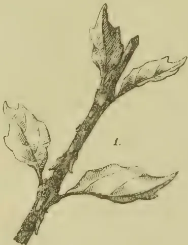A detailed botanical illustration of a woody branch with three large, ovate leaves. The leaves have serrated margins and prominent veins. The branch is shown in a three-quarter view, angled upwards and to the right.

1.

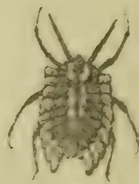A dorsal view of a small, segmented insect, possibly a mite or a small beetle. It has a rounded, segmented body with several pairs of short legs and two prominent antennae.

2.

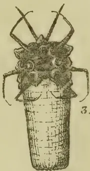A dorsal view of a segmented insect, similar to illustration 2, positioned on top of a vertical, textured cylindrical object. The insect has a segmented body and two long antennae.

3.

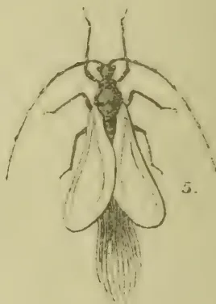A dorsal view of a winged insect, possibly a fly or a small beetle. It has a segmented body, two long antennae, and two large, transparent wings with visible veins. A long, thin tail-like structure is visible at the posterior end.

5.

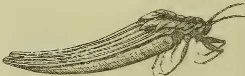A lateral view of a long, slender insect, possibly a fly or a small beetle. It has a segmented body, two long antennae, and two large, transparent wings. The insect is shown in profile, facing right.

4.

Lith. S.G. Colombo 12/94 N° 721

488------------------------------------------------

# \* The TROPICAL AGRICULTURIST \*

## ◇ MONTHLY. ◇

Vol. XIV.]

COLOMBO, JANUARY 1ST, 1895.

[No. 7.

### AN IMPORTANT INSECT ENEMY: AND THE NEED FOR PLANTERS TO GUARD AGAINST ITS SPREAD.

By E. E. GREEN, ETON, PUNDALUOYA.

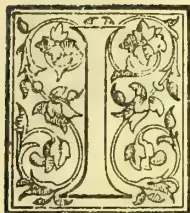

IN Dr. Trimen's Annual Report on the Botanical Gardens for 1893, mention was made of the occurrence in the Peradeniya Gardens of a serious insect pest which was most destructive to the ornamental shrubs there. As this pest has been increasing very rapidly and has already spread beyond the limits of the Gardens, it is important that general attention should be drawn to it.

Within the Peradeniya Gardens efforts are being made to keep it in check; but it has appeared on lantana in the neighbourhood, and there is no knowing where it will stop. It has fortunately as yet shown no taste for either of our two most important products tea and cacao. Coffee, however, does not share this immunity, for trees of Liberian coffee have been observed to be infested with the insect, and we have no reason to suppose that the Arabian species will be less liable to attack.

Dr. Trimen is of opinion that this is mainly a garden pest, and does not expect that it will spread to estates. It is to be hoped that this prediction will prove correct; but it would be unwise to ignore the fact that, if unchecked, the pest might spread enormously and might possibly develop a taste for other plants; as was the case with the "Fluted Scale" (*Iceريا purchasi*) which, at first practically confined to acacia and orange trees, finally became

almost omnivorous. "Forewarned is forearmed"; and, though it would be most imprudent to create a scare, it is still most advisable to point out a possible danger.

As mentioned above, the insect has obtained a foothold upon lantana. Should it once become widely and firmly established, it will be extremely difficult to deal with, and wherever lantana flourishes there will be a stronghold of the pest. Though most accommodating in its tastes this bug at present shows a preference for plants belonging to the natural orders Acanthaceæ, Rubiaceæ (which includes coffee and cinchona), and Verbenaceæ (of which lantana is a member). To the first of these orders belong our numerous species of "Nelun" (*Strobilanthes*) which might form another possible breeding-ground as extensive and even more impregnable than the lantana scrub.

The insect is known to Entomologists by the name of *Orthezia insignis*, Douglas, being first described by Mr. J. W. Douglas from specimens found in Kew Gardens, where it is now said to be doing an enormous amount of damage in the plant-houses. It has more recently been figured and described by Mr. Buckton under the name of *Orthezia naerea*, ("Indian Museum Notes," Vol. III., No. 3, p. 103). The specimens submitted to Mr. Buckton were unfortunately damaged in transit; his figures are consequently not very satisfactory. Comparison with specimens from Kew proves the two insects to be specifically identical.

Originating as it does in the Peradeniya Botanical Gardens, there is little doubt but that we owe the introduction of this pest to plants received from Kew. Its native country has not been determined.

489------------------------------------------------

438THE TROPICAL AGRICULTURIST.[JAN. 1, 1895.

Like so many of our insect enemies, this is one of the "scale-bugs" (*Coccidae*), but is more active than many of the better known members of that family.

The accompanying figures (on our frontispiece\*) will be of assistance in the recognition of the enemy:—

Fig. 1 represents a twig with the bugs *in situ*, natural size. To the naked eye the general effect is of a mass of dirty-white insects crowded upon the stalks and along the prominent veins on the under-surface of the leaves. The insect itself is dull greenish or brownish; but it is the white waxy appendages that first catch the eye, the most prominent of them being the cylindrical ovisac projecting from the hinder part of the bodies of the adult females.

Fig. 2, a half-grown female, upper side highly magnified. The body of the insect is dark brownish or olive green. There is a double row of short white conical processes along the middle of the back, and a fringe of similar but stouter appendages round the margin, gradually increasing in length towards the hinder part of the insect. These processes are very fragile; but when broken off are soon reproduced. In front can be seen a pair of moderately-long tapering antennae composed of eight joints. The six legs are well-developed and project beyond the body of the insect.

Fig. 3 shows the under-side of an older female insect, greatly enlarged. The back can be seen between the front pair of legs. Round the base of each leg is usually a ring of white waxy matter. From below the posterior extremity of the body proceeds a stout white cylindrical appendage, fluted above, smooth below, varying in length according to the age of the insect, reaching in some individuals to nearly four times the length of the body, broad at base and very gradually tapering to extremity which is slightly upcurved. This is the ovisac and contains a vast number of eggs; here they remain until they have hatched when they make their exit through an aperture at its extremity. If one of these egg-cases be broken open, it will be found to be filled with eggs and young insects; the eggs at the base of the tube are of a very pale creamy colour, having been just laid; lower down they become bright yellow, then orange, then greenish, and the young insects ready to emerge from the tube are olive green. A woolly secretion fills up the crevices between the eggs.

Fig. 4 represents a still more advanced stage (side view) in which the ovisac has attained its full length.

Fig. 5 is a greatly enlarged figure of the male insect. I believe this has not previously been described. In Mr. Douglas' original description of the *Orthexia*, the male of some other insect, probably that of the "mealy bug" (*Dactylopius*) has evidently been erroneously tacked on to this species. The real male is a delicate little fly; slaty-gray in colour; antennæ very long and slender, 10-jointed, the two basal joints very short, the others greatly elongated; legs long

and slender; a single pair of wings, rather opaque, dusted with grayish powder; a tuft of long silky filaments at the end of the body. Eyes black, with numerous facets. The adult male insect has no mouth, and consequently takes no food in this stage.

The more minute details of structure would be of interest to the Entomologist only, and may be omitted in an article dealing with the subject solely from an agricultural point of view.

#### REMEDIES.

Determined efforts should be made to stamp out the pest upon its first appearance in any locality. Infected plants should be treated *on the spot*, regardless of expense and, if necessary, with complete sacrifice of the plant. Too great stress cannot be laid upon the importance of "Treatment upon the spot" in all cases of serious insect-pests. The pruning of affected plants and subsequent carriage of the cuttings to some spot where they might be burnt or buried would only serve to sow the pest broadcast along the route of transport. However much a fixture the adult insect may seem to be, as in the case of many of the scale-bugs, it must be remembered that the young are very minute, very active, and usually very numerous.

Should a colony of the insects be discovered upon any plant, a good-sized hole might be dug beside it, in which a fire of dry brushwood and grass could be lighted. The plant should then be cut down or pruned to bare poles, the prunings thrown directly on to the fire, and all dead leaves and rubbish from below the plant swept into the hole. The hole should afterwards be filled with earth to prevent the escape of any possible survivors.

In places where the pest has established itself on lantana or other waste land, such patches should be fired.

On cultivated land such extreme measures will usually be impracticable. In this case repeated and thorough spraying with insecticides will be the only available course. For the purpose kerosene-soap emulsion would probably be the most effective and economical. It should be very carefully and thoroughly applied, and should be repeated at short intervals until the pest has been exterminated. Where practicable it would be advisable to first prune the trees (burning and burying the prunings as suggested above), and then to spray the remaining stems and branches.\*

The formula for kerosene emulsion is

<table>
<tbody>
<tr>
<td>Kerosene</td>
<td>...</td>
<td>2 gallons</td>
</tr>
<tr>
<td>Common Soap</td>
<td>...</td>
<td><math>\frac{1}{2}</math> lb.</td>
</tr>
<tr>
<td>Water</td>
<td>..</td>
<td>1 gallon</td>
</tr>
</tbody>
</table>

Dissolve the soap in water heated to boiling. Add the kerosene to the hot mixture, and churn till it forms a thick cream on cooling. Dilute with from 9 to 12 times water for application.

But we have in reserve a still more powerful (because natural) weapon to use against our enemy, in the shape of the small "Lady-bird" (*Coccinellid*)

\* A handy spraying machine called "the Antipest" is supplied by the Eastern Produce and Estates Company. It is in knapsack form and can be easily worked by one man.

\* Lithographed at the Surveyor-General's Office from drawings by Mr. E. E. Green, Eton, Pundaluoya.

490------------------------------------------------

JAN. 1, 1895.]THE TROPICAL AGRICULTURIST.439

beetles, many species of which feed entirely upon scale-bugs and other injurious insects. We have already in Ceylon many beetles of this family which do good service in their way. But all our native species are handicapped by the possession of numerous insect enemies of their own which prevent their sufficient increase. It is to foreign species therefore that we must look for assistance,—species that, if brought to Ceylon, will find a fair field in which to increase and multiply without hindrance as long as their food is plentiful; and that food-supply ends only with the extermination of our coccid pests. To quote Prof. Riley, the American entomologist:—"Just as we employ cats to kill off mice and ferrets to kill rats, so in economic entomology it behoves us to encourage the entomological enemies of our insect foes." And how can our intermittent and expensive work with pumps and artificial insecticides compare with the costless and untiring energy of these little creatures whose whole lives are spent in seeking out and devouring our enemy?

Mr. Albert Kœbel, the celebrated discoverer of the Australian beetle (*Vedalia carinalis*) which cleared the Californian fruit orchards of the dreaded "Fluted Scale" is now on a visit to Ceylon. He has seen this *Orthezia* at work in the Peradeniya Gardens, and has made the acquaintance of the "Green-bug" that killed out our coffee. He asserts that there are Australian beetles that would assuredly destroy these two pests. It is hoped that a consignment of these beetles will shortly be procured, and that they will soon become established in Ceylon.

In this connection an account of the successful introduction of the *Vedalia* beetle into California may be of interest. The particulars have been gleaned partly from Reports of the Department of Economic Entomology in America, and partly from Mr. Kœbele himself:—

"THE STORY OF THE FLUTED-SCALE (*Iceya purchasi*) IN CALIFORNIA AND ITS ERADICATION THROUGH THE INTRODUCTION OF A PRE-DACEOUS AUSTRALIAN BEETLE."

The very destructive "Fluted-Scale" first began to attract notice in California about the year 1876. It is supposed to have been brought into the country some ten years previously either upon growing acacia plants or upon orange fruit. By 1883 the pest had become so serious that fruit-growers were in despair, many of them being on the point of abandoning the enterprise. Whole orchards are described as being white with the pest, the branches and twigs of the trees completely covered with the insects. In that year the American Government finally determined to send out a qualified agent to Australia—the original home of the pest—to collect and export the parasites of the *Iceya*.

Mr. Albert Kœbele was chosen for this post, as being one of the most careful and able of the assistants in the Department of Economic Entomology. And well he justified the choice! Arriving at Sydney in Oct. 1888, Mr. Kœbele immediately set about his task. He was especially commissioned to procure specimens of a fly that was known to attack the

*Iceya*. In searching for and procuring these he found that a small beetle (the now famous *Vedalia carinalis*) was greedily feeding upon the scale-insect. Mr. Kœbele at once saw the value of this beetle. He found it doing its beneficial work in various parts of South Australia and New Zealand. He collected a large number of specimens, and was able to forward them in good condition to California by placing them on ice and so keeping them dormant. And he finally returned to America with some 6,000 of the insects in various stages. These were speedily colonized in different parts of California, and, finding a plentiful supply of their food, increased so rapidly that within the short space of a twelve-month they had practically cleared the fruit orchards of a pest that had for many years reigned supreme. To quote from an American Report on the subject: a correspondent writes that "The *Vedalia* has multiplied in number and spread so rapidly that everyone of my thirty-two hundred orchard trees is literally swarming with them. All my ornamental trees, shrubs and vines which were infested with white-scale, are practically cleansed by this wonderful parasite."

The pecuniary saving is incalculable! Not to mention the value of the fruit crops repeatedly destroyed, instead of the costly processes of fumigation and spraying and washing with insecticides which it had been necessary to continue year after year, here was an insignificant little beetle taking upon itself the entire burden of the work and most successfully accomplishing its task.

Subsequently Mr. Kœbele found another "Lady-bird" (named, after its discoverer, *Novius Kœbeli*) that has proved equally valuable in destroying the *Iceya*.

An examination of the indices of the yearly volumes of American Reports is instructive. In that for 1883 there is half a column of references to this pest. In subsequent volumes they decrease year by year till in 1893 there is not a single reference to the *Iceya*.

The success of this undertaking was so complete that on the general demand of the fruit growers, Mr. Kœbele was sent, in August 1891, on a second trip to Australia to search for natural enemies and parasites of other Coccid pests then prevalent in California. He was again successful in finding and exporting two other beetles (*Rhizobius toowombae* and *R. debilis*) which feed freely upon scale-bugs of all kinds. The following extracts from recent San Francisco papers will best show the position of affairs before and after this second importation. In one of these papers, dated Sept. 29th, 1894, is an account of "The Value *Rhizobius*." It is there stated that "Mr. Alexander Craw, State Horticultural Quarantine Officer, is distributing some 9,000 of the lady-bird beetle, and directions were given to colonize them at Cucamonga and Ontario. The value of these beetles is learnedly set forth by Prof. A. J. Cook, entomologist at Pomona College, who has given the subject much study. The following extracts are taken from his observations:—

"While attending the Farmer's Institute at Santa Barbara, I learned that six miles north there were citrus orchards that had been entirely freed of the

491------------------------------------------------

440THE TROPICAL AGRICULTURIST.[JAN. 1, 1895.]

"black scale (*Lecanium oleae*) by some of the last imported lady-bird beetles. I visited these orange orchards, the first being one where fifteen of the lady-bird beetles had been introduced last October. This orchard, which consists of orange and lemon trees, was very dirty with the fungus, and the carcasses of old last year scales were exceedingly abundant. Upon close examination it was found that there were almost no young scales. An occasional young black scale (*Lecanium oleae*) and in one place several soft brown scales (*Lecanium hesperidum*) were, after long looking, discovered, while the little beetles were exceedingly abundant. This was to me an exceedingly interesting object lesson. I had read how the *Vedalia* had cleaned out the cottony scale, and here saw how even the more destructive black scale had been devoured by the later importation from Australia. Next day we visited the 1,700 acre estate of Hon. Ellwood Cooper of Ellwood, fourteen miles northwest of Santa Barbara, where the beetles were first introduced, and where they have been watched very carefully by Mrs. Cooper, to whom more than to any one else we are indebted for these saviours of the orchards of California. We first visited the large olive orchard, where the beetles were originally introduced. Mr. Holland, himself a large olive grower at Pomona, saw this orchard two years ago. He said the transformation was most marvellous. Two years ago it was filthy with the secretion of the black scale, crowded with millions of these terrible pests, and he thought utterly ruined. Now it was clean, bright and vigorous. We could find no living scale, and only one of the little benefactors, which we found after repeated trials. It had evidently remained behind to clean up the few remaining scales, which we were unable to find.

We next visited a large walnut orchard, and here also found *Rhizobius debilis* and *R. toowoombe* hard at work in forcing, cleaning out the aphids. Mr. Cooper next took us to a 50-acre orchard of olives, where *Rhizobius* were introduced last October, and which was at that time suffering fearfully from black scale. The beetles were introduced at one end of the orchard and are now just completing their blessed work at the other end, about a half mile distant. We could see the altered foliage and renewed vigor, while many rods away. Upon examination we found the little beetles in countless multitudes, and the scales nearly gone, while at the end of the orchard where the beetles were first introduced, there are almost no scales or beetles. To show the importance of this, Mr. Cooper tells me that he used to spend \$3,000 to \$5,000 annually in spraying this orchard, and even the results were far from satisfactory—not to be compared with the work of the *Rhizobius*."

The *San Francisco Examiner* of Oct. 19, 1894 has the following article headed "The Black Scale Doomed":—

The little black lady-bird introduced into this State from Australia about two years ago is proving itself as relentless an enemy of the

black scale as was the *Vedalia Carinalis* which has effectively destroyed the cotton cushion pest throughout California.

So complete has been the work of the newcomer in Santa Barbara county, where it was first colonized, that there is danger of its perishing from lack of aliment. Quarantine Officer Craw has been summoned in haste to the Southern county by Ellwood Cooper to devise some means of saving his pets, who are worth far more than their weight in gold to the horticulturist. Fortunately during a visit to the South, from which he has just returned, Mr. Craw learned that the beetle had turned its attention to the walnut and orange aphids, noxious insects which propagate themselves rapidly, and will furnish nourishment to the avowed enemy of the black scale. Where the proper parasite is once established it is not desirable that the pest on which it feeds should be thoroughly eradicated. The ideal condition of affairs is that it should be reduced to the minimum quantity commensurate with the sustenance of its enemy. Should this result not be accomplished there would again be danger of the reintroduction of the pest after the disappearance of its parasite, and the fruit-grower would once more be reduced to the costly and inefficient process of spraying. . . . . It is difficult to place a pecuniary estimate on the value of the enemy of the black scale. In one respect, however, the saving in spraying and fumigating will probably represent \$100,000 a year to the horticulturists of California. . . . . There are four or five fruit growers in Los Angeles county alone who pay out an average of \$10,000 each annually in battling against the black scale. All this will be saved, for the little beetle costs nothing. Then, in addition to the economy, the trees will be more healthful and consequently will bear more plentifully and a better quality of fruit. The officers of the Board of Horticulture are satisfied that the black scale is doomed."

[We feel we have been very remiss in calling attention to the efforts past days to fight "black" "white" and "green" bugs on our coffee by means of introduced lady-birds.—ED. T.A.]

RAIN AND FOREST FIRES.—If forest fires produce rain—says the *Daily Chronicle*,—the immense conflagrations in Michigan, Wisconsin, and Minnesota last summer ought to have determined the point. But rain did not, unhappily, follow them, so that the rain-makers' theory is about as defective as their practice. The area covered by the fires was 5,000 square miles, and in this limited space the heat produced was hotter than the hottest sun of June in the ratio of 10,000 to 750. But before the effects of the smoke, and therefore the warmth of the air, was altogether lost by radiation a space of 1,000,000 miles was covered. However, taking the extra heat produced in this area and comparing it with that of the sun over the entire country, the former is, according to Professor Cleveland Abbe's calculation, fifteen times that of the latter—a conclusion which may be doubted. If, however, it is correct, the old epigram about a cowboy's carelessness in dropping a lighted match on a dry prairie disturbing a meteorological prediction is smarter than science justifies.

492------------------------------------------------

JAN. 1, 1895.]THE TROPICAL AGRICULTURIST.441

## RICE GROWING AND ITS PREPARATION FOR MARKET.

BY R. W. MCCULLOCH.

(Published by Department of Agriculture, Queensland.)

(Concluded from page 373.)

### RICE SOILS.

Provided the water supply, be it rainfall or irrigation, is ample, rice can be grown on almost any soil, and throughout the year. But the "beau ideal" of a good rice soil is a naturally stiff clay, having an abundance of silica and potash. The roots of the rice plant are very delicate; good tilth is absolutely necessary to enable the tender rootlets to push their way down. The Calina rice has much longer roots than the ordinary Bengal varieties, due entirely to the deeper cultivation, hence permeability of the soil enabling the roots to get lower down. In the Bengal, methods of cultivation 3 to 4 inches is the lowest depth of tilth, and under this is a hard pan, hence the roots are shorter and travel laterally in search of food, and where no water provided the plants could not survive. It is certain that varieties of paddy imported from Bengal and treated to scientific farming would develop good root growth, and in the course of time with careful seed selection, a variety could be produced which would really be a dry land crop—that is, entirely independent of added moisture, and one not likely to fail with a moderate drought, as by having longer roots, and good tilth being provided, the plant would receive nourishment from the subsoil, which in the driest of seasons has a sufficiency of moisture if get-at-able by the plant.

There need be no fear when entering on rice cultivation at the want of a market; the existing demand is ample to guarantee a financial success. Where it is seen that rice cultivation is being taken up, the mill-owner will not be long in following. In the event of our farmers having to consume their own crops or put it into pigs for a time, they would still be the gainers. Further on it will be shown how small quantities of paddy may be prepared for home consumption.

### CULTIVATION OF RICE.

The farmer having decided on the variety of rice he intends going for—say any one of the varieties of the "aus" or "aman" crops—will proceed to get his land ready. If intending to plant the "aus," or so-called "upland" varieties, all he has to do is to select a piece of land, from a quarter to one acre in area, on the highest part of his farm, on a slope if possible, or even on a level bit if the country behind is higher, so as to catch the rainwater, if necessary, by raising an embankment. He will plough, cross-plough, and harrow this land, and bring it to as fine a degree of tilth as possible. The land should be got ready against the first rains, say the end of September or beginning of October.

### SWING SEED.

There are three methods of doing this: (1) Broadcast; (2) in drills; (3) transplanting from a nursery. Of the three systems the last is by far the best, as it insures a greater regularity in the crop, is a great saving of seed, and what is of infinite importance, superiority in weight and fulness of grain is attained by it, hence increased nutritive qualities. This third method is necessary with the "aman" varieties. Having got the land ready as above mentioned, d, as soon as possible after the first rain falls the land should be immediately cross-ploughed again and harrowed, and if broadcasting or drilling be decided on, the seed immediately sown, and the land harrowed over with a bush harrow. If he sows broadcast, 60 lb. of seed will be plenty; if in drills, 12 inches or more apart, 40 lb. will be ample. Nothing more need be done. If the land was clear, the weeds will not trouble. As before said, the "aus" varieties are quick growers, and will soon cover the ground.

If the farmer decides on planting "aman" varieties, and by transplanting, he must prepare a nursery,

the area of which, to plant an acre from, should be 30 feet square, or two or three such beds 10 feet or 12 feet square may be made near the field to be planted. If only a quarter of an acre is to be planted, then a bed 19 feet square, or three beds 6 feet square, will be necessary. The amount of seed required for a nursery to plant one acre will be about 8 lb., and for a quarter of an acre 2 lb. That these nurseries must be thoroughly ploughed and the soil well pulverised need hardly be said. As the space required is so small, this work should be thoroughly done, the object being to get vigorous plants.

The seed should be steeped in water for twelve hours to assist germination; it is then sown in the beds and lightly raked over. The seed beds must be kept moist, in the absence of rain, by the use of the watering-can. In making a nursery, it is always best to use a little extra seed, and select the best plants for transplanting. The nursery will be ready for transplanting in three weeks. Some judgment will have to be exercised in getting this nursery ready, so as to hit off the proper time; for it will not do to have the nursery ready too early, and before enough rain falls to enable it being planted on. But should this occur, on no account should the transplanting be delayed longer than a week more; for if the field is in good tilth it is better to put the plants out when three or four weeks old than to wait five or six weeks for rain ere doing so. In lifting the plants from the nursery they are simply pulled up by the hand and tied in bundles and carried on to the field, where they are doubled in, putting two or three plants in each of the holes, which are about 6 inches to 9 inches apart. Regularity of lines is not essential. Three men should plant an acre in a day. No further attention is required till the crop begins to ripen. If the farmer has had to transplant from the nursery to save the seedlings getting too old, he will be wise if he raises an embankment about 4 inches high all round the lower end and two sides of the field, so as to catch the rainwater and give the land a good soaking. This can be done cheaply and speedily by turning up a couple of furrows with the plough. In transplanting, it is often the custom to crop the tops as well as the roots of the seedlings, when pulled from the nursery, before planting them out, the reason being that it not only makes the plants handier for transplanting, but prevents their falling down and the remaining leaves withering, as growth begins at once. This system has a good deal to recommend it, and is advocated.

To sum up, the "aus" or dry land rice requires a moderate rainfall to insure success, and can be treated in exactly the same way as wheat is cultivated, whereas the "aman" or wet rice requires to be planted just before the heavy rains set in, requires wet weather during the whole period of growth, and should, if possible, have an inch or two of water always on the field, best secured by raising a low embankment all round the field to retain the rainwater or irrigation adopted. The land for the "aman" does not require to be exactly a swamp, as for the "boro" varieties; but should be next door to a swamp—very wet during the whole period of growth. Possibly a spell of dry weather may be experienced about the time nursery is ready to transplant, or shortly after transplanting has been effected, in which case the prospects of the crop may be jeopardised. The following cut is a modification of what is known here in Queensland as a "whip," and in Oriental countries as the "Picotta" or lever water-lift, used all over the East for irrigating land, and consists simply of one forked sapling to which is fastened another sapling, having a bucket attached at one end, and a counterpoise in the shape of a long or a bag of sand at the other. This primitive appliance needs no engineering skill to set up or work, and rather than stand by and allow one's crop to perish, might with advantage be adopted.

The appliance works well and cheaply for lifting water from a depth of 12 feet, over that depth it becomes costly.

The following calculations from "Professional Papers," Vol. I., will illustrate what can be done in

493------------------------------------------------

442THE TROPICAL AGRICULTURIST.[JAN. 1, 1895.

this way:—Water raised 16 feet: contents of bucket, =45 cubic feet; number of discharges per minute, 3; discharge per hour, 81 cubic feet; actual discharge per hour, 72.9 cubic feet, or 455.4 gallons per hour.

By making small shallow drains and little embankments here and there over a patch of rice, the crop can be irrigated at will, wherever water can be got at a depth of 12 or 16 feet. The deeper the well the higher the forked sapling must be.

Most farms have a bit of a hollow or low land, dry in summer and very wet in the rains. Now, this is just the land for any of the varieties of the "aman" crop. All that is necessary to do is to run a drain, say 3 feet deep, down the centre, with the fall towards the lower end. At this end an embankment about 1 foot high should be raised the whole width of the field. The land should be ploughed, cross-ploughed, and got ready. On the setting in of the rains, the end of the drain is closed up, and the water allowed to rise and flow over the sides and thoroughly soak the whole field. It is then allowed to run out. The seed may now be sown broadcast or by transplanting as inclination suggests. By occasionally closing the end of the drain the field may be irrigated at one's own will, and accordingly as it is observed the crop requires the application of water. It is not absolutely necessary that the water should lay on the field during the whole period of growth, but the land should be kept moist during growth, and the above method is the simplest, cheapest, and most effective method of doing it.

The largest yields of rice are got by turning the water on when the plant bunches for blossom, and should remain in on until fully ripened for harvesting. This is done to mature the grain uniformly. Irrigation works in connection with rice growing make it, without exception, one of the most paying crops to grow. The moral is obvious.

In the 'boro' varieties, the land should be prepared against the rains setting in, and the seed may be sown broadcast, just after the first two or three showers have fallen, when as the hollow goes covered with water the plants will grow so as to keep their heads above. Broadcasting is not advocated; it is better to prepare a nursery, as before mentioned, and as soon as the hollow has an inch or two of water on to commence transplanting. The "boro" varieties must always have water lying on the field. No further care is wanted till the crop is ready for reaping. As before said, the "boro" is a biggrained, coarse rice, not a table rice, and is capital feed for pigs, and if grown for this purpose alone, and fed to the pigs whole or ground up as a meal, will more than repay the former for his trouble. With the stoppage of the rains the water begins to dry off the land, and the crop ripens; it is then harvested.

#### HARVESTING.

Owing to the brittleness of the crops, the harvesting must be done with sickles or reaping-hooks. Care must be taken, however, to cut the crop before it gets thoroughly ripe, as a deal of grain is shed, consequently lost. Some difference of opinion exists on that point. Experience in the Cairns district goes to prove that when thoroughly ripe, the ears are not so brittle or liable to drop off as is the case in India. Harvesting is therefore done when the crop is thoroughly ripe. If this is a fact, then there is no reason why mowing or reaping machinery should not be used in the harvesting. When cut the crop is tied in bundles and carried off to the threshing floor at once, or if the weather be fine and dry, it may be left on the fields for a day or two to dry. To save the straw, which is good fodder for cattle, the crop should be cut as close to the ground as possible.

In Louisiana, Florida, and the other rice-growing States of America where large areas are put under rice, harvesting machinery has of a necessity to be used. The ordinary wheat-harvesting machinery, "reaper and binder," or, still better, a "stripper" could be made to answer the purpose, by having broader tyres to the wheels, so as to prevent the machine sinking into the soft, wet, rice lands. An ordinary mowing machine, with the same improve-

ment to the wheels, would be effective. The price of harvesting machinery, however, being great, the expense would only be warranted with large areas under rice.

#### PREPARING CROP FOR MARKET.

Up to this point the crop is known as "paddy," and before it can be called "rice" it has to go through the following processes:—Threshing, to separate the grain from the raw and stalks; hulling, removing the outer skin or husk; separating, cleaning the rice of thrash and any unhulled grains; and finally, polishing, to complete the process of rice cleaning for the market by removing the inner cuticle. Machinery for the above operations can be purchased in sets or separately for either hand, animal, or steam power. A complete set of hand-power rice-cleaning machinery, with a capacity of from 300 lb. to 500 lb. per day, will cost £53 2s. 6d. in New York; a set for animal power of same capacity £37 10s.; a set for steam power, including engine and boiler, with a capacity of from 600 lb. to 1,000 lb. per day, £225. The best known manufacturers of rice-cleaning machinery are the Geo. L. Squier Manufacturing Company of Buffalo, New York, their machinery being in use in almost every rice-growing country in the world, and giving universal satisfaction. A set of this firm's machinery, known as the "No. X" set, is in use in Cairns at the present time by the local rice company. With the use of a huller, only costing £16 13s. 6d., our farmer can consume his own rice, the threshing being done as described further on. Hullers are procurable capable of producing as finished an article, polished and all, as comes out of the modern rice mills. Where small quantities of rice are grown, and intended for home consumption, the following primitive method of manufacture, in use by the natives of India, may be adopted.

#### THRASHING.

A level bit of ground will have to be got ready, the crop spread out evenly over this, and trampling resorted to by means of two or three bullocks yoked abreast and tethered to a post sunk into the ground, being made to move round and round, forking up the straw now and again; or the threshing may be done by beating it out by handfuls over a block or into a box, with two or three bars nailed cross; the bundles of paddy are struck over these bars two or three times, and the paddy drops into the box, or beating with flails until all the grain has been detached from the straw. It is then winnowed to remove light and inferior grain. The winnowing is performed by letting the grain drop from a height in a light breeze; the grain falls on one side, and the chaff and light stuff to leeward. With the use of a modern hulling machine the winnowing is not necessary. The thrashed paddy has only to be put in the machine, and it is delivered clean rice. The grain—still paddy—should then be spread in the sun for a day or two, then packed away in bags, out of reach of moisture or rats, till wanted for use or sale to the mill-owner. For home consumption, small quantities of the paddy can be prepared as follows:—The implement most commonly used by the natives of India for hulling or removing the husk is known as the "dheko" which consists of a heavy beam of timber or round log, 8 feet long, and weighing about 300 lb., into one end of which a short staff shod with iron is fitted at right angles to the log. The centre of the beam rests on a cross bar, to which it is fixed, resting on two uprights sunk into the ground. The iron-shod staff rests in a wooden cup sunk below the level of the ground. The implement is worked by one or more persons pressing the free end of the log down with one foot, and letting go, when the shod end drops into the cup holding the paddy. A cross bar is usually fixed breast high, by leaning on which assistance is afforded in depressing the log. One person is constantly engaged in pushing back the grain into the cup as the pounding goes on. The other implement is in reality a pestle and mortar made of wood, and is known as the "akhli." A block of wood 2 feet in length by 18 inches in diameter is hollowed out to 9 inches in depth. The

494------------------------------------------------

JAN. 1, 1895.]THE TROPICAL AGRICULTURIST.443

paddy is placed in this mortar and pounded with a shaft 5 feet in length, shod at one end. The shaft is grasped by the middle, raised to the full extent of the arms, and dashed into the mortar, this pounding continuing till all the grain is husked. Two or three may engage in the work, and, as in the firstnamed implement, one person has to attend to the mortar and keep pushing the grain in. There is considerable waste by this process, as the rice gets broken and is winnowed out with the husk and dust. But it need not be lost. If all this is collected and fed to pigs and cows, the grain to the farmer will more than counterbalance the actual loss in rice.

Another system of husking is to pass the paddy through a small pair of millstones or cylinders of the same shape, made to hardwood, set on end and grooved on the working surface. The distance between is regulated, so as to remove the husk by friction without breaking the grain and chaff being winnowed as before described. After the husk is off, the inner skin covering the grain has to be removed by pounding in a mortar. The paddy should be one year old before husking, old rice being preferable to new in point of flavour.

The above primitive methods of preparing rice are certainly slow and tedious, and likely to disgust the would-be rice-grower, but in the absence of winnowing and husking machinery they are the only possible makeshifts, and can be worked by himself and family. The greater proportion of the paddy prepared for the market in India passed through a steaming and soaking process before being husked, which serves to render the removal of the husk easier and to minimise breakage. The paddy is steeped in water for forty-eight hours, and is then run into another vessel with a small quantity of water and placed over the fire; just sufficient water is used to merely steam the contents. After this it is dried thoroughly in the sun for two or more days, and then pounded in the mortar before mentioned. The paddy loses one-third in weight by the husking; that is to say, three bushels of paddy when husked will give two bushels of rice. A bushel of paddy equals from 40 to 45 lb., and a bushel of clean polished rice 60 to 65 lb., dependent on the size of the grain.

Is a cut of an American hand rice huller, manufactured by the above firm, has a capacity of 200 lb. of rough or paddy rice in twelve hours, and costs £10 8s. 4d. in the States. The machine is simple in construction and is durable.

Represents a huller and polisher, manufactured by the Engleburg Huller Coy., of Syracuse, U.S.A. This machine has a capacity of from 75 to 150 bushels in ten hours and both hulls the rough rice and polishes it in the one operation, and cost £100.

Is a cut of modern rice mill, is automatic in action, and can put through 13,000 lb. or 300 bushels of rough rice per day, and costs about £1,230.

The above modern rice machinery has all originated from the primitive appliances used from the days of Abraham, and which may, even in these days, be seen at work in the East.

Gives a very fair representation of the appliances in question. Their ingenuity cannot be disputed, and for want of a better method, any farmer can easily apply this system.

The initial cost of these machines, taking into consideration the work they perform, is not excessive, but doubtless their price places them beyond the reach of small growers. These small hand machines are not satisfactory, the article produced by them not being the same as that from higher class machinery, consequently the value of the rice would be considerably less. Co-operation of rice-growers is the only successful method of tackling this industry—the cost of the necessary machinery divided among ten or a dozen farmers would not amount to much after all. Individual efforts in both growing and preparing rice for the market, especially the latter, will end in failure. Like the sugar industry, the preparation of the rice should be distinct from the growing of it, and herein will be found success financially.

#### WILL IT PAY?

Under favourable circumstances one acre under rice will produce from 50 up to 90 bushels of grain per acre. Quite recently on the Clarence River, New South Wales, a crop was gathered which gave 67 bushels of grain, and it is said (but this must be a misprint), 80 tons of straw to the acre. In the Cairns district last season, the average rice yield per acre is estimated at 2 tons. Taking 2 tons, then or 74 bushels, as a basis for calculation, we find that paddy, or the rough unhulled rice, being worth to the grower, say, £9 5s. per ton, or 5s. per bushel (the price varies between £8 and £10), 2 tons per acre will realise £18 10s., and this multiplied by two crops, gives £37. Then the straw, being good feed, would, in all probability, meet with a ready sale, if done up into bales, at from £2 to £3 10s. per ton, and, taking the yield of straw at 5 tons to the acre, so realise another £10 per acre, or in all, £57 per acre for the two crops. The cost of putting the land under crop will be amply met if set down at £9 per acre. Profit per acre, say, £18 10s., at which price it cannot but be admitted that rice growing will pay.

Rice milling is also remunerative enterprise. Taking rice at the present market value—viz., £23 per ton, to produce which 3 tons of paddy would have to be milled, we find 3 tons of paddy at £9 5s. equals £27 15s., producing 2 tons rice at £23 equals £46.; difference, £18 5s., or equivalent to £6 1s. 8d per ton of paddy, from which deduct the cost of milling, amply met by, including all charges £2 per ton. Net profit, £4 1s. 8d. per ton. Further, rice chaff has a commercial value, and is commanding a good price in Europe today. It is used extensively for packing glass, canned goods, and like packages, for which purpose it cannot be equalled. This chaff realises in the German market something like from £3 to £4 per ton.

#### PARTICULARS re RAMIE CULTIVATION.

(Forwarded by a Glasgow constituent of Messrs. Bosanquet & Co., of Colombo.)

1st.—Shou'd be grown from plants, not seeds.

2nd.—A "Nursery" of say 20 acres should be planted out to begin with, and from this nursery, cuttings obtained for rapid extension to a much larger acreage. The 20 acres would also give marketable product as below.

3rd.—Plant yields 4 crops per annum of "ribbons" (i.e. the stem) which is the commercial product. Each crop should give at least 10 cwt. of "ribbons" per acre, which equals 2 tons per season, or probably 2½ tons. But in the first year, the first crop should be put back on the ground as manure, as the product of the first crop is valueless for "ribbons," so the first year there are but 3 marketable crops, each year thereafter 4 crops. The plants, taken care of, last permanently, and crop for a hundred years.

4th.—The leaves of the plant, and also the rubbish left by the reducing machines, should go on the ground as manure. (Catle also eat the leaves with avidity).

5th.—While Ramie grows well in China, the product is very coarse, and to obtain the commercial material of good quality requires care in cultivation, just as any other natural product. The method is as follows:—

In hot or dry countries irrigation is necessary. "No water, no Ramie." After ploughing to a depth of 15 inches, and harrowing the ground, and having furrows three feet apart, the plants should be set in late autumn, moist season 18" apart. Broad cart ways should be left at convenient distances apart for getting at the plants at harvesting time. The ground should be ploughed between the young plants similar to cultivating potatoes. Keep ground well weeded. When once a plantation is formed it keeps down the weeds. Liquid manure is best, but others will do. When harvesting, the stems should be cut when the colour changes a few inches from the ground, conveyed to the decorticating machines, and then the fibre given from them packed in bales for shipment. Machines would be shipped from this side. Before packing the "ribbons," thoroughly dry them, so as to prevent fermentation. The plants should

495------------------------------------------------

444THE TROPICAL AGRICULTURIST.[JAN. 1, 1895]

be set out in light sandy deep soil. Crop is yield the first spring after autumn planting.

A contract to take all that can be produced for five years at London, at the price of £10 per ton *c.f.* equal to £20 at least per acre can be fixed. As cost should work out to about £7 per ton at London, the margin seems a good one.

For future guidance it may be mentioned that to cultivate 1,000 acres of Ramie, it is calculated a capital of £15,000 would suffice. Then 1,000 acres, yielding say  $2\frac{1}{2}$  tons per acre per annum at a profit of £3 per ton equals an income of £1,750 on the capital of £15,000. Setting off the £750 against contingencies the result on this basis equals 40 per cent per annum. Acreage could be extended out of profits till very soon 100 per cent profit basis could be attained.

If it were thought well to plant out right away 500 or 1,000 acres instead of beginning with 20 acres of "nursery," then plants could be supplied for the larger acreage.

With the cheap labour of the East, cost might come still lower.

#### A HOME-MADE FERTILISER.

Every intelligent gardener knows the value of wood-ashes as a fertiliser, and until a comparative recent period wood-ashes were really almost the only commercial manure that was procurable in America, artificial manures not having come into use in that country. But it is somewhat remarkable that the value of wood-ashes and the beneficial results of their application to the soil, are generally attributed solely to the potash which they contain. Undoubtedly potash is an indispensable food for plants, and its application to crops is usually marked by conspicuous results. Those gardeners, however, who have had long experience with potash in the form of wood-ashes, and also as potash salts or kainit, find that the latter is not so marked in its effects as the former. The fact is, that as recently remarked by Mr. S. Macon in the *American Agriculturist*, wood-ashes are really a mixed fertiliser, and a complete one so far as the mineral elements of plant-food are concerned. This must be apparent to anyone who considers that they are the whole residue of plants after being burned, except that part which returns to the atmosphere from which it was originally procured.

The nitrogen and the carbon of the trees alone are thus wanting in the ashes, which contain everything else required by plants. Thus it is only reasonable to infer that the benefit derived from a dressing of wood-ashes to any crop, must be due to the other elements as well as to the potash.

Of course, the value of ashes may vary considerably according to their source, though practically this variation is less than would be supposed at first sight. Ashes are richer or poorer in potash and other useful ingredients according to the kinds of plants from which they are obtained, and to the character of the soil upon which the plants grew. Also it is found that the value of the ash varies according to the parts of the plant that have been burned. The ashes of twigs (faggots for example), would always be worth much more for horticultural purposes than the ashes of heart-wood taken from the middle of an old tree; and in general the smaller and younger the wood burned the better would be the ashes.

Taking what is known of the composition of the ashes from young twigs and that from heart-wood which has fully matured, one would say that the proportion of potash in ashes may vary from 5 to 20 per cent. But a much better criterion of the real composition of ashes is afforded by the experience of potash manufacturers, according to whom a bushel of wood-ashes weighs about 48 lb. on the average, and yields rather more than 4 lb. of potash salts. Professor Storer has investigated this question somewhat in detail, and has found by the analyses of a number of samples of wood-ashes that selected specimens contain 8 $\frac{1}{2}$  per cent of real potash, and 2 per cent of phosphoric acid; or say 4 $\frac{1}{2}$  lb. of potash and 1 lb. of phosphoric acid per bushel of ashes. Hence there is enough potash and phosphoric acid to make the bushel of wood-ashes worth from 10d.

to 12d.; and besides that, some 5d. to 7d. additional may be allowed for the "alkali power" of the ashes. This may be explained as the force of alkalinity which enables wood-ashes to assist in the rotting of weeds, and to ferment peat.

The notion that the ashes of soft woods, such as Pine and Poplar, are worthless, is an error. The soft woods yield comparatively little ashes, and the ashes are so light that they may readily be blown away by the wind; but weight for weight, the ashes from soft woods appear to be as good for horticultural purposes, or nearly so, as those from hard woods.

The percentage composition of wood-ashes commonly used by gardeners is as follows:—

<table border="1">
<thead>
<tr>
<th>Ash of—</th>
<th>Potash</th>
<th>Lime</th>
<th>Phosphoric Acid.</th>
</tr>
<tr>
<th></th>
<th>Per cent.</th>
<th>Per cent.</th>
<th>Per cent.</th>
</tr>
</thead>
<tbody>
<tr>
<td>Beach wood</td>
<td>61.1</td>
<td>56.4</td>
<td>5.3</td>
</tr>
<tr>
<td>Oak</td>
<td>10.0</td>
<td>73.5</td>
<td>5.5</td>
</tr>
<tr>
<td>Elm</td>
<td>21.0</td>
<td>47.8</td>
<td>3.3</td>
</tr>
<tr>
<td>Apple</td>
<td>12.0</td>
<td>71.0</td>
<td>4.6</td>
</tr>
<tr>
<td>Pir</td>
<td>11.8</td>
<td>50.1</td>
<td>5.8</td>
</tr>
<tr>
<td>Poplar</td>
<td>14.0</td>
<td>58.4</td>
<td>13.1</td>
</tr>
<tr>
<td>Pear</td>
<td>4.2</td>
<td>77.2</td>
<td>8.8</td>
</tr>
<tr>
<td>Cherry</td>
<td>20.8</td>
<td>28.7</td>
<td>7.7</td>
</tr>
<tr>
<td>Average of 25 descriptions of trees</td>
<td>5.5</td>
<td>34.3</td>
<td>1.9</td>
</tr>
</tbody>
</table>

The barks of trees are still more rich in lime than in potash, than is shown in the foregoing table. And as all plants contain lime, this element of the ashes should be taken into account, as well as the other ingredients, for it is known that the production of nitrogenous plant-food goes on most easily in soils that have a considerable proportion of lime in them. Indeed, it may be said that this supply of lime is indispensable to the action of the nitrification-bacteria, which must have lime within reach for its proper development.

#### ACTION OF POTASH ON SOIL-NITROGEN.

An objection is sometimes made to wood-ashes as a manure for horticultural purposes, that the plants to which they are applied grow coarse. This may be due to the nitrogen supplied to the plant by the action of the potash on the humus of the soil. This power of potashes to make the nitrogen of the soil available for plants is undoubtedly a valuable one, and is strikingly shown in clearing wooded localities. For wherever a heap of wood and scrub is buried, it is noticed that vegetation afterwards is apt to be particularly rank and luxuriant precisely where the largest quantities of ashes are lying. This rankness of growth is doubtless to be attributed first to a superabundant supply of nitrogenous food brought into activity by the aid of the ashes, though it is believed that the spots charged with alkali from the ashes are in many cases better supplied with moisture by capillary action than the surrounding portions of ground.

Investigations have proved that commercial potash fertilisers, used as such, are decidedly inferior for plant-growth to wood-ashes. The explanation of this fact seems to be that the sulphate and the chloride of potash are devoid of the alkaline quality which is so marked a peculiarity of carbonate of potash which, as is well-known, is the effective agent in wood-ashes.

As an illustration of the value of wood-ashes as a fertiliser, I may mention the following fact which has just been brought to my notice. A gentleman in Nottingham has two Vines, which are very old, and were said to be worn out; they had not produced a satisfactory crop for several years. In 1893 they yielded 20 lb. of Grapes of a very inferior quality. In the autumn of 1893 they were heavily manured with a mixture of wood-ashes and kainit, with the result that in 1894, the present year, the two Vines yielded 120 lb. of Grapes of excellent quality. The potash in the wood-ashes, combined with the potash in the kainit, matured the wood of the Vine, and developed the fruit buds. It will be of interest to learn what the result of 1895 will be, but I should think a little more potash will have to be applied in the present autumn, to make up for the drain upon this element by the large crop just gathered. *J. J. Willis, Harpenden.—Gardeners' Chronicle*

496------------------------------------------------

N. 1, 1895.]THE TROPICAL AGRICULTURIST.445CINNAMON.

A paragraph on the Cinnamon Market we quoted from a correspondent to our evening contemporary, can scarcely be correct in all its particulars. We do not question the statement that the said correspondent has money lying idle in the bank; nor is there any reason to doubt that growers have refused his offers for their spice; but what we take leave to doubt is whether the growers are still holding their crops in anticipation of better prices. The grounds of our scepticism are:—1st, that cinnamon growers are notoriously weak holders, and, 2nd, that the table of exports does not support the theory of cinnamon being in first hands in any appreciable quantity. Our readers are aware how helpless the growers of cinnamon showed themselves on more than one occasion during recent years, in their endeavours to check or reduce the trade in chips and to compel more frequent sales by public auction of the spice in London. Looking to modern methods, it does seem monstrous that this sole article of commerce, and this spice alone of a great variety—spice sales are weekly, so far as we know—should be offered for sale only once a quarter; and we have not been able to discover that there is aught but the interest of wealthy buyers, who have a monopoly in the trade, against more frequent auctions. Were cinnamon growers strong holders, and were they able to act with tolerable unanimity, they would have had their own way long ago in the London market, even if the object of the change they desired had been delayed for a little time by combination among buyers. Again, the persistent drops in the price of cinnamon, even in face of a restricted output, most of those interested in the trade on this side maintain, might have been avoided had holders been more firm. So we suspect the disappointment of the correspondent referred to must be due rather to higher bids by more venturesome bidders, or to the shipment of the bark by the growers themselves. We are confirmed in the view that there cannot be much cinnamon on this side in first hands by a glance at the Chamber of Commerce Circular. We learn from it that up to the 26th instant, 1,730,613 lb of quills were exported, as against 1,729,665 lb in the corresponding period of last year, and 1,821,136 lb and 2,064,714 lb during the same periods of 1892 and 1891 respectively. So that, up to date, we have exported more than during the same period of the previous year, notwithstanding admittedly short crops in the Western Province at least! The chips, too, with exports ranging up to 515,874 lb stand higher than in 1891 and 1892, though about 46,000 lb short of last year. Under these circumstances, it is not easy to accept the statement that growers are holding on in expectation of “a big rise in the price at the next sales”—that is the sale held in London, on Monday last. The statement may be correct only with regard to chips; but that does not appear to be what is meant. The puzzle, however, remains, how have our exports of cinnamon run up so high, notwithstanding all the talk about short crops, and the information we have from trustworthy sources from some of the best estates in the country, that the last harvest was most disappointing!—to say nothing of the ensuing one which is likely to prove still more disappointing. Can any of our friends in the Southern Province help us with statistics bearing on the production there, or tell us whether the rainfall in the South has been helpful to the harvesting of a large crop?

Another statement which is open to question

in the paragraph we have quoted, is that the anticipated rise in the price of cinnamon is not due to low stocks at home. We have good authority for saying that the stocks are below the average. At the August sales only 517 bales were offered, against 1,076 the previous May, and 1,120 bales in August 1893; and three months ago the statistical position was in favour of growers, the stocks, being 2,066 bales against 3,707, 2,590, 4,378 and 4,254 bales for each of the preceding years up to 1890. The sale of the whole of the 2,500 bales which were offered on Monday last—a by no means extravagant quantity for the season—is satisfactory, as showing that the demand is now fully equal to the supply; and we shall look forward with interest to the details of the sales which should come to hand three weeks hence. Meanwhile we can only repeat what we have said before, that the prospects of the small crop now being harvested—at any rate, it should have been begun ere now—are very poor in the Western Province; so that there is sure to be a great scarcity of the finer qualities of cinnamon in the London market before long.

PLANTING IN TRAVANCORE.

Mr. P. R. Buchanan returned from North Travancore whether he had gone recently to inspect some ten thousand acres of forest land which had been offered to the North and South Sylhet Tea Companies, and in a short conversation which one of our representatives had with him, he said he found the soil in the district very good indeed, better than any he had seen except in the best parts of Upper Assam. He saw some splendid coffee and he found tea at between 5,000 and 6,000 feet elevation looking as well as any he had seen in Ceylon. The chief drawback at present to the land he inspected was its inaccessibility and he supposed that was the reason why a great many more people had not looked at it. The journey to it includes a railway ride, about 40 miles in a bullock-hackery and a ride on horseback of about 30 miles. On the way he met Mr. Scott of Mayfield, Mr. W. Mackenzie, and Mr. Tait, and he experienced hospitality from Mr. Knight and Baron Rosenberg who showed him a good deal of the district. He was accompanied by Mr. Milne who returned with him and Mr. L. Davidson who has stayed behind to make a visit in South Travancore. Mr. Buchanan has some places to visit here yet, and then he intends to go through the Wynaad and Coorg.

TEA SEED.

We hear it stated on good authority that the Assam-Chittagong Railway have acquired 49 acres of Jatinga Valley tea, and that, after infinite trouble, R1,49,000 has been acquired as compensation. The company has booked orders for over 950 maunds of seed, at an average of about R85 a maund. This will give the company nearly R80,000 profit, or about 27½ per cent on the capital. During the past three months the shares have risen very considerably, and the manager is to be congratulated on a very successful season's work.—*The Planter*, November 16. 29

ROYAL GARDENS, KPW.—Bulletin of Miscellaneous information for October has for contents:—Lathyrus Fodder; Minor Industries; Decades Kewenses: X.; Madagascar Piassava; Three New Species of Trelenia; New Orchids: 10; St. Vincent Botanic Station; Phabur Grass; Bulbous Violet in the Himalayas; Miscellaneous Notes.

56

497------------------------------------------------

446THE TROPICAL AGRICULTURIST.[JAN. 1, 1895.]TEA SWEEPINGS.

London, Nov. 9.—It was reported yesterday that another shipment of the "Hamburg Tea" had arrived from Hamburg. I am told that the Tea Dealers' Association have had a meeting and that the tea growers and producers and merchants are likely to have a meeting on this same subject, as they very keenly resent the fact of the Custom House allowing tea sweepings to be sent out of the country and returned here as a "food" and put on the market. I have no doubt, that I shall be able to send you from time to time this information as it crops up.—*Cor.*

PLANTING AND PRODUCE.

SUGGESTED REFORMS IN THE TEA TRADE.—Mr. Slaney's letter, which we printed last week, has called forth the following expressions of opinion on the same subject. A Leeds correspondent of the *Grocer*, signing himself James Johnson, says: "I have frequently noticed the objectionable 'cedary smell' pervading some Indian, particularly in Dooars growths. The remedy your correspondent, Mr. Slaney, proposes, viz., the posting of marks for information of the trade, appears a practical one; and perhaps the writer would so far have the courage of his opinions as to exhibit a list in his sale-rooms of marks coming under his notice packed in bad wood. I am informed that the wood complained of is shipped from Japan and China to India and Ceylon, principally the former, for use in districts where there is a scarcity of the right materials. Amongst marks I have noticed where teas come over in exceptionally good packages, I would name the following:—Assam Company, Doom Dooma, Jokai, Upper Assam. One would think it would be to planters' interests to have due care to the procuring of such packages as would secure the teas arriving in best possible condition. Curious things are certainly found in tea at times, and I quite agree with your correspondent respecting the earthy matter which is sometimes found in Indians, Javas, and Ceylons. However, some people who are on the cry out for grip, etc., in low teas may like it. Certainly there would be more strength in it than in the 'resuscitated tea' so skilfully manipulated by 'expert tea blenders,' that customers 'Oliver Twist like,' called for more," "Tumsong" writes: "I cannot understand owners of tea estates putting their teas in cedar wood chests described by your correspondent Mr. Slaney last week. The trade would think that quite naturally producers would studiously avoid using chests which may contaminate their contents. I am of opinion that the only remedy must of necessity be of a drastic character, such as posting up the trade with the garden names or marks when this wood is used."

THE FIRST SALE OF INDIAN TEA IN CALCUTTA.—The first, we believe, distinctly public (or commercial) sale of Indian tea was made in the Calcutta market on May 25th, 1841, although as far back as 1788 Sir Joseph Banks suggested to the Court of Directors of the East India Company that the effort should be made to cultivate tea in India. Lord William Bentinck, on the eve of his departure for India, accordingly received instructions that he should give the subject his careful consideration. Some eight years previous to Sir Joseph Banks's suggestion Colonel Kyd had actually raised China tea in the Botanic Gardens of Calcutta. Lord Bentinck, on his arrival in India, lost no time, however, in taking action. A Tea Committee was founded, with Dr. Wallis as Secretary. In addressing his Council on January 24th 1834, His Excellency made it clear that he was to leave nothing unturned that might help to attain the object aimed at, viz., the acclimatisation of the best Chinese plants. The Tea Committee do not appear to have informed Lord Bentinck that Major Bruce (about 1821) and subsequently Mr. Scott (in 1824) had found the tea plant wild in Assam. Much expense and considerable delay were accordingly incurred in sending several expeditions to China to procure Chinamen and tea-seed, but while a com-

missioner was actually in China (on behalf of the Tea Committee) Captains Charlton and Jenkins re-discovered the wild Assam plant.—*H. and C. Mail*, Nov. 9.

BRITISH CENTRAL AFRICA.MR. JOHNSTON'S REPORT.

A Blue-Book was published lately (Africa No. 6, 1894), containing the report by Mr. H. H. Johnston, her Majesty's Commissioner and Consul General, on the first three years' administration of the eastern portion of British Central Africa. The report, which consists of 43 pages, is dated Zomba, March 31, 1894. Of the 237 Europeans in the country at the time this report was drawn up all but 11 were British subjects, and may be enumerated thus—69 English, five Welsh, 130 Scotch, six Irish, six Australians, six from Cape Colony, and five from Natal. The health is generally good, and the only Malady to be really feared is black-water fever. Mr. Johnston speaks in terms of high praise of the missionary societies at work in the country, of which he enumerates seven—the Universities' Mission (the oldest of them all), the Church of Scotland Mission, the Livingstone Mission, the Dutch Reformed Church Mission, the London Missionary Society, the Algerian Mission, and the Zambesia Industrial Mission. High praise must be given to the missionaries for the extent and value of their linguistic studies, some details of which are given. When he comes to the trade of the country Mr. Johnston tells us that the imports for the year 1893 were 49,142*l.*, an increase of 16,142*l.* since 1891, while the exports were 22,139*l.*, as much as 18,252*l.* of which represented ivory. Coffee figures in the list of articles exported to the amount of 2,996*l.*

CEYLON COCOA.AN INTERVIEW WITH CADBURY BROS.' REPRESENTATIVE.

Everyone, whether interested in cocoa growing or not, has heard of Messrs. Cadbury Bros., the well-known chocolate manufacturers; so that Mr. J. F. Davis, the representative of that firm, who is now travelling in the East, had little difficulty in making his firm known, and readily agreed to see a reporter of a contemporary this morning. Mr. Davis for the last year has been travelling through India for his firm, and has called at Ceylon *en route*. Whilst here he was naturally desirous of seeing a cocoa estate, and, journeying to Kandy, was kindly shown over Pellekelle by Mr. Vollar, the experienced and courteous superintendent. Needless to say Mr. Davis is full of praise of what he saw under Mr. Vollar's guidance, and readily supplied us with all the information he could give regarding the manufacture of chocolate at the prettily-situated works belonging to his firm at Bournville near Birmingham. Asked if he could explain the sudden drop in the price of cocoa which has recently occurred, Mr. Davis said that "it was bound to come sooner or later. Cocoa had had a very considerable rise in price, and the inevitable reaction set in this year." Continuing, he said "Ceylon cocoa still tops the market, and seems likely to do so for some time to come, seeing that its superiority does not lie alone in its better preparation but in its better aroma and brighter color, due to the soil in which it is grown and to other causes. Do we use Ceylon cocoa largely?" Yes, we do. It is not of course exclusively used in our better-class cocoas and chocolates. These are blended with Trinidad and other West Indian growths, but Ceylon cocoa is too good to be used in anything but the best makes." Mr. Davis then told our representative that his firm shipped more largely to Australia than to any other country, and that India was their third largest customer; but none of these countries of course take any-

498------------------------------------------------

JAN. 1, 1895.]THE TROPICAL AGRICULTURIST.447

thing like as much of this fattening and wholesome beverage as does the mother country. Large quantities are exported raw to America, and Messrs. Cadbury Bros. by all their requirements in Mincing Lane, not being owners of properties of any cocoa estates. He was naturally full of the praise of cocoa, and gave a most interesting account of the large works established by his firm in Worcestershire, where over 2,000 men, women, and boys are employed. All the fancy boxes which are so admired and are used to hold fancy chocolates etc. are made, it appears, at their own works; and this will give our readers some idea of their variety as well as their extensiveness. We must refrain today from giving an account of the works, but many interesting particulars are to be gleaned from a book "cocoa and all about it," issued by Messrs. Cadbury Bros. and now before us. We trust that Mr. Davis's visit to Pallekelle and the further visits to Ceylon estates which he intends making on his return here next year may do something to increase the interest his firm takes in Ceylon cocoa, and their belief in its purity and excellence. Mr. Davis leaves by the P. & O. boat for Bombay tomorrow, but will be back again in about nine months' time.—"Times of Ceylon."

### THE AMSTERDAM CINCHONA AUCTIONS.

London, November 8th.

Our Amsterdam correspondent telegraph that at today's sales of Java cinchona, 2,601 packages were disposed of, at an average unit price 3½ cents (9-16ths d. per lb). The following prices were realised:—Manufacturing bark, in whole and broken quills, and crushed, from 8½ to 33½ cents (= 1¼d to 6d per lb); ditto, in root, from 9¼ to 24 cents (= to 1¾d to 4¼d per lb); druggists' bark in entire and broken quill, from 6¾d to 51 cents (1¼d to 9d per lb). The chief buyers were the Amsterdam and Mannheim Quinine Works, the New York manufacturers, and the Auerbach factory. The tone of the market was firm, and the quantity sold realised a slight improvement on last auction's prices.—*Chemist and Druggist*.

### ORIENTAL COFFEE COMPANY.

The eighteenth annual general meeting of this company was held at 32, Great St. Helens, E.C.—Mr. J. Young presided, and in moving the adoption of the report and accounts congratulated the shareholders upon the improved position of the company. Last year no distribution could be made; this year the directors were able to declare a dividend of 7½ per cent. After the payment of expenses at home and abroad there remained a surplus of £3,680, which would have afforded a dividend of 12½ per cent., but the directors thought it more prudent to write off £1,000 for depreciation, though he (the Chairman) did not know that the estates had really depreciated in actual income value. The extension of the Beatrice estate was going on, and, as the Company possessed a great deal of virgin land suitable for coffee, it was proposed to gradually provide for the depreciation of the old property by the establishment of new fields, in order that the average productive value of the estates might be kept up.—Mr. H. Tolpudden seconded the motion, which was adopted, as was also a resolution authorizing the directors to take steps to increase the capital of the Company by the issue of 1,000 additional shares when the time should be considered favourable for so doing.—*H. & C. Mail*.

### THE TELEPHONE IN THE PLANTING DISTRICTS.

At Dimbula correspondent writing on the 30th Nov. says that Mr. Sinclair completed his telephone line the previous day and united Bearwell and Mausa Ella estates. He and Mr. MacLachlan, the

Superintendent of the latter estate, along with an ordinary factory carpenter, erected the instruments and wire without the aid of an expert. There are three "Cox and Mathews Telephones" and 7,580 yards of bronze copper wire all of which was supplied by the Colombo Commercial Company at a cost of £36. The line is a simple one with an earth circuit and it is marvellous how distinctly the voice is transmitted for a distance of 3¾ miles. Even hard breathing can be distinctly heard through these instruments and one can recognise the voice of any friend speaking at the farther end.

The telephone will be of great service to the proprietor in helping to economise the labour on both estates and for obtaining early information as to the quantity of green leaf on its way to his Bearwell Factory, where the Mausa Ella leaf is manufactured. The whole cost of this telephone, with old steel rail standards is only, I hear, Rs20.

Rumour has it that a wire tramway is about to be put up between the two estates but I don't know if this is true.

Lovely flushing weather.

### LIBERIAN COFFEE IN TRAVANCORE.

Mr. L. Davidson, who returned from his trip to South Travancore, expresses himself in glowing terms regarding what he saw of Liberian coffee there. He is convinced that a very great mistake was made in cutting it out here, and he is determined to extend the cultivation of it in Kalutara and Kurunegala. One planter told him that he cleared from £10 to £20 an acre. He accompanied Mr. Buchanan on his trip to North Travancore, but merely as Mr. Buchanan's guest and not on business. The climate, he says, is superb. There is plenty of sport to be had in the district, and by-and-bye he may tell us of the tigers he met.

### NEW TEA COMPANIES IN INDIA.

Messrs. Andrew Yule & Co., have brought out the prospectus this week of the Assam United Tea Company Limited. Capital Rs400,000, divided equally into 6 per cent cumulative preference and ordinary shares. The dividend on the Preference Shares is guaranteed by Andrew Yule & Co., for the first 8 years, and the company after this period has the option of repaying them at 10 premium by annual drawings or otherwise. The property to be acquired consists of 5,800 acres of freehold land, of which 752 acres are under cultivation; it is a going concern, made profit of Rs18,785 last season and expects to make Rs40,000 this season, the crop being estimated at 3,400 maunds. The vendors, Messrs. A. Yule and Co., take 2 lakhs in cash and the ordinary shares, and they undertake to provide the necessary funds to work the garden at 6 per cent. The investment seems a sound one, and the Preference Shares really almost resolve themselves into a loan at 6 per cent with the interest guaranteed for eight years.—*Calcutta Cor. Pioneer*, Nov. 24.

HOW CEYLON TEA IS MAKING ITS WAY INTO AMERICA—is the heading of an extract from the *American Grocer* which cannot fail to be of interest to Ceylon tea planters. It shows that one of the largest American distributing grocery houses—Finlay, Ackers & Co. of Philadelphia—have started a "special Ceylon Blend tea." Before long we hope to see, as the result of our delegates' operations, that this House and other Firms will be advertising packets of "pure Ceylon Tea."

499------------------------------------------------

448THE TROPICAL AGRICULTURIST.[JAN. 1, 1895.]HEA REDIVIVUS.

About very few products has so much been written during the past twenty years as Rhea fibre, extracted from a nettletwort, botanically known as *Bohmeria nivea*. The plant is indigenous in Northern India, especially Assam, and also in China; grows very readily over a wide range of climate and country, and is very easily cultivated and reaped. The great value of the fibre—Chinese grass-cloth—has long ago been recognized; but the difficulty and expense of preparation were so great that the Indian Government, at the instance of Dr. Forbes Watson, offered a prize of Rs. 5,000 to the inventor of a machine that would prepare and cleanse the fibre, quickly, efficiently and economically. The fibre is just what the manufacturers of Bradford have been longing for as something between jute and silk. The grass-cloth made from it rivals the best French cambric in softness and fineness of texture. When in Dundee in 1884—during the very depth of the planting depression in Ceylon—we did all we could to interest the large jute manufacturers and their Bradford agents, in this island as a fibre-growing country, and in response to our letters in the *Dundee Advertiser*, there was a movement to exploit our lowcountry and form a "Dundee-Ceylon Fibre Limited Company" to operate in the Southern Province, a paradise for fibre-growing plants. But the difficulty that could not be overcome was as to the profitable preparation of the fibre, especially of ramie or rhea. Messrs. Death & Elwood were supposed at one time to have overcome all obstacles with their machine; but it was found there was a gummy substance which could not be got rid of, save by a slow expensive process; and so the matter has rested until the present year, although a M. Favier near Avignon in France professes to manufacture ramie to the value of £40,000 a year, getting the raw material from China. Very little has been heard, however, of this French Company; and rhea or ramie has, of late years ather dropped out of view.

There has been a special revival of interest of late in consequence of a Mr. A. F. Bilderdeck Gomess, F.R.M.S., a practical Chemist, discovering a process by which all difficulties are overcome at very little expense. The fibre prepared and treated by him is most highly spoken of by manufacturers who say they can use large quantities of it. A Company has been formed to take over Mr. Gomess's Patents, called the "Rhea Fibre Treatment Company, Ltd." with a capital of £130,000, and the prospectus estimates that the fibre can be produced at 3d per lb., while it is valued at from 8d to 1s 6d per lb. A profit equal to 76 per cent on the capital of the Company is accordingly estimated. Patents have been got for the United Kingdom, nearly all the Continent of Europe, United States, India and Ceylon. It is as agent of this Company that Capt. Whitley carries a commission empowering him to deal in the raw material for the Company. Among other proposals is one to cultivate rhea in Johore; but the Southern Province of Ceylon with its cheap labour ought to be quite as convenient. Meantime, however, Calcutta merchants offer to collect a large quantity of the raw material from the indigenous plants and to supply f.o.b. at a rate well within the limit of the London Company. The expectation is that 2,000 tons a year can be taken off by manufacturers to mix with silk at 6d a lb., wool at 1s, best hemp 5½d, or sea-island cotton at 6d a

lb. When the indigenous supply gets scarce, Ceylon ought to be as good a country as any in which to cultivate *Bohmeria nivea*. We await news now of the London Company actually setting to work and earning its 76 per cent dividends.

INDIAN PATENTS.

Calcutta, the 15th November 1894.

The fees prescribed in Schedule 4 of Act V of 1888 have been paid for the continuance of exclusive privilege in respect of the undermentioned inventions:—

Improvements in the construction of metal chests or boxes.—No. 258 of 1890.—Arthur Andrews, of No. 5, Lyons Range, in the Town of Calcutta, Merchant, for improvements in the construction of metal chests or boxes. (From 24th November 1894 to 23rd Nov. 1895.)

Improvements in Rice-Milling.—No. 172 of 1890.—Robert Aitken Speirs and Heinrich Stumm, Rice-millers and Engineers, residing at Upper Foozoon-doung, in the city of Rangoon, Lower Burma, for improvements in rice-milling, which has for its object the better polishing and finishing of cleaned or pearled rice. (From 18th December 1894 to 17th December 1895.)—*Indian Engineer*.

TEA AND COFFEE IN NORTH TRAVANCORE.

Mr. Wm. Mackenzie returned from North Travancore whither he had gone on a short visit to his friend Mr. Knight. He fully corroborates what has been said by Mr. P. K. Buchanan and Mr. T. Davidson regarding the soil and the climate. He says he was very agreeably surprised with all that he said in that vast district and that portions of it both high and low are better suited for tea and Liberian coffee than ours because of the superior soil. The higher range was in very respect suitable for tea, the soil and climate bearing favourable comparison with the Agras here. The transport was carried on by means of bullock carts which however were much smaller than ours, (the load being only about a third of what a Ceylon cart carries) over roads which could not cost more than Rs. 2,000 or Rs. 3,000 per miles, rivers being forded which we would bridge here.

SCOTTISH CEYLON TEA COY.

We learn that a number of the S.C.T. Co's £10 shares have been sold in London as high as £17 10s per share. This is, we suppose, the highest attained by any sterling shares of a Ceylon Tea Plantation Company?

"THE UVA COFFEE COMPANY"—and its chief local Manager Mr. John Rettie—have to be congratulated on the opening of the grand new tea factory in the town of Badulla—a factory which will serve not only adjacent tea fields belonging to the Company, but also a great deal of leaf purchased from small proprietors who will thus be saved the cost of building or machinery on their own account. Such central large Factories are a public benefit; while we have no doubt that under the shrewd management available in the present instance, the investment will prove a very profitable one to the shareholders.

500------------------------------------------------

JAN. 1, 1895.]THE TROPICAL AGRICULTURIST.

NEW AND OLD PRODUCTS IN CEYLON.  
 "THE SECOND STRING": COCONUTS, CACAO  
 OR LIBERIAN COFFEE.

Although recent observation and experience have tended to throw doubt on the wisdom of any resolute restriction of tea cultivation here, it is very gratifying to observe that Proprietary Planters and Plantation Companies are recognizing, in a practical fashion, the unwisdom of putting all their eggs into one basket. The lesson which the collapse of coffee taught the community is not one to be readily forgotten; yet that there has been a rush into tea and that large expanses, if not whole districts, have been put under that one product, admits of no doubt. The observant and accomplished Director of the Botanic Gardens took up his parable annually in his interesting Administration Report, and preached against the prevailing tendency as calculated to develop, if not to invite, the attacks of insect and fungoid pests. He seemed for a long time as "one crying in the wilderness"; but what the voice of science has not been able to accomplish, is being gradually effected by the louder whispers of finance. Experience of low prices and the apprehension of a yet greater fall, have induced some Planters, at least, to turn their attention to other products which are believed not to have been overdone yet. Not only so; but there was, and is, a strong feeling that measures should be taken to prevent any farther extension of the acreage under tea. There was much at first sight to commend such a course; and the reasons might have been conclusive in favour of it, did we possess a monopoly of Tea production, or had the limit of the successful growth of the plant in other climes been reached. It can in no wise, however, benefit us to impose restrictions on ourselves—thereby neglecting lands admirably suited for the product—in presence of extensions elsewhere, and even of the introduction of the cultivation into altogether new territories. Without, therefore, absolutely inviting and encouraging extensions, nothing in our opinion should be done, either to stay the hands of the Government in the disposal of Crown land, or to prevent proprietors adding to their acreage, under the stimulus of large crops and satisfactory dividends. The counsel to strangers not to go into tea is naturally liable to suspicion, so long as dividends, in some cases up to 30 per cent, continue, and tea in full bearing is valued, albeit by their owners, at £50 sterling an acre.

There are those among us who believe that the Chinese-Japanese *imbroglia* will enable us to secure a firm foothold in desirable markets, and that once that is effected, there is little to fear from over-production. Others of a less sanguine temperament and of a more cautious habit are not inclined to regard as likely to be permanent any advantage that may be gained at the present juncture; and without any loss of faith in tea, they prefer to have a second string to their bow. Such are beginning to find in Coconuts, Cacao and Liberian Coffee, the desired alternatives. We certainly commend the action of Companies and capitalists who are possessing themselves of coconut lands in favourite districts, instead of adding to an already extensive acreage under tea. Coconuts have always been regarded as a safe investment, if somewhat slow, and yielding moderate returns; but as times go, and with the demand enhanced by Desiccating Mills, the returns

are more promising. The combination of tea with coconuts in the same fields is a different matter; and there is naturally some difference of opinion touching the wisdom of the combination. That they will grow together is beyond doubt. We know of some estates in the low-country, notably in the Heneratgoda and Veyangoda districts, in which fields of the combined products leave nothing to be desired as regards appearance and promise. The tea flushes splendidly up to 400 or 500 lb. per acre; and the coconut plants seem more vigorous and healthy for the disturbance of the soil which the monthly weeding of tea ensures, than they would have been if pasturage protected the feeding roots from the severity of the sun. But how long will this last? It is well known that the roots of coconut plants—though planted 25 or even 27 feet apart—approximate as their fronds do, until, when the latter meet, the ground is quite a network of roots from stem to stem. When the soil is thus occupied by the roots of trees, what chance have shrubs, however hardy, of a healthy growth? In rich, well-drained soil the tea may not die out; but will it yield paying flushes, especially with the overhanging shade of the palm? We must say we are doubtful of the success of the combination, after the 8th to the 10th year; and the experience with coconuts and cinnamon in the same field, which seldom, if ever, give desirable returns after a certain period, tends to confirm our doubts. But in the meantime, tea, as a temporary crop, pending the maturing of the coconut palms, is doing very well.

Discredited by reason of its numerous enemies, and the extraordinary tumble-down in prices, which the last twelvemonth has witnessed, Cacao is, nevertheless, one of the most valuable alternative products for the Ceylon Planter—always premising a good soil and a sheltered aspect. The insect and fungoid enemies are such as can be overcome with care, and the prices, even as they are, are not to be despised; while the high reputation which chocolate bears as a specially rich and nourishing food, and the ever-increasing uses to which it is put in confectionery and in flavouring dishes, cannot fail to create a steadily increasing demand.

Perhaps few products have caused greater disappointment in Ceylon in the past than Liberian Coffee—due to a considerable extent to the extravagant hopes built on its apparent robustness. We know of places in the lowcountry where it has been so freely superseded by tea—is not this the case in the Kalutara district? And where even as a subsidiary product it has well-nigh disappeared. But the survival of bushes and unpruned trees in some localities, many still exhibiting somewhat of their *quondam* magnificence, suggests the probability that the conditions essential to the success of Liberian Coffee as a permanent product have not been long enough or sufficiently studied. Its liability to leaf-disease and especially the success of tea have discouraged experiments. Our own observation is that unpruned trees and bushes pruned high—5 to 6 feet—and having moderate shade, have not succumbed to the disease. There is every encouragement for experiments in the ruling prices, which, there is good reason to believe, will be maintained for a long time to come. In this connection it is interesting to note what a correspondent writes to one of our vening contemporaries; and it would be useful

501------------------------------------------------

450THE TROPICAL AGRICULTURIST.JAN. 1. 1895.

to have the opinion and advice of our own correspondents on the following:—

"That we were far too hasty in getting rid of our Liberian coffee trees to make room for tea I am convinced. I did not destroy all mine, but left them in a hollow where they were doing remarkably well, and I have had no reason to regret it. Not only so, but I am taking steps to extend my acreage, but only under light shade. I fully believe in shade for Liberian, but it must not be heavy shade. In my case rubber trees planted very widely apart afford capital shade for the coffee. If the shade is too thick the trees grow up spindly and without stamina. Moreover, I do not think hand-weeding suitable. To bare the ground to the tropical sun and the pouring rain is most injurious for Liberian coffee. It induces disease and weakens the trees. I prefer to let it grow up in weeds as they do in India, and then after a time to cut the weeds down with a sickle and later on dig them into the soil. At anything like present prices a very small return per acre would pay better than tea. To those who have good land—mind, I only say good land—I advise the planting of this variety of coffee."

### DRUG REPORT.

(From Chemist and Druggist.)

London, November 8.

**ANNATTO.**—One bag of bright, but rather damp, Ceylon seed sold at 4½d per lb today, an advance of about 1d; two other lots were bought in, one of 8 cases fair, but rather bricky colour, from Madras at 5d, and one of 7 bags, medium quality, via Bordeaux at 3d per lb.

**ARECA.**—The market is still over-supplied, and at today's auctions a parcel of 30 bags, offered without reserve, realised only from 8s 6d to 8s 9d per cwt., which is equal to a decline of fully 3s on the last sale quotation.

**CAFFEINE** has advanced further in the course of this week; 16s was paid privately on Wednesday, and at auction today a 9-lb tin of Howards' band sold with strong competition at 16s 6d per lb.

**CINCHONA.**—It is announced that the shipments of bark from Java during the month of October amounted to over 1,000,000 half-kilos, compared with only 530,000 half-kilos in October 1893. At auction today the chief interest in cinchona lay in the sale of a newly-imported parcel of 24 serons Wild Calisaya from South America. The drug occurred in small to medium pieces of fair colour, and realised the exceptionally high price of 2s 2d to 2s 3d for sound quality; while the damaged lots brought from 1s 11d down to 7½d per lb. This is an advance of fully 5d per lb above the rates recently realised privately, sales having been made on several occasions lately at 1s 9d per lb. Of Loxa bark, 6 serons fair quality, partly thin and split quill, sold at 1s 5d per lb, a decline of 1d per lb on the last quotations. Huanoco bark is also lower, about 41 packages selling at 7½d to 9d for partly silvery small to medium quill; and from 7d down to 3½d per lb for damaged parcels. Wild red bark: Only 1 bale of 28 lb was offered today; it consists of good but small pieces of fair colour, for which 7s 6d per lb is asked. Fifteen serons very dusty soft Colombian bark were bought in at 3½d per lb.

**COCA-LEAVES.**—Nineteen bales of good strong greenish Huanoco leaves are held for 1s 4d per lb, but no response was made even to a suggestion of 9½d per lb. Bright green but broken Truxillo leaves were bought in at 10½d per lb.

**QUININE.**—A few days ago 20,000 oz second-hand German bulk were reported to have been sold on the spot at 11½d per oz. Since then it is said that 11½d has been paid, but we have not been able to confirm this transaction. The market is quiet. Manufacturers' prices remain unaltered.

London, November 15th.

**CINCHONA.**—The first of the new series of monthly bark-auctions was held on Tuesday, when an unusually large supply, mostly consisting of East Indian cinchonas, was offered. There were nine catalogues, aggregating as follows:—

<table border="1">
<thead>
<tr>
<th></th>
<th>Packages</th>
<th>Packages</th>
</tr>
</thead>
<tbody>
<tr>
<td>Ceylon cinchona</td>
<td>538 of which 408 were sold</td>
<td>1239 "</td>
</tr>
<tr>
<td>East Indian cinchona</td>
<td>1496 "</td>
<td>1239 "</td>
</tr>
<tr>
<td>Java cinchona</td>
<td>207 "</td>
<td>161 "</td>
</tr>
<tr>
<td>West African cinchona</td>
<td>361 "</td>
<td>361 "</td>
</tr>
<tr>
<td>South American cinchona</td>
<td>113 "</td>
<td>41 "</td>
</tr>
<tr>
<td></td>
<td>2715</td>
<td>2210</td>
</tr>
</tbody>
</table>

The assortment of bark was a fairly good one. It consisted chiefly of Eastern Officialis and Ledger barks and included a small parcel of cultivated bark grown in

South America, on an estate in Colombia. A considerable part of the East Indian bark was imported several months ago, and had been offered before. Competition was fairly good throughout the greater part of the sale, and though it fell off somewhat towards the end, a slight improvement was made upon the average of the last auction's prices, the unit being fully ½d per lb. The total quantity of sulphate of quinine represented by the manufacturing bark at the auctions was about 320,000 oz.

The following prices were paid for sound bark:—  
**CEYLON CINCHONA.**—Original.—Red varieties: Fair, partly woody, to good bright quilly stem and branch chips, 1d to 2d; fair shavings, 1d to 2½d; root, partly dusty, 1½d to 1½d per lb. Grey varieties: Ordinary to good bright quilly stem and branch chips, 1½d to 3½d; common ditto, 3d; shavings, 1½d; root, 1½d to 2½d per lb. Yellow varieties: Ordinary to good bright stem and branch chips, 3d to 1½d per lb; hybrid chips, 1½d to 2d; root, 1½d to 2d per lb. Renewed.—Red chips, 1½d to 1½d; grey chips, 2d; hybrid chips, 1½d to 1½d per lb.

Detailed reports of the Amsterdam cinchona-auctions of last Thursday state that the equivalent of 10,748 kilos of quinine was sold, and that of 13,885 kilos bought in, at those sales. In spite of the heavy quantities offered, and the knowledge that the shipments of bark from Java have been usually high lately, the tone of the auctions was rather steady. Pharmaceutical barks were offered freely, and were difficult of sale for ordinary grades, but the druggists' quills were firmly held.

**COCAINE** is firmly held, although at present there is no alteration in price.

**KOLA.**—At Wednesday's spice-auctions 15 bags newly-imported West-Indian kolas were offered. Only 3 of these were sold, at 1s 6d per lb for fair dry, but rather small. There have been some arrivals this week—viz, 17 bags from Africa, and 10 from the West Indies.

**OIL OF CITRONELLA**, fair native, offers at 10d to 11d per lb.

**QUININE.**—Steady. Some little business (about 5,000 oz) has been done this week at 11½d per oz for second-hand German bulk. The market closes firm with few further sellers at this figure.

[From Semi-Annual Report of Schimmel & Co.  
 (Fritzsche Brothers) Leipzig and New York,  
 October, 1894.]

**CINNAMON OIL.**—Owing to the advance in silver the prices of fine cinnamon chips have advanced. Within the last few days offers made to Ceylon shippers have been refused by them, and it appears as though it was intended to make up for the decline in the price of the better grades of cinnamon, (which are also expected to apply to the new crop now being brought to market,) by enhanced quotations for chips. Under the circumstances it is questionable whether shall be able to maintain our present low price for fine distillate high specific gravity.

**CITRONELLA OIL.**—The indications of impending radical change in the citronella oil trade, to which we referred in our last Report have already begun to be realised, all parcels imported since the publication of the Report having been of good quality, and thoroughly up to the standard. Certain English firms have also taken advantage of our energetic action and now only buy the oil upon the basis of the tests laid down by us. The general interest of the trade require that this favourable tendency should not again be lost through negligence on the part of the buyers, but that in every new contract the close requiring the oil to conform to "Schimmel's test" should be inserted. The temptation to adulterate citronella oil with a fixed oil or with petroleum is too strong to warrant the belief that such attempts will not be revived as soon as the buyers relate their watchfulness. We here reprint the test for the benefit of the numerous new readers of our report:—

One part of citronella oil should give a clear solution with 10 parts of 80 per cent alcohol. The test can be applied most suitably by means of a graduated measure. The sp. gr. of 80 per cent alcohol is 0.8645. If the sample is adulterated with a fixed oil or with petroleum the mixture becomes cloudy, and drops of the adulterant are either precipitated or rise to the surface after the mixture has been allowed to stand for 12 hours. It is not unlikely that the improved condition of the oil now exported accounts for the fact that the shipments of citronella oil from Ceylon, which had fallen off considerably in the year of 1890, already show a decided increase for the first half year 1894, and promise again to attain their normal level in the near future.

Unfortunately, the spirit of blind anachronism which deprecate that the statistics relating to this low-priced article shall be recorded in "ounces," continues to prevail. The quotations are likewise still made partly by the oz, although a section of the exporters in Colombo has become converted to the far more suitable and easy method of quoting by the "lb Engl."

There is nothing new to report with regard to the price of the article.

502------------------------------------------------

JAN. 1, 1895.]THE TROPICAL AGRICULTURIST.451

Two samples of citronella oil of very good quality, recently examined by us, and enumerated below, were found to possess a lower specific gravity than we had ever before observed in the article.

Sample A. Citronella oil is distilled by Winter, Baddagama, Ceylon:—Sp. gr. 0.887. Opt. rot. —1° 4'.

Sample B. Citronella oil distilled by Fischer, Singapore:—Sp. gr. 0.891. Opt. root. —1° 10'.

We had previously found that pure oils varied in their specific gravity from 0.895—0.910; samples of lower specific gravity always proved to be adulterated with kerosene oil. This adulterant however was absent in the samples just referred to. These were both pure distillates, giving perfectly clear solutions with alcohol of 80 per cent.

### PLANTING IN TRAVANCORE.

Mr. P. R. Buchanan says that the Travancore Government are very helpful in the way of making roads, and there is already a road leading from the Western side of the district he visited into the back waters, which he fancies would open up water communication. Of course, so long as transport is wanting, labour is more or less a difficulty. The labour at present employed in the district is Tamil labour obtained from Tinnevelly and, as he says, of course, there must be proper roads for the coolies to reach the district, and also they must be assured of getting regular provisions for them, and these cannot be secured without a fairly decent road. These are the two great difficulties that he noticed, but otherwise the country is a splendid one, he says. The soil is very fine, and both coffee and tea were doing well. They also saw cinchona; there are nine or ten planters already in the district which had been offered to Mr. Buchanan, and one of the most important concerns is the Tulliar Company, which is worked by an old Ceylon coffee planter Mr. Payne, who is doing splendid work there. That is entirely laid out in coffee, and the crops are excellent. There are a great many cinchona estates bearing very fine cinchona, and one or two tea estates, which look very well, indeed. In fact one of the tea estates he saw there produces as good tea as any high-country tea he has seen in Ceylon—and that was Mr. Davidson's opinion, and also Mr. Milne's. Mr. Knight's Moonavelly estate is also in this concession. Of course, if Mr. Buchanan's companies take over this land they would not attempt to run the estates already opened up, but would simply receive rents therefrom. The concession, he says, was originally granted to a Mr. Muir, and the land was taken over from him by the North Travancore Land and Agricultural Society, and they have developed the country as far as their means have allowed them to, but they cannot go far enough. About 40 miles of roads will be required to be cut to get to water communication. The lands is 150 square miles in extent, as already stated, and Mr. Buchanan says that he thinks there are probably 10,000 acres of good forest land high-country, and the grass lands are also very good. He is now making his recommendation to the companies that he represents, in regard to the land, and, not having yet settled whether or not his companies will take over the place, he is not at liberty to state what that recommendation will be, but, judging by his tone all through the interview, Mr. Buchanan was very satisfied with the result of his trip. The matter will develop when Sir John Muir arrives the day after to-morrow in the "Clan Macintosh."—Local "Times," Nov. 28.

### ITEMS FROM BRITISH NORTH BORNEO.

(November 1.)

Mr. S. A. Kozcki brought 55 Chinese coolies for the tobacco estates.

The Hon. C. H. Strutt has come out to see the tobacco estates of the New London Borneo Co., of which he is Chairman, and will visit the Lahad Datu estates in which he is also interested.

When Mr. Daly visited the Kinabatangan in 1884 he reported the gold was said to exist in the River Maluar. Hadji Dowd, the head man

at Tamoy, informs us he obtained heavy gold from the main river bed just above the junction of the Maluar, and the red gravel in the river bank at Tamoy contains fine gold—both in small quantity.

The news from Lincabo seed pearl banks is very satisfactory. The Bajows stopped work to allow the spirits to be propitiated by the Sheriff; this was done with much ceremony and the result was (?) that after a few weeks seed pearl shells from the size of a cent to that of a dollar were found on the banks. A large crop is anticipated.

Mr. Wise got a record bag of snipe—six couple—early in October on the Papar padi fields.

From Taritipan estate we have received a very pretty sample of Arabian coffee, grown at an elevation of 300 feet and under light shade. It is a small bean, but close, and of a good colour. We are informed that the crop is setting well and in good bunches, and that the trees are under two years old. This confirms our belief that the temperature in British North Borneo differs from Ceylon in being cooler at any given elevation and Arabian coffee planters will not require to plant at a great altitude or far from the sea.

Captain Barnett had occasion to visit the slopes of Kinabalu in July, and of one spot called Sayap Pohon he writes. "It is a most fertile stretch of country situated about 3,000 feet above the sea level, prolific with fruit trees; there must have been some 2,000 coconuts alone. With very little difficulty a road could be constructed to its centre which would bring it within six hours side of Abai."

A new clearing is being made for the planting of gambier near the Sebooga River, adjoining the Telegraph trace, by a Syndicate of Sandakan Chinese.—*B. N. B Herald*.

### PLANTING IN CENTRAL AFRICA.

Although it is only between three and four years ago that Mr. Johnston was appointed first Administrator of what is now known as British Central Africa, the country around Lake Nyasa had been for many years occupied by both missionaries and traders—for the most part from Scotland—who had sown the seed which now under Mr. Johnston's skilful watering, is bearing such excellent fruit. When the history of British enterprise in Central Africa comes to be written, full justice will doubtless be done to the excellent pioneer work of the various missionary societies and of the African Lakes Company; but it is impossible to read Mr. Johnston's report without realising that the introduction of a central government and a regular administrative system has been an unmixed blessing to the country.

The Eastern portions of British Central Africa may be roughly described as consisting "of an elevated plateau, broken here and there by the valleys of large rivers, or accentuated by occasional heaths and elevated mountain ranges, rising to yet greater heights than the average altitude of the plateau." This plateau, or rather, series of plateaux, constitutes more than two-thirds of the area of the country, and Mr. Johnston tells us that for six months out of the year the temperature is delightful, though above 5,000 feet the cold is apt to be somewhat trying. The lake and river system is described by Mr. Johnston in considerable detail, and the rainfall is illustrated by one of the excellent series of maps which accompany the report. Into

503------------------------------------------------

452THE TROPICAL AGRICULTURIST.[JAN. 1, 1895.

Mr. Johnston's interesting account of the flora and fauna of the country we cannot enter; but it must be counted to him for righteousness that by declaring Mlanje Crown property he has preserved the magnificent cedar forests that crown the summits of that mountain mass. As for game, British Central Africa is a hunter's paradise. Ivory is the principal export at present, and if the indiscriminate slaughter of the elephant is prevented, Mr. Johnston sees no reason why a moderate trade in ivory should not continue to exist, and the elephant's existence be indefinitely prolonged. The rhinoceros, too, he would protect from extermination; but against the hippopotamus Her Majesty's Commissioner declares war to the knife. Ivory is not, however, likely to hold the place of honour among the exports for long, as it seems certain that coffee will rapidly supplant it. The story of the coffee plantations of the Shiré Highlands belongs to the romance of trade. A single plant, bought by a Scottish horticulturist from the Edinburgh Botanical Gardens, was the progenitor of the two millions of trees which are estimated to exist in the Shiré province, and it is satisfactory to know that this patriarchal tree still flourishes at Blantyre, and that the Scottish horticulturist has reaped the reward of his foresight, and has now the largest coffee plantations in the protectorate. Rice, too, is grown with remarkable success, and Mr. Johnston sees "no reason why the shores of Lake Nyassa should not produce rice enough to feed the whole world." There is, however, it is needless to say, a fly in the ointment—a metaphor peculiarly applicable to South Africa, where the existence of the tsetse fly makes it impossible to employ horses and cattle in certain districts. Time may work a remedy, as the tsetse likes neither the presence of man nor water, and will probably disappear as the country becomes more thickly populated, and reafforestation affects the rainfall.

For purposes of administration, Mr. Johnston—who has had to create a system—has divided the country into provinces, in each of which an officer of the administration resides, discharging duties of the most multifarious character. The native chiefs are as little interfered with as is possible, but it is generally understood that there is an appeal from the chief to the British representative. Custom-houses have been established and ordinances passed for stringently regulating the trade in arms and ammunition. A hut tax is levied in the Central provinces where an engagement has been made with the chiefs, and Mr. Johnston justifies the imposition of this annual tax on the entirely reasonable ground that the natives should contribute towards the cost of securing immunity from the slave raids, which formerly rendered their lives a burden and a terror to them. This terrible traffic is not yet stamped out even on Lake Nyasa; but during the three years of Mr. Johnston's administration it has been rendered increasingly difficult and dangerous and increasingly costly. Where formerly 2,500 slaves were annually exported from the Eastern portion of British Central Africa not more than 1,000 are now smuggled out, and **Makanjira's** defeat has struck a deadly blow at the trade. Forts have been built on the lake and along the frontier. Order is maintained, and the salvers are punished by a force of 200 Sikhs, who have volunteered for service in Africa, under European officers. There is also a Makua police force, and a number of native levies are raised when occasion requires it. There remains the further question. Of what value is British

Central Africa likely to be to the Empire? What future is there before the country? Mr. Johnston, though an interested, is a singularly impartial witness. He does not seek to prove that in British Central Africa we have another Australia or Canada. The conditions of life are not such as to enable the white man to engage in the actual work of cultivating the soil, and European colonisation, in its most extended sense, is therefore impossible. But "in course of time, and as life becomes less uncomfortable than at present," he thinks that "it would be actually possible to found European colonies on some of the highest plateaux—that is to say, in districts which are over 5,000 feet in altitude." In these regions he is inclined to think that Europeans might not only retain their health, but might even rear children, without much, if any, deterioration of race. This view is, if we are not mistaken, shared by others who know this part of Africa—including Captain Lugard—but it is by no means the commonly accepted view, and can only be tested by actual experiment spread over a long period of years. If, however, the European in Central Africa is to be confined to the rôle of ruler and teacher, it is obvious that he must be assisted in the development of the resources of the continent by a race qualified to play the part of hands to the European brain. Is the negro so qualified? Mr. Johnston is inclined to think not. Here we come face to face with a problem of the first magnitude in the future of the African continent, and it is extremely interesting to note the conclusion which Mr. Johnston's wide experience has led him to form. He adopts the opinion of a well-known negro-writer—that "the pure and unadulterated negro cannot, as a race, advance with any certainty of stability above his present level of culture; that he requires the admixture of a superior type of man." Where is this superior type to be found? Not in the Arab, since the Swahili, the Arab-negro hybrid of the East Coast, though physically a fine type, is "recalcitrant to European influence." It is in India that Mr. Johnston would find the admixture of yellow required by the negro. The Indian would get the physical development which he lacks, "and in his turn would transmit to his half-negro offspring the industry, ambition, and aspiration towards a civilised life which the negro so markedly lacks." It is a fascinating speculation, but still a speculation; and here, as in the case of European settlements on the high plateaux, it is time alone that can apply the touchstone. It is, however, something to find such questions raised in a blue-book; and it may serve to mark the exceptional character of Mr. Johnston's report that it is equally interesting as a record of what has been already done, and as a forecast of what still remains to be accomplished.—*Speaker*.

#### DIVI-DIVI.

An Uva planter writes:—

"Can you give me any information as to the commercial value of the Divi-Divi tree and how the seed or pod, or dye or whatever is used, is prepared for market, as I have a considerable crop on some trees."

A great deal of information about "Divi-Divi" will be found by our correspondent in his volumes of the *Tropical Agriculturist* in February, March, June and August 1888 and in December 1888. The value of the seed seems to vary from £5 to £8 per ton. We read of 185 cwt. selling in Madras for R600, and so on.

504------------------------------------------------

JAN. 1, 1895.]THE TROPICAL AGRICULTURIST.453THE GLORY OF TREES.

It can hardly be called an omission, but it is certainly matter for surprise, that in the two bulky volumes of "The Forester,"\* the standard work on trees and their reproduction, now republished under the editorship of Mr. Nisbet, almost no reference is made to the admiration inspired by the beauty of trees, and its effect in encouraging their preservation. Now that the fire of autumn is touching the leaves, their beauty of colour is obvious. What else is it which makes the glory of trees? Those who to power of analysis add the gift of sight, may some day give to the world a theory of what constitutes their strong attraction to the æsthetic sense. But they will have to explain a sentiment far older and more primitive than the admiration for almost any other form of natural beauty, and how it is that today, when—

"The fair humanities of old religion,

The power, the beauty, and the majesty  
That had their haunts in dale or piny mountain,  
Or forest by slow stream, or pebbly spring,"—

have no longer a place in shaping the minds of men; the beauty of trees still awakens an echo of the ancient spirit of reverence and homage.

"If in truth ye anoint me King over you, then come and put your trust in my shadow," said the bramble. "If not, let fire come out of the bramble, and devour the cedars of Lebanon." The shadow of the great tree was its first appeal to the peoples of the East. The banyan, under which fifty generations have sheltered from the sun, is first an embodiment of benevolence, later, perhaps a symbol of endurance. But the size of the tree seems early to have awakened a sense of contrast and injustice. It lurks in the last line of Jotham's "parable." It awoke whenever Eastern tyranny at last inflamed the passive Eastern mind. "Cedar of Lebanon whom God hath not yet broken," exclaims Augustine. Perhaps this is a relic of Hebraism. How, indeed, could they appreciate the beauty of trees, in a land so treeless that the poet's simile invokes not the shade of the branches, but "the shadow of a great rock in a dry land." There is none of this grudging spirit in Homer. His heroes sit "under a beautiful plane-tree," in which the sparrows build. The tender reverence for trees, from Dodona's oaks to Daphne's laurel, which assigned to them human souls suited to the suggestions of their form, is one of the contrasts of Hellenism with Hebraism. The fall of a mountain pine is a symbol of ruin, not of vengeance, and the cruel completeness of the doom, "Hew down the tree, and cut off his branches; shake off his leaves, and scatter his fruit," is without a parallel in classic metaphor. The tree won a place in the affections of the Western peoples which it has never lost. From the days of the Druids till now we have never grudged the full-grown oak its strength, nor stinted our admiration of its magnificence. The size of trees is part of their individuality. Among a hundred thousand oaks or beeches in a forest, the giants are always known and marked for centuries. A really great tree has a royal presence. It keeps a circle round its throne which it allows no others to approach. Thus the mere circumstance of its bulk, which keeps all others at a distance from the shadow of its branches, augments its importance, and is an element in its beauty, considered merely as a spectacle. A long acquaintance with such a tree always increases our admiration for its grandeur. It amounts almost to a temptation to live under its branches. We note its changes in sunshine and storm; its bearing in misfortune; the loss of its branches by snow and gales; the cast-iron rigidity of the tons of timber in its stem; the vigour with which it replenishes the losses from wind and frost.

There are those who derive some part of the beauty of trees from their power of motion. Of some kinds this is true. There is real beauty and solace in the quiver of the aspen, and the waft of

the tresses of the weeping-willow. Their movement is in keeping with their place by running streams. It is a form of prettiness:—

"Willows whiten, aspens quiver,  
Little breezes dusk and shiver  
Through the wave that runs for ever  
By the island in the river

Flowing down to Camelot."

Note how the poet picked his words to paint the prettiness. But this beauty of association does not apply to all trees. The timber-trees are tortured by the wind. They grow restless and vociferous. For our part, we would have them always still, these motionless forms in the hushed forest. The impression produced upon the mind by standing alone among really gigantic trees, is at first an ecstasy of pure admiration for their beauty. Yet, if analysed, the feeling is one clearly not due only to the effect of size, mass, colour, and the play of light and shade. It is something personal, due to the influence of the individual trees; for the same feeling is never produced by the view of trees merged in masses, however great. A man may stand on the high mount of Lyndhurst Church, and look over wave after wave of forest, and breathe the wind laden with the odours of a million trees, and be untouched by the spell which falls upon him when alone, surrounded by the silent forms of the gigantic trees, the remnant of the ancient forest. What then, is the nature of their appeal to the imagination? Highly complex, to judge by the recollection of the impression made; and not dependent on mere grace of form, or on variety of kind, for they are nearly all beeches. Their beauty, analysed to the common terms of arboreal growth, must depend upon the contrast between the perfect lightness of the foliage with the solidity of their structure. The gradual subdivision of the trunk into branches, of the branches into lesser branches, of these into the leaf-bearing branchlets, and the lateral flattening of these into the pendent leaf, which has colour and the power of partial illumination by light pouring through it, possesses a scale of natural symmetry which is perhaps the main element of beauty, but with such exceeding differences, such rugged breaches of the law in different trees, as never to impose itself on the mind as an obvious cause for admiration. This natural architecture never invites criticism, or suggests a plan. The mind regrets the very notion of intentional symmetry, while rejoicing in the effects of some natural completeness of design. Yet every well-grown tree has symmetry of a kind: and if this is destroyed by accident, its loss is felt. At the same time, nothing is more resented by the lover of trees than any attempt of art to tease them into symmetry or to cut them into regular shapes and forms. Another element in the beauty of these great trees is the constant sense of inability to number or become familiar with the enormous detail of their forms. The eager brain which would grasp all their beauties, first in impression and later in detail, so as to carry away the splendid catalogue of their charms, is baffled and rebuked by the silent complexity of their myriad parts. The dry descriptive formulas of the botanic manuals, which allot the same space to the scientific identification of the privet and the oak, are not more inadequate to the task than is the eye of the keenest observer who would catalogue the prodigal wealth of ornament in the forest tree. But, unlike the lesser shrubs, these giants do leave on the mind associations of beauty so strange and so unique that the sober enumeration of them suggests something fantastic, whereas these impressions are almost irresistible when among the surroundings which give rise to them. It may be that their size imposes on the brain. They are the largest of all living things, and that alone though often unrecognised, must disturb the usual order of thought. When the first sensuous shock of their beauty has been received, the trees impose their personality, and seem endowed with some form of will which has made them what they are. They dominate in their own realm. They are *genii*, latent forces, with power to become not only what they are, but what they will. No two are alike. The living force in each has used the natural

\* *The Forester*. By James Brown, LL.D. Sixth Edition, enlarged by John Nisbet, D.Sc. 2 vols. London: Blackwood & Sons.

57

505------------------------------------------------

454THE TROPICAL AGRICULTURIST[JAN. 1, 1895.]

forces in a different way. They owe nothing to man, not even the sowing of the parent seed, and "the human being's pride" asks, how came they to be there, and to be what they are, an embodiment of that idea of magnificence, which we so often wish to realise, and fail?

The grandeur of a tree does, in a great measure, depend upon its size. The national pride of America in its giant trees is well founded. In the Sierra Nevada, there are three groves of the "Mammoth tree," which, like the beeches of the New Forest, will for ever be protected as a national inheritance. At the head-waters of the San Antonio river, the number still standing is about two hundred, of which ninety-two are of the largest size. Six hundred more of these giants stand at a distance of fifty miles, on the slopes of the mountains. At a short distance beyond there are five hundred more, and it is said that a fourth grove has been discovered, which is to be included among the national parks. The average dimensions of these trees are 300 ft. in height and 30 ft. in diameter near the ground; but some specimens are 400 ft. high,—a few feet lower than the cross of St. Paul's. If the giants of our own woods appeal to us as an embodiment of magnificence, what must be the impression created by this hall of columns, in which each equals in height the spires of a cathedral, and has stood through ages of whose duration the years of the oak are an inconsiderable fraction? These Californian giants lack one element of impressiveness. They have no associations other than those which their size conjures up. Human fancy has never played with their mighty forms; so far as is known, no human eyes have watched the ages of their growth. They have no place in the story of nations, they have built no temples, furnished no navies. They have no place in story. They were found alone in the wilderness, as the Siberian fur-hunter found the ice-cased mammoth, in a world of their own. To the mind of the educated West, the groves of the cedars of Lebanon would appeal more strongly than the groves of the Sierra Nevada; the bulk of the one could not outweigh the associations of the other. But to the primitive notions of Eastern peoples, the giant tree makes a direct appeal, not only for respect, but for worship. Whatever departs from the ordinary course of nature strikes them as the immediate work of God, and one which necessarily preserves something of the divine. Such, for example, is the holy pine of Japan, with its double stem, pictures of which are presented to every bride and bridegroom on the marriage day; and this claim to worship is shared potentially in the East by every great tree that overtops its fellows.—*Spectator*.

### THE LONDON CINCHONA-AUCTIONS.

London, November 15th.

Before the commencement of Tuesday's bark auctions Mr. David Howard proposed that the public sales of cinchona-bark in London be held, in 1895, on the twelve dates specified below. He thought that these dates would be the most convenient ones because they were chosen so as to fall, as far as possible, midway between the Amsterdam auctions. At present it happened occasionally that a heavy cinchona-auction took place in Holland within three days of a London sale, with the result that the market was temporarily overflooded, whereby both trading centres were injured. The dates mentioned by him were only thrown out tentatively, and any suggestions on the subject sent to him before the next (December) sales would be welcome. Mr. W. W. Green observed that the Produce Brokers' Association were considering the whole question of the bark-sales, and that the brokers intended to confer with their principals on the subject. Subsequently Mr. A. Davitt (Lewis & Peat) remarked that the dates suggested by Mr. Howard would suit his firm very well. The proposed bark-auction days in London and the dates already fixed by the Amsterdam cinchona-trade for 1895 are as follows:—

<table border="1">
<thead>
<tr>
<th colspan="4">London.</th>
<th colspan="4">Amsterdam.</th>
</tr>
</thead>
<tbody>
<tr>
<td>Jan.</td>
<td>8</td>
<td>July</td>
<td>23</td>
<td>Jan.</td>
<td>24</td>
<td>July</td>
<td>13</td>
</tr>
<tr>
<td>Feb.</td>
<td>19</td>
<td>Aug.</td>
<td>20</td>
<td>Feb.</td>
<td>28</td>
<td>Aug.</td>
<td>29</td>
</tr>
<tr>
<td>March</td>
<td>19</td>
<td>Sept.</td>
<td>17</td>
<td>March</td>
<td>—</td>
<td>Sept.</td>
<td>—</td>
</tr>
<tr>
<td>April</td>
<td>30</td>
<td>Oct.</td>
<td>15</td>
<td>April</td>
<td>4</td>
<td>Oct.</td>
<td>3</td>
</tr>
<tr>
<td>May</td>
<td>28</td>
<td>Nov.</td>
<td>12</td>
<td>May</td>
<td>9</td>
<td>Nov.</td>
<td>7</td>
</tr>
<tr>
<td>June</td>
<td>25</td>
<td>Dec.</td>
<td>10</td>
<td>June</td>
<td>13</td>
<td>Dec.</td>
<td>12</td>
</tr>
</tbody>
</table>

—*Chemist and Druggist*.

### A CHEAP "BULK" MANURE: NILGIRI LEGUMINOUS PLANTS.

We have already touched once or twice on the gravity of the manure question on these hills, as in other districts, and recommended giving a trial to the various leguminous plants so abundant on the Nilgiris. We sent Mr. Hooper, Government Quinologist a few specimens to kindly identify for us, which he has done, despite the press of his other work. We thank him cordially for his assistance, it is but another instance of the interest he displays in all matters planting; it is a pity that a short-sighted Government does not render his services more available to the great industries of coffee and tea.

The wild leguminosae or pod-bearers are known generically on the Nilgiris as *kūdu-avaré* or *kadu-kodálé*: jungle-peas; the botanical names are somewhat different. We may as well mention before proceeding further that in the following list, Mr. Hooper is only responsible for the botanical names and the properties of the plants.

1. *Cassia Occidentalis* is perhaps the commonest of our wild pod-bearers, as it is certainly the most conspicuous. It is a shrub, growing perhaps up to 8 or 10 feet high, and its great clusters of bright yellow blossoms contrast markedly with its bunches of pods, which turn a deep black when ripe. The seeds are also black, are thin and flattish, and are closely packed. It springs up freely on all fallow land and yields a large quantity of foliage. In common with other cassias, the *C. Occidentalis* possesses astringent properties in medicine and yield Senna leaves and cassia and pulp.

2. *ATYLOSIA CANDOLLEI* is a shrub of about the same size as the fore-going, but its flowers are of a deep orange, and its pods are flat and covered with a thick down. Its foliage is darker than *C. Occidentalis* and hangs in clusters. Mr. Hooper informs us that nothing whatever is known of the properties of the *Atylosias*.

3. *SOPHORA GLANCA* does not usually exceed, we think, three feet in height but is more bushy in its growth than either No. 1 or 2. The flower is pink and insignificant, and the leaves are of a peculiar dark shade of green, easy to mistake for that of other plants when growing in the jungle. The *Sophoras* are very poisonous, the leaves and seeds being used for destroying fish in many parts of the world, their poisonous properties are due to their containing certain alkaloids.

4. *CROTOLARIA RUBIGINOSA*. This is somewhat like No. 1, *Cassia Occidentalis*, the flowers and pods being very similar, the latter are perhaps more strikingly like the common pea-pod. The properties of the *Crotolaria* are like those of the *Sophoras* being very poisonous.

In answer to a query as to whether it would be safe to use wild pod-bearers indiscriminately as fodder for cattle (after having first made them into ensilage) Mr. Hooper points out that many of the leguminosae—as instance the *Sophoras* and *Brotolarias*—are virulent poisons. The Calabar bean or Ordeal bean of Africa may be taken as an example of the deadly properties of these plants.

Poisonous, however, or not, when given to cattle, it would not matter to the plants if used as a green manure. All pod-bearers possess the valuable property of storing up the free nitrogen of the air, as doubtless all our readers know by this time. Instead of, therefore, buying the very costly cattle-nitrogen or the cheaper form of it in poonacs, why not utilize the products of Nature's laboratory supplied in most cases at one's door? At first a trial could be given by simply gathering the plants as they stand; did the experiment turn out successful, a piece of so-called grazing land might be cleared in Badaga fashion for a few rupees and the seed sown in broadcast in the rains. Bulk for bulk green manure made of pod-bearing plants is superior far to cattle-dung, while it is usually its equal in nitrogen and minerals. It is difficult at first to say what would be the best means

506------------------------------------------------

JAN. 1, 1895.]THE TROPICAL AGRICULTURIST.455

of applying it, though it strikes us that thatching the soil in the rains would be a good method. When partially decayed it might be forked in without difficulty. The objection to this lies in the fact that a great deal of its carbonic acid—the value of which is so clearly demonstrated in our article: "The Great Need of Aeration"—would be lost. Were it however applied in pits, it would not decay for a long time and if forked in green it would have to be first passed through a chaffcutter and even then might loosen the soil at first unduly. The most convenient way on the whole would be to stack it in long low heaps, mixing lime with it to hasten decay. This should be done in the rains, and it must be remembered that for speedy and successful decay of vegetable matter, both air and moisture are requisite besides of course a certain amount of warmth. When sufficiently rotted the mould can be applied as cattle manure, though preferably dug in broadcast if the draining of the estate allow of this.

As with the Australian yellow wattie experiments are urgently required, as if successful they would prove a boon vast indeed to the coffee and tea-planting world. It is at such times that we sigh for an experimental garden, bitterly though, we trust, not in vain.—*Nilqiri News*.

### "ROMANCE OF PLANT LIFE."

PRESIDENTIAL ADDRESS BY DR. D. MORRIS, C.M.G., AT THE RICHMOND ATHENÆUM.

Dr. Morris proceeded:—I have to thank you, my friends, as members of the Richmond Athenæum, for the honour you have done me in electing me your president for the current year. In accepting this post, following the example of my distinguished predecessors, I shall present an address, and in my case shall confine myself to subjects of special interest that have been more or less worked out at Kew or lately been illustrated by specimens contribute to the storehouse of botanical information in the magnificent museums at Kew. In plant life, as in animal life, there are certain phenomena familiar enough at the present day that at one time were utterly disbelieved in. Others, not so extraordinary, were looked upon with a certain amount of polite incredulity; while not a few were simply ignored as not worthy of serious investigation.

#### COCONUT PEARLS.

The coconut palm is one of the most striking and characteristic trees of tropical shores. Its uses are too numerous to mention. You are familiar with the fruit, a hard, brown nut, lined inside with white flesh, and having a central hollow usually filled with milk. A coconut pearl is now in the museum at Kew. It is egg-shaped, perfectly white, and composed almost entirely of carbonate of lime. It has, in fact, a somewhat similar composition to the pearl of the oyster, and yet there is little doubt it is a purely vegetable product. Dr. Riedel, of Utrecht, had fourteen coconut pearls in his possession. One of these, he says, he found, himself, in a coconut in 1866, at Hicoutalo. Besides these coconut pearls, Rumph describes what he calls "melate" pearls, taken from the flowers of a jasmine; and a "tjampake" pearl taken from the flower of a Michelia.

#### OPALS IN BAMBOOS.

Bamboos are the giants of the family of grasses. Their majestic plumes are the glories of the tropics. The bamboo stem is usually hollow, divided into numerous pockets by plates inserted at the joints. This hollow is formed by the rending apart of the internal structure during the process of growth. In the very young state the cavity is filled with a jelly. When this jelly dries up there is sometimes, but not often, a mineral deposit known to the natives of India as "tabesheer." This is one of the most curious products of the vegetable world; it is, in fact, an opal, formed under somewhat remarkable and anomalous condition. When heated it becomes phosphorescent. It holds as regards the power of refraction an intermediate place between water and gaseous bodies. Brewster summed up his investi-

gation by saying that all varieties of tabesheer were in composition and physical character, true opals.

#### STONES IN TREES.

Another remarkable occurrence is the deposit of mineral matter in the wood of trees. This is not accidentally included within the trees during the process of growth. It is a deposit from the sap of the plant, often occurring in some trees in large and appreciable quantities. The explanation is as follows:—Lime is dissolved by rain water containing carbonic acid gas. This is taken up by the plant, and afterwards when the gas parts company with the solution the lime is deposited in a fissure of the wood, as we find it in the inside of a boiler or the tea kettle. We pass now from the class of mineral deposits in plants to certain properties possessed by plants affecting the sense of taste. Some such plants we may call.

#### TASTE SPOILERS.

for they produce a singular effect on the nerves of taste, completely paralysing them in regard to the appreciation of certain substances. The most remarkable of these is a plant known in India as *Mera-Singi*. This was brought into prominence some time ago by a distinguished vice-president of the Richmond Athenæum, Sir Mountstuart Grant-Duff, late Governor of Madras, who first sent some of the leaves to Kew. The plant is a stout, woody climber, and the roots have been long esteemed as one of the numerous remedies for snake bites. Edgeworth discovered that chewing the leaf destroyed the power of the tongue to appreciate the taste of sugar; powdered sugar taken immediately after, tasted like so much sand. The *Mera-singi* has, therefore, been recognised as a most interesting plant. If sugar is taken in combination with other food, as for instance, in ginger-bread, the pungency of the ginger is alone detected, the rest is tasteless meal. In a sweet orange the taste of the sugar is so suppressed, and that of the citric acid so developed, that in eating it resembles a lime in sourness. The influence of the leaves strangely enough does not affect saline things nor astringents and acids. It does, however, affect bitter things, for quinine tastes like so much chalk. Such a plant might possibly be employed for masking the taste of nauseous medicines; but we do not yet know how far the *Mera-singi* may counteract the properties of the drug. At the opposite pole of the taste spoilers may be placed the

#### TASTE IMPROVERS.

plants that possess the power of rendering sour or acid substances perfectly sweet. Of these the "miraculous fruits" of West Africa are very striking instances. Some are borne by a tree belonging to the same family as the gutta-percha tree. It flowers in June or July and produces fruit about the size of small sloes, first green and afterwards dull red. They are covered with a rotish pulp that tastes at first slightly sweet only. The strange part is that this pulp, although slightly sweet in itself, possesses the power of imparting so extraordinary an impression to the palate that the most sour and tartaric substances become intensely sweet, so that citric or tartaric acid, lime juice, vinegar, and all immature fruit of a sourish character lose their unpleasant qualities and taste as if they had been solely composed of the sweetest sugar.

#### COLOURING THE SKIN.

Before leaving this class of plants I may mention that the pulp of a wine palm, in some parts of America, affects not the organs of taste but the colour of the skin of persons using it. A regular drink is an emulsion prepared from the pulp flavoured with sugar. If used at all liberally the skins of the natives become deeply tinged with a beautiful yellow colour. During the season, when the fruits are plentiful, the natives acquire the yellow tinge almost as regularly as the birds their nuptial plumage. A still more pronounced effect is produced in Jamaica on horses, by feeding on the leaves of the wild tamarind. They lose all the long hair in their manes and tails. The animals thus denuded look like scarecrows. The effect is singularly grotesque.

507------------------------------------------------

456THE TROPICAL AGRICULTURIST.[JAN. 1, 1895.]JELLY-MAKING PLANTS.

The peculiar mucilage just noticed in the taste improvers recalls the presence of a somewhat similar, but not an identical substance in other plants. There is pectose or a gummy substance found in the seeds of quince, but more familiar to us in the linseed. It is also present in ripe fruit, and it imparts to their juice the property of gelatinising when cooked. In Ceylon there is a plant called Kessi-pissan, which holds mucilage or pectose in its leaves. I was much struck with an experiment made with this plant soon after my arrival in the island. A friend took some leaves and crushed them in water. Within a few minutes the water was so thoroughly gelatinised that it could be taken up in the hand and thrown about like a compact mass of jelly. This impressed me at the time as very remarkable. After describing the Para-para, of New Zealand, which may very well be called the bird-lime tree, which captures birds by its viscid fruits, the lecturer proceeded:—In Jamaica I described many years ago a grass-like plant, a

BIRD-CATCHING SEDGE,

that possessed the most effectual apparatus for the purpose. Here is a slender plant, not more than eighteen inches high, with narrow grass-like leaves. The flower heads droop over the streams and rivulets near which it grows. If carefully examined it will be noticed that each flower is furnished with a highly specialised bristle attached to the base of the fruit. The upper part is furnished with a wonderfully formed hook, so elastic and tenacious that once it takes hold it cannot be removed, except by cutting away the fruit attached to it. The object of the hook is no doubt to secure the distribution of the fruit. If a large bird or animal passes with in reach the hooks immediately attach themselves to it, and the fruits are carried to fresh localities. If, however, the bird is small it is unable to detach the hooks from the plant, and it is effectually caught. The object of the plant in this case is defeated, and the bird dies. I saw several small birds ("grass-quits") caught by this Jamaica sedge, and released them by my own hands. The plant is abundant in mountain places in the West Indies or Central or South America, just in the line of flight of migratory birds passing north and south. The hooks evidently do their work most effectually in assisting to distribute the seeds. Catching the small birds must be regarded as the result of accident rather than design, for the plant does not profit by it. While preparing notes for the present address, by a strange coincidence, there were sent to Kew some

MEXICAN JUMPING BEANS,

about which I had already gathered some information. These beans may already be familiar to some of you here. There are, however, several new facts connected with them of considerable interest. The beans are obtained from one place in Mexico only. They have been found nowhere else. A traveller arrived at Southhampton on bringing what he considered to be a great curiosity, and upon which he set a very high price, namely, some jumping or moving seeds, obtained from the coast of the Pacific. They had excited great interest among the passengers of the steamer, and many a weary hour had, no doubt, been lightened by witnessing their gambols and speculating on the cause of motion. Sometimes the motion was continued (always in jerks) for some minutes, sometimes one or other would remain quiet for a few seconds or minutes, or even for half-an-hour. If the shell is carefully laid open the cause of all the movements and strange contortions is seen in a fine fat little maggot carefully housed inside the seed. The lecturer also described some oddities of palms and some curious examples of what may be described as the survival of the fittest in plant life, where a seedling growing out of a Brazil nut deliberately eats up its fellows in order to perpetuate the species.—At the close on the motion of Mr. Wakfield, seconded by Mr. Miller, a most cordial vote of thanks was passed to Dr. Morris for his original and most interesting lecture.—*Thames Valley Times*, Nov. 7.

MAURITIUS.

Port-Louis, Nov. 11.

**THE WEATHER AND THE CROP.**—The weather being very favourable for the manufacture of sugar, the crop is being pushed on fast as possible and will probably be finished by the end of next month. The yield has generally improved a little since last month, but the reports we have received from the different districts does not allow us to modify our opinion on the perceptible deficit which we have already mentioned.

**ALOE FIBRES.**—The market is firm. We have to quote the sale of 160 bales good to first qualities at R240 per ton.

**VANILLA.**—The market is firm.—We confirm our last valuation as regards the outturn of the coming crop which will not exceed 4,000 kilos.

We quote nominally:—

<table>
<tbody>
<tr>
<td>1st quality ..</td>
<td>R23 to 24 per kilo</td>
</tr>
<tr>
<td>2nd do ..</td>
<td>19 to 20 do.</td>
</tr>
<tr>
<td>Good to Middling (Above 6 inches)</td>
<td>14 to 15 do.</td>
</tr>
<tr>
<td>Vanillons ..</td>
<td>8 to 9 do.</td>
</tr>
</tbody>
</table>

—*Merchants' & Planters' Gazette*.

PLANTING AND PRODUCE.

**THE INCREASED DEMAND FOR TEA, COFFEE, AND COCOA.**—No one is likely to dispute the opinion put forward in the columns of the *Daily Telegraph*, that the most practical promoters of temperance are those who have started and who manage the cheap and good tea, coffee, and cocoa shops which now abound in London and elsewhere. As the writer in the authority we have quoted points out, a generation since it was almost impossible for the working-man, and above all the working-woman, to obtain a cup of coffee or tea save at houses which were often of more than equivocal reputation, while today it is difficult to find any part of the metropolis destitute of cheap, well-conducted, and, as a rule, fairly clean establishments. *Apropos* of this a comparison is drawn between the old times and the new. "The first coffee house in London was opened in George Yard, Lombard Street, in the year 1652, by a Greek named Pasquet, or Pascal, who had come to England as the servant of Mr. Edwards, an English Turkey merchant. The fragrant berry, or rather the roasted seed thereof, was at the outset looked upon with considerable disfavour by the Government of the Protectorate, and five years after the Greek Pasquet opened his house the Rainbow Coffee House, Temple Bar, was presented as a nuisance by the Grand Jury. Again, in 1675, coffee-houses were suppressed by Royal proclamation, the motive for their prohibition being that the frequenters of these establishments were too much addicted to talking politics. The proclamation was speedily rescinded, and throughout the eighteenth century and during the first decade of the present one the London coffee-houses flourished exceedingly. It was, of course, practicable to obtain a bowl of coffee or a dish of tea at these houses of entertainment; but, as a rule, the old historic coffee-houses, such as The London Jonathan's Garraway's, Mutton's, Dick's, Sam's Betty's, and so forth, were taverns which did a much larger business in excusable liquors than in the cups which cheer but not inebriate. For the rest, tea, coffee, and chocolate were altogether patrician beverages, and cocoa was wholly unknown, while the high prices of tea and coffee placed those wholesome and harmless drinks altogether beyond the reach of the poor.—*H. & C. Mail*, Nov. 23.

**THE PROSPECTS OF THE PADDY CROP IN LOWER BURMA** are the reverse of improving, and it is expected that the retail price of rice will rise sixty per cent. a few months hence, causing considerable distress. Already the Burmese complain of the hardness of the times.—*M. Mail*.

508------------------------------------------------

JAN. 1, 1895.]THE TROPICAL AGRICULTURIST.457

## COCONUT PLANTING ON THE NORTH-EAST COAST OF INDIA.

What are coconut planters in Ceylon to say to the letter of Mr. Lushington, District Forest Officer, Kistna, which we give in another column? If there is waste land available for coconuts, to be purchased or leased, for planting in that neighbourhood, there must be capitalists in this island who would only be too glad to take it up. For, if coconut palms in Ceylon yielding (in plantations of 200 to 500 acres) from 40 to 60 nuts per tree per annum, give a good return on the capital invested, how would it be with a return of 200 nuts per tree, not to speak of the larger figures! Mr. Lushington is, of course, speaking chiefly of cultivation in small gardens or compounds, and then, unfortunately, he has still only native evidence to give us. In statistical matters, we, in Ceylon, have long learned to trust very little to the information of the Oriental who may not have come under the influence of Western ways of exactitude in such matters for a considerable period. There are, no doubt, villages in Ceylon where Mr. Lushington would be told of 150 or 200 nuts per tree, although in reality the heaviest return here is under rather than over the 100. Pluckings in Ceylon are usually once-a-quarter and to get 10 to 12 full-grown nuts per tree at each would make a good average for a plantation of any extent, though in small gardens well-cared for, the yield might rise to 15 or 20 nuts. It is quite evident, though, that the palms in the Kistna and Godaveri districts must be much more prolific, and we are the more inclined to accept this news now, because a recent visitor to us from Orissa spoke of our coconut palms even at Mount Lavinia—where they are very fine in our eyes—as to him, more like arecas, so slender were the stems as compared with the much greater size of the trees to which he was accustomed! This fact would lead us to expect greater crops and Mr. Lushington's 25 to 40 nuts which he has seen from one tree at a month's plucking, bears out the highest estimate. We should wish our correspondent, though, to take steps personally to test the exact yield of a few trees, if possible, for a year, and let us know the result. Thirty years ago, to satisfy ourselves, we kept the account for a couple of years of the trees in the seaside garden of a Colombo bungalow with the result that the yield averaged only 33 nuts (or R1) per tree per annum; but, then, these trees, though well-manured, looked as if they might be 80 to 100 years old. Opposite our present residence are ten acres with from 750 to 800 palms altogether—and these although 45 to 48 years old, look as if they could go on bearing vigorously for another 40 to 50 years. But their annual crop is seldom or never above 50,000 nuts or 60 nuts per tree—a very profitable return since 1,000 nuts are now worth fully 40 rupees, making the gross income equal to nearly R200 per acre. This may be taken as a maximum return for Ceylon. At 200 nuts per tree, in the Ganjam or Godaveri district, the return would be over R600 an acre, and the rupee-pagoda-tree would thus be once more realised! Salt has always been found to benefit the coconut palm, though hanging a bag in the heart of the tree seems rather a round-about way of applying it. We are still puzzled as to the several transplantings; here, they would involve risk rather than benefit to the palm. As 40 to 50 years in North-East India, seem regarded as the limit of age against 70 to

100 in Ceylon, it is possible that the heavy crops forced from the palms in the case of the former may account for the difference in their life-periods. It would be interesting to know, too, as to the size of the nuts and the distance apart at which the palms are planted. In Ceylon, 40 coconuts yield a gallon of oil, or 500 nuts give 1 cwt. of oil in weight; while for "copra" 1,000 nuts are counted equal to 525 lb. of dried copra. These figures should enable Mr. Lushington to compare the relative value of the Ceylon and Indian coconuts.

## THE NAHAVILLA ESTATES COMPANY, LIMITED.

A general meeting of the shareholders of the above Company was held last month. The report of the Directors was adopted, and a dividend of 15 per cent was declared. The Directors were re-elected, and those present at the meeting were T. S. Grigson in the chair, R. P. Macfarlane, A. Orchard, F. J. De Saram, M. Bremer and J. Paterson as Secretary.

The following is from the Directors' Report:—

Although the purchase of Nahavilla Estate was only completed in July last, the Vendor stipulated that the expenditure should be taken over from the commencement of the agricultural year, viz., 1st October, 1893, and notwithstanding a short Coffee crop, the Profit and Loss Account shows, it will be seen, a nett surplus on the season's working of R6,245-74 after paying all preliminary charges in connection with the formation of the Company, and expenses incidental to the transfer of the Estate to the Company.

The Directors propose out of the above sum to pay a dividend of R15 per share, being at the rate of 15 per cent per annum which will absorb .. R3,900-00

To pay the Directors' remuneration .. R1,000-00

To write off from the amount expended this season on Capital account in order that the cost of Nahavilla may stand at the round R100,000 .. R1,144-17

To carry forward .. R201-57

R6,245-74

During the year 32 acres have been planted with Tea, and arrangements have been made for planting a further 23 acres during season 1894-95.

The Directors have to advise that the purchase of Ury Estate in the Badulla District has been completed, and that prospects on both properties for the New Season so far as they can at present be determined are satisfactory, especially as regards the Coffee which has blossomed freely, and there is a good crop on the trees.

TEA CROPS.—Our contemporary of the "Times of Ceylon" is a good deal out in reckoning that the Dimbula tea crop as estimated for 1895 is only equal to 350 lb. per acre all round. That is about the average that may be deduced from the Maskeliya estimate which is 6,200,000 lb., from very little more than 17,000 acres in bearing—or rather let us say 360 lb. per acre allowing a little for young tea. Now in the case of the premier district, the Dimbula Association gives an estimate of 16,172,400 lb. for 1895, (or 623,000 lb. greater than was estimated for 1894 and 1,918,000 lb. more than the actual crop of 1893); but the total area in tea for Dimbula was given in last Directory at 39,980—practically 40,000 acres; and we know from the previous return that 36,000 of this must be in bearing, so that the average yield—allowing somewhat for young tea—is as near as possible 420 lb. per acre. This is an exceedingly good return for so large a district as Dimbula, and considering its elevation, of from 3,500 to 6,000 feet above sea-level.

509------------------------------------------------

458THE TROPICAL AGRICULTURIST.[JAN. 1, 1895.]TALIPOT PALMS IN FLOWER.

Mr. W. L. H. Skeen writes to us:—"I send you with this three photographs of a Talipot in flower. It is not quite up to the old Allagalla one I took 24 years ago, but still is a very fine specimen. There are a great number in flower just now in the Central Province." We thank Mr. Skeen for his information as well as for the really very fine photographs he sends, representing three separate specimens of the grandest floral display any one tree in the world has to show and each, under varying circumstances which make it difficult to say which is more attractive and interesting. In the first we have a grand specimen of the palm fronting and towering over a grove of minor palms, the old leaves hanging down round the stem and leaving the plume-like flowers in full contrast. Secondly, we have a talipot in flower contrasted with a single area whose slender stem (like an arrow shot to the heavens) was never better displayed; and, thirdly, we have a talipot backed by a forest-clad mountain ridge, the flowers coming out on the palms with almost snowy whiteness. Altogether, we have seldom seen three more successful or pleasing representations and we heartily congratulate Mr. Skeen on the result, Nicely mounted they should form very acceptable New Year gifts from Ceylon.

THE CAROLINA TEA COMPANY OF CEYLON, LIMITED.SECOND ANNUAL REPORT OF THE DIRECTORS.

Your Directors have the pleasure to submit the General Balance Sheet and Profit and Loss Account for the year ending 30th June, 1894, duly audited, and shewing a surplus of £9,575 3s 7d, which according to the Articles of Association of the Company, it is proposed to appropriate as follows:—

<table>
<tbody>
<tr>
<td>Nett Profit</td>
<td>..</td>
<td>£9,575 3 7</td>
</tr>
<tr>
<td>Debiture Interest</td>
<td>..</td>
<td>£2,450 0 0</td>
</tr>
<tr>
<td>Dividend on Ordinary Shares at 10 per cent per annum</td>
<td>..</td>
<td>5,000 0 0</td>
</tr>
<tr>
<td>Proposed to place to Reserve Fund</td>
<td>..</td>
<td>1,200 0 0</td>
</tr>
<tr>
<td></td>
<td></td>
<td>8,650 0 0</td>
</tr>
<tr>
<td>Leaving a Balance of</td>
<td>..</td>
<td>£925 3 7</td>
</tr>
<tr>
<td>Half of which belongs to the Holders of the Deferred Shares</td>
<td>..</td>
<td>462 11 10</td>
</tr>
<tr>
<td>Leaving to the Holders of the Ordinary Shares</td>
<td>..</td>
<td>462 11 9</td>
</tr>
<tr>
<td>Add amount at Credit of Ordinary Shares</td>
<td>..</td>
<td>38 6 1</td>
</tr>
<tr>
<td></td>
<td></td>
<td>£500 17 10</td>
</tr>
</tbody>
</table>

From which it is proposed to pay a further Dividend of 1 per cent, making 11 per cent in all on the Ordinary Shares, absorbing £500 0 0

Leaving a Balance to be carried forward to the Credit of the Ordinary Shares of
 .. | 17 10 | £500 17 10 |

The Tea Crop from the Company's Estates amounted to 778,957 lb., being at the rate of 476 lb. per acre on 1,635 acres, as compared with 705,944 lb. last season at 428 lb. per acre. In addition 114,401 lb. of Tea were made from Purchased Leaf against 72,908 lb. in 1892/3. The average gross sale price was 9s 10d per lb. as compared with 9s 5d per lb. last season.

The cost of manufacture of Tea and placing on steamer in Colombo has been reduced from 5s 2d. per lb. last season to 4s 7d per lb. In addition to the Tea Crop 360 cwts. of Cocoa and 56 cwts. of Liberian Coffee were shipped. The Cocoa Crop was 121 cwts. in excess of last season, but this increase has been neutralized by the low prices obtained. The

Directors consider it to be satisfactory that notwithstanding the fall in the price of Tea during the year, the dividend has been maintained at practically the same rate as that of last year, while the Reserve Fund has been increased to £2,400, and in addition a special sum of £819 19s. 4d. has been placed to Suspense Account, being net proceeds realised from the sale of Timber. Mr. Megginson, the Superintending Manager in Ceylon, reports that all the Company's properties continue in excellent condition. The total quantity of land under Tea which is now being plucked is 1,685 acres; of planted land not yet ready for plucking, 492 acres; and of new land cleared for planting, 159 acres. It is also estimated that some 444 acres are available for future clearing and planting of Tea. The Directors have to express their entire satisfaction with the work of the Superintendents and their Staff.

DRUG REPORT.

(From Chemist and Druggist.)

London, Nov. 22nd.

ANNATTO.—Slow of sale. At auction today 4 bags dull Jamaican seed were sold without reserve at 3d per lb on condition that the amount realised should defray the charges.

CINCHONA.—The only important parcel offered at today's auctions was one of 115 packages bold thin flat rather bright cultivated Bolivian Calisaya; 64 packages sold at steady prices, first-class damaged at 1s 3d, second class and badly damaged at from 1s 1d down to 10d per lb.

CAFFEINE remains exceedingly scarce. Small second-hand parcels of the alkaloid have changed hands this week at 19s per lb, and there is no more to be had now below 19s 6d per lb. We understand, in fact, that a small lot has actually changed hands at 19s 6d per lb.

KOLA.—In somewhat better supply. Thirty-nine packages were offered today, and 14 sold at a decline of about 2d per lb; West Indian good bright to slightly mouldy at 1s 6d to 1s 7d per lb; very common damaged at 6d per lb.

VANILLA.—The bulk of today's supply was in second hand. Most of it sold at full prices: good crystallised 5 to 7 inches, 15s to 18s; medium brownish 7 to 7½ inches, 13s 6d to 15s 6d; good crystallised, 3½ to 5 inches, 12s 6d to 15s; common, from 8s 6d to 6s 6d. A 60-lb lot of dull Fiji vanilla realised 3s 6d per lb.

INDIAN PATENTS.

Calcutta, the 8th Nov. 1894.

Applications in respect of the undermentioned inventions have been filed during the Week ending 3rd November 1894:—

Improvements in Machinery for Drying Leaves of the Tea Plants.—No. 302 of 1894.—Alfred Horatio Bell Sharpe, of 32, Charlesworth Terrace, Foss Bank Lincoln, in the Co. of Lincoln, England, Engineer, for improvements in machinery or apparatus for drying leaves of the tea plant, the same being applicable for drying other analogous substances.

Improvements in Apparatus for Disentangling or Separating Tea Leaves.—No. 303 of 1894.—William Jackson, of Thorn Grove, Mannofield, Aberdeen, North Britain, Gentleman, for improvements in apparatus or machinery for disentangling or separating tea leaves, that get interwoven or united to each other in the process of rolling.—*Indian Engineer*, Nov. 17th.

CALCUTTA, Nov. 29.—Whereas the inventors of the undermentioned inventions have respectively failed to pay, within the time limited in that behalf the prescribed fee, it is hereby notified that the exclusive privilege of making, selling and using the said inventions in British India and of authorizing others to do so has ceased:—

IMPROVEMENTS IN FURNACES.—No. 168 of 1889.—Mr. W. A. Gibbs' invention for improvements in or connected with furnaces, and apparatus for the production of hot air and for drying coffee, withering and finishing tea, and for other drying purposes. (Specification filed 22nd August 1889.)—*Indian Engineer*,

510------------------------------------------------

JAN. 1, 1895.]THE TROPICAL AGRICULTURIST.459COCONUT AND CINNAMON PROSPECTS.

It is curious that, while our correspondents have been discussing in our columns for some time past the effect of the absence of sunlight on the tea-flush upcountry during the past quarter, the two great lowcountry products should have suffered during the same period as severely as they have done, from the opposite cause, too much sun. The question of the influence of the moon has not been raised in connection with Coconuts and Cinnamon; and thus, as our friends at Hulftsdorp would say, the issues are simplified! There can be no question that there has been a serious deficiency of rainfall this year in the lowcountry and that crops have suffered disastrously in the Western, North-Western, Eastern and Northern Provinces, which are the chief producers of coconuts. On the extent to which the Southern Province has suffered from the drought at the beginning of the year, and again during the third quarter, we have not very definite information. From all we have heard from the provinces named—and to a certain extent from what we have seen in two of them,—we are satisfied that the outturn of crop this year will be much shorter than that of last year. There must be a considerable acreage of coconut land coming into bearing each year, of which, we regret, no accurate and full information is available; and the young plantations may help to reduce the deficiency; but that there will be a deficiency admits of little doubt. The information in our commercial column of "no arrivals" of copra, or "small arrivals," from time to time, is ominous, and means that the favourite seaborde-districts from Negombo to Kalpitiya, are sending down restricted supplies. If even the total outturn for the year be not short of the production last year, we fancy few estates will have picked as many nuts this year as they did in 1893; and the complaints we had from all sides of the dropping of miniature nuts in heart-rending abundance, go to confirm our apprehensions. Nor, we learn, is it the case that good prices have quite compensated for the smallness of crops. True, they show a distinct advance on the prices realized some years ago; but as compared with last year the average is not likely to show any improvement. There has been a run down in the price of coconut oil—instead of an advance which the winter months generally show; and this has kept copra stationary for many weeks past, thus preventing a rise in the price of nuts even in districts from which desiccating mills draw their supplies.

In a recent issue we mentioned the opinion of an authority on the subject, who had recently travelled through a considerable portion of the Western Province, that though the prospects of Coconut crops are poor for the early part of next year, the returns are likely to be much better during the latter half, say Aug. to Dec. 1895. A planter with perhaps equal means of observation, takes exception to this forecast as too hopeful. He argues that the March-April, May-June, and July-August crops are always the heaviest, and

that after August the crops keep decreasing—the three pickings between that month and February being generally about a half of the three big crops. The last drought having extended for full three months from July to September; he fears that the August crop, which is generally the largest, will be below the average: while the October crop too, may be poorer than usual through the falling-off of tiny nuts under the influence of heavy rains after a long and severe drought, such as we had last October. Even in places which escaped this loss through good cultivation or seasonable weather, there are ten months of contingencies to be faced. However, we will hope for the best. The greater attention paid to cultivation by natives is a fact—partly due to the example of energetic and enlightened lessees and proprietors, and partly to the encouraging prices which have ruled for nuts during the past two or three years; but unfortunately, careful, liberal cultivators are still in a minority. The verdict of the proprietor on whose experience and observation the foregoing remarks are based is, that "most estates in the Western Province—except where a heavy acreage is coming into bearing—will show this year much shorter crops than last; and next year will scarcely show any improvement on this year."

As regards Cinnamon, the outlook is scarcely more hopeful than with Coconuts. The cry from all sides is that there has been no growth of wood to speak of, and on one well-known and extensive estate, the small crop, now on, is expected to be harvested in three or four weeks! This experience, we regret to learn, is not exceptional, as many estates are in a like case. The prolonged drought not only prevented the growth of wood in most places; but absolutely scorched mature bushes in some, killing them outright. One effect of 10 to 12 weeks of rainlessness, save for an occasional shower, has been, we are told, that the sticks failed to peel even when the rains were on. They took time to recover. A heavy leaf-bud further delayed operations; and it is only during the past week or two that anything like satisfactory work has been done. With a strong labour force, all that can be done is being done in harvesting; but what, with another bud approaching and the drought that will presently begin—if it has not already begun—the free flow of sap essential to the successful peeling of cinnamon sticks will cease; and that will be the end of the small crop. Of the big crop commencing in April-May, we are told, it is too early to speak confidently. The bushes are beginning to take heart, and if the spring drought be not exceptionally severe, an average crop may be expected. Let us hope that this cautious forecast will be more than realized, and that a good time will soon be coming for cinnamon proprietors, both in crops and prices.

As evidence of the great deficiency of rainfall this year, we may draw attention to the appended statement from a plantation, within 25 miles of Colombo, which has been placed at our disposal. Last year was certainly wet above the average; but the reaction this year is striking. The fall in December will carry the total for 1894 up to 70 inches. That makes a deficiency of 30 inches, or say 20 inches on the average annual rainfall of the district. Can it be wondered that the very scanty rainfall of the first two months of the year, the poor show in May, and the very small record for July-September, affected products whose growth and harvesting are greatly de-

511------------------------------------------------

460THE TROPICAL AGRICULTURIST.[JAN. 1, 1895.]

pendent on abundant moisture? The following is the table we refer to:—

<table>
<thead>
<tr>
<th></th>
<th>1893.</th>
<th>1894.</th>
</tr>
</thead>
<tbody>
<tr>
<td>January .. ..</td>
<td>3.81</td>
<td>1.81</td>
</tr>
<tr>
<td>February .. ..</td>
<td>4.78</td>
<td>.63</td>
</tr>
<tr>
<td>March .. ..</td>
<td>11.76</td>
<td>8.90</td>
</tr>
<tr>
<td>April .. ..</td>
<td>15.09</td>
<td>6.43</td>
</tr>
<tr>
<td>May .. ..</td>
<td>10.23</td>
<td>3.20</td>
</tr>
<tr>
<td>June .. ..</td>
<td>12.69</td>
<td>16.74</td>
</tr>
<tr>
<td>July .. ..</td>
<td>10.13</td>
<td>3.24</td>
</tr>
<tr>
<td>August .. ..</td>
<td>3.12</td>
<td>2.42</td>
</tr>
<tr>
<td>September .. ..</td>
<td>1.44</td>
<td>1.40</td>
</tr>
<tr>
<td>October .. ..</td>
<td>7.79</td>
<td>11.44</td>
</tr>
<tr>
<td>November .. ..</td>
<td>5.83</td>
<td>7.62</td>
</tr>
<tr>
<td>December .. ..</td>
<td>3.65</td>
<td>—</td>
</tr>
<tr>
<td></td>
<td>100.32</td>
<td>63.83</td>
</tr>
</tbody>
</table>

#### VARIOUS PLANTING NOTES.

**COCONUTS.**—The crop of nuts now being gathered, we learn, is generally short, owing to the drought of September-October 1893. A very short crop, indeed, must, therefore, be due from June to October 1895, seeing the long and severe drought experienced this year between these months. It takes twelve months for the coconuts to mature from the small seed; these if formed during a drought usually drop off.

**COFFEE LANDS IN EASTERN JAVA.**—We direct the attention of planting capitalists to the important advertisement in the *Observer* from Mr. Lidgerwood of Soerabaya, Java. The estate and forest land offered for sale are situated, we understand, in the vicinity of the investments already made by Ceylon planters and others, among whom we may mention Messrs. Starey, Talbot and Fairweather. The fact of there being such pioneer investors may be a strong inducement with others to look to Eastern Java for coffee land.

**CEYLON TEA IN AMERICA.**—Mr. A. H. Thompson, Broker, has received from an old friend in New York, a series of Tea Sales' Catalogues (as arranged for the "Montgomery Rooms" so often referred to in our columns), together with samples of Ceylon teas sold there. The prices are given in cents of a dollar (each cent equal to about  $\frac{1}{3}$ d) and the best Ceylon only fetched 18 cents or 9d. Mr. Thompson has also got samples of the Indian and Formosa Ooloongs for comparison, and these should be rather interesting at this time. The Ceylon delegate will give the subject his attention, doubtless, before he starts.

**COCONUTS IN FLORIDA** must flourish exceedingly if they yield as thus described:—

The coconut blooms every 28 days, and each blossom puts out a bunch of nuts that are ripe in about six months, and will fill a barrel with the husk on. Like hickory nuts, walnuts, &c., the nuts fall when ripe. As a rule, the coconut tree drops a nut nearly every day, or, at least, 200 a year. The blossoms come out every 28 days, yet the coconuts from each blossoming ripen irregularly. We have trees here at Fort Myers over 30 years old, and have nuts on them in all stages, from the blossom to the ripe nuts.—*Farmer and Fruit Grower*.

We believe, if carefully checked, 100 nuts would be about the annual crop per tree, even for a few trees carefully tended: 60 is a high rate for a large flourishing plantation.

**COCA-LEAF.**—Mr. E. A. Holloway, of Torquay, informs us that the popularity of his "coca-leaf" preparations is increasing, and he sends us specimens of wine, elixir, and lozenges to enable us to judge why that is so. All the articles are good, and have that not unpleasant taste of the coca-leaf, which some people prefer to tea. As Mr. Holloway will send samples to any chemist in business, we gladly recommend them to take advantage of the opportunity.—*Chemist and Druggist*.

**COTTON-OIL REFINING IN CHARLESTON, TEXAS.**—An important and successful industry was established in Charleston a few years ago, when the Mutual Refining Company commenced the refining of cotton-seed oil. The company was organized in 1891. Its plant is situated within the city limits on the line of the North-Eastern Railroad, and it has excellent facilities for handling its product. So far as the nature of the business permits, the refinery has been in continuous operation since the time of its organisation, and the results of its work so far have been satisfactory to the stockholders.—*Chemist and Druggist*.

**AGAVE AMERICANA.**—The agave is used as an edible in Mexico, and Mr. Carnegie, of Oudh, recommended it for use in India in time of famine. Experiments were made at the request of the Government of the North-West Provinces and Oudh; but the report of these was not satisfactory: "The result of the experiments made here was to show that no important addition to the food-stuffs of the people in times of famine would be furnished by this plant. The difficulty in dealing with it is to get rid of the very disagreeable flavour that both the cabbage and the flower stalk have in this country."—*Public Opinion*.

**THE OFFICER ADMINISTERING THE GOVERNMENT** directs that it be notified in the "Gazette" for the information of natives of the island, who may propose to leave Jamaica, in search of employment, that the Government has received official intimation that West Indian labourers on the Northern Railway at Port Barrios, in the Republic of Guatemala, are subjected to gross ill-treatment, including flogging. Labourers intending to emigrate to Guatemala, are therefore warned hereby, that they may expect to be exposed to ill-usage, and, that in proceeding to the Republic in question, they do so at their own risk.—*Jamaica Post*.

**TEA.**—The property of the Selim Tea Company was put up for auction by the debenture holders on Saturday, and realised R2,55,000. This Company was floated in February 1884, and was noticed in the *Pioneer* of 25th November 1884, and what was then prognosticated has come true. The capital was 10 lakhs, and there were 5 lakhs of debentures at 8 per cent. On the 31st December 1893 there was due the debenture holders for interest R112,946, and the debit balance at profit and loss was R196,453. There was also due the National Bank of India R80,658. The result of the sale will be that the debenture holders will get about 50 per cent of their money. The prospectus represented that the dividends would be 10 per cent.—*Pioneer*, Nov. 20.

**A CEYLON PLANTER IN SUMATRA.**—A private letter has been received in Colombo from Mr. John Inch late of Matala, and now in Sumatra in the employ of the British Deli and Langkat Tobacco Co. Ltd., in the course of which he says:—"I arrived here safely on the 22d after an interesting passage. So far I have been travelling about looking for suitable land, and hope to begin operations soon. The Company has five estates comprising 26,000 acres, so there is a lot of land to choose from. The staff consists of one chief manager, six managers, twenty-six assistants, three accountants, one engineer, and a surveyor. Of the foregoing eight are British, only four Germans, and the rest Dutch. I feel very strange, but doubtless shall get accustomed to the change before long."—*Times of Ceylon*.

**FLOWERS AND FRUIT IN CENTRAL AFRICA.**—It is reported that Mr. Scott Elliot, who at the beginning of the year was engaged by the Royal Society to make a botanical exploration in Central Africa, reached his destination a few weeks ago. His first report shows that the flora over the whole of this region up to an altitude of 6,000 feet remains unchanged, and points to the probability that it extends similarly down to the Zambesi. The *Euphorbia* and *Erythrina* are the most common trees, and the variety of plants is likewise somewhat limited, the principal being an *Acanthus*, a plant richly ornamented with red spikes of flowers and large prickly leaves. The Banana supplies the wants of the people, but coffee and tobacco, and all other tropical plants could be grown if properly cultivated.—*Journal of Horticulture*, Nov. 1.

512------------------------------------------------

JAN. 1, 1895.]THE TROPICAL AGRICULTURIST.461COCONUT PICKINGS AND CROPS.

A coconut planter writes:—"You made a mistake in your coconut article in speaking of quarterly pickings. There are supposed to be 12 blossoms in the year, and there should therefore be 12 pickings. On economical grounds, the rule is to have 6 pickings, in alternate months; but for financial reasons a few pick monthly. I should be content with 50 nuts per tree over my whole acreage. There are few places of 200 acres or upwards which average that, I fancy. There must be something wrong about the 200 to 300 spoken of by Lushington—unless people deliberately choose to plant *kora pol*—the small or fighting variety—over extensive tracts."

THE UDUGAMA TEA AND TIMBER CO., LD.REPORT OF THE DIRECTORS.

Though the estates were only taken over on January 1st, 1894, the company was incorporated on October 2nd, 1893; and it becomes necessary, therefore, in compliance with the ordinance, to close the books to September 30th, and hold the annual general meeting.

**SAW MILLS.**—Owing to difficulties about the titles to sites available at Gintota, the mill was not ready for regular work before September 30th. The mill is now in working order, and a large stock of timber has been cut and floated down from the forest. Sawing in full swing, and the only further delay in turning out tea boxes in quantity will be due to the necessity of thoroughly seasoning the timber. The Directors consider that the shareholders are to be congratulated upon the progress already made, as all difficulties have now been overcome.

**LAND.**—The directors have secured on lease, with the right of purchase, and on terms which make the amount of rent dependent on the dividend paid, a part of the land belonging to the vendors referred to in the prospectus; and they have made such arrangements with regard to the balance of the land that they can take it up if required.

**TEA.**—The tea estates have been worked at a profit of about R5,000 for the nine months, after paying cost of manuring. The manure is only now beginning to have its full effect, and will tell on the profits this season. More manure will be applied.

**ACCOUNTS.**—A copy of the accounts is annexed. The Directors think that in the saw-mill and machinery as they now stand they have full value for the money spent, and have treated them accordingly in valuing their assets. The profits from tea estates, and a small credit for interest (in all R4,898.67), are available to cover the office expenses and to set against part of the preliminary expenses; and the Directors recommend that the office expenses, amounting to R2,870.20, be written off; and that of the preliminary expenses, amounting to R4,217.32, the sum of R1,717.32 be written off, leaving a balance of R2,500.00 to debit of this account, and carrying forward a balance in profit and loss account of R311.15 to next year.

**DIRECTORS.**—Mr. Dobree, having left Ceylon, retires from the board, and it will be for the shareholders to elect another Director in his place.

**AUDITOR.**—The shareholders will have to appoint an auditor.

**DIRECTORS' FEES.**—As the company practically only commences its main business of tea-box-making from October 1st, 1894, and as there have been hitherto only the small profits divided from the tea, the Directors have not drawn any fees at all. They hope, however, that the ensuing year may be a successful one; and, if so, they propose to draw out of the profits fees due them for the past year, during which they have had a great many meetings and done a great deal of work.

Estimates for 1894-95 will be submitted at the general meeting.

Mr. J. N. Campbell moved the adoption of the report. He said that the tea had brought a better income than was expected and he hoped for still

better results for the next year. The estimates for the manufacture of tea boxes showed a fair profit but if larger orders were received better profits could be obtained.

Mr. Unwin, Attorney of R. W. Rowlands, after a few questions in connection with the making of tea boxes, seconded the motion, and the report was unanimously adopted.

Mr. R. D. Kershaw was elected as a Director in the room of Mr. T. S. Dobree, who had left the island. Mr. Hercules Scott was elected Auditor and the meeting terminated.

CURRENT TOPICS.

I have some recollection that the *Ceylon Observer*, about a couple of years ago, expressed alarm at the rapidity with which

TEA COMPANIES.

were being formed, and at the quick transfer of shares from hand to hand. To be sure there is nothing *per se* alarming or vicious in the formation of Joint Stock Companies, or in the sale and purchase of shares. Association with limited liability has been most helpful in the promotion of agricultural and industrial enterprise here, and it has long been recognized as a most legitimate agency in the advancement of commerce all the world over. Especially in setting on foot some great enterprise which is beyond the means of most individual capitalists, or in taking over some grand concern which has outgrown the personal or family energy and capacity which had brought it into being and developed it into unwieldiness, has cooperation been a feature of the age. The same principle has been invoked with equal success in small matters; and this island, in common with other civilized countries, has benefited by the system.

To the legitimate use of the cooperative system, no reasonable objection can be taken; but it is against its abuse that an honourable Press should be very watchful, lest ulterior public advantage be sacrificed to present personal gain. It would be idle to deny that joint stock enterprise is liable to abuse. Some of the most gigantic frauds in the history of the world have been perpetrated under cover of it—not only in the misappropriation of profits legitimately earned, but even in the very initiation of associations which never had any right to public confidence or claim to public support.

It is in regard to the latter abuse—the floating of rotten concerns, or of concerns not worth half the money for which subscriptions are asked from a confiding public—that special care must be taken. Once a company is registered, the shareholders should have it in their power by taking an intelligent interest in its working, by strict scrutiny of accounts, and especially by the election of capable and trustworthy Directors, to guard against any mismanagement and malversation. But there is unquestionably a tendency to go beyond due limits in "helping a poor fellow," by persuading oneself—and others—that some property which had never paid its owner might be made to pay its many owners. Then, there is the danger of overvaluation; and the limitation of liability lends itself to casuistical reasoning in favour of the heads. I-win-tails-you-lose principle, which would never be accepted in a personal or small partnership concern. Then, again, the unwary may be misled by a guarantee of stated profits for a certain term offered by the vendor who can afford to offer it, or much more, out of the exorbitant price at which he parts with his interest. So with the stipulation of a retention of interest in the concern by accepting a certain number of shares.

For the very reason that these are indicia of the true metal, are they adopted in the presentment of counterfeits; and so the rapid disposal of shares at par—and may be at a premium—soon places the sharp promoters out of danger. The words of warning spoken, or rather written two years

58

513------------------------------------------------

462THE TROPICAL AGRICULTURIST.[JAN. 1, 1895.]

ago, though resented in some quarters, have had a good effect; and the generally sound position of our Tea Companies and the satisfactory dividends they are declaring, are proof of it, and they have helped to place the tea enterprise on a firm footing and to attract really wealthy capitalists to it. May that advantage never be lost!

Is there not the same danger now in connection with

#### COCONUT PROPERTIES?

I must confess to a feeling of uneasiness when I read of some of the prices paid for estates. It may be my ignorance of the present value or the capabilities of properties whose sales are now and again proclaimed in the newspapers, that excites my apprehensions. I hope it is so; and that for the sake of an old and well-established industry, every purchaser, whether individual or associated, is guided by trustworthy information and opinion. In explanation of my fears I may say that I heard of a brother who had negotiated a recent sale, whose reply to the inquiry, "Do you really think the property worth so much?"—was, "What do I care about the value, so long as I get my commission?"

Surely that is not the proper conception of the duties of a brother? Or is it his sole function to arrange the price with reference to the valuation of the vendor on the one hand and the purchaser on the other, without any knowledge whatever of the subject matter of sale? If so, I should prefer to buy through the agency of one who can advise me as an expert; and happily there are many safe men in our midst.

Mr. Lushington's letter on the bearing capacities of COCONUT TREES IN THE GODAVERI district is calculated to take a Ceylon man's breath away. Though you have suggested, Mr. Editor, that the 200 to 300 nuts per tree, mentioned in the letter, might refer to exceptionally treated trees, the letter scarcely supports that suggestion; for 500 nuts are mentioned as the yield of trees in back yards!—and why not in front yards?

I was vacillating between a breach of the 9th commandment—classing Mr. Lushington and (? or) his polysyllabic informant among the votaries of the long bow—and of the 10th by coveting my Godaveri neighbour's trees, when L. D. came to my relief. If he is right, and the heavy bearers are trees whose nuts are about one-fourth the size of the average Ceylon nut, the explanation is easy. The nuts are a particular variety. I remember having been shown some years ago a tree in a garden not far from the General Cemetery in Colombo, in which there could not have been less than 200 to 300 nuts in closely packed bunches. They were small enough with their husk; but husked they could scarcely be larger than a Jaffna mango.

Now, could it be that large tracts are planted with this variety? Or is it that there is something in the soil which leads to degeneracy of the nuts? I have noticed in Ceylon that districts far removed from the sea produce smaller nuts than those on the sea-borde. In the Kandy and Matale Districts, for instance, I have noticed splendid specimens of coconut palms bearing heavy crops; but the nuts are decidedly smaller than those in districts bordering on, or not far from, the sea.

I have not a very intimate acquaintance with the Kurunegala district, but a large Sinhalese proprietor once told me that, whereas 900 of his Chilaw estate nuts yielded a candy of copra, 1,500 of his Kurunegala nuts were necessary for a candy! Hence, I suppose, the preference, which puzzled a correspondent of yours a few weeks ago, shown by planters, for dearer seed nuts from districts within the influence of the sea over the cheaper nuts available in inland districts.

RAMBLER.

#### SELANGOR FOREST LAND.

We have to call special attention to the advertisement in our daily issue, from the Selangor authorities—sent to us by Mr. Gerald Browne as Acting Secretary to Government—of an important sale of Crown forest land to take place at the district office, Klang, on the 11th February next. No less than 12 blocks ranging from 260 to 376 acres each are to be offered, and as they adjoin blocks already successfully utilised for Liberian coffee, there ought to be ample competition.—We have received some copies of the sketch plan of the lands which we shall be glad to hand to planters and others interested.

#### CAFFEINE IN CEYLON TEA.

Mr. Thomas Christy writing under date, London, Nov 30th, reports to us:—

The experiments made this week upon tea cuttings have not given satisfactory results as far as Caffeine is concerned. The Ceylon Tea clippings only yielded 0.5 per cent of Caffeine, and the small fragments sent home by you by post yielded as follows:—2.4 per cent of Caffeine from the leaves, and .8 per cent from the twigs. We are this week testing the quantity of Caffeine contained in the fluff. We have had to resort to the purchase of large quantities of tea dust in the market, and as we have to test every parcel for Caffeine, this enables us to fix the quantity of Caffeine in the tea from each Estate. I intend to keep a record of this, and I think it will be very useful, as sooner or later, tea will be quoted as containing certain quantities of Caffeine, because, after all, most people drink tea for the benefit they obtain in the Caffeine from the tea, and the Estates that can show a higher yield of Caffeine will certainly command for their tea a higher price in the market.

#### THE TEA-TABLOID BUSINESS.

In response to an invitation by Mr. S. M. Burroughs, writes one of our representatives, "I visited the Dartford Factory the other day to inspect the tea-tabloid department, which has now grown to such dimensions that the sixth machines actually at work have been found insufficient to keep pace with the demand for these popular pellets. Mr. J. Rogers, an ex-Ceylon tea planter, who first suggested the idea of the tea-tabloid to the firm, and who takes an active part in the purchasing and blending of the material employed, was of the party, and insisted that, before ascending to that portion of the works where the tabloids were compressed and put up for sale, I should inspect the miniature tea-plantation which he has reared with watchful care in the hothouse of the factory garden. Mr. Rogers's tea-garden is probably the most extensive plantation of its kind in the Kingdom. It contains some 200 living specimens of the *Thea chinensis*, all carefully potted and tended. The entire first crop of this plantation amounting in the dried state to 3,500 grains of unfermented green tea, has been presented to H.R.H. the Princess Louise, Marchioness of Lorne, who has been the first lady to drink a cup of English-grown tea. At present, however, the prospects of tea-raising as a remedy for the agricultural distress in Britain are still uncertain, and Mr. Rogers therefore buys the tea required for the tabloid business in the ordinary wholesale way in Mincing Lane.

"The tea-tabloid machine used at Dartford are built on the same model as those used by the firm for the preparation of other compressed drugs. The exact quantity of tea required for the tabloid drops from the feeder into a receptacle where it is punched into shape by great pressure from above and below force being required to compress tea into a tabloid of the requisite hardness than is necessary for any other drug handled by the firm. The portion of the machine containing the feeder moves backwards and forwards, so that, while one tabloid is

514------------------------------------------------

JAN. 1, 1895.]THE TROPICAL AGRICULTURIST.463

being punched into shape at one end of the machine, the material for a second is being poured into the receptacle at the other, and so on. All the tabloid-machines are made in the firm's own workshops, where I had an opportunity of examining two of them destined to increase the tea-tabloid plant. A singular feature in connection with the manufacture of these tabloids is that the dies used in the stamping-process have to be removed almost daily, the constant pressure upon the gritty matter present in the powdered tea (for the leaf is reduced to an impalpable powder before being placed into the tabloid-machine) wearing out the hardest steel. The hardness and smoothness of the tabloids have been greatly improved since the first batch was turned out in October, 1892; a fact of which Mr. Rogers afforded ocular evidence by producing a handful of the first tabloids made and placing them alongside of others of recent manufacture. Mr. Rogers has also invented and patented a spoon with a double detachable bowl, into which the tabloid may be placed for solution. The hot water freely penetrates the metal gauze mesh of which the detachable bowl is made, but none of the dust of the dissolved tabloid can escape, and when the tea is made the gauze covering may be removed from the spoon, and the latter used in the ordinary way. According to Mr. Rogers 30,000 lb. of tea have been worked up into tabloids since the manufacture was commenced.—*Chemist and Druggist*

### CINNAMON.

(From *Forbes, Forbes & Co., Limited.*)

London, Nov. 27.

The concluding Auctions of this year were held yesterday when the total offering was much heavier than of late, the quantity of Ceylon amounting to 2,516 bales, against 517 bales in August, and 2,387 bales at this period last year. Notwithstanding the heavy supply, a good demand was experienced and, the market being met by holders, about 2,200 bales were sold at or immediately after the sales.

Privately a fair, speculative business has been done since August to "arrive" at a slight advance on the last sales prices, but at yesterday's Auctions that small rise was lost and although the prices obtained were somewhat irregular—some marks going higher and others lower—yet on the average very little alteration can be reported on the values ruling at the preceding Auctions.

Fine and superior "Firsts" realized 10d to 1s 3d per lb., fair to good 8d to 9½d, "Seconds" 7d to 1s 1d, "Thirds" 6½d to 1s 2d, and "Fourth's" 5½d to 8½d per lb. Chips sold at 2½d, to 2½d, quillings, cuttings, &c. 5½d to 7d per lb. Stock of Ceylon quill, 3,567 bales against 1893-3,700, 1882-3,742, 1881-5,377, and 1880-5,785 bales.

The next sales will be held on 25th February, 1895.

### THE RECENT CINNAMON SALES.

In discussing the position of Cinnamon lately we confessed ourselves puzzled by the magnitude of our exports of the article during the current year, notwithstanding complaints of the disastrous effects of the failure of the last North-east and South-west monsoon rains, and we also expressed ourselves curious in regard to the details of the last quarterly sales for the year, then just held in London. There has been no information available on the first point; and we can only conjecture that the outturn from the Southern Province has compensated for the deficiency from the best estates in the Western Province, and that native gardens, in which bark is harvested under almost any and every condition were laid heavily under contribution during the year. The uprooting of bushes, too, to make way for more remunerative products—chiefly coconuts—and the removal of bushes from coconut tops, in order to increase the productiveness of the latter, also probably account to some extent for the volume of our exports. Whatever the cause, the quantity of spice exported this year is, up to date, almost on a par with the figures for recent years; and there is no reason to apprehend—or rather hope?—that 1894 will compare unfavourably with its pre-

decessors. In these circumstances—the production of the year showing no appreciable deficiency, if any, in comparison with recent years—it is not surprising that the advance in prices, expected as a result of short crops, was not realized. Indeed, looking to the quantity offered, 2,516 bales against 2,387 at the corresponding sale last year, the wonder is that the advance made in August last was generally maintained, and that brings us to the details of the sale of 26th November last to hand by the mail of 30th ultimo.

Notwithstanding the heavy catalogue, there seems to have been fair competition, the good demand being due to the very small offerings at the previous quarterly sale, when only 517 bales were catalogued. As a result 2,200 bales changed hands out of the total offered, either at the auction rooms or immediately after the sale. The prices for No. 1 of the finest bark ranged between 10d and 15d—against 9½d to 16d in August, for No. 2, 7d to 13d; for thirds 6½d to 1s, and for fourths 5½d to 8½d. On the whole, there was no falling-off to speak of; but certainly there was no advance. As usual, Goluapokuna estate bark headed the list; but it is noteworthy, as supporting the complaints of poor crops in the Western Province, that fine qualities were scarce, and that the number of bales which realized 1s and upwards per lb., was even not one-twentieth of the whole. We have in past issues advanced reasons for anticipating a small harvest between now and the 25th February, the date of the next Quarterly Sale. In the ordinary course this ought to lead to an advance in prices; but recent experience disinclines us from prophesy. The stocks, too, are lower than for five years past, being 3,567 bales against 3,750 in 1893, and 3,742, 5,377 and 5,785 for each of the previous years. This, too, is a factor which in ordinary circumstances should influence prices; but since the opening of the Suez Canal and the increasing direct shipments to the Continent, London stocks have little influence on the market. As evidence of the extent to which this one product has been diverted from the old channels by altered commercial and shipping arrangements, we may point to the fact that up till the 17th instant, the Chamber of Commerce Circular shows the shipments to United Kingdom London this year aggregated only 852,429 lb., out of a total of 1,878,092 lb.; while over 400,000 lb. have gone direct to Germany; over 211,000 lb. to Spain and 172,000 lb. to America. Before the Suez Canal, all but an infinitesimal fraction of our cinnamon went to London—the great emporium of the world. The advantage, however, which would have accrued to the producer by the establishment of direct relations with the consuming countries, has been lost by overproduction, and to some extent by the telegraph which has helped to reduce the chances of successful speculation in produce to a minimum.

### GERMAN EAST AFRICAN VANILLA.

November 29.

The first sample consignment of vanilla cultivated in German East Africa (Kitopeni plantation) has recently been received in Hamburg and was very favourably commented upon, both in regard to natural quality and to preparation. The pods, it is true, are not equal to the best Mauritius vanilla, but the shipment was of thoroughly marketable quality, the pods being from 6½ to 10 inches in length and well crystallised. The great drought of the last season has been very injurious to the development of the fruit, but shade trees have now been planted and irrigation works started, and it is expected that next year the output will be much in excess of the present. The present season's crop, however, which amounts to about 10,000 pods, is expected to cover the cost of production.—*Chemist and Druggist*.

515------------------------------------------------

464THE TROPICAL AGRICULTURIST.[JAN. 1, 1895.]INDIAN PATENTS.

Calcutta, the 6th December 1894.

Applications in respect of the undermentioned inventions have been filed, during the week ending 1st December 1894, under the provisions of Act V of 1883, in the Office of the Secretary appointed under the Inventions and Designs Act, 1888:—

Machine for Decorticating Ramie, etc.—No. 336 of 1894.—Alfred Dieudonné Estienne, of 79, Rue de l'Olivier, Marseilles, France, Chief Engineer of the messageries de France, for improvements in Machines for decorticating ramie and other plants.

Specifications of the undermentioned inventions have been filed under the provisions of Act V of 1888:—

Improvements in the Process of Withering or Limping Tea Leaf.—No. 150 of 1894.—Samuel Cleland Davidson, of "Sirocco" Engineering Works, Belfast, Ireland, Merchant, for improvements in the process of withering or limping tea leaf in the course of its manufacture into black tea, and in apparatus therefor. (Filed 23rd November 1894.)—*Indian Engineer*.

CEYLON TEA FUND.

Minutes of proceedings of a meeting of the Standing Committee of the "Ceylon Tea Fund" held at Kandy on Thursday the 20th day of December 1894 at quarter to five o'clock (4-45 p.m.) in the afternoon.

Present:—Messrs. A. Melville White (Chairman, Planters' Association of Ceylon), A. Philip (Secretary to the Planters' Association of Ceylon, Kandy), A. L. Cross (Nuwara Eliya and Kandy), James Westland (Chairman, Northern Districts Planters' Association), R. S. Duff Tytler (Honorary Secretary, Pussellawa Association).

The notice calling the meeting was read.

The minutes of proceedings of a meeting of the Committee held at Kandy on Friday the 14th day of September 1894 were submitted for confirmation. Resolved:—"That they be and they hereby be confirmed."

Read letter from Mr. H. E. W. Cooper.

Read letter from Mr. W. Herbert Jones.

CEYLON TEA IN SAN FRANCISCO.

Read letter from Messrs. Leechman & Co.

Read letter from Mr. John Leechman. Resolved:—"That these letters be brought before the 'Thirty Committee.'"

Read letter from Mr. T. A. Cockburn. Resolved:—"That the letters of application be referred to the 'Thirty Committee.'"

Read letter from Mr. J. R. Foster with enclosures. Resolved:—"That the Standing Committee of the Ceylon Tea Fund is unable to entertain any further application from Mr. Foster."

Read letter from the Ceylon Tea Company Limited.

CEYLON TEA IN SWITZERLAND.

Read letter from Mr. Alfred Ames.

Read letters from Ceylon Tea Company Limited.

WINDING UP OF THE CEYLON TEA FUND.

Resolved (I):—"That all subscriptions due on leaf gathered up to 30th June 1894 and any assets other than those referred to in resolution II be paid to the Secretary of the 'Thirty Committee' after the 31st December 1894."

II. That all the right title and interest of the Standing Committee of the Ceylon Tea Fund in the Ceylon Tea Kiosk in Colombo and in the lease of the said Kiosk to the Ceylon Tea Company Limited and the Syndicate Boat Company be and the same hereby are handed over to the Planters' Association of Ceylon to be retained by them in accordance with the terms of lease of the site granted by Government.

III. That the Balance in hand of the funds at the disposal of the Standing Committee of the Ceylon Tea Fund at 31st December 1894 be and the same hereby is handed over to the 'Thirty Committee' for the purpose of pushing the sale of and advertising Ceylon Tea in foreign countries; along with any liabilities which may be outstanding at stated date for the discharge of the same.

IV. That Standing Committee of the Ceylon Tea Fund tenders its resignation to the Planters' Association as from 31st December 1894 and presents a report of its work during the past seven years.

V. That copies of Resolutions I and III be forwarded to the Secretary of the "Thirty Committee," and copies of Resolutions II and IV to the Secretary Planters' Association of Ceylon.

REPORT OF STANDING COMMITTEE OF THE CEYLON TEA FUND.

Resolved (I) "That the draft report read be approved and adopted (II) that the Chairman and Secretary be asked to complete the appendices as soon after December 31st 1894 as possible. III. That the complete report be printed, the expense of which shall be borne by the Tea Fund.

Resolved:—"That a hearty vote of thanks be accorded to the Chairman and to the Secretary for their onerous labours in connection with the Ceylon Tea Fund.

The Standing Committee of the Ceylon Tea Fund then adjourned.

A. PHILIP, Secretary to the Planters' Association of Ceylon.

IN BRITISH CENTRAL AFRICA.

AN EX-CEYLON SURVEYOR ON HIS EXPERIENCES.

We are indebted to the Surveyor-General for permission to quote from the following interesting letter addressed to him by Mr. T. H. Lloyd:—

Blantyre, B.C.A., 25th Oct., 1894.

"No doubt, you will be surprised to receive a letter from me after three years. I was on the point of writing you when I heard of your well-earned appointment as S.G., which I saw in the *Ceylon Observer*.

"I drifted up this way 2½ years ago, and was appointed Govt. Surveyor, which I held up to three or four months ago, when Government funds falling short I was shelved for a time and not drawing pay, although still styled 'Govt. Surveyor,' I did private work, and am now laying out the town of Blantyre, I then took a partner on, an A.M.L.C.E., and we have our hands full to overflowing. Three days ago I was offered the Government Surveyorship again, and am now debating as to whether I shall take it or not, as I hardly see how it can be done in partnership.

The country is fairly settled, but on one occasion I had to lay aside my peaceful occupation for war. It was during the time of the looting of the Mlangi Mission, I was under fire for nine hours without food or water and got a bullet through my coat.

A Ceylon man has just arrived to have a look at the country, Mr. Carson. I did not know him in Ceylon but it was pleasant to talk about the dear old Island. I have never met a Ceylon man abroad who had not a warm corner in his heart for Ceylon and the people in it. Henry Brown late of Matale and Mr. Whyte, late of Kandy, are here, also a Mr. Imlah, whose father was an old Ceylon planter. Mr. Whyte has made a great name for himself on natural history and botanical work, and is now at home, but is expected out shortly again. It's wonderful how he has stood the climate, as he is no longer young, but works hard all day.

This is a splendid country for coffee. I am sending the Editor *Observer* some photos of coffee and of the place in general.\* I have gone in for the "art," (although I have little time for finishing them up, or opportunity either). This is a splendid country for coffee. Curing at this elevation is somewhat difficult although the samples gone home this year are fairly good. Tobacco even at this elevation 3,000 feet and over, grows well and I am sure would do better lower-down where irrigation would be easy. No accurate return of the rainfall has been kept for any length of time, but I persuaded H.M.S. Commissioner when I came to order up a lot for distribution to the

\* Not yet arrived, but will be very welcome when they come.—Ed. T.A.

516------------------------------------------------

JAN. 1, 1895.]THE TROPICAL AGRICULTURIST.465

several centres where they would likely to be kept carefully. Our average over all parts of the Highlands I should say, was 55 inches; last year however, or rather last wet season was higher, but the rains this year appear to be rather delayed, and rain is badly wanted. We have had a plague of locusts, a thing not known for 16 years, and it is to be hoped will not be known for another 16 years. They however have done very little damage to the coffee, but may cause a famine next year, and most of the "older heads" expect one and are buying up food from the people who shortly may be starving. This is the African nigger all over. He lives in the present "and cares not what the next day may bring forth." What food he has left, he makes native beer of and gets happily drunk with his wife and children. As long as he has a small piece of cloth to cover his nakedness, and a handful of Indian corn per diem, he is happy. He is not unlike, in some parts of the country, the Vedda. On one occasion in company with Mr. Brown, we tried a new road up the Mlangi plateau, and came on people who were not a whit behind the Vedda and who bolted on our approach yelling out "wah, wah," leaving their miserable huts and a few miserable fowls at our tender mercies, only two were left behind, an old woman and a young boy who were rolling over and over with pains in their stomachs, a double sedlitsz powder into each, however, had the same effect as Beecham's Pills on the "Arab Chief" spoken of by Burnaby, on his ride to Khiva.

Mr. Carson has come here at a bad time to see the country. It is very dreary looking, annually the grass is burnt by the natives. (In fact I have seen lightning set it on fire), and now everything is brown and ugly, the locusts not having improved the scenery.

I have not long returned from surveying the Cataract region of the Shire. (59½ miles). I had a lovely time down there but on leaving for here the malaria I got, came out in the terribly cold climate that was experienced when I came up and I have hardly got over it yet. The whole length of the Falls is simply wonderful, and I had the pleasure of discovering some new falls and cataracts, and of being the first white man since Livingstone to have passed up the whole way. It was most interesting work, not a single "reach" of the river was dull, any amount of hippopotamuses and crocodiles and fair buck shooting on the banks, but I had little time for sport, food was the only object and I find that hippo meat is the best in this section of Africa unless some body who can, kill a bullock. I'm always round them clamouring for 2 or 3 hundred pounds of it.

I am a Town Councillor of the new and rising Town of Blantyre! We are trying to make a constitution, but like everything else, something or somebody stops the way.—October 23rd 1894.—I have accepted the Government Surveyorship again but my partner is allowed to go on with the outside work, which means all private work; I sticking to the Government certificates etc. I shall have to go down to a pretty warm climate shortly. I hear it is 113° in the shade, but I prefer warmth to cold.

## PROSECUTION UNDER THE TRADE MARKS ORDINANCE.

THE ACCUSED CONVICTED.  
MILLER VS. VYAPINIPULLEY.

Judgment was delivered recently by Mr. Grenier in the case in which the accused was charged with selling spurious cigars purporting them to be "Spencers Beaconsfields." At the trial Mr. Advocate Dornhorst specially authorised appeared for the prosecution with Mr. Dias, Crown Counsel. Mr. Bawa instructed by Mr. Narayanasamy appeared for the accused. The witnesses examined were Messrs. Spicer of Miller & Co. Short of Spencer & Co. Ingleton and Don Nicholas, Mr. Grenier stated that after carefully considering the prosecution which was a novel one and the first under the Ordinance, he was of opinion that the

accused had committed a serious offence. The accused had sold inferior cigars made either by himself or by others, under a certain trade mark which belonged to Messrs. Spencer & Co. which practically amounted to stealing another's trade mark. That the whole case depended on the evidence of Don Nicholas who stated that he asked for Spencer's Beaconsfields when he was given the box produced, and the accused was present and received the money by which he made himself punishable under the Ordinance. The expert evidence in the case proved that the cigars sold were much inferior to Spencer's cigars. The accused was therefore convicted of the charge laid against, him and he was sentenced to pay a fine of two hundred rupees. He was further ordered to pay the costs incurred for the prosecution of the case.

The accused filed an appeal against his conviction.

## DRUG REPORT.

(From *Chemist and Druggist*.)

London, November 29.

CAFFEINE.—Quiet, and tending slightly easier, although 19s per lb is still asked for it on the spot. Very little business has been transacted in the drug this week. The American market is described as follows under date of November 17th:—"This is still something of a puzzle to the trade. The price has appreciated considerably since our last, 10 lb having sold at 87/75, 38 being paid for 5 lb. In Philadelphia it is reported that small lots of 1 or 2 lb can be had at 86/50 to 86/75, though in the face of this there are orders in New York from that city at higher limits. Although there is a scarcity, it appears that some consumers who have been taking goods on contract are willing to sell small lots at the high prices ruling, trusting to replace later at a lower figure. Higher prices are looked for, and some stock is, without doubt, being held out of the market in anticipation of a further advance." It is stated that the British caffeine makers are at present using common grades of tea as raw material in the place of the sweepings.

COCAINE.—On Monday last the price of Hydrochlorate of cocaine was raised by the German manufacturers from 16s to 17s per oz for parcels of at least 100 oz. The demand for cocaine is said to be very good, while the supply of the crude material is falling off. All the crude cocaine in Hamburg is said to have been cleared. One of the German makers who had lately been in the habit of under-selling his colleagues, has now entered the convention.

KOLA.—At Wednesday's price sales 2 packages of good but rather small West Indian seeds realised the fairly high price of 1s 6d per lb.

## TEA "TABLOIDS."

Messrs. Burroughs, Welcome, and Co., the well-known firm of manufacturing chemists, of Holborn-viaduct, have introduced a novelty in the tea trade in the shape of compressed tea tabloids. Mr. John Roger, who is taking charge of the department for the manufacture of tabloids, has been for many years a tea planter in Ceylon; and he informed our representative that when he first started planting tea in that country in the year 1880 the total export was only 100,000 lb., whereas now it reaches the enormous quantity of 90 millions of pounds. So great an increase could not have been effected in so short a space of time had it not been that the coffee planters experienced such bad times that they were obliged to give up their gardens, and the ground prepared for coffee was taken up by tea planters, who were thus saved the expense, trouble, and delay of preparing ground, making roads, and so forth. Mr. Roger says that the increased demand for tea has had the effect of inducing the planters to use many parts of the plant that were formerly not considered good enough. In the early days of tea planting only the very smallest leaves, the buds, and tops of the plant were used; but now it has been found profitable to pluck a greater number of leaves, including even some of the largest and thickest.

By the process of preparing the leaf prior to compression the injurious portion of the tea is rejected, and only that which has been properly prepared is

517------------------------------------------------

466THE TROPICAL AGRICULTURIST.[JAN. 1, 1895.]

used. By a special process of his own he retained the tea and crushes it into a minute powder. It is worked up into small tabloids, and he is able, by means of these tabloids, to give the consumer eight good cups of tea for the popular price of one penny. By experiments conducted in the presence of our representative it was found that tea which weighed the same as four of his tabloids did not produce so good a cup of tea after infusion as was the case when only two tabloids were used—in other words, the two tabloids weighed only half the weight of the tea as originally used. The tabloids are packed up in tastefully decorated boxes, one size containing 100 tabloids and sold at 6d, another containing 200 tabloids and double the price. The 6d boxes will make 50 cups of tea, which should be contrasted with one pound of ordinary tea, which will cost on the average 2s, and which will only make 80 cups. Owing to the very small surface that is exposed to the air the keeping properties of these tabloids are very superior to that of the ordinary tea, and even when packed in paper they have been known to lose very little natural aroma even for two or three years. As a matter of convenience the advantage is obvious. Travellers on the Continent can take with them in a space no greater than that usually occupied by the indispensable soap-box enough tabloids to give them 100 cups of tea. For hospital use they should also be generally adopted, and we can strongly recommend them to the attention of the salvation army or other philanthropic bodies who attempt to provide for the needs of the destitute by the erection of shelters, or what are more popularly known as dosa-houses. In this latter purpose the penny packet of 16 tabloids will probably be found most popular.—*London*, Nov. 22nd.

#### STRANGE TROPICAL PLANTS.

DR. MORRIS LECTURE AT THE LONDON INSTITUTION.

Up till quite recently travellers' tales as to the curiosities of tropical vegetation have been taken very guardedly. It would appear, however, that the later investigations of science by no means give support to the cheap scepticism with which hitherto some of these tales of wonder have been received. Mr. Morris, the assistant-director at Kew Gardens, who has spent many years in the tropics, lectured at the London Institution last night on some vegetable curiosities that he or other botanists have tested and found to be genuine. There is, for instance, the coconut pearl. More than a century ago an old Dutch botanist described large pearls which he asserted were found in the milk of the coco-nut. But the statement was derided at the time and ultimately forgotten. The pearls, however, are what our American cousins would call a solid fact. The coco palm has a fondness for taking up lime salts in its sap, and occasionally seizes the opportunity to deposit some of the mineral in the milk cavity of the fruit precisely as does the oyster within his muscular coat. The coconut pearls are a little duller than the mussel pearls, but otherwise their composition is identical. Pearls are reputed by ancient writers out of the buds of the jasmine and magnolia, but there is no confirmation of this yet. Concerning that industrious reed, the bamboo, Mr. Morris had a good deal to say. One of its eccentricities is that it deposits true opals in its joints. These vegetable opals are much prized by the natives of the Celebes for charms against disease. Other trees deposit their mineral matter in rougher and less elegant fashion. Sir F. Abel found a tree in India with a slab of naturally deposited limestone in its trunk 8ft. in length. A good deal of the Indian teak which comes to this country has to be rejected on account of the stony matter it contains, which plays sad havoc with saw blades and edge tools. There are many tropical shrubs and herbaceous plants which possess medicinal and chemical properties that are still a puzzle to science. What, for instance, can be made of the Gymnomema or "taste spoiling" plant of Southern India? If you chew the leaves there is a slightly sweet taste in the mouth. But the next moment you find that the palate has

become absolutely dead to the taste of sugar or other sweet substances, while quinine tastes like chalk. Then there is what we may call a "taste improver" in West Africa (Sideronglia), a second cousin to the gutta percha family, which heightens the sensitivity of the palate, especially to acid fruits, for several hours. In tropical America, at a certain season of the year, the natives turn a bright yellow all over. This means that they have been drinking of the vintage of the Moritia palm, which is obtained from the pulpy fruit, and constitutes the principal native drink for the whole of the fruiting season. The wild tamarind of Jamaica, which is largely browsed by horses, has the startling effect of causing their manes to drop off and their tails to become barren of hair. But the natives take no notice of the scarecrow appearance of the horses, to whom this novel feed is otherwise quite nutritious. Jelly making plants are common in the tropics. The leaves of cyclas if placed in water speedily convert the fluid into a solid jelly. They abound in "pectose"—a sort of mucilage. But one of the most serious characters is the Pisonia of New Zealand, which is shockingly carnivorous. It hangs out seed pods covered with a sort of bird lime, which first attracts flies to their doom, and then fixes the birds which come after the flies. It may be remarked that cats are fond of studying the phenomena here presented. These are only a few other curious facts Mr. Morris vouched for in his lecture last night.—*Daily Chronicle*, Nov. 16.

#### THE AMSTERDAM COFFEE PLANTING COMPANY.

The report of the Amsterdam Coffee Planting Company, presented at the meeting of the shareholders in Amsterdam the other day, stated that the company's coffee crop (in Netherlands India) for 1893 proved very unfavourable. The total loss was 34,902 florins, and deducting the reserve profits from the previous year, a deficit of 8,700 florins appears. The prospects for the 1894 crop are also said to be unfavourable, the blossom having been damaged by rain.—*H. & C. Mail*.

#### THE AMSTERDAM CINCHONA MARKET.

London, December 6th

Our correspondent writes from Amsterdam, on December 5th:—All the analyses for our cinchona-bark sales on December 13th have been published. The manufacturing bark contains about 32½ tons sulphate of quinine, or 5.06 per cent on the average:—About 4½ tons contain 1 to 2 per cent sulphate of quinine; 37½ tons, 2 to 3 per cent; 104 tons, 3 to 4 per cent; 215 tons, 4 to 5 per cent; 134 tons, 5 to 6 per cent; 68½ tons, 6 to 7 per cent; 54 tons, 7 to 8 per cent; 14 tons, 8 to 9 per cent; 8½ tons, 9 to 10 per cent; 2 tons, 11 to 12 per cent.—*Chemist and Druggist*.

#### TEA TABLOIDS.

We are indebted to the Colombo Apothecaries' Company for a sample box of the "Pure Tea Tabloids prepared by Messrs. Burroughs Wellcome & Co." with all the neatness and finish for which that firm of world-wide-fame is distinguished. The tiny brass case contains some 10 tabloids; it is faced with glass underneath which are full instructions for use clearly printed and yet the whole is only the size of a tiny Geneva gold watch. Mr. John Rogers formerly of Ambagamuwa and the Kelani Valley, seems to be regularly engaged in the preparation of the tabloids for the big London Firm.

PLANTING PIONEERS.—In commencing this series, we made it a rule to include no living colonist, and our only exception was to be Mr. George Wall, in view of what we regarded as his final farewell to Ceylon. But our rule was not to be broken; for, sad to say, death claimed Mr. Wall just as our biography left the press!

518------------------------------------------------

JAN. 1, 1895.]THE TROPICAL AGRICULTURIST.467

### CEYLON TEA CROPS AND THE PROSPECTS OF FIRM PRICES.

The alternation of a big and short crop of coffee became the rule for many years in Ceylon after we had attained the maximum of production and began to go down the hill. Is it a sign that we are approaching the maximum of our tea production when we find the alternation of crops setting in, with this year a decided stoppage and no increase at all over the preceding crop? Up to the 17th instant, the Chamber of Commerce report a total export of 78,904,376 lb. of tea and 5½ million lb. more is the outside of what can be shipped to all parts up to the 31st inclusive. That will give a grand total of only 84½ million lb. or 3½ million less than the official (Planters' Association) estimate of 88 million! Here is then how the record will compare for a few years back:—

#### *Total Ceylon Tea Exports.*

<table>
<tbody>
<tr>
<td>1890</td>
<td>..</td>
<td>..</td>
<td>..</td>
<td>46,901,554 lb.</td>
</tr>
<tr>
<td>1891</td>
<td>..</td>
<td>..</td>
<td>..</td>
<td>68,274,420 "</td>
</tr>
<tr>
<td>1892</td>
<td>..</td>
<td>..</td>
<td>..</td>
<td>71,153,657 "</td>
</tr>
<tr>
<td>1893</td>
<td>..</td>
<td>..</td>
<td>..</td>
<td>84,406,064 "</td>
</tr>
<tr>
<td>1894</td>
<td>..</td>
<td>..</td>
<td>..</td>
<td>84,500,000 "</td>
</tr>
</tbody>
</table>

Now seeing our area under tea which was 205,000 acres in 1889 increased to 220,000 in 1890 and to 250,000 in 1891, the above figures for export are very significant and carry a good many lessons. No doubt an unprecedentedly unfavourable season accounts for a good deal in 1894; but the alternative crops are decidedly noteworthy.

To the United Kingdom in 1893 we sent 75,841,720 lb. and this year our total thither will not exceed 75½ million lb., or a considerable less quantity! This, taken in conjunction with the fact that there is a decrease in China of 11 million lb. and that India is to do so little—only 2 million increase so far—ought to indicate an exceptionally good prospect for firm prices for sometime to come. In their last circular, Messrs. Rucker & Bencraft say:—

"While we have received during ten months 84 millions against 79 millions, we have delivered 96 millions against 88½, so that consumption is overtaking production at present."

The Ceylon planters ought to be fairly well compensated for their short crops, and we hail the news of a rise in the average in our special telegram from Messrs. Gov. Wilson & Stanton as a welcome Christmas-box and an omen of a good time coming.

We have ascertained the views of several of those largely interested in the tea trade here and they all speak of the prospect as being a healthy one indeed. With a decrease in the shipments of China's, Indians showing very little increase, and our own crop and exports showing no advance on last year the market they say is sure to remain firm for sometime, but the duration of the firmness is a matter about which they are not all agreed. On the one hand it is said, looking at the efforts that are being made to open up new markets, that there is bound to be an increase of consumption—and in this connection hopeful reference is made to Australia as well as America—the demand being further helped by the decrease in stocks that has taken place in London. Taking these circumstances into consideration it is thought that the firmness will extend well into the year. On the other hand there are those who do not expect much to result in the first half of the year at all events and that the market will

probably be easier in February. The present average is regarded as a very good one and if there is any advance, the consumption, it is said is sure to be checked. In the meantime the market for good medium teas is good and one broker thinks there is bound to be a run upon them. The shipments for December are not expected to exceed 6½ millions and it is estimated that the quantity in January will be about 8½—that is, of course, to the United Kingdom.

### TO AND IN BRITISH CENTRAL AFRICA: ABOUT A MONTH REQUIRED FROM CEYLON TO BLANTYRE;

BLANTYRE LIKE NUWARA ELIYA; STARTING FOR THE COFFEE DISTRICTS.

We are very pleased to receive today the following interesting letter from Mr. J. H. Carson of Gonamotava, Haputale, and the promise of more to follow. This will be read with avidity by planters in Ceylon for the useful particulars it affords about the trip and the country:—

BLANTYRE, Oct. 14.—You will see by the above that, notwithstanding several delays, at last my destination is reached. The first delay occurred at Mozambique, the connecting German steamer having gone to Natal for repairs: this kept me for ten days to wait for the next boat. I stopped eight days at Chinde voluntarily, and three more at Chiromo; so that the actual time spent in travelling was but little more than a month which might even be reduced when there is more water in the Zambezi and Shire. During the rainy season, the passage from Chinde to Katunga could thus be done in a quarter of the time and without constantly changing. For instance at this season the first steamer could only go as far as Penda although drawing but 28 inches, and the other with a draught of ten inches less had to stop at Port Herald. From there on to Katunga you are punted along in an open boat. This part of the journey occupied a week and you may imagine that it was a treat to reach Blantyre. The midday shade temperature on the river during this hot weather stands at over 100°. In the A. L. C. Bungalow, Chiromo, it was 108° and at Katunga the respectable total of 116° was registered last November. The nights are bearably cool, and at this season the climate is not malarious which I certainly tested by having to sleep in a camp-bed on the bank of the Shire river during the journey between Port Herald and Katunga.

Blantyre is not unlike Nuwara Eliya. There are well built brick houses and a comfortable Hotel. A cart-road has been made from Katunga and on to Zomba—hand-carts are used for heavy goods and a four-in-hand (two mules and two ponies) has been driven to Zomba.

Travelling is usually done in a "machula," a Portuguese invention and fifty miles at a pinch considered a day's journey with the same bearers: 10 or 12 accompany each "machula" and carry it constantly changing two and two at a time, the others trotting behind. Indeed the natives in hard work, such as carrying loads, would give points to pampered Ramasami.

Chiromo is said to be the best centre for sport in the whole of B.C.A. During the time I stayed in the Elephant Marsh immense herds of buffalo were to be seen like patches of burnt grass, here and there, and plenty of water-buck, reed-buck and zebra. This is where Capt. Hunt shot four lions and wounded a fifth before breakfast a few months ago. I intend to go out to the

519------------------------------------------------

468THE TROPICAL AGRICULTURIST.[JAN. 1, 1895.]

coffee districts, Mlangi, Choloe and Zomba shortly. They lie in different directions forty to fifty miles away. Rupees are the coinage of the country; so I would recommend any one coming from Ceylon not to purchase sovereigns as I did at R19 each.

#### VARIOUS PLANTING NOTES.

**"THE ROMANCE OF PLANT LIFE."**—We give a summary of an extremely interesting lecture on the above subject delivered by Dr. D. Morris, C.M.G., of Kew at "Richmond Athenæum" in opening the winter session. It will well repay perusal.

**"STRANGE TROPICAL PLANTS."**—We give in this issue, a short notice of what must have been an exceptionally interesting lecture delivered before the London Institution by our old friend Dr. D. Morris, C.M.G., of Kew, on the above subject. Dr. Morris is fast becoming one of the most popular of living scientific lecturers before metropolitan audiences.

**COFFEE PROSPECTS.**—Opinion grows (says Messrs. I. A. Rucker & Bencraft in their latest report),—that current Brazil crops will not turn out up to the larger estimates, and presuming that up to the end of December this year we get receipts in Santos of 2,750,000 bags, it is a question worthy of study, how much good average coffee outside and beyond this quantity, will be available for the trade from January 1st to October 1st, *i.e.*, when the following crop will probably first begin to arrive in quantity.

**THE "CEYLON TEA FUND."**—Proceedings sent us by Mr. A. Philip and which we reproduce elsewhere indicate the closing chapter in the life of this very useful body whose work we have most strenuously supported from the first day of its inception. That inception was chiefly due to Mr. H. K. Rutherford; but in the working out of the idea and in carrying on the Tea Fund no two members deserve more credit than the Hon. Giles Walker and Mr. A. Philip, while the present Chairman of the P. A. has also extended cordial support. The Tea Fund has done much good in its day; but the time had obviously come for closing its voluntary levy and consequently its operations.

**"TEA SWEEPINGS."**—We learn from London that the Tea Dealers' Association are likely to make a claim in the Dock Companies for the "tea sweepings"—to prevent their sale to Hamburg houses, &c—and to assert that they do not belong to the Dock Company, and further, that they either belong to the dealers or else they belong to the importers of the tea. A gentleman interested in the matter writes to us that sales of "Hamburg" tea have been traced in the North of England and he adds:—

"Can you not suggest that each chest ought to have a brand on it by burning and this ought to be defaced before it is sent out by the dock warehouse with their brand to prevent the chests being used over and over again."

**"THE AGRICULTURAL LEDGER,"** is the title of a series of Agricultural, Mineral and other Economic leaflets, a set of which from the beginning of the issue in 1892, has just reached us from the Government of India. They are issued under the direction of Sir Edward Buck, and edited by Dr. Geo. Watt, the Reporter on Economic Products and Compiler of the admirable Dictionary. The object of the present issue of pamphlets is to provide information connected with agriculture or economic products in a form which will admit of its ready transfer to ledgers; to secure the maintenance of uniform ledgers (on the plan of the

Economic Dictionary) in all offices concerned in agricultural subjects throughout India; to admit of the circulation in convenient form of information on any subject connected with agriculture or economic products to officials or other persons interested therein; and to secure a connection between all papers of interest published on subjects relating to economic products and the official Dictionary of Economic Products. It is, in short—says an Indian contemporary—a medium for collecting and sifting information against the time when the Government may feel called upon to issue a revised edition of the great Economic Dictionary. As Dr. Watt puts it, the "Ledgers" will become as it were annotated copies of the Dictionary up to date.

**PADDY CULTIVATION.**—A reliable native authority—one well acquainted with the whole Western province and holding a neutral position in political matters—assures us he can see no evidence whatever of the Paddy Rents abolition leading to any extension of cultivation by the natives. Even the much-talked-of Muturajawela fields taken up by native capitalists, do not appear to be put under paddy. In any case the mass of the people and proprietors do not seem to have added an acre to cultivation. Now, if this be the case, in the most advanced province where the people are best educated and keenest in money matters and with markets for surplus paddy at their very doors, we leave any readers acquainted with the country to say how it will be in the more distant and backward districts, where the people have had to be treated very much as children and more or less forced to go to work in their fields in the interests of the Government rent as well as in their own? The Kandyans member in Council on Wednesday was loud about the blessing to the people; but we are more and more convinced that the lion's share—perhaps 75 to 80 per cent of the R900,000 of rents remitted, have gone into the pockets of native capitalists and money-lenders—headmen (like Mr. Panabokke himself) and Moormen. The men who deal in the paddy that is sold to the bazaars and through them to the people, of the West and South especially benefit, and no less do the dealers in Eastern Province surplus rice which is shipped to Jaffna to compete with Indian rice.

**THE N. AND S. SYLHET TEA COMPANY.**—The London correspondent of an evening paper writes:—The North and South Sylhet Company have issued a confidential and private circular stating their intention to add to the volume of their investments in tea, consequent no doubt on their acquisition of land for planting in Ceylon and Travancore; indeed, this is broadly stated in the printed document, of which I have been favoured with a perusal. It goes to state that the Company's investments are at present mainly in Sylhet, the Doors, Assam, and Ceylon, representing an area of 79,647 acres, of which about 25,000 have been planted with tea aged from one to eleven years. The planted acreage has cost £1,172,417, and last year's crop amounted to 7,877,940 lb of tea. With reference to the call for additional capital, Sir John Muir has set an example by subscribing for new shares to the extent of £300,000, *i.e.* £150,000 for each Company. The cost of production in all their estates averaged last year 53d, which includes all charges on the tea. The Company had acquired in Ceylon 6,131 acres, of which 1,916 acres are in bearing, the balance being fine forest land. Sir John Muir is on his way to Ceylon while Mr. P. R. Buchanan is now there, giving personal attention to the development of the Company's interests, with probably a brief visit to their property in Travancore.

520------------------------------------------------

JAN. 1, 1895.]THE TROPICAL AGRICULTURIST.469Correspondence.

To the Editor.

GODAVERI DISTRICT: THE PARADISE OF THE COCONUT PALM: 200 TO 500 NUTS PER TREE PER ANNUM!

Nov. 30.

SIR,—In continuation of my letter regarding the growth of coconuts I have the honor to report that on further enquiry I find that my estimate of 200 nuts per annum was a very moderate one for good-fruiting trees in the Godavari District.

2. M. R. Ry L. Venkatakrishnayagam Tahsildar of Narasaraopet Taluk in this district and late Sub-Magistrate of Amalapur Taluk in the Godavari District, informs me that it is a very common thing indeed for trees grown in topes in that Taluk to yield 300 nuts per annum, and in backyards—where they can be better supervised—500 nuts per annum. He has frequently seen with his own eyes bunches produced monthly, yielding from 25 to 40 nuts each; and the villagers of that Taluk, where the trees produce best, are called Ambajipet and Bandaranka.

3. He further informs me, that the longevity of the trees is from 30 to 50 years, usually about 40 years; and that he has seen a few nuts produced when the tree is only 3 years old. He states that the trees are highly manured and frequently watered, and carefully tended by both males and females of the family; and that the soil is black cotton mixed with sand.

4. In regard to transplantation, he states that the young trees are invariably transplanted; but he believes, as a rule, that the number of times is only from three to four; and not seven, as I originally heard.

5. J. T. Lever, Esq., Forest Settlement Officer, states that the best coconuts grown in the Ganjam District are at Kullada in Gumsur Taluk; that there the growers invariably transplant three times, and tend with copious manure and salt. It must be mentioned, however, that Kullada is an inland village some 60 miles from the sea, and does not get the sea breezes charged with salt.

6. At Russellkonda in Ganjam District, a few miles from Kullada I planted a few coconuts, and as they did not thrive well I was recommended to try fixing a small bag of salt in the heart of the tree. I did this; and the trees grew much better. At Dachepalli in the Kistna District I hear that a similar procedure was tried, (Dachepalli being about 50 miles from the sea;) and trees which had not previously borne fruit, although about 15 years old, almost immediately began to produce.

7. I have now quoted names and places and my facts can, therefore, be verified.—I have the honor to be, sir, your most obedient servant,

A. W. LUSHINGTON,  
District Forest Officer, Kistna.

PLANTERS AND FIBRE INDUSTRIES.

Dumbula, Dec. 4.

DEAR SIR,—Your leader of 3rd inst. makes my fingers tingle to get at the coin, when headed "*Rhea Redivivus*." In the days of the shrinking king coffee I early turned my attention to fibre. We had only ready at hand the common aloe (*Foureroyia gigantea*), our common plantain and some very isolated patches of New Zealand flax. A friend and near neighbour of mine was also imbued with the same thought and he secured the services of the (I believe) only Death and Elwood machine ever introduced into Ceylon. It happened that I had more easily used connecting gear and I got over the machine and attached it to a wheel on my estate. We both laboured with it for weeks on the only fibre growing plants we had, the aloe, plantain and New Zealand flax. A more complete failure in mechanism, while, at the same time, it was nothing more or less than a part of the common threshing machine, used for generations in Scotland the

beating drum, which at a quick speed drives out the grain from the straw, but in adopting and patenting it, had they only also adopted the feeding and holding pair of rollers, which firmly, holds the straw while the beater drives the grain from it, they would have possibly made a success, as the rollers would have crushed the fleshy leaf of the aloe and rendered it easy to beat the useless matter from it and then by the means of an endless web, the beaten leaf could have travelled on and been received at the other end of the machine, finished and ready for final washing and drying.

Instead of which, you feed from hand aloe leaves into the beater, and when they were half through, had to pull them back, in a reverse action of beater, which cut and chopped the fibre, and re-introduce the unbeaten half, and pass it on and pull it back, during which process I estimated the loss in fibre at 25 per cent. I made a ton of fibre with the machine, sent it home and had an invoice of £13 odd sent me.

The machine was nothing more or less than David Wilson's coconut fibre beater, which was taken from the old thresher of 70 years ago.

Had the thing been worth the while, or fibre worth cultivating, an engineering friend, whom I took to see it working and pointed him out its defects, agreed with me, it could have been perfected, but it was a "gigantic failure," because they did not adopt the other part of the threshing machine, viz., the feeding rollers to crush and hold the leaf till threshed, gradually passing it on, as finished to be received on an endless revolving web and carried onward, instead dragging back this unfinished leaf and introducing the unbeaten half, to be submitted to a similar process thereby cutting and hacking 25 percent of the fibre and more I believe. I have ever since looked on fibre machines with suspicion. Put them to the practical test, always. I have given to some of our now, many young aspiring engineers who know about threshing-mills a hint that may make them a fortune, if you were to change your heading to "*Fibre Redivivus*."—Your faithfully, A. PLANTER,

TEA AND FLUSH.

Upcountry, Dec. 4.

DEAR SIR,—Your other readers will probably join me in thanking "*Jaffna College*" for his interesting quotations from Prof. Asa Gray. But is the hot season in Ceylon the period of diminished flush?

May I ask your correspondent, who presumably has a good reference library at hand, if he can find a good terse quotation from some standard botanical work to shew in sufficiently polysyllabic phraseology, for the special benefit of "*K.T.B.*," how impossible it is that moonshine *per se* can help flush at all, "*K.T.B.*''s attitude appears to be that of Tennyson's "*Northern Farmer*," regarding the theological discourses of his clergyman. IGNORAMUS.

"SPENT TEA LEAVES" BOUGHT UP BY NATIVES IN INDIA? IN CEYLON.

South India, Dec. 4.

DEAR SIR,—The India and Ceylon papers are furnishing the details of a very important prosecution of a London firm for the re-habilitation of spent tea leaves which leaves had been bought up at restaurants and treated with machinery. It seems that there is an Act of Parliament which comprehends such re-habitated tea leaves under the head of "*fabricated*" tea. The prosecuted parties were convicted and fined.

Now in some stations in India natives have for some time made it their business to go round to the clubs &c., and get hold of spent leaves and treat them in the same way as in the case abovementioned. But we have no law in India to enable us to stop this practice. I therefore ask whether it is not desirable that the proper authorities be moved to take steps to have the Act of Parliament above referred to, extended to Ceylon and India. As the local tea sales in India (and also I presume in Ceylon) are all by packet, we are more at the mercy of any such fraudulent measures than are purchasers in England.—Yours faithfully,  
PLANTER.

59

521------------------------------------------------

470THE TROPICAL AGRICULTURIST.[JAN. 1, 1895.]

## AN OLD CEYLON PLANTER AND HIS EXPERIENCES IN SOUTHERN INDIA.

DEAR SIR,—I have no sympathy with the impertinence of taking advantage of hospitality and then writing to the press about it; but as Mr. Payne is an old Ceylon man I have asked his permission to send a few notes, so that any of his old friends may see them,—alas! how few are left!!

I want to introduce your readers to as fine a specimen of the British Colonist as ever left the old country.—John Payne of Talliar Udamalpet.

Standing 6 feet in his stockings and broad in proportion with handsome regular features, and iron grey beard and hair, Mr. Payne's face strongly reminded me of Tennyson. With a castiron constitution and a big deep voice, Mr. Payne might at first appear gruff and harsh; but when you see the kindly look he gives you, you feel at once at home in the presence of no ordinary man.

Born in 1835 on the 21st June, Mr. Payne came out to Patlagama in Hewaheta in 1st March 1854 and with dysentery was invalided home in '59, and after two years came out to Pitawella Oya where his old malady again attacked him and he was forced to leave the country and came in 1862 to take charge of Arbuthnot & Co.'s Mysore places and since then has had good health, and as proprietor and manager, been in most of the South Indian districts, and is at present, Manager of Talliar property, some 500 acres of coffee in fine heart, and as beautiful order as any estate in the island, and on which, not a weed is to be found from end to end.

The hospitality we received here and on the rest of our trip was great, and Mr. Payne kept us in fits of laughter with his old Ceylon stories, especially those of Jack Tyndall, who was his neighbour and friend.

The following account taken from the *Pioneer*, is an excellent description of Mr. Payne's elephant capture, and perhaps, you will give it for the benefit of your readers\*. Since then, he caught a huge man-eating tiger, 9 feet 4 inches long, close to the estate which is, I am told, about the first instance of this being done, in a trap with a falling door.

Mrs. Payne had a collection of beautiful skins of different wild animals, which live in the jungle here, all properly prepared by a taxidermist, and I expect the recipients of them at home will excite the envy of their lady friends when they are converted into muffs and rugs.

I was much struck with the cleverly executed oil paintings by the charming daughter of our host and hostess, of the exquisite wild flowers that grow in profusion over this district; we have nothing like them in Ceylon, and the jungle is full of equally beautiful orchids. D.

## MICA IN TRAVANCORE.

Stinsford Tea House, Veyangoda, Dec. 11, 1894.

SIR,—While reading the *Ceylon Observer* of the 10th inst., an article, "Mica in Travancore" (see page 475) struck me very much—more so, the place where it was found being "Neyoor". In the year 1830 my father, Rev. Harvey George Ashton, was an Assistant Missionary under Rev. Charles Meade, of the L. M. S. My father's bungalow was built near a lake or tank; called Thata Colum, or Kakapon Colum meaning—Kakapon Mica, Colum, lake or tank. I was sent to school at an early age, and on returning home at the age of fifteen, to my great astonishment I found the glass doors and windows ornamented with a kind of gold-coloured paper cut out in fret-work. I could not make out what it was, and on questioning, I was told by my grandfather, Sergeant Murray of the 12th Regiment English

\* It is very long, but most interesting by a practised press writer, and includes a description of the country in which the Sylhet Tea Company is expected to invest: we shall give it all in a *Supplement*, very shortly.—Ed. T.A.

Infantry (mother's father) then pensioned, that it was called Mica. I well recollect the old man having nothing to do, going to this tank and bringing loads of mica and strewing the useless bits before the bungalow and making ornaments with the large sheets. He showed me a block from which he took several layers of sheets to 2 feet or 18 inches; the sheets were thin as an onion skin, and some thicker. Next year I will be 65 years old, and fifty years from Neyoor, and I am sure if it be explored, they may find a valuable mine of mica. I also recollect a large solid bit of mica about half cwt (a block) found while digging a well about half-a-mile from the tank I referred to.—Yours faithfully, JOSHUA ASHTON.

## CEYLON AND INDIAN COCONUTS.

Dec. 14.

DEAR SIR,—With reference to your leader and the letter on coconuts in India; when in South India lately I was much struck with the number of nuts on the coconut trees in the districts through which we travelled; but as the coconuts for sale in the bazaars in the villages were certainly not over one quarter of the size of an average Ceylon one, I think this probably accounts for the large number of nuts on the trees as compared with what we are accustomed to in Ceylon.

I give you the address of a gentleman who will be able to procure your samples and think it probable there will not be much difference in the weight of copra produced per tree. L. D.

[Perhaps friends in Madura as well as Travancore seeing this letter and the rest of the discussion in the *Overland Observer* or *Tropical Agriculturist* will give us their experience.—Ed. T.A.]

## THE INFLUENCE OF THE MOON ON WEATHER, CLOUDS, VEGETATION, &c.

DEAR SIR,—With reference to the request of "Ignoramus," in re the influence of the moon on growth. I should say that I do not think that any prominent botanist has thought the matter of enough importance to merit notice. Astronomers have occasionally delivered themselves of a few remarks on the influence of the moon on the weather.

Professor Newcomb, who was for a time in the U. S. Observatory, says:—"A striking illustration of the fallibility of the human judgment when not disciplined by scientific training is afforded by the opinions which have at various times obtained currency respecting a supposed influence of the moon on the weather. Neither in the reason of the case nor in observations do we find any real support for such a theory. It must, however, be admitted that opinions of this character are not confined to the uneducated. In scientific literature several papers are found in which long series of meteorological observations are collated, which indicate that the mean temperature or the amount of rain had been subject to a slight variation depending on the age of the moon. But there was no reason to believe that these changes arose from any other cause than the accidental vicissitudes to which the weather is at all times subject. There is, perhaps, higher authority for the opinion that the rays of the full moon clear away clouds: but if we reflect that the effect of the sun itself in this respect is not very noticeable, and that the full moon gives only one-eight-thousandth of the heat of the sun, this opinion will appear extremely improbable."

Chamber's Encyclopedia says:—"On the supposition that the moon might also affect organic nature, experiments were instituted by Mead, Hoffman and others, but no certain results were attained. The chemical effects of the moon's rays are, so far as is at present known, feeble, though in particular instances they exhibit an *actinism* as powerful as that of the sun. Decomposition of animal matter takes place more rapidly in moonshine than in darkness." Professor Alexander of New Jersey College says:—"The

522------------------------------------------------

JAN. 1, 1895.]THE TROPICAL AGRICULTURIST.471

influence of the moon upon the weather seems to be but slight, and after careful investigation hardly to be distinguished: unless it be indeed that the low heat radiated from the moon may have some influence in the absorption of vapour, giving the clouds a tendency to disappear at the time of full moon."

My old Professor who had kept weather records for forty years more or less, said that he could not find any evidence of any connection between the moon and the weather. I have kept records for a much less, time and I certainly think I have seen a connection, and that showers are more frequent near the new and full moon, especially the former. It seems but reasonable to suppose that what causes flood-tides in the ocean of water, does the same in the ocean of air, and thus affects the weather. If we care for unscientific testimony it is abundant. I shall mention two points that I was interested in. A few years ago I went on board of a native brig at the close of a stormy day, and the captain assured me that when the moon rose it would clear away the clouds, and sure enough it was a bright beautiful night. This agrees with the "authority" quoted above. Again I knew an intelligent honest farmer, who every spring for some years spent some time in peeling oak bark, and he assured me that it would only peel "in the new of the moon." I suppose every one has heard the thousand and one beliefs in the influence of the moon, usually characterized as superstition. Yet some of them go back to the roots of language, as indicated by the words *lunatic* and the corresponding Greek *seleniazo*. That the cutting of nails and hair, the planting of peas and sowing of grain, the killing of pork, etc., etc. must be in the right time of the moon is the belief of many in civilized countries. Scientists laugh but the astrology and alchemy of one generation lay the foundation of the astronomy and chemistry of another, and we have been told that it behaves science to be "modest" and not too positive, when she does not "know."—Yours, &c.,

JAFFNA COLLEGE.

P.S.—Perhaps Tennyson will not be objected to as an authority on the formation of the leaf beforehand, as well as the influence of the moon:

"The folded leaf is woo'd from out the bud  
With winds upon the branch, and there  
Grows green and broad, and takes no care,  
Sun-steeped at noon, and in the moon  
Nightly dew-fed."

## HOW TO TEST WATER.

Nuwara Eliya, Dec. 18.

DEAR SIR.—Can you or either of your numerous readers oblige me with a simple test for the quality and purity of drinking water?—Yours faithfully,

W. R. T.

[We are indebted to Mr. M. Cochran for the following:—"1st.—Water having any smell, or any marked taste, to be rejected. 2.—Water containing suspended matter, not separable by coarse filtration, should be looked upon with suspicion. 3.—If a tumbler-full of water is turned distinctly yellow or brown by the addition of 40 or 50 drops of Nessler's Solution, the water should be rejected. 4.—A tumbler-full of water should be distinctly tinged with three or four drops of a dilute solution of Potassium Permanganate—strength of solution about 4 grams (not grains), per litre. Bad waters will decolorise many drops of this solution at once; especially in presence of a little Dilute Sulphuric Acid."—Ed. T.A.]

## THE MOON AND HER INFLUENCE.

DEAR SIR.—Allow me to thank "Jaffna College" for the first instalment of his "grit," and this, I hope, "K. T. B." appreciates so much as I do myself, and as "Ignoramus" necessarily must also; for, without doubt, "Jaffna College" has complied with that inquisitive correspondent's request with great readiness and courtesy. Now, it is because I am also very inquisitive that I desire to make this acknowledgment. As already explained I am as good as

2 thousand miles from any decent collection of books of reference, and it is a decided gain to obtain all we want, in this direction, from Jaffna, by merely pulling the ropes of inquiry. The addition of his "own" opinions, which "Jaffna College" appends to his valuable extracts, in no way lessens our obligation, as, although we cannot dispute his authorities but must just take them for what they are worth, we cannot heighten the interest of any discussion by criticising his own views, or by at least asking him for more proof if we do not happen to have modesty enough to feel in perfect agreement with him.

I notice that most of his "authorities" hail from America, but mostly are none the worse for that, as I know some of the best astronomical work is done there. But Europe is not yet quite played out; and—at least—whatever may become of us in the near future the past is rich in leaders and teachers of all subjects that can possibly arise to be turned into "grit"; and I therefore may express a hope that "Jaffna Colleges'" reference library is not exclusively American; but, of course, in "Chamber's Encyclopedia" we have evidence that such is not the case.

The evidence so far is dead against our old friend the moon; but as in past times she came in for a share of worship—though in a lesser degree than the sun—it would be odd if much of this old homage did not survive to our own time, and still be very hard to kill. The "fallibility of human judgment when not disciplined by scientific training" is responsible for this. Of course it is interesting to know what "honest farmers," and "Captains of native brigs" think of the moon's influence,—just as Arago was interested and wise in finding out the opinions of "gardeners and agriculturists,"—but that's not science and the opinions of such people scientifically are as worthless on this subject as they would be on any other, equally abstruse. But farmers and skippers are not singular in this belief. I will engage to say that ninety-nine out of every hundred men we meet of our own class every day, are equally ready to swear by the moon—"the inconstant moon!" A scientific bent of mind that has sternly disciplined itself by scientific training, is still rare even at this end of the nineteenth century. If numbers, or a particular class, went for anything, science would stand abashed and still have to hide her head as of old; and as such instances could be quoted by the thousand to one, it is scarcely worth while to trouble about them. Let us turn to something in "Jaffna College's" argument more profitable. "Jaffna College" says:—"It seems but reasonable to suppose that what causes flood tides in the ocean of water does the same in the ocean of air, and thus affects the weather." They ask "Jaffna College" to reconsider this assertion.

1. Does the moon directly cause measurable flood tides, or are these made perceptible by coasts and currents?

2. Was ever this entry made in a ship's log: "the moon's flood tide passed the ship at such an hour," when in mid ocean! And ought not such an entry to occur in every ship's log twice a day?

3. If not, why not?

4. And what does "Jaffna College" mean by "weather," supposing the ocean of air to be affected in like manner? I fear all this will turn the brain of K.T.B., but then, you see, it is "grit," and must be ground exceeding small to be intelligible to

ONE INTERESTED.

## "TEA FLUSH"—SUNSHINE AND MOONSHINE.

Talawakele, St. Andrew's Day.

DEAR SIR.—I got badly sat on, by your "One Interested" correspondent, but after another correspondent of yours so neatly classed him as second brother to Ignoramus, it was so much to the point I offered no farther comment. All the great guns, Wanderer, and Planting M.L.C. and many others, had their say and came to the very nice conclusion, that sunshine was the missing element, causing the short

523------------------------------------------------

472

THE TROPICAL AGRICULTURIST.

[JAN. 1, 1895.

and deficient flushes of the past 6 months "the poor moon" being also kept in obscurity during the same period, by the same cause, was outside the question. I however again, without fear of contradiction or even "One Interested's" shafts ask all observant planters if their practical experience does not correspond with my own, viz, when in full 10 day pluckings, the pluck which comes during the full moon is not the heaviest in yield, of the three, during the month. We shall soon have the moon again, in all her glory, during the whole night and I ask those who may not have observed to note the effect as I consider it an interesting fact and bearing out, the already exhausted theory "deficiency of sunshine" during the now past, South west monsoon has been the cause, of short yield in most districts.—Yours faithfully,  
 AGRICOLA.

TEA CROP—ESTIMATES OF 1895.

DEAR SIR,—I enclose Official Estimate of Tea Crop for 1895 with screages.—Yours faithfully,  
 A. A. BOWLE, Hon. Secy., D. P. A.

Official Estimate of Tea Crop for 1895:—Dimbula District Tea Crop 16,172,400 lb.—35,847 acres tea 5 years old and upwards; 4,885 acres tea 2 years old and upwards; 2,158 acres under 2 years old.

CEYLON AT THE CHICAGO EXHIBITION.

Kandy, Dec. 18th.

SIR,—I enclose copy of a letter from Government together with the Commissioner's account referred to &c. relating to the World's Columbian Exposition at Chicago.—I am, sir, yours faithfully, A. PHILIP, Secretary to the Planters' Association of Ceylon.

Copy.

Colonial Secretary's Office, Colombo, Dec. 18th.  
 The Secretary, Planters' Association of Ceylon.

Sir,—With reference to your letter of the 31st October, 1894, I am directed to send for your information the accompanying copy of a report by the Auditor-General.

2. The Commissioner's account referred to in paragraph 2 of the report is also herein enclosed.—I am, &c. (Signed) H. L. CRAWFORD, for Colonial Secretary.

No. 2310.—The Commissioner has not yet sent in his final account of the expenses in connection with the World's Columbian Exposition. He informs me that it will be quite the close of the year before the account can be furnished as he has still to render accounts for sums realized by the sale of articles of jewellery and by the refund of duty by the American Customs. Further he is unable to close the account until the receipt of certain vouchers from America. 2. A copy of the Commissioner's account dated 28th June, 1894, is enclosed for the information of the Planters' Association.—(Signed) J. A. SWETTENHAM, Auditor-General, (Signed) R. A. BROHIER, Assistant Auditor-General, December, 8th 1894.

WORLD'S COLUMBIAN EXPOSITION ACCOUNT.

Special Commissioner in Account with the Ceylon Government—

<table border="1">
<thead>
<tr>
<th>Dr.</th>
<th>Particulars.</th>
<th>£</th>
<th>s.</th>
<th>d.</th>
<th>R.</th>
<th>c.</th>
</tr>
</thead>
<tbody>
<tr>
<td>To</td>
<td>Amount of original vote for the World's Columbian Exposition</td>
<td>21,856</td>
<td>0</td>
<td>0</td>
<td></td>
<td></td>
</tr>
<tr>
<td></td>
<td></td>
<td>21,856</td>
<td>0</td>
<td>0</td>
<td></td>
<td></td>
</tr>
</tbody>
</table>

To Amount received from Government

From Crown Agents £10,000 4s 7d  
 From Government of Ceylon R183,217 40 at 1s 2 27-32d per rupee £11,331 16s 1d

<table border="1">
<tr>
<td>21,332</td>
<td>0</td>
<td></td>
</tr>
<tr>
<td>£21,332</td>
<td>0</td>
<td>8 344,905 30</td>
</tr>
</table>

True Copy. (Signed) R. A. BROHIER, for Auditor-General.

<table border="1">
<thead>
<tr>
<th>Cr.</th>
<th>Description of Document.</th>
<th>£</th>
<th>s.</th>
<th>d.</th>
<th>R.</th>
<th>c.</th>
</tr>
</thead>
<tbody>
<tr>
<td>By part of the original vote in the hands of the Crown Agents</td>
<td>..</td>
<td>486</td>
<td>4</td>
<td>11</td>
<td></td>
<td></td>
</tr>
<tr>
<td>By Balance</td>
<td>..</td>
<td>21,369</td>
<td>15</td>
<td>1</td>
<td></td>
<td></td>
</tr>
<tr>
<td></td>
<td></td>
<td>21,856</td>
<td>0</td>
<td>0</td>
<td></td>
<td></td>
</tr>
<tr>
<td>1892</td>
<td></td>
<td></td>
<td></td>
<td></td>
<td></td>
<td></td>
</tr>
<tr>
<td>Sept.</td>
<td>By accounts rendered</td>
<td>874</td>
<td>5</td>
<td>7½</td>
<td>13,730</td>
<td>97</td>
</tr>
<tr>
<td>Nov.</td>
<td>" "</td>
<td></td>
<td></td>
<td></td>
<td>6,895</td>
<td>81</td>
</tr>
<tr>
<td>Dec.</td>
<td>" "</td>
<td></td>
<td></td>
<td></td>
<td>6,354</td>
<td>42</td>
</tr>
<tr>
<td></td>
<td>R108,799 77 at 1s 3d per rupee</td>
<td>6,799</td>
<td>19</td>
<td>8</td>
<td>13,984</td>
<td>63</td>
</tr>
<tr>
<td></td>
<td></td>
<td></td>
<td></td>
<td></td>
<td>37,968</td>
<td>74</td>
</tr>
<tr>
<td>1893</td>
<td></td>
<td></td>
<td></td>
<td></td>
<td></td>
<td></td>
</tr>
<tr>
<td>Jan.</td>
<td>" "</td>
<td></td>
<td></td>
<td></td>
<td>43,596</td>
<td>17</td>
</tr>
<tr>
<td>April</td>
<td>" "</td>
<td>1,571</td>
<td>15</td>
<td>8½</td>
<td>25,507</td>
<td>29</td>
</tr>
<tr>
<td>June</td>
<td>" "</td>
<td>4,373</td>
<td>4</td>
<td>2</td>
<td>70,707</td>
<td>85</td>
</tr>
<tr>
<td>Aug.</td>
<td>" "</td>
<td>3,566</td>
<td>12</td>
<td>4</td>
<td>57,723</td>
<td>42</td>
</tr>
<tr>
<td>Sept.</td>
<td>" "</td>
<td>728</td>
<td>5</td>
<td>11</td>
<td>11,802</td>
<td>25</td>
</tr>
<tr>
<td>Oct.</td>
<td>" "</td>
<td>820</td>
<td>9</td>
<td>4</td>
<td>13,334</td>
<td>95</td>
</tr>
<tr>
<td>Nov.</td>
<td>" "</td>
<td>669</td>
<td>11</td>
<td>10</td>
<td>10,626</td>
<td>81</td>
</tr>
<tr>
<td>Dec.</td>
<td>" "</td>
<td>3,968</td>
<td>16</td>
<td>8½</td>
<td>64,169</td>
<td>77</td>
</tr>
<tr>
<td>1894</td>
<td></td>
<td></td>
<td></td>
<td></td>
<td></td>
<td></td>
</tr>
<tr>
<td>Mar.</td>
<td>" "</td>
<td>1,140</td>
<td>16</td>
<td>8</td>
<td>18,535</td>
<td>79</td>
</tr>
<tr>
<td>"</td>
<td>" "</td>
<td>715</td>
<td>12</td>
<td>9½</td>
<td>11,570</td>
<td>78</td>
</tr>
<tr>
<td>"</td>
<td>" "</td>
<td>143</td>
<td>16</td>
<td>1½</td>
<td>2,335</td>
<td>12</td>
</tr>
<tr>
<td>"</td>
<td>" "</td>
<td>1,808</td>
<td>4</td>
<td>9</td>
<td>28,881</td>
<td>75</td>
</tr>
<tr>
<td>May</td>
<td>" "</td>
<td>120</td>
<td>12</td>
<td>4</td>
<td>1,950</td>
<td>17</td>
</tr>
<tr>
<td></td>
<td></td>
<td>27,302</td>
<td>3</td>
<td>11</td>
<td>439,726</td>
<td>69</td>
</tr>
</tbody>
</table>

To sales of Tea, Exhibits, Courts, Timber Furniture, &c. and refund of duty also Salaries of Government Officers £12,594 13 2

<table border="1">
<tr>
<td>By Tea purchase &amp; Tea service</td>
<td>4,882</td>
<td>8</td>
<td>1</td>
<td>7,712</td>
<td>10</td>
<td>1 124,699 01</td>
</tr>
<tr>
<td></td>
<td>19,589</td>
<td>13</td>
<td>10</td>
<td>315,027</td>
<td>68</td>
<td></td>
</tr>
</table>

By amount undercharged on approximate rates of Exchange for all accounts rendered to the Hon. the Auditor-General from the commencement of the Exhibition; the rate debited in account for money received (in converting Sterling and Dollars into rupees) being at the rate of 1s 2 27-32d per rupee thus  
 \* £27,302 3 11 at  
 1s 2 27-32d = R441,433 40

To amount charged in the accounts forwarded from time to the Hon. Auditor-General at various approximate rates of Exchange R439,726 69

By difference against the Commission R1,706 71 1,706 71

<table border="1">
<tr>
<td>By balance</td>
<td>..</td>
<td>19,589</td>
<td>13</td>
<td>10</td>
<td>316,734</td>
<td>39</td>
</tr>
<tr>
<td></td>
<td></td>
<td>1,742</td>
<td>6</td>
<td>10</td>
<td>28,170</td>
<td>91*</td>
</tr>
<tr>
<td></td>
<td></td>
<td>£21,332</td>
<td>0</td>
<td>8</td>
<td>344,905</td>
<td>30</td>
</tr>
<tr>
<td></td>
<td></td>
<td></td>
<td></td>
<td></td>
<td>R24,170</td>
<td>91</td>
</tr>
</table>

Remitted to Government on 26th June 1894.  
 (Signed) J. J. GRINLINTON, 28th June 1894.  
 Colombo, 28th June 1894.

THE MOON—TIDES AND WEATHER.

DEAR SIR,—I fear "One interested" jotted down his questions without much cogitation. A ship at sea floating as it does on the surface could not be perceptibly affected by the gradual rise and fall of that surface for two or three feet as it rises and falls with it, unless the rise were a narrow wave compar-

524------------------------------------------------

JAN. 1, 1895.]THE TROPICAL AGRICULTURIST.473

able with the size of the ship. The old explanation of the tides, which though technically wrong, is practically right will illustrate this. It is briefly as follows. Gravitation varies inversely as the square of the distance, therefore the centre of the earth and with it the earth itself is attracted by the moon more than the more distant water on the farther side. This causes a slight heaping up of the water on that side, not in one place but more or less over a good part of that hemisphere. For the same reason the water on the side next to the moon is drawn more than the earth and this causes a heaping up on that near side also. The moon causes a tide of a little over two feet, and the sun of a little more than one foot. When they act together as at the times of new and of full moon the tide is the sum of these and is called the spring-tide, which I inadvertently called the "flood tide." When they act at right angles, the tide is the difference of these and is called the neap-tide. In order to keep up the elevation or heaping-up of the water in its course around the earth, following the moon there must be some translation of water, which leads to currents. These are modified by the shape of the land and of the ocean-bed, and in some places the tide is heaped up 50 or even 80 feet.

The air is much more mobile than water, and more likely to be affected by the tidal impulse, and this must produce currents modified by the various conditions of the surface, and by the more powerful air-currents due to other causes. Rain usually finds its cause or occasion in air currents, and their concomitant conditions, and these tidal currents must take their share. When other and more efficient causes are just on the point of precipitating rain, this added cause though slight may be enough to bring about the result, just as the little boy's "pushing a pound," in the ship launch turned failure into success.

In confirmation of this it may be noted that Guyot says that a comparison of more than 7,000 earthquakes showed that they are more frequent at the time of the syzygies when the moon is nearest the earth, and at the places where the moon is in the meridian. This seems to be the result of a tidal tendency in the denser ocean within the earth. The barometer also gives slight variations according to the position of the moon.

I would therefore answer the four questions:—

1. Yes, the moon does directly cause measurable tides.

2. No, a ship's log does not and cannot have entries as to the tide in mid-ocean.

3. For the reasons stated above.

4. By "weather," I mean the state of the atmosphere as to wetness, storm, etc. etc. and think I have shown that the moon may have a slight effect.

—Yours truly, JAFFNA COLLEGE.

### COFFEE IN MATALE: A NEW TYPE— IS IT A HYBRID COFFEE?

Wiharagama, Matale.

DEAR SIR,—As there is no possibility of obtaining information except through the Press will you excuse my seeking through your columns to ascertain whether any of your correspondents can report similar experience to my own in the matter of "sporting" coffee as I am somewhat puzzled.

In a small clearing, in which Arabian coffee was interspersed, plants being taken from my own nurseries of Arabian coffee, one plant attracted attention by the size and its apparent stoutness of leaf, —I expected it might develop the characteristics of Maragogipe; but it did nothing beyond looking like a peculiar Arabian of a robust growth. I was naturally very much astonished to see a few buds of blossom upon it of unmistakably *Liberian* type, the big white twisted bud. The tree to ordinary observers is distinctly Arabian—the blossom distinctly *Liberian*. Nevertheless when the few flowers opened on the 30 Nov. the manager reports it as not so large as *Liberian* blossoms opened same day close at hand, but larger than any Arabian.

If then this is a hybrid, it must have been hybridized years ago; the tree I think is about three years old. There was I believe an experiment made by a late assistant at Peradenia Royal Botanic Gardens, of grafting Arabian on *Liberian* coffee but I do not know if anything came of it likely to be of service or was recorded at all—but I have not heard of any hybrid plants such as mine appears to be. I should like very much to know if anyone has obtained hybrids, or can report as to seed from hybrids, or plants raised from that seed. For it is manifestly interesting to ascertain if we are on the high road to getting robust varieties of Arabian coffee. Not so much perhaps to Botanists, as to that "common garden" proprietor whose sensitive feelings are roused by the difference between *Liberian* coffee at R12 a bushel and Arabian coffee at R19-50.

J. M.

[We must ask Dr. Trimen if he has had any experience of a hybrid coffee in Ceylon: some Coorg planters boasted to us a year or two ago that they had hybrid coffee flourishing in clearings which practically defied the leaf fungus; but some of the seed tried in Ceylon did not, we believe, prove satisfactory in that respect. A hybrid between the *Liberian* and Arabian species ought, one would think, to be a very desirable plant for cultivation in Ceylon. —Ed. T.A.]

### TEA LEAF WITHERING.

SIR,—Will you kindly allow the subject of withering tea leaf to be a little more discussed in your columns?

1st. Have any of your readers been at the trouble to make a series of exhaustive experiments in withering Tea Leaf, namely in rapid withering and slow withering?

2nd. I will venture to hazard the statement that slow withering is favourable to the development of *flavour* in the Tea, whilst quick withering develops strength of liquor. Will any of your readers, kindly confirm or refute this statement according as their observations may have guided them.

3rd. What steps have as yet been taken to analyze the constituents of the leaf cells before, during, and after withering in order to observe, and follow the chemical changes that transpire during the process of withering?

4th. What degree of moisture in the cells is most favourable to the thorough completion of those chemical changes?

5th. Would the absorption of carbonic acid gas during the process of withering, assist the development of those chemical changes going on in the leaf?

ENQUIRER.

### RAMIE CULTIVATION.

Colombo, Dec. 19.

DEAR SIR,—We enclose herein particulars re "Ramie Cultivation" which we received from one of our constituents in Glasgow, and in their letter they add:—"Plants can be supplied f.o.b. at Spanish Port at 18s per 1,000, whence they could come by direct steamer to Liverpool or London and thence abroad. Number of plants required 50,000 per hectare, say 20,000 to 21,000 per English acre."—Yours faithfully,  
BOSANQUET & CO.

[The particulars of cultivation contain nothing new, but we shall give them in full in our *Tropical Agriculturist*. The Ramie or Rhea plant (*Bohmeria Nivea*) being a native of Assam as well as of China and Sumatra, it should scarcely be necessary to go to the Western world for plants.—Ed. T.A.]

### CEYLON TEA IN AMERICA: INSTRUCTIONS TO DELEGATE.

Kandy, Dec. 18th.

SIR,—I enclose for publication copy of letter of instructions sent to Mr. Wm. Mackenzie, Representative

525------------------------------------------------

474THE TROPICAL AGRICULTURIST.[JAN. 1, 1895.]

to America of the Planters' Association of Ceylon and the Ceylon Chamber of Commerce, to further the interests of Ceylon tea.—I am, sir, your faithfully,  
A. PHILIP.

LETTER OF INSTRUCTIONS sent to the Representatives of the Ceylon Planters Association, and Chamber of Commerce to push the sale of Ceylon Tea in the United States.

Kandy, Nov. 1894.

To Wm. Mackenzie, Esq.

Representative of the Ceylon Planters' Association and Chamber of Commerce to the United States.

Dear Sir,—In addressing to you this letter of instructions, it is necessary for me first to point out to you that it is not desired to lay down any strict directions as to your course of procedure. On the contrary, it is the wish of the Committee that you should be given as free a hand as possible, but at the same time that you should be put in possession of the broad views of the Committee.

2.—As regards the scope of your labours, it is deemed desirable that your attention, if not confined, should be particularly devoted, to the large towns East of Chicago, but including Chicago, on the ground that in that tract of country, are situated the greater centres of population, and of trade. Those towns West of Chicago, which are not in trade connection with it, should be approached through San Francisco as a trade centre, but it is questionable whether it would prove remunerative to us or economical to operate over so large a tract of country with so scanty a population as the San Francisco trade centre would necessitate.

3.—Primarily your duty should be to ascertain, for the use of the Committee, the conditions of the tea trade in the United States, to follow the tea from the ship's side to the consumer, to ascertain the customs of each branch of the trade—importer wholesale, and retail dealer—as to credit, profit expected, and method of supply advertising facilities (if any) granted, by one branch of the trade to another, and finally to consult with leading members of the trade as to how the Committee can best push the sale of Ceylon tea without interfering with the usual trade channels and setting the trade against Ceylon Tea.

4.—The Committee deem it very desirable that you should furnish yourself with a list of the Ceylon Firms anxious to trade in tea with the United States; that you should interview those Firms prior to your departure and ascertain their views; and that a list of these firms be handed to the importing houses in the United States.

5.—It will also be your duty to call on as many importers and dealers as possible, to inform them of what this Committee is about to undertake in the interests of Ceylon tea, and to invite their assistance and co-operation, showing them samples of different grades whenever possible pointing out at the same time what the Planters' Association had already done by similar means in Great Britain, Australia, Russia, and other countries, and means to do in the States.

6.—Attention should be paid to American systems and styles of advertising and pushing new articles so that you may be in a position to advise the Committee as to the best and most economical form of advertisement for their future use—whether by bills or pamphlets or the wrappers of tea packets or through the press or otherwise, or by free distribution of small packets of tea to the consumers.

7.—It is not desired that you should in any way oppose the representatives of Indian Tea. The Committee on the contrary consider that you should act as far as possible with them, and should make enquiries from Mr. P. R. Buchanan's firm, and from Mr. Blechynden as to their methods and the results therefrom.

8.—While expecting your duties to be chiefly those of enquiry and advice to the Committee in regard to future operations, it is expected that you

will not neglect to seize any good opportunity, which may arise in the course of your travels to push the sale of Ceylon tea, in the event of your coming across any importer or dealer anxious to take up the article at once, and who is of good business repute; and the Committee would particularly mention in this respect Mr. L. Bierach of 132 East 23rd Street New York, (who seems to be very active in his support of Ceylon Tea and to deserve support) and Mr. T. A. Cockburn whose last address was c/o San Francisco Lumber Co. N. W. Corner Pine and Montgomery Streets, San Francisco.

9.—It is not proposed that you and your colleague should always travel together, but it is desirable that you should when convenient consult together in advising this Committee, particularly on financial matters; and it is hoped that you may find time to send a weekly letter detailing your proceedings and giving any information you may have acquired which in your opinion may be useful or interesting to the Committee.

10.—I am anxious to impress very strongly on you that our funds are not unlimited. The amount available for the objects in view are not only limited but comparatively small—say R140,000, for the United States, and this fact must be borne in mind by you when granting assistance to any one as indicated in paragraph 7 above. The funds at the disposal of the Committee are primarily intended to carry on a permanent scheme after your report, and therefore it is undesirable that you should throw too great a burden on them at the first, without the sanction of the Committee.

11.—In proposing any scheme to be worked by the Committee in the future, you will require not to lose sight of the fact that the scheme must be such as is likely to meet with the approval of the Ceylon Government and that therefore a "bounty" scheme is likely to be unsuitable on political grounds.

12.—Finally the Committee would invite your attention to, and consideration of Mr. M. H. Thomas' proposed scheme as set forth in his essay and published by the *Ceylon Observer*, except in so far as it refers to the establishment of a depot or store at New York (which seems undesirable according to the present information of the Committee and the position of the two bodies whom you represent;) and they would also wish you to furnish them, when you arrive in London and the United States respectively with lists of firms anxious to do business in Ceylon Tea. You should also provide yourself with as many business introductions as possible, and one from H.E. the Governor to our Ambassador at Washington claiming for you such assistance as he may be able to give and a passport. You will have no difficulty in getting yourself "interviewed" immediately on your arrival in New York by several influential papers.

You are requested by the Committee to provide yourself and colleague with a Telegraph code on your arrival in London, choosing the one you think most suitable, and to forward to Mr. Philip a copy. You will probably be able to supplement the code with a few words and phrases deemed specially necessary for your purpose.

In conclusion I take this opportunity of wishing you a pleasant voyage and safe return, and of hoping your mission will be attended with that measure of success which your ability merits.—I remain, faithfully yours,  
(Signed) A. MELVILLE WHITE, Chairman, Joint Committee, Ceylon Planters' Association and Chamber of Commerce.

HEAVY-BEARING TEA.—We hear of a sheltered rich valley of tea near Nawalapitiya where 35 acres have yielded during December at the rate of 1,500 lb. per acre made tea per annum. We should like to learn of bigger yields than this for December—we hear there are some.

526------------------------------------------------

JAN. 1, 1895.]THE TROPICAL AGRICULTURIST.475VARIOUS PLANTING NOTES.

**PURE CEYLON TEA IN ROME.**—A passenger by the "Khedive" sends us a cutting from a Roman paper with a very neat engraving of a "Ceylon Co-operative Tea Gardens Company" advertisement for "Pure Ceylon Tea—B. Brand." We trust the English and American colony in Rome are being won over to pure Ceylon tea.

**NYASSALAND AND INDIA.**—It is quite interesting to see how Commissioner H. H. Johnston, C.B., realizes the great dependence of "Central" as well as "East" Africa on Indian traders and capital. His approaching visit will no doubt be chiefly to Bombay; but we hope he will extend it to Ceylon and visit our planting districts to get a proper idea of what tropical cultivation really means.

**"THE MOST VALUABLE CEYLON GEM."**—A correspondent asks us if we can tell him 'what was the value of the most precious Ceylon Gem yet discovered?' That is a very difficult question to answer. In some of the old books on Ceylon there are wonderful accounts given, generally on hearsay evidence, of the precious gems owned and worn by the King of Kandy. Dr. John Davy, F.R.S., (brother of Sir Humphrey Davy) has written a good deal on the subject in his folio on the Interior; and Streeter tells us a great deal about the most valuable gems. Some of the finest stones now in the island are, we suppose, in the keeping of the Kandy Maligawa Temple trustees, and we had the privilege along with two or three other press representatives of seeing these when unrolled before H.R.H. the Prince of Wales and a few of his suite, in 1875.—Jack Tyndall used to make out—and he was not far wrong—that the most valuable stone found in Ceylon was a lump of rich limestone picked us on Bogieside estate, (now Broughton) Haputale, He met the proprietor with this specimen at Belihuloya and immediately sent us word to look out for a gem of the first water that Mr. Slorach was bringing to Colombo. The whole Fort in those old quiet days was agog for a sight of the gem and much was the proprietor chaffed about it! And yet who daresay that limestone is not only very valuable, but very rare in Ceylon. As we write, the "dhonies" are beginning to arrive off our Wellawatta-Dehiwala coast with their annual cargoes of coral, to be burnt into chunam, testifying to the poverty of Ceylon soils nearly everywhere in lime.

**COCONUT PLANTING IN CEYLON.**—We have received for the forthcoming new edition of our "Coconut Planters' Manual" from an experienced practical planter, a very carefully compiled and elaborate (in all its details) "Estimate of Cost of Planting and Cultivating 200 acres of Coconuts up to the 10th year showing also Probable Profits for same Period" and accompanied by explanatory notes. We shall probably publish the whole as well in the *Tropical Agriculturist*, but meantime we may give the final totals. At the end of the tenth year, the gross outlay estimated for is R63,990 to which if interest at 8 per cent (R37,838) calculated year by year is added, we get a total debit of R101,828. From this we have to subtract for the first crops of nuts (R2,700 in the 8th; R6,750 in the 9th and 19,050 rupees in the 10th year) with interest, equalling R22,128—leaving the estate to stand at the end of ten years R79,700 to the debit. This is equal to R400 an acre and evidently allows for first class work all through with the necessary buildings, and of course it is from the 10th year onwards that the handsome profits would accrue—Never-

theless we suspect the estimate before us will be considered a high one by most coconut planters. We are likely to ask for criticism in several quarters, so as to get the fullest information in the Manual. We have already received figures from Mr. W. H. Wright respecting his first-class Mirigama plantation; and he bears out the importance of spending money in order to ensure the utmost care in the planting and cultivation and then at the end of ten years if the place stands R400 per acre, it ought to be worth in the open market a great deal more in view of the magnificent crops which big healthy trees in good soil should bear, year by year, for the better part of a century if continuously cared for.

**COCONUTS IN NORTH BORNEO.**—In the *British North Borneo Herald* for 1st November, the editor after dealing at length with our review and prices of coffee, turns to coconuts and writes:—

"The table of value of coconuts in Ceylon is interesting inasmuch as it exhibits a steady rise in value over a period of 54 years. Beginning at 15 to 20 rupees per thousand in 1840 the price has risen some three or four rupees each ten years and today it stands about 35 to 45 rupees per thousand. We should much like to know the number of Ceylon coconuts required to make a pikul of copra to compare with our own yield. Speaking to a merchant who lately passed through Sandakan, we were informed, that 200 to 300 Molucca nuts would yield a pikul of copra. The Chinese in Sandakan who buy from the Cagayan Sulu boats state that 200 to 220 nuts yield a pikul, and we ourselves have noticed that the Cagayan nuts are of a good round shape and large, and if picked, should be valuable as seed. A little time ago these nuts were sold at twelve dollars per thousand but, owing to the competition among the Sandakan traders, the price has gone up to seventeen dollars, and we believe the quantity coming in from Cagayan Sulu is unusually large. Sandakan may well be the centre of a large copra trade and with the certainty of direct communication with Europe being established before long and the proof afforded in the above figures of the rising value of coconuts, we think the attention of our population should be directed to that industry." We may tell our contemporary that 40 coconuts yield 1 gallon of oil and 12½ gallons go to a cwt. or 500 nuts give 1 cwt. Then as to copra, 1,000 good nuts give 525 lb. copra dried, or very nearly 4 piculs (if the Borneo picul is 133½ lb.) so making 250 nuts to the picul.

**MICA IN TRAVANCORE.**—Mica writes:—In the course of Mr. Wills' very interesting Lecture, delivered by him lately, the learned lecturer had occasion to refer to the Mica Mining Industry, lately carried on at Neyoor; and made the remark, that, he did not know why the works had been discontinued. Hereupon, one of the audience—an official of high standing, I believe, and one who should have known better—volunteered the following very brilliant remark: "Because they did not know what to do with it." (By "they," I presume, he referred to the company carrying out the work). This is a most sapient observation indeed, illustrative of the gentleman's profound knowledge of the subject. The real reasons why the work was discontinued was, that it was merely *Prospecting* work, carried on with the view of testing the quantity, and quality of the mineral to be obtained. After an expenditure of several thousands of Rupees, and after something like nearly a ton of the ore had been placed in the market, it was found that the Mica—or Talc as it is termed in the London market—like many other things in the State of Travancore, was rotten—"perished," I think, is the technical term—and that the percentage of really sound Talc was so small, that it did not pay for the cost of working; in other words, the "game was not worth the candle." This was the sole reason why the mining operations were discontinued.—*Western Star*,

527------------------------------------------------

6THE TROPICAL AGRICULTURIST.[JAN. 1, 1895.]

MR. GEORGE WALL.—We have received several contributions referring to Mr. Wall's career, more particularly one from Kandy which will appear in an early issue. Writing from Nuwara Eliya on X'mas Eve, the Hon. P. Coomaraswamy says:—"Will you allow me to express to you the pleasure I have experienced in reading your article on Geo. Wall. It is one of the best biographical notices I have ever read."

THE DIMBULA TEA CROP ESTIMATED FOR 1895.—The Hony. Secretary of the District Association has now sent us more detailed figures of the acreage of tea in the district and it will be seen how close our estimate of 36,000 acres as the tea in full bearing agrees with the Secretary's figures nearly 35,847. It will be remembered we estimated 420 lb. on the average for the 36,000 acres so getting 15,120,000 lb. and leaving 1,052,000 lb. for the young tea; and we see no reason for altering these figures, which allow an average of about 240 lb. for the 4,885 acres between 2 and 5 years of age. Altogether, it will be observed, Dimbula has now 42,917 acres under tea—say, practically 43,000 acres, capable, if cultivation is maintained, of yielding when all in full bearing and in a favourable season, not far short of 19 million lb. of tea—and, perhaps, before the maximum is reached, we may see 20 million attained by the Pioneer Tea District in the world. Such anticipations in reference to coming years, should cause Indian planters to be chary of extending their plantings too freely.

TROPICAL AGRICULTURIST.—With Mr. Wall's portrait and biography published in the December number, we close the first series of our "PLANTING PIONEERS." We had hoped before now to begin our Planting District Maps and Gazetteer descriptions; but have to delay a little still. In the January issue, therefore, we propose to reproduce as a frontispiece, an insect pest which Mr. E. E. Green of Pundaluoya thinks may give trouble in the country unless its destruction is taken in hand in time and simultaneously by the planters. To enable this to be done, Mr. Green has carefully sketched it full size and through the kind aid of the Surveyor General, we are to reproduce this in a lithographed sheet with Mr. Green's explanatory letter-press. In reference to this reproduction and the importance of dealing with the pest, Mr. Green writes:—

"I consider the expense ought rightly to be borne by Government. But as it is not likely that they will allow this, it is left to public-spirited men like yourself to throw themselves in the gap. I honestly think that it is most important that planters should be warned against this pest, which if neglected, promises to be the most generally destructive of any we have experienced so far. I consider that our experience with 'green-bug' proves that we cannot afford to ignore such warnings as the damage that is being effected by this insect in the Peradeniya Gardens. If planters had realized the danger in time the green coffee bug might have been stamped out before it became unmanageable. The inconspicuous colour of that insect made its advance the more insidious. Fortunately the present pest is a decidedly conspicuous one."

Dr. Trimen, to whom we have referred, does not think so seriously of the insect as likely to be troublesome; but it is well to err on the safe side and we are inclined to think our planters will do well to follow the advice of Mr. Green when he writes:—

"Here is an evil insect that is likely to do great harm if unchecked. Smash it whenever you see it." This month's issue tells all the rest.

VALUE OF CACAO PROPERTY.—The price at which Mr. Vollar has sold his fine compact Karandagalla cacao property of 160 acres has not transpired; but it is rumoured to be one of the highest rates per acre as yet paid for estate property in this island—probably not much under £900 per acre.

ENTOMOLOGIST.—I see our Entomologist authority Mr. Green anticipates mischief from a new Poochie. Dr. Trimen is not so pessimistic, but then Dr. Trimen is not an Entomologist. How weak it was of Government to refuse our request to subsidise Mr. Green as a Consulting Entomologist, while it throws money broadcast on Irrigation fads, Tank oil canals, dredging, and wastes the time of official and unofficial members on Committees to enquire into the matter of starting an undenominational High School for Girls.

MR. GEORGE WALL.—So we shall never see him again on this side the dark stream. He has left us an example of hard work, indomitable energy—fight of mind against matter and keen fighting for what he considered to be best for his adopted country. There has been no public question of any importance in which Mr. George Wall did not take a most active part in the settling of. One might righteously oppose him, but no one could despise him; for he feared the face of no one.

"COFFEE CULTIVATION: Mexico compared with Ceylon as a coffee-producing country, by Allan Black."—Under this heading Mr. Allan Black, formerly of Dikoya, continues to write to the *Interstate Grocer* of America. We quote a little:—

Southern or tropical Mexico's prospects are at the present time perhaps brighter than any other country in the world. The immense available area of land fit for the profitable and continuous production of almost all tropical plants, presents a field for safe investment of capital, equalled by no other tropical section of country in either South America, Asia or Africa. The cultivation of coffee and other tropical products may, comparatively speaking, be a new enterprise for American capitalists, but it is by no means a surprise to one who has studied the situation to find the energetic young American investigating new fields. Coffee, of course, is the leading inducement, the yearly increase of consumption in the United States alone, is so great, that in looking over the map of the world one wonders where the supply by and by is to come from and what prices will yet be realized for coffee. If a foreigner in Mexico minds his own business, avoids bad company and exercises the usual caution that one should in a strange country, where perhaps he speaks the language insufficiently, he will have no more chances of being molested in Mexico than a Mexican would have in the United States. Foreign enterprise receives all necessary encouragement and protection of the government, and not only American but English capitalists are putting their money into coffee and other products of the soil. The development of tropical agriculture is assuming very wonderful proportions. There are at present several well established companies now operating on the isthmus lands, such as the "Mexican Gulf Agricultural Company" the "Mexican Land Improvement Company," the "American Coffee Land Company," etc. The Mexican Land Improvement Company, of which Mr. Louis Kunz is manager, assures us that one of their largest tracts, of some 13,000 acres has been all sold, and many houses, coffee and fruit clearings are now well advanced, and that 1,500 acres will be planted in coffee during the season. The settlers on these lands are all well satisfied with their investments. They have had some hardships to endure, of course; where are they not to be found, but severe weather has not been one of them, nor ill health another. The climate of the isthmus is all that can be desired, being only 143 miles from the Pacific Ocean to the Gulf of Mexico, a sea breeze is continually felt, which undoubtedly is not only the cause of the fine appearance of the natives, but of the settlers residing in that section of country.

528------------------------------------------------

JAN. 1, 1895.]THE TROPICAL AGRICULTURIST.477

## THE CEYLON ASSOCIATION IN LONDON AND TEA MARKING.

A recent mail has brought us information as to the course followed by the Committee of our London Association with respect to the complaint addressed to it that a certain local firm placed incorrect marks upon the teas vended by it. We have before given our views upon this topic, and have expressed surprise that the practice complained of should be so widely followed as it has been alleged to be. We can feel no astonishment that the Committee declined to take any action in this particular case. It had, in fact, no ground to go upon. A statement made in writing, and not upon oath, by a dismissed employee of the firm implicated from this side, could not be made to support action to be taken on the other. So far as we are informed, the Committee would not seem to have passed any resolution in condemnation of the practice. Probably it abstained from doing this because the evidence before it could not justify the assumption that it was other than an isolated case. It is assuredly known, however, that this last does not stand by any means singular, though we cannot blame the Committee, perhaps, for declining to recognise the fact without fuller evidence coming before it. And even had it been possessed of this, the matter would more properly have belonged to the province of our Planters' Association to deal with than to our London representative body. We are interested to know that the question of the practice complained of being an infringement of the Merchandise Marks Act was discussed at the meeting of the Committee. It would seem to have been the general opinion of the members present that under the English Act a direct offence would have been committed by the parties implicated. But that Act, it was held, would not apply to offences committed on this side, and there appears to have been some doubt entertained if it would be a breach of the provisions of any local Act of the kind. At all events the Committee would seem to have decided that it was a matter that could not be dealt with by it in any way. Had the complaint been addressed to the Planters' Association, the *locus standi* of that body might have enabled it to take up the question. As it is, there can be no evidence upon which the London Committee could formulate a legal complaint. We think it to be likely that the subject may be referred from home to the Planters' Association. Should such be the case, we cannot but think it to be desirable that the matter should be followed up, as being one gravely concerning the interests and the reputation of our planters as a community.

---

### NOTES FROM OUR LONDON LETTER.

LONDON, Dec. 7.

#### The meeting of the COMMITTEE OF THE CEYLON ASSOCIATION IN LONDON

took place on Monday last. The complaint as to the false marking of tea was then fully considered. It has not been possible for me to learn of what passed during the discussion of this in very full detail. We understand, however, that the action complained of was very generally considered by the members to constitute an infringement of the home Merchandise Marks Act. But it was certain that no sufficient proof was before the Committee that would have

justified any proceedings being adopted by it on that ground, even if that Act could have been made to apply. You have, I think, a local Act of a similar nature, but it seemed to be unknown to the Committee if it provided for a case of the kind its members were considering. These evidently thought the character of the source from which the complaint emanated deprived them of all ground for interference, without reference to other conditions surrounding it. I have not learned if it was resolved to refer the matter to your Planters' Association. So far as is known to me, the only resolution taken was to politely acknowledge the receipt of the letter addressed to Lord Stanmore that embodied the complaint. It is not known to me if any opinion was expressed condemning the practice of incorrectly marking teas. As you know, it has been admitted to me that this is by no means of unusual occurrence, and that it does not seem to meet with reprobation. Probably the incident will not be heard of in any way again.

A second matter with which the meeting was concerned was that relating to the sale of the

#### SWEEPINGS OF THE TEA WAREHOUSES.

It greatly surprised me to hear it affirmed that the Customs authorities must be aware of the practice, for, that they must collect duty upon these sweepings before they can leave the bonding warehouses. It has been resolved to call the attention of the Customs Department to the evils bound to follow the sale of such contaminated stuff, and I presume to counsel that this should be utterly destroyed upon the bonding premises. The recent revelation as to the sale of refined used tea leaves, as to which the Customs prosecuted, must strengthen the hands of those representing this further matter to the department. But it must seem very incongruous for our authorities to impose penalties in the one case, while permitting the free sale of even more poisonous and deleterious rubbish.

During a conversation had by me this week with the Secretary of the Ceylon Association, it was asked by me of him if he thought that body could take action with reference to complaints made in Ceylon as to the

#### RULES GOVERNING TEA SALES HERE.

On my showing him the article by one of your contemporaries formulating this complaint, he pointed out to me that it was quite a misconception to attribute blame to the buyers. These are, he said, quite as powerless to effect any change in the rules as are the sellers. The whole responsibility for continuing the present arrangements for weighing teas rest, he told me, with the Customs authorities. He reminded me that similar complaints were made and considered a few years back, and that strenuous efforts were made in Association with the other public bodies concerned with tea to obtain some revision of the rules. On my memory being thus stirred it came to my recollection that the application formerly made was directed against the standing practice of the authorities when weighing tea to charge for duty as full pounds any fractional parts of pounds found in the chests. When this application was made it was certainly considered that redress on this particular point would remove any occasion for grumbling on the part of those who had to pay duty. However, the Customs would not budge an inch from its established position, and although the most powerful and combined repre-

60

529------------------------------------------------

478THE TROPICAL AGRICULTURIST[JAN. 1, 189]

sensation was made, no concession whatever could be obtained. We fancy that the main feature of the complaint now received from Ceylon is dependent for its foundation on the practice above named. It seems to me that, in a greater or lesser degree, both buyer and seller must suffer from this. Probably the former, could alteration be obtained, would rejoice about as greatly as the latter would. It was my intention to have sought the views of Mr. John Roberts on this subject, but it occurred to me that I had obtained these when the first action was taken, and that the explanation now obtained covered all the ground upon which the recent complaints remarked upon by your contemporary rested.

“LIPTON”—A CACAO PLANTER.  
PURCHASE OF KARANDAGALLA ESTATE IN  
DUMBARA FROM MR. H. J. VOLLAR.

We learn that Mr. Lipton has just bought a fine cacao estate in Dumbara, and intends pushing another of Ceylon's products all he knows. What an enterprising man he is, and what a lucky man too! He buys a tea estate, and gets a magnificent property like Dambattenye, he goes in for coffee, and just when everybody hints the old king is dying, he gets wonderful crops from his fine Haputale estates; and now, having decided to “go in” for cacao growing, proceeds straight to the very centre of the cacao districts, and before you know where you are, picks up the choicest property in the Island. We are told by those who have seen it that Karandagalla (160 acres fully planted and in bearing) “is the very best cacao estate, in the very best cacao district, in the very best cacao growing country in the world.” Greater praise cannot be given, and we congratulate Mr. Lipton on his purchase, and his usual good fortune in Ceylon.

“LIPTON” IN THE COCOA TRADE.

In the above paragraph we state that Mr. Lipton has just acquired Karandagalla Estate in Dumbara from Mr. Vollar of Pallekelly. We therefore made it our business to inquire of Mr. Duplock what Mr. Lipton's intentions were with regard to this product. We learn that, probably even by now, certainly in a few weeks' time, the magic words “Lipton in the cocoa trade,” will resound throughout the United Kingdom, to be echoed doubtless shortly over the whole world. Arrangements have been made for conducting this department on the same complete and elaborate scale that everything that Mr. Lipton undertakes is planned. Extensive premises have been secured, and the most expensive and perfect machinery has been laid down. It is intended to push the sale of every cocoa comestible for all it is worth, and we have little doubt that in a short time “Lipton's cocoa and chocolate” will obtain the same world-wide popularity that his famous teas have. Cocoa essence, chocolate, cocoa and milk, chocolate creams, are among the many things Mr. Lipton will manufacture and seeing that, he has without question obtained some of the finest cocoa land in Ceylon, there can be no doubt that the quality of his productions will be of the highest.

PIONEERS OF THE PLANTING ENTERPRISE.—The proprietors of the *Tropical Agriculturist* deserve credit for their enterprise. No planter's bungalow ought to be without it, and the price is most reasonable.—Cor.

PLANTING AND PLANTERS' ENEMIES  
IN HAWAII.

The following is an extract from a letter sent to us by Mr. R. V. Webster referring to his experience after reaching Honolulu from San Francisco:—

RED SPIDER AND GREEN BUG.

Shortly after our arrival I had the pleasure of meeting the Hon. Mr. Marsden (Inspector of the Agricultural and Forestry Department) from whom I gained some valuable information as to the most effective way of exterminating the red-spider and green-bug. The treatment is very different to any I have heard of in Ceylon. Instead of going round with a gang of coolies at early dawn to sprinkle sulphur on the diseased leaves, as I well remember doing on Kelliewattie Estate in the year 1887, all that is necessary for this remedy is to obtain a few lady-birds in a glass jar (for red-spider the *Scymnus* variety is the best) and place it in one of the trees where the pest is most numerous; in a short time you will be astonished at the rate these lady-birds increase and spread over the entire plantation, and still more astonishing is the manner in which they devour the pest that at one time was so numerous. On my arrival in Australia I will try and procure a few specimens of the *Scymnus*, lady-bird, and if successful will forward them to Dr. Trimen. Mr. Marsden told me only a few years back, the orange groves in California were attacked with a pest similar to our green-bug and were it not for the lady-birds introduced by Mr. Köbele\* they would in a few years have lost all their valuable orange groves.

TEA AND COFFEE IN HAWAII.

Later in the day I had a pleasant walk with Mr. May who is interested in the Hawaiian Tea and Coffee Company, started with the object of growing tea and coffee; the latter ought to do well, but as I proved to Mr. May, with labour at the price they have to pay, it would be impossible for them to do any good with tea. Before sailing the Hawaiian band came down on the pier and gave us some very delightful music, as we moved away. I was much surprised to hear them play our National Anthem followed by their own. Had they played the American anthem I would not have been surprised as the “Almeda” is an American ship flying the stars and stripes.

TEA SWEEPINGS—CAFFEIN—AND THE  
NEED FOR CHECKING THE SALE OF  
IMPURE TEAS.

(From a correspondent.)

London, Dec. 7.

The ultimatum sent in by the Tea Dealers' Association to the clearing-house, probably will have the effect of bringing the Wharves (who desire to send their tea to Germany, so much to the detriment of the interests of the tea-dealers, the tea-brokers and also the tea producers both in Ceylon and India,) to see that the time has now come when they will have to act honourably, and conform to the Port Order, by giving over the tea to the Customs to be denatured in the same way as the other important Wharves continue to do.

The tea-brokers now fully appreciate that they act for principals (perhaps resident in this country) and indirectly for the producers in Ceylon and in India: they know that one or more members of their body, and, perhaps, the members of their Association, have knowingly received this tea, such as the “Assam Tea Sweepings” from Hamburg, and perhaps know that it is being sold in Manchester and Liverpool under some other name. They consider that a wrong has

\* Mr. Köbele is at present in Ceylon, and has been visiting Dr. Trimen and Mr. E. E. Green of Pundaluoya.—Ed. T. A.

530------------------------------------------------

JAN. 1, 1895.]THE TROPICAL AGRICULTURIST.479

been done to the "tea producers" and they will be prepared to unite, if necessary, with the tea trade. During the month of November, while matters have been actually in course of arrangement, 26 tons of tea sweepings were shipped to Hamburg, showing that even in the face of the discussions that were going on, tea was sent away.

If it is found necessary, through the obstinacy of any of the Wharves, it is intended to have some of the ordinary tea sweepings, as taken out of the hole of a wharf, shown in the city and analysed by a public analyst. One of the caffeine-makers who received a large parcel of tea from one of the wharves here states that in the month of November he estimated that although the tea had been previously separated from large pieces of wood and different foreign bodies that could be picked out by hand or be sifted by a large sieve, he had 38 per cent of foreign matter in these tea sweepings. He does not complain for a moment, because he buys the tea sweepings as they come from the hole: he only gives this information with the view of showing that such an accumulation of tea and refuse ought never to be offered for food: to say nothing of the consequences that would accrue to families who might purchase the siftings, as sent from Hamburg and so condemn such a splendid food-product as Assam Tea: for it must not be lost sight of that many people now know that when they buy Indian or Assam Tea, they get more relief from that when they are fagged and tired, owing to the extra quantity of Caffeine it contains, over that from China or Ceylon Tea.

It may not be known generally that there are tens of thousands of women and young girls in the country who almost live on tea and bread, and sometimes they get butter; and this constantly living on such food entirely changes the ordinary course of nature in these individuals: so much so, that medical men now ask this class of patient if they are in the habit of living on this food, for they then diagnose their complaints accordingly. (The bowels only act, as a rule, once a week, and still the people remain in perfect health.) It is admitted on all hands, especially by the tea producers, that the action taken by the Tea Dealers' Association in London is worthy of all praise; and it is fortunate that they have such an excellent man for their president.

#### BRITISH CENTRAL AFRICA.

The mail has brought *The British Central Africa Gazette*, dated Zomba, Sept. 26. It contains an account of North-East Manje, a district with a large labour supply, excellent crops and peacefully settled; also of German Nyassaland by C. A. Edwards. Of local news we have the following:—

At a meeting held in the Court Room, Blantyre, on Saturday, the 25th August, to discuss a tentative Constitution drawn up by the Council (pro tem) it was decided, That the town shall be known as Blantyre. That a Council of seven Europeans shall be elected, and that the election shall be by ballot. That the following form the Council, Messrs. J. Buchanan, D. C. Scott, I. Lamagna, T. H. Lloyd, J. Duncan, J. C. de Josselin de Yong, L. M. Fotheringham.

The Cricket Season at Chinde was opened on Saturday, 25th July, with a match between H.M. Navy and the British Concession, which ended in a draw, on account of time.

The first section of the Central African portion of the Trans-Continental Telegraph is now open:—From Chikwawa to Blantyre. The Construction party are at work again on the Chikwawa-Tete section, the progress of which has been delayed for some six months. The line from Salisbury is making progress towards Tete, and it is hoped that the two parties will meet at the Zambezi before the end of the present year, and so put Blantyre direct communication with Cape Town and London. Mr. Gordon, recently arrived in this country, to take charge of the Telegraph construction work north of

the Zambezi. The first telegraph message sent within British Central Africa was despatched by a native boy (from the Likoma Mission), who has had three weeks tuition from one of the Sikh Non-Commissioned officers.

Postcards for use between British Central African and the United Kingdom, have been recently issued: they are sold at the rate of ten for two shillings.

Augoni from Mombera's and Ntwaro's country, west of Bandawe, have begun to find their way down to the Shire Highlands in search of work: the supply of labour thus freshly tapped is a very large one.

The animals and birds taken to England by Mr. Whyte in April last, all arrived in London in good condition. They are now safely lodged at the Zoological Gardens. The black monkey sent home, is found to be a new species, also one of the Love-birds from the Upper Shire.

The funds have been subscribed, at home, for a preliminary survey of the route to be taken by the proposed railway to connect the Lower with the Upper Shire.

Timber (Manje cypress) is being sawn in considerable quantities now, at Fort Lister, of the usual sizes used for building purposes. It finds a ready sale in Blantyre and elsewhere.

Dr. Watson reports that the cattle plague has almost cleared off the whole of the enormous herds of buffalo which used to be found roaming over the Itawa plains and swamps, and on the banks of the Luapula River. The plague appears to have now died out.

A Public Meeting was held in the Court-house, Blantyre, on September 3rd, to consider the questions of the procuring of a Medical Officer for the Blantyre District, and the establishment of a hospital.

THE SHIRE HIGHLANDS SHOOTING CLUB.—Annual Cup Competition. The third Annual Cup Competition of the above Club took place on Saturday 1st September, at the Nyambadwe Range. In addition to the Cup Competition, there were also a Sharp-Shooting Competition and a contest between a Military Team consisting of two Officers and four Sikhs, and a World Team consisting of six members of the Club.

#### RUBBER AND GUMS:

MEETING OF THE SOCIETY OF CHEMICAL INDUSTRY  
HELD AT BURLINGTON HOUSE.

Dec. 3rd.

T. Christy, F. L. S., exhibited specimens of different sorts of

##### RUBBER,

specially with the view of showing that rubber can be extracted by water. In the first instance the *Landolphia* was shown with the root and boughs as cut from the living tree, next the stems after they had been boiled; following on, the next stage was debris of the bark and the rubber still hanging on to one end of a twig which otherwise was perfectly clean and free from any succus; then there was the mass as it fell into the pan with the bark mixed with the gum. It was then shown in different stages of treatment up to the *Landolphia* rubber as sent into commerce. Another *Landolphia* was shown from the Congo; this had been wound off direct from the tree into a ball, and dried in the course of winding. Another interesting exhibit was the *Almadina*, which took its name from the party who discovered it and worked it out in West Africa; it also goes by the name of potato gum. This gum has the most interesting properties, and it has been fully explained in many of the scientific papers, especially by Mr. Lascelles Scott. From experiments conducted over a series of 4 years we found that by placing in a box open to the sun and rain some of the very best *Indiarubber* and *Gutta-percha*, pure and as found in commerce by the best makers, then by placing alongside of it the *Almadina* and also *Almadina* mixed with *Indiarubber* and *Gutta-percha*, it was found that at the end of the experiment the best rubber had almost disappeared and was quite worth-

531------------------------------------------------

480THE TROPICAL AGRICULTURIST.[JAN. 1, 1895.]

less, whereas the Indiarubber and gutta percha mixed with a certain proportion of Almadrina remained perfectly sound and with full elastic properties. I was determined that this Almadrina should be introduced, and to do so I got an apparatus and some tons of Almadrina. I melted it and added a considerable quantity of water to it and further some tannic acid. This was well stirred and it took up a large quantity of water. When the mass was sufficiently kneaded it was put into bags and allowed to cool, then it was sent down to some large India Rubber Works, and the proprietor was so pleased with it that he offered to take any quantity at 1s 6d to 1s 10d per lb. This rubber, we knew, had a quantity of water in it, therefore we made allowance in charging the weight when it was handed to the railway of at least 20 per cent. As I had gained the point I desired, of getting practical manufacturers on a large scale to admit its great value, I then met them and told them that I could no longer continue to manufacture this gum, and that I was prepared, if they gave me a sufficient order for the raw material\* to give them all the information. I further explained to them what I had had to go through to convince them; suffice it to say that they gave the order, and when the foreman heard how he had been victimized he resented it very much and did all he could not to use this rubber for some time to come, until his place was handed over to another man who thoroughly understood the valuable properties of Almadrina. The consequence was that a very much higher class of goods was turned out of these works and large contracts made; this shows how difficult it is to overcome prejudices.

Another gum also produced by being boiled was

#### CHICLE GUM.

This comes from Mexico, and is known to Americans as the base for their chewing gum. Small pieces were prepared for those who desired to experiment with it, but many of the members were afraid of upsetting the good that they had derived from the club dinner, and so many of them missed tasting it. I thought that there were valuable properties other than the amusement afforded by chewing in this product, and I sent it to one of my friends, who is certainly one of the most advanced men in the rubber trade, and I explained to him the most simple manner of testing it, viz., chewing it; he did so, and he wrote me back saying that he was delighted with the material and begged me to secure him a quantity, at any rate for experiment and if it went down to a certain price to put his name down for the first supplies. This gum is also found a very great advantage in plaster making and pills.

I may add in conclusion that there are many other gums which I believe will advantageously yield to the treatment of cutting down the boughs and boiling them in water, finally extracting the rubber as the mass cools. I have sent a request to several places where the rubber trees are growing wild suggesting that this plan should be tried.

#### TEA PRODUCTION AND CONSUMPTION

The following circular has been issued by the well-known Mincing Lane Firm of Brokers:—

As the time of year has come when it is possible to obtain accurate data upon which to base an opinion respecting the future of the market, we beg to submit the following for your consideration:—

The total Imported from India, according to the latest information received, is likely to be about 115 million lb.—1 million lb. more than last season.

Assuming that Consumption continues to show the average rate of increase of the past six months—the total for the season will be 120 million lb.

Of Ceylon the total import will probably be about 75 million lb., and the Consumption about 77 millions, taking the figures of the last six months as the basis.

Of China and Java the Supply should be about 45

million lb., and the Consumption about 43 millions. These figures tabulated show:—

<table border="1">
<thead>
<tr>
<th></th>
<th>Supply</th>
<th>Consumption including Exports.</th>
</tr>
</thead>
<tbody>
<tr>
<td>Indian ..</td>
<td>115 millions</td>
<td>.. 120 millions</td>
</tr>
<tr>
<td>Ceylon ..</td>
<td>75 "</td>
<td>.. 77 "</td>
</tr>
<tr>
<td>China and Java</td>
<td>45 "</td>
<td>.. 43 "</td>
</tr>
<tr>
<td>Total for 1894-95</td>
<td>235 millions</td>
<td>.. 240 millions</td>
</tr>
<tr>
<td>Total for 1893-94 was ..</td>
<td>243½ millions</td>
<td>.. 240½ millions</td>
</tr>
</tbody>
</table>

It therefore appears that the supplies of British grown tea will be 7 millions less than our requirements without any allowance for possible increase in the total deliveries of tea, or any prospect of the deficiency being supplied from China.

As regards the movement of the Indian crop, we have already received 6½ millions more than last season, leaving 5½ less to come forward; while the quantity passed through the Auctions is about 4 millions more than last year, leaving some 3 millions less to sell than there were a year ago.

The Stock of Indian in bond is 2½ millions heavier, and the Trade are now well supplied. Of other kinds the Stocks are 3½ millions lighter.

The position of Ceylon tea is somewhat different that of Indian, as the Stock is now at a low point, where it will remain until the end of January, when imports will probably become larger than the monthly rate of consumption.

China tea seems to be no longer a material factor in the calculation; for it is obvious that the Home Trade will only resume the use of it when Indian and Ceylon teas "for price" reach a prohibitive level; and there is the contingency of a demand for Export reducing the small existing stock of Congou.

As regards the position of prices—the current range of value, though maintained at a satisfactory level for the commoner kinds, is unquestionably low for the finer qualities, due it would seem to their earlier and rapid shipment.

Taking a broad view of the situation—there is reason to look for a healthy market when the bearing of the figures we have set forth upon the prospects of the future becomes more widely recognized, and the buyers feel the relief of smaller Public Sales.—

Yours faithfully, WM. JAS. & HY. THOMPSON.  
38, Mincing Lane, 6th December, 1894.

#### COCONUTS.

It is reported that Dr. Morris has been telling an audience that "though the coconut has to all appearance only one cell in the flower, the ovary contains three cells, two of which are suppressed in the process of growth. But anyone can see that the outer shell is in three divisions, and that there are always three eyes, two of which are 'blind.' In the walls of the two divisions of the shell in which the blind eyes are placed are to be found the suppressed embryos. A three-celled nut has recently been presented to the Kew Museum; apparently no one knows of another in existence. It does not often fall to the fortune of the lover of coconuts to find a beautiful pearl inside one instead of milk; but such cases have occurred. These pearls are white, and resemble oyster pearls in being composed almost wholly of carbonate of lime."

—*Journal of Horticulture and Cottage Gardener*.

EXPORTS.—So we are not really to send more tea to the U.K. than we did last year. We are all anxious to see what the P.A. will estimate for 1895. They certainly over-estimated 1894 crop. So much depends on weather that no one ought to prophesy unless he knows.—Cor.

\* At 6d per lb. which was free from water.

532------------------------------------------------

JAN. 1, 1895.]THE TROPICAL AGRICULTURIST.481

## ANOTHER CEYLON PLANTER FOR BRITISH CENTRAL AFRICA:

### NARROW ESCAPES FROM DROWNING.

We have been favoured with the following extract from a letter of Mr. H. L. Thornton written from Chinde dated 5th November last:—

"At Aden I caught the German mail steamer, a very nice one, and came down with her to Tanza the new German port on the mainland where they have just opened a railway. Thence to Zanzibar a dirty beastly place; but with a nice set of fellows and a good club. Thence to Der-u-salaam a big German port and thence to Mozambique, where I changed into a small 500 ton steamer, as the big steamer cannot cross the bar of the other ports. Thence to Quilimane and here I nearly ended my life by the following accidents. I went on shore to dinner and returned on board at 11 o'clock in a boat paddled by two negroes; it was ebb tide and the river was running down like a mill race, and the breakers on the bar were awful. Halfway between the shore and the ship *both* my paddles broke in two, and I was left helpless and drifting down rapidly to the bar. I hailed my own steamer, they did not hear me, and then I swept past the last steamer, the Union boat, and by jove I *did* hail her, nearly burst myself. They heard me and sang out they would lower a boat; meantime I went merrily down the river and began to feel very queer indeed. We pulled up planks from the bottom of the boat and paddled like blazes. At last the boat from the "Sanon" overtook us and precious glad I was to get into her, and then we had the devil of a pull up to my ship against the tide. Well, we got there, and, of course, I made the officer come up for a drink. Before having one I said I must take the sailors in the boat a couple of bottles of beer, so down the gang-way I went, a bottle of beer in each hand. Suddenly my foot slipped, head over heels I went into the river. I went right down and came up against the ship's bottom. Fortunately I kept my presence of mind and tried to catch hold of something as soon as I came to the surface, and fortunately managed to catch hold of the rudder and held on like a leech till they pulled me on board. After which I changed my clothes and took the men in the boat another two bottles of beer. A narrow squeeze, was it not? Thence to Chinde where I was unlucky enough to miss an up-steamer by a day and have had to wait here for five days. However, I go up the river in a very nice boat. Chinde is a queer place built on a spit of land between the river and the sea. A considerable European population, apparently healthy enough—a very mixed community though.

"I will write again from Blantyre. I have just seen some Blantyre coffee; it looks a good bean though rather small, its last rate was 112s. and everyone says it is doing well up there."

### HOME TEA SALE RULES.

When very recently discussing the onerous nature of the conditions imposed upon the sellers of tea in the London market, a contemporary would seem to have overlooked a fact made patent by the inquiries of our London Correspondent. No one contests that these conditions bear heavily upon those who send their tea to London for sale, or that they contrast unfavourably with the conditions observed with respect to our local sales. But we are reminded in our last London Letter that the story is an old one, and that in this revival of it the saddle has been placed upon the wrong horse. It has been a mistake, it is now made evident, to assign the buyers at the tea auctions as being the head and front of the offending. We are further told that at the time this question was previously raised, a few years

ago, the Ceylon Association in London, in concert, we believe, with the Indian Tea Association and other similar bodies, did its best to get the grievances complained of redressed. Those Associations found that the conditions were insisted upon by the home Customs authorities, who, in so acting, had not in view any benefit of a one-sided character to the buyers, though they appeared to follow that direction. The insistence upon the conditions was made solely to benefit and safeguard the collection of Imperial revenue. No change has occurred since the former representation was made on the subject. Both buyers and sellers are powerless to effect any change, however desirous they may be to do so. It will be within the recollection of most of our readers that the *gravamen* of the offence then charged against the Customs authorities consisted in the system adopted for calculating the weight of tea. When the combined Associations approached Her Majesty's Customs on this subject, they were met by a pointblank refusal to concede anything towards reducing the onus of the practice. Its officers insisted on their pound of flesh, and they kept it both then and ever since. It is this practice that gives rise to the complaints again lately made, and unless the Associations are prepared to go over the same ground again—only to meet, we suspect, with the same rebuff—it is useless to attempt to reopen the question. There is no doubt that these anomalies in practice are not to be justified. Nor can we hope for their removal, unless the House of Commons can be induced to move in the matter. And even if that could be done, we well know what the reply from the Finance Minister would be. It would simply run to the effect that any departure from established practice must result in a loss to the revenue. Undoubtedly, this contention may be correct; while equally without doubt the House of Commons would accept it as compelling the retention of the system, however unjustifiable it may be. The whole method by which tea is weighed in London is one open to very strong complaint. At the same time it must be admitted that our planters have the remedy, to some extent, in their own hands. More universally careful weighing on the estates would probably deprive the Custom authorities at home of the ground upon which they justify present practice. On the other hand, all we hear of the Customs and Dock Warehouses arrangements—of the "cruel" way in which our teas are often treated in the re-packing and of the sales of tea-sweepings—must surely make every tea planter in Ceylon and India an ardent supporter of Mr. J. Allanson Picton or whoever next may take up the motion for "a free breakfast table" in the House of Commons. What an impetus the abolition of the Customs duty would give to the tea trade!

### ON THE IMPORTANCE OF POTASH FOR TEA.

We give prominence to the following important letter from the well-known Agricultural Analyst, Mr. John Hughes, and direct the special attention of planters to the significant lessons it conveys. Hitherto, the majority of our tea planters have been inclined to pooh-pooh the warning that they should look to their soils, and to the instruction which science can give them, before it is too late. But we can see that a change is coming over general opinion,

533------------------------------------------------

482THE TROPICAL AGRICULTURIST.[JAN. 1, 1895.]

and that an era of "manuring" is fast approaching. Of course, not a few of our thoughtful, shrewd managers have steadily cultivated after the most approved fashion and with perfectly satisfactory results (as certain letters in our *Tropical Agriculturist* in one instance have shown). But the time has arrived when the many will have to consider what only the few have hitherto attended to; and to all such, Mr. Hughes' present letter should come with full force as showing them the necessary conditions of successful cultivation. It will be for Mr. Hughes to follow up his present letter with another indicating where planters can most conveniently look for the supply of the potash and soda required to renew, maintain, or enrich their soils. Mr. Hughes writes as follows:—

In certain articles published in the *Tropical Agriculturist* at the beginning of 1893, the writer gave the results of some analyses of Indian, Ceylon and China Tea, and drew attention to two important facts:—

1. That the amount of soluble ash in Tea coincided with the market price in London, namely, the more soluble ash the higher the price realized.

2. That the chief constituent of this soluble ash was potash.

3. That as a consequence potash was the most important of the mineral constituents required by tea.

4. That if the soil was naturally poor in potash it was necessary to supply this constituent artificially if continuous and remunerative crops of tea were to be expected. As mentioned in a communication dated Nov. 23rd addressed to the *Observer* the writer stated that during a recent tour in Scotland he was greatly struck by the special luxuriance of the foliage in the woods surrounding the famous Falls of Foyers on the Caledonian Canal and with a view of ascertaining the probable cause of such luxuriance he picked up some ten specimens of the stones, consisting chiefly of red granite more or less soft in character.

During the past few weeks very careful determinations by fusion analysis have been made of the potash and soda in these stones, the results of which are now given in table I.

TABLE I.

Percentage of Potash and Soda obtained by fusion analysis of Stones picked up in the woods surrounding the Falls of Foyers, Caledonian Canal, Scotland:—

<table border="1">
<thead>
<tr>
<th rowspan="2">Description</th>
<th rowspan="2">Red Granite</th>
<th colspan="2">Potash</th>
<th rowspan="2">Soda</th>
<th rowspan="2">Total</th>
</tr>
<tr>
<th></th>
<th></th>
</tr>
</thead>
<tbody>
<tr>
<td>No. 1</td>
<td>Soft</td>
<td>6.388</td>
<td>2.273</td>
<td>8.651</td>
<td></td>
</tr>
<tr>
<td>2</td>
<td>Hard</td>
<td>6.291</td>
<td>2.082</td>
<td>8.373</td>
<td></td>
</tr>
<tr>
<td>3</td>
<td>Soft</td>
<td>5.905</td>
<td>2.093</td>
<td>7.998</td>
<td></td>
</tr>
<tr>
<td>4</td>
<td>Hard</td>
<td>5.095</td>
<td>3.360</td>
<td>8.455</td>
<td></td>
</tr>
<tr>
<td>5</td>
<td>Soft</td>
<td>4.960</td>
<td>2.318</td>
<td>7.278</td>
<td></td>
</tr>
<tr>
<td>6</td>
<td>Soft</td>
<td>4.496</td>
<td>3.492</td>
<td>7.988</td>
<td></td>
</tr>
<tr>
<td>7</td>
<td>Soft</td>
<td>4.207</td>
<td>3.736</td>
<td>7.943</td>
<td></td>
</tr>
<tr>
<td>8</td>
<td>Hard</td>
<td>3.628</td>
<td>3.058</td>
<td>6.686</td>
<td></td>
</tr>
<tr>
<td>9</td>
<td>Hard</td>
<td>3.030</td>
<td>4.452</td>
<td>7.482</td>
<td></td>
</tr>
<tr>
<td>10</td>
<td>Hard</td>
<td>2.972</td>
<td>4.293</td>
<td>7.265</td>
<td></td>
</tr>
<tr>
<td></td>
<td>Average</td>
<td>4.697</td>
<td>3.145</td>
<td>7.842</td>
<td></td>
</tr>
</tbody>
</table>

The proportions of Potash and Soda are so high and the stones, if properly selected, so soft and easily ground, that with cheap water power on the spot, and convenient water carriage from Loch Ness available; it is quite possible these stones might be quarried and ground up into a fine powder and sold as manure for grass land in the same way as Basic Slag from the blast furnaces is now so largely employed.

By way of comparison in Table II the proportions of Potash and Soda in some fifteen samples of Ceylon soil are given, and the results are certainly rather startling:—

TABLE II.

Percentage of Potash and Soda obtained by fusion analysis of Ceylon Tea, Coffee and Cacao Soils:—  
Dried at 212° F.

<table border="1">
<thead>
<tr>
<th></th>
<th></th>
<th>Potash</th>
<th>Soda</th>
<th>Total</th>
</tr>
</thead>
<tbody>
<tr>
<td>No. 1</td>
<td>103 acres Tea 573 Cacao</td>
<td>2.045</td>
<td>.555</td>
<td>2.400</td>
</tr>
<tr>
<td>2</td>
<td>Formerly in Coffee</td>
<td>1.563</td>
<td>.540</td>
<td>2.103</td>
</tr>
<tr>
<td>3</td>
<td>242 acres Tea 100 acres Cacao</td>
<td>1.408</td>
<td>1.425</td>
<td>2.833</td>
</tr>
<tr>
<td>4</td>
<td>Chiefly in Tea</td>
<td>1.400</td>
<td>1.300</td>
<td>2.600</td>
</tr>
<tr>
<td>5</td>
<td>1,651 acres cultivated</td>
<td>1.341</td>
<td>1.014</td>
<td>2.355</td>
</tr>
<tr>
<td>6</td>
<td>Chiefly in Tea</td>
<td>1.170</td>
<td>.810</td>
<td>1.980</td>
</tr>
<tr>
<td>7</td>
<td>Chiefly in Tea</td>
<td>1.158</td>
<td>.964</td>
<td>2.122</td>
</tr>
<tr>
<td>8</td>
<td>Formerly in Cacao now Tea</td>
<td>1.119</td>
<td>2.294</td>
<td>3.413</td>
</tr>
<tr>
<td>9</td>
<td>All in Tea</td>
<td>1.110</td>
<td>.390</td>
<td>1.500</td>
</tr>
<tr>
<td>10</td>
<td>All in Tea</td>
<td>1.080</td>
<td>.380</td>
<td>1.460</td>
</tr>
<tr>
<td>11</td>
<td>600 acres cultivated</td>
<td>.984</td>
<td>.291</td>
<td>1.275</td>
</tr>
<tr>
<td>12</td>
<td>From which no Tea has been picked</td>
<td>.920</td>
<td>.480</td>
<td>1.400</td>
</tr>
<tr>
<td>13</td>
<td>Chiefly in Tea formerly Coffee</td>
<td>.714</td>
<td>1.293</td>
<td>2.007</td>
</tr>
<tr>
<td>14</td>
<td>On which Coffee has died out</td>
<td>.636</td>
<td>.524</td>
<td>1.160</td>
</tr>
<tr>
<td>15</td>
<td>Chiefly in Tea</td>
<td>.540</td>
<td>.390</td>
<td>.930</td>
</tr>
<tr>
<td></td>
<td>Average</td>
<td>1.145</td>
<td>.643</td>
<td>1.788</td>
</tr>
</tbody>
</table>

The Potash varies from .54 to 2.045 in every 100 parts of the dry soil, in other words No. 1 soil which is chiefly in cacao contains four times as much potash as No. 15 which is in tea.

In No. 14 the potash is only slightly more than No. 15 and on this estate coffee has died out. In this country clover sickness or failure of clover if grown too frequently on the same land, is generally attributed to an insufficient supply of potash in an available form as plant food; and it is, therefore, quite reasonable to conclude that the failure of coffee on certain estates may be largely due to deficiency of Potash in the soil. Special attention is now being directed to the examination of more Ceylon soils, chiefly old samples accumulated, including specimens that have been specially sent because coffee had failed. Planters are only too familiar with the sad spectacle of a coffee tree loaded with cherry, dying for want of proper nourishment under a severe attack of leaf disease.

On page 143 of his official Report the writer gives full analyses of healthy and diseased coffee leaves which latter plainly show a deficiency of potash, there being only 1.392 in the diseased leaves as against 2.078 per 100 parts by weight of air dried healthy leaves. Indeed special attention is drawn in the Report to the deficiency of soluble organic and mineral constituents in the diseased leaves; in fact a wasting away of the original contents of the cellular tissues of the leaf. The percentage of ash in made tea is about 6 of which from 2.15 to 2.35 is potash; while the percentage of ash in parchment coffee is only 3.30 of which, however, 1.35 is potash. Relatively therefore the ash of parchment coffee though smaller in quantity is richer in potash. It may therefore be that the inability of the coffee tree to concentrate sufficient potash in the seed arises from the natural poverty of the soil in potash. It is well-known that the formation and maturing of the seed is a most critical time, and it is just for this reason that the attacks of leaf disease are most fatal when they occur during the period of the ripening of the coffee cherry.

According to Sir John Lawes, potash may be replaced by soda in certain crops so that a soil though poor in potash if it contains a good supply of soda may produce crops which usually show a high proportion of potash. When, however, there is a poverty both of soda and potash, as for instance in soils 14 and 15, it appears decidedly unwise to attempt to grow either tea or coffee in a soil naturally so poor, and planters who may be contemplating the opening up of new land may find it useful to bear this point in mind before risking their capital.

JOHN HUGHES, F.I.C., Agricultural Analyst, 79, Mark Lane, London, E.C.

PLANTERS' BENEVOLENT FUND has now got a good start. I trust every planter will support it.—C. .

534------------------------------------------------

JAN. 1, 1895.]THE TROPICAL AGRICULTURIST.483CEYLON TEA IN AMERICA.

San Francisco, California, U.S.A., Nov. 20, 1894.

MY DEAR SIR,—It is some considerable time since last I wrote you, and during the interval I have not been idle, but have gained a good deal of information that may be useful to the planting community, and may also be of service to the "Committee of 30."

I think I forwarded you a copy of the *Los Angeles Herald*, containing a descriptive article I was asked to contribute on "Ceylon" generally; though I was rather hurried when writing it, I managed to work in Ceylon tea pretty strongly I think.

I remained for some time in Los Angeles and district, and as the annual race-meeting took place during my visit there, I attended the races on two days. There I saw the famous racer, Silkwood, win 3 out of 4 heats, the best time made being 2 minutes 83.5 seconds I think. I do not think either trotting or pacing races are as pretty as flat racing or hurdle racing, but these former are quite a feature of this country, where the breeding of fast trotters and pacers has become quite an industry and a science.

CEYLON TEA TOO HIGH PRICED.

I found during my second visit to Los Angeles that there was somewhat more inquiry for Ceylon teas, but they required pushing and advertising in some prominent and novel manner, something that will at once attract the attention and stimulate the curiosity of the people. To the subject of advertising I will refer later on. I mentioned to the leading tea dealers that I thought they had handicapped our teas by charging far too highly for them. At present, the very high grade teas are not what are wanted for the American market; of this I am certain, and others will bear me out in this contention. A very small proportion of the tea-drinking people of this country can afford to pay \$1 per lb. for their tea. Now this means 4s 2d sterling per lb. and there is no duty on tea, or at present rates of Rupee exchange about R3.58 (say R3.50). This is, of course, absurd. How many practical proprietors and planters in Ceylon would object to make a yearly contract to sell all their broken pekoe, pekoe and pekoe souchong for R1, R0.75 and R0.50. This would work out at about cents of a dollar 28, 21 and 14 for the three grades, and surely if grocers charged only \$0.75, \$0.60 and \$0.40 they would have an ample margin of profit. I have seen no Ceylon tea in this country retailed at \$1 per lb. that was worth such a price! Of course at the Chicago Exposition, our tea was generally beautifully made and served in the cup for the public, and to most it was a revelation. Many came there to spend money freely; but now that times are harder even than ever they were, you cannot persuade them to invest \$1 in a lb. of new tea, comparatively unknown to them, when they can get the same quantity of Japan and China, and to which they are well accustomed, for \$0.40 or 0.50.

This is a subject that must be very seriously considered by Planters, Agents, &c., for it is far better in our present circumstances, to sell a million lb. at a fair business profit, than a quarter or a fifth that quantity at an immense profit, mostly benefiting the dealers, and not the producers.

"MISERABLE" CEYLON TEA PACKAGES.

I met, by appointment, the leading Tea Broker of this City, who is Importing Agent for the leading firms of Yokohama, Hongkong and Shanghai, Amoy, Foochow and Formosa, and Canton; and had quite an interesting interview with him, (by the way he is likely to become a subscriber to your *Overland* issue.) We touched on several points, and I give you his opinions on the "miserable Ceylon package" as compared with the bright and attractive packages from China and Japan, to which the trade are used here.

This gentleman further convinced me of the numerous complaints of the trade, which seem justified, for the condition in which Ceylon Teas reach this market, is not at all creditable or conducive to trade,

and in fact very often does more to "get their backs up" and put the trade against Ceylons than anything else.

He said, "We have a good article, a first-rate one, why don't it at the outset by such a miserable-looking repulsive box: the very poorest rubbish from China and Japan comes to this country beautifully, artistically and attractively packed." This was the substance of our conversation on that point. Planters, Agents and Proprietors, to capture, or even gain a footing in this market, must pay more attention to their packages, and the unsightly and crude box into which their fine teas have been put from the beginning, must be entirely done away with, or greatly improved. (N. B.—Has ANY improvement been effected in the Ceylon Tea Chest generally used, since we began to grow and export tea? I think not.) Look at the care taken by your Eastern competitors, whatever hanky-panky tricks they may play with the contents of their tea chests. The chests themselves are almost perfect; artistic, and a thing of beauty, therefore a "joy for ever." "Loss of weight, open seams, torn bad lining, damaged tea, unsightly appearance, and useless and far too much marking" are some of the loud complaints made against the unpopular chest in vogue in Ceylon.

Grocers require a neat attractive box with which to dress their windows, and stores; where they like to build pyramids of pretty tea chests, and show rows of them on their shelves. Can any one fancy rows of Ceylon chests in high-class grocery stores, as an ornament or attraction? I hope in my next monthly letter to be able to send you more definite information on this point, with drawings, cost, and general data, for a chest suitable for this country, more in accordance with the neat papered and matted boxes of China and Japan.

Ceylon must be prepared to pay more for a proper package than she has done in the past. Everyone knows how much there is in appearance, and a few cents extra on a chest would be money well spent, if it assists in gaining a footing for your teas here.

The size of the chest is an important thing, and the 100 lb. chests are not adapted for this market. I have this information on the best authority: 60 to 70 lb. is the size for the American market. I would advise no large forward contracts being entered into for the supply of tea chests until such time as the desired information mentioned above is available.

NATIVES TO EXHIBIT TEAS.

While south on my second trip, several of the leading tea people, when talking over the pushing of Ceylon Teas, were almost unanimous as to the great benefit that would accrue and the impetus that would be given to these teas, were the idea carried out of having Natives to visit the different towns, in charge of a competent person, one who knew his subject, as well as knowing the Natives, and who could "talk tea" to the crowds who would visit the stores where the Natives would be serving the cheerful cup. Many of them said they would gladly give the requisite space in their stores, supply all things required, such as crockery, heating apparatus for boiling the water, cakes, &c. and bear a portion of advertising locally and send invitations to their customers to attend these "afternoon teas", provided the Natives were sent by the Ceylon Planters, I am confident this would be one of the best modes to advertise our teas and attract attention to them.

I know some people hold that the wholesalers are the ones to interest first and they will push our teas with the retailers, who will then ask the public to purchase them.

There is another way to look at the matter. The grocers say "You should interest the individual members of the community, the families, and then it will be time for us to handle and keep in stock these new teas, when we are asked for them." The wholesalers will then import largely, when they find a steady and increased demand coming from the grocers for them.

My immediate object in returning to San Francisco was to meet Mr. R. Valentine Webster, who arrived from the East on the 12th instant and left

535------------------------------------------------

484THE TROPICAL AGRICULTURIST.[JAN. 1, 1895.]

for Honolulu on the 15th instant. Needless to say I was very glad to see our good friend once more, and found him looking very "fit" indeed. He had had a very successful trip through Europe, visiting the Exhibition at Antwerp. He has done a large business this trip, especially in Canada, and has also done well in the States and Halifax. In many cases he found it very hard to compete with London prices (and this somewhat surprised me) which were cut so low, as in some instances to prevent *profitable* business being done, but being here to push and sell his teas, he has done so in very large quantities, and is well pleased with the results of his trip so far.

#### ADVERTISING.

Mr. Webster said that had he had some assistance in advertising Ceylon Teas, he could, without doubt, have placed *ten times* the quantity sold at least; but that without some such help it was almost impossible to do so, and he did not feel justified in *himself* spending a lot of money for the sole benefit of Ceylon.

He quite agreed with me in stating that a large sum of money expended in general advertising in the *large daily Papers* of this country, would be comparatively wasted; but the same sum, or a smaller amount, judiciously spent in attractive advertisements and short descriptive articles, in the leading weekly and monthly journals, papers and magazines, the *Home Journals*, would be money well spent. He had a large bundle of such journals, selected for him by the leading advertisement agency in the county, and some such scheme will be the most advisable to follow, when the decision has to be arrived at, as to what papers are to be selected for advertising in. In this tremendously busy and *hurried* country, the large dailies go to the *offices* and the *news*, money and stock articles, investments, and politics are hurriedly read by the men and the paper thrown aside. The other class of papers referred to, reach the *homes*, and are read leisurely by the *ladies* of the family, and our article *Tea* is altogether in *their* line. Curiously enough Mr. Webster mentioned to me that some of the largest and best grocery stores had offered space in their stores to have our teas served by Natives, provided the latter were sent over for the purpose by the Planters of Ceylon, and Mr. Webster is convinced from what he has observed, that *this* mode of bringing forward our teas is one of the best, *if not the best*. The Americans like novelty, they also like to see the *real thing*, and are cute enough to know, that if we take the trouble to send over Natives at great expense, to advertise our teas, we must be in earnest, and have a good article to sell. It is a telling coincidence that away down south, 500 miles from here, I should have had the same experience on this subject, as Mr. Webster had in New York, Chicago and the East generally.

I forgot to mention, when writing of the improved tea chest required for this market, that the one of which I hope to send full particulars in my next, does away with the necessity of lead lining, and is the coming Tea chest. I perhaps should mention that I have *no interest whatsoever* in this package, but simply write about it for the benefit of my brother-planters, and because it will be thoroughly acceptable to the tea trade here, which the present tea chests are *not*. It is the tea chest of the future.

I noticed that Mr. Webster sported a tie of the Mounted Infantry colors which look very well.

Mr. Webster informed me that he had several visits from Mr. Foster, but the latter's attempts to borrow money from him were unsuccessful. The head waiter who was in Mr. Foster's eating-place for a month, spoke to me one day in Los Angeles, and said he had left Mr. Foster's employ, as had not been paid a cent all the time he worked for him! Simon, the remaining Sinhalese, is returning to Ceylon shortly, he informed me the other day, in the presence of Mr. Webster, and I am glad such is the case, as the place is no credit to Ceylon. I was informed it is likely to close up soon, and Mr. Schriever, in whose Candy store the eating-place is, has a claim on everything in it!

In a store on Market Street, I saw some Ceylon teas for sale, from the bulk, priced from 50 cts. to 75 cts. per lb. I was much disappointed with the

appearance of these teas, they were rather coarse, and only a few dull grey tips were visible in the highest priced grade. A good wiry tippy Broken Pekoe is the standard grade for this market; with Pekoe and Pekoe Souchong for lower prices. The best value I have seen in the States, was in Detroit, Michigan, where such a Broken Pekoe as I refer to, was being retailed at 60 cents per lb. (It probably cost 27 or 28 cents, landed in the store.) The manager of the Market Street store said he would let me have any of the teas at 10 cents. per lb. reduction on parcels of 5 lb. This is equal to 5 pence *stg.* reduction!

Mr. Webster, along with myself greatly deplored the delay in deciding what is to be done to carry on permanently the campaign in America.

I do not suppose anything will be done for six or eight months yet, to carry out the suggestions of the Report to be submitted by the two Delegates, to the Committee of 30." This long delay is most injurious to our interests, and much to be regretted. India has now been in the field for months, and leading houses who may have made their arrangements with India's Representative, will not be so keen to enter into similar arrangements a year or two later, with another party, whose teas greatly resemble those of India. This point should not be lost sight of, and I would suggest that the Delegates be asked to send in a short preliminary Report, embodying such information as they may gain, *early in their investigations*, and which may require some considerable time to act upon. In this way, some valuable time might be saved, and *details* could be worked out and agreed upon later.

While in Los Angeles I met a Mr. Roberts, an old Ceylon planter, and we had a long yarn about Dikoya, Bogawantalawa, Maskeliya, and Dimbula men, but many names mentioned by him were, alas! gone.

As this letter should reach you about Christmas I will conclude by wishing you all the compliments of the season and a Happy and prosperous New Year. These are trite words, but the wish is sincere, I assure you.

I notice a lot of lovely *China* for sale in stores here, but since the war began, would it not be more appropriate to call it *Japaned China*.

Next Christmas I will think of the memorable one I spent with my friend *Wales* in *M. dalsima*.—Yours ever,  
"T. A. C."

#### VARIOUS PLANTING NOTES.

LIMITED COMPANIES AND SALE OF PROPERTY.—We feel sure that the detailed lists we publish elsewhere will have been scanned with very great interest. We have attempted to make up the totals and the results arrived at are as follows:—

##### Value of Property Sold in 1894.

<table>
<tr>
<td>House Property</td>
<td>..</td>
<td>R. 658,000 &amp; £ 2,250</td>
</tr>
<tr>
<td>Estate</td>
<td>..</td>
<td>R2,278,480 &amp; £229,868</td>
</tr>
</table>

R2,936,480 & £232,118

##### Limited Companies Formed in 1894.

<table>
<tr>
<td>Capital</td>
<td>..</td>
<td>R3,950,000</td>
</tr>
<tr>
<td>Paid up (say)</td>
<td>..</td>
<td>R3,000,000</td>
</tr>
</table>

COCONUT PLANTING IN NEW GUINEA (AND CEYLON).—It is stated in the *North Borneo Herald* that the District Officers in British New Guinea have the power "to enforce coconut planting by the natives." This is equivalent to the old "Rajakariya" of Ceylon; but we suppose it is exercised in New Guinea for the good of the people themselves—that is, that the palms they plant are to be their own property, subject perhaps to a small tax or rent to Government after they come into bearing?—We should like to see power given to District Officers in Ceylon to compel the natives to keep their coconut and fruit gardens clean—if only to clean them up twice a year at inspection time; and also power to prevent their growing palms or other fruit-trees too closely together.

536------------------------------------------------

JAN. 1, 1895.]THE TROPICAL AGRICULTURIST.485

### THEFTS OF TEA IN COLOMBO OR LONDON!

The Committee of our London Association had lately under consideration a matter that is of extreme importance to Ceylon planters. It seems that for some months, not a few cases of tea received from Ceylon in London have borne evidence of extensive pilfering of their contents. In some instances, this pilfering is said to have extended to as much as 20 lb. of tea out of a single chest. The recipients of the boxes so plundered have been at their wits' end to whom to attribute this theft. All concerned have been in their turn, suspected. By some it has been attributed to the crews of the transporting ships; by others to dishonest persons in the bonding warehouses; while the rest believe that the rascality is committed in Colombo and prior to shipment. The majority of opinions leans to the last of these suppositions! It must be very difficult to correctly assign responsibility. It would seem almost impossible that the robbery could be effected on board ship. The stowage of cargo is so close that we should say that when once this is completed, it must be extremely difficult to extract a case, open and replace it, without detection being almost certain. To our minds, therefore, the abstraction must take place either in the bonding warehouses at home, or here, in Colombo, before the chests are placed on board ship. In either case, it must be, under existing circumstances, exceedingly difficult of detection. This conclusion brings us to the salient question as to why this difficulty should be. If the chests were so packed as to afford ready evidence of having been tampered with, responsibility could readily be fixed. Would there be any difficulty about ensuring this? The boxes from China are, we know, generally provided with some sort of covering, disturbance of which must lead to detection. Would there be much difficulty about our planters adopting some similar safeguard? Indeed it is suggested in our London Letter—as well as in letters from America—that, to some extent, our teas suffer by being packed in cases of so plain and unattractive a character that they are deemed to be unsuited for placing in the windows of the grocers' shops. Now the retail tradesman delights in gaudy coloring for his windows. The exhibition of tea in the original chests in such windows, is often resorted to by grocers at home, as, we presume, being held to be a sort of guarantee of the genuineness of their contents. But grocers hesitate to expose our own very unornamental cases as tending to disfigure their general exhibit. It is suggested that if our cases were enveloped in some tastefully coloured wrappings, this hesitation would no longer be felt. If such wrappers, say of paper, were closely pasted over the chests before they leave the estates, the latter, of course, could never be opened without destroying the covers. In such a case it would be apparent at a glance if the boxes had been tampered with. We think that our planters would do well to give this suggestion their careful consideration. It can hardly be expected that the thefts complained of can be wholly prevented so long as detection is as difficult as it is at present. The thieves must feel that it must be next to impossible to locate the theft, and that they are, therefore, certain of a large amount of impunity. Once render such localization possible and almost certain, and we may predict we should hear little more of the complaints now reaching us. Such abstraction as twenty pounds of tea from a single chest, must be a very serious matter for

those who may have to bear the loss. And a matter now stand, how is this impost. to be determined? We can understand that considerable irritation is felt by the purchasers of consignments that prove to have been tampered with in the way described. The matter is one that may well engage the attention of our Planters' Association. For the evil is one that, left unprovided against, is likely to extend until it may become very serious indeed to our island interests.

### THE CEYLON LAND AND PRODUCE COMPANY, LIMITED.

DIRECTORS.—James Wilson, Esq., Chairman; William Keiller, Esq., and Henry Beveridge, Esq.

Report of the Directors, to be submitted to the Tenth Annual General Meeting of Shareholders, to be held at the Registered Offices of the Company, Nos. 353 and 354, Leadenhall House, 101, Leadenhall Street, in the City of London, on Thursday, the 20th day of Dec., 1894, at 2 o'clock p.m.

Your Directors beg to submit the annexed Profit and Loss Account and Balance Sheet for the year ending 30th June, 1894, duly audited.

The amount at credit of Profit and Loss Account, after reducing the mortgage over North Matale Estate by £1,000, is £4,195 6s 10d, which, with the sum of £1,638 15s 10d brought forward from last year, leaves £5,834 2s 8d to be dealt with.

On the 4th August last an Interim Dividend of 7½ cent on the Ordinary Shares, and 3 per cent on the Preference Shares was paid, and your Directors now propose to pay, on the 31st day of January, 1895, the balance of the fixed cumulative Dividend on the Preference Shares (3 per cent) making 6 per cent for the year, and 7½ per cent on the Ordinary Shares, making 15 per cent for the year, both free of Income Tax. This will leave a balance of £1,072 2s 8d to be carried forward, subject to the Directors' remuneration for the year under review, to be fixed at the General Meeting and to the payment of Income Tax, &c.

The result of the operations during the past season has not been so satisfactory when compared with the previous period, owing to the fall in prices of tea and cocoa, and to the shortage in the crop of the last mentioned product.

TEA.—Your Directors regret that the range of value for Ceylon tea has ruled lower for the current year than in 1893. Cold dull weather generally and excessive drought in many parts of the Island combined to retard flushing, the consequence being a shorter out-put from the majority of estates than was expected. In the earlier months the quality to hand was mostly disappointing, and owing to the comparative absence of fine good liquoring descriptions, the average gradually fell until it touched 7½d per lb. for June. From this point the market rose month by month, until the price obtained in November reached 10½d per lb. this advance being due partly to very moderate shipments, and also to better Teas being sent. For the eleven months of this year a total of 834,700 packages has been sold in London, the average price for the whole being 8½d. per lb., against 9½d. per lb. for 774,800 packages in the same period of 1893.

COFFEE.—This article has been marketed during the past year at very satisfactory prices, and the range of values continues high, but most of the Coffee producing countries expect good crops during the season just begun.

COCOA.—The market for this article has shewn a continual decline in values during the year, and the produce of the Island has experienced the lowest prices recorded since shipped in its present style. The quality of the crop has, on account of unfavourable weather, been mostly inferior. The low prices have, however, had the effect of bringing the growth into more general use among manufacturers, and your Directors look for greater competition in the future.

61

537------------------------------------------------

486THE TROPICAL AGRICULTURIST.[JAN. 1, 1895.

**PURCHASES.**—During the past season your Director have purchased about 175 acres adjoining Strathisla and 14 acres in the neighbourhood of Owella, whilst nearly 60 acres have been added to North Matale.

The following Statement shews the acreage of the Company's Properties at date:—

<table border="1">
<thead>
<tr>
<th>Name of Estate.</th>
<th>Tea.</th>
<th>Coffee and Cocoa.</th>
<th>Forest, Grass, and Chenabandoned, &amp;c.</th>
<th>Total Acreage.</th>
</tr>
</thead>
<tbody>
<tr>
<td>Alloowiharie ..</td>
<td>105</td>
<td>394</td>
<td>171</td>
<td>670</td>
</tr>
<tr>
<td>Andangodde ..</td>
<td>120½</td>
<td>—</td>
<td>—</td>
<td>120½</td>
</tr>
<tr>
<td>Fetteresso ..</td>
<td>405</td>
<td>—</td>
<td>33</td>
<td>438</td>
</tr>
<tr>
<td>New Peradeniya ..</td>
<td>384½</td>
<td>17½</td>
<td>56½</td>
<td>458½</td>
</tr>
<tr>
<td>North Matale ..</td>
<td>280</td>
<td>819</td>
<td>468</td>
<td>1,557</td>
</tr>
<tr>
<td>Owella ..</td>
<td>—</td>
<td>41*</td>
<td>138</td>
<td>179</td>
</tr>
<tr>
<td>Rickarton ..</td>
<td>500</td>
<td>—</td>
<td>96</td>
<td>596</td>
</tr>
<tr>
<td>Strathisla ..</td>
<td>—</td>
<td>183</td>
<td>158</td>
<td>341</td>
</tr>
<tr>
<td>Forest Land ..</td>
<td>—</td>
<td>—</td>
<td>430</td>
<td>430</td>
</tr>
<tr>
<td></td>
<td>1,795½</td>
<td>1,454½</td>
<td>1,550½</td>
<td>4,800½</td>
</tr>
</tbody>
</table>

\* Coconut, coffee and cocoa.

**NEW CLEARINGS.**—The subjoined figures shew the extent of the new clearings at date:—

<table border="1">
<thead>
<tr>
<th></th>
<th>Tea</th>
<th>Coffee and Cocoa</th>
<th></th>
</tr>
</thead>
<tbody>
<tr>
<td>Alloowiharie ..</td>
<td>90</td>
<td>21</td>
<td></td>
</tr>
<tr>
<td>Fetteresso ..</td>
<td>80</td>
<td>—</td>
<td></td>
</tr>
<tr>
<td>New Peradeniya ..</td>
<td>13</td>
<td>—</td>
<td></td>
</tr>
<tr>
<td>North Matale ..</td>
<td>—</td>
<td>55</td>
<td></td>
</tr>
<tr>
<td>Owella ..</td>
<td>—</td>
<td>41*</td>
<td></td>
</tr>
<tr>
<td>Strathisla ..</td>
<td>—</td>
<td>170</td>
<td></td>
</tr>
<tr>
<td></td>
<td>183</td>
<td>296</td>
<td>= 479 Acres.</td>
</tr>
</tbody>
</table>

\* Coconuts, Coffee and Cocoa.

Your Directors are pleased to report that the latest advices from the various Superintendents are to the effect, that these additions to the Company's planted acreage promise to be a success, notwithstanding the unfavourable weather experienced.

The crop prospects for season 1894-1895 are so far very favourable, and in the event of the prices of cocoa shewing some substantial improvement, the Directors do not doubt but that the current season will prove an eminent success.

The Mortgage over the North Matale, &c., estates, which originally stood at £15,000, has now been paid off, and the relative debts will be released in due course. The extinction of this Mortgage materially enhances the value of the Debenture holders' security.

Mr. Henry Beveridge, by rotation, retires from the Directorate, but he is eligible and offers himself for re-election.

Mr. James B. Laurie also retires, but he is eligible and offers himself for re-election.

Your Directors terminated the Ceylon Agency on 30th June last. By Order of the Board,

JAS. WILSON, Chairman.

ALFRED E. LOCK, Secretary.

LEADENHALL HOUSE, 101, LEADENHALL STREET, LONDON, E. C., 11th December, 1894.

#### COPRA IN FIJI.

November 19.—Copra is a drug in the market principally on account of want of storage, consequently no one cares to buy, and sellers therefore have to be satisfied with a low price, although one holder is taking advantage of low steamer freights to ship through to London. There is something like 3,000 tons copra in stores and, although one barque has been loaded during the last month and two more are loading in the group, this will not relieve the stores to any material extent. Truly this is a record year for copra in Fiji. The "Titania" is still loading at Loma Loma and is expected to be full ship. The

"Valparaiso" left here on 10th with about 650 tons on board and the "Emerald," which arrived on the 1st instant 35 days out from Adelaide, is loading in the stream from vessels as they arrive. Two other vessels are on the way and on their arrival will relieve the stores somewhat.—*Fiji Times*.

#### TEA SWEEPINGS AND CAFFEINE.

London, Dec. 14.

(From a correspondent.)

For some reason or another which we do not know, the Tea Clearing-house up to this day have sent no reply to the Tea Dealers' Association; therefore, further action will be taken next week on their account. Another point is being discussed, and that is, (in all public wharves where there is storage of teas) whether certain surveyors should not be appointed to superintend the weighing and repacking of teas, and also to critically examine the question of overweights as it is known to the trade that this is a question that will have to come under consideration very shortly. It is also known that great differences occur between certain wharves: when this matter is critically investigated it will be singular to trace out if those wharves who grant no overweight are those which have been in the habit of shipping the teas to Germany.

Letters are appearing in the American papers stating that Caffeine is being manufactured from Japanese tea in the United States.

In this country the shipments of tea from Japan to England, that is, in 1894, have been almost nil, for the simple reason that it is found that the Japanese tea is remarkably weak and about as opposite to Assam tea as is possible. If the Americans are going to depend for their supply of Caffeine upon Japan tea dust, at the prices they name, 1d. up to 2½d. per lb. it will cost them a considerable sum of money to get out the Caffeine, and this tea will not yield on an average more than 1-1½%. These figures will be more easily checked, as experiments are being made to investigate the quantity of Caffeine in Japanese Tea. At present the price of Caffeine has been fixed at 10s per lb., but it is almost impossible to obtain any before the end of December or the beginning of January. The Caffeine made in Germany is of such a crude nature that it can only be exported to America or used in the manufacture of Citrate of Caffeine. The German Chemists will not offer it for sale, and they depend entirely for their supplies upon the English makes. There has been a decided upward tendency in Indian and Ceylon teas the last 10 days. This may partly be accounted for by the quantity of tea-dust purchased for the manufacture of caffeine.

#### COFFEE PLANTING IN THE STRAITS.

The Acting District Officer, Ulu Langat (Mr. J. R. O. Aldworth) in his December report, says:—

An application from Mr. D. Kindersley for 180 acres of land for coffee planting near Cheras has been approved. No premium is charged. A gentleman has been writing a series of articles in the *Selangor Journal* on the subject "Coffee Planting," over the *nom de plume* "Planter." In his second article we read "as far as we know at present, all land, both at Klang and elsewhere, is to be sold by auction." It is hard to understand how such erroneous ideas get abroad. As a matter of fact, four applications from Europeans for an aggregate area of 1,500 acres in this District have been approved this year, two of them since the publication of the above quotation, and in no case has the question of selling by auction, or even of charging any premium, been raised.

538------------------------------------------------

JAN. 1, 1895.]THE TROPICAL AGRICULTURIST.487

## COFFEE AND PEPPER PLANTING IN SELANGOR :

### LAND SALES AND REGULATIONS IN THE STRAITS SETTLEMENTS.

Before his departure for Europe, Mr. Huttenbach,—who is a cultivated and energetic German, or rather Anglo-German from his long residence in a British Colony and who speaks English well,—laid before us a series of photographs he has had taken on his several plantations in Selangor, Straits Settlements. He has named the divisions or distinct plantations:—Selangor, Glen Mary and Butu, and the views shew a very desirable lay of land, both flat and undulating, in the several fields for Liberian Coffee and Pepper. Very fine fields of both products were represented, and some coffee trees, five years old, topped and laden with fruit, specially excited our admiration. Mr. Huttenbach is evidently an enlightened cultivator and he is especially fortunate in having been able to establish plantations so close to the town and railway, so being able to manure freely for very little expense. We think he said each cartload of town manure only costs him 30 cents of a dollar (70 of a rupee?) laid down on the estate; while the transport of his produce amounts to very little. Weeding on some of his fields is a heavy item, and Mr. Huttenbach confesses he and his brother planters could do with more labour, and are hoping to establish an agency of their own in Southern India to ensure a steady supply of coolies. Pepper cultivation is specially successful and profitable under his care.

Mr. Huttenbach will not admit that the Straits authorities are unwilling or slow to welcome planting capitalists and to give them land on easy terms. Very large expanses of good land are available for selection and can be had, he thinks, in thousand-acre blocks, if so desired, beyond the limits of what has been surveyed and laid out. It is in the case of a series of lots carefully laid out in 320-acre blocks for the purpose of trying them at a sale by public auction, that a recent refusal to give one applicant (Mr. Fort) 1,000 acres or three of such blocks, has occurred. At auction, however, anyone can bid for and purchase as many as he pleases; while if intending planters go farther afield and select for themselves, Mr. Huttenbach does not think any obstacle would be offered to their taking up 1,000 or more acres in one place. Our visitor confessed, however, that a change was gradually coming over the Land Policy of the Government. Governor Sir Clementi Smith (having profited by his experience in Ceylon) was very eager to add Agriculture and Planting to the Mining industries of the Straits Settlements and wisely encouraged free grants of land, subject to a 10-cents per acre quit-rent. Naturally, as the value of the land is realized, administrators think the Government ought to get some more, and Governor Sir Charles Mitchell is understood to share the views of Mr. Maxwell, Colonial Secretary, now on leave, who is known to have a strong opinion as to the increasing value of land. The experimental sale by auction in February next will be a fair test of the demand and should guide the future policy of the Straits authorities. For, they must remember that there is abundant competition even in the Eastern world for planting capitalists to cultivate coffee and other products. There is North Borneo on the one side of them, and East Java (where Ceylon men have gone) on another; and still, nearer home, there is Sumatra where it is reported attention is to be given to coffee and pepper as

well as to tobacco. Then, our Straits governing friends had better take warning by the flood of light which Ceylon planters are likely to cast on the capabilities of the Shire Highlands, Central Africa, for the cultivation of coffee. Nevertheless, we quite recognise the fact that the Straits Government will be merely following in the footsteps of Ceylon in gradually raising the price of its forest land. Sir Edward Barnes began by giving free grants to would-be coffee planters in the Kandy districts, the grantees only paying the cost of survey and stamps for title-deeds. In this way much land in Hantane, Kadugannawa, Nilambe and the Hewahetas was bestowed. Even the cost of survey and stamps prevented at least one colonist of the early "thirties" from applying for a large slice of the Hantane range; and before he could decide, out came the edict fixing an upset price of 5s per acre; and he went off to pick and choose in Hewaheta and Nitre-Cave! Between 1828 and 1832, at least 13,000 acres were given in free grants around Kandy; between 1833 and 1844 when the 5s an acre upset price ruled, no less than 267,373 acres were sold; while between 1844, and 1894 under the *regime* of £1 or 10 rupees per acre upset price, 1,150,000 acres have been disposed of. But then in Ceylon all such land has been sold outright; while the rule in the Straits, as in India, is to have a perpetual rent, small enough in all conscience, but still liable to increase—thus it has risen from 10 cents to 20 cents of a dollar, we believe. The fact of such a rent prevailing should, in our opinion, be a reason why the Straits authorities, with their vast reserves of land, ought to be specially liberal in encouraging moneyed settlers; and Mr. Huttenbach assures us that so keen are the planters to see more land opened and a strong community formed, that their local Association, if written to, will give any intending applicant for land the fullest information and help him to select the best available. Finally, it is a satisfaction to us to know that, profiting by our warning from Ceylon—often repeated in these columns—the Straits authorities have not allowed the proceeds of land-sales to be absorbed in current revenue, but that they separately fund these as capital available for railway and road extensions.

---

### LIMITED COMPANIES REGISTERED IN CEYLON IN 1894.

1. 1.—The Tonacombe Estates Company of Ceylon, Limited, capital R600,000 of 1,200 shares of R500 each.
2. 2.—The New Colombo Ice Company, Limited, capital R250,000 divided into 2,500 shares of R100 each.
3. 3.—Palleagama Grant Association of Ceylon, Ltd., capital R200,000 divided into 2,000 shares of R100 each.
4. 4.—The Hapugahalande Tea Company Limited, capital R170,000 divided into 850 shares of R200 each.
5. 5.—The Nahaville Estates Company, Ltd., capital R150,000 divided into 300 shares of R500 each, (capital subsequently increased to R500,000).
6. 6.—The Putupaula Tea Estates Company, Limited, capital R200,000 divided into 2,000 shares of R100 each. Shares Nos. 1 to 2,000 shall be ordinary shares and on demand fully paid up.
7. 7.—Galle Face Hotel Company, Limited, nominal capital R500,000 of which R270,000 only now to be called up divided into 2,700 shares of R100 each with power to increase.
8. 8.—The Equitable Loan Company of Ceylon, Ltd., capital R1,000,000 divided into 400 preference shares of R250 each, 800 intermediate shares of R125 each and 80,000 ordinary shares of R10 each. Object amongst others to carry on business of bankers, to nd mone y, &c.

539------------------------------------------------

488

THE TROPICAL AGRICULTURIST.

[JAN. 1, 1895.

9.—Koshena Coconut Estate Company, Limited capital R400,000 divided into 4,000 shares of R100 each  
 10.—The Blackstone Estate Company, Ltd., capital R130,000 divided into 1,300 shares of R100 each.

**HOUSE PROPERTY AND BUILDING LOTS IN CEYLON SOLD IN 1894.**

[For notes see next page.]

<table border="1">
<thead>
<tr>
<th>Situation.</th>
<th>Name.</th>
<th>Purchaser.</th>
<th>Amount Paid.</th>
</tr>
</thead>
<tbody>
<tr>
<td>N. Eliya</td>
<td>Olyphant Cot.</td>
<td>Ph. Freudenberg</td>
<td>R10,000</td>
</tr>
<tr>
<td>C. Gardens</td>
<td>The Tent &amp; block of land attached</td>
<td>Jeronis Pieris</td>
<td>R24,800</td>
</tr>
<tr>
<td>Kollupitiya adj. R'wy</td>
<td></td>
<td></td>
<td></td>
</tr>
<tr>
<td>Station a</td>
<td>Lot 1 r 21 p</td>
<td>N. D. P. Silva</td>
<td>R2,800</td>
</tr>
<tr>
<td>do.</td>
<td>1 12</td>
<td>do</td>
<td>R3,100</td>
</tr>
<tr>
<td>do.</td>
<td>1 11</td>
<td>F. W. Cannon</td>
<td>R3,400</td>
</tr>
<tr>
<td>do.</td>
<td>1 7</td>
<td>S. Mories</td>
<td>R1,800</td>
</tr>
<tr>
<td>do.</td>
<td>1 3</td>
<td>de Run</td>
<td>R1,900</td>
</tr>
<tr>
<td>do.</td>
<td>1 2</td>
<td>Peterson</td>
<td>R2,400</td>
</tr>
<tr>
<td>do.</td>
<td>1 3</td>
<td></td>
<td></td>
</tr>
<tr>
<td>do.</td>
<td>with house</td>
<td>Dadaboy</td>
<td>R2,900</td>
</tr>
<tr>
<td>do.</td>
<td>1 r 3 p</td>
<td>A. Alwis</td>
<td>R2,500</td>
</tr>
<tr>
<td>Havelock</td>
<td></td>
<td></td>
<td></td>
</tr>
<tr>
<td>R'cecourse</td>
<td>Lot 1 a 1 r 11 p</td>
<td>Siman Fernando</td>
<td>R4,200</td>
</tr>
<tr>
<td>do.</td>
<td>1 a</td>
<td>do</td>
<td>R3,100</td>
</tr>
<tr>
<td>Kandy</td>
<td>Col. house &amp; Cot.</td>
<td>C. A. Hamy</td>
<td>R7,000</td>
</tr>
<tr>
<td>Fort</td>
<td>Lot 38-62 p</td>
<td>Capper &amp; Sons</td>
<td>R20,700</td>
</tr>
<tr>
<td>Mackenzie</td>
<td></td>
<td></td>
<td></td>
</tr>
<tr>
<td>Place</td>
<td>Lot 3 acres</td>
<td>I. L. Pieris</td>
<td>R10,000</td>
</tr>
<tr>
<td>C. Gardens</td>
<td>Mango Lodge</td>
<td>S. T. Muttiah</td>
<td>R12,100</td>
</tr>
<tr>
<td>Maradana</td>
<td>Lake House</td>
<td>R. C. Col. Com'tee</td>
<td>R60,000</td>
</tr>
<tr>
<td>N. Eliya</td>
<td>Undercliffe</td>
<td>J. E. B. Brine</td>
<td>£1,350</td>
</tr>
<tr>
<td>Mutwal</td>
<td>Rock House</td>
<td>Ceylon Govt.</td>
<td>R30,300</td>
</tr>
<tr>
<td>N. Eliya</td>
<td>½ Rose Bank</td>
<td>G. S. Duff</td>
<td>£400</td>
</tr>
<tr>
<td>C. Gardens</td>
<td>½ a opposite the Garden Club</td>
<td>T. W. Hall</td>
<td>R15,500</td>
</tr>
<tr>
<td>Kollupitiya</td>
<td>Aloe Avenue</td>
<td>H. Don Carolis</td>
<td>R22,500</td>
</tr>
<tr>
<td>Colombo</td>
<td>83, Maliban St.</td>
<td>Eliza Nugara</td>
<td>R8,550</td>
</tr>
<tr>
<td>do.</td>
<td>68, Bankshall St.</td>
<td>S. W. Walles</td>
<td>R11,800</td>
</tr>
<tr>
<td>do.</td>
<td>67, do</td>
<td>E. Nugara</td>
<td>R10,250</td>
</tr>
<tr>
<td>do.</td>
<td>66, St. John's Rd.</td>
<td>P. J. Dias</td>
<td>R6,000</td>
</tr>
<tr>
<td>do.</td>
<td>78, Bankshall St.</td>
<td>R. J. Fernando</td>
<td>R5,300</td>
</tr>
<tr>
<td>do.</td>
<td>79, do</td>
<td>H. D. Fernando</td>
<td>R6,050</td>
</tr>
<tr>
<td>do.</td>
<td>80, do</td>
<td>T. Sochanatler</td>
<td>R6,600</td>
</tr>
<tr>
<td>do.</td>
<td>81 &amp; 82 do</td>
<td>J. Bin Ahmed</td>
<td>R6,650 &amp; R5,000</td>
</tr>
<tr>
<td>do.</td>
<td>83 do</td>
<td>A. B. Nugara</td>
<td>R8,200</td>
</tr>
<tr>
<td>Kollupitiya</td>
<td>Galle Face Hotel premises</td>
<td>Galle Face Hotel Co., Ltd.</td>
<td>R320,000</td>
</tr>
</tbody>
</table>

**ESTATE PROPERTY IN CEYLON SOLD DURING 1894. (TEA, COCONUTS, &C.)**

<table border="1">
<thead>
<tr>
<th>District.</th>
<th>Name of estate.</th>
<th>Name of purchaser.</th>
<th>Amount paid.</th>
</tr>
</thead>
<tbody>
<tr>
<td>Dimbula</td>
<td>½ Lameliere</td>
<td>W. H. Davies for clients</td>
<td>R101,000</td>
</tr>
<tr>
<td>M. Korle</td>
<td>Nartagane</td>
<td>United Planters of Ceylon Ltd.</td>
<td>£2,000</td>
</tr>
<tr>
<td>"</td>
<td>Kurulugale and Belligale</td>
<td>A. Thomson</td>
<td>R3,010</td>
</tr>
<tr>
<td>Kotmalie</td>
<td>Tellisagale</td>
<td>W. E. and Harcourt Master</td>
<td>£3,000</td>
</tr>
<tr>
<td>Wattegame</td>
<td>Galapealey</td>
<td>W. B. Banks</td>
<td>R32,500</td>
</tr>
<tr>
<td>Badulla</td>
<td>Unagale</td>
<td>Ryall</td>
<td>R20,000</td>
</tr>
<tr>
<td>Maskeliya</td>
<td>Upper Cruden</td>
<td>Standard Tea Co. of Ceylon Ltd.</td>
<td>£6,600</td>
</tr>
<tr>
<td>Ratotte</td>
<td>Kinrara</td>
<td>Joseph Fraser</td>
<td>R8,500</td>
</tr>
<tr>
<td>K' Valley</td>
<td>13/18 Avisawella</td>
<td>Greswell &amp; Bois</td>
<td>R14,444</td>
</tr>
<tr>
<td>Badulla</td>
<td>Dotlands</td>
<td>Scottish Trust &amp; Loan Co. of Ceylon Limited</td>
<td>£2,000</td>
</tr>
<tr>
<td></td>
<td>Tonacombe</td>
<td>Tonacombe (Ceylon) estate</td>
<td></td>
</tr>
<tr>
<td></td>
<td>Tonacombe Dewature &amp; Lifton</td>
<td>Company Limited.</td>
<td>£18,000</td>
</tr>
<tr>
<td>Panwila</td>
<td>¾ Kutugastotte</td>
<td>Finlay Muir &amp; Co.</td>
<td>R32,250</td>
</tr>
<tr>
<td>Balangode</td>
<td>Medekande</td>
<td>do</td>
<td>R11,200</td>
</tr>
<tr>
<td>Yakdessa</td>
<td>Wawa talawe</td>
<td>do.</td>
<td>£1,920</td>
</tr>
<tr>
<td>"</td>
<td>Haigas</td>
<td>do</td>
<td>£2,290</td>
</tr>
<tr>
<td>Balangoda</td>
<td>Hopewell</td>
<td>do</td>
<td>R16,000</td>
</tr>
<tr>
<td>Passara</td>
<td>Dewature</td>
<td>W. W. Martyn</td>
<td>£2,400</td>
</tr>
</tbody>
</table>

<table border="1">
<thead>
<tr>
<th>District.</th>
<th>Name of estate.</th>
<th>Name of purchaser.</th>
<th>Amount paid.</th>
</tr>
</thead>
<tbody>
<tr>
<td>Gampola</td>
<td>Bukande &amp; Ambelawe</td>
<td>Gaddum</td>
<td>£5,500</td>
</tr>
<tr>
<td>Hantane</td>
<td>½ Ourugalle</td>
<td>Baring Brothers</td>
<td>R60,010</td>
</tr>
<tr>
<td>Kalutara</td>
<td>Induande</td>
<td>S. T. Muttiah</td>
<td>R9,200</td>
</tr>
<tr>
<td>Matale</td>
<td>East Sylvakande</td>
<td>Joseph Fraser</td>
<td>£1,600</td>
</tr>
<tr>
<td>Kelani</td>
<td>Valley Mapitigama</td>
<td>Hedgson and Warren</td>
<td>R38,600</td>
</tr>
<tr>
<td>Dumbara</td>
<td>Middlemarch</td>
<td>G. D. Brabazon</td>
<td>£3,000</td>
</tr>
<tr>
<td>Matale</td>
<td>West Kaduganawa</td>
<td>Nevett and Fletcher</td>
<td>R12,000</td>
</tr>
<tr>
<td>Dimbula</td>
<td>Ranawela</td>
<td>C. S. Morris</td>
<td>R16,000</td>
</tr>
<tr>
<td>Badulla</td>
<td>Wellington</td>
<td>J. B. Sedgwick</td>
<td>£6,000</td>
</tr>
<tr>
<td></td>
<td>Nahaville</td>
<td>The Nahavilla Estate Coy., Ltd.</td>
<td>R95,000</td>
</tr>
<tr>
<td>Kalutara</td>
<td>Forest Land (277 acres)</td>
<td>Proprietors of Pallagodde Estate</td>
<td>R7,188</td>
</tr>
<tr>
<td>Do.</td>
<td>do. (71 acres)</td>
<td>J. Clovis De Silva</td>
<td>R24,64</td>
</tr>
<tr>
<td>Madulkele</td>
<td>½ Oonconagalle</td>
<td>M. H. Thomas</td>
<td>R40,900</td>
</tr>
<tr>
<td>Hewaheta</td>
<td>Leangwella</td>
<td>D. S. Cargill</td>
<td>£250</td>
</tr>
<tr>
<td>Madulsema</td>
<td>½ Ouvakelle</td>
<td>W. P. Kellock</td>
<td>£3,000</td>
</tr>
<tr>
<td>Dimbula</td>
<td>½ Radella</td>
<td>Admiral H. St. L.B. Palliser</td>
<td>£1,200</td>
</tr>
<tr>
<td>Rambode</td>
<td>Karagastalawa</td>
<td>W. S. Bennett</td>
<td>£2,500</td>
</tr>
<tr>
<td>Kesbawe</td>
<td>Diyagame</td>
<td>Murray and Smith</td>
<td>R35,000</td>
</tr>
<tr>
<td>Ratnapura</td>
<td>Carney</td>
<td>J. M. Murdoch</td>
<td>R50,000</td>
</tr>
<tr>
<td>Dimbula</td>
<td>Eilden Hall</td>
<td>Farquharson</td>
<td>£14,000</td>
</tr>
<tr>
<td>Dikoya</td>
<td>Stamford Hill</td>
<td>C. E. De Fonblanque &amp; R. H. S. Scott</td>
<td>R105,650</td>
</tr>
<tr>
<td>Passara</td>
<td>Hanifa</td>
<td>W. S. Taylor</td>
<td>R3,500</td>
</tr>
<tr>
<td>Maturatta</td>
<td>Mandare Newere and Gonakelle</td>
<td>N. and S. Sylhet Tea Co.</td>
<td>£6,000</td>
</tr>
<tr>
<td>Dimbule</td>
<td>Elgin, Kelly Hill</td>
<td>Finlay Muir &amp; Co.'s</td>
<td>£13,000</td>
</tr>
<tr>
<td>Do.</td>
<td>½ Agrakande</td>
<td>C. G. Inglis</td>
<td>£5,000</td>
</tr>
<tr>
<td>Knuckles</td>
<td>Old &amp; New Gomera</td>
<td>Gomera (Ceylon) Tea Estates Co. Ltd.</td>
<td>£8,500</td>
</tr>
<tr>
<td>Dolosbage</td>
<td>Hillside</td>
<td>Alex. Gilson</td>
<td>£2,500</td>
</tr>
<tr>
<td>Agrapatna</td>
<td>Holbrook</td>
<td>F. Mackie</td>
<td>£9,000</td>
</tr>
<tr>
<td>Matale</td>
<td>W. Kahawatte</td>
<td>R. S. Fraser and L. B. H. Dickenson</td>
<td>R6,000</td>
</tr>
<tr>
<td>Matale</td>
<td>E. Pallegama</td>
<td>Pallegama Grand Association of Ceylon Limited</td>
<td>R70,000</td>
</tr>
<tr>
<td>Matale</td>
<td>N. Hapugahalande</td>
<td>Hapugahalande Tea Co. Ltd.</td>
<td>R170,000</td>
</tr>
<tr>
<td>Gampola</td>
<td>Gangattenne alias Gampolatotuwa</td>
<td>Shelton Agar</td>
<td>R2,300</td>
</tr>
<tr>
<td>Rambodde</td>
<td>Meymalle (part of)</td>
<td>W. P. Metcalfe and R. K. Ritchie</td>
<td>R71,718-88</td>
</tr>
<tr>
<td>N' Eliya</td>
<td>Excelsior</td>
<td>W. F. Spranger</td>
<td>£7,000</td>
</tr>
<tr>
<td>Hewa Eliya</td>
<td>Hewa Eliya</td>
<td>A. W. Osborne</td>
<td>R4,000</td>
</tr>
<tr>
<td>Bogawantalawa</td>
<td>Bittacy</td>
<td>Hudson</td>
<td>£5,500</td>
</tr>
<tr>
<td>Negombo</td>
<td>Sirangapathe and Tursina</td>
<td>Jacob de Mel</td>
<td>R280,000</td>
</tr>
<tr>
<td>Kelani</td>
<td>Valley Nahalma</td>
<td>Nahalma Tea Estate Co. Ltd.</td>
<td>£24,000</td>
</tr>
<tr>
<td>Nilanbe</td>
<td>Erin</td>
<td>F. Tatham</td>
<td>R2,000</td>
</tr>
<tr>
<td>Agrapatnas</td>
<td>Nithsdale</td>
<td>Glasgow Estate Co.</td>
<td>£9000</td>
</tr>
<tr>
<td>Meeregama</td>
<td>Andigame</td>
<td>Ceylon Tea Plantations Co. Ltd.</td>
<td>R90,000</td>
</tr>
<tr>
<td>Udapus-sellawa</td>
<td>Amherst and Stokehill</td>
<td>North and N. C. Davidson</td>
<td>£4,750</td>
</tr>
<tr>
<td>Amba-gamuwa</td>
<td>Hynford</td>
<td>W. B. Swan</td>
<td>£3,500</td>
</tr>
<tr>
<td>Maskeliya</td>
<td>Midford</td>
<td>S. Hemming</td>
<td>£700</td>
</tr>
<tr>
<td>Hantane</td>
<td>Dunally</td>
<td>Charles Strachan &amp; Co.</td>
<td>£500</td>
</tr>
<tr>
<td>Maskeliya</td>
<td>Suluganga</td>
<td>C. Dickinson</td>
<td>£500</td>
</tr>
<tr>
<td>Haputaie</td>
<td>Kitulkelie</td>
<td>R. C. Wright</td>
<td>R5,000</td>
</tr>
<tr>
<td>Rangala</td>
<td>Loonoogalle</td>
<td>The Duckwari Ceylon Tea Plantations Co., Limited</td>
<td>£2,375</td>
</tr>
<tr>
<td>Bogawantalawa</td>
<td>Venture</td>
<td>The Caledonian (Ceylon) Tea Plantations, Limited</td>
<td>£16,993</td>
</tr>
<tr>
<td>Matale</td>
<td>Selegame</td>
<td></td>
<td></td>
</tr>
</tbody>
</table>

540------------------------------------------------

JAN. 1, 1895.]THE TROPICAL AGRICULTURIST.489

<table border="1">
<thead>
<tr>
<th>District.</th>
<th>Name of estate.</th>
<th>Name of purchaser</th>
<th>Amount paid.</th>
</tr>
</thead>
<tbody>
<tr>
<td>Haputale</td>
<td>Cabragalle</td>
<td>Sir George Pilkington</td>
<td>R75,000</td>
</tr>
<tr>
<td>Jaffna</td>
<td>Arialai</td>
<td>Cassipillai</td>
<td>R46,500 <i>l</i></td>
</tr>
<tr>
<td>Passara</td>
<td>Kitoolkelle</td>
<td>Capt. Hamilton Gordon</td>
<td>R10,000</td>
</tr>
<tr>
<td>Panadure</td>
<td>Perth</td>
<td>Capper, Tarrant, and Figg</td>
<td>R110,000</td>
</tr>
<tr>
<td>Badulla</td>
<td>Ury</td>
<td>Nahavilla Estate Co., Ltd.</td>
<td>£5,500</td>
</tr>
<tr>
<td>Kandy</td>
<td>Exmouth</td>
<td>H. L. Thornton</td>
<td>R15,000</td>
</tr>
<tr>
<td>Ambagamuwa</td>
<td>Bloomfield</td>
<td>Ceylon Tea Plantations Co.</td>
<td>£600</td>
</tr>
<tr>
<td>Rangaila</td>
<td>Ranwelle</td>
<td>E. J. Young</td>
<td>£200</td>
</tr>
<tr>
<td>Pussellawa</td>
<td>Galatta</td>
<td>A. E. Tunncliffe</td>
<td>R60,000</td>
</tr>
<tr>
<td>Do.</td>
<td>L'Espoir</td>
<td>do.</td>
<td>R25,000</td>
</tr>
<tr>
<td>Hantane</td>
<td>Augusta</td>
<td>H. Wills</td>
<td>£6,590</td>
</tr>
<tr>
<td>Gampola</td>
<td>Mount Temple</td>
<td>Camm</td>
<td>£1,000</td>
</tr>
<tr>
<td>Dumbera</td>
<td>Karandagalla</td>
<td>T. J. Lipton</td>
<td>£6,000 to £7,000 <i>stg.</i></td>
</tr>
<tr>
<td>Dimbula</td>
<td>Bismark</td>
<td>A. M. Forbes</td>
<td>£7,600</td>
</tr>
<tr>
<td>Haputale</td>
<td>Nahaville</td>
<td>R. C. Wright</td>
<td>R2,000</td>
</tr>
<tr>
<td>Negombo</td>
<td>Walgapola</td>
<td>Oliveira</td>
<td>R62,500 <i>m</i></td>
</tr>
<tr>
<td>Kelani Valley</td>
<td>Ivies</td>
<td>W. F. M. Reid</td>
<td>R33,000</td>
</tr>
<tr>
<td>Veyangoda</td>
<td>Moropolle</td>
<td>Philipp</td>
<td>R30,000 <i>m</i></td>
</tr>
<tr>
<td>Maturatta</td>
<td>Wattemoole</td>
<td>Clovis de Silva</td>
<td>R6,000</td>
</tr>
<tr>
<td>Kaduganawa</td>
<td>Frankland and Church Hill</td>
<td>E. Long</td>
<td>£2,400</td>
</tr>
<tr>
<td>Chilaw</td>
<td>Holanduwane</td>
<td>Ceylon Tea Plantations Co., Ltd.</td>
<td>R69,000 <i>m</i></td>
</tr>
<tr>
<td>Ambagamuwa</td>
<td>Blackstone</td>
<td>The Blackstone Co., Ltd.</td>
<td>R160,000</td>
</tr>
<tr>
<td>Udapussel-Tulloes</td>
<td></td>
<td>The Standard Tea Co. of Ceylon</td>
<td>£5,000</td>
</tr>
<tr>
<td>Kurunegala</td>
<td>43 acres planted land</td>
<td>Mrs. Jeronis Pieris</td>
<td>R15,000 <i>m</i></td>
</tr>
<tr>
<td>Nuwara Eliya</td>
<td>10 acres land on Nanuoya road</td>
<td></td>
<td>R3,900</td>
</tr>
<tr>
<td>Kelani Valley</td>
<td>Stinsford</td>
<td>W. Mackenzie &amp; Forsyth</td>
<td>R67,500 <i>n</i></td>
</tr>
<tr>
<td>Badulla</td>
<td>Rookattenne</td>
<td>W. H. Hannam</td>
<td>R7,000</td>
</tr>
<tr>
<td>Wattegame</td>
<td>Nikattenne</td>
<td>E. L. F. de Soysa</td>
<td>R15,000</td>
</tr>
<tr>
<td>Veyangoda</td>
<td>Talahala</td>
<td>R. de Silva</td>
<td>R18,000</td>
</tr>
</tbody>
</table>

*a* Total about 2½ acres of land with four buildings being at the rate of about R8,320 per acre. *b* At the rate of R87,040 per acre. *c* Average R5,800 per acre. *d* subject to primary mortgage for R32,896. *e* Coconuts and cinnamon. *f* Average per acre R26. *g* Average per acre R34.70. *h* Tea and coconut. *i* Leasehold interest. *j* Extent 540a. 1r. 18p. *k* 500 acres with cast iron pipes and spouting for irrigation purposes. *l* Coconuts. *m* coconut; *n* a half share has since been sold by Mr. Mackenzie at a profit of R5,000.

### THE BARK OF THE MANGROVE.

Notice is given in the Ceylon Government Gazette that an application has been received from Mr. G. R. Murray, of 8, Central Chambers, 11, Bothwell street, Glasgow, Scotland, on behalf of Crawford's Cutch Company, Limited, for the exclusive right of collecting, for the purposes of manufacture by the Company, the bark of the Mangrove (Kadol) growing in Crown land in a district of the island to be hereafter determined, and is under the consideration of Government. It is proposed to grant this concession on the following terms:—1. The concession to be for fifteen years. 2. In consideration thereof, the Government to receive a royalty of ten shillings per ton of manufactured cutch exported from the island, provided that after twelve months from the date of the concession, the manufacturers must have begun work, and that a minimum of one hundred tons per annum be exported by the Company thereafter, (i.e., in the second year of the concession), otherwise the concession to cease. 3. No similar concession on more favourable terms to be granted in any other districts during the stipulated fifteen years, and no similar concession at all for a period of two years.

### FRUITS.

The United States raised last year 140,000,000 bushels of apples, 36,000,000 bushels of peaches, and 7,000,000 bushels of pears, cherries, apricots plums and prunes; 187,000,000 bushels of tropical fruits. Apples are produced in nearly every state and territory in the Union. Ohio leads with 13,789,287 bushels, while North Dakota had only six bushels. The summary given by the Department of Agriculture is exceedingly interesting. It shows that production of nearly all leading fruits is possible in almost any part of the United States.—*Rural Californian*.

### MYSORE COFFEE PLANTING.

South Mysore, Dec. 14.—As crops are not generally big ones, the natural consequence is a well developed bean and little light coffee as compared with a bumper year. I have never seen a better wood or prospects for the coming season than this year, and with ordinary luck in showers most estates will give a very good account of themselves in crop 1895-96. Coffee crop in Mysore appear to have got into a groove: they run in cycles of a big crop followed by a medium or small one, then another big one, and so on. The coffee seems to require a rest every other year.—*Madras Mail*.

### THE BLACKSTONE ESTATE COMPANY, LIMITED.

The Ceylon Government Gazette contains the memorandum and articles of Association of this Company which has been bound to acquire the Blackstone estate, situated in the Ambagamuwa District with a capital of R130,000, divided into one thousand three hundred shares of R100 each, with power to increase or reduce the capital. The memorandum and articles are signed by Messrs. G. J. Jameson, by his attorney F. Macindoe, F. Macindoe, W. Shakspeare, J. N. Campbell, J. Buchanan, V. A. Julins, by his attorney H. Creasy and W. H. Davies. The Company will take over the estate as from the 1st January 1895. Messrs. Carson & Co., are to act as Agents.

### NEWS OF MR. EDMUND WOODHOUSE.

We have a letter from Mr. Edmund Woodhouse dated 2nd Dec. from Dereema estate, Tanga, he having been taken on there by Mr. Cowley for six months. He explains that after a couple of months at Zanzibar, the Consulate finally came to the conclusion that it was not in its power to help him up to Uganda or do anything for him to that end. On his part he was unwilling to spend the whole of his funds on the journey and run the risk of being stranded in Central Africa. The Sultan's Government could do nothing until the question at issue between the I. B. E. A. Company and the British Government is somehow settled, and it is decided what is to become of the country lying between Uganda and the Sea Coast. So finding that Mr. Maundesley was being invalidated home he went over to see the German Company and was advised to see Mr. Cowley who has taken him on for 6 months. Of course he has not given up the idea of Uganda and the Lakes, but will have to wait a while.

"COFFEE PLANTERS' MANUAL: NEW EDITION."—Mr. Huttenbach, Selangor planter, left in the "Australia" this afternoon after a very pleasant stay at Kandy.—He speaks in the highest terms of our new edition, "Coffee Planters Manual," and says he has been studying.

541------------------------------------------------

490THE TROPICAL AGRICULTURIST.[JAN. 1, 1895.MY FIRST MARCH IN AFRICA.

(By a Ceylon Planter.)

CHAPTER I.

If you don't want the trouble of looking through the following relation and yet would like to know what occurred and how the march was effected, all you have to do is to turn over the leaves and pictures of any of Stanley's works, or say the latest book by Lugard—knock off 75 per cent for exaggeration of height, depth, length and intensity, and you'll about hit upon something resembling reality. To my friends who care to know how the peripatetic planter fared in his first 50-mile march from Tungu to the Usambara range, I commend

CHAPTER II AND FOLLOWING.

"Well," says he, "since you are travelling light and have no tent, 4 porters ought to do you, and they'll be ready by 6 a.m. sharp. So hurry up with the tea and finish your packing." "Rivers to cross?" "Only two—one bridged long ago, and the other being so now." "Swamps?" "Well of course you'll find some muddy places since the little rains are on; but nothing to hinder you in the least." "Several resting places, needn't trouble your head—the porters know all about it, and make straight for the stations." Any how I'd better take a good feed before starting you never know what may eventuate and "Feed when you can," is a traveller's motto all the world over. 6 o'clock—no sign of porters. 7 o'clock do., 8 o'clock do., bless their souls! does n't look like getting away today after all, and we are losing the fine morning with almost a dead certainty of its pouring with rain in the afternoon. But a little before ten we make

A START FOR THE HILLS.

After the heavy rain of the previous night, the weather holds to fair and light rain—a flat country to get over, with a swamp or two to be carried over before we reach the railway, about which more in another place. The fates are propitious and we jog along steadily through the sticky mud and slush of the line for ten or eleven miles to Pungwe station. The flowers and shrubs that caught the eye will be noticed later on. One or two Europeans with gangs of men came in sight at intervals, and behold two Germans and E. W. squatting under a thatched roof with open sides having a nip of "Andrew Usher." One, however, would have none of it after the first taste. The water (brought in a kerosene tin) was much of a muchness in colour with the whisky—or perhaps a little darker. Adieu! and on we go, till we reach the Pungwe station where two Germans and a Greek are enjoying their tiffin, and greet the traveller with the utmost hospitality. English is rather at a discount amongst the railway employees, but if they were as satisfied with the result of our conversation as was the visitor, they haven't much to complain of on this occasion.

BATHING.

By-and-bye the legitimate occupants of Pungwe departed on a trolley, having courteously ordered a bucket of warm water for the eccentric Britisher who wanted to bathe. Bathroom there was none, nor any sanitary convenience of any kind—so that the conjunction of decency with cleanliness formed a bit of a puzzle. "*Honi soit qui mal y pense*" as Mr. Tupper writes when relating how he found himself in the warm spring in New Zealand with three Maori maidens, emulating in their attire Lady Godiva on her ride

through Coventry. The bucket was placed outside the verandah of the station—"there's no need to look if you don't like it,"—and the little crowd who apparently did like it kept at a respectable distance, so as not to inconvenience the white man. The whole affair reminded me of the remark of the doctor on the Austrian-Lloyd's "Niobe" when the want of bathing accommodation for the 2nd class passengers was brought to his notice by an irate passenger. "Sir," said he, "this boat was built for the Levant where they do not much wash." Clean and comfortable, lying on a stretcher in the open air, gazing on the German flags which floated from the station and buildings (said station consisting of 2 rooms 12 feet square with a 6-foot verandah) plenty of time to "muse o'er days more blest." Here I am, the only living thing save a mangy dog and attendant fleas in charge of the Government railway station of Pungwe in German East Africa. However, there is not much harm to be done, as there are no trains, no signals, and a telegraph line (I suppose) going to some indefinite spot in the immediate neighbourhood, might be to the coast at Tungu and from which the wind evolved the monotonous hum of a one-stringed Eolian harp:—

"Twas musical and sadly sweet  
Such as when winds and harp-strings meet  
And take a long and unmeasured tone  
To mortal minstrelsy unknown."

THE PORTERS.

How had the porters been getting on? "Well, my dear sir, you see they had been having an easy time of it. The loads were light, and the journey short for men, who had been getting soft and mouldy in a Colombo office for some years, and at the last halting place they had been promised a rupee when the days work was done, which must have been an unlooked-for stroke of luck judging from the discussion which eventuated, and the number of times "one rupee at Punda" (as they called Pungwe) was heard. "Punda," by the way, means a donkey in the Swahili language. The traveller was evidently a "*Bhana bubwar*" a "*darman dorre*" and good-humour reigned supreme. The sun shone brightly, the flags waved gaily, the clothes and boots dried in the sun, whilst in the distance the blue Usambara hills were plainly visible.

NIGHT.

In due course, the evening faded into night, and the stars came out one by one. The railway men turned up for dinner, but two returned to sleep in the van about a mile away. The third had the only bed, whilst E. W. curled himself up on the floor on a sack and an old shawl of his sister's which had accompanied him many thousand miles by land and sea. Everything promised well for a comfortable night and a fine morning. Such promises however were not fulfilled, far from it.

The floor of Pungwe station turned out no whit less soft than other floors in, or out, of Africa, and in half an hour or so I had altered my mind about having become too stout lately, indeed a little more cushion to save my poor bones would have been a decided improvement—and there—well, we'll leave that to

CHAPTER III.

It was a beautiful night when we turned in, but somewhere in the small hours of the morning the rain came rattling down on the iron roof and walls, and not content to be outside, came through and roused us all up to search for a dry spot. The only dry place on the floor long enough for me to lie on was occupied by

542------------------------------------------------

JAN. 1, 1895.]THE TROPICAL AGRICULTURIST.49.

the dog, who was speedily expelled from it, (it was a misfortune he didn't take all his fleas with him) and with the waterproof over the lower extremities, I managed to keep dry till daylight, which was more than could be said of some of my clothes and other things which had been placed in the other room. "Farewell," "good rest," in various languages, and away we all go for five and twenty blessed miles across country to Migeela, one of the stations of the

#### UNIVERSITIES' MISSION.

It turned out a dreadful day's journey. Along the partly finished line the mud was ankle-deep; on the grass and chena land the narrow native paths were full of water, which had worn the centre of the track into a narrow gutter into which the feet slipped at every step; the grass was high, waist high, and in places overhead; the rain came down in torrents; it was no use being carried through streams and swamps, as the lower half of me was thoroughly soaked, so, well up the thigh in some places, we had to wade through water and mud, the old white umbrella gaily bobbing about above the grass and bushes, whilst its owner cussed the country and the weather as much as he liked, and no body heeded. For full 10 miles out of the 25, our feet were under water and a jolly fine mess my garments were in when we reached the Mission station at Migeela.

In the afternoon the weather cleared and the sun came out, which did n't, however, improve the tracks very much except that the streams along the slopes ceased to run, and we need no longer "walk by faith and not by sight." The porters had one or two tumbles, but fortunately nothing was broken, though the water got into one of the boxes and wet all the contents at one end. Bread, Crosse and Blackwell's ham and chicken and Andrew Usher's whisky helped to keep body and soul together. It's an old joke amongst some of my Ceylon friends that I used to drink Rhine wine out of a saucepan, but now they may say, with about an equal amount of veracity, that I drank

#### WHISKY AND WATER OUT OF A WASH-HAND BASIN,

both stories being founded on fact. And so the sun shone, the country was brilliant in green and gold of various shades, and the Usambara hills—nearer at hand—came into sight once more—as the good fathers and doctor at Migeela hastened to offer their services. A warm bath—a full gallon of good tea (followed by a bottle of beer) and dry togs and then E.W. was once again "clothed and in his right mind." Dinner, a long talk with the doctor and (as Pepys writes) "so to bed."

#### CHAPTER. IV.

The morning opened fair—and after sleeping the sleep of the just and a comfortable daybreak feed, the boxes were again put in order, a cordial good-bye from the doctor, and we passed the Church—with service going on—for was it not the Sabbath-day; anything, however, but a day of rest for us, as it turned out. As we neared the mountain slopes the paths became steeper, and several veritable hill short-cuts had to be negotiated—water waist deep in the hollows and streams and swamps galore—the bushes and grass at times so tall and thick, you couldn't see your feet, or a man a couple of yards ahead, slither and slipping, up-hill and ydndale in the dense undergrowth of the lower hills, the only thing wanting to complete the difficulty was a pouring rain, which held off till late in the afternoon and

nearly finished us off—as will be seen by-and-by. Up and down, round about, over rocks and precipitous paths, over rivers, wet to the waist—mile after mile, till "voila"! iron-roofed buildings perched up on the opposite hill almost near enough to "cooey," but all in good time, on and on, down, down the valley till we reached a big river, with sufficient remains of a temporary bridge to allow us to pass dry shod—that is, if we hadn't been soaking wet for the previous five hours. Surely now our troubles are ended—"take this note—and go ahead at double quick pace and tell the Bhanas we'll be up presently." Take it "aisy" for a while, the last drop of whisky, rest our wet and weary limbs and now for the haven of rest. "Poor deluded man! why

THE GREAT DIFFICULTY OF THE JOURNEY is before you, a straight, or rather serpentine, short cut of 1,000 feet on end is just ahead." Nothing doubting, nothing fearing, we faced the brae side, up and up, slipping and sliding, up and up, puffing and blowing, up and up using bad language, up and up surely there'll be a finish soon, or is it like the sailor's rope which had no end, for it was cut off and lost long ago. With beating heart, perspiration running down the face, shorter and shorter steps, and shaking knees, still onwards and upwards, a halt and then another, and still another at shorter and shorter intervals, the sturdy leader of the porters lending a supporting hand, and still *Excelsior*. Must rest here, an utter collapse on a friendly stone, and then came the thunder crash and a mighty torrent of rain. However, the Mackintosh was handy and seated on the stone, the water actually poured off in sheets. With painful steps and slow, the summit was reached at last 3,000 odd feet above the sea, utterly done up, exhausted, hardly able to speak, and totter along a quarter mile of decent cut road, when hurroosh! there is the bungalow, and better still an old Ceylon planter hurrying along to meet us. "That short cut!! my dear sir, I haven't breath enough left in my body to speak of it as I would wish, nor can I call to mind expressions sufficiently strong to express my opinion of it, but I'll get the dictionary tomorrow and see if I can find any adequate terms of objection." Beer (hurroosh again), bath, tea and ham, dry clothes and I'm

AT HOME ON DEREFEMA ESTATE USAMBARA, and except being stiff next day, none the worse in head or stomach for my first 50 miles march in Africa.

#### CHAPTER V.

Wild beasts, such as lions, elephants, rhinoceroses, &c., seldom trouble these regions so near the coast, but leopards seem to abound. After dinner at Pungwe Station the alarm was given, but the night was dark and nothing could be seen, but next morning it was discovered that a leopard had invaded the fowl-house and killed 8 or 9 head of ducks and fowls. A short time ago a leopard passed within a few yards of the window before which I am now writing. The travelling hordes of

#### BLACK ANTS

are even more troublesome than the wild animals. During the first night on the estate, the alarm was given by the goats, and everyone had to rouse out and rescue the fowls and sheep and puppies. One night no less than 5 columns of the ants were found converting on the fowl-house, and since then a fire is kept burning every evening to have hot ashes and burning

543------------------------------------------------

492THE TROPICAL AGRICULTURIST.[JAN. 1. 1895.]

brands ready for the ants. When they get into the habit of attacking a house, the best way is to dig a trench round it and fill it with wood-ashes, across which the ants refuse to cross. When they get into a bedroom it's a case of clear out of all the other occupants whoever they may be. These black ants sting as well as bite like the "caddias" of the Sinhalese.

CHAPTER VI.FLOWERS.

For those who are fond of flowers there is plenty of amusement in these parts of the East Coast, and although my own observations were at a discount, owing to the wretched state of my eyesight, I recognised a number of old Ceylon acquaintances along the line of march, enough to give rise to regret that I was not botanist, florist, entomologist, and all the other "ists" rolled into one. From the coast to the highest ridges the wild brinjal (Sing. "tibbota") is everywhere, as also the dwarf yellow *thunbergia* with dark eye. Spanish needle and white weed are met with on the hills, as also a white *lantana*. In the lowcountry there is a gorgeous variety of *ipeacuana*, and the fat seaweed of the Ceylon estate which the coolies call "amala," pilloo, shewed a large and brilliantly marine blue blossom almost everywhere. Various, brilliant, yellow and scarlet blossoms were scattered, at intervals in the grass land, whose names I have forgotten, or never knew, whilst the eye continually catches a magnificent creeping yellow hibiscus with purple black eye, and yellow standard, the pollen often dotted like specks of gold on the velvety purple centre. The grasses in the plains are numerous, a species of guinea grass, the kangaroo grass of the Uva patinas, illeele, and others which promise any amount of fodder for cattle, which at one time in the history of the country fed upon the slopes of the plains. A small blossomed sun-flower grows all over the lower hills, and a small brilliantly yellow flowered shrub, with soft acacia-like leaves, closes over the head of the traveller in swampy parts. This is what we used to call the Rose of Sharon, but I believe, inaccurately. The dwarf mimosa, with its ivory white spines, is met with occasionally. A lovely melastoma abounds, and in the hills a beautiful dwarf lobelia in thick masses of blue blossom, contrasting with the scarlet balsams. A wild pea, much like an ordinary sweet pea, occurs occasionally, and a common yellow flower in Ceylon usually known as wild indigo. The prettiest flower to my mind, is a miniature arum lily not more than an inch and a half across, of polished ivory white with yellow pistle,—a gem of a flower. One of the *nullus* is found in the hills (with a delicate lilac blossom) common in Ceylon, and in the same localities the bracken ferns (*pteris aquilina*) abounds, whilst the jungle is full of large green bamboos, and hart's-tongue and other ferns.

Any one who could see beyond a couple of yards from his nose, and knew something of his subject could no doubt tell you more of the beauties of the luxuriant verdure which clothes the surface of this part of the country.

I can only add that butterflies and other flying and creeping things were not numerous, owing, probably, to the heavy rains. There was a little bird at Mageela which most distinctly said "three o'clock, three o'clock," jungle crows were there too, and wood-peckers could be heard at work in the jungle. Hornbills are heard here every morning, and this ends my notice of the fauna of Usambara as far as I've got. E. W.

VARIOUS PLANTING NOTES.

**KILLING WEEDS BY ELECTRICITY.**—One of the "latest" from across the water is the method of killing weeds by electricity. It is stated that "not only has electricity been found serviceable for weed destruction, but the cost is much less than when it was done by hand labour. With electricity, five miles of weeds can be killed in an hour at a very small expense. A brush heavily charged with electricity runs along about 8 inches above the ground, and every weed with which it comes into contact, however big and strong, is immediately killed, and turns black as if frozen."—*Journal of Horticulture*

**CEYLON SEASON REPORTS.**—The abstract of these reports for December, published in the *Government Gazette* (extraordinary) shows that a healthy condition prevailed in almost all parts of the island, the crops being good and the prospects fair. The standing crops, however, in some parts of the Colombo district have been injuriously affected by the uneven character of the weather and the Maha harvest will in consequence be generally rather below an average; while on lowlying fields in the Ratnapura district crops have suffered damage from rain. Foot-and-mouth disease prevailed in the Kegalla district but we are glad to know that it is decreasing in the Dehigampal and Atulugam Korales.

**CEYLON TEA IN AMERICA.**—If any such step is taken as Mr. Morton Frewen—a most ardent American bimettalist—indicated to Mr. R. V. Webster, of imposing differential duties in the United States against Indian and Ceylon teas, undoubtedly a great check will be given to the joint campaign. But we cannot believe yet that the American Congress and Senate will be so foolish; although, we may expect reference to be made to our adverse duty on Kerosene Oil. In the meantime, Ceylon tea is certainly becoming better known all over America—from British Colombia to Philadelphia and from St. Louis to Los Angelos we have letters and information about it. The "Interstate Grocer" gives an engraving showing the Court of the "Ceylon Tea Importing Co." at the St. Louis Pure Food Exposition, accompanied by the following letter-press:—

"The Ceylon Tea Importing Company had a fine exhibit in charge of Mr. V. L. Tissera, vice-president of the company, assisted by Mr. Al. G. Marks. This was once of the most attractive booths in the Exposition, especially to the ladies, as the quaint, thatched Ceylon "Way-side Inn" was furnished with seats where visitors could rest and refresh themselves with a cup of pure Ceylon tea. The leading brands of tea packed by this company are the "Banner" and "Cobra" brands, and samples were freely distributed to the visitors who were enthusiastic in their praises as to its quality. In addition to these package teas the Ceylon Tea Importing Company do a heavy business in all grades and varieties of Ceylon tea in bulk. The headquarters are at Davenport, Ia., with offices in New York. Mr. J. R. Nutting is president, Mr. V. L. Tissera, vice-president; M. D. Petersen, secretary and treasurer; L. Beling formerly of Ceylon manager."

Mr. S. Bierach sends us a long and encouraging letter about his work and Miss Anna Ballard, an experienced American Journalist, a life member of the New York Press Club, and who has travelled all over the East, besides residing sometime in Ceylon, is willing to place her services at the disposal of our Delegates, as writer, lecturer or in other ways, in which Miss Ballard cannot fail to do good work for the staple industry of an island in which she took much interest. Several of the American papers have reproduced or summarized our little pamphlet on "Ceylon Tea for America," a large number of copies of which have been distributed over the States in anticipation of the visit of the Delegates.

544------------------------------------------------

JAN. 1, 1895.]THE TROPICAL AGRICULTURIST.493Correspondence.

To the Editor.

TEA FLUSH—RAINFALL AND MOONLIGHT.

SIR,—I have read with interest the correspondence regarding the influence of rainfall and moonlight on tea flushes. May I be allowed to state what I understand science has to say on this point?

Heavy rainfall is unfavourable to flushes of leaf chiefly on account of the effect on the temperature of the soil. In continuous rain the soil becomes chilled, and the rate of transpiration from the foliage is reduced to a minimum with the result that the rate of growth is correspondingly slow. Where there are glimpses of sunshine in between, no such effects as those above mentioned would ensue.

During the daytime the plant collects and prepares all the materials required for growth, but it is during the night that the development of the shoot or bud is made. One of the most important discoveries of science is that the processes of assimilation and growth do not go hand in hand as was commonly supposed. When the moonlight is bright enough to increase the turgidity of the leaf-cells, it would tend to promote the rate of growth, but it has not been proved that moonlight can cause that process of assimilation which is the prerogative of the sun by day, for warmth or heat is even more essential than light in order to maintain the initial process of assimilation.

But moonlight would be favourable to the development of the *flavour* of the tea. For instance, in the sub-tropical climates of the hills in India and Ceylon apples and pears of larger size than those grown in England, can be grown. But although of superior size they entirely lack the *flavour* of English apples and pears, because they have not the continuous mild light of the English *twi-light*, which, like moonlight has no appreciable heat.—Yours faithfully,

PLANTER.

TEA LEAF WITHERING: No. I.

Dec. 1st.

DEAR SIR,—In answer to "Enquirer" I have carried out several experiments with tea leaf during the process of withering but I have not been able to detect any change in the chemical composition of the leaf.

Microscopic examination shows no change in the leaf substance neither the Chlorophyll corpuscles or starch grain undergo any change. The only alteration observed by me was in the contraction of the protoplasm of the cells and collapse of cell walls owing to loss of moisture.

Certainly there is a process of oxidation goes on at the broken end of the leaf, which may produce decomposition if the withering is carried on too long.

I am not prepared at present to give a decided opinion on the question of slow and rapid withering, but I would advocate the natural withering as being superior to the artificial withering by hot air from the desiccators or siroccos.

In carrying out my experiments I made an examination of the air coming from these machines and found quantities of ammonia and carbonic acid gas given off. I don't think that an atmosphere charged with these gases can be beneficial to the *flavour* of the tea. If hot air is to be used in order to overcome the work, it would be better to be drawn from some other source than the driers.

The most desirable chemical change for tea-makers is that of oxidation and pure air is essential for this process to go on.—Yours truly, S.

No. II.

DEAR SIR,—"Enquirer" will scarcely get answers to his questions that can be of any value in practice generally.

Mr. Kelway Bamber has dealt with the question scientifically up to date, and "Enquirer" would do well to get his book and read up the subject.

His third question is answered in the statement that "there is little chemical change in the leaf during the process of withering."

An answer to his first question he will find in the words "the amount of moisture which should be allowed to evaporate varies considerably according to the jat of leaf, the time of year, and the weather but above 33 p.c. apparently yields the best results."

"Enquirer's" second question shows observation and experiment whereby we may stumble on discoveries, but the conditions of tea making vary so greatly from Nuwara Eliya to Kaltura, that, as it is generally accepted that withering is merely a *mechanical process* to get the leaf, unchanged chemically, into a condition for rolling, each factory adopts the system best suited to its requirements.

Question 4 is answered above. It must first be proved that a "chemical change" does take place, before we can act on the mere assumption.

Question 5 is based on this assumption, and on some further process in Enquirer's mind. I should say the evaporation going on in the process of withering would prevent absorption, and that the laboratory, and not the factory is the place for chemical experiment.

ONE INTERESTED.

No. III.

DEAR SIR,—In reply to "Enquirer"—Question 1 and 2 are for the planters and tea tasters.—Question 3. Refer to Bamber's book and chapter on proximate constituents and analysis of tea or latest information.—Question 4. Bamber thought about 33 per cent moisture was the most suitable amount to leave in the withered leaf.—Question 5. During withering little or no chemical change beyond the loss of moisture has been observed to take place so long as the leaves are not bruised. Any changes that do take place must be due to oxidation and an atmosphere of carbonic acid would rather check than increase oxidation. M. C.

No. IV.

DEAR SIR,—I do not think much reply can be given to "Enquirer" from mere factory experience. He should get laboratory experiments to decide what chemical changes take place in withering, if there are really any such changes in withering?

My experience is that in wet weather the withering is best when done as quickly as possible up to a certain temperature; but in fine weather, wither slowly and keep leaf cool, &c. I have proved over and over again, that *properly-carried out*, artificial withering with fans, gives as good results as any natural withering—except in very hot weather, when the outside air gives a sufficient heat to wither within a day or two at most, the wither will then be a better one without extra artificial heat. I have got as high price for tea from leaf withered by fans taking the heated air direct from my driers—under proper conditions—as I have ever got from good natural withering. I have often to keep my fans working night and day—for weeks together—and with best results, but never at a temperature above 80° to 90°.

Bamber gives some useful chemical information in his book lately published; but each planter will know best what wither he can get in his own factory and how all the rest of the manufacture must fit in with this. Then there is, of course, difference of climate &c. W. B. J.

TEA IN AMERICA AND ATTRACTIVE PACKAGES.

Lebanon, Madulkele, Jan. 5th 1895.

DEAR SIR,—Mr. Webster's letter is interesting, especially his remarks upon our packages being made more attractive.

62

545------------------------------------------------

494THE TROPICAL AGRICULTURIST.[JAN. 1, 1895.

Our present style of package holds its own against those from India, and I do not see how they can be made better in the way Mr. Webster advises, to catch the American market.

We cannot compete with China and Japan with that thin, tough wood they use, nor can we paste them all over with that fine rice paper they use and ornament them in the way they do. The cheapness of labour in China and the aptitude of the Chinaman in everything belonging to paper lacquering and preparing tea chests, the results of hundreds of years' practice, render them unequalled. For hundreds of years they made all their tea lead and I have heard of a family in England who rose to affluence by buying up old tea boxes and extracting the silver from the lead.

The Superintendents of estates in Ceylon have many duties and are pressed for labour to carry them all through; and to add pasting and lacquering chests is at present out of the question.

The Home trade do not want it, for they often pile the loose tea up in their windows in pyramid form or cant an open chest (with the tea in it) in the shop window with their printed statement of its superior quality and marvellous price, and it looks very well. The packet tea also in all manner of attractive labels is a prominent feature.

But Mr. Webster and your readers must not think nothing is done for new markets requiring attractive packages, for in my frequent visits to inspect my teas at the extensive Warehouses (Bonded) at Cutler St. belonging to the East and West India Dock Coy., I have been much interested in inspecting the work going on in the blending and packing Department where a large staff of men, women and children are engaged, weighing and packing tea into very attractive packages—ranging from 4 to 40 lb. made of japanned tin in various colours with all sorts of devices upon them and sent in by the export merchant for shipment in bond to many foreign markets. It is true it is not all Ceylon tea that is used, for there is a blending department adjoining the packing department into which the merchant sends so many chests of Ceylon, India and China tea to be blended into such a grade as his foreign customer has approved. We cannot do that blending here or even in Colombo for obvious reasons; but I frequently use the packing rooms noted above for Ceylon teas in canisters such as I have named and possibly a day may come in which those japanned and adorned boxes may be made in Colombo for the American and other markets. At present their freight to Colombo or to the estates is prohibitory. I have not mentioned the one-pound packages in lead foil; for as every one knows this has long been practised in Ceylon.—Yours truly,

THOMAS DICKSON.

### THE INCONSTANT MOON.

DEAR SIR,—“Jaffna College” has answered my questions, and, in doing so, has given us the accepted text-book theory of the lunar tides; but this does not get us much forrader in the elucidation of the subject, “weather.” A closer study of my letter would, I think, have shown that I was not ignorant of these simple facts. The height of the “tide,” at given points, is known and foretold for every day in the year at almost all the ports in Europe and America. But these “heights” are, as I suggested, different in different places, and caused by coast-lines and currents, fluvial and otherwise, forced back upon themselves, as well as elsewhere augmenting the flow. I half expected “Jaffna College” would stumble over this question. Will he be good enough to say when, where, and by whom the lunar tide has been “measured,” seen, or even suspected in mid-ocean? At any given port large allowances have to be made (on account of the causes I have named) in order to arrive at the actual height of the lunar-tide. His first answer is, therefore, wrong. Will he try again? Mathematicians have, we know, calculated the mean result of the force of attraction acting on the mobile watery surface of the earth of the moon and the sun acting together, in opposition, and at varying angles

to each other; but by “measurement” I mean what the word actually signifies. The question I had in reserve, in this connection, was this: what sort of water “weather” (below the surface) does the moon cause in the ocean to make the “analogy” he spoke of in the “air,” apart from slight fluctuations of density at given depths? In his answer he attempts some comparisons of this kind, but they are only the usual stock-in-trade arguments of the very few moon-and-weather mongers left. They have been answered and done to death a thousand times, not merely by assertion, but by patient observation and the utter failure of adherents of the theory to prove their case in practice. So much is this the case, and so dead and buried, so far as practical scientific men are concerned, is all discussion of the subject, that it is but waste of time to go over it again. But seeing “Jaffna College” still lingering in old paths I thought a consideration of the question from new points might be useful. But the good old text-books will turn up! My questions two and three were designedly put to lure him away from these. They may, perhaps, be called “catch-questions,” but I think the “why not?” in number three, should have indicated this. Let us shut up the text-book, and put the theory of tides in language of our own. The moon is far away enough from the earth to illumine one hemisphere at a time. Somewhere on this hemisphere not far from under the moon, the water is said to be “heaped up,” is, in fact, over a given extent as measured from the earth's centre, higher than mean sea level, but so vast and broad in extent is this slight rise as compared to the whole surface, that it cannot be seen or measured. If there were no sun it would be a fixed and constant condition in relation to the moon (ignoring the obliquity of her orbit, &c.) It is not a wave, and travels only with the moon round the earth once in a month; but as the earth turns on her axis twenty-seven or twenty-eight times quicker than this slow movement, coasts and islands and rocks overtake this watery curve, go through it, and under it if they are small and low, or dash against it and get their tidal rivers (like the Thames) blocked up by it, till, having passed through and beyond it, all is clear and normal again till the counterpoise in the opposite hemisphere is reached with similar results. “Jaffna College” has explained the part the sun plays which I need not repeat. But I invited “Jaffna College” away from coasts to the mid-ocean. There, I have shown, we have a slight bulge which takes a month to move round the earth, a sleepy old bellow too sluggish to make “sea-weather.” This is done by the sun and the earth's rotation.

But what analogy can exist between a state of things in the partially-spread ocean of varying depths, resting on nothing which the sun can affect, with an atmosphere weighing 15 lb. to the square inch resting upon it. And a state of things in a gaseous, comparatively imponderable ubiquitous atmosphere of practically uniform depth, with which the water of the ocean is for ever mingling, rising in vapour and descending in rain, mist and dews; and travelling from pole to equator and from equator to pole with, comparatively, infinite velocity, blowing steadily over vast surfaces one way, and another way over vast surfaces elsewhere, rent by whirling storms, hurricanes and cyclones, and so obeying the sun as he affects oceans, lakes, islands, continents, and mountain-ranges to such an extent that the moon's beggarly influence is disturbed, destroyed and so generally “knocked into a cocked-hat”—as “Jaffna College”'s countryman say, that science defies any man to trace that influence in even the slightest degree. “Jaffna College” may reply, but I have done for the present.

ONE INTERESTED.

### POTASH IN TEA SOILS: AN INTERESTING LETTER FROM MR. JOHN HUGHES.

London, E., Nov. 23.

DEAR SIR,—I sent you last week a copy of my pamphlet on “The Comparative Analyses of Indian Ceylon and China Tea” being a reprint of the papers published in the *Ceylon Observer* in April and May

546------------------------------------------------

JAN. 1, 1895.]THE TROPICAL AGRICULTURIST.495

1893. A request from one of the large London firms of Tea brokers for a copy of these papers induced me to have them printed in pamphlet form, and if any planters will write me, I shall be pleased to send them a copy.

You will recollect that in that paper I drew attention to the fact of the amount of the soluble ash in made tea agreeing with the market price in London, also that the chief mineral constituent in the soluble ash was potash, and lastly that it naturally followed that the richness of the soil in potash would, largely influence the economical and continued production of tea.

Subsequently when reviewing Mr. Bamber's interesting book I drew special attention to the variation in the proportions of potash present in tea soils quoted in the book. The potash in the 27 analyses varied from 2.50 in a soil from Darjeeling to .13 in a soil from Jorehat, Assam in which Mr. Bamber remarked that tea did not flourish.

These remarks appear to have attracted the notice of Ceylon planters, for several soils from the island have since been submitted to me for analysis, and I am still engaged in the examination of others.

By way of illustrating the importance of potash as an essential constituent of luxuriant foliage and in promoting the rapid growth of young wood, I took the opportunity during my tour in Scotland last September, to select some 10 specimens of the stones picked up during my walk from the Landing Pier on Loch Ness to the famous *Falls of Foyers* which are surrounded by a most luxuriant growth of trees whose foliage exhibited that peculiar dark green appearance which is always indicative of a naturally rich soil. The results of these stone analyses are very interesting and show upwards of six (6) per cent of potash in some of them.—Yours faithfully, JOHN HUGHES.

ABERDEEN—LECTURE ON "TEA CULTURE."—A most interesting lecture on "Tea Culture" was given in the Schoolroom of St. James's Episcopal Church last night by Mr. James Peter, who has had 25 years' experience of tea planting in Silet, Assam, and who is about to again leave Aberdeen for India. Rev. A. M. Mackay presided, and introduced Mr. Peter to the fairly large audience present. At the outset of his remarks, Mr. Peter explained the various kinds of seeds, and gave a short description of the soil and situation best adapted for the successful growth of tea. He went on to give a minute and lucid account of the gradual manufacture of tea, dealing with the preparation of nurseries, the lining out of the tea, the transplanting, the tipping, and the process of rolling. In regard to the nurseries he remarked that the making of successful nurseries was a prominent feature in tea culture, and commanded the closest attention of the planter. Following his description of the tipping of the tea, he observed that it was often stated and advertised that the first crop of tea was the very finest, but as a matter of fact it was always the very worst—(laughter). Mr. Peter afterwards touched, in an interesting and racy manner, on the occupation of Europeans connected with tea planting. He mentioned most of the amusements and forms of recreation in which they engaged, and concluded with a description of their domestic life. In speaking of the "coolies," he ridiculed the impression that existed on some minds that the "coolies" were badly treated. In India, at any rate the "coolie" was as well off as any English labourer. At the close of the lecture a short but very interesting discussion took place. One gentleman asked if a sea voyage would do tea any harm. In Russia the people could get much better tea than could be got in England, and he thought that might be accounted for by the fact that the tea was sent overland. Mr. Peter assured his questioner that the reason was not because the tea was sent overland, but simply because the people of Russia were willing to pay for it—(laughter). A sea voyage would not do tea the slightest harm, but the people of this country would not pay for the same tea as the Russians—(laughter). On the motion of Mr. Wm. Smith, harbour engineer, a hearty vote of thanks was accorded to Mr. Peter.—*Aberdeen Free Press*,

#### VARIOUS PLANTING NOTES.

TEA-GROWING IN SOUTHERN RUSSIA.—We attract attention to the extract on page 498. Messrs. Popoff visited Abbotsford (Ceylon) some years ago, and saw all the processes of tea culture and manufacture; but they then indicated the likelihood of a large demand for Ceylon tea, not a rival culture. However, even though protected by a heavy duty, we do not think much tea can be grown profitably in Russia.

SOUTH AFRICA.—AN INTERESTING VISITOR to Ceylon at present is Mr. Davies-Allen, a prominent South African Colonist, who arrived at Galle on the 5th instant by the ss. "Clan MacKinnon" from Natal, accompanied by his wife (who is a sister of Mr. H. A. Tipple of the Kalutara district) on a brief visit to the island. Mr. Davies-Allen has to be back for the opening of the Cape Parliament in April; but he finds it is much easier to get here than to find a ready means back to South Africa from Ceylon. It is a great pity, it seems to us, that a direct trade and steamer line cannot be established both ways between India and Ceylon and South Africa. It will come by and bye; but so far, Natal coal (which is excellent) is about the only thing we could take in quantity, while, although Cape Colony takes two steamer loads of China tea yearly, Natal is ambitious enough to suppose that she is capable of supplying all the "tea" requirements of South Africa ere-long. Our visitor has been giving us very interesting information respecting political, social and material affairs in South Africa. He quite looks forward to the Grand Federation which he believes Mr. Cecil Rhodes has in view, and the latter is now likely to command not only the direct railway from the Cape northwards (already 1,100 miles long with 400 more under construction); but also the Delagoa Bay, Mozambique, and if it should be formed, the Swaziland-Amatonga railway. Mr. Davies-Allen informs us that the gold output has exceeded the anticipated 2 million ounces; while it is bound to increase greatly now, owing to deep mine workings having been commenced for the first time. Mr. Rhodes is determined to carry the "imperial" interest right through Africa, along with his telegraph wire to Cairo; and meantime he has assumed a preponderating control over British Central Africa, for which State, Mr. Commissioner Johnston is likely to indent on India during his approaching visit to 10,000 coolies. Mr. Johnston's ambition is to grow tea as well as coffee in Nyassaland; we hope, if he visits Ceylon, that we can convince him of the futility of starting an enterprise for the extension of which India and Ceylon have such facilities.—Meantime we trust Mr. and Mrs. Davies-Allen will have a very pleasant stay in the island, seeing Kandy, Nuwara Eliya and especially our "Buried Cities"—in view of the fact that South Africa is bringing to the front "buried cities" among its many developments!

DEAFNESS. An essay describing a really genuine Cure for Deafness, Ringing in Ears, &c., no matter how severe or long-standing, will be sent post free.—Artificial Eardrums and similar appliances entirely superseded. Address THOMAS KEMPE, VICTORIA CHAMBERS, 19, SOUTHAMPTON BUILDINGS, HOLBORN, LONDON.

547------------------------------------------------

496THE TROPICAL AGRICULTURIST.[JAN. 1, 1895.]COFFEE IN MEXICO.

In 1893 the United States imported from Mexico 25,417,152 pounds of coffee, or more than twelve times the imports of 1873; four times those of 1878; three times greater than in 1883, and nearly double the imports of 1888. That is a growth full of promise for the future.

Mr. Allan Black, an ex-coffee planter of Ceylon, has given considerable attention to the cultivation of coffee in Mexico. In an article contributed to the *Inter-State Grocer*, he says:—

“Foreign enterprise receives all necessary encouragement and protection of the Government of Mexico, and not only American but English capitalists are putting their money into coffee and other products of the soil. The development of tropical agriculture is assuming very wonderful proportions. There are at present several well established companies now operating on the isthmus lands, such as the ‘Mexican Gulf Agricultural Company,’ the ‘Mexican Land Improvement Company,’ the ‘American Coffee Land Company,’ etc. The Mexican Land Improvement Company, of which Mr. Louis Kunz is manager, assures us that one of their largest tracts, of some 13,000 acres has been all sold, and many houses, coffee and fruit clearings are now well advanced, and that 1,500 acres will be planted in coffee during the season. The settlers on these lands are all well satisfied with their investments. They have had some hardships to endure, of course; where are they not to be found? but severe weather has not been one of them, nor ill health another. The climate of the isthmus is all that can be desired, being only 143 miles from the Pacific Ocean to the Gulf of Mexico; a sea breeze is continually felt, which undoubtedly is not only the cause of the fine appearance of the natives, but of the settlers residing in that section of the country. In conclusion, I would say that the key to the situation of success in the raising of coffee and other tropical productions in Mexico is sufficient capital to carry on every work systematically, and a practical knowledge of all the requirements of the plantations from the time of forming the nurseries to the proper manipulation of the berry and bean in all its stages of picking, pulping and curing so that it will command the prices in gold, not only in the market of America, but Europe.”

CINCHONA AND QUININE.

London, December 20th.

The Imports into the United States from 1st January to 30th September have been:—

<table border="1">
<thead>
<tr>
<th></th>
<th>1894</th>
<th>1893</th>
</tr>
</thead>
<tbody>
<tr>
<td>Cinchona Bark</td>
<td>2,191,686 lb</td>
<td>1,917,536 lb</td>
</tr>
<tr>
<td>Quinine</td>
<td>1,931,454 oz</td>
<td>2,395,314 oz</td>
</tr>
</tbody>
</table>

The Shipments of Bark from Java during November were 890,000 Amst. lb.

The Public Sales in London were held on 11th instant, when a total of 2,479 packages were offered; the quality was mostly poor, and a considerable portion of the Ceylon sold below 1d per lb. The demand was dull and prices ruled in buyers' favour. The average value of the unit was  $\frac{1}{2}$ d to  $\frac{3}{4}$ d per lb.

On the 13th instant the large supply of 8,224 packages Java was offered at auction in Amsterdam, but only half sold at lower rates. The average value of the unit was quoted 2.80 cents per  $\frac{1}{2}$  kilo (slightly over  $\frac{3}{4}$ d per lb.) against 3.50 cents at the November sale.

In Quinine scarcely any business is reported during the past month. German on the spot is quoted 11 $\frac{1}{2}$ d per oz. Stock of Quinine 1st December 2,840,816 oz.

The present value of British Sulphate of Quinine (Howards') in bottle is 1s 4d to 1s 5d per oz. against 1s 2d to 1s 3d per oz last year.

The present value of German Sulphate of Quinine (best marks) on the spot is 11 $\frac{1}{2}$ d per oz.

C. M. & C. WOODHOUSE.

THE BARKING OF THE MANGROVE.

Sometime ago it was announced that an application had been made to the Ceylon Government by Mr. G. R. Murray for the exclusive right of collecting the bark of the mangrove growing on crown land, and it being understood that the Government are about to grant this concession on certain terms, a

representation by John F. Perera, Customs and Fisher Mudaliyar and the following tanners: W. D. Carolis, H. T. Perera, G. P. Perera, and A. T. Anurden has we believe, been forwarded to Government through the Hon. W. W. Mitchell, pointing out that the grant of such an exclusive concession is sure to affect two very important native industries, viz., (1) the fishing industry and (2) the tanning industry. As regards the fishing industry it is stated that the bark of the mangrove is used very largely for the purpose of dyeing the nets. Unless this is done, the fishers say, the nets are liable to speedy decay. The peculiar colour imparted to the nets by dyeing them with mangrove juice also renders them less liable to the notice of the fish. Throughout the maritime provinces of the island, there are nearly 50,000 fisher people, and it is said that their interests will be seriously prejudiced by the granting of this concession.

As regards the tanning industry, in which hundreds of the native population are employed, the bark of the mangrove is largely used for tanning and curing hides. The statement is:—

“The bark is obtained thus. The inhabitants of the districts where the tree grows obtain licenses for which they pay to bark it where it grows on crown land. Having barked and prepared the bark, they sell it to people who go to the villages for the purpose of procuring it. These in their turn bring and sell it to the fishers and proprietors of tanneries. It is noted that the application is to be granted for barking mangrove on crown land in a district of the Island to be hereafter determined.

“It is submitted that the tree does not grow everywhere but only in certain districts. If the district where it grows mostly is brought under the operation of this concession, then there will be nothing left to find the native industries here. As a matter of fact the tree not being cultivated for trade purposes, but being only left to spontaneous growth in the whole island, there is really only hardly sufficient bark to be obtained just to meet the industries of this island. If it is allowed to be exported as proposed to be done, the industries of this island are sure to suffer.”

THE FARM SCHOOL, REDHILL, SURREY.

(From an ex-Ceylon planter in London.)

Towards the end of last century Howard's “State of Prisons” called attention to the treatment of criminals in England. In 1788 the Philanthropic Society was started for the reformation of juvenile criminals. After being built out of different suburbs of London the Society in 1847 purchased 260 acres of land at Earlswood near Redhill, where they are now established.

One afternoon, I called at the office, and asked for Mr. Trevarthen, the Secretary, who kindly consented to show me the school. There are five houses each containing sixty boys. I was taken first to “the nursery.” In the class-room there were about sixty boys between 12 and 14—bright, happy-looking little fellows. They all looked up in hopes of catching the Secretary's eye, who is evidently a great favourite. The dormitories are all neat and plain, much like an ordinary barrack-room, and thoroughly ventilated. “What do you think of the boys?” I was asked. I could only say that they looked very honest. “Young thieves every one of them,” was the reply. “Surely not that boy near the door,” a boy who had a beautiful face, full of simple honesty. I was shown his history afterwards. Before he was 13 he had been repeatedly convicted of theft; and now was passing his five years at the Farm School.

We then saw the cattle-sheds full of fine cows which were being milked by the boys. The milk is at once passed through a separator, the cream

548------------------------------------------------

JAN. 1, 1895.]THE TROPICAL AGRICULTURIST.497

sent to London, and the milk used in the school. We then visited the carpenters', blacksmiths', tailors', shoemakers' and basket-makers' shops, the lads in which were of all ages from 15 to 20. Here again I was struck by the honest way in which the boys looked one in the face. Both in look and conversation they seemed manly, straightforward boys. When they learn a trade they are helped abroad, unless they prefer to remain in England or enlist. "Come and hear our Band." The practice was in a large room, occasionally used as a theatre, called the Moxon Hall. I was quite surprised at the proficiency of the band. The music was far beyond the usual Volunteer Band style; it was really good. Standing among the performers was a young lance-corporal in an infantry regiment, who had come back on a visit "to the old school."

On asking how many of the lads were reclaimed, I was told about 92 per cent. Some did really well and became rich. One of these lately brought his wife down "to see the place" and evidently took a pride in it. The secretary went on, "The fact is these boys are the same flesh and blood as we are. They, poor lads, have been reared in all the surroundings of sin, misery and vice. It is really a relief to them to get here, they try to forget the past, and consider that their lives really begin when they come to us. They are proud of the school after they leave. No public schoolman is prouder of his school than they are. We find this out from the presents which come to us. One lad in Australia sent us £5 out of his first year's earnings towards lighting the chapel. Another sent £2 from South Africa towards the lectern. We work with monitors and have a system of honour. Houses which have no misconduct report from time to time receive a reward. Boys receive good conduct stripes, and there are regular systems of rewards for diligence by which a boy can earn from 1½d to 1s a week, the money being banked for them till they wish to spend it."

When one has seen the register giving the histories of these boys, the awful record of premature crime and vice, one can only feel thankful that such institutions exist in England.

Take my advice and visit the school, my reader, when next you are in England. It is only an hour's journey from London. If you can spare a half-chest of tea, direct your London Agents to send one to the Secretary, Farm School, Redhill, where it will be highly appreciated. R. C. H.

### PLANTING AND PRODUCE.

TEA AND THE LOTTERY ACT.—Selling tea on the "bonus" system is attended with risk. A London tea merchant was summoned, at the instance of the Grocers' and Provision Dealers' Association, for conducting an alleged lottery. It was explained that the defendant opened a shop and issued handbills promising to pay bonds for £10 each to his first 100,000 customers after 25,000,000 lb. of tea had been sold in quarter-pound packets. The defendant said it was merely a scheme which allowed customers to share profits. The magistrate regarded it as a lottery, and imposed a fine of £5, against which the defendant will appeal. Summons have been part heard in Manchester against a firm of dealers who gave a coupon to the purchaser of every pound of tea, entitling them to take part in the ballot for £5. The prosecution calculated that before anyone could win the second prize the firm would have made a profit of a quarter of a million sterling.

ORANGE CULTIVATION AND FRUIT PRESERVATION.—In a particle on Orange Cultivation in the columns of

an evening contemporary, the writer, Mr. Sampson Morgan, says:—"At the present time the fruit producers of Ceylon are engaged in a lively argument as to the truthfulness of an assertion that two orange trees have yielded a crop of 25,000 fruits in one year, and the assertion, which is without doubt reliable, suggests the advisability of planting orange groves extensively in Haputale, so that Ceylon shall in time become as famous for its oranges as for its tea. The mandarin tree which bore this tremendous crop should prove an object lesson to the merchants of the undeveloped Indian Empire, especially in view of the fact that a new system of preserving fresh fruit, whilst in transit, for any length of time, and to which reference will be made further on, will enable them to put oranges from Ceylon in good condition upon any market, either of the Old or New World. If a late discovery is confirmed, there is no reason why Ceylon should not send fresh ripe oranges into English and American ports, nor why English growers should not send fresh strawberries, tomatoes, grapes, green, figs, apples, pears, plums, and melons to the Continental, American, Australian, and Indian markets at the same time. The latest method of preservation may work a revolution in the fruit trade generally. Pears, fully ripe, preserved in carbonic acid gas, have been kept in perfect condition for months, and upon being tested were found in full possession of their flavour. The system appears to be simple enough; fruit picked and placed in airtight chambers charged with carbonic acid gas, without ice, refrigerator, or any other accessory, it is claimed, may be shipped to any part of the world without fear of change or damage, so far as the fruit itself is concerned. Considering what science has already done, I do not see why the preservation in fresh condition of all kinds of fruit should not be secured by some such process, and when that system has been made known I do not see why English merchants should not take advantage of it by becoming exporters of the choice products from the gardens of the British fruit-grower.—*H. and C. Mail*, Dec. 21.

A PLANTING WE WILL GO.—If it were not for his detractors at home the tea planter might have a tolerable conceit of himself. His produce is not only in nearly everybody's mouth, but his pursuit is the ambition of the rising generation. Our youths yearn after the tea gardens of India and Ceylon, and are willing to forsake professional paths at home, and even look coldly on the naval and military services, for the chances of fortune on a tea garden. This is flattering to the planting fraternity. Tea planting may not be a bed of roses in reality. The veteran who has passed years of his life at it, and has not reaped what he conceives to be the legitimate reward of his labours, may have his own view of the matter, and even the youngster who has tried it may sometimes murmur at his lot before he has given it a fair trial, but for all that there is a never-failing supply of enterprising young men, fresh from public school life, ready and eager to snap at any chance of becoming planters. The fact that all the professions are crowded has much to do with this, but no doubt the position of the tea industry, and the importance of the product itself, have still more. Tea is *in excess* just now. Prices may be low, tea dealers may resort to the lottery system in their desire to do a big trade in it, but somehow nearly everyone believes in it and in its future. The tremendous development of British tea enterprise in the last ten years is one of the commercial sensations of the past decade, and it is not surprising that great expectations are formed as to the possibilities in store for the planter who is up to date. It is vain to tell of the glut in this labour market, as in so many others. The market for "creepers" may be overstocked, but not even the statements made in support of this, nor the tales told of the work expected and the requirements necessary to success, can daunt the ever-increasing crowd of youths who are ready to go anywhere and do anything, if only they can find a chance of growing tea. To sell tea is one of the

549------------------------------------------------

498THE TROPICAL AGRICULTURIST.[JAN. 1, 1895.]

desires of that large class of gentlemen at home of whom Mr. Micawber is still a fair type. To grow it abroad is the aim of the young and hopeful, who scent romance on the hillsides of Ceylon and Darjeeling. To him Assam is an earthly paradise if it will but afford him what he and his sisters and cousins and aunts are pleased to call "an opening."  
—*H. and C. Mail.*

### TEA FACTORIES IN HALDUMULLA, CEYLON.

The tea factory erected under the able management of Mr. J. H. W. Mayow of Batgoda Estate has now been completed and only the machinery remains to be fitted up, which will be worked by a turbine. In a short time the work of manufacturing tea in this factory is expected to begin. Great credit is due to Mr. Mayow for his engineering skill in constructing and fitting unaided by any Engineer. This factory with all its machinery is the largest and best on this side.

The tea factory in Lower Wiharagalla Estate has also been completed and Dr. Van Rooyen occupying a bungalow close to it has been noticed to quit the building which belongs to that Estate in order to make room for the tea maker.

### SALE OF ESTATES.

We hear that Claremont estate in Lowera Dikoya has been purchased for £6,500 by a Company and that Hakurugalle in the Kelani Valley has also changed hands, having been purchased by Messrs. Deane, Christie and Lindsay—the proprietors of the adjoining estate Ruanwella, for R45,000. Claremont estate, belonged to Mr. M. Pascoe and consisted of 336 acres, over 200 of which are in tea. Hakurugalle estate on the other hand, included 269 acres, with 125 in tea.

### BANANA LEAVES FOR COWS.

There is no green feed-stuff growing in Florida which cows will eat more readily than banana leaves. They will even consume the stems of the leaves and the fruit, if cut into suitable lengths, and the fruit itself, if it is of the common or horse variety, cannot be put to better use than to be given to the family cow. Cassava leaves are also relished by most cattle, and they might as well be fed to them as to be left on the bushes to be rendered useless by frost.—*Florida Farmer and Fruit Grower.*

### THE CULTIVATION OF TEA IN RUSSIA.

The news that about 40,000 acres of Government land in the neighbourhood of Chakva, near Batoum, have recently been purchased by the Department of Crown Estates for tea plantations, and that a commission will proceed to India, Southern China, and Ceylon, with the object of thoroughly studying the methods of tea culture in those countries, lends interest to the consular report on tea cultivation in the Batoum district. Tea plantations are already in existence at Chakva, near Batoum, belonging to Messrs. K. and S. Popoff, tea merchants, of Moscow, and they have been considerably extended this year under the supervision of the Chinese tea planters who were brought over in 1893; a large number, about 600, natives of the Caucasus are also employed on the plantations of this firm. Mr. A. Solovtzzoff gives an account of his experience in raising this plant since 1884. He states that at that time his chief concern was the question of procuring tea plants for planting; he feared to order seed lest old should be sent, and besides this, the seed of tea contains a volatile oil in considerable quantity, which, during a long voyage, would be likely to evaporate. Excessive dryness deprives it of the oil, and too much damp causes it to rot. He obtained a few plants in July, 1885, together with some seedlings. The condition of both left much to be desired, as they had received but little care and water during their transit, and were to a great extent dam-

aged by the Customs authorities, who used quicklime for the purpose of disinfecting them against the importation of phylloxera! At first they grew badly, and all the shrubs dried up, but from the seedlings he was able to develop his plantation.

The land chosen for the plantation was a red, clayey soil dressed with a thin coat of manure composed of thoroughly rotted leaves and branches. The seeds which ripen in the course of a year and are gathered in October, are strewed with dry sand, and are kept in earthenware vessels, and in March are damped with a solution of camphor, spirits, and water, to force their growth. The seeds, after shooting up, are transplanted into the nursery beds, the soil of which is the same as that of the plantation, but which has a certain proportion of sea sand admixed for the purpose of rendering it more friable. The seeds are sown at a distance of three and a-half inches apart at a depth of one and three-quarter inches. As soon as the young shoots make their appearance above ground it is necessary to cover them over with mats in order to protect them from the excessive heat of the sun. In dry weather the young seedlings have to be watered once a day, and under this system of cultivation it is found that every seed comes up.

In order to stay the ravages of the mole cricket Mr. Solovtzzoff annually removes the nursery beds to fresh ground, and buries in the nursery beds in a line with the burrows of the crickets, grains of Indian corn boiled in a solution of arsenic or corrosive sublimate. The propagation of the tea plant by means of cuttings should be avoided. Now that he has an almost unlimited supply of seedlings, Mr. Solovtzzoff intends transplanting only the stronger ones. The seedlings remain in the beds a whole year, and are then planted out four feet apart from each other. The plantation requires to be freed from weeds twice a year. For the first year the young plants should be protected from the rays of the sun by branches of trees. No manure has been used hitherto, but when planting out the seedlings this year it was intended to manure the soil with timber ashes and refuse from oil mills. During the dry season, May and June, when the heat is very great, the grown-up plants stand the climate very well, but young plants have to be protected. The winter of 1892-93 was exceptionally rigorous, the frosts being as severe as six degrees Reaumur, but neither the plants nor seedlings suffered, although the latter were, for several days, almost covered with snow.

The plantation, which covers about five acres, contains plants of all sizes, ranging from five years' to one-and-a-half year's growth. The number of plants was 5,150; and about 8,000 seedlings were to be planted out during the present year. There is a sufficient quantity of seed in stock to raise 40,000 more seedlings, and the quantity of the tea (*Theaviridis*) is good.—*H. & C. Mail.*

### BITTER KOLA NUTS.

The new products which are brought into the drug-market from time to time are often interesting from other points besides that of their possible commercial value. It not infrequently happens, indeed, that plants are thus brought to light that are new to botanical science, or that the seeds or fruits in their developed or ripened state are seen for the first time in this country through the channels of trade. We are reminded of this by the appearance during the past month or so of samples of some seeds from the West Coast of Africa, which, though known by some of the dealers as kola, are so distinct from the true kola (*Cola acuminata*) as to have baffled some of those who have seen them for the first time. The seeds to which we refer are from 1 inch to  $\frac{1}{2}$  inch long, and  $\frac{3}{4}$  inch in diameter across the centre; they are of an oval-cuneiform shape, rounded on the external and somewhat flattened or angular on the internal face. In the fresh state they are covered with a light-yellowish pulp, but, seen as in commerce, this is replaced by a thin brownish skin—indeed, so thin, is it that it is easily broken and, falling away, discloses the actual seed. This seed is externally of dirty-brown colour with a rough or irregularly channelled surface; a section shows a hard yellow-

550------------------------------------------------

JAN. 1, 1895.]

THE TROPICAL AGRICULTURIST.

499

ish-white substance of somewhat mealy appearance, thickly studded through with small dark spots, which are vessels containing resin. These seeds have a strong bitter, astringent, but rather aromatic taste, quite different from that of true kola, and somewhat reminding of the flavour of green coffee. Although the use of these seeds does not produce any notable stimulant effects or ward off fatigue, they are as much sought after, and fetch nearly as high a price on the eastern coast of Africa, as the true kola. MM. Heckel and Schlagdenhauffen, who have paid considerable attention to the kolas, give it as their opinion that the seeds of the bitter kola owe their properties to the resin they contain, which is slightly stimulant. The negroes consider them to possess as aphrodisiac action, but the authors to whom we have referred think this doubtful. As a masticatory they are said to be a very useful remedy for colds.

The history of the bitter kola is somewhat remarkable, for, notwithstanding that the seeds themselves have been known to botanists for nearly forty years, having been sent home by Baxter and other African collectors, it is only within the last ten years or so that full botanical specimens have been received sufficient to determine its scientific name. For about a quarter of a century it has been well known that the bitter kola of the West Coast belonged to the order *Guttiferae*, and not the *Sterculiaceae*, of which the true kola is a member. From time to time specimens of the plant have been received, either fruits, seeds, or branches with leaves but without flowers, so that its generic identification could not be determined. Dr. Masters, in an article in the *Journal of Botany* for March, 1875, figured the fruit, leaf, and seeds, and described it, in the absence of flowers only, as a plant belonging to the *Garcinia*. Some few years later MM. Heckel Schlagdenhauffen went further, and named the plant *Garcinia Kola*, under which name it is now generally known. It is described as a tree of variable habit, from 10 to 20 feet high, with large oval leaves sometimes 12 inches long and 7 inches broad, green on the upper side and greyish beneath. It bears a fleshy fruit about the size of an apple. The seeds occasionally find their way to the English market, and it remains to be seen whether those recently arrived will establish for themselves a reputation sufficient to make them a regular article of trade.—*Chemist and Druggist*.

TEA PACKER.

It seems certain that the new Davidson McGuire Tea Packer, some interesting particulars of which were given in a recent issue, will effect a complete revolution in the method of preparing teas for shipment. Costliness in time and money, and damage entailed upon delicate tea leaf, should now be obviated: the rough-and-ready method of packing hitherto in vogue has long needed some such reform as is now offered to planters by the inventors of this machine. Mr. McGuire, one of its patentees, has telegraphic information that on the result of the first practical demonstration of this packer last week at St. Olave's Warehouse, London, upwards of thirty machines have been sold.—*The Planter*.

CEYLON TEA AND ATTRACTIVE PACKAGES.—

We direct attention to the letter of Mr. Thos. Dickson, snr. on a subject started in our columns by Mr. R. V. Webster (who, by the way, returned recently by the Orient steamer). The work of packing tea in an ornamental or attractive form for the American market—that is, for all tea sent direct from Ceylon—must be done in Colombo; for as Mr. Dickson says estate superintendents have quite enough of duties to attend to. Of course, home exporters dealing with America will take care to meet the wishes of their customers and Mr. Webster's own Company in Ceylon will not be behind; but we should think American wholesale houses will care very little for the outside appearance of the packages so long as the tea is safe and sound.

CHAFED SKIN, PILES, SCALDS, BRUISES, CUTS, STINGS, NEURALGIC AND RHEUMATIC PAINS, SORE EYES, EAR-ACHE, THROAT COLDS, and SKIN AILMENTS quickly relieved by CALVERT'S CARBOLIC OINTMENT. Large Pots 13½d. each (English rate.) Sold at Chemists, Stores, &c.

F. C. CALVERT & CO., Manchester.

VARIOUS PLANTING NOTES.

THE ACME TEA COMPANY—we hear from home—are very busy, Indian planters having taken up the "Acme" boxes in good earnest.

OUR TEA EXPORTS FOR 1894—as finally made up by the Chamber of Commerce—aggregate 84,591,714 lb. of which 75,348,644 lb. went to the United Kingdom; 7,446,787 lb. to Australasia; 293,095 lb. direct to the Continent of Europe; 216,422 lb. direct to America and 1,281,771 lb. to all other countries.

CEYLON TEA CHESTS IN THE COLOMBO WHARVES AND HARBOUR.—We suspect Ceylon planters and home buyers will read our report of a case just tried by the Master Attendant as Port Magistrate, with interested but painful feelings. It shows very clearly how tea becomes "short" in certain Ceylon tea chests when delivered at home. Now that the discovery has been so clearly made, we trust the strictest watch will be exercised to check any further depredations, and that if any are discovered, condign punishment may be meted out to the offenders. At the same time care must be taken over the packing, nailing and handling of boxes.

CEYLON EXPORTS AND DISTRIBUTION 1894.

<table border="1">
<thead>
<tr>
<th rowspan="2">COUNTRY.</th>
<th colspan="2">Coffee cwt.</th>
<th colspan="2">Cinchona.</th>
<th colspan="2">Tea</th>
<th colspan="2">Cocoa C'mous.</th>
<th colspan="2">Cinnamon</th>
<th colspan="2">Coconut Oil</th>
<th colspan="2">P'pigo.</th>
</tr>
<tr>
<th>Plan- tation</th>
<th>N'tive</th>
<th>Total.</th>
<th>1894 B'nch &amp; Trunk lb.</th>
<th>1894 lb.</th>
<th>cwt.</th>
<th>lb.</th>
<th>Bales lb.</th>
<th>Chips lb.</th>
<th>1894 cwt.</th>
<th>1893 cwt.</th>
<th>1894 cwt.</th>
<th>1894 cwt.</th>
<th>1894 cwt.</th>
</tr>
</thead>
<tbody>
<tr>
<td>to United Kingdom</td>
<td>20022</td>
<td>..</td>
<td>20022</td>
<td>2167443</td>
<td>75348644</td>
<td>18243</td>
<td>217703</td>
<td>910042</td>
<td>178062</td>
<td>340201</td>
<td>91552</td>
<td>150362</td>
<td>1894 cwt.</td>
<td>1894 cwt.</td>
</tr>
<tr>
<td>.. Austria</td>
<td>1374</td>
<td>..</td>
<td>1374</td>
<td>6934</td>
<td>6934</td>
<td>..</td>
<td>..</td>
<td>3102</td>
<td>9128</td>
<td>33720</td>
<td>13903</td>
<td>208</td>
<td>..</td>
<td>..</td>
</tr>
<tr>
<td>.. Belgium</td>
<td>7</td>
<td>..</td>
<td>7</td>
<td>15228</td>
<td>8881</td>
<td>34</td>
<td>..</td>
<td>72800</td>
<td>67200</td>
<td>11110</td>
<td>7846</td>
<td>24078</td>
<td>..</td>
<td>..</td>
</tr>
<tr>
<td>.. France</td>
<td>460</td>
<td>255</td>
<td>715</td>
<td>15396</td>
<td>15396</td>
<td>841</td>
<td>1000</td>
<td>39333</td>
<td>8400</td>
<td>483</td>
<td>..</td>
<td>..</td>
<td>..</td>
<td>..</td>
</tr>
<tr>
<td>.. Germany</td>
<td>225</td>
<td>..</td>
<td>225</td>
<td>16937</td>
<td>16937</td>
<td>255</td>
<td>42899</td>
<td>418148</td>
<td>221168</td>
<td>26522</td>
<td>13290</td>
<td>59033</td>
<td>..</td>
<td>..</td>
</tr>
<tr>
<td>.. Holland</td>
<td>3</td>
<td>..</td>
<td>3</td>
<td>2475</td>
<td>2475</td>
<td>..</td>
<td>..</td>
<td>..</td>
<td>12600</td>
<td>..</td>
<td>483</td>
<td>1601</td>
<td>..</td>
<td>..</td>
</tr>
<tr>
<td>.. Italy</td>
<td>..</td>
<td>..</td>
<td>..</td>
<td>2928</td>
<td>4800</td>
<td>117</td>
<td>..</td>
<td>100180</td>
<td>127120</td>
<td>8360</td>
<td>2133</td>
<td>..</td>
<td>..</td>
<td>..</td>
</tr>
<tr>
<td>.. Russia</td>
<td>..</td>
<td>..</td>
<td>..</td>
<td>..</td>
<td>41494</td>
<td>..</td>
<td>..</td>
<td>..</td>
<td>..</td>
<td>7628</td>
<td>11257</td>
<td>..</td>
<td>..</td>
<td>..</td>
</tr>
<tr>
<td>.. Spain</td>
<td>..</td>
<td>..</td>
<td>..</td>
<td>..</td>
<td>45753</td>
<td>31</td>
<td>..</td>
<td>..</td>
<td>..</td>
<td>..</td>
<td>..</td>
<td>..</td>
<td>..</td>
<td>..</td>
</tr>
<tr>
<td>.. Sweden</td>
<td>..</td>
<td>..</td>
<td>..</td>
<td>..</td>
<td>500</td>
<td>..</td>
<td>..</td>
<td>..</td>
<td>..</td>
<td>..</td>
<td>..</td>
<td>..</td>
<td>..</td>
<td>..</td>
</tr>
<tr>
<td>.. Turkey</td>
<td>..</td>
<td>..</td>
<td>..</td>
<td>..</td>
<td>9655</td>
<td>..</td>
<td>..</td>
<td>..</td>
<td>..</td>
<td>..</td>
<td>..</td>
<td>..</td>
<td>..</td>
<td>..</td>
</tr>
<tr>
<td>.. India</td>
<td>22</td>
<td>..</td>
<td>22</td>
<td>874205</td>
<td>..</td>
<td>162</td>
<td>25820</td>
<td>..</td>
<td>..</td>
<td>22307</td>
<td>114637</td>
<td>1210</td>
<td>..</td>
<td>..</td>
</tr>
<tr>
<td>.. Turkey</td>
<td>267</td>
<td>..</td>
<td>267</td>
<td>7440732</td>
<td>120</td>
<td>..</td>
<td>..</td>
<td>4200</td>
<td>11088</td>
<td>3236</td>
<td>2007</td>
<td>711</td>
<td>..</td>
<td>..</td>
</tr>
<tr>
<td>.. America</td>
<td>8212</td>
<td>208</td>
<td>8430</td>
<td>216432</td>
<td>226</td>
<td>18029</td>
<td>172400</td>
<td>172400</td>
<td>22400</td>
<td>128063</td>
<td>94482</td>
<td>102097</td>
<td>..</td>
<td>..</td>
</tr>
<tr>
<td>.. Africa</td>
<td>430</td>
<td>..</td>
<td>430</td>
<td>..</td>
<td>..</td>
<td>..</td>
<td>..</td>
<td>..</td>
<td>..</td>
<td>..</td>
<td>..</td>
<td>..</td>
<td>..</td>
<td>..</td>
</tr>
<tr>
<td>.. China</td>
<td>2</td>
<td>..</td>
<td>2</td>
<td>74789</td>
<td>..</td>
<td>..</td>
<td>..</td>
<td>..</td>
<td>..</td>
<td>..</td>
<td>..</td>
<td>..</td>
<td>..</td>
<td>..</td>
</tr>
<tr>
<td>.. Mauritius</td>
<td>171</td>
<td>..</td>
<td>171</td>
<td>155522</td>
<td>205</td>
<td>..</td>
<td>..</td>
<td>..</td>
<td>..</td>
<td>..</td>
<td>..</td>
<td>..</td>
<td>..</td>
<td>..</td>
</tr>
<tr>
<td>.. Singapore</td>
<td>23</td>
<td>..</td>
<td>23</td>
<td>23465</td>
<td>..</td>
<td>..</td>
<td>..</td>
<td>..</td>
<td>..</td>
<td>..</td>
<td>..</td>
<td>..</td>
<td>..</td>
<td>..</td>
</tr>
<tr>
<td>.. Malta</td>
<td>295</td>
<td>164</td>
<td>459</td>
<td>106675</td>
<td>876</td>
<td>..</td>
<td>..</td>
<td>..</td>
<td>..</td>
<td>..</td>
<td>..</td>
<td>..</td>
<td>..</td>
<td>..</td>
</tr>
<tr>
<td>.. Malta</td>
<td>295</td>
<td>..</td>
<td>..</td>
<td>46615</td>
<td>..</td>
<td>..</td>
<td>..</td>
<td>..</td>
<td>..</td>
<td>..</td>
<td>..</td>
<td>..</td>
<td>..</td>
<td>..</td>
</tr>
<tr>
<td>Total exports from 1st Jan. 1894 to 31st Dec. 1894</td>
<td>31553</td>
<td>652</td>
<td>32205</td>
<td>2497016</td>
<td>84591714</td>
<td>21110</td>
<td>306317</td>
<td>1968905</td>
<td>657756</td>
<td>877283</td>
<td>..</td>
<td>..</td>
<td>..</td>
<td>..</td>
</tr>
<tr>
<td>do do</td>
<td>50076</td>
<td>2507</td>
<td>52672</td>
<td>3525522</td>
<td>7908454</td>
<td>25067</td>
<td>403134</td>
<td>1825417</td>
<td>598694</td>
<td>357771</td>
<td>..</td>
<td>..</td>
<td>..</td>
<td>..</td>
</tr>
<tr>
<td>do do</td>
<td>3452</td>
<td>2489</td>
<td>40041</td>
<td>6665104</td>
<td>66626531</td>
<td>16819</td>
<td>359271</td>
<td>1883838</td>
<td>567555</td>
<td>526666</td>
<td>..</td>
<td>..</td>
<td>..</td>
<td>..</td>
</tr>
<tr>
<td>do do</td>
<td>81226</td>
<td>5167</td>
<td>86692</td>
<td>5679330</td>
<td>66274420</td>
<td>20532</td>
<td>422106</td>
<td>2309774</td>
<td>688294</td>
<td>409621</td>
<td>..</td>
<td>..</td>
<td>..</td>
<td>..</td>
</tr>
</tbody>
</table>

551------------------------------------------------

<!-- stage4: ACCEPT_TABLE vsplitV/V_002:135+136+137+138+139 -->

500THE TROPICAL AGRICULTURIST.[JAN. 1, 1895.

---

 MARKET RATES FOR OLD AND NEW PRODUCTS.

(From S. Figgis & Co.'s Fortnightly Price Current, London, December 1st 1894).

---

EAST INDIA.  
Bombay, Ceylon, Madras

QUALITY.

QUOTATIONS.

EAST INDIA *Continued*  
East Coast Africa, Mala-  
bar and Madras Coast.

QUALITY.

QUOTATIONS

Coast and Zanzibar.

<table border="1">
<tbody>
<tr>
<td><b>ALOES, Socotrine</b> ... ..</td>
<td>Good and fine dry liver...</td>
<td>£5 a £7</td>
</tr>
<tr>
<td>Zanzibar &amp; Hepatic</td>
<td>Common and good</td>
<td>30s a 80s</td>
</tr>
<tr>
<td><b>BARK, CINCHONA Crown</b></td>
<td>Renewed ... ..</td>
<td>1½d a 4d</td>
</tr>
<tr>
<td></td>
<td>Chips and shavings</td>
<td>1d a 4d</td>
</tr>
<tr>
<td>Red ... ..</td>
<td>Renewed ... ..</td>
<td>1½d a 4d</td>
</tr>
<tr>
<td></td>
<td>Chips and shavings</td>
<td>1s a 4s</td>
</tr>
<tr>
<td><b>Bees' Wax, E. I. White...</b></td>
<td>Good to fine ... ..</td>
<td>£7 0s a £8 10s</td>
</tr>
<tr>
<td>Yellow ... ..</td>
<td>" " ... ..</td>
<td>£6 0s a £7 2s</td>
</tr>
<tr>
<td><b>Mauritius &amp; Madagascar...</b></td>
<td>Fair to fine ... ..</td>
<td>£6 0s a £7 7s</td>
</tr>
<tr>
<td colspan="3"><b>CARDAMOMS—</b></td>
</tr>
<tr>
<td>Allepee ... ..</td>
<td>Fair to fine clipped</td>
<td>1s a 2s 6d</td>
</tr>
<tr>
<td>Mangalore ... ..</td>
<td>Bold, bright, fair to fine...</td>
<td>1s 10d a 2s 8d</td>
</tr>
<tr>
<td>Malabar ... ..</td>
<td>Good to fine plump, clipped</td>
<td>2s a 2s 6d</td>
</tr>
<tr>
<td>Ceylon, Malabar sort</td>
<td>Fair to fine bold bleached</td>
<td>2s 3d a 3s</td>
</tr>
<tr>
<td></td>
<td>" " medium "</td>
<td>1s 6d a 2s</td>
</tr>
<tr>
<td></td>
<td>" " small</td>
<td>1s a 1s 6d</td>
</tr>
<tr>
<td></td>
<td>Small to bold brown ...</td>
<td>1s a 1s 6d</td>
</tr>
<tr>
<td>Allepee and Mysore sort</td>
<td>Fair to fine bold</td>
<td>2s 3d a 3s 6d</td>
</tr>
<tr>
<td></td>
<td>" " medium</td>
<td>1s 6d a 2s</td>
</tr>
<tr>
<td></td>
<td>" " small</td>
<td>1s a 1s 5d</td>
</tr>
<tr>
<td>Long wild Ceylon...</td>
<td>Common to good</td>
<td>6d a 2s</td>
</tr>
<tr>
<td><b>CASTOR OIL, 1sts</b></td>
<td>White ... ..</td>
<td>2½d a 2½s</td>
</tr>
<tr>
<td>2nds</td>
<td>Fair and good pale</td>
<td>2d a 2½d</td>
</tr>
<tr>
<td><b>CHILLIES, Zanzibar</b> ...</td>
<td>Fair to fine bright</td>
<td>28s a 33s</td>
</tr>
<tr>
<td></td>
<td>Ord'y. and middling</td>
<td>25s a 28s</td>
</tr>
<tr>
<td><b>CINNAMON, 1sts</b></td>
<td>Ord'y. to fine pale quill...</td>
<td>6½d a 1s 5d</td>
</tr>
<tr>
<td>2nds</td>
<td>" " " "</td>
<td>6s a 1s</td>
</tr>
<tr>
<td>3rds</td>
<td>" " " "</td>
<td>5½d a 10d</td>
</tr>
<tr>
<td>4ths</td>
<td>" " " "</td>
<td>5d a 9d</td>
</tr>
<tr>
<td>Chips</td>
<td>Fair to fine plant</td>
<td>2½d a 7d</td>
</tr>
<tr>
<td><b>CLOVES, Zanzibar</b> {</td>
<td>Fair to fine bright</td>
<td>2½d a 2½s</td>
</tr>
<tr>
<td>and Pemba. }</td>
<td>Common dull and mixed</td>
<td>4½d a 2½s</td>
</tr>
</tbody>
</table>

<table border="1">
<tbody>
<tr>
<td>STEEMS</td>
<td>Common to good</td>
<td>... 1d</td>
</tr>
<tr>
<td>COCULUS INDICUS ...</td>
<td>Fair sifted... ..</td>
<td>5s 9d a 6s 6d</td>
</tr>
<tr>
<td>COFFEE ... ..</td>
<td>Mid. Plantation Ceylon</td>
<td>10s 10s</td>
</tr>
<tr>
<td>... ..</td>
<td>Low Middling .. ..</td>
<td>8s a 10s</td>
</tr>
<tr>
<td>COLOMBO ROOT... ..</td>
<td>Good to fine bright sound</td>
<td>10s a 20s</td>
</tr>
<tr>
<td></td>
<td>Ordinary &amp; middling</td>
<td>7s a 8s</td>
</tr>
<tr>
<td>CROTON SEEDS, sifted...</td>
<td>Fair to fine fresh</td>
<td>20s a 27s 6d</td>
</tr>
<tr>
<td>CUTCH ... ..</td>
<td>Fair to fine dry</td>
<td>20s a 32s</td>
</tr>
<tr>
<td>DRAGONS BLOOD, Zan.</td>
<td>Ordinary to good drop</td>
<td>20 a 50s</td>
</tr>
<tr>
<td>GALLS, Bussorah &amp; Turkey</td>
<td>Fair to fine dark blue</td>
<td>50s a 52 6d</td>
</tr>
<tr>
<td></td>
<td>Good white and green</td>
<td>45s a 47s</td>
</tr>
<tr>
<td>GINGER, Cochin, Cut ...</td>
<td>Good to fine bold</td>
<td>6s 6d a 7s 6d</td>
</tr>
<tr>
<td>    " ... ..</td>
<td>Small and medium</td>
<td>45s a 60s</td>
</tr>
<tr>
<td>    Rough... ..</td>
<td>Fair to fine bold</td>
<td>32s 6d a 40s</td>
</tr>
<tr>
<td>    " ... ..</td>
<td>Small and medium</td>
<td>30s a 35s</td>
</tr>
<tr>
<td>    Bengal, Rough</td>
<td>Fair to good</td>
<td>24s a 27s</td>
</tr>
<tr>
<td>GUM AMMONIACUM ...</td>
<td>Blocky to fine clean</td>
<td>20s a 50s</td>
</tr>
<tr>
<td>    ANIMI, washed ...</td>
<td>Picked fine pale in sorts,</td>
<td>£10 0s a £12 0s</td>
</tr>
<tr>
<td></td>
<td>Part yellow &amp; mixed d.</td>
<td>£9 0s a £9 15s</td>
</tr>
<tr>
<td></td>
<td>Bean &amp; Pea size ditto ..</td>
<td>£1 10s a £8 1s</td>
</tr>
<tr>
<td></td>
<td>Amber and red bold ...</td>
<td>£5 10s a £7 1s</td>
</tr>
<tr>
<td></td>
<td>scraped... ..</td>
<td>£4 0s a £7 0s</td>
</tr>
<tr>
<td>ARABIC E.I. &amp; Aden...</td>
<td>Medium &amp; bold sorts</td>
<td>...</td>
</tr>
<tr>
<td></td>
<td>Good to fine pale frosted</td>
<td>...</td>
</tr>
<tr>
<td></td>
<td>sifted ... ..</td>
<td>35s a 45s</td>
</tr>
<tr>
<td></td>
<td>Sorts, dull red to fair ...</td>
<td>27s 6d a 30s</td>
</tr>
<tr>
<td>    Ghatti ...</td>
<td>Good to fine pale selected</td>
<td>30s a 45s</td>
</tr>
<tr>
<td></td>
<td>Sorts middling to good</td>
<td>20s a 27s</td>
</tr>
<tr>
<td>    Amrad cha.</td>
<td>Good and fine pale ...</td>
<td>32s 6d a 40s</td>
</tr>
<tr>
<td></td>
<td>Reddish to pale brown ...</td>
<td>25s a 32s</td>
</tr>
<tr>
<td>    Madras ...</td>
<td>Dark to fine pale</td>
<td>15s a 30s</td>
</tr>
<tr>
<td>ASSAFETIDA</td>
<td>Fair to fine pinky block...</td>
<td>72s 6d a 137s</td>
</tr>
<tr>
<td></td>
<td>and drop ... ..</td>
<td>15s a 40s</td>
</tr>
<tr>
<td></td>
<td>Ordinary stony to midling</td>
<td>...</td>
</tr>
<tr>
<td>KINO ... ..</td>
<td>Fair to fine bright</td>
<td>£15 a £18</td>
</tr>
<tr>
<td>MYRRH, picked</td>
<td>Fair to fine pale</td>
<td>£5 a £7</td>
</tr>
<tr>
<td>    Aden sorts</td>
<td>Middling to good</td>
<td>65s a 80s</td>
</tr>
<tr>
<td>OLIBANUM, drop...</td>
<td>Fair to fine white</td>
<td>30s a 55s</td>
</tr>
<tr>
<td>    " ... ..</td>
<td>Reddish to middling</td>
<td>17s a 25s</td>
</tr>
<tr>
<td>    pickings... ..</td>
<td>Middling to good pale</td>
<td>8s a 14s</td>
</tr>
<tr>
<td>    siftings ..</td>
<td>Slightly foul to fine</td>
<td>9s a 13s</td>
</tr>
<tr>
<td>INDIARUBBER ... ..</td>
<td>Red hard clean ball</td>
<td>2s 1d a 2s 5d</td>
</tr>
<tr>
<td>East African Ports, Zanzi-</td>
<td>White softish ditto</td>
<td>1s 3d a 2s 2d</td>
</tr>
<tr>
<td>bar and Mozambique Coast</td>
<td>Unripe root ... ..</td>
<td>10d a 1s 4d</td>
</tr>
<tr>
<td></td>
<td>Liver and Lamu Ball ...</td>
<td>1s 8d a 2s 1½d</td>
</tr>
<tr>
<td></td>
<td>Sausage, ordinary to fi...</td>
<td>1s 3d a 2s</td>
</tr>
<tr>
<td></td>
<td>    " without sticks</td>
<td>2s 4d a 2s 4d</td>
</tr>
<tr>
<td>Assam, ... ..</td>
<td>Good to fine</td>
<td>1s 7d a 2s</td>
</tr>
<tr>
<td></td>
<td>Common foul &amp; middling</td>
<td>9d a 1s 5d</td>
</tr>
<tr>
<td>Rangoon ... ..</td>
<td>Fair to good clean</td>
<td>1s 7d a 2s</td>
</tr>
<tr>
<td>Madagascar, Tamatave, {</td>
<td>Good to fine pinky &amp; white</td>
<td>2s 1d a 2s 5d</td>
</tr>
<tr>
<td>Majunga and Nossibe {</td>
<td>Fair to good black</td>
<td>1s 6d a 1s 9d</td>
</tr>
<tr>
<td>INGLASS or { Tongue.</td>
<td>Good to fine pale</td>
<td>1s 8d a 2s 6d</td>
</tr>
<tr>
<td>FISH MEWS {</td>
<td>dark to fair</td>
<td>9d a 1s 4d</td>
</tr>
<tr>
<td>    Bladder Pipe</td>
<td>Clean thin to fine bold...</td>
<td>1s 6d a 2s 6d</td>
</tr>
<tr>
<td>    Purse ...</td>
<td>Dark mixed to fine pale...</td>
<td>3d a 1s 6d</td>
</tr>
</tbody>
</table>

<table border="1">
<thead>
<tr>
<th colspan="3"></th>
<th>QUOTATIONS.</th>
</tr>
</thead>
<tbody>
<tr>
<td colspan="3">Karrachee Leaf ...</td>
<td>2s a 2s 6d</td>
</tr>
<tr>
<td rowspan="2">INDIGO Bengal</td>
<td colspan="2">Middling to fine violet...</td>
<td>1s 2d a 5s 2d</td>
</tr>
<tr>
<td colspan="2">Ordinary to middling ...</td>
<td>2s 8d a 4s</td>
</tr>
<tr>
<td rowspan="2">Kurpah ...</td>
<td colspan="2">Fair to good reddish violet</td>
<td>2s 8d a 3s 10d</td>
</tr>
<tr>
<td colspan="2">Ordinary and middling</td>
<td>1s 4d a 2s 6d</td>
</tr>
<tr>
<td rowspan="2">Madras (Dry Leaf).</td>
<td colspan="2">Middling to good ...</td>
<td>1s 4d a 2s 10d</td>
</tr>
<tr>
<td colspan="2">Low to ordinary ...</td>
<td>4d a 1s 2d</td>
</tr>
<tr>
<td rowspan="10">IVORY--Elephants' Teeth- 60 lb. &amp; upwards ... over 30 &amp; under 60 lb. 60 a 100 lb. ... Scrivelloes ... " ... Billiard Ball Pieces 2½ a 3½ in Bagatelle Points ... Cut Points for Balls ... Mixed Points &amp; Tips... Cut Hollows Sea Horse Teeth - ... ¾ a 1¼ lb.</td>
<td colspan="2">Soft sound</td>
<td>£57 a £68</td>
</tr>
<tr>
<td colspan="2">Hard " "</td>
<td>£50 a £62</td>
</tr>
<tr>
<td colspan="2">Soft " close &amp; wile</td>
<td>£38 a £43</td>
</tr>
<tr>
<td colspan="2">Hard " "</td>
<td>£24 10s a £42 10s</td>
</tr>
<tr>
<td colspan="2">Sound soft ...</td>
<td>£16 a £24</td>
</tr>
<tr>
<td colspan="2">Sli. def. to fine sound soft</td>
<td>£70 a £101</td>
</tr>
<tr>
<td colspan="2">Shaky to fine solid sl. sft</td>
<td>£56 a £65 10s</td>
</tr>
<tr>
<td colspan="2">Defective, part hard ...</td>
<td>£65 a £74 10s</td>
</tr>
<tr>
<td colspan="2">Thin to thick to sl. sft</td>
<td>£35 a £47</td>
</tr>
<tr>
<td colspan="2">Straight crked part close</td>
<td>£25 a £42 10s</td>
</tr>
<tr>
<td rowspan="5">MYRABOLANES, Bombay</td>
<td colspan="2">Bhimlies I, good &amp; fine</td>
<td>1s a 3s</td>
</tr>
<tr>
<td colspan="2">pale</td>
<td>7s 6d a 9s 3d</td>
</tr>
<tr>
<td colspan="2">" II, fair pickings</td>
<td>3s 6d a 4s 3d</td>
</tr>
<tr>
<td colspan="2">Jubblepore I, good &amp; fine</td>
<td>6s 3d a 7s</td>
</tr>
<tr>
<td colspan="2">" II, fair rejections</td>
<td>3s 6d a 4s 3d</td>
</tr>
<tr>
<td rowspan="5">Madras, Upper Godavery " " ... Coast ... Pickings ...</td>
<td colspan="2">Vingorlas. good and fine</td>
<td>4s a 5s 9d</td>
</tr>
<tr>
<td colspan="2">Good to fine picked ...</td>
<td>6s a 6s 9d</td>
</tr>
<tr>
<td colspan="2">Common to middling ...</td>
<td>3s 3d a 4s 6d</td>
</tr>
<tr>
<td colspan="2">Fair ...</td>
<td>4s 6d a 4s 9d</td>
</tr>
<tr>
<td colspan="2">Burnt and defective ...</td>
<td>3s a 3s 6d</td>
</tr>
<tr>
<td rowspan="2">MACE, Bombay ...</td>
<td colspan="2">Dark to good bold pale ..</td>
<td>1s 6d a 2s</td>
</tr>
<tr>
<td colspan="2">W'd com. dark to fine bold</td>
<td>4d a 8d</td>
</tr>
<tr>
<td rowspan="2">NUTMEGS, "</td>
<td colspan="2">65's a 81's ...</td>
<td>2s a 2s 10½d</td>
</tr>
<tr>
<td colspan="2">90's a 125's ...</td>
<td>1s 4d a 1s 11d</td>
</tr>
<tr>
<td>NUX VOMICA Madras</td>
<td colspan="2">Small to fine bold fresh</td>
<td>6s a 10s</td>
</tr>
<tr>
<td>OIL, CINNAMON ...</td>
<td colspan="2">Fair to fine heavy ...</td>
<td>6d a 1s 6d</td>
</tr>
<tr>
<td>CITRONELLE ...</td>
<td colspan="2">Bright &amp; good flavour...</td>
<td>¾d a ¾d</td>
</tr>
<tr>
<td>LEMON GRASS ...</td>
<td colspan="2">Mid. " " " ...</td>
<td>1¼d</td>
</tr>
<tr>
<td rowspan="3">ORCHELLA { Ceylon ... WEED { Zanzibar .. Mozambique</td>
<td colspan="2">Picked clean flat leaf ...</td>
<td>15s a 22s</td>
</tr>
<tr>
<td colspan="2">" wiry ...</td>
<td>12s a 18s</td>
</tr>
<tr>
<td colspan="2"></td>
<td>2s a 32s</td>
</tr>
<tr>
<td rowspan="4">PEPPER— Malabar, Black sifted ... Alleppe &amp; Tellicher ry Tellicherry, White ...</td>
<td colspan="2">Fair to bold heavy ...</td>
<td>2d a 4d</td>
</tr>
<tr>
<td colspan="2">" good " ...</td>
<td>6d</td>
</tr>
<tr>
<td colspan="2">" " " nom</td>
<td></td>
</tr>
<tr>
<td colspan="2">Fair to fine bright bold</td>
<td>11s a 17s</td>
</tr>
<tr>
<td rowspan="3">PLUMBAGO, Lump ... Chips ... Dust ...</td>
<td colspan="2">Middling to good small</td>
<td>9s a 11s</td>
</tr>
<tr>
<td colspan="2">Sli'tly foul to fine bright</td>
<td>7s a 10s</td>
</tr>
<tr>
<td colspan="2">Ordinary to fine bright...</td>
<td>2s 9d a 6s</td>
</tr>
<tr>
<td>RED WOOD ...</td>
<td colspan="2">Fair and fine bold ...</td>
<td>£3 10s a £4</td>
</tr>
<tr>
<td rowspan="3">SAFFLOWER, Bengal</td>
<td colspan="2">Good to fine pinky nominal</td>
<td>95s a 100s</td>
</tr>
<tr>
<td colspan="2">Ordinary to fair ...</td>
<td>70s a 80s</td>
</tr>
<tr>
<td colspan="2">Inferior and pickings ...</td>
<td>30s a 50s</td>
</tr>
<tr>
<td rowspan="2">SANDAL WOOD, Logs .. " " Chips..</td>
<td colspan="2">Fair to fine flavour ...</td>
<td>£35 a £55</td>
</tr>
<tr>
<td colspan="2">Inferior to fine ...</td>
<td>£9 a £30</td>
</tr>
<tr>
<td>SEEDLAC ...</td>
<td colspan="2">Ordinary to fine bright</td>
<td>30s a 90s</td>
</tr>
<tr>
<td>SEENNA, Tinnevelly ...</td>
<td colspan="2">Medium to bold green...</td>
<td>5d a 10d</td>
</tr>
</tbody>
</table>

<table border="1">
<tbody>
<tr>
<td></td>
<td>Bombay</td>
<td>...</td>
<td>Small and medium green</td>
<td>2d a 4d</td>
</tr>
<tr>
<td></td>
<td></td>
<td>...</td>
<td>Common dark and small</td>
<td>1d a 2d</td>
</tr>
<tr>
<td></td>
<td></td>
<td>...</td>
<td>Ordinary to good</td>
<td>1d a 2d</td>
</tr>
<tr>
<td>SHELLS, M.-o'-P.</td>
<td></td>
<td>...</td>
<td>EGYPTIAN—bold clean</td>
<td>57s 6d a 60s</td>
</tr>
<tr>
<td></td>
<td></td>
<td></td>
<td>medium thin and stout</td>
<td>70s a 85s</td>
</tr>
<tr>
<td></td>
<td></td>
<td></td>
<td>chi ken, thin and stout</td>
<td>80s a 85s</td>
</tr>
<tr>
<td>6d</td>
<td>large</td>
<td>...</td>
<td>BOMBAY—poor to fine</td>
<td>50s a 60d</td>
</tr>
<tr>
<td></td>
<td>medium part stout</td>
<td></td>
<td>clean part good color</td>
<td>85 a 90s</td>
</tr>
<tr>
<td></td>
<td>chicken part stout</td>
<td></td>
<td>" " "</td>
<td>80s a 87s 6d</td>
</tr>
<tr>
<td></td>
<td>oyster &amp; broken pcs</td>
<td></td>
<td>" " "</td>
<td>55s a 75s</td>
</tr>
<tr>
<td></td>
<td>Mussel</td>
<td>...</td>
<td>bold sorts</td>
<td>35s a 48s</td>
</tr>
<tr>
<td></td>
<td></td>
<td>...</td>
<td>small and medium sorts</td>
<td>17s a 30s</td>
</tr>
<tr>
<td></td>
<td>Lingah Ceylon</td>
<td>...</td>
<td>Thin and good stout sorts</td>
<td>5s a 13s</td>
</tr>
<tr>
<td>TAMARINDS</td>
<td></td>
<td>...</td>
<td>Mid. to fine black knot stony</td>
<td>8s a 9s</td>
</tr>
<tr>
<td></td>
<td></td>
<td>...</td>
<td>Stony and inferior</td>
<td>4s a 6s</td>
</tr>
<tr>
<td>FORTOISE SHELL</td>
<td></td>
<td>...</td>
<td>Sorts, good mottle, heavy</td>
<td>20s a 21s 6d</td>
</tr>
<tr>
<td></td>
<td>Zanzibar and Bombay</td>
<td></td>
<td>Pickings thin to heavy</td>
<td>5s a 15s</td>
</tr>
<tr>
<td>FURMERIC, Bengal</td>
<td></td>
<td>...</td>
<td>Leanish to fine plump</td>
<td></td>
</tr>
<tr>
<td></td>
<td></td>
<td></td>
<td>finger</td>
<td>9s a 11s</td>
</tr>
<tr>
<td></td>
<td>Madras</td>
<td>...</td>
<td>Fin. fair to fine bold brgt</td>
<td>11s 6d a 13s</td>
</tr>
<tr>
<td></td>
<td>"</td>
<td>...</td>
<td>Mixed middling</td>
<td>9s 6d a 11s</td>
</tr>
<tr>
<td></td>
<td>"</td>
<td>...</td>
<td>Bulbs</td>
<td>7s 6d a 8s 6d</td>
</tr>
<tr>
<td></td>
<td>Cochin</td>
<td>...</td>
<td>finger</td>
<td>10s a 13s</td>
</tr>
<tr>
<td>VANILLOES,</td>
<td></td>
<td></td>
<td></td>
<td></td>
</tr>
<tr>
<td></td>
<td>Bourbon,</td>
<td>1sts</td>
<td>Fine, cryst'ed 5 to 9 in.</td>
<td>12s a 24s</td>
</tr>
<tr>
<td></td>
<td>Mauritius,</td>
<td>2nds</td>
<td>Foxy &amp; reddish 5 to 8 in.</td>
<td>9s a 16s</td>
</tr>
<tr>
<td></td>
<td>Seychelles,</td>
<td>3rds</td>
<td>Lean &amp; dry to mid. un-</td>
<td></td>
</tr>
<tr>
<td></td>
<td></td>
<td></td>
<td>der 6 in.</td>
<td>5s a 8s 6d</td>
</tr>
<tr>
<td></td>
<td>Madagascar,</td>
<td>4ths</td>
<td>Low, foxy, inferior and</td>
<td></td>
</tr>
<tr>
<td></td>
<td></td>
<td></td>
<td>pic kings</td>
<td></td>
</tr>
</tbody>
</table>

552------------------------------------------------

During the preparation of a new Edition of the "Ceylon Handbook and Directory," we are obliged to suspend attention to the "Planting Gazetteer and District Maps" which were planned to appear, month by month, in the *Tropical Agriculturist*. They must follow later on,

553------------------------------------------------

554------------------------------------------------

# \* The TROPICAL AGRICULTURIST \*

## ◇ MONTHLY. ◇

Vol. XIV.]

COLOMBO, FEBRUARY 1ST, 1895.

[No. 8.

### FRUIT GROWING AND SCALE INSECTS IN CALIFORNIA.

*Autumn Meeting proceedings of the Pomological Society.*

#### INJURIUS AND BENEFICIAL INSECTS.

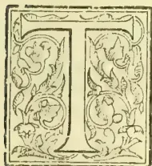A decorative initial letter 'T' in a floral frame, likely representing the word 'TROPICAL'.

HE Autumn meeting of the S. C. Pomological Society held in Pomona on Thursday and Friday, November 15 and 16, 1894, was one of the most interesting and best attended in the history of that organi-

zation. Pomona, however, always turns out a good attendance whenever the subject of scientific and practical horticulture comes up for consideration in a public way. No other single community in Southern California has shown a wider interest or a keener appreciation of the importance of stimulating and developing our rural industries in all directions.

The meeting was called to order at 9-30 o'clock on the morning of the opening day with President L. M. Holt in the chair. Prof. Calvin Esterly made the address of welcome in a few brief remarks, to which President Holt responded.

The first paper on the program was the report of Prof. A. J. Cook, entomologist of the Society.

#### REPORT OF THE ENTOMOLOGIST.

Mr. President, Ladies and Gentlemen: I take this first opportunity to thank you for the honor you conferred upon me at your last meeting in selecting me as your entomologist. I gladly accept the work. I am heartily interested in entomology as a science, and especially in all its economic places, and therefore am happy to pledge you all the labor and investigation that my time will permit. I shall be glad to receive and name any insects that you may find, and shall be happy and willing to give all possible information respecting them.

POLLINATION.—At your Pasadena meeting I reported upon a series of experiments then in progress regarding pollination by insects of various fruits. As stated then, I ascertained, by covering twigs with either cheese cloth or paper bags, that two varieties of plums, one of which is the Kelsey; one of cherries, variety unknown, and the Bartlett pear, were entirely infertile to their own pollen, while the Royal apricot was entirely fertile to its own pollen. Since that time I have performed like experiments with olives,

oranges and lemons. Several of my students also made similar investigations in relation to pollination of the orange, and with the same results that I obtained. In our experiments with the orange, the flowers were all emasculated before they had opened by cutting off all the stamens. When the glistening waxy appearance of the stigma showed that it was ripe or ready for the pollen, pollen was applied from flowers of the same tree, from those of other trees of the same variety, and from those of other varieties. To my great surprise the Washington Navel seems entirely fertile to its own pollen. From its fragrance I expected it would be wholly sterile to even navel pollen of other trees. While seedlings and Mediterranean Sweets, lemons, and all the several kinds of olives which I experimented with, are not wholly sterile with their own pollen, though one lemon gave no fruit at all, they are much more productive if cross-pollinated. I covered many twigs of Mission and several other varieties of olive, and while all but two set some fruit, the product in every case was only about one-third the amount which set on the cheek branches close along side. I think we may assert positively that while olive trees will bear without cross-pollination or aid from nectar-loving insects, that we can never secure full fruitage or even one-half a crop without cross pollination, performed artificially or through the aid of insects.

The experiments of the season prove conclusively that the presence of the paper or cheese cloth covers of themselves are no bar to fruitage. In every case of covered twigs where the fruit was artificially or hand-pollinated, or where the sacks were removed for a short time to permit the visits of bees, or where bees were caught and put into the sacks, fruit was secured.

I believe these experiments are conclusive and need no repetition.

They show us that much of our fruit, especially plums, cherries and pears, are utterly dependent upon insects for pollination, and that while bees are not absolutely required, they alone can be depended upon to perform this important service. They also show that some of our fruit, notably olives, lemons, and some varieties of pears and oranges, while not wholly sterile to their own pollen are largely so, and will only bear full crops when cross-pollinated. They show just as conclusively that some fruits, like the Royal apricot and navel orange, are entirely fertile with their own pollen.

As I showed at the last meeting, there are many insects aside from bees, that effect cross-pollination of our fruits. But as we have all observed, through unfavorable seasonal peculiarities, or from the more serious attacks of birds, lizards, or prodaceous and parasitic insects, there often come years when insects

555------------------------------------------------

502THE TROPICAL AGRICULTURIST.[FEB. 1, 1895.

in general are notably scarce. This is not true of bees. Their existence in great colonies of 40,000 to 50,000 each, and their natural protection from storm and enemies, insures their presence among the flowers every year, month, week and day, except those that storm or cold—the same that shuts the pollen close in the anthor—keep them in the hive. In California, fortunately for our fruit growers, such imprisonment is very rare, and can never, as is frequently true in the East, stand in the way of a generous crop of all kinds of fruit. It is also very important that in planting our fruit-trees we must see to it that varieties are well mixed. Contiguous rows should never be of the same variety, unless we know that the variety is fertile, and fully so with its own pollen.

**TWO DESTRUCTIVE BEETLES.**—One of the most destructive beetles of the East and one of the most difficult to combat, is the rose chafer (*Macrodactylus subspinosus*). Late last May, and even on to July and August, I took a handsome beetle of the same great family—Scarabaeidae—which made a serious onslaught on the deciduous trees about Claremont, especially of the *prunus* group. A year ago the same insects were sent to me from the region of Perris, with the report that it was a serious pest in the prune and apricot orchards. This insect I find to be *Serica fimbriata*, which very closely resembles *Serica ricea*, a very common beetle of the East, and like that species a dark form is not uncommon. *Serica fimbriata* is a very warm brown in color, with a peculiar satin-like iridescent lustre. Beneath, it is thickly set with yellowish brown hairs (especially beneath the head and thorax. The eyes and fossorial spines of the front legs are black, and the antennae are light brown, almost yellow. The eyes are nearly bisected by the projecting ridge of the front of the head. The cary beetles seemed larger than the later ones. Of these the females were about 7-16 of an inch long, and the males about 8. These, like *Serica ricea* of the East, have the beautiful iridescent lustre. In July and August the beetles were smaller, showed less of the satin-like lustre, and fairly swarmed in the orchards east of Pomona. Some of the apricot orchards were literally defoliated. These later beetles ranged from 5-16 to 8 of an inch in length. These beetles hide in the earth beneath the tree by day, and come forth to eat by night. As they bury themselves only four or five inches, it is not difficult to unearth and destroy them. Of course the early ones coming in May and June do much more harm than do those that do not come to eat the foliage until July and August. But even the latter will do very much harm where it is as abundant as it was east of this place the past season. No tree can part with its entire foliage even in July and August, without serious injury. In such case it would pay well, as soon as the despoilation is noticed, to dig the beetles out and kill them. This would also prevent egg-laying and would tend to prevent future injury. These and all related insects lay their eggs in the earth, and the grubs or larvae feed on the roots of various plants. They are one, two or three years in passing through all their changes from egg to maturity. The white grub, larva of the May beetle, in the East often works most serious mischief feeding on the roots of grass. It thus oftentimes entirely ruins lawns and meadows. Without doubt these *Sericeae*, while grubs, feed upon roots in the earth. Whether they do damage or not in that stage, I am unable to say. I have been told that it also eats the grass roots, and so destroys lawns in California.

**A DESTRUCTIVE WEEVIL.**—The 9th of June I received from Mr. S. T. Berkeley, Little Rock, California, some weevils, with the information that they were eating the foliage from the young almond trees. This proved to be a beetle new to my collection. Prof. L. O. Howard, of the Department of Agriculture, informed me that it was *Euagoredes varius*. As I find no mention of it as a destructive species, it should be recorded as an enemy of the orchardist.

This weevil belongs to one of the families of weevils or snout beetles (*Orthorhynchidae*), and is not distantly

related to *Orthorhynchus ovatus*, which injures strawberries in Michigan, while in the grub or larva stage, and to Fuller's rose beetle (*Aramigus Fulleri*), which works in conservatories East, and has the same habit of feeding on foliage that is reported of this species. I find this, Fuller's rose beetle, quite common here. I take it in jarring the orange trees.

This weevil is white, lined with gray brown on ovoidaceous lines. There are three lines on the thorax, one meridian and two lateral, one on each side, and three on each wing cover. The wing covers are also marked with depressed punctulate lines. The feet and under surface vary from clear white to clear gray brown. The antennae are white, elbowed, clavate, the last three joints of the club being gray-brown. The beak is white with side lines of gray-brown, and is enlarged at the tip. It probably takes its specific name from the fact that it varies greatly in color. In some individuals the white predominates, and in others the gray-brown far exceeds the white. They vary also exceedingly in size. I have some that are 1/4 an inch long, and others that are scarcely more than 1/8 inch from tip to tip.

It is probable that the footless grubs live in the earth and feed on roots of some kinds of plants. Fuller's rose beetle feeds on the roots of roses, but as a mature insect feeds on the thick foliage of various ferns, wheat plants, etc. Should these beetles come in such numbers as to threaten mischief, they can doubtless be caught on sheets and destroyed, as the curculio is treated in the East. It is possible that these beetles and the species of *Serica* mentioned above, could be overcome by the use of London purple, although such very probably may not be the case.

**A NEW ORANGE PEST.**—The old Green-house pest of the East, known as the mealy bug (*Dactylopius longifilis*), had few rivals in real mischief. While it will succumb to kerosene emulsion, it often requires that it be so strong that the plants are likely to be much injured. The past season another species, which Prof. L. O. Howard informs me is *Pseudococcus uccis* Coccinella, has attacked the oranges about one mile south-east of Claremont, alongside of the "wash." Upon examination these mealy bugs were found abundantly on the wild buckwheat, *Ergonum fasciculatum*, *Artemisia californica* and *Lepidospartum squamatum* of the wash. In August the males were abundant, and it was not difficult to find innumerable specimens of both sexes attached to the main stems of the plant where they leaned over between the plant and the earth. There can be little or no doubt but that if these mealy bugs should become general on the oranges, they would prove a very serious enemy of the orange grower. It will be wise to cut and burn all the wild bush close beside the orchards, and to take special pains to kill all the mealy bugs that have gained lodgement on the trees.

The mealy bug belongs to the same family that contains the various scale lice. Indeed, the male mealy bug, like the male scale insects, has two wings and comes forth from a whitish cocoon, which is easily found on the plants close among the female mealy bugs. The female is covered with huge thick masses of white, which is easily rubbed off, and is without the long tail-like appendages, which are so conspicuous in the old *Dactylopius longifilis*. The Genus *Pseudococcus* shows nine segments in the adult female, and six in the larva of the female and seven in the larva of the male. The female is about 1/2 of an inch long, heavily frosted, (and not sparingly frosted as stated in the description of *P. uccis*), with no filaments at the posterior end of the body, but has scale-like projections entirely around it. The male is 3-16 of an inch long, is brownish-black with a brown caudal style, and two long filaments as long as the body. The antennae are about as long as the body, and hairy. The wings are two-veined like most male coccids, and about as long as the body, so that they project beyond the tip of the abdomen. The female is very convex, and is more heavily coated with the white waxy coating than are most mealy bugs.

**THE PEAR OR CHERRY SLUG.**—The Pear or cherry slug is a common and destructive species in the East. I find it is also common here, and as it is

556------------------------------------------------

FEB. 1, 1895.]THE TROPICAL AGRICULTURIST.503

double brooded it is quite a serious pest. The fly is a small black four-winged species, and belongs to the saw-fly family, or Tenthredinidae. The flies of this family are more flat than most species of the order Hymenoptera, and the females are peculiar in having a saw at the tip of her body, which she uses to prepare a groove for her eggs. The larva of all saw-flies are easily distinguished, as they have 18, 20 or 22 legs, which is true of no other larva. The saw-fly larva often secrete a mucus, which fact gives them the common name of slugs. The pear of cherry slug secretes this slime, is brown in colour, larger at the head end, an tapering to the anal extremity; it has 20 legs. It is an interesting fact, as well as practically important, that when this slug is full grown, and casts its skin the last time, it becomes bright yellow and is clean from the mucus. The larva leaves the tree and goes into the earth to pupate; as do all insects of this family. I do not know the precise dates for this State or region, but I think that the flies must deposit their eggs in May and again in late July or early August. I found the slugs in June and again in August. They are easily found, as they simply remove the epidermis of the leaves, making them look gray and blighted. They might as well eat the leaves entire, for to rob them of their skin is to kill them.

It is very easy to destroy these slugs; wood ashes, lime, or even the road dust or earth from beneath the trees thrown upon them will often destroy them. The arsenites and potassium emulsion are equally efficacious. So easy a remedy should never be neglected. When the trees show the blight, search should be made for the slugs, and if found, the remedy as above explained should at once be applied. If the earth, ashes, etc., be thrown on to the slugs after the last molt, or just before any molt, they may not be effective, for in the first case, as the insect is without the slime, the powder will not stick, and in the second, they at once shed their skins and so are rid of irritant skin and all. I have known these slugs to be alarmingly abundant. The mucus seems to make them offensive to birds and possibly to other insects, so it is all the more imperative that we coat them with the cankering dust as soon as they appear in our orchards, or what will often be more satisfactory, treat them to a meal of the poisonous arsenites. An Ichneumon parasite preys upon these slugs in the East.

**PREDACEOUS AND PARASITIC INSECTS.**—I need not urge upon you the importance of such insects as the ladybirds and chalcid flies. You know what benefits have come from the *Vedalia*, and we are all hopeful that an equal benefaction is to come from the *Rhizobii*. These ladybird beetles are the more our friend, as they are ravenous feeders both as grubs or larvae, and also as mature beetles. They also have tooth for eggs as well as meat and thus they are always at work, and frequently nip the insect evil in the very bud, by eating extensively the eggs of the most destructive species that infest our orchards. Thus while we are under a great debt of gratitude to the little oval beetles, we are even more indebted to the elongate hairy grubs, or baby ladybirds. It is not alone the importations from Australia that benefit us, but often our native species confer benefits that we can hardly over-estimate. Two years ago I was visiting for a brief period in mid winter in this region, and visited the orchard of Mr. Meserve, south-west of this city. I found the black scale (*Lecanium oleæ*) in great abundance. I also found the common Twice-stabbed ladybird beetle (*Chilocorus bivulnus*) in great numbers. I said then to Mr. Meserve that I thought in a year or two his olives would be mostly rid of the black scale, and today, I am happy to say, he has comparatively few scales in his olive orchard.

Some years ago many species of our forest trees in Michigan were attacked by a species of *Lecanium*, very like the black scale in appearance and like history. It seemed as if many of our most desirable trees, like the hickory, tulip, maple and linden, were to be swept from our forests as by fire. The second year of this fearful attack, as the trees began to

hang out the yellow flag of distress, I found a minute Chalcid fly that was increasing in great number, and reported to the press that our forests were saved. Two years after, I could hardly find specimens of the scales to show to my classes. Four or five years ago the wheat crop of Michigan Indians and Illinois was seriously attacked by the grain aphids, and was threatened with entire destruction. When the aphids were well at work, a little Braconid appeared, whipped out the plant lice, and saved about one-third of the crop. These Braconid flies are exceedingly prolific, and so are more than the equals of even the very fecund aphids or cicids. I find about here in some orchards very numerous brown scale (*Lecanium hesperidum*). Often these are so abundant that to touch a branch or twig is to touch several of these suction pumps. In some cases I find that the scale is rapidly succumbing to a chalcid, or to chalcids, as there are more than one species. Thus, these natural enemies, the predaceous insects as illustrated in the ladybirds and the parasitic species repressed by the Chalcids and Braconids, are far more satisfactory than are artificial remedies. They work for nothing and board themselves; they do no injury to tree or fruit; they make thorough work so that there is no need of repetition before the work is fairly completed.

**PRACTICAL SUGGESTIONS.**—This leads me to two suggestions that the fruit growers, in my judgment, cannot afford to pass lightly by. One is that a person like Mr. Koebele should be kept constantly in search, in Australia, Europe or the eastern states, for these beneficial insects. There are no doubt other *Vedalias*, and the salary and expense of the person in quest of them would be a mere bagatelle, compared with the possible, I may say probable, outcome. I make no apology in urging all fruit growers to unite in demanding that Mr. Koebele, or some other equally competent man, be kept for a period of years in search of other *Vedalia* or *Rhizobii*, that we may not only be rid of the cottony cushion and black scale, but of the red and yellow, the pernicious and purple, and all others, and shall not be forced to the expensive, unsatisfactory and unreliable methods of warfare heretofore thought valuable and necessary.

Again, it goes without saying that immense good might come from a wise and timely distribution of even our native parasitic and predaceous species. Mr. Crawd had admirable work collecting and distributing the *Rhizobii*, but it would be more than wise to keep close watch of our orchards; that any valuable species might be distributed. This is the more desirable as our beneficial species must die with the destruction of their food, so that in collecting and distributing them with discretion we not only continue their good work but their lives as well. Again, even the friendly insects have their enemies, which multiply more and more as the insects remain longer and longer in any place. Thus a removal or distribution is often the very savior of these little friends. In this section we find the *Rhizobii* falling before the *Aphis* *Lion* or larva of the lace-wing fly, *Chrysopa Californica*, as is also the *Chilocorus bivulnus*. In such a case no one can doubt but that removal and distribution would be exceedingly wise. The *Rhizobii* seem also to have fallen before a parasite in Mr. Wright's orchard. This parasite, whatever it may have been, may be local, or of short life, so that a wider distribution or introduction at different times might have prevented its partial or complete overthrow. Again, we must remember that these enemies are already in the field in force, and thoroughly entrenched. We bring only a few of the *Rhizobii*, etc., and of course they find it difficult or impossible to hold their own. The case demands, then, the closest attention, and in case we find enemies present, we should introduce an army of our friends into a single orchard, that they might be able to gain a foothold even in the face of an army of foes. If we could have known just how serious an attack was to have been made on the *Rhizobii*, it would have been wise to have introduced the nearly 200,000 *Rhizobii* which were brought from Santa Barbara county to this region, into a few or possibly into a single orchard.

557------------------------------------------------

504THE TROPICAL AGRICULTURIST.[FEB. 1, 1895.]

It is also very desirable that repeated introductions in every month of the year be made. It is known that they are breeding here, and we may well hope that they will even now prove more than a match for their foes and triumph over them, and banish from our midst not only the black, but the frosted and soft brown scales.

I wish to thank Messrs. Loop, Ogle, Phillips, Foote and Rutcliff for courteous aid, and especially Mr. Pease for most valuable and frequent assistance during the season.

Immediately following Prof. Cook's timely report Miss Jean Loomis student of Pomona College, Claremont, read an interesting paper illustrated by enlarged drawings, on

#### SCALE INSECT.

Mr. President, Ladies and Gentlemen: Five years ago California was exceedingly disturbed over the scale insect question, and she had good reason to be. A soft white scale, introduced into a few orchards on imported nursery stock, had attained such proportions that it seemed likely to destroy our whole fruit industry.

The story of the rise and fall of the cottony cushion scale is still fresh in memory, and we love to recall it only in connection with the lessons it taught us.

The ladybird *Vedalia cardinalis* has many cousins and allies as ready as she to befriended us, if only we seek them out, and *Icerya purchasi* has a legion of confederates, as ugly as he, ready to slip in upon us, if a day off our guard. Eternal vigilance is the price of fruit production in Southern California.

When every orchardist has made himself acquainted with the facts in the case and knows the habits of the different species, then can we expect a complete riddance of the entire tribe. Our scientists and inspectors visit our orchards only once or twice a year and are liable even then to overlook an important insect, which, if not understood by the orchardist himself, may before another visit reveal an alarming prevalence, as many insects have enormous powers of reproduction.

With the aid of some instruction and the use of a compound microscope, I have learned a few things about the scale insects of our region that may be of interest, perhaps even new to some of you.

Taking the subject scientifically, the general term of the whole family of scale insects or bark lice is Coccidae. The most of the Coccids are injurious to man's welfare, but not all of them. Our cochineal is but the dried bodies of a species living on the cactus plants in Mexico. Shellac and China wax are secretions of Coccids. The three genera most abundant on our coast are of no commercial value yet as it is. The distinguishing feature of these three genera are easily learned and readily recognized. The Lecania, in the adult state of the female, are usually large, hardshelled, very convex scales. They are oval in shape and have a deep incision at the anal extremity: and are illustrated in the Lecanium oles, our common black scale.

The Aspidioti are small flat scales composed in part of the moults of the skin of the insect, and in part of a waxy secretion. Their form is circular with a tiny protuberance in the centre. The San José scale (*A. perniciosus*) is a fair example.

The *Mytilaspis* is like the Aspidiotus in its composition of moults of skin and insect secretions, but there need never be any confusion between the two, for they are very unlike in appearance. The *Mytilaspis* is a long irregularly shaped scale pointed at one end. We have one specimen here, *M. citricola* or purple scale.

A minute and careful description of the habits of each species would be necessarily long and tedious. A correct description would be impossible at this time, for no one has as yet given the subject a thorough study. In fact nearly all that we do know of them has been learned within the last 15 or 20 years.

A general description should be prefaced with a mention of the differences in reproduction and time of development of the insects. They are usually hatched from eggs deposited in varying numbers beneath the shell of the scale, the body of the female

shrinking in size to make room for them. There have been found from 1000 to 1800 eggs by actual count, beneath a single shell of the black scale. These are one year developing to the adult state. Certain species of the *Mytilaspis* deposit eggs gradually, a few each day, continuing for several weeks, and these have four or five generations a year. Other scales are believed to be viviparous.

As soon as hatched the young scale leaves the maternal roof and make his own living. With sharp eyes or a small lens, he can be seen wandering about on twig or leaf seeking a location. In a few hours he settles and, with a beak nearly as long as his body inserted into the leaf tissue or soft bark, he withdraws the sap which belongs to the fruit.

When he has grown too large for his skin, he moults and continues feeding upon the sap of the tree.

Until the time of the second moult the male and female are distinguishable only in size of the scale, the female being nearly four times as large as her brother. But after the second moult the difference between the two is very pronounced. The female, now nearly or quite matured, attaches herself firmly to the branch by finely spun threads or glue, completes her scale covering, produces her young and dies while her lord undergoes a complete transformation, and comes forth an airy-fairy little creature with a pair of wings and two long beautiful antennae. He loses his beak and in fact all mouth parts and receives in their place another pair of eyes. He sees thereafter and flies, but eats no more and lives but a short time.

There are three common species of the Lecanium. The black scale (*L. oles*, our darkest species, is readily recognized by the letter H upon its back. It is a most annoying pest, infesting almost every tree and shrub in orchard and yard. The excretion of the young scale, a sort of sticky substance sometimes called "honey dew," upon which a black fungus forms, destroys the beauty of the tree and injures the sale of the fruit. Many experiments have been tried for the destruction of this scale, but without much success. The most effective remedy has been the hydrocyanic acid gas treatment, which has held this pest in check. But it has been found expensive and from the nature of the case unable to reach all scale. We are now awaiting results of the introduction of the black Australian ladybird (*Rhizobius ventralis*) said to be the natural enemy of the black scale, an insect that has done most effective service at Santa Barbara. Unless the green lace-winged fly (*Chrysopa californica*) should prove a formidable enemy to her ladyship we may consider our troubles with the black scale as past.

Another Lecanium, the soft brown scale (*L. hesperidium*) is found only on citrus trees. It has the Lecanium markings excepting it is soft and nearly flat. It is very prolific and is sometimes so thick upon a branch that one overlaps another. Such a branch is usually removed and burned, or should be. If given a fair chance, the soft brown scale would be a serious pest. It is believed that a small Chalcid fly parasite is keeping it in check.

The frosted scale (*L. pruinosum*) has been recently observed to be increasing. It is a very large dark brown scale, shaped something like a bonnet. At certain seasons of the year it is dusted over with a white powder, whence its common name. It infests nearly all the deciduous trees, seeming to prefer the prune. Its favorite location is just beneath a new shoot. If the black ladybird does all that is expected of her, she will feed upon this Lecanium also. Otherwise we shall have to watch this frosted scale closely, and look for another remedy.

Of the Aspidioti we have the San José scale (*A. perniciosus*) on our deciduous trees. This is a small gray scale with yellow central tip, and is scattered thickly upon the bark of an infested tree. It settles also upon the fruit which it disfigures and renders unsalable. The San José scale was once a dreaded pest, but is now known to yield readily to the lime, salt and sulphur wash and is no longer feared. Moreover, it is a favorite dish for the little twice-stabbed ladybird, *Chilocorus bivulnens*.

The Aspidiotus citrinus or yellow scale, infesting citrus trees only, is quite common in some sections.

558------------------------------------------------

FEB. 1, 1895.]THE TROPICAL AGRICULTURIST.505

It is a flat pale yellow scale, and is very destructive. The yellow scales is often mistaken for the red scale (*A. aurantii*) which it closely resembles, but while the latter is found upon fruit, leaf and branch, the yellow scale is seldom seen elsewhere than on the leaf and fruit; and furthermore, it has a Chalcid fly parasite which will not touch the red scale. This Chalcid fly lays its eggs beneath the scale, and the young Chalcid being the more active devours the young citrini before they see daylight, then boring a hole through the shells escapes. The owners of trees infested with yellow scale would do well to obtain some of these parasites from San Gabriel orchards, where they are reported to be clearing the trees of yellow scale.

The purple scale (*Mytilaspis citricola*) is a Florida pest of a most pernicious character. They have been trying for years to destroy it, without much success, and now it has been brought into our State, probably on nursery stock. It has not a very strong lodgment here yet, and it should be the duty of every orchard owner to see that it has no chance for that. It is a long, curved scale of purplish hue, found only on citrus trees and most abundantly in moist regions. It develops from the eggs to maturity in about 60 days, making its possible increase enormous. There is no known natural enemy, and our only hope is that in our dry climate it will not flourish.

There is another coccid that is just beginning work upon our orchards. It is not a true scale insect; it is rather a species of the mealy bug that has been so troublesome in the east upon shrubbery and greenhouse plants. It is a soft, fleshy insect thickly covered over with a white wooly substance secreted through the pores. These have been found locating on orange trees in this valley. What they intend to do, time only can tell. Against these as against all other orchard pests we must be constantly upon our guard.

An acknowledgment of gratitude is due all our inspectors for their faithful performance of duty, by which, even at the risk of personal enmity, they have protected us well from the introduction of new scale. That some scale insects have escaped their watchfulness is inevitable, that so few have is our rejoicing. The duty now lies with us to refuse all nursery stock infested with any kind of scale insect, and to exterminate by every known means the pests already among us. With clean fruit and healthy trees, Southern California can challenge the world in fruit production.

PROF. A. J. COOK, Claremont.—I want to say here, incidentally to growers to use London purple in preference to Paris green as an insecticide. The London purple is not so apt to be adulterated, is cheaper and equally as efficient. But always be sure and use it with a little lime. The usual formula is one pound to 200 gallons of water; trees are scarcely ever injured when lime is added. I am not in the habit of advertising particular brands, but in this case will depart from the rule to state that the Hemenway's London purple I have always found reliable and of uniform strength.

THE PRESIDENT.—I learn from newspaper reports that of the thousands of parasites (*Rhizobius ventralis*) of the black scale (*Leucanum oleae*) liberated in San Bernardino county not a single specimen is to be found. Is that correct?

PROF. COOK.—The statement is hardly literally true; there are some to be found there now, notably on Mr. Wright's place. I hope that the *Rhizobii* will yet get such a start as to be able to conquer the black scale, though it must be admitted that we have met with a disappointment in the discovery that there are a number of predatory insects feeding on the *Rhizobii*. The lace wing fly (*Chrysopa Californica*) is one, and besides this there is another as yet unidentified which is destroying large numbers in the larva state. It is to be hoped that these increase in a smaller ratio than the *Rhizobii*, particularly at certain seasons of the year, and that the *Rhizobii*, being rapid breeders, will be found eventually to accomplish what we all so much desire. They have been distributed hereabouts in large numbers, and while the outlook just at present is not over-en-

couraging we still find them in a number of places. Allowing for the fact that it required two years for them to become established at Santa Barbara we have hopes they will do equally as well here in the course of time.

MR. W. E. COLLINS, Ontario.—In San Bernardino country but very few of these parasites, indeed, I do not think I strain the truth when I say that practically none are to be found. Of all the colonies planted in and about Ontario last spring, the entomologist—Mr. Craw—of the State Board of Horticulture after a diligent search made last July found only one single beetle. A similar hunt a few days failed to reveal any beetles or larva of the *Rhizobii* in the olive orchards of Prof. Dwinelle or Mr. Lord, where Mr. Craw liberated several thousand on September 20. In addition to those which were colonized on behalf of the country after repeated and urgent requests by the board of supervisors, individuals at their own expense have secured colonies. It is safe to say that upwards of 100,000 beetles have been placed in San Bernardino county, sufficient certainly to test the bug. From the time they were liberated in the several orchards there has been a decrease noticeable for the first three or four weeks, after which one or two of the parasites could be found in a few scattering places. During an examination made a few days ago by Mr. Scott, Mr. Looney, myself and others in a few orchards in Pomona where large numbers had been placed not a single beetle or larva was to be found. This is to be regretted, but it is not wise to shut our eyes to the truth. Of all the colonies placed in Los Angeles and San Bernardino counties not a single tree has been cleaned of the black scale as a result of their presence to my knowledge; nor are they to be found anywhere in anything like appreciable numbers. This is not a mere assertion, but a fact experienced by all growers hereabouts who have attempted to introduce these ladybirds in their trees to subdue the black scale.

MR. MESSENGER, Pomona.—As an experiment Prof. Cook and myself liberated about 4,000 of the *Rhizobii* on a couple of trees badly infected with black scale; recent examinations failed to reveal the presence of the ladybirds in any stage. In fact there was no evidence of their existence.

PROF. COOK.—When I secured the colonies from Santa Barbara I supposed we had three varieties of *Rhizobii*—*R. ventralis*, *R. debilis*, and *R. Two-womabæ*—but an examination showed this to be an error. What we presumed to be the latter two turned out to be a scymnus.

THE PRESIDENT.—In the absence of artificial means of freeing our orchards of scale and the presence of parasitical and predaceous insects, can it truly be said that the scale is being diminished by the parasites, or are injurious insects on the increase?

PROF. COOK.—Judging from my short period of observation—for I have not been among you scarcely a year—I should be inclined to say that the scale is being gradually growing less, though I do not attribute this disappearance to any one parasite or even a single group. All predaceous insects assist to carry on the war of extermination, some of course more than others. But for these beneficial insects I believe fruit production would almost be impossible; at any rate unprofitable.

THE PRESIDENT.—Would you recommend the abandoning of spraying or fumigation to eradicate insect pests, and rely solely on nature's remedy?

PROF. COOK.—That depends. In the case of the white scale it would certainly be a waste of money to spray or fumigate. Regarding other pests, growers assure me that it pays them to do so. Of course when you kill the injurious insects on your fruit trees you also destroy the beneficial ones. If by abandoning artificial methods we could so protect our insect friends until they shall be sufficiently strong to overcome the scale is a problem that many just now are anxious to solve. It seems to me that this is a matter the wide-awake, and practical orchardist must settle for himself. Much depends; on circumstances and conditions; there are undoubtedly

559------------------------------------------------

506THE TROPICAL AGRICULTURIST.[FEB. 1, 1895.]

cases where it is not only wise but necessary to spray or fumigate.

MR. COLLINS.—On or about the middle of September a large number of the lace-winged fly were prevalent in our section, and it was also just at that time that we were anxious to secure large colonies of the Rhizobii, which we finally did by telegraph through our board of supervisors, receiving a consignment of about 10,000. These were placed upon two trees by Mr. Craw of the State Board of Horticulture; now none are to be found. Regarding the decrease of the scale mentioned by Prof. Cook, I noticed a similar decrease in the black scale some three years ago. It has been my experience that whenever the thermometer goes over 100 deg. the young scale succumbs to the heat. Thus about 50 per cent perished during the hot days of August I have known a few intense hot days in July to destroy fully 75 per cent.

THE PRESIDENT.—It was supposed several years ago that in the dry hot air of midsummer in the interior valleys the black scale could not exist. I can remember in the early days when we used to plant citrus trees in the interior subject to black scale; in a year these same trees would be free of this pest. But as the trees came into bearing and afforded protection from the sun, this obnoxious pest became gradually established. Generally speaking, however, the dry heat of the interior is not so favorable to this scale as the coast regions where the atmosphere is not so desiccating.

MR. P. J. DREHER, Pomona.—I should like to ask of those who have investigated the matter, is Mr. Cooper's orchard now free from scale? If so is it a fact that its cleanliness is due principally to the Rhizobii?

PROF. COOK.—In answer to the questions I would state that Mr. Cooper's orchards were principally infected with black scale, though there was some soft brown scale. At the time of my visit in September I looked some time in the orchard where the original colony had been placed; but found no scale worthy of mention; the trees were practically clean. In another orchard to which the ladybirds had spread the trees were clean at one end, less so at or about the centre, while the far end was still quite dirty. The condition of the trees indicated the onward march of the Rhizobii. I think Col. Howland, who was present, will authenticate what I have said.

COL. J. L. HOWLAND, Pomona.—When I first visited Mr. Cooper's orchards two or three years ago they were badly infected with black scale, but when I re-visited them last September they were practically clean. To be sure there is still scale present, but so is there of the cottony cushion. The statement made by Prof. Cook coincides with my observations.

Adjourned to 1-30 o'clock p.m.—*Rural Californian*, Dec. 1894.

## FORESTRY IN AMERICA.

It appears that Great Britain is not the only country which leaves the systematic management of her forests to private enterprise. In the Alleghany Mountains of North Carolina, Mr. G. W. Vanderbilt has been devoting some of his spare capital to the purchase of large tracts of forest land which have been partially denuded by the lumbermen, and in many places cleared and cultivated for short periods. These tracts Mr. Vanderbilt has placed under the care of an expert, with a view to restocking and working them on principles similar to those on which the state forests of Continental Europe are managed. The purchaser, we are told, is animated with the praiseworthy ambition of thus inaugurating a system of economic forestry in the United States, and, we may also assume, of making a sound investment for the benefit of his heirs. Mr. Pinchot, who has been entrusted with the carrying out of this work, has published a pamphlet descriptive of a portion of the property known as "Biltmore Forest," consisting of nearly 4,000 acres lying on the banks of a tributary of the Tennessee River.

An account of this forest contributed to a recent number of the *Zeitschrift für Forst und Jagdwesen*, by Sir Dietrich Brandis, furnishes some interesting particulars regarding the present condition and stocking of the tract. No fewer than seventy-two species of trees are to be found, among which may be enumerated seven species of Oak, five of Maple, five of Pine, four of Hickory, &c., Spanish Chestnut being the only European tree. Broad-leaved species predominate, especially the Oak (*Q. alba*), which, together with black Walnut and *Liriodendron*, prove the most valuable as lumber, but the two last have, unfortunately, almost disappeared from this forest.—*Gardeners' Chronicle*.

## THE SUCCESSFUL TREATMENT OF RHEA FIBRE FROM THE FIELD TO THE LOOM.

### NEW AND IMPORTANT DISCOVERY.

The memory of even centenarians of this present time cannot recall the early days of the manufacture of coconut fibre into coir ropes, but for the two, or possibly three, past generations many unsuccessful attempts have been recorded in the endeavour to deal practically and economically in a similar direction with the well-known grass called Rhea. The urgent necessity for finding fresh material to meet the enormously increased demand for ropes and cables, hose and machine bands, whether for use in navigation or in working the innumerable machines which the skill of the inventor in each year of the latter half of the nineteenth century has brought into existence, has stimulated the efforts of hundreds of ingenious men. Muificent rewards have from time to time been offered, notably by the Government of India, for an invention which could successfully meet this great and constantly increasing want, but up to the present year the varied ingenuity of the cleverest inventors of our age has failed again and again.

It has, however, been lately our privilege to roll with, through all its different stages, a process which, under the severest tests, appears, beyond all reasonable doubt, to have solved this most important question. Mr. D. Edwards-Radcliffe, a member of a well-known old English family, has, in conjunction with Mr. Burrows, whose name has been long known in the spinning trade, perfected a series of machines which, by processes of which the secret is naturally strictly preserved, produce what is known as the "Filasse" in a perfection that has never before been reached, first, by the use of a machine which may be called the ungummer, or the separator of the bark from the stick, and next by a process of chemical dressing of the ribbons.

At this stage the filasse which is intended to be converted into the finer numbers is further carefully bleached, the preparation of the rougher numbers not requiring that course. In all former processes known, there has been, at this point, a universal failure to economically bring the filasse when ungummed into a form suitable for spinning. Tearing up and breaking the long tufts of fibre always broke and knotted the material, causing much waste and extra labour, so that an all-round fibre has been handicapped for years by the want of its special and appropriate methods of treatment. But by the processes now under notice the filasse is next passed through an extremely ingenious drawing frame, a patent machine which separates all the fibres and draws them into parallel lengths corresponding to the knots in the sticks. This may be said to be the true requirement, a fibre, ungummed or bleached, on whatever principle, thus secures the chance of reaching the yarn or manufactured state at a price 25 per cent. cheaper than today. For the rougher counts, the whole of the fibre thus obtained is ready for spinning, and, when treated by the patent spinner, produces even yarn of excellent quality, which, for the manufacture of such articles as fishing nets, cannot be surpassed.

For finer counts the filasse, thus separated and drawn, is then transferred to a gin or comb, in which it is softened and combed by an entirely novel

560------------------------------------------------

FEB. 1, 1895.]THE TROPICAL AGRICULTURIST.507

patent process, a process which, whilst combing out every impurity, retains the whole of the valuable fibre. This machine has been specially made for combing Rhea, and, being simple in its mechanism, it will immediately recommend itself to people interested in the trade. A saving is thus effected of over 25 per cent. in waste, as compared with any combing machinery now in use, an advantage the importance of which, in its bearing on the future of Rhea, cannot be too highly rated. The product is at this point perfectly ready for spinning by any of the recognised mills.

By the different processes above described Messrs. Edwards Raddcliffe and Burrows undertake to treat the Rhea fibre as it is now imported. They have not, however, stopped here, but are engaged in perfecting a machine which will enable the planter to treat the fibre on the ground as soon as it is gathered, and, under these favourable circumstances to there and then produce the filasse, thus not only effecting an enormous saving in freight, but also sending into the market a material of better quality and higher value at a less cost than is now incurred in the initial separation and chemical dressing of the ribbons.

Such authoritative judges as Sir Henry Blake and Sir Augustus Adderley have expressed their cordial admiration and approval of the processes which are here described, as well as of an equally clever patent now being developed by the same inventors for the treatment of the leaves of various tropical plants, such as the cactus, the pineapple, and the banana. By this machine, even in its present unfinished state, a cactus leaf of great size and thickness was in less than a minute reduced to a mass of silky fibre, the ultimate successful preparation of which for spinning will effect an absolute revolution in this vitally important branch of the commerce of the world.—*European Mail*, Dec. 26.

### THE DISEASES OF TREES.

Those interested in the growth of trees, whether as park specimens or for timber-producing properties, will assuredly be interested in this valuable treatise.\* In its German text it was known to a few, in its French dress to a few more, but it was high time it was made accessible to the English reader. In no other work that we are acquainted with, is the subject, within the limitations fixed by the author, treated so lucidly; in no other work are the details of the changes wrought by parasitic fungi in the fabric of the tree so carefully worked out. Previously to the publication of this work, there was little or nothing available for the use of the English student, but the papers on vegetable pathology compiled by the late Rev. M. J. Berkeley, and published in instalments in these columns. As these papers ran through several volumes, and were never separately reprinted, it is not now easy or convenient to study them, but for those who desire to do so, it may be convenient to mention that a full analytical index is given at p. 677 of our volume for 1837. Since Berkeley took up the subject, however, the life-history of many of the fungi concerned has been more thoroughly investigated, and improved methods of research and observation have been devised. Berkeley's work, however, for the time at which it appeared was excellent, and more modern research has, in many instances only confirmed his opinion.

In the present volume diseases are considered according to the causes that produce them, such as parasites of all kinds, wounds, faulty state of soil, or unfavourable atmospheric condition. This is of course a scientific mode of procedure, and in the long run the best in practice, for, unless the causes of the disease are known there can be no such thing as cure. Still, the forester and the gardener require in the first instance, to recognise the nature and

symptoms, or rather the signs of the disease (for symptoms are subjective, and as such, not forthcoming in the case of plants), and these signs, though by no means passed over in this volume, are yet hardly set forth with sufficient prominence for practical use. Take, for instance, the "canker" of the Apple or the Beech. There is in this volume a clear summary of what is known concerning the diseased conditions, but it is placed either under the head of *Nectria ditissima*, or of injuries due to atmospheric influences, but how few gardeners have ever heard of or seen the fungus! Similarly, the appearances of Larch-canker are described under the head of *Peziza Wilkommii*—appropriately enough no doubt, for the initiated, but not so conveniently for those who perforce have to pass from the known to the unknown, and by whom the meaning of "mycelium," "hymenium," "gonidia," "spores," and even of "cortex" is only imperfectly if realised at all. The Editor of the present work has recognised this, for while not altering the plan of the volume, he has added in many cases explanatory notes; and these, together with the brief summary of diseases, classified according to the plant, and part of the plant attacked, and an excellent index, do much to diminish the inconvenience we have alluded to. If in a subsequent edition the diseased conditions, as seen by the naked eye of an ordinarily good observer, could be described under a few general headings, such as "canker," "ulcer," "tumours," &c., before launching into details appreciable only by the trained student, the value of the book would be much enhanced.

The summary just mentioned is all too brief, and in subsequent editions this also should be largely extended. For instance, a few years ago, apparently from some climatal cause, the Lombardy Poplars in this country, and, we believe, on the Continent, suffered great injury, and their upper branches died, as in the case of stag-headed trees. We turn to the classified list of the volume before us, and under *Populus pyramidalis* (which, by the way, is hardly the correct designation of the Lombardy Poplar), the only statement we find is, "The branch and twigs die." A reference to a fungus *Didymosphæria populina*, described at p. 104, is given, but that description does not apply to the particular disease of the Poplar to which we refer. Removal of the heads of the trees in an avenue known to us checked the disease, and its traces are now no longer visible. So under *Ulmus* all the information about diseases of the Elm vouchsafed to us is this, "The leaves show vesicular blotches: *Exoascus Ulmi*." On turning to p. 135, as directed, we find, "*Exoascus Ulmi* produces outgrowths on the upper side of Elm leaves." One need not be a forester to know that this statement is meagre in the extreme, and that it does not exhaust the list of diseases to which Elms are subject. Under *Crataegus*, or Hawthorn, we find no mention of a very peculiar hypertrophy and hardening of the stem, apparently unconnected with fungous attack.

Whilst thus indicating a few of the weak places which frequent use of the original work has brought under our notice, we do so without the slightest intention to under value what is, so far as it goes, the best work on the subject in existence.

The translation has been well done, and the preface, by Professor Ward, is what a proface should be, an introduction to what is to follow. Professor Ward, however, uses the term "pathology" in a sense which is not usual, but in this he is not alone, viz., as the equivalent of abnormal physiology, or as the "study of disease," rather than as the result of abnormal or morbid physiological action. The illustrations are excellent, and the work, as a whole, well got up. It will, we hope, do something towards the establishment here of a central institute, with local branches, for the study of vegetable pathology. In France and in Germany they abound, in the United States they may be counted by the score, but in this practical country we have no such separate department, though the excellent services rendered incidentally by the department at Kew cannot be over estimated.—*Gardeners' Chronicle*,

\* *Text Book of the Diseases of Trees*. By Professor R. Hartig (Translated by Dr. Somerville, revised and edited by Professor Marshall Ward). London: Macmillan & Co. 1894.

561------------------------------------------------

508THE TROPICAL AGRICULTURIST.[FEB. 1, 1895.

## THE EUCALYPTUS TREE IN SOUTHERN FRANCE.

It is said that there are no less than 150 varieties to be found in the native home of the eucalyptus. Among the best and most useful of the varieties which are known are the "colossus" or "giganticus," enormous trees, said to reach the height of from 300 to 350 feet, with diameter proportionately large. Another most useful variety is the "resinefer," which furnishes, for medicinal purposes, the "kino," or "rhatany," a valuable astringent. The *alpina*, *rostrata*, *amygdalina*, *coriacea*, *globulus*, *gunni*, *piperita*, and *polyanthemus* are the best known of the other varieties. The native home of these trees is Australia and the Indian Archipelago; but within the past 20 years the remarkable properties and qualities of the eucalyptus have attracted the attention of the world, and it is now to be found in largely increasing forests and plantations in the Argentine Republic, Southern France, and Algiers. The eucalyptus seems destined to revolutionise silviculture in the countries mentioned, not only on account of the many remarkable properties of the tree—its resins, wood, and its rapid growth—but also its great power of absorbing enormous quantities of water from wet and swampy lands, drying them, and rendering them fit for cultivation, as well as its tendency to thus eliminate malarial conditions from the land where it grows. The United States Consul at Nice says that the eucalyptus grows with wonderful rapidity, developing within three or four years into a large tree. One, within his immediate neighbourhood, planted less than four years ago as a small shoot about the size of a man's thumb, is more than 30 feet high, after having been constantly kept trimmed down, and nearly one foot in diameter. Trees of great size in this part of France are said to be less than 20 years old. In Southern France the eucalyptus has been planted with remarkable results, and is now fully appreciated for its various qualities. In the Alpes Maritimes it seems especially to flourish. The most remarkable species is the one found in Southern France, in the neighbourhood of Nice, Cannes, Toulon, Marseilles, and various other localities, where there are now large plantations of these trees of great size, and where they prosper wonderfully, and grow with a rapidity which seems almost incredible, forests of large trees being the growth of seven or eight years. This species is known as the *Eucalyptus globulus* or "bluegum tree," or "fever tree." This tree is now completely naturalised in Algeria and in the Riviera. A remarkable specimen of the eucalyptus is near the United States Consular Office on the Place Masséna. It is a tree of great size with enormous branches giving widespread shade, and having the appearance of great age, though in reality it is a newcomer to Nice. It sheds a resinous and pleasant fragrance, indicative of its medicinal properties. So attached are the people of Nice to this tree, that when it was proposed to cut it down to enlarge the street leading into the Quai Masséna, there was a general protest against so doing, and upon a vote being taken by one of the French newspapers there was an overwhelming majority against its removal. This tree belongs to the Australian species called "colossus" or "giganticus" and is said to be one of the largest on the coast of Southern France. To illustrate the firm hold which this tree and its health-giving properties have upon the public mind in the department of the Alpes Maritimes, Consul Hall says that when these trees are trimmed in the early spring in the Jardin Public, in the gardens of private villas and in the streets, the branches are eagerly sought by all classes of people, who hang them with their cones on the walls of their bedrooms, with the view of keeping off fevers, and of getting rid of moths, mosquitoes, and other insects. Many persons make rosaries of the burrs, and strings of beads, which they wear round their necks. The "globulus," or "bluegum tree" does not require much moisture; in fact, it grows in dry soils, and in sandy or clayey soils, provided they are cool. It will grow only in hot houses in the climate of Paris, and will not bear great cold. The *amygdalina* is known as the

"peppermint tree." It grows to a considerable height and is the only species which fears the full winter climate in the northern part of Italy, and in the open air. The *rostrata*, or red gum tree has many qualities in common with the globulus, but it grows better than the latter in wet and marshy lands. The "gigant a," or "giganticus," has a stringy bark. It was unknown in Europe before 1856, when Mr. Ramel sent some seeds to France which were sown in Algeria, and the Mediterranean regions. There are now forests and plantations of these trees in the various countries of Southern Europe, Africa, &c. While this tree is strong and hardy, it is not thought that it would flourish where the thermometer indicates a lower degree than freezing point.—*Journal of the Society of Arts.*

## EAST AFRICAN VANILLA.

A new field of Vanilla cultivation in German East Africa is reported in the *Chemist and Druggist*, as follows:—"The first sample consignment of Vanilla cultivated in German East Africa (Kitopei plantation), has recently been received at Hamburg, and was very favourably commented upon, both in regard to natural quality and to preparation. The pods, it is true, are not equal to the best Mauritius Vanilla, but the shipment was of thoroughly marketable quality, the pods being from 6½ to 10 inches in length and well crystallised. The great drought of the last season has been very injurious to the development of the fruit, but shade trees have now been planted and irrigation works started, and it is expected that next year the output will be much in excess of the present. The present season's crop, however, which amounts to about 10,000 pods, is expected to cover the cost of production.—*Gardeners' Chronicle.*

TEA PLANTING IN MURITIUS.—In a report on local "Exhibitions" during 1894, in the Port Louis "Gazette," we find the following which shews, among other things that tea has been planted to an appreciable extent in the Sugar Island:—

The exhibition of tea was most encouraging, and in this department, almost exclusively, was there an opportunity of comparing the product of another colony with that of our own. Some fine samples of Liptons teas from Ceylon were curiosities in their way. The leaf from the Experimental farm improves in quality and preparation each year. Mr. Daruty received a prize for the product of his tea garden at Nouvel France, and samples were shown from Chamarel where 200 acres are under cultivation, and looking very promising; the plantations of Mr. de Rochecouste, Dr. Bour, and others are coming on, and it is to be hoped that the cost of production will allow the competition of our teas, beyond the limits of this Colony.

The show of Vanilla was excellent. In fibre there were some good samples of Alcees, and a very long and strong staple, though somewhat coarse in texture, should recommend the Abaca fibre, sent from "Combo," to Cordage makers. Perhaps in a year or two, we may hope for samples, on a large scale, of Sizal Hemp, from the Yucatan Alcees, of which the number of plants introduced some three years ago, should have thrown out sufficient shoots to admit of considerable extension in cultivation. We forget if any have been raised at the Pamplemousses Gardens; but the Fibre trade having been depressed, we doubt whether the cultivation has been pushed on with the energy which has made the fortune of the Bahamas.

Arrowroot, of very fine quality, but not representing quantity for exportation; Cassava, prepared from Manioc, (staple food of a large coloured population in the West Indies and exhibited here, by way of a curiosity);—Yams; and some good looking potatoes from "Midlands."

562------------------------------------------------

FEB. 1, 1895.]THE TROPICAL AGRICULTURIST.509TEA IN INDIA.

Cold weather operations are in full swing, and there will be but little material for this portion of the paper in respect of the tea districts for the next three months, such is the uniformity of the December to March routine.—*The Planter*.

DRUG REPORT.

(From *Chemist and Druggist*.)

London, Dec. 20th.

CAFFEINE.—The O, P, and D Reporter discussing the position of caffeine from data largely, though without acknowledgment, drawn from this journal, concludes that it would not be possible for America to manufacture a sufficiency of caffeine for its own requirements, inasmuch as the States consume about half of the total output of the drug. At the same time, with a 25 per cent duty, sufficient caffeine may be made in the States to supply the requirements of a few large consumers. Our contemporary states that at least one of the chief American users of caffeine makes all he needs of the drug within a few miles of New York, though it does not know where the raw material comes from, for in handling tea in the States there is very little waste. The fact that the States levy no duty on tea accounts for the small percentage of waste, as the packages do not need to be opened in the same manner as in London. It is barely possible, however, that some of the tea-dust sold at the tea-auctions in New York and other places is employed. About 100 tons, more or less, of Japan tea-dust may be obtained from that country per annum, at a uniform price of 4½c per lb., though, at times, odd lots can be picked up in the open market at a lower price. The London market is quiet, 16s, however, has been paid from second-hand holders on the spot.

CARDAMOMS.—It is reported that the cardamom crop in Ceylon is a very small one this season, the plantations having suffered much from drought. Increased supplies from Southern India, however, will probably more than countervail the deficiency, the cardamom harvest in that country having been unusually abundant and of fine quality.

CINCHONA.—Detailed accounts of last Thursday's Java cinchona-bark auctions in Amsterdam state that less than one-half of the quinine value of the manufacturing bark was sold, the equivalent of 15,858 kilos sulphate of quinine being disposed of to the manufacturers (American agents bought over one-half of this), and 18,390 kilos being bought in. Of the quinine in the bark sold, 2,167 kilos realised a unit-price of 2½c, 7,509 kilos one of 2¾c, and 4,299 kilos one of 3c per half-kilo. The greater portion of the bark which was bought in was held firmly at a minimum price equalling 4c per unit. The richest parcel of bark in sale was one of 22 bales of crushed Ledger bark from the Gamboeng plantation (G in star). This bark contained the equivalent of 12.23 per cent sulphate of quinine, and realised 32½c per half-kilo—or, say, 6d per lb. Druggists' barks were in plentiful supply, but the demand, especially for really fine bold quill, was quite satisfactory.

COCAINE.—Very firmly held. The agents profess to expect a further advance in price shortly, raw material in the shape of crude cocaine being practically unobtainable at present. It is also said that no important arrivals of cocoa-leaves are likely to reach us from South America for some months to come.

ESSENTIAL OILS.—Cassia Oil is dull of sale, 4s 2d to 4s 2d per lb. is the spot quotation, while for arrival 4s per lb "c.i.f." might be accepted. Citronella oil still offers at 11d to 11½d per lb; Lemongrass oil at 1½d to 1¾d per oz.

QUININE.—No business is reported, but second-hand German quinine in bulk could probably be bought at 11½d per oz. today.

CASTOR SEED—COPRA AND PALM OIL IN FRANCE.

CONSULAR REPORTS: FRANCE:—Marseille:—MR. PERCIVAL.

There is a small decrease in imports of castor seed which have been 20,700 tons, against 24,500 tons in 1892, but this may be attributed to less favourable crops as, otherwise, the mills which produce this special oil have been in full activity throughout the year, and crushers found a ready clearance of their mills, chiefly to England and Scotland among cloth manufacturers. Prospects are reported very favourable for the new crops from Bombay as well as from the Madras Coast.

Imports of copra and palm kernels only aggregated the end of June 20,000 tons of copra, against 34,000 tons

during the same period in 1892. For the 12 months the total imports were 46,634 tons of copra and 18,806 tons of palm kernels against 61,844 tons and 17,523 tons respectively in 1892, or a deficit of 15,000 tons. This deficit falls chiefly on imports from Singapore, Penang, and Java. As copra yields 65 per cent oil on the average, a shortage of 15,000 tons raw material means about 10,000 tons diminution in the output of oil. The natural consequence of this deficit was a proportionate enhancement in values, and from 35 fr. for copra and 52 fr. for oil at which the year opened prices rose unabatedly to 40 fr. 50c. and 63 fr. at the end of July. These prices were maintained without serious fluctuations until towards the end of October when larger supplies began to arrive, and prices receded steadily until the end of the year, closing on December 31 at about the same level as in January, viz. 35 fr. 50 c. for copra and 52 fr. 50 c. for oil.

The trade has been, on the whole, profitable, as though the largest mills did not work their full capacity over the first 6 months, crushers gained full compensation in the fuller values at which they sold their products. Prospects for the coming year are much more favourable in respect of supply, as from all parts of the Malay Archipelago as well as from Java crops are said to be very promising. This year Java had no crop of importance, and very little was available for export, whereas the trees are now said to be in full bearing, which may mean an export of 25,000 tons to 30,000 tons about the same as in 1891.

Imports of palm oil regained their average and attained 16,235 tons, against 13,000 tons in 1892. Tallow shows a deficit, only 4,904 tons, against 5,494 tons in 1892.

The bulk of these imports has been consumed by local stearine and candle manufacturers, and, in addition to these, it must be mentioned that among the imports of oil-seeds are comprised about 12,000 tons of mourah seed and illipe nuts, which yield a concrete oil containing a large percentage of stearine. In round figures the yield of these 12,000 tons of seeds and nuts may be put down at 6,000 tons oil, which sold considerably cheaper than tallow, and were all consumed by the same candle manufacturers as a good substitute for tallow and palm oil.

About 75 per cent. of the imports of palm oil are shipped by French factories on the West Coast of Africa owned by Marseilles firms, and the other 25 per cent come from English factories on the same coast. A new product was also imported from China this year, called vegetable tallow, which is obtained from a nut grown in China and crushed in the country. In substance it is much the same as mourah and illipe oil and well suited for mixing with these. About 2,000 tons have been imported and there is promise for a large increase.

By reason of the plentiful output of other oils from local mills, and also large supplies of olive oils, there has been less demand for cotton oil, and imports have been 12,522 tons, against 15,974 tons in 1892.

THE MOON'S INFLUENCE ON WEATHER.

(From "*Handy Book of Meteorology by Alex. Buchan, M.A., Secretary of the Scottish Meteorological Society, 2nd edition.*")

It is an opinion which has been long and popularly entertained that the changes of the moon have so great an influence on the weather that they may be employed with considerable confidence in prediction. That the moon's changes exercise an influence so strongly marked as to make itself almost immediately felt in bringing about fair or rainy, or settled or stormy, weather, an examination of meteorological records, extending over many years, conclusively disproves.

Sir John Herschel states, in his '*Familiar Lectures*,' that the moon has a tendency "to clear the sky of cloud, and to produce, not only a serene but

64

563------------------------------------------------

510THE TROPICAL AGRICULTURIST.[FEB. 1, 1895.]

a calm night, when so near the full as to appear round to the eye." Arago says, "La lune mange les nuages." If these opinions are founded on fact, then the moon must have a very great and decided influence in clearing the sky of clouds. William Ellis has examined the Greenwich meteorological records from 1841 to 1847, and shown from these seven years' observations that such a peculiar and striking effect does not exist.\* The popular opinion probably arises from the circumstance that the clearing of the sky near the time of full moon arrests the attention, whereas the clearing of the sky when the moon is not present is less likely to be noticed.

From a most laborious investigation, which meteorologists alone can adequately appreciate, Park Harrison has shown that shortly after full moon there is a tendency to dispersion of cloud, which, though not very marked, is yet appreciable; and he has further shown, from the observations of temperature at Greenwich for 1841-47 and 1856-64, at Oxford for 1856-64, and at Berlin for 1820-35, that a maximum mean temperature occurs on the average at each of these places on the 6th and 7th day of the lunation, when the moon's crust turned towards the earth is coldest; and a minimum mean temperature shortly after full moon, when the moon's crust having been exposed for some days to the sun's heat is warmest. The conclusion has been drawn that the lowering of the temperature immediately after full moon, is caused by the partial clearing of the sky of cloud by the higher temperature caused by the full moon, by means of which terrestrial radiation is less impeded, and the temperature consequently falls. Now, it is necessary to distinguish here between the facts of observation and the conclusions drawn from them. The lower averages of cloud and of temperature after full moon, and the higher averages in the moon's first quarter, are interesting facts in the meteorology of the places for which the auerages were taken; and they are also valuable as suggesting further inquiry; but they do not warrant the broad conclusion which has been deduced from them.

Schübler has examined sixteen years' observations of the wind, and has found that the S. and W. winds increase in frequency from new moon to the second octant, whilst in the last quarter the same winds are at a minimum, and N. and E. winds reach their maximum. Glaisher has generally confirmed these results, from a discussion of the Greenwich observations of the wind from 1841 to 1847.† Let it be supposed that this relation of the winds to the phases of the moon were established, it would then be unnecessary to resort to dispersion of cloud and increased terrestrial radiation in order to account for the lower average temperature, seeing that the greater prevalence of northerly and easterly winds would be amply sufficient to bring about these results.

If it be the case that there is an immediate connection between the phases of the moon and these changes of temperature, then it necessarily follows that the same relation may be observed anywhere over the world. It is self-evident, especially to those who have charted the weather for considerable portions of the earth's surface, that if Schübler's and Glaisher's conclusions regarding the wind hold good for France and the south of England, the same winds will not prevail at the same time over even so small a portion of the earth's surface as Europe. These winds, it will be observed, possess different qualities, the one being moist and warm, and the other dry and cold; hence they point to a different distribution of the barometric pressure. The proving of the monthly recurrence of such distributions of pressure affecting the winds, and, through them, the temperature at Greenwich; the tracing of these perpetually recurring changes to lunar influence; and the extension of the inquiry into other parts of the world which would be necessary before any general result could be arrived at, present a problem so vast and so laborious that few would care to encounter it.

\* 'Philosophical Magazine' for July 1868.

† 'Proceedings of Meteorological Society of England,' March 1867.

Joseph Baxendell\* has examined the St. Petersburg observations for the years 1856-64, the years for which Mr. Harrison examined the Greenwich and the Oxford temperature. There were 111 lunations during these nine years, and the mean temperatures were found to be as follows:—

<table border="1">
<thead>
<tr>
<th>Day after New Moon.</th>
<th>Mean Temp.</th>
<th>Day after Full Moon.</th>
<th>Mean Temp.</th>
</tr>
</thead>
<tbody>
<tr>
<td>5th day,</td>
<td>38.32</td>
<td>3rd day,</td>
<td>38.88</td>
</tr>
<tr>
<td>6th "</td>
<td>38.30</td>
<td>4th "</td>
<td>38.79</td>
</tr>
<tr>
<td>7th "</td>
<td>38.57</td>
<td>5th "</td>
<td>39.29</td>
</tr>
<tr>
<td>8th "</td>
<td>39.16</td>
<td>6th "</td>
<td>39.62</td>
</tr>
<tr>
<td>9th "</td>
<td>37.65</td>
<td>7th "</td>
<td>39.96</td>
</tr>
</tbody>
</table>

Mean, 38.20 Mean, 39.91

Hence, instead of the highest temperatures occurring after new moon, and the lowest after full moon, as at Greenwich and Oxford, all the highest occurred at St. Petersburg after full moon, and all the lowest after new moon. This result confirms what has been stated, and proves that the moon has no immediate sensible effect on the temperature of the air near the surface of the earth. Whether it has any disturbing influence on the barometric pressure, and thence on the winds and the temperature, has not yet been even attempted to be proved.

## INDIAN PATENTS.

Calcutta, 13th to 20th December, 1894.

Inventions in respect of the undermentioned inventions have been filed, during the 8th week ending December 1894, under the provisions of Act V. of 1888, in the Office of the Secretary appointed under the Inventions and Designs Act, 1888:—

Improvements in Retting Fibrous Plants.—No. 343 of 1894.—John Colt Pennington, of Paterson, New Jersey, Chemist, and William Outis Allison, Publisher, of 72, William Street, in the City, and State of New York, United States of America, for improvements in retting fibrous plants.

Extracting India-Rubber from Juice of Plants Growing in India.—No. 346 of 1894.—Sadhoo Muljee Cursundas and Khoja Allarakhya Rahimtulla, contractor, of extracting gold and other metals from various dusters, and stones, residing in Cutch, Bhuj, for extracting India-rubber from juice of plants growing in India.

Apparatus for Exposing Tea, etc.—No. 354 of 1894.—Samuel Cleland Davidson, of "Sirocco" Engineering Works, Belfast, Ireland, Merchant for improvements in apparatus for exposing tea, coffee, cocoa, grain and other substances to the drying or other action of air, vapour or gases.

Improved Manual Power Paddy Husking Machine.—No. 356 of 1894.—Maung Thein, Maung Myook, at present residing in Wakenma Myaungmya District, Burma, for the improved manual power paddy husking machine.

Machinery or Apparatus for Reducing or Breaking Tea.—No. 52 of 1888.—William Jackson, of Thorn Grove, Mannofield, Aberdeen, Scotland, Engineer, for improvements in machinery or apparatus for reducing or breaking tea. (From 4th January 1895 to 3rd January 1896.)

Apparatus for Drying Tea Leaves.—No. 30 of 1890.—William Jackson, of Thorn Grove, Mannofield, Aberdeen, North Britain, Gentleman, for improvements in apparatus for drying tea leaves, coffee, grain or other produce. (From 26th May 1895 to 25th May 1896.)—*Indian Engineer*.

## NATAL TEA REPORT.

Mr. G. W. Drummond, of Kearsney, reports:—"There was little to note during October of special interest, but November has proved itself quite an exceptional month. The weather in the Stanger district, for tea, has been very favourable, and the outturn in both quantity and quality has been far ahead of any other previous November. Every single outgarden supplying the Kearsney factory with green leaf made their

\* 'Proceedings of Lit. and Phil. Society of Manchester,' 1867-68.

564------------------------------------------------

F. B. 1, 1895.]THE TROPICAL AGRICULTURIST.511

record month, up to date. Not one of them failed to exceed any previous year in outturn, and this, with finer leaf, speaks volumes. Our estimate for this season (Stanger district) is, as you know, 720,000 lb but if the present favourable conditions continue till the end of January we shall not hesitate to clap on another 40,000 or 50,000 lb to that total. Our neighbours are, I am glad to say, doing equally well, so that the prospect is decidedly encouraging.—*Natal Mercury*, Dec. 14.

## NEW PROCESS FOR EXTRACTING RAMIE FIBRE.

Ramie or Rhea fibre is once more a general subject of attention in the press. New companies and new modes of dealing with the fibre are not unfrequently spoken of; but it would seem as if the latest London Company to which we recently referred possessed the truly economical method; for its business is largely on the increase. Meantime, we observe the following paragraph from the *Singapore Free Press* given an extract from a report by the American Consul-General there, Consul-General Pratt:—

“My attention has recently been called to a new and economical process for the extraction of the fibre of the ramie plant by simple chemical means and heat. Desirous of satisfying me as to the efficacy of the above, the inventor took a quantity of the plants, stripped off the bark in my presence, and after about forty minutes’ boiling in his mixture, produced a mass of fibre which seemed entirely free from gum or other deleterious ingredients, and which after having been simply washed in cold water, dried a few hours in the sun, and then pulled out with the fingers, appeared in proper shape for spinning. If, as I am inclined to think, the ramie will thrive in our Atlantic and Gulf States of the South, in Southern California, and in New Mexico, our agriculturists would greatly benefit by producing the plant, were a cheap and easy means afforded for the extraction of its very valuable fibre.” America is not likely, we should think, to compete with India, Ceylon, Johore, &c., in the cultivation of *Bohmeria nivea*, indigenous as it is to Assam. But what we are curious to know is where Consul-General Pratt met “the inventor of the new process” of dealing with the fibre? If in the Straits, there must be an additional “Richmond in the field.”

## RECENT PATENTS.

IMPROVEMENTS IN CINCHONA PREPARATIONS.

No. 12,796. 1894. F. W. Fletcher, Enfield.

This invention consists in the extraction of cinchona-bark by means of a menstruum consisting of water, glycerine and hydrobromic acid. The process employed is a special one, and the evaporation is *in vacuo*. By this means an extract is obtained containing the whole of the alkaloids of the bark, together with the kinic, kinovic, and cincho-tannic acids, and the other natural and more or less undefined constituents of the bark, all of which possess valuable tonic, aromatic, and astringent qualities.—*Chemist and Druggist*.

## HAWAIIAN COFFEE.

The coffee industry of the islands is still in an experimental stage. There are a number of plantations, a few of which will obtain a small crop this season. In North Hilo, a plantation of thirty acres, in different stages of growth, will yield over a ton of coffee. In this neighbourhood there are about 30,000 trees out. In Kona about 10,000 pounds is estimated as the crop from the wild groves located there. In Kai-lue, on the plantation of the Hawaiian Coffee and Tea

Company, the coffee trees are in fine condition. The company has 160 acres in coffee, of which a small portion has trees three years old. The bulk are from three months to two years old. The oldest trees, topped at four and a half feet and set six feet apart, are quite full of fruit, and a considerable number in the large fields have quite a sprinkling of berries on them, and they promise well for the next crop. These are set wider apart, and will be topped higher.

In some localities the soil is not of the right sort; in others its capacity of growing coffee is to be tested. In Hilo a Mr. Rycroft has thirty-five acres of trees three years old and fifteen acres just planted. He expects to gather two tons of coffee this season. In Olaa about 300,000 trees are out and more being set out. The trees and young plants show a vigorous and healthy growth. There are no trees over two years old at present, and very few have yet attained that age. In Kau there is land adapted for coffee, but not much has been done. In Hamakua a number of Portuguese have many trees more or less neglected.

The Kukaiau plantation embraces sixty-five acres set at two different elevations, one part being 1,400 feet and the rest 2,000 feet, in both of which the coffee looked very well and compared favorably with any seen, both in growth and bearing, although a little wind-blown on the lower tract on the exposed ridges. This coffee is from two to three years old, planted seven by eight feet and being topped at six feet in height, and is just coming into bearing, and will possibly yield two tons of coffee.

As in all countries where a new planting industry is started, views differ as to methods of cultivation, and Hawaii is no exception to the rule. The proper height for topping, distance of setting the trees apart, and hade, are all matters about which planters differ. One grower, with 1,500 trees, costing \$300, expects to get 1,500 pounds from the patch this year.

From the above facts, reported by a committee of investigation, whose report in full is published in the *Planters' Monthly* for November, it is fair to conclude that coffee promises to be a productive industry on the islands, where the soil and climate are favorable, provided cultivation is intelligently carried forward. Wild coffee was found growing in the forests and by the roadside, and producing fairly well.—*American Grocer*, Dec. 12.

## COCONUTS IN NORTH NEGOMBO DISTRICT.

NORTH OF THE MAHAOYA.

Jan. 12.

Rain seems to have been pretty general all over the island last week; and this side has not been forgotten. On one estate there was a fall of 4.35 inches on the 7th and on the same day 1.60 on another estate 25 miles farther north-west. This rain has been most welcome as cultivators were beginning to fear they were in for another year of drought seeing that rain ceased so early in December. It has also saved the paddy crops which were beginning to suffer. Colds, rheumatism and slight fevers have prevailed for a month past owing to the long-shore wind. Can you give me the address of one or two tanners? I can't get the information in the “Ceylon Handbook and Directory,” but “even Jove sometimes nods.” More power to E. W. His “First March in Africa” shows pluck and endurance of no mean order. That last 25 miles and the final climb would have “done” for many a younger man. I laughed considerably over some of his quaint conceits. [Written of course, before the news of poor E. W.’s death arrived. A long—a last farewell to all his travels and jottings.—We shall certainly add a list of tanners in Colombo to the “Directory” now passing through the press and hope to give addresses of one or two for our correspondent’s benefit by Wednesday.—Ed. T.A.]

565------------------------------------------------

512THE TROPICAL AGRICULTURIST.[FEB. 1, 1895.

### THE FULL EXTRACTION FROM TEA: AND THE TRADE IN "REVAMPED" TEA LEAVES.

A somewhat curious point has been raised upon proceedings recently taken in London against the vendors of used tea leaves. It will be remembered, perhaps, that the Customs authorities were the prosecutors in that case. These held that the revenue had been defrauded by the sale of the used leaf, and the judgment given appeared to uphold this view. In one sense, no doubt, this contention could be justified. For if this revamped stuff had not come into the market for consumption, as a matter of course, unused tea that had paid the full duty, would have been used instead of it. But the question would seem naturally to follow, at what point can it be claimed in connection with excise, that tea leaf can be said to have been "used"? Until that point be reached, whatever it may be decided to be, surely the Customs authorities, having once received duty upon tea, cannot fairly claim any interest in it? The replies to the question raised, must, of course, vary considerably. Taking the average of households among the better-off classes, it may be assumed that the tea consumed therein would be deemed to be waste after but a few minutes of infusion. In poorer households, however, this limitation would not be accepted. A smaller quantity of tea would be made to do equivalent duty, and would be subject to infusion for ten minutes or a quarter of an hour, or even longer. In such cases, of course, the "used" tea would differ greatly as to remaining strength from that in the first case considered. But between these two classes of tea-drinkers, there intervene a third. This is that of the extremely poor, who are satisfied with the liquor to be obtained from the leavings of the other two. No doubt, in the first case referred to, there remains a very considerable amount of strength in its leavings nor could it be said, perhaps, that its extract would be likely to prove distinctly injurious, or even, to coarser palates, absolutely distasteful. It seems hard to insist that such leaf should be consigned to the dustbin, while there are many thousands of the poor who would gladly use it. When we give consideration, however, to the second class of cases, we should say that any further extraction from the used leaf would be likely to prove most injurious to the consumer. That there remains in tea leaf even after ten minutes or so of infusion a certain amount of strength that may be got by boiling and stewing, we see little reason to doubt. But the result must be an extraction of the tannin and chemical residuals that no one desirous of maintaining health would think of drinking. But there is even a "lower depth" in the grades of poverty, and until tea has been made to yield its last component, the chances are that people will be found only too glad to use it. The difficulty of determining how such use can best be checked, must be apparent from what we have written. How and by whom should a standard of finality be fixed? As we have shown, a large amount of tea discarded as "used" cannot in the strict sense of the term be said to be so. Further extraction from this may be unpalatable, and yet it would be presuming too much to say that it is unfit for human food. But although this may be conceded, how can the distinction necessary between the first and second cases, be discriminated? On the whole, we think, that although in the abstract the right of the Customs cannot be supported, it may be that the judgment given in

its favour may prove the best means of checking a practice likely to be hurtful to the public health. We are, therefore, inclined to accept the anomaly of the claim, because we deem that it may serve a useful purpose. That the re-consumption of tea leaf can ever be entirely checked must be very doubtful. We should be content to pass it over in all cases such as we have mentioned where it might be acceptable as a form of charity. We would, however, put down with a strong hand all attempts to deal with the article as a matter of trade, in which case colouring with injurious material is almost certain to be resorted to.

### A QUININE FACTORY IN JAVA.

The project to establish a large quinine factory in Java has entered upon an active phase. A company is said to be in course of formation, and it is mentioned that 300,000f. (25,000*l.*) have already been subscribed towards the capital. At a meeting of the Java Cinchona-planters' Association on November 15 a detailed scheme was expected to be submitted.—*Chemist and Druggist*, Dec. 29.

### BRITISH-GROWN TEAS.

#### TO THE EDITORS OF THE "LEEDS MERCURY."

Gentlemen,—You have been good enough at this season in former years to print a few notes from us about tea, so we venture to hope that you may insert the following, as possibly of some interest to your very numerous readers.

The rapidly increasing demand for the British-grown leaf and the diminishing consumption of China teas, which have been the most remarkable facts in the trade during the last few years, have been still more accentuated in 1894. At the present time, barely one-tenth of all the tea consumed in Great Britain comes from the Celestial Empire, and it is probable that even this comparatively small proportion will dwindle almost to nothing by the approaching end of the century. The China-Japanese war is not, therefore, likely to appreciably raise the price paid by the British consumer for his pound of tea, as many have feared. The war, however, especially if it be of long duration, will indirectly affect the prices in the wholesale markets, since Japan, which has hitherto supplied the wants of North America, and China, from which the Russians have hitherto imported all their requirements, will naturally not be able to produce their normal quantities of tea. Our transatlantic cousins and the subjects of the Czar will thus be obliged to buy from the only other tea-producing countries. India and Ceylon, and when once these stronger and more economical British-grown teas have taken hold, as they assuredly will, of the affections of the Americans and Russians, the old-fashioned prejudices in favour of the thinner-liquoring growths from the two Empires now at war, will have been permanently overcome. Owing to the troubles, present and impending, in China, the merchants are already naturally shy of journeying, loaded with silver, up into the interior of that vast Empire, as they have customarily done hitherto, for the purpose of buying tea and sending it down to the shipping ports. They have heard that there are some very obvious reasons why their silver, and their bodies too, might perhaps remain permanently "upcountry;" thus, diminished and overtaxed cultivation, and paralysis of interior commerce, now threaten irreparable damage to the China tea trade.

As to this season's crops, the quality is good, and above the average, but the quantity is not up to the estimated yield, owing to unfavourable climatic influences. Wholesale prices have consequently risen slightly all round.

566------------------------------------------------

FEB. 1, 1895]THE TROPICAL AGRICULTURIST.513

As all Englishmen are proverbially interested in the weather, and as atmospheric changes have of late been really remarkable, it may be worth notice here that continued wet weather tries tea as well as some people's tempers. For instance, the late excessive rains, especially in the Southern and Midland Counties have temporarily affected the tastes of very many tea drinkers. It is well known to experts that autumnal flood waters are liable to be slightly contaminated by decaying leaves and dissolved earthy matters, and that thus they injuriously affect the delicate flavours of the finer teas. In the autumn and winter, too, the improper feeding of cows often results in their yielding a milk which neutralises the most appetising properties of the tea into which it is thoughtlessly poured. All lovers of the fragrant leaf should therefore take daily care to infuse it only with fresh pure water, and put into it only pure milk, and sound, odourless sugar, or the innocent product of the East may, as so often happens, be unjustly blamed for the faults of its Western associates.—Yours, &c.,

BROOKE, BOND, AND CO. LIMITED.

11, Boar-lane, Leeds, November 23rd, 1894.

### THE PRODUCTION OF TEA IN JAPAN.

The United States Consul at Nagasaki, says, that in that *Ken*, tea cultivation is conducted as follows:—On inclined ground the tea is planted in furrows, but on level ground the plants are grown separately. The space between each row is about three and a half feet. On the hill sides it is planted in rows, but on the plains and near the houses it is grown in circular patches. After the first and second leaves are picked the branches are cut with shears. The object in cutting is mostly to make the plant round or semi-circular. Formerly the plant was cut down to the ground every three years. The ground is cultivated three or four times in the spring, summer and autumn. The grasses are cut, and manure applied twice a year—in spring and in autumn. For manure, night soil, green weeds, accumulated soil, oil cakes, and fish, are used. These manures are used only for plants near people's residences; for those on the hill sides, weedings are performed twice a year, in spring and in autumn, and the weeds are used as manure. The season for gathering first tea buds or leaves begins on the first or second of May, but in some localities first leaves are gathered about the 20th of May. Second buds or leaves are generally allowed to grow, unless the market price is very high, or the first leaves gathered are found much smaller than usual. In the vicinity of Omura and Hirado, however they gather both first and second leaves. In picking leaves for the best tea, three tender leaves are picked together; for the middle of lower classes of tea, five leaves are picked at once; and for the lowest, all the young leaves are gathered. In picking leaves women are usually employed. The average quantity of the three leaves picked by a woman is from ten to thirteen cattie a day (a catty is equivalent to 1.31 pounds avoirdupois). The manufacture was formerly conducted in two ways, namely, by drying in the iron pan, or in the sun, then drying in paper utensils was introduced, and more recently drying in bamboo baskets came into vogue. The method of drying in the iron pan is still extensively used. For manufacturing black tea, the Indian method was formerly followed, but at present the Chinese method is adopted. For sorting tea leaves, heated in paper utensils, round and square sieves are used, and for rolling utensils, either case or bag is used. Night soil, oil cake, dried fish, green grass, and weeds, are considered the best manure for tea plants. The hours of labour are from 5 in the morning until 6 in the evening. The daily product per man is as follows:—"With the iron pan, about thirty cattie; with the paper utensil, about twenty cattie; with the bamboo basket, about forty-five cattie. The women are employed only at steaming the tea leaves, and are paid only half the rate of the payment to the men. When the season arrives, the workmen are hired daily, the farmers helping each other. In Omura, contracts are made before-hand by advancing money about January or February.

—*Journal of the Society of Arts.*

### BRITISH CENTRAL AFRICA : NOTES FROM BLANTYRE.

Perhaps a few notes regarding this part of the world, one of England's latest possessions, may be of some interest to the readers of the *Journal of Horticulture*. Of our journey up the Zambezi and Shire rivers we will not say much. Suffice it, that we had a most delightful voyage; but what else could we expect, considering we had the good fortune to be on board the best, fastest, cleanest, and most comfortable steamer plying on the great Zambezi—namely, the mission steamer "Henry Henderson?"

Shortly after leaving Chinde, the port of debarkation (formerly it used to be Quilimane), we in due time reached Shupanga, where we went ashore, and visited the grave of Mrs. Livingstone (27th April, 1862). The Baobab tree under which she rests was measured by one of us, and found to be 50 feet in circumference 5 feet from its base. What a splendid forest there is at Shupanga, and what magnificent trees grow therein. From this forest come most of the canoes used on the lower reaches of the river. Rosewood we saw in abundance. Also some splendid trees of *Lignum Vitæ*. There is also a vast number of Mango trees, said to have been planted by the Jesuit missionaries centuries ago. We do not contradict the statement, for it may well be true, but today these trees are a living testimony of the good those early missionaries did.

At Shupanga the Zambezi is much over 1,000 yards wide, and beautifully studded with islands. Along the river banks grow many curious and beautiful plants and flowers. The most common are the *Convolvuluses* of various colours, climbing up to the tops of the trees, and hanging down in graceful festoons. *Palmyra* palms are abundant all the way up the river, and are most invaluable as timber for house-building. We also noticed great tracts of the Zambezi Cabbage (*Pistia stratiotes*). Very fertile seemed the gardens of the natives. Along the river banks we saw considerable areas of Rice (the staple article of food of the natives on the river banks), Ground Nuts, Sorghum, Beans, Peas, and Sweet Potatoes. Maize, grown so much in the Highlands, does not seem to do so well in the lower districts.

Ten days after leaving Chinde we reached Katungas or Port Blantyre, and here our river journey ended. After resting for one night we set off early the next morning to walk to Blantyre, a distance of twenty-five miles. For the first few miles of the journey we travelled over a comparatively level road, and then we came to the ascent of the hills, which in some places is as much as 1 in 20°. However, after an hour's steady climbing we reached the top, and right handsomely were we rewarded by the magnificent view that burst upon us. Away down on the plains the atmosphere was close, the air too thick and hot to breathe; but here, up on the hills, how cool and exhilarating! What a charming country! What richness of vegetation! A land that knows not frost or snow! and so, resting at the roadside under the shade of a Bamboo clump we uttered such expressions of approval, on this, our first entrance, into the Shire Highlands of British Central Africa. Continuing our journey we soon reached Mlame where, by the kindness of the present administration, a half-way house roughly constructed of Grass and Bamboo, has been put up for the accommodation of travellers, and here we rested for our midday snack. Mlame is

567------------------------------------------------

514THE TROPICAL AGRICULTURIST.[FEB. 1, 1895.]

fourteen miles from Blantyre, the metropolis of the Shire Highlands, and four hours' walk through most beautiful scenery soon brought us to our journey's end.

The Church of Scotland Mission Station at Blantyre occupies a most delightful position, nestling amongst the many undulating hills for which the scenery of the Shire Highlands is justly famed. We entered the Station from the Manlala side, passing up a milelong avenue of Eucalyptus trees, planted some thirteen years ago. They have now attained to a great height, some of them to nearly 60 feet. In the centre of the square is to be seen a giant specimen, towering to a height of 80 feet, with a stem 18 inches in diameter, and as straight as a telegraph pole. The square in front of the church is a delightful spot. In the wide flower borders which surround it are to be seen such plants as Roses, Pelargoniums, Pentstemons, Dahlias, and Sweet Williams growing alongside; Poinsettias, Clerodendrons, Hibiscus, and Plum-bagos, bordered with Alternantheras; while the lawn in the centre is dotted over with some fine specimens of Conifers, Eucalyptus, two Cocoa Nut Palms, and some native trees.

The kitchen garden covers an area of a little over 2 acres, and is laid out in the form of terraces, five in number. An irrigation stream, brought from a distance of nearly two miles, runs through the garden, and, but for a few weeks towards the end of the dry season, gives an ample supply of water, consequently vegetables can be grown nearly all the year round. Lettuce, Leeks, Onions, Carrots, Asparagus, Peas, Beans, Tomatoes, and English Potatoes do well, giving an abundant return. One cannot say the Cauliflower is a success. The plants grow well, but the "heads" are small, while Cabbages, as may be imagined, are a never-failing vegetable. We were rather interested in the propagation of the Cabbage, as practised at Blantyre. When the Cabbage proper is cut for table the stems are

owed to remain in the ground for a fortnight or so, by which time "offsets" will have formed. These are taken off and inserted about 6 inches apart in the ordinary garden soil, which at Blantyre is of a light texture, a little sand being first placed on the surface, and are well attended to in the matter of watering, a process requiring to be done every day in Central Africa in the dry season. After about a fortnight or three weeks the cuttings are sufficiently rooted to allow them to be planted out, and in another four weeks' time, are ready for use. We have seen Cabbages grown in this way at Blantyre weigh from 15 to 25 lb. weight.

During the dry season, from May to November, all vegetables are best grown in trenches. A line is set, and a trench taken out about a foot in depth, and the same in breadth, which is filled with water from the irrigation stream. After about a week some well-decayed manure is dug into the trench, and the seeds sown. In the rainy season ridges take the place of trenches. Turnip seeds germinate in from two to three days, Peas in four days. The varieties of Peas which seem to do best in this part are Lightning, Fill-basket, and William the First. We have never yet been able to grow Melons. They grow to a certain length until the fruit is the size of an Orange, and then the plants become cankered and ultimately die.

About a quarter of the garden is devoted to fruit trees. Apples, both culinary and dessert, do extremely well. The trees are all about ten years old, though there are some fine

young ones to be seen. Orange, Lemon, Granada, Grava, Peach, Pomegranate, Fig, Loquat, and Papayas are all grown. Cape Gooseberries have made their home in the Shire Highlands, and are to be found in nearly every village. Pine Apples and Bananas are equally as plentiful. A beautiful avenue of Lemon trees stretching through the station gives a never-failing supply of fruit, and in a tropical climate there are worse things than a "Lemon squash" when one is thirsty.

Tea is also grown in the Blantyre Garden, though not to any great extent. In the dry season it is only by irrigating the plants that a flush can be had. Little over a year ago a conspicuous object in the Blantyre Garden was the first Coffee tree (*Coffea arabica*) introduced into the Shire Highlands in 1873. Mr. Duncan (then gardener at Blantyre) brought with him from the Botanic Gardens in Edinburgh three coffee trees; two of them died, but one lived, and grew, and flourished. In 1878 there was one coffee tree in the Shire Highlands, today there are millions. The Shire Highlands of British Central Africa have come much to the front of late as being suitable for coffee growing and in looking proud at the many well managed coffee plantations in the district one has no hesitation in saying that there is a bright future before it.

Noticeable amongst the foreign trees is the Camphor Laurel, *Camphora officinarum*, the well-known Laurel of China and Japan, introduced into the Shire Highlands in 1884. Nothing as yet has been attempted in extracting the camphor, but if any of your readers wish to know how the camphor is extracted by distillation we would refer them to page 289 of the *Journal of Horticulture* for September 23th, 1893.

But apart from home flowers and plants there are many handsome ones indigenous to the country, and that rightly merit a place in the garden. There is the fine shrub, *Tephrosia Vogeli*, having a profusion of large white flowers, and it keeps flowering all the year round. There is also the white variety of the *Datura*, *Datura alba*, but it is not very abundant, and we scarcely think it is a native of the district; very probably it has been introduced from the coast. Lilies are not very numerous, and as far as we have seen there is but one variety worth cultivating. The name of it we do not know, but its flowers, and in fact the whole habit of the plant, is closely allied to *Gloriosa superba*. Water Lilies are more abundant, but their home is down the lower river and hidden away in the marshes. There is one species, a pale blue *Nymphaea*, which is well worthy of cultivation. Irises are to be found, one variety, a charming yellow, named *Cadavrena spectabilis*, we have never seen before. Of ground Orchids there is an endless variety, but nothing very special. Such families as Malvaceæ, Labiatæ, Convolvulaceæ, and Sterculiaceæ are very numerous, and include many species.

But now the sun is far down in the west, and soon darkness will be upon us. So we retrace our steps to the manse. From the manse verandah what a beautiful scene is before us! We first rest our eyes on the Palms and other fine-leafed plants beneath us, and then they wander away to the fine undulating belt of hills, "The Minchiru Range," over which the sun is just setting in all its beauty of crimson, blue, and gold—truly an African sunset. We will not attempt to describe it, but surely it requires no great stretch of the imagination to convince one that in Central Africa

568------------------------------------------------

FEB. 1, 1895.]THE TROPICAL AGRICULTURIST.515

Blantyre Mission Station occupies a very home-like scene, which is not easily surpassed.—*NOS-DAMA, Blantyre, B.C.A., September 28th, 1894.*

[So rarely does an article reach the gardening press direct from Central Africa—the “land of the future” it has been called—that we have pleasure in giving a leading position to the interesting communication of “Nos-dama,” from whom we hope to hear again.—*Ed. “Journal of Horticulture.”*]

### TEA AND SCANDAL.

MONODY ON A TEA KETTLE (By S. T. Coleridge, 1790.)

1  
Oh Muse, who sangest late another's pain,  
To griefs domestic turn thy coal-black steed ;  
With slowest steps thy funeral steed must go,  
Nodding his head in all the pomp of woe ;  
Wide scatter round each dark and deadly weed,  
And let the melancholy dirge complain,  
(While bats shall shriek, and dogs shall howling run.)  
“The Tea-kettle is spoiled, and Coleridge is undone.”

2  
Your cheerful songs ye unseen crickets cease ;  
Let songs of grief your altered minds engage ;  
For he who sang responsive to your lay,  
What time the joyous bubbles ‘gan to play,  
The sooty swain has felt the fire’s fierce rage.  
Yes, he is gone, and all my woes increase.  
I heard the water issuing from the wound :  
No more the tea shall pour its fragrant steams around.

3  
Oh goddess, best beloved, delightful Tea,  
With thee compared, what yields the maddening Wine ?  
Sweet Power ! who knowest to spread the calm delight  
And the pure joy prolong to midmost night,  
Ah ! must I all thy varied sweets resign ?  
Enfolded close in grief thy form I see.  
No more wilt thou extend thy willing arms,  
Receive the fervent Jove, and yield him all thy charms.

4  
How sink the mighty low by fate oppress !  
Perhaps, oh Kettle, thou, by scornful toe  
Rude urged to ignoble place with plaintive din,  
May’st rust obscure ‘midst heaps of vulgar tin ;  
As if no joy had ever seized my breast,  
When from thy spout the streams did arching fly ;  
As if, infused, thou ne’er hadst known t’ inspire  
All the warm raptures of poetic fire.

5  
But hark ! or do I fancy the glad voice ?  
“What though the swain did wondrous charms dis-  
close,  
(Not such did Memnon’s sister, sable drest),  
Take these bright arms with royal face impress :  
A better Kettle shall thy soul rejoice,  
And with oblivious wings o’erspread thy woes.”  
Thus fairy Hope can soothe distress and toil ;  
On empty Trivets she bids Kettles boil.

You will observe that Coleridge, a Devonian (born at Ottery, St. Mary, hence Ottery in Dikoya) calls a kettle “he” : in Northamptonshire it is a “she” for they call her *sukey*, and say that “sukey sings just before the water boils.” In this county they also have a queer mixture called *tea-kettle broth*, which is compounded of bread, butter, pepper and salt, with boiling water. In South Warwick, where they pronounce tea as “tay,” *tay-kettle broth* consists of bread, hot water, and an onion or two. If their tea is poor, thin or watery, they say “this is very *blashy tay*—it is water-bewitched.” With them a tea-drinking is a *bun-feast* and a Warwickshire man says, “If I go to the *bun-feast* I must put on my *roast-beef* (best) coat.” If he is a harvest man his tea or beer is brought to him in a *foust*, a tin or earthen bottle, and with him a weak argument or weak tea is *cat-lap* or *cat-blash*. In Antrim very weak tea is dubbed *bleerie*, and in Lincoln, alas ! they *lace*, or mix spirits with, their tea. At Winchester School very poor tea is called *squish* (the Cambridge equivalent for marmalade I believe), and a tea-chest in *Tu doces* (thou teachest). The following extracts may interest old Wykehamites in Ceylon :—“Tay-time over, the valets set to work to make their master’s coffee or tea (“Mess”). We used to make the former very good, our plan being to let it simmer for a long time, but on no account to let it boil over. In Belgium and France, however, where it is still better, I find they never boil the coffee,

but simply pour scalding water over it.” “The juniors got their tea (“Sus”) anyhow—generally in bed—and swigged it out of a pint-cup ; and how delicious it was ! Not unfrequently it was accompanied by a “Thoker,” i.e. the evening ration of bread soaked slightly in water, and then put down to bake near the hot ashes.” And lest the Carthusians should be jealous, here’s an extract from Charthouse (before it was moved to Godalming):—“The principal kinds of fagging in London were as follows.

Firstly, Tea-Fagging. Each upper retained the service of two fags to make his tea and toast, who were in consequence exempt from some other duties ; and the custom became established for the upper, on leaving, to present each of his tea-fags with a “leave-book !” Does the voice of the Cantab here grumbling complain, that it’s surely his turn to be mentioned again ? Well, in the *Gradus ad Cantabragiam* published in 1824 I find the following :—*Act’s Breakfast* : a treat given by the act to the opponents\* preparatory to their going to loggerheads. It is pleasant to see what a good understanding prevails between these *wordy champions*. They do not quarrel in jest, like the gentlemen of the long robe. If it be not prophaneness to paraphrase on Milton, we might say that, at the act’s breakfast,

They eat, they drink, and in communion sweet,  
Quaff coffee and bohea !—secure of surfeit.

[\* This compliment is now returned by each of the opponents, but consists of “Tea and turnout.” † A learned French physician, who wrote a Latin poem on Tea (“Thea Sinensis”) says of it—*nostris gratissima Musis*.]

On the First Fit of the Gout. By Elijah Fenton 17—?)  
From that art us’d to sit on ladies’ knee,  
To feed on jellies, and to drink cold tea ;  
Thou that art ne’er from velvet slipper free ;  
Whence comes this unsought honour unto me !  
Whence does this mighty condescension flow ?  
To visit my poor Tabernacle, — O !  
A. M. FERGUSON.

### NEW GUINEA NEWS.

The schooner “Myrtle” arrived from British New Guinea lately and brought the largest cargo which has yet been exported from that young colony, viz., 600 bags copra, 70 tons of sandalwood and 31 bags of beche-de-mer. Mr. W. H. Gors, M.L.C., Manager for Burns, Philp and Co., Ltd, at Port Moresby, also came across, owing to a recurrence of ill health ; but we are glad to state he is now much better. He will, however, proceed south as far as Brisbane, if not to Adelaide. At the former place he hopes to assist the formation of the Company which is intended to commence a coconut plantation in New Guinea on a large scale. The New Guinea Government have at last consented to form a dray road to the summit of the Astralab Ranges at the rear of Port Moresby ; and as soon as the prisoners have finished filling up the swamp at Samarai they will be removed to complete the road decided upon. When completed, the road will for the first time open up the country some distance inland for settlement. The land on the Ranges is described as very rich indeed, and the Government have purchased several suitable areas from the natives which will be thrown open to selection. This is a wise step. Once European settlers get inland they will expend and develop the country’s resources much more rapidly than when confined to the coast line.—*Torres Straits Pilot*.

A NEW UVA PLANTING COMPANY.—We learn that Messrs. Whittall & Co. will shortly bring out a new Company to take over three plantations on the Uva side of the country. The railway has made a wonderful difference in reference to investments in Uva, by making the Principality so readily accessible and its rich soil and fine climate so much better known.

569------------------------------------------------

516THE TROPICAL AGRICULTURIST.[FEB. 1, 1895.]VARIOUS PLANTING NOTES.

**PATENT COCONUT SPLITTING MACHINE.**—A machine has been invented to split up 8,000 to 10,000 nuts a day efficiently for factory use.

“**CHEAP TEA PLUCKING.**”—It is stated that the average price for plucking tea leaf for 1894 on an estate in Dikoya has been as low as 7·87 cts. per lb. This is an extraordinarily cheaprate. One would imagine that this very low average, would have been attained as the result of very coarse plucking, but from inquiries we learn this could not well be the case as the average price of made tea from the same estate for the year has been quite equal to previous records. This is more astonishing as we hear on every hand complaints made as to scarcity of labour in this district, an experience common to the past year.

**MESSRS. MARSHALL SONS & Co.**—This firm has now removed into its new premises No. 99, Clive Street, which have been specially erected for them, and of which we gave a short description a few weeks back—erecting of these buildings with their somewhat imposing front is another advance in the improvements to the appearance of our commercial buildings and Messrs. Marshall Sons & Co. are to be congratulated in being one of the pioneers to erect offices worthy of this city, and which compare with those at home.—*Indian Engineer*.

**A PATENT TEA PACKER.**—An invention which will commend itself to all interested in the proper and careful packing of tea preparatory to shipment, is on view just now on Messrs. Kilburn & Co.’s premises. This well-known firm are inviting all concerned to view the machine at work. Visitors are received by Mr. F. G. Maguire the joint-inventor, and the working of the machine fully explained. Not the least interesting part of the exhibit, if we can so call it, is the Hornsby-Akroyd Oil Engine which works the machine, and which in itself is a novelty. A full description of the above will appear in our next issue.—*Indian Engineer*.

**PURCHASE OF LAND IN TRAVANCORE.**—The large tract of land in Travancore, visited sometime ago by Mr. P. R. Buchanan, has been acquired by the Sylhet Tea Companies, and the work of opening will proceed at once, both in tea and coffee. Mr. Benzie will cross in a few weeks to make a suitable trace for outlet road. A contemporary says:—“The Superintendents at present on the Travancore land are remaining to work it in the new interests, and their ranks have been supplemented by a Ceylon planter, Mr. Graham of Udapussellawa, and by a planter from Permaad. Mr. Milne, Visiting Agent, says that good weather ruled when he was in Travancore, and the health of the natives was good, though cholera was very bad on the plains below, and as many as 40 deaths a day were occurring. This, though, did not effect the estates, as they get all their labour from Tinnevelly.”

**PROGRESS IN JAMAICA.**—Sir Henry Blake, replying to the addresses of welcome he received on his return to Jamaica, informed the inhabitants that he had reason to believe his connection with that island as Governor would not cease in March next, when, in the usual course, his term of administration would expire. In one of his speeches he said: “Looking forward as I do to the establishment of factories that may greatly increase the value of our bananas and of our coconuts; the possible establishment of a direct line of steamers to England by which our fruit may be regularly placed on the London market and the fact that capital, which always flows in the line of least resistance, is becoming alive to the fact that among all the islands of the West Indies, Jamaica stands forth pre-eminently, is being best supplied with roads, bridges, and other means of communication, I confess that I am hopeful for the future of Jamaica and grateful that I may be permitted to take my share in shaping it.”

**ARTIFICIAL PLUMBAGO.**—The *Daily Chronicle* of Dec. 25th has the following paragraph:—

M. Moissan is continuing his investigations by means of the enormous heat developed in the electric furnace. His latest discovery is that any variety of carbon—charcoal at one end and diamonds at the other—can be converted into graphite by sufficiently raising the temperature. This graphite may be amorphous or crystalline, with an ignition point in oxygen of about 660 deg., while the stability of the substance, as shown by its resistance to transformation into graphitic acid, depends on the temperature to which it has been raised. If M. Moissan’s conclusions are correct, it is certain that we are within measurable distance of producing marketable diamonds and, what is in our opinion much more important, graphite of the fine quality of the vanished Keswick vein, which filled the “lead pencils” of a generation now getting grey. At all events, what with discoveries made at low temperatures and others made at high ones, chemistry seems on the eve of some startling revelations.

We do not think our plumbago merchants need be scared at this announcement. Some years ago there was a great deal in the papers about artificial quinine; but the genuine article has not yet been superseded: nor will real plumbago, we expect.

**CEYLON COFFEE PLANTERS** are to be found all over the world pretty well; and especially where there is any “boom” in planting, there are they ready to lend a hand, whether it be in North Borneo, Java, the Straits, Nyassaland, Brazil, Guatemala and, latest, Mexico. We have already noticed the connection of three ex-Ceylon planters with the enterprise in the last-mentioned. Mr. W. J. Forsyth (the well-known *Tropical Agriculturist* as well as *Observer* correspondent) is hard at work on the Western slopes; Mr. Allan Black has been exploring and writing; so has a third whose name escapes us as we write; and now we have Mr. E. O. Darley, formerly of the Knuckles on the scene. The *Mexican Investor*—an English monthly chiefly devoted to “Mining”—has interviewed Mr. Darley with the following result:—

“I have just returned from an extensive trip through the Coffee districts of Southern Mexico and have found the Coffee interest all that it was represented to be and far superior to anything I had imagined. With few exceptions, the soil was of the richest quality and practically inexhaustible. As a rule, the Coffee trees were entirely unpruned and not weeded, and yet they were vigorous and healthy and were bearing astonishingly one pound per tree of four years and higher up according to age. In some cases I saw trees, ten or twelve years old, literally bending under the load of berries.

“Under the same condition of cultivation, or rather lack of cultivation, that these trees were thriving in, coffee trees in Ceylon would hardly exist and certainly would bear no crop at all. I attribute this to the richness of the soil and the fine climate, which is especially adapted for coffee, and gives also wonderful results in sugar cane and similar crops. During my trip, I saw sugar cane four months old, ten feet long and one and one half inches in diameter, growing under the rich alluvial bottom lands. I also saw many large rubber trees growing wild in these coffee lands, that I suspect with hardly any care or attention could be made to yield a good revenue.

“Considering the very cheap price of these lands, as compared with Ceylon and India, where coffee lands readily sell for fifty dollars per acre and more and the still cheaper cost of bringing a coffee plantation into bearing, as compared with those countries, the conditions, for coffee growing in Mexico are immeasurably superior, and an immense fortune can be realised in a few years by any one engaging in this pursuit in Mexico with a very moderate amount of capital.”

570------------------------------------------------

FEB. 1, 1895.]THE TROPICAL AGRICULTURIST.517PLANTING AND PRODUCE.

THE POSITION OF THE TEA INDUSTRY.—The downward tendency in the price of produce of all kinds, culminating in a glut of some articles of imported produce at the present time, is a noteworthy feature of the great economic question. Fortunately, the wind is tempered to the shorn lamb, and the producer has, somehow or other, risen to the necessity of the occasion. He has in many instances surpassed and astonished himself by the development of economical methods. Tea may be quoted as an example. The price at which it can now be "laid down" in Mincing Lane, although this year's average gives no special cause for complaint, would have amazed a planter in the early days of the industry, and yet gardens that are favourably situated and well managed show results which have also astonished the veterans. The lower level of prices during the past few years, if it has demonstrated the impossibility of successfully cultivating tea under unfavourable conditions, has also proved that if the handicap is not too severe, competition and the necessity for economy have but sharpened the wits and developed the resources of the grower. It is unquestionably a case of "the survival of the fittest." There are a few tea concerns whose long-suffering shareholders have been expecting the advent of better times, and are doomed to further disappointment. If a garden be hopelessly encumbered and restricted by conditions which fetter it in the competition with its neighbours the chances are extremely remote that it will ever recover its lost position. Anything approaching the good old days of high prices are gone, a fact the wide-awake planter has for some time recognised. In times when tea is unduly depressed, and the seasons are especially adverse, the planter has his gloomy moments, but up to now he has shown himself equal to all emergencies. The opening up of new markets is a necessity of the situation, and one which has been foreseen, and, as far as can be, provided for. During the last ten years the activity of the planting organisations in India and Ceylon has been displayed in this direction with remarkable vigour, and, as a result, the position of the industry is materially strengthened. Tea has stood the test of hard times remarkably well, and in the case alike of private and joint, stock enterprise, those concerns which were well managed have reason to feel well satisfied with the outlook, and encouraged to play the game of patience and perseverance, which in the end overcomes all obstacles. It may be safely asserted that the planter of the day is pre-eminently a master of the methods of economic cultivation and resource, and that the exigencies of the situation, so far from daunting him, have but served to develop his staying power, and strengthen his determination to place the industry he represents on a sound and permanent footing.

LIVERPOOL AND ITS TEA TRADE.—A circular letter refers to a movement, which is supported by the influential tea merchants in Liverpool, for the purpose of bringing tea round by sea from London at a cost of 26s. 4d. per ton as against 37s. 6d. by the railways. The circular states that an arrangement has been entered into with Mr. Samuel Hough, of the Liverpool and London Steamship Company, to bring tea round by sea from London and deliver ex quay at the Trafalgar or Victoria Docks at the rate of 28s. per ton weight, cartage to the warehouse at the rate of 1s. 8d. per ton. In addition there will be a charge for marine insurance of 2s. 9d. per cent. on value, which covers all risks. Total about 26s. 4d. per ton as against 37s. 6d. per ton rail. The vessels leave London every Wednesday and Saturday. The first collection of orders will be made on January 7, 1895.

CHICORY CULTIVATION.—It must be very gratifying to coffee planters to learn that the cultivation of chicory occupies a very important position in Flanders. Two centuries ago some of our ancestors, we know, "swore terribly in Flanders." If coffee planters were not too polite for anything so commonplace they might feel disposed to swear at Flanders

and its chicory trade. According to the United States Consul at Ghent the present large trade in the commodity owes its beginning to the native demand for a substitute for coffee. Not only is chicory much cheaper for home consumption, but the doctors have recommended it as a very healthy drink. It is said to be specially beneficial to persons suffering from disorders of the Stomach. Belgians use it almost universally for a mixture with coffee, as they consider that the result is a greatly improved flavour. The chicory root grown in Western Belgium is considered to be superior to the French or German product. The conditions of its growth and the facilities for its preparation are, in this country, most favourable. A sandy soil and an abundance of water for properly washing the root are essential. Both these requirements pre-eminently exist in West Flanders. A secondary quality grows in the Walloon provinces. Its inferiority consists in the fact that much earth clings to the root, it being impossible to thoroughly wash it, owing to the lack of water supply. The yearly chicory crop of Belgium amounts to from 280,000 to 350,000 tons. In the preparation by washing and drying this total is reduced 25 per cent.—that is, to 70,000 or 80,000 tons of root. Of this quantity the greater portion is exported, and the remainder, about 25,000 tons, consumed in Belgium. The exportation for 1893 was approximately as follows: To France, 25,000 tons; Germany, 10,000; United States, 4,000; England, 3,500; Austria, 2,000; Northern countries, 2,000; Switzerland, 1,500; Italy, 1,500; Baltic countries, 1,000; total, 50,500 tons. Formerly the greater quantity of chicory sent to the United States was manufactured in Belgium before export; now, however, almost the entire trade consists in the shipment of the raw root. As an illustration of the growth of the American trade, one firm gives the following figures of the exportations: Years ending October 1, 1892 and 1893, 500 and 931 tons respectively, and for the three months ending December 31, 1893, 450 tons.—*H. and C. Mail*, Dec. 28.

PLANTING PROGRESS IN NORTH BORNEO.COFFEE—CACAO—TEA—ROOM FOR INVESTMENTS.

[The following letter has been sent by our old Ceylon friend, Mr. Henry Walker, to Mr. W. D. Gibbon of Kandy, and placed at our service.—ED. T.A.]

Sandakan, Dec. 25.

We are going on slowly here, but we are getting something to show and I wish your surplus population of young planters would give us a visit. Our COFFEE is good, there is no doubt about that, and Sarrell tells me the Cacao at Taritipan is very promising. As that estate was only opened in September 1891 the cacao cannot be three years old (it was planted in 1892) but he tells me that one of the young trees is covered with pods, and he consulted me about stripping them off, to which I agreed. He will also, in future, take the first blossom off the Liberian coffee. We have too forcing a climate, and I think we should control the bearing power of the young plants until they have a large quantity of wood. As to cacao, I believe, we have a great future before us, but I think we should go a little higher than sea-level, so as to approximate more to the latitude of Caracas or even of Guatemala.

The CACAO shade tree of America, the *Erythrina*, appears to be indigenous here. We have two kinds, one with a handsome parti-coloured yellow and green leaf, the other a green leaf, both thorny; and I think, we have also a green variety without thorns. The green variety is the favorite, and it seems to grow taller than the coloured one. Old coconuts, I think, beat Ceylon. We have no drought and our grass is always green, not burnt up like Galle Face. I believe the coconuts here may be relied on for a crop in the 6th year.

65

571------------------------------------------------

518THE TROPICAL AGRICULTURIST.[FEB. 1, 1895.]

I showed Sarrell some TEA growing in the grass, (which he immediately wanted to prune) and he has seen it growing at Kudat also, both doing well. When Ceylon tea goes out of favour (!) your planters can come here and they will find a better and more forcing climate for the shrub. Sarrell thinks that the yield would be so much above the Ceylon yield it would meet the extra cost of Malay, &c. labour. I spoke to a Japanese Emigration Agent lately, who brought some Japanese labourers to Sandakan, and he said he could get the tea pluckers of Japan to come here without difficulty. As to price of labour, I believe, there would not be much difference; the Malays, Chinese or Japanese are so far superior to the Tamil and we do not pay head money as in Ceylon. At present we can bring Liberian coffee into bearing for less than £20 per acre and coconuts can be planted and upkept by Malays better than by Sinhalese. The higher class of labour here renders constant supervision unnecessary in cases such as coconut planting, and we can, therefore, plant and upkeep coconuts at a figure that is impossible in Ceylon even if you paid half the price you now pay for the land.

The same will apply to cacao planting when once we get a start, but the difficulty of seed has not yet been overcome. I have paid for some thousands of pods from Singapore and the islands near us, but before they reached the estate they were rotten. The fact that they grow freely at Looloo (18 hours from Sandakan) is an additional proof (if any is wanting) of the suitability of our position, and the soil at Taritipan is equal to that of the famed island of Looloo where an extinct volcano is the most prominent feature. Now that we have the telegraph cable to Labuan we are much better in touch with the rest of the world and as soon as we have any coffee in quantity to add to our tobacco exports we shall get the ocean steamers to call here.

North Borneo is bound to go ahead; we are on the high road of commerce to China from Europe, and from China to Australia. Of course, it takes time, but things move more quickly now-a-days and measures from the past are not applicable today. Tell your surplus young men to come here. I do not think they will be disappointed. We have no work as yet for assistants and you cannot be too careful in dissuading anyone from coming on the chance of getting employment. Men who come must have money to open land for themselves.

HENRY WALKER.

### THE AGRICULTURAL SCHOOL: PALM, FRUIT AND TEA CULTURE FOR THE CEYLONESE.

It may certainly be regarded as a feather in the cap of Governor Havelock, that his "happy thought" of forming a Government Dairy and attaching it to the Agricultural School, should have resulted not only in supplying the hospitals with thoroughly good milk, and in doing much towards improving local "stock"; but should also yield such a profit as to make the whole School self-supporting. This is going a long way beyond answering Sir Hercules Robinson's "Will it pay?" test; for, the advantages of technical instruction are so great that no taxpaying community grudges payment for the same; while here we have the best of object lessons resulting in a large profit! It now remains for a similar profitable as well as beneficial adjunct to be applied to Mr. Human's industrial establishment, in order to place it on a par with Mr. Drieberg's agricultural branch. It is possible that this may be found in the direction pointed out by His Excellency as the result of his observations in India, namely, in improved art-work. There is scope for the es-

tablishment of certain descriptions of artistic work in brass and silver, as well as in carvings and furniture, out of our finest woods, for which there would certainly be a profitable demand; and we hope to see something of the kind realized. But, meantime to return to the Agricultural School, and yesterday's meeting, it will be seen what an immense scope there is for the graduates of this Institution influencing their countrymen and local industries for good, when it is understood that the raising of the average yield of coconuts per existing tree in the island by only five nuts per annum would mean an addition of about ten million rupees to the income of the owners. The gross income already aggregates in all probability a sum in excess of the value of the total tea crop, or about 50 million rupees, and that an increased crop of nuts by 200 million is by no means an impossibility through better cultivation over the existing acreage, is shown by the fact that a very ordinary average for a plantation is 40 nuts, while this is reduced by one-half for the island in consequence of the utter neglect and mismanagement of their gardens by the natives. Still more can the need and feasibility of improvement be shown by the recent experience of Mr. J. D. Vanderstraaten, the well-known coconut estate agent and inspector. Mr. Vanderstraaten has made a business for some years of leasing native gardens at rents generally in excess of what the owners derived as tenants on their own account and then by setting to work and cultivating and manuring, with the material immediately within his reach, Mr. Vanderstraaten has doubled, perhaps trebled, the net income, to his well-deserved advantage. This Mr. Vanderstraaten has done so freely in one district that we hear on good authority that his example has begun to tell—his object-lesson has taken effect—and the owners of neighbouring unlet gardens have begun to cultivate on their own account, with the best possible results. Here then is a Ceylonese gentleman who not only deserves special mention in Administration Reports with an account of his operations and the out-springing results; but who deserves to be recognised with an honour or medal at the hands of the Government. Then as regards the great Tea Enterprise of the country, it is very encouraging to learn from Mr. Drieberg's Report that many of his lads find openings in connection with Tea plantations and factories, and that they are well approved of. A planter lately sent us copy of a ridiculous "soil report" by an Agricultural School boy as a reflection on the teaching; but this was absurd and we meant to say so at the time. For it is surely a great matter to get it into the ordinary Sinhalese boy's head that there are good and bad soils—soils suited for tea, palms, pasture, paddy, &c. To make him think at all is an achievement; and the teaching is not to blame if youngsters attempt to go beyond their scope and pose as scientists. As the Report explains, the raw material on which the Director has to work, is often very unpromising. But we wish to point out the great future that is before native agriculture in the direction of tea growing and making in the lowcountry as well as from palm and fruit culture. In this connection we may quote from our impromptu address before the Royal Colonial Institute in May 1884 when we ventured in their presence to combat the over-sanguine views of Sir Wm. Gregory, Sir John Douglas and Mr. Mosse as to the probable great spread of paddy culture and the all-importance of that industry.

572------------------------------------------------

FEB. 1, 1895.]THE TROPICAL AGRICULTURIST.519

We said in the course of a long address :—

“Buy in the cheapest, sell in the dearest market” settles the question, and it must be noted that the great import of Indian rice has taken place *pari passu*, with the advance in planting. Thus, forty-five years ago, when coffee planting had only begun, less than half a million bushels of rice imports into Ceylon sufficed; in 1877, nearly seven million bushels were required, but with the check to coffee (from the dire fungus disease on the coffee leaf), this has now fallen to five million bushels. No doubt there are Sinhalese and Tamils in Ceylon who, if they devoted time and energies which at present are far from being fully utilised, to rice culture, might furnish a larger local supply; but when the emulative spirit and education come to call out the dormant industry of the sections of people referred to, query, whether they may not find palms and tea more profitable to cultivate, even if they have to buy their rice. India is likely, as time rolls on, to beat America and Australia in the supply of cheap wheat; and should the export duty on her rice be taken off, India is certain to give Ceylon, Mauritius, and even the West Indies, cheaper rice than they can raise, and this fact would, I am sure, be still more fully realised if the so-called “food taxes” in Ceylon (the Customs duty on imports and the rent on rice fields) were both abolished. Inasmuch as this (grain) is the only branch of agriculture in Ceylon on which a direct revenue levy (rent) is made, civil servants, I sometimes think, are apt to over-estimate its importance, just as they are obliged to give it so much more of their personal attention. But I hope that both the Government and their officers will realise the vast advantages Ceylon has as a palm, fruit, tea leaf, bark and fibre producing country—the land of spices and tropical products *par excellence*—and will do all in their power to encourage the people in these profitable industries, while by no means discouraging the rice cultivation to which they are already attached. As regards the occupied, populous districts of Ceylon—the Western, Central, and Southern provinces (Mr. Ferguson here illustrated his remarks on a large map of Ceylon on the wall), in which 2,000,000 out of 2,800,000 of people are found, and over which there is a well-distributed and generally abundant rainfall, we have conditions of climate, soil, and transport which point to planting and garden cultivation as more suitable and profitable than rice or other cereal cultivation.\*\* Nor can it be said that the native Sinhalese and Tamils, among whom education is rapidly spreading, have shown any lack of emulation in competing with, or copying the example of, the European planters. The fact that, before the disease-fungus appeared, the natives had increased their export of “native coffee” from 10,000 to 220,000 cwt. of coffee in a generation, shows this. The greatly-increased export of cinnamon bark, and of plumago, almost entirely from native hands, offers other proofs; but still more striking is the enormously developed cultivation of palm trees—more especially of the coconut, palmyra, areca, kitool palms—within the past twenty to thirty years. So great is this industry now that it covers a far larger area than rice culture, and if we add in other edible fruits, we get 860,000 acres planted with palms and fruit trees, against 810,000 acres cultivated annually with rice and all other cereals. I fear the Government and Civil servants of Ceylon do not altogether realise that their palm and fruit tree industry is at least of as much importance to the natives of Ceylon as their rice culture. Not only does the former supply an export trade worth fully 800,000/ a year, but the fruits enter very largely into the food of the people; so that while grain is the staple, yet, if rice failed altogether, there are probably large districts in Ceylon in which the natives with their coconut, palmyra and fruit trees, could ward off famine effectually. Tennent mentions a Kandian family in Ambegamu, who supported themselves by the produce of one kitool (*Caryota urens*) tree; and the ownership of ten coco-palms and two jak trees have been counted to render a Sinhalese man independent. A crew of English sailors wrecked on a South Pacific island two years ago lived for some

months on nothing but coco-nuts and fish, and gained in weight. \* \* \* Nor are our Sinhalese and Tamils backward to copy the European planters in reference to the new products of late years being introduced into Ceylon. They have gone in for cinchona planting—the complaint being that they too often steal the nursery plants of the colonists—(laughter)—for cacao and even for rubber trees; but especially are the Sinhalese likely to become extensive growers of the tea plant, which flourishes so well from sea level to 6,000 feet high all over the south west, and centre of Ceylon, that the wonder to us is that we did not all begin tea growing 20 or 30 years earlier, a leaf crop in our Ceylon climate being so much safer and more abundant than one of fruit, such as coffee.

Tea-growing by natives is not regarded with favour by the owners of big plantations in proximity; but it must go on and become a big industry. We are just waiting returns from the Gampola and Nawalapitiya districts which will show a very considerable area under tea in small gardens on native account. In some instance *paddy-fields* have been converted into *tea-gardens* and splendid tea-producing fields such flat alluvial land often makes. Then we learn that in the Hanwella as in the Moratuwa, Kalutara, Galle and Matara districts, tea-growing by natives is rapidly extending. In the Hewagam Korale, the owners of small gardens make the tea by hand rolling, —rolling on tables with their hands—and sell the product to the villagers at 25 cents a lb. Now, there is plenty of scope for an extension of this industry. We shall hail the day when our three million of natives are drinking not as many, but ten or even fifteen million lb. of tea—all of their own growth and make—per annum. It would be an immense benefit to the health of the people if they followed Chinese example and kept the ‘chatty’ or ‘teapot’ ready to boil water all day, adding the tea leaves for their favourite infusion. The Indian Tea Planters have formed an Association to promote the drinking of tea among the natives; and the Governments of Bengal and the North-West Provinces have taken practical steps towards the same end. Here is now Professor Hart demonstrating that not only cholera but malarial fever in many forms, is probably due to drinking bad water; and he is reviving the crusade in favour of boiling all water before being drunk. How much better as a Madras contemporary has it to add tea to the boiling water and drink a refreshing infusion.

We have wandered a good way from the School; but all we have written has a direct bearing on the future of Native Agriculture, and on the several interesting addresses given recently by His Excellency, the Acting Director of Public Instruction and Mr. Dornhorst; while Mr. A. F. Broun must be as interested in the spread of palm and fruit-tree gardens as in arboriculture.

#### PICE PACKETS OF TEA.

A contemporary's correspondent supports Mr. Ernest Hart very eagerly in the boiled water crusade [which we have preached in Ceylon ever since we visited China in 1884.—Ed. T.A.] but he thinks that the Native needs something more than mere preaching to induce him to take the seemingly useless trouble of cooking his cold drinks. The correspondent has a “happy thought” on the subject, which he offers to any one who will take it up. His suggestion is that the Post Offices and *thanas* that sell pice packets of quinine should be turned into grocer's shops as well as dispensaries, and made to sell pice packet of tea. The drinking of tea necessitates boiled waters and a serious difficulty in the way of Mr. Hart's campaign seems in a great measure solved. Our contempor-

573------------------------------------------------

520THE TROPICAL AGRICULTURIST.[FEB. 1. 1895.]

ary's correspondent is of Darjiling, and—he is “in” tea! and he, no doubt, imagines that he is doing a good turn to his trade, while at the same time he is playing the philanthropist to the cholera-scorgeed Hindu. Planters would seem at times to be simple folk to judge from their guileless proposals for booming their wares. The idea of pice packets of tea is on par with the idea of the Indigo-planter of last year who called on the “women of England” to dress in blue garments in order to bring a blessing on the poverty-stricken indigo-workers of Behar. Surely, our contemporary's correspondent does not imagine, even if the pice packets were sold, that the thirsty Native would give up drinking water altogether, except under the likeness tea! and if he did, the directors would surely have to start a new crusade against the inordinate use of the teapot. But there is another thing to be anticipated. The Indian villager, like most people, seeks to get the most out of his money, and his pice packets of tea would do duty over and over again before the leaves were thrown away, and the last state of the man with his over-boiled *char* would be almost worse than the first with his unboiled water.—*M. Times*, Jan. 15.

### AN INSECT ENEMY OF PLANTERS AND OTHER AGRICULTURISTS.

We have to plead forbearance for another late issue of the *Tropical Agriculturist*; but the reason is one of so much general interest that we feel sure allowance will be made. The delay has been due to a desire to enable Mr. E. E. Green of Pondaloya, to make as full as circumstances permitted, the notice with which he has favoured us of what he calls “an important insect enemy” and one which he thinks planters and other agriculturists in Ceylon should be on the watch to guard against. It is known to entomologists as *Orthezia insignis* (Douglas) and is supposed to have come to Peradeniya (where Dr. Trimen has observed and described it) from Kew. Like so many of our insect enemies, this is one of the *scale bugs* so painfully familiar to our coffee planters in their various popular forms of ‘white,’ ‘black’ and ‘green’ bug; and although Dr. Trimen thinks the present one chiefly a garden pest and does not at all fear its spread; yet we think his brother planters should acknowledge Mr. Green has taken the right course in affording a full description of the insect at this early stage, and in supplying sketches of no less than five figures which we have had carefully lithographed (to accompany Mr. Green's little monograph) through the courtesy of the Surveyor-General. These figures shew briefly:—Fig. 1 represents a twig with the bugs *in situ*, natural size. Fig. 2, a half-grown female, upper side highly magnified. Fig. 3 shows the under-side of an older female insect, greatly enlarged. Fig. 4 represents a still more advanced stage (side view) in which the ovisac has attained its full length. Fig. 5 is a greatly enlarged figure of the male insect. For the full description together with ample details as to prevention and remedies we must refer planters to the *Tropical Agriculturist* for this month, January. “To be forewarned is to be forearmed,” more particularly as Mr. Green indicates effective means of fighting, clearing out and exterminating this new bug should it appear on or near any plantation or garden. It has already shown a decided liking for lantana, and would probably develop the same for the nilu, cinchona and coffee plants if it got the opportunity.

But, perhaps the most interesting part of Mr. Green's paper is the account he affords us

(partly from official reports and partly on the authority of Mr. Koeble himself now in the island) of the wonderful extermination of bug from the orchards and gardens of California through the introduction of “lady birds” (beetles) by Mr. Koeble from Australia. When we visited California in 1884 we carried by special request, a sample of our dire coffee fungus (*hemileia vastatrix*) in a way that it should not escape abroad. (!) to Professor Harkness of the Academy of Sciences, San Francisco. He was intensely interested in the fungus and in our ten years' fruitless conflict with it; and in return he shewed us specimens of fungi and other enemies which had wrought destruction among fruit-trees in several States of the Union—among the rest shewing how cherry trees had been rendered fruitless or killed out over a large area, and he spoke very seriously of the way in which “scale-bug” was even then (1884) baffling the efforts of orchard-owners in California. Mr. Green tells us how matters came to a climax in 1888—fruit-growers thought they were ruined—whole orchards were white with the pest; and it was then that the Government got Mr. Albert Kœble (Assistant in the Department of Economic Entomology) to go to Australia—the original home of this particular enemy, “fluted scale,” to collect and export the parasites of the pest. Mr. Kœble did better—he found a small beetle which greedily fed upon the scale insect and for the extraordinarily successful result of his mission thereafter, we must refer to the details in the paper under review. Suffice it to say here that in this and another trip to Australia, Mr. Kœble found beetles which have devoured and cleared out scale-bugs of all descriptions from the Californian orchards—so that an industry which was threatened in 1888 with entire destruction (like our own coffee) is now perfectly clean of the bug enemies and thoroughly established on a flourishing basis! Surely never was there a greater triumph, or more romantic experience, in the scientific world; and surely also, steps should be taken with the advice (if not aid) of Mr. Koeble and Mr. Green to get the proper parasite for “green bug” still such an enemy of our remaining coffee in Haputale? At any rate, we feel sure all thoughtful planters will agree that Mr. E. E. Green has done the community a real service, in taking up his pen and pencil at this time to describe a new insect-foe which has already found a lodgment on the threshold, shall we say, of the planting districts, and which, notwithstanding precautions taken, may spread and appear suddenly elsewhere; but which, after studying this paper and illustrations, can be readily recognized and as readily dealt with and exterminated—thanks to Mr. Green's remedies—by any planter on the lookout, as all planters ought to be, for strange and unwelcome visitors.

### RESOURCES OF MADAGASCAR.

At the Balloon Society, last night, Captain E. W. Dawson lectured on the commerce and internal resources of Madagascar. Mr. John Haddon presided. The lecturer maintained that the island has a great future before it, being capable, by reason of its soil, climate, and formation, of yielding in profusion all the most valuable products of the temperate and torrid zones. It needs, he remarked, only British capital and enterprise to reap one of the richest harvests in a country where Englishmen are welcomed. The

574------------------------------------------------

FEB. 1, 1895.]THE TROPICAL AGRICULTURIST.521

climate, though trying to Europeans who live on the coast and in the lowlands, is described as perfect in the interior of the island. There is probably no part of the world in which sugar may be so well and so cheaply produced. Such woods as ebony, mahogany, and rosewood are plentiful, and for the growth of cereals the island would be second to no country in the world. Tobacco grows wild, and cotton may become one of the staple products. Fruit is plentiful and the forests abound with trees that yield india-rubber. Having dealt with the mineral resources of the island, Captain Dawson laid down his views of the most suitable means of opening up communication by means of roads and railways, and concluded with an estimate of the prospective traffic.—During the evening there were exhibited an illuminated address and portraits in oil of the Queen of Madagascar and her consort Rainilaiarivony, Prime Minister and Commander-in-Chief, which Captain Dawson is commissioned to present to Her Majesty on his approaching visit to Antananarivo.—*Globe*, Dec. 28.

#### A TEA FACTORY TOTALLY DESTROYED BY FIRE.

We learn that the factory on Lynsted Estate, Bogawantalawa, has been totally destroyed by fire. The fire occurred last night, and all efforts to save the building proved unsuccessful. The factory, which is almost new, was, we learn, insured with the North British and Mercantile Insurance Company, the local agents of whom are Messrs. Volkart Bros. Lynsted Estate, we may mention, is owned by Mr. John Hamilton of London, the local agents for whom are Messrs. J. P. Green & Co. Mr. R. Plumridge is Superintendent of the estate, and Mr. F. G. A. Lane Visiting Agent.—“*Times of Ceylon*.”—The amount for which the building was insured is we understand about R30,000. It appears that the whole Factory with all the contents including 8,000 lb. of made tea packed and ready for despatch, was burnt within one and half hours. The two Superintendents were at the other end of the estate at the time, and the only responsible person present was the tea maker. The cause of the fire has not yet been found out.

#### AGRICULTURAL LANDS AND MINING IN SELANGOR.

In another column we quote an extract from a leading article in the *Straits Times* commenting in very severe terms upon a petition to Government by the coffee planters of Selangor craving for an alteration in the land regulations. How far the criticism is justified, our readers may be able to judge from the following summary of the memorial in question and connected correspondence. It appears that the law as it stands at present is that all lands in the State are liable to be resumed for mining purposes by the Sultan on payment of compensation for the value, other than metalliferous, of the land and improvements, the amount to be ascertained in case of disagreement by arbitration according to rules, which shall also govern the conditions of resumption, to be made from time to time by the President; and that the Collector and the parties interested shall each appoint an assessor to assist the Chief Magistrate in determining the amount of compensation. What the planters now ask is that when it is determined that agricultural land shall be mined the lessee should be given the option of mining it himself, and that in the event of arbitration the duty of the Chief Magistrate

(who should be a barrister-at-law) should be confined to ruling upon points of law and procedure. It is contended that these regulations divert capital from the State that would otherwise be invested in planting, capitalists believing that the property can be resumed at any time by the Sultan under rules which are not stated and which if they were free agents they might not accept. They point out that it is now an accepted fact amongst coffee planters, that Liberian coffee thrives best on alluvial and possibly metalliferous flats, and when feasible it is land of that nature that the planter tries to procure. The Petitioners admit that, in cases where it is distinctly apparent that the value of the minerals in the ground far exceeds that of whatever product may be growing on it, it may reasonably be held that the land should be mined; but they submit, that before such a decision is arrived at, the strongest possible proofs of the existence of a rich mineral deposit should be adduced. The matter had been first represented to the State Government who declined to discuss the question; then before the Governor in the petition which we have endeavoured to summarise, and His Excellency has also declined to comply with the request, stating that with every desire to assist legitimate agricultural operations, he cannot consider that the concession asked for will in any way do this while it will, at the same time, in His Excellency's opinion, hand over the property of the State without proper compensation therefor. So far as we can see the Selangor planters have done nothing to deserve the character they have got from one Singapore contemporary and we think that those who are engaged in the enterprise here will heartily sympathise with their brethren in the Straits in carrying on their operations, particularly in these alluvial districts that may prove to be tin-bearing, under circumstances—as the Singapore *Free Press* puts it,—“that render their tenure of these lands exceedingly precarious.”

There will also, we should fancy, be general concurrence in the statement of the *Free Press* that it is “essential to the success of an enterprise of so gradual development as a coffee estate that for the term of years needed to bring the whole estate into a productive position there shall be no disturbance of tenure.”

#### MARKET FOR TEA SHARES. THE YEAR 1894.

The year just closed has been a rather remarkable one in the history of Joint-Stock Tea Companies' Shares. The final results of working for the year 1893, which were made public in May and June last, were, with a few exceptions, much less satisfactory than those of the preceding year, and most of the Companies were obliged to diminish their dividends. Values of the shares accordingly dropped towards the middle of the year and some very low ex-dividend quotations were current. With the opening of the new season, however, a high range of values was established, especially for the teas from Assam and Darjeeling, and better quality being also attended with a diminished output, the Mining Lane market advanced first for the higher grade teas and latterly for the cheaper kinds also. These improving conditions naturally reacted before long on values of shares. Dealings in the shares of all the better known Tea Companies have been on a very much larger scale than heretofore. This has been due largely to the publicity which has been given in the press to their soundness as investments. But it has also been largely contributed to by the necessity which investors have found of discovering a security of a safe and solid kind, which would also yield a good rate of interest.

575------------------------------------------------

522THE TROPICAL AGRICULTURIST.[FEB. 1, 1895.]

These requisites have been found both in the Ordinary Shares of the strongest Companies and more especially in the Preference issues, of which there are now a considerable number available.

The Rupee Exchange having continued at a low level, has again favoured the Tea companies by enabling them to further reduce their sterling cost of production.

We appended a table showing, in the case of the best-known shares, the range of values during the year, also the rise and fall compared with quotations current at the end of 1893.

CEYLON SHARES, 1894.

<table border="1">
<thead>
<tr>
<th></th>
<th>Opening</th>
<th>Lowest.</th>
<th>Highest.</th>
<th>Closing.</th>
<th>Rise per +Share.</th>
<th>Rise per £40.</th>
</tr>
</thead>
<tbody>
<tr>
<td>C. T. Plant. Ord.</td>
<td>15</td>
<td>15<math>\frac{1}{2}</math></td>
<td>20</td>
<td>20</td>
<td>+5</td>
<td>2</td>
</tr>
<tr>
<td>do Pref.</td>
<td>13</td>
<td>13</td>
<td>15</td>
<td>15</td>
<td>+2</td>
<td>1</td>
</tr>
<tr>
<td>New Dimbula B.</td>
<td>13</td>
<td>12<math>\frac{1}{2}</math></td>
<td>14<math>\frac{1}{2}</math></td>
<td>14<math>\frac{1}{2}</math></td>
<td>+1<math>\frac{1}{2}</math></td>
<td>1<math>\frac{1}{2}</math></td>
</tr>
</tbody>
</table>

THE PAST WEEK'S BUSINESS.

Owing to holidays and the closing of the old year, business in Tea Shares has been rather restricted.

MINCING LANE Market reopened again this week, and prices were firm.

CEYLON SHARES.—There is nothing to record in Ceylon plantations, but New Dimbula B's have again been taken at 14 $\frac{1}{2}$ . Ouvahs came to business at 47 $\frac{1}{2}$ , but have all now been taken.—*H. & C. Mail*, Jan. 14.

PLANTING AND PRODUCE.

THE INCREASING POPULARITY OF TEA.

One feature of the tea industry during 1894 should not be lost sight of. That is its widespread popularity as an article of produce. We refer more particularly to the prominence given to it in the public Press and amongst public men. The rise and the development in recent years of the tea industry of India and Ceylon has given a remarkable impetus to the tea trade not alone in the matter of increased consumption, but in regard to its importance as a food product. Tea has been talked of and written about more this past year than at any time in its history. In the Press and on the platform it has been discussed, and if the comments have not always been favourable they have from an advertisement point of view been very effective. A daily contemporary, in reviewing the position of tea last week, bears this out. It says: "In no article of daily consumption does the help of science and machinery show itself so palpable as in the case of tea. For some time the struggle between China and British-grown teas (India and Ceylon) has been watched with considerable interest, not only by those interested in the development of British industries, but also by the public generally, who fully appreciate the efforts made by the British planters, as shown by the yearly shipments from the two countries. The scientific cultivation and improved machinery for the preparation of the leaves have enabled Indian and Ceylon tea planters to produce teas much finer in quality and at a cheaper price than those produced by the Chinese planters, who have persistently held to the old methods, and have not advanced with the other tea-producing countries. Thus British-grown teas are able to compete with, and to supersede, China teas in most of the large tea-drinking countries of the world and at a pace which exceeds the expectations of the most hopeful. During the Chicago Exhibition £28,000 was expended by Ceylon and Indian tea-planters in introducing their teas, with the result that at the close of the exhibition no less than 1,500 American tea firms had stocked Indian teas; and in the United Kingdom the importation of Indian and Ceylon teas has wonderfully increased. 1881 Great Britain consumed 112,000,000 lb. of China tea in 1893 she consumed only 36,000,000 lb. In 1881 Great Britain consumed only 48,000,000 lb. of tea from India and Ceylon, and in 1893 the consumption reached 172,000,000 lb.,

and not only has the quantity of British-grown teas increased and the prices been reduced, but they are also superior in strength and flavour, giving the consumer more value for the money. So recently as the year 1881 the average price of Indian tea imported into this country was 1s 9d. per lb., whereas in 1893 it was reduced to 1s 1 $\frac{1}{2}$ d. per lb. and Indian teas which were retailed in 1874 at 2s 5d. per lb. can now be bought at 1s 7d. per lb. Thus a great industrial revolution has been accomplished without a parallel in the history of the world. Like all struggles, it ultimately resolves itself into a question of quality and price."—*H. & C. Mail*, Jan. 4th.

BRITISH CENTRAL AFRICA.

(From the *British Central Africa Gazette*, Nov. 21.)

THE MLANJE PLATEAU.

The whole plateau drains from both north and south to the valley of the Ruo. This valley cuts Mlanje completely in two, and standing at one spot, the plains of the Tutshila and the Matshinjiri Hills, in Portuguese territory, are both in view: this is at a height of about 7,000 feet. The valley of the Ruo ascends to about 7,000 feet, and the sources of the Ruo and Likulezi streams are only separated by four or five yards of level ground.

The north-eastern end of Mlanje is greatly prolonged to the east, and appears to consist of nothing but rough granite, peak after peak. The whole mountain thus becomes a gigantic figure 8, with the Ruo valley for its waist, its two extremes lying nearly north-east and south-west. The north-eastern plateau should be an ideal sheep farm or cattle ranch, the grass in the lower valleys appearing delightfully green. Our camp was close on 7,000 feet, near to a small stream of clear and very cold water. The temperature was charmingly cool while the sun remained up, but after its disappearance it at once became very chilly, and with three blankets at night it was just pleasant.

Here is a sanatorium ready made; also a race-course, with a grand-stand to hand, cricket and polo ground. Such a splendid stretch of high plateau in India would be the most frequented hill station of any in the Himalayas, and no doubt, as this country expands, this Mlanje plateau will become a second Simla. It is unnecessary to go south for a change when such a lovely place is within two days of Blantyre.

The highest peak of Mlanje was recently ascended, to its summit: the whole Mlanje Mountain was also traversed from N. E. to S. W. The highest point of the mountain is 9,680 feet above sea level. An account of this journey and ascent appears in another column.

LOCAL NEWS.

Road robberies have been frequent of late. A recent one took place near the Lirangwe river, on the Matope road. We are informed that a Sikh Post has now been established at the Lirangwe, where caravans can sleep on the journey, and whence a certain amount of patrolling can be done. The force of Sikhs in this country, however, is too small to enable much patrolling of roads to be done.

There have also been a number of burglaries recently in Blantyre. The culprit in one case has been caught and punished.

It is with deep regret that we have to announce the death of Dr. McKay of H.M.S. "Pioneer." While shooting on the South shore of Lake Nyasa on the 22nd ultimo he was attacked by a lion, and died from the injuries received, on the 26th. He has been buried at Likoma; we have no particulars as yet.

The Telegraph line from Tshikawa, is now joined with the Portuguese temporary line, and, for the time being, messages can be sent from Blantyre to Tete, Quilimane, Tshinde, Tshiromo, etc.

The question as to whether the locusts were likely to attack coffee plants was also discussed: and a report of the proceedings of the Association during the

576------------------------------------------------

FEB. 1, 1893.]THE TROPICAL AGRICULTURIST.523

past year was read by the secretary, the balance sheet, showing a surplus of £28. 9. 3. Officers for the ensuing year were also elected.

As we go to press, we hear that another road robbery has taken place. In this case a party of Angoni disappeared with 15 loads, mostly calico, on the way from Katunga to Blantyre. This is the second case within the last few weeks of Angoni stealing their loads.

### THE AGRICULTURAL CLASS OF PEOPLE IN CEYLON.

Our contemporary of the "Times of Ceylon" is puzzled over the difference between the Censuses of 1881 and 1891 in respect of the "occupations" of the people. The explanation is that in the first, the wives and children of agriculturists were given as of the "domestic" class—a decided mistake. In the census of 1891 we have the total of all connected with or dependent on "agriculture," and it fully bears out the Governor's remarks at the Agricultural School as to the overwhelming importance in Ceylon—far more even than in India—of agriculture to the people. We quote as follows from Mr. Lee's elaborate and ever-interesting report:—

To the fourth or Agricultural Class belong 2,119,808 persons, of whom 1,487,590, or 70 per cent, are Sinhalese. The proportion of the agricultural population to the total population was 70.5 in a hundred, the proportion in England and Wales in 1871 being 15.44, and the average in India in 1881 64.09. Of the entire class nearly 92 in every hundred are cultivators and agricultural labourers. There are few persons in the Sinhalese population who have not some interest in the soil,—it may be but an infinitesimal fraction of an acre, or a small share in a single tree. These persons, although they are compelled to engage in other occupations than agriculture to find food for themselves and their families, call themselves cultivators in preference to claiming to follow any other occupation, for agriculture is an occupation dignified in Buddhism, and entirely in accord with the natural inclinations of the people. The Climbers, of whom there were 34,131, are employed in picking the fruit of the coconut or palmyra tree, walking up the tree with their ankles encircled by a ring of coconut or ola leaf, and twisting the fruit off with the hand or cutting down with a heavy curved knife or sickle. Of 34,131 persons so employed 30,417 were Tamils. The occupation is almost confined to the Northern and Eastern Provinces and the Chilaw District. In the Western and Southern Provinces the use of the sickle is hardly known, the fruit being twisted off with the hand. The Fishermen numbered 70,985 persons, of whom one-half were Sinhalese. The Gardeners and Garden Cultivators, numbering 18,907, cultivate betel and vegetables for market. Under the heading "Land Proprietor" are included only those who derive their incomes from land, but are not engaged in agriculture as an occupation. In this class the females largely preponderate. One Sinhalese put himself down as a Coffee Planter, but under the heading "Planter" are included others so employed, as well as tea planters. There were 1,870 Europeans returned as "Planters," of whom the greater number are known to have been engaged in the cultivation of tea. Of 5,618 Tobacco Planters, 4,118 were Tamils, the cultivation of tobacco being confined to the Northern and Eastern Provinces, and to the Chilaw, Puttalam, and Negombo Districts. The Sugarcane Planters were few in number, and all found in the Galle District. The Camel Dealers and Camel Keepers were strangers.

COCONUT DESICCATING MACHINERY—about to be erected at Cochin by a Colombo Firm—is not good news for those already engaged in an industry which is supposed to be overdone or nearly so.

### VARIOUS PLANTING NOTES.

CEYLON TEA IN AMERICA.—A Home paper, in reviewing the tea market for 1894, states that at the close of the Chicago exhibition no less than 1,500 American tea firms had stocked Indian teas.

THE TWO RANGALLA ORANGE TREES with their 25,000 fruit, have attracted the notice of home authorities on fruit. It is pointed out that if Uva provided a large crop of oranges, they could be profitably exported to the London market, seeing how it pays to ship oranges from New South Wales. Such an industry may be among the possibilities of the future in Uva, though scarcely during the era of tea prosperity.

RHEA FIBRE.—Says the London correspondent of the *Indian Engineer* writing on 7th Dec.:—We recommend you all to have a look at the samples of Rhea fibre we are sending you this mail; the fabrics which you will get next week will astonish you still more. There are millions in it and don't you forget it. We are also going to astonish you with some preparations of fur, a 70s-fur for 4s 6d, which will make your *mem-sahibs* and *missee-babas* mouths water all in good time; it is no use giving you too much at once.

LAST YEAR'S TEA CROP.—Some planters think sufficient notice has not been taken of the fact that the unexpectedly short export of tea last year was due to "finer plucking" to some extent, as well as to unpropitious weather. This is brought home to us by one proprietor who says he did much better (financially) off his last year's crop than off that of 1893. But is not this due partly to lower exchange; for the actual average price for Ceylon tea was lower last year.

OUR TEA EXPORTS.—December's shipments to London were disappointing, only aggregating 6,361,311 lb. (against over 8 million in December 1893) so making the year's total to United Kingdom 75,250,752 or nearly 250,000 lb. less than in 1893 when the total was 75½ million exactly. To Australia and New Zealand there is an increase of only 391,000 lb.; while of Indian tea there is a comparative decrease of nearly 1 million lb. All this we learn from Messrs. Forbes & Walker's circular in which also it is stated that the estimated shipments for January is only 7½ million lb. The Chamber of Commerce publish no circular this week.

TEA CONSUMPTION IN THE UNITED KINGDOM.—Messrs. Gow, Wilson & Stanton are very prompt in issuing their annual Report on this subject which will be found in our *Tea Circular Supplement*. Their figures show a satisfactory increase in the total consumption for 1894, more particularly considering how the stronger Indian's and Ceylon's have increased at the expense of China's. Thus of Indian and Ceylon tea, 189 million lb. were taken last year against 172 in 1893; while of China the consumption fell from 36 million in 1893 to 26 last year—the total consumption per head rising to 5.53 lb. per head which we deem equal to over 7 lb. per head of China tea. This must now be remembered in comparing the consumption in the United Kingdom with that in Australasia or America where the weaker China teas still form the larger proportion.—The average price for Ceylon during 1894 we regret to see is given at 8½d as compared with 9d in 1893. An improvement may come in 1895 should America and Russia have to look to India and Ceylon to make up deficiencies in China and Japan, owing to the continuance of the war.

577------------------------------------------------

524THE TROPICAL AGRICULTURIST.[FEB. 1, 1895.]

**VALUE OF PLANTATION PROPERTY.**—The sale of Bogawane estate, Bogawantalawa, the other day would seem to establish a "record" rate for tea. The upset price was £17,000 and the property was knocked down to Mr. Fort for R500 above this rate or say £17,030. Then the property consists of 436 acres, of which 273 are in tea, 66 in coffee and the rest in forest, patana, &c. This works out according to the rates we venture to put down as follows:—

<table>
<tr>
<td>273 acres tea</td>
<td>@ £53=</td>
<td>£14,469</td>
</tr>
<tr>
<td>67 " coffee</td>
<td>@ £25=</td>
<td>£1,650</td>
</tr>
<tr>
<td>97 " forest grass</td>
<td>@ £9 8s=</td>
<td>911</td>
</tr>
<tr>
<td>436 = Totals</td>
<td></td>
<td>£17,030</td>
</tr>
</table>

So high a value for tea has seldom, if ever, been paid before now.

**BAD NEWS FOR CACAO PLANTERS**—is involved in the fact that Java with its superlatively rich soil is not only increasing its output of cocoa; but that its planters have learned all about the Ceylon mode of "curing" and to this fact is attributed the fall of well-nigh 30 per cent in the London price of choice Ceylon marks. One gentleman tells us how the keenly shrewd Chairman of the Ceylon Land and Produce Company shook his head over Java samples—fine bright red, with better shaped beans than Ceylon—which were coming home quite a year ago.—It is just possible, therefore, that Mr. Vollar has got the better of the bargain with Mr. Lipton this time; but the latter has facilities for getting his produce into consumption which cannot fail to make his cacao investment pay.

**TEA PRODUCTION AND CONSUMPTION.**—We direct attention to the important circular issued by the leading firm of Mincing Lane Tea Brokers Messrs. Thompson give the total supply and consumption of tea for season 1894-5 within the United Kingdom as follows:—

<table>
<thead>
<tr>
<th></th>
<th>Supply.</th>
<th>Consumption.</th>
</tr>
</thead>
<tbody>
<tr>
<td>Indian tea</td>
<td>115,000,000 lb.</td>
<td>120,000,000</td>
</tr>
<tr>
<td>Ceylon tea</td>
<td>75,000,000</td>
<td>77,000,000</td>
</tr>
<tr>
<td>China and Java tea</td>
<td>45,000,000</td>
<td>43,000,000</td>
</tr>
<tr>
<td>Total</td>
<td>235,000,000</td>
<td>240,000,000</td>
</tr>
</tbody>
</table>

The consumption is therefore to be 5 million lb. in excess of the production and doubtless it would be more with a better supply. As it stands the actual total consumption will be half-a-million lb. less than in the previous season 1893-4; but there is this difference that a larger proportion of Indian and Ceylon teas and a much less supply of China is used in 1894-5 which means an actual increase in consumption. As regards the total supply there is a comparative deficiency this season on the last of 8½ million lb., but this is nearly all in China tea. The conclusion of the whole matter, however, is that the tea market is likely to continue very firm for some months to come and if an increasing demand sets in from America and Australia, there may be a scarcity of supply for London.

**RIVALS TO CEYLON CACAO.**—The correspondent who brought under our notice the progress made in Java with cacao, sends us London reports indicating a very dull and depressed market for our Ceylon product with "no demand." Can this be owing to the continental countries chiefly using cacao, beginning to get their supply direct as in the case of Coconut Oil? We see, however, that the best Ceylon "bold to fine bold bold" is quoted by Messrs. Lewis & Peat in the circular before us (December 13th) at 60s to 65s; while over the page, "Java good red" is quoted 62s to 75s; and we are told in the

same report that "privately there have been sales (of Java) at 70s for fine" nothing said about "dullness" here. "Madagascar cocoa fair red-dish" is quoted at 45s to 60s in Messrs. Arbuthnot, Latham & Co.'s report, we read what may explain about Ceylon:—

**CACAO.**—A very quiet tone continues to rule the market, and Ceylon was represented chiefly by old imports and unattractive quality. But the stock of cocoa on 30th November at London Liverpool and Havre were all, unusually high, aggregating 198,752 bags against 158,226 at same date of 1893. We trust to see this worked off soon, and more particularly in a year when the available tea supply is likely to be scarcely equal to the demand.

**TEA IN THE KELANI VALLEY.**—At a time when there are not wanting croakers who insinuate that the yield of tea on our older estates is falling off, it is pleasant to find a planter with so long an experience of the low country as Mr. A. M. Forbes, who has just returned from a visit to the Kelani Valley, bearing testimony to the fact that he never in his life saw the Valley looking better than at present. The estates belonging to the Company of which he is managing Director (The Panawal Tea Company) all look exceptionally well, strong, and vigorous, some fields of Ernan having given over 900 lb. an acre this year; whilst the average yield for the whole acreage in bearing on Ernan and Glassel—some 443 acres—is about 600 lb. an acre. In a short year this must be considered very satisfactory. The Company is opening more land on Rangagama, which is said to promise well.

**"COLONIA."**—The issue for the winter session of the "Colonial College Magazine" is a very interesting one. It is really of great practical value to get together the experiences of old students as young colonists or settlers in different parts of the world, and in regard to Australia, New Zealand, America, West Indies and Argentine, really useful information is given in this department. We refer separately to Mr. Stapleton-Cotton's rather sanguine opinion about Antigua and Dominica: he says nothing about labour supply unfortunately. Mr. Percy H. Browne, an old student, contributes a paper on Mashonaland and Matabeleland in the course of which he remarks:—

The country is capable of growing almost anything, wheat, oats, barley, maize, rice, etc. in unlimited quantities. In many localities tea and coffee would thrive well as we have already proved. Another ex-student gives an account of Bush-farming in Tasmania. Natal comes in for a good word:—

A recent correspondent in Natal writes "Taking it all round, after soldiering in the four quarters of the globe, I know no pleasanter place than the 'Garden Colony of South Africa' to quietly rest in and wait for the restitution of all things." The work of the College in all its departments goes on steadily. We quote as follows:—

We had a fortnight's visit this Term from Mr. A. C. Hardy, one of the earliest Students of the College, who gave us a great deal of valuable information about tea planting in Ceylon, to which pleasant occupation he has since returned. Mr. Hardy was able to confirm our opinion that a knowledge of many of the branches of instruction here is of great value to those engaged in Tea, Coffee, Indigo planting, &c, in India and Ceylon. The *Tropical Agriculturist*, a monthly magazine full of useful information, published in Ceylon, in referring to the College, lately expressed similar views, and remarked that a Student from Hollesley Bay would be well fitted for plantation life.

Ceylon has now half-a-dozen representatives of Hollesley Bay College in Messrs. S. P. Blackmore, A. C. Hardy, B. H. Jenkyns, E. G. Jones, M. W. Grant-Peterkin, and W. L. Rolph.

578------------------------------------------------

FEB. 1, 1895.]THE TROPICAL AGRICULTURIST.525PLANTING AND PRODUCE.

**THE COCOA MARKET LAST YEAR.**—Unexampled depression in cocoa occurred last year, the depreciation for some descriptions amounting to nearly 50 per cent. on the average value of the preceding five years. The cause must be attributed partly to the depression in trade, necessitating traders to buy entirely from hand to mouth; but the chief factor was the increased yield, particularly in Guayaquil (Ecuador), where it is stated to be the result of an enlarged area of planting. Ceylon cocoa, which suffered the heaviest depreciation, is mainly used by American manufacturers, and for some years commanded a price almost double that of other sorts—viz., from 12s to 13s per cwt.; but large yields from Java, the only country which produces a cocoa capable of competing with Ceylon, combined with the American financial crisis, caused a grandal downfall in value, and for many months of this year the ruling price for fair estate marks was only 5s to 6s, per cwt. West India growths maintained their value better than any other class, and Trinidad cocoa, which is always in demand because of its superior strength for mixed cocoa, has practically held its average value all through the year. Grenada, which was in plentiful supply the crop being larger than any yet received, and other minor varieties were greatly depreciated during the latter months of the year by the extremely low quotations of Bahia. Next to Ceylon, the severest fall was experienced by Guayaquil cocoa, particularly the fine sort known as Arriba, which was in excessive supply, and, notwithstanding a rise in the spring, caused by the efforts made by the Guayaquil houses to “rig” the market by keeping back receipts during January to April, prices quickly fell from 8s, in May to 5s in November, but some reaction was seen during December. The closing price is about 6s for good.

**LAST YEAR'S COFFEE MARKET.**—During the year just passed the chief feature has been the great scarcity of good to fine qualities suitable for the home trade, and for these descriptions prices throughout showed but little fluctuation, and close, if anything, rather higher. Commoner qualities, on the other hand, were very plentiful, particularly Costa Ricas, and met generally with an indifferent demand at lower prices. The year opened with offerings of more or less undesirable qualities, which found a slow sale at rather irregular rates, but later, with larger arrivals affording a better selection, the tone became more buoyant. Costa Ricas, being of poor quality, dropped about 5s per cwt., but the decline stimulating the demand, especially for export, there was a slight reaction. Later on, supplies continuing heavy while the general condition was indifferent, a further decline of 2s to 3s was submitted to. During June and July supplies were lighter, and with a good export, demand prices materially recovered, though latterly, with an unattractive assortment, consisting largely of second-hand parcels, the tendency was dull and slightly irregular, except for home trade qualities. For the small supplies of new crop East India the demand was throughout good at steady prices, but the quality was not altogether up to the usual standard, and indifferent parcels made lower figures. It is noteworthy that the new crop reached here three to four weeks earlier than in the preceding season. Good to fine Costa Rica realised very good prices. Guatemala, being in smaller supply on this market, averaged well. Mocha commanded little attention during the early part of the year, but towards the close met with more inquiry, and, owing to scarcity and the lateness of the crop, advanced 10s to 15s per cwt. Ceylon, which shows increasing scarcity, although indifferent in quality, commanded full prices Colombian kinds, owing to differential duties in the United States, have been mostly shipped direct there, and the supplies of Jamaica to supersede this growth having been small, a good average advance on the year is shown. A recent feature has been the importation of plantation African, which has met a good demand and sold at satisfactory prices. Good coloury Santos suitable for the home trade for mixing purposes has sold well.—*H. & C. Mail*, Jan. 4.

LARGE AND SMALL “BREAKS” OF TEA IN LONDON.

For some time past I have occasionally attended the sale of both large and small breaks, and have given the matter my closest attention to enable me to form an impartial and reliable opinion regarding this vexed question. On the several occasions I have been present during the sale of the small breaks, I found that from thirty to forty buyers remained for them. In all cases the competition was keen. I sat throughout, I may say, the whole of the record sale of November 3rd, when over 30,000 packages passed the hammer, and found after all, the competition for the small lots (though their sale did not commence till almost 6 p.m.) was brisk, and lots that I was interested in realised highly satisfactory prices. I, therefore, failed to discover that the small breaks were placed at any disadvantage compared with the large. Of course it would be different all round in a really depressed market, but I am of opinion that large breaks at the main auction would be affected equally with the small. We hear of small lots having been withdrawn from auction and 2d. per lb. more obtained for them by private contract next day, but the same applies to large breaks. One small Darjeeling garden, which has about the highest, if not the very highest, average of the season, has sold numerous small breaks, and the proprietor has failed to discover any drawback in the manner in which the sales have had to be offered.—*or*, “O. FURLOUGH” in *H. & C. Mail*.

CEYLON TEA IN AUSTRALIA.

(From *Alfred Harvey & Co.'s Tea Report*.)

MELBOURNE AND SYDNEY, Jan. 8.

**GENERAL.**—A steady trade has continued throughout all but the holiday portion of the month, the market maintaining a firmness for almost all grades. Several small shipments ex early steamers from Foochoo were somewhat erratically placed on the market, and sold within a few minutes of samples being shown, through importers accepting prices below market rates. Since the holidays shipments ex “Tsinan” have been shown, and fair sales effected, 2,400 half-chests of fair common at 5½d to good medium at 6½d going in one line.

Indians continue firm at last month's quotations, but only 3,000 chests have been sold publicly, importers are still chary of printing at present rates, and shipments show no sign of increasing, there being still about 1,000,000 lb. less than at same time last year. A small shipment of 1,200 chests is printed for Thursday, when somewhat firmer rates are looked for.

Ceylons continue to arrive more freely, the bulk at lower costs. These sold as soon as shown; but the badly-bought shipments hang fire, as also do the somewhat large accumulations of dusts and fine orange pekoes, both these grades showing a marked fall in values during the month.

**CEYLON.**—Shipments to date are 4,600,000 lb., or 400,000 lb. less than at same time last year. The Colombo market has, in sympathy with the fall in values in London, eased materially; it has, however from latest advices, again firmed up for common and medium grades, making many of the recent shipments difficult to place.

Arrivals have been fully up to the average, and sales fairly good. The demand is strong for all grades up to pekoes at 9½d, except dusts, which are fully ¼d lower; over-supply, in fine qualities from 10d to 1s 2d, has reduced values from ¼d to 1d per lb.

66

579------------------------------------------------

526THE TROPICAL AGRICULTURIST.[FEB. 1, 1895.]

Only one public sale was held, on 13th December, when 400 chests were printed, almost all of which sold at full rates. Sales effected make the market—For dust, 5½d, 5¼d; fannings, 6d to 6¼d; broken leaf, 6¾d to 7d; whole leaf, 6¾d to 7¼d; fair to good pekoe souchongs, 6¾d to 8¼d; fair to good pekoes, 7¼d to 9¼d; orange pekoes, 9d to 1s 2d for choice. Stocks in bond on the 29th December were 264,412 lb.

### “POULTRY KEEPING IN INDIA,”

—a simple and practical book on their care and treatment, their various breeds, and the means of rendering them profitable; by Isa Tweed with numerous illustrations.” This is the title of a very useful publication which has just reached us from Messrs. Thacker, Spink & Co., Calcutta, and which will be noticed at greater length by-and-by.

### TEA-PRUNING.

Upon respective tea qualities from leaf off light pruned and off heavy pruned bushes, we do not think that heavy pruning need necessarily give poor teas, on the contrary we should decline to accept such a plea as any excuse. But we do think that as a rule better prices should be got from a light pruned area, than from an equal area pruned heavily.—*Planter*, Jan. 5

### RHEEA FIBRE.

In our issue of the 22nd December last, we shortly noticed the fact that the Midlands Spinning Co., Ltd., of Long Eaton, Derbyshire, had overcome the difficulties hitherto experienced in preparing and working up this valuable fibre, and that this Company were able to turn out yarns which were rapidly taking the place of silk in the manufacture of laces, &c.

We are glad to be able to announce that we have received samples of the above-mentioned yarns, and worked up material, which we shall be happy to show to any one interested on their favouring us with a call.

The specimens we have received are:—

1. 1.—Raw Ramie ribbons as imported into England.
2. 2.—Ramie cleaned and treated ready for combing.
3. 3.—Combed ready for spinning technically known as “Silver.”
4. 4.—Ramie “Noils,” i.e., the waste from the combing machines, of commercial value.
5. 5.—Pure Ramie yarn, two fold eighteen gauge (silk counts). This is spun on ordinary silk machinery.

The Rheeafibre industry is one which is especially suited to India, where thousands of acres of land are lying waste and of no profit to their owners. Now Rheeafibre, or Ramie, is a plant which will grow anywhere and with the least possible cultivation, and these self-same acres will render crops which will prove the source of an income as large as the trouble to obtain it is small.

We had hoped ere this to have been in a position to chronicle the invention of Rheeafibre leaf decorticating, and fibre-preparing machinery of real value nearer ourselves here, than to have to hail its advent from England, the more so as a certain local company had mentioned in their prospectus that they were on the fair road to perfecting such a much-desired invention.

What is really wanted is a type of domestic or house machine, of comparatively little cost, and simple in its details, altogether such as what would meet the requirements of village families who could then grow their small patches of Rheeafibre, and prepare the fibre for export in much the same manner that jute is now grown in the villages in Bengal.—*Indian Engineer*.

### COFFEE IN ASSAM.

We are interested to hear that a Sylhet planter, Mr. Hunt, has got six or eight acres of land under coffee, and should be still more interested to hear of what that plant is. Liberian, we fancy, would do better than Arabica or other species in this district.—*Planter*, Jan. 5.

### THE POSITION OF THE TEA INDUSTRY

TO THE EDITOR OF THE HOME AND COLONIAL MAIL.

SIR,—Can you generously allow me space for a few remarks, which I consider called for from a shareholder's point of view, to supplement your able article of week on “the Position of the Tea Industry.”

You do not put it prominently, or hardly by inference, that amidst the general depression, last season is most likely to prove a specially prosperous one for tea. Owing to various causes (amongst which the brokers, and not unlikely the producers, will class the “climatic”) prices have ruled at least from 1½d to 2d per lb. higher than for crop 1893, and are likely to prove as remunerative as those of any season during the history of the industry. That is to say, an average of 1s 1d this year must prove at least as profitable as 1s 10d or 1s 8d twenty or sixteen years ago respectively. This and in many cases the splendid results of this season are due mainly to low exchange and other causes entirely beyond the control of the management. Such a season is not without its peculiar dangers, demanding grave consideration.

I should be the last to knowingly depreciate the gain from the “development of economic methods,” but beyond the saving from rolling by machinery instead of by hand, which has indeed been immense, the economy effected, as far as I can make out, has not been startling. Much remains to be desired in the way of economising for further developments in dryers and other mechanical lines, as well as in the price of tea machinery generally. There is also undoubtedly scope for economy, where little or nothing has yet been achieved or even attempted, in some items altogether beyond the local management on the gardens. This is particularly the case in concerns not yet too remunerative even to the original shareholders. All admiration and sympathy, as you indicate, are due to managers and other employees on the gardens for manfully contending, year after year, in retirement and solitude, against depressed markets, blights, and perhaps the errors of others, as in many cases their efforts have been most conscientious and unflagging, and in some instances little short of heroic. May such always meet with due encouragement.

Though tea must have suffered in some respects, it has gained much more in others from the general depression and even from the misfortunes of others. It has been profiting mainly, and immensely, so far, from the fall in exchange, and is gaining, for instance, over 70 per cent. on marine freights, 50 per cent. on the price of tea lead, and largely on other material and requirements, compared with those paid at one time. Can all these gains be permanent? The gain by exchange (which has simply been the salvation of the tea industry in the face of the fall in the sterling prices) has to some extent been at the expense of labour, and in many cases of managers, and assistants; and if exchange does not rise, it is but fair and reasonable to expect that wages and salaries must do so, as the cost of food and living has increased since the fall in silver.

We, I fear, may not be entirely at one in regard to the Indian methods for the opening up of new markets. We in India, have, doubtless, from first to last participated in the enterprising and persistent efforts of Ceylon more than our own—though we have also accomplished something—in that direction; and the present position of the China trade, together with the war in the Far East, cannot fail to aid us greatly through the ordinary trade channels, though other agencies may receive the credit.

580------------------------------------------------

FEB. 1, 1895.]THE TROPICAL AGRICULTURIST.527

But my object in writing, is to call attention to what are clearly some of the dangers of the future. Those who have carefully marked the ups and downs of the enterprise cannot fail to be convinced that some infatuation attends tea, which leads to the most fatal mistakes in times of prosperity. Judging from the past, extensions will now be too rashly undertaken in all possible directions, which must greatly aggravate the labour difficulties, already sufficiently acute in most districts. These extensions cannot come into profitable bearing for years, under the most favourable conditions for growth, when, to a certainty, supplies will have again outrun the demand. It behoves all, therefore, to be very careful, and those only should extend who can do so under the most advantageous conditions as to soil, management, capital, &c. Rather let them fortify their existing plants and *increase their reserve funds*. As you have put it, Mr. Editor, it is unquestionably, a case of "the survival of the fittest." Increased attention has in the most praiseworthy manner been given to manufacture, resulting in greatly improved methods and appliances and better quality, but it remains open to doubt whether equal advances have been made in the direction of restorative or even preservative cultivation especially in the case of hill gardens; and it is upon enlightened cultivation and the judicious treatment of the bushes, that the *staying powers* of a garden must depend. Proprietors should see to this, and also ascertain what precautions have been and are being taken to conserve timber—a vital matter in any district without coal, where wood is scarce, and transit difficult and costly.

A. SHAREHOLDER.

—*H. & C. Mail*, Jan. 4.

## TEA PRODUCTION AND CONSUMPTION.

An Australian Tea circular by a recent mail, responsible for the following deliverance, which as regards the United States, contains a statement it is impossible for us to accept:—

"The fact is, that the consumption of the World is, for the first time for many years, equal to, if not actually exceeding production. Supplies from China, both Black and Red Leaves, have fallen off, and Russia and Western Asia have had to come on to the Calcutta and Colombo markets to make up their requirements. This extra demand has had an appreciable effect on prices in both these centres of production, and, being once established, is pretty sure to increase. The United States have doubled their consumption during the past 12 months, and may possibly double it again during 1895. A good deal of this business is being done by re-export from London, but the direct Imports are also increasing largely. There is no new country ready, like Ceylon (from 1885 to '90), to increase the supply to the extent of 50,000,000 lb. per annum, though India will continue to show a regular steady addition to her exports. Therefore, giving due consideration to these points, it is not unreasonable to expect a marked advance in the average price of Tea throughout the world, and Blenders will have to make a choice between curtailing their profits or increasing the selling prices of their Registered Brands."

We trust that some of these handsome prognostications may be realized, and no doubt tea consumption is increasing throughout North America; but to say that the United States has doubled or even added 25 per cent to its consumption of tea during the past twelve months over the previous year cannot, we fear, be maintained by the actual figures for imports and deliveries.

## CEYLON PRODUCE IN LONDON.

A few lots of Plantation Ceylon sold without alteration in value. Mocha was firmly held; a small quantity of shortberry sold at 118s. In auction 23 casks, 10 tierces, 12 barrels Plantation Ceylon sold, smalls at 98s to 98s 6d, pile size at 103s, boldish

at 105s to 107s, sold at 109s, peaberry at 112s to 125s, low middling of common quality sold at 84s to 96s 6d, peaberry at 93s. Mocha.—Of 223 packages 20 bales green short berry sold at 118s per cwt.

COCOA.—This market has remained closed since the Christmas holidays, but in the absence of public sales a fair demand has prevailed and considerable business is reported in Bahia on cost and freight terms. The auctions will be resumed on the 8th instant, when the accumulated arrivals of British West India will be brought to the hammer. Ceylon kinds have experienced some demand privately, and 250 bags Ceylon are reported sold, good and fine red at 60s to 68s; 300 bags Trinidad, mixed red at 62s, middling red at 63s, and good red at 66s 6d to 67s; 100 bags Bahia at 47s to 52s per cwt. An extensive business in Arriba Guayaquil has taken place, fine summer having advanced from 57s up to 46s 6d, and sales amount to between 7,000 and 8,000 bags. In Caraquez, Balao, &c., transactions are very small at 50s to 54s.

CINCHONA BARK.—This market will reopen on the 8th instant, after an interval of five weeks without sales, and extremely moderate quantities are advertised, amounting to barely 1,200 packages. The first sales in Holland will be on the 24th inst. The year 1894 has witnessed a still further diminution in the volume of the trade in this article in London, and the very unremunerative prices so long prevailing, and the moderate interest the planters in India and Ceylon now take in it on this account, and the fact that the land is required for the cultivation of tea which has proved very profitable, make it more than probable that, as far as our Eastern imports are concerned, the trade will still further diminish. In view of this state of things it was thought best during the year to abandon the old established fortnightly series of auctions, and to have sales only once a month. The total imports in the year have been 29,000 packages, against 37,000 packages in 1893, and 46,000 packages in 1892, while the deliveries of all kinds have amounted to 34,000 packages, against 38,000 in 1893, and 56,600 packages in 1892, and the stocks in London have thus been reduced to 32,000 packages, against 37,840 in 1893, and 38,900 in 1892, shewing a much larger reduction than in the two previous years. The year commenced with a unit value of 3d, and closed at barely 3d, and during the greater part has fluctuated between 3d and 1d; the last four months, owing to the continued heavy shipments from Java, which growth virtually rules the market, as we wrote last year, and to the large quantities put on sale in Amsterdam, have been marked by successive falls in value, and we close at the lowest point of the year. It rests entirely with the Java planters, or with those responsible for the regulation of the quantities put on the Amsterdam market, whether future prices shall remain at the present unsatisfactory level. A feature of the sales has been the large quantity of African bark, from the Portuguese island of St. Thome, which has been sold during the year.

The following are the figures for the last four years of the movements in London:—

### Stock in London on Dec. 31st.

<table border="1">
<thead>
<tr>
<th></th>
<th>1894. Pkgs.</th>
<th>1893. Pkgs.</th>
<th>1892. Pkgs.</th>
<th>1891. Pkgs.</th>
</tr>
</thead>
<tbody>
<tr>
<td>East Indian</td>
<td>11,980</td>
<td>14,600</td>
<td>15,880</td>
<td>22,260</td>
</tr>
<tr>
<td>South American</td>
<td>20,080</td>
<td>23,240</td>
<td>23,010</td>
<td>26,880</td>
</tr>
</tbody>
</table>

### Imported in the Year.

<table border="1">
<tbody>
<tr>
<td>East Indian</td>
<td>18,710</td>
<td>28,890</td>
<td>33,460</td>
<td>38,620</td>
</tr>
<tr>
<td>South American</td>
<td>10,460</td>
<td>8,130</td>
<td>12,900</td>
<td>11,700</td>
</tr>
</tbody>
</table>

### Delivered in the year.

<table border="1">
<tbody>
<tr>
<td>East Indian</td>
<td>21,380</td>
<td>29,550</td>
<td>39,840</td>
<td>40,920</td>
</tr>
<tr>
<td>South American</td>
<td>12,740</td>
<td>8,500</td>
<td>16,750</td>
<td>11,410</td>
</tr>
</tbody>
</table>

SULPHATE OF QUININE.—The market is lifeless, with no transactions to report. The stocks have again been reduced during the past month by nearly 90,000 oz. and now stand at 2,753,000 oz. The reduction since the figures were first published at beginning of February has been half a million ounces, and as imports are very moderate, and speculation in the article is for the time dormant, the figures should be further reduced. The present

581------------------------------------------------

528THE TROPICAL AGRICULTURIST.[FEB. 1, 1895.]

spot value of second-hand German is 11½d, against 10½d at the same time last year, and 9½d in 1892, but during the year has been as high as 1s ½d; manufacturers have maintained their price at 1s 2d, and have refrained from offering against each other, and with the low range of value of the raw article the margin of profit has thus been greatly increased. During the year considerable quantities of speculatively-held quinine have been sold, and the position of genuine holders in the trade has been consequently strengthened.—Wilson; Smithett & Co.'s Circular, January 4th.

## DRUG REPORT.

(From Chemist and Druggist.)

London, January 3rd.

**CAFFEINE.**—The English manufacturers still quote 16s per lb for small wholesale quantities. It is possible, however, to buy about 6d per lb below their quotations from second-hand holders. Market quiet. Messrs. C F Bohringer and Sohne, of Mannheim, take exception to the statement published in our issue of December 15th last (page 559) that the quantity of the German caffeine, which was then being offered on the market slightly below the price quoted by the English makers of the drug, was not considered equal to that of the English. They say that, as they are well known to be the principal makers of caffeine on the Continent, such a suggestion may do them injury. We cannot admit that our statement bears the interpretation which the firm seem to attach to it—viz, that German caffeine is, *de facto*, inferior to English. At most it may be construed as a declaration that, justly or unjustly, many buyers on the English market have a predilection in favour of the English-made article. We certainly did not say that that predilection was well founded. In fact, from inquiries which we have since made, we have no hesitation in stating that we believe that the article supplied by Messrs. B and S is in every respect equal to the best caffeine made in this country.

**ESSENTIAL OILS.**—Citronella oil is slow of sale, at 11d to 11½d per lb on the spot, and oil of Lemongrass ditto at 1½d to 1¾d per oz.

## TEA AND SCANDAL.

Under the pseudonym of "Tom Treddlehoyle" Mr. Charles Rodgers has written many amusing sketches illustrative of the Lancashire Dialect. One of them is entitled "Sum Thowts abaght Nan Bunt's Chresmas Tea Party," from which I give you the extracts concerning tea, leaving out the scandal which is only locally interesting:

Nan Bunt's Chresmas Tea Party.  
Fine Mistriss Bunt Shoo did invite  
Five gossaps all ta Tea;  
And az the smooking cups went raand  
They cuddant let Nabor's be.  
The'r tongues they went like new-rung bells,  
The'r Chins just like a spring;  
An meny a cup of Tea went coud,  
While they wor gossaping.  
No Nabor near did owt escape,  
Thaze praters cud invent;  
Backbiting wor ther sole maath-piece,  
An mischiev thare intent.

Mike Mortal.

Ben Bunt

Nay! Nay! drop it, preya, an let foaks alloan, for ha ben lising to yer tawk wal am reight slekt: yo wimmin-foaks niver naws wen ta gie ovar, wen yo start a maggin. Ha allas think at tea brews moar mischiev then owt thear iz it nashan beside, for it tells all it naws, an a gud deal moar beside, that's wun-reason wha am ageant teatoatal trade, cos ha naw weel enuf at chatter-watter caant speik well a noabde, an if ha mud hev my mind, ad hev all't teapots thravn inta chancery, an't kups an't sausurs speng. wewd about' clawds, an tea kettals, an all't rest at parafanalea blawn away in a wirwind to Sibeara; na that's mind; then thear woddant be sa much illeifying gosin off, am suar, wun amang another; foaks ad mind ther awn consarns, an not be magging and tawking abaght this boddy an 'tuther boddy, for tea brews an surkates moar mischiev amang 't nabaz, then all 't ale thear iz it kingdom put together, for when a chap goaz tut public-hause, and gets a toathree pints a

ale, it maeks him sing an look cheerfull, an if he happenze ta hev owt on hiz mind abaght onny boddy, he tells am to ther faices] wot he thinks like, but tea maeks an az crab'd am az ill-tempered az wesher-wimmin on a rainy day: am another thing it maeks am pool faices az long az jack-planes, an call foakes behind ther backs, a shame ta be ead: hey, it brings ta mind wot Mike Mortal sez up at same subject.—

Thus plain to all, this Kettle-Broth  
Duz nowt but mischeef maek:  
While Ale it calls foak to ther faice,  
To calls behind ther back.

Na doant let me drive ye all away we wot ha been saying: Sit yer senze doane, its nobbat just nine o'clock. *Nan Bunt.*—Gud neet to ye all, if yer goin: gud neet, Peggy, an be suer an doant taek na noatis at wot arr Ben's been sayin, cos it wor nobbat iz nonsense like. Gud neet.

A good many books have been published within the last twenty years or so upon the "American" language, and I have just been dipping into one by M. Schele de Veere, called "Americanisms: the English of the New World 1872." It contains not only a Slang Vocabulary but chapters on "The Indian, Immigrants from Abroad, Politics, Trade, &c." From that on 'Natural History' I cull the following:—

The herbs of the land suffer under the unfortunate tendency Americans have to soften initial vowels by an additional Y: as they say *year* for ear, and even *here* for here, chiefly in Maryland and southward, so they also say over a wider region, *yearh* for herb, and *yearb-tea* is a very common article, especially in the New England States. "Then we had an Erie Railroad" "splendid breakfast: bean-coffee, *yearb-tea*, leather-steak, and rain-water milk." (*New York Tribune*, January 23rd, 1871.) That article of Tea is altogether a great mystery in the United States. While their fast clippers bring fresh teas in enormous quantities, and the new railway from the Pacific enables the best qualities to reach the great markets in still shorter time after the crop has been gathered, Americans drink, perhaps, a greater variety of decoctions under the name of tea than any other nation. It was a great puzzle to benevolent ladies who, at the beginning of the late civil war, tried to make themselves useful in tending and nursing the wounded soldiers. The question, "will you have a cup of tea?" was very apt to elicit the counter question, "what kind of tea have you got. Sage—or sass—or store-tea?" It was soon discovered that store-tea was all over the interior of the country the name for genuine tea, or at least such as is sold under that title in "stores." *Tay*, however, they pronounced it, the Irish of *Swift*—

"And sneers as learnedly as they  
Like females o'er their morning tea,"  
whenever they were Southerners, following here also the good old English custom, derived from the Chinese: Here, thou great Anna, whom three realms obey, Dost sometimes counsel take, and sometimes tea.

(Pope.)  
*Sage-tea* and *Mint-tea* were, of course, familiar to all nurses, and *Sass-tea* made itself known as *Sassafras-tea*, a decoction made of the tender shoots and the roots of a laurel (*sassafras officinalis*), the bark of which has an exceedingly pleasant taste and fragrance, and valuable medicinal properties. *Spice-tea* is in like manner, made from another laurel common at the South, the *spice-bush* (*Laurus benzoin*: Linn), the bark of which is very spicy and much valued in fever, whence it is also known as *fever-bush*. *Jersey-tea* (*Ceanothus Americana*) is known to New Jersey only, and *Bohea-tea* means a dark tea made of every other herb and plant in America—only not of the Chinese shrub known by that name. *South-sea-tea* or *Yapon* (*Ilex vomitoria*) occurs North and South, and in spite of its formidable, scientific name, makes a pleasant and slightly intoxicating tea—at least so say the people of North Carolina, in whose state it is indigenous. They dry the leaves by a slow heat and then make an infusion of it, which may be quite palatable, as the plants belong to the same family from which, in

582------------------------------------------------

FEB. 1, 1895.]THE TROPICAL AGRICULTURIST.529

Peru, the famous *Mate-tea* is prepared. Even distant Labrador is called upon to aid in furnishing a variety of the favourite beverage: at least in the North-west they have a tea called *Mash-tea* and another called *Labrador-tea*, made from two plants (*Ledum palustre* and *Ledum latifolium*), the leaves of which possess moderate narcotic qualities, and are said to furnish a pleasant infusion. At the other end of the Union, in Texas New Mexico, and the adjoining territories, *Santa-Fé-tea* is popular, made of the leaves of a plant which has the modest merit of looking like the tea-shrub (*Alstonia theaformis*), although the likeness does not extend to taste or flavor. In the Far-West at the foot of the Rocky Mountains grows a shrub known as *Red Root*, which produces a tea not unlike the genuine article, and is said, like the latter "to cheer and not inebriate." The *sarsaparilla* of the United States is not the Mexican plant (*Smilax*) with its tea and other far-famed preparations, but a variety of the ginseng plant, an *Aralia* and other herbs, used as substitutes. Teas are made, besides, from balm and elder blossoms, catnip and pennyroyal, horehound and snakeroot (ludicrously written *succrut* by Signor Boccone, Rayo, 1698). Dittany (*Cunila Mariana*) also furnishes a tea, and as it is apt to grow plentifully in its localities, there is a popular notion that, when one has been found its leaves will point out the direction of others."

Evidently they understand something of the sorrows of editing in Germany. I call this from "Meggendoerffer's Humoristische Blätter":—

Druckfehlertentel (Printer's Devil).

Er erhob das Haupt und blockte sic lange wehmütig an (He raised his head and bellowed at them sadly for some time) It ought to be *blickte*—an, gazed at.

The same paper contains the following, which may amuse the few bachelors left in Ceylon:

Proof.

He—"You still doubt me? Put my love to the proof: shall I fight with wild beasts, travel among savages, go to the North Pole, or descend into a volcano? Everything, everything will I dare!"

She—"That's right! Go straight to Papa and ask him for my hand!"

A. M. FERGUSON.

## BUILDING MATERIALS IN CEYLON.

The habitations of the lower classes of natives are formed of a rude framework of stout bamboos, the sides and roofs consist of reeds, closed in with the interwoven leaves of the coconut palm, the latter being washed over with the slimy juice of a native fruit, which, when dry, resembles copal varnish. In the huts built of "wattle and dab," the framework is made of roughly squared jungle trees, the space between being filled, and both the inside and the outside of the hut being covered, with clay and sand well kneaded, afterwards plastered over with earth thrown up by the white ants, mixed with a powerful binding substance produced by the ants. Superior houses are built of "cabook," a soft kind of rock, found at a few feet below the surface. This material has the appearance of a coarse sponge, the interstices being filled with soft clay. Before being used the blocks should be exposed to the rain, to allow some of the clay to be washed out. Cabook requires to be protected from the weather, but if covered with a thin coating of lime plaster it will last for years. Hard kinds of stone are not much used owing to the expense of working them, and rubble masonry is not approved, as there is difficulty in obtaining even beds and good bond. Bricks as a rule are so badly burnt and the clay is so badly pugged that brickwork in exposed situations and unprotected will perish very rapidly. It is advisable that it should in all cases be well plastered with lime mortar. Two or three coats of boiled linseed oil will preserve brickwork without hiding it, but the expense prevents its general use. Coal tar is an excellent preservative, but on account of its unsightly appearance it cannot be often employed. Lime is generally made by calcining white coral. When taken from the kiln it is in a fine white powder fit for immediate

use, after being mixed with twice its own bulk of sand and water. It sets so rapidly that in the Public Works Department it is the practice to keep the lime under water for two days before using it. This has the effect of making it longer in setting, but it is more easily worked and eventually makes better work, equal in fact to the best blue lias lime. Well-seasoned timber, with free ventilation, will endure for many years if the white ants are kept away, without any precautions being taken to preserve it. In exposed situations and where subject to the attacks of the white ant, Stockholm tar is the best preservative, while creosoted timber is free from their ravages. In sea water and even in fresh water lakes and canals, timber is speedily attacked by worms, notwithstanding that it is painted oiled, or tarred. Iron exposed to the influence of the varying weather speedily oxidises, but oil applied hot is a good preventive. Coal tar is, however, the best covering applied either cold or hot, or before or after oxidation has commenced. Ordinary galvanised sheetiron does not last many years unless protected with good red lead paint frequently renewed, but zinc will last for many years with little or no decay.—*Builders' Reporter*, Dec. 26th.

## PHÆBUS AND THE MICROBES:

THE WHOLE ART OF BACTERIOGRAPHY BY PROFESSOR MARSHALL WARD.

Professor Marshall Ward in his Sunday lecture at Langham-place yesterday afternoon gave some interesting facts as to the bactericidal effects of sunshine upon the great microbe family. Science has suspected for some years that Nature never intended the bacteria to have things all their own way, without providing some check on their surprising powers of multiplication. Messrs. Downes and Blunt as far back as 1877-8 found out that of two tubes taken and filled with water swarming with bacteria spores, that kept in the dark exhibits most rapid growth. The organisms exposed to direct sunshine scarcely increase at all. In later years Professor Marshall Ward and other investigators have gone into the matter fully, and achieved some startling results. The bacteriologist generally cultivates his germs in a species of nutrient gelatine. At this time of day everybody knows that these minute organisms are to be found widespread over the face of Nature, but not everybody has a true conception how really minute they are and how rapidly they multiply. One of the largest species—the bacterium of the anthrax disease—is only one twelve thousand five hundredth of an inch in length, and you could put 500 millions of them in a drop of water the size of a pin's head. A single spore in twelve hours under favourable conditions will gradually elongate into a continuous thread—like a chain of microscopic sausages—fully 160,000,000 times the length of the parent germ. This, of course, is only the case when grown under favourable conditions, that is to say, with plenty of nutriment, gentle warmth, and in darkness. It has now been abundantly proved that sunlight, either direct or diffused, checks this growth, and if strong enough stops it altogether by killing off the spores. Professor Ward has devised a picturesque way of demonstrating this. He infuses his spores thickly and evenly in "agar" jelly, spreads a thin layer over a glass plate just like a photographer uses a thin film of sensitised collodion. And, curious as it may seem, the microbic jelly makes an excellent sensitive plate to print on by means of light. You may cover it up with a stencil-plate in which a design is cut out—say "Typhoid"—and after five or six hours' exposure the word will be found standing out in bright white letters on a dark ground. The dark ground represents millions of colonies of microbes which have come to life and waxed fat on the jelly under shelter of the dark plate. The white letters mark where the daylight has come in and slain all the spores under its influence, leaving the clear jelly unstained with the evidences of bacterial life. It is

583------------------------------------------------

530THE TROPICAL AGRICULTURIST.[Feb. 1, 1895.

quite possible with a good sharp photographer's negative to obtain a "bacteriograph," as Professor Ward calls it. Now this fact is eminently important and suggestive. It seems to say that after all the best disinfectant is to have plenty of sunshine or daylight about. The Italians have a proverb to the effect that the house into which the sun does not enter the doctor does. Here, clearly, is another of those previsions of popular experiences which science has not seldom had the honour to confirm. It may be asked whether the heat of the sun's rays has anything to do with this curious check on the undesirable expansiveness of the microbe. The answer is nothing whatever. Most microbes, to start with, will stand a temperature a little less than that of boiling water, and the rays supplied to the bacterial plate are never sufficient even to melt the agar jelly. The destructive effect seems to be confined mostly to the actinic or chemical rays of the solar spectrum. If the light is admitted through a red glass (by which means most of the blue or violet rays are kept back) the growth of the microbe colonies is unaffected. With blue or deep violet glass the bactericidal effect, on the contrary, is perfect. Professor Ward showed many interesting photo-lantern slides in proof of this, of which perhaps the most interesting were "bacteriographs" of the solar spectrum, showing that the white area of slaughter lay amongst the blue and violet rays. It is only reasonable to suppose that the increased number of bacteria found in streams and rivers during the winter months is owing to the decreased strength of the sunlight. The moral seems to be that if bacteria are responsible for spreading disease, not only plenty of fresh air but plenty of sunshine should be allowed to penetrate into our houses.—*Daily Chronicle*, Dec. 31.

#### TEA DRINKING IN THE UNITED STATES.

The people of the United States having shown a disposition to take kindly to Indian and Ceylon tea, the not quite disinterested cry is being raised against tea drinking. The *New York Tribune* gives currency to some remarks made on the subject in the *Medical News*. "No longer" (says the *Tribune*) "may we speak of tea as the cup which cheers but not inebriates. It may, indeed, still cheer. It certainly does inebriate, with most deplorable effects, ranking as an intoxicant a good second to alcohol itself. To some, perhaps, the idea of a temperance crusade against the teapot will appear grotesque. Yet in all seriousness that very thing is urgently needed. According to statistics recently furnished to the *Medical News* by Dr. James Wood, of Brooklyn, of all the patients applying for treatment at the chief dispensary of that city, no less than 10 per cent are tea-drinkers. They are not aware of the fact. Not one asks to be cured of what we may call teamania. But the symptoms of their cases point unmistakably to over indulgence in tea, and that presumption, on inquiry, is confirmed by their confessions. They suffer from headache, vertigo, insomnia, palpitation of the heart, mental confusion, nightmare, nausea, hallucinations, morbid depression of spirits and sometimes from suicidal impulses—surely a formidable list of symptoms. These patients are of both sexes and all ages, and confess drinking from a pint and a half to fifteen pints of tea each day. Another interesting fact is that nearly one-third of them are of Irish birth, and it is safe to assume that of the nearly two-thirds of American birth a large proportion are of Irish parentage. For in Ireland itself tea-poisoning has long been recognised as a widely prevalent evil, contributing largely to the number of inmates of insane asylums; and here, as most housekeepers know, the most inveterate and inordinate tea-drinkers are the domestic servants of Irish origin. The evil of tea-drinking is due, however, not only to the amount consumed, but also to the manner in which it is prepared. An unmeasured quantity of the leaves, says Dr. Wood, is thrown into the teapot, and an unmeasured quantity of boiling water

added. In any time from ten to thirty minutes this infusion is used. Then new leaves are thrown in with the old, which have been left to soak, and more water is added, and so on. Sometimes leaves are thus kept soaking for a day or more. The result is that the decoction is loaded, not only with them, but with from 7 to 17 per cent. of tannin, and with other even more deleterious substances. This form of preparation is almost universal among kitchen servants, and among shop and factory girls, who also are great tea-drinkers, and is too often practised among other people of small means, who do not wish to waste a single leaf so long as there is any 'strength' in it. There is serious reason to believe that many cases of suicide and insanity are directly due to tea-poisoning, while the number of chronic invalids from the same cause in this city alone is to be reckoned by thousands. It is high time for the evil to be recognised and checked."

We have heard all this kind of rubbish about Ireland and tea before, and it grows state. As every article of food comes in for its share of attack in one or another of the medicine papers, and as exaggeration is usually necessary in support of the assertions made, tea planters and tea drinkers must perforce be content to smile at them. There is another aspect of the case. It must be soothing to the feelings of those who sell as well as those who drink whisky and other strong drink to find that tea is the object of abuse by the medical faculty. The term "tea drunkard" suggests to the inebriate from spirituous liquors that touch of nature which makes the whole world kin, and greedily swallows not only his own form of intoxicant, but all that he hears also to the detriment of tea. If there are people who poison themselves by excessive tea-drinking, the main fault lies in their ignorance on the subject of brewing the leaf and their indifference on the score of purity and quality. There is much to be said on the subject of expert tea blending and proper tea brewing. Until quite recently the American market has been well served in the matter of tea, and the consumer may have suffered in consequence. But after allowing for this and more, such statements as those circulated by the *Tribune* are ridiculous by reason of their exaggeration, and they are merely a rehash of similar twaddle which has appeared in some of the papers here.—*H. and C. Mail*, Jan. 4.

#### COFFEE PLANTING: MEXICAN COFFEE LANDS.

A TRIP THROUGH MEXICO—THE ISTHMUS OF TEHUANTEPEC—COFFEE CAFFATELS.

(Special Correspondence to the "Interstate Grocer.")

Tropical land hunters and winter excursionists can secure round trip tickets to the City of Mexico over any one of three routes good for six months.

On each side of the Republic, running parallel with the Gulf and Pacific coasts and distant therefrom fifty to one hundred miles there are ranges of mountains extending North and South. These two ranges close into a single one at the Isthmus of Tehuantepec and at that point drop from a height of several thousand feet to 800 feet, rising again to its full height as soon as the Isthmus is crossed, and extending through Central America into South America.

The major portion of Mexico, comprising the great plateau several thousand feet in height between the two mountain ranges, is a very unproductive country seldom offering any inducements to Americans outside of mining operations or mercantile pursuits. The condition of the native population on this plateau convinces the traveller that with the poorer classes life is but a struggle for existence. Beggars are always met with in the plateau district and are seldom seen in the tropical districts. On the plateau we see Indians who look very poor, cattle and work oxen so bony and miserable as to excite our commiseration. The cats and dogs are even bony and starved-looking. In fact, the first part of Mexico seen by the traveller, seems to convince him that it is a

584------------------------------------------------

FEB. 1 1895.]THE TROPICAL AGRICULTURIST.531

poverty-stricken country. He wonders that such a country as the United States, with all its luxuries and conveniences, can be on one side of the Rio Grande, and that such a country as Mexico can be its nearest neighbour, and only separated by a narrow river. On one river bank the nineteenth century, on the other bank the seventeenth.

On the plateau there is nothing to compare to the small farms of the United States. There are only haciendas with here and there small improvements. There are no public roads and no lumber wagons. All produce is carried on the backs of burros or mules, or hauled in carts with pondrous wheels. It is no unusual sight to see burros carrying a load of stalks and other burdens so large that only the feet of the animal can be seen. Half barrels of water, boxes of merchandise and machinery are carried by these hardy and docile animals. At the mining town of Matehuala several carts were seen that had brought the timbers from the mountain range seventy-five miles east. Each two-wheeled cart had as many timbers piled upon it as it could carry, and to it was hitched a mass of trace-chains, whiffle-trees, wreckage of harness and incidentally eleven mules—one in the thills and one on each side of the thills; four abreast hitched to the thills and four abreast in the load. This mass of wreckage and mule-yard required one cart driver and one outrider to sail it. One Yankee with a four-mule team and four-wheeled wagon would have readily hauled the same load.

Desiring to drive a distance of thirty miles with a party of three over a level trail, the only rig possible to secure in Cedral was a canvas-covered apology for a coach with five mules for motive power, one driver to steer the outfit and one outrunner to chase the leaders, whip them and throw stones and sticks at them. We saw no reason why such wagons as are used in the United States could not be used in that section of the country. But, "it is the custom of the country," and that is one thing that never—that is, hardly ever—changes in Mexico. It is the plateau country that has, perhaps, given us a poor opinion in the United States of the Mexicans. We have only seen a class of Mexicans in this country who are here often for their health and who are termed "greasers."

In Mexico the better classes have seen more of our traps and criminals than they have of our best citizens, hence it is not to be wondered at that the better classes there have as poor an opinion of the "Gringos" from the United States, as we do of the class termed greasers. The traveller finds the landed proprietor, the merchant, the dealers, government officials and the Mexicans generally to compare favorably with the people of the United States. It is only the most polite people of the States that can hold their own with the Mexicans in every day intercourse. American travellers are treated with great courtesy in Mexico. The Mexican gentleman seemed never to fail in courtesy, however rude the stranger may be. We sometimes were embarrassed by the rudeness of fellow Americans, but the courteous Mexicans overlook any breaches of good manners without notice.

As we go South toward the City of Mexico, the barren-appearing plateau gives way to green vegetation, improved tracts of land and more general appearances of wealth and comfort as we near San Louis Potosi. Mexico improves with the traveller as he goes South, and in the City of Mexico he is delighted with all he sees. It is a beautiful city, very clean and with so much clear sunshine and temperate weather the year around that it is entrancing to a citizen of "Del Norte" who has just left the snow, sleet and ice of his native country.

A stroll in the beautiful Alameda (a world-renowned park) in mid-winter, with the bright sunlight gilding its still summery dress is a pleasure. It is a pleasure to drop into the rooms of our consul-general, the Hon. T. T. Crittenden, or that of our minister, Mr. Grey, both of which face the park, and while chatting with the very agreeable attaches of the offices, drink in through the open windows the "ethereal mildness" of this fortunate and distressed,

this very rich and very poor, this most promising and most discouraging republic. There are no arrangements for heating in the houses of Mexico and rarely ever any necessity for them. In summer the heat is never so great, at any altitude above 2,500 feet, as that which existed in the western United States from June 5th, to September 5th, this year. Except in the *Tierra Caliente* (the low, hot coast regions) the climate of Mexico is far superior to that of the United States, except perhaps a portion of Southern California. One can but admire it and wonder at it hourly.

The land prospector is perhaps most interested in learning the political conditions of the country and the probable stability of the government. Whatever Mexico is today in its high stand amongst the governments of the world is due largely to the talents of its remarkable president. He who has read Mexican history and has travelled through the land must acknowledge the genius of Porfirio Diaz, who has made law and order respected in Mexico and who has made Mexican credit respected in the financial centers of the world.

The aristocrats of the republic, those we may term the descendants of the conquistadors, are not perhaps in sympathy with him. He is an Indian and proud of it. As we go about the length and breadth of the republic unarmed and in perfect safety, the heart beats with a freeman's pride that this is a free country, ruled by a native citizen, whose almost regal authority is tempered with such wise judgments for the greatest good of his heretofore distracted countrymen. It is conceded in Mexico that there will be no internal troubles as long as Diaz lives. It is the universal opinion of Americans in Mexico that the mass of the leading Mexicans now realize the benefits of a settled government and that there will be no more revolutions in that country. In proof of this we find Americans settled in every state and large numbers of them are at this time buying coffee lands in different parts of the republic.

Regarding revolutions in Mexico, new elements have appeared, the telegraph and the railroads. It is now impossible for a revolution to gain any headway before it is known and crushed out. Disappointed ambition cannot ever hope again for relief in revolution in Mexico.

Those-Americans who fear personal danger in visiting Mexico should know that there is more crime committed in the United States every day than is committed in all Mexico in a month.

Occasionally we learn of some American with considerable sums of money upon his person who has gone into some wild portion of the country unguarded and who has been murdered for his money. For every one such in Mexico there are 100 in the United States. The writer procured the best revolver to be had of St. Louis house, carried it a few weeks in Mexico and then sold it at a sacrifice as a useless ornament. It is only necessary there to use the ordinary caution that a stranger in a land of strange customs should use. While this is true it should be stated that the Mexican, going about the country, always carries a large revolver and hunting-knife in his belt. He sometimes has a sword or "Machete" attached to his saddle. He says that he carries them for "show," to scare the Indian. (The poor Indian, whose every spark of grit has been ground out of him and who dare not claim his soul for his own.) So far as the writer is concerned, if any one will guarantee him against the Mexican and his armament, he will guarantee himself against the Indians, except those in the north-western part of the republic.

Nearly every American in the City of Mexico has some land for sale, or knows some one who has or can put a fellow "Gringos" from the United States on to some special bargain. The real estate agents of the capital city are not inferior in any respect to their brethren of the United States. It was soon ascertained that the general opinion is that coffee cannot be successfully raised below an altitude of 2,500 feet and that all the coffee districts of Mexico range from 2,000 to 45,000 feet in height. It requires but a short examination of the maps to decide that the location of lands at that height is such as to preclude the possibility of successfully raising bananas,

585------------------------------------------------

532THE TROPICAL AGRICULTURIST.[FEB. 1, 1895.

pineapples and other fruits, owing to the difficulty of quick and cheap transportation to the one great market—that of the United States. On account of the transportation question along the western and southern slope of the republic was at once rejected. On the Gulf slope most of the locations of 2,000 to 4,000 feet was believed to be more remote from easy, prompt and cheap transportation than is at the present time necessary to take. Later on, when the most accessible locations are taken many of these inland tracts will likely command even higher prices than are now asked, although we now reject them with good reasons. Nearly every American prospector is looking for coffee land because his attention has been more particularly called to the profits of coffee culture. Believing that the rule of planting a diversity of crops will apply as well to the tropical products as to the temperate zone products of the United States, the wise prospector will select a location where rubber, cacao, vanilla, sugar cane and other crops will also grow at their best. Those products do not grow at their best at the height of 3,000 to 4,000 feet, where coffee is now grown in Mexico.

Another objection, a very serious one, is found against many of the locations offered. A settler upon many of them will find himself isolated to a large extent, in a strange land, surrounded by strangers speaking a strange language. He will find himself without political power and without neighborly sympathy. His position will be an unpleasant one, even if the surrounding Mexicans are very friendly. If they are suspicious and consider the "Gringos" a legitimate object of prey, then, indeed, is his position a trying one, and will likely end, sooner or later, in his abandoning venture and returning to "Wife's Folks" in the States.

Americans who have located in Mexico without considering all of the above mentioned matters, must be the ones whose experience resulted in the late warnings sent to the United States by some of the consular agents in Mexico.

The American prospector should go to that point where the majority of the settlers will be English-speaking and where the American influence will be felt and respected by Mexican citizens and government officials. He will be wise to go to that part of the country that is attracting the attention of the world in the matter of transportation and that will in a very short time offer his products competitive rates of freight to the world's markets. He will use good judgment if he does to that district where every known tropical product can be raised with certainty. Finding these conditions of a friendly social population, a soil and climate unsurpassed for tropical products and lines of transportation to all parts of the world, the prospector may invest with the absolute certainty that history repeats itself and that his lands, bought today for a song, will soon command many times their first cost. That there is such a location we have the testimony of many shrewd Americans who have returned to the United States most enthusiastic over the opportunities for investment there at this time.

## INDIAN TEA NEWS.

(Contributed.)

I have just received that excellent magazine the *Tropical Agriculturist* and in it every month one gets a very great share of all tea news, as well as planting topics in general. The article from the *London Times* on "Imitation" Tea is given in full, I have not seen much on this head in the *Planter*. The most remarkable feature of the case against the promoters of Imitation Tea is that they could re-make the tea by the simple process of blowing the infused leaves "against a large pipe heated nearly red-hot. By the time that they reached the end of the pipe, the tea had curled again, and then they fell, looking like ordinary tea, into a receptacle at the end." This leads one to enquire how far the same machine would act in giving the desired twist to fresh tea

leaves, and whether it would obviate the necessity of having the elaborate rolling tables now in use. One cannot imagine anything flatter than a well soaked ten leaf, and yet the crisp action of hot iron seems sufficient to roll it. Another marvellous item is that the Imitation tea was sold at 6½d to the dealer, and this will make all who sell tea for a lower figure feel very small indeed.

The average price paid for tea in 1894 was higher than that of 1893. Who has paid for the increased value of the crop? Shall we find retail prices higher in 1895? We are told that the dealers have paid for the better average quality of the crop, but we do not expect to hear that the consumers are paying more for their tea, in fact every quarter shows a decided reduction in retail sales. I think that we may presume that the dealers would prefer inferior quality and smaller prices.—*The Planter*.

## VARIOUS PLANTING NOTES.

TEA CONSUMPTION IN THE UNITED STATES—must certainly be going ahead since the *American Grocer* shows that up to the end of October last the imports into the States were 33 per cent above those for the 10 months of 1894.

NATIVE AGRICULTURE.—"A Wellwisher" favours us with a long and interesting review of the prize-day proceedings at the Agricultural School and their bearing on the conditions of native agriculture. There is good sense in much that he says and no one is entitled to write with greater authority. But as regards the risk of increasing the production of coconuts too rapidly, we would point out again, the great scope there is for increased consumption of the nut for food purposes among the natives themselves, apart from the new and old uses appertaining to this valuable source of export trade.

THE KANGAN AND COOLY ADVANCE SYSTEM.—We are very pleased to have the following reply to our inquiry as to the above system in the early days of coffee-planting here, from one of the oldest planters remaining in the island, Mr. W. H. Walters of Gonavy, Hewahetta. Mr. Walters writes:—"In reply to your query re Kanganis, when I came out to Ceylon in 1841, to join my uncle on Kondasalle, the Kanganis system was then in vogue; there were not many Tamils employed in those days, but we had a Head Tamil Kangan, also a Sinhalese. Robert Tyler on the next estate had the same, and so had R. D. Gerrard on Degalle. I have no recollection as to whether they received head money or not, but fancy they received a monthly salary, for supplying and overseeing their coolies. Our headman was a Havildar, had been in the Indian Army for many years and I knew how to apply the rattan when needed."—Another very old planter, Mr. John Stephens of Dolosbage (did not he and Mr. Walters travel out together?) writes:—"I had large gangs of Sinhalese working on the Cinnamon Gardens Kaderani from 1841 to 1856, at three fanams per day; Kanganis at six; and Head Kanganis at seven. They were paid about every two months."—Of course for such there were no advances. Still further the veteran, Mr. W. H. Wright, tells us that when, in 1839 he went to the Rajawella estate, Dumbara, Messrs. James and Geo. Reid were Managers and Superintendents and they paid the Kanganis 1d. a day per head of the coolies working on the estate 24 days in the month. Advances were also given to bring coolies from the Coast, and in those early days there never was trouble about repayment. Indeed, during Mr. Wright's five years on Rajawella, he never heard of a run-a-way coolie.

586------------------------------------------------

FEB. 1, 1895.]THE TROPICAL AGRICULTURIST.533Correspondence.

To the Editor.

CEYLON TEA IN AMERICA.

New York City, Dec. 12th 1894.

DEAR SIR,—I was much pleased to receive the pamphlets you so kindly sent me; I thank you very much for same. I was particularly well pleased on account of my mentioning in my last the desirability of publishing in that form your well-written article of October 27th. If I had a lot of these pamphlets I would see them properly put out and I am sure our good friend Mr. Cockburn would do the same. In fact by placing them into the hands of the importers and wholesale trade in advance of the coming of the Ceylon delegates would prove a sort of opening wedge or introduction for the Delegates.\*

Just about now, is a more than busy time in and about New York, and I presume the same can be said of the other large cities of the Union; the people are busy preparing for the holidays; the shops are unusually brilliant in their large and varied displays; the window arrangements and decorations are truly beautiful and I can assure you very enticing to passers to enter and buy. An attractive present can be purchased for ten cents or for a thousand dollars or more according to the size of the purse of the purchaser. If you could see 14th Street, Sixth Avenue and 23rd Street of New York City and Fulton street of Brooklyn, you would be astonished and wonder whence come all the people, an element of respectability, and the very people we want to drink our good and delicious Ceylon Tea.

Another Company, I have it on good authority, is defunct:

THE INDIA-CEYLON TEA CO.,

I am sorry to say, is a thing of the past. My informant, a large retailer in the city of Brooklyn, on account of a friendly feeling to its president and in an enthusiastic spirit, took quite a slice of the stock and induced a few of his Associations to do likewise; they now give him the laugh for his enthusiasm, but I am glad to say that this same retailer is just as enthusiastic as ever over Ceylon Tea and told me that since his return from the World's Fair, after drinking Ceylon Tea in its perfection in the Commissioner's Room, Ceylon Main Court, he could and would not drink any other tea. I take it that the collapse of this Company was caused by the association of an undesirable party within the fold of the India-Ceylon Tea Company. What is left, I am informed, has been taken up by a party that lacks capital to forward the interests of his undertaking.

I have just received a very nice letter from Mr. Cockburn dated at San Francisco; part of the contents relating to the Ceylon Court at the Mid-winter, pained me. I am so sorry that Mr. Cockburn ever became associated with this man Foster; an association that has done neither him nor Ceylon any good. After he, Cockburn, has lost some \$550 by his connection with this man, it seems hard that he should suffer by paying another \$375 from his own pocket to honor his name in the transaction of the purchase of the Court from the special Commissioner, the Hon. Sir John J. Grimlinton, Kt., at Chicago by Messrs. Foster & Cockburn; well, Foster has made away with the Court—and our friend Cockburn feels that he is in honor bound to meet the demand of Government and will foot the bill *gracefully*. I have written him and he will leave no stone unturned to regain the possession of the Court. I believe that

\* A very large number of the pamphlets in question: "Ceylon Tea in North America" has been sent to the American press, and to Messrs. Bierach, Cockburn and other friends for distribution.—Ed.  
T.A.

67

he has placed the matter in the hands of his lawyers at San Francisco, for action; should he succeed in regaining the Court (if I remember right, it alone, contains twelve beautifully-carved pillars) it could be well utilized if the Atlanta Exhibition be taken up and possibly used at the Canadian International Exhibition in 1896 at Montreal. On this account, possibly, the money could be refunded Mr. Cockburn by Government, or the committee might reimburse him so that he may not suffer all this loss.

In my proposition as to the

COTTON STATES AND INTERNATIONAL EXHIBITION,

I only called for four pillars but could use the twelve to good advantage in my plans for the exhibit. The same being in America would be a saving of freight from Ceylon to this point. Possibly, with a successful management at Atlanta, a further proposition may be taken into favorable consideration as to the coming Exhibition in 1896 at Montreal, Mr. Cockburn being now in correspondence with the Director-General of the said proposed Exhibition.

It is my candid opinion that for the next two or three years Ceylon cannot take advantage of too many Exhibitions in the United States and Canada. Such Exhibitions as the Cotton States and International at Atlanta and the Canadian International at Montreal are special opportunities not to be missed, and then we have the smaller Industrial or State Exhibitions such as are held annually at Boston, St. Louis, Milwaukee and other American cities, the pure food shows and the country or agricultural fairs that are important; as our success lays with the consumer it is at these exhibitions we accomplish our object and reach the consumers by the thousand, interesting them by the nature of our exhibit: our native attendants, the goodness of our teas; then, coming from the gem of the Eastern Sea, the beautiful Island of Ceylon, lends a charm that the people cannot very well get away from.

Part of my scheme in connection with this exhibition work would be to advertise the dealer that *sells Ceylon tea*, so that he may feel encouraged to push the same and at the same time be an incentive to that class of trade that does not take up our teas. When such trade find that the dealers that are interested in Ceylon tea are being advertised, why they will feel quite anxious to come in and share in advertising that costs them nothing and feel as if they were part of the enterprise and so the fame of Ceylon tea will be carried from town to town, city to city, and state to state and in due season will become as well known as China, and to *better satisfaction* on account of its cleanly manipulation and making, its purity and good drinking qualities, delicacy, wholesomeness and desirability in every way to be used in every home in north America.

I had the pleasure of a call from Mr. E. A. Felder, the Assistant to the President and Director-General of the Cotton States and International Exposition and in charge of foreign affairs; he is more than hopeful for the success of the Atlanta Exhibition and very much delighted at the prospect of a Ceylon representation and has promised that everything will be done to make our visit to Atlanta a satisfactory one, and also informed me the space that would be at our disposal, on account of a direct representation, would cost us nothing and would make a satisfactory arrangement on a concession to sell tea in the cup &c. as at Chicago. Mr. Felder who was the Chief of Admissions at Chicago Exhibition, seemed somewhat anxious or hinted at the desirability of a show in the women's building; we well know the success of the Ceylon Court in the Women's Building at the World's Columbian Exhibition, and it might be to our advantage to make a small display of women's work in this building in a suitably prepared show case of say about fifty to one hundred articles, not more, such as articles of art and merit in laces &c. It will help to advertise Ceylon and in advertising Ceylon we are advertising Ceylon Tea, and so place us at the Exhibition that we will be in direct touch with the ladies, and add largely to our success.

587------------------------------------------------

534THE TROPICAL AGRICULTURIST.[FEB. 1, 1895.]

My plans for

THE CEYLON COURT,

I am preparing to submit to the Ceylon delegates and will, I am sure, look more imposing than the drawing I sent the Chairman of the Planters' Association, A. Melville White Esq., with my proposition for the Exhibition; I have not altered the effect of the original, one bit; I have simply added a wing right and left on the front elevation; this change I find practical as it will accommodate the tea service, tea and other exhibits to good advantage and with the tea being displayed, each grade in separate glass jars with screw tops, properly labelled will make this exhibit of the teas of Ceylon a very interesting one, and to make the exhibit still more attractive, I hope that a representation of other products of the island will share a space in the representation. This seems to be the feeling of Mr. Felder also that we make a good and interesting display and that a direct representation will be the most satisfactory.

I find that I am imposing too much on your valuable time, dear Mr. Editor, though a few more words and I will have finished. With your own favourable visit to Atlanta in 1884, and your endorsement as to its central location, coupled with the visit that in all probability the Delegates will make to Atlanta on their tour of the United States, I feel that the representation at the Cotton States and International Exhibition is assured, and that not only the flags of Ceylon and America will wave over the Court, but a banner, with "DRINK CEYLON TEA,"—I am, faithfully yours,  
S. BIERACH.

N. B:—The New York office scheme I sent without any explanation, was prepared by me to submit to the Ceylon representatives.

LIBERIAN COFFEE IN CEYLON.

DEAR SIR,—The sale of Ceylon Arabian coffee at R20 per bushel did not come as a surprise to the "knowing ones" and though it may seem incredible, that figure will not be the limit, so long as even 20,000 cwt. only is exported. The cultivation again of this product notwithstanding the present and increasing value, should not, however, be undertaken save by those who have some experience or can entrust it to those with experience, beginning with the knowledge of soil, climate &c. New cultivations will not last and must be planted with the object of forcing crops and falling back on some other product planted amongst it. As regards old existing estates, much could yet be done in the way of trenching, manuring &c. and for sufficient instructions reference to the *Coffee Planters' Manual* now reprinted at the *Observer* office, is amply sufficient.

It appears that a clearing of Liberian coffee in the Straits Settlements gave a yield of 9 cwt. per acre! Now I am convinced that this can be got in Ceylon, too; but even after very ordinary cultivation in fairly good soil, if 5 cwt. an acre is only got, there are fortunes yet to be made in this product by some—particularly those who start early and plant well. The price of this product is rising and is as certain to sell at R15 a bushel in 1896 and for several years after, as Arabian coffee will, at R20 to R25. Between this and April, land can be cleared and prepared for the S.W. season, the best season for planting of any product. Plants are cheap enough and procurable from many small Liberian estates now being extended. By careful planting, I mean the making of good holes and filling them with all the ashes and surface soil, for coffee loves a rich soil. Particular care should be taken to fill in vacancies, and where plants look seedy and stunted to put in fresh plants. The tea planting (or "sticking in") style must be dropped, if anything like a decent field of coffee is expected, yielding heavy and steady crops of fruit—not leaf. A 25-acre field of Liberian coffee properly planted and attended to, promises in a year or two to give a better return than 75 to 100 acres of good tea. You cannot expect a crop "to clear all expenses" earlier than the 4th year, but from a clearing 2½ years old the first picking begins and being always in fruit, a special large staff of

coolies for picking is not needed—not more than one-third the number of men to keep the place going that is required for a like extent in tea. Machinery and buildings for gathering and curing crop will cost 40 per cent less than same for manufacturing tea. With cocoa, coconuts and other products among the coffee and with prices good for one decade at least, there is nothing to fear.  
D. S.

THE MOON'S INFLUENCE ON THE WEATHER.

DEAR SIR,—Your correspondent "One Interested" is very clever to "lure" another on in order that he may "stumble," and so very wise that he can "shut up the text-book" and speak as the authorized expounder of Science herself, saying "science defies any man to trace that influence in even the slightest degree, &c." I have given names and statements of men high in science, to the effect that there is some influence on the weather. But I do not care to discuss that point as it is admittedly small. As to the *stumbling*, he does not yet make it clear. Perhaps he has another trap laid in the multiplicity of his words. I was amazed at his questions before, and I cannot see that he has bettered the case now. The fact that no one has measured the tide in mid-ocean does not prove that it cannot be measured. If he will furnish the money I will agree to get it measured as a distinct definite tide twice a day a hundred miles from land. A rise of three feet in six hours is not easily measured from a moving vessel over a depth of several miles, but it can be done. I fail to see what he means by "a slight bulge which takes a month to move round the earth, a sleepy old billow, too sluggish to make sea-weather." In what possible sense can the tidal elevation be said to move around the earth in a month? He says the coasts, islands, etc., pass through this watery elevation, or dash against it and so have their waters disturbed, just as if the sea were a watery shell thicker on the side next the moon, and the solid earth were moving within it. It does not seem possible that any one can hold such an opinion, and yet this is all I can make of his statements. He says that this elevation "is not far from under the moon." He is evidently not aware of the fact that the tide in the middle of the Pacific is the principal tide on the earth, and controls the tide in all other parts of the earth. In the centre of the Pacific it is comparatively free, and rises there twice in 25 hours, nearly under the moon or opposite to it, and in order to an elevation of three feet every particle of water must move on the average a half-mile to and fro. Where the water is less deep the motion of translation of the water is much more. After the tide has risen in the mid-Pacific the elevation tends to follow the moon, but the obstructions hinder the movement of the water so much that before it reaches that part of the Indian ocean south of Ceylon, the moon has gained a whole quadrant, and is at right angles to the tide. The local tides are overpowered, but this one elevation keeps steadily on and when it reaches the south-east Atlantic it is enforced by the opposite tide, but before it reaches the mid-Atlantic it is a quadrant behind that, and by the time it reaches the shores of England it is 36 hours behind. In the eastern Pacific the tide moves in the opposite direction, i.e., from West to East. I do not see how these facts are consistent with your correspondent's statements. The tidal movement affects the water to its lowest depth and a movement varying from a half-mile to several miles in six hours must cause some "sea-weather," as he calls it. Although the air differs in many respects as he has pointed out, it may help us if we remember that more than half of the atmosphere is below the level of the highest mountains, and that very small variants when frequent may have considerable effect on nearly balanced forces. What Tennyson calls the "moon-led waters" may have their counterpart in a small degree in moon-led airs.  
—Yours truly,  
JAFFNA COLLEGE

588------------------------------------------------

FEB. 1, 1895.]THE TROPICAL AGRICULTURIST.535No. II.

DEAR SIR,—Referring to the closing lines in the extract you give from "Buchan's Handy-book of Meteorology," Buchan, of course, like all practical scientists, sits on the moon influence theory, but in saying that the "moon's influence on barometric pressure and thence on the winds and the temperatures, has not yet been even attempted to be proved," he is wrong, and has overlooked Arago's declaration in book xxi. chap. xxxvii. page 321, thus: "It was ascertained at Paris, by twelve years' observations, that the mean height of the barometer at the moon's quadratures and syzygies" (when, if the moon caused high tides in the atmosphere, they would pass over Paris, high and low,) "that the differences differ only by a thousandth of an inch, a quantity evidently less than the errors of observation"; which, of course, means there was no difference at all!—Yours truly O. J.

TECHNICAL TEACHING: THE AGRICULTURAL AND TECHNICAL SCHOOLS:HOW TO IMPROVE COCONUT CULTURE.

Veyangoda, Jan. 21.

DEAR SIR,—The words which fell from Mr. John Ferguson, at the prize distribution on Thursday last, have naturally suggested a few thoughts to me as a coconut planter; but will you allow me, before giving expression to them, to congratulate the Government on its gradual appreciation of the true educational needs of the country. It would, perhaps, have done wisely to have recognized the importance of technical teaching earlier; but in view of present efforts it would be ungracious to snarl at the past. If it has been slow in awaking to a sense of its obligations to the agricultural interests of the country—and unquestionably they are the most important, as on them hinges the material prosperity of the people—and if it may be convicted of some dilatoriness in establishing a Technical Institute for the development of industrial arts and manufactures, it has not run away with the notion that facilities for the acquisition of knowledge bearing on agriculture and handicrafts supersede the necessity for encouraging general education. It is only those whose general education has been neglected who could imagine that one form of instruction could supplant the other, instead of supplementing it; and it is gratifying to find that the Governor is deaf to the clamour which arises periodically from certain quarters; and that apparently it gives him as much pleasure to promote the advancement of general knowledge in institutions like the Royal College, as to give countenance and encouragement to special or technical teaching in institutions like the Agricultural and Technical Schools. His Excellency wisely takes note of the fact, that the condition and tastes of every class of the community are not identical, that it is impossible to direct them in one or two grooves, that even if it were possible it is not desirable that the training of youth should have reference merely to a future calling or profession, that special knowledge is best built up on a broad foundation of sound general knowledge, and that the State is the greatest beneficiary from variety in the tastes and pursuits of the people under its care. It has been made the subject of reproach to the Ceylonese, that they have been attracted to the learned professions and to quill-driving. They are not singular among nationalities in the exhibition of such tastes; nor could they have been weaned from them by the attraction of the goiya's crupper or the blacksmith's forge. With the means of knowing that agriculture need not begin and end with paddy field mud, and the manufactures with the smithy's grime, the better class of Ceylonese are sure to be drawn over in larger numbers to the callings for which the foundations are to be laid at the Technical and Agricultural Schools, than to the professions to which they have hitherto been naturally attracted.

Now to coconuts! Mr. Ferguson must have rather startled most of his hearers, and perhaps a goodly number of his readers too, by his statement that the produce of the coconut palm is of higher money value than that of the great Tea industry. And yet, on the assumption that there are 700,000 acres under coconuts, the annual value of the produce cannot be less than that of Tea. The explanation of its making less noise than the fragrant leaf is that whereas the latter owns the proprietorship of only hundreds of prominent energetic men, the former counts thousands of proprietors, the majority owning only a few trees each, and a great number only a few acres each; and these have neither the intelligence nor the influence to make much noise. Add to this the fact that the capital invested in coconuts is almost wholly local capital; and one can at once understand why the industry is not as prominently before the public in the newspapers as Tea.

I have referred to the estimate of 700,000 acres under coconuts as an assumption. I do not mean thereby to impugn the estimate as incorrect, but as based on information which is notoriously carelessly compiled. Every Tea Planter knows his acreage and supplies the information annually to the compilers of the Directory. Only the acreage of the larger coconut plantations is thus returned to the Directory. Will Sir Arthur Havelock give practical proof of his *penchant* for precision by requiring every Revenue Officer to obtain from every headman the name and extent of every coconut plantation in his division, and, in the case of small and dwelling gardens, the number of trees in each. Every kachcheri could then supply approximate figures, counting 70 trees to the acre; and the Government would then have the means of judging whether Mr. Ferguson's estimate—compiled I suppose mainly from the Blue Book\* whose untrustworthiness is proverbial—is near the mark or not. But taking 700,000 acres as correct, the number of trees (50 millions) must be fairly approximate, as also the yield of nuts—1,200 millions—which would be between 20 to 25 nuts to the tree. Where I am disposed to revise his estimate, is in regard to the value of the annual crop which, at Rs50,000,000 would assume an average of over Rs41 per thousand nuts. This is decidedly too high for the year, though the rates ruling at the present time may seem to justify it. A safer calculation would be Rs35 per 1,000 and that would work out 42 million rupees, or about the same value as our Tea Exports!

This, however, is a commercial question. What has a special interest for the agriculturist is Mr. Ferguson's suggestion, that the average yield per tree might easily be increased to 30. I heartily agree with him. The neglect with which the coconut tree is treated is simply disgraceful; and the slightest attention to village gardens should result in doubling their yield. Not the least of the drawbacks against which the hardy palm has to contend is over-crowding; but the gardens between Colombo and Mount Lavinia, which have vexed Mr. Ferguson's agricultural soul are as nothing compared to those farther south, on which it would not be impious to invoke a botanical cholera to sweep off the redundant population. During a recent journey to the southernmost point of Ceylon, I passed numerous and extensive patches, in which the trees were almost as close as in a nursery and in which they cannot possibly bear more than half-a-dozen nuts each tree, even if so many. Indeed I saw several plantations which could not be less than 20 years old in which the trees had not a single nut, but which, judging from the girth of the plants and the nuts on isolated trees, should be yielding 40 to 50 nuts per tree if they had been properly planted. It would not be enough to cut down every other tree from some of these patches. Three trees out of every four would be nearer the mark! I am rather conservative about the interference

\* Not so; see "Agricultural Review" in our "Handbook and Directory"—or rather wait for the new edition.—Ed. T.L.

589------------------------------------------------

536THE TROPICAL AGRICULTURIST.[FEB. 1, 1895.]

of the Government with private enterprise; but I am almost persuaded that the *Observer's* suggestion of legislation to prevent overcrowding of trees would be about as beneficial as legislation to prevent overcrowding of population. Whethr the anticipated increase in the production of nuts will result in a corresponding increase of income to growers is rather problematical. Heavier supplies will probably send down prices\*: but the lesson Mr. Ferguson intends to teach is obvious and practicable; and such lesson can best be taught through the agency of agricultural schools, through simple scientific lessons in agriculture. No lad who has passed through an agricultural course, such as is prescribed in the School of Agriculture, can ever plant coconut trees five feet apart, or even ten, or fifteen; nor will he ever countenance such overcrowding. He knows that it is to liberal cultivation the earth will yield her increase. —Yours faithfully, A COCONUT PLANTER.

### AGRICULTURE IN THE LOW-COUNTRY OF CEYLON: AND THE AGRICULTURAL SCHOOL:

#### HOW TO IMPROVE NATIVE COCONUT GARDENS.

DEAR SIR,—As a lover of agricultural pursuits I naturally am interested in everything on this subject that comes under my notice in theory or in practice, and have done what little I could, wherever I have been located, to try and induce my native neighbors to adopt better and more profitable methods of cultivation, which I am sorry to say but a small amount of success. The proceedings therefore at the Agricultural School Annual Prize Distribution, and your leader on the same, were read by me with much interest. The Report of the Superintendent of the School of Agriculture was I consider very satisfactory, and shows that good work was done, and satisfactory progress made during the year; and that the institution has taken its permanent and proper place amongst those specially established for the benefit of the Ceylonese community. The remarks of the Director of Public Instruction recalls to my mind the first Fair and Ploughing Exhibition held at Kurunegala under the direction of Mr. Green, and Mr. Lushington, the Assistant Government Agent, sometime in 1884 if I remember rightly. The thing being a novelty there was a large and enthusiastic gathering and some excitement; and one young student, from the School of Agriculture, plunged into the mud in his patent leather boots to try and control the rather unruly buffaloes attached to the ploughs! There was also a good collection of fruits and vegetables and grains, and some cattle, most of which sold at good prices.

Was not the D. P. I. a little too hard in his remarks on the Government Agents? I do not think that any amount of interest on their part could have kept up these fairs every two months, as I believe was the original intention; the material for such is lacking. I quite agree with you sir, that Agri-horticultural Shows with Fairs and Prizes, held annually at every Kachcheri in the Island, at the season when products are most numerous, would tend to encourage Agriculture, and improvement in the breed of cattle, fowls, &c.; but they should be so arranged as to be profitable to the poor exhibitors or vendors of articles; for should they find that they are losers by bringing their produce to the fairs, or that they could have sold them to more advantage nearer home they would hardly be likely to come again. Not many poor people can afford to bring their produce on the chance of getting a small money prize or a medal; and I take it that such Fairs and Shows would, or at any rate should, be for the benefit of such.

The idea of starting a Government Dairy was a happy one, and His Excellency the Governor is to be congratu-

\* Home consumption for food purposes would probably increase if small gardens yielded more.—  
ED. T.A.

lated on the great success which has attended it. The periodical sale of surplus animals from the Farm will no doubt help to improve the breed of cattle, but the benefits will be confined mainly to the wealthy who can afford to pay for such cattle. For the advantage of the cultivators, who really need to have an improved type of animal for their work, I would suggest that a stud bull of suitable style and size be attached to the establishment of each Ramanahatmeya, Village President, and Agricultural Instructor, a small fee being charged for its services. The animal could be placed in charge of a responsible man, and as occasion required moved to various centres. If this is considered too big an order let it be tried on a small scale to test it. Unless something of this kind is done there will be small chance of improvement in the breed of village cattle. I am glad to see that the Superintendent of the School of Agriculture is to visit and inspect the work of outstation Instructors; this will be some encouragement to good men to do their duty faithfully, knowing that they will receive credit for good work done; it will also be a spur to any who may be inclined to be lax, knowing that they will be called to account. The villagers will also understand that the object for which the instructors are sent out, mainly in the interest of the villagers themselves, is being watched over by the Government. You Sir, in your speech say that from 80 to 90 pupils have passed through the School in 11 years; and that scattered as they are all over the country their influence could not fail to produce much good fruit (in more senses than one!) No doubt this is to some extent true, and let us hope even to the degree you anticipate. It would be interesting however to learn how many of those who have passed out of the school have taken to *bona fide* agriculture, and how many to other pursuits. From Mr. Driberg's Report we learn that several have obtained employment on estates as tea-makers, and doubtless others have taken to other lines, so that the main object of their education is lost to the country. I quite approve of your suggestion that the sons of landowners and headmen, who intend living by agriculture, should have a year at the School in practical agriculture. It would be of benefit to them and the country; but I fear the time has not yet come for so advanced a step.

Your vision into the future, when the coco palm should occupy the place of most of the forest land between Chilaw and Putlam, and even beyond, seems in a fair way of being realized, if one may judge by the activity displayed in that direction within the last few years. Let us hope that the venturous and bold may meet with the success that they deserve. You may know my opinion upon this, that for coconuts planted in regions subject to periodical severe droughts, and where the rainfall is under 50 inches a year fairly distributed, financial success is problematical. What is the yield per acre on the Pachchilapalle estates, Jaffna; how many of the original owners now own estates there; and of those who do what interest do they draw on the money invested? I may say that most of the original owners dropped money; and it is those who leased or bought the estates at moderate cost who have made money. By these remarks I do not wish to discourage those who have already opened land in those localities, or who may wish to do so; but I would advise the exercise of very great caution, and very careful selection of land. I should be rejoiced to know that I am mistaken in my view of the risks involved in planting in the region; I have mentioned, but such is the opinion I have formed. My remarks refer mainly to opening of extensive estates; small native holdings have a better chance, as their environments are generally more favourable.

There is certainly, as you point out, a wide scope for the passed pupils of the Agricultural School to employ their energies in teaching owners of Coconut lands how to, with little trouble and small expense, materially increase the yield of their trees; but it will be a long while before their advice is followed. I have often in conversation upon this subject remarked that it was a blessing that the natives were so conservative and adopted a new thing slowly; for

590------------------------------------------------

FEB. 1, 1895.]THE TROPICAL AGRICULTURIST.537

if all took to high cultivation the yield of the island would probably be trebled and the price of nuts fall to Rs 15 per 1,000 and be almost unremunerative! Till new uses can be found to which coconuts can be put it is perhaps as well that high cultivation should not become general. A moderate amount of attention, in the way of keeping gardens and estates cleaner, digging up the soil, and applying the manures available at their doors, would give owners better, returns and not swamp the market by overproduction. As Mr. Dornhorst forcibly remarked, Sinhalese do not despise agriculture, as some have asserted they do; it is quite the other way, and the vast majority of the people subsist by cultivation. Few however will I think be disposed to say that they devote the time and energy to it that they might do; they carry it on in a most imperfect manner, and expend no more energy and perseverance upon it than they can help; indeed I may say that they are staunch supporters of the "conservation of energy" theory, and faithfully carry it out in practice! Witness the choking of paddy crops with grass and weeds, the dirty condition of their coconut and other gardens, &c., and all because they will not give the labour to rectify this state of things. It is all nonsense to say that they have not got the time; tell that to those who have not lived amongst them as I have for many years. For many things I like the Sinhalese, but in this matter I blame them. To induce the cultivators to rectify these and other defects in their methods of work, while not neglecting their other duties, is worthy the attention of Agricultural Instructors. May their numbers and usefulness greatly increase, and may the institution which turns them out continue to flourish.—Yours truly  
A WELIWISHER.

## BEES AND HONEY ON THE NILGIRIS.

(From a Correspondent.)

It is surprising that on the Nilgiris where honey-yielding flowers blossom all the year round, it should be so difficult to procure honey. Of late years, owing to the Forest Reservation Act and to the fact of forest produce being taken over on contract by individuals, it is almost impossible to obtain honey, which is apparently bought up by a few individuals and exported. The same remarks apply to wax. There are at least three varieties of bees on the hills—the large rock bee that builds usually on cliffs, the honey-combs of which reach an enormous size; the ordinary-sized bee which corresponds to the English hive-bee, and the small "fly-bee" mentioned above. As to the quality of the honey produced by the three varieties, that of the two latter is infinitely superior in quality, the honey of the rock-bee being somewhat watery and apt to ferment easily. The honey of the ordinary bee, the second variety mentioned above, will bear comparison with the best foreign or English honey, provided that the bees have gathered their honey from garden flowers. The wild-bee, as a rule, however, is not very discriminating, the avid exudation of the wild tobacco or lobelia being quite as acceptable to it as the sweet nectar of the lily or the rose. We have known of cases of illness resulting from the eating of honey gathered from the strobilanthus and similar flowers.

In its natural state, the ordinary wild-bee does not store much honey, probably because large swarms are constantly leaving the parent hive. In the domestic state this can be remedied by killing off the young queens. The large rock-bee does not readily lend itself to civilization, being savage and aggressive by nature. The further away it is kept from the neighbourhood of houses the better. In appearance and habits it is more closely allied to the wasp than the bee. The Kurumbas are the only people who will venture to take honey from the rock-bee, and their *modus operandi* consists in either suffocating the bee with smoke or inserting a hollow bamboo with a sharpened point into the hill-dwelling grub. The honey runs down the burrow and is received in a vessel below, without the bees in any way being disturbed. We have heard of Kurumbas removing as much as 50 or 60 pounds of honey from one

nest. No native thinks of throwing away the young grubs, which are eaten in their cells, either with the honey or alone.

Seeing how difficult it is to obtain honey on the hills nowadays, and remembering how favourite an article of food it is, it is curious that apiculture is not common at Ootacamund and in its environs. The warm slopes of the hills and dry localities like Kotagiri and Kalhati would suit admirably for bee-keeping. Attempts have, we believe, been made to introduce the Cyprian and English bee on the hills, but how far these experiments have proved a success we do not know. We knew of a lady who a short time ago took infinite pains to bring out three swarms of English bees, which were purchased at Whiteley's. But they all died before the boat reached Alexandria, on account of defects in the mode of packing. It is carelessness and want of intelligence in packing that the importers of trout ova have had to contend with, and which have discouraged and disappointed so many experimentalists. We should suggest to those who may be thinking of trying their hands at bee-keeping to obtain imported queen bees of the Cyprian or Italian breeds, and hand them over to the care of indigenous swarms of what we have termed the ordinary wild-bee. The swarms that are hatched from the eggs of the new queen will be pure-bred "Cypriots" while the indigenous bees will perform the menial work of the hive. The young queens, instead of being allowed to be murdered by their rivals as usually happens, ought to be secured and handed over to other indigenous swarms. At Ootacamund, during the monsoons, bees ought to be kept in a sheltered place, and given a little artificial food, such as home made barley-sugar and water. It is a mistake to suppose that bees do not require any care in the matter of food, &c. The ancient Egyptians were in the habit of sending their hives on boats down the Nile, to give their swarms the benefit of the different flowers; their modern representatives do the same, and on the continent and in England a similar course is adopted—the hives being carried about the country in carts to places where the flowers of the wild thyme and heather grow in profusion. An absolute essential for the keeper of bees in India is a bee-shed kept under lock and key. With the predatory habits of the lower class native this precaution must never be omitted.

Though the English bee is to be preferred on account of its more civilised habits, the ordinary wild-bee will, with care and attention, yield a fair quantity and quality of honey provided the superfluous queens be killed and only one retained. In dry weather it is advisable to keep bees well supplied with water, for they are large drinkers. The water should be in a plate well filled with gravel, so that the bees may drink what they want without any danger of getting drowned. The European bee has several enemies against which it has to be carefully guarded. The worst enemy of the apiary is a species of orange-coloured parasite, not unlike the one that attacks the house-fly. The toad and "death's head" moth, which are spoken of by English writers as the foes of bees, do not, as far as we are aware, give much trouble in India. During the monsoon on the Hills the honey becomes thin and watery. The best honey is that secreted during the dry months. If you want to keep your bees, have in your garden plenty of mignonette, heliotrope, salvia, nasturtium, cancy-tuft and other English flowers. Bees, it should be remembered, are very quarrelsome, so that it is advisable to have the different hives facing north, south, east and west and at some distance from each other, to prevent quarrels arising from bees going into the wrong hives which would inevitably happen if the hives all faced the same direction and stood in a line close to one another.—*Madras Mail*.

KOLA.—There is at present a rage for kola-preparations in the United States, and druggists in some quarters are making a leading line of them. The symptoms are altogether like what the British drugtrade enjoyed a few years ago.—*Chemist and Druggist*, Jan. 5,

591------------------------------------------------

538THE TROPICAL AGRICULTURIST.[FEB. 1, 1895.

TEA CULTIVATION BY NATIVES :  
THE SELLING OF LEAF IN THE GAMPOLA-  
NAWALAPITIYA VALLEYS.

It will be remembered that a few weeks ago Mr. J. A. Roberts of Dartry estate, Gampola, brought to our notice, a practice at certain factories and depôts in his neighbourhood of buying tea leaf *for cash* which he considered to be a strong encouragement to theft from plantations. He gave his own experience of out-lying fields which had been ruthlessly plucked by thieves, and he considered that simultaneously with the introduction of cash purchases, the depredations had become more numerous. On inquiry we found that a considerable business in buying leaf existed at nearly all the factories—and they are not a few around Gampola and Nawalapitiya—but that hitherto the dealing through monthly accounts with known residents, was deemed a sufficient check on the offering of stolen leaf. Very soon we had a call from the well-known planter-contractor—Mr. T. R. Walker, who did so much to help Mr. Waring to construct the Nannuya-Haputale railway—and Mr. Walker at once accepted the position of the factory-owner who had introduced the so-called new practice of payments in cash with checks which he had explained to Mr. Roberts, and he challenged us to say where he was wrong, maintaining rather that his practice was an improvement on the old monthly credit one in the interests of honest dealing. The system adopted at his factory is to enter every purchase of leaf in a register with the full name and address of the seller and then to pay cash for the leaf delivered, there being native tea gardens to represent every transaction. "Now if I refuse to pay cash to these small owners of tea," argued Mr. Walker, "what will happen?—why they will simply go to the middleman, C. or A. or B. 'Lebbe,' as the case may be, who will at once buy for cash without the precaution of registration, and then come and sell it on the monthly credit system to the factory manager without the latter being at all able to tell what garden is represented?" Clearly, Mr. Walker has here a very strong, if not unanswerable argument. So long as his register is carefully maintained with the full name and address of all sellers, we should certainly say it is better in the interests of Mr. Roberts and other planters, that his factory should buy for cash direct, rather than allow the "Lebbe" middleman do so without any register at all.

Before, however, writing further on the subject, we asked Mr. Walker to supply us with a copy of his factory "register" so far as the names of the native owners of tea gardens selling leaf to him was concerned. This he has done and in sending it on, he writes as follows:—

"I am of opinion there are more than 1,000 acres of small acreages in tea between Kaduganawa, Matale Pussellawa and Nawalapitiya. Since seeing you in Colombo, I have explained my position to several planters and legal gentlemen, none of whom have anything to say against my system either legally or morally. I forget whether I told you that the cash system has been in vogue for years, the caddee men in town buying all they could get and selling it to factories at a profit. All I did was to do away with these middlemen by buying direct from growers who got the benefit of full prices. This plan suited the natives so well that I obtained much leaf and now that others have been taught my plan, there is much competition. The advance system is nothing new, for you will no doubt remember the O. B. C. cash credits. Even at present the bankers and merchants advance money against crop and although

my advances are as rupees compared to pounds, still the system is identical.

"I have not heard of any green leaf being stolen since Mr. Roberts' complaint and do not myself think there is any cause for alarm, as certainly the game is not worth the candle; but if there are others fearing these petty thefts I would suggest a few respectable persons being licensed in each town to buy green leaf, they being compelled to keep registers of sellers, gardens, quantity, &c. My cash buying business is very small, compared with the rest—under 10 per cent, and this is paid to small growers who can't wait a month for their coin."

The list itself fills us with astonishment as to the great spread of tea culture among natives of all races in the Gampola and Nawalapitiya valleys. Altogether there are 96 names in this list from "Aloris Dins Bass of Gedrawatte (garden) in Gampola-Unamboova" to "Guna Rathana Priest of Panselawatte in Kobbewala" and from "B. J. Capper of Tholdeniyawatte, Gampola, to the Hon. T. B. Panabukke of Elpitiyawatte"; besides many "Lebbes," "Tambis," "Bandas," "Arachchis," "Kanganis," "Appuhamis" and "Pinhamis," "Pakkeer Tuan"—all entered with their gardens and villages—and fully indicating that not only Kandyan and lowcountry Sinhalese, but Tamils, Moormen, Malays and Eurasians are eagerly engaged in the district referred to in cultivating tea. Where is this to end, may well be the question; paddy fields have already been changed into tea gardens and splendidly productive of leaf they prove; and altogether it will be observed Mr. T. R. Walker estimates 1,000 acres of tea as in native hands in small fields or patches, so far as his observation at present extends. He further writes:—

"Natives are extending largely and if you could get a list from every factory that receives native leaf, you would no doubt be surprised at the number of native holdings."

We have learned quite enough to shew that we are face to face with a great native industry in our staple—one which must shortly acquire the full importance of the native coffee industry of thirty years ago. The latter in its best days—say 1866-68—besides meeting considerable local requirements, (for coffee was drunk in every wayside boutique,) showed an export as high as 218,000 cwt. per annum. The native tea industry must certainly, henceforward, be allowed for in our estimates and calculations. The cultivation is spreading all over Kadugannawa and down into the villages by the old coach road below the Pass, and thence, we suppose it will pass on to Kegalla and the lowcountry. We have already mentioned that the natives on the Hangwella road, freely grow tea and prepare it in some cases by "hand-rolling" for local consumption, selling the prepared tea at 25 cents per lb. to the boutique-keepers!

To return to the Gampola and Nawalapitiya factories buying leaf for cash, and moreover sending out agents and establishing depôts for the purchase of such leaf, we can quite understand the risk run of encouragement to thieves to pluck the outlying fields of exposed plantations; but we are at a loss to see how the needful check can be applied beyond the entry in a register of all purchases? To drop "cash" purchases as Mr. Roberts suggested, would be merely to throw the business into the hands of irresponsible Tamby middlemen whose registers—if they kept such at all—would be an utter farce.

ROYAL GARDENS, KEW. Bulletin of Miscellaneous Information for November.—Contents:—Tropical Fodder Grasses, Decades Kewenses: XI., New Orchids: 11, Plague of Caterpillars at Hong Kong, Miscellaneous Notes

592------------------------------------------------

FEB. 1, 1895.]THE TROPICAL AGRICULTURIST.339GOOD NEWS FOR UVA COFFEE PROPRIETORS.

We had a call recently from Professor Albert Koebbe, whose labours in discovering and conveying from Australia, the proper enemies of the scale insects affecting the Californian orchards, have been crowned with such marvellous success. Professor Koebbe has been here since the beginning of December. He has not found much to interest him as an Entomologist, though he has made a small collection. He leaves this week for China and Japan *en route* to Honolulu. But the Professor has seen our coffee bush suffering from "green bug" and he has no doubt at all that one of the beetles he introduced into California—namely, *Rhizobius ventralis*—would very speedily clear off all the scale insect or so-called "green bug" from our coffee. The proprietor of Non-paril, ever to the front, when enterprise has to be shewn, expressed himself ready after reading our last article, to do what he could to get the needful beetle over from Australia and we trust Mr. Koebbe will be able to leave such instructions and addresses as may permit of Captain Bayley carrying out the experiment. Meantime Mr. E. E. Green of Pundaluoya has arranged to get some beetles from California where Mr. Koebbe says they have the breed pure, free from parasites; but it is well to have two strings to our bow. From Mr. Green's letter we quote as follows:—

"I have written to Mr. Alex. Craw, 220 Sutter St., San Francisco, California, asking for a supply of the three beetles—

*Vedalia cardinalis*  
*Novius kœbeli*  
*Rhizobius ventralis*.

It is important that the beetles should be obtained only from qualified agents, otherwise diseased and parasitized stock may be imported. Prof. Henry Tryon of the Department of Agriculture, Brisbane, ought to be able to supply them direct from Australia. But Mr. Koebbe tells me there is sometimes a difficulty in obtaining insects from Australia; while in California they have a breeding establishment for keeping up a supply of the beetles.

"I should think the Planters' Association might take up the matter, and start a small breeding establishment. The expense would be very small. A set of large glass jars, a few breeding cages and one or two small muslin tents would be all the apparatus required. I am going to England in May next; but I hope to see a colony of the beetles started before I leave.

"Capt. Bayley would be a gradually in getting over the beetles: because if consigned to him by one of the P. & O. boats, they would be sure to receive careful attention."

We would suggest to the three Uva Planters' Associations to unite in supplying funds for a small breeding establishment such as Mr. Green describes and which he might set agoing before his departure. Or, perhaps, the better way would be for all proprietors of coffee—25 acres and over—to unite in providing funds, and then directly share in the resulting benefits.

THE UVA COMPANY'S NEW TEA FACTORY.

The grand new tea factory of the Uva Company is a thing of beauty. I was privileged to look in and inspect the machinery—a nice little steam engine,—two of Brown's desiccators, and a particularly nice compact tea sifter and cutter combined—all doing excellent work. This factory reflects the highest credit on Mr. Pottie, the engineer, and Mr. John Rettie, the chief Manager of the Uva Company's estates. It will be a great

boon to the surrounding small tea estates and proprietors who wish to sell their leaf or have it prepared economically in town. It should be also a great inducement for native capitalists in and around Badulla to invest in land and plant tea on the hills and in the valleys surrounding the picturesque town and principality of Uva.—Cor.

INDIAN TEA PLANTING COMPANIES.

[A correspondent writes:—London Jan. 8. "I am sending you a copy of yesterday's "Financial Times" which contains an article on Tea investments which may be worth reproducing in the *Tropical Agriculturist*.—Ed. T.A.]

Since Samuel Pepys thought it worth while recording in his Diary, as a somewhat novel event, that he partook of "a dish of tea (a China Drink," the progress of tea-drinking has been something enormous, especially in the British Islands. But if the worthy Samuel could re-visit London at the present time, he would have to modify his statement about "a China Drink," since the chances are ten to one that the beverage he quaffed would be distilled from leaves grown in India or Ceylon. Few things, indeed, are more remarkable in the agricultural history of recent times than the rapid manner in which the huge tea-trade which China for many years drove with this country has been diverted to the British possessions in the East. The development of this industry in India is the more remarkable since it only dates back for about half-a-century, while China has grown tea from time immemorial, and probably the great Confucius discoursed to his disciples over a cup of excellent Souchong. But there were reasons other than those arising from the excellency of the Indian product why China should lose her hold on this market. Her fine teas—and nowhere can finer tea be grown than in China—were too dear for us while her cheap qualities were popularly supposed to be black-leaded, and to have other atrocities perpetrated upon them for the better deception of the despised foreign devils. So the palmy days of the trade, when the tea-clippers raced across the Pacific for the honour and profit of being the first to bring the new season's growth of China tea to the London market, have gone probably never to return. For it is significant that not only are India and Ceylon teas increasing their hold upon the British market, but their use is gradually but surely extending in the United States, the Continent, Russia and Australasia, where the product of the Middle Kingdom has heretofore been in vogue.

The widening of the market for Indian tea, and the publicity which the Press has given to the affairs of the British tea companies, has opened the eyes of the investing public to the advantages offered by this class of security. As a result of the demand thus created, and of the much freer market that has been established in the shares, as well as of the improvement in the Mincing-lane market for tea consequent upon diminished production and better quality, and considerable rise has taken place in quotations during the year, as will be evident from the following table:—

<table border="1">
<thead>
<tr>
<th rowspan="2">Stock</th>
<th colspan="2">Quotations</th>
<th rowspan="2">ise</th>
</tr>
<tr>
<th>Jan.</th>
<th>Dec.</th>
</tr>
</thead>
<tbody>
<tr>
<td>Assam</td>
<td>28</td>
<td>42½</td>
<td>14½</td>
</tr>
<tr>
<td>British Indian</td>
<td>13</td>
<td>23</td>
<td>1</td>
</tr>
<tr>
<td>Changola Pref.</td>
<td>13-16ths</td>
<td>15-16ths</td>
<td>¾</td>
</tr>
<tr>
<td>Doons Ord.</td>
<td>13½</td>
<td>15½</td>
<td>2</td>
</tr>
<tr>
<td>Do Pref.</td>
<td>14½</td>
<td>15½</td>
<td>1</td>
</tr>
<tr>
<td>Dooma Ord</td>
<td>13</td>
<td>15</td>
<td>2</td>
</tr>
<tr>
<td>E Assam</td>
<td>27</td>
<td>3½</td>
<td>3</td>
</tr>
<tr>
<td>Jokai Ord</td>
<td>14½</td>
<td>15</td>
<td>1</td>
</tr>
<tr>
<td>Jokai Pref</td>
<td>10½</td>
<td>18½</td>
<td>2¾</td>
</tr>
<tr>
<td>Jorehaut</td>
<td>33</td>
<td>44</td>
<td>11</td>
</tr>
<tr>
<td>Land. Mort. Bank</td>
<td>nil</td>
<td>3</td>
<td>4</td>
</tr>
<tr>
<td>Lebong</td>
<td>9½</td>
<td>11½</td>
<td>2½</td>
</tr>
<tr>
<td>Ceylon T Plantation Ord</td>
<td>15</td>
<td>20</td>
<td>5</td>
</tr>
<tr>
<td>Do Pref</td>
<td>13</td>
<td>15</td>
<td>2</td>
</tr>
</tbody>
</table>

One objection to Indian tea companies' shares as an investment used to be the difficulty of realisation owing to the very limited market there was for them, but the difficulty has now been to a very large extent

593------------------------------------------------

540THE TROPICAL AGRICULTURIST.[FEB. 1, 1895.]

overcome, and the shares of the leading companies are at present readily marketable. Since the majority of the companies do not publish the result of the year's operations until about May or June, we are unable to speak with absolute certainty as regards their operations during the twelve months just closed, but there are numerous indications which point to the conclusion that 1894 will prove to have been a decidedly more prosperous year for the tea industry in India than its immediate predecessor. For example, we may pretty safely calculate that the Land Mortgage Bank, the British India, and the Eastern Assam companies will this time all enter the ranks of the dividend payers, and with these accessions there will practically be no Indian tea company of any importance which has not reached the dividend-paying stage.

Fears have been entertained that the success of some of these companies would lead to such a development of the industry as would result in over-production, followed, naturally, by a decline in prices and a contraction of profits. But so far as can be judged there is little ground for these apprehensions. In the first place, the area under tea in India has been little, if at all, extended during the past year, for although several new companies have been brought out, these represent merely the conversion of private undertakings into joint-stock enterprises. The only absolutely new concern that has been forthcoming during the year is the British Dooars Tea Company. It is true other company formations are contemplated, but not to an extent which threatens anything like a disastrous over-production. Even if there should be an increase in the quantity of Indian and Ceylon tea grown, shareholders in the older companies can afford to contemplate the fact with equanimity, considering the expansion of consumption year by year. In our own market alone the past year's consumption is estimated at 215 million lb. against 203 millions in 1893 and only 185 millions in 1889. The efforts which have been made to spread the taste for Indian tea in the United States, Australia, Canada and on the Continent are already meeting with a fair amount of success, and even Russia, hitherto a staunch adherent of China tea, is beginning to waver in her allegiance. Fears of over-production are consequently scarcely warranted. Nor need the depreciation in silver be regarded as a danger to the companies. On the contrary, seeing that their produce is sold mainly for gold, while the large proportion of their expenses are incurred in silver, the decline of the rupee has actually proved a benefit by enabling them to reduce the cost of production. In short, to investors who seek a fairly good return for their money, together with a reasonably solid security, a purchase of Indian and Ceylon tea companies' shares, spread over several of the best concerns and containing a mixture of Ordinary and Preference securities, may safely be recommended. When the results for the past year are published, we shall probably see a further rise in many of the quotations.—*Financial Times*, Jan. 7.

### INDIAN PATENTS.

Calcutta, 3rd January 1895.

Applications in respect of the undermentioned inventions have been filed during the week ending 29th December 1894:—

PROCESS OF PRESERVING AND HARDENING TIMBER.—No. 374 of 1894.—Friedrich Maurice Grumbacher, Kaufmann, in Berlin, Linkstrasse, 26, for improvements in and relating to the process of preserving and hardening timber.

OPENING AND CLEANING COTTON AND OTHER FIBRES.—No. 375 of 1894, August Krischner, of 19, Rue Cambon, Paris, in the French Republic, Engineer, for improvements in and connected with beating apparatus employed in opening and cleaning cotton and other fibres.

### VARIOUS PLANTIG NOTES.

TEA IN THE KELANI VALLEY.—A gentleman not personally interested in "tea" and yet who has seen most of the planting districts in the island, writes:—"I have just been through the Kelani Valley—the tea looks magnificent—it is, indeed, the home of the tea plant."

CROPS IN SOUTHERN INDIA.—We learn that the Tinnevelly and Madura districts are much in want of rain for their cotton and grain crops, and, indeed, if showers do not fall soon, there will be a considerable deficiency in the returns, and yet at this late date, rain is an uncommon visitor in Southern India.

THE FALL IN COCOA PRICES LARGELY PERMANENT.—A review of "Trade in 1894," appearing in the London *Times* of January 2nd, has the following on the subject of cocoa:—"The past year has witnessed an example of depression in this article, the depreciation for some descriptions amounting to nearly 50 per cent on the average value of the preceding five years. The cause must be attributed partly to the depression in trade, necessitating traders to buy entirely from hand to mouth. But the chief factor was the increased yield, particularly in Guayaquil (Ecuador), where it is stated to be the result of an enlarged area of planting. Ceylon cocoa, which suffered the heaviest depreciation, is mainly used by American manufactures, and for some years commanded a price almost double that of other sorts, viz., from 125s to 135s per cwt.; but large yields from Java, the only country which produces a cocoa capable of competing with Ceylon, combined with the American financial crisis, caused a gradual downfall in value, and for many months of this year the ruling price for fair estate marks was only 58/ to 68/ per cwt. . . . Next to Ceylon the severest fall was experienced by Guayaquil cocoa, particularly the fine sort known as Arriba, which was in excessive supply."

BOLIVIA.—A special correspondent of the London *Times* has been visiting and reporting on the South American State in the issue of December 25th; he states:—

The exports from Bolivia are somewhat difficult to ascertain, but I have made a careful estimate, based on fairly trustworthy information obtained by exhaustive inquiry. I give this estimate, therefore, as approximately correct, at all events as far as silver and other minerals are concerned. It is:—

<table border="1">
<tbody>
<tr>
<td rowspan="10">Values in Bolivia.</td>
<td>15,000,000oz. silver at 25d. . . .</td>
<td>£1,562,500</td>
</tr>
<tr>
<td>3,000 tons copper at Bs. 400 per ton . .</td>
<td>100,000</td>
</tr>
<tr>
<td>4,000 tons tin at Bs. 300 per ton . .</td>
<td>100,000</td>
</tr>
<tr>
<td>Rubber (chiefly sent <i>via</i> Para and included in Brazilian shipments)</td>
<td></td>
</tr>
<tr>
<td>800 tons . . . . .</td>
<td>160,000</td>
</tr>
<tr>
<td>Wool, hides, and skins . . . . .</td>
<td>20,000</td>
</tr>
<tr>
<td>Sundries (gold, coffee, cocoa, bark) . . . . .</td>
<td>30,000</td>
</tr>
<tr>
<td>Coined silver . . . . .</td>
<td>10,000</td>
</tr>
</tbody>
</table>

£1,982,500

At first sight it would appear that Bolivia should be an exceedingly rich country when the value of the exports is more than thrice that of the imports. But an examination of the nature of the exports shows that nine-tenths is the product of mining enterprise and so only benefits a small portion of the population; moreover, in Bolivia the bulk of the owners of productive mines are foreigners non-resident in the country, hence the profits made are of little benefit to the natives beyond the duty on the exported material and the wages paid to the labourers and *employés*. In the case of the Bolivia mines, a great proportion of the capital invested is Chilean, although large sums of English, German, and French money have been employed in various concerns. Mining enterprise has been in the past, and is now, greatly retarded by want of facilities of transport and the lack of sufficient capital to provide adequate machinery for working the mines. As these difficulties disappear the value of the exports of metals will increase.

594------------------------------------------------

FEB. 1, 1895.]THE TROPICAL AGRICULTURIST.541CEYLON TEAS.

**THE COURSE OF THE MARKET.**—The falling off in the quality business opened slowly at lower prices, but soon changed to a better demand at firm values. This position was fairly maintained throughout February and March, except when heavy auctions caused irregularity, but common teas on the whole were dearer. In the middle of April large totals again caused unevenness in values, especially for fine kinds. May commenced with a better enquiry, but the heavy supplies and unattractive quality checked the demand. Late in June an improvement took place in the selection, and a better feeling sprung up, leading to a slight advance at the end of July. Throughout August and September business continued good at firm prices. In October values further strengthened, supplies being short. A slight reaction took place at the end of the month, but November opened well, except for broken pekoes. The continued short supplies caused an advancing tone, but afterwards the quality was not attractive and prices gave way; however, the year closed with a slight rise in common and medium descriptions, but broken pekoes showed no recovery.

**SMALL BREAKS.**—The limit remains unaltered, being 12 chests or 18 half-chests and 20 boxes.

**QUALITY.**—The weather seems to have been somewhat unfavourable to good manufacture, consequently imports on the whole have not been perhaps quite so good as in 1894. It is evident, however, that there has been no falling off in the endeavour to produce teas suited to the requirements of buyers.

Shipments hence to other markets have again increased by 1,058,153 lb. or 25 per cent. over 1893, showing that a further displacement of other growths, chiefly China tea, has taken place.

AVERAGE PRICE.

<table border="1">
<thead>
<tr>
<th>1894</th>
<th>833,573 packages, average</th>
<th>8½d per lb.</th>
</tr>
</thead>
<tbody>
<tr>
<td>1893</td>
<td>846,762 "</td>
<td>9½d "</td>
</tr>
<tr>
<td>1892</td>
<td>789,231 "</td>
<td>9½d "</td>
</tr>
<tr>
<td>1891</td>
<td>755,562 "</td>
<td>9½d "</td>
</tr>
<tr>
<td>1890</td>
<td>535,611 "</td>
<td>10½d "</td>
</tr>
<tr>
<td>1889</td>
<td>431,043 "</td>
<td>11d "</td>
</tr>
<tr>
<td>1888</td>
<td>303,281 "</td>
<td>11½d "</td>
</tr>
<tr>
<td>1887</td>
<td>182,955 "</td>
<td>1s 0½d "</td>
</tr>
</tbody>
</table>

PUBLIC SALES.

<table border="1">
<thead>
<tr>
<th></th>
<th>1894.</th>
<th>1893.</th>
<th>1892.</th>
<th>1891.</th>
</tr>
<tr>
<th></th>
<th>Pkgs.</th>
<th>Pkgs.</th>
<th>Pkgs.</th>
<th>Pkgs.</th>
</tr>
</thead>
<tbody>
<tr>
<td>January</td>
<td>93,687</td>
<td>78,929</td>
<td>69,681</td>
<td>50,053</td>
</tr>
<tr>
<td>February</td>
<td>83,927</td>
<td>52,351</td>
<td>65,149</td>
<td>55,205</td>
</tr>
<tr>
<td>March</td>
<td>44,628</td>
<td>77,589</td>
<td>78,750</td>
<td>53,292</td>
</tr>
<tr>
<td>April</td>
<td>79,374</td>
<td>47,147</td>
<td>51,000</td>
<td>78,350</td>
</tr>
<tr>
<td>May</td>
<td>85,659</td>
<td>81,269</td>
<td>99,728</td>
<td>57,934</td>
</tr>
<tr>
<td>June</td>
<td>81,278</td>
<td>87,005</td>
<td>63,402</td>
<td>87,379</td>
</tr>
<tr>
<td>July</td>
<td>110,191</td>
<td>79,068</td>
<td>74,314</td>
<td>65,180</td>
</tr>
<tr>
<td>August</td>
<td>75,335</td>
<td>96,900</td>
<td>93,764</td>
<td>69,199</td>
</tr>
<tr>
<td>September</td>
<td>75,676</td>
<td>56,784</td>
<td>73,268</td>
<td>74,252</td>
</tr>
<tr>
<td>October</td>
<td>61,252</td>
<td>67,476</td>
<td>48,648</td>
<td>61,417</td>
</tr>
<tr>
<td>November</td>
<td>53,419</td>
<td>52,856</td>
<td>49,555</td>
<td>55,763</td>
</tr>
<tr>
<td>December</td>
<td>42,147</td>
<td>59,388</td>
<td>41,972</td>
<td>47,588</td>
</tr>
<tr>
<td>Total</td>
<td>889,573</td>
<td>846,762</td>
<td>789,231</td>
<td>755,562</td>
</tr>
</tbody>
</table>

—Stennett, Inskip & Co.'s Report.

PLANTING AND PRODUCE.THE EXTENSION OF TEA CULTIVATION.

One of our correspondents last week sounded a note of warning about the folly of reckless extension in tea cultivation. Sound as the advice is, we fear that it is as futile to give it as to preach to the wind. In these stern days of competition the general welfare of an industry is not considered. Possibly the conditions of life render it imperative that a policy of "the devil take the hindmost" should prevail. Fighting men may be at peace, but in commerce it is war to the knife, not only amongst foreign nations, but with people speaking the same tongue. "All's fair in love and trade" is the new motto. Although, as our correspondent, "A Shareholder," very pro-

perly points out, care should be taken where extensions are entered upon that the most advantageous conditions as to soil, management, capital, &c., exist, none of these considerations, we imagine, will weigh a feather if individual or joint stock owners of tea plantations think that money can be made by increasing their future production. This form of regulating supplies does not commend itself to tea proprietors, although the majority of them are likely enough to consider that their neighbours might with advantage act on the advice. Not that these tea planters are more selfish than other people, but with Ceylon in the field as a friendly competitor, and with Ceylon planters keenly alive to any chance of increasing cultivation if a ghost of a chance offers that it would pay, it is but natural that ill-advised extensions will be made elsewhere as a matter of course, and that the over sanguine—for the over sanguine are always with us—will rush in without much regard to whether supplies are likely to outrun the demand, or whether the extension can be made to pay. In every branch of commerce a sermon on the folly of senseless competition might be preached with advantage, if there were any chance of a lesson being learnt or advice taken, but we have now arrived at that pitch of heedlessness in the frenzied struggle for existence or the means of living that every one follows the dictates of his own sweet will, and competes with his neighbour on the very best terms he can, possibly because he thinks it the highest form of duty to himself. If the tea planter is able to rise superior to the generality of mankind, and show wisdom and judgment in restraining his competitive zeal in order to contribute to the prosperity of the tea industry generally, some new order of merit for self-abnegation should be instituted. A judicious and restraining influence in the matter of extended cultivation would be a real boon to the tea industry, but how is it to be brought about, and who is to decide when it shall be exercised? Left to the individual judgment it is simply a question of will it pay, and as the individual judgment in its folly is frequently too hopeful on that point, we must in the ordinary course of things expect an extension of cultivation and a few ups and downs in consequence. Fortunately new markets, or an increased demand from those markets which have just been opened up may occur and afford some relief, but for all that our correspondent's warning is worth heeding.—*H. and C. Mail.*

DEATH IN THE CUP.

"The social duty of paying calls, refreshed, as it necessarily is, by frequent cups of tepid tea, is apparently a little better than a process of slow poisoning."—*Daily Graphic.*

Oh, here's a pretty state of things! Whenever you go calling  
And take this deadly liquor and imbibe it without stint,  
You're certainly preparing a catastrophe appalling;  
Your mirth is as the little lamb's unmindful of the mint.  
And when your entertainer, who seems so sweetly placid  
And quite unlike a criminal, suggests "Another Cup"?  
She might as well be offering a dose of prussic acid,  
And the Public Prosecutor ought to take the matter up!  
"The cup that cheers"—that hackneyed phrase is frightfully in error  
If seldom it "inhebrates" (it does, the doctors plead)  
There lurks within its fatal draught a more efficient terror,  
"Twill shortly make a funeral your one and only need!  
So since a daily cup or two the thin end of the wedge is,  
And since this revelation of our danger has been made  
We all will wear red ribbons and will sign the strictest pledges.  
And speedily inaugurate an "Anti-Tea" crusade.  
A word to you, AMANDA mine, unless your cruel kindness  
Your efforts to consign me to an early grave, shall cease,  
And if you dare, presuming on my long-continued blindness,  
To offer me a cup of tea—I'll send for the police!  
—*Amca.*

68

595------------------------------------------------

542THE TROPICAL AGRICULTURIST.[FEB. 1, 1895.]PLANTING IN NORTH BORNEO.

(From the *British North Borneo Herald*, Jan. 1.)

TEA grows well in North Borneo and plants can be seen at Kudat, Sandakan, &c., but its cultivation has not yet received attention owing to the want of labour cheap enough to compete with Ceylon and India, but with the introduction of Hakka families from China this want may be supplied.

COFFEE.—The plantings made in 1892 are beginning to yield a little crop and in 1895 a few hundred piculs will probably be exported. An addition of 40 acres has been made to the Borneo Coffee Company's Estate in Marudu Bay who propose to make larger extensions during the next few months. The suitability of the climate, for the growth of Arabian Coffee at a low elevation has long been proved on the West Coast and at Taritipan Estate a small planting made in December 1892 is looking very healthy and yielded a small crop in October. This patch is at an elevation of 800 feet and the Company proposes to make a planting at about 800 feet. The present coffee shows no signs of any disease and is remarkably luxuriant for the age.

SAGO.—The exports from the West Coast continue on a large scale and although prices have fallen the exports from Mempakol to Labuan in 1894 will probably be more than in 1893. The total value in 1893 was \$144,000 while the value exported at the end of the 3rd quarter of 1894 was \$109,764.

COCONUT PLANTING has come into favour and a large number of nuts have been planted during the past year by Europeans, Chinese, and Natives. The imports of coconuts from Cagayan Sooloo and other islands to Sandakan has been larger than hitherto owing to purchases of nuts made by the Sandakan traders for converting into copra. The price early in the year was \$12 per 1,000 nuts which gradually rose until as much as \$21 was paid before the end of November when the dry season ended and the trade closed; we note also that the Cagayan boats do not visit Sandakan during December, January and February when the North East winds are strong. Now that this trade has been fairly started we look for a great extension of coconut planting for which our climate is very suitable.

Manila hemp continue to be cultivated and on a larger scale and a cleaning machine by Death has been tried and is reported to work economically. The quality of the fibre is highly spoken of.

GOVERNOR SIR W. F. HELY-HUTCHINSON  
AND GRENADA.

In what will evidently be a deeply interesting volume on "Travels in Tropical Land,"—now passing through the press,—Mr. Arthur Sinclair has a passage referring to Grenada and its recent ruler (now Governor of Natal) son-in-law of Major-General Justice, which we cannot help quoting from the advance proof-sheets which have reached us:—

George Town, the beautiful little capital of Grenada, was our next port of call. I shall not readily forget the dawn of that first of January (1892). A harbour like glass, a lovely little toy township nestling amongst the sweetest of flowering shrubs, noble magnolias, and quivering palms, the picturesque suburbs rising step by step, completes a picture such as I never expect to see surpassed on earth. Perhaps the hospitality of our reception has something to do with the pleasant recollections of this sweet spot. It certainly was very delightful on that balmy morning to find the luxurious carriage of the Governor awaiting our arrival on the wharf, enabling us to make the most of our time, and particularly to pay a pleasant visit to Government House, upon the steps of which the Governor, Sir W. F. Hely-Hutchinson—to whom we had letters of introduction—received us very warmly. Sir Walter evidently takes a keen interest in the affairs of his islands—for he rules over several smaller isles, the Grenadines—and altogether, according to common repute, makes a most conscientious

Governor. Having been trained under that Nestor of successful administrators, Sir Hercules Robinson, to whom he acted as private secretary, we had something congenial to say about old Ceylon and its greatest Governor ere we passed on to the products of Grenada. These comprise cocoa, nutmegs, sugar, cotton, coffee, and various minor industries. Although the total acreage in cultivation is only 20,418 the exports of cocoa alone is four times that of Ceylon, or over 8,000,000 lb. The pet product of the Governor is, however, the nutmeg, and the picture he gave us of the beauty of these plantations, the pleasant, easy life, and profitable returns, made our mouths water. He ridiculed the pessimism of Mr. Froude, and had figures at his finger-ends to show how a careful man might soon have an income of ten shillings per tree from nutmegs, to say nothing of other products. Indeed, every tropical plant worth growing seems to thrive on this favoured isle.

One curious difficulty has cropped up with regard to nutmeg planting. The number of trees of the male sex are found to be too numerous, and as the proportion of male to female trees should not exceed one in thirty, planters have had to cut down a considerable number of the male sex, though one would think that building or grafting might answer the purpose. The nutmeg requires a considerable depth of good soil. In Ceylon, owing to the experiments having been made in poor, shallow soil, the industry has proved a failure. Under favourable circumstances, the tree comes into bearing in seven years. The rugged nature of this island has been its salvation; preventing its being monopolised by the sugar-cane. The eggs are in different baskets, but, if anything, the cocoa basket is rather heavy in proportion. The value of cocoa shipped last year was £200,267; of spices, £12,598.

Altogether, we found the Governor very sanguine as to future prospects, and so enthusiastically fond of his beautiful isle that he sent a message to the captain, asking him if he would kindly take his steamer close inshore, and move along leisurely for the first few miles, so as to show us as much as possible of the plantations and scenery.

On leaving Government House we were met by some of the leading planters, with whom we adjourned to their very pretty little club, and drank success to Grenada—the gem of the West Indies!

The captain most obligingly adopted the suggestion of the Governor, and the water being deep, took us so close along the shore that we could almost see the *ipomoea* in flower. The thriving plantations were a very interesting sight, and the whole scene such as words are useless to describe. The near mountains rise to over 2,000 feet in height, covered with a varied vegetation to the very summit. In the foreground stands the extensive stone forts, from which, happily, the last soldier has long since been withdrawn. In keeping with this, there is in the background an extinct volcano, in the ancient crater of which, we are told, is the Great Etang: a deep lake thirteen acres in extent.

This will give a slight foretaste of an extremely well-written, interesting volume.

HINTS TO PLANTERS.

(From *Stenning Iuskipp & Co.'s Indian and Ceylon Tea Market Review for 1894*.)

LOSS IN WEIGHT.—Much dissatisfaction has arisen from time to time on this point. The gross weight of the package should always be a few ounces—say four or five, over an even number of pounds. The empty package complete, with lead, nails, hands, &c., should be, on the contrary, just below an even number of pounds—say by about four ounces; in weighing here the gross weight is reduced to the even number of pounds, whilst the tare is increased to an even number of pounds.

With regard to garden bulked teas, it is imperatively necessary to put an equal quantity into each package of the break, and this quantity should be four or five ounces over the desired weight of coa.

596------------------------------------------------

FEB. 4, 1895.]THE TROPICAL AGRICULTURIST.543

tents, viz., if the packages are invoiced to contain 100 lb. Tea each, not less than 100 lb. 4 oz. should be weighed in; test packages, proving here a fraction under 100 lb. will be reckoned as 99 lb. only, or a loss of 1 lb. on each chest of the break. We fear when great pressure prevails at the London Warehouses some laxity as to weighing taken place; but the loss thereby incurred can be but small, compared with what may be caused neglect of the foregoing precaution at the garden in weighing and into each packages.

**WEIGHT OF PACKAGES.**—When a gross weight of 129 lb. is exceeded, there is an additional charge of 5/ per chest up to 159 lb. The following scale of charges fully explains this and deserves attention:—

Management rate per package, subject to an uniform discount of 10 per cent.

GROSS.

<table border="1">
<thead>
<tr>
<th>lb.</th>
<th>lb.</th>
<th>lb.</th>
<th>lb.</th>
</tr>
</thead>
<tbody>
<tr>
<td>160 to 199</td>
<td>133 to 159</td>
<td>99 to 129</td>
<td>80 to 83</td>
</tr>
<tr>
<td>2/9</td>
<td>2/3</td>
<td>1/10</td>
<td>1/8</td>
</tr>
<tr>
<td>lb.</td>
<td>lb.</td>
<td>lb.</td>
<td>lb.</td>
</tr>
<tr>
<td>60 to 79</td>
<td>45 to 59</td>
<td>35 to 44</td>
<td>17 to 34</td>
</tr>
<tr>
<td>1/5</td>
<td>1/2</td>
<td>1/-</td>
<td>/7</td>
</tr>
</tbody>
</table>

**MARKS ON CHEST.**—Nothing is wanted or is of any service here beyond (1st.), garden mark; (2nd.), description of tea; (3rd.), garden numbers. Gross tare, or net, are not of the last use, and should be discontinued.

**METAL PACKAGES.**—As these do not yet find favour with buyers, special care should be taken to pack broken descriptions, which are so liable to lose in weight, in strongly made wooden packages, the dusts should be packed in half-chests.

### THE UVAKELLIE TEA COMPANY OF CEYLON, LIMITED.

The prospectus has now been issued of this Company formed with a capital of R500,000, for the purpose of acquiring the Uvakellie estate, situated in Madoolsuma, Ceylon, and any other estates which may be found suitable. The Uvakellie property consists of about 561 acres, of which some 460 acres are under Tea (about 70 to 80 acres having Coffee interspersed), 60 acres jungle, 41 acres patna; and the factory, machinery, and buildings are almost new, and are believed to be sufficient for the present requirements of the property. A report by Mr. Gibbon points to return of 15 per cent. per annum on the capital price; and it is reasonable to expect that, after providing for depreciation and other contingencies, an average annual profit of 12 per cent may be looked for. The vendor has agreed to accept £8,000 in cash and £4,000 in fully paid shares, together £12,000 for the estate, as from 1st January last, which sum, at 1/0 13-16th per rupee, plus preliminary expenses and transfer fees, will amount to about R223,789. The only contract in connection with the Company is contained in a letter, dated 7th January, 1895, by Mr. W. P. Kellocketo Mr. W. D. Gibbon giving a firm offer of the said Uvakellie estate.

The provisional directors are Messrs. W. D. Gibbon, F. W. Bois, and W. B. Kingsbury. The agents are Messrs. J. M. Robertson & Co.

### CURRENT TOPICS.

The annual compilations which the ingenuity and industry of firms engaged in the

TEA TRADE

in London give birth to, have made clear already that the Tea enterprise of the island has no reason to complain of the gross (and why not net?) results of last year's operations. The loyal Britisher cannot be forbidden the exercise of his time-honoured and national privilege of grumbling. It is the fall in exchange now, as affecting the sterling value of his properties here; it is the fall again in the gold value of his Tea as bearing on his little total in the Lane;

but the fact remains that he received in 1894 a higher average price for his Tea in cents than in any of the four preceding years.

In 1889 the average per lb. was 66.5 cents, and last year it was 61 cents; but *per contra* the number of packages sold in 1894, and I suppose the quantity, was more than double that of 1889, and the labour-saving appliances and greater experience, as compared with five years since, must represent a saving of more than 2 cents per lb. Taking these facts into consideration, and that practically almost the whole of our production was taken up last year for consumption in the United Kingdom and in Australia, the fear of over-production should not weigh down the Planter. The world outside those regions, to say nothing of increased consumption *per caput* and an increase of population in the United Kingdom and Australia, should be able to give good prices for all the island can produce in excess of last year's output—the more, as it has had a taste of our Teas, and its orders, in the nature of things, should increase. But this matter of exchange, to which I have referred as eliciting growls from one quarter, and satisfaction from another, is altogether a curious thing, if people engaged in the same trade, can take opposite views regarding its operation.

The starting of Mills forD. C. AT NG COCONUTS

in Cochin is not news which will be welcomed either by local growers or manufacturers; and for obvious reasons. But the world is too progressive for monopolies now-a-days. It was sometime early last year that a rumour to the same effect gained currency here; and it was promptly contradicted as inconsistent with the position of an overdone industry. But appearances do not point to the industry as being in any way overdone; and there are said to be large orders always awaiting execution at the local mills.

Like the unselfish

TEA PLANTER

who, while reaping his 10 to 30 per cent from his estates, the value of which meanwhile runs up to £40 and £50 sterling per acre, is apprehensive lest others might enlist in his overdone industry and aggravate the over-production which compels him to be content with such profits, so also I suspect is the Desiccating Millowner. His benevolence rebels against unsatisfactory investments, while his own machinery and Desiccators are developing and night work has to be resorted to, to keep abreast of the demand for his stuff which seems to be making its way in the market, without any special advertising.

The regrets, however, of the

COCONUT ESTATE PROPRIETOR

and of the local millowner at the Cochin news are not founded on precisely identical reasons. The former would have been glad to know that the new mills were to be erected here; the latter that its erection had been decided on in the Red Sea or in Jecho!

And, as if to make matters worse for the Coconut Planter, who is but a shade better off than the poor Tea Planter with his 10 to 30 per cent—only his hair begins to get gray and his heart sick before the returns come in!—Mr. John Ferguson must needs get up on a coconut stump and incite the lieges to the immediate increase of their output of nuts by 20 per cent! Why, good gracious, that would be almost as bad as telling the modest producer of Pekooos to increase them to Souchongs, and to watch the effect of 100 million lb. on the Lane!

Na, na! Mr. F. Let us literally follow Carlyle's counsel and produce the infinitesimal part of a product, until Cochin transfers some of its mills to Ceylon, and then we might thin the breakwind palms along the sea-shore, scatter Agricultural Instructors with a pepper castor over the island, and place them all under the sapient direction of H. H. C.!

Why do people speak of

RAMBLER,

597------------------------------------------------

544THE TROPICAL AGRICULTURIST.[FEB. 1. 1895.]CATERPILLARS AND PLANTATIONS.

A recent Jamaica paper has a series of papers, beginning with an order in the *Government Gazette*, which is headed "A plague of caterpillars." Mr. Fawcett, Director of the local Public Gardens and Plantation writes about caterpillars attacking the young shoots of cacao trees, and he appends "Report on the caterpillar plague at Hongkong." We sent the whole to Mr. E. E. Green for his opinion and he thinks the Report worthy of being reproduced in this periodical in order to "show the value of hand-picking in such cases." Mr. Green adds:—

The particular caterpillar that is attacking the cacao in Jamaica is not specified, so it is impossible to say if it is likely to trouble us in Ceylon. The Hongkong pest has several allies in this island. The caterpillar described in my little book on insect pests of the tea plant, under the name of "the blue-striped nettle-grub" (*Parasa lepidula*), occasionally completely defoliates a tea bush. And more recently I have received from an estate near Nawalapitiya another caterpillar of the same family (*Thosca recta*), where it was present apparently in enormous numbers, and had completely stripped the bushes of everything but the youngest shoots over about 50 acres. These caterpillars are provided with stinging hairs, which add to the difficulty of collecting them.

Mr. Fawcett would do well to get his cacao caterpillar identified and described. Meantime we give all the available information.

WITHERING LEAF.

(BY A PLANTER.)

The favourite means for withering in Sylhet and Cachar is to expose the leaves on open mesh trays, which are stacked in racks at a few inches apart; in some cases Hessian cloth is used. In Assam the leaf houses are frequently on a very old pattern. They are some hundreds of feet in length by twenty to thirty feet in breadth, and thirty or forty feet up to the east of the roof; from end to end are platforms covered with bamboo mats. The platforms or "chungs" are four feet apart vertically, and the leaf is spread over them. The work of putting up and taking down the leaf is done by boys, who creep about in the four feet space. Owners of gardens which have this style of house speak very highly of the system. I know that some gardens which wither on "Chungs" get very fine prices, and the makers of fans, &c., should publish certificates that equally good prices have been obtained from tea made from artificially withered leaf. Many planters do not believe in artificial withering if it can be dispensed with, but some also say that it has no bad effect.—*The Planter*.

DRUG REPORT.

(From Chemist and Druggist.)

London, Jan. 10th.

ANNATTO-SEED.—Unchanged.—There was a fair supply of East Indian, all of which was bought in. Fourpence per lb is wanted for fairly bright seed.

CINCHONA.—A very large quantity of South American bark was offered today. Loxa sold at 10d to 1s 2d per lb for ordinary to fair quills, showing a reduction of about 2d per lb in value. Huanoco bark also sold cheaply at prices ranging from 10d per lb for fair bright mixed sound down to 3½d per lb for ordinary damaged quill and chips. Guayaquill bought is to 1s 3d per lb for fair grey quill, and from 10d down to 6d for broken and dull to long thin damaged. All these prices are lower. Of cultivated flat Bolivian Calisaya bark nearly 900 packages were offered. The bulk of it consisted of thin rather dark bold prices, and was bought in at 1s 3d per lb. For fine hard bright bark 2s is asked, a bid of 1s 8d being refused for this description. Five packages of good hard ditto, but slightly damaged, sold at 1s 9d per lb. A parcel of 26 packages hard broken spurious Calisaya all-damaged, realised the very low figures of from 5d to

6½d per lb. A newly-arrived parcel of about 600 lb of South American wild red bark attracted some attention; but no sales were effected when the holders stated that their price for the best lot, good bright split quill, was 12s per lb. They subsequently refused an offer of 6s 3d per lb for fair pieces. A lot of ordinary red bark, imported via Hamburg, was bought in at from 1s to 2s per lb. The total exports of cinchona-bark from Ceylon were 2,500,000 lb in 1894, against 3,500,000 lb in 1893. The bulk of this was of very poor quality. The Java shipments amounted to 9,500,000 lb in 1894, against 7,500,000 lb in 1893.

The first cinchona-auctions of the year, which took place on Tuesday, were among the most insignificant ever held in London, the five catalogues being composed as follows:—

<table border="1">
<thead>
<tr>
<th></th>
<th>packages</th>
<th>packages</th>
</tr>
</thead>
<tbody>
<tr>
<td>Ceylon cinchona</td>
<td>194 of which</td>
<td>91 were sold</td>
</tr>
<tr>
<td>East Indian cinchona</td>
<td>138</td>
<td>138</td>
</tr>
<tr>
<td>Java cinchona</td>
<td>67</td>
<td>67</td>
</tr>
<tr>
<td>West African cinchona</td>
<td>56</td>
<td>456</td>
</tr>
<tr>
<td>South American cinchona</td>
<td>225</td>
<td>225</td>
</tr>
</tbody>
</table>

1890 981

The tone at the auctions was fairly steady, and the unit may be put down as averaging about ¼d per lb. The following are the approximate quantities purchased by the different buyers:—

<table border="1">
<thead>
<tr>
<th></th>
<th>Lb.</th>
</tr>
</thead>
<tbody>
<tr>
<td>Agents for the Brunswick factory</td>
<td>35,703</td>
</tr>
<tr>
<td>Agents for the Auerbach factory</td>
<td>34,160</td>
</tr>
<tr>
<td>Messrs. Howard and Sons</td>
<td>27,637</td>
</tr>
<tr>
<td>Agents for the Frankfurt-on-Maine factory</td>
<td>6,906</td>
</tr>
<tr>
<td>Agents for the American and Italian works</td>
<td>1,275</td>
</tr>
<tr>
<td>Various druggists</td>
<td>36,213</td>
</tr>
</tbody>
</table>

Total quantity sold 141,796  
Bought in or withdrawn 27,975

Total quantity offered 169,771

The following prices were paid:—Ceylon and East Indian: Succirubra stem chips, fair at 1½d to 1¾d; Renewed ditto, common to good at 1d to 2½d; Officialis, ordinary natural chips at 1¾d to 1¾d; good root at 2½d broken quill at 2¾d; renewed chips and shavings fair at 2¾d to 3d; Ledger, natural stem chips at 2¾d to 2d, branch at 2d; Java: Fifty bales and 17 bags offered and sold; Ledger dusty chips at 2¾d to 2d, branch at 1d. African: ordinary to good quill and quillings at 1d to 2d. Calisaya: fair to good sound little broken cultivated Bolivian quill at 2¾d to 4¾d per lb.

CROTON-SEED.—Rather scarce and firmly held. The 30 bags offered today do not include anything of fine quality. For ordinary small and grey to damaged seed for Ceylon the price ranged from 26s down to 20s per cwt.

KOLA.—Prices are still declining. Seven bags offered at auction today realised from 1s 1d to 1s 4d for fair to good bright West Indian. This is a fall of about 2d per lb as compared with the last sales.

QUININE.—The market has been utterly stagnant this week. The nearest quotation for secondhand German bulk is 11½d per oz.

VANILLA.—About 150 tins offered today, and sold with excellent competition at an advance of from 2s to 3s for fine qualities, 5½ to 8½ inch realising 19s 6d to 23s; good chocolate, 5 to 8 inches, 15s to 17s 6d; foxy and brown to fair, from 4s 9d to 11s 6d per lb.

TEA DRUNKENNESS IN AMERICA.

The *Spectator*, in the article we copy elsewhere, brings to light a rather serious state of things in America, if it be true that the New York doctors have reported as described. We have, however, yet to see the Report, and when it comes to Ceylon in a detailed and authentic form, it may be necessary for the Planters' Association to take some official notice of it. Meantime, while our London contemporaries have shown his acquaintance with the large consumption of tea by the people of the United Kingdom, by Australians and Russians, the writer does not seem to understand that the consumption of tea in America is comparatively trifling. The average is not much above 1 to 1½ lb. a head against 5 lb. in the mother country, and no less than 7 lb. in Australasia. How then is it that "tea drunkenness" should first be discovered in New York instead of in London or Melbourne? We strongly suspect that some other "liquor" had to do with

598------------------------------------------------

FEB. 1, 1895.]THE TROPICAL AGRICULTURIST.545

starting the complaint in the case of the New York patients referred to! We trust that the Editor of the *British Medical Journal* (Mr. Ernest Hart) whose visit is shortly expected, will have something to say in his influential editorial columns, which may help to set the American people right.

#### HAWAIIAN TEA.

The Hawaiian Tea and Coffee Company is growing tea on their plantation near Kailua. Parties commissioned to investigate the industry report to the Planters' Labour and Supply Company as follows: "The plants are two years old, and trimmed down to about two and a half feet in height. The company was actually producing a fair commercial article of tea, which your committee had the pleasure of seeing, handling and tasting. Our surprise was not so much in the growth, number of plants or quality of the tea, as in the methods of gathering and preparing it for market. We had been informed that Chinese and Japanese teas were all prepared by hands. Here it is all done by machinery, and the human hand never has to touch it, which should be a recommendation. Your committee cannot see why an article equalling the famous English breakfast tea may not be thus produced. Mr. Miller believes this can be produced for 10 cents per pound. We were pleased with the ingenuity shown on this plantation. Nothing was done by hand that could be as well done with a machine. The picking of the tea by a machine that made no mistake was to be admired for its simplicity, cheapness and efficiency that it gathered by wholesale only young, tender leaves, never old ones, although there were an abundance of the latter on the trees."—*American Grocer*.

#### TEA AND SCANDAL.

Did you ever hear of Janet Reid, the Scotch poetess? She flourished somewhere about the middle of this century and was a sterling character. Her compositions were in the style of ballads and were evidently appreciated for their motive if not for their merit, for they passed through many editions. The specimen I give below is marked in the British Museum "thirty-second edition" and is styled

##### ON A COMFORTABLE CUP OF TEA.

I wonder how people in drunkenness can delight,  
For drunkenness often ends in spite.  
A comfortable cup of tea will neither harm you  
nor me,  
Those who only take a cup of tea,  
To their neighbours they'll have another to gie.  
Round the tea-table there's contentment and peace  
They choose a respectable man to say the grace.  
The third command at the tea-table is seldom broke,  
With one another they often pass a harmless joke.  
But with the drunkard it is not often so,  
God's law they often break, and prove one another's foe.  
If people would look forward to grey hairs and  
clothing thin,  
They would hang the little gin stoup on a pin,  
And slip awa' home with drunken groat,  
And think on the time they may need a new coat.  
If working people would save threepence a week,  
They would sometimes have need for it when they  
are sick.  
Though it is but a halfpenny a day,  
Perhaps they would see need when once their hairs  
grew grey.  
To beggary with drink many a one does come,  
For in my lifetime I have seen some,  
Thomas Boston speaks of an inn by the way,  
But people should not very long there stay.  
I wish all drunken people the fifth of Galatians to  
read,  
And with sober people begin to take up their head.  
And them that do love a good cup of tea,  
It is not like whisky and that you'll see;  
These are the proper company for you and me.  
Tea-parties meet in friendship and peace,  
To young or old they'll never bring disgrace.  
All drunkards I hope will take an advice from me,  
Give over drinking whisky and take a cup of tea.  
I hope good people God's goodness will not forget,  
While round the tea-table they do sit.

In a work on "Gastronomy" by J. Berchoux, published in 1810, I find the following lines (with reference to a clown):—

"After strolling around, to his cottage restored,  
As great he's become, if as drunk as a lord!"

I make a present of the above to Dr. Murray for his great Dictionary, as an early instance of the phrase *as drunk as a lord*. In the same poem are two other lines, which will be of more interest to Ceylon readers:—

You of cinnamon know, though so varied its use  
That 'tis Ceylon alone can that treasure produce.

Amongst the collections of (single sheets) in the British Museum, I quite by chance came across one entitled "A comical and diverting Dialogue between a farmer, a butcher, a miller, a publican, a tea-dealer, a cheese-monger, a milkman, a baker..... and their old friend the Devil. London, 1830?" The above-mentioned personages have a meeting, with their 'old friend' in the chair, at which they all describe the ways in which they swindle the public, of course the milkman has his chalk and water, and the tea-dealer says: "That's right, keep the game alive. I mix beans with coffee, and sloe leaves with tea."

In looking up slang terms connected with coffee (which I hope to send to you later on) I took a note of a few terms which I thought might prove amusing to various classes of Ceylon readers. Barrere explains *Catman* as being used by the 'Ecole Normale School for "usher," but Villatte in his 'Parisismen' gives the equivalent as "Bettler (Beggar)." *Bangy* in Ceylon and India refers to a tea-leaf, whereas at Winchester School it means "brown sugar." *Caoutchouc* is a 'clown' from his *elastic* qualities, I suppose. You already know the difference between cocoa, cacao, coca, and coco-nut; but do you know what *coco* without the nut is? Barrere says: *Calin*. A small tin fountain which the retailers of coco carry on their backs. Coco is a cooling draught made of liquorice, lemon and water. *Coco* (military) horse. *La botte à coco* trumpet call for stables; literally, *la botte de foin à coco*, the bundle of hay for coco. (Popular) *coco*, brandy; head. (Familial) *coco 'epileptique*, champagne wine.

I see in the December number of the *Girl's Own Paper* that Harry E. Bevany, Ceylon, receives 'honourable mention' and is 'very highly commended' for his efforts to guess the amusing cryptographic pictorial puzzles, which that magazine contains every month. I wish him success as a fellow-sufferer.

In an American Directory I have found the following curious names:—Elizabeth and George Teagarden; Sarah and William Teas.

Hofflichkeit im fernen Westen (Politeness in the Far West). A., zu B., den er mit dem Revolver ins Bein geschossen (A., to B., whom he has shot in the leg with his revolver): Verzeihen Sie, ich habe Sie verkannt (Excuse me, I mistook you [for somebody else]). B., "O bitte sehr!" ("O don't mention it!")

A. M. FERGUSON.

IT IS ESTIMATED that over fifty thousand acres of forest land was burnt by incendiary agency in the Punjab last year. This record compares very unfavourably with that of 1892-93, when the total area affected by forest fires was less than three thousand acres. In discussing the question of incendiarism, the Conservator of Forests remarks that the accumulation of pine needles in some districts threatens every second or third year to prevent the growth of grass, "and in these circumstances some Zemindar is pretty sure to be found who will face the small risk of being detected and sent to Jail for applying what seems to him the appropriate remedy." It is suggested that the grant of special grazing privileges in the case of forests which escape for several years in succession is likely to prove more effectual than the fear of punishment.—*M. Mail*, Jan. 28.

599------------------------------------------------

546THE TROPICAL AGRICULTURIST.[FEB. 1, 1895.]PICKINGS WITH A LOYAL APPLICATION.

A writer in the agricultural journal of Cape Colony of November 29th makes out that when labour, freight &c. &c., are carefully considered "the bloom gets off the

FIBRE INDUSTRY

very much"—as he puts it—with the present prices. In order to clearly indicate these prices, he says he took the last price current, and translated the quotations from per ton to per lb., with the following results:—

<table>
<tbody>
<tr>
<td>Sisal, i.e. Agave Fibre—£17 per ton of</td>
<td></td>
</tr>
<tr>
<td>2,240 lb., or</td>
<td>1.821 per lb.</td>
</tr>
<tr>
<td>Mexican Istle—£14 per ton, or 1.5d per lb., say three-</td>
<td></td>
</tr>
<tr>
<td>halfpence.</td>
<td></td>
</tr>
<tr>
<td>Ramie or Rhoea—£15 per tons, or .. 1.61 per lb.</td>
<td></td>
</tr>
<tr>
<td>Kitool.. ..</td>
<td>1½ per lb.</td>
</tr>
<tr>
<td>Coir, weaving quality—£20 per ton, or 2.14d per lb.</td>
<td></td>
</tr>
<tr>
<td>,, mat and roping quality—£10 per ton, or</td>
<td></td>
</tr>
<tr>
<td></td>
<td>1.07 per lb.</td>
</tr>
<tr>
<td>Algerian Esparto—£3 per ton, or</td>
<td>0.32d per lb.</td>
</tr>
<tr>
<td>Jute, common—£10 per ton, or</td>
<td>1.07d per lb.</td>
</tr>
</tbody>
</table>

In estimating what is to be got from fibres we are advised not to look at the deceptive ton price, but to ask ourselves which is the fibre, we will consent to make, pack, ship and sell in London at the above ridiculous "penny-worth values" per pound.

The American papers contain details of official experiments carried out in New Mexico and Arizona with the view of testing

CANAIGRE,

the plant from whose roots it has been stated that an excellent tanning agent is obtainable. It was found that each plant made at least double and sometimes six times the weight of the root planted, and that no inconvenience results from thick planting. Four or five roots are usually found on each parent root. As the old root increases in age it becomes firmer and darker and richer in tannin, and it possesses the property of renewing all injured and broken parts with a new growth. The plant gives good results in return for irrigation and careful cultivation. Roots one year old yield 20 to 25 per cent and older roots from 25 to 40 per cent of tanning material. When fresh they contain on an average 66 per cent of water; two months after digging this proportion is reduced to 55 per cent; at one year there is only 32 per cent, and when thoroughly dry 8 per cent of water is presented.

At a meeting of the Madras Agri-Horticultural Society Mr. Thurston exhibited samples of fibre of the *Agave Americana*, prepared at Coimbatore, (a) by scraping dry leaves and (b) by maceration, and of the bamboo scrapes used in the former process, in illustration of a note by him, published as Bulletin No. 30 of the Department of Land Records and Agriculture, Madras. It is there stated that "the fibre of *Agave Americana* (from Coimbatore) has been very well reported on (in England), and is considered to be nearly as good as Minnili hemp." The extraction of the fibre is performed entirely by hand. In the first of the methods the leaves are cut, the sharp spines removed with a knife, and about six inches cut off from the top of the leaf. The leaf is then split longitudinally into four or five pieces, which are beaten with a wooden mallet and placed on a board 4' by 4' by 3' held firmly by the toes. The pulp is then removed by means of a bamboo scraper, one edge of which is shaped in the form of a blade, and the fibre dried by exposure to the sun. The fibre obtained by this simple process, without washing or bleaching, is very clean and free from pulp. The staple is not, however, very long. It is made into thread which is used in weaving grass mats. In obtaining the fibre by maceration the leaves are cut and the spines removed. The whole leaf is then beaten with a wooden mallet, and thrown, in bundles into tanks or wells, in which it is left to macerate for a fortnight to twenty days, or until the pulp is quite decomposed. The bundles are then taken out dried, and bleached in the sun. The fibre obtained by this process is longer than that obtained by scraping, but is not nearly so clean. A very large supply

of the fibre could be obtained, if a demand for it arose. At present it is sold in the bazaar at the rate of 2 annas per lb., but, if a regular trade in it were started, the price would doubtless be reduced. The *Agave* is planted by the Madras Railway Company primarily as a protective hedge, and not as a fibre-producer; and in the event of a demand for the fibre arising, the cultivation of the plant would doubtless be extended.

A BULLETIN of the Missouri experiment station summarizes the results of some of the experiments as follows: 1. All crops demand soluble plant food in proper amounts. 2. The plant food most deficient in our soils is potash, phosphoric acid, and nitrogen. 3. All plants readily respond to application of potash and phosphoric acid, and all but the leguminous plants to that of nitrogen. 4. The leguminous plants are able to gather and appropriate nitrogen in abundance from the atmospheric air. 5. Large crops mean the buying of potash and soluble phosphoric acid fertilizers, and, unless a proper rotation is adopted, that of nitrates or other nitrogenous manures. 6. Potash salts may be applied either in autumn or in spring, soluble phosphoric acids and nitrates in spring only. 7. For deep-rooting plants the two former should be deeply ploughed under, and the soil receive a top-dressing in addition. 8. Beneficial results follow the application of lime and that of indirect fertilizers, such as salt. 9. A proper rotation, different under different conditions, may be looked upon as the vital measure for making farming a profitable and satisfactory occupation.

A little known system of placing distinctive marks on animals is being practised in Cape Colony, by which numbers are put upon the ear of

SHEEP

by means of the tattoo process. In proof of the efficacy of this method of identifying animals it may be noted that it had been exercised in one flock for no less than 46 years, and a careful examination of the ears of the animals afforded conclusive evidence, for the private register number was found to be clearly visible in the ears of every sheep, including nine or ten-year-old ewes. It is stated that the colouring matter used was a mixture of gunpowder and bone-black made into a thin paste with spirits of wine, and that this mixture was dabbed on to the punctures by the aid of a piece of sponge. It would be interesting to find out how this process would do in the case of our black-skinned cattle.

The following from the *Mark Lane Express* supplies another instance of the danger to man from contact with

GLANDERED HORSES,

and the need for more stringent measures for the suppression of the disease:

"Dr. Danford Thomas has just held an inquest concerning the death of Mark Benjamin Markey, aged 43, of Bristol Mews, Paddington. The widow stated that the deceased was a cab proprietor and driver. On August 13 he was kicked by a horse and his thumb was cut, but, after some days it nearly healed up. He afterwards complained of severe pains, and had medical advice, but swelling in the armpits and pains followed. He became so bad that for the last three weeks he was confined to his bed and died on Wednesday last. Six weeks ago they had a horse ill and it had a little running at the nose, and they thought it was only suffering from a cold owing to its having been out to grass for some time. The horse died the next day, but whether it had glanders or not she did not know because it was at once removed. Dr. Furze stated that in his opinion death had resulted from glanders. He was informed that a horse some time before had been taken ill, and for two days before had discharge of the nostrils, Professor Pepper, F.R.C.S. Wimpole Street, W., said he was of opinion that death was clearly due to glanders. There was no doubt that the poison was absorbed into the wound in the thumb. It was his opinion that the horse had suffered from glanders. The jury returned a verdict in accordance with the medical evidence."

600------------------------------------------------

FEB. 1, 1895.]THE TROPICAL AGRICULTURIST.547

## THE DAVIDSON MAGUIRE PATENT TEA PACKER.

The *Planter* of the 12th inst. gives on account of some interesting experiments at Calcutta:—

The first series was made to ascertain the time required to pack a chest. These resulted in showing that with any grade, the chest could be packed in from two and a half to three minutes with ease, two minutes 20 seconds to two and a half minutes being the actual time taken to pack some of them. From 15 to 20 chests should therefore be packed per hour, or say 150 chests per day. The second series was intended to show that, with the Packer, more tea could be packed into the chests than with hand packing. Chests which had come straight from the garden were opened, the lead cut, and the tea turned out before all present: the tea was then repacked into its own chests, with the result that there was not enough to fill the chests up with, one inch, to two inches space being left empty in each. Many were the comments and remarks made by those present, some maintaining that the vibratory motion would cause the fine tea and dust to settle at the bottom of the chest; others were of opinion that though the machine worked well with the finer grades, they thought that with coarse Souchongs the results would not prove so satisfactory. Special severe tests were made, which completely dispelled such opinions. For example, an Acme chest was produced and packed with an uneven dusty pekoe. After the chest was filled the lid was put on and made secure; it was then carefully turned over and the bottom was taken off, and, to the surprise of all present, a sample drawn from the bottom was found to be exactly the same as that drawn from the top, or from any other part of the chest. This result is due to the peculiar vibration to which the tea is subjected. Again a chest of factory, bulked-coarse Souchong was brought by one of the largest tea houses in India, for manipulation in the packer. It was requested by the firm that this chest be opened, emptied, and repacked in its own chest. The lid was accordingly removed and the lead cut, and opened. The tea exposed to view in the chest was a bold wellmade Souchong, and seemed to be absolutely free of broken tea and dust. On turning out the top layer of tea (about one and a quarter inch deep) the layer underneath was found to be smashed up, discoloured and full of dust. This continued for a depth of about five inches, after which an even tea containing only a little broken tea and dust was found, to occupy the balance of the chest. Three samples, however, of distinctly different character could have been drawn from this one chest, and the puzzle for the brokers would have been to decide on which sample the chest was to be sold.

The supposition is that the chest had been packed by tramping. It was probably one out of a row of 10 or 12 in the factory, each of which had a coolie in charge, to whom a certain weight of tea was given, which he was instructed to pack into the chest. The bottom three quarters of the chest was evenly packed the tramping making only a small percentage of broken teas and dust. The packing coolie then evidently noticed that if he went on as he was doing, he would be unable to get the full quantity into the chest, and consequently began to tramp the tea in as hard as he could. This would account for the broken, smashed up, dusty five inch layer. He then probably found he had only a few pounds of tea on the floor, with which to fill the remaining one and a quarter inches. The balance of the tea seems therefore to have been shaken in loosely, which would account for the unbroken state in which it was found. This tea then having been turned out was repacked by the machine in about two and a half minutes, and without any pressure or rough handling, thus without in any way breaking the tea or making dust; and what is more, it was found that there was not enough tea to fill the chest, as there was still about half an inch to be filled up. After these tests, conducted in the presence of experts, it is not difficult to endorse the opinion of a leading London

broker, who has expressed his opinion by saying that "without doubt the Davidson-Maguire Tea Packer is the success of the season in tea machinery."

## PLANTING, &c. IN THE NORTHERN TERRITORY OF SOUTH AUSTRALIA.

(From the *New Official Handbook*.)

Although the Northern Territory possesses large tracts of land suitable for the growth of tropical and semi-tropical products, so far experiments in the way of planting upon a large scale have not been as successful as anticipated.

Many causes have combined to prevent the rapid development of agricultural pursuits. First the somewhat stringent land laws in the past prevented the ready acquisition of suitable land, and in one or two instances when this difficulty has been overcome the work of planting has been entrusted to men who were inexperienced in tropical agriculture, and who did not exercise good judgment in the selection of their land. Another difficulty with which the pioneer planters had to contend was the scarcity of suitable cheap colored labour, for although Europeans can work well on the mines and in nearly all manual work, they are admitted quite unfit for work in cane or rice fields, or on tobacco plantations, not only because the climate is extremely trying in the field, but also owing to the necessity for the cheapest description of labor to enable planters to compete with other tropical countries where cheap native labor is available. Both these initial difficulties have now been to a great extent overcome, that in regard to the selection of land for agricultural purposes having been remedied by the passing of the Northern Territory Crown Lands Act, 1890, which contains most liberal provisions for the selection and occupation of suitable land for agriculture. Part IV. of Act permits the selection of land anywhere north of the seventeenth parallel of south latitude without the expense and delay of survey, in blocks of not more than 640 acres, upon lease for five years at a rental of 6d per acre per annum.

The applicant must first mark out the land he selects conspicuously, and within the first two years of the term the lessee is bound to cultivate one-tenth of the area selected, and during the following three years to cultivate an additional twentieth of the area in each successive year. During the term of lease he is further required to enclose the land with a substantial fence or wall. Upon proof to the satisfaction of the Minister controlling the Territory that these conditions have been complied with, and upon payment of the cost of survey, the lessee is entitled to the fee-simple of the land. These terms are the most liberal ever offered to intending settlers either in South Australia proper or in the Northern Territory, "selection before survey" never having been previously legalised.

The difficulty in regard to cheap labor has also been overcome by the passing of the Indian Immigration Act of 1890, which provides for the Government Resident of the Northern Territory acting as Indian immigration agent, and thus renders the Act of 1882 workable.

Planters who desire to settle in the Territory, and require Indian labor for field work, will now be able to obtain it, through the Government, under the Acts of 1882 and 1890, and as the authorities are most anxious to encourage the cultivation of tropical products it may be taken for granted that every assistance will be given to them in this direction.

An unlimited supply of laborers suitable for plantation work can be readily obtained from India, which is only a few days' steam from Port Darwin, at a low rate of wages, which should ensure a highly profitable result to any energetic settler with moderate capital and some knowledge of agriculture who may give the rich lands of the Northern Territory a fair trial.

Visitors from Java, Singapore, Ceylon, and China, who were familiar with tropical agriculture in those

601------------------------------------------------

548THE TROPICAL AGRICULTURIST.[FEB. 1, 1895.]

countries, have spoken in the highest terms of the suitability of the soil and climate of the Northern Territory for the growth of sugar, coffee, tobacco, rice, indigo, and other tropical products, and wondered why the lands of the country were not occupied by prosperous planters.

There are, it is admitted by all who have visited the country, tens of thousands of acres of land suitable for cultivation on the banks of the Daly, Adelaide, and other rivers within easy reach of the coast, and with an average rainfall of from 60 in. to 65 in. each season, and by the liberal provisions of the new Land Act, every encouragement is given to agricultural settlement. At the Government Gardens, situated about one mile from the town of Palmerston, about 100 acres of land have been cleared, and a large portion of it brought under cultivation.

Sugarcane, rice, tapioca, maize, oil and fibre plants, cotton, indigo, and hundreds of valuable tropical products and fruits have been successfully cultivated, and the curator, Mr. Holtze, is not only willing to give settlers every information in regard to the best season and mode of cultivation of such plants as they may desire to raise, but is also permitted to supply them with plants and seeds with which to make a start. A visit to the Government Garden would convince the most sceptical that the soil and climate of the Territory are eminently suited for the growth of nearly all the valuable commercial products which are so successfully grown in Java and other islands of the Eastern Archipelago, and it is no exaggeration to say that intending settlers will find on the banks of the rivers adjacent to Port Darwin many thousands of acres of land quite as well suited for cultivation as that which shows such excellent results in this garden. To give some idea of the magnificent fertility of the soil, I append the following condensed account of a visit paid to the Government Garden by the writer of this article:—

"The first thing to strike a visitor to the garden is the grand block of about ten acres of maize, planted only a few weeks ago, and now standing over 9 ft. high, with fine cobs of corn just filling out. In addition to the maize I noticed Karriem corn, dholl, Indian gram, sorghum, Californian millet, and nearly 200 different sorts of fodder grasses, most of which seem to thrive amazingly well, and a number of kinds of native grasses, which are being carefully tested. Next in importance to corn and fodder plants the large collection of fibre plants, which seem to thrive in only moderate soil like a wild weed, seems to be of great practical value.

"Jute or sun hemp, a fine plant which grows wild in the Territory, seems to require little cultivation or care, and would doubtless prove highly remunerative if grown upon a large scale, with suitable machinery to prepare it for market. The small trial patch of this plant looks extremely well, being over 8 ft. in height, and as straight as an arrow. The peanut, from which the oil used in China is manufactured, grows like a weed, while the arecanut palm, coconut, sugar palm, Panama palm, from which valuable straw for hats is manufactured, and a host of other specimens of the palm family seem to grow rapidly and sturdily.

"The chili, tomato, onion, capsicum, and many other edible products are most prolific, while the pineapple, banana, papaw, and mango would pay to grow for local consumption or export, requiring little or no attention, and producing regular and large crops of fruit. A plot of land was planted with ben-oil trees some fourteen months ago, and they now have trunks about 6 in. in diameter, and are from 16 ft. to 20 ft. in height. The ramee or grass cloth plant has proved highly suitable to the soil and climate; a number of the shrubs planted only four months ago are now over 8 ft. high, and look wonderfully vigorous. The fibre from this plant is extremely valuable, and the machinery necessary to clean it and make it fit for the market is not expensive. A large number of coffee plants are being prepared for planting out, and a few well-grown trees appear to be healthy, but not as promising as many of other plants under cultivation.

"Cotton is the next plant worth noticing, and the varieties now being cultivated, namely, Sea Island and upland cotton, look extremely healthy and productive. Of course the difficulty to be encountered in the profitable cultivation of cotton, although the plant grows readily enough, is that no suitable cheap colored labor is obtainable for picking. Chinese labor is far too expensive, and the aborigines will not work, even at light employment of this kind.

"Rice is apparently well suited both to the soil and the climate; the Saigon swamp rice seeming to flourish well in low swampy ground. There are about nineteen sorts of rice under cultivation. Saigon swamp rice and the China hill rice are the two kinds which are best suited to this portion of the colony. Castor oil and tobacco grow rapidly, and give handsome returns for the time and labor expended upon them, but the tobacco must be carefully watched to prevent caterpillars destroying the leaf, and must be cured or prepared for market by thoroughly skilled men. That both of these valuable plants will grow well in the Territory has been amply demonstrated at the experimental garden, where intending planters can see quite sufficient evidence to warrant them giving one or both a trial. Sugarcane also grows well, and the few attempts which have been made to cultivate it in the Territory have been assisted by the planters having the advantage of obtaining all the cane they required for planting from the Government Garden. The present patch of cane, although only second season ratoons, looks healthy and well advanced.

"The teesseed oil plant, chufa oil, and sun flower all appear to be of vigorous growth, while the tapioca and arrowroot plants are simply marvellous, towering to a height of 8 ft. to 9 ft. Amongst the numerous plants of commercial value with which the garden is planted should be added the following, all of which are giving the most gratifying results:—Japan clover (a useful fodder now being cultivated in the southern colonies), chicory, carob tree, American broom corn, cinnamon, indigo, pepper, arnotto (a dye plant), mirobolan (another dye plant), and dozens of herbs valuable for medicinal purposes."

In the neighbourhood of Palmerston and all the mining centres Chinese gardeners have cultivated small plots of ground, alluvial flats on the banks of creeks and in sheltered gullies being chosen as the best sites. These gardens are intensely cultivated by the Chinese, who resort to irrigation, and the result is that European settlers are supplied with abundance of fruit and vegetables at reasonable prices.

#### VARIOUS PLANTING NOTES.

TEA AND GRAIN DRYING.—Mr. A. S. L. Hulett of Kearnsay, Natal, and of fame as a tea grower, has patented in England a machine for drying grain, tea, &c. We should doubt Mr. Hulett's machine being at all equal to Jackson's Dryer, Davidson's Sirocco or Brown's Desiccator, for tea.

"THE FREE AND HAPPY COOLIE" is the title of an editorial in *Truth* of January 10th, in which Mr. Labouchere deals scathingly, rather than sympathisingly with Assam tea planters who have coolies labouring under contract. More especially does he condemn the recruiting system; but there is evidence that the Indian Government carefully guards the interests of the coolie, though "Labby" won't accept it.

POOR COFFEE.—Forty millions florins' worth (about £4,700,000) of coffee is sold annually in Austria and Hungary. According to the latest examination of this berry by Professors Virchow, Graham, Brillat-Savarin, &c., the properties of it have been found—says the *C. World*—to account for the highly nervous state of the present generation as well as to the terribly increased rate of cases of madness, apoplexy and of stomach diseases.

602------------------------------------------------

FEB. 1, 1895.]THE TROPICAL AGRICULTURIST.549

### INTEMPERANCE IN TEA.

American medical science, casting about for some definite cause to which to attribute the increasing ravages of nervous diseases in the United States, has at last hit upon one which promises, at any rate, some hope of being remedied. The doctors of New York report that at least 10 per cent of the patients at the chief dispensary of that city are suffering from the effects of "tea drunkenness." The symptoms of this new form of intemperance are said to be almost more distressing than those of alcoholic indulgence, and the effects upon the patient more disastrous and more enduring; wherefore we need not be surprised to learn that Americans have hastened to proclaim that there is death in the tea-pot, and now hope to find in the discontinuance of tea-drinking a sovereign remedy against those nameless and mysterious ailments to which their fellow-countrymen are so universally subject. It is to be feared that the complicated disorder of Transatlantic nerves is due to an even more complicated series of conditions of life, and will not yield to a simple abstention from one of the drugs by which it is aggravated. No doubt tea-drinking in excess must seriously affect a nervous subject; but it must be remembered that most of those people who do drink tea to excess do so with the idea of finding a relief from nervous excitement of some other kind. They pour oil upon the flames; but it does not follow that, because they should cease from pouring oil, the flames will cease from consuming them. American nerves are the outcome of the conditions of American life, climatic and otherwise; and it would be no more reasonable to attribute them to the present consumption of tea in the United States, than to attribute American independence to the chests of tea that were once destroyed in Boston harbour. It was not sufficient then to sink a few hundred-weight of tea-leaves in order to wrest full liberty from a tyrannical mother-country; and it will not be sufficient today to abjure them in another form in order to find freedom from a tyranny which threatens to be even more intimate and oppressive. Nevertheless, the warning which is issued to tea-drinkers is no doubt a timely one, deserving the attention of English people as well. If it were possible to get the exact statistics of excessive tea-drinking, it is more than probable that this country would prove to be even more harmfully self-indulgent in that respect than the United States. The womankind of England are far from ignorant of the "nerves," "vapours," "hysteria," or whatever the complaints may be, that trouble their cousins across the Atlantic; and, as far as one can judge from appearances, show quite as marked a fondness for the cup which cheers but not inebriates. If the too constant tea-pot is the cause of so much suffering in America, there is every reason to suppose that it may also be accountable for a good many maladies at home. One would be disposed to doubt, however, whether it would be easy to obtain an honest and unbiased opinion on the subject from public debate. The fact is that England is already somewhat hotly divided on another question of temperance, with which tea is not altogether unconcerned. People who think temperance means nothing but a total abstinence from alcoholic drinks would be very loath to admit the deleterious possibilities of tea-drinking; and, on the other hand, wine-drinkers would be rather too willing to throw discredit upon the beverage which, above all others, is supposed to be the stay and support of their opponents.

There is no doubt as to the tea-drinking propensities of the English race. We flirt with coffee, but tea is our only serious love; with the exception of Russia, we drink more of it than all the rest of the Continent put together. It is the one universal drink of all classes, and, it is to be feared, by all classes it is abused in the same fashion. The *grande dame* and the charwoman both find solace in the tea-cup, and both turn to it rather too frequently. The volume of tea consumption has steadily increased with the fall of the price of tea, and now that it is within the reach of even the poorest, it is no longer a luxury, but a necessary of English life. Afternoon tea is the most unchangeable of social functions in London. Our neighbours across the Channel, with that sincere flattery which they sometimes pay to our failings, have attempted to borrow this custom also, but have never succeeded in actually drinking the tea. French people may invite each other to "five-o-cloquer," but they have far too great a respect for their digestions to wander, as we do, from house to house, drinking at each a tepid cup of unknown strength. For, after all, it is in the making of the tea, and not in the amount that is consumed, that the real danger lies. The Russians are even greater tea-drinkers than we are, but they would never touch the terrible black draught which is our insular delight. The Chinaman, who should know best how to deal with his own products, is most careful to derive nothing but a light infusion from his tea-leaves, pouring boiling water upon a small quantity of the leaves, and instantly pouring it off again, so that the liquid may not stand. The Russians obtain much the same effect, with greater economy, by constantly replenishing a very small tea-pot from the samovar, so that the same water is never allowed to stand in the tea-pot long. Is it necessary to describe the English method? We boil it, stew it, brew it, distil it, do anything, in fact, but get an infusion. Into a capacious tea-pot we put sufficient tea-leaves and boiling water for unlimited cups. The mixture is sometimes allowed to stand for half an hour or so before it is used; sometimes it is actually placed on the hearth to simmer before the fire, or enveloped in an abominable quilt, called a "teacosey." The result is a decoction, not an infusion; all the deleterious elements that may exist in the leaf are brought out into the tea-cup. The worst of this ignorance in tea-making, is that it becomes more pronounced in poorer households. The working classes, to whom the price of tea is a more serious consideration, like to get something strong and tasting for their money. They like their tea to have some "body" in it and measure the strength of the liquid by the bitterness of its taste and the blackness of the colour. Often, they make no pretence of infusing tea in a tea-pot at all, but frankly boil it in the kettle on the fire,—a process which results in a singularly rank and black beverage when the coarser kinds of tea are used. This is the method which is also adopted by the Australian, though he, at least, can plead the excuse that a tea-pot would be a serious addition to the necessary kettle, or "billy," as he calls it, which constitutes the chief item of his camping equipment. People who maintain that tea is essentially a harmless beverage, however it is made, not unnaturally point to the British workman and the Australian squatter as confirming their theory. Of course, the tea-drinking Briton and Australian present many manifest superiorities over their spirit-drinking fellows, but we should greatly doubt as to their practising this particular form of tea-making with

69

603------------------------------------------------

550THE TROPICAL AGRICULTURIST.[FEB. 1, 1895.]

impunity. Not long ago we had occasion to comment upon the excess in tea-drinking committed by the Welsh miners, and we should not be surprised to learn that, in spite of the healthy conditions of his life, the Australian incurred equally unpleasant results. Another favourite argument of the confirmed tea-drinker is the example of Dr. Johnson. The great doctor, it is true, drank deep, but the strength of his drink is open to question. Tea, in his day, cost some 30s a pound, and hostesses probably were more chary of tea-leaves than they are now. Even when blended with the intoxicating strength of green tea, Dr. Johnson's cups may have been more innocent of poison than those which are offered by a modern hostess "at home."

But, after all, the question of temperance in tea-drinking, as in every other form of bodily indulgence, is purely a relative one. There are men still, who can comfortably drink two bottles of port at a sitting, and repeat the dose almost every night of a long and healthy life; while others cannot finish half a bottle of claret without suffering from the effects of intoxication. Tea and coffee, like wine, affect no two men alike. Upon some people they act as sedatives, upon others as irritants of the nerves. One man will take strong tea to make him sleep; another will suffer sleepless misery from drinking half a cup of a weak dilution. Dr. Johnson may have been singularly constituted by nature for the safe absorption of tea, and, for all one knows, Mrs. Thrale's generous tea-table played havoc with the nerves of many weaker guests. Every man must be law-giver to himself in the matter of food and drink, for there are no general laws that can save a fool from the folly of his own excess. Even with regard to "tea-drunkenness," as the Americans call it, though it might seem that ignorance of the properties of tea and the right method for preparing it are responsible for much of the suffering that excess involves, it does not follow that a better way would mean a cessation of the evil. Tea-drunkards—people who drink tea to excess and suffer while they drink—are not to be deterred by the knowledge of their danger. Like other confirmed inebriates, they drink for the sake of the after intoxication and not the present pleasure.—*Spectator*.

#### ECHOES OF SCIENCE.

"Kendir" is the name of a very strong supple fibre obtained from the plant *Apocynum Sibiricum*, which grows in Central Asia from the Caspian eastwards, and is made into cords and cloth by the Kirghiz Tartars, but has been somewhat neglected by the Russians. A French explorer, M. Blanc, has brought home specimens of the plant, and also seeds of a cotton plant which flourishes in a comparatively cold climate, and it is intended to acclimatise these in Algeria. The kendir plant is about six feet high, and prefers the banks of lakes and water courses, but will grow in dry spots, especially on flinty and chalky soils. The fibre is at its best when the plant is in flower. As it may be useful in some of our own colonies, fuller particulars can be found in the transactions of the Association Française pour l'avancement des Sciences.

The New York State Forest Commission have set apart 30,000 acres of virgin land in the heart of the Catskill mountains, which are famous as the haunt of the immortal Rip Van Winkle. The park is near Slide Mountain, the highest peak of

the Catskills, and the district is a great resort of New Yorkers in summer-time. It will, of course, be dedicated to the preservation of wild animals and plants which the progress of civilisation threatens with extinction.

M. Roger, a French experimenter, has been trying the effect of pressure on bacteria, and finds that it is only when the pressure on the "culture" containing them rises to 70 lb. on the square inch and upwards that the bacteria he worked with, namely, those of erysipelas and some other common diseases, were injured. High pressure does, however, harm bacteria to some extent.—*Globe*.

#### THE ALLIANCE TEA COMPANY OF CEYLON, LIMITED.

The following indicates the properties this Company is to take up with its £40,000 of capital paid-up and £30,000 of debentures:—

Two Estates in extent about 1,035 acres, of which say—

<table>
<tr>
<td>695</td>
<td>acres</td>
<td>are planted with Tea in full bearing.</td>
</tr>
<tr>
<td>48</td>
<td>"</td>
<td>" young Tea in partial bearing.</td>
</tr>
<tr>
<td>80</td>
<td>"</td>
<td>" " bearing.</td>
</tr>
<tr>
<td colspan="3">
</td>
</tr>
<tr>
<td>823</td>
<td>acres</td>
<td>Tea.</td>
</tr>
<tr>
<td>212</td>
<td>"</td>
<td>Forest, grass land &amp;c.</td>
</tr>
<tr>
<td colspan="3">
</td>
</tr>
<tr>
<td>1,035</td>
<td>acres.</td>
<td></td>
</tr>
</table>

These properties which are situated in the Dimbula and Lower Dikoya districts, gave crops in 1893 amounting to 258,523 lb. Tea, and according to recent advices from Ceylon the yield for 1894 was expected to be about 265,000 lb. The Estimates for 1895 amount to 290,000 lb., at a probable cost of 28 cents per lb. f.o.b. Colombo, equal at current exchange to about 3½ pence per lb. Each estate possesses a factory and machinery sufficient for all requirements. The price proposed to be paid for these properties is £31,500.

Four estates in Dimbula and Maskeliya districts, in extent about 1,359 acres, of which, say—

<table>
<tr>
<td>778</td>
<td>acres</td>
<td>are planted with tea in full bearing.</td>
</tr>
<tr>
<td>292</td>
<td>"</td>
<td>" " in partial bearing.</td>
</tr>
<tr>
<td>36</td>
<td>"</td>
<td>" " not yet in bearing.</td>
</tr>
<tr>
<td colspan="3">
</td>
</tr>
<tr>
<td>1,106</td>
<td>acres</td>
<td>Tea.</td>
</tr>
<tr>
<td>253</td>
<td>"</td>
<td>Forest, Grass land, &amp;c.</td>
</tr>
<tr>
<td colspan="3">
</td>
</tr>
<tr>
<td>1,359</td>
<td>acres</td>
<td></td>
</tr>
</table>

The crops secured from these properties in 1893 amounted to 342,373 lb. tea. The 1894 crops will hardly reach this figure, the short fall being due to exceptionally unfavourable weather, but with a larger plucking acreage and with average weather it is estimated that 373,000 lb. tea will be produced in 1895, at a probable cost of about 30 cents per lb. f.o.b. Colombo, equal at current exchange to about 3½ pence per lb. There are two factories, possessing full complements of machinery, at which the crops of three of the estates are dealt with, those from the fourth being manufactured on satisfactory terms on a neighbouring property. The price proposed to be paid for these estates is £32,500.

TEA TRADE WITH PERSIA.—The attention of the Indian tea trade may profitably be directed to the Persian market. The Political Resident in the Persian Gulf states that, notwithstanding the difficulties with which the trade has had to contend, there has been of late a considerable expansion in the amount of tea imports. Tea introduced into Persia from the south comes almost exclusively from India and Java, and it appears to grow in favour in the Persian markets.—*Pioneer*, Jan. 19.

604------------------------------------------------

FEB. 1, 1895.]THE TROPICAL AGRICULTURIST.551

## THE DUNKELD ESTATE COMPANY, LIMITED.

### ANNUAL MEETING.

The annual meeting of this Company was held on 2nd Feb. at the office of the Agents and Secretaries Messrs. Whittall & Co. when the following report was submitted:—

Report of the Directors, for presentation to the annual ordinary meeting of the shareholders, to be held on Saturday, 2nd February 1895, at 12.30 p.m.

Directors:—C. A. Leechman, Esq., Chas. Young, Esq., and G. W. Carlyon, Esq. Estate Inspector:—Chas. Young, Esq. Estate Superintendent:—Eric S. Anderson, Esq.

#### ACREAGE.

<table>
<tr>
<td>Tea in full bearing</td>
<td>334 acres.</td>
</tr>
<tr>
<td>Tea in partial bearing</td>
<td>49 do</td>
</tr>
<tr>
<td>In cultivation</td>
<td>383 acres.</td>
</tr>
<tr>
<td>Jungle, &amp;c.</td>
<td>53 do</td>
</tr>
<tr>
<td>Total Estate</td>
<td>436 acres.</td>
</tr>
</table>

The Directors have pleasure in submitting to the Shareholders the accounts of the Company for the past year.

The crop secured amounted to 103,517 lb. tea, being 21,483 lb. under the estimate and 14,127 lb. less than the yield in 1893. The net average sale price was over 57 cents per lb., or about 5½ cents better than in the previous year; whilst the cost per pound laid down Colombo, including expenditure on young clearings, was 32½ cents. This also includes cost of manuring, the effects of which have not yet been fully felt.

The short yield is entirely attributable to an abnormal season, the first four months of the year having been continually dry, whilst throughout the rest of the year mist and rain prevailed.

The net profit for the year, after making ample provision for depreciation of buildings and machinery, and including a small balance from 1893, amounts to R20,185.36, or over 13½ per cent on the capital of the Company.

An interim dividend of 5 per cent was declared on 30th July last, absorbing R7,500, thus leaving a balance of R12,685.36 now to be dealt with.

The Directors recommend the payment of a final dividend of 7 per cent, making 12 per cent for the year; and that the sum of R1,500 be added to the Extension Fund, which will then amount to R7,500, the balance of R685.36 being carried forward to the new year.

The crop for this year is estimated at 125,000 lb. tea, on an expenditure of R38,194.

During last year Mr. W. H. G. Duncan and Mr. A. Thomson having resigned their seats on the board, Mr. Charles Young and Mr. G. W. Carlyon were nominated to fill the vacancies. In terms of the Articles of Association, Mr. C. A. Leechman retires by rotation from the office of Director, but is eligible for re-election.

The appointment of an Auditor for the current year will rest with the meeting.—By Order of the Directors,—WHITTALL & Co., Agents & Secretaries.

Mr. G. W. Carlyon presided, the Report and accounts were adopted and a final dividend of 7 per cent was declared making 12 per cent for the year.

### A CURE FOR GREEN BUG.

Dr. Trimen is not so sanguine about the "lady-bird" cure, but he considers the experiment worth making. We quote as follows:—

"It is quite worth while trying the Australian lady-birds against scale-bugs here, but I do not feel very sanguine as to results. There are many 'ifs' to be determined. It must be remembered that *Ichneumon* was known to be an Australian insect

and there was a reason for getting its known enemy thence. Our climatic conditions here are very different from those of Australia and California, or Florida. But the experiment is interesting and should it prove successful we shall all feel grateful to Mr. Koebele for his aid."

### NYASSALAND COFFEE.

It will be a matter for the young colony of Shire Highland coffee growers to congratulate themselves upon when they hear of the very high prices that their Nyassaland coffee is fetching. The 1894 crop is excellent. We see it quoted in *Mincing Lane* as "Central African Plantation: London cleared," and etching as high as 101s to 107s. By the last, accounts the promise for the coming season was all that could be desired, though the rains were anxiously awaited. Locusts have done a good deal of damage, but chiefly to very young trees. On the whole they do not take kindly to coffee. The most favourable circumstance connected with the industry is the abundance of labour, and as the natives find that they are honourably paid and vigorously protected from slavers and kidnappers when working for the white men, no doubt they will continue to flock to the Highlands from afar in still increasing numbers.—*African Review*, Jan. 12.

### COFFEE LANDS IN COORG.

The area of assessed coffee lands held in Coorg during 1893-94 by European and Native owners respectively was as follows:—

<table>
<thead>
<tr>
<th></th>
<th>No.</th>
<th>Hectares</th>
<th>Acres.</th>
</tr>
</thead>
<tbody>
<tr>
<td>European estates</td>
<td>429</td>
<td>30,347</td>
<td></td>
</tr>
<tr>
<td>Native estates</td>
<td>6,523</td>
<td>48,194</td>
<td></td>
</tr>
<tr>
<td>Total</td>
<td>R6,952</td>
<td>78,541</td>
<td></td>
</tr>
</tbody>
</table>

The average extent of a European estate is thus about 70.73 acres, as against only 7.38 acres in the case of Native estates. The coffee crop during 1893-94 was 3,873 tons, or 829½ tons more than in 1892-93, and 469 tons more than the average for the last five years. The quantity exported from the province in 1893-94 was 3,873 tons, as compared with 3,170 tons in 1892-93; and the average local selling price, about R1,400 a ton, showed an improvement of R100 a ton.—*Madras Times*, Jan. 31.

### THE TEA MARKET.

Is passing through a course of optimism and there are undoubtedly elements to warrant the more favourable position which set in during last month. Prices have been steadily advancing, but so far more on the lower grades. There is now consummable tea to be had under 5¾ per lb, though commonest China is to be got under that figure, but for home consumption it is of too low a quality. As previously stated in these columns, the supplies of 1894-95 would not be more than the requirements. New outlets are opening up, especially throughout the immense region of Siberia, and it in a measure accounts for the indifference displayed by the Chinese to the falling off in shipments to this country, for it would appear that in future Russia will take the bulk of the northern grown tea. At current prices the range is on a moderate basis, and no harm to trade could result at an all-round advance, as supplies must be on a lessening scale for the next four months.—*L. & C. Express*.

HONEY-DEW, a substance found on leaves of various plants, has been discovered, by F. V. Ranner to consist of cane sugar, a little inverted sugar, and much unfermentable dextrin, together with ash and nitrogenous substances. When bees eat the dew their honey contains an abnormal amount of dextrin.—*Chemist and Druggist*.

605------------------------------------------------

552THE TROPICAL AGRICULTURIST.[FEB 1, 1895.]VARIOUS PLANTING NOTES.

"THE POSITION OF THE TEA INDUSTRY" is dealt with in a letter to the *Home and Colonial Mail* which we quote on another page, the object of the writer being mainly to point out what he considers to be some of the dangers of the future. He warns planters against being in too great a hurry to make extensions and thus aggravate the labour difficulties, and counsels them "to fortify their existing plants and increase their reserve funds," pointing out that "it is upon enlightened cultivation and the judicious treatment of the bushes that the staying powers of a garden must depend." All this is very sensible and to the point.

"FIELD AND GARDEN CROPS—of the North-Western Provinces and Oudh, with illustrations."—Part III of this valuable work has just been sent us by the Department of Land Records and Agriculture for the North-Western Provinces. The work is compiled by J. F. Duthie, B.A., F.L.S., Director, Botanical Department, Northern India, and printed at Roorkee, at the Thomson Civil Engineering College Press. There are 100 lithographed plates in the three volumes—35 in the folio volume before us and altogether the compilation must be a very useful one. We quote from the Preface as follows:—

"The first part of this work published in 1882, and the second in the following year, contain nearly all the field crops and the more important of those which are usually found in native gardens. The plants referred to in this, the third and concluding part, are, with few exceptions, garden crops, grown in comparatively small patches, and mostly for home consumption."

RIVALS TO CEYLON PLANTERS.—"Ceylon planters must look to their laurels." This is the advice which is given by the *Madras Times* in an article dealing with the proceedings at the recent meeting of the Selangor Planters' Association. It says:—

"There is a community rapidly consolidating itself in Selangor, that bids fair to rival the Ceylon men in point of enterprise, though not perhaps in advertising. The Selangor planters are steadily pushing ahead. They are not only working together, but they are displaying the true spirit of progress."

As an instance of this, reference is made to a resolution to obtain the services of a shorthand writer. We most certainly approve of reporters being admitted to the general meetings, but we must remark that the proviso "with the understanding that they submit their reports to the committee for approval before forwarding them for publication" does not show that the Selangor men have very much confidence in the ability of the newspaper chroniclers of that State, or else that they want to start a kind of censorship of the press which is quite foreign to British ideas!

SALES OF NATIVE TEA LEAF.—Mr. T. R. Walker writes:—

"I find there are purchasers of green tea leaf in Gampola willing to take in leaf of any description; twice during the last fortnight my agent rejected two offers of what he considered a suspicious character, but which found buyers in town. What will some critics think of your Badulla correspondent's letter re the Uva Company's new tea factory being a great boon to the surrounding small tea estates and native proprietors who wish to sell their leaf? A native industry in tea-growing of very considerable importance is bound to spring up in Uva, and especially round the town of Badulla and it is a very great boon to have a substantial factory at which the natives can sell their product; but certainly caution must be exercised

here as in Gampola and Nawalapitiya, to check thieving and the sale of stolen leaf, as far as possible. Our evening contemporary has the following editorial note:—

"We know of no part of the Island where natives are going in for the cultivation of tea more extensively than near Horane in the Panadura district. Now only so, but in most cases the plots are well-cared for and as carefully cultivated as on most estates. The proprietors, moreover, have several factories in the neighbourhood willing to purchase their leaf."

TEA: PROFITS AND COMPANIES.—A veteran planter writes:—

"What a lot of croaking there is heard about the yield often. Can any of these croakers go back to coffee and give as good an account of yields and profits? I think not. Here we are over 500 lb. made ten per acre after the place had been in coffee for 35 to 40 years and made fortunes for the proprietors, and now paying in tea 19 per cent! What more do you want? We are not given to rush into print to let the world know what we are doing; but old Dolosbagie can give a very good account of itself. It is not a good sign, however, to see so many Companies starting up. No man with a good paying estate and no incumbrances would form a Company one would think. It is a capital way of getting out of difficulties to form Companies or if you have not enough coin to get along with. In good old coffee days, proprietors did not think of Companies. Why so in tea—a much more steadygoing concern. Too much money got; eh!"

A word of warning may be necessary about multiplying Companies; but our correspondent will agree that each Company must be judged on its own merits, and no one can take exception to London merchants, who had unwillingly to take over properties in the dark days of depression, transferring these, now they are prosperous and profit-yielding, to Companies. Then in some cases there is true economy in a Company which brings two properties to work through one factory, or a proprietor may wish to realize part of his capital while still holding a large share in his property; and then it is a decided advantage to individual planters to have the means of investing small savings through shares; while it is also urged that Companies do much to support the local tea sales and this is a matter of considerable importance.

CEYLON PLANTERS IN NYASSALAND.—It is with pleasure that we note that Mr. J. H. Carson has decided to take up land in Nyassaland for coffee. Mlanji, where he has selected a block, is said to possess a magnificent climate and a most prolific soil, whilst, according to Mr. Carson, labor is both abundant and cheap—about 2s a month, paid in calico. We understand that Mr. Hy. Brown, late of Ceylon, who is largely interested in the district, is to have charge of Mr. Carson's place, and we sincerely hope that the venture will turn out satisfactorily. Why should not a company be formed in Ceylon for the purpose of taking up land in this part of Africa now proclaimed British territory? The prospects are evidently excellent.

THE LATEST UVA COMPANY.—A Badulla man writes as follows:—"Uva seems to have been selected lately for the hunting-ground of the company promoter. First we had the Nahavilla Estates Company; then the Pine Hill Estates Company bought Nahaketiya in Haputale. The Uva Estates Company came next to purchase Dammiera, Battawatte and Gampaha from Messrs. Matheson & Co., who, I hear, are parting with all their interests in Ceylon. The price paid was £28,000, and a fair price too. The last is the Ouvahakellie Company, which has purchased that estate from Mr. W. P. Kellock, it is said, for £11,000. I hear the Company are negotiating for the purchase of other estates in the district, Mr. Kellock leaves shortly to take up his residence in New Zealand, where he has relatives, and where he intends to settle down."

606------------------------------------------------

FEB. 1, 1895.]THE TROPICAL AGRICULTURIST.553THE AMSTERDAM CINCHONA-MARKET.

Under date of January 5th, our Amsterdam correspondent writes:—The *Cinchona-bark sales*, to be held in Amsterdam on January 24th, will consist of 356 cases and 7,761 bales, about 706 tons, divided as follows:— From Government plantations—55 cases and 200 bales, about 24½ tons; from private plantations—301 cases and 7,561 bales, about 681½ tons. This quantity contains:—Of *Druggists' bark*: *Succirubra*—quills, 270 cases; broken quills and chips, 71 bales 71 cases; root, 77 bales 15 cases. Of *Manufacturing bark*: *Ledgeriana*—broken quills and chips, 5,719 bales; root, 782 bales; officinalis—broken quills and chips, 179 bales; root, 56 bales; hybrid—broken quills and chips, 783 bales; root, 94 bales.—*Chemist and Druggist*.

WYNAAD PLANTERS' ASSOCIATION.ANNUAL REPORT.

The year that has just closed, has been a most important one in planting annals, inasmuch as it has seen the formation of a United Planters' Association of Southern India, and the recognition by the Government of Madras of the political importance of the planting industry, by giving it a representative on the Legislative Council.

UNITED PLANTERS' ASSOCIATION.—In future all correspondence on matters of general interest, such as the amendment of Acts, the imposition of export or import duties &c. will be carried on direct with Government by our able Secretary Mr. G. L. Yonge with all the weight of a united community at his back. Formerly, though we have united in sending in petitions, it has only been after considerable correspondence and delay, now, there will not only be a great saving of time, but a great access of strength to all our representations.

MEMBER OF COUNCIL.—A great deal has been written in the press as to the utility and the duties of a planting member of Council. In my own opinion though I am perfectly well aware of the advantages conferred on us by the right of interpellation, I consider that the planting representative can do more good by working quietly in the back ground than by any ostentatious use of this privilege. At any rate, I can state that all our affairs are receiving due attention at the hands of Government.

GENERAL SUBJECTS.—The draft of the Estates Labor Act is now under consideration. The Advocate General has been told to draft an Act for the compulsory registration of maistries. The amendments to the Coffee Stealing Act have again been submitted to the Government of India with a strong representation on the subject from the Government of Madras. The Government of India has also been approached with regard to putting an export duty on bones and relieving chemicals imported for manuring purposes from an import duty.

FREIGHTS.—Besides these matters of general interest, the United Association has been carrying on a considerable correspondence with the coast agents on the subject of freights. We, as an individual Association, refused to have anything to do with the matter and I cannot think that any good will result. The whole thing turns on the freights charged by the coalition, and the obvious answer to those who object to these rates, is that they need not ship by coalition steamers.

LOCAL AFFAIRS.—With regard to our own local affairs the first subject for congratulation is that we have now got a Collector who takes an intelligent interest in our industry and has already shown his wish to be of service to us by giving us an opportunity of meeting him and of explaining our grievances. The enormous advantage that this is to us has been realised already. Grievances of but small interest to the official but of great importance to us, which have for years been treated with contemptuous neglect, notwithstanding our repeated representation, have all been rectified. For instance, stringent orders have been issued that there shall be no further illegal service of summons. The Treasuries,

at last, give out small coin in ample quantities8 though, for years we have cried out for this without effect. The Collector himself has inspected and condemned bridges which the Sub-Divisional Officer declared to be safe. Lastly, I am glad to say that he has taken into favorable consideration the prayer that we made to the Collector of Malabar in 1889 that the Taluk head quarters should be moved from Manantoddy to Vayitri. All this is matter for congratulation but a still greater benefit has been conferred on us this year. I should say that never before within the memory of the oldest inhabitant of this district has there been so little coffee stolen as during this crop season. This we owe entirely to the energy of our new Superintendent of Police. The whole country side has been patrolled night and day and several well-known receivers have found their occupation too full of risk for convenience.

In conclusion it is usual in this report to give a short summary of the condition and prospects of our agriculture. I said, at the commencement of my report that the past year had been a most important one in planting annals and I say now that the coming year will be a most important one in the annals of this district. Shipment of tea from the newly planted estates will soon be going home, and it remains to be seen if the valuations placed on trial samples sent by post, will be realized by these shipments. If however they should be, and we can show that we can put our tea on the London market for 5½d per lb. and sell it there for an average of 1s 1d per lb. (which is the average of the valuations of the samples by post) there should very soon be increased planting activity in the district, and I sincerely trust that this time next year the scheme which this Association advocated four years ago but which has since been allowed to drop, i.e. the system of small acreages and central factories may be revived and put into practice. Coffee prospects seem fairly good and a quantity of hybrids between the Arabian and Liberian varieties, which seem at any rate in their younger stages to defy "Hemileia," have been planted out.

In connection with the increased activity in tea planting, a dread seems to have arisen that there may be a scarcity of labour in the future. This seems a curious commentary on the statements of the National Congress orators, that we have been reading lately, i.e., that there are 50 millions in India starving for want of subsistence wages. If this be true, it seems an anomaly that we in India, close to a railway, should be offering a comparatively higher rate of wages than is given to the agricultural laborer in most countries of the world that is, wages half of which he can subsist on in comfort, and half of which he can save, and yet be unable to attract labourers in sufficient quantities. During the past year, three members of our Association have died and four new members have been elected. In conclusion I beg to lay the accounts on the table and my resignation in your hands. If you wish it, I will carry on the work for one year more.

(Signed.) GEORGE ROMILLY.

IMPARTING POTENCY TO TEA.

(25,694) TEA.—Not being a chemist, I am unable to reply to your query as to the effect of lemon taken in tea on the human body, but the practical experience of the Russians in its use, as generally understood, goes a long way as evidence in favour of its usefulness. That it imparts an agreeable potency to the insipid teas of the lower class of market qualities, there can be no question. Other articles may be used for the same purpose effectively, such as a leaf of the black currant, mint, and such herbs as were used in olden times for making a hot beverage before what may be described as the tea era. We find mint occasionally in China teas when the use of it is unskillfully manipulated, and also in Ceylons, and some times other scented articles of doubtful origin. These experiments point to a want of piquancy and point which was not felt when green teas with scented were blended with black tea for common

607------------------------------------------------

554THE TROPICAL AGRICULTURIST.[FEB. 1, 1895.]

use; but the high price of these rich, pungent sorts is prohibitory to their use in the face of comparative cheapness, as pushed and advertised at low prices everywhere; although the same money's worth of the finer article is quite as economical, giving care in the preparation, and vastly better all round in the using. The quantity of tea now produced in our own Crown colonies is simply enormous, but the bulk of it is of the lower grade of quality. Owing to the difficulty of curing by manipulation of the human hand, machinery has to be resorted to—an unavoidable necessity at present, as sufficient native labour is not on the spot, if it had the aptitude for the work; and a machine is found, unfortunately, to destroy the finer traits of tea, its native fragrance, and its exhilarating properties. An unexpected development may come out of the war in the East, and if John-Chinaman should betake himself to our tea gardens, under the British Crown, he would do a fine thing for himself, and also for ourselves.—WM. GREEN.—*Echo*, Jan. 17.

### TEA WORKERS COMPLAIN:

BUT INQUIRY OF THE EMPLOYERS YIELDS QUITE ANOTHER STORY.

Trouble in the tea trade is the note sounded in a lot of letters which reach *The Star* Office. The latest refers to the Terra Bona Tea Company, whose offices are in the Minorities. It was declared over a number of signatures that the hours were 56½ a week and the wages for girls averaging 18 years of age 5s a week. It was also alleged that the boys had all struck work owing to an increase in the number of hours to be worked. A *Star* man who called on the firm was afforded the fullest possible opportunity to examine the wages book. From his inspection he gathered that the wages ranged from one at 5s to a large number at 7s., 8s and 9s and a fair proportion ranging from 10s to 20s and 25s.

#### AS TO THE HOURS,

there does appear to have been a nominal increase. The head of the firm explained that Factory Inspector Arbuckle had pointed out to him that the Act entitled him to work his boys and girls from eight to eight, providing proper hours were allowed for meals. The employers thereupon gave notice that the hours would be altered from eight to seven, to those allowed by the Act. It was explained, though, that the workers would be allowed off at seven as usual in slack times, and that if they were done at six any time they could leave then. The employers, it should be added, keep the employees out of the hands of the money-lenders by advances without interest, and that they gave them an extra week's wages all round at Christmas.—*Star*,

### TEA AND CAFFEINE.

(From a correspondent.)

London, Jan. 18.

I have nothing further I can tell you about Tea dust sales. The members of the committee who are the dealers have been so busy with their Christmas and New Year arrangements with tea, and partly owing to the rise in price, that they have not followed the matter up much further. It does seem a remarkable thing, after the facts have been published and it is well known here amongst the tea producers that these tea sweepings in London warehouses are allowed to be sold here after being sent to Hamburg to be cleaned, that some of them do not move in the matter. It is not improbable that the matter will be brought before the Government when Parliament opens and the question asked whether they have been parties to this deception, and if it is not likely to be detrimental to the tea trade of India. We are still buying Indian tea in the market for turning into Caffeine.

### INDIAN TEA AND LANCASHIRE COTTON.

The following letter was published in the *Times* of January 15th:—

SIR,—In the *Times* of today, Mr. Kowe presents me with a dilemma, and challenges me to solve it. He asks me what my attitude is towards the heavy duties levied upon Indian and Ceylon tea by this country, and he infers that if I am prepared to defend them my letter is illogical.

I am not prepared to defend them. To me they are absolutely absurd. To levy an import duty upon articles which cannot in any way be grown or made in this country, which do not compete in any way with the products of this country, and which have become not a luxury but a necessity of us all, is to me the *ne plus ultra* of indefensible finance.

If we must levy customs in order to distribute taxation as much as possible over all classes, let it be as much as possible upon those articles the manufacture of which abroad displaces English labour.

To the consumer it is indifferent which of the articles he buys is taxed. To the producer it is everything that the tax shall be levied so as to exclude the competition of the foreign workman.

To levy a tax upon tea merely makes tea dearer to the consumer; to levy a tax upon silk manufacturers may, no doubt, make silk dearer to the consumer, but it will have the corresponding advantage of increasing the wage fund of this country. If we must tax a necessity of life let the English farmer have the benefit of it. We cannot grow tea here.

I have never seen any rational answer to this, which is a very real dilemma to the Free-trader.

Mr. Kowe may ask me to justify my opinion by my vote. I am quite prepared to do that if necessary, but the vote must not have a unilateral effect.

I am not like the cultivators of the anti-opium religion, who would sacrifice a great source of revenue before a corresponding source is proposed. I prefer an indefensible tax to bankruptcy.

If the present Chancellor of the Exchequer, who is not averse to popularity, will free our breakfast table and draw an equivalent revenue from the taxation of articles which now flood this country from abroad, and which might be made here, I will vote with all my heart for his proposal, which will be both rational and popular. Meanwhile, Mr. Kowe will see that my withers are unwrung.—Yours respectfully,

Carlton Club, Jan. 10. HENRY H. HOWORTH.  
—O. Mail.

### THE TRADE IN KOLA.

Last summer the United States Government instructed its Consuls at Bathurst, Goree-Dakar, Mourovia, and Sierra Leone on the West Coast of Africa, at Mozambique and Zanzibar on the East Coast, and at Tamatave in Madagascar to collect information on the cultivation of the kola-tree and the trade in its seed. As might have been expected, the Consuls in Madagascar and Zanzibar report that the kola-nut does not grow in their districts, and is not imported there. No reports from the other representatives who have been written to have yet been published, with the exception of one by Mr. Pooley, the Consul at Sierra Leone. According to that gentleman the kola-fruit grows in pods containing from three to eight seeds. When full the pod changes from a green to a red-brownish colour. The seeds when collected, are laid by for a few days to allow the skin to soften, that it may be easily removed by washing. The seeds are exported fresh and dry. To keep them fresh care should be taken that they are properly washed with clean fresh water, not a particle of the decayed skin being allowed to remain on. After the water has drained the seeds are put into a cane basket, inlaid with a broad leaf from a plant of the natural order *Malvaceæ*, peculiarly adapted to keep the nuts fresh for a considerable time—say, three months and more—and to keep away worms, which are very destructive to the seeds. After the removal of the skin

608------------------------------------------------

FEB. 1, 1895.]THE TROPICAL AGRICULTURIST.555

by washing; the seeds, if they are to be exported dry, are simply split into pieces and dried in the sun. The fresh nuts are sold in Freetown at from 2*l.* to 4*l.* per bushel. The total exports of kolas from Sierra Leone in 1893 amounted to 9,354 cwt., valued at 40,105*l.* The natives, says the Consul, usually eat one nut in the early morning to ward off craving for food while travelling, and one at night to induce sleep.—*Chemist and Druggist.*

## INTEMPERANCE IN TEA.

(TO THE EDITOR OF THE "SPECTATOR.")

SIR,—The seventeenth century seems, occasionally, to have excelled the nineteenth in the inmoderate use of tea, though chiefly, perhaps, as a medicine. When tea first came into fashion in France, Madame de Sévigné wrote:—

"La princesse en prend douze tasses tous les jours. Cela, dit-elle, la guérit de tous ses maux. Elle m'assure que M. le Landgrave en prenait quarante tasses tous les matins.—Mais, madame, ce n'est peut-être que trente?—Non, c'est quarante; il était mourant, cela le ressuscite à vue d'œil." E. C. PRICE.

I am, Sir, &c.,

Malvern Wells, January 7th.

[Translation:—"The Princess takes twelve cups every day. That, she says, cures her of all her troubles. She assured me that the Landgrave took forty cups every morning.—But, madam, perhaps it is only thirty?—No, it is forty; he was dying, but you could see it reviving him."]

## TEA AND SCANDAL.

I have borrowed from the Royal Asiatic Society Library the third volume of the "Manual of the Administration of the Madras Presidency," 1893; and from it I think I may glean something useful, if not amusing. I naturally, of course, first turn to the article headed "TEA," and I find as follows:—

TEA.—(Chahá *Mahr*; sái, *Ar*; cháí, *Pers.*; chá, *Hind.*; té, *Malay*; cháqida, *Can.*; chá *los.*; téyá-kuchettu, *Tel.*; cháya, *Mal.*; té, *Singh.*; téyilai, *Tam.*) Title from Malay cf. *tay*. *Mahr.* from Persian. *Ar.*, etc. from Chinese. *Tel.* from (té tea and áku, leaf and chettu, plant.) *Mal* from Chinese through Hindostany. *Tam.* from (té, tea and ilai, leaf). *Ar.* also cháí. *Tel.* also nallatáyáku (meaning black tea leaf). *Tam.* also pagáittáyilai, meaning green and tea; karuputtáyilai, meaning black and tea. Title otherwise *char*, China tea, *Tay*.

Botanically *Camellia theifera*, griff., *ternstromiaceæ*. Alias *Camellia viridis*: *Thea assamica*, *cantonensis*, *Chinensis*, *viridis*; *Thea bohea stricta*. Shrubby: leaves lanceolate, flat, serrated, three times longer than broad; sepals five to six; petals six to nine; flowers axillary, solitary, erect, white; fruit nodding, dehiscent; capsule tricoecos. Evergreen with thin grey bark, alternate, very short-stalked leaves, saw-edged, and of a deep shining green; flowers resemble those of a bramble, one inch in diameter, produced in great abundance if not pruned. The alkaloid of tea called theine, is identical with that of coffee or caffeine; the theine is variable in quantity indifferent teas, south Indian samples containing more than those from China and Japan: the percentage ranges from one to more than six. Plant was introduced from China to Assam in 1830: thence extended to Cachar, Sylhet, etc.: introduced in S. India in 1837; the peculiarities of Malras teas as contrasted with China teas, are their much greater strength and stronger aroma. In cultivating small plantations are preferable to large: a rich loamy soil is best; the object is to insure deep soil, free from rock and stones; a tolerably moist climate, such as may be found at elevations of from 2,500 to 5,000 ft. above the level of the sea, is most suitable, and in localities free from all influence of hot winds in summer; the estimated number of seedlings for one acre is about 1000; for cultivation the ground is cleared as much as possible, marked out in lines, and holes dug at pro-

per distances; plants may be kept in the nursery till they are six months old; after transplanting and when plants are eighteen months old, they are cut down to a short height, and from that time the young shoots are plucked as they appear and manufactured into tea; the bushes require pruning and topping; ground must be kept clean; the young leaves are used and the tree is not allowed to seed as a rule; the flush is ready at intervals varying from seven to fourteen days; produce is manufactured and ready for market in about six weeks. For Neilgherry tea-planting see Vol. I. 292. Tea-leaves are divided into two classes, green and black, both the products of the same plant differently prepared for use; the former contains a larger proportion both of theine and of tannin than the latter, their composition in other respects being nearly identical; the green tea leaf is prepared when the plant is in its less mature state, while it contains a quantity of viscid, and to a certain degree narcotic juice. Green teas which are or have been met within S. India are: 'gunpowder, very strong being the leaf rolled quite round; 'hyson a small leaf closely curled and bluish green; 'bloom tea, light green, and has loose leaf; 'singlo, similar; green tea is comparatively little used, owing to its high price, its powerful action on the nervous system when genuine, and its great liability to pernicious adulteration. There are three principal varieties of black tea: in the third or fourth year of the plant's age or later, the young shoot is plucked as soon as three leaves have appeared on it; the uppermost leaf scarcely expanded when dried gives pekoe, the second about thirty-six hours old gives souchong, the third of forty-eight to sixty hours' growth gives congoo; a fourth leaf is sometimes plucked and yields bohea, but the proportion of theine diminishes from the topmost leaf downwards and is insignificant in this last variety, which is rarely brought to market; all these varieties of leaf are plucked and dried together and separated subsequently by sieves of different-sized meshes, pekoe and souchong passing through the first sieve, leaving congoo behind, and being separated from each other by a further sieving; thus the different kinds of black tea may be distinguished by the different sizes of the leaves expanded by infusion. Leaves slowly dried retain more green colour than those that are dried rapidly; the green tea is carefully dried by exposure to the open air in the shade, the black by means of artificial heat in shallow pans over a charcoal fire. The above-named classificatory terms are all Chinese. The adulterations of tea leaves are of two kinds, the substitution of leaves of other plants, and the introduction of exhausted tea leaves re-rolled and dried: if green tea be adulterated, put a piece of gall [manchicoy] into the liquor, which will turn it to a deep bluish colour, this it will not do unless there be either vitriol or copperas [mayil teottam] in it as galls do not tincture the proper tea; counterfeit black tea produces a deeper colour by infusion than the real tea, a little copperas put into it will turn it to a light blue, which otherwise ought to be of a deep blue inclining to black; it is with the small, white, pleasant-scented flowers of the *osmanthus fragrans*, Lour., that the Chinese give a peculiar flavour to their best teas. The uses of tea need not be here mentioned, but it is to be observed that its narcotic effects on man increase towards the equator. The oil from seeds resembles that of olive [zeitoon], burns with a clear, bright light, and is free from unpleasant odour; not edible, but can be utilised in the manufacture of a superior kind of soap [sauboon]. Wood grey, soft. There are at present date three varieties of plant, viz.: China, Assam, and a hybrid between those two; the China is hardiest, but the hybrid most prolific of leaf and therefore most cultivated. For other leaves used as tea see *Sharb* (1) *Tea grass*—cháhullu, *Can.* Title from use of fresh leaves. Same as *Roussa grass*.—(2) *Ceylon tea*, cháisailú, *Hind.*, same as *Fragrant toosy*.—*Shiranju tea*, chiranji, *Tel.*, same as *Godaury*.—*Wild tea*, bánrá, *Hind.*; huluni, *Can.*; neyadassa, *Singh.* Title from leaf like tea-leaf. *Hind.* also (gonta); (deurá). Botanically *Eurya japonica*, thun., *ternstromiaceæ*. In leaf and general appearance

609------------------------------------------------

556THE TROPICAL AGRICULTURIST.[Feb. 1, 1895.]

much resembles teaplant; wood brown, soft, close-grained, sometimes used for fuel."

There are several things I object to in the above article; firstly, the spelling of proper names with small initials; secondly, the use of *oo* instead of *u*; thirdly, the omission of any mention of the discovery of the indigenous Teaplant in Assam; fourthly, that 1000 seedlings suffice for an acre, which would mean planting 6 $\frac{1}{2}$  by 6 $\frac{1}{2}$  ft. whereas the Ceylon method 4 by 3 ft. would require 3,630 seedlings per acre; and fifthly that the fourth leaf yields bohea!

The above has taken up so much space that I can only add this week the sensible definition that is given of CATAMARAN. (Kattumaram, *Tam.*) From Kattu, to bind and maram, wood. Raft consisting of three logs of very light, buoyant wood, such as the *Erythrina indica* (common coral tree). Erroneously said to be made of the cocoanut tree, a wood which sinks at once in water. The length is from 20—25 feet, and breadth 2 $\frac{1}{2}$ —3 $\frac{1}{2}$  feet. The logs are secured together by three spreaders and cross-lashings through small holes; the centre log being much the largest with a curved surface at the fore-end, which trends and finishes upwards to a point. The side logs are similar in form, but smaller having their sides straight and fitted to the centre log. The catamaran is generally navigated by two men, sometimes by one only. Catamarans are used mostly for deep sea-fishing. They also convey letters to and from the shore; the man who takes his leaf of the areca tree tied round his waist in which he encloses it."

The grammar of the last sentence leaves much to be desired, but the substance is good, and confirms the impression that the catamaran is the exact counterpart of the Chinese Sampan (sam, three and pan, log.)

A. M. FERGUSON.

## INDIAN PATENTS.

Calcutta, the 17th January, 1895.

Applications in respect of the undermentioned invention have been filed, during the week ending 12th January 1895, under the provisions of Act V, of 1888, in the Office of the Secretary appointed under the Inventions and Designs Act 1888:—

Coffee and other Grain-drying Apparatus.—No. 11 of 1895.—Augusto Ferreira Ramos, Civil Engineer, of San-Paulo, in the State of San-Paulo, Republic of Brazil, for Coffee and other grain-drying apparatus.—*Indian Engineer*.

## ECHOES OF SCIENCE.

A simple disinfectant and deodoriser for household use has been brought out by Mr. Wilson under the name of the "Beehive Vapouriser," and has been recommended by several medical authorities. It is intended to shed the vapours of eucalyptus, terebene, and so on, in the air of a chamber or hospital, and consists of a holder containing water and the essential oil to be dissipated, which is heated by a kind of brick warmed first of all in the fire. The steam and vapour of the disinfectant escape to the air through holes in the case, and as there is no flame, there is no danger of fire, even in the night time.—*Globe*.

## A SYDNEY TEA-BROKER IN COLOMBO.

Mr. H. M. Rowbotham, the well-known tea-broker of Sydney, who is at present on a visit to Colombo speaking to one of our representatives today with regard to the tea market in Australia said that China teas had for the last year or two been very good value, and sold at prices ranging from 5 $\frac{1}{2}$ d to 7d, being really as good drinking tea as anybody could desire. If it lacked in anything compared with Ceylon tea, it was in strength, but tea of good quality and flavour, though lacking in strength was preferable to tea with an excess of

strength for self-drinking purposes. China tea could be had in any quantity at the prices mentioned, but of Ceylon tea, at the present moment, it was barely possible to obtain any at less than 7 $\frac{1}{2}$ d. Notwithstanding the prejudice in favour of Ceylon, if China continued supplying tea at such good value, it was bound to get a very large proportion of their custom in Australia. One thing in favour of Ceylon was that the trade were certain that business in Ceylon as well as India was in safe hands, and the same could not be said of China. Mr. Rowbotham characterised the statements that had been made about China tea being adulterated as ridiculous and he related an incident which occurred only last month in Sydney. A merchant there recently received a quantity of tea—broken pekoe—from an estate here. "We," said Mr. Rowbotham, "as brokers, sold it to a firm of tea dealers. On one occasion a Member of our Parliament requested me as a particular favour to purchase for him a chest of the nicest Ceylon tea in the Market. It immediately occurred to me that I might send him a chest of broken pekoe and accordingly I sent him a chest of the same. Some time after I received a letter from him informing me that the tea had made all the members of his family ill, and that he had a sample analysed by the Government analyst who reported that 'a large proportion was made up of leaves other than those of the tea tree, and traces of lead throughout.' He, therefore, requested me to return to him the value of the chest, and take the tea back. I, of course, replied that it was all nonsense, as the tea came from a garden which I knew myself. I mentioned, too, that it would cost the owner more to put in stuff that was not tea, than to manufacture the real article, and that I could not take it back. On receipt of my letter, he got another analysis made, with the same result—much that was not really tea, and tracing of lead throughout! The matter had proceeded thus far when I left. You can see for yourself," said Mr. Rowbotham, "if such has been the case with regard to Ceylon broken pekoe, how much more could be said about China. I consider the tea one of the best I have seen and still do so." He emphasised the fact most strongly that nothing could be said against the black and red leaf from China except that it is thin and poor in comparison to Ceylon;—he was sure it could not be injurious. If Ceylon tea should deteriorate for the next two or three years it would be a bad look-out. At the present rate of prices he could see no chance of shippers getting satisfactory results from Australia, but that is all the better for the growers here.

Mr. Rowbotham is suffering from an attack of influenza which he had contracted on the voyage and for which he is now under the treatment of Drs. Fairlie and Rockwood. He proceeds shortly with Mrs. Rowbotham to India on private business, and will call here again on his way to Australia.

## DEAFNESS.

An essay describing a really genuine Cure for Deafness, Ringing in Ears, &c., no matter how severe or long-standing, will be sent post free.—Artificial Eardrums and similar appliances entirely superseded. Address THOMAS KEMPE, VICTORIA CHAMBERS, 19, SOUTHAMPTON BUILDINGS, HOLBORN, LONDON.

610------------------------------------------------

FEB. 1, 1895.]THE TROPICAL AGRICULTURIST.557Correspondence.

To the Editor.

LIBERIAN COFFEE, COCOA, AND COCONUTS.

DEAR SIR,—It is satisfactory to see that progress is being made in the cultivation of these products. Great alarm has been felt at the continued increase of the cultivation of tea in the face of a steady fall in the price of this commodity. The present price is likely to continue for some time but is bound to fall when the supply becomes excessive. The opening of new markets is a very very slow matter, and when opened they will not increase the price of the article. The cultivation of tea is being taken up vigorously by the natives too. Large central factories are being erected by them at considerable cost, as an additional incentive for the natives to cultivate. Want of labour will not affect them, and tracts of chenas and lands cultivated generally once in 7 years, will yield them in tea yearly as much as they get for this occasional and risky cultivation of "dry" grain, &c. From Galkissa to Matara and for 20 miles inwards along the sea board tea gardens proper are literally springing up like mushrooms. The product, whether from inferior or not, will realize quite enough to pay them. The Government prohibition of the sale of lands for tea cultivation will not check or affect them. The cultivation of other products must also engross the attention of the European planter. Small fields of Liberian coffee almost neglected have for nearly 14 years stood the attacks of leaf-disease, and though it is still subject to it, the yield at present prices is sufficient to give large profits, and at least for a sufficient number of years, so as to cover the cost of cultivation of both the Liberian coffee and coconuts or cocoa. I do not advocate the planting of Liberian coffee alone, as after a long period, like the Arabian variety, it may die out, leaving abandoned and waste land, but with the other products either a profitable coconut or a cocoa estate. An American visitor, once in the employ of a mercantile firm there, expressed his opinion that if a direct trade with New York in Liberian is properly opened with an annual shipment of ten to twenty thousand cwts. and not less it will always last, and, calculating the lowest average realized for this coffee in America, there is a wide margin for profits. A well managed estate yielding four to five cwts., after the fourth year will give a clear profit of R200 to R250 per acre, and half that profit is ample for a property with other products growing to secure "permanency" even with a small annual return in the future.

Liberian coffee was introduced into the Island at a very unfortunate time, and has never had proper attention ever since, especially as the price was less than half of what it is now. Those who experimented did so by planting a few acres and leaving the field to do what it could to die out, and many did not. Unsuitable soil was also selected and the trees were rarely, if ever, pruned or manured or aided, as was the Arabian variety by even the smallest owners. The yield of Arabian coffee last year was only 20,000 cwt. If an equal quantity of Liberian coffee had been in the market every bushel would have realized the local average rate of R10 per bushel for consumption in the Island and India alone. As for coconuts, it will be a quarter of a century before the prices fall to even half their present value. The use of poonac as a cattle food is increasing, and will be as steadily in demand in Europe in future as coal is, and will be for lubricating purposes in the East. Cocoa stands next to coconut for permanency, and what matters if the price falls to 40s in London? Deducting the trifle spent in keeping the plantation clean and in gathering land curing the marketable article, there will be enough to count on as a decent return, and certainly a better one than from some of

70

those 250 lb. per acre tea, estates with costly first outlay of machinery, expensive labour caused by heavy losses on advances, &c., &c.

J. M. DE S.

Attikakande, Cina Korle.

ARROWROOT IN TRAVANCORE.

Olivers Estate, Travancore, 22nd Jan. 1895.

DEAR SIR,—May I trouble you to give me some information, re the preparation of arrowroot flour, as to a machine for doing it?—I am about to make a machine for the purpose, with an old cylinder coffee pulper, and I desire to be quite sure that the contact of the arrowroot with the metal will in no way be injurious or affect the taste of the flour. Therefore, will you kindly satisfy me as to the following:—

1. Will contact with metal of any sort affect the flour, either the taste of it or chemically? 2. What metal is best for the cover for pulper? And is the teeth of cover closer together than that used for coffee? And what shape are teeth? Would steel plate cover do with teeth or would that be too expensive? 3. Would not a crusher fixed between the box and pulper cylinder facilitate the pulping and tearing of the roots?

I shall be much obliged if you could give me the above information as this is a new industry for the South of Travancore, and if I can get a sufficient demand in the local markets it will necessitate having a machine for preparing it.

Apologising for the trouble I'm causing you.—I am, dear sir, yours faithfully, W. A. COX.

[From the *Tropical Agriculturist* for Oct. 1889—page 238, Vol. IX., we quote as follows:—

"The manufacture as carried on in Ceylon is an affair of the simplest kind. A roller of about eight inches in diameter, and about two feet in length, is fixed against a piece of wood, which is secured by a couple of uprights. The roller is covered with a sheet of tin, pierced with holes like a nutmeg grater, and it is set in motion by a wheel just like that of the native turner which communicates with a smaller one on the spindle of the roller. A small space is left between the roller and the board, and the roots having first been washed and peeled with the fingers are chopped into it, a little water being occasionally used. As the roller revolves, the rasped root falls into a trough placed below it, and is carried to another trough where it receives a first washing. The woolly fibre which floats on the top of the starch is then taken off, and the latter is put into a trough lined with lead, where it receives successive washings until the last water comes off colorless. The arrowroot is then found at the bottom in the shape of a solid white substance. A clean cloth pressed upon it absorbs the remaining surface moisture, and it can then be cut with a wooden or copper knife and laid in the sun to dry. When the water is perfectly expelled, the lumps break into small pieces, and the starch is fit for the market. Great care should be taken not to pack it whilst in a damp state, and for the long voyages it should be put up in tins. The local selling price is at present 1s per lb., but 9d is the wholesale rate. The arrowroot exported from Ceylon is said to be equal if not superior to the best kinds from the West Indies. Six men can manufacture a hundredweight of arrowroot in a day, with the aid of the very simple machinery above described, to do which they have to manipulate above 7 cwt. of roots, the yield of starch being 15 per cent. The cost of the raw material being £2 2s, labour 3s 9d, and the price of arrowroot being 9d per lb., the manufacturer's profit per cwt. is £1 18s 3d, or allowing for contingencies say £1 15s. No bad return for the slender capital required in the business."

—Information respecting "Arrowroot Manufacture in Queensland" by machinery will be found in the *Tropical Agriculturist* for Nov. 1882 page 445 Vol. II, —Ed. T.A.]

611------------------------------------------------

558THE TROPICAL AGRICULTURIST.[Feb. 1, 1895.]THE TEA LEAF CONTROVERSY.

St. Clive Estate, Nawalapitiya, Feb. 2.

DEAR SIR,—I have watched with interest the Tea Leaf discussion and your editorial comments (see page 538) after an interview with Mr. T. R. Walker. This gentleman has been one of my most esteemed and intimate friends for many years past. As for his *bona fides* as a good and true man, no one need have any qualms of conscience. I cannot, nor can any sane individual object to Mr. Walker advancing money against crops be the man, a native proprietor or a European. This custom has been in vogue since Ceylon was an island! What I object to though is his middlemen and receivers and his depôts! Why can he not let the producer consign his leaf direct to his address; at Nawalapitiya this is what has been done for the past 10 or 12 years, and why should a time honored custom be departed from thereby giving some unscrupulous scoundrels (such as middlemen) to set to and get robbed the surrounding estates. I am losing leaf and I have my own coolies are the thieves. There were no such thieves when there were only European receivers! On all sides one hears of theft of leaf which has suddenly sprung up since Mr. Walker opened his depôts. I am sure if Mr. W. is properly approached in a friendly spirit and the matters rationally discussed I with my knowledge of Thomas Richard Walker will go back he will very soon put an end to any institution likely to cause harm and create bad feeling in our small community.

Yours faithfully,  
J. H. STEPHENS.

THE TEA LEAF CONTROVERSY.

Feb. 7th 1895.

DEAR SIR,—Referring to your editorial and the letters that have appeared on the subject of leaf-selling in the Gampola-Nawalapitiya valleys, I should like to make a few remarks on the subject. The records of the Gampola Court and the experience of planters, both European and native, in the districts round Gampola and Nawalapitiya will show that instances of leaf stealing have become alarmingly numerous since the opening of leaf depôts in towns, where leaf in large or small quantities is received, and cash payments made for it by native agents. I do not think a register kept by a native agent, who has the paying of money in his hands, can be depended on, and nothing would be more easy than for him to palm off stolen leaf on his principal without the latter having any suspicion of anything wrong.

Mr. Walker's system of cash payments and advances to growers is, rightly or wrongly, blamed for putting capital in the hands of dishonest receivers where-with to tempt estate coolies and villagers to steal and sell leaf.

Agents are catering for leaf at Kadugannawa, Peradeniya Gampola, Pussellawa, and Nawalapitiya (I do not presume to say they are Mr. Walker's agents), and I think you will agree with me that this practice is a direct inducement to leaf stealing.

You have, on imperfect information, championed Mr. Walker as the benefactor of the small grower, forgetting that the latter has for years had a fair market for his leaf at other factories, and has not been under the necessity of going to a middleman, unless he preferred to do so. How has Mr. Walker improved matters for the small garden owner?

Some of the enterprising "Lebbe" middlemen, as they are called, might object to Mr. Walker's insinuations, and might challenge comparison between their honesty and that of his native agent in Gampola, and it is just possible that they might be able to show as clean a record.

May I suggest that, instead of the idea of licensing persons to deal in leaf, the Pussellawa, and Dolosbagie District Associations should see a Proctor of the Gampola, Pussellawa, and Nawalapitiya courts to send them short particulars of each case instituted in those courts for stealing leaf or tea, whether a conviction be obtained or not, such particulars to

be published in the newspapers. Receivers would then get known, and dealings with them would be avoided.

The record would also be useful if the P.A. wished to approach the Government on the subject of more stringent legislation on the lines of Mr. Austruthers's motion in the P.D. last year, which has, I understand, unfortunately been treated with the greatest apathy.

M. W.

No. 11.

St. Clive, Feb. 5.

DEAR SIR,—I am sorry to trouble you again, but I hope I may depend on your indulgence to permit me to add an omission in my last letter to you re "Tea Leaf purchase." I should have added, there can be no material harm done by Mr. Walker's central places in districts where he has several gardens to receive leaf from, thereby avoiding the bother of ever so many small consignments; but in every such place he should only have a paid man to receive the leaf from each *bona fide* garden appearing in his books and to grant receipts; and Mr. Walker himself should make payments direct to the producer. He should first find out where the garden is, its extent, age of the tea and the crop likely to be realized. This is what was done in Kandy by Messrs. Holloway & Edley in the good old days of King coffee. They went over or sent over and got estimates of crops on every native garden where the owner wanted advances, and accordingly made such advances against such crops. If Mr. Walker would only do this he would then very soon be in a position to find out any man overstepping his margin and a careful inquiry would quickly lead to the detection of such unscrupulous producers as help themselves to their neighbours produce; but as is ventilated (and which I will not credit) Mr. Walker has middlemen supplied with coin to buy leaf for him then the matter assumes very grave proportions; the temptation thus afforded these men can only lead to theft of leaf from estates. If Mr. Roberts refers only to this as the practice he condemns and is sure such a practice exists he is right, but to try to throw out objections against advances on a man's crop is simply purile. What possible harm can be the outcome of my advancing money to a man for the leaf off his garden of say 10 acres 4 year old tea, fairly good (one would be safe to form an estimate of from 2 to 225 lbs. Tea per acre). What can be against my giving an advance to this owner for his crop? The advantage of this advance system is that one who can advance gets all the leaf and can get it a cent cheaper than those who only make monthly payments. It is proverbial the native is a lover of debt, and will be so to the end of the chapter. Ramasamy, Marikar, and Appuhamy alike can never be happy unless they owe some money to some one, no matter how contracted; they prefer to get 100 rupees advanced them, rather than being paid daily for their leaf, I know this is a positive certainty. Apologising once more for troubling you.—

Yours truly, J. H. STEPHENS.

THE TEA LEAF CONTROVERSY

St. Clive Estate, Nawalapitiya, Feb. 11.

DEAR SIR,—I have it on unimpeachable authority that the purchasing of tea leaf for cash has been in existence from so far back as 1893 in which year some well-known factories had men employed going about supplied with cash to pay for and purchase green leaf, and that those same factories (or some of them at least) are still continuing the old old game, but only on a reduced scale, Mr. Walker having stepped in and secured the lion's share. I do not for one moment uphold Mr. Walker if he is purchasing leaf through middlemen indiscriminately, but I certainly think, in justice to him I should inform you that he is not the only sinner; it seems hard that the proverbial cumble should have flopped slap down on Mr. Walker's shoulders only, when other sinners equally guilty since 1893

612------------------------------------------------

FEB. 1, 1895.]THE TROPICAL AGRICULTURIST.559

(when Mr. W. had no factory) rest calmly and peacefully in their long sleeved chairs and chuckle over the effusions appearing in the planters' daily journal. This seems hardly fair. Nevertheless, sir, the murder is out and the only question arising before us planters is, how can we best prevent and protect ourselves from being robbed of our tea leaf? The remedy only lies in doing away with the daily purchasers of green leaf or so called middlemen who purchase for cash from Tom Dick, and Harry. How is this to be done! One feasible suggestion which crops up to my mind is that of united co-operation; all connected with factories purchasing tea leaf should promptly convene a meeting and agree to pass rules and to abide by them. Rule 1st to read "No Factory to purchase green tea leaf from any person unless the purchaser has quite satisfied himself that the seller is a producer and is well able to dispose of the quantity of leaf he proposes to sell." This, sir, will in a great measure check the Middleman and throw Mr. Legge on his beam end. If such an union can be brought about we can also thus regulate the prices to be paid for green tea leaf monthly or quarterly by calling a meeting to fix on such prices arrived at concurrent with the tone of the London market. Union in all things means strength, I therefore throw forward this suggestion. I must again apologise for troubling; you may rest assured this will be my last on this subject until co-operation and unity are an established fact, when I shall keep you informed how the institution progresses.—Yours truly,  
J. H. STEPHENS.

#### VARIOUS PLANTING NOTES.

JAMAICA WALNUT.—Concerning this Walnut Dr. I. Urban, who has made a special study of the Flora of the West Indies, writes to the effect that there are valid differences between the fruits of *Juglans jamaicensis*, *C.D.C.*, and *J. insularis*, *Griseb.* He further expresses his conviction that in this instance, at least, Descourtilz's figure is an original genuine one. We have not seen fruits of either the Portorico or Cuban Walnut; therefore, we are not in a position to verify Dr. Urban's conclusions; but, as we stated before, judging from the leaves, we can find no character to separate them. Perhaps this notice may be the means of our obtaining more complete material. Mr. Fawcett, the Director of the Public Gardens of Jamaica, who is now in England, intends making a special search for the reputed Jamaica Walnut, which Dr. Urban thinks may still exist, as several other trees have recently been re-discovered, though they had not previously been collected since the time of Burne or Swartz ("Kew Bulletin.")—*Journal of Horticulture.*

CULTIVATION OF VEGETABLES AND FLOWERS IN BERMUDA.—The small colony of the Bermudas or Somers Islands in the North Atlantic (about 600 miles from the coast of the United States) furnishes also an instance how much may be done with small industries. According to the "Kew Bulletin," Bermuda furnishes New York with a large portion of the "Spring Onions" and young Potatoes consumed in that city. It also grows Lily bulbs (*Lilium Harrisii*) for both the United States and Europe, and the value of these exported last year was over £21,000. The best quality of airrowroot is obtained only from Bermuda. Altogether its small industries in 1893 furnished exports to the value of nearly £20,000. These and other particulars are more fully set forth in the annual report published by the Colonial Office (Colonial Reports, No. 105), lately presented to Parliament. The following extract gives the exports:—The principal export to the United Kingdom in 1893 was airrowroot, valued at £989. The principal exports to Canada were Lily bulbs valued at £1,209, and Onions, £956; and to the United States Lily bulbs valued at £21,050, Onions at £59,870, Potatoes at £26,622, species £6,000, and cut flowers £1,367. The prices obtained for the crops in the season of 1893 were about the same as in the preceding year.—*Ibid.*

BANANA CULTIVATION IN JAMAICA.—The Banana cultivation in Jamaica, says the "Kew Bulletin," may be cited as a most striking and remarkable instance of how a comparatively "minor industry" may, under suitable encouragement, attain to the rank of a staple product. Twenty-five years ago the value of the Bananas exported from Jamaica was practically nothing. People grew them for their own use but never thought of shipping them. In the year 1892-3 the value of Bananas exported from Jamaica reached over £400,000. It exceeded that of either sugar, rum, coffee, or dye woods. In this case a minor industry of a comparatively unpromising character has been called into existence, and so advanced in value as to overtop old industries carried on for more than a hundred years. Banana cultivation in Jamaica has been of benefit also to other industries. Underneath the shade of the Banana trees numerous plants have been grown likely to increase in the future the exports of Coffee, Cocoa, Oranges, and spices. Not only so, but, "ready money" to the extent of nearly £200,000 annually has been circulated amongst small cultivators, who are the chief Banana growers, and their material prosperity and consequently their purchasing power have been increased. Further, and everywhere has enhanced in value, and a larger demand has taken place for cattle, mules, and horses, which are raised on "pens" in the interior. Practically, therefore, all classes of the community have been benefited and the general resources of the Government for public works and other undertakings improved. The foundations of this prosperity in Jamaica were laid mainly by the enlightened efforts of two able Governors (Sir John Pet Grant and Sir Anthony Musgrave), both of whom laboured most consistently for this end for many years.—*Ibid.*

IMPERIAL INSTITUTE.—On Thursday afternoon, Dec. 13, Dr. Somerville, of the Durham College of Science, read a paper dealing with "Some Aspects of British Forestry." Professor Schlich, Ph.D., of Cooper's Hill, occupied the chair. The extension of sylviculture in this country was discussed chiefly as an agency for bringing profit to the landlord and benefit to the State. The absence of satisfactory returns from many of our existing woods was traced to excessive initial expenses, unscientific management, game, and the inferior quality and consequently low price of much of our home grown timber. The poor quality of the timber was shown to be largely due to the way in which our plantations are managed, and especially to their being usually over-thinned, and too limited in extent. Reference to the Board of Trade statistics did not justify a common prediction that timber will become both scarce and dear in the near future. If, however, timber exporting countries are cutting into their capital stock of trees, and are shipping more timber than is annually produced, a period of scarcity may arise with a suddenness of which the Board of Trade Returns need not be expected to give any indication. The desirability of the State purchasing land suitable for forestry as a means of providing employment in rural districts was strongly insisted upon. Sylvicultural operations, and the transport of timber to the nearest sawmill or railway station, necessitate the employment of approximately one forester or other workman to 50 acres of wood; while the conversion and utilisation of the timber employed an even larger amount of labour. It was pointed out that, at a low estimate, hill pastoral farms are attended to by one shepherd per thousand acres, so that forestry can find remunerative employment for at least twenty times as many labourers as pastoral farming.—*Gardeners' Chronicle.*

THE BEST SOAPS FOR WARM CLIMATES  
are CALVERT'S TOILET SOAP (6d. Tablets) and PRICKLY-HEAT SOAP (6d. and 1s. bars), pleasantly perfumed, for Bath or Toilet, containing 10 per cent. of Pure Carbolic. Very serviceable as preventatives of Prickly-heat and other skin irritation. Sold at Chemists, Stores, &c,  
F. C. CALVERT & CO., MANCHESTER.

613------------------------------------------------

560THE TROPICAL AGRICULTURIST.[FEB. 1, 1895.]A CEYLON PLANTER IN CALIFORNIA.

San Francisco, California, U.S.A., Dec. 27, 1894.

MY DEAR SIR,—This must necessarily be my last letter to Ceylon for the year just about to close, and I regret the scarcity of news of much interest to you in Ceylon. I delayed writing in the hope of being enabled to send you reliable figures as to the cost of the fine tea chest of which I made mention in my last letter.

I hope you have all had a Merry Christmas and a Happy New Year, and that the result of tea planting will fulfil all the wishes of those engaged in the industry during 1895.

INTERESTING INCIDENTS DURING THE CHRISTMAS SEASON.

After a protracted rainfall and cheerless cloudy weather for over a fortnight previous to Christmas, severe storms on land and sea, wrecks and many miraculous escapes from watery graves, the weather cleared up on Sunday and Monday, and though slightly cold to one so long resident in Ceylon, it was delightful, after the rain, of which we had over 12 inches, a great deal for this part of the world. It was the children's festival; they have a grand time in this country, and more is made of them, I think, than at home. One reason is, I suppose, because there are fewer in each family, and also that they are more with their parents, not so much left to the care, tender or otherwise, of nurses and servants. Then the toys they receive; Santa Claus comes before Columbus with Young America, at this season of the year at all events. It is astonishing how the regulation *X'mas dinner* is partaken of in so many remote and distant parts of the world. I was sorry I could not divide myself up, and so dine with several different parties from whom I received invitations.

With some distant relatives, I "roughed it" on oyster soup, devilled crab, roast turkey, with cranberry sauce, and stuffed with oysters, plum pudding, mince pies, and the usual wines and dessert.

The "Examiner," the leading local paper of San Francisco, ever foremost in good and charitable works, inaugurated a fund for the hospital for incurable children, and gave up their entire Christmas edition to the fashionable society ladies, who edited and managed it for that occasion. I think it was 36 or 40 pages in size! The number of copies sold was 140,000 at 5 cents a copy. I don't know how much was received for advertisements but some days before Christmas, over \$5,000 was received; \$10,000 was also donated in sums of 25 cents and upwards, and I would not be at all surprised if the total amount reaches \$30,000 or £6,000 sterling. Curiously enough little notice was taken of the great benevolence of the "Examiner" proprietor, by the other papers of San Francisco.

A very completely furnished and fitted up Doll's House was on view in the "Examiner" Office window, to be raffled for the benefit of the above fund; the kitchen, dining room, sitting room and bed room were quite pretty: a real iron cooking range and coloured cook adorned the kitchen, while everything down to a small time piece under a glass shade, and a bird in a tiny cage, were in the parlour. I took a ticket to help the fund and strange to say, mine proved the lucky number, and the house and its belongings proved a source of great delight to my host's little girl on Christmas morning.

THE COLOMBO HARBOUR.

Your Editorial on Colombo Harbour was very interesting reading, and it is surprising so little notice is taken of the great work, in the recent "Message" to Council. Certainly San Francisco has a magnificent natural harbour, entered through the famous Golden Gate, but it is often very difficult and dangerous to "make" owing to the dense fogs prevailing so frequently. Columbus sailed past the entrance over 400 years ago!

POSTAL REFORMS.

I notice your discussion of postal reforms and certainly America shows the way, in the matter of letters addressed to parties who have meanwhile removed to another address. Letters can be re-addressed to any

part of this vast country, and no charge whatsoever is made by the postal authorities!

The Postage is only 2 cents (1d stg.) for one oz: and this rate carries letters to Mexico or Canada!

"CLIFF HOUSE" AND SEALS.

I suppose there are many in Ceylon who have visited the historic and renowned "Cliff House" built on the rocks just outside the Golden Gate, and from the broad balconies of which, a magnificent view is obtained of the Pacific Ocean, the entrance to the Harbour, and the Islands in the distance.

Here hundreds of thousands of people have come to watch and listen to the seals swarming on the detached rocks a short distance from the Cliff House. These bold rocks have been the home of the seals for ages now, and they are never disturbed, as they are one of the great "sights" of San Francisco.

The "House" was burned down on Christmas night, and not a vestige remains standing. I went out to see the ruins yesterday; thousands were there, and one missed the barking of the "sea lions" as the seals are called, for they were scared away by the fire and also the heat. They have gone to some rocks about a mile away, and it is doubtful if they will return to their old haunts; time alone will tell. While out at the Cliff, I visited the now famous Sutro Baths, and they are really magnificent; they are said to be the finest in the world, and I can well believe it.

ADOLPH SUTRO.

is the new Mayor, who was elected a popular candidate, against Republican or Democrat nominees. He is a man of independence, both in means and politics, and will be ruled or dictated to by no political caucus or party: his wealth is vast and the only regret is his age, though he has the energy and go and perseverance of most men ten or twenty years his junior. He has just beaten the Southern Pacific Railway, who used to charge two fares out to the Cliff 5d stg; they now only charge one fare 5 cents (2½d) and Sutro is to build a Railway of his own! This victory helped to carry him to the top of the poll by a tremendous majority on a wave of popular admiration, enthusiasm and gratitude.

LORD RANDOLPH CHURCHILL.

We are sorry to hear such sad news about the heath of the late leader of the now defunct "Fourth Party." Lord Randolph Churchill has had a strange experience, and at one time seemed to me as if he would follow in a great measure the career of Lord Beaconsfield. A good deal of interest attaches to him owing to his having married an American lady. I have an impression that he never seemed to take things seriously, and entered into politics more as a pastime than anything else. Perhaps his indifferent health may have had something to do with leading one to form such a conclusion.

CEYLON TEA IN AMERICA.

I do not think the "Committee of Thirty" will have much difficulty in finding ways to spend the funds at their disposal; rather they will be at a loss to find funds sufficient to do all they would wish to further the demand for our teas. There is the Atlanta, or Cotton States International Exposition, where I think Ceylon should most certainly be well represented. That is a portion of these States that has been somewhat neglected in the way of advertising, and I would strongly urge the Planters' Association to make a good effort there. I have received some literature relative to this Exposition, and believe it would be advisable in the highest degree to be represented there. From your Overland Edition I gather that Mr. Bierarch has formulated some scheme for the Atlanta Fair, and anything he suggests will be found all right I am sure. Then there is the great Canadian Exposition of 1896 to be held at Montreal; I am in correspondence with the Director-General of this Exposition, and I am sure everyone in Ceylon will agree that every endeavour should be made to make a great and good impression there; for Canada is a tea-drinking country, and is brought pretty close to Ceylon since the great Canadian Pacific route has

614------------------------------------------------

FEB. 1, 1895.]THE TROPICAL AGRICULTURIST.561

been opened: Canada is like the Australia of the South, and bids fair to take as great a proportion of her tea from us as does Australia, so I am sure a good effort made there by Ceylon, will bear fruit in the immediate future, in the way of largely increased imports from Ceylon.

I don't know if I wrote you in my last that the remaining Sinhalese Simon Fernando Gunasekere had returned to Ceylon. I saw him off on the 4th inst. and he will have reached his destination some time before this letter reaches you. The information given me in reference to the impending failure of

MR. FOSTER

to carry on his restaurant place, proved to be only too true, for soon after writing you, he was "closed up." Waiters and others were left without their pay, and Simon informed me he had received no wages for the month of November. Mr. Foster "cleared out" to Los Angeles, 500 miles south from here, and left Simon and others to shift for themselves! I gave Simon in charge of the Purser, Chief Officer and Doctor on board, so he would be well looked after on the voyage, and though his behaviour to me was disrespectful, impertinent and rude on several occasions before the public, he was not so much to blame, taking his cue doubtless from this man Foster who paid him.

JOTTINGS.

I regret to say that this Foster has relapsed to his old level; his slight connexion with Ceylon enabled him to shine amongst unknowing ones with a borrowed light for a time, but now that this has terminated he is at it again. There was a balance due the Ceylon Government on the Pavilion of \$1,250, since reduced by Government very generously to \$375. This person *has sold* the Pavilion, and has "skipped" without remitting the balance to Government to whom the Pavilion was hypothecated until payment in full was made! I gave notice however to the party who bought the property, of the claim against it by the Ceylon Government, and am holding them responsible. Unfortunately for me, no private deeds of partnership or contract between Foster and myself, can be recognised by Government, and as *my* name appears along with Foster's on the original agreement of purchase from Sir John J. Grinlinton, I have remitted to the Colonial Secretary the greater portion of the amount due: this is rather rough on me, considering I did not touch a cent of the receipts taken at the Exposition, and did not even get the salary paid me that was agreed upon. However, one's name must be protected, and I trust Government will forward me the paper applied for necessary to give me standing in the Courts here. I thought everything had been settled long ago, but the letter received from the Colonial Secretary reminded me that honourable dealings formed no part of this man Foster's creed, and selling property that did not belong to him, confirmed me in my opinion that such was the case.

A NEW TEA CHEST: DESCRIPTION AND PARTICULARS.

Under separate cover I am sending you some lithograph forms of the tea chest of which I wrote you in my previous letter. I think these forms fully explain the chest, though the clamps (a *strong* feature in the *case*) cannot be seen, owing to the boxes being papered. I have seen the models, also the full-sized tea chests, and cannot too highly recommend them. I have suggested to the patentee, that sample chests, complete in every way, be sent you for the inspection of all interested parties, and I know you will permit of their being kept on view at the *Observer Office*; these will most probably reach you through Mr. R. V. Webster, of the Ceylon Co-operative Tea Gardens Company. The different sides of the chest are made of **one single piece of wood**, planed, they fit close together, and the clamping makes them *very strong*. When the base attachment is fixed, these chests are ready to put on the shelves of the grocery stores and tea dealers' shops, attractive and original cases, direct from the tea gardens: there is a space on the front paper, on which the individual name of each estate is to be printed. The capacity of each

chest (and that most suited for the American Market) is from 62 to 75 lbs. averaging about 66 lbs. all over a crop: the total cost approximately F. O. B. at port of shipment is 89 cents, gold, but this may be somewhat reduced, as large quantities are required and machinery kept steadily going. No lead lining is required, the lining of the cases being made of prepared metalized paper on the outside, white paper on the inside and an intermediate ply of light cloth or muslin: only the white paper comes in contact with the tea. The requisites for each chest are packed up inside the "shucks" required for each box, so there can be no difficulty in the Tea Factory on the estates, or in the Packing Warehouses in Colombo. The only thing to be done at your end, would be the designing and lithographing of suitable devices, and the names of the individual estates, to be pasted on the blank space left for that purpose on the front of each chest. These goods will be introduced through, and handled by, Mr. R. V. Webster's Company, I have been given to understand by the Patentee and Inventor, who has most obligingly placed the for going information at my disposal for the benefit of the Planting Community. I am sending you a number of lithograph forms which please distribute suitably at your convenience, to Hon. J. J. Grinlinton, Hon. Giles, F. Walker, Melville White, L. H. Kelly, R. P. Macfarlane, A. W. Osborne, A. T. and John Rettie, Alex. Forbes &c. &c. and the leading Firms in the Fort. The leading tea brokers inform me, that tea packed in such chests would assuredly fetch 1d per lb. at least more than if packed in the old and unsightly rough boxes. The saving alone in leakage will be large, and these boxes are ready to receive the patent attachment and would remain on the shelves of the stores until emptied in the ordinary course of retail sales from  $\frac{1}{4}$  to 1 lb., as the case may be.

Your Article on

"CEYLON TEA IN NORTH AMERICA"\*

is first rate, and I shall be glad to receive some more copies, which will be inserted in the papers shortly before the arrival of the two Delegates.

That is the way they do things out here; people have to be announced, and their arrival looked forward to, attention being thus attracted to the object of their visit.

In sending further copies of the Pamphlet, would it not be advisable to omit the resolution of the full Committee given on page 4, under para 4. That seems to be more for the guidance of the Delegates, and enters into the nature of their obligations to their employers for the time being, the remuneration they are to receive, &c., &c. This is only a suggestion on my part, however.

The managers of

THE DIRECT IMPORTING COMPANY, OF DAVENPORT, OHIO, with which Messrs. Tissera and Beling are connected, communicated recently with me, as to the possibility of their doing business in this part of the country, but I had to discourage hopes of business being done, as no tea coming any distance by land, can compete with the Pacific coast, where the chests are landed at the wharf from the Hongkong steamers I imagine we, from this part, could successfully compete with Ohio! However, I could do nothing until samples and prices were sent me, and on looking at the latter, I at once gave up hopes of placing any orders whatever, for any grade. The prices were "away up" as they say here, and the best teas by a long way were from the well-known mark "Ardlaw and Wishford." This Davenport Company deserves the greatest credit for the energy with which they have pushed teas in this part of the country. The literature (pamphlets, circulars, large posters with a Sinhalese waiter carrying cup of tea to a guest, &c., &c.) sent out by them is good, pithy, to the point, a tractive, and well-got-up; a so the labeling of their 10 lb. cannisters; everything is attractive and neat, and I am sure they merit the well-deserved success which will I hope be their's.

\* A large packet sent.—ED. T.A.

615------------------------------------------------

562THE TROPICAL AGRICULTURIST.[Feb. 1, 1895.]SENATOR FAIR AND AN EXPERIENCE AT DINNER TABLE.

I noticed the deal, yesterday, of one of California's numerous millionaires, Senator Fair. He leaves a fortune of from £8 to £10,000,000 sterling, to be divided equally between his three children, (two daughters and a son) one, daughter still unmarried. Only the day before a gentleman entered into conversation at dinner with me, and said 'things would never be right while it was allowable for one man to accumulate millions, and others were starving.' I said "I thought if the large fortunes were divided equally between everyone, some himself probably amongst the number, would complain because he did not get more than others; that the amount each one would receive would only be a few pounds sterling, which sum would be dissipated in a few weeks, or months, at most; and that such people would be worse off than ever they were, and tend to fill the prisons with criminals," begging him "not to take my remarks too personally." I went on with my dinner, and the gentleman of socialistic proclivities remained thoughtful and probably disgusted with my old-fashioned and outspoken views, several neighbours smiling at his discomfiture.

I must close now as it is mail time. Wishing you all a Happy New year.—I am, yours truly, T. A. O.

PLANTING AND PRODUCE.A CORRESPONDENT OF THE "TIMES" ON CEYLON.—

We mentioned last week that the *Times* published a letter from a correspondent on Ceylon. It is nearly two columns in length, and touches on several subjects. The correspondent takes it for granted that there is a great deal of ignorance at home as to the government of the island, and he remarks that Ceylon is widely known as a producer of tea, adding:—"Perhaps few people realise that it is governed under the Colonial Office, and not as parcel of our Indian Empire." We should not care to say much in defence of the knowledge possessed by the majority of people at home on this point, or any other connected with information about our colonies; but we think that more is known about Ceylon than the correspondent is aware, and this is largely due to the importance of the tea industry. Produce is a factor in the education of the people, and if it takes some time to acquire a knowledge of geography and the way the British Empire is governed, the lesson is learned as much from produce as from the primer. Brazil we know is "the place where the nuts come from," and Ceylon, is the place where they grow tea; *vide* the grocers' placards. The correspondent of the *Times* admits this, for he says, "Within the last fifty years the development of the European planting enterprise in Ceylon, attended by the creation of a powerful official European community, has had a marked non-effect in differentiating Ceylon from India." In his reference to the planting industries of the island, the correspondent cannot be accused of optimism.—Here follows an extract regarding which it is said:—This is ancient history, but the *Times* correspondent appears to be apprehensive of further trouble.—Another extract follows of which it is said:—There is a "hope for the best and expect the worst" air about this which is depressing. It is quite true that no one can predict the fate of tea, any more than they can foretell what is to happen to the British Empire, and it is never safe to prophesy unless you know. As the correspondent of the *Times* has, however, paid such tribute to the qualities of the Ceylon planter for "dogged and unflinching perseverance," he might have expressed more confidence in their power to keep the teapot boiling for a long time yet. Perhaps his speculative fancy as to the possible dangers ahead is merely meant as a warning against rash extensions. Extreme caution and the apprehension of danger are all very well in their way, but if the Ceylon planters, after the failure of coffee, had merely wagged their heads and wept at the possible mischance which might come if they attempted to cultivate anything else, the tea planting industry would certainly not have been established.—*H. & C. Mail*, Jan. 18.

A TRIP TO NYASSALAND:  
RETURN OF MR. J. H. CARSON.

Mr. J. H. Carson who returned from Nyassaland recently, has been good enough to favour one of our representatives with the following interesting particulars:—

"There is nothing to tell you about the different ways from Ceylon to Nyassaland and back. If I had been able to obtain time-tables of the different routes in Chindi I would have returned *via* Mauritius, but as I was unable to get any particulars as regards the sailing of ships, I was obliged to stop at Port Louis and Durban, and I decided to come back by the way I already knew, namely *via* Zanzibar and Aden. All I can say about coffee in Nyassaland is that I purchased several blocks of land in different parts of the country, and I think the prospects are good enough to entice me to open land there to the utmost of any spare money I have got. The less said about the climate the better. In the lowcountry it is very feverish and unhealthy, but on the hills it is not malarious. If a man could be transported from on board ship at Chindi to the Shire Highlands he would not get fever, but going up the ordinary way by steam-boat he is almost bound to get it. In fact it is a toll which nature exacts from every one going into the country—for have it you must, and the sooner the better. I myself had a very bad attack at Blantyre and I was followed out of the country by another attack which pursued me as far as Chindi. While in Nyassaland, no less than six different parties of people came into the country to find out what they could about coffee prospects. Only two, I believe, penetrated as far as Blantyre and returned from there. I think anyone going into the country, when he got to Blantyre, should consider his journey only commenced. Not that the difficulties of going up are very great—thanks to the facilities now offered by the African Lakes Company. The natives are afraid of travelling with any man they are not acquainted with. I had the good fortune to meet Mr. John Muir soon after I arrived at Blantyre and we went through the greater part of the coffee districts together in macheelas. A macheela is a hammock carried by two men and accompanied by some 15 others to relieve them at every few hundred yards. By this means, 50 miles a day can be covered without any great difficulty. I may say I visited every coffee estate in Nyassa by means of macheela. I went first of all with Mr. Muir to Soche and from there on to Cholo, where there are more estates opened up at present than in any other part of the country. This is about 30 miles from Blantyre. From there I went on to the Milanjee district and stayed with Mr. Muir for several days. His bungalow is built on an old crater of the Milanjee mountains, with the rock rising up behind from a height of 2,000 ft. where his bungalow is, to 9,700 ft. I saw very good pieces of coffee belonging to Mr. Buchanan at Zomba, a few miles from the residency. It was simply white with blossom at the time I was there. I was told by the Superintendent that last year it yielded 14 cwts. per acre, while this year he expects about 12 cwts. This is the oldest piece of coffee I saw in the country—it was 8 years old. The rest of my time was taken up with shooting. I must say I enjoyed myself very much. I am glad that I went there. I left Ceylon on the 16th of August last year so that I may say that I have been absent from Ceylon for about 6 months only.

616------------------------------------------------

FEB. 1, 1895.]

THE TROPICAL AGRICULTURIST.

553

So far there has been nothing much to speak of the minerals found in the country. I met a man at Blantyre who found gold while digging a few years ago. Whilst travelling on the Chindi River I met another man who was going to Nyassa Lake to prospect.

A rush as they call it in South Africa, has been going on as far as coffee is concerned, for some time past,—not actually a ‘rush’ but a great many people have gone there recently to try their fortune at coffee planting.

The African Lakes Company is now undertaking the transport of goods and passengers as far as the north end of Tanganyika. The first part of the journey as far as the north of Nyassa is done by steamer. The rest is made over about 250 miles of land. On the Tanganyika Lake the Company has a schooner plying. I met Mr. Scott Elliot who was travelling for the Royal Geographical Society. He left Mombassa about 13 months before me, and walked to Uganda. He then took boat at the South end of Victoria Nyanza where he discovered a river flowing towards the north end of the Tanganyika Lake.

He penetrated as far as navigable, and when he left his boat he found that he had 100 miles to walk to the north end of Tanganyika Lake, so that he has found a new route to Uganda by the Zambizi Shree River and so on to the Lake at Uganda. By this route there is very much less land transport than by any other way known. There was a good deal of talk before I left about opening up this route for this propose.”

THE EILA TEA COMPANY.

A general meeting of the shareholders of the Eila Tea Company of Ceylon, Limited, was held in the office of the agents and secretaries, Messrs. J. M. Robertson & Co., Colombo, at noon, on Feb. 6th, for the purpose of receiving the following interim report by the directors for the half-year ended 31st Dec. last:—

Your directors are glad to be able to report that, although the yield from both Eila and Kanangama estates has not yet reached expectations, the prices realized have been satisfactory. The result for the half-year enable them to recommend the payment of an interim dividend of 5 per cent. being at the rate of 10 per cent per annum, after making ample provision for depreciation and reserve.

Mr. F. W. Bois occupied the chair, and the others present were Messrs. Percy and Stanley Bois, V. A. Julius, and E. John. The notice calling the meeting was read and the minutes approved.

STATEMENT BY THE CHAIRMAN.

The CHAIRMAN explained that the object of the meeting was to declare an interim dividend, and it was very gratifying that they were able to do this, this being the first time that the Company had had an interim dividend. The directors had carefully considered the matter, and in view of the good balance thought they could safely make the distribution for the half-year. It might be interesting to state that although they were able to do this, the crops of the half year had not been so satisfactory as was expected. The original estimate for Kanangama estate was 150,000 lb. and it still stood at that and it was considered safe; but the yield to the 31st December for the six months was only 56,500 lb. as against 59,500 in 1893, being a shortage of 3,000 lb. on the half year as compared with 1893. He might say, however, that since 31st Dec.

the balance between the two years had been very nearly made up. As regarded Eila it was even worse. The original estimate was 190,000 lb. and although Mr. Sneathon still adheres to his estimate Mr. Gibbon who visits the estates thought it was safer to reduce to 180,000 lb. The yield to 31st December was only 65,882 against 82,864 last year, and although that was unsatisfactory in a way it was extremely gratifying that they were able to show such a good profit, in spite of the very large reduction in yield. That, of course, arose from the high prices obtained for lowcountry tea. He gave these figures because an enquiry had been made by a shareholder, and he thought it well that all should have the benefit of them.

THE DIVIDEND.

On the motion of Mr. E. John seconded by Mr. Percy Bois, it was unanimously resolved that an interim dividend for the past half-year be paid forthwith.

A vote of thanks having been passed to the Chairman for presiding, the proceedings terminated.

CEYLON EXPORTS AND DISTRIBUTION 1895.

<table border="1">
<thead>
<tr>
<th rowspan="2">COUNTRIES.</th>
<th colspan="2">Coffee</th>
<th colspan="2">Cinchona</th>
<th colspan="2">Tea</th>
<th colspan="2">Cocoa</th>
<th colspan="2">Cinnamon</th>
<th colspan="2">Coconut</th>
<th colspan="2">Pigeon</th>
</tr>
<tr>
<th>Planted</th>
<th>Total.</th>
<th>1895 Bush &amp; Trunk lb.</th>
<th>1895 lb.</th>
<th>1895 lb.</th>
<th>1895 lb.</th>
<th>Chips lb.</th>
<th>Bales lb.</th>
<th>1895 cwt.</th>
<th>1894 cwt.</th>
<th>1895 cwt.</th>
<th>1894 cwt.</th>
<th>1895 cwt.</th>
<th>1894 cwt.</th>
</tr>
</thead>
<tbody>
<tr>
<td>United Kingdom</td>
<td>5958</td>
<td>5958</td>
<td>324527</td>
<td>8446738</td>
<td>4007</td>
<td>17582</td>
<td>5550</td>
<td>83504</td>
<td>16179</td>
<td>16188</td>
<td>8642</td>
<td></td>
<td></td>
<td></td>
</tr>
<tr>
<td>Austria</td>
<td>294</td>
<td>294</td>
<td></td>
<td>100</td>
<td>75</td>
<td></td>
<td></td>
<td>4200</td>
<td>2822</td>
<td>1729</td>
<td>278</td>
<td></td>
<td></td>
<td></td>
</tr>
<tr>
<td>Belgium</td>
<td></td>
<td></td>
<td></td>
<td></td>
<td>42</td>
<td></td>
<td></td>
<td></td>
<td>204</td>
<td>1598</td>
<td></td>
<td></td>
<td></td>
<td></td>
</tr>
<tr>
<td>France</td>
<td>235</td>
<td>235</td>
<td></td>
<td></td>
<td>100</td>
<td>958</td>
<td>25200</td>
<td>14600</td>
<td>2014</td>
<td>1502</td>
<td>1016</td>
<td></td>
<td></td>
<td></td>
</tr>
<tr>
<td>Germany</td>
<td></td>
<td></td>
<td></td>
<td>24370</td>
<td></td>
<td></td>
<td></td>
<td>5000</td>
<td></td>
<td>404</td>
<td></td>
<td></td>
<td></td>
<td></td>
</tr>
<tr>
<td>Holland</td>
<td>4</td>
<td>4</td>
<td></td>
<td>300</td>
<td></td>
<td></td>
<td></td>
<td>14000</td>
<td></td>
<td></td>
<td></td>
<td></td>
<td></td>
<td></td>
</tr>
<tr>
<td>Italy</td>
<td></td>
<td></td>
<td></td>
<td>1145</td>
<td></td>
<td></td>
<td></td>
<td></td>
<td></td>
<td></td>
<td></td>
<td></td>
<td></td>
<td></td>
</tr>
<tr>
<td>Russia</td>
<td>1161</td>
<td>1161</td>
<td></td>
<td>9500</td>
<td></td>
<td></td>
<td></td>
<td></td>
<td></td>
<td></td>
<td></td>
<td></td>
<td></td>
<td></td>
</tr>
<tr>
<td>Spain</td>
<td></td>
<td></td>
<td></td>
<td>700</td>
<td></td>
<td></td>
<td></td>
<td>1000</td>
<td></td>
<td></td>
<td></td>
<td></td>
<td></td>
<td></td>
</tr>
<tr>
<td>Sweden</td>
<td></td>
<td></td>
<td></td>
<td>51341</td>
<td></td>
<td>2625</td>
<td>2320</td>
<td>10000</td>
<td></td>
<td>9648</td>
<td>89</td>
<td></td>
<td></td>
<td></td>
</tr>
<tr>
<td>Turkey</td>
<td>112</td>
<td>112</td>
<td></td>
<td>636380</td>
<td>52</td>
<td></td>
<td></td>
<td></td>
<td>5574</td>
<td></td>
<td></td>
<td></td>
<td></td>
<td></td>
</tr>
<tr>
<td>India</td>
<td>498</td>
<td>498</td>
<td></td>
<td>28375</td>
<td>205</td>
<td></td>
<td></td>
<td></td>
<td></td>
<td></td>
<td></td>
<td></td>
<td></td>
<td></td>
</tr>
<tr>
<td>Australia</td>
<td></td>
<td></td>
<td></td>
<td></td>
<td></td>
<td></td>
<td></td>
<td></td>
<td></td>
<td></td>
<td></td>
<td></td>
<td></td>
<td></td>
</tr>
<tr>
<td>America</td>
<td>6</td>
<td>6</td>
<td></td>
<td></td>
<td></td>
<td></td>
<td></td>
<td></td>
<td></td>
<td></td>
<td></td>
<td></td>
<td></td>
<td></td>
</tr>
<tr>
<td>Africa</td>
<td></td>
<td></td>
<td></td>
<td>30253</td>
<td></td>
<td></td>
<td></td>
<td></td>
<td></td>
<td></td>
<td></td>
<td></td>
<td></td>
<td></td>
</tr>
<tr>
<td>China</td>
<td>25</td>
<td>25</td>
<td></td>
<td>1500</td>
<td></td>
<td></td>
<td></td>
<td></td>
<td>1983</td>
<td>1378</td>
<td>2</td>
<td></td>
<td></td>
<td></td>
</tr>
<tr>
<td>Madagascar</td>
<td></td>
<td></td>
<td></td>
<td></td>
<td></td>
<td></td>
<td></td>
<td></td>
<td></td>
<td></td>
<td></td>
<td></td>
<td></td>
<td></td>
</tr>
<tr>
<td>Suez</td>
<td></td>
<td></td>
<td></td>
<td></td>
<td></td>
<td></td>
<td></td>
<td></td>
<td></td>
<td></td>
<td></td>
<td></td>
<td></td>
<td></td>
</tr>
<tr>
<td>Mauritius</td>
<td></td>
<td></td>
<td></td>
<td>5800</td>
<td></td>
<td></td>
<td></td>
<td></td>
<td></td>
<td></td>
<td></td>
<td></td>
<td></td>
<td></td>
</tr>
<tr>
<td>Malta</td>
<td></td>
<td></td>
<td></td>
<td></td>
<td></td>
<td></td>
<td></td>
<td></td>
<td></td>
<td></td>
<td></td>
<td></td>
<td></td>
<td></td>
</tr>
<tr>
<td>Total exports from 1st Jan. 1895 to 11th Feb. 1895</td>
<td>8222</td>
<td>8222</td>
<td>40245</td>
<td>9248869</td>
<td>4481</td>
<td>91165</td>
<td>39070</td>
<td>124304</td>
<td>28250</td>
<td>23464</td>
<td>10027</td>
<td></td>
<td></td>
<td></td>
</tr>
<tr>
<td></td>
<td>3092</td>
<td>3092</td>
<td>324527</td>
<td>8063828</td>
<td>3060</td>
<td>54642</td>
<td>63067</td>
<td>130462</td>
<td>23464</td>
<td>35846</td>
<td></td>
<td></td>
<td></td>
<td></td>
</tr>
<tr>
<td></td>
<td>6472</td>
<td>6472</td>
<td>721883</td>
<td>8562857</td>
<td>5400</td>
<td>40098</td>
<td>68550</td>
<td>135921</td>
<td>23240</td>
<td>41514</td>
<td></td>
<td></td>
<td></td>
<td></td>
</tr>
<tr>
<td></td>
<td>7081</td>
<td>7081</td>
<td>506698</td>
<td>6904746</td>
<td>5425</td>
<td>42763</td>
<td>70728</td>
<td>122731</td>
<td>25878</td>
<td>43206</td>
<td></td>
<td></td>
<td></td>
<td></td>
</tr>
</tbody>
</table>

617------------------------------------------------

THE TROPICAL AGRICULTURIST.

[FEB. 1, 1895.

MARKET RATES FOR OLD AND NEW PRODUCTS.  
(From S. Figgis & Co.'s Fortnightly Price Current, London, 17th January 1895).

<table border="1">
<thead>
<tr>
<th colspan="2">EAST INDIA. Bombay, Ceylon, Madras Coast and Zanzibar.</th>
<th>QUALITY.</th>
<th>QUOTATIONS.</th>
</tr>
</thead>
<tbody>
<tr>
<td colspan="2"><b>ALCOES, Socotrine</b> ...</td>
<td>Good and fine dry liver...</td>
<td>£3 10s a 25</td>
</tr>
<tr>
<td colspan="2">Zanzibar &amp; Hepatic</td>
<td>Common and good</td>
<td>30s a 80s</td>
</tr>
<tr>
<td colspan="2"><b>BARK, CINCHONA Crown</b></td>
<td>Renewed ...</td>
<td>14d a 4d</td>
</tr>
<tr>
<td colspan="2"></td>
<td>Chips and shavings ...</td>
<td>1d a 4d</td>
</tr>
<tr>
<td colspan="2">Red ...</td>
<td>Renewed ...</td>
<td>14d a 4d</td>
</tr>
<tr>
<td colspan="2"></td>
<td>Chips and shavings ...</td>
<td>1d a 4d</td>
</tr>
<tr>
<td colspan="2"><b>Bees' Wax, E. I.</b> White...</td>
<td>Good to fine</td>
<td>27 0s a 28 10s</td>
</tr>
<tr>
<td colspan="2">Yellow ...</td>
<td>" " "</td>
<td>26 0s a 27 2s 6d</td>
</tr>
<tr>
<td colspan="2"><b>Mauritius &amp; Madagasc.</b>...</td>
<td>Fair to fine</td>
<td>26 10s a 27 10s</td>
</tr>
<tr>
<td colspan="4"><b>CARDAMOMS—</b></td>
</tr>
<tr>
<td colspan="2">Allepec ...</td>
<td>Fair to fine clipped</td>
<td>1s a 2s 6d</td>
</tr>
<tr>
<td colspan="2">Mangalore ...</td>
<td>Bold, bright, fair to fine...</td>
<td>1s 10d a 2s 8d</td>
</tr>
<tr>
<td colspan="2">Malabar ...</td>
<td>Good to hue pump, clipped</td>
<td>2s a 2s 6d</td>
</tr>
<tr>
<td colspan="2">Ceylon, Malabar sort</td>
<td>Fair to fine bold bleached</td>
<td>2s 3d a 3s</td>
</tr>
<tr>
<td colspan="2"></td>
<td>" " medium "</td>
<td>1s 6d a 2s</td>
</tr>
<tr>
<td colspan="2"></td>
<td>" " small "</td>
<td>1s a 1s 6d</td>
</tr>
<tr>
<td colspan="2"></td>
<td>Small to bold brown</td>
<td>1s a 1s 6d</td>
</tr>
<tr>
<td colspan="2">Allepec and Mysore sort</td>
<td>Fair to fine bold</td>
<td>2s 3d a 3s 6d</td>
</tr>
<tr>
<td colspan="2"></td>
<td>" " medium</td>
<td>1s 6d a 2s</td>
</tr>
<tr>
<td colspan="2"></td>
<td>" " small</td>
<td>1s a 1s 5d</td>
</tr>
<tr>
<td colspan="2">Long wild Ceylon...</td>
<td>Common to good</td>
<td>2d a 2s</td>
</tr>
<tr>
<td colspan="2"><b>CASTOR OIL</b>, 1sts</td>
<td>White ...</td>
<td>24d a 24 1/2</td>
</tr>
<tr>
<td colspan="2">2nds</td>
<td>Fair and good pale</td>
<td>2d a 2s 1/2</td>
</tr>
<tr>
<td colspan="2"><b>CHILLIES, Zanzibar</b> ...</td>
<td>Fair to fine bright</td>
<td>2s a 30s</td>
</tr>
<tr>
<td colspan="2"></td>
<td>Ord'y. and middling</td>
<td>2s a 2s 1/2</td>
</tr>
<tr>
<td colspan="2"><b>CINNAMON</b>, 1sts</td>
<td>Ord'y. to fine pale quill...</td>
<td>6d a 1s 5d</td>
</tr>
<tr>
<td colspan="2">2nds</td>
<td>" " " "</td>
<td>6d a 1s</td>
</tr>
<tr>
<td colspan="2">3rds</td>
<td>" " " "</td>
<td>6d a 10d</td>
</tr>
<tr>
<td colspan="2">4ths</td>
<td>" " " "</td>
<td>6d a 9d</td>
</tr>
<tr>
<td colspan="2">Chips</td>
<td>Fair to hue plant</td>
<td>24d a 7d</td>
</tr>
<tr>
<td colspan="2"><b>CLOVES, Zanzibar and Pemba.</b></td>
<td>Fair to fine bright</td>
<td>4 7-18d a 2 3d</td>
</tr>
<tr>
<td colspan="2"></td>
<td>Common dull and mixed</td>
<td>4 3/4 a 2 7-6d</td>
</tr>
<tr>
<td colspan="2"><b>STEMS</b></td>
<td>Common to good</td>
<td>1d</td>
</tr>
<tr>
<td colspan="2"><b>COCCULUS INDICUS</b> ...</td>
<td>Fair sifted...</td>
<td>08 6d a 7s</td>
</tr>
<tr>
<td colspan="2"><b>COFFEE</b> ...</td>
<td>Md. Plantation Ceylon</td>
<td>0s 1/2 a 10s</td>
</tr>
<tr>
<td colspan="2"></td>
<td>Low Middling "</td>
<td>0s a 10s</td>
</tr>
<tr>
<td colspan="2"><b>COLUMBO ROOT</b>...</td>
<td>Good to fine bright sound</td>
<td>10s a 2s</td>
</tr>
<tr>
<td colspan="2"></td>
<td>Ordinary &amp; middling</td>
<td>7s a 0s</td>
</tr>
<tr>
<td colspan="2"><b>CROTON SEEDS</b>, sifted...</td>
<td>Fair to hue fresh</td>
<td>20s a 2 1/2s 6d</td>
</tr>
<tr>
<td colspan="2"><b>CUTCH</b> ...</td>
<td>Fair to hue dry</td>
<td>10s a 2s</td>
</tr>
<tr>
<td colspan="2"><b>DRAGONS BLOOD</b>, Zin...</td>
<td>Ordinary to good drop</td>
<td>2 1/2 a 5s</td>
</tr>
<tr>
<td colspan="2"><b>GALLS</b>, Bussorah &amp; Turkey</td>
<td>Fair to hue dark blue</td>
<td>5s a 5d 6d</td>
</tr>
<tr>
<td colspan="2"></td>
<td>Good white and green</td>
<td>4s a 4 1/2s</td>
</tr>
<tr>
<td colspan="2"><b>GINGER, Cochin, Cut</b> ...</td>
<td>Good to hue bold</td>
<td>6s a 6d a 7s 6d</td>
</tr>
<tr>
<td colspan="2"></td>
<td>Small and medium</td>
<td>5s a 0s</td>
</tr>
<tr>
<td colspan="2">Rough...</td>
<td>Fair to hue bold</td>
<td>2s a 4s</td>
</tr>
<tr>
<td colspan="2"></td>
<td>Small and medium</td>
<td>4s a 2s</td>
</tr>
<tr>
<td colspan="2">Bengal, Rough</td>
<td>Fair to good</td>
<td>2s a 2 1/2s</td>
</tr>
<tr>
<td colspan="2"><b>GUM AMMONIACUM</b> ...</td>
<td>Blocky to hue clean</td>
<td>20s a 30s</td>
</tr>
<tr>
<td colspan="2"><b>ANIMI</b>, washed ...</td>
<td>Picked hue pale in sorts,</td>
<td>210 0s a 212 0s</td>
</tr>
<tr>
<td colspan="2"></td>
<td>part yellow &amp; mixed d.</td>
<td>20 0s a 20 1/2s</td>
</tr>
<tr>
<td colspan="2"></td>
<td>bean &amp; Pea size ditto</td>
<td>21 0s a 22 10s</td>
</tr>
<tr>
<td colspan="2"></td>
<td>Amber and red bold</td>
<td>22 10s a 27 10s</td>
</tr>
<tr>
<td colspan="2"></td>
<td>Medium &amp; bold sorts</td>
<td>24 0s a 27 0s</td>
</tr>
<tr>
<td colspan="2"><b>ARABIC E. I. &amp; Adeu</b>...</td>
<td>Good to fine pale frosted</td>
<td>5s a 4 1/2s</td>
</tr>
<tr>
<td colspan="2"></td>
<td>sifted ...</td>
<td>2s 6d a 3s</td>
</tr>
<tr>
<td colspan="2">Ghatti ...</td>
<td>Good to hue pale selected</td>
<td>0s a 4 1/2s</td>
</tr>
<tr>
<td colspan="2"></td>
<td>Sorts middling to good</td>
<td>2s a 2s</td>
</tr>
<tr>
<td colspan="2">Amrad cha...</td>
<td>Good and hue pale</td>
<td>2s a 4s</td>
</tr>
<tr>
<td colspan="2"></td>
<td>Reddish to pale brown</td>
<td>2s a 3s</td>
</tr>
<tr>
<td colspan="2">Madras</td>
<td>Dark to hue pale</td>
<td>1s a 3s</td>
</tr>
<tr>
<td colspan="2"><b>ASSAFETIDA</b> ...</td>
<td>Fair to hue pinky block...</td>
<td>50s a 110s</td>
</tr>
<tr>
<td colspan="2"></td>
<td>and drop ...</td>
<td>1s a 40s</td>
</tr>
<tr>
<td colspan="2"></td>
<td>Ordinary stony to middling</td>
<td>2 1/2 a 4s</td>
</tr>
<tr>
<td colspan="2"><b>KINO</b> ...</td>
<td>Fair to hue bright</td>
<td>2s a 2 1/2s</td>
</tr>
<tr>
<td colspan="2"><b>MIRRH</b>, picked</td>
<td>Fair to hue pale</td>
<td>2s a 2 1/2s</td>
</tr>
<tr>
<td colspan="2">Aden sorts</td>
<td>Middling to good</td>
<td>3s a 8s</td>
</tr>
<tr>
<td colspan="2"><b>OLIBANUM</b>, drop...</td>
<td>Fair to hue white</td>
<td>3s a 5s</td>
</tr>
<tr>
<td colspan="2"></td>
<td>Reddish to middling</td>
<td>1s a 2s</td>
</tr>
<tr>
<td colspan="2"></td>
<td>Middling to good pale</td>
<td>3s a 14s</td>
</tr>
<tr>
<td colspan="2"></td>
<td>Slightly toul to hue</td>
<td>3s a 13s</td>
</tr>
<tr>
<td colspan="2"><b>INDIARUBBER</b> ...</td>
<td>Red hard clean ball</td>
<td>2s 10d a 2s 5d</td>
</tr>
<tr>
<td colspan="2">East African Ports, Zanzibar and Mozambique Coast</td>
<td>White softish ditto</td>
<td>1s 5d a 2s 2d</td>
</tr>
<tr>
<td colspan="2"></td>
<td>White root ...</td>
<td>10d a 1s 1d</td>
</tr>
<tr>
<td colspan="2"></td>
<td>liver and Lamm call</td>
<td>1s 8d a 2s 1/2d</td>
</tr>
<tr>
<td colspan="2"></td>
<td>sausage, ordinary to n.</td>
<td>1s 6d a 2s</td>
</tr>
<tr>
<td colspan="2"></td>
<td>without sticks</td>
<td>2s 1d a 2s 1/2d</td>
</tr>
<tr>
<td colspan="2"><b>Assam</b>, ...</td>
<td>Good to fine</td>
<td>1s 7d a 2s</td>
</tr>
<tr>
<td colspan="2"></td>
<td>Common toul &amp; middling</td>
<td>1d a 1s 5d</td>
</tr>
<tr>
<td colspan="2"><b>Rangoon</b> ...</td>
<td>Fair to good clean</td>
<td>1s 7d a 2s</td>
</tr>
<tr>
<td colspan="2">Madagascar, Tamatave,</td>
<td>good to hue pinky &amp; white</td>
<td>2s 1d a 2s 5d</td>
</tr>
<tr>
<td colspan="2">Majunga and Nossibe</td>
<td>Fair to good black</td>
<td>1s 6d a 1s 9d</td>
</tr>
<tr>
<td colspan="2"><b>ISINGLASS</b> or Tongue.</td>
<td>Good to fine pale</td>
<td>1s 8d a 2s 6d</td>
</tr>
<tr>
<td colspan="2"><b>FISH MESS</b></td>
<td>dark to fair</td>
<td>1d a 1s 4d</td>
</tr>
<tr>
<td colspan="2">Blauder Pipe</td>
<td>Clean toul to hue bold...</td>
<td>1s 6d a 2s 6d</td>
</tr>
<tr>
<td colspan="2">Purse</td>
<td>dark mixed to hue pale...</td>
<td>1d a 1s 6d</td>
</tr>
</tbody>
</table>

<table border="1">
<thead>
<tr>
<th colspan="2">EAST INDIA Continued East Coast Africa, Malabar and Madras Coast, Bengal.</th>
<th>QUALITY.</th>
<th>QUOTATIONS.</th>
</tr>
</thead>
<tbody>
<tr>
<td colspan="2">Karriche Leaf ...</td>
<td>Good and fine pale</td>
<td>2s a 2s 6d</td>
</tr>
<tr>
<td colspan="2"><b>INDIGO</b> bengal</td>
<td>Middling to fine violet...</td>
<td>4s 2d a 5s 6d</td>
</tr>
<tr>
<td colspan="2"></td>
<td>Ordinary to middling</td>
<td>2s 6d a 4s</td>
</tr>
<tr>
<td colspan="2">Kuprah ...</td>
<td>Fair to good reddish violet</td>
<td>2s 6d a 3s 10d</td>
</tr>
<tr>
<td colspan="2"></td>
<td>Ordinary and middling</td>
<td>1s 6d a 2s 6d</td>
</tr>
<tr>
<td colspan="2">Madras (Dry Leaf)</td>
<td>Middling to good</td>
<td>2s 4d a 2s 10d</td>
</tr>
<tr>
<td colspan="2"></td>
<td>Low to ordinary</td>
<td>4d a 6d</td>
</tr>
<tr>
<td colspan="4"><b>IVORY—Elephant's Teeth—</b></td>
</tr>
<tr>
<td colspan="2">63 lb &amp; upwards</td>
<td>Soft sound</td>
<td>257 a 268</td>
</tr>
<tr>
<td colspan="2">over 33 &amp; under 60 lb.</td>
<td>" " "</td>
<td>230 a 264</td>
</tr>
<tr>
<td colspan="2">60 a 100 lb.</td>
<td>Hard " "</td>
<td>236 a 264</td>
</tr>
<tr>
<td colspan="2">Scrivelloes ...</td>
<td>Soft " class &amp; white</td>
<td>240 10s a 242 10s</td>
</tr>
<tr>
<td colspan="2"></td>
<td>Hard " "</td>
<td>240 a 244</td>
</tr>
<tr>
<td colspan="2">Billiard Ball Pieces 2½, 3½ in sound soft</td>
<td>" " "</td>
<td>270 a 280</td>
</tr>
<tr>
<td colspan="2">Bagatelle Points ...</td>
<td>slit, def. to fine sound soft</td>
<td>24d a 2s 10s</td>
</tr>
<tr>
<td colspan="2">Cut Points for Balls ...</td>
<td>Shaky or fine solid 6d. off</td>
<td>24d a 2s 10s</td>
</tr>
<tr>
<td colspan="2">Mixed Points &amp; Tips...</td>
<td>Defective, part hard</td>
<td>2s 6d a 2s 1/2</td>
</tr>
<tr>
<td colspan="2">Cut Hollows</td>
<td>Thin to thick to ed. aft</td>
<td>24s a 2s 10s</td>
</tr>
<tr>
<td colspan="2">Sea Horse Teeth —</td>
<td></td>
<td></td>
</tr>
<tr>
<td colspan="2">3 a 14 lb.</td>
<td>Straight crkol part close</td>
<td>1s a 3s</td>
</tr>
<tr>
<td colspan="2"><b>MYRABOLANES</b>, Bombay</td>
<td>Shines 1, good &amp; fine pale</td>
<td>7s 9d</td>
</tr>
<tr>
<td colspan="2"></td>
<td>" II, fair pickings</td>
<td>6s 6d a 4s 3d</td>
</tr>
<tr>
<td colspan="2"></td>
<td>Jubblepore I, good &amp; fine pale</td>
<td>2s a 7s</td>
</tr>
<tr>
<td colspan="2">Madras, Upper Godavery</td>
<td>" II, fair rejection</td>
<td>10 0s a 4s 3d</td>
</tr>
<tr>
<td colspan="2">" "</td>
<td>Vingorias, good and fine</td>
<td>1s a 6s 0d</td>
</tr>
<tr>
<td colspan="2">Coast</td>
<td>Good to hue picked</td>
<td>2s 6d a 6s 6d</td>
</tr>
<tr>
<td colspan="2">Pickings</td>
<td>Common to middling</td>
<td>3s a 4s 3d</td>
</tr>
<tr>
<td colspan="2">MACE, Bombay</td>
<td>Fair ...</td>
<td>4s a 4s 6d</td>
</tr>
<tr>
<td colspan="2"></td>
<td>Burnt and defective</td>
<td>5s a 6s 0d</td>
</tr>
<tr>
<td colspan="2">NUTMEGS, "</td>
<td>Dark to good bold pale</td>
<td>1s 6d a 2s</td>
</tr>
<tr>
<td colspan="2"></td>
<td>W'd com. dark to hue bold</td>
<td>1d a 6d</td>
</tr>
<tr>
<td colspan="2"></td>
<td>65s a 6 1/2s ...</td>
<td>1 1/4 a 2s 10d</td>
</tr>
<tr>
<td colspan="2"></td>
<td>90s a 125s ...</td>
<td>1s 6d a 1s 10d</td>
</tr>
<tr>
<td colspan="2"><b>NUX VOMICA</b> Madras</td>
<td>Small to hue bold fresh</td>
<td>0s a 2s</td>
</tr>
<tr>
<td colspan="2">ALL, CINNAMON</td>
<td>Fair to fine heavy</td>
<td>1d a 1s 6d</td>
</tr>
<tr>
<td colspan="2">CITRONELLE</td>
<td>Bright &amp; good flavour</td>
<td>6d a 7d</td>
</tr>
<tr>
<td colspan="2">LEMON GRASS ...</td>
<td>" " "</td>
<td>6d</td>
</tr>
<tr>
<td colspan="2">ARCHELLA } Ceylon</td>
<td>Md. to fine, not wool</td>
<td>2s a 2s</td>
</tr>
<tr>
<td colspan="2">WEED } Zanzibar</td>
<td>Picked clean flat leaf</td>
<td>1s a 1s</td>
</tr>
<tr>
<td colspan="2">Mozambique</td>
<td>" wiry ...</td>
<td>2s a 3d</td>
</tr>
<tr>
<td colspan="4"><b>PEPPER—</b></td>
</tr>
<tr>
<td colspan="2">Malabar, Black sifted ...</td>
<td>Fair to bold heavy ...</td>
<td>1d a 2d</td>
</tr>
<tr>
<td colspan="2">Allepec &amp; Tellioneff,</td>
<td>" fair " "</td>
<td>1 1/2d a 4-10d</td>
</tr>
<tr>
<td colspan="2">Fencherry, White ...</td>
<td>" " " " " "</td>
<td>3d</td>
</tr>
<tr>
<td colspan="2">CHUMBAGO, Lump</td>
<td>Fair to fine bright bold</td>
<td>1s a 1 1/2s</td>
</tr>
<tr>
<td colspan="2"></td>
<td>Middling to good small</td>
<td>3s a 4s</td>
</tr>
<tr>
<td colspan="2">Chips</td>
<td>Slightly toul to hue bright</td>
<td>7s a 10s</td>
</tr>
<tr>
<td colspan="2">Dust</td>
<td>Ordinary to hue bright</td>
<td>2s 1/2 a 0s</td>
</tr>
<tr>
<td colspan="2"><b>RED WOOD</b> ...</td>
<td>Fair and hue bold</td>
<td>2s 10s a 2s</td>
</tr>
<tr>
<td colspan="2">SAR FLOWER, Bengal</td>
<td>Good to hue pinky nominal</td>
<td>9s a 10s</td>
</tr>
<tr>
<td colspan="2"></td>
<td>Ordinary to fair</td>
<td>0s a 8s</td>
</tr>
<tr>
<td colspan="2"></td>
<td>Inferior and pickings</td>
<td>3s a 5s</td>
</tr>
<tr>
<td colspan="2"><b>SANDAL WOOD</b>, Logs</td>
<td>Fair to hue flavour</td>
<td>2s a 2s</td>
</tr>
<tr>
<td colspan="2">" "</td>
<td>Chips, inferior to hue</td>
<td>2s a 2s</td>
</tr>
<tr>
<td colspan="2">" "</td>
<td>Ordinary to fine bright</td>
<td>3s a 3s</td>
</tr>
<tr>
<td colspan="2">" "</td>
<td>Medium to bold green</td>
<td>5s a 10d</td>
</tr>
<tr>
<td colspan="2">" "</td>
<td>Small and medium green</td>
<td>2d a 3d</td>
</tr>
<tr>
<td colspan="2">" "</td>
<td>Common dark and small</td>
<td>1d a 2d</td>
</tr>
<tr>
<td colspan="2">Bombay</td>
<td>Ordinary, to good</td>
<td>1d a 2d</td>
</tr>
<tr>
<td colspan="2">SHELLS, M-O'-P.</td>
<td>EGYPTIAN—bold clean...</td>
<td>5s a 5s 6d</td>
</tr>
<tr>
<td colspan="2"></td>
<td>medium toul and stout</td>
<td>7s 6d a 8s 6d</td>
</tr>
<tr>
<td colspan="2"></td>
<td>cut kea, part oysters</td>
<td>5s a 7s 6d</td>
</tr>
<tr>
<td colspan="2"></td>
<td>BOMBAY—part stout</td>
<td>2s a 6d 6d</td>
</tr>
<tr>
<td colspan="2"></td>
<td>clean part good color</td>
<td>6d a 7s 6d</td>
</tr>
<tr>
<td colspan="2"></td>
<td>" " "</td>
<td>3s a 5s 6d</td>
</tr>
<tr>
<td colspan="2"></td>
<td>" " "</td>
<td>5s a 7s 6d</td>
</tr>
<tr>
<td colspan="2"></td>
<td>musset ...</td>
<td>6s a 5s 6d</td>
</tr>
<tr>
<td colspan="2"></td>
<td>medium and bold sorts</td>
<td>2s a 2s</td>
</tr>
<tr>
<td colspan="2">Lingah Ceylon</td>
<td>small and medium sorts</td>
<td>3s a 5s</td>
</tr>
<tr>
<td colspan="2">CAMARINES</td>
<td>Thin and good stout sorts</td>
<td>3s a 5s</td>
</tr>
<tr>
<td colspan="2"></td>
<td>Md. toul black stout</td>
<td>4s a 6s</td>
</tr>
<tr>
<td colspan="2">PORTOISE SHELL</td>
<td>Stony and inferior</td>
<td>2s a 2s 6d</td>
</tr>
<tr>
<td colspan="2">Zanzibar and Bombay</td>
<td>Sorts good motive, heavy</td>
<td>5s a 10s 6d</td>
</tr>
<tr>
<td colspan="2">PICKINGS thin to heavy</td>
<td></td>
<td></td>
</tr>
<tr>
<td colspan="2">URUBANG, Bengal</td>
<td>Leads to hue plain, nuger</td>
<td>9s a 11s</td>
</tr>
<tr>
<td colspan="2">Madras</td>
<td>Fine, fair to hue bold brg.</td>
<td>10s a 14s</td>
</tr>
<tr>
<td colspan="2">" "</td>
<td>Mixed middling ...</td>
<td>9s 6d a 10s 6d</td>
</tr>
<tr>
<td colspan="2">" "</td>
<td>Mild ...</td>
<td>7s 6d a 8s 6d</td>
</tr>
<tr>
<td colspan="2">Cochin</td>
<td>Finger ...</td>
<td>1s a 1s</td>
</tr>
<tr>
<td colspan="4"><b>VANILLOES</b></td>
</tr>
<tr>
<td colspan="2">Bourbon</td>
<td>1sts ... Fine, cryst'd 5 to 9 in.</td>
<td>2s a 2s</td>
</tr>
<tr>
<td colspan="2">Mauritius,</td>
<td>2nds ... Foxy &amp; red sh 5 to 8 in.</td>
<td>2s a 1s</td>
</tr>
<tr>
<td colspan="2">Seychelles,</td>
<td>3rds ... Lean &amp; dry to md, under 6 in.</td>
<td>5s a 8s 6d</td>
</tr>
<tr>
<td colspan="2">Madagascar,</td>
<td>4ths ... Low, foxy, inferior and pickings</td>
<td>3s 6d a 7s</td>
</tr>
</tbody>
</table>

618------------------------------------------------

# THE AGRICULTURAL MAGAZINE, COLOMBO.

*Added as a Supplement Monthly to the "TROPICAL AGRICULTURIST."*

The following pages include the Contents of the *Agricultural Magazine* for February:—

Vol. VI.]

FEBRUARY, 1895.

[No. 8.

## THE AGRICULTURAL SCHOOL PRIZE DISTRIBUTION.

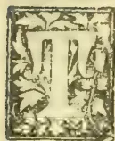

THE annual distribution of prizes at the Agricultural School took place in the school hall on the 17th ult. A beautiful arch erected at the garden gate bore an inscription welcoming H.E. the Governor, and the roadway leading to the school was festooned with coconut leaves, and moss. The hall was also decorated very appropriately, and fine specimens of tomatoes, and plantains—no doubt, cultivated at the school—were neatly arranged on the walls within, whilst clusters of flowers tied up with moss, were suspended from the roof by chains, also of moss. Appropriate mottoes also adorned the walls, such as. "The Tree is known by its Fruit;" "Practice with Science;" and. "Labour conquers all things." The Volunteer Band, in charge of Bandmaster Luschwitsz, was stationed in the garden outside, and as His Excellency the Governor arrived, in company with Mr. Ogilvy P. S. and A.D.C., the Band played the first few bars of the National Anthem. His Excellency was met at the entrance by Mr. Ashley Walker, Acting Director of Public Instruction, and Mr. Drieberg, Superintendent of the Agricultural School. The gathering which fairly filled the hall, included the Hon. Sir John Grinlinton, Mrs. and the Misses Carbery, Lady de Soysa and the Misses de Soysa, Mr. and Mrs D. G. Mantell, Messrs. John Ferguson, A. F. Brown and M. Cochran, Rev. S. Lindsay, Dr. Lisboa Pinto, Miss Choate, Mr. and Mrs. F. Dornhorst, Mr. and Mrs. Arthur Alvis, Mr. and Mrs. A. Y. Daniel, Mr. and Mrs. Tampoo, Mr. and Mrs. Horman Loos, Mrs. Vanderstranten, Mr. and Mrs J. L. Ebert, Drs. W. H. and W. A. de Silva, Messrs. C. M. Fernando, Gerard A. Joseph, H. E. Thomas, and others.

HIS EXCELLENCY on taking the chair said the proceedings would be opened by the reading of the Report by Mr. Drieberg.

MR. DRIEBERG thereupon, read the following Report of the school for the past year:—

The annual report of this institution must need differ from those of most other Educational establishments, in that it contains no record of the results of public examinations by which the merits of schools is popularly gauged; so that the course of study here may, in this sense, be said to be an uneventful one, unrelieved by the excitement of competition which our students are fortunately or unfortunately denied.

The work of teaching, too, has been carried on under difficulties which other schools have not had to face, and which those who are fond of expressing their views on education in the island, have not been appreciated. Our course of study lasts but two years, the junior course extending over the first year and the senior over the second. During the early days of the school it was deemed inadvisable to insist upon any particular standard of efficiency in English for candidates seeking admission, as this would have had the effect of keeping out boys with a deficient knowledge of English, but to whom a purely agricultural education was a desideratum. The result has been that we have had a very uneven lot of boys to deal with—some of whom have previously had a sound general education at one or other of our better schools and colleges, while others have had practically no English education to speak of. But no doubt with the idea of, in some measure, smoothing down the discrepancies and difficulties that would naturally present themselves to the teachers on this account, instruction in English and Mathematics was included with the technical course in Agriculture in the school curriculum. The attempt to explicitly impart instruction in all the subjects of an Agricultural course in the vernacular is a well nigh impossible task, and the framer of the dual curriculum no doubt recognised the fact that a knowledge of English was necessary for a proper understanding of Agriculture and the sciences allied to it. And yet in practice, this method of instruction is very hard to adopt with success, since where a student starts with the minimum of a knowledge of English, it is not to be expected that at the end of two years he will concurrently have attained to the status of a fairly intelligent English scholar, and also have become proficient in the technical sciences for which the knowledge of English was necessary. Of late, however, while English and Mathematical classes continue to be held, an endeavour has been made to gradually raise the standard of efficiency for admission into the school, firstly for the reason stated as to the need of a fair intelligence for a right understanding of

619------------------------------------------------

566Supplement to the "Tropical Agriculturist."[Feb. 1, 1895.

the special subjects comprised in an agricultural course, and secondly, because there is ample opportunity afforded in most parts of the island, for acquiring the necessary preliminary education for admission. There is thus a prospect, especially in view of the further development of the school on still more useful lines, of our securing a more uniform and better class of boys to teach, so that while our work as teachers will be less trying, the results of our labours will be more encouraging to us and more satisfactory to those taught. I should, however, mention that as adjuncts to the Agricultural School proper we have regular classes in agriculture and botany, in which instructions is imparted (as well as it can be) in the vernacular: and these classes such boys as have no knowledge of English are to attend.

During the past year our numbers have been about the same as hitherto. There have, however, been changes among our staff of teachers. While Mr. D. A. Perera still continues to work most efficiently as headmaster, Mr. Hoole has left us to study Veterinary science in Bombay. Mr. W. A. de Silva who was the first Government Veterinary scholar who studied at the Bombay Veterinary College came back in June last after a brilliant career, and is at present Acting Colonial Veterinary Surgeon in the place of Mr. Lye resigned. Mr. Hoole's duties are being temporarily performed by Mr. Paulusz, while Mr. Samarayanake remains as our hard-working practical instructor. In my last report I mentioned in what capacities our past students were employed. I was pleased to hear from an extensive and successful tea planter, through whose hands a number of our students had passed before securing employment on estates, that he had a very good opinion of these boys, of whose activity and zeal he spoke in encouraging terms. The regularity in the routine of outdoor and indoor work and the discipline imposed upon the students here are in themselves not without a beneficial effect. An important event in the history of the school has been the interest which the Conservator of Forests has begun to show in its welfare. Mr. Broun had for some time past been inclined to give the preference to past students of this school, in selecting men for minor posts in his department, no doubt in the belief that the instruction imparted here to some extent meets the requirements of forest officers. The Conservator of Forests has also been preparing a series of forestry lectures which have been given to the students, and he has himself come over to the school to explain and illustrate these lectures. Both Mr. Broun and Mr. Cull have already been expressing their views as to the desirability of grafting on a Forestry School to the present School of Agriculture, so as to economically establish a preparatory school for officers of the Forestry Department the need for which no one knows better than the Conservator of Forests himself. For my part, I heartily second the proposal for the reason that the usefulness of the School of Agriculture may thus be increased by its contributing a part of the instruction necessary for the Forestry course, thus helping to raise up an efficient staff of Forest officers. Since Mr. Walker—who has himself been intimately connected with the early history of the school—succeeded to the Director's chair, an important innovation has been introduced, viz., that the Superintendent of this School should periodically inspect and report upon the work of the Agricultural Instructors. The result of a close connection between the Instructors and this central Institution, and the subjection of the former to regular inspection and supervision will, I feel convinced, produce good results.

The Annual Examination which took place on November last, was conducted by Mr. VanCuylenberg, Inspector of Schools (who examined in English and Mathematics), Dr. H. M. Fernando and Mr. Mendis (the examiners in Chemistry), Mr. Broun and Dr. Pinto (who set papers in Botany), and Mr. H. D. Lewis, sub-inspector of schools, who examined the students in Agriculture. I am glad to be able to say that the reports of these examiners were very gratifying.

The report of the Dairy for the year 1894 is not the record of prosperity that marked the first 8 months of

its existence. The beginning of the year saw the introduction of the much-dreaded Epizootic known as "Murrain" into the Dairy. The loss to the Dairy herd was considerable, and consisted of 17 cows, 18 calves and three bulls. Apart from this loss the operations of the Dairy were, on the recommendation of the C.V.S., suspended for a period of two months, during which the produce of the Dairy was not permitted to be removed off the premises; so that for this time the monthly expenditure on upkeep continued, while there was nothing in the way of returns; and it was some months before the Dairy was able to work on its former extensive scale. Another unexpected and serious result of the outbreak was that many of the incalf cows that survived weak found to have aborted, so that practically we shall not have shaken off the disastrous effects of this outbreak till a year or more has elapsed. The extraordinary expenditure during the prevalence of the disease amounted to nearly R900. In spite, however, of this large addition to the expenses, and the loss from the suspension of operations, the Dairy has again been working so satisfactorily that the receipts have more than counterbalanced the enormous expenditure of the year. With the profits from the Model Farm amounting at present to about R160 a month, and that from the lands adjoining the school to R60 a month, it is satisfactory to know that the cost of all the establishments on these premises including the upkeep of the school with its staff and teachers is at present almost met by the returns from these various establishments. The credit of the successful working of the Dairy is of course mainly due to the energy and zeal of the Manager, Mr. Rodrigo. It only remains for me now, sir, to thank your Excellency for the honour you have done us in consenting to preside on this occasion, and in encouraging us by your presence here to-day.

HIS EXCELLENCY next called upon the Acting Director of Public Instruction to address those assembled.

#### THE ACTING DIRECTOR OF PUBLIC INSTRUCTION.

Mr. ASHLEY WALKER, began by referring to the prophecies of ill-success which greeted the Agricultural School when it was first established, but which had not been fulfilled. He said he was appointed the first superintendent of the school, in addition to his own duties pending the arrival of Mr. C. Drieberg who was then pursuing his studies in the Royal College of Agriculture at Cirencester, and had charge of the work for a period of about two or three years. He could very well remember the utter astonishment of the natives when first they saw the boys out in the garden handling the plough and shouldering their mamoties, and, still further, leading buffaloes into the field. They were surprised that the sons of parents of good position should thus engage in manual labour. The crowds to witness these operations increased for a few days, but in the course of a week or two, the novelty ceased, and they passed by without taking any notice of them. Much was looked for from Government Agents in this country, who could do a great deal to increase the usefulness and progress of the Institution. He was quite certain that where interest was taken, success was assured, but where there was lack of interest, good results could not be expected. In consequence of his being stationed in the Central Province for a few years, he had lost touch with the Institution. When he returned to Colombo in August he had occasion to read the monthly diaries sent in by the Instructors, and received several letters from Headmen, commenting upon and criticising their work. He at once appealed to His Excellency the Governor to depute Mr. Drieberg to inspect the work of the instructors at outstations. He was happy to state that His Excellency very readily granted the request. He hoped that with his

620------------------------------------------------

Feb. 1, 1895.]Supplement to the "Tropical Agriculturist."567

help, they would have better reports, now that the Instructors know that Mr. Drieberg will supervise their operations. The dairy was now fully established and at a comparatively small cost to Government. The idea of starting it was first conceived by His Excellency the Governor, and it had certainly turned out a great success, and the public of Ceylon should be thankful to His Excellency for the good supply of milk the hospital now received. He would now wish to address the parents of sons sent to the school. It seemed to him, that some were under the impression that this was a cheap boarding school where a little knowledge of English could be obtained. The object of adding the study of English to the curriculum was that the boys educated there, might have access to English books in after life, and that they might have a better status in the localities in which they would be placed. Mr. Broun had kindly given addresses on botany and had done much to help them. He hoped that the Forestry Class which was now under consideration, would soon be formed. The Institution, he said, was primarily intended for the sons of men who held landed property, who would derive the greatest benefit when assisted by young men who had received their education at the Colleges in the cultivation on their paternal acres. (Applause.)

*The Prize List.*

The prizes, as below, were then distributed by His Excellency the Governor:—

SENIORS.

Special Prize in Botany given by A F Broun, Esq., R30,  
G E H Fonseca  
Agriculture, (Theoretical) B H de Alwis  
Veterinary, G E H Fonseca  
English, D A Chinniah  
Special prize in Practical Chemistry given by J W C de Soysa, Esq., R25, G E H Fonseca  
Agriculture, (Practical) H D Martin  
Science, G E H Fonseca  
Mathematics, G E H Fonseca  
Sinhalese Literature, B H de Alwis.

JUNIORS.

Agriculture, (Theoretical) W P de Mell  
Science, W Welatantiri  
Agriculture, (Practical) P Van de Bona  
English, W Rowlands  
Veterinary, W Welatantiri  
Field Surveying, M D Aryachandra  
Mathematics, P Van de Bona  
Special Prize in Agriculture given by J H Barner, Esq.,  
M D Aryachandra  
Sinhalese Literature, W P de Mell.

HIS EXCELLENCY in giving away the prizes, manifested a deal of interest in the subjects taught in the school, and frequently interrogated Mr. Drieberg.

H. E. THE GOVERNOR.

HIS EXCELLENCY then gave away the prizes to the successful students, after which he addressed the gathering, his remarks being frequently interrupted by applause from the pupils and those assembled. His Excellency said that in a country such as this, where agriculture was, and must always be, the chief employment of the people, a school such as that must necessarily be of the greatest importance and interest, and should attract the warm sympathies of the public. In the report which Mr. Drieberg had read to them, he had given a record of certain difficulties which he had met with during the course of the last year. He had told them that, in a great measure, those difficulties had been met and overcome and, therefore, he (the Governor) did not think he need dwell on them. Mr. Drieberg had also told them, in the report, of the satisfactory progress and advance that had been made by the school during the last year, and he (the speaker) would briefly touch upon a few points that had occurred to him during

the reading of the report. Mr. Drieberg had told them that regular classes had been arranged in agriculture and botany. That, of course, was a very important advance. He had also told them that there was a scheme on foot for opening, in connection with the school, a class for training in forestry. He (the Governor) might say that this matter had been before Government, and the first points of detail had been considered, and it was only on the ground of economy that, after a more complete agreement with the proposals that had been made by Mr. Drieberg and Mr. Broun, the matter had not already been completely set on foot. But he (the speaker) had hopes that, before the end of the present year, Government might be able to see their way to carrying out the scheme projected. (Applause.) The Director of Public Instruction, in his remarks, had called attention to a reform which he himself had introduced among the agricultural teachers in the country districts. His Excellency remembered, before Mr. Walker made the suggestion, that some sort of inspection should be made, that he had felt himself that the scheme of having agricultural instructors in the country districts needed looking into. His Excellency had felt that they were too far away from the eyes of the central authorities, and he had been doubtful whether Government were really getting any return for the money spent upon them. It was, therefore, with complete satisfaction that he had agreed to the proposal that Mr. Drieberg should be asked to make a tour in the country districts, and inspect and report upon the work of the agricultural instructors. In this way, His Excellency hoped that a very great improvement would be made in the results obtained from the instructors. Mr. Drieberg had mentioned the progress that had been made during the last year in the Dairy, and the vicissitudes and difficulties he had met with. The difficulties and vicissitudes had been very considerable, and the loss had been large, but, in spite of all, he was glad to learn the financial results of the dairy were satisfactory. (Applause.) He (the speaker) took a deep interest in that branch of the Agricultural School, for, as Mr. Ashley Walker had told them, it was to him (the Governor) a matter for pride to see a little institution, which was started on his (the speaker's) suggestion—(loud applause)—getting on so well. He (the Governor) had got the idea of the undertaking from the Government Dairy which he had found in existence in the island of Trinidad, where he had been some years ago. The Government Dairy there had been started by Lord Harris, the father of the present Governor of Bombay, and a few days ago, when he (His Excellency) was in Bombay, he had the pleasure of reminding the present Lord Harris of the useful institution started by his father in Trinidad, and of telling him of the satisfaction he had received in taking a leaf out of his father's book and starting something similar in Ceylon. But his (the Governor's) object in starting the dairy was not solely for the purpose of supplying hospitals and other institutions with a good supply of milk. His object chiefly in starting the dairy was with a hope of improving the breed of cattle in the country, and at the same time of teaching the natives of the country the art of curing their cattle when they got diseased—a matter which, he thought, everybody would admit was of the highest importance in Ceylon, where cattle diseases were very prevalent. He did not think there was anything more he could say that would be interesting or advantageous to them, and he would therefore conclude by congratulating Mr. Drieberg on the progress made by the school since he last had the pleasure of presiding there, and by

621------------------------------------------------

568Supplement to the "Tropical Agriculturist."[Feb. 1, 1895.

expressing the satisfaction it gave him to see so many of his friends around him in that hall. (Loud and enthusiastic applause.)

His Excellency next called upon Mr. Ferguson to address the meeting.

MR. FERGUSON.

Mr. J. FERGUSON said he had long regarded the Agricultural School as one of the most useful institutions in the island, and Mr. Drieberg, its Principal, as a very valuable public servant, and emphatically the right man in the right place. He took blame, however, for the fact that this was the first time he had been present at the School's annual gathering. Session after session, Mr. Drieberg had reminded him of a standing promise, only to be asked to allow him to plead pressure of work and to accept what used to be the Ceylon coffee planter's standing promise of "next year." When, however, Mr. Drieberg came to him yesterday afternoon, and pleaded accumulated promises, and a dearth of speakers, he had not the shamefacedness to refuse to leave the treadmill for once, and enjoy the pleasure of seeing the institution and the pupils and hearing the report for himself. It was certainly a matter for special congratulation to H.E. the Governor that, through the expansion of usefulness suggested by him, an educational institution of this kind calculated to confer so great a benefit on the community was able, even from a revenue point of view, to answer the economical "will it pay" test of one of His Excellency's great predecessors. The School had been in existence for some 11 years, during half of which Mr. Drieberg has been Principal and its improvement under his care has been well shown in his successive Reports. Altogether, from 80 to 90 pupils have probably passed through the school and scattered over the island as most of them were, he ventured to say the habits of industry and thoughtfulness learned there, the sense imparted of the dignity of manual labour, of the value of careful culture, of the importance of agricultural improvement could not fail to produce much good fruit. He spoke of agricultural improvement and he might say that probably no country in the world of its size stood more in need of improvement in agriculture than Ceylon, or offered more scope for encouragement. To prove this, he would not touch on their agricultural industry usually most dwelt on; for, important as it was, he considered others equally, if not more important in the palm, fruit and leaf culture. If any competent agriculturist arrived in this island and took stock of what he saw, he must at once exclaim: Why, this is the very paradise for leafage, for palms, plantains, jack, bread fruit and allied fruits. It is related by Dr. Norman Macleod that on approaching Bombay and seeing coco palms for the first time and each scored by its owners he exclaimed: "Oh! India, the very hairs of thy head are numbered." The simile is a very forcible one, seeing how the coco palms seem to rise so plentifully out of our soil. And it is quite clear from the way the industry in palm-planting has already spread—the acreage had more than doubled during his own stay in Ceylon—that it was not to stop until the coconut spread to Puttalam and on to meet the palmyra (with its love of sand and drought) from Mannar and Jaffna and the same on the East Coast until the whole island was girdled with palms and there were, perhaps, long avenues of palmyras down the North road to meet the coconut groves started by Mr. Ivers in the North-Central Province. There was therefore, the prospect of a great expansion of agriculture

in which pupils of the school might be expected to participate; but still more there was room for improvement in much of the 700,000 acres now planted with perhaps 50 million trees giving an annual average crop of 1,200 million nuts worth more than our tea crop, or say 50 million rupees. Now the condition of much of this culture is shown by the average crop for the island being so low as 20 to 25 nuts per tree, whereas all well-cared-for plantations gave 40, 50, 60 or more nuts per tree. If through "improved agriculture," the crop was raised to an average of even 30 nuts per tree, it would mean an addition of 10 million rupees to the annual income of the Colony. As to the actual state of native gardens we need not go beyond this city of Colombo, where in dozens of cases he could point out spaces overcrowded with neglected palms and fruit-trees, such spindle shanks with a solitary nut or fruit as often tempted him to think the Sinhalese had heard of, and taken literally to heart, Carlyle's famous saying:—"Produce, produce, were it but the infinitesimal fraction of a product, produce it in heaven's name." (Laughter). He (the speaker) had often wished that Mr. Drieberg and his deputies were clothed with authority by Government to enter into native gardens such as he saw daily between Colombo and Mount Lavinia and cut down the superfluous palm or fruit trees to allow the rest to get fair play. At Mount Lavinia itself they had a model 10 acres of coconuts, planted under the direction of the late Rev. Dr. Macvicar (Chaplain of St. Andrews) an accomplished writer and an authority on scientific agriculture and these trees though wellnigh 50 years old were as fruitful as ever. Much could be done by precept as well as example among the people; civil servants in Java had to pass a year in an Agricultural College before taking up their duties; he had often wished this was the rule in Ceylon to ensure that active interest in model gardens and agri-horticultural shows with fairs and prizes such as had been spasmodically carried on at a few stations, but which ought to be the rule annually at every Kachcheri in the island. (Hear, hear). He would wish also to see the sons of headmen and of landowners sent as a matter of course for at least a year to the Agricultural School before beginning the business of life, and some recognition of such having passed through the School, afforded by Government. Turning to the students, Mr. Ferguson urged them to rely upon themselves, to maintain the habits of steady industry and reflection they had formed in class and to keep on the study of Botany or whatever branch was each one's special hobby. He was delighted to hear of the lectures from the Conservator they had had on Forestry, a branch intimately associated with garden culture, and his parting advice to the lads who had learned to read and think with pleasure in the exercise, was to follow the advice of a great teacher and "always keep a good book by you." (Applause).

MR. DORNHORST.

Mr. F. DORNHORST said that unlike Mr. Ferguson, he had been present at nearly every function of the Agricultural School, but that this was the first opportunity afforded him of addressing an audience like the present in connection with the school, and his task that evening was a pleasant one. At half-past three he received a letter from Mr. Drieberg soliciting his presence at the meeting to propose a vote of thanks to the Governor for presiding. That was a task that brought pleasure with it. He had only to

622------------------------------------------------

Feb. 1, 1895.]Supplement to the "Tropical Agriculturist,"569

mention it, and like loyal toasts at dinner gatherings it did not require words to recommend it—it was cordially received and cordially carried. People might say of him as a lawyer, that there could possibly be no alliance between Law and Agriculture. That, however, was a mistaken idea. The prosperity of a country depended upon the development of its agricultural resources, and the prosperity of the lawyer depended upon the agricultural prosperity of the country. Putting aside patriotic reasons and patriotic motives, it was always the object of the lawyers to encourage patriotic agricultural tastes. (Applause.) The school, indirectly, fulfilled two missions. Being entirely under the control of Ceylonese, it helped to strengthen the confidence of Government in the managing capabilities and administrative capacities of the Ceylonese. The confidence of Government was a tender plant of very slow growth, and that tender plant was consigned to the fostering care of the Principal of the school, and they might rest assured that under his delicate management that tender plant would show sign of steady development. The other mission was to help to remove the fiction, that the Ceylonese despised agricultural pursuits and only cared to become lawyers and physicians. He hoped that this Institution and the Technical Institution would help to redeem the character of the Ceylonese from this somewhat base insinuation. He felt certain that the hope expressed by Mr. Ferguson of the school spreading out its arms would be fulfilled in time. They would find that the Ceylonese were as fond of agricultural and technical pursuits, as they had hitherto been of law and medicine. He need not refer to the intrinsic worth of the school developing the country. He was sure that on behalf of those present and all the Ceylonese, he could say that they rightly appreciated the laudable efforts of H.E. and the Government to promote the agricultural interests in the island. In moving a vote of thanks to H.E. for presiding, he thought it was only a fitting tribute to one who had always shown a hearty sympathy with the people and institutions of the country which he ruled. (Applause).

Mr. A. F. BROWN seconded the vote of thanks.

The proceedings then terminated and those present adjourned to the garden where they partook of refreshments.

#### OCCASIONAL NOTES.

A collection of specimens of the rough fibre of the following plants and trees has been received from Mr. Tiathonis, Agricultural Instructor at Godakawela:—Pine-apple (*Ananas sativus*), Gerandidid (*Boehmeria* ?), Walla (*Gyrynops walla*), Walhana, Bevila (*Sida humilis*), and Ktikau-bevila (*Sida rhombifolia*). Midella (*Barringtonia acutangula*), Mayila (*Bauhinia racemosa*), Kcta-dimbula (*Ficus hispida*), Suiya (*Thespesia populnea*), Pus-wel (*hntada scandens*), Nava (*Sterculia Balanghas*), Kala-wel (*Derris scandens*), Wal belipata (*Hibiscus tiliaceus*), Kapu-kinissa (*Hibiscus angulosus*), Ehetu (*Ficus tsiela*), Liniya (*Helicteres isora*), Daminiya (*Grecia tiliaefolia*).

Mr. Alwis, Agricultural Instructor at Dipitigala, has also sent some excellent specimens of fine white rope prepared from Bowsting hemp (*Sansevera zeylanica*) the Sinhalese Niyanda.

An attempt is being made to cultivate the leguminous plant known in Ceylon as Aswenna

(*Alyssicarpus bupleurifolius*), and, often found growing together with grass in pasture land. A promising plot of it has now been kept up for about three months, but no results are yet available as to amount of produce. Cattle are known to be fond of the plant, and being allied to the Clovers it should prove a most nutritious fodder.

#### RAINFALL TAKEN AT THE SCHOOL OF AGRICULTURE DURING THE MONTH OF JANUARY:

<table border="1">
<tbody>
<tr>
<td>1</td>
<td>Nil</td>
<td>13</td>
<td>Nil</td>
<td>25</td>
<td>Nil</td>
</tr>
<tr>
<td>2</td>
<td>Nil</td>
<td>14</td>
<td>20</td>
<td>26</td>
<td>Nil</td>
</tr>
<tr>
<td>3</td>
<td>83</td>
<td>15</td>
<td>09</td>
<td>27</td>
<td>34</td>
</tr>
<tr>
<td>4</td>
<td>03</td>
<td>16</td>
<td>238</td>
<td>28</td>
<td>Nil</td>
</tr>
<tr>
<td>5</td>
<td>Nil</td>
<td>17</td>
<td>115</td>
<td>29</td>
<td>Nil</td>
</tr>
<tr>
<td>6</td>
<td>Nil</td>
<td>18</td>
<td>Nil</td>
<td>30</td>
<td>Nil</td>
</tr>
<tr>
<td>7</td>
<td>49</td>
<td>19</td>
<td>Nil</td>
<td>31</td>
<td>Nil</td>
</tr>
<tr>
<td>8</td>
<td>42</td>
<td>20</td>
<td>01</td>
<td>1</td>
<td>Nil</td>
</tr>
<tr>
<td>9</td>
<td>99</td>
<td>21</td>
<td>Nil</td>
<td></td>
<td></td>
</tr>
<tr>
<td>10</td>
<td>Nil</td>
<td>22</td>
<td>Nil</td>
<td>Total</td>
<td>693</td>
</tr>
<tr>
<td>11</td>
<td>Nil</td>
<td>23</td>
<td>Nil</td>
<td></td>
<td></td>
</tr>
<tr>
<td>12</td>
<td>Nil</td>
<td>24</td>
<td>Nil</td>
<td>Mean</td>
<td>22</td>
</tr>
</tbody>
</table>

Greatest amount of rainfall in any 24 hours on the 16th instant, 2.38 inches.

Recorded by P. VAN DE BONA.

#### THE PATENT SULTAN WATER LIFT.

The Inventor of this machine has personally brought to our notice the merits of this machine. The advantages claimed for it are:—

1. The buckets, being entirely of superior and thick metal, an important item of expenditure in the shape of the cost of leather is avoided.

2. By peculiar arrangement of the yoke, the bullocks are subjected to a forward movement only at each walk, thus obviating unnecessary strain, and effecting great economy of animal labour. Two buckets are lifted and discharged in the place of one, as in the ordinary mhothe, the buckets descending and ascending alternately with each walk of the animals on flat ground.

3. The bolts and nails being few, the necessity for frequent repairs is done away with.

4. To fill the buckets, it is not necessary to pull the ropes, as the water fills through the bottom by an automatic valve arrangement.

5. There is no wastage of water, as in the old mhothe, the buckets being constructed water tight.

6. Any ordinary blacksmith can with ease repair any part of the bucket which might get out of gear, the mechanism being extremely simple.

7. There is no danger to man or beast from snapping of ropes, with which the old mhothe is attended.

8. It bales out a large quantity of water, and does the work of two ordinary mhothes, or more, and hence there is a saving of the cost of a pair of bulls and the salary of a driver.

9. It can be used even in wet weather as there is no slope.

10. A boy will be able to work it.

11. It can be fitted to a river, a tank, or a well of any depth, and the water can be raised to any height.

12. The draught is only about 2 cwts. as indicated by the Dynamometer for 25 gallons of water.

13. It is transferable from well to well, if necessary, and can be easily erected by an ordinary workman.

623------------------------------------------------

570Supplement to the "Tropical Agriculturist."[Feb. 1, 1895.]

14. All that is required to work the Lift is to drag the yoke to and fro.

We have seen a number of excellent testimonials referring to the efficiency of this machine from Collectors, Engineers, and others. The Principal of the Madras College of Agriculture considers it very suitable for raising water from a depth of over 15 feet. The inventor claims for this lift that it is capable of raising 9,000 gallons of water per hour, but we are not informed from what depth. Still the invention appears to us to be an excellent one, and should be a great boon in the dry parts of the Island. We have intimated our readiness to arrange for working one of these lifts on the school premises, if necessary, for show purposes. The price of a single lift with two 25 gallons buckets is R125, exclusive of ropes. Buckets ranging in capacity from 30 to 100 gallons are also made to order. Chain or wire may also be used instead of rope. The Agents for the Machine in South India are Messrs Sultan & Co., Saidapet, Madras.

#### NOTES ON THE CATTLE MURRIAN OF CEYLON.

I have little or no faith in treatment, and on no consideration should it be attempted unless under carefully pre-arranged and utterly isolated conditions. Prevention is and should be the whole aim and object of those who have to deal with the disease, to stamp out first indications and with strict watchfulness to guard against its spread. I feel satisfied that under proper organization, it is quite possible to reduce the prevalent annual outbreaks of this disease within the Island to a minimum, and a department so organized and disciplined as to effect this, would be the greatest blessing and boon ever conferred on the agricultural population of Ceylon. Of my own personal knowledge, after extended and most careful inquiry over the length and breadth of the Island, facts elicited proved to my mind that rinderpest is a bane to all progress; the sole cause of wide extended poverty, the desertion of whole villages, the neglect of watercourses and tanks, and, indeed, of the reversion of districts to wild beasts and jungle; since the agriculturist, having lost all his cattle, cannot cultivate, and must flee and obtain food elsewhere. Many such cases came to my knowledge.

"The conditions under which cattle exist in this country," says the Indian report on Rinderpest, "are so varied that it is impossible for us to lay down any fixed plan of action, as what would be applicable to one locality would not work in another, so that it must be left to the intelligence of those who are entrusted with the duty of repression. The difficulties which are encountered in certain parts in the matter of the segregation of animals in the same village are so great as to be almost insurmountable, and more especially is this the case where the villages are small."

As regards this statement Mr. Smith remarks:—Possibly so in India and to some extent in Ceylon, yet I again assert that by organization and needed administration by a department, purely agricultural, disease may be repressed and the cattle of Ceylon might be multiplied tenfold. Cattle as we know constitute the real

wealth of all agricultural nations. I do not think a purely veterinary department the best to combat and repress diseases among animals in India, or in Ceylon. Men simply imbued with veterinary science, be they ever so eminent, are little fitted to approach the native agriculturist, as there can be but little sympathy between the two classes, and any laws promulgated by a Veterinary Department will ever seem antagonistic to native prejudice.

But approach a native from an agricultural aspect, look to his stock, their management and well being, and he will understand you. Set him an example while you instil your precepts, and he will not be slow to take advantage when convinced. It is not a rush hither and thither when an outbreak takes place that can ever do any good. An organized department with its specially educated officers living on friendly terms with the native headmen of his district, commanding their respect and receive their aid in the suppression of disease, through the earliest intimation being communicated by the minor headmen, is what is required. The services of the village officials when they efficiently perform their duties should be duly recognized and rewarded by Government. Such a department could in my opinion be self-supporting after being set agoing. Nothing but watchfulness all over the land will ever suffice to keep in due bounds a disease so subtle and stealthy in approach.

[Here Mr. Smith's notes come to an end. We again take this opportunity of thanking him for the valuable contribution he has made, and indulge in the hope that he may be induced to still further dilate on a subject which he has made a life's study.—EDITOR.]

#### PLOUGHING-IN OF GREEN-CROPS.

The following note was drawn up by Dr. J. W. Leather, Agricultural Chemist to the Government of India:—

The manuring of land by ploughing-in an immature crop is not unknown to cultivators in different parts of India. In Dr. Voelcker's recent Report on the Improvement of Indian Agriculture (pages 106 and 107) instances are given of this practice. To indigo planters, too, the practice of ploughing-in a young crop of indigo is known. This method of manuring would appear to be capable of wide application. The want of manure in India has been acknowledged by all who have studied the agriculture of this country, and the question whether the want can be in part supplied by the method under notice is worthy of enquiry.

In his Report Dr. Voelcker points out that, judging by the samples of soil which he was able to examine in relation to the enquiries which he instituted, they were notably deficient in two constituents, viz., nitrogen and organic or carbonaceous matter.

The rationale of ploughing-in a green crop is that the organic or carbonaceous matter is taken from the atmosphere by the crops to be ploughed-in and added to the soil, and in the case of certain crops the want of nitrogen is also obtained from the same source.

Recent experiments conducted in Germany, and confirmed in England, have shown conclusively

624------------------------------------------------

Feb. 1, 1895.]Supplement to the "Tropical Agriculturist."571

that plants of the order Leguminosæ are able to assimilate nitrogen from the atmosphere, and that consequently, during the growth of such plants, there is an actual gain of this element. If a leguminous crop, e.g., indigo or *san* hemp (*Crotalaria juncea*) be ploughed-in as a manure for the cold weather crop, both organic matter and nitrogen are thereby added to the soil and act as a manure.

At the Experimental Farms at Cawnpore, Nagpur, and Dumraon (Bengal) this subject has engaged attention for some years, and it will be of interest to compare the results arrived at. Indigo has been ploughed-in at Cawnpore in August during the preparation of the land for the cold-weather crop and wheat sown. The average of the results obtained during eight years is 1,544 lbs. of grain from the plot on which indigo was ploughed-in, and 1,052 lbs. of grain from the unmanured plot. Similarly at Cawnpore, Nagpur, and Dumraon *san* hemp has been ploughed-in during seven years as a green crop with the following results. Wheat was the crop cultivated at Cawnpore and Nagpur, and the figures are the mean of the results.

<table border="1">
<thead>
<tr>
<th></th>
<th colspan="2">Cawnpore.</th>
<th colspan="2">Nagpur.</th>
</tr>
<tr>
<th></th>
<th>lbs.</th>
<th>lbs.</th>
<th>lbs.</th>
<th>lbs.</th>
</tr>
<tr>
<th></th>
<th>grain.</th>
<th>grain.</th>
<th>grain.</th>
<th>grain.</th>
</tr>
</thead>
<tbody>
<tr>
<td>Hemp ploughed-in</td>
<td>1,206</td>
<td>1,273</td>
<td>803</td>
<td></td>
</tr>
<tr>
<td>Nil</td>
<td>1,052</td>
<td>73</td>
<td>802</td>
<td></td>
</tr>
</tbody>
</table>

The experiments made at the Dumraon Farm have been with different crops. In two years potatoes were cultivated, in three years wheat, and in one year paddy. The yield of potatoes was largely increased in each case. The paddy crop was nearly doubled, but in two cases with wheat a smaller yield was obtained from the manured crop than from the unmanured. At Nagpur, too, the results were not uniform. Mr. Fuller, Commissioner of Settlements and Agriculture, refers to this in his Reports of the Farm; and it is probable that much depends on the conditions of weather following upon the ploughing-in of green crops. In four out of seven years an increase was obtained at Nagpur in consequence of the ploughing-in of green hemp. Whilst, however, an increase of the wheat crop has not always been the result, an increase has frequently been obtained with the manure residue when a crop of cotton has been taken off the land in the following hot season.

The evidence in favour of this method of manuring is therefore fairly uniform. It is moreover one which is generally quite feasible for the *rayat*. Its cost may be estimated by that of the seed plus the labour required for the cultivation of the green crop.

The experiments at the Farms are being continued, and in a few years more concordant results may be expected.

[It seems likely that the subject of green-soiling may assume much greater importance in the future than it has done in the past, when considered in the light thrown on the subject by the discovery of the great merit of the pea family of plants (*Papilionaceæ*) in taking free nitrogen from the air and imparting it to the soil, specially if such plants be subsequently ploughed-in as green manure. In the Dictionary article (*M. 251*) it will be seen that Tea Planters are reported to frequently sow mustard between the tea plants and to dig the mustard into the soil with the view of green-manuring. In the light of recent

investigations it may almost be confidently affirmed that very much better results would be obtained were they to substitute any of the wild papilionaceous weeds of their neighbourhood. What is wanted is a rapid-growing plant that in a given time produces the highest percentage of leaf, and one also which has a readily decomposable stem. In the above experiments *san* hemp (*Crotalaria juncea*) has been most favourably spoken of, but it seems probable one of the wild *Crotalias* of more rapid growth and less woody texture would be more effectual. For example, *C. striata*, *C. sericea*, and *C. retusa* are fairly prevalent weeds of cultivated regions especially so in Western India. These are smaller and more hardy plants than *C. juncea*. Of course it would not be necessary to confine experiment to the species of *Crotalaria*; so far as at present known, it is probable any papilionaceous plant would serve the purpose. It is, however, frequently stated that any leguminous plant possesses the property of absorbing free nitrogen, but this would seem a mistake, since no member of the *Mimosæ* nor of the *Casalpineæ* has as yet been proved to have any such property.

#### FODDER CROPS AND CATTLE KEEPING IN CEYLON.—V.

(Concluded.)

I have already in this series of contributions referred to cultivated fodder crops, but it has to be noted, that a variety of plants which now grow wild are, if properly cultivated, capable of being made very useful fodder plants. Of plants that are likely to be successful, if properly grown, a few that are indigenous to Ceylon will be noted below.

Cattle eat greedily the leaves of many leguminous plants, notably the *Desmodium* (Sing. Undupiyali), *Cajanus* (Rata tora), *Phaseolus* (Mê, Muñ) &c., and *Cassia* (Tora). According to Thwaites there are five species of indigenous *Desmodium* growing in the Island. These are:—*D. trifolium* (Hiundupiyali), *D. Heterophyllum* (Maha-undupiyali), *D. parvifolium*, *D. gyrans* and *D. gyrroides*. All these are more or less perennial herbs with a fair amount of leafage. Their leaves are generally obovate and are green and thin, being neither very succulent nor dry. In the fresh state the leaves are readily eaten by all kinds of stock especially when given along with grass. It may be noted in passing that the leaves of *Desmodium* are specially relished by hares and rabbits. When partially dry they have a fine sweet aroma. The plants respond very readily to cultivation, and regular crops could be easily taken every month or five weeks. The leaves in a partially dry state cannot but be a very nutritious article of diet for animals.

Of *Cajanus* we have so far only one species that may be useful as a fodder. *C. indicus* (S. Rata tora) cannot be said to be regularly grown in Ceylon, though of late it is common to find patches of land laid under it in different localities. Owing, no doubt, to ignorance of the manner of preparing its seeds for use as human food, its culture has not extended. If, however, the plant be grown as a fodder crop, the leaves which are used as fodder will require no other preparation than drying. All stock take to this readily. It grows without much trouble,

625------------------------------------------------

570Supplement to the "Tropical Agriculturist."[Feb. 1, 1895.

14. All that is required to work the Phaseolus, drag the yoke to and fro.

We have seen a number of species. These are monials referring to the leaves, some large and Principal of mentioned, and hence would require considerable drying before being given to stock. Of the Cassias the *C. Occidentale* (S. Petitora) grows largely in uncultivated places, bearing smooth green leaves. The leaves are much relished by stock in a green state.

The natural order Convolvulaceæ also gives a few species of plants relished by stock. The plants belong to the genus *Ipomœa*.

*I. Uniflora* Sing. (Potupala), *I. Tridentata* (Havarimadu), *I. Obscura* (Mahamadu), *I. Cymosa* (Kirimadu). These four species of plants are well-known favourites of animals. In their green state the leaves of the *Ipomœas* are slightly succulent, and if they are cultivated regularly and properly cropped should form a valuable addition to our fodder supply. There is another natural order in which we have a few plants of the nature described. I refer to the various species of *Amaranthus* of the natural *Amarantaceæ*, *A. Paniculatus* (Ranatampala), *A. Spinosa* (Katatampala), *A. Gangeticus* (Sudutampala), *A. Polygonus* (Walutampala), and *A. Polygonoides* (Kuratampala) are more or less well known in all parts of the Island.

W. A. D. S.

### WATER TESTING.—(Continued.)

A sample of water could be tested for its impurities in four different degrees, viz:—

1. 1. Physical.
2. 2. Chemical (qualitative).
3. 3. Do (hardness).
4. 4. Do (quantitative).

By the first method, i.e., physical examination, we determine colour, turbidity, sediment, lustre, taste, and smell. Water containing no taste, smell or colour with a slight sediment, and of good lustre may be considered as fairly good water. But this method of testing is a rough one and cannot always be relied upon. The second, or qualitative chemical analysis is of more importance, and in fact if properly determined is quite sufficient, except under very exceptional circumstances. The third, the determination of hardness, is important in any examination of a water for industrial use. The fourth, that of quantitative analysis, is more within the province of the professional chemist, and while it entails much labour, requires the aid of a well-fitted laboratory. We shall dwell in this paper only on the first three kinds of tests.

The selection of a sample for analysis should be done with some care. It should be taken in a clean glass vessel and never in an earthenware one, while the vessel in which the sample is taken should be washed repeatedly with the water to be examined. The vessel, preferably a Winchester quart bottle, should also be provided with a well-fitting glass stopper; and the sample obtained should be examined as early as possible; at any rate a sample should not be left more than forty-eight hours, and in the interval should be kept in a dark cool place.

The following table would represent what we should determine in the course of testing the sample, and may be adopted as the form in which a report of testing should be recorded:—

Drawn on..... From.....

#### 1. Physical Characters:—

<table border="0">
<tr>
<td>(a.) Colour</td>
<td>(b.) Turbidity</td>
</tr>
<tr>
<td>(c.) Lustre</td>
<td>(d.) Sediment</td>
</tr>
<tr>
<td>(e.) Taste</td>
<td>(f.) Smell</td>
</tr>
</table>

#### 2. Chemical Qualitative Analysis.

<table border="0">
<tr>
<td>(a.) Lime</td>
<td></td>
</tr>
<tr>
<td>(b.) Magnesia</td>
<td>(c.) Iron</td>
</tr>
<tr>
<td>(d.) Lead</td>
<td>(e.) Copper</td>
</tr>
<tr>
<td>(f.) Zinc</td>
<td>(g.) Chlorine</td>
</tr>
<tr>
<td>(h.) Sulphuric acid</td>
<td>(i.) Phosphoric acid</td>
</tr>
<tr>
<td>(j.) Nitric acid</td>
<td>(k.) Ammonia</td>
</tr>
<tr>
<td>(l.) Organic matter</td>
<td></td>
</tr>
</table>

#### 3. Hardness,

<table border="0">
<tr>
<td>(a.) Total</td>
<td>(b.) Fixed</td>
<td>(c.) Removable.</td>
</tr>
</table>

REMARKS:—Colour.—To determine the colour of water two glass jars at least 18 inches high should be placed on two pieces of white paper, one should be filled with distilled water and the other with the sample of water to be examined. When viewed from the top the colour of the sample could be distinguished, the distilled water jar constituting a means of ready comparison. The normal tint of water when viewed as above should be bluish white. If yellow it shows the presence of fine particles of clay and sand. A brownish colour marks the presence of organic impurities.

Turbidity.—The degree of turbidity, or we may say of clearness, is also seen by the above examination.

Sediment, or the amount of suspended matter is ascertained by allowing the sample in the glass jar to remain for six to twelve hours, and observing the deposit if there be any.

Lustre.—The lustre or the brilliancy of a sample of water depends on the amount of carbonic acid gas present. The brilliancy may be great, slight or nil.

Taste.—No good water should have a decided taste. The presence of iron gives a slightly bitter taste, other metals in small quantities do not impart any taste whatever. Dissolved carbonic acid is the chief cause of taste in water.

Smell.—To determine the smell of water a small quantity should be heated in a test-tube over a spirit lamp. A smell of rotten eggs indicates the presence of sulphuretted hydrogen and other organic impurities.

Any conclusions drawn solely from a physical examination like the above may often prove to be misleading, but if there be an absence of colour, taste, or smell with only a slight sediment, the sample of water may be pronounced fairly good.

Coming to the qualitative analysis we should first filter the sample through bibulous paper (white blotting paper would serve as well) which has been carefully washed several times with water from the sample.

Lime.—Lime is the most common dissolved mineral substance we come across in water. A quantity of water, say half a test tube full should be taken; a little of a solution of ammonium oxalate added to it will cause a turbidity if 6 grains of lime per gallon be present, sixteen grains would give a considerable precipitate. Water containing less than 6 grains of lime

626------------------------------------------------

Feb. 1, 1895.]Supplement to the "Tropical Agriculturist"573

per gallon is fairly good.

**Magnesia.**—Magnesia is of somewhat rare occurrence in water, but in some localities it may be met with in considerable quantities. A quantity of water should be evaporated in a small porcelain basin, over the spirit lamp to one-fiftieth of its volume. To this taken in a test-tube, ammonium oxalate is added and filtered to remove any lime. The resulting filtrate should be treated with a few drops each of the solutions of sodium phosphate, ammonium chloride and ammonia solution. If any magnesia be present a crystalline precipitate will be observed after the liquor is allowed to rest for twenty-four hours.

**Iron.**—The presence of iron is indicated by a blue precipitate on the addition of potassium fero cyanide.

**Lead.**—Place some water in a white dish and stir up with a rod dipped in ammonium sulphide, a dark colour not disappearing on the addition of a few drops of hydrochloric acid will be produced.

**Copper.** also presents the reaction, but the presence of lead or copper may be distinguished by adding a few drops of sulphuric acid and filtering the water before it is tested. If a slight cloudiness is observed on the addition of sulphuric acid it indicates lead, and if the solution tested after filtering gives the dark colour described above it indicates copper.

**Zinc** is rarely found except as an impurity in connection with a storage cistern. A white precipitate on the addition of sulphuretted hydrogen indicates its presence.

**Chlorine.**—The addition of a few drops of nitric acid and silver nitrate produces a mere haze if chlorine is present to the extent of a grain per gallon; four grains give a marked turbidity and ten grains a considerable precipitate. The presence of chlorine in water indicates impurities from dissolved mineral chlorides or urine and sewage.

**Sulphuric acid.**—On the addition of barium chloride a grain and a half of sulphuric acid per gallon of water would give a precipitate after a while, three grains would give an immediate haze. The presence of this impurity indicates mineral sulphates such as those of lime and sodium. The presence of the former deteriorates the quality of water for industrial purposes greatly.

**Phosphoric acid.**—Concentrate a quantity of water by evaporation and the addition of molybdate of ammonium and nitric acid followed by a slight heating and allowing the solution to stand for a while, would give a yellow colour if phosphoric acid be present. The presence of this substance indicates animal and vegetable impurities in the water.

**Nitric acid.**—Add a solution of brucine to the water to be tested, and pour strong sulphuric acid; if nitric acid be present a red-coloured zone forms at the margin of the sulphuric acid and water. Instead of brucine, sulphate of iron may be substituted when the colour of the zone will be brown; nitric acid indicates mineral as well as organic impurities.

**Ammonia.**—On the addition of two or three drops of Nessler's reagent to about one-fourth of a test-tube full of water, and examining the tube over a white piece of paper, a yellow colour is seen, indicating the presence of ammonia. Small quantities give only a slight tint, but even then

the water is suspicious, and may be contaminated with urine, sewage and other organic impurities.

**Organic matter** is best observed by evaporating to dryness a quantity of water in a porcelain basin and heating the residue, which, if it blackens, indicate the presence of organic matter.

We next come to the third method of testing, *i.e.*, for hardness. Water is said to be hard when it contains dissolved matter in it, but as a rule the term "hard" is used to denote the presence of either carbonate of lime (chalk) or sulphate of lime (gypsum). The hardness due to the presence of chalk is removable (either by boiling or by the addition of lime-water, and is hence known as "removable hardness," whereas water containing gypsum is known as permanently hard.

**Hardness.**—There are various elaborate processes of determining the degrees of hardness of water, and these, of course, give very accurate results but demand care and labour which no one but a professional chemist could bestow. For ordinary purposes the following method may prove serviceable. Instead of the "soap test" we substitute "soap liniment" prepared according in the British Pharmacopoeia strength, which any druggist would supply. The test consists in the quantity of the soap solution necessary to form a lather in the water. If one drop of soap solution put in half an ounce of water forms a lather, we conclude that the water contains less than one-and-a-half grains of lime per gallon, and an additional drop of the soap solution represents an additional one-and-a-half grains. The number of grains represents the degree of hardness; for example, if half an ounce of water requires four drops of the soap solution, it indicates six degrees of hardness. In order to find the amount of permanent hardness, a quantity of boiled water should be treated in the same way, and the result will indicate the permanent hardness. The difference between total and permanent hardness will give the degree of removable hardness. The permanent hardness of good water should not be above 3 or 4 degrees.

W. A. D. S.

#### GENERAL ITEMS.

A London physician not long ago published an interesting paper in the *Lancet* on the use of fruits in the relief of diseased conditions of the body. Under the category of laxatives, oranges, figs, tamarinds, prunes, mulberries, dates, nectarines and plums may be included. Pomegranates, cranberries, blackberries, raspberries, barberries, quinces, pears, wild cherries and medlars are astringent; grapes, peaches, strawberries, whortleberries, prickly pears, black currants and melon seeds are diuretics; gooseberries, red and white currants, pumpkins and melons are refrigerants and stomachic sedatives. Taken in the early morning an orange acts very decidedly as a laxative, sometimes amounting to a purgative, and may generally be relied on. Figs, slit open, form excellent poultices for boils and small abscesses. Strawberries and lemons, locally applied, are of some service in the removal of tartar from teeth. Apples are correctives, useful in nausea, and even seasickness and the vomiting of pregnancy. The oil of the coconut has been recommended as a substitute

627------------------------------------------------

574Supplement to the "Tropical Agriculturist."[Feb. 1, 1895.

for cod liver oil, and is much used in Germany for phthisis. Grapes and raisins are very nutritive and demulcent, and very grateful in the sick chamber.

The Editor of the Cape of Good Hope Journal of Agriculture writes:—"At the Illinois Experiment Station experiments have been made to secure still further beneficial results. The object of these experiments was to discover whether the excrescences which naturally form on the roots of clover, peas, and other leguminous plants, and which enables such plants to decompose the atmosphere and use its nitrogen, may not be also made to grow on corn, oats, and other plants of the grass family. If this can be accomplished it will be possible to make corn, oats, and wheat renovating crops, as clover and peas now are." The experiment with maize is reported to be partially successful, but we have to await still further trials. We need scarcely say that this method of furnishing

growing crops and the soil with one of the most important elements of plant food, will be, if successful and of easy application, a most important step in agricultural progress."

The following interesting note with reference to the cow-pea which is now growing satisfactorily at the Colombo School of Agriculture, appears in the *American Agriculturist*:—"The cow pea has become established in Queensland, and is extremely and deservedly popular. The original seed was sent from the United States and distributed by Professor Shelton among the sugar planters. The Professor says:—"From this insignificant beginning the cow-pea has spread the whole length of the Queensland coast. Indeed, one sees it now on every plantation and nearly every holding in the interior, as well as along the coast. Often areas of fifty to one hundred acres may be seen under cultivation with this great crop. It is everywhere pronounced to be invaluable, furnishing these hungry, washed-out soils with the nitrogen needed for the subsequent crop of cane."

A decorative floral ornament or vignette, symmetrical in design, featuring intricate scrollwork and floral motifs, centered on the page.

628------------------------------------------------

# \* The TROPICAL AGRICULTURIST \*

## ∞ MONTHLY. ∞

Vol. XIV.]

COLOMBO, MARCH 1ST, 1895.

[No. 9.]

### NITROGEN FIXATION IN ALGÆ.

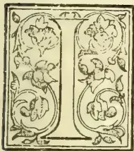

IN NATURE of March 29, 1894, Prof. Marshall Ward gave a clear and excellent *résumé* of certain aspects of the question of nitrogen fixation in plants. Since the publication of that article, fresh and most important additions have been

made to the subject.

Last May, P. Kossowitsch published an account of his experiments on Algæ in respect to the nitrogen fixing powers (*Bot. Zeitung*, May 16. 1894), and a short account of this contribution should form an appropriate supplement to Prof. Ward's paper.

In 1888, Prof. Frank of Berlin, had stated his opinion that Algæ possessed the power of free nitrogen fixation.

In 1892, Messrs. Schloesing and Laurent published an account of their classical researches dealing with many plants, among which Algæ also found a place. Their experiments with these forms range in two series. In the first they found that if they kept soil, covered with Algæ and containing bacteria of certain kinds, under observation for some time, an increase in nitrogen was perceptible. On the other hand, if they prevented the formation of Algæ, although the same bacteria remained, there was no noticeable addition to the nitrogen of the system. In the second set of experiments, in which different Algæ were employed, no nitrogen fixation could be perceived. It was evident from this that either particular kinds of Algæ only have "fixing" powers or that suitable bacteria were not simultaneously present in the second case, and that Algæ can only fix with the additional aid of these micro-organisms.

In the following year, Koch and Kossowitsch devoted their attention to the subject, and went over much the same ground as Laurent and Schloesing confirming their results, and adding new facts, the value of which, however, was somewhat enhanced by the algal cultures never consisting of any single

species alone, but of several intermingled. Accordingly when, in 1894, Kossowitsch set himself the task of determining whether Algæ in themselves possess the power of assimilating free atmospheric nitrogen or not, the first obstacle he had to overcome was the difficulty of finding a method by which he could obtain a single algal species in absolute purity. This was ultimately effected by growing the Algæ on gelatinous silicic acid permeated with a nutritive solution, and subsequently on sterilised sand also containing food solution. The steps by which the isolation was effected were slow and beset with difficulties, which sprung up in the most unexpected manner, and the pages of Kossowitsch's memoir which deal with this subject possess a separate and great interest of their own; space, however, will not permit that the matter be detailed here. Having obtained the Algæ in a state of purity, the next step was to transfer them to the apparatus in which their nitrogen-fixing powers were to be tested.

This consisted of a central air-tight vessel connected with a series of U-tubes, which were blown into bulbs at certain intervals. These bulbs contained strong sulphuric acid. The whole apparatus was sterilised, and the Algæ under consideration sown upon a sterilised nutritive substratum in the central vessel. Air freed from all traces of nitrogen compounds was blown into the vessel through the U-tubes, the sulphuric acid in which killed any organisms which might be contained in this air.

The Alga which was first experimented on was *Cystococcus* (or an extremely similar form). Every precaution was taken in introducing this into the apparatus.

Using a nutritive solution perfectly free from all nitrates, it was seen that the Algæ refused to show any signs of growth; it was clear, therefore, that at least to start development a trace of nitrate must be added to the sand. The addition of other nitrogen compounds was found to be useless, and accordingly a small and accurately-measured quantity of a nitrate was mixed with the food solution in the central vessel. The whole apparatus thus fixed up was placed in the light, and left for some weeks.

629------------------------------------------------

576THE TROPICAL AGRICULTURIST.[MARCH 1, 1895]

A first rapid increase in the Algae was noticeable, but after the lapse of about three weeks things evidently came to a standstill.

The addition of more nitrate-free nutritive solution gave no result; but if only the merest trace of a nitrate were added, there was an immediate resumption of activity.

These facts in themselves are very good proof of the inability of *Cystococcus* to fix atmospheric nitrogen; but to make matters doubly sure, a careful chemical analysis was made. This showed that there was no increase in nitrogen during all the weeks; the Algae had been flourishing, and that accordingly a part of the stream of free nitrogen which had been constantly passing through the apparatus had been "fixed." So far, then, the first Algae which had been put to the test of experiment showed itself incapable of utilising atmospheric nitrogen.

Kossowitsch now turned to fresh experiments choosing algal cultures of sometimes one, sometimes several species taken together; to all of these he added simultaneously soil-bacteria of mixed sorts. The apparatus employed was very nearly the same as that above described. In these experiments he designed to test the supposition of Berthelot and Winogradsky, who considered the presence of certain organic substances to be favourable to the fixation of nitrogen; he accordingly arranged his experiments in five pairs, both members of each couple having identical conditions, except that in the one a small quantity of sugar (dextrose) was added to the nutritive solution, whilst in the other no organic compound was present. One set was arranged with *Cystococcus* and soil-bacteria, and the results obtained showed that in the absence of organic materials a small but yet noticeable increase in the nitrogen of the system had taken place (from 2.6 mg. to 3.1 mg.) Where sugar had been previously added, however, there were three times as much nitrogen after the experiment as before. In a second pair of cultures the Algae *Stichococcus* and certain bacteria were used, but here in no case, either with or without sugar, was there any increase in nitrogen. This shows that *Stichococcus* has in itself no power of nitrogen fixation.

Another couple contained a mixture of several Algae, *Nostoc Cylindrispermum*, &c., and certain soil-bacteria. In this instance a very large fixation of nitrogen took place, both where sugar was present and where not; in fact, in the former case the nitrogen was increased more than nine-fold.

All these observations shed much light on the question of the relation existing between Algae, micro-organisms, and atmospheric nitrogen. They show:

(1) That at least two Algae—*Cystococcus* and *Stichococcus*—possess no "fixing" powers in themselves.

(2) That many Algae, taken together with certain micro-organisms of the soil, do possess the power of assimilating atmospheric nitrogen.

(3) That this power is much increased by the addition of such organic substances as sugar.

It should be noticed that among the ten cultures used in the second set of experiments, only two contained definitely isolated algal species, viz. the cases of the two cultures of *Cystococcus* and soil-bacteria.

It was just in this instance, moreover, that it had been shown that the Algae itself had no capacity for fixing atmospheric nitrogen. Accordingly, there could be little doubt that it was through the agency of the micro-organisms that the "fixation" had taken place in these latter cultures.

The experiments of Laurent and Schloesing had shown that if in a culture of Algae and bacteria endowed with "fixing" power, the Algae were destroyed, the bacteria lost partly, if not entirely, this capacity, which the mixture had possessed. This pointed clearly to the fact that there was some close relationship existing between the Algae and micro-organisms.

There are many facts which seem to indicate the nature of this relationship.

Berthelot found that the nitrification of the soil only took place as long as organic compounds were present; if these were exhausted, the nitrifying process ceased. Gautier and Drouin also showed the importance which organic compounds have with respect to nitrification. Kossowitsch's own experiments, in which the advantage of adding sugar to the culture was shown, also point in the same direction.

From such observations as these, Kossowitsch concludes that the relationship which the Algae bear to the micro-organisms is one connected with the organic food supply of these latter; he thinks that the Algae, furnished with nitrogen by the bacteria assimilate carbohydrate material, part of which goes to their own maintenance, but part also to that of the micro-organisms. It is, therefore, in his belief, an instance of symbiosis in which each supplies the wants of the other. There are many facts, partly the result of his own observations, partly the result of those of others, which uphold this view. If the mixed culture be placed in the light, there is a far more noticeable nitrogen increase than when in darkness. Again, if a rich supply of carbon dioxide gas be provided, this is marked by a decided rise in nitrogen-fixing powers. Both these conditions are such as are known to influence carbohydrate assimilation chlorophyll-containing organisms; but all experience is antagonistic to the view that light should be beneficial to the vital activity of the bacteria, and there are only one or two exceptional instances (*Nitromonas*, &c.) in which carbon dioxide can be directly assimilated by these micro-organisms.

Moreover, in the case where the bacteria are brought into immediate contact with the Algae, as in those species of Algae which are enveloped in a gelatinous covering wherein the micro-organisms become embedded, nitrogen fixation appears to be greatly aided, and the addition of sugar to the culture has no such marked effect as in the instances where non-gelatinous Algae are employed. The explanation of this seems to be that the bacteria, embedded in the gelatinous sheath are amply provided with carbohydrate food without the addition of sugar, which, therefore, comes more or less as a superfluity.

All this seems to justify Kossowitsch's view of the part played by the Algae in the fixation of nitrogen; it appears to show that they have an indirect, but none the less important, influence upon the process.

This is roughly the extent of Kossowitsch's article; it has been impossible to give here its details, the bare outlines of his researches could alone be mentioned, but it is hoped that sufficient has been said to show the importance of his work, perhaps even to indicate the interest which every page of his memoir possesses, dealing as it does with one of the most fascinating branches of vegetable physiology.

RUDOLF BEER.

—Nature.

## COLONIAL CHEMISTRY:

### NATIVE DRUGS AND SOIL ANALYSES.

### AGRICULTURE AND CHEMICAL PHYSICS.

The Government Chemist (Mr. E. Nevill, Fellow of the Institute of Chemistry), reports for the year 1893-94:—

There have been made for Government Departments 37 analyses, assays, and other analogous examinations, being scarcely a fourth of the average of former years. Two of the toxicological investigations were cases of suspected poisoning by means of arsenic, and the analyses rendered it absolutely certain that the deaths had not resulted from arsenical poisoning. A number of reports have been furnished for the information of the Government on various technical subjects. As the opportunity has offered investigations have been made on subjects ultimately connected with the progress of the Colony, especially in connection with coal mining and agriculture. A number of experiments have been made on best methods of utilising the various hard anthracitic coals found in the colony for the purpose of naval use, so as to give the maximum

630------------------------------------------------

MARCH 1, 1895.THE TROPICAL AGRICULTURIST.577

of efficiency with the minimum of smoke and ash. The experiments are gradually approaching conclusion, and will be embodied in a report of the use of the Admiralty.

Many of the native drugs contain active principles which have never been scientifically investigated, and others appear to contain a kaloid, which are isomeric with those known to science, and yield reactions which differ in important respects from those of the known substances. In especial the species of conine has colour reactions differing in important respects from either of the known bodies, in particular giving a red coloration with nitric or sulphuric acids. One of the dried roots made use of by the native doctors contains a volatile liquid kaloid, similar in physical properties to both conine and nicotine, but entirely distinct in its chemical reactions and far more poisonous and volatile than either. It is quite unknown to science. On account of the importance of these bodies from the point of view of scientific jurisprudence, it will be necessary to carefully investigate the principal native drugs and isolate and study the reaction of their active principles. Until it has been done the toxicological investigations required by the Law Courts will always be a work of far greater difficulty and labour than is the case at Home.

A number of analyses have been made of representative samples of soil from different parts of the Colony with the primary view of determining the best method of ascertaining the true value of the soil in contradistinction to the apparent value as shown by ordinary soil analyses. The distinction between the two is enormous, for though an ordinary analysis may show the presence of large quantities of these constituents, which form the real fertilising portion of the soil, yet only a minute fraction of these may be in a form available from immediate plant food, so that in reality the soil may be exhausted. The methods adopted for distinguishing between these very different quantities require to be determined not only for each class of crop, but what is more difficult, for each climate, as so much depends on the meteorological conditions to which the soil is exposed. The determination of the absolute amount of each of these essential soil constituents should be divided into four classes:—(1). The quantity of each constituent immediately available for plant food. (2). The quantity of each readily convertible into the preceding form. (3). The quantity of each which by proper cultivation may be converted gradually into the preceding classes. (4). The quantity of each present in the undecomposed mineral and rocky constituents from where disintegration the true soil has arisen. Below are some of the results obtained so far. Each is founded on the mean of a number of fairly concordant analyses, showing that there is not so much difference in the composition of the soils in different portions of the principal districts in the Colony. The analyses may be taken as giving the average composition of:—I. The black loam earths of the up country districts. II. The brown shale earths from the midland districts. III. The clay sand soils from the upper coast districts. IV. The greyish clay soils from the lower coast districts.

#### General Group Analysis

<table border="1">
<thead>
<tr>
<th></th>
<th>I.</th>
<th>II.</th>
<th>III.</th>
<th>IV.</th>
</tr>
</thead>
<tbody>
<tr>
<td>Sones</td>
<td>5.32</td>
<td>6.80</td>
<td>2.50</td>
<td>1.66</td>
</tr>
<tr>
<td>Undecomposed rock</td>
<td>10.88</td>
<td>6.0</td>
<td>3.50</td>
<td>8.10</td>
</tr>
<tr>
<td>Sandy Constituents</td>
<td>20.94</td>
<td>13.58</td>
<td>47.12</td>
<td>25.15</td>
</tr>
<tr>
<td>Clayey Constituents</td>
<td>42.50</td>
<td>56.00</td>
<td>35.18</td>
<td>46.94</td>
</tr>
<tr>
<td>Calcareous Constituents</td>
<td>8.33</td>
<td>6.52</td>
<td>3.49</td>
<td>9.55</td>
</tr>
<tr>
<td>Organic Matter</td>
<td>7.48</td>
<td>5.38</td>
<td>4.12</td>
<td>3.78</td>
</tr>
<tr>
<td>Moisture</td>
<td>4.55</td>
<td>5.62</td>
<td>2.88</td>
<td>3.82</td>
</tr>
</tbody>
</table>

#### Complete Percentage Analyses.

<table border="1">
<thead>
<tr>
<th></th>
<th>I.</th>
<th>II.</th>
<th>III.</th>
<th>IV.</th>
</tr>
</thead>
<tbody>
<tr>
<td>Silica Alumina, &amp;c.</td>
<td>76.58</td>
<td>78.16</td>
<td>82.85</td>
<td>77.70</td>
</tr>
<tr>
<td>Iron Oxides, &amp;c.</td>
<td>4.60</td>
<td>5.15</td>
<td>5.25</td>
<td>4.94</td>
</tr>
<tr>
<td>Lime, Magnesia, &amp;c.</td>
<td>3.87</td>
<td>2.55</td>
<td>1.76</td>
<td>5.27</td>
</tr>
<tr>
<td>Potash, Soda, &amp;c.</td>
<td>2.12</td>
<td>3.02</td>
<td>2.04</td>
<td>3.11</td>
</tr>
<tr>
<td>Carbonic, sulphuric, &amp;c. acid</td>
<td>2.08</td>
<td>2.66</td>
<td>1.43</td>
<td>2.25</td>
</tr>
<tr>
<td>Organic Matter</td>
<td>7.48</td>
<td>5.38</td>
<td>4.12</td>
<td>3.78</td>
</tr>
<tr>
<td>Moisture (free)</td>
<td>3.27</td>
<td>3.08</td>
<td>2.55</td>
<td>9.95</td>
</tr>
</tbody>
</table>

#### I. II. III. IV.

Percentages of Ultimately Available Constituents.  
Total unavailable Constituents

<table border="1">
<thead>
<tr>
<th></th>
<th>I.</th>
<th>II.</th>
<th>III.</th>
<th>IV.</th>
</tr>
</thead>
<tbody>
<tr>
<td>Lime</td>
<td>96.80</td>
<td>97.52</td>
<td>98.32</td>
<td>97.64</td>
</tr>
<tr>
<td>Potash</td>
<td>1.15</td>
<td>.87</td>
<td>.46</td>
<td>.78</td>
</tr>
<tr>
<td>Phosphoric Acid</td>
<td>.48</td>
<td>.54</td>
<td>.37</td>
<td>.83</td>
</tr>
<tr>
<td>Organic Matter</td>
<td>.12</td>
<td>.08</td>
<td>.03</td>
<td>.11</td>
</tr>
<tr>
<td>Nitrogen</td>
<td>7.29</td>
<td>.80</td>
<td>.71</td>
<td>.56</td>
</tr>
<tr>
<td></td>
<td>.16</td>
<td>.19</td>
<td>.11</td>
<td>.08</td>
</tr>
</tbody>
</table>

Percentages of immediately available Constituents.

<table border="1">
<thead>
<tr>
<th></th>
<th>I.</th>
<th>II.</th>
<th>III.</th>
<th>IV.</th>
</tr>
</thead>
<tbody>
<tr>
<td>Lime</td>
<td>.230</td>
<td>.141</td>
<td>.030</td>
<td>.125</td>
</tr>
<tr>
<td>Potash</td>
<td>.110</td>
<td>.183</td>
<td>.102</td>
<td>.115</td>
</tr>
<tr>
<td>Phosphoric Acid</td>
<td>.032</td>
<td>.012</td>
<td>.006</td>
<td>.010</td>
</tr>
<tr>
<td>Nitrogen</td>
<td>.041</td>
<td>.030</td>
<td>.004</td>
<td>.007</td>
</tr>
</tbody>
</table>

The last division is of far less value than the others, on account of the numbers varying so much in the case of each soil that it is scarcely possible to properly average them, and each soil would have to be judged on the basis of its own particular analysis. The preceding results will be of interests for the sake of comparison with corresponding analyses of representative European soils. In addition, a number of analyses have been made of specimens of marls and sandy limestone, with the view of ascertaining how far they might be of value as a calcareous manure for agricultural purposes, and a somewhat smaller number of analyses of samples of phosphatic argilaceous nodules or "corrolites," with the aim of determining their suitability for use as manure.

Little use, however, has been made of the Government Laboratory for the purpose of promoting the agricultural interests of the Colony, yet much more might gradually be done in this direction than has as yet been attempted. Much cannot be done by a single pair of hands, but one head can direct many hands, and it is easy and not expensive to increase the number of hands for performing the more mechanical work. The general idea is to establish a laboratory, on a similar principle to those in connection with some of the agricultural societies, where in return for a small fee—the main expense being borne by the Government—there could be obtained the ordinary elementary analysis of soils, waters, feeding stuffs, and manures, such as commonly fall within the province of a public analyst. But something else is required beyond lacking facilities at the disposal of the Colonial farmer for obtaining the ordinary description of analyses. These are not sufficient, their use will only lead to disappointment, and discourage agriculturist from availing themselves of the assistance of the resources of science. What then is wanted from science is: whether the soil contains an adequate supply of those particular constituents which are essential to plant life, and whether it contains a sufficient proportion of these in a form immediately available for plant food, but also that it does not contain those other constituents which are harmful to plant life, or destructive of manures applied to the soil. This is the province of chemical analyses. But further it is essential that the soil should be in a fit physical condition for sustaining plant life, a most important factor in a climate like that of South Africa, for however rich a soil may be, unless its physical properties are favourable, it will yield only poor crops. This is the province of chemical physics. Finally there comes the question whether the constituents of the soil are such as to enable it to steadily supply the requirements of the growing crop, not only with its mineral food but with its organic food, by maintaining the condition essential for transforming the plant food from the state in which it exists in the soil into the form under which it is absorbed into the plant system; and moreover, to supply it in the order and varying proportions, which are necessary as the crop grows and ripens. It is here that comes in the wide theoretical knowledge of the scientific chemist and the practical experience of the skilled agriculturist, together with that most important factor, the judgment of the man of common sense. This is the information which agriculture has a right to expect from science. But what are the conditions upon which this information is to be based? It should be the business of the Government Chemist and the work

631------------------------------------------------

578THE TROPICAL AGRICULTURIST.[MARCH 1, 1895.

of the Government Agricultural Laboratory to ascertain and make known what they are. This work needs to be done by the slow, steady perseverance of a Government Department. It would be easy to obtain the co-operation of the leading Colonial agriculturists, many of whom probably would be bo. hable and willing to assist in the investigation, not only by furnishing samples of soil, but by preparing and superintending the cultivation of trial plots, and carefully reporting the results obtained by each special crop grown under the different experimental conditions. If such a system could be organised it would not only save the large expense necessary for the upkeep of a State farm, but would offer the great advantage of enabling trials to be made at places some distance apart where there would be different meteorological conditions, thus eliminating a source of uncertainty parallel from trials made on one farm. The analysis of the soil, manures, and crops would be done at the Government laboratory. The progress of the investigation and the results obtained should be published in detail in a series of yearly reports.—*Natal Mercury*.

### PRODUCTION OF JUTE AND SAN FIBRE IN INDIA

Jute is largely cultivated in the northern and eastern districts of Bengal, and, to a smaller extent, in the central districts of the province. It is grown also although not extensively, in Assam. The United States Consul-General at Calcutta says that jute seems to be capable of cultivation on almost any kind of soil. It is least successful, however, upon laterite and gravelly soils, and most productive upon a loamy soil or rich clay and sand. The finest qualities are grown upon the higher lands, upon which rice, pulse and tobacco form the rotation. The coarser and larger qualities are grown chiefly upon mud banks and islands formed by the rivers. When the crop is to be raised on low lands, where there is danger of early flooding, ploughing begins earlier than upon the higher lands. The preparation commences in November or December in the low lands, and elsewhere in February or March; the soil is ploughed from four to six times, the clods pulverised, and at the final ploughing, the weeds are collected, dried, and burned. No special attention is paid to good seeds, nor do cultivators buy or sell their seed. In the corner of the field a few plants are left to ripen and produce the seed that is sown broadcast the following year. The sowings, according to the position and nature of the soil, begin about the middle of March and extend to the end of June.

The time for reaping the crop depends entirely on the date of sowing the season commencing with the earliest crop about the end of June and lasting until October. The crop is considered to be in season whenever the flowers bloom, and to be past the season whenever the fruits appear. The fibre from plants that have not flowered is weaker than from those in fruit; the latter, though stronger, is coarser and wanting in gloss. The average crop of fibre per acre is over 1,200 lb., but the yield varies considerably, being as high as 4,000 lb. in some districts, and as low as 250 lb. in others. As presently practised by the natives, the fibre is separated from the stems by a process of retting in pools of stagnant water. In some districts, the crop is stacked in bundles for two or three days to give time for the decay of the leaves, which are said to discolour the fibre in the retting process; in others the bundles are carried off and at once thrown into the water. In some districts the bundles of jute stems are submerged in rivers, but the common practice seems to be in favour of tanks or roadside stagnant pools. The period of retting depends upon the nature of the water, the description of fibre, and the condition of the atmosphere and it varies from two to twenty-five days. The operator has, therefore, to visit the tank daily to ascertain if the fibre has begun to separate from the stem. This period must not be exceeded, otherwise the fibre becomes rotten, and almost useless for commercial purposes. The bundles

are made to sink in the water by placing on them sods and mud. When the proper stage has been reached, the retting is rapidly completed. The labourer, standing up to his waist in the water, proceeds to remove small portions of the bark from the ends next the roots, and grasping them together, strips off the whole from end to end without breaking either stem or fibre. Having brought a certain quantity into this half-prepared state, he next proceeds to wash off, which is done by taking a large handful, swinging it round his head, dashing it repeatedly against the surface of the water, and drawing it through the water towards him so as to wash off the impurities; then with a dexterous throw he spreads it out on the surface of the water, and concludes by carefully picking off all remaining black spots. He then wrings it out so as to remove as much water as possible and hangs it up on lines prepared on the spot to dry in the sun. There are in India 26 jute factories, 8,101 looms, and 161,845 spindles, which give employment to 61,915 persons, and consume 2,869,088 cwts. of jute. They are almost exclusively employed in the gunny bag or cloth trade, a few only doing business in cordage, floor cloth, or other manufactures. San or sunn is grown by itself, or at times is raised in strips on the margins of fields, and is never cultivated as a mixed crop. It is usually sown in June or at the beginning of the rains, and cut at the close of the rains as soon as about the 1st of October. It requires a light, but not necessarily, rich soil, though it cannot be grown on clay. It is believed by cultivators to improve the soil; and as it is supposed to refresh exhausted land, it is considered a good preparatory crop, and is grown as such, every second or third year, in fields required for sugar-cane and tobacco. The ground is roughly ploughed twice and the seed sown broadcast, and as it germinates immediately, appearing above ground within 24 hours, no weeding is required. From 12 to 80 lb. of seed are used to the acre, the opinion prevailing, however, that thick sowing is more desirable. Ordinarily the crop is harvested after the flowers have appeared, but the plants are frequently left on the field until the fruits have begun to form, and sometimes until they are ripe. There is a great difference of opinion as to whether the crop should be dried before being steeped, or carried at once to the retting tanks. When stripped of the leaves, which are highly esteemed as manure, the stalks are made up into bundles and placed upright for a day or two in water a couple of feet deep, since the bark on the batis is thicker and more tenacious than that on the upper portion, and, therefore, requires longer exposure to fermentation. The bundles are then laid down lengthways in the water, and kept submerged by being weighted with earth. It can generally be ascertained when the retting is completed by the bark of the lower end of the stems separating easily; but too long fermentation, while it whitens, injures its strength. Having discovered that the necessary degree of retting has been attained, the cultivator, standing in the water up to his knees, takes a bundle of the stems in his hand and brushes the water with them until the tissues give away and the long clean fibres separate from the central canes. When the fibre has been separated and thoroughly washed it is the usual custom to hang it over bamboos to be dried and bleached in the sun. When dry it is combined, if required for textile purposes or for nets and lines; but if for ordinary use for ropes and twines, it is merely separated and cleaned by the fingers, while hanging over the bamboo. The output per acre of san fibre ranges from 150 to 1,000 lb., but the estimated average is 640 lb. to the acre. The chief purpose for which san is utilised at the present day is the manufacture of coarse cloth or canvas, used principally for sacking. A large amount of the fibre is used in the native cordage trade, for which it is stated to be well adapted, and considerable quantities of the fibre are also consumed by the European rope makers in India. The waste tow and old materials are made into paper. In many districts paper is regularly manufactured of this

632------------------------------------------------

MARCH 1, 1895.]THE TROPICAL AGRICULTURIST.579

material, and large quantities are used by the Indian paper mills. In some parts of India the seeds of the san are collected and given to cattle. The plant itself is found to be very nourishing, causing cows to give a larger supply of milk.—*Journal of the Society of Arts.*

### COCA CULTIVATION.

*Coca.*—Since the coca leaf, another South American product, has been proved to possess great medicinal virtues, coca cultivation has become a subject well worthy of careful consideration by Indian and Colonial administrators. In years now long gone by, I had opportunities of learning something of that cultivation and of experiencing the effects of the coca leaf; so it will perhaps be considered that from some points of view, I may venture to address you as an authority on the subject. Since the discovery of the alkaloid, coca has become an important addition to the pharmacopoeia; but it should be remembered that it had been for centuries a great source of comfort and enjoyment to the Peruvian Indians. It was much more than what betel is to the Hindu, kava to the South Sea Islander, and tobacco to the rest of mankind, for its use really produces invigorating effects which are not possessed by those other stimulants or narcotics.

*Cowley on the Coca Leaf.*—Made known in this country to the very students who were acquainted with the Spanish Chronicles during the 17th century, it is very curious to find that coca, and its virtues, were within the knowledge of Abraham Cowley, the poet of the days of Charles I. Mr. Martindale, who has written an excellent little book on coca and cocaine, refers to a very curious allusion to coca in the writings of Cowley (*Book V. of Plants*). Bacchus is supposed to have filled a bowl with the juice of the grape for Omelichilus, an imaginary American deity; on which the god of the New World summons his own plants to appear. Various fruits are marshalled on their branches, and Cowley, even adds to his poetic description of the virtues of coca a prophecy which has now become true. Apostrophising the leaf, he says:—

"Nur Coca only useful art at home,  
A famous merchandise thou art become."

*Prejudice against Coca.*—The Peruvians have used the coca leaf from the most ancient times. It was considered so precious that it was included in the sacrifices that were offered to the Sun, and the High Priest chewed coca during the ceremony. *Mitimaes* or colonists, were sent down from their native heights among the Andes, to cultivate the coca plants in the deep valleys to the eastward, and the leaves were brought up for the use of the Inca of Peru. After the conquest of Peru by the Spaniards, some fanatics proposed to proscribe its use and to root up the plants because the leaves had been used in the ancient superstitions, and because the cultivation took away the Indians from other work. The second Council of Lima, which sat in 1569, condemned the use of coca "as a useless and pernicious leaf and on account of the belief stated to be entertained by the Indians that the habit of chewing coca gave them powers of endurance, which," said these sapient Bishops, "is an illusion of the evil one."

*Anecdote respecting Coca.*—The learned Jesuit Acosta and the chronicler Garcilasso de la Vega, however, bear very different testimony. In speaking of the strength and endurance that coca gives to those who chew it, Garcilasso relates the following anecdote:—"I remember," he says, "an incident which I heard of a gentleman of rank and honour in my native land of Peru, named Rodrigo Pantoja. Travelling from Cuzco to Lima he met a poor Spaniard who was going on foot with a little girl on his back. The man was known to Pantoja, and they thus conversed: 'Why do you go laden thus?' said the Knight. The poor man said that he was unable to hire an Indian to carry the child, and for that reason he carried it himself. While he spoke, Pantoja looked in his mouth, and saw that it was full

of coca. As the Spaniards abominated all that the Indians eat and drink, as though they savoured of idolatry, particularly the chewing of coca, which seemed to them a low and vile habit, he said—'It may be as you say, but why do you chew coca, like an Indian, a thing so hateful to Spaniards?' The man answered—'In truth, my lord, I detest it as much as anyone, but necessity obliges me to imitate the Indians and keep coca in my mouth, for I would have you to know that, if I did not do so, I could not carry this burden, while the coca gives me sufficient strength to endure the fatigue.' Pantoja was astonished to hear this, and told the story wherever he went. From that time credit was given to the Indians for using coca from necessity, to enable them to endure fatigue, and not from gluttony."

*Spanish Rules as to Coca Cultivation.*—Eventually, indeed, the Spanish Government interfered with coca cultivation from more worthy motives, and *quintas* (turns) of Indian labourers for collecting coca leaves were forbidden in 1569 on the ground of the reputed unhealthiness of the valleys. The Spanish Viceroy of Peru afterwards permitted the cultivation with voluntary labour, on condition that the labourers were paid and that care was taken of their health.

*Descent to the Coca Plantations.*—Coca has always been one of the most valuable articles of commerce in Peru, and it is used by about 8,000,000 of the human race. (*Erythroxylon Coca*) is cultivated between 2,000 and 6,000 feet above the level of the sea, in the warm valleys of the eastern slopes of the Andes, where it rains more or less every month in the year. The descent from the bleak and lofty plains of the Andes to the valleys where the coca grows, presents the most lovely scenery to be found anywhere. For the first thousand feet of the descent the vegetation continues to be of a lowly alpine character; but as the descent is continued the scenery increases in magnificence. The polished surfaces of perpendicular cliffs glitter here and there with foaming torrents, some like thin lines of thread, others broader and breaking over rocks, others seeming to burst out of the fleecy clouds, while jagged black peaks, glittering with streaks of snow, pierce the mists which conceal their bases. Next the terraced gardens are reached, constructed up the sides of the mountains, the upper tier from 6 feet to 8 feet wide, and supported by masonry walls, thickly clothed with celsias, begonias, calceolarias, and a profusion of ferns. These terraces or *andevieria* are often upwards of a hundred in number, rising one above the other. Below them the stream becomes a roaring torrent, dashing over the huge rocks, with vast masses of dark frowning mountains on either side, ending in fantastically-shaped peaks, some of them veiled by thin, fleecy clouds. The vegetation rapidly increases in luxuriance with the descent. The river, rushing down the valley, winds along the small breadth of level land, striking first against the precipitous cliffs on one side, and then sweeping over to the other. The scenery continues to increase in beauty, and the cascades pour down in every direction, some in a white sheet of continuous foam for hundreds of feet, finally seeming to plunge into beds of ferns and flowers; some like driven spray, and occasionally a waterfall may be seen high up, between two peaks, which seems to drop into the clouds below. Next bamboos and tree ferns begin to appear and we at length reach the region where coca is cultivated in terraces, often fringed with coffee plants. In many places these terraces are fifty deep, up the sides of the mountains; the rock is a metamorphic slate, slightly micaceous and ferruginous, with quartz occurring here and there; the soil is a soft brown loam. The trees and shrubs in the coca region are very luxuriant; there are beautiful *melastomaceae* with a large purple flower, cinchona plants of the shrub variety, gaultherias, and an immense variety of ferns.

*Coca Cultivation.*—The coca plant is a shrub from 4 to 6 feet high, with lichens usually grown on the older trunks. The branches are straight and alternate; the leaves alternate and entire, in form and size like tea leaves; flowers solitary, with a small yellowish-white corolla in five petals. Sowing is

633------------------------------------------------

580THE TROPICAL AGRICULTURIST.[MARCH 1, 1895.

commenced in December and January when the rains begin, which continue until April. The seeds are spread on the surface of the soil in a small nursery or raising ground, over which there is generally a thatched roof. The following year the young plants are removed to a soil especially prepared by careful weeding and breaking up the clods very fine by hand. This soil is often in terraces only affording room for a single row of plants, which are kept up by sustaining walls. The plants are generally placed in square holes a foot deep, with stones on the sides to prevent the earth from falling in. Three or four are planted in each hole and grow together. In Southern Peru and Bolivia the soil in which the coca plants grow is composed of a blackish clay, formed from the decomposition of the schists which form the principal geological feature of the Eastern Andes. When the plantation is on level ground the plants are placed in furrows separated by little walls of earth, at the foot of each of which a row of plants is placed. But this is a modern innovation, the terrace cultivation being the most ancient. At the end of eighteen months the plants yielded their first harvest; they continue to yield for upwards of forty years. The first harvest is called "quita-calzon" and the leaves are picked with extreme care, to avoid disturbing the roots of the young tender plants. The following harvest are called "mita" ("time" or "season") and take place three times or even four times a year. The most abundant harvest is in March, immediately after the rains. The worst is at the end of June. With plenty of watering four days suffice to cover the plants with leaves afresh. It is necessary to weed the ground very carefully, especially while the plants are young. The green leaves, when harvested, are deposited in a piece of cloth which each picker (woman or child) carries, and are then spread out in very thin layers and carefully dried in the sun in yards paved with slate flags. The green leaf is called *matu*, and the dried leaf becomes coca. The thoroughly dry leaves are sewn up in 20 lb. *cestos* or sacks made of banana leaves, strengthened by an exterior covering of cloth. They are also packed in 50 lb. drums, pressed tightly down. Dr. Poepping, a German traveller, some sixty years ago reckoned the profits of a coca farm to be 45 per cent. The harvest is largest in a hot moist situation; but the leaf which is generally considered the best flavoured by consumers, grows in drier parts on the mountain sides. The very greatest care is required in drying; for if packed up moist the leaves become fetid, while too much sun causes them to shrivel and lose flavour.

**Coca Trade.**—The internal trade in coca has been considerable, ever since the conquest of Peru, three-and-a-half centuries ago. Acosta says that in his time at Potosi, it was worth \$500,000 annually, and that in 1583 the Indians consumed 100,000 *cestos* of coca, worth \$2 $\frac{1}{2}$  each in Cuzco, and \$1 in Potosi. Between 1785 and 1790 the coca traffic was calculated at \$1,207,430 in the Peruvian Viceregalty, and at \$2,641,487 including that of Buenos Ayres. In 1860 the approximate annual produce of coca in Peru was about 15,000,000 lbs., the average yield being 800 lb. an acre. More than 10,000,000 lb. were annually produced in Bolivia. At that time the *timbor* or drum of 50 lb. was worth \$9 to \$12, the fluctuations in price being caused by the perishable nature of the article. The average duration of coca in a sound state, on the coast of Peru, is about five months, after which time it is said to lose its flavour, and it is rejected by consumers as worthless.

**Use of Coca.**—No native of Peru is without his *chuspa* or coca bag made of liama cloth, which he carries over one shoulder, suspended at his side. In taking coca he sits down, puts his *chuspa* before him, and places the leaves in his mouth one by one, chewing them, and turning them with his tongue, until he forms a ball. He then applies a small quantity of carbonate of potash prepared by burning the stalk of the quinna plant, and mixing the ashes with lime and water; he thus forms cakes called *lipta*, which are dried for use and also kept in the *chuspa* or bag, sometimes in a small silver receptacle. With this there is also a small pointed instrument

with which the *lipta* is scratched, and the powder is applied to the pellet of leaves. In some provinces a small calabash full of lime is kept in their *chuspas*, called *iscupuru*. The operation of chewing is usually performed three times during the day's work, and every Indian consumes 2 or 3 oz. of coca daily. In the mines of the cold regions of the Andes the Indians derive great enjoyment from the use of coca. The *chanque* or messenger, in his long journey over the mountains and deserts, and the shepherd watching his flock on the lofty plains, has no other nourishment than is afforded by his *chuspa* of coca, *chunu* or frozen potato, and a little parched maize. The feasts of Indian couriers, sustained by coca leaf and a little parched maize, are marvellous. It is authentically recorded that an Indian has taken a message from La Paz to Tacna, a distance of 249 miles, with a pass 1,300 feet above the sea to go up and come down, in four days, thus accomplishing 60 miles a day. He rested one day and night at Tacna, and then returned.

**Virtues of the Coca Leaf.**—The reliance on the extraordinary virtues of the coca leaf amongst the Peruvian Indians is very strong. In the province of Huanuco they believe that, if a dying man can taste a leaf placed on his tongue, it is a sure sign of his future happiness. A common remedy for a headache is to chew coca leaves, and to stick them all over the forehead. My own experience of coca was very much in its favour. Besides the agreeable soothing feeling it produced, I found that when I chewed it I could endure long abstinence from food with less inconvenience than I should otherwise have felt, and that it enabled me to ascend precipitous mountain sides with a feeling of lightness and elasticity, and without losing breath. This latter quality ought to recommend its use to members of the Alpine Club, and to walking tourists in general. The smell of the coca leaf is agreeable and aromatic, and when chewed it gives out a grateful fragrance, accompanied by slight irritation, which excites the saliva. Tea made from the leaves has much the taste of green tea, and, if taken at night, is much more provocative of wakefulness. Applied externally, coca leaves moderate rheumatic pains. When used to excess it is, like everything else, prejudicial to health; yet, of all the narcotics and stimulants used by man coca is the least injurious, and most soothing and invigorating.

**Cocaine.**—The active principle of the coca leaf was separated by Dr. Niemann in 1860, and called cocaine. It is an alkaloid which crystallises with difficulty, is but slightly soluble in water, but easily so in alcohol, and still more easily in ether. The discovery of the medicinal virtues of cocaine followed soon after the separation of the alkaloid. I remember that, when I was in Edinburgh in 1870; the eminent physician, Sir Robert Christison, spoke to me on the subject of the use of coca leaves. He was then upwards of eighty years of age, and he told me that he had gone up and down Arthur's Seat, with the use of coca, with a lightness and elasticity such as he had not experienced since he was a young man. He foretold that coca would attain the important position in the pharmacopoeia, before long, which it now holds. It was in 1884 that the great discovery was made by Herr Koller, at Vienna, that cocaine produces local anaesthesia.

**Export.**—The great medicinal virtues of cocaine have since been ascertained, and a demand has arisen for the leaf which will increase. My latest Custom House returns from Peru are for the last quarter of 1890, when the export of coca leaves from the ports of Mollendo and Salaverry to England and Germany were 14,689 lb. worth £642, and of cocaine from Callao 2,046 lb., worth £372. If these returns may be quadrupled for the whole year, the quantity of coca was 58,756 lb. worth £2,568 and of cocaine 8,184 lb. worth £1,488.

**Plants Distributed by Kew.**—For the cultivation of the coca plant in our Colonies and in India we are indebted to Kew Gardens, an institution to which this Empire, and, indeed, the whole civilised world owes an immense debt of gratitude for its wise and indefatigable exertions in the distribution of plants,

634------------------------------------------------

MARCH 1, 1895.]THE TROPICAL AGRICULTURIST.581

In 1869 coca plants were raised from seed at Kew, which came from the Department of Huanuco in Northern Peru. They belong to a distinct variety first described by Mr. D. Morris, the able Assistant Director of Kew, and named by him *Nova Granatense*. From this variety the plants are derived which are now growing in Jamaica, St. Lucia, Trinidad, and Ceylon. They were introduced into Jamaica and Ceylon in 1870. Experience derived from cultivation in our Colonies seems to indicate that the coca plant thrives best at low elevations, from the sea level to 3,000 feet; from the point of view of the largest yield of cocaine. But if the yield of crystallisable cocaine is considered, the plants grown at high altitudes are the richest. The Bolivian leaves yield 0.45 of cocaine, nearly all crystallisable. The largest yield is recorded of a plant at Darjiling, in India, growing at 900 feet above the sea, namely 0.8 per cent. of which 0.45 was crystallisable. The next highest yield came from a plant at 100 feet above the sea in Jamaica, which gave 0.76 per cent., only 0.33, or less than half, being crystallisable; while Ceylon plants, at 2,300 feet elevation, yielded 0.6 per cent. of cocaine, the whole being crystallisable. At Buitenzorg, in Java, which is 820 feet above the sea, the yield was 0.39 per cent., of which 0.3 was crystallisable.

*Tropine.*—I am indebted to Mr. Morris, of Kew, for the information that a new product has been obtained from the small coca leaves exported from Java, which is called *tropa cocaine* or *tropine*, and has lately come into use. It is described as more reliable and deeper in its action than cocaine, and, unlike the latter, it acts as an anæsthetic on inflamed tissue.

*Field of leaves.*—Coca leaves are now expected from Ceylon, Jamaica, Mauritius, Trinidad, and Java, besides Peru; and the Government of India is now proposing to grow coca for its own needs. Of course the yield of alkaloids is the main consideration in the growth of coca leaves for exportation, while the best kinds for home consumption are those which best suit the taste of consumers.

*Deterioration and Price of Leaves.*—The deterioration which the leaves suffer from long journeys, and from being kept, caused me to abandon the idea which I entertained many years ago, of promoting the importation of coca leaves for use by mountaineers and others in Europe. It now appears that there is a distinct loss of alkaloid in the leaves, caused during a long voyage. This circumstance has given rise to the manufacture of a crude alkaloid at Lima, containing 70 per cent. of pure crystallisable cocaine, which sells at 15s. per oz. The leaves fetch 10d. to 1s. 6d. per lb. in London and at New York, but now the price is much lower. Last week a parcel of 8,500 lb. was sold at 2d. per lb., but they had been under water for several hours. It seems, therefore, very unlikely that it will be worth while to export the leaves from India or the Colonies. The production in South America is so enormous that Peru will always be able to meet the demands of the markets of Europe and of the United States with the crude alkaloid, such as is now manufactured at Lima. But it will, doubtless, be profitable, both in India and in the Colonies, to grow sufficient coca for the purpose of manufacturing cocaine and *tropa-cocaine* to meet all local demands.

*Concluding remarks.*—I trust, then, that the recognition of the virtues of the coca leaf will be, in the first place, beneficial to the Peruvians, it was the Peruvians who discovered some of those virtues many centuries ago; it is due solely to their industry and agricultural skill that coca was converted from a wild and useless to a cultivated and most valuable plant, and as to them belongs the honour, so them should accrue the principal share of profit. Great benefit will be conferred upon an increasing number of people throughout the world by the use of this remarkable specific. Lastly, our own Colonies and British India will be able, through the action of Kew Gardens, to rise sufficient to supply the needs of their own populations. Thus we find, in the history of coca cultivation, one

more instance of the benefits derived by the old World from the products that are peculiar to the New World; and one more example of the debt we owe to the Incas of Peru. If they had not, by the application of unrivalled skill and care, converted the coca and the potato plants from wild to cultivated products, we should probably never have known either the virtues of the one or the value, as a source of food supply, of the other. The gratitude of the peoples of the Old World is, therefore, due to the Incas of Peru, whose civilisation secured to us such inestimable benefits.

HOME.—With the increasing demands on the mobility of troops, and the difficulties of supply which the satisfaction of these demands entail, the importance of some portable form of food which will enable men and horses to endure extreme fatigue and privation has greatly increased. We, therefore, offer no apology for reproducing almost *in extenso* the following notes on a lecture delivered by Mr. Clements Markham at the Imperial Institution on the Cultivation and the Properties of the "Coca" Plant. In the concluding paragraphs, Mr. Clements Markham calls attention to the deterioration of the leaves when stored. This deterioration undoubtedly occurs, but even with this inferior article of commerce we can from personal experience assert that the endurance of either man or horse can be rather more than doubled by the use of this leaf.

Personally, we prefer to use the Kola nut, which appears to possess identical qualities. This also deteriorates in the process of drying, but for private expediency purposes the full value of the fresh nut can be derived by using powders of theobromin, and caffeine, two grains of the former to eight of the latter.—*Natal and Military Notes.*

## VEGETABLE FIBRES IN THE ARGENTINE REPUBLIC.

The United States Consul at Buenos Ayres says that one great drawback to the production of native fibre in the Argentine Republic is the lack of proper machinery and the want of enterprise. Sufficient to procure it. There are numerous varieties of plants growing spontaneously in the country which produce a very superior fibre. To some extent these have been used, and are still used, not only for cordage and rope, but for bagging and other more delicate textile fibres. The most common of these are the following:—The *ayave* which is called *Pita* in the country. It is the same plant as that so well and so favourably known in Mexico, and it has all the same qualities and characteristics. The *caragüato*, the usual name for which is the *chaguar*, was employed by the Indians before the Spanish conquest, and has been used by the Argentine people of the interior in a primitive domestic way ever since. It grows with especial luxuriance in the Gran Chaco, and in one part there is a natural growth of it of upwards of 100 square leagues in extent. The Indians produce from it a thread with which they make their fishing nets, and also the few garments which they wear, the latter being generally dyed in various colours. The Argentine women of the upper provinces, with their hand looms, also make various fabrics, some of them of excellent quality. In former years there was a question of the export of this fibre, but the difficulty was in preparing it for market in sufficient quantities, owing to the want of labourers, and, in the second place, it was found that the roads between the frontiers and the Paraná or Paraguay rivers were so few and so bad that the cost of transportation would absorb all the prospective profit. It has been stated that the fibre of the *chaguar* will compete with the hemp of Manila, which is said to be less uniform and durable. In some of the upper provinces, *canamo*, or hemp, has, to some extent, been cultivated for many years for its fibre. It grows, however, almost spontaneously, and although the soil of the country gives it an excellent fibre, there is not yet sufficient enterprise to do much with it. Linseed is

635------------------------------------------------

582THE TROPICAL AGRICULTURIST.[MARCH 1, 1895.]

grown in great quantities, especially in the province of Buenos Ayres and Santa Fé, but, hitherto, it has been produced more for the seed than the fibre. The exports of linseed, in 1890, were 30,720,636 kilogrammes, and in the first nine months of 1892 they amounted to 44,160,163 kilogrammes. From these figures it will be seen that the amount of fibre left for home consumption must have been very considerable. Besides the above, there are numerous plants, especially in the Gran Chaco, known only by the Indian or Guarani name, which produce fibre of more or less excellence. One of these is the *casa-guata*, a species of aloe, which grows spontaneously, not only in the Gran Chaco, but in Paraguay. A few years ago a firm of American merchants at Buenos Ayres, who own an extensive tract of land a few leagues above Asuncion, on which this plant grows in a very rank condition, undertook the production of fibre, not only for rope and cordage, but also for woven goods. The tests which were made by experts from the United States were most satisfactory, the fibre, as they reported, being equal, if not superior, to any produced in the world; but the field of operations was so inaccessible and so remote from market, that the industry was given up. There is, however, believed to be a field for this fibre fully equal to the one which Manila enjoys. Jute is not cultivated, not because it could not be grown to advantage in many parts of the Argentine Republic, but because, in a new country like Argentina, there is not the enterprise or manual labour to cultivate it. All the jute used in manufactures, or at least a very large proportion of it, is imported from abroad. For several years experiments have been made in Buenos Ayres with the ramie plant, and they have been satisfactory, that a company has been formed in that city to grow the plant in large quantities in the southern portion of the Gran Chaco. Consul Bauer says that, in the Argentine contribution to the Chicago Exhibition, there will be found a full and interesting display of all the textile plants grown in the country, the whole number amounting to 140 varieties, not including the cotton plant.—*Journal of the Society of Arts*.

#### CINCHONA GATHERING IN PERU.

The mountains of Peru form the natural home of the cinchona-tree, which is easily distinguishable from surrounding foliage by its beautiful leaves and magnificent proportions. The trees themselves frequently attain a height of eighty feet, are straight as a lance and covered with foliage. The leaves are large, and of a deep glossy green, relieved by delicate pink lines, producing a beautiful effect in the sunshine of that country. Since 1638 the medicinal properties of the cinchona-tree have been known in Peru. The life of a *cascarillero*, or bark-hunter, is one of constant toil and incessant hardship, and his main reliance on his long and solitary journeys in search of the bark is the coca leaf, which he masticates for the strengthening and stimulating qualities it possesses. Since the days of the Incas this coca has been in common use locally, and it is said that among the mountains of Bolivia and Peru, Indians using coca freely when driving pack mules over the roughest roads along the Sierras outstrip well-mounted horsemen. From thirty to fifty grammes are consumed daily, serving both as food and stimulant. The *cascarillero*, constantly using coca, finally loses the senses of taste and smell. There are many varieties of cinchona, which the hunter learns to distinguish through the texture and appearance of the bark. They are red, white, orange, yellow, blue and grey; the yellow being the finest. Although the pay of the quinine-hunter is very small, it suffices to meet the simple requirements of himself and family, and as a class they are happy and contented with their lot. It is a vocation that is handed down from father to son, but, despite long years of experience, coupled with an intimate knowledge of the intricate trials leading to the cinchona-tree, the Indian hunters frequently lose their lives in the jungles of the wilderness. Occasionally, a number of hunters start together as

a great protection against disaster. Upon reaching a desirable spot where the signs of paying trees are considered good, preparations for careful are at once made, and from the tops of the loftiest trees the hunters scan the forest, quickly recognising the cinchonas. The task of gathering cinchona bark occupies all the working hours between sunrise and sunset. Armed with knives and keen-edged hatchets, the tree is quickly felled and the trunk is stripped and cleared from all foreign growth. This is a task of considerable magnitude, frequently requiring days of constant labour, the sharp edges of lance-like leaves, mingled with thorns and briars, lacerating and wounding the hunter's flesh. The bark, when removed, is cut into small curling slips and piled up in a convenient spot, where they are subjected to a drying process. The thin portions of the bark curl up, drying rapidly, while the larger and thicker strips retain their shape and are easily packed for transportation. When all is pronounced ready by the *torlego*, or head hunter of the party, the bark is neatly lashed together with plaited grass and bound round with broad tough leaves, as a protection to the cured bark. The Indians and *peons* then shoulder their burdens, often weighing as much as one hundred and fifty or two hundred pounds—these are kept in position by plaits of grass passing round the foreheads of the bearers, and are thus carried to market.—*Ibid*.

#### KEROSINE VS. COCONUT OIL.

DEAR SIR,—Although the discovery made by one of our planters is not much extraordinary of a nature, yet so far as I can judge it is a creditable one to some certain extent, for the discovery in question might have scientifically attracted the attention of some planters who are using Kerosine oil lamps for the preparation of tea or desiccated coconuts. It is true as stated by your correspondent that to detect discoloration in prepared tea is not easy matter since it bears the same resemblance similar to the discolored desiccated stuff. But, however, it would be advantageous and some benefit would follow if planters would use coconut oil lamps in factories erected for the preparation of either tea or desiccated coconut, instead of any Kerosine lamps which contain more carbonic acids and fumes, and affects the flavour of vegetable substances as will be seen by the following experiment.

Kerosine is nothing but liquid carbonate. Carbonate is a compound substance formed by the union of carbonic acid, and is like common air a colourless invisible gas we cannot see. Some of this carbon you may notice going away unburnt as smoke or soot and thus affects the gentle colour of substances, notwithstanding the burning wick of a lamp is covered with its chimney and medicinal glass. If you quickly press a sheet of white paper on to the flame so as not to burn the paper, you will see that it becomes stained with a black ring of soot or carbon which by the blow of common air naturally combines with other substances.

Now the question is whether it is possible for a scientific man to prevent this carbonic fume from combining with other matters? I think not, as carbon, however, exists combined not only in the bodies of plants and animals, but also in the air as carbonic acid gas. Yours, etc.,

B. D. LYE.

Colombo, 18th Feb., 1895.

—“Ceylon Independent.”

SELANGOR PLANTERS' ASSOCIATION.—We attract attention to the extracts we take from the latest Report of this body. We quote the portions of most interest to our planting readers, and these show continued progress in this flourishing division of the Straits Settlements. That 1,000 additional acres of coffee were opened in 1894 is very satisfactorily represented, and shows full confidence in our old staple.

636------------------------------------------------

MARCH 1, 1895.]THE TROPICAL AGRICULTURIST.583MR. A. G. STANTON'S PAPER ON TEA.

On Wednesday night (Jan. 23rd) before the Society of Arts, Mr. A. G. Stanton, of the firm of Messrs. Gow, Wilson, Stanton and Co., read a paper on "Tea" before a large audience, including Sir Henry Peek, Messrs. J. Williamson and R. Lyell (G. Williamson and Co.), W. Gow, W. T. Wilson, L. F. Davies (Gow, Wilson, and Stanton), C. W. Wallace, (R. G. Shaw and Co.), H. Todd (director Ceylon Tea Plantations Company), W. Mackenzie (Commissioner for Ceylon to America), W. Martin Leake (Secretary of the Ceylon Association in London), E. Tye (secretary of the Indian Tea Association, London), F. S. Hawes (Hawes and Co.), W. Rich (director of Brook, Bond, and Co.), J. C. Sharpe (Ewart, Maccaughey, and Co.), S. Smiles and K. W. K. Appleton (Appleton, Martin, and Smiles), and Messrs. Russell, Grant, Forbes, Laurie, C. W. Christian, J. Hughes, G. Seton, J. E. M. Harrington, E. Pritchard, W. Somerville, T. Christie, W. Reid, A. J. Slaney, J. W. Monckton, H. T. Page, and Stringer.

In the absence of Sir Alexander Wilson through illness the chair was taken by Surgeon-General A. C. C. de Rénzy.

Mr. Stanton's Paper was as follows:—

There is no civilised country in the world in which so large a quantity of tea is used as in the United Kingdom of Great Britain and Ireland. The quantity we annually consume nearly equals that of all other civilised countries combined. The people of these islands are the greatest tea drinkers, and wherever the British flag is unfurled tea consumption invariably follows. To the English-speaking race, tea drinking seems almost as natural as the mother tongue. In our own native land, perhaps there is nothing besides water so generally drunk, rich and poor, old and young, all contribute their quota to its use, but perhaps those who excel in its consumption, and even derive most enjoyment from it, are the fair sex; and to deprive ladies of their afternoon tea would produce little short of a social revolution, while many people would not think the day properly begun if they did not have their cup of tea before beginning their daily work. Whether the country be rejoicing in affluent years of plenty, or impoverished by adversity and distress, the use of tea continues uninterrupted, and neither strikes nor distress appear capable of checking the steady increase in its annually progressing consumption.

To the National Exchequer, tea has been an untold boon, and the increased revenue annually derived from it must often have proved a consolation to many a Chancellor of the Exchequer. Perhaps no tax is more cheerfully paid or more imperceptible in its weight than the small duty upon this universally favourite beverage. Its price has, for the past half-century or so, continued steadily to decline, until it has become a necessity in the household of rich and poor alike, and has so ingratiated itself into our homes, and even our hours of toil and work, that it seems to have become almost a part of our national existence, and were the supply of tea suddenly to cease, it would bring consternation to many a family, and sadness to many a cheerful fireside.

The national character of tea drinking is at once apparent when we remember that the small population of the United Kingdom annually uses nearly as much tea as that of the whole Continent of Europe, North and South America, Africa, and Australia combined, which totals perhaps fifteen times the number of people our islands contain. Every day in the year we use, on an average, nearly 600,000 lb. of tea, the approximate amount of liquid thus consumed reaching, probably, 4,000,000 gallons daily.

The vicissitudes which have taken place in the public taste concerning tea have been very remarkable. The green tea of our grand-parents has almost ceased to be known in this country, and the Twankay, Hyson, and Gunpowder, with the old black tea called Bohea, are seldom if ever heard of, and perhaps hardly even understood outside the tea trade itself, while the more modern names of Kaisow, Lapsang, and Moning are far less common than they were even ten years ago, so completely has the public taste changed, until even the produce of the Chinese Empire itself, which at one time met almost the whole of our wants, does not at present constitute more than about one-twelfth of our supplies, so general has become the use of Indian and Ceylon tea.

But the increase in the use of tea was for many years very gradual. In the year 1800 we consumed only 20,358,827 lb. The following figures show the progressive consumption from the beginning of the century:—

<table border="1">
<thead>
<tr>
<th></th>
<th>lb.</th>
<th></th>
<th>lb.</th>
</tr>
</thead>
<tbody>
<tr>
<td>1800</td>
<td>20,358,827</td>
<td>1860</td>
<td>76,800,000</td>
</tr>
<tr>
<td>1810</td>
<td>24,486,408</td>
<td>1870</td>
<td>118,000,000</td>
</tr>
<tr>
<td>1820</td>
<td>25,712,935</td>
<td>1880</td>
<td>158,321,572</td>
</tr>
<tr>
<td>1830</td>
<td>30,046,935</td>
<td>1890</td>
<td>193,949,452</td>
</tr>
<tr>
<td>1840</td>
<td>31,716,000</td>
<td>1894</td>
<td>214,341,044</td>
</tr>
<tr>
<td>1850</td>
<td>51,000,000</td>
<td></td>
<td></td>
</tr>
</tbody>
</table>

In 1800 the average consumption per head of population was 1.25 lb.; in 1864 it had increased to 2.95 lb.; and in 1894 to 5.53 lb.

THE GRADUAL DECLINE AND FALL OF THE CHINATEA TRADE IN GREAT BRITAIN.

INDIAN TEA.—Up to the year 1862 practically all the tea used by us came from China, but after that date the consumption of Indian tea became a growing feature of the industry. The progress it made was, however, for many years very slow. Thus, in 1864 only 2,796,000 lb were used, or 3 per cent of the entire consumption; in 1870 the quantity had only increased to 13,500,000 lb or 11 per cent of the whole; and in 1879 to 34,092,000 lb or 22 per cent.

The year 1879 marks an epoch in the history of the tea industry, because up to and including that year the home consumption of China tea continuously progressed and suffered little if any apparent check from the increasing use of Indian tea, which in the year was only 22 per cent of the whole quantity used.

But the year 1879 marked the maximum consumption of China tea in Great Britain. Since that memorable year its use has steadily declined, the increasing quantity of Indian tea imported into the country from this date beginning very perceptibly to interfere with the use of China tea. It soon became evident that a fearful struggle was about to take place between the two industries. Tea came pouring in from both countries, and the price in consequence fell lower and lower. More tea was being imported than was wanted, and over-supply was gradually crippling both industries, and it appeared as though either Indian or China tea would in course of time be crushed out of the market.

RISE OF CEYLON.—It was while this struggle was becoming acute that Ceylon suddenly entered the field. But her imports were at first so small—so insignificant—that little heed was paid to them. In the year 1880 only about 100,000 lb. were used, and in 1885 the quantity had only risen to 3,217,000 lb., but from this date for several years, progress was astonishingly rapid, the consumption rising in 1886 to 6,245,000 lb. in 1887 to 9,911,000 lb. in 1888 to 18,533,000 lb., in 1889 to 28,500,000 lb., and in 1890 to 31,516,469 lb., in 1891 to 71,570,078 lb. It has thus continued to increase almost without a single check, every year showing a larger consumption than the previous year.

The reason of its more rapid progress than Indian tea is traceable to the fact that the latter was for many years blended with China tea, its great strength being used to add body to the weaker tea from China. This process of admixture of Indian tea had been in progress for many years before

73

637------------------------------------------------

584THE TROPICAL AGRICULTURIST.MAY 1, 1895.

Ceylon tea had been introduced, each year witnessing a larger proportion of Indian tea in the blend. Ceylon tea was found to be somewhat similar in character to this blend of India and China tea, which at that time was very rapidly gaining in popularity. Hence an article similar to that which was being produced by admixture of Indian and China tea was found ready made in the produce arriving from Ceylon, and its progress was naturally exceedingly rapid.

#### STRUGGLE BETWEEN BRITISH-GROWN AND CHINA TEAS.

As Ceylon continued to pour these annually-increasing quantities of her tea into the market, the struggle became a sort of triangular duel. There was evidently no room for the three suitors to public favour, and it was apparent that one, at least, must succumb.

Enough for years past had been said and known about the impurities of some of the teas from China, and the epithet "lie tea," was a well-known expression as referred to certain teas manufactured in China, whereas no taint of any kind had ever sullied the reputation of either Indian or Ceylon tea. These teas—instead of being manufactured, as was the case in China, by the unclean and objectionable process of hand labour, aggravated by the heat of almost tropical weather,—were made by machinery; a much more cleanly and salutary mode of operation.

In addition to this, as most of the finest Chinese tea was always taken by the Russian market at high prices, we received less and less of the best China tea into this country; and indeed the general quality of China tea all round fell perceptibly, and continued much below its ancient standard.

**ECONOMY OF INDIAN AND CEYLON TEA.**—Besides this, it was found that the teas from our own dependencies were more economical than those grown in China because, being stronger, they would go farther. In other words, it was unnecessary to put as much Indian or Ceylon tea into the tea-pot as China tea. Money was saved by using Indian and Ceylon tea, in addition to its being more palatable; and what stronger inducement could there be to a nation of practical people?

Hence, the battle gradually turned in favour of Indian and Ceylon tea. For the introduction of machinery, European intelligence and skill, enabled India and Ceylon to rapidly and steadily reduce the cost of production. Thus, it soon became evident that these qualities, pitted against the obstinate barbarity and the ignorance of the Chinese in adhering to their antiquated notions of cultivation and manufacture, must triumph sooner or later.

**FALLING-OFF IN TEA DUTY.**—About this time, 1885-1889, a very curious circumstance was taking place, which caused some trouble to the Chancellor of the Exchequer. Though afternoon teas were perhaps more in vogue than they had ever been before, and tea drinking had become so general that even the medical faculty were crying out against its possible abuse, the tea duty, instead of bringing in a better revenue every year, suddenly became almost stationary, and continued so for some four or five years, and yet less tea did not seem to be drunk. This extraordinary circumstance induced some of the high officials at the Custom-house to try experiments with Indian and China tea, and after doing so they wrote in the Customs' report:—

"From the information which has been afforded us on the subject, we believe that we make a moderate estimate in assuming that Indian tea goes half as far again as Chinese tea, so far as depth of colour and fullness (not delicacy) of flavour are concerned.

"Thus, if 1 lb. of Chinese tea produces 5 gallons of tea of a certain depth of colour and fullness of flavour, 1 lb. of Indian tea will produce  $\frac{7}{4}$  gallons of a similar beverage."

This is practically what the British house-wife had found out years before, for is there not an unwritten law in every house that tea must have a certain colour, and that if, when poured from the teapot, it is too pale, it must be allowed to stand a little longer? The same Custom-house report also pointed out that the displacement of Chinese tea

by that produced in India and Ceylon was practically tantamount to a reduction of duty on Indian and Ceylon teas. Soon after this, on May 1st, 1890, the duty on all tea was reduced from 6d to 4d, a step, which, in the long run, has proved beneficial alike to the National Exchequer and to the public. Directly the displacement of China tea became slower, or was temporarily arrested, the use of dry tea immediately increased.

At the present time Indian and Ceylon teas have displaced all but about 26,000,000 lb. annually of China tea, and even this small quantity seems to have but a precarious hold, so completely is the market dominated by the prevailing taste for Indian and Ceylon teas—the total quantity of Indian tea having gradually risen until, in 1894, it reached 117,000,000 lb., and that of Ceylon until it reached, in the same year, 71,500,000 lb., against 26,000,000 lb. of China; the per-centage of British-grown tea being thus 88, against only 12 for China and other countries. The annual progress of Indian and Ceylon tea, and gradual decay of China, is traced in Table I. (p. 192), which also shows the percentage used in each year.

Showing Gradual Displacement of China Tea since 1866, with per-centage of each kind used, and Quantity of all Tea per Head of Population.

<table border="1">
<thead>
<tr>
<th>Year.</th>
<th>China, &amp;c. Per cent.</th>
<th>Indian. Per cent.</th>
<th>Ceylon. Per cent.</th>
<th>Total. Per cent.</th>
<th>Head of population in lb.</th>
</tr>
</thead>
<tbody>
<tr><td>1866</td><td>97,681,000 96</td><td>4,524,000 4</td><td>—</td><td>102,205,000 8.42</td><td></td></tr>
<tr><td>1867</td><td>104,628,000 94</td><td>6,360,000 6</td><td>—</td><td>110,988,000 8.65</td><td></td></tr>
<tr><td>1868</td><td>99,339,000 93</td><td>7,746,000 7</td><td>—</td><td>106,815,000 8.52</td><td></td></tr>
<tr><td>1869</td><td>101,080,000 90</td><td>10,716,000 10</td><td>—</td><td>111,796,000 8.63</td><td></td></tr>
<tr><td>1870</td><td>104,051,000 89</td><td>13,500,000 11</td><td>—</td><td>117,551,000 8.71</td><td></td></tr>
<tr><td>1871</td><td>109,445,000 89</td><td>13,956,000 11</td><td>—</td><td>123,401,000 8.92</td><td></td></tr>
<tr><td>1872</td><td>111,005,000 87</td><td>16,656,000 13</td><td>—</td><td>127,661,000 8.91</td><td></td></tr>
<tr><td>1873</td><td>111,665,000 85</td><td>20,216,000 15</td><td>—</td><td>131,881,000 8.11</td><td></td></tr>
<tr><td>1874</td><td>118,751,000 87</td><td>18,528,000 13</td><td>—</td><td>137,279,000 8.22</td><td></td></tr>
<tr><td>1875</td><td>122,107,000 84</td><td>23,220,000 16</td><td>—</td><td>145,327,000 8.43</td><td></td></tr>
<tr><td>1876</td><td>123,364,000 83</td><td>25,740,000 17</td><td>—</td><td>149,104,000 8.49</td><td></td></tr>
<tr><td>1877</td><td>123,300,000 82</td><td>27,814,000 18</td><td>—</td><td>151,114,000 8.50</td><td></td></tr>
<tr><td>1878</td><td>120,652,000 77</td><td>36,744,000 23</td><td>—</td><td>157,396,000 8.64</td><td></td></tr>
<tr><td>1879</td><td>126,340,000 78</td><td>34,092,000 22</td><td>—</td><td>160,432,000 8.68</td><td></td></tr>
<tr><td>1880</td><td>114,485,000 72</td><td>43,836,000 28</td><td>—</td><td>158,321,000 8.57</td><td></td></tr>
<tr><td>1881</td><td>111,715,000 70</td><td>48,336,000 30</td><td>—</td><td>160,051,000 8.58</td><td></td></tr>
<tr><td>1882</td><td>114,462,000 69</td><td>50,496,000 31</td><td>—</td><td>164,958,000 8.60</td><td></td></tr>
<tr><td>1883</td><td>111,780,000 66</td><td>58,000,000 33</td><td>1,000,000</td><td>170,780,000 8.82</td><td></td></tr>
<tr><td>1884</td><td>110,813,000 63</td><td>62,217,000 36</td><td>2,000,000</td><td>175,060,000 8.90</td><td></td></tr>
<tr><td>1885</td><td>113,514,000 62</td><td>65,678,000 37</td><td>3,217,000</td><td>182,409,000 8.96</td><td></td></tr>
<tr><td>1886</td><td>104,226,000 59</td><td>68,420,000 38</td><td>6,245,000</td><td>178,891,000 8.92</td><td></td></tr>
<tr><td>1887</td><td>90,508,000 49</td><td>83,112,000 45</td><td>9,941,000</td><td>183,561,000 8.92</td><td></td></tr>
<tr><td>1888</td><td>80,653,000 43</td><td>86,210,000 47</td><td>18,553,000</td><td>185,416,000 8.93</td><td></td></tr>
<tr><td>1889</td><td>61,100,000 33</td><td>96,000,000 52</td><td>28,500,000</td><td>185,600,000 8.90</td><td></td></tr>
<tr><td>1890</td><td>57,530,357 30</td><td>101,961,686 52</td><td>34,516,469</td><td>194,088,492 8.17</td><td></td></tr>
<tr><td>1891</td><td>52,287,304 26</td><td>98,941,931 49</td><td>51,227,602</td><td>202,456,837 8.36</td><td></td></tr>
<tr><td>1892</td><td>34,483,405 17</td><td>109,526,169 53</td><td>63,102,127</td><td>207,112,704 8.43</td><td></td></tr>
<tr><td>1893</td><td>35,735,722 17</td><td>108,143,602 52</td><td>64,218,061</td><td>208,097,385 8.41</td><td></td></tr>
<tr><td>1894</td><td>25,809,313 12</td><td>116,965,653 55</td><td>71,570,078</td><td>214,341,044 8.53</td><td></td></tr>
</tbody>
</table>

The gradual fall of the China tea trade in this country may thus be traced to several causes; but the whole can be summed up in the one great and all-important reason, viz., the triumph of civilisation over barbarism; for melancholy though it is to see a great industry crippled, and well nigh obliterated, in so important a market as Great Britain, and to remember the unfortunate troubles which the event must have brought upon thousands of human beings, and the heavy losses entailed even upon our own countrymen and our commerce in the East, it is, after all, but a natural circumstance that the intelligence, science, and research, which are the outcome of European civilisation, should reduce to impotence the obstinate conservatism which for centuries has characterised, and even now characterises, the Chinese Empire.

It is not improbable that the present war in the East may conduce to a greater displacement of China tea in other markets than those of Great Britain. The injury resulting to Chinese commerce, in the loss of so important a tea market as Great Britain, has now been followed by a terrible national military disaster; and both these troubles are, in a measure, due to China's refusal to allow the civilisation of

638------------------------------------------------

MARCH 1, 1895.]

THE TROPICAL AGRICULTURIST.

585

Europe to penetrate her country. May the result of the present war, with its terrible lessons to this great empire, be a means of opening that vast tract of country to European influence and civilisation.

RISE OF INDIAN TEA.

Considering the popularity of tea in Great Britain, it is not surprising that some of our own countrymen should have conceived the idea of growing tea in British dependencies, and thus supplying the home demand from British-grown produce, instead of from the produce of a foreign power. There is strong ground for believing, and, indeed, it seems to be now an admitted fact that tea is indigenous to India, and that it may have been conveyed from there to the Chinese Empire: in any case, it was found about the year 1819-21 in a wild state in the jungle of Assam; but so little weight was attached to this important discovery, that the Indian Government actually imported plants and native cultivators from China, to teach our countrymen in India how to grow and manufacture the imported product, China tea, actually ignoring the wild indigenous plant growing on their own ground. Much harm has resulted to producers from the hybridisation of the China variety with the indigenous plant of Assam. But I do not propose to trace in details the rise of the tea industry of India, from its birth to this hour. An admirable paper upon this subject was read here some few years since by a well-known tea-planter, Mr. J. Berry White. Let us, therefore, pass over the period of its early history, the trials through which it passed, after the speculative fever of about 1863, when the British public ran wildly into tea speculations, and imagined that a fortune lay in every new tea-planting venture, the unfortunate effects of which are still felt by many struggling tea companies, nearly strangled in their infancy by overloading of capital, and the consequent annually recurring difficulty of paying an adequate dividend upon a principal amount greatly in excess of the actual value of the property. Since that date several districts have been opened up at a much smaller cost per acre, and the money has been sent from Europe at a lower exchange. Increased facilities have been afforded by the introduction of suitable machinery, improved means of communication, and the greater general experience and consequent knowledge of the subject, together with concentration of labour, and a steadily falling exchange. In consequence of this, the dividend-earning powers of some of these later concerns were far greater in proportion to their capital, and they have thus been placed under greater advantages, and have given far more lucrative returns than many of the older companies.

The cost of production might be still further reduced if the Government could see their way to resume the old policy of giving grants in aid of local funds which are now rather starved.

From the small beginning which was made when, in 1894, the Indian Government caused plants to be obtained from China, and tried to open tea plantations in Kumaon and at Luckimpore, in the Province of Assam, where one of the first Indian tea plantations was started in 1835, the industry has spread slowly but surely, and, for the most part, profitably, until now not only Assam proper, or the Brahmaputra Valley, but Cachar and Sylhet, in the Surma Valley, Chittagong, East and Western Dooars, Terai, and Darjeeling, have become great tea-planting districts, while Chota-Nagpur and the districts of Kangra Valley, Kumaon, and Dehra Doon, celebrated for the Government plantations, where strong efforts to foster the industry were made in 1850, still continue to grow tea.

In Southern India, Neilgherry and Travancore have added their quota to the general production, the latter-named district being the most recent among all Indian tea-producing localities.

The total acreage under tea in India has increased until it has at present reached over 370,000 acres, and the yield in the present season is expected to be about 128,000,000 lbs,

SHOWING THE APPROXIMATE ACREAGE UNDER TEA CULTIVATION IN INDIA FROM 1875-76 TO 1892-93, WITH THE ANNUAL YIELD IN LB.

<table border="1">
<thead>
<tr>
<th rowspan="2">Season.</th>
<th colspan="5">Area in Acres</th>
<th rowspan="2">Total Area.</th>
<th rowspan="2">Yield in lb.</th>
</tr>
<tr>
<th>Bengal.</th>
<th>Assam.</th>
<th>Madras.</th>
<th>N. W. Pro.</th>
<th>Punjab.</th>
</tr>
</thead>
<tbody>
<tr>
<td>1875-76</td>
<td>23,162</td>
<td>89,300</td>
<td>2,392</td>
<td>3,402</td>
<td>6,580</td>
<td>124,836</td>
<td>26,526,317</td>
</tr>
<tr>
<td>1876-77</td>
<td>28,514</td>
<td>102,700</td>
<td>3,112</td>
<td>3,844</td>
<td>7,985</td>
<td>145,685</td>
<td>29,557,482</td>
</tr>
<tr>
<td>1877-78</td>
<td>30,000</td>
<td>140,921</td>
<td>3,500</td>
<td>3,520</td>
<td>10,040</td>
<td>157,961</td>
<td>36,143,045</td>
</tr>
<tr>
<td>1878-79</td>
<td>35,708</td>
<td>147,810</td>
<td>4,191</td>
<td>3,520</td>
<td>10,173</td>
<td>201,492</td>
<td>38,665,112</td>
</tr>
<tr>
<td>1879-80</td>
<td>38,668</td>
<td>150,610</td>
<td>4,191</td>
<td>3,843</td>
<td>8,000</td>
<td>205,312</td>
<td>38,727,076</td>
</tr>
<tr>
<td>1880-81</td>
<td>38,805</td>
<td>153,675</td>
<td>4,436</td>
<td>4,110</td>
<td>8,000</td>
<td>208,492</td>
<td>41,925,025</td>
</tr>
<tr>
<td>1881-82</td>
<td>42,217</td>
<td>158,427</td>
<td>4,609</td>
<td>8,445</td>
<td>7,973</td>
<td>221,671</td>
<td>46,571,622</td>
</tr>
<tr>
<td>1882-83</td>
<td>48,128</td>
<td>178,851</td>
<td>5,676</td>
<td>7,939</td>
<td>7,643</td>
<td>248,237</td>
<td>59,020,181</td>
</tr>
<tr>
<td>1883-84</td>
<td>49,000</td>
<td>189,453</td>
<td>5,500</td>
<td>8,618</td>
<td>8,000</td>
<td>260,571</td>
<td>61,000,000</td>
</tr>
<tr>
<td>1884-85</td>
<td>55,698</td>
<td>189,852</td>
<td>5,551</td>
<td>8,427</td>
<td>8,192</td>
<td>267,710</td>
<td>61,947,946</td>
</tr>
<tr>
<td>1885-86</td>
<td>63,489</td>
<td>197,510</td>
<td>7,533</td>
<td>8,493</td>
<td>7,900</td>
<td>284,925</td>
<td>71,520,800</td>
</tr>
<tr>
<td>1886-87</td>
<td>69,810</td>
<td>203,993</td>
<td>9,023</td>
<td>8,373</td>
<td>9,085</td>
<td>300,284</td>
<td>75,750,000</td>
</tr>
<tr>
<td>1887-88</td>
<td>73,641</td>
<td>211,079</td>
<td>9,555</td>
<td>8,280</td>
<td>8,502</td>
<td>311,037</td>
<td>87,000,000</td>
</tr>
<tr>
<td>1888-89</td>
<td>79,963</td>
<td>216,570</td>
<td>9,663</td>
<td>8,556</td>
<td>9,204</td>
<td>323,962</td>
<td>99,792,544</td>
</tr>
<tr>
<td>1889-90</td>
<td>79,000</td>
<td>227,249</td>
<td>9,743</td>
<td>8,556</td>
<td>9,088</td>
<td>333,642</td>
<td>107,042,875</td>
</tr>
<tr>
<td>1890-91</td>
<td>85,573</td>
<td>231,038</td>
<td>10,138</td>
<td>8,766</td>
<td>9,229</td>
<td>344,744</td>
<td>119,936,406</td>
</tr>
<tr>
<td>1891-92</td>
<td>90,831</td>
<td>241,823</td>
<td>12,914</td>
<td>8,032</td>
<td>8,837</td>
<td>362,437</td>
<td>123,867,902</td>
</tr>
<tr>
<td>1892-93</td>
<td>92,864</td>
<td>247,192</td>
<td>13,972</td>
<td>7,984</td>
<td>9,587</td>
<td>371,599</td>
<td>120,964,068</td>
</tr>
</tbody>
</table>

CEYLON TEA.

There is something pathetic about the rise of the Ceylon tea industry, for it rose as a Phœnix from the ashes of the ruined coffee plantations, which had brought golden harvests to the fortunate proprietors and were suddenly destroyed by the terrible ravages of the *Hemileia vastatrix*, large tracts of coffee-bearing land covered with fruitful bushes being suddenly reduced in value from thousands of pounds to almost nil. The planters after trying cocoa, cinchona, cardamoms, &c., with but partial success, finally turned their attention to tea. The extraordinary suitability of the tea plant for the climate compared with the coffee plant was strikingly illustrated by the fact that tea, when left untended, was found to force its way through the undergrowth and jungle, and to thrive and luxuriate in the midst of this tropical vegetation, triumphing alone and uncared-for over the surrounding difficulties, while coffee untended was soon found to sicken and die. So much more suitable did the climate of Ceylon, with its abundant rainfall, prove for the leaf crop of the tea plant, than for the fruit crop of the coffee plant, that planters soon grasped the fact that, at last, they had found a product pre-eminently suited to the soil and climate of their island.

Hence, once tea was fairly started in cultivation, thousands of acres were quickly planted up, until in the course of a few years large tracts of land were covered with tea plantations some 280,000 acres being under tea cultivation in 1894. So rapidly did the export increase that it rose from about 300lb in 1876 to 81,000 lb in 1879, and 611,068 lb in 1882, and 4,352,895 lb in 1885, and about 84,000,000 lb in 1894; and the rise of the tea industry, which commenced when almost the whole island was in a state bordering upon ruin through the failure of the coffee industry, has resulted in the restoration of prosperity and comfort to the sorely-tried planters. Tea has, indeed, proved a blessing to them, and not only staved off the wolf from their door, but has again brought comfort and prosperity into their midst.

A Table is given showing the acreage and out-turn since the commencement of the industry, together with the average prices obtained in Mincing-lane for the crops each year.

A paper upon the Ceylon tea industry was read before the Society of Arts a few years ago by Mr John Loudoun Shand, so I do not propose to go further into the history of Ceylon tea.

639------------------------------------------------

536

THE TROPICAL AGRICULTURIST.

[MARCH 1, 1895.

SHOWING THE ACREAGE UNDER TEA CULTIVATION IN CEYLON SINCE 1867, AND THE QUANTITY EXPORTED SINCE 1873, WITH THE AVERAGE PRICE OBTAINED IN THE LONDON MARKET SINCE 1880.

<table border="1">
<thead>
<tr>
<th></th>
<th>Cultivated acreage.</th>
<th>Exports in pounds.</th>
<th>Approximate average price.</th>
</tr>
</thead>
<tbody>
<tr><td>1867</td><td>10</td><td>..</td><td>..</td></tr>
<tr><td>1868</td><td>200</td><td>..</td><td>..</td></tr>
<tr><td>1869</td><td>250</td><td>..</td><td>..</td></tr>
<tr><td>1870</td><td>..</td><td>..</td><td>..</td></tr>
<tr><td>1871</td><td>..</td><td>..</td><td>..</td></tr>
<tr><td>1872</td><td>260</td><td>..</td><td>..</td></tr>
<tr><td>1873</td><td>280</td><td>23</td><td>..</td></tr>
<tr><td>1874</td><td>350</td><td>492</td><td>..</td></tr>
<tr><td>1875</td><td>1,080</td><td>1,438</td><td>..</td></tr>
<tr><td>1876</td><td>1,750</td><td>757</td><td>..</td></tr>
<tr><td>1877</td><td>2,720</td><td>2,105</td><td>..</td></tr>
<tr><td>1878</td><td>4,700</td><td>19,607</td><td>..</td></tr>
<tr><td>1879</td><td>6,500</td><td>95,969</td><td>..</td></tr>
<tr><td>1880</td><td>9,274</td><td>162,575</td><td>10½d</td></tr>
<tr><td>1881</td><td>13,500</td><td>348,157</td><td>11½p</td></tr>
<tr><td>1882</td><td>22,000</td><td>697,268</td><td>1s 0¼d</td></tr>
<tr><td>1883</td><td>32,000</td><td>1,665,768</td><td>1s 3¼d</td></tr>
<tr><td>1884</td><td>70,000</td><td>2,392,973</td><td>1s 2¼d</td></tr>
<tr><td>1885</td><td>102,000</td><td>4,372,722</td><td>1s 3¼d</td></tr>
<tr><td>1886</td><td>150,000</td><td>7,819,888</td><td>1s 1¼d</td></tr>
<tr><td>1887</td><td>170,000</td><td>13,834,057</td><td>1s 1d</td></tr>
<tr><td>1888</td><td>183,000</td><td>23,820,723</td><td>11¼d</td></tr>
<tr><td>1889</td><td>205,000</td><td>31,345,852</td><td>11¼d</td></tr>
<tr><td>1890</td><td>220,000</td><td>45,793,519</td><td>11d</td></tr>
<tr><td>1891</td><td>250,000</td><td>67,718,372</td><td>10d</td></tr>
<tr><td>1892</td><td>262,000</td><td>72,279,985</td><td>9¼d</td></tr>
<tr><td>1893</td><td>273,000</td><td>84,750,000</td><td>9d</td></tr>
<tr><td>1894</td><td>about 280,000</td><td>about 84,000,000</td><td>8¼d</td></tr>
</tbody>
</table>

PRESENT CONDITION OF THE INDUSTRY.

Having now traced very roughly and cursorily the progress of the tea industry to its present date, both at home and in India and Ceylon, let us consider the actual position as it now stands, both as to the consumption at home and as to the production in India and Ceylon, not omitting the vast resources of the Chinese Empire as a tea-growing country, and the smaller but still important tea industry of Japan.

In the early part of this paper we remarked upon the extraordinary fact that the United Kingdom consumed at the present time nearly as much tea annually as all other civilised countries combined.

Almost the entire quantity used in the United Kingdom is now Indian and Ceylon tea, China, as before-mentioned, having been at last almost driven out of the field. But the cost of the struggle has been tremendous, and has resulted in bringing down the average price of Indian and Ceylon tea from 1s. 5d., in 1881, when the quantity used was only 49,000,000 lb. to 9¼d. in 1894, when the quantity used was 188,000,000 lbs. Even with this fall in price, room has been made for the produce of India and Ceylon only by turning out China tea, which, in the year 1894, had been displaced except about 26,000,000 lb. as will be seen from the following Table:—

<table border="1">
<thead>
<tr>
<th></th>
<th>Price, Indian Tea.</th>
<th>Price, Ceylon Tea.</th>
<th>Consumption, Indian.</th>
<th>Consumption, Ceylon.</th>
<th>Consumption, China Tea.</th>
<th>Total Consumption.</th>
</tr>
<tr>
<th></th>
<th>s. d.</th>
<th>s. d.</th>
<th>lb.</th>
<th>lb.</th>
<th>lb.</th>
<th>lb.</th>
</tr>
</thead>
<tbody>
<tr><td>1881</td><td>1 5</td><td>0 11½</td><td>48</td><td>(trifling)</td><td>112</td><td>160</td></tr>
<tr><td>1882</td><td>1 3</td><td>0 5½</td><td>51</td><td>do</td><td>114</td><td>165</td></tr>
<tr><td>1883</td><td>1 2½</td><td>0 3½</td><td>58</td><td>1</td><td>112</td><td>171</td></tr>
<tr><td>1884</td><td>1 1½</td><td>0 2½</td><td>62</td><td>2</td><td>111</td><td>175</td></tr>
<tr><td>1885</td><td>1 ½</td><td>0 3½</td><td>65</td><td>3</td><td>114</td><td>182</td></tr>
<tr><td>1886</td><td>1 0</td><td>1 1½</td><td>69</td><td>6</td><td>104</td><td>179</td></tr>
<tr><td>1887</td><td>0 11½</td><td>1 10</td><td>88</td><td>10</td><td>91</td><td>184</td></tr>
<tr><td>1888</td><td>0 10½</td><td>0 11½</td><td>86</td><td>18</td><td>81</td><td>185</td></tr>
<tr><td>1889</td><td>0 10½</td><td>0 11½</td><td>86</td><td>29</td><td>61</td><td>185</td></tr>
<tr><td>1890</td><td>0 10½</td><td>0 11</td><td>82</td><td>34</td><td>58</td><td>194</td></tr>
<tr><td>1891</td><td>0 10½</td><td>0 10</td><td>99</td><td>51</td><td>52</td><td>202</td></tr>
<tr><td>1892</td><td>0 10</td><td>0 9½</td><td>110</td><td>63</td><td>34</td><td>207</td></tr>
<tr><td>1893</td><td>0 9½</td><td>0 9</td><td>108</td><td>64</td><td>36</td><td>208</td></tr>
<tr><td>1894</td><td>0 9½</td><td>0 8½</td><td>117</td><td>71</td><td>20</td><td>214</td></tr>
</tbody>
</table>

Now, as both India and Ceylon are continuing to increase their production, though not at so rapid a rate as in recent years, the problem which faces us is (1) if it has cost the planter 8d per lb. to reduce to 26,000,000 lb. the annual consumption of China tea, from the figure at which it stood in 1881, viz., 112,000,000 lb., what further sacrifice will be entailed upon him in displacing the remaining 26,000,000 lb., and (2) when he shall have displaced this last figure of annual consumption, where is he to find market for his still-increasing production?

OVER-PRODUCTION.—The natural answer to this problem seems at first sight to be, do not produce so much. But, when tea proprietors can be reckoned by hundreds, they cannot be prevented from opening up fresh land except by that bitter experience which comes from the disappearance of the margin of profit; and that experience must mean to them, and to a large part of the tea industry, nothing less than ruin.

The danger has long been foreseen, and, as the price has continued to fall, attempts have now and again been made to meet the danger by endeavouring to open up new markets. It would take too long to go into the details of the various schemes which have been inaugurated for forcing open new markets, and for educating the people of various lands to the merits of British-grown teas. It took a long time to establish a taste for Indian tea amongst the inhabitants of the British Isles, even though it was produced by their own countrymen, and we must not be surprised if the progress of British-grown tea be slow in countries which have to be weaned from a long established taste, and which would regard its production by our race as carrying with it no special recommendation. Still, such progress has been made in pushing our teas in foreign markets, that, with perseverance and redoubled effort, there can be no doubt of ultimate success. The importance of new markets cannot be over-estimated, for they seem the only means of combating the possible evil of over-production, or, in other words, of preventing the price from falling to that point where cultivation becomes unprofitable.

It is, therefore, with pleasure that one tells of the efforts which were made by both India and Ceylon, at the time of Chicago Exhibition, to cultivate a taste for their teas in the important markets of the United States and Canada, which have an annual consumption of over 100,000,000 lbs of tea. The sum of some £25,000 which Ceylon spent in the attempt, and the £7,000 which India disbursed, cannot be considered as in any sense thrown away. These efforts are now being supplemented by still further subscriptions both from India and Ceylon a voluntary contribution being raised in India, while the Ceylon colonists have agreed to the levying of a special tax by the Government upon the export of tea, in order to provide a fund for the opening up of new markets. India has, at the present moment, a Commissioner representing her in the United States, to promote the growth of a taste for her tea, while Ceylon is taking steps of a similar nature. Hence, in this so-important market of North America, there is the prospect of a taste for British-grown tea being gradually established. The following figures are encouraging: they show the quantity of Indian and Ceylon tea (in lbs.) exported from Great Britain to the United States and Canada during 1892 and 1893, both from bonded warehouses and under transhipment bonds:—

TO THE UNITED STATES OF AMERICA.

<table border="1">
<thead>
<tr>
<th></th>
<th>Indian Tea.</th>
<th></th>
</tr>
<tr>
<th></th>
<th>1892</th>
<th>1893</th>
</tr>
</thead>
<tbody>
<tr>
<td>From bonded Warehouses</td>
<td>600,216</td>
<td>818,356</td>
</tr>
<tr>
<td>Under transhipment bonds</td>
<td>121,958</td>
<td>352,961</td>
</tr>
<tr>
<td>Total lb.</td>
<td>722,174</td>
<td>1,171,317</td>
</tr>
<tr>
<th></th>
<th>Ceylon Tea.</th>
<th></th>
</tr>
<tr>
<td>From bonded warehouses</td>
<td>710,367</td>
<td>705,567</td>
</tr>
<tr>
<td>Under transhipment bonds</td>
<td>47,974</td>
<td>212,788</td>
</tr>
<tr>
<td>Total lb.</td>
<td>758,341</td>
<td>918,355</td>
</tr>
</tbody>
</table>

640------------------------------------------------

MARCH 1, 1895.]THE TROPICAL AGRICULTURIST.587TO CANADA.*Indian Tea.*

<table>
<tr>
<td>From bonded warehouses</td>
<td>789,065</td>
<td>631,407</td>
</tr>
<tr>
<td>Under transhipment bonds</td>
<td>25,187</td>
<td>154,715</td>
</tr>
<tr>
<td>Total lb.</td>
<td>814,252</td>
<td>836,120</td>
</tr>
</table>

*Ceylon Tea.*

<table>
<tr>
<td>From bonded warehouses</td>
<td>613,817</td>
<td>781,760</td>
</tr>
<tr>
<td>Under transhipment bonds</td>
<td>13,330</td>
<td>19,983</td>
</tr>
<tr>
<td>Total lb.</td>
<td>627,147</td>
<td>751,743</td>
</tr>
</table>

Russia is also commencing to take a fair proportion of Ceylon tea. Persia and Turkey consume an appreciable amount of Indian tea, but of all the markets outside Great Britain the only one of any magnitude is Australasia, where some 14,000,000 lb. of Indian and Ceylon tea are now annually used against only 7,000,000 lb. four years since.

But the total consumption of Indian and Ceylon tea outside Great Britain is at present only about 30,000,000 lb., an insignificant figure in comparison with the total production; still, abundant encouragement is to be derived from statistics which show that in 1890 the quantity used was about 14,000,000 lb. in 1891 about 20,000,000 lb. in 1892 about 20,000,000 lb. in 1893 about 25,000,000 lb. and in 1894 about 30,000,000 lb. so that the advance has been steady, and if the figures are not large they are none the less encouraging, as proving that a foothold has been gained for British grown tea in many of the most important markets of the world. There is no reason to anticipate a retrograde motion in this all important matter of increased consumption in foreign markets; but quite the contrary, for wherever a firm foothold has once been gained for Indian and Ceylon tea its inherent qualities have proved sufficient to ensure the continuance of its use.

Everything points to a marked and important expansion of this vital branch of the trade, the importance of which it is impossible to overrate, indeed, it would be a wise policy on the part of garden owners to spend some of their earnings in the opening of new markets instead of in the opening up of so much fresh land for cultivation.

The annual consumption of tea in the civilised world, exclusive of the United Kingdom, is about 250,000,000 lb. Of this quantity only about 250,000,000 lb. are Indian and Ceylon. How long before the displacement of China tea here becomes as great as in the United Kingdom? It is this great foreign market that producers must now hope to conquer.

Such is the present position of the industry. The few millions pounds annual increase in consumption in the United Kingdom is inadequate to take the whole of the probable increases from India and Ceylon in the near future. But there is hope, and great hope, that the efforts to open up new outlets will still meet with success, and in time obviate any fear of the catastrophe which has overtaken so many producing industries when production has run so far ahead of consumption as to cause a fall in prices sufficient to render the industry unprofitable. The tea industry has hitherto been exempt from such disaster, and with prudence, forethought, and persevering energy in the direction of opening up new

markets there seems every probability of continued prosperity for the growers.

**SILVER.**—It must not, however, be forgotten that one of the chief factors in the prosperity of the tea trade has been the continued fall in the price of silver. Tea is grown in countries with silver currency (with the exception of Java) and sold in Great Britain which has a gold currency, hence the proceeds of the sale, less the profits, are used in the purchase of silver, which has declined year by year in value as related to gold, and the proceeds are thus remitted to the country of production for upkeep of estates, labour, &c.

But the rupee has fallen so low that it is much nearer the cost of its production than when it stood at 2s, and there seems no reason to believe that it will fall much lower, the action of the Indian Government in closing the mints to silver having maintained the rupee at a value much above its intrinsic worth. The closing of the mints is of some importance to the tea enterprise, for it practically places a tax of nearly 1d per lb. upon the production of Indian and Ceylon tea; as compared with the teas of China and Japan, where actual value regulates the price of the dollar. This tax may be of little importance to a country like England, where the trade in Indian and Ceylon tea has become thoroughly established; but it may seriously affect the prospects of these teas in countries such as the United States of America and Canada, where the industry, being in its infancy, price is a serious consideration, for China and Japan can furnish an abundant supply of very low-priced tea of a quality which has hitherto satisfied the American palate. Our hope is that as the United States only consume annually about 1½ lbs. per head of population and Canada about 4 lb., while Great Britain takes 5½ and Australia nearly 8, the establishment of really good drinking tea in the continent of North America will lead to a considerably increased consumption.

It is, at any rate, most gratifying to notice that in the last few years a marked increase in the use of British-grown tea occurred in Australia, as well as in the United States and Canada, and that there is every reason to believe this increase will proceed continuously in these two important markets. The very large market of Russia, which was practically closed to all but China tea until a few years since, has of late shown signs of opening its doors freely to the teas of India and Ceylon.

Unless production be suddenly increased at an alarming rate, as did occur on one or two occasions during the past 10 or 15 years, there seems now no great occasion for anxiety in the near future on the part of our tea producer. He is fully alive to his dangers; and he knows that he has a large part of the civilised world still to conquer, and having already attacked, with considerable success, two large continents—North America and Australia—he is confident that he can carry on his operations to final victory. He will doubtless remember that nearer home there is a field for his enterprise, for the main portion of the continent of Europe, which is still almost an unknown land to him, has shown signs of willingness to yield to well-directed efforts. The whole of South America is, also, as yet almost untouched, and may eventually prove ready to acknowledge the merits of Indian and Ceylon tea in preference, not only to other kinds of tea, but also to the beverage so largely used there, and generally known as "Paraguay Tea," although not belonging to the tea family at all. Perhaps, also, more determined efforts might be made by Indian planters to foster a taste for their teas among the 280,000,000 of our Indians subjects.

The following Table shows the principal markets outside Great Britain, with the amount of tea used

641------------------------------------------------

588

THE TROPICAL AGRICULTURIST.

[MARCH 1, 1895.

in various years past, together with the rates of duty at present levied upon tea :-

<table border="1">
<thead>
<tr>
<th rowspan="2"></th>
<th colspan="5">TABLE VI.—AVERAGE ANNUAL CONSUMPTION OF TEA IN ENGLISH POUNDS.</th>
<th rowspan="2">Approximate duty in pence per English Pound.</th>
</tr>
<tr>
<th>1880-84.</th>
<th>Per head of Population.</th>
<th>1885-89.</th>
<th>Per head of Population.</th>
<th>1890.</th>
<th>1891.</th>
<th>1892.</th>
</tr>
</thead>
<tbody>
<tr>
<td>Australia</td>
<td>18,200,000</td>
<td>7.66</td>
<td>21,488,920</td>
<td>7.66</td>
<td>21,253,186</td>
<td>23,262,413</td>
<td>24,009,091</td>
<td>Free to 6d</td>
</tr>
<tr>
<td>New Zealand</td>
<td>3,902,000</td>
<td>7.23</td>
<td>4,337,453</td>
<td>7.19</td>
<td>3,849,105</td>
<td>4,103,190</td>
<td>3,703,716</td>
<td>6d.</td>
</tr>
<tr>
<td>Tasmania</td>
<td>(about) 699,500</td>
<td>5.35</td>
<td>907,035</td>
<td>6.37</td>
<td>977,864</td>
<td>931,207</td>
<td>1,099,188</td>
<td>3d.</td>
</tr>
<tr>
<td>Great Britain</td>
<td>170,733,000</td>
<td>4.70</td>
<td>183,153,080</td>
<td>4.91</td>
<td>193,949,452</td>
<td>202,396,631</td>
<td>207,055,679</td>
<td>4d.</td>
</tr>
<tr>
<td>Newfoundland</td>
<td>824,000</td>
<td>4.38</td>
<td>852,073</td>
<td>4.41</td>
<td>871,281</td>
<td>912,600</td>
<td>889,920,000</td>
<td>3d. + 20 per cent ad. val.</td>
</tr>
<tr>
<td>Canada</td>
<td>16,600,000</td>
<td>3.69</td>
<td>18,849,450</td>
<td>3.90</td>
<td>18,455,475</td>
<td>17,990,630</td>
<td>22,718,181</td>
<td>10 per cent from U.S.A., others free</td>
</tr>
<tr>
<td>United States</td>
<td>71,175,314</td>
<td>1.20</td>
<td>79,173,100</td>
<td>1.34</td>
<td>83,494,956</td>
<td>32,395,924</td>
<td>89,610,741</td>
<td>Nil.</td>
</tr>
<tr>
<td>Holland</td>
<td>4,800,373</td>
<td>1.16</td>
<td>5,173,694</td>
<td>1.16</td>
<td>5,615,763</td>
<td>5,907,374</td>
<td>5,876,786</td>
<td>2½d.</td>
</tr>
<tr>
<td>Cape Colony</td>
<td>1,128,500</td>
<td>0.90</td>
<td>1,169,892</td>
<td>0.85</td>
<td>1,464,109</td>
<td>1,167,447</td>
<td>1,885,734</td>
<td>3d.</td>
</tr>
<tr>
<td>Natal</td>
<td>327,900</td>
<td>0.76</td>
<td>540,832</td>
<td>1.13</td>
<td>520,787</td>
<td>340,082</td>
<td>312,332</td>
<td>6d.</td>
</tr>
<tr>
<td>Russia</td>
<td>62,408,500</td>
<td>0.61</td>
<td>70,543,806</td>
<td>0.77</td>
<td>73,661,760</td>
<td>67,228,813</td>
<td>71,592,336</td>
<td>2½d. to 1s. 10½d.</td>
</tr>
<tr>
<td>Denmark</td>
<td>739,809</td>
<td>0.37</td>
<td>798,306</td>
<td>0.37</td>
<td>752,957</td>
<td>860,728</td>
<td>912,815</td>
<td>4d.</td>
</tr>
<tr>
<td>Uruguay, 1884</td>
<td>176,930</td>
<td>0.34</td>
<td>208,419</td>
<td>0.28</td>
<td>174,855</td>
<td>126,835</td>
<td>171,745</td>
<td>About 2s.</td>
</tr>
<tr>
<td>Argentina, 1883-84</td>
<td>900,000</td>
<td>0.30</td>
<td>1,118,135</td>
<td>0.28</td>
<td>1,121,900</td>
<td>say 1,200,000</td>
<td>say 1,300,000</td>
<td>5½d.</td>
</tr>
<tr>
<td>Portugal</td>
<td>561,000</td>
<td>0.12</td>
<td>589,136</td>
<td>0.13</td>
<td>642,675</td>
<td>533,051</td>
<td>546,567</td>
<td>2½d.</td>
</tr>
<tr>
<td>Switzerland, 1880-82</td>
<td>292,500</td>
<td>0.10</td>
<td>287,274</td>
<td>0.10</td>
<td>185,158</td>
<td>414,455</td>
<td>431,007</td>
<td>1½d.</td>
</tr>
<tr>
<td>Norway</td>
<td>170,400</td>
<td>0.09</td>
<td>183,082</td>
<td>0.10</td>
<td>196,548</td>
<td>189,169</td>
<td>212,294</td>
<td>1s.</td>
</tr>
<tr>
<td>Germany</td>
<td>3,113,500</td>
<td>0.07</td>
<td>3,975,882</td>
<td>0.08</td>
<td>4,595,340</td>
<td>5,018,508</td>
<td>5,698,688</td>
<td>5½d.</td>
</tr>
<tr>
<td>Morocco</td>
<td>345,000</td>
<td>0.06</td>
<td>744,873</td>
<td>0.10</td>
<td>856,750</td>
<td>1,086,650</td>
<td>1,081,200</td>
<td>10 per cent ad. val.</td>
</tr>
<tr>
<td>Belgium, 1883-84</td>
<td>155,896</td>
<td>0.03</td>
<td>135,379</td>
<td>0.02</td>
<td>127,133</td>
<td>131,169</td>
<td>137,158</td>
<td>3½d.</td>
</tr>
<tr>
<td>Sweden, 1880-83</td>
<td>139,250</td>
<td>0.03</td>
<td>199,796</td>
<td>0.04</td>
<td>250,196</td>
<td>282,819</td>
<td>289,000</td>
<td>3d.</td>
</tr>
<tr>
<td>France, 1882</td>
<td>1,020,561</td>
<td>0.03</td>
<td>1,168,317</td>
<td>0.03</td>
<td>1,355,663</td>
<td>1,251,587</td>
<td>1,452,173</td>
<td>4½d.</td>
</tr>
<tr>
<td>Austria-Hungary, 1883-84</td>
<td>739,500</td>
<td>0.02</td>
<td>1,071,925</td>
<td>0.03</td>
<td>1,263,880</td>
<td>1,405,352</td>
<td>1,594,703</td>
<td>4½d. to 10½d.</td>
</tr>
<tr>
<td>Bulgaria, 1884</td>
<td>33,669</td>
<td>0.02</td>
<td>33,403</td>
<td>0.02</td>
<td>23,382</td>
<td>108,345</td>
<td>144,344</td>
<td>5 per cent ad. val.</td>
</tr>
<tr>
<td>Spain, 1884</td>
<td>136,000</td>
<td>0.01</td>
<td>224,720</td>
<td>0.01</td>
<td>201,101</td>
<td>168,971</td>
<td>136,077</td>
<td>1s. 2½d.</td>
</tr>
<tr>
<td><b>Total all</b></td>
<td><b>359,385,593</b></td>
<td></td>
<td></td>
<td></td>
<td></td>
<td></td>
<td></td>
<td></td>
</tr>
<tr>
<td><b>Tea</b></td>
<td><b>359,385,593</b></td>
<td></td>
<td></td>
<td></td>
<td></td>
<td></td>
<td></td>
<td></td>
</tr>
<tr>
<td><b>Grown</b></td>
<td><b>53,000,000</b></td>
<td></td>
<td></td>
<td></td>
<td></td>
<td></td>
<td></td>
<td></td>
</tr>
<tr>
<td><b>China,</b></td>
<td><b>94,000,000</b></td>
<td></td>
<td></td>
<td></td>
<td></td>
<td></td>
<td></td>
<td></td>
</tr>
<tr>
<td><b>&amp;c.</b></td>
<td><b>306,385,593</b></td>
<td></td>
<td></td>
<td></td>
<td></td>
<td></td>
<td></td>
<td></td>
</tr>
</tbody>
</table>

NATIONAL IMPORTANCE OF TEA INDUSTRY.

The welfare of the tea industry is of very great importance to the nation, for the amount of British capital embarked in the enterprise is enormous, that in India probably reaching £15,000,000, and in Ceylon, £11,000,000, making a grand total of £26,000,000, and this sum is largely held by proprietors at home, Besides this, as a field of enterprise and employment for the rising generation, the tea industry furnishes a most important outlet to the mother country. There are, perhaps, few amongst

us who have not friends or relations working under a tropical sun in the tea districts, thus imparting to most of us a personal interest in the welfare of this great industry.

The hundreds of thousands of natives in our Eastern dependencies who derive their livelihood from it marks another feature in which its welfare assumes a national character, the native labourers employed in India and Ceylon together aggregating about one million people, besides the children who have to be provided for by these labourers and actually dwell upon the tea estates.

If we were to add to these the numbers who earn their livelihood through its instrumentality in this country by the manufacture of machinery, and the export of various necessaries, as well as those distributing tea in Australasia, the imperial character of its welfare would be still more noticeable, and would show even more forcibly the debt of gratitude the nation owes to those who first proved the practicability of cultivating the tea plant in India and Ceylon.

Considering the amount of capital embarked in tea cultivation, it is, perhaps strange that so little pecuniary interest in the various producing companies has hitherto been held by the general public. This is probably most easily accounted for by the fact of very few of the shares being quoted on the London Stock Exchange, and the consequent fear that they should not prove easily marketable. But during recent years this difficulty has to a great extent been overcome, and at the present moment securities of this kind are dealt in with considerable ease, a fair price being now almost always obtainable for good tea companies' shares, while there are strong reasons for believing that still greater facilities will be forthcoming in the near future; so that tea securities appear likely to become as readily marketable as many other shares.

At a time when the difficulty of obtaining more than an extremely small rate of interest on capital is felt by the public as keenly as it is at the present moment, there certainly appear to be many inducements for more general investment in tea-producing concerns. By many of these a very good annual return is obtainable at the present market value of the shares, while several have large accumulated reserve funds for equalisation of dividends, added to which the security offered by the possession of actual landed property, with buildings, machinery, and crops, should tend to draw the attention of the public more forcibly than hitherto to this class of investment.

From an imperial point of view, the greater the pecuniary interest the public hold in so far-reaching an industry, the more benefit is the Empire likely to derive from it; for, while it is the natural wish and expectation of British tea growers that the mother country will support their efforts to the fullest extent, still there is nothing like pecuniary interest to induce a desire for the well-being of an industry. The greater this interest is, the more is British grown tea likely not only to be consumed by our fellow-countrymen at home but to be asked for and demanded in foreign countries. The public thus become instrumental in that most important office of assisting in the opening up of new markets, and a commercial bond is formed between the mother country and her possessions—which strengthen by ties of relationship, as well as by the knowledge that almost 90 per cent. of the tea we use is now grown in our own dependencies, should tend more and more to increase that much-needed feeling of unity between Great Britain and her Colonies, which is the desire of all who wish for the continued prosperity of the British Empire.

TABLE SHOWING THE AREA UNDER CULTIVATION OF TEA IN NATAL FROM 1880 TO 1893.

<table border="1">
<thead>
<tr>
<th>Year.</th>
<th>Acres in Cultivation.</th>
<th>Year.</th>
<th>Acres in Cultivation</th>
</tr>
</thead>
<tbody>
<tr>
<td>1880</td>
<td>8</td>
<td>1888</td>
<td>801</td>
</tr>
<tr>
<td>1883</td>
<td>149</td>
<td>1889</td>
<td>1,090</td>
</tr>
<tr>
<td>1885</td>
<td>340</td>
<td>1890-91</td>
<td>1,765</td>
</tr>
<tr>
<td>1886</td>
<td>410</td>
<td>1891-92</td>
<td>1,673</td>
</tr>
<tr>
<td>1887</td>
<td>576</td>
<td>1891-93</td>
<td>2,200</td>
</tr>
</tbody>
</table>

642------------------------------------------------

MARCH 1, 1895.THE TROPICAL AGRICULTURIST.589TABLE SHOWING THE AREA UNDER CULTIVATION OF TEA IN FIJI FROM 1888 TO 1893.

<table border="1">
<tbody>
<tr>
<td>1888</td>
<td>325</td>
<td>1891</td>
<td>250</td>
</tr>
<tr>
<td>1889</td>
<td>Nil</td>
<td>1892</td>
<td>456</td>
</tr>
<tr>
<td>1890</td>
<td>Nil</td>
<td>1893</td>
<td>460</td>
</tr>
</tbody>
</table>

DISCUSSION.

SIR HENRY PEEK, Bart. said this was a most admirable paper, and contained most valuable statistics. There were two matters to which he should like to call attention, the first being the decay of the China trade and the rise of the Ceylon and Indian trade; and though they were all pleased to find that the product of our own dependencies were taking the place of those of foreign countries, he could not help thinking that a great mistake had been made both in India and Ceylon. The way in which tea was produced in China was certainly better than that followed in our own dependencies. He did not refer to the use of machinery, which was no doubt an advantage, but to the process which left so much tannin in the tea. He had in his hand the prize essay by Colonel Money on tea cultivation, which he believed won a large premium, and in that essay the author distinctly stated that the tannin should not be thrown away. He said that in a certain stage of the process the mass of tea leaves gave out juice freely, none of which should be lost, but should be mopped up into the roll again and again. This explained in a great measure what was called the superior strength of the Indian and Ceylon tea compared to that from China, and it was this which gave the large proportion of tannin, which Sir Andrew Clarke and other physicians distinctly said was so injurious to many people. Not long ago, a gentleman came to him and said he had a daughter very ill, and that the doctor had ordered her by no means to drink any but China tea, the tea with the tannin left out; and, of course, he was very pleased to furnish him with a supply. He could not help thinking that if the present system were continued the Indian and Ceylon trade would suffer in the long run. With regard to what was called the free breakfast-table, he thought it would be a great mistake to remove the tea duty altogether. In 1863, when the duty was 1s a pound, Mr. Gladstone said, in his opinion, it would be unwise to lower it; and he thought the great art of taxation was that everybody should bear their fair share. Now, if a working man were a non-smoking teetotaler, he paid next to nothing, and on that ground he was opposed to doing away with the very moderate duty of 4d a lb., which nobody really felt, and which brought in a large sum. In 1893 it produced £3,499,000, so that it would provide the country with four new ships of war every year. The consumption of tea had not risen very much within the last few years, only half a pound per head.

MR. GEORGE SETON thought those best acquainted with the matter would agree that the question of tannin was not one which ought to be despised, and he was glad Sir Henry Peek had raised it, but he believed it must be dealt with not by the planter, but by the consumer in preparing the tea. It was quite true that in Indian and Ceylon tea there was more tannin than in Chinese, and that was why a smaller quantity went as far, but that ought to be recognised and dealt with accordingly. The tea was quite good and wholesome if it were properly prepared, and not allowed to stand too long.

MR. T. CHRISTY said it was well-known to those who had studied the chemistry of tea that the tannin was in the lower leaves and stems, so that it was entirely a question of money. The nearer you went to the top of the plant the less tannin, and the higher the price the tea fetched, and with good reason. In these top leaves and shoots was found the caffeine, which was really what people took tea for. Mr. Stanton spoke of "fulness," but he did not mean the tannin, but the comfort obtained from a cup of tea in consequence of the caffeine. You could obtain no crystallisable alkaloid from the coca plant grown in Java; but in Brazil you got a leaf which gave the alkaloid now so much used as an anæsthetic. In the

same way you could get no caffeine from Java tea nor in that from Japan, or hardly any. Then coming to China tea, he maintained that the reason why it had gone out was not because of any peculiarity in the make, but because it had not the caffeine it which the consumer so much desired; there was only 1 per cent. The Ceylon tea was very fine and had a beautiful flavour, such as you used to get in China tea; but when you came to India, you get from 3 to 3½ per cent. of caffeine; and up in Assam, the natural habitat of the plant, it was the richest of all in caffeine. Last year there was no less than 5,000 lb. of caffeine sent to America, because the Americans knew its value, and they carried little pilules or cachets of caffeine to take of an afternoon, because the tea they drank did not afford it. That caffeine was made from tea which came to London, and if the Americans had drunk Ceylon or Assam tea, they would find they got the caffeine they wanted. Books on chemistry stated that the utmost amount of caffeine found in tea was 4 per cent.; but within the last few months he had found over 6 per cent in Assam tea. It was not found in the lower part of the leaf, but in the upper part and the fine shoots and when people paid fabulous prices for the points of the tea plant they were really quite right, because that was the best part. This was the sort of tea the Russians bought; they did not buy the low qualities of China tea. Last year 400 tons of tea were turned into caffeine, and whereas it sold originally at 8s. lb., so great was the demand, that it went up to 20s. in December. It was highly appreciated in America; and no matter what price it was they would have it. He believed, therefore, that as soon as they found out the value of Indian and Ceylon teas, they would be only too glad to have it.

MR. PYLE said he should like to ask a question about the keeping qualities of tea. They knew that a sample of Ceylon tea was not worth much at the end of six months, and Indian tea would not keep well for twelve months, but China tea would certainly keep longer than either. Another point in connection with China tea which had not been mentioned was the export duty. That was on some qualities at least 10 per cent, and the inland duty another 10 per cent. With the incidents now taking place in China, the whole situation might be changed, and if the first cost was reduced 20 per cent, China tea might yet be a very formidable competitor.

MR. F. S. HAWES suggested that the reason why Ceylon tea did not keep so well was because it was grown in a damp climate; it had nothing to do with the mode of manufacture.

MR. ERNEST PYLE thought Mr. Stanton had not dealt sufficiently with the different varieties of tea grown in different parts of India. The Sylhet teas differed from those of Assam, and those again from the teas of Darjeeling, which were of a particularly fine character, far above those produced anywhere else. The teas from some parts of Ceylon bore some resemblance to the Darjeeling tea on the lower altitudes, but, on the whole, no tea yet grown equalled the best Darjeeling. He hoped that in time the English public would learn to distinguish the teas from the different districts and recognise their merits, as they did tonics, and even to know the names of particular tea-gardens and the brands. He did not think the ordinary public knew much about the tannin question, but the difficulty would be entirely overcome if they would only learn to make tea in one pot and then pour it into another, and not let it stand too long upon the leaves. If Sir Andrew Clarke had had his tea properly made, he would never have raised the cry about tannin.

MR. CHRISTISON said he had been engaged in the cultivation of tea for thirty years. With regard to the keeping qualities, he thought it largely depended on the treatment the tea received in the London warehouses; the boxes were broken open and left for months sometimes, with no attempt to preserve them from the air. He had kept Indian tea for seven, eight, and ten years, and it improved by keeping, if it were hermetically sealed. Tea was peculiarly sus-

643------------------------------------------------

590THE TROPICAL AGRICULTURIST.[MARCH 1, 1891]

ceptible to moisture, and if left open of course rapidly deteriorated. He was one of the judges of the essays referred to by Sir Henry Peek: the competition took place in 1862, it was not a very large prize, and he thought too much importance had been attached to the essay, which at any rate was now quite out of date. He did not think the process referred to had anything to do with the tannin. It was keeping the tea infused too long which brought out the tannin.

Mr. WM. MACKENZIE said the book referred to by Sir Henry Peek was twenty-five years old; at the time machinery had not been introduced into India, and no tea at all was grown in Ceylon, so that the author's remarks could not be held accountable for any supposed defects in the quality. It was proverbial again that doctors differed in opinion. China tea was kept a long time because it was not used, but Ceylon tea went off so rapidly that there was no occasion to keep it. When there was a constant supply of freshly-grown tea, they did not want stuff which had been kept several years. If they wanted to keep, they would make it differently, but then it would not be welcomed in every household as it was now. They evidently made tea in Ceylon which suited the public taste, or there would not be such a demand for it, and he hoped before long that it would take the same hold of other countries.

Mr. WALTER REID asked if Mr. Stanton could throw any light on the question, what kind of beverages the increased consumption of tea was displacing—coffee and cocoa, or alcoholic drinks? With regard to future competition in the tea trade, there were several countries which might at no distant date produce tea; for instance, certain parts of Brazil were well suited for the cultivation, if there were a good supply of labour, and possibly Australia, which was now a large consumer, might some day produce her own, and even export it. The question of tannin was certainly one of importance; not only Sir A. Clarke, but a large number of the medical profession were of opinion that there was considerable danger from an abuse of tea. If you put a beverage into the hands of the masses, you could not limit the quantity they would drink, and the result was that the tannin acted injuriously on the digestive organs. There were two ways of getting rid of tannin: one was, to pick out only delicate leaves, which would be more expensive, but which were certainly better, and contained very little tannin; and the other was either in the process of manufacture to extract the tannin without extracting the theine, or to add something which would render the tannin innocuous; for he was afraid they would never be able to get everyone to treat tea properly in the preparation of the beverage. The theine was what Mr. Christy called the caffeine, but he preferred the old name, because there was some doubt whether it was really the same substance as caffeine. There was a large opening for the preparation of this article. Why should the planters of Assam send the leaves over here for us to extract the theine, and then throw the leaves away, when they might prepare it on the spot, and send it direct to America, or even to England, where, no doubt, there were many also who would like to be able to carry a cup of tea about with them. It must be remembered that theine was volatile; and it was quite possible that the proportion found in the leaves when offered to the consumer might depend, in some measure, on the mode of preparation.

Mr. JOHN HUGHES said he might read a few figures which he had recently obtained, as so much had been said about tannin. He took three kinds of tea, Assam, Ceylon, and China, and found the per-centage of tannin present to be as follows:—

After 5 min. infusion After 30 min.

<table>
<tbody>
<tr>
<td>Assam</td>
<td>10.35</td>
<td>14.76</td>
</tr>
<tr>
<td>Ceylon</td>
<td>8.60</td>
<td>10.88</td>
</tr>
<tr>
<td>China</td>
<td>7.80</td>
<td>9.40</td>
</tr>
</tbody>
</table>

The difference, therefore, was very small indeed between China and Ceylon, and would hardly be noticed. It depended a great deal on how the tea was made,

and he was surprised that Mr. Stanton had not given some directions on that point. He would also recommend people to ask their grocers to supply them with either India, Ceylon, or China tea, and not with mixtures, such as he was sorry to say seemed to be getting very general. He did not think the increase in the consumption of Ceylon tea was so much due to the taste of the public as to the operations of certain gentlemen in London, who found it to their interest in preparing their "blends" to use Ceylon tea. He had visited Ceylon on two or three occasions, and on behalf of the tea planters he asked that the teas they sent over should be judged on their own merits, and nothing would do more to recommend them than to use them pure and simple rather than in a blend.

The CHAIRMAN said he thought Sir Henry Peek was mistaken in his explanation of the strength of Assam tea; the real explanation was that it was manufactured within a few hours of being gathered. China tea was produced by small farmers who, when they had gathered the leaves, had to take them, six, eight, or perhaps fifteen miles, before they were manufactured, and as the tea was grown in a hot, damp climate, a considerable amount of fermentation set up in the course of a very few hours, and detracted from the strength, since the most valuable portion, the volatile caffeine, was lost. Then the Assam tea was an altogether different species from the Chinese tea. Many years ago the Government of India went to immense expense in importing Chinese tea plants, and for many years they were spread over Assam; then it was found accidentally that there was a species of tea growing in the jungle, which at first was thought to be unfit for use, but an enterprising Englishman manufactured some of the leaves and sent them over, when the experts in Mincing-lane pronounced it the finest tea ever sent to London. This plant was gradually developed, and for many years it was cultivated under great difficulties, for when ever it was in proximity to the Chinese plant the latter hybridised it, with very injurious effects. The indigenous plant produced a tea of higher strength and quality, more rich in caffeine, than the China, and a far larger quantity of leaf per acre. Consequently, for the last 25 years, there had been a struggle on the part of the planters to eradicate the China plants, which had been imported at such expense. It was a mistake to suppose that the tea plant was introduced to China from Assam, because it was quite a distinct species. In Assam, tea was manufactured on a large scale; 500 acres was considered about the minimum extent for a garden; there was extensive machinery, and the plant was manufactured into tea within eight or ten hours after it was gathered. Very often tramways were laid down in order to facilitate the transport of the leaves to the factory, and of course nothing of this kind could be done by the small Chinese cultivators. He thought there was very little fear of competition from either Brazil or Australia. The tea plant required for its proper cultivation an extremely damp climate. In that part of Assam which produced the finest tea in the world, the rainfall was about 160 inches in the year, and in addition to a heavy rainfall and a high temperature, you wanted a large supply of cheap labour. This combination was certainly not to be found in Australia, and he doubted if it would be found in any part of Brazil. The evidence produced by Mr. Hughes on the tannin question was pretty conclusive; the difference was comparatively small, and no more than would be accounted for by the richness of the Assam tea in extractive matter generally. But he really thought this tannin question was, to a great extent, a mere bugbear; and that if a thoroughly scientific analysis were made, it would be found there was nothing in it. All he could say was that on a long march, and where troops were exposed to great hardships, a cup of Assam tea was one of the most sustaining and invigorating beverages a soldier could have. The advantages which the tea industry had conferred on the Indian Empire could hardly be exaggerated. Forty years ago the province of Assam was a wilderness covered with jungle and swamp, the abode of the tiger and wild animals of all kinds,

644------------------------------------------------

MARCH 1, 1895.]THE TROPICAL AGRICULTURIST.591

but now it had become the home of an industrious peasantry. The districts of Bengal which supplied labour to Assam were extremely over-populated, and the people were sunk in poverty, but in Assam they found well remunerated labour, and were rapidly converting the country into a garden. The revenue had been doubled or trebled within the last ten years, entirely owing to the tea industry. Though there might be difficulties from over-production, he believed there was still great room for improvement, and if the Government would only complete the railway and steam communication with Bengal, they would be able to meet any difficulties that might arise from a fall in price.

Mr. STANTON, in reply, said that most of the points raised had been already dealt with by other speakers or by the Chairman. He was glad to hear Sir Henry Peek's remarks with reference to the tea duty, and thought it would be a great pity if it were taken off; for it was so moderate that even the poorest could hardly feel it. He could quite endorse what had been said as to tea not standing more than three or four minutes, and it would be a great advantage if, after standing a few minutes, it were poured off into another pot. When it was allowed to stew a long time all the extractive matter was brought out, including the tannin, which was better left in. What you wanted was flavour, and caffeine, which, more than anything else, constituted tea a real food. With regard to keeping qualities he thought the London warehouses had been rather hardly dealt with. It was absolutely necessary that the chests should be opened, and in a country like this it was impossible to close them up again perfectly air-tight. Nowadays, tea, was not grown or made with the intention of keeping; because there was no need, nor even opportunity, for it; it was sold too fast. With regard to the displacement of other beverages, some five or six years ago Mr. Goschen published a table which showed that a very large increase had taken place in the consumption of certain non-alcoholic beverages, whilst the alcoholic had remained almost stationary, or had increased to a very much less extent. With regard to the production of tea in Australia and Brazil, he need not add to what the Chairman had said.

The CHAIRMAN then proposed a hearty vote of thanks to Mr. Stanton, which was carried unanimously, and the meeting adjourned.

## THE HORREKELLY ESTATE COMPANY.

The annual general meeting of this Company was held this afternoon in the office of the Secretary, Mr. R. L. M. Brown. The chair was occupied by Mr. V. A. Julius who presided. The others present were Messrs. E. Christian, Percy Bois, H. W. Unwin, F. C. Loos, E. S. Grigson, C. E. H. Symons, and R. L. M. Brown. The notice calling the meeting was read and the minutes confirmed.

The report of the directors was submitted as follows:—

1. The Accounts now submitted for 1894 shew that the profit on the year's working, after writing off R3,506.82 for depreciation of plant and machinery, amounts to R18,048.82, which, with the balance of R2,200.02 brought forward from 1893, makes a total of R20,248.84 available for distribution.

2. The Directors recommend that a dividend at the rate of five per cent. be declared on the paid up capital of the Company, thereby absorbing R18,776, and leaving R1,472.84 as a balance to be carried forward to 1895.

3. The extreme drought of the past two years has much affected the crop of Coconuts, and the result has therefore been unfavourable, although this has to some extent been counterbalanced by the enhanced prices obtained for Copperah and Fibre.

4. During the year a further payment of R25,000 has been made in reduction of the mortgage over the Company's property, leaving only R25,000 now unpaid. This will be paid off as the funds of the Company permit, and the item of interest will be correspondingly reduced or dispensed with.

5. The working of the seasons 1892, 1893 and 1894 compares as follows (the item of interest being excluded):—

<table border="1">
<thead>
<tr>
<th></th>
<th>1892.</th>
<th>1893.</th>
<th>1894.</th>
</tr>
</thead>
<tbody>
<tr>
<td>Expenditure on the Estate and in Colombo Office</td>
<td>R30,576.73</td>
<td>31,385.55</td>
<td>33,243.74</td>
</tr>
<tr>
<td>Quantity of Copra produced</td>
<td></td>
<td></td>
<td>10,499.773</td>
</tr>
<tr>
<td>Quantity of Coir Candies</td>
<td>738</td>
<td>958</td>
<td></td>
</tr>
<tr>
<td>Fibre made</td>
<td></td>
<td></td>
<td></td>
</tr>
<tr>
<td>Ballsots</td>
<td>44,821</td>
<td>39,869</td>
<td>40,245</td>
</tr>
<tr>
<td>Average price obtained for Copra, per candy</td>
<td>R40.59</td>
<td>47.43</td>
<td>48.06</td>
</tr>
<tr>
<td>Average price obtained for Coir Fibre per cwt.</td>
<td>R 3.02</td>
<td>3.80</td>
<td>4.25</td>
</tr>
</tbody>
</table>

6. Two Directors.—Messrs. E. Christian and V. A. Julius—retire, and are eligible for re-election.

7. The shareholders have to appoint an Auditor for 1895.—By order of the Board of Directors,

R. LEWIS M. BROWN, Secy.

The CHAIRMAN in moving the adoption of the report said he did not think there was much that called for explanation from him. As was stated in the report they had been suffering from drought during the past year and the crop was less than was anticipated. They had however, been able to make up for that by the better prices obtained. The mortgage had been reduced by R25,000. That was paid at the end of the year anticipating a call of R10 per share which was levied at the beginning of this year and now almost the whole of the shares were fully paid up. There were a few small calls that had not yet been paid but doubtless they would be so in the course of a few days and the dividend would be held against them. On the same principle as before they had written off for depreciation R3,506.82.

Mr. UNWIN seconded and the report was adopted.

On the motion of Mr. GRIGSON, seconded by Mr. UNWIN a dividend of 5 per cent was declared payable forthwith; on the motion of Mr. UNWIN, seconded by Mr. GRIGSON, Messrs. E. Christian and V. A. Julius were re-elected directors, and Mr. Hercules Scott was re-appointed auditor on a fee of R100. With a vote of thanks to the chair the proceedings terminated.

## "MAZAWATTE."

It must be more than two years back that these letters referred to a threatened appeal against the use of the word Mazawatte as a trade mark. At length the case instituted has been heard, and has been decided in Messrs. Densham's favour. Enclosed with this is the *Times* report of the hearing of this case, which was brought because "Mazawatte" blocked the way against the use of the word "Maza" for some wine imported by the institutor of it. Mr. Justice Romer's judgment is a lucid one, but I cannot say I think it is really a sound one. His lordship said:—"The word had been registered as a trade mark for many years without any complaint and without anyone having been deceived by it." Judge Romer could not be justified in this assertion. In the first place there has been many complaints, and the Ceylon Association desired to prosecute years ago, and was only prevented from doing so by instruction from your Planters' Association. Moreover, how could the judge know that "it had never deceived anyone?" So far from this having been the case, I was myself wholly deceived by it until informed that there was no estate of the name in Ceylon. Many of my acquaintances were similarly taken in, and I venture to say that if a full canvass of the buyers of Mazawatte tea could be made, it would be found that a considerable proportion

74

645------------------------------------------------

592THE TROPICAL AGRICULTURIST.[MARCH 1, 1895.

believe they are drinking tea from an estate of the name in Ceylon. Another point in the Judge's review of the evidence strikes me forcibly. He said:—"It was in evidence that trade marks were applied in Ceylon without reference to the estate where the tea had been grown." This reminds us of a late controversy on another point. As Mr. Justice Romer puts the case, it does not matter what words are used, because they are all meaningless in the Ceylon tea trade. And yet the further statement is made that at all sales of tea made at the Mincing Lane Sale Room the produce was sold as the produce of a certain estate, the English word "estate" being used as part of the description even when "watte" was used. We necessarily arrive at the conclusion, therefore, that the sales in Mincing Lane are conducted upon false principles. Teas are sold there described as the produce of a certain estate, but the trade recognizes no value in such description, knowing the name of the estate to be used only as a trade mark. I must say that it seems to me that this is very undesirable, and that its continuance will land your tea planters in difficulties at last.—London *Cor.*

#### THE MAZAWATTEE TRADE-MARK CASE.

The following is the London *Times'* report of this case referred to by our London correspondent:—  
*(Before Mr. Justice Romer.)*

##### IN RE DENSHAM AND SONS' TRADE-MARK.

This was a case of great interest and importance as to what is a "fancy word," which can be properly registered as a trade-mark. In very many cases, some of which are referred to below, fancy words have been held to be bad trade-marks, either on the ground that they were descriptive, although truly so, or that they were deceptive—that is to say, untruly descriptive—the effect of the decisions being that no fancy word could be a good trade-mark unless it was something very, like unintelligible nonsense. Some of the decisions have gone a great length. For instance, in "*In re Jackson's Trade-mark*" (6 Rep. Pat. Cas., 80), an application was made to register "Kokoko" as a trade-mark for cotton goods. There was no trade in these goods with the Chippeway Indians, but the word in their tongue means an owl, and as an owl is a common mark on certain Manchester goods, it was held that the word was not a good fancy word, inasmuch as it was not known how long it might not be before there was a trade with these Indians in Manchester goods, in which case these goods might be confused with those marked "Kokoko." In the present case the application was to strike off the register certain trade-marks consisting of or combining the word "Mazawatee" which the respondents, Messrs. Densham and Sons, have registered and use in connection with tea and coffee. The applicant, Mr. H. Deakin, does not deal in tea or coffee, but the registration of "Mazawatee" stands in the way of his registering his trade-mark "Marza" in certain classes. It was admitted that there was no estate called "Mazawatee" in Ceylon.

Mr. Moulton, Q.C., Mr. Hopkinson, Q.C., and Mr. John Outler were for the applicant, and Sir Richard Webster, Q.C., Mr. Cozens-Hardy, Q.C., Mr. Neville, Q.C., and Mr. Sebastian for the respondents.

Mr. Justice Romer, in delivering judgment, said the cases as to trade-marks being insufficient on the grounds that they were deceptive or descriptive had gone very far and perhaps beyond what the mercantile community thought fair. However that might be, if his Lordship acceded to the present application he would be going beyond anything laid down in the decided cases. The opposition to the trade-mark was based on the following grounds. It was said that "Mazawatee" was a geographical description as applied to tea or coffee, and that the name

implied that the articles sold under it were of Cingalese origin, and therefore that the word was descriptive and the mark was bad. The word had been registered as a trade-mark for many years, without any complaint and without any one having been deceived by it. It was not descriptive. The word was an invented word, and when it was composed there was no such word in the English language or known to any class in this country. The word "mazadar" was taken from the Hindu tongue and meant something like "luscious." That word was too long to be used as part of a compound word and was accordingly cut down to "maza," which in Hindu meant taste or relish. That word would be wholly unknown in Ceylon, for there was no such thing as "z" in the Cingalese language. The other part of the word, "wattee," meant in Cingalese an estate, or garden, or growth and when the word was invented the position was that the Ceylon tea trade was in its infancy. Few estates there were sending tea to England, and the names of some, but a few only, of these estates had names with the termination "wattee." The word was wholly unknown in the tea trade elsewhere, except that some of the Mincing-lane tea brokers might have known what the word meant. At all sales of tea made at the Mincing-lane sale rooms the produce was sold as the produce of a certain estate, the English word "estate" being used as part of the description, even where "wattee" was used. As one of the witnesses had said, if the Mincing-lane brokers had seen a box of tea come over marked "wattee" they would have known it, not as the produce of any particular estate, but as tea sent over by some Ceylon merchant, and it was in evidence that trade-marks were applied in Ceylon without reference to the estate where the tea had been grown. So that even to Mincing-lane salesmen the use of "wattee" would not have conveyed the notion that a particular estate was referred to. In England generally it was not known then what the meaning of the word was. No doubt many people in England now knew it, but that was in a great measure due to the extensive use of the respondents' trade-mark, and now there were more estates in Ceylon the names of which terminated with "wattee," though even now out of about 900 estates only about 13 had names so terminating. In England "Mazawatee" was meaningless. To Hindus it was also meaningless because they would not understand the latter part of it. Nor to the Cingalese was the word intelligible, for they could not understand the first part of it. The word had no meaning in any one known language. It had been said that to Englishmen, or certain classes of Englishmen, the word would indicate that the tea had a Cingalese origin. But it had no more a Cingalese than a Hindu origin, and did not represent to Englishmen a reference to any locality or place. The word had an Eastern sound, perhaps, and if it conveyed any idea, it was of the East generally. But that was not sufficient to justify his Lordship in saying that the trade-mark was bad as referring to a particular quality or locality. It could not be said that because a word had an Eastern sound it was descriptive of some place in the East. It described no place, in fact, and was neither descriptive nor calculated to deceive, nor did it denote any estate. In the argument reference had been made to "*In re Van Duzer's Trade-mark*" (Law Report, 34, Ch. D., 623), but the observations of the Lords Justices in that case, particularly those of Lord Justice Cotton, must be considered with reference to cases as to words which in themselves were either English or had a meaning in this country or to some classes in this country. "Mazawatee" was not in the true sense deceptive. It would not lead people to suppose that it meant an estate in Ceylon, or that the tea came from there. Some of the witnesses had said they had been deceived, but they broke down under cross-examination, and his Lordship was satisfied that up to the present time there had been no deception by the use of the word "Mazawatee"—in fact, the respondent's advertisements had always shown that they were dealing in teas not coming from any parti-

646------------------------------------------------

MARCH 1, 1895.]THE TROPICAL AGRICULTURIST.593

cular estate. Although it was practically admitted that the ordinary British public attached no meaning to the word, it was said that a special class did attach a meaning to it. The only possible class would be the wholesale dealers in Mincing-lane, but the evidence did not bear out the suggestion made as to them. The tea sold under the trade-mark did not go to them, but to the general public who used blended teas. His Lordship was not bound to consider the case of a few isolated individuals who, having been told that "wattee" meant an estate, jumped to the conclusion, without inquiry, that "Mazawattee" meant a particular estate. Reviewing the authorities, his Lordship distinguished "*In re* Jackson's Trade-mark" (6 Rep. Pat. Cas., 81), "*Davis v. Stribolt*" (ib., 207), "*In re* Salt's Application (Law Reports, 1894, 3 Ch., 166), "*In re* Farbenfabriken's Application" (Law Reports, 1894, 1 Ch., 645), and "*In re* Vignier's Trade-mark" (6 Rep. Pat. Cas., 490), and said that with all respect to Lord Justice Kay, he doubted whether he himself should have decided "*In re* Jackson's Trade-mark" as the Lord Justice had done. This was the "Kokoko" case, and his Lordship would probably, under the peculiar circumstances, have left the Chippeway Indians to take care of themselves. The application was dismissed with costs.

#### MARKET FOR TEA SHARES.

Thursday Evening, Jan. 24.—In a valuable and instructive paper on "Tea" read before the Society of Arts on Wednesday evening by Mr. A. G. Stanton, that gentleman made special allusion to tea shares as an investment for British capital. Certain of his remarks may, with advantage, be quoted in this column. He said: "There are strong reasons for believing that . . . tea securities will become as readily marketable as many other shares." And again: "At a time when the difficulty of obtaining more than an extremely small rate of interest on capital is felt by the public as keenly as it is at the present moment, there certainly appear to be many inducements for more general investment in tea-producing concerns." While further on he says: "The greater the pecuniary interest the public hold in so far-reaching an industry the more benefit is the empire likely to derive from it, for . . . there is nothing like pecuniary interest to induce a desire for the well-being of an industry," &c.

We are glad to notice that the Sunday *Observer*, a paper which is to be found in most clubs and libraries, has recently included some representative "quoted" tea companies in its weekly list of Stock Exchange securities with variations of prices for the week.

Business in TEA SHARES still continues on a pretty full scale, and more than one advance in quotations is notified in the official list.

The MINCING LANE market again shows renewed strength, with the lower and medium grades advancing.

CEYLON SHARES.—Ceylon Plantation Prefs. have been done at £15, but with shares still available at the price. Nothing in the Ordinary, which, however, ask £20. Eastern Produce and Estates £5 ordinary shares were taken at 2½. New Dimbula B's have again been done at £15, and the A's are asked for. Onvahs were taken at 8½, and more are wanted with 8½ up bid for them. A small line of Scottish Ceylon Prefs. were taken at 13½, and now offer at 13¼. The Ordinary are now called £20!—*H. and C. Mail*, Jan. 25.

IN THE TEA MARKET the buoyant tone continues, and the advance is extending to the better grades of Tea. Finest during the season has ruled at a full range, and so far shows no advance. Ceylon tea, of which supplies to arrive the next few months will form the chief imports, is in an exceptionally favourable position, and if an improvement in quality can be effected over the poor stuff of crop 1894, planters will have a command of the market. Deliveries are proceeding satisfactorily and are in excess of last year.—*L. & C. Express*.

#### CEYLON PLANTING DISTRICTS: A LOOK- IN AT DOLOSAGE;

##### A FINE OLD COFFEE DISTRICT TRANS- FORMED INTO A GOOD ALL-ROUND TEA DISTRICT.

It is not our fault, but our misfortune, that after 33 years in Ceylon, our first visit to Dolosbage-proper should have been delayed till February 1895. Not that we have not been within its boundaries on more than one side often before; for, indeed, on the east no traveller upcountry can avoid trenching on Dolosbage, seeing that as defined by the Committee of the Planters' Association in 1856, the district was bounded north by the Mahaoya, east by the Mahaweliganga, south by the Wai-o-ya and Raxawa ridge, and west by the open country, which forty years ago was never deemed to have, in the womb of the future, so important a planting division as the Kelani Valley Tea District. Dolosbage, however, has always been independent and successful enough to stand on its own merits. In the best coffee days it used to be regarded as having more individual properties free of mortgages and agents than any other districts of its size in Ceylon—no mean compliment! Our invitations and promises to visit Dolosbage go back a long way—to the days when Mr. Henry Saunders ruled over Narangalla and dispensed hospitality with no niggard hand to Railway Engineers busy along the opposite Alagalla range and to other visitors who found their way via Utuwankanda and Aranayaka. How often have we hoped to see his successor, Mr. Whitham on his own diggings; or the Patriarch of Coroondawatta at another end of the district; or yet again poor Blackett and Drummond at the Doteloya-Bulatkohopitiya boundary; and after all our entry has been through none of these "divisions," but from Nawalapitiya under the classic shadow of Raxawa and the "Sentry-box" and the hospitable guidance of the manager of Barnagalla. The want of roads used to be the great excuse for not attempting Dolosbage: "Get a decent road and then talk of visiting your district!" used to be the cry; but this excuse is now removed to a very great extent. The cart road from Nawalapitiya to Barnagalla and thence on towards Gallemudena; or in its private section on to Penylan, leaves little to be desired so far as it goes; but that is just the drawback, that the section which would carry the visitor on to the further boundary of the district has yet to be completed. It is too late, we fear, to prompt the pride of the present ruler of the Colony. But seeing how many years we have entered in our Handbook among "Roads which ought to be completed"—that from Bulatkohopitiya to Penylan,—we must take the earliest opportunity of placing as a laudable ambition before our next Governor, the ability to drive his carriage and pair not only from Colombo to Ruanwella—unless the locomotive supersedes the necessity—but also from Ruwanwella to Nawalapitiya right through "the country of the five holes." The Kegalla revenue district is thus well designated. It embraces a goodly portion of the planting division of Dolosbage, and for detached hill ranges and narrow or extensive

647------------------------------------------------

594THE TROPICAL AGRICULTURIST.[MARCH 1, 1895.]

undulating valleys, few districts have such a "show." Another drawback in olden days to visiting Dolosbage was the rain. Many thought it always rained there; but this was a fallacy. The honour of being "*in the very heart of the rains*" belonged rather to its sister Yakkessa, and adjacent Lower Ambagamuwa—to the region circumambient on Padupola with its maximum of 231.54 inches of rain per annum! Dolosbage proper could never boast such pre-eminence. Barnagalla, right under Raxawa, for instance, is content, we believe, with 156 inches or very little above the average (153) for Nawalapitiya. BUT WHO IS AFRAID OF RAIN NOW-A-DAYS? Is it not rather a recommendation in the case of a tea property? Tropical rain is rich in nitrogenous properties, and tea can scarcely have too much combined with the genial heat sure to prevail at all times in abundance from 4,000 feet downwards in Ceylon. Coffee plantations opened with much labour and expense on the Yakkessa side of Dolosbage in the very early days, had to be abandoned because they were in the very "heart of the rains"—there was little chance for blossom and none at all for fruit—it was a case of all leafage which the coffee planter carried nothing about. How different now! Give us leafage—abundant flush—and tea planters care not if they never see a blossom or a seed! No wonder, therefore, though Dolosbage should be one of the best and most popular of tea-growing divisions of any in the long roll of old coffee districts in Ceylon. The climate, too, is generally very agreeable—planters like their wet season as being in reality the healthiest; and their convenience in labour, transport, cosy bungalows and all that goes to make civilized modern life on tropical Ceylon hills are very different from those enjoyed by the pioneers of fifty years ago. The story is told of a planter in those "days of old" driven from the neighbourhood of the "Sentry-box" into Kandy to invest in "a waterproof;" but as he got to Cargill's store-door, the sun suddenly burst out over "Mutton-button" and (economical Scot, of course, as he must have been!) he took it as a sign he might return without it! "What are the wants of the districts?" used to be a common heading in our newspaper circulars for planting information thirty years ago, and we well remember how between Nawalapitiya and Yatiyantota, the return often got filled up "Good soil and a drier climate!" But there is not much to be said against the average Dolosbage soil especially for tea. There are plantations in the very heart of the district—classic ground dear to a Rollo, a Wm. Anderson, Cuthbert, Harvey (still to the fore), Wm. Taylor and many more—which, after yielding fortunes in coffee to their proprietors, are going on in tea paying up to 19 per cent per annum on the new capital invested. We refrain from particularising too freely, properties that have continued in the same hands for a long series of years—the Blackett and Laing families' groups; the Cooroondawatta division, the more distant Naran-gallas, but may say that we have little doubt that the results we witnessed under Raxawa can be paralleled freely throughout the district. Dolosbage in coffee days used to be famous for good cultivation; valleys and patanas afforded convenient means of keeping stock and cattle while artificial manure used also to be freely applied. The lesson, and the results are not lost in the tea era. Yields up to 600 lb. an acre are good enough to warrant liberal cultivation; while returns from old coffee land up to 400 lb. without

manure, seem to indicate that Dolosbage has a long life before it as a prosperous tea district. We found no evidence, such as we have seen elsewhere in younger and higher districts, of a "weakening" in the tea as regards successive crops—showing the need of cultivation and support; but rather were we staggered by evidence of progressive advance in crops even on old unmanured land. We must not say that in our wanderings we saw nothing to improve in Dolosbage. The uncompleted through road we have specified. Details on plantations were no doubt waiting for the convenient season; but nothing save scarcity of labour should excuse backwardness in pruning or attention to fine bushes.

In no district in Ceylon, save Uva, have we been more delighted with diversified scenery—the outlook, even without climbing to the "Sentry-box" was most extensive—over Galleinudena, St. Catherine's, Horagalla, Seaforth, Windsor Forest, Kandaloya—or generally in that direction towards the lowcountry and the sea, on which some (not among the oldest inhabitants) have declared they saw steamers making for Colombo harbour. The splendid rich slopes of Penylan, Cattarem, Mossville, and Stanmore Hill form another foreground to the picture while passing over the Kellie Group, Kelvin, Havilland, Gangwarly and further round Doteloya, Ingurungalla, Amblankanda, Narangalla and Yellangowry, until the eye stretched away to the notable Yakkessagala above Kurunegala town; or took cognisance of the telegraph station and a pulling train on the side of Alagalla. The Matale Hills—old Ettapolla and Asgeriya—and the loftier Lagalla range stood conspicuously out against the northern horizon, while the Knuckles, Rangala and Medamahanuwarara ranges were easily defined. Old Pussellawa, with Fulse Pedro and the Pedro ranges, was not the least conspicuous; and to one who has stood at or near the sources of the Mahaweliganga, the Kelaniganga, the Walaweganga—in Upper Maskeliya, Dikoya, Nuwara Eliya and Horton Plains—it was of some interest to note the sources of the Maha and Wai Oyas; for Dolosbage is pre-eminently a district of rivers, inside as well as along its borders. Under Raxawa, on the estate of that name, Kabaragalla (famous in its day for some of the finest coffee) Hillside, Craighead, Paragalla, Monte Christo, Cholankande and Shamrock, as well as on Barnagalla and Alagalla, we saw good—in some cases—splendid tea.

We were greatly interested in the Barnagalla bungalow grounds and garden established by Mr. James Stone some forty to fifty years ago and so well cared for and improved by the present occupants, Mr. and Mrs. T. Smith. Mr. Nock of Hakgalla was afterwards deeply interested in our description of the Magnificent Queensland flowering tree "*Jacaranda Mimosoefolia*" with its widespread acacia-like character and grand floral display in thick clusters of hyacinth-blue blossom covering the whole tree. There is nothing to equal it in the island we venture to think. The Barnagalla tree is about eight years old. Mr. Nock is at once to try it at Hakgalla, and, perhaps, under more favourable conditions, in the Badulla Gardens with their genial climate. Then there are specimens of cypressus and pinus scattered over the lawn, from 40 years of age downwards, with girths of from 4 feet 9 to 6 feet 7 inches at two feet from the ground. That the Dolosbage climate here is admirably suited for fruit trees may be proved from the list re-

648------------------------------------------------

MARCH 1, 1895.]THE TROPICAL AGRICULTURIST.595

presenting the garden which struck us as embracing an unusual variety:—

Guavas (of several kinds). Pameloe, Olive, Mango, Orange—(Séville, China, Mandarin), Passion Fruit, Fig, Lime, Sou sop, Leechee, Papaw, Rozelle, Br-adfruit, Rambutan, Avocado Pear, Vanilla, Mulberry, Strawberry, etc., etc.

But we must close this desultory brief sketch, the result of an all-too-brief peep into the old district, so familiar to us in name and through hosts of friend for a long series of years. In 1856 Dolosbaga had 3,270 acres under coffee; in 1883 it had 9,238 acres under cultivation; half in tea, the rest in coffee, cinchona, cacao, cardamoms, &c. Now, in 1895, it has no less than 15,500 acres cultivated—nearly all tea—scarcely a coffee bush on its plantations—save some Liberian in the region where worthy John Drummond grows his cacao and other products as well as the staple tea. How James Stone, J. A. Bell, M. MacDonnell, John Laing, James Kennedy, Alex. Harper, W. Rose, W. Peck, J. Barker, A. Cuthbert and other old residents would rub their eyes, were they—

to revisit the glimpses of the moon and enter one of the larger typical tea factories—such as that of Barnagalla itself—with its turbine, two steam-engines, rollers, driers (down-draft sirocco), sifters, &c., &c., as compared with the modest Pulping House and Coffee Store of their quiet old days. But no more—suffice it so say that never before in all the century has the old "Sentry-box" looked down and across to Narangalla, on a more prosperous industry than that which occupies Dolosbaga in this year 1895.

## CEYLON TEA IN NEW ZEALAND.

### GOVERNMENT LOANS TO FARMERS:

#### THE LAWS AND ADMINISTRATION OF NEW ZEALAND;

##### THE CLIMATE AND BEST PLACE OF RESIDENCE.

An ex-Ceylon resident—a recent arrival in Dunedin—who has had the opportunity for distributing gifts of Ceylon tea, writes a chatty letter under date 12th Jan. as to his experience:—

In a few days I had educated the taste of the Manse family to appreciate the merits of pure Ceylon high grown tea. Although Ceylon tea is advertised everywhere throughout New Zealand it is a rare experience to meet with any Colonial or Colonist whose taste has been educated to the Ceylon standard of tea drinking. Hygienic tea-pots are almost unknown, and the barbarous practice of adding water to the pot to draw a second infusion—the leaves being left in the pot—is nearly universal. What sort of taste can you expect in these circumstances? And perhaps it is not to be wondered at that the suppliers of Ceylon tea are content to handle only the commonest qualities. Lipton is selling through a retail agent in this city a blend of Ceylon and Indian teas in 3 qualities at 1/9, 2/3, and 3/ per lb. The best is a common tea in strength and flavour compared with Ceylon high grown, and I calculate that at 3/ per lb., allowing for 6d per lb. duty, a handsome profit is made on it by either the shipper or the retailer, or both. The 1/9 tea competes with numerous brands retailed throughout New Zealand at 2/ per lb., and in my opinion it compares favourably with them, and is far better value than the 3/ tea. But it is a very common grade of tea, and a taste for fine high grown Ceylons will never be created by it. I sent some of my lot of tea to my brother in Invercargill, and he and his family are delighted with it; while the excellence of its flavour has been repeatedly commented on by visitors here. The Ceylon teas sold by the Indian and Ceylon Tea Co. that Mr. Watson was the means of starting after the exhibition in Dunedin a few years ago, are of 6

grades at prices from 2s to 3s 6d per lb., and although the highest priced is a fairly good tea it is not as good as I think it might be at the price. The addition of some fine high-grown flavoury broken pekoe is needed, and the price charged. I think, should justify the improvement of this grade very considerably.

I have been in Dunedin since the middle of July last, and am now engaged in the office of the Public Trustee, the Dunedin Agency. I am occupied principally with the administration of the "Government Advances to Settlers Act," an Act that was passed in the end of last session of Parliament for the purpose of enabling settlers, but especially small farmers, to borrow money from the Government at 5 per cent interest. Applications are coming in daily, at the rate for all New Zealand, it is said, of about 50 a day, and it is expected that the 1½ million pounds which the Government may borrow and lend in one year will be all applied for very soon. Finance and Agency Houses, of course, do not like this departure of the Government, and there has been considerable outcry against Ministers and their supporters in Parliament for this piece of legislation.

The laws of New Zealand are an interesting study to one who has grown accustomed to the system of Government in a tropical Crown colony, and has been out of touch for many years with what has been going on in the old country. It strikes a stranger at first sight that the people of New Zealand are over-governed, but as their circumstances become better known it is impossible to withhold admiration for the results. Nowhere else that I have seen is there such a high standard of comfort, and although employment is scarcer than it has been known to be for over twenty years yet there is none of that destitution that is so painfully prominent in all cities at Home. A large proportion of the artisans of Dunedin own their houses, and pretty and comfortable residences they are for the most part. Could I choose my residence I would select Napier on the east coast of the North Island, where the winter is milder than in Dunedin. We had snow in the streets of Dunedin in September! And in October there was some lovely spring weather! Since the beginning of December there have been summer days that were simply perfect. On the whole the climate here is very enjoyable, and it is certainly healthy. The Dunedin young people are as fine specimens of humanity as you will meet anywhere.

## PLANTING AND PRODUCE.

TEA-TASTING.—The following playful remarks on tea-tasting, written by someone profoundly learned on the subject, appeared in the *Pall Mall Gazette* last week. "Parents with a surplusage of boys should make tea-tasters of them. Recent revelations concerning this calling disclose the fact that it is a veritable gold mine, where men can pick up fabulous incomes by sipping Bohea for a few hours daily. One taster, with a champion palate presumably, is known to have made £10,000 a year; but it is frankly admitted that many hard-working and deserving tasters are compelled to content themselves with a beggarly pittance of £2,000 per annum. As things go that is not so bad; for, after all, the work is not as hard as stone-breaking or journalism. Still, it has its drawbacks, like everything else in this puzzling world. For instance, the taster who desires to have a plethoric balance at his banker's must deny himself such luxuries as Scotch whisky, and he must also learn to do without strong peppers and spices, all of which deaden that sensitiveness of palate necessary to success in his peculiar calling. Having disciplined himself to this extent, there is no reason—so a trade journal assures us—why the tea-taster should not grow rich beyond the dreams of avarice." Mr. Arthur Lampard, who takes the writer's remarks with more seriousness than they deserve, writes in reply:—"Will you kindly allow me to answer a paragraph appearing in your issue of today's date, under the heading of "Occasional Notes,"

649------------------------------------------------

596THE TROPICAL AGRICULTURIST.[MARCH 1, 1895.]

advising parents, upon a misleading basis, to educate their boys to become tea-tasters. I have spent the whole of my commercial career in this particular vocation, and I have no hesitation in saying that the incomes which you state (namely, £2,000 to £10,000 per annum) it is possible for a competent tea-taster to make are quite unheard of, either in or out of Mincing Lane. By all means let parents place their boys in this or any other walk of life for which they are competent and out of which they can earn a living; but as a paper of such a considerable circulation as yours may influence parents' minds, it is a grave responsibility for you to publish incorrect statements which might cruelly mislead those who look to you for advice. I have taken the trouble to answer the paragraph in question, as I am perfectly certain that you are only too anxious to have errors of this sort corrected.

A NEW TEA COMPANY.—The Jalinga Tea Company, Limited, has been registered by Saunderson, Holland and Adkin, 46, Queen Victoria Street, E.C., with a capital of £22,000 in £10 shares. Object to carry into effect an agreement expressed to be made between P. C. Leckie of the first part, J. M. Playfair of the second part, G. Lamb of the third part, D. I. Lamb of the fourth part, H. C. Newson of the fifth part, W. Duncan of the sixth part, A. D. Forbes of the seventh part, T. Henderson of the eighth part, A. Milne of the ninth part, and this company of the tenth part, and to acquire and turn to account land of any description in British India or elsewhere; as tea-planters, &c. Managing agents P. C. Leckie. Remuneration, a percentage of the profits.—*H. and C. Mail.*

#### THE DUTCH CINCHONA AUCTIONS.

Our Amsterdam correspondent, telegraphing on Thursday evening, states:—"At our auctions today 7,766 bales and 351 cases Java cinchona bark, together weighing 717,335 kilos., and containing the equivalent of 32,629 kilos. sulphate of quinine, were offered for sale. The tone was very depressed, and only about two-thirds of the bark offered—viz., 5,356 packages, representing 21,742 kilos. of sulphate of quinine—sold at a slight decline, the average unit being only 2.70 cents. per half-kilo., or just below the halfpenny per unit. The principal buyers were one agents for the English, French, and American works, the Auerbach factory, the Amsterdam and Mannheim works, and the Frankfurt works.—*Chemist and Druggist*, Jan. 26.

#### "TEA SWEEPINGS."

A very serious state of affairs is revealed in the two letters from the City of London which we publish elsewhere. For some time, attention has been drawn in our columns by home correspondents to a system which can only meet with the express condemnation of every tea planter and fair-minded tea dealer. We refer to the practice in some of the London Docks or Warehouses of periodically selling what is called "Tea Sweepings," the proceeds by no means going to the rightful owners of the tea from which such sweepings—or rather the percentage of honest tea amongst them—came; but apparently being appropriated by the owners or employees of the warehouses concerned. Now before we remark on the quality of such "sweepings" and the policy of selling them, unless, under an express guarantee that they are not to be used for human food, let us touch on the question of how any tea finds its way into such sweepings at all? Planters at once say the fact explains the charges from time to time of "short weight," and certainly the principle is a wrong one that would seem to make the interests of the owners or employees in any "bulking" warehouses, adverse to those of the

owners of the tea bulked, in respect of produce spilt or otherwise going into sweepings. All this shows what a grand advantage it would be to planters—apart from the impetus to consumption—if a "free breakfast table" were established or if Mr. C. J. Rowe and his friends had their way in seeing tea freed from all duty. The sweeping away of the present restrictions and warehouse regulations, necessitated by such duty, would be of greater benefit to the planter than even the abolition of the fourpenny per lb. tax itself.

But we turn from speculating on the future and on the "free breakfast table" which may come some day, to deal with the actual grievance brought under our notice today. And in this connection, we greatly regret that our absence upcountry prevented attention being given earlier to the correspondence, so that the matter might be formally dealt with at today's meeting of the Planters' Association. As it was, all we could do was to forward one of the samples of "the sweepings," a copy of the catalogue and a letter of information, by a member of Committee, on the chance of this being noticed in Committee. The remaining sample and copy of catalogue can be seen at our office. The grievance is that instead of the "tea sweepings" being sold to chemists for the extraction of caffeine, they are allowed to find their way into the open market and have, in some cases been bought for export to Germany, either to be passed into consumption there, or manipulated and blended, and returned to the United Kingdom as wholesome tea. The point is that such "tea sweepings" are *wholly unfit for human food*. The wonder is, therefore, that, on the very first experience of such stuff finding its way into dealers' hands, such a disturbance was not made in London, in India and out here as to effectually prevent the chance of any recurrence. So far from it, some dealers seemed to think they could go on with impunity; for our correspondence shows that two parcels of what are said to be nothing but "tea sweepings," actually got at the last moment, recently, into a catalogue of a first-class Broking House like Messrs. Gow, Wilson & Stanton, and were there described as "Broken Pekoe." Fortunately, tea dealers were able to call the attention of the firm to the actual quality of the tea, and as might be expected Messrs. Gow, Wilson & Stanton immediately refused to have anything to do with the parcels and pronounced the "tea" to be fit only for extracting caffeine. Our correspondents give the particulars of the case in sufficient detail; and we have only to ask that the Planters' Association of Ceylon, the Chamber of Commerce, and the local Tea Dealers' Association, should take action in reference to the practice of such "tea sweepings" from Docks or Warehouses being sold to any other than caffeine manufacturers. The *bona fides* of the Rood Lane Brokers in the matter is unquestioned. They not only discarded the lots, but took steps to have the "tea" tested and expressed their indignation at the attempt made to get them to sell such tea.

It is satisfactory to know that the question is not to be allowed to sleep at home. Influential tea dealers like Mr. Peek are likely to move in respect of the whole question of Tea Sweepings and Tea Adulteration;

\* These samples, it seems, are not of the tea in this catalogue; but of other tea sweepings sold for consumption.

650------------------------------------------------

MARCH 1, 1895.]THE TROPICAL AGRICULTURIST.597

and the matter of the Customs admitting such "teas" from Germany and of their being sold thereafter as sound tea, is likely to be brought before the House of Commons during the present Session. None the less, however, is it incumbent on our Ceylon public bodies to express their opinion on the subject and to call on the Committee of the London (Ceylon) Association to give their special and continuous attention to the grievance until steps are taken to prevent any chance of recurrence.

#### CEYLON PLANTING DISTRICTS: A PEEP INTO PUNDALUOYA.

The Railway has taken away from Colombo residents, many of the sensations which accompanied coach journeys upcountry. "Sensation rocks" and "Great Western precipices" are exciting enough for a first trip by rail; but one soon gets used to them in a way that never was the case when sitting on a coach rattling down the Kaduganawa, Ballacadua, Ramboda or Attabage Passes, considering the horse flesh and drivers available in Ceylon in bygone days; and yet we dare to say more accidents occurred between Colombo and Galle on the dead level than on any of the upcountry lines referred to. At least, so it was in our own coaching experience.

To revive some of the sensations accompanying a drive along a typical Highland road with grand scenery, frowning bastions of rock overhead, a long line of underlying precipices with awkward turns and exposed corners we can very well recommend—taking Colombo nerves into consideration—the 6 miles drive from Wattegoda station into the Pundaluoya valley. With a high dogcart and a skittish horse, it must be refreshingly bracing. In a rickshaw with a couple of coolies we found the journey comfortable enough, enabling the traveller to enjoy all the changes of scene at every mile of the road, as the magnificent Kotmale-Pussellawa valley opened up from the Lower Dimbula gorge. The first half of the journey is through the heart of fields of tea, merely marked by a gradual descent which must equal an average of 80 ft. per mile falling from 4,400 feet at Watagoda station to under 4,000 below Kaipooqalla factory. The drive gave us a new idea of the valuable property the Eastern Produce and Estates Co. possess in Medakumbura. It may be said of all the estates lying at the base of the Great Western mountain-mass of rock, that they can never want a supply of fertilizing material in view of the gradual but steady slipping away of detritus from the mountain or rock sides above them. But this must be peculiarly true of many of the Medakumbura fields which lie like so many basins ready to receive the good stuff that should come to them from above for centuries yet to follow! Not that owners or managers place their dependence on such supply; for there are signs of careful tending and cultivation everywhere, and we saw little that was not up to a remarkably good average of tea in growth, jatt, appearance and flush and we felt, altogether, in passing through this sheet of 2,000 acres of tea, that we had looked over some divisions what is really a splendid property. Piles of coffee stumps at one or two turns of the road attracted attention for the grand size attained by the old stems; but we were told at the end of our journey that the tea had immensely improved since these coffee trees had been removed. A feature in Medakumbura common to most Dimbula and upcountry plantations now, we are glad to think, is the free dotting of timber belts and

trees—especially grevilleas—throughout the tea fields. But particularly grateful to the traveller in a hot sun and also interesting in itself is the avenue of diversified trees which form a shade along the main road—with fine specimens of sapu, toon (*albizia*), Eucalypts (blue and red or swamp mahogany), ficus, *Cryptomeria Japonicas*, mango as well as grevilleas—all prospering and presaging giant trees in years to come. The continuous grove of grevilleas and acacias above the tea under the mountain mass, makes a capital boundary line for Medakumbura, besides being valuable in themselves. Very familiar from days of old is the group of plantations which face us stretching down from the Dimbula Gap—old Bogahawatte and Kellewattie looking as verdant as ever, until we note the richly clothed fields of Mount Vernon all dotted over with grevillea belts. We were surprised to learn that the rich-looking tea fields below Bogawatte on the same side of the river, but under the boldest rocky feature dividing Dimbula from Kotmalie, belonged to Medakumbura which has 450 acres in cultivation on that further side of the Kotmalie-ganga. Farther round, there is a nice looking little tea property—of perhaps 100 acres in all, belonging to Mrs. Hampton which, besides being favoured by its capital Eastern aspect, must profit like the rest by the rocky hillside above.

The first burst of this truly Kandyan Kotmalie valley—the seat of a Ratamahatmeya—with its terraced rice-fields, glistening in light green or yellow in the early morning or afternoon sunlight, is peculiarly refreshing and the river tumbling white or brown and black in the centre, the dark green tea fields and groves of ornamental trees above—all set in a framework of everlasting rocks or hills, forms a picture once seen to advantage as we saw it, which cannot easily be forgotten. The great feature in advance of the traveller down to Pundaluoya, is the Moneragalla or prominent "Peacock" hill overshadowing what was once the grand Black Forest of Pussellawa—now in Rothschild, Delta, Glenloch, Helbodde and other places, rich in tea. How gratified the brothers Worms would be not only to see the resuscitation of their Pussellawa properties; but also the transformation of their grand block of Lower Dimbula land into the splendid tea estate of Medakumbura; for, this block as well as that of Norwood, together with the Rothschild, Condegalle, Keenakelle and other properties were sold by the Messrs. Worms and formed the *raison d'être* of the Ceylon Company, Limited.

Passing along the side of a steep underlying precipice, wisely guarded by a well-built masonry parapet, and rounding the patana-covered shoulder of the range, we pass from Lower Dimbula into what used forty years ago to be described as

THE RICH WARM VALLEY OF THE PUNDALUOYA. It was our first peep into a district which has long had claims on our attention. The Planters' Association of 1856 treated it as a mere subdivision of Ramboda district, and with only a nucleus of estates and nothing better than a bridle-path to approach it, the distinction of a separate district was then scarcely called for. Joined to Ramboda it continued until 1881, when the separate properties having increased from 7 to 12, we ventured to establish it in the Directory, as a separate division. Long before this, a grant-in-aid road had been constructed into the heart of the district which, for zigzags through what was Lyon-Fraser's property, reminds

651------------------------------------------------

598THE TROPICAL AGRICULTURIST.[MARCH 1, 1895.

one of the famous zigzags in Kotmalie! Now, with the Government cart road from Watagoda station—(and what a precedent this forms for Uva Railway roads!)—joining on to the grant-in-aid road, few districts in the island are better served. The Chetties and cartmen often find it is best to cart rice up from Gampola, rather than incur the extra railway rate to Watagoda; but then the carters are clever enough after coming so far, to get loads of tea to the upper station and often to get loads of general goods back. How the men of forty years ago in Pundaloya—dear old scientific Nietner of ‘the enemies of the coffee tree’ (who is succeeded in the same district by the equally accomplished Mr. E. E. Green with the ‘enemies of the tea tree’), P. D. Millie, Huxham, Le Pelly and Lyon Fraser—would stare if they saw the change and progress which mark the present day. To us who had never entered the district before, we could only imagine what it must have been in a roadless and bridgeless state. Transport should be a simple matter for every estate in the Valley now. Even Pinehill with its rich fields of tea—geographically in Kotmalie—has its leaf carried by a wonderful wire-shoot across a great chasim and the river to the Company’s factory on Wavahena, and the manager, Mr. Trimen, has his aerial bridge, or higher up the ferry boat and a long patena ride to bring him to the farther division of his charge. The only estate of Kotmalie proper visible from the Pundaloya side is Doombegastalawa—long the home or headquarters of a famous pioneer and sportsman, the late Capt. Fisher, father of the present Government Agent for Uva; and there is besides a prominent and outstanding mark on the patana known as ‘Tyspane tree’ indicating the whereabouts of a well-known property. We certainly admired very much what we saw of the lower part of Pundaloya, and we heard famous accounts of Meddetenne, the property of a well-known Dumbura manager—which is a good way done the Valley towards Pusilava, though included in Pundaloya. The Kandayans have not yet done much in tea about their villages in this valley, so far as we could learn; nor yet thought of following the Nawalapitiya example about transforming paddy-fields—some of them admirably suited—into tea gardens; but Muttu Carpen Chetty has planted two or three fine tea fields and sells his leaf regularly to a local factory; and we suspect it will not be long before his example is copied in a small way by many more natives, from Lower Dimbula down to Gampola. Pallerakelly, Choisy and Tavalantenne bring back recollections of days of old, and we were pleased to hear of them all flourishing in tea. Higher up, we have Eton, one of the few places with coffee, a field of which stands clearly out from the hillside, looking still vigorous. Fine tea fields here and on North and South Pundaloya, Sheen, Harrow, Fernlands (redolent with the memories of Nietner), lead us on to what is undoubtedly one of the finest properties in the district, if not the island, namely Dunsinane with its grand lay of land, fine jât of tea, and ample reserves of forest. We take Kaipooqalla last, though it is by no means least. Forty years ago it was owned and indeed opened by Messrs. Kershaw and Le Pelly; and we recall the day when it was managed by Mr. Lawrence St. George Carey for Mr. Dobree and Colonel Macmahon-Salt from whom it was bought by Messrs. E. Hope and W. S. Bennett. It was famous for one field that never yielded less than 12 cwt. per acre of coffee; and a famous V. A.—of memories of whom

the district is redolent,—was fond of taking any visitor to see this field—a walk on the level—and then saying,—‘Now it’s all like this; we may as well make for the bungalow.’ All we can say is, that if it was rich in coffee, Mr. Hope by his careful work and good management has transformed Kaipooqalla into one of the finest tea plantations of its size we have seen in the country. It is now the property of the Scottish Trust & Loan Co. who took it over in the dark days of coffee depression, and whose agent Mr. Thos. Dickson on a recent visit, was delighted with all he saw. Mr. Hope is a planter of the old, thorough school, and it is a real pleasure to walk over an estate so clean, well roaded, drained and planted and with so pukka and convenient a Factory as Kaipooqalla possesses. Mr. Edward Hope one of the best liked as he is one of the best planters in the country, is going home on well earned furlough very shortly and it is a pleasure to have the opportunity to testify to what we have seen, and to note the pluck and persistent industry of an old friend who has experienced as many ups and downs as any man in the island; but who has never lost heart or the cheeriness which distinguished him 38 years ago when he first went to Matale. We casually asked Mr. Hope—in view of recent discussions on the kangani question—if he had any very old servants. He turned out two kanganies, one of whom held his stirrup in 1856 while he mounted at Matale resthouse, to ride up to Nickoloya to take up his post as Assistant. This young Tamil rose to be kangani and has followed Mr. Hope ever since; another kangani, whom we found busy over a weeding contract, has been with Mr. Hope for 30 years. There are not many planters in Ceylon now who have a similar experience to show.

Tea flourishes in the Pundaloya district from 5,500 or close on 6,000 feet, down to 3,000 feet in the warm Wavahena and Meddetenne valleys. Though bounded and divided by rivers, water is not so freely distributed as we expected in the district, and steam-power is availed of in most of the factories. We are puzzled as to the meaning of the name ‘Pundalu Oya.’ ‘Ingē Vā’ gives it as ‘the river of full tanks’ with a query; but there is no tank along the course of the stream or in the neighbourhood. ‘Another interpretation connects it with ‘leeches’—‘pudawa’ getting altered into ‘pundalu’—and this meaning is felt to be nearer the mark by planters; but what say our Sinhalese authorities? We were struck with the size and luxuriance of the clumps of giant bamboos near Kaipooqalla bungalow, exactly 4,000 feet above sea level; while the monster blue gums we had measured, gave 9 feet 4 inches and 9 feet 6 inches in girth at 2 feet from the ground; and a grand cupressus measured 7 feet 4 inches under the same conditions. These are surely hard to be beaten?

#### BULKING TEA IN LONDON.

In Messrs. Wm. Jas. & Hy. Thompson’s Indian and Ceylon Tea Circular of 31st January, we have the following good news:—

By a recent Customs’ order, breaks passed with an average tare may now be turned out, bulked, and re-filled, without having each package re-weighed and separately tared. We have also reason to hope for a General Order enabling Importers to bulk together here two or more invoices brought by different ships—a measure will facilitate putting larger breaks before buyers, and so lessening the number of samples shown.

652------------------------------------------------

MARCH 1, 1895.]THE TROPICAL AGRICULTURIST.599PLANTING PRODUCTS.

(From the Forty-first Annual Report of the Ceylon Planters' Association, held 17th Feb. 1895.)

TEA.

The past season has been one that has quite upset Estimates. The shortness of crop may be put down to the two extremes of want of moisture in the Eastern and of too much moisture and want of sun heat in the Western and Southern Districts during the South-West Monsoon. The average price for the year was about 8½ pence in London, as against 9 pence for 1893. The difference was, however, more than counterbalanced by the lower rates of exchange. And on the whole, short out-turn notwithstanding, the year has been a prosperous one. The development of new markets makes slow but steady progress, and the real campaign against America may be said to have now begun in earnest. A prolongation of the Chino-Japanese war will probably greatly aid in introducing your teas to America and Russia, the two countries it is your aim now to reach. Your Committee deems Messrs. Gow, Wilson and Stanton's remarks regarding Tea as given in "The Times" on Trade in 1894 worth quoting as follows:—"The consumption of tea in Great Britain has steadily increased. Public taste has run more than ever upon Indian and Ceylon growths, bringing the relative consumption of British-grown tea in 1894 up to 88 per cent of the total. Estimating December figures, the total quantities of Indian and Ceylon tea used in 1894 were 189,000,000 lb., and of China, &c., only 26,000,000 lb. against 172,000,000 lb. Indian and Ceylon and 36,000,000 China, &c. in 1893." Hence the Chino-Japanese war has at present exercised very little influence on the tea trade in the United Kingdom, although such an event a few years ago would have occasioned enhanced prices. The total consumption of all tea per head of population in the United Kingdom during 1894 was 5.53 lb., against 5.41 lb. in 1893, 5.43 in 1892, 5.36 lb. in 1891, 5.17 lb. in 1890, and 4.99 lb. in 1889. Again while it is gratifying to notice that Australasia continues to take increasing quantities of British Grown Tea, it is equally encouraging to learn that the Continent of North America has made remarkable progress in its appreciation of these Teas especially during the present year."

COCOA.

The crop for the past year was cwts. 22,791 being less by cwts. 6,934 than that of 1893, on the other hand it exceeded that of 1892 considerably, and as it is ascertained that the advance in cocoa production must be looked for in alternate years, the crop for the year just past may be considered progressive. The earlier part of the year was very dry. The spring crop suffered from this cause, and the autumn crop has also been retarded. Rain, however, fell in the later part of the year, which was of great benefit, and speaking generally cocoa now looks well, and the promise for the coming year is favourable. A very considerable acreage has been added to the cultivation of this product in the last two or three years, and as this comes into bearing a large annual increase may be looked for in exports. Prices have ruled very low during the year and have touched, perhaps, a lower point than Ceylon cocoa had ever before reached. Absence of demand for the American markets is one cause of this, but why that demand should have suddenly ceased is, indeed, hard to say. It is at least certain that the reason is not to be found in any deterioration of the bean or in the mode of curing. The following information received on the authority of London Produce Brokers seems of sufficient interest to be placed on record for what it is worth. The Guayaquil crop this season is very large, viz 350,000 quintals (the quintal being approximately cwt. 1) and a new source of supply has sprung up at San Thomé. West Central Africa, recently, resulting in an export of 80,000 Bags in the past year, obtained entirely from *natural indigenos* Cocoa. It appears possible, that this "increased yielding Guayaquil (Ecuador)" may have been

a "factor" in the unexampled depression in Cocoa, while it is noticed that Ceylon Cocoa which suffered the haviest depreciation is mainly used by American manufacturers and for some years commanded a price almost double that of other sorts, viz. from 125s to 135s per cwt. against only 58s. to 63s. per cwt. for fair Estate marks in 1894.

COFFEE.

The crop during the past year has been satisfactory owing to a generally more favourable blossoming season, especially where attention has been given to the cultivation of this now valuable and somewhat scarce product. The cultivation of Liberian coffee is receiving increased attention and there is a considerable acreage under this product.

CARADOMS.

During the year the area under eight years old has yielded a good crop, but the older fields have done poorly and are, in the natural course, gradually going out of cultivation, and as the area suitable for extension is limited, the exports may be expected to barely maintain the reduced out-put of the present year. A remarkable feature of the year, is the large falling off in the exports to British India from 203,571 lb. in 1893 to 31,446 lb. in 1894 owing partly no doubt to the good prices ruling in London combined with a low exchange and largely to the 5 per cent *ad valorem* duty now levied in India.

OFFICIAL ESTIMATE OF THE TEA CROP FOR 1895.

Your Committee after due consideration has decided to Estimate the Tea Crop of the Island available for export in 1895 at 90,000,000 lb.

TOTAL EXPORTS.

Your thanks are again due to the Hon. The Principal Collector of Customs for the following valuable tables which are of much interest.

Statement showing the total exports during the year ended 31st December 1894 from the Island of Ceylon of the following articles:—

<table border="1">
<thead>
<tr>
<th>Articles.</th>
<th>Quantity.</th>
</tr>
</thead>
<tbody>
<tr>
<td>Areca nuts</td>
<td>cwt 122,269-1-25</td>
</tr>
<tr>
<td>Coffee Liberian</td>
<td>cwt 790-2-01</td>
</tr>
<tr>
<td>Coffee Native</td>
<td>cwt 1,567-2-16</td>
</tr>
<tr>
<td>Coffee Plantation</td>
<td>cwt 29,629-0-3½</td>
</tr>
<tr>
<td>Cinchona</td>
<td>lb 2,529-261</td>
</tr>
<tr>
<td>Cacao</td>
<td>cwt 22,791-3-11½</td>
</tr>
<tr>
<td>Caradoms</td>
<td>lb 316,863</td>
</tr>
<tr>
<td>Coconuts</td>
<td>No. 8,747,370</td>
</tr>
<tr>
<td>Cotton</td>
<td>cwt 1,557-3-16</td>
</tr>
<tr>
<td>Pepper</td>
<td>cwt 142-3-22</td>
</tr>
<tr>
<td>Tea</td>
<td>lbs 85,376,322½</td>
</tr>
<tr>
<td>Tobacco</td>
<td>cwt 54,850-0-27</td>
</tr>
<tr>
<td>Unmanufactured Tobacco and Cigars</td>
<td>lb 258,14 and 4 pkgs.</td>
</tr>
</tbody>
</table>

Statement of Exports of Tea from the island of Ceylon to the United Kingdom and to other markets in 1891, 1892, 1893, and 1894:—

<table border="1">
<thead>
<tr>
<th>Countries.</th>
<th>1891. lb.</th>
<th>1892. lb.</th>
<th>1893. lb.</th>
<th>1894. lb.</th>
</tr>
</thead>
<tbody>
<tr>
<td>United Kingdom</td>
<td>62,693,676½</td>
<td>65,824,822½</td>
<td>73,355,810½</td>
<td>79,434,117½</td>
</tr>
<tr>
<td>British Colonies.</td>
<td></td>
<td></td>
<td></td>
<td></td>
</tr>
<tr>
<td>Aden</td>
<td>3,360</td>
<td>5,640</td>
<td>4,455</td>
<td>9,818</td>
</tr>
<tr>
<td>Australia</td>
<td>3,085,932½</td>
<td>5,042,648½</td>
<td>6,816,410</td>
<td>6,952,008½</td>
</tr>
<tr>
<td>British India</td>
<td>573,241</td>
<td>810,788</td>
<td>1,036,365</td>
<td>952,729</td>
</tr>
<tr>
<td>Cape of Good Hope</td>
<td>33,251</td>
<td>8,030</td>
<td>20,482</td>
<td>13,608</td>
</tr>
<tr>
<td>Cyprus</td>
<td>2,300</td>
<td>5,400</td>
<td>4,450</td>
<td>4,600</td>
</tr>
<tr>
<td>Gibraltar</td>
<td>24,215</td>
<td>41,355</td>
<td>34,025</td>
<td>38,370</td>
</tr>
<tr>
<td>Hongkong</td>
<td>123,527</td>
<td>79,329</td>
<td>149,176</td>
<td>135,299</td>
</tr>
<tr>
<td>Malta</td>
<td>16,920</td>
<td>21,745</td>
<td>33,895</td>
<td>31,655</td>
</tr>
<tr>
<td>Mauritius</td>
<td>49,572</td>
<td>81,202</td>
<td>80,126½</td>
<td>92,392</td>
</tr>
<tr>
<td>New Zealand</td>
<td>—</td>
<td>—</td>
<td>150,137</td>
<td>246,739</td>
</tr>
<tr>
<td>Straits Settlement</td>
<td>12,069</td>
<td>12,568</td>
<td>29,301</td>
<td>31,106</td>
</tr>
<tr>
<td>Canada</td>
<td>—</td>
<td>—</td>
<td>—</td>
<td>22,898</td>
</tr>
<tr>
<td>Foreign Countries.</td>
<td></td>
<td></td>
<td></td>
<td></td>
</tr>
<tr>
<td>Tunisia</td>
<td>—</td>
<td>—</td>
<td>14,850</td>
<td>3,540</td>
</tr>
<tr>
<td>Zanzibar</td>
<td>9,348</td>
<td>11,631</td>
<td>—</td>
<td>12,950</td>
</tr>
<tr>
<td>Arabia</td>
<td>3,669</td>
<td>2,870</td>
<td>4,641</td>
<td>2,070</td>
</tr>
<tr>
<td>Argentine Republic</td>
<td>—</td>
<td>—</td>
<td>1,550</td>
<td>—</td>
</tr>
<tr>
<td>Austria</td>
<td>5,366</td>
<td>3,441</td>
<td>8,972</td>
<td>4,876</td>
</tr>
<tr>
<td>Belgium</td>
<td>20,000</td>
<td>450</td>
<td>4,234</td>
<td>1,999</td>
</tr>
<tr>
<td>Buenos Ayres</td>
<td>3,125</td>
<td>—</td>
<td>—</td>
<td>—</td>
</tr>
<tr>
<td>Bushire</td>
<td>3,784</td>
<td>420</td>
<td>—</td>
<td>—</td>
</tr>
<tr>
<td>Brazil</td>
<td>—</td>
<td>10</td>
<td>—</td>
<td>—</td>
</tr>
<tr>
<td>China</td>
<td>30,455</td>
<td>21,180</td>
<td>18,471</td>
<td>4098</td>
</tr>
<tr>
<td>Denmark</td>
<td>—</td>
<td>—</td>
<td>1,250</td>
<td>2,400</td>
</tr>
</tbody>
</table>

75

653------------------------------------------------

600

THE TROPICAL AGRICULTURIST.

[MARCH 17, 1895.

<table border="1">
<thead>
<tr>
<th>Counties.</th>
<th>1891. lb.</th>
<th>1892. lb.</th>
<th>1893. lb.</th>
<th>1894. lb.</th>
</tr>
</thead>
<tbody>
<tr>
<td>Dutch Possessions in India</td>
<td>40</td>
<td>20</td>
<td>70</td>
<td>22</td>
</tr>
<tr>
<td>Egypt</td>
<td>48,561</td>
<td>88,006</td>
<td>17,723</td>
<td>17,171</td>
</tr>
<tr>
<td>France</td>
<td>5,482</td>
<td>8,694</td>
<td>25,004</td>
<td>29,388</td>
</tr>
<tr>
<td>French Possessions in India</td>
<td>40</td>
<td>—</td>
<td>150</td>
<td>116</td>
</tr>
<tr>
<td>Germany</td>
<td>100,653</td>
<td>109,752</td>
<td>215,465</td>
<td>170,890</td>
</tr>
<tr>
<td>Greece</td>
<td>44</td>
<td>954</td>
<td>1,925</td>
<td>2,660</td>
</tr>
<tr>
<td>Holland</td>
<td>—</td>
<td>783</td>
<td>5,353</td>
<td>100</td>
</tr>
<tr>
<td>Italy</td>
<td>12,568</td>
<td>9,503</td>
<td>5,986</td>
<td>3,425</td>
</tr>
<tr>
<td>Jamaica</td>
<td>1,480</td>
<td>—</td>
<td>—</td>
<td>—</td>
</tr>
<tr>
<td>Japan</td>
<td>262</td>
<td>1,520</td>
<td>1,055</td>
<td>1,790</td>
</tr>
<tr>
<td>Jeddah</td>
<td>167</td>
<td>—</td>
<td>—</td>
<td>—</td>
</tr>
<tr>
<td>Maldivie Islands</td>
<td>78</td>
<td>179</td>
<td>201</td>
<td>168</td>
</tr>
<tr>
<td>Manilla</td>
<td>250</td>
<td>150</td>
<td>—</td>
<td>1,641</td>
</tr>
<tr>
<td>Mombassa</td>
<td>725</td>
<td>—</td>
<td>—</td>
<td>—</td>
</tr>
<tr>
<td>Portuguese Possessions in India</td>
<td>200</td>
<td>209</td>
<td>—</td>
<td>—</td>
</tr>
<tr>
<td>Norway</td>
<td>—</td>
<td>—</td>
<td>100</td>
<td>500</td>
</tr>
<tr>
<td>Persia</td>
<td>—</td>
<td>—</td>
<td>1,092</td>
<td>—</td>
</tr>
<tr>
<td>Portugal</td>
<td>—</td>
<td>—</td>
<td>—</td>
<td>15</td>
</tr>
<tr>
<td>Phillipine Islands</td>
<td>—</td>
<td>—</td>
<td>240</td>
<td>—</td>
</tr>
<tr>
<td>Russia</td>
<td>11,240</td>
<td>805</td>
<td>48,092</td>
<td>42,224</td>
</tr>
<tr>
<td>Russian Possessions in China</td>
<td>—</td>
<td>150</td>
<td>60</td>
<td>20</td>
</tr>
<tr>
<td>Samoa</td>
<td>400</td>
<td>—</td>
<td>—</td>
<td>—</td>
</tr>
<tr>
<td>Seychelles</td>
<td>56</td>
<td>—</td>
<td>—</td>
<td>—</td>
</tr>
<tr>
<td>Spain</td>
<td>600</td>
<td>35</td>
<td>20</td>
<td>15,020</td>
</tr>
<tr>
<td>Sweden</td>
<td>2,589</td>
<td>770</td>
<td>4,790</td>
<td>500</td>
</tr>
<tr>
<td>Turkey in Europe</td>
<td>5,769</td>
<td>1,950</td>
<td>2,915</td>
<td>3,100</td>
</tr>
<tr>
<td>Turkey in Asia</td>
<td>—</td>
<td>—</td>
<td>1,480</td>
<td>2,110</td>
</tr>
<tr>
<td>U. States of America</td>
<td>154,219</td>
<td>85,120</td>
<td>167,691</td>
<td>46,833</td>
</tr>
<tr>
<td>Syria</td>
<td>—</td>
<td>—</td>
<td>269</td>
<td>—</td>
</tr>
<tr>
<td>W. India Islands</td>
<td>—</td>
<td>600</td>
<td>—</td>
<td>1,500</td>
</tr>
</tbody>
</table>

Total lb. 67,020,084 11-12 72,232,524 82,269,362 85,376,322

These table show only the direct exports from Colombo. It must be borne in mind that the indirect exports chiefly through London to many of these countries are increasing as the direct exports fall of

LABOUR SUPPLY.

Your Committee invites attention as usual to the following Official tables showing the Arrival and Departure of Coolies During 1893 and 1894 respectively:—

<table border="1">
<thead>
<tr>
<th rowspan="2">Month.</th>
<th colspan="2">1893</th>
<th colspan="2">No. since the commencement of year.</th>
</tr>
<tr>
<th>Arrivals.</th>
<th>Departures.</th>
<th>Arrivals.</th>
<th>Departures.</th>
</tr>
</thead>
<tbody>
<tr>
<td>January</td>
<td>5,821</td>
<td>6,979</td>
<td>5,821</td>
<td>6,979</td>
</tr>
<tr>
<td>February</td>
<td>7,294</td>
<td>7,331</td>
<td>13,115</td>
<td>14,310</td>
</tr>
<tr>
<td>March</td>
<td>8,364</td>
<td>6,519</td>
<td>21,479</td>
<td>20,829</td>
</tr>
<tr>
<td>April</td>
<td>7,402</td>
<td>6,441</td>
<td>28,041</td>
<td>27,270</td>
</tr>
<tr>
<td>May</td>
<td>11,228</td>
<td>6,993</td>
<td>40,169</td>
<td>34,263</td>
</tr>
<tr>
<td>June</td>
<td>9,344</td>
<td>7,853</td>
<td>49,513</td>
<td>40,116</td>
</tr>
<tr>
<td>July</td>
<td>8,764</td>
<td>6,666</td>
<td>58,217</td>
<td>46,812</td>
</tr>
<tr>
<td>August</td>
<td>5,999</td>
<td>6,153</td>
<td>64,276</td>
<td>52,965</td>
</tr>
<tr>
<td>September</td>
<td>7,504</td>
<td>5,304</td>
<td>71,780</td>
<td>58,269</td>
</tr>
<tr>
<td>October</td>
<td>8,966</td>
<td>4,340</td>
<td>80,746</td>
<td>62,609</td>
</tr>
<tr>
<td>November</td>
<td>5,038</td>
<td>6,368</td>
<td>85,784</td>
<td>68,977</td>
</tr>
<tr>
<td>December</td>
<td>5,592</td>
<td>4,204</td>
<td>91,676</td>
<td>73,181</td>
</tr>
</tbody>
</table>

Total- 91,676 73,181

<table border="1">
<thead>
<tr>
<th rowspan="2">Month.</th>
<th colspan="2">1894.</th>
<th colspan="2">No. since the commencement of year.</th>
</tr>
<tr>
<th>Arrivals.</th>
<th>Departures.</th>
<th>Arrivals.</th>
<th>Departures.</th>
</tr>
</thead>
<tbody>
<tr>
<td>January</td>
<td>2,861</td>
<td>4,519</td>
<td>2,861</td>
<td>4,519</td>
</tr>
<tr>
<td>February</td>
<td>3,850</td>
<td>4,532</td>
<td>6,711</td>
<td>9,051</td>
</tr>
<tr>
<td>March</td>
<td>3,839</td>
<td>7,457</td>
<td>10,550</td>
<td>16,538</td>
</tr>
<tr>
<td>April</td>
<td>6,488</td>
<td>5,698</td>
<td>17,038</td>
<td>22,236</td>
</tr>
<tr>
<td>May</td>
<td>9,060</td>
<td>5,405</td>
<td>26,098</td>
<td>27,641</td>
</tr>
<tr>
<td>June</td>
<td>10,244</td>
<td>6,092</td>
<td>36,342</td>
<td>33,733</td>
</tr>
<tr>
<td>July</td>
<td>10,793</td>
<td>6,146</td>
<td>47,135</td>
<td>39,879</td>
</tr>
<tr>
<td>August</td>
<td>8,916</td>
<td>6,078</td>
<td>56,051</td>
<td>45,957</td>
</tr>
<tr>
<td>September</td>
<td>8,742</td>
<td>5,986</td>
<td>64,793</td>
<td>51,943</td>
</tr>
<tr>
<td>October</td>
<td>6,999</td>
<td>5,345</td>
<td>71,792</td>
<td>57,288</td>
</tr>
<tr>
<td>November</td>
<td>6,446</td>
<td>5,584</td>
<td>78,238</td>
<td>62,872</td>
</tr>
<tr>
<td>December</td>
<td>7,018</td>
<td>3,520</td>
<td>85,256</td>
<td>6,632</td>
</tr>
</tbody>
</table>

Total - 85,256 66,392

TEA AND SCANDAL.

I fear space and time forbid me this week from giving you more than the following piece of poetry, (fully bearing out my title), written by Christopher Smart in the eighteenth century.

THE TEA-POT AND SCRUBBING-BRUSH (Fable V.)

A tawdry tea-pot, a la mode,  
Where art her utmost skill begot,  
Was much esteem'd for being old,  
And on its sides with red and gold  
Strange beasts were drawn, in taste Chinese,  
And frightful fish, and hump-back trees.  
High in an elegant beaufet,  
This pompous utensil was set,  
And near it on a marble slab,  
Porsaken by some careless brab.  
A veteran scrubbing-brush was plac'd,  
And the rich furniture disgrac'd.  
The tea-pot soon began to flout,  
And thus its venom spouted out:  
"Who from the scullery or yard,  
Brought in this low, this vile blackguard,  
And laid in insolent position,  
Among us people of condition?  
Back to the helper in the stable,  
Scour the close-stool, or wash-house table;  
Or cleanse some horsing-box, or plank,  
Nor dare approach us folks of rank.  
Turn—brother coffee-pot, your spout,  
Observe the nasty stinking lout,  
Who seems to scorn my indignation,  
Nor pays due homage to my fashion;  
Take, silver sugar-dish, a view,  
And cousin cream-pot, pray, do you."  
"Pox on you all," replies old Scrub,  
Of coxcombs ye confederate club,  
Full of impertinence and prate,  
Ye hate all things that are sedate.  
None but such ignorant infernals,  
Judge by appearance and externals,  
Train'd up in toil and useful knowledge,  
I'm fellow of the kitchen college,  
And with the mop my old associate,  
The family affairs negotiate.  
Am foe to fifth and things obscene,  
Dirty by making others clean.  
Not shining, yet I cause to shine,  
My roughness makes my neighbours fine;  
You're fair without, but foul within,  
With shame impregnated, and sin;  
To you each impious scandal's owing,  
You set each gossip's clack a-going.  
How dear delicious Polly Bloom  
Owes all her sweetness to perfume;  
Though grave at church, at cards can bet,  
At once a prude and a coquette.  
Twas better for each British viromgin,  
When on roast-beef, strong beer, and sturgeon,  
Joyous to breakfast they sat round,  
Nor were ashaid to eat a pound.  
These were the manners, these the ways,  
In good Queen Bess's golden days;  
Each damsel ow'd her bloom and glee,  
To wholesome elbow-grease and me,  
But now they centre all their joys  
In empty rattle-trap and noise.  
Thus where the Fates send you, they send  
Flagitious times, which ne'er will mend,  
Till some philosopher can find  
A scrubbing-brush to scour the mind.

A. M. FERGUSON.

CINCHONA BARK.

(From C. M. & C. Woodhouse's Report, London, January, 24th, 1895.)

She public auctions held during December, comprised:—

<table border="1">
<tbody>
<tr>
<td>462 pack. East India</td>
<td rowspan="4">against</td>
<td>92 pkgs. East India</td>
</tr>
<tr>
<td>793 " Ceylon</td>
<td>54 " Ceylon,</td>
</tr>
<tr>
<td>836 " W. C. African</td>
<td>176 " African, &amp;c.</td>
</tr>
<tr>
<td>367 " S. American</td>
<td>during same period last year.</td>
</tr>
</tbody>
</table>

The shipments from Java during November and December as advised by telegraph were 1,470,000 Amsterdam lb.; therefore the total shipments from Java and Ceylon from 1st January to 31st December may be estimated as follows:—

<table border="1">
<thead>
<tr>
<th></th>
<th>1894. English lb.</th>
<th>1893. English lb.</th>
<th>1892. English lb.</th>
<th>1891. English lb.</th>
</tr>
</thead>
<tbody>
<tr>
<td>From Java</td>
<td>9,966,000</td>
<td>8,176,000</td>
<td>7,191,000</td>
<td>8,699,000</td>
</tr>
<tr>
<td>Ceylon</td>
<td>2,500,000</td>
<td>3,441,000</td>
<td>6,817,000</td>
<td>5,590,000</td>
</tr>
<tr>
<td>Total</td>
<td>12,466,000</td>
<td>11,617,000</td>
<td>14,008,000</td>
<td>14,289,000</td>
</tr>
</tbody>
</table>

The January sales of bark in London were held on 8th inst. when the small total of 1,080 bales

654------------------------------------------------

MARCH 1, 1895.]THE TROPICAL AGRICULTURIST.601

were offered, nearly half of which consisted of West Coast African. There was a steady demand and most was sold at  $\frac{1}{4}$  to  $\frac{3}{4}$  per unit.

The next public sales will be held in London on February 19th and in Holland 2n February 28th.

Quinine continues dull of sale and scarcely any business is reported during the past month. German on the spot is quoted 11 $\frac{1}{2}$ d per oz.

Shipments from Ceylon 1st January to 7th Dec.

<table>
<tbody>
<tr>
<td>1894</td>
<td>2,438,993 lb.</td>
</tr>
<tr>
<td>1893</td>
<td>3,525,522 "</td>
</tr>
<tr>
<td>1892</td>
<td>6,665,194 "</td>
</tr>
<tr>
<td>1891</td>
<td>5,679,339 "</td>
</tr>
</tbody>
</table>

### DRUG REPORT.

(From *Chemist and Druggist*.)

London, January 26th.

**KOLA.**—Selling at much better prices, with improved competition, especially for West Indian. One barrel fairly bright seed from Grenada (W.I.) realised 1s 4d per lb. Two other parcels brought the high price of 1s 6d for lb for good, slightly mouldy, and 1s 3d to 1s. 4d for good brown. For 20 bags rather dark and lean kolas a bid of 11d per lb was refused.

**ESSENTIAL OILS.**—Six cases pale yellow Eucalyptus oil from Adelaide sold without reserve at 1s 1 $\frac{1}{2}$ d per lb; for Porcupine brand 2s per lb is asked. Fisher's Citronella oil is held for 2 $\frac{1}{2}$ d per oz. Cinnamon oil—The quantity placed in sale today amounted to 14 cases, much of which appeared to be of doubtful quality, although all bottles were labelled "genuine." The bulk was bought in at 10d per oz. Twenty cases fair yellow Lemongrass oil from Bombay were bought in at 1 $\frac{1}{2}$ d per oz. Of Paraguayan Orange flower oil, 10-cases were offered and bought in at 8d per oz. There were no bids.

**COCA.**—In the five months from July 1st to November 30th last 339 cases coca-leaves were shipped from Java to Holland. The whole of this supply is consumed by the Brunswick Quinine-works, which is the only factory making cocaine that uses the Java leaf.

### REPORT OF THE TEA FUND.

The following is the Report of the Ceylon Tea Fund for the seven years ending 31st December 1894:—

To effectively review the operations of the Ceylon Tea Fund it is necessary first to point out that in 1873 no Ceylon Tea at all was exported from the colony. Whatever was grown in the Island previous to that date was more as an interesting curiosity and "hobby" than as a commercial article. The staple product of the country was coffee and continued to be so for some years subsequent to that date although seriously threatened by the ravages of the deadly fungus—leaf-disease. But it was not, however, until the "green bug" appeared that it was fully anticipated that coffee was doomed almost to extinction, and that another product must be found to take its place. Then it was that tea came into prominent notice for the first time in Ceylon, and as indication of the fall of coffee and the rise of tea as the staple product of Ceylon it may be mentioned here that in 1874 the export of coffee from Ceylon amounted to cwt. 730,937 valued R32,166.517, and in 1891 cwt. 31,197 valued R2,773.213 while in 1875 the export of tea was 1,138 lb. valued at R2,402, and in 1891 85,376,322 lb. valued at R16,103.214. In appendix A will be found an interesting table showing the exports of Ceylon tea to the various countries of the world for a period of 20 years, but in using those figures it must not be forgotten that, owing to transhipment of cargo at various ports such as London, Hongkong, Suez, &c., the amounts given as exported to America, Russia and other countries, having no direct communication with Colombo, do not pretend to strict accuracy in that regard. They have been carefully compiled from the Ceylon Blue Books and official sources.

To redeem vast areas of coffee land from unprofitableness owing to the ravages of "*hemileia vastatrix*" and "green bug" was the formidable task before the Ceylon planters, from 1880 onwards, at which date the continued general cultivation of coffee became more than doubtful. The task, however, was successfully accomplished, and the fields having

been re-planted with tea, the next matter of importance was to find an outlet for the produce—the tea for the world's consumption being at that time amply supplied by India, China, and Japan. An outlet has been found for Ceylon produce, and it is pretty safe to say that this has been done entirely by displacing China Tea.

Before the inception of the Tea Fund, the first attempt publicly to make Ceylon Tea known was in Australia at the International Exhibition held in Sydney in 1879. The Planters' Association, impressed with the advantages that would accrue to Ceylon from special attention being drawn to its products and particularly to its tea, approached the Government, but without success, with a view to procuring the nomination of a fully accredited Commissioner who was connected with Ceylon. In 1880-81 an International Exhibition was held in Melbourne under the auspices of the Victorian Government, and the Planters' Association unanimously nominated the late Mr. A. M. Ferguson, C.M.G., as Commissioner to represent Ceylon and specially its planting industry. That gentleman's mission was a great success in every way, and there is little doubt that to his efforts is due the foundation of the large trade now done with Australia, which absorbed 6,952,098 lb. of Ceylon tea in 1894, against 120,069 lb. in 1881 (*vide* Appendix A.)

A considerable interval elapsed before any further action was taken in the same way on any considerable scale. Ceylon was well represented at the Calcutta International Exhibition in 1883 by Mr. John Capper at the instance of the Planters' Association but it was not until 1886, at the Colonial and Indian Exhibition in London, that a fresh and important effort was made specially directed to benefit Ceylon Tea. Up to this time it had been always difficult in the extreme, often impossible, to induce Government to see that it had any responsibilities in connection with the welfare of that industry on which the prosperity of the country depended. On this occasion, however, doubtless owing to pressure from exalted personages at home rather than from any lively sense of its duty and responsibility, the Ceylon Government took steps to have itself represented, and on the request of the Planters' Association handed to that body the sum of R5,000 (out of vote of R50,000) to secure the efficient representation of Ceylon Tea specially, the success of which to the colony generally was more important than that of all the other exhibits. The Association, however, was not backward in its efforts to supplement the amount supplied by Government and to avail itself of the opportunity to make known to consumers the good qualities of Ceylon Teas, and so to stimulate the demand at a time when the production was increasing enormously throughout the island. As 5,550,745 persons visited the Colonial and Indian Exhibition it is obvious that Ceylon Tea there obtained a splendid advertisement in the United Kingdom at any rate. Much of the success of Ceylon's representation at this Exhibition was due to Mr. J. L. Shand's able and energetic efforts as Commissioner nominated by the Planters' Association.

The success of Ceylon's enterprise at the Colonial and Indian Exhibition of 1886 abundantly showed how desirable and necessary it was to continue efforts in the same line in order to place before the consumer the good qualities of Ceylon tea; and hence at the several exhibitions held in Great Britain immediately following the "Colinderies" in 1886, Ceylon Tea was always well shown (see appendices B & E) and its claims to superiority vigorously represented. The success at the "Colinderies" also clearly indicated that some scheme of a more or less permanent character to ensure representation of Ceylon tea at these and similar exhibitions was necessary, and to this necessity is due the origin of the Ceylon Tea Fund.

To Mr. H. K. Rutherford is entirely due the credit of initiating the Tea Fund and of perceiving that this was not a case of subscribing money toward a big show in the ordinary sense of the words, but of investing money in one's own business with every prospect of securing a good return (*vide* Book of Pro-

655------------------------------------------------

602THE TROPICAL AGRICULTURIST.[MARCH 1, 1895.

ceedings of the Ceylon Planters' Association for the year ending 17th February, 1888, page 86). His resolution on the subject was unanimously adopted by the Planters' Association on 15th October, 1887, and in the first year 696 estates (or proprietors and other subscribers) enrolled their names as intending subscribers to the Fund.

The following table shows the number of estates and contributors at one time registered who made payments during each year of the existence of the Fund, and the total amounts collected:—

<table border="1">
<thead>
<tr>
<th></th>
<th>Number of estates and contributors.</th>
<th>Year.</th>
<th>Total sum collected.</th>
</tr>
</thead>
<tbody>
<tr>
<td></td>
<td></td>
<td>1887</td>
<td>806.00</td>
</tr>
<tr>
<td>For details see</td>
<td>676</td>
<td>1888</td>
<td>16,354.43</td>
</tr>
<tr>
<td>half-yearly Report &amp; Accounts</td>
<td>660</td>
<td>1889</td>
<td>19,957.42</td>
</tr>
<tr>
<td>of the Tea Fund in Appendix C.</td>
<td>440</td>
<td>1890</td>
<td>23,467.53</td>
</tr>
<tr>
<td></td>
<td>399</td>
<td>1891</td>
<td>30,028.53</td>
</tr>
<tr>
<td></td>
<td>486</td>
<td>1892</td>
<td>31,119.87</td>
</tr>
<tr>
<td></td>
<td>396</td>
<td>1893</td>
<td>12,084.36</td>
</tr>
<tr>
<td></td>
<td>260</td>
<td>1894</td>
<td>13,056.22</td>
</tr>
</tbody>
</table>

Total £146,874.36

The total number of estates in the Island is probably about 1,450, so that it will be seen that at no time was there even a majority of estates subscribing to the Fund, and it must always remain a matter of regret that so many were found ready and willing to reap all the benefits without in any way helping to meet the cost of acquiring them. A list of all contributors to the Fund during its career will be found in Appendix D.

A table annexed approximately shows the sum spent in the various countries by the Standing Committee of the Ceylon Tea Fund exclusive of the World's Columbian Exhibition and the quantity of tea exported to those countries in 1888 and 1894.

At the inception of the Fund it was thought desirable to have the co-operation of gentlemen with mercantile training, and the Chamber of Commerce was, therefore, invited and agreed to act in conjunction with the Planters' Association. After a few months, however, the Chamber decided to leave the whole matter in the hands of the Planters' Association and took no further active part in the proceedings.

Following the Colonial and Indian Exhibition of 1885 came the Glasgow Exhibition (see appendix B) of 1888 at which the Ceylon Tea Fund secured a thorough representation almost entirely by its own efforts, Government contributing the small sum of £2,000, but declining further help. (See Book of Proceedings of Planters' Association, in 1888, page six; Colonial Secretary's letter of 12th Jan., 1888.) A visit of Her Majesty the Queen was secured to the Unofficial Ceylon Court.

In the same year the Tea Fund had to provide for representation also at the Melbourne Centennial and the Brussels Exhibitions, respectively, both of which were as before carried out with very small pecuniary aid from Government, and in 1889 came the Paris Universal Exhibition. Although France is not a great tea consuming country, it was considered desirable not to let the opportunity pass of at least bringing Ceylon Tea prominently before the notice of the French people, and without receiving any assistance from Government a good representation was made. This closed the list of great Exhibitions about that time, and it is right that it should be on record how little the Government of Ceylon did to help to re-establish the prosperity of the Colony's staple industry by pushing its produce at a time of deep depression and anxiety.

After these various Exhibitions had had attention, it became necessary for the Tea Fund to push the knowledge of Ceylon by other means, and it was about this time that the policy of granting to individuals and firms willing to push the sale of Ceylon Tea in foreign countries a certain amount of tea for free distribution in small packets amongst consumers so that they might taste and become accustomed to the tea from an undoubtedly pure source was adapted. In the United Kingdom it was never necessary to adopt this system, because almost every planter was himself acting as an Agent of the Tea

Fund by sending small parcels of tea to his relatives and friends, but in foreign countries that system has been consistently pursued by the Committee.

To the adoption of this system, especially (by private efforts) in the case of the United Kingdom but also in other countries, it is believed that the large expansion in consumption is due first of all to the United Kingdom and then to other lands; at the same time where additional assistance was required and could be given it was rendered.

In pursuance of this policy Ceylon Tea was granted for free distribution in the various countries, particulars concerning which will be found in Appendix B. and C.

Although efforts had been made so early as 1887-1888 to reach the American market (without much success it must be admitted), it was felt that every energy must be devoted to seizing the opportunity presented by the holding of the great World's Columbian Exhibition in 1893 at Chicago. It became abundantly evident, however that for this purpose the funds at the disposal of the Tea Fund Committee were quite inadequate even when supplemented as they were by considerable private subscriptions for the special end in view, and although the planting community had never received any great encouragement in the past to justify their hoping for adequate assistance from Government in the future, yet it seemed that in the present Governor, His Excellency Sir Arthur Havelock, the colony had a ruler who did appreciate the importance of the planting industry and who would act accordingly. The Planters' Association therefore approached His Excellency with a view to obtaining the imposition of a special export duty on tea in order that adequate funds might be provided specially for the Chicago Exhibition, and subsequently obtained a grant of a sum from the general revenue of the colony equivalent to the amount raised by the export duty as well as by the funds voluntarily subscribed and furnished by the Tea Fund. In this and in many other ways His Excellency Sir Arthur Havelock has shown by his cordial sympathy and generous consideration that he was not only fully alive to the importance of the prosperity of planting industry to the colony generally, but also that he was prepared to act up to his convictions and to help those who were so willing to help themselves. To His Excellency, therefore, are due your sincere thanks.

N.B.—The rate of subscription was reduced in October, 1892, from 25 cents to 10 cents per 1,000 lb. of green leaf.

The Hon. Mr. J. J. Grinlinton (who, since the Exhibition has been knighted) was unanimously nominated the Special Commissioner to represent Ceylon at Chicago by the Planters' Association, and his reception by the Association on his return to Ceylon is ample evidence that he carried out the objects of his mission with great success and with acceptance both to his Ceylon and American friends. Difference of opinion may possibly exist as to the wisdom of certain steps taken by him after the close of the Exhibition, but as he formed his judgment in the matter after several months' residence and on information gained on the spot, and as the venture was his own except in so far as £1,000 sterling was granted him by the Tea Fund towards rent, it is better that some little time should be allowed to elapse before a definite opinion is formed as to the success of his plans.

Dissatisfaction with the continued large number of non-subscribers to the Tea Fund now began to gain increased force, and it was felt that as the Chicago Exhibition was now fully provided for by a tax which would reach every grower, the voluntary rate imposed on themselves by subscribers to the Tea Fund might well be reduced. The rate was accordingly altered in October, 1892, to 10 cents per 1,000 lb. of green leaf instead of 25 cents at which rate it had stood since the commencement of the Fund.

When, however, it became apparent that the work of pushing Ceylon Tea in America must be continued it was seen that this rate was no longer sufficient for that purpose, and as a matter of justice to those

656------------------------------------------------

MARCH 1, 1895.]THE TROPICAL AGRICULTURIST.693

who had so long remained faithful voluntary subscribers to the Fund, it was decided unanimously by the Planters' Association and by a majority of the Chamber of Commerce to request the Government to re-impose an export duty on all tea for the purpose of pushing Ceylon Tea in foreign countries, and, if this was granted, to close the operations of the Ceylon Tea Fund. Government was accordingly approached on the subject, and your thanks are due to the Government and specially to H.E. the Governor for readily giving effect to your representations. A special export duty has been imposed (Ordinance 4 of 1894) and a special Joint Committee of the Planters' Association of Ceylon and Chamber of Commerce has been appointed (and recognised by Government) whose duty it now is to administer the Funds provided by the export duty in pushing the interests of Ceylon Tea in foreign countries—in fact to continue the work hitherto carried on by the Standing Committee of the Tea Fund. The continued existence of the Committee has, therefore, now become unnecessary and its members now tender to the Planters' Association their resignation along with this report.

### CEYLON TEA AND THE PLANTERS' TEA FUND.

Before disappearing from public view, the Ceylon Tea Fund Committee have done well to place on record, in the interesting and useful Report we publish today, a full account of the various steps taken to promote the sale and distribution of Ceylon Teas. To make their Report complete and all the more interesting, they very wisely afford a recapitulation of the efforts made by the planters to build up a new industry in tea, on the ruins of the old one of from 40 to 50 years' standing in coffee; and they shew how gradually their old—as well as new—fields got planted up with the product which has brought back prosperity not only to the Colonists, but, to a large extent, to the native community, the general revenue and the Government. If any one were to ask how ruined coffee planters managed to find the means wherewithal to buy tea seed and plant and wait two or three years for returns, the Report before us will not help them to an answer; and it may be well just to indicate that apart from the gradual decay of coffee, "cinchona" came in as the valuable intermediary which helped to bridge over the transition period between coffee and tea in this island. In 1875, only 19,152 lb. of cinchona bark were exported from Ceylon: but in the five years—1884-88—we sent over 66 million lb. or an annual average of over 13 million, the export of 1887 being close on 16 million lb! How the price fell in consequence until now we export only between 2 and 3 million lb. of bark needs no comment. The practical point is that the planting of tea steadily extended, so that by 1888, when bark crops began to fall off, well nigh 200,000 acres were under the new staple.

It is, however, with the steps taken to find a market for Ceylon teas that the Report has mainly to do. Reference is made first to the Melbourne, then the Calcutta and next to the Colonial and Indian Exhibitions. With the latter may be associated its offsprings in the Glasgow and Manchester Provincial Exhibitions, as also the one at Brussels before taking up the one at Paris and finally the World's Columbian Exhibition at Chicago. Credit is rightly given to Mr. H. K. Rutherford for initiating the Tea Fund, and well may he and the Committee and supporters be proud of a Fund which provided together no less than R146,874 as a planters'

self-imposed though partial tax for the promotion of the sale of Ceylon tea. "Partial", we say, because out of 1,450 estates in the island, it turns out that only from 260 to 676 contributed to this result—so that a minority bore the burden for the advantage of the whole tea community. All honour, we say, to those proprietors who, from first to last, consistently extended their support to the Fund. Their names along with those of Mr. Rutherford and the Committee ought to be published in a special form, as Benefactors of the Tea Industry of Ceylon.

The Tea Fund Committee rightly report that the acceptance of Ceylon tea in the mother country, in Australasia, on the Continent of Europe and latterly in North America is, really, in supersession of China tea. Mr. A. G. Stanton brought this out very clearly in his recent lecture before the Society of Arts; and we are glad to see the London *Times* pressing home the lesson taught after the following fashion:—

The bad work, the slovenly manufacture, and the dishonest makeshifts which gave the names of "lie tea" to portions of the staple export of China are merely the industrial counterparts of the political corruption brought to light by the present war. In 1866 China had practically the monopoly of the British tea trade, and supplied 96 per cent. against 4 per cent. of British-grown tea from India. In 1894 China had been fairly beaten in the British market, and supplied only 12 per cent. against 88 per cent. of British-grown tea in India and Ceylon. As late as 1877 the weight of tea imported by Great Britain from China was 123 million of pounds against 27 millions from India. In 1894 the imports were only 25 million pounds from China against 178 millions from India and Ceylon. Mr. Stanton proves that the British tea-growers have won the battle, because by their care in manufacture and honesty in dealing they deserved to win it.

Then comes a fact which cannot be too widely made known or emphasized. The metropolitan journal notes that Mr. Stanton quotes from the impartial Customs-house Report that "if 1 lb. of Chinese tea produce 5 gallons of tea of a certain depth of colour and fulness of flavour, 1 lb. of Indian tea will produce 7½ gallons of a similar beverage." He adds, "This is practically what the British housewife had found out years before."—Finally, here is a bit of warning to us all; as to how India wants additional facilities in order to grow and export still more tea:—

But Mr. Stanton's narrative, although full of encouragement, is not without its warnings. Indian and Ceylon tea has taken possession of the British market, but China retains her hold on the markets of the world. Mr. Stanton points out that the cost of production in India cannot reach its legitimate level so long as the Government is unable to resume its grants to road-funds, "which are now rather starved." The exemption of Manchester goods from the import duty compelled the Indian Government to arrest the works necessary for the development of the country. In one of the most important tea centres in Bengal, which the next rainy season may cut off from the seaport by neglect of the river embankments, the district authorities lament their inability to secure the line of communication on the ground that the road-fund is bankrupt. The same cause constrained the Indian Government to cut down to a scale of ridiculous inadequacy the grants required for the representation of Indian produce at the Antwerp Exhibition last summer and at the Amsterdam Exhibition this spring. Mr. Stanton summed up the struggle for the tea supply of the world as a struggle between the methods of civilization and those of a by-gone age. It is only by utilizing the modern industrial methods to the utmost that the final victory can be secured,

657------------------------------------------------

604THE TROPICAL AGRICULTURIST[MARCH 1, 1895.]

Let Ceylon tea planters, however, take comfort in the fact, that there is still a very wide field in North America and the Continent of Europe (especially in Russia) for the supersession of China and Japan teas; and let them note what Messrs. P. C. Larkin & Co. of Toronto, tell us in the letter we gave yesterday, namely that there is no reason why the United States and Canada should not consume a few years hence, 250 million lb. of pure Indian and Ceylon teas in place of the less than 100 million of inferior and adulterated China and Japan teas now used.

### TEA.

(From *William Moray & Co.'s Market Report*.)

CALCUTTA, Feb. 13th 1895.

On the 8th inst. 7,500 packages were brought forward and sold. The quality was desirable, and prices ruled very firm, except for broken packages which were not much in demand.

#### CHINA TEA.

February 8th.—Exports to United Kingdom from commencement of season to date show a decrease of 7,900,000 lb. compared with the corresponding period last year."

We are favored by the Indian Tea Association with the following figures, showing estimates and outturn of last years crop.

#### ORIGINAL ESTIMATE OF CROP OF 1894.

<table border="1">
<thead>
<tr>
<th></th>
<th>lb.</th>
</tr>
</thead>
<tbody>
<tr>
<td>Assam</td>
<td>52,173,350</td>
</tr>
<tr>
<td>Cachar</td>
<td>18,431,640</td>
</tr>
<tr>
<td>Sylhet</td>
<td>21,245,620</td>
</tr>
<tr>
<td>Darjeeling</td>
<td>8,016,430</td>
</tr>
<tr>
<td>Terai</td>
<td>3,415,300</td>
</tr>
<tr>
<td>Doors</td>
<td>17,155,630</td>
</tr>
<tr>
<td>Chittagong</td>
<td>935,200</td>
</tr>
<tr>
<td>Chota-Nagpore</td>
<td>230,000</td>
</tr>
<tr>
<td>Dehra Dun, Kumton and Kungra</td>
<td>4,500,000</td>
</tr>
<tr>
<td>Private and Native Gardens</td>
<td>4,000,000</td>
</tr>
</tbody>
</table>

130,268,230

#### REVISED ESTIMATE OF CROP OF 1894.

<table border="1">
<thead>
<tr>
<th></th>
<th>lb.</th>
</tr>
</thead>
<tbody>
<tr>
<td>Assam</td>
<td>55,567,035</td>
</tr>
<tr>
<td>Cachar</td>
<td>18,793,542</td>
</tr>
<tr>
<td>Sylhet</td>
<td>20,316,449</td>
</tr>
<tr>
<td>Darjeeling</td>
<td>7,639,955</td>
</tr>
<tr>
<td>Terai</td>
<td>3,037,173</td>
</tr>
<tr>
<td>Doors</td>
<td>16,872,080</td>
</tr>
<tr>
<td>Chittagong</td>
<td>917,737</td>
</tr>
<tr>
<td>Chota-Nagpore</td>
<td>165,457</td>
</tr>
<tr>
<td>Kungra</td>
<td>3,351,100</td>
</tr>
<tr>
<td>Dehra Dun and Kumton</td>
<td>2,000,000</td>
</tr>
<tr>
<td>Private and Native Gardens</td>
<td>4,000,000</td>
</tr>
</tbody>
</table>

133,066,520

#### ACTUAL OUTTURN OF CROP OF 1894.

<table border="1">
<thead>
<tr>
<th></th>
<th>lb.</th>
</tr>
</thead>
<tbody>
<tr>
<td>Assam</td>
<td>53,459,838</td>
</tr>
<tr>
<td>Cachar</td>
<td>18,157,455</td>
</tr>
<tr>
<td>Sylhet</td>
<td>19,625,680</td>
</tr>
<tr>
<td>Darjeeling</td>
<td>7,074,848</td>
</tr>
<tr>
<td>Terai</td>
<td>2,935,341</td>
</tr>
<tr>
<td>Doors</td>
<td>16,725,218</td>
</tr>
<tr>
<td>Chittagong</td>
<td>853,333</td>
</tr>
<tr>
<td>Chota-Nagpore</td>
<td>220,492</td>
</tr>
<tr>
<td>Kungra</td>
<td>3,000,000</td>
</tr>
<tr>
<td>Dehra Dun and Kumton</td>
<td>2,000,000</td>
</tr>
<tr>
<td>Private and Native Gardens</td>
<td>4,000,000</td>
</tr>
</tbody>
</table>

127,127,215

The total shipments to all places from 1st April to 31st January 1895 are 116,870,257 lb. The exports to the Colonies and other Ports together with local consumption are not likely to exceed 12 millions which will leave about 115½ million lb. for export to Great Britain.

### VARIOUS PLANTING NOTES.

**INDIAN TEA CROP FOR 1894.**—It will be seen from Messrs. Wm. Moray & Co.'s Report in our Commercial column that the original estimate of the Indian crop for 1894 was 130,253,289 lb.

The revised estimate 133,066,520

The actual result 127,127,215

**"JACARANDA MIMOSSEFOLIA."**—We are pleased to learn from Colonel Meaden that two small plants of the above received from Peradeniya Gardens about six months ago, have so prospered in the compound of Mrs. Meaden's new house ("Warrington" occupied by Mr. Money) that they are now about 7 to 8 feet high and look very vigorous. We shall look forward to their flowering with interest.

**TEA SWEEPINGS.**—A Committee member of the P. A. (to whom we sent sample and catalogue) writes that he showed the same to several influential members and adds:—"It is too bad and shows what these horrid Companies and others who are so fond of bulking our 'teas' make out of their constituents in 'tea sweepings.' Messrs. Gow, Wilson and Stanton did wisely in churning such constituents up."

**COFFEE IN THE AGRAS.**—With coffee at Rs 20 per bushel, who will not feticulate the Agras' proprietors who have gathered in 4,800, 4,500 and 2,500 bushels respectively this season? The first is said to be Balmoral, the second Agras Uva and the third Holbrook. One would think such coffee trees worth conserving; but we hear that some at least must come out to enable justice to be done to the ubiquitous tea; and that the present big crop on some fields has only come after four years' waiting.

**COFFEE; AND AN OIL ENGINE.**—It is like "a cure for sore eyes" to hear of a Colombo store and barbeque being busy with our old staple coffee. This is the case at present in the Colombo Commercial Company's Stores, Slave Island, the temporary pressure exercising even the supply of pickers, while the drying accommodation is fully occupied and the sifters whirl merrily round.—A new and improved Oil Engine, "the Hornsby-Akroyd," is shortly to be exhibited at the same Slave Island Store and works. It is said to be simpler and more satisfactory than any other oil engine. It got, last year, the Royal Agricultural Society of England's first prize as a patent safety oil engine, suitable for farmers. If only the old duty on kerosene oil were restored, there is no doubt a great deal more would be done in oil engines in Ceylon.

**MANURING TEA.**—Is it true that a well-known Manager has decided it is no use going on manuring his tea, since his trees' tap root is down 16 feet and subsidiaries in proportion, and he cannot get at them by surface work? The results of manuring in the lowcountry not 100 miles from Colombo are said to be such as to have thoroughly frightened certain V.A.'s as to what is coming—heavy crops of cheap teas turned out at 15 to 20 cents per lb. is the extreme view of the results. But this can only mean the complete shutting-up of China and Japan? On the other hand, it is reported that manuring—especially with anything "artificial"—is as good a prohibited over a large extent of plantations by certain responsible Managers who dread a pest being introduced through the effect of persistent artificial manuring.

658------------------------------------------------

MARCH 1, 1895.]THE TROPICAL AGRICULTURIST605

TEA IN THE "LOW-COUNTRY"—is getting shrivelled up for want of rain; a traveller by train today says he saw bushes really suffering, along the line.

TEA SHIPMENTS AND PROSPECTS.—The official February estimate for our tea shipments to the United Kingdom is 6½ million lb.; but grave doubts are being entertained if it can be realised. We are told of 3 million lb. only being shipped to date and the question is if more than the same quantity can be got off by the end of the month. The drought is, undoubtedly, beginning to take effect in diminishing the flow of tea to Colombo. The lower districts want rain badly; the middle elevation divisions have their flushes a good deal diminished; while even from the higher districts—such as Upper Dimbula—comes the cry for rain. Under these circumstances there is no immediate prospect of any heavy supply of tea being available for local sale or shipment; and prices ought to become more favourable in the face of this fact.

THE VISIT OF MR. G. S. DUFF—is a notable event among the reappearances, from time to time, of old Colonists and large proprietors; for Mr. Duff's connection with Ceylon not only goes back to the early days, but he has for long been one of the most extensive, liberal and enterprising of plantation proprietors. It was a treat to us in London, to meet Mr. Duff and to find him taking so special an interest in all that concerned Ceylon; while we much regret on the present occasion, to have been absent from our post when he kindly called in Colombo, and to have missed him upcountry. We are very pleased to learn how well satisfied he has been with all he has seen in his long round of the districts—on his fine properties in Haputale, Badulla, Ramboda and Pussellawa, apart from the lowcountry. Mr. Duff does not regret his refusal to sell Wiharagalla to the late Mr. de Sozza for a million of rupees, considering all it has done for him since in coffee, and its promise now in tea. Helbodde under Mr. Gossett's management, is fast developing into a splendid tea property; and all the other plantations Mr. Duff owns, so far as we know, are first class and well managed, as they ought to be, considering how the Managers' interests are cared for by Mr. Duff. It is extremely interesting to find a veteran like the famous Manager or the O. B. Co. in its palmiest days, speaking of coming back to see the island two or three years hence, considering that even now he is not far off four-score years!—yet he has done a great deal of his travelling this time, especially in Uva, on horseback. That Mr. Duff should be accompanied by his son, now a Major in the 8th Hussars (whom many of us remember as a bright boy on Galle Face) adds to the interest of his visit; and we heartily hope that the intention of another visit, perhaps accompanied by Mrs. Duff, may be fulfilled. To afford another evidence of how long age and vigour attend the family, we may mention that Mrs. Brown, mother of Mrs. Duff, still survives, hale and hearty, and as a daughter of the late Mr. Rodney, Secretary to the Government, has drawn a pension from the Ceylon Government for 54 years! [This was under a special arrangement in the days of old, the story of which we may relate by and bye.] Miss Rodney married Col. Brown, R.E., and the marriage of Miss Brown and Mr. G. S. Duff was one of the events of "the fifties" in Colombo.

TEA IN PUSSELLAWA.—We are much pleased to hear of the success of tea in this good old district. On an estate in the lower part of the district we learn of an average of nearly 600 lb. an acre, and much of the tea planted on old coffee land.

TEA SWEETENINGS IN HAMBURG AND LONDON.—We call attention to the letter of Mr. Thos. Christy, who, along with Mr. Whiffen, is showing himself a true friend of Ceylon and Indian Tea planters.—We referred the samples we got from London by a previous mail, to a Colombo merchant and estates proprietor for his opinion on the business as revealed by the samples and the correspondence, and this opinion he gave tersely in one word:—"D-mn-ble!" It is time the Colombo Chamber and Kandy P.A. took action.

THE "AGRICULTURAL GAZETTE" of New South Wales, published by the Department of Agriculture, Vol. V. Part 12, December, 1894 has for contents:—Useful Australian Plants, J. H. Maiden. No. 15, Spiny Rolling Grass—Sandstay (*Spinifex hirsutus*, L'bill.). List of plants collected by Richard Helms in the Australian Alps, February 1893. Botanical Notes—Durability of Colonial Timbers; Grass-tree Gum; The Clustered Clover (*Trifolium glomeratum*, L'na). Weeds—C. T. Musson, Wagga Wagga Experimental Orchard—A. H. Benson, Canning Drying, and Preserving Fruit—A. H. Benson. The Ayshire Breef of Cattle—J. L. Thompson. Chemical Notes—F. B. Guthrie. Analyses of Cheese; Nightsoil Preparations; Bonedust. Poultry—A Comparative Study of Statistics. Practical Vegetable Growing—Directions for the month of January. Orchard Notes for Jun. General Notes—Seed Maize; Circular & Noxious Weeds. Agricultural Societies' Shows, 1895.

THE WYNAAD PLANTERS' ASSOCIATION.—On page 553 we give the annual report of this Association. Commenting upon the report the *Madras Mail* notices with satisfaction the interest taken by the Collector in matters affecting the planting community and the removal of grievances in which this has resulted, it being remarked that "so far as Government and its servants are concerned, the Planter until quite recently has had little to be thankful for. For years he has been treated as an interloper, his industry harassed and his interests ignored." We congratulate the Planters of Wynaad upon the improvement that has taken place, and also upon the very great diminution there has been in the crime of coffee-stealing owing entirely to the energy of the police. Our contemporary continues:—

Tea has been planted to some considerable extent in Wynaad during the last two or three years and the coming season promises to be an important one in the annals of the district, for it will witness the first shipments from the newly-planted estates, when it will be seen whether the valuations placed on trial samples sent by post will be realised. If this be the case, as we sincerely trust it will be, Wynaad may with confidence look for a flood-tide of prosperity before the century dies. \* \* \* There are numberless acres of land in Wynaad covered at the present time with lantana and secondary jungle, and in Ceylon it has been shown how the earth lies fallow and recuperates beneath this barren growth and when brought again into cultivation yields abundantly. Travancore too has declared how abandoned coffee estates make fruitful fields of tea. If only the promise of the samples sent home by post to Mincing Line is realised by the shipments this season and Wynaad tea commands a high average price in European markets, a demand for land will arise. There are acres of it suitable in every way for tea, easy and inexpensive to clear, not far distant from roads; and the climate, the sport, and the wonderful woodland scenery of Wynaad add attractions not calculable in cash but of high value.

659------------------------------------------------

606THE TROPICAL AGRICULTURIST.[MARCH 1, 1895.INDIAN PATENTS.

Calcutta, the 24th Jan. to 7th Feb. 1895.

Applications in respect of the undermentioned inventions have been filed during the week ending 10th January 1895, under the provisions of Act V. of 1888, in the Office of Secretary appointed under the Inventions and Designs Act, 1888:—

Improved Transplanter.—No. 21 of 1895.—G. C. A. Kentish, of Kurseong, Bengal, Tea Planter, for a new or improved transplanter.

Improvements in, or connected with, stoves or apparatus for drying tea leaves, coffee, grain or other produce.—No. 25 of 1895.—William Jackson of Thorngrove, Mannfield, Aberdeen, North Britain, Engineer, for improvements in, or connected with, stoves or apparatus for drying tea leaves, coffee, grain or other produce.

Improvements in Apparatus for Treating Tea Leaves.—No. 38 of 1895.—William Gow, of 13. Rood Lane, in the City of London, England, Tea Broker, for improvements in apparatus for treating tea leaves.

TEA AND SCANDAL.

I gave you such a dose of the Midras Manual of Administration last week that I think I must treat you to something different in this communication. Robert Hewitt, junior, in his excellent work on "Coffee," says "Tea takes prominent rank with many of the gentler sex, yet its fair fame has been traditionally suggestive of a love of scandal; while the aromatic berry is wholly free from such a stigma." I cannot agree that coffee is wholly guiltless of the soft impeachment, but alas! almost all old references to Tea seem to be connected with tittle-tattle of some sort. I have made the following extracts as bearing out this statement, and as being interesting in exhibiting the manners and customs of our forefathers.

*Hampstead Heath*.—A comedy by Thos. Baker, 1706. Act. i. Sc. 1. p. 6. (*Lampoon*). "I, Sir, was Page to a Countess, and learned Impudence and intrigueing from my Lady's Woman, and afterwards getting in with the cold Tea Drinkers, made myself perfect in the Art of Detraction:—Observation and Ridicule are the only Pleasure of my Life: Does one come to *Hampstead* to view the fine Prospect, or to flee, at the Company." Act ii. Sc. 1. (*Arabella*). "Then comes the fair Colonel Prettiman, as effeminate as a Page at Court, and has a Regiment of more effeminate Captains and Lieutenants, who, when they quarrel with their Men, cry, *As I hope to be saw'd I'll come you*, and upon every Council of War sit and take orders round the Tea-Table." Act v. p. 59. (*Driver*). No gulloping every Day to *Mrs. Kanister's* the *India* woman, where you hold your Drinking cabals, and meet officers of the Guards, and when you are half-flush'd with white wine Tea, come home in a violent Fit o' the cholick, and conclude the evening with a Bottle of Doctor Stephens.

*Hampstead Congress*. 1745. p. 16.

Here then, suppose, our couple met,  
The Tea-Table in order set,  
That frequent scene of great Debate;  
On either side a Party sat,  
Deeply experienced to decree  
The Right or Wrong of either's Plea.

*Tunbridge Walks*.—A comedy by Thos. Baker, 1714. p. 30. Act ii. (*Hillaria*). One Lady loves hot Tea, another cold Tea; I drink both. p. 37. (*Maiden*). Why, Madam, I never keep company with lewd Rakes that go to the nasty Taverns; but visit the Ladies, and drink Tea and Chocolate.

*The Humours of the Age*.—A comedy by Thomas Baker, 1701. Act ii. p. 19. (*Pett*). She ... bid me tell you, the Lodgers are just going into the Dining Room to drink Tea, and would be glad of both your companies. Sc. iii. p. 20. *A Dining-Room*: Servants

bring in a Tea-Table and Chairs. (*Lucia*). D'you drink Tea, Gentlemen? (*Wilson*). Anything, Madam, to oblige the Ladies. (*Railton*). Tis a good sober Liquor, Madam. (*Lucia*). Generally, sir; but I have known a Bean's Brains as much overcome with Tea, as if he had drunk a gallon of Chempaine. (*Freeman*). Pray, Ladies, what's the virtue of this Noble Liquor? (*Tremilia*). Oh, sir, 'tis good to refine the wit. (*Freeman*). I wonder then the world's so dull, when 'tis drunk so universally. (*Miranda*). But that virtue, sir, extends only to the Gentry; The citizens and such vulgar sort, use it to imitate us, as they were good cloths; but one no more helps their Understanding than t' other their Gentility.

p. 22. *Enter Justice Goose*. (*J. Goose*). A certain sign of Scandal and Abuse, when people get round the Tea-Table and Mr. Railton's in company. *Enter Quibble and Pun*. (*Lucia*). Oh, here's Mr. Quibble and Mr. Pun. Your servant, gentlemen; we have wanted your good companies all this while to drink Tea with us.

*The Fine Lady's Airs*.—A comedy by Thomas Baker, 1707. Act i. p. 6. (*Shrimp*). Mr. Knapsack, are you for a Dish of Bohea? My Master has been just drinking, and the water boils—Goes out and returns with a Tea-Table. Are you for much sugar in your Tea, sir? (*Knapsack*). As much as you please, sir.

p. 9. (*Lady Rodomont*) (to the *India* woman). *Mrs. Japan*, you are a stranger here, I haven't seen you since I paid off your last bill. (*India Woman*). Oh, Madam, I have been at Death's Door... but I have brought you a Pound o' Bohea, so prurifying, 'twill give your Ladyship a new Mass of Blood in a Quarter of an Hour. (*L. Rod*). *Mrs. Chince* has much better. (*India Woman*). Then will I eat *Mrs. Chince*. (*L. Rod*). Well, you may leave a Pound of Powder. (*India Woman aside*). A Pound of Powder... these great Ladies are grown as stingy as if they paid one ready Money, were it not for a City Bubble now and then I might e'en go dance with the Dogs in May-Fair. [I am almost certain that *Chince* is a misprint for *Chinee* showing that Japan was as ready to eat up China in those days as she is now!—A.M.F.] (*L. Rod*) (to the *Toy-Man*). Mr. Gimerack, what new Fancies have you brought this morning? (*Toy-Man*). A choice comb for your eye-brows, ... with Tongs, Shovels, Grates, and Fenders for your Ladyship's Tea-Table. p. 28. (*Nicknack*). *Mrs. Kanister* in *Hatton-Garden*, buys up all the coarse Bohea-Tea for the Holborn Ladies Breakfasts.

*The Mulberry-Garden*. by Sir Chas. Sedley. 1675. p. 48. Act iv. Sc. 1. "Tis true, in the first place you must shake hands with your old friends, *Hoquemore* and *Burgundy* for a while, drink wine and water at Table, A Dish of Tea after Dinner.

*The Funeral*. by Sir Richard Steele. 1702. Act iii. p. 46. The English will never give a price for anything they Understand; strange and farfetched things they only like: Don't you see how they swallow gallons of the Juice of Tea; while their own Duck-leaves are trod under Foot.

A. M. FERGUSON.

THE CALCUTTA TEA MARKET!—A noticeable feature of the season now closing is the large proportion of tea which has been sold in Calcutta and the comparatively small proportion which has been sent straight to Mincing Lane. This is specially noticeable with regard to Darjeeling teas, the sales of which "at first hands" have throughout the year been very few indeed. The reason for this is probably to be found in the fact that exceptionally high prices were paid in the Calcutta market at the opening sales of the season, coupled with the well-known fact that some of those same teas were resold in Mincing Lane at considerable loss to the speculators. There is another fact, however, which may have escaped the notice of managers, which is, that the teas sent straight to Mincing Lane have, during the past four or five months fetched very good prices, the average being much better than the average obtained in Calcutta.—*The Planter*.

660------------------------------------------------

MARCH 1, 1895.]THE TROPICAL AGRICULTURIST,607Correspondence.

To the Editor.

CEYLON TEA IN CANADA.HOW TO INDUCE A CONSUMPTION OF TEA IN  
NORTH AMERICA IN EXCESS OF THAT IN  
THE UNITED KINGDOM.

Toronto, Jan. 8th.

DEAR SIR,—We had put into our hands a few days ago a small pamphlet written by your good self, and previously we were in receipt, from some good friends in Colombo, of a half dozen copies of your paper, from the contents of which we found that there had been several meetings in your town, of the Tea Planters' Association, and that they were anxious to obtain opinions of the best way of enlarging their market on this Continent, and we note from your pamphlet that they have adopted a plan of campaign which, if you will permit us, we would like to criticize, as we are more interested in any advertising that Ceylon tea gets in the Dominion of Canada, than any other firm in the tea business, as our speciality for four years past has been Ceylon Tea and we advertise "Salada" Ceylon Tea (a tea which is packed in lead packets) from one end of the dominion to the other. It is now running in over forty newspapers, and we might add, to show you the progress that Ceylon tea has made within the last three or four years, that we believe, judging from our own trade, that fully one-fifth of the people in the City of Toronto drink Ceylon Tea today: therefore, as we said before, any plan of campaign that the Tea Planters may adopt, is indirectly of benefit to us, and the better the plan the more benefit we will reap from it.

We note that the first item on the plan is;—

I. "That a 5 lb. box of Ceylon Tea be sent to 500 or more Editors of American Newspapers, with pamphlet in box."

II. "That simultaneously they be asked to insert advertisement, say: "Drink pure Ceylon Tea," and that they be requested to send a copy of each paper to the Ceylon Representatives."

Will you permit us to assure them, through you, that their box of Ceylon Tea, in our opinion, will be returned to them from every prominent paper on the Continent, and only the very obscure country papers, with very small circulation, will accept the tea and give you quid pro quo.\*

We note that two representatives are to be sent to America, and if they are thorough business men and find out the prices of teas that will prove popular to the public, they can be of benefit, but as to their "entertaining expenses", they will find that this money is wasted. We can well understand that if a merchant in a large way of business, is entertained by their representatives, he can easily be induced to stock up with a few chests of Ceylon Tea but a year will soon pass by and when the time for stock-taking comes around, he will still find himself burdened with the same quantity of Ceylon Tea that he purchased the year before, and he immediately determines that he will cease to handle this tea, and will have nothing more to do with it, whereas if the consumer asks for Ceylon Tea, the retailer will quickly demand it from the wholesaler, who will soon find a means of satisfying that demand, and therefore any money expended in advertising the tea to the public direct will result in more benefit to the Tea Planters' Association than twice the amount spent by sending out Commissioners to entertain the merchants.

The next item on their plan of campaign, that of sending out Sinhalese in their native dress, who would visit all the principal towns to serve the

\* The idea never was propounded in Ceylon to seek a free advertisement in return for a 5 lb box of tea. The idea was to contract, separately for the advertising.—*Ex. T.A.*

76

new tea, we consider an excellent plan of advertising, because it is advertising to the consumers of tea. As far as "The Ceylon Delegates placing themselves at the disposal of the Press, in order to tell the story of the Ceylon Tea industry," they will find that the Press throughout this Continent will have no use for their "story of the Ceylon Tea industry" unless they are paid for inserting it. It is hard here to get any Newspaper to advertise any new industry, without being paid for it, and they are quite right too, we take it, and therefore we think it would be well for the Tea Planters to permit their Delegates to spend monies in this way viz: paying for reading notices.

Will you permit us to suggest to the Association through you columns, what we consider would be the very best plan?—viz: to send through the mail, say two or three ounces, to every consumer, good Ceylon pekoe or pekoe souchong, costing about, say 8d to 9d today in Colombo,—teas, that should they be liked by the consumer, they will be able to obtain from their retailer at about 30 to 40c per lb. Of course it would be impossible to serve every household in the country with a sample without a very large outlay, but this could be easily tried in the Province of Ontario, where a great many people are changing gradually from Japan to black tea, the expense of which would not be more than say \$3,000.00 or \$3,500.00 including, say the package and postage.

Next to this plan, there can be no doubt about it, that reading notices in the papers (and now we are speaking of Canada) showing the people how wholesome, etc. Ceylon teas are, and on the other hand how the preparation of China tea lies in the hands of the small native farmers who are by no means cleanly in their habits, and where many diseases prevail, etc. Reading notices of this kind, inserted in the newspapers, would have to be paid for, but if pursued systematically, there is no doubt about it, your island would reap the very greatest benefit from it. We ourselves, can see the market that can be opened in this country, for Ceylon teas and the benefit of advertising, as we are by far the largest advertisers of Ceylon teas in Canada; but, of course, in all our advertisements we always make the word "Ceylon" subservient to "Salada," which is our registered trade mark.

Our trade has grown so rapidly during the last few years in this particular line that we are now purchasing through two firms in Colombo,—Messrs. Bathgate, Pim & Co. and Messrs. Delmege, Forsyth & Co., instead of, as hitherto, in London. We are commencing our purchases in a small way in your market until we see how the thing works out, but we can say confidently, that if properly expended the \$50,000 or thereabouts that the Association will have to expend yearly, can in the course of three years (and we are not saying this without due thought) bring you a larger sale in the United States and Canada for Ceylon teas than there is at present in Great Britain, for remember there are 70 millions of people in the United States and Canada, the greater part of whom, in the United States, drink coffee, but a judicious system of advertising, such as we suggest, showing the people the ill effects of coffee on the system, it being productive of dyspepsia (which the Americans are greatly troubled with) and pointing out to them in these advertisements, that whereas in Canada their neighbours the consumption of coffee is small and the consumption of tea large, dyspepsia is practically unknown, we say that this system of advertising carried on energetically and the reading notices changed often, will, in our opinion, quickly change the people from a coffee-drinking people in the United States to a tea-drinking people, and in this country from the use of Japan and China teas to the use of the fine teas produced on your island, which we know to be the finest teas produced in the world.

We would be glad to give any information in our power to the Secretary of the Tea Planters' Association, at any time, but be confident of one thing: that the way to introduce teas as a substitute for the

661------------------------------------------------

608THE TROPICAL AGRICULTURIST.[MARCH 1, 1895.

cheap coffees now used in the United States, is not to place the finest teas at very high prices, as they did at the World's Fair, but to place good, cheap teas before the masses and the finer teas will then make their way before the classes.

Thanking you in anticipation for the publication of this long letter, we are.—Yours truly,

P. C. LARKIN & CO.

P.S.—We are sending you per same mail a couple of our papers to show you how Ceylon tea is now being advertised in Canada, and would be pleased if you would put us on your list of subscribers, and mail us the *Observer* with amount of subscription.—P.C.L. & Co.

## KEROSINE OIL IN COCONUT DESICCATING MILLS.

Hunupittiya Mills, Negombo, Feb. 12th.

DEAR SIR,—I am not aware whether I am right in stating that I have made a discovery. Whatever it may be, I think it but right that I should publish my experience for the benefit of those who like myself are using kerosine oil lamps in their factories, whether erected for the preparation of tea or desiccated coconuts. For sometime past I observed that the stuff prepared by me, after lamp light had a tendency to get discolored, and I at first attributed it to foul pipes of the driers, on examination of the pipes, revealed that they were not so. It then struck me that very probably the discoloration was due to the fumes of one of Richardson and Cruddas' gas generating torch lamps, which I had been using in my factory with kerosine oil, for two months to test my theory I had the lamp removed and burnt instead some candles, with the result that the discoloration which was immediately apparent when the kerosine oil lamp was burning had completely disappeared. The staining was no doubt due to the fumes drawn by the action of the fan. My experience will, I daresay, be of use to those who work coconut desiccating mills at night. But the question naturally arises as to whether tea prepared in factories similarly lighted is not effected in the same way? Of course, it is no easy matter to detect discoloration in prepared tea, as it bears a strong resemblance in colour to the discolored desiccated stuff. But it would be interesting if the planters would give the subject their consideration, and see whether the fumes of a kerosine oil lamp effects also the flavor of tea.

M. S. J. AKBAR.

## ADULTERATED TEA AND TEA SWEEPINGS IN LONDON.

SIR,—The Tea entered this week by Messrs. Gow, Wilson & Stanton in their sale of Jan. 23rd, 1895, lots No. 2040 and 2942, marked B.P., as lying at Monastery Warehouse, has so roused up the Tea Dealers and also the Indian Tea Planters' Association that they have called meetings at once of their Committees. To prevent any further delay they have also remonstrated with the Board of Customs, and plainly put before them the danger of admitting such Tea into the London market, and they point to the fact of a first class firm of brokers having been requested by another firm of brokers to place this Tea in their sale without giving them any information as to the quality or origin. Messrs. Gow, Wilson & Co. have rather a dark salesroom, and bringing this Tea at night time, and being put up to auction next day, it might have slipped through into consumption; but owing to several of the Tea dealers having had this Tea offered to them, and owing to some of this Tea being well known in the North of England, and other lots having been offered in London, the white points in the samples were at once detected, and you will see by the two samples sent marked 1 and 2 that they correspond exactly with the Tea which you have already referred to in the *Ceylon Observer*, when you explained the difficulty of removing the sawdust from these leaves. There should now be no

hesitancy on the part of your readers the planters in Ceylon and also in India of demanding that some action shall be taken on this side by the trade, and so bring pressure upon the Board of Customs. A circular has been sent round to all the Wharves to know if they are shipping their tea to Germany or if they are allowing it to be denatured under Customs authority, under the Port Order 33-1888. The replies that have come in show that the Wharves which you specified in the *Ceylon Observer* have adhered strictly to the warrant and sent in the whole of their tea to be destroyed. The other Wharves whom you quoted as selling to Germany have not sent in any response; therefore the independent tea shippers can, when sending home tea, indicate to the merchants on this side that "they will not have their tea sent to the wharves that sell their sweepings to Germany" when they can get an equally as good price in England. For it will have shortly to be decided whether the interests of the Ceylon and Indian planters are to be put on one side for foreign merchants in London who have very small interest in the tea trade and rely upon securing the tea sweepings for the sake of the enormous profit which they get out of their sale when sent back to this country as an article of food. This last insult which has been put upon the tea trade here, it is fortunate that the plot was made to fall upon such a highly respectable house as Messrs. Gow, Wilson & Stanton, because when they repudiated any knowledge as to the nature of this tea, the whole trade and the dealers knew that such was the case; in fact they at once did their best to see that this tea was eliminated from the London market.

Although you have published the information from this side it is much to be desired that you should, with the weight of your editorial pen, try and rouse up the planters.—Yours truly, OBSERVER.

No. II.

Jan. 24th, 1895.

SIR,—You appear, by the papers arriving in England, to have taken up the question of stopping the tea sweepings from the dock warehouses being sent to Germany, and returned here for sale as tea after they have been cleaned. Enclosed you will find a catalogue, which it will be well for you to examine from page No. 1 to page No. 8. It sets forth the sale of Indian and Travancore tea by auction on the 23rd Jan., 1895. You will then come to the words:

No. Bro. Pek.

At Monastery Warehouse, B.P.. 2,040 17 hf-chiefts.  
Do. do. do. .. 2,042 17 chefts.

Reading that over, you would hardly expect to find upon examination that that was tea that had come from the holes of the London Dock Warehouses. Dealers who have been victimized by this tea at once called upon the firm of Messrs. Gow, Wilson and Stanton, asking them if they knew what they were offering. They replied that they did not, but that they had been asked by brokers in Mincing Lane to insert this in their catalogue, but as they now knew the history of this tea they should certainly withdraw it. There is a notice on the back of this catalogue making an alteration in the description of the tea, but there is no alteration notified as to the lots 2,040 and 2,042 being dock sweepings. If such an unfortunate affair could happen to a firm of high standing and a firm well known to support the interests of the trade, and especially of importers, this shows that planters and shippers from the East must try and find some plan of safeguarding their interests. I regret I cannot send you a sample of this tea, or you would at once see the rubbish that was offered, and the selection of Messrs. Gow, Wilson and Stanton's room, being rather dark, of course lent assistance to such tea passing through unobserved, and getting into consumption.—Yours truly,

TEA IMPORTER.

662------------------------------------------------

MARCH 1, 1895.]THE TROPICAL AGRICULTURIST.609TEA LEAF PURCHASES:—A CORRECTION.

St. Clive, 16th Feb. 1895.

DEAR SIR,—Kindly permit me to correct an error which crept inadvertently into my letter of the 13th inst. *re* "Tea leaf purchase." What my informant said to me was "people employed to buy Tea-leaf for cash" but not as I put it in "people employed *going about* with cash"; whether these so called employees were stationary appendages, or locomotive caterers! will remain matters of conjecture. We hear such a deal spoken about this "burning question" that one's remembering powers get perfectly dazed. Only the other day I was told that some lunatic had started the theory of a cart, and bull with a bell going about canvassing for Tea leaf; all this, of course, sir, are purely heights of imagination.—Yours truly,  
J. H. STEPHENS.

No. II.

Feb. 17th 1895.

DEAR SIR,—The "Tea leaf controversy" so far as I am concerned is at an end, till united action, as I suggested, is agreed upon. Perhaps Mr. Walker to whom G. D. J. gives the cake, might if he chooses to call on that gentleman, enlighten him on the subject he is so keen about.  
J. H. S.

"TEA SWEEPINGS" AND TEA FROM HAMBURG.

Feb. 1st., 1895.

SIR,—Some time back there was a shipment of tea which came from Hamburg on the ss. "Iris." This tea was sold in the market, and one of the assistants of a large tea dealer, thinking that it was very rich in "points," secured it at 4d per lb. When it came before the heads of the office they examined critically this parcel of tea, and found that these pekoe points were really only pieces of wood. The contract was repudiated and it was thrown on the broker's hands. Last week this same lot of tea was found at another broker's office, and the young men who had been caught napping with the first parcel, and who were accustomed to go round and look at the teas, at once recognized this parcel by the "Iris." The dealers very soon enlightened the broker as to what he was selling, with the result that the samples of tea were brought round to me by this broker, with the request that I would have it valued for caffeine, and if possible get them a bid for it, as this would remove it from the market. I that very evening sent down to Mr. Thomas Whiffen of Battersea the sample, with the request that he would examine it and test it for Caffeine and send up a bid. On the 30th January Mr. Whiffen wrote as follows:—"The sample from 17 chests and 17 half-chests ex the 'Iris' which you sent me last week struck me at once as being the worst rubbish I have ever seen offered as tea dust. Under the microscope I find at least three varieties of wood in chips and splinters, beside some few pieces of entirely foreign matter, such as oxide of iron (rust) and small pebbles. I have tested the sample for Caffeine and find a result which is too low for Indian tea alone, and would seem to point to a large admixture of Ceylon, or more probably to a proportion of China. The value for Caffeine at present is 2½ pence per lb." This letter I handed with the following document to the brokers:—"Referring to the bid we have made for the broken pekoe at 2½ per lb. it is distinctly understood that this tea will not be taken out of the hands of the Customs until it is destroyed in their presence so as to prevent it being offered again for food purposes." Much to my surprise on the following morning I received a letter dated Jan. 30th from the aforesaid brokers, stating:—"Replying to your favour of equal date, we have submitted your offer to the owners of the 17 chests and 17 half chests ex ss. 'Iris' and we are informed that the tea has

already been disposed of. This we regret, as we consider it would have been far more satisfactory to have known the end of the parcel in question, as we would have done had you purchased it. We now beg to return Mr. Thomas Whiffen's letter addressed to you, under this cover. We thank you for having submitted a bid on the terms you named."

Of course it is a pity that this Hamburg tea so fully described by Mr. Whiffen was not denatured by the Customs and destroyed for food.

The feeling is very strong in the tea trade that the United Dock Company and the Warehouses who ship their tea sweepings to Germany should not assist by united action in preventing this tea which they sell to the Hamburg merchants at 55s per ton (which is close upon ¼d per lb.) being sent back here after being fanned and sold at 4d per lb., which was the price fixed in the first instance, and even valued by Mr. Whiffen at 2½d per lb. Either price shows the enormous profit which is made and proves that as long as the Syndicate in Hamburg can secure London tea sweepings they can well afford to part with a share of their profits. Naturally some of your readers know that there is in the London tea sweepings a certain amount of wood and iron. If we allowed 20 per cent for this it would still leave an enormous profit to play with. Take another view of it: after the wood and iron have been removed, then there is a quantity of dust left. This dust is sold in Germany to the Caffeine maker and he is willing to pay up to the highest figure for this dust, say 55s. to 60s. a ton so that there is no loss from this. It will therefore occur to your readers that it will not be very long before the Dock Companies who now ship their tea sweepings to Germany will have to decide whether they intend to support the Indian growers, the Indian and English dealers in Tea and the brokers in this country or cut against their interests.

There is another singular side to this question. The Caffeine makers in England offer to the Tea Clearing-house that if they sell to them the tea sweepings, they are willing to pay them an equivalent amount to anything that they can get from the Continent. This shows that there must be other interests at work besides the first cost of the tea sweepings, and besides the risk they run in offending the Tea merchants.

This Hamburg Tea trade is not of novel creation, this "well trade marked tea" finds its way to the English Colonies as well as to Great Britain. The tea dealers and tea merchants know perfectly well that it must militate against their interests to have this class of Tea sold as British Tea.

Again having such broken leaf at such a low price ¼d. per lb. the Hamburg Tea dealer can mix it with other tea and compete against the Tea dealers of London in all European and Colonial markets. They are just rousing up to this fact, not having been informed of the details previously. Now that their pockets are touched, we shall find them uniting to stop this German trade in London Dock Tea Sweepings.—Yours truly,  
THOS. CHRISTY.

CEYLON TEA IN AMERICA.

Kandy, 20th Feb. 1895.

SIR,—I enclose copy of a letter from the Secretary Indian Tea Association (London) addressed to the Chairman which explains itself.—I am, sir, yours faithfully,  
A. PHILIP.

Secretary "Thirty Committee."

Indian Tea Association (London) 14, St. Mary Axe London, January 23rd 1894.

A. Melville White Esq. Chairman, Joint Committee Ceylon Planters' Association and Chamber of Commerce, Colombo.

DEAR SIR,—I am desired by the American Tea Committee of this Association to inform you that a copy of your letter of instructions to Mr. William Mackenzie has been laid before them, and that they cordially reciprocate the views you express.

663------------------------------------------------

610THE TROPICAL AGRICULTURIST.MARCH 1, 1895.

The Committee have sent a copy of your letter and of this communication to Mr. Blechynden with instructions to him to co-operate with Mr. Mackenzie, and my committee hope the two gentlemen will meet for that purpose.—I am, dear sir, yours faithfully,  
(Signed) ERNEST TYE, Secy.

### COFFEE: THE PAST SEASON AND FUTURE PROSPECTS.

Upcountry, Jan. 30.

DEAR SIR,—In reporting a good coffee blossom last season I mentioned that I would let you know what the result would be, and although my field for observation is a very small one, I now do so.

King coffee has nearly completed his work for the season and has borne a good crop, (10 oz clean coffee per tree). He looked a good deal exhausted with the effort but is now recovering fast, although troubled with a fresh attack of both leaf disease and bug. The bushes allowed to grow at their own will have borne the best crop and have also stood the crop best. Those topped and those with suckers near the ground have suffered most, both from leaf disease and bug. The cause of this must be a question for experts, but may it not be that the roots of untopped trees have gone deeper or that the foliage is further off the ground—the bushes had no cultivation beyond weeding.—Yours truly, AN OLD COFFEE STUMP.

### MANURING.

Upcountry, Feb. 18.

DEAR SIR,—Referring to your paragraph re manuring, I should be very grateful to any correspondent who could explain specifically the evils of manuring, beyond the obvious bugbear of increasing other people's production.—Yours faithfully,  
YOUNG PLANTER.

### WELL DONE KELANI VALLEY TEAS!

Degalesa, Yatiyantota, Ceylon, Feb. 18.

SIR,—Perhaps you did not notice that in Messrs. Gow, Wilson & Stanton's Tea Report of 25 Jan. received by last mail, this estate takes 4th place for price obtained for highest grade *i.e.* 1s 3½d, not so bad for low-country out of a total offering at auction that day of 66,039 pckgs.—Yours &c.,

WM. MITCHELL, Manager, K. V. T. Asso. Ltd.

### COCONUT PLANTING.

Feb. 21.

DEAR SIR,—How should coconuts be laid in nursery; on side or end? and kindly give the reason.—Yours faithfully,

L. D.

[We should prefer such authorities as Messrs. Jardine, Wright or Nicholas to answer this question, although as the young shoots come forth at one end, it seems to us obviously better to have that end uppermost.—ED. T.A.]

### RAINFALL IN THE UNITED KINGDOM AND THE MOON.

DEAR SIR,—Your article in Tuesday's *Observer* reproducing "Mr. G. J. Symons' F.R.S., Rainfall in the United Kingdom for 1894" is instructive, and should astonish the moon-weather mongers—if they would only study its significant story; but perhaps different moons shine at Borrowdale in Cumberland with its 145 inches, and at Boston in Lincolnshire, with its 21 inches, to say nothing of the want of uniformity in the other fifty places named and recorded. Yet would the unsophisticated, untravelled peasantry of each and all these localities swear each by his own particular moon. Ignorance and superstition die hard; but wide experience and long life should go far to kill them, if only

intelligent observation went hand in hand with experience, which we know in so many instances it does not. "I don't know about the influence of the moon on the flushing of tea," said an old planter, the other day, "but I know the moon ripened the coffee, in old days." The fact is, he did not know anything about it, only *thought* he knew. Said another old planter: "the timber of trees cut in the moonshine won't keep: that's a fact well known." It is not known at all, only he thinks so; because somebody else has said so, but nobody yet proved. And so the ball of error and credulity goes rolling along, the worst effect of which is that it shuts the minds of otherwise capable men up from the reception of truth. "Who does not know from his own experience how much faster both our nails and hair grow when we cut them during an increase of the moons phase, than when the moon is waning?" Toaldo of Padua got his head filled with such rubbish as this, and though he worked hard and honestly at the subject, this preoccupation robbed his labor of all value. "Such minds," says Edward Clodd, "must be built in water-tight compartments."

Those of your readers who take an interest in the elucidation of such natural phenomena will regret to see that "Jaffna College" is leaving us, and that his valuable contributions to our knowledge are likely to cease. I regret it for one, and beg to wish him God speed: I, too, retire now into my pristine obscurity and for the last time sign

ONE INTERESTED.

### VARIOUS PLANTING NOTES.

THE SEASON IN MADRAS.—Yesterday the Board of Revenue telegraphed to the Government of India for the week ending the 16th inst., as follows:—"Slight showers in Ganjam and Vizagapatam. Water-supply is insufficient except in the Circars. Agricultural operations continue. Standing crops are fair, but suffering in many Districts from drought. Harvest continues with fair outturn. Pasture and fodder are growing scarce in parts. Prices have risen in Trichinopoly and Tinnevelly, but nearly steady or falling elsewhere."

PROSPEROUS TEA COMPANIES.—Another page contains the Reports of no less than four Plantation Companies for which Messrs. Whittall & Co. are Secretaries and Agents, and in regard to which meetings were held today and dividends declared. These latter are most satisfactory as may be seen from this summary:—

Glasgow Company (earned 31 per cent. last half year)  
Declares for the year 18½ p. c. dividend.

<table>
<tbody>
<tr>
<td>Agra-Uva Company</td>
<td>Do.</td>
<td>16</td>
<td>Do.</td>
</tr>
<tr>
<td>We-oya</td>
<td>Do.</td>
<td>20</td>
<td>"</td>
</tr>
<tr>
<td>Yatiantota</td>
<td>Do.</td>
<td>25</td>
<td>"</td>
</tr>
</tbody>
</table>

Nor are the prospects at all less satisfactory as may be judged from the following estimates:—

<table>
<thead>
<tr>
<th colspan="4">1895—Estimated</th>
</tr>
<tr>
<th></th>
<th>Tea Crop</th>
<th>Coffee</th>
<th>Expenditure.</th>
</tr>
</thead>
<tbody>
<tr>
<td>Glasgow Company</td>
<td>lb. 205,000 bushels</td>
<td>500</td>
<td>R60,500</td>
</tr>
<tr>
<td>Agra-Uva</td>
<td>" 160,000</td>
<td>1000</td>
<td>R60,901</td>
</tr>
<tr>
<td>We-oya</td>
<td>" 170,000</td>
<td>—</td>
<td>R38,252</td>
</tr>
<tr>
<td>Yatiantota</td>
<td>" 275,000</td>
<td>—</td>
<td>R57,000</td>
</tr>
</tbody>
</table>

The wonderfully low scale of expenditure in proportion to crops for the latter two low-country Companies will be noted; but on the other hand the teas of the first two (Dimbula) Companies must realize a higher average price, and there is also expenditure on coffee. We heartily congratulate Directors, Managers and Shareholders in these four Companies on the splendid results achieved—standing as they do in such special contrast to those for the unfortunate Tea Company whose affairs were discussed only yesterday; but for which we trust there is a better time in prospect.

664------------------------------------------------

MARCH 1, 1895.]THE TROPICAL AGRICULTURIST.611

### THE ALLIANCE TEA COMPANY OF CEYLON, LIMITED.

We have already alluded to this Company which has now been fully constituted—all shares being taken up—as also to the several other Companies promoted by Messrs. Whittall & Co. From the prospectus of the Alliance, we quote:—

IN 6,000 SHARES OF £10 EACH.

The Directors have under negotiation the purchase of certain estates of which the following are particulars, viz:—

1. Two estates—viz., Uda Radella in the Dimbula District, and Aberdeen in Lower Dikoya District, the extent respectively of which is about as follows:—

<table border="1">
<thead>
<tr>
<th></th>
<th>Uda Radella</th>
<th>Aberdeen</th>
</tr>
<tr>
<th></th>
<th>acres</th>
<th>acres</th>
</tr>
</thead>
<tbody>
<tr>
<td>Tea in full bearing</td>
<td>310</td>
<td>385</td>
</tr>
<tr>
<td>Tea in partial bearing</td>
<td>30</td>
<td>18</td>
</tr>
<tr>
<td>Tea not yet in bearing</td>
<td>80</td>
<td>—</td>
</tr>
<tr>
<td>Total tea, say</td>
<td>420</td>
<td>403</td>
</tr>
<tr>
<td>Forest and waste land</td>
<td>135</td>
<td>77</td>
</tr>
<tr>
<td>Total Estate</td>
<td>555</td>
<td>480</td>
</tr>
</tbody>
</table>

These estates, according to returns from the Superintendents thereof, gave crops in 1893 amounting to 258,523 lb. tea, and according to recent advices from Ceylon the yield for 1894 was expected to be about 285,000 lb. The estimates for 1895 amount to 290,000 lb., at a probable cost of 28 cents per lb. f. o. b. Colombo, equal at current exchange to about 3½d per lb. Each estate possesses a factory and machinery ample for all requirements.

The price proposed to be paid for these estates is £31,500.

2. Five estates, viz., Calsay and Gleneagles, both in the Dimbula district, and Lucombe and Rutherford, in the Maskeliya district, and Elstree, in the Dikoya district. The three last-named are worked together as the Lucombe Group. The extent respectively of these estates is about as follows:—

<table border="1">
<thead>
<tr>
<th></th>
<th>Calsay</th>
<th>Gleneagles</th>
<th>Lucombe Group</th>
</tr>
<tr>
<th></th>
<th>acres</th>
<th>acres</th>
<th>acres</th>
</tr>
</thead>
<tbody>
<tr>
<td>Tea in full bearing</td>
<td>248</td>
<td>170</td>
<td>527</td>
</tr>
<tr>
<td>Tea in partial bearing</td>
<td>57</td>
<td>45</td>
<td>190</td>
</tr>
<tr>
<td>Tea not yet in bearing</td>
<td>36</td>
<td>—</td>
<td>—</td>
</tr>
<tr>
<td>Total tea, say</td>
<td>341</td>
<td>215</td>
<td>717</td>
</tr>
<tr>
<td>Forest and waste land</td>
<td>46</td>
<td>7</td>
<td>200</td>
</tr>
<tr>
<td>Total Estate</td>
<td>387</td>
<td>222</td>
<td>917</td>
</tr>
</tbody>
</table>

The crops secured from these estates in 1893, according to returns from the Superintendents thereof, amounted to 391,121 lb. tea. The 1894 crops, according to recent advices, are expected to be about 362,500 lb., the short fall being due to exceptionally unfavourable weather, but with a larger plucking acreage and with average weather it is estimated that 423,000 lb. tea will be produced in 1895, at a probable average cost of about 30 cents per lb. f. o. b. Colombo, equal at current exchange to about 3½d per lb. There are factories on Calsay and Lucombe possessing sufficient machinery, at which the crops of those estates are dealt with, the produce from Gleneagles being manufactured on satisfactory terms on a neighbouring property.

The price proposed to be paid for these estates is £36,500. The capital proposed to be raised is sufficient to purchase and work both of the above groups, and on a cautious basis of calculation it is estimated that, after providing for Debenture interest, depreciation of buildings and machinery, and all expenses incidental to the working of the Company, dividends of 10 per cent. per annum on the share capital may reasonably be looked for.

No promotion money or underwriting commission has been or will be paid in connection with the formation of the Company. The preliminary expenses will be kept down to the lowest possible point and will be charged in three equal instalments in the profit and lost accounts for 1895, 1896, and 1897, or earlier if sanctioned by the shareholders in general meeting.

### THE TALGASWELA TEA COMPANY, LIMITED.

The annual general meeting of the shareholders of this Company was held at the Company's Offices this afternoon. Mr. Herbert Tarrant was voted to the chair, and the others present were Messrs. W. J. Robson, Geo. Armitage, H. Van Cuylenberg, W. H. Davies, J. F. Baker and T. W. Hall. The following is a list of shareholders

who were represented by proxy:—Mrs. Constance L. Scott, Messrs. Alex. Mitchell, J. C. Sanderson, J. L. Labouchiere, R. Patey, J. J. Cater, Mrs. J. A. G. Cater, Mrs. G. A. Borrett, Messrs. John Guthrie, H. P. Cater, C. A. Cater, F. C. Loos, W. Hamilton, Jas. Forbes, G. Chapman Walker, Mrs. H. L. Baker and Mrs. W. H. Davies. The notice convening the meeting and the minutes of the last meeting were confirmed.

The CHAIRMAN desired that the Report be taken as read, whereupon

Mr. ROBSON said he would wish to make a few remarks. He considered the present state of affairs very unsatisfactory. He regretted to see that all the Directors were not present, more especially Mr. Grigson. The report itself was most unsatisfactory. Last year hopes were raised that the crop would rise to 160,000 lb. of tea, but the result has only shown about two-thirds of this. He was once asked to visit the estate and express his opinion on the subject. At that time he had full hopes of the results being good, but as it is at present,—if it continues to be so,—in two or three years more there would be no tea. What he would suggest would be that the hope of giving any dividend for the next two or three years be given up, and that the whole estate be thoroughly and systematically manured. Mr. Grigson puts down the cause of these unsatisfactory results to unfavourable weather. Perhaps it may be so—but only to a certain extent. For himself, he would attribute the cause of the present state of the estate, to starvation of the place caused by neglect. In conclusion, he would again say that the only hope that remains is in thorough and systematic manuring.

Mr. Hall desired to know if the estate were manured, if the property would prove valuable.

Mr. ROBSON could not possibly say it would be considered valuable, but that is the only hope they can have in bringing round the estate. For the present, the strength in the trees is only maintained by the wood.

Mr. BAKER asked if Tamil labour had proved successful.

Mr. ROBSON said that Tamils could not work there. He understood that the Sinhalese who were once employed there were replaced by Tamils during Mr. Broadhurst's absence, as Mr. Broadhurst only could manage the Sinhalese.

Mr. HALL said that the few remarks that fell from Mr. Robson regarding the Visiting Agent were too sweeping. He referred, not to their Visiting Agent only, but he regarded the Visiting Agents as one parcel. The Visiting Agent's report showed that the average of 48.94 cts. represented the gross average, whilst 47.83 cts. represented the nett average per lb. The average of tea sold up to date was 59.62 cts. as against 35.55 cts. during the corresponding period of last year. The estimate of expenditure for 1895 was R40,800. The estimate of produce for 1895 was 120,000 lb. This, however, has since been raised to 130,000. He would propose that R3,500 be set aside for purposes of artificial manuring, during the present year, leaving aside any other means of manuring that might be suggested hereafter. He would also propose to spend a certain small sum on planting portions of the estate with coconuts.

On the CHAIRMAN calling attention to the report, Mr. Van Cuylenberg seconded its adoption.

Mr. W. H. DAVIES proposed and Mr. T. W. Hall seconded that Messrs. Geo. Armitage and W. J. Robson be appointed directors for the

665------------------------------------------------

612THE TROPICAL AGRICULTURIST.[MARCH 1, 1895.]

ensuing year—Mr. Armitage being re-elected, and Mr. Robson being elected in place of Mr. Hall who goes home shortly—Carried unanimously.

Mr. ROBSON offered thanks for having his name put on the Board but asked that he be allowed a few days' time to consider the matter, before accepting the appointment.

Mr. H. TARRANT proposed and Mr. W. H. DAVIES seconded that Mr. John Guthrie be re-elected Auditor for the present year.—Carried unanimously.

This was all the business done, and the meeting closed with a vote of thanks to the chair.

#### CAFFEINE AND CHEAP TEA.

Caffeine, for which there seems to be a considerable demand, is chiefly made from the sweepings of tea warehouses, which can be purchased at about 4d or 5d per lb. Recently some enterprising Germans have hit upon a method of getting their caffeine for next to nothing. The tea sweepings have been bought in the London market, taken to Germany, all the actual dust tea, removed by sifting, and the coarser particles of tea, after passing over a magnet to remove particles of iron, have been returned to the London market and offered as drinkable tea. The character of this tea was detected by the use of a lens, which revealed the particles of wood arising from the opening of tea chests in dock warehouses. These it is impossible to remove from the tea sweepings. The residual dust serves as the source of caffeine.—*Pharmaceutical Journal and Transaction*, Feb. 2.

#### A BOMBAY SYNDICATE FOR THE TREATMENT OF RHEA.

The patents of Professor Gomess for the treatment of his well-known and important fibre have been acquired by a powerful syndicate to develop the industry throughout India. The purchasing company will establish branches in each Presidency, in Central India, the Berars, the N.-W. Provinces, Burma, etc. Extensive arrangements have already been made for encouraging the growth of the plant, which is indigenous to India, and grows wild in Bengal, Assam and other parts of India. It will be remembered that many years ago the Government offered a prize £5,000 for the invention of any process for eliminating the gum in the fibre, which hitherto has been the only objection and difficulty in dealing with it commercially. This Professor Gomess now claims to have effected by a simple and inexpensive chemical agency, and the "filasse" is now being extensively spun in Bradford, Manchester, and other places in England, and clothes of various fineness and mixed with silk or wool are being manufactured, in converted cotton looms. The Company claims to be able to produce the filasse at 2½d a pound.—*Indian Engineer*.

#### CEYLON PRODUCE IN LONDON.

COFFEE.—Of Plantation Ceylon, 47 casks, 7 tiers; 18 barrels sold—low middling faded and common at 90s to 93s, peaberry at 105s, middling, smalls at 90s, pile size at 96s to 97s, boldish at 104s to 104s 6d, bold at 108s to 117s, peaberry at 108s to 129s; one fine mark, Fordyce, sold in our sale as follows: smalls at 95s, pile size at 109s 6d, boldish at 120s, bold at 121s, and peaberry at 13s.

COCOA.—The market generally remains depressed,

and with the exceptions of Trinidad, of which the supply is very late, and the better classes of Grenada, which are relatively cheap as compared with Trinidad, the demand keeps disappointing. The low prices at which Bahia, African, &c., were lately selling have permitted some of our larger manufacturers to secure supplies privately, and materially reduces the competition in auction. The ordinary and fair ordinary qualities of West India are now selling below the price of the commoner grades of Guayaquil, which are consequently neglected. The demand for Arriba has for the present become very limited.

Supplies of Ceylon remain in excess of the restricted demand, although the moderate prices attract attention from some manufacturers who were not interested at the higher rates. During the first four weeks 3,216 bags are returned as imported, whilst Deliveries have been 813 for Home Consumption, and 1,014 for export—together 1,827 bags. At this week's sales of 782 bags of this growth barely one half sold. The following are the details:—

<table border="1">
<thead>
<tr>
<th colspan="4">CEYLON.</th>
</tr>
</thead>
<tbody>
<tr>
<td>Kondesalle</td>
<td>132 bags,</td>
<td>23 bags O sold at 70s,</td>
<td>15 bags defective and small at 25s to 28s per cwt.</td>
</tr>
<tr>
<td>Mahaberia</td>
<td>51 do</td>
<td>bought in.</td>
<td></td>
</tr>
<tr>
<td>Delgolla</td>
<td>79 do</td>
<td>do.</td>
<td></td>
</tr>
<tr>
<td>Maynetrees</td>
<td>30 do</td>
<td>sold, dull mixed weathered at 45s.</td>
<td></td>
</tr>
<tr>
<td>PT</td>
<td>56 do</td>
<td>35 bags sold, dark very small at 27s 6d, pieces at 31s.</td>
<td></td>
</tr>
<tr>
<td>Yattawatte</td>
<td>81 do</td>
<td>import 1893 sold at 56s.</td>
<td></td>
</tr>
<tr>
<td>Tyrells</td>
<td>40 do</td>
<td>bought in.</td>
<td></td>
</tr>
<tr>
<td>Periawatte</td>
<td>125 do</td>
<td>do.</td>
<td></td>
</tr>
</tbody>
</table>

Of other growths 1,300 bags Trinidad sold, middling red at 62s to 63s, good red at 63s 6d to 67s, fine at 68s to 69s, and superior marks at 70s to 72s; 500 bags Grenada, fair common to fair at 45s 6d to 48s, good at 48s 6d to 50s, fine at 51s to 55s, one mark at 56s to 57s; 340 bags Jamaica, common at 42s to 43s, washed fermented at 43s; 14 bags St. Vincent at 44s to 46s; 350 bags Dominica, low at 38s 6d, fair ordinary to good at 44s to 45s; 39 bags Surinam at 50s to 51s per cwt. African and Guayaquil were bought in, but privately 300 bags of the latter have sold at 52s to 55s per cwt.

CINCHONA BARK.—There is nothing of interest to report. The next auctions in London are on the 19th instant and in Amsterdam on the 23rd inst., and the trade await the two series to supply their wants.

SULPHATE OF QUININE.—Continued inactivity prevails, and business is of the most limited description; at the close 5,000 oz. B & S sold at 11d per oz., and there are further sellers at this price. Manufacturers' quoted prices remain at 1s 2d per oz.—*Wilson, Smithett & Co.'s Report*, Feb. 1.

#### DRUG REPORT.

(From Chemist and Druggist.)

London, January 31th.

CINCHONA.—The principal buyers (according to the equivalent of sulphate of quinine secured) at last Thursday's cinchona-auctions in Amsterdam were the agents for the English, French, and American factories (13,310 kilos); the Auerbach factory, 1,759 kilos; the Mannheim and Amsterdam works, 1,739 kilos; the Frankfurt and Stuttgart works, 1,721 kilos; and the Brunswick factory, 1,384 kilos. Various small buyers secured 1,829 kilos. The tone was very quiet, with few buyers; about 10,378 kilos being bought in. Of pharmaceutical barks, only fine qualities are at all saleable. Of the Java bark which was bought in at the Amsterdam auctions on January 24th only a very few lots have since been sold, and the bulk is held below the present market rates. There has, however, been a fair business done privately in fine druggists' bark in long and broken quill.

CACAIN.—During the last four or five days there have been rumours of an impending advance in cocaine. For the present, however, all the makers except one still quote the old terms of 17s per oz for hydrochlorate in 100-oz parcels. It is expected, however, that in the beginning of next week the price will be raised to 18s per oz. Scarcity of raw material is said to be the cause of this

666------------------------------------------------

MARCH 1, 1895.]THE TROPICAL AGRICULTURIST.613

impending rise. There has just been an arrival in London of 9 packages of crude cocaine from Callao per don.

QUININE—Slow of sale. B and S, and Brunswick bulk quinine in second-hand offers at 11d per oz, and some business is reported this week. The London stock at the docks has been reduced in the course of January by 3,219 lb.

VANILLA—The stock in the London warehouses on January 30th was 360 tins.

### CEYLON TEA IN AUSTRALIA.

(From *Alfred Harvey & Co.'s Tea Report.*)

MELBOURNE, Feb. 5.

GENERAL.—A gradually advancing market must be recorded for January in all but Ceylons. Buyers are recognising the certain shortage of leaf in both Chinas and Indians, and are consequently ready buyers of all grades with point, and also all common kinds with clean water; low common Chinas alone are neglected. Ceylons, in consequence of accumulation of high-cost shipments, have been sold at auction at unduly low rates, improving in value at close. The falling-off in shipments continues, Calcutta being now 1,500,000 lb. behind same time last year, Foochow 2,000,000 lb., and Colombo 300,000 lb.—in all, 3,800,000 lb. With these figures before us, we look forward to even higher prices than present market for the next two or three months.

CEYLON.—Shipments to date are 5,250,000 lb., or 300,000 lb. less than at same time last year, with a still somewhat easier market in Colombo. Arrivals have been lighter than usual, and in face of the fall in values at public auction, sales have continued to be difficult to effect. There is a good demand at auction rates, but these are not really accepted by importers, owing to high cost of most of the held-over shipments. As anticipated, dust as sold down to 5d for strong water, and 5½d for fine quality. Light pekoe souchongs have fetched 7d to 7½d; strong to good quality, 7¾d to 8½d; fair to good pekoes, 8d to 10d; good leaf to good quality broken and orange pekoes, 9d to 1s 1d. As usual, the bulk of the sales have been effected privately, and the course of the market has been downward, with a firmer feeling at close, which will probably strengthen as the falling-off in supplies is confirmed. Stocks in bond on the 26th January were 408,049 lb.

### FRUIT EXCHANGES BETWEEN AMERICA AND CEYLON.

A Planter writes:—"Enclosed letter from a friend of mine in the St. Louis Botanical Gardens may be of interest to your readers."

St. Louis, Mo., Jan. 10th, 1895.—The papaw seeds came a good while ago and were duly planted and are growing finely, at least most of them are. I have written to parties in Southern California and in Florida and will get seeds of navel oranges if it is possible to do so. You know the navels are seedless and only very rarely produce seeds. The part that ordinarily bears the seeds becomes aborted and is pushed up to one end and exists there as a little pip which from the outside looks something like a navel, hence the name. Oranges are like all other cultivated fruit. They mostly do not come true to seed and you might plant seeds of a hundred navel oranges and not get a single navel bearing tree. This is the season for budding in California, and if I can get twigs across without getting them frozen (the thermometer hasn't been up to 32 for two weeks), I think perhaps we could get fresh twigs to you by properly packing. That would be the best way to be sure of your results.

A schoolmate of mine is in the Government Laboratory in Florida, and he will send me seeds in their season. Four-fifths of the Florida

orange crop of five million oranges has been frozen solid, and many groves will be completely ruined. Such a freeze had not been known or over sixty years, and the present generation had forgotten that any such thing was liable to occur and so were caught unprepared.

I have not been able to find any reference to coca wine, except a sort that is made from the sop of certain palms, which I judge is not what you are after, you doubtless know of the "coco" plant (*Erythroxylon coca*) a shrub of the flax family from which "cocaine" is made. The shrub grows in the Andes of S. America, especially in Bolivia and Peru, at from 2,000 to 8,000 ft. elevation. The leaves are the part used and upwards of forty million pounds are sold annually. The Spanish Americans chew the leaves just as many Americans chew tobacco, except that they mix lime with it. It has a very powerful stimulating effect on the nervous system. The plant is said to yield 3 or 4 crops of leaves annually and to grow well under varying conditions of soil and temperature. Plants may be propagated from seed or cuttings and I suppose that the Botanic Gardens in Ceylon would get some for you. We have none here at present. The Mexican cacao from which chocolate is made is a bird of another color and I won't pretend but that you know a lot more about it than I do.

### THE FUTURE OF TEA.

TO THE EDITOR OF THE "HOME AND COLONIAL MAIL."

Sir,—Mr. Seton has clearly stated the causes contributory to the prosperous state of the tea industry.

Among them I am disposed to give the first place to the intelligence and skill of the managers at the gardens; and they are such a generous set of men that I do not fear wounding anyone's feelings in mentioning, as an instance, the remarkable results attained on the Assam Company's estates, for they serve as an object lesson, and teach us the potential value of every good estate, and what a recuperative power there is in even the oldest plantations.

But Mr. Seton has not referred to a contingency by no means remote—viz., the remission of the duty levied on tea. It is stated by those usually well-informed that the next Budget will give us a "free breakfast-table." Whether this will be the case or not, we may be sure that the abolition of duty is only a question of time. Reduction of the poor man's taxes has ever been the most popular item in the Liberal programme, and the way has been prepared by providing for an increased revenue from the death duties. When it comes, how will it affect us?

1. By an immediate run upon existing stocks, when they are at a low point, with its natural effect upon prices.

2. By a gradual increase in the number of those selling tea retail, with absorption of floating stocks.

3. By a steady and permanent growth of consumption.

4. By setting free capital now locked up in duty, and so facilitating purchase of tea.

5. By removing existing hindrances to export of Indian and Ceylon tea in the form of blends.

And who will derive the most benefit?

Some six months after Mr. Goschen lowered the duty from 6d to 4d per lb., and retailers reduced their quotations 2d, I inquired of some of the largest retailers if their average sale price had fallen 2d per lb. They said, "No; many of our customers now buy a better quality than they did before," and this was reflected in the extra demand and better prices then received for the finer teas in Mincing Lane. That experience points to the conclusion that whenever the duty is taken off, the value of the best teas will be enhanced, and that producers will possibly enter upon a period of unlooked-for prosperity.

Apart from this contingency the outlook is improved by the gradual change in the method of dis-

667------------------------------------------------

614THE TROPICAL AGRICULTURIST.[MARCH 1, 1895.

tribution that has been going on for ten or fifteen years. Formerly, grocers bought ahead for three, four, or six months' requirements, and their shops were full of duty-paid stock all over the kingdom. All that has changed. Few hold such stocks now. The "blenders" having taught them the advantage of taking their weekly supply fresh from London, and the wholesale dealers are rapidly accommodating themselves to the new and healthier system. This has created continuous and sustained demand; has made the market sensitive to a temporary short supply to a degree unknown ten years ago; and has freed us from those sudden and unwarranted collapses in price which used to occur whenever it suited the London dealers to hold off and let down prices.

No tea producer is ever told now by his brokers that "there are no buyers, for there are always buyers ready to take advantage of a fractional turn in the price. This alone is a factor of the greatest importance, as the modern system finds more adherents every month, and will eventually enable us to regulate supplies with reliance on buyers every week in the year, instead of spoiling a good market, as importers are now doing by their hurry to sell.

A recent telegram from China states that the Le-kin dues (internal taxes), on movement of tea, are to be raised 20 per cent. This is indeed good news for India.

Our real danger seems to be lest the profit on production during the next two or three years should be so large as to stimulate the planting of new areas unduly, for which we shall suffer in times to come.  
—Yours, &c., ANON.

#### TANNIN IN INDIAN TEA.

Jan. 31.

To the Editor, *Journal of the Society of Arts*.

SIR,—I was very sorry not to be able to attend the delivery of Mr. A. G. Stanton's valuable paper on tea, and have read the report of it and of the general discussion which ensued as given in your last issue with very great interest.

I cannot help noticing a most important point which was unaccountably overlooked by all the speakers on the subject of the relative quantities of tannin contained in Indian and China teas.

Sir Henry Peek appeared to think that China tea is more beneficial to health because it contains less tannin than Indian tea, and while various speakers who followed him endeavoured to palliate this assertion, it does not seem to have occurred to any of them to assert that a cup of Indian tea contains less tannin than a cup of China tea. Yet the figures brought forward that evening—figures that I have not heard disputed—show this conclusively.

The analyses quoted by Mr. John Hughes are:—

<table border="0">
<tr>
<td>Assam tea, five minutes' infusion, tannin</td>
<td>10.35</td>
</tr>
<tr>
<td>China " " " " " " " "</td>
<td>7.80</td>
</tr>
</table>

but the customs authorities, whose verdict was quoted by the lecturer, endorsed by him, and, according to him, by the British housewife, shows that 1 lb. of Indian tea makes half as much again of liquid tea as 1 lb. of China tea—say, 7½ gallons against 5 gallons.

If, then, you divide 10.35 by 7½=1.38  
and " " " " " " " " 7.80 by 5=1.56  
it is evident that a cup of China tea infused five minutes contains 18 per cent. more tannin than a cup of Indian.—I am, sir, your obedient servant,

(Signed) R. GORDON SHAW.

[Our correspondent refers to a point raised by Sir Henry Peek during the discussion which followed Mr. Stanton's paper. Sir Henry referred to the large proportion of tannin in Indian and Ceylon teas as compared with China tea.—Ed. H. & C. M.]

#### CEYLON TEA TRADERS' ASSOCIATION.

A General Meeting of the Tea Traders' Association was held this afternoon at the Chamber of Commerce. Mr. J. H. Renton the Chairman presided and the others present were.—Messrs.

F. Duplock, W. Seale, H. Tarrant, F. Street, W. H. Figg, F. M. Mackwood, M. D. Cockburn, Leefe, A. O. Figg, Gordon Frazer, W. Haslam, and C. E. H. Symons, Secretary.

On the motion of the Chairman seconded by Mr. FIGG the minutes of the last General Meeting, and of the special general meeting held for the consideration of the cess, were taken as read, and they were confirmed.

The CHAIRMAN then said that the only business before the meeting was to confirm the ballot for the Committee. He stated that accordingly to rule 8 of the Association, the Committee had to be elected by ballot, and accordingly voting cards had been circulated amongst the members of the Association ten days ago, and when the cards were filled up and returned, two members were appointed to scrutinize the votes, and the result was the ballot of the following as the general Committee:—

BUYERS.—Messrs. F. F. Street, H. Tarrant, and F. Duplock.

SELLERS.—Messrs. Whittall & Co., Darley Butler & Co., and J. M. Robertson & Co.

BROKERS.—Messrs. Somerville & Co., E. John and Forbes and Walker.

He then moved the election of the above named gentlemen and firms as the General Committee for the year 1895.

Mr. DUPLOCK pointed out that it would be far better to elect a member of each of the firms named, instead of electing the firms.

The CHAIRMAN replied that according to the ballot it was the firm that is elected and it was left to the firm, to appoint a member of that firm to represent them and in the case of his absence to nominate another.

Mr. DUPLOCK could not see how a firm could appoint one of their partners to represent them in the Committee, and pointed out rule 9 of the Association which was as follows:—"All vacancies created by the absence from the colony for three months, the departure for Europe, or the death of any of the members of the general Committee, shall be forthwith filled up by selection by the Committee in accordance with rule 8."

Messrs. Gordon Frazer, and Mackwood also desired that individuals be elected instead of firms, and that these firms should be asked to name their representatives whose names should be put in the Committee.

The CHAIRMAN then proposed that the Secretary in intimating to the firms their election, should request them to nominate one of the members of their firm to represent them in the Committee during the year. Mr. Figg then seconded the motion of the Chairman for the election of those named, as the Committee, and the motion was unanimously carried.

The CHAIRMAN then stated that the only other business before the meeting was to lay the accounts on the table, according to which the receipts were:—

<table border="0">
<thead>
<tr>
<th></th>
<th style="text-align: right;">R.</th>
</tr>
</thead>
<tbody>
<tr>
<td>Subscriptions</td>
<td style="text-align: right;">.. 330</td>
</tr>
<tr>
<td>Entrance fees</td>
<td style="text-align: right;">.. 330</td>
</tr>
<tr>
<td>Total</td>
<td style="text-align: right;">.. 660</td>
</tr>
</tbody>
</table>

The expenses were R144.25 leaving a balance of R515.74 to the credit of the Association which with the R20, subscription outstanding amounts to R535.75.

With a vote of thanks to the Chair proposed by Mr. FIGG the meeting then terminated.

A meeting of the Committee of the Association was held previous to the general meeting, presided over by Mr. Renton, when the voting cards were scrutinised and some other business was transacted,

668------------------------------------------------

MARCH 1, 1895.]THE TROPICAL AGRICULTURIST.615TEA IN AUSTRALIA.

Melbourne, Feb. 9.

Tea.—A good business has been transacted in China teas, sales comprising 300 half-chests broken leaf, 600 heavy weights common to medium congou, 300 half-chests congou at 5d to 5½d, 1,700 half-chests medium to good medium panyong at 6d to 6½d, 350 boxes congou at 7d, 100 half-chests panyong for export at 7½d, 200 quarter-chests buds at 8½d to 10d, and 50 half-chests kooloo at 8½d. Ceylons have been rather quiet, sales reported covering only 80 packages at up to 8½d. Indians have had fair sales privately, covering 200 chests common and 700 chests at prices ranging from 7½d to 1s.— *Australasian*.

THE AGRA OUVAH ESTATES COMPANY, LIMITED.

Feb. 23.

At the annual ordinary general meeting of the Agra Ouvah Estates Co., Ltd. held this day, Mr. W. H. Figg, in the chair, the Reports and Accounts were adopted and a final dividend of 10 per cent was declared making 16 per cent for the year. We quote this Report as follows:—

<table border="1">
<thead>
<tr>
<th colspan="2">AGREAGE.</th>
<th colspan="2">AGREAGE.</th>
</tr>
<tr>
<th>Agra Ouvah.</th>
<th>Acres.</th>
<th>Fankerton.</th>
<th>Acres.</th>
</tr>
</thead>
<tbody>
<tr>
<td>Tea in full bearing</td>
<td>172</td>
<td>Tea in full bearing</td>
<td>87</td>
</tr>
<tr>
<td>„ in partial bearing</td>
<td>20</td>
<td>„ in partial bearing</td>
<td>17</td>
</tr>
<tr>
<td>„ not in bearing</td>
<td>110</td>
<td>„ not in bearing</td>
<td>61</td>
</tr>
<tr>
<td>Coffee amongst Tea (110 acres)</td>
<td></td>
<td>Coffee amongst Tea (61 acres)</td>
<td></td>
</tr>
<tr>
<td>Grass and Jungle</td>
<td>29</td>
<td>Grass, Patana and Scrub</td>
<td>28</td>
</tr>
</tbody>
</table>

Total Estate 331                      Total Estate 193  
Grand Total                      524 Acres.

The Directors have pleasure in presenting to the Shareholders the Accounts of the Company for the past year.

Notwithstanding a generally unfavourable season for Tea in the higher Districts, the yield was very satisfactory, being 157,351 lb. or 17,351 lb. over the Estimate, whilst the Coffee Crop exceeded the most sanguine expectations of the Directors, the quantity harvested to 31st December being 3,250 bushels parchment against an Estimate of 1,000 bushels.

The average net prices realized for this produce were 6½ cents per lb. and R18/20 per bushel respectively.

After making the usual provision for depreciation of Buildings and Machinery, the net profit for the year amounted to R100,382/45 or about 27 per cent on the paid up Capital of the Company. An interim Dividend of 6 per cent was declared on the 4th August last, and the Directors now recommend the payment of a final Dividend of 10 per cent, making 16 per cent for the year, and that R10,000 be transferred to Depreciation Account and R25,000 to an Extension Fund. This will leave a balance of R5,382/45 to be carried forward to the current Season's Account. The profit realized would justify the Directors in recommending a larger Dividend, but they think that the course proposed will commend itself to the Shareholders. As a considerable sum is required to meet the outlay on Capital Account incurred since the formation of the Company and the cost of further improvements to the property, it will be necessary to offer for subscription the unissued shares if a substantial proportion of the year's profits is not reserved.

The Estimates for the current year are 160,000 lb. of Tea and 1,000 bushels of Coffee on an expenditure of R60,901, which sum includes the cost of manufacturing 85,000 lb. of Tea for neighbouring proprietors. It is estimated that R11,378 will also be spent on Capital Account principally for a dam and turbine, and also for erecting permanent lines, planting Timber Trees and supplying all the young tea openings.

In terms of the Articles of Association, Mr. G. W. Carlyon retires in rotation from the Office of Director, but is eligible for re-election. It will be open to the Meeting to elect another Director.

THE GLASGOW ESTATES COMPANY, LIMITED.

At the annual ordinary general meeting of the Glasgow Estates Company, Limited held this day Mr. John G. Wardrop in the chair, the report and accounts were adopted and a final dividend of 12 per cent was declared making 18½ per cent for the year. We quote this Report as follows:—

ACREAGE.

<table border="1">
<thead>
<tr>
<th>Glasgow Estate.</th>
<th>Acres.</th>
<th>Nithsdale Estate.</th>
<th>Acres.</th>
</tr>
</thead>
<tbody>
<tr>
<td>Tea in full bearing</td>
<td>147</td>
<td>Tea in full bearing</td>
<td>209</td>
</tr>
<tr>
<td>Do partial bearing</td>
<td>50</td>
<td>Jungle, &amp;c.</td>
<td>47</td>
</tr>
<tr>
<td>Do not in bearing</td>
<td>159</td>
<td></td>
<td></td>
</tr>
<tr>
<td>Coffee amongst tea (119 acres)</td>
<td></td>
<td></td>
<td></td>
</tr>
<tr>
<td>Grass</td>
<td>2</td>
<td></td>
<td></td>
</tr>
<tr>
<td>Clearings for tea</td>
<td>20</td>
<td></td>
<td></td>
</tr>
<tr>
<td>Jungle, &amp;c.</td>
<td>53</td>
<td></td>
<td></td>
</tr>
<tr>
<td>Total Estate</td>
<td>458</td>
<td>Total Estate</td>
<td>256</td>
</tr>
</tbody>
</table>

Grand Total . . . 714 acres.

The Directors have pleasure in submitting to the shareholders the accounts of the Company for the past year.

Nithsdale estate, which was purchased by the Company on 1st July last, was worked separately from Glasgow for the six months ending 31st December, but all the produce was disposed of under one mark and, in the annexed accounts, the expenditure and income of the two estates are not shewn separately. This year the two places will be treated as one estate.

Owing to unfavorable weather, the quantity of tea secured was considerably less than was estimated, being 98,824 lb. from Glasgow and 38,120 lb. from Nithsdale, against estimates of 120,000 lb. and 40,000 lb. respectively. On the other hand the coffee crop was much better than was expected, the total secured being 1,128 bushels parchment against preliminary estimates of 425 bushels. During the year cinchona bark was harvested to the extent of about 18,500 lb. of which the greater part has been shipped to London, and, as account sales of this have not yet been received, no value is given for it in the accounts. The net average prices for tea and coffee were over 69½ cents per lb. and R18/25 per bushel respectively.

After making the usual provision for depreciation of buildings and machinery, but excluding premium on new shares, the result of the year's working is a profit of R64,729/17, of which about R13,000 were earned in the first half of the year, and this amount was distributed amongst shareholders in an interim dividend of 6½ per cent. at the rate of 13 per cent. per annum. The remaining profit is equal to 15½ per cent. for the second half year, on the increased Capital of the Company, or at the rate of 31 per cent. per annum.

The Directors recommend a final dividend of 12 per cent., making 18½ per cent. for the year, that R5,000 be added to depreciation account and R6,603/34 to the Extension Fund and that, after payment of R350 extra fees to the Directors in terms of the resolution passed on the 15th February 1892, the balance of R775/83 be carried forward to the current year's account.

In accordance with the special resolutions passed by shareholders on 25th April and 1st June last, the capital of the Company was raised from R200,000 to R325,000 by the creation of 250 new shares of R500 each, which were issued at a premium of R175 per share. The premium so obtained, viz. : R43,750, which now appears at the credit of profit and loss account, the directors propose should be transferred to the Extension Fund, bringing up this fund to R55,000.

The estimates for the current year are 205,000 lb. Tea and 500 bushels coffee, on an expenditure on working account of R60,500. A further sum of R6,800 will probably be required for additions to the factory, planting in tea about 20 acres land and for other works on capital account.

Mr. W. H. G. Duncan and Mr. A. Thomson having during the year resigned their seats on the board, Mr. J. G. Wardrop and Mr. G. W. Carlyon nominated to fill the vacancies. In terms of the articles of Association Mr. C. A. Leechman retires by rotation, but is eligible for re-election. During the absence of Mr. W. Megginson from the island, the Directors placed the visiting of the Company's properties in the hands of Mr. A. A. Cross.

THE CASTLEREAGH TEA COMPANY OF CEYLON, LTD.

The fourth annual ordinary general meeting of this Company was held at the offices, No. 13 Queen Street, Colombo, on the 25th February 1895. There were present Messrs. J. H. Starley (Managing Director in the chair) V. A. Julius, J. A. Martin (Directors.) B. G. L. Bremner (Secretary), W. Moir, A. M. Caldicott Smith and by Attorney, A. H. Duigwall and Mrs. R. B. Richards.

The SECRETARY read the notice convening the meeting.

The SECRETARY read the minutes of the ordinary annual general meeting held 21st February 1894 which were duly confirmed.

77

669------------------------------------------------

616THE TROPICAL AGRICULTURIST.[MARCH 1, 1895.]

The report of the directors was taken as read. Mr. J. H. STAREY in moving the adoption of the report said the profit including the small balance brought forward from last year was 9.55 per cent out of which it was proposed to divide 8%. The cost of securing and manufacturing the crop had been less than last year by 1.18 cts. per lb. while the crop had realised 5.13 cts per lb. more, the profit per lb. being thus 6.31 cts per lb. more. The crop had turned out less than the original estimate though more than the revised estimate made in June. It had been necessary to estimate the value of 6,560 lb. tea not accounted for at the time the report and accounts were made up which had been taken at 50 cents per lb. But of this quantity account sales for 4,775 lb. had since been received netting 69 cents per lb. so that the Company was some R900 to the good on that item. The shareholders were aware that some new machinery had been erected and the shafting &c. re-arranged, but delays had occurred to prevent its being started before the 18th inst. The new crop had begun to come in very satisfactorily and better prices, consequent upon the use of the improved machinery are anticipated. The capital account now represents R502 per acre on 476 acres. The profit per acre is R44. Shares had again reached par, and the number of shareholders was 87.

Mr. A. M. Caldicott-Smith seconded, and no questions being asked, the report was unanimously adopted.

It was proposed by Mr. W. Moir, seconded by Mr. A. M. CALDICOTT-SMITH and carried, and Resolved:—"That a dividend of 8 Rupees (or 8 per cent per annum) per share be declared and made payable on the 27th February."

It was proposed by Mr. A. M. CALDICOTT-SMITH, seconded by Mr. J. A. MARTIN and carried,—

That Mr. V. A. Julius be re-elected a Director.

It was proposed by Mr. W. Moir, seconded by Mr. A. M. CALDICOTT-SMITH and carried,—

That Mr. John Guthrie be re-elected Auditor at a fee of R50 per annum.

A vote of thanks to the chair was then tendered.

#### THE YATADERIA TEA COMPANY OF CEYLON, LD.

The seventh annual general meeting of this Company was held at the offices of the Company No. 13, Queen Street, Colombo, on the 25th Feb., 1895. There were present, Messrs. H. V. Masefield (in the chair), D. Fairweather, J. H. Starey (Managing Director), G. B. L. Bremner (Secretary), C. M. Gwatkin, J. A. Martin, J. R. Fairweather, S. L. Harries, and by proxy W. W. Church, H. W. Hornby, and A. H. Dingwall.

The Secretary read the notice convening the meeting.

The Secretary read the minutes of the ordinary general meeting held 21st Feb., 1894, and of the extraordinary general meeting held 10th Aug., 1894, which were duly confirmed.

The report of the directors having been taken as read

Mr. H. V. MASEFIELD in moving its adoption said the shareholders might be interested to learn that he had visited the estate on his way down to attend this meeting and was much pleased with the appearance and condition of the estate which he found in good order.

The MANAGING DIRECTOR in seconding said the report was so full in detail that he had but little to add. The property had been extended during the year by 70 acres tea planted, 16 acres cacao (experimentally) and 93 acres had been purchased without fresh capital issues. The crop had turned out short of the estimate and only 3,335 lb. more than the crop of 1893 which might be accounted for by the rainfall in 1894 having been 18 inches less than that of 1893 and 37 inches less than the mean of 5 years. Prices, however, were better in 1894 by 81 of a cent per lb. Plucking had cost slightly more, but the factory out-turn per cooly was better than

last year, probably due to the dam having allowed more economical working of the machinery. It had been necessary to estimate the value of a considerable amount of tea shipped and not yet accounted for and this had been done at the safe rate of 35 cents, so that probably there would be a surplus when all should be realised. The profit exceeds that of 1893 by R860 and is 30 per cent available for distribution in dividend, equal to R90 per acre. The total dividend that will then have been paid will amount to 122 per cent on the capital. The reserve fund now amounts to R20,000. Then were proposed extensions of tea this year of 30 to 40 acres. The undeveloped resources of the estate consisted of the 119 acres planted in 1891, the 70 acres of 1894, and the 30 acres to be planted 1895. The coast advances outstanding had been reduced to about R7 per head. There were 46 shareholders. It was not now intended to build the permanent bungalow this year, but extensions would be made to the present bungalow which the Superintendent found more convenient.

After some questions by Mr. Martin, J. R. Fairweather and S. L. Harries had been answered and a shareholder had observed that he thought the Reserve Fund should be limited to the equivalent of one year's dividend, the report was unanimously adopted.

It was proposed by Mr. J. A. MARTIN, seconded by Mr. C. M. GWATKIN and carried,—That a dividend of R12.50 per share for the half-year ended 31st December 1894 making (with the interim dividend of R12.50 per share paid in August 1894) 25 per cent for the year 1894, and a bonus of R5 per share, or 5 per cent for the year 1894 be declared and made payable on February 27th 1894.

It was proposed by Mr. D. FAIRWEATHER, seconded by Mr. S. L. HARRIES and carried,—That Mr. H. V. Masefield be re-elected a director.

It was proposed by Mr. C. M. GWATKIN, seconded by Mr. J. A. MARTIN and carried,—That Mr. John Guthrie be re-elected auditor at a fee of R100 per annum.

A vote of thanks to the chair was then tendered.

#### TAMPERING WITH COFFEE IMPORTS.

Trieste as well as some other Continental ports have a very bad reputation in reference to the management of their Customs and bonded stores: indeed, we hear of firms in London solely engaged in supplying agents to look after cargoes delivered at such ports. Now we are told that a former Austrian Consul at Bombay has been writing to the London *Standard* "refuting the statements made in that journal to the effect that coffee imported into Trieste often gets tampered with on arrival. Mr. Stockinger, who is now Austro-Hungarian Consul-General in London, declares that no complaints have ever been made in the case of coffee coming into Trieste from Brazil, India, Java, &c. It is only in the case of London transhipment cargoes that this occurs, and he asserts that the damage is done in London."—But, how is this denial to be taken in the face of what the Vienna correspondent of the *Standard* reported as follows under the heading "A Trade Scandal":—

The dry goods merchants of Vienna, Prague, and other towns in Austria have for years past been complaining, at times in letters to the Press, of shortage in goods, mostly coffee, imported from London and other English ports to this country. Inquiries were instituted, if I am not mistaken, in England and also in Trieste, the port of arrival for coffee consignments, but without effect. The loss was borne sometimes by the consignee, in other cases by the English commission-firm, but mostly by the Austrian and Hungarian coffee importers, whose bitterest grievance was that, in addition to the cost of the cargo and the freight, they had also to

670------------------------------------------------

ARCH 1, 1895.]THE TROPICAL AGRICULTURIST.617

pay a heavy Austrian duty on about ten per cent. more than they actually received.

The mystery has now been cleared up. The Vienna Association of Dry Goods and Colonial Merchants addressed, a few days ago, a petition to the Vienna Chamber of Commerce, asking that the necessary steps may be taken for the remedying of the evil, since it had been ascertained, with practical certainty, that the coffee and other articles imported from London via Trieste are tampered with in Trieste itself, in some cases in the bonded stores. The English agents and the trading vessels plying between London and Trieste are completely exonerated.

Our attention has been drawn to the matter by a Colombo merchant who declares that he has known the same trouble experienced with reference to shipments and cargoes from the East. We found among tea traders in Carlsbad in 1891, grievous complaints against the Trieste Customs, and that was given to us as the reason why they preferred to import through Hamburg. — Since writing the above, the full text of Mr. Stockinger's letter has reached us, and we reproduce it, although holding to our view that complaints from Ceylon and India are by no means unknown:—

TAMPERING WITH COFFEE IMPORTS.

*To the Editor of the Standard.*

SIR,—In *The Standard* of the 11th of December last a telegram, dated from Vienna, was published referring to imports of coffee at Trieste from London, in which it was said that the fault for the frequent cases of deficiencies found at Trieste in the consignments of coffee lies with the latter place, and more especially with the public docks and warehouses of that harbour.

I am directed to inform you that a searching official inquiry with regard to these allegations has been made, by which it was authentically stated that such deficiencies are found almost exclusively in consignments from London, whereas there have been no complaints, so far, against consignments from Brazil, Java, India, Hamburg, Amsterdam, Rotterdam, &c.

It must also be observed that complaints against consignments from London have been frequently made before the public warehouses have been opened; therefore no blame could be attached to them.

It is not probable that the coffee bags or casks should be tampered with on the voyage from London to Trieste, as there is no transshipment between the two places, and coffee is usually stowed away in special compartments, or right at the bottom of the vessel; on the other hand, coffee is usually transshipped in London or at New York, and again in London, where it often lies in the docks for some time, is frequently sampled, carted away, and back again. On such occasions it is much more probable that malversations or losses from leakage should occur. In numerous cases the bags cleared from the bottom of a vessel at Trieste have been found to be torn or patched, bearing traces of intentional or accidental damage done.

As a result of the official inquiry, it has been stated, therefore, that the complaints made against the public warehouses are not founded on facts.

I trust that you will find your way, in justice to the institution against which such allegations have been made in *The Standard*, to publish these few lines in your next edition.

Accept my best thanks in advance for your courtesy, and believe me,

Sir, your obedient servant,

F. STOCKINGER, Austro-Hungarian Consul General.

Imperial and Royal Austro-Hungarian Consulate General, 11, Queen Victoria Street, London, E.C. Jan. 29.

#### THE CEYLON AGRICULTURAL MAGAZINE.

The February number of the Agricultural Magazine contains a complete account of the proceedings at the prize-giving ceremony held at the school last January, and gives the text of the Superintendent's Report for the past year, and the speeches made by H. E. the Governor and others on the occasion. The other items which form the contents are:—Occasional notes, Rainfall taken at the school during January. The patent Sultan Water-lift, Notes on the Cattle murain of Ceylon, Ploughing in of green crops, Fodder crops and cattle-keeping in Ceylon, Water-testing, and general items. From the description given of the Sultan water-lift, it

would seem to be a machine that is calculated to save much time and labour, while it is comparatively inexpensive. It is to be hoped that the inventor will accept the offer made to erect one of these machines at the School of Agriculture premises so that its merits may be tested and proved to the satisfaction of those to whom water lifts will be of use. We hope, with the editor, that Mr. William Smith's notes on the Cattle murain of Ceylon will be followed by further contributions on the subject of cattle disease, on which Mr. Smith is eminently qualified to speak both as a Veterinary Surgeon and as a colonist of long standing. The article on green crop manuring is well worthy the careful perusal of all cultivators in these days when cheap production is so necessary an element in agriculture.

#### PROPOSED COFFEE COMPANY.

Mr. W. W. Bailey has had for some years and area of 2,000 acres of excellent coffee land in the neighbourhood of Petaling station, which is about 4½ miles by rail from Kuala Lumpur. He has been paying rent regularly upon that land for a number of years, with the intention of opening it when circumstances permitted. But the Government now require that at least 400 acres of it should be opened at once. Mr. Bailey is therefore to-day engaged in obtaining subscribers in Singapore to a Limited Company to be called the "Selangor Coffee Company." The capital of the proposed company is \$100,000 in shares of \$100 each. Fully paid up shares to the value of \$20,000 are to be taken by Mr. Bailey as the purchase price of his land, but, in addition to that, he undertakes to subscribe and pay for 50 \$100 shares. The amount subscribed early this forenoon was about \$25,000, and Mr. Bailey is confident that in the course of a day or two, the whole of the capital will be subscribed. It is not intended to call more than 20 per cent of the capital at once, the remainder being called as the process of clearing and cultivating the estate requires. The ordinary calculation of coffee cultivation is that it takes about five years before the estate is in full bearing, during the whole of which time there is a constant increase of capital outlay. At the end of five years the estate should come into full bearing, and, if coffee maintains its present price—which seems likely—there should be in the cultivation a very gigantic profit. It will be noted that the Pengerange Planting Company, of which Mr. Bailey is manager, is doing exceedingly well and the shares are now much above par. Mr. Bailey has had many troubles with the Selangor Government, and it would please every one to see him rescue this land from the Government, which wants to take it back unless cultivation be begun very soon.—*Penang Gazette and Straits Chronicle*, Feb. 18.

#### BRAZIL.

We are informed that the next coffee crop in São Paulo promises to be a large one. Some complaints have been made from the Ribeirão Preto district to the effect that the rams have caused much damage, but from other localities the reports are unanimous in prognosticating a heavy crop.—*Rio News*, Feb. 8.

TWO MORE PROSPEROUS TEA COMPANIES.—The Yataderia Tea Company has earned about 40 per cent for the past year, and having declared an ad interim dividend of 12½ per cent, has now declared a further similar dividend with a bonus of 5 per cent—the lucky shareholders getting 30 per cent in all. The Yataderia is the Champion Tea Company of Ceylon, or of the world we suppose, seeing it has paid its shareholders 30 per cent for two years running.—The Castlereagh Company, hitherto under a cloud, has this time declared a dividend of 8 per cent and the prospects are good.

671------------------------------------------------

618THE TROPICAL AGRICULTURIST.MARCH 1, 1895.SELANGOR LAND SALE.PURCHASES BY CEYLON PLANTERS.

The Selangor Government held a sale of agricultural land in the Klang district, at Klang, in the District Office, on Monday, the 11th instant. The sale was a success in every respect. The District Officer of Klang, Mr. J. H. M. Robson, officiated as auctioneer. All the leading planters in the State were present; amongst them being Messrs. T. H. Hill, W. W. Bailey, G. W. Welman, T. Gibson, E. V. Carey, F. A. Toynbee, H. Innis, R. S. Meikle, A. Forsyth, H. Borron, H. O. Maynard, H. C. Rindle, W. Stephenson, G. M. Stafford, F. E. Maynard, W. Trail, and A. Walker.

The lots to come under the hammer were published in a Government notification, issued at Kuala Lumpur on the 30th November last year, along with a plan showing the situation of the various blocks. Before the sale began Mr. Hill questioned the District Officer of Klang as to the policy of the Government in respect to the drainage of the several lots, which, Mr. Hill said, the Government had promised to undertake. It would, said Mr. Hill, make a considerable difference in the prices likely to be realised if it were known that the drains were to be made by Government. The plan stated that there was a "drain in course of construction by Government from A. to B., and from B. to C." Mr. Robson said, in reply, that the drain from A. to B. was being made, and that a sum of 2,000 dols. had already been voted for the work. The drain from B. to C. had been started, but had not been finished. Mr. Robson could make no promise on behalf of the Government that such drain would be finished by the Government.

The sale then proceeded. There were twelve lots put up, with an additional lot, making altogether thirteen lots. All were sold. The sale realised 10,350 dols. The upset price was calculated at 1 dol. an acre; and the average price obtained was over 2.50 dols. an acre. Only one lot, and that the additional lot of 320 acres, brought in merely the actual upset price. In respect to this, it seems that some amount of sympathy was expressed for Mr. "Tim" Bailey, who bought the lot in question, and who was buying land for which he held the Resident's grant, which grant, it is believed, had been repudiated by the Straits Government. Consequently no one bid against Mr. Bailey. The following are the details of the sale:—

<table border="1">
<thead>
<tr>
<th>No.</th>
<th>Area.</th>
<th>Price realised.</th>
<th>Purchasers.</th>
</tr>
<tr>
<th></th>
<th>A. R.</th>
<th>dols.</th>
<th></th>
</tr>
</thead>
<tbody>
<tr>
<td>13</td>
<td>323 2</td>
<td>800</td>
<td>A Forsyth</td>
</tr>
<tr>
<td>22</td>
<td>319 3</td>
<td>800</td>
<td>do</td>
</tr>
<tr>
<td>23</td>
<td>329 0</td>
<td>800</td>
<td>do</td>
</tr>
<tr>
<td>34</td>
<td>319 0</td>
<td>1200</td>
<td>W Forsyth</td>
</tr>
<tr>
<td>35</td>
<td>320 1</td>
<td>1200</td>
<td>do</td>
</tr>
<tr>
<td>36</td>
<td>320 1</td>
<td>1200</td>
<td>do</td>
</tr>
<tr>
<td>37</td>
<td>376 1</td>
<td>1075</td>
<td>G W Welman</td>
</tr>
<tr>
<td>38</td>
<td>376 1</td>
<td>825</td>
<td>do</td>
</tr>
<tr>
<td>40</td>
<td>289 2</td>
<td>600</td>
<td>H E Hill</td>
</tr>
<tr>
<td>41</td>
<td>319 3</td>
<td>500</td>
<td>W Forsyth</td>
</tr>
<tr>
<td>43</td>
<td>261 0</td>
<td>300</td>
<td>do</td>
</tr>
<tr>
<td>44</td>
<td>259 3</td>
<td>400</td>
<td>do</td>
</tr>
<tr>
<td>46</td>
<td>320 0</td>
<td>320</td>
<td>W W Bailey</td>
</tr>
</tbody>
</table>

Each lots carried with it a fee of 3 dols. for title and registration. Mr. Wm. Forsyth, of Pambagama, Ceylon, is associated with Mr. Fort, the Ceylon planter who has kept a watchful eye on Selangor agricultural land for a long time. The blocks of land sold consisted of virgin forest in the neighbourhood of land successfully planted with Liberian coffee. There is said to be no prospect of another land-sale just yet. *Selangor Budget*, Feb. 19th.

THE WE-OYA TEA COMPANY, LIMITED.

At the annual ordinary general meeting of the We-oya Tea Company Limited held this day, Mr. Eric S. Anderson in the chair, the Report and Accounts were adopted and a final dividend of 15 per cent was declared making 20 per cent for the year. We quote this Report as follows:—

<table border="1">
<thead>
<tr>
<th colspan="3">ACREAGE.</th>
</tr>
</thead>
<tbody>
<tr>
<td>Tea planted 1888—1890</td>
<td>219 Acres.</td>
<td></td>
</tr>
<tr>
<td>" " 1892—1893</td>
<td>162 "</td>
<td></td>
</tr>
<tr>
<td>Grass</td>
<td>5 "</td>
<td></td>
</tr>
<tr>
<td>Cultivated</td>
<td>386</td>
<td></td>
</tr>
<tr>
<td>Forest</td>
<td>237</td>
<td></td>
</tr>
<tr>
<td>Total Estate</td>
<td>623 Acres.</td>
<td></td>
</tr>
</tbody>
</table>

The Directors have pleasure in submitting to the Shareholders the Accounts of the Company for the past year. The Crop secured amounted to 145,704 lb. Tea, being 20,704 lb. in excess of the Estimate and 35,476 lb. more than the yield in 1893. The net average price realized for the Tea was about 42½ cents per lb. against a cost laid down in Colombo of about 24½ cents per lb.

The net profit for the year, including a balance of R2,662.43 from 1893 but excluding premium on new shares, amounted to R24,715.25, equal to 23½ per cent on the paid up Capital of the Company. An interim dividend of 5 per cent was declared on the 6th October last, absorbing R5,250, and the Directors recommend a final dividend of 15 per cent, making 20 per cent for the year, and that after payment of R500 extra fees to the Directors in terms of the Resolution passed on the 18th February 1893, R3,215.25 be carried forward to the current year's accounts.

On the 15th January 1894, 50 shares of R100 each were issued at a premium of R100 per share. This premium, amounting to R5,000, has been credited to Profit and Loss Account, but the Directors propose that the amount should be transferred to "Depreciation Account" to provide for depreciation of buildings and Machinery.

In terms of Special Resolution passed at Extraordinary General Meetings held on 6th October and 8th November last, the Capital of the Company was increased from R105,000 to R150,000 by the creation of 450 new shares of R100 each, 250 of which were issued at a premium of R50 per share on the 1st of January 1895. With the authority of the Shareholders at an Extraordinary General Meeting held on the 24th November, a factory site has been leased from the Yatiyantota Tea Company Limited and a new Factory, in which water power will be available, is now in course of erection.

The crop in 1895 is estimated at 170,000 lb. Tea on an expenditure of R38,252.50 on working account. The estimated expenditure on Capital Account to erect and equip the Factory, to build permanent lines; and to open sufficient land to bring up the cultivated area to 400 acres, is R46,000.

In terms of the Articles of Association, Mr. Edward J. Young retires by rotation from the Office of Director, but is eligible for re-election.

THE YATIYANTOTA TEA COMPANY, LIMITED.

Feb. 23rd.

At the Annual Ordinary General Meeting of the Yatiyantota Tea Company Limited, held this day, Mr. W. D. Gibbon in the Chair, the Report and accounts were adopted and a final dividend of 15 per cent was declared making 25 per cent for the year.—We quote from the Report as follows:—

<table border="1">
<thead>
<tr>
<th colspan="3">ACREAGE.</th>
</tr>
<tr>
<th>Old Polatagama.</th>
<th></th>
<th>New Polatagama.</th>
</tr>
<tr>
<th>Acres.</th>
<th></th>
<th>Acres.</th>
</tr>
</thead>
<tbody>
<tr>
<td>Tea in bearing</td>
<td>506</td>
<td>Tea and Coconuts not in bearing</td>
<td>235</td>
</tr>
<tr>
<td>Tea not in</td>
<td>148</td>
<td>Forest</td>
<td>212</td>
</tr>
<tr>
<td>Forest</td>
<td>349</td>
<td></td>
<td></td>
</tr>
<tr>
<td></td>
<td>1,003</td>
<td></td>
<td>447</td>
</tr>
<tr>
<td colspan="2">Grand Total 1,450 acres.</td>
<td></td>
<td></td>
</tr>
</tbody>
</table>

The Directors have pleasure in submitting to the Shareholders the accounts of the Company for the past year.

The Crop secured amounted to 263,531 lb. Tea, being 13,531 lb. over the estimate and 67,887 lb. more than the yield in 1893. The net average sale price was 41 cents per lb. whilst the cost laid down in Colombo was 22½ cents per lb. The net profit for the year after providing for all doubtful debts and including a balance of R2,382.78 from 1893, amounted to R42,683.73, equal to 42½ per cent on the Capital of the Company. An interim dividend of 10 per cent was declared on 4th August last, and the Directors recommend a final dividend of 15 per cent making a total of 25 per cent for the year, and that, after payment of R500 extra fees to the Directors in terms of the resolution passed in 1893, the balance be dealt with as follows, viz:—That R10,000 be added to the extension Fund, that R6,752.65 be transferred to Depreciation Account and that the balance of R431.08, be carried

672------------------------------------------------

MARCH 1, 1895.]THE TROPICAL AGRICULTURIST.619

forward to the current year's Accounts. The Depreciation Account will thus be brought up to R40,000 a sum which the Directors consider sufficient to provide for depreciation of Buildings and Machinery for some time to come. It will be noticed that the form in which the Depreciation Account is shown has been altered in this year's accounts, the amount being placed on the "Liabilities" side, instead of being deducted from coast of Buildings and Machinery as in previous years.

The sum of R2,325.55, has been especially reserved to provide for the "doubtful" cost advances referred to in the last Report.

With the sanction of the Shareholders at an Extraordinary General Meeting held on 24th November last the Directors have leased to the We-Oya Tea Company Limited, a Factory site on New Polatagama. This Factory will be available for manufacturing leaf from the new Estate when it comes into bearing.

During the year a small block of land (acres 9. 3 26 in extent) was purchased at upset price from Government to secure a water supply from the river for this Factory.

The clearing on New Polatagama has been successfully planted with tea and coconuts, and the last clearing of 148 acres on old Polatagama has been fully supplied.

The Estimated Crop for 1895 is 275,000 lb. Tea on an estimated outlay on working account of R57,000. In addition to this expenditure it is estimated that the sum of R13,000 will have to be spent on young clearings and in additions to the Buildings on Old Polatagama, whilst estimates are now being framed for supplying water power to the Factory. The expenditure on New Polatagama is estimated at R14,500, all on Capital account.

During the year Mr. A. Thompson having resigned his seat on the board, Mr G W Carlyon was nominated to fill the vacancy. In terms of the Articles of Association, Mr. Carlyon now retires by rotation, but is eligible for re-election.

### THE PINE HILL ESTATES COMPANY, LIMITED.

In accordance with the report issued on 20th Sept. 1894, your Directors have called you together to obtain your sanction to the starting of a General Reserve Fund.

The accounts for the half-year ending 31st Dec. 1894, are briefly as follows:—

<table border="0">
<thead>
<tr>
<th>Expenditure on the Estates for the six months</th>
<th>R.</th>
<th>c.</th>
</tr>
</thead>
<tbody>
<tr>
<td>Nett Proceeds of 93,828 lb. Tea (partly estimated)</td>
<td>37,254</td>
<td>52</td>
</tr>
<tr>
<td>Nett Proceeds of 338 bush. Coffee</td>
<td>5,551</td>
<td>88</td>
</tr>
<tr>
<td>Do. Cardamoms, &amp;c.</td>
<td>226</td>
<td>38</td>
</tr>
<tr>
<td></td>
<td>62,035</td>
<td>05</td>
</tr>
<tr>
<td>Leaving a profit of</td>
<td>24,780</td>
<td>53</td>
</tr>
</tbody>
</table>

Out of this, your Directors propose to pay at once an interim dividend of 5 per cent, absorbing

<table border="0">
<tr>
<td></td>
<td>17,395</td>
<td>00</td>
</tr>
<tr>
<td>And to place the Reserve Fund carrying forward the balance.</td>
<td>5,000</td>
<td>00</td>
</tr>
</table>

### THE YATADERIA TEA CO. OF CEYLON, LIMITED.

The Directors have the pleasure to submit the Balance Sheet, and Profit and Loss Account for the year ending 31st December 1894, duly audited.

The balance of profit (including R10,454.46 brought forward from last year, after crediting Reserve Fund with R5,000, as voted at the last General Meeting; and after writing off for depreciation of buildings and machinery, as shown by the accounts) is R73,944.26. Of this sum, R23,750.00 has been absorbed in paying an interim dividend at the rate of 12½ per cent; and the Directors propose that a further dividend of 12½ per cent, and a bonus of 5 per cent, absorbing R33,250.00, be declared, and made payable on the 27th February, that R5,000 be transferred to Reserve Fund account, and that the remainder of R10,944.26 (after paying R1,000 special fees voted to the Directors at the General Meeting in 1893) be carried forward.

It will be seen that the property representing capital stands in the Balance Sheet at approximately R266 per acre cultivated, as compared with about R286 in the previous year's accounts.

No new machinery has been added, and a Sirocco was sold in the past year; but the dam for storing water referred to in the last report has been successfully completed, and has proved economical in respect of fuel. Two wire shoots have been put up, and a third is under consideration. It is proposed to build the permanent bungalow for the Superintendent this year.

The total tea crop was 488,763 lb., or 46,712 lb. less than estimated in the last report, the weather being unfavourable, particularly in the first half of the year. The plucking area was 700 acres. The total quantity of tea for disposal was 488,763 lb., of which 97,908 lb. were sold locally, averaging 35.68 cents per lb.; and 390,855 lb. were shipped to London, of which 74,665 lb. has still to be accounted for; but the average obtained for the 316,190 lb. as yet accounted for is 37.12 cents per lb. The cost of the tea delivered to buyers or put on board ship, including all charges and depreciation of buildings and machinery, was 23.47 cents per lb. (being .81 cents more than in 1893). The net value realized from sales (a portion being estimated) was 36.53 cents per lb. (being 1.15 cents more than the previous crop). The sum written off for depreciation represents 2.17 cents per lb. of the cost.

The Company's property (including 93 acres purchased during the year) consisted on the 31st December, 1894, of:—

<table border="0">
<thead>
<tr>
<th>Acres.</th>
<th>lb. per Acre.</th>
<th></th>
</tr>
</thead>
<tbody>
<tr>
<td>172 Tea planted in 1885; yield in 1894</td>
<td>843</td>
<td rowspan="8">Average yield from 700 acres = 693 lb.</td>
</tr>
<tr>
<td>208 " " 1887; " " "</td>
<td>821</td>
</tr>
<tr>
<td>100 " " 1888; " " "</td>
<td>775</td>
</tr>
<tr>
<td>43 " " 1889; " " "</td>
<td>726</td>
</tr>
<tr>
<td>6 " " 1890; " " "</td>
<td>598</td>
</tr>
<tr>
<td>52 " " 1891; " " "</td>
<td>691</td>
</tr>
<tr>
<td>119 " " 1892; " " "</td>
<td>195</td>
</tr>
<tr>
<td>70 " " 1894; (not in bearing)</td>
<td></td>
</tr>
<tr>
<td>16 Planted in Cocoa.</td>
<td></td>
<td></td>
</tr>
<tr>
<td>218 Forest, &amp;c.</td>
<td></td>
<td></td>
</tr>
</tbody>
</table>

1,004 acres as per last report,  
93 " purchased from Crown and natives.

Total 1,097 acres.

The Directors propose an extension of about 30 acres in 1895.

The estimated crop for 1895 is 550,000 lb. tea.

Mr. David Fairweather, who took charge of the estate, thus vacating the office of Director, when the Superintendent was invalidated, was re-elected to the vacancy on the board as soon as his disqualification ceased. M. H. V. Masefield retires from the Board by rotation in terms of the Articles of Association, and, being eligible, offers himself for re-election.—Report adopted.

### THE CASTLEREAGH TEA COMPANY OF CEYLON, LD.

The Directors submit herewith the Balance Sheet, and Profit and Loss Account for the year ending 31st December, 1894, duly audited.

The balance of profit (including R1,979.13 brought forward) is R22,937.72, after providing for depreciation of buildings and machinery as shown in the accounts. The Directors propose to declare a dividend for the year 1894 at the rate of 8 per cent. payable on the 27th February, absorbing R19,200, and to carry forward to 1895 account R3,737.72.

The crop of tea secured was 109,024 lb. against the estimate of 120,000 lb. (reduced in June to 105,000 lb.), the season having been unfavourable, particularly in the early months. The cost of the tea delivered to buyers, or put on board, was 33.88 cents per lb. including all charges, or 31.57 cents exclusive of charges for depreciation of buildings and machinery. 94,934 lb. were sold locally, realizing 51.34 cents per lb.; and 14,090 lb. shipped to London, realizing 58.22 cents (including a portion estimated

673------------------------------------------------

620THE TROPICAL AGRICULTURIST.[MARCH 1, 1895.

for). The total net value realized from sales was 62.32 cents per lb., leaving balance of gain 18.51 cents per lb. Cost in 1893 was 35.06 cents, and value 47.26 cents per lb.

61 15-32 bushels of coffee were secured, which sold for R950.14.

The new machinery is nearly ready for work; and not having been used, is not at present chargeable.

The cost of manuring carried to suspense account in 1893, together with part cost of manuring 1894, is charged in the 1894 accounts; while a sum of R4,246.13 is carried forward to be charged in 1895, representing unexhausted benefit from manure applied. Manure in small doses has been applied over about 140 acres, with the object of promoting the growth where it was deemed advisable, and the results appear encouraging.

Mr. William Mackenzie's post as superintendent has been filled up by the appointment of Mr. Arthur Francis White.

The Company's property consists of:—

476 acres Tea under leaf

50 " Forest

Total, 526 acres.

The estimated crop for 1895 is 130,000 lb. tea.

It will be seen that the property representing capital stands in the Balance Sheet at approximately R502 per acre cultivated, and that the profit per acre is R44. Mr. Villers Alexander Julius retires from the Board by rotation, and is eligible for re-election.—Report adopted.

#### LEAD-COATED TEA CHESTS.

TO THE EDITOR OF THE "WESTERN MAIL."

Sir,—Would it not be possible for the whole of the tin-plate works proprietors to call a meeting and ask the Welsh M.P.'s to attend, and put before them the very bad state of the trade, and get them to use their influence, either collectively or otherwise, with the Board of Trade and Custom House authorities to offer, by way of inducement, a rebate of, say one farthing per lb. to all tea growers and importers if they will pack their teas in steel chests, lead-coated? Let the Customs accept two sizes, namely, the whole chest, holding, say, 60 lb., and the half chest, 30 lb. This, to my mind, would be the means of opening up a new trade. Some may ask how this is to be done. I venture to think it can be done in the following way: Let each of the tin-plate firms and merchants subscribe a sum of money in accordance with their make, and have one first-class man, who is a good linguist, and two or three good tinmen who are in the habit of making the dinner boxes, teacans, &c., as used by our working classes. Let them each have a set of tinman's tools suitable for making up these tea-chests, and be sent out to the tea-growing districts. They can then show the natives how to make the chests. I believe if this subject is carefully thought out it may have some good results, because we may think what we like and try to put off the evil day, but there is no gainsaying the fact that, so far as our American trade is concerned and our great export to that country, this in a very few months, unfortunately for South Wales, will be, like our steel rail trade, a thing of the past never to return.—I am, &c.

LEAD PLATE.

Caerleon-road, Newport.

P.S.—Shippers should assist this matter, for it would add considerably to their cargo-carrying space.

—Western Mail.

ANOTHER NEW GERMAN PHARMACEUTICAL FACTORY.—According to the *Pharmaceutische Zeitung*, the excellent financial results with have attended the preparation of the pharmaceutical articles by aniline-dye works, have led the directors of the well-known Aktien Gesellschaft für Anilin-fabrikation in Berlin, one of the largest concerns of this class, to commence the manufacture of medicinal preparations. When the decision of the directors became known the shares of the company advanced immediately.—*Chemist and Druggist*, Feb. 2.

#### VARIOUS PLANTING NOTES.

THE PLANTING OF COCONUTS.—For a variety of opinions as to the mode in which to place coconuts in a nursery, we refer to three letters in our Correspondence columns.

ALKALI-WORKS IN GERMANY.—The Badische Anilin- and Soda-Fabrik are busy building a factory for the preparation of alkali by an electro-chemical process. The words are estimated to cost about 30,000L.—*Chemist and Druggist*, Feb. 2.

A NEW SOURCE OF LABOUR SUPPLY.—The Planters' Committee should carefully consider the suggestion offered in Mr. Nevill's inquiry in our Correspondence columns today: we cannot doubt that both the Indo-Ceylon and Jaffna Railways would tend to increase our supply of labour.

TANOCOA AND TANNIC.—S. J.—China tea is the most digestible. Tanocoa, to be procured through any grocer, from the makers at Bletchley Station, 6d and 1s per box, will prove of much service in neutralising the tannic acid in ordinary tea. What renders Tanocoa specially interesting is that it is manufactured by ladies, who are usually the greatest sufferers from the tea-drinking habit, and, therefore, best qualified to suggest a remedy.—*British Weekly*, Jan. 24.

THE CHINA TEA TRADE.—We find the following important paragraph in the *Pioneer*:—Already the war in China is beginning to affect the trade through Kiakhta. Much less tea has passed through this season than usual. Firms in China have already telegraphed that they are not able to execute orders and refuse to despatch tea. The price is rising considerably, and the Kirpichny (brick) tea, which only passes via the Amu and Kiakhta has become very expensive.

TEA SWEEPINGS IN LONDON.—We are glad to learn by this mail that the Tea Dealers are likely to call on the Indian and Ceylon Associations to take definite action to have a stop put to the sale of tea sweepings from the Docks and Warehouses to German or any other buyers. In fact they will be called on to have all such stuff destroyed as unfit for human food, because in no case, can such sweepings be said to be owned by the Warehouse Companies.

THE DEFICIENCIES IN COFFEE CARGOES.—A report has been made by the Trieste Exchange Committee to the Chamber of Commerce upon the result of its inquiry into the cause of the deficiencies repeatedly discovered in cargoes of coffee from London while in transit to Trieste. The report says that the shortages occur, not in the Trieste warehouses, but at the different places of reloading between the ports of origin and London. The chamber has decided to communicate the result of its investigation to the Ministry of Commerce and to the Austro-Hungarian Consulate-General in London, at the same time requesting the latter to give the matter the widest possible publicity in England.—*Planters' Gazette*.

RUSSIAN COMMERCE IN ASIA.—It is stated that for the purpose of extending Russian commerce in Turkey, Persia, and other Eastern States, the Ministers of Finance and foreign Affairs have ordered that special classes be attached to the Universities for the giving of courses in Eastern languages. Students on passing an examination will be available for appointments as sworn translators of the different Russian consulates in Asia, Turkey, and Persia. A railway connecting Astrakhan and Tsaritsin will be begun this spring, and a plan for connecting Theodosia with Nicolaieff via Perekop and Kherson is awaiting the Minister's consent, which is expected next month. This line will be of considerable strategic importance, because it will connect Kertch and other important towns in the South with the naval centres of Sebastopol and Nicolaieff.—*Pioneer*, Feb. 23.

674------------------------------------------------

MARCH 1, 1895.]THE TROPICAL AGRICULTURIST.621TEA-TASTING.

To the Editor of the "Pall Mall Gazette."

SIR,—Will you kindly allow me to answer a paragraph appearing in your issue of today's date, under the heading of "Occasional Notes," advising parents, upon a misleading basis, to educate their boys to become tea-tasters. I have spent the whole of my commercial career in this particular vocation, and I have no hesitation in saying that the incomes which you state (namely, £2,000 to £10,000 per annum) it is possible for a competent tea-taster to make are quite unheard of, either in or out of Mincing-lane.

By all means let parents place their boys in this or any other walk of life for which they are competent and out of which they can earn a living; but as a paper of such a considerable circulation as yours may influence parents' minds, it is a grave responsibility for you to publish incorrect statements which might cruelly mislead those who look to you for advice. I have taken the trouble to answer the paragraph in question, as I am perfectly certain that you are only too anxious to have errors of this sort corrected.—I remain, yours truly, ARTHUR LAMPARD.

1, Warrington-road, Richmond, Jan. 14.

VALUE OF POULTRY MANURE.

A horticulturist of great experience in sending us the following extract from the *Florida Agriculturist*, says:—"It just expresses my views on its value, and it is a pity that such good manure should be wasted as it so often is:—"

VALUE OF POULTRY MANURE.

In figuring the profits in keeping poultry, when labour and every expenditure is made to appear on the debit side, the value of the manure is scarcely ever estimated. It is considered of so little importance, both in quantity and value as to be hardly worth noticing.

The object of this article is to shed some light on this subject, for we consider it a very important item to be considered, and especially in Florida where so much money is expended annually for commercial manure, the majority of them being of less value, and costing \$30 to \$45 per ton.

We will first estimate the quantity and then the quality as compared with what we buy. I have one pen of Wyandotte hens consisting of eight birds. The coop is arranged with a wire screen over the board that catches the droppings. This was sprinkled with dry plaster and the dropping gathered in one week, the fowls occupying the coop at night only, which is about twelve hours from the time the coop is closed at night until opened in the morning.

The droppings from eight hens weighed 10 pounds. They could not be called green for they have been exposed to a current of air and have remained on the board seven days. This is equal to one and one-fourth pounds from each hen per week, or 65 pounds for a year. Then 100 hens would yield 6,500 pounds counting half the time, the night only.

As barn-yard manure is taken as the standard, here is what the Rural New Yorker says: The following table gives the number of pounds of the three most valuable elements in a tone of hen manure, and a ton of well rotted barnyard manure.

<table border="1">
<thead>
<tr>
<th></th>
<th>Barn Manure.</th>
<th>Hen Manure.</th>
</tr>
</thead>
<tbody>
<tr>
<td>Phosphoric Acid</td>
<td>6 pounds</td>
<td>48-60 pounds</td>
</tr>
<tr>
<td>Potash</td>
<td>10 pounds</td>
<td>41 pounds</td>
</tr>
<tr>
<td>Nitrogen</td>
<td>11 pounds</td>
<td>67 pounds</td>
</tr>
</tbody>
</table>

Thus 400 pounds of manure would contain as much potash, phosphoric acid and nitrogen as one ton of barn-yard manure, according to the commercial value of these elements.

<table border="1">
<tbody>
<tr>
<td>Nitrogen</td>
<td>67 pounds at 18 cts.</td>
<td>$ 12.06</td>
</tr>
<tr>
<td>Potash</td>
<td>41 pounds at 7½ cts.</td>
<td>3.08</td>
</tr>
<tr>
<td>Phos. Acid</td>
<td>48-60 pounds at 12½ cts.</td>
<td>5.01</td>
</tr>
<tr>
<td>A ton of hen manure is worth</td>
<td></td>
<td>20.15</td>
</tr>
</tbody>
</table>

If, as we have demonstrated, 100 fowls produce 6,500 pounds (only counting nights, to be on the safe side), then their droppings alone have a commercial value of \$70.56. It is well known that the manure from birds is more valuable than from animals, for it contains the urates and solid excrements combined. The urine from cattle is more valuable than the solids. If our domestic fowls are fed upon a meat or fish diet, the manure would equal guano, but the analysis of the latter shows a much larger per cent of nitrogen and phosphoric acid than the former, and therefore is of more value. This accounts for the low valuation we frequently see given hen manure.

The samples are taken from farms where half the nitrogen is allowed to waste, and the fowls have only what they can pick up.

The Rural New Yorker says: "We had eight barrels of hen manures saved from 40 hens. It was used on three-quarters of an acre of corn, applied to the hill. On the rest of the field a light dressing of cow manure was used, and a handful of high grade commercial fertilizer dropped at each hill. The corn, on the part where the hen manure was applied, was perceptibly taller and greener than the other."

Peter Henderson says:—"Three tons of hen manure is equal to one ton of guano, and that is worth \$65 per ton." The Poultry Keeper says: "If the value of the hen manure from a single bird is 15 cents, which we think very low even at this rate, the total value of the manure from all the poultry in the country would amount to \$19,000,000 annually." To show that I have not over-estimated the value of hen manure, I quote from Johnson on practical poultry keeping; "A Mr. Lewis made this statement before the Massachusetts State Board of Agriculture. He never used the hen manure on the corn crop without having it benefited more than all the hens ate." The American Agriculturist 1873, page 327, says; "Hen manure is almost identical in quality and effect with guano, and may be used in like manner. Its value if dry and free from foreign matter, is \$50 per ton." The Poultry World estimates it to be almost equal to guano. The Live Stock Journal estimates that a hen will produce one bushel of manure a year, and that it is worth \$1 a bushel.

Prof. S. W. Johnson estimates the nitrogen in poultry manure to be worth 30 cents, potash 7 cents and phosphoric acid 16 cents per pound, which would give it a value of \$30 instead of \$20.15 as we have it. The value of all the commercial fertilizer manufactured and sold during the year 1887 was \$23,650,705. In Dana's Muck Manual, page 177 he says: "The dung of domestic fowls and birds in general contains salts similar to those of guano, and for mulberries, vines, peaches and other plants the droppings of barn-yard fowls, one part to from 4 to 10 of water, have been found to produce excellent results. The trees have, at the end of two years, the most healthy and luxurious appearance imaginable. The poultry yard is to a careful farmer a rich source of vegetable food."

From the above we see that our only source of profit is not in eggs and dressed poultry, but, if properly cared for, the value of the manure will equal the value of the food, and we shall have the eggs and carcasses for our trouble and profit. To realize the full value of the manure, have a dry house, and plenty of good absorbent on the shelves or dropping boards. Gather twice a week and mix with twice the quantity of good woods earth or dry muck, and keep in barrels in a dry place, or compost them as soon as gathered with twice or three times their bulk of dry material, and if you keep 100 hens you will not have to buy fertilizer for your family garden.

E. W. AMSDEN.

OIL ENGINES FOR TEA MANUFACTURE.

We hear that the Calcutta firm, who recently exhibited the Davidson-Maguire Tea Packing Machine driven by one of the Oil Engines for which they are the Indian agents, have despatched, or are about to do so, a couple of this class of engines to the Tea districts of Assam, to the order of an admiring and go-ahead manager. We have often wondered when in Cachar and Sylhet, why it was that a more suitable type of engines and boilers were not introduced into tea work. It did not appear to us that local requirements were studied in the right direction by the makers of these necessary accessories to the economic production of tea. Wherever we went, it was the same, a heavy, cumbrous type of boiler, and the engine much the same, though we must admit that those of recent date are much better. We have been given to understand that the fault is not so much with the engine-builders as with the conservative ideas of planters. These gentlemen have a knack of following a lead, and what one planter has found successful, his brother planter of a garden miles away, in a totally different locality, and with entirely different surroundings, will also have. Hence we hear it said that any new departure in tea machinery, processes, or culture is looked askance at by planters, and inventors in these lines do not jump into fortunes as a rule.

To our thinking motors, such as gas engines, are in every way suited to industries as tea-making and Indigo, where the work is not continuous during the year, and is also intermittent during the manufacturing season. We hope to go more fully into this

675------------------------------------------------

622THE TROPICAL AGRICULTURIST.[MARCH 1, 1895.

subject very shortly, as our belief is that oil Engines have a great future before them in working up our industries economically and permitting the employment of engine power where it would otherwise have been prohibitive.—*Indian Engineer*.

#### VANILLA CULTIVATION IN MAURITIUS.

A correspondent in Mauritius calls attention to the fact that the cultivation of Vanilla, which has hitherto been one of the staple products of the island, is rapidly diminishing, and will soon be a thing of the past. The cause has been put down to the continued robbery of the Vanilla estates by the Indian immigrants; but the real reason of the discontinuance is the increasing competition of the Vanilla grown in Bourbon which can be produced there at a much cheaper rate, owing to the soil being more suited for its cultivation. The planters also complain that the fluctuation in prices, says the "Chemist and Druggist," per kilo render the article a very speculative one.—*Journal of Horticulture*.

#### COCONUTS AND CINNAMON IN THE VEYANGODA DISTRICT, CEYLON.

Feb. 27.

Jupiter Pluvius has at last deigned to remember us. In January we registered here only 2.29 inches of rain—the aggregate of 6 days' fall. The last shower was on the 17th when .65 was measured. The drought continued till the 4th instant when .45 fell. Very welcome it was; but it was only sufficient to freshen the pasturage, and the moisture scarcely reached the roots of trees. It cannot truly be said that the earth was like iron and the sky like brass on the 20 days that followed. You may have compared the ground to any hard metal you pleased, but the skies promised great things for us with inky black clouds, afternoon after afternoon, which presaged heavy showers; but alas! to no purpose. I began to appreciate the story of R. B. T. shaking his fists at the clouds as they sailed past the Dumbara Valley in the old coffee days, to deposit their moisture in more favoured districts; but as there is no meteorological register of the success of his threats on the threatening clouds, I scarcely felt justified in following his minatory example. Whether I coaxed the clouds in some unconscious way, I cannot tell; but on the afternoon, of the 24th, after a preliminary drizzle, the fountains of heaven were opened, and the rainfall of an hour or so registered 1.92. As it was all sucked in, there can be no doubt vegetation was vastly benefited. On the 25th afternoon, the clouds again played us false, but only for a while, as the drizzle commenced shortly after 7, and here there was a rattling good shower which lasted nearly an hour, and measured 1.79. Yesterday was fine; but there is promise of rain again this afternoon; but whether it be fulfilled or not, it is something to have had over 4 inches in February.

I can assure you, the outlook was not pleasant for Coconuts and Cinnamon, with the scanty rainfall of 1894, when we registered here only 68.06 inches, against 100.32 inches in 1893, and an average of over 90 inches for 7 or 8 years. The show of nuts on the trees was poor enough, and the steady droppings struck terror into the heart of the planter. The showers of rain have been followed by a shower of tender nuts; but that is inevitable, and I fancy the fallen *kurumbatties* represent nuts which would never have come to maturity. Only they would have dropped more leisurely; now we know the worst has happened, and with a normal March and April, the next three plucking should be safe. By the way, it would be interesting to have the names and acreages of the estates Mr. Davidson\* referred to yielding a profit of R100 an acre, and the period they have so yielded. I don't say it is impossible, but I guess the estates are fewer than the tea estates yielding similar results. Cinnamon too is growing apace; and when the leafbud now on has matured there should be work for the peelers for the next few weeks. But

will they come? There are the distractions of the New Year festivities ahead, and the excuse of work in the paddy fields. The lot of the cinnamon planter is a hard one with a caste industry to manage!

#### CHEMICAL ANALYSES OF CEYLON TEA.

Mr. John Hughes in sending us his remarks on Mr. Stanton's paper (already printed with the full report) draws our attention to the Chairman's concluding speech as follows:—

The CHAIRMAN (Surgeon-General De Renzy, C.B.) said the evidence produced by Mr. Hughes on the tannin question was pretty conclusive; the difference was comparatively small, and no more than would be accounted for by the richness of the Assam tea in extractive matter generally. But he really thought this tannin question was, to a great extent, a mere bugbear; and that if a thoroughly scientific analysis were made, it would be found there was nothing in it. All he could say was that on a long march, and where troops were exposed to great hardships, a cup of Assam tea was one of the most sustaining and invigorating beverages a soldier could have.

Mr. Hughes comments on this in a way which ought to receive the attention of the Planters' Association, as follows:—

From the Chairman's concluding remarks you will see that my determinations of tannin in specimens of Indian, Ceylon and China, which were made in my own private research, proved useful to the general interests of the Ceylon tea industry; and I think it would be to the interest of Ceylon planters that there should be some official action taken towards fuller and more complete chemical analyses being made of the different kinds and qualities of tea produced in Ceylon.

SUGAR IN CEYLON.—Though Ceylon proved a failure in respect of sugar culture and preparation on a large scale, it by no means follows that in a quiet way a good deal may not be profitably done in sugar for local consumption. This has been shown at Baddegama by the Messrs. Winter & Bowman; while sugarcane is very freely cultivated by the natives over a large extent of country near Colombo as well as near Galle. This native cultivation has hitherto been chiefly for the purpose of selling the cane in the bazaar as a sweet vegetable, to be consumed as the people dispose of bananas or pine-apples. A common resource on a journey is a stalk of sugarcane which a Sinhalese man often throws over his shoulder, munching at the end of it as he goes along! But we were not aware that of late, many of the Sinhalese cultivators had begun to crush the cane and to manufacture sugar therefrom, no doubt after a primitive fashion. Our idea was that of all produce-preparing machinery that for sugar was the most expensive; but a visit from a Hanwella resident who wished to know about the "small mills" employed by his countrymen in the Southern Province, led to our discovering that Messrs. Walker, Sons & Co., Limited, have been freely supplying sugar-crushing hand-mills to Sinhalese in the Baddegama district, and that they do not cost R500 and upwards as our Hanwelle inquirer supposed, but only a little over R200. Along the Kaduwelle-Hanwella road, a great deal of sugar-cane is grown and with the commencement now to be made by our Sinhalese friend, much of the produce may ere long be crushed and the result sold as useful if coarse sugar. The Kadawella-Hanwelle district grows its own tea, and has plenty of cattle—so that henceforward the people should be independent and have a free and abundant breakfast table! Tea grown and prepared by the Sinhalese is sold in the Hanwella bazaars at 25 cents a lb.

676------------------------------------------------

MARCH 1, 1895.]THE TROPICAL AGRICULTURIST.623Correspondence.

To the Editor.

COCONUTS IN CEYLON:—"THE UNTAXED PRODUCT."

Feb. 23.

DEAR SIR,—Will you allow me space to controvert certain statements contained in Mr. Sholto Skrine's speech, which I have just read, on the Kerosene oil duty, bearing on the coconut industry? Similar statements have been made before now—representing the products of the coconut palm as going untaxed; but they have remained uncontradicted, I suppose because the proprietors of coconut estates believed a contradiction of so manifestly untenable a position as superfluous. In the present instance, the alleged exemption of coconuts from taxation was in a manner sought to be proved; and certain specific statements having been made in support of his contention by Mr. Skrine, I conceive it to be a duty to expose their hollowness, lest our silence be misconstrued, and allegations touching the coconut industry come to be accepted because of their frequent repetition.

Mr. Skrine's "extravagance" is not wholly responsible for the engrafting of coconuts on kerosene. He claimed to have the authority of a speaker at the previous meeting for the statement, that the coconut industry was "directly benefited by the imposition of the Kerosene Oil Tax." I don't know who the speaker was, or what the arguments, if any, were by which he sought to support the statement; but Mr. Skrine was evidently glad to take it at second hand, without any verification, as it was one against an industry in which he did not feel any special interest. As the non-nasal Mr. Gibbon would say, he has a nose for that kind of thing! The only way I can think of by which this benefit could be attained, would be by the creation of a demand for coconut oil as an illuminant through the enhanced price demanded for kerosene, in view of the increased tax. Now, can Mr. Skrine or his authority produce any figures to prove the increased consumption of coconut oil locally since the kerosene tax was raised? Can they name any considerable number of persons, even one, who have given up using kerosene oil because of the tax and betaken themselves to coconut oil for their lamps? I am myself a coconut grower; but I have not been able to see any pecuniary advantage in using coconut oil which costs R2 25 a gallon rather than kerosene, the highest market rate of which is R1 50 per gallon (I am quoting recent Colombo prices), and so my kerosene lamps are still in use! The difference in price in the two illuminants should be a sufficient refutation of the absurd statement; but another is to be found in the fact that the exportation of coconut oil last year—the first in which the enhanced duty appreciably affected the price of kerosene—was nearly 100,000 cwt., or more than 20 per cent, in excess of the quantity exported in 1893, and was indeed the largest on record, if 1892 be excepted when large quantities were rushed into America owing to a scarcity of tallow there. Only ignorance can excuse unfounded statements; but ignorance can be excused only when it is unavoidable, or correct information is difficult to obtain. I heartily sympathize with Mr. Skrine's resolution; and even if the produce of my estate had increased somewhat in value through the enhanced duty I trust I should have had public spirit enough to support him. His is a righteous cause; but if the Governor uses a weapon he has had put into his hands by Mr. Skrine, and represents to the Secretary of State that a community which had wholly used till very recently the more

expensive coconut oil cannot be seriously inconvenienced by a Duty on Kerosene which cannot bring its price to anything approaching the price of coconut oil, the fault will not be mine!

Mr. Skrine's second statement that "the coconut industry is largely owned by those fortunate individuals who were directly benefited by the abolition of the Paddy Tax," is as misleading as his first. Paddy lands are scattered over every nook and corner in the island; coconuts chiefly flourish on the seaboard and are unknown in many parts of the country. The vast majority of rice-growers own small patches of mud-land averaging from  $\frac{1}{2}$  an acre to 2 acres, which rarely yield sufficient for their personal wants, and leave nothing for sale or barter; the great majority of owners of coconut trees similarly own from 1-24 h of a tree to about two or three dozen trees, which may or may not give them nuts enough for home use. But assuming that any considerable number of diminutive paddy-field owners own a few coconut trees as well, the whole imaginary advantage which the enhanced Duty on Kerosene has conferred on their coconuts can hardly add to the enviability of their lot in being able to retain for their personal use one-tenth of the gross yield of the patch of field which they alone of all cultivators of the soil in the island had to yield to the state. Of course, there are some large land owners—certainly not running in number into more than three figures—whose fields are now exempt from an immemorial direct tax to which they alone were subjected, and who also own coconut land; but the supreme happiness of their lot postulates (1) a direct benefit to them from the enhanced Duty on Kerosene, which I have already disproved, and (2) the correctness of the third clause of Mr. Skrine's indictment against them which I shall next deal with.

Mr. Skrine's words are, the "coconut industry practically pays nothing in the shape of taxation towards the general revenue." He advances no reasons whatever for this statement. He is of course as well aware as I am that neither tea nor coconuts pay any direct tax. The medical cess is a diminutive levy which was started for the special purpose of providing medical aid for labourers and others whom the opening up of land at a distance from the ancient townships and villages, took away from the central Hospitals which the Government had established and even beyond the reach of the Vederala. The income derived from this cess is not nearly sufficient to pay for the cost of the Medical Aid thus supplied, and the general revenue contributes between a half and two-thirds of the total cost annually. Coconut gardens and estates are chiefly situated in proximity to the inhabited parts of the country, and their labourers are within reach of Vederalas, and of the central Hospitals in which they are treated on payment, as are the labourers from more distant estates. I for one should not object to a cess on coconut exports in return for cheap medical attendance and Hospitals for the special benefit of labourers on out-of-the-way coconut estates. Mr. Skrine evidently does not refer to direct taxation; but to indirect; but let me tell him that the coconut industry is not exempted from tax or duty on any goods which it requires, and on which tea pays tax or duty. Whether it be metal, wrought or unwrought necessary in cultivation and manufactures, or food stuffs of which employees and employers alike partake—they are taxed, irrespective of their destination, whether they are to find their way to coconut estates or to tea estates. If the consumption of these is larger on the latter than on the former, it is so, not from any desire to lighten the burdens of the former, but from the necessity of the case. I am not a stranger to the contention that the planter pays the Import Duty on grain in enhanced wages. Be it so! The coconut planter pays the duty quite as much as the tea planter. I am not 30 miles from Colombo, and I pay my labourers 31 cents a day, which is the rate paid in the Kandy District and beyond. In what sense am I exempt from the duty paid by my brother at Matale or at Haputale? It is sheer nonsense to say that the labourers on coconut estates live on rice which pay

79

677------------------------------------------------

624THE TROPICAL AGRICULTURIST.[MARCH 1, 1895.]

no duty. I know from experience, inquiry and observation, that 9 men out of 10 eat 50 days out of a hundred, import rice. And do not the Sinhalese laborers on tea estates do the same? The more regular they are at work on estates the less time they have to devote to their fields; the more they earn on estates, the larger their consumption of rice, salt, curry-stuffs, cotton goods and other dutiable articles—the service on account of estates or on tea estates. The, Mr. Skrine may rave about the Railway being an engine of taxation. It is, it is one of the Planters' own manufacture; and my coconuts, husked, or a huskel, desiccated or sundried, whether as oil or poonac, whether for export or for upcountry nurseries, are as inexorably taxed as Mr. Skrine's tea; but, curiously, both he and I prefer to pay the tax to the evasion of it by paying cart hire! More curious still scores and hundreds of coconut proprietors in the north and east of the I-land are clamouring for this engine of taxation, and consider themselves aggrieved by the delay in cashing them by its means! It is difficult to understand how men of more than average intelligence could write and speak as recklessly as some people do about the immunity of coconuts from taxation, and in forgetfulness of the fact that, through arrack, coconuts contribute over two million rupees a year to the public exchequer, or over one-tenth of the gross annual revenue. If the coconut planter is more lightly clad, as Mr. Davidson suggests, than the tea planter, it is I fancy a matter of choice; and luxuries have to be paid for by those who affect them; but I have no reason to believe that native tea planters, of the class Mr. Davidson evidently has in view, are free from his reproach—"that they eat rice, do not require many clothes, and need not pay anything"! Fancy not paying anything! Fancy, too, coconuts paying better than tea [and why not coffee?] and Colonists never having made the discovery till Mr. Davidson spoke! When I met Mr. Skrine once and had a very interesting talk with him, I did not notice that his tailor's bill was extravagantly beyond mine; and when may coconuts pay as well as does his tea, I may be tempted to keep abreast of him in contributions to the revenue through the consumption of luxures.

I quite see that the true and sound basis of all taxation should be income, and I do not shrink from the payment of my dues, either through an income tax or a general land tax—coconuts and tea being both justly assessed; but I think neither tea planter nor coconut planter—nor for the matter of that the Crown—will be benefited by more expensive and less distasteful methods of taxation than obtain at present; nor have I any sympathy with those who talk at random and thoughtlessly about coconuts escaping all taxation.

In conclusion, I do not know whether it is in proof of I is absolute belief in the correctness of his theory that coconut proprietors are directly benefited by the enhanced duty on kerosene, or of his abounding confidence in their open-handed and self-effacing generosity that Mr. Skrine has solicited the aid of the National Association. Most of its members are largely interested in coconuts! May I express the hope that, when they ungrudgingly give all the help they can towards the reduction of the Kerosene Oil Duty, they will at the same time expose the groundlessness of the statement that coconuts are free from taxation,—truly yours,  
"A COCONUT GENTLEMAN."

[With the abolition of the internal Paddy tax should come as a matter of equal dealing and justice, the abolition of the Import duty on rice, and then, apart from the saving through Retrenchment, any deficiency could be made up by moderate *ad valorem* export duties on all produce leaving the island, until such time as a scientific General Land Tax be introduced here as in India. To this complexion it must come at last, and we do not see that the planters or natives of Southern India are much troubled by such a tax. As regards coconut and kerosene oils, the higher the import duty on the latter, the stronger undoubtedly the position of the former, and the more it is protected.—ED. T.A.]

## THE DAVIDSON-MAGUIRE TEA-PACKER.

DEAR SIR,—In reply to your correspondent's "a Planter's" enquiries regarding the Davidson-Maguire Patent Tea Packer, we shall be much obliged if you will allow us to give him the following particulars through the medium of your valuable journal.

This machine was only introduced to the market two months ago, and during that short time we have booked more orders than we can execute for the next three months. The machine has been thoroughly tested in London (at St. Olave's Warehouse), in Calcutta and also at our workshops in Colombo and Henfold Estate, Ceylon, all these tests being carried out in the presence of the foremost "Tea" men in each of the cities and districts.

We may quote the results of the various tests as follows:—

1st. More tea by 8 to 8½ per cent. was got into the chest than could be done by hand.

2nd. This was effected without the slightest breakage of the leaf.

3rd. The machine packed from 15 to 20 large chests per hour, which means a considerable saving in time.

4th. Owing to the peculiar vibration imparted to the chest the small leaf or dust was not separated from the coarse, and an equal sample was therefore maintained throughout the chest.

5th. The machine packs so evenly that in dealing with properly bulked tea of one grade chests of equal sizes always contain exactly the same weight of tea. The tare being thus kept equal throughout the break the necessity for rebulking in London is obviated.

We may quote further the following statement of the saving effected by the use of one of these packers. The statement was handed to us by the Superintendent of an estate in Ceylon where our packer has been in use for the past six weeks.

"Estimated saving on my crop of 200,000 lb. made tea. The average saving in bulk packed I find is about 7 per cent. as compared with hand packing, so that I save altogether 140 chests in my total output.

<table border="0">
<tr>
<td>140 chests with lead, hoop iron, nails &amp;c., including transport charges to Colombo</td>
<td>say R3.25 per chest</td>
<td>.. R455 00</td>
</tr>
<tr>
<td>Freight to London (paid on measurement)</td>
<td>..</td>
<td>..</td>
</tr>
<tr>
<td>savesay 14 tons at R30</td>
<td>..</td>
<td>425 00</td>
</tr>
<tr>
<td>Saving in Coolie Labour I estimate at</td>
<td>..</td>
<td>145 00</td>
</tr>
</table>

R1,020 00

So that during the season I expect to save about R1,000 by using the machine."

As the machine costs about R700 we consider the above results very satisfactory.

The proprietor of another estate in Ceylon writes that his "London Brokers report most favourably on the tea packed by the machine."

This improvement in the quality of the tea on its arrival on London is not only due to the size, and appearance being undamaged in the packing process, but is owing to the flavour being better preserved from the leaf being so much more closely packed together and consequent better exclusion of the air.

We will be happy to give your correspondent any further particulars he may require.—We remain, yours faithfully,

DAVIDSON & Co.,

H. M. HARRIS, Manager.

## JACKSON'S TEA ROLLERS:—A QUERY.

SIR,—Can any of your numerous readers say why a piece of rope is very frequently attached to the handle which screws up weights of Jackson's "Economic" and "Little Giant" rollers? I have noticed it in many factories, and am inclined to think it is an idea of Rama Samy's, and tends towards

WEAK LIQUOR.

[We learn from the Colombo Iron Works that "the rope is used to fix wheel in a position and is tried on to bow or bridge which carries screw of rolling cap, thus preventing the wheel turning on its own account."—ED. T.A.]

678------------------------------------------------

MARCH 1, 1895.]THE TROPICAL AGRICULTURIST.625

### DRUG REPORT (From *Chemist and Druggist*.)

London, February 7th.

**ARECA**—Thirty bags were bought in, good quality at 11s per cwt. An offer of 7s 6d per cwt for fair partly damaged areca nuts is to be submitted. The market is dull, and prices are likely to remain low for some time.

**CINCHONA**—Of South American bark 175 packages Calisaya were shown, 92 of these sold at very low prices for genuine cultivated bark; ordinary thin flat of dark colour realising 10d per lb for sound, and from 7½d down to 4½d per lb for damaged quality. A parcel of nice bright thick orange-coloured pieces was bought in at 2s per lb nominally. Guayaquil bark was also cheap, 4 serons good quilly rather dark partly silvery mixed sold at 7d per lb. Huanoco neglected, 8½d is required for good bright quill, and at auction a bid of 7d per lb was refused. Loxa is also dull of sale and easier. A few parcels changed hands at from 1s to 1s 2d per lb for fair slightly silvery mixed quill.

**COCAINE**—On February 4th the expected announcement of an advance in the price was published. Hydrochlorate of cocaine is now quoted at 18s per oz for 100-oz lots, at 18s 3d per oz for lots from 25 to 100 oz, and 18s 6d per oz for smaller quantities.

**COCA-LEAVES**—Fourteen bales good bright green Truxillo leaves were offered today. For these 1s 1d per lb was asked, but no bid was made at the auctions.

**CROTON-SEED**—Very scarce, and still selling at high prices from 27s to 29s per cwt being paid for 16 bags of small seed from Ceylon, partly very dark mixed.

**KOLA**—About 2d to 3d per lb lower. Three packages fine bright brown West Indian kola-nuts sold at 1s 3d per lb, and of another parcel of 28 packages, only 1 box slightly mouldy realised about 11d per lb.

**ESSENTIAL OILS**—The chief feature in essential oils in today's auctions was Cinnamon oil of ordinary quality is difficult to sell. Of 11 cases offered, 4 sold without reserve at from 4½d to 5½d per oz.

**QUININE**—The market has steadily improved since our last report, about 80,000 oz being reported sold in second-hand, at prices ranging from 11d to 11½d per oz for HB, and B, and S. Since then a sale of 2,000 oz is said to have been made at 11½d, and the market closes firm.

**VANILLA**—Fine quality, which is very scarce, realises very high prices, but common grades were from 1s to 2s per lb lower today. The following prices were paid: 7 to 7½ inches, 19s 6d; 5 to 5½ inches, 17s to 18s 6d; fair chocolate, 4 to 5 inches, 14s 6d to 18s 6d; and ordinary brown, 5½ to 7½ inches, 12s 6d to 13s 6d per lb; common Fiji vanilla realised 3s 9d per lb.

### A FEW WORDS ON TEA, COFFEE, AND CACAO.

(By an old Planter.)

Feb. 23.

On reading an article in the *Observer* the other day by Mr. A. G. Stanton of London, my attention was drawn to two or three rather novel and curious remarks. One speaker recommended that tea should be drawn from two tea-pots, to draw the tannin that is found in tea that is not used quickly, and which is extracted from the tea leaves. I presume this gentleman would have one tea pot so elevated that by a syphon it could supply the lower one. Such an arrangement would be elaborate and rather expensive for the humbler classes who are quite satisfied with an old black tin pot or even one of earthenware of russet brown. They know nothing about tannin—it is an unknown word to them; nevertheless, they appreciate a cup of tea of good flavour. That it is inspiring—and believe it lengthens life's winded thread. And now that coffee is so scarce and dear in the old country, the humbler classes are obliged to be contented with one home daily decoction, and that is tea, whether from Ceylon, India, or the Flowery Land. In Ceylon and in the East generally the natives are fast becoming tea-drinkers, and though the Mohammedan will doubtless have his cup of coffee as long as he can procure it after his hookah, yet on ordinary occasions he drinks with gusto of his brew that cheers but not inebriates. The scarcity of coffee, I may say, in most parts of Europe and the East must have been a potent factor in bringing about the greater use of teas, be they from Ceylon, India or China; there can be little doubt of this fact being true: so that it is an ill wind that

brings no good with it, and once a taste is created, a habit indulged in it is not easily banished or eradicated. The first tea shrub I remember to have seen was in Ceylon, 30 years ago, in the Governor's gardens in Kandy. The highly respectable Mohandiram with his lofty comb was friendly to me, and had for years charge of the Gardens, and after pointing out to me the various tropical trees he said, "Come, I will show you a real tea tree—I think it was of the Chinese variety—from which I make tea for myself and very good it is, and I can tell you that the tea bush will grow well in Ceylon." I think this was in the year 1860 or thereabouts. Little did I anticipate then that coffee would receive its *coup-de-grace* in Ceylon, and that its rival tea would usurp its place. Many old residents will remember that Messrs. G. W. & Co. supplied tea to upcountry purchasers for some years in small chests of 10 lb. weight at, I think, a rupee per lb., and good tea it was; and there was also a famous brand sold in the sixties by Miller & Co. of Kandy called Fincham's brand. Fincham, I believe, was a tea merchant in India, and his brother a coffee planter in Ceylon.

It is surprising that cocoa or chocolate does not promise to become a Britisher's national beverage. No doubt during the last 4 or 5 decades the use of cocoa in various ways has greatly increased. The flavour of a good cup of cocoa is delicious, and the decoction, when plenty of cream or rich new milk is added makes the beverage very warming and soothing to the stomach and nourishing too. I have many times tried strong coffee and tea and have always, I may say, found well-made chocolate or cocoa to strengthen the inner man more than tea or coffee. When its nourishing properties are fully known it will be used more extensively than at present. Sixty years ago, I can remember, cocoa nibs were retailed by one or two grocers in our town, the second then in the United Kingdom, and only nibs were then offered for sale. It was a great novelty and only one or two old travellers returned from foreign lands used it in our suburban village. An old soldier particularly, who was suffering from weakness of the stomach, was allowed by a Dr. Ransome, I think, to drink cocoa with milk and eschew tea and coffee. Sometime ago I had ground some ripe cocoa pods on a clean stone, then the cocoa powder was slightly roasted and afterwards on making a decoction of it I found it was first-rate; so easily can it be prepared. In some islands the young women go round of a morning selling sticks of cocoa for 2d each. The roasted cocoa is mixed with a little flour and fresh butter and made up into sticks about the size of a stick of Spanish juice and then offered for sale.

OLD TRAVELLER.

### TEA AND SCANDAL.

See round yonder table a party at tea,  
They appear quite as friendly as friends can be;  
Some talk about this thing and some about that;  
Now listen awhile, if you please, to their chat.  
"Your tea is agreeable, ladies, I hope."  
"Quite, perfectly so, my dear Mrs. Cope;  
The flavour delicious, pray where was it bought?"  
"At Mr. Le Pruen's." "Ah! who could have thought?  
Why, Madam, that man is a terrible cheat;  
Few ever can there a good article meet.  
And then to his wife he's so shockingly near,  
Poor woman, she scarcely is fit to appear;  
Might tell you much more, but always take care,  
Trading the absent is not very fair."

*Tea Table Chat*, by Mr. E. Parks.

When good Queen Elizabeth sat on the throne,  
Ere coffee, or tea, or such slip-slots were known,  
The world was in terror if e'er she did frown,  
Oh the roast beef of old England,  
And oh! the old English Roast Beef!

Yankee Doodle had a wife,  
And she said, pray, consider,  
Words is wind, but blows do hurt,  
And war makes me a widder,  
Johnny Bull will burn New York,  
Steam up Potmac, all hot,  
He'll hoist his flag at Baltimore,  
And smash your Boston Teapot,

679------------------------------------------------

626THE TROPICAL AGRICULTURIST.[MARCH 1, 1895.

When thus equip'd with Tea they do regale ;  
 When that is drank they haste across the dale ;  
 The loving husband by his wife's desire,  
 Quick sets the smutty kettle on the fire ;  
 The water boils, the cups and saucers clat,  
 The cheering tea again revives their chat ;  
 They all repair to bed when tea is done,  
 Each one next morning rising with the sun.  
*The Hop Garden : A Poem, by Martie, Wadhurst.*

No fleeces wave in torrid climes,  
 Which verdure boast of trees and shrubs alone,  
 Shrubs aromatic, caffee wild, or thea,  
 Nutmeg or cinnamon, or fiery clove,  
 Unapt to feed the fleece. The food of wool  
 Is grass or herbage soft, that ever blooms  
 In temperate air, in the delicious downs  
 Of Albion, on the banks of all her streams.  
*The Fleece : A Poem, by John Dyer. 1757.*  
 Book I. l. 244.

## IN TROPICAL LANDS.

RECENT TRAVELS TO THE SOURCES OF THE AMAZON,  
 THE WEST INDIAN ISLANDS, AND CEYLON. By  
 Arthur Sinclair. Aberdeen : D. Wyllie and Son.

In this work, a neat, handsome volume of some 200 pages, a well-known Aberdeen gentleman, Mr. Arthur Sinclair, gives an account of his adventures and observations when engaged a few years ago, in company with two other gentlemen of experience as planters, in an expedition to the inland region of Peru, for the purpose of examining and reporting upon the capabilities of the country for the growth of coffee, cocoa, and other tropical products. Mr. Sinclair and his fellow-commissioners, in the course of their journey to and from England, visited some of the West Indian islands—in particular Grenada and Trinidad—with a view to the observation of facts bearing on the subject of their inquiry ; and to what they saw in these natural gardens of the West a long and very interesting chapter is devoted. To the account of the expedition thus given a supplementary chapter is added on Ceylon—where our author himself has spent between thirty and forty years as a planter—sketching some of the leading points of interest for the general reader in connection with that famous island, with which so many in Aberdeen and the north-east of Scotland have business or personal relations. Mr. Sinclair has from the material thus indicated, produced a bright and interesting book. The narrative is less connected than it might be, but it abounds in incidents of a novel and frequently striking character. The experiences of the travellers in crossing the Andes and in exploring on the lower grounds of the Upper Amazon were at times exciting enough, although the country visited is supposed to be under civilised rule ; and there was much to interest them alike in the people and their habits of life, and in the topography and botany of the country. Mr. Sinclair shows himself, in his account of their wanderings, to be possessed both of an observant eye and good powers of description. As the objects of the expedition related mainly to the natural products of the country explored, it was the botanical character and economic qualities of the plants of the region that chiefly engaged attention ; and on these heads the extensive and valuable experience of our author as a planter in tropical lands is shown to much advantage in the abundant notes he gives on the vegetation in general, and the more important economic plants in particular, that came under notice.

Mr. Sinclair and his companions crossed the Isthmus of Panama, and went inland from Lima, the capital of Peru. They got as far as Chicla,

a distance of 87 miles—but at the enormous elevation for the distance of 12,215 feet—by railway ; but for the rest of their journeyings they had to depend on mules and other primitive means of conveyance. Crossing the watershed of the Andes, at an elevation of 17,000 feet, they descended on the eastern side until they were down at as low an elevation as from 2500 to 1000 feet, and here, on the Perene, a main tributary of the Amazon, they made the selection of land for the purpose of the contemplated settlement. Retracing their steps until well up the Andean slope, they made another descent, this time down to Huanuco, on the main head stream of the great river itself, from whence they returned to Lima. Into the details of the journeyings of the party we must leave the reader to follow the author himself in the interesting account given in the book. It must suffice us to note here that of the resources of the country visited, and of the possibilities of its reclamation and development under settled rule and industrial enterprise, Mr. Sinclair writes in the highest possible terms. From what the party saw they were satisfied that there was practically no limit to its capabilities in the respects indicated. Under the Spanish rule, with which, in common with so much of South America, it was so long cursed, progress was impossible ; and the political condition now existing, as Mr. Sinclair fully explains and illustrates, are almost equally hopeless. The only hope seems to lie in the acquisition of proprietary and other rights by men of the Anglo-Saxon race ; and it is to be hoped that the experiment now being tried, in the initiation of which our author and his companions were engaged, of the establishment of a planting colony by a strong British Corporation, will not only be a success in itself, but pioneer the way for a general opening up and development of a country so richly favoured by Nature and so capable of ministering to the needs and the comforts of the human race in other lands. Says Mr. Sinclair of the region selected for this enterprise—

This beautiful valley of the Perene has now become the property of a British Corporation, the concession having been duly ratified by the Peruvian Government and arrangements are in progress for establishing a planting colony upon a scale never before attempted in Peru. This land, as selected and conceded, extends to 1,250,000 acres, sufficient to grow the world's present requirements in coffee, cocoa, coca, cinchona, rubber, sarsaparilla, and vanilla, &c., for all of which both soil and climate are admirably adapted. Here will be a favourable opening for many a trained Indian planter, and many a restive youth in England and Scotland will here find elbow-room of the most interesting and lucrative description, helping, I hope, to solve to many an anxious father the problem "what to do with our boys."

The most interesting, and what may come to be one of the most important, economically, of the plants above named is the coca. Of this remarkable plant and its use by the native Indians, Mr. Sinclair says—

Coca, from which the invaluable drug cocaine is obtained, is a native of this locality. It is a plant not unlike the Chinese tea, though scarcely so sturdy in habit, growing to a height of from four to five feet, with bright green leaves and white blossoms, followed by reddish berries. The leaves are plucked when well matured, dried in the sun, and simply packed in bundles for use or export. Of the sustaining power of coca there can be no possible doubt ; the Chunchos (the native Indians) seem not only to exist, but to thrive upon this stimulant, often travelling for days with very little, if anything else, to sustain them. Unquestionably it is much superior and less liable to bush than the tobacco, betel, or opium of other na-

680------------------------------------------------

MARCH 1, 1895.]THE TROPICAL AGRICULTURIST.627

tions. The Chuncho is never seen without his wallet containing a stock of dried leaves, a pot of prepared lime, or the ashes of the quinoa plant, and he makes a halt about once an hour to replenish his capacious mouth. The flavour is bitter and somewhat nauseating at first, but the taste is soon acquired, and if not exactly palatable, the benefit under fatiguing journeys is very palpable. Cold tea is nowhere, and the best of wines worthless in comparison with this pure unfermented heaven-sent reviver.

Among the tropical plants more especially noted and described by Mr. Sinclair, was found growing he homely potato:—

Specially interesting is it to note the luxurious patches of that prince of vegetables, the potato, growing in its own native home, and to think what a marvellous influence this little plant has had upon the world since first it found its way to Europe, so late as the seventeenth century, where it was at first so little appreciated that Frederick the Great, we are told, had to compel his people to give it a fair trial. Scotchmen refused to eat a tuber not mentioned in Scripture, while "The Complete Gardener," published in 1719, contemptuously declares that "this tuber is of less value as a food than horse radish or scorzonera"! Now, from the Orkney Islands to distant Tasmania, it is the one universal favourite; probably mankind would rather give up any plant in the vegetable kingdom than the potato. It is interesting also to learn that in this its native locality the potato blight has never been so much as heard of. The productive power of the potato here is not more than in Britain, but the quality is very fine, the favourite variety throughout Peru being the Papa amarilla, or yellow potato. It is said, however, that this beautiful tuber loses its distinctive characteristic on being transplanted to Europe. This, however, I hope to test definitely in a few months.

In a footnote, Mr. Sinclair reports that, as the result of an experiment in his garden at Cults, he finds that "the quality of the tuber is found to be quite as good as in its native Peru, but the distinctive yellow is somewhat paler."

But we cannot here follow further in his account of the wondrous vegetation of the eastern Andean shore, nor do more than refer to his picturesque sketches of the people and their ways, his glimpses at the condition of the country under its ancient rulers, the Incas, his description of life at Lima, or his account of the West Indian islands visited by him in the course of his tour. Nor of his chapter on his own particular "tropical land," Ceylon, need we say more than that it presents to the reader, in brief compass, an interesting view of the more salient feature of the planter's life, and of the recent economic history of the island as affected more particularly by the disastrous collapse of the coffee, and the remarkable development of the tea industry. To the general reader the book will be found to be one of much, and to the class of whom the author is himself a notable representative of special, interest. The book is dedicated to the memory of Dr. William Alexander, "for thirty-seven years the warm and steadfast friend of the author."—*Aberdeen Free Press*.

## MARKETS FOR AUSTRALIAN PRODUCE: ON CEYLON.

BY EDMUND MITCHELL.

Utilising the opportunities during a voyage on board the "Ormuz," between Naples and Albany, afforded by a full day's stoppage both at Port Said and at Colombo, and being armed, through the kindness of Mr. M. D. McEacharn, of Ilwraith, McEacharn & Co., with letters of introduction to leading merchants in both parts, I was enabled to gather together a considerable amount of useful information in regard to the actual results achieved

with Australian produce in Egypt and Ceylon, and to the prospects of still further extending Australian trade in these markets. I was further fortunate in having as fellow-passengers two gentlemen, each possessing a life-long experience of one of the two countries. Mr. R. Ditchburn is a contractor and engineer who has resided for over thirty years in the city of Cairo, and Mr. H. McKenzie is one of the best known men in the Ceylon planting industry. These gentlemen were also voyagers on the "Ormuz," the former as far as Ismailia, and the latter to Colombo; and in them I had founts of information in regard to local requirements and openings, of which I freely availed myself preparatory to paying my visits on shore. The facts I garnered from all quarters I shall condense in as brief compass as possible.\* \* \*

Now, for Ceylon. In addition to my conversation with Mr. McKenzie on board ship, I interviewed at Colombo the managers of the following important firms:—Messrs. Krawehl & Co., Messrs. Cargill & Co., and Messrs. Venn & Co. I also had interviews with Mr. John Ferguson, editor of the *Ceylon Observer*, and Sir John J. Grinlinton, Commissioner for Ceylon at the Chicago Exhibition—two gentlemen possessing knowledge of almost every fact connected with the island, its resources, and requirements. On the whole, the chances of Australian fresh beef and mutton being taken by Ceylon in any appreciable amount are very small. The European population of Colombo is only 1500, of whom 650 are soldiers. The rest of the Europeans are scattered over the island on the plantations, and would be quite inaccessible as regards supplies of frozen meat. At present the planters send their meat boxes twice a week to the nearest township or railway station—often twenty to thirty miles away. They pay for mutton one rupee a pound, say 1s 2d and for beef from 4d to 5d per lb. The meat is of fairly good quality, and the supplies seem to be adequate to all requirements. Therefore, it is only Colombo, and more especially the garrison, that would justify the opening up of a frozen meat trade with Ceylon. To commence with a fixed contract with the military authorities for a prolonged period would be the first essential preliminary to the erection of a cold storage depot. I believe the, general in command favours the introduction of Australian meat, and would be prepared to pay a higher price for the article than is at present given. The native grown beef is retailed at 3½d per lb., and the mutton, most of it imported from Southern India in the live state, 4d per lb. This constitutes such a cheap supply, although admittedly far inferior to Australian meat in quality, that overtures for the imported articles are blocked almost at the outset. Double the present figures would hardly suffice for the risks of such a restricted trade, the heavy freight, and the erection of cold stores, and it is absolutely certain that such a price will never be forthcoming. Moreover, the shipping companies show a natural reluctance to open their cold holds at Colombo for the disembarkation of such an insignificant amount as would, under any circumstances, be taken. As for the civilian section of the community, they probably consume much less butcher's meat than the military. Poultry and fish are very cheap and of excellent quality in Ceylon, and these constitute the staple dishes at most meals. The natives, as possible consumers, may be wholly disregarded; they could never afford to purchase the imported article. Altogether, there is no real demand at present for Australian fresh mutton or beef in Ceylon.

With tinned goods, the case is different. Large quantities of these are imported, for the plantations that are remote from lines of communication, and also as table delicacies in Colombo and elsewhere throughout the island. I saw numbers of Queensland brands in the several stores I visited—boiled, roast, and corned beef; boiled, roast, and corned mutton; beef brawn, ox marrow, beef dripping, ox tail soup, sheep tongues, and also hard. The retail price of the beef and mutton is one rupee per 2-lb. tin, or, at present rate of exchange, 7d per lb. The Queensland goods are spoken very highly of, although I

681------------------------------------------------

628THE TROPICAL AGRICULTURIST.[MARCH 1, 1895.

heard one complaint of unattractive labels and general get-up, points in which the American packers still, except in a few cases, far excel the Australian. New Zealand lambs' tongues have also come into great favour in Ceylon. For tinned meats generally, and for delicacies in particular, the island affords undoubtedly a good market.

Some Australian butter is also imported in tins and jars. One large firm takes all its supplies from the Newcastle district of New South Wales. However, there is competition from several quarters in the butter trade. First, there is the tinned butter from Europe. Next, there are several dairies on the tea plantations accessible to the railway lines; on these, cows are kept for the sake of the manure, and the butter, of excellent quality, is sent by rail into the Colombo market twice a week, most of it being taken, stored, and retailed by the local ice company. Thirdly, the native plan of making small quantities of fresh butter for each meal simply by shaking up cream in a stoppered bottle suffices in Ceylon, as throughout India, for the requirements of many households; the system is inexpensive, and the article is by no means unpalatable. Fourthly and lastly, within the past year considerable quantities of fresh butter from Bombay have entered the Colombo market. This is a new and, in a measure, a startling development of Hindu enterprise. The milk from the cows owned by the native farmers on the plains of Gujernot is collected, sent by rail during the comparatively cool night time to Bombay, and there separated by modern machinery and converted into butter. This article now dominates the Colombo market by reason of its cheapness. Moreover, Indian butter is not subject to the vicissitudes and heavy risks of exchange. The trade is carried on in rupees, while every fall in that coin means a higher retail price for the Australian article.

Cheese from Melbourne has done fairly well in Colombo. There is a market for a small quantity of fresh fruit—grapes, apples, and pears more particularly, but the island grows fine fruits of its own, and consumption of the imported article must always, by reason of its cost, be restricted to the handful of Europeans in the island. Australian dried fruits have taken splendidly. One merchant complained of shortness of supplies; he could sell double the supplies he can secure, and hopes Madura will be able to meet his requirements. Jams, mostly from Adelaide and Tasmania, have also a ready, large, and rapidly increasing sale. The same remark applies to honey from Victoria Valley, Dunkeld Victoria, which is a most attractively-prepared article both as to the contents and outwards appearance of the tins. All these goods I saw on sale in the stores at Colombo. Australian wine, at first slow to take is now coming steadily into demand. Ten years ago every planter in Ceylon drank beer; now, malt liquor is almost wholly discarded in favour of whisky. The full-bodied Australian claret, however, suits the taste of the planter excellently well, and the retail price of 10 rupees per case of twelve bottles is low enough to capture the market. The wines of the Talumba vineyard, South Australia, especially seem to have become known in the island.

Altogether, the prospects of opening up a general Australian produce trade with Ceylon of considerable volume are hopeful. It has to be remembered that the island was never so prosperous as it is at the present moment. Within ten years the tea exports have risen from a few millions to nearly ninety million pounds per annum. Money is plentiful, and the European population is willing to spend goodly sums on table delicacies. It may be mentioned that all tinned meats, jams, &c., pay a duty of 6½ per cent., and wines a duty of 25 per cent. The heaviness of the freight, however, from Australia to Colombo appears to be the great drawback. Only the mail steamers call at Colombo, and their rates are for some classes of good prohibitive. Thus, I was told by one merchant that he could retail any quantity of Australian potatoes at 10 rupees per cwt. or over £10 per ton, but the £3 per ton freight demanded renders the trade impossible. "So we have just to put up with the trash from India," concluded my in-

formant. Similarly, Bombay freight is but a fraction of Australian freight, so that great quantities of produce enter Ceylon from Western India. The shipping problem is, of course, a difficult one, for it is certain a direct service to Ceylon alone would never pay. Still, something might be done to secure more reasonable rates from the mail-carrying companies. In Colombo, I heard in two different quarters complaints against Australian firms as to carelessness and delay in answering letters and even in executing orders. This petty cause of reproach, surely, should never have got the chance of making itself heard. The lax firms should remember that their individual failings tend to damage the business reputation of the colonies.

Only one further point in connection with Ceylon strikes me, but it is one of interest to Australian exporters. With a view to push their industry as a whole, the Ceylon tea planters submit to a self-imposed tax of 10 cents on every 100 lb of tea exported. This is collected by the Government in accordance with an Act passed at the request of the tea-growers. But during the past year the planters have got the consent of the Government to double the tax. By this levy a sum of £10,000 per annum is available for the purpose of pushing the Ceylon tea trade. The money is to be devoted for the present to exploiting the American markets, and two commissioners selected jointly by the Government and by the planters are on the eve of starting for the United States with full powers to distribute samples, advertise, interview importing firms, and generally endeavour to popularise Ceylon tea. It appears to me that the frozen meat industry in Australia might be put on a much more extended basis if a similar fund were available.—*Australasian Pastoralists' Review*.

#### VARIOUS PLANTING NOTES.

**MEXICAN ONYX.**—Mexican onyx has suffered a gradual decline in value for many years past. It is generally becoming known that Mexican onyx is not true onyx, but a species of marble. It is really an arragonite, and is composed of calcium, oxide of iron, and magnesium. The presence of these last two elements gives it its beautiful colour. It was used by the ancient Mexicans for masks, idols, and similar small objects.—*Public Opinion*.

**TONS OF CATERPILLARS.**—Thirty-six tons of caterpillars and a large number of cocoons were destroyed in the effort to drive the pest from the young plantations of trees on Hongkong Island. They appeared on the pine trees with which the Government is trying to reforest the island, and lasted for two months. Stations were established where the caterpillars were received and paid for by weight; this method seems to have been successful. It is estimated that 35,000,000 insects were killed.—*Ibid*.

**MANURING FRUIT TREES.**—Old fruit trees need the most assistance from manurial applications. Of chemical manures slow decomposing kinds are best applied in the autumn and winter. A mixture of bone-meal and kainit may be spread over the roots at the rate of 3 ozs. to the square yard, lightly pointed the surface first to admit of it being washed in equally. Good farmyard manure partly decomposed and laid under the spread of the branches 3 inches thick soon has its virtues washed into the soil. It also naturally attracts the roots to the surface. Fruit trees ought not to be too freely manured before they begin to bear, therefore young trees that are growing vigorously in good soil should not at present be further stimulated at the roots. For such trees a mulching in the summer suffices, this conserving the moisture in the surface soil and keeping the roots from descending too low. By these means the fibrous character of the roots is retained, fruit buds soon form and fruitfulness ensues, while at the same time adequate wood growth for extension is produced. When in full bearing condition the health and fertility of the trees must be maintained by periodical surface dressings.—*Journal of Horticulture*, Jan. 10.

682------------------------------------------------

MARCH 1, 1895.]THE TROPICAL AGRICULTURIST.629NOTES FROM THE KELANI VALLEY.

THE WEATHER AND TEA—THE RAILWAY—NEW STORE AGENCY.

Yatiyantota, Feb. 26th.

After several weeks of the hottest weather it has been my lot to experience in this otherwise happy and cheerful Valley, with the thermometer registering about 90° in the shade, the welcome and anxiously looked for rain has at last descended in copious showers, cooling the atmosphere, gladdening the hearts of the Planters, and imparting fresh life and vigour to their tea bushes.

The heat and drought for some weeks past has been very trying indeed for man and beast, and vegetable life, suggesting to one's mind the desirability of adopting for the sake of comfort, primeval costume, after the manner of our first parents.

This timely rain will now make the tea bushes "hum," and ere long every available machine in our Factories which performs a part in the manufacture and preparation of tea, will be taxed to its utmost.

New clearings at this end of the district are neither numerous nor extensive, so that the prospective Railway into the valley has not, as yet, influenced proprietors in increasing their cultivated acreage to any very great extent and this brings me to say a word on a subject of such vital importance to the well-being and progress of this young and flourishing district, as Railway extension into its centre.

Strange indeed, and diverse are the opinions which exist with regard to the good or evil which may accrue from a Railway being constructed into the Valley. Correspondents such as "Vril" (what is the meaning of this heathen "*non de guerre*"?—excuse my ignorance.) "G," and others, put forth arguments, wholly differing from each other, and in some respects quite irrelevant to the subject under discussion. While one correspondent would have us believe that there is no actual necessity for a railway, another gives it as his opinion that it would only lead to over-development of the Tea industry in this part of the island, and so on. Their arguments and adverse criticism savour very much, in my opinion, of the "dog in the manger" style, with a good sprinkling of selfishness to boot.

No need to again go over the ground of argument traversed by Mr. Forsyth, when at the Kandy meeting, he, in such a lucid, masterly, and convincing manner, stated his case and proved beyond the shadow of a doubt, that there *does exist* the need for a railway into the Kelani Valley.

I don't know if "Vril" or "G." hail from "over the Tweed," but if not perhaps they may have heard the adage frequently used by North Britons, that, "facts are chiefs that winna ding"—which being anglicized, simply means that stubborn facts cannot be controverted. Well, Mr. Forsyth only stated facts, and was ably supported in his enumeration of them by his colleague Mr. Kingsford, whose facts and figures also tended towards gaining for the resolution, the hearty support of such men of standing as the Hon. Giles F. Walker, the Chairman and Messrs. Gibbon and Skene.

With regard to gauge, we all hope that a powerful deputation will be formed at an early date to wait upon and be received by His Excellency the Governor to discuss, and if possible, set at rest this much-vexed question.

The Darjeeling narrow gauge line has often been cited as a railway fulfilling all the requirements of the country it serves, and mention might also be made of the narrow gauge lines of the Straits Settlements which are so cheap and easy of construction, and so economically and profitably worked. Moreover, these light lines of railway are year by year being steadily extended in all directions proving that hitherto they have been a great success.

The health of the district at this end is very satisfactory. Messrs. Milson & Co's "Stores and Agency" at Kurawanelle supplies a long-felt want in the district, and I hope it will receive the support it deserves from planters and residents in the Valley, as Messrs. M. & Co. intend keeping full stocks of everything "from a needle to an anchor"!

"LANKA, THE RESPLENDENT."

We have just concluded the compilation of some five to six thousand words descriptive chiefly of the scenery and sights of Ceylon, for certain enterprising American editors and publishers who are bringing out a grandly illustrated work on the East. It will probably be entitled "INDIA AND CEYLON ILLUSTRATED AND DESCRIBED" with some 600 finely-executed engravings chiefly from photographs. Such a volume prepared in the finest style of the printer's and engraver's art—and in America they excel in both departments—cannot fail to have a very large circulation in America and Europe, and to direct the attention of the travelling classes more than ever to our shores and to those of the opposite Continent. The consideration of this fact has led us to remark on the very large amount of money even now brought into Ceylon by visitors and how this is bound to increase year by year; for we never meet a visitor or passenger who is disappointed or who does not mean, if possible, to repeat the trip and give a little more time (a fortnight or a month) to seeing the place properly: the Buried Cities from Kandy, the climb of Adam's Peak from Hatton, or Horton Plains and Badulla from Nuwara Eliya and Bundarawella. But for every unit or ten who have so far enjoyed Ceylon there are hundreds and thousands in America and Europe who are bound to come before long. Every year makes the way easier and there are few places so satisfying to the visitor as this little island from the concentration of what it has to show and give, into a comparatively limited space and time. The island in itself is as a botanical garden to the European or American visitor; its towns and people are specially interesting; its climates on the plains or hills exceptionally novel and varied—suited to every degree of invalid or healthful individual—and journeying by a first-class railway is made wonderfully easy, seeing that about 300 miles cover the whole ground as compared with the thousands of miles which have to be traversed to see the great sights of India. Then Ceylon is a centre to which visitors and travellers must converge in the East, while from it they can go anywhere by first-class steamers whether to East, West, North or South. The traditional as well as authentic history of this old and renowned, though tiny, island, shrouds it with romance; and its very names seem to justify the grandiose description coined, we believe, by an American traveller, as "The Show-place of the Universe"!

Now all this has, it seems to us, a truly practical bearing on the future material prosperity of Ceylon. It may be said that our planting and agricultural industries are independent of the traveller or visitor; but it can be replied that scarcely a visitor or passenger spending a day or two ashore, does not come to be a customer for Ceylon tea and some other of our products; while again and again have we seen a permanent interest started and capital introduced, through the chance of a casual visit. Mr. Walmsley of Liverpool when he addressed us at Nawalapitiya, merely said what many others have done in more or less complimentary terms:—"I came out to see Ceylon, because of reading your book on the island"; and if our little volumes, and lectures in the past, have helped to make the place attractive, much more may we anticipate this result from the grand American book-venture and from Messrs. Cave's publications in "Picturesque Ceylon." Visitors, we repeat, have

683------------------------------------------------

630THE TROPICAL AGRICULTURIST.[MARCH 1, 1895.]

been known either to buy, or take shares in, estates of coconuts as well as tea, or in Plantation Companies of which the number is fast becoming "legion"; and in running over our new Directory list, we can place our finger on not a few names, representing a large stake in the island's prosperity, which five or six years ago were quite unknown out here.

But, perhaps, what we have written about travellers and visitors *galore* in the future to this "Showland of the World" has most practical interest to local hotel proprietors and we are quite willing it should be so. Keeping our own hands quite free of any investment in Hotel Companies, however sound and attractive, we can be depended on to be editorially impartial, as well as critical, should the occasion arise. But making all due allowance for the uncertainties of the future, we cannot think of any investment more likely to be permanently remunerative than that in some of the island's hotel property. We need say nothing of the large and well-established concerns in Colombo, the steamer port and focus of trade. But we would venture to remark on how excellent must be the prospect before a really commodious, central as well as in every sense, first-class hotel in Kandy. Who was ever disappointed with our Highland capital—the seat of the old Kandyan Kings—unique in history, in beauty of vegetation and in all its surroundings? "A thing of beauty is a joy for ever" expresses the feelings of most visitors in respect of our central capital. Kandy is bound to go on and prosper and is sure of a multitude of visitors year by year enough to fill its big Hotel and the quiet villa Boarding Houses on its shady hill-sides. So must Hatton become another centre of attraction: the very name "Adam's Peak Hotel" is a splendid advertisement. Who would want to leave Ceylon without climbing the famous Peak—one of the most striking mountains of its kind in the world—like Fusiyama in Japan, Vesuvius or Etna or Fremont's Point on the "Rockies", for the expanse of landscape revealed from the summit. Nuwara Eliya will always hold its own and Bandarawela is becomingly increasingly popular; while we quite look for a revival of interest in Point-de-Galle with all its many local attractions.

But enough of our towns and hotels: we have to deal with the island at large and we think the prosperity of the whole community may well be strengthened by more visitors being attracted to our shores. Even the poor lace-workers of Cotta and the basket-weavers of Kalutara must rejoice in these days of multiplied steamers, passengers and travellers. As, however, we may be considered a partial and prejudiced writer on the subject of the beauties and attractions of Ceylon and its future prosperity, let us quote in conclusion the words of one of the most cultivated and travelled of our recent visitors and one who has written freely of what he has seen in the island. Dr. Alan Walters says:—The guarantee of prosperity is found in the central—even magnificent—geographical position of Ceylon, her ready command of cheap labour, her superb climate, and the amazing fecundity with which Nature, out of a lean rather than a fat soil, pours forth her fruits in answer to human toil. As an emporium of commerce, a cooling station, and a half-way house for the far East and South—China and Australasia—the place of Ceylon on the map is unrivalled. To the traveller, apart from the Cyclopean antiquities, which will no doubt before long be made accessible to the madding crowd by a railway—conductors, coupons,

and all the rest of it—there are abounding attractions in this beautiful island, be he artist or *ennuyé*, sportsman, naturalist, or scribe. The way there is, in these days, as easy as rolling off a log; it is only the way back that is hard—hard because as the low, palm-fringed shores sink beneath the horizon, and the Peak of Adam cloaks itself afar in a mantle of majestic mystery, you feel and know that yonder flashing point of light in your wake keeps watch by the gateway of an Eden where you fain would have lingered, and marks the portal of a summer isle where the brain-fogged workman may stand apart from the strain and stress of life, and the lotus-eater (among the visitors with leisure) may take his fill.

#### MR. BLECHYNDEN IN AMERICA.

Reports received from Mr Blechynden indicate that he has been pursuing a very vigorous campaign in America during the last few months in the interests of Indian Tea. After giving demonstrations with his native servants in a large number of stores in different parts of New York and Brooklyn, which attracted large crowds of people and resulted in a demand springing up for Indian Tea, he proceeded to Chicago, where, in addition to the same kind of demonstrations, he also attended a Food Show, an essentially American institution, held periodically in the various towns in the States. His men were also located for some little time at two of the enormous stores in Chicago one of which, Messrs. Seigel Cooper & Co., claims to be the largest store in the world, the building occupying an entire block in length or about one-eighth of a mile and nine storeys high. The result of this store was extremely encouraging, and the firm are contemplating introducing different grades of Indian Tea under their own brands.

Subsequently Mr. Blechynden secured space for a booth or stall in an exhibition which had been organised by some leaders of Society in Chicago as a sort of miniature reproduction of the World's Fair. This was styled "Echoes of the White City" and opened on the 13th November closing on the 27th. A very attractive show was organised here with the aid of photographs of the Tea industry and other articles from India at a comparatively moderate cost, and in addition to the native servants, Mr. Blechynden was assisted by a number of young American ladies who were dressed picturesquely in the costume of Indian women.

He has now returned to New York and is again working on the same lines in new districts in that vast city.—*Pioneer*, March 1.

#### "BOND TEA."

In the House of Commons, on Feb. 12th, The Home Secretary, replying to Mr. Frve, said he was aware that an attempt had been made by different firms to promote the sale of their tea by a system known as "bond tea," which had been held to constitute an illegal offer. He was not, however, aware of any failure of the police to carry out the law, but he would make further inquiries with a view to secure its strict enforcement.—*Daily Chronicle*.

#### DEAFNESS.

An essay describing a really genuine Cure for Deafness, Ringing in Ears, &c., no matter how severe or long-standing, will be sent post free.—Artificial Ear-drums and similar appliances entirely superseled. Address THOMAS KEMPE, VICTORIA CHAMBERS, 19, SOUTHAMPTON BUILDINGS, HOLBORN, LONDON.

684------------------------------------------------

MARCH 1, 1895.]THE TROPICAL AGRICULTURIST.631AN OLIO.

Reverting to the subject of

TEA-DRINKING BY THE DUTCH,

I translate the following from the *Vies des Gouverneurs Hollandois aux Indes Orientales* by J. P. I. du Bois (1763), p. 296:—

In the course of the year 1720 the Dutch Company had received from the Indies an extraordinary Fleet of 26 Vessels richly laden; but the returns of the following year were even more numerous. They amounted to 33 Ships, the Cargo of which had cost in Purchase 98 Tons of Gold, 33,169 fl. 17 : six of these Vessels which arrived first in the Ports of the Republic had taken only 7 months and six days to make the Voyage.\* As at the same time the English Company also received 3 of its Ships from the Indies, especially from China, whence they brought more than 425,000 pounds of Tea, of different kinds, and as besides the vessels of the New Ostend Company also returned laden with this Merchandise formerly so precious, the price of it fell so greatly, that Tea was sold in Amsterdam along the streets by barrow-loads.

A little further on, the writer, after referring to the resuscitation of the trade with China by Governor Zwaardekroon, gives the following account of

THE BIRTH OF THE COFFEE ENTERPRISE IN JAVA:—

It is to his pains that the Company also owes the cultivation of Coffee in the Island of Java, where it has succeeded above all expectation, and has since become a considerable branch of Trade. The General commenced by having trees planted in his fine Estate of *Cadawwang*, 4 leagues from the Town. The fruit having appeared after some years, the Inhabitants soon imitated this example. The Company made a contract with them, in pursuance of which they were paid for the Coffee at the rate of 15 crowns the *Picol*, of about 125 pounds.

At the end of his work du Bois gives a lengthy report by Baron von Imhoff, formerly Governor of Ceylon, and later on Governor-General at Batavia, dated Amsterdam 24th Nov. 1741, on the navigation, trade and Government of the Dutch Indies, and on the means for remedying the cause of their decadence. Chap. IX. treats of the Dutch trade with China; and relates almost exclusively to

THE TEA TRADE.

I translate as follows:—

1. Although the tragic event which occurred at Batavia in 1740 dealt to the Trade with China a blow so fatal, that one might doubt whether it still existed, yet in the hope that it will revive as soon as this affair shall take a favorable turn, we shall here speak of it as if nothing had happened between us and the Chinese.

2. The Trade between Batavia and China is very different from that which is carried on with it directly from Europe. The one can be neither too much encouraged nor too carefully fostered; the other, although important, has fallen off greatly on account of the large number of foreign vessels, which, in competition with one another, frequent the Ports of that Empire.

3. It must be admitted also, that the ships of the Company, which go from Batavia to trade in China, whence they return to Holland, contribute to the weakening of a Trade already so divided. It is not, however, necessary on that account to abandon it; it is best to continue it,

\* The year 1722, however, was disastrous to both the Dutch and the English Fleets, a large number being lost at sea.—D. W. F.

† The massacre of Chinese on 9th Oct. 1740, a full account of which, with a graphic illustration, is given by du Bois. For his part in this affair Imhoff was arrested and sent as a prisoner to Holland; but was acquitted, and returned as Governor-General.—D. W. F.

but with moderation. Until matters shall have changed their aspect at Batavia, a single vessel might suffice for this trade.

4. Tea constitutes the most considerable branch of the Trade between China and Europe. Without this article, the vessels could return only half freighted; the rest not being important enough to pay the cost of transport, no one would think of taking them.

5. This product also forms the principal object of the Trade between Batavia and China. Although the Junks carry there, for the use of the Colonies, Porcelain, Earthenware, Tobacco, Paper, and a hundred other trifles, the Tea is always the merchandise that repays them best for their trouble and expense.

6. The quantity that arrives annually by Batavia in the United Provinces, both on board vessels of the Company and on those of Private Individuals, is known only to the Merchants. It is probable, that the arrangement which has been proposed would put a stop to the transport of this product by Private Individuals; but on the other hand it should facilitate and augment the importation to Batavia: without which, the Trade of the Junks would be exposed to the danger of falling off.

7. It is questioned whether it is to the interest of the Company to buy all the Tea that the Chinese bring to Batavia. The reasons for and against are equally valid. Nevertheless it is certain that such a large purchase would cause an obstruction and interruption in the traffic of the Junks there, the more so as the Chinese are so far bound to the sales of the Company, that they are not masters of their Tea until after it has been inspected, tested and valued; so many formalities to decide if the Company will keep it or not. In case it contented itself with the old custom, and loaded a vessel with Tea which should be received on the return of the supercargoes from China, then it would not have to meddle with this Trade except for the collection of their dues, leaving to the owners the liberty of disposing of their merchandise according to their wishes; which would be simpler and more advantageous.

8. In a word it seems that it would be better were the Company to send from Batavia to Europe only a single ship and another of smaller size for the return journey of the supercargoes, and abandon the rest to the Colony of Batavia. It is even thought that the Company ought to lend a helping hand in this, and that it would be more useful for it to allow to Private Individuals transport of their Tea on board its Vessels at 40 per cent of the price of the sale in the United Provinces. It is some years since this proposal was made, of which we shall here add a *précis*.

9. The Company should, at the time of its first homeward voyage, from the 1st to the middle of October, hold a sufficient number of ships for the Transport of the Tea of Private Individuals, and reserve the bottom in which to place its own, in case it should not deem it expedient to destine it to carry Porcelain.

10. The Company being in this way interested to the extent of 40 per cent in the Trade of Private Individuals, the consignments would be made by them without any of them being subject to the fear of malversation, there being no possibility of any that would not recoil on itself.

11. Consequently the Tea, furnished with the ordinary distinction of letters and numbers, would be received at Batavia into the Warehouses of the Company, embarked under its name and transported to the United Provinces, to be there discharged and sold by auction with the other merchandise, the proceeds of which would be afterwards remitted, entered in a private Register, to those to whom it belonged, after deducting the 40 per cent agreed upon.

12. And to facilitate as far as possible this Trade to those who might not have Correspondents or Holders of powers of attorney in the United Provinces, in consideration of a further payment by them of 10 per cent, they would receive at Batavia the portion due to them, and would thus participate in the return of the premium on their money.

13. Certainly the proposal is of importance, especially if it is considered that every year there enter

79

685------------------------------------------------

632THE TROPICAL AGRICULTURIST.[MARCH 1, 1895.

into the United Provinces more than three million pounds of tea, not including that of the Company, which does not profit an obolus on these shipments so successive and so prodigious; whereas otherwise this Trade would become at the same time both lucrative for it and legitimate for Private Individuals.

14. A vessel laden with tea, with the exception of the bottom, would contain certainly 600,000 pounds, which when sold, one thing with another, at the rate of 20 sols, would yield the Company a return of 240,000 florins, and so with the rest in proportion to the sales. Now, except the cost of shipping at Batavia, which is reckoned at two percent of the purchase, as well as that of the auction in Europe, the expense of the voyage would not exceed the sum of 60,000 florins; thus the Company would profit to the extent of 200,000, without any expenditure and without any other risk than that of the bottom of its vessels which would come to a million on five ships, besides 200,000 florins profit on the money in the return voyage.

15. To the importance of these advantages might be added other accessory ones, but the particulars of which would perhaps be below what would be developed therefrom by the execution of the project, which, to say the least of it, would make the Company mistress of the private Trade of the Indies, and of the cash remittances in those countries.

In the next chapter COFFEE is referred to as follows:—

Coffee was for a long time one of the Company's most profitable products; now it seems likely to be a burden, so susceptible is Trade to vicissitudes. Pepper, on the contrary, with which it was overburdened, has at present such a considerable market in Europe, that in the consignments there is no fear of an over-supply. As to coffee, one cannot do better than accommodate oneself to the times. The company is sufficiently provided therewith, so that, without having recourse to the public sales, it can be disposed of at a low price, were it at only six sols the pound, and lose sight of this article for some years. It is not thought that in this respect any nation is in a position to compete with us; but it would be necessary for the coffee to be transpoted in special vessels, having 150 feet of Keel. Each of these could easily hold a million pounds, especially if between the bales were scattered the oldest beans, less liable to moisture than the fresh.

D. W. F.

Croydon, Feb. 8.

## THE SELANGOR PLANTERS' ASSOCIATION.

(Extracts from the Annual Report, 1894.)

During the year 1894 six new estates and eleven new members were enrolled upon the books of the Association whilst the figures in attached statistics show an increase of 1,713 acres under cultivation and of 772 la bours of all nationalities employed on estates. As in 1893, returns have not been received from four estates, but allowing for this and for the fact that the above figures are inclusive of a tapioca estate of 800 acres owned by a Chinese Towkay who this year joined the Association, it would nevertheless appear that some 1,000 acres of coffee have been opened up and over 500 more labourers employed on estates during 1894.

This result cannot be considered as other than highly satisfactory and indicative of the rapidly growing importance and popularity of the planting enterprise. There is every reason to believe, moreover, that on almost all of the already established estates considerable further extensions are to be made in 1895, and that several entirely new properties will be opened up in Klang, Ulu Langat and other districts.

The great fall in silver, added to the more than proportionate rise in coffee, which at the close of the year was quoted at about \$45 per pikul, offers intending investors a most favourable opportunity for bringing in their capital, and stamps the industry as one which, at the present moment, appears well worthy of attention.

Your Committee regret that they are not in a position to give you estimates of crops for 1895, several proprietors of estates being unwilling that these par-

ticulars should be published. It is worthy of note, as showing that confidence in coffee is not confined to Europeans, that during the past year a very large area has been planted in coffee all over the State by Javanese, Malays and Chinese. In fact, so much coffee is now being actually gathered by natives in the District of Klang, that a Coffee Curing Company has been started there by Mr. Hittenbach, and it is understood that the Manager, Mr. Gibson, has on many occasions been offered more coffee than he could possibly put through.

At a general meeting held on 17th February, it was unanimously decided to invite Mr. A. R. Venning, an old Ceylon planter himself, and at present the employer of a number of Javanese in the Government Gardens, to become an honorary member of the Association. In the letter of acceptance which was received from him, Mr. Venning intimated that he was still as deeply interested in planting as ever, and particularly in planting operations in Selangor, and your Committee feel sure that Mr. Venning's attendance at our meetings, besides ensuring to us his active assistance when such is possible, will go far to convince at least one member of the Government that the Association endeavours on all occasions to conduct its discussions in a moderate and fair spirit.

Forest land in the District of Klang, which has for some time attracted the attention of planters, is no longer to be obtained except at auction sale, and quitters, throughout the State have been raised from 25 cents to 50 cents per acre. The Klang blocks to be sold in the early part of 1895 have all been surveyed by Government and, in addition, the construction of leading canals for drainage purposes has been promised. The Government have thus shown a desire to help the investing public over several initial difficulties, and the result of the sales will be a good indication as to how far these innovations commend themselves. It has been stated that in future not more than 320 acres will be granted to any one applicant except by right of purchase at auction sale, but your Committee, whilst recommending that a definite assurance should be obtained from the Government upon this point, have reasons to believe that a much larger area can still be obtained outside the Klang District, upon application to the Governor through the Resident.

*Alterations in Land Code.*—An endeavour was made, culminating in a petition to H.E. the Governor, to bring about certain alterations in the Land Code, but altogether without success, and it is now on record that the Government declines to guarantee to planters any sort of privacy or freedom from outside interference at the hands of miners, who may desire to work tin on the planters' land, though all the planter ask for is the option of working the tin himself. It was also represented that there was no adequate provision in the Code for the equitable assessment of land acquired by Government for public purposes, but although the Chief Magistrate, who is not, and, is never likely to be, an expert, has the absolute right to award any sum he chooses for land so acquired, irrespective of the assessors, valuation, and although the owner of the land has no right of appeal against his award, unless it be for \$1,000 or less, still the Government is of opinion that such an entirely one-sided arrangement is equitable to all parties. It can only be hoped that the time is not far distant when the cultivation of coffee may fairly claim to be as important an industry to the State as tin-mining is now, and that the occasion may never arise which will justify any accusation that private land has been acquired by the Government at other than a fair and just valuation.

### STATISTICS OF ESTATES IN SELANGOR.

<table border="1">
<thead>
<tr>
<th rowspan="2">Names of Estates.</th>
<th rowspan="2">Acreage under Cultivation.</th>
<th colspan="4">Labour.</th>
<th rowspan="2">Total.</th>
</tr>
<tr>
<th>Tamil.</th>
<th>Chinese.</th>
<th>Malays and Javanese.</th>
<th>Total.</th>
</tr>
</thead>
<tbody>
<tr>
<td>22 Estate Totals ..</td>
<td>2,802</td>
<td>938</td>
<td>181</td>
<td>254</td>
<td>1,373</td>
</tr>
<tr>
<td>16 Returns for 1893..</td>
<td>1,079</td>
<td>465</td>
<td>48</td>
<td>88</td>
<td>601</td>
</tr>
<tr>
<td>6 Increase in 1894 ..</td>
<td>1,713</td>
<td>473</td>
<td>133</td>
<td>166</td>
<td>772</td>
</tr>
</tbody>
</table>

686------------------------------------------------

MARCH 1, 1895.]THE TROPICAL AGRICULTURIST.633CLIMATIC CHANGES IN INDIA.

This is the title of an article in the *Asian* of the 22nd ult. which is not altogether devoid of local interest and for that reason we venture to reproduce in summary some of its main points. In the first place it is shown how the growth of population renders it absolutely necessary that steps should be taken to enlarge the means of subsistence. It is admitted that the extension of road and railway communication goes a long way towards relieving congested districts; and while it is agreed that native prejudice forms a very considerable obstacle to the employment of improved methods of agriculture, it is pointed out that great harm is inflicted on farming by Government through unwise laws and taxation, the assertion being made that the impost on salt very injuriously affects the health and condition of cattle and domesticated animals as well as their owners, and that it ought therefore to be abolished at once. The soil is also deprived of its best fertilizer through cattle dung being used as a substitute for fuel which is very scarce. What the *Asian* advocates as a remedy is the energetic promotion of tree-planting and the re-afforestation of tracts that, from various causes, have been denuded of their woods, and the provision of coal and other fuel which of course necessitates the opening of new mines as well as the development of those already in existence, and the railways carrying the coal at low rates. In this connection it is worth recalling the fact that in the recent discussion on the Kelani Valley Railway at the meeting of our Planters' Association, Mr. Kingsford is reported to have entertained the belief that if greater facilities were afforded upcountry for the unloading of trucks, coal would be far more largely used on estates. Our Calcutta contemporary notes that a more liberal policy has been adopted by the Indian Government in favour of villagers and farmers near forest reserves; but points out how the Forest Department itself is unduly starved, very justly characterizing as unwise and short-sighted such a policy towards departments which develop the resources of the country. The benefits of irrigation are commented upon and likewise the adverse results that arise from the disturbance thereby of the physical conditions of the country, the engineer in many cases omitting to make provision for taking off the water that he has been successful in throwing on to the soil, and in others interfering with the natural drainage, thus producing water-logging on the one side and drought on the other, the charge in short against him being that he has introduced malaria where it was previously unknown. The concluding part of the article regarding the effect on the climate of parts of India by irrigation, forestry, and clearing of jungle, we quote as follows:—

Two opposite effects are resulting in two widely separated regions owing to the agency of man. In Assam and the Terai the climate is beyond question steadily improving wherever there have been large clearances of jungle and drainage of swamps mainly undertaken for the sake of tea cultivation. The importation of coolie labour into Assam, and the steady settlement of the country from Bengal—a process which may be trusted to proceed with increased rapidity as railway communication with India is made—have modified the climate very perceptibly in quite recent years. A similar result may be expected in Burma, as the country is opened out, and settled cultivation encroaches on the forests and releases the stagnant water of swamps and shallow lakes. In the Punjab and Sind the completion of many irrigation schemes has added largely to the cultivable area, but the excessively dry

climate is less characteristic of these regions, and in many cases, as we have said, malarial fever has acquired a firm lodgment in the soil. These results are not, of course, new or surprising, for a similar theory has been noticed in the United States, and the present condition of many lands in Asia now desert, or but partially cultivable, which were once proverbial for fertility, tells the same story; but in India, owing to the extremes of physical conditions that have been dealt with—on this side heavy jungle and swamps, on that side arid desert—and the efficiency of modern methods, the changes have been more marked. It remains now to keep those changes within control so far as they affect the hygienic condition of the people, and to accompany works designed to secure given advantageous results with precautions preventing other results not advantageous from being brought into being.

COFFEE AND CACAO PROSPECTS.

Speaking this week with the Secretary of one of the largest of the Companies connected with Ceylon, he told me in reply to my questioning that the prospects for their coffee this season were far from good. They expected, he said, a very short crop, and he was by no means sanguine as to the maintenance of present good prices obtainable for it. As to cacao, he remarked that after all the Ceylon product had only fallen to its *real* value. The prices formerly got for Ceylon cacao, he said, were strictly fancy prices, and had all along been dependent upon the large buying in America that has now ceased. On my asking why the cessation had come about, he remarked that for years past Ceylon cacao had been a fashionable article of consumption in the United States. It was the fashion, he remarked, at New York dinner parties to have toasted cocoa sweets placed on the table at dessert, and these were largely partaken of by guests. Pale Ceylon cacao was especially valued for affording to these sweets a pleasing colour. When the late financial troubles occurred in America, luxuries, of course, were the first item of expenditure to be abandoned. Entertaining was greatly restricted, and the expensive chocolate bon-bon fell out of demand. People could no longer afford fancy prices in order to secure the pale colour for their chocolate sweets they had formerly valued so highly. As the result the Americans were now buying little or no Ceylon cacao. My interviewer doubted very much if the demand now ceased would ever revive, anyway he was of opinion that Ceylon cacao was now fetching all that it was really worth, and that even at present prices it would be a profitable article to cultivate in Ceylon.—*London Cor.*

PLANTING AND PRODUCE.

JAPAN AND THE RUSSIAN TEA MARKET.—Indian and Ceylon planters should note that the Japanese are doing their very best to push trade in tea with Russia. A Japanese company has already been formed in Tokio with this object, under the protection of the former Japanese Minister of Commerce. An agent of the company has arrived in Odessa with samples of Japanese tea, which it is stated have given great satisfaction. Japanese tea is comparatively cheap, and the Japanese consider there is a good chance of obtaining a footing in the Russian markets. Agencies are being started in Moscow, Kieff, Novgorod, and other towns in Russia.

NATIONAL PROSPERITY AND THE DEMAND FOR TEA AND SUGAR.—During the debate on the amendment of the Address in the House of Commons, in which the question of the unemployed was discussed, Mr. Shaw Lefevre laid great stress upon the increase

687------------------------------------------------

634THE TROPICAL AGRICULTURIST.[MARCH 1, 1895.

in the consumption of tea and sugar. He said that he supposed in the commercial history of this country there never was a period of greater prosperity than the years 1871-73. Prices were rising rapidly, trade was improving by leaps and bounds, and there were many other evidences of prosperity; yet he ventured to think that a careful comparison of the last three years with the years to which he had referred would show that the great bulk of the labouring people of this country were better off now than they were then. Since that time an addition of 7,000,000 had been made to the population, representing 140,000 heads of families, three-fourths of whom belonged to the working classes, and yet he believed that there were fewer men out of employment now than in the years 1871-3. Pauperism had been reduced by at least one-half, wages had been increased in money, and still more by the value men could get for their money. The average consumption per head of the population had increased in the same period; of sugar by 62 per cent., of tea by 30 per cent., and of tobacco by 19 per cent. All these facts showed, to his mind, that there was a silver lining to this black cloud of depression which was overlying agriculture, and that even the agricultural population were infinitely better off now than in the prosperous period of 1871-3. Mr. Keir Hardie, referring to this statement, said: "It might be true that more tea and sugar and other luxuries were being consumed, but that did not necessarily point to prosperity. He should put it down to exactly the opposite cause. He knew a district in Scotland where tea had taken the place of more substantial food, and in the poorer districts of London weak tea was the staple article of diet, because people could not afford more wholesome food." The inference that tea is not wholesome food is probably founded upon those "Arabian Nights" stories about strong tea and madness which have been made to do duty so often. At one time it is strong tea which is the bane of poor folk, now it is weak tea.

**DIRECT TEA SHIPMENTS TO MANCHESTER.**—Manchester is making a bold effort to become a centre for the importation and distribution of tea. Thess. "Linlithgow," belonging to Messrs. Raeburn and Verel the owners of the steamers which bring a large portion of the Indian tea crop to London, is now loading at Calcutta for Manchester, and specially calling at Ceylon to complete with further consignments of tea for Manchester. The firm who have so far succeeded in arranging to open up direct shipments of tea from India and Ceylon to Manchester is Messrs. Johnson, Dodds, and Co., of London and Calcutta. The "Linlithgow" was expected to leave Ceylon on February 10, and arrive in Manchester about a month later. The rate of freight which the steamship owners have taken for the conveyance of the tea to Manchester is the same rate as is paid to London, and this will enable the tea to be sold in Manchester at the same price as in London. Manchester is doing its best to succeed where Liverpool and Glasgow have failed.

**INDIAN TEA PROSPECTS.**—"Indian Cha," writing on this subject, prophesies very satisfactory results to the holders of good tea stock. He says:—"I do not think the present strong position of tea can be better exemplified than by the fact than on September 17th last the exports were 8½ millions of pounds in excess as compared with 1893, and on January 15th this excess had dwindled down to a little over 100,000 lb. In the case of such facts, and that consumption at home monthly is exceeding the visible supply, dealers then will, when rather late for the crop of 1894 to divide the benefit, become alive to the fact that our present prices are not too high, and 1895 ought to yield still better results to holders of good tea stock."

**THE TEA-BREWING QUESTION.**—The question as to the right method of brewing tea is occasionally discussed in the papers, and opinions, as usual, vary, considerably. Mr. Arthur Stradling, writing to the *Globe* *apropos* a remark made by a writer in that journal on the subject, takes exception to the length

of time mentioned. He says: "Your 'Echoes of Science' in this evening's issue conclude with the postulate that 'most educated people know that tea should only be infused for a few minutes.' May I, in the triple capacity of a quondam resident in tea-growing lands, a medical man, and one addicted to the 'scalded herb' to the verge of vice, suggest the substitution of seconds for minutes? Let your readers who would try a cup of the infusion in Chinese style half or three-parts fill a small pot with China tea, or rather less of the more highly fired and pungent teas of Ceylon and Hindostan; bring the water to a temperature of 170 deg.—not boiling; then hold the kettle over the teapot, and the teapot over the cup, and allow the water simply to flow through the leaves. The result is a liquor containing the maximum amount of caffeine (or thein, if that term be preferred, the two being one and the same thing in chemical structure) with a minimum of the stomach-destroying tannin, delicious, innocuous, as stimulating to brain and nerve as wine, and a magnificent diuretic. I venture to predict, from the experience of a quarter of a century's constant prescription, that those who taste tea made so will never voluntarily revert to the conventional stew, the astringency of which we are driven by instinct to palliate by the addition of precipitative albumen in the form of milk—well that it should be so, since there is no solace or substitute in the world to compensate adequately for the loss of tea. Maté, the Paraguayan Yerba easily procured but singularly little known here—is perhaps the nearest approach to a compromise."

**THE CONSUMPTION OF NON-ALCOHOLIC DRINKS.**—A Parliamentary return, illustrated by diagrams, has recently been issued showing the consumption, from the year 1851 up to the latest date, of alcoholic and non-alcoholic beverages and of tobacco compared with the increase of population. This return, which has been prepared by the authorities of the Custom House, shows that of beverages the augmentation in the consumption of the non-alcoholic drinks—tea, coffee, cocoa, and chicory—has far exceeded that of the alcoholic liquors. The former have risen from 125,000,000 lb. in 1851 to 265,000,000 lb. in 1893. The figure in the diagram relating to these articles is a sharp and continuous gradient upwards. On the other hand, the consumption of British and foreign wines and spirits has risen from 35,000,000 gallons in the same period to about 51,000,000 gallons, but it was considerably higher from 1872 to 1878 than it is now.—*H. & C. Mail*, Feb. 15.

## THE EXPERIMENTAL TEA GARDEN. CUREPIPE: MAURITIUS.

The cultivation of tea appears to attract the attention of those who feel that the future of the sugar industry is fraught with apprehension almost approaching consternation. The uncontradicted assertion that the garden has already cost about R45,000, and that the receipts have not exceeded R6,000, may at the first blush, appear so startling as to deter many thinking of giving the industry a trial from embarking in the enterprise. It must be borne in mind that many of the items which appear in the books of the estate on the debit side—such as superintendence, buildings, machinery etc—are considerably in excess—proportionately to the acreage in bearing than they would have been if a larger area had, in the first instance, been brought under cultivation. It would appear that the committee of management, determined not to leave a stone unturned to bring the experiment to a successful issue, engaged the services of a thoroughly practical man to superintend the work. The services of such a one command adequate remuneration, and building and machinery are necessary accessories to the preparation of the leaf. The amount that must of necessity appear to the debit of these items, would in all probability, not have been any larger, had the garden been much more extensive.

688------------------------------------------------

MARCH 1, 1895.]THE TROPICAL AGRICULTURIST.635

Apparently, the Committee of management, recognising Mr. Corson's experience, and having full confidence in his integrity of purpose, has given him a free hand in the conduct of the culture of the plant and the preparation of the leaf. As matters stand, the Government, the Committee, the manager and the people of Mauritius have reason not only to be satisfied with but to be proud of the results; for a more conclusive exponent of what can be done in the cultivation of tea could not be found, than are the few acres in the experimental garden at Curepipe. The garden itself with its symmetrically lined tea bushes, carefully traced roads and drains, is a little picture. The curing house, replete with the most approved machinery, though not pretentious in appearance, with slight additions, will suffice for the requirements of the area now under cultivation when all is in full bearing.—*Mauritius Planters' Gazette*, Feb. 11.

### MAURITIUS TEA.

#### CULTIVATION EXTENDING: TEA TO SAVE THE SUGAR COLONY!

The following is an extract from the *Mauritius Planters' Gazette* of the 11th ult. which shows how full the depressed Mauritians are of the proposal to find their advantage if not prosperity in adding "tea" to "sugar." We repeat our doubt as to the practical result from the labour point of view, unless, indeed, the rich soil there gives extraordinary yields of tea-leaf:—

A cablegram, received this morning, announces that at a meeting of the *Assets Company*, the Chairman said that experts had declared that the Mauritius tea recently imported into England was of the very highest quality, and that the cultivation of this plant would possibly be the salvation of Mauritius.

This news has caused great satisfaction here, for although we know, already, that our colonial tea was of a superior quality, yet it is nevertheless agreeable to hear the fact proclaimed publicly by experts in London. This appreciation by competent persons will have the effect of giving a fresh impetus to the cultivation of tea in Mauritius.

The consumption of tea is daily making rapid progress not only in England, but on the Continent as well; in America it is also increasing, and the produce of Ceylon and China barely suffices. Under these circumstances, colonial tea will always find good markets. If it is considered superior to what is produced elsewhere, it will be preferred to the latter and prices will go up as the demand for it increases.

We therefore strongly urge upon our compatriots to undertake the cultivation of tea on a large scale. Already owing to the impulse given by several intelligent planters, such as M. A. Daruty de Grandpré and Mr. Hay, the Manager of the "Mauritius Assets and Estates Company Limited" this cultivation has been extended. M. Daruty's plantations at "Nouvelle France" and those of Mr. Hay at Chamarel are very fine ones, and cover several hundreds of acres of land, but there are still uncultivated lands which might, in the space of a few years, be converted into luxuriant plantations of tea.

This plant requires hardly any care. Once it has been planted, it only needs to be watched now and then, and that is all. It resists cyclones, which are so frequent in these latitudes; and the Indian women who are generally employed in our agricultural fields, get acquainted, in the space of a few months, with the cultivation of this plant and the gathering of the leaves.

Mr. Corson, at the head of the Experimental Plantation Farm, soon initiated the first planters in the knowledge of preparing tea, and this process is now carried on very easily.

Lands which are not suitable for the sugar cane should therefore be planted with tea. This industry, it must be remembered, replaced that of coffee when disease attacked the coffee trees at Ceylon. The Sugar Industry is now passing through a critical stage owing to the fall in prices and to the *Trichosphaeria sac-*

*chari* which did great harm last year. It is absolutely necessary that we should at once foresee events and develop a secondary industry, which would be likely to replace our staple industry, in case the latter, should fail us.

We may add that all the tea which may be produced here will at once find a ready market.

### THE OFFICIAL TEA SHIPMENT TELEGRAMS.

It is a curious story that our London Letter tells us by this mail. It is more than insinuated, it is practically asserted, that the endeavour to give a reliable character to telegrams from this side of estimates of the monthly shipments of tea, has been largely responsible for the disturbance of tea prices in Mincing Lane! We wonder if there can be any justification for this assertion. We can understand, of course,—for it is an old story—that telegrams from the producing countries as to fluctuating prospects must and do largely control London prices. At all events they cause these to constantly vary. But the story we have referred to has a particularly curious side to it. So long, it says, as the telegrams were not of an official character that arrived from Ceylon, people gave them but a limited amount of attention. They discounted, in fact, the possible incorrectness of the information they conveyed, and for this reason the telegrams did not have the disturbing effect on prices that those now forwarded by the official Committee are said to have had. If this can really be the case, we may have to consider whether the course upon which we have but recently entered is one that should be persisted in or not. On the other hand, it is fully admitted that telegrams, however much they may tend to disturb the comfort of brokers and dealers at home, are a necessity of the time. The question that is now mooted is as to whether we are gainers or losers by an official guarantee of correctness being given to them. The telegrams now sent are alleged to contribute more towards the disturbance we have referred to than those before emanating from private parties or firms. The latter it is alleged were to a great extent ignored; the former are received with all the consideration due to their official character. On the whole we must think that, if telegrams are to be sent at all, it must surely be better that they should be from the best source available. The introduction of the electric telegraph has undoubtedly imparted a disturbing element into home trading that did not before attend it. But although this must be conceded, it by no means follows that on the whole the advantages secured do not outweigh the disadvantages admitted. We believe that they must do so, and that it would be highly inexpedient to revert to the former system, one which must in many cases have led to serious misapprehension.

MR. ARTHUR SINCLAIR'S NEW BOOK—"Travels in Tropical Lands"—profusely illustrated, will be found fully noticed in a long review which we take into our columns from the *Aberdeen Free Press*, and which will well repay perusal. A complete copy of the work has not yet reached us; but from specimen sheets sent out, we can testify to the very interesting character of the contents; and it is of special value to have descriptions of the West Indies, Central America, and Peru, from the Ceylon planter's point of view. Few happier writers, within his own limits, than Mr. Sinclair, have ever put pen to paper.

689------------------------------------------------

636THE TROPICAL AGRICULTURIST.[MARCH 1, 1895.MAURITIUS.

Port-Louis, Feb. 11.

The plantations in general are suffering from the drought which at this time of the year is likely to retard their growth.

We still believe that the production of the last crop will be from 117,000 to 118,000 tons.

The community has hailed with pleasure and satisfaction the establishment of "The Bank of Mauritius Limited," which opened its door and commenced business on the 10th December last.

Owing to a prolonged drought at the end of 1893 followed by a disease amongst certain species of canes, the Crop which is now nearly at its close will be short by about 15 to 20 thousand tons, compared with that of the year previous. Through an excess in the production of Beetroot Sugar, estimated at 1,000,000 tons, prices have this season ruled low, and yet with these difficulties to face, our Sugar Industry is threatened with an additional burden in the shape of a Land Tax.

Coffee.—Market bare of Reunion and Madagascar. Best Ceylon sells firmly at R78 to 82 and mixed triage at R50 to 64 per 50 kilos, according to quality. *Merchants and Planters' Gazette*.

LIPTON'S TEAS.

The vicissitudes of an island, one of the fairest spots on the earth, where every prospect pleases, and naught but man is vile, are of singular interest. More fortunate than Sicily in possessing a population, mixed in race and habits, but of less truculent idiosyncrasy than the denizens of this latter isle, Ceylon, instead of indulging in sanguinary feuds which stain the pages of history, has devoted the energies of its people to cultivation and industry. Perhaps a comparison with Madeira would be more apposite than one with Sicily. Both islands enjoyed the prosperity consequent upon the peculiar advantages they enjoyed in producing what the world needed, and both alike were reduced to the direst straits involved by the temporary failure on the one hand of the natural conditions essential to produce a world famous wine, and, on the other, by a combination of circumstances which drove Ceylon coffee out of the market. The planters were many of them extirpated but those who remained rose to the occasion, and instead of the berry, took to growing the fragrant leaf whose infusion cheers but does not inebriate. One firm, like that of the diamond hunters in South Africa, has come to the front in a marked manner, and the name Lipton, with which may not ungallantly be coupled the portrait of the dusky but, in one sense, fair maiden who pictorially heralds his fame, has gone past the period of initiation, and may be fairly pronounced a household word all the world over. Lipton's teas are now obtainable in Egypt from any grocer, but should any difficulty be experienced in obtaining them, application should be made to Lipton's wholesale agents for Egypt, Messrs Bless & Co. of Alexandria.—*Egyptian Gazette*.

NYASSALAND COFFEE.—It will be a matter for the young colony of Shiré Highland coffee growers to congratulate themselves upon when they hear of the very high prices that their Nyassaland coffee is fetching. The 1894 crop is excellent. We see it quoted in Mincing Lane as "Central African Plantation: London cleared," and fetching as high as 101s to 107s. By the last accounts the promise for the coming season was all that could be desired, though the rains were anxiously awaited. Locusts have done a good deal of damage, but chiefly to very young trees. On the whole they do not take kindly to coffee. The most favourable circumstances connected with the industry is the abundance of labour, and as the natives find that they are honourably paid and vigorously protected from slavers and kidnappers when working for the white men, no doubt they will continue to flock to the Highlands from afar in still increasing numbers.—*The Planter*.

COLOMBO TEA AVERAGES.

Summary of Ceylon Tea sold at public auction at the Chamber of Commerce Sales Room, Colombo, between January 1st and December 31st, 1894. Quantity in lbs. and average prices realised:—

<table border="1">
<thead>
<tr>
<th>Estate.</th>
<th>lb.</th>
<th>Aver. price per lb.</th>
<th>Estate.</th>
<th>lb.</th>
<th>Aver. price per lb.</th>
</tr>
<tr>
<th></th>
<th></th>
<th>Cts.</th>
<th></th>
<th></th>
<th>Cts.</th>
</tr>
</thead>
<tbody>
<tr>
<td>Ardlaw and</td>
<td></td>
<td></td>
<td>St. Helier's</td>
<td>90,428</td>
<td>49</td>
</tr>
<tr>
<td>Wishford</td>
<td>43,554</td>
<td>72</td>
<td>Patigama</td>
<td>41,695</td>
<td>49</td>
</tr>
<tr>
<td>Hethersett</td>
<td>36,016</td>
<td>69</td>
<td>Blackwood</td>
<td>49,135</td>
<td>49</td>
</tr>
<tr>
<td>Glasgow</td>
<td>81,180</td>
<td>63</td>
<td>Torwood</td>
<td>50,519</td>
<td>45</td>
</tr>
<tr>
<td>Court Lodge</td>
<td>34,740</td>
<td>67</td>
<td>Talagalla</td>
<td>63,160</td>
<td>46</td>
</tr>
<tr>
<td>Mocha</td>
<td>68,838</td>
<td>66</td>
<td>Little Valley</td>
<td>37,500</td>
<td>48</td>
</tr>
<tr>
<td>G. P. M.</td>
<td>70,115</td>
<td>64</td>
<td>Wewase</td>
<td>82,133</td>
<td>47</td>
</tr>
<tr>
<td>Radella</td>
<td>25,590</td>
<td>62</td>
<td>Clyde</td>
<td>46,730</td>
<td>47</td>
</tr>
<tr>
<td>Palmerston</td>
<td>66,741</td>
<td>62</td>
<td>Nahaveena</td>
<td>57,250</td>
<td>47</td>
</tr>
<tr>
<td>Agra Uva</td>
<td>141,033</td>
<td>61</td>
<td>Malpedde</td>
<td>11,400</td>
<td>47</td>
</tr>
<tr>
<td>Middleton</td>
<td>92,427</td>
<td>61</td>
<td>Havilland</td>
<td>22,550</td>
<td>40</td>
</tr>
<tr>
<td>Pedro</td>
<td>93,940</td>
<td>60</td>
<td>Clunes</td>
<td>122,695</td>
<td>46</td>
</tr>
<tr>
<td>Glenorchy</td>
<td>70,910</td>
<td>60</td>
<td>Alnoor</td>
<td>44,685</td>
<td>45</td>
</tr>
<tr>
<td>Killarney</td>
<td>13,455</td>
<td>59</td>
<td>Talgawela</td>
<td>69,405</td>
<td>45</td>
</tr>
<tr>
<td>Scrubs</td>
<td>61,600</td>
<td>59</td>
<td>Ella</td>
<td>64,640</td>
<td>45</td>
</tr>
<tr>
<td>Langdale</td>
<td>61,632</td>
<td>59</td>
<td>Dickapitiya</td>
<td>49,881</td>
<td>45</td>
</tr>
<tr>
<td>Ambawella</td>
<td>24,230</td>
<td>58</td>
<td>Stisted</td>
<td>60,320</td>
<td>45</td>
</tr>
<tr>
<td>"Anchor"</td>
<td>33,885</td>
<td>58</td>
<td>Pansalattenne</td>
<td>68,390</td>
<td>44</td>
</tr>
<tr>
<td>Dunkeld</td>
<td>50,540</td>
<td>57</td>
<td>Kirindi</td>
<td>22,040</td>
<td>44</td>
</tr>
<tr>
<td>Harrington</td>
<td>32,890</td>
<td>57</td>
<td>Anningkande</td>
<td>52,695</td>
<td>44</td>
</tr>
<tr>
<td>Ireby</td>
<td>49,860</td>
<td>56</td>
<td>Fred's Ruhe</td>
<td>4,325</td>
<td>44</td>
</tr>
<tr>
<td>Whyddon</td>
<td>22,400</td>
<td>55</td>
<td>Roseneath</td>
<td>49,016</td>
<td>44</td>
</tr>
<tr>
<td>Macaldenia</td>
<td>46,997</td>
<td>55</td>
<td>Gonawella</td>
<td>12,310</td>
<td>43</td>
</tr>
<tr>
<td>Glentilt</td>
<td>68,687</td>
<td>54</td>
<td>Harugala</td>
<td>56,445</td>
<td>43</td>
</tr>
<tr>
<td>Mariatenne</td>
<td>8,534</td>
<td>54</td>
<td>Radella</td>
<td>78,060</td>
<td>43</td>
</tr>
<tr>
<td>Bismurk</td>
<td>63,690</td>
<td>54</td>
<td>Ayr</td>
<td>43,463</td>
<td>43</td>
</tr>
<tr>
<td>Dunbar</td>
<td>64,758</td>
<td>53</td>
<td>Amblakanda</td>
<td>60,805</td>
<td>42</td>
</tr>
<tr>
<td>Kirklees</td>
<td>44,658</td>
<td>53</td>
<td>Polatagama</td>
<td>108,870</td>
<td>42</td>
</tr>
<tr>
<td>Kelaniya</td>
<td>74,625</td>
<td>53</td>
<td>Lankapura, (W)</td>
<td>40,570</td>
<td>42</td>
</tr>
<tr>
<td>Malvern</td>
<td>20,060</td>
<td>53</td>
<td>Gonapella</td>
<td>34,850</td>
<td>42</td>
</tr>
<tr>
<td>Great Valley</td>
<td>69,802</td>
<td>53</td>
<td>Blackburn</td>
<td>27,390</td>
<td>42</td>
</tr>
<tr>
<td>Glencorse</td>
<td>26,545</td>
<td>53</td>
<td>Ellekande</td>
<td>70,124</td>
<td>42</td>
</tr>
<tr>
<td>Castlereagh</td>
<td>46,570</td>
<td>52</td>
<td>Madooltenne</td>
<td>61,158</td>
<td>41</td>
</tr>
<tr>
<td>Deaculla</td>
<td>58,779</td>
<td>52</td>
<td>Navesnare</td>
<td>72,305</td>
<td>40</td>
</tr>
<tr>
<td>Maha Uva</td>
<td>39,925</td>
<td>52</td>
<td>Chesterford</td>
<td>37,940</td>
<td>40</td>
</tr>
<tr>
<td>Caskieben</td>
<td>25,290</td>
<td>52</td>
<td>Ivies</td>
<td>19,440</td>
<td>40</td>
</tr>
<tr>
<td>Tientsin</td>
<td>14,147</td>
<td>52</td>
<td>Sembawatte</td>
<td>51,745</td>
<td>40</td>
</tr>
<tr>
<td>Chalmers</td>
<td>12,195</td>
<td>52</td>
<td>Farnham</td>
<td>67,582</td>
<td>39</td>
</tr>
<tr>
<td>Ottery and Stam-</td>
<td></td>
<td></td>
<td>St. Helen's</td>
<td>45,047</td>
<td>39</td>
</tr>
<tr>
<td>ford Hill</td>
<td>81,156</td>
<td>51</td>
<td>We-Oya</td>
<td>117,885</td>
<td>39</td>
</tr>
<tr>
<td>Templestove</td>
<td>56,075</td>
<td>51</td>
<td>Edenapolla</td>
<td>76,099</td>
<td>38</td>
</tr>
<tr>
<td>Queensland</td>
<td>52,950</td>
<td>50</td>
<td>Hatule</td>
<td>24,036</td>
<td>37</td>
</tr>
<tr>
<td>Vogan</td>
<td>68,150</td>
<td>50</td>
<td>Lankapura, (M)</td>
<td>32,670</td>
<td>37</td>
</tr>
<tr>
<td>Augusta</td>
<td>24,787</td>
<td>50</td>
<td>Bittacy</td>
<td>21,485</td>
<td>36</td>
</tr>
<tr>
<td>Geragama</td>
<td>10,944</td>
<td>50</td>
<td>Esperanza</td>
<td>8,754</td>
<td>35</td>
</tr>
<tr>
<td>Kooroologala</td>
<td>12,713</td>
<td>50</td>
<td>Yataderia</td>
<td>94,620</td>
<td>34</td>
</tr>
</tbody>
</table>

It will be noticed that the place of honor is occupied by Ardlaw and Wishford with an average of 72 cents a pound, Glasgow coming third with 68 cents, though it must not be forgotten that the latter estate sold nearly double as much tea as the former. Court Lodge occupies the fourth position with a 67 cents average, Mocha coming fifth with 66 cents, while Palmerston and Radella are bracketed seventh with 62 cents, and Agra Uva and Middleton are bracketed eighth with 61 cents, Glenorchy being ninth with 60 cents. These averages all bear testimony to the excellent opportunities afforded by the Colombo market for the sale of fine teas. Nor must it be forgotten that, though Agra Uva is only eighth on the list with 61 cents, this average is obtained for 141,000 lb. of tea—a quantity nearly double that sold by any other estate.—*Local "Times."*

IRRIGATION IN THE MADRAS PRESIDENCY.

With reference to irrigation in the Madras Presidency during 1893-94, we learn from the *Madras Times*:—The total area irrigated was 63 millions of acres, the irrigation revenue was R194.47 lakhs, and the working expenses amounted to R34.95 lakhs. The figures for the previous year were 6.07 millions of acres, R171 lakhs and R39.03 lakhs, respectively. Thus, compared with 1892-93, the areas, irrigated under all classes of works in 1893-94 and the revenue derived therefrom were more, while the working expenses were less.

\* Corrections offered by correspondents:—Over 100,000 lb. of Kelaniya and 139,000 lb. of Great Valley teas were sold in 1894, realizing over 53 cents for the former.

690------------------------------------------------

MARCH 1, 1895.]

THE TROPICAL AGRICULTURIST.

637

LONDON REPORTS ON CEYLON PRODUCE.

COFFEE.

On the 8th instant Messrs. Zerrener, Bulow & Co. estimated:—The present Santos crop at 4½ millions. The coming Santos crop at 3½ to 4 millions. The world generally is impatiently awaiting the breaking up of the frost. In London both the shipping and landing of goods is so interfered with, that we are reduced to enforced idleness, and this is probably also the case in other markets. There is little of interest to note, prices for futures steadily advance with very limited transactions, and sellers are scarce. In Santos, cost and freight, there was a tendency to ease at the beginning of the week, of which buyers availed themselves, and a fair business has been put through at 75s to 76s for good average and 72s 6d to 73s for middling. The last advices from Brazil are firm. —*L. A. Ruster & Benefact's Report*, Feb. 14.

BRITISH CENTRAL AFRICA.

The latest *Gazette* is of Jan. 7th and contains a long paper on "Shooting in Lake Nyassa," the sport being with elephant, antelopes, pig, besides birds in variety. Then follow notes of a journey from Albert Edward Nyanza to Tanganjika by Mr. G. F. Scott-Elliott. There is local news from Tanganjika and Mweru of no special interest. The rains were earlier and heavier in Nyassaland, and the Shiré river had risen. A Government notice announces the sale on Feb. 14th by public auction of 2 blocks of forest land applied for of 412 and 328 acres at upset price of 5s per acre. The later news given is:—We regret to have to announce the death of Lieutenant Commander A. H. Lyons, of H.M.S. "Adventure" at Bandawe on the 27th of December 1894. Also of Mr. R. F. Gordon, the Chief Constructor of the African Trans-continental Telegraph on the 29th December 1894.—Mr. J. H. Carson, Mandala, advertises for good and well-selected coffee seed.

ANOTHER TEA-GROWING COUNTRY.—The planters of Mauritius are turning their attention to "tea" in good earnest; already some hundreds of acres have been planted and it looks as if there were going to be a "rush" into the product, so poor are the prospects before sugar. An experimental garden opened for Government by Mr. A. J. Corson (a Ceylon planter, formerly on Dehigalla estate, Lunugala, we believe) has shown how tea can be grown and prepared, and there being plenty of Indian coolie labour, it is expected there will be no difficulty about the different operations; but labour is comparatively dear in Mauritius and we doubt if there will be much margin of profit, except a superior class of tea can be produced. First samples do not usually count much as regards prolonged results. We shall see, however, how the experiment works out.

SMOKERS SHOULD USE  
CALVERT'S DENT- PHENOLENE,  
A FRAGRANT LIQUID DENTIFRICE AND  
MOUTH-WASH.

Editor of *Health* says:—"The most effective preparation for ridding the mouth of the aroma of tobacco, and leaving a pleasant taste."  
Sold in 1s. 6d., 2s. 6d., and 1 lb. 7s. 6d. bottles, by Chemists, &c.

F. C. CALVERT & CO., MANCHESTER.

NEW CLEARINGS FOR TEA.—New clearings are being made at Ilibe in the Panadura district for tea planting. A good portion of the district is already under tea and coconut cultivation.

CEYLON TEAS IN AMERICA.—Messrs. R. H. Macy & Co. of New York while advertising the "finest" China Teas at 63 cents (of a gold dollar) per lb. and "Choice" teas at 37 cents quote Ceylon as follows:—

CEYLON TEAS.—Our special importation the choicest picking of Ceylon.

<table border="0">
<tr>
<td>Ceylon Tea Buds, ½ lb. pkg.....</td>
<td>38c</td>
</tr>
<tr>
<td>" " " 1 lb. "</td>
<td>74c</td>
</tr>
<tr>
<td>" Luncheon Tea, ½ lb. pkg.....</td>
<td>26c</td>
</tr>
<tr>
<td>" " " 1 lb. "</td>
<td>49c</td>
</tr>
</table>

Prices are subject to changes.

Ceylon tea at 74 cents or, we suppose, about 3s per lb. ought to be very fine, more particularly if imported direct from Colombo when no duty is paid. Even at 49 cents or about 2s, a very good tea ought to be supplied. It would be interesting to know what are "Lipton's" wholesale rates in America?

CEYLON EXPORTS AND DISTRIBUTION 1895.

<table border="1">
<thead>
<tr>
<th rowspan="2">COUNTRIES.</th>
<th rowspan="2">Plan- tation</th>
<th rowspan="2">Coffee cwt.</th>
<th rowspan="2">Chichona. 1895 Bunch &amp; Trunk lb.</th>
<th rowspan="2">Tea 1895 lb.</th>
<th rowspan="2">Cocoa cwt.</th>
<th rowspan="2">C'mons lb.</th>
<th rowspan="2">Cinnamon Bales lb.</th>
<th rowspan="2">Chips lb.</th>
<th colspan="2">Coconut Oil</th>
<th rowspan="2">Phgo 1895 cwt.</th>
</tr>
<tr>
<th>1894 cwt.</th>
<th>1895 cwt.</th>
</tr>
</thead>
<tbody>
<tr>
<td>To United Kingdom</td>
<td>11271</td>
<td>11271</td>
<td>101892</td>
<td>13875319</td>
<td>8866</td>
<td>58729</td>
<td>182470</td>
<td>39606</td>
<td>35220</td>
<td>24146</td>
<td>19011</td>
</tr>
<tr>
<td>" Austria</td>
<td>204</td>
<td>204</td>
<td>..</td>
<td>956</td>
<td>..</td>
<td>..</td>
<td>..</td>
<td>..</td>
<td>2028</td>
<td>3712</td>
<td>..</td>
</tr>
<tr>
<td>" Belgium</td>
<td>..</td>
<td>..</td>
<td>..</td>
<td>..</td>
<td>..</td>
<td>..</td>
<td>..</td>
<td>..</td>
<td>204</td>
<td>2201</td>
<td>..</td>
</tr>
<tr>
<td>" France</td>
<td>433</td>
<td>433</td>
<td>2400</td>
<td>27470</td>
<td>108</td>
<td>17064</td>
<td>5700</td>
<td>1500</td>
<td>..</td>
<td>483</td>
<td>..</td>
</tr>
<tr>
<td>" Germany</td>
<td>104</td>
<td>104</td>
<td>20474</td>
<td>2500</td>
<td>..</td>
<td>..</td>
<td>26700</td>
<td>45472</td>
<td>2614</td>
<td>4442</td>
<td>..</td>
</tr>
<tr>
<td>" Holland</td>
<td>..</td>
<td>..</td>
<td>2400</td>
<td>..</td>
<td>..</td>
<td>..</td>
<td>..</td>
<td>..</td>
<td>..</td>
<td>..</td>
<td>..</td>
</tr>
<tr>
<td>" Italy</td>
<td>1161</td>
<td>1161</td>
<td>..</td>
<td>2404</td>
<td>..</td>
<td>..</td>
<td>5000</td>
<td>11200</td>
<td>..</td>
<td>1002</td>
<td>..</td>
</tr>
<tr>
<td>" Russia</td>
<td>..</td>
<td>..</td>
<td>..</td>
<td>..</td>
<td>..</td>
<td>..</td>
<td>29000</td>
<td>..</td>
<td>..</td>
<td>..</td>
<td>..</td>
</tr>
<tr>
<td>" Spain</td>
<td>..</td>
<td>..</td>
<td>..</td>
<td>..</td>
<td>..</td>
<td>..</td>
<td>..</td>
<td>..</td>
<td>..</td>
<td>..</td>
<td>..</td>
</tr>
<tr>
<td>" Sweden</td>
<td>..</td>
<td>..</td>
<td>..</td>
<td>..</td>
<td>..</td>
<td>..</td>
<td>..</td>
<td>..</td>
<td>..</td>
<td>..</td>
<td>..</td>
</tr>
<tr>
<td>" Turkey</td>
<td>164</td>
<td>164</td>
<td>..</td>
<td>81570</td>
<td>..</td>
<td>..</td>
<td>1000</td>
<td>..</td>
<td>43</td>
<td>10877</td>
<td>..</td>
</tr>
<tr>
<td>" India</td>
<td>908</td>
<td>928</td>
<td>..</td>
<td>1108658</td>
<td>52</td>
<td>12233</td>
<td>100</td>
<td>4560</td>
<td>985</td>
<td>..</td>
<td>..</td>
</tr>
<tr>
<td>" Australia</td>
<td>6</td>
<td>20</td>
<td>..</td>
<td>55741</td>
<td>305</td>
<td>5772</td>
<td>20000</td>
<td>..</td>
<td>10834</td>
<td>..</td>
<td>..</td>
</tr>
<tr>
<td>" Africa</td>
<td>..</td>
<td>..</td>
<td>..</td>
<td>3155</td>
<td>..</td>
<td>..</td>
<td>..</td>
<td>..</td>
<td>..</td>
<td>1378</td>
<td>..</td>
</tr>
<tr>
<td>" China</td>
<td>..</td>
<td>..</td>
<td>..</td>
<td>41210</td>
<td>..</td>
<td>..</td>
<td>..</td>
<td>..</td>
<td>1963</td>
<td>1539</td>
<td>..</td>
</tr>
<tr>
<td>" Singapore</td>
<td>25</td>
<td>..</td>
<td>..</td>
<td>2148</td>
<td>..</td>
<td>..</td>
<td>..</td>
<td>..</td>
<td>..</td>
<td>..</td>
<td>..</td>
</tr>
<tr>
<td>" Mountains</td>
<td>..</td>
<td>..</td>
<td>..</td>
<td>10166</td>
<td>..</td>
<td>..</td>
<td>..</td>
<td>..</td>
<td>..</td>
<td>..</td>
<td>..</td>
</tr>
<tr>
<td>" Malta</td>
<td>..</td>
<td>..</td>
<td>..</td>
<td>5890</td>
<td>..</td>
<td>..</td>
<td>..</td>
<td>..</td>
<td>..</td>
<td>..</td>
<td>..</td>
</tr>
<tr>
<td>Total exports from 1st Jan. to 4th March</td>
<td>14296</td>
<td>20</td>
<td>127226</td>
<td>15200247</td>
<td>9598</td>
<td>94098</td>
<td>271470</td>
<td>103838</td>
<td>60191</td>
<td>34791</td>
<td>46332</td>
</tr>
<tr>
<td>1895</td>
<td>5108</td>
<td>89</td>
<td>367442</td>
<td>12423056</td>
<td>3766</td>
<td>70337</td>
<td>230492</td>
<td>60046</td>
<td>49785</td>
<td>50193</td>
<td>..</td>
</tr>
<tr>
<td>1894</td>
<td>13210</td>
<td>92</td>
<td>1053396</td>
<td>12900708</td>
<td>7970</td>
<td>91372</td>
<td>184721</td>
<td>129440</td>
<td>32944</td>
<td>78648</td>
<td>..</td>
</tr>
<tr>
<td>1892</td>
<td>15771</td>
<td>630</td>
<td>909227</td>
<td>11230061</td>
<td>7970</td>
<td>87745</td>
<td>228934</td>
<td>104514</td>
<td>40482</td>
<td>..</td>
<td>..</td>
</tr>
</tbody>
</table>

691------------------------------------------------

<!-- stage4: ACCEPT_TABLE vsplitV/V_002:140+141+142+143+144 -->

638THE TROPICAL AGRICULTURIST.[MARCH 1, 1895.

---

MARKET RATES FOR OLD AND NEW PRODUCTS.

(From S. Wiggs & Co.'s Fortnightly Price Current, London, 14th February 1895).

From B. Fogg & Co. 1875

<table border="1">
<thead>
<tr>
<th colspan="2">EAST INDIA.</th>
<th>QUALITY.</th>
<th>QUOTATION</th>
</tr>
<tr>
<th colspan="2">Bombay, Ceylon, Madras Coast and Zanzibar.</th>
<th></th>
<th></th>
</tr>
</thead>
<tbody>
<tr>
<td>ALOES, Socotrine</td>
<td>... ..</td>
<td>Good and fine dry liver...</td>
<td>£3 10s a £5</td>
</tr>
<tr>
<td>Zanzibar &amp; Hepatic</td>
<td>Common and good</td>
<td>... 30s a 80s</td>
<td></td>
</tr>
<tr>
<td>BARK, CINCHONA Crown</td>
<td>Renewed ... ..</td>
<td>... 1½d a 4d</td>
<td></td>
</tr>
<tr>
<td></td>
<td>Chips and shavings</td>
<td>... d a 4d</td>
<td></td>
</tr>
<tr>
<td></td>
<td>Red ... Renewed ... ..</td>
<td>... 1½d a 4d</td>
<td></td>
</tr>
<tr>
<td></td>
<td>Chips and shavings</td>
<td>... 1 a 41</td>
<td></td>
</tr>
<tr>
<td>Bees' Wax, E. I. White...</td>
<td>Good to fine ... ..</td>
<td>... £7 0s a £3 10s</td>
<td></td>
</tr>
<tr>
<td></td>
<td>Yellow ... ..</td>
<td>... £6 0s a £7 2s</td>
<td></td>
</tr>
<tr>
<td>Mauritius &amp; Madagascar...</td>
<td>Fair to fine ... ..</td>
<td>... £6 15s a £7 1s</td>
<td></td>
</tr>
<tr>
<td colspan="4"><b>CARDAMOMS—</b></td>
</tr>
<tr>
<td>Allepec</td>
<td>... ..</td>
<td>Fair to fine clipped ...</td>
<td>1s a 2s 6d</td>
</tr>
<tr>
<td>Mangalore</td>
<td>... ..</td>
<td>Bold, bright, fair to fine...</td>
<td>1s 101 a 2s 8d</td>
</tr>
<tr>
<td>Malabar</td>
<td>... ..</td>
<td>Good to fine plump, clipped</td>
<td>2s a 2s 6d</td>
</tr>
<tr>
<td>Ceylon, Malabar sort</td>
<td>Fair to fine bold bleached</td>
<td>2s 31 a 3s 31</td>
<td></td>
</tr>
<tr>
<td></td>
<td>" " medium "</td>
<td>1s 6d a 2s</td>
<td></td>
</tr>
<tr>
<td></td>
<td>" " small "</td>
<td>1s a 1s 6d</td>
<td></td>
</tr>
<tr>
<td></td>
<td>Small to bold brown ...</td>
<td>1s a 1s 6d</td>
<td></td>
</tr>
<tr>
<td>Allepee and Mysore sort</td>
<td>Fair to fine bold</td>
<td>2s 61 a 3s 6d</td>
<td></td>
</tr>
<tr>
<td></td>
<td>" " medium</td>
<td>1s 6d a 2s 2d</td>
<td></td>
</tr>
<tr>
<td></td>
<td>" " small</td>
<td>1s 21 a 1s 5d</td>
<td></td>
</tr>
<tr>
<td>Long wild Ceylon...</td>
<td>Common to good</td>
<td>1s a 2s 8d</td>
<td></td>
</tr>
<tr>
<td>CASTOR OIL, 1sts</td>
<td>White ... ..</td>
<td>2½d a 2¾d</td>
<td></td>
</tr>
<tr>
<td></td>
<td>2nds Fair and good pale</td>
<td>2d a 2½d</td>
<td></td>
</tr>
<tr>
<td>CHILLIES, Zanzibar ...</td>
<td>Fair to fine bright</td>
<td>24s a 27s</td>
<td></td>
</tr>
<tr>
<td></td>
<td>Ord'y. and middling</td>
<td>20s a 23s</td>
<td></td>
</tr>
<tr>
<td>CINNAMON, 1sts</td>
<td>Ord'y. to fine pale quill...</td>
<td>6½d a 1s 5d</td>
<td></td>
</tr>
<tr>
<td></td>
<td>2nds " " " "</td>
<td>61 a 1s</td>
<td></td>
</tr>
<tr>
<td></td>
<td>3rs " " " "</td>
<td>5½d a 101</td>
<td></td>
</tr>
<tr>
<td></td>
<td>4ths " " " "</td>
<td>5d a 9½</td>
<td></td>
</tr>
<tr>
<td></td>
<td>Chips Fair to fine plant</td>
<td>2½d a 7d</td>
<td></td>
</tr>
</tbody>
</table>

<table border="1">
<tbody>
<tr>
<td>CLOVES, Zanzibar and Pemba.</td>
<td>Fair to fine bright</td>
<td>2½d a 2½d</td>
</tr>
<tr>
<td></td>
<td>Common dull and mixed</td>
<td>2½d a 2½d</td>
</tr>
<tr>
<td>STEMS</td>
<td>Common to good</td>
<td>d</td>
</tr>
<tr>
<td>COCULUS INDICUS</td>
<td>Fair sifted...</td>
<td>1s a 15s</td>
</tr>
<tr>
<td>COFFEE</td>
<td>M d. Plantation Ceylon</td>
<td>10s a 107s 6d</td>
</tr>
<tr>
<td></td>
<td>Low Middling ,, ,,</td>
<td>97s a 104s</td>
</tr>
<tr>
<td>COLOMBO ROOT...</td>
<td>Good to fine bright sound</td>
<td>10s a 20s</td>
</tr>
<tr>
<td></td>
<td>Ordinary &amp; middling</td>
<td>7s a 8s</td>
</tr>
<tr>
<td>CROTON SEEDS, sifted...</td>
<td>Fair to fine fresh</td>
<td>20s a 27s 6d</td>
</tr>
<tr>
<td>CUTCH</td>
<td>Fair to fine dry</td>
<td>20s a 32s</td>
</tr>
<tr>
<td>DRAGONS BLOOD, Zam.</td>
<td>Ordinary to good drop</td>
<td>2s a 50s</td>
</tr>
<tr>
<td>GALLS, Bussorah &amp; Turkey</td>
<td>Fair to fine dark blue</td>
<td>47s a 5s</td>
</tr>
<tr>
<td></td>
<td>Good white and green</td>
<td>4s a 42s 6d</td>
</tr>
<tr>
<td>GINGER, Cochin, Cut ...</td>
<td>Good to fine bold</td>
<td>6s 6d a 70s</td>
</tr>
<tr>
<td>,, ,,</td>
<td>Small and medium</td>
<td>45s a 60s</td>
</tr>
<tr>
<td>Rough...</td>
<td>Fair to fine bold</td>
<td>3s a 40s</td>
</tr>
<tr>
<td>,, ,,</td>
<td>Small and medium</td>
<td>25s a 32s</td>
</tr>
<tr>
<td>Bengal, Rough</td>
<td>Fair to good</td>
<td>24s a 27s</td>
</tr>
<tr>
<td>GUM AMMONIACUM</td>
<td>Blocky to fine clean</td>
<td>20s a 50s</td>
</tr>
<tr>
<td>ANIMI, washed ...</td>
<td>Picked fine pale in sorts,</td>
<td>£10 0s a £12</td>
</tr>
<tr>
<td></td>
<td>Part yellow &amp; mixed do.</td>
<td>£9 0s a £9 15s</td>
</tr>
<tr>
<td></td>
<td>Bean &amp; Pea size ditto</td>
<td>£4 10s a £8</td>
</tr>
<tr>
<td></td>
<td>Amber and red bold</td>
<td>£5 10s a £7</td>
</tr>
<tr>
<td>scraped...</td>
<td>Medium &amp; bold sorts</td>
<td>£4 0s a £7 0s</td>
</tr>
<tr>
<td>ARABIC E.I. &amp; Aden...</td>
<td>Good to fine pale frosted sifted</td>
<td>5s a 40s</td>
</tr>
<tr>
<td></td>
<td>Sorts, dull red to fair</td>
<td>27s 6d a 30s</td>
</tr>
<tr>
<td>Ghatti ...</td>
<td>Good to fine pale selected</td>
<td>30s a 45s</td>
</tr>
<tr>
<td></td>
<td>Sorts middling to good</td>
<td>20s a 25s</td>
</tr>
<tr>
<td>Amrad cha.</td>
<td>Good and fine pale</td>
<td>35s a 45s</td>
</tr>
<tr>
<td></td>
<td>Reddish to pale brown</td>
<td>25s a 32s</td>
</tr>
<tr>
<td>Madras ...</td>
<td>Dark to fine pale</td>
<td>15s a 30s</td>
</tr>
<tr>
<td>ASSAFETIDA</td>
<td>Fair to fine pinky block and drop</td>
<td>50s a 90s</td>
</tr>
<tr>
<td></td>
<td>Ordinary stony to middling</td>
<td>15s a 40s</td>
</tr>
<tr>
<td>KINO</td>
<td>Fair to fine bright</td>
<td>£25 a £30</td>
</tr>
<tr>
<td>MYRRH, picked</td>
<td>Fair to fine pale</td>
<td>£5 a £7</td>
</tr>
<tr>
<td>Aden sorts</td>
<td>Middling to good</td>
<td>6s a 80s</td>
</tr>
<tr>
<td>OLIBANUM, drop...</td>
<td>Fair to fine white</td>
<td>30s a 55s</td>
</tr>
<tr>
<td>,,</td>
<td>Reddish to middling</td>
<td>17s a 25s</td>
</tr>
<tr>
<td>pickings...</td>
<td>Middling to good pale</td>
<td>3s a 14s</td>
</tr>
<tr>
<td>siftings</td>
<td>Slightly foul to fine</td>
<td>9s a 13s</td>
</tr>
<tr>
<td>INDIARUBBER</td>
<td>Red hard clean ball</td>
<td>2s 1d a 2s 5d</td>
</tr>
<tr>
<td>East African Ports, Zanzibar and Mozambique Coast</td>
<td>White softish ditto</td>
<td>1s 8d a 2s 2d</td>
</tr>
<tr>
<td></td>
<td>Unripe root</td>
<td>10d a 1s 1d</td>
</tr>
<tr>
<td></td>
<td>Liver and Lamu call</td>
<td>1s 8d a 2s 2½d</td>
</tr>
<tr>
<td></td>
<td>Sausage, ordinary to fine</td>
<td>1s 3d a 2s</td>
</tr>
<tr>
<td></td>
<td>" without sticks</td>
<td>2s 4d a 2s 6d</td>
</tr>
<tr>
<td>Assam,</td>
<td>Good to fine</td>
<td>1s 7d a 2s</td>
</tr>
<tr>
<td></td>
<td>Common foul &amp; middling</td>
<td>9d a 1s 5d</td>
</tr>
<tr>
<td>Rangoon</td>
<td>Fair to good clean</td>
<td>1s 7d a 2s</td>
</tr>
<tr>
<td>Madagascar, Tamatave,</td>
<td>Good to fine pinky &amp; white</td>
<td>2s 1d a 2s 5d</td>
</tr>
<tr>
<td>Majunga and Nossibe</td>
<td>Fair to good black</td>
<td>1s 6d a 1s 9d</td>
</tr>
<tr>
<td>ISINGLASS or Tongue.</td>
<td>Good to fine pale</td>
<td>1s 8d a 2s 6d</td>
</tr>
<tr>
<td>FISH MAWS</td>
<td>dark to fine</td>
<td>9d a 1s 4d</td>
</tr>
<tr>
<td>Bladder Pipe</td>
<td>Clean than to fine bold</td>
<td>1s 6d a 2s 6d</td>
</tr>
<tr>
<td>Purse</td>
<td>dark mixed to fine pale</td>
<td>9d a 1s 5d</td>
</tr>
</tbody>
</table>

EAST INDIA *Continued*  
 East Coast Africa, Mad-  
 bar and Madras Coast,  
 Bengal.

QUALITY.

QUOTATIONS.

<table border="1">
<tbody>
<tr>
<td>Karrichee Leaf ...</td>
<td>Good and fine pale</td>
<td>2s a 2 6d</td>
</tr>
<tr>
<td rowspan="3">INDIGO Bengal</td>
<td>Middling to fine violet...</td>
<td>1s 8d a 5s 7d</td>
</tr>
<tr>
<td>Ordinary to middling ...</td>
<td>4s 4d a 4s 6d</td>
</tr>
<tr>
<td>Kurpah ...</td>
<td>Fair to good reddish viol</td>
<td>2s 3d a 3s 10d</td>
</tr>
<tr>
<td></td>
<td>Ordinary and middling</td>
<td>1s 4d a 2s 6d</td>
</tr>
<tr>
<td>Madras (Dry Leaf).</td>
<td>Middling to good ...</td>
<td>1s 6d a 3s</td>
</tr>
<tr>
<td></td>
<td>Low to ordinary ...</td>
<td>7d a 1s 6d</td>
</tr>
<tr>
<td>IVORY--Elephants' Teeth</td>
<td></td>
<td></td>
</tr>
<tr>
<td>60 lb &amp; upwards ...</td>
<td>Soft sound</td>
<td>£55 a £65</td>
</tr>
<tr>
<td>over 30 &amp; under 60 lb.</td>
<td>" "</td>
<td>£48 10s a £60</td>
</tr>
<tr>
<td>60 a 100 lb. ...</td>
<td>Hard " "</td>
<td>£47 10s a £46</td>
</tr>
<tr>
<td>Scrivelloes ...</td>
<td>Soft " close &amp; wile</td>
<td>£22 a £35 10s</td>
</tr>
<tr>
<td>" ...</td>
<td>Hard " "</td>
<td>£16 a £24</td>
</tr>
<tr>
<td>Billiard Ball Pieces 2½ a 3½</td>
<td>Sound soft ...</td>
<td>£70 10s a £93 10s</td>
</tr>
<tr>
<td>Bagatelle Points ...</td>
<td>sl. def. to fine sound soft</td>
<td>£51 a £53</td>
</tr>
<tr>
<td>Cut Points for Balls ...</td>
<td>Shaky to fine solid sl. slf</td>
<td>£53 10s a £73 10s</td>
</tr>
<tr>
<td>Mixed Points &amp; Tips...</td>
<td>Defective, part hard ...</td>
<td>£55 a £47</td>
</tr>
<tr>
<td>Cut Hollows</td>
<td>Thin to thick to sl. slf</td>
<td>£25 a £41</td>
</tr>
<tr>
<td>Sea Horse Teeth -- ...</td>
<td></td>
<td></td>
</tr>
<tr>
<td>¾ a 1¼ lb.</td>
<td>Straight crkel part close</td>
<td>1s a 3s</td>
</tr>
<tr>
<td>MYRABOLANES, Bombay</td>
<td>Shingles I, good &amp; fine</td>
<td></td>
</tr>
<tr>
<td></td>
<td>pale</td>
<td>7s 9d</td>
</tr>
<tr>
<td></td>
<td>" II, fair pickings</td>
<td>3s 6d a 4s 3d</td>
</tr>
<tr>
<td></td>
<td>Jubblepore I, good &amp; fine</td>
<td></td>
</tr>
<tr>
<td></td>
<td>pale</td>
<td>1s a 7s</td>
</tr>
<tr>
<td></td>
<td>" II, fair rejectio s</td>
<td>4s 6d a 4s 3d</td>
</tr>
<tr>
<td></td>
<td>Vingoras, good and fine</td>
<td>1s a 5s 6d</td>
</tr>
<tr>
<td>Madras, Upper Godavery</td>
<td>Good to fine picked ...</td>
<td>5s 6d a 6s 6d</td>
</tr>
<tr>
<td>" "</td>
<td>Common to middling ...</td>
<td>3s 3d a 4s 3d</td>
</tr>
</tbody>
</table>

<table border="1">
<tbody>
<tr>
<td>Coast</td>
<td>...</td>
<td>Fair</td>
<td>...</td>
<td>4s a 4s 6d</td>
</tr>
<tr>
<td>Pickings</td>
<td>...</td>
<td>Burnt and defective</td>
<td>...</td>
<td>3s a 3s 6d</td>
</tr>
<tr>
<td>MACE, Bombay</td>
<td>...</td>
<td>Dark to good bold pile</td>
<td>...</td>
<td>1s 6d a 2s</td>
</tr>
<tr>
<td></td>
<td></td>
<td>W'd com. dark to fine bold</td>
<td>...</td>
<td>41 a 61</td>
</tr>
<tr>
<td>NUTMEGS, "</td>
<td>...</td>
<td>65's a 81's</td>
<td>...</td>
<td>1s 111 a 2s 10d</td>
</tr>
<tr>
<td></td>
<td></td>
<td>90's a 125's</td>
<td>...</td>
<td>8 31 a 1 10d</td>
</tr>
<tr>
<td>NUX VOMICA Madras</td>
<td></td>
<td>Small to fine bold fresh</td>
<td>...</td>
<td>6s a 10s</td>
</tr>
<tr>
<td>OIL, CINNAMON</td>
<td>...</td>
<td>Fair to fine heavy</td>
<td>...</td>
<td>6d a 1s 61</td>
</tr>
<tr>
<td>CITRONELLE</td>
<td>...</td>
<td>Bright &amp; good flavour</td>
<td>...</td>
<td>1d a 1d</td>
</tr>
<tr>
<td>LEMON GRASS</td>
<td>...</td>
<td>" " "</td>
<td>...</td>
<td>1d</td>
</tr>
<tr>
<td>ORCHELLA (Ceylon</td>
<td>...</td>
<td>Mid. to fine, not wood</td>
<td>...</td>
<td>15s a 22ss</td>
</tr>
<tr>
<td>WEED (Zanzibar</td>
<td></td>
<td>Picked clean flat leaf</td>
<td>...</td>
<td>12s a 13s</td>
</tr>
<tr>
<td></td>
<td></td>
<td>" wiry</td>
<td>...</td>
<td>22s a 32</td>
</tr>
<tr>
<td>PEPPER—</td>
<td></td>
<td></td>
<td></td>
<td></td>
</tr>
<tr>
<td>Malabar, Black sifted</td>
<td>...</td>
<td>Fair to bold heavy</td>
<td>...</td>
<td>2d a 2½d</td>
</tr>
<tr>
<td>Alleppe &amp; Tellicherry</td>
<td>...</td>
<td>" fair "</td>
<td>...</td>
<td>1½d a 2 1-61</td>
</tr>
<tr>
<td>Tellicherry, White</td>
<td>...</td>
<td>" " "</td>
<td>...</td>
<td>½d</td>
</tr>
<tr>
<td>PLUMBAGO, Lump</td>
<td>...</td>
<td>Fair to fine bright bold</td>
<td>...</td>
<td>11s a 17s</td>
</tr>
<tr>
<td></td>
<td></td>
<td>Mudding to good small</td>
<td>...</td>
<td>9s a 11s</td>
</tr>
<tr>
<td>Chips</td>
<td>...</td>
<td>sl'ty foul to fine bright</td>
<td>...</td>
<td>7s a 10s</td>
</tr>
<tr>
<td>Dust</td>
<td>...</td>
<td>Ordinary to fine bright</td>
<td>...</td>
<td>2s 91 a 6s</td>
</tr>
<tr>
<td>RED WOOD</td>
<td>...</td>
<td>Fair and fine bold</td>
<td>...</td>
<td>£3 10s a £4</td>
</tr>
<tr>
<td>SAFFLOWER, Bengal</td>
<td></td>
<td>Good to fine pinky nominal</td>
<td>...</td>
<td>95s a 10s</td>
</tr>
<tr>
<td></td>
<td></td>
<td>Ordinary to fair</td>
<td>...</td>
<td>70s a 8s</td>
</tr>
<tr>
<td></td>
<td></td>
<td>Inferior and pickings</td>
<td>...</td>
<td>30s a 50s</td>
</tr>
<tr>
<td>SANDAL WOOD, Logs</td>
<td></td>
<td>Fair to fine flavour</td>
<td>...</td>
<td>£35 a £55</td>
</tr>
<tr>
<td>" " Chips</td>
<td></td>
<td>Inferior to fine</td>
<td>...</td>
<td>£9 a £30</td>
</tr>
<tr>
<td>SEEDLAC</td>
<td>...</td>
<td>Ordinary to fine bright</td>
<td>...</td>
<td>30s a 90s</td>
</tr>
<tr>
<td>SEENNA, Tinnevelly</td>
<td>...</td>
<td>Medium to bold green</td>
<td>...</td>
<td>51 a 101</td>
</tr>
<tr>
<td></td>
<td></td>
<td>Small and medium green</td>
<td>...</td>
<td>2d a 4d</td>
</tr>
<tr>
<td></td>
<td></td>
<td>Common dark and small</td>
<td>...</td>
<td>1d a 2d</td>
</tr>
<tr>
<td>Bombay</td>
<td>...</td>
<td>Ordinary to good</td>
<td>...</td>
<td>1d a 21</td>
</tr>
<tr>
<td>SHELLS, M.-o'-P.</td>
<td>...</td>
<td>EGYPTIAN—bold clean</td>
<td>...</td>
<td>50s a 57s 6d</td>
</tr>
<tr>
<td></td>
<td></td>
<td>medium thin and stout</td>
<td>...</td>
<td>7s a 8s 61</td>
</tr>
<tr>
<td></td>
<td></td>
<td>chicken, part oysters</td>
<td>...</td>
<td>70s a 80s</td>
</tr>
<tr>
<td>large</td>
<td>...</td>
<td>BOMBAY—poor to fine</td>
<td>...</td>
<td>55s a 61 61</td>
</tr>
<tr>
<td>medium part stout</td>
<td>...</td>
<td>clean part good color</td>
<td>...</td>
<td>82 6d a 90s</td>
</tr>
<tr>
<td>chicken part stout</td>
<td>...</td>
<td>" " "</td>
<td>...</td>
<td>50s a 90</td>
</tr>
<tr>
<td>oyster &amp; broken pieces</td>
<td>...</td>
<td>" " "</td>
<td>...</td>
<td>70s a 82s 61</td>
</tr>
<tr>
<td>Mussel</td>
<td>...</td>
<td>medium and bold sorts</td>
<td>...</td>
<td>3s a 50s</td>
</tr>
<tr>
<td></td>
<td></td>
<td>small and medium sorts</td>
<td>...</td>
<td>20s a 30s</td>
</tr>
<tr>
<td>Lingah Ceylon</td>
<td></td>
<td>Thin and good stout sorts</td>
<td>...</td>
<td>5s a 15s</td>
</tr>
<tr>
<td>LAMARINDS</td>
<td>...</td>
<td>Mid. to fine black knot stony</td>
<td>...</td>
<td>3s a 15s</td>
</tr>
<tr>
<td></td>
<td></td>
<td>Stony and inferior</td>
<td>...</td>
<td>1s a 6s 6d</td>
</tr>
<tr>
<td>TORTOISE-SHELL</td>
<td>...</td>
<td>Sorts good notable, heavy</td>
<td>...</td>
<td>21s 6d a 28s</td>
</tr>
<tr>
<td>Zanzibar and Bombay</td>
<td></td>
<td>Pickings thin to heavy</td>
<td>...</td>
<td>7s a 21s 61</td>
</tr>
<tr>
<td>FORMERIC, Bengal</td>
<td>...</td>
<td>Leanish to fine plump</td>
<td>...</td>
<td></td>
</tr>
<tr>
<td></td>
<td></td>
<td>finger</td>
<td>...</td>
<td>9s a 11s</td>
</tr>
<tr>
<td>Madras</td>
<td>...</td>
<td>Fine fair to fine bold bright</td>
<td>...</td>
<td>10s a 11s</td>
</tr>
<tr>
<td>"</td>
<td>...</td>
<td>Mixed middling</td>
<td>...</td>
<td>9s a 10s</td>
</tr>
<tr>
<td>"</td>
<td>...</td>
<td>Bulbs</td>
<td>...</td>
<td>7s 6 a 8s 61</td>
</tr>
<tr>
<td>Cochin</td>
<td>...</td>
<td>finger</td>
<td>...</td>
<td>9s a 11s</td>
</tr>
<tr>
<td>VANILLOES,</td>
<td></td>
<td></td>
<td></td>
<td></td>
</tr>
<tr>
<td>Bourbon,</td>
<td>1sts</td>
<td>Fine, cryst'ed 5 to 9 in.</td>
<td>...</td>
<td>18s a 26s</td>
</tr>
<tr>
<td>Mauritius,</td>
<td>2nds</td>
<td>Foxy &amp; reddish 5 to 8 in.</td>
<td>...</td>
<td>4s a 20s</td>
</tr>
<tr>
<td>Seychelles,</td>
<td>3rds</td>
<td>Lean &amp; dry to mid, under 6 in.</td>
<td>...</td>
<td>7s a 10s</td>
</tr>
<tr>
<td>Madagascar,</td>
<td>1ths</td>
<td>Low. foxy, inferior and pickings</td>
<td>...</td>
<td>5s a 7s 6d</td>
</tr>
</tbody>
</table>

692------------------------------------------------

# THE AGRICULTURAL MAGAZINE, COLOMBO.

Added as a Supplement Monthly to the "TROPICAL AGRICULTURIST."

The following pages include the Contents of the *Agricultural Magazine* for March :—

Vol. VI.]

MARCH, 1895.

[No. 9.

## GREEN CROP FERTILIZERS.

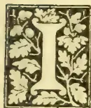A decorative initial letter 'I' in a black serif font, enclosed within a rectangular frame decorated with stylized leaves and flowers.

IN our last issue we quoted a note on the ploughing-in of green crops, drawn up by Dr. Leather, the Agricultural Chemist to the Government of India. Apart from the many advantages which green-crop manuring has been known to secure for the land, we would draw attention here to the value of certain leguminous plants as nitrogenous fertilizers. The influence of *Crotalaria Juncea* (the Sin. Hana) as such was shown in certain experiments with wheat in India. Professor Shelton referring to the cow-pea says: It is everywhere pronounced to be invaluable, furnishing hungry, washed-out soil with the nitrogen needed for the subsequent crop.

The cow-pea, we find from experiments made with seeds received from India, thrives well here. We have not heard that the beans are generally used for human food, but it has been used here and appreciated as such; while the whole plant is well-known to be greedily eaten by stock. So that in the cow-pea we have a plant which serves three ends, for while it supplies food for man, it can also be utilized as fodder for cattle or as a nitrogenous green manure. Even were the plant cut and carried off the land to feed cattle the residue in the form of stem and roots will in itself add much to the fertility of the soil in which it is left. The cow-pea can thus be either grown as a restoring crop before sowing the seeds of cereals or other short-lived plants, or it can be grown without inconvenience among cultivated perennial trees.

In an article on weeds which appeared in the pages of this Magazine some time ago, we referred to weeds in this connection, namely, as fertilizers of the soil. The advantage in the cow-pea, however, is as we have pointed out, that it also serves other purposes and is of three-fold utility, and we should like to see a good trial of it made on some of our tea and cocoa estates. The value of leaf manures is to some extent recognised by native cultivators, (witness the use of Kepittiya—*Croton lacciferum*—leaves in the cultivation of betel and other crops), so that the introduction of the cow-pea or other papilionaceous plant as a restorative crop on lands which are generally in much need of 'restoring', would not be altogether an innovation. We commend this subject to the serious attention of our Agricultural Instructors, as offering them a means of furthering the interests of the native cultivator.

## OCCASIONAL NOTES.

The School of Agriculture reopened after the Vacation on the 15th January. The present strength of the school is 8 resident students and day scholars.

The Forestry lectures prepared by Mr. A. F. Broun, the Conservator of Forests, continue to be given out to the students, Mr. Broun being able, in spite of his duties as Conservator, to carry on his self-imposed task. We are sanguine that after the utterances of H. E. The Governor at the prize-giving ceremony, the preliminary difficulties regarding the establishment of a Forest branch at the School of Agriculture will soon be overcome.

693------------------------------------------------

640Supplement to the "Tropical Agriculturist."[March 1, 1895.

and that a complete course in Forestry will be soon arranged for.

In the early part of February the Superintendent of the School of Agriculture visited the Sabaragamuwa Province and inspected the work of the Agricultural Instructors at Dippitigalla, Balangoda, Godakawela and Kolonne.

A new Veterinary Colonial Surgeon in the person of Mr. Sturgess is shortly expected in place of Mr. Ly'e, resigned. Mr. W. A. De Silva, who was holding the acting appointment, will no doubt revert to his substantive post as Headmaster of the School of Agriculture. We take this opportunity of congratulating Mr. De Silva on the able and efficient manner in which he has discharged the responsible duties of Government Veterinary Surgeon, and welcome him back to the staff of the School where his services as a lecturer will be invaluable.

The demand for manure in Ceylon is a healthy sign, inasmuch as it indicates that cultivators are alive to the fact that the fertility of the soil must be maintained. Apart from the common commercial fertilizers such as bone dust, castor cake, &c., there is a good market now for fish-manure, imported and locally prepared, while blood from the Colombo slaughter-houses and night-soil treated in Kandy are also being utilized. Of late we have seen people from South India going about offering such substances as cattle-manure dried in cakes, dry goat and sheep manure, and even ashes—all brought over from the neighbouring coast. The prices demanded per cwt. are R2.00 for the first, R2.50 for the second, and R1.50 for the third!

There would seem to be little prospect of the American Dewberry becoming established as a thriving fruit tree, as it has done in India. Mr. Nock of the Hakgala Gardens referring to it, says:—"The plants of American Dewberry raised from seed you kindly gave us are growing well, but none have flowered yet. We have some large plants from seeds from Kew which have flowered several times, but the fruit has never come to anything. We have one specimen of English Blackberry which grows and fruits very well here."

Some analyses of both milk and butter have been made by the Agricultural Chemist to the Government of India. The milk of a herd of Sind cows and of a herd of buffaloes at Poona was analysed night and morning on eight occasions during July and August 1893, and the average of these analyses was found to be as follows:—

<table border="1">
<thead>
<tr>
<th></th>
<th colspan="2">Cows' Milk.</th>
<th colspan="2">Buffaloes' Milk.</th>
</tr>
<tr>
<th></th>
<th>4 A.M.</th>
<th>2 P.M.</th>
<th>4 A.M.</th>
<th>2 P.M.</th>
</tr>
</thead>
<tbody>
<tr>
<td>Water</td>
<td>86.66</td>
<td>85.53</td>
<td>82.14</td>
<td>82.13</td>
</tr>
<tr>
<td>Butter fat</td>
<td>5.19</td>
<td>5.43</td>
<td>7.93</td>
<td>7.73</td>
</tr>
<tr>
<td>Casein</td>
<td>3.13</td>
<td>2.95</td>
<td>4.09</td>
<td>4.03</td>
</tr>
<tr>
<td>Milk sugar</td>
<td>5.31</td>
<td>5.40</td>
<td>5.65</td>
<td>5.31</td>
</tr>
<tr>
<td>Mineral matter</td>
<td>.71</td>
<td>.69</td>
<td>.79</td>
<td>.80</td>
</tr>
<tr>
<td></td>
<td>100.00</td>
<td>100.00</td>
<td>100.00</td>
<td>100.00</td>
</tr>
<tr>
<td>Specific gravity</td>
<td>1.0314</td>
<td>1.0297</td>
<td>1.0296</td>
<td>1.0292</td>
</tr>
<tr>
<td>Yield of milk in lb.</td>
<td>8.0</td>
<td>5.8</td>
<td>6.1</td>
<td>5.9</td>
</tr>
</tbody>
</table>

Buffaloes' milk has always been understood to be rich, and the high percentage of butter fat shown

in these analyses is, therefore, in accord with what was to be expected. The amount of fat in the cows' milk is, however, distinctly higher than might have been anticipated as compared with the average yield from herds in Europe.

#### RAINFALL TAKEN AT THE SCHOOL OF AGRICULTURE DURING THE MONTH OF FEBRUARY.

<table border="1">
<tbody>
<tr>
<td>1</td>
<td>Nil</td>
<td>12</td>
<td>Nil</td>
<td>23</td>
<td>Nil</td>
</tr>
<tr>
<td>2</td>
<td>Nil</td>
<td>13</td>
<td>Nil</td>
<td>24</td>
<td>Nil</td>
</tr>
<tr>
<td>3</td>
<td>Nil</td>
<td>14</td>
<td>Nil</td>
<td>25</td>
<td>.21</td>
</tr>
<tr>
<td>4</td>
<td>Nil</td>
<td>15</td>
<td>Nil</td>
<td>26</td>
<td>.07</td>
</tr>
<tr>
<td>5</td>
<td>.09</td>
<td>16</td>
<td>Nil</td>
<td>27</td>
<td>Nil</td>
</tr>
<tr>
<td>6</td>
<td>Nil</td>
<td>17</td>
<td>Nil</td>
<td>28</td>
<td>Nil</td>
</tr>
<tr>
<td>7</td>
<td>Nil</td>
<td>18</td>
<td>Nil</td>
<td>1</td>
<td>Nil</td>
</tr>
<tr>
<td>8</td>
<td>Nil</td>
<td>19</td>
<td>Nil</td>
<td></td>
<td></td>
</tr>
<tr>
<td>9</td>
<td>Nil</td>
<td>20</td>
<td>Nil</td>
<td>Total</td>
<td>.40</td>
</tr>
<tr>
<td>10</td>
<td>.03</td>
<td>21</td>
<td>Nil</td>
<td></td>
<td></td>
</tr>
<tr>
<td>11</td>
<td>Nil</td>
<td>22</td>
<td>Nil</td>
<td>Mean</td>
<td>.014</td>
</tr>
</tbody>
</table>

Greatest amount of rainfall in any 24 hours on the 25th instant, .21 inches.

Recorded by P. VAN DE BONA.

#### PLAIN HINTS ON THE DISEASES OF CATTLE IN INDIA.

We should before now have acknowledged the receipt of a copy of the second edition of this useful work, revised and enlarged, with five plates. The author is Veterinary Captain Mills, the Principal of the Bombay Veterinary College, who, from his long experience of, and intimate acquaintance with, Indian cattle is more qualified perhaps than any other officer of the Veterinary Department, to offer advice on the subject of cattle disease in India. In the work, which consists of about 150 pages, the author treats in a clear and concise manner with the subject of Indian breeds; selection of cattle; breeding and rearing; food and feeding; cattle-sheds; the structure and functions of the various organs of the body; health and disease; nursing; prevention of disease and cinerators; medicine and medicinal agents; contagious diseases; diseases of the brain and nervous system; non-contagious blood diseases; disease of the respiratory system; diseases of the urinary and generative systems; pregnancy, parturition and parturient diseases; fractures, accidents and diseases of external structures; cattle-poisoning, meat and milk, cruelty to animals. The appendices consist of a reprint of the Madras Act No. 2 of 1886 for the prevention and spread of disease among cattle; an account of Pasteur's method of preventive inoculation for anthrax; weights and measures; a table of dentition of cattle; and finally a glossary.

This enumeration of the contents is sufficient to convince one of the value of the little work, and how useful it would be to all owners of stock in India and Ceylon. Indeed, we would go to the length of saying that it should be in the hands of all owners of estates and of cultivators of the soil generally, as well as of revenue officers and their subordinates. The book, which is priced at R3, has already been adopted as a text-book at the School of Agriculture.

We make no apology for quoting the following reference to the great scourge of the country, viz., cattle-murrain, rinderpest, or cattle-plague. The

694------------------------------------------------

March 1, 1895.] Supplement to the "Tropical Agriculturist."641

simplicity of the treatment which we have reason to believe has been attended with much success, is certainly very striking:—

Rinderpest or Cattle-plague is a frequent and fatal disease in many parts of the country. A week to a fortnight after an animal has been exposed to infection, he falls sick and the disorder rapidly spreads in a herd. It is difficult in the earliest stages to decide as to the exact nature of the disease, but later very marked symptoms set in; of these, extreme weakness amounting to prostration, twitching of the muscles of the body, first constipation followed by severe diarrhoea, with a very foul and peculiar swell of the matter passed, which is often mixed with blood, eruptions of the membrane of the nose, mouth, and certain parts of the skin, such as those covering the vulva and the udder. A peculiar cough is generally present, in addition to general high fever and a flow of acrid tears from the eyes. The disease runs its course in from seven to ten days, and usually ends fatally. After death, the intestines and stomach are especially found diseased, and large patches of blood, which has escaped from the veins, are found in different parts of the body. Cattle suffer from this disorder, and sheep can take it from them; it is highly communicable. It must not be confounded with simple dysentery, in which there is no eruption in the mouth.

*Treatment.*—The healthy animals should be at once segregated from the sick. The deceased animals should be given an ample supply of drinking-water with salt and nitre in it. When the bowels are constipated they should be given a laxative dose of epsom salts. When dysentery sets in, bitter tonics, such as chiretta, cinchona bark, also decoction of bael fruit may be given along with arrack. Their strength should be supported by giving canjee, milk, &c.

#### HOW FARMERS MAY TEST THEIR SOILS.

Many farmers have somehow become imbued with the idea that to apply manures profitably, and at the same time determine the kind of crop most suitable for a certain locality, all they have to do is to obtain an analysis of the soil from the agricultural chemist. This is all a delusion, because crops differ in their capacity to pick up nutriment from the soil. A chemical analysis shows what the soil contains, perhaps at the moment of examination, but it does not pretend to give the quantity in which the constituents will be available to the plant during the period of growth. The weather or the seasons have a large influence in such matters. For instance, a shower of rain or the absence of that shower may alter the character of a crop to such an extent as to render the analysis of the soil, or its supposed resulting benefits, entirely worthless. The way to get at the real value and character of any particular soil is to make some practical experiments with it. If it is desired to know whether a soil is already provided with nitrogenous matter it is sufficient to sow a handful of wheat upon a small square of ground which has been manured with a mineral substance only. Or the test may be made without the aid of mineral matter. If the ground yields a good crop, it shows that the soil already contains a sufficient supply of nitrogen. On the other hand, to ascertain whether

the soil contains a sufficiency of mineral manure (phosphate of lime and potash), manure plots with nitrogenous substances only, planting, say, one with maize and the other with potatoes. The great influence that phosphate of lime has on maize and sorghum and potash on potatoes is well known; therefore if the maize flourishes you may be sure the land has enough phosphate of lime, and the potatoes will indicate if the ground lacks potash. Thus two experiments, requiring but a small area of ground, and trying three different crops, are sufficient to obtain the indications necessary to a judicious system of culture. The best method of obtaining what is needed in any given case to produce a particular crop is to put the question to the soil itself. Such experiments will abundantly repay the investigator in the practical money value of the results.—*Australasian*.

#### SOME SKIN DISEASES IN CATTLE.

*Tinea tonsurans.*—A skin disease, characterized by the appearance of gray scaly patches, appeared in some of the Sind cows belonging to the Government Dairy. The disease spread especially among the calves who for a time were much inconvenienced. *Tinea tonsurans* is caused by a parasitic fungus described under the genus *Tricophyton*. Its contagious character was manifested amply by its attacking over twelve calves. The contagion was not so marked in the older animals for only two cows were troubled with it, and that too only to a very mild extent. It may be remarked that this affection is not peculiar to any country, but is widely distributed over different cattle-breeding districts of the world; however, it is neither common nor, when present, of any serious nature in animals that are well housed and properly taken care of. But as cattle in Ceylon, as a general rule, are not much attended to as regards their housing, and are in most cases allowed to graze about in herds, if they once get a skin disease of this nature, it would undoubtedly assume a serious form for want of proper attention, and, as a result, the animals would become unthrifty, and in the end almost unfit for any work.

The disease rarely spreads over the whole surface of the skin, but usually locates itself in the face, neck and upper portion of the body; it is very seldom that it extends as far down as the limbs. At the commencement a small circumscribed patch, perhaps not bigger than a cent piece will be observed with hair standing on end. Subsequently the hair falls off and the upper layer of the skin (epidermis) becomes prominent and discoloured first a dirty yellow and subsequently a leaden grey, showing several layers of dry epidermis over the patches. Such patches gradually crop up close upon each other till a comparatively large area is thus affected. At the early stages slight itching (pruritis) is observable, but as the diseased patches dry up itching ceases, but new patches crop up rapidly.

*Tinea tonsurans* is not confined to cattle alone, but is observed in many species of animals, and so far it is known to be met with in horses, dogs, cats and pigs. The affection is even communicated to man from these animals.

*Treatment.*—The preventative treatment consists in proper attention to the cleanliness of the

695------------------------------------------------

642Supplement to the "Tropical Agriculturist."[March 1, 1895.

animals, by giving them occasional baths and housing them in clean sheds. Being a contagious disease, animals affected should be separated from the healthy ones. Regular bathing, washing with some non-poisonous disinfectant, such as a solution of Jeye's disinfectant fluid, or a strong solution of salt in water—and in severe cases a dressing with sulphur ointment, consisting of one part of sulphur to eight of lard,—are sufficient to effect a thorough cure. Young calves that are attacked should have ample supplies of nutritious diet such as rice congee and *kollu* water prepared by boiling the seeds of *Dolichos Biflorus* in water.

**Phthiriases (Lousiness).**—It often happens when a large number of cattle, especially young calves are housed together, and particularly those breeds as have comparatively long hair, they often get infested with lice. It has to be borne in mind that this vermin multiplies to such an extent—one authority estimates that a single louse in its third generation would give rise to a progeny of over 125,000,—that the animals thus infested are put to a deal of suffering, and unless proper measures are taken to remove the parasite, they get weakened and ultimately become unthrifty. The species of the louse that infects cattle in this country, and which was observed among some of the dairy calves is known as *Trichodectes scalaris*. It is so active that it causes much itching and the skin is covered not only with exudations, but the hair becomes filled with the *debris* which the insect leaves in moulting.

**Treatment.**—Clipping off the long hair and cleanliness are two things which should not be neglected in coping with this disorder. In addition, the application of any ordinary insecticide will be sufficient to put an end to the lice. In the use of insecticide care must be taken to avoid mercurial preparations as cattle are very susceptible to the action of this drug. Infusion of Tobacco, Linseed Oil, Pyrethrum or seeds of Stavesacre may be used with advantage.

W. A. D. S.

#### POONA FARM REPORT.

From the exhaustive report of Mr. Mollison, the Superintendent of the Poona farm, we extract the following reference to the Dairy and Dairy Herd:—

At the end of the financial year there were three stud bulls, 68 milch animals, and 97 head of young stock. The herd increased from 128 head in 1892-93 to 170 head this year. There were 27 animals sold and 42 bought, whilst there were 50 births and 11 deaths, the latter being most calves of purchased animals.

The dairy produce from 68 milk cattle was sold during this year for Rs. 14,701-11-3. Cattle food, fodder, and grazing cost Rs. 9,358-6-2. The herd was quite free from contagious disease. The dairy has proved itself a profitable institution. Not only so, but the sick soldiers in hospitals are supplied with purer and cheaper milk and butter than can be obtained elsewhere. The saving to Government on this account is considerable. The public are supplied from the dairy at rates fixed purposely higher than the prices charged by private dairymen in Poona, yet during the year we have had numerous applications from

private residents for a regular supply of dairy produce, which could not be complied with. Those people who have young children appear to be particularly anxious that they should obtain milk from the Government farm. If the Government dairy interferes in any way with the trade of private dairies, it is because the public demand a higher standard of cleanliness than that which prevails in some of the dairies established by private enterprise in Poona and elsewhere. There is no question that the initiative example of the Agricultural department has raised the quality standard of dairy products throughout this presidency, and has educated the European public to become critical as to the quality of dairy produce. It is perhaps a healthy sign that butter of inferior quality is retooed, whilst that of superior quality is bought up rapidly at almost any price. In course of time, good butter will undoubtedly be obtained in India at a cheaper rate than at present. The extended use of improved dairy machinery has made it possible to make butter in Bombay and elsewhere from cream separated in districts where milk is cheap.

At present the advantage to the milk producer in outlying districts is considerable: but it is considerably greater to the dairyman. He obtains for good butter about double the ordinary price of *ghi*. Well-made butter yields approximately only 80 per cent of *ghi*. In time the profits will be more equalized. Meantime, the owner of improved dairy machinery drives a lucrative trade. This is evidenced by the fact that butter made in Bombay from cream obtained from distant districts is railed daily to Poona and several outstations in large quantities, and is offered for sale in attractive looking "pats" at bungalows and, presumably, is readily sold, the price being 12 annas a pound.

I believe the Government Farm Dairy stimulates private enterprise. It also affords thorough practical tuition free of cost to all who desire to be properly instructed in improved dairy methods. We insist, however, that those who come to learn must not be mere onlookers. They must work.

The young stock bred on the farm are commencing to come into profit. It is premature to anticipate results. Yet the milk yields from these young cows force the conviction that they are likely to prove superior to their dams as milch cattle. It is the chief object of our breeding experiments to gain that result.

There is very little to add to the information already published in respect of dairy cattle. I am certain that a great deal of success in dairying in India hinges upon the possibility of providing milk cattle with a fairly liberal supply of green fodder during the whole year. A liberal ration of green fodder increases the milk yield, but it lowers the quality. It has that effect at any rate in respect of the percentage of butter fat. If a fair allowance of green fodder is regularly given, cows and buffaloes, especially the former, come sooner in season for the bull after calving, and, therefore, breed more regularly than would otherwise be the case.

Gir cows in the Deccan are disappointing as regular breeds and as regular milk producers. Under the most skilful management, they do not yield the same quantity of milk as they do in the

696------------------------------------------------

March 1, 1895.] Supplement to the "Tropical Agriculturist."643

Gir hills of Kathiawar. They improve, however, when acclimatized. It has yet to be ascertained whether pure-bred Girs bred in the Deccan are an improvement on imported dams. When the Surat farm is started it is proposed to continue the breeding experiments with Gir cattle there, that locality being probably more suitable than Poona.

Aden cows maintain their reputation as regular breeders and milkers. The record of yield reported further on does not this year afford much information as regards this breed, because nearly all the Aden cows were in milk at the end of the year, and their yields are excluded from the statement. Half-bred Adens are regular breeders and fair milkers.

Nine Sind cows bought in the neighbourhood of Kurrachee have done well. Several had calved and were in milk when brought by steamer and rail to Poona. Naturally they went off milk during transport, and did not recover their normal yields. I expect them to do better during the current season. All these cows calved in May, 1893, and five were giving a fair quantity of milk at the end of the year (31st March 1894). The yield record noted in the subjoined statement is, therefore, not complete for the whole period of lactation. Still it compares very favourably with that of other breeds. The best Sind cow gave in 380 days 4,864 lbs. of milk, worth, at the rate charged at the farm, Rs. 374, and at the end of the year was still giving 9 lbs. or 4½ seers per day. Sind cattle are not accustomed to wet weather, and in the Deccan must not be exposed to heavy rain.

Buffaloes are decidedly more irregular as breeders than cows. Jafferabadi Buffaloes, owing to their large size and the necessarily large ration they require, are not, I think, so profitable as well-selected Surat buffaloes, because on the average the latter yield quite as much milk as the former. The two best buffaloes were of Surat breed:—

No. 1 yielded during the period of lactation (371 days) 6,959 lbs. milk worth Rs. 491.

The worst buffalo (a cross-bred Deccani) yielded during the period of lactation (227 days) 1,971 lbs. milk, worth Rs. 141.

The cost of upkeep of these buffaloes did not differ materially. Surely, there is room to believe that if we go on in the direction which we are pursuing, and retain for breeding purposes the young stock of the best only, we will in time breed up to a higher standard. In any case it is a useful line to follow on a Government farm, for as far as my experience goes "breeding for milk" is entirely beyond the purview of the native stock-owner, except in Sind, where well-to-do zemindars know the pedigrees of all the best cattle they own and are particularly proud of their best milk cows.

Under the head of fodder experiments, the following is Mr. Mollison's note on Mauritius or water grass, which he also calls Buffalo grass:—

This is the chief fodder grass of Ceylon. There it remains green all the year round and is employed largely for feeding milch cattle. A few roots were obtained from the School of Agriculture Farm, Colombo. The plant can be propagated either from the roots or from the stoloniferous stems which grow out laterally along the ground and root at every node. From these rooted nodes

straight shoots spring up. When ready to cut, the grass is very thick and stands about 18 inches high. Cattle like it, but it grows slower than Guinea grass, and does not give the same outturn. It has this advantage—it thrives well in a damp, or even a wet situation. The best method of propagating is to cut the long lateral stems into short lengths. Broadcast these sparingly over the surface, and cover lightly with soil. The plot on the farm since it has become fully established has been cut twice at an interval of 87 days. The yields of green fodder were:—

<table>
<thead>
<tr>
<th></th>
<th>Yield from 4 gunthas.</th>
<th>Yield per acre.</th>
</tr>
<tr>
<th></th>
<th>Lbs.</th>
<th>Lbs.</th>
</tr>
</thead>
<tbody>
<tr>
<td>1st cutting ..</td>
<td>1,070</td>
<td>10,700</td>
</tr>
<tr>
<td>2nd cutting ..</td>
<td>1,802</td>
<td>18,020</td>
</tr>
</tbody>
</table>

#### MINOR MANURES—GAS LIME.

Gas Lime is a waste product in the manufacture of gas. It has not a high reputation, and can be bought at a low figure, and may sometimes be had for carting away. In its fresh state it has an evil smell, and contains sulphuret of lime and other sulphur compounds that give off sulphuretted hydrogen, and are injurious to vegetable life. It is these the farmer who uses it must guard against, and failure to do this brings about disastrous results. But when rightly understood the danger may be reduced to a minimum, for if gas lime is exposed the oxygen of the atmosphere soon destroys the bad smell by changing the sulphuret of lime into sulphite, and finally sulphate of lime or gypsum; or, in other words, by changing it from a positively poisonous substance to a well-known fertiliser.

In a sample of gas lime from which the water (that constituted about 40 per cent. of it) had been evaporated, and that had been kept long enough to be used with safety as a manure, Dr. Voelcker found the following compounds of lime:—Sulphate of lime, 4.64; sulphite of lime, 15.19; carbonate of lime, 49.40; and caustic lime, 18.23 per cent. A substance rich as this in lime compounds cannot fail to be of considerable service to farmers, and in actual practice it is found to have much the same effect as ordinary lime. The crop on which it does the most good are clovers of various kinds, beans and peas, tares and turnips. It is said to cause scab on potatoes, but this is probably only when it has been incorporated with the soil in a fresh state. On grass land it should be spread in frosty weather at a time when vegetation is dormant, so that it may have changed to a mild form before the growth of grass in spring; or, better still, it should be made into a compost with road-scrapings, ditch-scourings or other refuse, before being applied. It is of great service in destroying moss, heath, acid-loving plants, and certain other useless vegetable growths.

On arable land it should be spread three or four weeks before being ploughed in, and it may be used at the rate of two, three, or four tons per acre. It is said that if applied quite fresh and ploughed in at once, it will destroy coltsfoot, or other weeds that may have taken absolute possession of the soil, and cannot be removed by ordinary means.

Miss Ormerod and Dr. Voelcker recommend it as an almost certain cure for "Finger-and-Toe" or

697------------------------------------------------

64 4Supplement to the "Tropical Agriculturist."[March 1, 1895.

"Anbury" in turnips. The latter makes the following interesting statement:—"On visiting the fields where the turnips were affected (by the above-named disease) by wart-like excrescences, and forked and twisted into the most fantastical forms, I noticed a spot on which the roots were nearly all sound. On stooping down and examining the soil, I picked up some bits of a whitish-looking substance which appeared to me like dried gas-lime, and I learned afterwards that on this very spot a cart of gas-lime had been unloaded the year before. The chemical examination of the soil on this field showed merely traces of lime; and, at my recommendation, the occupier applied a heavy dose of gas-lime, which completely cured the evil."

Considering the above, we can come to no other conclusion than that gas-lime is of value to those who can easily obtain it.—*N. B. Agriculturist.*

#### FOOT AND MOUTH DISEASE.

The Colonial Veterinary Surgeon of the Cape recommends the following treatment for foot and mouth disease in the last number of *Agricultural Journal* of Cape Colony:—"The principal consideration is to keep the feet clean and dry, to prevent matter and intractable sores from forming.

"The following lotion will answer as a wash for the mouth and a dressing for the feet:—

<table>
<tr>
<td>Powdered Sulphate of Copper</td>
<td>..</td>
<td>6 ounces.</td>
</tr>
<tr>
<td>Carbolic Acid or Jeyes' Fluid</td>
<td>..</td>
<td>3 do.</td>
</tr>
<tr>
<td>Water</td>
<td>..</td>
<td>1 gallon.</td>
</tr>
</table>

"Mix thoroughly and apply to the eruption. The mouth will get well with one or two dressings, but the feet should be thoroughly cleaned, dressed and carefully attended to. Any astringent healing antiseptic lotion will answer, if well applied. A dressing of tar answers very well where cattle cannot be regularly attended to.

"Considering that the large majority of the cattle in this country are not sufficiently tame to admit of being caught daily to have their feet dressed properly, I would recommend, as a substitute for daily dressing by the hand, that a large shallow bath be constructed in a suitable situation, either of wood or cut out of the soil and cemented, or if the soil is capable of retaining water, a good bath may be made, by simply cutting out a level channel about 12 feet wide and 18 feet long, capable of holding a fluid mixture about 9 inches deep, the edges sufficiently high to prevent waste by splashing over. It would be necessary to have a strong close fence on each side of the bath to keep them in it when being driven through, with a gate at each end to prevent any animals from getting to the bath to drink. The affected cattle could be driven through this bath daily, and as a *preventive*, I would recommend that the non-affected stock should be driven through daily also, while the disease continues in the neighbourhood. If the herds and flocks are small, a bath half the size of the above may be sufficient."

#### SOME ASPECTS OF NATIVE AGRICULTURE.

The native cultivator (or *goyiya*) is an individual about whose character there is much diversity of opinion. He is considered lazy and apathetic by some, while others look upon him as a helpless creature, a child of circumstances who is deserving of our sincerest commiseration. Some assert

that he is ignorant of the very rudiments of agriculture, and some again maintain that when it comes to paddy and other indigenous crops, so far from requiring to be taught he can teach others. I have lately had an opportunity of seeing native cultivation carried on under conditions which may be said to be peculiar to the districts in which they were met with, and this experience for one thing has brought new light to bear upon our idea of the character of the native cultivator.

In the remote villages visited by me the art of agriculture has reached such a state of neglect as the ancient cultivators of Ceylon would hardly have believed it could reach. True, there are some grave difficulties in the way of the agriculturist in many parts of the Island, and among them may be mentioned the great lack of cheap conveyance, the absence of markets, and the difficulty of getting about. To these drawbacks we may attribute the fact that the villagers in many parts never go in for vegetable-fruit garden culture, as the produce is of a comparatively perishable nature and will not keep for any length of time; and that produce should keep is, of course, a necessary condition in these remote places. I have seen excellent English and native vegetables grown experimentally in places where there was no market to speak of for the produce. Many of our largest provincial towns contain but a handful of probable consumers of fruits and vegetables of superior quality; but even granted a sufficient number of consumers, in the absence of cheap means of transport, it will not pay the cultivator to convey his produce from the remotest villages to the markets of the larger towns. So that as far as vegetable gardening is concerned, these villages may justly be acquitted of blame. Indeed, there are parts of provinces that have yet to be opened up a great deal before fruit and vegetable gardens can be successfully established. Much of them is still covered with forest growth, and till villages and towns and markets appear in those places, it can hardly be expected that the villager will expend the care and trouble necessary for vegetable culture—which requires clean cultivation, manuring and watering—with the poorest possibility there is at present for marketing his produce. But what surprised me was the careless manner in which paddy and the fine grains (*kurakkan*, *amu*, *tana*, &c.) are cultivated. The yield of paddy is miserably low, and no wonder, when the land is continually under cultivation without fallowing and without manuring. So little importance is attached to the preparation of the land in many places, that even the use of the native plough has been discarded and the only operation preparatory to sowing is the inversion of the sods by means of the *mamotie*. The crop receives little or no after treatment, and is generally left to struggle against weeds.

In the *chenas* the fine grains may be seen growing together with hill paddy, Indian corn and other plants, the seeds of all having been sown together. The result as may be expected, is that there is a struggle among the various crops and that they all suffer.

There is little excuse for the carelessness of the cultivators in the matter of paddy and dry grain cultivation, when it would be to their

698------------------------------------------------

March 1, 1895.] *Supplement to the "Tropical Agriculturist."*645

interest to carefully prepare their paddy fields and attend to the growing crop; as well as to grow their chena crops in rows and give them also proper attention. No doubt the system at present in vogue has been practised for some generations, till the cultivators of today have begun to look upon it as established in those parts, and one which needs no improvement. It is in just such situations as these that good work can be done in reforming the existing systems.

It will be a great day when the Railway intersects the various provinces of the Island. Then will the resources of the country—which in many parts is rich in resources—be developed to their full extent and the prospects of the cultivating class be brightened.

The idea which at present dominates the mind of the rural cultivator seems to be that there is no necessity for him to raise more produce than is required just exactly for his food requirements, and to endeavour to raise it with the least difficulty to himself and generally of the poorest quality. He need to be impressed with the true object of agriculture which may be stated thus:—To produce the largest crops of the best quality at the smallest expense and the least permanent injury to the land.

TRAVELLER.

#### WOOD ASHES.

Wood ashes as manure do not seem to be thoroughly appreciated in this country, although they are so generally prevalent, the reason being that their value as manure is not thoroughly understood. It is considered by those who do use them, that their benefits are to be attributed solely to the potash they contain, whereas they are really a complete fertiliser so far as the mineral elements of the plant food are concerned, containing the whole residue of plants after being burned, except that part which is returned to the atmosphere whence it was originally derived; the nitrogen and the carbon of the trees alone being wanting in the ashes. There is, of course, a difference in the value of wood ashes dependent on the kind of trees from which they are produced and the character of the soil on which they grew. They also vary according to the parts of the plant from which they are taken, those from young branches being more valuable for horticultural purposes than those from the heart wood, the proportion varying from 5 to 20 cent. Professor Storer has investigated the question somewhat in detail, and has found by analysis that selected specimens contain  $8\frac{1}{2}$  per cent. of potash and 2 per cent. of phosphoric acid; or  $4\frac{1}{2}$  lb. of potash and 1 lb. of phosphoric acid for one bushel of ashes.

The bark of trees is still more rich in lime than in potash. But lime is not sufficiently used by orchardists or other gardeners, it being especially required by stone fruits, as well as others. Besides, the production of nitrogenous plant food goes on most easily in soils that have a considerable proportion of lime in them. Indeed it may be said that this supply of lime is indispensable to the action of the nitrification bacteria, which must have lime within its reach for proper development.

The power of potash to make the nitrogen of the soil available for plants is strikingly shown

in clearing wooded localities, for wherever a heap of wood or scrub is burned, the vegetation that grows afterwards is particularly rank and luxuriant.

Investigations have proved, says a writer in the *Gardeners' Chronicle*, that commercial fertilisers are decidedly inferior for plant growth to wood ashes. The explanation of this fact, he says, seems to be that the sulphate and the chloride of potash are devoided of the alkaline quality which is so marked a peculiarity of carbonate of potash, which is the effective agent in wood ashes.

An illustration of the value of wood ashes as a fertiliser for grapes is given. Two vines yielded only 20 lb. of grapes in a season, but, the following year, they having been heavily manured with a mixture of wood ashes and kainit, the two vines yielded 120 lb. of grapes of excellent quality. The potash in the wood ashes combined with the potash of the kainit, matured the wood of the vine and developed the fruit.—*Australian Exchange*.

#### THE AGRICULTURAL SOCIETY OF CEYLON.

We have been presented with copies of the Proceedings of the Ceylon Agricultural Society during the year 1843 and 1844. To judge from a perusal of these booklets the Society would seem to have been a most useful one with the Governor as Patron and the Colonial Secretary as President. We learn that it was established in the year 1842, but what led to its dissolution we have been unable to ascertain. The list of members as given in the Proceedings includes about one hundred and fifty names, and in merely reading over this list one is led to the conclusion that in these years the cause of Agriculture had no lack of influential support. Apart from promoting and encouraging agricultural shows, the Society appears to have done much good work as a means of intercommunication not only between those interested in the cause of agriculture in the Island, but also between the Ceylon Society and other agricultural bodies. The result of such communication as shown in the pages of the Proceedings must undoubtedly have resulted in mutual benefit that cannot be too highly valued. The pity is that we have no such association as the Ceylon Agricultural Society at present. True, we have a so-called Agri-Horticultural Society, but the difference between the character of the past and present Society is all the difference between activity and lethargy, between earnestness and indifference, between the real and the nominal. What we want is a body that will work in real earnest and show a keen solicitude, in an active manner, for the welfare of agriculture in the country. Such a Society holding meetings say once a month at the School of Agriculture we should greatly desire to see established, and are ready to help in inaugurating, if sufficient support is forthcoming.

#### ZOOLOGICAL NOTES FOR AGRICULTURAL STUDENTS.

The order *Hyracoidea* is represented by a small number of living members. It is interesting as including the *Hyrax Syriacus*, which occurs in the rocky parts of Syria and Palestine, and is believed to be the "Coney" of Scripture.

699------------------------------------------------

646Supplement to the "Tropical Agriculturist."[March 1, 1895.

The order *Proboscidea* is now only represented by the elephants. The order is characterised by the total absence of canine teeth; the molar teeth are few in number, large, and transversely ridged or tuberculate; incisors are always present, and grow from persisting pulps, constituting long tusks. In existing species these tusks only occur in the upper jaw, the lower being destitute of incisors. The nose is prolonged into a cylindrical trunk, movable in every direction, highly sensitive, and terminating in a finger-like prehensile lobe. The nostrils are placed at the extremity of the proboscis. The feet are furnished with five toes each, and with a thick pad of integument; there are no clavicles; and the teats, two in number, are placed upon the chest.

Only two living species of elephants are known: the Asiatic (*Elephas indicus*) and the African (*E. africanus*). In the Indian and Ceylon elephant the males alone have well-developed tusks, but both sexes have tusks in the African species, those of the males being the largest. The Indian elephant is distinguished by its concave forehead, small ears, and the character of the molars. Its skull is pyramidal, and it has five hoofs on the fore feet and only four on the hind feet. The African elephant has a strongly convex forehead and great flapping ears. Its colour is darker, its skull is rounded, and it has four hoofs on the fore feet and only three on the hind. The elephant of the East is tolerably easily domesticated, and it is often used for performing heavy draught work, and even occasionally for ploughing. Elephant tusks yield a good deal of the ivory of commerce.

The *Carnivora* are distinguished by their canine teeth which are much larger and longer than the incisors and are well adapted for tearing flesh; the clavicles are either altogether wanting or merely rudimentary; the toes are provided with sharp carved claws; the teats are abdominal.

Section 1. *Pinnigra* or *pinnipeda* comprises the seals and walruses, with their short legs expanded into broad webbed swimming paddles. Seals are largely captured for the sale of their blubber and skins; while the walrus is hunted by whalers, both for its blubber which yields an excellent oil, and for the ivory of the tusks.

Section 2. *Plantigra* comprises the bear and its allies, in which the whole or nearly the whole of the foot is applied to the ground, so that the animals walk upon the soles of the feet. From the structure of the foot the *Plantigra* have great power of rearing themselves upon their hind feet. They are comparatively slow of movement, and more or less nocturnal in habits. The claws are formed for digging, large, strong and carved, but not retractile; the tongue is smooth; the ears small, erect and round; the tail short; the nose forms a movable truncated snout; and the pupil is circular. Bears are hunted for the sake of their skins and fat.

Section 3. *Digitigra*. This section comprises the lions, tigers, cats, dogs &c. in which the heel of the foot is raised off the ground, and the animal walks on the tips of the toes. The weasel, pole cat (*Putorius fœtidus*) and ferret are the best known of the *Mustelidæ*, being characterised by their short legs, worm-like bodies and peculiar gliding mode of progression. Nearly-allied is the ermine or stoat, and the sable. The *Mustelidæ* are of commercial importance as yielding beauti-

ful and highly-valued furs. Closely related to the above are the otters distinguished by their webbed feet adapted for swimming. Many of the otters yield valuable fur.

The family *Viverridæ* includes the civets and genettes.

The *Hyænidæ* are distinguished by having 4 toes on each foot, a rounded muzzle and rough tongue, and include the various species of *Hyæna*.

*Canidæ* comprises the dogs, wolves, foxes and jackals. They have pointed muzzles and smooth tongues. The fore feet have five toes each, the hind feet have only four.

*Felidæ* (or Cats tribe) comprises the most typical members of the whole order *carnivora*, such as lions, tigers, leopards, cats and panthers. They all walk upon the tips of their toes. The hind feet have four toes each, while the fore feet have five. All the toes are furnished with strong, curved repartite claws, which, when not in use are drawn within sheaths by the action of elastic ligaments, so as not to be unnecessarily blunted. The tongue is rough and the jaws short.

#### THE PREPARATION OF ESSENCES.

Among the many miscellaneous manufactures which are capable of being developed in the Island, the preparation of essences from the numerous aromatic shrubs and flowers found here, cannot but prove to be of great value and profit if properly taken in hand. Ceylon, no doubt, has been for a long time exporting two essential oils, viz., Cinnamon oil and Citronella oil. Both these industries have so far been almost over-done, and owing to the large output of the materials, prices have come down to such an extent as to hardly leave a sufficient margin of profit to manufacturers for the capital they invest and for the trouble and labour they undergo in the preparation of the articles. It is positively asserted in some quarters that the manufacture of Citronella oil would altogether cease to be a profitable industry according to the current prices obtainable for the article, were it not for the considerable adulteration of the essential oil which is almost openly resorted to now. The adulterant used being nothing less than petroleum, or kerosine oil, and in the proportion of almost one to one. The device was, no doubt, first resorted to by dishonest traders, and when it was found that detection of the adulteration was a matter of great difficulty, most of the traders and planters were obliged to resort to this unfair practice, solely owing to the falling off in prices. Sometime back, English chemists carried out certain investigations with a view to finding out an easy method of detection; however, they were not very successful, and it is feared that with very rare exceptions the practice of adulteration is still in vogue. It is a matter for regret that the growers cannot be made to combine in their own interests to discontinue a policy which, in itself, is sufficient to kill out the industry altogether. When dealers in Europe find it difficult to obtain the pure article from Ceylon, they would not only resort to other sources of supply, but would go so far as to seek for substitutes for the article. Even when the growers agree, the conditions of trade here are such that petty traders who supply

700------------------------------------------------

March 1, 1895.] Supplement to the "Tropical Agriculturist."647

the contractors will have to be controlled in some way or other.

Among the species of plants obtainable in Ceylon which are likely to yield essences, the following may be mentioned:—Sweet flag, *Acorus Calamus* Sing. Wadukaha, a zingiberaceous plant growing in moist situations.

*Kæmpferia galanga* l., Sing. Hingura piyali, and probably other species of *Kæmpferia* such as *K. Pandurata*, *S. Ambakaha* and *K. Rotunda*, Sing. Yavakenda.

*Curcuma Zerumbet*, *S. Harankaha* and *C. Aromatica*, *S. Dadakaha*. All of the natural order Scitamineæ, and yielding aromatic rhizomes. The flowers and rhizomes of *Alpinia galanga*, Kaluwala. The seeds of *Ellattaria cardamomum*, *S. Ensul*.

Of the grasses, the roots of the *Andropogon muricatus*, Kus Kus or Sin. Sevendara, and the leaves of many other species of the same genus, such as *A. nardus*, Sin. Pengiri; *A. schænathus* (geranium grass) and *A. Citratus* yield essential oils. Of the Labiatæ order the leaves of *Ocimum canum*, *S. Hintala*; *O. sanctum*, *S. Maduratala*; *O. basilicum*; *O. grattissimum* and *O. adscendens*, *Plecatranthus Zeylanicus*, *S. Irivariya*; *Coleus aromaticus*, *S. Kapparawallia*; *Pogostemon hyneanus*, *S. Koilankola*; *Mentha sativa* and *M. Viridis* are prolific sources of essence. Among others we have the seeds of Aniseed, *Pimpinella anisum*; Cumin seed, *Cuminum cyminum*; Fennel seed, *Feniculum vulgare*; *Nigella sativa*, *S. Kaladura* and Coriander, *Coriander Sativum* and a host of others. Cloves, Nutmegs and Sandal-wood, the flowers of orange and myrtle, are common and well known. The methods of extraction of essence are almost simple in the extreme. There are three processes in vogue just now, viz., expression, distillation, and maceration.

W. A. D. S.

(To be continued.)

#### GENERAL ITEMS.

Dr. Watt in his Dictionary of Economic Products mentions that he has repeatedly observed milkmen in Eastern Bengal carrying milk to market with a few leaves of *Cocculus Villofus* and the spine-like leaf of the date-palm placed in the vessel, and that on enquiring he was told that these prevented the milk from going bad through heat and shaking. Dr. Watt further states that he suspects that the real object was to thicken the water-adulterated milk. It is now stated in one of the Agricultural Ledger series that the leaves of *Cocculus* as those of *Pedilium Murex* are well known to have the power of "thickening water" as it is called, but the action on milk, if the above observation be confirmed, seems well worthy the attention of the chemist and of the dairy farmers. *Pedilium* is reported to be more especially used to thicken butter milk. [*C. Macrocarpus* is the species of *Cocculus* indigenous to Ceylon but *Pedilium Murex* (the Sinhalese et-nerenchi) is a common weed, and it would be well for all concerned to see that their milk is not artificially thickened by the wily milkman by means of these two plants.]

The Jute plant would appear to be particularly well suited to Queensland. A writer to the *Australian Agriculturist* says that at the end of six months Jute, as grown by him, reached 13 and 14 feet in height. It is doubtful whether even in the well-known Jute fields of Northern India this height is often attained, indeed the height of the Jute plant in these parts is not often more than 10 feet. Again, in Queensland the period of immersion is given as from 10 to 24 days, while in Bengal the period is usually about half, or less than half, of this.

701------------------------------------------------

<!-- stage4: FAINT old-images-only -->

[Faint page: no legible print of its own could be verified; text withheld (stage 4 review list)]

702------------------------------------------------

# \* The TROPICAL AGRICULTURIST \*

◇ MONTHLY. ◇

Vol. XIV.]

COLOMBO, APRIL 1ST, 1895.

[No. 10.

## IN TROPICAL LANDS.\*

We have now been able to read and annotate Mr. Sinclair's little volume of 190 pages, and our first impression of its attractive, interesting character, has only been deepened; for, truly, there is not a dull page from first to last. It is dedicated to "the dear memory of Dr. William Alexander, for 37 years the warm and steadfast friend of the author," and no one, we feel sure, would have more enjoyed this sketch of tropical travel, or more lovingly reviewed it, than the accomplished writer of "Johnnie Gibb of Gushat-neuk," and editor of one of the best-known of Scottish newspapers whose death a few years ago was so widely regretted. The book is of interest to the traveller, the botanist, and especially the tropical planter; but quite as much also to the stay-at-home intelligent reader who wants to get a glimpse of distant and little-known lands as seen by the latest, and by no means least observant visitor, and to contrast his graphic pencil-sketches of Peru, its people, industries, topography and vegetation with the glimpses afforded of some of our best known West Indian islands, and still more with the picture drawn of more familiar ground in the first of Crown Colonies in the East. There are illustrations *galore*—from the frontispiece which reveals the size and luxuriance of cacao walks in Trinidad, to the miniature page-map of Ceylon studded all round with tiny portraits from photographs of some 40 to 50 living

and dead local celebrities—or at any rate colonists—most of them friends of the author including Messrs. R. B. Tytler, A. Brown, A. M., W. and J. Ferguson, H. L. Forbes, S. Le Coq, G. M. Ballardie, A. T. Rettie, H. Blacklaw, Vollar, Milne, Greig, Fraser, Smith, Stuart, Murray, Mitchell, Bagra, Taylor, Hedges, Glenny, Wodehouse, &c., &c., besides those of two Governors, Sir James Longden and Sir Arthur Havelock. More attractive are some of the reproductions in engravings of exquisite orchids, typical of the wayside in Panama and Guayaquil, or on the banks of the Perene, or again common on the "Pampa Hermosa," Peru. The ordinary flowering plants found on the hills and plains of that botanically most interesting of South American States are profusely depicted as well as graphically described; while of the native Indians, Lima, a fair Limena and other characteristic subjects we have also very good engravings. We miss, indeed, a list of the illustrations to supplement the "Contents" which follows the Preface, and the useful Index which closes the book; and before we have done with fault-finding, we may say further that the Sketch-Map shewing the author's route through Peru is deficient in not giving the names of several places mentioned in the letter press, although the reader can easily pencil in these additional names for himself.

But having said so much for the illustrations, and by way of introduction, we turn to the book itself. In his "prefatory note" Mr. Sinclair makes due acknowledgment to the Peruvian Corporation's representative at Lima, to his fellow-travellers Messrs. A. Ross and Clark, to Sir Walter Hely-Hutchinson while Governor of Grenada—who seems to have been specially courteous and attentive to Messrs. Ross and Sinclair on visiting Grenada—and to Mr. Hart of the Trinidad Gardens. The opening chapter is headed

\* In Tropical Lands: Recent Travels to the sources of the Amazon, the West Indian Islands and Ceylon, by Arthur Sinclair, Fellow of the Royal Colonial Institute, &c.—Aberdeen: D. Wyllie & Son; Edinburgh: John Menzies & Co.; London: Simpkin, Marshall & Co.; Ceylon A. M. & J. Ferguson. 1895.

703------------------------------------------------

650THE TROPICAL AGRICULTURIST.[APRIL 1, 1895.]

"Peru," but the earlier paragraphs refer to the way thither, and we may sample them for our readers after the following fashion :—

There are three routes available from Europe to Peru—the most direct, after crossing the Atlantic, being up the Amazon; the most comfortable by the Straits of Magellan; and the quickest, *via* the Isthmus of Panama. To save time, let us choose the last. One advantage of this route is, that it gives us a peep, in passing, at the island of Barbadoes and Jamaica—the two oldest and most valuable of our West Indian possessions. Barbadoes is only 166 square miles in extent, but every acre is cultivated, chiefly in sugar-cane, and, altogether, the best cultivated little tropical colony I have come across. It is densely populated, chiefly by negroes, who look much happier and better off than the poor "whites." The English language only is spoken—spoken with a terrific fluency and an unmistakable Irish brogue. Readers of Carlyle's "Cromwell" will not be at a loss to account for this, remembering how Oliver sent so many of his refractory Irishmen there. "Terrible Protector!" exclaims the Sage, "can take your estate, your head off if he likes. He dislikes shedding blood, but is very apt to Barbadoes an unruly man; has sent, and sends up in hundreds to Barbadoes, so that we have made an active verb of it—Barbadoes you."

Jamaica has a magnificent harbour, from which superb views of the grand old Blue Mountains are to be seen. Kingston, the capital, is spread out on the rich flat land lying between; sweltering under a blazing sun, from which even the laughing negro is glad to take shelter below the umbrageous trees. The climate and vegetation strikingly remind one of Ceylon, but alas! the abandoned hillsides testify to the greater labour difficulties of the poor planter here. A few days more and we have in sight of the Isthmus of Panama.

Europeans, or men from temperate regions do not readily acclimatise to the tropics, and for that matter, as far as my experience goes, the same rule holds good in the vegetable kingdom; for although nearly all our most cherished plants come to us from near the equator, we cannot, as a rule, induce our native trees to take root there.

The railway on which we cross the Isthmus belongs to an American company, and Jonathan knows well how to make the most of it. No such exorbitant charges would be tolerated in any civilised country, and beyond the mere cost of ticket and transport of baggage the amount of palm-oil one has to expend on officials in order to get along at all is simply iniquitous. "Ah!" says Jonathan, "but you little know how costly this railway has been. Every sleeper it rests upon cost a life." As if those who paid down those lives or suffered through it got the profit! It takes about four hours to get over the 45 miles of comparatively flat land dividing the Pacific and Atlantic Oceans, and such is the condition of the first-class American carriages that a shower of rain renders the use of an umbrella absolutely necessary, even while seated in them.

The outlook from the carriage windows is not exactly inviting. There is not an acre of real cultivation; we simply pass between living walls of natural greenery. The beautiful banana leaf, the graceful bamboo, and curious mangrove, the glossy mango tree and feathery palms, all mixed up with ferns, orchids, and creeping flowers of every possible form and hue, display a truly tropical scene. By those who have never left a temperate region, the astonishing variety of plants near to the Equator can scarcely be realised.

A more beautiful situation for a city than that of Panama would be difficult to find in the world.

Historically, Panama is chiefly interesting to us as the quondam headquarters of the Spaniards during the years they were spying out with envious eyes that great land of promise, Peru. 'Twas from here, 360 years ago, that the bastard, but ambitious, swineherd Pizarro set sail with his cruel and greedy adventurers.

Pizarro took six weeks to accomplish the distance we covered comfortably in one afternoon, namely to Point Pinas, where he turned into the river *Biru*, which some suppose to be the origin of the name *Peru*. After sailing up this stream for a few miles he came to anchor, and proceeded to explore the surrounding swamps. There we must leave him for a time. Pity it was he ever came out of them!

Peru in Pizarro's time, the magnificent, prosperous, and wisely-governed land of ancient Inca, extended along the coast for 3,000 miles, including what is now Columbia, Ecuador, Guili, and Bolivia. Since then it has been considerably curtailed, divided, and subdivided into little Republics, each more corrupt than its neighbour.

Now-a-days our first port of call from Panama is Guayaquil, the commercial capital of Ecuador, sixty miles inland, beautifully situated on the Guay, the finest river flowing into the Pacific. The island of Puna, at the entrance, may be noted as the frequent rendezvous of Pizarro and his crew. Ecuador is a rich and lovely country, owned, however, by one of the rottenest little Republics in South America, and this is saying a great deal.

The descendants of Europeans living near the Equator seem to degenerate more rapidly and thoroughly than they do at a safe distance. The descendant of the Spaniard here is a very different type from the Chilian, for instance, who, with all his faults, is a brave, active and industrious man.

But the country around is a vegetable paradise, such as Britain, with all her tropical colonies, can scarcely lay claim to be supplying spontaneously the very finest varieties of tropical products and fruits, such as cocoa, coffee, pine-apple, plantain, and chirimoya, &c., the latter beyond all comparison the most delicious fruit I ever tasted, so unlike anything else that it cannot well be described. Mr. Clements Markham, the illustrious traveller, speaks of it as "spiritualised strawberries," but I do not know that this description conveys very much. The tree, usually about 15 or 20 feet high, is a native of Peru, and belongs to the natural order called Anonac, extensively represented in India and Ceylon by a relative known as the *Sour sop*, a rather refreshing fruit in a hot climate, but coarse compared with this "master-work of nature."

Of commercial products cocoa is the chief, and yet there cannot be said to be any cultivation. "At what distance apart do you plant your cacao trees?" I asked an old planter I chanced to meet. "Plant!" he repeated reflectively; "why, the donkeys plant all our cacao." "The donkeys!" I exclaimed, with unfeigned surprise. "Yes, yes," he hastened to explain, "the human-being-like animal you English call donkeys." It dawned upon me that the man meant "monkeys." And it turned out that, being fond of the fruit, they occasionally made incursions upon the ripe cocoa, which they carried to a distance, enjoying the luscious pulp, but dropping the seeds, and thus extending the plantation.

We think we have quoted enough to show the intelligent reader that in travelling along the South American borderlands, visiting the rainless but (through irrigation) most productive Coast districts of Peru, or in climbing over the Cordilleras, visiting towns and districts on the plateaux at varying altitudes and finally in exploring the grand forest country about the sources of the Amazon, he has in Mr. Sinclair no bare recorder of information such as the Guide-book, Directory or even the historical volume affords. As a practical tropical planter himself, as well as a accomplished horticulturist, our author has brought to his task, a literary ability which enables him even on the most wearisome and forbidding part of his route, to make his pages attractive as well as pleasantly instructive. He mingles ancient

704------------------------------------------------

APRIL 1, 1895.]THE TROPICAL AGRICULTURIST.651

with present day history and life; archaeology with agriculture; travel incidents with wayside botanical excursions on flowers, fruit and forest. Here is his introduction to the capital of Peru—and to the Andes:—

The population of Lima may be about 130,000, but no one knows exactly, as they have not succeeded in taking a census for many years. The last attempt showed something like eight ladies to every man, and the ladies are as famous for their beauty and energy as the men are for their feebleness. The marriages seem only to number about 83 per annum, or less than 1 per 1,000, not a very prosperous sign.

Now for the hills. By rail to Chicla, 87 miles, thence on mule-back. This railway, it will be remembered, is, without any exception, the highest in the world, and the engineering the most audacious. "We know of no difficulties," the consulting engineer said to me; "we would hang the rails from balloons if necessary!"

When rather more than half-way to Chicla we reach Matucana station, at an altitude of 7,783 feet above sea level, and here we resolved to stop for two days in order to get accustomed to the rarified air. But we were not idle. Procuring mules, we proceeded to ascend the surrounding mountains. Matucana may be described as a village of 250 inhabitants, situated at the bottom of a basin only a few hundred yards wide, but widening out to 50 miles at the upper rim, which is covered with snow. The hills rise at an angle of from 45 degrees to 75 degrees, and the so-called roads are really a terror to think of. In the distance the mountains of Peru, or the Andes, look as bleak and barren as Aden, and most glob-trotters who take a passing glimpse at them say they are so; but such is not the case. I have not yet seen an acre upon which the botanist might not revel, and but for the fact that I had to watch with constant dread the feet of my mule, I have never spent a more intensely interesting afternoon than I did during this memorable ride. Up, up, we went, zig-zagging on paths often not more than 18 inches wide, and sloping over chasms that made one blind to look down. Speak o' "loupin' owre a linn"! here is a chance for any love-sick Duncan!

But oh! the flowers, the sweet flowers! who could pass these unheeded? So many old friends, too, in all the glory of their own native home, to welcome us, and indicate the altitude more correctly than any of our aneroids.

We next halted at Chicla: altitude, 12,215 feet above sea level. A dreary enough spot, where passengers not infrequently get their first experience of *sorroche*, or mountain sickness, caused by the rarified air, the disagreeable symptoms being headache, vomiting, and bleeding at the ears and nose, the only cure being a greater atmospheric pressure. Horses and mules from the low country frequently drop down dead here from failure of the heart's action.

Leaving Chicla, the real tug of war begins; the crest of the Cordilleras has to be encountered and crossed. A wretched road, made worse by the *debris* from the railway, which, for the first 15 miles, we saw being constructed still far above us, the navvies hung over the cliffs by ropes, looking like venturesome peas. Higher and still higher goes this extraordinary zig-zagging railway, boring into the bowels of the mountains and emerging again at least a dozen times before it takes its final plunge for the eastern side of the Andes. Meanwhile, we continue our scramble to the top of the ridge, 17,000 feet above sea level. But there is now before us a tableland as far as the best eyes can reach and ten times further, with its hills and dales, lochs and rivers, more than equal in extent to Great Britain itself, at an average height of about 13,000 feet above sea level.

Here is the home of the gentle llama, a sort of link between the camel and the sheep, the wool of which is so much appreciated; the *paco* also, which supplies the world with alpaca; and their more timid relative, the vicuna, with wool still more valuable. Here and there we come upon the remains of roads and crumbling ruins, indicating a civilisation which may date back thousands of years, even before the advent of the Inca.

Of human inhabitants there are now comparatively few, but such as there are, are interesting specimens of sturdy little Highlanders. The women, particularly, are admirable examples of a hardy, industrious race. No finer female peasantry in the world, I should say. The chief town of this region is Tarma, about 200 miles inland, altitude 9,800 feet, population about 8,000. We stayed for some days here greatly enjoying its splendid climate—a paradise for some consumptive patients. Excellent wheat and barley are grown here. This is also the home of the potato, it having been cultivated here as carefully as it now is in Europe, perhaps hundreds of years before America was discovered by Europeans. "Papa," they are still called being the old Inca name of the tuber; and the quality is fully equal to the best we have produced here; moreover, they have some varieties better than any of ours, one of which I hope to introduce to Scotland.

Our aneroids indicate an altitude of 2,650 feet, and the moist steamy heat tells us that we are truly in the tropics. The district is called Chanchamayo, where for 20 years a number of Frenchmen and Italians have been trying their hand at coffee, indigo and sugar-cane growing, it must be confessed with very indifferent success, though, certes,

"If vain their toil,  
They ought to blame the culture, not the soil."  
But these men have been sent out without much previous training. "That is a splendid specimen of cinchona," we said to a planter, pointing to a tree near his bungalow. "Cinchona!" he exclaimed, in real amazement, "I have been 15 years here, and never knew had been cutting down and burning cinchona trees."

We follow our author next down to the Perene and along the course of that river, until they come to a point only a thousand feet above sea-level although the mouth of the Amazon is still 3,000 miles distant. Here there are some of the economic products and interesting vegetation noted:—

"The graceful ivory palm (*phytelephas*), may also be seen in small groups, indicating the very richest spots of soil. Near to this may be found a solitary cacao (*theobroma*), 30 to 40 inches in circumference, and rising to the mature height of 50 feet.

"Coffee, of course, is not found wild here, but at intervals we came upon gigantic specimens of the cinchona, both *calisaya* and *succirubra*, 6 feet in circumference. The walnut of Peru, an undescribed species of *Juglans*, is frequently seen in the Perene Valley, growing to a height of 60 to 70 feet. Satinwood there is also, but not the satinwood of Ceylon (*chloroseylon*); for though the wood looks similar, the family (*ebenacea*) is in no way related to our Ceylon tree. The indigenous coca, as an undergrowth, we rarely came across, except in semi-cultivated patches. Gigantic cottons, the screw pine (*carludovia*)—from which the famous Panama hat is made—the grand scarlet flowering erythrina, and another tall and brilliant yellow-flowering tree—probably the laburnum of Peru—add much to the beauty of the scene. Many other leguminous plants we also noted, particularly calliandra and clitoria.

Innumerable orchids, mosses, and ferns, sufficiently indicated the humid nature of the climate. Probably the chief distinguishing feature in Peruvian vegetation is that it is an essentially flowering and fruit bearing vegetation, rather than the excessively leaf-producing, which so distinguishes the luxuriant greenery in Panama, the West Indies, and Ceylon. Peru, undoubtedly, possesses a richer soil, and a climate more favourable to fruit-bearing; while compared with the massiveness and grandeur of the Trans-Andean forest monarchs, the jungle trees of India and Ceylon are somewhat diminutive. A few plants we missed; the beautiful and useful yellow bamboo is not there, nor are the palmyra, talipot, and coconut palms. The jak and bread-fruit trees might also be introduced with great advantage. The cultivated grasses of the East, the Guinea and Mauritius grass,

705------------------------------------------------

652THE TROPICAL AGRICULTURIST.[APRIL 1, 1895.

are here already, but as a nutritious fodder they cannot be compared with the "Alfalfa."

"There cannot be said to be any cultivation here, but we can see by the well-beaten footpaths leading to them that certain plants are more highly prized than others, and coca (*erythroxylon*) is one of the chief favourites. Around little patches of this plant the jungle is occasionally cleared away, and the coca leaves are carefully harvested.

"Coca, from which the invaluable drug, cocaine, is obtained, is a native of this locality. It is a plant not unlike the Chinese tea, though scarcely so sturdy in habit, growing to a height of from four to five feet, with bright green leaves and white blossoms, followed by reddish berries. The leaves are plucked when well matured, dried in the sun, and simply packed in bundles for use or export. Probably tea might be treated in the same way and all its real virtues conserved in the natural vessels of the leaf till drawn out in the tea-pot. The fermenting and elaborate manipulation introduced by Chinamen is of doubtful utility. Of the sustaining power of coca there can be no possible doubt; the Chunchos seem not only to exist, but to thrive, upon this stimulant, often traveling for days with very little, if anything else, to sustain them. Unquestionably it is much superior and less liable to abuse than the tobacco, betel, or opium of other nations. The Chuncho is never seen without his wallet containing a stock of dried leaves, a pot of prepared lime, or the ashes of the quina plant, and he makes a halt about once an hour to replenish his capacious mouth. The flavour is bitter and somewhat nauseating at first, but the taste is soon acquired, and, if not exactly palatable, the benefit under fatiguing journeys is very palpable. Cold tea is nowhere, and the best of wines worthless in comparison with this pure unfermented heaven-sent reviver.

"The chief food of the Chuncho when at home, is however, the yucca (*jatropha manihot*), the cassava of the East, which also obtains a certain amount of care and protection, in this case almost amounting to semi-cultivation. The plant may be freely grown from cuttings the thickness of one's finger, stuck obliquely into the ground. In about nine months the roots, the only edible part, are fit for use. They look like huge kidney potatoes, or roots of the dahlia, and taste when boiled something between a waxy potato and a stringy yam. Roasted they are better. Still, one wearies even of roasted yucca; for weeks I had no other solid food, morning, noon, nor night, and, though duly thankful for these mercies, I have no craving for another course of yuccas. With the Chunchos, as I have said, they form the chief food. Fish is the favourite accompaniment, though they do not despise a slice of wild turkey when obtainable, which is but seldom. Black monkey and white maggots are delicacies set before the king."

And then the result of the mission conducted by Messrs. Ross and Sinclair:—

"This beautiful valley of the Perene has now become the property of a British Corporation, the concession having been duly ratified by the Peruvian Government, and arrangements are in progress for establishing a planting colony upon a scale never before attempted in Peru.

"This land, as selected and conceded, extends to 1,250,000 acres, sufficient to grow the world's present requirements in coffee, cocoa, coca, chinchona, rubber, sarsaparilla, and vanilla, &c., for all of which both soil and climate are admirably adapted. Here will be a favourable opening for many a trained Indian planter, and many a restive youth in England and Scotland will here find elbow-room of the most interesting and lucrative description, helping I hope to solve to many an anxious father the problem "what to do with our boys."

"It would be unwise to under-estimate the hardships discomforts, and even dangers to which such pioneers will be exposed, though these are of a nature which must daily diminish as the colony gets established.

"The outlet, the want of which has hitherto prevented the profitable development of this region,

will soon be supplied by rail to the Pacific, while roads to the nearest navigable port on the river will give two strings to the bow. Danger from the native Chuncho will not be formidable once a colony of a few thousand are settled, and it is to be hoped the Government of Peru will rise to the occasion by giving every possible facility, encouragement, and protection to the planters and intending settlers. This, we may be assured, will come in time. The first and greatest difficulty will be the obtaining of a supply of suitable labour. European labour has never been found, and never will be found, suitable for purely tropical agriculture. Yet, Peru, though situated wholly within the tropics, offers a unique choice of climates, there being thousands of square miles on the higher table lands and highland valleys where settlers from any conceivable country might find a congenial home, and probably add materially to the length of their days.

"The Perene valley, however, for a tropical climate, seems remarkably healthy; there is little or no malaria, few mosquitoes, while leeches—the great pest of Ceylon—are unknown. "May the holy mother forbid!" prayed the priest, when we enquired as to the existence of leeches in the forests. There is an abundant supply of the purest water, flowing freshly from the snow-topped mountains, almost within sight. On the banks of the Perene we nightly slept in the open air, and drank almost hourly of its waters unfiltered; a thing we could not with impunity venture to do in any other tropical country I know. Apart from the purity of the water, the evenness of temperature seems here to be the chief secret of immunity from sickness. Paradoxical as it sounds, in most hot countries it is the cold that kills. The along-shore winds of India and chilling evening breezes in Australia are more to be feared than Red Sea heat or Panama steam."

Here are two sentences which speak volumes:—

"Denser and denser became the forest, now no longer relieved by patches of grassy land. Such perfect lanes for coffee and cocoa cheered the hearts of old planters, while such unheard-of varieties of orchids, ferns, gloxinias, begonias, and caladiums, were enough to drive a botanist frantic.

"Such seems the inexhaustible fertility of the soil, and such the forcing nature of the climate, that there is a mixture of awe in our admiration. In every other country we know, the more fertile the soil, the more friendly it is to man; but here, its excessive fertility has led it to be looked upon as an enemy to his progress. But, as an old planter, I do not despair of its fertility being yet turned to good account. If we could only tap the labour supply of India and China, where there are millions to spare, and conduct the stream hither, the result, if well directed, would bring a wealth of supplies, such as the world has not before been blessed with."

Still the opening up of the backwoods of Peru and the Amazonian Valley must be a slow process, although we can quite agree with Mr. Sinclair,—

"Give but roads, labour, and political quiet, and these regions would supply enough of cinchona, coffee, and coca to sweep the Mrs. Malaprop of Java out of the market—broom and all!"

But, then, when are we likely to see stable, enlightened progressive Government in a South American Republic, or such encouragement to foreign capital and fair laws for Chinese or coolie labourers as would warrant the introduction of the only people capable of opening up the grand valleys of the Perene and Amazon under European direction? Echo may well answer When?

Returning upward and westward, Mr. Sinclair describes a visit to Cerro de Pasco (14,200 feet

706------------------------------------------------

APRIL 1, 1895.]THE TROPICAL AGRICULTURIST.653

altitude) one of the oldest and richest silver-mining centres in South America. He also visits Huariaca (9,750 feet) and Huanaco (6,126) and has a great deal that is interesting to tell us of vegetation and vegetables, flowers and fruits and of experiments with French, German and Italian agricultural colonies in these upland regions. Here is a specimen:—

"Huariaca is a fairly thriving village on the banks of the Huallaga—here grown into a mountain torrent difficult to cross. We are now 24 miles in a direct line from Cerro de Pasco and 5,000 feet lower down, so that the air gets sensibly warmer and more genial. There are the usual country stores, two flour mills, and a decently clean little hotel, in which we resolve to take shelter for the night. Next day we made sundry little excursions in the neighbourhood, particularly paying our respects to a well-to-do Spanish family, whose prettily-kept garden had attracted our attention on nearing the village. We were kindly received and leisurely shown through every corner of the garden, with all its favourite little bowers in which the ladies sip their evening coffee. Such delicious coffee! and such charming faces! Whatever else Peru can produce, there can be no mistake about its coffee nor its handsome women. The aroma of the former, and the fine liquid black eyes of the latter, seemed to me as near perfection as anything of the kind I had ever come across; and the setting of the picture here was everything the eye could desire, the clematis twining overhead, the perpetual roses blushing in the background, or half hiding beneath the rich trusses of the *Fuchsia corymbiflora*, a well-known native of this locality, together with the abutilon and many other marvellously pretty mallow-words. Lower down we note, amongst other native beauties, the aster-like barnadesia and many brilliant shades of tropæolum, so common in Britain under the strangely erroneous name of nasturtium. The beautifully variegated lupine known to florists as *Cruickshankii*, is also at home here; and I note another native, called in other portions of the world to which it has been carried, the "Cape gooseberry," though it is not a gooseberry, neither is it a native of the Cape. The *Physalis Peruviana* is rather a poor substitute for that prince of small fruits, the yellow gooseberry, as grown to perfection in Scotland and Tasmania, but it has been thought worth introducing into the most distant corners of the earth. It is to be seen growing so luxuriantly on the hills around Nuwara Eliya, Ceylon, that many imagine it to be indigenous. I find it also common in different parts of Australasia, while H. O. Forbes specially mentions having found it on the Cocos, Keeling Islands. The *physalis* is a *solanum*, and is called the "Cape gooseberry," because its insipid fruit is partially enveloped in a cape, or hood! The tree tomato (*cyphomandra*) is a much more useful native of this locality. Amongst the garden weeds, or those plants which apparently grow against the wishes of the gardener, I noted canna, or Indian shot, calandrinia, ageratum, calceolaria, convolvulus, oxalis, and portulaca, and many beautiful creeping solanums well worth a place on any greenhouse trellis. The larger trees that shelter us, are, however, chiefly foreigners, the eucalypti predominating, and thriving here as freely as in New South Wales. Amongst vegetables I found the artichoke in perfection."

And again, we may quote:—

"While staying in Huanaco we had a visit from a representative member of the German colony of planters now settled at Pozuzo, a locality of some 50 miles distant (lat. 10° S., 75° E.). This communicative gentleman, whose name was Mr. Egg, described the progress of the colony in anything but glowing terms—albeit the climate, soil, and productiveness seemed everything that could be desired. This colony, Alemana, was formed 40 years ago by emigrants from the Fatherland, 600 in number, who, after being

decimated in crossing the Andes and undergoing unheard-of privations, finally settled down at the junction of the Pozuzo and Hauncabamba rivers to cultivate coffee, cocoa, tobacco, maize, and rice. Ninety families still remain, and, on the whole seem to be fairly contented and well off—more fortunate than our countrymen who tried to settle in Central America. It speaks volumes for the climate in such a latitude that so many remain to tell the story of their early struggles; the altitude, however, being 4,000 feet, the climate is comparatively cool and pleasant. Brought up in the jungle, as they have been, the younger generation have no expensive tastes, which is in itself equivalent to a large income. The greatest drawbacks seem to be the want of roads, markets, and schools, while there is something cruelly oppressive in the extortionate demands of the tax-gatherer, who pounces upon the produce as it passes through Huanaco and Cerro de Pasco. To the poor hard-working colonist there must be something peculiarly discouraging in thus being compelled to contribute to a lazy, corrupt, and effete government. Living literally without protection, with no roads, and but few comforts, these plucky planters, labouring like negroes in a tropical climate, have a harder lot than any agricultural labourer in the British Isles, and no class of men that could now be imported would submit to it.

"Altogether, the gist of the interview we had with this intelligent German only tended to confirm our opinion that any further attempt to introduce European labour for tropical agriculture is an absurdity."

Returning to Lima, we learn a little more of what can be done on the coast lands of Peru with irrigation from what is seen in the Botanic Gardens:—

The promenades are particularly inviting, the brilliantly coloured flowers, always in rich splendour, the noblest of palms throwing a refreshing but not too dense a shade, while the gentlest of sea breezes keeps the thermometer about 60°, and a marvellously pleasant temperature for such a latitude, and, as the vegetation indicates, a climate which, with irrigation, is capable of producing any plant of either the temperate or torrid zones. Here may be seen such purely tropical plants as coffee, cacao, mango, palms, and pine-apple growing in great perfection alongside apples, pears, grapes, cauliflowers, and cabbages in equal luxuriance. For deciduous trees requiring rest one has only to withdraw the water and it is winter, return it again and we have a seasonable spring. With very little effort, indeed, every plant worth growing might be cultivated here. Possibly it would be better for the poor degenerating Peruvian if a little more energy were required!

Finally, we cannot help referring to a visit to a splendid sugar-growing region,—with its advantages and drawbacks and a reference to the Chinese,—

Chicama lies fully 300 miles north of Lima, and is reached by boat to Salaverry, the seaport of Truxillo and terminus of a railway extending for 40 miles inland, by which the sugar estates are served. There are several very valuable and prosperous properties within easy distance, notably Casa Granda, Chiquitoy, and Cartavia. A description of one may serve for all, and I shall here confine my remarks to the last-named, viz., the hacienda Cartavia, upon which I spent a pleasant week, all the more enjoyable that here I unexpectedly met some congenial types of my ubiquitous countrymen—the superintendent hailing from Elgin, the engineer from Ross, and the distiller from Fife—a very intelligent trio, who let me more thoroughly into the secrets of sugar culture and manufacture in Peru than could have been possible where the language difficulty barred the way.

Cartavia is in extent about 10,568 acres, stretching from within a few miles of the sea on the west, to near the foot of the mountains on the east, the little

707------------------------------------------------

654THE TROPICAL AGRICULTURIST.[APRIL 1, 1895.

rivulet Chicama forming the northern boundary. The whole estate is very flat, and although apparently covered with whitish sand, the soil, upon examination turns out to be a deep, dark, rich loam, admirably adapted for the cultivation of sugar-cane, Alfalfa, Guinea grass, and almost any other tropical product.

The extent under cultivation is divided as follows:—

2,352 acres in Sugar-cane.

176 " in Alfalfa (*Lucerne*).

480 " in Guinea Grass (*Panicum Maximum*).

The balance is fallow, or is being turned over by the steam plough, which is now at work, making ready for further extensions. From the time of planting till maturity, the cane takes 20 months, and according to the rotations adopted, 120 acres of cane are cut every month. This yields about 7,500 cwt. of finest grainy sugar, costing say 7s 6d per cwt. f.o.b. There is also a monthly yield of about 6 000 galls. alcohol.

Nowhere in rainy regions can cane be grown to such perfection as here. Water being supplied whenever it is required, and withdrawn the moment it would prove injurious, the amount of saccharine matter is such as we never find in the Indies. Moreover, the maturing of the cane, and regulating the rotation, can be much more effectually carried out under systematic irrigation.

The Alfalfa (*Medicago Sativa*) is an excellent fodder for cattle, exactly suited for such a locality, and having the power of sending its roots twenty feet deep in search of moisture. Irrigation is less needed here, where water can generally be struck at 12 feet. Fabulous crops of this nutritious legume are raised year after year from the same ground. Alfalfa enriches the soil, and produces here five crops annually. Guinea grass is also grown very successfully, but, as a nourishing food for cattle, cannot be compared with the Alfalfa. Water for irrigation is supplied from the Chicama rivuleta by canal 12 miles in length. During the wet season on the Cordilleras, the supply of water is abundant, but for the other six months certain prescribed regulations have to be submitted to, the rights pertaining to this estate being a flush every alternate week. The fact, however, that these lands lie low, and the sub-soil is always damp, is of considerable importance and advantage. The live stock belonging to the estate consists of:—

369 Cattle.

211 Horses.

157 Donkeys and Mules.

1,150 Sheep.

Albeit, every country has its drawbacks, and upon the whole, I daresay it will be found that these discomforts are pretty equally divided. In Ceylon, for instance, we have the rains and leeches, outside, the moist, mouldy rottenness within, but we are somewhat compensated by having the purest of water, the glossy green leaves, and no dust. Here, in this otherwise perfect climate, we live in a perpetual halo of dust.

But the greatest difficulty to be faced here, as elsewhere in Peru, is in the supply of suitable labour. The Cholo has been tried and found wanting—wanting in numbers and in adaptability. The hardy mountaineer does not care to settle permanently on the flat, monotonous lowlands. And who can blame him? The backbone of the industry has hitherto been the Chinese, but their treatment has been so villainously bad that their own Government had, some years ago, to put a stop to further emigration to Peru, and as the men are now chiefly past middle age, there is a danger of the labour supply soon falling lamentably short of requirements.

There are not in the wide world more capable, plodding, patient, and faithful workers than the Chinamen. Yet, here, as in Australia, they have to cope with unreasoning prejudice and implacable hatred—a hatred not, however, shared by the employers nor, I may add, by the women of their country, for John makes a very excellent husband, and jealousy has really more to do with the apparently unaccountable dislike of him than most men care to confess.

If, as Mrs. Fyvie Mayo says, "the man who produces most and consumes least is the true aristocrat,"

the Chinese are surely the coming aristocracy of both Peru and Australia.

Many and varied as have been our extracts, it must not be supposed that we have given much more than a series of samples of the interesting information Mr. Sinclair has to convey, while upon his more racy experiences and stories we have scarcely touched. For these we must refer to the volume itself. The chapter on Peru, covering nearly 100 pages in all, is followed by a list of stations visited with altitude, miles from Lima, mean temperature and remarks. Then comes a very instructive list of the "Flora of Peru" covering some 14 pages noticing nearly every product familiar to us in Ceylon and a great many more with the botanical names and appropriate useful remarks. Let us quote a few:—

ARACARIA.—One of the few conifers to be found on the Cordilleras.

ARECA.—On the Montana sometimes seen, but not so common as in Ceylon.

APPLES of excellent quality. *Apricots*, and most other European fruits abound all the year round, thanks to the diversity of climate. Even the blueberry finds a congenial home on the Andes (near Junin).

ALFALFA.—The Peruvian name of a first-rate fodder for cattle, an inferior variety of which is known in Europe as *Lucerne* (*Medicago Sativa*).

BIXA.—The Arnatto, used for colouring cheese, &c. Very common and luxuriant all over Peru where any vegetation exists.

BOMBAX.—Silk cotton, like Kapok. Several varieties of this giant tree found on the Perene river.

BOUGAINVILLEA.—A gorgeous beautiful plant found wild in the warm mountain valleys, or with its beautiful rose-coloured bracts covering and hiding many a deformity in Lima. Common in Colombo now.

CACAO.—The native home of the Cacao tree—pronounced *Kakoe* by the natives—from which we derive our cocoa and chocolate of commerce; found growing wild from 1,000 to 2,500 feet above sea level.

CACTUS.—Peru seems also the chief home of the Cacti family. Tens of thousands of acres on the dry precipitous mountains are covered with little else, the grotesque forms and brilliant flowers being alike remarkable.

CANELLA. A sort of wild cinnamon; growing freely in the Pampas.

CARICA.—The Papaw; a most valuable tree, from which is obtained the papaine; finest near Lima and Pampa Hermosa; edible fruit.

CARYOTA.—A noble palm; found on the Perene. *Horrída*, the "Katu Kitul" of Ceylon.

CASTOR OIL TREE (*Ricinus*). May be seen growing wild anywhere below 12,000 feet.

CESALPINA.—Leguminous; pods used in Lima for making ink; a variety of our Sappan wood of Ceylon (*Divi Divi*).

CHERRIES.—Abundant and good.

COFFEE.—(*Coffea Arabica*.) Though not indigenous, grows and bears as it was never known to bear in the old world. On the eastern side of the Andes it succeeds admirably from 7,000 feet down to 1,000 feet above sea level, and even at Lima, a few feet above the sea, it bears enormously with judicious culture; the quality is superior. The Pampa Hermosa specially adapted for its culture.

ERYTHRINA.—Magnificent legumes; the most conspicuous and brilliant flowers on the Perene, growing to a gigantic height.

ECROSIA.—A beautiful Amaryllis; native of the Peruvian Andes, near Lima.

EUCALYPTUS.—Though a native of Australasia, grows freely on the mountain plateau, particularly at Tarma; a decided acquisition; several varieties.

ERYTHROXYLON COCA.—One of the most precious plants of Peru. A bush about 3 feet high, the leaves of which seem to sustain the natives for days without any other food, enabling them to undergo fatigue. The leaves are simply chewed with lime or may be drawn like tea. 30,000,000 lb. are exported from Peru, yielding the world's supply of Cocaine. I found this shrub growing in the Pampa Hermosa, 60 miles from Tarma. Indigenous.

EBENACEÆ.—Well represented by a kind of satin wood; abundant near Rio Perene.

FICUS.—Numerous varieties, but none so gigantic as in India. F Carica (common fig) does well when irrigated on the coast. I saw large trees near Chimbote.

FRAGARIA.—The strawberry; abundant all the year round in Lima; though neither in size nor flavour equal to those supplied during the short season in Aberdeen. Indigenous.

708------------------------------------------------

APRIL 1, 1895.]THE TROPICAL AGRICULTURIST.655

**GOSSYPIUM.**—The cotton, some excellent varieties of which are indigenous to Peru; the mummy cloths show that its use had been known thousands of years ago. The best cotton is found near Payta.

**HELIOTROPE.**—Too well-known to need description. This favourite is a native of Peru, adorning and scenting the hill sides near Matucana. All the care of the British gardener has not improved this plant.

**HIBISCUS.**—Malvacea. Many varieties of this have been introduced and thrive, but few, if any, are indigenous. *Shenensis*, the shoeflower of Ceylon, grows everywhere.

**HEVEA-BRAZILIENSIS.**—This is the most valuable of all the rubber trees growing in the Perene valley.

**INGA.**—The native Inca name; a large tree of the Acacia family; abundant in the interior. The *Inga Samen* was introduced into Ceylon, and is now being extensively planted near Kandy, forming a refreshing shade by the wayside.

**IPOMEEA.**—Very numerous and various; from one of which our Jalap is obtained; all convolvulus-like flowers.

**JUGLANS.**—A splendid, but not yet fully described, species of walnut, growing abundantly in the Perene valley; meanwhile named "*Juglans Godstonia*."

**LANTANA.**—A pretty Verbena-like flowering shrub, better known in Ceylon than in its own native country.

**LOBELIA.**—Square miles on the mountains are covered with the beautiful blue Lobelia.

**LUPINUS.**—For all the finest varieties of Lupine the world is indebted to Peru. Covering immense tracts of country at about 10,000 feet altitude.

**MAURITIA.**—Perhaps the most social palm in South America; it abounds in the Pampa Hermosa of Peru, rising to 100 feet; fruit eaten by Chunchos, and the pitch yields a kind of sago.

**MANIHOT.**—The "*Juca*" and chief food of the Chunchos, yielding the cassava and tapioca of commerce; growing freely in the Pampa. The Ceara rubber is also a species of the Manihot.

**MELIA, OR BEAD TREE.**—Supposed to be a native of India, but common in Peru, as it is in Ceylon or Australia; sometimes called Pride of India or Holy Tree. The famous margosa oil is a product of this tree.

**MACLEANIA.**—Named after a Scotch merchant in Lima.\* A species of cranberry; evergreen shrub, with reddish yellow flowers.

**MYRSPERMUM.**—Which produces the "Balsam of Peru." A leguminous which about 40 feet high; Pampau and Huallaga.

**MUSA.**—Plantains—or, as some are pleased to call them, *Bananas*—grow freely in all the moist valleys of Peru, particularly Chanchamayo; the quality of the fruit exceptionally fine. Named *Paradisiaca*, on the supposition that it is the veritable apple which brought so much woe on mankind. Supposed to be a native of Ceylon, where it certainly grows wild, but had also been known to the encas of Peru for centuries before Columbus' discovery. Grown in moist sheltered valleys. The leaves are amongst the noblest in the vegetable kingdom, while the fruit is a favourite with every tribe of mankind—the wildest savages I ever saw appreciated their plantains.

**MAIZE.**—To Peru what rice is to India. Several varieties growing from sea level up to 12,000 feet, producing from 200 to 400 fold. Innumerable ways of cooking it, and the chief drink of the country, called "*Chicha*," is prepared from maize.

**MATICO.**—(*Piper Augustifolium*.) A Peruvian pepper abundant on the eastern slope; leaves found useful in stopping hemorrhage.

**ORANGES.**—In great perfection at all seasons.

**ORCHIDS.**—"These flowers," said Humboldt, sometimes resemble winged insects, sometimes like birds; the life of a painter would not be long enough to delineate all the magnificent orchidacea which adorns the mountain valleys of Peru. While *en route* for Ambo, we met a collector who had succeeded in gathering together from 400 to 500 varieties of these highly prized flowers. No botanist could desire a more magnificent sight than some of the large trees on the Perene and Huallaga, the trunks and arms of which are laden with orchids, mosses, lichens, ferns, and Vanilla in the greatest possible profusion and luxuriance. The Odontoglossum variety seems especially rich and plentiful.

**PALM.**—Peru is particularly rich in palms. The wax palm (*Ceroxylon*) is the loftiest, rising to a height of from 100 to 180 feet; as a contrast others are steinless (*Nipa*). Between these two there is an immense variety of feathery canes, and the more majestic specimens of this noble family.

**PERSEA GRATISSIMA.**—The much-esteemed Avocado pear—sometimes called Alligator pear; eaten at every meal in Peru when obtainable. The Ceylon variety poor in comparison.

**"THE PEPPER TREE."** (*Schinus Molle*.) So much admired in Australia. Is one of the most beautiful indi-

genous trees in Peru, seen in great perfection near Ambo. Nat. order, Pecebinthacea.

**POTATO.**—The world has been indebted to Peru for many of its choicest vegetable foods, chief amongst which is the potato; cultivated by the Incas under the name of "*Papa*" for centuries before the barbarous conquest.

**RUBUS.**—Several very beautiful and prolific varieties of the *Bramble* growing around Metraro; now introduced into Ceylon by Mr. Clark.

**TACSONIA.**—The Peruvian name of a beautiful and useful passion-flower, lovely rose and scarlet flowers, and delicious fruits; it makes a grand green-house climber.

**VANILLA PLANIFOLIA.**—A parasitical orchid, chiefly valued for the perfume yielded by its pods—the vanilla of commerce; these vines are abundant in the Perene valley.

**VITIS VINIFERA.**—Grapes either for table or wine, of a quality rarely produced in the tropics.

**ZEA.**—Indian Corn. Marvellously prolific in the valleys of the Andes; giving amazing returns, and with little toil affording abundant food and drink of the very best quality.

We next come on a brief chapter devoted to "the West Indian Islands" as seen on the way back. Those dealt with in Mr. Sinclair's happy style with a good deal of useful information interspersed are the Bahamas, Jamaica, Trinidad, Tobago, Grenada and Barbadoes. Our author points out the common error of the untravelled Briton in thinking these islands are near each other in place of being from 1,000 to 1,500 miles apart; while the actual number of islets in each group has scarcely yet been computed, as in the Bahamas of which only 30 are inhabited out of 3,000! Of Sir Bruce Burnside's old home we are told:—

These lie just outside the tropics, but the Gulf stream flowing in the narrow channel which separates them from Florida, keeps the temperature up, and permits the cultivation of every tropical product; while, as winter resorts, these islands are becoming every year more famous, the moderate rainfall of 40 inches per annum, and the mildness of the perpetual summer, rendering the climate one of the very finest. The chief industry hitherto has been the gathering of sponges, though the export of fruit comes in a good second. Pine apples, oranges, plantains, coconuts, and tomatoes are shipped annually to the value of about £50,000, while sponges amount to over £58,000. There are also some valuable timber trees, such as mahogany, lignum-vitæ, mastic, ironwood, and logwood, though there does not seem to be much enterprise in the direction of utilising these. There has, however, of recent years been introduced an industry eminently suitable for the soil and climate, a product which promises at no distant date to become the leading export. This is sisal hemp, first introduced by that prince of practical Governors, Sir Henry Blake, now worthily succeeded in the Bahaman islands by Sir Ambrose Shea.

Then of the Sugar Island:—

We reached Jamaica on a pleasantly cool and absolutely calm Sunday evening. The sinking sun glittered on the house-tops, and the bright green foliage of the numerous trees sparkled after a refreshing shower. The grand old Blue Mountains which rose behind were topped with mist, but we could see just below the edge of the cloud the eerie homes of the soldiers, while on the nearer slopes nestle the no doubt charming homes of the Kingston merchants. "Kingston is just lovely," said a lady at my elbow, and I can only echo her words. To me the scene came as a surprise. I had never heard, or had forgotten, about the natural breakwater which so effectually protects the beautiful harbour. It is eight miles long and from 30 to 60 yards broad; is closely planted with palm trees, which, near by, look like a magnificent hedge; in the distance, a thread of green. On the one side a Caribbean Sea roars, but never breaks through; on the other, all is placid as a mill-dam.

\* Uncle we believe, of the late Mrs. Wm. Ferguson of Colombo.—Ed: T.A.

709------------------------------------------------

656THE TROPICAL AGRICULTURIST.[APRIL 1, 1895.

The famous Blue Mountains are merely Central Ceylon, with a slight difference. They rise to 7,000 feet, and are not very inviting to a man who has spent the best part of his life in climbing tropical mountains. I can see that much that had at one time been under cultivation is now abandoned, and can guess the rest. Certainly I had no desire to climb for climbing's sake. Nor did the sugar estates much interest me here. Sugar-cane, except under exceptionally favourable circumstances, is a decaying industry, and the planters I met here were invariably men with grievances, disappointed with the Home Government, abusing the beet, and swearing by their rum. Probably, as they say, it was easier for Ceylon planters, with less capital locked up in expensive plant, to start a new industry; but, in any case, there is little pleasure in meeting men who have "tint heart." Their chief grievances are the best bounties, and consequent cheap sugar, and the uncertain supply of labour. What a change since the days of Tom Cringle! Quassie, the negro, has also got his grievance, though no one to see him could suspect that anything in the shape of a skeleton could be found in his cupboard. Yet such is the case; and I am sorry, for I am sure he is in the wrong, and, if he persists in wrong-doing, suffering must ensue. Quassie, in short, hates Ramosamy of Madras, and would have him expelled from the island, not because of any glaring vices, but because his virtues, in the shape of superior industry, usefulness, and general intelligence, are out of all proportion to what he (the negro) has yet to offer; but as the negroes number 40 to 1, it is very necessary to be careful in handling them, and assiduous in guiding them by example and precept.

With a better organised labour supply, there ought to be a great future for Jamaica. Its position is important, its capabilities great, and now that planters are ceasing to pin their faith exclusively to sugar and rum, progress may be very rapid. Already sugar is taking a subsidiary place amongst exports.

Fruit, dyewoods, and spices are coming to the front, with coffee, and cocoa also improving their position. Fruit growing is a very important industry here, sure to develop; the oranges particularly are very fine, much superior to the fearful rubbish sold to passing ships in the East Indies; plantains are a speciality; pines and chirimoyas—though not quite equal to the product in Peru or Guayaquil—are very abundant, and are good enough for the New York market. Cocoa is not so decided a success as one would expect, while the recuperation of the coffee fields hangs fire mysteriously. With present prices one is at a loss to know the reason why. The total exports now amount to £1,903,000; imports, £2,189,000, of which 56 per cent is with the United Kingdom.

Jamaica is peculiarly fortunate in her present Governor, Sir Henry Blake, one of the most energetic and capable of Colonial administrators.

Then comes Trinidad—Sir Arthur Havelock's old Government—a mere slice from South America:—

The soil, evidently richer than the average of Jamaica, and, less liable to hurricanes than any of the other islands, is more suited for those very remunerative products—cocoa, nutmeg, coconuts, plantains, &c. I say nothing of sugar, as I am disposed to think that it has been overdone on these islands, and that the day will soon come when they cannot possibly compete with the Pacific coast in the production of this commodity.

The climate of Port of Spain, the capital, is Colombo over again. The population of the city numbers 35,000, of which about one-half seem absolutely idle, but all sleek and fat. Few cities present a greater mixture of races. Every nation is represented, from the grave but ever-diligent Chinaman to the merry but ever-indolent African. To the Tamil coolie this is indeed a veritable paradise, with "Sam blam" 200 per cent higher than in India, easier work, and, for him, a delightful climate. Nor is Ramosamy slow to take advantage of his opportunities. As the savings bank shows

the Tamils have a much better balance at their credit than any other race in the West Indies. The pity of it is that the habits and general deportment of our good friends the Tamil coolies do not seem to improve with prosperity.

Ramosamy here ceases to hide the tobacco pipe when he meets master, and, shocking to say, even the beautiful Mootama disfigures her pretty mouth by smoking a dirty clay pipe! In vain she dresses in her showiest attire, and loads herself with jewellery more precious than any Canguie's daughter in Ceylon can boast of. It is simply impossible to look comely with a clay pipe in the mouth. But for these excrescences I might fancy myself on the Bund, in Kandy, Ceylon. The surroundings here are equally beautiful.

The Botanical Gardens are the prettiest of all the gardens in the West, and second only to that paradisiacal spot on the banks of the Mahavillaganga, Ceylon. Mr. Hart, the superintendent, is the very beau ideal of a useful, obliging, and laborious director, a born botanist, enthusiastically fond of his calling, and a keenly intelligent man generally. A visit to the gardens with such a guide is valuable object-lesson, in itself worth going thousands of miles to enjoy. Mr. Hart is no mere bookish collector and dry classifier of all sort of plants; his chief aim seems to be to find out the most useful of our economic plants, and thus, by making himself practically useful to planters and agriculturists, to advance the best interests of his adopted colony. Trinidad has a number of strings to its bow, and ample room to extend. Almost any tropical product will thrive luxuriantly in such a climate, but the best thing at present is—and probably for many years to come will be—her cacao.

The climate is peculiarly adapted to this shelter and moisture-loving tree. The humid heat and fairly good soil of Trinidad produce such cacao trees as are rarely to be seen even in the upper valleys of the Amazon, and never yet in Ceylon. Nevertheless, as Mr. Hart very pertinently points out, in his annual report for 1890, it would be most unwise for planters to confine their attention to any one special product, however profitable it might promise to be.

"We have it in history," says Mr. Hart, "that in Jamaica cacao was once extensively cultivated, but that it was destroyed by a blast. We have it that in several other portions of the world cacao has been afflicted with various diseases when cultivated in large areas. Though far from wishing to become a prophet of evil, I would ask the question, whether such blast (of whatever character it might have been) may not be liable to occur again? History teaches that when large areas of a single product are continuously cultivated, the balance of nature is upset, and when an enemy makes its appearance, the field for its growth is so large that it is impossible for man to contend against its ravages.

There are indeed many "subsidiary industries" by which the planter might profitably supplement his cacao-growing here.

*Coffea Arabica*, for instance, has evidently never had a fair trial. The attempts one sees to grow it by the wayside, choked by weeds and under the drip of jungle trees, is enough to convulse an old Ceylon man.

*Coffea Liberica*, however, would probably be found much more suitable for this climate, the vegetation of which is all of a lowcountry type. "There is," says Mr. Hart, "unmistakable evidence that coffee can be grown in Trinidad if only properly cultivated, but I find a general disinclination to cultivate it in anything but a desultory sort of way."

Amongst the other industries and products he suggests are:—Cardamoms, pepper, gambir, tobacco, rubber, nutmegs, Ramie, maholtine, Tobago, silk grass, Gunjah, plantains, and numerous tropical fruits.

As to fibres, Mr. Hart does not share the sanguine hopes of the Bahamians with regard to *sisal*. Circumstances alter cases. The climate and soil of Trinidad is unsuited for the *Agave rigida*, not certainly for its growth as a plant, but the fibre would be inferior to that produced on a poorer soil and in a less humid climate.

710------------------------------------------------

APRIL 1, 1895.]THE TROPICAL AGRICULTURIST.656a

Of Plantains and other fruits there are a superabundance in Trinidad, particularly the plantain, *Musa sapientum*, familiarly enough known here as "Gros Michel fig;" and *Musa cavendishii*, called "Governor fig," or "Figue Trinidad!" The plantain, being grown upon many of the young cacao estates for shade purposes, the fruit is simply allowed to run to waste; and we fully sympathise with Mr. Hart in his desire to see this valuable food utilised. A very profitable and important industry might here be developed by the manufacture of plantain meal. It is well-known that from the dried fruit of any of the genus *Musa*—call them plantains, bananas, or figs—there may be made a most wholesome and palatable meal, capable of sustaining life for long periods. It is easily digested, and, in the form of gruel, is a perfect food for infants and invalids. I have noted samples shown at several exhibitions, and always most highly commended, but there the matter ends. No capitalists seems to have as yet taken to advertising it, like Ravalenta, Mellin's, or other vaunted, but probably less palatable and less nourishing, foods.

The orange is next quoted as the special pet product of Sir Wm. Robinson (now Governor of Hongkong) and a circular issued to agriculturists of all classes by His Excellency is quoted by Mr. Sinclair. All we can say is that it does credit to Sir Wm. Robinson to have urged the Trinidad people not to be content until their export of 853,000 oranges to America in 1890 became one of 85 million! Mr. Sinclair mentions that "our friend the toddy tree (*Borassus flabelliformis*), one of the most important and most beautiful plants on earth, grows here in as great perfection as it does in its native Ceylon." But why did he not call it by its popular name of "Palmyrah"? Later when he gets to Ceylon he tells his readers fully about the Palmyrah and one of his best stories occurs here:—

The wine—which is very wholesome in the morning, but ferments by midday—is called *toddy*, and gushes out from the wounded spathe at the rate of from 20 to 100 pints per day. "Man," said a Scotch farmer who had listened with apathy to everything else I had told him of Ceylon, "Man, I would like one of those trees!"

We are next treated to an account of a Tamil coolie's garden by the old Ceylon planter and Inspector of Estates:—

I had often looked into a coolie's garden in the East, and it was not without interest that I went to see what Ramosamy had by way of vegetable food in the West. Plantains, of course, prince of fruits, and noblest of leaves, are there, and are always a glad sight. The *Mandioca* or *Jatropha* also—here greatly appreciated, for the coolie soon comes to know a good vegetable; then the *Granadilla* twines round his fence, and the great coarse pumpkin takes upon end of space, while the sweet potatoe creeps along the ground, and the more robust yam grows in odd corners. There are other plants not quite so common in Ceylon. The Cho cho (*Sechium edule*), a kind of cucumber only introduced the other day from Jamaica; the Lima bean a first-rate vegetable; and the earth nut (*Trachis*). But here is a tuber I never before saw; the coolie calls it "Topinambour," and runs into the hut for a half cooked root. Why! it tastes like chestnuts and potato mixed! Yes, Ramosamy knows what is good for him; and look at his array of herbs, "Cheddeys," which no man but a Tamil would tackle. He evidently pitied my ignorance, and followed me into the jungle, watching my movements as you would a child, and calling out words of warning as I looked at the fruit of the *Datura* and other poisonous *Solanums*. "Don't

eat that!" was repeated over and over again, both in broken English and half-forgotten Tamil. It is marvellous how much a coolie knows of botany compared with the ordinary English labourer, or even with men with very much grander pretensions. J. A. Froude, for instance, tells a sensational story of being tempted by a companion, while here in 1888, to taste some nice-looking ripe fruit from the *Strychnos nux-vomica*, and his life was only saved by a gardener, who stopped him in time. It would probably be *infra dig.* for an illustrious *littérateur* to profess to know *Strychnos* from a strawberry. Albeit, it is a curious confession. I like the coolie none the less for his practical knowledge of economic botany, and it might not be altogether out of place here to give a few hints as to the rules which chiefly guide him in the choice of unknown fruits. Some say, "Oh, you have only to watch the birds," but that won't save you, for birds eat freely of *nux-vomica*. The result of Ramosamy's experience is briefly given as follows:—

1st. Avoid all brilliant colours, bright blues, crimson, and especially jet black.

2nd. See that the remains of the calyx, i.e., the outer shell of the flower, is striking firmly on the fruit, as we find it on the gooseberry or apple, and you may eat without hesitation. The fruit may not be very palatable, but it will not be poisonous.

3rd. When the fruit of a tree is quite smooth—like the cherry—and has no stone inside, ten to one it is rank poison. The cherry has no remains of the flower upon it, but it has a stone, and it is quite wholesome. The potato plum is smooth and has no stone, and is therefore poisonous.

There are some exceptions to the last rule, and the tomato is one of them. Though long considered poisonous, people have within the last 40 years acquired the habit of eating it with safety and some imaginary benefit.

The "coolie" is a born herbalist, and his native tropical land furnishes him with numerous resources—their very number forming an *embarras de richesses*. A Canganie, whose wife was ill, once told me he had given her seventeen different drugs, and still she complained! I prescribed another, viz., *Ipecacuanha*, which had the desired effect. My self-appointed guide points out a weed which, he declares, if applied to the tongue, has the property of clearing the eyes of sand; but I had no opportunity or inclination to test this. Another, which has the marvellous virtue of thickening skimmed milk! a well-known plant, which, for obvious reasons, I decline to name!

Here, by the way, I made the acquaintance of these most curious of insects, the parasol ants, *Atta Cephalotes* (*Ecodomo*), which, after denuding a tree of its foliage, were marching in myriads, each holding up a portion of a leaf, like the Kandyans carrying his talipot. It has been discovered that these proverbially wise and industrious insects actually cultivate a nursery garden in which they grow for food certain kinds of fungi on these leaves. One wonders if *Hemileia Vastatrix*, or coffee leaf fungus, would suit their purpose. If so, I should much like to give them an introduction to Ceylon!

Here is a curious paragraph:—

Tobago we were not able to visit, though strongly urged to do so by our friend, the obliging commander of the "Dec." In his opinion, Tobago offers the best opening the world for active young men with a little capital and he marvels that bank and mercantile clerks do not pitch away their pens, by an umbrella, and come here. So luxuriant is the vegetation, yet so cheap is the land and the living that a £5 note, he thinks, would start a man on the road to prosperity. This idea of colonising the West Indian islands by Europeans is, however, one of the wildest of dreams. As managers or instructors, the proper men have a very important and responsible part to play, but as permanent settlers, *Never!*

Then as Grenada we cannot help quoting what is said:—

George Town, the beautiful little capital of Grenada, was our next port of call. I shall not readily for-

711------------------------------------------------

656THE TROPICAL AGRICULTURIST.[APRIL 1, 1895.]

get the dawn of that first of January (1892). A harbour like glass, a lovely little toy town-ship nestling amongst the sweetest of flowering shrubs, noble magnolias, and quivering palms, the picturesque suburbs rising step by step, completes a picture such as I never expect to see surpassed on earth. Perhaps the hospitality of our reception has something to do with the pleasant recollections of this sweet spot. It certainly was very delightful on that balmy morning to find the luxurious carriage of the Governor awaiting our arrival on the wharf, enabling us to make the most of our time, and particularly to pay a pleasant visit to Government House, upon the steps of which the Governor, Sir W. F. Hely-Hutchinson—to whom we had letters of introduction—received us very warmly. Sir Walter evidently takes a keen interest in the affairs of his islands—for he rules over several smaller isles, the Grenadines—and altogether, according to common repute, makes a most conscientious Governor. Having been trained under that Nestor of successful administrators, Sir Hercules Robinson, to whom he acted as private secretary, we had something congenial to say about old Ceylon and its greatest Governor ere we passed on to the products of Grenada. These comprise cocoa, nutmegs, sugar, cotton, coffee, and various minor industries. Although the total acreage in cultivation is only 20,418, the exports of cocoa alone is four times that of Ceylon, or over 8,000,000 lb. The pet product of the Governor is, however, the nutmeg, and the picture he gave us of the beauty of these plantations, the pleasant, easy life, and profitable returns, made our mouths water. He ridiculed the pessimism of Mr. Froude, and had figures at his fingertips to show how a careful man might soon have an income of ten shillings per tree from nutmegs, to say nothing of other products. Indeed, every tropical plant worth growing seems to thrive on this favoured isle.

One curious difficulty has cropped up with regard to nutmeg planting. The number of trees of the male sex are found to be too numerous, and as the proportion of male to female trees should not exceed one in thirty, planters have had to cut down a considerable number of the male sex, though one would think that budding or grafting might answer the purpose. The nutmeg requires a considerable depth of good soil. In Ceylon, owing to the experiments having been made in poor, shallow soil, the industry has proved a failure. Under favourable circumstances, the tree comes into bearing in seven years. The rugged nature of this island has been its salvation; preventing its being monopolised by the sugar-cane. The eggs are in different baskets, but, if anything, the cocoa basket is rather heavy in proportion. The value of cocoa shipped last year was £200,267; of species, £12,598.

Altogether, we found the Governor very sanguine as to future prospects, and so enthusiastically fond of his beautiful isle that he sent a message to the captain, asking him if he would kindly take his steamer close inshore, and move along leisurely for the first few miles, so as to show us as much as possible of the plantations and scenery.

On leaving Government House we were met by some of the leading planters, with whom we adjourned to their very pretty little club, and drank success to Grenada—the gem of the West Indies!

And finally of the most highly cultivated island of all:—

Barbadoes, to which we now returned, is less picturesque in appearance than any of the neighbouring islands, but it has the redeeming feature of being the best cultivated and most thickly populated colony of the group. Measuring only 106,470 acres, it contains a population of 182,322 souls, or 1,100 to the square mile. The more I see of Barbadoes, the more I am puzzled at the disponding tone adopted by the great historian J. A. Froude with reference to this island in his recent work on the West Indies. And to my untutored mind, it seems as if even our greatest men may sometimes get beyond their last. Tropical agriculture was evidently not the *forte* of Mr. Froude. Supposing the sugar-cane did

come to utter grief—that all the sweetness we require be obtained from beet or extracted from coal; suppose that natives should give up drinking rum and take to tea and cocoa—we have seen greater calamities—even though these might involve the ruin of a few dozen old conservative planters. Few colonies, indeed, have less to fear than this green little island of the glittering sea, with its good and easily-worked soil, forcing climate, and abundance of cheap labour. There are many products more needed than sugar; and for the profitable cultivation of these, Barbadoes offers, as far as it goes, a most favourable field.

It is scarcely needful that we should notice Mr. Sinclair's chapter on "Ceylon" although it is by no means the least entertaining or instructive part of the book to the general reader. In noticing Aden and its water supply, our author forgets how greatly water is distilled now from the seawater, for domestic use. He makes a slip in putting the Straits of Babel-Mandeb between Aden and Colombo, while seven or even six days is now a rather full allowance for the voyage across. Mr. Sinclair does justice to the vegetation, the scenery and hill climate of Ceylon and (although slipping twice in saying we are governed from the "Home" in place of the "Colonial" office) he writes very justly when he says;—

Few countries have been more fortunate in their Governors than Ceylon. The long list of pre-eminently able and conscientious men has added lustre to the British name, while contributing very much to the material prosperity of the island; and none more signal distinguished themselves in this respect than the late Governor, Sir Arthur Gordon, who, finding the colony in a state of temporary depression bordering on chaos, by a few bold strokes averted disaster, and placed it once more on the path of prosperity, leaving it in a sounder condition than ever it was before.

Then comes a graphic chapter on "The Coffee Era"; another on "New Products"; "The Era of Tea"—and then references to the old history of Ceylon with, finally, an amusing chapter on "Typical Failures" embodying much of the story given in the *Observer* of the seventies, in "How I lost my Wattie." Altogether we have now glanced over and sampled a notable, entertaining and instructive as well as a well-illustrated volume, which every intelligent tropical planter ought to add to his library.

COFFEE PLANTING IN NYASSALAND.—Mr. Percy Owen, of Wewekelle, Passara, has been appointed to take charge of Mr. Carson's newly acquired property in the Hartley District, Blantyre, Nyassaland, and he will leave for Africa at once. The estate consists of 2,000 acres, and it is to be opened up entirely with coffee. The Nyassaland Coffee Company, Limited. In connection with this company, which Messrs. Carson & Company are floating, we learn that the capital already subscribed goes a long way towards providing the sum required (R100,000), but that all the shares were not yet taken up. A meeting of the Directors will be held most probably early in April, and after that the company will advertise for a superintendent to work their property. Meanwhile, the promoters have had a most encouraging letter from Messrs. Lewis and Peat, the well-known London Coffee-brokers, who in a letter written to Mr. Carson say: "We have got some very fine coffee to sell coming from Blantyre near the place where Hartley is. It is quite as good as the very best Ceylon coffee."

712------------------------------------------------

APRIL 1, 1895.]THE TROPICAL AGRICULTURIST.657

## THE CLUNES ESTATES' COMPANY OF CEYLON, LTD.

### DIRECTORS' INTERIM REPORT.

For the half-year ending 31st December, 1894.

The Directors are glad to be able to inform the Shareholders that the yield of tea for the six months, viz., 125,355 lb. has fully realized their expectations, and that the prices obtained have been throughout satisfactory. This yield shows an increase of about 50 per cent. over that of the corresponding six months of the previous year, partially owing to young tea, which yielded little or nothing in the previous twelve months, having come into bearing. The Directors have every hope that the estimated crop, viz., 275,000 lb. for the year to end of June next will be fully realized.

R30,000 (300 shares) of the unissued capital (R39,000 or 500 shares) of the Company were issued for the purpose of paying for the cost of erection of a new factory in the Lower Clunes group. All the shares were taken up at once by existing shareholders, to whom they were first offered.

The result of the half-year justifies the Directors in announcing an interim payment of 5 per cent. on account of the year's working, reserving about 3 per cent. for depreciation and sundry other items which have to be written off.

## THE UPPER MASKELIYA ESTATES COMPANY, LIMITED.

At the annual ordinary general meeting of the Upper Maskeliya Estates Company Ltd., held on March 9th, Mr. W. D. Gibbon in the chair, the reports and accounts were adopted and a final dividend of 13 per cent. making with the 7 per cent. interim dividend declared in August last 20 per cent. for the year, was declared.

### REPORT OF THE DIRECTORS.

#### ACREAGE OF BRUNSWICK AND BLOOMFIELD ESTATES.

Tea in full bearing . . . . . 446 Acres.  
Grass, Timber Trees &c. . . . . 72 "

Total . . . 518 Acres.

The Directors have pleasure in submitting to the Shareholders the Accounts of the Company for the past year.

The quantity of Tea secured in the year was 211,042 lb., being slightly in excess of the Estimate, and the average net price realized was about 51½ cents per lb.

After making ample provision for depreciation of Buildings and Machinery, the net profit for the year amounted to R36,341.55, in addition to which a balance R12,110.21 was brought forward from 1893, making a total of R33,451.76 available for Dividend, equal to 25½ per cent on the Capital of the Company.

An interim Dividend of 7 per cent was declared on the 4th August and the Directors recommend that a final Dividend of 13 per cent be declared, making 20 per cent for the year. The sum of R14,451.76 will then remain to be carried forward to the current year's account.

The Estimate of Tea in 1895 is 220,000 lb. on an expenditure of R36,000 and the estimated profit from other sources is R10,170. No outlay on Capital Account has been included in the Estimate, but it may be found advisable to purchase a Steam Engine to provide against any temporary break-down of the present Machinery.

During the year Mr. A. Thomson and Mr. W. H. G. Duncan resigned their seats on the Board and Mr. G. W. Carlyon was nominated a Director in place of the latter. In terms of the Articles of Association, Mr. W. D. Gibbon now retires by rotation from the office of Director, but being eligible offers himself for re-election.

Mr. A. E. Wright resumed charge of the Company's Estates from the beginning of the present year, after an absence from the island of about 21 months, during which period the management was placed in the hands of Mr. R. Webster.

The appointment of an Auditor for 1895 will rest with the meeting.

## THE MAHA UVA ESTATE COMPANY, LIMITED.

At the annual ordinary general meeting of the Maha Uva Estate Company Ltd., held on March 9th, Mr. G. W. Carlyon in the chair, the

report and accounts were adopted, and a dividend of 8 per cent. for the year was declared.

### REPORT OF THE DIRECTORS.

<table border="1">
<thead>
<tr>
<th>ACREAGE.</th>
<th>Acres.</th>
</tr>
</thead>
<tbody>
<tr>
<td>Tea in full bearing . . . . .</td>
<td>145</td>
</tr>
<tr>
<td>" partial bearing . . . . .</td>
<td>155</td>
</tr>
<tr>
<td>" not in bearing . . . . .</td>
<td>300</td>
</tr>
<tr>
<td>Coffee amongst Tea (169 acres) . . . . .</td>
<td></td>
</tr>
<tr>
<td>Cardamoms in bearing . . . . .</td>
<td>10</td>
</tr>
<tr>
<td>" not in bearing . . . . .</td>
<td>30</td>
</tr>
<tr>
<td>Grass . . . . .</td>
<td>14</td>
</tr>
<tr>
<td>Total Cultivated . . . . .</td>
<td>639</td>
</tr>
<tr>
<td>Jungle and Waste land . . . . .</td>
<td>244</td>
</tr>
<tr>
<td>Total of Estate . . . . .</td>
<td>904</td>
</tr>
</tbody>
</table>

The Directors have pleasure in submitting to the Shareholders the Accounts of the Company for the past year. The crops secured during the Season were 74,251 lb. Tea, 790 bushels coffee and 920 lb. Cardamoms, which were sold at average net prices of 55½ cents per lb. R17.85 per bushel and R1.32 per lb. respectively. Owing to unfavorable weather for flushing, the yield of Tea was 5,749 lb. less than was estimated but the coffee crop fully realized the expectations of the Directors.

After making ample provision for depreciation of Buildings and Machinery the net profit, including a small balance from 1893, amounted to R19,315.50 from which the Directors recommend the payment of a Dividend of 8 per cent leaving R115.50 to be carried forward.

During the year 100 acres land were planted with Tea and 30 acres with Cardamoms—whilst the area of the estate was increased by the purchase at upset price from Government of 26 acres of land. The Directors are pleased to report that these clearings were successfully planted and that all the young tea (300 acres) is coming on very well.

The new Factory referred to in last year's Report is now almost completed, and a new Bungalow, which has been found necessary in view of the altered position of the Factory, is in course of erection.

It is intended to plant this year about 30 acres more land with Cardamoms, after which no further extensions are at present contemplated.

The estimates for 1895 are 85,000 lb. tea, 1,000 bushels coffee and 1,000 lb. Cardamoms against an Expenditure on working account of R36,688; a further sum of R22,056 will probably be spent on capital account in completing the Factory, building a new Bungalow and more lines and upon young clearings.

In September last Mr. A. Thomson resigned his seat on the Board and Mr. G. W. Carlyon was appointed to fill the vacancy. In terms of the articles of association Mr. C. Young now retires by rotation, but is eligible for re-election.

## COCONUT OIL SITUATION.

There has recently been developed in the Ceylon coconut oil market an easy feeling that appears to have had its origin in the fears of some of the more timid holders that the stocks held for advances made to a recently failed distributing house would be thrown on the market, that the parties making the advances might realize on them promptly. However, we have information from a reliable source that there is no disposition to sacrifice these goods, the holders probably realizing that to force them on the market at this, the dullest time of the year, would necessitate the making of large concessions to buyers on the question of prices. Consumers do not need them, and speculative operators would not care to touch them unless they saw the chance of a large profit.

While statistically Ceylon coconut oil is in a far better position than it was at this time last year, when the spot supply alone was greater than the stock now on the way and in store, there is little likelihood of any decided improvement in market prices for some weeks to come, if at any time during the coming season. This market is likely to take its usual quota in the consuming season, which will open about the middle of February, but there is little or no reason to expect that there will be any material increase of consumption. The production appears to be ample for all requirements, and, after the experience of 1892, when overtrading so demoralized the market, importations are being regulated with close reference to the actual needs of the market.

In spite of these facts, there seems to be a purpose in some quarters to bear the market, by taking ad-

83

713------------------------------------------------

658THE TROPICAL AGRICULTURIST.[APRIL 1, 1895.]

vantage of the rather large arrivals and of the timidity of some holders, who are apprehensive of a break as a result of the failure above alluded to. The bear movement has influenced sales at a fraction below five and a quarter cents from dock, but up to the present time it has gone no further than that, as the assurances given that the oil of the failed firm will not be thrown on the market seems to have restored the confidence of holders. The recent arrivals have been without influence upon the market for Ceylon oil, for the reason that the bulk of them was of the Cochín grade. Another feature that the bears have sought to avail themselves of, is the reported decline in prices at the primary points of shipments, but as these reduced quotations do not apply to shipments earlier than June, their probable effect on this market is at the most remote. As showing more clearly than anything else the position of the oil today, the statistics of the probable supply for the next two months may well be cited. There are at present but three vessels on the way, and their combined cargoes contain no more than will be required for a three months' supply, if as much. The "Angeli," which is due on the 15th prox., but which, judging by the experience of the "Decima," may be detained for several weeks, is expected to bring 520 tons of Ceylon oil. She is followed by the "Eurydice," with not more, and probably less, than 500 tons, due the latter half of March, and then comes the "Overdale," which is expected at the end of March, and will bring 250 tons. The next vessel to arrive is the "St. Catherine," which has just sailed. What she will bring does not appear to be known here yet, but it is not expected that she carries more than an average quantity.—*New York Drug Reporter*.

#### EXPORTS OF INDIAN AND CEYLON TEA.

We direct special attention to the table given by Messrs. Gow, Wilson & Stanton in their circular, shewing the "Exports of Indian and Ceylon tea from the United Kingdom" during the past five years—1890 to 1894 inclusive. It will be observed, that in the case of Ceylon teas, the total re-exports have been steadily progressive from 1,431,531 lb. in 1890 up to 5,166,033 lb. last year. This is not quite the case with Indian tea which reached its maximum with 3,761,151 lb. in 1892, and since then has gone slightly back. This is owing to the United States, Canada, Turkey, Holland and South America taking less of Indian tea in 1894, than in 1893 or 1892. On the other hand, Germany, South Africa and Russia increased their demand for Indian tea from London in 1894. As regards Ceylon tea from London, every country mentioned, increased its demand last year save South America; while the most notable increase of all was for "Germany" and Russia (and "probably the bulk of the tea for Germany was for Russia"). In the case of North America too, the increase was satisfactory.

Let us put the comparison as follows:—

<table border="1">
<thead>
<tr>
<th></th>
<th colspan="2">Indian Tea</th>
<th colspan="2">Ceylon Tea</th>
</tr>
<tr>
<th></th>
<th>1893</th>
<th>1894</th>
<th>1893</th>
<th>1894</th>
</tr>
</thead>
<tbody>
<tr>
<td>U.S.A.</td>
<td>848,302</td>
<td>708,921</td>
<td>..</td>
<td>711,679</td>
</tr>
<tr>
<td>Canada</td>
<td>684,271</td>
<td>711,284</td>
<td>..</td>
<td>738,041</td>
</tr>
<tr>
<td></td>
<td>1,532,573</td>
<td>1,420,205</td>
<td></td>
<td>1,449,720</td>
</tr>
<tr>
<td></td>
<td></td>
<td></td>
<td></td>
<td>1,769,204</td>
</tr>
<tr>
<td>Decrease</td>
<td>112,368 lb.</td>
<td></td>
<td>Increase</td>
<td>319,484 lb.</td>
</tr>
</tbody>
</table>

As regards "Germany" and Russia, here is the comparison:—

<table border="1">
<thead>
<tr>
<th></th>
<th colspan="2">Indian Tea</th>
<th colspan="2">Ceylon Tea</th>
</tr>
<tr>
<th></th>
<th>1893</th>
<th>1894</th>
<th>1893</th>
<th>1894</th>
</tr>
</thead>
<tbody>
<tr>
<td>"Germany"</td>
<td>320,083</td>
<td>353,995</td>
<td>..</td>
<td>1,253,238</td>
</tr>
<tr>
<td>Russia</td>
<td>28,755</td>
<td>53,669</td>
<td>..</td>
<td>176,092</td>
</tr>
<tr>
<td></td>
<td></td>
<td></td>
<td></td>
<td>323,044</td>
</tr>
<tr>
<td></td>
<td>348,838</td>
<td>407,664</td>
<td></td>
<td>1,429,330</td>
</tr>
<tr>
<td></td>
<td></td>
<td></td>
<td></td>
<td>1,867,807</td>
</tr>
<tr>
<td>Increase</td>
<td>58,826 lb.</td>
<td></td>
<td>Increase</td>
<td>438,477 lb.</td>
</tr>
</tbody>
</table>

These increases are specially satisfactory.

#### PICKINGS WITH A LOCAL APPLICATION.

The evidence of many notable singers of both sexes has tended to prove that flowers and especially those which emit a strong perfume has a detrimental effect upon the voice. The theory of one well-known French physician is that there must be a vibratory struggle between the vibratory waves and odour waves. Another Continental physician who is also a musician while admitting the fact that scented flowers have a deleterious effect on the voice, asserts that no scientific explanation can be given. Another idea is that the phenomenon is a nervous one, with a reflex action on the larynx. A pertinent question put by an American contemporary is "Can the reality of such a reflex influence of a nasal impression be maintained?"

#### It is not generally known that CHOCOLATE

was first imported into Europe from Mexico by the Spanish. It was long considered a medicine, and it was as such that it first made its way into France. It was at once accepted by the faculty of medicine, with whom it has ever been a favourite.

#### A writer (A. M. Sawyer) to the *Indian Agriculturist* writes as follows regarding a DISEASE AMONG COCONUT TREES IN TRAVANCORE:—

Quite recently, in the central and northern districts of Travancore, we have lost several beautiful coconut trees from decay of the tender, unexpanded leaf shoot. At first, the lower end of the shoot grows discoloured, and, in a few days, general perfection of this and more or less of the cabbage ensues; the shoot droops and, in some cases, falls to the ground; the tree decays soon after, and we are left lookers-on and losers.

In trying to account for this remarkable disease, we are convinced that it cannot be the work of the rhinoceros or Longicorn beetle; for both these depredators bore into the shoot, cabbage or stem of the palm and, by early detection and careful tending, in the majority of cases, death can be stayed. But in the case in hand, the only sign to us of the presence of the disease is the drooping on the tree of the leaf-shoot when, obviously, all our efforts to remedy the evil are ineffectual because too late. The explanation most generally accepted by the natives is that "falling stars" (meteorites they say) have been at work. Another reason advanced has it that decay is brought about by an exuberance of sap, and that it can be remedied by bleeding the tree. This would at least appear to be plausible, from the fact that in our very moist climate evaporation is too slow to keep pace with the incessant ascent of water in the stem, and that it is only the most vigorous trees that are, as a rule, affected; but the remedy is desperate. By a third cause give, the malady is attributed to the attacks of fungi.

With all these explanations, however, the fact remains that we are losing many of our valuable trees without making any attempt, so far as I know, to, if possible, prevent it. The hot weather has been unusually severe with us this year, and the monsoon rains unprecedentedly scanty; but I am not at all certain whether these facts are of themselves sufficient to explain away the very unsatisfactory state of affairs now obtaining in our coconut gardens.

Another writer (E. Stebbing) attempts to explain the cause of the alleged disease, thus:

Your correspondent states that they are convinced it is not the work of *Oryctes Rhinoceros*, or of *Batocera rabus* (a Longicorn). I think, however, that these are probably not the only insects to be taken into account. There are some seven insects known to prey on the Coconut, the particular insects present depending on the geographical position of the tree; of these, two, *Rhynchophorus ferrugineus* and *B. Rabus* are known for their tunnelling propensities. They are both Coleoptera. *Oryctes Rhinoceros* and *Gangara thyrsis* (a lepidoptera) are injurious to the leaves. I conclude the damage was not due to the extra abundance of the larvae of the latter, as its presence would have been noticed. From what your correspondent states, the above insects, therefore, may be

714------------------------------------------------

APRIL 1, 1895.]THE TROPICAL AGRICULTURIST.659

left out of account. The fifth insect, is another weevil, *Sphorophorus planipennis* said to be injurious to coconuts in Ceylon.

The last two are both Coccidæ. If the insects theory is to hold, it will be perhaps to these small insects that we shall have to look for the damage. Two members of this family feed on the coconut, *Aspiobiotus destructor* and *Dactylopius cocotis*. I do not know that either of these insects has been reported in India, and it may be ultimately found that it is an insect it being nearly related to one of these. In the Indian Museum Notes, *A. destructor* is described as follows:—

"A minute insect which, to the naked eye, looks like a mealy scurf on the leaves. It has been extremely destructive to coconut palms both in the Laccadive Islands and in the L'Île de Réunion. It sucks up the juices of the leaves to such an extent as to sap the vitality of the trees and to destroy great numbers of them."

This would cause the drooping of the leaf shoot as mentioned by your correspondent.

As the genus *Aspiodotus* is parthenogenous, thus resembling Aphidæ, enormous numbers of young would be produced in the spring and summer, consequently a correspondingly large amount of sap, which the trees could ill afford to lose, especially in an extra hot year, would be sucked up.

With regard to remedies. For young plants two to four feet high, I believe a mixture of kerosene and soap diluted might be used without evil effect, but it would have to be sprayed on several times. For older trees, if the attack is really a Coccid one I shall also be interested to know the remedy.

#### DUTY OF MAURITIUS SUGAR IN INDIA.

The Mauritius Chamber of Agriculture in a Memorial to the Right Honourable the Secretary of State for the Colonies had asked that Mauritius Sugar might be exempted from the tax of 5 per cent levied on all goods imported into India, just as cotton fabrics from Manchester are exempted in that country. His Excellency the Governor on his way back to Mauritius, in a letter to the Viceroy of India warmly supported the memorial, pointing out that this tax, if maintained, would entail a yearly loss of about R1,000,000 to the Colony, but unfortunately these representations were of no avail, the Viceroy firmly refusing to grant the request.—*Mauritius Planters' Gazette*.

#### THE ACME STEEL TEA BOXES.

A home correspondent writing on Feb. 21st, reports:—

Acmes—they are working day and night at these and nearly all for India. There are a good many going to Ceylon, too; but principally through the influence of Messrs. Finlay, Muir & Co. Steel never was so cheap, and the box as turned out now is really a splendid one. If the Syndicate had not been in such a hurry to put it on the market before it was perfect in every way, Ceylon would have gone for them before now. The Secretary says there is every prospect of a dividend of 10 per cent in May."

#### INDIAN PATENTS.

Calcutta, the 21st February, 1895.

Applications in respect of the undermentioned inventions have been filed, during the week ending 16th February, 1895, under the provisions of Act V of 1888, in the Office of the Secretary appointed under the Inventions and Designs Act, 1888:—

MANUFACTURE OF GLAZED TEA.—No. 53 of 1895.—Dr. A. S. Lethbridge, Indian Medical Service, of No. 1, Kyd Street, Calcutta, for making "glazed black tea," whereby a waste product in the ordinary process of tea-making is utilized, and a tea is produced which has a much higher commercial value than the tea produced by the ordinary methods of manufacture now in use.

Specifications of the undermentioned inventions have been filed under the provisions of Act V of 1888:—

IMPROVEMENTS IN APPARATUS OR MACHINERY FOR DISENTANGLING OR SEPARATING TEA LEAVES THAT GET INTERWOVEN OR UNITED TO EACH OTHER IN THE PROCESS OF ROLLING.—No. 303 of 1894.—William Jackson, of Thorn Grove Mannofield, Aberdeen, North Britain, Gentleman, for improvements in apparatus or machinery for disentangling or separating tea leaves that get interwoven or united to each other in the process of rolling. (Filed 8th February, 1895.)—*Indian Engineer*.

#### TAMIL LABOUR IN PERAK.

A meeting of planters, contractors, and others interested in the labour question has been called for Saturday, the 2nd March, at 5.30 p.m. at Kwala Kangsar, with a view to discussing the Tamil labour question and the formation of a Planters' Association in Perak. The circular calling the meeting is signed by Messrs. Aylesbury and Lutyens, and they advance as the reason for their action that the losses from crimping have become so serious as to render it absolutely necessary to organise some scheme for the protection of employers of Tamil labour.—*Pinang Gazette*.

#### PLANTING AND PRODUCE.

JAPAN TEA AND THE RUSSIAN MARKET.—With reference to our remarks last week on this subject, we now learn that a special agent from the Japanese Government has arrived at Odessa with one hundred and fifteen large cases of tea, for the purpose of making Russians acquainted with the taste and quality of Japanese teas. The Japanese Minister at St. Petersburg had received instructions to give him every assistance, and the Japanese Consul at Odessa has introduced him to the principal tea merchants in South Russia. This agent is commanded by his Government to visit the towns of Kieff, Moscow, Nijni Novgorod, and other large towns in European Russia.

NO ADULTERATED TEA.—According to the report of the Public Analyst given in the annual report of the Local Government Board, although adulteration generally is on the increase, no fault can be found with tea. With the decay of the China trade bogus tea has fallen into disuse, and the analyst reports that tea is absolutely free from adulteration. Coffee, unfortunately, is mixed with chicory as much as ever, and coffee planters have to accept the situation.

NORTH BORNEO COFFEE.—The Coffee prospects in British North Borneo are reported to be all that can be desired, and an abundant yield is expected. The native cotton is being experimented with in various localities, and the staple is expected to become one of the chief exports of the island, as it is only an eight months' crop, and flourishes in a very remarkable way. It is already in great demand for Japan, and, it is added, it would also be in demand for South China and Hong Kong if mills were erected there.

TROPICAL PLANTS IN THE CAUCASUS.—In furtherance of the design to make experiments in tea planting in Batoum, the Russian Administration of Imperial Apanages will dispatch a committee of agriculturists next month to Northern India, Ceylon, China, and Japan, in order to study the industry, and to bring back tea plants and Chinese planters in order to make the attempt. The Administration has resolved to send M. Krasnoff, Professor of Geography at the University of Charkoff to South America and Mexico in order to make inquiries as to certain other tropical plants, the cultivation of which would, it is believed, be also practicable in the Caucasus.

WHAT IS COCOA?—In the Divisional Court last week, before Mr. Justice Wills and Mr. Justice Lawrance, the case of the Queen v. Field and others, Justices of Gosport, ex parte White was heard. In this case the Hampshire County Council had obtained a rule calling

715------------------------------------------------

656THE TROPICAL AGRICULTURIST.[APRIL 1, 1895.

upon the justices to show cause why a case should not be stated in a prosecution under the Food and Drugs Act. Mr. Chitty appeared in support of the rule, and Admiral Field, M.P., appeared for the justices in person. It was stated that a Gosport grocer named Moore was summoned for the adulteration of cocoa, and Admiral Field and other justices heard the summons. Moore pleaded guilty, but the Bench being anxious not to see the man suffer from ignorance of procedure, suggested he should plead not guilty. The defendant withdrew his plea and said he was not guilty. In the end the justices dismissed the summons. Admiral Field, in arguing against making the rule absolute, contended that there was really no point of law for the Bench, and the court ought not to have had the case brought before them. A new chief constable was appointed some years ago, but through lack of experience this course was taken. A case of this kind could not come before a more competent tribunal than one composed of naval officers, who had great experience in judging of the quality of cocoa. In the Navy some 60,000 or 70,000 men had cocoa every day. Admiral Field here produced some of the cocoa served out, which he said contained 25 per cent of sugar, 25 per cent of sago and flour, and only 50 per cent of cocoa. If this grocer was to be punished he did not think the Lords of the Admiralty ought to remain unimpeached. The policeman, in his evidence, said he bought the cocoa as pure cocoa, but he could not have known that pure cocoa contained 50 per cent of fat. No doubt 50 per cent of sugar or starch was a great deal to mix with cocoa, but as only sixpence per pound was charged the price was consistent with the quality. Mr. Chitty submitted that their lordships could not go behind the analyst's certificate. The Court discharged the order, the justices having found there was no intention to defraud.—*H. and C. Mail*, Feb. 22.

## TEA SWEEPINGS; ADULTERATION OF COCOA.

### TEA SWEEPINGS.

The question of how the sweepings of tea from warehouses should be dealt with still occupies much attention. We are indebted to Mr. Thomas Christy for bringing this matter prominently forward. It had been left in the hands of Mr. Peek, of the Indian Tea Traders' Association, but that gentleman seems not to have done much with respect to it, and the whole affair was lagging sadly when Mr. Christy came to the front. That gentleman has just addressed a very long letter on the subject to the Ceylon Association in which he passes in review all the salient points of the question and the past action taken upon them. His letter suggests that endeavour should be made to ventilate the subject in the House of Commons, and a meeting of the Committee is to be called to take his suggestion into consideration. Mr. Christy also raises the point as to whether these sweepings are not the actual property of the tea importers. They are spillings of the tea belonging to them, and as such must, it would seem, be equally their property. Upon this basis Mr. Christie asks if the tea importers might not lay claim to them and control their disposal. The letter further suggests that the method formerly agreed to by Mr. Goschen on Mr. Christy's recommendation of mixing asafetida with those sweepings should not be again strictly enforced. It appears that such mixing, while preventing the rubbish being sold for food purposes, does not spoil it for the extraction from it of Caffeine. For this purpose it was largely bought by Messrs. Howard and other genuine manufacturers at home. For a similar purpose a large quantity was sent to Germany; but sundry firms at "Hamburg" who ostensibly bought for this purpose found it to pay them better to revamp it for re-exportation to

the English market. Mr. Christy writes that by using the stuff for Caffeine the profit may average about two pence the pound. If revamped as above described, it obtains a price here which he estimates to yield three to three and a half pence profit. The buying price of the raw material he states in his letter to be about one farthing per pound. It appears that it is not all the bonders by any means who have lent themselves to the objectionable practice of exporting these sweepings without mixing them with asafetida. There are only some four or five warehouses that are delinquents in this respect. I have endeavoured to give you a brief sketch of the chief points raised by Mr. Christy in his letter to the Association. How far the Committee of the latter may adopt his suggestion it is, of course, impossible to forecast. The evil is, however, so serious that we must strongly hope some remedy may be found for it. It seems to me that the most likely method for accomplishing this would be to adopt Mr. Christy's first suggestion that the attention of the House of Commons should be directed to the evil and legislative enactment to quash it asked for of it. This would be the most thorough and far-reaching way to put an end to the present most objectionable practice.

### ADULTERATION OF COCOA.

It seems likely that the producers of cocoa in Ceylon will feel an interest in reading the following report of a case tried this week at the Westminster Police Court. A short time back we noticed a declaration made during the hearing of a somewhat similar case that cocoa was never by any chance sold pure and without some admixture. But you will see that in the case below reported on a dealer admitted that there is "such a thing as pure cocoa."

At Westminster, before Mr. de Rutzen, a shopkeeper named David Jones, Dorset-street, Westminster, was summoned by the Westminster Vestry for selling adulterated cocoa. Mr. Warrington Rogers appeared for the parish; and Mr. J. D. Langton defended. The inspector's agent asked for a quarter of a pound of cocoa at 1s a pound, and was served with a compound containing nearly 50 per cent of starch and sugar. Mr. Langton elicited—though attention was not called to the fact at the time of purchase—that the box from which the sample was labelled "chocolate powder." Mr. Langton asked the witness whether he wanted cocoa as an article of food. Witness said he did. Mr. Langton.—Are you aware that cocoa in its original state contains 60 per cent of fat, and that it is impossible to use it with water? Witness said he knew that manufactured cocoa had a proportion of its fat removed. Mr. Langton said it was decided the other day in the Court of Queen's Bench that a cocoa preparation might be sold as cocoa. If they accepted 80 per cent of starch and sugar in the Navy he did not see why a small trader should be fined. John Chapman, manager to Messrs. Collier the manufacturers supplying the defendant, said that cocoa in its natural state was not sold as an article of food. Sugar and sago were usually added. Mr. de Rutzen.—There is such a thing as pure cocoa? Witness.—Yes. Mr. de Rutzen.—Although yours is a good deal better—in your opinion? (Laughter.) Witness.—Yes. Mr. de Rutzen.—There will only be a fine of 10s and 14s 6d costs.—*London Cor.*

COFFEE.—We see by our American exchanges that Mr. B. G. Arnold, the oldest coffee merchant in New York, died in that city on the 10th ult. Mr. Arnold was 82 years of age and retired from active business only five years ago. He was one of the founders of the New York Coffee Exchange and was its second president.—*Rio News*.

716------------------------------------------------

APRIL 1, 1895.]THE TROPICAL AGRICULTURIST.661COFFEE: BRAZIL NOTES.

The coffee planters of Barra Mansa have made a formal protest against the iniquitous manner in which the taxes on coffee are being collected.

The export tax on coffee in Rio de Janeiro and Minas Geraes is 11 per cent on the market price, in Espírito Santo it is 12 per cent, and in Bahia it is 18 per cent. The taxes are for account of the state treasuries.—*Rio News*.

COFFEE IN THE STRAITS.

As bearing upon the launching of the Petaling Coffee Company, noticed elsewhere, it may be added, as evidence that Klang has an excellent planting future before it, that there are nearly four hundred native applications for land in that district still to be dealt with. This fact alone should show the Government that decent treatment of that industry will not be thrown away in the long run.—*S. F. Press*.

MR. H. H. JOHNSTON, C. B. AND SIKHS FOR BRITISH CENTRAL AFRICA.

LAHORE, March 8.—Mr. H. H. Johnston, Commissioner for British Central Africa, visited Lahore on Thursday and left for Peshawar. His object is the enlistment of Sikhs for service in Africa, and he had an interview on the subject with Bhai Gurmuk Singh, Chief Secretary of the Khalsa Diwan. While at Lahore Mr. Johnston also visited the Mayo School of Art, for it is his intention to import Sikh carpenters with whose work he was very much struck as well as with the Sepoys, and he will probably succeed in establishing a permanent Sikh colony in Central Africa. From Peshawar he goes to Amritsar, Ludhiana and perhaps Patiala, the leading Sikh State; thence to Agra and Bombay, leaving India by the end of the month.—*M. Mail*.

RHEA.

DR. WATT, Reporter on Economic Products to the Government of India, proceeds early next week to Rungpur, to institute an enquiry regarding the indigenous rhea fibre. From Rungpur he goes to Assam, being under the orders of the Government of India to devote the next three or four months to the study of tea blights.—*Englishman*.

INDIAN TEA AND THE ANTWERP EXHIBITION.

The following report on the sale of Indian tea at the Antwerp Exhibition has been forwarded by the Indian Planters' Co-operative Tea Supply Association, Limited, to Mr. E. Tye, secretary to the Indian Tea Association (London):—

"Dear Sir,—We beg to hand you herewith our accounts and vouchers for expenditure at the Antwerp International Exhibition, showing a loss to us beyond the £50 contributed by your association of £59 7s 4d.

"The profit realised on the refreshment contract, for which £50 premium was paid, was only £6 18s 8d., and the refreshment contractors attribute the comparatively small sale of tea by them partly to the great number of concessions granted to the Exhibition authorities in excess of the number anticipated when our agreement with them was under discussion, and partly to the very unfavourable weather experienced throughout the summer, which was remarkable for continuous wet and cold.

"The Exhibition itself was very extensive, and contained a very large collection of valuable exhibits, but it can hardly be regarded as having been successful from an exhibition point of view. The number of visitors was small compared to that which an International Exhibition in London or Paris would have attracted, and what visitors there were did not stay long, the weather being most unfavourable and Antwerp offering none of

the attractions of a metropolitan city. We think, however, that the object of your association was attained, as Indian tea was used and advertised throughout the Exhibition by the English restaurant, and was very favourably spoken of by the visitors there. A large number of circulars in French and Flemish were distributed both by the restaurant which was in the ground and by a stall in the Exhibition. We were able on a small scale to make a good show of Indian tea in the Exhibition, for which we were much indebted to Messrs. J. Barry and Co., who lent us a number of exhibition samples of fine Indian teas.

"The arrangements for their representation of Indian tea were made so late that we could not provide for serving tea in cup in the Exhibition, but this drawback was minimised by the fact that the English restaurant was supplying Indian tea, and that the Exhibition itself was closed at six p.m., the grounds only remaining open after that hour.

"The arrangement of the Indian Section was most unsatisfactory, and the contributions of the Government were most meagre, and compared very favourably with the exhibits of the Dutch and other colonies. What was supposed to be the Indian Section was half filled with Indian exhibits—furniture, sweets, imitation diamonds, &c., while one or two Indian art exhibits were placed right in the middle of the British Section. We hope that the next time India is represented at an International Exhibition the section will be placed in the hands of some Indian authority, such as Sir George Birdwood, who is well known to be keenly interested in Indian produce and industries."

[This report was read and adopted at a meeting of the directors held on Tuesday, February 12, 1895.]—*H. & C. Mail*.

COFFEE PROSPECTS IMPROVED: SPECULATIONS IN HAVRE.—The *Statist* winds up a long article on coffee speculations, as follows:—

The principal reason for the change of feeling which has taken place with regard to the prospects of coffee is undoubtedly the receipt within the last four weeks of telegrams from Brazil which give very unfavourable accounts of the next crop, estimates of the total for Rio and Santos together being only about 5½ million bags. Long before these arrived, however, a private gentleman residing in Paris conceived the idea of squeezing the "Bears," and advancing the price of coffee. It is to Don Guzman Blanco, ex-President of the Republic of Venezuela, that the honour belongs of initiating the "Bull" speculation in coffee. But for his interposition we should not now have coffee at quite so high a price which we see quoted today (February 2). He instructed his brokers and agents in Havre to buy coffee for delivery in December, the quantities which he was prepared to buy being so large that some difficulty was experienced in getting his orders filled, owing to the fact that very few merchants were inclined to act for him. So little sympathy was there with his manipulations in Havre, that the Clearing House authorities there increased the deposit to be paid for the "December" position, and about that time the prospects for the success of his operations looked very unpromising indeed. Just at the critical point, however, when December was drawing near news arrived of cholera having made its appearance in the interior of Brazil. As there was some substratum of truth in the report, the "Bears" became alarmed, and rushed in to cover their sales of "March" and "May" deliveries, and naturally this imparted some strength to the "December" position. In this way a better tone was imparted to the market, and enabled General Blanco to make arrangements for taking up the coffee tendered to him against his December contracts. The quantity so tendered amounted to no less than 180,000 bags of coffee, involving a value of about £750,000 sterling, and it is reported that part of this coffee is hypothesized in Havre and part in Paris, with a margin of 30 per cent. It was a bold operation at the time it was undertaken, quite worthy of a Kaltenbach, and might very easily have resulted in an enormous loss. Thanks to cholera reports, in the first instance, and unfavourable weather for the growing crop in Brazil, in the second instance, the ex-Dictator of Venezuela is likely to make some profit instead of a loss from this hazardous speculation. It is a pleasure to be able to place on record that on this occasion nearly all the leading merchants of Havre abstained from taking part in manipulations which in the long run can but have the effect of injuring the interests of this important commercial centre.

717------------------------------------------------

662THE TROPICAL AGRICULTURIST.[APRIL 1, 1895.]COFFEE-PLANTING IN THE STRAITS.

What is expected of Coffee in Selangor may be judged from the following extract from the prospectus of The Pataling Coffee Company, Limited:—

The land contains an area of 2,000 acres or thereabouts, and is situated in the District of Pataling in the State of Selangor, and is distant about 4½ miles from Kuala Lumpur, the capital of that State. The land is under the leases at present held subject to the total yearly rent of \$260.65, or a little over 10 cents per acre.

The land is shown on the accompanying plan, and was selected by Mr. Bailey as suitable in his view for coffee cultivation. It lies in one block, divided only by the Government railway and has a frontage of about 2 miles along that railway. The Pataling station on that railway is immediately adjacent to the land.

The price to be paid for the acquirement of the land by assignment from Mr. Bailey and any others interested with him is \$20,000, none of which is payable in cash, but the whole will be satisfied by the allotment of 200 fully paid up shares of \$100 each in the Capital of the Company, which will be issued subject to the restriction that as to two-thirds of them, such shares shall not be sold or transferred for the period of three years from the date of allotment.

Mr. Bailey also agrees to subscribe for 50 further shares in the Company.

Careful calculations show that \$60,000 will be sufficient capital to bring into cultivation 400 acres of coffee within three years.

The expenditure is estimated as follows, viz:—

<table border="0">
<thead>
<tr>
<th></th>
<th style="text-align: right;">$</th>
<th style="text-align: right;">$</th>
</tr>
</thead>
<tbody>
<tr>
<td>Purchase money in fully paid up shares</td>
<td></td>
<td style="text-align: right;">20,000</td>
</tr>
<tr>
<td>First Year's Expenditure—Opening 150 acres</td>
<td></td>
<td style="text-align: right;">10,500</td>
</tr>
<tr>
<td>Second do do do do</td>
<td style="text-align: right;">10,500</td>
<td></td>
</tr>
<tr>
<td>Up-keep on 150 acres first opened at $2)</td>
<td style="text-align: right;">3,000</td>
<td></td>
</tr>
<tr>
<td></td>
<td></td>
<td style="text-align: right;">13,500</td>
</tr>
<tr>
<td>Third Year's Expenditure—Opening 100 acres</td>
<td style="text-align: right;">7,000</td>
<td></td>
</tr>
<tr>
<td>Up-keep 300 acres previously opened, at $3)</td>
<td style="text-align: right;">9,000</td>
<td></td>
</tr>
<tr>
<td></td>
<td></td>
<td style="text-align: right;">16,000</td>
</tr>
<tr>
<td>Expenditure at the end of 3rd year</td>
<td></td>
<td style="text-align: right;">60,000</td>
</tr>
<tr>
<td>Fourth Year's Expenditure—</td>
<td></td>
<td></td>
</tr>
<tr>
<td>Up-keep of 400 acres at $30</td>
<td style="text-align: right;">12,000</td>
<td></td>
</tr>
<tr>
<td>House for Superintendent</td>
<td style="text-align: right;">1,500</td>
<td></td>
</tr>
<tr>
<td>Conductor's House</td>
<td style="text-align: right;">200</td>
<td></td>
</tr>
<tr>
<td>New cooly lines</td>
<td style="text-align: right;">200</td>
<td></td>
</tr>
<tr>
<td>Store and Machinery</td>
<td style="text-align: right;">4,000</td>
<td></td>
</tr>
<tr>
<td></td>
<td></td>
<td style="text-align: right;">17,900</td>
</tr>
<tr>
<td>Fifth Year's Expenditure—</td>
<td></td>
<td></td>
</tr>
<tr>
<td>Up-keep 400 acres at $70 per acre</td>
<td></td>
<td style="text-align: right;">28,000</td>
</tr>
<tr>
<td>Sixth Year's Expenditure—</td>
<td></td>
<td></td>
</tr>
<tr>
<td>Up-keep do. do do</td>
<td></td>
<td style="text-align: right;">28,000</td>
</tr>
<tr>
<td>Seventh Year's Expenditure—</td>
<td></td>
<td></td>
</tr>
<tr>
<td>Up-keep do. do do</td>
<td></td>
<td style="text-align: right;">28,000</td>
</tr>
<tr>
<td></td>
<td></td>
<td style="text-align: right;">161,900</td>
</tr>
</tbody>
</table>

The returns calculated to be received against the expenditure are as follows, viz:—

<table border="0">
<thead>
<tr>
<th colspan="4">During Third Year—</th>
<th></th>
</tr>
<tr>
<th colspan="4">150 acres, at ½ picul per acre = 75 piculs at $30</th>
<td style="text-align: right;">2,250</td>
</tr>
</thead>
<tbody>
<tr>
<th colspan="4">Fourth Year—</th>
<td></td>
</tr>
<tr>
<td>"</td>
<td>"</td>
<td>4 "</td>
<td>" 600 "</td>
<td style="text-align: right;">18,000</td>
</tr>
<tr>
<td>"</td>
<td>"</td>
<td>2 "</td>
<td>" 75 "</td>
<td style="text-align: right;">2,250</td>
</tr>
<tr>
<td></td>
<td></td>
<td></td>
<td></td>
<td style="text-align: right;">20,250</td>
</tr>
<tr>
<th colspan="4">Fifth Year—</th>
<td></td>
</tr>
<tr>
<td>"</td>
<td>"</td>
<td>5 "</td>
<td>" 750 "</td>
<td style="text-align: right;">22,500</td>
</tr>
<tr>
<td>"</td>
<td>"</td>
<td>4 "</td>
<td>" 600 "</td>
<td style="text-align: right;">18,000</td>
</tr>
<tr>
<td>100 "</td>
<td>"</td>
<td>2 "</td>
<td>" 50 "</td>
<td style="text-align: right;">1,500</td>
</tr>
<tr>
<td></td>
<td></td>
<td></td>
<td></td>
<td style="text-align: right;">42,000</td>
</tr>
<tr>
<th colspan="4">Sixth Year—</th>
<td></td>
</tr>
<tr>
<td>150 "</td>
<td>"</td>
<td>6 "</td>
<td>" 900 "</td>
<td style="text-align: right;">27,000</td>
</tr>
<tr>
<td>"</td>
<td>"</td>
<td>5 "</td>
<td>" 750 "</td>
<td style="text-align: right;">22,500</td>
</tr>
<tr>
<td>100 "</td>
<td>"</td>
<td>4 "</td>
<td>" 400 "</td>
<td style="text-align: right;">12,000</td>
</tr>
<tr>
<td></td>
<td></td>
<td></td>
<td></td>
<td style="text-align: right;">61,500</td>
</tr>
<tr>
<th colspan="4">Seventh Year—</th>
<td></td>
</tr>
<tr>
<td>150 "</td>
<td>"</td>
<td>6 "</td>
<td>" 900 "</td>
<td style="text-align: right;">27,000</td>
</tr>
<tr>
<td>"</td>
<td>"</td>
<td>6 "</td>
<td>" "</td>
<td style="text-align: right;">27,000</td>
</tr>
<tr>
<td>100 "</td>
<td>"</td>
<td>5 "</td>
<td>" 500 "</td>
<td style="text-align: right;">15,000</td>
</tr>
<tr>
<td></td>
<td></td>
<td></td>
<td></td>
<td style="text-align: right;">69,000</td>
</tr>
<tr>
<td></td>
<td></td>
<td></td>
<td></td>
<td style="text-align: right;">195,000</td>
</tr>
</tbody>
</table>

The estimated excess of receipts over expenditure, inclusive of the price of the land at the end of the 7th year, is thus more than \$30,000. The estimates have been prepared with care and caution. For example, the price of coffee has been taken at \$30 per picul, whereas at the present time the selling price is \$47 per picul.

The intended Company will also, if they do not decide to plant the whole of the land themselves, have a considerable area which it is anticipated they will be able to dispose of on favourable terms.

COCONUT OIL.

The following notification appears in the *Travancore Government Gazette*:—With a view to encourage the local manufacture of coconut oil, it is hereby notified under sanction of His Highness the Maha Rajah that the Tariff value of coconut oil is reduced from R14 to 12 per cent. The new Tariff will come into operation from the 13th March current.

THE BARK OF THE MANGROVE.SCOTCH ENTERPRISE.

We have lately had in the Island representatives from a Glasgow Company interested in the manufacture by a new process of an extract from the bark of the Mangrove tree. This Company have been, through Mr. Royle of the Imperial Institute and Mr. F. H. M. Corbet of London in communication with the Ceylon Government for getting a concession to obtain Mangrove bark, and suitable terms have been arranged with the authorities. Messrs. G. R. Murray and J. Lumsden Oatts were sent out by the Company to arrange for a suitable site at which to commence operations, and after visiting the various localities where Mangrove is to be found, these gentlemen have fixed upon Trincomalee as the place where operations are to be carried on. A suitable site covering upwards of five acres has been acquired by the Company at Trincomalee, and already building operations are in progress. We understand a large factory will be built there, and extensive machinery will shortly be shipped from Scotland for carrying on the work. As the Company is strongly supported the new venture it is expected will be actively prosecuted. We wish the new enterprise every success. We understand Messrs. Murray and Oatts are greatly pleased with their visit to Ceylon, and speak in high terms of praise of the courtesy shown them and the assistance granted by the Government officials and others with whom they came in contact.

CEYLON PLANTERS IN SELANGOR.

The *Singapore Free Press* of the 26th ultimo says:—

It may be of interest to know that Mr. Thomas North Christie, of Ceylon, perhaps the most prominent Ceylon planter and formerly the Planting Member of the Ceylon Legislative Council, has, through his friend Mr. G. W. Welman acquired a small interest in Selangor by the purchase of a block of coffee land in the Klang district. Besides Mr. Christie and Mr. Forsyth it is not improbable that by-and-by other planters in Ceylon may make experimental investments in coffee land in Selangor.

Mr. Welman who is also taking up some coffee land at Klang, returns to Selangor by the "Sapho" on Saturday prior to his return to Europe in the s.s. "Ernest Simons" next month.

COFFEE AND TEA IN THE UNITED STATES.—

Sixty years ago, the estimated consumption of coffee in the United States, was about 60 million of pounds per annum. At present it exceeds 500,000,000 pounds. We trust to see the consumption of tea rise erelong to half this quantity or 250 million lb.—at present it is under 100 million lb.

718------------------------------------------------

APRIL 1, 1895.]THE TROPICAL AGRICULTURIST.663VARIOUS PLANTING NOTES.

THE ORANGE CROP of Florida—says the American *Grocer*—will not be over 2,500,000 boxes, even with favourable weather. It is said that 75 per cent of the lemon trees in that State were killed by the late freeze. It is asserted that lemon trees are much easier killed than are those of the orange.

LONDON STOCKS OF TEA—are thus referred to by Messrs. I. A. Rucker & Beneraft on Feb. 21st:—

Noteworthy as showing the inherent strength of the Indian Tea market, are the figures spread over twelve months. We imported 115 millions, and sold 117 millions. At China Congou stocks are three millions in excess. 22 millions of Congou, represents about nine months requirements. We hold  $4\frac{1}{2}$  months stock of Indian, and only about  $2\frac{1}{2}$  months stock of Ceylon.

MR. A. SINCLAIR'S NEW BOOK.—We have received a first copy of this volume and it is in every way, a very attractive as well as most interesting one, reading so far as we have gone more like a romance. We reserve our notice; but we are glad to hear of favourable reviews in the home press. We have already quoted a long notice from the *Free Press*. The *Horticultural Times* quotes largely from this book, and says,—"Cannot fail to interest the Horticultural World."—Edward Garrett writes:—"I have greatly enjoyed your book. Your sentiments are in accord with my own (which few travellers are!) and I trust your work will have due weight on many forms of public sentiment."

GREEN MANURE FOR TEA.—We direct attention to an important letter from an ex-Ceylon planter in Southern India on this subject. We believe that one or two planters in Ceylon have been experimenting in the same direction, but with what result we cannot say. Meantime we await further communications from "ex-Ceylon Planter." We may be told that the Manuring of Tea tending to "overproduction" is not to be encouraged; but to our mind, the sooner Ceylon shows what it can really do in increasing its export of tea, the sooner will a check be put on planting extensions in Northern and Southern India and in such other places as Mauritius, &c.

TEA IN INDIA AND CEYLON.—Mr. P. R. Buchanan reports very great extensions in tea planting in Sylhet and the Dooars—some thousands of acres by different firms. Nothing can be said yet as to an estimate of the coming crop; but the tea in all the districts he visited was looking exceedingly well. Sir John Muir had interviews with Mr. Johnston, C.B., the Central African Commissioner, and it is possible, something may come of it in planting investments. Meantime, the Company is having its hands pretty full in North Travancore—where coffee does well—as well as in Ceylon.

COFFEE AND CACAO AS WELL AS TEA IN THE DOOARS, NORTHERN INDIA.—We are pleasantly surprised to learn from Mr. A. W. Guise of Sam Sing Tea estate, of the success of a field of two acres of Liberian Coffee which he is trying in the Dooars, and also that the Cacao seeds sent to the same district by Mr. P. R. Buchanan are so far prospering in flourishing young plants. The coffee has borne a good crop and is not troubled with disease—so that there is an intention to extend the cultivation. Mr. Guise is much pleased with what he has seen of the tea districts of Ceylon and recognises our advantages in cheap cultivation though our labour is quite as dear as in the Dooars. He corroborates the news of great tea extensions recently in the Dooars.

GREVILLEA (SILKY OAK) TIMBER is highly spoken of in New South Wales for ball-room flooring:—

The timbers of New South Wales are more valuable than is generally supposed, and it has been ascertained that the ornamental and soft woods compare favourably with those of any other part of the world, not alone in durability, but also in adaptability to all uses to which these timbers can be put, particularly the finer branches of carpentry and cabinet-making. It would be difficult to imagine a more perfect ballroom floor than could be constructed of silky oak, with a border of black bean, beefwood, and canarywood; and for a hall or dining-room, the Blackwood, mountain ash, red and black bean, and forest oak form a combination that cannot easily be surpassed. Some parquet made from colonial woods were lately shown in Sydney and pronounced to be equal to the finest in Europe.

TEA MAKING AND TEA SELLING IN CEYLON.—Just after writing about the good, visitors coming here would do to our tea enterprise among other things, it is rather hard to have a lady criticising after the following fashion the infusion of tea offered at hotels, &c., in Colombo and also the quality of the tea sold:—

"What a pity the tea is not better in a place like this. I am sorry to hear from two Australian ladies that they had not tasted a good cup of tea since they left Australia! Another lady from India, told me she thought the tea almost undrinkable here and yet another local lady said she finds it difficult to get good tea in Ceylon,—did not know where to get it, so sent to England for her tea."

The producers will have to employ an Instructor-Inspector to visit all the public places of resort in the island and also to test the quality of the tea sold.

A LAND TAX FOR MAURITIUS—has, it seems, been decided on by the Colonial Office. The Chamber of Agriculture have been informed by H. E. the Governor that a Land tax has been decided upon in principle, and sooner or later, it must be imposed. A prominent member of the Chamber, Mr. F. Nash, spoke as follows on the matter:—

I may state generally, and speaking for myself only, that there appears to be no fundamental objection to a land tax, that is, a tax on revenue derived from land. Such a tax must be adjusted most carefully—it should vary with the production and value of the crop, it should be absolutely equitable in its incidence, and above all, it should not exceed in amount a figure which can be paid by the land without impairing the probability of its being cultivated to a profit. In other words, the burthen thrown upon land must not be so heavy as to discourage the employment of capital in the production of our principal means of subsistence.

PLANTERS' AND COOLIES.—Like our contemporary we have had a request preferred to us to find a text in the Report of the Badulla Planters' Association and to preach a sermon therefrom, on the iniquity of one planter taking on the coolies of another employer—coolies who have left through a legal technicality, while their kangany owes heavy advances on their account. The case is a very hard one, because, we are told, the legal technicality has arisen though the fault of the kangany. The law would seem to require amendment in so far as to enable advances to be divided, distributed and debited to the individual coolies and not simply to the kangany of the gang. In this case, we trust the coolies will be induced by their kangany to return to work, or if not, find it very difficult to get independent employment. But at a time when labour is scarce, there is certain to be difficulties with coolies, until at last we get to the pitch of advertisements for Superintendents (as in the "sixties") who can bring 50 or 100 coolies!

719------------------------------------------------

664

THE TROPICAL AGRICULTURIST.

[APRIL 1, 1895.

**LIBERIAN COFFEE.**—We learn from an upcountry visitor that Liberian coffee is gradually being extended in the districts with medium and low elevations where the climate is suitable for it. There has been a good demand for seed of late, and those who have seed-bearing trees are doing a good business. Just now, when the cocoa market is so depressed, cocoa planters are turning their attention to Liberian coffee as a stand-by, and we hope that this product, the value of which is being at length understood, and the cultivation of which was abandoned too quickly when it was first introduced into Ceylon, will be grown over large tracts of country now profitless and as a substitute for the ubiquitous tea.

**THE JAPANESE**—trying to push their teas in Russia is a new and (at this time of war) unexpected movement. Telegraphing from Odessa on Feb. 20th, the correspondent of the London Standard reports as follows :—

A special agent from the Japanese Government arrived here a few days ago with one hundred and fifteen large cases of tea, for the purpose of making Russians acquainted with the taste and quality of Japanese teas. The Japanese Minister at Petersburg had received instructions to give him every assistance, and the Japanese Consul here has introduced him to the principal tea merchants in South Russia. This agent is commanded by his Government to visit the towns of Kieff, Moscow, Nijni Novgorod, and other large towns in European Russia.

**TEA-SWEEPINGS.**—Assuredly Mr. T. Christy and Sir H. Peek deserve well of the Ceylon planters for their action towards the big Dock and Warehouse Companies; and we trust the Planters' Associations throughout the country will carry votes of thanks to them. These gentlemen desire that worthless and often adulterated "tea-sweepings" from the Warehouses should be "denatured" and sold to caffeine-makers—not to tea-dealers who use the sweepings to mix and resell for human food. Is there a Planter or Merchant in Ceylon who will not heartily support Sir H. Peek and Mr. Christy? The latter has formally called on the Indian and Ceylon Tea Associations in London to take up the matter; but these gentlemen ought to be heartily supported from this side.

**THE EXPERIMENTS AT PALLEGAMA.**—The Government grant of land at Pallegama, where Mr. Gordon Reeves and his Syndicate are growing a variety of products, has attracted a considerable number of people who are settling in the villages of the Laggala district. The boon conferred on the people by this enterprise is considerable. The villagers find employment when they are not engaged in their own agricultural pursuits, and they also find ready markets there for their produce. The cultivation of the numerous products is being studied by the rural population, whereby their much-neglected lands now growing worthless vegetation will sooner or later, it is to be hoped, be turned into fields of remunerative products. The Syndicate are making preparations to restore the historical irrigation works known as Hatotta amune, with a view to offering to the new settlers on very liberal terms irrigable lands to be brought under paddy cultivation, and this movement it is expected will once more turn the "sea of Prakramabahu," or at least a part of it, into a rich and fertile paddy-growing district. Some few people, fearing that the district is malarial, do not avail themselves of the advantages; but as almost all the new settlers are getting on well, and as the water-supply is being improved, this fear will probably soon wear away.—*Cor.*

**PROSPEROUS TEA COMPANIES.**—We congratulate the Shareholders, Managers and Secretaries of the Upper Maskeliya and Maha Uva Com-

panies on the Reports and results published elsewhere; and in connection with these two and five other Companies whose Reports have lately appeared, it is of public interest to put on record the following table which cannot fail to attract attention to what good Tea concerns, well-managed, are doing in Ceylon:—

MEMORANDUM OF SEVEN COMPANIES OF WHICH WHITTALL & CO. ARE AGENTS AND SECRETARIES.

<table border="1">
<thead>
<tr>
<th rowspan="3">Name of Company.</th>
<th rowspan="3">Date of Formation.</th>
<th colspan="10">Acreage.</th>
<th colspan="4">Profit and Loss Account, 1894.</th>
<th rowspan="3">Rate of Dividend Declared per cent.</th>
</tr>
<tr>
<th rowspan="2">Tea in full bearing</th>
<th rowspan="2">Tea in partial bearing</th>
<th rowspan="2">Tea not in bearing</th>
<th rowspan="2">Other Products.</th>
<th rowspan="2">Timber Trees, Grass, Waste Land, &amp;c.</th>
<th rowspan="2">Total.</th>
<th rowspan="2">Capital Outlay.</th>
<th rowspan="2">Paid up Capital.</th>
<th rowspan="2">Reserve and De-preciation Fund.</th>
<th rowspan="2">Balance at Credit 31st Dec. 1894.</th>
<th rowspan="2">Per-cent. realize Capital per cent.</th>
</tr>
<tr>
<th>R</th>
<th>R</th>
<th>R</th>
<th>R</th>
</tr>
</thead>
<tbody>
<tr>
<td>1 Yatiyantota Tea Co., Ltd.</td>
<td>Jan. 1885</td>
<td>443</td>
<td>63</td>
<td>383</td>
<td>(a)</td>
<td>561</td>
<td>1,450</td>
<td>993,278</td>
<td>100,000 (b)</td>
<td>77,500</td>
<td>42,638</td>
<td>42</td>
<td>25</td>
</tr>
<tr>
<td>2 Weoya Tea Co. Ltd.</td>
<td>June 1888</td>
<td>219</td>
<td>—</td>
<td>162</td>
<td>—</td>
<td>242</td>
<td>623</td>
<td>141,034</td>
<td>105,000</td>
<td>17,038</td>
<td>24,715 (c)</td>
<td>23</td>
<td>20</td>
</tr>
<tr>
<td>3 Dunkeld Estate Co. Ltd.</td>
<td>May 1891</td>
<td>334</td>
<td>49</td>
<td>—</td>
<td>—</td>
<td>53</td>
<td>436</td>
<td>172,692</td>
<td>150,000</td>
<td>17,419</td>
<td>20,185</td>
<td>13</td>
<td>12</td>
</tr>
<tr>
<td>4 Glasgow Estate Co. Ltd.</td>
<td>Nov. 1891</td>
<td>385</td>
<td>50</td>
<td>169</td>
<td>(d)</td>
<td>722</td>
<td>714</td>
<td>389,846</td>
<td>325,000 (e)</td>
<td>68,949</td>
<td>64,729 (f)</td>
<td>23</td>
<td>18</td>
</tr>
<tr>
<td>5 Upper Maskeliya Estates Co. Ltd.</td>
<td>May 1892</td>
<td>446</td>
<td>—</td>
<td>—</td>
<td>—</td>
<td>72</td>
<td>518</td>
<td>282,427</td>
<td>270,000</td>
<td>13,000</td>
<td>63,451</td>
<td>25</td>
<td>20</td>
</tr>
<tr>
<td>6 Asura Onvah Estates Co. Ltd.</td>
<td>Nov. 1892</td>
<td>239</td>
<td>37</td>
<td>171</td>
<td>(g)</td>
<td>57</td>
<td>584</td>
<td>422,425</td>
<td>375,000</td>
<td>51,509</td>
<td>100,382</td>
<td>27</td>
<td>16</td>
</tr>
<tr>
<td>7 Maha Uva Estate Co. Ltd.</td>
<td>Mar. 1893</td>
<td>145</td>
<td>155</td>
<td>390</td>
<td>40 (h)</td>
<td>258</td>
<td>994</td>
<td>972,084</td>
<td>240,000</td>
<td>1,500</td>
<td>49,315</td>
<td>8</td>
<td>8</td>
</tr>
<tr>
<td colspan="2">Colombo, 28th Feb. 1895.</td>
<td>2,229</td>
<td>354</td>
<td>1,175</td>
<td>46</td>
<td>1,365</td>
<td>5,169</td>
<td>1,941,336</td>
<td>1,505,000</td>
<td>247,625</td>
<td>340,460</td>
<td></td>
<td></td>
</tr>
<tr>
<td colspan="2"></td>
<td colspan="10">Average earnings on paid up Capital</td>
<td>23</td>
<td>17 do.</td>
</tr>
<tr>
<td colspan="2"></td>
<td colspan="10">Dividends paid 1894</td>
<td>23</td>
<td>17 do.</td>
</tr>
</tbody>
</table>

REMARKS :—(a) Coconuts planted amongst 235 acres tea. (b) Debentures Rs50,000. (c) Excluding Rs5,000 premium on new issue of shares. (d) Coffee amongst tea 119 acres. (e) Capital increased from Rs300,000 on 1st July. (f) Excluding Rs13,750 premium on new issue of shares. (g) Coffee amongst tea 171 acres. (h) Car-damoms in bearing 16 acres, not in bearing 30 acres. Coffee amongst tea 160 acres.

720------------------------------------------------

PRIL 1, 1895.]THE TROPICAL AGRICULTURIST.665

## THE DISPUTE ABOUT RIPARIAN RIGHTS ON TEA ESTATES.

IN THE DISTRICT COURT OF KANDY.

James Sinclair of Bearwell Talawakelle, Plaintiff.  
v. 1.—Edward Rice Wiggin of Bambarakellie, Estate, Lindula. 2.—George William Go-deve, presently in England. 3.—Henry Rice Wiggin of Meddecumbra, Estate, Wattagoda, Defendants.

The Plaint of the abovenamed plaintiff James Sinclair appearing by James H. Sproule and Hugh Sproule proctors carrying on business under the name, style and firm of Sproule and Sproule states as follows:—

1. This action is brought for a cause of action which arose and in respect of land which is situate within the local limits of the jurisdiction of this Court.

2. Under and by virtue of a Crown Grant dated the 25th Feb. 1867. John Harrison and William Forbes Laurie were the lawful owners and proprietors and seized and possessed of an allotment of land numbered 3971 in Government title plan No. 67,356 and of the extent of 235 acres situated in Udagama korale and in the schedule A hereto annexed more fully described; and under and by virtue of a Crown Grant dated 2nd Oct. 1872 the said William Forbes Laurie, Henry Ransome Kerr, John Robert Bramwell, and James Cruickshank Willox, were the lawful owners and proprietors and seized and possessed of an allotment of land No. 5,466 in Government title plan No. 84,733 and of the extent of 130 acres situated in Udapane korale and in the said schedule A more fully described; and under and by virtue of a Crown grant dated the 13th Sept. 1878 the said James Cruickshank Willox was the lawful owner and proprietor and seized and possessed of an allotment of land No. 7183, in Government title plan No. 110,386 of the extent of 178 acres situated in Udapane korale and in the said schedule A more fully described; and under and by virtue of a Crown grant dated 13th May 1871, Henry William Rice Wiggin was the lawful owner and proprietor and seized and possessed of an allotment of land No. 79,958 and of the extent of 143 acres and in the said schedule A more fully described.

3. Under and by virtue of the several conveyances executed by the said John Harrison, the said William Forbes Laurie, the said John Robert Bramwell, the said Henry Ransome Kerr, the said Henry William Rice Wiggin and one Hector VanCuylenburg as administrator with the will annexed of the said James Cruickshank Willox deceased and one Alexander Willox McFadyen executor of the said will of the said James Cruickshank Willox and full particulars of which are given in the schedule B hereto annexed the plaintiff is the sole lawful owner and proprietor and seized and possessed of the said allotment of lands numbered 3971, 5466, 7183, and part of the allotment numbered 79,958 now forming one tea estate called and known as the Mousa Ella estate.

4. The defendants or the lawful owners and proprietors of the Bambarakellie estate comprising two allotments of land and adjoining the Mousa Ella estate on its western side.

5. The said Mousa Ella and Bambarakellie estates are correctly depicted in the plan herewith filed and marked X.

6. Part of the Western boundary of the said Mousa Ella estate is a natural river or stream which is also part of the Eastern boundary of the said Bambarakellie estate and flows past both estates from South to North approximately and is delineated and colored blue and marked MMMM in the said plan X and is herein-after called the main stream.

7. The said main stream is fed and its waters largely supplied by another natural river or stream which also is delineated and colored blue in the said plan X and marked TTTT and which flows through the said Bambarakellie estate approximately from west to east and is herein-after referred to as the said tributary stream.

8. The plaintiff as such owner of the said Mousa Ella estate and his predecessors in title always were and the plaintiff still is entitled to have the waters

of the said main stream, (including the waters contributed thereto by the said tributary stream) flow in its natural bed past his said estate at all times in its natural volume and at its natural level and velocity.

9. The plaintiff and those through whom he claims being owner and owners of the said Mousa Ella estate undisturbedly and uninterruptedly possessed and enjoyed for a period exceeding ten years previous to the committing of the grievances hereinafter complained of, and to the bringing of this action by a title adverse to and independent of the defendants and all others the right, convenience and advantage of having the waters of the said main stream (including the waters contributed thereto by the said tributary stream) flow in its natural bed past the said Mousa Ella estate at all times in its natural volume and at its natural level and velocity and the plaintiff has thereby acquired and now has in addition to his title herein-before set out a good prescriptive title to such right, convenience and advantage and the plaintiff claims in this behalf the benefit of the provisions of Section 3 of the Ordinance No. 22 of 1871.

10. The plaintiff complains of the defendants and says that they unlawfully in the year 1891 constructed and have ever since kept and maintained across the said tributary stream at a point marked B in the said plan A weir or dam, and a channel or watercourse marked YYYY in the said plan X immediately above such weir or dam whereby the waters of the said tributary stream are drawn off from its natural bed and never again returned thereto, or to the bed of the said main stream and by reason of the said unlawful acts of the defendants the free and natural flow at all times of the water of the said tributary stream into the said main stream is obstructed and prevented, and in consequence thereof the waters of the said main stream (including the waters contributed thereto by the said tributary stream) do not at all times or ever flow in its natural bed past plaintiffs said estate in its natural volume and at its natural level and velocity but are diminished in volume, velocity and level to the plaintiff's damage of R1,000.

11. The right which this action is brought to enforce is of the value of R10,000.

The plaintiff therefore prays as follows:—

1. That he as owner and proprietor of the said Mousa Ella estate and by prescriptive right as aforesaid be declared entitled to have the waters of the said main stream (including the waters contributed thereto by the said tributary stream) flow in its natural bed past the said Mousa Ella estate at all times in its natural volume and at its natural level and velocity.

2. That the defendants be restrained by perpetual injunction from interfering in any wise with such flow of the said stream either by building or maintaining across the said tributary stream any weir or dam or other obstruction or by making or maintaining any watercourse or channel whereby the waters of the said tributary stream are permanently drawn off from it and from the said main stream or in any other manner whatsoever.

3. That the defendants be decreed and ordered to remove the said weir or dam and close up the said watercourse or channel YYYY.

4. That the defendants be decreed to pay to plaintiff the said sum of R1,000 as damages.

5. That the defendants be decreed to pay the costs of this action and that such other relief be afforded to the plaintiff as to the Court shall seem meet.

[The answer to the above will be published as soon as received.]

ROYAL GARDENS, KEW.—Bulletin of Miscellaneous Information for Dec., 1894, Contents:—Cultural Industries in Dominica, German Colonies in Tropical Africa, Sisal Hemp in the Bahamas, Sago Cultivation in North Borneo, the Clove as a Dye Plant, the Lahaina Sugar-Cane, Botanic Stations in the Leeward Islands, Contents, and Index to Vol. for 1894.

84

721------------------------------------------------

666THE TROPICAL AGRICULTURIST.[APRIL 1, 1895.]THE ROYAL BOTANIC GARDENS.ADMINISTRATION REPORT ;

TEA—COFFEE—CACAO—RUBBER—PALMYRAS, &c.

DR. TRIMEN is always first with his annual Administration Report and as it is one of the most generally interesting that comes to us from the Secretariat, we always endeavour—as on the present occasion—to give, through the courtesy of the Government Printer, the salient portions as a *Supplement* with the *Tropical Agriculturist*. The Director begins his story this time with a melancholy record. He has lost two old, faithful and capable public servants in Messrs. J. A. Ferdinandus and Amaris de Zoyza. The latter had identified himself with the Henaratgoda Gardens; while to many old residents, Peradeniya Gardens will not seem the same place without big, worthy and intelligent Mr. Ferdinandus who, however, was absent through illness for a long period before his death. Last year was everywhere in the island an unusually dry one and one consequence at Peradeniya was that very nearly 40 plants flowered there for the first time! Dr. Trimen gives the list. As regards the rainfall, here are the returns summarized as far as the present information goes:—

<table border="1">
<thead>
<tr>
<th rowspan="2"></th>
<th colspan="2">Rainfall 1894.</th>
<th colspan="2">Average 10 yrs.</th>
</tr>
<tr>
<th>inches</th>
<th>days.</th>
<th>inches</th>
<th>days.</th>
</tr>
</thead>
<tbody>
<tr>
<td>Peradeniya</td>
<td>.. 67.26</td>
<td>168</td>
<td>.. 84.43</td>
<td>150</td>
</tr>
<tr>
<td>Hakgalla</td>
<td>.. 74.34</td>
<td>199</td>
<td>.. 89</td>
<td></td>
</tr>
<tr>
<td>Heneratgoda</td>
<td>.. 72.35</td>
<td>125</td>
<td></td>
<td></td>
</tr>
<tr>
<td>Anuradhapura</td>
<td>.. 45.56</td>
<td></td>
<td></td>
<td></td>
</tr>
<tr>
<td>Badulla</td>
<td>.. 52.23</td>
<td>120</td>
<td></td>
<td></td>
</tr>
</tbody>
</table>

The Hakgalla Gardens continue to maintain their reputation and are visited by an increasing number every year; the Henaratgoda Gardens are not so well-known, but are useful and in good order; the Anuradhapura Garden is in danger of being starved; while the Badulla Gardens would also be the better of a little more money, although we hear they have become a great ornament to the town and are very attractive in their outlook.

We now come to Dr. Trimen's "Notes on Economic Plants" always scanned with special interest by our planting and mercantile readers; and in connection therewith would direct attention to what he says in the opening part of his general Report as to the new kind of "Scale-bug" dealt with by Mr. E. E. Green in the January number of the *Tropical Agriculturist*. The experiment with "lady-birds" is recommended as well worth a trial, and in regard to insect enemies generally, Dr. Trimen hopes that the selection of Mr. E. E. Green as Entomologist "may yet meet with the approval of Government." In noticing our exports of tea, Dr. Trimen wonders at over 155,000 lb. going last year to "China." It should be known that although so entered, the tea is really meant for transhipment at Hongkong, to Vancouver or San Francisco—so that its true destination is "America." We do not see why it should not so be entered by our Chamber of Commerce, in place of "China"—or at any rate let "Hongkong" be put down to make transhipment clear. In respect of "Coffee" the worthy Director does not see why a distinction should not be made between "Arabian" and "Liberian" coffee shipments, just as there is between "plantation" and "native" coffee. He is pishartened by the apathy of the Sinhalese in respect of planting Liberian coffee; but he will be glad to hear of a good deal of European attention this year to our old product, and grown with and

under shade, as in Mysore, there is good reason to expect satisfactory returns. A new description—Sierra Leone upland coffee—is being tried at Peradeniya. As regards Cacao, Dr. Trimen has to speak of enemies—this time grubs, which have been giving trouble—and the beetles of which must be caught and destroyed. Next we come to India-rubber—of which Dr. Trimen has so good a report to offer that we think there ought to be a considerable revival of interest in the cultivation, that is of the "Para" variety. That a good deal is being done in a quiet way is evident from the fact that no less than 86,000 seeds were distributed to planters in the lowcountry last year from Peradeniya. Then as regards results, Dr. Trimen shows that his tapping experiments on a selected tree have given in seven years (from 12th to 19th year) as much as 10½ lb. of clean, first-class rubber without the tree suffering in any way. His bleeding has been once in two years, but he believes the Para trees will bear to be tapped annually, if a commencement is not made until they are at least ten years old. Therein lies the difficulty with European planters in a haste for returns—"who is going to wait ten years?"—and yet it has to be done for coconuts and the Para rubber gives less trouble in its planting and cultivation. Our judgment is, therefore, that every lowcountry tea plantation ought to have a certain number, or reserve, of Para rubber trees.

As regards other minor products, not much is to be said just now: we must await for later reports of Guttapercha, Gambier, Camphor, &c.; at the same time we rejoice in the success of Mr. Nock's experiments with English fruit trees and fruits at Hakgala and in that of Lucerne fodder introduced by Mr. Clark from Peru and of which Mr. A. Sinclair speaks in the highest way in his new book.

In conclusion we must back up the Director in the strongest way in his denunciation of the wanton destruction of young Palmyrah palms in order to obtain the bristle fibre now so much in demand. We are surprised that the Government has not actively interfered long ago. The people concerned ought to be treated as thoughtless children by a paternal Government and forbidden (by a special law if necessary) to destroy what Dr. Trimen describes as "the most valuable tree of our northern country"—a tree which is more to the Tamils than the coconut palm is to the Sinhalese—and the planting of which all through the Northern Province ought to be encouraged officially in every possible way. Let us quote the motto which will be found on the title-page of the late Wm. Ferguson's monograph of the "Palmyra":—

(From Roberts's Oriental Illustrations of the Scriptures.)

DEUT. XX. 19. "Thou shalt not destroy the trees thereof by forcing an axe against them: for thou mayest eat of them, and thou shalt not cut them down (for the tree of the field is man's life,)" &c.

Can it be a matter of surprise that the Orientals have a great aversion to cut down any tree which bears fruit when it is known that they principally live upon vegetable productions? Ask a man to cut down a Coconut or a Palmyrah Tree, and he will say (except when in want or to oblige some great person),—"What! destroy that which gives me food? from which I have thatch for my house to defend me from the sun and the rain? which gives me oil for my lamp, a ladle for my kitchen, and charcoal for my fire? from which I have sugar for my board, baskets for my fruits, a bucket for my well, a mat for my bed, a pouch for my betel-leaf, leaves for my books, a fence for my yard and a broom for my

722------------------------------------------------

APRIL 1, 1895.]THE TROPICAL AGRICULTURIST.667

house? Destroy such a tree! Go to some needy wretch who has pledged his last jewel, and who is anxious to eat his last meal." But alas! in the present money-making age, even Orientals are tempted if not to cut down, at least otherwise just as surely to kill, the palm which, if left alone, would supply sustenance to themselves and their children. Even at the risk of closing the trade in Palmyra bristle fibre, we trust the practice of injuring young palms will be firmly prohibited.

### IN WESTERN AUSTRALIA.

Mr. Alex. Ross of Venture, Dikoya, has just returned by the ss. "Valetta" from a prolonged visit to Western Australia, its grazing, farming and gold fields, as well as the principal towns. We, ourselves, traversed a considerable portion of the settled divisions of this Colony in 1875, before it had any railway, and during Sir Wm. Robinson's first term of Government. The coach journey from Albany to Perth then occupied a week against the 24 hours now taken, we suppose by rail; but Mr. Ross, travelling by the latter, got the same impression as to the wide area of light sandy soil covered with light jungle, chena or scrub. The forest of Jarrahi growing among ironstone not far from Perth presents the greatest possible contrast to the rest of the country. Around York and Northam, there are limited expanses of fine farming country—all taken up. Mr. Ross shares our admiration of Perth, the beautifully-situated little Capital on the Swan River; but he does not think much of the harbour operations begun at the port, Freemantle, on a plan different from Sir John Coode's. But the great interest is in the goldfields, and Mr. Ross has strong faith in their continuing prosperous for a long time. He visited Coolgardie and went down one of the most famous mines, some 280 ft. At the mouth he encountered an old Ceylon planter Mr. de Coucy Hamilton who planted for five years under Mr. Downall. Later, he encountered Mr. W. A. Robertson, Mining Engineer, who had been engaged in putting in machinery to some of the mines. The scarcity of water is a great drawback at some of the mines and to the country generally. Meantime, typhoid fever plays havoc among the rough and ready set of miners who are careless of precautions about filtering, much less boiling their water and of sanitary regulations. Mr. Ross has, on the whole, enjoyed his trip and learned a great deal about the country. He was detained longer in Western Australia than he had intended, through meeting with an accident on board a vessel in Freemantle roadstead. From this, however, he has quite recovered and we welcome him back to Ceylon.

### A PEEP INTO THE BATGODDE TEA FACTORY.

It was only about a week ago that the machinery of the Batgodde Tea Factory was set in motion for the first time, and through the courtesy of the proprietor and manager, Mr. J. H. W. Mayow. I was shown over the different machines, &c., that were at work.

The factory has only recently been built and completed under the personal supervision of Mr. Mayow, who designed the building. It stands overlooking the carroad and is a three-storied edifice. The moving power of the machinery is a "Pelton" wheel. A column of water through heavy iron piping about half a foot in diameter, with a perpendicular fall of about 300 feet, forces itself through a nozzle about an inch in diameter attached to the end of the piping,

and plays on a miniature waterwheel about 1½ feet in circumference, and sends it spinning round with great velocity, and by means of thick leather belting all the other machinery is set in motion. There are two Economic rollers for rolling the tea, and a roll-breaker and sifter of Messrs. Walker and Greig. There is a large Brown's dessicator and a Davidson's tea-cutter, and a tea-sifter improved by Mr. Mayow. All these machines are fixed in the first floor of the building, while on the second floor rolls of jute hessian fixed on poles arranged in layers about a foot apart from each other over which the tea leaves are spread for withering, almost covering the entire space. On the third floor, which is also intended to be used for withering, the ceiling and walls are beautifully covered over with white talipot leaves, which tempers the heat of the zinc roofing of the factory and adds light to the whole room. This factory is one of the largest in the district and reflects much credit on the manager who with his own knowledge and engineering skill has so economically and yet substantially constructed and piloted the work to a successful termination. This is the first tea factory in the district that has a "Pelton" wheel in use and when fuel is scarce and water not abundant on most estates, the use of this Pelton wheel with a little flow of water and a fall seems the best and most profitable under the circumstances.—Cor.

### THE BARK OF THE MANGROVE:

#### A NEW INDUSTRY FOR CEYLON.

It may be remembered that in December last Government gave notice in the *Gazette*—

That an application has been received from Mr. G. R. Murray, of 8, Central Chambers, II, Bothwell street, Glasgow, Scotland, on behalf of Crawford's Cutch Company, Limited, for the exclusive right of collecting, for the purposes of manufacture by the Company, the bark of the Mangrove (*Kadol*) growing on Crown land in a district of the Island to be hereafter determined, and is under the consideration of Government; and that it is proposed to grant this concession on the following terms:—(1.) The concession to be for fifteen years; (2.) In consideration thereof, the Government to receive a royalty of ten shillings per ton of manufactured cutch exported from the Island: Provided that after twelve months from the date of the concession, the manufacturers must have begun work, and that a minimum of one hundred tons per annum be exported by the Company thereafter (*i.e.*, in the second year of the concession), otherwise the concession to cease; (3.) No similar concession on more favourable terms to be granted in any other districts during the stipulated fifteen years, and no similar concession at all for a period of two years.

Opposition was raised by some of the native tanners, but it was unavailing, and yesterday we were able to announce that the concession had been granted. As we stated in our last issue five acres have been purchased at Trincomalee, for the premises necessary for the purposes of manufacture, the concession so far as regards the collection of the bark embracing a very large part of that district. For the factory a 16-ton boiler has just been imported, and the machines to be sent out shortly will consist of two for breaking the bark, a sawmill, and a vacuum pan capable of containing 300 gallons of the tannic acid which will be expressed from the bark by a secret process, this acid being very largely used for tanning ropes, nets, sails &c. Hitherto the cutch trade has been almost entirely in the hands of the Burmese, and, as can be imagined, the methods which they employ in obtaining the extract from the bark are not based on the best scientific principles. The process which the Crawford Cutch Company are to employ is entirely new, but as it is absolutely private property no description is

723------------------------------------------------

668THE TROPICAL AGRICULTURIST.[APRIL 1, 1895.]

available. We cordially welcome the new industry as a means of affording employment to several hundreds of natives, and equally cordially wish it every success. Messrs. Murray and Oatts who came out here as representing the concessionaires left for England this morning by the P. & O. ss. "Coromandel," extremely well pleased indeed with their visit to the island and of course its result. They spoke very highly of the courtesy they had received from all the Government officials, every facility being afforded them for obtaining information regarding the most suitable locality for the business which they are to establish here. It appears that the idea of their coming out to Ceylon was suggested to them by Mr. Royle of the Imperial Institute and Mr. F. H. M. Corbet as the Ceylon Commissioner. It was the intention of the Company to start operations in the West Indies, but the gentlemen named, suggested that Ceylon should be given a trial and interested themselves a very great deal in the matter and for this very great credit is due to them. Communication was entered into with the Government here who secured reports on the subject from the Government Agents and officers of the Forest Department, and the result of the negotiations was that it was agreed that on the concession being granted the Company should pay a certain royalty per ton of the article manufactured. Messrs. Murray and Oatts came out here for the purpose as we have said of selecting the most suitable district. At first it was thought that they might choose the land lying between Negombo and Bentota but after visiting the Trincomalee district they decided that they should commence operations there, and Government accordingly gave them the monopoly in accordance with the conditions they had published. The practical part of the business will be under the management of Mr. Mearns who arrived in the island from Scotland a short time ago, and Messrs. Finlay, Muir & Co. will act as agents.

### THE FUTURE OF INDIAN TEA.

The coming struggle in the Indian and Ceylon Tea trades, which over-production is fast rendering imminent, is a subject which demands the immediate attention of planters. In a lecture recently delivered by Mr. A. G. Stanton, himself no mean authority, before the Society of Arts, official tables are quoted showing the progress made of late years by Indian and Ceylon teas, and the corresponding decline which has taken place in the consumption in the United Kingdom of China tea. In 1881 the United Kingdom took forty-eight million lb. of Indian tea at one shilling and five pence per lb. as against a hundred and twenty million lb. of China tea. In 1883 the consumption of Ceylon tea previously trifling, was one million lb. and the price one shilling and three pence farthing. By this time the consumption of Indian tea had increased to fifty-eight million lb. and the price had fallen to fourteen pence half penny. The returns for 1894 show a consumption of Indian tea totalling a hundred and seventeen million lb. at an average price of nine-pence-farthing, while the consumption of the Ceylon article had reached seventy-one million lb. at eight-pence-half-penny per lb., the total consumption at home of China tea having fallen to twenty-six million lb. Now if it has cost the Indian planter eight pence per pound to reduce to twenty-six million pounds the consumption of China tea from the figure at which it stood in 1881, what further sacrifice, asks Mr. Stanton, will be entailed upon him in displacing the remaining twenty-six million pounds, and when this has been dis-

placed, what is to be the next move? Reduce the outturn, is the obvious answer to the second question; but that is precisely what the planter is least likely to do, until at any rate over-production brings him face to face with ruin. The only alternative is, of course, the opening up of new markets, and here the Indian and Ceylon planters have practically put China in front of them. Even at the present comparatively moderate rate of increase it will take less than five years—it may possibly only take three—to supply the United Kingdom with all the tea she wants, and then the problem of new markets will confront the planters in dead earnest. Up to the present moment the highest amount of Indian and Ceylon teas consumed in the world outside the United Kingdom is only thirty million lb.; the total consumption of China tea being about two hundred and twenty million lb. America and Australasia are the most hopeful markets for Indian Ceylon teas, but in 1893 the export to the former country was only about two million lbs., while the latter country took alone fourteen millions, having doubled its consumption in four years. But the advance in the foreign trade has been very slow, though no doubt it has been steady; and Mr. Stanton's point is that the Indian and Ceylon planters should spend some of their money in the systematic opening of new markets instead of the opening up of some such new land for cultivation. Canada and Russia both offer markets which might well be worked, while the whole of South America is still almost untouched. It ought at any rate on the latter continent to be easy for Indian tea to replace the chief beverage in use there, "Paraguay Tea," which suffers from the initial disadvantage that it is not tea at all.—*Times of India*.

### THE WHITE THREAD FUNGUS. REMOVABLE BY HAND.

(Special for the "Planter.")

In the Darjeeling District the white thread fungus has been present to some extent for the past eleven years. It is found on solitary bushes here and there at any elevation below 2,500 feet. If left alone, however, it spreads in course of time to considerable plots. The season it makes its growth seems to be only at the end of the rains, and when pruning time comes they are easily distinguishable from some distance by the withered appearance of the leaves of the bush attacked, or, if far gone, by its complete nakedness.

The fungus begins on the stems or branches, and grows upwards until it reaches the leaves, when the character of the growth changes, and from the single thread there spreads out innumerable tiny branches which completely cover the under sides of the leaves, giving them the appearance of being encased in a white film. The fungus extracts all the moisture from the leaves attacked, which soon die, and the bush itself succumbs in course of time if neglected. The question of drainage has nothing to do with the appearance of the fungus, as it sometimes appears on the driest plots of a dry garden where the annual rainfall does not exceed 75 inches.

This fungus does not attack tea only; the writer has observed it in large patches of jungle where it attacks shrubs and undergrowth in the same manner, and he first saw it in the jungle the same year that it made its appearance in the tea.

This blight does not spread rapidly, and so can easily be dealt with. Heavy pruning has been recommended for the same reason, probably, that blood letting was the recognised rule of surgery in barbarous times for all the ills which flesh is heir to. Heavy pruning is not necessary, and is objectionable for several reasons. A complete cure can be effected by scraping off the white thread from the stems and branches, which is done by children with little knives made of dry bamboo; these remove the fungus, and do not injure the bark. The bush recovers its vigour with the return of spring.—*The Planter*.

724------------------------------------------------

APRIL 1, 1895.]THE TROPICAL AGRICULTURIST.669Correspondence.

To the Editor.

THE PLANTING OF COCONUTS: ONEDGE OR SIDE.—No. I.

DEAR SIR,—A few lines for the information of your correspondent L.D. (see page 610), inquiring how coconuts should be laid in nursery. It is a matter of indifference as to whether the nuts are laid on their side or end, for they grow well either way. In making nurseries I have adopted both methods and have found no difference in the time taken for the shoot to appear. Some say that laid on the side, the germ is always kept moist by contact with the water in the nut, and germination and growth are hastened. This is a fallacy so far as the latter part of the statement is concerned. Like all other seeds, the cotyledon of the coconut nourishes the embryo plant; but the cotyledon of the coconut being very large and fleshy it can support the young plant for four and five months (we often see coconuts slung over the branch of a tree with leaves a foot or more long). So soon as the germ begins to grow, it forms at its base a light spongy ball, which is really a congeries of minute fibrils; this ball grows with the growth of the plant and is always in contact with the walls of the kernel, from which it draws its nourishment. If before this is all consumed, the plant is not put into the ground, it of course dies.

It seems to me that nature has indicated that to lay the nut on its end is the correct way. The eye or germ is protected with a much softer substance than the tough fibre covering of the other part of the nut, and the fibres of it run perpendicularly, so that the shoot in making for the light—which it does instinctively,—witness the way, when the nut is laid on its side, it forces its way up through the husk immediately it leaves the shell—meets with the minimum of opposition; in this way too the stem grows stouter than when it has to overcome the resistance and compression of the elastic fibrous husk.

W. J.

No. II.

Feb. 26.

DEAR SIR,—In reply to "L.D.'s" query, under the above heading, (see page 610) I have got equally good results, under favourable conditions, by placing nuts with the stalk end upwards in the nursery as by laying them on their sides but I prefer the latter method and consider it safer for this reason. When the "capsule" at the stalk end drops off, it lays bare a depression in the husk directly above the "eye" of the nut through which the young shoot issues.

This depression is comparatively a tender spot in the husk and moisture would enter through it more easily than elsewhere.

Therefore, if the nuts be placed vertically with only the spaces between them filled with soil, water would be caught in the depression and, if superabundant as in long-continued wet weather, the germ would be endangered.

Further, do we not follow nature's direction in placing the nuts on their sides for that is the position in which they lie naturally when they fall from the tree?—Truly yours, G. N.

No. III.

DEAR SIR,—My nuts are always laid horizontally: my late Superintendent believing in keeping the "eyes" moist, as an aid to germination. I have not departed from his practice, and would prefer a slanting position—say an angle of 45 to a vertical, with the eye up.—Yours truly, V.

CHICKENS AND CHICKEN DISEASE. No I.

March 8.

DEAR SIR,—I would be much obliged to any of your readers who have successfully treated chickens for chicken-pox, if they would kindly publish their remedy for same.

I lose hundreds of chickens every year from chicken-pox, and have been in successful with every remedy that I tried.—Yours &c. DESPAIR.

No. II.

March 9th.

DEAR SIR,—In reply to the inquiry made by "Despair" as to what is the best remedy for the treatment of chickens for chicken-pox, I have found the following very successful:—Wash the eyes twice a day with warm water, wipe them dry, and then apply wood ashes mixed with coconut oil.—I shall be glad to know whether "Despair" is successful with this remedy.—Yours &c. M.

No. III.

March 13.

DEAR SIR,—In reply to the inquiry made by "Despair" as to what is the best remedy for the treatment of chickens for chicken-pox, I have found a weak solution of Jeye's fluid applied to the affected part a sure cure. Of course, if the bird cannot see to feed itself it must be fed by hand. I have treated young turkeys as I describe and have never lost one. Jeye's fluid acts as a disinfectant at the same time and prevents the disease from spreading.—Yours faithfully, T. T. M.

COCONUT PALM AND BEETLES.

DEAR SIR,—On page 732, Vol. XIII., a practical planter wrote "I am making an experiment with a view to saving some of my palms attacked by the weevil, by taking the trees in hand early, before the grub has had time to do irreparable harm, digging out the larva, and stopping the cavity with clay, after applying a mixture of coal-tar and kerosine oil. Result will be reported in due time."

I do not remember to have seen any report of the results. Will your correspondent kindly give them and oblige.—Yours faithfully,

ANOTHER ONE INTERESTED.

THE MOON IN SCOTLAND.

DEAR SIR,—I suppose "Cosmopolite" will look for some notice being taken or his backing of his friend. Let me ask him what value he thinks can be attached to his—or anybody else's—laying down the law by mere personal assertions? By such pleading "Cosmopolite" may succeed in convincing "Cosmopolite" and he may strengthen the mental muscle of the thousands who already "know" the "facts" as well as he does himself, and to whom therefore he can teach nothing. Whether it be cutting timber in moonlight, ripening coffee, hushing tea, cutting our nails and hair, reducing the harvest, &c.,—and I have no doubt "Cosmopolite" could learn many more like "sterling facts" from his neighbouring peasantry,—all these advocates sing the same song: "it is a well-known fact," "it is no new theory," &c., &c. So it was "well-known" not so long ago, that "witches" abounded, and had to be burnt; that fortunes could be told; dreams be interpreted; to have doubted all of which, then, would have gained the sceptic for an asylum. So it would be now, and is with your "Agricola" and your "Cosmopolites,"—and their number is legion—but for science that demands proof. Has "Cosmopolite" seen any attested record of the moonshine in Scotland as compared with other years. If so, let's have the table. "O, but it's a well-known fact that everybody knows" &c., &c. But such assertions to meet the demands of science are silly and childish, and utterly valueless. It would pro

725------------------------------------------------

670THE TROPICAL AGRICULTURIST.[APRIL 1, 1895.]

bably be found that the difference of duration of moonshine was not so great after all, and only existed in Cosmopolite's imagination. Along with this table we should want other comparative tables of the readings of the barometer, thermometer and hygrometer &c, and of the mean amount of sunshine. We should want an entomological report also,—and many other data, and with competent experts to discuss the operation and effect of all these, it might be found that the moon had as much to do with the result as if no moon existed. To say nothing of that other essential factor: how much, and in what localities, has the harvest suffered (if at all!) compared in bulk to other years.

O. I.

CEYLON TEA IN AMERICA.

DEAR SIR,—In lieu of a long letter this time I shall with this hand you a copy of a letter that I have addressed to the "Thirty Committee," also a copy of my supplementary to the Atlanta Exhibition proposition that I have prepared to submit to the Ceylon Representatives with a copy of the original proposition, knowing the same would interest you and possibly your readers, and that it would be quite agreeable to the "Thirty Committee," to have you publish the same.

Our much-valued friend Mr. T. A. Cockburn and myself stand quite ready to enter a vigorous campaign to push the tea interests of Ceylon in America and both of us are looking forward with much pleasure to the arrival in America of the Ceylon Delegates. It is now fifteen months since the close of the World's Columbian Exhibition, and we will have need to work with vigour in supplementing the work so well and faithfully performed at Chicago.

To the "Thirty Committee" Ceylon.

Gentlemen:—I thank you for your favor of October 26, and the resolution of your valued Committee in relation to the cotton states and international exhibition to be held in the City of Atlanta Ga. U. S. A. September, October, November and December of this year. The action of your Committee was quite satisfactory on my proposal for the said exhibition. I hope to meet your delegates at an early day and shall be glad to learn that their report will be a favorable one, warranting Ceylon to take up the Atlanta Exhibition and my proposals for the same.

I regret very much indeed the numerous good opportunities that I have been obliged to let pass me, where, if I had been in a proper position with a staff of native servants at my command, I could have done Ceylon a wonderful deal of good in the introduction of the best tea in the world; aiding largely in its demand. I have been most patient and anxious in this matter, not on account of the dollars that may be in future store for me. It would take many to compensate me for the losses of the past. I can fully assure you that I am entirely unselfish; I am not looking for self gain, I am looking for a continued association with an enterprise that is bound to be successfull in America, and I wish to aid and share in that success.

Nothing will afford me greater pleasure than seeing a vigorous campaign inaugurated that will lead to a grand and glorious success for the Teas of Ceylon in America.

I trust that in this communication I do not appear too urgent, but what I take into serious consideration is the distance and time between here and Ceylon, and I should regret very much if so good an opportunity as the cotton states and international exhibition be allowed to pass; for here an opportunity will be afforded by reaching so many consumers. In reaching the consumers we strike home; when the same are once interested it is an easy matter to reach the trade and importers. Time is valuable and if the representation is to be made a good one it will be important that decisive action be taken at once; it is also of vast importance that the representation be a direct one and under the auspices of Government, that is, that Ceylon be represented by a duly appointed Commissioner or Commissioners.

I count on 4,000 sq. feet of space. If the representation be direct this space will be free of cost; an unofficial or an exhibit made by a private firm or Company said space would cost \$1 a sq. foot or \$4,000. Here is an advantage that the "Committee of Thirty" and the Planters' Association will find to their interest and worthy of consideration. Coupled with my proposition (which I intended to be a direct representation) and the supplementary to same that I now hand you with this will give Ceylon the desired results at a nominal cost, and results that I am quite satisfied will be satisfactory financially and otherwise.

If the exhibition be run to good and satisfactory business perhaps we may be able in rendering our final report to show a balance in favour of the commission. The money put out will be carefully expended and in a way so that beneficial results will follow. With this I hand you also the ground plan of the Pavilion and court showing tea room, tea kitchen, tea gardens, commissioner's and entertaining room and accommodations for tea and other exhibits, this I am sure you will find practical. You will please notice that I give the tea the most prominent place as per cut. The samples will be displayed in glass jars properly labeled and corresponding numbers as per catalogue, and as the number one is shown on the proposed catalogue so each estate will have its catalogue number and each grade will be marked No. I—A No. I—B No. I—C and so on as shown, and according to the estate number on the catalogue. Another advantage that the tea so shown will keep its nose. The outlay to carry out said catalogue will not be very heavy and then with the profit realized on the sales we will be compensated for the trouble, and by so doing we make the exhibit one that will be interesting and pleasing to the general public. The carved pillars, panels, the Kandyan wall and Buddha can be well utilized at future exhibitions.

The Atlanta exhibition is progressing and the authorities say they will be prepared to receive exhibits by June 1st. On account of the construction it will be important that just as soon as the exhibition is settled upon and the commissioner or commissioners are appointed with authority to act, that the required space be secured and that the carved pillars, panels, &c. reach the port of New York not later than July 1st, and the exhibits tea, &c. not later than August 1st.

People talked about Ceylon at Chicago on account of its prominence at the fair and we want the people to talk about Ceylon at Atlanta, and not only talk about us but go away with a souvenir so that they will talk about us in their homes. I have several schemes in connection with the tea service that I am sure will work well and to good results. I trust the importance of the enterprise will be seriously considered and that a speedy action be taken in the matter so that we may be in a favourable position financially, &c. at this end, to take up the work and push it along to success. Also on the opening day of the exhibition that we be ready for business with the proper service of tea and all exhibits well arranged, a staff of native servants specially selected on account of looks, good character and lots of good dresses, and the women with plenty of jewelry so that our picture of an oriental or Ceylon Court will be in every way picturesque, and with the addition of a liberal supply of palms we will make it so.

I think that in sending the natives it would be desirable that four be bright Sinhalese and four be Tamils (two men and two women), we will need fully as many to do the court justice in the representation.

For your information regarding the importance of a New York Office for information etc. etc. I will quote the following from the "Commercial Advertiser" Americans are great coffee consumers, they use nearly as much as the whole of Europe's nations. The receipts of coffee at New York were a little less than 173,000,000 pounds in 1874 but they were 470,000,000 pounds in 1893, out of a total supply received at all

726------------------------------------------------

APRIL 1, 1895.]THE TROPICAL AGRICULTURIST.671

ports in the United States amounting to 563,000,000 pounds during the same year; it is thus evident that New York controls the coffee market of the country." "The cup that cheers" kept full by importations the tea mart of the whole country is New York—some statistics which astound one. As tea-drinkers the American people are hardly a success when we compare our imports of tea with our imports of coffee. Twenty years ago we imported less than 40,000,000 pounds of tea a year at New York but in 1893 we received over 60,000,000 pounds here out of a total import amounting to 89,000,000 pounds at all the Custom Houses of the country.

IMPORTS OF TEA RECEIVED AT NEW YORK.

<table>
<tbody>
<tr>
<td>1874</td>
<td>..</td>
<td>..</td>
<td>39,931,658 pounds</td>
</tr>
<tr>
<td>1880</td>
<td>..</td>
<td>..</td>
<td>51,941,410 "</td>
</tr>
<tr>
<td>1885</td>
<td>..</td>
<td>..</td>
<td>55,715,246 "</td>
</tr>
<tr>
<td>1890</td>
<td>..</td>
<td>..</td>
<td>61,170,776 "</td>
</tr>
<tr>
<td>1891</td>
<td>..</td>
<td>..</td>
<td>57,278,602 "</td>
</tr>
<tr>
<td>1892</td>
<td>..</td>
<td>..</td>
<td>63,316,537 "</td>
</tr>
<tr>
<td>1893</td>
<td>..</td>
<td>..</td>
<td>60,857,308 "</td>
</tr>
<tr>
<td>1893</td>
<td>U.S.</td>
<td>..</td>
<td>89,061,287 "</td>
</tr>
</tbody>
</table>

It will be seen that our consumption of tea is rather less than one pound per caput of our population, and that the average value of tea imported into the United States is slightly below 15 cents per pound whereas the retail price will run all the way from 25 cents to a dollar or more a pound for the choicest grades. The grades of tea used in this country, and to a certain extent also in Canada, do not find a market in other tea-consuming countries. We are not good judges of good tea, the quality of a very large proportion of the different kinds we use being of the very poorest, such as the Chinese and Japanese will not use themselves, and it really does not deserve the name of tea. It may be that on this account our consumption of tea is comparatively light, and if better grades were imported then our consumption of this commodity might increase."

At this point, it's my opinion, that the teas of Ceylon come in. The people of America are finding out that rubbish called tea has been imposed upon them and no nation under the sun likes a clean article of food better than the Americans; this is being demonstrated by the numerous pure food shows from time to time and the larger exhibitions throughout the United States, reasons enough why Ceylon in the next three years should take every advantage of such Exhibitions, and the writer with his practical experience in Exhibitions and the valuable hustler from Ceylon, Mr. T. A. Cockburn, are quite at the commands of Ceylon to push its interests in America.

I do know that Mr. Cockburn is not afraid of work, and I am sure I am not, so with both of us put into harness I think we will make a good team and will answer well to the reins from Ceylon in good shape. We shall pull steadily and together so that the work will be well and faithfully performed and the tea interests of Ceylon be boomed throughout the United States and Canada.

Mr. Blechynden, India Tea Commissioner, who is in New York called upon me on the 25th, January. He then had four demonstrations going on in four different stores on third avenue of this City with native servants in attendance. His efforts and the exhibitions that he makes in the different cities that he visits are bound to do the India tea interests much good. It is a great pity that so much time has gone by that could have been profitably filled by similar work for the teas of Ceylon; but then "it's never to late to mend," and when we begin—why, we must work like Trojans. Mr. Blechynden will be delighted to meet the Ceylon representatives and will offer all possible information. His present address is Hotel St. George, Brooklyn, N. Y.—I am, with kindest regards, yours faithfully, S. BIERACH.

SUPPLEMENTARY TO "THE ATLANTA EXPOSITION PROPOSITION."

On a reconsideration of the importance thereof exhibition and in view of the "Canadian International Exhibition" to be held in Montreal in 1896, and the age important to be held in the City of Baltimore

in 1897 I deemed it advisable to extend my plans somewhat, so as to make the court look more imposing. This will naturally add to the expense and on explaining the same by plan and model I feel quite confident that the additional amount required will be money well put out, and to cover same I would ask for an additional allowance of \$ 1,500, making the cash total required \$ 6,000.

In the original proposal I ask for four pillars, two in ebony and two in satin wood. The improved and extended plan will require eight additional, say two each in jak, tamarind, palu and muruta; all twelve can be well utilized in future exhibitions such as the Canadian and Baltimore Centennial. Also the two Doratu-Palayas, or Janitors asked for, with the following panels (see exhibition hand-book).

3rd.—Panel in satin wood, ira-handa the sun-and-moon symbol of the four korales.

5th.—Panel in satin wood, parahera or religious procession.

6th.—Panel in satin wood, dado of the basement of the stone built vihare at Ganegoda.

8th.—Panel in satin wood, and the Devas or gods, and the mythical double-headed eagle, termed Strerunda-pakshi.

9th.—Panel in ebony wood, the "Nari-lata."

A sedent figure of Goutama Buddha about three or four feet high.

Buddhist paintings, (duplicates of those in Ceylon Main Court World's Columbian Exhibition) four representing the parahera procession and the four representing the incidents of the Deva Dharma Jataka.

KEY TO PAINTINGS.

First.—The King in his Palace, &c.

Second.—The King has married a second Queen, &c.

Third.—Arrival of the trio in the forests of the Himalayas.

Fourth.—A temple has been built for the repentant demon, &c.

The carvings on the pillars to represent those of the Audience Hall at Kandy, Kandy temple, Polannaruwa and Ganegoda Wihara in the four korales of the Kegalla district of Ceylon.

Ceylon Directory, Sinhalese newspaper, English and Sinhalese Dictionary, \*\*\* English and Tamil Dictionary, photographs of tea estates and factories with Ceylon views and photos of natives.

For Decoration.—Devil dancers masks, two leopard skins, two tiger skins, one spotted deer skin, one red deer skin, one ape skin, two monkey skins, one bear skin, one mongoose skin, one mouse deer skin and two tom-toms. Talipots, coconuts with husks, bag of pearl oysters, bag of cowries, coconut leaves or cadjans for thatching native huts, coconut tree in its different stages and in its different parts as per Ceylon Hand-book World's Columbian Exhibition page 146 from 269 to 308. Brass style, native ink and ola. About 18 Kandyan brass trays, brass Buddha, brass Kandyan Chief and brass Kandyan Chief's wife. Antique Kandyan knives, sword and spear heads. Two large ebony elephants, about two doz. assorted small ebony elephants, Kalutara baskets in sets, Bishops' hats in sets, betel bags, cigar cases, tea baskets, &c. Also Kalutara mats. Sticks in ebony, coconut, coffee and cinnamon.

Transportation.—\*\*\*\* Models of carts and boats not more than eight.

For Exhibition.—Tea, special display, representing the various estates and all grades.

Desiccated coconut, coffee, cocoa, cardamoms, vanilla, mace, cloves, nutmegs and cinnamon.

Oils.—Essential.—Coconut, cinnamon and citronella, also cinchona. Horticulture.—Bulbs, &c.

For display in the Womens' Building and so as to be in direct touch with the ladies of the exhibition, I would suggest that a suitable show-case be placed in the building and that Lady Havelock and the ladies of Ceylon be kindly invited to send not more than, say, one hundred numbers in lace and other articles of artistic merit to be placed on exhibition in the interest of the senders; by so doing I feel quite confident it will do Ceylon no end of good.

It is also my purpose as far as practical to make the sales of tea in the packet through the legitimate dealer and as far as practical to advertise the trade

727------------------------------------------------

672THE TROPICAL AGRICULTURIST.[APRIL 1, 1895.

well, who are handling Ceylon tea so as to get the best possible results from the exhibition and the quickest possible demand.

With the success, of the Cotton States and International Exhibition, I trust that Mr. Thomas A. Cockburn and myself will be favorably considered and intrusted in conducting the Great Canadian International Exhibition in 1896 in the interest of Ceylon with the Baltimore Centennial and International Exposition in 1897.

As to remuneration and commissions that I leave entirely to the liberal decision of your valued Committee feeling assured that by doing my work well Ceylon will be only too glad to compensate me accordingly.

Respectfully submitted to the Delegates for Ceylon,  
SIR GREGORY H. D. ELPHINSTONE, BARONET; AND  
WILLIAM MACKENZIE, ESQ.

By faithfully yours,  
S. BIERACH.

New York City, N.Y.

Jan. 9th 1895.

N. B.—My scheme is to make the exhibit interesting in every way and I only ask for such exhibits that I know will aid materially in the success of the representation.

I have a good Ceylon flag 6 by 5, but would require another, as also some specimens of Kandyan painted pottery.

It is also my special desire, and, in my opinion essential, that in the management of the Ceylon interests at Atlanta that Mr. Thomas A. Cockburn be appointed with me in conducting the enterprise. The requirements will be such as to warrant this step and I am sure as the exhibition progresses the practicability of the Association will be demonstrated to the full satisfaction of the "Thirty Committee" and the Planters' Association. Also I desire that not less than eight native servants be sent out for the Atlanta Exhibition.

In the course of the Exhibition it may be desirable to make demonstrations at several of the other Southern Cities with the leading dealers. It will be our aim to make a lasting impression on the Southern Trade and by so doing our work thoroughly, I am quite positive that we can bring about the desired results.—S. B.

[The sketch for the proposed Ceylon Court for the Atlanta Exhibition can be seen by any one interested.—ED. T.A.]

## PLANTING IN THE NILGIRIS—SUCCESS OF TEA: AND NOTES ON CEYLON DOINGS.

Nilgiri Hills, March 7.

DEAR MR. EDITOR,—Did you ever know a Ceylon man—at least one who has spent the best and happiest years of his life in that island—who did not want to return to it? I have known many who had to go back whether they liked it or not, and others who much as they would have liked to return were prevented from doing so by the fear of a too warm reception, having over-looked some "trifling outstandings" in the hurry of departure. My negligence in sending you some notes from "The Blue Hills" (as the Nilgiris are called) must be attributed to the fact of my nearly having to return myself (*noles volens*) a couple of months ago. Ceylon differs from my own native country in this respect, it is said; Ireland is a good country "to live out of" whereas the "Spicy Isle" is certainly a good country to live in. My experience of Ireland is that it is too good a place for half the people who live there (the half who want Home Rule and won't get it). As long as you are not a landlord, you are "fairly" safe there.

Your recent issues have been rather interesting reading, especially the P. A. meetings. Where did Mr. Gibbon pick up that language which he gave Messrs. Skrine and Davidson a "taste" of; he is the last man I would have expected it from. I am glad to see my old friend Mr. Forsyth (I don't mean to infer he is old, whatever he may look) made out such a strong case for the K. Valley

railway. A railway in the K. V. with its attendant bustle, the shrill whistle of the guard, and the anxious face of Piughami as he holds the points firmly with his big toe will be rather a contrast to my first experience of that part of the world about 13 years ago. No beeflux for a couple of weeks, and even when the river did subside it was a case of "Please, air, bull running into jungle, catching next week." If it had not been for a "universal provider" in the shape of Charles Byrde, none of us would have survived to tell the tale.

But I find I am given to wandering in these notes instead of affording you some information on planting matters. What do you think of 540 lb. an acre at an elevation of 6,500 feet and the Darjeeling flavour for 3 months of the year,—though I see a correspondent of the Nilgiri news says 200 lb. an acre is the average yield for these hills. The rainfall is a trifle short and not very evenly distributed; for instance, we have had 72 of an inch this year and there was no rain in December. Plucking here is wonderfully cheap about 1 anna (6 cts.) per lb. I saw 7 cts. commented—on in your paper as a phenomenally low rate in Ceylon, other works are not proportionately low though labour is cheap, Check Roll average being about 3½ annas (21 cts.) On the whole we can produce (here) cheaper than teas grown at the same elevation in Ceylon. There is practically no land available for tea on these hills as Government reserve all forest that has been spared by the Badagas (a Hill tribe). Ceylon men might do worse than turn their attention to the South Wynad which country possesses all the necessary qualifications for a first-class tea district viz. soil, rainfall, transport and cheap labour.

I remark Ceylon exports to British India are about one million pounds tea yearly on which you have to pay a 5 per cent *ad valorem* duty. I had intended sending you Mr. Editor some flavoury Nilgiri tea, but find I would have to pay 25 cts. per lb. import duty into Ceylon. Is this what you call "reciprocating"? I see a "gentleman" is going to bring forward a resolution on this subject at the next meeting of the Nilgiri P.A., so Mr. Lipton and the native traders engaged in the export trade to India will not have it all their own way.—Yours, T.

## MANURING TEA: THE APPLICATION OF A LEGUMINOUS PLANT.

March 8.

DEAR SIR,—You may be interested to hear that a great discovery has been made that bids fair to completely revolutionise the art of manuring tea. It is no less than the discovery of a green manure, which applied sun dried, at the rate of 4 oz. only a tree would more than replace all the Nitrogen, Phosphoric Acid, Lime and Potash removed by six maunds of tea per acre. Years of careful study, patient research and painstaking selection has produced this astonishing result. I hope very shortly to be able to forward you complete analyses of the plant; but at present I can safely state that the amount of Nitrogen and Phosphoric Acid is more than replaced by an application of 4 oz. a tree, and there are not wanting indications that the Potash and Lime are also more than supplied. This shrub that is marvellously rich in these important manurial constituents belongs to the Nat. Ord. *Leguminosae*, and grows freely in very poor soil and seems to stand great extremes of heat and cold, and I've no doubt could be largely grown on poor land, and cut two to three times a year. It is a perennial plant. Of the probable yield per acre I cannot speak with certainty, but I should think 2 tons a reasonable estimate. Thus one acre of poor abandoned land could be made to yield enough manure to keep about 6 acres of tea in a high state of bearing. The shrub has also the merit of being very intolerant of weeds and once given a start seems never to give weeds a chance. I could write much more about this extremely interesting shrub, but refrain until I can send you detailed analyses from an analyst whose reputation is more than Indian.—I am, dear sir, yours faithfully,  
EX-CEYLON PLANTER.

728------------------------------------------------

APRIL 1, 1895.]THE TROPICAL AGRICULTURIST.673

## COCONUT PLANTING IN THE N.-W. PROVINCE.

North of the Mahaoya, 13th March.

Weather very hot as is to be expected at this time of the year. A good shower fell in this neighbourhood on the 24th of last month, but none since, though farther north pretty heavy local showers fell last week. The natives have been busy reaping their paddy crop which is fairly good where there was sufficient water, but where this element was deficient, very miserable. In the Katugampola Meda-pattua a large number of

### CHEENA CLEARINGS

have been burnt off for sowing with grain and manioc. In the same quarter I learn that over 1,000 acres will be put under coconuts this year. The continued steady rise in the

### VALUE OF COCONUTS

is a mystery to me. Can any of your correspondents enlighten my ignorance? I fancy some of the merchants who deal largely in oil could do so if they chose to. Is oil really the cause of the rise in price? Has the price of oil risen so much in the English, American and continental markets, as to account for the enhanced price of coconuts? and if it is so, what has caused the rise in the price of oil? and is the cause such as to justify one in believing that it will continue to operate for some time? If oil is not the cause of the rise in the value of coconuts then what is? The local demand for the Desiccating Mills and exchange are insufficient to account for it, though the drought of last year will no doubt help to keep up prices all through this year. Owners of

### COCONUT LANDS

for sale seem to me to base their valuation of their properties upon the present ruling high price of coconuts, as though this was to continue with certainty for a long time to come. We know that up to 1890 the average price of nuts was about R30 per 100, and what grounds have we for thinking that they may not at any time fall to that rate? To me it seems that unless there are substantial grounds for believing that the present high rates will continue for at least 10 years to come it would be very unsafe for any one wishing to buy coconut lands to base his valuation upon present prices of coconuts. Any information, therefore, that will throw light upon this question of the cause of the steady advance in the price of coconuts for the past four years, will, I feel sure, be welcome to many others as well as to.—Yours truly, PUZZLED.

## BRITISH CENTRAL AFRICA: NYASSALAND.

### AN UNFAVOURABLE ACCOUNT BY A CEYLON PLANTER.

[I send you some extracts from letter received from Mr. — a few days ago. I am sorry to say he has been very seriously ill at Durban since he arrived there with fever he got while in Nyassaland.—*Lonecountry Planter*.]

At Chinde I got on board the sternwheel steamer "Bera" with four other passengers, nice fellows, Government officials, and off we went up a muddy winding river between low banks and dead flat country on either side. Nothing of any interest except shooting hippopotami and crocodiles of which there are lots, and I accounted for two hippos myself. But the beasts are unsatisfactory shooting as they sink at once and don't come up for several hours after they are dead. The second day of the river my fellow passengers produced their medicine chests and began literally to eat medicine, and the third day two of these had sharp attacks of fever, and henceforward for the rest of my travels the talk was always fever:—or so-and-so is dead with it, an so-and-so has got it. It is the ever-present curse of the country and is just as bad on the hills as the plains.

85

I asked the doctors of H. M. Gunboats what their mortality was (where, of course, men have skilled medical attendance and every luxury,) and they told me 8 per cent deaths and 15 per cent to 20 per cent invalided home. I really believe the deaths amongst the general population is more like 20 per cent. It is a country of sudden death.

Well we steamed up seven days and then the river was so shallow the steamer could go no farther, and we had to get into little house boats each big enough for two and we poled up the river to our destination. This took 8 or 9 days more and as we had glorious weather and full moon I rather enjoyed it. We started at six after cocoa, poled up the river till eleven, then landed and cooked breakfast and then poled on till 5 p.m., when we tied up at some village, took possession of two or three of the best huts, rigged up our beds and mosquito nettings, and then at seven had a good dinner and sat round the camp fire smoking and jawing. Well at last I reached Katunga and was carried up the hill to Blantyre in a "nachilla" i.e. hammock slung on a pole, not at all bad travelling if you've a lot of pillows. Of course all the niggers here are utter savages and dance round you with spears and arrows etc. After a long day's journey I reached Blantyre, the land there being very like the Wilson Bungalow patanas (the flatter part of them).

I passed by the African Lakes Stores and got to their Boarding-house, kept up for their passengers, and there I found a very pleasant Scotchman in charge with an exceedingly nice cheerful little wife.

There were also a couple of officers up shooting and one or two other nice fellows, and here I stopped a fortnight, going out to places and looking at the coffee. The soil struck me as poor, a certain amount of surface soil, but under a hard-looking subsoil. The coffee seems to give a good maiden crop and second crop. The next crop falls off very much, then everybody cuts the trees down, and let them send up a fresh sucker. Queer, according to the Ceylon ideas!

I was not favourably impressed with the coffee prospects. Labour certainly is very cheap, but is rising rapidly and is already difficult to procure and causing great anxiety to planters. It never stops more than six months, and then goes back to its village, and the planter has to train another lot—savages, mind you, of the most un-intellectual type.

One estate I came across where the Manager was in tears almost, and had not one single cooly on the place, and in despair told me that he meant to offer double the current rate of pay in order to get labour. This must force the rate of pay up. Above all the place is deadly, and any man who goes there gambles with death. I have seen enough of savagedom. I have travelled down the river with a nice naval officer. The river had risen, so the steamer came right up. There was a strong young Scotch engineer on board who came out of his cabin one morning and said he felt feverish. We did all we could for him, poor fellow, and buried him on the banks of the river next day. Pretty sharp work.

## AMSTERDAM DRUG-MARKET.

Our Amsterdam correspondent writing on Feb. 21st, states that the 751,322 kilos of Java cinchona bark (8,188 bales and 437 cases) to be offered for sale by auction on February 28th are divided as follows:—27,920 kilos pharmaceutical bark containing 799 kilos quinine; 723,402 kilos manufacturing bark, containing 35,016 kilos quinine, the average of the manufacturing barks being 4.85 per cent. Gum benzoin: Sumatra very firm; 225 boxes have found ready buyers at from 70c to 110c per half-kilo, according to quality. A further arrival of 120 boxes is expected. Fine hard Copal gum is in good demand, and there has also been an improved inquiry for soft varieties; there will probably be a public sale next month. Damar gum exceedingly firm; fine Batavia (in second hand) is quoted at 47c to 48c. On February 19th about 14,000 kilos Padang gum sold at very high prices—54c for fine descriptions.

729------------------------------------------------

674THE TROPICAL AGRICULTURIST.[APRIL 1, 1895.]

A parcel of 166 cwt. East Indian Cassia fistula pods of fine fresh quality, recently imported in Holland, has been sold by tender in Amsterdam at an increase upon the previous quotation. The exact selling-price, however, has not been made public. The 93 cwt. of cassia pulp to which we referred last week were bought in at auction in Amsterdam at the parity of about 26s 9d per cwt.—*Chemist and Druggist*.

## INDIA PATENTS.

Calcutta, the 28th Feb.

Specifications of the undermentioned inventions have been filed under the provisions of Act V. of 1888.

An Improved Tea Sifting and Sorting Machine.—No. 94 of 1894.—George Murray Cullom, Engineer and Tea Planter, care of W. G. Forbes, Mint Buildings, Calcutta, for an improved tea sifting and sorting machine for tea or grains, etc. (Filed 12th January 1895.)

Improvements in Machines for Decorticating Ramie and other Plants.—No. 336 of 1894.—Alfred Dieudonne Estienne, of 79, Rue de l'Olivier, Marseilles, France, Chief Engineer of the Messageries Maritimes de France, for improvements in machines for decorticating Ramie and other plants. (Filed 15th February 1895.)—*Indian Engineer*.

## NILGIRI PLANTERS' ASSOCIATION.

### THE CEYLON TEA DUTY.

A general meeting of the Nilgiri Planters' Association took place at Ootacamund on Monday, the 9th inst., in the Masonic Hall, when the following members were present:—Messrs. J. W. Minchin, W. S. Edmiston, the Honourable G. Romilly, F. F. Wilson, L. W. Grey, O. W. Marsden, T. Nash, F. T. Turpin, W. Cherry, T. Mackenzie, G. Salmon, G. Gerrard, G. Oakes, J. Pascoe, G. A. Marsh, R. L. Kindersley, H. D. Wilbraham, H. P. Hodgson, J. B. Barclay, C. B. Barclay, T. Scott, W. Daly and E. Edmiston.

Mr. J. W. Minchin was voted to the chair.

A discussion took place on Mr. Mackenzie's proposal that tea should be protected in India, in some such way as it is in England, from the practice of rehabilitation common in large stations like Bangalore and Calcutta, where used tea leaves gathered from Clubs and similar establishments are mixed with the genuine article. As tea in India is sold in packets, the purchaser cannot be left to detect the fraud and protect himself. The meeting resolved to relegate the subject for consideration to the Sub-Committee for Tea.

A letter was then read from the Secretary, United Planters' Association, asking for statistics of area under tea cultivation. The Honorary Secretary distributed forms in which the information is to be supplied and asked members to furnish the necessary details as soon as possible.

The following proposition by Mr. Hill on Import Duty on foreign Tea stood next on the Agenda paper:—"That as Ceylon will not permit Indian tea to be imported into the island free of duty even for the purpose of sale at the auctions in Colombo, Government be petitioned to levy a duty on Ceylon tea imported into India, which is largely coming into competition with the local Indian tea market both in packets and bulk, such competition being unfair to Indian tea planters, who are debarr'd by a prohibitory duty from selling tea in Ceylon and many of whom rely on local sales as a means of revenue."

Mr. Turpin, a gentleman from Ceylon, informed the meeting that he had undertaken to support Mr. Hill's proposition. Ceylon tea imported into India, he had ascertained from Customs returns, aggregated nearly 1,000,000 pounds per annum, and as Indian planters to some extent depended on local sales they could not be said to be unaffected prejudicially by this, not insignificant, importation. The duty levied on foreign tea at Ceylon ports, he said, was 25 cents per pound, but as scarcely any Indian tea went to Ceylon, the Ceylon planter possessed an undue advantage in having his produce placed in

this market duty free. Mr. Hill wished to suggest that the Indian Government be asked to impose a duty of 25 per cent. *ad valorem* on Ceylon tea imported into this country. The Chairman thought that if an equivalent duty were levied, the return to the Indian exchequer would be the substantial sum of R2,50,000, quite worth the while of the Indian Government to secure, but the Honourable the Planting Member of Council pointed out that such a request by Indian tea planters amounted to a request for protection and was therefore objectionable. It might also, he feared, produce ill-feeling in Ceylon against Indian tea planters. Such a proposal to Government, moreover, to be successful must go up with the support of all the Indian Planters' Associations. He could say, so far as the Wynaad and Travancore Associations were concerned, that they would refuse to join in it. The Honorary Secretary thought that if Ceylon could protect its tea by a duty, why not India, but it was pointed out that the Ceylon duty was imposed long before tea became an article of production in the island.—Mr. Minchin was of opinion that it would be better to ask the Madras Government to use its influence to remove the Ceylon duty, rather than to impose one itself, and Mr. Turpin, speaking on behalf of Ceylon planters, thought this course preferable.

Mr. H. P. Hodgson proposed an amendment to the effect that before the meeting decided on what it should do, it be ascertained if all Indian tea planters were unanimous in asking for the imposition of a duty on Ceylon tea imported into India. The amendment was carried.—*Madras Mail*, March 13.

## DRUG REPORT.

(From *Chemist and Druggist*.)

London, Feb. 21st.

ANNATTO.—Small sales of fair Ceylon seed were made at today's auctions at 2½ per lb. A few cases of Madras seed were bought in.

CINCHONA.—The second public sales of cinchona-bark in London were held on Tuesday at the Commercial Sale Rooms instead of in the "time-honoured" attic at No. 6 Mincing Lane, which has been sacred to this function for many years. The new locality is one of the old auction-rooms doomed to disappearance in the near future, owing to the progressing reconstruction of the building of which it forms part. The apartment is many times too large for the bark-sale audience, and there was some subdued grumbling on the part of some of the buyers on this score, as well as because the accustomed order of places was disturbed, and because the noise of the building-operations in progress all round the room occasionally rendered bids inaudible. The tone of the sales was not calculated, either, to raise the spirits. The eight catalogues were made up as follows:—

<table border="1">
<thead>
<tr>
<th></th>
<th>packages</th>
<th>packages</th>
</tr>
</thead>
<tbody>
<tr>
<td>Ceylon cinchona</td>
<td>1437 of which 1087 were sold</td>
<td></td>
</tr>
<tr>
<td>East Indian cinchona</td>
<td>1290 "</td>
<td>1133 "</td>
</tr>
<tr>
<td>Java cinchona</td>
<td>86 "</td>
<td>86 "</td>
</tr>
<tr>
<td>South American (Calisaya)</td>
<td>250 "</td>
<td>145 "</td>
</tr>
<tr>
<td></td>
<td>3063 "</td>
<td>2451 "</td>
</tr>
</tbody>
</table>

A great deal of this was very poor bark (especially among that grown in Ceylon), and sold below 1d per lb, the cost of freight and landing charges being scarcely recouped in some instances. But even for good qualities there was little competition, and prices were barely up to the standard of the January auctions, the average unit not exceeding ¼ per lb. The following are the approximate quantities purchased by the principal buyers:—

<table border="1">
<thead>
<tr>
<th></th>
<th>Lbs.</th>
</tr>
</thead>
<tbody>
<tr>
<td>Agents for the Brunswick factory</td>
<td>224,266</td>
</tr>
<tr>
<td>Agents for the Frankfurt-on-Maine factory</td>
<td>105,418</td>
</tr>
<tr>
<td>Messrs. Howard and Sons</td>
<td>98,991</td>
</tr>
<tr>
<td>Agents for the American factories</td>
<td>38,685</td>
</tr>
<tr>
<td>Agents for the Mannheim and Amsterdam factories</td>
<td>34,920</td>
</tr>
<tr>
<td>Agents for the Auerbach factory</td>
<td>28,745</td>
</tr>
<tr>
<td>Agents for the Paris factory</td>
<td>19,590</td>
</tr>
<tr>
<td>Druggists</td>
<td>60,720</td>
</tr>
<tr>
<td>Total quantity of bark sold</td>
<td>611,335</td>
</tr>
<tr>
<td>Bought in and withdrawn</td>
<td>141,310</td>
</tr>
</tbody>
</table>

Total quantity of bark offered. 752,645  
It should be understood that the quantity by weight the bark purchased gives no reliable guide to the comparative quinine equivalent secured by the buyers.

730------------------------------------------------

APRIL 1, 1895.]THE TROPICAL AGRICULTURIST.675

The following prices were paid for sound bark:—  
**CEYLON CINCHONA**—Original—Red varieties: Common poor and woody to fair bright quilly stem and branch chips,  $\frac{3}{4}$  d to  $1\frac{1}{2}$  d per lb, dull thin quill  $\frac{3}{4}$  d, fair to good stem shavings  $\frac{3}{4}$  d to  $1\frac{1}{2}$  d; root  $\frac{3}{4}$  d to 1d per lb. Grey varieties: common to fair quilly branch and stem chips  $\frac{3}{4}$  d to 1d; shavings 1d to  $1\frac{1}{2}$  d; good root  $\frac{3}{4}$  d per lb. Yellow stem chips 1d to 1d. Hybrid chips 1d per lb. Renewed—Red varieties: Ordinary to good bright quilly stem chips  $\frac{3}{4}$  d to 1d; stem shavings  $1\frac{1}{2}$  d to 1d per lb. Grey varieties: Ordinary to fair quilly stem and branch chips  $\frac{3}{4}$  d to  $2\frac{1}{2}$  d; fair to good shavings  $1\frac{1}{2}$  d  $2\frac{1}{2}$  d per lb. Hybrid stem chips 1d per lb.

**COCA LEAVES**—The 11 bales offered at today's auctions included some unusually fine bright green South American Truxillo leaves, which were bought in at 1s 3d per lb.

**VANILLA**—The fairly considerable supply offered at auction today sold steadily for good quality, while ordinary kinds were neglected. Fair crystallised, 7 to  $7\frac{1}{2}$  inches 20s; good 6 to  $6\frac{1}{2}$  inches, 14s to 18s 6d; ordinary foxy and brown mixed, from 10s to 16s 6d per lb.

### TEA AND SCANDAL.

I send you this week a very queer brew of all sorts of Tea, gathered from fields of all ages and varying considerably in strength and quality; but as tastes differ, and "some like pure and some like blends, so I may help to meet both ends!"

*The Oxford Sausage*, 1815, p. 81. *The Art of Preaching*—

Begin with care, nor, like that curate vile,  
 Set out in this high prancing stumbling style;  
 "Whoever with a piercing eye can see  
 Through the *past* Records of *Futureity*"—  
 All gape, no meaning; the puff orator  
 Talks much, and says just nothing for an hour.  
 Truth and the text he labours to display,  
 Till both are quite interpreted away;  
 So frugal dames insipid water pour,  
 Till Green, Bohea, or Coffee are no more.

*Do.* p. 220. *Verses for 1770*—  
 Ye, too, whose houses are so handy  
 For Coffee, Tea, Rum, Wine and Brandy;  
 Pride of fair Oxford's grandy streets,  
 Ye, too, our strain submissive greets!  
 Hear Horseman, Spindlow, King and Harper!  
 The weather sure was never sharper.

*The Comforts of Matrimony*, by Ned Ward, junr. 1780, p. 69. Dialogue xxiii. *Between an American Planter and his wife*—

At length full-flush'd with power and pride,  
 While Britain proudly rode the tide,  
 A cursed vaenl crew arose,  
 To Honour, Faith, and Virtue foes; \* \* \* \*  
 A Tax was then the general cry,  
 And let the savage pay or die; \* \* \* \*  
 A Tax on Tea was first design'd,  
 While various mischief lurk'd behind;  
 For all was meant as vile control,  
 To subjugate the free-born soul.

*Do.* p. 205. Dial Lxiv. *Between a Custom House Officer and his contraband goods*—

*Wife*.—Well, Frederick, tell me, what d'ye say?  
 What mischief have you done today?  
*C H O*.—Nay, nothing; but that pound of tea,  
 Those handkerchiefs, and—let me see—  
 That little lot of China bowls.

*Liston's Drallaries* 1825 *Paul Pry's Description of London Delicacies*—

In London where comical jokes do go free,  
 There are comical modes of cheating:  
 Birch brooms are cut up for Souchong and Bohea,  
 And plaster for Bread you're eating.

*(Spoken)* "How do you do, Mrs. Caphusalum, I hope you approve of the genuine tea." "Oh, yes, new brooms sweep clean, and I have no occasion to buy birch ones, while I deal at your shop for tea."

In Accum's test you will find it clear,  
 For spirits of wine, read royal gin;  
 Quashe and drugs they call small beer,  
 And turtle soup is ox's shin.  
 Moist sugar is made from the best red sand,  
 New milk from whiting and water,  
 Sloe juice poisons half the land,  
 And the weights get shorter and shorter.  
 Turkey coffee is horse beans ground,  
 Irish eggs are boil'd in lime;  
 In ev'ry trade deception's found,  
 Except it be in yours and mine.

*(Spoken)* "There's more milk drank in London in a week, than all the cows in England could give in a fortnight." Says Blunderskull, "How can that

be, you Pump?" "Why," says a plasterer, "two-thirds of it, you judy, is white-wash."

*Do.* *The patent safety, or who's for Brighton?*—

Who's for Brighton? the coach is just starting,  
 Come take your places or you'll be too late,  
 Drink up your tea and prepare for departing,  
 Old Jarvey the coachman for no one will wait.  
 The new safety coach does the journey in one day,  
 For your luggage the porter is making his bow,  
 It's only like driving to Hampstead on Sunday,  
 So swift and so easy the ride is, I vow.

*Do.* *Lecture on Matrimony*, by Mr. Floyer. *Good Temper*—"And this quarrel arose as they sat at breakfast: the lady very innocently observed, she believed the tea was made of Thames water: the gentleman would have it in mere contradiction, that the tea-kettle was filled out of the New River."

As a finale I give you a few old proverbs with new faces from Mrs. Sheridan's *Comic Offering*. I explain the first and leave you and your readers to guess the rest.

A cramp in season preserves three times three (A stitch in time saves nine).

Light-complexioned sport is a diamond.

Never relate long tirades concerning the bird of Mars or an Irish blunder.

A combustible infant is terrified at caloric.

Huge lamentations and a paucity of African hair.

Large humourists are addicted to leaping.

Everything is a reservoir that terminates a reservoir.  
 A. M. FERGUSON.

### "DAYS OF OLD" BY AN UVA PLANTER.

UVA, March 14.

Here we are in mid-Lent, with

#### TYPICAL WEATHER.

Everything is dry—dry as a knife-board, and if a peck of dust in March, as we say in my native country, is worth a king's ransom, why we could supply bushelfuls. What a clear warm morn it is, below there is a light-blue gauze veil over the Bin tenna hills presaging a burning hot day.

Appu is off to tappal in an hour's time and I have to despatch my budget of scrawls by the podian. What shall I send you in this very hot weather—something lively and piquant and saucy to be sure. Say a few incidents by

#### ROYAL MAIL COACH IN THE DAYS OF THE EVER MEMORABLE

##### INDIAN MUTINY,

and then as a sort of fringe to my story I will venture to write a few lines about Galle and its surroundings and the country round about the ancient city. One of the very first journeys I made to Galle from Colombo was in the fifties when the *Observer's* carrier pigeons flew overhead week by week and made aerial journeys 2 or 3 times a week from Galle to Colombo conveying most exciting telegrams under their wings: and were basketed back without delay to the biblical and ancient town of Point-de-Galle. It was the hot season in the lowcountry, and my partner and self preferred the night coach, more especially as the moon was bright and cheery; and it was almost fullmoon when we started. There was one inside passenger besides ourselves—a Colombo merchant on his way to Australia. He was a very old stager himself, and told us about the sugar estates that formerly were established on the sides of the Kalutara and Panadure rivers, if I remember rightly—and how at times he had been obliged to camp out for successive nights; till the rain ceased and the river subsided. There was not a ferry-boat over the broad Kalutara river at that time. I forget its name. On the present occasion the coach bowled along without an event of importance till we reached the Kalutara river where we had

##### A VERY NARROW ESCAPE.

Just as the coach reached the far end of the wooden bridge that spanned the river, the horses backed and became so restive that the merchant jumped out and I followed the lady sitting impassive and dazed, and immovable. As I looked around me, standing on the bridge, I realized that two revolutions of the

731------------------------------------------------

676THE TROPICAL AGRICULTURIST.[April 1, 1895.

hind wheels would be sure to precipitate the coach-horses and fair passenger into the deep rapid flowing waters of the Kalutara river. "Whip coac'ee, whip the horses," I shouted out, and he did whip with a vengeance. It was a most exciting moment. The spirited horses dashed forward and we were saved. On another occasion I was the only inside passenger. The previous night had been a stormy N.E. and the early morn was sad and dreary. Leaves were strewed all along the road; suddenly the coach pulled up, and coac'ee, a stout Burgher boy, told me to get out as a large tree had fallen across the road. The head-man was summoned, he procured half a dozen strong natives and the coach was run through a native garden and pushed up into the Queen's highway, the coac'ee belabouring his fellow brothers most vigorously with a cattlejack, which he cut from an adjacent tree—such was Rajakariya on the Colombo and Galle road in the fifties. Again, travelling in these circumstances from Colombo to Galle by night coach, when within a few miles of Galle, the two horses suddenly jumped over a low stone wall into the stream below. By the time I got out of the coach and stood on *terra firma* the two horses had pulled the front-wheels on to the top of the wall and more or less suspended themselves by the traces, though their front feet reached the bottom of the rivershed. "Ont the traces coac'ee," I bawled out, "cut the traces," which was quickly done and the horses and coach were saved and we reached Galle joyously though behind time.

Once I took a journey with

LAME JOHN,

as driver—ancient Galle residents will remember lame John, and the accident which caused his death. The splrited and unruly horses suddenly sprang over a stone wall, into the mighty and deep river below, taking coach and all into the rapid flowing waters. Lame John escaped, but seeing a lady in great danger he hastened to her aid and was dragged under the water by the excited lady and drowned. Lame John was of the Burgher community, a Galle resident, and deserved a lasting memorial in Galle's ancient city.

#### ECHOES OF SCIENCE.

Mountain air is recommended by physicians as remedy for consumption, and for many years Americans predisposed to or suffering from tuberculosis have gone to reside among the hills of Colorado. Dr. A. C. Miller has recently drawn attention to the fact that the observers of Ben Nevis Observatory enjoy excellent health, free from colds and diseases of the chest or throat so long as they are at the Observatory, but are subject to a kind of influenzal catarrh or cold on descending to live in the valleys, which they do every three months. It is believed that this affection arises from germs in the lower atmosphere. On the summit of the mountain there are few or no germs of disease.—*Globe*.

#### AN ENQUIRY INTO TEA BLIGHTS.

CALCUTTA, March 14.—Dr. George Watt, Reporter of Economic Products to the Government of India, has left Calcutta for Assam to conduct an enquiry into tea blights.—*M. Mail*.

#### TEA IN AMERICA.

There is not very much life in transactions, and yet the market maintains a fairly strong tone for Pingsuey greens and for Oolongs, particularly for low grades. Congou teas are in demand because of their very low price. Buyers state that teas which are now costing 20c are fully as good as when they cost 40c per pound for the same grade. In Japan the market is steady for the low grades and rather easy for the better grades. In view of the uncertainty of the financial situation, buyers are acting in an ultra-conservative manner.

Today at noon the Montgomery Auction and Commission Co. will sell 7,724 packages. viz.: 2174 half-chests Moyune; 1,061 half-chests and boxes Pingsuey; 368 half-chests Japan; 338 half-chests Japan, basket-fired and sun-dried; 19 half-chests Japan dust; 792 half-chests Congou; 96 packages India, Java, and Pekoe; 1,279, half-chests and boxes Amoy; 143 half-chests Foochow; 1,454 half-chests and boxes Formosa, "White Bird" and "Black Bear" chops.—*American Grocer*, Jan. 30.

#### TEA AND SUGAR.

There is a romance in trade which is never made enough of by the pennymen. Where, for example, is the once princely China tea trade which before the days of steam used to keep its fleet of greyhound clippers cracking their spars, carrying away their canvas, and driving their skipper into insanity from quarter-deck wakefulness? The rise of the Indian teas and the enormous following market values (beneficent, indeed, to the consumers) have brought down all the greatest China houses from their high estate. In the sugar industry it is the same. Let the traveller visit Jamaica today and he will see the relics only—the deserted mansions—of the old aristocracy of sugar planters who ruled there proudly not so many years ago. Vastly increased production and consumption of the cane have gone hand in hand, bringing the commodity into the poor man's household, but levelling down the producers as well, and the ever-expanding beetroot manufacture has stepped in to finish the work. If we are to credit the Cassandra-like prophecies now uttered, evil days are at hand for this industry as at present constituted. Prices are still tending gravely downwards, and production, it is said, must be curtailed.—*Australasian*.

#### THE COCOA TRADE.

The rapid growth of cocoa in popular estimation as an article of home consumption is deserving more than passing notice. The development of trade has been attributable to a combination of favourable circumstances, chief among which have been increasing supplies and declining prices, constantly giving the reins, as it were to a freer consumption by all parties, whether through the grocers for domestic use, or by the manufacturers and others for confectionery, medicinal, and similar purposes in almost every conceivable form, and in their requirements consumers at large seem as if they know no bounds. It appears that the importations of cocoa, both colonial and foreign together (as the different kinds are not separated in the official returns), into United Kingdom during 1894 were close upon reaching double the total quantity received in 1884, and that the duty-paid clearances for home use were progressing steadily in the same proportion, having embraced 22,440,820 lb., in striking contrast with only 13,983,891 lb. in the year just named. Yet in spite of this remarkable augmentation in the home demand the excess in the arrivals was so great and continuous that stocks on bond on December 31st last were swollen to more than trample their size of eleven years ago; and the receipts of Customs duty on raw cocoa-nibs in that period mounted up in a surprising manner till they finally reached 93,500/, being no mean contribution to the national revenue. With shippers, however, the article cannot be said to be an especial favourite as the wants of users abroad are uncertain and precarious, and the past years' exports were actually amongst the smallest of those of the last decade. The exorbitant rates that were at one time paid, and especially for fancy marks, now no longer rule, as quite a fresh and very much lower basis of value has been formed, and the market is regularly furnished with an extensive and varied assortment of all descriptions on wonderfully easy terms, which cannot fail to further stimulate the consumption of this beverage.—*Grocer*.

732------------------------------------------------

APRIL 1, 1895.]THE TROPICAL AGRICULTURIST.677

## THE DEVELOPMENT OF THE TRADE IN TROPICAL FRUITS.

The subject of the importation into this country of tropical fruits has occupied a considerable amount of attention for many years past, and more particularly since the period of the Indian and Colonial Exhibition in 1886, and, notwithstanding that a good deal has been done in this direction by bringing freshly-gathered fruits in fast-going steamers, the variety has not yet become very great, and there are numerous products of the tropics the flavour of which is totally unknown to the ordinary English palate.

There are, no doubt, difficulties in the way of bringing these products of far off climes to our shores in a proper condition, under which they would recommend themselves for consumption in the English market, but there are many fruits that might be well preserved in syrup, in a similar manner to that which is now so successfully accomplished with the pineapple from China, Singapore, and the Bahamas. Some fruits especially lend themselves to this kind of treatment, having little or no flavour to recommend them in their fresh state, but when treated with syrup or candied with sugar the flavour is developed or increased to such an extent that the fruit becomes much more valuable. As an instance of this may be mentioned the fruits of the rose apple or jambosa (*Ensenia jambos*), a small tree of India, but cultivated in many tropical countries, where it is planted for hedges, for the purpose of giving shade and for ornament, as well as for the sake of the fruits which have a rose-like fragrance, with usually but very little taste. These fruits, though called rose apples, would more properly be called rose pears, as they are more or less pear-shaped, but they vary very much in size and colour, some being white, while others are rose-pink. They are produced in very great abundance, and in many countries are a waste product, the insipid taste of the fresh fruit being no recommendation to them. Preserved, however, in sugar or syrup, and formed into "candied rose apples," they become quite a tasty fruit, though they have never appeared in the English market. Closely allied as they are to the guava (*Psidium guayava*), we might expect them to be of some value, for these latter fruits are not unknown to us, being sliced and bottled in syrup, as well as preserved in tins and sold under the name of Geneva cheese. There seems no reason then why the rose apples should not become an article of commerce in this country if it were preserved in syrup, or crystallised guavas might likewise be utilised to a much greater extent than they are. Indeed, throughout the whole range of tropical fruits which the stay-at-home Englishman does not get a chance of tasting, there is wide field for experiment. Mangoes (*Mangifera indica*) in their numerous varieties, litchis (*Nephelium litchi*), longans (*Nephelium longanum*), rambutans (*Nephelium lappaceum*), and a host of others might be mentioned which are common enough in their own countries, and which we sometimes see here, but only in small quantities, and for the most part, too expensive or general use.

Whatever the mango may be in its fresh state—and opinions are very much divided upon it by those who are qualified to speak from having eaten the fruits in their own countries—it is certain that preserved in syrup, as we sometimes see it in this country, it is tasty and a good addition to our rather limited course of dessert fruits in the winter season; besides this the mango can be converted into an excellent jelly, and when we are told by the superintendent of the Botanical Department in Jamaica, in a bulletin issued from that department, that "tons of the fruit of the common mango are wasted every year," a justification seems to exist for bringing this subject prominently forward, and for the benefit of those who have the opportunity to try the experiment, and who may have the materials at hand, the recipe given in the bulletin before mentioned is here reproduced. "Pare and boil the mangoes, and when the pulp is soft, take it from the seeds and press it through a brass or copper wire sieve (iron wire spoils the colour) with a wooden spoon, weigh the pulp, and with an equal quantity of white sugar boil until it jellies, then pour or ladle into bottles or jars. The fruit must be frequently stirred during the first,

and constantly during the second, process. The pulp should be thick after it comes through the sieve, if not, it must be reduced by more boiling before the sugar is added. The mangoes are better green, but they should be perfectly full; a little lime juice can be used, if desired, for flavouring."

The aril, or fleshy portion of the litchi, which, in its fresh and ripe state, is such a delicious morsel, could scarcely be treated in this fashion, but after the shell has been removed, and the stone taken out, the fleshy portion could be placed in tins and soldered down, as is done successfully with pines; and there is no doubt that so treated there would be a large European demand for them. The longan and rambutan might be preserved in the same way, though it is possible they would not meet with the same favour as the litchi. Among species of *Passiflora*, there are several well-known fruit-producers, natives of the West Indies and the neighbouring South American continent, which like the rose apple would probably be improved by preserving in the manner already referred to; the same may be said of the fruits of the naseberry, or sapodilla plum (*Achras sapota*); a native of tropical America, but now cultivated in other parts of the tropical world for its excellent fruit, which, when dead ripe, has somewhat the taste of a medlar. The Japanese kaki, or date plum (*Diospyros kaki*), is another fruit having some botanical affinities to the last, and, like it, must be fully ripe before it is fit for eating. A large number of varieties of the kaki are cultivated both in China and Japan, and when preserved in sugar, as is done by the Japanese, they are much valued. They are also eaten fresh, or dried in the sun.

All these fruits just referred to are comparatively well-known to travellers, but there are others not so well-known that have equal, or even stronger points, to recommend them, such, for instance, as the Kei apple, the fruit of a shrub, native of the Cape of Good Hope and Kaffirland. It is a fleshy, globular fruit, about the size of a walnut, and is much used by the natives when fresh, on account of its agreeable acid taste; it is also used as a pickle, and, when ripe, made into a really good preserve. Another South African fruit which has been described as the best native fruit of the country, is the amatungula (*Carissa grandiflora*); they vary in size, from that of a large olive to small round plum; they have a reddish colour at first, but change as they ripen to a dark violet hue. The flavour is an agreeable sub-acid, and they make excellent preserves, which are much valued in Natal, where the fruit is known as the Natal plum.

These thoughts concerning new sources of fruit supplies in the winter season, when fresh fruits are practically unattainable, are brought to mind more vividly by the exposition, in the shops and markets of London and other large towns, of delicacies, in the shape of preserved and crystallised fruits, which are, for the most, part the French exports. When we see the fleshy fruits of the almond, the small cumquats, chinois, apricots, pears, cherries, and even the common chestnut, which, in its fresh state, is so indigestible, treated in the way they are, it is surprising that something has not been done to extend the list, and develop the resources which are ready for use.—*Journal of the Society of Arts.*

## HARDY BAMBOOS.

These unique and beautiful plants are at present being largely employed in the embellishment of flower gardens and pleasure grounds, and now that their claim to be considered hardy has been thoroughly established they will doubtless in the future play a still more important part in the ornamentation of gardens generally. This they deserve to do, for when well established they create a distinct feature, and impart quite a tropical appearance to many an otherwise unattractive spot. Although the varieties which I shall presently enumerate may with safety be regarded as hardy in England, they should, if possible, be planted in sheltered positions, where

733------------------------------------------------

678THE TROPICAL AGRICULTURIST.[APRIL 1, 1895.

they grow much more freely, and are less liable to disfigurement by the cold east winds of spring-time. Several varieties seem to be able to bear from 20° to 30° of frost with impunity, but the edges of the leaves become browned when exposed to cutting winds.

Bamboos are especially adapted for planting among rockwork, as they are in character with the many species and varieties of plants now employed for the same purpose. They should not be used too freely, or the effect is spoilt after they have made good growth for a few seasons, as although they grow very slowly for the first year or two, when once well established they annually send up many strong suckers, which would quickly overgrow the other occupants of the rockwork. If, however, plants of the taller growing varieties are dotted about in prominent positions here and there, so as to have room to develop into fine specimens, and have room to display their beauty, a striking effect is produced. *Bambusa aurea* is a useful variety for this purpose. It reaches a height of from 6 to 10 feet, is of elegant habit, its long slender stems being freely branched from base to summit. The stems are of a yellow hue, and the leaves light green. *B. nigra* somewhat resembles it in habit of growth, except that it is not so freely branched; the stems are black and the leaves deep green. Both varieties are well adapted for the purpose above named. *B. Simoni* is another excellent kind, which should be in every collection, as it grows quickly, attaining a height of 10 feet, and the leaves are occasionally streaked with white.

Among the dwarfer-growing kinds, *B. gracilis* is, I think, the most handsome and useful, as the stems from base to summit are freely branched with arching shoots covered with narrow light green leaves. It reaches a height of 4 or 5 feet, and makes even shapely specimens. *B. Metake* grows to about the same height, has long deep green leaves, and is of compact habit of growth. *B. Fortunei* and its variegated form are both of dwarf habit, and leaves of a bolder type than the majority of *Bambusas*. There are several other varieties which I think will prove hardy enough to withstand the frosts of English winters if planted in sheltered positions. Two of the best of these are *B. Arundinacea* and *B. nana*. The latter will be especially welcomed for planting on rockwork if it should prove hardy, as its long stems with arching tufts of leaves at the extremities require to be planted in elevated positions to display their beauty to the best advantage.

Masses or single specimens of Bamboos when planted on the banks of streams or lakes are effective and in character with the surroundings. They thrive well in such positions, too, as they are moisture-loving plants. When once established they need but little attention, and yearly improve in attractiveness. They are also well adapted for pot culture, and when thus grown they may be frequently turned to good account for house decoration of various descriptions. When not wanted for that purpose they are always useful for arranging in greenhouses or conservatories.

Propagation is easily effected by division of plants in spring just as growth commences, all the varieties being amenable to this treatment, but some may also be rapidly increased in the following way:—The plants send out long "fleshy" roots in all directions. At a foot or more from the parent plant these roots send up suckers, sometimes two or three in a clump. These generally make good growth during the

summer. By the time this growth is completed the fleshy root runners, which connect them with the parent plant, should be cut asunder. The plants may then be either lifted and placed in pots a few weeks later, or left till the spring to be then transplanted to nursery beds, or where required.—H. DUNKIN.—*Journal of Horticulture and Cottage Gardener*.

#### MANILA HEMP AND TOBACCO.

Two of the chief vegetable products for which Manila is celebrated are its so-called hemp (*Musa textilis*) and the well-known Manila cigars. Referring to the former, the British Consul, in a report to the Foreign-office, dated from Manila in April last, says there was a decrease in the export during the past year below that of 1892 of 149,037 bales, or 17,604 tons. The year 1892, however, was noted as that in which the greatest quantity of hemp was exported from the Philippines since the superiority of Manila hemp has been recognised in the English and American markets. The commerce in this article—the chief product until lately of the islands—has almost entirely in recent years been in the hands of the English merchants, owing to their reliance on the superiority of Manila hemp and its ready acceptance by foreign purchasers. The producers in the province, however, formerly forwarded their hemp to the capital insufficiently dried, and in an otherwise unprepared state, and frequent complaints from purchasers were received of the deteriorated quality of the hemp. Alarmed at the danger thus threatening the reputation of Manila hemp, the chief export houses of Manila united together, and published a circular, by which they bound themselves not to purchase hemp, except of a specified quality as to weight, colour, &c., and arranged that, in case of disagreement as to the quality of the purchaseable article, the hemp should be submitted to the judgment of experts, and all the signatories bound themselves to observe the condition of the circular. The effect of this circular has already been felt in the improvement of the quality of hemp produced for export, an improvement which is likely to continue. There is a large decrease of the hemp exports to the United States and Canada, amounting to 17,613 bales, while there is an increase to Great Britain, Australia, China and California.

Manila cigars, it seems, go in largest quantities to China, Japan, and India, to the extent of 68,328, or about half of the whole quantity exported. Great Britain and the continent of Europe take nearly all the remainder, only small portions going to Australia, California, and the United States. By far the greatest quantity of tobacco leaf is shipped to Europe, and principally to Spain, where it is worked up in the Government factories into cigars and cigarettes.—*Journal of the Society of Arts*.

#### USES OF PAPAWE JUICE.

At a recent meeting of the Royal Society in Brisbane the question of utility of the pawpaw apple in the treatment of cancer was raised by one of the members. The following extracts from a paper on the subject from the pen of Dr. E. Hirschfeld, and appearing in the October number of the *Australasian Medical Gazette*, will be of general interest:—After speaking of the uses of papain, the digestive ferment contained in the unripe fruit, as prepared by Finkler, in Bonn, Dr. Hirschfeld goes on to give the results of his own experiments, undertaken at the suggestion of Mr. W. Soutter. He says—I have in the first instance to report that any hope to find in papain a curative agent for cancer was certainly

734------------------------------------------------

APRIL 1, 1895.]THE TROPICAL AGRICULTURIST.679

not realised. Its growth was not checked, even under conditions where its applications seemed to be made under the most favourable circumstances, *i.e.*, in large ulcerating surfaces, where there was the best opportunity to act directly on the cancerous tissue. This failure, however, cannot come as a surprise. In pursuing these investigations, the result arrived at was very different from the one expected when they were started. While it was a complete failure as a curative agent in carcinoma . . . . I found it (papain) a most valuable palliative on account of certain qualities possessed by it that have hitherto been overlooked—namely (1) its analgetic, (2) its antiseptic properties. This analgetic action of the pawpaw juice showed itself not only in cases of cancer—in a very extensive case of lupus, where the left eye had been destroyed by the progress of the disease, its effect was most striking. After the first application, which was only made on a small part of the ulcerating surface, the patient declared that the pain, which had been formerly very distressing, had gone in the part treated, while it persisted in the remainder of the ulceration. There was no doubt that in his case the disappearance of the pain was not imagined, but due to the action of the juice. 1. It disappeared only from the part treated. As soon as the juice was used on the remainder of the sore the pain went away there too. It stayed away altogether for four months. 2. It appeared for a very short time in the depth of the orbit, and on examination a foul smelling and secreting spot was discovered in a recess where it was difficult for the juice to penetrate. The application of some lint soaked in juice and pressed on to the spot, took the pain away speedily.

As regards its antiseptic properties, I first noticed it in some experiments for the determination of the comparative digestive powers of different solutions. In one test tube a piece of meat 10c. c. of water, to which ten drops of the fresh juice of the leaves were added, showed after a week no sign of decomposition. I followed this up, and will report about the result of the experiments on another occasion. The experiments in the test tube were amply confirmed by practical experience. In every case of ulceration that came so far under observation it was possible to clean the surface from the slough within a very short time, mostly within twenty-four hours. In one case of ulceration of the foot that had been for some time in the hospital, in whom the dressings had to be changed five times in twenty-four hours, the secretion diminished at once, and after day required changing once only in twenty-four hours. In this patient the pawpaw leaves themselves were used, after having been bruised in the mortar. This antiseptic action did not fail in any case in which the remedy was used, no matter by what the ulceration had been produced. I wish to draw your attention to the very essential difference that exists between the general body of antiseptics and the action of the papain. The antiseptics owe their antiseptic qualities to the fact that they are protoplasmic poisons. They destroy the bacterium because they destroy every living cell. It is, therefore, impossible to use any antiseptic without injuring, more or less, at the same time the tissue on which the bacterium has settled. Papain acts differently. It destroys the bacterium by digesting it, while it cannot affect the living tissue in which blood circulates, and can only digest the gangrenous slough formed by pus corpuscles, extravasated blood, fibrine, &c. The analgetic action may be

traced to the same source. The best form of application is the juice of the unripe apple mixed with equal parts of glycerine. It keeps very well, and after allowing a little time for the sediment to settle, a perfectly clear yellow liquid may be obtained.

#### ORANGE CULTURE IN TAHITI.

The orange-tree was originally introduced into the Society Islands, from Brazil, by the Navigator Cook, and subsequently by the early missionaries, from the Australian colonies. These two varieties, though still showing a slight difference in species, have by acclimatisation and self-propagation, become merged into one variety, known in the markets as the Tahiti orange. Her Majesty's Consul at Tahiti, says that the fruit varies from oval to oblong in shape, being well flattened at the blossom end. It is moderately large, very heavy, very juicy, sweet and highly flavoured, thin skinned, pulp and division tissues tough, and the rind a light lemon yellow in colour. Trees growing on lowlands produce an inferior fruit to that found at higher elevations, and generally supply the early portion of the produce exported, on account of their easier accessibility. The orange-tree in Tahiti is not cultivated but grows in the wild state, propagation being carried on by raiders, such as rats, &c., scattering the seed, which, owing to the moist, warm climate, germinates with certainty and rapidity. With few exceptions, occasionally found on clearings made for dwellings, plantations, and roadways, the orange-tree in Tahiti grows in the bush, straggling, moss-covered, enveloped by tendrils and creepers, and surrounded by weeds, and in this naturally weakened condition is becoming an easy prey to the many species of scale and insect pest now so prevalent. The more vigorous trees found in the open are better able to resist the ravages of this evil, but the consequences in course of time to the so-called orange groves of Tahiti, must be evident to all. The native, however, who so greatly depends on the orange crop as a source of income, does nothing whatever to save the trees. He makes no attempt to clear the chaos of jungle surrounding them, or to destroy the pest. He contents himself with simply living on the fruits of nature as long as they are provided for him. Consul Hawes says that it is perfectly possible and practicable to make the culture of the orange in Tahiti a success, and the present condition of inactivity if continued must bring disastrous results. To regain the markets of California, and to retain those of New Zealand, will necessitate attention being given to the cultivation of the orange-tree.—*Journal of the Society of Arts.*

#### CEYLON TEA IN AMERICA. THE ATLANTA EXHIBITION.

Following up the letter from Mr. S. Bierach, whose name has been so prominently before the public here in connection with his efforts to push the sale of Ceylon Tea in America, we give another communication today from Mr. T. A. Cockburn who has done splendid service on behalf of our staple product in the West and has been described as "the valuable hustler from Ceylon." Mr. Cockburn urges the importance of immediate action being taken to secure the representation of the island at the Southern States' Exhibition to be held at Atlanta this year; and we earnestly hope that the "Committee of Thirty," fully alive to the advisability of taking advantage of every occasion such as

735------------------------------------------------

68cTHE TROPICAL AGRICULTURIST.[APRIL 1, 1895.

this, will give their most favourable consideration to the proposals of Messrs. Bierach and Cockburn. Atlanta, the capital of Georgia, is a very important centre of trade with extensive railway communication in all directions, and to the Southern States it is very much what Chicago is to the West and the North. It would therefore, in our opinion, be a very great pity if the opportunity were not seized to have Ceylon tea, and indeed its products generally, well to the front at the Exposition there. In view of the facts stated by our correspondents we think this can be best, and at the same time most economically, done by what Mr. Cockburn designates as a "direct and authorised representation from the Government and Planters' Association." Apart from the prestige which attaches to an Exhibition under official auspices—and that is a very important consideration—facilities are given to a representation of this character which are not afforded to those who take part in the display in the furtherance of merely private commercial enterprise. An instance of this is that if the representation is official, the space required will be allotted free of cost, but otherwise will be charged for at the rate of \$1 a foot. Mr. Bierach estimates that it will be necessary to have 4,000 feet, and if that space has to be paid for it will mean an expenditure of \$4,000 or about R15,000. That is a circumstance which we think is entitled to great weight, and in view of the readiness which the Government has shown to assist the planters, so far as they properly could in their campaign in America, we should fancy that they would not be unwilling to give their patronage to the present effort and join with the "Committee of Thirty" as representing the planting and mercantile communities in issuing a Commission in favour of Messrs. Bierach and Cockburn. These gentlemen we feel sure, would most faithfully and energetically attend to our interests not only at Atlanta but at the great Canadian International Exhibition in 1896, and the Baltimore Centennial and International Exposition in 1897 which should most distinctly be kept in view, particularly in arranging to send over native servants who could be very usefully employed in the intervals between the Expositions, at the Tea Demonstrations to be held in the larger towns of the States. \$6,000 is the sum said to be required and we are assured that this is a very moderate estimate. There is no time to be lost, for Mr. Bierach points out that the authorities expect to be ready to receive exhibits by June 1st. It is possible that since the letters upon which we are commenting were despatched our delegate, Mr. Mackenzie, has met Messrs. Bierach and Cockburn and made arrangements so far as he could for our representation at Atlanta; but there should be no delay at this end, and we hope to hear soon of the "Committee of Thirty" having taken the desired action in the matter, and of Government having agreed to lend official patronage.

#### PATIAGAMA CINCHONA COMPANY, LIMITED.

##### ANNUAL REPORT.

The following is the report for the past year which was presented at a meeting of the shareholders of the Company at the office of Messrs. Bois Brothers & Co.

**DIRECTORS.**—Messrs. C. E. H. Symons, W. Cross Buchanan and Percy Bois.

**AGENTS AND SECRETARIES.**—Messrs. Bois Brothers & Co.

The Directors herewith beg to submit their 13th Annual Report, and they regret that it is not so favourable as was hoped might be the case at the commencement of the season.

The estimate of Tea for the past year was 63,000 lb.; but the actual crop has fallen short of this quantity, being only 51,985 lb., which was sold in Colombo at an average rate of 52½ cents per lb.

On a reference to the annexed account, it will be seen that the actual working of the year shows a small margin of R2170.09. The Directors recommend that the balance now at credit of Profit and Loss account should be appropriated in reduction of Suspense account, which represents the loss incurred in working the Estate previous to 1890 whilst the Tea was coming into bearing; and they trust the Shareholders will approve of this recommendation.

The Shareholders have to appoint a Director in place of Mr. C. E. H. Symons, whose term of office has expired; and it will also be necessary to appoint an Auditor for 1895.

#### VARIOUS PLANTING NOTES

THE "INDIAN FORESTER"—Edited by J. S. Gamble AM., F.L.S., Conservator of Forests, and Director of the Forest School, Dehra Dun for February, has for Contents:—Original Articles and Translations.—The reproduction of High Forest (Translation) No. 1; The Rain tree for Avenues, by M. R.; Flowering of Strobilanthes in Burma, by C.W.B.A. Correspondence.—Commutation of Rights, letter from "B.H.B.P."; Pyingado for Wood-pavement, letter from J. Nisbet Rate of Growth of Teak, letter from P. Lushington; Palmyras, letter from J. G. F. M. Reviews.—Annual Forest Administration Report for Mysore for 1891-92; Forest Administration in Jodhpur, 1893-94, Shikar and Travel.—A Narrow Shave, by E. D.; A Lady Shikar in Oudh. Extracts, Notes and Queries.—The Cedar of Central Africa; Bragantia Wallichii; A Forest Flora for Bombay; Fruit Culture on the Himalaya; Lopping Tree Branches; Deterioration of Scotch Pine; Afforestation in England.

THE FALL IN PRICES.—Governor Lewellyn of Kansas brings into clear relief in the *North American Review* the extent to which the fall in prices has hit the Western farmer. In Kansas, he says, there is a total mortgage and other indebtedness of one hundred dollars per head for every man, woman and child, and the rates of interest continue as high as ever, while the value of the farm product steadily falls. 10,000 farmers in Kansas are every year evicted by the foreclosure of mortgages and the number is increasing:—

Twenty-five to twenty-eight years ago, with one bale of cotton a Southern farmer could buy nearly five hundred dollars, and with one sack of wheat (two bushels) a Northern farmer could buy five dollars. Now it requires seventeen bales of cotton and more than six sacks of wheat to bring these respective amounts. What is true of cotton and wheat is also true of other products of the farm.

The Governor of Kansas does not dogmatise;—says the *Review of Reviews*—but he evidently thinks that the remonetisation of silver would have a salutary effect in rescuing the Western farmer from his difficulties. The director of the Mint, however, points out that the bimetalist assumption that there is a great scarcity of gold as a circulating medium, is not borne out by facts. Production of gold was never so rapid as it is today. The annual product of gold alone is almost equal to the production of both gold and silver before the depreciation of silver began. This is chiefly due to the output of the Witwatersrand goldfield. This field yields a million and a half ounces of gold every year, and according to the calculations of a German expert, if the mines could be worked to a depth of 4,000 feet, in forty years we should be able to extract £100,000,000 worth of gold from this mine alone.

736------------------------------------------------

APRIL 1, 1895.]

THE TROPICAL AGRICULTURIST.

681

PLANTING IN BRITISH CENTRAL AFRICA :

THE CLIMATE OF NYASSALAND.

We are indebted to Mr. J. W. Moir, of Lauderdale coffee plantation—situated at the South end of Mount Mlanje, British Central Africa—for the appended tables of meteorological observations, the first, we trust, of a prolonged series by this gentleman or his Managers. Mr. Moir rightly anticipated that the return of Mr. Carson to Ceylon would excite considerable interest among our planting community in British Central Africa, and yesterday we published the prospectus of the Nyassaland Coffee Company Limited, which is being formed here for the cultivation of coffee in that region. We have no doubt that Mr. Moir, as well as Messrs. Buchanan, Lloyd, and Brown, can give us a satisfactory explanation of the rather pessimistic account we published the other day from another Ceylon planter who seems to have had rather a bad time during his visit to Nyassaland.

Meantime, we refer to the tables before us and mainly with the returns of temperature which shew that May to August is the cool period at Lauderdale, and November-December the two hottest months. But the climate altogether must be delightful seeing that the extreme range is from 52 degrees in June to 96 degrees in December; while the monthly averages only differ from 63½ to 79½; and the mean temperature for the eleven months—August 1893 to June 1894—works out to a little over 66½ degrees—"perfection," according to the London *Spectator*, being found at an average of 65° Fahrenheit.

Turning to rainfall, we find a complete year's returns give a total of 76.96 inches on 199 days, the dry months being August to November and sometimes May and June; while the heavy rains (over 53 inches out of the 77) fell in the four months January to April. The heaviest monthly fall was 15.93 inches in January, the heaviest on any one day being 3.75 inches on 12th January which month came in for 7.17 inches of rain between a very dry June and August. Of course, it is impossible to place much reliance on observations covering only one year; but we think we are safe in judging that the climate is likely to prove an admirable one for coffee blossoming and ripening, with an average rainfall resembling very much what our Uva coffee districts enjoy. It is possible, however, that the year under review was a drier one than is usual; for Mr. Moir in a separate note writes:—

"For the last 6 months of 1894 the rainfall was:—

<table border="1">
<tr>
<td>July 1894</td>
<td>2.74 inches</td>
</tr>
<tr>
<td>Aug. "</td>
<td>.27 "</td>
</tr>
<tr>
<td>Sept. "</td>
<td>3.61 "</td>
</tr>
<tr>
<td>Oct. "</td>
<td>.21 "</td>
</tr>
<tr>
<td>Nov. "</td>
<td>3.00 "</td>
</tr>
<tr>
<td>Dec. "</td>
<td>19.85 "</td>
</tr>
</table>

29.68

(p. enclosed metgl. abstract) Jan. to

June 1894 56.85

86.53

this month has already so far exceeded last  
 .., that the 365 days to date give 104.48 inches."

86

We are still within the limit of Uva's rainfall experience which ranges from 79 inches at Baculla to over 100 inches in some parts of Haputale. For the present we append Mr. Moir's carefully arranged tables in detail which afford other interesting meteorological information with which we have not dealt:—

METEOROLOGICAL OBSERVATION AT LAUDERDALE, SOUTH END OF MOUNT MLANJE, BRITISH CENTRAL AFRICA, 1893-4. TEMPERATURE:—

<table border="1">
<thead>
<tr>
<th rowspan="2">Mchns.</th>
<th rowspan="2">Means of Max. and Min.</th>
<th colspan="2">Maxima.</th>
<th colspan="2">Minima.</th>
<th colspan="2">Dry Bulb Ther.</th>
<th colspan="2">Wet Bulb Ther.</th>
<th colspan="2">Difference Wet and Dry.</th>
</tr>
<tr>
<th>Max.</th>
<th>Minimum.</th>
<th>Extreme Min.</th>
<th>6 a.m.</th>
<th>Noon.</th>
<th>6 p.m.</th>
<th>6 a.m.</th>
<th>Noon.</th>
<th>6 p.m.</th>
</tr>
</thead>
<tbody>
<tr>
<td>July</td>
<td>69.845</td>
<td>73.00</td>
<td>60.29</td>
<td>54.0</td>
<td>54.25</td>
<td>68.87</td>
<td>61.00</td>
<td>53.75</td>
<td>58.75</td>
<td>59.75</td>
<td>0.50</td>
</tr>
<tr>
<td>August</td>
<td>75.115</td>
<td>79.40</td>
<td>66.28</td>
<td>58.0</td>
<td>60.40</td>
<td>75.60</td>
<td>68.50</td>
<td>58.46</td>
<td>68.80</td>
<td>63.29</td>
<td>1.94</td>
</tr>
<tr>
<td>September</td>
<td>75.580</td>
<td>83.78</td>
<td>64.45</td>
<td>50.0</td>
<td>60.46</td>
<td>82.09</td>
<td>74.45</td>
<td>61.85</td>
<td>69.79</td>
<td>65.84</td>
<td>4.61</td>
</tr>
<tr>
<td>October</td>
<td>77.930</td>
<td>90.29</td>
<td>68.87</td>
<td>65.5</td>
<td>68.02</td>
<td>81.31</td>
<td>76.39</td>
<td>64.16</td>
<td>68.09</td>
<td>68.15</td>
<td>3.86</td>
</tr>
<tr>
<td>November</td>
<td>74.235</td>
<td>87.23</td>
<td>68.63</td>
<td>61.0</td>
<td>71.48</td>
<td>79.91</td>
<td>75.72</td>
<td>67.82</td>
<td>73.19</td>
<td>69.33</td>
<td>4.27</td>
</tr>
<tr>
<td>December</td>
<td>74.900</td>
<td>81.19</td>
<td>67.28</td>
<td>64.2</td>
<td>69.16</td>
<td>80.91</td>
<td>74.31</td>
<td>67.60</td>
<td>73.56</td>
<td>71.62</td>
<td>1.88</td>
</tr>
<tr>
<td>January</td>
<td>72.770</td>
<td>81.70</td>
<td>68.10</td>
<td>64.2</td>
<td>69.47</td>
<td>78.26</td>
<td>74.26</td>
<td>68.98</td>
<td>74.70</td>
<td>72.22</td>
<td>1.56</td>
</tr>
<tr>
<td>February</td>
<td>72.770</td>
<td>78.74</td>
<td>69.81</td>
<td>63.5</td>
<td>68.27</td>
<td>76.24</td>
<td>72.87</td>
<td>67.83</td>
<td>73.00</td>
<td>71.19</td>
<td>0.44</td>
</tr>
<tr>
<td>March</td>
<td>69.320</td>
<td>75.64</td>
<td>63.00</td>
<td>58.5</td>
<td>64.37</td>
<td>72.98</td>
<td>69.64</td>
<td>63.32</td>
<td>69.38</td>
<td>67.79</td>
<td>1.05</td>
</tr>
<tr>
<td>April</td>
<td>66.350</td>
<td>73.30</td>
<td>59.40</td>
<td>54.0</td>
<td>60.59</td>
<td>69.92</td>
<td>65.28</td>
<td>59.62</td>
<td>65.99</td>
<td>63.85</td>
<td>0.97</td>
</tr>
<tr>
<td>May</td>
<td>63.600</td>
<td>71.25</td>
<td>56.07</td>
<td>52.1</td>
<td>57.71</td>
<td>68.31</td>
<td>63.75</td>
<td>55.29</td>
<td>62.15</td>
<td>59.85</td>
<td>2.42</td>
</tr>
<tr>
<td>June</td>
<td></td>
<td></td>
<td></td>
<td></td>
<td></td>
<td></td>
<td></td>
<td></td>
<td></td>
<td></td>
<td></td>
</tr>
<tr>
<td>Means for Year</td>
<td>79.290</td>
<td>96.240</td>
<td>70.918</td>
<td>65.60</td>
<td>78.088</td>
<td>91.691</td>
<td>85.708</td>
<td>75.689</td>
<td>83.600</td>
<td>80.427</td>
<td>23.99</td>
</tr>
<tr>
<td></td>
<td>66.608</td>
<td>80.20</td>
<td>64.47</td>
<td>59.64</td>
<td>65.07</td>
<td>76.41</td>
<td>71.42</td>
<td>63.07</td>
<td>69.17</td>
<td>67.02</td>
<td>2.00</td>
</tr>
</tbody>
</table>

737------------------------------------------------

682

THE TROPICAL AGRICULTURIST.

[APRIL 1, 1895.

<table border="1">
<thead>
<tr>
<th rowspan="2">Months.</th>
<th colspan="2">Rainfall.</th>
<th rowspan="2">Date.</th>
<th rowspan="2">Days rain.</th>
<th colspan="2">Anemoid Barometer.</th>
<th colspan="2">Wind.</th>
<th colspan="2">Cloud.</th>
</tr>
<tr>
<th>Totals.</th>
<th>Largest fall.</th>
<th>Noon.</th>
<th>6 a.m.</th>
<th>Noon.</th>
<th>6 a.m.</th>
<th>Noon.</th>
<th>6 p.m.</th>
<th>6 p.m.</th>
</tr>
</thead>
<tbody>
<tr>
<td>July 1893 ..</td>
<td>717</td>
<td>375</td>
<td>12th</td>
<td>15</td>
<td>27.525</td>
<td>27.78</td>
<td>27.464</td>
<td>0.36</td>
<td>1.00</td>
<td>2.45</td>
<td>5.33</td>
<td>4.00</td>
</tr>
<tr>
<td>Aug. " ..</td>
<td>0.19</td>
<td>0.18</td>
<td>2nd</td>
<td>3</td>
<td>27.525</td>
<td>27.78</td>
<td>27.464</td>
<td>0.22</td>
<td>0.05</td>
<td>0.65</td>
<td>6.97</td>
<td>7.68</td>
</tr>
<tr>
<td>Sept. " ..</td>
<td>0.41</td>
<td>0.36</td>
<td>15th</td>
<td>2</td>
<td>27.525</td>
<td>27.78</td>
<td>27.464</td>
<td>0.23</td>
<td>2.08</td>
<td>1.00</td>
<td>8.20</td>
<td>7.71</td>
</tr>
<tr>
<td>Oct. " ..</td>
<td>1.58</td>
<td>0.76</td>
<td>9th</td>
<td>7</td>
<td>27.525</td>
<td>27.78</td>
<td>27.464</td>
<td>0.31</td>
<td>1.00</td>
<td>0.66</td>
<td>7.22</td>
<td>7.64</td>
</tr>
<tr>
<td>Nov. " ..</td>
<td>2.93</td>
<td>1.45</td>
<td>10th</td>
<td>9</td>
<td>27.525</td>
<td>27.78</td>
<td>27.464</td>
<td>0.40</td>
<td>0.65</td>
<td>0.65</td>
<td>7.50</td>
<td>8.00</td>
</tr>
<tr>
<td>Dec. " ..</td>
<td>8.50</td>
<td>1.63</td>
<td>9th</td>
<td>26</td>
<td>27.525</td>
<td>27.78</td>
<td>27.464</td>
<td>0.43</td>
<td>0.75</td>
<td>0.51</td>
<td>7.36</td>
<td>7.16</td>
</tr>
<tr>
<td>Jan. 1894 ..</td>
<td>15.83</td>
<td>2.76</td>
<td>13th</td>
<td>28</td>
<td>27.525</td>
<td>27.78</td>
<td>27.464</td>
<td>0.43</td>
<td>0.75</td>
<td>0.51</td>
<td>7.36</td>
<td>7.16</td>
</tr>
<tr>
<td>Feb. " ..</td>
<td>13.43</td>
<td>2.45</td>
<td>7th</td>
<td>26</td>
<td>27.525</td>
<td>27.78</td>
<td>27.464</td>
<td>0.43</td>
<td>0.75</td>
<td>0.51</td>
<td>7.36</td>
<td>7.16</td>
</tr>
<tr>
<td>March " ..</td>
<td>12.31</td>
<td>2.00</td>
<td>18th</td>
<td>28</td>
<td>27.525</td>
<td>27.78</td>
<td>27.464</td>
<td>0.43</td>
<td>0.75</td>
<td>0.51</td>
<td>7.36</td>
<td>7.16</td>
</tr>
<tr>
<td>April " ..</td>
<td>11.61</td>
<td>3.63</td>
<td>10th</td>
<td>25</td>
<td>27.525</td>
<td>27.78</td>
<td>27.464</td>
<td>0.43</td>
<td>0.75</td>
<td>0.51</td>
<td>7.36</td>
<td>7.16</td>
</tr>
<tr>
<td>May " ..</td>
<td>3.00</td>
<td>1.56</td>
<td>22nd</td>
<td>18</td>
<td>27.525</td>
<td>27.78</td>
<td>27.464</td>
<td>0.43</td>
<td>0.75</td>
<td>0.51</td>
<td>7.36</td>
<td>7.16</td>
</tr>
<tr>
<td>June " ..</td>
<td>0.67</td>
<td>0.32</td>
<td>27th</td>
<td>12</td>
<td>27.525</td>
<td>27.78</td>
<td>27.464</td>
<td>0.31</td>
<td>0.86</td>
<td>0.44</td>
<td>6.60</td>
<td>5.70</td>
</tr>
<tr>
<td></td>
<td>76.96</td>
<td>—</td>
<td></td>
<td>139</td>
<td>27.525</td>
<td>27.78</td>
<td>27.464</td>
<td>0.39</td>
<td>0.97</td>
<td>0.70</td>
<td>55.88</td>
<td>52.86</td>
</tr>
<tr>
<td></td>
<td>—</td>
<td>—</td>
<td></td>
<td>—</td>
<td>27.525</td>
<td>27.78</td>
<td>27.464</td>
<td>—</td>
<td>—</td>
<td>—</td>
<td>6.99</td>
<td>6.61</td>
</tr>
</tbody>
</table>

N.B.—My Negretti and Zambra's minimum Thermometer was broken in transit, and the above registers the minima of a small and old Thermometer of Kemp, Bombay, which I find, subsequently, is pretty regularly one degree or a little more too low.

Living on the blocks of land are several hundred villagers who have holdings and are available for labor. Their wages are 8 yards' calico per month costing 3d per yard, or 2s 4d per month. Atonga labour can be imported from the Lake Nyassa at a cost of 4s per head, and a regular force can be depended upon during crop time from March to Nov. With regard to transport it is stated that the time occupied to London is 8 to 14 weeks. The freight to Tshinde on the coast is £4 per ton, and from Tshinde to London by Union or German lines (twice monthly) £3 per ton. It is reported that a railway will shortly be in course of construction from Tshiromo to Blantyre which will tap the coffee districts.

It is intended to open as quickly as possible up to 1,000 acres. Seed sufficient to plant 100 acres has been ordered from Brazil, as it is not considered advisable to buy local seed if it can be avoided. The cost of opening land and bringing it into bearing is not estimated to exceed £10 per acre at the end of the third year, after which very handsome returns may be anticipated. There is an abundant water supply.

These large blocks were specially put up for Mr. Carson by the Acting Commissioner of British Central Africa with the object of attracting capital into the country, and it is unlikely that any such further large blocks can be now obtained. It is a Crown title and not burdened with any conditions as to amount of land to be opened within a given time. The vendor at present holds simply receipts for the purchase money, pending issue of the Government grants, which grants will be forwarded as soon as received to the Company's Proctors for approval. The country in the Shire Highlands is quiet and settled and formally taken over as a British Possession.

The Vendor's price is R20 per acre, equalling R70,000, which he will take in fully paid-up Shares in the Company. The land is at present only roughly surveyed, and when the acreage has been correctly surveyed such excess or less amount will be paid or refunded in cash at the same rate.

CEYLON TEA IN AMERICA.  
THE SOUTHERN STATES' EXPOSITION  
AT ATLANTA.

San Francisco, California, U.S.A., 7th Feb. 1895.  
DEAR "OBSERVER,"—I have been looking every Mail for some definite news about the part to be taken by Ceylon at the

SOUTHERN STATES EXPOSITION

to be held this year at Atlanta, but up to the 19th December nothing seems to have been done. The time is short, and a forward move must be made soon. Mr. Bierach has everything ready at this end, and I have received a copy of his plans, and the proposed catalogue of Exhibits, all of which appear useful, appropriate and attractive. With the exception of the Kandy Wall, I think the several articles named by Mr. Bierach in his comprehensive scheme forwarded to the Chairman, Planters' Association, should be sent. I have written Mr. Bierach, that an imitation Kandy Wall can be built on the spot similar to what we had here and at Chicago, and at less cost than would take to transport the same from Ceylon; this would also be very bulky and heavy, and freight charges would be high. What I wish to impress strongly on Ceylon is, that time is limited, and further that by having a "direct and authorized Representation from the Government and Planters' Association of Ceylon," the enormous sum charged by the Exposition authorities for space to private commercial concerns, is saved to Ceylon. The ground plans of Mr. Bierach's scheme call for 4,000 feet of space. This would run away with \$4,000, (or some R15,000) and all this could be saved, and used for the exhibition proper, of Ceylon products, by having the island officially represented.

This is, I think, a most important point, and should not be lost sight of. I am informed that the work

NYASSALAND COFFEE COMPANY,  
LIMITED.

Messrs. Carson & Co. have favoured us with a copy of the prospectus (dated 16th inst.) of this Company to be registered under the Ceylon Joint Stock Ordinances, Capital R300,000.

The Provisional Directors are Messrs. E. S. Grigson, Alex. Orchard, V. A. Julius, W. P. Metcalfe, F. Macindoe, and J. H. Carson. The lastnamed will join the Board after allotment.

It is stated:—This Company has been formed for the purpose of acquiring from Mr. J. H. Carson, of Gonamotava Estate, Haputale, who has recently returned from Nyassaland, two blocks of forest land bought for the purpose of cultivating Coffee. The two blocks of land, which comprise an area of 3,500 acres, are situated in the Mlange Districts of the Shire Highlands, and have been specially selected by Mr. Carson as being the very best available land for the cultivation of Coffee. This product grows luxuriantly, and the Superintendent of an estate reported that the Coffee he had in bearing (40 acres) yielded a maiden crop of eleven tons (about 5 cwts per acre), the trees looking healthy afterwards. Mr. Carson found that comparatively little was known as to the proper mode of cultivating Coffee, and that many estates had been opened on unsuitable land. It is intended, therefore, to send at once one man or more of large experience to open the land. The seasons are very regular, and Mr. Carson compares the Mlange District to that of Haputale in Ceylon. An estate there reports a well distributed rainfall of 70 to 80 inches

738------------------------------------------------

APRIL 1, 1895.]THE TROPICAL AGRICULTURIST.683

is well advanced at Atlanta, and a letter recently received, advises that everything will be in readiness for the reception of exhibits on June 1st, so no time must be lost at your end.

I lay stress on the Government being asked to lend countenance to the Ceylon Commission, as the Atlanta people *may* consider the Planters' Association a *trading body*, or "commercial concern," and demand payment in full, for all space occupied, and as this would absorb a very large sum, quite half of what would be required at this end, I think the expenditure of such a large sum on space, should be avoided if possible.

From the latest *Observer* received, it appears as if there was some doubt as to the ability of Sir G. H. D. Elphinstone to reach here along with Wm. Mackenzie, Esq., I hope this may be got over, and that the two

#### DELEGATES

will be in the United States very shortly, as time runs on, and every day's delay is unfortunate for Ceylon's interests.

In the list of exhibits required, forwarded by Mr. Bierach, I find no mention made of

#### "ELEPHANTS TUSKS,"

These are very handsome, and formed a most attractive and showy ornament round the base of the Octagon in the Main Court at Chicago. I am sure if Lady de Soysa were approached by your authorities, she would kindly consent to lend  $\frac{1}{2}$  a doz. (say) with their handsome stands.

Of course

#### TEA

is the main feature of the desired Ceylon show, and I hope individual estates, and large Companies, will make a grand showing of our staple product, but the other articles of commerce should not be neglected, and a handsome block of plumbago, should be sent. Cinnamon bales, cinchona bark, cardamoms, coffee, cocoa, and coconut oil should be sent also.

Mr. Bierach has, I notice, mentioned a large number of estates, from which he hopes exhibits of tea will be sent, and I trust other estates not mentioned will send exhibits, as I presume the names mentioned are taken at random from the Chicago catalogue.

Recently I addressed the worthy Chairman, Planters' Association, in reference to the awards gained by Ceylon at the late exposition here, and I trust no time will be lost in communicating the wishes of the recipients of Medals, to me so as to enable me to order these medals and have them ready to hand to either Mr. R. V. Webster or the two Delegates, to take back to Ceylon with them.

I have studied closely the plan of the proposed Ceylon Court for Atlanta, and find it admirable in every respect, and the Tea Exhibits being under glass, as well as in glass bottles of neat shape and air-tight, will be a great improvement, and preserve them from dust and damp.

I note Mr. Bierach calls for 2 or 3 Sinhalese and 2 Tamils, but in view of the size of this Exposition, and the near approach of the Great Canadian and Baltimore Expositions in 1896 and 1897 respectively, I think eight natives should be sent over, (four Sinhalese and four Tamils) two of the latter should be women. These to be employed between the International Expositions, in assisting at Tea Demonstrations in the larger towns, four in the North and East (with Mr. Bierach) and four in the South and West (with myself) if my scheme, formulated and ready for the Delegates, is sanctioned, or in part adopted by the "Committee of Thirty," for a permanent campaign in this country.

The long spell of rain has given place to some lovely weather for three weeks or so, and at the beautiful

#### GOLDEN STATE PARK

last Sunday, the 3rd February, the largest crowd that ever attended was present, listening to the music of the fine band. This was the first appearance of the new conductor, who had a most flattering reception. Thousands stood the whole time, as the

sitting accommodation was quite inadequate, and was used up long before the music began. Others lolled about on the grass, think of this, while East and a Chicago people are being frozen to death, railways snowed up, and 50° below zero registered!

I doffed my extra winter waistcoat, and though I carried an overcoat, could not wear it, as the weather was too warm! A well-behaved crowd and the traffic well regulated; carriages being made to drive one way into and another way out of the Park.

I heard a very good story of a fair patient and her doctor recently. She enquired, "Is there no way of finding out what is the matter with me, doctor?" He replied, "There is only one way, and that is by a Post Mortem Examination, we cannot tell, until that is made." Fair Patient, "Well, doctor, there is no use being squeamish at this time, go right ahead now"!!!

The floods have subsided, and railways been repaired, and all nature is smiling here once more. The

#### ORANGE-GROVERS

are elated at the prospect of fine prices for their crops now ripening, half the immense crop of Florida was "frosted," and this week telegrams have come from Valencia and Seville, that these crops have been ruined by frost also, so that practically California has the market at her feet, and prices have gone up 200 per cent in New York already. It is a good thing, as no money has been made on this crop for a couple of years. I have some amusing experiences at the large and popular restaurant where I generally dine, meeting hundreds of business men, and in conversation I gather generally that hatred of England really means envy and jealousy of her. Conversation will sometimes wind up with, "Well, there is no use talking, (this is a favourite expression) this is a *great country*." Of course I always assent, but it is *great* in some unenviable ways. The other evening I agreed, "It is truly a great country" I said,—"a wonderful country in many respects, I was reading some official statistics lately and found there had been 9,800 murders committed in 1894, and 150 official executions"!!! I should say collapse followed, as great interest was taken in my remarks up to the figures 9,800, but when the next word came, it seemed to *disappoint* my neighbours somewhat. Of course I was sorry, but could not help it.

There is a moral wave traversing this State, and we are to have a Lexow Committee similar to the late one in New York. They say, the Police require it badly here, but the whole fabric seems conceived in sin and born in iniquity. A very bad case of Jury bribing has just occurred, but one honest man was found and a nice trap was laid for the would-be briber after he had committed himself sufficiently. He told the jury-man "There was money in it," "How much?" "\$500 now" and "\$10,000 after acquittal." Now what we would like to know is where these large sums come from. The convicted briber is a poor man, he does not find the money and *must* have some one at his back.

The jury-man had *not* then been summoned to serve, but the briber was to get him summoned and put on the jury. How does he control the Sheriff's department.

The new

#### CITY HALL

has cost over £1,000,000 stig. been 20 years in building, and will cost £500,000 yet to finish!!! More than *one-fifth* of this vast sum has gone *in salaries*, though the work is done by contract; it is openly said that *one-third* of the money has been "jobbed" and stolen!

What a magnificent pile could be erected anywhere in Europe for this sum.

A new

#### CLIFF HOUSE

is to be erected in place of the old one burned at Christmas time, and will be very handsome. A good many of the seals have returned to their old haunts on the rocks, close to the site of the well-known house.

Now I must stop until my next, when I hope to have some news of the Delegates.—Yours truly,

T. A. C.

739------------------------------------------------

684THE TROPICAL AGRICULTURIST.[April 1, 1895.]PLANTING NOTES.

Central Province, March 14.

CEYLON TEA COMPANIES.—There can be no doubt that these have good times before them if exchange keeps under 1s 2d, and prices don't go below 8d per lb. Considering the many Companies that have been floated locally, there are only one or two that are not prosperous. Even these Companies are honestly and economically managed by their Agents and Directors. There is no SKRIMSHANKING—to use a slang term. No one can help bad seasons, and I have never heard a word against the *bona fides* of Directors or Agents. From the article you quoted from the *Spectator*, the home Companies might take a leaf out of our book.

COMPANY RESERVES.—The accompanying cutting I think is worthy of insertion in your columns as it may interest shareholders of tea companies here who may have Directors planting their reserves in coconut property. What is the income of a Coconut estate proprietor per acre in a good district? Multiply that by seven, and that should be the value of the coconut property.\* It is on that basis Tea Companies' holdings are valued:—

An "INQUIRER" in the *Englishman* expresses his indignation that on receiving the Report of a Tea Company in which he is interested he finds an entry recording a transaction in jute shares; he maintains that he invested his money in tea and not in jute. As a matter of fact, the Tea Company is probably in such a good condition as to have a reserve fund for investment, and the shareholder ought hardly to grumble if the directors see a good thing in jute. A bank shareholder might with almost equal justice grumble at seeing an account of Government Securities in the Bank's Balance-sheet; he invested his money in banking not in Government paper! —*Madras Times*, Jan. 30.

RAINS are very partial. In districts where they have had showers the flush is coming on well and all hands are busy.

What has come over CACAO prices? 60s per cwt. is a terrible drop. I am told, that the Ceylon and Java stocks which are slumped together in Wilson Smithett's circular have very little Java included. The stocks mostly consist of poor Ceylon cocoa, which there is a difficulty in disposing of, when there is so much good stuff in stock of other countries. Whatever is the reason of our poor prices, may it soon vanish, even though it may make our Ceylon thieves more eager to possess it.

THE INDUSTRIES OF TONQUIN.

The principal articles of trade of the province of Ninh-Binh are rice, cotton, silk, and mats, in the exports, and wood, rattan, and salted fish, in the imports. The *Journal de la Chambre de Commerce de Constantinople* says that the province produces a large quantity of cotton, a portion of which is prepared and woven by the inhabitants, and the remainder purchased by the Chinese, and forwarded to Nam-Dinh, where it takes the Haiphong and Hong Kong route. A more important article of export at ordinary times is rice, and this trade is also in the hands of Chinese. Twice a year, at harvest time, the price of rice falls. The growers are all obliged to sell almost before the harvest is finished in order to pay the taxes and other liabilities, and to procure the necessaries of life, and it is only with great difficulty that they manage to keep sufficient rice for their personal needs. Then the reserves are gradually exhausted, and prices increase gradually until the new crop is harvested. It thus becomes necessary to have recourse to foreign imports of rice, which are heavily burdened with customs duties and other charges, including those of transport and manipulation. There exists in the province of Ninh Binh only a few industries worthy of the name. In a few villages there are rude looms for weaving silk and cotton. At Phat-Diem and on the banks of the neighbouring streams there are places in which sampans and junks of plaited bamboo are turned out, and these are made of extreme lightness combined with great resisting power. They

\* Oh! Nonsense. The rule for Coconuts ought certainly to be more liberal than for Tea.—ED. 1.1.

are capable, when of sufficient dimension, of carrying very heavy cargoes. In the canton of Dong-Hai, which is adjacent to that of Kim-Son, the inhabitants make mats of rush, with a white ground and designs of red flowers. These mats enjoy a very high reputation on account of their solidity and workmanship. A factory has recently been established by a Chinese company at Phat-Diem for the production of fine mats with varied designs and of brilliant colours, to be used as floor coverings and also for walls. This establishment, which was started in December, 1889, has at present in its employ fifteen Chinese and one hundred and four native workmen. The manager has recently applied for two hundred more Annamite workmen, which is a proof of the development and prosperity of the industry. Mats made according to patterns sent from Hong Kong are almost all forwarded to that place, where they are sold as local productions. Their usual price at Phat-Diem is eight dollars per roll of 40 metres with a width of 90 centimetres.

LEAD-COATED TEA-CHESTS.

TO THE EDITOR OF THE "WESTERN MAIL."

SIR,—I was much pleased to read "Lead-Plate's" letter in Thursday's "Western Mail," and certainly think with him that something could be done by our tin-plate manufacturers to open up what would be practically a new industry, without further outlay on their part, as their existing machinery is well adapted for the making of tea-chests. It is not by any means a new idea the packing of tea in metal cases, as the first parcels of Ceylon tea shipped to this country were so packed; but there were several objections to their general use which might be very easily overcome. Therefore, Mr. Editor, I would suggest your bringing your "brainy men" again to the fore, and giving a prize, to which I have no doubt owners of tin-works would willingly subscribe, for a box that would meet the following requirements:—Firstly, the boxes to be so made that they could be shipped from this country flat, and easily opened upon reaching their destination; Secondly, the lid or cover so arranged that it could quickly secured and re-opened at will without damage to the box or lid. The metal cases that have been tried were so made that to open them meant a great deal of harm to the cases and they were not so easily re-coopered as the lead-lined wooden boxes. This caused a great deal of annoyance to the bonded stores warehousemen whenever it was necessary to open a box to draw bulk samples for the trade; besides, the cases became useless to our large blending and packet tea merchants for re-packing purposes, competition in the tea trade being so keen at the present day as to compel merchants to re-pack their teas in the original tea boxes. Metal tea cases would, therefore, find favour with the merchant and grocer. With the one the large item of cost for coopering boxes under the present system would be done away with, and the other could make use of the chests as bins for storage purposes. Four sizes should be made, viz., to hold about 20 lb., 40 lb., 60 lb., 100 lb. of tea.—I am, &c.,

E. B. NASH.

Merthyr.

THE AGRICULTURE OF HONDURAS.

The agricultural products of the Republic of Honduras, most of which are capable of considerable extension, are tobacco, sugar, maize, wheat, coffee, potatoes, indigo, cocoa, bananas, indiarubber, and *pita* (the fibrous product of the *agave* tree), used by the native population in the manufacture of hammocks, &c. In former times the forests constituted the principal agricultural wealth, lumber consisting chiefly of its world-renowned mahogany, being exported on a large scale to the United States and Europe, but the industry has not flourished of late years, owing to want of enterprise. Her Majesty's Consul-General at Guatemala says, that an endless variety of fruit trees is found in the Republic, most of which are indigenous to the soil, and form, in addition to

740------------------------------------------------

APRIL 1, 1895.]THE TROPICAL AGRICULTURIST.685

the various preparations of maize and black beans called *frijoles*, the staple food of the lower classes. Among these fruits may be mentioned the mango, pineapple, custard apple, alligator pear, lemons, limes, oranges, and bananas, the latter forming an important article of export. The cultivation of such fruits as strawberries and cherries, in fact, all those indigenous to a cooler climate, has not met with any great attention, but could doubtless be grown with successful results in the temperate zones. An important article of export is tobacco, which is the finest grown in Central America, and is said by some to equal the Havana product. This is one of the oldest agricultural industries in Honduras, having flourished as far back as the last century, when it was grown with great success in the department of Santa Rosa. The industry has flourished satisfactorily, and considerable quantities of tobacco are annually exported, a large portion to Havana, where it is dressed and sold in a manufactured state as Cuban leaf. Coffee, the staple export of the neighbouring Central American Republic, has never engaged much attention in Honduras, although the berry grown there is asserted to equal that of Guatemala and Costa Rica. The sugar industry is also in a backward state, and in this, as with coffee, there is room for considerable development. Mr. Gosling states that the former might well constitute an important article of export, as the cane is of superior quality and thrives remarkably well, both in the plains and mountain districts. It is estimated that there are about 800 acres devoted to the cultivation of sugar in the Republic, the departments of Comayagual Gracias, Yoro, and Santa Barbara being the chief centres of the industry. One of the staple agricultural products of Honduras is the banana, large quantities of which are annually exported to the United States. It flourishes best on the Atlantic coast, where it is marvellously prolific and commercially successful. Another branch of agriculture eminently suited to the soil is the cultivation of indigo. As yet, however, it is only grown on a small scale by the Indian population, but it has attracted attention in the United States from its superior quality, and in the valleys of the Chameleon the plant is at present being largely sown. Last year the trade was unusually brisk, and large exports were made to France. Maize grows throughout the country in a semi-wild state. Wheat and other cereals are successfully raised, but the amount produced does not suffice to meet the requirements of the country. Rice is grown in small quantities by the Indian population, who also cultivate potatoes and cochineal, cotton, vanilla, sarsaparilla, and numerous other minor agricultural products. Cattle-breeding is among the most important industries in the country, and live stock forms one of the chief articles of export, while in dairy-farming there is, according to Mr. Gosling, a decided opening for the foreign settler. In the capital and towns throughout the country cows' milk is scarce, and is retailed at almost prohibitive prices. As a natural consequence, the manufacture of butter is small, and what is obtainable is of very inferior quality. Large quantities of thin cheese are made for home consumption, but it is of a poor quality. In conclusion, Mr. Gosling says that there is room for considerable development in all branches of the agricultural industry in Honduras. This is, however, not due to any want of success on the part of the agriculturist, but is directly attributable to the sparseness of the population, demonstrating equally the wide field existing in Honduras for foreign immigration and private enterprise.—*Journal of the Society of Arts*.

#### MOORSHEDABAD MANGOES.

[BY PRASANNA K. LAHIRI, MOORSHEDABAD.]

It cannot be definitely stated when and by whom the cultivation of the mango (*Mangifera Indica*—not *Ord Anacardaceae*) was first introduced into this district. Some of the earlier records of Mahomedan rule show that there were

then only two varieties existing in the country, viz., the Maldah and the Choonakhali; and these long before Moorshed Kuli Khan founded the city. Maldah having been a border district, it was quite natural that the cultivation of the fruit should have reached here long before it was known to the distant parts of the province. Choonakhali was a village in the environs of the old town of Cossimbazaar. Whether Choonakhali and Maldah were of the same stock cannot even to this day be decided, as they differ widely in size, flavour, and appearance. Tradition, however, ascribes the introduction of the fruit to one of Hindoo Rajahs of Rangamati by whom it was brought from Gour, when the latter was deserted as the capital of Bengal, owing to the insalubriousness of its climate. Be that as it may, I am of opinion—and this opinion is shared by many—that the variety known as the Moorshedabad mangoes are the cross-production of the Maldah and the Choonakhali sorts.

It is said that the improvement of mango culture rose to its climax during the time of Nawab Nazim Mobaruck-ud-Dowlah, the youngest son of Meer Jaffer, on or about the year 1790, when Meer Koka, his nurse's son, and a great favourite of his, laid out the splendid Mobaruck Munzil garden and planted therein hundreds of mango trees of rare varieties. There were, however, mango groves dating from the days of Moorshed Kuli and Ali Vardi Khan, but they bore no fruit worth the name. And no sooner was the systematic culture of the mango initiated by the Meer Koka, then all the waste lands around the city were utilized in a profitable direction.

Mango delights in a rich, sandy loam, and this fact accounts for the superiority of the mangoes obtained on this side of the river over those grown in Rarh, where the soil in general is hard clay of mountainous origin.

Trees are propagated from seeds, i.e., the stone inside the flesh of the fruit, or by cuttings. Seeds are generally sown in seed-beds 18 inches apart, in rows of the same distance from June to August, and seedlings appear in about ten days. They are removed and planted elsewhere during the rains the following year, with their taproots gently cut by a pair of sharp scissors, care being taken not to inflict the slightest injury to the small thread-like crown roots. They are then permanently transplanted to the place prepared for their reception the next year. Cuttings are made from the small branches, either by grafting or by inarching, the latter method being esteemed the more profitable and easy, and free from the risk of failure.

It is usual to plough the land in order to reduce it to a fine tilth. Holes are then dug 18 inches deep and of 18 inches diameter, at a distance of 30 feet from each other and 20 feet between the rows. They are then filled with small pieces of bones, a handful of kunkar (nodular lime-stone, burned), lime, and fresh dry earth, and left to the influences of the atmosphere till the approach of the periodical monsoon, when the seedlings and cuttings are, as stated above, put in. When the rains are over, should the plants show signs of withering, they are occasionally watered and weeds around the roots exterminated. They generally bear blossoms in the third year, but to allow the plants to attain full development and size the blossoms are destroyed by the sprinkling of hot water and the roots are laid open in November or December and filled with dry earth to drain off the excessive moisture absorbed during the rains.

741------------------------------------------------

686THE TROPICAL AGRICULTURIST.[APRIL 1, 1895.

Fruit of trees raised from seed is often found to be inferior to that of the parent trees; but there is no deterioration in the case of fruit raised grafts. The size and flavour vary according to the composition of the soil in which the trees are planted.

There are about two hundred cultivated varieties to be seen here; of which the most important are the following:—

1. **KALAPAHAR.**—The best in the district, medium size, weight from 5 to 8 oz., skin green when ripe, whence the name; flesh yellow and fibreless; pulpy, sweet, cold, and fragrant. The tree is not a profuse fruiter.

2. **KOHITUR.**—Produced from No. 1 by inarching with a plant of the Maldah variety; description similar, except that the taste is sub-acid. Size small, weighing from 4 to 6 oz.

3. **RANI PASAND.**—A small fruit, weight from 3 to 5 oz.; skin almost green, yellowish near the stalk; flesh orange colour; fibreless; yielding thick juice when squeezed and of excellent flavour.

4. **GOLAP JAMUN.**—A small, longish fruit, with yellow-white skin, flesh yellow, having silken fibre around the stone; sweet and of rosy fragrance.

5. **ANANAS.**—A fruit of medium size, weight from 6 to 8 oz.; fibreless; skin orange colour, flesh yellowish-white; not very sweet, but having the flavour of a pineapple—hence the name.

6. **DUDHIYA.**—The same as No. 5, but very sweet, and yielding a thick juice; is esteemed by many to be the best of the Moorshebadab mangoes.

7. **SAFDAR PASAND.**—Otherwise known as *Bira*, a fruit of medium size, so named from having been brought to notice by Nawab Safdar Ali Safdar Jung, weight 4 to 6 oz., having silken fibres; skin reddish green; flesh orange colour; sweet; of excellent flavour.

8. **SULTAN PASAND.**—Named after Sidi Sultan; medium size; skin green; flesh orange colour; fibreless; acid-sweet, and rich in pulp.

9. **BHOWANI CHOWRAS.**—A fruit of small size; weight from 3 to 5 oz.; skin green; flesh yellow; fibreless; sweet, and of nice flavour.

10. **AKONDA.**—A fruit of rather oval shape, pointed at the bottom; skin yellow; flesh yellowish-white; fibreless; pulpy and very sweet.

11. **SHAHAT KUZA.**—A small fruit; skin green; weight from 2 to 3 oz.; flesh orange colour; fibreless; very sweet.

12. **NAJUKBADAN.**—A fruit of medium size, skin orange colour; flesh red; pulpy; sweet, and of the scent of an orange.

13. **CHARKHAS CHAMPA.**—A small fruit; skin yellowish-white; flesh orange colour, having silken fibres; sweet, and most delicious.

14. **JAGANNATH BHOG.**—A very large fruit; weight from 24 oz. to 64 oz.; fibrous; skin yellow; flesh yellowish-white. Not very sweet.

—*Indian Agriculturist.*

## COCONUTS AND TEA.

We purpose redeeming now the promise we made in our last Friday's issue, of offering a few remarks on the questions raised by two of our correspondents on the price of coconuts, the value of coconut lands, and the relation which the price of land should bear to the net income derived from it. We may at once say, in reply to the suggestion by the writer of the Planting Notes from the Central Province that the valuation of coconut land should be seven years, income, that we draw a distinction between coconuts and tea. The latter is a shrub which has to be submitted to very harsh treatment in order that it may be profitably cropped. The shock to a plant in being cut down to within a few inches of the ground every year or alternate year, must be immense; and although in the case of hedges it may be said that similar, although not quite such drastic, treatment, has

not proved fatal to most hedge plants, it must not be forgotten that these latter are not further denuded of their tender flushes, weekly or fortnightly, as soon as they appear. Indeed, the whole of our tea enterprise, is based on a very artificial treatment of the bush. There is, of course, the tradition that in China bushes have survived cropping for scores of years; and even in the island our oldest bushes are by no means our worst; but it is not safe to count on a very long life for shrub treated as tea is. The need of replanting—renewing the fields at certain intervals—may probably have to be kept in view. Nor are our forcing climate and generally poor soils, factors which it would be wise to ignore, even if there be no danger from liability to insect and other pests through the enfeebling effect of severe treatment. It is in this view, quite apart from direct returns in heavier crops, that we attach importance to manuring, and the necessity of invoking science to aid us in improving our soils. If all the circumstances on which we have touched be taken into consideration, the multiplication, by seven, as suggested by our correspondent, of the annual yield per acre should be a satisfactory way of valuing an are of tea. Surely, a more liberal valuation isn't justified in the case of coconuts, when we remember the great age to which the tree attains—cropping as it does up to 80 to 100 years—and the absence of all interference with its natural mowth. The only approach to severity of treatment is connected with manuring, which involves a certain amount of root pruning; but even then, in most cases, it will be found that the severed roots are shrivelled up, having performed their functions, and waiting to be replaced by new rootlets. In these circumstances, there seems to be more of permanency in a coconut estate than in a tea estate—although, having regard to the hardy character of the shrub, we all hope for a long life for each separate bush—and it is only reasonable to give the former several years' purchase more than is allowed in the valuation of a tea estate. We see how this element of permanency influences valuation in the case of house property which is often put down at Colombo at 20 years' purchase! We fancy it would not be unreasonable to put down the life of a tea estate at half that of a coconut estate, while the annual expenditure in order to reap the profits would be about double.

**NYASSALAND.**—We regret to receive the unfavourable report as to climate, soil, coffee and even labour, which we publish from a well-known Ceylon planter in another column. What we cannot understand is how allowance is not made for the number of old residents—some of them, Ceylon men—who do not seem to have suffered from the climate. There is Mr. Buchanan, C.M.G., the first coffee pioneer, Mr. J. W. Moir, planter, Mr. Lloyd, Surveyor, who has just got two Assistants over from Ceylon, Mr. Henry Brown, planter, and others; and Mr. J. H. Carson had no such gloomy experience. Perhaps our present correspondent travelled at the very worst season of the year?—Since writing the above yesterday, we have received a letter from Mr. Moir from his estate of Lauderdale at the South end of Mount Manje, giving us a series of meteorological observations which we will publish very shortly. Meantime we would only observe that these show a splendid climate with an annual average temperature of 66.608 degrees—equal to the Agra or Bandarawella!

742------------------------------------------------

APRIL 1, 1895.]THE TROPICAL AGRICULTURIST.687SOIL INVERTING PLOUGH IN INDIA.

The following note is from a report on "the Dumraon Farms: what they teach," by Mr. B. C. Basu, Assistant to the Department of Land Records and Agriculture, Bengal.

Different kinds of inverting ploughs have been used on the Dumraon farm; but they are all built on the same principle. They are, generally, made wholly of iron, and fitted with a broad curved piece called a mould board, which inverts the furrow slice, that is, turns it upside down. The beam is of wood, like that of the country plough, and is connected with the yoke in the usual manner. The ones in use on the farm go just as deep as the native implement. It is said that soil-inverting ploughs are too heavy of draught for country bullocks; but the idea is unfounded, as on the farm they are drawn by cattle with the same care as the country plough. In fact, the farm ploughmen prefer to plough with the former.

To compare the soil-inverting with the country plough, two plots, each 800 square yards (a little over 5 local cottahs), were ploughed up and both cropped with wheat, and treated exactly alike in all other respects. The cost of cultivation was the same in both plots. The increase in out-turn, obtained by means of the inverting plough, over the out-turn obtained by means of the country plough is shown below:—

<table border="1">
<thead>
<tr>
<th rowspan="2"></th>
<th colspan="2">Grain per Acre.</th>
<th colspan="2">Straw per Acre.</th>
</tr>
<tr>
<th>Increase.</th>
<th>Decrease.</th>
<th>Increase.</th>
<th>Decrease.</th>
</tr>
<tr>
<th></th>
<th>Mds. s.</th>
<th>Mds. s.</th>
<th>Mds. s.</th>
<th>Mds. s.</th>
</tr>
</thead>
<tbody>
<tr>
<td>1885-86 ..</td>
<td>2 16</td>
<td>..</td>
<td>3 21</td>
<td>..</td>
</tr>
<tr>
<td>1886-87 ..</td>
<td>1 14</td>
<td>..</td>
<td>1 8</td>
<td>..</td>
</tr>
<tr>
<td>1887-88 ..</td>
<td>1 35</td>
<td>..</td>
<td>..</td>
<td>0 14</td>
</tr>
<tr>
<td>1888-89 ..</td>
<td>1 4</td>
<td>..</td>
<td>1 35</td>
<td>..</td>
</tr>
<tr>
<td>1889-90 ..</td>
<td>2 4</td>
<td>..</td>
<td>4 16</td>
<td>..</td>
</tr>
<tr>
<td>1890-91 ..</td>
<td>0 30</td>
<td>..</td>
<td>0 19</td>
<td>..</td>
</tr>
<tr>
<td>Average..</td>
<td>1 24</td>
<td>..</td>
<td>2 12</td>
<td>0 14</td>
</tr>
</tbody>
</table>

Both the plots having been continually under wheat for several years, and received no manure, their out-turn was gradually decreasing. In 1891-92 it was, therefore, thought desirable to change the crop; and the experiment was, accordingly, discontinued on the two plots which had been hitherto reserved for the trial. It was, however, made on two other plots, with the result that the inverting plough gave 1 maund 26 seers of grain, and 3 maunds 1 seer of straw more per acre than that of the country plough. The result leaves no doubt that the out-turn of wheat can be increased to a certain extent by the use of the soil-inverting plough.

The effect of soil inversion was equally conspicuous on paddy. The trial with this crop was carried out in exactly the same way as with wheat. The results are shown in the following statement:—

<table border="1">
<thead>
<tr>
<th rowspan="2"></th>
<th>Increase of grain per acre.</th>
<th>Increase of straw per acre.</th>
</tr>
<tr>
<th>Mds. s.</th>
<th>Mds. s.</th>
</tr>
</thead>
<tbody>
<tr>
<td>1886 ..</td>
<td>1 6</td>
<td>8 16</td>
</tr>
<tr>
<td>1887 ..</td>
<td>0 35</td>
<td>2 38</td>
</tr>
<tr>
<td>1888 ..</td>
<td>1 8</td>
<td>2 8</td>
</tr>
<tr>
<td>1889 ..</td>
<td>3 8</td>
<td>6 2</td>
</tr>
<tr>
<td>1890 ..</td>
<td>0 24</td>
<td>3 20</td>
</tr>
<tr>
<td>Average..</td>
<td>1 15</td>
<td>4 33</td>
</tr>
</tbody>
</table>

The experiments are specially instructive, and may dispell the generally accepted idea as to the unsuitability of soil-inverting plough in India.

Dr. J. W. Leather, Agricultural Chemist to the Government of India, informs the editor that "at Cawnpore an improved plough, having an iron share, and ploughing 5 inches deep, has been tested against the country plough since 1881. Six years' experiments, during four of which they were made in duplicate, showed, with one exception, a distinct increase in the cotton crop; and eight years' experiments, of which seven were made in duplicate, and in which wheat was the crop, showed, with one exception an increase, apparently due to the improved plough.

"Leaving out of consideration the actual increase obtained, which varied considerably, it must be remarked that, assuming no effect on the crop, there is

still a saving of half the labour. The improved plough is drawn perfectly well by even a 'small' pair of bullocks, and the number of ploughings necessary is reduced to half."—*Agricultural Ledger Series, 1893, No. II (Calcutta)*

INDIAN TEA IN AMERICA.

Mr. Blechynden writes from Brooklyn under date 19th January:—

"Whether by reason of the advertisement they have had, their own intrinsic merits, or some other cause or causes Indian teas are getting to be well known here now. When I came here first, two years ago, all the people I spoke to regarding teas were certain we were wasting money in trying to introduce them here. Even small firms with nothing to lose and every thing to gain by such a connection refused to have anything to do with an agency even on the most favorable terms. Now all this is changed, and not only is Indian tea well known, but I have been repeatedly asked if I would take orders and ship small trial consignments from Calcutta. A man here who sent a small trial order to Calcutta at my suggestion finds he can sell the whole lot straight off and is going to cable for more at once. As it is a new thing to him and he feels he would be wiser not to go into it too largely without more experience, his order will not be very large, yet he thinks he could quite easily place some 500 packages per month. The difficulty is to induce large houses which are the best equipped for the work to take up and push Indian tea, but I feel that our business at present is to get grocers to stock the tea and to try and create a demand for it amongst the consumers. The grocer will follow the consumer and the importer will follow the grocer."—*Indian Planters' Gazette*.

VARIOUS PLANTING NOTES.

CEYLON TEA IN AMERICA.—We call attention to another long letter (see page 682) from Mr. Bierach, giving interesting details respecting the Atlanta Exhibition and other topics connected with Ceylon tea in America.

COCONUT PLANTING IN FIJI.—The *Fiji Times* in an article as to the necessity for means being adopted to induce the natives to repair the damage occasioned by the late storm to the coconut groves,—the number of trees broken down and uprooted being estimated at many tens of thousands—says:—

One fact is certain, without the coconut palm the Native Taxation Scheme would become extinct, and, if for no other reason, it behoves the Native Department and its staff of Rokokos and lesser salaried chiefs to be up and doing, in the way of devising the best method of replacing the lost palms.\* \* \* As the past year has been one of plenty, coconut seed should be plentiful, and the time a seasonable one for the edict to issue that so many nuts in each district be saved to vara for future planting. Let each male over 10 years of age plant his tale of nuts—the smaller the youth the greater the chances are that he will benefit by the fruit thereof. Arbour Day in the United States is quite an institution; an institution which recommends itself as worthy of being imitated and closely observed in such a community as a Fijian one. Communal and socialistic as it is, such an institution should appeal strongly to his sympathies and his hearty support would doubtless be secured to such a measure, were it faithfully administered from one end of the group to the other, on one or more days of the year. Twenty thousand males planting ten nuts each on one day, and an addition of 200,000 fruit trees, will be blessing the natives with their produce in from five to ten years. This repeated yearly for a decade and the native will be able to contribute more largely to the revenue—if it be only derived from duties on foreign luxuries.

743------------------------------------------------

688THE TROPICAL AGRICULTURIST.[APRIL 1, 1895.]

### VEGETABLE PEPSINE.

Vegetable Pepsine is the name very aptly given to the juice of the unripe fruit of the Papaw (*Carica Papaya*), a plant fairly well distributed throughout the tropics. The papaw is a handsome tree, and would well serve as an ornament to gardens; but it would leave very little room for the growth of shrubs and bushes, as it absorbs an incredible quantity of moisture. When not topped, its cylindrical stem attains a height of ten to twenty feet, crowned by a number of large leaves. It is a very quick grower indeed, and the flower unfailingly becomes a fruit, so that almost daily every period of growth from the bud to full ripeness may be observed on the tree. The useful properties of the papaw plant have long been known to the various natives, and have been taken advantage of by them, as can be seen by reference to the works of travellers who can themselves vouch for the accuracy of the accounts they narrate. Thus Drury, in *The Useful Plants of India*, states that old hogs and poultry which are fed upon the leaves and fruit, however tough the meat they afford might otherwise be, are thus rendered perfectly tender and good, if eaten as soon as killed. Browne, too, in his *Natural History of Jamaica* says that meat becomes tender after being washed with water to which the juice of the papaw tree has been added; and if let in such water ten minutes, it will fall from the spit while roasting, or separate into shreds while boiling. In his *History of Barbadoes* Griffith Hughes mentions that the juice of the papaw tree is of so penetrating a nature that if the unripe peeled fruit be boiled with the toughest old salted meat it quickly makes it soft and tender. Karsten also tells us that boiling meat with the juice of the papaw is quite a common thing in Quito. Captain S. P. Oliver, writing in *Nature*, July 10, 1879, says: "In Mauritius, where we lived principally on ration beef cut from the tough flesh of the Malagasy oxen, we were in the habit of hanging the ration under the leaves themselves; and if we were in a hurry for a very tender pieces of fillet, our cook would wrap up the under cut of the sirloin in the leaves, when the newly-killed meat would be as tender as if it had been hung for a considerable time."

It is not surprising that the attention of medical men abroad was drawn to the wonderful solvent action exercised by the leaves and fruit of the papaw tree. They soon commenced using the juice from the fruit in simple cases of indigestion; and when they found good results follow, they extended their experiments to more complex disorders. Surgeon B. Evers, writing upon Indian Medicinal Plants in the *Indian Medical Gazette* in 1875, mentions some cases in which he used it satisfactorily in enlarged spleen and enlarged liver. Out of sixty cases which he treated, thirty-nine were cured; in eighteen the results were not reported; and in three cases of enormously enlarged spleens, relief was afforded. The juice was administered as follows: a teaspoonful was mixed with an equal quantity of sugar, and the mass divided into three boluses, of which one was taken morning, noon, and evening. For children, a single drop of the juice was given as a dose mixed with sugar.

The juice of the papaw has been used with very great success in many other complaints. In Mauritius it is regarded as one of the most successful remedies for intestinal worms, a single dose being usually sufficient for a cure.

Attention was first drawn to the remedy in this country about 1879. Dr. T. Peckolt, who

made a thorough study of the plant when he was abroad in Brazil, succeeded in extracting the active principle from the juice of the fruit, to which he gave the name of Papayotin. In the following year Drs. Bouchut and Wurtz investigated the plant, and separated the active principle, to which they gave the name of Papaine. This proved to be identical with Dr. Peckolt's Papayotin, so that the two terms may be regarded as synonymous. Dr. Bouchut also made a very important discovery which opened an entirely new field for the use of papaw. He found that both the diluted juice and Papaine had the property of digesting living tissues, normal or pathological, such as adenomata and cancer, and converting them into peptones in exactly the same way as dead ones. This knowledge was very soon turned to account. Surgeons commenced to treat abnormal growths with Papaine, and found it most efficacious in removing the false membranes of croup and diphtheria. As a rule solutions of one in ten were employed for painting the throat, and in some instances Papaine was also given internally.

About the same time, a well-known London surgeon, a specialist in skin diseases, tried its effect upon an obstinate case of eczema with marked success. His prescription was composed of twelve grains of papaine and five grains of powdered borax in two drachms of distilled water; this was painted on the parts twice daily; and in less than a month the hardy horny masses of heaped-up epidermis had entirely disappeared from the skin, and the texture was left quite normal.

We ought not to conclude this notice of papaw without mentioning that the natives and residents abroad find the ripe fruit a delicious dessert. Dr. Peckolt, whom we have already referred to, has given us some interesting data from an alimentary point of view in a paper he published upon the Papaw Plant some few years back. He says: "This herbaceous tree is in Brazil a constant companion of the banana, and is never wanting near the huts of the natives. And rightly do the Indians honour this useful and most grateful tree, specially selected by Providence for people averse to any cultivation, for without the slightest care or labour after a few months' growth it yields harvests the whole year through. Notwithstanding that in respect to nutritive value the fruit cannot compete with the banana, its use makes a refreshing change." There are three varieties known, and of these the "Mamao melao" is regarded as the best.

In Brazil, Dr. Peckolt says, "the tree is scarcely cultivated, or with but little care, its continual planting, like that of the banana, being self-effected, but with this difference, that instead of shoots from the roots, it is done by the seeds of the fruit falling on the ground. The tree is simply left to stand where the seed has been planted, either by the use of the fruit as manure, or by the agency of bird; the tender young plants brave all weathers, and are very tenacious of life, are not eaten by animals, and after becoming ten inches high, are not prevented by injury to leaf or bark from growing luxuriantly and almost perceptibly to the eye, even more rapidly than the banana. The fruit, like the banana, is collected in the full-grown but still green condition, so as to ripen in the house. It perfectly ripe when taken from the tree, the flesh, especially in the neighbourhood of the skin, is bitter; moreover, the ripe fruit is difficult to secure against destruction by birds."

—*Chamber's Journal*.

744------------------------------------------------

APRIL 1, 1895.]THE TROPICAL AGRICULTURIST.689PRICES OF COCONUTS.

In regard to the continued rise in the price of coconuts as an article of commerce, one may well feel "Puzzled," if one took account only of one or two of the causes which are known to influence prices. We suppose it may safely be assumed that the price of oil is the principal factor which influences the price of nuts; and naturally so, as it absorbs the largest part of the local production of nuts. Assuming that 500 nuts yield a cwt. of oil, our exports last year of 497,571 cwt. represent nearly 244 million nuts; and as the exportation of the kernel in all shapes combined—whether as nuts, copra, or desiccated stuff—cannot amount to one-fourth of that number, the price of nuts must depend largely on the price of oil. But, it is asked, has there been a rise in the price of oil—taking, say, the last 50 years—to account for almost the doubling of the price of nuts? We think not; at any rate we have no evidence that the gold price of oil in the London market was lower in 1840—when according to a table published by us in September last, the price of nuts was only about R20 per 1,000—than it has been in recent years; while certainly the silver price of oil has often been as high here as it is just now, without nuts having risen to the prices now quoted. If we are mistaken in this belief, perhaps some of our mercantile friends will set us right, by furnishing us with a table extending over as many years as possible, showing the price of oil, and of nuts or copra for each year. But it by no means follows that, relatively to oil, nuts sold always at their full value. The uses to which nuts were put 50 years ago were limited, and purchasers then had it all their own way. What was not used locally for food and culinary purposes was sold for oil; and we presume the profits of millowners were more considerable then than now. Competition at the present time is keener, in view of the varied uses to which coconuts are now put, and the owner receives for his nuts prices which approximate far more closely to the value of the oil, than in olden times. That, we believe, to be the main cause of the rise in the price of nuts. We have only to turn to our export tables to see that copra had no place in them till 1880, nuts till 1886, desiccated preparations till 1891; and we can at once understand the new competition which has arisen for nuts, quite apart from that had grown between an increasing number of oil-mill-owners. To be sure, there must have been some export trade in copra and nuts anterior to the dates mentioned, but it was not important enough to find a place in the Chamber of Commerce tables. Again, the trade in poonac was insignificant till 1885; and the article was procurable at, perhaps, one-fourth or one-fifth the present price, when exportation first commenced. Now, its value for fattening stock is recognized in almost every European country, and the price it fetches enters into the calculation of the millowner when he buys nuts or copra.

It may be asked whether the greater consumption of oil has not influenced the price of nuts. Probably it has; but it is a mistake to suppose that there has been a steady development in the exportation of oil. Last year, we shipped 487,571 cwt. of oil, and that was nearly 100,000 cwt. more than in 1893; but in 1892 the shipments were 550,977 cwt.; and so far back as 1883 we shipped 423,830 cwt.—or considerably more than in 1893, and not very much short of 1894. After 1883 the fluctuations have been considerable; but

now America is one of our best customers, and if she continues to supply her wants from here, we may be pretty sure that the annual exports of oil will not fall far short, if at all, of 500,000. And given a continuance of the desiccating business here, and the demand for nuts for coconut butter, copra for oil mills in Europe, and food in India, and poonac for stock, the present prices should be maintained. Though the rupee value of nuts has undoubtedly risen, its gold value has not. The case might have been very different had not kerosene displaced coconut oil as an illuminant in most countries which had used the latter, even here in Ceylon; but there is compensation here, as in everything else; and what has been lost to coconut growers here by the "striking of ile" elsewhere, has been made good, and more, by the new uses discovered for the valuable nut. While, therefore, the fall in exchange and the steady demand for oil, explains to some extent the increased price of nuts, the chief cause we take to be the competition begotten of new uses, and just now by short crops consequent on prolonged and severe droughts. If nuts run down again to R30 per 1,000, it will be due to the supply outrunning the demand; and of that there is no immediate prospect.

PEACH CULTURE IN BELGIUM.

The United States Consul at Liège, in his last report, says that the kingdom of Belgium, after supplying a population of 500 to the square mile, exports 105,000,000 lb. of fruit. Last year the markets were glutted, and the value of foreign shipments rose to about £600,000. A very large proportion of the fruit shipped consisted of peaches, and of the finest varieties. In fine soil, and in situations protected from the north and north-east winds, peach trees, grown from the seed, have occasionally borne fruit; but to ascertain the best stock upon which to bud, a long series of experiments were tried and tried again upon all the varieties of prune, apricot, sweet and bitter almonds—every tree, indeed, of a kindred nature—till the conclusion was reached that the best stem for grafting is the red plum. This hardy plant, whose roots spread wide and strike deep, imparts much of its own vitality to its foster scions. Grafting or budding is done out of doors, so as not to soften the young tree by acustoming it to unnatural conditions. The next question to be considered was that of soil. In sandy and dry earth it was found that neither the plant nor the peach flourished, the one being spindling and the other small; while in rich and moist alluvial soil the tree prospered at the expense of the fruit. A calcareous soil, neither wet nor dry, is preferred by the peach, the young trees requiring a great deal of lime. As it is impossible to tell, without chemical analysis, the exact amount of this element contained in any given quantity of earth, its application must be more or less experimental. The rule in Belgium is to first thoroughly fertilise the soil with manure, and then, after planting the tree, to add a peck of lime to every cubic yard of earth, placing it near the surface. As it is necessary to loosen the earth for at least six feet square and three feet deep, this quantity—a bushel to a tree—may seem large, but the authorities are all agreed that more rather than less would be better. The application should be repeated every three years. Turning from the standard tree, which too often failed to be profitable, Belgian agriculturists experimented with *espaliers*, or wooden railings, but these were found to be so open and exposed

87

745------------------------------------------------

690THE TROPICAL AGRICULTURIST.[APRIL 1, 1865.

that the young trees fared very little better upon them than in the orchard. They next tried the wall, not as in some countries, where mural enclosures are built at great expense for the special protection of delicate fruit, but the sunny sides of their houses, and this met with such astonishing success that there are few houses today in Belgium upon whose southern exposed sides trees are not trained. No chateau is too grand, and no cottage too humble, to furnish them protection and support. Consul Smith says that last summer he saw ripening upon the gable end of a town house, a surface of about 30 feet square, over 2,300 peaches, and every one of them larger than a hen's egg. There were four trees, two of them with dwarf stems, not more than 12 inches high, and branches 6 feet long, radiating like the ribs of a fan, and two "riders," or bushes grafted upon tall stocks, whose boughs began to spread where the others terminated. At the time of flowering, it is always necessary to shield the buds from the action of frost, and this is done by various methods, the best of which experience has shown to be the placing, among the upper boughs of the trees, of branches cut from other green trees. This plan has been attended by good results, though it should be employed with great caution, as too much shade is apt to stifle the germs, by excluding the rays of the sun. Another method, until recently very much in vogue, and always effective, is the employment of mosquito netting, or other cheap material with meshes large enough to admit the free passage of light and air the old custom of using closely-woven cloth, like able or bed linen, at night, and removing it in the morning, is said to be more dangerous than the frost itself, as the trees at this season cannot be deprived of air without serious injury. In addition, this artificial heat at night, succeeded by the warmth of the sun, hastens their blowing, when the object is to delay it as long as possible. Shading at noon is sometimes as essential as covering at night. The poor succeed very well in protecting their fruit, by placing a number of horizontal poles about 18 inches apart, and from 4 to 6 inches from the trees, and covering them with light wisps of straw. In good situations, penthouses will sometimes suffice to protect the fruit; in any case, they are extremely useful in checking the flow of sap. Since 1876, the following addition to this method has made assurance doubly sure:—A fringe, made of unthreshed rye straw, by tying the cut ends of the stalk together with twine or cord, 6 or 8 in a loop, with spaces of about 3 inches between the wisps, is attached to a pole and suspended under the eaves of the penthouse and in front of the trees. The texture being open, it does not prevent the light and air from reaching the buds. These shields are usually placed in position about the 1st March, and are not removed, except in cloudy weather, until all danger from frost has passed.—*Journal of the Society of Arts.*

#### TEA AND SCANDAL.

The following extracts are from "The School of Politics, or Humours of a Coffee House. A Poem. 1690," and I daresay many of your readers will agree with me in heartily sympathising with the sentiment expressed in the last stanza more than 200 years ago!—

I.—'Twas *Claret* that we drank, and 'twas as fine,  
As ever yet reserv'd the name of *Wine*:  
Each Man his *Flask* we thought a moderate Dose,  
When just as we were giving o'er,  
Comes in our honest *Landlord* in the Close, Pro-  
testing we should drink his *Bottle* more:  
Which done and all our *Reckoning* paid, Each did  
a several way repair;

Some went to walk and some to bed: But I, who  
had an hour to spare,  
Went to a neighbouring *Coffee-House*, and there  
With sober *Liquor* to refine my Head.  
II.—Whate'er th' occasion was I cannot tell, Whether  
the *Wine* had discompos'd my *Mind*,  
Or some false *Medium* did my Reason blind, But  
so it was, I took the *Place* for *Hell*;  
The Master of the House with *very Fare*, Did  
like insulting *Pluto* seem.  
Whilst all his *Guests* he d'd condemn, To drink a  
*Liquor* of infernal Race,  
Black, scalding, and of most offensive Smell: Tremb-  
ling and pale, I cross'd myself all o'er,  
And mumb'l'd *Ace-Maries* by the Score, At length,  
by strange insensible degrees,  
My Fears all vanish'd, and my Mind found ease,  
My scatter'd Reason reasum'd its place,  
And I perceived with whom, and where I was.  
IX.—By this time our *admir'd wit* Had drank his  
*Dish of Tea*, and then  
Begins with—*Look ye, Gentlemen, &c.* \* \* \* *Boy*  
*here's for my Tea*,  
Then leaves the Room.  
XIII.—Pox, this *Coffee* scalds my *Throat* (Another  
cries) 'tis in all Sense too hot;  
Prithee go fetch a Pair of *Bellows* hither, And  
make my dish know cooler Weather.  
XVIII.—You wear no *Sword*, I see, and 'twould be  
base To draw upon a naked Man,  
But here's my *Dish* of *Coffee* in your Face. T'  
other, though scalded, would not be  
Behind-hand with him in Civility, But flung a glass  
of *Mum* so pat,  
It spoil'd both *Perriwig* and *Point Cravat*.  
XXIV.—More various Scenes of *Humour* I might  
tell, Which in my little stay befel;  
Such as grave *Cits*, who spending Farthings four,  
Sit, smoke, and warm themselves an hour,  
Of modish Town-Sparks, drinking Chocolate, With  
*Bever* cockt, and laughing loud,  
To be thought Wits among the Crow'd, Or sipping  
*Tea*, while they relate  
Their Evening's Frolic at the *Rose*. But now I  
think 'tis time to close,  
Lest to my *Reader* I should give offence, And he  
be tir'd with mine,  
As I was with their dull *Impertinence*, My *Reck'ning*  
paid, I left the Room,  
And in my passage Home reflected thus. . . .  
Is this the much-desir'd  
Blessing of Life, which most unjustly we call  
*Regular Society*?  
Well, to my closet I'll repair, Past Times with  
present to compare,  
Myself to strictest study I'll condemn, And 'mongst  
some *Authors* wise and good,  
Who Mankind best have understood, My Weeks,  
Months, Years, endeavour to redeem:  
Which vainly foolish and unthinking I have spent  
in what we falsely call *Good Company*.

In "A character of London-Village, by a Country Poet," it says that:—  
"The *Coffee-House*, the *Rendez-vous* of *Wits*, Is a  
Compound of *Gentlemen* and *Cits*."

In the Catalogue of the British Museum Reading Room I found the following title: "Songs. To the Tune of 'The Tea Tax,' or nearly so. Published by Tar, Feathers & Co. Price Two cents. New York, 1845?"

To all and singular in this full meeting,  
Ladies and gallants, *Phoebus* sends you greeting.  
To all his sons, by whate'er title known,  
Whether of court, or coffee-house, or town.

As for the coffee-wits he says not much,  
Their proper business is to damn the Dutch.  
Epilogue. *The Indian Emperor*. John Dryden, 1665.

*Low Life*. 1764. p. 1. The *Salop-man* in *Fleet-Street* shuts up his gossiping *Coffee-House*, p. 58. Politicians, who have been some Time poring over the

746------------------------------------------------

APRIL 1, 1895.]THE TROPICAL AGRICULTURIST.691

publick Prints at Coffee-Houses, are dropping their Two-pences on the Bars, and returning to their separate Habitations to Dinner. . . . Frequent Enquiries made at *Lloyd's Coffee-House in Lombard-Street*, by the Clerks of Under-Writers to know if anything new has happened. p. 89. Resolving lawful Questions by Coffee-Grounds. 78. Coffee Grounds in great Use with stale Maids and green Widows who live in constant expectation of altering their Condition.

*Pharmacopœia Lemeriana contracta.* 1700.

An Extract made of Thea turned venous blood into a darkish black colour, but did not coagulate it in the least. Being mixed with arterial blood this caked in the middle, and appeared of a lively vivid colour: the rest looked like common serum.

Experiments on the constituent parts of some astringent vegetables. "The strongest infusions of the teas are very similar in their agencies upon chemical tests, to the infusions of catechu. An ounce of Souchong tea produced 48 grains of tannin. The same quantity of green tea gave 41 grains."

Works of John Davy, 1839, Vol. II. p. 281.

*The Oxford Sausage*, 1815, p. 90. *An Epistle to Mr. Robert Lowth*:—

If Pope, the prince of poets, sick-a-bed,  
O'er steaming coffee bends his aching head,  
The fools in public o'er the fragrant draught  
Incline those heads, that never ach'd or thought.  
*Do* p. 92. *The Lounger*:—  
Dinner over, to Tom's or to James's I go,  
The News of the Town so impatient to know, \* \* \*  
From the Coffee-House then I to Tennis away,  
And at five I post back to my College to pray.

I suppose the following coincidence has been noticed before, though I never happened to have met with any mention of it:—

Congreve. *The way of the World*. Act. II. sc. I. [1700.]  
*Mrs. Marwood*. But say, what you will, 'tis better  
to be left, than never to have loved.  
Tennyson. *In Memoriam*.  
'Tis better to have loved and lost  
Than never to have loved at all.

A. M. FERGUSON.

## TRINIDAD AND BRITISH GUIANA.

At the end of last year there was a balance to the credit of the Trinidad general revenue of £59,030 and the prospect was held to justify the proposal to raise the loan of £500,000 now about to be issued. Of this sum £250,000 will be appropriated to the construction of new railways in extension of the existing Government lines, and the remainder will go to harbour improvements, drainage, waterworks, and public buildings. The total population of Trinidad is about 200,000 persons, of which a large proportion are Indian coolies. The extreme fertility of the island allows of the very successful development of sugar, cocoa, and other plantations, which are largely cultivated by coolie labour. The expenses of immigration have hitherto been borne in a proportion of two-thirds by the planters and one-third by the Government. In consequence of the fall in prices which has affected the sugar industry, application for relief from a portion the immigration expense has been made by the planting interest, and it is now in contemplation to remit for one year the export duty on rum, sugar, and molasses, which has been collected for the purpose of meeting the expenses of immigration. This appears to be the fairest method of giving relief to the industry which is suffering most severely from the fall in prices, but the differentiation which it involves between the interests of the sugar-growers and other planters may not

unnaturally cause the proposal to be viewed with some disfavour by certain sections of colonial opinion.

In the neighbouring colony of British Guiana, where sugar has long been regarded as the staple produce, the gold-mining industry is now rapidly developing, and the gold output is becoming every year more valuable. Both quartz and placer mining are carried on and placer claims are being actively marked in 15 different districts of the colony. The annual output of gold in British Guiana has increased during the last ten years from 250 ounces obtained in 1884 to 138,527 ounces obtained in 1894, and still promises a steady rise. —*Times*, Feb. 25.

## CHINESE TEA.

Under date of October 31st, 1894, the French Consul at Foochoo, M. Frandon, states that as the exportation of tea constitutes the staple trade of Foochoo, the Chamber of Commerce in its reports and calculations starts the year from April 1st, when the tea of the preceding season is despatched, and when many of the native brokers go on foot into the interior to buy the future crop. From April 1st, 1893, to March 31st, 1894, the exports of tea to France had not increased. Although the firms Roblot, Jardin, Oppenheimer, Gien, &c., always make their purchases directly at Foochoo, the important firm Derode, formerly the greatest buyer, does not now take anything direct from this market. If compared with last year, the exports for the rest of the world have not diminished, but they are far from attaining the figures of between 1870 and 1880. From that time onward the English, who used to be the principal buyers, have purchased less and less tea here, and more and more of the teas their compatriots gather from plants grown in India. Are these Indian teas worth more than those of Foochoo? Decidedly not; the latter are always the finest in the world in the opinion of connoisseurs, and nothing equals a mixture composed of three kinds gathered here, Souchong, Fleur de Pekoe, and scented tea. But these teas are

### LESS CHARGED WITH TANNIN AND TAR

than those of India, possess a less accentuated taste, and won't bear as much milk. To obtain the same infusion it requires three times the quantity of leaves, and to remain three times as long as those that come infused from India. Besides, the desire to favour their own colonial products has since 1881 caused the English to abandon the Foochoo market. The immense decline that has taken place in the tea trade here since fifteen years ago will be understood when I state that in 1881 the amount of tea exported was 44,015,663 kilogrammes, of the value of 64,237,125 francs, while in 1894, the amount exported was 27,767,148 kilogrammes of the value of 47,510,557 francs. Since 1892 the decrease, which had been continuous and increasing hitherto, has stopped, and the trade has been somewhat better. This is probably owing to the English doctors having stated that the Indian teas are so charged with tannin that they exercise by degrees.

### AN INJURIUS INFLUENCE

upon the coating of the stomach, which they harden; the gastric juices circulate less easily, and indigestion is the consequence. These doctors advise, therefore, the use of teas that are not so full-bodied, and to let them remain infused only one to two minutes, according to the French practice, instead of from five to eight minutes, as their countrymen used to do. By doing this the perfume only is communicated to the infusion, the excess of tannin remaining with the leaf. It will be many years before these things are sufficiently understood by the public to restore to the Foochoo market the prosperity it had fifteen years ago, even if this result is ever entirely attained. —*Commerce*.

747------------------------------------------------

692THE TROPICAL AGRICULTURIST.[APRIL 1, 1895.]AUSTRALIAN HARDWOOD TIMBERS.MANY OF THEM GROWN IN CEYLON.

Although the value of Australian hardwood timbers for all purposes in which great strength and durability are required, has long been recognised, it is only of late years that such timbers have become an article of export from the various colonies, although considerable quantities of jarrah and other Western Australian hardwoods have been systematically shipped for a considerable period to the British, Indian, and other markets, for use as railway sleepers, piles and the like. In New South Wales, hardwood timbers are found in abundance and great variety, consisting for the most part of species of eucalyptus and some other myrtaceous trees. The average height attained by these trees is about 100 feet, with a stem of from 2 to 4 feet in diameter. In the thick bush forests, they have been known to reach a height of 200 feet, and in the open forests, 150 feet is not an uncommon height for more than one species to attain. These hardwood timbers are used very extensively in the colony for a number of purposes, such as for road and railway bridges, culverts, sleepers, paving of streets, fencing, etc., as well as in ordinary building construction. Among the more valuable varieties of eucalyptus are the Ironbarks. These yield very good timbers, some of them being unrivalled for strength, elasticity, and durability combined. Sleepers made from the Narrow-leaved Ironbark have been taken up perfectly sound after 24 years continual use. The Tallow-wood, so called from the greasy nature of the timber when freshly cut, is one of the best for use in bridge construction, also for decks of ships and is readily worked with saw or plane. The Black-but, when properly selected and seasoned, is invaluable for piles, sleepers, decks of ships, bridges, carriage work, etc. The Spotted Gum, when the sap-wood is removed, is often equal in industrial importance to the Ironbarks. The Red or Flooded Gum is largely used for street paving, also, when free from gum veins, for railway sleepers, retaining its soundness for many years. The Grey, or White Box, a common variety of Eucalyptus, possessing considerable strength and elasticity, is largely used for telegraph poles, wheel spokes, shafts and railway sleepers. The Forest Mahogany, not being readily attacked by the teredo, and lasting well when underground, is much preferred for piles; also for rafters in buildings, being found in excellent condition after fifty years' use. The Swamp Mahogany, which derives its name from thriving most readily in swampy ground, is useful for ship-building purposes, also for railway sleepers. The Blood-wood, which resists both white ant and damp, is used principally for piles and sleepers. There are other kinds of Eucalyptus of a similar serviceable character. Most of the timbers above-mentioned possess all the requisites for the construction of sound and durable roads and pavements. Among other hardwoods is the Blackwood, which has been found suitable for the construction of railway carriages, also for a variety of purposes, such as the interior fittings of buildings, furniture, and engineering and architectural construction. The Turpentine-tree resembles the Tallow-wood in some of its properties and furnishes an excellent timber for wharf construction and fencing. It is difficult to burn. The Rosewood is much used for cabinet work, turnery, and ship-building. The White Beech, which resists the white ant, is one of the best outdoor-flooring woods known, and is largely employed for verandahs and ships' decks. The Negro-head Beech is utilised for furniture making, window sashes, doors, and joinery work. It takes a beautiful polish. The Red Cedar is one of the most valuable of the New South Wales timbers; its combination of lightness and durability causing it to be largely in request for fittings in buildings, furniture, etc. It is identical with the Moulmein cedar of India. In some of the oldest buildings in Sydney, dating from the earlier days of the colony, the cedar woodwork is often found in almost perfect condition. To enumerate all the useful timbers indigenous to New South Wales would occupy too much space, but the above

details will suffice to show that the colony possesses all the essentials of an extensive export trade in useful hardwoods of almost every description.

NEWS FROM INDIAN TEA DISTRICTS.

SYLHET, GANGKUL, March 3.—Pruning finished. Rain badly wanted. Mornings and nights still cold. Railway works being pushed on rapidly. For the first time on record tea planters in this district have been offered Honorary Magisteracies—a tardy recognition of their ability. A few might accept, who are near the Sub-Divisional head-quarters. Attendance required twice a week.

DARJEELING.—Leaf is coming on very fast in some of our lower gardens, and we reckon to be making ere the month is out. We want rain badly, a few showers would do a world of good just now.

KURSEONG, March 6.—We are now suffering from drought. No signs of coming rain. The bushes wish to flush, but cannot do so owing to want of moisture. An inch of rain would start us all manufacturing in double quick time. The jungle fires, which usually take place in the Terai at this season of the year, have commenced and the air is thick with the ashes of burnt grasses of all kinds. Tigers and leopards are killing cattle right and left. Owing to the thick jungle, no one cares to go after them. There is a good field here for any ardent sportsman, who will not mind cutting his way through dense forest and scrambling up hill and down dale. The hills here abound with game of all kinds. No sickness about, coolies keeping good health, but the hillmen (cold weather birds) are feeling the heat a bit, and quietly slipping off to their homes in Nepal.

DUARS AND TERAI.

DAM DIM, March 4.—Pruning is now finished and the deep hoe in progress every where. Recruiting results all round are better than past year and prospects for the coming season seem good. The weather is now fast getting warmer though there are no signs of rain yet. 85 deg. have been registered in the shade last week.

BUXA DUARS, March 5.—Weather still continues to be hot and rainless, but on the whole seasonable. A few showers would be of benefit for nurseries and young planting. New coolies continue to arrive from the Santal Pergunnahs and Chota Nagpore districts. Rainfall register still stands at 0.63 inches. First hoeing makes good progress on all the new clearances, and stacking has already been commenced. All the new gardens will be planted triangularly. This system of stacking besides having many advantages over the old square style is one coolies can more readily pick up, and allows of any errors in the work being easily checked and corrected.—*Indian Planters' Gazette*.

THE RAMIE INDUSTRY IN FRANCE.

The United States Consul at St. Etienne says, in a recent report to his Government, that a French society was formed, some years ago, to develop the cultivation of ramie in Spain and Egypt, two countries affording most favourable conditions of soil and climate. The Spanish proprietors willingly consented to the experiment; but, being absolutely without the necessary means, they had to draw largely from the treasury of the society, and, at last growing discouraged, the experiment was abandoned. In Egypt, success was not greater. Although the plant took kindly to its new home, the cost of irrigation became very onerous, and, in the end, the society had to go into liquidation, after, having lost 4,500,000 francs. In the meantime, a manufactory, for the spinning of ramie thread, and converting it into tissues, such as sailcloth, table linen, curtains, &c., was organised at Avignon. The creditors of the society in liquidation, believing that the ramie industry would succeed in the end, abandoned to a new board of directors the factory for a certain number of years, on the condition that a large portion of the dividend

748------------------------------------------------

APRIL 1, 1895.]THE TROPICAL AGRICULTURIST.693

should be appropriated to the extinction of the debt, which amounted to 600,000 francs. There is already, says the United States Consul, every hope of success. Abandoning all idea of establishing plantations in Europe, the company imports the raw material direct for China, where it has already passed through the first and somewhat incomplete operation of decorticating. On its arrival at the factory, it is passed a second time through a decorticating machine, of which M. Favier, the manager of the company, is the inventor, and finally relieved of all the glutinous matter by a chemical process, of which M. Favier keeps the secret, but which is supposed to consist of a weak alkaline solution, in which the fibres are boiled. It is then spun into thread, when it is ready for manufacturing the articles already mentioned. The factory employs at present about 200 hands, men and women, and the business done represents a value of about 1,000,000 francs (£40,000) annually. Manufactured ramie is a little dearer than cotton or linen goods, but its durability is said to be threefold that of the latter. It is claimed that it will always preserve the original gloss. The factory does not, it is said, intend to continue the manufacture of tissues, but will confine its business to spinning, so as to furnish the large weaving industries with thread. The actual price of the thread ranges from 4 to 12 francs per kilogramme (from 1s 6d to 4s 6d per pound), but the company asserts that as soon as the cultivation of ramie becomes developed in other countries, (South America especially) these prices will be much lowered. Besides this branch of the industry, the company manufactures ramie-pulp for the making of paper of all kinds, but especially for that intended for bills of the Bank of France. This bank has made a contract with the company, by which the latter is obliged to keep in stock for the bank 20,000 kilogrammes of pulp in one of the bank's large store-rooms at Marseilles, and to have on hand 20,000 kilogrammes more, while the bank itself has always a similar amount in its paper manufactory near Paris, making in all 60,000 kilogrammes at all times available. The price of the pulp is six francs per kilogramme (about 2s 3d per pound), and it is said that the notes made with this material are not only stronger than others, but they defy imitation. The company is at present in negotiation with the Russian Government on the subject of the supply of pulp for use in making paper for the Bank of Russia. At the present day, although both climate and soil are adapted to its production, ramie is practically uncultivated in France. Some years ago, when the vineyards were ravaged by the phylloxera, and before the American vine was introduced, cultivators, in some of the districts of the south of France, replaced the vine stocks by those of ramie, in order to utilise the ground. As soon, however, as it was discovered that the American vine was invulnerable to the attacks of the phylloxera, the experiment of cultivating ramie was abandoned, as the cultivation of the vine was so much more profitable.—*Journal of the Society of Arts.*

#### PLANTING NOTES.

Central Province, 22nd March.

You rather try to sit upon the contributor of Planting Notes, by characterising as absurd, his ideas that Directors of Tea Companies should value coconut properties in which *they* are interested, on a seven years' purchase. The writer of planting notes has been always of opinion that a lb. of feathers weighs as much as a lb. of lead. A valuator of tea property puts his figures of yield and prices on as safe a basis as the valuator of Coconut property. I maintain that Directors of Tea Companies have no right to water their shares by investing their Shareholders' money in property that does not yield them equally good dividends as tea. Directors of Coconut Companies who only expect 5 per cent are quite at liberty to take an 18 years' basis for valuing.

I have been reading Lady Dufferin's "Our Viceregal tour" and a most interesting book it is. She has described the art of manufacturing tea very concisely,

and very correctly. I think her description in pages 156 and 157 of Vol. No. 2 worthy of a place in your *Tropical Agriculturist*.

She hits off the reception by her husband of a deputation of Mysore coffee planters as follows:—"The coffee planters had no grievances to complain of and even liked the falling rupee. Is it not nice of them?" If Lady Dufferin paid a visit to Ceylon now, she would find our planters in a very different frame of mind. The Ceylon Government Railway and its management would be grievance No. 1. Official obstruction to Railway Extension No. 2. Unpopular taxes such as those on light No. 3, and theft of prædial products No. 4.

WEATHER is most peculiar. In some parts of Maskeliya and Dikoya you find planters complaining of too much rain; other planters in different parts of these districts complain that they have not enough rain. As for Kandy, Gampola, Pussellawa, Matale, Kurunegala they seem to have no rain at all, an everything is burned up. The Spring Crop of Cocoa will be short, very.

THE PRICE of TEA is down again. Are China tea buyers going out to China now? It will be some time before terms of peace are arranged by China and Japan, and to pay their war expenses and the terrible bill Japan will have against them, China will have to put on terrible squeezes on tea, silk, &c.

CEYLON TEA COMMISSIONER.—We should be soon having accounts of this gentleman's work in the United States. If he sells our tea as well as he sells his own estates he will do well for us.

LOCAL TEA MARKET is dull now. I notice large lots of tea bought in at last tea sales.

SALE of TEA SWEEPINGS COLLECTED BY DOCK COMPANIES.—Your London correspondent, Mr. Christy, deserves to receive a special vote of thanks from the Planter's Association for exposing the disgraceful way the plunder of our teas by these Companies is disposed of. I presume our Chairman, at next meeting of Committee, will take this matter in hand. Shippers are always complaining of these terrible losses on weight, and no wonder when we see the large quantities of our tea which are disposed of by our Dock friends, I mean *enemies*. They add insult to injury by selling these sweepings, as if they were actually received from gardens in that condition.

#### A FIRST PEEP INTO SUMATRA.

(By an old Ceylon Coffee Planter.)

LIBERIAN COFFEE.

First impressions should never be published. Record them by all means for your own benefit; for they will be well worth referring to when time and experience have modified those "first impressions." But the reader of the first edition is apt to regard it as a sort of dogma; and hang his hat on to it forgetful or unaware that the white ants of experience may eat away that hat-peg.

Hence I hope the following lines will convey no "impressions," but only serve to describe what the writer has seen with his own eyes.

First I saw the approach to Belawan, the seaport, or rather the landing stage, of Medan, Deli, a low flat marshy coast line, mangrove swamps to the water's edge: then crawling up a muddy creek, engine room bells going all the way. At last we are moored alongside the Wharf, and at once are boarded by Malay porters who carry our trunks to the railway station. It is only across the staging: the steamer being on one side of the platform and the train on the other. The inevitable custom house officer of course seizes the luggage; but there is no trouble\*

\* *Fire-arms.*—The Dutch regulations are very strict as regards these. All arms and ammunition must be handed over at once to the Custom's authorities, who will hold them until you receive an official permit to carry them. In Java I got my permit in 5 days: but I have known a case where an Englishman had to wait nearly two months before he got his gun out of bond. No import duty is charged—or at least, was not in my case.

749------------------------------------------------

694THE TROPICAL AGRICULTURIST.[APRIL 1, 1895.

I opened two boxes, and he passed the rest. I have travelled a good deal in Dutch Territory, and have come to the conclusion that English custom house officers might well take a lesson in manners from the Dutchmen. All the boxes received the official chalk, and the porter said "Pergi Mana, Tuan?" Where are you going, sir? "Medan." In an instant the boxes were labelled and then "Misti Timbang Barang-Barang" must weigh the luggage. \$3.75 for those few boxes! well, it must be paid. Holy Moses! but it was hot! I had three quarters of an hour to wait for the train, barely 8 a.m. and the mercury close up to 90° f. Aha! "Buffet." "Beer, boy, quick." There was no ice. The beer was tepid,—can nausea go further?

The run by train from

BELAWAN TO MEDAN

is a little over an hour. Now, I thought to myself, I shall see something new! Have you ever seen the mountains of the fen country of Lincolnshire, Cambridgeshire and Norfolk? Have you ever traversed the rolling prairies of Holland? Both of these are Alpine by comparison with what I saw during that dreary hour, not a single object of interest, not even a poplar or a willow. Only once was I equally disappointed, and that was at Macassar in the Celebes. I expected to see new and interesting types of Malay. The wharf was crowded with—Pigtails! Bathos.

Medan at last: and the Medan Hotel compares favorably as regards food and attendance with anything to be found in Singapore.

My idea of Medan was that it was a sort of pre-railway Gampola or Nawalapitiya. Not so. It is more like what Kandy was in the good old coffee days when Nilambe, Hewaheta, Hantane, on the one side, and all the northern districts on the other, concentrated on the mountain capital. There are two Hotels: a Club which gives fortnightly dances; and the celebrated Deli Race-course, well-known to all sportsmen in the Far East.

The town itself is like all Dutch Colonial towns. Business quarters, including the headquarters of the well-known Deli Maatschappy, with a long roll of prosperous tobacco lands, paying dividends to an extent unknown in other countries. The Netherland Trading Co. and the Chartered Bank both have fine buildings, and practically divide the banking business of the East Coast of Sumatra. But it is not till you get into the Chinese quarters that you begin to realise what an enormous circulation of money there must be. The Deli Planter likes to live well. Of tinned provisions you can get anything from kippered herrings to Pâté de foie gras\* and of drinks from key-brand beer to Heidsieck Monopole. The Deli planter not only can get it; but he does get it; and thinks no more of a dozen of "the Boy" than he does of a sherry and bitters. And all this comes out of those melancholy swamps that I have already described.

There is also, of course, the grass-plain, or aloon-aloon, in the middle of the town, surrounded by ornamental trees, where the soldiers drill in the morning, and the civilians play lawn-tennis in the evening.

Still, Mark Tapley did not come to the rescue; and my depression of spirits was not relieved until my friend promised to show me something more pleasing the next day in the shape of

LIBERIAN COFFEE.

But of this, more in my next.

TEA SWEEPINGS.

You were recently told by me of Mr. Christie's endeavours to obtain concerted action between the Indian Tea Association and the Ceylon Association. It would seem as if this is not to be obtained, and that

\* A Singapore bon-vivant the other day said "Hang it all! you fellows here get better tins than we do in Singapore!" and so it is.

the last mentioned will have to proceed alone, should it proceed at all. It has been told me that the Committee of your own Association is soon to be summoned to meet and discuss this subject. When it does so it will of course have under its review the very able exposition of the case made by Mr. Christy in his letter mentioned to you in a former communication by me. It has not been possible to learn on what grounds the Indian Association has refrained from action, or as to whether this has been only deferred till what may be thought to be some more convenient opportunity.—London Cor.

THE TREATMENT OF TEA SWEEPINGS: IMPORTANT ACTION BY H.M. CUSTOMS.

All who have at heart the best interests of the Indian tea industry will be glad to hear of the success that has attended the efforts made by the Indian Tea Association (London) to put a stop to an abuse that was calculated to do injury to the hitherto untarnished reputation of Indian tea.

The sweepings of the London warehouses at the docks and wharves, consisting not only of spilt tea, but dirt and rubbish of many kinds arising from the large traffic continually passing and repassing in the warehouses, amount to some 400 tons per annum.

Instead of being destroyed, as was formerly the case, this rubbish is now sold to manufacturing chemists in London or on the Continent, under a guarantee that it shall be denatured for the purpose of being manufactured into caffeine; in the case of that shipped to the Continent under special certificate. It has, however, become evident that it is unsafe to allow such stuff to leave the country, as it finds its way back again as Assam Pekoe Dust or Broken Pekoe to the detriment of honest tea.

As a result of representations made by the Indian Tea Association and the trade, the following stringent order has just been issued, under which it is no longer possible to export damaged tea:

[COPY.]

Secretary, Customs.

No. 23,750, 1894,

London, Port Order 11, 1895.

TREATMENT OF TEA (SWEEPINGS, DAMAGE, &c.) IN

BONDED WAREHOUSES.

(1.) The Board having had before them various representations on the subject of the treatment of sweepings of tea in bonded warehouses within the port of London, which under existing practice or regulation, find their way into receptacles in the warehouses known as "damage holes," have, after consultation with their solicitor, decided, with reference to the provisions of "The Sale of Food and Drugs Act, 1875," not to allow in future tea from these "damage holes" to be exported. The contents of "damage holes" must therefore (with reservation of permission to dispose of it in the manner provided by Customs London Port Order 33, 1888) be, in all cases, destroyed (vide par. 76 of General Order 127, 1892).

(2.) With respect, however, to any loose tea such as may occasionally result from the leakage from packages or from other similar causes, and which from being comparatively clean and sound would not ordinarily find its way into "damage holes," the Board do not issue any restrictive order.

Thus, if in these circumstances it is desired to enter any tea of this description for home use, it must, before admission, be closely inspected, and, if necessary, analysed, in accordance with the standing regulations (General Order 127, 1892) under the "Sale of Food and Drugs Act, 1875," and dealt with accordingly. And the Board look to all officers concerned to take care that this direction as to inspection is fully observed.

It must, however, be understood that if any loose tea, claimed to be the result of leakages from packages, &c., finds its way into the "damage holes," it can only be treated as tea which is of a com-

750------------------------------------------------

APRIL 1, 1895.]THE TROPICAL AGRICULTURIST.695

pletely damaged character, and dealt with under par. 1 of this order.

London Port Order 26, 1891, is cancelled by this order.

General Order 127, 1892, paragraph 76, line 4, is to be noted as to the withdrawal of "exportation" from the ways in which damaged tea may be disposed of.—By Order, (Signed) R. T. PROWSE.

Custom House, March 4, 1895.

—*H. & C. Mail*, March 8.

## PLANTING AND PRODUCE.

THE INSPECTION OF TEAS IN THE UNITED STATES.—It is a point in favour of Indian and Ceylon tea that a movement is on foot in the United States to bring about a more uniform official inspection of tea imported into American markets. Some of the low class teas of China and Japan clearly need inspection, and when they receive due attention the fact that rubbish is permitted to masquerade as tea will redound to the advantage of the pure teas of India and Ceylon. Inspector Dunn of New York, who, with some appraisers in Chicago, has been devoting some attention to the matter of tea imports and their quality, gives in the columns of an American contemporary some particulars of his investigation. According to Mr. Dunn by virtue of the provisions in the statute, certain consignments are allowed to pass exterior ports and are examined at the port of destination. This, many cases, is radically wrong, because interior points, as a rule, do not employ inspectors expert enough to examine teas. Some consignments of recent date are far too low to pass, and must necessarily be rejected. The law prohibits the importation of any teas for sale adulterated with spurious leaf, or with exhausted leaves, or which contain an admixture of chemical or other deleterious substance, so as to make them unfit for use. From every lot of tea imported a sample is taken by the examiner and tested. If it does not come up to the standard, merchants are notified, and they can then have the consignment re-examined by three experts, one for themselves, one for the Government, and another that both may select. Their decision is final, and if they find the tea to be below the standard, it must be exported. Such teas were formerly shipped to Canada and then smuggled back into the United States; but restrictive laws have recently been passed by Canada similar to those in vogue in European countries and the States. During the fiscal year ending June 30th 1894, about 34,000 cases, or more than 1,000,000 pounds of tea, were rejected at this port. This spurious tea must be faked to some purpose, for according to Mr. Dunn no one can tell from the looks of the tea whether it is good or bad. Two samples that look alike are entirely different. For instance, one may result in a light amber colour, perfectly clear, with a delicious aroma, the grounds being composed of leaves clean and green. The other sample probably would result in a darker liquor with a muddy sediment, with the grounds filled with black leaves and a smell like a decoction of dried herbs. The latter are exhausted tea leaves and leaves from other plants, filled with dirt and coloured with a mixture of soap-stone, Prussian blue, and rice water paste. The only way to stop importations of spurious tea is to outlaw them, says Mr. Dunn. With this we quite agree.

EDUCATING THE PUBLIC.—The *Echo* has set about educating the British public on the subject of tea. Our contemporary is evidently of opinion that, notwithstanding the rapid strides in the knowledge of tea recently made, there is yet much to be learnt at home about tea, and we are glad to find that the *Echo* can impart the right kind of information. It says: "The majority of British tea-drinkers are under the impression that tea-leaves sold by our grocers in boxes ornamented with Chinese characters, and in porcelain embellished with Chinese pictures, have actually been imported from China. This is a great mistake. Real Chinese tea does not form one-tenth of the total amount annually

consumed in the British Isles. In 1864 the quantity imported into England was 88,000,000 lb. Since that year the quantity has been continuously increasing, up to and including last year, when it reached the unprecedented amount of 214,000,000 lb. In 1864 India supplied 2,000,000 lb of the total consumption, and in 1894 it supplied as much as 114,000,000 lb. That, however, is not all. The island of Ceylon, encouraged by the prosperity of this commerce, began to cultivate tea, and in 1884 furnished the English market with some 2,000,000 lb., and in 1894 with 71,000,000 lb of tea. It is therefore, clear that out of the total 214,000,000 lb. consumed during last year in England, China contributed only 25,000,000 lb. The quantity imported from China has been steadily diminishing, whilst the total amount consumed has more than trebled. The market has been shifted from China to India and Ceylon, to which we can also add Natal and Mauritius. It is just possible in a few years' time that, instead of being exported from, tea will be imported to China.

TEA AND THE LOTTERY SYSTEM.—The work of endeavouring to suppress the tea lottery system goes on. On Tuesday, in the Birmingham Police Court, several firms of tea dealers were summoned by order of the Watch Committee for keeping lotteries by means of the bond system of tea dealing. The first case was that of Erasmus Jensen, now residing in Madeira, who is the owner of a shop in the Gothic Arcade, Birmingham. According to the bills issued by Jensen, the bond business was started in May, 1893, and during the first week 7 lb. were sold, whereas, according to more recent returns, the weekly sale was now 33,000 lb. After purchasing tea customers were given a bond for £10, which was to be exchanged for a Bank of England draft when a certain number of boxes had been disposed of. Each week, however, the numbers of the bonds were put into a box and certain of them were withdrawn, and the holders of the bonds bearing these numbers were paid £5 each. The prosecution maintained that that constituted a lottery. Jensen now alleged that he had dropped the ballot and apportioned the £5 notes amongst his customers on a plan of his own. The prosecution said that under the existing plan the lottery was still illegal. Evidence having been given, the defendant was fined £25 and costs, or in default three month's imprisonment. The defendant's manager was also fined £5 and costs. The other defendants having promised to discontinue the system, the summonses against them were withdrawn. *H. and C. Mail*, March 1.

## MEXICO AND ITS AGRICULTURAL PRODUCTS.

The principal agricultural products are Indian corn, beans, wheat, tobacco, sugar, fibres, and fruit, which I have named in the order of their importance.

The lands of the torrid district near the coast are of wonderful fertility, thanks to the abundant moisture of the soil, kept by the permanent dew and copious rains. Tobacco and sugar-cane, and all the plants and fruits of tropical climates are produced in this region, and even to the height of 1,500 metres, the banana bears fruit. Perpetual spring reigns on the slopes of the mountains, and in the temperate and colder regions there is found a rich profusion of trees and plants; thus, in great variety, within a very limited area, grow the natural products of most of the countries of the earth. I will glance at a few of the most important.

Tobacco.—From the excellent quality of Mexican tobacco, the value of its exportation has steadily increased, until in 1891 it amounted to \$1,107,346. Tobacco growing, under the climatic conditions of the coast land requires nothing but capital to make it prosperous. The first cost of the land and the labour is very slight, and the returns upon the capital invested are enormous.

Sugar.—As all the coast lands are favourable for the cultivation of the sugar-cane, so like tobacco, sugar planting requires only capital to make the industry a profitable one. A New Orleans gentle-

751------------------------------------------------

696THE TROPICAL AGRICULTURIST.[APRIL 1, 1895.]

man of great experience in sugar, has stated that for an outlay of £50,000 a net profit of £40,000 per year might be realised.—*Coffee* noticed separately.

Textile plants have not been the object of any serious attempts at cultivation, although they are a source of brilliant profit to those who have paid any attention to the industry. They are found everywhere in a wild state, and furnish work for an important per-centage of the Indian population. Henequen is the one plant which is most earnestly cultivated. The Maguey, which is also largely utilised for the national beverage, occupies an important position as a fibre plant; also the Ramie plant, and many others of similar nature, for the growth of which the country seems particularly suitable.

Cotton.—The superiority of Mexican over American cotton is sufficiently proved by the fact that 135 cotton plants from Mexico yield a pound of fibre, while in Texas 200 plants are necessary to produce the same amount, although in Mexico its cultivation is conducted on the most primitive principles. The best cotton in Mexico comes from Acapulco, where the fibre obtains a length of 37 millimetres. From time immemorial, cotton has been the object of important cultivation and manufacture, and was much more extensive under the Aztec monarchy than in our day. The revival of this industry is certain, so soon as the necessary capital and enterprise shall have been introduced.

There are many other products and fruits of every variety, among which are rice, vanilla, indiarubber, cocoa, sarsaparilla, fancy woods, and dye woods.

The most exquisite fruits grow in great abundance. Oranges, limes, melons, bananas, pineapples, and, in the colder regions apples, pears, peaches, apricots, grapes, plums, straw-berries, and black berries, besides an infinite variety of fruits entirely unknown in this country. An extraordinary fact demonstrates the quality of the Mexican fruit. It always finds a ready sale in California at higher prices than those grown in that State—although California has the reputation of being one of the finest fruit-growing countries in the world.—*Journal of the Society of Arts*.

#### TEA-BOX WOODS.

Sir,—Referring to Mr. Thurston's note on Indian Woods for tea-boxes, published in an appendix to the 'Indian Forester' of November 1892, and to a letter on the same subject written by Mr. Hope, which appeared in your issue of last, I should like to put forward the following remarks upon the subject in question:—

My experience has been gathered wholly from the Darjeeling Tea District, and though writing this letter from the Chittagong Hill Tracts, I am certain that the views put forward by me will have the concurrence of some, at least, of the leading planters of that district.

Mr. Hope in his letter assumes that Semul wood (*Bombax Malabaricum*), is more or less a kind well suited for tea-box purposes; as far as the Darjeeling district is concerned, that is certainly not the case, for the Semul wood is looked upon as one of the worst possible to be so utilized, unless the planks have been cut from very old and large trees; it having the reputation of getting worm eaten before its arrival at the European markets; and I have been told that brokers in Calcutta would give a higher rate for teas packed in Toon (*Cedrela Toona*), boxes than they would for those packed in Semul.

I will not attempt to answer Mr. Hope's questions, as most of them refer to the Dehra Dun district; but the following will help to explain the reason why the so called 'Japan boxes' or 'Shooks' are preferred to those made from Indian timber.

When a manager wishes to cut his tea boxes from forest trees, he arranges, as a rule to have it done by contract, which is generally given to one of his sirdars. This sirdar to execute his contract, has to call on outside coolies to help him: now to procure these he has to make heavy advances, which the manager has to give to the sirdar from the Tea-concern,

It may happen that the outside cutters and sawyers get ill, or discontented, and run away with these same advances thus creating a loss to the concern, for they are too cunning to allow themselves to be caught and prosecuted. Even if such be not the case, one cannot depend upon the sirdars to finish the contract within the limited time; then imagine the anxiety of the manager for he would be in a 'fix' (to use an Americanism), if his box planking were not in before the rains broke.

Further, when the planking is cut up, it usually takes the shape of 10 in. by 1 in. planks; these are stacked in the factory, and so as not to have too much room occupied by empty boxes, these planks are cut up and fashioned as they are wanted. Now compare the difference in the room wanted by the carpenters when cutting up and putting together boxes made from such planks, and that required to put together boxes whose tops, bottoms, and sides, have already been fashioned.

No wonder then that the planter is willing to pay an anna or two extra for the 'shooks'! for he only has to give an order, and his responsibility and risk is reduced to a minimum.

Now my opinion is that the forest Department should arrange to have planks cut into shapes suitable for tea-box-making; that these shapes should be procurable from any central depot.

It would be useless to try any experiment of this kind without the assistance and co-operation of the planters concerned; to procure this, the various Tea Associations should be addressed asking them for their co-operation, and at the same time requesting them to name any local trees that may be fit and suitable for box planking and which they would be prepared to try, if this Department could manage to cut and shape the wood at a fairly cheap and profitable rate.—W. H. L.—*Indian Forester*.

#### VARIOUS PLANTING NOTES.

LIBERIAN COFFEE IN SUMATRA.—The letter we publish from an old Ceylon friend, (see p. 693) and a reliable authority on coffee, about his "first peep into Sumatra" only makes us eager for "more"; and especially its his the case, since in his private letter he expresses so firm a faith in the future of Liberian coffee in that State and in the capital prospect there exists for Ceylon planters with some capital, who care to look in that direction. But we must wait patiently until the second instalment arrives, before discussing the subject further.

TEA AND MEDICINAL-PLANT CULTURE IN RUSSIA.—A Reuter's telegram from St. Petersburg, dated Feb. 14, states that the Administration of Imperial Russian Appanages, having decided to make experiments in tea-planting in the province of Batoum, in the Caucasus, where the climatic conditions are similar to those of the districts of China and Japan where tea is grown, will, in March, despatch a committee of agriculturists to Northern India, Ceylon, China, and Japan, in order to study the industry and to bring back teaplants and Chinese planters in order to make the attempt. The Administration has also resolved to send M. Krasnoff, Professor of Geography at the University of Charkoff, to South America and Mexico, in order to make inquiries as to certain other tropical plants the cultivation of which would, it is believed, be also practicable in the Caucasus.—*Chemist and Druggist*.

**DEAFNESS.** An essay describing a really genuine Cure for Deafness, Ringing in Ears, &c., no matter how severe or long-standing, will be sent post free.—Artificial Eardrums and similar appliances entirely superseded. Address THOMAS KEMPE, VICTORIA CHAMBERS, 19, SOUTHAMPTON BUILDINGS, HOLBORN, LONDON.

752------------------------------------------------

APRIL 1, 1895.]THE TROPICAL AGRICULTURIST.697RATE OF GROWTH OF TEAK.

SIR,—Yesterday I and the superintendent of *Owella* Estate, the property of the Ceylon Land and Produce Company, measured a teak tree planted there 20 months ago, and the girth at an inch from the ground was 13 inches, while the height was only a few inches short of 20 feet. There are many more trees on same estate of same age measuring from 15 to 18 feet high, with a proportionate girth. I have seen other specimens of rapid growth of this tree in other parts of Matale district, which is pretty good proof that some parts of Ceylon are well suited for growing this most valuable timber tree. I am, &c., JAS. WILSON.—Local "Independent."

COFFEE.

CULTURE DU CAFEIER: SEMIS, PLANTATIONS, TAILLE, CUEILLETTE, DEPULPATION, DECORTICAGE, EXPEDITION, COMMERCE, ESPÈCES, ET HACES, par E. Raoul, avec le collaboration pour la partie commerciale de E. Darolles. (Paris: Augustin Challanel, 5, Rue Jacob, 1894.)

This is the first part of the second volume of a *Manuel des Cultures Tropicales*, by E. Raoul and P. Sagot. The ground-work is that of the late Prof. Sagot. It is brought up to date by M. Raoul. The latter has had wide experience in the French tropical colonies. He has also given attention to economic subjects. The work is divided into two parts, viz., *Partie Culturelle* and *Partie Commerciale*. The former deals with the distribution of Coffee cultivation in various parts of the world, and the methods pursued in establishing regular plantations. It occupies, however, only twenty pages, and is the weakest part of the book. The diseases of Coffee are discussed in fuller detail. An important chapter deals with the analyses of various parts of the Coffee tree, including the stem, branches, leaves, pulp, parchment, and beans. The preparation of the crop or export is well described. The botanical part is the least satisfactory. It consists of a bare list of species without any indication as to those of economic importance. For all practical purposes we have only *Coffea arabica*, with its several varieties, more or less distinct, which yield about 99 per cent. of all the Coffee known to commerce. *Coffea liberica* comes next, chiefly from Java, Malay States, and West Africa, *Coffea stenophylla* yields locally some Coffee at Sierra Leone; and the *Abeokuta* Coffee of Lagos may come from a fourth species not yet identified. A very useful list is given by M. Raoul of suitable shade trees for Coffee. Shade trees, as a rule, are not much in favour with Coffee-planters, but those mentioned are certainly the best. A final page is devoted to the precautions necessary to keep out from existing plantations the destructive Coffee-leaf disease of Ceylon. This disease has already almost destroyed all the Coffee plantations in the old world. It has also reached East Africa, but is not known on the West Coast. It has also hitherto been kept out of the New World. This is by far the greatest enemy known to Coffee cultivation at the present time. It is not probable that this Manual will replace and of the existing works on Coffee. It has, however, a special merit in dealing rather more fully than usual with the machines and appliances for cleaning and curing Coffee; and the commercial part, so far as we have tested it, is accurate and exhaustive.—*Gardeners' Chronicle*.

SETTLING SINHALESE ON NEW LANDS.THE PALLEGAMA EXPERIMENT.

It will be with no little interest that we shall watch the experiment of setting Sinhalese upon their estate in the North Matale district now being undertaken by the Pallegama Grant Association. For many years we have thought it right to denounce as impractical the half-hearted attempts made from time to time by Government to settle indigent Sinhalese below some large and well-advertised irrigation work. In every case in which this has been attempted, so far as we know, it has egregiously failed, but we

should be sorry to lay all the blame of this on the shoulders of the villagers. To take a number of men and women, drawn in all probability from an impoverished district, and to literally "dump" them down below the bund of some tank in a malarious country, and to expect them to convert the primeval forest into paddy fields in the course of a few months is the height of folly. Food, seed, and we believe in some cases tools, were, it is true, supplied to settlers, but the task before these people invariably proved beyond their powers, and such a result might have been expected. But how different is the treatment which those who have gone from the Western Province to Pallegama will experience? The intending settlers are taken to the estate free of expense. They receive a small advance in money on their arrival, and are provided with regular work at fixed wages from the date of their arrival, whilst comfortable lines are ready waiting for them. After six months every three men are to be given two acres of land, one irrigable and the other garden land. The former is cleared and only wants water, which is to be supplied gratis, and labour to convert it into good as-wedumized land; so that all that is required is a certain amount of energy and labour for the settlers to become possessed of valuable land for their own use and benefit. Seed, of course, they will have to purchase; but the valuable part of the offer made to them is this, that work can be obtained by them in abundance close to their homes at fixed rates of pay, so that the means of earning a livelihood irrespective of the land are given them, and they are thus provided against emergencies, so that the settlers ought to have no difficulty in gradually bringing the land allotted to them into cultivation. A more advantageous offer has never, as we said before, been made to the people in Ceylon, and we hope that revenue officers will not fail to make the people in districts periodically visited by famine or pestilence acquainted with its terms. The settlement schemes of Government, on the other hand, were bound to fail. No provision was made for keeping the people alive and providing them with a livelihood whilst they were converting the lands allotted them into paddy fields—often the laborious work of years. They were abandoned to their own devices in the jungles and, not being used to hard work, and generally of poor physique, they became an easy prey to disease; and when the store of provisions provided them ran out they returned to their old homes too often to die. With the Pallegama scheme things will be very different. The people will be well cared for from the day they reach their destination, a European is on the spot to hear their complaints and generally to look after them and encourage them to work, whilst regular daily labor at a remunerative rate is provided for them. Everything that can be thought of, therefore, to make their path easy has been done, and if the experiment fails this time, it will certainly not be the fault of the scheme itself or because too much was expected of the settlers. Failure will mean that the Sinhalese cannot be settled on new land either because of their inherent laziness or because they are incapable of assimilating themselves to new surroundings. Should such a scheme as this fail, it will be perfectly useless for Government to make similar attempts, however liberal the treatment accorded to the settlers may be. But should it succeed—as we hope it will succeed—then a very good "line" will be supplied to Government as to how such settlements should be conducted in future.—Local Times.

IRRIGATED COFFEE.THE POSSIBILITIES OF CROP.

(Special for the Planter.)

In my former letter in this subject, describing the methods in vogue on the two famous but all too little known estates of Northern Hay and Leighwood, I had perforce to omit a good many points of interest owing to want of space. It is not too late yet, I think, to touch on them briefly.

98

753------------------------------------------------

698THE TROPICAL AGRICULTURIST.[APRIL 1, 1895.]

I have already mentioned that on two or three occasions over a ton an acre had been gathered off the whole estate in former years, but even this last year individual trees have borne at a rate far exceeding this splendid crop, despite the way in which they have been neglected for the last six years or so. I was shown a tree off which two bushels of crop had been gathered. Now a bushel of cherry means about 25 lb. of parchment of coffee, therefore this tree was bearing at the rate of about  $22\frac{1}{2}$  tons per acre! What in the wide world can compare with this? Talk of gold mines, why a hundred-acre block of coffee bearing at this rate would, if valued on ten years' purchase, be worth about twenty million rupees, giving a yearly income of two million! Shades of Pactolus, the very thought makes one faint.

Touching on the value of irrigated coffee-land I see that Meenatchee Iyer's much bucked of irrigated coffee at Bangalore has been sold for R40,000, or some 2,000 rupees per acre. The go-ahead native owner disposed of it to a capitalist in Australia, on his recent visit to that country.

#### A NOVEL WAY OF BEATING "BORER."

Among the many novel methods in vogue on Northern Hay, Mr. Grey had a peculiarly smart way of doing Mr. Borer in the eye, which I do not remember ever having seen before. Being in such a dry and hot locality, notwithstanding irrigation, and his shade not being yet fully established, he suffers a great deal from this most destructive pest. So instead of fussing round with bark-scrapers and moth-catchers, he just allows his young trees to grow two stems instead of one, so if one stem is attacked by borer the other is still all right. By this means he has saved a very large number of trees on his young extensions, as I witnessed myself, and consequently has saved the expense and great bother of planting up vacancies. If the tree escapes altogether, he does not trouble to cut down the extra stem; being in such a dry climate his coffee doesn't run much to wood, so it doesn't really matter one little bit. He believes thoroughly in nature and lets her to do his work for him as much as possible in her own way. In a correct appreciation of this fact lies most human wisdom, in things other than the cultivation of coffee.

#### NATURAL MANURES.

There being any number of elephants about, huge quantities of their dung can be obtained at a very cheap rate, but the value of the stuff is very slight. The largest part of the dung is simply half-digested bamboo fibre, which would probably take a long time to decay and could be, moreover, obtained a great deal cheaper direct from the jungle in the shape of green manure. Still, it would be interesting to know what real value elephant dung possesses compared with cattle-manure. If it were only worth half as much, it could still be probably obtained for less than half the price, and it would consequently pay well to use it. In the neighbouring Ochterlony Valley it is highly prized, and when the late Maharaja of Mysore travelled up that way with his elephants, special relays of coolies followed up their tracks. A comical contrast just strikes me, the use of elephant dung in India and that of silk-worm droppings in China for tea. In India the former is scorned by some, in China the microscopic refuse of the latter is prized: emblematic of the national characteristics.

Descanting on the value of different kinds of this manure Mr. Grey alluded to the higher value of buffalo and cow dung compared with that of the horse and bullock.

#### GRASS PESTS.

Somewhat unusual pests on these irrigated gardens are the root of *hurryali* grass, and the dubbie or flag-grass. The former shoots up to a great height on the slightest provocation, and nothing but deep forking and pulling up the roots is of any avail. Of course constant weeding keeps it down, but if left to itself at all it forms a dense bed of flags which starves and chokes up the coffee, especially in young clearings. The *hurryali* is, perhaps, not quite so bad, though it seems more formidable owing

to its tenacious roots and the thorough way in which it covers the soil. In former days, when the estates were quite without shade, the only way they could keep the pest under was by silting it over. That is to say they dug a large pitful of loose earth through which the irrigation water flowed, and hus each year a thick deposit of silt was conveyed over the obnoxious grass. The only objection to this was that at this silt was subsoil stuff, it spoilt the texture of the estate surface soil, though, on the other hand, if surface silt were used it would act as a top-dressing to the grass and make it spring up with renewed vigour. Hot weather forking therefore and plenty of shade are the only means to keep this grass in check: luckily they do their work thoroughly well. Perhaps this grass is a blessing in disguise, after the style of the fable of the treasure in the orchard.

Looking at it in another way, it would seem that the grass would make an excellent fodder and might be cut and sold in Ooty during the season for a good price. In fact, I hear Mr. Grey intends doing something that way this hot weather. The grass grows to about a foot high, and several tons of valuable fodder might be cut per acre off some of the abandoned fields and roads.

However, it would never do to encourage the grass at the expense of the coffee, seeing that the roots are seven to eight inches deep and form a regular mat, robbing the young supplies all the year round. In fact in dry weather, when the young plants are parched and almost dying, it is impossible to turn on the water, as it would give the grass such a tremendous fillip. I forgot to mention that in the silting method to kill the grass, the land was first well thatched and then silted.

#### VARIETY OF SHADE DESIRABLE.

Mr. Grey is a thorough believer in variety of shade and pins his faith to no one kind or *jat*, but far prefers alternate rows of grevilleas, *atti*, jack, (though this last does not do well on Northern Hay) cedar and howligay. He has also tried some loquat, but does not like it very much, though he is not cutting any down. He has a few howligay trees, the great cosy shade, which he does not much fancy; but that is because he has planted them, as I have already mentioned in my former notes, far too far apart. The potato tree he has a certain affection for, even up to the age of six or seven years, though he cannot help sharing the general prejudice against it as a quick growing soft-wooded tree. Some *Castilloa elastica* he has growing, very nicely, but the branches are too low down and the leaves too big and thick. Still, in view of a possible income from the rubber, he is watching their growth with interest. Charcoal he objects to strongly when they are at all old, though it is hard to say why.

Before I leave this subject of shade I should like to insist on the great importance of choosing such trees for shade as will yield in some way or other a profit by the sale of their produce. The *Castilloa elastica* gives rubber, the grevillea, if looked after, yields a most valuable gum identical with gum arabic—and there are doubtless other trees which would also be profitable. By the way, grevilleas can be made to branch out well if they are cut down close to the ground. About half a dozen stems shoot up and eventually form an ugly but very efficient shade. Where sambur are plentiful, this proceeding would hardly pay, but a modification might still be adopted with advantage. Let the tree grow up for say, three years, then top at 10 feet and cut back all, the young shoots for say one year within two feet of the stem. This would give a bushy head and make the branches spread out properly. Grown in the usual way grevillea is a decided sham.

#### WIND BELTS.

To protect the coffee from the wind before the shade trees had got properly up, Mr. Grey planted up a series of wild-croton hedges, which did the work well and quickly. This plant being almost a poison no animal will touch it, and its tenderest and most succulent shoots are left unharmed.

754------------------------------------------------

APRIL 1, 1895.]THE TROPICAL AGRICULTURIST.699CHEAP CLEARING AND PLANTING.

Tea-planters often reckon the cost of clearing and planting at £30 per acre, including the cost of cultivation up to bearing time. Mr. Grey can, however, plant up coffee and cultivate up to the third year for only R100 per acre, the actual clearing, survey, nurseries, and planting up costing only R57 per acre. It seems pretty cheap, does it not? I wonder if anyone can beat this.—*Planter*.

THE WORLD'S FRUIT MARKETS.

A SOUTH AUSTRALIAN ON HIS TRAVELS.  
*Interview with Mr. Fred. Smith.*

South Australia, or Australia for that matter, has never had a more diligent and enthusiastic searcher after advanced knowledge in all matters pertaining to fruit culture and the development of the fruit trade than Mr. Fred. C. Smith, the eldest son of Mr. Smith, the present head of the firm of Smith and Son, the well-known vignerous and fruit-preservers of Angaston. Mr. Smith is a recognised authority on fruit culture, and nearly two years ago he left South Australia for a trip round the world to extend his practical knowledge; and he returned to his native colony by the R. M. S. Orient on Wednesday, heartily welcomed back by his numerous friends, for he is a young Australian who is immensely popular, and very highly esteemed for his progressive and businesslike qualities. His travels represent by land and sea roughly 50,000 miles, and he comes back the picture of health after having had a "really grand time." One of our staff interviewed the Yalumba horticulturist on Wednesday afternoon.

"Your object in going away was—?"

"To learn the improved methods in horticulture of foreign countries," Mr. Smith replied, "and the varieties of fruit that would be best for us to produce for export in the canned, dried, and fresh forms, and also to examine the markets in England and India with the view of getting an idea of the prospects of the fruit-growing industry."

"And where have you been?"

"Well," replied Mr. Smith, "if it interests you to know, I spent four and a half months in California, travelling over 4,000 miles in that State, visiting the large orchards and fruit districts. Then I was for a week in Oregon and British Columbia, a month at the World's Fair, three weeks in Canada, and three weeks in the Eastern States, visiting Boston, Philadelphia, and New York. I stayed some time with my relatives in Dorsetshire in England, then for two months I went around the coastal districts of the Mediterranean, visiting places in Portugal, Spain, Morocco, Algeria, Monaco, France, Italy, Sicily, Malta, Syria, Palestine, and Egypt. Next I returned to England, where I remained two months, and thence back to the continent—Belgium, Holland, and on the Rhine. I paid other visits to England, France, and Italy, and from Naples to Colombo went into the interior of Ceylon, and subsequently to India, where I spent five weeks, including a fortnight in the Himalayas, visiting fourteen or fifteen cities in India. Another trip to Ceylon, and then I started for home. Altogether I have been away twenty-one months."

Asked to relate some of his observations, he said—"I found the Californians years ahead of us in their methods of pruning, packing, shipping, and spraying fruit, and in the selection of the varieties best suited for Export. The main factors contributing to this advancement are their immense natural opportunities and the great local markets. We need to follow California very closely in the methods best calculated to compete with her in the English and other markets. Of course you do not wish me to go over details which have been fully dealt with in my letters to the *Register* relating to these matters during the last fifteen months."

"What are the avenues in the fruit trade open to South Australia?"

"There is a very large market for canned fruits in England, but to ensure a permanent trade it is essential that only the very best varieties of fruit—and these by the way are very few—should be sent away. This remark applies to either dried, fresh, or canned fruits. The lower grades of canned fruits in London realize a price which hardly pays for export, but for the better qualities a good demand exists at high prices. It is, however, difficult to induce the large wholesale houses to handle new brands where the present goods satisfy the requirements of their trade. We placed 500 cases of our best Angaston canned plums in London this season, but unfortunately the market was already glutted with plums, and we received only 4s a dozen for them, leaving us no profit. However, the firm who bought them were so pleased with the quality that they were anxious to have more. The best canned apricots from Victoria and South Australia realized between 6s and 7s. a dozen and Angaston pears 8s. a dozen tins in London this last season. It may be said that this fruit fresh to the market was in competition with the new brands from America and Southern Europe, and consequently had to overcome the prejudices of people. But these facts need not discourage us, because our fruits are of such a quality that when properly packed and labelled and when they become known they will stand an even better chance than the Californian, because we have better freight, and the quality of at least two of the main lines in canned fruits—pears and apricots—is superior in delicacy of flavour and in fineness of texture, the Californian being too frequently coarse and stringy, and unneatly sarily large for marketable purposes. I don't mean to say that good fruit is not put up in California, but generally speaking the judgment just passed upon the Californian fruit is correct. The Californian peaches I found were generally superior to ours, owing to South Australia having to rely upon too many varieties and inferior sorts for canning. The Yellow Crawford and white Heath Cling are the types of peaches that must be raised for canning."

"Is California, which seems to be our serious competitor at present, able to place fruit in the London market earlier than we are?"

"Yes, the fruit reaches London via Cape Horn in March, April, and May, a little before the bulk of our fruit would land there, which is unfortunate for us, but in our favour is the fact that South Australian fruit reaches London shortly after our fruit season is over, while the Californian arrives in London months after it is sent because it goes by sailing vessels round the Horn to avoid the heavy railway charges across the American Continent. I was surprised to see so much Continental fruit in the market. Making enquiries at the largest canning factory in Italy, that at Turin, the principal told me that owing to the very heavy duty on sugar in Italy they were not able to compete with California and Australia, notwithstanding the cheap Italian labour and the depreciated currency."

"Have we anything to fear from Continental competition?"

"With their cheap labour and nearness the English markets, combined with the adoption of the improved Californian methods and skilled improved managers, we may have something to fear from them, but from what I gathered in London the competition is not so serious as I at first anticipated. The Continental export trade has not developed so rapidly as one would have expected. Now, as regards dried fruit, apricots as the principal paying lying for export. In order to compete with California these must be placed on the market at 8d a lb. I was surprised to find that California had not pushed the apricot trade in England as she might have done, and I was pleased to notice that Messrs. Chaffey Brothers' methods of packing in neat handy packets were superior to those of California, and that the quality and appearance of their goods were even better than those of the Pacific Slope. The Murray irrigationists, though, are making a mistake in asking

755------------------------------------------------

700THE TROPICAL AGRICULTURIST.[APRIL 1, 1895.

too much for their goods, their prices evidently being based on what their fruit would fetch in Melbourne—a protectionist market. The Murray Irrigation Colonies have the chance of doing as successfully as California; their natural opportunities are equal to anything I saw in any part of California, and success only depends upon the energy and enterprise of the settlers. Much may be done by cooperation amongst the settlers to be able to place a uniformly graded article on the market."

Speaking of Australian fruit sent to England, Mr. Smith remarked that a good quantity is improperly packed and improperly cared for on the voyage, and that it is too frequently flavourless and discoloured by the time it reaches Covent Garden. He does not think there is any profit in growing raisins and currants for the English market. Spain and Greece with cheap labour have been realizing prices in London below the cost of production. Only the very best prunes are worth growing for export, because inferior grades cheaper than we can produce are sent to England from Bulgaria and Servia. Unless first-class prunes can be placed in London at from 6d to 8d. a lb. they had better be left alone, according to Mr. Smith, who added that between 60,000 and 80,000 acres have been planted in California, Oregon, and Idaho, U.S.A., enough, it is estimated to leave an enormous surplus of prunes for export.

After a careful study of the Indian markets Mr. Smith found the demand for imported fruit was much smaller than he anticipated. The white population of British India, totalling about 100,000, of which 70,000 are military, are almost the only consumers. "The religious prejudices of the natives," he added, "will not allow the bulk of them to eat imported fruits, even though they can afford to do so. They have a great variety of their own fruit so that the Indian market is hardly worth consideration to Australian exporters. I found eight or ten colonial firms had agencies throughout India for the sale of their wines, and that nowhere was the quantity sold very large. Those who can afford to buy good wines can afford the French."—*Australian Register*.

## THE AGRICULTURE OF TRINIDAD.

SUGGESTIONS AND OPINIONS OF A SCIENTIST.

Baron Eggers who set out yesterday for Ecuador has been good enough to communicate to us his views on the agriculture of Trinidad. We feel sure the subjoined Note will be read with deep interest by a very large number of our readers:—

Having had the pleasure of again visiting your lovely island I would ask your permission, before leaving, to make, through your columns a few remarks on the present state of agriculture, which may perhaps be of some use and which at all events will manifest the lively interest I, like most visitors to Trinidad, have become inspired with regarding the progress of this most interesting colony.

The splendid Botanical Garden, which forms an object of admiration to every lover of Nature, being justly intimately connected with agriculture here, I may perhaps be allowed to make the following remarks on the staple industry of the island, especially as by the well-known courtesy of the present director, every facility for information is readily given to inquiring visitors in every way. In a colony like Trinidad a Botanic Garden ought no doubt to be as much or even more devoted to the furtherance of practical agriculture on a scientific and rational base, than to merely pure botany and ornamental gardening, the expenses for these latter branches alone being hardly warranted in a place of the size of this island. It therefore has given me great pleasure to see the steady progress made from year to year in this direction by the present able director, who, by introducing new and useful plants, by studying the diseases and enemies of various plants under cultivation and by disseminating useful knowledge of a varied character through the excellent *Bulletins* of the Garden, appears to me to be doing a most useful and meritorious work which must be of great interest not

only to this community but also to other countries similarly situated.

However much progress has been made in this respect of late, yet there appears to be still a large field for improvement, especially with regard to the application of different manures, a point that seems not as yet to have been much attended to in this island. The preliminary trials in this respect might no doubt be conveniently carried out at the Botanic Garden, especially if some of the adjoining lands could be added to the present space occupied by that institution. In order to carry out these most important experiments on the various cultivated plants it would of course be necessary to call in the aid of the chemical analyst and to establish an harmonious co-operation between the expert in vegetable biology and the man of reactives, as only thus positive results can be arrived at as to the modes of obtaining the greatest yield at the lowest cost, by studying the nature of the different soils of the island and the effects of the various manures on the plants cultivated upon them.

Modern agriculture is so essentially dependent on the combined study of biology and chemistry, that it seems difficult to comprehend any real progress being possible without opplying the two sciences named to the work in the field.

The cultivation of the sugar cane, the cocoa, the coffee and similar products must evidently be based upon the same fundamental principles as that of wheat, roots and clover, and if these latter products, even with the advantages of rotation of crops, which is inapplicable to the former, have had to call on science to show them the way for a more profitable treatment in order to "make two blades of grass grow where formerly there only grew one," we may safely conclude this same assistance will be required by permanent tropical products, which, year after year, deprive the soil of certain mineral substances that must necessarily run short after some time, however rich the soil may have been from the beginning, and however rapid decomposition of organic matter may go on in hot climates.

As an instance of mistakes in this respect, I may mention the practice I have observed here in several places of planting coffee in the rows between the cocoa trees. When we remember what an extraordinary amount of potash is required by the coffee tree, it is evident that, even if the soil were rich enough in phosphoric acid and lime for the requirements of both cacao and coffee, yet the potash would hardly be sufficient very long for both and thereby, according to the important law of the minimum of one necessary substance governing the yield of a crop, regardless of any abundance or even excess of other equally necessary materials, the result as a whole becomes a miserable failure.

In places where these and other similar facts are fully understood, such things could of course never happen, and it would seem a most desirable thing that necessary useful information in this respect after previous analysis of the soils of the various districts or even estates of the island, should become the common property of all agriculturists here. As a general rule it may be said that cacao requires principally phosphate of lime, coffee, on the other hand, besides some of this substance chiefly potash as mentioned already above, the necessary quantity, however, being of course very variable according to the composition of the various soils, which variation it would be the business of the chemist to ascertain.

As regards the sugar-cane, a branch of agriculture that at present suffers from various causes principally diseases of the plant and low prices of the sugar, I believe, that the disease might be to a great extent counteracted by keeping up the vital powers of the plant through suitable manuring and by adopting the system common in South America, where no disease, is known as yet, viz.: burning the whole of the trash and canes left on the field after the crop is taken off, by which radical treatment not only all diseased leaves and canes are destroyed and further contagion prevented, but also many noxious animals annihilated.

756------------------------------------------------

APRIL 1, 1895.]THE TROPICAL AGRICULTURIST.701

The loss in manurial matter is but small, as all the mineral substance remains in the ashes, and is chiefly restricted to organic material which may be supplied again at a moderate cost.

The low price of the sugar cannot, of course, be changed by this island, yet its effects may be to some extent mitigated by lessening the cost of production by providing more and abundant labour at less cost, chiefly by making all the unutilized labour available for field work, so that the costly importation of coolies might be suspended for some time.

It must necessarily strike a visitor to the island as very peculiar that such large numbers of both coolies and natives, who apparently are not capitalists, are seen to idle about everywhere, being necessarily "chupones" on the community in one way or the other, at the same time when labourers are every year imported at great cost.

A law against vagrancy as existing in other West Indian islands would seem to be the most appropriate remedy and calculated to benefit largely both the island and the individuals themselves.

By making this colony produce its own food, especially rice, corn, and plantains, an important step would also no doubt be made towards lessening the cost of living and thereby of cheapening the price of labour all round without in any way lowering the standard of living to the labouring class.

I have no doubt but that the spirit of progress so remarkable in this as in most other British colonies will quickly enough avail itself of all useful and practical information, the chief difficulty generally being to impart this latter in a comprehensible and interesting manner. In this connection I would beg leave to suggest that no doubt the Agricultural Society here might do a good and useful work by instituting monthly public lectures in the different districts of the island, on subjects of agriculture, which lectures should be open to all, even to the humblest labourer, and that ought to be made comprehensible and interesting by practical demonstrations and simple experiments. Short practical tracts on topics belonging to planting and Nature in general might be distributed among the people in the islands and even the rudiments of rational agriculture be made an element of primary education as a means of fitting the growing generation for their future calling in a better and less unintelligent manner than at present, at the same time that a higher education might be made available to overseers and planters by the establishment of an agricultural school and model farm. There seems to be no reason why these various methods of advancing progress, which have proved so eminently successful in other parts of the world, should not, with proper modifications, be adopted also in this colony and thereby raise, both morally and materially, the standard of the whole community, especially of its labouring classes and thus, from year to year, increase the prosperity of this lovely and interesting island, which must ever remain an object of pleasant remembrance to all who have had the good fortune of visiting its shores.

*Daily News.*

## BOTANICAL AND USEFUL INFORMATION ABOUT TREES AND PLANTS.

**Ebony (*Diospyros Ebenum*), S., Kaluwara; T., Karun-kali, Chara, Acha.**—The two latter names are given by Dr. Trimen, but we have never heard them used in either the E.P., N.C.P., N.P., or N.W.P. It grows throughout the dry zone of Ceylon, in the lowcountry and is seldom found over 500 feet elevation. It likes a well-drained soil, and will not grow where it is liable to be flooded. It attains a height of about 60 feet and generally branches about 20 feet from the ground, and under favourable circumstances reaches 8 feet in girth. It fruits in October and is not a yearly seeder, the fruit is not edible, even birds refusing it. The heartwood is black, and the sapwood white, the bark being greyish black. The sapwood is always "peeled" off with an axe, soon after it is felled. It weighs about 70 lbs. per cub. foot. It has realized from R36 per ton to R210

per ton of late years, the average price being to R140 per ton. It is used for ornamental purposes, furniture, and other small articles, and is exported largely to China and Europe the larger logs going to Europe. There is a large quantity of Ebony growing in all the lowcountry, and there is no chance of the supply being exhausted, provided that proper care is taken. No satisfactory information, as to the rate of growth is to be had at present, but there seems little doubt that it is very slow growing. The water which has collected in a hollow ebony tree, and especially the sap which flows from an ebony tree when freshly felled, is much valued as a remedy for toothache; the natives rinse their mouth with it. Ebony shavings, mixed with Aralu (*Terminalia chebula*), Seenakarum (alum) roots of the talipots and karutali with one measure of water, are boiled, until the water is reduced to  $\frac{1}{2}$ . Then they take off the water, let it cool, and rinse their mouths with it as a remedy for toothache. Ebony dust and sulphur is put in dog's food as a remedy for mange.

**Satinwood (*Chloroxylon swietenia*), S., Buruta; T., Mutirai.**—This tree also grows throughout the dry zone in the lowcountry, it is more gregarious in its habits than ebony, and grows in crowds in certain favourite forests, where it attains a large size.

It also likes a well-drained soil and will not grow in marshy land. It attains a height of 60 feet and sometimes branches very low down, and it is difficult to obtain long logs of this tree on that account. It sometimes measures as much as 9 feet in girth, and trees up to 6 feet in girth are common. It seeds from May to July every year and seeds very freely. The seeds are not edible. The seedlings like light and grow freely with almost no shade at all. The wood is very handsome and of a yellow colour, and it is much prized for the above reasons and on account of its durability. It is used for ornamental works, furniture, &c., and also for telegraph posts and building purposes. As a proof of its durability we may mention that the satinwood sleepers used on the railway when it was made in Colombo, are still perfectly sound and in use, after 30 years work. The usual life of a creosoted pine sleeper is only 6 years. Satin weighs per c. ft. about 65 lbs., and will not float as a rule, but occasionally it does. It realizes from R1 to R2.50 per c. ft., and is exported to Europe and India. There is a large quantity available for future years, but formerly it was much overworked, and so there is not a large stock of good trees available at present, and care will have to be exercised for some years to come. Gum exudes from any wound in the bark and is used for mastic purposes.

The Sinhalese mix Satin gum, Velata gum, Perunkayan, and Karum sethecum seeds together, pound them into a paste, and apply this paste externally for bruises. Tamils and Sinhalese shave off the outer hard satin bark, and use the inner bark for medicine, they pound it into a pulp and apply it cold to wounds caused by the poisonous spikes of the "Tirikai," Sungan and other fishes.

Charcoal used by native jewellers is made from this wood as it is of very superior quality. It grows quickly when young, and soon attains a fair size; as regards its growth afterwards, no data are available. Flowered Satin is obtained from the same species, but the timber from unknown causes is what is known as flowered. It is much handsomer and fetches a much greater value, namely from R4 to R8 per cub. ft.

**Haimilla, (*Berrya ammonilla*), S., Haimille; T., Chamandale, Ma'ic and Kadamanakka.**—The last two Tamil names are given from Dr. Trimen's Catalogue of Ceylon Plants, but we cannot accept them as correct.

The first word "Male" should be Trincomalie maram, which means Trincomalie wood, and is or was the Indian name for it. It is not so called in Ceylon. As regards Kadamanakka this is the Tamil name for the Mille (*Vitex altissima*), nor have we ever heard it applied to the Haimilla.

This tree is also confined to the dry zone and is only to be found in damp localities principally on river banks and low-lying lands which are perio-

757------------------------------------------------

702THE TROPICAL AGRICULTURIST.[APRIL 1, 1895.

dically flooded. It attains a height of about 80 ft., and has a long hole free of branches, sometimes 50 ft. in height, and in girth it sometimes measures 80 ft. It seeds prolifically in June, July, and August, and seems to seed every year. The seed is not edible, the seedlings come up freely in the wet weather and suitable forest is often crowded with it in patches here and there. It likes light and grow fast. It is one of the most useful woods in Ceylon, is very easily worked and is light and pliable, of a light brown colour and takes a fair polish. It is used for carriage building, furniture and the staves of casks. It is used largely by the Indian Government in the arsenals. Prices range from R1 to R3 per feet. Export are principally to India. The forests of Halmille have been overworked in many parts, and it is now difficult to get trees of large size. Trees of small size are however abundant, and they require to be carefully conserved.

**PALU, (*Minusops hexandra*), S., Palu; T., Palai.**—This tree is confined to the lowcountry, and is scattered throughout the forests. It seems to grow in any sort of soil, and is only stunted and poor in size, when very near the coast. It grows especially well in the Puttalam district, where it attains a height of 70 ft and 12 ft. circumference. It seeds in May, June and July. The seed is a yellow berry (the size of a coffee berry), and when dried looks very like a raisin. The natives are extremely partial to it, and do great damage to the forest by cutting off large branches of the trees to gather the fruit. Bears and many other animals and birds are very fond of it. It is very sweet in flavour, and is dried by the natives for sale as a preserve. Little is known about the seedlings, as and they much resemble the seedlings of several other trees, and it is difficult to distinguish them. The wood is dark red and very hard, weighing at least 80 lb, per c. ft. It is chiefly used for house building, piles for bridges and jetties and bridges planks. Palu tree are often found after they have been felled, of a speckly white and brown colour, instead of the red they usually are. This was supposed to have been caused by insects, but we have found that it is caused by water, which collects in a hollow branch at the top of the tree and gradually rots the tree from top to bottom. The price varies from R1 to R1.50 per foot. It is largely exported to India for house building. The supply is unlimited, unless orders increase very largely. No data about growth are to hand at present, but the general opinion is that it is very slow growing. The bark is used medicinally by the Tamils in two ways; one for outward application and the other for internal use. The bark is cut off the tree, and the old outside bark shaved off and rejected, the inner bark left is then well pounded into a pulp and the juice squeezed out. If for outward application the juice is boiled, and after it has cooled is at once applied to wounds or cuts; it is also used thus for rheumatism. It will not keep long as it becomes very hard in a short time. If for internal use, the juice is not boiled, but is mixed with gingelly-oil as a remedy for pains in the chest, brought on by falls, &c., &c.

**Mille, (*Vitex altissima*), S., Mille, Sapu Milile T., Kad-amanakku, Mailai, Vinile.** Dr Trimen we note calls this tree Kata-manakku, but the real derivation is from kad, juugl; amanakku, castor-oil; hence wild castor-oil tree. It is called Vinile in Batticaloa only, so far as we can hear. We have never heard Mailai applied to this tree in the Northern part of the island, and should be inclined to consider Mailai simply a corruption of the Sinhalese Mille. This tree is scattered throughout the forests of the low country, but attains a large size in the dry zone than in the wet. It has a stunted appearance, as a rule, and branches frequently very low down. It is not easy to get long straight logs, but we have seen some 25 ft. long in the Batticaloa district. Old trees sometimes attain enormous girths, of 18 ft. or so, these are invariably hollow. It flowers in July-August, and the seed ripens in October-November. The seed is not edible. The wood is of first-class quality, of a pale yellow color and very

durable, as proved by the sleepers on the railway which have lasted 30 years. It weighs about 62 lbs. per c. ft. The price is from R1 1 to R1.50 per c. ft. It is occasionally exported to India by natives. As regards the supply of Mille there are undoubtedly very large numbers in the forests, but owing to its very bad habit of growth, it is difficult to get good logs, and if a large demand for it sprang up, the supply would soon fail. It is probably a slow growing tree, but no information is available of a satisfactory nature. It is used largely for carts, for house building and bridge planks.

**Notes and Comments.**—As we desire to lay the foundation for accurate knowledge about the timber trees of Ceylon, we would beg any of our readers finding errors in our description of trees, or able to give further information than we have given, to communicate with us on the subject, and we shall be very glad to receive any information about the following trees, a description of which will appear in our next—

Illuppai.  
Ranai.  
Kumbuk  
Margosa.  
Velam

#### VARIOUS PLANTING NOTES.

**CUBEB.**—It is quite impossible to forecast the immediate future of the cubeb-market. We have little expectation that there will be any serious permanent recovery in the price. In your place, we should be inclined to sell gradually, taking advantage if still possible, of the present movement.—*Chemist and Druggist*, March 16.

**A NEW INDIA-RUBBER TREE IN MADAGASCAR.**—The *Journal des Mines* states that the trade of the Island of Madagascar in 1892 received a decided stimulus by the discovery of a new India-rubber tree. The principal centres where this new product is treated are, Farafangana, Vaugaindrano, Manaimbondro, Fort Dauphin, Andrahomby, and Cape St. Mary. At first the new product realised from three to six piastres per 100 lb.; aided by competition, the purchase price very soon amounted to ten and then to 15 piastres. More than twenty piastres per 100 lb. is now paid at Fort Dauphin. The discovery of the new India-rubber tree has come very fortunately to relieve the Madagascar market, which was at such a low ebb, that the Tamatave houses were closing their agencies on the north-east coast, and the Americans suppressed their Majunga houses. This discovery is of the very greatest importance, it almost constitutes a commercial revolution. The trade formerly carried on between Faragangana and Fort Dauphin was confined to a few products which were obtained only in small quantities. Merchants were almost completely disheartened, and had abandoned the market to small traders. Several of the latter possessed but a few hundred piastres at the end of from fifteen to twenty years of hard work. At the present day they are all relatively rich, and it has only taken them a year to gain their thousands of piastres. At the time of the India-rubber fever, new houses were immediately established at Farafangana, Yangaindra, Manaimbondro, Andrahomby, Fort Dauphin, and also at Cape St. Mary's, bringing goods and money. The natives receiving large sums in return for their products, took upon themselves to purchase imported goods to a very large extent. As long as the working of the new rubber tree lasts, this state of things will continue. The probable duration of this working is estimated at only two years.

**CLOSETS, Urinals, Night Commodes, Stables, Kennels, &c.** should be lightly dredged (after cleansing) with CALVERT'S 15 per cent. CARBOLIC POWDER, to destroy bad odours and to kill or keep away insects.—The most effective preparation.—In 1 lb., 1 lb. and 2 lb. dredgers, at 6d., 1s., & 1s. 6d. each, from Chemists and Stores.  
F. C. CALVERT & Co., Manchester.

758------------------------------------------------

APRIL 1, 1895.]

THE TROPICAL AGRICULTURIST.

703

COLOMBO PRICE CURRENT.

(Furnished by the Chamber of Commerce).

Colombo, April 1, 1895.

EXCHANGE ON LONDON.—Bank Selling Rates:—On demand 1/1½; 4 months' sight 1/1 5-16; 6 months' sight 1/1 11-32. Bank Buying Rates:—Credits 3 months' sight 1/1 11-32 to 7-16; 6 months' sight 1/1 15-32 to ½; Documents 3 months' sight 1/1 7-16 to 15-32; 6 months' sight 1/1½ to 17-32.—Closing rates.

COFFEE.—Plantation Estate Parchment on the spot per bushel, R17-50 to R18-25.

Estate Crops in Parchment, delivery to end Feb. per bushel.—No quotations.

Plantation Estate Coffee, f.o.b. on the spot per cwt. R90-00 to 95-00.

Plantation Estate f.o.b. Special Assortment per cwt.—No quotations.

Liberian parchment on the spot per bushel, R11-50 to R12-50.

Garden and Chetty Parchment on the spot per bushel.—No quotations.

Garden and Chetty Coffee f.o.b. per cwt.—No quotations.

Native Coffee f.o.b. per cwt, R71-50 to R72-00.

TEA.—Average Prices ruling during the week: Broken Pekoe, per lb. 57c. Pekoe per lb. 51c. Pekoe Souchong, per lb. 43c. Broken mixed and Dust, per lb. 31c.—Averages of Wednesday's sale.

CINCHONA BARK.—Per unit of Sulphate of Quinine per lb. 01¼c.—1 to 3%. Nominal.

Twigs and Branch.—No quotations.

CARDAMOMS.—per lb. 80c. to R2-00.

COCONUT OIL.—Mill oil per cwt, R16-12 to R16-37.

Dealer's oil per cwt, R16-00 to R16-12½.

Coconut oil in ordinary packages f.o.b. per ton R355-00 to R360-00.

COCOA.—(Unpicked and undried) per cwt, R35-00 to R42-50.

COPRA.—Per candy of 560 lbs. R45-00 to R51-00.

COCONUT CAKE.—(Poonac) f.o.b. per ton, R55-00.—Nominal.

COIR YARN.—Nos. 1 to 8 per cwt, R6-00 to R12-00.

CINNAMON.—Nos. 1 and 2 only per lb. 54c. to 55c.—Do Ordinary Assortment, per lb. 50c. to 51c.—Out of season.

PLUMBAGO.—Large Lumps per ton, R150 to R300. Do Ordinary Lumps per ton, R130 to R290. Do Chips per ton, R80 to R150. Do Dust per ton, R30 to R100.

EBONY.—Per ton.—Govt. sales this day.

RICE.—Soolye per bag, R7-00 to R7-85. Pegu and Calcutta Calunda per bag R7-40 to R8-00.—Scarce.

Coast Calunda per bushel, R2-75 to R3-10. Muttusamba per bushel, R3-30 to R3-75.

Kadappa and Kuruwe per bushel, R2-80 to R2-90.—Scarce.

Rangoon Raw 3 bushel, bag R9-00 to R9-12.

FREIGHTS.

<table border="1">
<thead>
<tr>
<th rowspan="2">Cargo.</th>
<th colspan="2">Per ton London</th>
<th colspan="2">Per str. N. York</th>
<th colspan="2">Trieste</th>
<th colspan="2">Marilles</th>
<th colspan="2">Hamb.</th>
<th colspan="2">Bremen &amp;c.</th>
</tr>
<tr>
<th>s. d.</th>
<th>s. d.</th>
<th>s. d.</th>
<th>s. d.</th>
<th>s. d.</th>
<th>s. d.</th>
<th>s. d.</th>
<th>s. d.</th>
<th>s. d.</th>
<th>s. d.</th>
<th>s. d.</th>
<th>s. d.</th>
</tr>
</thead>
<tbody>
<tr>
<td>Tea</td>
<td>30/</td>
<td>..</td>
<td>32/6</td>
<td>..</td>
<td>25/</td>
<td>..</td>
<td>25/</td>
<td>..</td>
<td>25/</td>
<td>..</td>
<td>25/</td>
<td>..</td>
</tr>
<tr>
<td>Coconut Oil</td>
<td>30/</td>
<td>..</td>
<td>32/6</td>
<td>..</td>
<td>25/</td>
<td>..</td>
<td>25/</td>
<td>..</td>
<td>25/</td>
<td>..</td>
<td>25/</td>
<td>..</td>
</tr>
<tr>
<td>Plumbago</td>
<td>30/</td>
<td>..</td>
<td>32/6</td>
<td>..</td>
<td>25/</td>
<td>..</td>
<td>25/</td>
<td>..</td>
<td>25/</td>
<td>..</td>
<td>25/</td>
<td>..</td>
</tr>
<tr>
<td>Coconuts in bags</td>
<td>..</td>
<td>..</td>
<td>32/6</td>
<td>..</td>
<td>..</td>
<td>..</td>
<td>..</td>
<td>..</td>
<td>..</td>
<td>..</td>
<td>..</td>
<td>..</td>
</tr>
<tr>
<td>Other Cargo</td>
<td>..</td>
<td>..</td>
<td>32/6</td>
<td>..</td>
<td>..</td>
<td>..</td>
<td>..</td>
<td>..</td>
<td>..</td>
<td>..</td>
<td>..</td>
<td>..</td>
</tr>
<tr>
<td>Broken Stowage</td>
<td>15/</td>
<td>..</td>
<td>16/</td>
<td>..</td>
<td>..</td>
<td>..</td>
<td>..</td>
<td>..</td>
<td>..</td>
<td>..</td>
<td>..</td>
<td>..</td>
</tr>
<tr>
<td colspan="13">SAILERS.</td>
</tr>
<tr>
<td>Coconut Oil</td>
<td>..</td>
<td>85/</td>
<td>..</td>
<td>..</td>
<td>..</td>
<td>..</td>
<td>..</td>
<td>..</td>
<td>..</td>
<td>..</td>
<td>..</td>
<td>..</td>
</tr>
<tr>
<td>Plumbago</td>
<td>..</td>
<td>35/</td>
<td>..</td>
<td>..</td>
<td>..</td>
<td>..</td>
<td>..</td>
<td>..</td>
<td>..</td>
<td>..</td>
<td>..</td>
<td>..</td>
</tr>
</tbody>
</table>

New York rates per steamer with transhipment 22/6 @ 15/ above London rates.

LOCAL MARKET.

By Mr. A. M. Chittambalam, 7, Baillie St., Fort. Colombo, April 3rd. 1895.

Garden Parchment:—R14-50 to 14-75 per bushel.

Chetty do 15-50 to 16-25 do

Native Coffee 62-00 to 64-00 per cwt.

do f.o.b. 72-50

Liberian Parchment, 13-00 per bushel do

do Coffee, 65-00 per cwt.

CARDAMOMS.—0-70 to 2-00 per lb. (nominal).

COCOA.—(nominal) 30-00 to 40-00 per cwt. do

RICE.—Market is rising in Calcutta:—

<table border="1">
<tbody>
<tr>
<td>Kazla</td>
<td>R6-50 to 6-75 per bag.</td>
</tr>
<tr>
<td>Soolye</td>
<td>7-00 to 7-40 do</td>
</tr>
<tr>
<td>Callunda (new)</td>
<td>7-25 to 7-50 do</td>
</tr>
<tr>
<td>Coast Callunda</td>
<td>3-06 to 3-12 per bushel.</td>
</tr>
<tr>
<td>Kuruve (scarce)</td>
<td>2-87 to 3-00 do</td>
</tr>
<tr>
<td>Muttusamba</td>
<td>3-25 to 3-50 do</td>
</tr>
<tr>
<td colspan="2">CINNAMON.—Quoted Nos. 1 to 4, at 51c and Nos. 1 and 2 at 54 cents per lb. (nominal).</td>
</tr>
<tr>
<td colspan="2">CHIPS.—R55-00 per candy (nominal).</td>
</tr>
<tr>
<td colspan="2">COCONUTS.—Ordinary R38-00 to 42-00 per 1,000 (nominal).</td>
</tr>
<tr>
<td colspan="2">do Selected 45-00 to 48-00 do do</td>
</tr>
<tr>
<td colspan="2">COCONUT OIL.—16-00 to 16-37 per cwt. do</td>
</tr>
<tr>
<td colspan="2">COPRA.—Market steady:—</td>
</tr>
<tr>
<td>Kalpiitiya</td>
<td>R50-00 to 50-50 per candy.</td>
</tr>
<tr>
<td>Marawila</td>
<td>48-00 to 49-00 do</td>
</tr>
<tr>
<td>Cart Copra</td>
<td>45-00 to 47-00 do</td>
</tr>
<tr>
<td>POONAC.—Gingelly</td>
<td>85-00 to 90-00 per ton.</td>
</tr>
<tr>
<td>Chekku</td>
<td>85-00 to 90-00 do</td>
</tr>
<tr>
<td>Mill (retail)</td>
<td>52-50 to 55-00 do</td>
</tr>
<tr>
<td colspan="2">EBONY.—quotations at R100 to R185 (nominal).</td>
</tr>
<tr>
<td colspan="2">SATINWOOD.—cubic feet 1-50 to 2-12 do</td>
</tr>
<tr>
<td colspan="2">HALMILLA.—do 1-00 to 1-25 do</td>
</tr>
<tr>
<td colspan="2">KITUL FIBRE.—Quoted at R30-00 per cwt (nominal).</td>
</tr>
<tr>
<td colspan="2">PALMYRA FIBRE.—Quoted nominally:—</td>
</tr>
<tr>
<td colspan="2">Jaffna Black.—Cleaned R18-00 to 20-00 per cwt.</td>
</tr>
<tr>
<td colspan="2">do Mixed 15-00 to 17-00 do</td>
</tr>
<tr>
<td colspan="2">Indian do 10-00 to 12-00 do</td>
</tr>
<tr>
<td colspan="2">Do Cleaned 14-00 to 16-00 do</td>
</tr>
<tr>
<td colspan="2">SAPAN WOOD.—Quoted. 45-00 to 50-00 per ton.</td>
</tr>
<tr>
<td colspan="2">KEROSENE OIL.—American 6-75 to 7-25 per case.</td>
</tr>
<tr>
<td colspan="2">do Russian 6-12 to 6-15 do</td>
</tr>
<tr>
<td colspan="2">KAPOK.—Cleaned f.o.b.:—(Scarce).</td>
</tr>
<tr>
<td colspan="2">do Uncleaned 5-00 to 6-00 do</td>
</tr>
<tr>
<td colspan="2">Croton Seed 13-00 to 17-00 do</td>
</tr>
<tr>
<td colspan="2">Nux Vomica 3-25 to 3-50 per cwt.</td>
</tr>
</tbody>
</table>

CEYLON EXPORTS AND DISTRIBUTION 1895.

<table border="1">
<thead>
<tr>
<th rowspan="2">COUNTRY.</th>
<th colspan="2">Coffee</th>
<th colspan="2">Cocoa</th>
<th colspan="2">Cinnamon</th>
<th colspan="2">Coconut Oil</th>
<th colspan="2">Cinchona</th>
<th colspan="2">Tea</th>
</tr>
<tr>
<th>Plan-</th>
<th>Total</th>
<th>lbs.</th>
<th>cwt.</th>
<th>Bales</th>
<th>Chips</th>
<th>1895 cwt.</th>
<th>1894 cwt.</th>
<th>1895 B'inch</th>
<th>1895 B'inch &amp; Trunk</th>
<th>1895 lbs.</th>
<th>1895 cwt.</th>
</tr>
</thead>
<tbody>
<tr>
<td>United Kingdom</td>
<td>16783</td>
<td>15783</td>
<td>11712</td>
<td>83216</td>
<td>308945</td>
<td>88079</td>
<td>38422</td>
<td>28635</td>
<td>162320</td>
<td>10683270</td>
<td>330</td>
<td>11712</td>
</tr>
<tr>
<td>Austria</td>
<td>1110</td>
<td>1110</td>
<td>100</td>
<td>..</td>
<td>1000</td>
<td>5000</td>
<td>3730</td>
<td>6925</td>
<td>50154</td>
<td>330</td>
<td>75</td>
<td>..</td>
</tr>
<tr>
<td>Belgium</td>
<td>453</td>
<td>453</td>
<td>75</td>
<td>..</td>
<td>5700</td>
<td>2800</td>
<td>204</td>
<td>2709</td>
<td>2389</td>
<td>198</td>
<td>100</td>
<td>..</td>
</tr>
<tr>
<td>France</td>
<td>104</td>
<td>104</td>
<td>100</td>
<td>..</td>
<td>1600</td>
<td>4672</td>
<td>3598</td>
<td>483</td>
<td>34600</td>
<td>100</td>
<td>..</td>
<td>..</td>
</tr>
<tr>
<td>Germany</td>
<td>..</td>
<td>..</td>
<td>..</td>
<td>..</td>
<td>26700</td>
<td>..</td>
<td>..</td>
<td>8063</td>
<td>..</td>
<td>..</td>
<td>..</td>
<td>..</td>
</tr>
<tr>
<td>Holland</td>
<td>..</td>
<td>..</td>
<td>..</td>
<td>..</td>
<td>..</td>
<td>11200</td>
<td>..</td>
<td>1504</td>
<td>..</td>
<td>..</td>
<td>..</td>
<td>..</td>
</tr>
<tr>
<td>Italy</td>
<td>..</td>
<td>..</td>
<td>..</td>
<td>..</td>
<td>..</td>
<td>1120</td>
<td>..</td>
<td>..</td>
<td>..</td>
<td>..</td>
<td>..</td>
<td>..</td>
</tr>
<tr>
<td>Russia</td>
<td>1161</td>
<td>1161</td>
<td>45</td>
<td>..</td>
<td>..</td>
<td>..</td>
<td>..</td>
<td>..</td>
<td>..</td>
<td>..</td>
<td>..</td>
<td>..</td>
</tr>
<tr>
<td>Spain</td>
<td>..</td>
<td>..</td>
<td>..</td>
<td>..</td>
<td>49000</td>
<td>..</td>
<td>..</td>
<td>..</td>
<td>..</td>
<td>..</td>
<td>..</td>
<td>..</td>
</tr>
<tr>
<td>Sweden</td>
<td>..</td>
<td>..</td>
<td>..</td>
<td>..</td>
<td>..</td>
<td>..</td>
<td>..</td>
<td>..</td>
<td>..</td>
<td>..</td>
<td>..</td>
<td>..</td>
</tr>
<tr>
<td>Turkey</td>
<td>..</td>
<td>..</td>
<td>..</td>
<td>..</td>
<td>..</td>
<td>..</td>
<td>..</td>
<td>..</td>
<td>..</td>
<td>..</td>
<td>..</td>
<td>..</td>
</tr>
<tr>
<td>India</td>
<td>97</td>
<td>334</td>
<td>2</td>
<td>2059</td>
<td>1000</td>
<td>..</td>
<td>295</td>
<td>16018</td>
<td>137688</td>
<td>..</td>
<td>..</td>
<td>..</td>
</tr>
<tr>
<td>Indonesia</td>
<td>1265</td>
<td>1544</td>
<td>62</td>
<td>..</td>
<td>190</td>
<td>5120</td>
<td>255</td>
<td>541</td>
<td>154309</td>
<td>..</td>
<td>..</td>
<td>..</td>
</tr>
<tr>
<td>Australia</td>
<td>100</td>
<td>106</td>
<td>576</td>
<td>5772</td>
<td>20000</td>
<td>..</td>
<td>32975</td>
<td>19150</td>
<td>75336</td>
<td>..</td>
<td>..</td>
<td>..</td>
</tr>
<tr>
<td>Africa</td>
<td>..</td>
<td>..</td>
<td>..</td>
<td>..</td>
<td>..</td>
<td>..</td>
<td>..</td>
<td>..</td>
<td>11065</td>
<td>..</td>
<td>..</td>
<td>..</td>
</tr>
<tr>
<td>China</td>
<td>25</td>
<td>25</td>
<td>31</td>
<td>..</td>
<td>..</td>
<td>..</td>
<td>..</td>
<td>1679</td>
<td>71374</td>
<td>..</td>
<td>..</td>
<td>..</td>
</tr>
<tr>
<td>Singapore</td>
<td>..</td>
<td>..</td>
<td>..</td>
<td>..</td>
<td>..</td>
<td>..</td>
<td>..</td>
<td>2562</td>
<td>3324</td>
<td>..</td>
<td>..</td>
<td>..</td>
</tr>
<tr>
<td>Mauritius</td>
<td>13</td>
<td>13</td>
<td>..</td>
<td>..</td>
<td>..</td>
<td>..</td>
<td>..</td>
<td>..</td>
<td>24726</td>
<td>..</td>
<td>..</td>
<td>..</td>
</tr>
<tr>
<td>Malta</td>
<td>..</td>
<td>..</td>
<td>..</td>
<td>..</td>
<td>..</td>
<td>..</td>
<td>..</td>
<td>..</td>
<td>7390</td>
<td>..</td>
<td>..</td>
<td>..</td>
</tr>
<tr>
<td>Total exports from 1st Jan. to 1st April</td>
<td>19255</td>
<td>378</td>
<td>13911</td>
<td>137911</td>
<td>418945</td>
<td>159384</td>
<td>82004</td>
<td>54317</td>
<td>251931</td>
<td>21614707</td>
<td>12901</td>
<td>13911</td>
</tr>
<tr>
<td>1894</td>
<td>7394</td>
<td>85</td>
<td>617749</td>
<td>21375022</td>
<td>96682</td>
<td>61739</td>
<td>87139</td>
<td>70925</td>
<td>13749</td>
<td>1375022</td>
<td>6869</td>
<td>6869</td>
</tr>
<tr>
<td>1893</td>
<td>20870</td>
<td>1635</td>
<td>133722</td>
<td>1985922</td>
<td>32639</td>
<td>188186</td>
<td>70088</td>
<td>138235</td>
<td>10377</td>
<td>10377</td>
<td>3680</td>
<td>3680</td>
</tr>
<tr>
<td>1892</td>
<td>19782</td>
<td>1018</td>
<td>1601371</td>
<td>18400235</td>
<td>388229</td>
<td>149542</td>
<td>115267</td>
<td>123370</td>
<td>1601371</td>
<td>18400235</td>
<td>9096</td>
<td>9096</td>
</tr>
</tbody>
</table>

759------------------------------------------------

<!-- stage4: ACCEPT_TABLE vsplitV/V_002:145+146+147+148+149 -->

704THE TROPICAL AGRICULTURIST.[APRIL 1, 1895.

---

**MARKET RATES FOR OLD AND NEW PRODUCTS.**

*(From S. Figgis & Co.'s Fortnightly Price Current, London, 14th March 1895).*

**EAST INDIA.**  
**Bombay, Ceylon, Madras**  
**Coast and Zanzibar.**

**QUALITY.**

**QUOTATION**

**ALOES, Socotrine ...**  
**Zanzibar & Hepatic**  
**BARK, CINCHONA Crown**

Good and fine dry liver...

£3 10s a £5

Common and good ...

30s a 80s

Renewed ...

1½d a 4d

Chips and shavings ...

1d a 4d

Red ...

Renewed ...

1d a 4d

Chips and shavings ...

11 a 41

**Bees' Wax, E. I. White...**

Good to fine ...

£7 0s a £8 1s

Yellow ...

" " ...

£6 0s a £7 2s

**Mauritius & Madagascar...**

Fair to fine ...

£8 15s a £7

**CARDAMOMS—**

**Allepee ...**

Fair to fine clipped ...

1s a 2s 6d

**Mangalore ...**

Bold, bright, fair to fine...

1s 10d a 2s 8d

**Malabar ...**

Good to fine plump, clipped

2s a 2s 6d

**Ceylon. Malabar sort**

Fair to fine bold bleached

2s 3d a 3s 3d

" " medium "

1s 6d a 2s

" " small

1s a 1s 6d

Small to bold brown ...

1s a 1s 6d

**Allepee and**

Fair to fine bold ...

2s 6d a 3s 6d

**Mysore sort**

" " medium ...

1s 6d a 2s 2d

" " small ...

1s 2d a 1s 5d

**Long wild Ceylon...**

Common to good ...

1s a 2s 8d

**CASTOR OIL, 1sts**

White ...

2½d a 2½1

2nds

Fair and good pale ...

2d a 2½d

**CHILLIES, Zanzibar ...**

Fair to fine bright ...

24s a 27s

Ord'y. and middling ...

20s a 23s

**CINNAMON, 1sts**

Ord'y. to fine pale quill...

6½d a 1s 5d

2nds

" " " "

61 a 1s

3rds

" " " "

5½d a 101

4ths

" " " "

5d a 9d

**Chips**

Fair to fine plant ...

2½d a 7d

<table border="1">
<tbody>
<tr>
<td>CLOVES, Zanzibar and Pemba.</td>
<td>Fair to fine bright</td>
<td>2 1/2d a 31</td>
</tr>
<tr>
<td></td>
<td>Common dull and mixed</td>
<td>2 1/2d a 2 1/2d</td>
</tr>
<tr>
<td>STEMS</td>
<td>Common to good</td>
<td>1d</td>
</tr>
<tr>
<td>COCULUS INDICUS</td>
<td>Fair sifted...</td>
<td>10s a 15s</td>
</tr>
<tr>
<td>COFFEE</td>
<td>Mid. Plantation Ceylon</td>
<td>10 1/2s a 10 3/4s</td>
</tr>
<tr>
<td></td>
<td>Low Middling "</td>
<td>9 7/8s a 10 3/4s</td>
</tr>
<tr>
<td>COLOMBO ROOT...</td>
<td>Good to fine bright sound</td>
<td>10s a 2 1/2s</td>
</tr>
<tr>
<td></td>
<td>Ordinary &amp; middling</td>
<td>7s a 8s</td>
</tr>
<tr>
<td>CROTON SEEDS, sifted...</td>
<td>Fair to fine fresh</td>
<td>20s a 27s 6d</td>
</tr>
<tr>
<td>CUTCH</td>
<td>Fair to fine dry</td>
<td>20s a 32s</td>
</tr>
<tr>
<td>DRAGONS BLOOD, Zan.</td>
<td>Ordinary to good drop</td>
<td>20s a 50s</td>
</tr>
<tr>
<td>GALLS, Bussorah &amp; Turkey</td>
<td>Fair to fine dark blue</td>
<td>4 7/8s a 5 1/2s</td>
</tr>
<tr>
<td></td>
<td>Good white and green</td>
<td>4 1/2s a 4 2s 6d</td>
</tr>
<tr>
<td>GINGER, Cochin, Cut ...</td>
<td>Good to fine bold</td>
<td>6 1/2s 6 1/4s a 7 1/2s</td>
</tr>
<tr>
<td>" ...</td>
<td>Small and medium</td>
<td>4 5/8s a 6 1/2s</td>
</tr>
<tr>
<td>Rough...</td>
<td>Fair to fine bold</td>
<td>3 5/8s a 4 2s 6d</td>
</tr>
<tr>
<td>" ...</td>
<td>Small and medium</td>
<td>2 8/8s a 3 5/8s</td>
</tr>
<tr>
<td>Bengal, Rough</td>
<td>Fair to good</td>
<td>2 2s 6 1/4s a 2 5/8s</td>
</tr>
<tr>
<td>GUM AMMONIACUM ...</td>
<td>Blocky to fine clean</td>
<td>20s a 50s</td>
</tr>
<tr>
<td>ANIMI, washed ...</td>
<td>Picked fine pale in sorts,</td>
<td>£10 0s a £12</td>
</tr>
<tr>
<td></td>
<td>Part yellow &amp; mixed do.</td>
<td>£9 0s a £9 1/2</td>
</tr>
<tr>
<td></td>
<td>Bean &amp; Pea size ditto</td>
<td>£4 10s a £8</td>
</tr>
<tr>
<td></td>
<td>Amber and red bold</td>
<td>£5 10s a £7</td>
</tr>
<tr>
<td>scraped...</td>
<td>Medium &amp; bold sorts</td>
<td>£4 0s a £7 0s</td>
</tr>
<tr>
<td>ARABIC E.I. &amp; Aden...</td>
<td>Good to fine pale frosted sifted</td>
<td>40s a 45s</td>
</tr>
<tr>
<td></td>
<td>Sorts, dull red to fair</td>
<td>30s a 37s 6d</td>
</tr>
<tr>
<td>Ghatti ...</td>
<td>Good to fine pale selected</td>
<td>30s a 45s</td>
</tr>
<tr>
<td></td>
<td>Sorts middling to good</td>
<td>20s a 2 1/2s</td>
</tr>
<tr>
<td>Amrad cha.</td>
<td>Good and fine pale</td>
<td>3 5/8s a 4 5/8s</td>
</tr>
<tr>
<td></td>
<td>Reddish to pale brown</td>
<td>2 5/8s a 3 2s</td>
</tr>
<tr>
<td>Madras ...</td>
<td>Dark to fine pale</td>
<td>2 1/2s a 3 5/8s</td>
</tr>
<tr>
<td>ASSAFETIDA</td>
<td>Fair to fine pinky block...</td>
<td></td>
</tr>
<tr>
<td></td>
<td>and drop</td>
<td>60s a 100s</td>
</tr>
<tr>
<td></td>
<td>Ordinary stony to middling</td>
<td>20s a 50s</td>
</tr>
<tr>
<td>KINO ...</td>
<td>Fair to fine bright</td>
<td>£25 a £30</td>
</tr>
<tr>
<td>MYRRH, picked</td>
<td>Fair to fine pale</td>
<td>£5 a £7</td>
</tr>
<tr>
<td>Aden sorts</td>
<td>Middling to good</td>
<td>6 5/8s a 7 5/8s</td>
</tr>
<tr>
<td>OLIBANUM, drop...</td>
<td>Fair to fine white</td>
<td>30s a 55s</td>
</tr>
<tr>
<td>"</td>
<td>Reddish to middling</td>
<td>1 7/8s a 2 5/8s</td>
</tr>
<tr>
<td>pickings...</td>
<td>Middling to good pale</td>
<td>8s a 14s</td>
</tr>
<tr>
<td>siftings ..</td>
<td>Slightly foul to fine</td>
<td>9s a 13s</td>
</tr>
<tr>
<td>INDIARUBBER ...</td>
<td>Red hard clean ball</td>
<td>2s 1d a 2s</td>
</tr>
<tr>
<td>East African Ports, Zanzibar and Mozambique Coast</td>
<td>White softish ditto</td>
<td>1s 8d a 2s 2d</td>
</tr>
<tr>
<td></td>
<td>Unripe root</td>
<td>10d a 1s 4d</td>
</tr>
<tr>
<td></td>
<td>Liver and Lamu Ball</td>
<td>1s 8d a 2s 2d</td>
</tr>
<tr>
<td></td>
<td>Sausage, ordinary to fine</td>
<td>1s 3d a 2s</td>
</tr>
<tr>
<td></td>
<td>" without sticks</td>
<td>2s 2d a 2s 5d</td>
</tr>
<tr>
<td>Assam, ...</td>
<td>Good to fine</td>
<td>1s 7d a 2s</td>
</tr>
<tr>
<td></td>
<td>Common foul &amp; middling</td>
<td>9d a 1s 5d</td>
</tr>
<tr>
<td>Rangoon ...</td>
<td>Fair to good clean</td>
<td>1s 7d a 2s</td>
</tr>
<tr>
<td>Madagascar, Tamatave, Majunga and Nossibe</td>
<td>Good to fine pinky &amp; white</td>
<td>2s 1d a 2s 5d</td>
</tr>
<tr>
<td></td>
<td>Fair to good black</td>
<td>1s 6d a 1s 9d</td>
</tr>
<tr>
<td>ISINGLASS or</td>
<td>good to fine pale</td>
<td>1s 8d a 2s 6d</td>
</tr>
<tr>
<td>FISH MAWS } Tongue.</td>
<td>dark to fair</td>
<td>9d a 1s 4d</td>
</tr>
<tr>
<td></td>
<td>Bladder Pipe</td>
<td>1s 6d a 2s</td>
</tr>
<tr>
<td></td>
<td>Purse</td>
<td>1d a 1s</td>
</tr>
</tbody>
</table>

EAST INDIA *Continued*  
 East Coast Africa, Mala-  
 bar and Madras Coast,  
 Bengal.

QUALITY.

QUOTATIONS.

<table border="1">
<tbody>
<tr>
<td>Karrachee Leaf ...</td>
<td>Good and fine pale</td>
<td>2s a 2s 7d</td>
</tr>
<tr>
<td>INDIGO Bengal</td>
<td>Middling to fine violet...</td>
<td>4s 8d a 5s 7d</td>
</tr>
<tr>
<td></td>
<td>Ordinary to middling ...</td>
<td>3s 4d a 4s 6d</td>
</tr>
<tr>
<td>Kurpah ... ..</td>
<td>Fair to good reddish violet</td>
<td>2s 8d a 3s 10d</td>
</tr>
<tr>
<td></td>
<td>Ordinary and middling</td>
<td>1s 4d a 2s 6d</td>
</tr>
<tr>
<td>Madras (Dry Leaf).</td>
<td>Middling to good ...</td>
<td>1s 8d a 2s</td>
</tr>
<tr>
<td></td>
<td>Low to ordinary ...</td>
<td>7d a 1s 6d</td>
</tr>
<tr>
<td>IVORY--Elephants' Teeth</td>
<td></td>
<td></td>
</tr>
<tr>
<td>60 lb. &amp; upwards ...</td>
<td>Soft sound</td>
<td>£55 a £66</td>
</tr>
<tr>
<td>over 30 &amp; under 60 lb.</td>
<td>" "</td>
<td>£48 10s a £60</td>
</tr>
<tr>
<td>60 a 100 lb. ...</td>
<td>Hard " "</td>
<td>£37 10s a £46</td>
</tr>
<tr>
<td>Scrivelloes ... ..</td>
<td>Soft " close &amp; white</td>
<td>£22 a £35 10s</td>
</tr>
<tr>
<td>" ... ..</td>
<td>Hard " "</td>
<td>£16 a £24</td>
</tr>
<tr>
<td>Billiard Ball Pieces 2<math>\frac{1}{2}</math> &amp; 3<math>\frac{1}{2}</math> in</td>
<td>Sound soft ... ..</td>
<td>£71 10s a £93 10s</td>
</tr>
<tr>
<td>Bagatelle Points ...</td>
<td>Sli, def. to fine sound soft</td>
<td>£51 a £63</td>
</tr>
<tr>
<td>Cut Points for Balls ...</td>
<td>Shaky to fine solid sd. sft</td>
<td>£63 10s a £73 10s</td>
</tr>
<tr>
<td>Mixed Points &amp; Tips...</td>
<td>Defective, part hard ...</td>
<td>£33 a £44</td>
</tr>
<tr>
<td>Cut Hollows</td>
<td>Thin to thick to sd. sft</td>
<td>£25 a £41</td>
</tr>
<tr>
<td>Sea Horse Teeth - ...</td>
<td></td>
<td></td>
</tr>
<tr>
<td><math>\frac{3}{4}</math> a 1<math>\frac{1}{4}</math> lb.</td>
<td>Straight crked part close</td>
<td>1s a 3s</td>
</tr>
<tr>
<td>MYRABOLANES, Bombay</td>
<td>Bhimlies I, good &amp; fine</td>
<td></td>
</tr>
<tr>
<td></td>
<td>pale</td>
<td>7s 9d</td>
</tr>
<tr>
<td></td>
<td>" II, fair pickings</td>
<td>3s 6d a 4s 3d</td>
</tr>
<tr>
<td></td>
<td>Jubblepore I, good &amp; fine</td>
<td></td>
</tr>
<tr>
<td></td>
<td>pale</td>
<td>6s a 7s</td>
</tr>
<tr>
<td></td>
<td>" II, fair rejections</td>
<td>3s 6d a 4s 3d</td>
</tr>
<tr>
<td></td>
<td>Vingorlas. good and fine</td>
<td>1s a 5s 6d</td>
</tr>
<tr>
<td>Madras, Upper Godavery</td>
<td>Good to fine picked ...</td>
<td>5s 6d a 6s 6d</td>
</tr>
<tr>
<td>" " ..</td>
<td>Common to middling ...</td>
<td>3s 3d a 4s 3d</td>
</tr>
</tbody>
</table>

<table border="1">
<tbody>
<tr>
<td>Coast</td>
<td>... Fair ...</td>
<td>4s a 4s 6d</td>
</tr>
<tr>
<td>Pickings</td>
<td>... Burnt and defective ...</td>
<td>3s a 3s 6d</td>
</tr>
<tr>
<td>MACE, Bombay</td>
<td>... Dark to good bold pale ..</td>
<td>1s 6d a 2s</td>
</tr>
<tr>
<td></td>
<td>W'd com. dark to fine bold</td>
<td>4d a 6d</td>
</tr>
<tr>
<td>NUTMEGS, "</td>
<td>... 65's a 81's ...</td>
<td>1s 11d a 2s 10d</td>
</tr>
<tr>
<td></td>
<td>90's a 125's ...</td>
<td>1s 31 a 1 10d</td>
</tr>
<tr>
<td>NUX VOMICA Madras</td>
<td>Small to fine bold fresh</td>
<td>5s a 9s</td>
</tr>
<tr>
<td>OIL, CINNAMON</td>
<td>... Fair to fine heavy ..</td>
<td>6d a 1s 6d</td>
</tr>
<tr>
<td>CITRONELLE</td>
<td>... Bright &amp; good flavour...</td>
<td>3d a 3d</td>
</tr>
<tr>
<td>LEMONGRASS</td>
<td>... "</td>
<td>1d</td>
</tr>
<tr>
<td>ORCHELLA { Ceylon</td>
<td>Mid. to fine, not woody</td>
<td>15s a 22s</td>
</tr>
<tr>
<td>WEED { Zanzibar</td>
<td>Picked clean flat leaf ...</td>
<td>12s a 18s</td>
</tr>
<tr>
<td></td>
<td>Mozambique</td>
<td>22s a 32</td>
</tr>
<tr>
<td>PEPPER—</td>
<td></td>
<td></td>
</tr>
<tr>
<td>Malabar, Black sifted ...</td>
<td>Fair to bold heavy</td>
<td>2 1/2 a 3 1/2</td>
</tr>
<tr>
<td>Alleppe &amp; Tellicherry</td>
<td>" fair "</td>
<td>1 1/2 a 2 1/2</td>
</tr>
<tr>
<td>Tellicherry, White ..</td>
<td>" " " nom</td>
<td>3d</td>
</tr>
<tr>
<td>PLUMBAGO, Lump ...</td>
<td>Fair to fine bright bold</td>
<td>11s a 17s</td>
</tr>
<tr>
<td></td>
<td>Middling to goo small</td>
<td>9s a 11s</td>
</tr>
<tr>
<td>Chips</td>
<td>Sli'tly foul to fine bright</td>
<td>7s a 10s</td>
</tr>
<tr>
<td>Dust</td>
<td>Ordinary to fine bright...</td>
<td>2s 9d a 6s</td>
</tr>
<tr>
<td>RED WOOD ...</td>
<td>Fair and fine bold ...</td>
<td>£3 10s a £4</td>
</tr>
<tr>
<td>SAFFLOWER, Bengal</td>
<td>Good to fine pinky nominal</td>
<td>95s a 100s</td>
</tr>
<tr>
<td></td>
<td>Ordinary to fair ...</td>
<td>70s a 80s</td>
</tr>
<tr>
<td></td>
<td>Inferior and pickings ...</td>
<td>30s a 50s</td>
</tr>
<tr>
<td>SANDAL WOOD, Logs</td>
<td>Fair to fine flavour ...</td>
<td>£35 a £55</td>
</tr>
<tr>
<td>" " Chips..</td>
<td>Inferior to fine ..</td>
<td>£9 a £30</td>
</tr>
<tr>
<td>SEEDLAC ...</td>
<td>Ordinary to fine bright</td>
<td>30s a 90s</td>
</tr>
<tr>
<td>SENNA, Tinnevelly</td>
<td>Medium to bold green...</td>
<td>5d a 8d</td>
</tr>
<tr>
<td></td>
<td>Small and medium green</td>
<td>2d a 4d</td>
</tr>
<tr>
<td></td>
<td>Common dark and small</td>
<td>1d a 2d</td>
</tr>
<tr>
<td>Bombay</td>
<td>Ordinary to good ...</td>
<td>1d a 2d</td>
</tr>
<tr>
<td>SHELLS, M.-o'-P.</td>
<td>EGYPTIAN—bold clean...</td>
<td>50s a 57s 6d</td>
</tr>
<tr>
<td></td>
<td>medium thin and stout</td>
<td>75s a 8s 6d</td>
</tr>
<tr>
<td></td>
<td>chicken, part oysters</td>
<td>70s a 80s</td>
</tr>
<tr>
<td>large ...</td>
<td>BOMBAY—poor to fine</td>
<td>55s a 6d 6d</td>
</tr>
<tr>
<td>medium part stout</td>
<td>clean part good color</td>
<td>82 6d a 90s</td>
</tr>
<tr>
<td>chicken part stout</td>
<td>" " "</td>
<td>80s a 90</td>
</tr>
<tr>
<td>oyster &amp; broken pcs</td>
<td>" " "</td>
<td>70s a 82s 6d</td>
</tr>
<tr>
<td>Mussel ...</td>
<td>medium and bold sorts</td>
<td>33s a 50s</td>
</tr>
<tr>
<td></td>
<td>small and medium sorts</td>
<td>20s a 30s</td>
</tr>
<tr>
<td>Lingah Ceylon ...</td>
<td>Thin and good stout sorts</td>
<td>5s a 15s</td>
</tr>
<tr>
<td>TAMARINDS ...</td>
<td>Mid. to fine black knot stony</td>
<td>8s a 15s</td>
</tr>
<tr>
<td></td>
<td>Stony and inferior ...</td>
<td>4s a 6s 6d</td>
</tr>
<tr>
<td>TORTOISE-SHELL ...</td>
<td>Sorts good mottle, heavy</td>
<td>24s 6d a 28s</td>
</tr>
<tr>
<td>Zanzibar and Bombay</td>
<td>Pickings thin to heavy...</td>
<td>7s a 21s 6d</td>
</tr>
<tr>
<td>FURMERIC, Bengal</td>
<td>Leanish to fine plump</td>
<td></td>
</tr>
<tr>
<td></td>
<td>finger ...</td>
<td>9s a 10s 6d</td>
</tr>
<tr>
<td>Madras</td>
<td>Fin. fair to fine bold brgt</td>
<td>10s a 11s</td>
</tr>
<tr>
<td>"</td>
<td>Mixed middling ...</td>
<td>9s a 10s</td>
</tr>
<tr>
<td>"</td>
<td>Bulbs ...</td>
<td>7s 6d a 8s 6d</td>
</tr>
<tr>
<td>Cochin</td>
<td>Finger ...</td>
<td>9s a 11s</td>
</tr>
<tr>
<td>VANILLOES,</td>
<td></td>
<td></td>
</tr>
<tr>
<td>Bourbon,</td>
<td>1sts ... Fine, cryst'ed 5 to 9 in.</td>
<td>16s a 24s</td>
</tr>
<tr>
<td>Mauritius,</td>
<td>2nds... Foxy &amp; reddish 5 to 8 in.</td>
<td>12s a 18s</td>
</tr>
<tr>
<td>Seychelles,</td>
<td>3rds... Lean &amp; dry to mid, under 6 in. ...</td>
<td>7s a 10s</td>
</tr>
<tr>
<td>Madagascar,</td>
<td>4ths... Low, foxy, inferior and pickings</td>
<td>5s a 7s 6d</td>
</tr>
</tbody>
</table>

760------------------------------------------------

For Distribution by the friends of Ceylon.

# Ceylon—Its Beauties, Products and Great Tea Industry.

REPRINTED FROM THE "CEYLON OBSERVER."

(From the Ceylon Observer, March 2nd, 1895.)

## "LANKA, THE RESPLENDENT."

We have just concluded the compilation of some five to six thousand words descriptive chiefly of the scenery and sights of Ceylon, for certain enterprising American editors and publishers who are bringing out a grandly illustrated work on the East. It will probably be entitled "INDIA AND CEYLON ILLUSTRATED AND DESCRIBED" with some 600 finely-executed engravings chiefly from photographs. Such a volume prepared in the finest style of the printer's and engraver's art—and in America they excel in both departments—cannot fail to have a very large circulation in America and Europe, and to direct the attention of the travelling classes more than ever to our shores and to those of the opposite Continent. The consideration of this fact has led us to remark on the very large amount of money even now brought into Ceylon by visitors and how this is bound to increase year by year; for we never meet a visitor or passenger who is disappointed or who does not mean, if possible, to repeat the trip and give a little more time (a fortnight or a month) to seeing the place properly: the Buried Cities from Kandy, the climb of Adam's Peak from Hatton, or Horton Plains and Badulla from Nuwara Eliya and Bandurawella. But for every unit or ten who have so far enjoyed Ceylon there are hundreds and thousands in America and Europe who are bound to come before long. Every year makes the way easier and there are few places so satisfying to the visitor as this little island from the concentration of what it has to show and give, into a comparatively limited space and time. The island in itself is as a botanical garden to the European or American visitor; its towns and people are specially interesting; its climate on the plains or hills exceptionally novel and varied—suited to every degree of invalid or healthful individual—and journeying by a first-class railway is made wonderfully easy, seeing that about 300 miles cover the whole ground as compared with the thousands of miles which have to be traversed to see the great sights of India. Then Ceylon is a centre to which visitors and travellers must converge in the East, while from it they can go anywhere by first-class steamers whether to East, West, North or South. The traditional as well as authentic history of this old and renowned, though tiny, island, shrouds it with romance; and its very names seem to justify the grandiose description coined, we believe, by an American traveller, as "The Show-place of the Universe."

Now all this has, it seems to us, a truly practical bearing on the future material prosperity of Ceylon. It may be said that our planting and agricultural industries are independent of the traveller or visitor; but it can be replied that scarcely a visitor or passenger spending a day or two ashore, does not come to be a customer for Ceylon tea and some other of our products; while again and again have we seen a permanent interest started and capital introduced, through the chance of a casual visit. Mr. Walmsley of Liverpool when he addressed us at Nawalapitiya, merely said what many others have done in more or less complimentary terms—"I came out to see Ceylon, because of reading your book on the island"; and if our little volumes, and lectures in the past, have helped to make the place attractive, much more may we anticipate this result from the grand American book-venture and from Messrs. Cave's publications in "Picturesque Ceylon." Visitors, we repeat, have been known either to buy, or take shares in, estates of coconuts as well as tea, or in Plantation Companies of which the number is fast becoming "legion", and in running over our new Directory list, we can place our finger on not a few names, representing a large stake in the island's prosperity, which five or six years ago were quite unknown out here.

But, perhaps, what we have written about travellers and visitors *galore* in the future to this "Showland of the World" has most practical interest to local hotel proprietors and we are quite willing it should be so. Keeping our own lands quite free of any investment in Hotel Companies, however sound and attractive, we can be depended on to be editorially impartial, as well as critical, should the occasion arise. But making all due allowance for the uncertainties of the future, we cannot think of any investment more likely to be permanently remunerative than that in some of the island's hotel property. We need say nothing of the large and well-established concerns in Colombo, the steamer port and focus of trade. But we would venture to remark on how excellent must be the prospect before a really commodious, central as well as in every sense, first-class hotel in Kandy. Who was ever disappointed with our Highland capital—the seat of the old Kandyan Kings—unique in history, in beauty of vegetation and in all its surroundings? "A thing of beauty is a joy for ever" expresses the feelings of most visitors in respect of our central capital. Kandy is bound to go on and prosper and is sure of a multitude of visitors year by year enough to fill its big Hotel and the quiet villa Boarding Houses on its shady hill-sides. So must Hatton become another centre of attraction: the very name "Adam's Peak Hotel" is a splendid advertisement. Who would want to leave Ceylon without climbing the famous Peak—one of the most striking mountains of its kind in the world—like Panayana in Japan, Vesuvius or Etna or Fremont's Point on the Rockies, for the expense of landscape revealed from the summit. Nuwara Eliya will always hold its own and Bandurawella is becoming increasingly popular; while we quite look for a revival of interest in Point-de-Galle with all its many local attractions.

But enough of our towns and hotels: we have to deal with the island at large and we think the prosperity of the whole community may well be strengthened by more visitors being attracted to our shores. Even the poor lace-workers of Cotta and the basket-weavers of

Kalutara must rejoice in these days of multiple steamers, passengers and travellers. As, however, we may be considered a partial and prejudiced writer on the subject of the beauties and attractions of Ceylon and its future prosperity, let us quote in conclusion the words of one of the most cultivated and travelled of our recent visitors and one who has written freely of what he has seen in the island. Dr. Alan Walters says:—The guarantee of prosperity is found in the central—even magnificent—geographical position of Ceylon, her ready command of cheap labour, her superb climate, and the amazing fecundity with which Nature, out of a lemn rather than a fat-soil, pours forth her fruits in answer to human toil. As an emporium of commerce, a coaling station, and a half-way house for the far East and South—China and Australasia—the place of Ceylon on the map is unrivalled. To the traveller, apart from the Cyclopean antiquities, which will not doubt before long be made accessible to the madding crowd by a railway—conductors, coupons, and all the rest of it—there are abounding attractions in this beautiful island, be he artist or *ennuyé*, sportsman, naturalist, or scribe. The way there is, in these days, as easy as rolling off a log; it is only the way back that is hard—hard because as the low, palm-fringed shores sink beneath the horizon, and the Peak of Adam cloaks itself afar in a mantle of majestic mystery, you feel and know that yonder flashing point of light in your wake keeps watch by the gateway of an Eden where you vain would have lingered, and marks the portal of a summer isle where the brain-fogged workman may stand apart from the strain and stress of life, and the lotus-eater (among the visitors with leisure) may take his fill.

## THE TEA INDUSTRY OF CEYLON.

The rise of the tea planting industry of this Colony, is a very remarkable one. The area planted rose from 10 acres in 1867, 350 in 1874 and 70,000 acres in 1884 and has now extended to over 280,000 acres, divided into some 1,400 plantations, giving employment (in the field, factory, or in carting and helping outside) to quite half-a-million of men, women and children, our export for 1895 being probably 90 million lb. Then the story of Ceylon or old Lanka itself—the most beautiful as well as the most interesting historically of all Oriental lands—sacred to Hindus, Burmese, Siamese and Chinese and with a people the Sinhalese (numbering about 2 million) whose language and written history go back 500 years before the Christian era. Its famous mountain, Adam's Peak, is also sacred to Muhammadans as well as to Buddhists and Hindus. Its "Buried Cities," 150 miles from the sea-port, now being excavated, are wonderful in their history, palaces, temples, dagobas, etc. Kandy is a uniquely beautiful town in a valley surrounded by hills with the old palace of the Kandyan Kings and the Buddhist Maligawa or Temple of the Tooth. Colombo, the capital, is the great meeting-place of trade and steamers in the Eastern world with a magnificent artificial harbour, and full of interest from the variety of races found among its people.

All that the Ceylon Tea Planters want for their teas is "a fair field and no favour"—assured that the pure wholesome product has only to be known to be appreciated and that the one cry ere long from the "hub of the universe" at Boston, to the "Golden Horn" and from Florida (the land of flowers) to Niagara Falls or to far Vancouver and Labrador, as well as throughout Europe and Australasia, will be DRINK CEYLON TEA!

## STATISTICS OF TEA IN CEYLON.

<table border="1">
<thead>
<tr>
<th>Year.</th>
<th>Acres Planted.</th>
<th>Export lb.</th>
</tr>
</thead>
<tbody>
<tr><td>1867</td><td>10</td><td>—</td></tr>
<tr><td>1868</td><td>200</td><td>—</td></tr>
<tr><td>1869</td><td>250</td><td>—</td></tr>
<tr><td>1870</td><td>250</td><td>—</td></tr>
<tr><td>1871</td><td>250</td><td>—</td></tr>
<tr><td>1872</td><td>260</td><td>—</td></tr>
<tr><td>1873</td><td>280</td><td>—</td></tr>
<tr><td>1874</td><td>350</td><td>—</td></tr>
<tr><td>1875</td><td>1,080</td><td>292</td></tr>
<tr><td>1876</td><td>1,750</td><td>1,775</td></tr>
<tr><td>1877</td><td>2,720</td><td>3,515</td></tr>
<tr><td>1878</td><td>4,700</td><td>81,595</td></tr>
<tr><td>1879</td><td>6,500</td><td>103,621</td></tr>
<tr><td>1880</td><td>9,271</td><td>277,590</td></tr>
<tr><td>1881</td><td>13,500</td><td>623,292</td></tr>
<tr><td>1882</td><td>22,000</td><td>1,522,983</td></tr>
<tr><td>1883</td><td>32,000</td><td>1,641,810</td></tr>
<tr><td>1884</td><td>70,000</td><td>2,403,095</td></tr>
<tr><td>1885</td><td>102,000</td><td>4,411,578</td></tr>
<tr><td>1886</td><td>150,000</td><td>6,111,137</td></tr>
<tr><td>1887</td><td>170,000</td><td>19,600,510</td></tr>
<tr><td>1888</td><td>183,000</td><td>24,331,216</td></tr>
<tr><td>1889</td><td>205,000</td><td>34,648,085</td></tr>
<tr><td>1890</td><td>220,000</td><td>46,901,554</td></tr>
<tr><td>1891</td><td>250,000</td><td>68,271,120</td></tr>
<tr><td>1892</td><td>262,000</td><td>71,133,657</td></tr>
<tr><td>1893</td><td>275,000</td><td>81,136,061</td></tr>
<tr><td>1894</td><td>290,000</td><td>84,591,714</td></tr>
<tr><td>1895</td><td>290,000 (probably)</td><td>90,000,000</td></tr>
</tbody>
</table>

See over for detailed tables.)

## HOW TO INFUSE TEA.

1. 1. The water to be boiled should be fresh and pure, and as soft as procurable.
2. 2. It should be boiled in a perfectly clean kettle and not deemed to be boiling until the water throbs, and throws off steam in profusion.
3. 3. First make the tea-pot hot, then pour into it

the freshly-boiled water,—after this strew the tea on the top of the water when it will gradually sink. In this way the tea leaves will not be scalded and the fragrance will be kept at its best. The water should be used as soon as it boils, and not allowed to become flat by over-boiling.

1. 4. Maximum time of infusion to be five minutes.
2. 5. The infusion (not decoction) should be decanted into another tea-pot, first made hot for its reception. Prepared in this way (if a "cosy" is used) tea will remain hot an pleasant and wholesome for more than double the time it would were cold tea-pots employed.
3. 6. Treat the spent tea leaves as so much poison.

## THE

## Ceylon Gift-book for Friends at Home.

### "Ceylon in 1833-4" (Illustrated).

READY: a further supply of this interesting and well-illustrated Volume. The best Ceylon Gift-book available for Home Friends, and a valuable Handbook for Visitors and Residents in the Island.—R7; cash R6, Postage for Ceylon 20 cents; India 31c; Australia 31c; England 31c. "OBSERVER STORE."

## Books For Planters.

Tropical Agriculturist. Thirteen Annual Volumes 1881 to 1894 } R. e. 13 00 each.

<table border="1">
<thead>
<tr>
<th></th>
<th>R. e.</th>
</tr>
</thead>
<tbody>
<tr><td>All about Indiarubber and Gutta-Percha, 2nd Edition enlarged</td><td>2 08</td></tr>
<tr><td>All about Spices</td><td>3 65</td></tr>
<tr><td>All about the Palmyra Palm</td><td>2 00</td></tr>
<tr><td>All about Aloe and Ramie Fibres, Drugs, Dyes, &amp;c.</td><td>1 25</td></tr>
<tr><td>All about Plantains or Bananas</td><td>0 42</td></tr>
<tr><td>All about Tobacco</td><td>3 60</td></tr>
<tr><td>Brazil as a Coffee-growing Country</td><td>1 50</td></tr>
<tr><td>Book keeping for Planters, a system of Accounts (by "Double Entry") adapted to the requirements of Coffee Planters</td><td>1 79</td></tr>
<tr><td>Cacao (Illustrated) by Mr. Hart</td><td>4 75</td></tr>
<tr><td>Cacao Cultivation in Ceylon</td><td>0 27</td></tr>
<tr><td>Cacao Planting in Ceylon</td><td>0 52</td></tr>
<tr><td>Coffee Grub</td><td>1 56</td></tr>
<tr><td>Coffee and Chicory</td><td>1 80</td></tr>
<tr><td>Coffee Planters' Manual (3rd Edition)</td><td>3 20</td></tr>
<tr><td>Coffee Cultivation in Ceylon</td><td>0 27</td></tr>
<tr><td>Cinchona Planter's Manual, by Owen</td><td>4 10</td></tr>
<tr><td>Cinchona Cultivation (Prize Essay), by T. N. Christie</td><td>1 27</td></tr>
<tr><td>Ceylon Coffee Soil and Manures, by Hughes</td><td>1 54</td></tr>
<tr><td>Ceylon in the Fifties and Eighties</td><td>1 55</td></tr>
<tr><td>Ceylon Planters' "Vade Mecum"</td><td>1 02</td></tr>
<tr><td>Gardening in Ceylon</td><td>1 52</td></tr>
<tr><td>Gold, Gems, and Pearls in Ceylon</td><td>4 14</td></tr>
<tr><td>Holiday Trip to Labugana</td><td>0 50</td></tr>
<tr><td>"Ingé Vā" (New Edition)</td><td>2 56</td></tr>
<tr><td>Liability of Estate Owners &amp; Superintendents</td><td>1 77</td></tr>
<tr><td>Medical Hints for Superintendents for the Treatment of Diseases Peculiar to Ceylon</td><td>0 62</td></tr>
<tr><td>Mr. Hay on Tea Cultivation and Manufacture</td><td>0 27</td></tr>
<tr><td>Notes on Cardamom Cultivation by T. C. Owen</td><td>1 02</td></tr>
<tr><td>Planters' Note Book (Planting Molesworth) Plaits, Master and Servant with Notes (Lewis and Crawford)</td><td>3 00</td></tr>
<tr><td>Sinhalese Lesson Book, Ollendorff's System, 2 parts (Carter's)</td><td>1 55</td></tr>
<tr><td>Sinhalese Made Easy (Phrasebook in Roman Characters)</td><td>3 08</td></tr>
<tr><td>Tea Culture and Preparation in Ceylon by practical Planters</td><td>1 54</td></tr>
<tr><td>Tea Planting from Seed to Cup</td><td>1 04</td></tr>
<tr><td>Tea, Cardamoms and Areaa Cultivation in Ceylon</td><td>2 02</td></tr>
<tr><td>Tea Mite and Bug of Assam</td><td>0 50</td></tr>
<tr><td>Tea Cultivation in Ceylon (C. S. Armstrong)</td><td>1 35</td></tr>
<tr><td>Tea Cultivation in Ceylon</td><td>0 52</td></tr>
<tr><td>Tea and other Planting Industries in Ceylon</td><td>0 32</td></tr>
<tr><td>The Coffee Tree and its Enemies, by Nictner, 2nd Edition revised by Mr. S. Green.</td><td>1 05</td></tr>
<tr><td>The Ceylon Tea Industry</td><td>1 25</td></tr>
<tr><td>Tea Grown at High Elevation in Ceylon</td><td>0 77</td></tr>
<tr><td>Uva: An Inauguration of the New Province. (These are cash prices and include local postage).</td><td>0 14</td></tr>
</tbody>
</table>

Post Office orders from India or elsewhere for the above amounts will secure the books as ordered and paid for. (Also orders per V.P. Post Locally or India.)

"OBSERVER" OFFICE.

## Just Published.

### NEW EDITION OF THE

## Buried Cities of Ceylon.

A GUIDE BOOK TO

### ANURADHAPURA AND POLONNARUA

WITH CHAPTERS ON

Dambulla, Kalawewa, Mihintale, and Sigiri

AND

MAPS OF ANURADHAPURA AND DISTRICT

By S. M. BURROWS, M.A., Oxon,

Ceylon Civil Series.

COLOMBO: A. M. & J. FERGUSON.

Price R2 cash; R2 50 credit; postage 5c. Copies can be obtained from the Ceylon Observer, Office, COLOMBO APOTHECARIES' Co.; Messrs. H. W. CAVE & Co.; E. B. CREASY, (Agent Cook & Sons); G. O. HOTEL; BRISTOL HOTEL; THE TEA KIOSK.

(COLOMBO GUIDE (3rd Edition)—with New Railway Time Table, Map and Illustrations and full information.—R1 50 cash R1 75 credit; local postage 5c. [Non-subscribers to "Observer" can have orders attended to by V.P.P.]-Observer Store.

761------------------------------------------------

CEYLON PRODUCE.

# EXPORTS OF CEYLON PRODUCE from Colombo and Galle during the Past Ten Years.

(Published by Chamber of Commerce.)

COMPILED AS FROM 1ST JANUARY TO 31ST DECEMBER IN EACH YEAR.

<table border="1">
<thead>
<tr>
<th rowspan="2">COUNTRY.</th>
<th rowspan="2">CINCHONA.</th>
<th colspan="2">CINNAMON.</th>
<th colspan="2">COCONUT OIL.</th>
<th colspan="2">COCONUT POWDER.</th>
<th colspan="2">PLUMBAGO.</th>
<th colspan="2">COLIC.</th>
<th colspan="2">DEER HORNS.</th>
<th colspan="2">KID.</th>
<th colspan="2">CITRON.</th>
<th colspan="2">CINNAMON OIL.</th>
</tr>
<tr>
<th>Branch &amp; Trunk lb.</th>
<th>Total lb.</th>
<th>Bales lb.</th>
<th>Chips lb.</th>
<th>Coco-nut Oil Cwt.</th>
<th>Coconut Powder lb.</th>
<th>Coconut Powder Cwt.</th>
<th>Plumbago Cwt.</th>
<th>Rope Cwt.</th>
<th>Yarn Fibre Cwt.</th>
<th>Deer Horns Cwt.</th>
<th>Kid Cwt.</th>
<th>Kid Fibre Cwt.</th>
<th>Citron Oil oz.</th>
<th>Cinnamon Oil oz.</th>
</tr>
</thead>
<tbody>
<tr>
<td colspan="20">Total Exports from 1st Jan. to 31st Dec. 1894</td>
</tr>
<tr>
<td>Do.</td>
<td>1891</td>
<td>12,500</td>
<td>2,497,810</td>
<td>21,110</td>
<td>365,217</td>
<td>1,969,908</td>
<td>657,726</td>
<td>487,571</td>
<td>30,642</td>
<td>8,727,500</td>
<td>105,156</td>
<td>9,299,899</td>
<td>335,521</td>
<td>14,410</td>
<td>91,740</td>
<td>67,773</td>
<td>8,393</td>
<td>457</td>
<td>2,377</td>
<td>15,017</td>
<td>503</td>
<td>781</td>
</tr>
<tr>
<td>Do.</td>
<td>1892</td>
<td>12,500</td>
<td>2,497,810</td>
<td>21,110</td>
<td>365,217</td>
<td>1,969,908</td>
<td>657,726</td>
<td>487,571</td>
<td>30,642</td>
<td>8,727,500</td>
<td>105,156</td>
<td>9,299,899</td>
<td>335,521</td>
<td>14,410</td>
<td>91,740</td>
<td>67,773</td>
<td>8,393</td>
<td>457</td>
<td>2,377</td>
<td>15,017</td>
<td>503</td>
<td>781</td>
</tr>
<tr>
<td>Do.</td>
<td>1893</td>
<td>12,500</td>
<td>2,497,810</td>
<td>21,110</td>
<td>365,217</td>
<td>1,969,908</td>
<td>657,726</td>
<td>487,571</td>
<td>30,642</td>
<td>8,727,500</td>
<td>105,156</td>
<td>9,299,899</td>
<td>335,521</td>
<td>14,410</td>
<td>91,740</td>
<td>67,773</td>
<td>8,393</td>
<td>457</td>
<td>2,377</td>
<td>15,017</td>
<td>503</td>
<td>781</td>
</tr>
<tr>
<td>Do.</td>
<td>1894</td>
<td>12,500</td>
<td>2,497,810</td>
<td>21,110</td>
<td>365,217</td>
<td>1,969,908</td>
<td>657,726</td>
<td>487,571</td>
<td>30,642</td>
<td>8,727,500</td>
<td>105,156</td>
<td>9,299,899</td>
<td>335,521</td>
<td>14,410</td>
<td>91,740</td>
<td>67,773</td>
<td>8,393</td>
<td>457</td>
<td>2,377</td>
<td>15,017</td>
<td>503</td>
<td>781</td>
</tr>
<tr>
<td>Do.</td>
<td>1895</td>
<td>12,500</td>
<td>2,497,810</td>
<td>21,110</td>
<td>365,217</td>
<td>1,969,908</td>
<td>657,726</td>
<td>487,571</td>
<td>30,642</td>
<td>8,727,500</td>
<td>105,156</td>
<td>9,299,899</td>
<td>335,521</td>
<td>14,410</td>
<td>91,740</td>
<td>67,773</td>
<td>8,393</td>
<td>457</td>
<td>2,377</td>
<td>15,017</td>
<td>503</td>
<td>781</td>
</tr>
<tr>
<td>Do.</td>
<td>1896</td>
<td>12,500</td>
<td>2,497,810</td>
<td>21,110</td>
<td>365,217</td>
<td>1,969,908</td>
<td>657,726</td>
<td>487,571</td>
<td>30,642</td>
<td>8,727,500</td>
<td>105,156</td>
<td>9,299,899</td>
<td>335,521</td>
<td>14,410</td>
<td>91,740</td>
<td>67,773</td>
<td>8,393</td>
<td>457</td>
<td>2,377</td>
<td>15,017</td>
<td>503</td>
<td>781</td>
</tr>
<tr>
<td>Do.</td>
<td>1897</td>
<td>12,500</td>
<td>2,497,810</td>
<td>21,110</td>
<td>365,217</td>
<td>1,969,908</td>
<td>657,726</td>
<td>487,571</td>
<td>30,642</td>
<td>8,727,500</td>
<td>105,156</td>
<td>9,299,899</td>
<td>335,521</td>
<td>14,410</td>
<td>91,740</td>
<td>67,773</td>
<td>8,393</td>
<td>457</td>
<td>2,377</td>
<td>15,017</td>
<td>503</td>
<td>781</td>
</tr>
<tr>
<td>Do.</td>
<td>1898</td>
<td>12,500</td>
<td>2,497,810</td>
<td>21,110</td>
<td>365,217</td>
<td>1,969,908</td>
<td>657,726</td>
<td>487,571</td>
<td>30,642</td>
<td>8,727,500</td>
<td>105,156</td>
<td>9,299,899</td>
<td>335,521</td>
<td>14,410</td>
<td>91,740</td>
<td>67,773</td>
<td>8,393</td>
<td>457</td>
<td>2,377</td>
<td>15,017</td>
<td>503</td>
<td>781</td>
</tr>
<tr>
<td>Do.</td>
<td>1899</td>
<td>12,500</td>
<td>2,497,810</td>
<td>21,110</td>
<td>365,217</td>
<td>1,969,908</td>
<td>657,726</td>
<td>487,571</td>
<td>30,642</td>
<td>8,727,500</td>
<td>105,156</td>
<td>9,299,899</td>
<td>335,521</td>
<td>14,410</td>
<td>91,740</td>
<td>67,773</td>
<td>8,393</td>
<td>457</td>
<td>2,377</td>
<td>15,017</td>
<td>503</td>
<td>781</td>
</tr>
<tr>
<td>Do.</td>
<td>1890</td>
<td>12,500</td>
<td>2,497,810</td>
<td>21,110</td>
<td>365,217</td>
<td>1,969,908</td>
<td>657,726</td>
<td>487,571</td>
<td>30,642</td>
<td>8,727,500</td>
<td>105,156</td>
<td>9,299,899</td>
<td>335,521</td>
<td>14,410</td>
<td>91,740</td>
<td>67,773</td>
<td>8,393</td>
<td>457</td>
<td>2,377</td>
<td>15,017</td>
<td>503</td>
<td>781</td>
</tr>
<tr>
<td>Do.</td>
<td>1891</td>
<td>12,500</td>
<td>2,497,810</td>
<td>21,110</td>
<td>365,217</td>
<td>1,969,908</td>
<td>657,726</td>
<td>487,571</td>
<td>30,642</td>
<td>8,727,500</td>
<td>105,156</td>
<td>9,299,899</td>
<td>335,521</td>
<td>14,410</td>
<td>91,740</td>
<td>67,773</td>
<td>8,393</td>
<td>457</td>
<td>2,377</td>
<td>15,017</td>
<td>503</td>
<td>781</td>
</tr>
<tr>
<td>Do.</td>
<td>1892</td>
<td>12,500</td>
<td>2,497,810</td>
<td>21,110</td>
<td>365,217</td>
<td>1,969,908</td>
<td>657,726</td>
<td>487,571</td>
<td>30,642</td>
<td>8,727,500</td>
<td>105,156</td>
<td>9,299,899</td>
<td>335,521</td>
<td>14,410</td>
<td>91,740</td>
<td>67,773</td>
<td>8,393</td>
<td>457</td>
<td>2,377</td>
<td>15,017</td>
<td>503</td>
<td>781</td>
</tr>
<tr>
<td>Do.</td>
<td>1893</td>
<td>12,500</td>
<td>2,497,810</td>
<td>21,110</td>
<td>365,217</td>
<td>1,969,908</td>
<td>657,726</td>
<td>487,571</td>
<td>30,642</td>
<td>8,727,500</td>
<td>105,156</td>
<td>9,299,899</td>
<td>335,521</td>
<td>14,410</td>
<td>91,740</td>
<td>67,773</td>
<td>8,393</td>
<td>457</td>
<td>2,377</td>
<td>15,017</td>
<td>503</td>
<td>781</td>
</tr>
<tr>
<td>Do.</td>
<td>1894</td>
<td>12,500</td>
<td>2,497,810</td>
<td>21,110</td>
<td>365,217</td>
<td>1,969,908</td>
<td>657,726</td>
<td>487,571</td>
<td>30,642</td>
<td>8,727,500</td>
<td>105,156</td>
<td>9,299,899</td>
<td>335,521</td>
<td>14,410</td>
<td>91,740</td>
<td>67,773</td>
<td>8,393</td>
<td>457</td>
<td>2,377</td>
<td>15,017</td>
<td>503</td>
<td>781</td>
</tr>
<tr>
<td>Do.</td>
<td>1895</td>
<td>12,500</td>
<td>2,497,810</td>
<td>21,110</td>
<td>365,217</td>
<td>1,969,908</td>
<td>657,726</td>
<td>487,571</td>
<td>30,642</td>
<td>8,727,500</td>
<td>105,156</td>
<td>9,299,899</td>
<td>335,521</td>
<td>14,410</td>
<td>91,740</td>
<td>67,773</td>
<td>8,393</td>
<td>457</td>
<td>2,377</td>
<td>15,017</td>
<td>503</td>
<td>781</td>
</tr>
</tbody>
</table>

\* No records previous to 1887. + No records previous to 1891. No records previous to 1893.

## DISTRIBUTION FOR 1893-94.

<table border="1">
<thead>
<tr>
<th rowspan="2">COUNTRIES.</th>
<th colspan="2">CINCHONA.</th>
<th colspan="2">CINNAMON.</th>
<th colspan="2">COCONUT OIL.</th>
<th colspan="2">DESSERT COCONUT.</th>
<th colspan="2">COCONUT POWDER.</th>
<th colspan="2">PLUMBAGO.</th>
<th colspan="2">COLIC.</th>
<th colspan="2">DEER HORNS.</th>
<th colspan="2">KID.</th>
<th colspan="2">CITRON OIL.</th>
</tr>
<tr>
<th>1893 Branch &amp; Trunk lb.</th>
<th>Total lb.</th>
<th>Bales lb.</th>
<th>Chips lb.</th>
<th>1894 Cwt.</th>
<th>1891 Cwt.</th>
<th>lb.</th>
<th>lb.</th>
<th>Cwt.</th>
<th>No.</th>
<th>1894 Cwt.</th>
<th>Rope Cwt.</th>
<th>Yarn Fibre Cwt.</th>
<th>Kid Cwt.</th>
<th>Citron Oil Fibre Cwt.</th>
<th>Cinnamon Oil oz.</th>
</tr>
</thead>
<tbody>
<tr>
<td>United Kingdom</td>
<td>20022</td>
<td>2107445</td>
<td>7534864</td>
<td>7530007</td>
<td>18943</td>
<td>217763</td>
<td>910042</td>
<td>178064</td>
<td>240201</td>
<td>91562</td>
<td>18937</td>
<td>28219</td>
<td>4025</td>
<td>672757</td>
<td>150893</td>
<td>101188</td>
<td>641</td>
<td>7063</td>
<td>53119</td>
<td>4692</td>
<td>457</td>
<td>2014</td>
<td>17786</td>
<td>2254</td>
<td>862617</td>
<td>26341</td>
</tr>
<tr>
<td>Austria</td>
<td>1374</td>
<td>1374</td>
<td>6984</td>
<td>7190</td>
<td>34</td>
<td>34</td>
<td>3102</td>
<td>9128</td>
<td>38720</td>
<td>13903</td>
<td>...</td>
<td>...</td>
<td>...</td>
<td>208</td>
<td>...</td>
<td>...</td>
<td>...</td>
<td>...</td>
<td>...</td>
<td>...</td>
<td>...</td>
<td>...</td>
<td>...</td>
<td>...</td>
<td>...</td>
<td>...</td>
</tr>
<tr>
<td>Belgium</td>
<td>7</td>
<td>7</td>
<td>8981</td>
<td>3590</td>
<td>841</td>
<td>1000</td>
<td>72500</td>
<td>67200</td>
<td>11110</td>
<td>7846</td>
<td>...</td>
<td>...</td>
<td>...</td>
<td>24078</td>
<td>...</td>
<td>...</td>
<td>...</td>
<td>...</td>
<td>...</td>
<td>...</td>
<td>...</td>
<td>...</td>
<td>...</td>
<td>...</td>
<td>...</td>
<td>...</td>
</tr>
<tr>
<td>France</td>
<td>460</td>
<td>255</td>
<td>18966</td>
<td>27922</td>
<td>255</td>
<td>42399</td>
<td>39833</td>
<td>8401</td>
<td>433</td>
<td>...</td>
<td>...</td>
<td>...</td>
<td>...</td>
<td>419</td>
<td>...</td>
<td>...</td>
<td>...</td>
<td>...</td>
<td>...</td>
<td>...</td>
<td>...</td>
<td>...</td>
<td>...</td>
<td>...</td>
<td>...</td>
<td>...</td>
</tr>
<tr>
<td>Germany</td>
<td>226</td>
<td>226</td>
<td>159637</td>
<td>225636</td>
<td>255</td>
<td>42399</td>
<td>418148</td>
<td>221166</td>
<td>26522</td>
<td>18299</td>
<td>4000</td>
<td>178430</td>
<td>104693</td>
<td>534859</td>
<td>47098</td>
<td>...</td>
<td>...</td>
<td>...</td>
<td>...</td>
<td>...</td>
<td>...</td>
<td>...</td>
<td>...</td>
<td>...</td>
<td>...</td>
<td>...</td>
</tr>
<tr>
<td>Holland</td>
<td>8</td>
<td>8</td>
<td>2475</td>
<td>10818</td>
<td>...</td>
<td>...</td>
<td>...</td>
<td>...</td>
<td>...</td>
<td>...</td>
<td>...</td>
<td>...</td>
<td>...</td>
<td>1601</td>
<td>10704</td>
<td>...</td>
<td>...</td>
<td>...</td>
<td>...</td>
<td>...</td>
<td>...</td>
<td>...</td>
<td>...</td>
<td>...</td>
<td>...</td>
<td>...</td>
</tr>
<tr>
<td>Italy</td>
<td>12</td>
<td>12</td>
<td>4600</td>
<td>5057</td>
<td>117</td>
<td>...</td>
<td>...</td>
<td>...</td>
<td>...</td>
<td>...</td>
<td>...</td>
<td>...</td>
<td>...</td>
<td>...</td>
<td>...</td>
<td>...</td>
<td>...</td>
<td>...</td>
<td>...</td>
<td>...</td>
<td>...</td>
<td>...</td>
<td>...</td>
<td>...</td>
<td>...</td>
<td>...</td>
</tr>
<tr>
<td>Kussia</td>
<td>39</td>
<td>39</td>
<td>41494</td>
<td>53277</td>
<td>31</td>
<td>...</td>
<td>...</td>
<td>...</td>
<td>...</td>
<td>...</td>
<td>...</td>
<td>...</td>
<td>...</td>
<td>...</td>
<td>...</td>
<td>...</td>
<td>...</td>
<td>...</td>
<td>...</td>
<td>...</td>
<td>...</td>
<td>...</td>
<td>...</td>
<td>...</td>
<td>...</td>
<td>...</td>
</tr>
<tr>
<td>Spain</td>
<td>1</td>
<td>1</td>
<td>45738</td>
<td>37513</td>
<td>...</td>
<td>...</td>
<td>...</td>
<td>...</td>
<td>...</td>
<td>...</td>
<td>...</td>
<td>...</td>
<td>...</td>
<td>...</td>
<td>...</td>
<td>...</td>
<td>...</td>
<td>...</td>
<td>...</td>
<td>...</td>
<td>...</td>
<td>...</td>
<td>...</td>
<td>...</td>
<td>...</td>
<td>...</td>
</tr>
<tr>
<td>Sweden</td>
<td>2</td>
<td>2</td>
<td>500</td>
<td>3650</td>
<td>...</td>
<td>...</td>
<td>...</td>
<td>...</td>
<td>...</td>
<td>...</td>
<td>...</td>
<td>...</td>
<td>...</td>
<td>...</td>
<td>...</td>
<td>...</td>
<td>...</td>
<td>...</td>
<td>...</td>
<td>...</td>
<td>...</td>
<td>...</td>
<td>...</td>
<td>...</td>
<td>...</td>
<td>...</td>
</tr>
<tr>
<td>Turkey</td>
<td>92</td>
<td>92</td>
<td>9655</td>
<td>6434</td>
<td>...</td>
<td>...</td>
<td>...</td>
<td>...</td>
<td>...</td>
<td>...</td>
<td>...</td>
<td>...</td>
<td>...</td>
<td>...</td>
<td>...</td>
<td>...</td>
<td>...</td>
<td>...</td>
<td>...</td>
<td>...</td>
<td>...</td>
<td>...</td>
<td>...</td>
<td>...</td>
<td>...</td>
<td>...</td>
</tr>
<tr>
<td>India</td>
<td>267</td>
<td>267</td>
<td>87420</td>
<td>964104</td>
<td>162</td>
<td>25820</td>
<td>...</td>
<td>...</td>
<td>...</td>
<td>...</td>
<td>...</td>
<td>...</td>
<td>...</td>
<td>...</td>
<td>...</td>
<td>...</td>
<td>...</td>
<td>...</td>
<td>...</td>
<td>...</td>
<td>...</td>
<td>...</td>
<td>...</td>
<td>...</td>
<td>...</td>
<td>...</td>
</tr>
<tr>
<td>Australia</td>
<td>8372</td>
<td>208</td>
<td>7446783</td>
<td>6908956</td>
<td>120</td>
<td>...</td>
<td>4200</td>
<td>11089</td>
<td>27307</td>
<td>114687</td>
<td>688</td>
<td>307975</td>
<td>2639</td>
<td>196799</td>
<td>1210</td>
<td>2363</td>
<td>6712</td>
<td>4229</td>
<td>488</td>
<td>...</td>
<td>...</td>
<td>...</td>
<td>...</td>
<td>...</td>
<td>...</td>
</tr>
<tr>
<td>America</td>
<td>430</td>
<td>430</td>
<td>216422</td>
<td>112440</td>
<td>226</td>
<td>18029</td>
<td>172400</td>
<td>22400</td>
<td>126003</td>
<td>91192</td>
<td>...</td>
<td>618681</td>
<td>...</td>
<td>6000</td>
<td>711</td>
<td>812</td>
<td>17</td>
<td>4502</td>
<td>3514</td>
<td>...</td>
<td>...</td>
<td>...</td>
<td>...</td>
<td>...</td>
<td>...</td>
</tr>
<tr>
<td>Africa</td>
<td>2</td>
<td>2</td>
<td>7789</td>
<td>114857</td>
<td>1026</td>
<td>...</td>
<td>...</td>
<td>...</td>
<td>...</td>
<td>...</td>
<td>...</td>
<td>...</td>
<td>...</td>
<td>...</td>
<td>...</td>
<td>...</td>
<td>...</td>
<td>...</td>
<td>...</td>
<td>...</td>
<td>...</td>
<td>...</td>
<td>...</td>
<td>...</td>
<td>...</td>
<td>...</td>
</tr>
<tr>
<td>China</td>
<td>171</td>
<td>1</td>
<td>153522</td>
<td>188009</td>
<td>205</td>
<td>340</td>
<td>30000</td>
<td>...</td>
<td>...</td>
<td>...</td>
<td>...</td>
<td>...</td>
<td>...</td>
<td>...</td>
<td>...</td>
<td>...</td>
<td>...</td>
<td>...</td>
<td>...</td>
<td>...</td>
<td>...</td>
<td>...</td>
<td>...</td>
<td>...</td>
<td>...</td>
<td>...</td>
</tr>
<tr>
<td>Singapore</td>
<td>35</td>
<td>35</td>
<td>28465</td>
<td>21966</td>
<td>876</td>
<td>...</td>
<td>...</td>
<td>...</td>
<td>...</td>
<td>...</td>
<td>...</td>
<td>...</td>
<td>...</td>
<td>...</td>
<td>...</td>
<td>...</td>
<td>...</td>
<td>...</td>
<td>...</td>
<td>...</td>
<td>...</td>
<td>...</td>
<td>...</td>
<td>...</td>
<td>...</td>
<td>...</td>
</tr>
<tr>
<td>Mauritius</td>
<td>295</td>
<td>164</td>
<td>10667</td>
<td>110079</td>
<td>...</td>
<td>...</td>
<td>...</td>
<td>...</td>
<td>...</td>
<td>...</td>
<td>...</td>
<td>...</td>
<td>...</td>
<td>...</td>
<td>...</td>
<td>...</td>
<td>...</td>
<td>...</td>
<td>...</td>
<td>...</td>
<td>...</td>
<td>...</td>
<td>...</td>
<td>...</td>
<td>...</td>
<td>...</td>
</tr>
<tr>
<td>Malta</td>
<td>...</td>
<td>...</td>
<td>46615</td>
<td>38435</td>
<td>...</td>
<td>...</td>
<td>...</td>
<td>...</td>
<td>...</td>
<td>...</td>
<td>...</td>
<td>...</td>
<td>...</td>
<td>...</td>
<td>...</td>
<td>...</td>
<td>...</td>
<td>...</td>
<td>...</td>
<td>...</td>
<td>...</td>
<td>...</td>
<td>...</td>
<td>...</td>
<td>...</td>
<td>...</td>
</tr>
<tr>
<td>Total Exports from 1st Jan. to 31st December 1894.</td>
<td>81558</td>
<td>652</td>
<td>2457616</td>
<td>3578258</td>
<td>8459174</td>
<td>8140606</td>
<td>21110</td>
<td>365217</td>
<td>1969908</td>
<td>657726</td>
<td>487571</td>
<td>30642</td>
<td>5722202</td>
<td>165136</td>
<td>8292699</td>
<td>335521</td>
<td>357005</td>
<td>14416</td>
<td>91746</td>
<td>67736</td>
<td>6393</td>
<td>457</td>
<td>5161</td>
<td>22957</td>
<td>2277</td>
<td>15017</td>
<td>503</td>
<td>781</td>
</tr>
</tbody>
</table>

Chamber of Commerce, Colombo, 7th January, 1895.

**NOW READY.—Price R1.**

### HANDBOOK TO KURUNEGALA:

("THE CITY OF THE ELEPHANT ROCK.")

BEING a succinct account of the Geographical and Physical Features, with notes on the History, Archeology, Agricultural and Industrial Products, Irrigation, Population, Nationalities, Religion, and Education, and Means of Communication of the Seven Korales; with a Special Chapter on Kurunegala, its Establishments, Institutions, etc.

BY  
FRANK H. MODDER,  
Member of the Ceylon Branch of the Royal Asiatic Society; Proctor of the District Court of Kurunegala.

Non-Subscribers to *Observer* can have order attended to by V.P.P., or if accompanied by remittance, P.O. Order or Cheque.

**NOW READY.—Price R1.50.**

### THIRD EDITION; Revised and Enlarged with MAPS.

## THE VISITOR'S GUIDE

TO  
KANDY AND NUWARA ELIYA.

Including a Topographical description of the Towns and their Neighbourhood, Short Historical Sketch, and various useful information.

With *Map of Kandy* showing roads and objects of interest; also *Map of the Town of Nuwara Eliya* with Bungalows and Roads, &c. clearly marked; and several Coloured Engravings.

BY  
S. M. BURROWS, MA., OXON,  
(CEYLON CIVIL SERVICE.)

R1.50 cash, R1.75 credit; postage 6c.

"OBSERVER" OFFICE.  
February 16th, 1894.  
Kandy Agents—D'ESTERRE & Co., Kandy.

**FERGUSON'S**

## CEYLON HANDBOOK and DIRECTORY.

(Edition 1894.)

Price—R6; Reduced Price: cash for Non-Subscribers R5, or *Observer* Subscribers R4; postage for Ceylon 40c; India, 62c; Australia 65c; England, &c., 66c.

[Non-subscribers to "Observer" can have orders attended to by V.P.P. or if accompanied by remittance P.O. Order of Cheque.]

*Observer* Office; July 5th, 1894.

PRINTED AT THE OBSERVER GAS ENGINE PRESS.

762------------------------------------------------

# THE AGRICULTURAL MAGAZINE, COLOMBO.

Added as a Supplement Monthly to the "TROPICAL AGRICULTURIST."

The following pages include the Contents of the *Agricultural Magazine* for April :—

Vol. VI.]

APRIL, 1895.

[No. 10.

## FODDER EXPERIMENTS.

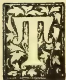

THE produce of lucerne, in the experiments carried out at the School of Agriculture, was at the rate of 2 tons, 11 cwt. per acre of green fodder. This taking eight cuttings a year means an annual yield of 20 tons, 8 cwt. a year. The seeds were procured from India, as attempts to grow lucerne from English seed have proved failures.

In Mr. Nock's experiment in Hakgala in 1892, the produce of lucerne was at the rate of a little over 32 tons per acre, and that with three cuttings. This, as Mr. Nock remarks, is up to the highest yields in England.

It is interesting to compare with these the results of cultivation on the Poona Farms where experiments with fodder crops form a special feature. In his report of December 1892, Mr. Mollison gives the outturn of his lucerne crop per acre per annum as 85,456 lb. or over 38 tons—14 cuttings having been made during the year.

In the same report Guinea grass is said to produce an outturn per acre per annum of 101,568 lb., or a little over 45 tons (with 8 cuttings during the year), while Reana gave a crop equal to 80,778 lb. or a little over 36 tons per acre per annum.

In Poona, Guinea grass is cultivated according to the ridge and furrow system, the crop is irrigated, and taken when quite young.

Mr. Mollison is a strong believer in Guinea grass as a fodder for milch cattle; of Mauritius or

water grass, he says: "It grows slower than Guinea grass, and does not give the same outturn"; and further adds "It has this advantage, it thrives well in a damp, even a wet situation."

This is an advantage no doubt, but when long droughts prevail and there is no means of irrigating water-grass, the crop in a great many places is completely burnt up with the result that there is a great dearth of fodder for cattle and horses. Owners of horses are gradually coming to learn that water-grass is by no means a suitable fodder for their animals, and yet there are no grass farms except those under water grass. Guinea grass is seldom grown, and when grown is found in small patches about dwelling houses. It is expected that in the course of this year a good deal of the waste land in the Model Farm premises will be laid under Guinea grass, Lucerne, Reana, and Jowari (Sorghum). Jowari thrives well at the School of Agriculture, while the produce of Reana grown on the premises was at the rate of nearly 15 tons per acre per cutting, or nearly 90 tons per annum, if 6 cuttings can be counted on. Our experiments with cow pea (the "wonderful") gave a yield equal to over  $5\frac{1}{2}$  tons per acre. The produce of the so-called "Delft" grass, (the roots of which were originally procured through the kindness of the Government Agent of the Northern Province) was at the rate of 8 tons,  $4\frac{1}{2}$  cwt. per acre at a cutting. As a result of the late drought there has been a great falling off in the supply of grass for milch cattle, and prices consequently went up. It is high time that other fodder crops such as those referred to above

763------------------------------------------------

706Supplement to the "Tropical Agriculturist."[April 1, 1895.

were begun to be grown. Mauritius grass grown on very marshy land has a tendency to produce scour in cattle, especially after the rains, while grass manured with refuse maldive-fish manure, though of a very luxuriant growth, is much objected to by milch cows.

#### OCCASIONAL NOTES.

*Errata.*—In the last number of the Magazine the present strength of the school was given as "3 resident students and day Scholars." It should have been given as 27 resident students and 6 day scholars.

On page 73, line 14, for *swell* read *smell*, and line 31, for *deceased* read *disused*.

On page 79 for *Ellataria* read *Elettaria*.

We have lately been having frequent requisitions for dhall (*Cajanus Indicus*) seed, and also for seeds of the cow-pea. The demand for these leguminous seeds is significant.

We would add in continuation of the article on Gas-lime in our last issue, that this substance, as well as gas-water, is a useful agent as an insecticide. Miss Ormerod in her "Manual of Injurious Insects" has frequent occasion to recommend gas-lime. Both gas-lime and gas-water, as refuse products of our gas works, might thus be used for useful ends in agriculture. We may, perhaps, again refer to these substances in connection with the destruction of insect-pests.

We have to welcome a new contemporary which has just appeared, viz., *The Ceylon Forester*. We are confident that the publication will prove a most useful one, in that it will bring our unknown and little known forest products—many of which that are bound to prove of economic value—to notice, and in this way help to develop the resources of the country.

We acknowledge with thanks a copy of Dr. Trimen's report on the Royal Botanic Gardens for 1894. As regards *Polygonum Sachalinense*, We read that "this much-landed fodder plant has made very poor growth; on three occasions during the year the plants were leafless and dormant." Of Alfala (Lucerne) Mr. Clark, who sent the seeds from Peru in 1891, reports from Hakgala: "As many as seven cuttings have been made during the year, and, as in Peru it continues to crop for fifteen years, it may be considered a valuable fodder for the higher regions, especially the drier ones, of Ceylon."

*Calathea Allouia* is reported to grow well at Peradeniya Gardens, but the Director remarks that its tubers cannot be regarded as a good substitute for potatoes, being quite tasteless though pleasant in texture. They are said to be small, and only 1 lb. 5 oz. was afforded by the stool dug up.

#### RAINFALL TAKEN AT THE SCHOOL OF AGRICULTURE DURING THE MONTH OF MARCH.

<table border="1">
<tbody>
<tr>
<td>1</td><td>Nil</td>
<td>12</td><td>02</td>
<td>23</td><td>Nil</td>
</tr>
<tr>
<td>2</td><td>Nil</td>
<td>13</td><td>Nil</td>
<td>24</td><td>Nil</td>
</tr>
<tr>
<td>3</td><td>Nil</td>
<td>14</td><td>Nil</td>
<td>25</td><td>94</td>
</tr>
<tr>
<td>4</td><td>Nil</td>
<td>15</td><td>Nil</td>
<td>26</td><td>01</td>
</tr>
<tr>
<td>5</td><td>Nil</td>
<td>16</td><td>60</td>
<td>27</td><td>Nil</td>
</tr>
<tr>
<td>6</td><td>Nil</td>
<td>17</td><td>01</td>
<td>28</td><td>35</td>
</tr>
<tr>
<td>7</td><td>Nil</td>
<td>18</td><td>Nil</td>
<td>29</td><td>04</td>
</tr>
<tr>
<td>8</td><td>06</td>
<td>19</td><td>01</td>
<td>30</td><td>Nil</td>
</tr>
<tr>
<td>9</td><td>17</td>
<td>20</td><td>Nil</td>
<td>31</td><td>01</td>
</tr>
<tr>
<td>10</td><td>04</td>
<td>21</td><td>Nil</td>
<td>1</td><td>Nil</td>
</tr>
<tr>
<td>11</td><td>29</td>
<td>22</td><td>Nil</td>
<td></td><td></td>
</tr>
<tr>
<td colspan="4"></td>
<td>Total</td><td>2.55</td>
</tr>
<tr>
<td colspan="4"></td>
<td>Mean</td><td>.08</td>
</tr>
</tbody>
</table>

Greatest amount of rainfall in any 24 hours on the 25th inches.

Recorded by P. VAN DE BONA.

#### ABORTION IN CATTLE.

Cattle-breeders have to face many serious disorders and ailments in their stock, both young and old, but the most disappointing losses which they sustain are undoubtedly caused by abortion. Unlike other forms of disease which attack stock and which come under the observation of the herdsmen, abortion runs a very insidious course. It can hardly ever be anticipated, and there is no hope of averting or preventing its occurrence. It need scarcely be mentioned that to the cattle-owner who keeps cows for the purpose of milk or who breeds draught animals, a loss by abortion is equal to the loss of a grown-up animal, and sometimes more. A cow generally aborts either in the third or seventh month of pregnancy, and after it has once had the mishap, apart from the risk to the health of the animal itself, a second conception is not induced till perhaps from four to five months. Besides, there is always the risk of a recurrence of the disorder every time a cow conceives; and, furthermore, there is the very great risk of its infecting other animals of the herd.

Where breeding is not carried on systematically, the cattle-owner often fails to notice the fact that abortion has occurred, or to feel the resulting loss to himself; but where breeding is carried on systematically, and where not only records of the dates of serving, calving, &c., are kept, but a full account of the profit and loss from each animal, its yield and the amount of food consumed, is recorded, the loss is patent, and keenly felt.

The occurrence of abortion is attributed to various causes. Dr. Fleming, in his exhaustive work on Veterinary Obstetrics enumerates three forms, viz., Sporadic, Enzootic and Epizootic, and gives the various causes which may produce these three forms. Sporadic abortion may take place, through exposure to inclemency of the weather, bad and indigestible food, mildewed and poisoned foods, filthy and putrid drinking water, animal and vegetable poisons, (such as cantharides, rue, savin, ergot, digitalis,) excessive exertion, accidents, excitement and fear, access of the bull during the period

764------------------------------------------------

April 1, 1895.] Supplement to the "Tropical Agriculturist."707

of gestation, bad odours, plethoric condition, diseases of the system, (such as cattle plague, foot and mouth disease, pleuro-neumonia anthrax, tympatitis, tetanus, epilepsy, &c.) It is the belief of some authorities that abortion is altogether an infectious and a contagious disorder, and is propagated by a micro-organism, which enters the system only through the vulvar opening. Others again believe that the micro-organism is capable of producing the disorder by gaining entrance to the system by various means. All the above enumerated causes of sporadic abortion are, however, generally considered to be only exciting causes.

It would appear since the contagious and infectious form of the disorder is now proved beyond doubt, that the disease-producing germs must be present in every case, and that the organisms rapidly multiply after an abortion which may in certain instances take place sporadically.

All those who have anything to do with cattle are aware that epizootics, such as cattle plague, or to give its Ceylon misnomer "murrain," do produce abortion, and this has been conclusively proved at the Government Dairy farm during the last outbreak of the disease there. The outbreak, as a matter of course, was a clear case of sporadic abortion; but when cows that were not suffering from the plague, but that were in the same herd, aborted also there would appear to be no doubt that the "abortion" had assumed an infectious and contagious form.

Of recent years quite an amount of literature has been cropping up on the subject, and only the other day the Committee appointed by the Royal Agricultural Society of England to investigate this subject, completed and issued its report, but the Committee has not been able to agree upon any point, except that abortion can assume a contagious and infectious form.

Continental Veterinarians, such as Franck, Nocard and Lebat, had made a series of investigations on this subject before it was so prominently brought before the British public, and long before it was thought necessary for the Royal Agricultural Society to appoint a Special Committee. Dr. Salmon of the United State's Agricultural Department published a report of a series of investigations made in America so far back as 1883.

What we are concerned most is to be able to recognise, and to follow the course of an outbreak of abortion in our herds, and, to know what steps we should adopt to prevent its occurrence. Professor Nocard has successfully coped with abortion through his antiseptic method of treatment, and the published evidence given before the Special Committee of the Royal Agricultural Society is in favour of not only Professor Nocard's antiseptic treatment, but also that advised by the American authorities; while a combination of the two, it appears, has given the best results.

Professor Nocard's treatment consisted of the injection into the organ of the aborting animal a solution of corrosive sublimate made by dissolving 15 grains of the sublimate along with  $1\frac{1}{2}$  oz. of salt in a pint and a half of lukewarm water. This method of treatment is calculated not only to destroy the micro-organisms that may

exist, but to prevent the entrance of these germs. The American method consists in the internal administration of carbolic acid in warm bran mashes, from a  $\frac{1}{4}$  to  $\frac{1}{2}$  an ounce of carbolic acid being gradually mixed with bran and warm water and given to the animal as a feed. As a matter of course this method of treatment is adopted with a view to destroy any organisms that have entered the system. But as was amply proved in the evidence before the special Committee of the Royal Agricultural Society, a combination of the two methods has given eminently satisfactory results.

An aborted cow should always be kept apart from the herd, and the shed, persons and utensils employed in its feeding, &c., promptly disinfected by using either Jeye's or Condy's fluid. After this the application of the corrosive sublimate lotion and the administration of carbolic acid in bran mashes may be proceeded with. The rest of the cows of the herd should also be washed and disinfected. A bull that has served a recently-aborted cow should not be used for covering the healthy cows. In any case an aborted cow should not be served for at least three to four months after the abortion. These simple rules and in addition cleanliness and care in feeding should do much towards the prevention of this disappointing disorder among cattle.

W. A. D. S.

—◆—  
SISAL HEMP.  
—◆—

The following facts concerning Sisal Hemp are from the annual report on the Bahamas for 1893:—

One hundred pounds of leaf yield not more than four or five pounds of fibre.

The generally accepted standard of 600 plants to the acre, is now in many cases being changed to 800, and in some instances to 1,000. If this increased number be not found to impede harvesting by the inconvenient crowding of the plants, the yield per acre should, of course, be largely augmented. The estimated annual yield of a single plant is two pounds of fibre, and thus, instead of a return of 1,200 lb. from the earlier planting of 600 suckers, assuming that the results are not modified by want of room for the full development of the plants, 2,000 lb. will be the expected yield where 1,000 plants are given to the acre.

It is highly satisfactory to know that a machine manufactured by the Todd Company of New York has been at length found to work admirably, the fibre being cleaned perfectly, at the smallest possible amount of waste (*Kew Bulletin*, 1894, p. 189). There can be but little doubt that this machine will be universally adopted, as, besides its efficiency, it is cheaply operated, a woman to feed the machine with leaves, another to remove the finished fibre, being all the labour attendant on this process. It has been for some time a subject of much thought as to how the small cultivators were to utilise their labour where, as in the great majority of cases, they were too poor and their plantings too limited to admit of the cost of a machine. A satisfactory solution, however, has now been found which will be a great boon to this class, and will bring the blessings of the industry home to the hum-

765------------------------------------------------

708Supplement to the "Tropical Agriculturist."[April 1, 1895.

blest peasant in the Colony. The process is as simple as it is available to all, and consists of a slit being made in the thick end of the leaf, when it is torn asunder, leaving the inner part exposed, and by then soaking it in salt water, which is never far to reach, in about a week the pulp may be removed by hand and the fibre preserved. No waste whatever is found in this method; and it is understood that a man or woman, or grown boys or girls, may turn out from 50 to 60 pounds of fibre as the result of a day's work. The plan is being adopted throughout the Colony, and what was for some time deemed a missing link is thus effectively supplied.

#### TROPICAL FODDER GRASSES.

(Reprinted from the *Kew Bulletin*.)

The selection of suitable grasses for cultivation in tropical countries is a matter of considerable importance. Few countries have completely solved the question. It is evident also that a good deal of time and energy is spent in the effort to introduce foreign grasses, when there are excellent indigenous grasses close at hand. It is proposed to draw attention to a few grasses that have attained to first rank for fodder purposes in the tropics, and to give particulars respecting the conditions under which they have been found to thrive. It is well known that the same kinds of grasses do not succeed equally well in all localities. There are certain conditions and peculiarities of climate and soil to be considered; but there is no reason to doubt that if careful experiment is made suitable grasses can be found for cultivation in almost every tropical country. In some of our colonies it is well known that grass, even for valuable horses, is gathered day by day from waste places and jungles. Such fodder is not only poor in quality, but it is liable to be infected with disease from stray animals. Further, during seasons of drought, the fodder supply is likely to fail altogether. The selection and cultivation of grasses, with particular reference to their grazing qualities, or for the production of hay, should receive more attention, and it will doubtless become, before long, a regular branch of rural industry in the tropics, as it has been for so many years in temperate countries.

#### NATURAL HERBAGE.

In the tropics the difficulty in establishing grasses is caused by the usually rank growth of weeds and bushes. These soon overrun any cleared area, and they have to be continually eradicated, or the grass would be completely destroyed. The natural herbage in most tropical countries would, of itself, form excellent pasture for cattle and horses. There is hardly any part of the world entirely devoid of good grasses, and these should first of all receive attention. Where no suitable fodder grasses are available, then, under such exceptional circumstances, it would be well to introduce the useful "Guinea grass" and "Para grass" for cultivation on land suitable for the purpose. In countries like Ceylon and Jamaica, there are vast stretches of lands, known as "patanas" and "savannahs," where somewhat coarse grasses have established themselves almost to the exclusion of everything else. Even these grasses, although in a fresh state they may be distasteful to cattle, become, after being cut and partially dried, very acceptable food

to them. Under cultivation, good pastures can, as a rule, be established by clearing the land of weeds and bushes, and encouraging the spontaneous growth of local grasses from seed carried from neighbouring areas. This is regularly done in Jamaica in regard to Guinea grass. During the first year or two the land requires to be carefully weeded, and if the soil is poor it should also receive a dressing of manure. After the grass has become thoroughly established an annual clearing after the rains is all that is required. It should, however, be understood that continuous feeding is injurious to the permanency of good pastures. The best grasses are thus destroyed, and rank growing ones gradually take their place. Close feeding for a time is advantageous, but the pasture should have time to recover before the animals are again placed upon it. Further, it is better to keep cattle on a portion of the pasture at one time, and not allow them to wander at will over a large area.

#### TREES IN PASTURES.

Thwaites recommended that in Ceylon trees should always be planted upon land laid out for permanent pasture. The trees would afford grateful shade to the cattle, and they would prevent the grass from being entirely dried up during seasons of drought. Trees would also add to the beauty of the country. Most extensive pastures dotted over with shade trees exist in Jamaica. Many trees, such as the Saman (*Calliandra Saman*), not only give excellent shade, but the pods are a most wholesome food for cattle. The commoner and more hardy sorts of mango might be planted for the same purpose, as also the Ramoon (*Trophis americana*), the leaves of which afford a very nutritious food for cattle in tropical America; the bread nut (*Brosimum Ailacastrum*); the Jack tree (*Artocarpus integrifolia*); and the bastard cedar (*Guazuma tomentosa*). The leaves as well as the fruits of the last are much liked by cattle. This brief list of useful pasture trees might be considerably enlarged. It would be noticed that many of the trees mentioned belong to the natural order, *Urticaceæ*. As the plants belonging to this order are so widely distributed over tropical regions, each country could make its own selection of suitable pasture trees. The best tree of all is, undoubtedly, the Saman. (*Kew Reports*, 1878, p. 18, *et seq.*)

#### GRASSES FOR DRY REGIONS.

Where the climate is moist and humid the selection of suitable grasses presents little difficulty. In countries subject to periods of prolonged droughts the circumstances are wholly different. The great want in such regions is the introduction of grasses that will maintain growth and vigour during many months when no rain falls. Grasses of this kind are to be found in the Bahama grass (*Cynodon Dactylon*), the Kangaroo grass of Australia (*Anthistiria australis*), and the Mitchell grass of Australia (*Astrebla triticoides*). These will stand periods of prolonged drought, and, in the case of the last, cattle are said to fatten on it, even when it is much dried up. In Jamaica, during severe droughts, cattle feed almost entirely on the underground stems of the Bahama grass. In dry soil impregnated with salt there are several grasses known in India affording a considerable amount of forage. A variety of *Sporobolus arabicus*, Boiss. (*S. pallidus*, Duth.) known as *Kalusra*, is mentioned by Duthie as constituting the greater

766------------------------------------------------

April 1, 1895.]Supplement to the "Tropical Agriculturist."709

part of the grass vegetation of the *usar* tracks in the north-western provinces, and is always a sure indication of the presence of *reh* salts. Other grasses mentioned as more or less characteristic of saline salts are *Aristida depressa*, Retz. (more sandy parts); *Cynodon Dactylon*, Pers. (on less infected parts); *Chloris barbata*, Sw. (more sandy parts); *Tetropogon villosus*, Desf.; and *Diplachne fusca*, Beauv. (in moister parts).

#### ANNUAL FODDER GRASSES.

In dry regions not suitable for permanent pastures the Abyssinian Teff (*Eragrostis abyssinica*) might be grown during the occasional rains and made into hay. This grass will produce a heavy crop of hay in six weeks from the time of sowing. It is very nourishing, and cattle are very fond of it. There are other annual grasses that might be grown during the rains for fodder purposes. In Northern India green wheat is used as fodder, and where a large yield is desired within a short season, green oats are also used, as in St. Helena, for fodder purposes. The maize (*Zea Mays*) is often given as a green fodder, or dried and mixed with other green fodder. On sugar estates in the West Indies and elsewhere "cane tops" are largely used during crop time as fodder for working cattle, mules, &c. The tops are cut small, and sometimes mixed with molasses. They are regarded as most nourishing. In Mysore *Sorghum saccharatum* is regarded as an excellent fodder, and if cut before seeding it is well suited for cattle, especially milch cows—"their milk being enriched to an extraordinary degree by its use in small quantities." The United States Agricultural Department has declared that "the value of sorghum for feeding stock cannot be surpassed by another crop, as a greater amount of nutritious fodder can be obtained from it in a shorter time, within a given space, and more cheaply." The common sorghum (*Sorghum vulgare*), the *Juár* of India, is largely used as fodder, green or dry. It is often specially grown as a fodder crop, in which case it is sown earlier and more thickly than when cultivated for the grain.

A very valuable fodder grass belonging to this group is the Teosinte (*Euchlana luxurians*). This yields very large crops in good land, and is regarded as one of the most prolific of annual grasses. Four good cuttings can be made in four months.

Most of these annual grasses, as also many coarse-growing perennial grasses, might be largely utilised by being preserved in the green state in silos. In South Africa silos, consisting merely of pits dug in the ground, have been found very useful in preserving fodder that would otherwise be lost, until the dry season. The cost of making silos is comparatively trifling, but it should be borne in mind that fodder preserved as hay is often more generally useful, and especially if made in good weather. Silos, on the other hand, offer a very ready and convenient means for preserving fodder during wet seasons, when it is impossible to make it into hay.

#### GRASS GROWING IN INDIA.

Voelcker\* records an instance of the greatest care in grass growing in India, at Nadiad, in Gujarat (Bombay), where the cultivators do not use the village common land for their cattle.

\* Report of the Improvement of Indian Agriculture, London, 1893.

"Every one of their fields," he says, "is enclosed with a hedge, and then comes a headland of grass from 15 to 20 feet wide all round the field, and producing capital grass. There is a double object in this practice, for, as the fields are hedged, and have trees round them for supplying firewood and wood for implements, the people know quite well that crops will not grow when thus shaded, but that grass will. They obtain four or five cuttings of grass in the year as food for their cattle, and when the fields are empty the cattle are let in to graze on them. . . . Dúb grass (*Cynodon Dactylon*) as a crop for irrigation gives a great yield, and is about the only grass that keeps green in the hot weather. At Belgaum, fields are grown with grass; two cuttings are obtained yearly, and 6 annas is the sum paid for 100 lb. of green grass. No seed is ever sown, only the grass that comes up naturally being used."

To supply grass to military cantonments in India regular grass farms have recently been established. These were started by Sir Herbert Macpherson at Allahabad in 1882, and since then have been extended largely.

Previous to the introduction of the grass farm system, the practice had been to send out "grass-cutters," whose duty it was to cut and collect grass for the troops from wherever they could. Owing to a full supply of grass being now obtainable by the "grass-cutters" from Government grass lands great saving has been experienced, and the horses are believed to be healthier owing to the grass no longer coming from unprotected and suspicious sources. The amount of grass grown at military stations in India has been so increased that it is now possible to supply not only the British troops, but even the native cavalry with it. The saving at Allahabad alone for the seven years 1882-89 was estimated at R91,158. The extent of the Allahabad grass farm is 3,558 acres.

Ensilage, or the preserving of green fodder, has been carried out at many places in India. The cost as between haymaking and that of silage is, however, unfavourable to the latter. One advantage of cutting an early crop of grass for silage is that there are many grasses, such as numerous species of *Panicum*, which seed in the rains; these may be secured as silage if rain continues, whereas the other grasses, being kept back somewhat, yield a good hay crop about October, when the rains are over. It may further be said in favour of silage that by means of it some grass which would otherwise have been altogether lost owing to the heavy rains is saved by being put into the silo. Voelcker concludes: "I differ entirely from the opinion of one of my predecessors to the effect that India is the great field for the development of silage. That it is the field for haymaking I am much more ready to think. With a sun and climate such as exist over the greater part of India, I cannot see how it could well be otherwise. Hay requires no making, for it makes itself. Silage, I repeat, will only be useful when by means of it can be saved what would otherwise be lost."

#### ZOOLOGICAL NOTES FOR AGRICULTURAL STUDENTS.

The order *Rodentia* is characterised by two long incisor teeth in each jaw, separated by a

767------------------------------------------------

710

Supplement to the "Tropical Agriculturist."

[April 1, 1895.

wide interval from the molars. The lower jaw has never more than two of these incisors, and the upper jaw very rarely; but sometimes there are four upper incisors. There are no canine teeth, and the molars and premolars are few in number (rarely more than four on each side of the jaw). The feet are usually furnished with five toes each, all of which are armed with claws. To this order belong the mice, rats, squirrels, rabbits, hares, beavers, porcupines. The first five mentioned are all more or less destructive to agricultural and horticultural produce. The beaver is hunted chiefly for the sake of its skin, but also for the substance known as *castoreum*. This is a fatty substance secreted by peculiar glands and employed as a therapeutic agent. The quills of the porcupine are used, among other purposes, for making porcupine-quill boxes well-known in Ceylon.

The order *Chiroptera* is considered "the most distinctly circumscribed and natural group" of the Mammalia; the following are the characteristics of the Chiroptera:—The anterior limbs are longer than the posterior, the digits of the fore-limb (excepting the pollex (or thumb) being enormously elongated, and united by membrane (patagium) which is also extended between the fore and hind limbs and the sides of the body, and sometimes even between the hind limbs and tail. This membrane serves for flight. The thumb and sometimes the first finger have claws, while all the toes are clawed, the digits being all of a size.

The order includes only the Bats, the great peculiarity of which—already referred to—is the modification of the hand for the purpose of supporting a flying-membrane.

Bats generally appear at dusk or at night; they are sometimes carnivorous, sometimes frugivorous, and often do much damage to fruits. Their ears are large compared with their eyes, and their sense of touch is believed to be very acute. During the day, bats retire to caves and other dark recesses, where they suspend themselves by means of their hind-feet which are provided with curved claws. The droppings of bats in such places form a very rich manure.

*Insectivora* comprises a number of small mammals resembling the Rodents, but without the peculiar incisors of the latter. In the insectivora all three kinds of teeth are present; the molars are serrated with numerous small pointed cusps for crushing insects. Usually all the feet are furnished with five toes which have claws. The animals walk on the soles of the feet, and are generally nocturnal and subterranean. To this order belong the moles, shrews and musk-rats.

VALUATION OF MANURES.

The following useful data and many of the tables that follow are taken from *Bulletin 55* of the New York Experimental Station, prepared under the direction of Dr. Peter Cellier:—

<table border="0">
<thead>
<tr>
<th></th>
<th>Price per lb. in pence.</th>
</tr>
</thead>
<tbody>
<tr>
<td>Nitrogen in ammonia-salts</td>
<td>... 8½</td>
</tr>
<tr>
<td>Nitrogen in nitrates</td>
<td>... 7½</td>
</tr>
<tr>
<td>Nitrogen in meat, blood, and mixed fertilisers</td>
<td>... 8½</td>
</tr>
<tr>
<td>Nitrogen in fine-ground bone and</td>
<td></td>
</tr>
</tbody>
</table>

<table border="0">
<tbody>
<tr>
<td>tankage</td>
<td>... 7½</td>
</tr>
<tr>
<td>Nitrogen in coarse bone and tankage</td>
<td>... 3½</td>
</tr>
<tr>
<td>Phosphoric acid, soluble</td>
<td>... 3½</td>
</tr>
<tr>
<td>Reverted phosphoric acid</td>
<td>... 3</td>
</tr>
<tr>
<td>Phosphoric acid in fine bone and tankage</td>
<td>... 3</td>
</tr>
<tr>
<td>Phosphoric acid in coarse bone and tankage</td>
<td>... 1½</td>
</tr>
<tr>
<td>Phosphoric acid in wood ashes</td>
<td>... 2½</td>
</tr>
<tr>
<td>Potash, high grade sulphate</td>
<td>... 2½</td>
</tr>
<tr>
<td>Potash, kainit</td>
<td>... 2½</td>
</tr>
<tr>
<td>Potash, muriate</td>
<td>... 2½</td>
</tr>
<tr>
<td>Organic nitrogen in mixed fertilisers</td>
<td>... 8½</td>
</tr>
<tr>
<td>Insoluble phosphoric acid in mixed fertilisers</td>
<td>... 1</td>
</tr>
</tbody>
</table>

Chemical analyses often show the three elements in combination not referred to in this tabulation. There the nitrogen may be given as ammonia or the potash may appear as the chloride or sulphate, in which case it will be necessary to reduce such compounds into their equivalents of the element or other compound required. These conversions may be made by the use of factors as shown below:—

1. 1. To change ammonia into equivalent nitrogen, multiply ammonia by .8235.
2. 2. To change nitrogen into equivalent ammonia, multiply nitrogen by 1.214.
3. 3. To change muriate (chloride) of potash into equivalent potash, multiply muriate by .63.
4. 4. To change potash into equivalent muriate of potash, multiply potash by 1.585.
5. 5. To change sulphate of potash into equivalent potash, multiply sulphate by .54.
6. 6. To change potash into equivalent of sulphate of potash, multiply potash by 1.85.
7. 7. To change phosphoric acid into equivalent phosphate of lime, multiply phosphoric acid by 2.183.
8. 8. To change soluble sulphate into equivalent phosphate of lime, multiply soluble phosphate by 1.325.

How these tables are used will be best seen by means of an example. Suppose one of the mixed fertilisers common in the markets be purchased, which is guaranteed to contain—nitrogen 3 per cent, soluble phosphoric acid 6 per cent, reverted phosphoric acid 4 per cent, potash 2 per cent. The commercial value, first of 100 lb. of this fertiliser and then of one ton (2,240 lb.) will be shown in the following calculation:—

<table border="0">
<tbody>
<tr>
<td>3 per cent nitrogen—in 100 lb., 3 lb.</td>
<td>s. d.</td>
</tr>
<tr>
<td>—at 8½d.</td>
<td>... 2 2½</td>
</tr>
<tr>
<td>6 per cent soluble phosphoric acid—in 100 lb., 6 lb.—at 3½d.</td>
<td>... 1 7½</td>
</tr>
<tr>
<td>4 per cent reverted phosphoric acid—in 100 lb., 4 lb.—at 3d.</td>
<td>... 1 0</td>
</tr>
<tr>
<td>2 per cent potash—in 100 lb., 2 lb.—2½d</td>
<td>... 0 4½</td>
</tr>
<tr>
<td>Value of 100 lb.</td>
<td>... 5 2½</td>
</tr>
</tbody>
</table>

Multiply this value of 100 lb. (62½d.) by 22.4 gives us as the value of one ton (2,240 lb.) of this fertilisers, £5 16s. 6d.

To make another example, in this case a Queensland manufactured bone-dust. The analysis shows for this article the following composition:—

<table border="0">
<tbody>
<tr>
<td>Moisture</td>
<td>5.38 per cent</td>
</tr>
<tr>
<td>Organic substances (containing 3.78 per cent nitrogen, equal to 4.59 per cent ammonia)</td>
<td>40.10 ,,</td>
</tr>
<tr>
<td>Lime</td>
<td>29.15 ,,</td>
</tr>
<tr>
<td>Phosphoric acid (equal to 48.78 per cent phosphate of lime)</td>
<td>21.42 ,,</td>
</tr>
<tr>
<td>Carbonic acid</td>
<td>1.06 ,,</td>
</tr>
<tr>
<td>Insoluble (sand, &amp;c.)</td>
<td>0.72 ,,</td>
</tr>
</tbody>
</table>

768------------------------------------------------

April 1, 1895.]Supplement to the "Tropical Agriculturist."711

The only ingredients of this fertiliser that have a money value are the nitrogen and phosphoric acid. Arranging these as before, and we have in tabula form the value of 100 lb. of this fertiliser with the calculations for one ton.

<table>
<tr>
<td>3.78 per cent nitrogen—in 100 lb.,</td>
<td>£.</td>
<td>s.</td>
<td>d.</td>
</tr>
<tr>
<td>3.78 lb.—at 7½d.</td>
<td>0</td>
<td>2</td>
<td>4½</td>
</tr>
<tr>
<td>21.42 per cent phosphoric acid—in 100 lb.,</td>
<td>0</td>
<td>5</td>
<td>4½</td>
</tr>
</table>

Value of 100 lb. ... 0 7 8½

Value per ton of 2,240 lb. ... 8 12 8

It is possible for every user of commercial fertilisers in this way to estimate the value of any of the various goods that are offered in the market.

### MILKING WITH AND WITHOUT THE CALF.

The following is an extract from a letter written by an Australian Dairy Farmer to the *Agricultural Journal* of Cape Colony. The experience given here, *re* the subject of milking without the calf, is valuable, in view of the fact that the established practice in Ceylon is to milk *with* the calf:—

"When I started my dairy some twelve months ago I thought I would try English ways of milking, and as I brought out from home my white boy, a good milker, and to be depended on, I thought I would show that cows could be milked without their calves; but in this matter, as in several others, I have found out English customs will not always do in this colony, although no doubt some of them will show an advance on colonial ways. I bought two pure colonial bred Shorthorn cows of Mr. Hall, near Middeburg, who has for the last 10 years kept importing pedigree stock. Consequently they are what we can term pure-bred. The reason I make this remark is because it is my opinion that Shorthorns are much kinder milkers than any other breed. The cows had their third and fourth calves by their sides about six weeks old. I took away the calves first once a day, and then altogether for a week, and found the cows would have dried up altogether despite every means I tried for them to give their milk, such as heavy chain weights across the loins, hot flannels, &c. I also found that what milk I did get was of very poor quality, although the cows were stall-fed. I was at last obliged to let the calves to the cows, and one of them I tried myself, but could not get a half pint. After letting the calf to cow, I milked with ease another four bottles of rich milk. Not liking to be laughed at by our colonial friends who are always ready to do so, I tried on a heifer just calved. I took away the calf at once and she has proved a splendid milker, which increased considerably after the first week. I quite agree with Mr. Smith, the Government Dairy Expert, that heifers treated in this manner will not only milk better and give richer milk, but that they will milk much longer, and improve after every calf they have. This is not the only heifer I have tested, and it will not be the last, as I am sure it will pay better to do as some of the milkmen do at home, where they keep cross-bred cows for milking only to kill the calves when first born, or give them away to small cottagers to bring up on meal substitute for milk instead of letting them suck the cows."

### NOTES FROM A TRAVELLER'S DIARY.

As regards vegetable and fruit garden cultivation, the villages around Kelaniya and Kotta districts appear to stand pre-eminent in the low-country, and a large quantity of vegetables and fruits sold in the Colombo market is supplied from these villages. Most of the vegetables grown here are purely native, such as cucumber, snake-gourd, pumpkins, long beans, bandakka, different varieties of yams, &c. The villagers know that the cultivation of these pays them, and as there is always a ready market for the produce, they take to vegetable cultivation with earnestness. Betel cultivation is also carried on extensively in these districts, and a large quantity of the leaves is sent to different parts of the island, particularly to upcountry. Sugarcane is also grown to a large extent, for which also a ready market is always found in Colombo and its suburbs. The principal fruits that are to be found here are oranges, pine apples, mangoes, bael fruits, custard apple, rambutans, &c. The oranges and pine apples grown in the Kotta district are noted for their sweetness. Plantains are also grown in these districts to a fairly large extent, but not so extensively as in the villages bordering the Maha-Oya and its tributaries, from where cart-loads of plantain bunches are brought down to Colombo for sale and also transported to different parts of the island by rail.

Another place where vegetable cultivation is the principal industry is a group of villages about 3 or 4 miles distant from Panadure on the Ratnapura road. Large quantities of native vegetables, such as snake-gourd, cucumber, bandakka, &c., are systematically cultivated here and transported for sale to Galle, Bentota, Colombo, &c. Of these villages Pamunugama and Alubomulla take the lead, and I was particularly struck with the large acreage of snake-gourd plantations which line the road at the former place. I have never seen a place where snake-gourd is so extensively and systematically cultivated as here. The *owita* lands in these villages have a rich soil and are well adapted for vegetable cultivation, and the people appear to take to it in earnest. Snake-gourd is planted in holes, about 3 or 4 feet apart, previously occupied by some other crop, such as cucumber, bandakka, &c., and are trained on sticks as in the case of the betel vine. A pandal is constructed on the top by tying sticks together with long coir rope, and the creepers find ample space for growth and production of fruits on this pandal. The appearance of such a field of snake-gourd with a profusion of snowy white flowers and with long ashy-coloured fruits hanging from the top is very pleasing to the eye.

I have so far stated the facts as they would appear to any casual observer, but when one looks more deeply into the state of affairs, he is surprised that much more is not done in these districts with a view to supplying the market more regularly with fruits and vegetables of a superior quality. Most of the vegetable gardens in the town of Colombo are in the hands of Coast Tamils, and they are good in their own

769------------------------------------------------

712Supplement to the "Tropical Agriculturist."[April 1, 1895.

way. Experiments in the cultivation of various English vegetables are, I believe, carried on at the School of Agriculture, and it would be interesting to know which of such are suited for the lowcountry, and whether they could be grown with profit by our goiyas. Now that the Alfred Model Farm at Kanatte has been given over to the School of Agriculture, we hope for great things in the future. The experiments hitherto carried on in the School grounds could now be extended, and the "will-it-pay" question fully demonstrated and established. A real model vegetable garden near the town of Colombo is a great desideratum. The Alfred Model Farm which is to be worked in connection with the School of Agriculture will, it is hoped, supply this want, and be the means of improving the quality of vegetables supplied to the Colombo market.

#### THE PREPARATION OF ESSENCES.

(Concluded.)

The preparation of essences is an industry of warm climes, for most of the plants which yield the material for its preparation thrive only in tropical or sub-tropical countries only. In Grasse, Nice and Cannes in Europe it is carried on to a more or less large extent. In India the natives extract essences from certain plants, and this is done at present generally in a crude way. The extraction of essence by expression is only feasible with such materials as contain a large percentage of oil. The skins of oranges citrons and other aurantious fruits are examples. The parts rich in essence are subjected to pressure in specially constructed presses, when a mixture of the essential oil along with a large percentage of water is obtained. This is allowed to repose till the oily and light substance appears on the top when it is decanted off and the water thrown away. Machinery of various forms is used for the purpose of peeling the skins of the fruits in order to expedite the operation, but in whatever manner the peeling is done, the method remains the same. Distillation is of ancient origin, and up to a recent date only a crude form of still and condenser was used for the purpose; the still, generally made of clay, being heated by an open fire and the vapour collected and cooled in the other vessels. In manufacturing essences out of delicate plants, the interior of the still is divided into two portions by a diaphragm pierced with holes and the plants or flowers arranged over it whilst the lower partition is filled with water. When the still is heated the steam carries with it the essential principles of the materials thus spread, and is as usual collected in vessels kept cool. However good distillation may be in the case of certain plants and flowers, it does not answer well in every case, for there are certain essential oils which when subjected to a temperature of 100°. C. decompose easily, hence maceration has to be adopted in such instances. Maceration is performed by dipping the plants &c., to be treated in fine fat or oil and subjecting it to a mild heat, when the essence or the perfume is easily taken up by the fat. The essence is extracted from the scented fat by means of alcohol. This process is carried on in different ways according to the circumstances of the manu-

facturers, in some places highly complicated machinery being used. A means that will recommend itself to those who cannot invest in costly machinery is the cloth frame. The *Scientific American Encyclopedia* describes it as follows:—Upon an iron frame a piece of white spongy cotton cloth is stretched and then moistened with almond or olive oil: on the cloth is placed a thin layer of the fresh plucked flowers. Another frame is similarly treated, and in this way a pile of them is made. In twenty-four or thirty hours the flowers are replaced by fresh ones, and this is repeated every day or every other day until seven or eight different lots of flowers have been consumed, or the oil is sufficiently loaded with their odour. The oil is then obtained from the cotton cloth by powerful pressure, and is placed aside in bottles to settle, ready to be decanted into others for sale. Sometimes, thin layers of cotton wool, slightly moistened with oil are employed instead of cotton cloth. The native perfumers of India prepare their scented oils in the following manner:—A layer of the scented flowers about four inches thick and two feet square is formed on the ground, over this is placed a layer of moistened Sesamum (*tala*) seeds two inches thick, and on this another four inch layer of flowers: over the whole a sheet is thrown which is kept pressed down by weights attached at the edges. The flowers are replaced with fresh ones after the lapse of twenty-four hours and the process is repeated a third and even a fourth time when a highly-scented oil is desired. The swollen Sesamum seeds, rendered fragrant by contact with the flowers, are then submitted to the action of the press by which the bland oil is obtained, strongly impregnated with the aroma of flowers. The solution of a few grains of Benzoic acid in any of the oils materially retard the accession of rancidity if it does not prevent it altogether.

W. A. D.

#### EARLY PADDY AND ITS CULTIVATION.

[BY PRASANNA NATH LAHIRI.]

As rice is a very important article of commerce and is consumed by a considerable portion of the human race, a few notes on its cultivation, based upon the results of a series of experiments conducted by me in my own farm may not be uninteresting to your readers. It is said that paddy, as the rice husk is called, in its wild state, is a native of this country, and that its cultivation has been carried on here from time immemorial, to such an extent that Indian farmers have little or nothing to learn about it. An experienced and accurate botanist, Mr. C. B. Clarke, has said that the hereditary cultivators possess a marvellous intuitive knowledge in recognising the different forms of rice and, what is far more surprising, that they can pick up a handful of dry grain and affirm that it would be more suitable to a particular method of cultivation and soil, while they reject an almost precisely similar grain as unsuitable. With all their knowledge and intuition in the matter of the successful culture of this valuable crop,

770------------------------------------------------

April 1, 1895.Supplement to the "Tropical Agriculturist."713

the native husbandmen, following their stereotyped system of cultivation, are still in the dark abyss of ignorance, and remote from those rational principles which have held up agriculture as an important science in the eyes of the civilised world. Not only are their implements of the rudest and most primary type, but they are hardly alive to the necessity of giving nourishment to the soil to bear the strain of yielding continuous crops. Had not India been blessed with a very rich and fertile soil, interspersed with a net-work of navigable rivers and canals, which annually overflow a large portion of the cultivable area, replenishing with a plentiful deposit of silt the exhaustion caused by cultivation, it would not be capable of supplying what little it does as food for its famished population.

The paddy plant belongs to the natural order of grass, of which wheat, barley, oats, rye, etc., are the species. It is of the genus *oryza*, akin to the Arabic *Aruzz* (rice), or to the Indian *uro*, "wild rice." The cultivated paddy is botanically named *oryza sativa*, and has its habitat in the swamps and marshes of the tropical region. It is now extensively cultivated, not only in India, but in America, Africa, China, Japan, Spain, Italy, and even in Australia. Humboldt found it wild in the Himalayas, but Dr. Roxburgh assigned its origin to some place in the Telegu country in Madras, while M. De Condolle considered it to be of China. In the face of such wide difference of opinion as to the probable country of its nativity, it is impossible to determine correctly from the data already in hand the true place of its birth. Carolina rice, which is considered the best variety of rice at present known, and is in great demand in the European, market is only an improved variety of the Madagascar rice—how and when it was introduced into that solitary island is not known at all. The numerous cultivated varieties of rice found in this country may be classed in three groups, namely, first, *aus*, or the early autumn crop; secondly, the *amuni*, or the winter crop; and thirdly, the *boro*, or the spring crop, but the botanical division is otherwise. A further classification is, however, proposed by some, according as the crop is raised by the help of more or less water. The *aus* and the *boro* varieties are not so extensively cultivated as the other, which, is therefore, considered the main crop, and one that supplies the best table rice of the Europeans. The *aus* and the *boro* are only cultivated by the ryots for home consumption in time of need, as they are less dependant upon rain water and inundation, and are therefore less liable to failure. If, however, the better varieties are gradually introduced—amongst them being the early paddy, such as is found in the districts of Dinagepore and Maldah—and their culture systematically carried on, they should come into use among well-to-do people in Bengal, at least in a year of drought. Last year I obtained through the good offices of a friend of mine, a couple of maunds of the Dinagepore *aus* paddy seed, locally known as *Banafuli* rice, and had it experimented upon in my farm with different manures and in different ways, and tested the result with the ordinary but coarser paddy of this district.

In conducting the experiments I had three objects in view, viz. to see which manures gives the largest yield, to compare dibbling with broadcast sowing, and to ascertain the relative outturn of the finer and the coarser varieties. The land I selected for the purpose had only previously been cropped with potato, wheat, and vegetables. It had lain waste for over twenty years, and had become over-grown, therefore, with a luxuriance of vegetation so I had to undergo much expense and labour to make it fit for cultivation. The plots on which potato was grown had been well-manured with a mixture of bone-meal and cowdung and with each of them separately; the wheat plot and only a top dressing of saltpetre; while the other was without any manure. I divided the experimental plots thus, each with an are a equal to 1-60th of an acre:—

<table border="1">
<tbody>
<tr>
<td>No. I</td>
<td>Bonemeal and cowdung</td>
<td>(Banafuli)</td>
</tr>
<tr>
<td>No. Ia</td>
<td>do</td>
<td>(Coarse)</td>
</tr>
<tr>
<td>No. II</td>
<td>Bonemeal only</td>
<td>(Banafuli)</td>
</tr>
<tr>
<td>No. IIa</td>
<td>do</td>
<td>(Coarse)</td>
</tr>
<tr>
<td>No. III</td>
<td>Cowdung only</td>
<td>(Banafuli)</td>
</tr>
<tr>
<td>No. IIIa</td>
<td>do</td>
<td>(Coarse)</td>
</tr>
<tr>
<td>No. IV</td>
<td>Without manure</td>
<td>(B)</td>
</tr>
<tr>
<td>No. IVa</td>
<td>do</td>
<td>(C)</td>
</tr>
<tr>
<td>No. V</td>
<td>do</td>
<td>(B)</td>
</tr>
<tr>
<td>No. Va</td>
<td>do</td>
<td>(C)</td>
</tr>
<tr>
<td>No. VI</td>
<td>do</td>
<td>(B)</td>
</tr>
<tr>
<td>No. VIa</td>
<td>do</td>
<td>(C)</td>
</tr>
</tbody>
</table>

*Banafuli*, it must be stated, is the finest variety of the early paddy that I have ever seen. It has ivory-white grain when husked, is scented, and is fit for competition with the best of the winter crop.

The previous cropping having rendered the plots free of weeds and obstinate vegetation, I gave only a few ploughings after the first shower of rain in April last year to reduce them to the required tilth. The monsoon having burst rather late last year, I could not commence sowing till May following. All the plots from I to Va had the seed dibbled four inches apart in rows of the same distance, while Nos. VI and VIa were sown broadcast. Dibbling required 42 lbs. of the coarser and 36 lbs. of the finer variety per acre, while broadcasting required double the quantity. The seeds before being sown were steeped for six hours in a mixture of camphor water and cow urine in the proportion of ten seers to one for every half a maund of seed. A small quantity of powdered sulphate of copper was thrown over it and hurriedly mixed therewith. Then the whole was mixed with wood ashes of sufficient quantity to soak the liquid from the seeds and make them fit for sowing. This precaution was taken to hasten germination and to preserve the seed from the attack of insect pests, in accordance with the directions contained in the valuable printed instructions of Mr. N. G. Mookerji, Agricultural Deputy Collector of Berhampore. The seedlings appeared on the third day, and ten days later they attained the height of six inches. As the plots had been embanked on all sides, rain water could not drain off, but was absorbed by the ground. A dose of saltpetre was applied to all plots down to No. IVa at the rate of 60 lbs. per acre, which gave them a fresh start, and in a fortnight the seedlings so multiplied themselves that there was scarcely any space visible between the plants and the rows. Little or no weeding having been deemed necessary,

771------------------------------------------------

714Supplement to the "Tropical Agriculturist."[April 1, 1895.

the soil was at the early stage of the growth of the plants loosened with a hand rake or *Dauh*, as it was noticed that the heavy downpour of the season had already caked the earth and would have hindered the appearance of the shoots round the seedlings. Though the soil of the unmanured plots was also rich, having been recently reclaimed virgin soil, there was a marked difference in the luxuriance and general aspect of the plants in the manured and unmanured series. The dressing of saltpetre—of course crude, *i.e.*, mixed with common salt, to some extent as is generally found in the market—had a marvellous effect on them. By the end of July the ears appeared averaging in length from 10 to 16 inches; consisting of three to five branches. In due course the milky juice hardened into edible grain, and the plants unable to bear the burden, fell to the ground as if stricken by a hurricane. As soon as the grains were found to be fully ripe, the plants were, in the last week of August, cut with a country scythe, leaving the stubble to rot and serve as manure for the crop. They were then made into bundles and stacked on the threshing floor. The subsequent operations were those that are generally observed by our country cultivators, treading by cattle and winnowing by means of strong wind or bamboo fan. The outturn of each plot was weighed and its quality compared. The yield from plot No. 1a stood highest, being 42 maunds per acre, that from No. 1 was greatest in its own class, 32 maunds 15 seers per acre. Bone dust and cowdung plots gave almost an equal quantity. The outturn of the saltpetre plot was higher than that of the unmanured plot; while the outturn of the plot on which broadcasting had been practised stood last. As for the quality of the crop grown from seeds of Dinagepore, I found them on a comparison with the parent stock to be equal, if not superior. I am decidedly of opinion that this variety may successfully be introduced into this district, and may be used as a good substitute for the finer winter rice in time of drought. The careful selection of seed is a very necessary step in the improvement of indigenous agriculture, and ought to be a point for Government to impress upon the native husbandmen.

---

#### GENERAL ITEMS.

---

The relation that subsists between Forests and the resources of a country (says the Editor of the Cape Colony *Agricultural Gazette*) has of late years become well understood. Not merely do better management and conservation result in securing a considerable revenue from the sale of timber and other products, but the existence and influence of forests most favourably affect the productiveness of a country. This may be seen even in the limited extent to which plantations have been made on farms in Australia, and even in this country. But the evidence is on a much larger scale where, as in some old countries, the destruction of forests has been followed in after years by greatly decreased crops and almost barrenness of soil. Forests ameliorate the climate, conserve the rainfall, and

otherwise promote conditions of soil and climate favourable to cultivation.

The following from the *Live Stock Journal* goes to recommend the practice, common among the natives of Ceylon, of keeping poultry in the open:—"A very striking example of the advantage of keeping poultry in the open, in place of shutting them up in confined runs, was given at the last Birmingham Show. Captain Heaton, who is well known as a most successful breeder of various kinds of live-stock appertaining to the farm, is also an enthusiastic and most successful breeder of fancy poultry. His present devotion is to the modern show game birds, in which tightness and brilliancy of feather and hardness of condition are indispensable to success in the show pen. Of these he breeds a very large number in the neighbourhood of Worsley, but, in consequence of the depredations of poultry thieves, he had them all brought in from their runs; after making a selection of the best, he killed off all but fifty. He then found that for those that were reserved as likely to produce prize-winners he had only room for thirty-four, and the other sixteen were turned loose in the coverts to take their chance, roosting in the trees, and exposed to the weather and the changes of temperature incidental to such a life. Breeders of fancy poultry who coddle up their birds in close houses, where the pure air of heaven can rarely reach them, would, doubtless, have thought this fatal to success, and will be surprised to hear that the two birds with which Captain Heaton took the champion cup at Birmingham and the fourth prize, selling them afterwards for £100 a piece, were two of those that had not been reared on foul soil and in tainted air of poultry runs and houses, but had roosted like pheasants in the trees till sent to the show, where, in their splendid condition, they surpassed all their competitors. *Verbum sap.*"

The Superintendent of Farms in the Bombay Presidency writes thus about a machine which can be seen at the School of Agriculture, having been loaned to the school by Messrs. W. H. Davies & Co., the Agents for the manufacturers:—"The Planet Junior combined hoe and plough I have found extremely useful in the cultivation of Guinea grass and potatoes; also in the last ploughing for sugar-cane and in ridging up, preparatory to planting the sugar-cane sets. The last operation is commonly done by a native plough yoked with four bullocks. The Planet Junior does the work better and more expeditiously. It is easily drawn by two bullocks. It costs R33 in India."

It has been ascertained by experiments (says the *Agricultural Gazette*, N.S.W.) that 1 acre of cowpeas turned under enriches the soil by 3970.38 lb. of organic matter, containing 64.95 lb. nitrogen with a manurial value of £2.

We have to acknowledge with thanks the receipt of the following publications:—The Magazines of the Royal and S. Thomas' College, "Our Boys," and *The Agricultural Gazette* of Cape Colony.

772------------------------------------------------

# \* The TROPICAL AGRICULTURIST \*

## ◇ MONTHLY. ◇

Vol. XIV.]

COLOMBO, MAY 1ST, 1895.

[No. 11.

### A TRIP TO THE HORTON PLAINS AND NEW GALWAY DISTRICT.

HORTON PLAINS REVISITED.

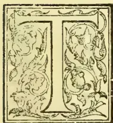

THE city toiler no greater boon can come at this season of the year, than to exchange the burning heat of Colombo for the fresh, cool, air of the hills. The transfer from a Fort office to an improvised "sanctum" in a cottage 6,300 feet above sea-level is truly invigorating and lifegiving. With an outlook on some of our grandest forest-clad hills and surrounded by flowery fragrance, work with the pen even, ought to be pleasant and easy; but, alas, our portion—apart from such daily portions and reviews as could be intermittently run off—has been to consider and deal with a mass of "Statistics" and prepare them for incorporation in a forthcoming volume, as well as in many other dry, but necessary, ways, to sum up the present condition and prospects of the Colony. Not even the sight of

The swan upon St. Mary's Lake

Floats double, swan and shadow,—

could drive poetry into such an occupation. But there came an interlude with the welcome proposal to repeat a visit to Horton Plains, by a new and much easier route than the one we had travelled by on our first visit some 17 years ago. We had, then, for companions the "Senior Editor" and the energetic young Superintendent of Portwood, whose pistol and pony both did good service in different ways. We started from the old Nuwara Eliya Resthouse on a January morning, and the shades of evening were falling before we reached the old Resthouse on the top of an exposed knoll at the further end of the Plains. But we had not

only walked most of the 18 or 20 miles, but had freely "discoursed," rested, and botanized after a limited fashion, by the way. The rolling patanas in contrast with forest-clad "sholas" and knolls, and the clear waters of the winding Ambewela and Elk Plains streams were specially enjoyed; the famous Kandyana "ella" rediscovered by Mr. John Bailey, when Assistant Agent for Uva, and Mr. Wm. ("Billy") Hall, P.W.D., with the tunnel at Padipola (the only one of native construction) was a special object of interest; and no less were the magnificent views as we climbed the side of Totapola until at a vantage point 1,000 feet higher we had a splendid panorama of the Nuwara Eliya town and plains, laid out as if at our feet. These, and many more incidents of the "long ago," came back to us with the mention of Horton Plains, and although in planning the excursion, one could not help thinking,—

O for the touch of a vanish'd hand

And the sound of a voice that is still;—

yet one could not long be dull in the midst of glad young voices and eager anticipations; and the opportunity for clearing the cobwebs from the brain with a good bit of pedestrian work and climbing in our highest regions, was irresistible.

From Nuwara Eliya we drove to Nannoya to catch the early morning train to Ohiya. This train carries visitors from Nuwara Eliya (as well as night travellers from Colombo) to Bandarawela, in time for a late breakfast—that is when there is no interruption from "slips"—and our train had such a party from the Sanatorium including Mr. E. T. Delmege. After seven years' absence from the island, Mr. Delmege saw great changes in the planting districts, and, of course, this was his first trip on the Uva line. Climbing through Abbotsford and the Gorge estates, the outlook from Great Western to the Bopats, backed

773------------------------------------------------

716THE TROPICAL AGRICULTURIST.[MAY 1, 1895.

Talankande, the Duke's Nose, and Rilagalla was admired; and the very pretty waterfalls on the river at the head of the Gorge as it emerges from the patanas and drops down framed by forests were watched with enjoyment. Some of the finest tree ferns in the island—one 60 feet high—were discovered in the ravines running into this Dimbula gorge, during the period of railway construction.

#### AMBEWELA STATION

looked as quiet and trafficeless as usual—a standing disgrace to the Government which established a station in the patana without a road to the district whose traffic it was intended to serve. But of this more anon. Farther on, Pattipola or Summit Level—although with no station,—has really more life from being still Mr. Waring's headquarters with some of the Railway staff, than has Ambewela. Very soon we rush through the dividing tunnel—which receives the S.W. monsoon in the one end, and the N.E. in the other—and every one is eager for the first view over the Uva amphitheatre; but, alas! it is limited by palls of cloud, though glimpses are caught of the distant ranges, and the rolling patanas in the foreground stand out brilliantly green, while "Happy Valley" true to its name, is, as always, marked by sunshine, even when the clouds are everywhere else round about it. Arrived at

#### OHIYA,

we had the climb to the forester's bungalow where there was a rest until the afternoon train brought the second detachment of our party including the Manager of Abbottsford with a party of coolies destined to prepare a building and forest lot on Horton Plains for certain ornamental plants. In the early afternoon, however, after some marvellous cloud effects over patana, forest, and hill ranges—which would have delighted a Turner or a Ruskin—the rain began to fall as it had done the day before, and so heavily that our Ohiya friends considered it would be very unpleasant, if not risky, to attempt the trip that evening. The risk was of dense mist falling over the plains and so rendering the slight grassy pathway undistinguishable, while boggy holes, marshes and bad crossing-places over the stream are numerous. There arrived at the bungalow, however, in the midst of the rain, a little boy of 9 or 10 years, who had walked from Haldummulla and was bent on going on that afternoon to his grandfather, the pensioned Madras Eurasian formerly of the P.W.D., who is now in charge of Horton Plains Resthouse. With this tiny youngster prepared to brave mists and bogs, it seemed absurd to hold back, and the rain having essened, our party made a start about 4 p.m. up the sheer ascent by the jungle path from Ohiya.

#### THE CLIMB

did not prove so formidable as was anticipated; the murmur of waters accompanied us most of the way, but there was no trying crossing-place; while the rain ceasing, the cloudy afternoon and shade of the moss and creeper-clad jungle made the ascent all the easier to the eight pedestrians (five being young ladies); and the dozen coolies made light of their burdens. Notwithstanding some little botanizing by the way, half-an-hour sufficed to see the jungle left behind and the Plains lying before us.

Ohiya railway station being 5,833 feet above sea-level, and

#### HORTON PLAINS

7,000 to 7,200 feet, the climb on this side to the edge of the plain is at least one of 1,200 feet; but it is accomplished in, we should say, not much more than a mile, certainly in  $1\frac{1}{2}$  mile. On the other hand, the old route via the side of Totapola involves a much longer journey, though more gradual rise; but it carries the traveller over a ridge some 200 to 300 feet above the plains before the descent into them is begun. All this is saved on the Ohiya side, as there is no range or ridge higher than the Plains to be surmounted. But, while the climb occupied say three-fourths of an hour, the journey over the successive divisions of the patanas to the Resthouse took double that time and had we not been favoured with a fine afternoon, the rain-clouds clearing away, our experience from the boggy character of many parts of the track and the uncertain river-crossings, might have been very annoying. As it was, a few slips into marshy parts or bog-holes afforded just the little variety required to give point to the general enjoyment; while as we wound round patana after patana bordered by forest along the outward boundary or diversified by forest-clad rounded knolls of some extent, admiration for the beauty of the scene—lonely, but lovely—could not but burst forth. Horton Plains are far more extensive and diversified than those of Nuwara Eliya, even if Moon and Barrack Plains be included in the latter. A length of  $2\frac{1}{2}$  miles with a width of  $1\frac{1}{2}$  mile ought to represent the extreme limits in the case of the latter; while Horton Plains must be over 5 by 3 miles in the longest and widest parts respectively. Our journey by the Ohiya pathway carried us diagonally across one side of the plains towards the Resthouse. Again and again were we reminded of the resemblance of secluded valleys to portions of a nobleman's park in old England. Some of us were reminded of the grounds around Hatfield House and Panhanger. The grass had recently been burnt off, no doubt at the instance of sportsmen to benefit the elk (for villagers' cattle never come so high) and the tender green growth was just beginning to appear. We stopped again and again to admire clumps of a graceful feathery bamboo with a tiny stem, or grand bushes of berbery, glorious in yellow bloom, far richer than any in Nuwara Eliya, under shelter of the forest, and passing under some of the forest-clad knolls, a clear though brief echo afforded amusement. At other points more especially near the stream in moist sheltered nooks, interesting if not rare ferns were collected and a delicate moss peculiar to this region. The forest was not so rich in orchids as around Nuwara Eliya; but the display of lichens, lycopodiums and mosses generally, was far beyond anything seen lower down. But the greatest treat in this respect was reserved for next morning's wanderings towards the "world's end" and on the return journey up the side of Totapola, where old gnarled trees assuming fantastic shapes were found clad nearly from root to summit in the thickest of velvety mosses of the richest russet and yellow colours! But we must not forestall.

It was close on 6 p.m. when our party passed from their own narrow grassy track, to the junction of the well-defined bridle-paths leading to Nuwara Eliya and West Haputale respectively, a little below

774------------------------------------------------

MAY 1, 1895.]THE TROPICAL AGRICULTURIST.717THE HORTON PLAINS RESTHOUSE,

there being further bridle-paths leading off Southwards to Bilhooloya and Westwards to Dumbula or via the Bopatalawas to Dikoya. The present Resthouse is very different to the old one in which we lay during a night in January 1877 with the wind whistling through the rafters and the cold rarified air forbidding sleep. That building—a chimney alone marks the spot—was placed on the top of a bare knoll overlooking a fine reach of the river and with reference entirely to scenic effect. Its far more commodious and comfortable successor has been placed inside the forest on a lower but neighbouring knoll, so as to secure all the shelter possible from the fierce storms of wind and rain which each monsoon sends sweeping across Horton Plains. The site, with this purpose in view, is exceedingly well chosen. Like its predecessor, it is placed nearer to the Bilhooloya than the Nuwara Eliya end of the Plains and for this reason, perhaps, among others, namely that this region is in the Sabaragamuwa, rather than the Central, Province, is “administered” from Ratnapura—some 50 to 60 miles off—rather than from Nuwara Eliya 18 miles distant. It is time

THIS ANOMALY

was rectified. We can remember when a great part of the Dikoya and all the Maskeliya planting districts were included in the Western (there was then no Sabaragamuwa) Province; and it was only in Governor Sir Charles MacCarthy's time that the boundary was altered at the instance of the late Messrs. Worms who, having purchased the block of forestland now known as Norwood plantation, declared that they would not accept the title-deeds and survey from Government unless the place was described as in the Central Province! “Who cares to buy coffee land in the Western Province?” was the indignant query of Mr. Gabriel Worms, which led the Government to alter the boundary to the Adam's Peak and Bogawantalawa ridges. It is an object of the smallest possible consequence, financially, to either the Central or Sabaragamuwa Provinces in which of them Horton Plains be included; but as a mere matter of administrative as well as public convenience, it is far more sensible to add the district to the Nuwara Eliya Agency. We came upcountry on the present occasion fortified with Mr. Le Mesurier's admirable Manual of the Nuwara Eliya district and Mr. Herbert White's interesting compilation for Uva; but in neither as a matter of course (and yet to our disappointment) is there the slightest reference to the Horton Plains, although as a matter of course what is said about the Nuwara Eliya vegetation and flora by Mr. Nock, about the fauna, geology, &c., is specially applicable to the higher region. Meantime, when is Mr. Wace or his Assistant Mr. Freeman, to fulfil the responsibilities of their position by issuing a

MANUAL FOR SABARAGAMUWA

including Horton Plains?

*Revenons a nos montons*—which reminds us that visitors are not as a matter of course, to depend on the

HORTON PLAINS RESTHOUSE

for provisions, or even bedding: although in the case of individual travellers their requirements, especially in the “season” (January to April or May) can no doubt be met. The proper plan is, however, to send notice on by cooly a day or two in advance; or safer still, where there

is a party, to carry ample provision for both the outer and inner man. This having been done in our case, with due notice in advance and a request for fires, the evening spent in the Resthouse was a specially comfortable one for the party of eight, there being altogether two commodious and two small bedrooms, apart from a large room with several couches and independent of the dining room. The P.W.D. pensioner, old Mr. May (originally from Madras) in charge of the resthouse is helped by his son, and they do their best for visitors, and seem fairly well-satisfied with their lot, although it must be a dreary as well as lonely one from June round almost to December, save for the occasional visit of a hunting party of planters. “For 28 days at a time,” said the younger man, “we have never seen the sun”—that is during the burst of the South-west monsoon when for weeks there is almost unceasing rain and a fierce breeze interspersed with thunder and lightning.

To watch

THE SUN RISE

over the Eastern range and gradually lighten up the plains, dissipating the mists in the valleys which gracefully curled upwards and disappeared, was one of our greatest treats on the present visit. No doubt there were scores of elk and other jungle denizens out on the patenas during the night; but at the first streak of dawn they retire out of sight and we saw nothing more notable than a jungle hen. The early morning revealed the beauties of

THE GARDEN

laid out in front and at the sides of the resthouse and well-stocked with attractive flowers as well as ornamental trees, very much due, we believe, to the public spirit of Mr. T. Farr of Bogawantalawa. One of our party recently returned from home, declared that such splendid hydrangeas were not to be seen anywhere else in Ceylon or even in the old country; these and white foxgloves especially attracted the ladies, as well as the irises, carnations, roses, ivyclad trees and the porch covered with passion fruit, tactonia and roses. Aloes of several descriptions and some flourishing clumps of New Zealand flax (*Phormium tenax*) were noted, and the fine

BLACK SOIL

of the garden appears to be typical of Horton Plains generally, and was considered by Dr. Gardner in 1847 as far superior to the Nuwara Eliya soil. On the other hand what is to be done in a region where no sun is visible for a month at a time—where for seven or eight months of the year at least, residence is practically prohibited and any kind of outdoor cultivation we suppose impossible?

A morning walk of two miles to

“THE WORLD'S END.”

crossing the river by a bridge below the resthouse and in front of a cataract and pool, in which trout ought to rejoice (1,000 alevins were put in by Messrs. Young and Hawkes a week later) and along the patenas into the jungle, was very enjoyable. Begonias, mosses and a few orchids were gathered, and then we emerged from the forest on to a grassy knoll from which the Southern Province lay stretched out to the horizon which rested, apparently, on the seaboard. The day was too cloudy to reveal the far distance;

775------------------------------------------------

718THE TROPICAL AGRICULTURIST.[MAY 1, 1895.]

but at our feet some three thousand feet below lay in a hollow of the hills,

#### NONPAREIL

coffee, cinchona and tea plantation belonging to Capt. Bayley—an estate all by itself, counted as in Haputale, but far from any other Haputale estate—with rich soil and many advantages, though not very come-at-able, according to present day experiences. Capt. Bayley when resident at Galle did some splendid work as a

#### PIONEER PLANTER.

He was one of the first to open land in Morowakorale, and with his "Nonpareil" plantation below Hortons Plains and his "Pedro" estate below the highest mountain range of the same name, he held three large interests between Galle and Nuwara Eliya. It is still a matter of importance to him to make communication as convenient as possible between Nonpareil and Pedro, and very likely Capt. Bayley will adopt the Ohiya route, if he can induce Government Agent Wace to construct a proper path at any rate for the 2½ miles or so across the Plains between Ohiya summit and the Rest-house, and perhaps eventually to cut a zigzag bridle-path down to the railway station. "World's end" is a very appropriate name from the point of view of the Horton Plains visitor to the vantage-point which indicates the limit of the plateau and the commencement of the low-country.

Meantime, the "planter" of the party was busy with his *cangany* and *coolies* giving directions which involved several days' work on the

"ABBOTSFORD" BLOCK, in clearing and preparations for planting when the rains set in. The block operated on is finely situated opposite the river and is one of some

#### 41 LOTS

from 3 to 21 acres each aggregating 450 acres, sold by Government at the Ratnapura Kacheheri so far back as 1872. We purchased one of these, some years afterwards, from a Ratnapura notary, covering 8½ acres and afterwards resold is to the proprietor of Abbotsford. One of the largest blocks (17 acres) belongs to Sir Walter Sendall, the present Governor of Cyprus, another of 20 acres to Capt. Bayley, 22 acres to Capt. Blyth, 2 lots, 25 acres, to Mr. E. B. Creasy, one of 15 acres to the Messrs. de Saram, and several more to planters in or out of the Colony; but no one single proprietor of the forty has as yet begun to build or cultivate! The resthouse is the sole building now, as thirty years ago, within the Plains, and save as a "shooting box," we do not see what inducement even now there can be to erect any building in this, the highest region of our hill country.

Wellnigh seventy years have elapsed since two young officers—Lieut. Fisher (father of the present Government Agent of Uva) and Lieut. Watson (still alive in Kandy in his 92nd year!)

#### FIRST DISCOVERED THE HORTON PLAINS

and afterwards called them by the name of the then new Governor of Ceylon, Sir Robert Wilmot Horton. From time to time great expectations have been formed as to the utilisation of the Plains; and we ourselves have been accustomed to anticipate that the railway running so near as Ambewela and Ohiya must lead to a great change in the occupation of this lonely, but beautiful, and in some respects rich, region.

Mr. Burrows, too, in his Guide to Nuwara Eliya, has ventured to write as follows of Horton Plains:—

These grand Plains are nearly 1,000 feet higher than Nuwara Eliya, but their isolated position has up to the present prevented their being made use of in the same way as the Nuwara Eliya Plains. But there can be no doubt that they have a great future before them, now that the railway to Haputale is completed. They present a series of rolling downs, diversified with clumps of jungle, and gaudy with rhododendrons and wild flowers of every kind; and command precipitous views over the lowcountry which certainly Nuwara Eliya cannot equal. Now that the colony is emerging once more, as it is rapidly doing, into an era of prosperity, and the long-promised railway is constructed, and the flow of visitors from all parts to this fair island of ours is sure to be larger than at present, a rival Nuwara Eliya will certainly spring up here, and perhaps eclipse the present Sanatorium.

Now that we have revisited this region and fully considered the climate, advantages and disadvantages, we have reluctantly come to the conclusion that Horton Plains, at any rate for a long period to come, can only be considered as

#### DEVOTED TO SPORTSMEN

whose "shooting-boxes" may yet diversify the landscape,

#### AND TO VISITORS

for whom the trip of a couple of days will always have attractions. All but the 450 acres alienated for building lots, is, of course, Crown land and not to be sold according to the

#### ORDER OF THE SECRETARY OF STATE

which draws the line at 5,000 feet above sea-level. A question has been raised as to whether this Order applies to any but *forest land*, the ostensible object being to keep the sources and courses of streams covered and generally to prevent the too rapid disappearance of the rainfall into the lower districts. These are, undoubtedly, commendable objects. But it may be forcibly argued that the cultivation of *patana*, or even scrub land with tea, or vegetables, and much more with timber trees, would answer the purpose of the Secretary of State far better than to leave such land in its present condition. This is an argument which we will be inclined to press very strongly in reference to the country lower down between the Totapolla range and Nuwara Eliya, as also Upper Uva in the neighbourhood of Ohiya and New Galway; but we doubt if "the game is worth the candle" on Horton Plains, so far as cultivation is concerned, although it might be of interest to put in an acre or so of tea, to see how it prospered on the black soil and at an elevation of over 7,000 feet.

#### THE LIEUT.-GOVERNOR SIR EDWARD WALKER

accompanied by Major Knollys visited Horton Plains in January last climbing by the Ohiya route of which His Excellency makes a somewhat unfavourable record in the Resthousebook. Sir Edward states in effect that the roughness of the Ohiya route almost destroys any advantage from its less length of five miles, as compared with eight miles by the Ambewela route. We quite agree with the Lieutenant-Governor as to the absolute need of a proper path along the *patanas* with bridges over the stream if the Ohiya route is to be freely availed of; but even as matters stand, his estimate of distance must be, we think, exaggerated. From Ohiya Railway station to the

776------------------------------------------------

MAY 1, 1895.]THE TROPICAL AGRICULTURIST.719

Horton Plains Resthouse by the route we walked, cannot, we should say, be much more than  $3\frac{1}{2}$  or at most 4 miles; and an outlay of R700 even should effect a great change for the better and indisputably make it the favourite, because easiest as well as shortest route by which to approach Horton Plains. But for the return trip we think the Totapola-Ambewela route although double the distance, is preferable for reasons which will appear.

Immediately after breakfast we prepared for our

#### RETURN JOURNEY

and got off about noon: our party divided however, two having to go back to Ohiya, while the major portion determined to walk, by the established bridle-road to Nuwara Eliya, as far as Ambewela station. This was stated by the Resthouse-keeper to be 8 miles; we heard afterwards that H. E. the Governor from his recent trip on horseback thought it would measure 7 miles; while a planter in the neighbourhood declared, he regarded the road as at least 9 miles or half the distance to Nuwara Eliya, the total between the two Plains—or resthouse to resthouse—being always given as 18 miles. Be that as it may, it is always a grand advantage in any jungle or upcountry trip to follow in the footsteps of

#### THE GOVERNOR OF THE COLONY!

We found this bridle-path in splendid order; it had just been done up, the crossing-places all tested and repaired, and above all a diversion made on the side of Totapola, at the spot where the roadway gave way with Mrs. Bayley when riding along some years ago, so precipitating her and her horse down the side of the mountain, the escape from very serious if not fatal results, being a marvellous one. As it was, Mrs. Bayley was much bruised and shaken and yet had the courage to ride many miles—slowly of course—before succour and rest could be obtained. That part of the bridle-path we repeat, has been abandoned and a safer trace cut out a little above. Of course for pedestrians, all is very plain; but the Governor and Lady Havelock and suite having just passed over it, the path may be presumed a thoroughly safe and good one for riders all the way. The route was familiar to us from our visit of 18 years ago; but it was new to the rest of the party and they declared it far more interesting than the Ohiya route.

Before leaving the Plains, we had a good look at the three highest mountains (next to Pidurutallagalla) in Ceylon, all rising from the sides of Horton Plains. Looking from Nuwara Eliya we had latterly got into the habit of confounding the position of Totapola with that of Kuduhugalla (the "bent or crooked mountain," from its summit bending to one side); but the error was quickly corrected on the Horton Plains. It may be of interest to repeat here some nine or ten of the highest Trigonometrical stations,—all that are above 7,000 feet in the island in fact,—and mainly close to Horton Plains or Nuwara Eliya:—

<table>
<tbody>
<tr>
<td>1</td>
<td>Pidurutallagalla</td>
<td>8,296</td>
<td>Above Nuwara Eliya</td>
</tr>
<tr>
<td>2</td>
<td>Kirigalpotta</td>
<td>7,832</td>
<td>West of Horton Plains</td>
</tr>
<tr>
<td>3</td>
<td>Totapolakanda</td>
<td>7,746</td>
<td>N.E. and overlooking Horton Plains</td>
</tr>
<tr>
<td>4</td>
<td>Kuduhugalla</td>
<td>7,607</td>
<td>N.W. and do do</td>
</tr>
<tr>
<td>5</td>
<td>Adam's Peak</td>
<td>7,353</td>
<td></td>
</tr>
<tr>
<td>6</td>
<td>Kikilimanakanda</td>
<td>7,346</td>
<td>N.W. of Nuwara Eliya</td>
</tr>
</tbody>
</table>

—almost same height as Adam's Peak

<table>
<tbody>
<tr>
<td>7</td>
<td>Gonmulakanda</td>
<td>7,276</td>
<td>Within Horton Plains</td>
</tr>
<tr>
<td>8</td>
<td>Great Western</td>
<td>7,264</td>
<td>Above Dimbula</td>
</tr>
<tr>
<td>9</td>
<td>Hakgalla.</td>
<td>7,148</td>
<td>Highest of three summits near Gardens</td>
</tr>
<tr>
<td>10</td>
<td>Lover's Leap</td>
<td>7,099</td>
<td>Above Pedro Estate</td>
</tr>
<tr>
<td>11</td>
<td>Horton Plains Trig.</td>
<td>7,004</td>
<td>Seventy yards N. of old Resthouse.</td>
</tr>
</tbody>
</table>

All other mountain tops observed in Ceylon—including such well-known ones as One Tree Hill (Nuwara Eliya), Mahakudugalla in Wallepane, False Pedru, and Namunukula (above Badulla) are below 7,000 feet. Horton Plains, it will be observed, not only include two trigonometrical stations within the patanas, exceeding 7,000 and 7,270 feet respectively; but two sides are pretty well walled in by mountains which rise from 600 to 800 feet above the Plains. This is especially true on the Northern or Totapola side; but on the West, Kirigalpotta and Kuduhugalla do not form a continuous range; but are rather distinct mountains with deep gorges at their sides running into Dimbula or leading to the Bopatalawa patanas. On the East and South sides of the plains again, there is no conspicuous hills to range as boundaries; and indeed in the Ohiya and "World's end" directions, the tableland runs out to the top of the sheer descent through jungle or by grassy precipice.

The path from the Resthouse towards Ambewela winds circuitously and pleasantly across the Plains and passes through several delightful bits of jungle before climbing up the side of the Totapola range. These detached sections of forest are "delightful," because though the trees are by no means large or lofty, many are very old and nearly all clothed with moss of very rich and variegated colours, so that at some points the scene with a bright sun shining down through the foliage was inexpressibly lovely and almost fairy-lake. Orchids, wild flowers and ferns were not wanting here and on the wayside generally.\* Our party declared that they would not have missed this experience as well as others later on, on any account, and that the proper way to "do" the Horton Plains was undoubtedly to climb from Ohiya, but to return via Totapola and Ambewela. We had in our party besides servant and coolies, a Sinhalese mason (a Galle man) resident at Pattipola, who agreed to act as guide, so far as to make us sure of the right path where diverging roads occur as at one or two points. The first time we troubled him was after ascending the side of Totapola range some 200 or 300 feet above the plains, we began the descent on the Northern or Nuwara Eliya side. Stopping for five minutes, our "guide" then declared we were more than half-way—which proved to be incorrect—and later on he declared we were within a mile of Ambewela station, when we were quite two miles off! So much for a Sinhalese man's estimate of distance. Later on in the day, we had a

\* It may be interesting to repeat from Mr. Nock's list in the Nuwara Eliya Manual the most popular orchids found in the Nuwara Eliya and Horton Plains' districts:—

Lily of the valley (orchid *Eria bicolor*, Lindl.),  
Primrose orchid (*Dendrobium aureum*, Lindl.),  
Daffodil orchid (*Pachystoma speciosa*, Rechb.),  
Snowdrop orchid (*Calogyne odorotissima*, Lindl.),  
Foxglove orchid (*Phajus bicolor*, Lindl.),  
Ground or Hyacinth orchid (*Satyrium nepalense*, D. Don.),  
Spiral orchid (*Spiranthes australis*, Lindl.),  
Wana-rajja (*Enocochitus setaceus*, Bl.),  
Garulu-rajja (var. *inornatus*, Hook.),  
Insect orchid (*Liparis aregaria*, Lindl.),  
Cirrhapetalum grandidorum, Wright,  
Calanthe veratrilofia, Br.  
Microstylis Rheedia, Lindl.  
Cirdes cylindricum Lindl.

777------------------------------------------------

720THE TROPICAL AGRICULTURIST.[MAY 1, 1895.]

similar experience of a Tamil cooly who insisted his master's estate by the footpath was two miles from the station when the master himself said it was  $3\frac{1}{2}$  miles!

Coming down the side of the Totapola range at a height of quite 1,000 feet above Nuwara Eliya, we were disappointed of the grand views which we so much enjoyed in 1877. The day had become overcast and rain even set in, so that all we could get were glimpses of rolling patana glistening streams and dark green forest a thousand feet below us; while the Sanatorium with its cluster of cottages and lake which ought to be distinctly visible, although over 12 miles distant in a straight line, was all blotted out. The rain did not long continue fortunately; but our descent along the zigzag road through the forest was a rapid one. We soon passed the old path and the new diversion already alluded to, and the irrigation ella, with water diverted from its natural course Dimbula-wards, to run eastward and down the side of Totapola towards Pattipola and Uva. Lower down we came to the path leading to Pattipola or Summit Level. If the train were only allowed to take in passengers while stopping to arrange breaks, this point would be the proper station for visitors from (if not to) Horton Plains. It would save two or three miles on the Ambewela route and come near enough to prove a rival to Ohiya even for climbing to the Plains. But our course lay more westward and northward for several miles round rolling patanas and by the side of the clear brown Elk Plains stream with its placid pools or babbling cataract.

#### LAND FOR TEA PLANTATIONS AND OTHER CULTIVATION.

Before leaving the forest, however, we were struck with the very fine soil alongside our path and running away into several grand forest-clad valleys. The same thing was visible on the Ohiya side, where, although the Trig. points (including one called "Westland's Application") run up to 6,200 and 6,500 feet, the valley itself with its fine forest runs down below the railway station to a limit in Uva which must be close to or below 5,000 feet. Seeing how tea luxuriates in Nuwara Eliya and Kandapola up to 6,500 and even 6,900 feet, it is clear that some very fine upland plantations could be formed on the slopes and in the valleys outside of Horton Plains, leading to Uva, Ambewela and Dimbula, if only the embargo of the Secretary of State were removed; and if the land were sold under a guarantee to maintain so much reserve in forest, or to plant a defined portion with approved timber trees, we do not know that any interest whatever in the island would suffer, while many assuredly could not fail to benefit, notably native labourers, artificers, cartmen, the railway and the general revenue. But, let us agree that it is no use trying to get the local Government or Downing Street to agree to sell "forest" above the 5,000 feet limit, the question still remains,—Is this prohibition to continue to apply to chena, scrub and even patana land? In other words, is the country alongside the most expensive section of railway in the island—from Upper Dimbula to Ohiya—to remain destitute of traffic, because uncultivated or unutilized? We are aware that Sir Arthur Gordon refused to entertain a leasing proposal, although accompanied by a guarantee that no appreciable forest tree would be cut down, the object being to run and breed stock—cattle, sheep and even horses (from Australia)—on the patana country between Nuwara Eliya and Totapola. We are doubtful if a

stock experiment on so large a scale would prove successful, although the experiment on a smaller and more manageable area would be one well worth trying. [How have the sheep imported by a Haputale planter for Uva patanas turned out?] But, apart from stock, there is surely a future before much of this country lying between 5,500 and 6,500 feet through the cultivation for vegetables and fruit as well as tea. Such cultivation could not fail to be an improvement over the bare patana or low scrub, from the point of view of the Secretary of State, in regard to climate and rainfall distribution, while benefitting the people, the railway and the Government. A beginning might be made by offering allotments near to the Ambewela station—at present standing alone in a wilderness of rolling patana and sholas of forest.

#### AT AMBEWELA.

Leaving the Horton Plains Resthouse at noon, and coming along at an easy rate, we reached the Ambewela station before 3 p.m. in good time for the afternoon down train; but only to find that "owing to a slip" it was to be 40 to 50 minutes late. An appreciable saving in reaching Ambewela might be effected by connecting a pathway running up from the station for firewood purposes, with the Horton Plains road at the back of the knoll, so saving a considerable round by the existing route which strikes the railway line,  $\frac{2}{3}$ ths of a mile or so on the Nanuoya side of Ambewela. This is, of course, by the old Nuwara Eliya bridge road to Horton Plains, traced and opened long before a railway station was contemplated, much less located.

The four or five miles of explorations walked in the early morning followed by the 8-mile journey up and down to the station did not seem to tire any of the party, even the ladies, in this delightful, highland climate. The sun often came out hot enough to make an umbrella welcome in addition to pith hat; but the breeze which every now and then swept down or up the mountain side, or along the patanas, was specially cool and bracing.

#### A VISIT TO NEW GALWAY DISTRICT.

Leaving our party at Ambewela station, to await the tardy train and so get carried to Nanuoya and thence drive to Nuwara Eliya, we started off on a farther walk of some  $3\frac{1}{2}$  miles through the New Galway district to the Ambewela estate. The Manager, Mr. R. Wardrop, had been good enough to come and meet us in the forenoon, but finding no arrival by train, had returned, leaving us a guide and box-cooly. The former proved to be that *rara avis in terris*, an English-speaking estate cooly—intelligent, speaking English well, but generally reserved and perfectly respectful. His story is curious enough to be related; he had only been 7 months in Ceylon and had come from Trichinopoly; he had been "appu" or "butler" to a reverend gentleman, a Salt Commissioner, and others in that district; but got out of employment and was tempted by a Ceylon *cangani* with an advance of R10 and an assurance that on getting to our hill-country he could easily get an appu's place with R25 a month salary and a bushel of rice! Instead of that he found himself turned into the field with the other coolies, at any rate until such time as he could clear off his advance of R10. We are too old a colonist to be caught by any first story, however plausible, and accordingly our response at once was, where are your certificates as butler? "Left at Salem" sounded badly, considering that he must have known well their value, if he ever had them, and that it was hopeless to get domestic

778------------------------------------------------

MAY 1, 1895.]THE TROPICAL AGRICULTURIST.721

employment here without them—so we hazarded the guess that he had somehow got into trouble and was glad to move to Ceylon—and there was no emphatic denial!

Our principal object in

REVISITING NEW GALWAY

at this time was to get some idea of the course of

THE PROPOSED NEW ROAD,

about which Mr. R. Wardrop in particular,—supported by all the residents in the district and by very remarkable petitions from native traders and agriculturists extending so far down as Wellimadde,—has taken so much interest and laboured untiringly. Starting from near the station by a pleasant pathway through patana and forest, we speedily found ourselves descending at a wonderfully rapid rate and in a few minutes, as it seemed to us, we were through the jungle and emerged into the tea—the topmost field as we took it to be of

WARWICK

estate—and splendidly vigorous, fine tea it appeared to be. But here at once became apparent to us the extraordinary anomaly—for which the Government is responsible—as regards the relation between the Railway and transport from this district. The produce of tea fields approaching we suppose to within a mile of the Ambawela Railway station has to be carried down and round and up to Nuwara Eliya and down again to Nannuoya station, a distance altogether of some 14 miles, while railway trains are daily whistling by, within easy distance of this group of estates. What was the object of establishing a station at all at Ambawela, we may well ask, if there was to be no road connecting it with the New Galway and Wellimadde cart road a few miles away? It is the most extraordinary short-sightedness ever recorded of a Governor of Ceylon, that Sir Arthur Havelock when he made his journey to Badulla in 1892 to see and learn what roads were required to serve the Railway, did not first of all decide that there was at least one road to be made, in each case, to connect the Ambawela and Oliya stations with some source of traffic. To allow such stations to be built, established and maintained, without any visible means of traffic or any proper outlet or inlet, surely, argues ignorance of the first principles of developing railway traffic and profits such as has not been paralleled in the whole history of Ceylon and Indian Railways. The Railway authorities are as much disgusted as the most neglected planter or native trader; for, it can be no pleasure to Messrs. Pearce and Perman, to keep stationmasters and staffs of porters, pointsmen, signallers &c., at such places Ambawela and Oliya, while for as two or three years the traffic which should come to such stations is either diverted on the Haputale-side from the line altogether or in the case of the New Galway district, sent round to Nannuoya. We most clearly disclaim responsibility for ever arguing that the New Galway or Wellimadde traffic was entirely lost to the Railway: we, of course, always knew it got on at Nannuoya; but why establish a station at Ambawela at all if it was not meant to have a connecting road and so to serve this very traffic? The neglect of this, as of the Ampitiyakande and Passara roads, is just doing what Sir William Gregory indignantly disclaimed in 1875-6, that is “spoiling the ship for a ha’porth of tar.” We maintain that there is no planter or body of planters so interested in having each and all of these roads made, as

is the Government itself as trustee for the Railway. To return to the

AMBAWELA-NEW-GALWAY

road, it only remains to point out as a further justification for calling on the Government to bear the very moderate outlay required for this railway-feeding road that more than two-thirds of the traffic will be to, and from, the native districts of Wilson’s Bungalow and Wellimadde between which and Colombo, there is at present (via Nannuoya) a large traffic in rice, cloth, provisions and sundries up; and coffee, vegetables and other produce down. It is a shame that this traffic should have to travel up so high as Nuwara Eliya by one of the steepest roads in the country when it might be carried along an easy gradient to Ambawela station, 300 feet lower.

IN THE DISTRICT.

We have thus plunged in *medias res*, before referring to our walk of 3 miles with a fall of 700 feet down through the district. Much of it was new, but much also old, familiar ground to us. Above the tea on the opposite side of the Valley, close to the jungle and at an elevation not much below Nuwara Eliya, we noted the exceptionally commodious mansion erected by Mr. A. H. Dingwall and now occupied by Mr. W. Milne, Inspector of Estates and chief local Manager for the Sylhet Tea Company and Messrs. Finlay, Muir & Co. Farther on, in the distance we had glimpses of the tea-fields of Glenorehy, the property of Messrs. John Martin and W. Nicol and reckoned both for heavy yield and quality, one of the most valuable estates of its size in the country. But the chief proprietors now in New Galway—the district which we ventured to rename in honour of Governor Gregory—are the Sylhet Tea Company and on every side as we proceed, we have evidence of the energy with which they are developing and extending cultivation. On Warwick, New Cornwall and Glenshee (a block of forestland just opened) the Company will shortly have not less than 600 acres in tea; and this with the 500 acres opened or to be planted on Mandarannuwara in Maturatta should make a considerable addition to Ceylon crops by-and-by. Then there will be a large area in Ballangodda which Mr. P. D. Clark, just retired from the Peradeniya Gardens, has gone to open, apart from what is doing in the low-country through this enterprising Company. All we need say at present is that we feel sure that a good deal, if not all, of the Company’s New Galway tea will be among their best to judge by the bushes and plants we saw. Some doubt may be felt as to Glenshee clearings being quite equal owing to exposure to wind and a varying climate; but tea is a wonderfully hardy plant and all that skill, care, first-class jât of tea and general good management can do to ensure success, will certainly not be wanting. Mr. A. F. James is Chief Superintendent under Mr. Milne.

Our destination, however, for the time is Ambawela, (the Ambegolla of the Tamils) long the best known, largest and most valuable property in the district, and an estate which under coffee saw as many vicissitudes of ownership and management as any in the island. It covers some 508 acres in all, running across and round the other estates at the entrance to the valley, and with cultivation from below 4,000 feet to an altitude close on 6,000 feet. A long, scattered and on the whole difficult place to work; but including still some splendid coffee now bearing a heavy crop on fine old vigorous trees which, we think, the Manager

779------------------------------------------------

722THE TROPICAL AGRICULTURIST.[MAY 1, 1895.]

Mr. Wardrop, is very wise not to sacrifice for some years at least, even though tea may in parts be planted between them. Most of the fields, however, are now in tea on virgin or old land and exceedingly satisfactory is the appearance. Nothing could be better than the jât for the climate and elevation, while everything is in admirable order. We cannot help taking a more than ordinary interest in Ambewela; for we have known it quite thirty years—our first and most notable visit having been paid in 1865 when Mr. Alistar MacLellan (with his bagpipes) was King of the Valley and old Messrs. Kellow and Cotton owned and worked the minor properties. After reporting the first visit of Sir Hercules Robinson to Haputale—where, on Kalupahana, Mr. R. E. Pineo and his young Sinna Durai, Mr. W. H. Hawkes, in March 1865 had given him a royal reception and all the planters had gathered to read a welcome address to His Excellency and a farewell one to Major Skinner—we rode back to Badulla, passing through the first clearing on Gonamotava, visiting Irvine on Oodoowera, Linton on Gowrakelle and Thos. Wood on Spring Valley. Leaving the latter one morning we rode via Badulla and Attampitia to Wilson's Bungalow and there got a Sinhalese guide who promised very speedily to lead us to Ambewela Estate; but a landslip had destroyed the bridle-path midway and it was dark before we entered the first field of coffee after several narrow escapes of the pony and rider tumbling over precipices and it was 9 p.m. before we got across the stream and up to Alistar MacLellan's bungalow. We need not refer to the Highland welcome in that lonely place and the playing of pibrochs and clan tunes which gathered the coolies and Kandyans to listen even in the dead of night!

On the occasion of our present visit, Mr. Wardrop pointed out to us the now bare sites of the bungalow and store of 1865,—cultivation having shifted mainly to the other side of the Valley. Messrs. Watkin Wm. Wynn, A. H. Lloyd and T. Blew were among the successors of Mr. MacLellan after the latter's transfer to Dikoya; while Mr. Lawrence St. George Carey became in due season the purchaser of Ambewela at a large figure. Mr. Carey found a Moorman's field of coffee—some 20 to 25 acres adjoining Ambewela, an intolerable nuisance—its pulper was kept going night and day and it was perfectly clear that far more coffee passed through it than ever grew on the Moorman's land. This was shown by the latter not caring to sell even for an extraordinary value per acre and at length it required *nine-hundred-and-fifty rupees* (Rs. 950) per acre to buy out the Moorman; and that, too, at a time when the rupee was not very far off the par of 2s.—certainly not below 1s 9d. This is surely, the highest price per acre ever paid for Coffee land in Ceylon? We had the "Moorman's field," now abandoned, pointed out to us.

We need not refer to the outlook from Ambewela over the patanas to Haputale or on the other side of the ridge right along to Namunukulakande. We learned more from Mr. Wardrop about the proposed road in the course of a brief conversation accompanied by observation, and the requisite reports and figures, than quires of correspondence could make known. Both the Government Agent, Mr. Fisher, and Mr. Murray, P.W.D., are in favour of the connecting road, and it seems the latter was able on his visit to lay out an improved trace which reduced the length from 5 to 3½ miles without at all making it less convenient or less easy in gradient. Seeing that Mr. War-

drop himself is prepared to take the contract on the official estimate even if as low as R17,500 per mile, and to show a return of 15 per cent clear profit (!) to Government, it is monstrous that there should be any delay in sanction and construction. It is the kind of absolutely re-productive and urgent work that when there was no Council sitting, in the olden days Sir Henry Ward would order to be made on his own responsibility, coming to the Legislature afterwards for concurrence and showing how important it was not to lose time. But now there is the Legislative Council in Session all the year,—why should not a vote for R65,000 be taken with the prospect of a clear income equal to 15 per cent. on this outlay?

Passing through Ambewela we inquired if there were any coolies who recalled "MacLellan Durai" to find a ready response from several greybeards; in fact the Valley is a favourite one for the settlement of Tamil coolies, although terribly pestered by Sinhalese thieves coming after what remains of coffee. Mr. Wardrop is obliged to have four watchmen armed with guns, and even then cannot make sure against thefts from his fields. Ambewela is now the property of Mr. Oscar Finlay, a gentleman who had a large mortgage on it in Mr. Carey's time. It is, as we have said, a valuable property with its still vigorous coffee and everywhere fine young tea. The district is a favourable one for fruit generally, and Mr. Wardrop who takes a pride in introducing new plants around his bungalow, pointed to us some 20 different varieties including some splendid, heavy-bearing orange trees, limes, pummeloes,—of different species—peaches, figs, cherimoya, West Indian papaws, tree tomatoes, plums, pineapples, &c.

Starting along the private cart-road (which it is sought to connect with the railway at Ambewela) we passed through Mr. Kellow's Albion estate with some more fine coffee (the bushes we saw being loaded with fruit) as well as tea; while several flourishing potatoe fields attracted attention. Here again there is a very successful garden, the fruit ranging from strawberries to apples, Mr. Kellow being ever ready to get new descriptions, seed or grafts from Australia or the old country. The fine Eastern exposure as well as good soil afford great advantages; and Mr. Kellow sticks to his text that his *Acacia decurrens* does not spread from the root as does *Acacia dealbata* and *melanocylon* and indeed another variety of *decurrens*. In this neighbourhood, we have pointed out to us by both Messrs. Wardrop and Kellow, Crown land bordering on or above the 5,000 feet which might well be sold for cultivation, being patana or scrub and therefore far better under tea and timber trees for all concerned, than if left in its present state.

And so farewell to New Galway district in this spring of 1895. Our journey upwards (this time by rickshaw) lay past the Hakgalla Gardens where we paid a brief visit, the place under Mr. Nock's care, being one of beauty and a joy for ever; and thence on past "Seeta-Ella" (with its old-world traditions of captive Queen and pursuing King from the famous Hindu Epic) until the "City of Light" was once more attained. Both above and below we saw ample evidence of a great extension in the cultivation of vegetables by the natives for the Nuwara Eliya as well as the Colombo markets. The desired connecting road to Ambewela railway station would undoubtedly greatly encourage a further development of this industry for the benefit of the metropolitan market and of the Kandyans and other residents of Upper Uva.

780------------------------------------------------

MAY 1, 1895.]THE TROPICAL AGRICULTURIST.723TEA SWEEPINGS IN LONDON.

It has given us great pleasure to place on record the very satisfactory Port Order issued by the London Customs authorities under date 4th instant, in reference to the subject of "Tea Sweepings," which has been so freely discussed of late, especially in the columns of the *Ceylon Observer* through London Correspondents who have kept us apprised of the action taken. One gentleman who has taken a prominent part in the discussion considers the document which we published the other day, to be a "masterly" one, based, as it is, on the "Foods and Drugs Act." The Solicitor to the Customs had, of course, all the facts put before him through the Custom House, by the Tea Dealers and he could not possibly overlook the fact that the "tea sweepings" complained of had been shipped to Germany, cleaned up and sent back to England and sold for consumption as honest, wholesome tea! It is very satisfactory to learn that those best able to judge, consider the Order as sufficient to prevent such action in the future and that producers and dealers may feel satisfied there will be no trouble in future on this account.

THE TEA SWEEPINGS QUESTION.

(From a correspondent.)

LONDON, E.C., March 1st, 1895.

There is not much to tell you by this mail. The Tea Brokers' Association had a committee meeting and one of the members, with the secretary, went down and saw the Secretary of the Customs regarding this question of the Tea sweepings. He promised to send up a report in a few days so we must wait for this important decision. Mr. Tye, the secretary of the Indian Tea Planters' Association sent on a letter enclosing the reply from the committee of the "Clearing-house" who has to deal with the Tea sweepings in which they say "that the waste tea consisting of warehouse sweepings and damaged tea is sold to manufacturing chemists in London or on the Continent; in any case it is delivered under a guarantee that it shall be denatured for the purpose of being manufactured into Caffeine, in the case of that shipped to the Continent under special certificate." The "tea sweepings" that is delivered to manufacturing chemists" is simply incorrect, because the Customs take charge of the Tea sweepings in the warehouse and they do not deliver it to the chemists, but retain possession of it until it is denatured and destroyed for all purposes of food consumption. In regard to that shipped to the Continent under special certificate this is only a subterfuge, because once the tea sweepings have left this country, English people or the Customs lose all control over them. The contract made this year by the Docks, as you know, was made with a tea broker and tea dealer in Hamburg, and he bought it from them purposely for consumption as food, and they knew perfectly well that they were selling it to him for food. The result has been as you have published; that the tea came back after it was cleaned and was sold in England.

After all the row that there has been here over this tea from Hamburg, and after Mr. Whiffen's examination under the microscope and analysis, you would hardly believe, that these cleaned tea sweepings have been sold into the Midland counties. This is known to the Tea Brokers' Association and also to Her Majesty's Customs, and yet, in the face of these facts which have only taken place within a fortnight, the letter signed G. T. Poock, Secretary of the Tea Clearing House Committee, says that the Tea is shipped under a special certificate for the Continent; this shows how much the Hamburg certificate is worth.

91PLANTING AND PRODUCE:  
COFFEE, CINNAMON.

PARAGUAYAN TEA.—We hear from time to time of the virtues of yerba-mati or Paraguayan tea, and at a recent meeting of the Society of Arts, when a paper on Paraguay was read, there was some mention made of this tea. It grows wild, and was, and is, a great source of wealth to the country, and during the domination of the Fathers it had a large sale in Italy, and in parts of Southern France, where it was known as "Jesuits' Tea." The yerba is a tree which very much resembles an orange tree, but the leaves are much like the laurel. The branches are cut off, dried under a thatched roof by a bright wood fire made of sweet-smelling wood, and then either beaten with sticks on a prepared floor, or cut up in a kind of mortar mill by revolving knives, until they assume the form shown. No means have yet been found for cultivating the plant from seed; it grows spontaneously in the woods, especially in the hilly district between Rosario and Concepcion, and in some cases, young trees have been transplanted. It has vast sustaining power, but requires a great deal of use before the palate becomes accustomed to it, for it is not exactly pleasant to the taste.

QUARTERLY SALES OF CINNAMON.—At the periodical sales last week only 765 bales Ceylon were offered. It was not surprising, therefore, for the force, that they met an active demand, and were nearly all taken off at about previous rates to an advance of  $\frac{1}{2}$ d. per lb. on the common and middle qualities, whilst the value of the finer sorts mostly ruled 1d. above that in November, 1894; the prices established being—for firsts  $7\frac{1}{2}$ d. to 10d., superior at 1s. to 1s. 3d.; seconds at  $6\frac{1}{2}$ d. to  $9\frac{1}{2}$ d., with fine and finest 11d. and 1s. 2d.; thirds 6d. to 8d. and  $10\frac{1}{2}$ d. to 1s.; fourths at  $5\frac{1}{2}$ d. to 8d., and a few broken (in boxes) at  $5\frac{1}{2}$ d. to 7d. per lb. There is a fair stock of cinnamon chips, but next to nothing was brought to auction on the 25th ult.; only some odd lots of 13 bags, which were sold at  $2\frac{1}{2}$ d. for ordinary, and at  $6\frac{1}{2}$ d. to 7d. per lb. for quillings and clippings. The next series of public sales is fixed for Monday, May 27.

COFFEE DISEASE IN EAST AFRICA.—The coffee-planting industry in East Africa is suffering from the same trouble as that which caused the collapse of coffee planting in Ceylon. A Foreign Office report just issued this week states that the Ceylon coffee disease has unfortunately been discovered this season in East Africa. Every effort is being made to exterminate it, but if it spreads it will naturally throw back the cultivation of what promised to be one of the most successful crops in the Colony.

PLANTING PROSPECTS IN NEW GUINEA.—In his paper on British Guinea recently read before the Royal Colonial Institute, Sir William Macgregor, referring to the position and prospects of the colony, said:—"It occupies in the south a latitude corresponding to that of Ceylon in the north. But British New Guinea is three and a half times as large as Ceylon, has mountains nearly twice as high, and has a greater variety of soil and climate than the older colony. Generally, then, it may be said that any tropical product can be grown in the possession. It seems to be specially well adapted for plantations of sugarcane, tea, coffee, vanilla, cocoa, kola nut, cotton, sisal fibre, gutta percha, maize, tobacco, cinchona, spices of all kinds and every form of tropical fruit. There are hundreds of varieties of sugar-cane native to the country. Perhaps every tribe that plants anything grows that article. Tobacco has been found on the greater part of the mainland, on Mount Knutsford in the Owen Stanley Range, inland on all the Gulf rivers, and near the meeting point of the Dutch, German and British boundaries in the far interior. It does not exist on the north-east coast, nor was it known in the islands. It is therefore probably not originally indigenous, but it is clearly completely domesticated in the country, where it must have been used for generations. This tobacco is a small-leaf kind, and is said to be of very special value in the tobacco market. Cotton and rice are not native, but grow well there, and could doubtless be successfully planted. It is clear that tea and coffee grow well there. For six months

781------------------------------------------------

724THE TROPICAL AGRICULTURIST.[MAY 1, 1895.]

of the year, from May to November, there is a fresh south-east breeze; during the remainder of the year the wind is northerly, and most rain falls during that period, not as regular monsoon rains, but as frequent thunderstorms. In the daytime the temperature is generally from 80 deg. to 85 deg. Fahrenheit in the shade, and falls, say, five or six degrees during the night, but considerably more near the great mountain ranges. The possession is not visited by hurricanes—a matter of extreme importance to the planter. The coming prosperity of New Guinea, according to Sir William Macgregor, will most probably rest on its exports of sugar, tea, tobacco, cotton, rice, sago, gutta percha, copra, and the numerous smaller industries, agricultural and commercial, and he thinks that in all probability the day will come when British New Guinea will be regarded as one of the healthiest of the tropical colonies of the empire.—*H. & C. Mail*, March 8.

### INDIAN PATENTS.

CALCUTTA, the 7th March, 1895.

Applications in respect of the undermentioned inventions have been filed, during the week ending 2nd March 1895, under the provisions of Act V of 1883, in the Office of the Secretary appointed under the Inventions and Designs Act, 1888:—

AN IMPROVED METHOD FOR COOLING TEA LEAF DURING THE PROCESS OF ROLLING.—No. 62 of 1895.—George Murray Collom, Engineer and Tea Planter, care of W. G. Forbes, Esq., Her Majesty's Mint, Calcutta, for an improved method for cooling the tea leaf during the process of rolling in the tea rollers.

AN IMPROVED METHOD IN THE CONSTRUCTION OF ROOFS OF BUILDINGS.—No. 66 of 1895.—John Alfred Du Casse, of the Bangala Gor Tea Estate, Mangaldai, Assam, Tea Planter, for an improved method in the construction of roofs of buildings, so as to give free admission to the external air and thereby lower the temperature.

IMPROVEMENTS IN APPARATUS FOR REGISTERING DUTY OF RAIN GAUGES.—No. 67 of 1895.—Alexander Frederick Ferguson, Surgeon-Major, Indian Medical Service, now stationed at Mhow, for improvements in apparatus for registering the duty of Rain Gauges.

Specifications of the undermentioned inventions have been filed under the provisions of Act V of 1888:—

IMPROVEMENTS IN APPARATUS FOR DRYING LEAVES OF THE TEA PLANT.—No. 302 of 1894.—Alfred Horatio Bell Sharpe, of 32, Charlesworth Terrace, Foss Bank, Lincoln, in the County of Lincoln, England, Engineer, for improvements in machinery or apparatus for drying leaves of the tea plant, the same being applicable for drying other analogous substances. (Filed 23rd February 1895.)—*Indian Engineer*.

### ARTIFICIAL INCUBATION IN EGYPT.

Artificial incubation, says the United States Consul-General at Cairo, is by no means a strictly modern industry in Egypt. The art of hatching eggs by other than natural process was known and practised by ancient Egyptians, and the Egyptian incubatory of today is but a reproduction of the one of thousands of years ago. The method of hatching eggs by artificial means, and a knowledge of constructing appliances for the same, have descended through ages from father to son. The incubatory is constructed of sun-dried bricks, mortar, and earth; and one which was inspected by Consul Cardwell was a structure 70 feet long, 60 feet wide, and 16 feet high. It is provided with twelve compartments, or incubators each capable of holding 7,500 eggs, making a total capacity of 90,000 eggs undergoing incubation at one time. The season last only three months out of the twelve, beginning with March and ending with May; therefore allowing three weeks for incubating eggs, and one week for removing each hatch and preparation for again filling the incubators with eggs, the number under treatment at this incubatory in one season may be placed at 270,000. From these are hatched 231,000 chickens. The per-centage of hatch would be much greater, but the eggs, being

necessarily procured in large quantities and from distant places are largely damaged. Experience makes the attendants of incubators great experts, and in a very few days after the eggs are placed in the ovens the trained hand quickly detects the unvitalized egg, and the latter are at once placed upon the market at low prices for culinary consumption. Eggs are bought for the incubatory at a price never exceeding twopence half-penny a dozen and chickens just from the shell are sold at less than sevenpence half-penny a dozen. After the incubators begin to turn out their product people come from all the surrounding districts, buying up the hatch and disposing of eggs in exchange for chickens. The oven crop of marketable chickens is estimated at 15,000,000 in one season, and estimating that one-fourth only of this amount die during their growing period, it may be stated that 20,000,000 is the hatch of the ovens. In the incubatory examined by Consul Cardwell, one man and a boy are the sole attendants. They live in the ovens night and day during the entire period of three months devoted to incubation, and the temperature surrounding them is never less than 98 deg. Fahrenheit. The man and boy keep up the smouldering fires that create this temperature, they place the eggs in the ovens, move the great masses of eggs four or five times during twenty-four hours, look after the chickens, deliver them to buyers, and keep the incubatory in perfect order. As stated above, the incubatory is constructed of sun-dried bricks, mortar, and earth. The bricks and mortar are used in constructing the inner and outer walls, and earth is used to fill up the space between them. At the corner there is a door on one side, a window at the other, with close wooden shutters for both. There are five rooms, the first being a kind of reception-room, provided with a raised mud divan covered with rush mats. Here the buying and selling go on, while the mysteries of the incubators are neither seen nor understood by the crowds who come to sell eggs or to buy chickens. A passage leads from this room past others, into which doorways open to another corresponding to it, except that the latter has no openings leading to the outside. In one of these rooms is stored refuse, finely ground straw, used for creating the fires in the ovens. All the walls rise to the same height, namely, 16 feet, and throughout the structure they are 2 feet thick. The spaces between the brick walls are filled with dirt, rising as high as the walls. Passing through what is little more than a man-hole, over which closes a wooden shutter, the passage leading between the ovens is reached. This is 50 feet long, with walls rising perpendicularly on each side to the roof. The ovens are square rooms, 12 feet each way, and are surrounded by brick walls, which begin to narrow when about 8 feet high, gradually drawing together until they form heat escapes, or chimneys only 10 inches in diameter at their apexes, 1 foot above the roof. In the floor of each oven, close to the walls, and extending all round, is a groove moulded in the mortar. It is about 8 inches wide and 4 or 5 inches deep, and in this groove the finely-ground straw is burned, and maintains the temperature necessary for incubation. When once heated, the incubatory is made to maintain the requisite temperature with but little more expense of labour and fuel. To prepare an incubatory for the season of incubation, fires are kept burning in the fire grooves of the ovens for eight or ten days, expelling all moisture and heating the entire structure before eggs are placed in them. In this time the whole of the walls and floors become heated, and, after this first heating, a little fire every day in one or more of the ovens keeps temperature at the incubating degree. The heating of the incubatory begins generally after the middle of February, and with March the work of incubation is in full swing. When the ovens are ready for incubation, the mortar floors are covered with finely ground straw, to the depth of two inches, and upon this are deposited the eggs. A passage way is preserved, from man-holes leading from the passage into the ovens to the man-holes connecting the lower and upper ones, and the eggs are not brought into dangerous contact with the fire grooves round them.

782------------------------------------------------

MAY 1, 1895.]THE TROPICAL AGRICULTURIST.725

Laid two or three deep upon the straw, the eggs occupy the floor of the ovens between the central man-holes and the fire grooves, and four or five times in 24 hours are agitated by the attendant, who moves them eight or ten inches at a time from right to left around the entire circle. This movement is made with apparent carelessness, dozens of eggs being changed in position by a single move of the hand, and yet it is said that rarely is a single egg among a thousand cracked in the operation. For three weeks this treatment continues, and then the contents of the oven are changed from a white inanimate mass to a living host of chickens. Left for several days in the warm ovens over the floor of which food is scattered for them, they gain rapidly in strength. The ovens are so charged with eggs as not to have them all hatch at the same time. Consul Cardwell says that there are incubatories in Egypt twice as large as the one described by him, and many smaller ones, and that to build one is not attended with great expense; the cost of the one described was less than £200.—*Journal of the Society of Arts.*

### IN TROPICAL LANDS.

A London correspondent writes:—Mr. A. Sinclair's new book seems to have had favorable criticisms all round. It will be very eagerly read I am sure by many in Ceylon. How well written and brilliant his pages are, never getting prosy or dull. The get-up and engravings are a credit to Aberdeen where the whole of it was planned and put together. Page 27 is an eloquent opening up of a future chapter in earth's history. The photogravure of your Map of Ceylon with a halo of miniature dead and living acquaintances of the Author will be a permanent memento of 30 years ago. The worthy Fergusons are well to the front, and some nice folk are very nice indeed. I smiled to see my invisible puny self away up in the right hand corner.

### DRUG-GROWING IN BRITISH INDIA.

We have recently received the Annual Administration Report on the Government Botanical Gardens and Parks, Nilgiri Hills, India, for the year ending March 31, 1894. It contains several paragraphs of interest to pharmacists. The Botanical Gardens receive frequent inquiries for drugs and other products suitable for acclimatisation in India and are also often asked to identify specimens.

#### MARATHI BUDS AND MATHAN MAST.

Thus, in January last, Mr. Ommanney, of the Indian Hemp Commission, sent for identification samples of two native drugs, known as Marathi Buds and Mathan Mast, which are said to be frequently mixed with the hemp sold in bazaars for consumption, being reputed to increase the intoxicating properties of that article. The *Marathi buds* proved to be those of an *Eriolana*, most probably *Eriolana quinquelocularis*; and the *Mathan mast* the pollen-bearing scales of some *Cycas*, probably *Cycas circinalis*, but much smaller than usually found in that species. Neither of these drugs is known to possess intoxicating properties; the order *Sterculiaceae*, to which the *Eriolanas* belong, is noted chiefly for its mucilaginous matters, and the *Cycas circinalis* contains no alkaloid or other principle that would account for its reputed narcotic action; so that the introduction of these two substances into hemp mixtures may be regarded as innocuous.

#### RUBBER-YIELDING TREES.

Ceari and Castilloa rubber-trees have been cultivated in the Barliyar Gardens for several years, and have been tapped more than once, always with the most disappointing results so far as quantitative yield goes, though the Castilloa rubber, when purified, is of splendid quality. There is some doubt whether the unsatisfactory result of the operations be not due to the want of skill in tapping. It is therefore, suggested, that Government should send an expert rubber-tapper from Assam to try his hand on the trees.

#### EUCALYPTUS OIL.

Eucalyptus oil is now distilled in the Madras Presidency by private distillers in sufficient quantities to supply all the local requirements. One of the distillers has sent samples of his oil to London for examination, and was informed that it was of good quality and could probably compete successfully with many brands of *Globulus* oil. The colour, however, was rather dark.

#### GUMS TRAGACANTH AND AMMONIACUM.

The Madras Government have also been asked by a planter at Nadivatam to procure for him, through the British Consuls in Persia, seeds of the tragacanth and ammoniacum plants. It is not considered likely, however, that either of these plants would do well on the moist western slopes of the Nilgiri Hills, as they require a high elevation where the climate is hot and dry in summer and cold in winter.

#### IPECACUANHA.

The cultivation of ipecacuanha is continued with varying success. In some places it is not doing well at all, but two or three planters report excellent progress, and have asked for more seedlings, as they intend to increase their plantations.

#### ERYTHROXYLON COCA.

About 2,000 cuttings are now being raised in the hot-houses in the Government Gardens at Ootacamund, half of which may be expected to grow into plants fit for planting out in July, 1895. The coca fruits freely, and can be grown readily from cuttings, so that in a very few years a large area can be placed under cultivation. At present it is not known to be attacked by any disease. Mr. Hooper some years ago made a small quantity of the hydrochlorate of cocaine and reported that it could be easily manufactured in Madras. There can be no doubt that the *Erythroxylon Coca* can be grown in abundance on the Nilgiris; but it is not likely that it would prove remunerative to planters, because from 300 to 400 lb. of very carefully dried leaves are required to produce 1 lb. of cocaine.

#### JALAP.

About 2,000 lb. of dried jalap tuber has been supplied to the Madras Medical stores Department at the London market rate. The ground under cultivation was too small to yield so much, and the result is that this year only 500 lb. of the dry tuber have been lifted. No ring disease has as yet been observed in the tubers, and the chief enemy to jalap, so far, has been the common earth-rat. Small quantities have also been sold to private traders.—*Chemist and Druggist.*

### CEYLON TEA IN AMERICA.

New York City, Feb. 19th, 1895.

We are in receipt of the following letter to our address from Mr. Elwood May:—

MY DEAR SIR,—My object in writing to you at this time, is to inform you of the fact that the Ceylon Planters' Tea Company has been reorganized, and I have been elected the president. I will leave it to my friends to conjecture, why I was urged to again assume the executive in this Company, and given fifty per cent of its shares as an inducement to take a hold of the helm, by the very person who lost forty thousand dollars in the old Company. My only reason for again taking the matter up is that so far no one has appeared from either India, or Ceylon, in America that has made any headway that would keep us from getting the larger portion of the business if we can get a moderate amount of backing. Our brands have a capital reputation and in the small way we are going to run the business it will be self sustaining. I am not without hope that Ceylon will see that her best interests will be served by working through us. The planters may have to spend more money, and send over more gentlemen, who do not understand our peculiar methods, before they come to recognize the indisputable fact that it is only in the nature of things that a foreigner cannot grasp the situation, but sooner or later the truth will be recognized that we understand how to win the success so much desired. Mr. MacKenzie the Planters' representative I have not had the pleasure

783------------------------------------------------

726THE TROPICAL AGRICULTURIST.[MAY 1, 1895.]

of meeting; he has been in the city for a short time; unless he calls upon me after he returns from the west we are not likely to meet. With kind greetings and trusting you are in good health.—I am, yours very sincerely,  
S. ELWOOD MAY.

We wish Mr. Elwood May every possible success in the resuscitation of the "Ceylon Planters' Tea Company" more particularly as he is again to be associated, we understand with Mr. Farr, who, with Mr. May, has already done so much to make Ceylon tea known in America as to lay our producers under a deep debt of gratitude, in our opinion. It is, of course, quite open to individual planters or merchants to take an interest in the new Company; but Mr. May must understand that the great effort for which the planters are taxing themselves at present to promote the consumption of our tea in America, must be kept free of any interference with wholesale or retail trade. The Planters' Association of Ceylon, in fact, is forbidden to hold any interest in a commercial undertaking and through overlooking this, misconceptions and misunderstanding arose after the starting of the Commissioner's Tea Store in Chicago. May it not be possible though, for Sir John Grinlinton now to unite forces with Mr. Farr and Mr. Elwood May, and to hand over the Chicago Store—which Sir John is understood to be anxious to get rid of—to the resuscitated Tea Company?

#### FRUIT CULTURE IN THE HIMALAYAS.

Is there a future for fruit culture in the Himalayas? Mr. Caley Smith, of the Yalumba Vineyards, Angoston, South Australia, is of opinion, from observations at Darjeeling and Mussoorie, that very much more might be done in this direction than has yet been attempted. He further suggests that the Government of India should expend £1,500 or so a year for the purpose of keeping up an experimental orchard, where experiments in hybridisation of various fruits might be made, and their results made known to horticulturists by publication in a Government journal of agriculture. This plan has, he says, been adopted with success in Australia, Canada and the United States.—*M. Mail*, March 22.

#### TEA IN FIJI.

We have been shown some samples of tea grown and manufactured at the Wainunu Tea Estate, Vanua Levu, and after tasting the same can pronounce the quality and flavour as exceptionally fine. We refer more particularly to the Broken Pekoe which is in our judgment quite equal to the Ceylon article, being most delicate and at the same time giving a strong liquor. The Pekoe Souchong is a good, sound, well-flavoured tea, and quite good enough for family use. It is gratifying to know that these teas are grown and manufactured by the local Fijians of the district under an efficient staff of whites, thereby giving remunerative employment to the Fijians, young and old, and thus keeping money in the colony. The samples of tea referred to are intended for the Imperial Institute, London, where they will be placed among the Fiji exhibits and come under the notice of tea tasters and experts. We wish the Wainunu Tea Estate all success.—*Fiji Times*.

#### AN INTERESTING TEA SHIPPING SUIT.

The Assam Frontier Tea Company, Limited, vs. The India General Steam Navigation Company, Limited.

A suit of great importance, both from the value of the stake at issue and from the point of law involved, has just been decided in the Calcutta High Court.

The plaintiff's Company, together with several other tea Companies, namely, the Tingri Tea Com-

pany, the Khobong Tea Company, the Chubwa Tea Company, the Lonay Tea Company, the Tyroon Tea Company, the Amluckie Tea Company, the Dhunserie Tea Company, and Messrs. Walter Butler and Company, on 30th August 1893, instituted suits to recover the value of certain chests of tea which were shipped on 9th August 1891 on board one of the defendant Company's flats, the "Nazim," for conveyance to Calcutta.

The various companies wished to be guided, more or less, by the decision of the High Court in the first suit, which was brought by the Assam Frontier Tea Company, and to accept that as a test case. This suit was accordingly tried before Mr. Justice Sale on 12th March last.

The North China Insurance Company also joined in bringing the suit: as they were interested in the result to the extent of about three lakhs of rupees, the whole of the tea and jute on board being heavily insured with them. The first suit was brought by the Assam Frontier Tea Company, Limited, to recover the sum of Rs 69,265-13-2, the value of 762 chests of tea which they said had been shipped on board the "Nazim," one of the Company's flats, at Dibrugarh, for carriage to Calcutta, there to be delivered to Messrs. Shaw, Wallace and Company, on 9th August 1892, which, owing to a disaster, never reached its destination, and they contended that the Company were liable for its value. It would appear that the flat "Nazim," on 30th August 1891, was being towed by one of the Company's steamers, the "Mirzapore," through the Sunderbunds, on their way to Calcutta, and while going through a narrow river, called the Boj Boja, ran upon some obstacle, which was afterwards discovered to be a snag. The steamer was travelling in the usual manner adopted by the Company, towing her two flats, lashed one on each side, the flat "Nazim" being on the port side and another flat, the "Pundit," on the starboard side.

His Lordship, in the course of a very lengthy and exhaustive judgment, stated that the only real issue raised was whether or not the tea which the defendants had contracted to carry was lost through the negligence of the defendants or their servants, or whether such loss was due to accident or the perils of navigation within the exceptions contained in the special contract signed by the Assam Frontier Tea Company, when they handed over the goods for transit to Calcutta.

The flat "Nazim" was undoubtedly staunch and strong, built of steel and possessing bulkheads running both athwartships and down the centre of the vessel, and constructed in the way experience had shown to be the best; the flotilla was also commanded by officers of competence and experience, and possessed a crew sufficient for the purpose of the voyage. The flotilla left Dibrugarh on the 9th August 1891, with the steamer "Mirzapore" in the centre, the flat "Nazim" on the starboard side, and the flat "Pundit" on the port, the whole width of the flotilla being about 735 feet. On the night of 29th August 1891 they anchored in safety in the Sibswa River, and leaving again in the morning at 5 a.m., arrived in the Boj Boja before 6 a.m. The river here is tidal. After passing a creek called the Cocuria, the tide was found to be against them, and while in a bend called the Fiddler's Elbow an alarm was given that the flat "Nazim" had struck on something and was making water very rapidly. Efforts were made to find out the cause of the disaster, and after some time the vessel was beached at the first convenient spot, namely, a shelving bank in the Shaikbaria River, below the Fiddler's Elbow, and at a distance of forty minutes' steaming from the spot where the accident first occurred. The flat was secured by two wire hawsers and two six-inch coil ropes to the trees on the shore, and drawn as high up on the shelving bank as the state of the tide permitted. After she had been so secured the steamer "Dacca" arrived on the scene of the accident with two empty flats in tow, and assistance was rendered by her crew in removing the cargo and pumping out the water. The leak was partially stopped with jute and rope packing by the eu-

784------------------------------------------------

MAY 1, 1895.]THE TROPICAL AGRICULTURIST.727

gineers of the "Mirzapore," and the water gradually pumped out of the vessel, the tide at that time having receded considerably. On the tide rising again at 4.30 p.m. the water found its way into the holds both starboard and port, the consequence being that the "Nizam" took a violent lurch inshore and the chopper or roof threatened to fall in and annihilate the crew engaged in removing the cargo. The steamer and the other flat were at once removed out of harm's way into the main bed of the stream: the "Nazim," thus left to herself without any support, righted again, then took a lurch towards the stream, and gradually slid off the bank into the deep water, the ropes and hawsers by which she was bound tearing out by the roots or breaking off the trees to which they had been secured.

His Lordship went on to say that inasmuch as the truthfulness and honesty of the witnesses had been impugned, and it had been contended that the story on the face of it was untrue, he thought it fair to state that, so far as he had been able to observe the demeanour of the witnesses, they had given their evidence fairly and honestly, and there was nothing to lead him to think they were telling a preconceived story or making statements which they knew to be false. It was true they had spoken vaguely and inaccurately of the details of the accident, but those inaccuracies were to his mind, from the nature of them, the very strongest evidence that the witnesses were speaking the truth. Their inaccuracies might fairly be explained by the lapse of time since the date of the accident and the fact that the witnesses had not had any opportunity of refreshing their memories from statements made by them, or from contemporaneous documents, relative to the matter, at or near the time of occurrence. The suit was filed two years ago, and was now being tried nearly three and a half years after the date of the occurrence. The fact that Captain Shields who was in command of the steamer, was dead, also added to the difficulties of the case. His lordship said he was satisfied that the nature of the injury was a rent 18 feet in length and 3 inches wide at the widest part. The cause of the injury was probably a sang, but the evidence that the sang produced in Court was the sang that caused the injury was excessively slight.

The important fact, however, remained that at or about the place where the injury was sustained, an obstruction was found the day after the occurrence. From the nature of the injury, and the opinion expressed by various commanders and officers of the Company, the only reasonable explanation of the cause of the injury is an obstruction at the bottom of the stream, and it is impossible that an injury of the nature described could have been sustained by a blow on the side of the vessel from the banks of the stream. There was besides three hours wanting to low water, and as the Boj Boja is a narrow stream with a good depth of water at all times of the year, there would be a considerable body of water at the time of the occurrence. Acting as an ordinary prudent man would act in such circumstances, the commander might well have expected to find abundant water for safe navigation. But for this obstruction the vessel would have proceeded safely on her way. The contention has been raised that the flotilla was in dangerous proximity to the bank, because from the nature and character of the locality logs or trees fell into the river and formed obstructions near the bank: having regard, however, to the state of the river, it is impossible to hold that the defendant Company's servants had been guilty of any negligence in taking the vessel into the position which she was then in. The only other point raised is, whether after the accident proper steps were taken to protect the goods entrusted for carriage to the Company. To beach the flat was the proper course to adopt under the circumstances, and to remove the steamer and the other flat from the side of the "Nazim," to which they may have offered some support, was not improper, seeing that in the event of the "Nazim's" ropes parting there was considerable danger to the

other vessels. His Lordship then said that the only conclusion he could come to under the circumstances was that all such steps were taken by the Company's servants at the time of the accident as a reasonable and prudent man could be expected to take, and that he found that the loss of the goods was not occasioned by the negligence of the defendant Company, but was an accidental loss due to the "Nazim" striking on a snag, which he considered came within the definition of "a hidden obstruction in the bed of the steam." The defendant Company, therefore, were entitled to claim protection under the clause of the special contract in the forwarding notes, and the suit must be dismissed with costs.—*Pioneer*.

#### COFFEE STEALING IN MADRAS.

The *Madras Mail* commenting on the reply which the Government of India has sent to the Madras Government in which the Governor-General in Council again refuses to give his assent to the amendment of Madras Act VIII of 1878 in the manner proposed by the Madras Government says:—The Governor-General in Council, we are told, has carefully reconsidered the proposal to amend the law in view of the representation of the United Planters' Association of Southern India and the strongly expressed opinion of the Government of Madras that it at once affords a much desired and evidently necessary protection to the planter, and a check to the progress of the demoralisation caused by the existing facilities for the commission of crime. But, continues the letter, "His Excellency in Council regrets that he is unable to modify his previous opinion that any further legislation to increase the very exceptional protection already given to the coffee industry in Madras is undesirable." From the wording of the foregoing it is evident that the Government of India is determined not to understand the present position, for it is absurd to speak of the Act as it now stands as affording "very exceptional protection" to the coffee industry. The Madras Government appears to have done all it possibly can to obtain for the planting community a just protection of its produce, and the want of success which has attended its efforts can only be attributed to the ignorance of local conditions which prevails in the Secretariats of Calcutta and Simla, and to the stubbornness which declines to defer to the opinions of those who are better informed.

#### THE IMPORT DUTIES ON TEA.

The *Madras Mail* says:—

We again revert to this subject in view of the discussion which took place at the last meeting of the Nilgiri Planters' Association, the proceedings of which were reported by us yesterday. From the summary published, it would appear as if there was a feeling among some of the tea planters on the Nilgiris that the Government of India ought to be approached with the request that the duty on Ceylon tea entering this country should be raised, so as to correspond with the duty imposed by Ceylon, which, as we have pointed out, practically amounts to 55 per cent. *ad valorem*. We find it very hard indeed to believe that a demand for high protection can be seriously considered by any sane planter. The Hon. Mr. Romilly, who was present at the meeting, at once pointed out how objectionable such a course would be, and further, that for such a proposal to Government to be successful it must go up with the support of all the Indian Planters' Associations, whereas he could say, so far as the Wynaad and Travancore Associations were concerned, that they would refuse to join in it. This warning was most timely and, whether owing to it or to some other

785------------------------------------------------

728THE TROPICAL AGRICULTURIST.[MAY 1, 1895.]

reason it does not signify, the discussion ended in no further practical result than that the Association should ascertain whether all Indian tea planters were unanimous in asking for the imposition of a further duty on Ceylon tea imported into India. This is so far satisfactory in that we have to all intents and purposes heard the last of the absurd idea of Government being requested to place a bounty on an article of general consumption in order to enable a handful of tea planters to make a bigger profit on the produce of their estates. We have refrained from commenting too closely on the discussion on this subject, as we have only a brief summary of it before us. What, however, strikes us particularly is that little or no attention was given to the question of Indian teas being admitted to the Colombo market. This is undoubtedly the right direction for all attempts to equalise the duties on tea imposed by India and Ceylon to take. We understand that the Hon. Mr. Romilly, the planting Member of Council, will be paying a visit to Ceylon in another week or ten days, and we feel sure that the authorities in the Island will afford him, when in Colombo, every opportunity to go thoroughly into the matter.

#### THE QUEENSLAND COFFEE COMPANY.

In the prospectus of this Company which is being floated in Brisbane, with a nominal capital of £2,000 in 2,000 shares of 20s each, it is stated that the Company is being formed for the purpose of selecting under the Crown Lands Act of 1884, 160 acres of land, or thereabouts, in the Blackall Ranges, above Nambour, and to cultivate coffee and such other tropical products as may be deemed expedient; and to conduct the business of storekeepers and general merchants. The present price of the land is 80s. per acre, payable in 20 equal yearly instalments, but negotiations are being entered into for the purpose of having this amount reduced to 20s. per acre if possible.

The exact location of the land intended to be selected is, for obvious reasons, not disclosed at the present time; but it is in the opinion of experts pre-eminently suited for coffee cultivation, and the suitability of the climate and soil for the proposed objects has been reported upon by Mr. Clement Wragge. In addition to Mr. Wragge's indisputable testimony, Mr. Waldegrave James Thompson, who has had 25 years of practical experience in tropical agriculture in various parts of the world, and especially in coffee growing in India, Ceylon, Borneo, Java, Fiji, and Northern Queensland, states that the land proposed to be selected by him on behalf of the Company, and the climatic condition of the Blackall Ranges, are in every way most suitable for the cultivation of coffee. It is intended with the small capital of the proposed company to cultivate at present only 50 acres of the land selected. To show the enormous profits of coffee plantations when properly managed with suitable climate and soil, Mr. Thompson, the expert referred to, states that 646 coffee trees are planted to the acre; that, although the crops for the first and second years are practically *nil*, or, at any rate, valueless, he estimates that each tree should at the end of the third year yield at least 3 lb. of clean coffee, i.e., 1,938 lb. of clean and marketable coffee to the acre, or 96,900 lb. from the fifty acres proposed to be first cultivated.

Good parchment or marketable coffee in Queensland is 10d to 1s per lb. in bond, and the duty is 4d per lb. If only 1s per lb. is realized by the Company, the gross returns on the basis of the figures supplied by Mr. Thompson for the third year would thus be £4,815. The yield of coffee trees increases greatly after the third year, and trees themselves, once planted, are reported to bear for upwards of 80 years. The demand for coffee is practically unlimited, and, should the first experimental fifty acres prove a success, more land can be acquired and cultivated as circumstances require.

Mr. Thompson, with all his experience as a coffee expert, has entered into a provisional agreement, undertaking the management of the Company's properties for seven years at the yearly salary of £200

and a percentage of 10 per cent on the net profits of the products of the Company for ten years, but such profits are not to exceed at any time a certain sum or sums per annum set out in the agreement.

#### CEYLON TEA IN LONDON IN 1894.

MESSRS. Wilson, Smithett & Co. are the first out with their Annual Report on Ceylon Tea (modestly entitled "Ceylon Tea Memoranda for 1894") giving a Summary of all tea sold at public auction in London last year, estimated quantity in lb., and average prices realized. Pending its publication in full as a *Supplement* to the *T.A.* in the course of a few days, we proceed to notice the salient points. The Report first refers to the heavy supplies which marked the early months of 1894, leading to the establishment of an abnormally low range of prices and this continued with little variations up to August or indeed September. A great change then took place when it was found that the Ceylon crop was bound to fall short of anticipations, although it was not till October that the buyers of common teas awoke to a full sense of the position; but this was of limited benefit to growers and producers whose supplies had now fallen off. The people who profited largely were the spirited buyers of so-called "perishable" Ceylon Souchongs and Pekoes in the summer and these were able to turn over thousands of chests at handsome profits to those who had previously spurned them when they were abnormally cheap! We should like to know what the critical and expiring Mr. Hawes has to say to this bit of experience as recorded in the Report before us?

The average prices in 1894 ranged from 7½d to 10¼d—the return for the year being 8½d against 9d in 1893, and 9¼d in 1892; but the low rate of exchange made last year equally profitable to the planter.

Messrs. Wilson Smithett & Co. remark on the notable way in which the principal Russian Houses in London have introduced Ceylon tea to the great distributors of tea in Moscow and St. Petersburg and they feel sure this process is to go on with increasing good results. Here is the paragraph in the Report of most consequence to our planters and so we give it prominence:—

That the complaints so frequently and loudly expressed as to the early deterioration of Ceylon Teas, are to some extent exaggerated we fully believe, yet we cannot say that they are without foundation. This deterioration is, we consider, in some measure due to the too rapid firing of the leaf, especially when the liquors, owing to quick flushing, are naturally light, and also to the leaf being insufficiently twisted in the rolling. The latter process is often sufficiently "hard," but we are inclined to think that rolling for a longer time would frequently be more efficacious. The next point to which we would once more invite attention is the necessity of individuality in manufacture, and the desirability of developing the chief characteristics in each district. As material differences exist in the water in different parts of the United Kingdom, a considerable variety in manufacture and in the system of grading is highly desirable. Another factor tending to maintain a low average during a great part of the year is possibly to be found in the large proportion of nondescript Broken Pekoes made. The chief markets for Broken Pekoes proper are almost entirely closed to Ceylon's, because of the bold Pekoe character and consequent too light liquors of a large proportion of this grade. A great many of the Ceylon Broken Pekoes are merely such in name, and are bought by blenders at virtually Pekoe prices for Pekoe purposes. But whilst suggesting the desirability of a smaller pro-

786------------------------------------------------

MAY 1, 1895.]THE TROPICAL AGRICULTURIST.729

portion of finer Broken Pekocs we would guard against the other extreme of too small and dusty a leaf. The results for 639 Estates which have sold 20,000 lb. and over in London, are tabulated, and we quote again:—

The highest average realised was 1s 4½d per lb. by Ornidale—only ¼d per lb. below that of 1893, followed by 1s 2¾d per lb. for both St. Leonards and for Carlaback. Any comparison of the St. Leonards' result with the previous year's is invidious, as this estate only commenced sending its teas to the London market in the Autumn of 1893, when quality was finest and the market highest.

Comparison of the results obtained in the different districts also furnishes conclusive evidence that the lower general average of the year was due to the lower rates obtaining for tea for "price." In the higher districts the results shew but little change, whereas in the heavier yielding districts of low and mean elevation, substantial reductions in value had to be accepted.

We now proceed to quote a few of the chief marks under each head:—

<table border="1">
<thead>
<tr>
<th></th>
<th>Over 500,000 lb.</th>
<th>Av. price per lb.</th>
</tr>
<tr>
<th></th>
<th>About lb.</th>
<th>1894.</th>
</tr>
</thead>
<tbody>
<tr>
<td>Diyagama .. H</td>
<td>753,000</td>
<td>10d 11½d</td>
</tr>
<tr>
<td>K.A.W. .. HM</td>
<td>510,000</td>
<td>8½d 8½d</td>
</tr>
<tr>
<td>Galah .. M</td>
<td>668,000</td>
<td>8d 8½d</td>
</tr>
<tr>
<td>Mariawatte (CTPC) .. M</td>
<td>650,000</td>
<td>7½d 7½d</td>
</tr>
<tr>
<td></td>
<td>200,000 lb. to 501,000 lb.</td>
<td></td>
</tr>
<tr>
<td>Henfold .. H</td>
<td>212,500</td>
<td>1s 0½d 1s 1d</td>
</tr>
<tr>
<td>Waverley (CTPC) .. H</td>
<td>312,000</td>
<td>11½d 1s</td>
</tr>
<tr>
<td>Wallaha (CTPC) .. H</td>
<td>349,000</td>
<td>11d 11½d</td>
</tr>
<tr>
<td>Great Western .. H</td>
<td>258,000</td>
<td>11d 10d</td>
</tr>
<tr>
<td>Le Vallon .. HM</td>
<td>234,000</td>
<td>11d 8½d</td>
</tr>
<tr>
<td>Hauteville .. H</td>
<td>433,000</td>
<td>10½d 11½d</td>
</tr>
<tr>
<td>East Holyrood (CTPC) .. H</td>
<td>283,000</td>
<td>10½d 10½d</td>
</tr>
<tr>
<td>Glendevon (OBEC) .. H</td>
<td>252,000</td>
<td>10½d 11½d</td>
</tr>
<tr>
<td>Invery (STPC) .. H</td>
<td>202,000</td>
<td>10½d 10½d</td>
</tr>
<tr>
<td></td>
<td>100,000 to 200,000 lb.</td>
<td></td>
</tr>
<tr>
<td>St. Leonards (ST Co. of C) .. HH</td>
<td>188,400</td>
<td>1s 2½d 1s 5½d</td>
</tr>
<tr>
<td>Goatfell .. H</td>
<td>124,000</td>
<td>1s 1½d 1s 0½d</td>
</tr>
<tr>
<td>Dessford .. H</td>
<td>140,000</td>
<td>1s 0½d 1s 1d</td>
</tr>
<tr>
<td>Tangakelly (CTPC) .. H</td>
<td>163,000</td>
<td>11½d 11d</td>
</tr>
<tr>
<td>Norwood (KPEC) .. H</td>
<td>164,000</td>
<td>11½d 1s 0½d</td>
</tr>
<tr>
<td></td>
<td>50,000 lb. to 100,000 lb.</td>
<td></td>
</tr>
<tr>
<td>Ornidale .. H</td>
<td>58,500</td>
<td>1s 4½d 1s 4½d</td>
</tr>
<tr>
<td>Carlaback .. H</td>
<td>59,000</td>
<td>1s 2½d 1s</td>
</tr>
<tr>
<td>Holmwood .. H</td>
<td>94,500</td>
<td>1s 1½d 11½d</td>
</tr>
<tr>
<td>Silverkandy .. HH</td>
<td>50,000</td>
<td>1s 1½d 10½d</td>
</tr>
<tr>
<td>Damlagastalawa .. H</td>
<td>57,500</td>
<td>1s 1d 11½d</td>
</tr>
<tr>
<td>Portswood .. HH</td>
<td>82,000</td>
<td>1s 0½d 1s</td>
</tr>
<tr>
<td>Sumbavalle .. H</td>
<td>78,500</td>
<td>1s 0½d 10½d</td>
</tr>
<tr>
<td>Kelliebedde .. H</td>
<td>80,000</td>
<td>11½d 1s 0½d</td>
</tr>
<tr>
<td></td>
<td>20,000 to 50,000 lb.</td>
<td></td>
</tr>
<tr>
<td>Fleetwood .. H</td>
<td>27,500</td>
<td>1s 8½d</td>
</tr>
<tr>
<td>Tomnagong .. HH</td>
<td>46,000</td>
<td>11½d 1s 0½d</td>
</tr>
<tr>
<td>Thotulagalla .. H</td>
<td>20,500</td>
<td>11½d —</td>
</tr>
<tr>
<td>Glasgow .. H</td>
<td>28,000</td>
<td>11½d 11d</td>
</tr>
<tr>
<td>Hollbrook .. H</td>
<td>40,500</td>
<td>10½d —</td>
</tr>
</tbody>
</table>

We reserve the long detailed list for a Special Supplement. In their "Estimated yield and average price for different Ceylon Districts", Dimbula comes first with 12½ million and the high average of 10d. Nuwara Eliya, Maturatta and Udapisselawa having the same average for 3 million, and Bogawantalawa also with 3 million lb. showing 9½d average; Dikoya 5 million and 9d average and so on down to Galle with 290,000 lb. for 6½d. In respect of "Home Consumption," the figures for China, Java, &c., have fallen from 106,918,000 lb. in 1884 to 25,805,000 in 1894; while India and Ceylon have risen from 63,038,000 lb. to 188,536,000 or 88 per cent of the total consumption. What we have chiefly to aim at now is to secure the same results in Australasia and America—and we believe they are bound to come!

**RHEA FIBRE.**—We (*Indian Engineer*) have received from the Midlands Spinning Company, of Long Eaton, Derbyshire, samples of their preparation of Rhea or Ramie Fibre, and of fabrics made with it. To one who has seen the Rhea plant it seems marvellous how the beautifully silky yarns we have before us can be produced.

## COFFEE PLANTING AND HEALTH IN BRITISH CENTRAL AFRICA:

### NYASSALAND—AND ITS FIRST "COFFEE COMPANY" FROM CEYLON.

We owe an apology to Mr. J. H. Carson of Haputale whose letter appeared in our yesterday's issue, for delaying to notice its contents and especially the request that we should give our readers some idea of the contents of the Report recently issued by Commissioner Johnston, C.B., on the British Central African territory under his charge. Our responsibility is the greater, because we believe we have received the only copies of the said Report (issued by the Foreign Office) which have as yet reached Ceylon, and because it is not only comprehensive in all that should be looked for in an official document covering an experience of several years, but is also full of information of special interest to our planting community. Our excuse for the delay is that we have had special work in hand while absent from our desk, and that latterly we have desired to review the Report simultaneously with a volume (kindly placed at our disposal by a friend) on British Central Africa by Mr. John Buchanan, C.M.G., the very first pioneer of coffee in that territory. Both the book and Report have now been carefully read over and marked by us; but we must delay a full review, in order at once to meet the requirement of Mr. Carson and others that we should publish what Mr. Johnston has to say about "coffee" and "health" as the very latest authoritative utterances on the subject. We may, however, premise that while the whole territory dealt with in this Report is equal to 220,000 square miles (or eight Ceylons), but with a scattered population of not more than 2½ million (of whom less than 240 are Europeans), the coffee planting lands as yet taken up, is confined to two or at most three divisions, situated in what we should certainly consider to be the healthiest portion of the country. Moreover, distinctly favourable as we are to the success of the Ceylon Coffee Company which has arisen out of the special enterprise of Mr. Carson in visiting and taking up land in Central Africa, we would further refer back to the letter and meteorological returns of Mr. James Moir, recently reviewed by us; because Mr. Moir's estate of Lauderdale is located in that same Mlanje district in which the new Company's land is situated. Waving all further preface, let us, however, at once reprint *verbatim* Mr. Johnston's deliverance on "Coffee" with its carefully guarded, if not indeed, rather perplexing references on one or two points:—

A portion of British Central Africa has come into prominence lately from the introduction and cultivation of coffee. Undoubtedly, the fact may now be regarded as proved that the greater part of British Central Africa is admirably adapted by soil and climate to the cultivation of coffee, which indeed might very well become universal, for while the ordinary form of coffee does not flourish well below an altitude of 1,800 feet, the large Liberian coffee prospers only at lower altitudes in the hot plains. It would almost seem as though the welfare of this Protectorate will be first founded on its coffee plantations, and the fact should be recorded for all time that this great boon is owed to the energy and enterprise of Mr. John Buchanan, C.M.G. Mr. Buchanan first came to Central Africa as a horticulturist attached to the Church of Scotland Mission. He brought with him a small coffee plant from the Edinburgh Botanical Gardens. This was carefully

787------------------------------------------------

730THE TROPICAL AGRICULTURIST.[MAY 1, 1895.]

planted at the Blantyre Mission, where, I think I am right in saying, it still lives. The berries of this plant have started the coffee plantations of the Shire highlands. There are now planted probably 2,000,000 trees in the Shire province, and the export of coffee has risen from about 5 tons in 1889 to about 45 tons in 1893; though it is now likely to increase by leaps and bounds, inasmuch as in the next two or three years some 1,500,000 coffee trees will come into bearing.

There are yet some difficulties to be overcome, however before coffee planting can be pronounced a success, I mean a greater success than elsewhere. Our favourable conditions, are the suitable climate, the just-sufficient rain supply, the enormous extent of virgin soil, and the relative abundance and cheapness of native labour. On the other hand, the coffee tree does not grow in Central Africa quite as it should, and as it grows in Ceylon, and, I believe, in the Bazils. In these latter countries the lower horizontal branches of the tree (which are those only that produce the berries), after yielding their first crop at maturity, give rise to secondary branches which bear the succeeding year, and which again give rise to other bearing branches: thus, the tree keeps on for a number of years continually furnishing a moderate quantity of berries. In Central Africa, on the other hand, the tree in its first maturity produces an enormous crop of berries on the horizontal branches, but these, so far as is yet known, give rise to no secondary branches. After this first crop the horizontal branches die off, the tree goes on increasing in height, but bears very little more. So that it may not uselessly encumber the soil it is then cut down, but a period of at least two years then ensues before new shoots come up from the roots which again bear coffee. If, by some experiment in manuring or pruning, the coffee tree in Central Africa could be induced to give rise to secondary branches as it does in Ceylon and elsewhere, then coffee planting would become twice as profitable.

Up to the present no sign has manifested itself of the dreaded coffee disease which ruined the coffee plantations in Ceylon. There is, however, a malady known as "empty berry" which occasionally makes its appearance, the name of which is sufficiently explanatory. The causes of this are not very clear, but are probably due to poor soil or small depth of soil, the roots soon coming in contact with the underlying rock. Fortunately, this complaint is not widely met with.

It will be seen at once that Mr. Johnston seems to bear out the adverse statement of the planting correspondent who recently gave us a rather unfavourable account of his experience—and, of course, Mr. Cason as well as everybody else are prepared from what they know of the *Observer*, to see every authenticated statement sent us—good or bad—being duly published. But, it is passing strange to us, now we have gone into the matter, that we can find no reference to the absence or failure of the second crop, or to the non-appearance of secondaries, in any other writings from Nyassaland. Neither Mr. Buchanan nor Mr. Moir—nor the old Matala planter who has so long acted as our special correspondent, and whose latest letter appears today—has referred to this peculiarity reported on by Mr. Johnston. One Ceylon gentleman to whom we shewed the disquieting passage, remarked that surely the coffee trees referred to by the Commissioner had not been "topped"! Be that as it may, we must just leave the matter for the present in the hands of our readers, while ready to give any explanation Mr. Carson, or later, Messrs. Buchanan, Moir and our ex-Matala correspondent, may send us on Mr. Johnston's statement.

Now, to turn to Health, here is the gist of the Commissioner's deliverance:—

At the commencement of my Administration in July 1891 there were, as far as I was able to calculate, 57 Europeans residing in the eastern part

of British Central Africa, of whom one was French, two were Austrian Poles, and the remainder were British. At the present time (March 1894) there are 237 Europeans in this same territory.\* Of these three are French, three are Germans, one is Italian, two are Austrian Poles, one is a Hungarian, one is a Dutchman and the remainder are British subjects. The British subjects again may be divided into 69 English, 5 Welsh, 130 Scotch, 6 Irish, 6 Australians, 6 natives of Cape Colony, and 5 Natalians. Out of the average of 200 Europeans during the twelve months from the 1st March, 1893, to the 1st March, 1894, there have been ten deaths registered. I believe that three other deaths occurred which were not registered.† Of the number of deaths registered, three died from haematuric fever, two from dysentery, two from heart disease, one from a gun accident, one from pneumonia, and one in infancy. The population map will show the chief centres of European settlement. As a general rule, it cannot be stated that British Central Africa is healthy for Europeans; the best that can be said of it is that it is not so bad as other parts of tropical Africa, that it is possible for men with good constitutions to live with unimpaired health if they will take the most extraordinary care of themselves. If I might be allowed to cite my own experience, I might state that, apart from the exceptional strain caused by the hard work and anxieties of the last three years, I have enjoyed remarkably good health. I have not been incapacitated by illness for a day since arriving in British Central Africa; but during my short visit to South Africa in 1893 I was ill for a week with a very virulent form of the much-dreaded black-water fever, and this, I suppose, I must not put down to the climate of South Africa, but to the accumulated malarial poison engendered in my system by two years of Central Africa, and brought into sudden activity by the sharp contrast between the warm, moist atmosphere of this climate and the bitter cold of a South African winter. Whilst preparing this Report, I thought it would be useful to ascertain the opinions of almost all the Europeans settled here as to the effect of the climate on their health. I therefore issued a Circular containing inquiries to be answered, and I must express my thanks to so many correspondents who so willingly placed all the information they possessed at my disposal. One hundred and sixty-two Europeans answered these questions. Out of this total the small number of twenty-three stated that their health had suffered no deterioration, and that they were probably as well out here as they would be in England. To this number I desire to add my own name, thus increasing the number to twenty-four out of 162. By far the greater number of those consulted confessed to having suffered rather frequently from fever, though not to any serious extent, and without the fever ever having taken a dangerous form. Out of all the number consulted only eleven suffered from any other disease than fever, and these quoted dysentery as the alternative malady. The only diseases which were recorded by these correspondents were fever in its two forms of simple African fever, and of the dreaded bilious or black-water fever, dysentery, and sunstroke, or sickness of a not very serious nature caused by over-exposure to the sun. In all these replies no other disease is mentioned, but I happen to know that a death has recently taken place from pneumonia, caused by a severe wetting and exposure.

The conclusion, therefore, at which we may arrive is this, that the only malady to be really dreaded is black-water fever. Here practically we have no typhoid, no enteric, no cholera, no yellow fever of the infectious type, no typhus, no scarlet fever, very few of the diseases which cause mortality in other countries. To a great extent, however, this relative immunity is counter-balanced by

\* My statistics as to the number of European settlers, though quoted as for March, are really based on Reports written in the month of February.—H.H.J.

† Say in all 6 per cent. of the white population died in one year. The average death-rate in Great Britain is about 2 per cent.

788------------------------------------------------

MAY 1, 1895.]THE TROPICAL AGRICULTURIST.731

the serious mortality which, after all, and when all deductions are taken into account, results from the two forms of African fever.\* There is nothing here—nor in the very unpleasant experience in the lower districts and on the river of our critical correspondent—that, in our opinion, ought to frighten Ceylon planters. They have not only the fact of Mr. Johnston's own experience; but that of Mr. Buchanan who has been out in Nyassaland, we suppose, quite fifteen years; while Mr. Moir and our own correspondent have afforded unequivocal testimony to the climate on the hills—the latter in the letter which we publish elsewhere today. So far then, as "health" is concerned, we think Mr. Carson's comparison in his letter published yesterday, a very just one; and we fully believe that under proper care and cultivation, coffee will grow as well in Nyassaland as it did in average districts in Ceylon—if not in "Uva," which old Dr. Thwaites at one time said "was made for coffee, just as coffee was made for Uva."

### DRAYTON (CEYLON) ESTATES COMPANY, LIMITED.

#### GENERAL MEETING.

The general meeting of the shareholders of this Company was held at No. 11 Baillie Street today.

Present:—Mr. V. A. Julius (in the chair), Messrs. A. R. Wilson-Wood, H. Whitham, W. S. Forster (by Attorney), E. H. King-Harman and R. C. Grant by proxy.

The CHAIRMAN moved the adoption of the Report of the directors and statement of accounts to 31st December 1894, and a discussion took place with regard to same; and in view of the representations made by shareholders, it was proposed by the Chairman that the sum of R15,000 be not placed to reserve, but carried forward to next year. This was seconded by Mr. A. R. Wilson-Wood, and the report and accounts as amended were adopted.

2. Proposed by Mr. H. WHITHAM, seconded by Mr. A. R. WILSON-WOOD and carried "That a dividend of 9 per cent.—making with the int. div. of 5 per cent. 14 per cent. for the year—be declared, and paid forthwith."

3. A letter from Mr. J. N. Campbell regretting his inability to offer himself for re-election as Director having been read, it was proposed by Mr. H. WHITHAM, seconded by Mr. A. R. WILSON-WOOD and carried "That Mr. A. W. S. Sackville be elected a Director in the place of Mr. J. N. Campbell."

4. Mr. Hercules J. Scott was appointed Auditor.

The following is the directors' report:—

The Directors beg to submit the annexed balance sheet and profit and loss account for the year ending 31st December 1894, which have been duly audited.

After providing for depreciation of buildings and machinery and writing off the remaining two-thirds of cost of transfer and preliminary expenses, the balance of profit available is R81,814.35. The Directors propose that a dividend of nine per cent., making with the interim dividend of five per cent. fourteen per cent. for the year, be declared, and a sum of R15,000 be placed to reserve and the balance R2,464.35 be carried forward to next year's account.

The crop of tea secured was 339,300 lb. against an estimate of 315,000 lb., and there were also 26,000 lb. tea made from bought leaf.

The total cost of the 365,300 lb. tea, including bought leaf and deducting profit on tea made for others, was 26.57 cents per lb. exclusive of depreciation; and estimating 63 cents for tea unsold the nett value realised was 63.60 cents, leaving a profit of 37.03.

27 acres tea were planted last season, and 25 acres are cleared for planting.

The coffee crop realised R1,457.62, and the coffee has now been all cut out.

\* The unhealthiest months of the year for Europeans are undoubtedly May (when the stagnant water of the rainy season is drying up), July (when the cold winds begin) and January (which is usually the height of the rains).—H. H. J.

The Company's properties consist of—

<table border="1">
<thead>
<tr>
<th>DRAYTON:—</th>
<th>Acres.</th>
</tr>
</thead>
<tbody>
<tr>
<td>Cleared for Planting</td>
<td>15</td>
</tr>
<tr>
<td>Tea in bearing</td>
<td>674</td>
</tr>
<tr>
<td>Young tea</td>
<td>80</td>
</tr>
<tr>
<td>Grass Land</td>
<td>8</td>
</tr>
<tr>
<td>Timber</td>
<td>10</td>
</tr>
<tr>
<td>Forest</td>
<td>17</td>
</tr>
<tr>
<td>Waste Roads, &amp;c.</td>
<td>79</td>
</tr>
<tr>
<td>YUILLEFIELD:—</td>
<td></td>
</tr>
<tr>
<td>Tea in Bearing</td>
<td>200</td>
</tr>
<tr>
<td>Cleared for Planting</td>
<td>10</td>
</tr>
<tr>
<td>Forest and Timber</td>
<td>15</td>
</tr>
<tr>
<td>Waste</td>
<td>8</td>
</tr>
<tr>
<td>Total</td>
<td>1,116</td>
</tr>
</tbody>
</table>

The estimated crop for 1895 is 330,000 lb.

Mr. J. N. Campbell retires from the Board by rotation, and is eligible for re-election as a Director.—By order of the Board of Directors, H. WHITHAM, Secretary.

### COFFEE IN BRITISH CENTRAL AFRICA.

The latest news is in the *B. C. A. Gazette* of Feb. 4th; as follows:—

Satisfactory prices have been realized on the sales of the past years coffee crop from British Central Africa. The crop at present on the trees, throughout the country, is a heavy one; and the coffee export of 1895 should be more than double that of 1894, which was 74 tons (that of 1893 being 42 tons.)

With the large increase in Export of coffee which can be now definitely looked forward to in the years 1895—6—7, a really serious question is presenting itself to Planters in this country. The whole coffee crop requires to be sent down-river in the months of August, September and October. To send coffee away from the Shiré Highlands later than November 1st is to run risks of damage from rain on the journey. The experience of shippers during the past season has been that it is almost impossible to send large quantities of perishable goods down the river to Tshiromo in the months of September and October the river is then at its lowest and no steamers, or barges of any size, can safely ply. During the past season, a barge loaded with coffee was sunk, and consignments were also damaged during the previous year. When it is borne in mind that even during the coffee exporting season of the *now current year* there will probably be some 200 tons to transport down to Tshiromo, and that each year will largely increase the export, it will be seen that a very serious question has to be quickly faced. Hitherto it has been supposed that some person or persons unknown were going to supply this Protectorate with a railway from Tshiromo to Blantyre, without the need for any exertion, expense, or trouble, on the part of residents in the country. We trust they may do so; but it looks highly probable that they won't; and this being the case, it behoves settlers in B.C.A. to bestir themselves on this question more than they have done hitherto. Up to the present, endeavours in this direction have been mostly confined to criticisms of the routes which the Railway builders were supposed to be going to follow. The question really is, if settlers in B.C.A. are left to shift for themselves in this matter, *How are the coffee crops of 1896—7 going to be carried to Tshiromo?* And it would appear to us that some speedy and really united action is necessary; otherwise the time will be quickly upon us when we shall find the country full of coffee which there is no hope of getting to the coast before the rains: and there is little doubt that any coffee kept in the country during the damp months will suffer in colour and quality, and consequently in value.

Under any circumstances it is not possible to use boats and canoes, for the transport of coffee on such a river as the Shiré between Tshiromo and Katunera, without serious risks which will either prohibit insurance, or render necessary the payment of very high premiums.

We learn from Mr. John Moir, of Lauderdale Estate, Mlanje, that the rainfall on that estate for the 365 days ending with January 1895 was 104 inches. This

789------------------------------------------------

732THE TROPICAL AGRICULTURIST.[MAY 1, 1895.

is probably the highest recorded rainfall in any settled portion of B. C. A. and we should have been almost inclined to think there might possibly have been some error in the registration, but that Mr. Mou is an old and experienced observer.

### ODDS AND ENDS.

#### THE UBIQUITOUS PLANTER.

Since the crack-up of coffee, in the beginning of the eighties, Ceylon planters have been scattered all over the globe, and they have carried estate expressions with them, so that one hardly takes up a colonial paper of any sort now-a-days without coming across some expression, used in the way of slang, which bears the flavour of the old *tottam* with it. I have before me a New Zealand paper in which a description of an unsuccessful concert is reported, which had taken place in an upcountry township, when thirteen of the small attendance had been admitted as 'dead heads,' and who refused to pay on the grounds of taking part in the entertainment. The reporter goes on to say of them, "some men are mean enough to skin a '*poochie*,' for the head and tallow." Fancy the familiar old word '*poochie*' becoming fashionable in New Zealand.

#### BOLAA.

Have planters, who are always on the outlook or new economic plants, never heard the name of the new discovery made in the forests of Surinam? It is a substitute for the rapidly disappearing india-rubber and gutta-percha. I have never seen it mentioned in your columns.

#### TEA BLENDING.

I am surprised that more notice has not been taken of the letter, which was addressed to Lord Stanmore, on this subject, and which was as you justly remarked, probably written by some dismissed employé.

I have no doubt whatever that teas are shipped home, branded in the name of estates that never grew them, for I have myself purchased tea, on different occasions, with the same estate brand on the chests, but which tasted as differently as any two teas grown on this earth could possibly taste. It is quite true that, in the days when coffee was king, curers forwarded all sorts and conditions of coffee under their own special brand. I always considered this unfair, and, in the case of teas I think it even more unjust. If I buy a chest of tea branded Portwood, I naturally expect to find inside it a tea, such as Sir John would be proud to sell as grown on his high estate; but, if I was to find that it tasted like a blend of clover and willow leaves, I would naturally be disappointed and it would be but poor consolation to me to be told that some firms in Colombo had bought a large break of Portwood tea, in the local market, and had repacked it, along with a lot of the celebrated chetty brand tea, which is being so largely shipped to the Australian markets. Every one has read the advertisement, "When you ask for Glenfield patent starch see that you get it," so I would recommend buyers of Ceylon tea when they ask for any special brand, to see that they get it, in case that some curer has been buying some of that estate's boxes, in the local market, and refilling them with a blend made in their own compound. I have specially used the name Portwood as an example because I never see the brand mentioned in the Colombo sale list, and so I conclude that it is shipped straight home to save all risk of manipulation.

#### RE-ARRANGEMENT OF PLANTING DISTRICTS.

I sincerely trust that no such thing will be attempted. The Directory arrangement is all that could be desired by any one who knows the Island, and those at home, who do not know it, had better learn the divisions, just as foreigners have to learn the names of the various counties in Britain. Fancy the new district names, as suggested by one London correspondent, being adopted, and a home buyer purchasing a Tellemiya brand of tea, believing it to be grown in Dumbura, and discovering that it had been manufactured in the Nitre Cave.

#### LOW TEMPERATURE AT NUWARA ELIYA.

I see that this subject has got the length of leading articles, and it appears that your Sanatorium has established a record this year, just as the old country has done. In the East of Scotland we have been existing for weeks past in a temperature ranging from 33° to 37° below freezing, and, at Balmoral, the cold has got so low as 42° of frost. Capt. Bayley mentions that he considers it very unusual for the temperature to fall below 33° in Nuwara Eliya; but I remember spending the Christmas week of 1865 at Barnes Hall, and the water in the bedrooms was frozen night after night. I wonder if Lake Gregory has had any effect on the climate of Nuwara Eliya.

#### COSMOPOLITE.

### PLANTING AND PRODUCE.

**PUSHING JAPAN TEA.**—The Japanese have recently become impressed with a keen desire to extend their tea trade. In Russia they are making strenuous efforts to open up business, and it is said they contemplate a raid on the French and English markets, where they will find a few difficulties in the way. There is nothing particularly fascinating about Japan tea to palates accustomed to better things.

**FRIENDLY COMPETITION.**—The latest development of the friendly rivalry in tea between India and Ceylon is the discovery by a Colombo gentleman that there is a good market for Ceylon tea in some parts of India. According to Mr. Dadabhai (who himself shipped 450,000 lb. last year) the people of Central India prefer Ceylon tea to the produce of their own country, and frequently ask for it, but in vain. Perhaps the people in Ceylon are yearning after Indian tea.

**BOND TEA IN PARLIAMENT.**—In the House of Commons, on Tuesday, Mr. F. Frye asked the Home Secretary whether his attention had been called to the convictions of one Rasmus Jansen at Nottingham and Birmingham, for carrying on trade in bond tea as Nelson & Co.; whether the same person was convicted in London on December 17th 1894, and in Manchester on January 7th, 1895, but, in spite of these convictions, was continuing the business in London and Manchester without interference by the police; that in Hull and Portsmouth the police had declined to take proceedings against the same person, although repeatedly appealed to; and that in Birmingham the police had withdrawn summonses against certain bond tea traders who had been carrying on the trade for twelve months, on the latter giving an undertaking to discontinue it, although they were still continuing the trade in London and district without interference; and whether he proposed to take any action in the matter. The Home Secretary in reply said the matter was engaging the attention of the Public Prosecutor and of the Commissioner of Metropolitan Police.

**TEA, COFFEE, AND SUGAR A CENTURY HENCE.**—Professor Berthelot, a French chemist, and one of the most distinguished scientists in the world, recently published in a French journal a most instructive article on "What People Will Eat a Century Hence." He states that in that period the present use of coal will be replaced by new sources of mechanical energy, and a large portion of the staple foods, which we now ob-

790------------------------------------------------

MAY 1. 1895.]THE TROPICAL AGRICULTURIST.733

tain by natural growth, will be manufactured direct from their constituent elements, carbon, hydrogen, oxygen and nitrogen. The professor anticipates a time when the laboratory will do all kinds of things for food products; sugar will be made on a commercial scale by all kinds of processes now only imagined, and tea and coffee will be made artificially by means of mechanical inventions. Thus synthetic chemistry will furnish the principal non-alcoholic beverages from its laboratories. For all that, tea and coffee planters need not be discouraged, as these miracles of science will not be accomplished just yet.

**MACHINERY FOR PADDY CULTIVATION.**—Writing on paddy cultivation in the Akyab district of Burmah, we notice that a correspondent of the *Rangoon Times* urges that the introduction of machinery and implements such as are used on the American rice fields is necessary if this important industry, on which the wealth of Burmah depends, is to be saved from decline. Akyab port alone gives to the export trade about 160,000 tons in each year. Of the 14,526 square miles, the cultivated portion of the Arakan province is about 726,000 acres, with a population of 672,000, and the rest is cultivable waste and impenetrable mountain tracts where a few Chin tribes and various descriptions of wild beasts mostly live. The staple food of the inhabitants is rice, and the area of the paddy land is 596,000 acres, and towngya land 29,000. Were the Government or the extensive paddy traders to introduce suitable machines for ploughing and reaping purposes much help towards improvement in cultivation would be given, and the cost of production would be reduced. At present cultivators have to depend entirely upon their cattle, and the cattle disease is the greatest enemy they have to control against. Besides, Government has to reserve much cultivable land for grazing cattle. It is generally agreed among the merchants that the deterioration in Akyab rice is mostly due to the fault of the cultivators for selling out the crop before it has been properly dried up.

**COMMERCIAL FIBRES.**—A series of Cantor Lectures on "Commercial Fibres" will be delivered before the Society of Arts, John Street, Adelphi, W.C., by Dr. D. Morris, M.A., C.M.G., on Monday next, at 8 p.m. The subsequent lectures will be on March 25 and April 1. —*H. & C. Mail*, March 15.

### "TETLEY'S TEAS" IN AMERICA.

These seem to be making their way. We quote from a neatly-got-up hand card, sent us by Mr. Bierach:—

"We can suit you to a T;" you are cordially invited to try a cup of Tetley's India and Ceylon tea, now being served in our Grocery Department.

**TETLEY'S CEYLON PACKETS.**—Pure Ceylon Tea—A very choice and careful selection of distinctively Ceylon growths. 60c. per pound.

**FINEST CEYLON TEA.**—The early pickings of the tea plant from this Island where tea culture is a fine art. \$1.00 per pound.

**TEA SALE CONDITIONS.**—On page 734 we quote a letter addressed to the *Home and Colonial Mail* by Messrs. Hawes & Co. which we are sure will be read with interest by all engaged in the tea trade. The point dealt with is the rapid deterioration of Ceylon tea on exposure and the necessity therefore of having the packages properly coopered and ready for delivery on day of sale. A test case was referred to arbiters who disagreed, and the umpire has decided that under clause 4 of the public sale conditions a buyer is entitled to throw up his contract on finding that the parcel was not actually ready for delivery at the time of sale but was open and with lids off. The remedy suggested is the insertion of a clause in the conditions that no merchant should print it as for sale until they had been properly inspected and weighed.

### THE MANURING OF TEA.

A home critic writes respecting the consideration he thinks due to the above subject, consequent upon a statement lately made to us by a planter that he had been forced to discontinue manuring owing to the depth to which the tap roots of his tea plants penetrated. No doubt such a case, when it occurs, is one rather difficult to deal with. At the same time, our friend writes that, in his opinion, it should not operate towards dissuading tea planters from the practice of manuring. He points out that the depth of soil instanced in the particular case cited, must be most exceptional upon tea estates, at all events upon those in the high country. So exceptional does he regard it to be that he thinks it should be known whether the depth reported, occurred upon a high or low country estate. He has, he tells us, had many opportunities of sounding men connected with our tea planting enterprise on the advantage or disadvantage of manuring. One and all of them with whom he has consulted are in favour of the practice. All report to him that they have found the results beneficial and pecuniarily remunerative; and most of them doubt very much if in one case out of a hundred, the depth of soil upon high level estates can ever be so great as to render useless the application of fertilizers on the surface; and it could scarcely be said that means would fail to convey these—at all events if liquid—to even considerable depths. In instances where the soil did not extend more than six to seven feet, it is thought surface digging would be ample. For extreme depths our critic suggests that an iron tube, furnished with a rudimentary screw at the bottom, could be made to penetrate the soil with ease and afford passage for liquids poured down it; but this is the sort of theoretical suggestion likely to be laughed at by practical men.

We think it would be dangerous to abandon the use of manure on estates that have been impoverished by long prior cultivation under coffee, and we believe that the instances would be rare in which resort need be had to any special plan for reaching very deep roots. The question of importing disease through the medium of fertilizing stimulants which was also referred to in the correspondence commented upon by our friend, is one apart from the subject immediately under treatment. We know what Mr. John Hughes thinks as to this, namely that sufficient care is not exercised in testing manures of an artificial character when shipped. It would be wise, no doubt, always to engage the services of an expert, both to advise as to the description of manure to be ordered, and to ascertain that they were shipped pure as intended for. With these precautions taken, we should greatly doubt the incurrence of any risk of the importation of disease germs. We believe the present season in Ceylon is to see a great extension of manuring on the tea plantations, and we should like to hear from Mr. Hughes as to any other special precautions which planters in low, medium and high districts ought to adopt.

**CURIOUS TENDERS.**—Says the London correspondent of *The Indian Engineer*:—We have only two curious sets of tenders to note this week. (1). For electric light at the Guildhall, Bristol: highest £1,120, lowest (accepted) £138.18; 2. For supply of 370 lineal yards of W.I. unclimbable fencing for the Corporation of Folkestone: highest £323.15, lowest £141.16.8.

791------------------------------------------------

734THE TROPICAL AGRICULTURIST.[MAY 1, 1895.TEA : PUBLIC SALE CONDITIONS.(To the Editor of the *Home and Colonial Mail*.)

DEAR SIR,—The following will be of general interest to all dealers and buying brokers in the tea trade:—

The rapid deterioration of Ceylon teas after arriving in this country is acknowledged by all buyers of the article, particularly after bulking has been necessary. It is also well known that in this climate, and especially in such weather as we have experienced the last two months, that any unnecessary exposure of the article to the air increase this deterioration. Merchants hurry their produce to sale regardless whether it can be got ready for delivery on the day of sale or not, as prescribed by Clause 4 of Public Sale Conditions.

It is well known by the buyers in the trade that Ceylon teas are often printed for sale when only a few packages of a parcel are in the warehouse, and when complete, and after being hurriedly inspected, are left to the mercy of the warehouse keepers, who frequently have so much to attend to from the large quantities brought forward for each Tuesday's sales that they cannot get anything like half the quantity coopered up ready for delivery "on day of sale," although, if any small parcel uncoopered were particularly wanted, they might deliver them as a special event.

For example, say we bought 300 chests in one line in sale, presented a delivery order for steamer same evening, found all the packages open, and had to wait for them to be coopered up, probably losing steamer, could this be called "ready for delivery on day of sale"?

The clear meaning and object of Clause 4 was no doubt to protect buyers, but it has been so long ignored by the trade that the warehousemen now consider it a "trade-custom" not to have teas nailed up and actually ready for delivery "on day of sale," but close them up as it suits their convenience. Times and the nature, to a large extent, of the article have, however, changed; when this Clause was introduced China teas were largely in vogue, and slight exposure, except to the finest grades, which were well looked after by the buyers, did not affect them very detrimentally. But now Indian and Ceylon teas are the principal growths it is very different.

Cases are continually occurring where Ceylons have been inspected several days before sale day, and the packages have remained open for two or three days after "day of sale" and often for a longer time. Indeed, instances are known, after teas have been bulked, that buyers have found those they bought in sale as "ready for delivery" lying in heaps on the warehouse floor the morning after sale.

The rapid deterioration of certain parcels that have been bulked and left open, with consequent loss to buyers, caused us, in our own and in the interests of the trade, to watch the state of various parcels after several sales, and on Tuesday, the 5th inst., out of eight parcels we bought, on sampling them between ten and twelve o'clock the day after sale, we found six parcels without the lids on, the papers and leads being patted down just as they were left after the inspector had examined them. On this ground we refused to accept various contracts, but as all the warehousemen concerned replied to our complaints through the selling brokers "that they could have delivered on demand," we selected one case for arbitration to test the real trade meaning Clause 4.

The arbitrators—one for each party—could not agree, and the umpire they chose, a gentleman of high standing in the trade, has given his decision as follows:—

"I find that under Clause 4 of the Public Sale Conditions a buyer is entitled to throw up his contract on finding that the parcel was not actually ready for delivery at the time of sale, but was open and with lids off, and was so left until the following day."

His decision can of course be reversed by another arbitration, but the matter is of the greatest importance to all concerned and it would be well to have the Clause 4 more definitely expressed.

The crux of the whole matter is, that a clause should be inserted in the Public Sale Conditions, "That no merchant should print teas for sale until

they have been properly inspected and weighed." If this were carried out, warehousemen would have time to get all ready for delivery "on day of sale."

The decision in the present case, until the matter is carried to some higher authority, will, however, awaken warehouse keepers to their responsibilities; and we may mention a very curious fact, that after this matter had been well ventilated during the last week, every parcel we bought in last Tuesday's sale was found to be nailed up and ready for delivery on the Wednesday morning following the Tuesday's sale of the 12th inst.

Formerly, Chinas were mostly offered by private contract, and the majority of samples not sold for days or weeks after arrival; but now, as the bulk of Ceylon and Indian teas are printed for sale often almost before the ship is well in dock, it is time for changes to be in the terms of sale in buyers' interests. At present the terms are mostly in sellers' favour, and it is well known by dealers how merchants take advantage of them. We have known many cases lately where packages, inspected in the ordinary way by selling brokers who cannot see into the middle of chests, have shortly after sale been removed from the public warehouses to the warehouses of most respectable dealers, who on turning them out have found rubbish, or distinct damage in middle or bottom of packages. On referring the matter to the merchants, through the selling brokers, the invariable answer is—reference to Clause 5 Public Sale Conditions!

If mer hants can make such good use of Clause 5, surely buyers should be able to use Clause 4 when necessary.—Yours faithfully, HAWES AND CO.  
—March 15.

NYASSALAND COFFEE COMPANY.

As will be seen from a notice in our advertising columns the Directors of this Company, in consequence of the non-recipt of the title deed have only provisionally allotted 700 shares, and the application list for the balance, 300 shares, remains open.

DRUG REPORT.(From *Chemist and Druggist*.)

London, March 14th.

THE LIVERPOOL OIL AND CHEMICAL MARKETS—Cotton seed oil is easier, at 17s 9d to 18s per cwt. Coconut 23s 6d to 24s per cwt.

ANNATTO-SEED—Firmly held. Privately sales of good Madras have been made at 4½d per lb. At auction 4 bags were bought in at that figure.

ARECA-NUTS remain very cheap; 17 bags oil-damaged nuts sold, without reserve, at 8s 6d per cwt.

COCAINE—The manufacturers advanced their prices by 9d per oz on Monday—viz. to 18s 9d for Hydrochlorate. The stock of crude cocaine here is said to be rather small and the exports from Peru have fallen off a good deal lately. For these reasons a further advance in the refined drug is thought not unlikely. We hear that some American firms have been placing cocaine-orders freely.

COCOA-LEAVES—Considerable sales have been made in Liverpool lately, but in London there does not appear to have been much moving. At auction a parcel of fine soft broken green Truxillo coca was shown. It is held for 1s 1d per lb.

KOLA—Fine qualities are in demand at an advance of about 2d per lb, one lot of fine bright West Indian realising 1s 7d per lb today. For 25 bags of good quality a bid of 1s 3d was refused, 1s 4d being the limit. It is anticipated that prices will advance further.

CINCHONA—Since the Amsterdam auctions of February 25th, 440 bales of Java cinchona, representing 1,942 kilos of sulphate of quinine, which were bought in on that occasion, have been sold privately. The exports from Ceylon during the months of January and February have been—

<table border="1">
<thead>
<tr>
<th>Year</th>
<th>1895</th>
<th>1894</th>
<th>1893</th>
</tr>
</thead>
<tbody>
<tr>
<td></td>
<td>1b</td>
<td>1b</td>
<td>1b</td>
</tr>
<tr>
<td></td>
<td>79,000</td>
<td>484,000</td>
<td>1,059,600</td>
</tr>
<tr>
<td colspan="4">The exports from Java, during the five months from October 1st to February 25th, were—</td>
</tr>
<tr>
<th>Year</th>
<th>1894-5</th>
<th>1893-4</th>
<th>1892-3</th>
</tr>
<tr>
<td></td>
<td>1b</td>
<td>1b</td>
<td>1b</td>
</tr>
<tr>
<td></td>
<td>Amsterdam 3,700,624</td>
<td>3,195,303</td>
<td>3,691,830</td>
</tr>
</tbody>
</table>

CLOVES—Firmly held. At auction a few lots of fine pale Zanzibar cloves realised 2½d to 3d per lb. Good Penang

792------------------------------------------------

MAY 1, 1895.]THE TROPICAL AGRICULTURIST.735

cloves sold, without reserve, at 6½d per lb, and fair partly headless, Amboyna at 5½d per lb.

**OILS (ESSENTIAL).**—In spite of the large arrivals of Star-anise oil which have recently taken place, the market has advanced several pence since our last report, mainly, it is said, because the available supply is now almost wholly in the hands of "firm holders." On the spot business has been done at from 5s 9d, to 5s 11d, per lb; the quotation is now 6s per lb. For arrival 5s 11d, per lb., c. i. f., is asked. An arbitration case which has caused some little excitement in the market has just been decided, and this may have had something to do with the improvement in the position of the oil.

**QUININE.**—Slightly firmer. Small wholesale quantities of B. and S. quinine have changed hands at 1s per oz., while for Brunswick brand 11½d per oz was paid yesterday. It is doubtful whether any quantity could be bought today under 1s. per oz.

**CINNAMON.**—The quarterly public sales of Ceylon cinnamon were held on February 25th. The supply was very small, and prices showed an advance of 1d per lb for fine and ½d per lb for medium qualities compared with the last auctions. Ordinary kinds were steady. Of 765 packages offered, about, two-thirds sold. The quotations range as follows:—Firsts, ordinary to superior, 7½d to 1s 3d; seconds ditto, 6½d to 1s 2d; thirds, 6d to 1s; fourths 5½d to 8d per lb. Clippings and quillings sold at 6½d to 7d per lb.

**CAFFEINE.**—Very firmly held. The English makers refuse to name a price, or to enter into contracts for delivery on this side of the month of May. Business has been done in second-hand caffeine at 15s 6d per lb., but nothing can now be had below 16s per lb. The maker's prices remain nominally 15s per lb. for 100-lb. lots up to 16s per lb. for small wholesale quantities. A singular statement comes from the North of England. It is said that a Russian chemist is now going round among the coffee-roasters there offering to fit up, free of cost to them, sublimating flues in the ventilators at the roof of the works and to purchase the deposit collected from them. The chemist refuses to tell the object of his offer, but it is believed that he has in view the extraction of caffeine from the sublimated deposit. Our correspondent who sends us this information has apparently overlooked the fact that similar processes were tried several years ago, and found to be worthless in practice.

## TEA AND SCANDAL.

*Love in several Masques*—A Comedy by H. Fielding, 1728.

Act. iv. Sc. xi., *Lady Matchless*—Ha! ha! ha! Love and Scandal are the best Sweeteners of Tea. *Vermilia*—The best Embitterers, you mean: but in my Opinion, Scandal is the sweetest of the two, and least dangerous.

*The Coffee-House Politician*, by H. Fielding, 1730.

Act. i. Sc. ix. *Ramble*—Why then, Madam, here is a Pound of as good Tea as ever came out of the Indies: you understand that I hope. *Hilaret*—I shall take no Bribes, sir. *Ramble*—Refuse the Tea! I like you now, indeed.

Act. ii. Sc. iv. *Mrs. Squeezeman*—Nay, he appears so much of a Gentleman, that till there be stronger Evidence, I will take Charge of him—Come, Sir, you shall go drink a Dish of Tea with me.

Act. iv. *Song*—

Let a Set of sober Asses Rail against the Joys of drinking,

While Water, Tea, And Milk agree,

To set cold Brains athinking:

Power and Wealth, Beauty and Health,

Wit and Mirth in wine are crown'd

Joys abound, Pleasure's found

Only where the Glass goes round.

Act. v. Sc. iii. *Dabble*—I have not slept one wink for reflecting on what you told me last Night: perhaps this Dutch Mail may give some Insight into those Affairs. But what says the *Lying Post*. *Politick*—I have had no time to read it yet. I wish you would, I have only read *The London Journal*, *The Country Journal*, *The Weekly Journal*, *Applebee's Journal*, *The British Journal*, *The British Gazetteer*, *The Morning Post*, *The Coffee-House Morning Post*, *The Daily Post*, *The Daily Post No.*, *The Daily Journal*, *The Daily Courant*, *The Gazette*, *The Evening Post*, *The London Evening Post*, and *The Saint James Evening Post*. So, if you please, begin the *Lying Post*.

*The Temple Beau*: by H. Fielding, 1730.

Act. i. Sc. i. *Lady Gravelly*—Your Heart is like a Coffee-House, where the Beans frisk in and out one

after another; and you are as little the worse for them, as the other is the better; for one Lover, like one Poison, is your Antidote against another.

Act. v. Sc. xiv. *Sir Aearice*—I'll prepare Matters that nobody shall prevent you. And hearkee, suppose you gave her a Dose of Opium in a Dish of Chocolate.

*The Masquerade*: A Poem, by Lemuel Gulliver, Poet Laureate to the King of Lilliput, 1728.

Here, running footmen gazzle tea: There milk-maid's flasks of Burgundy.

*The Coffee-House* (Jas. Miller) 1737

*Prologue*—Our Coffee House is like a Linner's Room, Where various outlines stand of all that come; But none complete:—some shapeless, headless some; Amongst these formless forms there's one you'll see,

Whom all will own is headless—that's poor Me!

Sc. i. *Gaywood*—But for a gentleman to marry a Coffee-Man's Daughter—sdeath, 'tis a scandal! *Hartly*—And, pray, upon balancing the account, how am I a sufferer? I am a gentleman and poor; she a Coffee-girl and rich: why, if I have her Money for my gentility, troth, I think 'tis a good Bargain.

Sc. ii. *Puzzle*—Why, give me leave, give me leave, neighbour. Is not Belgrade a Sea Port Town, pray? *Harpie*—Not that I know: or at least 'tis but very lately become one, if 'tis so. *Puz*—Sir, I understand the Map, and I will wager you a Dish of Coffee that *Mr. Bays* yonder is of my mind. \* \* \* *Harpie*—What do you write verses in a Coffee House, *Mr. Bays*? a pleasant *Parnassus*, truly. *Boys*—I expect *Mr. Cibber* here this very Instant to hear me read my new Tragedy. *Puz*—*Mr. Cibber*, sir! what, the Glazer? .... Sir, I beg you'll give me leave. I hope you don't think I'll be in a Room with a common Player of Interludes. I keep no such profane Company. Here's for my Dish of Coffee—unless, widow, you forbid those Players your House, I shall be forced to forsake it. *Widow*—Forbid the Players my House sir! Why sir, I get more by them in a Week than I do by you in seven years. You come here and hold a Paper in your Hand for an Hour, disturb the whole Company with your Politicks, call for Pen, Ink, Paper and Wax, beg a Pipe of Tobacco, burn out half a Candle, eat half a Pound of Sugar, and then go away, and pay Two pence for a Dish of Coffee. I should soon shut up my Doors, if I had not some other good People to make amends for what I lose by such as you, sir!

*Bauble*—Dear *Butterfly*, dost hear the melancholy News? *Butterfly*—No, what is the Matter, *Bauble*? Though I spend half my Time in Coffee-Rooms, I never see the Papers.

*Kitty*—Make some fresh coffee, d'ye hear me, Booby? and a Pot of the fine Tea with the hard Name, that Mother keeps for her own drinking: for, by the stars, I'll have the best of ev'ry thing:.... Your Servant, Sir: your Servant, Gentlemen: will ye please to drink anything, Gentlemen: fresh Coffee, Tea, Chocolate, or a Dram of anything, this evening Gentlemen. *Bays*—Madam, permit me to taste the Odours of those Celestial Lips. Not all the flowers in the *Thessalian* Fields, nor *India's* spicy Gales, can vie with 'em in Fragrance. [Compare Heber's "spicy breezes" with this! A. M. F.]

*Song*—What Pleasures a Coffee House daily bestows! To hear and read how the world merrily goes; To laugh, sing, and prattle of This, That, and *That*, And be flatter'd and og'l'd, and kiss'd too like Mother. The Lawyer, who's always in Quest of his Prey, May find Fools to feed upon here every Day; And the sage Politician, in Coffee Grounds known, May point out the Fate of each Crown, but his own! Then, Gallants, since ev'ry thing here you may find That pleases the Fancy or profits the Mind, Come all and take each his full Dish of Delight, And crowd up our Coffee House ev'ry Night.

The following extract may interest coin-collectors and antiquarians like Messrs. C. D. Vigors and H.

793------------------------------------------------

736THE TROPICAL AGRICULTURIST.[MAY 1, 895.]

C. P. Bell. It is taken from *Archæologia*, vol. xxix. p. 407. 1842.

Hook Money from Ceylon, 18th November 1841. Wm. Jordan, Esq., F.S.A. exhibited to the Society a specimen of money from Ceylon in the form of a double hook. Its name in the language of the Kaudians is *Indoo*, which means a hook. It is of silver weighing about ten pence of our current coin, though it's value in Kandy, where it is stated to have been in use for more than three centuries, is only four-pence.

A. M. FERGUSON.

## THE FUTURE OF THE MANGO IN QUEENSLAND.

TO THE EDITOR OF THE AUSTRALASIAN.

SIR,—In a recent issue of *The Australasian* you show a most benevolent disposition towards the mango, and by those of us in North Queensland who are doing our best in a humble way to create outside markets for the surplus of the annual crop, your earnest efforts in the cause are much appreciated. \* \* \* At a time when it was the general opinion here that mangoes would not carry, I packed a case and sent it to Ararat, where the fruit arrived without spot or blemish. Then, in 1892, Mr. Gulliver, of Roseneath-gardens, and myself went one better, sending several cases to London. The British-India Steam Navigation Company, with characteristic enterprise, took a lively interest in the experiment. One lot of fruit was carried in the refrigerating compartment of the Jumna the temperature of which during the whole voyage averaged three or four degrees below freezing point. As a natural result the mangoes were frozen, and on being thawed most of them went disgustingly bad. Another lot was sent home in the ice chamber of the "Roma," which maintained an average temperature of about 42deg., being as much too hot as the Jumna's refrigerating chamber was too cold. However, here is what the London correspondent of the *North Queensland Herald* (to whom the fruit was consigned) wrote under date of 11th March, 1892:—"Returning to Mr. Gulliver's mangoes. A few of the best were shown to one of the leading firms of fruit salesmen in Convent-Garden, who reported that they were favourably impressed, and that they thought the public would take kindly to the new fruit if attractive kinds were sent over. This seemed a great point with them. The manager said that he thought it would be useless to export the dull, unattractive sorts. Those splashed with red and yellow and the large primrose mango these he thought would 'fetch' the public from their looks. The mangoes have also been shown to fruit brokers and leading storekeepers, all of whom have taken interest in the venture, and say that there is no doubt but that if mangoes can be put on the London market in good condition and looking well they will sell. So there is every prospect of success for this venture if it is followed up with skill and push." It was thought worth while recently to cable the information that the proper temperature for fruit during the voyage to London was about 35 deg. Mr. Gulliver and myself established this fact three years ago, as far as mangoes are concerned. If you can spare me a little more space, I would like to say something regarding the opinion frequently expressed by myself that the mango will become as popular as the banana with you Victorians. From my point of view, the mango is passing through trials and experiences which exactly correspond with those put upon the banana not so very long ago. Twelve or fourteen years ago the Queensland banana was somewhat of a rarity in your shops. In those days we used to buy out of curiosity the plantain—the soapy, flavourless thing which has to be cooked to be made edible; but that was what Victorians who did not know better were told was the banana. Of course, few desired a second acquaintance with its insipidity. Nowadays you can buy Queensland bananas—real Cavendish—upcountry in Victoria at the same price at which they are sold in Townsville. When I ponder over this circumstance I am confirmed in my belief that the mango trade will rival the banana trade in volume, with this exception, alas, the

banana has all seasons for its own. The mango season lasts with us in Townsville from late in October until the beginning of April only. It were too great and glorious a gift of kindly Providence to be always with us, I am sending you by parcel post a small consignment of mangoes from Roseneath, Mr. Gulliver's garden. The conditions imposed by the post are not favourable to the fruit, and if a small proportion arrives in an edible state I shall be satisfied, for I can hardly believe that when you have tasted a few you will still demand "some method of rendering the mango palatable." Some extracts concerning the fruit are enclosed.—Yours, &c.,

E. J. BANFIELD.

Townsville, February 18.

## THE AGAVE OR ALOE AS A FIBRE PLANT.

TO THE EDITOR, "THE INDIAN ENGINEER."

DEAR SIR,—In your number of the 19th January, you have a leading article on "Sida" as a valuable fibre-producing plant, and therefore of economic value and worthy of attention being given to its culture. I would also ask you to draw attention to another valuable fibre-producing plant whose cultivation on a correct basis would, I am sure, be of benefit, and at any rate it would add to the resources of the country.

I refer to the "Agave," or as it is commonly though erroneously called "Aloe" plant. It is well known that the leaves of the agave plant can render, when properly treated, a very strong and durable fibre. In the Bombay Presidency the cultivation of the "Agave" is carried out to a certain extent, and the fibre extracted therefrom, but this is done in a very unscientific and ignorant manner, and consequently the fibre produced is not fit for the manufacture of any but the coarsest of fabrics, as bags for coin, rice, &c. Again the "Agave" cultivated is the species known as *A. viripara* which does not yield such a good fibre as *A. americana*. I am told that experimental cultivation was carried on in some of the Bengal jails under the orders of Government, but do not remember having seen any report on the results. Perhaps you or any of your readers could give some particulars as to what has resulted from the jail experiments, or from any which may have been privately carried out. The cultivation of the "agave" is so simple, and not attended with any expensive outlay; and further the extraction of the fibres is by no means a difficult operation, that the plant seems to me as being particularly suited for village cultivation on waste lands; while the operations of fibre extraction and even spinning into yarns might form an employment for the women and children of a village community. I firmly believe that something can be done in this line to help towards establishing local industries and your support and advocacy will greatly help towards bringing this about.

By the way some time ago a company was formed in Calcutta, I think, called the "Indian Husbandry Company," whose object was to further the interests of such industries as I have mentioned.

If this company is still in existence, I have not heard of it lately.—Yours faithfully, INDUSTRY.

February 28th, 1895.

—Indian Engineer.

## THE BANANA DISEASE. BY HERBERT WORSLEY.

The subject of the disease in bananas is now occupying the attention of cultivators and I now purpose to explain the system of treatment necessary for its cure.

The chemistry of agriculture is a somewhat complicated matter, but by explaining a few of the leading points of interest we shall then know how to act.

Plant life requires to find in the soil at its disposal as food certain matters; namely nitrogen, lime, potash, phosphorous iron, and magnesia and these matters must all be present at the same time, because, if one or more be absent, the action

794------------------------------------------------

MAY 1, 1895.]THE TROPICAL AGRICULTURIST.737

of the others finds itself paralyzed. This is called the law of the combined powers. We have also to consider the law of dominants. Nearly every plant requires to find one of the above plant foods in much larger proportions than the others and this particular food is called the dominant. *The dominant for the banana is potash* and unless potash be present in the soil in sufficient quantity a poor crop must result. Lime is of the greatest importance for the cultivation of the banana and must be applied to the plantation at the rate of one ton per acre to be placed in small heaps and slaked with water and covered up with earth till ready to be raked over the ground. Lime must not be ploughed into the soil because it has the peculiar power of sinking deep into the earth and during its passage performs certain chemical operations most necessary for the healthy development of plant life. Lime decomposes the organic matter in the soil, rendering it in such a form that it is capable of being absorbed by the rootlets of crops. The action of lime on organic matter, in the first instance, is the formation of certain organic acids with which the lime combines. In soils very rich in organic matter there is a tendency for the organic acids at certain times to be produced in large quantities, producing what is known as "sour" lands. Lime is the well-known antidote for sour lands. The lime, as stated before, combines with the acids, forming organic lime salts. These compounds soon undergo a change by the action of the nitrifying microbes found in all soils, ultimately forming calcium nitrate, a most valuable food for the banana.

Lime has the power of liberating from insoluble or dormant ingredients in the soil the alkalies (potash and soda) and it will at once be seen of what value this will be to growers of bananas. Another chemical action of lime in a soil is its promoting the formation of *double silicates of alumina* from clay, which is chiefly composed of silicate of alumina. The simple silicate of alumina is insoluble, but a portion of the alumina is capable of being replaced by ammonia, potash, lime or soda, thus forming what are called double silicates. Lime is a plant food.

If ordinary building or agricultural lime is not available, crushed coral will answer the purpose although much slower in its action and requiring at least 5 tons per acre. By partially burning the coral we obtain a material possessing quicker action.

In conclusion I would remark that the application of lime is absolutely necessary, for the reasons stated above. Firstly as a direct plant food, and secondly to free the insoluble potash present in the soil, and thirdly to act as an artificial drain, it being well-known that the passage of lime through heavy soils leaves small holes which enable water to escape and at the same time gives air to the roots of the plant. Lime upon sandy soil fills up the interstices in the soil and makes it more adherent, more retentive of moisture, and consequently less receptive of heat during the day, and more retentive of warmth at night.

If quick lime is applied, one ton once in three years will be sufficient for one acre.—*Fiji Times*.

### THE GREAT TEA-ROLLER CASE.

LONDON, March 22.

You were warned by me the other day that the appeal as to this would probably be shortly heard by the Judicial Committee of the Privy Council. It seems desirable to give you in full below *The Times* report of the hearing, so far as this has proceeded. Indeed, it is to be presumed that nothing remains to be heard further on either side. Judgment was reserved at the close of the hearing, but it is possible that before posting time for this letter arrives we may have learned that the decision has been delivered. I shall not attempt to comment upon the report now given you, until the judgment has been pronounced and the effect of the arguments adduced upon the minds of the judges is known to us.

### Judicial Committee of the Privy Council.

*Present* :—The Lord Chancellor, Lord Watson, Lord Hobhouse, Lord Macnaghten, Lord Morris, and Sir Richard Couch.)

Brown and the Colombo Commercial Company (Limited) v. Jackson.

The hearing of this appeal from a judgment of the Supreme Court of the Island of Ceylon of March 21st 1894, affirming a judgment of the Supreme Court of August 25th 1893, in favour of the respondent, was resumed.

Mr. Moulton, q.c., Mr. Bousfield, q.c., and Mr. J. C. Graham were counsel for the appellants; Sir Richard Webster, q.c., Mr. Finlay, q.c., and Mr. W. N. Lawson for the respondent.

The respondent, Mr. William Jackson, is a mechanical engineer carrying on business in Aberdeen, and is the patentee of numerous improvements in tea machinery. In 1881 letters patent were granted to the respondent for an invention of "improvements in machinery or apparatus for rolling tea leaf," and on July 4th 1881 in conformity with the provisions of Ordinance No. 5 of 1859, a grant, under the public seal of the Island of Ceylon, was delivered to him of the sole and exclusive privilege of making, selling and using the invention in Ceylon for a term of 14 years from July 4th 1881. In May, 1891, the respondent brought an action in the District Court of Colombo against the appellants, alleging that they had infringed his patent right by importing into, using, and selling in Ceylon machinery and apparatus for rolling tea possessing the arrangement described in the specification of his invention as the arrangement of transmitting motion to the top rolling surface through the case or jacket surrounding it, and he asked for an injunction to restrain the appellants from the alleged infringement, for an account of profits derived by the appellants from the importing into, use, and sale in Ceylon of the tea-leaf rolling machines which he contended were an infringement of his patent right, and for costs. The appellants denied the alleged infringement. The District Judge decided that the appellants had not infringed the respondent's patent right and dismissed the action with costs. From the judgment of the District Judge the respondent appealed to the Supreme Court, which reserved that judgment and directed that the District Court should issue an injunction in the terms prayed by the respondent, and ordered that the case should be remitted to the District Court in order that the District Judge might deal with the respondent's prayer for an account of profits. In pursuance of the decree of the Supreme Court the District Judge granted an injunction against the appellants in the terms prayed by the respondent. The question of the profits derived by the appellants was inquired into by the District Court, which entered up final judgment in favour of the respondent with costs. From that judgment the appellants appealed to the Supreme Court, which on August 25, 1893, dismissed the appeal. That judgment of the Supreme Court was brought before the Supreme Court by way of review, but it was affirmed by the Supreme Court on March 21, 1894, Chief Justice Bonser dissenting, Their Lordships reserved judgment.—*London Cor.*

### A CAUTION TO THE RUBY BUYER.

The artificial rubies made in Paris a few years ago by Messrs. Frémy and Feil were regarded as scientific curiosities. But it is stated in *Natural Science* that stones are now being largely sold in London and elsewhere which, while closely resembling in all essential respects the rubies of Burma, are undoubtedly of artificial origin. Tried for hardness, specific gravity, lustre, and subjected to all the tests which are usually applied to precious stones, they cannot be distinguished from the natural ruby; they are actually crys.

795------------------------------------------------

THE TROPICAL AGRICULTURIST.[MAY 1, 1895.]

tallised red alumina, only differing from the natural ruby in the process by which they have been produced. Examined with the microscope, they betray their origin by the glassy enclosures which they contain, and sometimes by a streaky appearance.—*Westminster Budget*.

### INDIAN PATENTS.

Applications in respect of the undermentioned Inventions have been filed, during the week ending 16th March, 1895, under the provisions of Act V, of 1888, in the office of the Secretary appointed under the Inventions and Designs Act 1888:—

Improvements in Steam Engines.—Samuel Cleland Davidson, of Sirocco Engineering Works, Belfast, Ireland, Merchant, for improvements in steam engines, and in means for driving high speed shafts therefrom.

Improvements in apparatus for withering tea leaf, &c.—Samuel Cleland Davidson, of Sirocco Engineering Works, Belfast, Ireland, Merchant, for improvements in apparatus for withering tea leaf, or exposing chemicals or other material to hot or cold air, or a mixture of air and vapour or gases; also for drying yarns, cloths, and other substances.—*Indian Engineer*.

### THE BATTALGALLA ESTATE COMPANY LIMITED.

CAPITAL £15,000, IN 1,500 SHARES OF £10 EACH,  
FIFTH ANNUAL REPORT TO THE SHARE-HOLDERS.

Owing to unfavourable weather the yield of Tea shows a decline, which has however not affected the revenue of the Company as the average selling price has been higher. There has also been a somewhat considerable saving in working expenses.

The Directors in again presenting their Annual Report to the Shareholders are pleased to be able to state that the working of the Company during 1894 has been quite satisfactory.

The quantity of Tea sold in London during 1894 has been 117,209 lb., realizing nett £4,591 5s 11d, against 125,494 lb, realizing £4,723 3s 5d, in the preceding year. The average selling price has been 10.50 per lb on London weights against 10.05 in 1893. Sales of the Company's Teas in Colombo amounted to 25,455 lb, in addition to which 707 bushels of Coffee were also sold locally. The amounts realised from these sales R12,158.57 and R11,770.13 respectively, have been applied towards payment of working expenses of the Estate.

The low rate of exchange ruling during the year has been very beneficial to the Company's business. The drafts for up keep have been at an average of 1s 1½d per rupee against 1s 3.5-16d in 1893.

After deducting 10 per cent, or £382 4s 4d, from the amount at debit of machinery and factory account on 31st December last, payment of interest on debenture capital, income tax for the year, and writing off £245 16s 4d, from estimated value of Asiatic Produce Company's shares held by the Company there remains at credit of profit and loss account a balance of £1,941 9s 2d. The directors propose to appropriate from this amount £1,800, for the payment of a dividend of 12 per cent, free of income tax, carrying forward £141 9s 2d.

In accordance with the articles of Association, Mr. Charles A. Reiss retires from the Board by rotation, and, being eligible, offers himself for re-election.

The directors have again to thank Mr. Thomas T. Coles for the trouble taken in auditing the Books.

The shareholders will be pleased to learn that one of the directors, Mr. Edward H. Hancock has recently visited Ceylon, and has brought home a most satisfactory account of the Company's property, and future prospects.

The Director are indebted to their Superintendent, Mr. G. C. R. Norman and their General Agents in Colombo, Messrs. Benham and Bremner for their careful attention to the interests of Company.

EDWARD H. HANCOCK,  
CHARLES A. REISS,  
AULF ZIMMERN.

Directors,

ALBIN B. TOMKINGS, Secretary.

51 Lime Street, London, E. C., 19th March 1895.

### THE GOSPEL OF SANITARY TEA.

Our tea planters, writes the *Times of Assam*, are doing much to push Indian teas into the American market. This is all very good no doubt, but evidently they do not care to see that there is an inexhaustible market much nearer, we mean in India. India with its 200 millions of inhabitants will make the best and surest market for our own teas if we only take the trouble to create a market in the country and of encouraging tea drinking, by all means in our power, amongst the people of the soil. The Indian Medical Congress lately held in Calcutta gave its opinion that boiled water is indispensably necessary for the health of the village people who have no filtered water to drink, but some of our Calcutta contemporaries have put forward the taste and smell of the boiled water as the obstacles against its universal use. Under the circumstances, the Tea Association would do very well by preaching the gospel of tea amongst the people by holding tea-meetings in different parts of India and by delivering lectures and circulating pamphlets about the properties and usefulness of tea on the basis of sanitation. They should engage the services of some enthusiastic practical young Europeans and some experienced and educated natives for the purpose. The cost of the whole undertaking would be much less and the result more certain than that of the American campaign. The European tea missionaries, if we may call them so, should be selected from practical men well versed in the vernacular languages and possessing qualifications attractive to the high and middle classes of India who are the natural leaders of the masses and are their natural medium of communication on all matters. Nothing could be done without the help of those two factors, especially the latter. The Indian Tea Association is doing very good work in its own way, but we would wish it had a little more vitality in it.—*Western Star*.

### CHINESE FOR TEA IN AFRICA.

The Portuguese transport "Africa" was to leave Macao on the 25th inst., with 450 Chinese emigrants for S. Thomé, and also time-expired marines. The Chinese, it is believed, are going to Africa to work on the tea plantations.—*S. F. Press*.

### BRAZIL COFFEE NOTES.

The coffee trees in the municipality of Peraju, in southern S. Paulo, are said to be heavily laden with blossoms. The planters are naturally in high spirits over the prospect.

The *Journal do Commercio* of the 11th hints that the minister of finance will use his good offices to reconcile the dispute between Minas Geraes and Rio de Janeiro in regard to the collection of the export duties on coffee. It would be a substantial service to commerce were the minister to induce them to simplify the collection of this tax.—*Rio News*, Feb. 12.

796------------------------------------------------

MAY 1, 1895.]THE TROPICAL AGRICULTURIST.739Correspondence.

To the Editor.

CEYLON TEA IN AMERICA.

The Ceylon Importing Company, Importers of Pure Ceylon Tea of all Kinds, Davenport, Iowa, U.S.A.,  
8th March 1895.

DEAR SIR,—We should be pleased to have you add our name to the list of agencies for the sale of Ceylon tea which appears on the back page of your Overland Edition. We sell Ceylon tea and Ceylon tea only, pure and unblended with that of any other country, and it may prove beneficial to us to appear on the list. We have introduced Ceylon tea over a great deal of territory and have had pleasure in reporting our work for the information of the representative of the Ceylon Planters' Association who paid us the honour of a visit on the 13th ult. We think your list might well be revised with regard to its American agencies. Thanking you in anticipation we are, respectfully.

THE CEYLON IMPORTING COMPANY.

[The name will be added to our list and we should be glad to get any further revision for America.—Ed. T.A.]

NEWS FROM BRITISH NORTH BORNEO.

Kandy, 16th March.

DEAR SIR,—The following may be of interest to your readers.—Yours truly,  
W. D. GIBBON.

Extract from official letter received from British North Borneo.

Sandakan, 21st Feb. 1895.

We are looking forward to the arrival of young coffee planters from Ceylon. Even the natives are beginning to take to planting. Many here come to my garden where I have a few trees to see how they grow. Some chiefs expressed their surprise on seeing ripe, and half ripe cherries, and blossoms on the same tree.

We have had a dry month up to date, and planters have had a good time for burning the recently felled jungle.

The overland telegraph construction is in progress from both sides. So is also the Sandakan Labok Sugat road, which will connect Marudu and Sandakan bays.

These roads will open up our best land, and planters should be in time to prospect.

COCONUT GROWTH IN THE GODAVERI DISTRICT.

SIR,—With reference to the interesting letter written by Mr. Lushington, District Forest Officer, Kistna, to the *Tropical Agriculturist*, and reproduced in the last issue of the *Indian Agriculturist*, I should like to be informed on one or two points re coconut growth in the Godaveri District:

1. Two hundred nuts per annum is said to be a moderate estimate for good-fruiting trees in the Godaveri district. Could Mr. Lushington give us the extent of a few of the largest coconut estates in this district and the average yield per acre. A yield of 500 nuts *per annum* from special trees is nothing marvellous; and, perhaps, even the people in the Godaveri district will be inclined to be credulous when I tell them that I know a tree from which I have removed 100 nuts (fit for harvesting) at one plucking!

2. Young trees are said to be invariably transplanted three or four times. It will be most interesting to know at what ages these transplantations take place, or, at any rate, before what age is attained?

What may not be expected from coconuts growing on "black cotton soil mixed with sand," which are "highly manured and frequently watered, and carefully tended" by both males and females!"—Yours faithfully,  
D.

[We are promised a boxfull of the Godaveri coconuts on condition of exchanging. We are doubtful if there are any large plantations in the Godaveri district, only small native gardens? Our correspondent will

have noted the remark of the Orissa missionary that the Ceylon palms—even at Mount Lavinia—looked like areas as compared with those he was accustomed to.—Ed. T.A.]

CEYLON TEA IN AMERICA.

Kandy, 22nd March 1895.

SIR,—At the request of the Chairman of the "Thirty Committee" I enclose for publication a letter from Mr. Thomas A. Cockburn.—I am, sir, yours faithfully,  
A. PHILIP, Secretary,  
"Thirty Committee."

e/o The San Francisco Lumber Co., N. W. Cor. Pine and Montgomery Sts., San Francisco, California, U. S. A. 26th January 1895.

A. Melville White, Esq., Madulkelle, Ceylon.

Dear Sir,—I have much pleasure in informing you that I have succeeded in obtaining the sanction of the Committee of Awards of the late Californian Midwinter International Exposition, to the several alterations in the list of awards given the Ceylon Court. It was only after the jurors had concluded their labours, that I discovered Mr. Foster had put himself forward as the exhibitor of teas, coffee, cardamoms, &c., and to this I most strongly objected. I have been in correspondence with the British Commissioner, who has for some time been in London, and only yesterday was I finally able to gain the consent of the Committee to the desired alterations.

The above address is my cousin's (who has kindly allowed me to use it,) and I find it much safer for my correspondence; I am anxiously awaiting the arrival of the delegates and regret the long delay.

I have to thank you for your kind mention of my name, in your letter of instructions to them.

There is to be a large Exhibition held in Montreal, Canada in 1896, and a very fine one in Baltimore in 1897, second only to the grand one at Chicago. My idea is to have a permanent staff connected with the "American Scheme", with four or six natives, a good pavilion, etc., characteristic of Ceylon, to be employed at these almost annually recurring Exhibitions, and when not so employed, the Pavilion could be stored away, and the natives employed in the principal grocery stores, giving tea demonstrations. Several of these stores would, I know, contribute largely towards the cost of such demonstrations. By this means, a large saving would be effected in cost of passages from and to Ceylon, purchase of necessaries for fitting up exhibits, such as tea urns, fixtures, etc., and with each succeeding Exhibition, experience would mean economy and increased efficiency. In Ceylon a permanent standing Committee of the Planters' Association and Chamber of Commerce combined, would have to collect and forward fresh exhibits for each Exhibition, and perhaps a few extra natives for such large affairs as the Baltimore one is to be.

I will be greatly obliged if you will kindly communicate the list of awards to the Hon. Giles F. Walker, also the Hon. Sir J. J. Grinlinton from whom I received great assistance in my endeavours to make the Ceylon Exhibit a creditable one to the Island. Perhaps you may deem it advisable to publish this letter, for the benefit of the Planting Community.

List of Awards.

<table>
<tbody>
<tr>
<td>1st, Gold Medal,</td>
<td>Cardamoms, W. Waddon Martyn, Toiacombe Estate.</td>
</tr>
<tr>
<td>1st, "</td>
<td>Tea, W. Pole Fletcher, Ardlaw and Wishford Estate.</td>
</tr>
<tr>
<td>1st, "</td>
<td>Ceylon Co-operative Tea Gardens Company, Colombo.</td>
</tr>
<tr>
<td>2nd, Silver Medal,</td>
<td>" "</td>
</tr>
<tr>
<td>1st, Gold Medal,</td>
<td>Coffee, T. J. Lipton, Dambattenne Estate.</td>
</tr>
<tr>
<td>1st, "</td>
<td>Artistic decoration of Ceylon Court. J. R. Foster</td>
</tr>
<tr>
<td>1st, "</td>
<td>Carvings by Natives of Ceylon</td>
</tr>
<tr>
<td>3rd, Bronze Medal,</td>
<td>Lace, &amp;c., Thomas A. Cockburn.</td>
</tr>
</tbody>
</table>

93

797------------------------------------------------

740THE TROPICAL AGRICULTURIST.[MAY 1, 1895.

The tea, cardamoms, and coffee were the only fresh exhibits sent me, or given me at Chicago, and I much regret more were not sent direct from Ceylon. I may mention that "The artistic decoration of the Ceylon Court," was done by myself and under my directions, during the enforced absence of Mr. Foster, through illness.—I am, yours faithfully,

THOMAS A. COCKBURN.

#### CEYLON TEA IN AMERICA.

MY DEAR SIR,—On this cold 6th day of February it made me feel warm to think of your beautiful Ceylon. The weather is indeed wintry, the coldest of the season. In and about New York the mercury dropped four degrees below the Zero mark, whilst in the Ottawa district of Canada the record stands 32 degs. below Zero. And yet on these cold wintry mornings one of the sights of New York is to see five turbaned sons of India, those on the staff of the India Tea Commissioner, trudging their way complacently across the big Brooklyn bridge, which is a mile and an eighth in length, in the teeth of the bleak and wintry winds with the same ease as they would walk across the sands of India. It is on such mornings when the cold goes to one's marrow that I wish myself in the sunshine of Ceylon.

I mailed you yesterday a copy of a letter that I have addressed to the "Thirty Committee" with other matter that I trust will reach your hands in good season and that the contents will interest you and all Ceylon.

I wish to mention the excellent time the Overland edition of the "Observer" of Dec. 20th made; with a post mark of the Colombo Post Office of same date, the paper arrived at the New York Post Office on Saturday Jan'y. 12th and came to me with the first mail on Monday morning of the 14th. This is the quickest time in which the "Observer" has reached me. The same mail brought me also a letter from the Hon. Sir John J. Grinlinton. This information and the quick transit made by your valuable and much-prized "Observer," I thought would interest you.

I am waiting to buckle on the armour and I know our good friend Mr. Cockburn is also waiting; we are more than anxious to get to work quickly to continue the good fight. I fear very much that if we have to wait another spell the armour may become somewhat rusty and it might take a little time to polish up so as to get into good fighting trim.

America has its missionaries in Ceylon trying to do all the possible good they can among the natives of the island, and Ceylon's missionaries are badly needed in America to do this among the consumers of tea. A clean cup of tea, properly made, will set right many an American stomach, and in gratitude the Americans will have our delicious tea. This missionary work cannot be put into practice too soon.

It needs more than private enterprise to push along this work, to reach desired results. Private enterprise would only be interested in a particular brand and would not care particularly about the general success of Ceylon teas, so long as such brand was successful. The territory being so vast no one brand could control the trade of the United States as the late company at New York hoped to do.

It is urgent in order to bring the fame of Ceylon tea prominently before the American public, that the American campaign be directly and prominently made by the island of Ceylon to obtain the best and most practical results. Opportunities enough will present themselves as we go along to advertise Ceylon tea well and to good advantage.

With such exhibitions as the Cotton States and International at Atlanta this year, the great Canadian at Montreal in '96 and the Baltimore Centennial and International in '97 the numerous Pure Food shows throughout the United States, Country Fairs, Church Fairs and Store Demonstrations I am sure that the time can be well and profitably taken up and Ceylon tea receive that attention that no private enterprise will give it. Of course such firms and Companies

who have special brands, upon proof of the genuine nature of contents of packets, will certainly share in the various modes of advertising and exhibitions that will be adopted from time to time and general and widespread good will be done.

This success cannot be accomplished in a month or in six months, particularly after the long lapse of time since the closing of the World's Fair, but as I quoted in mine of February first to the "Thirty Committee," it is never too late to mend and when we start we will have need to work like Trojans.

Ceylon is to be commended for the most admirable display made at the World's Columbian Exhibition. Ceylon is to be congratulated in having sent so entergetic a Commissioner as the Hon. Sir John J. Grinlinton. It's true the representation was an expensive one for the little island of Ceylon, but what has it done? Brought Ceylon out prominently before the American people and opened a way that will make any future demonstration on the part of Ceylon a welcomed one and I am sure the question "Where is Ceylon?" will not be asked as often as it was at Chicago. Another grand commendation for Ceylon is the self-imposed tax on your staple product—Tea.

As I remarked, this work cannot be accomplished in a month or in six, but if the desired results can be brought about within the next three years I am sure the verdict will be that I have done well in imposing this tax upon yourselves, it has been money well and profitably put out, and we congratulate one another that we have won the fight for Ceylon Tea in America.

And I consider that, if with an annual expenditure of say \$50,000, the desired results can be brought about in the next three years, or five, if you please, that is doing well and it will be a cheap and lasting advertisement for the tea interest of Ceylon in America. It is also my opinion that if it should become necessary to continue the campaign after the third year that the expenditure might be scaled by half, and yet do the object full justice.

I am thoroughly in sympathy with your success in America, and I trust that it will be your privilege to share in the same, and that I shall sustain and merit the confidence of the "Thirty Committee," the Planters' Association, and Ceylon generally, in the final accomplishment of a successful campaign for the teas of Ceylon in America.

Mr. Thomas A. Cockburn, who worked so hard at Chicago, is waiting and is quite prepared to enter into any arrangement that will aid in furthering the Ceylon industries and more particularly its tea in America. His Ceylon experience coupled with what he has gained in the last few years in America, makes him a valuable man for the "Thirty Committee" to secure in aiding and pushing Ceylon Tea throughout the United States and Canada, and I do know that it would be quite agreeable to him as it would be to me, if we could be placed in a joint position to further this object with a suitable staff of natives at command, working in thorough harmony and consulting one another, comparing methods, mutual advice etc., etc. I am sure such appointment would be advantageous to Ceylon.

Our work would be conscientiously performed and it would be our aim to do it in such a manner that we could point, with pride, to our accomplishments.

I was very much pleased in reading the minutes of the proceedings of the "Ceylon Tea Fund" that Mr. Cockburn's application received favourable consideration and that by a resolution the same was referred to the "Thirty Committee," and that, by a resolution Mr. Foster's case was disposed of as it was.

Mr. Cockburn's letter of Nov. 20th, published by the T.A. on page 483, I am sure is full of good qualities. What he says about tea packages is true and they could be improved so that the trade when receiving the tea that came from the Paradise of the world, your beautiful Lanka, would take great pleasure in displaying handsome packages, and thus do the product the justice that it is fully entitled to, coming, as it does, from the Spicy Island of the Eastern Sea; and Americans are attracted by goods well packed.—It would pay to do so.

798------------------------------------------------

MAY 1, 1895.]THE TROPICAL AGRICULTURIST.741

Also what he says about the necessity of visiting the different towns and cities with natives giving tea exhibits &c. cannot be brought about any too soon; it's essential to the tea interests of Ceylon. His reference to advertising is also quite true and fully carries out what my proposition of November 1st that I have prepared to submit to your delegates as to the New York office, embodies. Judicious advertising must be done through the Magazines and the Home Journal of the country. The *ad.* that did the late company the greatest amount of good was an *ad.* placed in one of the leading Magazines. The Home Journals and Magazines are not destroyed but are a source of pleasure to the home circle, and *ads.* appearing in such are more likely and more frequently read than *ads.* in the numerous daily papers; even a Sunday paper finds its way on Monday to the waste paper pile or the fire, whereas Home Journals and Magazines remain in the homes of the people and from time to time entertain the family or friends.

The alleged threatened differential duty on India and Ceylon teas entering the United States does not worry me one bit; we have need to shoot right ahead in our work. The delegates on arrival, and when at Washington, will gain all the de-ired information, and in my opinion I do not think that our Congress would do such a foolish thing. Under this head, with this, I hand you two clippings from the New York *Herald* relating more particularly to sugar:—

MISS HELEN GOULD WILL AID TO SECURE FEATURES FOR THE WOMEN'S EXHIBIT AT THE FAIR IN ATLANTA.

[BY TELEGRAPH TO THE HERALD.]

ATLANTA, Ga., Dec. 12th, 1894.—The managers of the woman's department of the Cotton States and International Exposition are very much elated over assurances from New York of the co-operation of Miss Helen Gould in the work of building up for this exposition a woman's exhibit.

The Governors of all the States have been invited to appoint prominent women to serve on a general committee of representatives co-operating in the work of securing the right sort of an exhibit to show what the woman of the century is doing in fine arts, in industrial arts and in the other branches of woman's work.

The recent acceptance of the plans of Miss Mercer, of Pittsburg, for the woman's building, which is to be a \$25,000 structure has lent new interest to the work. The most prominent women of the South are active in the work.

It is in the preliminary work of securing the different features of the exhibit, and especially in interesting the women of accomplishment in the arts, resident in New York, that Miss Gould will take an active part. While there has been no official information on the point, it is understood Governor Flower has named her as one of the New York representatives on the Advisory Board.

TOOK HIM FOR A NEGRO.

EAST INDIAN MERCHANT WILL SUE THE LOUISVILLE AND NASHVILLE ROAD.

[BY TELEGRAPH TO THE EVENING TELEGRAM.]

EAST ST. LOUIS, Ill., Feb. 6.—V. T. Tissera, of Columbia, (Colombo) an East India tea merchant, and vice-president of the Ceylon Importing Company, of New York, (should read Davenport, Iowa,) claims that he was ejected from a Louisville and Nashville passenger train last night at Belleville, Ill., and during the scuffle lost \$125. Tissera claims that he was not only ejected, but was roughly handled by the brakeman, who, on account of his dark complexion, believed he was a negro. Tissera will sue for damages.

Before closing, I would urge once more the importance of getting to work quickly. Time slips away so rapidly, and as so much time that is valuable has gone by, it behoves us in order to do the undertaking all the possible good we can that the campaign be begun with vigour and pushed without any intermission so as to accomplish what we are striving for—that is, to win North America for Ceylon tea. At the present rate of speed I fear it will take a long while to accomplish this end.

It's true the winter, especially this month, has been a severe one; yet, notwithstanding the cold weather, Mr. Blechynden has gone right on with his work and as I remarked in the first lines of my letter his turbaned servants are one of the sights these cold wintry mornings as they cross the big bridge on their way to New York and to work.

I can assure you, not on account of any selfish motive, it will give me very great pleasure when the time comes to see Ceylon in the field to advertise its staple product in a manner that is befitting to the dignity of your spicy little island, but after the success at the great World's Columbian Exhibition I think the word 'little' should be left out as Ceylon at the Fair was as large on the map as any other country on the earth.

Now, dear Mr. Editor, I trust that in my remarks that I do not seem too urgent or too pointed. What I say, I say in all sincerity and with the best of wishes it has become part of my dream to see the teas of Ceylon win the whole of North America, and that the cry as per your well written pamphlet will be throughout the length and breadth of the land—"Drink Ceylon Tea."

Looking anxiously for the arrival of the Ceylon Delegates and thanking the *Observer* sincerely for its many courtesies shown me, I am, &c. S. BIERACH.

New York City N. Y. February 6th, 1895.

### THE CEYLON TEA DELEGATE IN AMERICA.

MR. S. ELWOOD MAY AND MR. FARR FORMING THE SINGALESE TEA CO., FOR AMERICA. THE CENTENARY OF THE COLONY OF CEYLON.

Since closing mine of the 6th I saw the Ceylon Delegate at the office of A. R. Robertson Esq. 138 Front street, on the afternoon of the 11th, and, by appointment, the following morning at my office.

I was much pleased in having the pleasure to meet your representative to America, and I was glad that he escaped the severe winter storms at sea and that the "Paris" made port and landed our valued Delegate in good health and spirits, but I was sorry that on the part of the weather the welcome was so cold, with the mercury down to about the zero mark. His first impression of America must have been a cold one and a decided contrast to the balmy atmosphere of the beautiful island in the far Eastern sea that he left behind.

But I trust that ere he gets through that, he will feel fully compensated and made comfortable by the warm hearts of the American people, and that his mission will be blessed with success.

I regret very much, indeed, that other engagements prevented the baronet, Sir Græme Elphinstone from coming out to aid in this good work; I am sure with both delegates on the spot that much could have been accomplished as there is strength in numbers notwithstanding that Mr. Mackenzie is a tower of strength in himself.

I was glad to notice that Ceylon has placed a copy of my New York office scheme in his hands which I also had prepared for him together with a copy of my proposition for the Atlanta Exhibition with a supplementary to same, on all of which for the sake of Ceylon, I trust that your Delegate will see his way clear and that he will make a favourable report on same, and that the Atlanta Exhibition particularly, be taken up to push and make the fame of the most delicious tea in the world more fully known to the large mass of the people of America.

I am quite sure our teas would be more extensively used if the people could only get at them, and it's through these large Exhibitions that the way must be opened, and not only the consumer, but the trade generally must be interested and encouraged.

I am quite positive that this can be fully demonstrated at the Cotton States and International Exhibition, with my liberal scheme for running the Show with favors to none but justice to all.

It would be a pity,—yes, a very great pity, if Ceylon would allow the Atlanta Exhibition to pass and not take advantage of the opportunity.

The large department stores are most excellent mediums for advertising. A Mrs. Buun has been

799------------------------------------------------

742THE TROPICAL AGRICULTURIST.[MAY 1, 1895.]

making a demonstration in one of the largest stores in the City of Brooklyn for Messrs. Joseph Tetley & Co., that has been most successful. Since October 1st to date she has disposed of fifty-three hundred pounds of tea, a most excellent record. That speaks well for Mrs. Bunn's capability—and she certainly merits all the praise that can be bestowed upon her for her earnest and conscientious labours for the teas of India and Ceylon.

Although the department stores are not looked upon with favour by the trade, yet, as a result of this demonstration, it's hard to find a first-class grocer in Brooklyn that does not sell Tetley's teas.

I had a call last Friday from Mr. Beling, the Manager of the Ceylon Importing Company of Davenport, Iowa, who reports progress for his Company and the teas of Ceylon. He feels quite sanguine and looks forward to a large business being done in the future. Hardly a day passes that I do not hear of some word of encouragement for Ceylon's staple product—tea.

For your information and that of Ceylon, I would state that the late Ceylon Planters' Tea Company of New York at a meeting of Directors, the name of the Company was changed to that of the Sinhalese Ceylon Tea Company, and under that name went out of existence, and on the fourth of the present month a new Company was formed under a charter granted by the State of Virginia to be known as the Ceylon Planters' Tea Company, with Mr. Elwood S. May as President, and Mr. John Farr as Secretary and Treasurer, for the purpose of dealing in Ceylon tea and coffee. The Company is in possession of its charter and seal. Trusting that the experience of the past will prove profitable to them in the future, I am sure we wish them well and success without end.

My informants as to the new Company are Messrs. May and Farr with whom I had an interview yesterday when down-town.

#### THE CENTENARY OF CEYLON AS A BRITISH COLONY.

In looking over the Ceylon Almanack for 1895 and under the heading of Important Events in the History of the Colony, it struck me that it would be befitting, to one of the brightest jewels in the diadem of Great Britain, to celebrate the event of Ceylon's centennial by some great demonstration, and I am very much pleased that the *Observer* is putting the same forward. It seems to me that Ceylon should not hesitate to take up an Exhibition and put it forward boldly as the "Ceylon Centennial and International Exhibition," and if I might be allowed to make a suggestion I would name 1898 as the year for holding the said Exhibition, thus allowing ample time for perfecting all arrangements. In the meantime the tea interests of Ceylon can be vigorously pushed in America: the Cotton States and International Exhibition at Atlanta this year, the Great Canadian Exhibition at Montreal in 1896 and the Baltimore Centennial and International Exhibition in 1897 can be attended to by making suitable demonstrations, and with successful results the year 1898 may open brightly for Ceylon tea in America, and may warrant an additional Jubilee on account of winning over of America to Ceylon's favoured and staple product tea; I am sure America will not be ungrateful, but will participate and aid in making your Exhibition a success, and, in this connection, if I am permitted to do so I should take great pleasure in nominating the Hon. Sir John J. Grinlinton, Kt., as Director-General; his connection and experience at the Great World's Columbian Exhibition I know would be valuable to the interests of the CEYLON CENTENNIAL AND INTERNATIONAL EXHIBITION.

I am to see your Delegate again on his return from the West, and I trust that after our next interview the "Thirty Committee" will have his favourable report, particularly as to the Atlanta Exhibition; it will need steady and hard work so as to make all arrangements and be ready in time. On the opening day I should wish to be able to serve the first cup of tea and a multiplication of cups before we get through with the Atlanta Exhibition, and in order to show good results we shall need to be ready on the first day so as not to lose a single day's

business, and I hope the importance of this will be fully recognized by Ceylon. I am sure such will be the case.

In closing, I would say that Mr. Cockburn and myself are watching and waiting most anxiously to get to work to push along vigorously the interests of Ceylon in America, and we fully believe that with a fair showing we can fully demonstrate our ability, and trust that the confidence may be reposed in us, and that we may be the mean through the Atlanta Exhibition and in many other ways to bring about a victory for the pure and delicious teas of Ceylon in the United States of America.

With best wishes for Ceylon's prosperity and kindest regards to yourself and all Ceylon friends.—I am, faithfully yours, S. BIERACH.

February 20th, 1895.

Copy.

To William Mackenzie, Esq., Ceylon Representative to America.

Dear Sir,—It would be quite a difficult matter to prepare a detailed proposition covering the Atlanta Exhibition, quite as difficult as it would have been to do so for Chicago.

2. In my mind the proper course would be to make an appropriation of, say, \$10,000 and run the show within that limit; and when we finish and find that it has cost less so much the better, but it must not exceed that amount; \$6,000 to be expended at this end for construction and maintenance and \$4,000 at Ceylon for exhibits, tea, freight &c. to New York and passage for native staff.

3. As to my remuneration I should ask \$200 per month before and after the close of the exhibition, but during the progress of the exhibition \$250 per month with a commission of 5 percent on all sales, with a free hand to engage the necessary help to run the exhibit to good advantage—and if the expense can be reduced to a certain limit I think that I should be entitled to a fixed bonus, the limit to be agreed upon.

4. And as I hope, if the Atlanta Exhibition terminates satisfactorily to Ceylon and the Canadian Exhibition be taken up in turn, that I will be considered in the representation and on similar terms for the large Baltimore Exhibition to follow in '97.

5. Owing to the distance it will be of vast importance that Ceylon act on the enterprise at an early date, and I think the moment favorable action has been taken, that it would be well to cable the result, so that without any further loss of time the required and suitable space be secured for the representation.

6. This one fact is worth considering: by making the representation direct it is a saving of not less than \$4,000. Any private firm or company making a commercial exhibit would have to pay \$1.00 a square foot; by direct commissioner or commissioners appointed by Government the space will be free, otherwise it would be impossible to make the demonstration for the figure named.

7. Trusting that you will look upon my proposition and enterprise with much favor, and that Ceylon will have your speedy and favourable report, I can assure you that I shall leave no stone unturned to bring about a successful and a satisfactory result. As my proposition reads I shall exhibit and advertise Ceylon tea at this exhibition in a way never done before.

8. I have the names of the wholesale trade throughout the United States and Canada, and it is part of my scheme for this exhibition, as far as practical, to interest the trade, inviting those who are handling Ceylon tea in a large or small way to make the fact known; also sending a list of their customers among the retail trade who are selling Ceylon tea to be placed on record at the exhibition and said trade to be advertised among the consumers who shall visit the exhibition from day to day.

9. It is also part of my scheme that all firms putting up packet teas, upon satisfactory investigation as to the contents of such packets, be invited to place same on exhibition; no one firm or company being allowed a monopoly one over another. This is to encourage particularly American companies

800------------------------------------------------

MAY 1, 1895.]THE TROPICAL AGRICULTURIST.743

10. The packet teas should be encouraged as far as possible, as teas sold in that way are more likely to insure the consumer the perfect article. In many instances bulk teas are blended with those of China and Japan, practically this does us no harm as it has a tendency to aid in educating the consumer to the taste of Ceylon tea, and very often Indian teas are sold as Ceylon where the same is sold in bulk.

11. Reasons enough exist why the Atlanta Exhibition should be taken up; the trade for the teas of Ceylon is bound to grow and is growing right along; unfortunately so much time has gone by since the close of the Columbian Exhibition that might have been profitably utilized, and I am sure that outside of any personal interest I may have in pushing the enterprise it would be unfortunate if Ceylon would allow so good an opportunity to go by. The Cotton States and International Exhibition should by all means be taken up as it will afford Ceylon and its staple product, tea, a most advantageous advertisement.

12. And by giving both high and low grown teas and all packet brands a fair showing without any favors I am sure that so liberal a scheme, to the exclusion of none, is worthy of every consideration and I am sure will result in increased demands.

13. If my points meet with your approval and the approval of Ceylon and the Atlanta Exhibition be taken up—not that I am courting any hasty position but in my opinion I think it would be essential that the commission and appointment be conferred upon me at once so that I could get about immediately to work, as much is to be done in advance of the opening of the Exhibition. As per paragraph 8 and in view of this preliminary work, I am of opinion that the salary up to August 1st should not be debited to the Exhibition account as it will be work performed and covering the future good of Ceylon, with an allowance for a temporary office (rent not to exceed \$25 per month) stationery, postage and travelling, say, \$500 or \$600 to be accounted for.

14. If my scheme as to the New York Office meets with favor, as I hope it will, the work could be pushed along in a permanent office. For a permanent office I could secure a suite of two good rooms at a rental of \$40 a month; my present location is a central and convenient one close to Madison square and easy of access.

15. On your return to New York it will give me very great pleasure to hand you a proposed catalogue that I have prepared for the Atlanta Exhibition. Many of the exhibits such as tea and other products will cost the committee and commission nothing; and the cost of such exhibits to be purchased, curved pillars, panels &c., I am sure, could be arrived at more correctly at Ceylon than I could name, as mine would be only an approximated figure.

16. For this reason I have made the suggestion as per paragraph two.

17. Trusting that this communication will fully meet with your approval and that the Atlanta Exhibition will have your early and favourable report, during your stay in America if I can be of any service to you I am at your commands.—Faithfully yours,

S. BIERACH.

N.B.—I trust that Mr. Cockburn will be favourably considered on the same lines with myself in connection with the Atlanta Exhibition and on similar remuneration which I am sure will be quite satisfactory to him, and I do know that our work will be done in perfect harmony and to the entire satisfaction of Ceylon. My object in having him is not only for the Exhibition but possibly we may have need during the progress of the Exhibition to make demonstrations in several of the other Southern Cities, to which he, with two of the native staff, could give attention.

It is my aim with the Atlanta Exhibition to make the advertisement as wide-spread as possible. New York City, February 15th, 1895.

Board of Lady Managers of the World's Columbian Commission: Mrs. Bertha Honore Palmer, President; Mrs. Susan C. Cooke, Secretary; Committee on Awards: Mrs. Virginia C. Meredith, Chairman.

Mr. S. Bierach. Chicago, Feb. 13th 1895.

DEAR SIR,—I have pleasure in handing you herewith the diploma of honorable mention to which you are entitled under a resolution of the Congress of the United States, directing that such a diploma may be conferred upon those who assisted in an important way in the production and perfection of an exhibit which received an award in the Columbian Exposition. This action by Congress was not taken until after the close of the Exposition.

A certificate signed by the exhibitor is now on file in this office, declaring that you were connected with the exhibit as indicated in the diploma.

With congratulations, I am, yours very truly,  
(Signed) VIRGINIA C. MEREDITH, Chairman,  
Committee on Awards Board of Lady Managers.

### SMALL-POX AMONGST POULTRY.

DEAR SIR,—Your correspondent whose young poultry have been attacked should try coconut oil and wood-ashes, a pretty thick paste, smeared liberally over the heads of the birds. This I believe is a native remedy, but I find it usually effective. The application must be continued until the disease is cured.

MARTHA.

P.S.—A small pinch of quinine will be found efficacious when poultry are ailing. It should be placed well back on the tongue and the beak kept closed till it has been swallowed. A little quinine to ailing dogs, or even canaries or other singing birds is often very beneficial.

M.

### THE PRICES OF COCONUTS.

March 27.

DEAR SIR,—In your article on "Prices of Coconuts" on page 689, I think you are below the mark in putting down the export of the coconut, as nuts, copra, and desiccated kernel together at one quarter of 244 millions. Ten years ago the exports under these heads were not worth taking into account. This year may it not be assumed that these three items alone will account for one hundred millions of our coconuts?

There are seven desiccating mills in Ceylon, all situated, I believe, in the Western Province. At the present slack season each of these may safely be reckoned as consuming 25,000 nuts a day, (some more and some less). This would account for "sixty million nuts" in the year.

At a low estimate say "five millions" are sent away annually as entire nuts, and "forty millions" in the shape of copra.

Would not the withdrawal of these "hundred millions" from the manufacture of oil raise the price of nuts and oil, too?

"COCONUT GENTLEMAN."

### NYASSALAND.

March 27th.

SIR,—Referring to Mr. Carson's letter in the "Times" of the 20th inst. I may state it was very far from my correspondent's intention to decry the country he went to see and if he thought well of it, invest in it. He only related his experiences and gave his opinion of what he thought of the country and its climate, &c., &c.

If I mistake not Mr. Carson himself said in his interview with your or the "Times" reporter on his return from Nyassaland, that every one who went there got fever and that after he had had it then it pursued him as far as Chindi or some other place on the river. My correspondent got it after he had left Blantyre for Chindi on his way back and many died of it.

Taking this into consideration and what my correspondent has already written, I should think the death rate is a very high one.

Now about labour. At present it may be sufficient or the opened estates with the exception of one

801------------------------------------------------

744THE TROPICAL AGRICULTURIST.[MAY 1, 1895.

or two places, but what will it be when large tracts of country are opened. If it's uncertain *now*, and rising in price what will it be then?

With regard to the coffee, my correspondent said that it seems to give good maiden and second crops, but after that the next crop falls off very much.

I regret I am unable to say what coffee districts my correspondent visited, though I hear he went to see a number of places.—I am, sir, yours faithfully,  
LOW. OUNTRY PLANTER.

### TEA SWEEPINGS.

March 27th.

DEAR SIR,—At last a movement has been made towards putting an end to the practice of Tea Sweepings evils of which you have often directed attention. But I fear that the Circular Order, issued relative to the disposal of tea sweepings by the Customs at home, is too vague in character to have the desired effect. In forwarding you a copy of this order, your London correspondent pointed out how readily its provisions may be evaded by anyone disposed to regard his own selfish gain in preference to the general well-being. As he remarks, any warehouse proprietor who may be so inclined, has only to direct that tea sweepings shall not be placed in the so-called "damage box" to make it permissible to him to dispose of these in anyway he may think best. It is true the restraint is imposed upon such a proprietor that before these sweepings are sold they shall be submitted for official inspection; but it can readily be conceived that these might be given treatment prior to that inspection which, while not removing the objection to them, might enable them to pass muster. It would appear that this Customs' Order must fail to accomplish all that is needed. Sweepings passed for sale—ostensibly for the manufacture of caffeine—will almost certainly be again vamped up and find their way into English consumption. Evidently there are but two courses open for fully putting a stop to this evil. Either, as Mr. Christy has suggested, the owners of the teas dealt with should be able to claim the spillings of their chests; or all sweepings, whether previously placed in the "damage box" or not, should be subject to the admixture recommended to Mr. Goschen by that gentleman. Until a more stringent Order is issued by the Customs, entire immunity from the evil complained of must remain barely probable. The suggestion that a joint Committee of the representative bodies interested be appointed to deal with all complaints made is worthy of consideration. I have been informed upon what I was told was the best authority, that the Indian Tea Association seemed to be holding back over this matter. At all events no notification as to action taken by it had, it appears, reached the Ceylon representative Association in London. But I observe that the *Home and Colonial Mail*, when publishing the Customs' Order referred to, assigned the credit of obtaining its issue to the first-mentioned Association! I do not know upon what authority this assignment of credit was made. The Ceylon Association is apparently ignorant of any ground for it, and I am therefore disposed to accept the view that the credit was more probably due to Mr. Christy, who has more than once brought the subject to the notice of high authority. But it is not improbable that even he would have failed to notice the weak points in the Circular to which I have directed your attention; and I hope he will see his way to attract the attention of the Customs authorities to them. The *Home and Colonial Mail* evidently overlooks these altogether, for it expresses its congratulations to all the interests concerned upon the Order issued. Want of full knowledge of all the conditions has probably induced the belief on the part of the conductors of that paper that all is well now. But all is *not* well. It is probably the case that for a time, while the new broom is doing its traditional perfect work, that some restraint may be experienced by dishonest vendors of these tea sweepings. But when the official attention becomes after a time relaxed, I fear the latter class

of men will endeavour to drive the coach-and-four through the enactment. This will not be far to seek, and when found you may expect to see the evil that it is sought to redress as rampant as ever.—Yours, etc.,  
A CORRESPONDENT.

### THE PRICE OF COCONUTS.

SIR,—There is little mystery in the present price of coconuts when the subject is looked into. The present price of a ton of oil in the London market is the equivalent of .. .. . R420.00

6,120 nuts give one ton of oil from the estate in question .. .. . 287.65

Excess on nuts .. .. . R132.35

Value of poonac at local price.. .. . 18.33

Over producers price .. .. . R150.65

to be divided by the local dealer, the manufacturer, and the exporting merchant, and if it did not pay each or any of them, such prices would not be given. As the great bulk of our coconuts are used for oil-making local prices are chiefly governed by the price of oil.—Yours, &c., COCONUTS.

### NYASSALAND.

Gonamotava, Haputale, April 3.

SIR,—In reply to "Low Country Planter's" letter published above it may interest him to know that I have ascertained the name of his informant whom I just missed meeting at Blantyre. If a Nyassaland planter came to Ceylon with the intention of investing in tea, and if during a stay of a few days in Colombo he penetrated as far as the Kelani Valley, he would probably be choked off in a similar manner! The planting districts lie at a considerable distance—30 to 80 miles—from Blantyre and cannot be reached in a day's outing. A great deal of the coffee, in fact most, has been planted in unsuitable places, but, where the rainfall is sufficient and the soil good—to say nothing about elevation—it cannot help being a success, and is a success.

Whether the death-rate is 2½ per cent or 20, you, Mr. Editor, could help us with a few extracts from the Blue Book. Also about labor. My experience was that no *planter* was much the worse for the climate, and that there is a native population of millions to draw labor from. The African Lakes Company alone employ 15,000 men daily during their transport season. "Large tracts of country" will not be opened, as there is comparatively little suitable land; Africa is a rainless place and this is probably the reason why the coffee planted outside the "rainbelts" in the Shiré Highlands has to be cut down after the second or third crop referred to by L. C. P.'s correspondent. The feverish part of the country is the Zambezi Valley which must be passed through to reach Nyassaland.—Yours faithfully,  
J. H. CARSON.

### SOUTH AFRICA AND ITS POLITICS:—MR DAVIS—ALLEN IN REPLY TO "CIVIS BRITANNICUS."

Grand Hotel, Mount Lavinia, April 8th.

SIR,—"*Civis Britannicus*" has been to South Africa and does't like it. The mere mention of it seems to worry him; for coming across your recent leader on Sir Hercules Robinson's appointment to the Cape he spends his brief spell ashore, not as you would have done, Sir, in an informing drive and a generous meal at the G. O. H., but in penning a letter to the local press full of mourning and lamentation and woe. And he calls on me (what an odd man it is!) to certify to the truth of it all.

But I fail to see what useful end would be served by discussing in a Ceylon newspaper the domestic concerns of South Africa. I fail to see how they could be profitably discussed, or even made intelligible, within the narrow limits of a press letter. One may

802------------------------------------------------

MAY 1, 1895.]THE TROPICAL AGRICULTURIST.745

get, "Civis Britannicus" gets, a good deal of abuse into that compass, but not much information. As an instance of the unwisdom of these cheap attempts to tell the story of a great Colony in the brief space between "dear sir" and "yours truly," I will take what he says about that party whose advent amongst us and whose battle cry "political purity" he cites in proof of our "shameless corruption." Their battle cry, as he himself styles it, should have given him pause, and have caused him to do what he clearly has not done, enquire into the history of the party. Battle cries, he might have reflected, are expressions of rage, not of reason, and are never to be taken, least of all in the political arena, as measuring the worth of the combatants.

The only point of general interest raised by "Civis Britannicus" is the Rt. Hon. C. J. Rhodes—his character, aims and methods. Well, sir, the man is big enough to be seen, his deeds are far-reaching enough to be felt even at this distance. Judge them for yourselves. And if you must have another man's opinion to lean on take neither mine nor C.B.'s, but rather Shakespeare's,—

"Best  
Men are moulded out of faults, and become  
Much more the better for being a little bad."

—I am, &c.,

J. DAVIS-ALLEN.

### THE YIELD OF TEA AND MANURING.

Upcountry, April 11th.

DEAR SIR,—In one of your recent issues you express surprise at the yield of tea not increasing more than it has done during the past season, notwithstanding the larger quantity of manure applied and the larger acreage coming into bearing. Judging from my own experience and my own neighbourhood, the cause is not far to seek. Those manuring heavily being content with the same or a slightly increased yield, so long as they can keep the price about level by finer plucking, the number of days between rounds being reduced from 10 to 12 to 8 to 10 and even less in good flushing weather. Two days of extra growth would make a vast difference in weight of leaf during the season.—Yours truly,

AN OLD COFFEE STUMP.

### THE SCARCITY OF LABOUR IN THE PLANTING DISTRICTS.

DEAR SIR,—I saw a correspondent in your paper the other day suggesting a Syndicate or Coy. being organized to import labour into the Colony. The idea is not a new one. It has been the subject of conversation at many a planter's bungalow for some time back. I firmly believe that such an organisation must ere long be resorted to, or our labour force will become utterly demoralized. Look at the exodus of coolies to the coast this year exceeding by thousands the arrivals, and yet every planter is at his wit's end for labour and would not willingly let one cooly off the estate. Where are advances to end? I know for a fact that R2,500 has just been paid for 45 coolies to go from this district to Dikoya, and I have no doubt there are Managers who could cap even this instance. Where does the money go? Into the hands of Chetties and traders of course who are simply coining money out of the planters and making hay while the sun shines. None of the above 45 coolies has any intention of paying off his debt, nor even curtailing his or her expenditure one cent in order to meet their liabilities. They will most of them go to Dikoya and turn out to a man for the first day, in order to get  $\frac{1}{2}$  bushel rice advance, then, one by one, they will drop off to ordinary routine of, women to mostly work 5 days in the  $\frac{1}{2}$  bushel week and stay in the lines in the  $\frac{1}{2}$  bushel week, and men to work only when hunger forces them. If their kangani or Doré uses force to turn them out to work, or in any way interferes between the wind and their dignity it is "Hoity Toity! I want my 'tundu,'" and if that be not given, the kangani goes to Court and gives notice, or if it be a cooly

he bolts and gets readily taken on in another district, where his new kangani will shield him from pursuit and where he can run up a new bill for curry stuffs at the Bazaar, a new debt with his kangani, and take unto himself a new wife if he so desire it. So the world goes merrily on for cooly and kangani and the planter is rapidly losing his hair with anxiety about that 12 day flush ("don't you know"?), and the proprietor gazes at his advance account growing yearly bigger, and the Inspector of Immigrants quietly draws his salary and remarks that two coolies are leaving the island this year to every one coming in, and the Chetty and Bazaar Toolican, and Afghan pedlar simply rake in the rupees, and every one has a good old time of it except the man who makes up the check roll, and that gets to wear a funnier look every year with blank spaces on one side and rice debts on the other.

Now this is all very intolerable. Let us have that Syndicate at once with every proprietor in the Island as shareholder. Let it engage as trustworthy agents as are to be got to canvas the labour districts. Let large Depôts consisting of sheds surrounded with strong walls be made at Kandy, Colombo, Tuticorin, Madura and Pathu Cotta, and coolies recruited, money advanced, agreements signed etc., and when once within the Depôt walls, the cooly would be under European supervision and be forwarded at once to Ceylon. Arrived there he would be cared for in the Depôt till his Doré arrived to take him to his destined estate, and so planters would get value for their money.

I have found that sending money for coolies to the coast in these demoralized days is a fraud.

The Kangani takes his master's money and has a rare good spree at home, or he invests his money in a piece of land and returns with a cock and bull story of cholera or the scarcity of coolies or crimping having deprived him of his men and what can you do to him? Take him to Court and the magistrate laughs at you for having trusted a "cooly"!

Planters pull together when they have to get a concession from Government, but in this case I doubt if anything will be done until matters reach even a worse pass than they are at present.—Your faith fully,

NORTH OF KANDY.

### CEYLON TEA IN AMERICA.

San Francisco, California, U.S.A., 5th March, 1895.

MY DEAR SIR,—I enclose for publication a copy of a letter I have addressed to the Delegates to be handed to them on arrival at New York, by Mr. Bierach.

We have been anxiously awaiting their advent, and hope matters will move briskly once they start operations, as there is much to be done and time slips by incredibly fast.

As supporting my contention that the proper method to pursue in making our Teas known, is to interest the consumer first, the enclosed cutting from the *American Grocer* (the leading Trade Journal of this country) is valuable. It shows that the Wholesaler or Jobber will not keep what the Retailer will not ask for, neither will the Retailer keep in stock what the consumer does not ask for.

#### HOW TO INTRODUCE GOODS.

For a manufacturer or importer who does not distribute his own goods, three things are necessary:

First—Interest the Consumer. Second—The Retail Dealer. Third—The Jobber.

And do it about the same time. To do either without the other leaves out a link in the chain. It is useless to attract the consumer unless convenient supply depots are provided where the goods can be obtained. These are usually retail dealers. Unless you supply retail dealers direct, wholesale distributors must be avoided, and the current machinery of distribution will usually be found cheaper, more convenient and effective than any new and exclusive method. A jobber can distribute for a hundred manufacturers to thousands of retailers at less proportionate expense than the hundred manufacturers could reach them individually. The thousands of retailers in turn reach millions of consumers, but you cannot begin at the top. The consumer is the foundation. So, in advertising, address all three classes through mediums which they read.

803------------------------------------------------

746THE TRYPICAL AGRICULTURIST.[MAY 1, 1895.]

Mr. Bierach informs me he has a very suitable glass jar for exhibiting the Tea samples in, neat in appearance, and *airtight*, so that even the samples on show could be tested by the Judges. This is, I think, a good point, as we found it difficult to keep renewing the samples that became mouldy and musty through contact with the atmosphere.

I have received a very gratifying letter from Mr. T. J. Lipton, London, who appreciates what I have done and has desired his American manager to correspond with me direct. I am fully convinced that the enterprising Lipton will make a good exhibit at Atlanta.

I have not been travelling about much recently, as I am desirous of being on the spot, to receive my mails as soon as they arrive, and I am anxious to know what Ceylon intends to do and *when* she is to begin her share in the Campaign. The demand for Ceylon teas steadily grows, though somewhat slowly I am sorry to say, but these teas must be pushed more vigorously and brought in a more prominent way before the public.

I notice "Tetley's Tea" is advertised in a high class weekly here, in the form of a "cut," an elephant's head, holding up 2 chests of tea by the trunk. On one chest "Ceylon" is printed, and on the other chest "India." This tea is sold in two grades and two sizes,  $\frac{1}{2}$  lb. and 1 lb. lead pkts. at 60 cts. and 75 cts. per lb. They do an immense business and I was frequently asked at Chicago and here, if our tea was "Tetley's."

I find Mr. Bierach's scheme for Atlanta calls for \$10,000, or £2,000 stg. for *everything*. This seems a very moderate sum when compared with what was spent at Paris, the Colonies and India, Glasgow and Chicago; but he is a good manager and economical, and doubtless with the experience we have gained, the money will go further.

I find that the State of California alone is to make an appropriation of \$100,000 for an exhibit of the products, manufactures, and resources of the State at the Mexican Exhibition to be held in the City of Mexico during 1896, under Government auspices.

This is *ten times more* than the sum Ceylon is asked to disburse under the scheme put forward so thoroughly by Mr. Bierach! I mention this circumstance to show you the faith the American people put in these Expositions as a means of fostering trade and attracting new customers for the goods they have to dispose of. The Director of Foreign Affairs for the Mexican International Exposition, Viscount de Cornelly is at present in this City, and leaves shortly for Europe. By appointment I met him and he strongly urged me to influence Ceylon and her Government to partake in the Mexican Exhibition, but I considered that the outlay would not be profitable to Ceylon, as Mexico is, and probably always will be, a *Coffee drinking* country, and I judge it is only amongst tea drinking people we desire to operate and expend our resources. I informed the Vicount I could not hold out any hopes of having a "Sinhalese Exhibit" at Mexico, undertaken by the Government, and he was greatly disappointed.

Last week I again heard from the Director-General of the Canadian International Exposition. He forwarded me some pamphlets relative to the undertaking, which I sent to several leading men in your island. I trust they have reached their destinations all right, and will receive due consideration. I consider this proposed Canadian Exposition as second only in importance to the Chicago one. In Canada we have a tea-drinking population to deal with, people connected with ourselves, loyal to the greatest Empire the world has ever seen, and herself forming a vast portion of that Empire. She is in close proximity geographically and through her trade with our rivals in this portion of the world viz. China and Japan. These two countries will undoubtedly make strenuous efforts to outshine others at Montreal in 1896, so as to enlarge the market for their teas and increase the demand already quite large enough from our point of view. As shadowed forth in my letter to the Delegates, I point out how both Canada and Baltimore can be availed of by Ceylon, at a very moderate expenditure compared with past expositions in which

Ceylon has been represented, and I am confident when these matters are fully discussed and gone carefully into, that the conclusion arrived at will be "Ceylon cannot afford to be left out of such important Expositions," where her rivals India China and Japan will make such a fine showing and such strenuous efforts obtain a footing for their teas. I consider the estimates of the Director-General of Canada's exposition as very moderate for attendance of visitors, and it should be noted that the price to be charged for admittance is 25 cents only (1 stg.) or only half what was charged here and at Chicago. This will enable local people to visit the exposition twice as often as they would do if the higher rate were charged, and this point should not be lost sight of. The Director-General will reach Montreal on Sunday the 10th inst. from England, and will find a letter awaiting him from me in reference to Ceylon. If the Planters' Association, "Committee of Thirty" Chamber of Commerce and Government could inform me that, after Atlanta Ceylon would take part in the great Canadian International Exposition at Montreal in 1896 that would be sufficient as I could then forward a copy of the letter containing such information to the Director-General, and he would reserve the desired space in the best "location" or site, and he would not be in doubt as to whether or not he should grant a site to some private firm who say they are going to have a Ceylon Exhibit. The Director-General would be perfectly satisfied and would I know reserve the *very best site available* in the best building. We are now into March, and in a year or so after receipt of this letter in Ceylon the Canadian Exposition will be opened, so you see it is none too soon to *secure the site*; you will recollect the necessity there was for Sir J. J. Grintlon coming here 18 months or more prior to the opening of the Chicago Exposition in order to secure suitable sites for our courts, and the same necessity exists in this case, for though on a smaller scale, there will be the same demand for *prominent sites*. I trust this important matter will not be lost sight of, but action taken at once in Ceylon, particulars and extent, scope and cost of Ceylon's Exhibit can be all gone into carefully afterwards, all that is now wanted is to secure space, which should be double in extent that I think called for by Mr. Bierach, at Atlanta. I hope this will meet the eye of A. Melville White Esq. and the Hon. Giles F. Walker, in which case the point will not be lost sight of, but immediate action taken in order to secure for Ceylon that *prominence that means success*. I hope you have received the photos of the proposed Ceylon Court for Atlanta from Mr. Bierach. With all good wishes. —Yours truly, "T. A. C."

TO THE DELEGATES.

San Francisco, Cal: 12th Feb., 1895.

MESSRS. ELPHINSTONE AND MACKENZIE,

Delegates from Ceylon

Gentlemen,—Before entering on the main question of "The American Tea Campaign," I beg to offer you a hearty welcome to the States, and trust you have reached New York in good health, after a pleasant journey from the Island we all love so well.

Our good friend Mr. Bierach appears to me to have gone very fully into the matter as regards the New York Office and headquarters requirements as it were, of the scheme, and on this subject I will not enlarge or detain you, as he is fully able and competent, from his long connection with New York and Eastern States in the Tea line, to do this part of the Scheme ample justice. It may be found by you during your travels here and from the information you will be able to gather while engaged in your honourable mission, that a branch office will be necessary at San Francisco; on the other hand, this may not be absolutely necessary for two or three years' time, and at first I would not desire to saddle the funds at the disposal of the "Committee of Thirty" with too large a sum for office expenses.

From experience gained during the two years I have lived in this country, I am firmly convinced that

804------------------------------------------------

MAY 1, 1895.]THE TROPICAL AGRICULTURIST.747

the best form of advertising is through the great Expositions that are held periodically throughout the States and Canada. In this connection I would mention that a wrong impression is apt to be held by many as to the *frequency* of these Expositions. Compared with Europe, it is like having one in London one year, another in St. Petersburg the following year, another in Paris, another in Constantinople, another in Berlin, and another in Madrid, all at intervals of a year. One naturally forgets the extent of this vast country. Another indisputable fact is, that such Expositions should be attended by recognised Official Commissioners appointed by the Government of the country, (in this case Ceylon) the Planters' Association and Chamber of Commerce. A Representation undertaken by some private party or firm, often as a speculation, *never* receives that attention, consideration, or acknowledgement from the officials of such exposition, as does that where the Commission is specially appointed by the country represented. The many advantages accruing to the latter mode are obvious. I have had experience of both ways, and unhesitatingly condemn the former method. In this connection I would mention that at the approaching Atlanta and Cotton States' International Exposition, (to which Mr. Bierach has given a great deal of time, thought and trouble,) a saving to Ceylon of \$4,000 or \$5,000 can be effected *for space alone*, if the Commissioners are appointed and recognised by Ceylon! Now at present rates of exchange, this is about equal to R17,000, a large sum and an amount that would go a very long way towards furnishing a "*permanent plant*" for these expositions. This "*plant*" enters largely into my scheme. I understand Mr. Bierach has gone into this part of it minutely and has furnished plans and specifications to the "Committee of Thirty." The Pavilion should be put in hand at once in Ceylon, and after use at Atlanta, should be stored until the great Canadian International Exposition is ready to receive it in April 1896. (To this I will refer later.) It would then be available for the great Exposition to be held in Baltimore in 1897, and so on. I would suggest having *eight* natives as attendants, (four Sinhalese men, two Tamil men and two Tamil women, the latter married couples.) These to be selected for bright appearance, willingness to work, physique, and good general character, the Tamil women should be good looking, (and I would add, *young*) and wear lots of jewelry in their ears, also nose ornaments. The Sinhalese should be *active*, not sleepy or lazy. These Natives should be under contract to serve for from *three to five* years, and when not engaged at Expositions, my idea is to employ them assisting in giving those valuable Tea Demonstrations at the large leading Grocery stores in the different cities all over the country. On this point I have gained valuable information. Space has been offered in many such stores, and aid would be given by several Firms in helping out such demonstrations, in the way of local advertising, posting bills, invitations to customers, use of crockery &c., provided Native attendants were sent by the Ceylon Planters in charge of some competent person, who knew both them and his subject, and who could *talk* interestingly to the guests. Mr. R. Valentine Webster, who knows the requirements of the country well, informed me he highly approved of this part of my scheme, and would support it as practicable, and I trust it will meet with your approval. Should such be the case and the services of Mr. Bierach and myself be availed of by the "Committee of Thirty," I would suggest that when not engaged at some large Exposition, the Natives be divided into two parties, (two Sinhalese and a married couple of Tamils in each party,) and with one, Mr. Bierach in the North and East, and myself with the other in the South and West, continue to do all in our power in the large cities as mentioned above, and also at the Pure Food Exhibitions and cookery demonstrations periodically held. As the time approached for another large Exposition, our forces could be joined once more, and with greater experience on each succeeding occasion greater economy and efficiency would be gained. The American people like novelty, and if they see that Ceylon goes

to the expense of sending real Natives all this distance, they will know that we mean business and must have a *good* article for sale, and one in which we ourselves have great faith.

By adopting this mode of carrying on the work a great saving can be effected, as no large outlay need be incurred in passage money to and from Ceylon on the occasion of each succeeding exposition; we would all be on the spot, and perhaps only on such occasions as the great Baltimore Exposition (to be as large as Chicago one was they say), a few extra natives would have to be sent over from Ceylon, and a larger assortment of exhibits.

Again referring to the Canadian Exposition, I have been in correspondence with the Director-General thereof, in Montreal and London latterly, and he informed me that "he had had applications from half-a-dozen different parties, in reference to a Ceylon Exhibit." I deemed it advisable in the interests of Ceylon, to write in reply, requesting the Director-General "to refrain from making any binding arrangements, or entering into any contracts with anyone or any Firm in reference to Ceylon, until he heard from either you, the Planters' Association of Ceylon, Mr. Bierach, or myself." I also asked him to let me know who the several parties were. I am confident the Director-General will comply with my request, as he knows it is my desire to have Ceylon *properly* represented at the Exposition, and is well aware of the interest I take in that country, and of my work at Chicago and here. I trust the course I have taken will meet with your approval, and also with that of the Planters' Association of Ceylon.

Advertising in *Daily Newspapers* will not pay so well as in a judicious selection of Weekly and Monthly Papers and Magazines, and as the latter reach the *Homes* and are read by the *ladies* of the family, I think it would be more advisable to utilize the Magazines in preference to the bulk of Dailies. Of course the best time to use the Dailies would be a few days prior to, and during the visit of a commissioner and natives to give Tea Demonstrations and "Talks" in the different towns when the local papers should be used. I have found great interest attaches to anything about Ceylon, when it comes as it were, *direct* from one who knows the country and his subject, and I have on several occasions written articles for the different newspapers, and given information to reporters and interviewers that was greatly appreciated. It is my desire to continue the work so well begun at Chicago, and latterly here, and having now gained a great deal of experience that is valuable, I trust my services may be availed of in conjunction with those of Mr. Bierach of New York, who, I know is thoroughly to be depended upon as hardworking, steady, and of unimpeachable integrity, with his soul in his work and his heart in Ceylon Tea.

I trust your approval will be given to the Atlanta Exposition Scheme after you have gone well into it with Mr. Bierach, and as it appears to me from the reports of late meetings of the "Committee of Thirty," all that they deem necessary to their sanctioning and carrying out Mr. Bierach's proposition, is your approval, I feel confident this will be gained and the scheme go through. I venture to suggest in such a case, that a short cable message be sent to A. Melville White Esq., intimating your approval, so as to save time, and allow of the carved work on the Pavilion and paintings, (a necessarily slow operation,) being taken in hand *at once*. A joint Committee of the Planters' Association and Chamber of Commerce would doubtless be formed to solicit subscriptions and exhibits.

My services are at your disposal at a few hours' notice, and like the British Army, "I am ready to go anywhere and do anything," for Ceylon.

Trusting your labours will be as successful as I know you wish them to be, and that your mission on behalf of our brother Planters will leave many pleasant recollections engraven on the tablets of your memory, and that you will enjoy good health during your stay in this country.

I am, gentlemen, yours faithfully,

(Signed) THOMAS A. COCKBURN,

94

805------------------------------------------------

748THE TROPICAL AGRICULTURIST.[May 1, 1895.]INDIAN PATENTS.

Calcutta, 15th March, 1895.

Applications in respect of the undermentioned Inventions have been filed, during the week ending the 9th March 1895, under the provisions of Act V. of 1888, in the Office of the Secretary appointed under the Inventions and Designs Act, 1888:—

THE COOLING OF TEA LEAF DURING ROLLING.—Mr. George Murray Colom, Engineer and Tea Planter, has applied for patent rights in respect to an improved method for cooling the tea leaf during the process of rolling in the tea-rollers.

FOR IMPROVEMENTS IN APPARATUS FOR TREATING TEA LEAVES—No. 38 of 1895.—William Gow, of 13, Rood Lane, in the City of London, England, Tea Broker, (for improvements in apparatus for treating tea leaves. Filed 5th March, 1895.)—*Indian Engineer*.

PLANTING AND PRODUCE.

POPULARISING TEA.—The interest taken in all that concerns the Indian and Ceylon tea industry was shown by the publicity given to Mr. Stanton's recent paper on tea delivered before the Society of Arts. A reference to this paper, appears in most of the leading newspapers in the United Kingdom, and we notice by the copies of Indian and Ceylon journals to hand by the mail that our contemporaries in the tea producing countries have devoted a great deal of space to reports or comments on Mr. Stanton's paper. *Apropos* of information about tea and tea planting, we notice that Mr. Christison, late of Darjeeling, whose knowledge of the subject is thorough is to deliver a lecture at East Dulwich next Monday on tea planting. Lectures on this subject cannot fail to serve the useful purpose of directing public attention at home to British-grown tea.

THE TEA SUPPLIED TO THE QUEEN.—*Apropos* a statement freely advertised that Mr. Lipton supplies the Queen with tea, a sarcastic correspondent of the *Grocer* suggests that as Mr. Lipton advertises the finest tea the world produces at 1s 7d per lb., the supply to Buckingham Palace was presumably at rather a low figure. Another correspondent, who is clearly in the secrets of the Royal household, says: "The price they pay at Windsor Castle is 3s 10d, which is not the 'finest tea the world produces, at 1s. 7d per lb.'"

THE COFFEE CROPS OF THE WORLD.—Recent estimates have placed the aggregate crops for the present year at a much lower level, say 11,213,000 bags, or nearly 2,000,000 bags short of the original calculation. However, as compared with 1894, the entire yield for this season, so far as it is ascertainable, exhibits a net increase of 2,269,000 bags, composed chiefly of Santos and Java, which will not only serve as an extra weight of supply, but also afford a larger assortment of qualities that are, in times of dearth, most readily turned to account by the dealers when they are in search of coffees of a useful kind at relatively moderate prices. The heaviest falling-off in the world's crops, says the *Grocer*, in an article on the subject, is that which appears in the yield of Central American coffee, represented as giving only 2,050,000 bags, as contrasted with 2,691,000 bags in 1894: and as the production under this head includes the choice growths of Costa Rica, Guatemala, &c., the deficiency is likely to be severely felt later on, when the arrivals of plantation sorts from the British West Indies are on the wane. The statistical position of coffee however, as regards the better or more serviceable descriptions seems to be rather hopeful when we compare the probable outturn for next year (1896) with the existing one for 1895, as it shows that the crops in the East and West Indies, besides those in Central America, promise to be bigger than they are at the moment, and it is principally in the countries just named that we wish to see an extension of the cultivation, as they produce the class of coffee best suited to the needs of buyers in the United Kingdom, who operate for the home trade as well as exporters. All the while it is none the less likely that the great Brazil crop, of which we hear so much throughout the year, will undergo a

striking diminution from what it is computed to be now, the whole quantity raised in Rio, Santos, and Bahia not being supposed to reach more than 5,850,000 bags, in lieu of 7,100,000 bags in 1895, showing a decrease of 1,250,000 bags for the coming season; and although thus far in advance of the period when estimates of this nature are ventured upon, it is not improbable that some modification of the foregoing figures will have to be made ere the final or actual quantities grown will be accurately returned, there is almost sure to be a positive decrease in the average supplies for the future, when the amounts put forth are already believed to be about 11,213,000 bags for 1895, and not above 10,310,000 bags for 1896. Java crop, it is assumed, will approach nearer to its normal size than it did in either 1894 or 1891, and if it does the increase there may go a long way towards neutralising a failure of the yield in other places. A favourable feature in the market just now is the improving rate of consumption which has been going on since the opening of the year, owing to the stimulating effects of the late severe frost causing people to imbibe more of the breakfast beverage than has been their wont; and in the first two months there were entered as duty-paid in the United Kingdom 45,671 cwt., against 43,791 cwt. (official figures) in 1894, and 43,021 cwt. in 1893. The exports, on the other hand, have been materially curtailed.—*H. and C. Mail*, March 22.

VARIOUS PLANTING NOTES.

BAD NEWS FOR PLANTERS.—The *New York Journal of Commerce* advocates a tax of 2 cents a pound on coffee and 4 cents a pound on tea for the purpose of providing extra revenue for the redemption of Treasury currency. But we see no sign of this advice being followed.

TEA EXTENSION AND COOLIES IN INDIA.—Numbers of gardens in Assam—says *The Indian Planters' Gazette*—have imported a good deal of their labour from the Central Provinces this year. Although not quite up to the Chota Nagpore standard, these men are good enough and are specially welcome when, with the large extensions being made almost everywhere, the supply falls a good deal short of the demand. At any rate they are preferable to north-westers any day.

TEA COMPANIES AND SHAREHOLDERS.—On looking over a local Share List we are struck with how few Companies have the "Preference Shares" or "Debentures" to which "Outsider" made special reference in his letter published elsewhere: we fancy he must have been drawing his illustration from London Companies? It must be remembered that his criticism was directed to the ignorance or carelessness of shareholders, and that there was nothing to indicate in the slightest, mismanagement on the part of Directors of any Ceylon Company in the Share Lists. If any Shareholder chooses to pay more than he ought for a "Preference Share" or "Debenture," it must, of course, be solely his own lookout.

TEA.—Says the *London Echo*, the majority of British tea-drinkers are under the impression that tea-leaves sold by our grocers in boxes ornamented with Chinese characters, and in porcelains embellished with Chinese pictures, have actually been imported from China. This is a great mistake. Real Chinese tea does not form one-tenth of the total amount annually consumed in the British Isles. The quantity imported from China has been steadily diminishing, whilst the total amount consumed has more than trebled. The market has been shifted from China to India and Ceylon, to which we can also add Natal and Mauritius. It is just possible, in a few years' time, that, instead of being exported from, tea will be imported to China.

806------------------------------------------------

MAY 1, 1895.]THE TROPICAL AGRICULTURIST.749WHITE ANTS IN TEA.

TO THE EDITOR OF "THE PLANTER."

SIR.—In reply to "Chunder" I am pleased to inform him that when I was an assistant in one of the largest concerns in Cachar we used buttermilk and kerosine oil against this pest, in proportion of about 10 to 1, with very fair success, the bushes thus threatened not being attacked again for several years, in no case again in the same year.

Before applying the remedy, the branches and trunk of the affected bushes were well scraped, and the roots opened to about 12 inches round the stem with a forked hoe. The branches were then washed with a piece of cloth soaked in the fluid and an ounce or two sprinkled round the roots; after a day or two fresh manure was applied and covered up again with soil. This work has to be done immediately after pruning.

CACHAR.

FOREIGN TREES AND WIND BELTS;  
KAOLIN.

(General Notes by "Old Planter.")

Haputale, April 7.

THE WEATHER.

Mine may be called a monthly letter, I presume. Since the 3rd of last month, when I last wrote to you, the weather has made a great revolution here. The land was then as hard and dry as a sun-burnt brick; but now we have daily showers—mostly of an evening—and copious ones too. Last night we experienced a *young flood*. The little South-West monsoon has been with us the last 10 days or so; and as for rain the planters say *pothum!*—Those estates that make up crop estimates to the end of June will score well, provided these daily rains soon cease. These recent showers have made the trees and patanas quite green and fresh, and the tea estates look well now and flush is before us on all sides.

FOREIGN TREES AND WIND BELTS.

The appearance of many ancient coffee estates now promising tea-totums, has been greatly improved by the judicious planting out of various kinds of foreign trees, in copses and on barren soil, and of all the varieties I like best the feathery grevilleas; not only do they turn good wind belts, but when not too closely planted, tea thrives well; and what is of great importance to the planter, the tea plant grows well on very poor soil on wind blown belts, and where even the tea plant cannot grow or flourish.

The other day during my wanderings on this estate, I noticed some specimens of

"KAOLIN"

or white China clay, and it seemed to me to be of a superior quality and abundant. I will send you a sample, if you so desire, for I cannot help thinking that valuable China-ware might be made of this kind of kaolin in Ceylon, and I have no doubt that there is plenty of it on the tea estates in Uva. Japan excels in classic ware, makes and exports splendid vases and tea sets, &c.; China makes beautiful semi-transparent China ware: why should not

CEYLON CHINA

be manufactured *without delay*? I have not the least doubt that if an experienced Staffordshire potter were here and he were sufficiently encouraged, the best kinds of crockery would soon be made in Ceylon; for the Sinhalese race are deft of hand as natives, and can make artistic work when well paid to do so.

THE SHIRE HIGHLANDS AND  
NYSSALAND.

To any one who has misgivings as to the climate, resources and prospects of the highland portion of British Central Africa, we cannot do better than recommend a perusal of the chatty and instructive volume published by Blackwoods for Mr. John Buchanan, C.M.G., on "the Shire Highlands." "An excellent country with a bright future before it," is Mr. Buchanan's verdict; and he wrote that in 1885 after "nine years' experience in Africa—five as gardener and agricul-

tivist in connection with the Blantyre Mission, and four as a planter of coffee and sugar on my own account." Since then Mr. Buchanan has put in ten years more as planter and we have not heard of his health suffering in the least or of his faith in the future of Nyassaland—especially as a coffee-growing country—being in any way affected. He speaks of large tracts of land well adapted for coffee, with a very fair supply of labour at a small cost; and that the only drawback was cost of transport to the coast, which every year is lessening, while seeing the facilities increased. He says nothing—any more than our own correspondent, an ex-Ceylon planter—about the failure of crop in the second year; while his description of the climate at 3,000 feet above sea-level with an average temperature of 50° and a rainfall of from 50 to 60 inches, makes us ask what it must be at 4,000 to 6,000 feet, seeing the mountains go up to 8,000 and even 10,000 feet in British Central Africa?

It is quite obvious to us, now that the Ceylon planter who lately took such a despondent view of the "situation" in Nyassaland, never reached the Highlands proper at all. He spent his time in travelling at the lower elevations where no doubt he was exposed to malaria just as much as he would be in the Mahaoya Valley during the worst months of the year. As regards labour, there seems no reason to doubt a sufficient supply for a long time to come, more especially seeing how the Slave Trade is being completely shut up in British territories. Finally, from Mr. Johnston's Report we learn of Nyika plateau at 7,000 feet, 1,250 square miles in extent with a delicious climate and fertile soil while the plateau of Mlanji (no doubt close to Mr. Carson's land to be taken over by the Nyassaland Coffee Company) is said to have a rainfall of 75 inches with a climate described as "perfection" and plenty of good soil.

KELANI VALLEY RAILWAY.

At too late an hour this afternoon to do more than acknowledge receipt and glance at contents, there reaches us a Report on the preliminary inspection of the country between Colombo and Karawanella by F. J. Waring, Esq., C.M.G., Chief Resident Engineer, Railway Extension, Ceylon, covering four close printed pages of foolscap and embellished by a map showing a line running from Wellawatte on the sea coast to Karawanella in the heart of the Kelani Valley. We can only today quote the following paragraphs:—

The route I have described would be to the point G some 38½ miles in length from Wellawatta, and on it the following is a list of the stations which have been mentioned to me as necessary in order to fully attract and serve the traffic of the district, with their respective approximate distances from Wellawatta:—

<table border="1">
<thead>
<tr>
<th></th>
<th>Miles.</th>
<th></th>
<th>Miles.</th>
</tr>
</thead>
<tbody>
<tr>
<td>Mirihana</td>
<td>3½</td>
<td>Kosgama</td>
<td>26</td>
</tr>
<tr>
<td>Pannipitiya</td>
<td>7½</td>
<td>Avisawella (Hinton estate)</td>
<td>31</td>
</tr>
<tr>
<td>Pitipana</td>
<td>13½</td>
<td>Dehiowita</td>
<td>35½</td>
</tr>
<tr>
<td>Padukka</td>
<td>17½</td>
<td>Karawanella</td>
<td>38½</td>
</tr>
<tr>
<td>Wagga (Neuwat-tudwa)</td>
<td>23</td>
<td></td>
<td></td>
</tr>
</tbody>
</table>

I regret it is impossible for me to accurately balance and decide the relative advantages and disadvantages of the present route and that via Veyangoda, for a railway to serve the Kelani Valley, as considerations other than those of an engineering nature appear to me to have a very important bearing on the question.

From an engineering point of view I think the route to Karawanella, now under consideration, will, per mile, be on the average cheaper than that from Veyan-

807------------------------------------------------

750THE TROPICAL AGRICULTURIST.[MAY 1, 1895.

goda to Dehiowita; but this saving in mileage cost may perhaps be even more than balanced by its increased length. \* \* \*

Separate approximate estimates should be framed for the work included between the following points, viz:—

<table border="0">
<tr>
<td>Veyangoda to Ruwanwella</td>
<td>Dehiowita to Avisawella</td>
</tr>
<tr>
<td>Ruwanwella to Karawanella</td>
<td>Avisawella to Wellawatta</td>
</tr>
<tr>
<td>Karawanella to Dehiowita</td>
<td></td>
</tr>
</table>

P.S.—Since the above was written, Mr. F. W. Byrde, of Avisawella estate, an old resident in the Kelani Valley, who knows the district very well, and who has made surveys in it, has informed me that a straight and easy route beyond Avisawella can be found through Honiton, Ella, and Atherfield estates to the Sitavaka-ganga; thence crossing over to the Talduwa racecourse the line might run through that village and the Debgama Valley to 35½ miles on the road between Dehiowita and Karawanella.

I certainly consider this route merits consideration, as, if practicable, the most difficult and costly portion of the trace I inspected would be avoided. In the event of the survey of the line being undertaken I should take care that it was thoroughly investigated; and in anticipation of this, should it be desired by the Government, I would, as soon as possible after my return from the north of the Island, make a special visit to the Kelani Valley for the purpose of inspecting it. These are detached extracts and do not do justice to Mr. Waring; but will serve to indicate the purpose of the Report which it will be observed is only a tentative one, pending Surveys and Estimates of traffic by this line of railway—a line which was originally designed by the late Mr. Stoddart.

#### COFFEE IN THE ARGENTINE.

We hear that Mr. Newton proposes, and is making preparations to plant on a large scale coffee, tobacco and rice at Ayacucho, where the soil, he says, on certain chacras is most suitable for these crops. Should the experiment prove successful, a large addition will be made by the cultivation of these products to the resources of the chacareros of the district.—*Sport and Pastime*, Buenos Ayres.

#### CEYLON TEA IN AUSTRALIA.

Melbourne, March 22.

TEA.—The market has been less active there being little China tea now remaining in first hands. The position of the market, however, continues strong. Sales reported comprise 400 half-chests panyong at 7½d, 250 quarter-chests buds at up to 9d., and 50 half-chests kooloo. Ceylons are in fair demand, sales covering 270 packages at 8½d to 11d. At the auction sale of Ceylon teas on Thursday somewhat easier rates were accepted for what was sold, but importers showed firmness as to most lines, and only a limited quantity was sold. Out of a catalogue of 542 packages, sales amounted to 213 chests and 26 half-chests, as follows:—Pekoe, 7½d to 9d; pekoe souchong, 7½ to 8½; broken leaf, 7½d.—*Australasian*.

#### DRUG REPORT.

(From *Chemist and Druggist*.)

London, March 21st.

ANNATTO.—Six cases good bright seed were bought in today at 4½d per lb; for rather ordinary quality from Coconada a bid of 1d per lb was refused.

COCAINE.—The manufacturers have again raised their prices by 1s 6d per toz, making the present quotation as follows:—For Hydrochlorate, 100-oz lots, 20s 3d; 25 to 100 oz lots, 20s 6d; smaller wholesale quantities, 20s 9d per oz; 1-oz bottles are charged 3d per oz extra. It is expected that a further advance will take place shortly.

COCA LEAVES.—Nine bales Truxillo leaves were bought in; fine bright green to broken 1s 2d; ordinary dull greenish at 1s per lb.

KOLA.—Rather easier for West Indian kolas, of which 2 packages sold at from 1s 3d for rather dull brown to 1s 5d for fair bright; fine washed quality was bought in at from 1s 7d to 2s per lb. Good Sierra Leone chips were bought in at 1s 4d per lb, a bid of 1s 2d being rejected.

ESSENTIAL OILS.—Of Cinnamon oil 5 cases, of very bitter taste, sold without reserve at 3½d, and another lot at 5d per oz. "Cinnamon bark" oil was bought in at 1s per oz. Sales of Citronella oil in tins have been made at the end of last week at the price of 10½d per lb, c.i.f. London, steamer shipment until the end of June; about 5 tons are said to have changed hands this way. This price shows a somewhat firmer market; on the spot sales have been made at 13d to 13½d per lb.

QUININE.—Very quiet, but rather firmly held; 11½d to 1s per oz is the second-hand quotation for German bulk, but we have not heard of any business this week.

VANILLA in small supply and rather easier. At auction only a few lots were sold; small cottony chocolate, 3 to 5½ inches, 14s to 17s per lb; ordinary dry brownish, 3½ to 5 inches, 14s per lb.

CAFFEINE.—Very firm. It is doubtful whether any could be had under 16s in the second-hand. The manufacturers do not offer for prompt delivery.

TEA.—The market is quiet, though there is a fair amount of desultory buying going on in the country. Both Assams and Ceylons are irregular in auction, and there are really cheap teas knocked down here and there in sale. These sell readily enough in the country, so that dealers who have not got too much stock and by carefully are doing fair trade. Indian sales are light and contain a considerable proportion of autumnal tea, so that the amount of really useful Assam is not large. The terminal market is weak and shows an inclination downwards, though there is no actual drop for spot transactions. On Tuesday, fair leaf Pekoe Souchong was ½d cheaper, and plenty of useful tea sold at 6½d, Broken Pekoes from 9d to 1s, were very cheap, and were in some cases ¼d to ½d lower. The most striking value in Congou is to be found just now in new makes. There are a good many really good fourth-crop teas on the market which sell from 5½d to 9d, and are worth attention. They are better leaf this year than usual. Some of them give an excellent liquor, and will be wanted in a month or two at more money.

CINCHONA.—At the public auctions on Tuesday a small assortment of bark was offered, viz:—

<table border="0">
<thead>
<tr>
<th></th>
<th>packages</th>
<th>packages</th>
</tr>
</thead>
<tbody>
<tr>
<td>Ceylon cinchona ..</td>
<td>366 of which</td>
<td>366 were sold</td>
</tr>
<tr>
<td>East Indian cinchona ..</td>
<td>1016 "</td>
<td>979 "</td>
</tr>
<tr>
<td>Java cinchona ..</td>
<td>107 "</td>
<td>107 "</td>
</tr>
<tr>
<td>West African cinchona ..</td>
<td>586 "</td>
<td>586 "</td>
</tr>
<tr>
<td>South American cinchona ..</td>
<td>150 "</td>
<td>68 "</td>
</tr>
<tr>
<td></td>
<td>2225 "</td>
<td>2196 "</td>
</tr>
</tbody>
</table>

The quality of the bark was mostly inferior, but a rather steady tone prevailed, and nearly the whole quantity sold at a unit of 3½d per lb. The buyers were the agents of the Brunswick Quinine works (121,463 lb.), Messrs. Howards and Sons (85,717 lb), the agents for the Frankfurt works (55,821 lb), the agents for the Auerbach works (47,210 lb), the agents for the American works (27,580 lb), the agents for the Mannheim works (30,250 lb), and the agents for the Paris factory (9,920 lb). Druggists bought 44,960 lb. The prices paid show no alteration.

At the drug-auctions today 62 packages South American Crown bark were offered, and mostly sold. Laxa, rather broken, grey mixed, at 10d to 11½d; Huanoco, fair quill, partly damaged, from 8d down to 3d per lb.

#### THE FIRST DIRECT SHIPMENT OF INDIAN TEA AT MANCHESTER.

##### CELEBRATING THE OCCASION.

The first direct cargo of Indian tea has arrived in Manchester per ss. "Linlithgow," and in connection with the event a party of merchants and others on 26th inst. lunched on board the vessel in the Salford docks, upon the invitation of Messrs. Raeburn and Verel, the owners of the ship. Some interesting statements were made with regard to the tea trade and the facilities offered by the canal for direct importation of tea to Manchester. It has been the fashion to regard the port of Manchester as merely a competitor with Liverpool, and is more likely to prove a serious competitor, with London. Liverpool at least has no reason to complain of Manchester for importing tea; for Liverpool has already tried the experiment and abandoned it,

808------------------------------------------------

MAY 1, 1895.]THE TROPICAL AGRICULTURIST.751

and London has long had a monopoly of the trade. It is against London, therefore, that this new rivalry is to be established, and it does not follow that because Liverpool failed in its attempt Manchester will also fail. In connection with the canal we may also note that in No. 8 dock the steamship "Palinurus" is loading for China, while tomorrow the fine new steamer "Kaisow" is due to load for China and Japan.—*L. & C. Express*.

### INDIAN PATENTS.

Calcutta, the 28th March 1895.

Applications in respect of the undermentioned inventions have been filed during the week ending 23rd March 1895, under the provisions of Act V of 1888, in the Office of the Secretary appointed under the Inventions and Designs Act, 1888 :—

Rolling Tea Leaf—(89 of '95).—Albert Angelo Lacey of Calcutta for rolling the tea leaf in the process of tea manufacture.

Specifications of the undermentioned Inventions have been filed, under the provisions of Act V of 1888 :—

Manufacture of Indian Cement—(4 of '94).—James Price Cleghorn, Executive Engineer, Public Works Department, Bengal, at present residing in No. 2 Peara Bagane, Ballygung, Calcutta, for the Manufacture of Indian Cement (Filed 13th March, 1895).

Improvements in Apparatus for Exposing Tea, Coffee to the Drying or other Action of Air—(354 of '94).—Samuel Cleland Davidson, of "Sirocco" Engineering Works, Belfast, Ireland, Merchant, for improvements in apparatus for exposing tea, coffee, cocoa, grain, and other substances to the drying or other action of air, vapor or gases. (Filed 20th March 1895).

The fees prescribed have been paid in respect of the undermentioned Inventions, for the periods shown against each :—

Improvements in the Manufacture of Tea and in Apparatus therefor—(No. 260 of 1890).—Samuel Cleland Davidson, of "Sirocco" Works, Belfast, Ireland, Merchant, for improvements in the manufacture of tea, and in apparatus therefor. (From 24th March, 1895, to 23rd March, 1896).—*Indian Engineer*, April 6.

### PLANTING NEWS FROM JAMAICA :

MR. WM. SABONADIERE AND "DAYS OF OLD" IN CEYLON.

SIR HENRY BLAKE AND THE GOVERNORSHIP OF CEYLON.

Under date 5th March from his Jamaica plantation our old friend Mr. W. Sabonadiere writes after the following chatty, interesting fashion :—

I enclose a letter from Mr. W. C. Groves and trust you will be able to carry out his wishes, as to sending him a plan, of a *Cocoa*-curing House. Dr. Neyland's properties are near Bath, at the Eastern end of the Island; the part that reminds me most of Ceylon: it is well suited for the growth of Liberian coffee, cocoa, bananas, coconuts, and the like.

You will notice I am still here as Arntully is not yet sold, but I hope it may be ere long, and to get home for good about August next. I was 66 on the 9th, and commenced work just 50 years ago, arriving in Ceylon on 2nd July 1845, in the old "Symmetry," Capt. Abel Mackwood. I think I may therefore fairly claim to "sit down" a little as they say here, for the few remaining years of my life; and I hope to be able to spend them in Guernsey. When there, I may send you some notes of my "Days and recollections of old."

Our Legislative Council is now in Session, and has a lot of important work to accomplish. After this Session we are to have new elections, and to have one member for each Parish in the island. Parish is a misnomer, as they are as large as some of your smaller Provinces—anyhow much bigger than ordinary English Parishes.

Sir Henry Blake, is to remain here for another year or two. Rumour hath it that he will probably suc-

ceed Sir Arthur Havelock and be your next Governor. You will be fortunate if this turns out to be true.

### THE DELGOLLA ESTATE COMPANY, LIMITED.

The following is the report of the Directors of this Company which as will be seen from our special telegram was adopted by the shareholders at their meeting this morning in Kandy.

The Directors have to submit to the Shareholders the accounts of the Company for the year ending 28th February 1895.

The sum shown at credit of Profit and Loss account is R13,421.79, and of this sum the Directors recommend that a dividend be declared of 5 per cent on the capital of R220,000, leaving a balance to carry forward of R2,421.79. The continuance of low prices for Cocoa throughout the year has been exceedingly disappointing, and it is fortunate that the crops have been adequate to sustain a dividend equal to that of last season though on a larger capital, while the younger clearings and new cultivations are so much further advanced towards the period of yielding returns.

COCOA.—The crop secured was 855½ cwt. including triage, which was 283½ cwt. in excess of previous season, and which appears fully to justify the high opinion entertained of the property. The Directors regret that the present extremely dry N.E. Monsoon has resulted in affording very little show of blossom for the spring, but the condition of the estates is very favourable for the autumn yield.

LIBERIAN COFFEE crop was disappointing, 432 boxes cherry being the total secured, but the age of trees and the conditions of shade and old land are not favourable, and much cannot be expected until the new clearings come into bearing.

COCONUTS.—The number of nuts gathered was 90,037 against an estimate of 78,000. The census recently taken shows that about 25 acres are in good bearing and about 50 more bearing a little, so that even of the older fields there is a large area still to come into bearing (77 acres) in addition to the numerous clearings (221 acres.)

CLEARINGS.—The 60 acres of Coconut land which were considered suitable for planting up with Cocoa between, have been so done and the Cocoa is coming on.

CULTIVATED AREA.—A statement for information of Shareholders is submitted below.

In accordance with the Articles of Association Mr. W. D. Gibbon retires from the Directorate, but being eligible offers himself for re-election.

The election of Auditor rests with the meeting. By order of the Directors. J. MUNTON,

Agent & Secretary

#### MEMORANDUM OF CULTIVATED AREA—APPROXIMATE.

<table border="1">
<tbody>
<tr>
<td>309</td>
<td>acres</td>
<td>old Cocoa,</td>
<td>25</td>
<td>interspersed with Liberian Coffee,</td>
<td>and 140 acres with Coconuts.</td>
</tr>
<tr>
<td>16</td>
<td>acres</td>
<td>Cocoa</td>
<td>4½</td>
<td>years old</td>
<td>with Coconuts.</td>
</tr>
<tr>
<td>30</td>
<td>"</td>
<td>"</td>
<td>2</td>
<td>"</td>
<td>" and Librn coffee</td>
</tr>
<tr>
<td>60</td>
<td>"</td>
<td>"</td>
<td>1</td>
<td>"</td>
<td>"</td>
</tr>
<tr>
<td>25</td>
<td>"</td>
<td>Coconuts</td>
<td>3</td>
<td>years old</td>
<td>with Liberian Coffee.</td>
</tr>
<tr>
<td>102</td>
<td>"</td>
<td>"</td>
<td>60</td>
<td>acres,</td>
<td>of 5 years and 42 acres of 3 years, with Cocoa recently planted in 60.</td>
</tr>
<tr>
<td>60</td>
<td>"</td>
<td>Cocoa</td>
<td>at</td>
<td>Isabel.</td>
<td></td>
</tr>
<tr>
<td>75</td>
<td>"</td>
<td>Grass</td>
<td>and</td>
<td>old land.</td>
<td></td>
</tr>
</tbody>
</table>

677 acres.

A NEW INDIAN TEA COMPANY is in process of formation, which is expected to command a good deal of attention, as its Board will be mainly composed of Directors of the celebrated Doors Tea Company. The idea is to acquire three well-known tea estates in India and start the concern with a moderate capital. It should meet with success.—*Bullionist*, March 23.

809------------------------------------------------

752THE TROPICAL AGRICULTURIST.[MAY 1, 1895.]

A MODEL HILL PLANTATION :  
HIGH-GROWN TEA—AND THE BEST GUM  
TREES FOR CEYLON.

Pedro estate, the property of Capt. Bayley, lying under the Eastern portion of the Pedrotallagalla range, about three miles from Nuwara Eliya, may well be described as a model Ceylon plantation at a high altitude. It covers some 400 acres of which 300 will shortly be under tea, running from fields twenty years old to the present season's clearings. The planted area extends from 5,000 up to close on 7,000—or at any rate 6,800—feet above sea-level and tea seems equally to flourish at both extremes. Indeed, as has been frequently noticed in the Nuwara Eliya and Kandapolla districts, the higher the planter goes the richer the soil and the more luxuriant the tea though it takes longer to mature. On Pedro, however, such comparisons do not stand; because nothing can be finer than the splendid expanses of tea on the lower levels—flats or undulating slopes—and indeed during our walk over the plantation, we saw no poor field nor weak bushes. The grand advantage of Pedro lies in the inexhaustible supply of deep rich soil—inexhaustible because it is certain to be replenished year by year, by the gradual crumbling of the mountain mass above the estate. For the present, the Pedro "basin" could afford to part with hundreds of tons of its desirable deposit as fertilizing material for poor estates, elsewhere, without feeling the loss.

The veteran proprietor of Pedro has been among the most public-spirited and enterprising planting pioneers Ceylon has ever known. The Colony would be a poorer and less interesting place in many departments had it missed Captain Bayley's efforts to introduce new plants, products, flowers, &c.; and the gardens and grounds of Pedro are in this respect, among the most attractive and interesting in the island, so that it is no wonder one hears of Mr. Nock of Hakgala saying that he had never spent a more enjoyable day in Ceylon than that on which he went over Pedro. Captain Bayley as a coffee proprietor (and he still maintains a good deal of the old staple on Nonpareil estate,) fought as stubbornly against "the inevitable" represented by *hemilecia vastatrix* as any man in the island. He introduced uncontaminated Mocha and other kinds of seed; but with no very satisfactory result. He was, however, one of the first to do full justice to cinchona; and Pedro was, originally, mainly opened for the quinine-yielding plant from which many tons of bark had been harvested before the collapse in prices arrived. Still more notable, Capt. Bayley was among the earliest to give a fair trial to tea, and of his first importation of seed from Calcutta in 1874, he gave some maunds to the proprietor of Abbotsford to make a beginning in the same direction. At that time, there was not above 300 acres planted with tea in the island. We had the pleasure of going over the oldest field on Pedro, recently pruned, and we have never seen larger or healthier bushes, the size and vigour of which may be realised by planters, from the fact that their pruning cost 50 per cent more than the ordinary rate. Capt. Bayley and his active, interested Manager believe in what may be called "severe" pruning of tea, but only once in three years and that we found to be the rule at the top of New Galway district, Glenorchy yielding its heaviest crop between the second and third year. The twenty year old

tea on Pedro may well be regarded as a show-field and we are not surprised to learn that Mr. Geo. White, head of the well-known firm of London tea-brokers, had declared that nowhere in Assam had he seen the equal of it. The largest tea bush in the island is believed to be one on St. John's, an estate not far off; but there are many on Pedro it would be hard to beat, while taken as a whole, we repeat, the tea-fields can be second to none.

Capt. Bayley has always taken an interest in Australian timber trees, of which a great variety have been tried on Pedro where the belts have been as numerous (though not so closely placed) but more diversified than on the adjacent Lover's Leap. The growth in the case of some of the *Acacias* and *Eucalypti* has been very remarkable; but Capt. Bayley has been thinning and clearing out with advantage to the tea, his plan being to ring the condemned trees for some four feet from the ground and leave them so for a year or two to wither and harden before being cut down. One belt cleared away has opened to the proprietor's bungalow a delightful prospect over forest and patana to the distant Haputale range, below which the course of the locomotive trains can be clearly marked. We had one magnificently lofty specimen of a small-leaved *Eucalypt* standing near the bungalow, measured, with the result that we got a girth of 7½ feet at 3 feet from the ground. For his new clearings, Capt. Bayley intends to put in for shelter and timber *E. Pilularis*, a tree which has done exceptionally well on one or two places in Dimbula. Seed has been ordered from Australia and it will have a full trial on Pedro. Of this tree we have the following account, as well as of some other useful *Eucalypti*, from the Manager of Abbotsford:—

*E. Pilularis* is undoubtedly a very fine tree, but I shouldn't like to say it is the best gum tree in the country, though there is a very good specimen of it indeed at Carlabeck.

E. Diversicolor

„ Marginata

And several others grow well in some parts of Ceylon and those old blue gums at "The Grand" Hotel, Nuwara Eliya are moreover not to be despised I think. The general usefulness of the various timber, for building purposes should be the proper test to apply to all the gums not grown solely for fuel; but I doubt if there has been a sufficient quantity of any of the finer sorts used so far as to enable any one to judge fairly of their qualities. Blue gums are not to be desired except when you have a troublesome contractor you'd like to see lodged in the Home for Incurables at Colombo.

Here is what Baron Von Mueller says of *E. Pilularis*:—"Found in wooded country from Eastern Gippsland to Southern Queensland, advancing into mountain regions but confined to the littoral slopes.

"A tree attaining under favorable circumstances a height of 300 feet and a stem circumference of 45 feet, but as a rule of much less dimensions.

"Timber excellent for general purposes used largely for building, furnishing material for flooring, boards and superior shingles, also utilized for telegraph poles and railway sleepers" and so on.

[Our correspondent should not despise ordinary gums: we quote from another authority:—"The blue-gum timber is greatly used by colonial ship-builders, also by mill-wrights, carpenters, and implement-makers, and by engineers in the construction of works requiring beams of great span; it is exceedingly strong and very durable. A plank of the swamp-gum, forwarded to the International Exhibition of 1863, measured 230 feet in length." The swamp-gum we take to be *E. robusta* or red gum now so plentifully planted in Ceylon.]

810------------------------------------------------

MAY 1, 1895.]THE TROPICAL AGRICULTURIST.753

We cannot venture to refer to all that interested us in the vegetation and flora on Pedro. In his Fernery—close under the rocks,—Capt Bayley has splendid specimens of New Zealand, Tasmania and Formosa tree ferns (one rising to 30 feet) interspersed with the indigenous *Alsophylla crinita* and other kinds. Begonias are numerous and *tacsonia* runs rampant. In the flower gardens setting off the beds of roses and other flowers are some splendid araucarias, perhaps the finest trees of the species in Ceylon. Capt. Bayley has been instrumental in introducing several new flowers to Ceylon, and he is interested at present in a yellow arum lily which after threatened failures, is likely to succeed. Nor are fruit and vegetables neglected, as an inspection of strawberry-beds with wonderful crop prospects and select orange trees of several varieties, shews

Pedro tea factory—100 feet by 40—close to the Kandapola main road, and with the estate manager's (Mr. Chas. Bayley's) bungalow—at present temporarily occupied by Lieut. and Mrs. de Frisch—commanding it, is not the least interesting feature on the property. One peculiarity is that to resist the monsoon rains, Capt. Bayley has had the Factory walls covered with cement, inside and out and all the way up. A Ruston and Proctor's steam engine drives two of "Brown's" large rollers, two desiccators, roll-breaker, sifter, saw-bench, &c. The arrangements are very convenient and well-finished, and for withering, the broad wooden "tats"—if we may so speak—seem particularly convenient, the timber for them being specially imported from Japan. Capt. Bayley is never happier than when exercising his mechanical ingenuity, as many contrivances and arrangements on Pedro indicate, and he proposes now adding to his steam power, a Pellaton-wheel turbine for which there is plenty of water. With tea yielding up to 500 lb. an acre and of the finest quality this island can produce, there can be no doubt that when the Pedro plantation is all in full bearing, it will tax its Factory resources, contrivances and arrangements, to the fullest extent. May there be rich harvests and good prices in store for the proprietor; for no one in Ceylon merits such returns more than Capt. Bayley.

## COFFEE PLANTING IN NYASSALAND.

We learn that Mr. Percy Owen (of Wevekelke) leaves Colombo for British Central Africa early next month to catch a German steamer sailing from Bombay on the 11th, and that Mr. Crabbe will accompany him,—although we have not definitely heard whether it has been decided to send the latter. Mr. Owen goes on behalf of the Company.

## A FIRST PEEP INTO SUMATRA—II.

### LIBERIAN COFFEE *in excelsis*.

In my last contribution to the "Old Rag" I stated that my friend in Medan promised to show me

### LIBERIAN COFFEE.

He did so. But before touching the bush, let me give a few words as to the soil. It is a rich sandy loam with a top surface of 12 inches or more of humus. To my mind it is perfection for coffee; and the growth of jungle is stupendous. The general lay of land is undulating with occasional steep ravines.

In Singapore, I had seen samples of Deli coffee from four year old trees, and was prepared for something good. But what I have seen here has fairly made me gasp! Do you remember the story of an

experienced V.A. mistaking some young jak trees for Liberian coffee? Here the experience might be reversed. I have seen coffee trees as big as a full-grown cherry tree; and full of "cherry" too. I sat me down and mopped my streaming brow. The coffee here 18 months old is full of crop, and that of 14 months has just set a splendid blossom. The four year old trees have a comfortable 4 cwt. per acre on them; and if you want to find leaf-disease, you have to hunt for it. Mr. Sceptic of course says: "Will it last?" Step up Mr. Sceptic: only another 100 yards. By the piper that played before Moses! you don't call those coffee bushes? No, my lord: I call them coffee TREES.

Seventeen years ago about 15,000 Liberian coffee plants were put out experimentally on a tobacco estate. The estate was abandoned; and for 10 years the coffee was let up. It is now 17 years old, overgrown with lalang (illook) 6 feet high. The trees are as big as loquats, and laden with crops. What potentialities are there not for coffee which can hold its own for 10 years against lalang, and still be healthy and fruitful? I am somewhat in the frame of mind of the Queen of Sheba when she first visited Solomon, and T. J. G. when he first saw Abbotsford! "The half" &c., &c.

### ABANDONED TOBACCO LAND.

Abandoned tobacco estates are to be got cheap: while if prospectors choose to go farther in towards the mountains, I am told that the Sultan of Serdang would probably give concessions for next to nothing: and as for communication, it would be no worse than in the days when the coffee had to be carried from Dikoya to Ginigathena on coolies' heads.

Again Mr. Sceptic raises his eyebrows and his voice. "Abandoned tobacco land?" No, sir, abandoned tobacco estates. What is here called a "contract" ranges from 2,000 to 10,000 bouws; and a bouw=1½ acres, so that in many "contracts" there is still plenty of Virgin Forest to play with. It may be noted, *en passant*, that Forest is the only thing that is virgin in Sumatra. Even old tobacco land may be cultivated in coffee after lying fallow for some years. And as the conditions and requirements of coffee and tobacco are about as dissimilar as those of coconuts and cabbages, it is the reverse of improbable that coffee should be a success where tobacco has failed. Indeed the facts related above go to prove this and the planters in this part of Sumatra are beginning to think of coffee as we in Ceylon did of tea some 12 years or so ago—"What fools we were not to have found it out before!"

### "CREEPERS."

You are always crying out that you are overdone with "creepers." Send some of them down here. But let them bring their cheque-books. There are no billets for impecunious S. D.'s: but there is a grand field for *bona fide* investors, and the betting is £5,000 to a hay-seed that coffee maintains its price

### EXCHANGE.

The currency of the country is the same as the Straits: the vanishing (no longer the almighty) dollar. This, however, is good for planters, who produce in silver and sell in gold. (Fancy Ceylon Tea at 7d and exchange at par! *Horresco referens*.)

### LABOUR.

Labour is \$7 (seven dollars) per month for locally engaged coolies on a 1 to 3 years' contract; and \$6 per month and \$3 per month for men and women respectively who are engaged in Java on a three years' contract. These Java engaged coolies receive a bonus of 60 guilders, half of which is recoverable.\* But now comes the quaintest thing. The planters are actually satisfied with the Dutch Labour Ordinance; and declare it to be excellent. Truly wonders will never cease. I have *never* heard of *any* planter satisfied with *any* Labour Ordinance before: have you?

\* Note—Advances to Javanese coolies g. 60 Sixty Guilders per head, as follows:—  
 To each man g. 30 recoverable  
 To passage and travelling expenses g. 10 not recoverable  
 To commission to coolie broker g. 20 verily

811------------------------------------------------

754THE TROPICAL AGRICULTURIST.[MAY 1, 1895.ESTATE RESIDENCES.

The planters here are very good to their coolies. Nice little houses and gardens: unremitting attention to the sick; and every reasonable consideration. On one place that I visited there is a shed in the middle of the estate with two huge cauldrons, in which tea is made; and the tea-cook visits each gang twice a day with light refreshments which he carries in old kerosine oil tins! It is very funny to hear the coolies say "There's the tea-cook: let's go and have a drink."

WHITE-WEED.

Another funny thing is the cultivation of white weed (*ageratum*). I have often noticed that men who are short-handed, advocate weeds! But here is a man with lashings of labour, and his estate as clean as a new pin, cultivating white-weed with the intent to dig it in as green manure. He says it is the coffee planter's best friend. And I think he is right. I believe in white-weed; and I like a good succulent sow-thistle. But I draw the line at grasses.

FRUIT TREES.

Some men here in the tobacco days had the foresight to plant fruit trees in their first year. Consequently I am revelling in fruit. Durian, Buah Nona *i.e.* Lady-fruit, Papaya and many others. This morning I assisted in demolishing a most delicious specimen of a giant papaya. It was a foot in length and weighed over 4 lb.

A GERMAN EXPRESSION.

Here is a strange but true story. An Englishman who had a dreadful habit of shouting bad language in his sleep, while cavorting round these parts, stayed with a German gentleman. One morning the host heard his house-keeper repeating again and again "g—d—," "Kenàpa b'laug g—d—?" What are you saying that for? "Oh," replies the house-keeper "Kalan chakap German *good morning*. Kalan chakap Inggris *goddam*. Sàma sàma." If you speak German, you say *good morning*. If you speak English, you say *goddam*: they are both the same!

COSMOPOLITISM.

This is a most cosmopolitan country. In one day I have heard spoken English, German, French, Dutch, Italian, Tamil, Malay, Javanese, Chinese, Madurese, Baweanese, Japanese, Hindostani! I only missed "Mookada, Mahatmeya!"

EXPERIENCES IN SUMATRA.

There is a tinge of romance about life in Sumatra. It is of course the headquarters of the Malay Race. But where I am writing from, we are on the borders of the Battak country, a distinct people, having language, literature and customs peculiar to themselves. Within a mile of where I am sitting is a Kampong (village) where cannibalism was practised within the last 10 years; while within two days journey are the "orang makan orang," (man eat man, *i.e.* cannibals). I should much like to visit them; and if I succeed, and they don't make a hash of me, I will relate to you my experiences.

CEYLON PLANTING COMPANY REPORTS.

The mail has brought us the following:—

BANDARAPOLA CEYLON COMPANY, LD.

The Directors have now the pleasure to submit to the shareholders the accounts and balance sheet for the year ending 31st December, 1894.

Since last Report was issued, the Muendeniya Division of the property has been duly transferred to the Company, and the remaining portions of fully paid shares, debentures, and cash due to the Vendor have been handed to him.

A few small blocks of native land adjoining Muendeniya have also been acquired on favourable terms, the total acreage of the Company's holdings now amounting to about 1,516 acres.

According to the new survey of the cultivated area the total acreage under cultivation is 716 acres including about 200 acres planted up in cocoa, and in pursuance of the policy of development, a further block

of from 160 to 200 acres has been marked out and is now in process of being cleared for tea, which will then bring the area under cultivation up to about 900 acres.

Mr. Hugh Fraser, the Managing Director, is now in personal charge of the Company's property, and reports that everything is going on satisfactorily on the estate.

Mr. C. J. Scott, one of your Directors, while recently in Ceylon, took the opportunity of visiting Bandarapola, and was well pleased with the general condition of the property, and with the efficient manner in which the clearings were being done.

Buildings and machinery are not shewn separately in the accompanying accounts, but the Directors are getting a formal valuation of these from the Managing Director, and the amount will be shewn separately in future. In the meantime, it is proposed to write off for depreciation the sum of £300, which is estimated to be about 10 per cent of their value.

The crop of tea secured for 1894 was 191,090 lb. against 154,107 lb. in 1893, and it is hoped that a further increase will be shewn in the figures for the current year.

The Directors are indebted to Mr. James Anderson for his attention to the Company's interests while in charge of Bandarapola as Acting-Manager during Mr. Fraser's residence in this country.

The net profits for the year ending 31st December, 1894, amount to £1,822 0s 6d, which, with the balance of £89 8s 1d brought forward from previous year, makes a total sum available for distribution of .. .. £1,911 8 9

An Interim Dividend of 2½ per cent. (free of Income Tax) paid in Sept., 1894, amounted to .. .. £297 10 0

It is now proposed to pay a final Dividend of 7½ per cent. (free of Income Tax) making 10 per cent for the year, absorbing .. 1,065 0 0

And to write off for depreciation on Buildings and Machinery, as explained above .. 300 0 0

————— 1,662 10 0

Leaving a balance to carry forward to next account of .. .. £248 18 9

THE PANAWAL TEA COMPANY, LD.

The Directors have the pleasure to submit the General Balance Sheet and Profit and Loss Account for the year ending 31st December, 1894, duly audited—  
£ s. d. £ s. d.

The net amount at credit of Profit and Loss Account, including balance brought forward at 31st December, 1893, after providing for General Expenses, Directors' and Auditors' Fees..

1,874 9

An Interim Dividend of 3 per cent on the Ordinary Shares for the half-year ending 30th June, was paid 25th September, 1894, amounting to .. .. 510 0 0

It is proposed to pay a final Dividend on the Ordinary Shares from 1st July to 31st December, 1894, at the rate of 5 per cent (making a distribution for the year of 8 per cent free of Income Tax), which will absorb .. 850 0 0

Dividends on the 7 per cent Cumulative Preference Shares were paid for 1894 in full, amounting to .. .. 357 0 0

Leaving to be carried forward to next year a balance .. .. 157 9 9

£1,874 9 9 £1,874 9 9

The Directors recommend the distribution of a dividend at the rate of Five per cent on the Ordinary Shares of the Company from 1st July to 31st December, 1894, making with the interim dividend paid

812------------------------------------------------

MAY 1, 1895.]THE TROPICAL AGRICULTURIST.755

to 30th June 1894, a distribution at the rate of Eight per cent for the year.

The acreage of the Company's properties on 31st December last was

<table>
<tr>
<td>Tea in full bearing ..</td>
<td>443</td>
</tr>
<tr>
<td>Tea in bearing 2½ years old</td>
<td>67</td>
</tr>
<tr>
<td>New clearings and nurseries</td>
<td>67½</td>
</tr>
<tr>
<td>Jungle .. ..</td>
<td>480</td>
</tr>
</table>

1,057½ Acres

The balance in the hands of the Company's Manager in Ceylon is taken at 1s per rupee.

The Ceylon Manager reports the Estates in good order. Some of the machinery requires renewal, and orders have been sent to him to carry out the necessary alterations, &c., without delay.

With a favourable season, the crop for 1895 is estimated at 256,000 lb.

The Directors offered amongst the Shareholders in September last 50 seven per cent. Cumulative Preference Shares at £1 per share premium, which issue was considerably over-subscribed. The Directors ultimately decided to issue only 30 of such shares. They recommend that the premium obtained on these shares be placed to credit of Reserve Fund. The Directors have also credited the Reserve Fund with £200 to meet the depreciation of machinery.

Mr. John Holgate Batten, the Director retiring by rotation, being eligible, offers himself for re-election.

The Directors ask that their remuneration may in future be fixed at £110 per annum, divisible amongst them in such proportions as they may agree amongst themselves, and be paid to them free of Income Tax.

#### THE KELANI VALLEY TEA ASSOCIATION, LIMITED.

The Directors have pleasure in submitting to the Shareholders the Report and Accounts of the Company for the past season.

The premiums on the 184 shares tendered for by the Shareholders, the allotment of which was announced in the last Report, amounted to £434 5s., and this sum has been carried to Reserve Account, which now stands at £2,275 7s. 9d.

During the past year no additions have been made to the Company's total acreage, which remains at 1,586½ acres, but about 7 acres of jungle have been felled on Parusella, and were burnt off satisfactorily in January last.

Owing to drought in the early part of the year, and to continued rain, and bad flushing weather, towards its close, the crop gathered fell short of the estimate by 60,353 lb., but the total crop secured amounted to 416,647 lb., as against 370,951 lb. for 1893.

The prices obtained for the Company's Teas continue to compare most favorably with those realized for the produce of other Estates in the same district, and great credit is due to Mr. Mitchell, the Company's manager, for the high values obtained for the Degalessa Tea.

The Factories and Machinery are in efficient order, but the Directors continue the oiled of writing down their cost, and 10 per cent, amounting to £700 0s. 8d. has accordingly been written off for depreciation.

The Company's net profits for the year, after debiting the above, amount to £3,227 6s. 11d., which with £518 8s. 5d. brought forward from last account, leaves £3,745 15s. 4d. to be now dealt with, and this it is proposed to appropriate as follows:—

<table>
<thead>
<tr>
<th></th>
<th>£.</th>
<th>s.</th>
<th>d.</th>
</tr>
</thead>
<tbody>
<tr>
<td>Amount as above .. ..</td>
<td>3,745</td>
<td>15</td>
<td>4</td>
</tr>
<tr>
<td>Interim dividend of 5 per cent paid in Sept., absorbed .. ..</td>
<td>813</td>
<td>5</td>
<td>0</td>
</tr>
<tr>
<td>It is now proposed to pay a final dividend of 10 per cent (free of Income Tax) making 15 per cent for the year .. ..</td>
<td>1,626</td>
<td>10</td>
<td>0</td>
</tr>
<tr>
<td>And to place to Reserve, bringing that Account up to £3,000 .. ..</td>
<td>726</td>
<td>12</td>
<td>3</td>
</tr>
<tr>
<td></td>
<td>3,166</td>
<td>7</td>
<td>3</td>
</tr>
<tr>
<td>Leaving a balance to carry forward of</td>
<td>579</td>
<td>8</td>
<td>1</td>
</tr>
</tbody>
</table>

90

#### THE INDIAN TEA SEASON.

We direct special attention to the following extracts from the Calcutta Circular of Messrs. W. Moran & Co. under date 10th inst. It will be seen that the total export of Indian (like Ceylon) tea for the past twelve months shews very little advance over that for the previous year. The slight increase to America is cheering; but not so the great falling-off in the export to Australasia. We quote as follows:—

Advises from Assam report good rain in most parts, occasionally accompanied by hail from which some gardens have suffered severely. In parts of Cachar also there have been hail-storms doing considerable damage, but these storms appear to have been very local, the greater part of the district being still hot and dry. We hear that there have been some slight showers in Sylhet, but here and also in Darjeeling, Terai and Dooars more rain is badly wanted, the ground being very hard and dry, and such leaf as is out, turning "banghy."

Below will be found particulars of the total exports of the past season compared with those of the two previous years. The shipments to Great Britain of 116,000,000 millions are rather more than was anticipated by the last published estimate, but this is accounted for by the falling off in the quantity sent to Australia, caused by the high prices ruling here throughout the season. It is satisfactory to note that the export to Persian Gulf, &c., shows some increase; this demand does not appear likely to fall off, and if a slightly lower scale of prices were to be established, the exports would probably be largely increased.

#### TOTAL EXPORTS FOR SEASON. FROM 1ST APRIL TO

<table>
<thead>
<tr>
<th></th>
<th>31ST MARCH.</th>
<th></th>
<th></th>
</tr>
<tr>
<th></th>
<th>1894-95.</th>
<th>1893-94.</th>
<th>1892-93.</th>
</tr>
</thead>
<tbody>
<tr>
<td>Great Britain</td>
<td>116,105,868</td>
<td>113,722,733</td>
<td>106,447,888</td>
</tr>
<tr>
<td>Australia and New Zealand</td>
<td>4,885,799</td>
<td>6,246,896</td>
<td>3,586,482</td>
</tr>
<tr>
<td>America</td>
<td>593,064</td>
<td>348,977</td>
<td>138,235</td>
</tr>
<tr>
<td>Bombay and Persian Gulf</td>
<td>2,930,459</td>
<td>2,784,063</td>
<td>987,228</td>
</tr>
<tr>
<td>Sundry Ports</td>
<td>1,162,656</td>
<td>720,451</td>
<td>547,657</td>
</tr>
<tr>
<td></td>
<td>1b. 125,677,846</td>
<td>123,773,120</td>
<td>111,707,440</td>
</tr>
</tbody>
</table>

#### LABOUR SUPPLY FOR CEYLON PLANTATIONS.

We can do no more today than direct attention to the two very important letters in our Correspondence column. Both are from planters having a full realization of the responsibility attaching to their utterances, and the letters come from different parts of the planting country. Before discussing the remedies proposed, we should like, with Mr. Wright, to have some further opinions expressed. Mr. Charles Young will chuckle and fairly say,—"Did I not foretell what would happen if high advances continued to be paid"; but as "North of Kandy" fairly points out, increasing advances can only mean an increasing scarcity of labour. No planter would be so foolish as to pay R2,500 for 45 coolies, unless he was very hard up indeed for hands to overtake "flush" or other necessary work on estates. Something must be done therefore to supplement the Labour Supply. We are very loath to countenance a Labour Syndicate or General Agency, looking at disastrous experiences in the past. To exploit the districts mentioned by Mr. E. J. Young would seem a very sensible step on the part of an agent of the Planters Association, unless one or other of our larger Plantation Companies step into the breach and do so on its own account on a strictly business.

813------------------------------------------------

756

THE TROPICAL AGRICULTURIST.

MAY 1, 1895.

like way. But, we would ask has enough been done to exploit and utilise all the Sinhalese labour available in the island. In the Southern Province, for instance, the people in some districts are said to be in a very poor way—men, women and children ready to work at one-half or one-third the rates available in most planting districts. Would not the higher rates and the promise of comfortable quarters and good food tempt a good many of these poor people to leave their homes for a year or so, to earn rupees which they could carry back to the Galle district, with much-improved health?

CEYLON TEA IN AMERICA.

We attract attention to the letters which appear on page 745 from Mr. T. A. Cockburn who, with Mr. Bierach, is working indefatigably in the cause of our teas in the Great Republic. Just as Mr. Bierach has gone to no little trouble and work over the Atlanta Exhibition in the Southern States, in the hope Ceylon will be there represented, so is Mr. Cockburn working for representation in "Canada's Great International Exhibition," May 24th to October 31st, 1896. We trust sincerely that the services of both gentlemen will be fully utilised and that a Ceylon Tea Court at least, may put an appearance at every Exhibition in North America for some years to come.—To this end, we hope Mr. Wm. Mackenzie may see his way to approve of Mr. Bierach's Court and scheme for the Atlanta Exhibition, seeing the total cost is put down at no more than £2,000, provided official recognition is got for the Agent employed. If a similar amount would suffice for next year's Canadian Show, we think in both cases, the money would be well spent. The scheme which Mr. Cockburn outlines in his letter to the Delegates has, to our mind, much to commend it—more especially in reference to making an appearance at the several Expositions as well as to the minor Pure Food State Shows, and to have a staff of native servants, to be employed in Store demonstrations when there is neither Exposition nor State Show on. We think this is all very sensible and much to the point; but of course, Mr. Melville White and the Committee of Thirty can decide on nothing until they have their Delegate's Report and recommendations. We have no doubt Mr. Wm. Mackenzie is busily employed and will lose no time in sending Eastward the result of his inquiries, consultations and observations.—One thing we may notice however: it is rumoured that Mr. T. A. Cockburn has got into somewhat bad odour through his connection with the notorious Foster. The connection—a perfectly innocent one as the result clearly shows—has certainly been a most unfortunate one for Mr. Cockburn; but let it not be forgotten that the Chicago Commissioner was also deceived in the man, and that Mr. Cockburn separated from him as soon as he could—indeed too soon, for he gave over his hold on the Ceylon Government property on a paper guarantee which has proved of no value. But again, let it be noted by the Delegate and Committee of Thirty that Mr. Cockburn, so far from shirking his obligations to the Government, has been, like the honourable man he is, paying up the loss to the Government caused by the default of Foster. Mr. Cockburn is an ex-Ceylon planter whom we have long known as an upright, intelligent man, and it is on that account alone we write as we have done above. It is very necessary to bear in mind what Mr. Cockburn says about Expositions in different States in the American Republic being equal to the same in different countries in Europe—in Russia, Spain, Germany, and so on—so large is the area to be dealt with.

PLANTING IN FIJI.—An esteemed Ceylon planter who has been a long time resident in Fiji, does not send us a very encouraging report in his letter elsewhere; how much has Ceylon and its planters and cultivators generally, to be thankful for, in its exemption from hurricanes, cyclones and typhoons.

COLOMBO RATES FOR PRODUCE, EXCHANGE AND FREIGHTS PER TON OF MEASUREMENT. JAN. 1894 TO MAR. 1895.

<table border="1">
<thead>
<tr>
<th rowspan="2">1894</th>
<th rowspan="2">Tea.</th>
<th rowspan="2">Cocoa.</th>
<th colspan="2">Middling Plantation Coffee</th>
<th rowspan="2">Coconut Oil</th>
<th colspan="2">Per Unit of Slipate Cinamon</th>
<th rowspan="2">Plumbago</th>
<th rowspan="2">Rice</th>
<th rowspan="2">Exchange Demand rate.</th>
<th rowspan="2">Freights per ton to London</th>
<th rowspan="2">Steamer s. d.</th>
</tr>
<tr>
<th>R.</th>
<th>R.</th>
<th>per ton.</th>
<th>per lb.</th>
<th>per ton.</th>
<th>per bag.</th>
</tr>
</thead>
<tbody>
<tr>
<td>Jan.</td>
<td>c. 40 to 49</td>
<td>R. 40 to 67</td>
<td>R. 50.57</td>
<td>to 81</td>
<td>R. 312.50</td>
<td>to 339</td>
<td>c. 2 1/2</td>
<td>to 3 4-5</td>
<td>42 to 43 1/4</td>
<td>to 43 1/4</td>
<td>to 280</td>
<td>R. 50 to 9</td>
<td>1/2 1/2</td>
<td>to 1/3-1/32nd</td>
<td>25</td>
<td>to 30</td>
</tr>
<tr>
<td>Feb.</td>
<td>c. 40 to 57</td>
<td>R. 40 to 60</td>
<td>R. 75</td>
<td>to 80</td>
<td>R. 330</td>
<td>to 347.50</td>
<td>c. 2 1/2</td>
<td>to 3 4-5</td>
<td>42 to 43 1/4</td>
<td>to 43 1/4</td>
<td>to 280</td>
<td>R. 62 to 9</td>
<td>1/2 1/4</td>
<td>to 1/2-1/32nd</td>
<td>30</td>
<td>to 35</td>
</tr>
<tr>
<td>March</td>
<td>c. 40 to 57</td>
<td>R. 40 to 60</td>
<td>R. 80</td>
<td>to 84</td>
<td>R. 320</td>
<td>to 332.50</td>
<td>c. 2 1/2</td>
<td>to 3 4-5</td>
<td>42 to 43 1/4</td>
<td>to 43 1/4</td>
<td>to 280</td>
<td>R. 60</td>
<td>1/4</td>
<td>to 1/2-1/32nd</td>
<td>30</td>
<td>to 35</td>
</tr>
<tr>
<td>April</td>
<td>c. 40 to 57</td>
<td>R. 40 to 60</td>
<td>R. 82</td>
<td>to 88</td>
<td>R. 320</td>
<td>to 340</td>
<td>c. 2 1/2</td>
<td>to 3 4-5</td>
<td>42 to 43 1/4</td>
<td>to 43 1/4</td>
<td>to 280</td>
<td>R. 60</td>
<td>1/4</td>
<td>to 1/2-1/32nd</td>
<td>30</td>
<td>to 35</td>
</tr>
<tr>
<td>May</td>
<td>c. 45 to 54</td>
<td>R. 45 to 60</td>
<td>R. 86</td>
<td>to 92</td>
<td>R. 340</td>
<td>to 357.50</td>
<td>c. 2 1/2</td>
<td>to 3 4-5</td>
<td>42 to 43 1/4</td>
<td>to 43 1/4</td>
<td>to 280</td>
<td>R. 60</td>
<td>1/4</td>
<td>to 1/2-1/32nd</td>
<td>30</td>
<td>to 35</td>
</tr>
<tr>
<td>June</td>
<td>c. 45 to 58</td>
<td>R. 45 to 60</td>
<td>R. 90</td>
<td>to 95</td>
<td>R. 341.25</td>
<td>to 350</td>
<td>c. 2 1/2</td>
<td>to 3 4-5</td>
<td>42 to 43 1/4</td>
<td>to 43 1/4</td>
<td>to 280</td>
<td>R. 70</td>
<td>1/4</td>
<td>to 1/2-1/32nd</td>
<td>30</td>
<td>to 35</td>
</tr>
<tr>
<td>July</td>
<td>c. 45 to 62</td>
<td>R. 45 to 60</td>
<td>R. 94</td>
<td>to 98</td>
<td>R. 345</td>
<td>to 350</td>
<td>c. 2 1/2</td>
<td>to 3 4-5</td>
<td>42 to 43 1/4</td>
<td>to 43 1/4</td>
<td>to 280</td>
<td>R. 30 to 9</td>
<td>25</td>
<td>1/2-1/32nd</td>
<td>25</td>
<td>to 30</td>
</tr>
<tr>
<td>Aug.</td>
<td>c. 45 to 62</td>
<td>R. 45 to 60</td>
<td>R. 92</td>
<td>to 97.25</td>
<td>R. 347.50</td>
<td>to 365</td>
<td>c. 2 1/2</td>
<td>to 3 4-5</td>
<td>42 to 43 1/4</td>
<td>to 43 1/4</td>
<td>to 270</td>
<td>R. 50 to 9</td>
<td>25</td>
<td>1/2-1/32nd</td>
<td>25</td>
<td>to 30</td>
</tr>
<tr>
<td>Sept.</td>
<td>c. 40 to 68</td>
<td>R. 40 to 58.50</td>
<td>R. 92</td>
<td>to 94</td>
<td>R. 350</td>
<td>to 365</td>
<td>c. 2 1/2</td>
<td>to 3 4-5</td>
<td>42 to 43 1/4</td>
<td>to 43 1/4</td>
<td>to 270</td>
<td>R. 40 to 9</td>
<td>25</td>
<td>1/2-1/32nd</td>
<td>25</td>
<td>to 30</td>
</tr>
<tr>
<td>Oct.</td>
<td>c. 37 to 70</td>
<td>R. 47 to 69</td>
<td>R. 91</td>
<td>to 95</td>
<td>R. 341.25</td>
<td>to 350</td>
<td>c. 2 1/2</td>
<td>to 3 4-5</td>
<td>42 to 43 1/4</td>
<td>to 43 1/4</td>
<td>to 300</td>
<td>R. 50 to 9</td>
<td>25</td>
<td>1/2-1/32nd</td>
<td>25</td>
<td>to 30</td>
</tr>
<tr>
<td>Nov.</td>
<td>c. 45 to 71</td>
<td>R. 45 to 60</td>
<td>R. 91</td>
<td>to 94</td>
<td>R. 340</td>
<td>to 351</td>
<td>c. 2 1/2</td>
<td>to 3 4-5</td>
<td>42 to 43 1/4</td>
<td>to 43 1/4</td>
<td>to 300</td>
<td>R. 50 to 9</td>
<td>25</td>
<td>1/2-1/32nd</td>
<td>25</td>
<td>to 30</td>
</tr>
<tr>
<td>Dec.</td>
<td>c. 30 to 68</td>
<td>R. 30 to 55</td>
<td>R. 91</td>
<td>to 94</td>
<td>R. 345</td>
<td>to 351</td>
<td>c. 2 1/2</td>
<td>to 3 4-5</td>
<td>42 to 43 1/4</td>
<td>to 43 1/4</td>
<td>to 300</td>
<td>R. 50 to 9</td>
<td>25</td>
<td>1/2-1/32nd</td>
<td>25</td>
<td>to 30</td>
</tr>
<tr>
<td>1895.</td>
<td></td>
<td></td>
<td></td>
<td></td>
<td></td>
<td></td>
<td></td>
<td></td>
<td></td>
<td></td>
<td></td>
<td></td>
<td></td>
<td></td>
<td></td>
<td></td>
<td></td>
</tr>
<tr>
<td>Jan.</td>
<td>c. 39 to 70</td>
<td>R. 39 to 55</td>
<td>R. 93</td>
<td>to 95</td>
<td>R. 347.50</td>
<td>to 355</td>
<td>c. 2 1/2</td>
<td>to 3 4-5</td>
<td>42 to 43 1/4</td>
<td>to 43 1/4</td>
<td>to 300</td>
<td>R. 45 to 8</td>
<td>20</td>
<td>1/2-1/32nd</td>
<td>25</td>
<td>to 30</td>
</tr>
<tr>
<td>Feb.</td>
<td>c. 30 to 66</td>
<td>R. 30 to 44</td>
<td>R. 89</td>
<td>to 95</td>
<td>R. 350</td>
<td>to 355</td>
<td>c. 2 1/2</td>
<td>to 3 4-5</td>
<td>42 to 43 1/4</td>
<td>to 43 1/4</td>
<td>to 300</td>
<td>R. 75 to 8</td>
<td>20</td>
<td>1/2-1/32nd</td>
<td>25</td>
<td>to 35</td>
</tr>
<tr>
<td>March</td>
<td>c. 32 to 64</td>
<td>R. 32 to 46</td>
<td>R. 85</td>
<td>to 91</td>
<td>R. 355</td>
<td>to 360</td>
<td>c. 2 1/2</td>
<td>to 3 4-5</td>
<td>42 to 43 1/4</td>
<td>to 43 1/4</td>
<td>to 300</td>
<td>R. 75 to 7</td>
<td>90</td>
<td>1/2-1/32nd</td>
<td>25</td>
<td>to 30</td>
</tr>
</tbody>
</table>

814------------------------------------------------

MAY 1, 1895.]THE TROPICAL AGRICULTURIST.757VARIOUS PLANTING NOTES.

**LIBERIAN COFFEE IN SUMATRA.**—We call attention to the very interesting second letter from our correspondent in Sumatra, an old and well-known Ceylon planter. What the writer tells us about the growth of, and crops on, Liberian coffee trees and the prospects before planting-capitalists generally in the district, is certainly encouraging.—Tea planters anxious for “green manure” for their tea should take note of what is said about *ageratum*: of course the indispensable condition is that it should be hoed or dug in before seeding.

**LIBERIAN COFFEE AND PULPING.**—Messrs. Walker, Sons & Co., Ltd., are issuing a very instructive circular (given with April's *Tropical Agriculturist*) on this subject which cannot fail to be of interest to all growers of Liberian Coffee, to whom the difficulty of securing a satisfactory “pulping” and consequently, economic preparation, has hitherto been much of a puzzle. After ten years of attention, the problem has been solved at the Colombo Iron Works, and pulpers are now available in four sizes and corresponding prices. The circular, which also deals with Liberian Coffee Sieves, Peelers, and Sizers, was bound up with the *Tropical Agriculturist* for April.

**THE SCALE INSECT'S (GREEN BUG'S) ENEMY.**—To Mr. P. D. G. Clark we are indebted for a copy of a paper by Henry Tryon (of Queensland?) written in September 1892 on this little beetle which has done such good service in Australia as well as California. We quote the paper (4 pages) elsewhere, but meantime may mention that the scientific name of the lady-bird is “Cryptolemus Montouzieri”—the first from two Greek words meaning “hidden scythe,” the second from its discoverer. Although a conspicuous object in its larval condition, it is, fortunately, never itself consumed by insectivorous birds. It has cleared the bunya-bunya and auricularaceous trees growing about Brisbane of bug (*coccus*) and saved their lives, just as it has saved the orange groves in California.

**PASSARA PLANTERS' ASSOCIATION.**—We are indebted to Mr. Philby, the Secretary, for a copy of the minutes of a general meeting of this Association which will be found in another column. One of the most important subjects in the district is that of roads, and it seems to have been very fully discussed at the meeting in view of statistics collected by the Secretary as to the quantity of rice and produce transported. Two social matters agreed upon were the starting of a Club and the entertaining of Mr. Geo. Thomson as a mark of respect on leaving the district. Messrs. Stewart-Taylor and Crabbe have been elected to the Committee, and we are sure they will prove very efficient members. An improvement in the accommodation at the Badulla Hospital seems to be much needed and we hope that it will receive the favourable consideration of the authorities. Another building which is required is a resthouse at Naminacooly Gap. The Chairman spoke heartily in support of the Benevolent Fund and it was agreed that a subscription list should be sent round.

**TYPHOID FEVER AND LIVER ABSCESS**—are in danger sometimes of being confounded. A notable illustration of this has just come before us in a letter from England. It refers to a well-known Doctor in large practice and we quote as follows for the benefit of our readers generally, and of local medical practitioners in particular:—“He was very busy and got struck down with illness which the many Doctors who

saw him, called typhoid fever. He lay 13 weeks in exhaustion, and then they found out it was abscess on the liver and operated in many places. But it was too late and he sank. Just such another case as Sir Robert Duff's at Sydney; but more harrowing through prolonged suffering.” It illustrates the need of careful and repeated diagnosis; but if “many” London physicians were baffled in such a case, it must surely have been a specially obscure one of the disease.—This reminds us to offer a word of warning to holiday-makers at this time rushing to “the hills” about the need of guarding against a chill from the sudden change. We were astonished the other day to hear of the number of people who have caught a serious illness through getting a chill going up in the coach from Nannoya to Nuwara Eliya—some of them old residents on the Plains who ought to have known better. Then, in Colombo, how many warnings have we had, especially lately, that “getting a chill” is even a more serious thing in the tropics than in England. Athletes—whether cricket, tennis, hockey, golf or other players or oarsmen should remember, how indispensable it is to “change” promptly after their spot is over, and never to sit in damp clothes. A few “hints” of this kind should be put in an available form to hand to young men arriving in the Colony.

**MILK DIET IN THE EAST.**—In a recent number of the *British Medical Journal* we notice an interesting paper by Dr. Geo. Thin entitled “Remarks on Milk Diet in the Severe Intestinal Diseases Acquired in the East.” Dr. Thin has had a long experience of the management of certain climatic disorders of the intestines by exclusive milk diet, and in this paper he explains how he overcame the difficulties inseparable from the treatment. So far, he says, he has only twice failed to get a patient to go on exclusive milk diet. In a case of psilosis in which the patient said she could neither take nor digest milk he found the use of aerated milk of inestimable value, and in another of chronic diarrhoea with complications in which great difficulty was experienced in getting the patient to swallow sufficient milk to sustain life, evaporated milk was prescribed with excellent results. To evaporate milk properly requires great care, and the Doctor describes a simple apparatus which he had made for the purpose consisting of a small regulating spirit lamp with a wire stand for holding an enamelled pan containing the milk at a convenient height from the flame. The milk should be heated rapidly but must not be allowed to reach the boiling point; and in this pan 10 ounces can be reduced to 5 in half an hour. It must be stirred continually after it gets warm and until it has become cold to prevent a skin forming. If the cream is allowed to come to the top the milk takes longer to evaporate and the taste is not so good. When the evaporation is properly effected the cream remains mixed in the milk as usual, but of course rises on standing. The milk should therefore be stirred before being drunk. Dr. Thin also makes some remarks in connection with one of the diseases for which the milk treatment is the remedy, namely psilosis typical cases of which are found in Ceylon.—While milk is credited with curative action in Eastern intestinal diseases, we see that against it there is recorded the suspicion that it is sometimes the vehicle of a modified form of foot and mouth-disease to human beings, an epidemic having occurred in Germany.

815------------------------------------------------

758THE TROPICAL AGRICULTURIST.[MAY 1, 1895.]

**THE INDIGENOUS DRUGS OF INDIA.**—Short descriptive notices of the Principal Medical Products met with in British India, by Rai Bahadur Kanny Loll Dey C.I.E., Graduate of the Medical College of Bengal late Professor of Chemistry and Chemical Examiner to Government, etc., etc. Second Edition. Revised and entirely Re-written, Calcutta, Thacker, Spink & Co., 1895.—A copy of this useful pamphlet has to be acknowledged.

**LABOUR AND SOUTH MYSORE PLANTERS ASSOCIATION.**—From the Annual Report of this body, just received, we quote one paragraph of special interest at this time:—

**LABOR AGENCY.**—A new feature in the history of coffee planting in Mysore is the establishment of a labor agency. We welcome it as a necessary institution in these times, but we consider it would have been wiser on the part of the promoters had they started it in a more tentative manner, and gradually feeling their way, developed it into an agency to supply labour all over Southern India. We fear that through want of a more perfect knowledge of the exact requirements of the employer on the one hand, and of the character and capabilities of the employed on the other, mistakes may be made which will jeopardize the enterprise. We consider that such questions, as commission to maistries, security from the coolies, and the means of recovering advances from absconders, should be settled before negotiations on a large scale are entered into; and that we ourselves should agree to act in concert with each other, as regards advances, wages, and commissions, so as to avoid reverting to the same position of constantly increasing advances and unfixed wages and commissions, as we have been with regard to moodel and ghaut labour.—It seems to us that an opportunity is being offered to escape from a situation that has yearly been becoming more untenable, and that we should use every endeavour to induce all interested to avail themselves of it.

**BRITISH CENTRAL AFRICA: NYASSALAND vs. UGANDA.**—The London correspondent of the local "Times" seems to have got a little "mixed" in the following paragraph taken from his weekly letter:—

**NYASSALAND.**—The political features of the week have been the new Speaker's election and the newly-discovered route to Uganda, by means of river navigation, shortening the journey by one-half. This is by way of the river Kagere, a stream hitherto practically unexplored. This river, which discharges into the Victoria Nyanza, Mr. Elliot discovered to be navigable to within six or eight days' journey north of Tanganyika, and by this route it was possible to reach Uganda in about eighteen days of land travel, instead of the usual journey of two months' duration from the coast. This is of importance because there will be a great opening for coffee planting in the higher altitudes and a Ceylon planter declares that, in his opinion, Nyassaland was better in this respect than India or Ceylon. As good land for coffee planting can be purchased for five shillings an acre, there is ample opportunity for young Englishmen with capital. But what about coffee leaf-disease in German East Africa?

It ought to be generally known that Uganda is the "hinterland" of British East Africa and that all German East Africa lies between it and British Central Africa or Nyassaland. Of course it is possible, the reference may be to travelling via the Zambezi, Shire and Nyassaland to Tanganyika and thence on to the Victoria Nyanza and Uganda; but Uganda must be fully 2,500 miles from the mouth of the Zambezi by this route. Let it also be specially noted that the German plantation where coffee leaf disease has appeared is 1,200 to 1,500 miles from Nyassaland. A good atlas is indispensable in writing about Africa in these days.

**COFFEE IN HAPUTALE.**—We are very pleased to learn from Mr. Carson that his fine coffee property Gonamotava (whose first field we saw planted in 1865) is doing so well. Mr. Carson tells us:—"My best field of coffee here, 105 acres, has averaged six cwt. per acre for the last three years, and this year gives between 8 and 10 cwt."—This is magnificent and we trust the trees may not suffer; but they are sure to be sustained; for as an old planter used to say in the palmy days of coffee, "there is such a thing as a producing manure, and when the crop does appear, a sustaining manure."

**"INDIAN FORESTER."**—For March contents:—Original Articles and Translations.—The reproduction of High Forest (Translation) No. 2; Wood for tea-boxes, by A.S.; Raising box from seed, by Mian Moti Singh; The Flowering of the thorny Bamboo, by Jasper Nicholls; A large Banyan Tree, by C. G. Rogers. II. Correspondence.—Commute of Rights; Acorns as a tanning material, letter from F. A. Leete; Eucalyptus Oil, letter from F. A. Leete; Bamboo and Famine, letter from J. Nisbet; Departmental fellings in the C.P. letter from "Coo-ee." III. Official Papers and Intelligence.—Notes on Forest Operations; Note on girdling in Tharrawaddy, by H. Slade. IV. Reviews.—Annual Forest Administration Report for 1891-92 for Madras. V. Shikar and Travel.—Pigsicking Extraordinary, by Twakhe; Elephant-catching Operations, by G. Hadfield. VI. Extracts, Notes and Queries.—African Mahogany; The Forests of the national domain in America; Timber of the Sandwich Islands; Red Cedar Doors; Buried Wood; Planting Shifting Sands. VII. Timber and Produce Trade.

**ANALYSIS OF UVA SOILS 60 YEARS AGO.**—In Mr. Herbert White's Manual of Uva, there occurs the following paragraph:—

In 1836 Government called upon the various Agents and their assistants to forward for analysis, at Calcutta, specimens of soils of their districts—one specimen of surface soil, one at a depth of 1½ ft., and one at a depth of 3 ft., but the specimens were not to be taken from the tops of ridges or from the very bottoms of valleys. I do not know what was the result of this.

The Planting representative should ask Government to cause a thorough search to be made in their records, in the hope of finding the results of this analysis. If made known at the time, it may have influenced Sir Wm. Reid and other early planters in going so far as Uva to select land for coffee plantations; while Dimbula and Dikoya were considered too high and too wet.

**THE PUBLIC TEA SALE CONDITIONS.**—Following up the letter to the *Home and Colonial Mail* which we have already quoted with regard to the desirability of altering the London tea sale conditions, the following from Messrs. Wilson, Smithett & Co.'s circular will be read with interest:—

It is felt that the decision in a recent arbitration case will necessitate the revision of clause 4 of the Public Sale Conditions, which provides, that teas "shall be ready for Delivery on the day of sale (excepting packages requiring cooperating, which will be completed without delay)." That, as matters now stand, teas always are practically ready for Delivery on the day of sale is undoubted, although three clear working days are allowable for the Delivery of weight notes. It is scarcely credible that the original framers of the clause intended that so absurdly strict an interpretation should be put upon the words that opportunity should be given to the buyer who has purchased a dear lot to repudiate his purchase on a technicality, as considering the amount of work to be done by the warehouse people after a sale in regulating the buyers' returns throughout the different breaks, it is a physical impossibility that every chest offered in a heavy sale should be fastened up the same afternoon. Hitherto it has generally been understood that the words were directed against the hypothecation of goods offered for sale by Public Auction.

816------------------------------------------------

MAY 1, 1895.]THE TROPICAL AGRICULTURIST.759

**THE RUBIA FIBRE SYNDICATE.**—The *Financial News* of the 5th ultimo has a notice of this Syndicate which is represented in Ceylon by Capt. Whitley of the ss. "Lady Gordon" who has secured specimens of the plant and is endeavouring to have the experiment tried here at his own expense. In order to encourage the new industry Government might, we think, give a grant of land on favourable terms.

**SOUTHERN INDIA TEA ESTATES COMPANY, LIMITED.**—Registered by Templeton and Cox, 9 King's Bench Walk, Temple, E.C., with a capital of £40,000 in £10 shares. Object to acquire the Kaduwa Karmum Estates, situate at Travancore, Southern India, to adopt an agreement for that purpose, and to cultivate tea, coffee, tapioca, coconuts, sago, &c. The first directors—to be not less than three not more than five—are W. F. Laurie, T. C. Owen, and A. V. Holland. Qualification, £100. Remuneration to be fixed by the company. The above notice appeared in this morning's *Financial News*, and, from the names of the promoters, the Company's shares will, no doubt, be rapidly taken up.—*Cor.*, local "Times."

**COLD WATER AS A PURIFIER.**—Much is said to be done nowadays by the various disinfectants that science has brought forward during the last few years, so that many simple remedies are apt to be overlooked in straining after new ideas. Fresh cold water is a powerful absorbent of gases, therefore it should be greatly used in a sick-room or in one that cannot be frequently ventilated. A bowl of cold water kept in a room and changed daily is of great assistance in purifying the air. This of course shows that water which has stood in a close compartment is thoroughly unfit for drinking purposes. A bowl of water placed under a patient's bed and changed daily is a great preventive of bed sores, and also keeps the patient in better health generally. I have, too, proved by experience that a vessel of cold water placed near the head of a restless sleeper will give quiet and relief.—*Pearson's Weekly*.

**THE STATISTICAL POSITION OF COFFEE.**—There is no product grown in the East, says *Madras Mail*, the statistical position of which in the markets of the world is at the present time, from the producer's point of view, so strong as coffee. For the last five years now we have witnessed a hand-to-mouth business being done, season after season, in Mincing Lane, and, so far as can be foreseen, there is new factor likely to arise in the near future which will materially increase supply. So long as the present demand continues, prices are bound to keep up, for a review of the sub-tropical tracts of the globe where the aromatic berry is grown, reveals that of recent years there has been no extension of the cultivation of the product either to such an extent as to cause an effect on the world's markets, or which has not been neutralised by the decay of production in other quarters of the earth. What has been the average annual production for the last five years, that we may predict it will continue to be for, at any rate, the rest of this century. But will the demand keep up? We see no reason why it should not, and this opinion is in a manner confirmed by the following excerpt from an article which appeared in a recent issue of the *Grocer*. We do not know what are the grounds on which our contemporary bases its presumption that the crops of Central America and the West Indies will be larger next year than this, but if they are not more reliable than those on which it asserts that the 1896 crop of the East Indies to exceed that of 1895, these predictions can be of little worth, for when they were penned, hardly a blossom-shower had fallen in Southern India. The *Grocer* understands that the Java crop of 1896 is to be a full one, but it assigns no reason for the statements. These estimates of big crops coming forward during the next season have been proved, time after time, to be fallacious and over-sanguine, and we see no good cause why we should place greater credence in the present vaticinations of the *Grocer*. Brazil's production, it is certain, will be considerably less next year, and it has yet to be seen whether there will be a material increase from other countries. Meanwhile the price soars steadily.

**TRAVANCORE PLANTERS' ASSOCIATION.**—We have to acknowledge receipt of proceedings of the Travancore Planters' Association for the year 1894-95. very well compiled and nicely printed. The Ceylon "tax on tea" occupies a prominent place in these pages.

**OUR TEA DISTRIBUTION.**—It is satisfactory to see from the Chamber of Commerce table today that the tea exports for this season to Australasia, America, Mauritius, and Russia all shew a comparative increase over last year at the same date. As might be expected to India there is a comparative decrease.

**"THE STUDENT'S PRACTICAL CHEMISTRY.**—Test Tables for Qualitative Analysis" by Samuel Cooke, M.A., B.E., Assoc. M. Inst. C.E., (F.I.C., F.G.S., *cor.* Mem. Roy. Hist. Soc.), Principal and Professor of Chemistry and Geology in the College of Science, Poona (third edition—revised and enlarged) published by George Bell & Sons, York Street, Covent Garden, and Bombay seems a very useful pamphlet of some 25 pages with 4 blank pages for Memoranda.

**THE "AGRICULTURAL GAZETTE"** of New South Wales published by the Department of Agriculture. Vol. VI. Part I. January, 1895. Contents: Useful Australian Plants, the so-called Mahogonies of New South Wales; Marram Grass (*Psamma arenaria*, R. et S.), a valuable Sand-stay; Phylloxera of the Vine; Entomological Notes, a new Friendly Ladybird; Shivers in Horses; Slippment of Cattle by the "Port Pirie" to London; The Brittany Cow; Poultry and Eggs for Export; Practical Vegetable-growing, Directions for the month of February; Orchard Notes for February; General Notes; List of Agricultural Societies' Shows, 1895.

TEA AND TOBACCO, it would appear, are destined to run together as dividend-making investments. We read in a Calcutta contemporary that an application was made on Monday at the High Court there, on behalf of the Jetinga Valley Tea Company, to enable them to reduce their capital with a view to declaring the phenomenal dividend of 50 per cent., while from the Straits papers to hand we gather that the Netherlands India Sumatra Tobacco Company declared a dividend of 180 per cent. preparatory to going into amalgamation with the Serdang Tobacco Matschappij! "The two T's" should become popular investments after that.—*Madras Times*, April 15th.

**EUCALYPTUS ROBUSTA; OR "RED GUM"**—properly "Swamp Mahogany"—is largely planted in Ceylon, so we quote what Mr. Maiden has to say of it:—

"Swamp Mahogany."—A reddish timber, difficult to split, and rather brittle; resembles blue gum (*Eucalyptus saligna*) in colour. Much valued for wheelwrights' work and for ship-building and general building purposes; used for shingles; fairly durable for posts, especially in damp situations, such as the tree itself frequents; yet, only a timber of the second class, being much inferior in quality to red mahogany. This and the other two mahogonies (bastard and white), are worthy of very careful tests as regards their suitability for wood-paving.

Professor Warren gives the weight of some swamp mahogany at 75.98 lb. per cubic foot; the same specimen weighed three years later gave 61.6 lb. per cubic foot. Baron von Mueller and Mr. Rummel give the specific gravity of "air-dried wood" at 69.15 lb., and "absolutely dry" at 56.45 lb. per cubic foot. A specimen of swamp mahogany weighed by me after having been cut nearly 30 years, gave a weight of 58.6 lb. per cubic foot. I do not attach too much importance to these figures, as to be comparable, the timbers should have been obtained from trees grown under similar circumstances, of about the same age, and taken from the same part of the tree. It would be a useful work—to be undertaken by a Government department or some wealthy individual—this determination of the specific gravities of our timbers. It would occupy the unremitting attention of one observer for several years to do it properly. Meantime we must be content with specific gravity determinations, of the relation of which to each other we know little or nothing.

817------------------------------------------------

760THE TROPICAL AGRICULTURIST.[MAY 1, 1895.TEA IN JAPAN.

Nothing to be said about the new Tea crop, further than that March commenced with strong "budding" which has probably been checked by the late change in the weather. The season was expected to be early, but will probably commence about the average date. The past season's export was 29½ million pounds, against 28½ millions the previous year.—*Japan Mail*, March 16.

A GINGER PLANTER.

A "Ginger" Planter! There is something too comical in the idea, and this is why, a Calcutta contemporary thinks, no one has seriously taken to the cultivation of that useful root in India. Yet the process is simple enough, and would suit the festive taste much more than the rigorous routine of Tea, Coffee or Indigo. "Patches are burnt to make room for it, and a 'cutting match' is one of the distinctive features of it. The inchoate planter invites all his friends to come and destroy as many trees as they can; he feeds them, they laugh and sing, and romp, and do as much damage to the forest as possible, treating the whole thing as a pic-nic; they then set fire to the brushwood, and the patch is soon cleared. The planter does anything else necessary, and the result is excellent ginger." Surely this is sufficiently inviting to atone for any lurking sense of comicality in being termed a "Ginger" Planter.—*Madras Times*, April 9.

THE DRYING OF TEA,  
A VALUABLE DISCOVERY.

The mail has brought us a copy of a leaflet advertising "The Universal Digestive Tea" in which it is explained that a process has been discovered and patented for neutralising or rendering inactive the tannin to be found in all, especially fine, teas by means of ozone—a process which it is said has been tested and approved by over one thousand medicalmen, and several eminent analysts, including Dr. Thos. W. Drinkwater, of the Edinburgh School of Medicine, and Granville H. Sharpe, F.C.S., late principal of the Liverpool College of Chemistry. Quotations are also given from leading medical journals showing that the tea is freed from all noxious ingredients, and that the introducers of the universal digestive tea have provided the dyspeptic with a boon. It appears that there are demonstrations of the process every Wednesday afternoon in Manchester. We quote the following from the circular:—

WHAT COLOUR OUGHT TEA TO BE WHEN  
MILK IS ADDED?

1st. It ought not to be a very bright golden colour; this shows an excess of tannin, and the golden colour is produced by the tannin, tanning the fat sacks of the cream, and turning them into so much leather.

2nd. It ought not to be a dull, lead colour.

3rd. It should be a medium between these two, and this is what the proprietors of the Universal Digestive Tea aim strenuously to obtain. Their teas not containing the injurious tannin like all other teas, do not produce the very golden bright colour caused by tannin, and they never show the very dull lead colour.

INDIAN TEA.

Writing on last year's shipments of tea, which were practically over by the end of March, *Capital* says:—"The tea shipped by the Line Steamers represents a total of 116,597,519 lb., of which the New India Mutual Line secured a little over 39 millions, or one-third of the total, and had th

crop come up to the original estimate of the Tea Association, there is little doubt that the India Mutual Line would have considerably exceeded the original quantity allotted to them. The City Line secured about 25½ millions, the Clan Line about 23 millions, and the Harrison Line about 11½ millions."

THE AMSTERDAM MARKET.

Our Amsterdam correspondent reports that the 6,009 packages of Java cinchona bark will be offered for public sale on April 4th contain the equivalent of 23,854 kilos of Sulphate of quinine, which gives an average percentage of manufacturing bark of 4.91. The total weight of the bark to be offered is 494,477 kilos.—*Chemist and Druggist*

BRAZIL COFFEE NOTES.

A New York telegram of the 22nd says that the coffee deposits belonging to Messrs. Arbuckle Brothers have been reduced to ashes, the losses being estimated at one million dollars.—*Rio News*.

A HAIL-STORM IN ASSAM.

Talap, one of the Assam frontier gardens, suffered badly, from a storm. The roof of the tea-house was blown off. The house was new, being built last year, and the hail did some damage. There is also a story going round that two windows were blown out of different sides of the Assistants' bungalow and into the roofless tea-house. There was only one pane of glass broken and the distance is said to be about 350 yards.—*Planter*, April 6.

THE PROJECTED JAVA QUININE-  
FACTORY.

The prospectus of the "Java Quinine and Chemical Factory," which is to be built (capital forthcoming) at Baudong, in the centre of the principal cinchona-growing district of the island, has at last been published. The capital of the company is 1,000,000 florins (about \$5,000), in 1,000 shares of 1,000 florins each. The object of the company is the manufacture and sale of quinine and other chemicals. The factory is expressly prohibited from entering into engagements or contracts of any kind with any other quinine-factory. All that is now required before the factory can commence operations is an undertaking on the part of the cinchona-growers to supply their output exclusively to it for a definite period.—*Chemist and Druggist*.

TRAMWAYS ON MOUNTAIN ROADS.  
(From London "Engineer.")

We observe in a colonial journal mention of a problem which we believe will be somewhat difficult of solution. It is not only within the United Kingdom that the need of some system for railway feeding is just now engaging attention. In India, as we know, that is one of the most prominent features of the day. The conditions existing in that empire differ greatly from those that have to be dealt with in this country. Similarly those that prevail in many of our most important Colonies differ from those of India; and it is these that are now occupying considerable space in their local journals. It is not necessary that we should specify any particular one of these Colonies. In all of them wherein planting operations are extensively carried on by Europeans the needs and conditions are the same, or sufficiently nearly so to make their requirements as to feeding lines closely identical. In all of them, as the rule, the natural conditions are pretty much the same. Their coast lines have been mainly formed by the detritus brought down from the hills by streams having their sources among the latter. This has formed a fringe of the flat land, varying from thirty to forty miles in width, between the

818------------------------------------------------

MAY 1, 1895.]THE TROPICAL AGRICULTURIST.761

seaboard and the foot of the mountains upon which alone Europeans can reside and pursue their planting industries. It follows that to reach the centres of traffic collection the railway lines from the coast have to be carried through very rugged country to high elevations. The features of the hills, therefore, dominate the selection of route. This cannot be varied so as to come into touch with all the estates the railway is required to serve. Owing to this it is generally the case that stations have to be located at considerable distances from the points of production. The produce of estates has, in consequence, to be carted, often for many miles, over roads of steep gradient to reach the railways. Heavy charges are from this cause imposed upon the planters, while during the crop season the supply of carts is far below the amount required.

It is for the foregoing reasons that the question to which we have referred is now occupying the attention of our planting colonists. They ask if it would not be possible to devise means whereby the cost and risk of this intermediate transport might be materially lessened. As we have written, this demand creates a problem not easy to be solved off-hand. Most of the roads that have to be traversed abound in very severe gradients and wind with sharp curves around the spurs of the mountains. How, it is asked, can some system of light railways or tramways be laid along such roads? Manifestly, considering how widely the estates are spread, it can only be a cheap system that will meet the requirements of planters. How can this be made consonant with the conditions we have named? So far as we are aware, tramway lines or railways of a light and cheap class have never yet been attempted under similar conditions. We are without data, therefore, upon which to start with. Given gradients rising, we may assume from what is known to us, to 1 in 10 or 12, coincidentally with curves of but a very few yards radius, the difficulties that must attend any attempt to utilise roads of such a description for any kind of rail haulage as yet experimented with must be various and great. We can by no means admit, however, that they will be deemed to be unconquerable. At first sight some kind of rack railway would seem to be demanded if steam is to be adopted as the motive power. But this description of line is exceedingly costly, and requires a constant stream of traffic to make it pay. Except for occasional stretches of relatively straight roads it would seem to be outside of consideration. Animal draught, which would the most readily lend itself to the peculiarities of formation, could scarcely meet the case, for it is the scarcity of draught animals that forms one of the grounds for the demand that has now arisen on the ingenuity of engineers. The cable principle would be ill-adapted to the winding character of these hill roads. The solution of the problem will probably be found in some application of electric power. In all mountainous regions water power for generating this is almost always close at hand. The first cost of the electric power would for this reason be the minimum as compared with that of any other description of haulage power that can be considered in connection with the problem that has to obtain solution. Further, by its employment any amount of power necessary to overcome the excessively steep gradients constantly to be met with could be secured, and the expenditure of electricity for the varying demand for this would only last so long as that demand was made. The trains would of course be light, the speed may be rela-

tively slow, while the narrow gauge that could alone be laid along the mountain roads as at present constructed would lend itself to overcoming the excessively sharp curves that would have to be dealt with.

But we must not pretend to attempt more in the way of suggestion as to how the case put before us may best be met. As we have said, the demand is of a wholly novel character, and may have to be met by devices equally novel, and as yet untried. For this is not a case in any degree similar to those mountain ascents by railway that have before this been successfully overcome. The necessities of the planters, and the restrictions imposed by these, make it, indeed, one *sui generis*. It seems to us that it can best be dealt with in the initiative by some of the colonial Governments that are interested offering a premium for the most likely designs for some selected route. The first essay should be regarded as strictly experimental only. Should failure attend it, this would at least have served to furnish data on which to base a further trial; and, as we conceive the experiment would be well worth what it might cost, for we can readily estimate the advantages that a successful result would secure. Lines of the character we have described would probably be readily subscribed for by the owners of groups of estates not within easy approach to stations on the main lines of railway. They could furnish perfectly accurate estimates of the traffic that they could place on such feeding-lines, and they would therefore know with certainty beforehand the amount of outlay that might be justifiably made upon them. Already, as we are aware, contractors in this country are being approached upon this subject, and we think the attention of inquirers generally may usefully be directed to this new field for the exercise of their ingenuity.

---

#### STEAM ENGINE BOILERS AND SCALE.

Tea Planter asks:—What should I put in my tea-house boiler to prevent the formation of scale, which I am told is carbonate of lime? The water here contains considerable lime, and forms a very hard white scale, which I would like to know some way of preventing.

Answer.—You cannot prevent the deposit of scale, except by the use of pure water. Any scale formed can be softened and removed by the application of a half-pound, or so, of caustic soda to the feed water once a week or a fortnight, according to the amount of scale formed. Boil the caustic in the boiler for that working day, and then blow down and clean out the boiler. After one thorough cleaning, a little caustic soda every few days and blowing down a few inches twice or thrice the next day will keep the boiler in good order for three months or so, when again, a thorough cleaning will be necessary.—*Indian Engineer*.

---

RECORDS OF THE GEOLOGICAL SURVEY OF INDIA.—Vol. x xviii, part 1 1895. Contents:—Annual Report of the Geological Survey of India and of the Geological Museum, Calcutta, for the year 1894; The Cretaceous Formation of Pondicherry by H. Warth, D. Sc., (Tübingen), Deputy Superintendent, Geological Survey of India; Some early allusions to Barren Island, with a few remarks thereon, by F. R. Mallet, F.G.S., late Superintendent, Geological Survey of India; Bibliography of Barren Island and Narcondam, from 1884 to 1894, with some remarks by F. R. Mallet, F.G.S., late Superintendent, Geological Survey of India; Donations to the Museum; Additions to the Library.

819------------------------------------------------

762THE TROPICAL AGRICULTURIST.[MAY 1, 1895.ECHOES OF SCIENCE.

Which is the largest forest? American students of the subject are not agreed on the point. Canada has a forest in the Hudson Bay and Labrador region 1,000 by 1,700 miles in extent. Another great forest stretches from Washington State to Alaska. The Amazon basin comprises perhaps 2,100 by 1,300 miles of forest. Central Africa has a forest region 3,000 miles from north to south, and of unknown width from east to west. Again, the "taigas" and "urmans" or vast pine, larch, and cedar, forests of Siberia are 3,000 miles from east to west, and 1,000 from north to south. The natives call them "places where the mind is lost."

We are glad to learn that the marvellous petrified forest of Apache County, Arizona, which was being desecrated by the unchecked commercial spirit, is in a fair way of being saved from wholesale destruction. The Arizona Legislative Assembly have presented a memorial to Congress, praying that the district be withdrawn from entry until such time as it can be preserved to the nation as a public park.—*Globe*.

"ENGLISH TEA."

The *Home and Colonial Mail* deals with what it sarcastically describes as "a brilliant suggestion" evidently culled from the *Horticultural Review* by the *Westminster Gazette*. The extract from the latter is as follows:—

"Another suggestion for the depressed agriculturist. The tea plant will not grow in England, but an acclimatized shrub, the 'Chimonanthus-fragrans,' first brought from Japan to England by Admiral Harvey, seems we gather from the *Horticultural Review*, to possess the essential requisites of tea. There are three or four varieties, all equally serviceable for making a beverage from the leaves, which is not much unlike the best green tea when milk and sugar are added. The shrub, we are told, thrives well at Buckhurst Hill, Essex, Gerrard Cross, Bucks, on a sandy soil with a southern aspect, and 'would do equally well in Kent, Sussex, Hants, Dorset, Devon, and Cornwall, where many thousand acres now vacant, or yielding unproductive crops might be made serviceable and create a new and profitable industry.' The Ceylon tea is threatening to drive the China tea out of the market; it would be curious if 'English tea' should ultimately supersede both the products of China and Ceylon!" Commenting on this the *Home and Colonial Mail* says:—

"It would indeed be 'curious' if English tea should ultimately supersede both the products of India, Ceylon, and China; the writer, by the way, has apparently never heard of India as a tea-producing country. We do not think much of this new and brilliant suggestion for depressed agriculturists at home, and can only imagine that the writer in the *Horticultural Review*, and he of the *Westminster*, are having a joke at the depressed agriculturist's expense."

THE RIVALRY BETWEEN CEYLON AND INDIAN TEA.

Glancing over a report of the annual meeting of the Lungla Tea Company in the *Home and Colonial Mail* we find reference made to the rivalry between Ceylon and Indian tea. The Chairman (Mr. M. Fox) is reported to have said:—

With the decline of China imports there was, he maintained, a good fortune for Indian tea, and he apprehended no fear from Ceylon as a rival, as the length of tether in extending had, he thought, been reached.

Mr. Tye suggested that the result of the war between China and Japan might lead to the exploitation of the former country, which might then become a rival to India.

The Chairman, in reply, stated that he was more afraid of Ceylon as a rival than China.

Mr. Tye contended that Ceylon tea would never touch Indian in quality.

In reply to Mr. Seton, the Chairman stated that the satisfactory results of the past season were to be attributed to finer plucking, greater care in the tea house, and better machinery rather than to the fact that the season had been an exceptionally good one.

The Chairman, in reply to a further question expressed his entire satisfaction with the labour question so far as the company was concerned, and maintained that great credit was due to the manager and his assistant. The system of cash payments three times a day was very popular.

CEYLON TEA IN AMERICA.

One of the warmest friends of Ceylon and Indian tea—Finley Acker, of Philadelphia—expresses the following opinion in reply to an editorial inquiry:

"I think in the course of time Ceylon tea may be sold to a considerable extent as a straight tea, but I believe that people will only learn to like it gradually. In the great majority of cases where people are invited to drink Congou or Ceylon tea for the first time, the usual exclamation is that they 'don't like the flavor.' They think it has a rose flavor or an herbal flavor.

"My opinion is that for the present the use of Ceylon tea in blending is, perhaps, the most practical use to which it can be put; and yet, even in blending, unless the party is willing to make a number of experiments in order to get perfect results, he may be greatly disappointed."—*American Grocer*.

But the Editor of the *Interstate Grocer* published in St. Louis—the great rival to Chicago as a distributing centre—does not quite agree with the above. He says:—"This is a personal opinion and one which, in view of the success attained by Ceylon and Indian teas in England during the past decade, is hardly warranted. The taste for tea is an acquired one and simply because the flavor of Indian or Ceylon tea is more pronounced than the average run of unfermented China or Japan tea there is no reason why the people of the United States should not ultimately show a preference for them. The statement that "people will only learn to like Ceylon tea gradually" is perfectly correct, but the general tone of the communication is evidently intended to damn Ceylon tea with faint praise. The future of Ceylon tea in the United States will depend altogether on the methods adopted by the Ceylon tea planters for its introduction. There is no question as to its superiority over the average Japan tea and it will more than hold its own with China."

CEYLON TEA IN AMERICA: THE COMMITTEE OF THIRTY.—We call attention to the proceedings of this Committee reported by Mr. Philip elsewhere. It is impossible to judge of the wisdom of several of the decisions recorded until the Delegate's letters on which they are based, see the light. But we are unfeignedly sorry to see that a Ceylon Court at the Atlanta Exhibition is given up. We suppose the money required was considered too much to vote out of the fund for any one object. We only trust that the fund may be wisely used in other directions, and that on more time may be lost; for time is assuredly money to planting producers in a case of this kind.

DEAFNESS.

An essay describing a really genuine Cure for Deafness, Ringing in Ears, &c., no matter how severe or long-standing, will be sent post free.—Artificial Eardrums and similar appliances entirely superseded. Address THOMAS KEMPE, VICTORIA CHAMBERS, 19, SOUTHAMPTON BUILDINGS, HOLBORN, LONDON.

820------------------------------------------------

MAY 1, 1895.]THE TROPICAL AGRICULTURIST.763TEA AND CINCHONA IN NETHERLANDS INDIA.

In West Java, last year, in the lower planting districts, the cultivation of Liberian coffee gained ground upon teagrowing. In the higher regions the cultivation of Assam tea plants extended, and the increasing yields from that description of leaf made good the losses in the lower districts. The tea crop altogether, in 1894, amounted to between  $\frac{7}{8}$  and eight millions of half kilos—of which Assam leaf fetched high prices in London, while the Java leaf brought steadily diminishing prices. Assam tea is now ousting Java tea from the upland estates, and there is every prospect of the Assam kind gaining further ground from its cultivation proving more profitable. The Java tea planters prefer London as a market for their product to Amsterdam, despite strenuous patriotic efforts to draw them to the market in Holland. London commands preference because the brokers there charge less and take greater pains to watch the interests of the planters. The export of tea from Java to Singapore last year is set down at 167,753 kilogrammes.

Cinchona planters in that Island favour the starting of a company at Batavia which aims at buying bark from the growers and manufacturing quinine on the spot. This Company has issued a prospectus which contemplates starting the enterprise with a capital of one million of guilders. Hitherto, bark has been exported to Europe, where prices for the article have sunk to an unprofitable level, owing to combination among the buyers, who have proved too strong for the planters. The planters have cast about for means to sell the drug locally, but nothing practical was suggested until now. The chief difficulty in the way lies in raising the company's capital.—*Straits Times*.

TEA GROWING IN THE ANDAMANS.

It will be remembered that the late Mr. E. Woodhouse contributed to these columns, as a result of his visit to the islands, a short account of the tea-growing experiment being made by the Indian Government in the Andamans, the well-known convict settlement. The experiment has evidently been a successful one according to the latest Administration Report on the islands. There are, it appears, three tea gardens, one at Navy Bay, one at Gobanz, and the third at Kalatang. The gardens are the property of the Government, and are worked by European managers under the supervision of the Superintendent of Port Blair. During the period dealt with by the report, 613 acres in all were under tea, and the out-turn of the three gardens was 111,910 lbs. With the exception of the local sales and a portion sold retail through private firms in Madras and Rangoon, the bulk of the tea manufactured was disposed of to the local, Madras, and Burmah Commissariat Departments. We further read:—

The Madras Commissariat Department was supplied with tea at 6 annas 9 pies, and the Burmah Commissariat Department at 7 annas per pound. The retail sale of tea in Madras was unsatisfactory, 950 lbs. of tea realising only a net sum of £161. These Madras sales, it appears, have been unsatisfactory for some time past. The Rangoon sales, on the other hand, have always been good, and during the year under review continued in the same satisfactory state. Eleven thousand three hundred pounds of broken tea netted £2,274-15-0. The local sales were 1,937 lbs., at £923. A small quantity of tea was taken by the local Commissariat Department, at 10 annas a pound. Convict labour was chiefly employed on the gardens. The labour, therefore, was free, and, as may be expected, without taking the cost of labour into consideration, handsome profits on the working of the gardens were shown. Deducting the estimated value of the labour however, there was a net loss on the working of the three gardens. It is a question whether the State, in cultivating tea in the Andamans and selling the bulk of it to its Commissariat Departments, could be accused of entering into open competition with

private enterprise. The endeavour to push the retail sale of its tea, through private firms, is, however, more open to objection. It is perhaps the more to be regretted, as the State commands free convict labour, and must necessarily compete with private enterprise at a great advantage. Nor can private planters afford to work their gardens at a loss.—Local "Times."

COFFEE CULTIVATION AT THE GOLD COAST.

Coffee cultivation in West Africa is gradually extending. In the lowlands the plant chiefly cultivated is *Coffea liberica*; but a small-berried form of *Coffea arabica* is also grown. The beans of this are very small, but the produce when well cleaned has been valued as high as 94s. per cwt. For the hills of the interior the best plan is undoubtedly the robust *C. arabica* grown in the Blue Mountains of Jamaica. This has large heavy beans, often fetching from the best estates 140s. per cwt. There is no danger of introducing disease with this coffee.

Several private coffee plantations have been started at the Gold Coast (*Kew Bulletin*, 1892, p. 300). Those at Aburi at the Botanic Station have also been noticed (*Kew Bulletin*, 1895, p. 11). The following correspondence communicated to Kew by the Secretary of State for the Colonies affords information of a coffee and cacao plantation of a moderately large size in course of being established near Cape Coast Castle:—

District Commissioner's Office, Cape Coast, October 13, 1894.—I have visited Messrs. Miller Brother and Company's plantation at Kuby Kul twice during the quarter by the kind permission of their courteous agent, Mr. Batty. The estate consists of a commodious house and drying sheds and about 450 acres. It is situated about 10 miles inland. The Cape Coast Seftwhi main road (which is now being constructed by the Government) skirts the west side and the old Amin road to Denkera the other. The highest elevation is about 150 feet above the sea level. I first visited the plantation in 1892, when there were only about 20 acres planted with cacao and Liberian coffee; the other part was covered with thick bush and forest. The plantation is only four years old, the first planting from the nursery being in June 1890. The estate has been increased year by year in areas of about 50 acres at a time, and the rearing of plants and planting out, &c. has proceeded as under:—

<table border="1">
<thead>
<tr>
<th>Year.</th>
<th>No. of Cacao Plants reared.</th>
<th>No. of Coffee Plants reared.</th>
<th>Number Planted.</th>
<th>Yield of Cacao.</th>
<th>Yield of Coffee.</th>
</tr>
</thead>
<tbody>
<tr>
<td>1890</td>
<td>500</td>
<td>3,000</td>
<td></td>
<td>—</td>
<td>—</td>
</tr>
<tr>
<td>1891</td>
<td>1,500</td>
<td>3,000</td>
<td></td>
<td>—</td>
<td>—</td>
</tr>
<tr>
<td>1892</td>
<td>2,000</td>
<td>15,000</td>
<td></td>
<td>—</td>
<td>—</td>
</tr>
<tr>
<td>1893</td>
<td>2,500</td>
<td>3,600</td>
<td>Planted out.</td>
<td>2½ cwt.</td>
<td>18 cwt.</td>
</tr>
<tr>
<td>1894</td>
<td>1,500</td>
<td>1,500</td>
<td></td>
<td colspan="2">Crop in progress of picking and curing.</td>
</tr>
<tr>
<td></td>
<td>8,000</td>
<td>25,500</td>
<td>25,500</td>
<td>—</td>
<td>—</td>
</tr>
<tr>
<td>In nursery...</td>
<td>1,500</td>
<td>15,000</td>
<td>—</td>
<td>—</td>
<td>—</td>
</tr>
<tr>
<td></td>
<td>9,500</td>
<td>40,500</td>
<td>—</td>
<td>—</td>
<td>—</td>
</tr>
</tbody>
</table>

The coffee trees are planted out 13 feet square apart, but I think it has been found from experience that 10 feet would be ample. There are about 30 acres now cleared which remain to be planted. The valleys have been utilized for the cacao and the elevated portions for coffee. At present there are roughly 150 acres fully planted with trees which are of the following respective ages, viz:—

20 acres coffee, 4 years old.  
2½ " cacao, 4 "  
(One acre of these trees were brought from Aburi Botanical Gardens.)  
60 acres coffee, 3 years old.  
20 " cacao, 2 "  
25 " coffee, 2 "  
15 " cacao, 1½ "  
10 " " has been planted this year.

96

821------------------------------------------------

764THE TROPICAL AGRICULTURIST.[MAY 1, 1895.

The first crop from the older trees was picked in 1893. This year about one-half the plantation is in bearing. The cacao shows signs of bearing in its third year from seedling, and the coffee two years from time of planting out from the nursery. Before the whole of the 150 acres will begin to yield a return three years must yet elapse.

The cost of clearing forest, planting out, and weeding for the first four years is on an average of about 4*l.* per annum per acre. That is to say, an estate of 150 acres in the fourth year would represent 2,400*l.* capital spent on cultivation. This includes the cost of management and all expenses of labour, but not cost of plants or first cost of the land; after the fourth year it is reckoned that the cost will fall to 3*l.*, and in the seventh year to 2*l.*

This is accounted for by the growth of the trees giving sufficient shade to cover the whole of the ground, thus causing less weeding. It is now calculated that one man can keep 3 acres clean, and the cost of that labour is about 9*l.* per head per annum. The weeds are well kept down throughout the estate, and the surface of the ground kept regularly tilled by Krooboy and native labour with the use of a hoe. Under such careful management insects or fungoid disease, &c. do not appear to cause any trouble, and in the month of September the trees were a perfect picture of health and vigour, the young trees being in full bloom. Mr. Batty everywhere acts according to the maxim that what is worth doing is worth doing well.

*Cacao-curing.*—The beans are fermented for three days, then placed on shelves in the drying-house for two days. After that they are exposed to the sun direct for two or three weeks until thoroughly dry.

*Coffee-curing.*—At present the dry process is adopted, but when the yield increases the usual wet process will be used. The berries are now placed on the drying ground first, as they are picked from the trees and allowed to remain there for a period of six weeks, and when dry they are pounded in mortars by hand till the husks and parchment come off.

Kew Bulletin. (Signed) J. R. HOLMES,  
District Commissioner.

## CRYPTOLEMUS MONTROUZIERI, OR THE SCALE INSECTS' ENEMY.

BY  
HENRY TRYON.

(Read on 1st September, 1892).

The trunks of the handsome bunya trees growing along the river banks of our Botanical Gardens are at present conspicuously marked by snow-white spots and blotches. On examination this will be found to be due to the presence of small active six-footed grubs, resembling what all horticulturists recognise as "mealy bug," measuring about  $\frac{1}{16}$  in. in length, and covered above with six rows of contiguous opaque white mealy appendages, which being of the nature of secreted matter are easily removable. Clusters of those grubs, in crannies in the bark, in a quiescent condition, will also be encountered, and amongst them some similarly clothed pupæ. Creeping slowly amongst the scales of the trunk surface will also be noticed small oval beetles, measuring about  $\frac{1}{16}$  in. in length and  $\frac{1}{16}$  in. in breadth, having the head, the corselet, the extremity of the wing covers, and the under surface in part, red; whilst the greater portion of the wing covers above and the thorax beneath is black. The whole surface is also finely punctured, and thickly clothed with close greyish pubescence. Transferring our observations to the foliage of the bunya, it will be noticed that these snow-white grubs and the less conspicuous beetles, are wandering amongst it also; and further examination will reveal the fact that their attention is being occupied by a species of coccus—or cochineal insect—with which the trees are badly infested. This coccus (named *Dactylopius auricarius*) will be recognised on the under surfaces

of the leaves as presenting the appearance of small grains of sulphur, for so it appears in its early condition of life. And on the stems themselves, often heaped together in vast numbers, will be found small tumid black bodies with a raised yellow central dorsal stripe, a similarly coloured one on either side, and a massive mauve-coloured heap at one extremity. These bodies, which are examples of the adult coccus, are easily injured, and then stain any body which may come in contact with them a decided purple. The mauve coloured heap referred to is the ovisac and its contents. In fact the relationship which subsists between the beetle and the white grub on the one hand and the *Dactylopius auricarius* on the other, is that of a carnivorous insect and its prey. The discovery of this interesting connection was published by me in July, 1889, in my report on "Insect and Fungus Pests" (page 16), when dealing with the discrimination between friends and foes amongst insects, being made known in these words:—"It is however, for destroying our scale insects that the Coccinellidae (ladybirds) are here most highly useful. To mention but a single instance, that of a small black beetle, reddened at each extremity, belonging to the group *Scymnites* and named *Cryptolemus*. The larva of this is a small active grub, measuring  $\frac{1}{16}$  in. in length covered above with six rows of contiguous, elongated white mealy, secreted appendages. Quite recently the bunya bunyas and other auricaceous trees growing about Brisbane have been infested by a coccus insect—an apparently undescribed species of *Dactylopius*, which affects especially the spot where the leaves and branches unite; and these parasites were at one time so numerous that the death of these valuable trees from their attacks seemed very imminent. However, the *Cryptolemus* beetle also visited the *Auricarias*, and in some places its larvae occurred in such profusion that the trunks of these trees, and the ground around their bases, looked as if flour had been dusted in patches here and there upon them. Both in its adult and larval condition it waged war upon the coccid insects, and as a result these trees are saved from destruction. This friendly insect is none other than the one which is met with on various native trees, especially acacias, and also on the citraceous and other economic plants of our gardens. These also it visits for the purpose of ridding them, or at least checking the increase, of the various scale insects, especially those belonging to the Lecanidae which infest the trees, and these pests it literally mows down to the surface of the leaf, so great being its voracity. That such an obvious fact should have escaped observation, much less comment, seems scarcely credible, and yet it is so. Further than this, wherever the writer has been, either at Toowoomba or Brisbane, the larva of this insect has been regarded as the mealy bug (another coccid unhappily becoming now too prevalent about Brisbane), and, under a mistaken idea, destroyed by those who make a practice of killing destructive insect-visitants to their crops." The same insect is again alluded to on page 135 of the same report.

The importance of this discovery to the agricultural interest, though lost sight of here, has been fully recognised in other countries, as may be concluded from the remarks which are to follow. The Hon. Ellwood Cooper, President of the State Board of Agriculture of California, in the course of his opening address to the Thirteenth State Fruit-growers' Convention, after quoting largely from my Report on Insect and Fungus Pests as far as it related to "parasites and predaceous insects," and reading, amongst other extracts from it, the one cited concerning *Cryptolemus*, concluded, "I will not copy further, but the numerous parasites and predaceous insects described in the work ought to impress upon our minds the importance of an immediate investigation, even if only a semblance of fact should be credited to the report. I urge, therefore, that we memorialise Congress for an adequate appropriation to defray the necessary expenses of a specialist to go to Australia and adjacent islands to investigate these reported predaceous insects." We next learn that the Californian State

822------------------------------------------------

MAY 1, 1895.]THE TROPICAL AGRICULTURIST.765

Legislature, as a result of such memorial, appropriated \$5000 for sending some one to Australia for the purpose of searching for beneficial insects, and placed this sum at the disposal of the United States Government, which in turn transferred it to the State Department of Agriculture with a view to effecting the object desired. Accordingly, Albert Koebele, an officer in the Entomological Branch of the department, whose special aptitude for the work had already been abundantly displayed, left America for Australia in August, 1891. In the course of the travels which his mission involved, Mr. Koebele twice visited this part of the colony, and procured in addition to other insects, the utility of which had already been made known by me, numerous examples also of the insect with which this note is especially concerned. And it is gratifying to learn, by latest advices from Washington, that Mr. Koebele's visit has been so far successful, that living examples of *Cryptolæmus montrozieri* have been transferred from Australia to America for the behoof of fruit-growers there.\* In conclusion the early history of this insect may be here alluded to, as it also is not without interest. The beetle, then was first collected in Australia by the celebrated naturalist-missionary, Pierre Montrouzier in the "Fifties," and shortly afterwards described by Mulsant in the 3rd volume of his "Opusculæ Entomologiques" (p. 140), under the name which it now bears—namely, *Cryptolæmus*, from two Greek words signifying hidden scythe, in allusion to the fact that the mouth organs are concealed by the projecting breastplate, and Montrouzier as commemorative of its discoverer. However it does not appear that either Montrouzier noted, or Mulsant suspected, the important rôle which it enacted as a destroyer of insect pests. Also until my discovery of it in 1889 the fact of the actual or reputed existence of this beetle in Australia seems to have escaped the notice of students of Australian coleoptera. Though this useful beetle is in its larval condition such a conspicuous object, being noticeable at a distance of several yards, it never seems to be itself consumed by insectivorous birds. It is not remarkable therefore that it should have imitators amongst insects which do not, it is thought, possess this immunity. These comprise two apparently undescribed beetles—(1) a *Cryptocephalus*, and (2) a *Rhizobius*. In the first of these the similitude resides in colour and size only, in the latter both livery and form are repeated. The specimens illustrating this statement, were in one instance obtained with *Cryptolæmus* on a single wattle tree, and were thought at first to be identical with it.

## POULTRY-KEEPING IN INDIA.

(FROM A CORRESPONDENT.)

A well-stocked poultry-yard is a necessity on the hills as well as on the plains, unless, perchance, the Anglo-Indian be content to live on the bazaar *mooryhee* which is but one degree removed from the crow. For every reason it is necessary out here in India that every *Mem-sahib* who has any pretensions to being considered a horse-keeper should have a yard well supplied with poultry, including pigeons, ducks and possibly turkeys. Poultry flourish well everywhere in India, all the year round, except perhaps during the monsoon at Ootacamund, when they are liable to rheumatism and liver. The first question to be considered is what are the best all round varieties of poultry to keep in India. As a rule, the more highly-bred a fowl is the more likely it is to be delicate, so that it is better to keep crossbred or barn-door fowls. The pure bred Cochins—hina fowl was at one time very popular out here. The late Mr. Arathoon imported some very fine specimens which he introduced into Ootacamund and Bangalore, and for a time the birds were to be seen in most poultry-yards. But it was soon found by the duly observant

that the Cochins were poor layers, subject to liver and dropsical affections, and had moreover a tendency to accumulate quantities of fat instead of solid flesh. In this state they were useless for the table. I have known cases of Cochins turning out very well, but the exception is the rule. The Brahma-poetra, the Dorking and the Spanish all answer fairly well, but a cross between any of these and the common country fowl is a decided improvement, being very hardy and healthy. They are also capital layers and good for the table. Pure bred Cochins and English fowls, as a rule, only lay two or three times a week, while a country, or cross-bred, will lay as many as twenty-five eggs on twenty-five consecutive days, the average number being, however, about fifteen. The Cochin hen is a remarkably stupid bird. She will try to hatch after laying only five eggs and nothing will induce her to leave her nest. She is too stupid to join in the morning meal and will generally turn up two or three hours too late. She is an awkward mother, and frequently through her clumsiness breaks her eggs or treads on her chickens. The first fowl to die in the yard, if an epidemic breaks out, is the Cochin. A strain of the game fowl in the poultry-yard is advantageous, only there should not be too much of it, on account of the game fowls well-known pugnacity. Fowls in India are usually fed on cholum, cumbu, barley and paddy, bran and sour milk being added for fattening. It is better, however, to give skim milk sweet rather than sour. A little chopped up meat is a useful addition and on the plains a termite nest will supply a large number of grubs which are particularly good for young chickens. It is not advisable to give fowls much green food in wet weather, but in dry weather the leaves of all vegetables may be placed before them with advantage. The sharp gravel and grit found in gram are greedily picked up by fowls, and they should always have access to gravel of some sort. Many people seem to imagine that fowls will thrive on any form of food. They will certainly exist on almost anything, but the poultry-keeper who would have eatable fowls and sweet eggs must supply his poultry with proper food.

A fowl-yard should be built, if possible, on a well-drained gravelly site. The godown should be kept plentifully supplied with ashes, and, of course, with perches. It is also advisable to have a large dust or ash-bath in a dry corner. This will do more to keep the fowls in health than almost anything, as it is an effectual preventive of parasites. Among enemies of the fowl-yard may be mentioned a tiny black parasite that fastens itself round the fowl's eyes in a pattern that resembles a mosaic. It is impossible for the fowls to rid themselves of these tiny pests. A feather dipped in thick castor oil and passed over the spot where the insects are gathered will kill them all. Keepers of fowls should have two yards, one for the well-bred fowls, the other for common ones, otherwise disease may carry off valuable birds. Careless servants think nothing of bringing home diseased fowls from the bazaar and turning them loose among valuable English birds, with the result that chicken-pox or fowl-cholera breaks out and decimates the fowl-yard. Beware! I would say to all, of cheap ducks and fowls. A friend of mine once purchased six dozen ducks at the suspiciously low price of Rs. 2-8 a dozen, thinking to reap a handsome profit. In a week most of the newly-purchased birds were dead, and, worse still, nearly the whole of the poultry-yard was exterminated. The cheap ducks were suffering from a species of cholera not unlike the epidemic that has recently been raging in the fowl-yards of Bangalore. The prescription mentioned in the *Madras Mail* a few weeks ago to be used in cases of fowl-cholera was an excellent one. I have used the ingredients—ginger, garlic, rue, pepper and saffron—I think these were given—with great success, though in somewhat different proportions. In cases of chicken-pox, fowls should be isolated and fed on soft food, such as bread and milk, or a small quantity of chopped raw meat. Their heads should be rubbed with saffron and castor-oil, which wonderfully allays inflammation.

\* But the establishment of the insect does not appear to have been established there at this time.  
—H. T.

823------------------------------------------------

766.THE TROPICAL AGRICULTURIST.[MAY 1, 1895.

As fowls, when suffering from this complaint, cannot see to drink, it is advisable to give them bread soaked in water or they may die from the thirst brought on by the fever. Among lesser complaints there are, of course, rheumatism and pip.

With regard to hatching I may remark that on no account should the fowl-yard be entrusted to the tender mercies of a native. Natives have no idea of allowing a fowl to hatch, for instance, and they resort to all sorts of cruel practices such as plunging hens into cold water, driving quills through the upper part of their beaks and other worse barbarities to prevent them. It may be as well to mention that the ordinary fowl codown with its small sliding door does not prevent the stealing of eggs. Though the mistress keeps the key servants manage to secure the eggs by either seeing in a small boy through the opening or inserting a long stick with half a coconut shell at the end to scoop out the eggs. To prevent depredations of the sort, a box with three sides should be fastened to the inside of the door, which will still allow the fowls to enter and yet prevent the insertion of sticks or small boys. It is a great mistake to keep ducks, fowls, turkeys and pigeons all together. The turkeys are apt to crush the fowls by accidentally jumping on them when they get off their perches in the morning, and a general state of uncleanness is the usual result of herding different kinds of poultry together. Ducks are difficult to rear on the hills, but otherwise are easy enough to keep, giving much less trouble than fowls. Turkeys are also difficult to rear, but once past a certain age they do well. The wet and cold of a prolonged monsoon are against all poultry on the hills.

Pigeons, that is to say, the ordinary blue-rocks, are very hardy and do well everywhere, their colour protecting them against the keen-eyed hawks who work havoc among their white brothers. Pigeons are very large eaters and cost a good deal to keep. Considering the smallness of the bird, it seems hardly worth while to breed pigeons to any large extent. However, they make a pleasant change of food. At Ootacamund pigeons are sold at 6 to 8 annas each; on the plains they are cheaper. Cholum, green gram, and cumbu are generally given to pigeons in India. It should be remembered that pigeons unlike fowls take water baths, and they should always be provided with them. The worst enemy of the pigeon is the rat, which commits terrible havoc in a cote. A rat will eat simply the brain of the young pig, and you may go in the morning and find as many as half-a-dozen young birds lying dead, having been killed over night. The inside walls of a pigeon cote should be faced with cement, and rat-holes carefully filled up with broken glass. It is extremely difficult to catch pigeon eating rats, for they get so dainty and cunning that the allurements of ordinary trap baits are thrown away on them. Guinea-fowls are not bred in India to any great extent, either on the plains or on the hills; their wild habits of laying their eggs in jungles and of roosting in trees at night resulting in their falling an easy prey to jackals and jungle-cats. Though I have kept guinea-fowls, I have not had very much experience with them. They are certainly delicious eating. Turkeys, I may remark in passing, have the same bad habit as guinea-fowls of laying in the jungle.

If systematically carried out, with due care and attention, a poultry-yard should not give much trouble and will be found in the end cheaper than the buying of bazaar chickens. The poultry-keeper must make up his mind, however, to a loss of about 5 per cent to be credited to jackals, rats, bandicoots, mongooses, hawks, etc., against the attacks of which it is practically impossible to guard absolutely. Hawks may to some extent be kept off by fastening strings across the chicken run, as a hawk requires a certain amount of room for its swoop, its wings getting entangled in the strings and its aim is spoilt. Undergrowth near the fowl-yard should be cleared away so as to minimise the chances of lurking jackals. It is surprising that so few people in India are enterprising enough to use an incubator for hatching eggs. If carried out on a large scale

I feel sure that it would pay well to hatch eggs in this way. The chickens when hatched might be handed over to the care of foster-mothers. An incubator of course requires considerable looking after, and it is almost needless to remark that under no circumstances should it be entrusted to the care of a native servant. It is advisable to damp lightly from time to time eggs placed in an incubator in order to prevent them getting too dry, which interferes with the chicken's proper development. A book which will be found of great use by all those who keep a poultry-yard is "Poultry-keeping in India," by Isa Tweed, which has just been published by Messrs. Thacker, Spink, and Co., of Calcutta. The authoress calls her work a simple and practical book on the care and treatment of poultry, their various breeds and the means of rendering them profitable. For many years she kept poultry for domestic purposes and was very successful in breeding and rearing them. During this time she kept a rough journal, and noted down her experiences and all the information on the subject of poultry-keeping she gathered from various sources. This rough journal forms the basis of the manual, is remarkably comprehensive and complete in all details, and will be found of use by amateurs who propose keeping poultry. It contains illustrations of the different breeds and diagrams, showing how to erect a model fowl-house shed, fattening coops, etc.—*Madras Mail*.

#### VARIOUS PLANTING NOTES.

COMMERCIAL FIBRES: THEIR ORIGIN AND DISTRIBUTION.—A series of Cantor lectures on Commercial Fibres will be delivered before the Society of Arts, John Street, Adelphi, W. C., by Dr. D. MORRIS, M. A., C. M. O., on Monday next, at 8 P. M. The subsequent lectures will be on March 25, and April 1.—*Gardeners' Chronicle*.

DR. MORRIS, C. M. G.—The number of the *Colonies and India*, for March 2, contains a portrait of Dr. MORRIS, the Assistant Director of the Royal Gardens, Kew, accompanied by a sympathetic account of his labours for the promotion of the welfare of the Colonies, especially from the point of view of agriculture and horticulture.—*Ibid.*

TEA CULTURE IN THE CAUCASUS.—A communication from St. Petersburg states that the Administration of Imperial Appanages having decided to make experiments in Tea planting in the province of Batoum, in the Caucasus, where the climatic conditions are similar to those of the districts of China and Japan where Tea is grown, will despatch a committee of agriculturists this month to northern India, Ceylon, China, and Japan, in order to study the industry, and to bring back Tea plants and Chinese planters in order to make the attempt. The Administration has also resolved to send M. KRASNOFF, Professor of Geography at the University of Charkoff, to South America and Mexico, in order to make inquiries as to certain other tropical plants, the cultivation of which would, it is believed, be also practicable in the Caucasus.—*Ibid.*

ARTIFICIAL MANURES.—We are gradually accumulating more exact knowledge as to the properties of manures, and their varied action at different stages of the plant's growth. Most of the artificial manures advertised are good in their way and under certain circumstances, but they are often preposterously dear. Experience is the best guide for the farmer and gardener in these matters. Before incurring serious outlay, experiments should be made in the garden or in the farm on a small scale. A few square yards set apart as a "research station," or trial-ground, would tell the farmer and gardener more than he needs to know in his particular conditions than any chemical analysis, which must of necessity be general only. In every case the trials should be comparative. There should be one or two plots treated without manure at all, others dressed in the ordinary way, and others treated with the manure whose qualities it is desired to test.—*Ibid.*

824------------------------------------------------

MAY 1, 1895.]THE TROPICAL AGRICULTURIST.767

TASMANIA.—The following is a list of steamer carrying Tasmanian Apples, season 1895, giving date sailing, and approximate number of cases shipped:—

<table border="1">
<tbody>
<tr>
<td>Feb. 25,</td>
<td>per Cuzco</td>
<td>...</td>
<td>...</td>
<td>11,245</td>
<td>cases</td>
</tr>
<tr>
<td>March 4,</td>
<td>" Rome</td>
<td>...</td>
<td>...</td>
<td>12,447</td>
<td>"</td>
</tr>
<tr>
<td>" 11,</td>
<td>" Arostral</td>
<td>...</td>
<td>...</td>
<td>23,782</td>
<td>"</td>
</tr>
<tr>
<td>" 18,</td>
<td>" Parramatta</td>
<td>...</td>
<td>...</td>
<td>22,979</td>
<td>"</td>
</tr>
<tr>
<td>" 25,</td>
<td>" Ophir</td>
<td>...</td>
<td>...</td>
<td>23,396</td>
<td>"</td>
</tr>
<tr>
<td>April 1,</td>
<td>" Oceana</td>
<td>...</td>
<td>...</td>
<td>9,906</td>
<td>"</td>
</tr>
<tr>
<td>" 8,</td>
<td>" Orizaba</td>
<td>...</td>
<td>...</td>
<td>11,025</td>
<td>"</td>
</tr>
<tr>
<td>" 15,</td>
<td>" Australia</td>
<td>...</td>
<td>...</td>
<td>9,229</td>
<td>"</td>
</tr>
<tr>
<td>" 22,</td>
<td>" O oya</td>
<td>...</td>
<td>...</td>
<td>14,175</td>
<td>"</td>
</tr>
<tr>
<td>" 29,</td>
<td>" Massilia</td>
<td>...</td>
<td>...</td>
<td>22,390</td>
<td>"</td>
</tr>
<tr>
<td>Total</td>
<td>...</td>
<td>...</td>
<td>...</td>
<td>160,574</td>
<td>"</td>
</tr>
</tbody>
</table>

In addition to the above, there will probably be three outside steamers, carrying about 20,000 cases altogether, and making an approximate grand total of 190,574 cases.—*Gardeners' Chronicle*.

WAG WATER VALLEY IN JAMAICA.—The river valley depicted in the photograph is one of the prettiest in the beautiful island of Jamaica. It is in the heart of the lower slopes of the Blue Mountains, where the Mango-trees of India are re-clothing the land once cleared for Coffee plantations. Close by are the lovely Castleton Gardens. In the foreground is a negro-hut surrounded by Banana trees, over-topped here and there by lofty Cocoa-nut Palms. Along the banks of the streams are tall trees of the Horse-wood (*Calliandra latifolia*) species of Anacaceæ and Malvaceæ, with the rampant cable-like growths of *Entada scandens*, the "Cocoon" of the negroes. The feathery plumes of Bamboo shoot up from the water's edge, both softening the aspect of the scenery, and marking the devious course of the steam. The late Prof. FROUDE visited this beautiful valley in 1886. He says, "Wild nature was luxuriantly beautiful. We picknicked by the river, which here is a full rushing stream, with pools that would have held a salmon, and did hold abundant mullet. We found a bower formed by a twisted vine (*Entada scandens*) so thick that neither sun nor rain could penetrate the roof. The floor was of shining shingle, and the air breathed cool off the water. It was a spot which nymph and naiad may haunt hereafter, when nymphs are born again in the new era....the scene remains upon the memory like some fine finished work of art."—*D.M.*

—*Ibid.*

COLONIAL FRUITS.—Up to the close of last week three steamships had arrived here from the Cape, fruit-laden, and in a short time the first fruits of the colonial supply were dispersed, a large quantity finding its way to the stalls of the hucksters. This latter fact indicates either an oversupply, or inferior quality; unfortunately, both facts are required in explanation, and we regret to think that fruit-shippers at the Cape have again learnt the lesson that not anything, or everything, will find profitable customers in London, at this time of year. True, the intense cold must have affected sales, but unripe fruit will only sell at a very low price, as now, for instance, 100 boxes of Sweetwater Grapes fetched only 1½d. per lb. all over; Tomatoes were in many instances equally unripe, and equally low in price. We are informed that between them, the three steamers carried to London nearly 2000 boxes of Peaches, 450 boxes of Nectarines, 150 boxes of Apples, some of which were carried outside the cool fruit room, and arrived in fine order; 370 boxes of Pears, 758 boxes of Tomatoes, 6 boxes of Greengages, 25 boxes of Chillies (which fetched 4s. per box of 300 fruits); four boxes of Plums were not sold the other day; 16 boxes of Grandillas, we were told, fetched 9d. per box; Grapes numbered 200 boxes; and of Melons there were 22 boxes. Peaches ranged in price from 3s. to 13s. per box of twenty. Apples varied much in size, so also in price. But it is idle to proceed seriatim with fruits and prices—nearly all are now things of the past; but sundry lessons remain for growers and shippers, which, we trust, will be taken to heart, and the determination formed to send for the future, only the best—for in this way lies the way to profit.—*Ibid.*

THE "CEYLON FORESTER."—A monthly magazine of Forestry, Natural History and Shikar, edited by H. P. C. Armitage, Forester Trincomalee. Contents for March:—Forest Reserves. No. III.; Teak Plantations; Exportation of Ceylon Orchids; A New Industry; New Books; Elephant Catching; Correspondence; Changes in the Department.

THE RED CEDAR (*JUNIPERUS VIRGINIANA*)—"Red Cedar is the wood of lead pencils; and practically the wood in all these indispensable articles, at least in pencils of good quality; is the wood of this tree from Florida, where there are great factories belonging to German manufacturers, devoted to cutting up Cedar wood into pencil stock. Every artist in all the civilised world, every man of letter, every school-teacher, all the bankers, lawyers and other men of affairs, the men and women who control the world, and all the school-children who are going to control it, hold every day in their hands a piece of this wood. It would be interesting to know what portion of these men and women, the most intelligent and best-educated of the human race, knows anything of the origin of these little cylinders of wood, of the character and appearance, and of the name even of the tree that builds them up in its long life of slow accretions."—*Garden and Forest*.

COFFEE IN THE NILGIRIS.—Mr. King-Harman of Drayton, Kotagalla, who is now in Colombo, is leaving the island on the 27th inst. in the "Avoca" for Madras en route to the Nilgiris, where he has just acquired by purchase an estate that he will plant up with coffee, and which he hopes to extend as time goes on having been strongly advised by his brother-in-law, who is a planter in the Nilgiris, and by our old friend, "Dick" Turpin, formerly of the Scrubbs and of the Kelani Valley, to purchase the estate, he is off to become a Nilgiri planter. His purchase, which is at present virgin soil, for no part of it has yet been opened, is situated at an elevation of 4,200 ft., and it is reached from Madras in nine hours or thereabouts. He visited the place a short while ago, and was very pleased with what he saw. Coffee on the neighbouring estates was flourishing; while a man could not desire a country that offered more in the way of sport. Mr. King-Harman is taking with him four-and-a-half couples of hounds, and he speaks half-easily of bringing a footer team down from the Nilgiris to beat Colombo and Up-country in the coming August. Evidently he is not going to let himself rust as an athlete; we hope that as planter-proprietor he will find his path a smooth and prosperous one.

WEST AFRICA: NIGER COAST PROTECTORATE.—We are in receipt of an interesting Administration Report (covering August 1893 to August 1894) furnished by Sir Claude MacDonald to Lord Kimberley on the administration of the Niger Protectorate. Sir Claude has been doing a good deal of travelling and exploration along the 16 rivers running back from over 250 miles of coast and he is well backed by his staff:—Vice-Consul Wall; and Capt. H. L. Galloway, East Lancashire Regiment, Vice-Consul for Benin, where he "has done most excellent work;" while Mr. Horace W. L. Billington as Curator of Botanic Gardens supplies very interesting Reports. A London correspondent in drawing our attention to Mr. Billington's Report says:—

"This is a good record of what has been done by a man with a commercial training. Trained at Malvern House, Sydenham, & 24 Lime Street, in drugs and plants."

The opening passage in the Curator's Report explains his mission:—

"In February of last year (1893) I had the honour to be appointed by Sir Claude MacDonald, K.C.M.G., Curator of the botanic station that he was just starting for the purpose of ascertaining what economic plants were suitable for cultivation in the Protectorate, and to encourage the natives to grow them as well, as an example for them to see how useful plants should be planted and grown. I arrived in Old Calabar on the 20th March, 1893."

825------------------------------------------------

768THE TROPICAL AGRICULTURIST.[MAY 1, 1895.]THE GREEN BUG IN CEYLON.

To the Editor, "The Field."

SIR,—It is pretty well known that the scale insect called the green bug is credited with destroying the coffee plant in that island, or, at all events, helping to kill plants which, from various causes, were weakly and predisposed to disease or attack. The latest suggestion by Professor Koebele, who is now in Ceylon, is that one of the beetles he introduced into California from Australia (*Rhizobius ventralis*) would clear off the green bug from coffee.

It is understood that this beetle, with two others (*Vedalia cardinalis* and *Rovius koebeli*), were successfully introduced to California to destroy similar insects which attracted the orchards of that country. Mr. Koebele recommends that the beetles should be obtained from California instead of Australia, where they are indigenous, as there is some difficulty in obtaining them from the latter country; whilst in California the Government have a breeding establishment for keeping up the supply of the beetles. It is proposed that the various planters' associations should move in the matter, and give the experiment a fair trial.

Meanwhile it should be remembered that it is a most dangerous experiment for man to attempt to disturb the balance of Nature. Such experiments as have been tried—rabbits in Australia, sparrows in America, and the mungoose in the West Indies—have proved disastrous. With regard to rabbits, there was no excuse. So long ago as the sixteenth century the colonists were driven out of an island (Los Santos, I think) near Madeira from the descendants of one pregnant doe sent out with the live stock. SMOOTHROCK.

—Field, March 23rd.

[The experience in California so far, has been altogether favourable.—Ed. T.A.]

PHENOMENAL DIVIDEND OF A TEA COMPANY.

An application was made on Monday at the Calcutta High Court by Mr. Allen, on behalf of the Jetinga Valley Tea Company, to enable it to reduce its capital with a view to declaring the phenomenal dividend of 50 per cent.—Madras Mail, April 13.

A PEARL FISHING MACHINE.

The following extract from the *Brisbane Courier* will interest our readers, although very few will realise that the new machine can do the work. Dredging has been tried and found a failure owing to the rapid tides and the rough uneven bottom:—"A pearl-fishing machine has been invented, and Sydney capitalists are considering it. Loss of life through diving in deep water has stimulated the wits of somebody or other; though Queensland as the colony most concerned cannot claim that necessity has been a local mother of invention in this instance. We have to thank other people for the Berom pearl-fishing machine. But then it is rather early to admit that the invention will do our work. 'The Sydney company seems satisfied, however; and at a meeting held last Monday' (says the *Star*) 'the valuable advantages of the machine were fully described. The meeting was unanimous in feeling that it was an excellent machine, and would serve its purpose better than any rival. It was decided to have a trial made in the deep waters of Sydney Harbour, and if satisfied each gentleman present would defray his share of the cost, and a machine would be sent to Torres Strait for practical use.'"

WOOD FOR TEA-BOXES.

The following additional information about tea-box woods in Assam may prove of interest. Besides the woods mentioned in the October number of the "Forester," a large quantity of "shooks" are imported

from Japan; they belong to some coniferous wood, probably *Cryptomeria japonica*, and though they cost rather more than Simul at the outset, nevertheless as they are thoroughly seasoned and ready for dovetailing, they can all be utilized without any loss.

Consignments of what is known in the trade as 'spruce' are received from Vancouver's island, and some red wood, probably a kind of *Dipterocarpus*, comes from Burma.

At first sight it may seem strange that, with her large forest area, Assam should have to indent for the tea-box woods from distant countries, but it is essential among other conditions, that for a wood to come into practical use on a large scale, the tree which yields it must be gregarious; it will never pay to employ a wood which is only found scattered here and there. Thus, though there are in the Dehra Dun forests several trees adapted for tea-boxes, it is probable that the planters of that district will eventually use either spruce or silver fir from the neighbouring Himalayan forests, as soon as their available supply of mango trees has been exhausted.—Indian Forester.

NATAL TEA.

Mr. J. L. Hulett expects next season to turn out about 500,000 lb. of tea, representing the Kearsney product and leaf from neighbouring growers. Mr. Peachey has now his own factory, so that his supply to Kearsney (about 60,000 lb.) will not figure in that return in future. It will thus be seen that Natal tea-growing and output is on the increase. Indeed, the output is a few thousand pounds in excess of the demand. Could entrance to Cape markets be secured, the whole of the present crops and a good deal more, would be required.

Mr. G. W. Drummond, of Kearsney, reports:—The tea season in this district is progressing satisfactorily on the whole. We are now reaping the benefit of the February rains, and everything points to a full March. I am of opinion that original estimates will be reached, and in some cases exceeded, judging comparatively from our own out-turn up to date. Last January was a record month, but in all probability its records will be beaten this month, if we go on as well as we have commenced. Swarms of young locusts are freely distributed all over this district. They have not begun to touch the tea yet, but it will be a bad look-out indeed if they do, as a decent-sized swarm could clear a whole estate of its "flush" in a very short time.—Natal Mercury, March 23.

NATAL BOTANIC GARDENS.

The report of the curator (Mr. J. M. Wood) for February is as follows:—I am pleased to say that the seeds of *Cola acuminata*, received from Kew, have so far grown well, and we shall, I hope, have a few plants in the spring for trial in other parts of the Colony. The nuts of this plant are now being largely used, and are in demand. The seeds of "cocoa" plant (*Theobroma cacao*) kindly brought for us by Mr. A. Whyte, of Nyassaland, had perished on the voyage, and I regret that not a single one has germinated. We have supplied to the Government Police Station at Sydenham, in accordance with the vote passed at last meeting of committee, 50 plants to the value of £3 10s., and to Mr. Whyte, in exchange, a case of economic plants value £6.—*Ibid.*

CHAFED SKIN, PILES, SCALDS, BRUISES, CUTS, STINGS, NEURALGIC and RHEUMATIC PAINS, SORE EYES, EAR-ACHE, THROAT COLDS, and SKIN AILMENTS quickly relieved by CALVERT'S CARBOLIC OINTMENT:

use of  
Large Pots 13½d. each (English rate.) Sold at  
Chemists, Stores, &c.

F. C. CALVERT & CO., Manchester.

826------------------------------------------------

<!-- stage4: ACCEPT_CAP r1O/O_001:38 -->

MAY 1, 1895.]

THE TROPICAL AGRICULTURIST.

769

COLOMBO PRICE CURRENT.

(Furnished by the Chamber of Commerce).

Colombo, April 29, 1895.

EXCHANGE ON LONDON.—Bank Selling Rates:—On demand 1/4 to 9.32; 4 months' sight 1/1 5.16 to 11.32; 6 months' sight 1/1 3. Bank Buying Rates:—Credits 3 months' sight 1/1 15.32 to 7.16; 6 months' sight 1/1 15.32 to 1/2; Documents 3 months' sight 1/1 7.16 to 15.32; 6 months' sight 1/1 1/2 to 17.32.—Closing rates

COFFEE.—Plantation Estate Parchment on the spot per bushel, R17.00 to R18.00.

Estate Crops in Parchment, delivery to end Feb. per bushel.—No quotations.

Plantation Estate Coffee, f.o.b. on the spot per cwt. R89.00 to R93.50.

Plantation Estate Coffee f.o.b. Special Assortment per cwt.—No quotations.

Liberian parchment on the spot per bushel, R12.00 to R12.75.

Garden and Chetty Parchment on the spot per bushel.—No quotations.

Garden and Chetty Coffee f.o.b. per cwt.—No quotations.

Native Coffee f.o.b. per cwt, R91.50 to R92.00.

TEA.—Average Prices ruling during the week: Broken Pekoe, per lb. 57c. Pekoe per lb. 48c. Pekoe Souchong, per lb. 37c. Broken mixed and Dust, per lb. 30c.—Averages of Wednesday's sale.

CINCHONA BARK.—Per unit of Sulphate of Quinine per lb. 01 3/4.—1 to 4 %.

Twigs and Branch.—No quotations.

CARDAMOMS.—per lb. 80c. to R2.00.

COCONUT OIL.—Mill oil per cwt, R15.75.

Dealer's oil per cwt, R15.62 1/2.

Coconut oil in ordinary packages f.o.b. per ton R346.25.

COCOA.—(Unpicked and undried) per cwt, R30 to R40.

COPRA.—Per candy of 560 lb. R41.00 to R49.00.

COCONUT CAKE.—(Poonac) f.o.b. per ton, R67.50.—Nom.

COIR YARN.—Nos. 1 to 8 per cwt, R6.00 to R12.00.

CINNAMON.—Nos. 1 and 2 only per lb. 53c.—Nominal.

Do Ordinary Assortment, per lb. 50c.—do

PLUMBAGO.—Large Lumps per ton, R150 to R300.

Do Ordinary Lumps per ton, R130 to R290.

Do Chips per ton, R80 to R150.

Do Dust per ton, R30 to R100.

EBONY.—Per ton.—No sales.

RICE.—Soolye per bag, R7.00 to R8.00.

Pegu and Calcutta Calunda per bag R7.20 to R8.00.

Coast Calunda per bushel, R3.18.

Muttusamba per bushel, R3.30 to R3.50.

Kadappa and Kuruwe per bushel.—No quotations.

Rangoon Raw 3 bushel, bag R9.25.—Scarce.

FREIGHTS.

Cargo.

<table border="1">
<thead>
<tr>
<th rowspan="2"></th>
<th colspan="2">Per ton London</th>
<th colspan="2">Per ton N. York</th>
<th colspan="2">Per ton Trieste</th>
<th colspan="2">Per ton Mar'les</th>
<th colspan="2">Per ton Hamb'.</th>
<th rowspan="2">Bremen &amp;c.</th>
</tr>
<tr>
<th>s. d.</th>
<th>per str.</th>
<th>s. d.</th>
<th>per str.</th>
<th>s. d.</th>
<th>per str.</th>
<th>s. d.</th>
<th>per str.</th>
<th>s. d.</th>
<th>per str.</th>
</tr>
</thead>
<tbody>
<tr>
<td>Tea</td>
<td>25/</td>
<td></td>
<td></td>
<td></td>
<td>30/</td>
<td></td>
<td>25</td>
<td></td>
<td></td>
<td></td>
<td></td>
</tr>
<tr>
<td>Coconut Oil</td>
<td>25/</td>
<td></td>
<td></td>
<td></td>
<td></td>
<td></td>
<td></td>
<td></td>
<td></td>
<td></td>
<td>22 6/6</td>
</tr>
<tr>
<td>Plumbago</td>
<td></td>
<td></td>
<td></td>
<td></td>
<td></td>
<td></td>
<td></td>
<td></td>
<td></td>
<td></td>
<td>22 6/6</td>
</tr>
<tr>
<td>Coconuts in bags</td>
<td></td>
<td></td>
<td></td>
<td></td>
<td></td>
<td></td>
<td></td>
<td></td>
<td></td>
<td></td>
<td>22 6/6</td>
</tr>
<tr>
<td>Other Cargo</td>
<td></td>
<td></td>
<td></td>
<td></td>
<td></td>
<td></td>
<td></td>
<td></td>
<td></td>
<td></td>
<td>6</td>
</tr>
<tr>
<td>Broken Stowage</td>
<td>12.6</td>
<td></td>
<td></td>
<td></td>
<td></td>
<td></td>
<td></td>
<td></td>
<td></td>
<td></td>
<td></td>
</tr>
</tbody>
</table>

SAILERS.

<table border="1">
<tbody>
<tr>
<td>Coconut Oil</td>
<td>..</td>
<td>35/</td>
<td>..</td>
<td>..</td>
</tr>
<tr>
<td>Plumbago</td>
<td>..</td>
<td>35/</td>
<td>..</td>
<td>..</td>
</tr>
</tbody>
</table>

New York rates per steamer with transhipment 12/6 @ 15/ above London rates.

LOCAL MARKET.

By Mr. A. M. Chittambalam, 7, Baillie St., Fort.

Colombo, April 30th, 1895.

<table border="1">
<tbody>
<tr>
<td>Garden Parchment:—</td>
<td>R15.50 to 16.00</td>
<td>per bushel.</td>
</tr>
<tr>
<td>Chetty do</td>
<td>16.00 to 16.50</td>
<td>do</td>
</tr>
<tr>
<td>Native Coffee:—</td>
<td>63.00 to 64.50</td>
<td>per cwt.</td>
</tr>
<tr>
<td>do f.o.b.</td>
<td>70.50 to 71.00</td>
<td>do</td>
</tr>
<tr>
<td>Liberian Parchment,</td>
<td>13.00</td>
<td>per bushel (nominal).</td>
</tr>
<tr>
<td>do Coffee,</td>
<td>63.00</td>
<td>per cwt.</td>
</tr>
<tr>
<td>CARDAMOMS.—</td>
<td>0.70 to 2.00</td>
<td>per lb. (nominal).</td>
</tr>
<tr>
<td>COCOA.—(nominal)</td>
<td>30.00 to 40.00</td>
<td>per cwt. do</td>
</tr>
<tr>
<td>RICE.—Market is quiet:—</td>
<td></td>
<td></td>
</tr>
<tr>
<td>Kazla</td>
<td>R8.50 to 6.75</td>
<td>per bag.</td>
</tr>
<tr>
<td>Soolye</td>
<td>7.00 to 7.40</td>
<td>do</td>
</tr>
</tbody>
</table>

<table border="1">
<tbody>
<tr>
<td>Callunda (new)</td>
<td>7.15 to 7.30</td>
<td></td>
</tr>
<tr>
<td>Coast Callunda</td>
<td>3.06 to 3.12</td>
<td>per bushel.</td>
</tr>
<tr>
<td>Kuruwe (scarce)</td>
<td>2.87 to 3.00</td>
<td>do</td>
</tr>
<tr>
<td>Muttusamba</td>
<td>3.25 to 3.50</td>
<td>do</td>
</tr>
<tr>
<td>CINNAMON.—Quoted Nos. 1 to 4, at 48c and Nos. 1 and 2 at 51 cents per lb. (nominal).</td>
<td></td>
<td></td>
</tr>
<tr>
<td>CHIPS.—R55.00 per candy (nominal).</td>
<td></td>
<td></td>
</tr>
<tr>
<td>COCONUTS.—Ordinary</td>
<td>R38.00 to 42.00</td>
<td>per 1,000 (nominal).</td>
</tr>
<tr>
<td>do Selected</td>
<td>45.00 to 48.00</td>
<td>do do</td>
</tr>
<tr>
<td>COCONUT OIL.—</td>
<td>15.50 to 15.75</td>
<td>per cwt. do</td>
</tr>
<tr>
<td>COPRA.—Market dull:—</td>
<td></td>
<td></td>
</tr>
<tr>
<td>Kalpiitya</td>
<td>R47.00 to 47.25</td>
<td>per candy.</td>
</tr>
<tr>
<td>Marawila</td>
<td>45.50 to 46.50</td>
<td>do</td>
</tr>
<tr>
<td>Cart Copra</td>
<td>43.00 to 45.00</td>
<td>do</td>
</tr>
<tr>
<td>POONAC.—Gingelly</td>
<td>85.00 to 90.00</td>
<td>per ton.</td>
</tr>
<tr>
<td>Chekku</td>
<td>85.00 to 90.00</td>
<td>do</td>
</tr>
<tr>
<td>Mill (retail)</td>
<td>70.00 to 72.50</td>
<td>do</td>
</tr>
<tr>
<td>EBONY.—quotations at</td>
<td>R100 to R185</td>
<td>(nominal).</td>
</tr>
<tr>
<td>SATINWOOD.—cubic feet</td>
<td>1.50 to 2.12</td>
<td>do</td>
</tr>
<tr>
<td>HALMILLA.— do</td>
<td>1.00 to 1.25</td>
<td>do</td>
</tr>
<tr>
<td>KITUL FIBRE.—Quoted at R30.00 per cwt (nominal).</td>
<td></td>
<td></td>
</tr>
<tr>
<td>PALMYRA FIBRE.—Quoted nominally:—</td>
<td></td>
<td></td>
</tr>
<tr>
<td>Jaffna Black.—Cleaned</td>
<td>R18.00 to 20.00</td>
<td>per cwt.</td>
</tr>
<tr>
<td>do Mixed</td>
<td>15.00 to 17.00</td>
<td>do</td>
</tr>
<tr>
<td>Indian</td>
<td>10.00 to 12.00</td>
<td>do</td>
</tr>
<tr>
<td>Do Cleaned</td>
<td>14.00 to 16.00</td>
<td>do</td>
</tr>
<tr>
<td>SAPAN WOOD.—Quoted.</td>
<td>45.00 to 50.00</td>
<td>per ton.</td>
</tr>
<tr>
<td>KEROSINE OIL.—American</td>
<td>6.75 to 6.90</td>
<td>per case.</td>
</tr>
<tr>
<td>do Russian</td>
<td>6.12 to 6.15</td>
<td>do</td>
</tr>
<tr>
<td>KAPOK.—Cleaned f.o.b:—(Scarce.)</td>
<td></td>
<td></td>
</tr>
<tr>
<td>do Uncleaned</td>
<td>5.00 to 6.00</td>
<td>do</td>
</tr>
<tr>
<td>Croton Seed</td>
<td>13.00 to 17.00</td>
<td>do</td>
</tr>
<tr>
<td>Nux. Vomica</td>
<td>3.25 to 3.50</td>
<td>per cwt.</td>
</tr>
</tbody>
</table>

CEYLON EXPORTS AND DISTRIBUTION 1895.

<table border="1">
<thead>
<tr>
<th rowspan="2">P'ggs.</th>
<th colspan="2">Coconut Oil.</th>
<th rowspan="2">Cinnamon.</th>
<th rowspan="2">Chips lb.</th>
<th rowspan="2">Bales lb.</th>
<th rowspan="2">Cocoa C'moms lb.</th>
<th rowspan="2">Cocoa cwt.</th>
<th rowspan="2">Tea 1895 lb.</th>
<th rowspan="2">Cinchona 1895 B'ch &amp; Trunk lb.</th>
<th rowspan="2">Coffee cwt.</th>
<th rowspan="2">Plan. N'tive Total</th>
<th rowspan="2">1898</th>
<th rowspan="2">1899</th>
<th rowspan="2">1900</th>
<th rowspan="2">1901</th>
<th rowspan="2">1902</th>
<th rowspan="2">1903</th>
<th rowspan="2">1904</th>
<th rowspan="2">1905</th>
<th rowspan="2">1906</th>
<th rowspan="2">1907</th>
<th rowspan="2">1908</th>
<th rowspan="2">1909</th>
<th rowspan="2">1910</th>
<th rowspan="2">1911</th>
<th rowspan="2">1912</th>
<th rowspan="2">1913</th>
<th rowspan="2">1914</th>
<th rowspan="2">1915</th>
<th rowspan="2">1916</th>
<th rowspan="2">1917</th>
<th rowspan="2">1918</th>
<th rowspan="2">1919</th>
<th rowspan="2">1920</th>
<th rowspan="2">1921</th>
<th rowspan="2">1922</th>
<th rowspan="2">1923</th>
<th rowspan="2">1924</th>
<th rowspan="2">1925</th>
<th rowspan="2">1926</th>
<th rowspan="2">1927</th>
<th rowspan="2">1928</th>
<th rowspan="2">1929</th>
<th rowspan="2">1930</th>
<th rowspan="2">1931</th>
<th rowspan="2">1932</th>
<th rowspan="2">1933</th>
<th rowspan="2">1934</th>
<th rowspan="2">1935</th>
<th rowspan="2">1936</th>
<th rowspan="2">1937</th>
<th rowspan="2">1938</th>
<th rowspan="2">1939</th>
<th rowspan="2">1940</th>
<th rowspan="2">1941</th>
<th rowspan="2">1942</th>
<th rowspan="2">1943</th>
<th rowspan="2">1944</th>
<th rowspan="2">1945</th>
<th rowspan="2">1946</th>
<th rowspan="2">1947</th>
<th rowspan="2">1948</th>
<th rowspan="2">1949</th>
<th rowspan="2">1950</th>
<th rowspan="2">1951</th>
<th rowspan="2">1952</th>
<th rowspan="2">1953</th>
<th rowspan="2">1954</th>
<th rowspan="2">1955</th>
<th rowspan="2">1956</th>
<th rowspan="2">1957</th>
<th rowspan="2">1958</th>
<th rowspan="2">1959</th>
<th rowspan="2">1960</th>
<th rowspan="2">1961</th>
<th rowspan="2">1962</th>
<th rowspan="2">1963</th>
<th rowspan="2">1964</th>
<th rowspan="2">1965</th>
<th rowspan="2">1966</th>
<th rowspan="2">1967</th>
<th rowspan="2">1968</th>
<th rowspan="2">1969</th>
<th rowspan="2">1970</th>
<th rowspan="2">1971</th>
<th rowspan="2">1972</th>
<th rowspan="2">1973</th>
<th rowspan="2">1974</th>
<th rowspan="2">1975</th>
<th rowspan="2">1976</th>
<th rowspan="2">1977</th>
<th rowspan="2">1978</th>
<th rowspan="2">1979</th>
<th rowspan="2">1980</th>
<th rowspan="2">1981</th>
<th rowspan="2">1982</th>
<th rowspan="2">1983</th>
<th rowspan="2">1984</th>
<th rowspan="2">1985</th>
<th rowspan="2">1986</th>
<th rowspan="2">1987</th>
<th rowspan="2">1988</th>
<th rowspan="2">1989</th>
<th rowspan="2">1990</th>
<th rowspan="2">1991</th>
<th rowspan="2">1992</th>
<th rowspan="2">1993</th>
<th rowspan="2">1994</th>
<th rowspan="2">1995</th>
<th rowspan="2">1996</th>
<th rowspan="2">1997</th>
<th rowspan="2">1998</th>
<th rowspan="2">1999</th>
<th rowspan="2">2000</th>
<th rowspan="2">2001</th>
<th rowspan="2">2002</th>
<th rowspan="2">2003</th>
<th rowspan="2">2004</th>
<th rowspan="2">2005</th>
<th rowspan="2">2006</th>
<th rowspan="2">2007</th>
<th rowspan="2">2008</th>
<th rowspan="2">2009</th>
<th rowspan="2">2010</th>
<th rowspan="2">2011</th>
<th rowspan="2">2012</th>
<th rowspan="2">2013</th>
<th rowspan="2">2014</th>
<th rowspan="2">2015</th>
<th rowspan="2">2016</th>
<th rowspan="2">2017</th>
<th rowspan="2">2018</th>
<th rowspan="2">2019</th>
<th rowspan="2">2020</th>
<th rowspan="2">2021</th>
<th rowspan="2">2022</th>
<th rowspan="2">2023</th>
<th rowspan="2">2024</th>
<th rowspan="2">2025</th>
<th rowspan="2">2026</th>
<th rowspan="2">2027</th>
<th rowspan="2">2028</th>
<th rowspan="2">2029</th>
<th rowspan="2">2030</th>
<th rowspan="2">2031</th>
<th rowspan="2">2032</th>
<th rowspan="2">2033</th>
<th rowspan="2">2034</th>
<th rowspan="2">2035</th>
<th rowspan="2">2036</th>
<th rowspan="2">2037</th>
<th rowspan="2">2038</th>
<th rowspan="2">2039</th>
<th rowspan="2">2040</th>
<th rowspan="2">2041</th>
<th rowspan="2">2042</th>
<th rowspan="2">2043</th>
<th rowspan="2">2044</th>
<th rowspan="2">2045</th>
<th rowspan="2">2046</th>
<th rowspan="2">2047</th>
<th rowspan="2">2048</th>
<th rowspan="2">2049</th>
<th rowspan="2">2050</th>
<th rowspan="2">2051</th>
<th rowspan="2">2052</th>
<th rowspan="2">2053</th>
<th rowspan="2">2054</th>
<th rowspan="2">2055</th>
<th rowspan="2">2056</th>
<th rowspan="2">2057</th>
<th rowspan="2">2058</th>
<th rowspan="2">2059</th>
<th rowspan="2">2060</th>
<th rowspan="2">2061</th>
<th rowspan="2">2062</th>
<th rowspan="2">2063</th>
<th rowspan="2">2064</th>
<th rowspan="2">2065</th>
<th rowspan="2">2066</th>
<th rowspan="2">2067</th>
<th rowspan="2">2068</th>
<th rowspan="2">2069</th>
<th rowspan="2">2070</th>
<th rowspan="2">2071</th>
<th rowspan="2">2072</th>
<th rowspan="2">2073</th>
<th rowspan="2">2074</th>
<th rowspan="2">2075</th>
<th rowspan="2">2076</th>
<th rowspan="2">2077</th>
<th rowspan="2">2078</th>
<th rowspan="2">2079</th>
<th rowspan="2">2080</th>
<th rowspan="2">2081</th>
<th rowspan="2">2082</th>
<th rowspan="2">2083</th>
<th rowspan="2">2084</th>
<th rowspan="2">2085</th>
<th rowspan="2">2086</th>
<th rowspan="2">2087</th>
<th rowspan="2">2088</th>
<th rowspan="2">2089</th>
<th rowspan="2">2090</th>
<th rowspan="2">2091</th>
<th rowspan="2">2092</th>
<th rowspan="2">2093</th>
<th rowspan="2">2094</th>
<th rowspan="2">2095</th>
<th rowspan="2">2096</th>
<th rowspan="2">2097</th>
<th rowspan="2">2098</th>
<th rowspan="2">2099</th>
<th rowspan="2">2100</th>
<th rowspan="2">2101</th>
<th rowspan="2">2102</th>
<th rowspan="2">2103</th>
<th rowspan="2">2104</th>
<th rowspan="2">2105</th>
<th rowspan="2">2106</th>
<th rowspan="2">2107</th>
<th rowspan="2">2108</th>
<th rowspan="2">2109</th>
<th rowspan="2">2110</th>
<th rowspan="2">2111</th>
<th rowspan="2">2112</th>
<th rowspan="2">2113</th>
<th rowspan="2">2114</th>
<th rowspan="2">2115</th>
<th rowspan="2">2116</th>
<th rowspan="2">2117</th>
<th rowspan="2">2118</th>
<th rowspan="2">2119</th>
<th rowspan="2">2120</th>
<th rowspan="2">2121</th>
<th rowspan="2">2122</th>
<th rowspan="2">2123</th>
<th rowspan="2">2124</th>
<th rowspan="2">2125</th>
<th rowspan="2">2126</th>
<th rowspan="2">2127</th>
<th rowspan="2">2128</th>
<th rowspan="2">2129</th>
<th rowspan="2">2130</th>
<th rowspan="2">2131</th>
<th rowspan="2">2132</th>
<th rowspan="2">2133</th>
<th rowspan="2">2134</th>
<th rowspan="2">2135</th>
<th rowspan="2">2136</th>
<th rowspan="2">2137</th>
<th rowspan="2">2138</th>
<th rowspan="2">2139</th>
<th rowspan="2">2140</th>
<th rowspan="2">2141</th>
<th rowspan="2">2142</th>
<th rowspan="2">2143</th>
<th rowspan="2">2144</th>
<th rowspan="2">2145</th>
<th rowspan="2">2146</th>
<th rowspan="2">2147</th>
<th rowspan="2">2148</th>
<th rowspan="2">2149</th>
<th rowspan="2">2150</th>
<th rowspan="2">2151</th>
<th rowspan="2">2152</th>
<th rowspan="2">2153</th>
<th rowspan="2">2154</th>
<th rowspan="2">2155</th>
<th rowspan="2">2156</th>
<th rowspan="2">2157</th>
<th rowspan="2">2158</th>
<th rowspan="2">2159</th>
<th rowspan="2">2160</th>
<th rowspan="2">2161</th>
<th rowspan="2">2162</th>
<th rowspan="2">2163</th>
<th rowspan="2">2164</th>
<th rowspan="2">2165</th>
<th rowspan="2">2166</th>
<th rowspan="2">2167</th>
<th rowspan="2">2168</th>
<th rowspan="2">2169</th>
<th rowspan="2">2170</th>
<th rowspan="2">2171</th>
<th rowspan="2">2172</th>
<th rowspan="2">2173</th>
<th rowspan="2">2174</th>
<th rowspan="2">2175</th>
<th rowspan="2">2176</th>
<th rowspan="2">2177</th>
<th rowspan="2">2178</th>
<th rowspan="2">2179</th>
<th rowspan="2">2180</th>
<th rowspan="2">2181</th>
<th rowspan="2">2182</th>
<th rowspan="2">2183</th>
<th rowspan="2">2184</th>
<th rowspan="2">2185</th>
<th rowspan="2">2186</th>
<th rowspan="2">2187</th>
<th rowspan="2">2188</th>
<th rowspan="2">2189</th>
<th rowspan="2">2190</th>
<th rowspan="2">2191</th>
<th rowspan="2">2192</th>
<th rowspan="2">2193</th>
<th rowspan="2">2194</th>
<th rowspan="2">2195</th>
<th rowspan="2">2196</th>
<th rowspan="2">2197</th>
<th rowspan="2">2198</th>
<th rowspan="2">2199</th>
<th rowspan="2">2200</th>
<th rowspan="2">2201</th>
<th rowspan="2">2202</th>
<th rowspan="2">2203</th>
<th rowspan="2">2204</th>
<th rowspan="2">2205</th>
<th rowspan="2">2206</th>
<th rowspan="2">2207</th>
<th rowspan="2">2208</th>
<th rowspan="2">2209</th>
<th rowspan="2">2210</th>
<th rowspan="2">2211</th>
<th rowspan="2">2212</th>
<th rowspan="2">2213</th>
<th rowspan="2">2214</th>
<th rowspan="2">2215</th>
<th rowspan="2">2216</th>
<th rowspan="2">2217</th>
<th rowspan="2">2218</th>
<th rowspan="2">2219</th>
<th rowspan="2">2220</th>
<th rowspan="2">2221</th>
<th rowspan="2">2222</th>
<th rowspan="2">2223</th>
<th rowspan="2">2224</th>
<th rowspan="2">2225</th>
<th rowspan="2">2226</th>
<th rowspan="2">2227</th>
<th rowspan="2">2228</th>
<th rowspan="2">2229</th>
<th rowspan="2">2230</th>
<th rowspan="2">2231</th>
<th rowspan="2">2232</th>
<th rowspan="2">2233</th>
<th rowspan="2">2234</th>
<th rowspan="2">2235</th>
<th rowspan="2">2236</th>
<th rowspan="2">2237</th>
<th rowspan="2">2238</th>
<th rowspan="2">2239</th>
<th rowspan="2">2240</th>
<th rowspan="2">2241</th>
<th rowspan="2">2242</th>
<th rowspan="2">2243</th>
<th rowspan="2">2244</th>
<th rowspan="2">2245</th>
<th rowspan="2">2246</th>
<th rowspan="2">2247</th>
<th rowspan="2">2248</th>
<th rowspan="2">2249</th>
<th rowspan="2">2250</th>
<th rowspan="2">2251</th>
<th rowspan="2">2252</th>
<th rowspan="2">2253</th>
<th rowspan="2">2254</th>
<th rowspan="2">2255</th>
<th rowspan="2">2256</th>
<th rowspan="2">2257</th>
<th rowspan="2">2258</th>
<th rowspan="2">2259</th>
<th rowspan="2">2260</th>
<th rowspan="2">2261</th>
<th rowspan="2">2262</th>
<th rowspan="2">2263</th>
<th rowspan="2">2264</th>
<th rowspan="2">2265</th>
<th rowspan="2">2266</th>
<th rowspan="2">2267</th>
<th rowspan="2">2268</th>
<th rowspan="2">2269</th>
<th rowspan="2">2270</th>
<th rowspan="2">2271</th>
<th rowspan="2">2272</th>
<th rowspan="2">2273</th>
<th rowspan="2">2274</th>
<th rowspan="2">2275</th>
<th rowspan="2">2276</th>
<th rowspan="2">2277</th>
<th rowspan="2">2278</th>
<th rowspan="2">2279</th>
<th rowspan="2">2280</th>
<th rowspan="2">2281</th>
<th rowspan="2">2282</th>
<th rowspan="2">2283</th>
<th rowspan="2">2284</th>
<th rowspan="2">2285</th>
<th rowspan="2">2286</th>
<th rowspan="2">2287</th>
<th rowspan="2">2288</th>
<th rowspan="2">2289</th>
<th rowspan="2">2290</th>
<th rowspan="2">2291</th>
<th rowspan="2">2292</th>
<th rowspan="2">2293</th>
<th rowspan="2">2294</th>
<th rowspan="2">2295</th>
<th rowspan="2">2296</th>
<th rowspan="2">2297</th>
<th rowspan="2">2298</th>
<th rowspan="2">2299</th>
<th rowspan="2">2300</th>
<th rowspan="2">2301</th>
<th rowspan="2">2302</th>
<th rowspan="2">2303</th>
<th rowspan="2">2304</th>
<th rowspan="2">2305</th>
<th rowspan="2">2306</th>
<th rowspan="2">2307</th>
<th rowspan="2">2308</th>
<th rowspan="2">2309</th>
<th rowspan="2">2310</th>
<th rowspan="2">2311</th>
<th rowspan="2">2312</th>
<th rowspan="2">2313</th>
<th rowspan="2">2314</th>
<th rowspan="2">2315</th>
<th rowspan="2">2316</th>
<th rowspan="2">2317</th>
<th rowspan="2">2318</th>
<th rowspan="2">2319</th>
<th rowspan="2">2320</th>
<th rowspan="2">2321</th>
<th rowspan="2">2322</th>
<th rowspan="2">2323</th>
<th rowspan="2">2324</th>
<th rowspan="2">2325</th>
<th rowspan="2">2326</th>
<th rowspan="2">2327</th>
<th rowspan="2">2328</th>
<th rowspan="2">2329</th>
<th rowspan="2">2330</th>
<th rowspan="2">2331</th>
<th rowspan="2">2332</th>
<th rowspan="2">2333</th>
<th rowspan="2">2334</th>
<th rowspan="2">2335</th>
<th rowspan="2">2336</th>
<th rowspan="2">2337</th>
<th rowspan="2">2338</th>
<th rowspan="2">2339</th>
<th rowspan="2">2340</th>
<th rowspan="2">2341</th>
<th rowspan="2">2342</th>
<th rowspan="2">2343</th>
<th rowspan="2">2344</th>
<th rowspan="2">2345</th>
<th rowspan="2">2346</th>
<th rowspan="2">2347</th>
<th rowspan="2">2348</th>
<th rowspan="2">2349</th>
<th rowspan="2">2350</th>
<th rowspan="2">2351</th>
<th rowspan="2">2352</th>
<th rowspan="2">2353</th>
<th rowspan="2">2354</th>
<th rowspan="2">2355</th>
<th rowspan="2">2356</th>
<th rowspan="2">2357</th>
<th rowspan="2">2358</th>
<th rowspan="2">2359</th>
<th rowspan="2">2360</th>
<th rowspan="2">2361</th>
<th rowspan="2">2362</th>
<th rowspan="2">2363</th>
<th rowspan="2">2364</th>
<th rowspan="2">2365</th>
<th rowspan="2">2366</th>
<th rowspan="2">2367</th>
<th rowspan="2">2368</th>
<th rowspan="2">2369</th>
<th rowspan="2">2370</th>
<th rowspan="2">2371</th>
<th rowspan="2">2372</th>
<th rowspan="2">2373</th>
<th rowspan="2">2374</th>
<th rowspan="2">2375</th>
<th rowspan="2">2376</th>
<th rowspan="2">2377</th>
<th rowspan="2">2378</th>
<th rowspan="2">2379</th>
<th rowspan="2">2380</th>
<th rowspan="2">2381</th>
<th rowspan="2">2382</th>
<th rowspan="2">2383</th>
<th rowspan="2">2384</th>
<th rowspan="2">2385</th>
<th rowspan="2">2386</th>
<th rowspan="2">2387</th>
<th rowspan="2">2388</th>
<th rowspan="2">2389</th>
<th rowspan="2">2390</th>
<th rowspan="2">2391</th>
<th rowspan="2">2392</th>
<th rowspan="2">2393</th>
<th rowspan="2">2394</th>
<th rowspan="2">2395</th>
<th rowspan="2">2396</th>
<th rowspan="2">2397</th>
<th rowspan="2">2398</th>
<th rowspan="2">2399</th>
<th rowspan="2">2400</th>
<th rowspan="2">2401</th>
<th rowspan="2">2402</th>
<th rowspan="2">2403</th>
<th rowspan="2">2404</th>
<th rowspan="2">2405</th>
<th rowspan="2">2406</th>
<th rowspan="2">2407</th>
<th rowspan="2">2408</th>
<th rowspan="2">2409</th>
<th rowspan="2">2410</th>
<th rowspan="2">2411</th>
<th rowspan="2">2412</th>
<th rowspan="2">2413</th>
<th rowspan="2">2414</th>
<th rowspan="2">2415</th>
<th rowspan="2">2416</th>
<th rowspan="2">2417</th>
<th rowspan="2">2418</th>
<th rowspan="2">2419</th>
<th rowspan="2">2420</th>
<th rowspan="2">2421</th>
<th rowspan="2">2422</th>
<th rowspan="2">2423</th>
<th rowspan="2">2424</th>
<th rowspan="2">2425</th>
<th rowspan="2">2426</th>
<th rowspan="2">2427</th>
<th rowspan="2">2428</th>
<th rowspan="2">2429</th>
<th rowspan="2">2430</th>
<th rowspan="2">2431</th>
<th rowspan="2">2432</th>
<th rowspan="2">2433</th>
<th rowspan="2">2434</th>
<th rowspan="2">2435</th>
<th rowspan="2">2436</th>
<th rowspan="2">2437</th>
<th rowspan="2">2438</th>
<th rowspan="2">2439</th>
<th rowspan="2">2440</th>
<th rowspan="2">2441</th>
<th rowspan="2">2442</th>
<th rowspan="2">2443</th>
<th rowspan="2">2444</th>
<th rowspan="2">2445</th>
<th rowspan="2">2446</th>
<th rowspan="2">2447</th>
<th rowspan="2">2448</th>
<th rowspan="2">2449</th>
<th rowspan="2">2450</th>
<th rowspan="2">2451</th>
<th rowspan="2">2452</th>
<th rowspan="2">2453</th>
<th rowspan="2">2454</th>
<th rowspan="2">2455</th>
<th rowspan="2">2456</th>
<th rowspan="2">2457</th>
<th rowspan="2">2458</th>
<th rowspan="2">2459</th>
<th rowspan="2">2460</th>
<th rowspan="2">2461</th>
<th rowspan="2">2462</th>
<th rowspan="2">2463</th>
<th rowspan="2">2464</th>
<th rowspan="2">2465</th>
<th rowspan="2">2466</th>
<th rowspan="2">2467</th>
<th rowspan="2">2468</th>
<th rowspan="2">2469</th>
<th rowspan="2">2470</th>
<th rowspan="2">2471</th>
<th rowspan="2">2472</th>
<th rowspan="2">2473</th>
<th rowspan="2">2474</th>
<th rowspan="2">2475</th>
<th rowspan="2">2476</th>
<th rowspan="2">2477</th>
<th rowspan="2">2478</th>
<th rowspan="2">2479</th>
<th rowspan="2">2480</th>
<th rowspan="2">2481</th>
<th rowspan="2">2482</th>
<th rowspan="2">2483</th>
<th rowspan="2">2484</th>
<th rowspan="2">2485</th>
<th rowspan="2">2486</th>
<th rowspan="2">2487</th>
<th rowspan="2">2488</th>
<th rowspan="2">2489</th>
<th rowspan="2">2490</th>
<th rowspan="2">2491</th>
<th rowspan="2">2492</th>
<th rowspan="2">2493</th>
<th rowspan="2">2494</th>
<th rowspan="2">2495</th>
<th rowspan="2">2496</th>
<th rowspan="2">2497</th>
<th rowspan="2">2498</th>
<th rowspan="2">2499</th>
<th rowspan="2">2500</th>
<th rowspan="2">2501</th>
<th rowspan="2">2502</th>
<th rowspan="2">2503</th>
<th rowspan="2">2504</th>
<th rowspan="2">2505</th>
<th rowspan="2">2506</th>
<th rowspan="2">2507</th>
<th rowspan="2">2508</th>
<th rowspan="2">2509</th>
<th rowspan="2">2510</th>
<th rowspan="2">2511</th>
<th rowspan="2">2512</th>
<th rowspan="2">2513</th>
<th rowspan="2">2514</th>
<th rowspan="2">2515</th>
<th rowspan="2">2516</th>
<th rowspan="2">2517</th>
<th rowspan="2">2518</th>
<th rowspan="2">2519</th>
<th rowspan="2">2520</th>
<th rowspan="2">2521</th>
<th rowspan="2">2522</th>
<th rowspan="2">2523</th>
<th rowspan="2">2524</th>
<th rowspan="2">2525</th>
<th rowspan="2">2526</th>
<th rowspan="2">2527</th>
<th rowspan="2">2528</th>
<th rowspan="2">2529</th>
<th rowspan="2">2530</th>
<th rowspan="2">2531</th>
<th rowspan="2">2532</th>
<th rowspan="2">2533</th>
<th rowspan="2">2534</th>
<th rowspan="2">2535</th>
<th rowspan="2">2536</th>
<th rowspan="2">2537</th>
<th rowspan="2">2538</th>
<th rowspan="2">2539</th>
<th rowspan="2">2540</th>
<th rowspan="2">2541</th>
<th rowspan="2">2542</th>
<th rowspan="2">2543</th>
<th rowspan="2">2544</th>
<th rowspan="2">2545</th>
<th rowspan="2">2546</th>
<th rowspan="2">2547</th>
<th rowspan="2">2548</th>
<th rowspan="2">2549</th>
<th rowspan="2">2550</th>
<th rowspan="2">2551</th>
<th rowspan="2">2552</th>
<th rowspan="2">2553</th>
<th rowspan="2">2554</th>
<th rowspan="2">2555</th>
<th rowspan="2">2556</th>
<th rowspan="2">2557</th>
<th rowspan="2">2558</th>
<th rowspan="2">2559</th>
<th rowspan="2">2560</th>
<th rowspan="2">2561</th>
<th rowspan="2">2562</th>
<th rowspan="2">2563</th>
<th rowspan="2">2564</th>
<th rowspan="2">2565</th>
<th rowspan="2">2566</th>
<th rowspan="2">2567</th>
<th rowspan="2">2568</th>
<th rowspan="2">2569</th>
<th rowspan="2">2570</th>
<th rowspan="2">2571</th>
<th rowspan="2">2572</th>
<th rowspan="2">2573</th>
<th rowspan="2">2574</th>
<th rowspan="2">2575</th>
<th rowspan="2">2576</th>
<th rowspan="2">2577</th>
<th rowspan="2">2578</th>
<th rowspan="2">2579</th>
<th rowspan="2">2580</th>
<th rowspan="2">2581</th>
<th rowspan="2">2582</th>
<th rowspan="2">2583</th>
<th rowspan="2">2584</th>
<th rowspan="2">2585</th>
<th rowspan="2">2586</th>
<th rowspan="2">2587</th>
<th rowspan="2">2588</th>
<th rowspan="2">2589</th>
<th rowspan="2">2590</th>
<th rowspan="2">2591</th>
<th rowspan="2">2592</th>
<th rowspan="2">2593</th>
<th rowspan="2">2594</th>
<th rowspan="2">2595</th>
<th rowspan="2">2596</th>
<th rowspan="2">2597</th>
<th rowspan="2">2598</th>
<th rowspan="2">2599</th>
<th rowspan="2">2600</th>
<th rowspan="2">2601</th>
<th rowspan="2">2602</th>
<th rowspan="2">2603</th>
<th rowspan="2">2604</th>
<th rowspan="2">2605</th>
<th rowspan="2">2606</th>
<th rowspan="2">2607</th>
<th rowspan="2">2608</th>
<th rowspan="2">2609</th>
<th rowspan="2">2610</th>
<th rowspan="2">2611</th>
<th rowspan="2">2612</th>
<th rowspan="2">2613</th>
<th rowspan="2">2614</th>
<th rowspan="2">2615</th>
<th rowspan="2">2616</th>
<th rowspan="2">2617</th>
<th rowspan="2">2618</th>
<th rowspan="2">2619</th>
<th rowspan="2">2620</th>
<th rowspan="2">2621</th>
<th rowspan="2">2622</th>
<th rowspan="2">2623</th>
<th rowspan="2">2624</th>
<th rowspan="2">2625</th>
<th rowspan="2">2626</th>
<th rowspan="2">2627</th>
<th rowspan="2">2628</th>
<th rowspan="2">2629</th>
<th rowspan="2">2630</th>
<th rowspan="2">2631</th>
<th rowspan="2">2632</th>
<th rowspan="2">2633</th>
<th rowspan="2">2634</th>
<th rowspan="2">2635</th>
<th rowspan="2">2636</th>
<th rowspan="2">2637</th>
<th rowspan="2">2638</th>
<th rowspan="2">2639</th>
<th rowspan="2">2640</th>
<th rowspan="2">2641</th>
<th rowspan="2">2642</th>
<th rowspan="2">2643</th>
<th rowspan="2">2644</th>
<th rowspan="2">2645</th>
<th rowspan="2">2646</th>
<th rowspan="2">2647</th>
<th rowspan="2">2648</th>
<th rowspan="2">2649</th>
<th rowspan="2">2650</th>
<th rowspan="2">2651</th>
<th rowspan="2">2652</th>
<th rowspan="2">2653</th>
<th rowspan="2">2654</th>
<th rowspan="2">2655</th>
<th rowspan="2">2656</th>
<th rowspan="2">2657</th>
<th rowspan="2">2658</th>
<th rowspan="2">2659</th>
<th rowspan="2">2660</th>
<th rowspan="2">2661</th>
<th rowspan="2">2662</th>
<th rowspan="2">2663</th>
<th rowspan="2">2664</th>
<th rowspan="2">2665</th>
<th rowspan="2">2666</th>
<th rowspan="2">2667</th>
<th rowspan="2">2668</th>
<th rowspan="2">2669</th>
<th rowspan="2">2670</th>
<th rowspan="2">2671</th>
<th rowspan="2">2672</th>
<th rowspan="2">2673</th>
<th rowspan="2">2674</th>
<th rowspan="2">2675</th>
<th rowspan="2">2676</th>
<th rowspan="2">2677</th>
<th rowspan="2">2678</th>
<th rowspan="2">2679</th>
<th rowspan="2">2680</th>
<th rowspan="2">2681</th>
<th rowspan="2">2682</th>
<th rowspan="2">2683</th>
<th rowspan="2">2684</th>
<th rowspan="2">2685</th>
<th rowspan="2">2686</th>
<th rowspan="2">2687</th>
<th rowspan="2">2688</th>
<th rowspan="2">2689</th>
<th rowspan="2">2690</th>
<th rowspan="2">2691</th>
<th rowspan="2">2692</th>
<th rowspan="2">2693</th>
<th rowspan="2">2694</th>
<th rowspan="2">2695</th>
<th rowspan="2">2696</th>
<th rowspan="2">2697</th>
<th rowspan="2">2698</th>
<th rowspan="2">2699</th>
<th rowspan="2">2700</th>
<th rowspan="2">2701</th>
<th rowspan="2">2702</th>
<th rowspan="2">2703</th>
<th rowspan="2">2704</th>
<th rowspan="2">2705</th>
<th rowspan="2">2706</th>
<th rowspan="2">2707</th>
<th rowspan="2">2708</th>
<th rowspan="2">2709</th>
<th rowspan="2">2710</th>
<th rowspan="2">2711</th>
<th rowspan="2">2712</th>
<th rowspan="2">2713</th>
<th rowspan="2">2714</th>
<th rowspan="2">2715</th>
<th rowspan="2">2716</th>
<th rowspan="2">2717</th>
<th rowspan="2">2718</th>
<th rowspan="2">2719</th>
<th rowspan="2">2720</th>
<th rowspan="2">2721</th>
<th rowspan="2">2722</th>
<th rowspan="2">2723</th>
<th rowspan="2">2724</th>
<th rowspan="2">2725</th>
<th rowspan="2">2726</th>
<th rowspan="2">2727</th>
<th rowspan="2">2728</th>
<th rowspan="2">2729</th>
<th rowspan="2">2730</th>
<th rowspan="2">2731</th>
<th rowspan="2">2732</th>
<th rowspan="2">2733</th>
<th rowspan="2">2734</th>
<th rowspan="2">2735</th>
<th rowspan="2">2736</th>
<th rowspan="2">2737</th>
<th rowspan="2">2738</th>
<th rowspan="2">2739</th>
<th rowspan="2">2740</th>
<th rowspan="2">2741</th>
<th rowspan="2">2742</th>
<th rowspan="2">2743</th>
<th rowspan="2">2744</th>
<th rowspan="2">2745</th>
<th rowspan="2">2746</th>
<th rowspan="2">2747</th>
<th rowspan="2">2748</th>
<th rowspan="2">2749</th>
<th rowspan="2">2750</th>
<th rowspan="2">2751</th>
<th rowspan="2">2752</th>
<th rowspan="2">2753</th>
<th rowspan="2">2754</th>
<th rowspan="2">2755</th>
<th rowspan="2">2756</th>
<th rowspan="2">2757</th>
<th rowspan="2">2758</th>
<th rowspan="2">2759</th>
<th rowspan="2">2760</th>
<th rowspan="2">2761</th>
<th rowspan="2">2762</th>
<th rowspan="2">2763</th>
<th rowspan="2">2764</th>
<th rowspan="2">2765</th>
<th rowspan="2">2766</th>
<th rowspan="2">2767</th>
<th rowspan="2">2768</th>
<th rowspan="2">2769</th>
<th rowspan="2">2770</th>
<th rowspan="2">2771</th>
<th rowspan="2">2772</th>
<th rowspan="2">2773</th>
<th rowspan="2">2774</th>
<th rowspan="2">2775</th>
<th rowspan="2">2776</th>
<th rowspan="2">2777</th>
<th rowspan="2">2778</th>
<th rowspan="2">2779</th>
<th rowspan="2">2780</th>
<th rowspan="2">2781</th>
<th rowspan="2">2782</th>
<th rowspan="2">2783</th>
<th rowspan="2">2784</th>
<th rowspan="2">2785</th>
<th rowspan="2">2786</th>
<th rowspan="2">2787</th>
<th rowspan="2">2788</th>
<th rowspan="2">2789</th>
<th rowspan="2">2790</th>
<th rowspan="2">2791</th>
<th rowspan="2">2792</th>
<th rowspan="2">2793</th>
<th rowspan="2">2794</th>
<th rowspan="2">2795</th>
<th rowspan="2">2796</th>
<th rowspan="2">2797</th>
<th rowspan="2">2798</th>
<th rowspan="2">2799</th>
<th rowspan="2">2800</th>
<th rowspan="2">2801</th>
<th rowspan="2">2802</th>
<th rowspan="2">2803</th>
<th rowspan="2">2804</th>
<th rowspan="2">2805</th>
<th rowspan="2">2806</th>
<th rowspan="2">2807</th>
<th rowspan="2">2808</th>
<th rowspan="2">2809</th>
<th rowspan="2">2810</th>
<th rowspan="2">2811</th>
<th rowspan="2">2812</th>
<th rowspan="2">2813</th>
<th rowspan="2">2814</th>
<th rowspan="2">2815</th>
<th rowspan="2">2816</th>
<th rowspan="2">2817</th>
<th rowspan="2">2818</th>
<th rowspan="2">2819</th>
<th rowspan="2">2820</th>
<th rowspan="2">2821</th>
<th rowspan="2">2822</th>
<th rowspan="2">2823</th>
<th rowspan="2">2824</th>
<th rowspan="2">2825</th>
<th rowspan="2">2826</th>
<th rowspan="2">2827</th>
<th rowspan="2">2828</th>
<th rowspan="2">2829</th>
<th rowspan="2">2830</th>
<th rowspan="2">2831</th>
<th rowspan="2">2832</th>
<th rowspan="2">2833</th>
<th rowspan="2">2834</th>
<th rowspan="2">2835</th>
<th rowspan="2">2836</th>
<th rowspan="2">2837</th>
<th rowspan="2">2838</th>
<th rowspan="2">2839</th>
<th rowspan="2">2840</th>
<th rowspan="2">2841</th>
<th rowspan="2">2842</th>
<th rowspan="2">2843</th>
<th rowspan="2">2844</th>
<th rowspan="2">2845</th>
<th rowspan="2">2846</th>
<th rowspan="2">2847</th>
<th rowspan="2">2848</th>
<th rowspan="2">2849</th>
<th rowspan="2">2850</th>
<th rowspan="2">2851</th>
<th rowspan="2">2852</th>
<th rowspan="2">2853</th>
<th rowspan="2">2854</th>
<th rowspan="2">2855</th>
<th rowspan="2">2856</th>
<th rowspan="2">2857</th>
<th rowspan="2">2858</th>
<th rowspan="2">2859</th>
<th rowspan="2">2860</th>
<th rowspan="2">2861</th>
<th rowspan="2">2862</th>
<th rowspan="2">2863</th>
<th rowspan="2">2864</th>
<th rowspan="2">2865</th>
<th rowspan="2">2866</th>
<th rowspan="2">2867</th>
<th rowspan="2">2868</th>
<th rowspan="2">2869</th>
<th rowspan="2">2870</th>
<th rowspan="2">2871</th>
<th rowspan="2">2872</th>
<th rowspan="2">2873</th>
<th rowspan="2">2874</th>
<th rowspan="2">2875</th>
<th rowspan="2">2876</th>
<th rowspan="2">2877</th>
<th rowspan="2">2878</th>
<th rowspan="2">2879</th>
<th rowspan="2">2880</th>
<th rowspan="2">2881</th>
<th rowspan="2">2882</th>
<th rowspan="2">2883</th>
<th rowspan="2">2884</th>
<th rowspan="2">2885</th>
<th rowspan="2">2886</th>
<th rowspan="2">2887</th>
<th rowspan="2">2888</th>
<th rowspan="2">2889</th>
<th rowspan="2">2890</th>
<th rowspan="2">2891</th>
<th rowspan="2">2892</th>
<th rowspan="2">2893</th>
<th rowspan="2">2894</th>
<th rowspan="2">2895</th>
<th rowspan="2">2896</th>
<th rowspan="2">2897</th>
<th rowspan="2">2898</th>
<th rowspan="2">2899</th>
<th rowspan="2">2900</th>
<th rowspan="2">2901</th>
<th rowspan="2">2902</th>
<th rowspan="2">2903</th>
<th rowspan="2">2904</th>
<th rowspan="2">2905</th>
<th rowspan="2">2906</th>
<th rowspan="2">2907</th>
<th rowspan="2">2908</th>
<th rowspan="2">2909</th>
<th rowspan="2">2910</th>
<th rowspan="2">2911</th>
<th rowspan="2">2912</th>
<th rowspan="2">2913</th>
<th rowspan="2">2914</th>
<th rowspan="2">2915</th>
<th rowspan="2">2916</th>
<th rowspan="2">2917</th>
<th rowspan="2">2918</th>
<th rowspan="2">2919</th>
<th rowspan="2">2920</th>
<th rowspan="2">2921</th>
<th rowspan="2">2922</th>
<th rowspan="2">2923</th>
<th rowspan="2">2924</th>
<th rowspan="2">2925</th>
<th rowspan="2">2926</th>
<th rowspan="2">2927</th>
<th rowspan="2">2928</th>
<th rowspan="2">2929</th>
<th rowspan="2">2930</th>
<th rowspan="2">2931</th>
<th rowspan="2">2932</th>
<th rowspan="2">2933</th>
<th rowspan="2">2934</th>
<th rowspan="2">2935</th>
<th rowspan="2">2936</th>
<th rowspan="2">2937</th>
<th rowspan="2">2938</th>
<th rowspan="2">2939</th>
<th rowspan="2">2940</th>
<th rowspan="2">2941</th>
<th rowspan="2">2942</th>
<th rowspan="2">2943</th>
<th rowspan="2">2944</th>
<th rowspan="2">2945</th>
<th rowspan="2">2946</th>
<th rowspan="2">2947</th>
<th rowspan="2">2948</th>
<th rowspan="2">2949</th>
<th rowspan="2">2950</th>
<th rowspan="2">2951</th>
<th rowspan="2">2952</th>
<th rowspan="2">2953</th>
<th rowspan="2">2954</th>
<th rowspan="2">2955</th>
<th rowspan="2">2956</th>
<th rowspan="2">2957</th>
<th rowspan="2">2958</th>
<th rowspan="2">2959</th>
<th rowspan="2">2960</th>
<th rowspan="2">2961</th>
<th rowspan="2">2962</th>
<th rowspan="2">2963</th>
<th rowspan="2">2964</th>
<th rowspan="2">2965</th>
<th rowspan="2">2966</th>
<th rowspan="2">2967</th>
<th rowspan="2">2968</th>
<th rowspan="2">2969</th>
<th rowspan="2">2970</th>
<th rowspan="2">2971</th>
<th rowspan="2">2972</th>
<th rowspan="2">2973</th>
<th rowspan="2">2974</th>
<th rowspan="2">2975</th>
<th rowspan="2">2976</th>
<th rowspan="2">2977</th>
<th rowspan="2">2978</th>
<th rowspan="2">2979</th>
<th rowspan="2">2980</th>
<th rowspan="2">2981</th>
<th rowspan="2">2982</th>
<th rowspan="2">2983</th>
<th rowspan="2">2984</th>
<th rowspan="2">2985</th>
<th rowspan="2">2986</th>
<th rowspan="2">2987</th>
<th rowspan="2">2988</th>
<th rowspan="2">2989</th>
<th rowspan="2">2990</th>
<th rowspan="2">2991</th>
<th rowspan="2">2992</th>
<th rowspan="2">2993</th>
<th rowspan="2">2994</th>
<th rowspan="2">2995</th>
<th rowspan="2">2996</th>
<th rowspan="2">2997</th>
<th rowspan="2">2998</th>
<th rowspan="2">2999</th>
<th rowspan="2">3000</th>
</tr>
</thead></table>

827------------------------------------------------

770

THE TROPICAL AGRICULTURIST.

[MAY 1, 1895.

MARKET RATES FOR OLD AND NEW PRODUCTS.

(From S. Figgis & Co.'s Fortnightly Price Current, London, 28th March 1895).

<table border="1">
<thead>
<tr>
<th colspan="2">EAST INDIA.</th>
<th>QUALITY.</th>
<th>QUOTATION</th>
</tr>
<tr>
<th colspan="2">Bombay, Ceylon, Madras Coast and Zanzibar.</th>
<th></th>
<th></th>
</tr>
</thead>
<tbody>
<tr>
<td>ALCOES, Socotrine</td>
<td>...</td>
<td>Good and fine dry liver...</td>
<td>£3 10s a £5</td>
</tr>
<tr>
<td>Zanzibar &amp; Hepatic</td>
<td>...</td>
<td>Common and good</td>
<td>30s a 80s</td>
</tr>
<tr>
<td>BARK, CINCHONA Crown</td>
<td>...</td>
<td>Renewed</td>
<td>1d a 4d</td>
</tr>
<tr>
<td></td>
<td>...</td>
<td>Chips and shavings</td>
<td>1d a 4d</td>
</tr>
<tr>
<td></td>
<td>Red</td>
<td>Renewed</td>
<td>1d a 4d</td>
</tr>
<tr>
<td></td>
<td>...</td>
<td>Chips and shavings</td>
<td>1 a 41</td>
</tr>
<tr>
<td>Bees' Wax, E. I. White</td>
<td>...</td>
<td>Good to fine</td>
<td>£7 0s a £8 10s</td>
</tr>
<tr>
<td></td>
<td>Yellow</td>
<td>"</td>
<td>£8 0s a £7 2s 6d</td>
</tr>
<tr>
<td>Mauritius &amp; Madagascar</td>
<td>...</td>
<td>Fair to fine</td>
<td>£6 15s a £7 10s</td>
</tr>
<tr>
<td colspan="4">CARDAMOMS—</td>
</tr>
<tr>
<td>Alleppe</td>
<td>...</td>
<td>Fair to fine clipped</td>
<td>1s a 2s 6d</td>
</tr>
<tr>
<td>Mangalore</td>
<td>...</td>
<td>Rold, bright, fair to fine</td>
<td>1s 10d a 2s 6d</td>
</tr>
<tr>
<td>Malabar</td>
<td>...</td>
<td>Good to fine plump, clipped</td>
<td>2s 3d a 3s 3d</td>
</tr>
<tr>
<td>Ceylon, Malabar sort</td>
<td>...</td>
<td>Fair to fine bold bleached</td>
<td>2s 3d a 3s 3d</td>
</tr>
<tr>
<td></td>
<td>...</td>
<td>" medium</td>
<td>1s 6d a 2s</td>
</tr>
<tr>
<td></td>
<td>...</td>
<td>" small</td>
<td>1s a 1s 6d</td>
</tr>
<tr>
<td></td>
<td>...</td>
<td>Small to bold brown</td>
<td>1s a 1s 6d</td>
</tr>
<tr>
<td>Alleppe and Mysore sort</td>
<td>...</td>
<td>Fair to fine bold</td>
<td>2s 6d a 3s 9d</td>
</tr>
<tr>
<td></td>
<td>...</td>
<td>" medium</td>
<td>1s 6d a 2s 2d</td>
</tr>
<tr>
<td></td>
<td>...</td>
<td>" small</td>
<td>1s 2d a 1s 5d</td>
</tr>
<tr>
<td>Long wild Ceylon</td>
<td>...</td>
<td>Common to good</td>
<td>1s a 2s 6d</td>
</tr>
<tr>
<td>CASTOR OIL, 1sts</td>
<td>...</td>
<td>White</td>
<td>2½d a 2½d</td>
</tr>
<tr>
<td></td>
<td>2nds</td>
<td>Fair and good pale</td>
<td>2d a 2½d</td>
</tr>
<tr>
<td>CHILLIES, Zanzibar</td>
<td>...</td>
<td>Fair to fine bright</td>
<td>2s a 2½s</td>
</tr>
<tr>
<td></td>
<td>...</td>
<td>Ord'y, and middling</td>
<td>20s a 23s</td>
</tr>
<tr>
<td>CINNAMON, 1sts</td>
<td>...</td>
<td>Ord'y, to fine pale quill</td>
<td>6½d a 1s 5d</td>
</tr>
<tr>
<td></td>
<td>2nds</td>
<td>"</td>
<td>6½d a 1s</td>
</tr>
<tr>
<td></td>
<td>3rds</td>
<td>"</td>
<td>5½d a 10d</td>
</tr>
<tr>
<td></td>
<td>4ths</td>
<td>"</td>
<td>5d a 9d</td>
</tr>
<tr>
<td></td>
<td>Chips</td>
<td>Fair to fine plant</td>
<td>2½d a 7d</td>
</tr>
<tr>
<td>CLOVES, Zanzibar and Pemba</td>
<td>...</td>
<td>Fair to fine bright</td>
<td>2½d a 3d</td>
</tr>
<tr>
<td></td>
<td>...</td>
<td>Common dull and mixed</td>
<td>2d a 2½d</td>
</tr>
<tr>
<td>STEMS</td>
<td>...</td>
<td>Common to good</td>
<td>1d</td>
</tr>
<tr>
<td>COCULUS INDICUS</td>
<td>...</td>
<td>Fair sifted</td>
<td>10s a 15s</td>
</tr>
<tr>
<td>COLOMBO ROOT</td>
<td>...</td>
<td>Good to fine bright sound</td>
<td>10s a 20s</td>
</tr>
<tr>
<td></td>
<td>...</td>
<td>Ordinary &amp; middling</td>
<td>7s a 8s</td>
</tr>
<tr>
<td>CROTON SEEDS, sifted</td>
<td>...</td>
<td>Fair to fine fresh</td>
<td>20s a 2½s 6d</td>
</tr>
<tr>
<td>CUTCH</td>
<td>...</td>
<td>Fair to fine dry</td>
<td>8s a 12s</td>
</tr>
<tr>
<td>DRAGONS BLOOD, Zanzibar</td>
<td>...</td>
<td>Ordinary to good drop</td>
<td>2s a 50s</td>
</tr>
<tr>
<td>GALLS, Bussorah &amp; Turkey</td>
<td>...</td>
<td>Fair to fine dark blue</td>
<td>7s a 5s</td>
</tr>
<tr>
<td></td>
<td>...</td>
<td>Good white and green</td>
<td>4s a 4s 6d</td>
</tr>
<tr>
<td>GINGER, Cochin, Cut</td>
<td>...</td>
<td>Good to fine bold</td>
<td>6s 6d a 7s</td>
</tr>
<tr>
<td></td>
<td>...</td>
<td>Small and medium</td>
<td>4s a 60s</td>
</tr>
<tr>
<td></td>
<td>Rough</td>
<td>Fair to fine bold</td>
<td>4s a 6d</td>
</tr>
<tr>
<td></td>
<td>...</td>
<td>Small and medium</td>
<td>3s a 3½s</td>
</tr>
<tr>
<td>Bengal Rough</td>
<td>...</td>
<td>Fair to good</td>
<td>22s 6d a 25s</td>
</tr>
<tr>
<td>GUM AMMONIACUM</td>
<td>...</td>
<td>Blocky to fine clean</td>
<td>20s a 50s</td>
</tr>
<tr>
<td>ANIMI, washed</td>
<td>...</td>
<td>Picked fine pale in sorts.</td>
<td>£10 0s a £12 0s</td>
</tr>
<tr>
<td></td>
<td>...</td>
<td>Part yellow &amp; mixed du.</td>
<td>£9 0s a £9 15s</td>
</tr>
<tr>
<td></td>
<td>...</td>
<td>Bean &amp; Pea size ditto</td>
<td>£4 10s a £8 10s</td>
</tr>
<tr>
<td></td>
<td>...</td>
<td>Amber and red bold</td>
<td>£5 10s a £7 10s</td>
</tr>
<tr>
<td></td>
<td>scraped</td>
<td>Medium &amp; bold sorts</td>
<td>£4 0s a £7 0s</td>
</tr>
<tr>
<td>ARABIC E.I. &amp; Aden</td>
<td>...</td>
<td>Good to fine pale frosted sifted</td>
<td>40s a 45s</td>
</tr>
<tr>
<td></td>
<td>...</td>
<td>Sorts, dull red to fair</td>
<td>30s a 37s 6d</td>
</tr>
<tr>
<td>Ghatti</td>
<td>...</td>
<td>Good to fine pale selected</td>
<td>40s a 45s</td>
</tr>
<tr>
<td></td>
<td>...</td>
<td>Sorts middling to good</td>
<td>20s a 27s</td>
</tr>
<tr>
<td>Amrad cha</td>
<td>...</td>
<td>Good and fine pale</td>
<td>35s a 45s</td>
</tr>
<tr>
<td></td>
<td>...</td>
<td>Reddish to pale brown</td>
<td>25s a 32s</td>
</tr>
<tr>
<td>Madras</td>
<td>...</td>
<td>Dark to fine pale</td>
<td>2s a 3s</td>
</tr>
<tr>
<td>ASSAFETIDA</td>
<td>...</td>
<td>Fair to fine pinky block and drop</td>
<td>60s a 10½s</td>
</tr>
<tr>
<td></td>
<td>...</td>
<td>Ordinary stony to middling</td>
<td>30s a 50s</td>
</tr>
<tr>
<td>KINO</td>
<td>...</td>
<td>Fair to fine bright</td>
<td>£25 a £30</td>
</tr>
<tr>
<td>MARRH, picked</td>
<td>...</td>
<td>Fair to fine pale</td>
<td>£5 a £7</td>
</tr>
<tr>
<td>Aden sorts</td>
<td>...</td>
<td>Middling to good</td>
<td>65s a 7s</td>
</tr>
<tr>
<td>OLIBANUM, drop</td>
<td>...</td>
<td>Fair to fine white</td>
<td>30s a 55s</td>
</tr>
<tr>
<td></td>
<td>...</td>
<td>Reddish to middling</td>
<td>17s a 25s</td>
</tr>
<tr>
<td></td>
<td>pickings</td>
<td>Middling to good pale</td>
<td>8s a 14s</td>
</tr>
<tr>
<td></td>
<td>siftings</td>
<td>Slightly foul to fine</td>
<td>9s a 13s</td>
</tr>
<tr>
<td>INDIARUBBER</td>
<td>...</td>
<td>Red hard clean ball</td>
<td>2s 1d a 2s 5d</td>
</tr>
<tr>
<td>East African Ports, Zanzibar and Mozambique Coast</td>
<td>...</td>
<td>White softish ditto</td>
<td>1s 8d a 2s 2d</td>
</tr>
<tr>
<td></td>
<td>...</td>
<td>Unripe root</td>
<td>10d a 1s 4d</td>
</tr>
<tr>
<td></td>
<td>...</td>
<td>Liver and Lamu Fall</td>
<td>1s 8d a 2s 2½d</td>
</tr>
<tr>
<td></td>
<td>...</td>
<td>Sausage, ordinary to fine without sticks</td>
<td>1s 3d a 2s 5d</td>
</tr>
<tr>
<td>Assam</td>
<td>...</td>
<td>Good to fine</td>
<td>1s 7d a 2s</td>
</tr>
<tr>
<td></td>
<td>...</td>
<td>Common foul &amp; middling</td>
<td>9d a 1s 5d</td>
</tr>
<tr>
<td></td>
<td>...</td>
<td>Fair to good clean</td>
<td>1s 7d a 2s</td>
</tr>
<tr>
<td>Rangoon</td>
<td>...</td>
<td>Good to fine pinky &amp; white</td>
<td>2s 1d a 2s 5d</td>
</tr>
<tr>
<td>Madagascar, Tamatave</td>
<td>...</td>
<td>Fair to good black</td>
<td>1s 6d a 1s 9d</td>
</tr>
<tr>
<td>Majunga and Nosibe</td>
<td>...</td>
<td>Good to fine pale</td>
<td>1s 8d a 2s 6d</td>
</tr>
<tr>
<td>ISINGLASS or Tongue</td>
<td>...</td>
<td>dark to fine</td>
<td>9d a 1s 4d</td>
</tr>
<tr>
<td>FISH M</td>
<td>Bladder Pipe</td>
<td>Clean thin to fine bold</td>
<td>1s 6d a 2s 4d</td>
</tr>
<tr>
<td></td>
<td>Purse</td>
<td>dark mixed to fine pale</td>
<td>5d a 1s 5d</td>
</tr>
<tr>
<td></td>
<td>Karrachee Leaf</td>
<td>Good and fine pale</td>
<td>2s a 2s 7d</td>
</tr>
</tbody>
</table>

<table border="1">
<thead>
<tr>
<th colspan="2">EAST INDIA Continued.</th>
<th>QUALITY.</th>
<th>QUOTATIONS.</th>
</tr>
<tr>
<th colspan="2">East Coast Africa, Malabar and Madras Coast, Bengal.</th>
<th></th>
<th></th>
</tr>
</thead>
<tbody>
<tr>
<td>INDIGO Pengal</td>
<td>...</td>
<td>Red part thin</td>
<td>2d a 1s 9d</td>
</tr>
<tr>
<td></td>
<td>...</td>
<td>Middling to fine violet</td>
<td>4s 6d a 5s 7d</td>
</tr>
<tr>
<td></td>
<td>...</td>
<td>Ordinary to middling</td>
<td>4s 4d a 4s 6d</td>
</tr>
<tr>
<td>Kurpah</td>
<td>...</td>
<td>Fair to good reddish violet</td>
<td>2s 8d a 3s 10d</td>
</tr>
<tr>
<td></td>
<td>...</td>
<td>Ordinary and middling</td>
<td>1s 4d a 2s 6d</td>
</tr>
<tr>
<td>Madras (Dry Leaf)</td>
<td>...</td>
<td>Middling to good</td>
<td>1s 6d a 2s</td>
</tr>
<tr>
<td></td>
<td>...</td>
<td>Low to ordinary</td>
<td>7d a 1s 6d</td>
</tr>
<tr>
<td>IVORY—Elephants' Teeth</td>
<td>...</td>
<td>Soft sound</td>
<td>£55 a £65</td>
</tr>
<tr>
<td>60 lb &amp; upwards</td>
<td>...</td>
<td>"</td>
<td>£48 10s a £60</td>
</tr>
<tr>
<td>over 30 &amp; under 60 lb.</td>
<td>...</td>
<td>"</td>
<td>£37 10s a £45</td>
</tr>
<tr>
<td>60 a 100 lb.</td>
<td>...</td>
<td>Hard</td>
<td>27s a 28s 10s</td>
</tr>
<tr>
<td>Servilloses</td>
<td>...</td>
<td>Soft close &amp; wile</td>
<td>27s a 28s 10s</td>
</tr>
<tr>
<td>Billiard Ball Pieces—2½ to 3½</td>
<td>...</td>
<td>Sound soft</td>
<td>27s a 28s 10s</td>
</tr>
<tr>
<td>Baguette Points</td>
<td>...</td>
<td>Sil def. to fine sound soft</td>
<td>25s a 26s</td>
</tr>
<tr>
<td>Cut Points for Balls</td>
<td>...</td>
<td>Shaky to fine solid soft</td>
<td>£33 10s a £73 10s</td>
</tr>
<tr>
<td>Mixed Points &amp; Tips</td>
<td>...</td>
<td>Defective, part hard</td>
<td>£23 a £34</td>
</tr>
<tr>
<td>Cut Hollows</td>
<td>...</td>
<td>Thin to thick to soft</td>
<td>£25 a £41</td>
</tr>
<tr>
<td>Best Horse Teeth</td>
<td>...</td>
<td>Straight crcked part close</td>
<td>1s a 3s</td>
</tr>
<tr>
<td>½ a 1½ lb.</td>
<td>...</td>
<td>Bijulies I, good &amp; fine</td>
<td>9s 9d</td>
</tr>
<tr>
<td>MYRABOLANES, Bombay</td>
<td>...</td>
<td>" II, fair pickings</td>
<td>2s 6d a 4s 3d</td>
</tr>
<tr>
<td></td>
<td>...</td>
<td>Jubbeppole I, good &amp; fine</td>
<td>6s a 7s</td>
</tr>
<tr>
<td></td>
<td>...</td>
<td>" II, fair rejections</td>
<td>1s 6d a 1s 3d</td>
</tr>
<tr>
<td>Madras, Upper Godavery</td>
<td>...</td>
<td>Vingorias, good and fine</td>
<td>6s a 5s 6d</td>
</tr>
<tr>
<td></td>
<td>...</td>
<td>Good to fine picked</td>
<td>5s 6d a 6s 6d</td>
</tr>
<tr>
<td></td>
<td>...</td>
<td>Common to middling</td>
<td>3s 3d a 4s 3d</td>
</tr>
<tr>
<td>Coast</td>
<td>...</td>
<td>Fair</td>
<td>4s a 4s 6d</td>
</tr>
<tr>
<td>Pickings</td>
<td>...</td>
<td>Burnt and defective</td>
<td>6s a 3s 6d</td>
</tr>
<tr>
<td>MACE, Bombay</td>
<td>...</td>
<td>Dark to good bold pale</td>
<td>1s 6d a 2s</td>
</tr>
<tr>
<td></td>
<td>...</td>
<td>W'd comm. dark tone bold</td>
<td>1d a 6d</td>
</tr>
<tr>
<td>NUTMEGS, "</td>
<td>...</td>
<td>65's a 81's</td>
<td>1s 1d a 2s 10d</td>
</tr>
<tr>
<td></td>
<td>...</td>
<td>90's a 125's</td>
<td>1s 3d a 1s 10d</td>
</tr>
<tr>
<td>NUX VOMICA Madras</td>
<td>...</td>
<td>Small to fine bold fresh</td>
<td>6s a 2s</td>
</tr>
<tr>
<td>IL, CINNAMON</td>
<td>...</td>
<td>Fair to fine heavy</td>
<td>1s 1d a 1s 6d</td>
</tr>
<tr>
<td>CITRONELLE</td>
<td>...</td>
<td>Bright &amp; good flavour</td>
<td>1d a 1d</td>
</tr>
<tr>
<td>LEMON GRASS</td>
<td>...</td>
<td>"</td>
<td>6d</td>
</tr>
<tr>
<td>ORCHELLA (Ceylon)</td>
<td>...</td>
<td>Mid. to fine, not wood</td>
<td>15s a 22s</td>
</tr>
<tr>
<td>Zanzibar</td>
<td>...</td>
<td>Picked clean flat leaf</td>
<td>12s a 18s</td>
</tr>
<tr>
<td>WEED</td>
<td>...</td>
<td>" wiry</td>
<td>22s a 32s</td>
</tr>
<tr>
<td>MOZAMBIQUE</td>
<td>...</td>
<td></td>
<td></td>
</tr>
<tr>
<td colspan="4">PEPPER—</td>
</tr>
<tr>
<td>Malabar, Black sifted</td>
<td>...</td>
<td>Fair to bold heavy</td>
<td>2½d a 3½d</td>
</tr>
<tr>
<td>Alleppe &amp; Tellicherry</td>
<td>...</td>
<td>" fair</td>
<td>1½d a 2½d</td>
</tr>
<tr>
<td>Tellicherry, White</td>
<td>...</td>
<td>"</td>
<td>nom 3½d</td>
</tr>
<tr>
<td>PLUMBAGO, Lump</td>
<td>...</td>
<td>Fair to fine bright bold</td>
<td>1s a 1½s</td>
</tr>
<tr>
<td></td>
<td>...</td>
<td>Middling to good small</td>
<td>9s a 11s</td>
</tr>
<tr>
<td></td>
<td>Chips</td>
<td>Slightly foul to fine bright</td>
<td>7s a 10s</td>
</tr>
<tr>
<td></td>
<td>Dust</td>
<td>Ordinary to fine bright</td>
<td>2s 9d a 6s</td>
</tr>
<tr>
<td></td>
<td></td>
<td>Fair and fine bold</td>
<td>£3 10s a 2½</td>
</tr>
<tr>
<td>RED WOOD</td>
<td>...</td>
<td>Good to fine pinky nominal</td>
<td>65s a 10s</td>
</tr>
<tr>
<td>SAFFLOWER, Bengal</td>
<td>...</td>
<td>Ordinary to fair</td>
<td>70s a 80s</td>
</tr>
<tr>
<td></td>
<td>...</td>
<td>Inferior and pickings</td>
<td>30s a 50s</td>
</tr>
<tr>
<td></td>
<td>...</td>
<td>Fair to fine flavour</td>
<td>£35 a £55</td>
</tr>
<tr>
<td>SANDAL WOOD, Logs</td>
<td>...</td>
<td>Inferior to fine</td>
<td>49s a £30</td>
</tr>
<tr>
<td>" " Chips</td>
<td>...</td>
<td>Ordinary to fine bright</td>
<td>30s a 90s</td>
</tr>
<tr>
<td>SEEDLAC</td>
<td>...</td>
<td>Medium to bold green</td>
<td>51s a 81s</td>
</tr>
<tr>
<td>SENNA, Tinnevelly</td>
<td>...</td>
<td>Small and medium green</td>
<td>2d a 4d</td>
</tr>
<tr>
<td></td>
<td>...</td>
<td>Common dark and small</td>
<td>1d a 2d</td>
</tr>
<tr>
<td></td>
<td>Bombay</td>
<td>Ordinary to good</td>
<td>1d a 2d</td>
</tr>
<tr>
<td>SHELLS, M.-o'-P.</td>
<td>...</td>
<td>EGYPTIAN—bold clean</td>
<td>50s a 57s 6d</td>
</tr>
<tr>
<td></td>
<td>...</td>
<td>medium thin and stout</td>
<td>7s a 8s 6d</td>
</tr>
<tr>
<td></td>
<td>large</td>
<td>chicken, part oysters</td>
<td>70s a 80s</td>
</tr>
<tr>
<td></td>
<td>medium part stout</td>
<td>BOMBAY—poor to fine</td>
<td>52s 6d a 60s</td>
</tr>
<tr>
<td></td>
<td>chicken part stout</td>
<td>clean part good color</td>
<td>7s 6d a 90s</td>
</tr>
<tr>
<td></td>
<td>oyster &amp; broken pcs</td>
<td>"</td>
<td>30s a 55s</td>
</tr>
<tr>
<td></td>
<td>Mussel</td>
<td>"</td>
<td>55s a 77s 6d</td>
</tr>
<tr>
<td></td>
<td>Lingah Ceylon</td>
<td>medium and bold sorts</td>
<td>30s a 45s</td>
</tr>
<tr>
<td></td>
<td>CAMARINDS</td>
<td>small and medium sorts</td>
<td>1s a 1½s</td>
</tr>
<tr>
<td></td>
<td></td>
<td>Thin and good stout sorts</td>
<td>3s a 4s 6d</td>
</tr>
<tr>
<td></td>
<td></td>
<td>Mid. to fine black not stony</td>
<td>3s a 11s</td>
</tr>
<tr>
<td></td>
<td></td>
<td>Stony and inferior</td>
<td>4s a 6s</td>
</tr>
<tr>
<td>FORTOISE-SHELL</td>
<td>...</td>
<td>Sorts, good mottle, heavy</td>
<td>25s a 35s</td>
</tr>
<tr>
<td>Zanzibar and Bombay</td>
<td>...</td>
<td>Pickings thin to heavy</td>
<td>9s 6d a 21s 6d</td>
</tr>
<tr>
<td>FURVERIC, Bengal</td>
<td>...</td>
<td>Leamish to fine plump</td>
<td>8s a 10s 6d</td>
</tr>
<tr>
<td></td>
<td>Madras</td>
<td>Fine, fair to fine bold</td>
<td>10s a 11s</td>
</tr>
<tr>
<td></td>
<td>"</td>
<td>Mixed middling</td>
<td>9s a 10s</td>
</tr>
<tr>
<td></td>
<td>"</td>
<td>Bulbs</td>
<td>7s 6d a 8s 6d</td>
</tr>
<tr>
<td></td>
<td>Cochin</td>
<td>Finger</td>
<td>8s a 11s</td>
</tr>
<tr>
<td colspan="4">VANILLOES,</td>
</tr>
<tr>
<td>Bourbon, 1sts</td>
<td>...</td>
<td>Fine, crysted 5 to 9 in.</td>
<td>18s a 24s</td>
</tr>
<tr>
<td>Mauritius, 2nds</td>
<td>...</td>
<td>Foxy &amp; reddish 5 to 8 in.</td>
<td>12s a 18s</td>
</tr>
<tr>
<td>Seychelles, 3rds</td>
<td>...</td>
<td>Lean &amp; dry to mid. un-</td>
<td></td>
</tr>
<tr>
<td></td>
<td></td>
<td>der 6 in.</td>
<td>7s a 10s</td>
</tr>
<tr>
<td>Madagascar, 4ths</td>
<td>...</td>
<td>Low, foxy, inferior and pickings</td>
<td>5s a 7s 6d</td>
</tr>
</tbody>
</table>

828------------------------------------------------

<!-- stage4: ACCEPT_TABLE tabT/T_007:33+34+35 -->

# GEO. WHITE & CO'S TEA REPORT FOR 1894.

## GEO. WHITE & CO'S ANNUAL INDIA, CEYLON AND JAVAS TEA REPORT FOR 1894.

LONDON, 31, FENCHURE STREET, E.C.  
20th March, 1895.

The expectations of heavy supplies from India and Ceylon, which at one time seemed probable, were not realised, almost entirely owing to the early setting in of cold weather in the latter, and to adverse climatic influences in the latter, while, in some cases, finer matings were resorted to, thus curtailing the output.

**INDIA**—Although not exceptionally good, the quality of the India crop was superior to that of 1893, being above the average, and on the whole, the Teas received from most of the districts were of a very useful description, particularly those from Assam and Darjeeling. The chief feature of the season has been the high range of prices ruling for Pekoe and Broken Teas during the past few months, partly attributable to the Persian and the quantity of these grades taken for the Persian Gulf via Bombay, and also for the Colonies, thus relieving our market and enhancing the value here, as there is a large demand for these from the Colonies. In illustration of this, it may be mentioned that "Type" Pekoe Sonchong, rose to 9d. per lb. at 7-1-63, per lb. in March, 1894, rose to 9d. per lb. at the beginning of last month. Medium kinds fluctuated but little in value throughout, and were comparatively cheap, while fine and fine extra were in moderate supply, and realised full rates generally, and the count of the lower grades was reduced, and the supply of the lower grades was reduced, and the supply of the lower grades was reduced, and the supply of the lower grades was reduced.

**Ceylon**—Owing to heavy arrivals from Colombo in the early months of 1894, total receipts for that year were in excess of 1893, viz., 72,939,000 lb., and 68,894,000 lb. respectively, while in 1892 they were 63,611,000 lb. In the past few months, however, there was virtually no increase, shipments having been checked by unfavourable weather, imports into London being 47,097,000 lb., against 46,920,000 lb. in 1893-4, and 39,478,000 lb. in 1892-93. Deliveries from the Ceylon Tea Brokers' Association, amounting to 74 million marked a considerable development of the industry in a few months, when some really fine Teas reached this market, the quality of the crop did not differ much from that of the preceding season, being principally mediocre, and the average for 1894 owing to the low prices ruling in the second quarter, was under that of 1893 and 1892, viz., 83d. per lb. for 876,000 packages, 93d. per lb. for 834,000 packages, and 92d. per lb. for 794,000 packages. Exchange, however, was in favour of Planters, as they at first result is no doubt even better than in 1893-4, when sight. For the eight months from 1st July, 1894, when prices for common and medium advanced, prices were

<table border="1">
<thead>
<tr>
<th rowspan="2">Season</th>
<th rowspan="2">No.</th>
<th rowspan="2">Lb.</th>
<th colspan="2">Total British-grown &amp; China</th>
<th rowspan="2">Home-Imports, sum per lb.</th>
</tr>
<tr>
<th>Exports</th>
<th>Imports</th>
</tr>
</thead>
<tbody>
<tr>
<td>1878-79</td>
<td>143,000,000</td>
<td>174,500,200</td>
<td>436</td>
<td></td>
<td></td>
</tr>
<tr>
<td>1879-80</td>
<td>143,000,000</td>
<td>185,001,700</td>
<td>450</td>
<td></td>
<td></td>
</tr>
<tr>
<td>1878-79</td>
<td>152,000,000</td>
<td>188,503,500</td>
<td>437</td>
<td></td>
<td></td>
</tr>
<tr>
<td>1879-80</td>
<td>142,000,000</td>
<td>177,581,500</td>
<td>466</td>
<td></td>
<td></td>
</tr>
<tr>
<td>1879-80</td>
<td>153,000,000</td>
<td>192,354,000</td>
<td>462</td>
<td></td>
<td></td>
</tr>
<tr>
<td>1880-81</td>
<td>164,500,000</td>
<td>210,028,000</td>
<td>455</td>
<td></td>
<td></td>
</tr>
<tr>
<td>1881-82</td>
<td>159,500,000</td>
<td>202,373,000</td>
<td>464</td>
<td></td>
<td></td>
</tr>
<tr>
<td>1882-83</td>
<td>143,000,000</td>
<td>202,523,000</td>
<td>475</td>
<td></td>
<td></td>
</tr>
<tr>
<td>1883-84</td>
<td>148,500,000</td>
<td>211,293,000</td>
<td>488</td>
<td></td>
<td></td>
</tr>
<tr>
<td>1884-85</td>
<td>139,000,000</td>
<td>201,547,000</td>
<td>498</td>
<td></td>
<td></td>
</tr>
<tr>
<td>1885-86</td>
<td>143,000,000</td>
<td>215,611,000</td>
<td>499</td>
<td></td>
<td></td>
</tr>
<tr>
<td>1886-87</td>
<td>154,000,000</td>
<td>221,157,000</td>
<td>500</td>
<td></td>
<td></td>
</tr>
<tr>
<td>1887-88</td>
<td>119,500,000</td>
<td>221,884,000</td>
<td>502</td>
<td></td>
<td></td>
</tr>
<tr>
<td>1888-89</td>
<td>92,500,000</td>
<td>214,899,000</td>
<td>501</td>
<td></td>
<td></td>
</tr>
<tr>
<td>1889-90</td>
<td>89,000,000</td>
<td>224,875,000</td>
<td>509</td>
<td></td>
<td></td>
</tr>
<tr>
<td>1890-91</td>
<td>69,742,000</td>
<td>220,917,000</td>
<td>509</td>
<td></td>
<td></td>
</tr>
<tr>
<td>1891-92</td>
<td>60,214,000</td>
<td>224,999,000</td>
<td>540</td>
<td></td>
<td></td>
</tr>
<tr>
<td>1892-93</td>
<td>54,580,000</td>
<td>227,228,000</td>
<td>545</td>
<td></td>
<td></td>
</tr>
<tr>
<td>1893-94</td>
<td>54,372,000</td>
<td>241,000,000</td>
<td>560</td>
<td></td>
<td></td>
</tr>
<tr>
<td>1894-95</td>
<td>48,000,000</td>
<td>239,000,000</td>
<td></td>
<td></td>
<td></td>
</tr>
</tbody>
</table>

**China**—Transplants from the Continent, on arrival from China, as not included in the above. Prior to Season 1878-79, the Ceylon figures given represent the Total Exports from Colombo, the proportion sent from there to Foreign ports being inconsiderable. Shipments from Java are not taken into account, as they vary in different years, according to the Continental demand.

<table border="1">
<thead>
<tr>
<th colspan="4">The BOARD OF TRADE returns for the past three years are—</th>
</tr>
<tr>
<th>Home Consumption, (being deliveries from all the Board of Trade to the United Kingdom)</th>
<th>Export (from London)</th>
<th>Total Deliveries (for the United Kingdom)</th>
<th>Panded Stock (to the United Kingdom)</th>
</tr>
<tr>
<th>Lb.</th>
<th>Lb.</th>
<th>Lb.</th>
<th>Lb.</th>
</tr>
</thead>
<tbody>
<tr>
<td>1894 214,341,000</td>
<td>31,679,000</td>
<td>246,020,000</td>
<td>102,063,000</td>
</tr>
<tr>
<td>1893 208,097,000</td>
<td>34,177,000</td>
<td>242,274,000</td>
<td>102,860,000</td>
</tr>
<tr>
<td>1892 207,121,000</td>
<td>37,633,000</td>
<td>244,754,000</td>
<td>103,344,000</td>
</tr>
</tbody>
</table>

For some time past it has been felt that, as regards the total Stock of Teas in the United Kingdom these returns were somewhat unreliable, and therefore it is satisfactory to note that the Customs Authorities, who shared this opinion, have carefully gone into the matter, with the result that a reduction of nearly 5 million lb. has been made in the official figures of the Stock in 1st Dec. 1893, reducing it from 107,229,000 lb. to 102,960,000 lb. It would also be very desirable that the figures giving the actual stock in the London Bonded Warehouses, as published by the London Tea Brokers' Association, and which are only approximate, (being computed at an average weight of 25 lb. per package), should also be verified at least once a year.

Judging from the above it is evident that the Home Consumption is increasing, though mainly owing to the greater facilities for direct trade between China and the greater part of Europe, exports from London show a further shrinkage. Our probable requirements for the coming season will be, roughly speaking, 247 millions lb., of which—

India may be expected to furnish about 120,000,000 lbs.  
Ceylon " " " 80,000,000 lbs.  
Other " " " 47,000,000 lbs.

**Some improvement has been noticeable in Java Teas** which have come to hand, the leaf being well made, and the infusions more suitable to Dealers and Blenders than formerly.

**SIZE OF BREAKS**—The revised limits for small breaks of India Teas—viz., 30 chests; 30 half-chests, and 50 boxes, which came into force at the beginning of last season, appear to have worked well, and given general satisfaction. Among the Teas which were most marked before long, Ceylons will probably be dealt with in a similar manner. In the meantime it would be to the advantage of all concerned if the quantity of small lots—say, under 6 chests—could be lessened.

**ASSORTMENT**—There seems no reason to alter the suggestions made in our previous Annual Circular as to assortment, viz.—A fine Broken Pekoe, a good Pekoe, a Pekoe Sonchong, to include the bold leaf from the Pekoes, and a small equalised Broken Leaf Tea or Pekoe Fanning. Dust should be sifted out from all the lines and shipped in a break by itself, as "dusty" parcels are very unsalable. This refers especially to Broken Pekoes both from India and Ceylon, which, in many cases during the past season have been too much mixed with small siftings and dust. Full-sized breaks are in favour with the Trade, as time is economised in dealing with them, and although on Estates of limited area, it may not be possible to pack large quantities at one time, where it can be arranged, the following scale will be found to meet the wants of different buyers, viz.—

<table border="1">
<thead>
<tr>
<th></th>
<th>Pk.</th>
<th>Av.</th>
<th>Pkg.</th>
<th>Av.</th>
<th>Pkg.</th>
<th>Av.</th>
<th>Pkg.</th>
<th>Av.</th>
</tr>
</thead>
<tbody>
<tr>
<td>Pekoe Sonchongs</td>
<td>50</td>
<td>chests to 150 chests</td>
<td>31466</td>
<td>0.104</td>
<td>31466</td>
<td>0.104</td>
<td>31466</td>
<td>0.104</td>
</tr>
<tr>
<td>Pekoes</td>
<td>30</td>
<td>" to 100 "</td>
<td>56619</td>
<td>0.094</td>
<td>56619</td>
<td>0.094</td>
<td>56619</td>
<td>0.094</td>
</tr>
<tr>
<td>Broken Pekoes (ordinary)</td>
<td>25</td>
<td>" to 50 "</td>
<td>59672</td>
<td>0.104</td>
<td>59672</td>
<td>0.104</td>
<td>59672</td>
<td>0.104</td>
</tr>
<tr>
<td>Finest Orange Pekoes</td>
<td>30</td>
<td>chests to 30 chests, or</td>
<td>35440</td>
<td>0.104</td>
<td>35440</td>
<td>0.104</td>
<td>35440</td>
<td>0.104</td>
</tr>
<tr>
<td>Broken Orange Pekoes</td>
<td>30</td>
<td>chests to 60 chests, or</td>
<td>35440</td>
<td>0.104</td>
<td>35440</td>
<td>0.104</td>
<td>35440</td>
<td>0.104</td>
</tr>
<tr>
<td>No 1 Pekoes</td>
<td>30</td>
<td>chests to 60 chests, or</td>
<td>35440</td>
<td>0.104</td>
<td>35440</td>
<td>0.104</td>
<td>35440</td>
<td>0.104</td>
</tr>
</tbody>
</table>

**STYLE OF PACKAGES**—Metal packages are being more freely used, and are gradually gaining favour, though some purchasers—especially Exporters—still prefer the wooden ones.

For fine and finest lines, half-chests are generally liked, and it is often feasible for managers to pack 30 half-chests, which as a large break, when they would not have sufficient to fill 30 full chests. Boxes may be occasionally sent, but should not exceed 25 lb. gross, otherwise the draft has to be allowed.

**BULKING, &c.**—A larger proportion of factory-bulked Teas has been received, especially from Ceylon, and in most instances, the appearance has been found sufficiently regular to obviate the need of incuring extra expenses here.

**WAREHOUSE CHARGES**—Appended is a table showing the scale of warehouse charges in London, by attention to which a considerable saving may be effected if the gross weight of the packages is regulated in accordance therewith:—

**TRAVANCORE & S. INDIA**—In many cases arrivals from the Madras Presidency have shown improvement both in liquor and in style of manufacture; the higher elevation of Travancore gives strength, while those from the Nilgherries occasionally lacked the fine flavour which renders them valuable. Partly in consequence of fresh aeration coming into bearing in Travancore, an increased amount was received, viz., nearly 2 million lb. against 1 1/2 and 1 3/4 million lb. in 1893 and 1892.

**CEYLON**—The Teas which came to hand in the autumn months were good; but Planters appear to have had inclement weather to contend against during the greater part of the year, so that on the whole, the crop was of a medium character. Shipments from Ceylon came from Travancore were very strong, and showed a falling off in quantity, which was not so marked in those from the lower districts. From 1st July last, about 15,000 packages less have been disposed of than in the previous year.

**JAVA**—Quality has been fully maintained in the Teas from this Island, and the more favourable market induced larger shipments. Imports, 24 million lb. versus 1 1/2 and 2 1/4 million lb. in 1893 and 1892.

was established on fine descriptions; and 1d. to 1 1/2 per lb. on a common to medium, though the advance was too late; materially affect the average. Java were in fair request throughout.

**AUGUST, 1894.**  
At the outset, there was a brisk enquiry generally, for all the best grades of India Teas; but Pekoes such as, with inferior liquors were depressed, and selling down to 3 1/2 per lb. Previous quality was scarcely maintained in Travancore, and consequently there was less demand. Some high averages were obtained for choice invoices.

"Type" Pekoe Sonchong quotations fluctuated between 7 2-1-64, to 7 8-1-64, per lb. against 7 3-1-64, to 6 4-1-64 per lb. in 1893, and 6 4-1-64, to 6 9-1-64, per lb. in 1892.

The market gradually has levelled for Ceylons. During the month, to the extent of about 3d. to 1d. per lb. for common to medium; and 2d. to 3d. per lb. for finest and choice, mainly owing to improvement in cup. Fair size sales of Java took place. Low grades were wanted, while finer descriptions maintained their position.

**SEPTEMBER, 1894.**  
Arrivals from India showing an attractive assortment, there was a good business going at full recent to advancing rates; but by the third week supplies were accumulating, and buyers displayed more caution; common falling 1d. to 1/2, per lb., medium 1d. to 3d. per lb. "Type" Pekoe Sonchong varied from 7 3-1-64, to 6 12-1-64, per lb., compared with 6 9-1-64, to 7 7-1-64, per lb. in 1893, and 6 9-1-64, to 7 10-1-64, per lb. in 1892.

Arrivals of unfavourable weather having curtailed the output, caused Ceylons to be in more request, and as better Teas were arriving, the monthly average rose 1d. per lb.

Java comprised a useful selection, for which there was fair commotion.

**OCTOBER, 1894.**  
At the commencement there was a further fall in value of 1 1/2d. to 1d. per lb. for all India growth, except choice lots. Later on, however, there was more doing, and notwithstanding the heavier autumn, prices fully recovered the decline mentioned last month.

"Type" Pekoe Sonchong ranged from 6 12-1-64, to 7 12-1-64, per lb. against 6 12-1-64, to 7 3-1-64, per lb. in 1893, and 6 4-1-64, to 6 6-1-64, per lb. in 1892.

Ceylons met a stronger market, and not being in over supply, with some improvement in flavour, the averages rose rather over 1d. per lb., good liquoring Pekoes being specially wanted at an advance of 1d. to 1d. per lb.

Sales of Java were limited but bidding was brisk for all desirable parcels.

**NOVEMBER, 1894.**  
Exceptionally good deliveries of Java during October, coincided with the receipt of telegrams from Calcutta giving the revised estimates of Export to Great Britain for the season at 114 million lb., encouraged buyers at the outset, particularly as quality was of very useful description. Owing to considerable shipments from Calcutta to other parts of commerce to fine grades, supplies of these were moderate and prices rose 1d. to 1d. per lb. Towards the end of the month, however, trade in the country was quiet, and quotations fell back again. Good medium and fine maintained their value, but those lacking these characteristics were easier to the extent of 1d. per lb.

"Type" Pekoe Sonchong—Lowest quotation, 7 4-1-64, per lb.; highest, 8 11-64, per lb., against 6 5-1-64, to 6 11-64, per lb. in 1893, and 7 10-64, to 8 6-1-64, per lb. in 1892.

Arrivals of Ceylons were again moderate, and being barely sufficient for current wants the average was freed up by the middle of the month to 10 1/2, per lb., though as quality was not maintained, it declined.

more satisfactory viz. 9 1/2 per lb. for 562,000 packages, compared with 8 1/2 per lb. for 577,000 packages in 1893-94, and 9 1/2 per lb. for 504,000 packages in 1892-93.

**JAVA.**—Direct shipments from Java were rather larger, and quality showing improvement, compared with a better demand and quotations ruled on a higher scale, the 29,800 packages sold from 1st July 1st realising 7 1/2 per lb. versus 6 1/2 per lb. for 25,600 packages and 7 1/2 per lb. for 36,000 packages in the previous year. The proportion of undesirable tea was smaller than usual to be the case, consequently, no doubt, on greater care in the cultivation and manufacture.

**EXPORTS FROM LONDON.**—The total amount exported from here during the past eight months, as compared with the two previous years, is as follows—

<table border="1">
<thead>
<tr>
<th>From 1st July 1894 to end of February 1895—</th>
<th>India.</th>
<th>Ceylon.</th>
<th>Java.</th>
<th>China.</th>
</tr>
<tr>
<th></th>
<th>lb.</th>
<th>lb.</th>
<th>lb.</th>
<th>lb.</th>
</tr>
</thead>
<tbody>
<tr>
<td>1894-5</td>
<td>2,911,000</td>
<td>3,670,000</td>
<td>534,000</td>
<td>14,220,000</td>
</tr>
<tr>
<td>1893-4</td>
<td>2,465,000</td>
<td>2,867,000</td>
<td>982,000</td>
<td>17,411,000</td>
</tr>
<tr>
<td>1892-3</td>
<td>2,109,000</td>
<td>2,172,000</td>
<td>1,421,000</td>
<td>18,205,000</td>
</tr>
<tr>
<td colspan="5">and the distribution for 1894 is as follows—</td>
</tr>
<tr>
<td></td>
<td>Continent of Europe</td>
<td>United States</td>
<td>Canada</td>
<td>Other Countries</td>
</tr>
<tr>
<td></td>
<td>lb.</td>
<td>lb.</td>
<td>lb.</td>
<td>Total lb.</td>
</tr>
<tr>
<td>India</td>
<td>1,191,170,000</td>
<td>709,100</td>
<td>711,000</td>
<td>169,000</td>
</tr>
<tr>
<td>Ceylon</td>
<td>2,715,000</td>
<td>812,000</td>
<td>835,000</td>
<td>632,000</td>
</tr>
<tr>
<td>Java &amp;c.</td>
<td>20,000</td>
<td>352,000</td>
<td>37,000</td>
<td>158,000</td>
</tr>
<tr>
<td>China</td>
<td>12,711,000</td>
<td>1,588,000</td>
<td>2,160,000</td>
<td>4,588,000</td>
</tr>
<tr>
<td>Total</td>
<td>17,626,000</td>
<td>3,231,000</td>
<td>4,387,000</td>
<td>5,827,000</td>
</tr>
<tr>
<td>India, 1893</td>
<td>1,267,000</td>
<td>845,000</td>
<td>884,000</td>
<td>413,000</td>
</tr>
<tr>
<td>Ceylon</td>
<td>2,149,000</td>
<td>712,000</td>
<td>728,000</td>
<td>5,121,000</td>
</tr>
<tr>
<td>Java &amp;c.</td>
<td>1,016,000</td>
<td>600,000</td>
<td>340,000</td>
<td>1,582,000</td>
</tr>
<tr>
<td>China</td>
<td>15,331,000</td>
<td>1,266,000</td>
<td>3,460,000</td>
<td>4,687,000</td>
</tr>
<tr>
<td>Total</td>
<td>19,757,000</td>
<td>2,583,000</td>
<td>4,535,000</td>
<td>5,687,000</td>
</tr>
</tbody>
</table>

<table border="1">
<thead>
<tr>
<th>India</th>
<th>Ceylon</th>
<th>America</th>
<th>Sudry Ports</th>
<th>Total</th>
</tr>
<tr>
<th>lb.</th>
<th>lb.</th>
<th>lb.</th>
<th>lb.</th>
<th>lb.</th>
</tr>
</thead>
<tbody>
<tr>
<td>1894-5</td>
<td>4,785,000</td>
<td>28,600</td>
<td>283,000</td>
<td>1,061,000</td>
</tr>
<tr>
<td>1893-4</td>
<td>4,283,000</td>
<td>2,890,000</td>
<td>9,416,000</td>
<td>9,416,000</td>
</tr>
<tr>
<td>1892-3</td>
<td>3,132,000</td>
<td>787,000</td>
<td>93,000</td>
<td>4,477,000</td>
</tr>
</tbody>
</table>

**Ceylon.**—From 1st July 1894, to Feb. 13, 1895—

<table border="1">
<tbody>
<tr>
<td>1894-5</td>
<td>5,444,000</td>
<td>711,000</td>
<td>118,000</td>
<td>619,000</td>
<td>7,897,000</td>
</tr>
<tr>
<td>1893-4</td>
<td>5,216,000</td>
<td>850,000</td>
<td>104,000</td>
<td>729,000</td>
<td>7,897,000</td>
</tr>
<tr>
<td>1892-3</td>
<td>4,659,000</td>
<td>327,000</td>
<td>56,000</td>
<td>407,000</td>
<td>5,513,000</td>
</tr>
</tbody>
</table>

<table border="1">
<thead>
<tr>
<th>Month</th>
<th>India</th>
<th>Ceylon</th>
<th>Total British</th>
</tr>
<tr>
<th></th>
<th>lb.</th>
<th>lb.</th>
<th>Ton</th>
</tr>
</thead>
<tbody>
<tr>
<td>Season 1876-77</td>
<td>25,500,000</td>
<td>200</td>
<td>25,500,200</td>
</tr>
<tr>
<td>" 1876-77</td>
<td>29,000,000</td>
<td>1,700</td>
<td>29,001,700</td>
</tr>
<tr>
<td>" 1876-77</td>
<td>35,500,000</td>
<td>3,500</td>
<td>35,503,500</td>
</tr>
<tr>
<td>" 1876-79</td>
<td>35,500,000</td>
<td>81,500</td>
<td>35,581,500</td>
</tr>
<tr>
<td>" 1879-80</td>
<td>39,250,000</td>
<td>104,000</td>
<td>39,354,000</td>
</tr>
<tr>
<td>" 1880-81</td>
<td>45,250,000</td>
<td>278,000</td>
<td>45,528,000</td>
</tr>
<tr>
<td>" 1881-82</td>
<td>49,250,000</td>
<td>630,000</td>
<td>49,880,000</td>
</tr>
<tr>
<td>" 1882-83</td>
<td>54,250,000</td>
<td>1,523,000</td>
<td>55,773,000</td>
</tr>
<tr>
<td>" 1883-84</td>
<td>60,500,000</td>
<td>2,263,000</td>
<td>62,763,000</td>
</tr>
<tr>
<td>" 1884-85</td>
<td>61,750,000</td>
<td>3,797,000</td>
<td>65,547,000</td>
</tr>
<tr>
<td>" 1885-86</td>
<td>67,250,000</td>
<td>5,301,000</td>
<td>72,551,000</td>
</tr>
<tr>
<td>" 1886-87</td>
<td>78,500,000</td>
<td>8,667,000</td>
<td>87,167,000</td>
</tr>
<tr>
<td>" 1887-88</td>
<td>85,500,000</td>
<td>15,614,000</td>
<td>102,114,000</td>
</tr>
<tr>
<td>" 1888-89</td>
<td>94,500,000</td>
<td>27,899,000</td>
<td>122,399,000</td>
</tr>
<tr>
<td>" 1889-90</td>
<td>100,685,000</td>
<td>34,291,000</td>
<td>134,976,000</td>
</tr>
<tr>
<td>" 1890-91</td>
<td>100,984,000</td>
<td>50,191,000</td>
<td>151,175,000</td>
</tr>
<tr>
<td>" 1891-92</td>
<td>111,017,000</td>
<td>63,768,000</td>
<td>174,785,000</td>
</tr>
<tr>
<td>" 1892-93</td>
<td>118,038,000</td>
<td>85,139,000</td>
<td>203,177,000</td>
</tr>
<tr>
<td>" 1893-94</td>
<td>114,058,000</td>
<td>72,124,000</td>
<td>186,182,000</td>
</tr>
<tr>
<td>" 1894-95</td>
<td>117,000,000</td>
<td>74,000,000</td>
<td>191,000,000</td>
</tr>
</tbody>
</table>

Partly Estimated  
 \* Some allowance must be made for the better "Standard" fixed this year.

<table border="1">
<tbody>
<tr>
<td>Java China</td>
<td>43,000,000</td>
</tr>
<tr>
<td></td>
<td>247,000,000</td>
</tr>
</tbody>
</table>

**PROSPECTS.**—By the commencement of the season, the stock of India Tea Importers' hands had been about worked off, as during June and July, 1894, only 10,000 packages of the old crop were offered at Public Sale, whereas for the same period in the previous year 42,000 packages passed the barrow before the time when the new tea arrived, the Trade were quite ready for them. So far as can be seen, a similar state of things will also obtain in July this year, shipments from Calcutta and Colombo having been nearly absorbed as they came to hand.

Owing to the unexpected circumstances already referred to, predictions from both India and Ceylon—during the season now drawing to a close was not sufficiently large to cause anxiety as to its distribution. It is most probable, however, that this question will become a very serious one in the near future, when the demand—and especially in the Doors and Travancore—now being planted, come into bearing.

Should the weather this year favour the growth of the leaf, the consequence of a full output would most likely be a further fall in value with increasing stocks, unless the export now being made to push British, English, and Canada, particularly on the American Continent and Canada, succeed in stimulating consumption in these countries. The present seems to afford a favourable opportunity for this, when trade with China and Japan is somewhat interfered with by the war now going on, so it is from them that the United States and also Canada have, for years past, drawn the major portion of their requirements.

The following figures will show the Exports from Colombo to other Foreign Great Britain, which do not include the expansion anticipated in 1895—

<table border="1">
<thead>
<tr>
<th>From 1st July 1894, to Feb. 13, 1895—</th>
<th>India.</th>
<th>Ceylon.</th>
<th>Java.</th>
<th>China.</th>
</tr>
<tr>
<th></th>
<th>lb.</th>
<th>lb.</th>
<th>lb.</th>
<th>lb.</th>
</tr>
</thead>
<tbody>
<tr>
<td>India</td>
<td>1,191,170,000</td>
<td>709,100</td>
<td>711,000</td>
<td>169,000</td>
</tr>
<tr>
<td>Ceylon</td>
<td>2,715,000</td>
<td>812,000</td>
<td>835,000</td>
<td>632,000</td>
</tr>
<tr>
<td>Java &amp;c.</td>
<td>20,000</td>
<td>352,000</td>
<td>37,000</td>
<td>158,000</td>
</tr>
<tr>
<td>China</td>
<td>12,711,000</td>
<td>1,588,000</td>
<td>2,160,000</td>
<td>4,588,000</td>
</tr>
</tbody>
</table>

**MANUFACTURE.**—In most cases, great attention appears to have been given throughout India to the preparation of the leaf and to fermentation, the Teas as a rule, being of a useful description and decidedly preferable to those of the previous year.

It is to be hoped that garden managers will not be induced by the high rates which have been ruling here for some time past for Pekoe Sonchongs and broken Teas to go in for coarse pinching, and thus considerably increase the output of Sonchongs, which in most cases, are at present moderately fine picking gives a better result in the long run, while it prevents an undue proportion of inferior common Teas, for which only low prices can be obtained, finding its way to market. As regards the style of Tea in favour, those kinds which carry a thin pointless infusion are always more or less neglected, while there is generally a ready sale for those with full "coloury" liquor, and also for fine, brisk, pungent lines, though the demand for the latter is somewhat limited.

When flushings were heavy, appearance often suffered, the leaf being too brown and mixed, which is objected to, particularly by Exporters, who like it even and closely twisted. The remarks above, as to strength, apply equally to Ceylon. Fineness in colour, the character of the crop, and the quality of London Trade, while those invoices with flavour and briskness, meet a ready sale both for home and shipping purposes.

\* Caddy for Persian Gulf.

<table border="1">
<thead>
<tr>
<th>Month</th>
<th>India</th>
<th>Ceylon</th>
<th>Java</th>
<th>China</th>
</tr>
<tr>
<th></th>
<th>Pkgs.</th>
<th>Pkgs.</th>
<th>Pkgs.</th>
<th>Pkgs.</th>
</tr>
</thead>
<tbody>
<tr>
<td>May</td>
<td>14600</td>
<td>29708</td>
<td>7341</td>
<td>26188</td>
</tr>
<tr>
<td>June</td>
<td>36119</td>
<td>24027</td>
<td>35091</td>
<td>20752</td>
</tr>
<tr>
<td>July</td>
<td>64449</td>
<td>23353</td>
<td>58662</td>
<td>29355</td>
</tr>
<tr>
<td>August</td>
<td>99161</td>
<td>22163</td>
<td>83232</td>
<td>25010</td>
</tr>
<tr>
<td>September</td>
<td>75502</td>
<td>17148</td>
<td>60359</td>
<td>17486</td>
</tr>
<tr>
<td>October</td>
<td>66190</td>
<td>24350</td>
<td>60787</td>
<td>20033</td>
</tr>
<tr>
<td>November</td>
<td>70084</td>
<td>21464</td>
<td>76095</td>
<td>25206</td>
</tr>
<tr>
<td>December</td>
<td>41747</td>
<td>20182</td>
<td>37478</td>
<td>16418</td>
</tr>
<tr>
<td>January</td>
<td>44112</td>
<td>29708</td>
<td>45393</td>
<td>23083</td>
</tr>
<tr>
<td>February</td>
<td>7203</td>
<td>25000</td>
<td>14216</td>
<td>16000</td>
</tr>
</tbody>
</table>

**LANDING AND HOSING RATES.**—As a rule, the average rate under which a Break is chargeable, the higher the grade of the tea, the higher the rate will apply. Thus the average of a Break being 89 1/2 lb. gross, the whole Break will be rated at 90-129 lb., but the average being less than 89 1/2 lb., the whole break will be rated at 80-89 lb.

**WEIGHING.**—It should further be borne in mind that in all cases it is advisable to add at the Garden a few ounces of Tea in each package over the quantity invoiced, so as to avoid the loss in weight often caused by fractions of pounds which (though taken into account in the London Warehouses charges) are not recognised by the Customs authorities when weighing here. On the other hand, the tare should scale a few ounces under the pounds invoiced.

<table border="1">
<thead>
<tr>
<th>No.</th>
<th>Actual</th>
<th>Tea</th>
<th>lb.</th>
<th>oz.</th>
<th>Called</th>
<th>lb.</th>
</tr>
</thead>
<tbody>
<tr>
<td>1</td>
<td>"</td>
<td>"</td>
<td>79</td>
<td>15</td>
<td>"</td>
<td>79</td>
</tr>
<tr>
<td>2</td>
<td>"</td>
<td>"</td>
<td>34</td>
<td>1</td>
<td>"</td>
<td>35</td>
</tr>
<tr>
<td>3</td>
<td>"</td>
<td>"</td>
<td>79</td>
<td>1</td>
<td>"</td>
<td>79</td>
</tr>
<tr>
<td>4</td>
<td>"</td>
<td>"</td>
<td>34</td>
<td>15</td>
<td>"</td>
<td>35</td>
</tr>
</tbody>
</table>

In the first instance there is a loss of 5 ounces, and in the second only of 1 ounce.

**ANALYSIS OF CROP.**

**ASSAM.**—The crop from this district has been on the whole very good, being fuller and brasher in cup than in the previous Season, and the infusions in many cases "cream'd down" to a fine, rich, and palatable quality. The yield was about 53 million lb. against 52 and 46 million lb. in 1893 and 1892.

**CACHAR AND SYDHET.**—These also sent better Teas, being not so thin in cup as in the previous year, and generally speaking of a fine description. The market being favourable, prices were 1d per lb. higher. There was not much difference in the output, owing to the early setting in of cold weather, it being 3 1/2 million lb. compared with 38 and 44 million lb. in 1893 and 1892.

**DARJEELING AND TERAI.**—Although the output was below the estimate, it proved to be desirable, as a considerable portion possessed specially choice flavour, for which high rates were realised. Yield for the three Seasons—10, 10 1/2 and 9 1/2 million lb. **DOOARS.**—The quantity shows an annual increase, and, with improved quality, 1d per lb. more was obtained than the year before. As a rule, the Teas were full in cup, with fair flavour, which commended them to the Trade. Yield for the past three years, 10 1/2 and 14 1/2 million lb.

**CHITTAGONG.**—Shipments were of an ordinary quality, but her leaves, being 860,000 lb. compared with 938,000 lb. and 830,000 lb. in 1893 and 1892. **KANGRA, DEBRA DOON AND KUMAON.**—Quality from the first of these was rather above the average, though there was a scarcity of red leaves. The production of the latter two districts is principally sold locally. Yield has not varied much, being about 44 million lb. for the last three years.

<table border="1">
<thead>
<tr>
<th>Month</th>
<th>India</th>
<th>Ceylon</th>
<th>Java</th>
<th>China</th>
</tr>
<tr>
<th></th>
<th>Pkgs.</th>
<th>Pkgs.</th>
<th>Pkgs.</th>
<th>Pkgs.</th>
</tr>
</thead>
<tbody>
<tr>
<td>May</td>
<td>14600</td>
<td>29708</td>
<td>7341</td>
<td>26188</td>
</tr>
<tr>
<td>June</td>
<td>36119</td>
<td>24027</td>
<td>35091</td>
<td>20752</td>
</tr>
<tr>
<td>July</td>
<td>64449</td>
<td>23353</td>
<td>58662</td>
<td>29355</td>
</tr>
<tr>
<td>August</td>
<td>99161</td>
<td>22163</td>
<td>83232</td>
<td>25010</td>
</tr>
<tr>
<td>September</td>
<td>75502</td>
<td>17148</td>
<td>60359</td>
<td>17486</td>
</tr>
<tr>
<td>October</td>
<td>66190</td>
<td>24350</td>
<td>60787</td>
<td>20033</td>
</tr>
<tr>
<td>November</td>
<td>70084</td>
<td>21464</td>
<td>76095</td>
<td>25206</td>
</tr>
<tr>
<td>December</td>
<td>41747</td>
<td>20182</td>
<td>37478</td>
<td>16418</td>
</tr>
<tr>
<td>January</td>
<td>44112</td>
<td>29708</td>
<td>45393</td>
<td>23083</td>
</tr>
<tr>
<td>February</td>
<td>7203</td>
<td>25000</td>
<td>14216</td>
<td>16000</td>
</tr>
</tbody>
</table>

**COMPARATIVE TABLE SHOWING THE CALCUTTA, COLOMBO AND LONDON MONTHLY PUBLIC SALES FOR 1894-95 AND 1893-94.**

<table border="1">
<thead>
<tr>
<th rowspan="3">Month</th>
<th colspan="4">CALCUTTA AND COLOMBO PUBLIC SALES.</th>
<th colspan="4">LONDON PUBLIC SALES.</th>
</tr>
<tr>
<th colspan="2">1894-95.</th>
<th colspan="2">1893-94.</th>
<th colspan="2">1894-95.</th>
<th colspan="2">1893-94.</th>
</tr>
<tr>
<th>Calcutta</th>
<th>Colombo</th>
<th>Calcutta</th>
<th>Colombo</th>
<th>Calcutta</th>
<th>Colombo</th>
<th>Calcutta</th>
<th>Colombo</th>
</tr>
<tr>
<th></th>
<th>Pkgs.</th>
<th>Pkgs.</th>
<th>Pkgs.</th>
<th>Pkgs.</th>
<th>Pkgs.</th>
<th>Pkgs.</th>
<th>Pkgs.</th>
<th>Pkgs.</th>
</tr>
</thead>
<tbody>
<tr>
<td>May</td>
<td>14600</td>
<td>29708</td>
<td>7341</td>
<td>26188</td>
<td>61690</td>
<td>327</td>
<td>63813</td>
<td></td>
</tr>
<tr>
<td></td>
<td></td>
<td></td>
<td></td>
<td></td>
<td>Old season's</td>
<td></td>
<td>Old season's</td>
<td></td>
</tr>
<tr>
<td></td>
<td></td>
<td></td>
<td></td>
<td></td>
<td>327</td>
<td></td>
<td>177</td>
<td></td>
</tr>
<tr>
<td></td>
<td></td>
<td></td>
<td></td>
<td></td>
<td>New season's</td>
<td></td>
<td>New season's</td>
<td></td>
</tr>
<tr>
<td></td>
<td></td>
<td></td>
<td></td>
<td></td>
<td>8943</td>
<td></td>
<td>2492</td>
<td></td>
</tr>
<tr>
<td>June</td>
<td>36119</td>
<td>24027</td>
<td>35091</td>
<td>20752</td>
<td>4357</td>
<td></td>
<td>9004</td>
<td></td>
</tr>
<tr>
<td></td>
<td></td>
<td></td>
<td></td>
<td></td>
<td>Old season's</td>
<td></td>
<td>Old season's</td>
<td></td>
</tr>
<tr>
<td></td>
<td></td>
<td></td>
<td></td>
<td></td>
<td>4357</td>
<td></td>
<td>9004</td>
<td></td>
</tr>
<tr>
<td></td>
<td></td>
<td></td>
<td></td>
<td></td>
<td>New season's</td>
<td></td>
<td>New season's</td>
<td></td>
</tr>
<tr>
<td></td>
<td></td>
<td></td>
<td></td>
<td></td>
<td>17235</td>
<td></td>
<td>17235</td>
<td></td>
</tr>
<tr>
<td>July</td>
<td>64449</td>
<td>23353</td>
<td>58662</td>
<td>29355</td>
<td>44555</td>
<td></td>
<td>34575</td>
<td></td>
</tr>
<tr>
<td></td>
<td></td>
<td></td>
<td></td>
<td></td>
<td>Chiefly</td>
<td></td>
<td>Chiefly</td>
<td></td>
</tr>
<tr>
<td></td>
<td></td>
<td></td>
<td></td>
<td></td>
<td>New season's</td>
<td></td>
<td>New season's</td>
<td></td>
</tr>
<tr>
<td>August</td>
<td>99161</td>
<td>22163</td>
<td>83232</td>
<td>25010</td>
<td>90873</td>
<td></td>
<td>90873</td>
<td></td>
</tr>
<tr>
<td></td>
<td></td>
<td></td>
<td></td>
<td></td>
<td>New season's</td>
<td></td>
<td>New season's</td>
<td></td>
</tr>
<tr>
<td>September</td>
<td>75502</td>
<td>17148</td>
<td>60359</td>
<td>17486</td>
<td>75575</td>
<td></td>
<td>75575</td>
<td></td>
</tr>
<tr>
<td>October</td>
<td>66190</td>
<td>24350</td>
<td>60787</td>
<td>20033</td>
<td>59655</td>
<td>1743</td>
<td>18934</td>
<td>54545</td>
</tr>
<tr>
<td>November</td>
<td>70084</td>
<td>21464</td>
<td>76095</td>
<td>25206</td>
<td>51133</td>
<td>5606</td>
<td>18540</td>
<td>50639</td>
</tr>
<tr>
<td>December</td>
<td>41747</td>
<td>20182</td>
<td>37478</td>
<td>16418</td>
<td>41391</td>
<td>749</td>
<td>109279</td>
<td>58223</td>
</tr>
<tr>
<td>January</td>
<td>44112</td>
<td>29708</td>
<td>45393</td>
<td>23083</td>
<td>33318</td>
<td>742</td>
<td>176431</td>
<td>91938</td>
</tr>
<tr>
<td>February</td>
<td>7203</td>
<td>25000</td>
<td>14216</td>
<td>16000</td>
<td>69638</td>
<td>3371</td>
<td>135511</td>
<td>82741</td>
</tr>
<tr>
<td></td>
<td></td>
<td></td>
<td></td>
<td></td>
<td></td>
<td></td>
<td></td>
<td></td>
</tr>
<tr>
<td></td>
<td></td>
<td></td>
<td></td>
<td></td>
<td>1169354</td>
<td></td>
<td>732630</td>
<td>34599</td>
</tr>
<tr>
<td></td>
<td></td>
<td></td>
<td></td>
<td></td>
<td></td>
<td></td>
<td>1206958</td>
<td>748290</td>
</tr>
<tr>
<td>March</td>
<td>3000</td>
<td>50000</td>
<td>2500</td>
<td>10907</td>
<td></td>
<td></td>
<td>74301</td>
<td>43635</td>
</tr>
<tr>
<td>April</td>
<td>Estimated</td>
<td>Estimated</td>
<td>1000</td>
<td>27554</td>
<td></td>
<td></td>
<td>97366</td>
<td>77923</td>
</tr>
<tr>
<td></td>
<td></td>
<td></td>
<td></td>
<td></td>
<td></td>
<td></td>
<td></td>
<td>4069</td>
</tr>
<tr>
<td>Totals...</td>
<td>532273</td>
<td>288003</td>
<td>486223</td>
<td>252552</td>
<td></td>
<td></td>
<td>1578523</td>
<td>807578</td>
</tr>
<tr>
<td></td>
<td>Pkgs.</td>
<td>Pkgs.</td>
<td>Pkgs.</td>
<td>Pkgs.</td>
<td></td>
<td></td>
<td>Pkgs.</td>
<td>Pkgs.</td>
</tr>
</tbody>
</table>

\* Teas smaller total, as compared with the previous Season, is due to there being less Old Season's remaining to be sold in May, June and July 1894.

**INDIA, CEYLON & JAVA TEA.—MONTHLY REVIEW, SEASON 1894-95.**

Our last Annual Report was issued 19th March, 1894, from which date, until the beginning of June, there was a firmer tone for all good liquor descriptions from India, while on the other hand common and unpalatable were neglected. By the middle of that month the new teas arriving were freely taken on account of their fresh flavour, the position being strengthened by the fact that only 9,000 packages of old season's were available, compared with 25,000 packages in the previous year. During the above period, the quantity sold of Pekoe Sonchongs declined from 7-2-1/2 per lb. on 19th March to 6-7-1/2 per lb. on the 5th June, thus giving a fair index as to the course of the market. Up to this period, 4,700 packages of the new crop had been offered at auction, being about half the quantity sold to date in 1893.

In Ceylon business was not very brisk, and prices for all, except fine and finest, fell away, the average declining from 8 1/2 per lb. in March to 7 1/2 per lb. at the end of June. The best lines of Java were well supported, but in sympathy with other growths, ordinary medium were less wanted. For Monthly Averages and Totals printed on Page Account from July, 1894, to February, 1895, compared with former years, see above.

**JULY, 1894.**

The market opened with a strong demand for India Teas with point, especially for those with "coloury" liquor. Unattractive lots sold at easy prices. The close, quality, particularly of Assams and Darjeeling, were considered improvements, high rates being current in many instances for finest, while fair and medium were in better request. Inferior common continued out of favour. "Type" Pekoe Sonchong ranged from 6-7-1/2 to 7-4-1/2 per lb. and 6-1/2 to 6-9-1/2 per lb. in 1893, and 6-1/2 to 6-9-1/2 per lb. in 1892. There was a hardening tendency for Ceylons at the commencement of the month, which developed towards the close, when a rise of 1d. to 2d. per lb.

becoming clearances of India were the largest on record, except in May, 1890, when the duty was reduced. This gave a fresh impulse to business and a rise of 1/2 to 1 per lb. took place for common to medium, which was maintained to the close, the Teas now to hand being considered of a desirable character.

By the 31st, about 73 million lb. of the 1894 crop had been sold, against about 70 million lb. in the previous year. "Type" Pekoe Sonchongs—7-4-1/2 to 7-6-1/2 per lb. against 6-7-1/2 to 6-12-1/2 per lb. in 1893, and 7-13-1/2 to 8-14-1/2 per lb. in 1892. Ceylon teas were selling forward so freely as anticipated, with a strong equity under 9 1/2 per lb., prices for these rose 1/2 to 1 per lb., but on the other hand, the grades above this figure were somewhat neglected. There was very little doing in Java, only 750 packages having been sold up to the 31st of the month.

**JANUARY, 1895.**

The India market re-opened on the 2nd, when there was a good demand for all kinds up to 8 1/2 per lb. Medium to fine moved ir regularly, and, unless passing up to 10 1/2, were easier. This continued during the month, with a further rise of 1/2 to 1 1/2 per lb. per lb. in Pekoe Sonchongs and Broken Sonchongs. "Type" Pekoe Sonchong, 8-12-1/2 to 8-14-1/2 per lb., against 6-1-1/2 to 6-9-1/2 per lb. in 1894, and 8-9-1/2 to 9-2-1/2 per lb. in 1893. More Ceylons were arriving, but not withstanding this, Pekoe Sonchongs and fair Pekoes were rather dearer, while Broken Pekoes declined, the average for the month being 1/2 higher than in December.

Java were in fuller supply, and were taken readily at firm to advancing rates, the enquiry for common to medium, helping the average of these growths.

**FEBRUARY, 1895.**

Severe weather throughout the month interfered with business, and the India sales passed on the whole, with an easier tone. Good useful liquoring medium to fine lines, however, were towards the close, receiving more attention, while "common" kinds with thin infusions and mixed appearance were out of favour. "Type" Pekoe Sonchongs, 8-11-1/2 to 9-3-1/2 per lb. against 6-8-1/2 to 6-11-1/2 per lb. in 1894 and 8-2-1/2 to 8-11-1/2 per lb. in 1893.

Ceylon auctions at the commencement were heavy, the sale of the 5th being the largest yet held in one day, viz., 25,000 packages, though later on they were more moderate. The long frost, by impeding locomotion throughout the United Kingdom—coupled with inferior quality from many gardens—had the effect of lowering quotations 1/2 to 1d. per lb. on Pekoe Sonchongs and Pekoes, and about 1d. per lb. on Broken Pekoes, the average falling 6-1/2 per lb.

Java were not freely offered, and fairly held their own.

**MARCH, 1895.**

With some excitement in the size of the India sales, and a little revival in the country trade, there was more spirit in the biddings for useful to fine kinds, which were occasionally dearer, especially in the case of closing invoices of favourite marks. Broken Pekoes were plentiful, and prices rather dragged. Low common and thin-liquoring sorts were depressed. "Type" Pekoe Sonchongs, 8-13-1/2 to 8-14-1/2 per lb. to the middle of the month, against 6-9-1/2 to 7-2-1/2 per lb. per lb. for the same period last year, and 8-5-1/2 to 8-8-1/2 per lb. in 1893.

The market was not quite to good for Ceylons, quality being considered with 2 1/2 to 3 1/2 per lb. the average falling 1/2 per lb. Fine teas were scarce, and hardening in value. Imports from Java were larger, and in sympathy with other growths, common were easier; good to fine, a little dearer.

# COMPARATIVE TABLE OF FIGURES FOR THE PAST THREE SEASONS.

## INDIA.

## CHINA (including JAPAN).

<table border="1">
<thead>
<tr>
<th rowspan="2"></th>
<th colspan="4">IMPORTS.</th>
<th colspan="4">DELIVERIES.</th>
<th colspan="4">STOCK AT END OF EACH MONTH.</th>
<th rowspan="2"></th>
<th colspan="4">IMPORTS.</th>
<th colspan="4">DELIVERIES.</th>
<th colspan="4">STOCK AT END OF EACH MONTH.</th>
</tr>
<tr>
<th>1895.</th>
<th>1894.</th>
<th>1893.</th>
<th>1892.</th>
<th>1895.</th>
<th>1894.</th>
<th>1893.</th>
<th>1892.</th>
<th>1895.</th>
<th>1894.</th>
<th>1893.</th>
<th>1892.</th>
<th>July</th>
<th>1895.</th>
<th>1894.</th>
<th>1893.</th>
<th>1892.</th>
<th>1895.</th>
<th>1894.</th>
<th>1893.</th>
<th>1892.</th>
<th>1895.</th>
<th>1894.</th>
<th>1893.</th>
<th>1892.</th>
</tr>
</thead>
<tbody>
<tr>
<td>July</td>
<td>4,976,000</td>
<td>5,240,000</td>
<td>4,734,000</td>
<td></td>
<td>5,730,000</td>
<td>7,077,000</td>
<td>7,648,000</td>
<td></td>
<td>18,246,000</td>
<td>21,070,000</td>
<td>20,096,000</td>
<td></td>
<td>July</td>
<td>9,522,000</td>
<td>11,653,000</td>
<td>10,374,000</td>
<td></td>
<td>3,628,000</td>
<td>4,171,000</td>
<td>4,519,000</td>
<td></td>
<td>22,343,000</td>
<td>20,422,000</td>
<td>21,851,000</td>
</tr>
<tr>
<td>Aug.</td>
<td>11,550,000</td>
<td>12,745,000</td>
<td>12,000,000</td>
<td></td>
<td>8,259,000</td>
<td>7,710,000</td>
<td>7,949,000</td>
<td></td>
<td>21,538,000</td>
<td>26,105,000</td>
<td>24,207,000</td>
<td></td>
<td>Aug.</td>
<td>6,586,000</td>
<td>11,307,000</td>
<td>14,378,000</td>
<td></td>
<td>4,272,000</td>
<td>5,018,000</td>
<td>5,299,000</td>
<td></td>
<td>25,278,000</td>
<td>20,718,000</td>
<td>31,828,000</td>
</tr>
<tr>
<td>Sept.</td>
<td>18,802,000</td>
<td>13,890,000</td>
<td>11,892,000</td>
<td></td>
<td>8,031,000</td>
<td>9,929,000</td>
<td>8,755,000</td>
<td></td>
<td>31,435,000</td>
<td>30,171,000</td>
<td>27,349,000</td>
<td></td>
<td>Sept.</td>
<td>5,592,000</td>
<td>8,550,000</td>
<td>5,929,000</td>
<td></td>
<td>3,909,000</td>
<td>5,512,000</td>
<td>5,335,000</td>
<td></td>
<td>29,855,000</td>
<td>29,750,000</td>
<td>32,422,000</td>
</tr>
<tr>
<td>Oct.</td>
<td>17,724,000</td>
<td>16,696,000</td>
<td>10,147,000</td>
<td></td>
<td>11,472,000</td>
<td>10,852,000</td>
<td>10,097,000</td>
<td></td>
<td>37,688,000</td>
<td>36,315,000</td>
<td>33,833,000</td>
<td></td>
<td>Oct.</td>
<td>4,687,000</td>
<td>7,831,000</td>
<td>4,088,000</td>
<td></td>
<td>4,264,000</td>
<td>5,496,000</td>
<td>5,646,000</td>
<td></td>
<td>27,378,000</td>
<td>31,591,000</td>
<td>30,864,000</td>
</tr>
<tr>
<td>Nov.</td>
<td>17,088,000</td>
<td>15,598,000</td>
<td>15,509,000</td>
<td></td>
<td>11,833,000</td>
<td>11,124,000</td>
<td>10,591,000</td>
<td></td>
<td>48,443,000</td>
<td>40,789,000</td>
<td>38,311,000</td>
<td></td>
<td>Nov.</td>
<td>6,028,000</td>
<td>5,505,000</td>
<td>4,999,000</td>
<td></td>
<td>3,588,000</td>
<td>4,392,000</td>
<td>5,217,000</td>
<td></td>
<td>29,718,000</td>
<td>32,501,000</td>
<td>30,586,000</td>
</tr>
<tr>
<td>Dec.</td>
<td>13,808,000</td>
<td>19,163,000</td>
<td>17,352,000</td>
<td></td>
<td>9,321,000</td>
<td>9,892,000</td>
<td>9,505,000</td>
<td></td>
<td>47,031,000</td>
<td>50,051,000</td>
<td>46,069,000</td>
<td></td>
<td>Dec.</td>
<td>4,628,000</td>
<td>2,567,000</td>
<td>5,707,000</td>
<td></td>
<td>3,394,000</td>
<td>3,656,000</td>
<td>4,455,000</td>
<td></td>
<td>31,022,000</td>
<td>31,715,000</td>
<td>31,839,000</td>
</tr>
<tr>
<td>Six Months.</td>
<td>84,548,000</td>
<td>83,734,000</td>
<td>77,704,000</td>
<td></td>
<td>57,649,000</td>
<td>57,084,000</td>
<td>54,635,000</td>
<td></td>
<td>—</td>
<td>—</td>
<td>—</td>
<td></td>
<td>Six Months.</td>
<td>37,113,000</td>
<td>47,013,000</td>
<td>45,475,000</td>
<td></td>
<td>23,055,000</td>
<td>23,245,000</td>
<td>30,631,000</td>
<td></td>
<td>—</td>
<td>—</td>
<td>—</td>
</tr>
<tr>
<td>Jan.</td>
<td>12,612,000</td>
<td>14,742,000</td>
<td>13,698,000</td>
<td></td>
<td>11,102,000</td>
<td>11,192,000</td>
<td>9,678,000</td>
<td></td>
<td>49,341,000</td>
<td>53,601,000</td>
<td>50,089,000</td>
<td></td>
<td>Jan.</td>
<td>6,115,000</td>
<td>3,095,000</td>
<td>3,850,000</td>
<td></td>
<td>4,322,000</td>
<td>4,007,000</td>
<td>5,025,000</td>
<td></td>
<td>32,815,000</td>
<td>30,803,000</td>
<td>30,603,000</td>
</tr>
<tr>
<td>Feb.</td>
<td>7,208,000</td>
<td>7,415,000</td>
<td>8,810,000</td>
<td></td>
<td>9,260,000</td>
<td>9,861,000</td>
<td>8,683,000</td>
<td></td>
<td>47,379,000</td>
<td>51,153,000</td>
<td>50,210,000</td>
<td></td>
<td>Feb.</td>
<td>1,952,000</td>
<td>2,230,000</td>
<td>2,907,000</td>
<td></td>
<td>3,614,000</td>
<td>3,723,000</td>
<td>4,564,000</td>
<td></td>
<td>51,155,000</td>
<td>29,511,000</td>
<td>23,101,000</td>
</tr>
<tr>
<td>Mar.</td>
<td></td>
<td>5,815,000</td>
<td>4,793,000</td>
<td></td>
<td></td>
<td>9,057,000</td>
<td>8,737,000</td>
<td></td>
<td></td>
<td>47,913,000</td>
<td>46,277,000</td>
<td></td>
<td>Mar.</td>
<td></td>
<td>1,089,000</td>
<td>1,131,000</td>
<td></td>
<td></td>
<td>3,492,000</td>
<td>5,223,000</td>
<td></td>
<td>25,908,000</td>
<td>25,053,000</td>
<td>25,053,000</td>
</tr>
<tr>
<td>April</td>
<td></td>
<td>5,815,000</td>
<td>4,793,000</td>
<td></td>
<td></td>
<td>10,204,000</td>
<td>8,198,000</td>
<td></td>
<td></td>
<td>38,530,000</td>
<td>38,945,000</td>
<td></td>
<td>April</td>
<td></td>
<td>116,000</td>
<td>634,000</td>
<td></td>
<td></td>
<td>3,771,000</td>
<td>4,629,000</td>
<td></td>
<td>23,253,000</td>
<td>20,959,000</td>
<td>20,959,000</td>
</tr>
<tr>
<td>May</td>
<td></td>
<td>359,000</td>
<td>910,000</td>
<td></td>
<td></td>
<td>10,405,000</td>
<td>9,302,000</td>
<td></td>
<td></td>
<td>28,193,000</td>
<td>30,129,000</td>
<td></td>
<td>May</td>
<td></td>
<td>298,000</td>
<td>220,000</td>
<td></td>
<td></td>
<td>3,069,000</td>
<td>4,867,000</td>
<td></td>
<td>19,801,000</td>
<td>16,312,000</td>
<td>16,312,000</td>
</tr>
<tr>
<td>June</td>
<td></td>
<td>1,612,000</td>
<td>1,151,000</td>
<td></td>
<td></td>
<td>9,055,000</td>
<td>7,850,000</td>
<td></td>
<td></td>
<td>21,003,000</td>
<td>23,401,000</td>
<td></td>
<td>June</td>
<td></td>
<td>531,000</td>
<td>463,000</td>
<td></td>
<td></td>
<td>3,361,000</td>
<td>5,835,000</td>
<td></td>
<td>17,050,000</td>
<td>12,940,000</td>
<td>12,940,000</td>
</tr>
<tr>
<td>Six Months.</td>
<td></td>
<td>30,774,000</td>
<td>29,805,000</td>
<td></td>
<td></td>
<td>59,775,000</td>
<td>52,474,000</td>
<td></td>
<td></td>
<td>—</td>
<td>—</td>
<td></td>
<td>Six Months.</td>
<td></td>
<td>7,359,000</td>
<td>9,105,000</td>
<td></td>
<td></td>
<td>22,043,000</td>
<td>28,142,000</td>
<td></td>
<td>—</td>
<td>—</td>
<td>—</td>
</tr>
<tr>
<td>Twelve Months.</td>
<td></td>
<td>114,508,000</td>
<td>107,509,000</td>
<td></td>
<td></td>
<td>116,862,000</td>
<td>107,109,000</td>
<td></td>
<td></td>
<td>—</td>
<td>—</td>
<td></td>
<td>Twelve Months.</td>
<td></td>
<td>54,372,000</td>
<td>54,580,000</td>
<td></td>
<td></td>
<td>50,288,000</td>
<td>58,773,000</td>
<td></td>
<td>—</td>
<td>—</td>
<td>—</td>
</tr>
</tbody>
</table>

## CEYLON.

## JAVA.

<table border="1">
<thead>
<tr>
<th rowspan="2"></th>
<th colspan="4">IMPORTS.</th>
<th colspan="4">DELIVERIES.</th>
<th colspan="4">STOCK AT END OF EACH MONTH.</th>
<th rowspan="2"></th>
<th colspan="4">IMPORTS.</th>
<th colspan="4">DELIVERIES.</th>
<th colspan="4">STOCK AT END OF EACH MONTH.</th>
</tr>
<tr>
<th>1895.</th>
<th>1894.</th>
<th>1893.</th>
<th>1892.</th>
<th>1895.</th>
<th>1894.</th>
<th>1893.</th>
<th>1892.</th>
<th>1895.</th>
<th>1894.</th>
<th>1893.</th>
<th>1892.</th>
<th>July</th>
<th>1895.</th>
<th>1894.</th>
<th>1893.</th>
<th>1892.</th>
<th>1895.</th>
<th>1894.</th>
<th>1893.</th>
<th>1892.</th>
<th>1895.</th>
<th>1894.</th>
<th>1893.</th>
<th>1892.</th>
</tr>
</thead>
<tbody>
<tr>
<td>July</td>
<td>9,144,000</td>
<td>7,101,000</td>
<td>6,738,000</td>
<td></td>
<td>6,926,000</td>
<td>6,011,000</td>
<td>6,166,000</td>
<td></td>
<td>20,561,000</td>
<td>17,708,000</td>
<td>17,951,000</td>
<td></td>
<td>July</td>
<td>322,000</td>
<td>84,000</td>
<td>344,000</td>
<td></td>
<td>175,000</td>
<td>268,000</td>
<td>311,000</td>
<td></td>
<td>597,000</td>
<td>700,000</td>
<td>726,000</td>
</tr>
<tr>
<td>Aug.</td>
<td>7,000,000</td>
<td>6,486,000</td>
<td>5,564,000</td>
<td></td>
<td>7,127,000</td>
<td>6,448,000</td>
<td>6,503,000</td>
<td></td>
<td>20,413,000</td>
<td>17,747,000</td>
<td>19,012,000</td>
<td></td>
<td>Aug.</td>
<td>266,000</td>
<td>295,000</td>
<td>150,000</td>
<td></td>
<td>253,000</td>
<td>252,000</td>
<td>272,000</td>
<td></td>
<td>610,000</td>
<td>671,000</td>
<td>644,000</td>
</tr>
<tr>
<td>Sept.</td>
<td>4,507,000</td>
<td>4,412,000</td>
<td>4,128,000</td>
<td></td>
<td>7,102,000</td>
<td>6,229,000</td>
<td>6,683,000</td>
<td></td>
<td>17,936,000</td>
<td>15,929,000</td>
<td>16,477,000</td>
<td></td>
<td>Sept.</td>
<td>379,000</td>
<td>244,000</td>
<td>366,000</td>
<td></td>
<td>262,000</td>
<td>317,000</td>
<td>234,000</td>
<td></td>
<td>727,000</td>
<td>671,000</td>
<td>786,000</td>
</tr>
<tr>
<td>Oct.</td>
<td>4,072,000</td>
<td>4,685,000</td>
<td>3,483,000</td>
<td></td>
<td>6,920,000</td>
<td>5,923,000</td>
<td>6,183,000</td>
<td></td>
<td>15,083,000</td>
<td>14,671,000</td>
<td>13,777,000</td>
<td></td>
<td>Oct.</td>
<td>372,000</td>
<td>210,000</td>
<td>347,000</td>
<td></td>
<td>282,000</td>
<td>219,000</td>
<td>341,000</td>
<td></td>
<td>816,000</td>
<td>661,000</td>
<td>799,000</td>
</tr>
<tr>
<td>Nov.</td>
<td>4,844,000</td>
<td>5,486,000</td>
<td>3,922,000</td>
<td></td>
<td>6,920,000</td>
<td>5,923,000</td>
<td>6,183,000</td>
<td></td>
<td>14,003,000</td>
<td>14,675,000</td>
<td>12,206,000</td>
<td></td>
<td>Nov.</td>
<td>151,000</td>
<td>243,000</td>
<td>502,000</td>
<td></td>
<td>315,000</td>
<td>227,000</td>
<td>384,000</td>
<td></td>
<td>653,000</td>
<td>676,000</td>
<td>909,000</td>
</tr>
<tr>
<td>Dec.</td>
<td>4,530,000</td>
<td>5,168,000</td>
<td>4,735,000</td>
<td></td>
<td>5,922,000</td>
<td>5,489,000</td>
<td>5,500,000</td>
<td></td>
<td>13,711,000</td>
<td>14,944,000</td>
<td>12,738,000</td>
<td></td>
<td>Dec.</td>
<td>236,000</td>
<td>90,000</td>
<td>182,000</td>
<td></td>
<td>222,000</td>
<td>190,000</td>
<td>323,000</td>
<td></td>
<td>667,000</td>
<td>577,000</td>
<td>768,000</td>
</tr>
<tr>
<td>Six months.</td>
<td>34,096,000</td>
<td>33,328,000</td>
<td>29,575,000</td>
<td></td>
<td>33,818,000</td>
<td>35,902,000</td>
<td>35,217,000</td>
<td></td>
<td>—</td>
<td>—</td>
<td>—</td>
<td></td>
<td>Six Months.</td>
<td>1,626,000</td>
<td>1,166,000</td>
<td>1,791,000</td>
<td></td>
<td>1,509,000</td>
<td>1,573,000</td>
<td>1,815,000</td>
<td></td>
<td>—</td>
<td>—</td>
<td>—</td>
</tr>
<tr>
<td>Jan.</td>
<td>7,256,000</td>
<td>8,000,000</td>
<td>4,673,000</td>
<td></td>
<td>5,419,000</td>
<td>5,706,000</td>
<td>4,756,000</td>
<td></td>
<td>15,548,000</td>
<td>17,179,000</td>
<td>12,655,000</td>
<td></td>
<td>Jan.</td>
<td>430,000</td>
<td>244,000</td>
<td>500,000</td>
<td></td>
<td>336,000</td>
<td>193,000</td>
<td>367,000</td>
<td></td>
<td>781,000</td>
<td>628,000</td>
<td>901,000</td>
</tr>
<tr>
<td>Feb.</td>
<td>5,744,000</td>
<td>5,591,000</td>
<td>5,125,000</td>
<td></td>
<td>4,850,000</td>
<td>5,333,000</td>
<td>4,104,000</td>
<td></td>
<td>16,443,000</td>
<td>17,437,000</td>
<td>13,673,000</td>
<td></td>
<td>Feb.</td>
<td>463,000</td>
<td>326,000</td>
<td>389,000</td>
<td></td>
<td>242,000</td>
<td>156,000</td>
<td>296,000</td>
<td></td>
<td>982,000</td>
<td>738,000</td>
<td>829,000</td>
</tr>
<tr>
<td>Mar.</td>
<td></td>
<td>5,435,000</td>
<td>6,310,000</td>
<td></td>
<td></td>
<td>5,182,000</td>
<td>4,636,000</td>
<td></td>
<td></td>
<td>17,740,000</td>
<td>15,550,000</td>
<td></td>
<td>Mar.</td>
<td></td>
<td>195,000</td>
<td>444,000</td>
<td></td>
<td></td>
<td>223,000</td>
<td>263,000</td>
<td></td>
<td>770,000</td>
<td>910,000</td>
<td>910,000</td>
</tr>
<tr>
<td>April</td>
<td></td>
<td>5,867,000</td>
<td>5,611,000</td>
<td></td>
<td></td>
<td>5,978,000</td>
<td>4,848,000</td>
<td></td>
<td></td>
<td>17,628,000</td>
<td>16,313,000</td>
<td></td>
<td>April</td>
<td></td>
<td>159,000</td>
<td>422,000</td>
<td></td>
<td></td>
<td>223,000</td>
<td>347,000</td>
<td></td>
<td>707,000</td>
<td>985,000</td>
<td>985,000</td>
</tr>
<tr>
<td>May</td>
<td></td>
<td>7,322,000</td>
<td>6,562,000</td>
<td></td>
<td></td>
<td>6,460,000</td>
<td>5,935,000</td>
<td></td>
<td></td>
<td>18,490,000</td>
<td>16,940,000</td>
<td></td>
<td>May</td>
<td></td>
<td>155,000</td>
<td>528,000</td>
<td></td>
<td></td>
<td>204,000</td>
<td>490,000</td>
<td></td>
<td>667,000</td>
<td>1,028,000</td>
<td>1,028,000</td>
</tr>
<tr>
<td>June</td>
<td></td>
<td>6,581,000</td>
<td>7,083,000</td>
<td></td>
<td></td>
<td>6,695,000</td>
<td>6,500,000</td>
<td></td>
<td></td>
<td>18,345,000</td>
<td>17,518,000</td>
<td></td>
<td>June</td>
<td></td>
<td>91,000</td>
<td>357,000</td>
<td></td>
<td></td>
<td>206,000</td>
<td>397,000</td>
<td></td>
<td>550,000</td>
<td>954,000</td>
<td>954,000</td>
</tr>
<tr>
<td>Six months.</td>
<td></td>
<td>38,796,000</td>
<td>35,564,000</td>
<td></td>
<td></td>
<td>35,384,000</td>
<td>30,785,000</td>
<td></td>
<td></td>
<td>—</td>
<td>—</td>
<td></td>
<td>Six Months.</td>
<td></td>
<td>1,190,000</td>
<td>2,640,000</td>
<td></td>
<td></td>
<td>1,207,000</td>
<td>2,260,000</td>
<td></td>
<td>—</td>
<td>—</td>
<td>—</td>
</tr>
<tr>
<td>Twelve months.</td>
<td></td>
<td>72,124,000</td>
<td>65,130,000</td>
<td></td>
<td></td>
<td>71,266,000</td>
<td>60,002,000</td>
<td></td>
<td></td>
<td>—</td>
<td>—</td>
<td></td>
<td>Twelve Months.</td>
<td></td>
<td>2,348,000</td>
<td>4,431,000</td>
<td></td>
<td></td>
<td>2,780,000</td>
<td>4,075,000</td>
<td></td>
<td>—</td>
<td>—</td>
<td>—</td>
</tr>
</tbody>
</table>

Total deliveries of India from 1st January to 31st December, 1894, were 117,427,000 lb., or at the rate of 9,785,000 lb. per month.  
 (including Exports 3,429,000 lb.)  
 " " " " " " " " " " 1893 " " 100,557,000 " " " " 9,130,000 " "  
 " " " " " " " " " " 1892 " " 111,247,000 " " " " 9,270,000 " "  
 Total deliveries of Ceylon from 1st January to 31st December, 1894, were 74,180,000 lb., or at the rate of 6,181,000 lb. per month.  
 (including Exports 5,124,000 lb.)  
 " " " " " " " " " " 1893 " " 66,688,000 " " " " 5,557,300 " "  
 " " " " " " " " " " 1892 " " 66,318,000 " " " " 5,526,500 " "

Total deliveries of China and Japan from 1st January to 31st December, 1894, were 45,098,000 lb., or at the rate of 3,758,000 lb. per month.  
 (including Exports 21,968,000 lb.)  
 " " " " " " " " " " 1893 " " 56,888,000 " " " " 4,698,000 " "  
 " " " " " " " " " " 1892 " " 60,234,000 " " " " 5,019,000 " "

**HOME CONSUMPTION.**

<table border="1">
<thead>
<tr>
<th></th>
<th>From 1st January to 31st December, 1894.</th>
<th>From 1st January to 31st December, 1893.</th>
</tr>
</thead>
<tbody>
<tr>
<td>Total deliveries of India for Home Consumption</td>
<td>113,928,000 lb., or at the rate of 9,494,000 lb. per month.</td>
<td>106,936,000 lb., or at the rate of 8,853,000 lb. per month.</td>
</tr>
<tr>
<td>Total deliveries of Ceylon for Home Consumption</td>
<td>69,056,000 " " " 5,754,000 " " "</td>
<td>62,622,000 " " " 5,218,000 " " "</td>
</tr>
<tr>
<td>Total deliveries of British Goods for Home Consumption</td>
<td>182,984,000 " " " 15,248,000 " " "</td>
<td>168,858,000 " " " 14,071,500 " " "</td>
</tr>
</tbody>
</table>

**HOME CONSUMPTION.**

<table border="1">
<thead>
<tr>
<th></th>
<th>From 1st January to 31st December, 1894.</th>
<th>From 1st January to 31st December, 1893.</th>
</tr>
</thead>
<tbody>
<tr>
<td>Total deliveries of China and Japan Tea for Home Consumption</td>
<td>23,130,000 lb., or at the rate of 1,927,000 lb. per month.</td>
<td>31,488,000 lb., or at the rate of 2,614,000 lb. per month.</td>
</tr>
</tbody>
</table>

N.B.—The above figures do not apply to the whole of the United Kingdom, but to the London Bonded Warehouses only.

GEO. WHITE & CO., Tea Exporters.  
 31 FENCHURE STREET, E. C.

829------------------------------------------------

WILSON SMITHETT & CO'S TEA REPORT FOR 1894.

**WILSON SMITHETT & CO'S CEYLON TEA MEMORANDA FOR 1894.**

LONDON, March 1895.

Two heavy surges with which the year under review was ushered in had an early depressing influence on the market and an abnormal low rate of prices was soon established, which varied but little during the first eight or nine months, business being conducted upon strictly hard-to-month rates. From the commencement of two year until Easter the weight of teas brought forward precluded any advance in values, although the excellent crops were awaited and stimulated consumption. In March when arrivals became but a time lighter, some equilibrium was soon restored, but the report of heavy spring business in Ceylon soon had the effect of re-establishing the almost nervous caution of buyers who are in the habit of regarding output of the island as an untrustworthy and faulty indication of probable future supply.

Consequently during June and July when the arrivals of Ceylon teas, as usual, very heavy, but when other trades of the trade were in a quiet state, an extreme fluctuation occurred and the general average fetched 74/- per lb. A few recognised the usefulness of the price to look to the advantage of the favourable rates ruling, but the trade for the most part still held on, preferring to wait a record in the country demand, until the fear of degradation in Ceylon tea was removed. The same unrecordable fluctuation was seen in August and September, it became evident that the Ceylon crop would probably all the lighter than was anticipated, and although a good demand for fine teas insured very satisfactory prices for the best high-country marks, which at this period were distinguished by excellent quality, yet good common stocks and fine Pekoes not still remained uneconomically neglected and it was not until the middle of October that a fair appreciation of the real value of these teas commenced. The latter half of October was a period of continuous activity, the commodity being imported at reasonable rates to general and importers' confidence in the quality of the arrivals during the past three months of the year, growing tired of getting into traps, and not yet fully convinced of the value of the Teas and the projected 'superb' Ceylon stocks, and the increased prices were not yet a general phenomenon, which when they were almost cheap.

The weight of Ceylon teas offered in auction between January 1st and December 31st, 1894, amounted to 74,000,000 lb. against about 60,000,000 lb. in 1893, and realised an average price of 84/- per lb. against 82/- in 1893.

The quiet time which ruled at the close of 1893, and which was in a great measure occasioned by the report of very heavy shipments from Ceylon, coupled with a slight depreciation in the value of the pound, early in the New Year, remained uninterrupted until the first of November when the price of the first teas rose to 14/-, and the first rates of the year met with a large increase on the trade generally. The quality of the offerings, for the most part, very indifferent, and the finest invoices alone enjoyed anything like brisk competition; the position of both high and low teas for price and quality was soon become altered, so affected the former to the extent that 13/- per lb. at the latter suffered a decline of 1/- and at the close of the month the country demand showed a little more activity, favouring good common stocks and the best liquoring Teas of all grades, whilst medium descriptions continued to rule irregularly at cheap rates. By the middle of February a firmer tone then had been felt for several weeks was apparent, but the liberal supply coming forward precluded any marked increase in prices, which were gradually re-established on a general level at the end of March, a fairly steady, commensurate, but not so strong, improvement in the price of Ceylon Pekoes, which were in general demand for the home market, also; low priced Teas, on the other hand, continued to take a downward course; Ceylon Pekoes also continued to rule very irregularly, owing to some increase in the price of the tea, but a steady appreciation of this grade being apparent, and a general quiet time was superimposed, heavier shipments than usual affecting an always appreciating market. By the middle of April a slight increase was again noticeable in the price of the teas, and the trade limited its operations to be careful of 'leaking' to the most wanted after the proposals of the Ceylon tea of the Exchequer were known; common Teas soon fell in price, but heavy arrivals of Ceylon Pekoes were in excess of 13/- per lb. At the commencement of May a rubber better tone for common and good medium teas followed on the announcement of considerable favourable shipments during April, but no improvement in the value of the teas, but a gradual appreciation to the value of the light liquoring Teas, which continued to rule very cheaply. After this the season of Ceylon Teas was past, and a full demand for the teas of the rest of the world was felt, and the price of these teas was accordingly kept up in the market at a steady price, and then gradually fell at the end of the year. The first arrivals in Ceylon were in the middle of May, and they were very flat, and the market was accordingly kept up in the market at a steady price, and then gradually fell at the end of the year.

water in different parts of the United Kingdom a considerable variety in manufactures and in the system of grading is highly desirable. Another factor tending to maintain a low average during a great part of the year is possible to be found in the large proportion of landowners who have not yet been able to raise their Ceylon Pekoes, but who are now raising them at a much lower price. The chief markets for Ceylon Pekoes are now in the United Kingdom, and it is our desire to bring them as close as possible to the home market, and to secure a more or less constant price for them. It is also our desire to secure a more or less constant price for them, and to secure a more or less constant price for them.

The reports of the Ceylon tea auctions of 1893 and 1894 are in the following tables, and the results of the two years are compared. The results of the 1893 auction are shown in the first table, and the results of the 1894 auction are shown in the second table. The results of the 1893 auction are shown in the first table, and the results of the 1894 auction are shown in the second table.

**SUMMARY OF CEYLON TEA SOLD AT PUBLIC AUCTION IN LONDON.**

Between January 1st and December 31st, 1894, a total quantity of 74,000,000 lb. of Ceylon teas was sold at public auction in London. The average price per lb. was 84/-, and the total amount realised was 6,216,000 lbs. The results of the 1893 auction are shown in the first table, and the results of the 1894 auction are shown in the second table.

<table border="1">
<thead>
<tr>
<th rowspan="2"></th>
<th colspan="2">100,000 to 200,000 lb.</th>
<th colspan="2">50,000 to 100,000 lb.</th>
<th colspan="2">20,000 to 50,000 lb.</th>
</tr>
<tr>
<th>About lb.</th>
<th>Av. price per lb.</th>
<th>About lb.</th>
<th>Av. price per lb.</th>
<th>About lb.</th>
<th>Av. price per lb.</th>
</tr>
<tr>
<th></th>
<th></th>
<th>1894. 1893.</th>
<th></th>
<th>1894. 1893.</th>
<th></th>
<th>1894. 1893.</th>
</tr>
</thead>
<tbody>
<tr>
<td>Gavella</td>
<td>190,000</td>
<td>0 8 0</td>
<td>Lavala</td>
<td>93,000</td>
<td>0 7 8</td>
<td></td>
</tr>
<tr>
<td>Windsor Forest</td>
<td>197,000</td>
<td>0 8 0</td>
<td>Kandelaunawa</td>
<td>83,000</td>
<td>0 7 3</td>
<td></td>
</tr>
<tr>
<td>Craigic Lea (OBE)</td>
<td>187,000</td>
<td>0 8 0</td>
<td>Yarren</td>
<td>81,000</td>
<td>0 7 3</td>
<td></td>
</tr>
<tr>
<td>Darravella (OBE)</td>
<td>179,000</td>
<td>0 8 0</td>
<td>Dartry</td>
<td>81,000</td>
<td>0 7 3</td>
<td></td>
</tr>
<tr>
<td>Boggama (EPEC)</td>
<td>161,000</td>
<td>0 8 0</td>
<td>Wes. Isots</td>
<td>80,000</td>
<td>0 7 3</td>
<td></td>
</tr>
<tr>
<td>Osborne</td>
<td>161,000</td>
<td>0 8 0</td>
<td>W. Isots</td>
<td>80,000</td>
<td>0 7 3</td>
<td></td>
</tr>
<tr>
<td>Katabola</td>
<td>149,000</td>
<td>0 8 0</td>
<td>W. Isots</td>
<td>80,000</td>
<td>0 7 3</td>
<td></td>
</tr>
<tr>
<td>Strathwood (SCTC)</td>
<td>142,000</td>
<td>0 8 0</td>
<td>W. Isots</td>
<td>80,000</td>
<td>0 7 3</td>
<td></td>
</tr>
<tr>
<td>Mahacodugalle</td>
<td>135,000</td>
<td>0 8 0</td>
<td>W. Isots</td>
<td>80,000</td>
<td>0 7 3</td>
<td></td>
</tr>
<tr>
<td>Nilouweheli (OBE)</td>
<td>124,000</td>
<td>0 8 0</td>
<td>Kansewaratte</td>
<td>80,000</td>
<td>0 7 3</td>
<td></td>
</tr>
<tr>
<td>St. Andrew's</td>
<td>124,000</td>
<td>0 8 0</td>
<td>Beverley</td>
<td>77,000</td>
<td>0 7 3</td>
<td></td>
</tr>
<tr>
<td>Oademwele</td>
<td>119,000</td>
<td>0 8 0</td>
<td>Thrin</td>
<td>74,000</td>
<td>0 7 3</td>
<td></td>
</tr>
<tr>
<td>Brunswick</td>
<td>105,000</td>
<td>0 8 0</td>
<td>Thrin</td>
<td>74,000</td>
<td>0 7 3</td>
<td></td>
</tr>
<tr>
<td>Munin</td>
<td>105,000</td>
<td>0 8 0</td>
<td>Thrin</td>
<td>74,000</td>
<td>0 7 3</td>
<td></td>
</tr>
<tr>
<td>W. Isots</td>
<td>104,000</td>
<td>0 8 0</td>
<td>Thrin</td>
<td>74,000</td>
<td>0 7 3</td>
<td></td>
</tr>
<tr>
<td>Mena</td>
<td>101,000</td>
<td>0 8 0</td>
<td>Thrin</td>
<td>74,000</td>
<td>0 7 3</td>
<td></td>
</tr>
<tr>
<td>Kabagulla</td>
<td>97,000</td>
<td>0 8 0</td>
<td>Thrin</td>
<td>74,000</td>
<td>0 7 3</td>
<td></td>
</tr>
<tr>
<td>Kabagulla</td>
<td>97,000</td>
<td>0 8 0</td>
<td>Thrin</td>
<td>74,000</td>
<td>0 7 3</td>
<td></td>
</tr>
<tr>
<td>Annifield</td>
<td>97,000</td>
<td>0 8 0</td>
<td>Thrin</td>
<td>74,000</td>
<td>0 7 3</td>
<td></td>
</tr>
<tr>
<td>Hunugella</td>
<td>97,000</td>
<td>0 8 0</td>
<td>Thrin</td>
<td>74,000</td>
<td>0 7 3</td>
<td></td>
</tr>
<tr>
<td>Yonagh</td>
<td>97,000</td>
<td>0 8 0</td>
<td>Thrin</td>
<td>74,000</td>
<td>0 7 3</td>
<td></td>
</tr>
<tr>
<td>Kandawana</td>
<td>97,000</td>
<td>0 8 0</td>
<td>Thrin</td>
<td>74,000</td>
<td>0 7 3</td>
<td></td>
</tr>
</tbody>
</table>

<table border="1">
<thead>
<tr>
<th rowspan="2"></th>
<th colspan="2">100,000 to 200,000 lb.</th>
<th colspan="2">50,000 to 100,000 lb.</th>
<th colspan="2">20,000 to 50,000 lb.</th>
</tr>
<tr>
<th>About lb.</th>
<th>Av. price per lb.</th>
<th>About lb.</th>
<th>Av. price per lb.</th>
<th>About lb.</th>
<th>Av. price per lb.</th>
</tr>
<tr>
<th></th>
<th></th>
<th>1894. 1893.</th>
<th></th>
<th>1894. 1893.</th>
<th></th>
<th>1894. 1893.</th>
</tr>
</thead>
<tbody>
<tr>
<td>Ormevale</td>
<td>88,500</td>
<td>0 4 1</td>
<td>Fleetwood</td>
<td>25,500</td>
<td>1 0 0</td>
<td>0 8 1</td>
</tr>
<tr>
<td>Carbhach</td>
<td>50,000</td>
<td>1 2 1</td>
<td>Tommington</td>
<td>46,000</td>
<td>1 0 1</td>
<td>1 0 1</td>
</tr>
<tr>
<td>Holmes</td>
<td>50,000</td>
<td>1 2 1</td>
<td>Thouyella</td>
<td>4,300</td>
<td>1 0 1</td>
<td>1 0 1</td>
</tr>
<tr>
<td>Dumbangastalawa</td>
<td>50,000</td>
<td>1 2 1</td>
<td>Hellbrook</td>
<td>40,500</td>
<td>1 0 1</td>
<td>1 0 1</td>
</tr>
<tr>
<td>Portawada</td>
<td>50,000</td>
<td>1 0 1</td>
<td>St. Mergus</td>
<td>40,000</td>
<td>1 0 1</td>
<td>1 0 1</td>
</tr>
<tr>
<td>Samunawala</td>
<td>50,000</td>
<td>1 0 1</td>
<td>Dumoutar</td>
<td>40,000</td>
<td>1 0 1</td>
<td>1 0 1</td>
</tr>
<tr>
<td>Orsuhella</td>
<td>50,000</td>
<td>1 0 1</td>
<td>Sir. Thenuwawa</td>
<td>38,500</td>
<td>1 0 1</td>
<td>1 0 1</td>
</tr>
<tr>
<td>Kaltebolle</td>
<td>50,000</td>
<td>1 0 1</td>
<td>Argelech</td>
<td>38,000</td>
<td>1 0 1</td>
<td>1 0 1</td>
</tr>
<tr>
<td>Kaltekote</td>
<td>50,000</td>
<td>1 0 1</td>
<td>Whitehead</td>
<td>37,500</td>
<td>1 0 1</td>
<td>1 0 1</td>
</tr>
<tr>
<td>Sommerset</td>
<td>50,000</td>
<td>1 0 1</td>
<td>Warrawas</td>
<td>37,500</td>
<td>1 0 1</td>
<td>1 0 1</td>
</tr>
<tr>
<td>Ritugalle</td>
<td>50,000</td>
<td>1 0 1</td>
<td>Polsbank</td>
<td>37,500</td>
<td>1 0 1</td>
<td>1 0 1</td>
</tr>
<tr>
<td>Pita</td>
<td>50,000</td>
<td>1 0 1</td>
<td>Polsbank</td>
<td>37,500</td>
<td>1 0 1</td>
<td>1 0 1</td>
</tr>
<tr>
<td>Wootton</td>
<td>50,000</td>
<td>1 0 1</td>
<td>Pedro</td>
<td>37,500</td>
<td>1 0 1</td>
<td>1 0 1</td>
</tr>
<tr>
<td>Rahatungoda</td>
<td>50,000</td>
<td>1 0 1</td>
<td>Marlborough</td>
<td>37,500</td>
<td>1 0 1</td>
<td>1 0 1</td>
</tr>
<tr>
<td>Diyalikkala (Dimb)</td>
<td>50,000</td>
<td>1 0 1</td>
<td>Wollington</td>
<td>37,500</td>
<td>1 0 1</td>
<td>1 0 1</td>
</tr>
<tr>
<td>Loinnorr</td>
<td>50,000</td>
<td>1 0 1</td>
<td>Moche</td>
<td>37,500</td>
<td>1 0 1</td>
<td>1 0 1</td>
</tr>
<tr>
<td>Everston</td>
<td>50,000</td>
<td>1 0 1</td>
<td>Argelech</td>
<td>37,500</td>
<td>1 0 1</td>
<td>1 0 1</td>
</tr>
<tr>
<td>Hornsey</td>
<td>50,000</td>
<td>1 0 1</td>
<td>Gulla</td>
<td>37,500</td>
<td>1 0 1</td>
<td>1 0 1</td>
</tr>
<tr>
<td>Gleantaffo</td>
<td>50,000</td>
<td>1 0 1</td>
<td>Tienlen</td>
<td>37,500</td>
<td>1 0 1</td>
<td>1 0 1</td>
</tr>
<tr>
<td>Tauras</td>
<td>50,000</td>
<td>1 0 1</td>
<td>Broad Oak</td>
<td>37,500</td>
<td>1 0 1</td>
<td>1 0 1</td>
</tr>
<tr>
<td>Cantire</td>
<td>50,000</td>
<td>1 0 1</td>
<td>Harrow</td>
<td>37,500</td>
<td>1 0 1</td>
<td>1 0 1</td>
</tr>
<tr>
<td>Cheswick Farm</td>
<td>50,000</td>
<td>1 0 1</td>
<td>Gleantaffo</td>
<td>37,500</td>
<td>1 0 1</td>
<td>1 0 1</td>
</tr>
<tr>
<td>Yorford (OTPC)</td>
<td>50,000</td>
<td>1 0 1</td>
<td>Hallethett</td>
<td>37,500</td>
<td>1 0 1</td>
<td>1 0 1</td>
</tr>
<tr>
<td>Bogawana</td>
<td>50,000</td>
<td>1 0 1</td>
<td>Marguerita</td>
<td>37,500</td>
<td>1 0 1</td>
<td>1 0 1</td>
</tr>
<tr>
<td>Mouas Ellis</td>
<td>50,000</td>
<td>1 0 1</td>
<td>Bearnawell</td>
<td>37,500</td>
<td>1 0 1</td>
<td>1 0 1</td>
</tr>
<tr>
<td>North Cove</td>
<td>50,000</td>
<td>1 0 1</td>
<td>Agr. Isots</td>
<td>37,500</td>
<td>1 0 1</td>
<td>1 0 1</td>
</tr>
<tr>
<td>Bakawenage</td>
<td>50,000</td>
<td>1 0 1</td>
<td>Hallaw</td>
<td>37,500</td>
<td>1 0 1</td>
<td>1 0 1</td>
</tr>
</tbody>
</table>

<table border="1">
<thead>
<tr>
<th rowspan="2">Period</th>
<th rowspan="2">Pgs. of Pgs.</th>
<th colspan="3">REALISED</th>
<th colspan="3">BUYING</th>
</tr>
<tr>
<th>Number of Offers</th>
<th>Av. Price per lb.</th>
<th>Av. Price for corresponding week 1893.</th>
<th>Number of Offers</th>
<th>Av. Price per lb.</th>
<th>Av. Price for corresponding week 1893.</th>
</tr>
</thead>
<tbody>
<tr>
<td>January</td>
<td>8th</td>
<td>19,070</td>
<td>84/-</td>
<td>104/-</td>
<td>27th</td>
<td>14,330</td>
<td>84/-</td>
</tr>
<tr>
<td>February</td>
<td>3rd</td>
<td>29,105</td>
<td>84/-</td>
<td>104/-</td>
<td>16th</td>
<td>14,330</td>
<td>84/-</td>
</tr>
<tr>
<td>March</td>
<td>10th</td>
<td>13,128</td>
<td>84/-</td>
<td>104/-</td>
<td>24th</td>
<td>14,330</td>
<td>84/-</td>
</tr>
<tr>
<td>April</td>
<td>7th</td>
<td>18,670</td>
<td>84/-</td>
<td>104/-</td>
<td>1st</td>
<td>14,330</td>
<td>84/-</td>
</tr>
<tr>
<td>May</td>
<td>5th</td>
<td>14,330</td>
<td>84/-</td>
<td>104/-</td>
<td>15th</td>
<td>14,330</td>
<td>84/-</td>
</tr>
<tr>
<td>June</td>
<td>2nd</td>
<td>21,030</td>
<td>84/-</td>
<td>104/-</td>
<td>23th</td>
<td>14,330</td>
<td>84/-</td>
</tr>
<tr>
<td>July</td>
<td>7th</td>
<td>16,700</td>
<td>84/-</td>
<td>104/-</td>
<td>30th</td>
<td>14,330</td>
<td>84/-</td>
</tr>
<tr>
<td>August</td>
<td>4th</td>
<td>23,400</td>
<td>84/-</td>
<td>104/-</td>
<td>1st</td>
<td>14,330</td>
<td>84/-</td>
</tr>
<tr>
<td>September</td>
<td>1st</td>
<td>20,580</td>
<td>84/-</td>
<td>104/-</td>
<td>8th</td>
<td>14,330</td>
<td>84/-</td>
</tr>
<tr>
<td>October</td>
<td>6th</td>
<td>15,140</td>
<td>84/-</td>
<td>104/-</td>
<td>15th</td>
<td>14,330</td>
<td>84/-</td>
</tr>
<tr>
<td>November</td>
<td>3rd</td>
<td>16,100</td>
<td>84/-</td>
<td>104/-</td>
<td>22nd</td>
<td>14,330</td>
<td>84/-</td>
</tr>
<tr>
<td>December</td>
<td>1st</td>
<td>15,400</td>
<td>84/-</td>
<td>104/-</td>
<td>29th</td>
<td>14,330</td>
<td>84/-</td>
</tr>
<tr>
<td>Year's Total</td>
<td></td>
<td>74,070,000</td>
<td>84/-</td>
<td>104/-</td>
<td></td>
<td>60,000,000</td>
<td>82/-</td>
</tr>
</tbody>
</table>

**ESTIMATED RELATIVE YIELD AND AVERAGE PRICE.**

<table border="1">
<thead>
<tr>
<th colspan="3">Realised for the district of CEYLON TEA DISTRICTS, compiled from the Pulse Auctions held in London during January 1st and December 31st, 1894.</th>
</tr>
<tr>
<th>Period</th>
<th>Av. Price 1894</th>
<th>Av. Price 1893</th>
</tr>
</thead>
<tbody>
<tr>
<td>January</td>
<td>84/-</td>
<td>104/-</td>
</tr>
<tr>
<td>February</td>
<td>84/-</td>
<td>104/-</td>
</tr>
<tr>
<td>March</td>
<td>84/-</td>
<td>104/-</td>
</tr>
</tbody>
</table>

**WEEKLY PUBLIC AUCTIONS OF CEYLON TEA DURING 1894 WITH AVERAGE PRICE**

<table border="1">
<thead>
<tr>
<th>Period</th>
<th>Month</th>
<th>Number of Pgs.</th>
<th>Av. Price per lb.</th>
<th>Av. Price for corresponding week 1893.</th>
</tr>
</thead>
<tbody>
<tr>
<td>January</td>
<td>8th</td>
<td>19,070</td>
<td>84/-</td>
<td>104/-</td>
</tr>
<tr>
<td>February</td>
<td>3rd</td>
<td>29,105</td>
<td>84/-</td>
<td>104/-</td>
</tr>
<tr>
<td>March</td>
<td>10th</td>
<td>13,128</td>
<td>84/-</td>
<td>104/-</td>
</tr>
<tr>
<td>April</td>
<td>7th</td>
<td>18,670</td>
<td>84/-</td>
<td>104/-</td>
</tr>
<tr>
<td>May</td>
<td>5th</td>
<td>14,330</td>
<td>84/-</td>
<td>104/-</td>
</tr>
<tr>
<td>June</td>
<td>2nd</td>
<td>21,030</td>
<td>84/-</td>
<td>104/-</td>
</tr>
<tr>
<td>July</td>
<td>7th</td>
<td>16,700</td>
<td>84/-</td>
<td>104/-</td>
</tr>
<tr>
<td>August</td>
<td>4th</td>
<td>23,400</td>
<td>84/-</td>
<td>104/-</td>
</tr>
<tr>
<td>September</td>
<td>1st</td>
<td>20,580</td>
<td>84/-</td>
<td>104/-</td>
</tr>
<tr>
<td>October</td>
<td>6th</td>
<td>15,140</td>
<td>84/-</td>
<td>104/-</td>
</tr>
<tr>
<td>November</td>
<td>3rd</td>
<td>16,100</td>
<td>84/-</td>
<td>104/-</td>
</tr>
<tr>
<td>December</td>
<td>1st</td>
<td>15,400</td>
<td>84/-</td>
<td>104/-</td>
</tr>
<tr>
<td>Year's Total</td>
<td></td>
<td>74,070,000</td>
<td>84/-</td>
<td>104/-</td>
</tr>
</tbody>
</table>

**BOARD OF TRADE RETURNS.**

<table border="1">
<thead>
<tr>
<th>Imports of Teas during the past four years:-</th>
<th>1894.</th>
<th>1895.</th>
<th>1892.</th>
<th>1891.</th>
</tr>
</thead>
<tbody>
<tr>
<td>From India</td>
<td>3,189,410</td>
<td>3,419,533</td>
<td>3,762,651</td>
<td>3,419,533</td>
</tr>
<tr>
<td>Ceylon</td>
<td>14,243,432</td>
<td>14,935,703</td>
<td>14,911,391</td>
<td>13,080,975</td>
</tr>
<tr>
<td>Other Countries</td>
<td>21,007,031</td>
<td>24,871,200</td>
<td>27,040,000</td>
<td>25,888,951</td>
</tr>
<tr>
<td><b>Total for</b></td>
<td><b>19,976,943</b></td>
<td><b>23,226,237</b></td>
<td><b>25,795,024</b></td>
<td><b>22,509,559</b></td>
</tr>
</tbody>
</table>

**Home consumption of Teas during the past four years.**

<table border="1">
<thead>
<tr>
<th>Period</th>
<th>1894.</th>
<th>1893.</th>
<th>1892.</th>
<th>1891.</th>
</tr>
</thead>
<tbody>
<tr>
<td>January</td>
<td>31,078,693</td>
<td>33,007,28</td>
<td>37,652,701</td>
<td>33,712,143</td>
</tr>
<tr>
<td>February</td>
<td>31,078,693</td>
<td>33,007,28</td>
<td>37,652,701</td>
<td>33,712,143</td>
</tr>
<tr>
<td>March</td>
<td>31,078,693</td>
<td>33,007,28</td>
<td>37,652,701</td>
<td>33,712,143</td>
</tr>
</tbody>
</table>

**Stock of all Teas in Bonded Warehouses (in U. K.) at the close of the past four years —**

<table border="1">
<thead>
<tr>
<th>Period</th>
<th>1894.</th>
<th>1893.</th>
<th>1892.</th>
<th>1891.</th>
</tr>
</thead>
<tbody>
<tr>
<td>January</td>
<td>102,093,205</td>
<td>105,205,205</td>
<td>105,205,205</td>
<td>101,067,445</td>
</tr>
<tr>
<td>February</td>
<td>102,093,205</td>
<td>105,205,205</td>
<td>105,205,205</td>
<td>101,067,445</td>
</tr>
<tr>
<td>March</td>
<td>102,093,205</td>
<td>105,205,205</td>
<td>105,205,205</td>
<td>101,067,445</td>
</tr>
</tbody>
</table>

**Monthly Importations of Ceylon Teas during the past five years—**

<table border="1">
<thead>
<tr>
<th>Period</th>
<th>1894.</th>
<th>1893.</th>
<th>1892.</th>
<th>1891.</th>
<th>1890.</th>
</tr>
</thead>
<tbody>
<tr>
<td>Jan.</td>
<td>8,099,274</td>
<td>6,872,000</td>
<td>5,070,715</td>
<td>4,504,501</td>
<td>2,779,194</td>
</tr>
<tr>
<td>Feb.</td>
<td>9,529,404</td>
<td>8,000,000</td>
<td>7,000,000</td>
<td>6,500,000</td>
<td>3,700,000</td>
</tr>
<tr>
<td>March</td>
<td>5,631,714</td>
<td>6,500,000</td>
<td>5,500,000</td>
<td>5,200,000</td>
<td>3,000,000</td>
</tr>
<tr>
<td>April</td>
<td>6,552,963</td>
<td>5,500,000</td>
<td>4,000,000</td>
<td>4,000,000</td>
<td>3,000,000</td>
</tr>
<tr>
<td>May</td>
<td>7,220,100</td>
<td>5,000,000</td>
<td>4,000,000</td>
<td>3,000,000</td>
<td>2,000,000</td>
</tr>
<tr>
<td>June</td>
<td>5,705,746</td>
<td>4,000,000</td>
<td>3,000,000</td>
<td>2,000,000</td>
<td>1,000,000</td>
</tr>
<tr>
<td>July</td>
<td>5,500,000</td>
<td>3,000,000</td>
<td>2,000,000</td>
<td>1,000,000</td>
<td>0</td>
</tr>
<tr>
<td>August</td>
<td>4,000,000</td>
<td>2,000,000</td>
<td>1,000,000</td>
<td>0</td>
<td>0</td>
</tr>
<tr>
<td>September</td>
<td>5,000,000</td>
<td>3,000,000</td>
<td>2,000,000</td>
<td>1,000,000</td>
<td>0</td>
</tr>
<tr>
<td>October</td>
<td>4,000,000</td>
<td>2,000,000</td>
<td>1,000,000</td>
<td>0</td>
<td>0</td>
</tr>
<tr>
<td>November</td>
<td>4,000,000</td>
<td>2,000,000</td>
<td>1,000,000</td>
<td>0</td>
<td>0</td>
</tr>
<tr>
<td>December</td>
<td>4,000,000</td>
<td>2,000,000</td>
<td>1,000,000</td>
<td>0</td>
<td>0</td>
</tr>
<tr>
<td><b>Total</b></td>
<td><b>74,367,334</b></td>
<td><b>60,935,934</b></td>
<td><b>47,132,000</b></td>
<td><b>40,109,400</b></td>
<td><b>15,414,140</b></td>
</tr>
</tbody>
</table>

Printed and Published by A. H. & J. Ferguson.

830------------------------------------------------

# THE AGRICULTURAL MAGAZINE, COLOMBO.

Added as a Supplement Monthly to the "TROPICAL AGRICULTURIST."

The following pages include the Contents of the *Agricultural Magazine* for May:—

Vol. VI.]

MAY, 1895.

[No. 11.

## MANGROVE BARK.

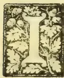

N view of the concession made by the Ceylon Government to a Scottish Company, viz., the right of utilizing the Mangrove bark available in the Island for the

extraction of tanning material, an account of the trees yielding the bark and other particulars in connection with the subject will, we think, be not unwelcome to our readers.

The bark of the following trees are commercially known as Mangrove bark:—*Avicennia officinalis* (also known as white Mangrove); *Bruguiera gymnorrhiza*; *Bruguiera parvifolia*; *Ceriops candolleana*, (also known as black Mangrove); *Ceriops Roxburghiana*; *Kandelia Rheedei*; and *Rhizophora mucronata*, (the true Mangrove).

The first-mentioned tree belongs to the order Verbenaceæ; and the rest to the order Rhizophoraceæ. Perhaps the best known Ceylon trees belonging to these two orders are Teak (*Tectona grandis*) to the former order, and Dawata (*Carallia integerrima*) to the latter. All the trees mentioned except *Bruguiera parviflora* and *Ceriops Roxburghiana* are indigenous to the island.

Referring to the genera "Rhizophora," "Bruguiera," "Kunilla" and "Ceriops," the late Mr. William Ferguson, in his "Ceylon Timber Trees," remarks that they "form the chief plants composing the "Mangroves" which affect the sides of the salt marshes all round the island. The timber of some is used in common house-building, and the barks of others are the chief ingredients in tanning and dyeing country leather."

*Rhizophora mucronata* being the true Mangrove and the tree which supplies most of the Mangrove bark of Ceylon merits attention first. In the Ceylon Handbook (prepared for the Indian and Colonial Exhibition of 1886) the following reference is made to this tree:—The bark of the Kadol or Mangrove (*Rhizophora mucronata*) is much in use amongst native tanners, but when tried in Europe it is found somewhat ineffective, and is now only employed as a preliminary tan, requiring the aid of myrobolans.

Dr. Watt, in his exhaustive work on the Economic plants of India, gives the following account of the Mangrove:—

*Habitat.*—A small evergreen tree found on tidal muddy shores throughout India, Burma and the Andaman Islands.

*Dye and Tan.*—The bark is said to be used to give a chocolate dye; it is also used in tanning. This tan, Christy recommends to be used as a preliminary preparation for cheap leathers. It is recommended that the leather should be about half prepared in India and exported to Europe in that condition, to be redone and have the colour improved by myrobolans or other tanning materials. Mangrove bark has been exported to Europe, but leather prepared with it solely is always inferior in colour and quality. Except therefore as a preliminary tan, or in the preparation of cheap leathers, it is not likely to become an article of European trade. Instead of the bark, which is bulky, Shettell suggests that an extract should be prepared for the purpose of exportation. He further states that this extract would perform its office in half the time of oak bark. It would however, have to be made in an earthen vessel, si.

831------------------------------------------------

772Supplement to the "Tropical Agriculturist."[May 1, 1895.

any contact with iron would make the leather prepared by the extract brittle and discoloured.

*Medicine.*—Reede states that the bark mixed with dried ginger or long pepper and rose water is said to be a cure for diabetes. No other writer appears to have made this observation; indeed, O'Shanghnessy expressly states that none of the Mangroves are reported to have any medicinal virtues.

*Food.*—The fruit is reported to be sweet and edible, and the juice to be made into a kind of light wine. Salt is extracted from the aerial roots.

*Structure of the Wood.*—Sapwood light red, heartwood dark red, extremely hard, but warps and splits in seasoning; it is very durable. Weight 70.5 lbs. per cubic foot.

*Domestic Uses.*—The wood, although good, is rarely used in India. Rumphius, speaking of the wood, states that in Amboyna it was a much valued fuel, and that the Chinese employ it to make charcoal for use in their workshops. He also adds that the larger aerial roots were used as anchors for small boats, and remarks that in the Moluccas a curious custom, and one at variance with European ideas, prevails, in that while the anchors were made of wood, the boats are constructed of a light stone thrown up by the volcanoes of these islands.

#### OCCASIONAL NOTES.

We are glad to be able to announce that the article on the "Laws of Ceylon relating to Agriculture," which had been left unfinished in our issue for April, 1891, will be continued in this and future numbers. The accomplished lawyer who has kindly consented to complete the article, hopes to be able to find the time to write also on the Forest Laws of Ceylon. Now that the students of the School of Agriculture are getting some training in Forestry, the paper on the Forest Laws of Ceylon will be of special value.

We offer a hearty welcome to Mr. G. W. Sturgess, the new Colonial Veterinary Surgeon for Ceylon. We trust he will have a useful and successful career in the island.

Mr. W. A. de Silva, G.B.V.C., who has been acting as Colonial Veterinary Surgeon, has reverted to his substantive appointment as Headmaster of the School of Agriculture, where his varied qualifications make his services of the greatest value to the staff and students.

The Hony. Secretary to the Agri-Horticultural Society of Madras has been good enough to give us some information regarding a variety of paddy which is cultivated as a dry crop, *i.e.*, not irrigated but dependent upon rainfall. This variety which is known as "Valai" is cultivated in a comparatively limited tract of country from 40 to 50 miles north of Madras. The land is manured, and ploughed two or three times. It is then harrowed twice and the seeds are then put in with the native drill. The seed is sown in August nearly in September, and the crop is harvested in

December. The mean monthly rainfall at Madras which may be taken as the same as the tract in which "Valai" is grown, is as follows:—August 4.81 in., September 4.34 in., October 10.80 in., November 13.60 in., December 5.75 in. The mean annual rainfall is 50 inches.

There would seem to be little chance of the *Maram* grass (*Psamma arenaria*) doing well with us, as the Superintendent of the Saharanpur Botanic Gardens, in writing to us, mentions that though it made a good growth during the cold season, it completely died out during the first monsoon. We had hoped that this grass might have been useful on our sandy wastes, but it is suggested to us that the various species of *Sporobolus* grown on the *usar* lands in India, might suit our purpose better.

Of the six varieties of cow-pea grown experimentally at the School of Agriculture, the variety known as "the wonderful" was the most satisfactory. The cow-pea in appearance and growth much resembles the bean known in Sinhalese as *gas-ma*, only that the latter is much the robust of the two and yields heavy crops of fruit. We doubt not that this latter is in every way fitted to take the place of the cow-pea, and we commend it to the notice of those interested in the subject of leguminous green manures.

A herd of some 25 Sind cows and bulls was lately imported from Karachi by that enterprising gentleman, Mr. T. H. A. de Soysa, and realised good prices when exposed for sale. It will be remembered that the first occasion on which Sind cattle were imported into the island was in 1893, when a number of cows were brought over for the Government Dairy. The dairy authorities may justly take credit for being the means of introducing one of the best Indian milking breeds into Ceylon where the native milch cow is so unsatisfactory.

The crop of sweet-potatoes raised at the School of Agriculture under favourable conditions was at the rate of 60 tons per acre.

We have received, through the kindness of the Superintendent of the Cossipore Practical Institution of Horiculture, Floriculture and Agriculture, three cases of Rhea plants for experimental cultivation at the School of Agriculture. The Cossipore Institution was founded in 1886 through the munificence of Babu Hem Chunder Mitter, who, quite unassisted by Government or private individuals, has been maintaining it nearly seven years for the purpose of imparting free education on Horti-Flori and Agriculture. Students are expected to remain as such for a period of at least three consecutive years, and they are allowed to draw a monthly stipend of R10 to R14, accordingly to their efficiency, with free board. Lectures are delivered to the students on various subjects in Practical Botany, while the institution also offers facilities for the training of the sons of gardeners in the art of high-class gardening. On another page we give an extract from the report of this useful Institution for 1893.

832------------------------------------------------

May 1, 1895.] Supplement to the "Tropical Agriculturist."773

## BAZAAR DRUGS IN VETERINARY PRACTICE. I.

Most of the common drugs mentioned in the Pharmacopœia are, to a certain extent, obtainable in our bazaars. They are no doubt far from pure, but they recommend themselves on account of their cheapness, and the ease with which they can be procured, especially in places where a chemist's shop or a dispensary is hardly ever to be met with. There is on the other hand some little difficulty in utilizing these drugs. First and foremost, there is the difficulty as regards their names. The bazaar parlance is different from the chemist's, and even the common names of the drugs are seldom known to the retailers in the bazaar, who have their own names for the different articles they expose for sale, some of which are Sinhalese, some Tamil, or corruptions of other Indian lingos.

The second difficulty experienced is in regard to the purity of the drugs, which are not subjected to any process of purification before they are exposed for sale. Hence, it is of great importance to know the likely impurities which they may contain, and the best method of getting rid of them. It is also important, that the purchaser of bazaar drugs should be able to distinguish the different products from one another, as it frequently happens that the bazaar man himself is quite ignorant of the substances with which he deals. He no doubt labels his different drugs, but if by some means these labels are lost, one cannot possibly depend on his knowledge to classify and name the drugs on his own account. Again, failures are often experienced in the use of drugs obtained from the bazaars on account of their being spoilt through being kept in store for a long period. All these difficulties have to be fully realized in using these drugs. But the advantages set forth, viz., cheapness and accessibility, are two important factors to be considered, and with a little care and trouble bazaar drugs could be utilized to great advantage. The few notes appended hereto regarding some of these drugs will, it is to be hoped, help in some way in extending their use:—

*Nitre.*—Saltpetre Potassæ Nitræ, Potassium Nitrate. *Sing.*, Vedilunu; *Tamil*, Pettiluppu; *Indian*, Shonakar.

This salt is met with in many parts of Northern India, Persia and Egypt in the form of an incrustation on the surface of the soil. The incrustation itself is not pure nitre, but contains a large proportion of the substance. The formation of this deposit is due to the potash found in these soils, coming in contact with nitric acid. The crude matter is purified by dissolving in water and by the addition of potash carbonate, obtained by burning plants. Repeated solutions in water and subsequent evaporations make the material more or less pure. The chief impurities met with are common salt, and nitrate of lime, but none of these impurities affect the value of nitre as a drug. Another method of preparing nitre is in vogue in France and other European countries. Manure and vegetable and animal refuse are collected in heaps, and to these are added from time to time, lime in different shapes, whether it be plastering from old buildings or gypsum, &c.; the heaps are sheltered from rain, but freely exposed to the action

of the air. They are thus left for over two years, and at the expiration of the period are dissolved and purified much in the same way as in the case of natural deposits. It is stated that at one time nitre was prepared in Ceylon from bats' dung, large deposits of which are often found in caves and under ledges of rock in the less populated regions of the island. Nitre in the bazaar is generally seen in the form of white (generally dirty white) crystalline fragments. It gives a peculiar cold tingling sensation when placed on the tongue. When a piece of nitre is thrown into fire or on red hot charcoal it deflagrates. If a small quantity of the salt is dissolved and mixed with a few drops of sulphuric acid and warmed in a test tube it gives off red fumes.

The action of nitre is very rapid, it enters the blood easily and in its course reduces blood pressure; further, it promotes perspiration and increases the flow of urine. It also acts beneficially on the lungs. In all febrile diseases, repeated doses of nitre prove to be of great use. It has also slight laxative properties. Horses may be given an ounce at a time and cattle one to two ounces; dogs take from four to eight grains and cats half this quantity. In large doses nitre is a poison. In man an ounce of nitre generally produces toxic effects, whereas horses and cattle tolerate large quantities, from  $\frac{1}{2}$  a pound to a pound being required to produce poisonous effects. A solution of nitre in water applied externally is a good refrigerant. Nitre does not spoil by keeping. A pound of it costs from 20 to 25 cents in the bazaar.

2. *Alum.*—Alumen, Aluminium Potassium sulphate; *Sing.*, Sinnakkaram; *Tamil*, Phitkari; *Hindi.*, Phitkari.

There are three varieties of alum known in commerce; of these the principal and the most commonly used is potash alum, the other two being known as soda alum and ammonia alum. Potash alum is prepared by calcining shale or clay and treating it with sulphuric acid. The resulting liquor contains sulphate of aluminum, to which is added potash, when alum is formed. Alum is found in the bazaars in the form of white crystalline masses, having a sweet-acid-astringent taste. Ammonium sulphide and strong ammonia solution added to a solution of alum gives a white precipitate. Alum is an astringent used both internally and externally. Internally administered it arrests the various secretions such as sweat, urine, milk, &c. It is useful in diarrhoea and dysentery. Externally it is a useful application in wounds and also in diseases of the eye. It also arrests bleeding.

W. A. D. S.

### REVIEW.

In our issue of July 1892, we began a series of Zoological Notes for agricultural students, and by way of preface said that agricultural students generally experience much difficulty in isolating from large and comprehensive text-books, such matter for study as would give them a knowledge of animals, whether they belong to highest or lowest orders of the kingdom, whose life-history is more or less of interest to the agriculturist. Our object as then stated was to supply the want of a convenient collection of notes for agricultural students.

833------------------------------------------------

774Supplement to the "Tropical Agriculturist."[May 1, 1895.]

It is a curious coincidence that while we were writing the last of the series of notes (appearing in this number), that a new work entitled *Agricultural Zoology* should have reached our hands. The author is Dr. Bos of the Royal Agricultural College, Wageningen, Holland, and the translator Mr. Ainsworth Davies, B.A. (Trinity College, Cambridge), a professor in the University of Wales. Miss Eleanor Ormerod, the distinguished entomologist writes an introduction to the work which is furnished with 149 illustrations.

We quote as follows from the preface by Miss Ormerod:—By request of Professor Ainsworth Davies, the skilful translator of the "hand-book" on Agricultural Zoology, I add some words of introduction; and I have special pleasure in doing so, not that any observations of mine can add value to the work of the well-known author, but because, having myself had the advantage for many years of collegueship, and important help in my own work from the assistance of Dr. Ritzema Bos, I am well acquainted both with his extensive knowledge and also his scrupulous care in observation, and I believe that this abstract of his larger work, [*Animal foes and friends*] now given in a form in which it is available for general use, will meet a great demand. We have long wanted a book, plain in wording and of moderate size, dealing with the wild animals or animal infestations generally, which occur in connection with farm life—a manual, in fact, which while suitable for the use of agricultural students and teachers, should at the same time not be too technically scientific to be unintelligible to practical farmers or general readers. . . . I trust this Manual of Agricultural Zoology will take its place in our farm and school libraries, which I believe it to be excellently fitted to fill. The five sub-kingdoms as given by Dr. Bos are (beginning from the highest) Vertetrata, Arthropoda, Vermes, Mollusca, Echinodermata, Coelenterata, and Protozoa. The publishers of the book, which is well got up, are Messrs. Chapman & Hall, and the selling price in England is 5s. We heartily commend it to all students of agriculture.

## LAWS OF CEYLON RELATING TO AGRICULTURE.

ORDINANCE No. 23 OF 1889.

[Continued from the issue of April 1891 of this Magazine.]

### Chapter IV.

#### *Irrigation Headmen.*

1. If the meeting referred to in Chap. III. § 3 shall think it necessary, one or more headmen shall be elected for the district for which the meeting has been called. Such headmen shall attend, subject to the Government Agent, to all matters connected with the irrigation and cultivation of paddy lands, and the maintenance of rights and works connected therewith, and to the prevention of any acts opposed to ancient customs, or likely to damage the interests of the proprietors.

2. (a.) The headmen shall be elected by a majority of the proprietors present at such meeting, either in person or by proxy in writing.  
(b.) The Government Agent may dismiss any headman for misconduct; and in such a case, or in case of vacancy by death or resignation, another headman may be elected at a meeting of the pro-

prietors, duly notified and held, and the Government may appoint a headman provisionally, and if at a meeting no headman is elected, the Government Agent may appoint a person to the office. (c.) No one convicted of any infamous crime is eligible for election as headman.

Whenever any act shall have been committed contrary to ancient customs, or likely to damage the interests of the proprietors, it shall be the headman's duty to repair to the place, and to take immediate steps to prevent injury, if prompt action is necessary, and to place matters in *statu quo*, and forthwith to report matters to the Government Agent. When prompt action is not necessary to prevent injury, the headman may communicate with the Government Agent, and then act according to instructions. Although the headman has taken prompt action, the Village Council may investigate such matters in districts where both systems exist.

4. Whenever a headman incurs any expenditure in the execution of his duty, and the person in consequence of whose act the expenditure was incurred denies his liability, and refuses to pay it, the Government Agent, on being satisfied that the expenditure was justly incurred, may issue to such person a certificate setting out his name, the nature of the act, the amount of expenditure, and the name of the headman. And if the sum is not paid within ten days, the Government Agent may proceed against him as provided by Chap. IX. of this Ordinance.

5. If any headman shall fail or neglect to perform his duties, or acts in excess of his authority, or in bad faith, or without probable cause, or wantonly and maliciously, he shall be answerable to the injured person and be guilty of an offence, and be liable to a fine not exceeding fifty rupees.

6. Any person unlawfully resisting, molesting, or obstructing any headman in the discharge of his duties shall be liable to a fine not exceeding fifty rupees.

7. The Committee appointed under § 3 of Chapter III. of this Ordinance, or the Government Agent if no Committee shall have been appointed, may award remuneration to irrigation headmen either in kind, from the produce of the district for which such headman is appointed, or in money, and the proprietors of such district shall be liable to make such remuneration, and in case of default, the same shall be recovered from them as provided in Chap. IX. of this Ordinance.

H. A. J.

(To be continued.)

## ADVANTAGES OF GREEN MANURING.

Dr. Webb gives the following as the typical advantages of green manuring:—

1. There is a direct addition of plant-food to the soil, as during the growth of the plant it absorbs food from the air, and the upper layers of the soil are enriched by matter brought up from the subsoil, and which, when the plants are ploughed in, becomes almost immediately available for the succeeding crop.

With certain crops this gain in plant-food is much more marked, as it consists in an increase of the nitrogen in the soil at the expense of that of the air.

834------------------------------------------------

May 1, 1895.]Supplement to the "Tropical Agriculturist."775

The plants which possess this power of abstracting nitrogen direct from the air, are those belonging to the natural order Leguminosæ, to which order belong peas, beans, vetches, clover, sainfoin, lucerne, &c. On the rootlets of the plants of this order\* are a large number of small nodules, or tubercles. These are the home of micro-organisms capable of abstracting free nitrogen from the air, and forming nitrogenous compounds. The greater portion of this nitrogen ultimately finds its way into the plant, and is there made use of.

The benefit is not confined to the leguminous crop alone, but where that crop is ploughed in, or even if only the roots are left, the soil becomes so enriched by the accumulated nitrogen that greatly increased crops result.

Dr. Wagner, of Darmstadt, conducted experiments to test the effect of the above. Two equal plots were taken, and upon one, white mustard, and on the other, vetches were ploughed in, and oats sown. Each received an equal dressing of artificial manure, but the yield on that where vetches had been ploughed in was twice that on the one where white mustard had been ploughed in.

Similar experiments were conducted by Heiden, rye being taken (1) after lupines, ploughed in, and (2) after bare fallow. The relative yields of the plots were: plot 1—96 of grain and 205 chaff and straw; plot 2—56 of grain and 114 chaff and straw.

The importance of this fixation of free nitrogen cannot be over-estimated, as it provides a large quantity of the dearest manurial constituent without cost. 2. The food added to the soil by green manuring cannot readily be lost by drainage. This explains the advantage which light land derives from it, that class of land not usually being retentive of plant food. 3. A large quantity of humus is added to the soil, the benefit of which has already been noticed. 4. During decomposition of the vegetable matter, mineral matters are rendered available for plant-food, owing to the effects of the products of decomposition.

### TROPICAL FODDER GRASSES.

The following tropical grasses are selected as possessing special merits for fodder purposes. Amongst them are plants suitable for almost every condition found in tropical countries. The list has had the advantage of the revision of Sir Joseph Hooker, who is now working out the grasses of British India and who has suggested some emendations of the commonly accepted nomenclature.

*Anthistiria australis*, R. Brown.—The well-known "Kangaroo grass" of Australia, but widely distributed throughout Southern Asia and the whole of Africa. A perennial upright grass over 3 feet in height. It enjoys a wide reputation and is regarded as the most useful of the indigenous grasses of Eastern Australia, stock of all descriptions being remarkably fond of it. The roots are strong, and penetrate the soil to a great depth, so the plant remains green during the greater part of the summer. In the autumn the foliage turns brown, when, however, its nutritive qualities are said to be at the highest. If cut as

soon as the flower stem appears it can be made into excellent hay. The most reliable way to propagate this grass is by division of the roots. It perfects very little seed (Turner).

*Anthistiria avenacea*, F. v. Mueller.—"Tall oat-grass" of New South Wales. A nutritious perennial pasture grass, often rising to a height of 4 to 5 feet. It grows generally in tussocks, and prefers rich soils, where its roots can penetrate deeply into the ground. It thus can withstand long spells of dry weather with impunity. It yields a large amount of bottom fodder, and is regarded by Bailey as "one of the most productive grasses of Australia." It possesses the advantage of seeding freely. Turner remarks "it might be profitably cultivated for ensilage, especially if it were cut before the flower stems become hard and cane-like."

*Astrebla pectinata*, F. v. Mueller.—Widely distributed in dry regions inland in North and East Australia. Closely allied to "Mitchell grass," but usually not so tall. A perennial desert grass, resisting drought, and sought with avidity by sheep, and very fattening to them and other pasture animals. Seeding freely (Mueller).

*Astrebla triticoides*, F. v. Mueller (*Danthonia triticoides*, Lindl.).—The "Mitchell grass" of Australia. A very valuable perennial grass with glaucous green leaves. On rich soils it produces a great amount of rich herbage, of which stock of all kinds are remarkably fond. Cattle are said to fatten on this grass even when it is much dried up during periods of drought. If cut when about to flower it makes excellent hay. Turner "thoroughly recommends it for permanent pastures." The land should, however, be well drained.

*Cynodon Dactylon*, Pers.—A prostrate perennial grass with very narrow glaucous green leaves. It is widely distributed in all hot countries, and extends also into temperate regions. It passes under various names, such as "Bahama grass," "Bermuda grass," "Indian couch grass," "Doub," and "Doorva." It is an important grass for covering bare, barren land, and for making smooth, compact lawns. It resists extreme drought, and once established in cultivated land it is very difficult to eradicate. It is easily established by planting small portions of the rooting stems about 8 inches apart. If done at the beginning of the rainy season the ground will be completely covered in six weeks. It may also be propagated by seeds, which are now readily obtained in commerce. It should, however, never be planted except in places where it is required to remain permanently. When grown specially for fodder, in enclosed paddocks, it yields three or four crops in the year, and makes excellent hay. In very dry seasons in the West Indies animals exist almost entirely on the underground rhizomes of this grass.

The following note on the use of Bahama grass for making lawns in India is taken from Firminger's *Manual of Gardening for Bengal and Upper India* [Calcutta, 1874] p. 26:—"The grass principally used for lawns in this country is that called *Doub-grass* (*Cynodon Dactylon*), a plant of trailing habit, not growing high, and when in vigorous growth of a soft dark green hue. It thrives where scarcely any other kind will, and delights in the edges of frequented highways. The spot it seems to like especially

\* All the plants? The *Caesalpineæ* must, surely, excepted.

835------------------------------------------------

776Supplement to the "Tropical Agriculturist."[May 1, 1895.]

is where brick and lime rubbish has been thrown and trodden down hard. It will also grow in the poor soil beneath the shade of trees, where other grasses grow but scantily, if at all. When required for lawns a sufficient quantity can easily be collected from the roadside and waste places. The piece of ground intended for lawn should be well dug, and then made perfectly level and smooth. Drills should then be drawn over it a foot apart, in which little pieces of the roots should be planted out at the distance of half-a-foot from each other, and the ground afterwards watered occasionally, till the grass has become thoroughly established. In Bengal further watering will be unnecessary, but in the upper provinces irrigation during the hot season is indispensable, as otherwise the grass would soon become scorched up and perish.

"A more expeditious and very successful plan of laying down a lawn, sometimes adopted, is to pull up a quantity of grass by the roots, chop it tolerably fine, mix it well in a compost of mud of about the consistency of mortar, and spread this out thinly over the piece of ground where the lawn is required. In a few days the grass will spring up with great regularity over the plot."

*Eragrostis abyssinica*, *Link*.—A slender annual grass, known in Abyssinia as "Teff," "Tcheff," or "Thaff." It is indigenous to the higher lands, and is cultivated for the sake of its grain all over Abyssinia. There are several varieties, some depending on the height of the plant, others on the colour. According to Richard, there are green, white, red, and purple Teffs. The grain crop requires four months to ripen. "In good years it returns 40 times the seed, and only 20 times in bad years." The flour of teff is very white, and produces bread of excellent quality. Seed of teff was obtained by Kew in 1836, and distributed to numerous establishments in India and the Colonies (*Kew Bulletin*, 1887, January, pp. 2—6). The plant prefers light sandy soils, and adapts itself even to the most sandy; it then produces slender wiry stems, and supports a large weight of ear. The grain is reported to make "an excellent fine hay" in British Guiana, and to mature in six or eight weeks from the time of sowing. "For this purpose teff is well worth cultivating. It is cleaner and brighter looking than any other grass, and is readily eaten by cattle and horses." The reports from Australia and India are equally favourable. The value of this plant for fodder purposes is exceptionally high. Its chief merits in this respect are the short time it takes to mature, and its suitability to thrive in dry, sandy regions, where few other grasses would flourish equally well.

In the Proceedings of the Agri.-Hort. Society of India, 1888, p. lxxii, the following note appeared:—"The seed of this new cereal was received from Kew, and was distributed as noted in the *Proceedings* of May last. Mr. C. C. Stevens, Commissioner of Chota Nagpore, now writes: 'You will remember having given me a small packet of seed of "tcheff" for experiment. I gave it to the Rajah of Jashpore, who had it sown in two or three different localities. He has not given me very precise information, but I understand that the seed was treated exactly like the ordinary rainy weather crops. He tells me that he has saved

some three or four seers of seed, and that the hill people have taken a fancy to the crop. The best thing he can do is to keep the seed and sow next season. He has sent me a bundle of plants, which I shall forward to you when a favourable opportunity occurs. The straw or grass is 4 feet or 4½ feet in length, and smells sweet.' As only about 2 ounces of the seed was supplied to Mr. Stevens, the results obtained appear very satisfactory for the first season, and if the crop is found suitable there should be no difficulty in establishing it next season."

A very full account of teff is given by Mr. J. F. Duthie, F.L.S., in the Report of the Saharunpur Gardens for the year 1888, pp. 11-12. The following extracts are of interest:—

"Seeds of this grass were sent to us last year by the Director of the Royal Gardens, Kew, with the remark that it was an Abyssinian food-grain which might prove useful for India. I have a bad opinion of it as a food-grain, but think better of it as a fodder, and have therefore classed it under the head of 'fodder plants.'

"Teff consists of two varieties, one with white seeds and the other with red seeds. The white-seeded kind is said to be cultivated in Abyssinia during the dry season and the red during the rains. We tried the two kinds here during both seasons, and found, as stated, that the white answered best for the dry season and the red for the wet."

"Three sowings were made of the two kinds—the first in March, the second in April, and the third in July. The March sowing of the white variety gave an out-turn of grain at the rate of 660 lbs. per acre, while the red variety, sown on the same date, only resulted in an out-turn of 17 lbs. per acre. The crop was cut in the beginning of May, but sprang up again into a second growth and yielded a cutting of green fodder early in the rains. The note made regarding the weight of this cutting has, unfortunately, been mislaid, and I am therefore unable to give its approximate weight per acre."

"The April sowing of the white variety produced no grain, and the sowing of the red variety made at the same time only returned 11 lbs. of grain per acre. Both kinds, however, gave a good crop of fodder in the middle of July, the red variety producing 11,022 and the white 7,436 lbs. per acre. The cutting was in a half-dried state when weighed, or the figures would have amounted to a greater total."

"The July sowing of the white variety gave an out-turn of 11 lbs. of grain per acre, and the sowing made on the same date of the red resulted in an out-turn of 82 lbs. per acre. These out-turns may be looked upon as failures, and conclusively prove that teff is of no great account for cultivation on the plains as a food grain. A cutting was made across a section of the two plots of this July sowing in the middle of August, and weighed collectively in its green state, and as a result gave an out-turn of 16,000 lbs. of green fodder per acre. The out-turns of 3,116 and 2,676 lbs. noted in the statement for part of this plot really mean the out-turn of dried hay, as the fodder was weighed in the beginning of October, and was then crisp and dry. A rainy season sowing of teff may, therefore, be looked upon as capable of producing 16,000 lbs. of green

836------------------------------------------------

May 1, 1895.]Supplement to the "Tropical Agriculturist."777

fodder and from 2,000 to 3,000 lbs. of dried hay per acre.

"A sowing of  $\frac{1}{2}$  lb. of each kind was made at Arnigadh in the beginning of the rains, and resulted in a collective out-turn of 40 lbs. of grain. This was a remarkably good yield for the small quantity of seed sown, and proves that in hill tracts teff may yet prove a prolific food grain.

"The hay made from the teff was of exceptional good quality and was greedily eaten by the garden bullocks. When it was offered to them they were being fed upon jowar or sorghum stalks, and, as is well known, these are remarkably sweet, and cattle, when fed upon them, generally refuse other kinds of dry food until they find that sorghum is not forthcoming. Our garden cattle, however, seemed to prefer the teff hay to the sorghum, as they would not touch the latter until they had devoured the whole of the teff placed before them.

"The experience gained here in the cultivation of teff during the past year may therefore be summed up as follows:—

"When sown in the dry season it will yield a light crop of grain, and when sown in the rains it yields little or no grain, but produces abundance of green fodder which may be cured into very palatable hay where the latter is preferred. In my opinion, teff is destined to become the rye grass of India, and is well worthy of more extended trial on some of the Government fodder reserves."

*Euchlaena luxurians*, *Miers* (*Reana luxurians*, *Durieu*). "Teosinte." An annual grass of large size from Guatemala allied to the maize. The first published illustration of the plant was given in the *Botanical Magazine*, tab. 6,414. It attracted a good deal of attention about 20 years ago as a fodder plant (see *Kew Reports*, 1878, 1879 and 1880). Seeds of it were widely distributed from Kew to the East and West Indies, Australia, and tropical Africa. It is a tall, densely-tufted grass, sometimes reaching 15 feet in height, the stems are as thick as the thumb at the base, and the leaves 3 to 4 feet long, by 2 or 3 inches broad. Dr. Schomburgk in 1880 wrote from the Adelaide Botanic Garden, S. Australia: "I have now cultivated Teosinte for three years, and it is one of the most prolific fodder plants."

Mr. W. R. Robertson, Agricultural Reporter to the Government of Madras, wrote as follows in July 1883:—"A small plot was sown with this crop; the out-turn of green fodder was at the rate of 38,400 lb. per acre, a very large out-turn; but, the cost of production was great, for it was necessary to irrigate the land nearly every other day, from sowing until harvest. *Reana* is undoubtedly a very heavy producer, crops grown on the farm have given enormous yields, but further experience confirms the opinions expressed regarding the crop in the last report: 'On good soils, under liberal treatment, when it can obtain plenty of rain or irrigation water, the crop grows most rapidly and luxuriantly; but it cannot withstand a drought. Indeed, the experiments made showed that a drought, which scarcely affected the *Sorghum* crops, was sufficient to check the growth of the *Reana* to such an extent as to

render it useless to keep the crop standing longer. As a fodder crop in a damp warm climate, or where irrigation can be secured, it is well worthy of attention. There is perhaps no other crop, sugar cane excepted, which will produce such an enormous quantity of green plant per acre, but the fodder is very watery, and does not appear to be very palatable to stock when offered for the first time. The watery juices of the stem seem to be destitute of saccharine matter during all stages of growth."

The following account of the grass was given in the Report of the Botanic Garden at Bangalore for the year 1888-9, p. 13:—"Teosinte or buffalo grass. With rich cultivation this noble grass affords an inexhaustible supply of fodder for cattle. In special instances the stalks have been known to attain a height of 18 feet, but in ordinary cultivation they are usually 6 to 8 feet, with a small colony of offsets rising up from the base of each parent stalk. Seed was first received from Mr. Blechhynden, Honorary Secretary to the Agri-Horticultural Society of India, and in the subsequent year (1878-79) the following particulars of cultivation appeared in the Annual Report of the Garden:—

"The forage plant *Euchlaena luxurians* has been grown experimentally on a small scale. 19 square yards of highly manured land produced 288 lbs. of dry fodder and 19 lbs. of seed. The object in culture was chiefly to obtain seed to meet the demands of correspondents, and to enable me to sow a larger piece of ground if Government should wish to extend the experiment. Cattle and horses are fond of the green grass, and I think it will be a good addition to the green forage crops of the monsoon season. At any other time the crop would require irrigation, and I have a small field now under this method of culture, which will be reported on when the results are fully known."

Subsequent cultivation confirmed the truth of the above remarks, and the great value of Teosinte as a food plant has been established in many parts of India. It should be grown on all land holdings where there are horses, cows, and bullocks to be fed. If, during the dry season, small plots are raised along the channels, and in spare nooks and corners, the condition of live stock would be better maintained than we usually see it.

The latest reports of Teosinte are as follows:— In a Report on *Agricultural Work at British Guiana* for the years 1891-92, p. 68, Messrs. Harrison and J. Mann give interesting particulars as under:—"Teosinte is an annual, but readily reproduces itself on good land from the seed shed. It soon dies out, however, on impoverished land. Though an annual, in the season of growth, if reaped young but not too short, the stubble quickly springs again, and a second and third crop can be thus taken in favourable weather. It should be sown *in situ*, and the plants thinned out as much as is necessary to give each one 9 to 12 or 16 square feet of superficial space, as it does not bear transplanting, under which the yield is poor. The following is an analysis of the seed:—

837------------------------------------------------

778Supplement to the "Tropical Agriculturist."[May 1, 1895.

<table>
<tr><td>Water</td><td>-</td><td>-</td><td>-</td><td>-</td><td>12.75</td></tr>
<tr><td>Fats</td><td>-</td><td>-</td><td>-</td><td>-</td><td>3.94</td></tr>
<tr><td>* Albuminoids</td><td>-</td><td>-</td><td>-</td><td>-</td><td>9.94</td></tr>
<tr><td>† Amides, &amp;c.</td><td>-</td><td>-</td><td>-</td><td>-</td><td>1.00</td></tr>
<tr><td>Pectose, gum, &amp;c.</td><td>-</td><td>-</td><td>-</td><td>-</td><td>8.22</td></tr>
<tr><td>Starch</td><td>-</td><td>-</td><td>-</td><td>-</td><td>37.38</td></tr>
<tr><td>Digestible fibre</td><td>-</td><td>-</td><td>-</td><td>-</td><td>16.46</td></tr>
<tr><td>Woody fibre</td><td>-</td><td>-</td><td>-</td><td>-</td><td>9.67</td></tr>
<tr><td>Mineral matters</td><td>-</td><td>-</td><td>-</td><td>-</td><td>2.44</td></tr>
</table>

100.00 (sic.)

<table>
<tr><td>* Containing nitrogen</td><td>-</td><td>-</td><td>1.59</td></tr>
<tr><td>† " "</td><td>-</td><td>-</td><td>.16</td></tr>
</table>

The grain of this grass, from its composition, possesses a fair value, although the proportions of fibre present are somewhat high.

In the *Journal of the Agri-Hort. Society of India*, 1894, p. 78, it is stated:—"A very good crop was raised this season. After the stalks had reached a height of about 5 feet, they were cut down to within 1 foot of the ground; three weeks later a second crop was ready for cutting, varying in height from 18 inches to 3 feet; a third crop was cut a month later, and yielded stalks about 2 feet high; in this manner three good cuttings were made in four months. It was found that from  $4\frac{1}{2}$  to 5 lbs. of seed were sufficient to sow an acre. The fodder is greatly relished by cattle."

At Lagos, on the West Coast of Africa, Mr. Millen has successfully introduced "Teosinte" as a fodder plant, and in June 1894 wrote: "I have planted a quantity of plants of *Brachiaria luxurians*; it is the only fodder plant of those introduced which appears to be growing with good results."

At Saharunpur, in the *Report* for 1893 just issued, Teosinte is mentioned as having suddenly grown into demand as an annual forage grass, and seed has been harvested to meet all possible demands.

#### ZOOLOGICAL NOTES FOR AGRICULTURAL STUDENTS.

**Quadrumana.**—The characteristics of the members of this order are the following:—The hallux (innermost toe of the hind limb) is separated from the other toes, and is opposite to them, so that the hind feet become prehensile. The pollex (innermost toe of the fore limbs) may be wanting, but when present is usually opposite to the other digits. To this order belong the apes, monkeys, baboons, lemurs, &c.

The last order of the mammalia is *Bimana*, and as it comprises man alone, it hardly requires notice here, since the peculiarities of man's mental and physical structure belong to other branches of science.

**Postscript.**—These notes were commenced in our issue of July 1892, and were originally intended only for the students of the Colombo School of Agriculture. The subject of Zoology—in its relation to agriculture—must, however, needs be of great interest to students of agriculture, who need not all be students of an Agricultural School or College, and for this reason and in order that the notes may be collected and presented in a convenient form to all who may wish

to study or consult them, the writer will endeavour to find time to revise and publish them in hand-book form.

#### THE COSSIPORE INSTITUTION.

The following extract from the report of the Cossipore Practical Institution of Horticulture, Floriculture and Agriculture for 1893, deals with the practical operations carried on in the Institution's Gardens, and contains much information of a useful nature, which will be interesting reading to students of agriculture in Ceylon. In congratulating the Superintendent (from whom we have also received a Report of Sixth Flower Show held in February, 1894) on the excellent work done by the Institution, we can only express a hope that some from among our wealthy native gentry may be induced to follow the example of the philanthropic founder of the Cossipore Institution:—

Now let us turn to offer a few remarks regarding the improvements made upon the resources of the Gardens and Experimental Farms of the Institution during the year under review. We are glad to note that the quantity of flowering and ornamental plants and fruit grafts of various descriptions, added to the stock of the gardens, exceed the collection of former years. These were all intended to benefit the students, who by propagating the plants might learn the various methods of multiplication, and also their nature and treatment from the first stage of development. Here we may add that we have acquired a plot of land directly to the west of the Cossipore Garden, for the purposes of extending of Rosary and making agricultural experiments. This addition has been put in hand by the Executive Committee simply for the reason, that, for want of a proper field to experiment upon near Cossipore, most of the students have found difficulty to learn agriculture, as they had to go to our distant farms at Ultadanga and Shankhyanagar.

In agricultural matters,—the necessity for increasing the quantity and improving the quality of the crops have become strongly felt in our country; and they have always engaged the attention of the Institution most closely during the past years. We have, therefore, shown much zeal in setting examples to the cultivators by way of improving the soil grown exhausted by the same and uniform methods of tillage, and introducing recent systems most suited to the resources of the country. In our Experimental Farms of Cossipore, Ultadanga, and Shankhyanagar where every year larger areas have been brought under cultivation, we have attempted the cultivation of some crops such as paddy, tobacco, radish, peas, cabbages, cauliflowers, onions, garlic, beet, carrot, beans, parbar, mustard, moosooree, oats, gram, Thikra kalai, Indian corn, &c., according to our own way; and the results arrived at were more or less satisfactory. As regards fibrous plants, we may add that we have cultivated *Boelmeria nivea*, *Sida rhomboidia*, *Malachca capitata*, and *Hibiscus abelmoschus*. All of these are indigenous to this country; and most of them may be turned to profitable account. We tried similar experiments with jute and hemp on a somewhat larger scale, extending over many bighas of land in our Experimental Farm of Shankhyanagar; but

838------------------------------------------------

May 1, 1895.Supplement to the "Tropical Agriculturist."779

we were not fortunate on those occasions, as most of the plants died prematurely of over moisture, produced by the incessant heavy falls of rain during the months when they should luxuriantly grow. Notwithstanding this drawback, they more than realised our expectation, as we paid special attention to drainage and clearing of the fields.

We have tried during the year the cultivation of cotton, *Garrow-hill variety*. The indigenous cotton is of better staple, but this variety is of better colour and less adherent to the seed; the pods are also larger and longer. The seeds germinate within a week in a sandy loam, sufficiently drained. The result of our cultivation is satisfactory. We may advise the cotton-growers to prefer this to any other species.

It is gratifying to find that the introduction of potato, *Nainital-variety*, in our Experimental Farm at Cossipore, has been progressing satisfactorily during the past year. The students report that in this soil they have succeeded well; as, with manure (bone-dust), the outturn per bigha was 65 maunds.

The attention of the Institution was also engaged in the introduction of *Chinese ginger* in the soil of Bengal. We cultivated the above during the past twelve months on a small scale; it is hoped, considering the results, that the culture may turn out a success. We have also attempted to establish and successfully grow *Chinese pine-apples* during the year. Reports on the said cultivation from the places where the soil and climate are best suited to those plants, have assured us that their culture might be ventured on with satisfactory results.

We have also carried on experiments of some *fodder plants*, such as Guinea and Blue grass. Their rapid development, luxuriant herbage, nutritive qualities, and power of withstanding drought are the best recommendations for their culture. We see that their cultivation is most useful, specially in this country where drought is very frequent.

We have grown *Arbus leucospermus* (sweet-koonch). The whiteness of the seeds with black eyes and the white flowers of the plants are most attractive. The quantity of seeds gathered during the year is large. They may be used for medicinal purposes, as well as the roots. We have also raised a quantity of *Andropogon muricatus*, Khushus grass. The fragrant roots of this grass are useful in many ways in a tropical country.

In co-operation with the Indian Industrial Association we have taken up the cultivation of sweet potato, in addition to the crops as enumerated above, with satisfactory results. The process is so very easy, that less expenditure and trouble bring about a greater outturn than ordinary poor crops; and if the sweet-potato be reduced to starch and carried to distant markets, the cultivation may result in success.

It is satisfactory to know that the interchange of seeds, pamphlets, &c., during the last session has gone on more actively than in any previous year. The yearly supplies of seeds have been imported during the year in several consignments from England, America and Germany for distribution to our friends and constituents. With the exception of a few, the consignments have given us ample satisfaction, as no complaint regarding non-

germination has reached the Institution during the past year.

For the encouragement of the cultivators a quantity of the imported seeds have been given gratuitously to try with, as in former years. The Institution has also continued its active measures for the introduction of economic and fibrous plants into Bengal by the free distribution of seeds both to the suburban and Moffussil cultivators. The results of some of the experiments were well exhibited on the occasion of our last Annual Flower Show, adding much to the grandeur of the vegetable and economic departments.

The distribution of fruit-grafts and ornamental plants has also gone on very actively throughout the country; and a larger stock is now being accumulated to meet further demands. The results of our experiments on *Boehmeria nivea* (Rhea) are highly satisfactory. Its cultivation on a large scale may be turned, as hoped by the Committee, into the chief source of income to the Institution and a means to its future maintenance. Here we beg to record our deep sense of gratitude to Mr. L. Liotard for his cordial help to the Institution in its attempts to extract this useful fibre by easy and cheap process, and in various other matters of equal or greater importance.

We beg also to offer our sincere thanks to Bahu Nittyo Gopal Mookerjee, M.A., for his deeply interesting us in the matters of sericulture by practical demonstrations. We have taken up the subject under our special consideration ever since the occasion of the last Annual Flower Show, and, most probably, we will introduce it as a part of the work of the Institution in the ensuing year.

#### GENERAL ITEMS.

What may be termed an auxiliary industry in rice-growing is the manufacture of starch. The rice is cleaned and soaked before being ground. It is then washed in about seven changes of water, which carries off all but the starch, leaving the latter white and clean at the bottom of the washing vessel. The industry is being actually carried on in Australia.

*Apropos* of the report on abortion by Mr. Veterinary-Surgeon de Silva in our last issue, we quote as follows from the *Agricultural Gazette* of New South Wales, which gives the views of Principal Thompson of the Hawkesbury Agricultural College:—"I have the honour to report that abortion, miscarriage or premature labour may be brought on by many causes among which are rough treatment, being chased by dogs or hardly driven, and the eating of certain plants, such as ergotted rye. I would draw attention to the fact that the malady is very contagious, and often runs through a herd with almost electric celerity. We had several cases here last year. The fact of one cow having aborted simply smelling another through a fence caused her to abort the next day. Immediately a cow aborts she should be isolated from the rest of the cows in calf, the place thoroughly disinfected by lime-washing, and carbolic acid, diluted with water, sprinkled over the stall. No preventive measures have ever been found to be of the slightest avail." The evidence given before the

839------------------------------------------------

780Supplement to the "Tropical Agriculturist."[May 1, 1895.

Special Committee of the Royal Agricultural Society on the abortion question would, however, go to show that there are preventive measures which have been adopted with success.

Late in the last term classes of silviculture were started at the Agricultural School, Colombo. The lectures were prepared by Mr. Broun, dictated by one of the masters, and explained by Mr. Broun whenever he was at headquarters. It was too late in the term to make any material progress, but still a start was made, and it is hoped that before long the officers of the subordinate staff will be able to receive an education in the elements of Forest Sciences. The curriculum is at present not an ambitious one, and does not aim at being on a level with that of the Imperial Forest School at Dehra Dun. Sufficient funds are not available, and we cannot for some time hope to obtain the services of so large a staff of Specialists such as now lecture at Dehra Dun. Small as this commencement is, it receives our heartiest good wishes, and we look forward to the day when we shall have a body of trained rangers and guards, who will help in preserving and improving our forests which have suffered so much from years of ill-treatment.  
—*Ceylon Forester*.

Referring to argon, the newly-discovered constituent of the atmosphere, the *Speaker* asks: Do the molecules of argon for ever remain idle denizens of the air; or do they like the molecules of nitrogen, of oxygen, of carbonic acid, pass through a transmigration of bodies, as constituents of minerals, plants and animals? It seems unlikely that the higher plants should have the power of directly assimilating argon. Nitrogen we know they cannot take up directly from the air..... The chief agency by which nitrogen is brought into

the cycle of chemical combination and recombination appears to be the action of bacteria associated with the life-processes of plants. And this is the age of bacteria..... Prof. Ramsay appears to regard the new element as a sort of chemical Topay; he "guesses nobody can do nothing with argon." He has tried the violent methods of heat and strong chemicals. Perhaps the Bacteriologist with gentler methods may yet show that argon does not stand aloof from the causeless changes of living forms around it, in which so active a part is played by the other gases of the atmosphere.

The Editor of the *Cape Agricultural Journal* writes as follows about getting rid of fowl-lice:—"It will be found effectual to sprinkle the nest with a diluted solution of carbolic acid, or to scatter some powder of McDougall's or any other carbolic disinfecting powder, as these pests cannot withstand either long. If the weather is very dry, sprinkle the eggs a few times and pour plenty of water round the nest when the hen is hatching. If the young chickens become affected, mix a very few drops of carbolic acid with powdered brimstone mixing or rubbing well together, and put just so much acid as will mix up dry with the brimstone, after which the chicks may be carefully dusted."

The following remedies, says a writer to the *Agricultural Gazette* of New South Wales, have been suggested against the locust pest: Larspur and Castor-oil plants which are said to kill the insects which feed on the leaves; mechanical contrivances such as brush-harrows, rollers, canvas screens saturated with kerosene; kerosene emulsions or arsenical solutions sprayed on cultivated land known to be a breeding ground; and smoke fires. The emu, crow, the turkey, the domestic fowl and ants are natural enemies of the locust.

840------------------------------------------------

# \* The TROPICAL AGRICULTURIST \*

## ∞ MONTHLY. ∞

Vol. XIV.]

COLOMBO, JUNE 1ST, 1895.

[No. 12.]

### ACCLIMATISATION OF PRODUCTS.

(Being the substance of a Paper, read at the Imperial Institute, by CLEMENTS MARKHAM, ESQ., C.B., F.R.S., President of the Royal Geographical Society.)

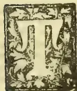

HE introduction of the cultivation of a valuable plant from one region into another with an analogous climate and habitat, is one of the most important measures to which the administrators of India and of our

Colonies can turn their attention. A great deal has been done in this direction with momentous results, from the earliest ages, but more especially since the discovery of America. The main object of the present communication is to draw attention to one particular product, namely, the coca leaf of South America, but before doing so, I think it will prove interesting to dwell briefly on the general subject of the introduction of valuable products from one region to another.

*Acclimatisation of Plants.*—This cultivation of exotic products is not only the wisest, but also the most ancient civilising administrative measure on record. On the very earliest of the old Egyptian picture chronicles we see the civilisers coming from "Punt" (or Saba?) to Egypt with a plant of frankincense in their boat, in what looks like an archaic Wardian case. The Romans undoubtedly did much good work of this kind; Prince Henry the Navigator introduced the vine and the sugar cane into Madeira; but the most extensive and beneficent changes caused by such measures have followed upon the discovery of America.

*The Live Stock* received from Europe, and established in America, caused great changes in the domestic economy of the people, and as regards the horse, its introduction produced a revolution in the habits of the Indians in the southern parts of South America. Horses came to South America with the Spaniards; cattle, asses, sheep, goats, pigs, chickens and pigeons followed in a few years; and as early as 1550 there were bullocks at the plough in the interior of Peru.

*The Horse.*—In 1520 Mendoza landed twenty horses at Buenos Ayres, and 50 years afterwards Sarmiento saw mounted Patagonians riding about on the shores of Magellan's Strait. In that short interval they had changed their whole manner of life. Before the introduction of horses, ostriches and guanacos were stalked by stealth and attacked with flint-headed arrows. As soon as horses were introduced the prey was ridden down and caught with lasso and bolas.

*Wheat.*—Almost equally remarkable was the change caused by the introduction into South America of vegetable products from the Old World. The first European lady who landed in Peru, Inex Munoz, wife of the half-brother of the conqueror, Pizarro, was also the first who cultivated wheat. She had received a barrel of rice in 1535, and was engaged in making a rice pudding for Pizarro himself when she found a few grains of wheat. She planted them in her garden with the greatest care, and all the grains of the first harvest were again sown. By this provident system the wheat multiplied rapidly. It became, and was for a long period, a very important article of export to Chile, though of late years the tables have been turned, and Chile exports wheat to Peru. The cultivation of barley, oats and lucerne followed.

*Olive-Tree Use of Wine.*—Antonio de Ribera took a few young olive plants to Peru when he went out as Procurator in 1560, and planted them in his wife's garden, with slaves and dogs to guard them day and night. Nevertheless, one was stolen and became the parent of all the olive trees in Chile. Of those that remained only one became a tree, and was the parent of all the olives in Peru. The vine was introduced by one of the first conquerors, Francisco de Caravantes, who obtained plants from the Canary Islands, and the first vintage at Lima was in 1551. Before a century the wine-growing industry had become important, both wine and spirits being largely exported. At first wine was very highly prized in South America and was seldom seen, even at the festive table.

*Sugar Cane—Vegetables.*—Sugar cane was brought from Spain to San Domingo by a citizen of the

841------------------------------------------------

782THE TROPICAL AGRICULTURIST.[JUNE 1. 1895.

Island named Pedro de Atrinxa and thence to Peru in 1545. It is needless to say how great an addition that product has been to the wealth of the West Indies, and is now to Peru. The fruits and vegetables of Europe multiplied in a marvellous way when first introduced into America. The old chronicler, Garcilasso de la Vega, declares that endives and spinach grew to such a size in the fields round Lima that a horse could not force his way through them, and that near Arica there was a radish of such wonderful size that five horses were tethered under the shade of its leaves. The remarkable development of vegetables when transplanted to a virgin soil in a suitable habitat has more recently been demonstrated in New Zealand and other Colonies.

*Maize, Cassava, Potatoes.*—When we come to consider what the Old World has received from America, we shall find that the debt is amply repaid. It may be that only one domesticated animal has been acquired by it as a result of the discovery of Columbus, namely, the turkey; on the other hand, however maize has become a staple of food for millions of people in the south of Europe, in Asia, and in Africa cassava has supplemented native food-supplies to a less, but still to an appreciable extent; potatoes have also become a very important source of food-supply in the Old World, while flourishing plantations of cacao have been established in India and Ceylon.

*Tobacco.*—But the greatest revolution arising from the introduction of American products, has been caused by tobacco. The smoking of tobacco was first observed by two sailors, Rodrigo de Jerez and Luis de Torres, who were sent on a mission into the interior of Cuba by Columbus, on November 6th, 1492. Before long some Spaniards began to smoke, and when their habit was reprehended as a vice, they said they could not leave off. Sir John Hawkins first brought tobacco to England, and the Earl of Essex, Sir Walter Raleigh and other courtiers of Queen Elizabeth, soon became habitual smokers. Its introduction into India took place towards the end of the region of the Emperor Akbar, and soon had a most beneficent effect. Before tobacco was known, it was a common thing for Asiatic princesses to drink to excess or spend the day in eating intoxicating sweetmeats, death from *delirium tremens* being common. Asad Beg first saw tobacco at Bijapur; he brought a pipe and a stock of tobacco to Agra and presented them to the Emperor. The custom of smoking spread rapidly among the nobles, and simultaneously the practice of excessive drinking went out.

*Cinchona.*—Several most precious drugs were unknown before the discovery of America; but valuable as they are, their cultivation is necessarily less extensive than other introduced products, because the demand is limited. Their cultivation should be rather the care of governments than a source of profit for planters and speculators; but that cultivation should not be less a question deserving the attention of settlers and colonists, because they ought to be deeply interested in its success. My great object in the introduction of the quinine-yielding-bark trees into India, was the reduction of the price of quinine to a minimum, in order that it might be within the reach of the poorest people in fever-stricken districts. This object has been fully attained, but it is not an object which would have the sympathy of planters as such; although they should rejoice at it as citizens and patriots. Ipecacuanha-cultivation has also been introduced into India with good results.

#### COCA CULTIVATION.

*Coca.*—Since the coca leaf, another South American product, has been proved to possess great medical virtues, coca cultivation has become a subject well worthy of careful consideration by Indian and Colonial administrators. In years now long gone by, I had opportunities of learning something of that cultivation, and of experiencing the effects of the coca leaf; so it will perhaps be considered that, from some points of view, I may venture to address you as an authority on the subject. Since the discovery of the alkaloid, coca has become an important addition to the pharmacopœia; but it should be remem-

bered that it had been for centuries a great source of comfort and enjoyment to the Peruvian Indians. It was much more than what betel is to the Hindu, kava to the South Sea Islander, and tobacco to the rest of mankind, for its use really produces invigorating effects which are not possessed by those other stimulants or narcotics.

*Cowley on the Coca Leaf.*—Made known in this country to the very few students who were acquainted with the Spanish Chronicles during the 17th century it is very curious to find that coca, and its virtues, were within the knowledge of Abraham Cowley, the poet of the days of Charles I. Mr. Martindale, who has written an excellent little book on coca and cocaine, refers to a very curious allusion to coca in the writings of Cowley (*Book V. of Plants*). Bacchus is supposed to have filled a bowl with the juice of the grape for Omelichilus, an imaginary American deity, on which the god of the New World summons his own plants to appear. Various fruits are marshalled on their branches, and Cowley even adds to his poetic description of the virtues of coca a prophecy which has now become true. Apostrophising the leaf he says:—

Nor Coca only useful art at home,  
A famous merchandize thou art become.

*Prejudice against Coca.*—The Peruvians have used the coca leaf from the most ancient times. It was considered so precious that it was included in the sacrifices that were offered to the Sun, and the High Priest chewed coca during the ceremony. *Mitimas* or colonists were sent down from their native heights among the Andes, to cultivate the coca plants in the deep valleys to the eastward, and the leaves were brought up for the use of the Incas of Peru. After the conquest of Peru, by the Spaniards, some fanatics proposed to proscribe its use and to root up the plants, because the leaves had been used in the ancient superstitions, and because the cultivation took away the Indians from other work. The second Council of Lima, which sat in 1569, condemned the use of coca "as a useless and pernicious leaf, and on account of the belief stated to be entertained by the Indians that the habit of chewing coca gave them powers of endurance, which," said these sapient Bishops, "is an illusion of the evil one."

*Anecdote respecting Coca.*—The learned Jesuit Acosta, and the chronicler Garcilasso de la Vega, however, bear very different testimony. In speaking of the strength and endurance that coca gives to those who chew it, Garcilasso relates the following anecdote. "I remember," he says, "an incident which I heard of a gentleman of rank and honour in my native land of Peru named Rodrigo Pantoja. Travelling from Cuzco to Lima he met a poor Spaniard who was going on foot with a little girl on his back. The man was known to Pantoja, and they thus conversed: 'Why do you go laden thus?' said the Knight. The poor man said that he was unable to hire an Indian to carry the child, and for that reason he carried it himself. While he spoke, Pantoja looked in his mouth, and saw that it was full of coca. As the Spaniards abominated all the Indians eat and drink, as though they savoured of idolatry, particularly the chewing of coca, which seemed to them a low and vile habit, he said—'It may be as you say, but why do you chew coca, like an Indian, a thing so hateful to Spaniards?' The man answered—'In truth, my lord, I detest it as much as anyone, but necessity obliges me to imitate the Indians and keep coca in my mouth, for I would have you to know that, if I did not do so, I could not carry this burden, while the coca gives me sufficient strength to endure the fatigue.' Pantoja was astonished to hear this, and told the story wherever he went. From that time credit was given to the Indians for using coca from necessity, to enable them to endure fatigue, and not from gluttony."

*Spanish Rules as to Coca Cultivation.*—Eventually, indeed, the Spanish Government interfered with coca cultivation from more worthy motives, and *quitas* (tuins) of Indian labourers for collecting coca leaves were forbidden in 1569 on the ground of the reputed unhealthiness of the valleys. The Spanish Viceroy

842------------------------------------------------

[JUNE 1, 1895.]THE TROPICAL AGRICULTURIST.783

of Peru afterwards permitted the cultivation with voluntary labour, on condition that the labourers were paid and that care was taken of their health.

*Descent to the Coca Plantations.*—Coca has always been one of the most valuable articles of commerce in Peru, and it is used by about 8,000,000 of the human race. The plant (*Erythroxylon Coca*) is cultivated between 2,000 and 6,000 feet above the level of the sea, in the warm valleys of the eastern slopes of the Andes, where it rains more or less every month in the year. The descent from the bleak and lofty plains of the Andes to the valleys where the coca grows, presents the most lovely scenery to be found anywhere. For the first thousand feet of the descent the vegetation continues to be of a lowly alpine character; but as the descent is continued the scenery increases in magnificence. The polished surfaces of perpendicular cliffs glitter here and there with foaming torrents, some like thin lines of thread, others broader and breaking over rocks, others seeming to burst out of the fleecy clouds, while jagged black peaks, glittering with streaks of snow, pierce the mists which conceal their bases. Next the terraced gardens are reached, constructed up the sides of the mountains, the upper tiers from 6 feet to 8 feet wide, and supported by masonry walls, thickly clothed with celsias, begonias, caleolarias, and a profusion of ferns. These terraces or *andevieria* are often upwards of a hundred in number, rising one above the other. Below them the stream becomes a roaring torrent, dashing over the huge rocks, with vast masses of dark frowning mountains on either side, ending in fantastically-shaped peaks, some of them veiled by thin, fleecy clouds. The vegetation rapidly increases in luxuriance with the descent. The river, rushing down the valley, winds along the small breadth of level land, striking first against the precipitous cliffs on one side, and then sweeping over to the other. The scenery continues to increase in beauty, and the cascades pour down in every direction, some in a white sheet of continuous foam for hundreds of feet, finally seeming to plunge into beds of ferns and flowers; some like driven spray, and occasionally a waterfall may be seen high up, between two peaks, which seems to drop into the clouds below. Next bamboos and tree ferns begin to appear and we at length reach the region where coca is cultivated in terraces, often fringed with coffee plants. In many places these terraces are fifty deep, up the sides of the mountains; the rock is a metamorphic slate, slightly micaceous and ferruginous, with quartz occurring here and there; the soil is a soft brown loam. The trees and shrubs in the coca region are very luxuriant; there are beautiful *melastomaceae* with a large purple flower, cinchona plants of the shrub variety, gaultherias, and an immense variety of ferns.

*Coca Cultivation.*—The coca plant is a shrub from 4 to 6 feet high, with lichens usually growing on the older trunks. The branches are straight and alternate; the leaves alternate and entire, in form and size like tea leaves; flowers solitary, with a small yellowish-white corolla in five petals. Sowing is commenced in December and January when the rains begin, which continue until April. The seeds are spread on the surface of the soil in a small nursery or raising ground, over which there is generally a thatched roof. The following year the young plants are removed to a soil specially prepared by careful weeding and breaking up the clouds very fine by hand. The soil is often in terraces only affording room for a single row of plants, which are kept up by sustaining walls. The plants are generally placed in square holes a foot deep, with stones on the sides to prevent the earth from falling in. There are four are planted in each hole and grow together. In Southern Peru and Bolivia the soil in which the coca plants grow is composed of a blackish clay, formed from the decomposition of the schists which form the principal geological feature of the Eastern Andes. When the plantation is on level ground the plants are placed in furrows separated by little rows of earth, at the foot of each of which a row of plants is placed. But this is a modern innovation, the terrace cultivation being the most ancient. At

the end of 18 months the plants yield their first harvest; they continue to yield for upwards of 40 years. The first harvest is called "*quita calzon*" and the leaves are picked with extreme care, to avoid disturbing the roots of the young tender plants. The following harvest are called "*mutta*" ("time" or "season") and take place three times or even four times a year. The most abundant harvest is in March, immediately after the rains. The worst is at the end of June. With plenty of watering four days suffice to cover the plants with leaves afresh. It is necessary to weed the ground very carefully, especially while the plants are young. The green leaves, when harvested, are deposited in a piece of cloth which each picker (woman or child) carries, and are then spread out in very thin layers and carefully dried in the sun in yards paved with slate flags. The green leaf is called *matu*, and the dried leaf becomes coca. The thoroughly dry leaves are sewn up in 20 lb. *cestos* or sacks made of banana leaves, strengthened by an exterior covering of cloth. They are also packed in 50 lb. drums, pressed tightly down. Dr. Poepping, a German traveller, some 60 years ago reckoned the profits of a coca farm to be 45 per cent. The harvest is largest in a hot moist situation; but the leaf which is generally considered the best flavoured by consumers, grows in drier parts on the mountain sides. The very greatest care is required in drying; for if packed up moist the leaves become fetid, while too much sun causes them to shrivel and lose flavour.

*Coca Trade.*—The internal trade in coca has been considerable, ever since the conquest of Peru, three-and-a-half centuries ago. Acosta says that in his time, at Potosi, it was worth \$5,000,000 annually, and that in 1583 the Indians consumed 100,000 *cestos* of coca, worth \$2½ each in Cuzco, and \$4 in Potosi. Between 1785 and 1795 the coca traffic was calculated at \$1,207,430 in the Peruvian Vice-royalty, and at \$2,641,487 including that of Buenos Ayres. In 1860 the approximate annual produce of coca in Peru was about 15,000,000 lb. the average yield being about 800 lb. an acre. More than 10,000,000 lb. were annually produced in Bolivia. At that time the *tambor* or drum of 50 lb. was worth \$9 to \$12, the fluctuations in price being caused by the perishable nature of the article. The average duration of coca in a sound state, on the coast of Peru, is about five months, after which time it is said to lose its flavour, and is rejected by consumers as worthless.

*Use of Coca.*—No native of Peru is without his *chuspa* or coca bag made of llama cloth, which he carries over one shoulder, suspended at his side. In taking coca he sits down, puts his *chuspa* before him, and places the leaves in his mouth one by one, chewing them, and turning them with his tongue, until he forms a ball. He then applies a small quantity of carbonate of potash prepared by burning the stalk of the quinna plant, and mixing the ashes with lime and water; he thus forms cakes called *lipta*, which are dried for use and also kept in the *chuspa* or bag, sometimes in a small silver receptacle. With this there is also a small pointed instrument with which the *lipta* is scratched, and the powder is applied to the pellet of coca leaves. In some provinces a small calabash full of lime is kept in their *chuspas*, called *iscupuru*. The operation of chewing is usually performed three times during the day's work, and every Indian consumes 2 or 3 oz. of coca daily. In the mines of the cold region of the Andes the Indians derive great enjoyment from the use of coca. The *chasque* or messenger, in his long journeys over the mountains and deserts, and the shepherd watching his flock on the lofty plains, has no other nourishment than his afforded by his *chuspa* of coca, *chunū* or frozen potato, and a little parched maize. The feats of Indian couriers, sustained by coca leaf and a little parched maize, are marvellous. It is authentically recorded that an Indian has taken a message from La Paz to Tacna, a distance of 249 miles, with a *pasu*, 1,300 feet above the sea to go up and come down, in four days, thus accomplishing 60 miles a day. He rested one day and night at Tacna, and then returned.

843------------------------------------------------

734THE TROPICAL AGRICULTURIST.[JUNE 1, 1895.]

*Virtues of the Coca Leaf.*—The reliance on the extraordinary virtues of the coca leaf amongst the Peruvian Indians is very strong. In the province of Huanuco they believe that, if a dying man can taste a leaf placed on his tongue, it is a sure sign of his future happiness. A common remedy for a headache is to damp coca leaves, and to stick them all over the forehead. My own experience of coca was very much in its favour. Besides the agreeable soothing feeling it produced, I found that when I chewed it I could endure long abstinence from food with less inconvenience than I should otherwise have felt, and that it enabled me to ascend precipitous mountain sides with a feeling of lightness and elasticity, and without losing breath. This latter quality ought to recommend its use to members of the Alpine Club, and to walking tourists in general. The smell of the coca leaf is agreeable and aromatic, and when chewed it gives out a grateful fragrance, accompanied by slight irritation, which excites the saliva. Tea made from the leaves has much the taste of green tea, and, if taken at night, is much more provocative of wakefulness. Applied externally, coca-leaves moderate rheumatic pains. When used to excess it is, like everything else, prejudicial to health; yet, of all the narcotics and stimulants used by man coca is the least injurious, and the most soothing and invigorating.

*Cocaine.*—The active principle of the coca leaf was separated by Dr. Niemann in 1860, and called cocaine. It is an alkaloid which crystallises with difficulty, is but slightly soluble in water, but easily so in alcohol, and still more easily in ether. The discovery of the medical virtues of cocaine followed soon after the separation of the alkaloid. I remember that, when I was in Edinburgh in 1870, the eminent physician, Sir Robert Christison, spoke to me on the subject of the use of coca leaves. He was then upwards of eighty years of age, and he told me that he had gone up and down Arthur's seat, with the use of coca, with a lightness and elasticity such as he had not experienced since he was a young man. He foretold that coca would attain the important position in the pharmacopoeia, before long, which it now holds. It was in 1881 that the great discovery was made by Herr Koller at Vienna, that cocaine produces local anaesthesia.

*Export.*—The great medicinal virtues of cocaine have since been ascertained, and a demand has arisen for the leaf which will increase. My last Custom House returns from Peru are for the last quarter of 1890, when the export of coca leaves from the ports of Mollendo and Salaverry to England and Germany were 14,689 lb. worth £642, and of cocaine from Callao 2,046 lb. worth £372. If these returns may be quadrupled for the whole year, the quantity of coca was 58,556 lb. worth £2,568 and of cocaine 8,184 lb. worth £1,488.

*Plants distributed by Kew.*—For the cultivation of the coca plant in our Colonies and in India we are indebted to Kew Gardens, an institution to which this Empire, and, indeed, the whole civilised world, owes an immense debt of gratitude for its wise and indefatigable exertions in the distribution of plants. In 1869 coca plants were raised from seed at Kew, which came from the Department of Huanuco in Northern Peru. They belong to distinct variety first described by Mr. D. Morris, the able Assistant Director of Kew, and named by him *Nora Granatense*. From this variety the plants are derived which are now growing in Jamaica, St. Lucia, Trinidad and Ceylon. They were introduced into Jamaica and Ceylon in 1870. Experience, derived from cultivation in our Colonies, seems to indicate that the coca plant thrives best at low elevations, from the sea level to 3,000 feet; from the point of view of the largest yield of cocaine. But if the yield of crystallisable cocaine is considered, the plants grown at high altitudes are the richest. The Bolivian leaves yield 0.45 of cocaine, nearly all crystallisable. The largest yield is recorded of a plant at Darjiling in India, growing at 900 feet above the sea, namely 0.3 per cent. of which 0.45 was crystallisable. The next highest yield came from a plant at 100 feet above the sea in Jamaica, which gave 0.76 per cent. only 0.33, or less than half, being crystallisable

while Ceylon plants, at 2,300 feet elevation, yielded 0.6 per cent. of cocaine, the whole being crystallisable. At Buitenzorg, in Java, which is 820 feet above the sea, the yield was 0.39 per cent. of which 0.3 was crystallisable.

*Tropaine.*—I am indebted to Mr. Morris, of Kew, for the information that a new product has been obtained from the small coca leaves exported from Java, which is called *tropa cocaine* or *tropaine*, and has lately come into use. It is described as more reliable and deeper in its action than cocaine and, unlike the latter, it acts as an anesthetic on inflamed tissue.

*Yield of Leaves.*—Coca leaves are now exported from Ceylon, Jamaica, Mauritius, Trinidad and Java, besides Peru; and the Government of India is now proposing to grow coca for its own needs. Of course the yield of alkaloids in the main consideration in the growth of coca leaves for exportation, while the best kinds for home consumption are those which best suit the tastes of consumers.

*Deterioration and Price of Leaves.*—The deterioration which the leaves suffer from long journeys, and from being kept, caused me to abandon the idea which I entertained many years ago, of promoting the importation of coca leaves for use by mountaineers and others in Europe. It now appears that there is a distinct loss of alkaloid in the leaves, caused during a long voyage. This circumstance has given rise to the manufacture of a crude alkaloid at Lima, containing 70 per cent. of pure crystallisable cocaine, which sells at 15s. per oz. The leaves fetched from 10d. to 1s. 6d. per lb. in London and at New York, but now the price is much lower. Last week a parcel of 8,500 lbs. was sold at 2d. per lb. but they had been under water for several hours. It seems, therefore, very unlikely that it will be worth while to export the leaves from India or the Colonies. The production in South America is so enormous that Peru will always be able to meet the demands of the market of Europe and of the United States with the crude alkaloid, such as is now manufactured at Lima. But it will, doubtless, be profitable, both in India and in the Colonies, to grow sufficient coca for the purpose of manufacturing cocaine and tropa-cocaine to meet all local demands.

*Concluding remarks.*—I trust, then, that the recognition of the virtues of the coca leaf will be, in the first place, beneficial to the Peruvians. It was the Peruvians who discovered some of those virtues many centuries ago; it is due solely to their industry and agricultural skill that coca was converted from a wild and useless, to a cultivated and most valuable plant; and as to them belongs the honour, so to them should accrue the principal share of profit. Great benefit will be conferred upon an increasing number of people throughout the world by the use of this remarkable specific. Lastly, our own Colonies and British India will be able, through the action of Kew Gardens, to raise sufficient to supply the needs of their own population. Thus we find, in the history of coca cultivation, one more instance of the benefits derived by the old World from the products that are peculiar to the New World: and one more example of the debt we owe to the Incas of Peru. If they had not, by the application of unrivalled skill and care, converted the coca and the potato plants from wild to cultivated products, we should probably never have known either the virtues of the one, or the value, as a source of food supply, of the other. The gratitude of the peoples of the Old World is, the effect, due to the Incas of Peru, whose civilisation secured to us such inestimable benefits.—*Imperial Institute Journal.*

#### UTILISATION OF BANANAS FOR MEAL, ALCOHOL &c.

Stanley's work, "In Darkest Africa" called the attention of the world to the dietetic value of Bananas, especially for invalids. Since that date experiments have been made for the purpose of so preparing Bananas that they might be made use of in all climates, not merely as fruit, but in the form of meal, to be cooked as gruel, puddings, &c.

844------------------------------------------------

JUNE 1, 1895.]THE TROPICAL AGRICULTURIST.785

In Jamaica it is of great importance to discover some plan for the utilisation of the fruit, which at present is wasted—the small bunches, and those that are unfit for export for other reasons, such as bruising or over-ripeness.

A Committee of the Board of Governors of the Jamaica Institute, with the Director of Public Gardens as Chairman, investigated this subject some time ago, but the conclusion arrived at then was that the data in their possession were not such as to encourage any hopes of planters being able to manufacture the waste Bananas themselves or dispose of them to a factory. The Director has, however, been making enquiries in London, and has had an interview with a Dutch engineer, Mr. Hartogh, who has invented machinery for the conversion of Bananas into various products. The specimens seen of these products were of excellent quality, and it is interesting to note that the peel can be used in certain cases for manufacture, as well as the pulp of the fruit. The prospects of this new industry are now more hopeful, and it seems probable that the factories will be started in Jamaica for the utilisation of Bananas that are now wasted.

Mr. Hartogh, after seeing the references to Bananas in Stanley's book, visited Dutch Guiana in 1892 with the object of studying the preparation of Bananas so as to utilise the large proportion of starch contained in them for food, and for other industrial purposes. He invented various machines, and has prepared different products from the Banana, which have been submitted for analysis and test to specialists in all the industries in which starch products are employed.

Whether his special methods are of such a nature as to be profitable both to the planter and to the manufacturer, the results of the tests to which the products have been submitted will be interesting to all growers of Bananas. They have been published in connection with an exhibit in the Antwerp Exhibition of this year, made by the "Stanley Syndicate," which has been founded by Mr. Hartogh, and by Mr. Asser, Civil Engineer at the Hague, who acts as Secretary. An experimental factory has for some time been at work in Dutch Guiana.

Among others, experiments on a large scale have been carried out in Mr. Kahlke's manufacture of yeast and alcohol at Königsberg, and at his request in a laboratory at Berlin. An account of these experiments was published in the weekly paper "Alcohol" in its numbers 10, 11, 12, and 15. The use of Banana flour is regarded in this periodical as opening a perfectly new prospect for the industry in question. It is affirmed that the richness of Banana flour in starch is in a special state which facilitates in a most remarkable manner the production of yeast without diminishing the quantity of alcohol. The latter has a fine aromatic flavour.

Mr. Kahlke, one of the best-known manufacturers of yeast in Germany, writes in this connection:—

"Banana flour, without doubt, from its richness in starch and its good flavour, is particularly suitable for the manufacture of yeast. This flour is easily rendered saccharine. The yeast obtained by adding Banana flour to the other ingredients has a good colour, all the requisite properties of an excellent class of yeast, and, moreover, keeps well. The alcohol obtained from it leaves nothing to be desired, so that this flour may be introduced as an article of commerce, and employed without any special preparation.

Satisfactory experiments have also been made in some breweries where 20 per cent. on malt has been replaced by the flakes and flour of Bananas. The flavour of the beer was not altered and the quantity of liquid was increased, and the malt was replaced by a less expensive substance.

Experiments are being made in which the proportion of Banana flour is increased. One of the great Belgian brewers writes:—

"These flakes were macerated in the vat with the malt, and the result was much superior to that of a maize, and the flavour of the malt irrefragable,

the drainage of the mixture was a little difficult at first, but after being stirred a second time the draining proceeded rapidly; briefly, the use of the flakes may be considered both advantageous and easy in brewing."

Different Banana flours, and notably that prepared specially for the manufacture of glucose, have been tried in some *glucoseries*. Although difficulties were met with in the manufacture, principally with respect to discolouration, it has been shown that the glucose obtained from it has a good flavour, is very sweet, and slightly aromatic.

It is highly probable that a special study of the subject will surmount the slight difficulties which at first presented themselves in the use of this new product in *glucoseries*.

Very nourishing bread has been made from equal proportions of Bananas and Wheat and Rye flour, and even from a mixture of two-thirds Bananas and one-third ordinary flour.

A sweet Banana flour having an agreeable flavour of fresh fruit appears to be specially suitable for cakes and biscuits.

#### PRESERVING MANGOES.

As the cultivation of the Mango is rapidly increasing in the Colony the following may be found useful by some of the growers. It is taken from the Jamaica Bulletin of the Botanical Department, and has been written by Mr. E. M. Shelton, of the Department of Agriculture, Queensland:—

*Canning.*—After peeling, the fruit is separated from the stones by slicing into pieces of convenient size. These should be stewed for a few minutes only, before pouring into the cans, in syrups strong or weak in sugar to suit taste, or the fruit may be cooked in the can with the syrup as before. There may be a difference of opinion as to the palatableness of canned Mangoes. A considerable number of those persons who have tasted the results of our work have pronounced the canned fruit excellent, while others have declared their indifference to it. A like diversity of opinion, we note, holds respecting the raw fruit, particularly with those who are unaccustomed to its peculiar flavour. Mangoes stewed in the form of a sauce will be found a welcome addition to any dinner table. "As good as stewed peaches," we have heard them pronounced.

*Marmalade.*—Webster defines marmalade as "preserve or confitcion made of any of the firmer fruits boiled with sugar, and usually evaporated so as to take the form of a mould." Nearly in this sense the word "marmalade" is used in this essay. Peel and slice the Mango, cutting close to the stone, using plenty of water. Boil until the fruit is thoroughly disintegrated, when the pulp should be run through the colander with the purpose of extracting the "wool." Sugar should now be added to suit the taste (about 1 lb. to the pint of pulp), and the mass boiled until clear, when it should be poured into the moulds or jars in which it is to be kept. This marmalade is of a rich golden yellow colour, it retains the form of the mould perfectly, and it seems in all respects to satisfy the most exacting tests. In the absence of the experience necessary to test the keeping qualities of Mango marmalade, it would be the part of wisdom to seal the jars designed for future use while hot with wax, or better yet, with a plug of cotton wool.

*Jelly.*—For jelly, prepare the Mangoes by slicing as for marmalade; boil the fruit with water, prolonging the boiling only to the extent of extracting the juices. Great care should be taken in boiling, as the Mango rapidly "bails to pieces," in which case it is impossible to make satisfactory jelly. Pour off the juice, strain and boil down to a jelly—an operation that occupies only a few moments, as the Mango is rich in gelatinous materials. The pulp remaining after the jelly has been removed may be used to advantage in making marmalade. In the amount of sugar used in making jelly the house keeper is safe in following old practices in this respect with other fruits. It is impossible to give exact rules in all the operations connected with working up this fruit. In general, it will be well to use in boiling, water

845------------------------------------------------

786THE TROPICAL AGRICULTURIST.[JUNE 1, 1895.

somewhat to excess, and as the Mango "cooks" readily, constant watchfulness is needed to prevent burning.

To show something of what is possible in the way of results with this fruit, I may say that in our experiments 13 good sized Mangoes gave one pint of jelly and five quarts of marmalade. This certainly must be counted a very favourable, not to say remarkable, result.—*Natal Botanic Gardens Report.*

#### ADJUNCTS TO TEA.

(From a correspondent.)

Though the pure Lucca oil is difficult now to procure, its place in the cuisine being chiefly taken by that expressed from cotton seed, and, in these days when few know or care what they eat and drink the substitution is no great matter. The most important plant of the olives, which belong to the same order as the Ash, is the *Olea Europea* and though chiefly grown in Southern Europe, is admirably fitted for our mountains, where the rainfall is not excessive enough to render the fruit over pulpy, when ripening. Whether the pure oil would compete successfully with its cheaper rival has yet to be determined; the public of the present day inclining to cheap imitations rather than genuine articles; but the bottled, or tinned fruit would undoubtedly be appreciated either for ordinary dessert or other purposes. Though the plant has been raised from even the stones out of the familiar retail bottles, grafting would be necessary, hence, it would be preferable to import plants in Wardian cases as a nucleus. Shade, for the first three years, would be necessary and care would have to be taken that this should fall obliquely and by no means direct from above, as the drip would prove highly detrimental to the well-being of the plant. The olive does not need an over rich or stimulating soil, and it is as well here to mention that those who may be inclined to make the most of their estates, should study the recent reports from the once vaunted orchards at Mildura on the banks of the Murray River in Australia, where exotic cultivation has shown, that fruits brought up too tenderly, though luscious and of larger size than those raised naturally, cannot be exported as they become flaccid and insipid in the course of twenty-four hours; much the same as has been experienced in the large forcing houses for early and unseasonable vegetables in Europe. High cultivation among plants is attended with much the same results as among animals, race horses, especially, as also too delicately nurtured human beings, both being unnaturally forced to a bastard development, to the shortening of life and artificial existence during their brief span. [Here we beg to differ from our correspondent. He evidently mistakes "high" for "too high" cultivation. Ed.] Though the variety of *Oleacea* just mentioned, is the chief fruit-producer, other kinds exude a sweetish juice in semi-tropical climates which hardens into manna of the chemist's shops. The common Ash, *Fraxinus Excelsior*, would yield the substance under our bright sun, while its fine timber would improve the value of all estates; it is hardly necessary to mention that the leaves of the Ash act much the same as senna, while the bark of all the larger *Oleans* have decided febrifuge qualities (but we have enough and to spare of this latter medicine). *Olea fragrans*, a smaller variety, is still used in China for scenting tea. The sub, or rather we should say the affirmative order of jasmine is well known, though, except in some parts of the South Maharattha country, the plant is merely grown for wreaths and general decorative purposes; though the scent is easily and inexpensively extracted either by distillation or maceration with animal fat and the common cheap potatoe spirit, rectified. There is not the slightest difficulty in procuring jasmine seed or p'aus. Another pant allied to the above is supposed to be the mustard tree of the new Testament—*Salvadorie pareica*, of which there are one or two kinds. The fruit of the one alluded to tastes like garden cress, and is presumed to have

a similar influence in purifying the blood; the bark having much the same properties of blistering fluid. The leaves of *Salvadorie Indica* are purgative; hence the plants dwell upon have much to recommend them to all wishing to stock their holdings with economic plants of no mean commercial value. None of these adjuncts need elaborate treatment, nor would interfere with either tea or coffee cultivation; while, though their fruits might be available to present proprietors, they would add considerably to the market value of an estate, or benefit posterity in the shape of the owner's children. The Italians have a saying that "he would become rich should plant an olive," and so say we—O.W.—*South of India Observer.*

#### TEA CULTIVATION IN THE CAUCASUS.

Experiments with tea plants in the Russian province of Transcaucasia have been carried on for some time. In the Russian *Nouvelles* quoted by the *Board of Trade Journal* (1891, p. 174), it was stated that "the tea plant flourished on the western littoral of Transcaucasia, notably at Soukhourn. The tea shrubs planted in those districts reach normal dimensions and arrive at full maturity, producing excellent seeds. The climate of Western Caucasia compares favourably with that of the south-east of China. This analogy consists not only in the equality of mean annual temperature of the two regions, but also in the quantity of rain which falls there and in the period (spring) when the rains are most abundant a condition essential to the growth of the tea plant." It is added that a so-called Caucasian tea had been exhibited to the Nijni-Novgorod fair. "This was nothing else but *Vaccinium Arctostaphylos*, a kind of tea from Koporie, which only served to discredit the future plantations in Caucasia."

Latterly the tea plantations in the Caucasus have been extended, and "the quality of the tea produced is said to be good."

The Department of Crown Estates has appointed a Commission which will include the Inspector of the Imperial Domains in the Caucasus, to proceed to India, Southern China, and Ceylon, with the object of thoroughly examining the methods of tea culture and curing in those countries. The commercial Agent for the Appanace Department of the Russian Imperial Court has recently visited Kew to study the subject.

Some remarkable statistics as to the tea production of the world are given in a paper read by Mr. A. G. Stanton at the Society of Arts (*Journ.*, vol. 43, pp. 189—201). In 1883 the total consumption of tea in the United Kingdom was 170,780,000 lb., or 4.82 lb. per head of population. In 1894 these figures had risen to 214,341,044 lb., or 5.53 lb. per head.

The remarkable feature is the statistics in the way in which India and Ceylon have displaced China as a source of supply. Taking Mr. Stanton's percentages, the proportions of the total supply stand as follows:—

<table border="1">
<thead>
<tr>
<th></th>
<th>China.</th>
<th>India.</th>
<th>Ceylon.</th>
</tr>
</thead>
<tbody>
<tr>
<td>1883</td>
<td>66</td>
<td>33</td>
<td>1</td>
</tr>
<tr>
<td>1894</td>
<td>12</td>
<td>55</td>
<td>33</td>
</tr>
</tbody>
</table>

In 12 years Ceylon has pushed to the position at first occupied by India, and this almost entirely at the expense of China.

Mr. Stanton states:—"The annual consumption of tea in the civilised world, exclusive of the United Kingdom, is about 250,000,000 lbs. Of this quantity only about 30,000,000 lb are Indian and Ceylon." It is evident, then, that if Russian tea can be successfully placed upon the market, it will have, in the first instance at any rate, to compete with China tea. The new competitor is not likely seriously to effect British production.

As the experiment to grow tea in the Russian Empire possesses an interest in connexion with the large tea industries of India and Ceylon the following particulars are reproduced from the report for the year 1894 on the agricultural condition of the Batoum Consular district, lately forwarded to the Earl of Kimberley by Mr. Consul Stevens. [*Foreign Office, Annual Series, 1894, No. 1451*]:—

846------------------------------------------------

JUNE 1, 1895.]THE TROPICAL AGRICULTURIST.787

The tea plantations at Chakva, near Batoum, belonging to Messrs. K and S. Popoff, tea merchants, of Moscow, have been considerably extended this year under the supervision of the Chinese tea planters, who were brought over in 1893; a large number, about 600, natives of the Caucasus, are also employed in working on the plantation of this firm.

In a letter to the "Caucasian Agricultural News," Mr. A. Solovtzoff, who for several years past has been cultivating tea on his estates at no great distance from the lands belonging to Messrs. Popoff, gives a somewhat interesting account of his experiences in the raising of this plant since the year 1884. He states that at that time his chief concern was the question of procuring tea plants for planting, he feared to order seed lest old seed should be sent, besides this the seed of tea contains a volatile oil in considerable quantity which, during a long voyage, would be likely to evaporate, and thus the seed would have been rendered sterile. Even the seed raised at Chakva requires the greatest care and attention as excessive dryness deprives it of the oil, and too much damp causes it to rot.

Eventually, however, he succeeded in obtaining a few plants which arrived at Batoum in the month of July 1885, together with some seedlings. The condition of both left much to be desired, as they had received but little care and water during their transit, and were to a great extent damaged by the Customs authorities, who used quicklime for the purpose of disinfecting them against the importation of *Phylloxera*. They were, subsequently, transported to Chakva, and with as little delay as possible planted on his property. At first they grew badly, and all the shrubs dried up, but some of the seedlings took, and from these he was able to develop his plantation.

The land chosen for the plantation was a red clayey soil, dressed with a thin coat of manure composed of thoroughly rotted leaves and branches, &c. that had fallen from the trees. After clearing away the manure the land was dug up for a depth of about 21 inches and the top soil was worked to the bottom.

The seeds ripen in the course of a year, and are gathered in the month of October, at which time the plant also flowers. The seeds, after being collected, are strewed with dry sand and are kept in earthenware vessels. In March they are damped with a solution of camphor, spirits and water, in order to force their growth. The seeds are left damped with this solution for some hours, and are then put back into the earthenware vessels, after being mixed with damp earth. In this earth the seeds begin to shoot up, and they are then transplanted into the nursery beds, the soil of which is the same as that of the plantation, but which has a certain proportion of sea sand admixed for the purpose of rendering it more friable. The seeds are sown at a distance of  $\frac{3}{4}$  inches apart at a depth of  $\frac{1}{4}$  inches. As soon as the young shoots make their appearance above ground it is necessary to cover them over with mats in order to protect them from the excessive heat of the sun; but this protection should be removed in rainy weather and at night. In dry weather the young seedlings have to be watered once a day, and under this system of cultivation it is found that every seed comes up. Mole crickets, however, create great havoc among the seeds. These insects, Mr. Solovtzoff says, are the only enemies of the seedlings with which he has to contend, and they are most difficult to deal with, although it would appear he has found means whereby the ravages caused by mole crickets may be minimised. The methods which he adopts to attain this end are the annual removal of the nursery beds to fresh ground, and the burying in the nursery beds, in a line with the burrows of the crickets, of grains of Indian corn boiled in a solution of arsenic, or, what is still better, a solution of corrosive sublimate.

The propagation of the tea plant by means of cuttings should be avoided, as a large proportion of the cuttings do not take, but the chief objection is that those that do only produce very weak plants.

Now that he has an almost unlimited supply of seedlings, Mr. Solovtzoff intends transplanting only

the stronger ones into the plantation. The seedlings remain in the beds a whole year, and are then planted out 4 feet apart from each other.

The only attention which the plantations require is that it should be freed from weeds twice a year. For the first year the young plants should be protected from the rays of the sun by the branches of trees. It has not yet been found necessary to artificially water the plants in the plantation. Up to the present, pruning, with a view to increasing the crop of leaves, has not been resorted to, as the chief object has been to obtain as large a quantity of seed as possible for the multiplication of the plants. No manure has been used hitherto, but when planting out the seedlings this year it was intended to manure the soil with timber ashes and refuse from oil mills. During the dry season, May and June, when the heat is very great, the grown up plants stand the climate very well, but, as mentioned before, the young plants have to be protected from the sun. The winter of 1892-93 was exceptionally rigorous, the frosts being as severe as six degrees Reaumur, but neither the grown up plants nor the seedlings suffered in any way, although the latter were for several days covered with snow up to the very leaves. This result is particularly gratifying when the fact that the very young seedlings are planted in a quite open and low-lying plain fully exposed to the wind, is taken into consideration; when subsequently transferred to the plantation they do very well.

The plantation covers about five acres, and as planting has been carried on as seed has become available, it contains plants of all sizes, ranging from five years' growth to one and a half years' growth. The number of plants was 5150, and about 8000 seedlings were to be planted out during the present year, there is a sufficient quantity of seed in stock to raise 40 000 more seedlings, and the quality of the tea is said to be good.

It is also reported that about 43,000 acres of Government land in the neighbourhood of Chakva have recently been purchased by the Department of Crown Estates for the purpose of turning them into tea plantations, and in connexion with this, the above Department has ordered a Commission, which will include the Inspector of Imperial Domains in the Caucasus, to proceed, at the end of this year, to India, Southern China, and Ceylon, with the object of thoroughly studying the methods of tea culture in those countries.—*Kew Bulletin*.

## THE EXPERIMENTAL PHYSIOLOGY OF PLANTS.

*Practical Physiology of Plants.* By Francis Darwin, M.A., F.R.S., and E. Hamilton Acton, M.A. Cambridge Natural Science Manuals, Biological Series. (Cambridge: University Press, 1894.)

The physiological course which Mr. Francis Darwin gave at Cambridge in 1883, was the first systematic effort, in this country, to teach the phenomena of plant-life to students by means of actual experiments. As we are told in the preface to this book, the experiments were at first demonstrated in the lecture-room; some years later, the students were required to do the practical work for themselves in the laboratory. The example set at Cambridge has been followed in other universities and colleges, to the great benefit of botanical teaching. We all recognise now that practical laboratory work is no less necessary in physiological than in morphological botany, though in the former it is certainly more difficult to organise. The present book, which embodies the results of the experience gained in practical teaching, is in two parts. Part i., on General Physiology, is the more elementary, and therefore the more widely useful; Part ii., on the Chemistry of Metabolism, is of a more advanced character, and is adapted to those students who desire to make a special study of the chemical physiology of plants. The former, we believe, is mainly the work of Mr. Darwin; the latter, of Mr. Acton.

847------------------------------------------------

THE TROPICAL AGRICULTURIST.[JUNE 1, 1895.]

A Volume of this kind was very much needed, and it is a matter for congratulation that the work has fallen into the most competent hands. There was nothing of the kind in English before, and the book will be of the greatest service to both teachers and students. It must be clearly understood that it is a strictly practical laboratory guide, which can only be used by those who are willing to experiment for themselves. The volume is in no sense a treatise on physiology, and thus differs from its German predecessor, Detmer's "Pflanzenphysiologisches Practicum," which is to some extent a compromise between a practical guide and a theoretical text-book. The thoroughly practical character of Messrs. Darwin and Acton's book seems to us a great merit; every word in it is of direct use to the experimental worker, and to him alone.

We cannot attempt to give anything like a summary of the contents of the work, which, in spite of its moderate bulk, covers a great deal of ground. Thus in part I. alone, no less than 265 distinct experiments are described. Of course they vary very much in character, some being quite simple and elementary, while others are more of the nature of original research. It goes without saying that a large proportion of the experiments are of Mr. Darwin's own devising, and that nearly all have been practically tested by the authors. Wherever this is not the case, the reader is told so; and if the experiment is, from any cause, at all likely to fail, he is warned of the possible disappointment. The canvas on which the student is treated all through, is a very pleasant feature of the book.

The first chapter is on some of the conditions affecting the life of plants, and as the presence of oxygen is among the most important of these conditions, respiration is taken first. Besides the more usual experiments, ingenious demonstrations of intramolecular respiration, and of the excessive consumption of oxygen by germinating oil seeds, are given.

In the second chapter assimilation takes the first place, and many beautiful experiments are described, including Gardiner's ingenious modification of Sachs's iodine method, in which the sun is made to print off, in starch, a copy of a photograph, from a negative placed on the leaf. An experiment proving that excess of carbon dioxide stops assimilation, is especially interesting. When a second edition is called for, Mr. Blackman's new and important experiments on the function of stomata will no doubt find a place.

In the next chapter, which also concerned with nutrition, particularly good and complete directions are given for the management of water-cultures; these are quite the best we have met with, and will save the experimenter from many failures. The use of Duckweed (*Lemna*) for demonstrating the effect of various food-solutions on growth, is, we believe, new, and is a very neat method. The same chapter includes experiments on the nutrition of the carnivorous plant, Sundew, a subject on which Mr. Darwin's investigations have become classical.

The question of the movement of water in plants is still unsolved. The data of this problem, however, are very thoroughly taught, by means of the experiments described in the sections on the functions of roots, and on transpiration. The latter process is investigated, in the first instance, by means of the promoter, an instrument devised by Mr. Darwin and his pupil Mr. Phillips, in which the speed of the transpiration-current is measured by the rate of ascent of an air-bubble, which is drawn up a capillary glass-tube by a transpiring shoot connected with it.

A particularly ingenious experiment is one in which the hygroscopic twisting and untwisting of an awn of the grass *Stipa*, is made use of as an index of transpiration.

A chapter on physical and mechanical properties treats of such phenomena as imbibition, turgor, osmosis, and the tensions of tissues. It may be pointed out that in the description of Tranbe's artificial cells, copper sulphide is evidently a misprint, either for copper chloride, or sulphate (p. III).

The next chapter is on growth, and contains, among many other things, full directions for the use of the various kinds of auxanometer.

The remaining chapters are concerned with curvatures (geotropism, heliotropism, traumatic curvature, &c.), and with other movements. Some of the most fascinating experiments come in this part; we will only mention those on the decapitation of roots, an operation which, as Charles Darwin discovered, prevents the root from perceiving the geotropic stimulus, though it does not hinder the curvature of the growing region which may have been induced by a previous stimulation. Attention is here called to the brilliant experiments of Prof. Pfeffer, which have demonstrated conclusively that the tip of the root is alone sensitive to gravitation, thus finally confirming the conclusion drawn by Darwin from less decisive experiments. The announcement of this discovery by Prof. Pfeffer was one of the most interesting incidents in the Biological Section at the Oxford meeting of the British Association.

A self-recording method for studying the sleep-movements of leaves, strikes us as especially valuable.

The second part of the book, on the chemistry of metabolism, is of quite a different character from part I., and is evidently intended for students with an advanced chemical knowledge, who alone can make intelligent use of it. The object aimed at is sufficiently explained in the opening paragraph:

"The practical study of the transformations which plastic substances undergo in metabolism, is an application of organic chemistry: the immediate problem is generally to determine whether certain substances are present or absent, and, if present, in what amounts in particular tissues."

The mode of determination of all the important organic bodies occurring in plants, such as protein, amides, oils, carbohydrates, tannic acids, and enzymes, is concisely explained.

There are two appendices, the first of which gives examples of quantitative results obtained in actual experiments, in order to show the degree of accuracy which may fairly be expected; the second is a list of reagents. Within the short space of ninety small pages, which is all that the second part occupies, it is obviously impossible to give full instruction in such a difficult and complicated subject as the practical physiological chemistry of plants. Those, however, who are already good chemists, will no doubt derive great help from the terse directions given here, especially as these are supplemented by abundant references to the more special literature.

The authors are much to be congratulated on their work, which fills a serious gap in the botanical literature of this country. We think it very desirable that a smaller edition of the book should be published for use in schools, bearing somewhat the same relation to the present handbook as Prof. Bower's "Practical Botany for Beginners" bears to his larger manual on the same subject. It is most important, now that physiological botany is supposed to be taught in so many schools throughout the country, that it should really be taught in the only efficient way, namely by experiment, and that it should no longer be made a mere matter of "cramping," as is now too often the case. A selection from the present book of the simplest and most fundamental experiments, such as could be performed with tolerable certainty of result in ordinary science-schools, would, we are sure, be of the greatest service to conscientious teachers, who desire to make their scientific instruction a reality.

D. H. S.

—Nature.

SEASON REPORTS FOR APRIL.—In the Trincomalee district, of the Eastern Province, paddy and tobacco are favourably reported upon. In Uva, the young paddy plants show good promise, the spell of drought having at last terminated. Average prices: paddy per bushel, R2; rice per bushel, R5; Indiancorn per bushel, Re. 1.25; kurakkan per bushel, Re. 1.50; salt per measure, cents 12½.—*Gazette*.

848------------------------------------------------

JUNE 1, 1895.]THE TROPICAL AGRICULTURIST.789

## PEACE IN THE FAR EAST AND TEA PROSPECTS.

We quoted from a Japan paper, the other day, a report to show that the new tea crop in Japan was an uncertain quantity so far. It is asked what effect will peace and the enriching of Japan at the expense of China, have on the tea industry? So far, it is difficult to give an answer to such a question; but it may be said at once that the transfer of the rich island of Formosa (15,000 square miles, nearly 2 million people and mountains up to 12,000 feet) to the enterprising Japanese with its extensive and prosperous tea industry, may be a far more serious matter in the way of rivalry. A full account of "Formosa" will be found in our *Tropical Agriculturist* for 1893-4, page 324. Fifteen years ago, we were told tea cultivation was rapidly extending in Formosa, and as America is a great customer, it is quite possible the Japanese may secure American capital and native (Formosan) labour to develop the industry. All the more reason, therefore, that Ceylon and India should go ahead in capturing the American taste.

## CURRENT TOPICS.

The question of the value of AGRICULTURAL PROPERTY, with reference to its net annual returns, seems to have begotten needless warmth in one direction. "Seven years' purchase" used to be a familiar formula in the old coffee days; and I see that in the valuation of tea estates too the annual net returns multiplied by seven are considered a fair basis of calculation.

It would be too much to say that that is an infallible method of valuation, or that it yields even approximate results always. There are lands for which the proprietors would be glad to get seven times the annual profits they yield; while in the case of well-situated estates, with good depth of soil, it would be folly to part with them on the policy of seven years' purchase. But I agree with those who think that the longer life of a coconut plantation justifies a more liberal mode of assessment in dealing with coconut estates.

The writer of your

### PLANTING NOTES,

if I understand him aright, seems huffed at your revision of the seven-years' purchase rule in favour of local rents, and says he has no objection to 18 years' purchase being conceded to coconut property yielding 5 per cent. If he meant to imply that the percentage he named is the highest that coconuts would yield, he is mistaken. Good estates, not bought at fancy prices, should yield 10 and even 15 per cent.

Whether so or not, the basis of valuation is not affected by the annual profits netted. If a 5 per cent yielding estate is valued at 18 years' purchase, because it is planted with coconuts, an estate yielding 10 to 15 per cent can claim the same method of valuation for the identical reason. But 10 per cent on the capital cost is a different matter from profits of R100 or £10 per acre, of which Mr Davidson spoke at the Planters' meeting.

There are not many coconut estates that yield that; and in that respect coconuts must yield the palm (pardon the unconscious pun) to tea. I was assured by an up-country Planter that a well-known Dimbula estate had given its proprietor £18 stg. per acre last year, and that a Kelani Valley Estate had yielded as much as £30 per acre.\* That is enough to make one's mouth water!

\* Surely R300 per acre was meant?—ED. T.A.

99

### THE KELANI VALLEY RAILWAY COMMISSION.

What does the examination of Mr. Swettenham as a witness by the Kelani Valley Railway Commission mean? What knowledge has he of the route, the district to be tapped, or of the traffic-yielding capabilities of the country to be traversed? I presume next to none. If it be that, as a member of the Executive Council, he was believed to have thrust a spoke into the wheel of progress, his cross-examination by his adversaries must add new terrors to the discharge of executive functions.

I suppose, we shall see the outcome of it all when the Report is published; but meanwhile, let me utter one word of warning. Whatever the traffic might be, it is unsafe to calculate, save perhaps with reference to Tea, that all the produce yielded by the lands and villages through which the line will pass, will be sent down, or even a considerable part of it.

The local demand for coconuts especially is immense; and what with household wants, Copra manufacture, the consumption of nuts by Desiccating Mills &c., no calculation, however precise, of the yield of lands, would serve as a basis for ascertaining the proportion of the produce which would be carried down by the railway.

I have assumed that the Commission has dealt only with one route. With the contending claims of the different routes I have no concern; but I suppose the Engineers will not lose sight of the liability of the line to submersion if carried across certain tracts, and also of the danger of adding to the embankments which prevent or retard the passage of flood water, into the sea. The Southern route, as it was called, into Uva had to be abandoned owing to its liability to submersion. RAMBLER.

## THE WEATHER AND TOBACCO CULTIVATION.

Our Trincomalee correspondent writes:—We had a good downpour of rain lately, but not enough to revive the drooping vegetation from the effects of the excessive heat. The evenings are cloudy but the mornings are bright and clear. We expect to have more showers before the change of the monsoon. Cultivators are busily engaged in curing tobacco leaves. This time the plants thrived well though there was no rain during the season. Traders from Jaffna are shortly expected and it is hoped that the tobacco will fetch a good price.

## THE LONDON "ENGINEER" ON MOUNTAIN TRAMWAYS:

ELECTRICITY NOT LIKELY TO BE UTILISED UNLESS LIGHTING AS WELL AS TRACTION CAN BE COMBINED;

## THE FUTURE RAILWAY POLICY IN CEYLON.

Very *à propos*, as is remarked by our London Correspondent, has there appeared the article on the above topic, in the London *Engineer* and which we reproduced on page 780 of our last issue. It seems to be past disputing that if this Colony is to experience the full benefits of Railway communication, outlying groups of estates should obtain facilities for the transport of their produce to the nearest stations on our trunk line. We fancy there are but few of our planters who do not experience both trouble and expense in effecting this at present. And so long as the means at their disposal for it are confined to long stretches of hilly cart roads, and the only method of conveyance is by bullock carts, this experience must be continued, while in some cases the all-

849------------------------------------------------

790THE TROPICAL AGRICULTURIST.[JUNE 1, 1895.]

important labour supply is trenching on by coolies having to be employed to carry bags of rice and boxes of tea considerable distances. We do not, in the least, dissent from the *Engineer* on the point raised in its article as to the difficulties which would probably have to be overcome in constructing Tramways upon the mountain roads of Ceylon. To effect this construction, will probably involve the solution of an almost entirely new problem. Our hill roads are for the most part narrow. The necessity for scarping them along the hill-sides has often enforced their being so constructed. But it should not be overlooked when considering this item of difficulty, that Tramways are now-a-days so laid as to admit of the passage of ordinary road traffic over them, the rails being in all cases laid flush with the metal-ling of the road surfaces. It does not seem, therefore, that much inconvenience would be caused by the presence of a Tramway, save, perhaps, at a few points where sudden curves in the road might make it difficult to see approaching traffic. At such points the width of the scarping we have referred to would probably have to be somewhat increased. For these reasons we agree in thinking that the difficulties enumerated would not be found to be insuperable. Probably the suggestion put forward by the writer of the *Engineer* article that Colonial Governments should obtain designs and estimates for a trial road of the kind discussed is the best that could be at present offered. We know it to be a question, however, as to whether the Government of Ceylon would be willing to act upon it, or even to allow Private Enterprise the needful encouragement to take up the work. All depends now on whether the conservatism of the past in the matter of Railway Extension is to make way for a more liberal, and, as we deem, wiser and more far-seeing policy. Proposals for extension must continue at a deadlock, because we do not know how far the authorities here and at home may be willing to meet the views that we believe to be gradually spreading among local residents. If a definite pronouncement can be obtained through the medium of questioning in the House of Commons, as to the official policy in Ceylon, we should be in possession of some basis whereon to found future action.

In respect of utilising water-power for Electric-motor Tramways in our hill-country, we have been lately advised that considerable improvements have to be effected in this department of Engineering, before a practical success can be anticipated. Cases have been mentioned to us, where, under extremely favourable circumstances, Electric Tramways dependent on water-power have not proved a financial success; and the conclusion that Engineers of experience have come to, is that to make such plant profitable, lighting must be combined with traction, so as to secure utilisation during the night as well as the day.

We may now sum up the deductions which may be made from the article in the London *Engineer*, as follows in a concise form:—

(1) It is a notable bit of evidence that English Railway Engineers are following tardily and one by one in the direction taken 15 years ago by their continental confreres, and are abandoning their conservative clinging to the traditions of Stephenson and Brunel. They no longer insist on the alternative of taking standard gauge railways built to Board of trade requirements or going without. They are beginning to realise that *big* railways need *little* railways to feed them. They are beginning to realise, too, that every country must be engineered according

to its needs and peculiarities, and not as heretofore according to Westminster traditions.

(2) Some radical departure from the current types of rail-track and methods of traction is necessary to meet the case of small groups of hill country estates lying five miles and upwards from existing railways. What departure exactly is a question which the several Governments might profitably refer at once to Commissions authorised to invite paid-for plans and to take expert evidence. Each country thus acting for itself might profit by the sifted experience of other countries. Why should not Ceylon show the way instead of limiting itself to single-man wisdom. Waring is a good man, but not omniscient!

(3.) Electricity: Science has to learn a great deal yet before it is in a position to supply a motor for the case put by the London *Engineer*—small remote groups of estates in precipitous country. Cheap water power is by no means the only pre-requisite required for cheap and reliable electric traction. We are not prepared to indicate a means of meeting the needs of these handicapped estates, but for immediate purposes we begin to feel sure it is not to be found in the direction suggested by the *Engineer*.

As regards "Steam Tramways in Italy," the salient facts we gather from the paper sent by our London Correspondent may be summarized as follows:—

(1.) They are not primarily main line feeders, not, as a glance at the map will show, branch lines. Rather they radiate from the large towns into the country for the purpose of bringing in to the town market, farm and garden produce. By thus stimulating the growth of wealth and population in and about the large towns they do as a matter of fact greatly benefit the main lines; but this is a secondary and indirect effect; it is not (an important consideration this) their originating purpose.

(2.) Owing to a variety of causes, some of which can be seen in operation in the Bank scandals, the financial aspect of the Italian Light Railways is discouraging, and show how not to do things. Yet

(3.) Notwithstanding the aforesaid fact they have been a veritable manure to North Italy. As the Prussian Minister of Commerce said in 1893 in moving the third reading of the Kleinbahnen-Gesetz in the Prussian Parliament:—"A traveller today through Lombardy, through Belgium, through Holland, can see for himself how beneficent have been these 'little railways.' It is as if irrigation canals had been carried through the fields, and everything was growing and flourishing under their fertilizing streams. In North Italy in special, the blessing they bring with them are so obvious that they can be seen by the casual tourist even as he hurries across the country."

(4.) In construction and equipment they often show a wise disregard of professional *ipse dixit*.

We are very loath to appear to throw cold water on the scheme shortly to be laid by petition, before His Excellency the Governor, in favour of utilising the Blackpool Falls for an Electric Tramway between Nanuoya and Nuwara Eliya. But we are simply giving the experience that has been brought within our knowledge. When in London, we warned the promoters of the Madras Electric Tramways, as to the risks they ran in pioneering in the East, before such Tramways could be said to be a success in the mother country. Where, in fact, can we point to financial as well as engineering successes in Electric Tramways? In passing through America in 1884, we were much struck by the fact, that while we found the Electric Light nearly everywhere—Denver with its 28,000 people fully lit up, while London could only boast of a few odd lamps—all the Tramways we saw in San Francisco, Chicago, &c., were "cable," worked by steam engines. The combination of Electric Lighting for Nuwara Eliya along with the Tramway is, we fear, scarcely to be thought of as a

850------------------------------------------------

JUNE 1, 1895.]THE TROPICAL AGRICULTURIST.791

profitable investment? At any rate, we should be glad to hear of any Electric Tramway, successfully working at the present time, in Europe or America?

#### LABOUR SUPPLY : HOW TO ECONOMIZE.

A good Prospect for Engineers and Inventors is offered in the increasing scarcity of labour, for, of course, it will now be more than ever incumbent on planters to utilise every possible "labour saving" machine that is put within their reach, whether for the factory or the field. We have not heard much lately about "Thompson's Patent Tea Pluckers"; but we suppose they are bound to come to the front again, in an improved form, some day. Then, again, how important to encourage tramways and light railways in order to save labour in various forms. We need say nothing of the advantage gained, in some cases, from wire shoots for carrying firewood, grass and we suppose tea-leaf in bags to the factory; and still more the great advantage through proprietors doing all in their power to give their coolies comfortable, healthy "lines" to live in, in order to ensure their health and power to do a good day's work. In the Kelani Valley and other feverish districts, especially, ought this to be seen to.

#### PLANTING AND METEOROLOGY.

(Communicated.)

It is a striking fact that the elements of Meteorology are usually somehow left out in the ordinary curriculum of a liberal education, which may possibly help to account for a good deal of ignorance prevailing on the subject. The one almost universal observation in the planting districts is the daily rainfall. How often do we see a gauge placed in position according to the orthodox rules? Many people seem to imagine that a bungalow wall or a large tree a few feet off are not worth consideration. How often have we known the rainfall of one estate, to save the trouble of duplicate measurements, assumed to be correct for another a mile or so away! I should even venture to doubt the accuracy of the rainfall on a single point of a large estate as representing the average rainfall on the whole.

While on the question of rainfall, it may be worth pointing out the usefulness of the wet and dry bulb thermometer. The instrument is not expensive and is easily read, and forms a not wholly untrustworthy means of foretelling the weather of the next few hours.

Perhaps the one instrument about which the greatest confusion of ideas exists is the aneroid barometer, a confusion if I may say it, which a note in Ferguson's "Hand-book" p. 305 (Ed. 1893-1894) hardly tends to dispel.

Instrument-makers in England have deluded the ordinary public into a somewhat childlike faith in the words "Rain," "Change," "Fair," and so forth which are usually found on the ordinary instrument. Even at home these are to be taken as only very approximately correct, while with the very minute variations of atmospheric pressure in a place of the latitude of Ceylon, they are, of course, practically useless. Hence, probably, arises the idea that aneroids can be "set" for Ceylon. It may possibly sound superfluous to say that the barometer (aneroid or mercurial) indicates simply and solely the atmospheric pressure at the place and time of the observation.

The practical non-variation of the barometer in this country, however, though it makes the instrument almost useless for prognosticating the weather, renders it far more easily applicable than at home to the calculation of altitudes: and such calculation can be easily effected by the use of a table quoted in Ferguson's "Handbook" and Rutherford's "Pocketbook"?

It must be borne in mind, however, that the aneroid is essential. An inaccurate instrument, and readings

taken by it are not accepted by the Meteorological Office at home.

I should be curious to know whether the Meteorological Records in this country show any marked barometrical variation during the burst of the monsoon. Some correspondent can doubtless answer this question.

I believe I am correct in saying that it is not wise to accept as absolutely correct the different altitudes marked up on the railway station name boards. Perhaps some correspondent can shed some light on the subject. It is strange how prone we are all to believe in the accuracy of anything printed, but any figure depending on an isolated observation should always be received with enlightened scepticism.

[We take it that the Railway Engineers are responsible for the station altitudes, and seeing how particular they have to be in working out and applying their gradients, for every mile on the railroad, we can see no room for the scepticism of our esteemed correspondent.—Ed. T.A.]

#### PLANTING IN FIJI.

(By an ex-Ceylon Planter.)

#### HURRICANES GALORE!—TOBACCO CULTIVATION.

Fiji, Feb. 19.

Fiji has again, on 6th Jan. last, been visited by a disastrous hurricane which has done an immense amount of damage to houses and plantations. The coconut estates to windward have suffered terribly, a great number of trees being blown down and others with their tops twisted off. There will be no copra to speak of for two or three years. This is especially hard on the planters as their places were only just recovering and bearing after the 1886, 1888, 1889, and 1892 hurricanes. The two we had in 1888 and 1889 were especially strong, but the one we have just experienced, for the time it lasted, for damage done and loss of life, takes I think the palm.\*

To do any good here one ought to plant some product that will give a return between the months of March on to the following December, as the hurricanes occur during January, February, and March. Although it is a very unusual thing to happen we cannot as yet say we are out of the wood and may have another blow next month, but I trust we shall be spared. Five hurricanes in ten years is too much of a joke and if it does not mean ruination it certainly means that no money can be made unless, as stated above, some cultivation is undertaken which will give crops before the hurricane months set in. In this case one would have to face damage done to buildings only.

The last tobacco cultivation spec: turned out a failure. Another expert engaged by a Co. is out and the experiment is to be thoroughly tested this time. Every help is being given by the Governor who is very anxious that tobacco planting should prove a success in Fiji.

The Japanese introduced as labourers by the C. S. R. Co. have turned out an utter failure. A good number of deaths have occurred amongst them, a great number have always been laid up in hospital and they did not do the work expected and in addition their wages, &c. came to nearly double what a cooly costs.

The experiment of introducing them has been a costly one and it is lucky that a rich Co. like the C. S. R. Co. undertook it. A steamer has come out and has taken the balance of the men home.

Sir J. B. Thurston goes home on leave shortly. He well deserves a holiday.

Only one vessel went recruiting this past season She returned with 140 recruits.

The new coolies will shortly be arriving. They will be brought by steamer this year.

\* The coconut palm, certainly!—P.D.

851------------------------------------------------

792THE TROPICAL AGRICULTURIST.[JUNE 1, 1895.]

## DOUBLE, OR MANY-HEADED COCONUT PALMS IN CEYLON.

We have referred from time to time to two double-headed palms—one at Dehiwela and one near the Mount Lavinia Hotel—bearing fruit usually on each of their heads. We have also described the four-headed or candelabra palm along the coach road to Chilaw near Marawila, which we inspected in June last. There used to be a famous (?five-headed) one in or near Negombo town and another in the Racquet Court, Colombo; but we fear both have disappeared. From a well-informed Sinhalese gentleman we have obtained the following list, and we shall be glad to receive any well-authenticated additions to the same:—

### *Double, or Many-Headed Coconut Trees in Ceylon.*

1. 1. At Minuwangoda, Alutkuru Korale, Negombo District, in the garden called Ambegahawatte, with 3 branches.
2. 2. Alongside the Madampitiya road near Green Lodge, close to the junction of the Madampitiya road with Skinner's road, 5 heads.
3. 3. Near the house lately occupied by Mr. Law, close to the Dehiwela station, 2 branches.
4. 4. Close to the Kotahena Cathedral with 2 heads.
5. 5. Close to the Moratuwa railway station at Koralewella (I have not seen the tree.)
6. 6. Near Akbar's mill, Negombo, 2 branches.
7. 7. Between the high road and Mount Lavinia Hotel at Galkissa, 2 heads.

[Further inquiries are being made and information will be forwarded when received.—Cor.]

## PLANTING IN SUMATRA. III.

### A TEA KITCHEN FOR ESTATE COOLIES.

Let me commend to the notice of the Kelany Valley and Kalutara Planters, yea, and even to those of Galle and Matara also,

#### THE TEA KITCHEN

mentioned in my last letter. Here the cost is as follows for 200 coolies: seven packets per day at five cents per packet, equal to 35 cents. Add one cooly's wages for the month \$6, and the only other expense you have is to buy an old second-hand asphalt cauldron. The tea supplied here is a low-class China red-leaf which has already been infused *once at least*. Your Ceylon red-leaf, Congou or Fannings, would cost only the wages of a cooly to boil and distribute the drinks. Mark this also. Where tea is freely given to the coolies in the field twice a day, *there is practically no fever!* The coolies of course do not know what a boon it is from a health point of view, but they will swarm to an estate where they get free drinks.

It is interesting to note the difference of treatment of

#### SICK COOLIES

in different countries. For my part, I can conceive of nothing more calculated to promote the *entente cordiale* between master and man than the old patriarchal system as it existed in Ceylon, until it was ruined by the Medical Aid Ordinance. It is certainly not fair to blame Sir William Gregory for this measure. It was, as far as I can see, a crusade on the part of the Hysterical Brigade at Home against the Brutal Planter. The Hysterical Brigade brought pressure to bear on the Indian Government. The pressure was passed on to Ceylon, and pig had to get over the stile or they would not have got home that night! \*

\* Our correspondent is wrong here: not a whisper came from home—the Ordinance was forced on by "Logie Elphinstone" and other good-hearted old planters who were shocked at the disregard of coolies' health shown by many of the youngsters who came out and rushed into Dimbula, Dikoya and Maskeliya in the "Seventies."—Ed. T.A.

In the Malay Peninsula, Tamil labour is indentured and in addition to the Doctor, the struggling planter has to deal with the Protector of Immigrants or Immigration Agent. I believe at one time the planters contemplated asking the Bishop to be allowed to add a verse to the Litany:—

"From the Immigration Agent  
Good Lord deliver us."

On an official visit, not only the sick coolies are called; but every indentured coolie must appear before the officials: and it is a fact that there are officials who will tout among the coolies for complaints against their master! This in the interests of what Mr. Midshipman Easy would call Zeal!

In Java I only came across men working with free labour: daily payment; and the man could go home every evening after receiving his pay; and on the morrow work on the next estate if he liked. (This only refers to a small portion of Java that I know personally.) Under such circumstances, should a sick man come up for medicine, no enquiry is made as to what is his ailment: but "Garam Inggis" is the order: and the poor wretch is sent away after having been forced to swallow sufficient Epsom Salts to blow both trunk and tail off an elephant, the planter remarking "I don't think that son of a stuffed monkey will trouble me again for medicine," or words to that effect.

In Sumatra the Javanese labour is all indentured under advances. Hence you have a well equipped dispensary, a sick-roll twice a day inspected and physicked by the P.D. and a pocket doctor who visits once a fortnight: but mercifully for the planter, he is not possessed of official authority as in Ceylon and the Straits! More to follow.

## THE INDIAN TEA CROP FOR 1895-96.

It will be seen from the following extract from the circular of 17th April of Messrs. Wm. Moran & Co., that the total Indian Tea Crop for the current year is estimated at 140,390,520 lb. Against realized in 1894-5 ... 127,127,215 "

Estimated Increase ... 13,263,305 "

The exports to the United Kingdom are estimated at 126½ million lb., against 116,105,868 lb. in 1894-5, or over 10 million lb. increase. This is not out of the way. We quote as follows:—

Since our last, reports from the districts have, on the whole, been far from favorable. Although fair rain has fallen in parts of Assam and Cachar, from Sylhet, Darjeeling, the Dooars and the Terai the news that continues to arrive is anything but satisfactory. The following is the estimate of the crop of the coming season as given by the General Committee of the Indian Tea Association, from which it will be seen that an export of 126½ millions to Great Britain is anticipated; being an increase of 10 millions as compared with that of the season just closed.

#### ORIGINAL ESTIMATE OF CROP OF 1895.

<table border="1">
<thead>
<tr>
<th></th>
<th>lb.</th>
</tr>
</thead>
<tbody>
<tr>
<td>Assam .. .. .</td>
<td>57,531,490</td>
</tr>
<tr>
<td>Cachar .. .. .</td>
<td>19,405,880</td>
</tr>
<tr>
<td>Sylhet .. .. .</td>
<td>22,272,900</td>
</tr>
<tr>
<td>Darjeeling .. .. .</td>
<td>8,069,210</td>
</tr>
<tr>
<td>Terai .. .. .</td>
<td>3,176,000</td>
</tr>
<tr>
<td>Dooars .. .. .</td>
<td>19,854,240</td>
</tr>
<tr>
<td>Chittagong .. .. .</td>
<td>642,000</td>
</tr>
<tr>
<td>Chota-Nagpore .. .. .</td>
<td>238,800</td>
</tr>
<tr>
<td>Kangra .. .. .</td>
<td>3,000,000</td>
</tr>
<tr>
<td>Dehra Dun and Kumaon .. .. .</td>
<td>2,000,000</td>
</tr>
<tr>
<td>Private and native Gardens .. .. .</td>
<td>4,000,000</td>
</tr>
<tr>
<td></td>
<td>140,390,520</td>
</tr>
</tbody>
</table>

being 13,263,305 lb. over the actual outturn of the crop of 1894. Estimating shipments to the Colonies and other Ports with local consumption at 14 millions, there will remain about 126½ million lb. for export to Great Britain.

852------------------------------------------------

JUNE 1, 1895.]THE TROPICAL AGRICULTURIST.793CEYLON TEA IN AMERICA.THE COMMITTEE OF THIRTY.

Minutes of Proceedings of a meeting of the Thirty Committee held at Kandy on Saturday the 20th day of April, 1895, at half-past seven o'clock (7-30 a.m.) in the morning.

Present:—Messrs. C. W. Horsfall, J. N. Campbell, A. C. Kingsford, R. S. Duff Tytler, A. Thomson, A. E. Wright, W. D. Gibbon, A. Philip, A. M. White.

The notice calling the meeting was read. In the temporary absence of the Chairman, Mr. A. M. White, Mr. A. Thomson (Chairman, Ceylon Chamber of Commerce); was asked to take the Chair. The minutes of proceedings of a meeting of the "Thirty Committee" held at Colombo on Friday the 11th day of January, 1895, were read. Resolved:—"That they be and they hereby be confirmed."

CEYLON CHAMBER OF COMMERCE.—Read letter from the Secretary of Ceylon Chamber of Commerce transmitting copy of the following resolution.—"That the following gentlemen be nominated to represent the Chamber on the "Committee of Thirty." :—

Messrs. A. Thomson, R. L. M. Brown, L. G. War-drop, Gordon Fraser, C. A. Leechman and C. W. Horsfall, and that the quorum be reduced from seven to five.

FINANCES.—Read letters from the Colonial Secretary submitted memorandum from the Colonial Treasury. Read letters from the Manager, National Bank of India, Limited; submitted Bank pass-book "Ceylon Tea (New Market) Fund under Ordinance No. 4, of 1894."

REPRESENTATIVE TO AMERICA.—Read letters from Mr. Wm. Mackenzie dated London, 4th, 11th and 25th Jan., New York, 5th, 7th, 9th and 14th Feb., Chicago, 18th Feb., Niagara Falls, 26th Feb., Montreal, 27th and 28th Feb., New York, 5th, 12th and 13th March, 1895. Resolved (I.):—"That Mr. Wm. Mackenzie's letters be acknowledged with thanks." Resolved (II.):—"That the telegrams sent to Mr. Mackenzie as follows be approved:—'Mackenzie discretion.'" Resolved (III.):—"That to facilitate the business of this Committee, Government be requested to intimate that they approve the principle of this Committee acting upon any resolution passed by them, with reference to the disbursement of funds under clause 3 of Ordinance 4 of 1894, unless within 7 days of the despatch to the Colonial Secretary of a copy of the minutes of the meeting at which such resolution was passed the Government shall have signified disapproval thereof." Resolved IV:—"That £1,000 be placed at the disposal of Mr. Wm. Mackenzie to be disbursed at his discretion for advertising purposes principally and pushing Ceylon tea generally in America."

CEYLON TEA AT THE ATLANTA AND COTTON STATES INTERNATIONAL EXPOSITION.—Read letters from Messrs. Bierach and Thomas A. Cockburn. Resolved:—"That having considered Mr. Mackenzie's reports and Messrs. Bierach's and Cockburn's letters this Committee consider it inadvisable to take part in the Atlanta Exhibition." (II) That a copy of the above resolution be forwarded to Messrs. Mackenzie, Bierach and Cockburn, and that the two latter be thanked for the interest they have taken in the matter. III. "That Messrs. Bierach and Cockburn be informed that in the opinion of the Committee the results are not likely to be commensurate with the expenditure estimated."

CEYLON TEA AT THE CANADA AND BALTIMORE EXHIBITIONS.—Read letter from Mr. R. V. Webster regarding representation at Canada's Great International Exhibition, 1896, and Baltimore Centennial Exposition. Resolved:—"That in reply, Mr. Webster be informed that the Committee are unwilling to deal with his proposal until they have received Mr. Mackenzie's final Report, and have decided what action they are to take thereon—the Committee are, however, of opinion that Mr. Webster's stipulation that his brand of tea should be on sale at these exhibitions to the exclusion of others is inadmissible."

CEYLON TEA IN THE UNITED STATES AND CANADA. Read letter from Mr. Thomas Fairhurst, and its enclosure. Resolved:—"That Mr. Fairhurst, be thanked for his communication and that he be asked to favour the Committee at any future time with further information or recommendations for pushing Ceylon Tea in America and elsewhere."

CEYLON ASSOCIATION IN LONDON.—Read letters from the Secretary, Ceylon Association in London, also letter from Mr. H. Victor Love of Chicago enclosed therewith.

CEYLON TEA IN NEW YORK.—Read letter from Mr. John W. Greene New York acknowledging receipt of the Resolution passed by the "Thirty Committee" and intimating that in accordance, he had placed himself in communication with Mr. Wm. Mackenzie, and transmitting copy of his letter to that gentleman. Read letter from Mr. A. Bellingham, Trenton N.J. Resolved:—"That Mr. Bellingham's letter be acknowledged and that he be informed that the Committee not being a trading body are unable to avail of his services." Submitted letter from Mr. S. Elwood May.

CEYLON ADVERTISING TIN SHOW CARDS.—Read letter from the Acting Attorney-General, enclosing a letter from the Macdonald Manufacturing Company on the subject of Tin Show Cards.

CEYLON TEA IN GERMANY.—Read the following memorandum; The Committee of the Planters' Association of Ceylon forwards the following extracts of minutes of proceedings of a meeting held at Kandy on the 16th February on the subject of Ceylon Tea in Germany.

CEYLON TEA IN GERMANY.—Read letter from the Ceylon Tea Company, Limited, enclosing translations of letters received from Mr. John Kitscher of Berlin, urging the necessity of bringing Ceylon tea before the German public at the Berlin Exhibition, 1896. Resolved:—"That the correspondence be transmitted to the 'Thirty Committee' for consideration." Resolved:—"That Mr. Kitscher be thanked for his letter and he be informed that the Committee do not propose to be represented at the Berlin Exhibition 1896."

CEYLON TEA IN SWITZERLAND.—Read letter from Mr. Alfred Ames, Veytaux-Chillow (Swisse). Read letter from Mr. E. A. Cooke. Resolved:—"That the amount asked for by Mr. Ames be remitted to him, and that he be referred to the Ceylon Tea Company Limited for supplies of the same standard."

CEYLON TEA IN THE TRANSVAAL.—Read Correspondence with Mr. Alex. F. Souter and the Ceylon Tea Company Limited. Submitted letters from Mr. R. Maclure. Resolved:—"That the correspondence be approved."

CEYLON TEA IN SAN FRANCISCO.—Read correspondence with the Ceylon Tea Company, Limited, and Messrs. Leechman & Co. and between Mr. C. W. Horsfall and Mr. A. M. White. Resolved:—"That in future in the case of grants made by this Committee, the Committee desires that the 4th division of the label hitherto used in the case of grants for free distribution, should be discontinued unless specially sanctioned."

CEYLON TEA IN CALIFORNIA.—Read correspondence with the Ceylon Tea Company, Limited, regarding shipment of Tea granted to Mr. J. R. Foster by the Standing Committee of the Ceylon Tea Fund. Resolved:—"That the action taken be approved."

ANALYSIS OF CEYLON TEA.—Resolved:—"That a complete analysis of Ceylon teas black (and green if obtainable) and of black and green teas (China and Japan) generally used in America be procured for the information of the Committee."

INDIAN TEA ASSOCIATION LONDON.—Read letter from the Secretary Indian Tea Association London. *Samples of green teas received from America.* Considered the disposal of the samples of green teas.

Resolved:—"That the Secretary be and he hereby be empowered to deal with them in any way entirely at his discretion."

The "Thirty Committee" then adjourned.

A. PHILIP,  
Secretary "Thirty Committee."

853------------------------------------------------

794THE TROPICAL AGRICULTURIST.[JUNE 1, 1895.]"A DECADE IN BORNEO."REVIEW.

This interesting book, written by Mrs. Pryer, ought to be in the hands of every one who wishes to know something about the "New Ceylon," its people, and its capabilities. Mr. Joseph Hatton in his interesting introduction tells us who Mrs. Pryer is. The lady's husband is Mr. W. B. Pryer "the first white Resident in the territories of the British North Borneo Company, and one of its most enthusiastic officers. Mr. Pryer, in taking up an independent position in the country as he has now done, should be able the better to advance its interests. His faith in the future has long been established by making North Borneo his home, and his wife is not less earnest than himself in the work of realising their unbounded faith in one of the most patriotic of modern enterprises."

In 1877 Mr. Pryer formed one of a party of four to interview the Raja or Sultan of Brunei. The four were Baron Overbeck, Mr. Prettyman, Mr. Pryer, and Mr. Torry the U.S. Consul at Bankok. The expedition was fitted out by Mr. Alfred Dent (now Sir Alfred Dent, K.C.M.G.) In November of that year the party left Singapore in the steamer "America," specially chartered and fitted up for the expedition. They formed a treaty with the Sultan of Brunei in December and were then joined by Mr. Cowie now one of the Directors of the Chartered Company. They landed at Sandakan, and Mr. Pryer was duly installed by Baron Overbeck, who commanded the expedition, as Commissioner of the N.E. Coast. The capital of British North Borneo was "then formed of three small villages hidden away in one of the side arms of the Bay." Sandakan is now a town of 6,000 inhabitants of whom about 130 are Europeans.

"Starting the Colony" is the heading of the 2nd chapter of this interesting book.

In September 1878 the Spaniards gave trouble and sent a man-of-war to Sandakan to take possession. However, Mr. Pryer with the assistance of Mr. Cowie the Captain of the "Far East" pluckily showed a brave front, with the result that the Spanish ship of war left, so that her Captain might consult the Captain-General of the Philippines.

Chapter IV. gives an account of a second attempt on the part of the Spaniards to get hold of Sandakan.

Chapter V. gives an excellent account of Bird-nesting; and a Hunt in North Borneo.

Chapters VI. and VII. give most interesting descriptions of a trip up the river Kina-Batangan, and the following interesting account of the "ordeal by hot water," which some of our Ceylon lawyers might prefer to have among us, rather than the present system of perjury which now prevails in our Courts of Requests:—"Whilst taking our coffee one morning, we heard a great shouting and calling in the forest, W. sent to inquire the cause, and found that the ordeal by hot water was being undergone by a man, who refused to acknowledge a debt. The test was perfectly voluntary. It appears that this method of settling disputes is often resorted to by natives. When these men came out of the forest, my husband called for them, wishing to personally inspect the hands that had been in the boiling water; they did not seem any the worse for it, and we do not know how the matter was managed; but at any rate the debtor was quite satisfied, and told W so. When the man's hand is in the hot water, he relieves his feelings by loudly calling on Heaven to help him and bear witness to the truth of his statements."

It does seem absurd in countries where an oath or simple affidavit have apparently no meaning to those who make them so glibly, that our law-makers cannot devise some such ordeal, so as to elicit truth out of the common class of witnesses in our Ceylon Courts!

Mrs. Pryer gives us a rather ghastly account of the way some of the inhabitants of North Borneo try to keep in touch with the spirit world.

"Summongupping" is thus described:—"At one place a small Chief came forward to make a request. The weather had been unusually dry, and as a means of inducing rain—for need of which the crops

were suffering much—this wicked old wretch asked, that he might be allowed to 'summongup' one of his slaves. 'Summongupping' is a most revolting and barbarous custom, which the natives of the interior would like to carry into effect, if permitted to do so. It is needless to say that this request was promptly refused, and the man was cautioned not to pursue such practices in future. The ceremony of "summongupping" is as follows: having obtained a slave for the purpose, the unfortunate being is bound with ropes, and tied to a post; thereupon all the villagers approach armed with spears, which they thrust a short distance into the slave's body, at the same time requesting him to convey messages to their deceased relatives in Kina Balu. (I may here explain that Kina Balu the largest mountain in the Company's territory represents the Heaven of these people. The good people who die ascend to the rocky height, and live in joy on its summit; while the bad ones ceaselessly and ineffectively try to scramble up its cold and ragged sides to the abode of bliss above.)

I hope this extract may not induce any of the planters in Kornegalle next hot season to "summongup" any of F. M. & Co.'s crimps they may catch in their lines!

I might fill your columns, Mr. Editor, with interesting extracts from Mrs. W. B. Pryer's interesting book, but it is not an expensive one. The London Publishers are Hutchinson & Co.; Kelly & Walsh, Limited, China, Japan, and Singapore, are the Tropical Agents. Mrs. Pryer gives a very clear account of the way Liberian coffee is planted in Borneo in Chapter XIV.—Cor.

TEA AND SCANDAL.

"My wife sold Coffee and Tea, Souchong,  
When me and the boys went dodging along,  
When I was a Peeler, .....  
A pretty character I have got,  
My Tea and Coffee is gone to pot,  
Boiling away."

So sings a "Bobby" (in the British Museum) in a highly elevating song entitled "Go it, my kiddies, and take away!"; and so might I sing, for my Tea and (Coffee) Scandal have "gone to pot" the last three weeks, much, no doubt, to the grief of your readers. However, I will now try and make up for lost time by giving you the following extract from *Blackwood's Magazine*, 1884, vol. 135, p. 52. The article is called "Figures in the Fire," and from one image to another the writer thus passes on:—

My pendent figure has quite burned away while I have been letting my pen run, where it appeared there is a great space now among the coals; and as I regard the space more particularly, I perceive that it has bounds, and that the form is that of a teacup, the resemblance being the more striking from the figure of a spoon standing up in it. Now I am not very curious in China cups, or cups of any kind, but I own to having had in these latter days, some sad thoughts on the declining reputation of tea itself. It is no longer the beverage which "cheers but not inebriates;" if we listen to the most radical of our dietists, it is a rank poison. I am not sure but that it is more deadly than the long-denounced alcohol, which has been so thoroughly vilified that its learned assailants can find no convenient bit of surface on which to implant a stab or a kick; and so are driven to attack a new offender. Now tea does, in these circumstances, exceedingly well to be angry. After the way in which we English, not so long ago, thought proper to land and cherish it, it may well complain that our heart is no longer towards it as of yore—

"Though my many faults defaced me,  
Could no other arm be found  
Than the one which once embraced me,  
To inflict a cureless wound?"

I can remember when I lay in a tropical fever, and my soul desired drink. "Take some tea," said my doctor; "tea will only soothe and heal you: take as much as you like of that." Now I suppose that I should, in the same circumstances, be told to refrain from tea as from perdition.

854------------------------------------------------

JUNE 1, 1895.]THE TROPICAL AGRICULTURIST.795

So good was the reputation of tea *officially*, that great efforts were made in her Majesty's navy, about thirty years ago, to increase the consumption of it. The proffered extra allowance of tea was as compensation for a reduced allowance of grog, and little favour did it find from Jack, however graciously it may have been regarded by his masters. There was to be no forcing of its adoption, but unlimited persuasion was to be used in order that it might be voluntarily accepted. One captain told me that he had assembled his tars, and exhorted them, as eloquently as he knew how, to refuse the evil, and to choose the good (as it was then the fashion to consider it). When he had said his say, knowing that Jack's first feeling would be one of indignation he said he would not ask for an answer then, but would receive it three days after, by which time they would have been able to think calmly over the proposal. At the end of three days the ship's company, choosing purposely to misunderstand the offer, intimated through a deputation, their gratitude for the choice which had been allowed them, and their determination to give up their present ration of tea, and to get a trifle more grog! In spite of the sailors' ingenuity, and their preference for alcohol, tea, backed by the Admiralty, before long carried the day. But how is it to be in the navy of the near future? It seems as if, should the disrepute into which tea is falling become more and more confirmed, the mariners managing matters discreetly, might recover some of their lost, but ever-regretted grog. Grog itself, (that is to say, *rum and water*,) which appears to be what grog originally signified once itself an alteration in his ration very distasteful to Jack when it was made. He had been accustomed to consume his rum raw, or at any rate to receive his allowance undiluted, and to deal with it as he pleased. It seldom pleased him, I fancy, to mix it with water; and bitter and contemptuous was his denunciation of the new-fangled and "lubbery" grog. The new mixture was introduced by Admiral Vernon, who had been long known in the service as "Old Grog," because he wore Grogam breeches. So Jack, in the bitterness of his soul, bestowed on the emansculated drink the name of its author and introducer.

Do not let it be imagined that in giving you the above article I at all sympathise with the writer's very evident approval of the condemnation of tea and regret for the rapidly vanishing grog. I believe our soldiers and sailors are a finer set of men today than they were fifty years ago because of the tea, coffee and chocolate which they drink instead of the "hell-water," as rum is called by the very people who drink it most.

Another song in the British Museum is called "John's Party unknown to his Wife," and your married readers can well imagine the awful consequences. After imbibing freely in some of the above grog—

"Then Johnson got valiant, and oath took that he  
Would make Mrs. John to get up and make Tea,"

but instead of Tea getting into John, John got into "hot water" himself! And hot water reminds me that in the very utmost depth of that unheard-of North Polar bone-and-marrow-chilling cold that we had about a month ago, I not only saw an Italian ice-cream vendor standing in the Strand at the end of Book-seller's Row, but I saw dozens of little vagabonds produce their halfpennies and eat their ices with apparent zest! I've never been able to get my moustache into curl since. And to add to the horror of the situation I saw in the *Daily News* that the Police had had orders to keep their eye upon these ice-cream vendors, as they had been seen storing up out of the solidified canals blocks of ice into which not only flesh, but dead cats and dogs and other "abominable meats" had been frozen! Ugh! no wonder influenza breaks out directly the warm weather sets in.

Although the ancient Greeks called a goddess *Thea* and although they had a goddess whose name was *Theia* (who was a daughter of Earth, as the Teaplant is,) and though they were extremely fond of using the particle *te*, yet it is not proved that Jason was acquainted with any other than the Atlantic rollers, or that Medea who gave him some "golden tips" as to how to obtain the Fleece, ever tasted an infusion of the "golden tips" of Ceylon, so that the following quotation from the *Phænissae* of Euripides goes far to demonstrate that Scandal *did* exist long before Dharma planted his eyelashes in China, or Bruce discovered the grand "Indigenous" in the forests of Assam:—

(Line 205.) "But the race of females is by nature given to censure, and if they receive small occasions of talk, they introduce more: but it is a kind of pleasure to women to speak nothing sound of one another."

A. M. FERGUSON.

## A GOOD FRIEND OF THE COLONIES.

DR. D. MORRIS, C.M.G.

The subject of this sketch was born at Loughor, Glamorgan, and was educated there under the late Canon Jones, and afterwards studied at Swansea and Cheltenham. He subsequently attended courses of instruction at the Science Schools in South Kensington under Professor Huxley and entered Trinity College, Dublin, in 1869, where he graduated as Senior Moderator and University Gold Medallist in the Natural Science course. He took his B.A. in 1876, M.A. in 1880, and D.Sc. in 1894. In 1877 he was appointed Assistant Director of the Botanic Gardens in Ceylon. He had a brief, but active career, in that Colony, during which he prepared the first classified List of the Plants in the Peradeniya Gardens, and started the investigations into the fatal coffee-leaf disease. In 1879 he was transferred to the directorship of the newly-organised Botanical Department in Jamaica. This Department afterwards became the chief seat of botanical enterprise in the West Indies. The Royal Commissioners in 1884 declared it to be "most ably managed, and invaluable in developing the resources of the island." During his career of seven years in the West Indies, Dr. Morris was engaged on several special missions. In 1882 he visited Trinidad and Grenada to investigate the cacao industries, and later on he explored the Colony of British Honduras, and published the earliest scientific account of that interesting part of the world. In 1883 he visited the far-off island of St. Helena "to report upon the position and prospects of the agricultural resources of the island." In the meanwhile he read a valuable paper before the Royal Colonial Institute (afterwards presented to Parliament) on "Planting Enterprise in the West Indies." He read further papers before the Royal Colonial Institute in 1886 and 1891. His chief service to the West Indies, and the one most generally appreciated, was starting a botanic federation of the smaller islands, to supply them with inexpensive establishments called Botanic Stations. This scheme of federation, afterwards developed by the powerful aid of Kew, has been a most effective means for stimulating the latent resources of the islands. A similar plan has now been extended to the West African settlements. Dr. Morris became Chairman of the Board of Governors of the Jamaica Institute in 1884, and Chairman (afterwards Executive Commissioner) for the New Orleans Exhibition. While at New Orleans, according to the

855------------------------------------------------

796THE TROPICAL AGRICULTURIST.[JUNE 1, 1895.

*Jamaica Handbook*, "he was instrumental in obtaining the removal of the quarantine restrictions against Jamaica, which had been in existence for nearly thirty years." He was appointed Chairman of the Jamaica Commission for the Colonial and Indian Exhibition held at Kensington in 1886. In the same year he was appointed by the Imperial Government, on the retirement of Sir Joseph Hooker, Assistant Director of the Royal Gardens at Kew, a position which he still holds, with great credit to himself and considerable advantage both to the Royal Gardens and to the Colonies. Before leaving the West Indies, his services were widely recognised. He had served under two of the ablest governors that Jamaica ever had—the late Sir Anthony Musgrave and Sir Henry W. Norman, now Governor of Queensland—and he was most strenuous in encouraging fruit cultivation and other minor industries that have already done so much for Jamaica, and will eventually benefit all the islands in the West Indies. It is interesting to note his family connection with this part of the world, dated as far back as 1741, an ancestor, Admiral Mathew, while in command of the West India Station, having married Miss Burgess, an Antigua heiress. In 1890-91 Dr. Morris revisited the West Indies at the request of the local Governments to report upon and organise the Botanic Stations in the Windward and Leeward Islands. He was present at the opening of the Jamaica Exhibition by His Royal Highness, the Duke of York, and delivered the first lecture in the Conference Hall. On his return to London he presented a report affording, according to Mr. Thistlethwaite Dyer, "the most complete account of the economical circumstances of the West Indies that had been published in recent years." Amongst special matters, he has taken, from the first, a practical interest in the investigation of fibre-yielding plants—a subject of first-rate importance to manufacturers at home, and also to our planting Colonies. His qualification in this field of work was recognised by his being appointed by the India Office to represent it at the Ramie Conferences held in Paris in 1888 and 1889. Further, he has been selected this year to deliver a course of Cantor lectures on "Commercial Fibres" before the Society of Arts, beginning on March 18th next. In 1893 Dr. Morris received the distinction of C.M.G., "for scientific services rendered to Her Majesty's possessions." In the following year he received the degree of Doctor of Science from his *alma mater*, the University of Dublin. He has published numerous memoirs and papers on pure and applied botany. He is a Fellow of the Linnean Society, of the Royal Colonial Institute, and Fellow and Late Treasurer of the Horticultural Society. Locally he has taken a deep interest in scientific societies, and last year he was elected President of the Richmond Athenæum, in succession to Sir Richard Temple, Bart., M.P. Dr. Morris married, in 1879, Miss Margaret Aitken, youngest daughter of Captain Aitken, J.P., F.G.S., President of the Manchester Geological Society. A man of great energy of character and peculiar talent for practical research in the branches of science to which he has devoted his life, Dr. Morris has also the great privilege of being personally popular wherever he is known, and it goes without saying that there is a bright and prosperous career before him. Although still a comparatively young man he has already accomplished a large amount of valuable work, and it is decidedly an advantage to the Colonies that he is still actively engaged in the duties of a most useful life.—*E. Mail*.

## PROTEST AGAINST COLOURED COFFEES.

Coffee merchants in this market are preparing a protest to the board of managers of the Coffee Exchange against the delivery of artificially colored coffees on Exchange contracts.

This is not a new matter, it having been taken up some time ago by Baltimore merchants who successfully combatted the importers to deliver under Exchange rules such coffees. While it is admitted that coffees are artificially colored in our domestic markets, the merchants say they can ascertain why and how coffees were colored at home, but nobody has any knowledge of the coloring matter used at Rio or other export markets.

Mr. Frederick T. Sherman, who is agitating the subject in this market, said yesterday: "Parties in New York who trade in options on the Exchange have suffered through the misrepresentation of certain coffees, and have decided to enter a protest against their delivery on Exchange contracts. Some merchants have sold coffees to arrive, but when the coffees were delivered many of them were apparently artificially colored. The receivers declined to accept the invoices on the ground that they were not deliverable as the Coffee Exchange standards are not colored. The parties who tendered the coffees insisted upon their right to deliver, as such coffees were delivered before.

"Some of the parties to whom the goods were tendered, after much hesitation, did accept them; but others absolutely refused any part of the invoices, and the goods were sold for the account of the purchaser and the matter is now a proper one for judicial action.

"To guard against any such trouble in the future a number of the trade have signed a petition urging the board of managers of the Exchange to hereafter prohibit the delivery of all artificially colored coffees on Exchange contracts.

"It cannot be denied that coffees are colored in this market. The objection made by receivers is that the trade cannot tell what is used as coloring matter in Rio; neither are they willing to receive such colored goods on contracts calling for presumably natural coffees.

"It also is contended by the objectors to this practice that the addition of coloring matter is often used for the purpose of hiding defects, and frequently tends to make coffees appear better than they really are."

There is an opinion in coffee circles that the matter has gone beyond the jurisdiction of the board of managers of the Exchange and may possibly be brought into the courts; but merchants hope to avoid the publicity of the latter course.—*N. Y. Journal of Commerce*.

## VARIOUS PLANTING NOTES.

ROYAL GARDENS, KEW.—Bulletin of Miscellaneous Information, March, Contents.—Botanical Gardens in South Africa; Decades Kewenses, xiv; Botanical Survey of India; Tea Cultivation in the Caucasus; Vaccinium Arctostaphylos as a Tea Substitute; Diagnoses Africanæ, iv; Miscellaneous Notes.—Palace Meadow.—Berlin Notizblatt.—Botanical Magazine.—Ruwenzori Expedition.—Malayan Plants.—Flora of Florida.—Castleton Gardens, Jamaica.—West African Mahogany.

RED SPIDER.—Up North Tea Planters are already talking of Red Spider, and one of them sends the *Statesman* the following, as a very useful remedy:—

Mix in buckets a thin gruel composed of sifted wood ash, the cheapest and least odorous oil procurable, and dilute carbolic acid—the strength of the last to be determined by experiment—and spray among the leaves. If it does not entirely clear the infested plants, it is said that this solution will at least kill myriads of the abominable pests. It is recommended that planters should refrain from plucking until all traces of the odour of the wash has disappeared; but it is better even to lose one flush than to leave the plant at the mercy of the spider.—*Madras Times*.

856------------------------------------------------

JUNE 1, 1895.]THE TROPICAL AGRICULTURIST.797TEA PUBLIC SALE CONDITIONS—CLAUSE 4.

*To the Editor of the HOME AND COLONIAL MAIL.*

SIR,—We consider the hearty thanks of the trade are due to Messrs. Hawes and Co. for the way in which they have ventilated the above subject. People unconnected with the tea trade could never credit the slipshod and unbusinesslike way in which the trade is conducted; for instance, would it be believed that for a public auction comprising 600 samples lying at different warehouses (some two miles from each other) there is no actual rule as to a latest time when tasting samples should be "on show" to admit of the parcels being eligible for sale? Yet such is the fact. We recently sent our sampler four times to a warehouse in Wapping for an invoice of Assam teas which were printed for sale on the following Monday. The last call our boy made was on the Saturday at 2 o'clock.

"Not ready," was the cool reply.

This invoice was actually sold on Monday at 12 o'clock at a halfpenny under its value, simply because dealers could not obtain the samples. The owner of the tea no doubt commented to his selling broker upon the low prices realised, little knowing that 90 per cent. of the buyers had never seen the goods at all. This is an extreme case, but there are hundreds of such cases occurring every week of the same kind, though the degree may vary somewhat. Many merchants think to protect their interests upon this point by seeing that samples are up from the warehouse, little knowing that warehousemen persistently send up samples to the selling broker and to them and then laugh up their sleeve and have no packages in the show-room for two days afterwards.

Now what does such a rotten system as this mean to the trade?

The grower gets lower prices (often a halfpenny less) all round against which the most he can gain is one week's interest on money.

The selling broker has to bear the brunt of dozens of complaints from the trade, and is blamed by his merchant for not having made a good sale.

The buying broker has to keep a staff of samples twice as large as would be required under any rational system, and he is constantly buying lots which run quite irregularly in consequence of the bulking having been scamped. The dealers and shippers also have their sampling expenses doubled and are unable to obtain delivery of what they buy. As a consequence shippers frequently miss important steamers, and in some instances have the tea rejected in a foreign port because shipment was not made by the first steamer. Now, we believe that all these evils are the natural result of Clause 4. Years ago Clause 4 only insisted upon delivery of goods within seven days, but this monstrous proposition became too much for the unbusinesslike tea trade, and dealers made a big stand against it, insisting that tea should be ready "on the day of sale." A big fight was made between the brokers' and dealers' associations upon this point, and after some weeks of wrangling the present ridiculous Clause 4 was agreed upon, which practically reads as follows: "We will give you delivery upon the day of sale if required and if we can; if we cannot it matters little, as we are only compelled to deliver upon the fourth day." In practice, as all dealers know too well, most deliveries are only made within the last legal hour.

When the dealers made a stand about Clause 4 they should have settled the matter for ever by insisting on delivery within one hour after sale, not only of the weight notes but of the warrants too, and any selling broker who is unable to give the warrants against payment offered within one hour after sale should be liable to have the parcel rejected.

All these sale conditions, trade customs, and arbitrations are very interesting in their way, but it would be far more so to see a sturdy buyer take a case to a court of law, in which he has bought a certain lot, has offered his money directly after sale, and has been refused delivery. It is

quite a question whether such a buyer could not compel delivery under penalties, be the interpretation of Clause 4 what it may.

Criticism is all very well, but unless one has a remedy to propose it does not amount to much. We believe that all the foregoing troubles would cease if all teas had to be bulked, weighed, inspected, and coopered up before the catalogue was issued. The selling brokers should send particulars of the proposed lots for auction to the warehousekeeper, and until he returned the same with endorsement that the above operations are finished, it should be agreed in the trade that the catalogue does not go into print.

No catalogue should be issued at a less interval than the third morning before sale. This would cure all evils, but if considered too radical, then the dealers should combine to have a small office in Mincing Lane in telephonic communication with each warehouse. No lots to be by them considered as "on show" until they have been notified to that effect; and if Monday's teas are not so notified by the previous Thursday evening, or Tuesday, by Friday evening, or Wednesday's by noon on Saturday, or Thursday's by Monday evening, the lot or lots not so notified should be struck out of sale and not be offered for by any dealer.

There is another remedy which is much the best of all. The growers, brokers, and dealers should form an association, sharing expenses, and should obtain a very large floor in the vicinity of Mincing Lane, to which show packages of all tea should be sent by the warehousemen, such packages to be delivered at times described above, or shut out of the sale. We believe any of these reforms would save the trade quite £5,000 a year. When business could be done smoothly and easily, why go through all this unnecessary wear and tear?—Yours faithfully, SHIPPERS.—*H. & C. Mail.*

CEYLON TEA PLANTATIONS COMPANY.

This is the most important of the Ceylon tea companies, and it has been unusually prosperous, dividends at the rate of 15 per cent having been distributed each year since its start. Unfortunately, in spite of this record, the information supplied by the reports is meagre compared with the figures of even an average Indian company. An improvement, however, was seen in the report for 1893, which gave a few details as to average yield and selling prices since 1887, when the Company was formed. These figures we tabulate below, with a few other interesting details:—

<table border="1">
<thead>
<tr>
<th>Year.</th>
<th>Mature acreage.</th>
<th>Yield per acre. lb.</th>
<th>Sale price of tea. d.</th>
<th>Net profit. £</th>
</tr>
</thead>
<tbody>
<tr>
<td>1887..</td>
<td>1,251</td>
<td>403</td>
<td>13 0</td>
<td>13,366</td>
</tr>
<tr>
<td>1888..</td>
<td>1,405</td>
<td>394</td>
<td>10 5</td>
<td>10,010</td>
</tr>
<tr>
<td>1889..</td>
<td>2,773</td>
<td>338</td>
<td>11 0</td>
<td>22,593</td>
</tr>
<tr>
<td>1890..</td>
<td>3,947</td>
<td>387</td>
<td>11 0</td>
<td>30,284</td>
</tr>
<tr>
<td>1891..</td>
<td>5,168</td>
<td>414</td>
<td>9 27</td>
<td>31,295</td>
</tr>
<tr>
<td>1892..</td>
<td>6,584</td>
<td>376</td>
<td>9 38</td>
<td>38,018</td>
</tr>
<tr>
<td>1893..</td>
<td>7,167</td>
<td>419</td>
<td>8 85</td>
<td>44,073</td>
</tr>
</tbody>
</table>

<table border="1">
<thead>
<tr>
<th rowspan="2">Year.</th>
<th colspan="2">Capital.</th>
<th rowspan="2">Dividend on Ordinary.</th>
</tr>
<tr>
<th>Ordinary. £</th>
<th>Preference. £</th>
</tr>
</thead>
<tbody>
<tr>
<td>1887..</td>
<td>75,090</td>
<td>—</td>
<td>15</td>
</tr>
<tr>
<td>1888..</td>
<td>76,190</td>
<td>—</td>
<td>15</td>
</tr>
<tr>
<td>1889..</td>
<td>122,040</td>
<td>—</td>
<td>15</td>
</tr>
<tr>
<td>1890..</td>
<td>143,970</td>
<td>30,000</td>
<td>15</td>
</tr>
<tr>
<td>1891..</td>
<td>146,590</td>
<td>70,000</td>
<td>15</td>
</tr>
<tr>
<td>1892..</td>
<td>147,140</td>
<td>73,440</td>
<td>15</td>
</tr>
<tr>
<td>1893..</td>
<td>167,380</td>
<td>81,080</td>
<td>15</td>
</tr>
</tbody>
</table>

The Preference Shares receive 7 per cent interest, and must be an admirable investment at present. The ratio of profit has well-nigh kept pace with the increase in capital, which is a very good record; but we have no information as to how much development in the past has been met from revenue, and how much by capital issues. Some £30,000 has been placed to reserve from revenue, and £4,984 from premiums upon new shares, and of this £12,562 is invested separately in high-class securities. In addition, some £14,642 has been written off for depreciation, of which sum £6,275 came from premiums

100

857------------------------------------------------

798THE TROPICAL AGRICULTURIST.[JUNE 1, 1895.

upon new shares. The total acreage owned by the Company is 10,376 acres, of which 7,167 acres is under mature tea, 1,151 acres under immature tea, and the remainder held in reserve. Taking the cultivated area of 8,318 acres, the capitalisation works out at about £30 per acre. but this is really too high, as the Company has for years made far more tea than it produces on its own estates. Thus, out of 4,966,923 lb. turned out in 1893, 3,009,055 lb. was estate tea, 539,615 lb. was bought leaf tea, and no less than 1,418,258 lb. was tea manufactured for others. Such a business implies a plant far larger than the requirements of the estates, and a consequent greater outlay of capital. Owing to this circumstance, any attempt to work out cost of production per lb. and net profit per lb. would be an extremely difficult task. The Company appears to have done exceedingly well, but the reduction in the selling price of its tea has been very rapid, and it must be remembered that tea-growing in Ceylon is a much younger industry than in India.—*The Investors' Review* for April.

### TANNIN IN INDIAN TEA.

In the department of "Correspondence" will be found an interesting communication from Mr. Blechunden, Special Commissioner in the United States of the Indian Tea Association of Calcutta, relative to tannin in Indian tea. It is as impossible to have tea without tannin as to have wine without alcohol. The question is therefore one of quantity and character of the infusion and time of steeping. We believe the Chinese method of curing black tea is better calculated to lessen the amount of tannin than curing by machinery. That eminent authority, Prescott, in "Organic Analyses" (page 504), says: "In black teas the greater extent of fermentation and the sharper 'firing' appear to reduce the quantity of tannin, and certainly leave the tannin and the other extractive matters in a less readily soluble condition." In a series of elaborate analyses made by J. F. Geisler, Ph. C., he gives the following averages of tannin found in Indian, Oolong and Congous, calculated upon the air-dried teas, as follows:—

<table border="1">
<thead>
<tr>
<th>Tannin—</th>
<th>Indian.</th>
<th>Oolong.</th>
<th>Congous.</th>
</tr>
</thead>
<tbody>
<tr>
<td>Average ..</td>
<td>14.87</td>
<td>16.38</td>
<td>11.54</td>
</tr>
<tr>
<td>Average for tea dried at 100 °C. ..</td>
<td>15.77</td>
<td>17.39</td>
<td>12.59</td>
</tr>
</tbody>
</table>

The quantity of tannin extracted from the best green tea was unusually large, being 16.79 per cent. Then the character of the water has an influence upon the quantity of tannin, it having been demonstrated that hard waters dissolve less than soft waters under the same conditions. In steeping some Oolong tea for five minutes in distilled water it gave up 11.23 per cent. of tannin, while in Croton water, for the same time, 10.18 per cent; when drawn for ten minutes 13.46 per cent. in distilled, and 10.60 per cent. in Croton water.

This much-vexed question can never be settled, because the chemical composition of the tea depends upon the fertility of the soil, the climate, the process of curing, and the manipulation of the leaf. Uniformity in composition cannot be secured. Those who drink tea for flavor or aroma will seek those qualities and steep it in a way to give the minimum tannin.—*American Grocer*.

### THE CHERIMOYA.

Mr. Nock is good enough to write:—

"The Cherimoya is a plant of very easy culture and any one who has a bit of good ground above 2,500 feet elevation and below 4,500 feet can grow it. It delights in a rich free soil, well drained. Under favourable conditions it will fruit in four or five years. It will grow and flower well up to an elevation of 5,600 feet, but rarely produces fruit much above 4,500 feet, and the same may be said about it at a low elevation. All the pruning it requires is to train it into shape and cut away any weak or crowded shoots."

### TEA PLANTING WITH CONVICT LABOUR.

Tea planting with convict labour is apparently a success in the Andamans. The experiment is confined at present to three gardens comprising in all 613 acres, the outturn from which last year was 111,910 lb. The bulk of the tea manufactured was disposed of to the local Madras and Burma Commissariat Departments, the balance being sold locally, on retail through private firms in Madras and Rangoon. In Madras the retail sales were unsatisfactory, 950 lb. realising only a net sum of R161. In Burma, on the other hand, the sales have always been good, 11,300 lb. of broken tea last year netting R2,275. As the labour is free, handsome profits on the working of the garden were shown, but if the labour had had to be paid for, the gardens would have returned a loss instead of a profit. That the experiment works with a profit to the jail is, however, sufficiently satisfactory.—*Madras Times*.

### COMMERCIAL FIBRES.

Dr. D. Morris, M.A., delivered the first of a series of Cantor Lectures before the Society of Arts, last evening, on the subject of Commercial Fibres. He said the commerce in vegetable fibres was one of the most important of this country. The total turn over during the year 1893, including imports and exports, was of the value of 119,000,000 sterling, and of this large amount India and the Colonies contributed only 12 per cent. of the imports. Great expansion was, however, possible. Canada, for instance, could grow excellent flax, the Phormium fibre of New Zealand, directly it should be available to spinners, would have a great future before it. Queensland had a superior fibre in Sida, and the West India Islands were naturally adapted to produce the best sea-island cotton, and also ramie, which was pre-eminent amongst textile fibres. As showing the antiquity of linen, the lecturer referred to some specimens of linen cloth in the Kew Museums, taken from the temple of Hawara, in Egypt, built B.C. 2,500. In South America the Mataco Indian made a singular cuirass, quite arrow-proof, from the floss or vegetable silk of a plant called the Yachan, felted by simply steeping it in water.—*Home paper*.

### PLANTING AND PRODUCE.

THE CONSUMPTION OF TEA AND ALCOHOL.—The most striking feature in the purely diagrammatical return which has recently been issued and which has been ordered by the House of Commons to be printed, is that while an enormous increase in the consumption of tea, coffee, &c., has taken place—the line illustrating this extending as a diagonal across the diagram till it reaches the top right hand corner (1893)—there has been a steady diminution in the consumption of both beer and spirits, the lines indicating the last two being practically parallels, not only with one another, but approximately with the base of the diagram also. Between 1861 and 1862 the total consumption of tea, &c., was 120,000,000 lb.; it then steadily rose, until in 1893 it stood at 265,000,000 lb. In the same period the population increased from 28,500,000 to 38,500,000, so that while in 1891 the consumption of tea, &c., per head was 4.38 lb., in 1853 it was 6.90 lb. In regard to wines and spirits, the consumption in 1861 was equal to 35,000,000 gallons, with the population at 28,500,000 and in 1893, with the population at 38,500,000, the consumption was 52,000,000 gallons, so that per head it was equal to 1.22 gallons in 1861 and 1893 to 1.35 gallons, the highest record being 1.80 gallons in 1876, since which the consumption has steadily diminished. The consumption of beer exhibits a similar rise and fall. Commenting on this return, the *Lancet* says: "To sum up, this interesting return shows that there is a decided diminution in the demand for intoxicating stimulants, whilst there is a very consider-

858------------------------------------------------

JUNE 1, 1895.]THE TROPICAL AGRICULTURIST.799

able increase in the demand for non-intoxicating stimulants, principally tea and coffee. There would appear therefore to be a distinct and steady reaction setting in against general alcoholic imbibition—a fact which lends support to the view that the evil of intemperate drinking, as its wretched consequences become more and more painfully manifest, will finally work out its own remedy. It is beginning to be recognised—if we interpret the return correctly—that the effect of alcohol is comparable to the flick of the whip, which for a brief period urges on the horse, while the rational use of tea and the allied beverages, of which theine is the base, is more like the corn out of which a more real and lasting energy is derived."

**RUSSIA AND ITS TEA TRADE.**—There is some stir amongst importers of tea in Russia about the frontier tea trade, which injures the maritime trade in tea. According to the St. Petersburg correspondent of the *Daily Chronicle*, the Russian Minister of Finance has discovered that, notwithstanding the exceedingly heavy duties on frontier-imported tea, a large quantity of Chinese and Indian tea still finds its way to Russia from Hamburg and London, to the detriment of the maritime trade carried on by the State-protected volunteer fleet, the vessels of which convey cargoes of tea from China to the ports of the Black Sea. In order to do away with this unwelcome competition, it has been decided to call as soon as possible a meeting of Russian tea merchants and shipowners, who will discuss this question.

**ANOTHER TEA SUBSTITUTE.**—There is grown in the Caucasus a tea substitute which is referred to in a recent issue of the *Kew Bulletin*. It is Vaccinium Arctostaphylos, and as far back as 1887 Mr. George Maw, F.L.S., brought from Asia Minor a small sample of tea made from it obtained at Broussa, in Anatolia. Mr. Maw said it was sold for about 8d. per pound. The tea next came under notice in the report by Consul Biliotti: "On the town and port of Samsoon, and on the Circassian colony in the district." Mr. Biliotti states that the Circassian families "consume large quantities of sugar and have introduced the use of tea; but there being a sort of native tea produced at Amassia and Tokat, the yearly importation of this article from Great Britain does not exceed 1,500lb." Mr. Biliotti took a good deal of trouble, and obtained and forwarded to Kew specimens of tea and of the plant producing it from Amassia and Tokat, in the province of Roum, and also from Rizeh in Trebizond. Writing from Trebizond he says: "As it grows profusely here wild on high mountains (not below an altitude of 500 ft., so far as I have been able to ascertain), it would be of invaluable advantage for the population to know whether the plant belongs to the genus tea, and whether cultivation would improve the quality of the tea now produced, which lacks in flavour. This may be also due to the natives using unskilful means of drying the leaves." The tea sent has exactly the appearance and aroma of coarse black tea; so much so that the customs authorities insisted on charging duty upon it. The Board of Trade, to whom samples of the tea were communicated, submitted them to Messrs. George White and Co., tea brokers. They remark that common China tea, selling at 5d to 6d per pound, shows better value in every respect, and the admixture of the "Trebizond Tea" could hardly reduce the cost, while it would certainly not improve its flavour. Though the aroma of the "Trebizond Tea" was so agreeable, the taste of a decoction was harsh and mawkish, with no appreciable resemblance to that of true tea.

**NEW SOUTHERN INDIAN TEA COMPANY.**—Under the title of the Southern Indian Tea Estates Company, Ltd., a company has been registered with a capital of £40,000 in £10 shares. Object, to acquire the Kaduwa Karnum Estates, situate at Travancore, Southern India, to adopt an agreement for that purpose, and to cultivate tea, coffee, tapioca, coconuts, sago, &c. The first directors—to be not less than three nor more than five—are W. F. Laurie, T. C. Owen, and A. V. Holland. Qualification, £100. Remuneration to be fixed by the company.—*H. and C. Mail*,

SALES OF TEA AND AVERAGES.

DURING THE 1ST QUARTER OF 1895, AS COMPARED WITH 1894.

COLOMBO.

<table border="1">
<thead>
<tr>
<th>Date.</th>
<th>No. of Av. lb. sold.</th>
<th>Forbes &amp; Walker's c.</th>
<th>Somerville &amp; Co.'s c.</th>
<th>Date.</th>
<th>No. of Av. lb. sold.</th>
<th>Somerville &amp; Co.'s c.</th>
<th>Forbes &amp; Walker's c.</th>
</tr>
</thead>
<tbody>
<tr>
<td>1894.</td>
<td></td>
<td></td>
<td></td>
<td>1895.</td>
<td></td>
<td></td>
<td></td>
</tr>
<tr>
<td>Jan. 5</td>
<td>452394</td>
<td>34</td>
<td>35</td>
<td>Jan. 4</td>
<td>449737</td>
<td>53</td>
<td>53</td>
</tr>
<tr>
<td>" 10</td>
<td>334417</td>
<td>34</td>
<td>35</td>
<td>" 9</td>
<td>360885</td>
<td>53</td>
<td>53</td>
</tr>
<tr>
<td>" 17</td>
<td>430414</td>
<td>34</td>
<td>35</td>
<td>" 16</td>
<td>600718</td>
<td>53</td>
<td>53</td>
</tr>
<tr>
<td>" 24</td>
<td>216486</td>
<td>34</td>
<td>34</td>
<td>" 23</td>
<td>..</td>
<td>53</td>
<td>52</td>
</tr>
<tr>
<td>" 31</td>
<td>208689</td>
<td>36</td>
<td>37</td>
<td>" 30</td>
<td>274720</td>
<td>53</td>
<td>52</td>
</tr>
<tr>
<td>Feb. 7</td>
<td>256273</td>
<td>41</td>
<td>39</td>
<td>Feb. 6</td>
<td>291994</td>
<td>55</td>
<td>53</td>
</tr>
<tr>
<td>" 14</td>
<td>322194</td>
<td>41</td>
<td>40</td>
<td>" 13</td>
<td>342622</td>
<td>55</td>
<td>53</td>
</tr>
<tr>
<td>" 21</td>
<td>305100</td>
<td>43</td>
<td>43</td>
<td>" 20</td>
<td>..</td>
<td>52</td>
<td>53</td>
</tr>
<tr>
<td>" 28</td>
<td>259177</td>
<td>42</td>
<td>39</td>
<td>" 27</td>
<td>286384</td>
<td>52</td>
<td>53</td>
</tr>
<tr>
<td>Mar. 7</td>
<td>222585</td>
<td>43</td>
<td>42</td>
<td>Mar. 6</td>
<td>316625</td>
<td>53</td>
<td>52</td>
</tr>
<tr>
<td>" 14</td>
<td>377611</td>
<td>43</td>
<td>42</td>
<td>" 13</td>
<td>380857</td>
<td>53</td>
<td>52</td>
</tr>
<tr>
<td>" 21</td>
<td>216445</td>
<td>42</td>
<td>42</td>
<td>" 20</td>
<td>358006</td>
<td>50</td>
<td>50</td>
</tr>
<tr>
<td>" 29</td>
<td>—</td>
<td>—</td>
<td>—</td>
<td>" 27</td>
<td>376653</td>
<td>50</td>
<td>50</td>
</tr>
</tbody>
</table>

LONDON.

<table border="1">
<thead>
<tr>
<th>Date.</th>
<th>No. of Pkgs. Sold.</th>
<th>Renter's Average.</th>
<th>Date.</th>
<th>No. of Pkgs. Sold.</th>
<th>Renter's Average.</th>
</tr>
</thead>
<tbody>
<tr>
<td>1894.</td>
<td></td>
<td></td>
<td>1895.</td>
<td></td>
<td></td>
</tr>
<tr>
<td>Jan. 5</td>
<td>16000</td>
<td>8½ d.</td>
<td>Jan. 3</td>
<td>9000</td>
<td>10 d.</td>
</tr>
<tr>
<td>" 12</td>
<td>15000</td>
<td>8</td>
<td>" 10</td>
<td>21000</td>
<td>10</td>
</tr>
<tr>
<td>" 19</td>
<td>16000</td>
<td>8½</td>
<td>" 17</td>
<td>14000</td>
<td>10</td>
</tr>
<tr>
<td>" 26</td>
<td>17000</td>
<td>8½</td>
<td>" 24</td>
<td>20000</td>
<td>10</td>
</tr>
<tr>
<td>Feb. 2</td>
<td>19000</td>
<td>8½</td>
<td>" 31</td>
<td>16000</td>
<td>9½</td>
</tr>
<tr>
<td>" 9</td>
<td>22000</td>
<td>8½</td>
<td>Feb. 7</td>
<td>22000</td>
<td>9½</td>
</tr>
<tr>
<td>" 16</td>
<td>14000</td>
<td>8½</td>
<td>" 14</td>
<td>16000</td>
<td>9</td>
</tr>
<tr>
<td>" 23</td>
<td>17000</td>
<td>8½</td>
<td>" 21</td>
<td>12000</td>
<td>9½</td>
</tr>
<tr>
<td>Mar. 2</td>
<td>20000</td>
<td>8½</td>
<td>" 28</td>
<td>11000</td>
<td>9</td>
</tr>
<tr>
<td>" 9</td>
<td>12000</td>
<td>8½</td>
<td>Mar. 7</td>
<td>22000</td>
<td>9½</td>
</tr>
<tr>
<td>" 16</td>
<td>14000</td>
<td>9</td>
<td>" 14</td>
<td>20000</td>
<td>9½</td>
</tr>
<tr>
<td>" 23</td>
<td>14000</td>
<td>8½</td>
<td>" 21</td>
<td>15000</td>
<td>8½</td>
</tr>
<tr>
<td>" 29</td>
<td>—</td>
<td>—</td>
<td>" 28</td>
<td>18000</td>
<td>8½</td>
</tr>
</tbody>
</table>

**HOBART INTERNATIONAL EXHIBITION:  
LETTER FROM MR. R. V. WEBSTER,  
CEYLON TEA AWARDS.**

Hobart 3rd April, 1895.

On the 1st inst. (April) I arrived in this pretty spot at the foot of Mount Wellington, and facing the Derwent river, "Hobart Town." On alighting from the steamer "Rotomahana" I met a friend who greeted me—"Glad to see you back, Ceylon, (one of the names by which I am known in these parts). Did you hear that your Bee Brand carried the only gold medal awarded for Teas? Ingles of Sydney came next with a second class certificate." I told my friend to wait till the Jury saw my gold and silver tips from Ancoombara Garden!

That afternoon and the following morning I was very busy getting the Ceylon Court (which I had erected near the end of the foreign section) into something like ship-shape. Having previously arranged with the Committee (appointed to give the awards in Class 63) at 3 p.m. I called and drove them to the Exhibition grounds where we met Mr. Joubert, General-Manager, Hobart International Exhibition. After a short delay we proceeded to the Ceylon Court, One and all were very pleased with what they saw was the following result will prove: seven Gold Medals, and one Silver were awarded in this Court, three of which were accompanied with a special first-class certificate, "Ceylon Co-operative Tea Gardens, Co., Ancoombara Gardens, Bee Brand Teas. Messrs. Baker & Hall, Ceylon Plantation coffee, Messrs. Lee, Hedges & Co., Ceylon desiccated coconut,"

859------------------------------------------------

800THE TROPICAL AGRICULTURIST.[JUNE 1, 1895.

Having secured all the awards that were possible, I then asked the Committee to come and drink to the welfare of our sunny Island in the Northern Hemisphere which had that day been so successful. For this purpose we adjourned to the *Café Français* which occupies the large dome over the central hall (on my previous visit I arranged with Madame Jerome that the "Bee Brand" were the only teas to be served in this *Café*.) The Committee and a few friends who now joined us, admired the large collection of different grade Ceylon Teas I had arranged on a table 10 ft. by 5 ft. (It was one of those from Angrowella Garden that walked away with the gold medal referred to by my friend). Some of my show cards (views of Ceylon Tea undergoing the various stages in preparation, mounted in Ceylon woods) were also very much admired.

One of the Committee proposed that we should drink the toast in the "Bee Brand;" but I thought "Pommery" would be more acceptable notwithstanding the "Bee Brand" had been awarded the only two gold medals given for Tea.

Tomorrow I start for Melbourne and after a short stay will proceed to Sydney where I will book for San Francisco in the "Arawa" on the 13th May.—  
Yours truly,  
R. V. WEBSTER.

#### CEYLON EXHIBITS.

Soon after the opening of the Tasmanian International Exhibition a gentleman connected with the tea industry of Ceylon paid a visit to Hobart. He was struck with the magnitude of our Exhibition, and expressed his regret that there should be no Ceylon Court. Hearing, however, that the Show would last six months, he arranged with the manager to have one or two bays reserved for that country, promising that on his arrival at Colombo he would urge upon the planters and merchants there to at once send to Hobart such produce as could be got hurriedly together to show the Tasmanians what the resources of the island were.

A few weeks ago a small shipment of teas was received from Mr. Webster, managing partner of the Ceylon Co-operative Tea Gardens Co., Ceylon, and the jury awarded the "Bee" brand a special prize. Last week Messrs. J. Baily & Co. received another shipment of Ceylon produce, which is now being exhibited in the bay adjoining Messrs. White-side's furniture display at the end of the Foreign Court.

Amongst other exhibits we notice some splendid coffee berries in glass jars exhibited by Messrs. Baker & Hall of Colombo. Some other samples from the plantations are also very fine, but the very choicest by far is a "Mocha berry," which is beyond all we have seen in Tasmania.

Samples of golden and silver "tips" show the high-class tea grown in Ceylon. A small booklet, written by Mr. Webster, for free distribution in this court, explains in a terse style the various gradations of tea-making, or, rather, of tea selection. It explains how the leaves from the same plant get classified. So that the first budding leaf, carefully plucked and dried, forms what is termed gold and silver "tips," and that they range up to £30 a pound! on the London market, while leaves from the very same branch of the tea plant do not exceed 1s. per lb. A perusal of Mr. Webster's very interesting pamphlet may prove instructive to the Tasmanian visitors to whom "tea" has been a daily article of consumption, and still many ignore the process of growing, gathering, drying, and grading, so lucidly explained by Mr. Webster.

Messrs. W. H. Davies & Co., of Colombo, exhibit dessicated coconut in almost every stage of preparation, from the "flake" to the "pulverised state" as fine as arrowroot. This coconut core is now extensively used all over Europe, and it is well-known that in Ceylon a coconut tree plantation is a source of income almost as highly prized as tea, coffee, cinchona or cocoa (chocolate); of this latter Messrs. W. H. Davies & Co. make an excellent show.

A great variety of coconut fibres in every stage, from the rough fibre and the yarn to the finished matting, is displayed. The court is ornamented with photographs showing the tea industry in all its various branches. Indeed, though Mr. Webster was late in coming, the Exhibition is indebted to his exertions for a most instructive display.

#### JURORS' AWARDS.

##### GROUP IX.—CLASS 63.

###### COFFEE.

Messrs. Baker & Hall, Colombo, Ceylon (John Baily & Co., agents), Ceylon plantation coffee. Special first-class certificate.

Messrs. Lee, Hedges & Co., Colombo, coffee. First-class certificate.

The Maravilla Ceylon Tea Co., Colombo, Ceylon (John Baily & Co., agents), teas. Second-class certificate.

The Ceylon Co-operative Tea Gardens, Colombo, Ceylon (John Baily & Co., agents), collection of fancy teas. Special first-class certificate.

Messrs. W. H. Davies & Co., Colombo, Ceylon (John Baily & Co., agents), cocoa nibs. First-class certificate.

Messrs. Lee, Hedges & Co., Colombo, Ceylon, dessicated coconut. Special first-class certificate.

Messrs. W. H. Davies & Co., Colombo, Ceylon (John Baily & Co., agents), dessicated coconut. First-class certificate.

NOTE.—First-class certificates stamped with gold : second-class with silver medals.

#### INSECT PESTS :—GREEN BUG AND ITS PARASITE.

Mr. E. E. Green of Punduloya, writes to us on a subject of special interest to all coffee planters as follows :—

"In my paper on *Orthezia* I mentioned that the native country of the insect was unknown.

"From information since received it seems possible that the pest may have been introduced into the Kew Gardens from S. America, specimens of this species having been taken from plants far in the interior of British Guiana.

"I am daily expecting a consignment of the little beetles from California. I received notice of their despatch three mails ago; but the parcels have not yet come to hand. I hope this delay in the post will not be the death of them. They were sent off in the larval stage, with an ample supply of food, and were expected to undergo their transformation during transit and to arrive here as adult beetles. I have some large glass jars ready for their reception, and hope to start them feeding upon our local scale-insects before I leave the island. I am expecting two different species, viz. : *Novius kabelü* and *Vedalia cardinalis*. I hope the former will prove effective in exterminating—or at least keeping in check—the green coffee bug (*Lecanium viride*)—while both species are expected to attack the *orthezia*.

"It will be important to keep up the stock by breeding them in captivity. Specimens should be distributed to affected districts from time to time and turned out on the buggy coffee, until the beetles have become well-established. I hope to find some one to undertake this work during my absence in England. The Haputale Planters' Association has kindly promised to assist. All that will be required is a few large wide-mouthed glass jars (such as are sold by the Apothecaries' Co. as "Drying bottles"). A piece of cotton cloth tied over the mouth will afford sufficient ventilation.

"I will write again when the parcel has arrived, and let you know the condition of the contents."

860------------------------------------------------

JUNE 1, 1895.]THE TROPICAL AGRICULTURIST.THE TEA SWEEPINGS CIRCULAR.

The Ceylon Association wrote last week to that of the Wholesale Tea Dealers to make enquiries if that body considered the Customs Circular relating to tea sweepings a satisfactory one. Its letter was replied to by one dated March 29th expressive of the view that the order might be deemed to be satisfactory "so far as it goes." But this opinion is qualified by the further remark that "inasmuch as under no circumstances do any sweepings belong to the Bonded Warehouse proprietors, they should not be sold by them, as such a course may act as an inducement to increase the quantity of sweepings." This latter reason had not before been mentioned to me; but it is easy to see that it has much force in it. It would be far from difficult, no doubt, when turning out the tea and rebulking it, to spill it up to any desired standard. The consciences of the Warehouse-keepers would alone stand in the way of this standard becoming excessive, and really we are not inclined to credit men of the class who have deliberately lent themselves to the system complained of (re the revamping of tea) with any large amount of that deterrent. We all know how next to impossible it is for any efficient check to be placed upon wastefulness during the operation above mentioned. And we further know how loud have been the complaints by Ceylon planters of the home out-turn of their packages.

Now Mr. T. Christy, as you were told by me, believes it would be a useful alternative to the parliamentary agitation he primarily recommended, for the importers to claim all sweepings as their own property. The reason is not apparent to me why this should not be done, although probably there would be some difficulty in assigning ownership among the many persons that might have tea in the same warehouse. It might involve the necessity of appointing a delegate to watch the rebulking and reclosing of the chests, the subsequent sweeping up, and the final act of destruction to its results. All this, I am afraid, might disincline proprietors to insist upon their undeniable rights in the matter. I have quite satisfied myself now that the issue of the Customs' Circular was due alone to Mr. Christy's active representation of the matter. The Association interested would seem to have been thinking only while he was up and doing. Unfortunately I have not as yet been able to see that gentleman on this subject, for he is away in the South of France and does not return to London for another week. It is not known to me if the Association intend to pursue this subject further, or whether they will be content to await the result to the operations of the Circular over some extended time. But the letter from which quotations have above been made concludes with the remark that the tendency to increase the bulk of the sweepings "cannot be in the interest of either the Importers or Buyers." This being the case, it is not conceivable that the two latter classes will be wholly content with the lately issued Circular, and they may therefore strive to obtain some more stringent regulations than are now in force under it.—London *Cor.*

OUR LABOUR SUPPLY IN CEYLON.

Writing a few days ago to a planter who had suggested the establishment of a Cooly Agency for Ceylon, in Southern India, we replied that

we had no faith in its successful operation. Our experience goes back thirty-four years and planters of the present day have no conception of the much greater difficulties as respects "labour" which beset the men of the early "Sixties." Even though at the time there were only 120,000 to 150,000 acres in cultivation on coffee plantations, against 360,000 acres now in tea, coffee, cacao, &c.; yet coolies were far more in demand thirty years ago, and a frequent form of advertisement was, "Wanted a "Superintendent who can command 100 coolies—good salary will be given." We had also then many prophets of evil who declared that as Ceylon had no special advantage with its poor soil as a plantation Colony, save in the cheap labour supply from the opposite continent, the first very abundant rice harvest in Southern India keeping the Tamils at home, would spell the ruin of our industry; for, "without the influx of coolies, the planters might as well turn the key in their store-doors and go home." Fortunately, that result has never overtaken us; for, as cultivation extended, so did coolies become more abundant, until now with more than double the acreage, we manage to get along—partly, no doubt, due to the fact of an appreciable resident population of Tamils on estates and partly to the liberal way in which Sinhalese in many districts have sought employment on tea gardens. Nevertheless in certain districts, quite a number of planters are undoubtedly feeling a scarcity of coolies, and as a consequence we have a recurrence to old panaceas which, however, have been tried and found wanting, or without adequate results as far back as we can remember. We recall a Cooly Immigration Agency which came to grief in the "forties"; another with Mr. Robt. Dawson at its head with no better result in the "fifties" and further attempts, equally unsuccessful, later on. Then special Agents or Commissioners with more or less authority have frequently been sent to the Labour Supply Districts; but no one, perhaps, with greater advantages of official recognition and aid from both the Madras and Ceylon authorities than Mr. E. J. Young, and his visits and Reports are so recent, that we cannot understand how Mr. A. E. Wright can want, already, to send another "Commissioner" to travel very much over the same ground. Has Mr. Young's Report ever been practically considered and discussed—not simply in the Committee of the Parent Association; but, as it ought to be by every District Committee and Association in the country? Until this is done, it is absurd to call for more or fresh information. One important step advocated by Mr. Young and supported by Indian authorities, was Railway communication between the two countries as a means of inevitably inducing a far greater flow of cooly labour to this island. Even a few hours of sea, in steamer or boat, act as a great check on coolies who have never before left home, and it is quite certain that if through railway tickets were available from the heart of Madura, Tinnevelly, Tanjore, &c., to the heart of our hill-country, a far more abundant immigration of Tamils into our midst would be witnessed.

What, then, have the District Associations, conscious of a short Labour Supply, done towards urging the Parent body to agitate for, or support an Indo-Ceylon Railway? That, to our mind, is a very practical step before the planters.

Next, we would have each District Committee, in considering the subject, to collect much-needed information, not respecting Indian,

861------------------------------------------------

802THE TROPICAL AGRICULTURIST.[JUNE 1, 1895.

but Ceylon, Districts. For instance:—Is this alleged scarcity of coolies general, and common to all districts? How far do Sinhalese fill the deficiency, or how far with further exertions can they be got to do so? Are heavy advances the rule, or strictly the exception? Is it a fact that inexperienced planters are great sinners inasmuch as instead of sending advances by kanganies to recruit on the coast, they are inclined to advance in order to outbid their neighbours on the spot? Is it a fact that while pressure on coolies is almost inevitable in March-April-May; yet that by June-July-August in many cases, there may be only work for three days a week available? Now these are all questions on which the Parent Committee ought to have full information, before they are called on to take any action whatever. Cannot a circular be drawn up embodying such queries and no doubt some more of an equally practical character, and sent to each District Association for a Report embodying the needful answers. This is certainly how we should recommend the planters to proceed; for, otherwise, the Association is liable to be placed in a ridiculous position by discussing the need for a Commission, a Cooly Agency or the passing of a Regulation limiting Advances, before it is in possession of the information on which alone any such action could be justified.

#### CHEAP TRANSPORT AND HOW TO GET IT:

(Specially in the Ceylon Planting Districts.)

BY J. DAVIS-ALLEN.

The motto of the up-to-date railway engineer is "public needs," not as with the old-time man, "professional precedent." So it has come to pass that even in those remarkable little islands Ceylon and England where, a short while since, he had nothing but impatient contempt for anything under "standard," he is beginning to join approvingly in the talk about the advantages of little railways—light railways—cheap railways. We could wish that matters were advanced beyond the stage of talk, but until they are the more talk the better. Anyhow we make no apology for adding to the volume of it. In Germany they have a quarterly magazine, "The Light Railway Journal" devoted to the subject, and not a newspaper but keeps it continually to the fore. As for books the titles alone fill a column and a half of "Röll's Railway Encyclopedia," a standard work published in Vienna. Significantly, not a solitary English name appears in that list! Things have, however, altered since it was published, and today we can make quite a respectable show of Blue-books, magazine articles and newspaper contributions all concerned with this one theme. The change is the outcome of a compelled recognition (itself engendered by the steady shrinking of the margin between cost of production and value in exchange of nearly every commodity) that the railway system of England like the systems of most countries, so far from being complete, as used to be the boast heard on all sides, is little more than the skeleton of a complete system; that over the whole country must be woven a close tissue of inexpensive lines, securing to every hamlet cheap, rapid and regular access to at least one of the great centres of population.

The dominant economic factor of the current age is the amazing improvement in the means of transport. But the improvement has been in a direction, and of a nature to

give foreign producers easier and yet easier access to the home-markets, while the home producer has been allowed to remain pretty much as Macadam left him. The Lombardy farmer is provided with services of trains and steamboats competing for his patronage, and giving him cheap and rapid communication with London and the great Transalpine markets; in many cases his produce is railed at his own door, and in no case is he out of sight of the steam-tramway,—ramifying into every cranny and valley,—of the Lombardy Roads Railway Company. The Norfolk farmer, per contra, is barred off from his own markets by miles of country road, often ankle-deep in mire, through which he has to haul his produce to the nearest railway station by means of a slow-going cart or waggon, costing him in wages, horse-feed, upkeep and interest on capital from £60 to £75 a year for each single horse cart. This is the state of things for which a remedy is wanted, and the remedy should be sought not in currency adventures, but in the provision of cheap, rapid, and regular transport, in a word, in Light Railways.

In 1891 (and the calculation holds good for 1894) the United Kingdom had 166 miles of railway per 1,000 square miles of area. To give her the same transport facilities as Belgium enjoys (290 miles per 1,000 sq. miles) would require the addition of no less than 15,000 miles of railway to the 20,000 she possesses today. And the need of England is the need of other countries, each after its kind.

In what follows we take the necessity for cheap railways as proved, and are concerned rather with ways and means.

An opinion is about that such topics are best left to the technical journals, and it may be objected that having at hand one so able and "alive" as the *Indian Engineer*, the general press is going out of its way in discussing the detail of Railway construction and management. We are not of this way of thinking. The public have, of right and necessity, a determining voice in matters touching them so nearly as the provision and improvement of the means of communication, and while there are many questions of a highly technical nature which should be left to professional advisers, there are many others which are best settled by an educated commercial sense, professional advice being treated in these instances as one, but only one, of the data on which decision hinges. Such questions are: Traffic Estimates and the Capital Outlay they justify; Time-table Arrangements; Classification of Goods for Tariff Purposes; 'Point to Point' as against mileage rates; the Revision of Plans and Specifications from the point of view of economy and public needs; the Location of the Projected Line. On some of these questions great weight must be allowed to professional advice, but with this proviso, all of them come within the jurisdiction of an educated commercial sense. Only it must be educated. It must be informed with knowledge not necessarily exhaustive, but certainly accurate as far as it goes; of what has been written and done with regard to the points on which it claims a voice.

Of all the questions open to public discussion none has been so much debated, none has so much of the haze of controversy hanging over it, as

"TRAMWAYS VERSUS RAILWAYS."

Yet, as a matter of fact there is no material difference between them. Both are essentially rail-tracks for the conveyance of flanged-wheel vehicles. Of neither can a definition be framed, whether based

862------------------------------------------------

JUNE 1, 1895.]THE TROPICAL AGRICULTURIST.803

on the character of the motor, the equipment, the gauge and gradients, or the road-bed, which shall not exclude some installations intended to be included, and vice versa. The only distinction of any utility is that drawn by the French Parliamentary Railway Commission between rail-tracks laid on the common highway with trains which set down and take up on call at any point, and rail-tracks laid on a separate road bed with trains which stop only at fixed points; the former may be distinguished as tramways, the latter as railways.

But the distinction is at the risk of a confusion of thought which may have, has had, foolish and mischievous issues. For example: a certain public body invited plans for a light railway. Before it could be put in hand an election changed the Board's personnel and policy. The newcomers were red-hot for tramways, and after a struggle prolonged over two years the plans for the light railway were rejected in favour of a steam-tramway, and plans were again called for. The firm whose designs were accepted sent in for the tramway what they had sent in for the light railway, with very little beyond verbal alterations!

Premising that in what we have to say the term "Railway," unless explicitly used in the narrower sense, is to be read as including "Tramway," we pass on to the prime question of

#### COST.

A mistake continually made by districts agitating for a railway is to begin by calling in the engineer to advise them as to what it will cost before they have ascertained how much they can afford to spend. There is no fixed price for a railway, any more than there is for an estate or a dinner *à la carte*. You pay according to your order—anything from say £1,200 a mile up to £30,000. The first and fundamental consideration in every railway project (unless the State is to carry it out, and then quite other considerations come into play) is what can you afford to spend. This ascertained, you may then, and not until then, invite the Engineers to submit plans and estimates for the best railway they can devise for the money.

What you can afford to spend is not difficult to arrive at. It depends, of course, on the traffic "in sight," on the tariff, and on the cost of working and maintaining the railway. If, however, it is to be built against guarantee or subsidy, instead of on traffic estimates, the problem is altered to this extent, that the forecast of traffic by which the grant-in-aid is to be justified, and to which it will in some measure be proportioned, takes into account not only the volume "in sight," but also the increment which the railway will itself bring. This increment in the case of virgin areas is according to a law which holds good the world over, namely that a railway into a new district susceptible of development will, within certain limits, double its traffic every five years.

Little remark is called for as to the methods and means of compiling

#### TRAFFIC ESTIMATES.

There are no fixed rules beyond the obvious one that nothing is to be taken into account except the avouched incomings and outgoings of the district.

A good business head keeping in view the purpose for which the estimates are needed, and not given to "embroidery" is better than a bookful of "hints and cautions," as witness the Report of the Kelani Valley Railway Commission.

The datum over which there will be most difficulty, yet the first required, is the area which the projected line will serve—not merely its extent, but also its boundaries. It is good practice to indicate the beneficiary area on a large scale map, tinting in the distribution of population according to distance from railway, and marking graphically the position and traffic-contribution of all factories, estates, and local markets, together with the point on the railway at which they would connect with it.

#### LIGHT RAILWAYS,—

And we are concerned only with such—are for the most part either 'spurs' from existing lines to which they serve as 'feeders,' or they are what the French appropriately "call *chemins de fer d'intérêt local*," running in to a large centre of population or to a port. In projects of this class the existing traffic, being already marshalled along fixed routes and subjected to some sort of official tally, may be estimated with a close approach to accuracy, at the same time that the promoters' statements are secured the countenance of official figures. And since the English Directors' Liability Act of 1890 the most carefully compiled estimates are of no avail without disinterested and authoritative confirmation.

The prefiguration of passenger traffic is more difficult and less trustworthy than in the case of goods. There are two kinds of passengers: he who travels because he must and he who travels because he may; the one would go by road if there were no rail, and the other is induced to go when he might stay, because the rail renders cheap and pleasant a journey which otherwise would be arduous and expensive. Passenger traffic "in sight" consists almost exclusively of the former kind; the latter, generally the large in volume, does not come into existence until after the railway is built, and is therefore overlooked in the preliminary estimates.

The volume of passenger traffic is doubtless an expression of (1) the volume of freight, (2) the distribution of the population with regard to the line, (3) the itinerancy of the people; and attempts have been made to devise some formula by which from these factors to calculate it. But arithmetic of this kind has only an academic interest, and would effectually repel any plain business man asked to invest on the strength of it. If however in a country in which a new railway is projected, the existing railways have established a measure of the coaching value per head of population that measure may fairly be invoked by the promoters in drawing up their estimates of traffic. Thus in Ceylon the coaching value per head of population is 41 cents of a rupee, say sixpence, and this notwithstanding that she has only 9 miles of railway per 100,000 inhabitants and a fraction over 10 miles per 1,000 square miles of area. Compare with these the corresponding figures of Cape Colony (in which for railway purposes the Orange Free State is included): there, with 128 miles of railway per 100,000 inhabitants and 8 miles per 1,000 square miles of area, the coaching value per head of population is under five-pence. But to appreciate

#### THE VERY HIGH COACHING VALUE OF THE SINHALESE

we must carry the investigation a little further. In the first place, we are to remember that the freer spending white man constitutes in Ceylon only 1-500th of the population, but in Cape Colony no less than 1/3rd. Or put the difference this way: the Ceylon Government Railways have 22 whites per mile,

863------------------------------------------------

804THE TROPICAL AGRICULTURIST.[JUNE 1, 1895.

the Cape Government railways have 220. Nevertheless from the point of view of railway revenue, the browner population is the better. That the Sinhalese take to railways like ducks to water, a glance at the 3rd class cars on the seaside line will show; but how much is to be ascribed to aptitude and how much to the amazingly low fares (17-8-and 3 cents a mile with the rupee at a little over a shilling) is an open question. In Cape Colony the volume of passenger traffic has been found to be but little affected by tariff changes *per se*, doubtless owing to the large spending power of the people. A second consideration going to show that 41 cents is below the potential coaching value of the Sinhalese is that in the calculation which gave it, the entire population was supposed to have equal access to the railway. As a matter of fact however, for at least half the population the railway, for passenger purposes, is non-existent. Had the whole island equal facilities for cheap and rapid inter-communication the coaching value of the people per capita, having in view its present figure, would be uniquely high. For the increase of traffic on any system of railway caused by extension into new areas is according to the following scale: that if the traffic on a line connecting two centres of population be taken as unity, the effect of linking in a third centre will be to double the volume, of linking in a fourth to treble it, a fifth to quadruple it, and so on. A moment's reflection will show how this should be. Imagine the population as made up of a number of units—individuals or groups of individuals, each of these units has potential traffic relations with every other; they visit one another for pleasure or for trade, they travel in search of occupation from centre to centre; tempted by the wider field of possible customers they produce more. But until cheap, rapid, and regular transport is provided these relations lie dormant. A railway renders them actual, and does so at such a rate that the resulting increase of traffic is in much more than simple ratio to the number of units linked in. The Kelani Valley Railway Commissioners estimated the coaching value of the district at one rupee per head per annum—given the railway; in the light of the foregoing considerations that estimate will certainly not appear excessive.

#### COCOA IN ENGLAND,

Within eleven years the consumption of cocoa in the United Kingdom has risen from 13,983,981 pounds to 22,440,020 pounds. The imports reached in 1894 a total of 40,219,631 pounds, of which 7,771,191 pounds were exported. The stocks held at the close of 1894 were 21,935,539 pounds. The increase in consumption is due in part to lower prices and more liberal crops. Since 1884 raw material has declined enormously. As proof we compare prices in England in 1884 and 1894, as follows:—

<table border="1">
<thead>
<tr>
<th></th>
<th>1884—per cwt.</th>
<th>1894—per cwt.</th>
</tr>
</thead>
<tbody>
<tr>
<td>Trinidad .. ..</td>
<td>70@110s</td>
<td>51@76s</td>
</tr>
<tr>
<td>Grenada .. ..</td>
<td>66@ 82s</td>
<td>44@57s</td>
</tr>
<tr>
<td>Ceylon .. ..</td>
<td>65@ 94s</td>
<td>24@70s</td>
</tr>
<tr>
<td>Guayaquil .. ..</td>
<td>73@102s</td>
<td>47@61s</td>
</tr>
<tr>
<td>Bahia .. ..</td>
<td>70@ 80s</td>
<td>44@50s</td>
</tr>
</tbody>
</table>

The London *Grocer*, in reviewing the outlook for supply this year, says:—"Another fruitful source of supply has come into prominence with recent years, viz., St. Thomé, an island off the west coast of Africa, where increased quantities of cocoa are raised season after season, commencing in October and finishing in April, and leading to imports of a description that is much liked by the trade, who consider it equal in quality to the nuts that come from Grenada, and buy it freely accordingly. Everything,

therefore, points rather strongly in favor of a continued abundance of the article cocoa, and as the principal manufacturers are believed to be already well supplied from former purchases, there is no immediate prospect of a return of higher prices."—*American Grocer*.

#### COMMERCIAL FIBRES.

My last letter gave you a report of a lecture by Dr. D. Morris upon fibres. During the present week your former fellow colonist has delivered an additional lecture continuing the same subject, and of this there is now given you below the notice published by *The Times*:—

Dr. D. Morris delivered the third of the series of Cantor Lectures before the Society of Arts on Monday. Continuing the review of fibres yielded by members of the palm order, he drew attention to the remarkable vegetable substance, resembling wha'ebone in strength and elasticity, called bass or piassava. This was extensively used for making brooms and brushes, and consisted of the indurated fibre bundles thickly clothing the stems of palms. The fibres yielded by the husk of the coconut were of considerable commercial importance. They afforded material for brushes, mats and matting, cords, ropes, and tow. Coconut refuse, on account of its wonderful properties of absorbing moisture, had been recommended for use as a backing material for steel plates in the construction of men-of-war. Of all vegetable substances the most noted substitute for horse-hair was the fibre of the Spanish moss (*Tillandsia usneoides*). The plant grew in long, hanging tresses on cypress trees in the swamps of the Southern United States. The supply of material for paper-making was becoming more dependent on wood pulp. The lecture concluded the course by discussing in some detail problems connected with the introduction of new fibres, the improvement of fibre plants by systematic selection and cultivation, and by a general review of the methods hitherto adopted by mechanical and chemical means for the extraction of commercial fibres.—*Loudon Cor.*

#### VARIOUS PLANTING NOTES.

A BIG INDIAN TEA COMPANY WITH LARGE LAND RESERVES.—This is how *Commerce* in its issue of 3rd April deals with the new Singlo Tea Co., Ltd., (what strikes us most is that the reserves of first-class land for tea equal 9,500 acres):—

We don't see anything particular to object to in the prospectus of the Singlo Tea Company (Limited) neither on the other hand, do we see any reason why the public should single out this special company for an investment. In fact, the Singlo Tea Company, (Limited) is about on a par with the average company put upon the market; it may turn out to be a remunerative investment, but, and just as likely, it may not. It has been formed to take over as going concerns, and unite under one management, the estates of the Singlo Tea Company, (Limited), the Jaboka Tea Company, (Limited) and the Kisna Tea Company, (Limited). The estates are held under leases, renewable in perpetuity under the Government regulations, direct from the Indian Government, with the exception of 458 acres held on a yearly tenure. They measure about 23,497 acres, of which, at the close of 1894, 3,504 acres, 2,090 mature, and 1,414 immature, were under tea. The reserves of first-class land for tea comprise 9,500 acres. Singlo and Jaboka estates cover 13,773 acres, have 2,650 acres under tea, and according to the prospectus, are long-established and good dividend-paying properties. Kisna is newer, and only coming into profit. In 1894 the combined properties produced 1,197,862 lb. of tea, but as the younger bushes mature, the out-turn from the land now under tea ought to increase. It is not proposed, however, to restrict the tea cultivation to its present area, the company proposing to make use of its large reserves of land for extensions. The purchase price of the three estates, with all buildings, machinery, and plant, is £183,334. The full capital is £300,000 in 17,000 ordinary and 13,000 6 per cent preference £10 shares, of which 10,000 of the former and 3,000 of the latter are now issued, the ordinary at 1/2 premium, and preference at £1 premium.

864------------------------------------------------

JUNE 1, 1895.]THE TROPICAL AGRICULTURIST.805

### THE PREMIER CEYLON TEA PLANTING COMPANY:

#### ANOTHER PROSPEROUS YEAR (15 P.C. DIVIDEND) FOR THE CEYLON TEA PLANTATIONS COMPANY, LTD.

We are very pleased to learn from the Ceylon Manager, Mr. G. A. Talbot, that the Ceylon Tea Plantations Company Limited, has just declared a dividend of 15 per cent for the year 1894, being the eighth year in succession with the same large dividend. Not only so; but after writing off £3,500 depreciation; the addition to the Reserve Fund is no less than £14,872, bringing it up to a total of £50,000. Then further, it is extremely gratifying to learn that out of the profits, funds have been formed not only for the insurance of the Company's Factories; but also to provide furlough and sick-leave pay for the estate Superintendents of the Company.

We heartily congratulate the Directors, home and local managers and other officers as well as the shareholders of the Company, on these extremely good results. Long may a similar experience of prosperity continue.

Since writing the above, the following detailed Report has reached us; but only at 4-30 p.m., too late for comment:—

### THE CEYLON TEA PLANTATIONS COMPANY, LIMITED.

#### INCORPORATED UNDER THE COMPANIES' ACTS 1862 TO 1883.

The following is the Directors' Report for the year 1894:—

Report of the Directors to be submitted at the Eighth Annual Ordinary General Meeting of the Shareholders to be held at Winchester House, Old Broad Street, E.C., on Thursday, April 25th, 1895, at 2-30 p.m.:—

The Directors have the pleasure to submit the General Balance Sheet and Profit and Loss Account for the year ending December 31st, 1894, duly audited.

£ s. d. £ s. d.

The net amount at Credit of Profit and Loss Account including balance brought forward at December 30th, 1893, and after providing for General Expenses, Directors' Fees, Income Tax, &c., is 50,598 10 2

An interim Dividend of 7 per cent on the Ordinary Shares was paid October 27th, 1894, amounting to 11,716 12 0

It is proposed to pay a final Dividend of 8 per cent on the Ordinary Shares (making 15 per cent in all, free of Income Tax) which will absorb 13,390 8 0

Dividends on the 7 per cent Preference Shares were paid for 1894 (less Income Tax), amounting to 5,492 19 1

It is proposed to add to Reserve Fund 14,872 19 10

It is proposed to write off for depreciation on Buildings and Machinery 3,500 0 0

And to carry forward to next year a balance of 1,625 11 3

50,598 10 2

It is with satisfaction the Directors are in a position to report that the year's working enables them for the eighth year to declare a dividend of fifteen per cent. per annum on the Ordinary Share Capital.

It is proposed to write off for depreciation the sum of £3,500; to add £14,872 19s. 10d. to the Reserve Fund,

which will then amount to £50,000; and to carry forward a balance of £1,625 11s 3d.

The yield of tea per acre, was 372 lbs., as against 419 lb in the previous year. This deficiency was due, not only to unseasonable weather, but also to the fact, that 802 acres of young tea, yielding but little crop, had been added to the plucking area. The shortfall in yield was however compensated for by the exceptionally low rate of exchange, and the diminished cost of productions.

The gross price realised for the Company's Teas was 8-84d per lb. as against 8-85d in 1893, and the rate of exchange during the year was 1/1 9-16d, as against 1/34d.

<table border="1">
<thead>
<tr>
<th colspan="4">The Crop for the year was as under:—</th>
</tr>
<tr>
<th>Estate Tea</th>
<th>Bought Leaf</th>
<th>Tea Manufactured for others.</th>
<th>Total.</th>
</tr>
<tr>
<th>lbs.</th>
<th>lbs.</th>
<th>lbs.</th>
<th>lbs.</th>
</tr>
</thead>
<tbody>
<tr>
<td>2,971,987</td>
<td>616,692</td>
<td>1,236,819</td>
<td>4,825,498</td>
</tr>
</tbody>
</table>

The following is a list of the Company's properties, with their acreages at December 31st last:—

<table border="1">
<thead>
<tr>
<th rowspan="2">Estates.</th>
<th colspan="2">Tea in Cultivated Reserve</th>
<th rowspan="2">Forest &amp; waste.</th>
<th rowspan="2">Total Acreage</th>
</tr>
<tr>
<th>Ares.</th>
<th>Ares.</th>
</tr>
</thead>
<tbody>
<tr>
<td>Mariawatte ..</td>
<td>467</td>
<td>471</td>
<td>95</td>
<td>566</td>
</tr>
<tr>
<td>Atgalla ..</td>
<td>241</td>
<td>307</td>
<td>147</td>
<td>454</td>
</tr>
<tr>
<td>Dumedin ..</td>
<td>417</td>
<td>417</td>
<td>108</td>
<td>525</td>
</tr>
<tr>
<td>Dewalakande ..</td>
<td>481</td>
<td>481</td>
<td>113</td>
<td>594</td>
</tr>
<tr>
<td>Sambawatte ..</td>
<td>360</td>
<td>376</td>
<td>299</td>
<td>675</td>
</tr>
<tr>
<td>Mudamana ..</td>
<td>391</td>
<td>391</td>
<td>83</td>
<td>474</td>
</tr>
<tr>
<td>Ingoya ..</td>
<td>257</td>
<td>309</td>
<td>579</td>
<td>879</td>
</tr>
<tr>
<td>Wallaha ..</td>
<td>250</td>
<td>265</td>
<td>25</td>
<td>290</td>
</tr>
<tr>
<td>Tillyrie ..</td>
<td>572</td>
<td>572</td>
<td>184</td>
<td>756</td>
</tr>
<tr>
<td>Scrubs ..</td>
<td>124</td>
<td>124</td>
<td>25</td>
<td>149</td>
</tr>
<tr>
<td>Alton ..</td>
<td>413</td>
<td>413</td>
<td>45</td>
<td>458</td>
</tr>
<tr>
<td>Tangakelly ..</td>
<td>818</td>
<td>823</td>
<td>87</td>
<td>910</td>
</tr>
<tr>
<td>Waverley ..</td>
<td>154</td>
<td>154</td>
<td>3</td>
<td>157</td>
</tr>
<tr>
<td>East Holyrood ..</td>
<td>687</td>
<td>687</td>
<td>46</td>
<td>733</td>
</tr>
<tr>
<td>Lochiel ..</td>
<td>373</td>
<td>373</td>
<td>117</td>
<td>490</td>
</tr>
<tr>
<td>Rosita ..</td>
<td>221</td>
<td>230</td>
<td>63</td>
<td>228</td>
</tr>
<tr>
<td>West Holyrood ..</td>
<td>450</td>
<td>500</td>
<td>46</td>
<td>546</td>
</tr>
<tr>
<td>Balgownie ..</td>
<td>118</td>
<td>118</td>
<td>203</td>
<td>321</td>
</tr>
<tr>
<td>Ardaillie ..</td>
<td>210</td>
<td>210</td>
<td>1</td>
<td>211</td>
</tr>
<tr>
<td>Yoxford ..</td>
<td>337</td>
<td>421</td>
<td>57</td>
<td>478</td>
</tr>
<tr>
<td>Glenlyon ..</td>
<td>538</td>
<td>664</td>
<td>34</td>
<td>636</td>
</tr>
<tr>
<td>Polmont ..</td>
<td>—</td>
<td>—</td>
<td>46</td>
<td>46</td>
</tr>
<tr>
<td>Andigama ..</td>
<td>—</td>
<td>70</td>
<td>733</td>
<td>803</td>
</tr>
<tr>
<td>Mawatte ..</td>
<td>—</td>
<td>350</td>
<td>137</td>
<td>487</td>
</tr>
<tr>
<td>Total ..</td>
<td>7,879</td>
<td>8,666</td>
<td>3,272</td>
<td>11,938</td>
</tr>
</tbody>
</table>

The Ceylon Manager reports the Company's properties are in excellent condition, and, with a favourable season, promise well for the current year.

The Board have the pleasure in stating that the satisfactory results as exhibited by the accounts, are largely due to the careful supervision exercised in all departments by the Ceylon Manager, and the Staff both in Ceylon and London.

Under Clause No. 69 of the Articles of Association, Mr. Henry Tod retires on this occasion from the Board, but being eligible, offers himself for re-election.

The Auditors, Messrs. Harper Brothers, Chartered Accountants, also retire from office, and offer themselves for re-election.—By order of the Board,

WM. JOHNSTON, Secretary.

London, April 11th, 1895.

### CEYLON FIBRES IN REQUEST. ROOM FOR NEW INDUSTRIES.

We do not see that we can do better towards promoting the object held in view by the writer, than by publishing the substance of the following letter which has come to our personal address. It is from a well-known London Firm interested in Fibres, whose address can be got by any one wishing to send on samples, the writer of it being Mr. C. E. Collyer, expert referee for Fibres for the Imperial Institute. The three samples sent to us are certainly very attractive and can be seen at our office, and as regards "bamboo," "plantain," "pine-apple" and "palm" fibres, there is no reason why Ceylon should not hold its own against the world. Of course already, a great deal of trade exists in respect of coconut and palmyra fibres; but what is wanted, is evidently some finer fibres, and it would be wel

101

865------------------------------------------------

806THE TROPICAL AGRICULTURIST.[JUNE 1, 1895.

if the Agents of Government and their Headmen made experiments with the raw material in their several districts, and sent on resulting samples to London for report. Meantime we quote as follows:—

"London, 15th March 1895.

"We venture to address you (as one of the Honorary Corresponding Secretaries of the Royal Colonial Institute) to ask you whether you can assist us in obtaining new materials similar to the enclosed specimens—or any similar materials that may appear likely to suit manufacturers for same purposes.

It is novelties rather than exact copies that are desired:

*Specimen No. 1. 'Bamboo',* obtained by cutting stems when green; split pipe open and flatten; then split into thin sheets as broad and as long as possible; pack in wooden boxes. The sheets must not be bent or creased in any way but kept perfectly flat; good white colour preferred.

*No. 2. 'Pia',* probably from a Banana or Musa, Arum Esculentum or similar plants; stems opened and split as above, must not be less than 10 millimetres wide.

*No. 3. Skin of a Palm Leaf.* This may possibly also be obtained from the wild Pine Apple, 'Pandanus' or screw-pine, and similar plants; the outer cuticle should be carefully stripped off and dried; kept flat, not curled or twisted and packed as above. The colour should be uniform not necessarily white.

An important business, say thousands of pounds sterling, may be done in suitable materials of this class, and we shall be much obliged to you, if you can influence one or more good shipping firms to send us specimens of as many varieties of suitable materials as possible, each specimen to have a code word attached; so that orders may be telegraphed, and some indication of quantity obtainable, and price, should also be given and time required for execution of orders.

We must, however, stipulate that any novelties ordered by us, shall be sent to us only; the value to the manufacturer depends upon his having the sole supply for a season or two.

Being officially connected with the Imperial Institute we are in the forefront of the trade specialties in fibrous materials. We shall also be glad to receive and report upon any samples of fibres or fibrous materials that you may cause to be sent, and to take charge of any consignments for sale on this market, the writer having been a Fibre Broker for many years, and used formerly to do a good deal for Dr. Forbes Watson when the latter was at the India office."

#### OUR LABOUR SUPPLY AND THE INDO-CEYLON RAILWAY.

A correspondent in Southern India who has had much experience of coolies writes to us as follows, and we direct the special attention of Mr. C. Young, Mr. A. E. Wright and other planters—indeed that of the Planters' Association generally—to what he says:—

"In re coolies, a fair number are going over to you now, and from what the kanganies say, more will follow. If the railway were made (even to Paumben, much more to Ceylon) many more would go to you. You will say, 'there is a railway to Tuticorin.' True, but for some reason most coolies north of Tinnevelly do not care to go that way unless they have money. One thing coolies dread very much is the journey from Tuticorin to Colombo which they say is very rough and the boatmen treat them rather roughly, in some cases extorting bucksheesh. When we have a railway to Mannar on the Ceylon side, and Thonitarai on the Indian side you are bound to get a larger number of Arcot, Trichinopoly and Tanjore coolies.

"If planters would register each cooly's debt to the kangany when he reaches the estate, it seems to

me it would be a boon to the cooly; for I know of cases where a cooly has told me when he came over he owed a certain sum to the kangany and some time after, over a year, he was still heavily in debt and the amount he was told he owed when he came to estate was very much larger than the sum he had told me at first; and when asked again about what he had told me he said, "I can't write and can't keep kanack so long, and I am confused. Kanackapillai says there was so much advanced at home, so much for rice and expenses and for cloth &c., and if I say it's wrong, kangani will beat me and charge me very high interest." Your kangani system is the best you can get for getting coolies over, I am convinced since I came to Southern India: but there is not sufficient check on kanganies after they reach Ceylon. I know I will be asked, 'Please tell us how that check is to be exercised?' That is more than I can say in a note like this, and there are wiser heads among you which can, no doubt, devise some plan. If not, the poor cooly will continue to be mulcted and, through bad kanganies, give some Ceylon estates a bad name.

"One thing, I think, should be altered, and that is the head kangani system. He has too much control over the labour of estates. Never should a head kangani be permitted to keep a pocket check-roll for estate, unless he has a fixed salary and not paid per number of days work of gang. But I must not pretend to teach better men than myself what to do. Your district P.A.'s should all tackle the matter and decide on a course to be followed by all members, not taking into account actions of non-members. Some inconvenience and loss of labour in a few cases would, no doubt, have to be faced; but any member who was put in a hole through such action of non-members should be helped by members from a fund to be put aside for that purpose, and time would wear the opposition out.

"Mr. E. J. Young did good service to Ceylon in letting planters know a great deal about the villages and habits in Southern India."

#### TEA COMPANIES.

The paper in the *Investors' Review* for April begins with extracts from our latest "Handbook and Directory" for total production and exports of tea. It then goes on to shew how stable an industry tea may be considered, compared with coffee from the planting point of view. Acreage and crop figures for India and Ceylon are given, and the risk of overproduction is considered; but the way in which new fields for consumption at the expense of China, are being found, is pointed out. Then the condition of Tea Companies as a whole is considered and the larger Indian concerns are much praised for the fullness of the information they supply and their good management in the face of falling prices. A table is given for three Companies, shewing average price, cost per lb. and profit on tea. First, Jorehaut Co. which had highest profit of 5.51d in 1886, against 3.62d per lb. in 1893; Jokai, highest profit 3.14d in 1890 and in 1893 only 1.71d; and Darjeeling Co. highest 5d in 1886 against 2.52d per lb. in 1893. We quote the conclusion of the paper:—

The reports of Indian tea companies are excellently drawn up as a rule, and a shareholder altogether ignorant of the business would gather much information from the perusal of these documents. From an examination of the reports of the three companies given above, it is clear that expenditure in the past upon machinery and other improvements has been chiefly met out of revenue, and these concerns are now gaining the benefit of this prudence and true economy. The net profit per pound in the case of the Jorehaut and Jokai companies is earned upon a very much larger outturn, so that profits have been more than maintained despite the fall in price. Unfortunately the reports of the Ceylon companies give very few details, but there

866------------------------------------------------

JUNE 1, 1895.]THE TROPICAL AGRICULTURIST.807

are many good Companies among them, although in one or two cases it is evident that there is a desire to spread expenditure upon new plantings over future years without regard to the difficulties that may arise later.

So far has concentration and expansion proceeded, that no less than twelve Indian companies produce between 1,500,000lb. and 4,000 lb. of tea each per annum, while one Ceylon Company turns out over 4,000,000 lb. per annum, and about half a dozen others have an out-put ranging from 600,000 to 800,000 lb. per annum. A table issued by Mr. George Seton, who has done much to popularise investment in Indian tea companies, gives particulars regarding the capitalisation and working of thirty-six principal Indian companies, the averages of which, for 1893, may be summarised as follows—

<table>
<thead>
<tr>
<th></th>
<th>Average.</th>
</tr>
</thead>
<tbody>
<tr>
<td>Capital cost per acre under tea</td>
<td>£ 41</td>
</tr>
<tr>
<td>Crop per mature acre ..</td>
<td>475 lb.</td>
</tr>
<tr>
<td>Receipts per lb. sold ..</td>
<td>9.43d.</td>
</tr>
<tr>
<td>Expenses per lb. sold ..</td>
<td>7.71d.</td>
</tr>
<tr>
<td>Profit per lb. sold ..</td>
<td>1.72d.</td>
</tr>
<tr>
<td>Profit on capital employed ..</td>
<td>7.12 per cent.</td>
</tr>
<tr>
<td>Dividend on share capital ..</td>
<td>6.25 per cent.</td>
</tr>
<tr>
<td>Proportion of reserve and balance forward to capital ..</td>
<td>8.31 per cent.</td>
</tr>
</tbody>
</table>

These figures must only be taken as averages, but they reflect very creditably upon the industry. Shareholders, in comparing the results of one particular company with these averages, should be careful to take every contingency into account, for a company which produces a high grade of tea is likely to be capitalised higher per acre, but then this ought to be counterbalanced by a better price, and consequently larger profit per acre. Given average management with a fair situation, and it seems clear that a company that answers to these averages, whose figures are toned down from the fact that no less than seven of the companies included paid no dividend at all during 1893, should pay fairly well. It might be added that a low capitalisation, moderate price for the tea, and large outturn, are much better conditions for a company than a small outturn, a high price, and consequently larger profit per lb.

Should competition become keener, it is clear that the large companies, moderately capitalised, well equipped, and turning out a large quantity of tea per annum, will fare best in the contest. This is all the more important as it is possible that an increase in the competition between India and Ceylon may lead to the "grading" of tea, much in the same way as coffee and wheat are now treated. It would certainly lead to a saving in commissions and brokerages if the principal Assam growths, for instance, were graded in Assam into Assam No. 1, No. 2, and so forth. The competition between plantation and plantation, although it has proved a healthy source of development of improvement, has probably done its work, and, with outside competition of great severity, it might well be done without. The finest qualities, of course, could not be merged into the general body of tea, but the greater bulk of the output could well be classified into half a dozen grades. The consumer might continue to buy his article under the fantastic names bestowed by grocers' factors upon their wares, but wholesale transaction could very well be conducted in grade. Such a change would certainly be resisted vigorously by those interested, but if prices are forced down much lower, it will become a question whether the whole loss is to fall upon the producer, or whether others shall bear their part.

Finally, should competition develop severely, the better situated Indian companies would find relief to a certain extent from the forced abandonment of tea-growing in other parts of India. Only in Assam and a portion of Bengal can tea production be said to flourish, and even in those provinces they are districts which do not do well. A marked decline in price would very likely lead to the production of the North-West Provinces, the Punjab, Madras, Burma and the Kangra Valley being seriously reduced, for the yield per acre in those districts is generally below 800 lb and the prices obtained are not high as a rule

Summarised briefly, this tea-growing industry is subject to the ills and dangers that always beset a planting or agricultural industry. The weather, disease, and insect pests at times will be leagued against it, but probably it is less seriously afflicted in this way than many other products grown under like conditions. On the other hand, many of the companies have developed into solid undertakings strong enough to beat down ephemeral competition, and even the speculative classes are rather chary of entering upon a business which locks up capital for some years without return. Competition must, however become keener, probably leading to a further reduction in price, and possibly this will affect profits to a partial extent. At the same time, the return upon investments in these companies is still high enough to allow of these considerations being faced. Only of course, there are tea companies and tea companies, and the sounder concerns will naturally be better fitted to cope with any difficulty. Given such a concern its preference or debenture capital should prove a sound investment, which will in reality be more secure than many such issues of companies in other channels of business which are priced at a higher level in the market. The Ordinary Shares must, to a certain extent, partake of a speculative character, but not in the bad sense of the term, and if only in buying a due regard is paid to the chances of the industry, the return obtained upon an investment should prove high enough in average years to allow a bad season or two to be faced with equanimity.

#### SALE OF CINNAMON ESTATE.

A CORRECTION.—An error has crept in regarding the sale of the cinnamon estate at Ekela. The price should have been R19,600 and not R16,550.—*Cor.*, local "Examiner."

#### OUR TEA COMPANY IN AMERICA.

The letter from our Tea Commissioner to the United States to which reference is made in our London Correspondent's last communication is scarcely explicit enough to enable us to determine from it what progress had been made by him. It is probably the case that most people will think the time passed by Mr. Mackenzie in America has been brief as compared with even the preliminary work to be performed. Of course we cannot say that the matter is to be regarded in this light until we are fully in possession of knowledge as to what that gentleman has been able to accomplish. It would certainly seem, however, as if the work assigned to him had been very rapidly got through. So far as it is possible to conclude from the brief abstract of his letter furnished to us, our Commissioner would appear to have come to the conclusion that it may be the wiser course to work with established agencies and through the regular channels of trade than to attempt to follow any new course involving isolation of effort on our part. We do not say that his letter fully warrants this conclusion, but in the absence of any statement of his view as to future policy we think the surmise above made is to be justified. And it could hardly be the case that, if Mr. Mackenzie had deemed a more heroic plan advisable, he would be quitting America without having arranged the details of such a scheme. That he proposes to do so induces the belief that he thinks no such scheme to be practicable. The program sketched out for him from this end was one which must have demanded for its fulfilment much more arrangement than could probably have been made in the short time devoted to his visit. No doubt he had early discovered obstacles to the proposals that

867------------------------------------------------

308THE TROPICAL AGRICULTURIST.[JUNE 1, 1895.]

had received discussion here prior to his leaving Ceylon upon his mission. If Mr. Mackenzie may rightly be credited with the views we have conjecturally assigned to him, he will hold them, we know, in common with a good many other men of experience in the tea trade. These will no doubt think that the expense incurred over our Commissioner's visit might well have been spared. We should not be with them in that conclusion. Before this visit we had to depend largely upon theorizing only, and that of very differing aspects. By Mr. Mackenzie's visit we hope to be able to reduce those differences, and to narrow them to a point. So far as we are aware, Mr. Mackenzie left here with no particular theory of his own to support or discard. He went on his embassy with an open mind, and we have that full confidence in his judgment and discretion which justifies the certain expectation that he will have held the balance evenly between conflicting opinions. We are sure that his recommendations, whatever they may prove to be, will be warranted by the experience he has gained and the information he has obtained. Supposing that we have rightly conjectured his possible views, the course he will counsel pursuance of, will at least have one particular advantage. It must prove to be infinitely less costly than any attempt we might make to chalk out a new path for ourselves, one that should be entirely independent of existing agencies and interests. The danger would be incurred, were the latter course entered upon, of arousing opposition of a very bitter and very influential kind. We believe that we are entitled to assume from Mr. Mackenzie's letter, and from the shortness of his visit to the States, that he is not prepared to recommend any steps likely to arouse this opposition. It is not probable that we shall long be left without information of a mere definite kind than that upon which we have thus written conjecturally only.

### THE COFFEE TRADE.

On the 15th September, last year, I wrote an article in *The Statist* on coffee production, and I estimated the crops of the world for the season 1894-95 at 12 million bags, of which 7½ million bags were put down to Brazil, and 4½ millions to the crops of other countries. This estimate was considered very moderate, and it was undoubtedly smaller than most others current at the time. The movements in coffee since then, however, indicate distinctly that it was too large, and in place of 12 millions it is now evident that the total crops this season will realise only 11½ million bags. Although the Santos crop is almost certain to realise my expectations, yet that of Rio falls heavily below my estimate, while the exports from Victoria, Bahia, and Ciara also are likely to show some shortage. My estimate of 7½ millions for Brazil must therefore be reduced to 7,100,000 bags, and, owing to a smaller outturn from Venezuela and Central America than looked for, the crops of other countries will yield probably only 4,150,000 bags instead of 4½ million bags. The reduction which thus has to be made in the supply for 1894-95 amounts to 750,000 bags, which, of course, is a very important item, but it is eclipsed by the changes which have taken place in the prospects of the Brazil crops for 1895-96. These were at the time very favourable, and in October last several firms estimated the Santos crop for next season at 5 million bags, while the Rio crop in September was estimated at 3 or 3½ millions, and even in November it was computed at 2 to 2½ million bags. From time to time these estimates have been gradually reduced until now, when we hear that the next Rio crop is not likely to exceed 1½ millions, while

the estimates of the next Santos crop run from 3½ to 4 million bags. As regards the prospects of supply, therefore, the position of coffee has undergone an important change, which naturally has brought about a revulsion in the sentiment generally prevailing in September and October in favour of lower prices. In order to show to what extent this change of sentiment has operated on the price of coffee for "future" delivery, I now give the prices current for the "May" position at the lowest point in October last in New York, London, and Havre, compared with those now ruling for the same position:—

<table border="1">
<thead>
<tr>
<th>New York (Rio, No. 7).</th>
<th>London (Rio, fair Channel, No. 2).</th>
<th>Havre (San- tos, good average) fr.</th>
</tr>
<tr>
<th>Cents per lb.</th>
<th>cwt. per</th>
<th>per 50 kilo.</th>
</tr>
</thead>
<tbody>
<tr>
<td>October, 1894 ..10.55</td>
<td>52s 3d</td>
<td>74½</td>
</tr>
<tr>
<td>March 27, 1895..14.95</td>
<td>67s 6d</td>
<td>94½</td>
</tr>
</tbody>
</table>

This advance, although accounted for by the deteriorated prospects of supply, was undoubtedly accelerated by the unexpected appearance in the field of a large operator for the "rise" in Paris, who in December took up close upon 200,000 bags of coffee tendered to him by Havre merchants. How much of this coffee yet remains unsold those interested only know, but the greater portion has probably yet to be disposed of.

If there has been a great change in the prospects of supply, there has, on the other hand, been no change in the world's actual consumption of coffee. That is now on the same level, practically, as during the last two years—that is to say, it is rather under than over 10½ million bags.

What are the prospects of the coffee market in these altered circumstances as regards supply? The answer must in some measure depend on whether one refers to the distant or the near future. If the small estimates now current of the crops at Rio and Santos for 1895-96 should prove correct, then the statistical position will become one of great strength in 1896, for a total of only 5½ million bags from Rio and Santos is ½ million bags less than is needed, with average supplies from other sources; and in such case the small surplus accumulated in 1894-95 would be swept away in 1896, and lead to reduced stocks, and this would probably help in maintaining present very high prices. But the small estimate of the next Brazil crop may prove exaggerated, and supplies from other countries may prove larger than the average of the last three years. If so, then the position in 1896 might not become so strong as it looks at present.

If we turn to the near future the considerations which have to be borne in mind may be summed up as follows:—

1. 1. That even with a production reduced to 11½ million bags for 1894-95, there will for months to come be an ample supply of coffee, with a consumption not exceeding 10½ million bags.
2. 2. That the large supplies of miscellaneous coffees, which will continue to arrive in all markets from now until July, will call for less demand on Brazilian sorts.
3. 3. That the consumption of coffee in the United States always is smaller during the summer months than at other periods of the year.
4. 4. That present prices are considered to be on a rather high level, even by some parties who write strongly in favour of the article.

If, therefore, distributors will continue a careful and cautious policy, buying only for their actual requirements, there is a fair chance that, as regards the near future, we may see rather easier prices for coffee.

ANTON HVISTENDAHLL.

—*The Statist*, March 30.

### COFFEE IN BRAZIL.

We regret to note that the protest of the coffee exporters, which appeared in our last issue, has had no other effect than to confirm the schemes of the *guia* speculators. The minister of finance and the representatives of the states of Minas

868------------------------------------------------

JUNE 1, 1895.]THE TROPICAL AGRICULTURIST.809

Geraes and Rio de Janeiro have combined upon an arrangement by which the interests of the speculators are to be protected. The custom-house will therefore continue to exact *guias* until those outstanding are exhausted, and then we presume something else will be done. In the meantime the whole 11 per cent will be collected on the coffee now coming in, plus the 4 per cent *guias*, plus the premiums the speculators are able to "squeeze" out of the exports. The business is clearly a swindle, and we can not understand how the minister of finance has been deceived by it. No one is unaware of the fact that under this arrangement coffee will be paying export duties twice, and but few are ignorant of the fact that the imposition is being carried out wholly in the interests of a syndicate of speculators who have secured all the *guias* in the market. The open protection of this syndicate is not only irregular and scandalous, but it is giving rise to charges not at all creditable to the reputation of the officials concerned. It is clearly impossible to overlap the two methods of collecting the export duty without confusion and loss. The honest, common-sense method would have been for the two states to take up all outstanding *guias* on a certain date, returning the money received on them. The new method would then have had a fair start, and there would have been no confusion. The Brazilian official, however, never pays back a tax if he can help it, and would plunge the treasury into a labyrinth of difficulties rather than do so. And so he will try to liquidate the old system in conjunction with the new, notwithstanding the fact that it will cause endless confusion and heavy loss. To protect a few speculators, they will treat most unjustly a class of men who are bringing millions into the country every year. Brazil is practically dependent upon its coffee industry; without it the government could not continue on present lines a single year. And yet, they are willing to over-tax the product, and to treat the men who buy it with scant courtesy, simply because they think that the foreigner is paying the bill. But it is a long road which has no turn. The high prices which coffee has yielded during the past few years—prices which are augmented, be it understood, by the taxes and charges imposed upon it in this market—is encouraging the development of coffee planting all over the world. In Mexico, Africa, Borneo and south eastern Asia new districts are being opened, and in Java and Ceylon many old planters are again turning their attention to its production. The greediness of the Brazilian tax-gatherer is sure to prejudice his own returns sooner or later. It remains to be noted that the compromise agreed upon has not yet been ratified by the two state governments affected, and it may transpire that it will yet fall through. Should it be confirmed, however, the coffee merchants ought to contest it in the courts. Paying a duty twice is a matter to which no one ought to consent.—*Rio News*.

#### ENEMIES OF TEA: NOTES ON HELOPELTIS.

The following is the report of Mr. E. E. Green on an estate in a Low-country district which he visited recently, as given by our morning contemporary:—

I found the pest practically confined to about 50 acres of a poor jât Tea (Fields No. 71, 72, 73, 76, and 77) on parts of which it had been present for

six years. The blight was first noticed in fields (No. 71, 73, and 77) and here it localized itself for sometime; but finally spread into the lower fields (72 and 76.) The rest of the estate is at present quite free from the pest.

The preference shown by *Helopeltis* for low jât teas, is most marked on this estate. There is a small piece (No. 75) of dark leaved *Manipuri Indigenous Tea* lying immediately above, and adjoining field No. 76, which is planted with a poor hybrid. The two patches are continuous, unseparated even by a path, yet the boundary between these is most distinctly marked by the contrast of the healthy flush on the former, and the blighted shoots on the latter. I walked along the row between the two classes of tea, and found the bushes on one side, completely disfigured by blackened shoots and spotted leaves, while the indigenous tea on the other hand, showed a healthy flush completely free from blight. I am informed that the two patches were pruned at the same time and in the same way, and that no distinction had been made in their treatment, except that the poor tea (now so badly damaged), had received the additional advantage of manure. In another field, where supplies have been filled in with tea of a different jât, the *Helopeltis* has deliberately singled out the poorer plants.

It is true that an indigenous bush here and there, showed one or two punctured shoots, but this was probably due to the fact of a few insects having been blown out of their course. In no case had they established themselves upon the indigenous variety.

This fact has been recognised for some time by Indian planters. The late Professor Wood-Mason in his report on the "Tea Bug of Assam" (1884) states that the Indigenous species of tea "enjoys an almost complete immunity from attack."

That *Helopeltis* can, however, feed and breed on Indigenous teas, is proved by the fact that specimens confined in a glass jar with young shoots from indigenous plants only, freely punctured the leaves and deposited eggs in the stalks. It is possible therefore that unless the pest is kept in check, it may gradually acustom itself to the more pungent juices of the indigenous species.

The present preference of the insect for the weaker liquoring tea is further shown by the results of an experiment, in which I confined insects in a glass jar for 24 hours, with an equal number of shoots from the indigenous and the low-jât teas. All the shoots were attacked, but to a very different extent. On the low-jât 221 punctures were counted; on the indigenous there were 64 only; on the latter also the punctures were principally confined to the sides of the midrib.

Manuring seems to exercise little or no effect upon the progress of the pest. I saw badly affected fields that had been recently manured though the crop returns still showed a steady decrease of yield.

The effect of shade is noticeable in the comparative freedom of bushes growing immediately beneath and beside a belt of jât-trees. Here the tea had thrown out healthy flush; while away from the influence of the trees, the bushes were badly blighted, and had completely shut up.

I am informed that the affected field (7276) was pruned in Oct. Nov. 1894. "Mosquito Blight" began to appear on it towards the end of the following January, and became severe in February, when it was found necessary to put on children to collect the insects. After tipping only two or three rounds of leaf were taken off before the attack had become general. Another field (No. 77) which had only just come into plucking after being pruned, was found to be attacked. It is evident, therefore, that pruning alone is of little or no avail in permanently checking the pest. In affected fields, it is most important that all prunings should be burned or buried on the spot.

At the time of my visit, children were being employed in catching the insects. An examination of the day's catch, showed that the adult insects only were being taken. The proportion of the sexes were about equal. The females, on dissection, were found to contain fully formed eggs (from 4 to 12 in each

869------------------------------------------------

810THE TROPICAL AGRICULTURIST.[JUNE 1, 1895.]

individual) ready for deposition. A careful examination of the affected bushes over a large area, showed the work only of adult insects, the punctures being large and confluent; and no young insects could be found here, nor did the shoots contain eggs. In one or two cases only more finely pictured leaves showed the work of immature insects: and here the young insects themselves were dislodged by shaking the bushes over bamboo screens.

A consideration of these facts leads me to believe that the insects are just now commencing to breed, in which case the young shoots will shortly be full of eggs, and evidence of a young brood will soon appear in the form of more numerous minutely punctured leaves.

This will then be the most advantageous time to attack the pest. The eggs are embedded in the young stalks in the intervals between the leaves; not on the old wood and leaves, as quoted by some authorities, (see Note No. 2). A pair of delicate knobbed processes project from the extremity of the egg and mark its position, the egg itself being completely hidden within the stalk. I find that the eggs are usually deposited two or three in one spot. The young insect emerges on the 10th day after deposition.

I would suggest that all affected fields should be heavily plucked at short intervals. This alone will insure the destruction of an enormous number of eggs. After the first plucking the bushes might be sprayed with a weak solution of Phenye, or Jaye's Fluid, or diluted Kerosine emulsion, which would kill off most of the eggs left behind, and many of the young insects. I find by experiment that a mixture of 1 part of Jaye's Fluid to 150 parts of water is sufficient to kill the eggs: 1 part of Kerosine emulsion in 60 of water is effective. The hair-like processes from the extremity of the egg-shell are said by Professor Wood-Mason to act as respiratory organs to the developing ovum within. They will, therefore, be particularly sensitive to injury, and being prominent can scarcely escape meeting with any mixture properly sprayed on to the bushes.

When the young insects make their appearance in any numbers, (as evidenced by the more finely punctured leaves) tarred screens will be found very useful for their capture. These should be held under the affected bush, while the branches are smartly shaken. The insects will be dislodged and fall into the wet tar, which should be freshly applied as often as it becomes dry or clogged with leaves. It will still be advisable to capture the adult insects by hand. They take wing when the bushes are disturbed; but fly slowly, and are easily caught by the children employed for the purpose.

I find that the insects are not attracted by light. A trap was designed with a bright reflecting lamp and was set in the affected field at night, where *Helopeltis* was in force; but though swarms of other insects were entrapped not a single *Helopeltis* was attracted by it. The old plan of burning bonfires at night is therefore proved to be useless.

It was asserted by the Conductor that the insects flew away in clouds to the jungle each morning at sunrise and returned at sunset. But an examination of the supposed swarms of *Helopeltis* proved that they consisted only of small gnats and moths. I am of opinion that the *Helopeltis* remains on the tea both by day and night.

The breeding periods should be carefully watched. An examination of the shoots on blighted bushes will reveal the progress of affairs. The eggs are, certainly, not easy of detection, except to the initiated; but the relative size of the punctures on the young leaves will give a clue to the development of the insect.

I fully believe that if the above methods, viz., heavy plucking, spraying, and the capture of the immature insects, are systematically carried out during the breeding periods, that the pest will not only be kept in check, but will be gradually exterminated. It is evident, however, that the presence of a field of low jât tea, in which the pest has so firmly established itself is a standing menace and source of infection to neighbouring fields as yet unmarked.

Steps should be taken to lessen this danger as much as possible. For this purpose, I would suggest the planting of thick belts of quick growing trees, at moderate intervals, which will serve to localize the pest and prevent its spreading. The trees in these belts should not be lopped, but the branches allowed to grow low down to form an affective screen. It might even be found advisable to plant up the whole of the affected area with timber trees.

(Signed) E. ERNEST GREEN.

Note 1. Formula for Kerosine Emulsion; 1 lb. Common Soap; 1 gallon Water (preferably soft); 2 gallons Kerosine. Dissolve the soap in the water heated to boiling. Add the Kerosine to the hot mixture and churn thoroughly. The mixture should be of the consistency of cream on cooling. Dilute, for application, with from 10 to 60 parts of water.

Note 2. In Mr. Bamber's Work on Tea, it is stated, on the authority of Mr. B. B. Walker of Debrugurh, that the eggs are found on old leaves, never on young shoots. This is evidently an error of observation on Mr. Walker's part. I am the more convinced of this, on reference to his full report on the subject, printed in "Indian Museum Notes" (vol 1, p. 185). Mr. Walker here says: .... "Always the old leaves have been found covered with eggs and never have I seen an egg on a young shoot. .... On one occasion I pulled a seed bearing branch off a bush and found 33 leaves on it; every leaf was smeared on both sides with eggs, and besides this the main branch itself and the smaller ones too had any quantity of eggs sticking to them." Mr. Walker must have found the eggs of some other insect—probably a moth—and jumped to the conclusion that they were those of the *Helopeltis*. With their peculiar form and the structure of the female insect it is impossible that the eggs of this insect, could have been "smeared on the leaves."

## REARING PONIES IN CEYLON OR SOUTHERN INDIA?

A South of India correspondent writes:—

"Rearing ponies, I feel certain would pay, on the mainland of India near Paumben. I have passed through land with grass on which Ponies thrive. Judging by the Tats I saw in some places, and from the little I saw of Mannar and from what I hear of the country round on the Island of Ceylon, ponies should do well there. Mannar itself suffers from want of fresh water, but the soil is better than on the Indian mainland adjoining Paumben."

Our correspondent must be reminded that up to a recent period the British (following the example of the Dutch) kept up a stud for breeding purposes on the island of Delft, off Jaffna, and the same island was celebrated for its cattle, the local native kind having been crossed with a fine breed imported from Surat. We must quote here a passage from Tennent of interest in connection with this subject and the North:—

As, owing to the shallows, the Government steamer, —the "Seaforth," on board which we were to be received at Jaffna,—was unable to approach nearer than the group of islands that lie off the western point of the peninsula, we were rowed in one of the great canoes called *vallams*, or *vallams* through the channel of Kayts, under the miniature fort of Hammanié, and embarked off the island of Analativoe or Donna Clara.\* We brought to, an hour after starting, at the island of Delft. "The portion of Ceylon," says Pliny, "which approaches nearest to India is the promontory of *Coliacum*, and midway between it and the mainland is the island of the Sun;"

\* Donna Clara, who appears to have been the chief owner of this islet in the time of the Portuguese, was renowned for her extraordinary size; her chair, according to Ribeyro, was preserved in his time as the sole curiosity of the island: "et les deux plus gros hommes y peuvent tenir assis très à l'aise et très au large," —*Lih i. ch. xxv. p. 190.*

870------------------------------------------------

JUNE 1, 1895.]THE TROPICAL AGRICULTURIST.811

—assuming the Coliacum of Pliny to be *Ramancoil* or Ramiseram, Delft would appear to be “the island of the Sun.” Its length does not exceed seven or eight miles, and a tiny lake, formed in a depression in its centre, so facilitates vegetation and the growth of trees, that the Portuguese, whilst in possession of Manaar, occupied it as a breeding place for cattle and horses, and hence it acquired from them its designations of the “Ilha das Vaccas,” and “Ilha dos Cavallos.”\* The breed of the latter, which had been originally imported from Arabia, was kept up by the Dutch, and afterwards for some time by the English, the horses being allowed the free range of the island, and when required were caught by the lasso, in the use of which the natives had probably been instructed by the Portuguese.† The stud was discontinued many years ago, the buildings constructed for it have since gone to ruin, and the island is now thickly inhabited and partially brought under cultivation.

But, as our correspondent points out, the island of Mannar is well fitted for the rearing of both ponies and cattle—indeed this island has been noted for its large breed of cattle and goats from time immemorial. When railway communication is established between Mannar and Colombo as well as India, a great development of the island and adjacent districts may be expected. When a locomotive train runs across “Tiroowanai” (the sacred embankment) and “Seitoopandanam” (or structure of Seitoo)—both names referring to Adam’s Bridge or reef,—a wonderful change will speedily take place in the adjacent country on both sides, and Colombo, especially, cannot fail to profit largely in the result.

## ANSWER IN RIPARIAN RIGHTS’ CASE.

### THE DEFENCE.

James Sinclair of Bearwell, Talawakelle vs. Edward Rice Wiggins of Bambakelle Estate, George William Goodeve presently of England, Henry Rice Wiggins of Meddacumbura Estate.

IN THE DISTRICT COURT OF KANDY.

This 25th day of April, 1895.

The Answer of the defendants appearing by their Proctor Chas. Vanderwall states as follows:—

1.—As matter of law, defendants say that the plaintiff does not disclose a cause of action or a right in the plaintiff to maintain this action.

2.—Defendants admit that they are the owners of Bambakelle Estate and that plaintiff is the owner of Mausakelle Estate; and that the stream marked M M M in the sketch, filed with the plaint and called the main stream, forms part of the boundary between the said estate. But defendants deny that the said estates are correctly described in the sketch filed with the plaint.

3.—Defendants deny that plaintiff is, as owner of Mausakelle Estate or that his predecessors in title

\* Ribeyro says, it was also called by the Portuguese the “Ilha das Cabras,” because of the multitude of goats which it fed, and he adds that it supplied the finest bezoar stones in the world. (Lib. i. ch. xxv. p. 188.)

† The horses run wild on the island and are caught by driving them into a *korah*, which is circular and fenced with round stones—here, one in particular being pitched on, some of the natives set after him with ropes made into a noose, eight fathoms long, and the thickness of a man’s finger. This they contrive to throw about one of his hind legs whilst he is in full gallop, and thus make sure of him. One cannot see this manœuvre practised without the greatest astonishment, for these horsecatchers are so trained that they never fail. They teach their children this art (by practising) on a man, and I have tried them on myself. I had only to say on which arm or foot I choose to have the rope thrown whilst I was running as fast as I was able and it was done.”—*Memoirs of Wolf*, p. 197.

were, entitled to have the waters of the said stream including the waters of the said main stream in defendant’s estate, called the tributary stream flow in their natural bed past Mausakelle Estate and at all times in their natural volume and at their natural level and velocity, or that the waters of the said main stream are largely supplied by the said tributary stream.

4.—Defendants deny that plaintiff and his predecessors in title possessed and enjoyed the right, convenience and advantage of having the waters of the said main stream including the waters contributed to it by the said tributary stream flow in their natural bed past Mausakelle Estate at all times in their natural volume and at their level and velocity, or that plaintiff has acquired a good title to such right, convenience and advantage by prescription.

5. Defendants deny that in the year 1891 they constructed a dam at point B shown in the sketch filed with the plaint, and the channel or water-course marked Y Y Y Y in the said sketch or that plaintiff has suffered any loss or damage whatever by any act of the defendants.

6. The said tributary stream has its sources within the boundaries of Bambakelle estate, and defendants say that they, as the owners of land on both sides of the said stream which rises in their land, are entitled to the use of its waters.

7. By grant from the Crown, Bambakelle estate, belonged to William Rollo and the 3rd defendant, and by purchase from William Rollo about 20 years ago, the said estate became vested in the defendants as the owners thereof.

8. From and after the year 1870 up to date, the waters of the said tributary stream were possessed and enjoyed by William Rollo and the defendants for the purpose of working the said estate without returning the said waters either to the said tributary stream or to the said main stream by means of a water-course which is shewn as “old water course” in the copy plan of Bambakelle estate herewith field.

9. In the year 1889 (and not in the year 1891 as stated by the plaintiff) the defendants opened another water-course shewn as “new water-course” and have since used the water conveyed by the new water-course also for the purpose of working the said estate.

10. Defendants say that the waters so taken by them run into the Wallahapatana Oya which flows through plaintiff’s estate within a distance of about 20 yards from his store.

11. For more than ten years prior to the institution of this action defendants possessed and enjoyed undisturbedly and uninterruptedly the waters of the said tributary stream for the purpose of working their said estate by means of both the said water courses without returning such waters either to the said tributary stream or to the said main stream by a title adverse to and independent of the plaintiff and all others in terms of section 3 of the Ordinance No. XXII of 1871, and defendants plead such possession in bar to plaintiffs’ claim and say that they have acquired by prescription a good title to the right, convenience and advantage of taking such waters without returning them.

Defendants pray that plaintiff’s action may be dismissed with costs.

(Signed.) C. VANDERWALL.

The above answer was filed on Thursday the 25th inst. On the 26th the plaintiff was to have been examined *de bene esse*, he being about to proceed to England.

When the case was called (both Mr. Sinclair and Mr. Wiggins being in Court) Mr. Sproule for plaintiff mentioned that plaintiff wished to be present at the trial of the action; that he was leaving for England early in May and would not be back till January 1896 while the case was fixed for hearing on 19th June. Mr. Vanderwall consenting, he moved on plaintiff’s behalf that it be postponed for some date in January or February.

The District Judge asked whether plaintiff would be examined *de bene esse*, and having received a reply in the negative, said that when the case came on on 19th June it might then be postponed for March next by consent.

871------------------------------------------------

812THE TROPICAL AGRICULTURIST.[JUNE 1, 1895.DARJEELING TEA COMPANY.

This Company has been rather unfortunate of late years. In 1892, heavy floods took place in the district, causing much damage to the plantations and buildings, which led to considerable expenditure over the construction of revetments in places to guard against a similar experience. A fire in the same year in an important tea-house caused some inconvenience. Then in 1893 the crop in Darjeeling, which is a district of Bengal, was poor generally, both in quality and quantity. Consequently profits declined considerably, as will be shown by the subjoined figures:—

<table border="1">
<thead>
<tr>
<th>Year.</th>
<th>Selling price per lb.</th>
<th>Cost of production per lb.</th>
<th>Net profit per lb.</th>
<th>Yield per acre.</th>
</tr>
</thead>
<tbody>
<tr>
<td>1883</td>
<td>18.59</td>
<td>13.17</td>
<td>5.42</td>
<td>303</td>
</tr>
<tr>
<td>1884</td>
<td>17.41</td>
<td>12.18</td>
<td>5.23</td>
<td>298</td>
</tr>
<tr>
<td>1885</td>
<td>17.72</td>
<td>11.91</td>
<td>5.81</td>
<td>307</td>
</tr>
<tr>
<td>1886</td>
<td>15.18</td>
<td>10.18</td>
<td>5.00</td>
<td>297</td>
</tr>
<tr>
<td>1887</td>
<td>13.98</td>
<td>9.70</td>
<td>4.19</td>
<td>303</td>
</tr>
<tr>
<td>1888</td>
<td>12.54</td>
<td>9.15</td>
<td>3.39</td>
<td>312</td>
</tr>
<tr>
<td>1889</td>
<td>14.10</td>
<td>10.11</td>
<td>3.99</td>
<td>293</td>
</tr>
<tr>
<td>1890</td>
<td>12.66</td>
<td>10.14</td>
<td>2.52</td>
<td>318</td>
</tr>
<tr>
<td>1891</td>
<td>11.72</td>
<td>9.36</td>
<td>2.36</td>
<td>313</td>
</tr>
<tr>
<td>1892</td>
<td>12.90</td>
<td>8.40</td>
<td>4.50</td>
<td>309</td>
</tr>
<tr>
<td>1893</td>
<td>11.02</td>
<td>8.50</td>
<td>2.52</td>
<td>235</td>
</tr>
</tbody>
</table>

<table border="1">
<thead>
<tr>
<th>Year.</th>
<th>Cultivated area. Acres.</th>
<th>Mature area. Acres.</th>
<th>Outturn of tea. lb.</th>
<th>Dividend.</th>
</tr>
</thead>
<tbody>
<tr>
<td>1883</td>
<td>1562</td>
<td>*</td>
<td>473,810</td>
<td>7½</td>
</tr>
<tr>
<td>1884</td>
<td>1586</td>
<td>*</td>
<td>473,206</td>
<td>7</td>
</tr>
<tr>
<td>1885</td>
<td>1661</td>
<td>*</td>
<td>511,037</td>
<td>8</td>
</tr>
<tr>
<td>1886</td>
<td>1877</td>
<td>1735</td>
<td>517,316</td>
<td>7½</td>
</tr>
<tr>
<td>1887</td>
<td>1906</td>
<td>1787</td>
<td>551,007</td>
<td>7</td>
</tr>
<tr>
<td>1888</td>
<td>1933</td>
<td>1839</td>
<td>574,794</td>
<td>6</td>
</tr>
<tr>
<td>1889</td>
<td>2003</td>
<td>1877</td>
<td>549,778</td>
<td>6</td>
</tr>
<tr>
<td>1890</td>
<td>2094</td>
<td>1906</td>
<td>606,950</td>
<td>6</td>
</tr>
<tr>
<td>1891</td>
<td>2094</td>
<td>1906</td>
<td>597,398</td>
<td>5</td>
</tr>
<tr>
<td>1892</td>
<td>2094</td>
<td>1906</td>
<td>589,738</td>
<td>6</td>
</tr>
<tr>
<td>1893</td>
<td>2114</td>
<td>2003</td>
<td>571,955</td>
<td>5</td>
</tr>
</tbody>
</table>

\* Not stated in these years.

The outturn of tea appears to have been reduced considerably of late, which, added to the fall in price, has led to the decline in dividend. Rather too much reliance, however, seems to have been placed upon the high prices obtained in past years, for the recent new planting appears to have been very slight. No doubt, however, profits will improve, for the Company has evidently devoted a good deal of its revenue in the past to the improvement of the property. For one thing, in 1884, it converted its estates into freehold tenure, an important matter now when rents are being raised by the Government. A good deal of machinery has been purchased and buildings and factories improved in the past ten years, in addition to increasing the area under cultivation by 500 acres. During this time the value of the properties has been maintained at £133,724, while the reserve has been increased from £2386 to £5581. The Company, however, is capitalised at £35 per acre, which is high, so that it never can be expected to do so well as the Jorehaut Company. Still it may very well do better than in recent years. The share capital is £135,420, in shares of £20 each, fully paid. There are no Preference Shares nor any mortgage or debenture debt.—*The Investors' Review*, for April.

DRUG REPORT.

(From Chemist and Druggist.)

London, April 4th.

ANNATTO—Quiet. Six cases fair bright Madras seed were bought in at 3½d per lb. For 6 bags middling quality from Colombo 2½d per lb was accepted.

CAFFEINE—None is to be had for immediate delivery, but one or two small parcels are being offered "for delivery in about a month" at 20s per lb, and we understand that that figure has been paid for April-May. In America, according to reports just to hand, "the available supply continues very light, but the tone of the market is slightly easier, owing to competition between second hands who have received deliveries on contracts, and small sales are reported at \$7.00, with one sale of 10 lb

in Philadelphia at \$8.00." We understand that a small quantity has already changed hands at the rate of 50s per lb for April-May delivery.

CARDAMOMS—The supply is somewhat outrunning the requirements, and prices have consequently again dropped from 1d to 2d per lb. At today's auctions 222 packages were offered: 168 of these sold as follows:—Ceylon-Mysore: Medium to bold good pale plump, 2s 10d to 3s 2d; medium 2s 5d to 2s 9d; small to medium, fair palish to greyish 2s to 2s 4d; small to medium, partly yellow 1s 8d to 1s 10d; small grey and brownish 1s 6d: dull, partly split 1s 4d to 1s 5d. Ceylon-Malabar: Small to medium partly specky, brownish and shelly 1s 6d to 1s 7d per lb. Seeds sold well at 1s 11d to 2s 1d.

CINCHONA Only a few lots were offered at today's auctions. Fourteen bales South American Callisaya of rather dull appearance, flat, or in broken quill, were bought in at from 10d to 1s per lb. Seventeen bags of Red bark, partly of direct import, were also bought in at from 1s 2d down to 5d per lb for every ordinary rusty thin quill and chips. The shipments of cinchona from Ceylon from January 1st to March 11th were 149,194 lb in 1895, and 543,028 lb in 1894.

COCA-LEAVES—In small supply. For a lot of six bales fine green, but broken, Truxillo leaves of good odour 1s 1d per lb is required. A single bag of very brown badly-damaged leaves from Ceylon sold without reserve at 1d per lb today.

KOLA-NUTS—More firmly held, although in rather larger supply than has lately been the case, 61 bags being offered today, of which only 1 sold at 1s per lb for ordinary wormy West Indian; fair quality is quoted at 1s 4d to 1s 8d per lb.

QUININE—The only business reported this week is a sale of 5,000 oz. second-hand German bulk (HB) at 11½d per oz. The market is firm.

VANILLA—A moderate supply offered today sold at firmer prices for good qualities:—8 to 9 inches, 24s; 7 to 7½ inches, 20s 6d to 21s; 5½ to 7 inches, 16s 6d to 18s; ordinary kinds, from 15s down to 10s 6d per lb.

THE AMSTERDAM DRUG-MARKET.

Our correspondent in Amsterdam writes that there has been no business of any importance in Cajuput oil. A consignment of about 500 bottles which arrived recently may still be had at 115c. It is reported that several parcels of Java Cinchona-bark have been sold privately since the last auctions at 3c per unit, which is an advance of about ¼c. It is, therefore, expected that Thursday's cinchona-auctions will show a slight advance over the March sales.

VARIOUS PLANTING NOTES.

THE DARJEELING TEA COY.—is the subject of an interesting review which will be found above: it is very striking how the cost of production has fallen in keeping very much with the fall in selling price. The highest yield per acre was 318 lb. in 1890, and the highest profit 5.81d. in 1885 against only 2.52d. in 1893 when the dividend was but 5 per cent."

THE STANDARD TEA COMPANY OF CEYLON.—We have pleasure in directing attention to the annual Report of this Company given in another column and congratulating the shareholders upon receiving a dividend of 12½ per cent as the result of the year's operations; and Mr. C. H. Bagot on the high reputation he has achieved for St. Leonards' tea.

COFFEE & C. IN BRITISH CENTRAL AFRICA.—In the latest *British Central Africa Gazette*, (March 11th) we find the following:—

A firm of London brokers, writing of the past years coffee crop from B. C. A., says "We sold No. 1. Bold coloury at 103/6; the highest price we have ever got; indeed it is 4/6 above any price previously obtained. There is considerable improvement in the quality of Shire coffee this year." The opinion almost universally given by the home brokers is that greater care should be taken in the curing of B. C. A. coffee. It is to be hoped that before long a curing establishment may be started at Chiromo. There is, without doubt, a good opening for the investment of capital in such an undertaking.

Mr. Moir writing from Lauderdale on March 8th says:—"The coffee crop promises very well here. Mr. Henry Brown has gone home for a change, the first for many years."

872------------------------------------------------

JUNE 1, 1895.]THE TROPICAL AGRICULTURIST.813CEYLON TEA IN AMERICA.

At length we are in possession of the views of the Planters' Delegate to America. Mr. Wm. Mackenzie refers to previous Correspondence with the Committee; but the letter we publish elsewhere evidently includes all his matured conclusions and recommendations. Before we come to these conclusions, however, we have, as might be expected, a good deal of criticism. The Delegate is well-known as a keen man of business and an equally keen writer and indeed, he might fearlessly say,—

I am nothing if not critical!

We are not surprised, therefore, to have a good deal of criticism and some of it very much to the point, more especially where it is shown how large are the profits of the American tea importers from the sale of China and Japan teas, and how unnatural, therefore, it is to expect them to take cordially to the less profitable, because dearer and purer Indian and Ceylon teas. Again we are told of the hold "green" teas have on the American people, and that is also a very true as well as old piece of news; but we are surprised that Mr. Mackenzie makes no reference to the large population there must be—especially in New York and out West who would far sooner drink "black" than "green" teas, if they could only get them readily and cheaply. We refer, of course, to the immigrants coming from England, Ireland and Scotland during the past thirty years. These men and women never tasted green teas in their lives till they got to America and we feel sure that however much their taste may have been corrupted, they would still gladly hail the day when the sale of "black" teas—Indian and Ceylon far better than they had in their younger days—became as universal as the sale of green tea now is. The Irish are well-known as a pre-eminently tea-drinking people, and New York is said to be full of Irish. Surely, there we have a people ready to be got at abundantly with Indian and Ceylon teas. Then the advice given to all enterprising arrivals in America is that of Horace Greely:—"Young man go West"—so that, undoubtedly there ought to be a splendid field for supplying the new, or rather the old "black" teas among the settlers in Western States; and this, no doubt, accounts for the success of the Iowa (Davenport) Tea Company to which Mr. Mackenzie makes special reference.

But of all the Delegate's criticism, the keenest as well as the most unexpected, is that which he directs towards Exhibitions or Expositions on a large scale. It took our breath away when we first realized the exact position and yet who can deny the force of the argument? Not, certainly, the Chicago Commissioner, unless he changes his tone over the Ceylon Tea Store opened in that City. The Delegate's syllogism would seem to run somewhat as follows:—(1) The Ceylon Tea Court in the Chicago Exhibition had every justice done to it; money was lavished upon it; there never was such a Ceylon Tea Show; and yet (2) the Commissioner's own Tea Store opened almost under the shadow of the Exhibition and with all the éclat appertaining to his position, with the advantage of numerous friends and customers secured during the Exhibition, and with a handsome grant-in-aid from the Planters' Association—has yet, according to Sir John Grinlinton himself, after 18 months' trial, simply "spelled" financial failure:—therefore (3) money spent on Expositions or Exhibitions for Ceylon tea must be as good as thrown away! We must leave the Delegate and Commissioner to settle the extent

to which the conclusion from the premises may be considered to be justified. There is, undoubtedly, a good deal of force in the way Mr. Mackenzie puts the matter and as the "Committee of Thirty" are almost certain to adopt his view, we may at once tell Mr. Bierach (who sends us another Exhibition letter given elsewhere) and Mr. T. A. Cockburn, that there is no chance now of Ceylon taking any part in either the Atlanta, the Canadian or the Baltimore Exhibitions—these being all on the large scale with which the Planters' Committee, if they follow the advice of their Delegate, will have nothing to do in view of the experience gained of the Chicago store following the Great Exhibition.

But now, with relief, we turn to the positive side of Mr. Mackenzie's letter and take stock of what he does recommend, and of the encouragement he has to offer his brother planters. And foremost of all, we attach the greatest importance to Mr. Carnegie's statement founded on the purity of our teas. It is no news to us of the *Tropical Agriculturist*. Since 1884, we have preached from that text. In that year, the largest American buyer of Japan teas confessed to us in Mid-Pacific, that there was not a single lb of such teas, unadulterated—all being faced with Prussian blue or other ingredients. It was the same argument that was offered to Mr. P. R. Buchanan on his third visit to America in the interests of the Sylhet Tea Company to which the Delegate refers. Mr. Buchanan was told by a big dealer who had begun, rather unwillingly, to hold stocks of Indian and Ceylon teas:—"You have a good pure article; go and make it known to the million; exhibit, advertise; sample it at the stores for their customers with native servants; and a demand must spring up for it and we (importers and dealers) will have *volens* "volens, to meet that demand." We scarcely think the advice here given in 1892-3, has yet been improved on—not even in the letter of the Delegate. For now, we come to his recommendations and we are surprised how largely and liberally they loom up before us, in spite of the very free negative criticism which fills the earlier part of the letter. Mr. Mackenzie, for instance—and we are very glad to see it—is (1) a thorough believer in *General and Special Advertising*—in household daily and weekly papers and in monthly periodicals especially Ladies' journals; (2) while discarding Expositions on a big scale, he approves of putting in an appearance at the State "Food Shows"; and here we have in themselves two very large orders if justice is to be done in these departments, all over the United States. Indeed, we question if the Planters' Fund would do more than cover the expenditure which attention to the Food Shows and Advertising would involve. But the Delegate goes on to speak of a special Agent (on 4,000 to 5,000 dollars per annum) who is to have complicated duties in connection with grants of tea, inspecting accounts, &c. This, to our mind, verges on the extravagant. Such an Agent could scarcely be expected to attend the Food Shows; for these, smaller men would be required and we do not know that the planters could get better Showmen for travelling round the States than Messrs. Bierach and Cockburn with all the experience they have gained. But that is a matter for the Committee to decide. In the meantime, we would certainly say the motto should be *Festina lente* as to making free grants of tea to certain good friends

102

873------------------------------------------------

814THE TROPICAL AGRICULTURIST.[JUNE 1, 1895.

of the Colony. We commend to the fullest, the good work done, and being done, by the Companies and individuals named; but how can the line be drawn, if once it be known that free grants are being made to the sellers of Ceylon tea? Will not American dealers freely apply for "grants" and get very much annoyed if they meet with a refusal; and is it not surprising that the Sylhet Tea Company—at work now for four years,—has never thought of applying for a grant from the Indian Tea Funds. Above all, we would remind the Delegate and the Committee of Thirty, that in *Advertising* and *Exhibiting* at State Food Shows, they are giving a helping hand to every individual, Firm and Company dealing in pure Ceylon tea in America. That is, to our mind, by far the fairest and best way of helping them, and we feel sure that the Ceylon Fund cannot be devoted to a better purpose than in placing before the people in their daily, weekly and monthly papers and in their Food Shows, the pure and superior teas, they are asked to drink in preference to the inferior adulterated product now got for them from China and Japan. What is the conclusion of the whole matter—how are Americans to be won to our teas—how are the present dealers and pioneers in our pure Ceylon teas to be encouraged and supported? The answer to all these queries and the moral of all reports up to date, is simply,—*Advertise, ADVERTISE, ADVERTISE!*

### THE STANDARD TEA COMPANY OF CEYLON.

#### ANNUAL REPORT.

The Directors submit Statement of Accounts to 31st December, 1894:

The Profit and Loss Account shows a profit on the working of the estates in Ceylon of £10,049 11s 9d, which, with amount brought forward from last year, less interest and home charges, shows a sum of £8,862 13s 5d available for division.

In July, 1894, the Directors, under the powers entrusted to them, distributed an interim dividend for the six months ending 30th June, 1894, of 2½ per cent. (5 per cent per annum), absorbing £1,010.

They now recommend a dividend at the rate of 10 per cent. (making 12½ per cent. for the year) absorbing £4,040; the placing £3,000 to reserve; and the carrying forward to the next year £812 13s 5d.

The favourable results in 1894 have been aided by Coffee at high prices, and a good Exchange.

The Coffee produced was 473 cwts., which realised about £2,100.

The average Exchange for the Company as drawers in Colombo was 1s 13-32d. against an average of 1s 3 7-32d. in 1893, making an amount in favour of 1894 of more than £1,500. The rate was 1s 5½d. in 1891, when the Company began operations.

The Tea from the Company's Uda Puselawa properties sold during 1894 averaged, in Mincing Lane, a higher price than any Ceylon Estate or group of Estates producing above 100,000 lb. During 1893 these Teas held the same distinguished position in the market during the short time they were sold here. For this much credit is due to Mr. C. H. Bagot, the resident Manager at St. Leonards. He has done so well with his manufacture that his services seem to deserve this special recognition. In addition to keeping the St. Leonards' mark at the very top of the Tea market all through the year, he has had a large charge owing to absence of another of the Company's managers.

Since the last General Meeting, Tulloes Estate in Uda Puselawa has been bought as announced in the Circular to shareholders, 19th December last.

Every purchase, from time to time, has been somewhat fully explained to the Shareholders. The di-

rectors persuade themselves that no Company has been more fully informed on such matters.

The Company's properties are now of 3,298 acres, with 1,310 acres of tea considered in full bearing, viz;

<table>
<thead>
<tr>
<th colspan="3">in Uda Puselawa—</th>
</tr>
</thead>
<tbody>
<tr>
<td>St. Leonards</td>
<td>725½ acres.</td>
<td>228 acres tea bearing.</td>
</tr>
<tr>
<td>Liddesdale</td>
<td>814 "</td>
<td>140 do.</td>
</tr>
<tr>
<td>Eskdale</td>
<td>238 "</td>
<td>210 do.</td>
</tr>
<tr>
<td>Gordon</td>
<td>365 "</td>
<td>74 do.</td>
</tr>
<tr>
<td>Tulloes</td>
<td>450 "</td>
<td>95 do.</td>
</tr>
</tbody>
</table>

in Up Maskeliya—

<table>
<tbody>
<tr>
<td>Gouraville &amp; UpCruden</td>
<td>706 "</td>
<td>563 do.</td>
</tr>
</tbody>
</table>

There are also 241 acres Tea in partial bearing, and some 697 acres in addition planted with tea.

The issue of Shares (the 4th issue, not entitled to the dividend now proposed) mentioned in circular addressed to the Proprietors 19th December, was very quickly taken up. The amount called for viz., £6 per share on 2,600 or £15,600, was paid to the Company's bankers last month.

### VARIOUS PLANTING NOTES.

**LABOUR SUPPLY FOR PLANTATIONS.**—The *Madras Mail* in supporting the proposal of the Mysore Planters' Association for an agency to supply labour all over Southern India says:—

"We are firmly of opinion that if only a proper method were introduced and rigidly adhered to, little or no difficulty, after the first two or three years, would be experienced in sending up to the planting districts all the coolies that are required." Reference is then made to the scheme which has been put forward in Ceylon for the formation of a labour supply Syndicate, it being added:—Although this scheme has not received any cordial welcome, it has done much to impress on the Ceylon planter the present pressing necessity of arranging for a larger supply of labour, and another mission to Southern India with this object in view is proposed. There is an ample supply of coolies in the Districts of this Presidency for all the plantations in both Ceylon and Southern India, if only the channels of supply can be opened.

**FOOD SUPPLY AND COST OF LIVING IN NEW SOUTH WALES.**—It has been remarked that, as a rule, the Australian colonist is the best fed biped in the world, and certainly official statistical returns go far towards confirming the accuracy of the statement. In New South Wales, considering the comparatively high rates of wages current, we read that food of all finds is fairly cheap, especially meat and various kinds of fruit during the season; and articles of diet which, in other countries, partake largely of luxuries, are consumed in considerable quantities by even the poorer classes. The annual expenditure per inhabitant in New South Wales is larger than in any European or American country. In the United Kingdom it amounts to £29 14s 9d, representing the earnings of 127 days, while in New South Wales 96 days' earnings are sufficient to pay for all the food and beverages consumed, the year being reckoned as 300 working days. In other words, while in New South Wales the cost of food and drink is only 31·8 per cent of earnings, it amounts to 42·2 per cent in the United Kingdom. The consumption of tea in the colony is exceptionally large, especially in the country districts and in the bush, and we hope it will soon be all Ceylon tea. Coffee is not so generally used, its consumption being only one-eleventh that of tea. The cost of rent is high compared with most other countries, but it met by the comparative high rate of wages, and the low cost of meat and other necessaries.

874------------------------------------------------

JUNE 1, 1895.]THE TROPICAL AGRICULTURIST.815Correspondence.

To the Editor.

CEYLON TEA IN AMERICA.

NEW YORK, March 15th 1895.

DEAR SIR,—Our good friend Cockburn and myself are still waiting, but we stand true and trust ere long that something will turn up so that we can make ourselves very useful to the Ceylon interests in the States. I sincerely trust that the "Thirty Committee" will have a favourable report from Mr. Mackenzie in relation to us; we are quite prepared to work hard in pushing the Teas of Ceylon in America.

With this it gives me pleasure to hand you a copy of a letter that I have addressed to the Delegate. I do not think there would be any objection to its publication. If Ceylon will give Mr. Cockburn and myself its full confidence, I am quite positive that our conduct and labours will merit the same until the end. Fully understanding the tea and requirements and being on the spot is an advantage. Mr. Cockburn is valuable on account of his Ceylon experience and his observations since he has been in America will aid him much. As for me, I am an American, enthusiastic for the success of Ceylon interests in America. Knowing well the goodness of your pure and delicious tea, I want to see it in general use throughout this vast country.—Yours faithfully, S. BIERACH.

(Copy).—W. Mackenzie, Esq., Delegate for Ceylon to America.

DEAR SIR,—Aside from any propositions as to Exhibitions or other schemes that I may have put forward, I know well that you stand only in a position to report on to your Committee such information as you may gather as to the best methods to be adopted for the future prosecution of an aggressive American Campaign in order to bring about increased demands in America for Ceylon's staple product-tea.

In view of the past, if I be allowed, I would couple Mr. T. A. Cockburn's name with my own, knowing full well from our association and my observation of him at the World's Columbian Exhibition that his sterling worth is all that could be desired; he is capable, a hard worker, thoroughly sincere and conscientious in forwarding the best interests of Ceylon in America. His brother planters should be especially glad that he is on the spot and available. He thoroughly understands the requirements and is a fit person of nice manners and fully able to demonstrate the goodness of Ceylon tea, and not only able to talk, but useful with his pen. It would not be becoming on my part to blow my own trumpet; so I modestly stand on my past merits and, more particularly, on my World's Fair record with which Ceylon is thoroughly acquainted, through the kind offices of your most worthy Special Commissioner to the World's Columbian Exhibition, the Hon. Sir John J. Grinlinton, Kt. I will say that I took up this work and pinned my whole faith upon its ultimate success, fully understanding your delicious tea and requirements for furthering your interests in America on account of my past connections in aiding this object. Not that I have any claim upon you, but I sincerely trust that in connection with Mr. Cockburn that I be favourably considered.

I think I may say that both of us are unconnected with any trading concern whatsoever, one reason that would be desirable by which we could take up any work in direct harmony with the trade. Expecting that possibly Ceylon would require us in the near future we have kept ourselves in this position, and I trust our record of the past and our faith will be rewarded by your confidence, the confidence of your valued Committee and the Planters' Association. I can assure you by our energy we shall strive to sustain and merit the future trust of Ceylon.

We fully appreciate that it is not in your power to appoint us at once; but if your impression of us be good, your favorable report of us as the proper persons to be employed in America to push any work that may be taken up by Ceylon in the interest and for the purpose of pushing pure Ceylon tea.

If you could see your way clear to recommend that the work be begun at an early day—I am sure that we could do some most important good for Ceylon during the summer months, providing we were placed in a proper position—with a native staff of not less than four to prosecute the work so much the better. When in the harness, I am sure lots and lots of good opportunities will present themselves for action that will be beneficial, for which reason, a free hand would be desirable, of course on lines in harmony with Ceylon, with frequent reports from this end and gladly entertaining suggestions and commands from the home end.

My ideas as to this American campaign do not lay entirely with the consumer;—it's of no use to reach the consumer without taking steps to interest the trade and seeing that the consumer can be directed where Ceylon tea can be purchased at a convenient centre. Lots and lots of people would use Ceylon tea if they could get at it. This green tea cry does not affect me at all; Americans I am sure will learn to drink and like Ceylon tea, I am speaking now as an American; I am sure that my observations of the past do not stand for nothing, nor do the half a million cups served at the World's Fair stand for nothing, nor the 50,000 cups served free by me at the Madison Square Garden Pure Food Show and the thousands of cups at the smaller Shows and store demonstrations. The work at the present day will be comparatively easy to what it was when the late Ceylon Planters' Tea Company of New York with my aid first undertook to forward the interest and educate the American people to drink pure Ceylon tea.

Mr. Cockburn and myself would not have been waiting all this time if we for one moment thought that we could not insure satisfaction or that we were lacking in qualifications to prosecute this most arduous undertaking. It will be hard work, and in many ways a work of self-denial, but no matter how hard the work may be we stand quite prepared to face the music and promise that we shall put forward every energy to warrant a continuation of our connection in the futherance of the work laid down for us. And I feel that Ceylon will be thoroughly pleased with our labors and so encouraged that it will be a pleasure to us to continue to the finish.

We have a certain love for the work; but at the same time a business object and that object is the remuneration attached to our positions; without money we could not live, and money seems to make the wheels of trade go round. Aside from this, however, I do not think that Ceylon could find two gentlemen that would or could put more conscientious labor into the enterprise than your humble servants.

Hoping that I have not wearied you, and that I do not seem intrusive, knowing full well that you must be quite over-run with correspondence, I have tried in my communication to be as brief as possible, and trust that the same will meet your valued approval and that your Committee at an early day will have your favourable endorsement and report of us. On behalf of Mr. Cockburn and myself, I thank you for your kindly consideration of us, and I sincerely trust that we shall ever, by our conduct, merit your high estimation.—I am, dear sir, sincerely and faithfully yours, S. BIERACH.

New York, March 15th 1895.

New York, March 30.

DEAR SIR,—Now that Ceylon's delegate, Mr. Mackenzie, has been to America and has left on his return trip March 27th, I do hope that he will carry some good reports and that the "Thirty Committee" will take some speedy action that will be of vital importance to Ceylon's interest in America. It would be a very great pity to stop short and drop

875------------------------------------------------

816THE TROPICAL AGRICULTURIST.[JUNE 1, 1895.]

such an important enterprise. Ceylon requires the American market without a doubt and that market is waiting for Ceylon to fully demonstrate and establish her claims.

In my letter of March 19th, to A. Melville White Esq., Chairman of the "Thirty Committee" and the Planters' Association, my suggestions simplify matters very much. I propose an appropriation of \$15,000 to cover judicious advertising in the leading Magazines and Home Journals of America the appointment of two agents or representatives; a native staff of six, and for this department an appropriation of \$20,000, to cover salaries, travelling and maintenance. To make exhibitions at Pure Food Shows, shops, &c., &c., as time and place demand. This would leave a balance in the hands of the Committee of say \$15,000. That could be utilized to good advantage in making free grants and supplying samples for liberal distribution. In uninterested hands a great deal of money could be spent that would avail nothing. The agents appointed in order to be successful must have a deep interest in the enterprise, and by throwing their whole energy and interest into the undertaking will establish for themselves a reputation that will be desirable and win the gratitude of Ceylon for faithful services and accomplished work. Much time has gone by since I proposed a Ceylon representation at the Cotton States and International Exhibition. Considering the Exposition of great importance, I gave the enterprise much time and thought, and I very much fear that Ceylon is allowing this most excellent opportunity to pass. The Canadian Exhibition is assuming substantial shape and should be taken into favorable consideration by Ceylon. Quick action should be taken regarding this Exhibition in order to secure a good and desirable location to exhibit to good advantage Ceylon's products.

With a proper representation Ceylon could take up the "Baltimore Centennial and International Exhibition" in 1897 to good advantage and a reduced cost having the Court on hand that will have done service at Montreal; the same could be well utilized at Baltimore, which would be quite a saving and greatly in favor of the enterprise. At Baltimore will be an unusual opportunity, as this is to be made a very large Exhibition being convenient to the many large cities.

Chicago Exhibition certainly has done much to prominently bring Ceylon forward. It only lies with Ceylon to follow up this introduction properly, that is to advertise and have representatives with native servants travelling in different directions throughout the United States, making suitable demonstrations, tea talks or lectures; and I can assure you in the course of such travels the representative if he go about it right, will be able to secure any amount of good advertising that will be of very great benefit and yet cost nothing. The writer, prior to the opening of the World's Fair, when making a demonstration, in one of Chicago's leading stores, with four native servants (of the Ceylon World's Fair Staff) invited the whole of the Chicago press to his hotel, had his rooms made attractive with Indian draperies, curios and elephants' feet, brewed and talked tea to the newspaper men present, the servants serving the tea, an interesting and profitable evening was passed from 8 until 11 o'clock and what was the result? Every paper in Chicago the following day had something to say about Ceylon and Ceylon Tea.—I am, yours, &c. S. BIERACH.

#### WEEDS KILLED BY ELECTRICITY AND CACAO GROVES.

Jamaica, W. Indies, March 18.

DEAR SIR,—In your January number of *Tropical Agriculturist* on page 492 I find under the heading "Various Planting Notes" "Killing Weeds by Electricity."

As our cocoa property in this district (a wet one) grows weeds to an alarming extent, I should feel obliged for any information in your power; to put

me in communication with the inventor or manufacturers of electrical machines in question.—Yours truly, W. C. GROVES.

[We are sorry not to be able to oblige Mr. Groves. We extracted the statement referred to from the *Journal of Horticulture* which again said the news came from America. We have seen nothing further, nor has any experiment been made in Ceylon. We shall watch our several American Agricultural exchanges for a further reference.—Ed. T.A.]

#### THE IMPORTATION OF CEYLON TEA INTO THE CANADIAN DOMINION: AN IMPORTANT QUESTION AS TO BULKING.

Toronto, March 26.

DEAR SIR,—Since we last addressed you we had the pleasure of a visit from William Mackenzie, Esq., in the interests of the Ceylon Planters' Association, and we were glad to have had the opportunity of discussing verbally with a gentleman who has such a practical knowledge of matters concerning the Ceylon tea industry and, evidently, is so capable of forming correct conclusions as to the best manner of furthering their interests.

We had occasion to bring before him a matter on which we now take the liberty of addressing you in the hope that through your paper you will allow us to draw the attention of the tea planters of Ceylon to it, viz., Bulking. It is a matter which we consider of great importance in the development of a direct business with Ceylon generally, and vital, as regards exports to this country.

Our actual experience has been, that when we import teas from Colombo, even of large and well-known gardens, the shipments, although marked "Factory Bulked," are not regular in quality as regards each individual lot. For instance, samples drawn from five or ten chests of a single shipment of pekoe, will draw more or less irregularly, and in some instances the difference will be so marked as to suggest a decided money value.

This makes it impossible to offer such teas for sale to the retail trade on samples drawn from any particular chest, and even from a bulk sample from several chests, and necessitates the bulking of the teas here, where we have no proper facilities for doing it.

The London trade, evidently recognizing this as a serious defect, have found it necessary to re-bulk teas before putting them up for sale; but this, while it may to some extent suit their local market, is a serious objection when the teas are sold for export, as the leads being torn, and the tea in a great measure left exposed to atmospheric and other objectionable influences in transit, and often remaining in this country a long time after landing before sale, the deterioration is so important that importers, in operating in Ceylon teas as compared with China teas (which are hermetically sealed and remain in perfect order for any reasonable length of time,) have to consider the condition as an important element against the Ceylon article.

We are sure that if anything can be done to remedy this state of affairs, it would be highly appreciated by the importers and remove a serious obstacle to the free sale of Ceylon tea on this side. We hope you will consider this of sufficient importance to your Ceylon Planters and Merchants, to give it of your valuable space.

Thanking you for the insertion of our last letter, we are, yours respectfully, P. C. LARKIN & CO.

#### OUTSTATION WEATHER REPORTS.

Colombo, April 11.

Dear Sir,—These reports are at all times of great service to those interested in the agriculture of the colony and especially so during such a season as we have been having lately. The reports have

876------------------------------------------------

JUNE 1, 1895.]THE TROPICAL AGRICULTURIST.817

been immensely improved during recent years, but still present some curious eccentricities; vide reports of 10th and 11th inst.—

<table border="1">
<thead>
<tr>
<th></th>
<th>Index Fig.</th>
<th>Rainfall.</th>
</tr>
</thead>
<tbody>
<tr>
<td>Record of 8th inst.—</td>
<td></td>
<td></td>
</tr>
<tr>
<td>Batticaloa ..</td>
<td>1 3 6</td>
<td>.97 inches</td>
</tr>
<tr>
<td>Badulla ..</td>
<td>7</td>
<td>.09 "</td>
</tr>
<tr>
<td>Puttalam ..</td>
<td>1</td>
<td>2.63 "</td>
</tr>
<tr>
<td>Record of 9th inst.:</td>
<td></td>
<td></td>
</tr>
<tr>
<td>Puttalam ..</td>
<td>3</td>
<td>.32 "</td>
</tr>
<tr>
<td>Record of 10 inst.—</td>
<td></td>
<td></td>
</tr>
<tr>
<td>Puttalam ..</td>
<td>3</td>
<td>.92 "</td>
</tr>
<tr>
<td>Badulla ..</td>
<td>7</td>
<td>.03 "</td>
</tr>
<tr>
<td>Galle ..</td>
<td>6</td>
<td>1.13 "</td>
</tr>
</tbody>
</table>

In the above instances Puttalam stands a good first.

Colombo with a rainfall of 3.15 in. recorded on 10th inst. has its lake level raised 6½ inches—today's record of 1.37 inches adds only ½ inches, surely with the level still so low, this does not mean that the sluices have been opened?—Yours faithfully,

MERCHANT.

### THE PANAWAL TEA COMPANY.

Coreen, Talawakele, April 16.

DEAR SIR,—I have the pleasure to inform you that, at the third annual general meeting of the above Company, the Directors (after providing for cost of new extensions &c.) have declared a final dividend for the half year ended 31st December 1894, of 5 per cent. making a total distribution of 8 per cent. for the year, free of Income Tax. £400 has been added to Reserve Fund, and a balance of £157 carried forward.—Yours faithfully,

A. MANSFIELD. FORBES,  
Manager in Ceylon.

### THE SCARCITY OF LABOUR—AND ADVANCES.

DEAR SIR,—*Labour market.* So we are beginning to find out that the wholesale crimping that now goes on in the busy season, under the Toondu system, is likely to lead to serious consequences. The chief sinners, I hear, are among the employees of the new Planting Firm who have started business here. By all means let us recruit in pastures new, and let the new Firm plank down R5,000 to head the list to defray this new departure. They will want 10,000 coolies, and as it is said that they don't mind dropping R40 per head in Coast Advances, they can afford it. Government ought really to be more severe on those men who take advances, and use them on their paddy fields in India or to pay off their debts to the Chetty, instead of bringing men from the Coast. If injury is thus done to the Tea Enterprise, no one will be greater sufferers than the Revenue Collector.—Yours truly,

OLD PLANTER.

### SCALE IN BOILERS.

Nahaveena estate, Rakwane, April 20.

DEAR SIR,—*Re: scale in Boilers.* I would recommend the use of Bell's Asbestos Boiler Preservative, which I have used for the past 6 years with excellent results.

I would also recommend Boilers to be covered with Bell's Asbestos Non-conducting Composition, which will save its cost in full in a very short time. J. P. THOMSON.

[Who will now advertise the above with prices, for the benefit of planters?—Ed. T.A.]

### COCONUT PLANTING IN THE CHILAW DISTRICT:

#### MANY-HEADED COCONUT PALMS: FEVER, COOLIES AND TEA OR BOILED WATER.

Palugasewewa, Chilaw, April 21.

DEAR SIR.—On this estate there are several double-headed coconut plants, the shoots of which are very even in size and strength; they vary in age, being from 1 to 4 years old. None of the older ones have

blossomed and when they do so the result will be worth watching.

There is also a rejected nursery plant with 7 distinct shoots, but these vary very much in size. Now that I know an interest is taken in many-headed plants I will work this one up and will let you know the result.

We have been having nice showers which in all amount to about 4 inches for this month to date.

Fever has been exceedingly bad, and I fear continues so, in this and the Puttalam districts.

Giving tea to labourers during their mid-day rest hours would be a very good thing and I will try it tomorrow, but I doubt very much if this could be done on a large scale in the field. Boiled water would also be difficult to manage.

I have frequently seen both Tamils and Sinhalese drink from a dirty pool or stream rather than walk a few yards to where a chattie of nice well water had been placed for them.

I heard only a few days ago of a case where a watchman had to be put on to prevent labourers bathing over the only available fresh water well on the estate, being too lazy to walk about ¼ mile to a brackish water lake. This is not encouraging, still I hope Mr. Jardine will succeed in his very good and kind attempt to reduce fever. I am most particular in having the water used in the bungalow boiled and filtered (even for tea); yet I suffer very much from fever.—Yours faithfully,  
S. W. GANE.

### SUGAR AND INDIGO CULTIVATION IN THE SEVEN KORALES.

Kurunegala, April 25.

DEAR SIR,—In a footnote at page 107 of the "Ceylon Directory for 1893" under the title of "Sugar cultivation in Ceylon," you say: "A 'sugar mill' for expressing its (sugar cane) juice existed in the first century before Christ in the district of 'Seven Korales,' where 1,500 years afterwards a Dutch Governor of the island made an attempt to restore the cultivation of sugar!" Again at p. 127 "The cultivation of indigo in the Seven Korales begun by the Dutch in 1646, was unsuccessful, and Governor Barnes in 1826 lost money over this article." Can you inform me whence this information has been gleaned; and if any further particulars are available from the authority you quote?—Yours truly, ENQUIRER.

[In compiling our "Agricultural Review" first in 1877, and at intervals since, we have placed, we suppose, every book ever written about Ceylon, more or less under contribution; but have not always found time or space to quote our authorities. We think Tennent mentions about a "sugar-mill" being referred to in the "Mahawansa"—what diligent student of the latter will verify the reference?—while Bennett and Pridham are among our authorities for the further statement.—Ed. T.A.]

### CAROBS.

SIR,—Will you or any of your readers kindly let me know what are carob beans and what they are called in Sinhalese and Tamil, and what their value is as food for cattle? IGNORAMUS.

[Carob-tree. The Algaroba Bean. Botan. *Ceratonia Siliqua*. Not mentioned in Trimen's "Ceylon Flora" nor W. Ferguson's "Timber Trees"—hence we suppose unknown to Sinhalese or Tamils. We quote as follows from a botanical authority:—*CERATONIA Siliqua*, the only species, is a native of the European, African, and Asiatic countries bordering on the Mediterranean, where it forms a small branching tree, about thirty feet in height, having wood of a pretty pinkish hue. The tree is extensively cultivated in many of the above-mentioned countries, especially in such as suffer from periodical drought, its long roots penetrating to a great depth in search of water. It is called Algaroba by the Spaniards, and Kharoub by the Arabs, whence comes our English name Carob or Caroub, the pods being called carob-pods, or carob-beans, or sometimes sugar pods. These pods contain a large quantity of agreeably flavoured mucilaginous

877------------------------------------------------

818THE TROPICAL AGRICULTURIST.[JUNE 1, 1895.]

and saccharine matter, and are commonly employed in the south of Europe for feeding horses, mules, pigs, &c., and occasionally, in times of scarcity, for human food. During the last few years considerable quantities of them have been imported into this country and used for feeding cattle; but although they form an agreeable article of food, they do not possess much real nutritive property, the saccharine matter belonging to the class of foods termed carbonaceous or heat-givers, the seeds alone possessing nitrogenous or flesh-forming materials, and these are so small and hard that they are apt to escape mastication. They form one of the ingredients in the much-vaunted cattle-foods at present so extensively advertised, the green tint of these foods arising from this admixture. Some years ago they were sold by chemists at a high price, and were used by singers who imagined that they softened and cleared the voice. By fermentation and distillation they yield a spirit which retains the agreeable flavour of the pod. Besides the name Carob-beans, these pods are also commonly called Locust-pods, or St. John's Bread, in consequence of its having once been supposed that they formed the food of St. John in the wilderness but it is now more generally admitted that the locusts of St. John were the animals so called and which are at the present day used as food in Eastern countries. There is more reason, however, for entertaining the belief that these pods were the husks mentioned in the parable of the prodigal son. The small seeds are said to have been the original carat weight used by jewellers.—Ed. T.A.]

#### MANY-HEADED COCO PALMS.

Negombo, April 28.

DEAR SIR,—In re "double or many headed coconut palms" and your desire to have additions to the list already published by you. There are two palms on Kimbulapitiya estate belonging to Mr. Schrader of Wester Seaton, worth being mentioned. One is a three-headed palm, all three heads in full bearing. The other is a group of three palms growing out of one nut, about three years old and looking quite healthy.—Yours truly,

"KIMBULA."

[Dr. D. Morris of Kew, who recently published a pamphlet on the subject, will be interested in all the information we can gather.—Ed. T.A.]

#### CEYLON FIBRES IN REQUEST.

April 27.

SIR,—With reference to your leader on this subject, it is a matter for regret that the descriptions of the specimens of fibres received by you from London are so vague, and that the scientific names of the plants which yielded them were not given.\*

Specimen 1 is described as 'bamboo.' The true Bambusæ (Bambusæ) have been long known and used as producers of a paper fibre. As a material for textile purposes, however, bamboo fibre has no value, though Spons mentions that attempts were made (it is not known with what result) in Brazil to utilize it mixed with wool and silk. The bamboo may be said to be a fibre plant in a third sense, viz., as yielding material for the manufacture of mats, baskets, blinds, fans, &c. There are some who may object to the last-mentioned functions entitling a plant to be called a fibre plant, but Dr. Watt gives his authority to this use of the expression. It is therefore important to know for what object the fibre of a plant is utilized. So as to make it clear, in what form the so-called fibre is required? Again there are some plants which are only capable of yielding fibre fit for mats and baskets; others, what is also fit for cordage, others again, what is fit, in addition to the previously mentioned uses, also for textile purposes and paper-making.

The term "Bamboo," as I have already indicated, is extremely vague. The name is strictly applicable

\* The object of the writer was not to get exactly the same fibres; but that others allied from bamboo, banana, pine-apple, &c., should be experimented with and samples sent on to the London referee.—Ed. T.A.]

to the Bambusæ, but is often made to include Arundinaria, Oxycenanthera and a number of other genera. True from the fibre merchant's point of view it is immaterial from what plant the fibre he requires is obtained. Still it would have been far more satisfactory to those who desire to supply the fibre to know the particular plant which produced the sample.

"Pia" is another vague local name for a fibre said to be "probably from a Banana or Musa, *Arum Exculentum* or similar plants. What is *Arum Exculentum*, and who has seen its fibre? Neither the name nor the use of this plant are known to me.

No. 3.—Skin of a palm leaf. This is certainly an odd description! But what palm?

It is gratifying, however, to know that samples of these fibres have accompanied the meagre descriptions.

I have myself been looking a little closely into the fibre question of late, and had I known that there was a referee for fibres at the Imperial Institute I should have spared myself the trouble of going in a round-about manner to get an opinion on some fibres that I have had extracted and despatched to Europe. I am strongly of opinion that the Ceylon Government should facilitate the collection, preparation and despatch of all the fibres that can be produced by Ceylon plants, to the Imperial Institute, particularly after the good prospects which are held out for Ceylon fibres. By the bye, what has become of the local Committee of the Imperial Institute? I would suggest that this body should make a complete collection of Ceylon fibres during the next 3 or 4 months and send it to the Imperial Institute through the local corresponding Secretary to be reported on by the fibre referee.

But I am just reminded of the fairly representative collection of fibre specimens at present in the Ceylon Court of the Imperial Institute! Has the referee not seen this collection, or has it been damaged or spoilt and so become unfit for pronouncing an opinion on? I find from Dr. Trimen's catalogue of exhibits from Ceylon at the Imperial Institute that there are over twenty distinct kinds of fibre, some of which are little known and used even in Ceylon.—X. I am, yours faithfully,

#### TEA IN CEYLON AND OUR LABOUR SUPPLY.

April 28th.

DEAR SIR,—With regard to the Cooly question, it is perhaps just as well that coolies are not more plentiful, as, if everyone got what he wanted, Ceylon, for tea alone, could absorb with ease, 2,500 more coolies; and these, at a moderate estimate, would give an increased yield of 10,000,000lb. of tea per annum and then, where would prices be? The yield of tea is bound to increase slowly every year owing to the scarcity of labour, both in India and Ceylon, and in this lies the chief safeguard against very low prices. Ceylon yield increased very rapidly owing to the coffee labour being available, but that supply is at an end now. There is usually an outcry every year during the good plucking months, while, during the S.-W. Monsoon, some estates work 3 and 4 days a week, and then expect their coolies to turn out regularly when wanted after they have got accustomed to loafing habits; if all coolies turned out 5 or 6 days a week there would be less outcry for coolies. I have known estates where the average outturn, was not more than 50% of the force on the checkroll, and, if advances were calculated on the average outturn they would be appalling on such estates. Those who are paying R50 and upwards for coolies will eventually be landed with bad debts as who is to take on these coolies from them. Such gangs with big debts rarely reduce them, but the reverse, as being hopelessly indebted they do not turn out to work well and unless 6 days' work is given regularly all the year round, they have not the chance. The latest employer of such gangs will have to drop the advance or a portion of it. Even now, there are estates with not more than £10 to 20 out per cooly and quite as well off for coolies as their

878------------------------------------------------

JUNE 1, 1895.]THE TROPICAL AGRICULTURIST.819

neighbours with double that amount. This points to other causes than the scarcity of coolies, for want of labour, and proves that high advances are not necessary. Perhaps Proprietors and Agents, when they have dropped money on advances, will enquire into these matters and find where the fault lies, and if more credit is in future given to those who retain a competent labour force, on moderate advances while working at no higher rates than their neighbours, an improvement may ensue in time. An average of R40 per cooly means that some gangs have advances of R60 to 100 per head, and 2 or 3 estates in a district which pay these rates are rather an advantage to the remainder who can thus get rid of hopelessly indebted gangs at their expense. If coolies are given regular work, and bad working gangs shunted, they will make money and reduce their advances, and be more satisfied, and there is a knack in getting regular and fair work from coolies, thus ensuring fair pay and fewer half or no names.

The Cooly question seems to be quite as bad on Indian tea estates as in Ceylon, probably owing to the boom in agriculture generally caused by the fall in silver.—Yours faithfully, A PROPRIETOR.

### CEYLON SEA IN AMERICA.

LETTER FROM MR. WM. MACKENZIE.

Kandy, April 30th.

SIR,—I enclose for publication copy of a letter received from Mr. Wm. Mackenzie, Representative to the United States, in the interests of Ceylon Tea in America, which speaks for itself.—I am, sir, yours faithfully, A. PHILIP, Secretary to the Planters' Association of Ceylon.

LONDON, April 8, 1895.

THE SECRETARY, "COMMITTEE OF THIRTY," Kandy.

DEAR SIR,—I returned here three days ago, earlier perhaps than you expected; but not until I felt convinced I would be spending the fund uselessly, if I remained in America with restricted powers. I might with warmer weather, have had a good time at the island's expense, but further inquiry merely postponed action.

From my letters you have already obtained grounds for my faith such as it is; but I think it well to sum up generally for the Planters' Association and public, what I have given you in full detail, with reasons annexed.

I visited many large centres and had interesting interviews with leading importers, wholesale and retail men in each city—receiving from everyone the utmost courtesy. All were willing to listen—many to encourage; but nearly every man pointed out that in endeavouring to push a comparatively new article, we should try as far as possible to meet the tastes of the people, rather than expect the taste to change to suit us. I was everywhere asked whether we could not make green or only slightly fermented teas, of unbroken leaf, and in lines of even quality which would conform to standards. "If we want whiskey why offer brandy, if mutton why show us beef," was an ever ready query. "Our custom," said the importers, "is to get orders from large dealers for next season's teas, to be similar to certain standards of last year. To secure this, we send men out to China and Japan, who buy teas and blend them to these standards, refire and pack them, and ship them confident that our customers will be satisfied. If you can send us lines of teas—matchable by wire,—we are willing to handle them;—but until compelled we see no reason why we should take up your teas with all the difficulty in selecting and uncertainty of quality, to the prejudice of our present business."

Besides, there is more profit to be made from China and Japan teas as they are cheaper; and with the retailers, a strong argument against our teas is that they go too far—a family consuming 5 lb. of China tea in the time they would use 3 lb. of Indians or Ceylons.

Tea is not an article of daily use with everyone in the States;—afternoon tea may consist of clam broth, celery tea, or of one of many other things. The consumption of tea is  $1\frac{1}{2}$  lb. per head. Unless in a "Grocer" or "Trade Journal" it finds no quotation or notice in the press such as is always given to wheat, coffee, hog products, sugar, cocoa, &c.—Advertisements of tea, broadcast over Britain, are rarely seen in America. Shops where tea alone is retailed, are not known, as the article would not pay rent. The Import trade is in the hands of a few firms, and fortunes have been made in it. These firms have establishments in China and Japan which make the business an easy one for partners in America. They are content and conservative. When I pointed out how successful our teas had proved in England and Australia, I was met by sneering references to "fizzles" in New York. When I called attention to our fund and our determination to make a strong effort, the reply was that much larger sums were constantly being spent in making known a new soap, flour, or baking powder.

From the above it will be seen that our difficulties in finding a ready market in America, arise on the other side, from the existence of large firms who find their present business lucrative and "good enough for them;" and to the fact that greens and slightly fermented oolongs have possession of the field;—on our side, to the fact that teas as now made, pay so well that we are unwilling to alter our manufacture—(nor will we be willing, till lower prices compel us), and also because our teas are too broken, are in small breaks, and almost impossible to match. How strongly these points are against us, my letters have already shown the Committee.

Besides the above there is the difference in price. There is nothing one hears so frequently, nor said with such uncton and pride, as "when an American wants a thing, he is bound to have it—no matter what it costs." This may be true of the consumer; but the dealer is keenly alive to the profit to be made. On tea, which in America, is almost a luxury—the profits are large. Although free of duty—a tea imported at 14 cts (7d) reaches the consumer at 40 to 50 cts, a 21-ct tea at 60 to 80 cts, and at 35-ct tea at 1 to  $1\frac{1}{2}$  dollar. Russian caravan tea is sold at 2 dollars. Rubbish costing 10 cts is sold at the rate of 4 and 5 lb. for a dollar.

When the trade in our teas is larger, the leading houses must handle them, and then I believe they will come forward with a rush. The question meantime for us is, how are we to hasten this halcyon time,—that is, how are we to induce the consumer to force the hands of the trade? In so vast and sparsely peopled a country, the problem is hard to solve. Still, I think, there are obvious lines which we should follow.

Our campaign will be much assisted by strong allies who have recently taken the field. The Sylhet Cos. have Agencies in New York, Chicago and Toronto, and are doing a large and increasing business—chiefly in Indian teas—with jobbers and wholesale people. Lipton and the Mazawatte Coy., (latter began 1st January) are pushing black teas in packets by getting retailers to hold them, and are advertising largely in many ways. The Iowa Ceylon Importing Company have done us great service, in the vast region west of Chicago during the 12 months they have been working. Black tea was almost unknown there until they took it up. Encouraged by hopes of assistance from Ceylon, they now propose to open in New York, and work the populous States on the East coast. They use Ceylon teas only and are perhaps our best friends in America. They canvass from house to house, advertise in several ways and with the aid of the Indian Courts Exhibits with native servants in New York, should make British grown tea known to every householder. Our fund alone could effect little compared to the combined efforts of such agencies. With the Iowa Co., and the Sylhet Cos. holding stocks in New York, there will be no necessity for our establishing any agency there, and our efforts should be confined to aiding them, and other

879------------------------------------------------

820THE TROPICAL AGRICULTURIST.[JUNE 1, 1895.]

friends of our teas, in bringing the purity, economy and general good quality of our article, to the notice of the public. Our strong point must be the purity of machine-made tea. I explained my mission fully to M. Carnegie, the Pittsburg Millinaire Ironmaster, and his reply was:—"In that point of purity, you have a handle to work the public, which should enable you to sweep the board."

The American papers often quote articles from the English press, denouncing the unrestricted use of fermented teas. This, we must counteract by teaching drinkers to brew for only 3 or 4 minutes. I saw a brand which is extensively used South of New York which had printed on it directions to draw the tea for 25 minutes!

Hitherto no one has succeeded in making a living out of Ceylon tea only—the demand being too small. Many have tried, and by their efforts some progress has been made, though at a vast expense to the dealers. Every step has been so costly, that we must try to retain the ground already gained. We must assist men with *capital and energy*, who in time will force the large importers and distributors to handle our goods. With stock available on the spot, small dealers can procure a few chests of *what they want*; but they would sooner go without it, than order from London or Ceylon, with the almost certainty of getting something different from what they expected.

We should have an Agent to watch our interests—assisted and advised by two gentlemen acquainted with American business,—say a teaman, such as Mr. Montgomery of Jardine, Matheson & Co., and a general business man. They would protect our Agent from cajolery, and would also serve to keep at a distance cranks and "hoodlums" (*failures*) who would otherwise hamper him.

It would not be necessary for your Agent to live always in America, when he knows his people, and has got his scheme in working order, he would find it profitable to spend time in London, as many of our *allies* have head-quarters here. His salary and expenses need not exceed £70 a month.

He should be in touch with all the agencies at present pushing fermented teas as a specialty. All would be helped by general advertisements; and some should have special grants, to be used as they think best, but accounts of expenditure should be shown to your Agent. These grants to continue until it be seen that young firms could run alone or until it was obvious results achieved were not commensurate with the assistance granted.

In Canada an advertisement—to be frequently changed, in the *Canadian Grocer*, with perhaps some special assistance in Vancouver, would be enough as our teas are already catching there, and are being vigorously pushed.

In Chicago, special assistance should be given to the Sylhet Tea Cos. who are doing good work at considerable expense, and what is, at least, a very large field.

In Boston we must interest Chase Sanborne & Co. in Philadelphia, Kester & Co. and Peake & Co., in Baltimore Gillett Co.

Our work should be chiefly in the populous States of the East, where black tea is most freely drunk.

In New York the Iowa Co., W. Farr-Alden & Co., Bottomley & Co. and the Sylhet Companies are our best friends. *Consignments*, if sent, might go to Jardine Matheson & Co. who would offer and push them but not necessarily *sell them by auction*. It would be of no use our helping and encouraging private importers, if we are to send out lines of teas to be sold at less than cost price, and *undersell those we pretend to support*.

Many other opportunities of helping our teas would occur, and could be taken advantage of—such as Pure food Shows which are very common in America. These to save expense, and do away with appearance of rivalry, should be worked in co-operation with the Indian Commissioner.

Expensive exhibits at large Exhibitions do not pay us. No further evidence is necessary on this point, than the fact, that all the vast expenditure at Chicago,

has not enabled the Commissioner to run one small shop successfully, although his own personality secured him many friends and customers. The suggested outlay of thousands, and establishment of a permanent staff, for such purposes, would be madness.

General advertising should be done in Journals of Commerce; and *special* for the consumer, in magazines and ladies' papers, through Messrs. Hubbard and Thompson.

Then it should be possible to have teas blended to lines in Ceylon. If this be done in Colombo, there will be the extra expense of repacking and refiring, agents' charges, &c. But it might be done on large estates,—Mariawatte, Great Western, the Holyroods and Yoxford, or in factories such as K.A.W. The teas should be lightly but briskly rolled to show a wiry twist, and should be under-fermented—dust and fannings should be taken out. Shipments of 5,000 lb. weekly might be started to increase gradually if demands justified it. But if stocks are held, and private firms show energy in pushing our teas, our shipments should be of teas to suit them, and they should have the refusal of them. Consignments, in fact, should be worked as aids to our friends—otherwise they would and speedily convert friends into enemies.—Yours faithfully,

WM. MACKENZIE.

## AN ABUNDANT MANGO CROP.

Matara, May 2.

DEAR SIR,—There is at present in a garden down here a mango tree lately pruned of its branches, and from the stump of one of the latter there has grown a bunch of mangoes; the cluster of fruit counting over one hundred. Has such a thing been experienced in Ceylon or elsewhere before?

D. A.

## FIBRES WANTED.

School of Agriculture, 3rd May, 1895.

DEAR MR. EDITOR,—I return Mr. Collyer's letter you so kindly sent me and the specimens of fibre that accompanied it. There is little doubt that the material asked for is intended for ornamental work—baskets, frames, &c. There should be no difficulty, in the first instance, of supplying stuff like the 'Pia' specimen, but it is a pity the probable requirements as regards *length* &c. are not given.—I am, yours very truly,

C. DRIEBERG.

## VARIOUS PLANTING NOTES.

QUININE IN BENGAL.—The sale of quinine in pice packets through the agency of the Post Office was introduced in Bengal two years ago, and the Director-General of the Post Office now reports that one-and-a-half million 5 grain packets were sold last year.—*Chemist and Druggist*.

CULTIVATION OF FRUIT AND VEGETABLES IN THE NORTHERN PROVINCE.—The cultivation of vegetables promises to become one of the most paying industries at no distant future, not to speak of its remunerative nature even at the present day when farmers take to it on a very small scale. Although the money invested and the labour expended on this industry here is several times more than in the Western and other favoured Provinces, yet there is a margin of profit left, after deducting the cost of capital and labour. More land could be brought under cultivation if the produce could be transported to the Colombo and other markets. This drawback makes the case for a railway through the North-Central Province stronger still. When the Northern arm of the Colombo breakwater is completed, and when the Jaffna railway through the depopulated regions of the North-Central and Northern Provinces is made, a fortune is to be made by the cultivation of fruit and vegetables. There will be a large demand for supplies of fruit and vegetables by the steamers which will call daily at Colombo.—"Jaffna Patriot."

880------------------------------------------------

JUNE 1, 1895.]THE TROPICAL AGRICULTURIST.821A LOST CINCHONA-PIONEER FOUND.

Most of the cinchona "pioneers," who were connected with the introduction of the quinine-yielding plants from South America into British India and Java, and with the first cultivation-experiments, are now dead. We have from time to time recorded the decease of men, such as Dr. Spruce and Dr. Hasskari, who had withdrawn from the scene of their life-work and were living in the retirement which they probably liked best, "the world forgetting, by the world forgot." One of the "pioneers" whose death was announced long ago was Mr. Charles Ledger, in whose honour the late Mr. J. E. Howard named the variety of *Cinchona Calisaya* of which the plants were first introduced into commerce by Mr. Ledger, then a more or less itinerant trader in wool, cinchona-bark, and other South American products. Mr. Ledger, like most of his brethren among the cinchona-pioneers, had his troubles with the authorities in the matter of remuneration for his services, but with the establishment, upon a firm basis, of the cinchona-culture of the East, the public interests in the men who had brought the first shipments of the plants from South America died out, and one by one the greater number fell out of sight. Mr. Charles Ledger was supposed to have died a good many years ago at Tucuman, in Argentina, well advanced in years, and in none too flourishing circumstances. His death is recorded in several text-books on cinchona, but when, some time ago, inquiries were made in South America concerning the year of his decease, nothing could be ascertained beyond an assertion that he was no longer alive. Singularly enough, however, we have just received a letter from Mr. Ledger, who is still living, we hope in good health, in New South Wales, and turns out to be a reader of this journal. Mr. Ledger's letter was written principally to throw some light upon the identity and uses of a certain inga-flower which is often found mixed with South American coca-leaves, and on which Mr. R. G. Guyer read a paper at the Chemists' Assistants' Association in December last. Mr. Ledger incidentally refers to his Indian servant Manuel Ynerá Mamani, to whom he was himself indebted for his knowledge of the Ledger cinchona, and who died in consequence of injuries inflicted upon him by the Bolivian authorities for having betrayed the secret of the origin of the best cinchona-bark to a foreigner.

It was in 1865 that Mr. Ledger received from Mamani the first parcel of seed of the cinchona variety which has since been called after him. At that time the cinchona-plantations in British India and Java were in their infancy, and they did not include any of this special variety of "Calisaya." Mr. Ledger sent the parcel of seed to his brother in London, who offered it for sale to the British Government. The authorities, however, delayed the conclusion of the bargain, and at last Mr. Ledger disposed of half the lot to Mr. J. W. B. Money, an Anglo-Indian cinchona-planter. The remainder Mr. Ledger sold to the Dutch Government, who made him a payment on account of about 8/. 10s, and when it turned out after a year that over 20,000 of the seeds had germinated satisfactorily in Java, made up the sum to 50/. Mr. Ledger expressed his satisfaction, and in 1871 wrote from South America, offering to supply more seed on the same terms. The Dutch Government accepted, but, according to Mr. Van Gorkoms, the late director of the Java cinchona-plantation, Mr. Ledger failed to send any further supplies. In 1875 he nevertheless petitioned the Dutch Government for a further grant on account of the first parcel, and received 100/, in settlement of his claims. At present the Government plantations in Java alone contain many millions of *Ledgeriana* trees, which furnish the most valuable of all the commercial cinchona-barks, the average equivalent of sulphate of quinine in the Ledger bark from the Java Government plantations being 6.50 per cent, that of the *Officialis* bark only 5.12 per cent, while of the total crop of about 640,000 lb. in the Government gardens last year, 565,000 lb. consisted of *Ledgeriana* bark. The late Mr. J. E. Howard was always of opinion that Mr. Ledger had not been

adequately remunerated for his services by the Dutch Government; but even if that should be the case (and 150/. does not seem an excessive remuneration for the seed from which have sprung three-fourths of the whole cinchona wealth of Java), it would now probably be too late for that gentleman to press his claims with any prospect of success.

It will, however, be interesting to learn how the report of Mr. Ledger's death came to be circulated, and why that gentleman has refrained for so many years from giving any sign of life to the outside world. We hope shortly to be able to clear up this mystery.—*Chemist and Druggist*, April 6.

MR. CHARLES LEDGER.

In our correspondence columns will be found a letter from Mr. Clements R. Markham, C.B., F.R.S., President of the Royal Geographical Society, calling attention to the almost destitute condition of Mr. Charles Ledger, the introducer into the East of the most valuable variety of all the cinchonas. There can be no doubt that Mr. Ledger has been very shabbily rewarded for the service he rendered to medicine, pharmacy, and civilisation generally. It may be said that Mr. Ledger's connection with the introduction of the *Ledgeriana* seed was a purely commercial transaction. He received his price for the seed he supplied, and there was the end of it so far as concerned the buyers. That seems to have been the view of the Government of India, who refused to entertain the application for some remuneration which was made on Mr. Ledger's behalf by Mr. Markham some years ago. We doubt whether, as a matter of bare commercial principle, it would be possible for Mr. Ledger to show any cause why either the Dutch or the Indian Governments, to whom, for a hundred pounds or so, he supplied seed that has produced cinchona-bark worth many thousands of times the sum paid for it, should do anything for him in his old age. Fortunately, however, for those in distress, sentiment counts for something in the government of the world, and we trust that many private persons, especially among the planters, importers, brokers, and manufacturers, who have reaped large profits out of their dealing in *Ledgeriana* bark in the past, will show some practical sympathy with the man who was the immediate cause of the production of the wealth they handled so profitably, but of whose actual existence many of them have, perhaps, scarcely been aware. It is unfortunate for Mr. Ledger that his destitution should become known at a time when the cinchona-industry is less profitable than it ever has been; but for all that we hope that those engaged in it will feel it due to themselves to keep Mr. Ledger from actual want during the last years of his life. Contributions may be sent to Clements R. Markham, Esq., C.B., F.R.S. (President of the Royal Geographical Society), 21 Eccleston Square, London, S.W., or the Editor of THE CHEMIST AND DRUGGIST, 42, Cannon Street, E.C., will pass to Mr. Markham any amounts which may be sent to him.—*Chemist and Druggist*, April 6.

Mr. Charles Ledger, the Cinchona-pioneer.

Sir,—Simultaneously with the publication of the letter from Mr. Charles Ledger in your issue of March 23, I received a communication from that gentleman, who was the first man to supply the British and Dutch Governments with the seed of the *Cinchona Calisaya Ledgeriana*, from which millions of trees have since been cultivated in India, Ceylon, and Java. Mr. Ledger tells me that he is now 77 years of age, and is reduced to penury owing to the failure of Australian banks. He only has 3/. a month to subsist upon. This is, in my opinion, most disgraceful to the Government of India, to whom the *Cinchona Ledgeriana* has proved most valuable. In 1880 I made a strong representation of Mr. Charles Ledger's services to the Secretary of State for India, and urged that some remuneration should be granted to him. The reply, after a delay of four months, was a curt refusal.—Yours truly, CLEMENTS R. MARKHAM. 21 Eccleston Square, S.W.—*Ibid.*

103

881------------------------------------------------

822THE TROPICAL AGRICULTURIST.[JUNE 1, 1895.]TRAMWAYS ON MOUNTAIN ROADS.

(To the Editor of the "Engineer.")

SIR,—In your editorial of last week, under the above heading, you draw attention to certain colonial requirements, and state that you are not aware that light and cheap railways have ever been attempted with gradients as steep as 1 in 10 or 12, coincident with curves of a few yards radius, without recourse to a rack system.

As bearing in some degree upon this question, will you permit me to mention that I have for nearly twenty years worked a little line of 15in. gauge which, in a quarter of a mile, rises 80ft. with almost continuous gradients of 1 in 10 and 1 in 11, the direction at one point being reversed by a curve of somewhat more than a semicircle with a radius of eight yards, the gradient, however, being here reduced to 1 in 20. The locomotives at present in use weigh respectively 3½ and 5 tons in work. One has a wheel base of 4½ ft. with six wheels, the other of 6ft. with eight wheels, both being coupled all round. There is but little friction on the curves, as the axles work radially on a plan you were good enough to illustrate in one of your issues for July, 1881.

The maximum load, of which about two thirds is paying, approximately equals the weight of the engine, but, as a rule, is somewhat less. The traffic is that of a small estate, and consists chiefly of building materials, round timber, manure, and earth. In dry or thoroughly wet weather the natural adhesion suffices, when at all greasy sand has to be freely used, but there is never any difficulty in performing the work. On a less severe portion of the line, used principally for experimental purposes, the larger engine has hauled a train, 170ft. in length, of eight bogie carriages, including sleeping and dining cars, carrying 124 passengers, up gradients of 1 in 48 and 1 in 25. On the former of these gradients there is a curve, three-fifths of a circle in extent, of fifteen yards radius.

A coefficient of adhesion of 1 to 4½ is readily obtainable on such small lines, and in good weather 1 to 4. Regarded financially the difficulty lies not in surmounting extreme gradients and curves, but in the comparatively small paying load that can be hauled. It is of course impossible that this drawback can be obviated, whatever may be the motive power employed, unless a large proportion of the axles of the train is utilised for adhesion, an alternative probably more costly than a rack rail.

Duffield Bank, near A. PERCIVAL HEYWOOD.  
Derby, March 26th.

MR. D. MORRIS ON FIBRES.

It is to be regretted that the lectures at the Society of Arts by Dr. D. Morris, of Kew Gardens, were not more fully attended; for, owing to the terribly depressed state of the sugar market and the possibility of the abandonment of sugar in the West Indies, it is a matter of vital importance that attention should be paid to some other industry, which might possibly save the bulk of the sugar estates from being thrown out of all cultivation. Those who are unable to attend the lectures ought certainly to make a point of obtaining copies, as the society intend publishing them *in extenso*, for they will contain most valuable and useful information, as Dr. Morris is treating the subject very fully indeed. It is not the first time that Dr. Morris has submitted proposals that have borne excellent fruit.—*Colonies and India*.

PLANTING AND PRODUCE.

TEA SHARES.—We have received from Messrs. Gow, Wilson and Stanton the April issue of their list of the London Tea Companies, with capital and prices, which is carefully compiled and gives much useful information. We learn that in order to meet the wishes of many of their friends they have opened at their office a department for the purchase and sale of tea shares where investors may learn all the necessary information concerning the state of the market and other matters of interest in connection with the shares of tea companies.

THE QUALITY OF TEA.—The quality of tea threatens to become a "burning question" in the management and advertisements of cafés, hotels, and restaurants, says the *Grocer*. Messrs. Kirkland Brothers, purveyors to the Queen, announced that during Lent, to commemorate the opening of their new café, 52, Bold Street, Liverpool—next door to the magnificent new premises of Messrs. Robert Roberts & Co., Limited—they have decided to use the "famous Golden Tip tea. This tea has been sold as high as £10 per lb. and, notwithstanding that the cost will be very great, Messrs. R. Roberts & Co. tea merchants, Bold Street, have been instructed to procure the finest tea in the market regardless of expense." There is a fine opening here for an ostentatious presentation of trunks, Turkey carpets, bamboo furniture, frying-pans, "objects of bigotry and virtue," &c., also regardless of expense. But we suspect that Messrs. R. Roberts & Co. (Limited), have been too long in the tea trade to adopt such modern notions. Messrs. Kirkland Brothers also may be too good judges of tea to accept gifts in lieu of quality. A rival café, hotel, and restaurant now comes forward and seeks to dilute the above Golden Tip to a considerable extent, giving, in fact, the following "straight tip": "As the tea used at the above is blended under immediate supervision of an expert, ladies can rely on having a good cup of tea at these establishments all the year round, and equal to any sold elsewhere under fancy names." More illustrations might be given to show the ingenuity, elegant taste, and fine philanthropic aroma that surround this phase of the tea trade, but space is not so expansive as the subject.

TEA: PUBLIC SALE CONDITIONS.—As a result of the difference of opinion lately expressed as to the correct interpretation of Clause 4, as it now stands, and the decision given in the late arbitration case on the subject, favouring the view Messrs. Hawes and Co. had placed on it, the Committee of the Tea Brokers' Association held a meeting on Thursday last week. It was agreed that changes were necessary, and a sub-committee, consisting of Messrs. Win. Thompson (Chairman), Robert Moffatt, and F. Sutton Hawes, was appointed to meet a sub-committee from the Wholesale Tea Dealers' Association of Messrs. Salmon, Wiltshire, and W.K. Appleton (Mr. R. H. Salmon was prevented from attending from ill-health), and three principal representatives from the Warehousekeepers—Messrs. Champ, Wilson, and Wrightson—to discuss and amend Clauses 4 and 5 of the Public Sale Conditions. After a very friendly discussion last Friday new rules were framed which will be placed before a general meeting of the trade, when it is hoped that they will be accepted as satisfactory to all parties. That amendments were very necessary, the nature of the trade having changed so much during the last few years, was recognised by all, especially to the buyers.

THE SINGLE TEA COMPANY, LIMITED.—The public are learning to appreciate tea shares as investments. The applications for investment in the Single Tea Company were so numerous that the amount was subscribed three times over, the shares being literally snapped up.—*H. and C. Mail*, April 12.

SERDANG—SUMATRA; NO. IV.—AN INTERLUDE.

(By an ex-Ceylon Planter.)

I have up my sleeve much more about Liberian coffee for you: but as it is the Javanese new year, let us throw coffee to the dogs, for the time being, and have a small interlude. First, let me say

NEVER TRAVEL ON A PUBLIC HOLIDAY.

My first experience was at home. I was travelling south and broke the journey at Bedford. The travelling pulse was normal. But next day was a public holiday: and how was a poor old Oriental to know it? Arriving at the station I at once lost my luggage which was hurled pile môle into the luggage van. But there was no room for me. The carriages were cracking their sides with trippers. "All right, sir; there

882------------------------------------------------

JUNE 1, 1895.]THE TROPICAL AGRICULTURIST.823

are two extras coming on behind." The second train was as bad; and in the third I just managed to squeeze in, when, at the last whistle, a baby was thrust through the window and fell upon my knees. Nobody would own it: and it squalled the whole way to London, where an infuriated female wanted to give me in charge for kidnapping, and whose rage only redoubled when I told her to "take the brat; I was only too glad to get rid of it!" I recovered my luggage by merely giving a description of it, and found my way to my quarters at Kensington. A curious thing happened that night. My sister, being unable to sleep by reason of the heat, threw up her window and read. About 3 a.m. she heard a child crying in the street and at the same time a policeman came round the corner. He caught up the child, cuddled it, found it had come from the country with its parents, and got lost in a crowd. "Never mind, little 'un, I will find your mammy for you!" and he marched off with the child in his arms. How's this for the Trafalgar Square stink-jobbers who talk about the roughness of the police? No roughness without reason.

My second experience of travelling on a public holiday was

#### IN JAVA

some years ago. It was Javanese New Year; and we were kept waiting four hours in an important inland town for a carriage! All had been pre-engaged for weeks by the natives. The result was a late start and an eight mile tramp up a jungle track on a pitch dark night. My companion, though an old resident, was in mortal fear of tigers; and every lizard we heard scuttling in the dead leaves, he thought was a tiger! I was far more afraid of the pigs, which were literally in swarms on all sides. Of a tiger I am not afraid, as unless wounded or a professional man-eater, he is as glad to get away from you, as you are from him: while a pig taken by surprise, as likely as not, charges on sight!

My last travel on a public holiday was the

#### CHINESE NEW YEAR IN SINGAPORE.

I determined to go over to Johore. "Have you got a carriage?" I was asked. "Oh, dear no," I jauntily replied. "My boy can get a riksha in two shakes of a duck's tail." And so he did. But the brutes jibbed at the 4th mile. Here I got others; but they again stuck at the 7th mile. Here I had to hang up my box in the police station; and my companion and I walked on to Kranji,  $7\frac{1}{2}$  miles: and let me tell you that a  $7\frac{1}{2}$  mile walk in Singapore takes more out of one than a stroll from Colombo to Mount Lavinia and back. I reported all the recalcitrant 'ricksha' coolies to the Registrar, and they got 10 days' suspension of license. Let all intending visitors to Singapore make a note: *Registrar of Hackery Carriages*. You good people in Ceylon think you know a Tamil: but you don't, I assure you. Of all the filthy, scoundrelly scum of bestiality that ever I have come across, the Tamil gharry-syce in Singapore is the worst. On receiving his legal fare he will stand in the middle of the road, and abuse you at the top of his voice in Tamil and Malay, knowing that you will not take the trouble to take him to Court, while if you give him what Paddy gave the drum—a bally good beating—he does not grudge his dollar for a summons against you. Now you need not go to Court. Report the insolent syce by letter to the Registrar, who deals summarily with him, without calling on you to appear. A beneficent Municipality is that of Singapore! (Some people differ.)

Let us get back to public holidays in general, and a description of

#### THE JAVANESE NEW YEAR

in particular, as celebrated in Serdang. I was asked to assist in arranging the programme for the Coolies' Athletic Sports on a certain Estate and Sport it was. There were two greasy poles decorated at the top with sarongs, coats, &c. They could by no means be negotiated by swarming, and the number of ladders that collapsed (one cooly on the top of another's shoulder), before the

top was achieved provoked shouts of laughter. I think the best fun was got from the sloping greasy pole. It was about 30 feet long, placed at an angle of  $30^\circ$  or thereabout and had to be walked! The high jump was poor, though productive of considerable amusement. The sprinting was wretched. A good upcountry horse-keeper could have given any one of them 60 yards in 100! Feats of endurance with a 20 lb. dumb-bell brought a strong competition; but they soon tailed off! The three-legged race was most comical. They could not understand how to work it: so they lifted the tied legs, and hopped on the outside legs. It was grand to see the best hopper dragging his partner after him until both came the inevitable crumpler. The pig-a-back race was a great success, the "horse" being blindfold, and the rider guiding him. After this we had a blindfold sprint; and of course the only two who came to grief were the slunkest man on the estate, and the head syce's pretty little daughter, everybody's pet, both of whom were knocked end over end by a man running wild. It was tried to get up a three-legged race for the women; but as soon as the word was passed, the beauties scuttled. Two, however, afterwards stood up for a tug of war, which concluded the sports.

A most successful day finished up with a jovial dinner, at which sat down two Germans, one Dutchman, one Italian, one Frenchman, one Swiss, and your Celtic scribe, the attendant waiters being a Chinese boy, and a Javanese girl; and the cook in the kitchen was a Tamil! This is a fairly cosmopolitan mixture, isn't it?

The produce of the country of every European present was on the table, either in solid or fluid. And I am proud to say that my country was represented by Usquebaugh!

The host apologised for not having been able to procure the band of the Blue Hungarians, or the Coldstream Guards: but our post-prandial jokes were cracked to the strains of the orchestra of the Javanese theatre, which we visited by way of a Slamataun bharu, *i.e.* Wishing them a good New Year. The music was by no means unmusical: but it is beyond me to describe the instruments which were many and marvellous.

A pleasing feature about a Javanese festival is that it is rarely followed by those squabbles and rows which form an almost invariable addendum to a Tamil Periya Nal. The reason is not far to seek. As a rule the Javanese don't drink.

#### FRUIT CULTURE IN UVA.

A correspondent says:—"In writing about your visit to New Galway district you did not notice the trees around Warwick old bungalow. There used to be:—oranges (five kinds), lemon, pears (two kinds), apples (four kinds), cherry plums (masards), plums (two kinds), peaches (three kinds), vines, figs (three kinds), limes, loquats, jambo, date palms, pumbaloes, tree tomatoes, papaw, elder berry, raspberry &c., all growing well and some bearing when I left. Good land in Uva should grow fruit trees well, especially oranges, lemons, figs, peaches and plums. The figs bear better at Happy Valley, than any where else that I have seen in Ceylon; and a young plum tree of the large kind at Warwick had a number of plums, and other trees were loaded; and at another Uva place I saw lemons almost, if not quite, as fine as those grown by poor Woodhouse on Choisy, Ramboda, and the flavour quite equal to them. I am certain that in Uva, fruit culture will pay if gone into with a fair capital and on selected land (fair soil and sheltered, especially from the S.W. winds).

YAMS.—I send you a sample (7 lb.) parcel of yams. These yams are best when boiled like potatoes and they have been awarded several highest prize medals at the different local A. H. Shows. [So writes Mr. G. F. Soysa, Florist, Kandy, and we can testify that his yams are very wholesome and good.]

883------------------------------------------------

824THE TROPICAL AGRICULTURIST.[JUNE 1, 1895.VARIOUS PLANTING NOTES.

**CEYLON TEA IN AMERICA.**—An upcountry planter writes:—"I met when at home one of Carnegie's men who told me he sent regularly to New York for Ceylon tea, as it was hard to get otherwise. He strongly advocated *advertising*, especially in the religious papers, and was sure there was a vast public to drink it."

**THE JOREHAUT TEA COMPANY**—is the subject of a discriminating notice which we take from the current month's *Investor's Review* into another column. The selling price and cost of production for the tea is given. Last year 15 per cent was earned on an average price of 10/88d for 1,620,343 lb. of tea or 350 lb. per acre from 4,632 acres.

**THE IMPORTATION OF FOOD FOR EUROPEANS IN CEYLON.**—We see that "The Imperial Trade Review" has reproduced *in extenso* the leading article which we had on this subject sometime ago and in which, without wishing to discourage the introduction of foreign food supplies, we pointed out the danger to European settlers in tropical countries, from indulging in the richer food of the more temperate countries.

**THE SHIPPING OF INDIAN TEA.**—It appears from a telegram received from the London Branch of the Indian Tea Association that the owners of the Indian Mutual Line of Steamers were negotiating with tea shippers in London for an extension of contract but that the negotiations have fallen through. The telegram, which we take from the *P. I. G.*, says: "Mutual contract cancelled. Arranged Conference. Advise Mutual Shippers."—*M. Times*, May 12.

**THE INDIAN IMMIGRANTS, FOR FLI Ex s.s. "Vadala,"** who have been placed in quarantine landes on this of Nukulau and Makuluva, are progressing favourably. There were about 63 cases of measles on board and these have been segregated on Makuluva with their friends, the total being some 62. The remainder are on the other island and up to the present no fresh cases have broken out, so that there seems every possibility of the detention not being extended for any length of time.—*Fiji Times*.

**TEA SHIPMENTS AND ESTIMATES.**—After all, the estimate for April has not only not been exceeded, but not even reached. It stood at 7,600,000 lb.; while the total that got away is given at 7,130,000 lb. There was, nevertheless, about 2 million lb. tea lying on board steamers in the Colombo harbour when April closed, and this added to the shipments during May, cannot but give us from 10 to 11 million lb. for the current month's exports to the United Kingdom.

**VEYANGODA, April 19.**—After the heavy plumps of rain between the 8th and the 11th instant, aggregating about 6 inches, there has been no rainfall to mention. The mornings have been bright and sunny, the days hot and steamy, and the evenings cloudy, with an occasional drizzle registering a few hundredths of an inch. As I write (3 p.m.) a smart shower is falling, accompanied by growling thunder overhead and thickening clouds which promise more rain.

**CEYLON TEA IN CANADA.**—We direct the special attention of our planters and merchants to the letter of Messrs. P. C. Larkin & Co., the well-known tea merchants of Toronto, in another column. It is to the special interest of all in Ceylon to encourage direct shipments of tea from Colombo to Canada, and to America generally, and therefore it is of great importance that the utmost care should be taken to avoid giving cause for complaint in the way our correspondents point out. It would be well if the Planters' Association issued a note of warning and advice on the subject.

**MADRAS CROP AND WEATHER REPORT.**—Week ending 6th April. Few showers parts Southern Districts. West Coast and Circars. Premonsoon rains being anxiously looked for in Central and Southern Districts: cultivation for next crop commencing West Coast; elsewhere confined to small areas under welle and largest irrigation works. Irrigation supplies continue to decrease as usual this time of year. Standing crops not very extensive, but suffering in many parts southern half of Presidency. Harvest still continues on small scale with only moderate yield. Fodder general sufficient and condition cattle usually good. Prices almost stationary, but slightly easier in most districts, and risen slightly only in South Arcot, Salem and Madura.—*Madras Times*.

**COFFEE AND TEA—MATALE N.E., April 18.**—We have been having grand flushing weather here lately and the leaf gathered off some estates, daily, beating all their previous records. The coffee which has survived through years of neglect, but not totally abandoned, is looking better than it has done for many years, and young trees growing from seed dropped by monkeys about 3½ to 4 years ago in a virgin forest tea clearing, are now worth seeing. Fine, healthy, well formed trees loaded with green fruit. Coolies are at present very scarce, and the rush of leaf coming in makes us long for the arrival of the coolies now overdue from the Coast.

**THE JOKAI TEA COMPANY.**—The splendid reserves held by some of the Assam Tea Companies is well illustrated by the case of this Company. In 10 years the area cultivated has risen from 1,460 to 7,239 acres, while the gross area held is as large as 35,568 acres! The annual tea crops have, in the same way, risen from 300,000 to over 3 million lb. The yield per acre in 1893 was 551 lb., costing 8/59d per lb. and realizing 10/30d per lb. on the average. The dividend of the Company has been 10 per cent for 10 years consecutively. It is said to have one of the best tea-factories in India. All this and much more will be seen from the extract we take from the *Investors' Review* for April.

**COFFEE IN NYASSALAND.**—The *Madras Times* of the 25th inst. says:—"Coffee planting in Nyassaland is apparently conducted on very different principles from those which apply in India and Ceylon. According to a letter from a Ceylon Planter who has been visiting Nyassaland, published in the *Ceylon Observer*, the coffee there "gives a good maiden crop and second crop. The next crop falls off very much, then everybody cuts the trees down, and lets them send up a fresh sucker." It would, we think, be interesting to discover how this treatment would answer in districts affected by leaf disease, and whether if carried out it would have saved some of the estates that collapsed under that scourge.

**TEA SHIPMENTS AND ESTIMATES.**—The estimate for Colombo shipments for April was over 7½ million lb. It is certain to be over 8 million and it depends on whether two steamers—"City of Vienna" and "Logician" (Harrison's Line)—get off tomorrow or wait till Wednesday for more tea,—if the month's total should remain at 8¼ or perhaps rise to 9½ million. If the 1¼ to 1½ million lb. tea expected to be taken by the above two steamers go into May, it will probably be a "record" month with over 11 million lb. of tea. It is the case of a steamer or steamers clearing on the last, or first day of the month, that makes the difficulty about monthly estimates. Of course, as regards the home market, it is quite the same as to whether the "Logician" and City steamer leave on the last day of April or 1st of May; but not so in estimates.

884------------------------------------------------

JUNE 1, 1895.]THE TROPICAL AGRICULTURIST.825

**COFFEE IN ULU LANGAT, STRAITS SETTLEMENTS.**—We copy from the March report of Mr. J. H. M. Robson as follows:—

The natives in the Ulu Langat District do not seem to be very deeply bitten yet with the coffee-planting fever, but here and there one sees traces of it. A Chinaman is making a good clearing on the roadside hill half a mile out from Semenyih on the Balau Road; a Tamil is ploughing up the lalang on a small portion of ground adjoining the Reko Road and has already planted coffee in the approved fashion; whilst the Malays who are taking up land in the Ulu Langat Mukim talk of cultivating coffee, bananas and other fruit, an ancient inhabitant there telling me that the latter paid best because the profits came sooner. The few patches of full grown coffee I have seen present a diversified appearance; on the whole rather poor, I am afraid, but whether the result of cultivation or soil I don't know.

**NEW PRODUCTS: KOLA AND CUBERS.**—We are pleased to learn that Mr. Robson of Matale so honourably connected with early experiments with Kola, still keeps up the cultivation and has been getting a good deal of seed lately from his trees. Mr. Robson has also he thinks, got a hold at last of the proper Cubeb and is hopeful of the result. —A very complete little manual respecting "Kola" has just been published in America entitled:—

"An illustrated Monograph on Kola; Part I.—Pharmacognosy.

Part II.—Physiological and Therapeutic Actions.

Part III.—A Clinical Study of Kola.

Part IV.—Bibliography.

Published under the Direction of F. E. Stewart, M.D., PH. C. Director Scientific Department, F. Stearns & Co., formerly Demonstrator and Lecturer on Materia Medica and Pharmacy, Jefferson Medical College, etc.

We may quote some useful paragraphs from the Monograph later on.

**THE LABOUR QUESTION IN SELANGOR.**—We see that at a meeting of the Selangor Planters' Association on the 27th ult. the labour question was under discussion and the following resolution passed:—That the Committee of the S.P.A. be empowered to find out from Government whether the proposed extension of the Selangor Railway System to the borders of Pahang be a fact; and, (ii.) That if such is the case, it be duly pointed out to Government by the Committee of S.P.A. that such an undertaking must necessarily be a great strain on the local labour resources and therefore detrimental to the existing planting interests; (iii.) That Government therefore be asked whether it is proposed to take adequate steps during the present year to recruit from without Selangor a sufficient labour force. (iv.) That in the event of the work being given out on contract, Government would bind the contractors to import their labour forces. The matter of crimping had also been under consideration, correspondence between Mr. E. V. Carey and the State Engineer being read in connection with that official's refusal to dismiss from the Government Service an overseer and a mandor who had been convicted in the Selangor Courts of crimping Mr. Carey's coolies. Mr. Carey gave notice, that, if the further endeavours he proposed to make to induce the State Engineer to reconsider his determination, were of no avail, he would at the next meeting move the following resolution:—"That copies of the correspondence which has passed between Mr. E. V. Carey and the State Engineer be forwarded to the Government; and further, that the Government be informed that this Association strongly deprecates the action of the State Engineer in retaining the services of Sinna Tambi, Overseer, and Sinna Tambi, Mandor, as being altogether opposed to the true interests of labour."

**THE COLONY OF COFFEE GROWERS AT OLAA,** near Hilo—by the *Planters' Monthly* of Honolulu—is gradually extending the improvements in that district. New buildings are going up every month, and clearings of the forest are steadily extending back a mile or more from the volcano road, which, furnishes a most charming drive from Bilo to the crater of Kilauea. There is an abundance of land south of Olaa, in the direction of Puna; but as it is covered with thick bushes and trees, and has no roads through it, the entire region is almost inaccessible. It is the purpose of the government to open new roads through all districts that are suitable for settlements. Although Olaa and Puna are rainy districts, there are times when it is very dry, and water for drinking purposes becomes scarce. The only way to guard against these spells of drought is to provide water tanks. There are thousands of acres well adapted to growing coffee and oranges in the Hilo and Puna districts, but until roads are opened through them, it will be hazardous to locate there.

**LAND FOR TEA IN THE KALUTARA DISTRICT** ORIGINALLY ADVERTISED FOR R20 PER ACRE UPSET PRICE, AND AFTERWARDS RAISED TO R100!—We call attention to the extraordinary proceedings at the Government Kachcheri today. We were inclined to ask when we heard of it whether the Government Agent had lost his head. He has not been successful in managing Arrack Rents' sales; but assuredly he will come to utter grief over Land Sales if his policy is to be represented by what occurred today. We have not the slightest interest in the sale—indeed we had not personally noted that there were these lots for sale today or we should have brought up the warning which the experience of Sir Hercules Robinson offered to all his successors in Ceylon. When the Morowa Korale was first entered on, the idea got abroad of its being a first-class district for coffee, and the Agent of the day, persuaded the Governor to double the upset price, that is, make it R20 per acre. The result was a complete *fiasco*—the sale was altogether spoilt—merchants and planters who would have competed, stayed away; and so clear was this made, that Sir Hercules Robinson declared that it would be a blunder ever to depart in the case of plantation land from the R10, although by thorough advertising, the Government and its servants should do all in their power to secure the fullest competition. It would certainly be interesting to know on what authority the rate today was raised to R100, and whether this not being advertised at the very outset, the Government has not made itself liable for the expenses of the gentlemen who travelled to Colombo on the faith of the original advertisements. Another point is how Mr. Dawson delegates his most important work? Sir Charles Peter Layard, never, we believe, missed presiding at any Arrack Rents or Land Sale, ever held in his time in the Colombo Kachcheri—nor did Mr. F. R. Saunders. Is Mr. A. R. Dawson a greater or busier man than his predecessors?—The advertisement at R20 first appeared on 15th March; the notice raising the rate to R100 on 11th April; the sale took place today, 24th April. It has frequently been pointed out to Government that time ought to be allowed for planters and others to communicate with agents in England. In this case, the change did not allow even of a letter going and a telegram coming back! The whole business has been miserably bungled.

885------------------------------------------------

826THE TROPICAL AGRICULTURIST.[JUNE 1, 1895.]

CEYLON tea is rapidly gaining a firm footing in the Russian market. Upwards of 80,000 pounds weight of this tea was some little time ago distributed as samples among the Russian tea merchants, and in nearly all cases the judgment upon the quality has been highly favourable.—*Financial Times*, April 17.

LABOUR SUPPLY SCHEME.—The scheme propounded at the Northern Districts Association is so elaborate as to be in our opinion unworkable, and that because the large majority of estates would refuse to register or pay the required fee. In fact there is a considerable proportion of planters who say "we experience no scarcity of coolies; we are fully supplied, and having fairly trustworthy kanganies we demur to any scheme which would involve a general tax, or to be called on to share in a scheme we do not require or approve of." Then there are the B.I. Agents who are ready at the very minimum of expense to help individual planters working through their kanganies—so that altogether, we do not see how it is possible to take up with a novel and elaborate scheme which, in our opinion, would come to grief within six months of commencing operations.

ELECTRICAL TRANSMISSION AT NIAGARA FALLS.—In an interesting article on the system of electrical transmission at Niagara Falls, *Electric Power* for January describes and illustrates the principal features of the plant that has been installed there. The *Engineering Review* considers the article is one of the best that has yet appeared on the subject. It appears that, owing to the plans of the hydraulic engines, and the special construction of the wheels, it became necessary to design a dynamo that should develop a maximum of 5,000 electric horse-power at their terminals which a fly-wheel effect of at least 1,100 million lb., and that their revolving parts resting on the shaft should not exceed 8,000 lb. in weight. This dynamo was designed by Professor George Forbes, of London; it differs essentially from any hitherto made, and has answered its purpose admirably. The professor has all the more reason to be proud of his design that upwards of twenty dynamos had previously been designed, all of which were rejected as failing to cover the necessary requirements.—*Indian Engineer*.

THE "INDIAN FORESTER," April, 1895.—Contents.—Trees, Original Articles and Translations.—The diseases of by J. Nisbet; System of Tapping the Caryota Urens of Toddy in Travancore, by A. M. Sawyer; The Sandalwood tree in Mysore, by N. Narayan Rao; The Management of forests containing teak, by H. J. Porter. Correspondence.—The Forest Policy of the Government of India, letter from Veteran Forest Officer; Germination of Kharshu letter from Mr. Keshavan and; Bamboo-seeding and Fever, letter from J. Nisbet; Forests and Forestry in Japan, Official Papers and Intelligence.—Notes on Girdling, by J. W. Oliver and C. W. A. Bruce. Resolution on the Report of the Imperial Forest School for 1893-94. Reviews.—The Ceylon Forest Administration Report for 1893. Extracts, Notes and Queries.—Imperial Forest School, Dehra Dun, Prize Day; Obituary, Dr. J. M. Slym. Timber and Produce Trade.—Churchill and Sim's Circular, January 1895. Market Rates for Produce. Extracts from Official Gazettes. Appendix Series.—Experimental Regeneration. Fellings in the Beech forests of Altenbucke and Giesson, by A. M. Rother.

INDIA AND CEYLON TEAS IN AMERICA.—Messrs. Gow, Wilson & Co. in their circular show very great progress in the exports of these teas from London to America. Of Indian tea, six times the quantity was taken for America in 1894 that was required in 1892; of Ceylon five times as much last year as two years previously. We should like to have some information as to the re-export back to the United Kingdom of India and Ceylon teas reported by the American *Grocer*: can the Rood Lane firm throw any light on this? Altogether the re-exports of Indian and Ceylon teas from the United Kingdom to all places aggregated 8,623,352

lb. in 1894 against only 4,056,510 lb. in 1890; and Ceylon has made the greater progress generally, although Indian tea has got the start in America.

"ABANDONED" ESTATES.—A Ceylon proprietor has been calling our attention to the doubtful expediency of continuing the term "abandoned" in connection with plantation properties not now in cultivation. He mentions as an illustration, how he and a partner some years ago lost the chance of selling a property in Ceylon, only a small portion of which had been opened, through the intending purchaser discovering the word "abandoned" opposite it in "Ferguson's Directory," for which reason he would have nothing to say to it! This was certainly a hard case. The word "abandoned" if we remember rightly was first started by Colombo Agents at the time when it was an object to be connected with as few estates as possible! [We speak of the days when the story of Mr. Boustead, senior, was true about asking any very depressed looking or melancholy man 'what was the matter?' 'Oh, sir, I've got a coffee estate!'] We quite agree that the term "abandoned" is not a very happy one, more especially at the present time of day; and we have taken steps now to substitute "uncultivated" for it, in every case, right through our Estates Directory.

CEYLON TEA IN AMERICA.—In a private letter to a Colombo friend, Mr. Mackenzie repeats the very practical suggestion that in respect of exhibiting our teas at the State Food Shows throughout America, Ceylon and India might very well unite forces. Mr. Blechynen has got a staff of native servants and one or two Sinhalese and Tamils added to them might be enough. The suggestion is one that is deserving of consideration; for the battle of ousting China and Japan teas is one in which India and Ceylon planters have to stand shoulder to shoulder. In the same letter, he says that in the Show business Mr. Bierach might be employed as he has had the necessary experience; but that would probably be left to the Indian Agent to decide. One curious fact, pointed out to us, is the Delegate's inconsistency after pointing out that it is not to the interest of the big dealers in tea to introduce or push the new kinds, that he should wind up by recommending grants to this very class—in place of seeing that available funds should go to create the demand among the people, when, of course, dealers, importers *et hoc genus omne* would be forced to meet that demand. It is impossible not to feel that Ceylon money could not be better spent than in advertising; demonstrations by native servants at tea stores; and also at the Pure Food Shows in each State.—In our opinion it is nonsense to say that Mr. Wm. Mackenzie's visit to America has done no good: it has undoubtedly cleared the way for action and enabled opinion to crystallize and concentrate. For instance, it is well to be clear on the point that none of the Ceylon Fund should go in the meantime to big Exhibitions. On the other hand we trust there will be no attempt for the present at least at subsidizing. Last year it was shown that 1,100,000 lb. of Indian and Ceylon teas were re-exported from America to the United Kingdom. Who is to prevent this going on still further under subsidies? In the early days we heard of Indian teas—sent to Melbourne and sold cheap in order to increase the demand—being reshipped to London. Now, New York is only a few days comparatively away from the British market: *verb sap.* Far better to spend the Ceylon Fund in advertising and on the Pure Food Shows.

886------------------------------------------------

[JUNE 1, 1895.]THE TROPICAL AGRICULTURIST.827IN A TROPICAL FOREST.\*

Mr. Rodway was unable to discover a single wind-fertilised tree in all the Guiana forest; so that all would have remained barren but for the intermedication of insects. And even to secure this, the plant has had to resort to many ingenious devices, frequently involving an important modification of structure.

A remarkable phenomenon is observable in connection with the fragrance of the flowers in these tropical forests, and that is that their perfume is distilled at certain times, and then only for short periods, this intermittent distillation being almost general in the white flowers of the tropics. It occurs almost to the minute, and this appears to coincide with the period when the fertilising agent—be it bee or butterfly—is on the wing. What is the explanation? Mr. Rodway tells us that "the flower can only be fertilised by a particular kind of insect, and all its efforts are put forth when that insect is likely to be hovering around. Without the flowers the bee could not exist, and without the bee no seed would be produced."

In one of the most striking chapters of the book, Mr. Rodway reminds us that, of the five senses credited to animals, plants certainly possess three—feeling, taste, and smell—and their tactile sense is so exquisite that it compensates them for the absence of vision, just as it does, to a considerable extent, in human beings who are unfortunately blind. "Roots are undoubtedly able to distinguish suitable from unsuitable food, and their sensitive tips go wandering in every direction, branching here and there, in search of proper aliment. As long as the soil is uncongenial they press forward, and only when a good feast is discovered do they throw out that broomlike mass of fibres so conspicuous on the banks of rivers and creeks." And it is the same when they are in quest of moisture. "In some cases," observes Mr. Rodway, "it appears as if the roots smell the water at a distance, and move straight onwards until they reach it. Some epiphytes that push their aerial roots down the trunks of trees in the forest, hang them quite free when above the water, only allowing them to branch out when they reach the surface."

We speak of such acts as "instinctive"; but this is only an epithet, and no explanation of them; and we should want a satisfactory definition of instinct before accepting it in this connection, especially as we find plants exercising something like judgment and discrimination. Climbers, for example, in these tropical forests, "refuse to attach themselves to dead trees, and will have nothing to do with rotten sticks." How do they know that these will not afford them the stable support they require? And, again, if a bough to which an orchid has attached itself begins to decay, the plant forthwith "throws out extensions in every direction to search for something better; some of these attach themselves to a living bough, perhaps several feet distant, and the whole plant is moving off before its wretched perch gives way. What is specially noticeable is the fact that it does not wait for the downfall, but 'takes time by the forelock.'" If a human being vacates a dilapidated hut before it tumbles about his ears, and removes to a safer habitation, we credit him with reason and forethought, but what shall we say of the provision and precaution of the orchid?

Then, again, the fruits of the tropics being peculiarly exposed to attack from hosts of ravenous insect enemies, have succeeded in protecting themselves by the thickness of their skins, which are impenetrable to anything smaller than birds or bats. "The orange family," observes Mr. Rodway, "have even gone further, and by means of bitter secretions and stinging essential oils have kept off all comers. Other fruits have not gone so far, although many of them try their best, with thick skins impregnated with tannin, and in some cases poisonous milky juices, to preserve their edible seeds from destruction."—*Australasian*.

\* *In the Guiana Forest.*—By James Rodway, F.L.S., London: F. Fisher Unwin. Melbourne: Melville, Mullen, and Slade.

THE JOKAI (ASSAM) TEA COMPANY.

Originally a purely Indian Company, its office was transferred to London in 1882. During the whole of its history it has been a steady absorber of neighbouring gardens, with the result that the cultivated area under its control has risen during the past ten years from 1,460 acres to 7,239, while the gross area of land it holds is as much as 35,568 acres. In the same time the outturn of tea has been increased from 295,000 to 3,137,000 lb. per annum. The rate of progress is shown in the following table:—

<table border="1">
<thead>
<tr>
<th>Year.</th>
<th>Cultivated area. Acres.</th>
<th>Mature area. Acres.</th>
<th>Outturn of tea. lb.</th>
<th>Dividend. %</th>
</tr>
</thead>
<tbody>
<tr>
<td>1883</td>
<td>1460</td>
<td>*</td>
<td>295,628</td>
<td>4</td>
</tr>
<tr>
<td>1884</td>
<td>1681</td>
<td>1545</td>
<td>600,064</td>
<td>10</td>
</tr>
<tr>
<td>1885</td>
<td>1847</td>
<td>1722</td>
<td>650,318</td>
<td>10</td>
</tr>
<tr>
<td>1886</td>
<td>2072</td>
<td>1766</td>
<td>707,980</td>
<td>10</td>
</tr>
<tr>
<td>1887</td>
<td>2130</td>
<td>1746</td>
<td>791,727</td>
<td>10</td>
</tr>
<tr>
<td>1888</td>
<td>4032</td>
<td>3242</td>
<td>2,135,177</td>
<td>10</td>
</tr>
<tr>
<td>1889</td>
<td>5096</td>
<td>4408</td>
<td>2,309,088</td>
<td>10</td>
</tr>
<tr>
<td>1890</td>
<td>5193</td>
<td>4494</td>
<td>2,298,115</td>
<td>10</td>
</tr>
<tr>
<td>1891</td>
<td>6588</td>
<td>5405</td>
<td>2,382,007</td>
<td>10</td>
</tr>
<tr>
<td>1892</td>
<td>6960</td>
<td>5699</td>
<td>2,389,783</td>
<td>10</td>
</tr>
<tr>
<td>1893</td>
<td>7239</td>
<td>5800</td>
<td>3,137,888</td>
<td>10</td>
</tr>
</tbody>
</table>

\* Not stated in these years.

<table border="1">
<thead>
<tr>
<th>Year.</th>
<th>Selling price per lb. d.</th>
<th>Cost of production per lb. d.</th>
<th>Net profit per lb. d.</th>
<th>Yield per acre. lb.</th>
</tr>
</thead>
<tbody>
<tr>
<td>1883</td>
<td>13.02</td>
<td>11.95</td>
<td>1.07</td>
<td>*</td>
</tr>
<tr>
<td>1884</td>
<td>12.76</td>
<td>10.53</td>
<td>2.23</td>
<td>*</td>
</tr>
<tr>
<td>1885</td>
<td>12.91</td>
<td>10.56</td>
<td>2.35</td>
<td>*</td>
</tr>
<tr>
<td>1886</td>
<td>11.89</td>
<td>9.23</td>
<td>2.66</td>
<td>411</td>
</tr>
<tr>
<td>1887</td>
<td>11.55</td>
<td>8.52</td>
<td>3.03</td>
<td>456</td>
</tr>
<tr>
<td>1888</td>
<td>9.59</td>
<td>7.54</td>
<td>2.05</td>
<td>637</td>
</tr>
<tr>
<td>1889</td>
<td>10.73</td>
<td>8.58</td>
<td>2.15</td>
<td>563</td>
</tr>
<tr>
<td>1890</td>
<td>12.60</td>
<td>9.46</td>
<td>3.14</td>
<td>525</td>
</tr>
<tr>
<td>1891</td>
<td>10.77</td>
<td>8.58</td>
<td>2.19</td>
<td>529</td>
</tr>
<tr>
<td>1892</td>
<td>13.19</td>
<td>10.65</td>
<td>2.54</td>
<td>445</td>
</tr>
<tr>
<td>1893</td>
<td>10.30</td>
<td>8.59</td>
<td>1.71</td>
<td>551</td>
</tr>
</tbody>
</table>

While still a native Company it had to suspend dividends in 1878, 1879, and 1880, owing to the large area of unproductive plants, and in 1883 the Company had only recently recovered from this state of congestion. Since then a good proportion of the money spent upon improvements has been placed to capital account, so that the Company is not relatively so strong as the Jorehaut. Still, a great deal of the extension in planting, new machinery, and other additions, have been met out of revenue; and it must be borne in mind that the Company is exceptionally well equipped. No less than thirty miles of light railway, adequately furnished with locomotives, goods waggons, and other rolling stock, are upon its plantations, while considerable sums have been expended upon saw-mills, which turn out tea-boxes for all the needs of the Company and its neighbours. The tea-house at Tippuk is said to be the best of its kind in India, and altogether this Company, with its large acreage and outturn, is one of the most important in India. In 1893 no less than 1,439 acres, or about 20 per cent of its cultivated area, were immature, and the Company has stopped extensions for the time. This should mean that profits will rise, which is certainly needed, for the dividend of 10 per cent in 1893 was only paid after swallowing up £3,126 brought forward and taking £923 from reserve. The season, however, was stated to have been a bad one, which led to deterioration in quality and a consequently low selling price as will be seen in the table above. The Company will, however, have to pay interest upon £50,000 of six cent. Preference Shares recently issued. The Ordinary capital amounts to £250,000, in £10 shares, fully paid, and there is no mortgage or debenture debt. The reserve fund stands at £41,330, but a good deal of it is composed of premiums on new shares. About £24,500 nominal of it is invested separately, but some £19,000 is represented by rupee paper brought at a high price, and is now worth about £14,000. The capital, without including the new Preference Shares, represents £35 per cultivated acre, which is low considering the

887------------------------------------------------

828THE TROPICAL AGRICULTURIST.[JUNE 1. 1895.]

high state of equipment. Out of the 35,568 acres held, no less than 22,426 acres are freehold. The growth of capital, however, has been so great, that unless the profits increase sharply it is somewhat doubtful whether the 10 per cent. dividends can be maintained in the future. The Preference Shares ought to be an excellent investment if obtained at a reasonable price. A word of praise must be given to the very instructive report issued by this Company, which gives far more information than the average of such, good in this respect though they are. The information and tabular matter, without accounts run to 16 pp. of pamphlet size, and accounts are rendered separate for each garden.—*The Investors' Review*, of April.

### THE LABOUR SUPPLY QUESTION.

#### THE B.I. AGENCY

In a conversation which one of our representatives had with Mr. Percy Bois of Messrs. Bois Bros. the local agents of the B. I. Coy. that gentleman gave some very interesting information on this subject. In the first place mention was made of the fact that a number of years ago Messrs. Adamson, Mactaggart & Co., Tuticorin, started an agency for the supplying of estates here with coolies, but that it had been given up because of the paucity of support which it received from planters, and because it was found that the coolies being unaccompanied by a kangany and not under advance to anybody, were either crimped on board or "bolted" on their arrival at Colombo. That is one instance of the failure of a private agency to successfully recruit labour and goes to show that the present system of finding the coolies through a kangany is the best, provided of course that it is properly worked. Benefiting from the experience gained in connection with this agency and knowing that the great point which the planters wished to make sure of was that the money they gave the canpanies actually went to India, Messrs. Bois Brothers made arrangements which have been in operation for several years and very fairly taken advantage of, whereby superintendents of estates desirous of securing labour could send their canpanies over to Tuticorin to recruit, advances and passage back to Ceylon being only paid to them by the B. I. Agent at Tuticorin when they presented themselves at the office of the Company with the requisite gangs and produced their letters of identification. There have been cases, where the kanganies returned to Ceylon and said they, could not obtain the coolies wanted without money, but these had been the exception, and Mr. Bois was glad to say that on the whole the system had been found to work very well, and that the planters who had tried it were well satisfied with it. Another development of it was that coolies could now get, at any of the railway stations upcountry, through tickets to Madura. With regard to the supply he mentioned that up to date from 7th April the number of coolies who had arrived was 8,000 and the number who had left was 6,000, leaving a margin of 2,000. The steamers were specially fitted up for the coolies, and also fitted with the electric light, an abundant supply of water kept on board, and a man specially told off to look after the coolies on each voyage and attend to any complaints they might have everything in reason, being done for their comfort.

### THE EASTERN PRODUCE AND ESTATES COMPANY, LIMITED.

Report to be presented at the eighth ordinary general meeting, to be held at Winchester House, Old Broad Street, at 12 o'clock noon, on the 29th

April 1895. The directors herewith submit the report and balance sheet for the year ending 31st December 1894. The profit for the year (including £34 2s 3d balance from last account after payment of debentures for £8,000) amounts to £36,387 13s 8d, from which, after providing for interest on debentures, there remains a balance of £26,466 14s 2d, which it is proposed to appropriate as follows:—

<table>
<thead>
<tr>
<th></th>
<th>£</th>
<th>s.</th>
<th>d.</th>
</tr>
</thead>
<tbody>
<tr>
<td>Dividend on Preferred Shares ..</td>
<td>37</td>
<td>13</td>
<td>0</td>
</tr>
<tr>
<td>Payment of debentures ..</td>
<td>3,000</td>
<td>0</td>
<td>0</td>
</tr>
<tr>
<td>Dividend of 3 per cent per annum for the year 1894 on the ordinary share capital, being the full rate permitted by the Articles of Association, pending reduction of the debentures below £50,000 ..</td>
<td>8,974</td>
<td>1</td>
<td>0</td>
</tr>
<tr>
<td>Balance to be further applied in reduction of Debentures ..</td>
<td>14,455</td>
<td>0</td>
<td>2</td>
</tr>
<tr>
<td></td>
<td>£26,466</td>
<td>14</td>
<td>2</td>
</tr>
</tbody>
</table>

The Debentures now stand at £149,880, having been reduced by the £11,000 appropriated out of profits as per last Report, plus a further sum of £10,000 paid out of the Company's cash resources in December, 1894. This the Directors think may be considered satisfactory.

As shown in the annexed schedule, the Company have now 10,048 acres under tea cultivation, of which 8,970 acres are over four years old. The yield of tea in 1894 was 2,742,000 lb, being slightly less than the original estimate owing to the somewhat unfavourable weather that prevailed generally in Ceylon during part of the year. The average gross sale price was approximately 8½d per lb. The estimated yield for 1895 is 3,051,000 lb.

### SCHEDULE OF THE COMPANY'S ESTATES AT 31ST DECEMBER 1894.

Arapolakande, Asgeria and Bulatwatte, Colonna, Condegalla, Doombagastalawa, Dromoland, Hope-Ingurugalla and Berrewella, Kirrimittia, Koladina, Kolapattu and Gongalla, Kumaradola, Kumbukkan, Labookellie, Meldecoombra, Norwood, Rothschild, Sogamma, Wellai Oya and Dandukelawa, and Wevellie.

<table>
<tbody>
<tr>
<td>Under Tea ..</td>
<td>10,048</td>
<td>acres</td>
</tr>
<tr>
<td>" Cocoa ..</td>
<td>561</td>
<td>"</td>
</tr>
<tr>
<td>" Coffee ..</td>
<td>115</td>
<td>"</td>
</tr>
<tr>
<td>" Cardamoms and Sundries ..</td>
<td>141</td>
<td>"</td>
</tr>
<tr>
<td>" Forest Grass and uncultivated Land ..</td>
<td>6,458</td>
<td>"</td>
</tr>
<tr>
<td>Total ..</td>
<td>17,323</td>
<td>acres</td>
</tr>
</tbody>
</table>

### TEA IN JAPAN.

Nothing can be said about New Tea, though the crop is supposed to be going on all right. It is too early yet for the canards to be floated that annually reach Yokohama, but they will come in time—"diastrous frosts," "twenty per cent. of the tea crop lost," &c. &c.—*Japan Mail*, March 23rd.

Nothing to report about Tea, good or bad, though the weather has been suitable for leaf growing.—*Japan Mail*, March 30th.

### "THE KELANI TEA GARDEN COMPANY."

Under the above title a new Company is about to be floated with a capital of £300,000 to purchase and work the Kelani estate in the Yatiantota district with nearly 600 acres of which half is in tea and bearing. The Directors are to be Messrs. E. P. Willisford, W. S. Raffin, C. L. Davis (who sells the estate), Julius and Macindoe—a strong, practical Board—with Messrs. Carson & Co. as Secretaries. It is scarcely likely the general public will have the opportunity of subscribing: the Directors and friends no doubt taking up the shares on private offer,

888------------------------------------------------

JUNE 1, 1895.]THE TROPICAL AGRICULTURIST.829

## NEW AND PROMISING COFFEES; AND THE "LADY-BIRDS" FOR OLD COFFEE.

We are indebted to Mr. Munton of Kandy for the following very interesting notes on coffee written in answer to our enquiry:—

"The name 'Maragogipe' is that of a town in Brazil, in the Province of Bahia and given in Keith Johnston's Dictionary of Geography as being 25 miles south-west of Cachoeira with a population of 3,000.

"In the London letter of 21st September 1883 appearing in the local "Times" of 15th October 1883 there is the following:—

"Mr. Von Glehn just returned from Rio says that on many plantations old trees 30 to 40 feet high are being cut down in order to make room for plants of this wonderful 'Maragogipe coffee' said to be indigenous to South America, and discovered a few years ago in the Province of Bahia &c.'

"I cannot write to you more about this coffee yet. It has got distributed in small quantities experimentally in Kégalle, Kaduganawa, Dolosbage, Matalé notably Sellegamma (the Caledonian Tea Plantations Limited), Palagamma and Doombera and we must await results.

"The *Hybrid Coffee*.—Arabian tree with Liberian blossom appears to have partly (only) set its crop, and I am looking for something to say about it in a few months time. It is a curious and interesting specimen. I enclose a dried blossom of it to compare with the Arabian blossom; both of course are shrivelled up but the comparison holds good. The number of petals in the Hybrid are 6, whereas Arabian is I think always 5, and the Liberian 7 to 9."

The blossoms enclosed certainly present a great contrast in the large healthy six-petalled hybrid variety, as compared with the puny withered five-petalled blossom of the Arabian coffee. We hope to hear of steady success with both new varieties of coffee; and with Mr. E. E. Green determined to persevere in his importation of the lady-bird enemy of green bug from California, we trust there are also brighter days in store for such old coffee as remains in Uva. Mr. Green leaves for home this week; but Mr. C. H. Bagot has kindly consented to receive the consignment of beetles and to deal with them according to instructions. Should this consignment fail, Mr. Green will order another and, being in England, can the better secure attention and superintend transmission.

## TEA AND SCANDAL.

Your *Tropical Agriculturist* is such a repository of all that concerns TEA, COFFEE, and all other things that cheer and preserve our physical life, that it is difficult to find anything new to send you. But as far as I know the following items have not yet appeared in your pages. The first extract I make is from a book called "An Account of the wonderful cures perform'd by the Cold Baths, &c." by Joseph Brown, 1707.

*Preface*.—The continual use of Coffee, Tea, Chocolate and the hot spices in their Ragoues, Frigases, &c., have quite spoil'd their taste (*i. e.* Effeminate Luxurious Men) and relish of the true Comforts of Life, which consist in the cool refreshing Simples of Spring Water, Syder, Mead, Lemmons, Cucumbers, &c., which are to be prefer'd far before the hot Regimen above-named.

*Letter to Sir John Floyer*. So that, undoubtedly, the disuse of Cold Baths came from the discredit of their Saints of later times, together with the Luxury and the Delicacy of the present Age, which may be attributed in a great measure, to the modern use of the hot Regimen, which as you have justly observ'd, has increas'd with the Interest of Foreign Trade, which has introduc'd Tobacco, Tea and Coffee, with all the Brandy, Spirits and Spices,

And the causes of all our Rheumatisms, Defluxions, Intermitting-Fevers, &c., are chiefly owing to the late Practice of Drinking hot Liquors, and the pernicious use of Flannel and Wollen Shirts next to the Skin, which always keeps the Pores too open for the Climate we live in.

The next mixture I take from "The Treasury of Drugs unlock'd" by Jo. Jacob Berlu, 1690.

ANACORDIA is the Fruit of an Indian Tree, like a Bird's Heart, with Juice like Blood: it is by some called the Elephant's Lowse: it is brought from Bantam in the East Indies.

BACCAL COFFEE.—Coho Seeds or Coffee, is a Berry which groweth upon a shrub in the Deserts of Arabia Felix, from whence it is carried through all the Grand Sieguor's Dominions even to the East Indies: the best comes now from the East Indies, being large, bright, a full Berry, and clean. Formerly that which came from Turkey (which generally looks a little greenish) was best esteemed: great quantities are yearly imported from both parts.

LAPIS RUBINUS.—Is of a pure fine, red, fiery colour; that which is physically used is very small, like Gravel, but of blood red colour: the harder they are the better they are reckoned: The small ones which are used come out of Germany, Bohemia, and Italy: the large Oriental Rubies being Jewels of great worth, come from Zeylon, and other parts of the East Indies.

NUCAE INDICAE.—This Nut is in shape like a Nutmeg, in chawing turns Red. 'Tis said they will make one Drunk in taking them inwardly, but I could never find it. The people in the East Indies chawing them for Refreshment or Recreation, as we do Tobacco.

TEA is a small Herb of a Shrub which grows in China: the same is us'd in most Coffee-Houses: The goodness consists in a fine green Tenderness, excellent, fragrant small like Violet, and to keep a good clear, and green colour in the Water: being chew'd, streaks very green like Grass: of it are several sorts which must be distinguish'd by the eye, taste and smell, above all the leaves, fine, crisp'd, green, inclining to Razor-blew-colour.

*Proverb*.—The Cockroach is always wrong when arguing with the Chicken.

The Quarrel. La Querelle.

<table border="0">
<tr>
<td>Molly, my sister, and I fell out,</td>
<td>Ma soeur s'écrie un jour, "Je te trouve ennuyeux,"</td>
</tr>
<tr>
<td>And I'll tell you what it was all about.</td>
<td>Je vais vous raconter l'affaire;</td>
</tr>
<tr>
<td>She liked Coffee, and I liked Tea.</td>
<td>Elle aime le café, moi j'aime le thé mieux:</td>
</tr>
<tr>
<td>And that is the reason we could not agree.</td>
<td>V'là c'qui met ma soeur en colère.</td>
</tr>
</table>

(p. 48.) Sage, Balm, and a little Lemon peel made into Thea, Chocolate, Milk-Porridge, Chicken or Mutton-Broth, Bread and Butter, are counted best for Breakfast: about half an Hour after drinking the Waters, Coffee may be used, but the less the better. But as for the Green or Bohea Thea, it ought to be banish'd out of your sight for the time you are in this watery course; for it will undo, in many cases, all that the Waters have done for you before: besides, in general, they commonly disagree with these waters.

(p. 97. Oct. 12.) The same Morning I put 4 Leaves of Green Thea into a 4 Ounce Vial fill'd with the Hampstead Water: in about a Minute it began to open the Leaves, and a number of fine Purple-streams like Rays, striking through the Body of Water to the Bottom of the Vial, and rising up like a Purple Cloud, inclining to a Blue, which in five Minutes time tinged the whole Vial of a fine Purple Colour. This retained its Colour for 6 Days without any Alteration, unless it was when you held it against the Sun, there appeared a Ring or Circle in the Middle of a Mazarine Blue, and a fine Crimson Red Shade towards the Top of the Vial. I then added to this Tincture 10 Drops of Spirit of Sal-Ammoniac, which in a Moment's time turn'd it into a deep Red, and so continued for about two Months, without the least Alteration. Hampstead Wells. John Soame. 1734.

A. M. FERGUSON,

104

889------------------------------------------------

830THE TROPICAL AGRICULTURIST.[JUNE 1, 1895.]PICKINGS WITH A LOCAL APPLICATION.

The following from *Land and Water* of January 5th gives an account of a most interesting experiment; viz. the ARTIFICIAL PROPAGATION OF FISH:

Five years ago a Fisheries Commission was appointed which in 1893 became a Department with a skilful, and scientific superintendent in charge of the practical work. Well-considered regulations for the proper and economical conduct of the fisheries have been devised and are now enforced while the methods of curing and packing the different kinds of fish for foreign markets are being improved. Most interesting of all however are the experiments in artificial propagation to which at the beginning of this letter I referred and which have already met with a decided measure of success. Under the direction of the Superintendent, a hatchery was established on an island in Trinity Bay, from which, during the four years 1890-93 no fewer than 423,439,000 cod have been turned out. From the same place, during the five years 1889-93 nearly 33,000,000 lobster ova have also been hatched out. In addition to the above, by means of floating incubators (an invention of Mr. Milsen's) placed in nearly all the large bays of the island, the gigantic number of 1,896,767,000 lobsters have been treated. The young cod require from three to four years to mature, lobsters from five to seven; further time therefore in the case of the latter more especially is needful. This year however the Newfoundland papers have been able, to the infinite joy of all concerned, to announce that the "grand experiment of restocking the waters of Trinity Bay by the artificial propagation of codfish, which has been going on for four years, has resulted in a magnificent success." Vast shoals of cod, one, two, and three years old, intermingled with larger ones have been found all round Trinity Island, and the oldest fishermen declare that they never beheld there such quantities of fish, and that they can catch as many as they like. Mr. Wilson has two thousand spawners in his pond and expected to plant three hundred million ova this year.

The lobster hatching would appear likely to turn out equally successful, for vast numbers of these valuable crustaceans from two to five inches in length have been observed in the neighbourhood of the incubators. The value of the latter achievement is enhanced by the fact that the whole of the immense mass of ova thus utilised was collected from the various lobster factories along the coast and would in the ordinary course have been destroyed.

The *Australian Agriculturist* referring to the varieties of

BANANAS

grown in Queensland, says:—The ease with which the Cavendish variety (*Musa Cavendishii*) is cultivated along with it, carrying the heaviest crop and being of a short sturdy growth renders it the favourite. Next in importance comes the so-called sugar (*M. Sapientum*) var. grown solely in commercial quantities in South Queensland.... Following the sugar comes the Lady's finger (*M. Orientum*?) which, along with the Dacca (*M. Dacca*?) and Strawberry (*M. Baracoa*?) are the only sorts commonly cultivated. Besides the above, however, the following are to be seen, some undergoing test cultivation:—Orinoco, Lubang, large fig from West Indies, Golden from Bahamas, besides a dozen sorts from Ceylon, and half as many from New Guinea..... Highly ornamental as are all the members of this family, none can for scenic effect compare with the red Jamaican or Baracoa which has its entire stalks, midribs of leaves and bunches of fruit alike wine-coloured and attains a height of 20 feet.

During the past month—says the *Australian Agriculturist*—the attention of culturists, as well as investors, has been called to the growth of one of the most useful of plants—that of

COFFEE.

Not that coffee has been neglected in Queensland, for there are a goodly number of coffee growers scattered over the colony. But the efforts made in the past to grow the cheering berry have been of

too spasmodic a character to attract notice. The days of haphazard growing or experimenting are now over, and a system of determined and businesslike effort has been initiated. In another column we give the report of a meeting of promoters of a properly organised company, calling themselves the Queensland Coffee Company, which we believe is only the forerunner of others to follow. It is said that it is the unexpected which always happens, but it looks strange (now that a company has been actually formed) that coffee growing has not before this been tried on a large scale. Coffee is a crop requiring, like tobacco, special skill, and unlike most other crops, requiring considerable capital.

GUINEA GRASS

is thus a long while in reaching Australia. Here is how the *Tropiculturist* and *Stock Breeder* refers to this old fodder grass:—A new

FODDER PLANT.

The Guinea Grass or *Panicum Maximum*, appears to be a fodder of great value. It is a fast grower, and attains a height of 8 feet. It is highly nutritious, and well adapted for Queensland. It is the best grass raised on the plains of India, where it sometimes grow six inches in one day.

(Given in the *Cape Colony Journal of Agriculture*.)

The following is a list of the principal FISHES caught in the colony:—

Snoek (*Thyrsites atun*), a voracious fish, caught in large numbers and salted for exportation  
Sole (*Solea vulgaris*), highly prized  
Anchoy (*Engraulis encrasicolus*), caught abundantly  
Bagger (*Bagrus capensis*), flesh resembling that of eel  
Baardmannetje (*Umbrina capensis*), reputed a delicious fish  
Bamboo Fish (*Boops Salpa*), a rich and delicate fish  
Dageraad (*Pagrus lanarius*), highly prized  
Dasje (*Cantharus emarginatus*), highly esteemed  
Elft (*Temnodon saltator*), do  
Galleon (*Dipterodon capensis*), a good fish  
Geelbek (*Otolithus equidens*), large fish, flesh rather dry  
Gurnard, Red (*Trigla capensis*), flesh firm but palatable  
Gurnard, Grey (*Trigla Peronii*)  
Halford (*Scomber capensis*), not much in request  
Hangberger (*Sargus hottentottus*), much used for pickling  
Harder (*Mugil capensis*), very numerous, do  
Hottentot (*Sargus capensis*), fairly good length, 12 inches to 14 inches

Jacob Evertsen (*Sebastes capensis*), so called from a Dutch captain with a red face and projecting eyes; highly prized  
Bastard Jacob Evertsen (*Pimelepterus fuscus*), flesh well flavoured

Kabeljouw (*Sciæna hololepidota*), a large fish, good for salting and export to Mauritius

Katunkir (*Stromateus capensis*), a good table fish  
Kalipfish (*Blennius versicolor*), very delicious, several varieties

King Klifish (*Xiphiorus capensis*), very good

Lecrfish (*Lichia Amia*), not much esteemed

Mackerel (*Scomber Grex*), not much liked, flesh greasy

Do (*Bastard Maasbanker*) (*Caranx trachurus*), flesh well formed and wholesome

Pompelmoesje (*Cheilodactylus brachydactylus*), tender and wholesome

Poeskop (*Chrysophrys gibiceps*), very choice

Rock Cod (*Serranus Cuvierii*), highly esteemed

Roman (*Chrysophrys cristiceps*), most delicious

Sancord (*Sebastes maculatus*), a delicious fish

Sandcreeper (*Rhinobatus annulatus*), tender and delicate

—the addition of an excess would not be detrimental, as it would be soon converted into sulphate by the oxygen dissolved in the water. After treatment in this manner, water has a pure taste and a perfectly neutral reaction. Whether pathogenic bacteria are completely destroyed by such treatment has not been exactly ascertained.

The *Melbourne Leader* mentions that two Viennese bacteriologists have been examining some bank notes that have been in circulation for a few years, and estimated the number of microbes on them at 19,000 or more on each note. Besides a specific microbe, which has a deadly effect on animals "incubated" with it, they are reported to have found eight pathogenic species, amongst them the bacilli of tuberculosis and diphtheria, and the streptococcus of erysipelas. It would be interesting to learn how many bacilli of the pathogenic sort could be found on some of the most freely circulated books of a leading library.

890------------------------------------------------

JUNE 1, 1895.]THE TROPICAL AGRICULTURIST.831TEA IN NEW YORK.

The market is steady and in about the same condition as at the time of our last report. Jobbers are very conservative, and cannot be induced to purchase beyond mere bare requirements. Greens, and particularly Pingsueys and Formosa Oolongs, are very firm; the latter are so on account of the attack of the Japanese forces upon the island of Formosa. Japans continue to favor the buyer.

Today at noon the Montgomery Auction and Commission Company will sell 5,546 packages, viz: 1,308 half-chests Woyune, 1,632 boxes Pingsuey; 247 half-Congou; 88 packages India, Java, Pekoe and Ceylon, including choice grades; 271 half-chests and boxes Formosa, including some very fancy early "Summer Crop" teas.—*American Grocer*, April 3.

PIGMY RAILWAY.

The following paragraph cut from *The Times* will show you that the Duke of Westminster appreciates the benefits that this has secured, and that he desires to obtain the same for one of his own estates. The paragraph gives some details in addition to those to be obtained from Mr. Heywood's letter. It states this 15 inch line to be equal to a haulage of 20,000 tons per annum, and puts its cost, fully equipped, at £1,200 per mile. It is impossible not to contrast these figures with Mr. Waring's latest estimate for your northern line. Can it be asserted that the traffic on that line will for many years to come pass beyond the capacity of a line of about as cheap construction? I hope, of course, that the limit of tonnage mentioned would be considerably passed in the case of a railway to Jaffna, and am not insisting that the capacity of this should be limited to that of Mr. Heywood's line. But surely it would not be necessary for years to come to go very far beyond that standard. But there must be very many localities for which means of transport are desirable where such a line as that now contemplated by the Duke of Westminster would amply suffice. The paragraph referred to reads as under:—

THE EXTENSION OF LIGHT RAILWAYS.—The Duke of Westminster has decided upon constructing at Eaton a narrow-gauge railway upon the lines of that which has been laid down on the estate of Mr. A. Percival Heywood at Duffield Bank, near Derby, and which has already been described in the columns of *The Times*. Mr. Heywood has undertaken, at the request of the duke, not only to lay out the course of the intended line from Balderon sidings on the Great Western Railway, near Chester, to Eaton-hall, a distance of some three or four miles, but to superintend the laying down of the permanent way, and, moreover, to construct a locomotive exactly on the same principle as his own and to build the wagons of the same class, and the work has already been begun. On a fair calculation the railway when completed, in about nine months' time, will allow of a 20,000-ton haulage per annum if worked anything like full time. The cost of the line, when fully equipped, will be as near £1,200 per mile as can be reckoned. A cattle railway, 3½ miles in length, has been constructed across country in Derbyshire by a private firm to the town of Derby, traversing the country from the village of Stanley and passing through the intervening parishes of Morley and Chaddesden. If 600 tons per day were carried it is estimated that the cost in labour, including repairs of the road, would not exceed 1d per ton for the whole distance. This is one of the longest cable railroads in England, and was constructed under the personal supervision of Mr. W. H. Sankey, C.E., of Morley hall, near Derby.

It may be added with reference to the foregoing topic that during the present week I have heard of the presence in London of a gentleman hailing from the Isle of Man. He is here for the purpose of arranging for the extension of a

LIGHT RAILWAY

opened last year in the island mentioned which has repaid its entire cost in its first season of working!

This was laid down for the conveyance of tourists to the foot of the mountain that forms so great an attraction to visitors to the island, and is of exceedingly "pony" character. As the result to this experience it has now been determined to extend the line up to the summit of the mountain without delay. I of course do not pretend that lines of a similar class in Ceylon must have as great success as this. The instance is only quoted as showing what may be accomplished by very trifling means and small outlay, and when we have it gravely put forward that a 5ft. 6in. railway is necessary for your northern line it is only natural that our minds should turn to particular instances of what has been accomplished elsewhere by railways of the character completed in the Isle of Man and that just ordered by the Duke of Westminster on the model of Mr. Heywood's pigmy railway.

You must not expect this letter to include much that is of local bearing. Everyone has been away from town for Easter, and everything almost has been kept standing over awaiting the return of the holiday makers. So my letter, as is usual at this season, must be relatively barren in this respect.

There are a number of old residents in Batticaloa who will be pleased to read the following notification of the marriage of a gentleman who they must well recollect romping about as a child on the esplanade at that station. It will recall to their memory, also, his highly esteemed father, the late Dr. Sortain. (See in our "Domestic" column).—*London Cor.*

PLANTING AND PRODUCE.

TEA COMPANIES AND THE TEA INDUSTRY.—Now that the season for tea companies' reports and meetings has set in, it is worthy of note that two financial journals have quite recently discussed the position and prospects of the tea industry and the joint stock companies connected with it at considerable length. We give elsewhere the leading feature of both these articles, as, apart from the views expressed, the fact that the tea industry claims more attention and prominence in the world of finance than it has done hitherto is evidence of its increasing importance, and must be gratifying to those interested in its welfare. The current number of the *Investors' Review*, and conducted by Mr. Wilson, a finance writer usually credited with pessimistic tendencies, contains the most exhaustive article on tea companies and tea prospects we have ever seen in the pages of any financial journal.

TEA COMPANIES' SHARES.—Another article is from the *Citizen*, a contemporary which makes a special feature of financial information on tea shares. While pointing out that the attention paid of late to tea shares by investors is justified in some instances, the writer expresses the view that China has only temporarily taken a "back seat" as a competitor for the tea trade of the world, and that after the war both the Celestials and the Japanese may be expected to make the best of their opportunities. There seems to us no special ground for the conjecture that after the war both China and Japan will largely increase their tea cultivation, nor do we see that the shareholders in the tea companies of India and Ceylon need be in a state of trepidation from fear of the successful competition of China and Japan. India and Ceylon growers are in possession of the market at present, and they will strive hard and earnestly to hold it. When our contemporary says that it would be "imprudent" to regard the future of tea shares as "absolutely assured, in view of the constant and enormous variation in the source of supply," and the general outlook in China and Japan, it sounds a note of warning which might be useful if tea shares were dealt in by speculators, and the prices were inflated. In face of the fact, however

891------------------------------------------------

832THE TROPICAL AGRICULTURIST.[JUNE 1 1895.

that the tea industry, on the whole, is on a sound footing that gardens are economically managed, and that the palates of the public are accustomed to Indian and Ceylon tea—a point not to be lost sight of—the hint dropped by the writer in the *Citizen* merely contains a truism which would apply with equal force to any commercial industry. There is so very little in life that is “absolutely assured” that shareholders in tea companies have no special cause for concern on this score. It will be needful for both China and Japan to reform their methods of tea manufacture considerably before either the one can regain lost ground or the other acquire a considerable footing in the European tea market. They are clever and imitative people and may accomplish many things in the future. But we have confidence in British enterprise, and believe that our countrymen in India and Ceylon will retain the lead they have acquired and prove fully equal to any competitive dangers.

**TEA COMPANIES.**—*Apopos* of Messrs. Gow, Wil on, and Stanton's statistics about tea companies and tea shares, to which we referred last week, we notice that the writer of the financial article in an evening contemporary calls attention to the advantage of investment in tea shares. By spreading a sum of money over different shares in both Indian and Ceylon companies it should be practicable to obtain a high and, at the same time, a fairly regular rate of dividend. The following examples will bear this out, says the *Echo* :—

<table border="1">
<thead>
<tr>
<th></th>
<th>Price</th>
<th>Yield percent.</th>
</tr>
</thead>
<tbody>
<tr>
<td>Bandarapola Six per Cent. Debenture ..</td>
<td>102½ ..</td>
<td>5 16 3</td>
</tr>
<tr>
<td>Bandarapola £10 Ordinary ..</td>
<td>13¾ ..</td>
<td>6 0 0</td>
</tr>
<tr>
<td>Ceylon Tea Plantations Seven per Cent Preference ..</td>
<td>15¼ ..</td>
<td>4 10 0</td>
</tr>
<tr>
<td>Ceylon .. Ordinary £10 ..</td>
<td>21¼ ..</td>
<td>6 16 0</td>
</tr>
<tr>
<td>Eastern Produce Company Six per Cent. Debenture ..</td>
<td>100 ..</td>
<td>6 0 0</td>
</tr>
<tr>
<td>Kelani Valley Six per Cent. Debenture ..</td>
<td>102 ..</td>
<td>5 16 6</td>
</tr>
<tr>
<td>New Dimbula Eight per Cent. Preference, £10 ..</td>
<td>14 ..</td>
<td>5 10 0</td>
</tr>
<tr>
<td>United Planters Five per Cent. £50 Debenture ..</td>
<td>50 ..</td>
<td>5 0 0</td>
</tr>
<tr>
<td>Ditto, Ordinary, £10 ..</td>
<td>11 ..</td>
<td>5 5 0</td>
</tr>
</tbody>
</table>

“Already a good market for the shares exists, both in Colombo and London, so that those who wish to invest money in what, after all, is a sound enterprise, subject, of course, to good years and bad years, as well as dependent in a great measure on the fluctuations of the rupee, can easily obtain a 6 per cent. rate from debenture and cumulative preference issues alone.”

**INDIAN TEA IN AMERICA.**—We learn that strenuous efforts are being made by leading houses in New York, Chicago, and elsewhere to push the sale of Indian tea, the plan adopted being to advertise a particular brand, in most cases attractive young women being engaged to set forth the merits of the brand. In other cases a prize is offered for the dealer who shows the greatest increase either in the value of the tea handled or the number of packages disposed of. Mr. Blechynden, the delegate of the Indian Tea Association, has attended Food Shows both in Washington and New York, and we understand, has no reason to be disheartened with his success. Mr. Mackenzie, the delegate of the Ceylon planters, has returned from his tour, and is about to submit a report to the Chamber of Commerce of Ceylon on the value of the methods hitherto employed in pushing Ceylon tea. An opinion appears to prevail that it would be to the mutual advantage of both India and Ceylon to devise some common scheme of operations whereby the objects which both countries have in view might be obtained and the resources economised.

—H. and C. Mail.

#### THE KELANI VALLEY TEA ASSOCIATION, LIMITED.

The ninth annual ordinary meeting of the above company was held at the offices of the company, 16, Philpot Lane, E.C., on Wednesday, 10th inst., at 2-30 p.m.

Notice convening the meeting having been read, the chairman, Mr. G. W. Paine, in proposing “That the report and accounts as presented to the shareholders be received and adopted,” said that he had only a few remarks to make, and, referring to the balance sheet, drew attention to the fact that the capital subscribed now consisted of 253 fully-paid vendors' shares and 2,747 ordinary £10 shares, on which £5 had been paid, making in all 3,000 shares, with a paid-up capital of £16,265, being the full amount of share capital at present issued.

He then noted that the reserve fund had been increased by the amount of the premiums paid on the 184 shares allotted by tender, and now stood at £2,273 7s. 9d., which sum was invested in first-class securities, realisable at any time, the market value of which on December 31st last was given by the company's brokers as £2,388 11s. 4d.

As would be seen in the balance sheet, the value of the buildings and machinery on the two last purchased estates of the company, Wereagalla and Parusella, had been transferred from estates account to building and machinery account, making the total of the latter account £7,000 6s. 3d., and this had been done in order to enable the depreciation to be correctly estimated.

Mr Paine then apologised to the shareholders for an oversight which had occurred in not giving in detail, as promised at the last meeting, the items which made up the amount shown under “General Charges,” but he now had pleasure in supplying the omission, and in future the separate items would appear in the accounts.

The Company had added nothing to their acreage during the past year, the directors' thinking it advisable to refrain from purchasing more land at present, trusting that by waiting they might perhaps secure a better bargain than was possible just now; in the meantime they would develop their existing property, and the shareholders would notice they had cleared a small block of seven acres on Parusella.

Although the crop had fallen short of the estimate by 60,000lb., the prices they had obtained for their produce had placed them in a very fortunate position, and every credit was due to the management in Ceylon for the results obtained. The average price for teas from the same district for the past year was 6-875d per lb., while that for the company's teas was 8-188d.; that is, they were 1,313d. above the average of all estates in the Kelani Valley district.

The chairman then stated that samples of soil from each of the four estates had been forwarded from Ceylon at the request of the board, who had submitted them to an expert on agriculture for analysis, and he had written an exhaustive report, an extract of which was read, and it was satisfactory to find that the class of manure recommended by Mr. John Hughes was the same as that decided upon by the managing director.

The chairman's motion having been seconded by Mr. L. F. Davies, and carried unanimously. Mr. Mennell, as a practical authority, made a few very eulogistic remarks on the company's teas. He said that there had been a most remarkable improvement in the quality of the “Degalessa” tea during the past year. The “flatness” which had characterised it in the past had been got rid of, and the flavour of the tea was now very full and rich.

He added that during the year tea generally had been thin and wanting in flavour, while on these two points the teas from Degalessa were exceptionally good, and the prices obtained were in many cases remarkable.

The following resolutions were then put to the meeting and carried unanimously. Proposed by the chairman, seconded by Mr. D. A. C. Scott, that a final dividend of 10 per cent. (free of income tax) be declared payable forthwith, making in all 15 per cent. for the year. Proposed by Mr. Andrew seconded by Mr. Howard, that Mr. L. F. Davies be re-elected a director of the company. Proposed by Mr. Dodds, seconded by Mr. Hornby, that Mr. J. B. Laurie, C.A., be re-elected auditor for the ensuing year,

892------------------------------------------------

JUNE 1, 1895.]THE TROPICAL AGRICULTURIST.833

Proposed by the chairman, seconded by Mr. Andrew, that a vote of thanks be given to Mr. Porter, Mr. Mitchell, and the Ceylon and London staff for their efficient working of the company's properties and business. Proposed by Mr. Durham, seconded by Mr. Moss that in accordance with Article No. 88, in the Articles of Association, a bonus of £100 be given to the directors to be divided amongst themselves as they may think fit. Proposed by Mr. Monnel, seconded by Mr. Durham, that a vote of thanks be and is hereby given to the chairman and directors; and, finally, Mr. Howard having proposed that a vote of thanks should be given to the chairman for his conduct of the day's proceedings, the latter gentleman made a suitable reply and the meeting came to a conclusion.—*H. & C. Mail.*

### FOREST ADMINISTRATION IN THE MADRAS PRESIDENCY.

The Progress Report of Forest Administration in the Madras Presidency for the year ended the 30th June 1894, is a bulky volume covering, with appendices, 98 pages of foolscap, closely printed. The Report proper extends over 38 pages, and deals comprehensively with a variety of subjects closely connected with Forests and their Conservancy; and distinct from the Report and its Appendices is the "Order" of the Government covering eight pages of criticism. This document may be regarded as a summary, to a great extent, of the Report, dealing as it does with its more salient features, and conveying approval or disapproval of the work undertaken and recorded. The course of procedure seems to be for the senior Conservator of the Presidency to draw up the Report and to submit it to the Board of Land Revenue, whose duty it is to forward it to the Secretary to the Government, Revenue Department, by whom, with the Order of the Government, it has to be finally submitted to the Government of India, Revenue and Agricultural Department. Whether there results any public advantage, commensurate with the labour and expense involved in the study of such an elaborate Report as that before us, with its many Appendices, by so many Departments, may be doubted; but the "Order" of the Presidency Government certainly suggests pretty careful study and digestion of the Report in all its details; while there is the further prospect held out of more careful review in the future, of all technical subjects by a professional officer to be specially appointed.

The late appearance of the Report was to us a matter of surprise; and we find from the Resolution of the Board of Revenue, that the Report should have reached its hands much earlier than it did, but there was "ordinate delay" on the part of the Collector of Madura in sending in statistical returns. Complete information was not sent to the Board before the 7th November; and thus the Report, which should have been before the Government on the 15th November at latest, did not reach its hands till the 8th December, and was not dealt with by it till the 22nd January. The ground covered by the Report is, however, most extensive; and if accuracy has been studied in all its parts, as seems to have been the case, judging from the several reminders and telegrams said to have been addressed to the dilatory Collector of Madura, and from the fact that inaccurate returns had to be returned and revised returns called for, it is no wonder that there has been some delay. Some idea may be formed of the magnitude of the operations chronicled from the circumstances that the reserved

lands of the Presidency aggregate 18,010 square miles. That was the ascertained extent up to 30th June last, after the addition of new areas during the year, and the exclusion of old areas, leaving a net increase of 823 miles. Of this vast extent—about three-fourths of the area of the whole of Ceylon—the reserved forests amount to 10,786 square miles, the balance being reserved lands which remain to be dealt with; and the work of settlement is progressing, while further reservations too are in progress. The percentage of the area already reserved, to the total area at the disposal of the Government is 34.7, and the maximum area that will be reserved is calculated at 22,387 square miles or 43.1 of all the Crown lands. The work of settlement is delayed by the lack of surveys and by the paucity of subordinate officers. The application of the suggested remedy of training Forest Officers as Surveyors, in order to overcome the first difficulty, is hindered by the second difficulty; and every effort is being made to overcome the latter, notwithstanding that the unwillingness to add to establishments at a time when exchange threatens a deficit, is in the way. We do not find details of the exact strength of the establishment; but for the work of Forest settlement four special Officers had to be appointed, to supplement the labours of the Revenue Divisional Officers numbering 16. The cost of establishments for the year was R686,671, an increase of about R34,000 on that of the previous year, mainly caused by the return of senior Officers from furlough, the promotion of juniors, the arrival of four new Assistant Conservators from Europe, and the payment of exchange compensation allowance. The expenditure on Conservancy and works amounted to rather more than that on establishments, raising the total to R1,368,411; but with a revenue of R1,943,715, the financial results for the year must be considered satisfactory, the net gain being over 5¾ lakhs of rupees.

Among the causes which contributed to the increase of revenue were some which the local Government would do well to note: (1) the supply of sleepers to the East Coast Railway; (2) the development of departmental operations and the expansion of the grazing revenue; (3) the larger demand for fuel from the Railway and for bamboos required for sugar plantations; (4) improved demand and better sales. The deficits which we have had to record Ceylon in, year after year, in the operations of the Forest Department have probably been due to the failure to utilize to the full the produce of our Forests. We cannot pretend to judge to what extent this may be traceable to deficiencies in the Forest Department and to what extent to mistakes in other Departments with which there has been admitted friction, we deal only with the fact, and in illustration of it, we need only refer to Mr. Waring's Report, issued a few weeks ago, on Railway Extension to the North, in which he estimates for creosoted sleepers from the Baltic, while the trace runs through gigantic, if not primeval, forests whose timbers are expected to form a not unimportant part of the traffic on the projected line! We are aware that experiments have been made with local sleepers and they have been pronounced a failure; but some at least of the woods should never have been even tried, being notoriously unfit for any work necessitating contact with the earth. Perhaps it is too much to expect any revenue from grazing from a people whose delight seems to be to let their stock find their own food any way, or preferably to feed them on their neighbours' lands,

893------------------------------------------------

834THE TROPICAL AGRICULTURIST.[JUNE 1 1895.]

especially if they are valuable plantations; but the Report before us shows how important a source of revenue grazing is in the Madras Presidency. For the twelve months under notice, no less a sum than R 266,891 was obtained from grazing fees, grazing contracts and sale of grass, or about R55,000 more than for the previous 15 months. The improvement is acknowledged to be chiefly due to a scheme elaborated by Mr. A. W. Lushington of the Kistna district—whom our readers will recognize as an occasional correspondent to our columns on the subject of coconut production on the adjoining continent. A yet larger revenue is expected from this rather ticklish source, as the scheme is better understood, and the friction attendant on all fresh efforts is lessened; but it may be mentioned that the existence of free—we presume, communal—grazing grounds is recognised. If only village owners of cattle here appreciate the advantage of a sufficiency of food for their beasts, there cannot fail to be an improvement in the character of their stock before long, and an increase in their value. As it is, deterioration goes on apace, while the enfeebled cattle fall ready victims to the diseases that attack them. The Madras Report before us is full of interest, and should supply many useful hints to our own Forest Department.

We cannot help quoting here in reference to the Indian Forest Department, the eloquent passage with which Rudyard Kipling opens his weird story of "In the Rukh":—

"Of the wheels of public service that turn under the Indian Government, there is none more important, than the Departments of Woods and Forests. The reboisement of all India is in its hands; or will be when Government has the money to spend. Its servants wrestle with wandering sand-torrents and shifting duns; wattling them at the sides, damming them in front, and pegging them down atop with coarse grass and spindling pine after the rules of Nancy. They are responsible for all the timber in the State forests of the Himalayas, as well as for the denuded hillsides that the monsoons wash into dry gullies and aching ravines; each cut a mouth crying aloud what carelessness can do. They experiment with battalions of foreign trees, and coax the blue gum to take root and, perhaps, dry up the Canal fever. In the plains the chief part of their duty is to see that the belt fire-lines in the forest reserves are kept clean, so that when drought comes and the cattle starve, they may throw the reserve open to the villagers' heads and allow the man himself to gather sticks. They poll and lop for the stacked railway-fuel along the lines that burn no coal; they calculate the profit of their plantations to five points of decimals; they are the doctors and midwives of the huge teak forests of Upper Burma, the rubber of the Eastern Jungles, and the gall-nuts of the South; and they are always hampered by lack of funds. But since a Forest Officer's business takes him far from the beaten roads and the regular stations, he learns to grow wise in more than wood-lore alone; to know the people and the polity of the jungle; meeting tiger, bear, leopard, wild-dog, and all the deer, not once or twice after days of beating, but again and again in the execution of his duty. He spends much time in saddle or under canvas—the friend of newly planted trees, the associate of uncouth ranges and hairy trackers—till the woods, that shows his care in turn set their mark upon him and he ceases to sing the naughty French songs he learned at Nancy's, and grows silent with the silent things of the underbrush."

#### COOLY AGENCIES.

We do not think there is a single department connected with the Planting industry in Ceylon on which there has been so much written and

in connection with which so many experiments have been made in past years, as that of Cooly Agencies in supersession of the ordinary means of recruiting in Southern India. Let members of the Association refer to the "Cooly Company" established 40 years ago, but which collapsed within a year. Then came the Immigration Commission officially supported, but whose end was gladly welcomed. The late Mr. Robert Dawson was among the earliest to be connected with a Cooly Immigration scheme and a very elaborate one it was; but it died down for want of support—that is because it did not answer its purpose, after a comparatively short period. Mr. W. H. Swan wrote very largely and made many calculations to show how an Agency could be profitably worked if every planter in Ceylon subscribed and supported the proposal—one impossible factor at the outset;—but experiments made in the direction he indicated did not answer the end in view. The late Mr. Alex. Brown had a Cooly Agency at work for the benefit of a certain number of proprietors; but it speedily resolved itself into the old kangany system and Mr. Brown gave it as his opinion that no European could compete with the natives in recruiting in the cooly districts of Southern India under the conditions prevalent in Ceylon. "Insidious defunction" affected every Cooly Agency scheme. New regions for coolies north of the present districts were explored long before Mr. Young's mission, and Mr. E. J. Young himself did much to indicate fresh recruiting grounds; but did he with his prolonged experience as a planter and his special acquaintance with Southern India as Commissioner, recommend that a Cooly Agency under European auspices should be established by the Planters' Association in the new any more than the old districts? We repeat that a more favourable experiment from a business-like point of view could scarcely be offered than that put forward by Messrs. Adamson, MacTaggart & Co. of Tuticorin; because they asked no guarantee nor recognition from the Association; they had an established base of operations; they did not depend as business men on the Cooly Agency alone; while, on the other hand, if it had proved successful to the degree they expected, they would no doubt be quite prepared to have extended the scope of recruiting and establish inland Agencies. This Mr. C. R. Martin now proposes to do—that is to establish an office in Tuticorin with branches in Tinnevelly, Madras, and Tanjore, &c. *provided* he is appointed Agent by the Planters' Association with a commission per cooly head recruited, to be guaranteed, no doubt, by the Association. That would mean an entire revolution in the present system, just as much as the Scheme from the Northern Districts promulgated yesterday; but what "pucka" planter in Ceylon is prepared to abandon or supersede his "kangani" system in favour of the best Cooly Agency ever devised? We may have any number of schemes on paper, and a Cooly Agent or another Commissioner appointed; but we should like to see the list of proprietors or managers who are prepared to endorse any such movement by giving up themselves, or recommending their neighbours to give up, their present recognised mode of recruiting?

We do not for one moment say that it is not open to any number of planters in their private capacity to favour and support a Cooly Agency—to give it indeed, the fullest possible trial. All our writing in objection is to the attempt to involve the Planters' Association officially, in an

894------------------------------------------------

JUNE 1, 1895.]THE TROPICAL AGRICULTURIST.835

such undertaking, even to the extent of recognising an Agent, but much more in guaranteeing a commission. We think the common sense of the large majority will see that the matter is not one for the Association at all; and as to Mr. Martin's proposal, we have no doubt that the Tuticorin Firm are quite prepared to do as much under the same conditions. The simple plan would be for any number of proprietors or managers inclined to experiment through an Agency to meet independently of the Association and to agree to give Mr. Martin, or any one else considered suitable, a trial; making it known, say that between them, they are prepared to take 1,000 coolies and to pay commission on same. Let the terms be fixed and a trial made of the Agency; but let care be taken both in District Associations and the parent body not to involve the representative Institution in any responsibility for such an experiment.

#### CHEAP TRANSPORT AND HOW TO GET IT. NO. II.

BY J. DAVIS-ALLEN.  
WORKING EXPENSES.

The time is not far off when the competition of other countries in her own products, and first in tea, will compel Ceylon to tackle the problem which all the world over is occupying the best brains, how to cheapen land carriage, how to do for it what, under the compulsion of free, often fierce competition, has already been done for ocean carriage. In the latter respect all sea washed countries, except a few like Cape Colony in the grip of a shipping ring, stand now on an equal footing. What differences there is in interior transport; and that country has the advantage which can deliver her products most cheaply to the sea-board. In this connection few recent publications have a higher value than the report of the Railway Commission of New South Wales, exhaustively reviewing the six years' work of that master of railway craft, Mr. E. M. G. Eddy, and the Report, less technical and more polemical, of a Select Committee on Railway management appointed last year by the Cape Parliament, 'smarting,' as one speaker put it, 'under 2,253 miles of State mismanagement.'

But with a clean profit on its tea of £1d. a pound, and a Government confessing to a profit on its railways which would be stigmatised as "bloated" if made by joint stock enterprise, Ceylon may say she has herein a fighting reserve so ample that the thorny problems which arise in connection with the working expenses of railways have no immediate interest for her.

And since it is injudicious to agitate for reform until you can confront the powers with a grievance specific, incontestable, and pressing, this attitude may be wise. It seldom pays to be *precious*.

But Working Expenses come up for discussion not only in the case of existing railways but of projected railways also. They are among the facts which must be kept in view in the Inquiry we are now engaged in, to wit, the capital outlay which may be incurred on any proposed line. And what we have first to learn is how most accurately to prefigure them. A very common method is to estimate them in percentage of gross receipts, some figure approximating to the average of the English railways being selected at discretion. Mr. Black, to take the latest instance, estimates the working expenses of his Indo-Mediterranean

railway at 40 per cent of gross receipts (surely a roseate forecast!) but a more usual figure is 50 per cent. There are, however, grave objections to this method. An obvious one is that in place of three independent data from which to calculate Capital Outlay:—Traffic, Expenses, and Tariffs, it leaves us with two only, since it makes the second a function of the first. But the main defect of the method is that its figures are barren. Statistics are valuable in proportion to their implications; but the figuration of expenses in percentage of receipts has no implications at all; you can never safely infer anything from it, either as to management, state of business, or anything else. Moreover a low percentage can always be attained, and oftentimes is attained, by starving the service and incommoding the public. Every railway, be its accommodation never so dear and indifferent, is secured in a certain irreducible quantum of traffic, all that, namely, which, to quote our first article, travels because it must. Administrations that content themselves with this *compelled* traffic, giving it the minimum of accommodation, can always boast a low percentage of receipts expended. On the other hand administrations that aim at developing the traffic potentialities of their districts, set themselves to entice to their metals the second and generally larger, class of contingent traffic as it may be styled, and in this pursuit necessarily lay out a larger proportion of their receipts.

Let us submit the method to the test of actual examples of railway management. Working Expenses on the Midland and L. & N. W. of England were, in 1893, 58 per cent. of gross receipts, the average of the United Kingdom being 56 per cent on a minimum of 44 per cent. (Metropolitan) and a maximum of 61 per cent. (Waterford and Limerick). On the Cape Government Railways for the same year they were 59 per cent., and on the Ceylon Government Railway 45 per cent. The last is certainly the best looking figure, but before congratulating ourselves about it, let us glance at the work done. Against their 58 per cent the Midland supplied the public with a service of 27,000 train-miles per mile of line operated; the L. & N. W. one of 22,000; on the Ceylon Government Railways the service amounted to 4,210 train miles, and at the Cape to 3,096. Again, the Midland ran 24 freight waggons to 1 passenger carriage; the L. & N. W. 8 waggons to 1 carriage; the Cape Government Railways 12; the Ceylon Government Railways only 2·5; or putting the difference in another way, the Ceylon Government Railways carry 13 passengers to 1 ton of freight, as against 3 passengers for every ton on the English, and 6 on the Cape lines. Add to these figures the fact that passenger traffic is from 25 per cent to 30 per cent cheaper to operate than goods traffic, and in the light of them the statement of expenditure in percentage of receipts wears another complexion.

The subjoined table, abstracted from the returns of the Cape Government Railways will complete what we have to say as to the futility of this method of representing working expenses. The first column gives the several administrative systems into which the Cape Government Railways are divided with their mileage, and the second column shows the actual expenditure per unit of work done. The relatively low rate per train-mile on the Northern system was owing to the fact that the bulk of the traffic was in passengers, who, as we have already remarked, are cheaper to operate than freight. In 1893, on the completion of the line, the goods traffic

895------------------------------------------------

836THE TROPICAL AGRICULTURIST.[JUNE 1, 1895.]

increased three-fold (from 23,000 to 73,000 tons), the passenger traffic only 13 per cent (83,000 to 94,000) with the result that working expenses per train-mile rose from 3s 4d to 3s 10d 8d :—

<table border="1">
<thead>
<tr>
<th></th>
<th>Miles.</th>
<th>W.Xs per train-mile were</th>
<th>Percent of gross receipts.</th>
</tr>
</thead>
<tbody>
<tr>
<td>On the Western system,</td>
<td>835</td>
<td>4.09</td>
<td>71.0</td>
</tr>
<tr>
<td>" Midland "</td>
<td>613</td>
<td>4.06</td>
<td>47.1</td>
</tr>
<tr>
<td>" Eastern "</td>
<td>390</td>
<td>3.11.5</td>
<td>90.6</td>
</tr>
<tr>
<td>" Northern "</td>
<td>303</td>
<td>3.4.4</td>
<td>51.5</td>
</tr>
</tbody>
</table>

A glance at these figures will show how misleading is the statement of working expenses in percentage of gross receipts. It may serve to inform the shareholder, whose interest in his railway is restricted to his dividend, whether or not there has been a profit on working; but this is the most that can be said for the figures. For our purpose we want a datum less ambiguous. Such a datum is *cost per train-mile*.

Experience has shown that the probable number of trains a day over a defined length of line is the most satisfactory basis for a forecast of expenses. It may be more correctly anticipated than any other item of railway business, and it furnishes a unit of measurement sufficiently uniform and easy of application. The cost of working a train a mile varies, indeed, within such narrow limits that it may be regarded as a "constant," holding good of all trains except, heavy expresses, irrespective of length and load. More than this, the modifications, generally slight necessitated by local peculiarities may be readily ascertained and accurately calculated.

The influence of load on working expenses was investigated afresh last year by a Select Parliamentary Commission at the Cape. Technical evidence checked by experimental runs, established the valuable fact that on a certain line (length 303 miles, gauge 3'6", ruling gradient 1 per cent, curves "flat and few") the difference in cost of running between trucks full and trucks empty was *one-thirty-sixth of a penny* per ton (=2,000 lb.) per mile. Another enquiry undertaken by the same Committee was as to the relative influence of curves and gradients on costs of running, with the result that where the engines are of a heavy type and skilfully handled the straightening out of curves is a much more beneficial betterment than the reduction of gradients, that, indeed, gradients are a much less formidable obstacle to cheap working than is generally supposed: a fact which contributes to the unitary value of the train-mile.

Taking the average of the railways of the United Kingdom in 1893, the cost of the train-mile is 2s. 8d, an astonishing figure when due weight is given to the circumstances under which the management of these great undertakings has to be carried on: *e.g.* the high rates of speed, the rapid wear and tear, the costly requirements of the Board of Trade, the high price and indolence of labour, the enormous fluctuations in the volume of traffic, the fierce competition at every point. Even more significant of superb management is the fact that since 1870 the figure has altered by only 20 per cent, and this in the direction of steady reduction. Notwithstanding that the determining factors of cost have been all in continual, often violent, perturbation, yet so vigilant and resourceful has been the management that in their resultant, cost per train-mile, small sign of perturbation is to be detected. Throughout the industrial storms and economic crisis of the last 25 years, the figures under that heading show a steady fractional shrinkage from 38d to 32d 5d.

On the State-built, State managed railways of the Colonies a very different state of things obtains, and we come upon figures of expenditure swollen by politics. Keeping strictly within the known facts we may say that on many of the colonial lines the cost of the train mile depends much more on the political exigencies of ministers and parties, than on curves, gradients, price of fuel, or any other legitimate determinant.

In the light of these considerations we conclude that on any new line, exempt from state management, working expenses should not exceed 3s per train-mile under any circumstances, while on well-constructed single line railways of metre gauge, not less than 45 miles in length, and operated at speeds not exceeding with stoppages 20 miles an hour, the cost per train-mile should be under rather than over 2s 6d. To show how under conditions which may be sufficiently indicated by the word "normal" the cost per train-mile is made up we adopt, lacking anything more authoritative, a form of digest suggested by Wellington in his invaluable work "The Economic Theory of Railway Location." :—

<table border="1">
<thead>
<tr>
<th></th>
<th>per cent</th>
<th>per cent</th>
</tr>
</thead>
<tbody>
<tr>
<td>Locomotive power and repairs</td>
<td>18</td>
<td></td>
</tr>
<tr>
<td>Train wages and stores</td>
<td>17</td>
<td></td>
</tr>
<tr>
<td>Carriage and wagon repairs</td>
<td>12</td>
<td></td>
</tr>
<tr>
<td>Total Train expenses</td>
<td>—</td>
<td>47</td>
</tr>
<tr>
<td>Track between stations</td>
<td>8</td>
<td></td>
</tr>
<tr>
<td>Road bed</td>
<td>7</td>
<td></td>
</tr>
<tr>
<td>Yards and structures</td>
<td>8</td>
<td></td>
</tr>
<tr>
<td>Total maintenance of way and works</td>
<td>—</td>
<td>23</td>
</tr>
<tr>
<td>Stations wages and stores</td>
<td></td>
<td>20</td>
</tr>
<tr>
<td>General expenses</td>
<td></td>
<td>10</td>
</tr>
<tr>
<td></td>
<td></td>
<td>100</td>
</tr>
</tbody>
</table>

By help of this table, the effect of such local peculiarities as influence cost of working may be allowed for, and the standard of cost added to or subtracted from accordingly.

#### BRITISH NEW GUINEA AND SIR W.M. MACGREGOR.

Sir Wm. Macgregor was a passenger by the B.I. ss. "India" which left Colombo on 9th May. Sir William has had to hurry out earlier than was expected, in consequence of smallpox, for the first time, having reached New Guinea, and his fear that not only great mortality but a state of demoralization may be the result among the people. Sir William goes back alone and he has 3½ years before him of the term for which the present compact between Queensland and the Imperial Government in respect of New Guinea, has to run. Sir William regrets very much being unable to stay over a fortnight or month in Ceylon; and he would gladly welcome a few Ceylon planters in New Guinea to plant coffee, coconuts, cacao, &c., guaranteeing them land and labour if they brought the needful capital and reputation as practical reliable men. Sir Wm. Macgregor has not been idle while at home as his several addresses before public bodies show. A set of these he has been good enough to hand to us and their perusal will, we have no doubt, afford us a good deal to reproduce to our readers. It only remains that we should express every good wish for the further success of Sir Wm. Macgregor's administration—this time as LIEUT.-GOVERNOR OF BRITISH NEW GUINEA.

**DEAFNESS.** An essay describing a really genuine Cure for Deafness, Ringing in Ears, &c., no matter how severe or long-standing, will be sent post free.—Artificial Earrings and similar appliances entirely superseded. Address THOMAS KEMPE, VICTORIA CHAMBERS, 19, SOUTHAMPTON BUILDINGS, HOLBORN, LONDON.

896------------------------------------------------

JUNE 1, 1895.]THE TROPICAL AGRICULTURIST.837LIBERIAN COFFEE IN SUMATRA—No. V.

We are allowed by our correspondent in Sumatra, to make the following extracts from a letter of his to a friend in Singapore:—

SERDANG, SUMATRA.—The coffee here is splendid: at 20 months old I have counted on different bushes 2,400 fruit and upwards. Experiments proved that 2,200 cherries = 1 cattie clean coffee: ergo at 435 trees per acre, this coffee will return more than 4 piculs per acre before it is 36 months old! Of course, all are not the same: but the old plantation will give, all round, considerably over a picul an acre before it is 3 years old. And you can hardly find leaf disease. — is an awfully good fellow: and I was working with him until the Deli Races. On the first day — went to the races: and on his return advised me to go the next day to make acquaintance with Mr. —, — and I went together; the result being that — took me down to Lower Langkat where we spent three days in the jungle, on the borders of the Acheen country, and within sound of the steam whistle of the Royal Dutch Oil Co., whose works were “stuck up” by the Achinese a few months ago. Returning to Tanjung Pocra—*cum*—Klambir, I took two days to write my report, being handsomely entertained by —, who, indeed, defrayed all the expenses of the expedition: and I returned here with a cheque in my pocket! Would that every week were equally productive!

Arriving here I found a letter from — written by order of the Sultan of Serdang, requesting me to go at once to Perbasengan: about half a day's journey from here. I went H. H. was rather staggered at my terms viz: £400 per contract and all expenses. A “contract” here means from 2,000 to 4,000 bouws and is given on lease, with a small ground-rent, for 75 years. I have to inspect this as to its suitability for coffee. But H. H. is not yet decided. However I made up an estimate for Lower Langkat, and at the enormous estimate of \$250 per acre for bringing coffee into bearing: and, putting returns of coffee in full bearing at 5 piculs per acre (and this I am well assured it can do) the results work out at 40 per cent on the capital after the 7th year, all expenditure having been wiped off—and taking the price of coffee at \$30 per picul; whereas the last Singapore paper to hand quotes it at \$44.50 per picul.

At the moment I have in view a piece of land 2,000 acres in extent which could be purchased (the lease for 75 years) for \$8 per acre, and contingencies would cost further perhaps \$2,000 for survey fees &c. For my part I should like to have 200 acres of coffee here, and 200 acres in Langkat.

(Extract from *Singapore Free Press*, April 2.)

SERDANG, SUMATRA. On this side of the water many men are still groaning from the effect of McKinley and bad seasons. True it is that most of them put a stout heart to a stey bræ. Still the wound is there. Many are the searchings of heart as to what is the best hole in which to deposit the remaining dints. None of your talents buried in a napkin. No, no. Here they are looking some for thirty-fold, some for sixty-fold and some for even more. Ambitious, greedy fellows, are not they? They have transferred their affections from leaf to fruit: from tobacco to coffee.

The general lie is somewhat like Johore; but every thing is “rather more so.” The rivers are bigger; the lalang is bigger—a doubtful boon; but it shows that the soil is richer; as does also the jungle which is magnificent; and a two-year old secondary growth on abandoned land is already a small forest.

I have seen coffee of all ages and throughout it is as healthy as can be wished. Leaf disease is present, but you have to seek for it! The other day I saw a curious *lusus naturar*. It was a small coffee bush 20 months old, stunted in appearance, laden with crop, healthy in colour, with sufficient foliage, and no sign of disease. It measured 58 inches in height, maximum spread of diameter 25 inches, and contained 612 fruits. Close by was another of normal appearance. It did not show its crop to the

same extent because it had more foliage: but its measurements were height 60 inches, spread 54 inches. Fruit 2,430: and not a sign of leaf-disease. Leaves of Lincoln green; and making new wood. How's that for high? Both bushes the same age, and the small one a freak of nature; a dwarf in fact!

INDIAN TEA COMPANIES.

The remaining portion of Mr. Wilson's paper in the *Investors' Review* that is of special interest is the following:—

Turning now to the companies themselves, it is satisfactory to find that well-managed concerns, especially in Assam, have met this fall in price in the way that business men should. Instead of lamenting the prices of the old times, they have proceeded to avail themselves freely of the resources of civilisation in order to reduce the initial expenses of production. Railways have been built, private, semi-private, and a little by Government aid; tramroads have been formed which join the various gardens together, and connect the plantations with the railways and with the ghāts. A regular service of steamers has been long established on the Brahmapoetra river, which, receiving the tea at the various ghāts and wharves, carry it down to Goalundo, whence it goes by rail to Calcutta. The whole system of picking, withering, rolling, and firing has been revolutionised, so that beyond the plucking, which must be done by hand, there is little hand labour on a well-managed tea plantation nowadays. The rest of the operations are now done by machinery, and to such a pitch has this been brought, that not a particle of iron is allowed to touch the leaves in their manufacture. To compare the present Indian system with that of the Chinese, who still keep to the primitive and unclean methods of centuries ago, enables one to grasp at once the chief cause of the defeat of China tea in our markets. To carry out these reforms, concentration has been needed, and there has been a gradual absorption by stronger gardens of their weaker neighbours. In the Brahmapoetra Valley of Assam, for instance, during the years 1891 to 1893, the number of gardens has declined from 525 to 491, although the quantity of tea produced increased from 50,000,000 lb. to 57,000,000 lb. in the same time. Amalgamations chiefly accounted for this difference, and by this course the heavy outlays rendered necessary by the change in methods have been rendered possible.

To give an idea of the economies which have followed this line of action, we give the following examples of the course of profits of three important companies during the last ten years:—

JOREHAUT.

<table border="1">
<thead>
<tr>
<th rowspan="2">Year.</th>
<th>Average</th>
<th>Cost of</th>
<th rowspan="2">Profit</th>
</tr>
<tr>
<th>Sale Price</th>
<th>Production</th>
</tr>
<tr>
<th></th>
<th>per lb.</th>
<th>per lb.</th>
<th></th>
</tr>
<tr>
<th></th>
<th>d.</th>
<th>d.</th>
<th>d.</th>
</tr>
</thead>
<tbody>
<tr>
<td>1883 ..</td>
<td>15.53</td>
<td>12.68</td>
<td>2.85</td>
</tr>
<tr>
<td>1884 ..</td>
<td>14.89</td>
<td>11.58</td>
<td>3.31</td>
</tr>
<tr>
<td>1885 ..</td>
<td>16.01</td>
<td>12.00</td>
<td>4.01</td>
</tr>
<tr>
<td>1886 ..</td>
<td>15.71</td>
<td>10.20</td>
<td>5.51</td>
</tr>
<tr>
<td>1887 ..</td>
<td>13.23</td>
<td>9.46</td>
<td>3.77</td>
</tr>
<tr>
<td>1888 ..</td>
<td>10.41</td>
<td>9.04</td>
<td>1.37</td>
</tr>
<tr>
<td>1889 ..</td>
<td>11.57</td>
<td>9.83</td>
<td>1.74</td>
</tr>
<tr>
<td>1890 ..</td>
<td>11.03</td>
<td>9.18</td>
<td>1.85</td>
</tr>
<tr>
<td>1891 ..</td>
<td>10.73</td>
<td>8.44</td>
<td>2.29</td>
</tr>
<tr>
<td>1892 ..</td>
<td>11.38</td>
<td>7.97</td>
<td>3.41</td>
</tr>
<tr>
<td>1893 ..</td>
<td>10.88</td>
<td>7.26</td>
<td>3.62</td>
</tr>
</tbody>
</table>

JOKAI.

<table border="1">
<tbody>
<tr>
<td>1883 ..</td>
<td>13.02</td>
<td>11.95</td>
<td>1.07</td>
</tr>
<tr>
<td>1884 ..</td>
<td>12.76</td>
<td>10.53</td>
<td>2.23</td>
</tr>
<tr>
<td>1885 ..</td>
<td>12.91</td>
<td>10.56</td>
<td>2.35</td>
</tr>
<tr>
<td>1886 ..</td>
<td>11.89</td>
<td>9.23</td>
<td>2.66</td>
</tr>
<tr>
<td>1887 ..</td>
<td>11.55</td>
<td>8.52</td>
<td>3.03</td>
</tr>
<tr>
<td>1888 ..</td>
<td>9.59</td>
<td>7.54</td>
<td>2.05</td>
</tr>
<tr>
<td>1889 ..</td>
<td>10.73</td>
<td>8.58</td>
<td>2.15</td>
</tr>
<tr>
<td>1890 ..</td>
<td>12.60</td>
<td>9.46</td>
<td>3.14</td>
</tr>
<tr>
<td>1891 ..</td>
<td>10.77</td>
<td>8.58</td>
<td>2.19</td>
</tr>
<tr>
<td>1892 ..</td>
<td>13.19</td>
<td>10.65</td>
<td>2.54</td>
</tr>
<tr>
<td>1893 ..</td>
<td>10.30</td>
<td>8.59</td>
<td>1.71</td>
</tr>
</tbody>
</table>

195

897------------------------------------------------

838THE TROPICAL AGRICULTURIST.[JUNE 1, 1895.

<table border="1">
<thead>
<tr>
<th></th>
<th colspan="3">DARJEELING.</th>
</tr>
</thead>
<tbody>
<tr>
<td>1883 ..</td>
<td>18.59</td>
<td>13.17</td>
<td>5.42</td>
</tr>
<tr>
<td>1884 ..</td>
<td>17.41</td>
<td>12.18</td>
<td>5.23</td>
</tr>
<tr>
<td>1885 ..</td>
<td>17.72</td>
<td>11.91</td>
<td>4.81</td>
</tr>
<tr>
<td>1886 ..</td>
<td>15.18</td>
<td>10.18</td>
<td>5.00</td>
</tr>
<tr>
<td>1887 ..</td>
<td>13.98</td>
<td>9.79</td>
<td>4.19</td>
</tr>
<tr>
<td>1888 ..</td>
<td>12.54</td>
<td>9.15</td>
<td>3.39</td>
</tr>
<tr>
<td>1889 ..</td>
<td>14.10</td>
<td>10.11</td>
<td>3.99</td>
</tr>
<tr>
<td>1890 ..</td>
<td>12.66</td>
<td>10.14</td>
<td>2.52</td>
</tr>
<tr>
<td>1891 ..</td>
<td>11.72</td>
<td>9.36</td>
<td>2.36</td>
</tr>
<tr>
<td>1892 ..</td>
<td>12.90</td>
<td>8.40</td>
<td>4.50</td>
</tr>
<tr>
<td>1893 ..</td>
<td>11.02</td>
<td>8.50</td>
<td>2.52</td>
</tr>
</tbody>
</table>

### THE BANANA TRADE OF JAMAICA.

A paper in the latest issue of "Timehri" (the Journal of the Royal Agricultural and Commercial Society of British Guiana) gives us a new and much enlarged view of the great importance of the industry and trade in "bananas" or plantains which has sprung up in Jamaica. We are surprised that our correspondent, Mr. Wm. Sabonadiere, has never alluded to the revolution that was taking place; but probably the change has been confined to a part of the island remote from his coffee-growing district. Among other things in the following extract from the paper before us, we want to direct the attention of our planters to the way in which a banana trade has led to Railway Extension, to narrow-gauge lines projected, and especially to the "Overhead Wire Railroad" successfully constructed and worked by one private proprietor on his own account, at a cost of about £8,000. (A detailed account of this work would be of much interest to us in Ceylon). What Fruit Companies and Syndicates have done in tramways &c. will be duly noted, and the fact that the Governor, Sir Henry Blake, has not been afraid to identify himself with one enterprising Syndicate. Above all let it be noted how sugar estates which had sunk to a value of £30,000 have been transformed into "banana walks" and raised to a value exceeding £125,000!—while the total output of bananas in Jamaica is now put at 4 million bunches a year, with 10, 12 and even 14 steamers loading up in a week in the height of the season! Here is the extract:—

The innumerable neat little cottages and new houses dotted all over the hills, surrounded by small and large tracts of land in bananas, the many wharves and storehouses, new villages and enlarged and busy centres of trade connected by a network of telephone and telegraph wires, even in the remotest parts of the hills, present a more impressive picture of prosperity than either words or statistics can convey. It is not many years ago, even as late as 1880, that little or nothing was known of the interior of the Island, and the few mule-tracks that did duty as roads across the country were seldom used by white people except on an occasional journey. The negroes lived in a semi-wild state, often going about in a naked condition and running and hiding at the approach of a white man. But all this is changed now, for with the continued increase of the area under bananas, many new roads and extensive repairs to old ones were demanded and insisted upon; and the local authorities being unable to cope with the urgent needs of the new industry petitioned the Government, which in 1891, assumed the management of over 900 miles of these parochial roads, and at once set about the simultaneous reconstruction of them in each district at a cost varying from £100 to £400 per mile. Good roads without bridges being of little service, the Government had to face an outlay of £150,000 for this purpose, which has been chiefly spent in the parishes of Portland and St. Thomas-in-the-East, in the construction of some fine iron and concrete structures varying in length from 80 to 480 feet over the Rio Grande River. At the same time urgent demands were made through-

out the Island for railway extension and £1,200,000 was voted for the purpose of increasing the line one hundred miles, the greater portion of which has been brought into operation. Several narrow gauge Tramways have also been projected to tap the rich valleys and act as feeders to the main line. In a few instances such lines are actually in operation, whilst Mr. Clarke's Overhead Wire Railroad traversing the Mandeville mountains from Porus to his banana property is worthy of mention. This line was erected by him at a cost of some \$40,000, solely for the transportation of his own fruit direct from the fields into the railway shed at Porus and thus avoid handling and jolting in cartage.

The Fruit Companies on their part have not been backward, and beyond the use of private telephones connecting their properties, wharves and buying stations, and the construction of Tramways, have built, and are building fast steamships, specially designed and fitted with warming and ventilating apparatus for the safe conveyance of the fruit in all seasons, while Captain Baker, of the Boston Fruit Company, which owns some 35,000 acres of land in Jamaica alone, is constructing a dry Dock at Port Antonio, where he already has extensive shops for boat building and ship repairing. He has further been successful in raising some £300,000 in London to further develop his gigantic Banana Industry in all its various branches, while the Jamaica Syndicate with a capital of £50,000 in ten shares of £5,000 each, was proposed, formed and £30,000 of its capital subscribed inside of 48 hours, and cabled to London to Messrs. Hawthorne and Sheddon to acquire certain sugar properties then in the market. Among the gentlemen forming this enterprising Syndicate, was His Excellency Sir Henry Blake, who took one share.

Among the individual proprietors of large banana walks, may be mentioned Dr. Pringle, who some four years ago refused £125,000 for his properties, which as sugar estates in cultivation, together with live and dead stock he had acquired for £30,000. Within the last four years he has almost doubled the area under bananas and now loads his own steamers weekly. The extent of the export of bananas from Jamaica at present is on an average between 70,000 and 80,000 bunches a week, and it is not uncommon for 10, 12 and even 14 steamers to clear at a single port in a week during the height of the season between March and June, so that the annual output may be roughly taken at 4,000,000 bunches.

The great advantages possessed by Jamaica for this fruit trade are richness of soil and proximity to the great and growing American market, while she is also within manageable distance of London. There is little chance of Ceylon competing, we fear, for a share in the European trade, although, we daresay, a market could be found in Egypt or the nearer parts of Southern Europe; but there is another question raised by Dr. H. B. Ford, the writer in "Timehri," who quotes an account of the preparation of fine dry meal from bananas and plantains, which was copied into the "Sugar Journal" from the *Tropical Agriculturist*. If a meal-making industry came to the front—and we shall watch for experiments—there is no reason why some districts in Ceylon should not reap the benefit.

### LABOUR SUPPLY ON CEYLON PLANTATIONS.

(From a Correspondent.)

As the Secretary of the Northern Districts Planters' Association may not have had time to send you a report of the meeting, the following is a copy from the rough draft of the paper read *re* the Labour difficulty.

(This does not pretend to be an exact copy.)

1.—That a Labour Intelligence Agency be formed, with a Committee consisting of the Chairman and Secretary of the Planters' Association and the Chair-

898------------------------------------------------

JUNE 1, 1895.]THE TROPICAL AGRICULTURIST.839

men and Secretaries of the District Associations, provided they consent to act.

2.—That their place of meeting be in Kandy and the Secretary be empowered to call a meeting giving ten days' notice.

3.—That all estate proprietors or their representatives be entitled to enroll their estates on the books of the Agency by payment of an annual sum, either at R10 per 100 acres cultivated with a minimum of R20 or a sum of R20 and not exceeding R50. (?)

4.—That the Secretary be paid a yearly salary of R1,500 (?) or a fixed sum according to the number of estates enrolled.

5.—That a gentleman be appointed to reside and control the work of the Agency in India, at a salary of R3,000 (?) with—? Commission per head of labour transmitted by him from India to the estates through the Agency.

6.—That Managers of estates on the books of the Labour Intelligence Agency would, two months previous to their requiring labour from India, have to send to the Secretary a cheque equivalent to R15 per head of labour and state the approximate number of male and female adults and children (able to work) they required.

7.—That the duties of the Secretary would be to wire or post this information to the Agent in India, keep the Agency's accounts in Kandy and be the intermediate or only one with whom the Estates' Managers would communicate about their labour supply.

8. That the agent in India would have to be in touch with all reliable agencies in the labour supplying districts, establish new agencies, and be required to send fortnightly reports of his work to the Secretary in addition to his advices by wire and letter of despatch of labour to Ceylon.

9. That the actual advances to coolies only, as per paragraph 10, be recoverable from individual labourers, and not any part of the Commission the Agent and sub-Agencies may receive. An account of all advances would be furnished by the agent through the Secretary with each batch of coolies.

10.—That the recoverable advances would be cash advanced, the cost of their ticket from place of embarkation to the terminal railway station in Ceylon, and for food to be provided to each coolie in transit. If the advances to coolies and commission paid to sub-agents and agent do not amount to R15 per head, the balance be refunded through the Secretary.

11.—That one of the gang sent be chosen by mutual arrangement if possible to act as kangany, and be put in charge of a consignment, for which he would receive a commission on the safe arrival of the coolies at their destination.

## DRUG REPORT.

(From *Chemist and Druggist*.)

London, April 18.

CAFFEINE.—Again dearer. For a few odd parcels from 25s to 27s per lb has been paid on the spot. Sales era also said to have been made at 21s per lb for August delivery. All this business was done by second-hand holders. The American market continues to be much higher than that in London; from 8s 6d up to \$10 per lb being asked in the States, where, however, the drug is protected by a 20 or 25 per-cent duty.

CINCHONA.—A parcel of about 90 packages of natural Bolivian Calisaya bark, H.F. brand, has just arrived. It is likely to sell well. The last parcel realised about 2s per lb for sound quality.

COCAINE.—The manufacturers of cocaine on April 10 reduced their price for Hydrochlorate by 9d, making the current quotation as follows:—For lots under 25 oz, 19s 9d; from 25 to 100 oz, 19s 6d; 100 oz and more, 19s 3d per oz. These quotations are for Cocaine packed in tins; in 1-oz bottles the price is 3d per oz more.

QUININE.—A very firm market. For a few thousand ounces of second-hand German bulk is per oz is said to have been paid a few days ago, and that appears at present to be the lowest quotation.

ESSENTIAL OIL.—There has been an upwards movement in Oil of citronella, which is exceedingly scarce in all positions. On the spot the quotation for native brands in bottles is 1s 4d per oz, for tins 1s 2d per oz, business having already been done in the last-named variety at 1s 1½d per oz. For shipment there is very little offering;

business has been done at 11½d per lb, c.i.f. terms, in drums for shipment within the next six months, and 1s per lb is now asked. There appears to be nothing practically available for immediate shipment. Oil of lemongrass remains quiet at 1½d to 1¾d per oz.

## THE AMSTERDAM MARKET.

Our correspondent in Amsterdam writes on April 12th that of Sumatra Benzoin 523 boxes are to be sold by auction on April 19th; nearly the whole of this is of recent importation. The parcel includes 100 boxes of fine seconds, valued at 90c to 95c per half-kilo; 70 boxes very good seconds, valuation from 77½c to 85c; 258 boxes good seconds, valuation 70c to 80c; and 95 boxes fair seconds, valuation 55c to 65c. Arrivals have been very heavy lately, almost every steamer bringing in consignments. Oil of Cajuput unaltered without business to report. Cassia fistula.—Very quiet. There is no inquiry at all on the spot; on the other hand there has been some demand for shipment both by sail and by steam ship.

## CEYLON TEA PLANTATIONS COMPANY, LIMITED.

The annual ordinary general meeting of this Company was held at Winchester House, E.C., on Wednesday.

Mr. H. K. Rutherford (the chairman), in moving the adoption of the report, said that the profit for the past year, inclusive of the balance carried forward, was £50,598, or £4,616 in excess of the profit of the preceding year. The yield of tea from the properties was 2,971,987 lb., or 37,068 lb. less than in 1893, and the total output from the factories was 4,825,498 lb., or 141,430 lb. short of the previous outturn. This shortfall did not in any way arise from failing vigour in the tea bushes, but owing to unseasonable weather, in which the company suffered along with nearly all other Ceylon growers. The price of 8s 4d per pound was practically the same as that of the previous year, but the tea was produced more cheaply owing to low exchange and economic working. The reserve fund was increased by £14,872, bringing that fund up to £50,000, while there was a cash reserve amounting to £25,000. A sum of £10,751 from the reserve fund was invested in coconut lands, and the balance was at present merged in the general business of the company.

Mr. David Reid seconded the motion, which was adopted unanimously.

A final dividend of 8 per cent, making 15 per cent for the year on the ordinary shares, was declared.—*H. and C. Mail*, April 26.

## TEA COMPANIES' MEETINGS;

### THE STANDARD TEA COMPANY OF CEYLON, LIMITED.

The fourth annual meeting of this company was held at the offices, 25, Fenchurch Street, on Wednesday, April 24. The directors present were Mr. Alex. Brooke (in the chair), Mr. Peter Moir, Mr. Robt. Kay Shuttleworth, and Mr. Norman W. Grieve. Among those present were Mr. George Johnston, Mr. H. L. Stables, Mr. Regd. W. Wickham, and Mr. Stehn.

The Secretary having read the notice calling the meeting, and the report and accounts having been taken as read, the Chairman said:—Gentlemen, it is a pleasure to meet you with what the directors consider, and hope you will consider, a favourable report, and to be able to recommend you to declare a dividend of 12½ per cent. for the year 1894, after having divided for three previous years at the rate of 10 per cent. The report shows that the favourable results of our working in 1894 were aided by a good exchange and by coffee.

You will also notice that, compared with our investments, we had a small capital to pay dividend on having borrowed largely at a low rate. It is a very profitable and tempting course, but not very safe, except for a short time. The issue of shares paid for last month, has enabled us substantially to reduce our loans. New shares participate in 1895 profits.

899------------------------------------------------

840THE TROPICAL AGRICULTURIST.[JUNE 1, 1895.]

Exchange we thought favourable in 1893, when it averaged 1s 3 7-32d. In 1894 it was still more favourable, being 1s 13-32d. Some think we shall never see another year so favourable in this respect. Well, they thought so in 1893, and even in previous years. It is argued now that there is a decrease in production of silver, and that the demand for it will increase as a consequence of the newly-made peace between Japan and China, with the probability of the opening up of China. The *pros and cons* of these points I will not discuss. At this date exchange is a little above the average of last year. Should it rise materially it would tell adversely in current working expenses, but only on us in Ceylon in common with other countries using a silver currency. As regards capital outlay, any rise should rather tell in our favour, and handicap our later competitors. All that we have invested on capital account when rupees were cheap should score for us, enabling us to compete a little better with rivals who invest capital with rupees dearer.

Coffee continues to help us; still it is a decreasing and uncertain factor. We had 473 cwt. in 1894 from all the estates against 723 cwt. in 1893. We hope for 540 cwt. this year. Taking St. Leonards alone (and in coffee it stands as altogether the most important) the yield was in 1892, 458 cwt., in 1893 it was 466 cwt., in 1894 it was 300 cwt.; this year we hope for 300 cwt. Everything has been done to keep up this valuable product. I mentioned last year the beneficial effect of old *grevillia* trees as shade during attacks by bug, as seen under old trees planted by Mr. Grieve on Liddesdale and the late Mr. Kay Shuttleworth on St. Leonards, and that what was left of your coffee had been interplanted with *grevillias* in hopes of their growing up in time to save the coffee. Mr. A. E. Wright on that occasion remarked that it was a race for the coffee between bug and *grevillia*. Matters are much in the same position this year. Mr. E. S. Grigson reports last month that the ravages of the bug are hardly perceptible under the shade of the old *grevillias*, and the coffee so shaded bears well in alternate years, but no striking results are noticed under the shade of the young *grevillias*.

Under coffee alone, unintermixed with tea, you have on St. Leonards 75 acres, and on Liddesdale 60 acres. You have in addition on St. Leonards, Gordon, and Tulloes estates a certain amount of coffee interspersed through the tea. Tea is our mainstay, of course; we may consider it practically our only product. We obtained neither the quantity we expected nor quite the prices in 1894. We looked for nearly ten per cent in quantity more than we obtained, but unfavourable weather prevented us. The disappointment in prices on fine teas was owing to the scarcity and high prices of common qualities.

To one unacquainted with the tea market a rise in the price of common would lead him to expect a rise in all the higher grades. The reverse is the ordinary course. When common teas are dear fine teas are relatively cheap. It has always been the case. It results from the habit of tea-drinkers buying their tea at so much per pound, refusing to pay more in times of scarcity and high prices. If there be a rise in wine the same individuals will pay the extra, without demur; but if accustomed to pay 2s 6d or 3s per lb. for their tea they rarely can be induced to pay more than their wont, whatever happens, but are content to drink an inferior article. The packet trade tends in the same direction. The vendor of some unrivalled "Sun and Star" blend at 2s or some other sum per lb. advertised as the finest the world produces, on finding his profits disappearing by a rise in common teas buys less of the superior to put into his pockets. He must reduce thus the quality of his "blend" or raise the price; and his customers will not allow him to raise the price. Still, though we did not command quite the prices for our Uda Pusilawa teas all the year that we hoped for, we were in the same boat as other growers of fine teas. What affected us affected them, and the St. Leonards mark

with some 186,000lb. of tea was at the head of the market, as it was also during the short time it was sold here in the preceding year. Several circumstances contribute to this—altitude, climate, soil, the great proportion of young tea, a factory and machinery as complete as they well can be, and a good manager. Mr. Bagot's services have been specially alluded to in the report. The directors believe you have been well served by all your managers under the supervision of such a firm as the company's agents, Messrs. George Stewart & Co. Mr. G. A. Craib, at the head of your Maskeliya estates, has worked those properties very satisfactorily.

The consumption of Ceylon tea increased in 1894 satisfactorily, the London deliveries exceeding those of the previous year by 7½ million pounds. The general average price of Ceylon tea in Mincing Lane unfortunately almost yearly shows a fall. It was 9½d in 1892; in 1893 it was 9d; in 1894 it was 8½d. We cannot have prosperous times without their leading to competition, with its inevitable results. We must face that fact, and that fair returns from tea planting can be expected only from good estates reasonably bought and carefully managed. The company's properties seem to come under this category.

With not very far short of 1,000 acres still to come into bearing, in addition to the 1,300 acres now in bearing, but likely to increase in yield, there is reasonable prospect for the company even with its increased capital, a somewhat more adverse exchange and rather lower prices, if these two last come. I do not think there is anything else for me to say in connection with the report now in your hands. I will therefore move "That the report and statement of accounts be, and that they are, received and adopted."

Mr. Moir seconded the resolution, which, after some remarks by the shareholders present, was carried unanimously.

The Chairman then proposed, and Mr. Kay Shuttleworth seconded, that a final dividend of 10 per cent. on the £40,400 paid-up capital entitled to dividend—viz., on shares Nos. 1 to 5,600—be paid on April 25, free of income-tax; that £3,000 be placed to reserve; and that the balance, £812 13s 5d., be carried forward to next account. The resolution was carried *nem con*.

A proposal was adopted re-electing Mr. Norman W. Grieve, moved by Mr. Stables, and seconded by Mr. Wickham.

Mr. Johnston, premising that he had a resolution to propose, said that he was an original shareholder, that he had taken part in the proceedings first determining the amount set apart for the remuneration of the directors when they were three in number; that he then thought it rather inadequate; that they now numbered four; that the company had then one estate, and has now seven; that the acreage under tea was then 265, and is now 2250; that there was then some doubt of working to pay a dividend during the first year or so; and that the company has now, divided 12½ per cent. after having three years' dividend at the rate of 10 per cent. He had therefore much pleasure in moving that the amount set aside for the directors be £500 annually. He generally reviewed their conduct of the affairs of the company, especially in forming the reserve, in very complimentary terms, stating wherein he differed from them—viz., in the last issue of shares. These he considered should have been issued at a premium to be added to reserve. Mr. Wickham seconded the resolution, which was carried unanimously.

The Chairman, on behalf of the directors, thanked the shareholders, and replied to the observations and criticisms of Messrs. Johnston and Wickham, and remarks and analyses of figures by Mr. Stables.

Mr. A. E. Maidlow Davis was elected auditor of the company's accounts for 1895.

A vote of thanks to the chairman closed the proceedings.—*H. and C. Mail*.

900------------------------------------------------

JUNE 1, 1895.]THE TROPICAL AGRICULTURIST.841

### THE BANDARAPOLA CEYLON COMPANY, LIMITED.

The second annual ordinary meeting of the Bandarapola Ceylon Company, Limited, was held at the offices of the company, 16, Philpot Lane, E. C., on Thursday, 18th inst.

Notice convening the meeting having been read, the chairman, Mr. G. W. Paine, in proposing that the report and accounts as presented to the shareholders be received and adopted, said that he had very few observations to make on this occasion, as the report spoke for itself. He had to apologise for the absence of one of their directors, Sir Geo. A. Pilkington, M. D., who was now on his way back from Ceylon, and would not doubt bring the very latest news from the estate, as he had visited the company's property while in the island. They would notice from the balance-sheet that the share capital had been increased by the sum of £2,300 and the debentures by £500, which arose from the fact that they had allotted to the vendor the balance of shares and debentures due to him on the transfer of Muendeniya to the company, and from a call of £1 per share on £800 shares; consequently the dividend now to be declared was payable on a larger amount of capital than last year. He would ask Mr. Scott to second his motion, and as the latter gentleman had been in Ceylon towards the end of last year, and had visited the company's property, he was in a much better position to tell the shareholders about the estate than he (the chairman) was.

Mr. C. J. Scott, in seconding the chairman's motion, said he had much pleasure in stating that he was very well pleased with his visit to the estate, and in his opinion the yield per acre should be most satisfactory. A feature of the estate is the factory field, thirty-four acres, containing a fine flat. This field yielded over 1,000 lb. per acre during the past year.

The new clearings had been carefully done, and nowhere had he seen finer tea in Ceylon than on the eighteen months old clearings. Great credit was due to Mr. James Anderson their late acting manager (who was present at the meeting), for the careful and efficient way in which he had attended to the Company's interests in this matter. The Company had exceptional advantages in the way of labour and cheapness of transport. The estate was a favourite one with coolies, and as the labour question was becoming a rather serious one in Ceylon they were very fortunate in having a good labour supply.

The Chairman's motion was then put to the meeting and carried unanimously, as were also the following resolutions:

Proposed by the Chairman, seconded by Mr. C. J. Scott, "That a final dividend of 7½ per cent. (free of income tax) be declared, making in all 10 per cent. for the year, payable forthwith."

Proposed by Mr. L. F. Davies, seconded by Mr. D. Andrew, "That Mr. Dalgleish, C. A., be re-elected auditor for the ensuing year."

Proposed by the Chairman, seconded by Mr. J. Vicary, "That a vote of thanks be given to the Ceylon and London staffs for their efficient working of the Company's property and business."

Proposed by Mr. A. Leslie, seconded by Mr. W. W. Lord, "That a vote of thanks be and is hereby given to the Chairman and directors of the Company."

A vote of thanks to Mr. Paine for his conduct in the chair was carried by acclamation, and in acknowledging same the Chairman took the opportunity of reading a few interesting extracts from recent letters received from Mr. Hugh Fraser, the managing director.

The proceedings then terminated.—*H. and C. Mail.*

### THE CEYLON TEA PLANTATIONS COMPANY.

From the local *Times* we take the following full part of Mr. H. R. Rutherford's speech:—

At the meeting Mr. Rutherford, the Chairman said:

—I will not detain you very long as I have but little to add to what is stated in the directors' report. We meet you to-day with an account of our stewardship, shewing a profit for the past year, inclusive of the balance carried forward, of £50,598 10s. 2d., or £4,616 8s. 9d. in excess of the profits of the preceding year, and this latter sum very closely represents the difference in the Ceylon expenditure in 1894 as against that of 1893.

#### THE YIELD.

The yield of tea from our own properties was 2,971,987 lb., or 37,068 lb. less than that of the previous year, and the total out-put from our factories was 4,825,498 lb., being 141,430 lb. short of last year's out-turn. The shortfall from our own estates, it will be satisfactory for you to know does not in any way arise from failing vigour in the tea bushes. As you are probably aware the whole tea crop from Ceylon was under the estimated quantity, owing to unseasonable weather, and we suffered in this respect along with nearly all other Ceylon growers. Had, however, the crop from the island been up to anticipations we doubtless would have seen a fall in the price realised for our teas. As it was the price was practically the same as for 1893, viz., 8¾ pence per lb., but we were able to produce the tea cheaper, not only by reason of the low exchange, but also by more economic working. As this question of exchange in relation to price is one that disturbs the minds of a good many shareholders as bearing on the future of the tea industry, I would like for a moment to explain to you how an adverse exchange, or a fall in the price of tea, would affect this company. If the rupee were to rise by some unforeseen set of circumstances to 1/6, and the price of tea remain at what it has been during the last 2 years, or were on the other hand the price of tea to go down 1½d in average price, and exchange to continue at last year's rate, we would still be able to pay you a 15 per cent dividend.

#### ACREAGE.

Having stated these two extreme positions you will be able to work out for yourselves any intermediate state of affairs you may think likely to arise, in the event of further currency fluctuations or a rise or fall in the selling price of our produce. You will observe, from the report, we were plucking tea off 800 acres in excess of the previous year, and when this area is in full bearing it should add very considerably to our out-turn. We have 367 acres not yet in bearing, and beyond this we can only plant up with tea a few hundred acres more from our forest reserves. Our developments, however, lie in a different direction, for, as you see from the report, we now hold 1290 acres in coconut properties, 420 acres of which are planted up, the trees varying from two to nine years of age. This season we are opening out 270 acres more in coconuts, and about 46 acres with Liberian coffee. As you are aware, no profits of any consequence can be looked for from our coconut properties for a few years, but every year increases the value of these estates, and as we do not at present require profits from this source to pay our dividends we can afford to wait some little time for returns. Our Ceylon manager has been most assiduous in trying to acquire other coconut estates, but those offered us have either not been suitable or too high a figure has been asked, so that we have not been able to purchase more than the acreage stated. With regard to

#### THE RESERVE FUND.

we propose to add this year £14,872 19s 10d, bringing it up to a total of £50,000. The accounts, shews that at the end of the year £14,316 2s 10d was invested in high class securities, and you will be pleased to hear that, at the present date, we have actually set aside the sum of £25,000 as a Cash Reserve. The Securities have been entered at cost price, but are now at higher values than those at which we bought £10,371 of the reserve has been

901------------------------------------------------

842THE TROPICAL AGRICULTURIST.[JUNE 1, 1895.]

invested in coconut lands and the balance, which we are now adding to the fund, is at present merged in the general business of the Company; but, we hope, to be able to specifically invest this sum as we have done former additions to the fund.

#### CAPITAL COST.

The capital cost of the planted land, aggregating 8,666 acres, (after allowing for the Reserve Fund, and at the rate of £3 per acre for Reserve Forest and waste lands) is equal to £28 per acre. This includes, not merely the land, but the full equipment with engines, turbines, rollers and dryers, and all machinery and buildings incidental to the manufacture of tea in 17 factories, and is also inclusive of a manufacturing business for other proprietors' leaf, amounting last year to 1,854,000 lb. of tea. I think we may fairly congratulate the shareholders on the position which this Company has attained among the many excellent concerns of a like nature to which the British public have subscribed, and your Directors are convinced that the policy adopted from the beginning, of steadily building up a substantial Reserve Fund in prosperous years, instead of paying larger dividends, has the approval of the shareholders, and it is largely due to this policy that the shares of this Company stand so highly in the estimation of Investors.

#### THE FUTURE.

The future of the tea enterprise is a sealed book, but the steadily increasing demand for Ceylon teas by countries other than Great Britain is, I believe, likely, in a few years, to assume such proportions as to relieve us of our increasing output, and thus remove that dread nightmare of overproduction which has been continually threatening us. I consider we are embarked in an enterprise in which, although we may hereafter be subject to unwelcome vicissitudes (as all commercial and agricultural undertakings are liable to), we have, nevertheless, the essentials of success. The cheapness of production which Ceylon enjoys for a product eminently suited to its soil and climate, and which continues to grow in public favour, and the successful efforts which follow the determination of her planters to force their teas into new markets form fairly broad and sound bases to warrant a belief in the stability of the Ceylon tea industry.

#### A TRIBUTE TO THE STAFF.

Notwithstanding, however, the advantages I have stated, and which we are fortunate in possessing, still all these agencies would fail to bring about the good results we congratulate ourselves upon as a Company had not our manage; Mr. G. A. Talbot, and his efficient staff of Superintendents and Assistants in Ceylon conducted our business in every department with their accustomed carefulness in expenditure and energy and zeal in the company's interest. While you no doubt agree with me that the burden of the day rests with the Ceylon staff, you will also, I am sure, endorse the opinion of the Board that great credit is due to the London office staff, and also to our brokers for the share they have had in bringing about the successful working of the year under review.

Mr. J. LEAKE, suggested that the depreciation account should be shewn annually in the balance sheet, and would like the Chairman to explain the amount of £127 in the Reserve Fund. He further would be glad to hear if there was any hope of getting an official quotation for the company's shares.

The CHAIRMAN, in reply, said that the directors did not think it would serve any useful purpose bringing forward the past amounts set aside for depreciation, and that the apparent discrepancy of £127 in the reserve fund arose from the amount being derived from profits on investments. With regard to the quotation on the Stock Exchange, this could be obtained at any time for the preference shares, but until the proportion of ordinary shares demanded by the rules of the Stock Exchange were in the hands of the public, and not in those of the vendors, no quotation could be obtained for the ordinary shares.

The CHAIRMAN proposed, and Mr. D. REID seconded, the adoption of the report and accounts and declaration of dividend.

Mr. RUTHERFORD proposed, and Mr. HERBERT ANDERSON seconded, the re-election of Mr. Tod as a director.

Mr. HASLAM proposed, and Mr. HUNTER REID seconded, the re-appointment of Messrs. Harper Brothers as auditors.

Mr. DANGERFIELD proposed, and Mr. SHAND seconded, a vote of thanks to the Chairman and directors, which concluded the proceedings.

### TEA IN INDIA: LATEST REPORTS.

(From *The Planter*, May 4th.)

#### PLANTING AND PRODUCE.

ASSAM.—Severe drought has continued in Lower Assam for the past week, and rain is now very much needed. Rain has not fallen for about three weeks, and in consequence the soil is parched for want of moisture. The heat is intense.

DUARR.—The reports from this District are somewhat more encouraging. More good rain has fallen, and this should be the means of clearing out red spider, which is bad on some gardens.

DARJEELING.—Weather has now thoroughly broken and rain is falling every day. About 7 inches have been registered at Pamphatta during the last ten days. Red spider should have no show now.

THE DOON.—The weather in the Doon is voted lovely. Every two or three days there is a downpour of rain, sometimes nearly an inch. There is a fairly equal proportion of sunshine and cloud, and the atmosphere is steamy. The success of the spring crop is assured.

TERAI.—Leaf has not come on as well as it might have done, but this has been caused by red spider and the severe drought which prevailed earlier in the season. Gardens have not yet made up the deficiency as compared with 1894, but now that rain has fallen, it should not be long before they do so. The rainfall too, in comparison with that of 1894, is behind.

SYLHET.—The weather here continues very hot and dry, the little rain which fell on the 21st making a small difference. No cholera has been reported, and it is to be hoped that it will not appear.

CACBAR.—The latest advices from Cacbar state that rain is still much needed. Notwithstanding this, however, the returns show an increase over last year. Managers are still plucking. No samples have yet been received. Red spider is spreading fast, but will most probably go away as soon as they have a heavy shower.

A CEYLON PLANTER IN SUMATRA.—The writer of the interesting letters from Sumatra which have appeared and are to appear in our columns, writes by last mail:—

"I have just returned from a prospecting trip in the jungle in Lower Langkat. A few years more will see the greater portion of Serdang in coffee; and don't forget I prophesied it! Just as I am closing my letter, Mr. Rehorst gives me, to send to you, the enclosed two maps, which give a very clear idea of the "Oost Kust" of Sumatra. I know the country now, pretty well from Bedagie to Lower Langkat as far as the petroleum boring. A more uninteresting, and at the same time a more interesting country it is hard to conceive. Uninteresting for scenery, which is deadly monotonous. But highly interesting as regards geological formation which seems to vary at every turn and corner. In a country where no stones are, you suddenly come across a patch of water-worn stones 100 feet above a river! And on the top of a small ridge I have seen a sand bed that *must* at one time have had water running over it. Men that go down to the sea in ships truly see the wonders of the Lord. But the land-lubbers, if they keep their eyes open, see strange things now and again. Geologically and ethnologically, Sumatra is the most interesting country I have yet seen!"

902------------------------------------------------

JUNE 1 1895.]

THE TROPICAL AGRICULTURIST.

843

COLOMBO PRICE CURRENT.

(Furnished by the Chamber of Commerce).

Colombo, May 27, 1895.

EXCHANGE ON LONDON.—*Bank Selling Rates* :—On demand 1/1 5-16 to 11-32; 4 months' sight 1/1½ to 13-32; 6 months' sight 1/1 7-16. *Bank Buying Rates* :—Credits 3 months' sight 1/1 15-32 to ½; 6 months' sight 1/1 17-32 to 9-16½. Documents 3 months' sight 1/1½ to 17-32; 6 months' sight 1/1 9-16 to 19-32.—Closing rates.

COFFEE.—Plantation Estate Parchment on the spot per bushel, R16.50 to R17.75.

Estate Crops in Parchment, delivery to end Feb. per bushel.—No quotations.

Plantation Estate Coffee, f.o.b. on the spot per cwt, R88.00 to R92.00.—Nominal.

Plantation Estate Coffee f.o.b. Special Assortment per cwt.—No quotations.

Liberian parchment on the spot per bushel, R12.00 to R12.75.

Garden and Chetty Parchment on the spot per bushel, R15.00 to 16.50.—No quotations.

Garden and Chetty Coffee f.o.b. per cwt, —No quotation. Native Coffee f.o.b. per cwt, R71.00 to R72.00.

TEA.—Average Prices ruling during the week: Broken Pekoe, per lb. 51c. Pekoe per lb. 43c. Pekoe Souchong, per lb. 34c. Broken mixed and Dust, per lb. 28c.—Averages of Wednesday's sale.

CINCHONA BARK.—Per unit of Sulphate of Quinine per lb. 0½c.—For 1 to 4%.

Twigs and Branch.—No quotations.

CARDAMOMS.—per lb. 80c. to R2.00.

COCONUT OIL.—Mill oil per cwt. R15.75 to R15.87.

Dealer's oil per cwt, R15.62 to 15.87.

Coconut oil in ordinary packages f.o.b. per ton R347.00.—Buyers.

COCOA.—(Unpickled and undried) per cwt, R30 to R40.

COBRA.—Per candy of 560 lb. R41.00 to R49.00.

COCONUT CAKE.—(Poonac) f.o.b. per ton, R55 to R72.

COIR YARN.—Nos. 1 to 8 per cwt, R6.00 to R12.00.

CINNAMON.—Nos. 1 and 2 only per lb. 54c.—Small supplies.

CINNAMON.—Ordinary Assortment, per lb. 51c.—Small

PLUMBAGO.—Large Lumps per ton, R150 to R300.

Do Ordinary Lumps per ton, R130 to R290.

Do Chips per ton, R80 to R150.

Do Dust per ton, R30 to R100.

EBONY.—Per ton.—Govt. sales on 19th June.

RICE.—Soolye per bag, R7.00 to R8.00.

Pegu and Calcutta Calunda per bag R7.10 to R7.85.

Coast Calunda per bushel, R3.05 to R3.20.

Muttusamba per bushel, R3.25 to R3.50.

Kadappa and Kuruve per bushel.—No quotations.

Rangoon Raw 3 bushel, bag do do

FREIGHTS.

<table border="1">
<thead>
<tr>
<th>Cargo.</th>
<th>Per ton London</th>
<th>Per str. N. York</th>
<th>Per str. Trieste</th>
<th>Per str. Marilles</th>
<th>Per str. Hamb.</th>
<th>Per str. Bremen &amp;c.</th>
</tr>
<tr>
<th></th>
<th>s. d.</th>
<th>s. d.</th>
<th>s. d.</th>
<th>s. d.</th>
<th>s. d.</th>
<th>s. d.</th>
</tr>
</thead>
<tbody>
<tr>
<td>Tea</td>
<td>25/</td>
<td>..</td>
<td>25/</td>
<td>25/</td>
<td>..</td>
<td>22/6</td>
</tr>
<tr>
<td>Coconut Oil</td>
<td>25/</td>
<td>..</td>
<td>25/</td>
<td>25/</td>
<td>..</td>
<td>..</td>
</tr>
<tr>
<td>Plumbago</td>
<td>22.6</td>
<td>..</td>
<td>25/</td>
<td>25/</td>
<td>..</td>
<td>..</td>
</tr>
<tr>
<td>Coconuts in bags</td>
<td>25/</td>
<td>..</td>
<td>25/</td>
<td>25/</td>
<td>..</td>
<td>..</td>
</tr>
<tr>
<td>Other Cargo</td>
<td>25/</td>
<td>..</td>
<td>25/</td>
<td>25/</td>
<td>..</td>
<td>..</td>
</tr>
<tr>
<td>Broken Stowage</td>
<td>12/6</td>
<td>..</td>
<td>..</td>
<td>..</td>
<td>..</td>
<td>..</td>
</tr>
</tbody>
</table>

SAILERS.

<table border="1">
<tbody>
<tr>
<td>Coconut Oil</td>
<td>..</td>
<td>35/</td>
<td>..</td>
<td>..</td>
</tr>
<tr>
<td>Plumbago</td>
<td>..</td>
<td>35/</td>
<td>..</td>
<td>..</td>
</tr>
</tbody>
</table>

New York rates per steamer with transhipment 12/6 @ 15/ above London rates.

LOCAL MARKET.

By Mr. A. M. Chittambalam, 7, Buillie St., Fort. Colombo, June 1st, 1895.

<table border="1">
<tbody>
<tr>
<td>Garden Parchment</td>
<td>—</td>
<td>R15.50 to 16.00</td>
<td>per bushel.</td>
</tr>
<tr>
<td>Chetty do</td>
<td>—</td>
<td>16.00 to 16.25</td>
<td>do</td>
</tr>
<tr>
<td>Native Coffee</td>
<td>—</td>
<td>62.00 to 63.00</td>
<td>per cwt.</td>
</tr>
<tr>
<td>do f.o.b.</td>
<td>—</td>
<td>70.00</td>
<td></td>
</tr>
<tr>
<td>Liberian Parchment, do Coffee,</td>
<td>—</td>
<td>13.00 per bushel (nominal).</td>
<td></td>
</tr>
<tr>
<td>CARDAMOMS.—</td>
<td>—</td>
<td>63.00 per cwt.</td>
<td></td>
</tr>
<tr>
<td>COCOA.—(nominal)</td>
<td>—</td>
<td>0.70 to 2.00 per lb. (nominal).</td>
<td></td>
</tr>
<tr>
<td>RICE.—Market is quiet :—</td>
<td>—</td>
<td>22.00 to 35.00 per cwt. do</td>
<td></td>
</tr>
<tr>
<td>Kazha</td>
<td>—</td>
<td>R6.50 to 6.75</td>
<td>per bag.</td>
</tr>
<tr>
<td>Soolye</td>
<td>—</td>
<td>7.00 to 7.40</td>
<td>do</td>
</tr>
</tbody>
</table>

<table border="1">
<tbody>
<tr>
<td>Callunda (new)</td>
<td>7.15 to 7.30</td>
<td></td>
</tr>
<tr>
<td>Coast Callunda</td>
<td>2.95 to 3.06</td>
<td>per bushel.</td>
</tr>
<tr>
<td>Kuruve</td>
<td>2.87 to 3.00</td>
<td>do</td>
</tr>
<tr>
<td>Muttusamba</td>
<td>3.25 to 3.90</td>
<td>do</td>
</tr>
<tr>
<td colspan="3">CINNAMON.—Quoted Nos. 1 to 4, at 51c and Nos. 1 and 2 at 54 cents per lb. (nominal).</td>
</tr>
<tr>
<td colspan="3">CHIPS.—R55.00 per candy (nominal).</td>
</tr>
<tr>
<td>COCONUTS.—Ordinary</td>
<td>R38.00 to 42.00</td>
<td>per 1,000 (nominal).</td>
</tr>
<tr>
<td>do Selected</td>
<td>45.00 to 48.00</td>
<td>do</td>
</tr>
<tr>
<td>COCONUT OIL.—</td>
<td>15.75 to 15.87</td>
<td>per cwt. do</td>
</tr>
<tr>
<td colspan="3">COPRA.—Market steady :—</td>
</tr>
<tr>
<td>Kalpiitiya</td>
<td>R48.50 to 49.00</td>
<td>per candy.</td>
</tr>
<tr>
<td>Marawila</td>
<td>47.00 to 47.75</td>
<td>do</td>
</tr>
<tr>
<td>Cart Copra</td>
<td>44.00 to 46.00</td>
<td>do</td>
</tr>
<tr>
<td>POONAC.—Gingelly</td>
<td>90.00 to 92.50</td>
<td>per ton.</td>
</tr>
<tr>
<td>Chekku</td>
<td>70.00 to 75.00</td>
<td>do</td>
</tr>
<tr>
<td>Mill (retail)</td>
<td>60.00 to 62.00</td>
<td>do</td>
</tr>
<tr>
<td>EBONY.—quotations at</td>
<td>R100 to R155</td>
<td>(nominal).</td>
</tr>
<tr>
<td>SATINWOOD.—cubic feet</td>
<td>1.50 to 2.12</td>
<td>do</td>
</tr>
<tr>
<td>HALMILLA.—</td>
<td>1.00 to 1.25</td>
<td>do</td>
</tr>
<tr>
<td>KITUL FIBRE.—Quoted at R30.00</td>
<td>per cwt (nominal).</td>
<td></td>
</tr>
<tr>
<td colspan="3">PALMYRA FIBRE.—Quoted nominally :—</td>
</tr>
<tr>
<td>Jaffna Black.—Cleaned</td>
<td>R16.00 to 20.00</td>
<td>per cwt.</td>
</tr>
<tr>
<td>do Mixed</td>
<td>13.00 to 15.00</td>
<td>do</td>
</tr>
<tr>
<td>Indian</td>
<td>8.00 to 10.00</td>
<td>do</td>
</tr>
<tr>
<td>Do Cleaned</td>
<td>12.00 to 15.00</td>
<td>do</td>
</tr>
<tr>
<td>SAPAN WOOD.—Quoted.</td>
<td>50.00 to 60.00</td>
<td>per ton.</td>
</tr>
<tr>
<td>KEROSINE OIL.—American</td>
<td>7.00 to 7.12</td>
<td>per case.</td>
</tr>
<tr>
<td>do Russian</td>
<td>2.85 to 2.90</td>
<td>per tin.</td>
</tr>
<tr>
<td>KAPOK.—Cleaned f.o.b. :—</td>
<td>22.00 to 25.00</td>
<td>(nominal.)</td>
</tr>
<tr>
<td>do Uncleaned</td>
<td>4.50 to 5.50</td>
<td>do</td>
</tr>
<tr>
<td>Croton Seed</td>
<td>13.00 to 17.00</td>
<td>do</td>
</tr>
<tr>
<td>Nux. Vomica</td>
<td>2.50 to 3.00</td>
<td>per cwt.</td>
</tr>
</tbody>
</table>

CEYLON EXPORTS AND DISTRIBUTION 1895.

<table border="1">
<thead>
<tr>
<th rowspan="2">COUNTRY.</th>
<th rowspan="2">Plan tation</th>
<th colspan="2">Coffee cvt.</th>
<th colspan="2">Cinchoa</th>
<th colspan="2">Cocoa</th>
<th colspan="2">Cinnamon</th>
<th colspan="2">Coconut Oil</th>
<th colspan="2">Cocoa</th>
</tr>
<tr>
<th>Total</th>
<th>Net</th>
<th>1895</th>
<th>1894</th>
<th>1895</th>
<th>1894</th>
<th>1895</th>
<th>1894</th>
<th>1895</th>
<th>1894</th>
<th>1895</th>
<th>1895</th>
<th>1894</th>
</tr>
</thead>
<tbody>
<tr>
<td>United Kingdom</td>
<td>214</td>
<td>2148</td>
<td>198</td>
<td>30866</td>
<td>29113</td>
<td>14618</td>
<td>12107</td>
<td>367576</td>
<td>174326</td>
<td>63761</td>
<td>57761</td>
<td>1805</td>
<td>1805</td>
<td>1805</td>
</tr>
<tr>
<td>Austria</td>
<td>189</td>
<td>1905</td>
<td>171</td>
<td>50154</td>
<td>4590</td>
<td>100</td>
<td>100</td>
<td>1000</td>
<td>5600</td>
<td>6178</td>
<td>6095</td>
<td>1805</td>
<td>1805</td>
<td>1805</td>
</tr>
<tr>
<td>Poland</td>
<td>151</td>
<td>225</td>
<td>111</td>
<td>7900</td>
<td>1753</td>
<td>142</td>
<td>142</td>
<td>25500</td>
<td>10900</td>
<td>420</td>
<td>443</td>
<td>1805</td>
<td>1805</td>
<td>1805</td>
</tr>
<tr>
<td>Germany</td>
<td>339</td>
<td>339</td>
<td>..</td>
<td>20171</td>
<td>1578</td>
<td>197</td>
<td>197</td>
<td>3500</td>
<td>2800</td>
<td>5695</td>
<td>459</td>
<td>1805</td>
<td>1805</td>
<td>1805</td>
</tr>
<tr>
<td>Holland</td>
<td>157</td>
<td>157</td>
<td>..</td>
<td>1834</td>
<td>..</td>
<td>..</td>
<td>..</td>
<td>88015</td>
<td>101472</td>
<td>..</td>
<td>..</td>
<td>1805</td>
<td>1805</td>
<td>1805</td>
</tr>
<tr>
<td>Italy</td>
<td>157</td>
<td>157</td>
<td>..</td>
<td>..</td>
<td>..</td>
<td>..</td>
<td>..</td>
<td>15000</td>
<td>39200</td>
<td>..</td>
<td>..</td>
<td>1805</td>
<td>1805</td>
<td>1805</td>
</tr>
<tr>
<td>Russia</td>
<td>..</td>
<td>..</td>
<td>..</td>
<td>..</td>
<td>..</td>
<td>..</td>
<td>..</td>
<td>61500</td>
<td>1120</td>
<td>..</td>
<td>..</td>
<td>1805</td>
<td>1805</td>
<td>1805</td>
</tr>
<tr>
<td>Spain</td>
<td>..</td>
<td>..</td>
<td>..</td>
<td>..</td>
<td>..</td>
<td>..</td>
<td>..</td>
<td>..</td>
<td>..</td>
<td>..</td>
<td>..</td>
<td>1805</td>
<td>1805</td>
<td>1805</td>
</tr>
<tr>
<td>Sweden</td>
<td>..</td>
<td>..</td>
<td>..</td>
<td>..</td>
<td>..</td>
<td>..</td>
<td>..</td>
<td>..</td>
<td>..</td>
<td>..</td>
<td>..</td>
<td>1805</td>
<td>1805</td>
<td>1805</td>
</tr>
<tr>
<td>France</td>
<td>..</td>
<td>..</td>
<td>..</td>
<td>..</td>
<td>..</td>
<td>..</td>
<td>..</td>
<td>..</td>
<td>..</td>
<td>..</td>
<td>..</td>
<td>1805</td>
<td>1805</td>
<td>1805</td>
</tr>
<tr>
<td>India</td>
<td>..</td>
<td>..</td>
<td>..</td>
<td>..</td>
<td>..</td>
<td>..</td>
<td>..</td>
<td>1100</td>
<td>50</td>
<td>..</td>
<td>..</td>
<td>1805</td>
<td>1805</td>
<td>1805</td>
</tr>
<tr>
<td>British India</td>
<td>..</td>
<td>..</td>
<td>..</td>
<td>..</td>
<td>..</td>
<td>..</td>
<td>..</td>
<td>390</td>
<td>5976</td>
<td>..</td>
<td>..</td>
<td>1805</td>
<td>1805</td>
<td>1805</td>
</tr>
<tr>
<td>America</td>
<td>..</td>
<td>..</td>
<td>..</td>
<td>..</td>
<td>..</td>
<td>..</td>
<td>..</td>
<td>29000</td>
<td>..</td>
<td>..</td>
<td>..</td>
<td>1805</td>
<td>1805</td>
<td>1805</td>
</tr>
<tr>
<td>Arctic</td>
<td>..</td>
<td>..</td>
<td>..</td>
<td>..</td>
<td>..</td>
<td>..</td>
<td>..</td>
<td>..</td>
<td>..</td>
<td>..</td>
<td>..</td>
<td>1805</td>
<td>1805</td>
<td>1805</td>
</tr>
<tr>
<td>China</td>
<td>..</td>
<td>..</td>
<td>..</td>
<td>..</td>
<td>..</td>
<td>..</td>
<td>..</td>
<td>..</td>
<td>..</td>
<td>..</td>
<td>..</td>
<td>1805</td>
<td>1805</td>
<td>1805</td>
</tr>
<tr>
<td>Singapore</td>
<td>..</td>
<td>..</td>
<td>..</td>
<td>..</td>
<td>..</td>
<td>..</td>
<td>..</td>
<td>..</td>
<td>..</td>
<td>..</td>
<td>..</td>
<td>1805</td>
<td>1805</td>
<td>1805</td>
</tr>
<tr>
<td>Mauritius</td>
<td>..</td>
<td>..</td>
<td>..</td>
<td>..</td>
<td>..</td>
<td>..</td>
<td>..</td>
<td>..</td>
<td>..</td>
<td>..</td>
<td>..</td>
<td>1805</td>
<td>1805</td>
<td>1805</td>
</tr>
<tr>
<td>Malta</td>
<td>..</td>
<td>..</td>
<td>..</td>
<td>..</td>
<td>..</td>
<td>..</td>
<td>..</td>
<td>..</td>
<td>..</td>
<td>..</td>
<td>..</td>
<td>1805</td>
<td>1805</td>
<td>1805</td>
</tr>
<tr>
<td>Total</td>
<td>214</td>
<td>2148</td>
<td>198</td>
<td>30866</td>
<td>29113</td>
<td>14618</td>
<td>12107</td>
<td>367576</td>
<td>174326</td>
<td>63761</td>
<td>57761</td>
<td>1805</td>
<td>1805</td>
<td>1805</td>
</tr>
</tbody>
</table>

903------------------------------------------------

844

THE TROPICAL AGRICULTURIST.

[JUNE 1, 1895.

MARKET RATES FOR OLD AND NEW PRODUCTS.

(From S. Figgis & Co.'s Fortnightly Price Current, London, 10th May 1895.)

<table border="1">
<thead>
<tr>
<th colspan="2">EAST INDIA. Bombay, Ceylon, Madras Coast and Zanzibar.</th>
<th>QUALITY.</th>
<th>QUOTATION</th>
</tr>
</thead>
<tbody>
<tr>
<td colspan="2">ALOE, Socotrine ...</td>
<td>Good and fine dry liver...</td>
<td>£3 10s a £5</td>
</tr>
<tr>
<td colspan="2">Zanzibar &amp; Hepatic</td>
<td>Common and good</td>
<td>30s a 80s</td>
</tr>
<tr>
<td colspan="2">BARK, CINCHONA Crown</td>
<td>Renewed ...</td>
<td>21s a 4½d</td>
</tr>
<tr>
<td colspan="2"></td>
<td>Original stem ...</td>
<td>4½s a 3s</td>
</tr>
<tr>
<td colspan="2">Red ...</td>
<td>Renewed ...</td>
<td>4d a 4½d</td>
</tr>
<tr>
<td colspan="2"></td>
<td>Original stem ...</td>
<td>1s a 2s</td>
</tr>
<tr>
<td colspan="2">Bees' Wax, E. I. White...</td>
<td>Sli. sof. to gd. hard brig.</td>
<td>£7 10s a £3</td>
</tr>
<tr>
<td colspan="2">Yellow ...</td>
<td>Dark to fair ...</td>
<td>£6 a £7</td>
</tr>
<tr>
<td colspan="2">Mauritius &amp; Madagascar...</td>
<td>Fair to fine ...</td>
<td>£6 15s a £7 10s</td>
</tr>
<tr>
<td colspan="4">CARDAMOMS—</td>
</tr>
<tr>
<td colspan="2">Allepee ...</td>
<td>Fair to fine clippings ...</td>
<td>1s a 2s 6d</td>
</tr>
<tr>
<td colspan="2">Mangaioire ...</td>
<td>Bold, bright, fair to fine ...</td>
<td>1s 10s a 2s 6d</td>
</tr>
<tr>
<td colspan="2">Malabar ...</td>
<td>Clipped, bold, brig. fine ...</td>
<td>1s 8d a 2s 2d</td>
</tr>
<tr>
<td colspan="2">Ceylon, Malabar sort</td>
<td>Middling, stalky &amp; lean ...</td>
<td>1s 3½d a 1s 6d</td>
</tr>
<tr>
<td colspan="2"></td>
<td>" " medium ...</td>
<td>1s 6d a 2s</td>
</tr>
<tr>
<td colspan="2"></td>
<td>" " small ...</td>
<td>1s a 1s 6d</td>
</tr>
<tr>
<td colspan="2"></td>
<td>Small to bold brown ...</td>
<td>1s a 1s 6d</td>
</tr>
<tr>
<td colspan="2">Allepee and Mysore sort</td>
<td>Fair to fine bold ...</td>
<td>2s 6½d a 3s 9d</td>
</tr>
<tr>
<td colspan="2"></td>
<td>" " fine prp. clip. ...</td>
<td>1s 9d a 3s 10½d</td>
</tr>
<tr>
<td colspan="2">Long Ceylon...</td>
<td>" " small ...</td>
<td>1s 2½d a 1s 5d</td>
</tr>
<tr>
<td colspan="2">CASTOR OIL, 1st...</td>
<td>Shelly to good ...</td>
<td>1s 1d a 2s 1½d</td>
</tr>
<tr>
<td colspan="2">2nd...</td>
<td>White ...</td>
<td>2½d a 2½d</td>
</tr>
<tr>
<td colspan="2">CHILLIES, Zanzibar ...</td>
<td>Fair and good pale ...</td>
<td>2d a 2½d</td>
</tr>
<tr>
<td colspan="2"></td>
<td>Fair to fine bright ...</td>
<td>2½d a 2½d</td>
</tr>
<tr>
<td colspan="2">CINNAMON, 1sts ...</td>
<td>Ord'y. and middling ...</td>
<td>20s a 23s</td>
</tr>
<tr>
<td colspan="2">2nds ...</td>
<td>Ord'y. to fine quill ...</td>
<td>8½d a 1s 3½d</td>
</tr>
<tr>
<td colspan="2">3rd ...</td>
<td>" " " ...</td>
<td>7½d a 1s 2d</td>
</tr>
<tr>
<td colspan="2">4ths &amp; 5ths ...</td>
<td>Woody and hard ...</td>
<td>4d a 1s</td>
</tr>
<tr>
<td colspan="2"></td>
<td>Chips Fair ...</td>
<td>5½d a 5½d</td>
</tr>
<tr>
<td colspan="2">CLOVES, Zanzibar and Pemba.</td>
<td>Fair to fine bright ...</td>
<td>2½d a 3½d</td>
</tr>
<tr>
<td colspan="2"></td>
<td>Common dull and mixed ...</td>
<td>2½d a 2½d</td>
</tr>
<tr>
<td colspan="2">STEMS</td>
<td>Common to good ...</td>
<td>1d</td>
</tr>
<tr>
<td colspan="2">COCULUS INDICUS ...</td>
<td>Fair sifted ...</td>
<td>10s a 15s</td>
</tr>
<tr>
<td colspan="2">COFFEE ...</td>
<td>Middling to fine mid ...</td>
<td>100s a 107s</td>
</tr>
<tr>
<td colspan="2"></td>
<td>Low mid. and low grown ...</td>
<td>90s a 10s</td>
</tr>
<tr>
<td colspan="2">COLOMBO ROOT...</td>
<td>Good to fine bright sound ...</td>
<td>10s a 2s</td>
</tr>
<tr>
<td colspan="2"></td>
<td>Ordinary &amp; middling ...</td>
<td>7s a 8s</td>
</tr>
<tr>
<td colspan="2">CROTON SEEDS, sifted...</td>
<td>Fair to fine flesh ...</td>
<td>20s a 2s 6½d</td>
</tr>
<tr>
<td colspan="2">CUTCH ...</td>
<td>Fair to fine dry ...</td>
<td>20s a 32s</td>
</tr>
<tr>
<td colspan="2">DRAGONS BLOOD, Zam.</td>
<td>Ordinary to good drop ...</td>
<td>2s a 50s</td>
</tr>
<tr>
<td colspan="2">GALLS, Bussorah &amp; Turkey</td>
<td>Fair to fine dark blue ...</td>
<td>7s a 5s</td>
</tr>
<tr>
<td colspan="2"></td>
<td>Good white and green ...</td>
<td>4s a 4s 6d</td>
</tr>
<tr>
<td colspan="2">GINGER, Calicut, Cut ...</td>
<td>Good to fine bold ...</td>
<td>70s a 80s</td>
</tr>
<tr>
<td colspan="2"></td>
<td>Small and medium ...</td>
<td>6½s a 6s</td>
</tr>
<tr>
<td colspan="2"></td>
<td>Common to fine bold ...</td>
<td>34s 6½d a 3s 3s</td>
</tr>
<tr>
<td colspan="2"></td>
<td>Small and D's ...</td>
<td>28s 6d a 33s</td>
</tr>
<tr>
<td colspan="2"></td>
<td>Fair to good ...</td>
<td>34s 6½d a 33s</td>
</tr>
<tr>
<td colspan="2">Bengal Rough.</td>
<td>Picked to fine clean ...</td>
<td>28s 6d a 8s</td>
</tr>
<tr>
<td colspan="2">GUM AMMONIACUM ...</td>
<td>Picked fine pale in sorts ...</td>
<td>£10 0s a £12 0s</td>
</tr>
<tr>
<td colspan="2">ANIMI, washed ...</td>
<td>Part yellow &amp; mixed d ...</td>
<td>£9 0s a £9 15s</td>
</tr>
<tr>
<td colspan="2"></td>
<td>Bean &amp; Pea size ditto ...</td>
<td>£4 10s a £8 10s</td>
</tr>
<tr>
<td colspan="2"></td>
<td>Amber and red bold ...</td>
<td>£5 10s a £7 10s</td>
</tr>
<tr>
<td colspan="2"></td>
<td>Medium &amp; bold sorts ...</td>
<td>£4 0s a £7 0s</td>
</tr>
<tr>
<td colspan="2">ARABIC E. I. &amp; Aden...</td>
<td>Good to fine pale frosted sifted ...</td>
<td>40s a 4½s</td>
</tr>
<tr>
<td colspan="2"></td>
<td>Sorts, dull red to fair ...</td>
<td>30s a 37s 6d</td>
</tr>
<tr>
<td colspan="2">Ghatti ...</td>
<td>Good to fine pale selected ...</td>
<td>10s a 45s</td>
</tr>
<tr>
<td colspan="2"></td>
<td>Sorts middling to good ...</td>
<td>20s a 27s</td>
</tr>
<tr>
<td colspan="2">Amrad cha</td>
<td>Good and fine pale ...</td>
<td>35s a 4½s</td>
</tr>
<tr>
<td colspan="2"></td>
<td>Reddish to pale brown ...</td>
<td>25s a 33s</td>
</tr>
<tr>
<td colspan="2">Madras ...</td>
<td>Dark to fine pale ...</td>
<td>2s a 32s 6d</td>
</tr>
<tr>
<td colspan="2">ASSAFETIDA ...</td>
<td>Fair to fine pinky block... and drop ...</td>
<td>20s a 32s 6d</td>
</tr>
<tr>
<td colspan="2"></td>
<td>Ordinary stony to middling ...</td>
<td>30s a 5½s</td>
</tr>
<tr>
<td colspan="2">KINO ...</td>
<td>Fair to fine bright ...</td>
<td>£25 a £30</td>
</tr>
<tr>
<td colspan="2">MYRRH, picked ...</td>
<td>Fair to fine pale ...</td>
<td>£5 a £7</td>
</tr>
<tr>
<td colspan="2">Aden sorts</td>
<td>Middling to good ...</td>
<td>6½s a 7s</td>
</tr>
<tr>
<td colspan="2">OLIBANUM, trop...</td>
<td>Fair to fine white ...</td>
<td>30s a 55s</td>
</tr>
<tr>
<td colspan="2"></td>
<td>Reddish to middling ...</td>
<td>17s a 25s</td>
</tr>
<tr>
<td colspan="2"></td>
<td>Middling to good pale ...</td>
<td>8s a 14s</td>
</tr>
<tr>
<td colspan="2"></td>
<td>Slightly foul to fine ...</td>
<td>9s a 13s</td>
</tr>
<tr>
<td colspan="2">INDIARUBBER ...</td>
<td>Red hard clean ball ...</td>
<td>2s 1d a 2s 5d</td>
</tr>
<tr>
<td colspan="2">East African Ports, Zanzibar and Mozambique Coast</td>
<td>White softish ditto ...</td>
<td>1s 5d a 2s 2d</td>
</tr>
<tr>
<td colspan="2"></td>
<td>Unripe root ...</td>
<td>10d a 1s 4d</td>
</tr>
<tr>
<td colspan="2"></td>
<td>Liver and Lamu Ball ...</td>
<td>1s 6½d a 2s 2½d</td>
</tr>
<tr>
<td colspan="2"></td>
<td>Sausage, ordinary to fine ...</td>
<td>1s 3d a 2s</td>
</tr>
<tr>
<td colspan="2"></td>
<td>" without sticks ...</td>
<td>2s 2d a 2s 5d</td>
</tr>
<tr>
<td colspan="2">Assam, ...</td>
<td>Good to fine ...</td>
<td>1s 7d a 2s</td>
</tr>
<tr>
<td colspan="2"></td>
<td>Common foul &amp; middling ...</td>
<td>9d a 1s 5d</td>
</tr>
<tr>
<td colspan="2">Rangoon ...</td>
<td>Fair to good clean ...</td>
<td>1s 7d a 2s</td>
</tr>
<tr>
<td colspan="2">Madagascar, Tamatave,</td>
<td>Good to fine pinky &amp; white ...</td>
<td>2s 1d a 2s 5d</td>
</tr>
<tr>
<td colspan="2">Majunga and Nossibe</td>
<td>Fair to good black ...</td>
<td>1s 6½d a 1s 9d</td>
</tr>
<tr>
<td colspan="2">ISINGLASS or Tongue.</td>
<td>(good to fine pale ...)</td>
<td>1s 6½d a 2s 6d</td>
</tr>
<tr>
<td colspan="2">FISH MEAT</td>
<td>dark to fair ...</td>
<td>9½d a 1s 4½d</td>
</tr>
<tr>
<td colspan="2">Bladder Pipe</td>
<td>Clean thin to fine bold...</td>
<td>1s 6d a 2s 4d</td>
</tr>
<tr>
<td colspan="2">Purse ...</td>
<td>Dark mixed to fine bold...</td>
<td>5d a 1s 5d</td>
</tr>
</tbody>
</table>

<table border="1">
<thead>
<tr>
<th colspan="2">EAST INDIA Continued East Coast Africa, Malabar and Madras Coast, Bengal.</th>
<th>QUALITY.</th>
<th>QUOTATIONS.</th>
</tr>
</thead>
<tbody>
<tr>
<td colspan="2">Karrachee Leaf ...</td>
<td>Good and fine pale ...</td>
<td>4s a 2s 7d</td>
</tr>
<tr>
<td colspan="2"></td>
<td>Red part thin ...</td>
<td>2s a 1s 9d</td>
</tr>
<tr>
<td colspan="2">INDIGO Bengal</td>
<td>Middling to fine violet ...</td>
<td>1s 6½d a 5s 7d</td>
</tr>
<tr>
<td colspan="2"></td>
<td>Ordinary to middling ...</td>
<td>1s 1d a 4s 6½d</td>
</tr>
<tr>
<td colspan="2">Kurpah ...</td>
<td>Fair to good reddish violet ...</td>
<td>2s 8½d a 3s 10d</td>
</tr>
<tr>
<td colspan="2"></td>
<td>Ordinary and middling ...</td>
<td>1s 6½d a 2s 6d</td>
</tr>
<tr>
<td colspan="2">Madras (Dry Leaf)</td>
<td>Middling to good ...</td>
<td>1s 5d a 3s</td>
</tr>
<tr>
<td colspan="2"></td>
<td>Low to ordinary ...</td>
<td>1d a 6½d</td>
</tr>
<tr>
<td colspan="2">IVORY—Elephant's Teeth</td>
<td>Soft sound ...</td>
<td>£5s a £5s</td>
</tr>
<tr>
<td colspan="2"></td>
<td>Hard ...</td>
<td>£4s 10s a £6s</td>
</tr>
<tr>
<td colspan="2"></td>
<td>Soft ... close &amp; wile ...</td>
<td>£22s a £3s 10s</td>
</tr>
<tr>
<td colspan="2">Billiard Ball Piece, 2½ to 3½ ...</td>
<td>Sound soft ...</td>
<td>£7 10s a £8s 10s</td>
</tr>
<tr>
<td colspan="2">Bagatelle Points ...</td>
<td>Sli. def. to fine sound soft ...</td>
<td>£3½ a £3s</td>
</tr>
<tr>
<td colspan="2">Cut Point for Balls ...</td>
<td>Shaky to fine sound soft ...</td>
<td>£3½ a £3s 10s</td>
</tr>
<tr>
<td colspan="2">Mixed Points &amp; Tips...</td>
<td>Defective, part hard ...</td>
<td>£3s a £4s</td>
</tr>
<tr>
<td colspan="2">Cut Hollows ...</td>
<td>Thin to thick to sd. off ...</td>
<td>£2s a £4s</td>
</tr>
<tr>
<td colspan="2">Sea Horse Teeth ...</td>
<td>Straight orkel part close...</td>
<td>1s a 3s</td>
</tr>
<tr>
<td colspan="2">MYRABOLANES, Bombay</td>
<td>Blimbies I, good &amp; fine ...</td>
<td>7s 9d</td>
</tr>
<tr>
<td colspan="2"></td>
<td>" II, fair picking ...</td>
<td>3s 6½d a 4s 3½d</td>
</tr>
<tr>
<td colspan="2"></td>
<td>subblopore I, good &amp; fine ...</td>
<td>1s a 7s</td>
</tr>
<tr>
<td colspan="2">Madras, Upper Godavari Coast</td>
<td>Vingoras, good and fine ...</td>
<td>1s 6d a 4s 3½d</td>
</tr>
<tr>
<td colspan="2"></td>
<td>fair to fine picked ...</td>
<td>1s 6d a 4s 3½d</td>
</tr>
<tr>
<td colspan="2">PICKINGS</td>
<td>Common to middling ...</td>
<td>3s 6½d a 4s 3½d</td>
</tr>
<tr>
<td colspan="2">MACE, Bombay</td>
<td>Fair ...</td>
<td>4s a 4s 6d</td>
</tr>
<tr>
<td colspan="2"></td>
<td>Burnt and defective ...</td>
<td>4s a 3s 6d</td>
</tr>
<tr>
<td colspan="2"></td>
<td>Dark to good bold pile ...</td>
<td>1s 6d a 2s</td>
</tr>
<tr>
<td colspan="2">NUTMEGS, ...</td>
<td>V'dcom. dark to fine bold ...</td>
<td>4s a 6d</td>
</tr>
<tr>
<td colspan="2"></td>
<td>5½s a 5½s ...</td>
<td>1s 1½d a 2s 10d</td>
</tr>
<tr>
<td colspan="2">NUX VOMICA Madras</td>
<td>10s a 12½s ...</td>
<td>1s 3½d a 1s 10d</td>
</tr>
<tr>
<td colspan="2">OIL, CINNAMON</td>
<td>Fair to good ...</td>
<td>6s a 9s</td>
</tr>
<tr>
<td colspan="2">CITRONELLE</td>
<td>Good heavy ...</td>
<td>1d a 1s 6½d</td>
</tr>
<tr>
<td colspan="2">LEMONGRASS ...</td>
<td>Bright &amp; good flavour ...</td>
<td>1½d a 1d</td>
</tr>
<tr>
<td colspan="2">ORCHELLA</td>
<td>" " ...</td>
<td>4½s 1½s</td>
</tr>
<tr>
<td colspan="2">WEED</td>
<td>Mid. to fine, not wood ...</td>
<td>1s a 2s</td>
</tr>
<tr>
<td colspan="2">PEPPER—</td>
<td>Picked clean flat leaf ...</td>
<td>12s a 18s</td>
</tr>
<tr>
<td colspan="2">Malabar, Black sifted ...</td>
<td>" w.r'y ...</td>
<td>22s a 32s</td>
</tr>
<tr>
<td colspan="2">Allepee &amp; Cochin ...</td>
<td>Fair to bold heavy ...</td>
<td>2½d a 2½d</td>
</tr>
<tr>
<td colspan="2">Tellicherry, Black ...</td>
<td>" good ...</td>
<td>2½d a 2½d</td>
</tr>
<tr>
<td colspan="2">PLUMBAGO, Lump ...</td>
<td>Fair to fine bright bold ...</td>
<td>15s a 16s</td>
</tr>
<tr>
<td colspan="2"></td>
<td>Middling to good small ...</td>
<td>10s a 13s</td>
</tr>
<tr>
<td colspan="2">Chips ...</td>
<td>Dull to fine bright ...</td>
<td>1s 6s a 8s 6d</td>
</tr>
<tr>
<td colspan="2">Dust ...</td>
<td>Ordinary to fine bright ...</td>
<td>2s a 5s 6d</td>
</tr>
<tr>
<td colspan="2">RED WOOD ...</td>
<td>Fair and fine bold ...</td>
<td>£3 10s a £4</td>
</tr>
<tr>
<td colspan="2">SAFFLOWER, Bengal ...</td>
<td>Good to fine pinky nominal ...</td>
<td>85s a 10s</td>
</tr>
<tr>
<td colspan="2"></td>
<td>Ordinary to fair ...</td>
<td>70s a 80s</td>
</tr>
<tr>
<td colspan="2">SANDAL WOOD, Logs ...</td>
<td>Inferior and pickings ...</td>
<td>30s a 50s</td>
</tr>
<tr>
<td colspan="2"></td>
<td>Fair to good flavour ...</td>
<td>£30 a £20</td>
</tr>
<tr>
<td colspan="2">SEEDLAC ...</td>
<td>Inferior to fine ...</td>
<td>1½d a £2s</td>
</tr>
<tr>
<td colspan="2">SENNIA, Tunnevelly ...</td>
<td>Ordinary to fine bright ...</td>
<td>30s a 90s</td>
</tr>
<tr>
<td colspan="2"></td>
<td>Good to fine bold green ...</td>
<td>6d a 8d</td>
</tr>
<tr>
<td colspan="2"></td>
<td>Fair middling medium ...</td>
<td>3d a 5½d</td>
</tr>
<tr>
<td colspan="2"></td>
<td>Common dark and small ...</td>
<td>1d a 2d</td>
</tr>
<tr>
<td colspan="2">Bombay</td>
<td>Ordinary to good ...</td>
<td>1d a 2d</td>
</tr>
<tr>
<td colspan="2">SHELLS, M.-o'-P.</td>
<td>EGYPTIAN—bold clean ...</td>
<td>50s a 57s 6d</td>
</tr>
<tr>
<td colspan="2"></td>
<td>medium thin and stout ...</td>
<td>7s a 5s 6d</td>
</tr>
<tr>
<td colspan="2"></td>
<td>chicken, part oysters ...</td>
<td>70s a 80s</td>
</tr>
<tr>
<td colspan="2"></td>
<td>BOMBAY—poor to fine ...</td>
<td>52s 6d a 60s</td>
</tr>
<tr>
<td colspan="2"></td>
<td>clean part good color ...</td>
<td>7s 6d a 90s</td>
</tr>
<tr>
<td colspan="2"></td>
<td>" " " ...</td>
<td>30s a 57s</td>
</tr>
<tr>
<td colspan="2"></td>
<td>" " " ...</td>
<td>55s a 77s 6d</td>
</tr>
<tr>
<td colspan="2"></td>
<td>medium and bold sorts ...</td>
<td>10s a 45s</td>
</tr>
<tr>
<td colspan="2"></td>
<td>small and medium sorts ...</td>
<td>17s a 27s 6d</td>
</tr>
<tr>
<td colspan="2">Lingah Ceylon</td>
<td>Thin and good stout sorts ...</td>
<td>7s a 1½s</td>
</tr>
<tr>
<td colspan="2">FAMARINDS ...</td>
<td>Mid. to fine black stony ...</td>
<td>9s a 11s</td>
</tr>
<tr>
<td colspan="2"></td>
<td>Stony and inferior ...</td>
<td>4s a 6s</td>
</tr>
<tr>
<td colspan="2">TORTOISE-SHELL</td>
<td>Sorts, good mottled, heavy ...</td>
<td>25s a 35s</td>
</tr>
<tr>
<td colspan="2">Zanzibar and Bombay</td>
<td>Pickings thin to heavy ...</td>
<td>3s 6d a 21s 6d</td>
</tr>
<tr>
<td colspan="2">TURMERIC, Bengal ...</td>
<td>Leanish to fine plump ...</td>
<td>9s a 10s 6d</td>
</tr>
<tr>
<td colspan="2">Madras ...</td>
<td>Finger ...</td>
<td>10s 6d a 12s 6d</td>
</tr>
<tr>
<td colspan="2"></td>
<td>Mixed middling ...</td>
<td>10s</td>
</tr>
<tr>
<td colspan="2">Cochin ...</td>
<td>Bulbs ...</td>
<td>9s 9½d a 10s</td>
</tr>
<tr>
<td colspan="2"></td>
<td>Finger ...</td>
<td>8s a 11s</td>
</tr>
<tr>
<td colspan="2">VANILLOES, Bourbon, Mauritius, Seychelles,</td>
<td>1sts ... Fine, crystal'd 5 to 9 in ...</td>
<td>£4s a 24s</td>
</tr>
<tr>
<td colspan="2"></td>
<td>2nds ... Foxy &amp; redd. sh 5 to 8 in ...</td>
<td>2s a 18s</td>
</tr>
<tr>
<td colspan="2"></td>
<td>3rds ... Lean &amp; dry to mid, under 6 in ...</td>
<td>7s a 10s</td>
</tr>
<tr>
<td colspan="2">Madagascar, 4ths...</td>
<td>Low. foxy, inferior and pickings ...</td>
<td>5s a 7½s</td>
</tr>
</tbody>
</table>

904------------------------------------------------

# THE AGRICULTURAL MAGAZINE, COLOMBO.

*Added as a Supplement Monthly to the "TROPICAL AGRICULTURIST."*

The following pages include the Contents of the *Agricultural Magazine* for June:—

Vol. VI.]

JUNE, 1895.

[No. 12.]

## NATIVE CATTLE IN TOWNS.

**T**HE damage done by native cattle to cultivated areas is a cause of common complaint, and quite lately we had the Director of Botanical Gardens writing on the subject and saying, "I have fought against this nuisance for years, but without much effect, as the existing laws and public opinion appear to be against any real efficacious measures." Our present complaint is also against the existing laws and against public opinion, which are as patient of cattle trespass as of what is, if a less destructive, a yet more dangerous custom of the country, viz., the driving of large herds of cattle for pasture along the public roads. This practice is a source of danger in more than one sense. It is dangerous to pedestrians, especially children, who frequent the public parks in the suburbs of the city, and it is dangerous to equestrians and those who drive in their carriages. The droves of cattle to be met along our public roads are supposed to be on their way to or from the pasture grounds, which are a source of revenue to the Municipality or other bodies or proprietors who charge a capitation fee of one rupee per month for cattle grazed on their lands. But the drover—and there is no more than one man for some fifteen or twenty head of cattle—never loses the opportunity of utilizing all the forage to be picked up free of cost on the roadsides, where the grass is generally thick and luxuriant. Native cattle, and particularly native buffaloes, are by no means the most

domesticated of the so-called domestic animals of Ceylon, and there is therefore always the possibility of men, women and children being gored, or of horses and carriages being wrecked, through the incapacity of the drover to control his herd. Indeed, we know of many accidents that have occurred through this source of danger.

But the practice against which we complain is a source of danger in a more serious way, namely, as a means of disseminating cattle disease, particularly foot and mouth disease, and murrian—which are so easily conveyed from one animal to another. We have seen herds of native cattle being driven along the public roads, and round about infected areas, when both these forms of disease were prevalent in the town. The animals are so little under the control of the herdsman, that often some of them breaks away from the herd, and, effecting an entrance through a live hedge or through wire fencing (as only native cattle in Ceylon can), enter an area to which they carry or from which they convey the infection of disease. We consider this evil of driving untethered cattle along the public roads a most serious one which calls for speedy redress. It is all very well to be told that due restrictions are imposed on the movements of animals during times of diseases. We ourselves have not seen much good come out of these regulations; but this we are confident of, that the licence which allows of cattle wandering along public roads, skirting private grounds, gives great facilities for the spread of disease among live stock. The grazing of cattle by the roadside, and especially

905------------------------------------------------

846Supplement to the "Tropical Agriculturist."[June 1, 1895.

in the vicinity of cultivated grass lands, from which the nomadic animals might get a few bites of succulent fodder by craning their necks through the fences, goes on most commonly under the cover of darkness, and the owners of native stock in towns are even in the habit of driving their cattle into private gardens and grass lands, during the night time, for a supply of food. Under the circumstances detailed above, we think it is high time that some measures were passed which will enforce upon owners of native cattle in towns, the duty of having all animals that are being conveyed along public roads secured with ropes and kept well under the control of drovers—two animals to each man; further, all cattle should be prohibited from grazing along public roads. We feel sure that these measures will meet with the approval of all owners of stock who have the welfare of their animals at heart, and are adopting the most approved methods of stock-keeping.

#### RAINFALL TAKEN AT THE SCHOOL OF AGRICULTURE DURING MAY, 1895.

<table>
<tbody>
<tr>
<td>1</td>
<td>..</td>
<td>Nil</td>
<td>13</td>
<td>..</td>
<td>1.06</td>
<td>25</td>
<td>..</td>
<td>.22</td>
</tr>
<tr>
<td>2</td>
<td>..</td>
<td>Nil</td>
<td>14</td>
<td>..</td>
<td>.02</td>
<td>26</td>
<td>..</td>
<td>.01</td>
</tr>
<tr>
<td>3</td>
<td>..</td>
<td>Nil</td>
<td>15</td>
<td>..</td>
<td>.34</td>
<td>27</td>
<td>..</td>
<td>.27</td>
</tr>
<tr>
<td>4</td>
<td>..</td>
<td>Nil</td>
<td>16</td>
<td>..</td>
<td>2.75</td>
<td>28</td>
<td>..</td>
<td>.34</td>
</tr>
<tr>
<td>5</td>
<td>..</td>
<td>Nil</td>
<td>17</td>
<td>..</td>
<td>.11</td>
<td>29</td>
<td>..</td>
<td>.31</td>
</tr>
<tr>
<td>6</td>
<td>..</td>
<td>.41</td>
<td>18</td>
<td>..</td>
<td>.01</td>
<td>30</td>
<td>..</td>
<td>.35</td>
</tr>
<tr>
<td>7</td>
<td>..</td>
<td>.32</td>
<td>19</td>
<td>..</td>
<td>Nil</td>
<td>31</td>
<td>..</td>
<td>.01</td>
</tr>
<tr>
<td>8</td>
<td>..</td>
<td>.46</td>
<td>20</td>
<td>..</td>
<td>.06</td>
<td>1</td>
<td>..</td>
<td>.01</td>
</tr>
<tr>
<td>9</td>
<td>..</td>
<td>.01</td>
<td>21</td>
<td>..</td>
<td>.01</td>
<td></td>
<td></td>
<td></td>
</tr>
<tr>
<td>10</td>
<td>..</td>
<td>.01</td>
<td>22</td>
<td>..</td>
<td>Nil</td>
<td>Total</td>
<td>..</td>
<td>12.71</td>
</tr>
<tr>
<td>11</td>
<td>..</td>
<td>4.65</td>
<td>23</td>
<td>..</td>
<td>Nil</td>
<td></td>
<td></td>
<td></td>
</tr>
<tr>
<td>12</td>
<td>..</td>
<td>.96</td>
<td>24</td>
<td>..</td>
<td>.01</td>
<td>Mean</td>
<td>..</td>
<td>.41</td>
</tr>
</tbody>
</table>

Greatest amount of rainfall in any 24 hours on the 11th instant, 4.65 inches.

Recorded by P. VAN DE BONA.

#### OCCASIONAL NOTES.

From the consignment of rhea cuttings received from Calcutta, about 100 plants are now flourishing on the School of Agriculture grounds.

A large quantity of seed was gathered from the Reana plots grown at the school, and after distribution among our Agricultural Instructors, there is still a good deal left, which can be had in small quantities on application.

We have during the past month had further applications for the seeds of the Cow-pea from planters both in Ceylon and India. A trial is going on with two varieties of paddy seed received through the kindness of Mr. Prasanna Na'h Lahiri, the writer of the article on Early Paddy which appeared in the April number of the Magazine. These are known as Dinagapore and paddy and Banafuli rice.

The Ceylon Government Dairy is once more in full working order, having only now completely recovered from the shock which it received in February last year, when cattle murrain worked such havoc with the stock. The daily output of

milk is at present about 40 gallons, all of which goes to the Government hospitals. Six Sind cows and a Sind bull were added to the herd in April—having been purchased from the lot imported by Mr. T. H. A. de Soysa. It is intended to draft out a number of calves and a few cows from the dairy herd (as was done last year), and offer them for sale by public auction in the course of next month.

We have to acknowledge the receipt of the following exchanges:—St. Thomas' College Magazine, Our Boys, Agricultural Journal of the Cape of Good Hope, the Agricultural Gazette of Barbadoes.

#### LAWS OF CEYLON RELATING TO AGRICULTURE.

##### CHAP. V.—RULES FOR ENFORCING CUSTOMS.

1. All rules framed under the provisions of Sections 3 and 6 of Chapter III. shall be transmitted by the Government Agent to the Governor, for his approval or disallowance with the advice of the Executive Council; and if such rules shall be approved, notice shall be given by proclamation; and the said rules shall be published in the *Gazette*, and in the district as to the Government Agent seems fit, and shall thereupon become binding, and shall be as legal, valid, and effectual as if the same had been inserted herein: Provided that nothing in those rules shall be repugnant to, or inconsistent with, the true intent and meaning of this Ordinance.

2. The Government Agent may, if it seems advisable, or shall, upon the requisition of a reasonable number of the proprietors of a district, call a public meeting of the proprietors to add to, amend, or repeal any rules which are in force, or in case he has drawn up rules under Sec. 6 of Chap. III. add to, amend, or repeal any such rules, and draw up new rules in lieu of them. Provided that any alteration, made by proprietors, be determined at a public meeting duly convened, and by such a majority as is required by Sec. 5 of Chap. III., and subject to the provisions with regard to original rules contained in Chap. III., and that all alterations and all new rules made by the Government Agent shall be transmitted to the Governor for approval or disallowance, and shall, if approved, be published as provided in the preceding Section.

##### CHAPTER VI.

1. When it shall be necessary to convene a Village Council the G. A. shall give notice in the village where the offender resides or where the act is said to have been committed. The complaint shall be publicly inquired into by the G. A. or some person deputed by him for the purpose assisted by a Village Council. The inquiry must be held in the presence of the offender, unless he wilfully keeps away. If the Village Council finds the offender guilty of a breach of any of the rules, and if the G. A. be of the same opinion, the Village Council shall forthwith award and adjudge that the offender do pay a penalty not exceeding R30. No sentence, which has not been confirmed by the G. A. shall be carried into effect.

Provided that the deputation to convene Village Councils to try breaches of rules, and also the

906------------------------------------------------

June 1, 1895.] Supplement to the "Tropical Agriculturist."847

deputation to any person to act as President need not be special; a general deputation is sufficient.

2. The Village Council shall consist of not less than three nor more than seven men selected by the President from the proprietors of paddy lands in the district. The G. A. or his deputy shall be President, and shall conduct and keep a record of the proceedings; but he shall not vote on any question, but he shall have a casting vote.

3. The Government Agent or any person authorised by him thereto shall inquire into all alleged breaches of rules, and shall adjudge and award that offenders do pay the penalty prescribed by the Ordinance.

4. The proceedings at such inquiry shall be filed of record in the Kachcheri.

5. The proceedings shall be summary and free from formalities. It shall be the duty of the Council, G. A., or inquirer to do substantial justice between all parties concerned. No advocate, proctor or agent shall be permitted to appear for complainant or defendant.

H. A. J.

### MANGROVE BARK.

(Continued.)

*Avicennia officinalis* is known as the white Mangrove. It belongs to the order Verbenaceæ, a genus of which, comprising some 3 or 4 species of bushes or small trees, frequents the salt marshes on the coast and in the tidal forests of rivers. Ferguson in his "Ceylon Timber Trees" writes of this tree: "Not uncommon on the coast. A preparation made from the ashes of its wood used by dhohies for washing cotton cloths, and by painters to mix with their colors to make them adhere: the bark is used for tanning &c." The genus is named in honour of Avicenna, an Arab physician, philosopher, mathematician, &c., who lived between 980 and 1037. The barks of various species of *Avicennia* are said to be used in Rio Janeiro for tanning leather.

*Bruguiera gymnorrhiza*, belonging to Rhizophoraceæ, is a small evergreen tree of shores and tidal creeks. Dr. Watt says of it: "The bark is valuable, and with *Rhizophora mucronata* constitutes the tan known commercially as Mangrove bark. It is a useful astringent used also in dyeing black."

*Ceriops Candolleana*, known as the Black Mangrove, also belongs to Rhizophoraceæ. It is a small evergreen tree met with on muddy shores and tidal creeks. This as well as *C. Roxburghiana* are economically not distinguished. The bark is used for tanning, and is described by Dr. Watt as exceedingly valuable for that purpose, imparting a good red colour to leather, and seeming to deserve to be brought prominently to the notice of European tanners. He further states: "They, no doubt, to a small extent, reach England under the name of Mangrove Bark. This, according to Murray, is said to be superior to oak, completing in six weeks an operation which, with the latter, would occupy at least six months. Sole leather, so tanned is also reported to be more durable than any other." It is interesting to note that a decoction of the shoots is used as a substitute for quinine on the African coast. Watt states that the bark, of both species of *Ceriops* might be

supplied to any extent and very cheaply from India. The barks also produces a good dye of a brown colour, and they are supposed to strengthen ropes and boatmen's cloths.

### SOME INDIAN DYE-STUFFS.

[By J. J. HUMMAL AND A. G. PERKIN.]

[The dye plants mentioned in the following report all belong to the order Rubiaceæ. *Oldenlandia umbellata* or Chay Root is known in Ceylon by the native name of *Saya-mul*. The root is collected in the Eastern and Northern Provinces, and is in general use among native dyers for colouring cotton cloths. It is also exported to a small extent, we believe. The other dye plants are not, as far as we know, recognised as such in the Island. *Rubia sikhimensis* is indeed not indigenous to Ceylon, but its close ally *R. cordifolia* (Indian Madder or Munjeet) is our native manda-madini-wel. *Morinda umbellata* (morinda root) is the indigenous kiri-wel or maha-kiri-wel.—Ed. A.M.]

The following is a brief abstract of the results of an examination of a few Indian dye-stuffs, made on behalf of the Imperial Institute, and carried out in the Clothworkers' Research Laboratory, Dyeing Department, Yorkshire College, Leeds.

Some of the dye-stuffs here reported upon are among those specially transmitted to the Imperial Institute by the Government of India, as requiring examination.

*Chay-root or Indian Madder*.—This dye-stuff is the root of *Oldenlandia umbellata*, and is extensively cultivated in Southern India, being largely employed on the Coromandel and Malabar coasts, for the production of fast reds, purples, and blacks.

Its tinctorial properties were long ago favourably reported upon by several authorities in dyeing, but all attempts to introduce it into European commerce were without success.

The chemical principles of the root have never hitherto been properly examined.

The authors' investigation now shows that it contains, as its most important constituent, the same glucoside as occurs in madder root, namely, *ruberythric acid*, besides a very small amount of ready formed *alizarin*, and certain yellow crystalline substances not possessing dyeing power, viz., two dimethyl ethers of anthra-gallol  $C_{14}H_8O_4$  (A) (melting point 209° C.) (B) (m. p. 225°-227°); a mono-methyl-ether of alizarin,  $C_{15}H_{10}O_4$  (m. p. 178°-179°); meta-hydroxy anthra-quinone  $C_{14}H_8O_2$  (m. p. 301°-302°); a reddish-orange amorphous powder and a yellow crystalline substance (m. p. 141°-142°) not yet fully examined. Other constituents are: *rudichloric acid*, a wax ( $C_{40}H_{12}O$ )n (m. p. 87°-88°) and *cane sugar*.

It is interesting to note that purpurin which always accompanies alizarin in the madder root is entirely absent in chay-root.

The tinctorial properties of chay-root are entirely consistent with the results of the chemical examination. Generally speaking, it gives colours similar to those obtained from madder, but owing to the absence of purpurin, they are both purer in tone and faster to soap. Although it appears

907------------------------------------------------

848Supplement to the "Tropical Agriculturist."[June 1, 1895.

at first to have only half the dyeing power of madder, a comparison of the patterns after soaping shows their colouring power to be about equal. The reds and pinks, with alumina mordant, are bluer in tone than the corresponding madder colours, while the lilacs, with iron mordant, are much superior both in intensity and purity. It dyes an excellent blue shade of Turkey-red, and on wool and silk, with chromium-, aluminium-, tin-, and iron-mordants, it gives good brown, red orange, and purple colours. All the chay-root colours are fast to light.

Its application in dyeing presents no difficulty, it being merely necessary to add 2 per cent. of its weight of chalk to the dye-bath, or to give it a preliminary washing with cold water, in order to neutralise or remove certain acid principles which interfere with the dyeing.

*Rubia Sikkimensis*.—The roots of this plant furnish the bright red dye used by the hill tribes of the Naga Hills and Manipur.

Its examination, both chemically and tinctorially, seems now to be made for the first time.

Its colouring principles prove to be the same as those present in ordinary Munjeet (*Rubia cordifolia*), which the authors re-examined, viz.: purpurin, munjistin or purpuroxanthin-carboxylic acid and purpuroxanthin.

Its application in dyeing presents no difficulty whatever; it requires no addition to the dye-bath, such as chalk, and behaves in this, as in all other respects, exactly like munjeet, giving the same colours with the different mordants, etc., etc.

A sample of *Rubia khasiana* gave similar results.

*Morinda-root—Al Suranji*.—This dye-stuff is the root of *Morinda citrifolia*, and has long been regarded as one of the most important of the fast red dye-stuffs of India, where it is extensively cultivated in many parts. Although introduced to the European dyers long ago, and in experimental dyeing successfully applied by Bancroft (1790), and by Schwartz and Koechlin (1832), some modern experimenters have entirely failed to obtain from it the permanent Indian reds for which it is famous, and it has never been commercially successful here in competition with madder.

In 1848 Anderson isolated from it the glucoside *morindine*, from which, by sublimation, he prepared the useful colouring matter *morindone*, which has recently (1887-8) been shown by Thorpe, Greenall, and Smith to be a *tri-hydroxy-methyl-anthra-quinone*.

The authors made a brief chemical examination only of this root, and confirmed the last-mentioned statement. They further noticed the presence, in very small quantity, of certain yellow substances not possessing dyeing power, which, from the similarity of origin, are probably identical with those present in the root of *Morinda umbellata* (Mang-kudu), referred to subsequently.

With respect to the application of morinda root in dyeing, the difficulty experienced by some who have experimented with it, and the cause of its non-success in European commerce, have been due to the presence, in unusual amount, of certain acid principles, which interfere considerably with its dyeing property. Indeed, in its ordinary condition it gives little

or no useful colour in dyeing, more particularly on unsoiled calico, but on steeping the ground root for 2-5 hours in ten times its weight of cold water, then allowing to drain, and repeating these operations two or three times, these injurious acid principles (pectic matters, rubichloric acid, etc.) are removed, and the true dyeing properties of the root are unmasked. Even after this treatment, however, it is necessary to add to the dye-bath 1-5 per cent. of the root's weight of sodium carbonate, or 1 per cent. chalk. Thus applied, it now dyes very much like madder, to which it is fully equal in colouring power but the reds with alumina mordant are yellower, and the lilacs with iron are redder. On Turkey-red prepared calico it gives a bright orange-red fast to the usual clearing processes. On wool and silk it gives chocolate-brown, orange-red, bright orange, and dull purple to black, with the respective mordants of chromium, aluminium, tin, and iron. All the morinda-root colours may be characterised as fast to soap as well as to light.

*Mang-kudu*.—This dye-stuff, variously named by other authors, *oungkoudou*, *jong-koutong*, *koe-doe*, etc., is the root bark of *morinda umbellata*, a shrub growing in many parts of India, where it seems to be sold as a variety of al root, which indeed it is. In the Malay Peninsula and in Java it is largely employed for producing the fast reds, etc., in the native calico-prints well known as "baticks." It seems never to have been previously subjected to any careful examination, either by dyers or chemists, although briefly referred to by Bancroft, Gouffreville, Schwartz and Koechlin and others.

The chemical examination of this dye-stuff, now made for the first time, shows that it contains, like the root of *morinda citrifolia*, chiefly the glucoside *morindine* to which its tinctorial properties are due; but it also contains several yellow or orange crystalline substances, devoid of dyeing power, viz.: a *mono-methyl-ether of a tri-hydroxy-methyl-anthra-quinone*,  $C_{16}H_{12}O_5$  (m. p. 171°-173°); a *di-hydroxy-methyl-anthra-quinone*,  $C_{16}H_{10}O_4$  (m. p. 269°); two substances  $C_{16}H_{10}O_5$ , (A) (m. p. 198°-199°), and (B) (m. p. 208°), the latter apparently a *hydroxy-methyl-anthra-quinone-carboxylic acid*; a substance  $C_{16}H_{12}O_6$ ; (m. p. 258°); an orange-red substance (m. p. 282°), and two others not yet examined. Other substances present are a crystalline *wax*  $C_{15}H_{28}O$  (m. p. 124°-125°) *rubichloric acid*, and a little of the colouring matter *morindine* in the free state. One feature worth noting is that cane sugar, found in chay-root and in madder, is entirely absent.

The tinctorial properties of Mang-kudu are in all respects the same as those of Al root. It needs the same preliminary washing with water, the same additions to the dye-bath, and with the different mordants it yields the same colours, although much fuller because of its greater colouring powers.

[The real *Madder* is *Rubia tinctoria*, cultivated in Europe and the Levant. *R. cordifolia* is known as "Indian Madder," or "Indian red," but *Oldenlandia umbellata* is also sometimes called "Indian Madder"; while *Morinda citrifolia* is known as "The Indian Mulberry."]

908------------------------------------------------

June 1, 1895.]Supplement to the "Tropical Agriculturist."849BAZAAR DRUGS IN VETERINARY PRACTICE.

**Borax.**—Sodium borate. Sing. Puskara. Borax is found dissolved in certain mineral waters in Austria from which the salt is obtained by evaporation. It also occurs on the edges of certain lakes in Thibet and Persia as incrustations; the main supply of the drug in the Eastern markets is obtained from this source. An impure borax is exported from Calcutta. When pure, borax is colourless and takes the form of six-sided prisms. Heated, it melts in its water of crystallization, melts, and becomes porous. A solution of borax treated with a mineral acid deposits a crystalline boracic acid. Borax is slightly irritant, and is a useful antiseptic. The powdered borax is a useful dressing for ulcers, and is especially good in ulcerated mouth in calves and dogs.

**Copper Sulphate.** Sing. Pulmanikkan. Bluestone is got by dissolving the oxide of copper in sulphuric acid, and also by roasting certain ores of copper, notably the pyrites, but when obtained from the last-named material, it always contain a certain amount of iron. In colour the substance is blue, hence the name blue stone; the crystals are oblique rhombic prisms. It is soluble in water but insoluble in alcohol. It has an acid reaction. A solution of copper sulphate gives a white precipitate with Barium chloride. In large doses it is an irritant poison, but in medicinal doses an astringent and a tonic useful in debility, looseness of the bowels, and blood diseases. It is a useful emetic for dogs. Externally applied it is a caustic especially good in keeping down proud flesh and in healing sores. It is also useful in foot rot, and in inflammation of the eyes a very weak solution of the sulphate proves useful.

Horses and cattle take one to two drams for a dose, and dogs could be given 1 to 3 grains.

**Sulphur.**—Sing. Gendagam. Occurs in animal substances as sulphates, and in many plants as the radish and turnip it is a marked constituent. Pyrites contain sulphur in combination with different metals. Native uncombined sulphur occurs in the volcanic districts of Italy and Sicily. In the bazaar sulphur is usually obtained in the form of yellow brittle rolls.

Sulphur is a useful laxative, and animals take to it well. When rubbed on the skin smartly in the form of an ointment it stimulates the growth of the cells. The simple sulphur ointment contains one part of sulphur and four of vasa line or lard.

Internally as a laxative horses and cattle take from four to five ounces and dogs four drams.

COMMON MORTAR.

Common mortar is a very familiar substance to most of us, and perhaps we all know that it is a mixture of three ingredients, all of which are common enough in the separated condition, viz. lime, sand and water.

Mortar belongs to the class of cements, which are substances used to make the surfaces of solid bodies adhere to one another, and which are as a rule, applied in a liquid or viscous condition, and harden after the surfaces are brought together. There are, as may be expected, a great variety

of cements derived from animal, vegetable and mineral substances, but we are at present only concerned with a single mineral cement, specially used to bind bricks and stores together in the construction of walls, buildings, &c.

The important property of mortar, viz., of hardening or "setting" after it is applied is traceable chiefly to the presence of the lime which it contains, and for that reason I will first invite your attention to a few remarks on the subject of lime:—The word *lime* I would point out, at the outset, is very often incorrectly used. We have to carefully distinguish between three different chemical compounds to which the term is applied, viz:—

1.—Calcium oxide, whose chemical formula is  $\text{Ca O}$ , and which may also be called quick lime or caustic lime.

2.—Calcium hydrate, formula  $\text{Ca O, H}_2\text{ O}$ , slaked or slack lime.

3.—Calcium carbonate, formula  $\text{CaO, CO}_2$ , carbonate of lime, some time also called mild lime. The only substance to which the term *lime*, without any qualifying epithet, can be correctly applied is the quick lime or caustic lime, but seeing that some confusion may arise from the use of the simple expression, it will, I think, be more satisfactory to speak of the oxide as *quick lime*, the hydrate as *slaked lime*, and the carbonate as *carbonate of lime*.

Let us first enquire, then, how quick lime is obtained. It does not occur free in nature, i.e., it cannot be dug out of the earth, but it has to be prepared. How, then, is it prepared? There are two ways of preparing a compound substance, either from its elements, synthetically, or from a more complex substance which on decomposing yields it. Now quick lime, which consists of the metal *calcium* combined with oxygen, is never prepared synthetically, (except, perhaps, in the laboratory) because the metal calcium is not found free and can only be isolated with great difficulty. Quick lime has therefore to be prepared from a more complex compound which, on decomposing, yields it, and that complex substance is carbonate of lime.

Carbonate of lime is found in nature in many forms, as chalk, marble, limestone (white or coloured by impurities), calc-spar, coral, and shells.

I do not propose to trace the origin of the different forms of carbonate of lime, for interesting as their history would be, it would carry us too far away from our subject, and we shall be trespassing on the domains of Geology and Zoology. We are, at present, concerned mainly with the *chemistry* of the subject in hand.

In order to fully understand how lime is got from carbonate of lime, we must enquire further into the composition of carbonate of lime. Its chemical formula, as already given, shows that carbonate of lime is composed of three elements, viz., calcium, carbon, and oxygen in certain fixed proportions. You will observe that the elements of quick lime are already there, namely calcium and oxygen, in the required proportions. Indeed, carbonate of lime is a compound of quick lime and a substance known as carbonic acid gas, and the following chemical equation shows that it is thus made up:

$$\text{Ca O} + \text{CO}_2 = \text{CaO, CO}_2$$

909------------------------------------------------

850Supplement to the "Tropical Agriculturist."[June 1, 1895.

I may here mention that in writing down the chemical formula, I have adopted what is known as the rational or constitutional method, by which not merely the composition but also the constitution of substances is shown. For instance, the empirical or ordinary method of writing the chemical formula of carbonate of lime is  $\text{CaCO}_3$ —this shows us the composition of the substance. But by giving the formula as  $\text{Ca O, CO}_2$ , we denote in addition to the fact that carbonate of lime consists of the elements calcium, carbon and oxygen in certain proportions, the relation of these elements to each other,—calcium and part of the oxygen existing in combination as quick lime, carbon and the rest of the oxygen existing as carbonic acid gas. We are able to make this statement because we know that when carbonate of lime decomposes under the action of heat it is resolved into quick lime and carbonic acid gas. Rational or constitutional formula are, therefore, to be preferred in many respects to empirical formula, since, to adopt a simile, they do not merely tell us the individuals of which the household is composed, but the relation of those individuals to each other. But to return to our subject proper—given quick lime and carbonic acid gas, we can in this way prepare carbonate of lime, synthetically that is from its constituents. But what is of more importance to us, we can, by heating carbonate of lime, resolve it into its constituents, viz., quick lime and carbonic acid gas. This then is the process that goes on in the lime-kilns, and which is known as *lime-burning*, though it is *carbonate of lime* that is so burnt and yields quick lime which is left in the kiln, and carbonic acid gas which escapes into the atmosphere. The decomposition, by heat, of carbonate of lime may be thus expressed by a chemical equation:—

$$\text{Ca O, CO}_2 = \text{Ca O} + \text{CO}_2.$$

One hundred parts by weight of carbonate of lime, yielding 56 parts of quicks, the carbonic acid gas escaping into the atmosphere. This carbonic acid gas (which we shall see later on, plays an important part in the setting of mortar) is the same substance that is found in the exhaled breath of all animals, and is found existing to the extent of about 4 parts in every 10,000 of air. There is a simple test for carbonate of lime, viz., the application of a few drops of hydrochloric acid, which is followed by an effervescence or bubbling up, due to the escape of carbonic acid gas, which, as we have seen, in combination with quick lime forms calcium carbonate. The action of hydrochloric acid on carbonate of lime results in the formation of chloride of lime and water, with the escape of carbonic acid gas. The reaction is chemically expressed by the following equation:—

$$\text{Ca O, Cl}_2 + 2 \text{HC} = \text{CaCl}_2 + \text{H}^2\text{O} + \text{Cl}_2.$$

Carbonate of lime and hydrochloric acid, forming calcium chloride, water and carbonic acid gas.

This test is often a useful one, for there are some forms of carbonate of lime which are difficult to distinguish from other substances similar in appearance, but totally different in composition, such as gypsum, milky-quartz, kaolin, and talc.

(To be continued.)

## VETERINARY LECTURES FOR THE PEOPLE.

In a late number of the *Scottish Farmer* an excellent suggestion is made by a correspondent who recommends that "the agricultural section of the Technical College, or any other body, should arrange for a series of lectures on Veterinary Surgery to be given. Of course, this would not be at all in the way of qualifying for any degree, but simply to take the place towards the brute creation that ambulance or first-aid does towards man. It is notorious the amount of preventible suffering endured by animals, owing to those in charge not having the slightest knowledge of even the simplest causes or remedies. I am certain such lectures would be largely attended by those keeping animals either for pleasure or profit."

In reading the above it immediately struck us that the suggestion could be modified and adopted with much advantage in Ceylon. We have here a Colonial Veterinary Surgeon, whose duties are by no means overburdensome, and consist of holding three classes (each of 45 minutes' duration) a week at the School of Agriculture, and visiting areas infected with cattle disease whenever necessary. During the greater part of the year, however, there is seldom a call upon the Veterinary Surgeon to visit the Provinces, while for three months in the year there is no teaching work to be done in connection with the School of Agriculture.

How then could a fully-qualified Veterinary Surgeon, who has had a distinguished career in College, wish to be better employed than in making a tour of the Provinces, scattering a knowledge of veterinary surgery (on "first aid" principles) as suggested by the correspondent whom we have already quoted. It may be assumed that the subordinate revenue officers in the Provinces have a sufficient knowledge of English to understand and appreciate lectures such as would be delivered (that is, lectures of a practical nature free from technical verbiage) by the Veterinary Surgeon in the chief town or towns.

If this suggestion is impracticable, we have another Veterinary Officer available in the person of Mr. W. A. de Silva, who with his Indian training (under conditions very similar to those which obtain in this country), his local experience, and his partially for the use of accessible and inexpensive (and not less efficacious for that) drugs which have made his remedies so acceptable to the natives, will be able to address Sinhalese audiences in their native tongue, and give them such advice as will be invaluable to them in their present helpless ignorance.

In referring to the suggestions of the correspondent quoted above, the *Scottish Farmer* (in its "Current Topics" column) remarks that "the proposal is deserving of serious consideration," adding further: "The proposal is not to make every man his own Veterinary Surgeon; the ambulance classes have not made every man his own doctor; and while a little knowledge is a dangerous thing when possessed alone and exercised with presumption, it is a very valuable thing in its own place."

We fully endorse the opinion herein expressed, and are confident that in the direction we have indicated there is an opportunity which should not be lost of utilising the services of our Veterinary officers to advantage.

910------------------------------------------------

June 1, 1895.]Supplement to the "Tropical Agriculturist."351

### THE UNITY OF PRINCIPLE IN THE VEGETABLE KINGDOM.

[The following is a synopsis of the lecture on the above subject delivered by Dr. Lisboa Pinto to the students of the School of Agriculture. We regret that there was no reporter present on the occasion on which the lecture was delivered. As may be gathered from the meagre notes which we have persuaded Dr. Pinto to allow such to reprint, the lecture was a most interesting and instructive one, and Dr. Pinto was accorded a hearty vote of thanks not only for his able address, but also for the kindly interest which he evinced in our agricultural students by consenting to address them in spite of the great demands which the duties of a professional man make on his time.—Ed.]

We should look down upon the great system of vegetable life from the loftiest standpoint. Such a view not only tends to simplify the study of that beautiful Science—Botany—but also elevates man in his own estimation and raises him to his true dignity as the noblest of beings inhabiting this earth.

There are numberless isolated and apparently trifling facts in Botany, but they all become very simple and easy of comprehension when we see the great principle of unity which pervades the whole vegetable creation.

The great principle is like the small wave raised by a stone thrown into a lake. The successive circles which rise around it represent the corollaries which follow from the great principle, and although in the recesses or the prominences of the coast the circle appears to be broken up, yet it is a circle all the same, &c., &c.

Nature is the book for the true botanist. Between a book botanist and a botanist in the field the difference is even greater than between the man who knows a piano only from a verbal description of it and the one who has seen the instrument a dozen times, &c.

1. *All plants are similar at some period of their existence.*—The Protococcus (1 cell), the Oscillatoria (a thread of cohering cells), the Mushroom, and the developed plant1

The prototype of all vegetable growth is a cell; or every plant is at first a cell.

The principle applies throughout:—The Capitulum is an undeveloped spike; the latter an undeveloped raceme &c. *Entire, Toothed, Lobed and Compound leaf.* *Orthotropous and Campylotropous Ovary.*

2. *All vegetables increase by developing in a centrifugal manner.*—A tree with its trunk, branches, twigs, leaflets, &c., is like the Solar System. Everything proceeds from a centre outwards. The principle applies to *opposite, alternate, verticillate leaves* &c. Also to the parts of a flower. Put a pin through the vray and you will find that all the structures are around it.

3. *The Unity between all members of a plant.*—A root and stem are much alike. Also a stem and bud. A flower-bud and leaf-bud. Buds and leaves also. And between the stem and leaves there is a wonderful uniformity. A flower is only a stunted axis with its leaves. The flower and inflorescence from an ornamental point of view are quite allied:—The panicle is contracted into a thyrsus, this into a raceme, the raceme into an umbel, and this into a capitulum.

4. *Unity from classification.*—There are thousands of known plants; yet the varieties of a species are almost exactly the same in construction, form, &c., *e.g.*, the *Bandukai, Shoeflower* and *Sooriya*.

Species, through their affinities resolve into Genera. Two children of the same parents, one dark, the other fair; one sharp, the other dull.

Genera arrange themselves into Orders, *e.g.*, Cruciferae &c. Orders group themselves into subclasses and classes, *e.g.*, *Thalamiflorae* &c.

5. *Unity in the arrangement of parts of plants, e.g., alternate, opposite leaves, &c.* The arrangement of flowers, of bracts, of buds, always corresponding in the different species and genera.

6. *Unity in the habits of plants, e.g.,* proneness to grow together, like the social man, as seen in connate leaf, gamosepalous calyx, syncarpous ovary.

Also a sessile leaf becomes perfoliate. Stipules become ochreate; carpels grow together. Peculiarities of twining as seen in tendrils, leaves, petioles, &c. Wing-like expansions in the petiole, seed, &c. Some parts become succulent as in the *cashew*, orange, raspberry, pomgranate, pineapple,

7. *Unity in relation to the world.*—Plants administer to the wants of animals, they are the flesh formers. A tiger feeding upon an animal and a child at the breast like the herbivora &c.

From plants we get ornament, timber, shelter, food, perfumes, relishes, medicines, &c.

Plants purify the atmosphere.

By decomposing they form new earth.

8. *The artistic phase of plants.*—The thousands of colours produce in us three kinds of impressions &c.

9. *The poetry of plants.*—The language of flowers and plants.

### TROPICAL FODDER GRASSES.

*Leersia hexandra, Sw.*—"Rice-grass." A widely distributed perennial swamp-grass found in the warm regions of both hemispheres. It has a somewhat slender stem, 2 to 3 feet long, with narrow leaves and paniced spikes. In the Philippine Islands this grass is regularly cultivated under the name of *Zacate*, for the purpose of supplying food for domestic animals. It is treated like rice, being transplanted to wet and previously ploughed meadows. Bailey found it to be one of the most relished by cattle amongst the aquatic grasses of East Australia. In Singapore it is regularly gathered in waste places as a green fodder for cattle and horses.

*Panicum Colonum, L.*—An annual grass widely distributed throughout tropical countries. It prefers a rich soil, and is often found as a weed of cultivation. In some parts of India it is cultivated for its grain. The straw is much used in the Madras Presidency and in Mysore as cattle fodder. Duthie gives the following account of this grass (*Fodder Grasses of Northern India*, p. 5):—

"It is generally considered to be one of the best kinds of fodder grass. It is abundant all over the plains, and ascends to some few thousand feet on the Himalayas. It is greedily eaten by all kinds of cattle both before and after it has flowered, the abundant crop of grain yielded by

911------------------------------------------------

852Supplement to the "Tropical Agriculturist"[June 1, 1895.

it adding materially to its nutritive value. It extends to Australia, where, it is reported, its very succulent stems grow from 2 to 8 feet in height."

*Panicum maximum*, *Jacq.* (*P. jumentorum*, *Pers.*).—"Guinea grass." Native of tropical Africa. Widely cultivated in most countries. In Brazil it is known as "Capim de Colonia." This grass was accidentally introduced to Jamaica from the Coast of Guinea as bird food about 1740. In 1794 Bryan Edwards wrote: "Most of the grazing and breeding pens were originally created and are still supported by means of this invaluable herbage, and perhaps the settlement of the 'north side' is wholly owing to the introduction of this excellent grass." In 1879 taxes were paid in Jamaica on 115,576 acres under guinea grass. It was described as "growing freely from sea-level up to nearly 5,000 feet, and when once established, except for an occasional weeding, it receives very little attention. It answers in every respect the requirements of a good fodder plant in being perennial, nutritious, and thoroughly suitable to the soil and climate." The late Dr. Inray, quoted in the Kew Report, 1879, p. 17, says, "Guinea grass may be cut down crop after crop for many years. I have had a guinea grass piece (with the weeds cut down and an occasional manuring) kept in good order for full 20 years." Guinea grass grows to the height of 3 to 6 feet. The leaves are broad and flat, with the sheaths and nodes softly hairy. The panicle is large and loose, with numerous branches. Although it usually seeds freely, it is generally propagated by root cuttings. It requires to be weeded at regular intervals, and to be manured in poor soils. When it grows rank and tall it should be cut frequently to prevent it becoming too hard and coarse. Analysis shows it to be very rich in nutritive qualities, and where this grass can be fully established it is probably the best fodder plant known for permanent cultivation. It is a favourite grass for stall-fodder, but it is sometimes necessary to guard against over-feeding with this grass alone in a rank state. It would form an excellent material for preserving in silos.

The following particulars have been published respecting the cultivation of guinea grass in India (*Dict. Econ. Prod. India*, VI., Part 1, p. 11):—

"It is best propagated by root cuttings. It should be planted about 2 feet apart, in parallel ridges, at the commencement of the rains. The rows of plants should form lines at right angles to the ridges. This arrangement will facilitate ploughing and weeding between the plants. In Madras this grass is known to resist the effects of severe droughts. In old-established fields it is advisable to pass a plough or cultivator occasionally through and across the crop, and to manure the land thoroughly. Where the plants have formed large tussocks these should be reduced by simple chopping with a spade or hoe at right angles, thus dividing each one into four parts. Of these three may be removed for planting elsewhere, or they will form excellent bedding for cattle stalls. During the cold weather of Northern India the plants dry up and remain dormant until the approach of spring. In places where frosts appear manure should be applied to the roots at the commencement of the cold season. It is

particularly enjoined that Guinea grass should not be grazed too closely."

The "St. Mary's Grass" in Jamaica may be a robust variety of *P. maximum* or another species. It grows in large tufts to the height of 6 to 8 feet, with the stems hard and indurated in old specimens.

*Panicum bulbosum*, *H.B.K.* (regarded by Munro as a variety of *P. maximum*, and found in the Southern United States) is mentioned by Vasey as likely to be of great agricultural value. "Its bulbous root stocks contain a store of moisture which enables it to endure a protracted drought, and as the plant grows to a large size it would produce a great amount of fodder."

*Panicum molle*, *Swartz*. This is somewhat similar to the following *P. muticum*, with which it was confused by Grisebach in his Flora of the British West Indian Islands. According to Swartz it is a native of Surinam, and is commonly called "Dutch grass" in Jamaica. He describes it as having thick succulent stems which are readily eaten by cattle.

*Panicum muticum*, *Forsk.* (*P. numidianum*, *Lam.*; *P. burbinode*, *Trin.*; *P. molle*, *Griseb.*, non *Sw.*).—It has various names, such as "Para grass," "Mauritius grass," "Scotch grass," and "Water grass." A coarse and very vigorous grass, spreading rapidly in damp places. It has succulent stems and leaves, with the nodes distinctly hairy. It roots readily at the joints, and these are even said to grow after passing through animals. Hence, this grass is regarded as unsuitable to grow in the neighbourhood of cultivated land. Its use is also discouraged as fodder for animals specially kept for manure. For general pasture purposes it is, however, one of the best of tropical grasses. In Barbados, 40 acres of this grass, well manured and irrigated, are said to yield in good years cut-grass of the annual value of 600*l.* It is largely cultivated elsewhere in the West Indies, in Florida (where it is said to make heavy growth on high pine-ridges), in Curaçoa (where it is regarded as capable of resisting drought), and also in Ceylon, Mauritius, and in the plains of Bengal. It is readily propagated by seed and by cuttings of the root and stem.

Seeds and plants of Para grass were first introduced from Caracas to Barbados by Colonel Reid, Governor of the Windward Islands, in 1847. Later a supply was received in this country, and forwarded to Kew, with the following letter from Earl Grey, Secretary of State for the Colonial and War Department, addressed to Sir William Hooker, dated 30th June 1849:—

"I am directed by Earl Grey to transmit to you a copy of a despatch from the Lieutenant-Governor of St. Lucia, stating that he had transmitted a few roots of the Para grass, and proposed to send some seeds when he should have been able to collect a sufficient quantity."

"The roots and seeds having arrived, they are also now forwarded to you, together with a copy of the despatch from Colonel Reid, late Governor-in-Chief of the Windward Islands, in which the valuable qualities of this grass are described. Lord Grey requests that you will have the goodness to take charge of these roots and seeds, and to cause them to be prepared for transmission to the different Australian Colonies, to the Cape of Good Hope, and to the Mauritius."

912------------------------------------------------

June 1, 1895.] *Supplement to the "Tropical Agriculturist."*853

"I am also to transmit to you a case containing some slips of this grass, which has been forwarded to Lord Grey from the Caracas. His Lordship would be glad to be furnished with any suggestions which may occur to you as to the best mode of proceeding in order to introduce these seeds and plants into those colonies for which they are best fitted.—I have, &c., (Signed) B. HAWES."

The correspondence in regard to the introduction of Para grass to Barbados is given by Dr. Lindley in the *Journ. Roy. Hort. Soc.*, iv. (1847) p. 148. Adapting the name given to the grass in Curaçoa, Dr. Lindley called it *Panicum jumentorum*, thus confusing it with Guinea grass.

Further supplies of Para grass were received at Kew in six Wardian cases, shipped from Caracas by Her Majesty's Consul, Mr. J. Riddel. From these plants distribution was made (with full directions for cultivation) to various colonies in the eastern hemisphere, including New South Wales, Western Australia, Ascension, &c. In the first report it was stated that Para grass was capable of resisting drought. This was shown by Mr. Riddel to be an error. It evidently prefers and, indeed will only flourish in localities where it has abundant moisture. It is interesting to note that this distribution of Para grass from Kew by Sir William Hooker was one of the early operations undertaken by him to assist industries in the colonies. Such operations, since that time, have been consistently carried on for nearly 50 years.

The following extract from the report of the Government Experimental Farm, Poona, for the year ending March 31, 1894 (p 5), gives the results of the experimental cultivation in India:—

"Mauritius Water Grass or Buffalo Grass.—This is the chief fodder grass of Ceylon. There it remains green all the year round, and is employed largely for feeding milk cattle. A few roots were obtained from the School of Agriculture Farm, Colombo. The plant can be propagated either from the roots or from the stoloniferous stems which grow out laterally along the ground, and root at every node. From these rooted nodes straight shoots spring up. When ready to cut, the grass is very thick, and stands about 18 inches high. Cattle like it, but it grows slower than Guinea grass, and does not give the same out-turn. It has this advantage, it thrives well in a damp, even a wet, situation. The best method of propagating is to cut the long lateral stems into short lengths. Broadcast these sparingly over the surface, and cover lightly with soil. The plot on the farm since it has become fully established has been cut twice at an interval of 87 days. The yields of green fodder were:—

Yield per Acre.

<table>
<thead>
<tr>
<th></th>
<th>lbs.</th>
</tr>
</thead>
<tbody>
<tr>
<td>1st cutting ..</td>
<td>10,700</td>
</tr>
<tr>
<td>2nd cutting ..</td>
<td>18,020."</td>
</tr>
</tbody>
</table>

*Panicum spectabile*, *Nees*.—A valuable fodder plant long established in Brazil and other parts of tropical America. It is known as "Capim de Angola." According to Spruce it is also called "Canna Ranna." The stem is stout, 5 to 6 feet high, with the nodes softly bearded. The leaves are 3 feet long and about an inch broad. The spikes are numerous, with the spikelets arranged in 4–6 series. It belongs to the same section of *Panicum* as the "Cockspur grass" (*P. Crus-galli*). By some it is regarded as only a robust variety of that

species. The Brazilian specimens in the Kew Herbarium are, however, well marked. This grass was introduced, according to Martius, *Fl. Brasa.*, ii., pt. 2, p. 143, from the South-West Coast of Africa. It prefers moist situations, and spreads rapidly everywhere. On the Niger, Barter described it as "an aquatic grass 6 feet high." In East Africa Kirk speaks of it as supplying "the richest fodder for cattle." It is very widely spread in tropical America, in Cuba (Wright), Jamaica (MacFadyen), various parts of Brazil, and south as far as Paraguay. It is a very desirable grass to introduce into the East Indies. Seeds of "Capim de Angola" sent to Kew by Glaziou (*Kew Reports*, 1880, p. 16) proved to be "Para grass" *Panicum muticum*, Forsk.).

*Panicum texanum*, *Buckley*.—"Blue-grass," "Colorado grass," "Buffalo grass," or "Austin grass." An annual grass little known outside Texas. The plant is furnished with an abundance of rather short, broad leaves, and the stems, which are rather weak, are often produced in considerable number from a single root. It grows usually from 2 to 4 feet high. It prefers rich, alluvial soils, but stands drought well, though on dry uplands the yield is much reduced. It is especially valuable for hay.

*Paspalum conjugatum*, *Berg*.—"Sour grass" of Jamaica. "Green grass" of Singapore. A low grass rooting at the nodes, seldom more than 1 to 2 feet high, leaves bright green, flat, and clate. The flowers arranged in two divergent spikes at the top of the stem. Widely distributed throughout tropical America and Africa. Introduced to Ceylon and East Indies. In Jamaica this grass forms the excellent "low-bite" pastures in the warmer parts of the island. It spreads rapidly, and covers the ground to the exclusion of everything else. In Ceylon this grass was described by Dr. Thwaites as growing well in shade and in places exposed to the sun, and it retained its fresh green appearance even during the dry season. It is a somewhat coarse grass, but when cut and slightly dried it has been found a very acceptable food to cattle and horses. In Singapore this grass is equally valued, and it deserves to be more widely known in the East.

*Paspalum distichum*, *L.* (*B. vaginatum*, *Sw.*).—"Silt grass" or "Water couch." A coarse, somewhat tall grass, with creeping rhizomes and convolute, rarely flat, leaves. The flowers are arranged in two spikes. It is a common grass in pastures and wet places in tropical America, and extending also into temperate countries. It is said to be naturalized in South-Western France. Probably indigenous to Australia, where it endures some frost, and is temporarily inundated. Will grow half emerging in shallow pools or wet meadows, and proves quickly fattening to cattle. It keeps beautifully green throughout the year, affords a sufficiently tender blade for feed, and is excellently adapted to cover silt or bare slopes on banks of ponds or rivers (Mueller).

*Paspalum sanguinale*, *Lam.* (*Panicum sanguinale*, *Lam.*).—A widely diffused annual grass, found in all warm regions of the globe. The stems usually rise to the height of 2 to 3 feet, and at the summit have from three to six slender flower spikes, each from 4 to 6 inches long. In cultivated areas this grass is a troublesome weed, as

913------------------------------------------------

854Supplement to the "Tropical Agriculturist."[June 1, 1896.

it spreads with amazing rapidity. Known in the United States as "Crab grass," where it is recognised as the most useful of all pasture grasses, it makes a sweet hay, and horses are exceedingly fond of it. Cotton and corn-fields in the south are often so overrun with it that the hay which might be secured would be more valuable than the original crop. In Fiji, Singapore, and Ceylon it is widely diffused near gardens and plantations. In the former country it is "the best pasture grass," while at Singapore Ridley says it makes an excellent "turf grass."

*Panicum pabulare*, *Aitch. & Hemsl.* (P. ciliare, D.C.) is a variety of *P. sanguinale* described by Aitchison as the best fodder grass for cattle in the Kuram Valley of Afghanistan.

*Paspalum scrobiculatum*, L.—"Kodo" or "Koda" Millet of India. An erect-growing annual grass, with stems about 2 feet in height. It is widely dispersed through the tropics of the eastern hemisphere, generally regarded as a valuable pasture grass, and as an ingredient for hay. It sometimes attains a height of 6 to 8 feet. The grain is largely used as food by the natives of India, but it is by no means a wholesome article of diet. Unless special precautions are taken, it is liable to act as a narcotic poison. Cattle, and especially buffaloes, eat the grass readily when it is young. The straw is occasionally used as fodder. Animals are, however, carefully excluded from the fields when the crop is ripening, as they appear to suffer even more than men from the ill effects of *Kodra* poisoning. It is the "Ditch-millet" of New South Wales and the *Herbe à épée* of Mauritius.

*Stenotaphrum americanum*, Kunth. (S. dimidiatum, Trin.).—"Pimento grass" (Jamaica), "Buffalo grass" (Australia). A perennial creeping grass, with wide-spreading rhizomes, seldom more than a foot high. Each joint of the rhizome bears a tuft of smooth, pale-green leaves. The panicle is 3 to 4 inches long, with a flat jointed rachis. This is an excellent grass for binding sea sand and loose soil of river banks. It flourishes on dry limestone soils in Jamaica, and affords nourishing food for animals pastured under the pimento trees. Hence its name. There seems to be a diversity of opinion as to its merits as a fodder plant in other countries. It keeps alive in the hottest and driest region of Central Australia, where it was introduced by Sir F. von Mueller. It was successfully established also at Ascension, and it flourishes on the singularly arid volcanic rocks of that island. The plant has been grown for many years in pots and under the stage in the cool Economic House at Kew.

#### GENERAL ITEMS.

Have any of our readers heard of "Jumping Seed"? The seed of the tamarisk (*Tamarix articulata*), a leaf gall on a species of *Rhus*, and the capsule of *Excacaria Africana* are all known by this curious name. In each case the "jumping" is due to the presence of larvae. We have in Ceylon species of *Tamarix* and *Excacaria*, but have not heard of the "jumping" qualities of their seed.

We read in the *Agricultural Journal* of Cape Colony that turkey hens are capital sitters, and

that they can be made to sit any time by giving them a teaspoonful of port wine before placing them on the eggs. It is not uncommon for turkeys to hatch sittings of hens' eggs over and over again without leaving the nest.

Twenty to twenty-five pounds of lucerne seed is given as the proper quantity for sowing one acre.

The Colonial Veterinary Surgeon of the Cape recommends, among other things, "powdered kamala" for tape worm in animals. Lauder Brunton refers to "powdered kamala" as a dark ochre-coloured powder, consisting of minute glands and hairs obtained from the surface of *Mallotus philippinensis* from India. It may be given mixed in a little milk or water, or, better still, soft soap. It is rather difficult to mix it nicely with water, as it is very light, and must be made into a fluid paste first, then water added, and the whole kept stirred. The dose for a lamb or kid is a tea spoonful heaped up. Calves twice that quantity; dogs half a tea spoon to a full tea spoon according to size and age. It does not require to be mixed with a purgative, as it has a purgative action itself. *M. philippinensis* is the Sinhalese *Hampirila*.

Turpentine is another very effective remedy for tape worm. Calves require a table spoonful, lambs and kids a tea spoonful; dogs twenty to forty drops. Turpentine acts more effectively as a vermifuge when combined with a purgative, such as raw linseed or castor oil. Unless the bowels act freely the turpentine, being very volatile, may pass out by the kidneys and lungs, and thus fail in expelling the worms.

Arcanut powder is one of the most effective remedies for tape worm in dogs, but it has not been used so largely for herbivorous animals. The dose for a dog is from 15 to 60 grains, or, as Mayhew observes, about 2 grains for every pound which the dog weighs.

Cows in milk will consume nearly 50 per cent more water than the same cows when not giving milk. The New York Experimental Station at Geneva found as an average of several breeds that each cow drank 1,039 pounds of water and consumed 547 pounds more in food per month. During lactation the average per month was 1,660 pounds drinks, and 774.8 pounds consumed as food.

A large quantity of milk given by our cows is the result of breeding and domestication. In the natural state a cow produces about enough milk for one calf. Our best cows will support 2 or more calves. Therefore, like all other valuable qualities produced by breeding under domestication so this increasing milking habit will deteriorate under bad management.

It is said that there is written up over the entrance door of a great dairy established in America the words:—"Treat every cow as you would a lady." Uncommon noises, laughing, loud talking and bustle are all to be avoided at milking time.

914------------------------------------------------

Supplement to This Days' Issue.

# THE ROYAL BOTANIC GARDENS.

## REPORT OF THE DIRECTOR FOR 1894.

### 1.—CHANGES IN THE STAFF.

I REGRET to have to record the loss during the past year of two capable and energetic native officers of long service. Mr. J. A. Ferdinandus, late clerk and foreman at Pêrádeniya, was seized with paralysis at the end of 1893, and after some months' leave of absence on medical certificate, was retired on pension on April 13.\* He had served for over 32 years in this Department, having been trained from boyhood by my predecessor, Dr. Thwaites. He was a most trustworthy man, and possessed an intimate knowledge of the contents of the gardens and their history, of native plants and products, and of official work, so that his loss was much felt by me. I however took the opportunity of his retirement to get some changes effected, and by the abolition of the post of foreman (the duties of which office are now carried out by the Head Gardener), and the addition of an assistant clerk, we are better able to cope with official clerical work, which has greatly increased of recent years. The post of Clerk was filled by the appointment of Mr. J. Ferdinandus (of the Ceylon Government Railway Department), who took up his duties on May 7, and that of Assistant Clerk by the promotion of Gabriel Appu, long serving here as a gardener.

On September 2 we lost by death the conductor of Henaratgoda Garden, Amaris de Zoysa Samarasekara, Muhandiram, who had been in charge of that branch since its foundation in 1876, having had previously fifteen years' service in Pêrádeniya. He was an intelligent man, who took a real interest in the garden under his charge. During his illness his duties were attended to by Mr. M. G. Perera, Clerk and Foreman of Hakgala Garden, and his place has been filled by the promotion from Anurádhapura of Siyanaris de Silva, Arachchi; the garden at the latter place being now placed under the charge of D. Frederick de Silva Gunaratna, late plant collector at Pêrádeniya.

Mr. W. Nock, Superintendent of Hakgala Gardens, was on leave of absence from April 6, and had not returned at the end of the year.† Mr. Clark of Pêrádeniya has been acting for him during this period, residing at Hakgala, but paying frequent visits of inspection to the main garden.

### 2.—PÊRÁDENIYA GARDENS.

*Roads and Paths.*—We completed the re-making of the remainder (635 yards) of the River Drive round the gardens, 4,000 bushels of broken metal being supplied from Kandy Jail to help our supply of stones from the garden pit. New culverts were put in where required, and the whole road uniformly widened to 15 feet.

*Buildings.*—A new house has been provided for the Head Gardener, in place of the old store he has occupied for so many years, the material of which has been utilized in the construction of the new building. I am very pleased that this improvement, which I have urged for some years, has been at length carried out. The work was done by the Public Works Department, which has also repaired the arachchi's cottage, which was in danger of collapse, and has attended to the roof and guttering of the Museum building. The tiled roof to the plant-collector's cottage has been completed at the cost of the garden.

*Improvements.*—With the assistance of a small special vote we have been enabled to complete the octagon conservatory described in my last report. Cemented solid brick stages have been erected, a long bed bordered with tiles made round one-half of the interior, and the whole floor cemented; no woodwork whatever is employed in the house. All was finished before the end of April, and I am much pleased with the result. It is principally filled with ornamental "foliage plants"—of which we now possess a fine collection—which thrive here remarkably well, and the general effect of the whole is very good.

The woodwork of the roof of the glazed conservatory (erected in 1882) having become affected with dry-rot, had to be renewed at a cost of about Rs. 170, including new blinds and tats. This house is chiefly used for raising seedlings in pans.

A semicircular bed (No. 8 on plan) had already become somewhat of an eyesore, occupying a prominent position in the Main Drive. It was planted with roses, which, though well attended to, manured, and often renewed, have never done well; and latterly the bed had become badly infested with the troublesome weed called "kalanduru" (*Cyperus rotundus*). I therefore determined on its abolition. After removal of the rose bushes it was deeply dug up, and the cyperus tubers carefully picked out by hand three or four times over. It was found to be so filled with roots from neighbouring trees as to be obviously unable to support smaller plants; these were all cut away, the bed turfed over, and thrown into the large lawn, which is thus brought up to the drive, to the great improvement of this part of the garden.

\* Mr. Ferdinandus died on January 8, 1895.

† Mr. Nock returned to the Colony from Europe on January 11, 1895.

915------------------------------------------------

( 2 )

*Cultivation.*—Garden work proper has been a good deal hindered this year from want of sufficient supervision. For the first four months of the year we were without a clerk, and the Head Gardener, as well as myself, had to keep the accounts and write routine and official letters. For the remainder of the year too Mr. Nock's absence on leave necessitated the residence of Mr. Clark at Hakgala, paying only monthly visits here. Thus the plants at Péradeniya have not had all the attention they require.

Owing, however, to the dry season, a particularly good display of flowers has been maintained through the year, and the following may be mentioned as flowering here for the first time:—*Wormia suffruticosa*, *Paullinia sorbilis*, *Heteropterys chrysophylla*, *Rhus glabra*, *Camoensia maxima*, *Poinciana Gilliesii*, *Sesbania tripetiana*, *Pithecolobium* sp. (Eggers), *Tephrosia grandiflora*, *Delariora senegalense*, *Gasteria verrucosa*, *Bertholletia excelsa*, *Commopula guianensis*, *Combretum decandrum*, *Faradaya splendida*, *Ipomœa alata*, *Bignonia purpurea*, *Paulowniella speciosa*, *Ruellia formosa*, *Strobilanthes callosus*, *S. Dyeri*, *Higginsiadiscolor*, *Imbricaria coriacea*, *Ischroma Tonelliana*, *Verbesina alata*, *Acokanthera spectabilis*, *Aristolochia succata*, *A. Gigas*, *Sloetia Sideroxylon*, *Dendrobium Brymerianum*, *Lycaste Laurenciana*, *Lasia purpurata*, *Renanthera coccinea*, *Arides Houilletiana*, *Catogyne asperata*, *Calathea Allouia*, *Agave Morrisii*, *Anthurium Andreamum*.

Among these *Camoensia* is especially worthy of note. We received this fine Tropical African climber in 1883 from Kew and from Mr. Bull. It has been thrice in blossom here, in January, August, and October.

We have lost a good many trees this year, some from old age and others blown down in heavy winds. A few of them were of interest, such as a very tall *Chrysophyllum imperiale* and large specimens of *Ochrosia borbonica*, *Clusia rosea*, and *Celtis cinnamomea*. Other trees have had to be removed as being too large, notably an immense *Trachylobium Hornemannianum* covered with a very old specimen of the large climber *Thunbergia laurifolia*, which overshadowed a large portion of one of the borders.

In my report for last year I recorded the appearance here of a new kind of scale-bug (*Orthezia nacreia*). Mr. E. E. Green, the entomologist, was much struck with its abundance and rapid increase here, and has now published in the number of the "Tropical Agriculturist" for January, 1895, an account, with accurate figures, of the insect, so that, if unfortunately it should spread to estates, planters may be put on guard and at once take steps for its destruction. Burning and burying prunings on the spot (or even the whole bush), and frequent syringing with kerosine oil,\* are his recommendations; but he has great hopes that by obtaining certain lady-bird beetles (which feed upon scale-bugs) from Australia we might be as successful as they have been in the case of the pest (*Ichneumon Purchasi*) in the apple orchards of California. This has been entirely eradicated by a lady-bird, *Vedalia cardinalis*, brought from Australia by Mr. Koebele of the Californian Department of Economic Entomology, who has been lately travelling here and strongly recommends this plan. We do not, however, know the native country of this *Orthezia* (which it seems is the same as *O. insignis*, Dougl., obtained from Kew Gardens), whereas the *Ichneumon* was known to be an Australian insect; but the experiment is well worth a trial.

*Weather.*—An extremely dry year has to be reported, the rainfall being much the lowest I have yet recorded here, and 17 in. below the average of the previous ten years. February was absolutely rainless, and May practically so, and with the exception of January, August, and November, all the other months were below the average; November, however, was a very wet month. Yet the number of days in which rain fell was 168, or 18 above the average of the last ten years. Great heat and drought was experienced in February, and very heavy wind in January and October. On 27th January, at 7 A.M., the very low temperature of 58° F. was registered.

The following table shows the monthly rainfall:—

<table border="1">
<thead>
<tr>
<th rowspan="3"></th>
<th colspan="3">1894.</th>
<th colspan="3">Average.</th>
</tr>
<tr>
<th colspan="3">Rainfall.</th>
<th colspan="3">Rainfall.</th>
</tr>
<tr>
<th>Inches.</th>
<th>Rainy Days.</th>
<th></th>
<th>Inches.</th>
<th>Rainy Days.</th>
<th></th>
</tr>
</thead>
<tbody>
<tr>
<td>January</td>
<td>3.69</td>
<td>4</td>
<td></td>
<td>1.87</td>
<td>4</td>
<td></td>
</tr>
<tr>
<td>February</td>
<td>0</td>
<td>0</td>
<td></td>
<td>1.52</td>
<td>3</td>
<td></td>
</tr>
<tr>
<td>March</td>
<td>3.93</td>
<td>12</td>
<td></td>
<td>4.71</td>
<td>9</td>
<td rowspan="2">For 10 years</td>
</tr>
<tr>
<td>April</td>
<td>7.24</td>
<td>18</td>
<td></td>
<td>9.51</td>
<td>13</td>
</tr>
<tr>
<td>May</td>
<td>0.12</td>
<td>1</td>
<td></td>
<td>7.92</td>
<td>12</td>
<td rowspan="2">1884-93.</td>
</tr>
<tr>
<td>June</td>
<td>7.65</td>
<td>25</td>
<td></td>
<td>9.93</td>
<td>20</td>
</tr>
<tr>
<td>July</td>
<td>5.97</td>
<td>22</td>
<td></td>
<td>6.11</td>
<td>16</td>
<td></td>
</tr>
<tr>
<td>August</td>
<td>6.60</td>
<td>25</td>
<td></td>
<td>6.22</td>
<td>16</td>
<td></td>
</tr>
<tr>
<td>September</td>
<td>5.95</td>
<td>20</td>
<td></td>
<td>6.17</td>
<td>13</td>
<td rowspan="2">For 11 years</td>
</tr>
<tr>
<td>October</td>
<td>9.57</td>
<td>19</td>
<td></td>
<td>11.36</td>
<td>18</td>
</tr>
<tr>
<td>November</td>
<td>14.31</td>
<td>17</td>
<td></td>
<td>10.14</td>
<td>16</td>
<td rowspan="2">1883-93</td>
</tr>
<tr>
<td>December</td>
<td>2.23</td>
<td>5</td>
<td></td>
<td>7.55</td>
<td>10</td>
</tr>
<tr>
<td>Year...</td>
<td>67.26</td>
<td>168</td>
<td></td>
<td>84.43</td>
<td>150</td>
<td>For 10 years 1884-93</td>
</tr>
</tbody>
</table>

\* We find this efficacious in Péradeniya; and the Strawsonizer Company's hand-pump to be an efficient and manage-

916------------------------------------------------

( 3 )

*Visitors.*—The number of foreign visitors (that is, not Ceylon residents) signing their names in the book kept at the Lodge amounted to 1,973.

### 3.—HAKGALA GARDEN.

Many improvements have been carried out in this garden during the year, and it is increasingly useful and popular.

A small extra vote has enabled me to complete the shelter for the carriages of visitors by a substantial roof of corrugated iron with guttering and down-pipes complete. The little building now looks very neat, and is a great convenience, in daily and constant use.

The Foreman's cottage has had some necessary repairs, but more is required to make this hastily-erected building into a comfortable dwelling for the climate of Hakgala.

At the end of March an accidental fire burnt the cooly-lines down to the ground : their loss is not to be regretted. Temporary ones were put up as quickly as possible, but I am glad to say that provision has been made this year, by which we shall be able to erect permanent substantial lines with an iron roof. In the long run such buildings are far more economical than cheap temporary erections, requiring constant repair and liable to destruction at any time.

The most important improvement at Hakgala has been the provision of means for distributing water from the reservoir over the garden. This has been effected by zinc channels or spouting (1,590 ft. in all) which pass from the outfall to seven small cemented tanks or catch-pits in suitable places about the garden. A vast deal of time and labour in watering is thus saved. I regret to report, however, that in spite of all the efforts of the Public Works Department there still appears to be a leakage in the reservoir itself.

The very dilapidated old cattle-shed has been pulled down, and a larger and more substantial one built. The suggestion made in my last report was accepted by Government, and the Superintendent's cows have been purchased ; these with the garden bullocks are now our only source of manure, and I believe they have in this way already repaid their cost.

From a general report sent in by Mr. Clark, Acting Superintendent, I make the following extracts :—

*Conifers in Patana Land.*—Many of the young trees in the nursery beds having grown too large for sale have been put out on the patana land on the eastern side of the garden in sites prepared for them. They are chiefly species of *Frenela*, *Cupressus*, and *Pinus*.

*Clearing out old Trees.*—A group of very tall old trees of *Eucalyptus Globulus* near the pond, which had grown very lanky and unsightly, have been removed—a difficult matter owing to their great height. The largest measured 10 ft. 10 in. in girth at a yard from the ground.

*The Ocalis Weed.*—This formidable pest has given continuous trouble to keep under. No less than 134 bushes of its small tubers have been collected and destroyed during the year.

*Cultivation.*—The roses purchased from Messrs. Smith of Worcester in 1893 have made a fine show, and been quite a feature of the year. They have been freely propagated from to supply purchasers. The tuberous-rooted begonias from home have also been remarkably good.

The plant in flower that attracted most attention was *Doryanthus Palmeri* of Queensland, received from the Melbourne Gardens, a fine stately aloo-like plant with an erect spike of large brick-red flowers 10 ft. high : it was in blossom from August–October. *Streptosolen Jamesoni* from Tropical America, received in 1892, has proved a very useful plant, easily propagated, and a general favourite. The charming Cape aquatic, *Aponogeton distachyon*, is now completely established in the upper pond, producing its deliciously scented flowers throughout the year.

*Wild Animals.*—Elephants are still occasionally troublesome. In September a large one came so close to the reservoir as to damage the new spouting, and they have also trampled down some of the newly planted conifers on the patana.

*Visitors.*—The total number of visitors, mostly non-residents, during the year has been 1,511.

*Weather.*—The following table shows the rainfall for the year :—

<table border="1">
<thead>
<tr>
<th></th>
<th>Fall.</th>
<th>Days.</th>
<th></th>
<th>Fall.</th>
<th>Days.</th>
</tr>
</thead>
<tbody>
<tr>
<td>January</td>
<td>5.45</td>
<td>18</td>
<td>July</td>
<td>2.55</td>
<td>15</td>
</tr>
<tr>
<td>February</td>
<td>1.79</td>
<td>7</td>
<td>August</td>
<td>5.65</td>
<td>18</td>
</tr>
<tr>
<td>March</td>
<td>8.44</td>
<td>12</td>
<td>September</td>
<td>3.70</td>
<td>18</td>
</tr>
<tr>
<td>April</td>
<td>7.95</td>
<td>18</td>
<td>October</td>
<td>9.10</td>
<td>20</td>
</tr>
<tr>
<td>May</td>
<td>3.03</td>
<td>9</td>
<td>November</td>
<td>13.77</td>
<td>20</td>
</tr>
<tr>
<td>June</td>
<td>3.55</td>
<td>22</td>
<td>December</td>
<td>9.26</td>
<td>22</td>
</tr>
</tbody>
</table>

Total for the year, 74.34 in. on 199 days.

This is nearly 15 in. under the average of the past ten years.

The greatest pressure of the wind registered was 2,880 lb. per square foot on June 15, equal to 24 miles an hour (against 27.60 miles on June 10, 1893).

The mean daily horizontal movement of the air was 72.48 miles (against 88.61 miles in the previous year).

The windiest month was June, with a mean daily horizontal movement of 167.66 miles (against 187.42 in 1893) ; January was the calmest month, with a mean of only 15.28 miles (against 16.92 miles in December, 1893).

917------------------------------------------------

( 4 )

The barometric pressure and temperature of the air for the year is given in the following table :—

<table border="1">
<thead>
<tr>
<th colspan="4">Barometric Pressure (5,581 ft. elevation).</th>
<th colspan="4">Temperature of the Air.</th>
</tr>
<tr>
<th></th>
<th>Mean.</th>
<th>Range.</th>
<th></th>
<th>Mean.</th>
<th>Range.</th>
<th></th>
<th></th>
</tr>
</thead>
<tbody>
<tr>
<td>January</td>
<td>24.518</td>
<td>.175</td>
<td>January</td>
<td>57.0</td>
<td>.20.0</td>
<td></td>
<td></td>
</tr>
<tr>
<td>February</td>
<td>24.571</td>
<td>.183</td>
<td>February</td>
<td>59.9</td>
<td>.25.5</td>
<td></td>
<td></td>
</tr>
<tr>
<td>March</td>
<td>24.547</td>
<td>.216</td>
<td>March</td>
<td>64.5</td>
<td>.25.0</td>
<td></td>
<td></td>
</tr>
<tr>
<td>April</td>
<td>24.501</td>
<td>.220</td>
<td>April</td>
<td>63.4</td>
<td>.23.0</td>
<td></td>
<td></td>
</tr>
<tr>
<td>May</td>
<td>24.524</td>
<td>.197</td>
<td>May</td>
<td>65.6</td>
<td>.24.5</td>
<td></td>
<td></td>
</tr>
<tr>
<td>June</td>
<td>24.461</td>
<td>.226</td>
<td>June</td>
<td>61.7</td>
<td>.15.5</td>
<td></td>
<td></td>
</tr>
<tr>
<td>July</td>
<td>24.454</td>
<td>.205</td>
<td>July</td>
<td>62.2</td>
<td>.15.0</td>
<td></td>
<td></td>
</tr>
<tr>
<td>August</td>
<td>24.472</td>
<td>.163</td>
<td>August</td>
<td>61.4</td>
<td>.15.0</td>
<td></td>
<td></td>
</tr>
<tr>
<td>September</td>
<td>24.482</td>
<td>.187</td>
<td>September</td>
<td>61.4</td>
<td>.16.0</td>
<td></td>
<td></td>
</tr>
<tr>
<td>October</td>
<td>24.522</td>
<td>.240</td>
<td>October</td>
<td>61.7</td>
<td>.18.5</td>
<td></td>
<td></td>
</tr>
<tr>
<td>November</td>
<td>24.548</td>
<td>.288</td>
<td>November</td>
<td>61.1</td>
<td>.15.5</td>
<td></td>
<td></td>
</tr>
<tr>
<td>December</td>
<td>24.564</td>
<td>.211</td>
<td>December</td>
<td>59.6</td>
<td>.17.5</td>
<td></td>
<td></td>
</tr>
<tr>
<td>The 12 months</td>
<td>24.513</td>
<td>.326</td>
<td>The 12 months</td>
<td>61.6</td>
<td>—</td>
<td></td>
<td></td>
</tr>
<tr>
<td>Highest reading</td>
<td>24.696 on April 1</td>
<td></td>
<td>Max. temperature of air.</td>
<td>75.0 on May 16-17</td>
<td></td>
<td></td>
<td></td>
</tr>
<tr>
<td>Lowest reading</td>
<td>24.370 on Oct. 21</td>
<td></td>
<td>Min. temperature of air.</td>
<td>42.0 on February 17</td>
<td></td>
<td></td>
<td></td>
</tr>
</tbody>
</table>

The highest temperature in the sun's rays was 139.0 on April 16, against 141.0 on August 12 of the previous year. The lowest on grass was 36.0 on January 30, against 25.0 on February 11 the year before.

The mean amount of cloud was 6.5, against 6.1 in 1893. The cloudiest month was November, with a mean of 8.5. The brightest month was May, with a mean amount of cloud of 4.0, against 3.4 the previous year.

#### 4.—HENARATGODA GARDEN.

I have already alluded to the loss this Branch has sustained in the death of the late conductor. His successor, however, has set vigorously to work, and has already effected several improvements. The small plant-shed has been repaired, the little fernery renewed and replanted, and some seats made and placed about the garden and in the visitors' shelter. The bridge at the entrance has been repaired by the Public Works Department.

Want of rain was felt in most months, the rainfall being the lowest yet registered here. The only wet months were June, when rain fell daily from 1st to 18th, and October and November. The following table shows the monthly rainfall :—

<table border="1">
<thead>
<tr>
<th></th>
<th>Fall.</th>
<th>Days.</th>
<th></th>
<th>Fall.</th>
<th>Days.</th>
</tr>
</thead>
<tbody>
<tr>
<td>January</td>
<td>1.55</td>
<td>3</td>
<td>July</td>
<td>3.45</td>
<td>7</td>
</tr>
<tr>
<td>February</td>
<td>4.79</td>
<td>5</td>
<td>August</td>
<td>1.47</td>
<td>5</td>
</tr>
<tr>
<td>March</td>
<td>5.22</td>
<td>8</td>
<td>September</td>
<td>1.71</td>
<td>13</td>
</tr>
<tr>
<td>April</td>
<td>7.75</td>
<td>10</td>
<td>October</td>
<td>14.01</td>
<td>18</td>
</tr>
<tr>
<td>May</td>
<td>2.83</td>
<td>8</td>
<td>November</td>
<td>12.02</td>
<td>19</td>
</tr>
<tr>
<td>June</td>
<td>14.28</td>
<td>22</td>
<td>December</td>
<td>3.14</td>
<td>7</td>
</tr>
</tbody>
</table>

Total for the year, 72.35 in. on 125 days.

This garden maintains its useful character, and is in good order. I should like to render it more attractive to visitors by a systematic labelling of the numerous useful tropical species cultivated. The conductor complains greatly of the cattle of the neighbouring villagers, which come in from all sides; and I shall be driven to effectively fence the whole ground with wire. An account of further experiments with Para rubber will be found under that head in the Economic Notes. Only 65 persons visited this garden during the year.

#### 5.—ANURÁDHAPURA GARDEN.

The new conductor took over charge on October 1. He reports that the trespass of wandering cattle is constant and increasing. Little indeed can be done until this is stopped, and it is my intention to fence this garden also with wire.

The weather was very dry, only 45.56 in. falling in the year, of which 29.39 in. fell in the last three months. In July Tissa Tank was nearly empty, and the garden suffered a good deal.

We were able, with the aid of the usual small Provincial vote, to effect a few improvements. The entrance-gate and water cart were repaired, the floor of the conductor's cottage cemented, and the coolies and plant shed re-thatched.

Nurseries have been formed for a larger propagation of a greater variety of food plants suitable for distribution to the villagers, and many plants and seeds have been sent from Péradeniya. The sales at this Branch are quite insignificant; possibly (though experience is against it) a *gratis* distribution might induce the inhabitants to cultivate. The Acting Government Agent, in his last report, thinks the garden might "easily" do a great deal more in this way. Such, however, could only be effected at a considerably increased expenditure and with a larger staff. At present our few coolies are just barely sufficient to keep the garden watered. Also, I am beginning to doubt if the extreme apathy of the inhabitants can be in any way stimulated to induce them to take the trouble to cultivate additional food-plants.

The Assistant Government Agent at Vavuniya having started a small garden at that station, plants and seeds have been supplied to him from Anurádhapura (as well as from Péradeniya).

918------------------------------------------------

( 5 )6.—BADULLA GARDEN.

Many improvements are needed here, which want of means prevents me from carrying out. As it is, the necessary weeding is as much as the small force of coolies can keep up with; the paths should long ago have been gravelled, but we cannot afford to purchase anything beyond what is absolutely necessary. No manure has been this year available from the town since February.

The prevention of cattle trespass is here comparatively easy, owing to the situation of the garden, and we have little trouble on that score,—a well-grown fence of Madras thorn along the most exposed side is very efficient.

As in other parts, the rainfall here was much below the average, being only 52.23 in., but it was well distributed, falling on 120 days, and no month being rainless.

During the year the cooly lines, which were almost uninhabitable, were repaired by the Public Works Department, as well as the roof of the conductor's cottage. I am glad to know that it is intended to build him a new cottage during the present year. The gates were also repaired.

Most trees grow rapidly here, and in the early part of the year it was found necessary to make a thinning-out of the excess, so that those left might take their proper form. This clearance has much improved the appearance of the garden.

7.—INTERCHANGE OF PLANTS AND SEEDS.

Owing to the causes already referred to, our exchange with other Botanic Establishments from Péradeniya has been somewhat less active than usual; we have both sent out less and received less. However, mutually advantageous exchanges have been carried out with the following Botanic Gardens during the year: *from* Kew, Edinburgh, Cambridge, Paris, St. Petersburg, Calcutta, Madras, Bangalore, Singapore, Hongkong, Melbourne, Rockhampton (Queensland), Mauritius, Natal, Jamaica, Trinidad, and Grenada; *to* Kew, Calcutta, Madras, Saigon, Singapore, Hongkong, Buitenzorg, Melbourne, Jamaica, Grenada, Trinidad, and British Guiana.

We have also to thank the following for gifts or exchanges:—Major-General Berkeley, England; Baron von Mueller, Melbourne; T. Hanbury, Esq., Italy; T. Christy, Esq., England; S. le M. Moore, Esq., England; G. S. Gamble, Esq., Dehra Dun; T. Griffith, Esq., Nilgiris; H. Brown, Esq., Milanji, Brit. Cent. Africa; Messrs. Dammann, Naples; and Messrs. Reasoner, Florida.

Of Ceylon residents we have also to thank the following:—Mrs. Baker, Miss Layard, Miss Martin, Major-General Clive Justice, Monsignor Zaleski, and Messrs. P. N. Braine, Dodwell Browne, W. T. Burrows, H. Fox, A. J. Kellow, F. Lewis, F. C. Loos, junior, J. H. Starey, E. J. Thwaites, Major Tranchell, H. Wace, G. Walker, R. Wardrop, and W. H. Wright.

The following public officers and places in the Colony have been supplied on application with seeds and plants *gratis*:—The Pavilion, Kandy, and the Queen's Cottage, Nuwara Eliya; the Government Agent, Badulla; the Assistant Agents, Kégalla, Trincomalee, Vavuniya; the Director of Public Works; the District Engineers of Jaffna, Maradankadawala, Mátalé, Mátara, and Trincomalee; the Municipal Council, Galle; the Local Board, Negombo; the Museum grounds, Colombo; the District Judge, Badulla; the hospital grounds, Kandy, Katugastota, and Madulkele; the Superintendent of Police, Kandy; the Postmasters, Avisawélla, Nuwara Eliya, Polgahawela; the Conservator of Forests and the forest bungalow, Ohiya; the resthouse, Alutnuwara; the General Manager, Ceylon Government Railways, and the stations at Ambepussa, Ambalangoda, Bandarawela, Galboda, Galle, Gampola, Gintota, Henaratgoda, Kadugannáwa, Kurunégala, Kandy, Maradána, Mátalé, and Péradeniya.

8.—ADDITIONS TO THE COLLECTIONS.

It is becoming yearly more difficult to obtain from other Botanic Gardens new plants of interest or value. The following lists, however, though shorter than usual, contain a few interesting additions to our now rich collections.

Our vote for purchase has been expended in England at Messrs. R. Smith of Worcester (shrubs and trees for Hakgala), J. Laing & Co., London (Bulbs, &c.), and Cannell & Co., Swanley.

9.—NOTES ON ECONOMIC PLANTS.

*Tea*.—It is worthy of special note that there has been practically no increase in our export for the past year, which amounted to 84,591,714 lb. (against 84,406,064 lb. in 1893); indeed the shipments to London have actually slightly decreased. This has been undoubtedly due to the unusual dryness of the year, and the deficiency is especially noticeable in the shipments during the last quarter. It is however satisfactory to see a rise of about half a million pounds in the export to Australia (7,446,782 lb.), and curious to observe that over a quarter of a million pounds of Ceylon tea went to India and over 155,000 lb. to China! To nearly all other countries that take our tea it is re-exported from England, and over five million pounds were thus disposed of in 1894.

The average price continues to fall annually (but this year very slightly), and was rather over 8½d. for the year. No doubt comparative scarcity kept up prices. As much as 33 per cent. of the tea consumed in Great Britain in 1894 was Ceylon-grown, 55 per cent. Indian, and only 11½ per cent. from China.

919------------------------------------------------

( 6 )

A good deal of interest has been shown by planters in the insect enemies of the tea plant, though they cannot be said to be very numerous here or very serious. The worst, *Helopeltis*, is somewhat restricted in its range, and is kept down by systematic catching; but there are doubtless other sucking bugs also at work not yet identified. In connection chiefly with the tea industry, the Planters' Association requested Government to appoint a scientific entomologist (to be attached to the Colombo Museum) for the investigation of insect pests generally, and to suggest remedies for their attacks. The Director of the Museum proposed that preferably to being attached to his Department, the entomologist should be an independent officer, mainly remunerated by fees or fixed charges for actual work done; and he also suggested an eminently fit person for the post in Mr. E. E. Green of Pundal-oya. I fully coincide in his proposal, and hope that it may yet meet with the approval of Government.

*Coffee.*—The Chamber of Commerce returns do not even now distinguish between Liberian and Arabian coffee, but it may be supposed that a considerable proportion of the miserable total of 32,205 cwt. exported last year was of the former kind. It is indeed remarkable how the neglect of this product continues; there are, however, at length signs of a more serious cultivation of what is undoubtedly a paying product. No doubt Liberian coffee suffers severely from leaf-disease, but with liberal treatment and abundant manure it crops well. Many thousand seedlings have been supplied from Henaratgoda Garden during the year. It is disheartening to notice—but is in keeping with the usual inertness of the Sinhalese villagers—that all efforts to stimulate this culture by them seems useless; and coffee as a "native" product is practically extinct.

In June we received from Kew a small quantity of seed of the Sierra Leone "upland" coffee, and have succeeded in raising at Pêrádeniya about fifty plants, of which a small plantation will be made. A short account of this coffee, *C. stenophylla*, will be found in the "Kew Bulletin" for 1893, page 167, where it is stated that the flavour is superior to that of Liberian.

*Cacao.*—Exports of this from Ceylon seem to fluctuate remarkably from year to year. 21,110 cwt. were sent away in 1894. Our acreage under this product is not large, and I believe this quantity indicates a fair average crop. But cacao has many enemies, and this year cultivators have had to complain of the damage done by grubs, which bore in the wood or channel between it and the bark. These are the larvæ of several different sorts of beetles, and as a rule they live a long while in this stage. By the time their position is discovered, so that they can be extracted, they have usually already done much harm, and may even kill the trees before they are found. It would be best to watch for the perfect beetles themselves and destroy them; and all badly attacked trees should be cut down and burnt.

I have not as yet received from Mr. Hart of Trinidad any of the fine Nicaraguan variety found by him, and referred to in my last report, which he states to be so much like the "old red" kind here, and is perhaps identical with it; but he promises them in due course.

*Para Indiarubber.*—A distribution of 86,000 seeds was made to planters in the low-country, being nearly the whole crop of our trees (424 at Henaratgoda and 30 at Pêrádeniya). Each tree does not produce a great number of capsules, and (as in other *Euphorbiaceæ*) three seeds only are found in each. When mature the capsule bursts and the seeds fall to the ground; they have to be collected daily, as they quickly germinate. Some get overlooked, and a little crop of seedlings always comes up beneath the tree. With proper packing, however, I find that the seeds can be made to keep their vitality without germination for a longer period than I had supposed. Thus 200 were sent to Kew in September, of which every one germinated after being a month in the post.

I continued the tapping or bleeding of the tree already experimented on in the alternate years 1888, 1890, 1892, and it afforded this year as much as 3 lb. 3 oz. of dry rubber. Thus in seven years (from its twelfth to its nineteenth year) the tree has given  $10\frac{1}{2}$  lb. of clean first-class rubber, without in any way suffering, and I have little doubt that it would have borne tapping every year. This may be regarded as quite satisfactory, and sets at rest any doubt as to future successful cultivation of this kind of rubber here. By referring to my past reports it will be seen how steadily the yield has increased on each occasion. I do not think it desirable, or indeed of any use, to commence bleeding the trees before they are at least ten years old.

*Guttapercha.*—The trees of *Payena Leerii* (Gutta Sundek) at Henaratgoda yielded a large crop of fruit in October for the first time. The seeds from which these trees were raised were received from Perak in 1880. This tree affords the second best quality of guttapercha of that district.

*Gambir.*—Very slow progress in the propagation of this is made at Henaratgoda. None of the seeds produced germinated, and only seven more plants were obtained by layering. Some conditions seem wanting here for the satisfactory growth of this species.

*Camphor.*—The plants raised last year from Japanese seed are being tried at all the gardens. A small plantation has been made at Pêrádeniya and at Anurâdhapura; they are at present doing well. At Hakgala and Pêrádeniya there already exist a few old trees.

*Cubeb.*—In October Mr. Starey kindly gave us 64 seeds of "Rinoe Katoentjar," one of the best varieties, which he obtained on a recent visit to Java. I regret to say, however, that, as has been the case with all seeds hitherto received from Java, it has failed to germinate. Probably they are always picked unripe, and moreover they quickly lose their power of germination.

920------------------------------------------------

( 7 )

**Cola-nut.**—A fresh supply of 285 seeds (from Jamaica) was received from Kew, through the Crown Agents, in November, and were distributed among the low-country gardens; they have mostly germinated well.

**Palmirah Bristles.**—In my report for 1891, page 15, I made some remarks on this new product from the Northern Province, and on the reckless manner in which young trees had been destroyed by stripping the leaves. It now appears that so far from this wanton destruction having been put a stop to, it has been allowed to increase, and even to spread to private plantations, whence thieves have been taking leaf-stalks at night. From the Government Agent's report for 1893 it appears that the shipments of this product from the northern ports to Colombo were in 1891 9,029 cwt., in 1892 12,178 cwt., and in 1893 8,743 cwt., of the total value of Rs. 394,896. It is high time that a stop be put to a reckless destruction of the most valuable tree of the northern country.

**Catalaea Allonia.**—I recorded the receipt of this vegetable from Trinidad in my report for last year. It grows well at Péradeniya, but its tubers here cannot be regarded as a good substitute for potatoes, being quite tasteless though pleasant in texture; they are small, and only 1 lb. 5 oz. was afforded by the stool dug up.

**Fruits at Hakgala.**—Mr. Clark reports :—

The various English fruit trees continue to make good growth. They have been carefully manured, and pruned of the thin weak wood. As weather permitted, grafting of the superior varieties was taken in hand; 200 grafts of the large "Ooty" plum were worked on to stocks of our common kind, and a large number of the named varieties of apples were put on to the ordinary one. The English blackberries fruited well, and seemed to benefit by the dry weather. The recently imported strawberries also fruited abundantly in April.

**Polygonum sachalinense.**—This much-lauded fodder plant has made very poor growth; on three occasions during the year the plants were leafless and dormant.

**Lucerne (Alfalfa).**—Mr. Clark, who sent this variety from Peru in 1891, reports that the plot at Hakgala is flourishing. He says :—

As many as seven cuttings have been made during the year, and, as in Peru it continues to crop for fifteen years, it may be considered a valuable fodder for the higher regions, especially the drier ones, of Ceylon.

#### 10.—HERBARIUM, MUSEUM, AND LIBRARY.

**General Herbarium.**—Some slight further progress has been made in the arrangement of this for ready consultation, but the work requires far more time than I have to spare from more pressing duties. There is indeed many years' work here for a botanical assistant.

The only additions during the year have been from the Royal Botanical Gardens, Calcutta:—

280 sheets of mounted and named Indian plants.

80 *Bambuseæ*, named by Mr. Gamble of the Dehra Dun Forest School, whose Monograph of these Grasses will be shortly published.

**Ceylon Herbarium.**—The *Hepaticæ*, the only group which remained unnamed and unarranged, were carefully examined by Mr. J. B. Farmer during his stay here in 1891, and he has since his return to England forwarded me a list of his determinations. I have thus been enabled to arrange them, and the whole of our series of Cryptogamic plants is now in a condition available for reference.

The draughtsman has made 23 finished coloured drawings of Ceylon plants during the year, and has completed all the remaining plates required for the Flora now in course of publication. He has also made drawings of several foreign plants of interest flowering in the garden, including *Camoensia*.

"*Handbook to the Flora of Ceylon.*"—The second part of this work was published in London early in July. It continues the descriptions, &c., to the end of the *Rubiaceæ*. My time during this year has been mainly occupied with the preparation of Part 3, which has proved a heavy piece of work. It carries on the account to the *Balanophoraceæ* (over 700 more species), and may be expected to be out by the middle of this year. This work has taken up so much time, that beyond the usual periodical visits to the Branch Gardens I have done no botanical travelling.

**Museum.**—Two more upright wall cases have been set up in room IV. (Foreign Products), and are filled with a collection of Indian fibres. All our museum specimens are now accommodated and labelled, but I should like to see the collection much extended.

**Library.**—The following are the additions made to the Garden Library during the year :—

- Jackson, *Index Kewensis*, Parts 2 and 3. 1893-94.
- De Candolle, *Monographiæ Phanerogamarum*, VIII. 1893.
- Veitch, *Manual of Orchidaceous Plants*, Part 10. 1894. (Completing the work.)
- Trimen, *Handbook to the Flora of Ceylon*, Part 2. 1894. (Presented by Author, 4 copies.)
- Hooker, *Flora of British India*, Part 20. 1894. (Presented by the India Office.)
- King, *Materials for Flora of Malay Peninsula*, Part 6. 1894. (Presented by Author.)
- Id., *Anomacææ of British India*, 1893 (Ann. Bot. Gard., Calcutta, IV.) (Presented by Author.)
- Pierre, *Flore Forest de la Cochin-Chine*, Parts 19 and 20. 1894. (Presented by the French Government.)
- Records of Botanical Survey of India, Parts 1 and 2. 1893-94. (Presented by Government of India.)
- Colville, *Botany of Death Valley (California)*. 1893. (Presented.)

921------------------------------------------------

( 8 )

Coulter, Manual of Plants of W. Texas, II. 1894. (Presented.)  
 Id., N. American Species of Cactus, &c. 1894. (Presented.)  
 Vasey, Gramineæ of the South. 1887. (Presented.)  
 Id., Grasses of the Arid Districts of Texas, &c. 1888. (Presented.)  
 Id., Illustrations of N. American Grasses, I. and II. (Presented.)  
 Id., Monograph of Grasses of United States and British America, I. 1892. (Presented.)  
 Crombie, Monograph of British Lichens, I. 1894. (Presented by Trustees of British Museum.)  
 The (Indian) Agricultural Ledger, 27 numbers. (Presented by Indian Government.)  
 Hooker's Icones Plantarum, ser. 4, II., 4 : III., 4 : IV., 1 and 2. 1894. (Presented by the Bentham Trustees.)  
 Handbooks of Commercial Products, India (Imp. Inst. Series), 14 numbers. 1894. (Presented.)  
 Annales du Jard. Bot., Buitenzorg, Vol. XII., Part 1. 1894. (Presented by the Director.)  
 Catalogue de la Bibliotheque du Jard. Buitenzorg, Ed. 2. 1894. (Presented by the Director.)  
 Missouri Botanic Garden, 5th Annual Report. (Presented.)  
 Koorders, Plantenk. Wordenboek v. d. Boomen Java. 1894. (Presented.)  
 Id. and Valleton, Boomsorten v. Java. 1894. (Presented.)  
 Indian Museum Notes, I.—III., 3. (Presented by Trustees of Indian Museum.)

The volumes for the year 1894 of the following periodicals have also been added to their respective series :—Botanical Magazine, Gardeners' Chronicle (presented), Journal of Botany, Kew Bulletin (presented), Nature, Pharmaceutical Journal (presented), Tropical Agriculturist. The Library has also received numerous Reports and Official Papers from various Colonial, Indian, and Foreign Governments, and my thanks are due to all the donors.

A number of books have been bound; among them I have made up a volume of the Annual Reports of the Royal Botanic Gardens from 1843-60, obtained with great difficulty from many sources. If there were any earlier printed reports I have been unable to discover them.

## 11.—RECEIPTS FROM SALES.

I am sorry to observe an increase in sales in Péradeniya, as it is mainly due to the demand for ordinary garden plants by residents in the Colony, in India, and in Australia, and Wardian cases and boxes of orchids for travellers. I should be glad to see such sales entirely abolished at least at Péradeniya, as outside the scope of a great Botanic Garden. Indeed to carry them out properly we have neither the men, the means, or the time. The propagation of ordinary garden plants for public sale should be, in my opinion, left to private enterprise, the Botanic Garden restricting itself to making exchanges only, and the usual gratis distribution to official places. The sale of new economic plants and seeds to planters and others comes under another category, and should, of course, not be interfered with, such distribution being an important part of the objects of the Department. The receipts for the year were :—

<table border="1">
<thead>
<tr>
<th rowspan="2"></th>
<th colspan="2">Sales.</th>
<th rowspan="2">Number of Purchasers.</th>
</tr>
<tr>
<th>Rs.</th>
<th>c.</th>
</tr>
</thead>
<tbody>
<tr>
<td>From Péradeniya</td>
<td>2,389</td>
<td>81</td>
<td>484</td>
</tr>
<tr>
<td>Hakgala</td>
<td>815</td>
<td>21</td>
<td>128</td>
</tr>
<tr>
<td>Henaratgoda</td>
<td>605</td>
<td>53</td>
<td>82</td>
</tr>
<tr>
<td>Anurádhapura</td>
<td>68</td>
<td>25</td>
<td>42</td>
</tr>
<tr>
<td>Badulla</td>
<td>93</td>
<td>7</td>
<td>47</td>
</tr>
<tr>
<td>Total</td>
<td>3,971</td>
<td>88</td>
<td>783</td>
</tr>
</tbody>
</table>

The estimated value of plants and seeds supplied gratis is :—

<table border="1">
<thead>
<tr>
<th rowspan="2"></th>
<th colspan="2">Rs.</th>
<th rowspan="2">c.</th>
</tr>
<tr>
<th>Rs.</th>
<th>c.</th>
</tr>
</thead>
<tbody>
<tr>
<td>From Péradeniya</td>
<td>435</td>
<td>0</td>
<td></td>
</tr>
<tr>
<td>Hakgala</td>
<td>474</td>
<td>35</td>
<td></td>
</tr>
<tr>
<td>Henaratgoda</td>
<td>60</td>
<td>60</td>
<td></td>
</tr>
<tr>
<td>Badulla</td>
<td>122</td>
<td>88</td>
<td></td>
</tr>
<tr>
<td>Total</td>
<td>1,492</td>
<td>83</td>
<td></td>
</tr>
</tbody>
</table>

## 12.—EXPENDITURE.

The total cost of my Department for the year has been :—

<table border="1">
<thead>
<tr>
<th colspan="2"></th>
<th>Rs.</th>
<th>c.</th>
<th>Rs.</th>
<th>c.</th>
<th>Rs.</th>
<th>c.</th>
</tr>
</thead>
<tbody>
<tr>
<td>Salaries</td>
<td>...</td>
<td>—</td>
<td>21,547</td>
<td>66</td>
<td></td>
<td>99</td>
<td>42</td>
</tr>
<tr>
<td>Gardeners' and Labourers' wages :—</td>
<td></td>
<td></td>
<td></td>
<td></td>
<td></td>
<td>70</td>
<td>61</td>
</tr>
<tr>
<td>Péradeniya</td>
<td>...</td>
<td>7,493</td>
<td>89</td>
<td></td>
<td></td>
<td>3,462</td>
<td>54</td>
</tr>
<tr>
<td>Hakgala</td>
<td>...</td>
<td>3,999</td>
<td>48</td>
<td></td>
<td></td>
<td>380</td>
<td>75</td>
</tr>
<tr>
<td>Henaratgoda</td>
<td>...</td>
<td>2,199</td>
<td>66</td>
<td></td>
<td></td>
<td>161</td>
<td>56</td>
</tr>
<tr>
<td>Anurádhapura</td>
<td>...</td>
<td>1,193</td>
<td>81</td>
<td></td>
<td></td>
<td></td>
<td></td>
</tr>
<tr>
<td>Badulla</td>
<td>...</td>
<td>1,499</td>
<td>73</td>
<td></td>
<td></td>
<td></td>
<td></td>
</tr>
<tr>
<td></td>
<td></td>
<td></td>
<td></td>
<td>16,386</td>
<td>57</td>
<td></td>
<td></td>
</tr>
<tr>
<td>Travelling and collecting</td>
<td>...</td>
<td></td>
<td></td>
<td>1,562</td>
<td>31</td>
<td></td>
<td></td>
</tr>
<tr>
<td>Stationery</td>
<td>...</td>
<td></td>
<td></td>
<td></td>
<td></td>
<td></td>
<td></td>
</tr>
<tr>
<td>Postage and Telegrams</td>
<td>...</td>
<td></td>
<td></td>
<td></td>
<td></td>
<td></td>
<td></td>
</tr>
<tr>
<td>Pots, Tools, Labels, Books, &amp;c.</td>
<td>...</td>
<td></td>
<td></td>
<td></td>
<td></td>
<td></td>
<td></td>
</tr>
<tr>
<td>Seeds and Plants</td>
<td>...</td>
<td></td>
<td></td>
<td></td>
<td></td>
<td></td>
<td></td>
</tr>
<tr>
<td>Upkeep of Racecourse Reserve</td>
<td>...</td>
<td></td>
<td></td>
<td></td>
<td></td>
<td></td>
<td></td>
</tr>
<tr>
<td>Special votes :—</td>
<td></td>
<td></td>
<td></td>
<td></td>
<td></td>
<td></td>
<td></td>
</tr>
<tr>
<td>Completion of Octagon Conservatory</td>
<td>...</td>
<td></td>
<td></td>
<td></td>
<td></td>
<td>292</td>
<td>44</td>
</tr>
<tr>
<td>Water supply (Hakgala)</td>
<td>...</td>
<td></td>
<td></td>
<td></td>
<td></td>
<td>497</td>
<td>51</td>
</tr>
<tr>
<td>Completion of Carriage-shed (Hakgala)</td>
<td>...</td>
<td></td>
<td></td>
<td></td>
<td></td>
<td>299</td>
<td>51</td>
</tr>
<tr>
<td>Towards publication of "Flora of Ceylon" (£250)</td>
<td>...</td>
<td></td>
<td></td>
<td></td>
<td></td>
<td>4,626</td>
<td>50</td>
</tr>
<tr>
<td></td>
<td></td>
<td></td>
<td></td>
<td></td>
<td></td>
<td></td>
<td>9,890</td>
<td>84</td>
</tr>
<tr>
<td>Total</td>
<td>...</td>
<td></td>
<td></td>
<td></td>
<td></td>
<td></td>
<td>49,387</td>
<td>38</td>
</tr>
</tbody>
</table>

Péradeniya, February 6, 1895.HENRY TRIMEN, F.R.S., Director.

922------------------------------------------------

# TEA, COFFEE, CINCHONA, COCOA, AND CARDAMOM SALES.

NO. 18.]

COLOMBO, JUNE 18, 1894.

{ PRICE:—12½ cents each; 3 copies.  
30 cents; 6 copies ½ rupee.

## COLOMBO SALES OF TEA.

Messrs. FORBES & WALKER put up for sale at the Chamber of Commerce Sale room on the 6th June, the undermentioned lots of tea (303,258 lb.), which sold as under:—

<table border="1">
<thead>
<tr>
<th>Lot No.</th>
<th>Mark.</th>
<th>Box No.</th>
<th>Pkgs.</th>
<th>Description.</th>
<th>Weight lb.</th>
<th>c.</th>
</tr>
</thead>
<tbody>
<tr><td>1</td><td>H &amp; H</td><td>936</td><td>6 ch</td><td>bro tea</td><td>600</td><td>20</td></tr>
<tr><td>2</td><td></td><td>930</td><td>9 do</td><td>dust</td><td>1530</td><td>23</td></tr>
<tr><td>3</td><td>Havilland</td><td>932</td><td>1 do</td><td>pekoe</td><td>100</td><td>29</td></tr>
<tr><td>4</td><td>X, X, in estate mark</td><td>934</td><td>1 do</td><td>pekoe</td><td>138</td><td>24</td></tr>
<tr><td>5</td><td></td><td>936</td><td>1 ½-ch</td><td>bro mix</td><td>58</td><td>18</td></tr>
<tr><td>6</td><td>Andiraderiya</td><td>938</td><td>6 do</td><td>bro pek</td><td>600</td><td>59</td></tr>
<tr><td>7</td><td></td><td>940</td><td>12 do</td><td>pekoe</td><td>1080</td><td>41</td></tr>
<tr><td>8</td><td></td><td>942</td><td>3 do</td><td>pek sou</td><td>270</td><td>25</td></tr>
<tr><td>9</td><td></td><td>944</td><td>1 do</td><td>dust</td><td>50</td><td>24</td></tr>
<tr><td>10</td><td>Court Lodge</td><td>946</td><td>11 ½-ch</td><td>bro or pek</td><td>748</td><td>83</td></tr>
<tr><td>11</td><td></td><td>948</td><td>38 do</td><td>bro pek</td><td>2318</td><td>72</td></tr>
<tr><td>12</td><td></td><td>950</td><td>18 ch</td><td>pekoe</td><td>1620</td><td>55 bid</td></tr>
<tr><td>13</td><td></td><td>952</td><td>15 do</td><td>pek sou</td><td>1200</td><td>44</td></tr>
<tr><td>14</td><td></td><td>954</td><td>1 do</td><td>pek fans</td><td>160</td><td>30</td></tr>
<tr><td>15</td><td></td><td>956</td><td>1 ½-ch</td><td>pek fans</td><td>99</td><td>30</td></tr>
<tr><td>16</td><td>Woodslee</td><td>958</td><td>16 do</td><td>unas</td><td>800</td><td>29</td></tr>
<tr><td>17</td><td></td><td>960</td><td>1 do</td><td>congou</td><td>50</td><td>20</td></tr>
<tr><td>18</td><td></td><td>962</td><td>1 do</td><td>fans</td><td>55</td><td>21</td></tr>
<tr><td>19</td><td>D, in estate mark</td><td>964</td><td>6 ch</td><td>pek sou</td><td>510</td><td>37</td></tr>
<tr><td>20</td><td></td><td>966</td><td>13 ½-ch</td><td>dust</td><td>910</td><td>27</td></tr>
<tr><td>21</td><td>D C, in estate mark</td><td>968</td><td>7 ch</td><td>pek sou</td><td>560</td><td>38</td></tr>
<tr><td>22</td><td></td><td>970</td><td>10 ½-ch</td><td>dust</td><td>850</td><td>28</td></tr>
<tr><td>23</td><td>Baddagama</td><td>972</td><td>25 ch</td><td>bro pek</td><td>2625</td><td>48 bid</td></tr>
<tr><td>24</td><td></td><td>974</td><td>16 do</td><td>pekoe</td><td>1440</td><td>32</td></tr>
<tr><td>25</td><td></td><td>976</td><td>11 do</td><td>pek sou</td><td>990</td><td>26</td></tr>
<tr><td>26</td><td></td><td>978</td><td>1 do</td><td>dust</td><td>95</td><td>25</td></tr>
<tr><td>27</td><td>Dunbar</td><td>980</td><td>17 do</td><td>bro pek</td><td>1700</td><td>59</td></tr>
<tr><td>28</td><td></td><td>982</td><td>25 do</td><td>pekoe</td><td>2250</td><td>35</td></tr>
<tr><td>29</td><td></td><td>984</td><td>5 do</td><td>pek sou</td><td>450</td><td>25</td></tr>
<tr><td>30</td><td></td><td>986</td><td>1 do</td><td>fans</td><td>130</td><td>28</td></tr>
<tr><td>31</td><td>A, in estate mark</td><td>988</td><td>1 do</td><td>bro pek</td><td>100</td><td>41</td></tr>
<tr><td>32</td><td></td><td>990</td><td>4 do</td><td>pekoe</td><td>350</td><td>22</td></tr>
<tr><td>33</td><td></td><td>992</td><td>6 do</td><td>pek sou</td><td>540</td><td>22</td></tr>
<tr><td>34</td><td></td><td>994</td><td>2 do</td><td>sou</td><td>180</td><td>16</td></tr>
<tr><td>35</td><td></td><td>996</td><td>1 do</td><td>fans</td><td>75</td><td>17</td></tr>
<tr><td>36</td><td></td><td>998</td><td>1 ½-ch</td><td>red leaf</td><td>50</td><td>14</td></tr>
<tr><td>37</td><td>Macaldenia</td><td>1000</td><td>5 do</td><td>bro pek</td><td>2500</td><td>71</td></tr>
<tr><td>38</td><td></td><td>2 15 ch</td><td></td><td>pekoe</td><td>1500</td><td>61</td></tr>
<tr><td>39</td><td></td><td>4 17 do</td><td></td><td>pek sou</td><td>1700</td><td>58</td></tr>
<tr><td>40</td><td>Clunes</td><td>6 28 ½-ch</td><td></td><td>bro pek</td><td>1100</td><td>52</td></tr>
<tr><td>41</td><td></td><td>8 79 do</td><td></td><td>pekoe</td><td>3555</td><td>31</td></tr>
<tr><td>42</td><td></td><td>10 12 ch</td><td></td><td>pek sou</td><td>1080</td><td>27</td></tr>
<tr><td>43</td><td></td><td>12 42 do</td><td></td><td>bro mix</td><td>3780</td><td>21 bid</td></tr>
<tr><td>44</td><td></td><td>14 9 do</td><td></td><td>dust</td><td>1170</td><td>23</td></tr>
<tr><td>45</td><td></td><td>16 9 co</td><td></td><td>pek dust</td><td>1050</td><td>25</td></tr>
<tr><td>46</td><td>Rckside</td><td>18 15 do</td><td></td><td>pekoe</td><td>1500</td><td>49</td></tr>
<tr><td>47</td><td></td><td>20 9 do</td><td></td><td>pek sou</td><td>900</td><td>59</td></tr>
<tr><td>48</td><td>Ambalawa</td><td>22 11 do</td><td></td><td>bro pek</td><td>1100</td><td>40 bid</td></tr>
<tr><td>49</td><td></td><td>24 18 do</td><td></td><td>pekoe</td><td>1620</td><td>35</td></tr>
<tr><td>50</td><td></td><td>26 12 do</td><td></td><td>pek sou</td><td>960</td><td>27</td></tr>
<tr><td>51</td><td></td><td>28 2 do</td><td></td><td>sou</td><td>180</td><td>20</td></tr>
<tr><td>52</td><td></td><td>30 6 ½-ch</td><td></td><td>dust</td><td>480</td><td>24</td></tr>
<tr><td>53</td><td>L, in estate mark</td><td>32 1 do</td><td></td><td>bro pek</td><td>95</td><td>44</td></tr>
<tr><td>54</td><td></td><td>34 1 ch</td><td></td><td>sou</td><td>103</td><td>25</td></tr>
<tr><td>55</td><td>West Haputalo</td><td>36 7 ½-ch</td><td></td><td>pek sou</td><td>350</td><td>28</td></tr>
<tr><td>56</td><td></td><td>38 3 do</td><td></td><td>congou</td><td>150</td><td>23</td></tr>
<tr><td>57</td><td></td><td>40 6 do</td><td></td><td>dust</td><td>640</td><td>25</td></tr>
<tr><td>58</td><td>St. Helier's</td><td>42 41 do</td><td></td><td>bro or pek</td><td>2050</td><td>66</td></tr>
<tr><td>59</td><td></td><td>44 24 ch</td><td></td><td>pekoe</td><td>2500</td><td>38</td></tr>
<tr><td>60</td><td></td><td>46 8 do</td><td></td><td>pek son</td><td>800</td><td>27</td></tr>
<tr><td>61</td><td>Queensland</td><td>48 31 do</td><td></td><td>flowery pek</td><td>3400</td><td>55</td></tr>
<tr><td>62</td><td></td><td>50 28 do</td><td></td><td>pekoe</td><td>2800</td><td>35</td></tr>
<tr><td>63</td><td>R C W, in estate mark</td><td>52 50 box</td><td></td><td>bro or pek</td><td>600</td><td>60</td></tr>
<tr><td>64</td><td></td><td>54 6 ch</td><td></td><td>bro pek fans</td><td>720</td><td>34</td></tr>
<tr><td>70</td><td>M</td><td>66 2 do</td><td></td><td>dust</td><td>244</td><td>24</td></tr>
<tr><td>71</td><td></td><td>68 3 do</td><td></td><td>red leaf</td><td>412</td><td>16</td></tr>
<tr><td>72</td><td>Deaculla</td><td>70 20 do</td><td></td><td>bro pek</td><td>1200</td><td>79</td></tr>
<tr><td>73</td><td></td><td>72 39 do</td><td></td><td>pekoe</td><td>2925</td><td>48</td></tr>
<tr><td>74</td><td>Anninghande</td><td>80 14 ch</td><td></td><td>bro pek</td><td>1450</td><td>61</td></tr>
<tr><td>75</td><td></td><td>82 15 do</td><td></td><td>pekoe</td><td>1500</td><td>38 bid</td></tr>
</tbody>
</table>

<table border="1">
<thead>
<tr>
<th>Lot No.</th>
<th>Mark.</th>
<th>Box No.</th>
<th>Pkgs.</th>
<th>Description.</th>
<th>Weight lb.</th>
<th>c.</th>
</tr>
</thead>
<tbody>
<tr><td>79</td><td></td><td>84 15 ch</td><td></td><td>pek sou</td><td>1500</td><td>28</td></tr>
<tr><td>80</td><td></td><td>86 3 do</td><td></td><td>congou</td><td>300</td><td>22</td></tr>
<tr><td>81</td><td></td><td>88 3 ½-ch</td><td></td><td>dust</td><td>225</td><td>24</td></tr>
<tr><td>82</td><td>CR D</td><td>90 3 ch</td><td></td><td>red leaf</td><td>300</td><td>17</td></tr>
<tr><td>83</td><td></td><td>92 4 do</td><td></td><td>dust</td><td>440</td><td>36</td></tr>
<tr><td>84</td><td>Aigburth</td><td>94 29 do</td><td></td><td>pek sou</td><td>2510</td><td>35</td></tr>
<tr><td>85</td><td></td><td>96 35 do</td><td></td><td>pe sou No. 2</td><td>3500</td><td>29</td></tr>
<tr><td>86</td><td></td><td>98 19 do</td><td></td><td>congou</td><td>1900</td><td>26</td></tr>
<tr><td>87</td><td></td><td>100 14 do</td><td></td><td>dust</td><td>1670</td><td>26</td></tr>
<tr><td>88</td><td></td><td>102 1 do</td><td></td><td>bro mix</td><td>100</td><td>29</td></tr>
<tr><td>89</td><td></td><td>104 19 do</td><td></td><td>fans</td><td>1995</td><td>32 bid</td></tr>
<tr><td>90</td><td>Anamallai</td><td>106 6 ch</td><td></td><td>dust</td><td>510</td><td>25</td></tr>
<tr><td>94</td><td>Ferndale</td><td>114 40 do</td><td></td><td>bro pek</td><td>4000</td><td>34 bid</td></tr>
<tr><td>95</td><td></td><td>116 60 do</td><td></td><td>pekoe</td><td>6000</td><td>26 bid</td></tr>
<tr><td>96</td><td></td><td>118 7 do</td><td></td><td>sou</td><td>700</td><td>22</td></tr>
<tr><td>97</td><td></td><td>120 12 do</td><td></td><td>dust</td><td>1200</td><td>23</td></tr>
<tr><td>98</td><td></td><td>122 2 do</td><td></td><td>red leaf</td><td>200</td><td>15</td></tr>
<tr><td>99</td><td></td><td>124 4 do</td><td></td><td>bro mix</td><td>400</td><td>withd'n</td></tr>
<tr><td>100</td><td>California</td><td>126 4 ½-ch</td><td></td><td>bro pek</td><td>200</td><td>51</td></tr>
<tr><td>101</td><td></td><td>128 3 do</td><td></td><td>pekoe</td><td>165</td><td>29</td></tr>
<tr><td>102</td><td></td><td>130 5 do</td><td></td><td>pek sou</td><td>250</td><td>25</td></tr>
<tr><td>103</td><td></td><td>132 3 do</td><td></td><td>fans</td><td>155</td><td>26</td></tr>
<tr><td>104</td><td></td><td>134 2 do</td><td></td><td>bro pek dust</td><td>140</td><td>24</td></tr>
<tr><td>105</td><td></td><td>136 2 do</td><td></td><td>bro tea</td><td>116</td><td>20</td></tr>
<tr><td>106</td><td>S</td><td>138 2 ch</td><td></td><td>bro pek</td><td>220</td><td>24</td></tr>
<tr><td>107</td><td></td><td>140 6 do</td><td></td><td>pekoe</td><td>600</td><td>23</td></tr>
<tr><td>109</td><td></td><td>142 1 do</td><td></td><td>fans</td><td>120</td><td>26</td></tr>
<tr><td>109</td><td></td><td>144 1 do</td><td></td><td>dust</td><td>311</td><td>23</td></tr>
<tr><td>110</td><td>Midlands</td><td>146 5 do</td><td></td><td>sou</td><td>470</td><td>24</td></tr>
<tr><td>111</td><td></td><td>148 2 ½-ch</td><td></td><td>pek dust</td><td>100</td><td>26</td></tr>
<tr><td>112</td><td>Traquair</td><td>150 10 do</td><td></td><td></td><td></td><td></td></tr>
<tr><td>113</td><td>B D W</td><td>152 22 ch</td><td></td><td>unas</td><td>551</td><td>16</td></tr>
<tr><td>110</td><td>S K</td><td>156 26 ½-ch</td><td></td><td>pekoe</td><td>1870</td><td>53 bid</td></tr>
<tr><td>121</td><td>Minnawata-kelle</td><td>168 7 ch</td><td></td><td>bro pek</td><td>700</td><td>37 bid</td></tr>
<tr><td>122</td><td></td><td>170 6 do</td><td></td><td>pek</td><td>600</td><td>30</td></tr>
<tr><td>123</td><td></td><td>172 8 do</td><td></td><td>pek fan</td><td>1200</td><td>24</td></tr>
<tr><td>124</td><td></td><td>174 8 do</td><td></td><td>pek dust</td><td>1200</td><td>29</td></tr>
<tr><td>125</td><td>Langdale</td><td>176 43 ch</td><td></td><td>bro or pek</td><td>5160</td><td>56 bid</td></tr>
<tr><td>126</td><td>Pedro</td><td>178 20 ch</td><td></td><td>bro or pek</td><td>2200</td><td>91</td></tr>
<tr><td>127</td><td></td><td>180 7 do</td><td></td><td>bro pek</td><td>840</td><td>55</td></tr>
<tr><td>128</td><td></td><td>182 23 do</td><td></td><td>pekoe</td><td>2070</td><td>61</td></tr>
<tr><td>129</td><td></td><td>184 35 do</td><td></td><td>pek sou</td><td>2625</td><td>43</td></tr>
<tr><td>130</td><td></td><td>186 6 do</td><td></td><td>dust</td><td>500</td><td>27</td></tr>
<tr><td>131</td><td>Tonacombe Uva</td><td>188 23 ch</td><td></td><td>bro pek</td><td>2860</td><td>70</td></tr>
<tr><td>132</td><td></td><td>190 60 do</td><td></td><td>pek</td><td>6000</td><td>42 bid</td></tr>
<tr><td>133</td><td></td><td>192 16 do</td><td></td><td>pek sou</td><td>1600</td><td>37</td></tr>
<tr><td>134</td><td></td><td>194 3 ½-ch</td><td></td><td>dust</td><td>270</td><td>24</td></tr>
<tr><td>135</td><td>A P K</td><td>196 3 ch</td><td></td><td>dust</td><td>420</td><td>24</td></tr>
<tr><td>136</td><td>Doomba</td><td>198 8 ch</td><td></td><td>bro tea</td><td>1005</td><td>26</td></tr>
<tr><td>137</td><td>Dromoland</td><td>200 4 ch</td><td></td><td>or pek</td><td>380</td><td>43</td></tr>
<tr><td>138</td><td></td><td>202 9 do</td><td></td><td>pek</td><td>720</td><td>28</td></tr>
<tr><td>139</td><td></td><td>204 4 do</td><td></td><td>pek sou</td><td>480</td><td>21 bid</td></tr>
<tr><td>140</td><td></td><td>206 4 do</td><td></td><td>bro tea</td><td>480</td><td>26</td></tr>
<tr><td>141</td><td>N W D</td><td>208 5 ch</td><td></td><td>bro pek</td><td>584</td><td>42 bid</td></tr>
<tr><td>142</td><td></td><td>210 7 do</td><td></td><td>pek</td><td>684</td><td>30</td></tr>
<tr><td>143</td><td></td><td>212 1 do</td><td></td><td>sou</td><td>105</td><td>39</td></tr>
<tr><td>144</td><td>V O</td><td>214 18 ch</td><td></td><td>or pek</td><td>1300</td><td>57</td></tr>
<tr><td>145</td><td></td><td>216 48 do</td><td></td><td>pek</td><td>4500</td><td>35</td></tr>
<tr><td>146</td><td></td><td>218 3 do</td><td></td><td>bro tea</td><td>280</td><td>17</td></tr>
<tr><td>147</td><td></td><td>220 3 do</td><td></td><td>dust</td><td>360</td><td>28</td></tr>
<tr><td>148</td><td>Lunnagalla</td><td>222 2 ½-ch</td><td></td><td>red leaf</td><td>110</td><td>23</td></tr>
<tr><td>149</td><td>Logurugalla</td><td>224 5 ch</td><td></td><td>pek sou</td><td>450</td><td>25</td></tr>
<tr><td>151</td><td></td><td>226 4 do</td><td></td><td>bro tea</td><td>450</td><td>25</td></tr>
<tr><td>151</td><td>Labukelle</td><td>228 9 ch</td><td></td><td>pek sou</td><td>873</td><td>42</td></tr>
<tr><td>152</td><td>C B</td><td>230 6 ch</td><td></td><td>bro pek</td><td>600</td><td>55</td></tr>
<tr><td>153</td><td></td><td>232 8 do</td><td></td><td>pek</td><td>800</td><td>42</td></tr>
<tr><td>154</td><td></td><td>234 1 ½-ch</td><td></td><td>dust</td><td>80</td><td>34</td></tr>
<tr><td>155</td><td>Carlabeck</td><td>236 4 ch</td><td></td><td>pek sou</td><td>580</td><td>54</td></tr>
<tr><td>156</td><td></td><td>238 10 ½-ch</td><td></td><td>dust</td><td>650</td><td>45</td></tr>
<tr><td>157</td><td>H O</td><td>240 13 ch</td><td></td><td>sou</td><td>1235</td><td>23</td></tr>
<tr><td>158</td><td></td><td>242 5 do</td><td></td><td>fan</td><td>575</td><td>24</td></tr>
<tr><td>163</td><td>Yataderia</td><td>250 19 ch</td><td></td><td>bro or pek</td><td>1680</td><td>30</td></tr>
<tr><td>163</td><td></td><td>252 21 do</td><td></td><td>bro pek</td><td>2205</td><td>28</td></tr>
<tr><td>164</td><td></td><td>254 57 do</td><td></td><td>pek</td><td>5700</td><td>16</td></tr>
<tr><td>165</td><td></td><td>256 14 do</td><td></td><td>pek sou</td><td>1330</td><td>22</td></tr>
<tr><td>166</td><td>Lankapura</td><td>258 32 ch</td><td></td><td>bro pek</td><td>3520</td><td>59</td></tr>
<tr><td>167</td><td></td><td>260 44 do</td><td></td><td>pek</td><td>4840</td><td>38</td></tr>
<tr><td>173</td><td>Killarney</td><td>272 5 ch</td><td></td><td>pek</td><td>500</td><td>44</td></tr>
<tr><td>174</td><td>Clydesdale</td><td>274 26 ½-ch</td><td></td><td>bro or pek</td><td>1560</td><td>50 bid</td></tr>
<tr><td>175</td><td></td><td>276 35 ch</td><td></td><td>bro pek</td><td>3360</td><td>70</td></tr>
<tr><td>176</td><td></td><td>278 32 do</td><td></td><td>pek</td><td>3200</td><td>45 bid</td></tr>
<tr><td>177</td><td>Blackwood</td><td>280 18 ch</td><td></td><td>bro pek</td><td>1800</td><td>67</td></tr>
</tbody>
</table>

923------------------------------------------------

2

CEYLON PRODUCE SALES LIST.

<table border="1">
<thead>
<tr>
<th>Lot No.</th>
<th>Mark.</th>
<th>Box No.</th>
<th>Pkgs.</th>
<th>Descrip-tion.</th>
<th>Weight lb. c.</th>
</tr>
</thead>
<tbody>
<tr><td>178</td><td></td><td>282</td><td>15 ch</td><td>pek</td><td>1500 41</td></tr>
<tr><td>179</td><td></td><td>284</td><td>10 do</td><td>pek sou</td><td>1000 22</td></tr>
<tr><td>180</td><td>D K D</td><td>286</td><td>15 ch</td><td>unassorted</td><td>1650 34</td></tr>
<tr><td>181</td><td>Chesterford</td><td>288</td><td>20 ch</td><td>bro pek</td><td>2100 51</td></tr>
<tr><td>182</td><td></td><td>290</td><td>15 do</td><td>pekoe</td><td>1590 32</td></tr>
<tr><td>183</td><td></td><td>292</td><td>13 do</td><td>pek sou</td><td>1300 27 bid</td></tr>
<tr><td>184</td><td>Deltotta</td><td>294</td><td>52 ch</td><td>bro pek</td><td>5200 39</td></tr>
<tr><td>185</td><td></td><td>296</td><td>17 do</td><td>pek</td><td>1530 36</td></tr>
<tr><td>186</td><td></td><td>298</td><td>26 do</td><td>pek sou</td><td>2340 32</td></tr>
<tr><td>187</td><td></td><td>300</td><td>6 do</td><td>sou</td><td>540 24</td></tr>
<tr><td>188</td><td>Clunes</td><td>302</td><td>31 1/2-ch</td><td>bro pek</td><td>1550 55</td></tr>
<tr><td>189</td><td></td><td>304</td><td>23 do</td><td>pek No. 1</td><td>1035 33</td></tr>
<tr><td>190</td><td></td><td>306</td><td>40 do</td><td>pek No. 2</td><td>1890 31</td></tr>
<tr><td>191</td><td></td><td>308</td><td>13 ch</td><td>pek sou</td><td>1170 26</td></tr>
<tr><td>192</td><td>Minnowatta-kelle</td><td>310</td><td>7 ch</td><td>bro pek</td><td>700 with d'n</td></tr>
<tr><td>193</td><td>S K</td><td>312</td><td>35 1/2 ch</td><td>pekoe</td><td>1750 62</td></tr>
<tr><td>194</td><td>Kirindi</td><td>314</td><td>6 ch</td><td>bro pek</td><td>600 75</td></tr>
<tr><td>195</td><td></td><td>316</td><td>18 do</td><td>pekoe</td><td>1440 47</td></tr>
<tr><td>196</td><td></td><td>318</td><td>19 do</td><td>pek sou</td><td>1615 36</td></tr>
<tr><td>197</td><td></td><td>320</td><td>3 do</td><td>sou</td><td>270 22 bid</td></tr>
<tr><td>198</td><td></td><td>322</td><td>1 1/2-ch</td><td>red leaf</td><td>47 16</td></tr>
<tr><td>199</td><td></td><td>324</td><td>1 do</td><td>dust</td><td>75 23</td></tr>
<tr><td>200</td><td>Monrovia</td><td>326</td><td>21 1/2-ch</td><td>bro pe</td><td>1000 43</td></tr>
<tr><td>201</td><td></td><td>328</td><td>18 ch</td><td>pekoe</td><td>1800 29</td></tr>
<tr><td>202</td><td></td><td>330</td><td>19 1/2-ch</td><td>pe sou</td><td>950 25</td></tr>
<tr><td>203</td><td>Moalpedde</td><td>332</td><td>7 ch</td><td>bro pe</td><td>700 41</td></tr>
<tr><td>204</td><td></td><td>334</td><td>8 do</td><td>pe sou</td><td>760 25</td></tr>
<tr><td>205</td><td></td><td>336</td><td>3 do</td><td>fans</td><td>300 24</td></tr>
<tr><td>206</td><td></td><td>338</td><td>4 do</td><td>congou</td><td>340 22</td></tr>
<tr><td>207</td><td></td><td>340</td><td>2 do</td><td>red leaf</td><td>180 15</td></tr>
<tr><td>208</td><td></td><td>342</td><td>1 do</td><td>unassorted</td><td>100 29</td></tr>
<tr><td>209</td><td></td><td>344</td><td>1 do</td><td>dust</td><td>105 24</td></tr>
<tr><td>210</td><td>Augusta</td><td>346</td><td>9 ch</td><td>bro pe</td><td>900 75</td></tr>
<tr><td>211</td><td></td><td>348</td><td>25 do</td><td>pekoe</td><td>2000 47</td></tr>
<tr><td>212</td><td></td><td>350</td><td>26 do</td><td>pe sou</td><td>2125 36</td></tr>
<tr><td>213</td><td></td><td>352</td><td>5 do</td><td>sou</td><td>450 25</td></tr>
<tr><td>214</td><td></td><td>354</td><td>1 do</td><td>dust</td><td>159 26</td></tr>
<tr><td>215</td><td>B T N</td><td>356</td><td>13 1/2-ch</td><td>sou</td><td>728 16</td></tr>
<tr><td>216</td><td></td><td>358</td><td>2 do</td><td>bro pe fans</td><td>180 28</td></tr>
<tr><td>217</td><td></td><td>360</td><td>2 do</td><td>congou</td><td>115 22</td></tr>
<tr><td>218</td><td></td><td>362</td><td>2 do</td><td>red leaf</td><td>31 14</td></tr>
<tr><td>219</td><td></td><td>364</td><td>2 do</td><td>dust</td><td>180 24</td></tr>
<tr><td>220</td><td>Manangoda</td><td>366</td><td>3 ch</td><td>bro pe</td><td>309 50</td></tr>
<tr><td>221</td><td></td><td>368</td><td>4 do</td><td>pek</td><td>400 29</td></tr>
<tr><td>222</td><td></td><td>370</td><td>3 do</td><td>pe sou</td><td>300 28</td></tr>
<tr><td>223</td><td>Ascot</td><td>372</td><td>1 ch</td><td>congou</td><td>100 21</td></tr>
<tr><td>224</td><td></td><td>374</td><td>2 do</td><td>dust</td><td>300 24</td></tr>
<tr><td>225</td><td>C R D</td><td>376</td><td>6 ch</td><td>dust</td><td>630 21</td></tr>
<tr><td>226</td><td>North Cove</td><td>378</td><td>9 ch</td><td>congou</td><td>900 35</td></tr>
<tr><td>227</td><td></td><td>380</td><td>11 1/2-ch</td><td>dust</td><td>680 29</td></tr>
<tr><td>228</td><td>Theberton</td><td>382</td><td>30 1/2-ch</td><td>bro pe</td><td>1500 43</td></tr>
<tr><td>229</td><td></td><td>384</td><td>32 do</td><td>pek</td><td>1600 28</td></tr>
<tr><td>230</td><td></td><td>386</td><td>43 do</td><td>pe sou</td><td>2150 28</td></tr>
<tr><td>231</td><td></td><td>388</td><td>16 do</td><td>pe fans</td><td>800 27</td></tr>
<tr><td>232</td><td>K</td><td>390</td><td>4 ch</td><td>bro pe</td><td>400 21</td></tr>
<tr><td>233</td><td></td><td>392</td><td>4 do</td><td>pek</td><td>360 21</td></tr>
<tr><td>234</td><td></td><td>394</td><td>1 do</td><td>pe sou</td><td>80 21</td></tr>
<tr><td>235</td><td></td><td>396</td><td>5 do</td><td>dust</td><td>700 25</td></tr>
<tr><td>236</td><td></td><td>398</td><td>1 do</td><td>fans</td><td>112 22</td></tr>
<tr><td>237</td><td>Balgownie</td><td>400</td><td>11 ch</td><td>bro pe</td><td>1100 41</td></tr>
<tr><td>238</td><td></td><td>402</td><td>14 do</td><td>pekoe</td><td>1190 33</td></tr>
<tr><td>239</td><td></td><td>404</td><td>19 do</td><td>pe sou</td><td>1615 27</td></tr>
<tr><td>240</td><td></td><td>406</td><td>5 do</td><td>unassorted</td><td>425 25</td></tr>
<tr><td>241</td><td></td><td>408</td><td>3 do</td><td>dust</td><td>390 23</td></tr>
<tr><td>242</td><td>K</td><td>410</td><td>1 ch</td><td>pek</td><td>90 20</td></tr>
<tr><td>243</td><td>Blenheim</td><td>412</td><td>23 ch</td><td>flowery or pe</td><td>3332 64 bid</td></tr>
<tr><td>244</td><td></td><td>414</td><td>34 do</td><td>unassorted</td><td>3400 38 bid</td></tr>
<tr><td>245</td><td></td><td>416</td><td>40 do</td><td>pe sou</td><td>4000 30 bid</td></tr>
<tr><td>246</td><td></td><td>418</td><td>22 do</td><td>pe fans</td><td>2640 30 bid</td></tr>
<tr><td>247</td><td></td><td>420</td><td>20 1/2-ch</td><td>pe dust</td><td>1710 27</td></tr>
</tbody>
</table>

Messrs. BENHAM & BREMNER put up for sale at the Chamber of Commerce Sale-room on the 6th June the undermentioned lots of tea (4,772 lb.) which sold as under :—

<table border="1">
<thead>
<tr>
<th>Lot No.</th>
<th>Mark.</th>
<th>Box No.</th>
<th>Pkgs.</th>
<th>Descrip-tion.</th>
<th>Weight lb. ct.</th>
</tr>
</thead>
<tbody>
<tr><td>1</td><td>Pannapitiya</td><td>42</td><td>1 ch</td><td>dust</td><td>62 23</td></tr>
<tr><td>2</td><td></td><td>44</td><td>1 do</td><td>bro mix</td><td>50 22</td></tr>
<tr><td>3</td><td></td><td>46</td><td>11 do</td><td>pekoe</td><td>550 26 bid</td></tr>
<tr><td>4</td><td></td><td>48</td><td>5 do</td><td>bro pek</td><td>250 38</td></tr>
<tr><td>5</td><td>Battalgalla</td><td>50</td><td>8 ch</td><td>pek sou</td><td>800 32</td></tr>
<tr><td>6</td><td></td><td>52</td><td>4 do</td><td>fans</td><td>360 25</td></tr>
<tr><td>7</td><td>Elston, in est. mark</td><td>54</td><td>30 do</td><td>pek sou</td><td>2700 25 bid</td></tr>
</tbody>
</table>

Messrs. A. H. THOMPSON & Co., put up for sale at the Chamber of Commerce Sale-room on the 6th June, the undermentioned lots of tea (40,287 lb.), which sold as under :—

<table border="1">
<thead>
<tr>
<th>Lot No.</th>
<th>Mark.</th>
<th>Box No.</th>
<th>Pkgs.</th>
<th>Descrip-tion.</th>
<th>Weight lb. c.</th>
</tr>
</thead>
<tbody>
<tr><td>3</td><td>Ransicabage</td><td>5</td><td>12 ch</td><td>or pek</td><td>12 0 53</td></tr>
<tr><td>4</td><td></td><td>7</td><td>22 do</td><td>bro pek</td><td>24 0 51 bid</td></tr>
<tr><td>5</td><td></td><td>9</td><td>32 do</td><td>pekoe</td><td>28 0 38</td></tr>
<tr><td>6</td><td></td><td>11</td><td>1 do</td><td>pe fans</td><td>1 0 24</td></tr>
<tr><td>7</td><td>Vogan</td><td>12</td><td>18 box</td><td>bro or pek</td><td>240 64</td></tr>
<tr><td>8</td><td></td><td>13</td><td>28 ch</td><td>bro pek</td><td>2600 57</td></tr>
<tr><td>9</td><td></td><td>15</td><td>95 do</td><td>pekoe</td><td>2125 37 bid</td></tr>
<tr><td>10</td><td></td><td>17</td><td>22 do</td><td>pek sou</td><td>1570 26 bid</td></tr>
<tr><td>11</td><td></td><td>19</td><td>10 do</td><td>sou</td><td>850 26</td></tr>
<tr><td>12</td><td></td><td>21</td><td>5 do</td><td>dust</td><td>350 24</td></tr>
<tr><td>13</td><td>Y</td><td>22</td><td>8 ch</td><td>bro pek</td><td>720 51</td></tr>
<tr><td>14</td><td></td><td>24</td><td>7 do</td><td>pekoe</td><td>595 23</td></tr>
<tr><td>15</td><td></td><td>26</td><td>1 do</td><td>sou</td><td>80 17</td></tr>
<tr><td>16</td><td></td><td>27</td><td>1 do</td><td>dust</td><td>86 18</td></tr>
<tr><td>17</td><td>Portwood</td><td>28</td><td>7 do</td><td>sou</td><td>500 49</td></tr>
<tr><td>18</td><td>Kalkande</td><td>30</td><td>20 1/2-ch</td><td>pek sou</td><td>17 00 35</td></tr>
<tr><td>19</td><td></td><td>32</td><td>20 do</td><td>pekoe</td><td>1900 35 bid</td></tr>
<tr><td>20</td><td></td><td>34</td><td>20 do</td><td>bro pek</td><td>1000 55 bid</td></tr>
<tr><td>21</td><td>K</td><td>36</td><td>2 do</td><td>fans</td><td>108 15</td></tr>
<tr><td>22</td><td>Relugas</td><td>37</td><td>2 ch</td><td>sou</td><td>200 16 bid</td></tr>
<tr><td>23</td><td>Comar</td><td>38</td><td>44 1/2-ch</td><td>bro pek</td><td>2200 30 bid</td></tr>
<tr><td>24</td><td></td><td>40</td><td>24 do</td><td>pekoe</td><td>1200 27 bid</td></tr>
<tr><td>25</td><td></td><td>42</td><td>14 do</td><td>pek sou</td><td>700 25</td></tr>
<tr><td>26</td><td>Nahalma</td><td>44</td><td>5 do</td><td>dust</td><td>375 22 bid</td></tr>
<tr><td>27</td><td></td><td>45</td><td>7 ch</td><td>congou</td><td>665 20</td></tr>
<tr><td>30</td><td>Agra Oya</td><td>49</td><td>1 do</td><td>bro mixed</td><td>160 14</td></tr>
<tr><td>31</td><td>A G O</td><td>50</td><td>2 ch</td><td>sou</td><td>180 17</td></tr>
<tr><td>32</td><td></td><td>51</td><td>4 do</td><td>pe fans</td><td>560 23</td></tr>
<tr><td>33</td><td></td><td>52</td><td>2 do</td><td>dust</td><td>300 21</td></tr>
<tr><td>34</td><td>Norton</td><td>53</td><td>12 do</td><td>unas</td><td>900 28 bid</td></tr>
<tr><td>35</td><td></td><td>55</td><td>12 do</td><td>dust</td><td>840 23 bid</td></tr>
<tr><td>36</td><td></td><td>57</td><td>1 do</td><td>congou</td><td>78 17</td></tr>
<tr><td>37</td><td></td><td>58</td><td>1 do</td><td>red leaf</td><td>42 14</td></tr>
<tr><td>44</td><td>B G A</td><td>67</td><td>20 1/2-ch</td><td>bro pe</td><td>12 00 60</td></tr>
<tr><td>45</td><td></td><td>69</td><td>18 ch</td><td>pek</td><td>17 00 30 bid</td></tr>
<tr><td>46</td><td></td><td>71</td><td>20 do</td><td>pe sou</td><td>1000 25 bid</td></tr>
<tr><td>47</td><td>Arcadia</td><td>73</td><td>25 1/2-ch</td><td>bro pe</td><td>1375 20 bid</td></tr>
<tr><td>48</td><td></td><td>75</td><td>24 do</td><td>pek</td><td>1224 26 bid</td></tr>
</tbody>
</table>

Messrs. FORBES & WALKER put up for sale at the Chamber of Commerce Sale-room on the 13th June the undermentioned lots of tea (362,043 lb.), which sold as under :—

<table border="1">
<tbody>
<tr><td>1</td><td>G</td><td>422</td><td>15 ch</td><td>sou</td><td>1500 16</td></tr>
<tr><td>2</td><td>G M R A</td><td>424</td><td>8 ch</td><td>dust</td><td>1200 23</td></tr>
<tr><td>3</td><td>Kobo</td><td>426</td><td>1 do</td><td>dust</td><td>150 24</td></tr>
<tr><td>4</td><td></td><td>428</td><td>5 do</td><td>pek fans</td><td>570 37</td></tr>
<tr><td>5</td><td>D, in estate mark</td><td>430</td><td>3 do</td><td>pek sou</td><td>255 36</td></tr>
<tr><td>6</td><td></td><td>432</td><td>9 1/2-ch</td><td>dust</td><td>765 25</td></tr>
<tr><td>7</td><td>St. Helen</td><td>434</td><td>20 do</td><td>bro pek</td><td>1200 37</td></tr>
<tr><td>8</td><td></td><td>436</td><td>20 do</td><td>pekoe</td><td>1000 29</td></tr>
<tr><td>9</td><td></td><td>438</td><td>20 do</td><td>pek sou</td><td>900 26</td></tr>
<tr><td>15</td><td>Gouawella</td><td>450</td><td>27 do</td><td>bro pek</td><td>1485 54</td></tr>
<tr><td>16</td><td></td><td>452</td><td>18 do</td><td>pekoe</td><td>900 34</td></tr>
<tr><td>17</td><td></td><td>454</td><td>13 do</td><td>pek sou</td><td>650 28</td></tr>
<tr><td>18</td><td>Hethersett</td><td>456</td><td>15 do</td><td>bro or pek</td><td>990 80</td></tr>
<tr><td>19</td><td></td><td>458</td><td>33 do</td><td>bro pek</td><td>2178 75</td></tr>
<tr><td>20</td><td></td><td>460</td><td>20 ch</td><td>pekoe</td><td>2000 52</td></tr>
<tr><td>21</td><td></td><td>462</td><td>9 do</td><td>pek sou</td><td>785 46</td></tr>
<tr><td>22</td><td></td><td>464</td><td>2 1/2-ch</td><td>pek fans</td><td>180 31</td></tr>
<tr><td>23</td><td>Gordon</td><td>466</td><td>18 do</td><td>bro pek</td><td>900 45</td></tr>
<tr><td>24</td><td></td><td>468</td><td>11 ch</td><td>pekoe</td><td>970 28</td></tr>
<tr><td>25</td><td></td><td>470</td><td>2 do</td><td>pek sou</td><td>180 23</td></tr>
<tr><td>26</td><td></td><td>472</td><td>1 do</td><td>red leaf</td><td>90 15</td></tr>
<tr><td>27</td><td>Farnham</td><td>474</td><td>36 1/2-ch</td><td>bro pek</td><td>1620 46</td></tr>
<tr><td>28</td><td></td><td>476</td><td>67 do</td><td>pek sou</td><td>2680 26</td></tr>
<tr><td>29</td><td></td><td>478</td><td>8 do</td><td>fans</td><td>480 26</td></tr>
<tr><td>30</td><td></td><td>480</td><td>22 do</td><td>congou</td><td>880 22</td></tr>
<tr><td>31</td><td></td><td>482</td><td>8 do</td><td>bro tea</td><td>376 15</td></tr>
<tr><td>32</td><td>Pansalattenne</td><td>484</td><td>25 ch</td><td>bro pek</td><td>3375 43</td></tr>
<tr><td>33</td><td></td><td>486</td><td>31 do</td><td>pekoe</td><td>3100 35</td></tr>
<tr><td>34</td><td></td><td>488</td><td>21 do</td><td>pek sou</td><td>1995 25</td></tr>
<tr><td>35</td><td></td><td>490</td><td>4 do</td><td>congou</td><td>400 19</td></tr>
<tr><td>36</td><td></td><td>492</td><td>4 1/2-ch</td><td>dust</td><td>300 24</td></tr>
<tr><td>37</td><td>B D W</td><td>494</td><td>16 do</td><td>pekoe</td><td>800 29 bid</td></tr>
<tr><td>38</td><td></td><td>496</td><td>11 ch</td><td>pek sou</td><td>950 25 bid</td></tr>
<tr><td>39</td><td></td><td>498</td><td>10 do</td><td>sou</td><td>1058 23</td></tr>
<tr><td>40</td><td></td><td>500</td><td>2 1/2-ch</td><td>red leaf</td><td>326 16 bid</td></tr>
<tr><td>41</td><td></td><td>502</td><td>2 ch</td><td>fans</td><td>158 19 bid</td></tr>
<tr><td>42</td><td></td><td>504</td><td>5 do</td><td>dust</td><td>1070 24 bid</td></tr>
</tbody>
</table>

924------------------------------------------------

CEYLON PRODUCE SALES LIST.

3

<table border="1">
<thead>
<tr>
<th>Lot No.</th>
<th>Mark</th>
<th>Box No.</th>
<th>Pkgs.</th>
<th>Description.</th>
<th>Weight lb.</th>
<th>Weight c.</th>
</tr>
</thead>
<tbody>
<tr><td>43</td><td>M</td><td>566</td><td>1 ch</td><td>1 1/2-ch pekoe</td><td>138</td><td>28</td></tr>
<tr><td>44</td><td>S V</td><td>568</td><td>18 ch</td><td>pek sou</td><td>1540</td><td>25</td></tr>
<tr><td>45</td><td></td><td>510</td><td>12 do</td><td>fans</td><td>1440</td><td>21</td></tr>
<tr><td>46</td><td></td><td>512</td><td>3 do</td><td>red leaf</td><td>281</td><td>15</td></tr>
<tr><td>52</td><td>Ederapolla</td><td>524</td><td>30 1/2-ch</td><td>bro or pek</td><td>1500</td><td>37</td></tr>
<tr><td>53</td><td></td><td>526</td><td>22 do</td><td>pekoe</td><td>1760</td><td>30</td></tr>
<tr><td>54</td><td></td><td>528</td><td>21 do</td><td>pek sou</td><td>1575</td><td>26</td></tr>
<tr><td>55</td><td>E</td><td>530</td><td>5 ch</td><td>pek sou</td><td>450</td><td>26</td></tr>
<tr><td>56</td><td></td><td>532</td><td>9 do</td><td>dust</td><td>1170</td><td>24</td></tr>
<tr><td>57</td><td>Glenorchy</td><td>534</td><td>83 1/2-ch</td><td>bro pek</td><td>4950</td><td>63</td></tr>
<tr><td>58</td><td></td><td>536</td><td>97 do</td><td>pekoe</td><td>5331</td><td>47</td></tr>
<tr><td>59</td><td></td><td>538</td><td>1 do</td><td>dust</td><td>95</td><td>25</td></tr>
<tr><td>62</td><td>Torwood</td><td>544</td><td>39 do</td><td>bro pek</td><td>4985</td><td>64</td></tr>
<tr><td>63</td><td></td><td>546</td><td>58 do</td><td>pekoe</td><td>4930</td><td>37</td></tr>
<tr><td>64</td><td></td><td>548</td><td>20 do</td><td>pek sou</td><td>1800</td><td>27</td></tr>
<tr><td>65</td><td></td><td>550</td><td>5 1/2-ch</td><td>bro pek dust</td><td>400</td><td>26</td></tr>
<tr><td>66</td><td>Scrubs</td><td>552</td><td>12 ch</td><td>bro or pek</td><td>1201</td><td>47 bid</td></tr>
<tr><td>67</td><td></td><td>554</td><td>21 do</td><td>bro pek</td><td>2310</td><td>69</td></tr>
<tr><td>68</td><td></td><td>556</td><td>32 do</td><td>pekoe</td><td>2880</td><td>49</td></tr>
<tr><td>69</td><td></td><td>558</td><td>12 do</td><td>pek sou</td><td>1140</td><td>46</td></tr>
<tr><td>70</td><td>Laxapana-galla</td><td>560</td><td>50 1/2-ch</td><td>bro or pek</td><td>2750</td><td>36</td></tr>
<tr><td>71</td><td></td><td>562</td><td>50 do</td><td>pek</td><td>2500</td><td>29</td></tr>
<tr><td>72</td><td></td><td>564</td><td>50 do</td><td>pek sou</td><td>2550</td><td>25</td></tr>
<tr><td>73</td><td>A G</td><td>566</td><td>8 ch</td><td>bro pek</td><td>840</td><td>58</td></tr>
<tr><td>74</td><td></td><td>568</td><td>13 do</td><td>pekoe</td><td>1105</td><td>39</td></tr>
<tr><td>75</td><td>Asgeria</td><td>570</td><td>1 do</td><td>dust</td><td>156</td><td>27</td></tr>
<tr><td>76</td><td>E P E C</td><td>572</td><td>1 do</td><td>dust</td><td>140</td><td>28</td></tr>
<tr><td>77</td><td>Ambalawa</td><td>574</td><td>11 do</td><td>bro pek</td><td>1100</td><td>37 bid</td></tr>
<tr><td>78</td><td>Caranden</td><td>576</td><td>10 ch</td><td>bro pek</td><td>1138</td><td>42</td></tr>
<tr><td>79</td><td></td><td>578</td><td>8 do</td><td>pekoe</td><td>843</td><td>37</td></tr>
<tr><td>80</td><td></td><td>580</td><td>6 do</td><td>pek sou</td><td>607</td><td>25</td></tr>
<tr><td>81</td><td>P D A</td><td>582</td><td>4 do</td><td>bro or pek</td><td>405</td><td>40</td></tr>
<tr><td>82</td><td></td><td>584</td><td>5 1/2-ch</td><td>pekoe</td><td>265</td><td>24</td></tr>
<tr><td>83</td><td>Knavesmire</td><td>586</td><td>26 ch</td><td>bro pek</td><td>2860</td><td>32 bid</td></tr>
<tr><td>84</td><td></td><td>588</td><td>46 do</td><td>pekoe</td><td>4140</td><td>25</td></tr>
<tr><td>85</td><td></td><td>590</td><td>17 do</td><td>pekoe No. 2</td><td>1700</td><td>24</td></tr>
<tr><td>86</td><td></td><td>592</td><td>15 do</td><td>sou</td><td>1260</td><td>23</td></tr>
<tr><td>87</td><td></td><td>594</td><td>15 do</td><td>bro mix</td><td>1275</td><td>15</td></tr>
<tr><td>88</td><td></td><td>596</td><td>23 do</td><td>unas</td><td>2320</td><td>19</td></tr>
<tr><td>89</td><td></td><td>598</td><td>23 do</td><td>sou No. 2</td><td>1680</td><td>17 bid</td></tr>
<tr><td>90</td><td></td><td>600</td><td>3 do</td><td>dust</td><td>390</td><td>23</td></tr>
<tr><td>91</td><td>Amblakande</td><td>602</td><td>15 do</td><td>bro pek</td><td>1500</td><td>51</td></tr>
<tr><td>92</td><td></td><td>604</td><td>15 do</td><td>pekoe</td><td>1350</td><td>35</td></tr>
<tr><td>93</td><td></td><td>606</td><td>36 do</td><td>pek sou</td><td>3740</td><td>27</td></tr>
<tr><td>94</td><td></td><td>608</td><td>4 do</td><td>sou</td><td>360</td><td>24</td></tr>
<tr><td>5</td><td>A K, in estate mark</td><td>610</td><td>1 do</td><td>pekoe</td><td>93</td><td>27</td></tr>
<tr><td>96</td><td></td><td>612</td><td>2 do</td><td>pek sou</td><td>160</td><td>24</td></tr>
<tr><td>97</td><td>Palmerston</td><td>614</td><td>21 1/2-ch</td><td>bro pek</td><td>1260</td><td>59</td></tr>
<tr><td>98</td><td></td><td>616</td><td>27 do</td><td>pekoe</td><td>2430</td><td>64</td></tr>
<tr><td>99</td><td></td><td>618</td><td>10 do</td><td>pek sou</td><td>650</td><td>45</td></tr>
<tr><td>100</td><td>Chesterford</td><td>620</td><td>13 do</td><td>pek s. u</td><td>1300</td><td>27</td></tr>
<tr><td>101</td><td>Anningkande</td><td>622</td><td>16 ch</td><td>bro pek</td><td>1740</td><td>54</td></tr>
<tr><td>102</td><td></td><td>624</td><td>16 do</td><td>pekoe</td><td>1600</td><td>41</td></tr>
<tr><td>103</td><td></td><td>626</td><td>15 do</td><td>pek sou</td><td>1500</td><td>28</td></tr>
<tr><td>104</td><td></td><td>628</td><td>2 do</td><td>con gou</td><td>200</td><td>20</td></tr>
<tr><td>105</td><td>Middleton</td><td>630</td><td>40 1/2-ch</td><td>bro pek</td><td>2400</td><td>71</td></tr>
<tr><td>106</td><td></td><td>632</td><td>15 ch</td><td>pekoe</td><td>1500</td><td>50</td></tr>
<tr><td>107</td><td></td><td>634</td><td>10 do</td><td>pek sou</td><td>950</td><td>36</td></tr>
<tr><td>108</td><td>M</td><td>636</td><td>13 1/2-ch</td><td>bro pek</td><td>780</td><td>57</td></tr>
<tr><td>109</td><td></td><td>638</td><td>7 ch</td><td>pek</td><td>700</td><td>40</td></tr>
<tr><td>110</td><td></td><td>640</td><td>5 do</td><td>pek sou</td><td>475</td><td>35</td></tr>
<tr><td>111</td><td>B D W G</td><td>642</td><td>4 1/2-ch</td><td>dust</td><td>340</td><td>25</td></tr>
<tr><td>112</td><td>B D W P</td><td>644</td><td>4 do</td><td>bro pek fans</td><td>240</td><td>25</td></tr>
<tr><td>113</td><td></td><td>646</td><td>6 do</td><td>dust</td><td>522</td><td>24</td></tr>
<tr><td>114</td><td></td><td>648</td><td>1 ch</td><td>red leaf</td><td>112</td><td>14</td></tr>
<tr><td>115</td><td>B D W A</td><td>650</td><td>26 do</td><td>sou</td><td>2360</td><td>25</td></tr>
<tr><td>116</td><td></td><td>652</td><td>3 do</td><td>dust</td><td>475</td><td>23</td></tr>
<tr><td>117</td><td></td><td>654</td><td>4 do</td><td>bro pek fan</td><td>475</td><td>35</td></tr>
<tr><td>118</td><td></td><td>656</td><td>4 do</td><td>bro mix</td><td>360</td><td>16</td></tr>
<tr><td>119</td><td></td><td>658</td><td>2 do</td><td>fans</td><td>250</td><td>28</td></tr>
<tr><td>120</td><td>Osborne</td><td>660</td><td>18 do</td><td>bro or pek</td><td>1212</td><td>34</td></tr>
<tr><td>121</td><td></td><td>662</td><td>2 do</td><td>pekoe</td><td>210</td><td>23</td></tr>
<tr><td>122</td><td></td><td>664</td><td>3 do</td><td>bro tea</td><td>351</td><td>16 bid</td></tr>
<tr><td>123</td><td>Wewagoda</td><td>666</td><td>3 ch</td><td>bro pek</td><td>330</td><td>42</td></tr>
<tr><td>124</td><td></td><td>668</td><td>8 do</td><td>pekoe</td><td>800</td><td>27</td></tr>
<tr><td>125</td><td></td><td>670</td><td>13 do</td><td>pek sou</td><td>1300</td><td>22</td></tr>
<tr><td>126</td><td></td><td>672</td><td>2 do</td><td>sou</td><td>200</td><td>20</td></tr>
<tr><td>127</td><td></td><td>674</td><td>5 1/2-ch</td><td>pek fans</td><td>350</td><td>15</td></tr>
<tr><td></td><td></td><td></td><td>1 do</td><td>do</td><td>70</td><td>12</td></tr>
<tr><td>128</td><td></td><td>676</td><td>2 ch</td><td>pek dust</td><td>200</td><td>12</td></tr>
<tr><td>129</td><td>Fred's Ruhe</td><td>678</td><td>19 1/2-ch</td><td>bro pek</td><td>950</td><td>51</td></tr>
<tr><td>130</td><td></td><td>680</td><td>20 ch</td><td>pekoe</td><td>2900</td><td>33</td></tr>
<tr><td>131</td><td></td><td>682</td><td>17 do</td><td>pek sou</td><td>1700</td><td>27</td></tr>
<tr><td>132</td><td></td><td>684</td><td>2 do</td><td>fans</td><td>230</td><td>31</td></tr>
<tr><td>133</td><td>W A</td><td>686</td><td>5 do</td><td>pekoe</td><td>525</td><td>26</td></tr>
<tr><td>134</td><td></td><td>688</td><td>2 do</td><td>bro mix</td><td>200</td><td>15</td></tr>
<tr><td>135</td><td></td><td>690</td><td>1 1/2-ch</td><td>dust</td><td>68</td><td>24</td></tr>
<tr><td>136</td><td>D K</td><td>692</td><td>2 ch</td><td>bro pek</td><td>170</td><td>40</td></tr>
</tbody>
</table>

<table border="1">
<thead>
<tr>
<th>Lot No.</th>
<th>Mark</th>
<th>Box No.</th>
<th>Pkgs.</th>
<th>Description.</th>
<th>Weight lb.</th>
<th>Weight c.</th>
</tr>
</thead>
<tbody>
<tr><td>137</td><td></td><td>694</td><td>2 ch</td><td>pekoe</td><td>150</td><td>28</td></tr>
<tr><td>138</td><td></td><td>696</td><td>1 do</td><td>pek sou</td><td>77</td><td>75</td></tr>
<tr><td>139</td><td></td><td>698</td><td>3 do</td><td>fans</td><td>354</td><td>28</td></tr>
<tr><td>140</td><td>Nugagalla</td><td>700</td><td>24 1/2-ch</td><td>bro pek</td><td>1200</td><td>72</td></tr>
<tr><td>141</td><td></td><td>702</td><td>77 do</td><td>pekoe</td><td>3350</td><td>38</td></tr>
<tr><td>142</td><td></td><td>704</td><td>12 do</td><td>pek sou</td><td>690</td><td>27</td></tr>
<tr><td>143</td><td></td><td>706</td><td>4 do</td><td>dust</td><td>320</td><td>27</td></tr>
<tr><td>144</td><td>Waitalawa</td><td>708</td><td>24 do</td><td>bro pe</td><td>1200</td><td>50</td></tr>
<tr><td>145</td><td></td><td>710</td><td>75 do</td><td>pekoe</td><td>3750</td><td>41</td></tr>
<tr><td>146</td><td></td><td>712</td><td>20 do</td><td>pek sou</td><td>1000</td><td>29</td></tr>
<tr><td>147</td><td>Hunugalla</td><td>714</td><td>10 do</td><td>bro pek</td><td>1100</td><td>34</td></tr>
<tr><td>148</td><td></td><td>716</td><td>10 do</td><td>pekoe</td><td>1050</td><td>28 bid</td></tr>
<tr><td>149</td><td></td><td>718</td><td>10 do</td><td>pek sou</td><td>1000</td><td>23 bid</td></tr>
<tr><td>150</td><td>Wewesse</td><td>720</td><td>46 1/2-ch</td><td>bro pek</td><td>2760</td><td>48</td></tr>
<tr><td>151</td><td></td><td>722</td><td>51 do</td><td>pekoe</td><td>2915</td><td>39</td></tr>
<tr><td>152</td><td></td><td>724</td><td>23 do</td><td>pek sou</td><td>1235</td><td>31</td></tr>
<tr><td>153</td><td></td><td>726</td><td>6 do</td><td>sou</td><td>300</td><td>25</td></tr>
<tr><td>154</td><td></td><td>728</td><td>1 do</td><td>bro tea</td><td>65</td><td>19</td></tr>
<tr><td>155</td><td></td><td>730</td><td>2 do</td><td>fans</td><td>130</td><td>25</td></tr>
<tr><td>156</td><td></td><td>732</td><td>7 do</td><td>dust</td><td>590</td><td>25</td></tr>
<tr><td>157</td><td>Razeen</td><td>734</td><td>12 do</td><td>bro pek</td><td>540</td><td>36 bid</td></tr>
<tr><td>158</td><td></td><td>736</td><td>31 do</td><td>pekoe</td><td>1240</td><td>30 bid</td></tr>
<tr><td>159</td><td></td><td>738</td><td>21 do</td><td>pek sou</td><td>540</td><td>24 bid</td></tr>
<tr><td>160</td><td></td><td>740</td><td>2 do</td><td>con gou</td><td>80</td><td>19 bid</td></tr>
<tr><td>161</td><td></td><td>742</td><td>2 do</td><td>fans</td><td>120</td><td>23 bid</td></tr>
<tr><td>162</td><td>Farm</td><td>744</td><td>3 do</td><td>dust</td><td>210</td><td>28</td></tr>
<tr><td>163</td><td></td><td>746</td><td>1 do</td><td>bro tea</td><td>50</td><td>23</td></tr>
<tr><td>169</td><td>K B</td><td>758</td><td>1 do</td><td>sou</td><td>95</td><td>22</td></tr>
<tr><td>170</td><td></td><td>760</td><td>2 do</td><td>dust</td><td>260</td><td>23</td></tr>
<tr><td>171</td><td>Robhill</td><td>762</td><td>1 1/2-ch</td><td>dust</td><td>90</td><td>23</td></tr>
<tr><td>172</td><td>Thedden</td><td>764</td><td>22 ch</td><td>bro pek</td><td>2420</td><td>41</td></tr>
<tr><td>173</td><td></td><td>766</td><td>28 do</td><td>pekoe</td><td>2800</td><td>30</td></tr>
<tr><td>174</td><td></td><td>768</td><td>4 do</td><td>pek sou</td><td>360</td><td>26</td></tr>
<tr><td>175</td><td></td><td>770</td><td>2 do</td><td>dust</td><td>300</td><td>24</td></tr>
<tr><td>176</td><td>Sandriaghama</td><td>772</td><td>46 1/2-ch</td><td>bro or pek</td><td>2990</td><td>56 bid</td></tr>
<tr><td>177</td><td>Caskieben</td><td>774</td><td>40 ch</td><td>flowery pek</td><td>4000</td><td>53 bid</td></tr>
<tr><td>178</td><td></td><td>776</td><td>32 do</td><td>pekoe</td><td>3200</td><td>34 bid</td></tr>
<tr><td>179</td><td></td><td>778</td><td>6 do</td><td>unas</td><td>600</td><td>28</td></tr>
<tr><td>180</td><td></td><td>780</td><td>2 do</td><td>pek fans</td><td>380</td><td>21</td></tr>
<tr><td>181</td><td>E H</td><td>782</td><td>14 ch</td><td>bro or pek</td><td>1470</td><td>42 bid</td></tr>
<tr><td>182</td><td></td><td>784</td><td>12 do</td><td>or pek</td><td>1230</td><td>48 bid</td></tr>
<tr><td>183</td><td></td><td>786</td><td>19 do</td><td>pekoe</td><td>1710</td><td>35</td></tr>
<tr><td>184</td><td></td><td>788</td><td>4 do</td><td>pek sou</td><td>340</td><td>30</td></tr>
<tr><td>185</td><td></td><td>790</td><td>9 do</td><td>dust</td><td>1323</td><td>25</td></tr>
<tr><td>188</td><td>M A H</td><td>796</td><td>3 do</td><td>con gou</td><td>300</td><td>19</td></tr>
<tr><td>189</td><td>Tisted</td><td>798</td><td>35 1/2-ch</td><td>bro pek</td><td>1750</td><td>47</td></tr>
<tr><td>190</td><td></td><td>800</td><td>49 do</td><td>pekoe</td><td>2205</td><td>36</td></tr>
<tr><td>191</td><td></td><td>802</td><td>23 do</td><td>pek sou</td><td>1035</td><td>29</td></tr>
<tr><td>192</td><td>Liliawatte</td><td>804</td><td>6 ch</td><td>sou</td><td>600</td><td>19</td></tr>
<tr><td>193</td><td>N</td><td>806</td><td>18 do</td><td>sou</td><td>1800</td><td>24</td></tr>
<tr><td>194</td><td></td><td>808</td><td>1 do</td><td>dust</td><td>150</td><td>23</td></tr>
<tr><td>195</td><td>G</td><td>810</td><td>18 do</td><td>sou</td><td>1710</td><td>24</td></tr>
<tr><td>196</td><td></td><td>812</td><td>2 do</td><td>dust</td><td>230</td><td>24</td></tr>
<tr><td>197</td><td>O G A, in est. mark</td><td>814</td><td>1 ch</td><td>bro pek fan</td><td>140</td><td>28</td></tr>
<tr><td>198</td><td></td><td>816</td><td>1 do</td><td>dust</td><td>120</td><td>26</td></tr>
<tr><td>199</td><td></td><td>818</td><td>1 do</td><td>bro mix</td><td>101</td><td>20</td></tr>
<tr><td>200</td><td>Bagdad</td><td>820</td><td>3 1/2-ch</td><td>dust</td><td>255</td><td>23</td></tr>
<tr><td>201</td><td></td><td>822</td><td>7 do</td><td>bro tea</td><td>422</td><td>24</td></tr>
<tr><td>202</td><td>Koorooloogalla</td><td>824</td><td>23 ch</td><td>bro pek</td><td>2300</td><td>59</td></tr>
<tr><td>203</td><td></td><td>826</td><td>18 do</td><td>pekoe</td><td>1725</td><td>34</td></tr>
<tr><td>204</td><td></td><td>828</td><td>12 do</td><td>pek sou</td><td>1080</td><td>27</td></tr>
<tr><td>205</td><td></td><td>830</td><td>5 do</td><td>sou</td><td>425</td><td>23</td></tr>
<tr><td>206</td><td>Blackwood</td><td>832</td><td>10 1/2-ch</td><td>bro tea</td><td>600</td><td>32</td></tr>
<tr><td>207</td><td></td><td>834</td><td>8 do</td><td>fans</td><td>640</td><td>27</td></tr>
<tr><td>208</td><td>K</td><td>836</td><td>2 ch</td><td>pek sou</td><td>200</td><td>24</td></tr>
<tr><td>209</td><td></td><td>838</td><td>1 do</td><td>dust</td><td>180</td><td>24</td></tr>
<tr><td>218</td><td>Dammeria</td><td>856</td><td>78 ch</td><td>bro or pek</td><td>4880</td><td>62</td></tr>
<tr><td>219</td><td></td><td>858</td><td>75 do</td><td>pekoe</td><td>7500</td><td>41</td></tr>
<tr><td>220</td><td></td><td>860</td><td>14 do</td><td>pek sou</td><td>1400</td><td>34</td></tr>
<tr><td>221</td><td></td><td>862</td><td>2 do</td><td>sou</td><td>300</td><td>24</td></tr>
<tr><td>222</td><td></td><td>864</td><td>2 do</td><td>dust</td><td>200</td><td>24</td></tr>
<tr><td>223</td><td>M A</td><td>866</td><td>12 ch</td><td>bro or pek</td><td>1140</td><td>36</td></tr>
<tr><td>224</td><td>Langdale</td><td>868</td><td>20 do</td><td>bro pek</td><td>2400</td><td>48</td></tr>
<tr><td>225</td><td></td><td>870</td><td>20 do</td><td>do</td><td>2400</td><td>48</td></tr>
<tr><td>226</td><td></td><td>872</td><td>19 do</td><td>pekoe</td><td>1900</td><td>50</td></tr>
<tr><td>227</td><td></td><td>874</td><td>18 do</td><td>do</td><td>1800</td><td>35</td></tr>
<tr><td>228</td><td></td><td>876</td><td>3 do</td><td>dust</td><td>420</td><td>26</td></tr>
<tr><td>229</td><td>Polatagama</td><td>878</td><td>47 1/2-ch</td><td>bro pek</td><td>2320</td><td>47 bid</td></tr>
<tr><td>230</td><td></td><td>880</td><td>70 do</td><td>pekoe</td><td>3500</td><td>33</td></tr>
<tr><td>231</td><td></td><td>882</td><td>41 do</td><td>pek sou</td><td>2050</td><td>27 bid</td></tr>
<tr><td>232</td><td></td><td>884</td><td>25 do</td><td>fans</td><td>1375</td><td>30</td></tr>
<tr><td>233</td><td>Kirrimettia</td><td>886</td><td>15 do</td><td>bro pek</td><td>750</td><td>40</td></tr>
<tr><td>234</td><td></td><td>888</td><td>21 ch</td><td>pekoe</td><td>1890</td><td>26</td></tr>
<tr><td>235</td><td></td><td>890</td><td>9 1/2-ch</td><td>bro mix</td><td>414</td><td>15</td></tr>
<tr><td>236</td><td></td><td>892</td><td>5 do</td><td>dust</td><td>350</td><td>24</td></tr>
<tr><td>239</td><td>Harrington</td><td>898</td><td>15 1/2-ch</td><td>flow pek</td><td>675</td><td>85</td></tr>
<tr><td>240</td><td></td><td>900</td><td>14 do</td><td>bro or pek</td><td>1541</td><td>54</td></tr>
<tr><td>241</td><td></td><td>902</td><td>16 do</td><td>pekoe</td><td>1600</td><td>47</td></tr>
<tr><td>242</td><td></td><td>904</td><td>5 do</td><td>pek sou</td><td>590</td><td>41</td></tr>
<tr><td>243</td><td></td><td>906</td><td>2 do</td><td>dust</td><td>300</td><td>26</td></tr>
</tbody>
</table>

925------------------------------------------------

4

CEYLON PRODUCE SALES LIST.

<table border="1">
<thead>
<tr>
<th>Lot No.</th>
<th>Mark.</th>
<th>Box No.</th>
<th>Pkgs.</th>
<th>Description.</th>
<th>Weight lb.</th>
<th>c.</th>
</tr>
</thead>
<tbody>
<tr>
<td>251</td>
<td>Clunes.—(Erracht Division)</td>
<td>922</td>
<td>50</td>
<td>3-ch bro pek</td>
<td>2250</td>
<td>61</td>
</tr>
<tr>
<td>252</td>
<td></td>
<td>924</td>
<td>59</td>
<td>ch pekoe</td>
<td>5015</td>
<td>26</td>
</tr>
<tr>
<td>253</td>
<td></td>
<td>926</td>
<td>20</td>
<td>do pek sou</td>
<td>1503</td>
<td>29</td>
</tr>
<tr>
<td>254</td>
<td></td>
<td>928</td>
<td>20</td>
<td>do bro mix</td>
<td>2009</td>
<td>25</td>
</tr>
<tr>
<td>255</td>
<td>Denmark Hill</td>
<td>930</td>
<td>8</td>
<td>4-ch bro or pek</td>
<td>528</td>
<td>95</td>
</tr>
<tr>
<td>256</td>
<td></td>
<td>932</td>
<td>18</td>
<td>do tro pek</td>
<td>1188</td>
<td>76</td>
</tr>
<tr>
<td>257</td>
<td></td>
<td>934</td>
<td>11</td>
<td>ch pekoe</td>
<td>1100</td>
<td>54</td>
</tr>
<tr>
<td>258</td>
<td></td>
<td>936</td>
<td>5</td>
<td>do pek sou</td>
<td>425</td>
<td>44</td>
</tr>
<tr>
<td>262</td>
<td>Hatale</td>
<td>944</td>
<td>39</td>
<td>ch bro pek</td>
<td>4448</td>
<td>41 bid</td>
</tr>
<tr>
<td>263</td>
<td></td>
<td>946</td>
<td>26</td>
<td>do pekoe</td>
<td>2470</td>
<td>32 bid</td>
</tr>
<tr>
<td>264</td>
<td></td>
<td>948</td>
<td>32</td>
<td>do pek sou</td>
<td>2720</td>
<td>25 bid</td>
</tr>
<tr>
<td>265</td>
<td></td>
<td>950</td>
<td>15</td>
<td>do bro pc No. 2</td>
<td>1710</td>
<td>35 bid</td>
</tr>
<tr>
<td>266</td>
<td>Ferandole</td>
<td>952</td>
<td>40</td>
<td>ch bro pek</td>
<td>4000</td>
<td>30 bid</td>
</tr>
<tr>
<td>267</td>
<td></td>
<td>954</td>
<td>60</td>
<td>do pekoe</td>
<td>6000</td>
<td>25 bid</td>
</tr>
<tr>
<td>272</td>
<td>W H R</td>
<td>964</td>
<td>7</td>
<td>do bro pek</td>
<td>805</td>
<td>48</td>
</tr>
<tr>
<td>273</td>
<td></td>
<td>966</td>
<td>6</td>
<td>do pekoe</td>
<td>560</td>
<td>35</td>
</tr>
<tr>
<td>274</td>
<td></td>
<td>968</td>
<td>1</td>
<td>do pek sou</td>
<td>90</td>
<td>26</td>
</tr>
<tr>
<td>275</td>
<td></td>
<td>970</td>
<td>1</td>
<td>do pk sou fans</td>
<td>125</td>
<td>24</td>
</tr>
<tr>
<td>276</td>
<td></td>
<td>972</td>
<td>3</td>
<td>do dust</td>
<td>480</td>
<td>24</td>
</tr>
<tr>
<td>277</td>
<td>Dromore</td>
<td>974</td>
<td>18</td>
<td>ch bro pek</td>
<td>1368</td>
<td>45</td>
</tr>
<tr>
<td>278</td>
<td></td>
<td>976</td>
<td>11</td>
<td>do pekoe</td>
<td>1100</td>
<td>29 bid</td>
</tr>
<tr>
<td>279</td>
<td></td>
<td>978</td>
<td>1</td>
<td>do congou</td>
<td>160</td>
<td>21</td>
</tr>
<tr>
<td>280</td>
<td></td>
<td>980</td>
<td>5</td>
<td>do dust</td>
<td>375</td>
<td>24</td>
</tr>
<tr>
<td>281</td>
<td>E D, in estate mark</td>
<td>982</td>
<td>1</td>
<td>do bro pek</td>
<td>80</td>
<td>40</td>
</tr>
<tr>
<td>282</td>
<td>Chalmers</td>
<td>984</td>
<td>24</td>
<td>do bro pek</td>
<td>2720</td>
<td>59</td>
</tr>
<tr>
<td>283</td>
<td></td>
<td>986</td>
<td>62</td>
<td>do pekoe</td>
<td>4340</td>
<td>40 bid</td>
</tr>
<tr>
<td>284</td>
<td></td>
<td>988</td>
<td>29</td>
<td>do pek sou</td>
<td>2030</td>
<td>31</td>
</tr>
<tr>
<td>285</td>
<td></td>
<td>990</td>
<td>3</td>
<td>do dust</td>
<td>360</td>
<td>27</td>
</tr>
<tr>
<td>286</td>
<td></td>
<td>992</td>
<td>2</td>
<td>do scu</td>
<td>140</td>
<td>21</td>
</tr>
<tr>
<td>287</td>
<td>Thornfield</td>
<td>994</td>
<td>46</td>
<td>4-ch bro pek</td>
<td>2760</td>
<td>73</td>
</tr>
<tr>
<td>288</td>
<td></td>
<td>996</td>
<td>23</td>
<td>ch pekoe</td>
<td>2360</td>
<td>48 bid</td>
</tr>
<tr>
<td>289</td>
<td></td>
<td>998</td>
<td>2</td>
<td>do pek sou</td>
<td>200</td>
<td>37</td>
</tr>
<tr>
<td>290</td>
<td></td>
<td>1000</td>
<td>3</td>
<td>4-ch pek dust</td>
<td>240</td>
<td>27</td>
</tr>
<tr>
<td>291</td>
<td>Clunes</td>
<td>1002</td>
<td>43</td>
<td>ch bro mix</td>
<td>3780</td>
<td>out</td>
</tr>
</tbody>
</table>

Messrs. BENHAM & BREMNER put up for sale at the Chamber of Commerce sale-room on the 13th June, the under mentioned lots of Tea (8,789 lb.), which sold as under:—

<table border="1">
<thead>
<tr>
<th>Lot No.</th>
<th>Mark.</th>
<th>Box No.</th>
<th>Pks.</th>
<th>Description.</th>
<th>Weight lb.</th>
<th>c.</th>
</tr>
</thead>
<tbody>
<tr>
<td>1</td>
<td>Elston, in est. mark</td>
<td>44</td>
<td>3</td>
<td>ch congou</td>
<td>310</td>
<td>15</td>
</tr>
<tr>
<td>2</td>
<td></td>
<td>46</td>
<td>4</td>
<td>do du-t</td>
<td>280</td>
<td>22</td>
</tr>
<tr>
<td>3</td>
<td></td>
<td>48</td>
<td>2</td>
<td>do bro mix</td>
<td>200</td>
<td>22</td>
</tr>
<tr>
<td>4</td>
<td></td>
<td>50</td>
<td>25</td>
<td>do pek sou</td>
<td>2250</td>
<td>26</td>
</tr>
<tr>
<td>5</td>
<td>Mahanilu</td>
<td>52</td>
<td>4</td>
<td>do dust</td>
<td>320</td>
<td>25</td>
</tr>
<tr>
<td>6</td>
<td></td>
<td>54</td>
<td>12</td>
<td>do pek sou</td>
<td>1080</td>
<td>33</td>
</tr>
<tr>
<td>7</td>
<td>Hope Well</td>
<td>56</td>
<td>1</td>
<td>do pek sou</td>
<td>80</td>
<td>30</td>
</tr>
<tr>
<td>8</td>
<td></td>
<td>58</td>
<td>1</td>
<td>do pekoe</td>
<td>84</td>
<td>39</td>
</tr>
<tr>
<td>9</td>
<td></td>
<td>60</td>
<td>2</td>
<td>do bro pek</td>
<td>142</td>
<td>46</td>
</tr>
<tr>
<td>10</td>
<td>Sutton</td>
<td>62</td>
<td>2</td>
<td>do pek sou</td>
<td>188</td>
<td>25</td>
</tr>
<tr>
<td>11</td>
<td></td>
<td>64</td>
<td>5</td>
<td>do fans</td>
<td>745</td>
<td>29</td>
</tr>
</tbody>
</table>

Messrs. A. H. THOMPSON & Co. put up for sale at the Chamber of Commerce Sale-room on the 13th June, the undermentioned lots of tea (49,400 lb.) which sold as under:—

<table border="1">
<thead>
<tr>
<th>Lot No.</th>
<th>Mark.</th>
<th>Box No.</th>
<th>Pks.</th>
<th>Description.</th>
<th>Weight lb.</th>
<th>c.</th>
</tr>
</thead>
<tbody>
<tr>
<td>1</td>
<td>Bogahagodde Watte</td>
<td>1</td>
<td>3</td>
<td>4-ch bro pek</td>
<td>180</td>
<td>47</td>
</tr>
<tr>
<td>2</td>
<td></td>
<td>2</td>
<td>5</td>
<td>do pekoe</td>
<td>275</td>
<td>30</td>
</tr>
<tr>
<td>3</td>
<td></td>
<td>3</td>
<td>11</td>
<td>do pek sou</td>
<td>605</td>
<td>25</td>
</tr>
<tr>
<td>4</td>
<td></td>
<td>5</td>
<td>2</td>
<td>do sou</td>
<td>100</td>
<td>21</td>
</tr>
<tr>
<td>5</td>
<td></td>
<td>6</td>
<td>2</td>
<td>do dust</td>
<td>160</td>
<td>23</td>
</tr>
<tr>
<td>6</td>
<td>Portswood</td>
<td>7</td>
<td>10</td>
<td>ch sou</td>
<td>800</td>
<td>48</td>
</tr>
<tr>
<td>7</td>
<td></td>
<td>9</td>
<td>5</td>
<td>4-ch dust</td>
<td>400</td>
<td>34</td>
</tr>
<tr>
<td>8</td>
<td>Nahalma</td>
<td>10</td>
<td>5</td>
<td>ch dust</td>
<td>375</td>
<td>22 bid</td>
</tr>
<tr>
<td>11</td>
<td>Pambagama</td>
<td>14</td>
<td>6</td>
<td>do dust</td>
<td>540</td>
<td>22</td>
</tr>
<tr>
<td>12</td>
<td></td>
<td>16</td>
<td>23</td>
<td>do congou</td>
<td>1840</td>
<td>24</td>
</tr>
<tr>
<td>15</td>
<td>N</td>
<td>21</td>
<td>12</td>
<td>do pekoe</td>
<td>950</td>
<td>28 bid</td>
</tr>
<tr>
<td>16</td>
<td>Woodend</td>
<td>23</td>
<td>2</td>
<td>do scu</td>
<td>180</td>
<td>19</td>
</tr>
<tr>
<td>17</td>
<td></td>
<td>24</td>
<td>2</td>
<td>do dust</td>
<td>225</td>
<td>23</td>
</tr>
<tr>
<td>18</td>
<td>Vegan</td>
<td>25</td>
<td>18</td>
<td>do pekoe</td>
<td>1530</td>
<td>35 bid</td>
</tr>
<tr>
<td>19</td>
<td>Wanaraka</td>
<td>27</td>
<td>20</td>
<td>do unas</td>
<td>2000</td>
<td>26 bid</td>
</tr>
<tr>
<td>20</td>
<td>Engurakande</td>
<td>29</td>
<td>15</td>
<td>4-ch bro pek</td>
<td>900</td>
<td>33 bid</td>
</tr>
<tr>
<td>21</td>
<td></td>
<td>31</td>
<td>11</td>
<td>do pekoe</td>
<td>547</td>
<td>27 bid</td>
</tr>
<tr>
<td>22</td>
<td>Oodovil</td>
<td>33</td>
<td>23</td>
<td>do bro pek</td>
<td>2047</td>
<td>28 bid</td>
</tr>
<tr>
<td>23</td>
<td></td>
<td>35</td>
<td>24</td>
<td>do pekoe</td>
<td>1208</td>
<td>24 bid</td>
</tr>
<tr>
<td>24</td>
<td></td>
<td>37</td>
<td>14</td>
<td>ch scu</td>
<td>1451</td>
<td>16 bid</td>
</tr>
<tr>
<td>28</td>
<td>Ardgowan</td>
<td>43</td>
<td>23</td>
<td>ch bro pek</td>
<td>3050</td>
<td>33 bid</td>
</tr>
<tr>
<td>29</td>
<td></td>
<td>45</td>
<td>18</td>
<td>do pekoe</td>
<td>1800</td>
<td>27 bid</td>
</tr>
<tr>
<td>30</td>
<td></td>
<td>47</td>
<td>22</td>
<td>do pek sou</td>
<td>2222</td>
<td>21 bid</td>
</tr>
<tr>
<td>31</td>
<td></td>
<td>49</td>
<td>13</td>
<td>4-ch bro or pek</td>
<td>890</td>
<td>25 bid</td>
</tr>
</tbody>
</table>

<table border="1">
<thead>
<tr>
<th>Lot No.</th>
<th>Mark.</th>
<th>Box No.</th>
<th>Pkgs.</th>
<th>Description.</th>
<th>Weight lb.</th>
<th>c.</th>
</tr>
</thead>
<tbody>
<tr>
<td>32</td>
<td>B &amp; D</td>
<td>51</td>
<td>3</td>
<td>ch dust</td>
<td>455</td>
<td>24</td>
</tr>
<tr>
<td>33</td>
<td>St. Leonards</td>
<td>52</td>
<td>39</td>
<td>4-ch bro pek</td>
<td>2060</td>
<td>44</td>
</tr>
<tr>
<td>34</td>
<td></td>
<td>54</td>
<td>20</td>
<td>do pekoe</td>
<td>1303</td>
<td>39 bid</td>
</tr>
<tr>
<td>35</td>
<td></td>
<td>56</td>
<td>1</td>
<td>do dust</td>
<td>70</td>
<td>23</td>
</tr>
<tr>
<td>38</td>
<td>Hazelmere</td>
<td>61</td>
<td>71</td>
<td>hx or pek</td>
<td>255</td>
<td>75</td>
</tr>
<tr>
<td>39</td>
<td></td>
<td>62</td>
<td>51</td>
<td>4-ch bro pek</td>
<td>2040</td>
<td>64 bid</td>
</tr>
<tr>
<td>40</td>
<td></td>
<td>64</td>
<td>31</td>
<td>ch pekoe</td>
<td>2255</td>
<td>38</td>
</tr>
<tr>
<td>41</td>
<td></td>
<td>66</td>
<td>14</td>
<td>do pek sou</td>
<td>1400</td>
<td>29 bid</td>
</tr>
<tr>
<td>42</td>
<td></td>
<td>68</td>
<td>4</td>
<td>do dust</td>
<td>480</td>
<td>26</td>
</tr>
<tr>
<td>43</td>
<td>St. Leonards</td>
<td>69</td>
<td>2</td>
<td>ch bro mix</td>
<td>780</td>
<td>19</td>
</tr>
<tr>
<td>44</td>
<td>Yalta</td>
<td>70</td>
<td>6</td>
<td>ch pekoe</td>
<td>475</td>
<td>64</td>
</tr>
<tr>
<td>45</td>
<td>Ugleside</td>
<td>72</td>
<td>4</td>
<td>do dust</td>
<td>520</td>
<td>23</td>
</tr>
<tr>
<td>46</td>
<td></td>
<td>73</td>
<td>3</td>
<td>do bro tea</td>
<td>203</td>
<td>20 bid</td>
</tr>
<tr>
<td>47</td>
<td></td>
<td>74</td>
<td>1</td>
<td>do bro mix</td>
<td>95</td>
<td>15</td>
</tr>
<tr>
<td>48</td>
<td>Vetadela</td>
<td>75</td>
<td>19</td>
<td>ch pekoe</td>
<td>1890</td>
<td>23 bid</td>
</tr>
</tbody>
</table>

CEYLON COFFEE SALES IN LONDON.

(From Our Commercial Correspondent)

MINCING LANE, May 25th 1894.

Marks and prices of CEYLON COFFEE sold in Mincing Lane up to 25th May:—

- Ex "Ameer"—Mahakande, 1b 105s; 1c 105s; 2c 1t 101s; 1b 95s; 1b 100s. (MKT), 1b 87s; 1b overtaken 96s.
- Ex "Kaisow"—Oabragalla, 1b 104s; 2c 1b 104s 6d; 4c 1t 102s; 1b 92s; 1t 120s; 1t 86s; 1b 84s; 1b 103s; 1b overtaken 96s. Kew, 1t 113s; 1c 1t 107s; 1b 99s; 1b 131s; 1b 89s. (K), 1b 90s.
- Ex "City of Bombay"—Broughton, 1c 108s; 2c 1t 103s 6d; 1t 93s 6d; 1c 115 1b 88s.

CEYLON COCOA SALES IN LONDON.

(From Our Commercial Correspondent).

MINCING LANE, May 25th, 1894.

- Ex "Kaisow"—Keenakelle A, 3 SD. B, 5b 48s.
- Ex "Kiasow"—Mahaberia (OBE)O, 1 SD 60s. Kondesalle (OBE)B, 16s 34s. Tyrells, 110b 70s; 5 SD 60s.
- Ex "Glenorchy"—Brittou (K), 7b 50s. J J Vanderspar & Co. B No. 1 cocoa, 2c 40s. B No. 2, 2b 40s; Nibs, 1b 35s.

CEYLON CARDAMOM SALES IN LONDON.

(From our Commercial Correspondent.)

MINCING LANE, May 25th, 1894.

- Ex "Kaisow"—Duckwari, 1c 2s 9d; 1c 2s 1d; 2c 2s 1d; 1c 1s 7d; 1c 1s 6d. Nawangalle, 2c 2s 7d; 2c 1s 11d; 2c 1s 10d; 5c 1s 6d; 1c 1s 7d; 3c 1s 6d. (F), 3c 1s 8d; 3c 1s 9d. MC 3c 1s 6d; 9c 1s 7d.
- Ex "Ameer"—Knuckles, 1c 3s 4d; 1c 2s 6d; 2c 2s 3d. Group, 1c 1s 10d; 1c 2s; 1c 1s 7d. Vicarton, 2c 2s 5d; 4c 1s 11d.
- Ex "City of Oxford"—VB (984), 15c 1s 7d.
- Ex "Ameer"—Vedehette, 4c 2s 10d; 5c 1s 4d; 2c 2s 2d; 2c 1s 10d; 3c 1s 6d; 1c 1s 6d.
- Ex "Orizata"—Nellaolle, 5c 2s 2d; 6c 1s 10d; 2c 1s 6d; 1c 1s 4d; 1c 1s 7d.
- Ex "Ameer"—Gallantenne, 1c 3s; 1c 3s 5d; 10c 2s 6d; 3c 2s; 2c 2s; 5c 1s 10d. Delpotonoys, 1c 2s 10d; 1c 2s 9d; 5c 1s 10d; 1c 1s 6d; 3c 1s 8d.
- Ex "Yorkshire"—Bulattwatte, Mysore, 1c 2s.
- Ex "Ameer"—Gonavelle, 2c 3s 5d; 2c 2s 2d.
- Ex "Mira"—Wariagalla, Mysore, 1c 2s 4d; 5c 1s 9d; 1c 1s 5d.

"CEYLON OBSERVER" PRESS, COLOMBO.

926------------------------------------------------

# TEA, COFFEE, CINCHONA, COCOA, AND CARDAMOM SALES.

NO. 19.]

COLOMBO, JUNE 23, 1894.

PRICE:—12½ cents each; 3 copies.  
30 cents; 6 copies ½ rupee.

## COLOMBO SALES OF TEA.

Messrs. SOMERVILLE & Co. put up for sale at the Chamber of Commerce Sale-room on the 13th June, the undermentioned lots of tea (101,610 lb.) which sold as under:—

<table border="1">
<thead>
<tr>
<th>Lot No.</th>
<th>Mark.</th>
<th>Box No.</th>
<th>Pkgs.</th>
<th>Description.</th>
<th>Weight lb.</th>
<th>c.</th>
</tr>
</thead>
<tbody>
<tr><td>1</td><td>Walahanduwa</td><td>80</td><td>9 ch</td><td>bro pek</td><td>930</td><td>57</td></tr>
<tr><td>2</td><td></td><td>81</td><td>13 do</td><td>pekoe</td><td>1300</td><td>37</td></tr>
<tr><td>3</td><td></td><td>82</td><td>8 do</td><td>pek sou</td><td>800</td><td>27</td></tr>
<tr><td>4</td><td></td><td>83</td><td>7 do</td><td>sou</td><td>700</td><td>25</td></tr>
<tr><td>5</td><td></td><td>84</td><td>1 do</td><td>dust</td><td>150</td><td>24</td></tr>
<tr><td>6</td><td></td><td>85</td><td>1 do</td><td>red leaf</td><td>105</td><td>15</td></tr>
<tr><td>7</td><td>Kelani</td><td>86</td><td>33 ¼-ch</td><td>br. pek</td><td>2090</td><td>60</td></tr>
<tr><td>8</td><td></td><td>87</td><td>43 do</td><td>pek</td><td>1935</td><td>32 bid</td></tr>
<tr><td>9</td><td></td><td>88</td><td>30 do</td><td>pek sou</td><td>1650</td><td>27</td></tr>
<tr><td>10</td><td></td><td>89</td><td>4 do</td><td>bro tea</td><td>180</td><td>14</td></tr>
<tr><td>11</td><td></td><td>90</td><td>2 do</td><td>fans</td><td>90</td><td>24</td></tr>
<tr><td>12</td><td></td><td>91</td><td>2 do</td><td>dust</td><td>160</td><td>24</td></tr>
<tr><td>19</td><td>Alpitikande, Ceylon</td><td>93</td><td>3 ½-ch</td><td>bro or pek</td><td>180</td><td>40 bid</td></tr>
<tr><td>20</td><td></td><td>99</td><td>7 do</td><td>pekoe</td><td>750</td><td>30 bid</td></tr>
<tr><td>21</td><td></td><td>100</td><td>8 do</td><td>pek sou</td><td>310</td><td>27 bid</td></tr>
<tr><td>22</td><td></td><td>1</td><td>1 do</td><td>dust</td><td>80</td><td>23</td></tr>
<tr><td>26</td><td>Hatlowa</td><td>5</td><td>25 ch</td><td>bro pek</td><td>2800</td><td>34 bid</td></tr>
<tr><td>27</td><td></td><td>6</td><td>30 do</td><td>pekoe</td><td>2553</td><td>28</td></tr>
<tr><td>28</td><td></td><td>7</td><td>57 do</td><td>pek sou</td><td>4845</td><td>25 bid</td></tr>
<tr><td>29</td><td></td><td>8</td><td>2 do</td><td>dust</td><td>300</td><td>22</td></tr>
<tr><td>30</td><td>Narangoda</td><td>9</td><td>17 do</td><td>bro pek</td><td>1800</td><td>37</td></tr>
<tr><td>31</td><td></td><td>10</td><td>14 do</td><td>pekoe</td><td>1400</td><td>30</td></tr>
<tr><td>32</td><td></td><td>11</td><td>18 do</td><td>pek sou</td><td>1800</td><td>27</td></tr>
<tr><td>33</td><td>Diyagama</td><td>12</td><td>5 do</td><td>bro pek</td><td>510</td><td>36</td></tr>
<tr><td>34</td><td></td><td>13</td><td>6 do</td><td>pekoe</td><td>600</td><td>27</td></tr>
<tr><td>35</td><td></td><td>14</td><td>5 do</td><td>pek sou</td><td>500</td><td>24</td></tr>
<tr><td>36</td><td></td><td>15</td><td>2 do</td><td>fans</td><td>155</td><td>24</td></tr>
<tr><td>37</td><td></td><td>16</td><td>1 do</td><td>dust</td><td>85</td><td>22</td></tr>
<tr><td>38</td><td></td><td>17</td><td>1 do</td><td>mixed</td><td>91</td><td>15</td></tr>
<tr><td>39</td><td>B G</td><td>18</td><td>6 ¼-ch</td><td>nnas</td><td>233</td><td>22 bid</td></tr>
<tr><td>40</td><td>Debatagama</td><td>19</td><td>1 ch</td><td>fans</td><td>110</td><td>23</td></tr>
<tr><td>41</td><td></td><td>20</td><td>1 do</td><td>dust</td><td>123</td><td>23</td></tr>
<tr><td>42</td><td>J C D S</td><td>21</td><td>24 ½-ch</td><td>bro pek</td><td>1200</td><td>50</td></tr>
<tr><td>43</td><td></td><td>22</td><td>10 ch</td><td>pekoe</td><td>1000</td><td>50</td></tr>
<tr><td>44</td><td></td><td>23</td><td>12 do</td><td>pek sou</td><td>1140</td><td>25</td></tr>
<tr><td>45</td><td></td><td>24</td><td>2 do</td><td>bro mix</td><td>250</td><td>20</td></tr>
<tr><td>46</td><td></td><td>25</td><td>2 do</td><td>red leaf</td><td>136</td><td>14</td></tr>
<tr><td>53</td><td>Ukuwella</td><td>32</td><td>42 do</td><td>bro pek</td><td>4200</td><td>44</td></tr>
<tr><td>54</td><td></td><td>33</td><td>32 do</td><td>pekoe</td><td>3200</td><td>33</td></tr>
<tr><td>55</td><td></td><td>34</td><td>21 do</td><td>pek sou</td><td>2103</td><td>28 bid</td></tr>
<tr><td>56</td><td>Ingriya</td><td>35</td><td>7 ½ ch</td><td>bro pek</td><td>355</td><td>55</td></tr>
<tr><td>57</td><td></td><td>36</td><td>10 do</td><td>pekoe</td><td>600</td><td>31</td></tr>
<tr><td>58</td><td></td><td>37</td><td>14 do</td><td>pek sou</td><td>672</td><td>25</td></tr>
<tr><td>59</td><td></td><td>38</td><td>4 do</td><td>bro mix</td><td>208</td><td>19</td></tr>
<tr><td>60</td><td></td><td>39</td><td>2 do</td><td>bro tea</td><td>132</td><td>23</td></tr>
<tr><td>67</td><td>Allakolla</td><td>46</td><td>33 do</td><td>bro pek</td><td>1815</td><td>34</td></tr>
<tr><td>68</td><td></td><td>47</td><td>25 ch</td><td>pekoe</td><td>2500</td><td>30</td></tr>
<tr><td>69</td><td></td><td>48</td><td>12 do</td><td>pek sou</td><td>1140</td><td>25</td></tr>
<tr><td>70</td><td></td><td>49</td><td>1 ½-ch</td><td>dust</td><td>80</td><td>29</td></tr>
<tr><td>71</td><td>T, in estate mark</td><td>50</td><td>5 ch</td><td>nnas</td><td>475</td><td>26</td></tr>
<tr><td>72</td><td></td><td>51</td><td>19 do</td><td>pek sou</td><td>1805</td><td>25</td></tr>
<tr><td>73</td><td></td><td>52</td><td>8 do</td><td>sou</td><td>680</td><td>24</td></tr>
<tr><td>74</td><td></td><td>53</td><td>4 do</td><td>fan</td><td>440</td><td>24</td></tr>
<tr><td>75</td><td></td><td>54</td><td>4 ¼-ch</td><td>dust</td><td>238</td><td>24</td></tr>
<tr><td>76</td><td>Georambil</td><td>55</td><td>20 do</td><td>bro pek</td><td>1210</td><td>43</td></tr>
<tr><td>77</td><td></td><td>56</td><td>20 do</td><td>pekoe</td><td>1100</td><td>34</td></tr>
<tr><td>78</td><td></td><td>57</td><td>10 do</td><td>pek sou</td><td>550</td><td>26</td></tr>
<tr><td>79</td><td>Mousakanda</td><td>58</td><td>4 ch</td><td>bro pek</td><td>448</td><td>50</td></tr>
<tr><td>80</td><td></td><td>59</td><td>5 do</td><td>pek sou</td><td>500</td><td>32</td></tr>
<tr><td>81</td><td></td><td>60</td><td>2 ½ ch</td><td>dust (Acme packages)</td><td>140</td><td>24</td></tr>
<tr><td>82</td><td>H H H</td><td>61</td><td>1 ½-ch</td><td>pekoe</td><td>46</td><td>30</td></tr>
<tr><td>83</td><td></td><td>62</td><td>1 ch</td><td>pek sou</td><td>76</td><td>20</td></tr>
<tr><td>84</td><td></td><td>63</td><td>2 do</td><td>sou</td><td>200</td><td>22</td></tr>
<tr><td>85</td><td></td><td>64</td><td>2 do</td><td>bro tea</td><td>160</td><td>16</td></tr>
<tr><td>86</td><td></td><td>65</td><td>2 ¼-ch</td><td>dust</td><td>160</td><td>23</td></tr>
<tr><td>87</td><td></td><td>66</td><td>4 do</td><td>do No. 2</td><td>300</td><td>23</td></tr>
<tr><td>88</td><td>Malvern A</td><td>67</td><td>9 do</td><td>bro pek</td><td>495</td><td>27</td></tr>
<tr><td>89</td><td></td><td>68</td><td>14 do</td><td>pekoe</td><td>770</td><td>30</td></tr>
<tr><td>90</td><td></td><td>69</td><td>3 do</td><td>pek sou</td><td>165</td><td>23</td></tr>
<tr><td>93</td><td>Peria Kande-bettia</td><td>72</td><td>17 ch</td><td>or pek</td><td>1870</td><td>43</td></tr>
<tr><td>94</td><td></td><td>73</td><td>16 do</td><td>bro pek</td><td>2610</td><td>61</td></tr>
<tr><td>95</td><td></td><td>74</td><td>21 do</td><td>pek</td><td>1400</td><td>33</td></tr>
<tr><td>96</td><td></td><td>75</td><td>14 do</td><td>pek sou</td><td>1400</td><td>27</td></tr>
<tr><td>97</td><td></td><td>76</td><td>11 do</td><td>bro mix</td><td>605</td><td>15</td></tr>
<tr><td>98</td><td></td><td>77</td><td>3 do</td><td>dust</td><td>210</td><td>22</td></tr>
</tbody>
</table>

Mr. A. M. GEPP put up for sale at the Chamber of Commerce sale-room on the 13th June, the undermentioned lots of tea (4,811 lb.), which sold as under:—

<table border="1">
<thead>
<tr>
<th>Lot No.</th>
<th>Mark.</th>
<th>Box No.</th>
<th>Pkgs.</th>
<th>Description.</th>
<th>Weight lb.</th>
<th>c.</th>
</tr>
</thead>
<tbody>
<tr><td>5</td><td>C</td><td>12</td><td>4 ch</td><td>pek sou</td><td>400</td><td></td></tr>
<tr><td></td><td></td><td></td><td>1 ½-ch</td><td>do</td><td>60</td><td>22</td></tr>
<tr><td>6</td><td></td><td>14</td><td>3 ch</td><td>pek dust</td><td>460</td><td></td></tr>
<tr><td></td><td></td><td></td><td>1 ½-ch</td><td>dust</td><td>91</td><td>22</td></tr>
</tbody>
</table>

Mr. E. JOHN put up for sale at the Chamber of Commerce Sale-Room on the 13th June, the undermentioned lots of tea (76,250 lb.), which sold as under:—

<table border="1">
<thead>
<tr>
<th>Lot No.</th>
<th>Mark.</th>
<th>Box No.</th>
<th>Pkgs.</th>
<th>Description.</th>
<th>Weight lb.</th>
<th>c.</th>
</tr>
</thead>
<tbody>
<tr><td>1</td><td>Cahinder</td><td>187</td><td>21 ½-ch</td><td>pek sou</td><td>1050</td><td>35</td></tr>
<tr><td>2</td><td>W-T</td><td>189</td><td>15 ch</td><td>bro pek</td><td>1500</td><td>40</td></tr>
<tr><td>3</td><td></td><td>191</td><td>3 ch</td><td>pekoe</td><td>270</td><td>38</td></tr>
<tr><td>4</td><td></td><td>193</td><td>20 do</td><td>pek sou</td><td>1500</td><td>30</td></tr>
<tr><td>5</td><td></td><td>195</td><td>12 do</td><td>sou</td><td>1180</td><td>26</td></tr>
<tr><td>6</td><td>Great Valley</td><td>197</td><td>33 do</td><td>bro pek</td><td>3330</td><td>62</td></tr>
<tr><td>7</td><td></td><td>199</td><td>34 do</td><td>pekoe</td><td>3500</td><td>46</td></tr>
<tr><td>8</td><td></td><td>201</td><td>21 do</td><td>pek sou</td><td>1995</td><td>33</td></tr>
<tr><td>9</td><td></td><td>203</td><td>7 ½-ch</td><td>dust</td><td>595</td><td>28</td></tr>
<tr><td>10</td><td>Ella</td><td>205</td><td>20 ch</td><td>bro pek</td><td>2000</td><td>53</td></tr>
<tr><td>11</td><td></td><td>207</td><td>50 do</td><td>pekoe</td><td>4500</td><td>34</td></tr>
<tr><td>12</td><td></td><td>209</td><td>15 do</td><td>pek sou</td><td>1350</td><td>27</td></tr>
<tr><td>13</td><td>Allington</td><td>211</td><td>35 ½-ch</td><td>bro pek</td><td>1750</td><td>49</td></tr>
<tr><td>14</td><td></td><td>213</td><td>26 do</td><td>pekoe</td><td>1300</td><td>34 bid</td></tr>
<tr><td>15</td><td></td><td>215</td><td>21 do</td><td>pek sou</td><td>1553</td><td>27 bid</td></tr>
<tr><td>16</td><td></td><td>217</td><td>3 do</td><td>red leaf</td><td>165</td><td>16</td></tr>
<tr><td>17</td><td></td><td>218</td><td>3 do</td><td>dust</td><td>240</td><td>26</td></tr>
<tr><td>18</td><td>Glenitt</td><td>219</td><td>16 ch</td><td>bro pek</td><td>1880</td><td>63</td></tr>
<tr><td>19</td><td></td><td>221</td><td>12 do</td><td>pek sou</td><td>1200</td><td>38</td></tr>
<tr><td>20</td><td>Aschankatte</td><td>223</td><td>2 do</td><td>sou</td><td>200</td><td>19</td></tr>
<tr><td>21</td><td>Tarf</td><td>224</td><td>8 ch</td><td>bro pek</td><td>840</td><td>29</td></tr>
<tr><td>22</td><td></td><td>226</td><td>22 do</td><td>pekoe</td><td>2209</td><td>30</td></tr>
<tr><td>23</td><td></td><td>228</td><td>15 do</td><td>pekoe</td><td>1800</td><td>26</td></tr>
<tr><td>24</td><td>G T</td><td>230</td><td>6 do</td><td>dust</td><td>570</td><td>23</td></tr>
<tr><td>25</td><td></td><td>232</td><td>13 do</td><td>congou</td><td>1300</td><td>28</td></tr>
<tr><td>28</td><td>Little Valley</td><td>234</td><td>14 do</td><td>bro pek</td><td>1540</td><td>47 bid</td></tr>
<tr><td>27</td><td></td><td>236</td><td>30 do</td><td>pekoe</td><td>3000</td><td>37 bid</td></tr>
<tr><td>28</td><td></td><td>238</td><td>3 ½-ch</td><td>pek sou</td><td>150</td><td>23</td></tr>
<tr><td>29</td><td></td><td>239</td><td>3 do</td><td>dust</td><td>210</td><td>24</td></tr>
<tr><td>34</td><td>Orwell</td><td>247</td><td>2 ch</td><td>bro mix</td><td>160</td><td>18</td></tr>
<tr><td>35</td><td>Blackburn</td><td>248</td><td>17 do</td><td>bro pek</td><td>1870</td><td>40 bid</td></tr>
<tr><td>33</td><td></td><td>250</td><td>23 do</td><td>pekoe</td><td>2330</td><td>28</td></tr>
<tr><td>37</td><td>Kotuwagedera</td><td>252</td><td>31 do</td><td>bro pek</td><td>3100</td><td>38</td></tr>
<tr><td>38</td><td></td><td>254</td><td>22 do</td><td>pekoe</td><td>2200</td><td>30</td></tr>
<tr><td>39</td><td>Bollegalla</td><td>256</td><td>37 ½-ch</td><td>bro pek</td><td>2035</td><td>37 bid</td></tr>
<tr><td>40</td><td></td><td>258</td><td>30 ch</td><td>pekoe</td><td>2700</td><td>34</td></tr>
<tr><td>41</td><td></td><td>260</td><td>19 do</td><td>pek sou</td><td>1900</td><td>27</td></tr>
<tr><td>42</td><td></td><td>262</td><td>2 ½-ch</td><td>dust</td><td>180</td><td>22</td></tr>
<tr><td>43</td><td>Maddagedera</td><td>263</td><td>46 ch</td><td>bro pek</td><td>5000</td><td>48</td></tr>
<tr><td>44</td><td></td><td>265</td><td>31 do</td><td>pekoe</td><td>2945</td><td>33</td></tr>
<tr><td>45</td><td></td><td>267</td><td>19 do</td><td>pek sou</td><td>1710</td><td>28</td></tr>
<tr><td>46</td><td>Henegama</td><td>269</td><td>1 do</td><td>bro mix</td><td>115</td><td>17</td></tr>
<tr><td>47</td><td></td><td>270</td><td>3 ½-ch</td><td>dust</td><td>225</td><td>23</td></tr>
<tr><td>48</td><td>K, B T in est. mark</td><td>271</td><td>5 do</td><td>bro tea</td><td>250</td><td>14</td></tr>
<tr><td>49</td><td>Ottery and Stamford Hill</td><td>272</td><td>19 do</td><td>bro pek</td><td>1045</td><td>64</td></tr>
<tr><td>50</td><td></td><td>274</td><td>25 do</td><td>or pek</td><td>1250</td><td>67</td></tr>
<tr><td>51</td><td></td><td>276</td><td>17 ch</td><td>pekoe</td><td>1455</td><td>49</td></tr>
<tr><td>52</td><td>R S, in estate mark</td><td>276</td><td>3 do</td><td>sou</td><td>210</td><td>30</td></tr>
<tr><td>53</td><td></td><td>279</td><td>1 do</td><td>dust</td><td>150</td><td>25</td></tr>
</tbody>
</table>

Mr. A. M. GEPP put up for sale at the Chamber of Commerce Sale-room on the 20th June, the undermentioned lots of tea (4,541 lb.), which sold as under:—

<table border="1">
<thead>
<tr>
<th>Lot No.</th>
<th>Mark.</th>
<th>Box No.</th>
<th>Pkgs.</th>
<th>Description.</th>
<th>Weight lb.</th>
<th>c.</th>
</tr>
</thead>
<tbody>
<tr><td>1</td><td>B, in estate mark</td><td>16</td><td>2 ½-ch</td><td>bro pek</td><td>110</td><td>43</td></tr>
<tr><td>2</td><td></td><td>18</td><td>6 do</td><td>pekoe</td><td>500</td><td>29</td></tr>
<tr><td>3</td><td></td><td>20</td><td>3 do</td><td>sou</td><td>141</td><td>24</td></tr>
<tr><td>4</td><td></td><td>22</td><td>4 do</td><td>bro pek sou</td><td>180</td><td>20</td></tr>
<tr><td>5</td><td>Burnside</td><td>24</td><td>26 ½ ch</td><td>bro pek</td><td>1300</td><td>47 bid</td></tr>
<tr><td>6</td><td></td><td>26</td><td>33 do</td><td>pekoe</td><td>1900</td><td>34</td></tr>
<tr><td>7</td><td></td><td>28</td><td>11 do</td><td>pek sou</td><td>550</td><td>25</td></tr>
<tr><td>8</td><td></td><td>30</td><td>1 do</td><td>dust</td><td>60</td><td>24</td></tr>
</tbody>
</table>

927------------------------------------------------

2

CEYLON PRODUCE SALES LIST.

Messrs. FORBES & WALKER put up for sale at the Chamber of Commerce Sale room on the 20th June, the undermentioned lots of tea (290,372 lb.), which sold as under :—

<table border="1">
<thead>
<tr>
<th>Lot No.</th>
<th>Mark.</th>
<th>Box No.</th>
<th>Pkgs.</th>
<th>Description.</th>
<th>Weight lb.</th>
<th>c.</th>
</tr>
</thead>
<tbody>
<tr>
<td>1</td>
<td>Dorm</td>
<td>4</td>
<td>14 ch</td>
<td>dust</td>
<td>2100</td>
<td>26</td>
</tr>
<tr>
<td>2</td>
<td></td>
<td>6</td>
<td>2 do</td>
<td>bro mix</td>
<td>503</td>
<td>19</td>
</tr>
<tr>
<td>3</td>
<td>Citrus</td>
<td>8</td>
<td>12 1/2-ch</td>
<td>bro pek</td>
<td>660</td>
<td>48</td>
</tr>
<tr>
<td>4</td>
<td></td>
<td>10</td>
<td>13 do</td>
<td>peko</td>
<td>1300</td>
<td>25</td>
</tr>
<tr>
<td>5</td>
<td></td>
<td>12</td>
<td>5 ch</td>
<td>rek son</td>
<td>430</td>
<td>24</td>
</tr>
<tr>
<td>6</td>
<td></td>
<td>14</td>
<td>2 do</td>
<td>unas</td>
<td>300</td>
<td>23</td>
</tr>
<tr>
<td>7</td>
<td></td>
<td>16</td>
<td>1 do</td>
<td>bro tea</td>
<td>147</td>
<td>14</td>
</tr>
<tr>
<td>8</td>
<td></td>
<td>18</td>
<td>4 ch</td>
<td>fans</td>
<td>396</td>
<td>21</td>
</tr>
<tr>
<td>9</td>
<td></td>
<td>20</td>
<td>1 do</td>
<td>peko dust</td>
<td>226</td>
<td>20</td>
</tr>
<tr>
<td>10</td>
<td>G, in estate mark</td>
<td>22</td>
<td>7 do</td>
<td>bro pek</td>
<td>350</td>
<td>20</td>
</tr>
<tr>
<td>11</td>
<td></td>
<td>24</td>
<td>1 do</td>
<td>peko</td>
<td>50</td>
<td>23</td>
</tr>
<tr>
<td>12</td>
<td>St. Helen</td>
<td>26</td>
<td>20 do</td>
<td>bro pek</td>
<td>1200</td>
<td>40</td>
</tr>
<tr>
<td>13</td>
<td></td>
<td>28</td>
<td>11 do</td>
<td>peko</td>
<td>550</td>
<td>28</td>
</tr>
<tr>
<td>14</td>
<td></td>
<td>30</td>
<td>20 do</td>
<td>pek son</td>
<td>930</td>
<td>26</td>
</tr>
<tr>
<td>15</td>
<td></td>
<td>32</td>
<td>4 do</td>
<td>pek fans</td>
<td>280</td>
<td>23</td>
</tr>
<tr>
<td>16</td>
<td>Harangalia</td>
<td>34</td>
<td>40 ch</td>
<td>bro pek</td>
<td>400</td>
<td>62</td>
</tr>
<tr>
<td>17</td>
<td></td>
<td>36</td>
<td>35 do</td>
<td>peko</td>
<td>3150</td>
<td>39</td>
</tr>
<tr>
<td>18</td>
<td></td>
<td>38</td>
<td>26 do</td>
<td>pek son</td>
<td>2340</td>
<td>26</td>
</tr>
<tr>
<td>19</td>
<td></td>
<td>40</td>
<td>7 do</td>
<td>dust</td>
<td>1050</td>
<td>24</td>
</tr>
<tr>
<td>20</td>
<td>H</td>
<td>42</td>
<td>25 do</td>
<td>bro pek</td>
<td>2500</td>
<td></td>
</tr>
<tr>
<td>21</td>
<td></td>
<td>44</td>
<td>31 do</td>
<td>peko</td>
<td>3100</td>
<td></td>
</tr>
<tr>
<td>22</td>
<td></td>
<td>46</td>
<td>4 do</td>
<td>out</td>
<td></td>
<td></td>
</tr>
<tr>
<td>23</td>
<td></td>
<td>48</td>
<td>1 1/2-ch</td>
<td>pek son</td>
<td>450</td>
<td></td>
</tr>
<tr>
<td>2</td>
<td></td>
<td>50</td>
<td>3 do</td>
<td>bro tea</td>
<td>189</td>
<td>12 bid</td>
</tr>
<tr>
<td>25</td>
<td>Ellekande</td>
<td>52</td>
<td>1 do</td>
<td>dust</td>
<td>83</td>
<td>18</td>
</tr>
<tr>
<td>26</td>
<td></td>
<td>54</td>
<td>13 do</td>
<td>bro pek</td>
<td>540</td>
<td>58</td>
</tr>
<tr>
<td>27</td>
<td></td>
<td>56</td>
<td>3 ch</td>
<td>peko</td>
<td>270</td>
<td>33</td>
</tr>
<tr>
<td>28</td>
<td></td>
<td>58</td>
<td>28 do</td>
<td>pek son</td>
<td>1960</td>
<td>26</td>
</tr>
<tr>
<td>29</td>
<td></td>
<td>60</td>
<td>33 1/2-ch</td>
<td>unas</td>
<td>1710</td>
<td>31</td>
</tr>
<tr>
<td>30</td>
<td></td>
<td>62</td>
<td>50 do</td>
<td>bro tea</td>
<td>2500</td>
<td>21</td>
</tr>
<tr>
<td>31</td>
<td></td>
<td>64</td>
<td>4 ch</td>
<td>red leaf</td>
<td>300</td>
<td>14</td>
</tr>
<tr>
<td>32</td>
<td>Harrington</td>
<td>66</td>
<td>8 do</td>
<td>dust</td>
<td>360</td>
<td>25 bid</td>
</tr>
<tr>
<td>33</td>
<td></td>
<td>68</td>
<td>3 1/2-ch</td>
<td>flowerery pek</td>
<td>360</td>
<td>64 bid</td>
</tr>
<tr>
<td>34</td>
<td></td>
<td>70</td>
<td>6 ch</td>
<td>bro or pek</td>
<td>660</td>
<td>52 bid</td>
</tr>
<tr>
<td>35</td>
<td></td>
<td>72</td>
<td>10 do</td>
<td>peko</td>
<td>1000</td>
<td>48</td>
</tr>
<tr>
<td>36</td>
<td></td>
<td>74</td>
<td>3 do</td>
<td>pek son</td>
<td>300</td>
<td>25</td>
</tr>
<tr>
<td>37</td>
<td>Wcoya</td>
<td>76</td>
<td>1 do</td>
<td>dust</td>
<td>150</td>
<td>24</td>
</tr>
<tr>
<td>38</td>
<td></td>
<td>78</td>
<td>55 1/2-ch</td>
<td>bro pek</td>
<td>3025</td>
<td>35</td>
</tr>
<tr>
<td>39</td>
<td></td>
<td>80</td>
<td>31 do</td>
<td>or pek</td>
<td>1550</td>
<td>21</td>
</tr>
<tr>
<td>40</td>
<td></td>
<td>82</td>
<td>43 do</td>
<td>peko</td>
<td>2100</td>
<td>25</td>
</tr>
<tr>
<td>41</td>
<td></td>
<td>84</td>
<td>36 do</td>
<td>pek son</td>
<td>1800</td>
<td>26</td>
</tr>
<tr>
<td>42</td>
<td>Choughleigh</td>
<td>86</td>
<td>30 do</td>
<td>sou</td>
<td>1500</td>
<td>90 bid</td>
</tr>
<tr>
<td>43</td>
<td></td>
<td>88</td>
<td>16 ch</td>
<td>bro pek</td>
<td>1840</td>
<td>55 bid</td>
</tr>
<tr>
<td>44</td>
<td></td>
<td>90</td>
<td>9 do</td>
<td>peko</td>
<td>900</td>
<td>43</td>
</tr>
<tr>
<td>45</td>
<td></td>
<td>92</td>
<td>14 do</td>
<td>rek son</td>
<td>1330</td>
<td>37</td>
</tr>
<tr>
<td>46</td>
<td>Hunugalla</td>
<td>94</td>
<td>10 do</td>
<td>sou</td>
<td>803</td>
<td>34</td>
</tr>
<tr>
<td>47</td>
<td>Hunugalla</td>
<td>96</td>
<td>7 do</td>
<td>bro pek</td>
<td>650</td>
<td>28</td>
</tr>
<tr>
<td>48</td>
<td></td>
<td>98</td>
<td>25 do</td>
<td>pek son</td>
<td>2500</td>
<td>21</td>
</tr>
<tr>
<td>49</td>
<td></td>
<td>100</td>
<td>6 do</td>
<td>bro mix</td>
<td>109</td>
<td>18</td>
</tr>
<tr>
<td>50</td>
<td>Talgaswella</td>
<td>102</td>
<td>22 do</td>
<td>bro pek</td>
<td>2200</td>
<td>64</td>
</tr>
<tr>
<td>51</td>
<td></td>
<td>104</td>
<td>14 do</td>
<td>peko</td>
<td>1260</td>
<td>41</td>
</tr>
<tr>
<td>52</td>
<td></td>
<td>106</td>
<td>9 do</td>
<td>pek son</td>
<td>810</td>
<td>29</td>
</tr>
<tr>
<td>53</td>
<td></td>
<td>108</td>
<td>1 do</td>
<td>congou</td>
<td>100</td>
<td>22</td>
</tr>
<tr>
<td>54</td>
<td></td>
<td>110</td>
<td>1 do</td>
<td>dust</td>
<td>150</td>
<td>24</td>
</tr>
<tr>
<td>55</td>
<td>Weweese</td>
<td>112</td>
<td>22 1/2-ch</td>
<td>bro pek</td>
<td>1210</td>
<td>68</td>
</tr>
<tr>
<td>56</td>
<td></td>
<td>114</td>
<td>21 do</td>
<td>peko</td>
<td>1155</td>
<td>52</td>
</tr>
<tr>
<td>57</td>
<td></td>
<td>116</td>
<td>15 do</td>
<td>pek son</td>
<td>750</td>
<td>36</td>
</tr>
<tr>
<td>58</td>
<td>Yahalakele</td>
<td>118</td>
<td>4 ch</td>
<td>red leaf</td>
<td>360</td>
<td>16</td>
</tr>
<tr>
<td>59</td>
<td></td>
<td>120</td>
<td>1 do</td>
<td>dust</td>
<td>160</td>
<td>23</td>
</tr>
<tr>
<td>60</td>
<td>Alnoor</td>
<td>122</td>
<td>22 1/2-ch</td>
<td>bro pek</td>
<td>1100</td>
<td>63</td>
</tr>
<tr>
<td>61</td>
<td></td>
<td>124</td>
<td>7 do</td>
<td>or pek</td>
<td>420</td>
<td>57 bid</td>
</tr>
<tr>
<td>62</td>
<td></td>
<td>126</td>
<td>25 do</td>
<td>peko</td>
<td>1250</td>
<td>41</td>
</tr>
<tr>
<td>63</td>
<td></td>
<td>128</td>
<td>21 do</td>
<td>pek son</td>
<td>1050</td>
<td>35</td>
</tr>
<tr>
<td>64</td>
<td></td>
<td>130</td>
<td>11 do</td>
<td>fans</td>
<td>715</td>
<td>32</td>
</tr>
<tr>
<td>65</td>
<td>M M, S</td>
<td>132</td>
<td>5 ch</td>
<td>bro pek</td>
<td>512</td>
<td>out</td>
</tr>
<tr>
<td>66</td>
<td></td>
<td>134</td>
<td>1 do</td>
<td>peko</td>
<td>120</td>
<td>21</td>
</tr>
<tr>
<td>68</td>
<td>Melrose</td>
<td>138</td>
<td>15 do</td>
<td>br pek No. 1</td>
<td>1600</td>
<td>47</td>
</tr>
<tr>
<td>69</td>
<td></td>
<td>140</td>
<td>17 do</td>
<td>do No. 2</td>
<td>1700</td>
<td>47</td>
</tr>
<tr>
<td>70</td>
<td></td>
<td>142</td>
<td>35 do</td>
<td>peko</td>
<td>3500</td>
<td>34</td>
</tr>
<tr>
<td>71</td>
<td></td>
<td>144</td>
<td>24 do</td>
<td>pek son</td>
<td>2400</td>
<td>29</td>
</tr>
<tr>
<td>72</td>
<td>B D W</td>
<td>146</td>
<td>16 1/2-ch</td>
<td>bro pek fans</td>
<td>900</td>
<td>29</td>
</tr>
<tr>
<td>73</td>
<td></td>
<td>148</td>
<td>25 do</td>
<td>bro pek</td>
<td>1375</td>
<td>31</td>
</tr>
<tr>
<td>74</td>
<td></td>
<td>150</td>
<td>16 do</td>
<td>peko</td>
<td>800</td>
<td>31</td>
</tr>
<tr>
<td>75</td>
<td></td>
<td>152</td>
<td>11 do</td>
<td>pek son</td>
<td>980</td>
<td>24</td>
</tr>
<tr>
<td>76</td>
<td></td>
<td>154</td>
<td>4 ch</td>
<td>red leaf</td>
<td>326</td>
<td>17</td>
</tr>
<tr>
<td>77</td>
<td></td>
<td>156</td>
<td>2 do</td>
<td>fans</td>
<td>156</td>
<td>withd'n</td>
</tr>
<tr>
<td>78</td>
<td>Rambodde</td>
<td>158</td>
<td>36 1/2-ch</td>
<td>bro pek</td>
<td>1800</td>
<td>65</td>
</tr>
<tr>
<td>79</td>
<td></td>
<td>160</td>
<td>22 do</td>
<td>peko</td>
<td>990</td>
<td>42</td>
</tr>
<tr>
<td>80</td>
<td></td>
<td>162</td>
<td>23 do</td>
<td>pek son</td>
<td>1035</td>
<td>39</td>
</tr>
<tr>
<td>81</td>
<td></td>
<td>164</td>
<td>19 do</td>
<td>sou</td>
<td>855</td>
<td>29</td>
</tr>
<tr>
<td>82</td>
<td></td>
<td>166</td>
<td>3 do</td>
<td>bro pek dust</td>
<td>220</td>
<td>33</td>
</tr>
<tr>
<td>83</td>
<td></td>
<td>168</td>
<td>2 do</td>
<td>fans</td>
<td>130</td>
<td>30</td>
</tr>
<tr>
<td>84</td>
<td></td>
<td>170</td>
<td>2 do</td>
<td>dust</td>
<td>160</td>
<td>24</td>
</tr>
</tbody>
</table>

<table border="1">
<thead>
<tr>
<th>Lot No.</th>
<th>Mark</th>
<th>Box No.</th>
<th>Pkgs.</th>
<th>Description.</th>
<th>Weight lb.</th>
<th>c.</th>
</tr>
</thead>
<tbody>
<tr>
<td>85</td>
<td>Lowlands</td>
<td>172</td>
<td>11 ch</td>
<td>bro pek</td>
<td>1100</td>
<td>47</td>
</tr>
<tr>
<td>86</td>
<td></td>
<td>174</td>
<td>9 do</td>
<td>peko</td>
<td>910</td>
<td>51</td>
</tr>
<tr>
<td>87</td>
<td></td>
<td>176</td>
<td>10 do</td>
<td>pek son</td>
<td>500</td>
<td>56</td>
</tr>
<tr>
<td>88</td>
<td></td>
<td>178</td>
<td>1 do</td>
<td>fans</td>
<td>120</td>
<td>26</td>
</tr>
<tr>
<td>89</td>
<td></td>
<td>180</td>
<td>1 do</td>
<td>dust</td>
<td>140</td>
<td>23</td>
</tr>
<tr>
<td>90</td>
<td>Malvern</td>
<td>182</td>
<td>20 1/2-ch</td>
<td>bro pek</td>
<td>1200</td>
<td>77</td>
</tr>
<tr>
<td>91</td>
<td></td>
<td>184</td>
<td>40 do</td>
<td>peko</td>
<td>2000</td>
<td>49</td>
</tr>
<tr>
<td>92</td>
<td></td>
<td>186</td>
<td>8 ch</td>
<td>pek son</td>
<td>600</td>
<td>37</td>
</tr>
<tr>
<td>93</td>
<td></td>
<td>188</td>
<td>1 1/2-ch</td>
<td>dust</td>
<td>80</td>
<td>25</td>
</tr>
<tr>
<td>94</td>
<td>Dracula</td>
<td>190</td>
<td>4 ch</td>
<td>bro pek</td>
<td>240</td>
<td>70</td>
</tr>
<tr>
<td>95</td>
<td></td>
<td>192</td>
<td>11 1/2-ch</td>
<td>peko</td>
<td>825</td>
<td>45</td>
</tr>
<tr>
<td>96</td>
<td></td>
<td>194</td>
<td>10 do</td>
<td>pek son</td>
<td>750</td>
<td>38</td>
</tr>
<tr>
<td>97</td>
<td></td>
<td>196</td>
<td>3 do</td>
<td>dust</td>
<td>240</td>
<td>25</td>
</tr>
<tr>
<td>98</td>
<td></td>
<td>198</td>
<td>1 ch</td>
<td>bro mix</td>
<td>85</td>
<td>21</td>
</tr>
<tr>
<td>99</td>
<td>D</td>
<td>200</td>
<td>9 do</td>
<td>bro pek</td>
<td>1050</td>
<td>37 bid</td>
</tr>
<tr>
<td>100</td>
<td>C R D</td>
<td>202</td>
<td>4 1/2-ch</td>
<td>dust</td>
<td>400</td>
<td>23</td>
</tr>
<tr>
<td>101</td>
<td></td>
<td>204</td>
<td>3 ch</td>
<td>red leaf</td>
<td>300</td>
<td>15</td>
</tr>
<tr>
<td>102</td>
<td>Algburth</td>
<td>206</td>
<td>19 do</td>
<td>fans</td>
<td>1955</td>
<td>22</td>
</tr>
<tr>
<td>103</td>
<td>A</td>
<td>208</td>
<td>2 do</td>
<td>pek son</td>
<td>180</td>
<td>21</td>
</tr>
<tr>
<td>104</td>
<td>A O S</td>
<td>210</td>
<td>4 do</td>
<td>bro pek</td>
<td>380</td>
<td>30</td>
</tr>
<tr>
<td>105</td>
<td></td>
<td>212</td>
<td>3 do</td>
<td>or pek</td>
<td>255</td>
<td>25</td>
</tr>
<tr>
<td>106</td>
<td></td>
<td>214</td>
<td>2 do</td>
<td>peko</td>
<td>150</td>
<td>25</td>
</tr>
<tr>
<td>107</td>
<td></td>
<td>216</td>
<td>5 do</td>
<td>pek fans</td>
<td>650</td>
<td>16</td>
</tr>
<tr>
<td>108</td>
<td></td>
<td>218</td>
<td>6 do</td>
<td>congou</td>
<td>500</td>
<td>19</td>
</tr>
<tr>
<td>109</td>
<td></td>
<td>220</td>
<td>8 do</td>
<td>dust</td>
<td>1300</td>
<td>23</td>
</tr>
<tr>
<td>110</td>
<td>Kakiristande</td>
<td>222</td>
<td>12 do</td>
<td>bro pek</td>
<td>880</td>
<td>41</td>
</tr>
<tr>
<td>111</td>
<td></td>
<td>224</td>
<td>16 do</td>
<td>peko</td>
<td>750</td>
<td>30</td>
</tr>
<tr>
<td>112</td>
<td></td>
<td>226</td>
<td>9 do</td>
<td>pek son</td>
<td>450</td>
<td>25</td>
</tr>
<tr>
<td>113</td>
<td></td>
<td>228</td>
<td>2 do</td>
<td>bro mix</td>
<td>90</td>
<td>17</td>
</tr>
<tr>
<td>114</td>
<td></td>
<td>230</td>
<td>2 1/2-ch</td>
<td>dust</td>
<td>110</td>
<td>21</td>
</tr>
<tr>
<td>115</td>
<td>Jambugshi-watta</td>
<td>232</td>
<td>3 do</td>
<td>bro pek</td>
<td>150</td>
<td>41</td>
</tr>
<tr>
<td>116</td>
<td></td>
<td>234</td>
<td>8 do</td>
<td>peko</td>
<td>400</td>
<td>out</td>
</tr>
<tr>
<td>117</td>
<td></td>
<td>236</td>
<td>13 do</td>
<td>pek son</td>
<td>650</td>
<td>32</td>
</tr>
<tr>
<td>118</td>
<td>Dambagas-talawa</td>
<td>238</td>
<td>2 ch</td>
<td>pek son</td>
<td>200</td>
<td>57</td>
</tr>
<tr>
<td>119</td>
<td></td>
<td>240</td>
<td>4 1/2-ch</td>
<td>dust</td>
<td>200</td>
<td>51</td>
</tr>
<tr>
<td>120</td>
<td>D G T</td>
<td>242</td>
<td>2 ch</td>
<td>bro pek</td>
<td>200</td>
<td>52</td>
</tr>
<tr>
<td>121</td>
<td></td>
<td>244</td>
<td>4 do</td>
<td>peko</td>
<td>400</td>
<td>46</td>
</tr>
<tr>
<td>122</td>
<td>Dunkeld</td>
<td>246</td>
<td>25 ch</td>
<td>bro pek</td>
<td>2760</td>
<td>69 bid</td>
</tr>
<tr>
<td>123</td>
<td></td>
<td>248</td>
<td>31 1/2-ch</td>
<td>or pek</td>
<td>1560</td>
<td>64</td>
</tr>
<tr>
<td>124</td>
<td></td>
<td>250</td>
<td>25 do</td>
<td>peko</td>
<td>2600</td>
<td>44</td>
</tr>
<tr>
<td>125</td>
<td></td>
<td>252</td>
<td>2 do</td>
<td>pek son</td>
<td>200</td>
<td>31</td>
</tr>
<tr>
<td>126</td>
<td></td>
<td>254</td>
<td>9 do</td>
<td>pek fans</td>
<td>1295</td>
<td>24</td>
</tr>
<tr>
<td>127</td>
<td></td>
<td>256</td>
<td>4 1/2-ch</td>
<td>dust</td>
<td>300</td>
<td>25</td>
</tr>
<tr>
<td>128</td>
<td>Midlands</td>
<td>258</td>
<td>31 do</td>
<td>bro or pek</td>
<td>1550</td>
<td>70</td>
</tr>
<tr>
<td>129</td>
<td>St. Helier's</td>
<td>260</td>
<td>15 ch</td>
<td>peko</td>
<td>1600</td>
<td>43</td>
</tr>
<tr>
<td>130</td>
<td></td>
<td>262</td>
<td>7 do</td>
<td>pek son</td>
<td>700</td>
<td>34</td>
</tr>
<tr>
<td>131</td>
<td></td>
<td>264</td>
<td>28 do</td>
<td>flowerery pek</td>
<td>2600</td>
<td>54</td>
</tr>
<tr>
<td>132</td>
<td>Queensland</td>
<td>266</td>
<td>21 do</td>
<td>peko</td>
<td>2400</td>
<td>35</td>
</tr>
<tr>
<td>133</td>
<td></td>
<td>268</td>
<td>3 do</td>
<td>pek fans</td>
<td>390</td>
<td>23</td>
</tr>
<tr>
<td>134</td>
<td></td>
<td>270</td>
<td>8 ch</td>
<td>bro pek</td>
<td>480</td>
<td>92</td>
</tr>
<tr>
<td>135</td>
<td>Bismark</td>
<td>272</td>
<td>17 ch</td>
<td>peko</td>
<td>1700</td>
<td>52 bid</td>
</tr>
<tr>
<td>136</td>
<td></td>
<td>274</td>
<td>10 1/2-ch</td>
<td>pek son</td>
<td>500</td>
<td>46</td>
</tr>
<tr>
<td>137</td>
<td></td>
<td>276</td>
<td>1 do</td>
<td>dust</td>
<td>120</td>
<td>30</td>
</tr>
<tr>
<td>138</td>
<td></td>
<td>278</td>
<td>47 1/2-ch</td>
<td>bro pek</td>
<td>2820</td>
<td>45 bid</td>
</tr>
<tr>
<td>139</td>
<td>Polatagama</td>
<td>280</td>
<td>41 ch</td>
<td>pek son</td>
<td>2050</td>
<td>27</td>
</tr>
<tr>
<td>140</td>
<td>Court Lodge</td>
<td>282</td>
<td>37 1/2-ch</td>
<td>bro pek</td>
<td>2257</td>
<td>68</td>
</tr>
<tr>
<td>141</td>
<td></td>
<td>284</td>
<td>16 ch</td>
<td>peko</td>
<td>1620</td>
<td>55</td>
</tr>
<tr>
<td>142</td>
<td></td>
<td>286</td>
<td>13 do</td>
<td>pek son</td>
<td>1040</td>
<td>40</td>
</tr>
<tr>
<td>143</td>
<td></td>
<td>288</td>
<td>1 do</td>
<td>peko</td>
<td>77</td>
<td>40</td>
</tr>
<tr>
<td>144</td>
<td></td>
<td>290</td>
<td>1 do</td>
<td>pek fans</td>
<td>170</td>
<td>26</td>
</tr>
<tr>
<td>145</td>
<td>Essex</td>
<td>292</td>
<td>20 do</td>
<td>bro mix</td>
<td>2240</td>
<td>24</td>
</tr>
<tr>
<td>146</td>
<td></td>
<td>294</td>
<td>13 do</td>
<td>dust</td>
<td>1820</td>
<td>25</td>
</tr>
<tr>
<td>147</td>
<td>Mahacowa</td>
<td>296</td>
<td>4 do</td>
<td>bro pek</td>
<td>400</td>
<td>43</td>
</tr>
<tr>
<td>148</td>
<td></td>
<td>298</td>
<td>8 do</td>
<td>peko</td>
<td>500</td>
<td>34</td>
</tr>
<tr>
<td>149</td>
<td></td>
<td>300</td>
<td>3 do</td>
<td>pek son</td>
<td>300</td>
<td>27</td>
</tr>
<tr>
<td>150</td>
<td>Chesterford</td>
<td>302</td>
<td>22 ch</td>
<td>bro pek</td>
<td>2205</td>
<td>46 bid</td>
</tr>
<tr>
<td>151</td>
<td></td>
<td>304</td>
<td>14 do</td>
<td>peko</td>
<td>1400</td>
<td>29 bid</td>
</tr>
<tr>
<td>152</td>
<td></td>
<td>306</td>
<td>12 do</td>
<td>pek son</td>
<td>1300</td>
<td>25 bid</td>
</tr>
<tr>
<td>153</td>
<td>Osborne</td>
<td>308</td>
<td>3 do</td>
<td>bro tea</td>
<td>351</td>
<td>16</td>
</tr>
<tr>
<td>154</td>
<td>L T</td>
<td>310</td>
<td>20 1/2-ch</td>
<td>bro pek</td>
<td>1206</td>
<td>29 bid</td>
</tr>
<tr>
<td>155</td>
<td></td>
<td>312</td>
<td>14 do</td>
<td>peko</td>
<td>700</td>
<td>27 bid</td>
</tr>
<tr>
<td>156</td>
<td>St. Mary</td>
<td>314</td>
<td>14 ch</td>
<td>bro pek</td>
<td>1500</td>
<td>30 bid</td>
</tr>
<tr>
<td>157</td>
<td></td>
<td>316</td>
<td>8 do</td>
<td>peko</td>
<td>825</td>
<td>29 bid</td>
</tr>
<tr>
<td>158</td>
<td></td>
<td>318</td>
<td>1 box</td>
<td></td>
<td></td>
<td></td>
</tr>
<tr>
<td>159</td>
<td></td>
<td>320</td>
<td>6 ch</td>
<td>pek son</td>
<td>530</td>
<td>28</td>
</tr>
<tr>
<td>160</td>
<td>M T L in estate mark</td>
<td>322</td>
<td>2 do</td>
<td>bro mix</td>
<td>160</td>
<td>14</td>
</tr>
<tr>
<td>161</td>
<td></td>
<td>324</td>
<td>5 1/2-ch</td>
<td>dust</td>
<td>400</td>
<td>23</td>
</tr>
<tr>
<td>162</td>
<td>Castlereagh</td>
<td>326</td>
<td>15 ch</td>
<td>bro pek</td>
<td>1650</td>
<td>75</td>
</tr>
<tr>
<td>163</td>
<td></td>
<td>328</td>
<td>21 do</td>
<td>or pek</td>
<td>1890</td>
<td>59</td>
</tr>
<tr>
<td>164</td>
<td></td>
<td>330</td>
<td>35 do</td>
<td>peko</td>
<td>3150</td>
<td>40</td>
</tr>
<tr>
<td>165</td>
<td>K C</td>
<td>332</td>
<td>3 do</td>
<td>dust</td>
<td>420</td>
<td>24</td>
</tr>
<tr>
<td>166</td>
<td></td>
<td>334</td>
<td>1 do</td>
<td>do</td>
<td>140</td>
<td>25</td>
</tr>
<tr>
<td>167</td>
<td>L</td>
<td>336</td>
<td>24 do</td>
<td>bro pek</td>
<td>3910</td>
<td>28 bid</td>
</tr>
<tr>
<td>168</td>
<td>Moralioya</td>
<td>338</td>
<td>2 1/2-ch</td>
<td>bro tea</td>
<td>120</td>
<td>14</td>
</tr>
<tr>
<td>169</td>
<td></td>
<td>340</td>
<td>1 do</td>
<td>do</td>
<td>60</td>
<td>14</td>
</tr>
<tr>
<td>170</td>
<td></td>
<td>342</td>
<td>1 do</td>
<td>dust</td>
<td>90</td>
<td>21</td>
</tr>
<tr>
<td>171</td>
<td></td>
<td>344</td>
<td>11 1/2-ch</td>
<td>dust</td>
<td>880</td>
<td>30</td>
</tr>
<tr>
<td>172</td>
<td></td>
<td>346</td>
<td>18 ch</td>
<td>fans</td>
<td>1710</td>
<td>26</td>
</tr>
<tr>
<td>173</td>
<td></td>
<td>348</td>
<td>20 do</td>
<td>dust</td>
<td>2800</td>
<td>28</td>
</tr>
</tbody>
</table>

928------------------------------------------------

CEYLON PRODUCE SALES LIST.

3

<table border="1">
<thead>
<tr>
<th>Lot No.</th>
<th>Mark</th>
<th>Box No.</th>
<th>Pkgs.</th>
<th>Description.</th>
<th>Weight lb.</th>
<th>ct.</th>
</tr>
</thead>
<tbody>
<tr><td>186</td><td>JHS in estate</td><td>374</td><td>9 ch</td><td>or pek</td><td>900</td><td>77</td></tr>
<tr><td>187</td><td>mark</td><td>376</td><td>16 do</td><td>pekoe</td><td>1520</td><td>38</td></tr>
<tr><td>188</td><td></td><td>378</td><td>6 do</td><td>pe sou</td><td>570</td><td>28</td></tr>
<tr><td>189</td><td></td><td>380</td><td>1 do</td><td>bro tea</td><td>120</td><td>17</td></tr>
<tr><td>190</td><td>Bogshawatte</td><td>382</td><td>2 do</td><td>bro mix</td><td>240</td><td>15 bid</td></tr>
<tr><td>191</td><td></td><td>384</td><td>5 do</td><td>dust</td><td>750</td><td>23 bid</td></tr>
<tr><td>192</td><td>M W</td><td>386</td><td>7 do</td><td>red leaf</td><td>630</td><td>17</td></tr>
<tr><td>193</td><td></td><td>388</td><td>3 do</td><td>dust</td><td>420</td><td>20</td></tr>
<tr><td>194</td><td>Tonacombe</td><td>390</td><td>32 do</td><td>bro pek</td><td>3620</td><td>74</td></tr>
<tr><td>195</td><td></td><td>392</td><td>53 do</td><td>pekoe</td><td>8300</td><td>41 bid</td></tr>
<tr><td>196</td><td></td><td>394</td><td>14 do</td><td>pek sou</td><td>1400</td><td>29</td></tr>
<tr><td>197</td><td></td><td>396</td><td>5 1/2-ch</td><td>dust</td><td>450</td><td>24</td></tr>
<tr><td>198</td><td>Beaumcnt..</td><td>398</td><td>1 ch</td><td>dust</td><td>175</td><td>23</td></tr>
<tr><td>199</td><td>V O ..</td><td>400</td><td>15 do</td><td>or pekce</td><td>1500</td><td>72</td></tr>
<tr><td>200</td><td></td><td>402</td><td>33 do</td><td>pekoe</td><td>3175</td><td>32</td></tr>
<tr><td>201</td><td></td><td>404</td><td>5 do</td><td>bro tea</td><td>550</td><td>17 bid</td></tr>
<tr><td>202</td><td></td><td>406</td><td>7 do</td><td>dust</td><td>840</td><td>24</td></tr>
<tr><td>203</td><td>N W D ..</td><td>408</td><td>3 do</td><td>bro pek</td><td>345</td><td>39</td></tr>
<tr><td>204</td><td></td><td>410</td><td>2 do</td><td>pekoe</td><td>200</td><td>30</td></tr>
<tr><td>205</td><td>L ..</td><td>412</td><td>18 do</td><td>bro pek</td><td>2070</td><td>28 bid</td></tr>
<tr><td>206</td><td>Knavesmire</td><td>414</td><td>28 do</td><td>scu No. 2</td><td>1680</td><td>17</td></tr>
<tr><td>207</td><td>Sandringham</td><td>416</td><td>71 do</td><td>pekoe</td><td>6660</td><td>51 tid</td></tr>
<tr><td>208</td><td></td><td>418</td><td>67 do</td><td>bro pekoe</td><td>6700</td><td>75</td></tr>
<tr><td>209</td><td>Kirklees ..</td><td>420</td><td>37 1/2-ch</td><td>bro pek</td><td>2294</td><td>72</td></tr>
<tr><td>210</td><td></td><td>422</td><td>23 ch</td><td>pekoe</td><td>2300</td><td>48</td></tr>
<tr><td>211</td><td></td><td>424</td><td>23 do</td><td>pek sou</td><td>2300</td><td>43</td></tr>
<tr><td>212</td><td></td><td>426</td><td>2 do</td><td>dust</td><td>190</td><td>30</td></tr>
<tr><td>213</td><td>Gleneagles</td><td>428</td><td>34 do</td><td>bro pek</td><td>3740</td><td>64</td></tr>
<tr><td>214</td><td></td><td>430</td><td>34 do</td><td>pekoe</td><td>3230</td><td>46</td></tr>
<tr><td>215</td><td></td><td>432</td><td>12 do</td><td>pek sou</td><td>1140</td><td>40</td></tr>
<tr><td>216</td><td></td><td>434</td><td>2 do</td><td>dust</td><td>260</td><td>29</td></tr>
<tr><td>217</td><td></td><td>436</td><td>1 do</td><td>fans</td><td>130</td><td>23</td></tr>
<tr><td>218</td><td>Ireby ..</td><td>438</td><td>12 do</td><td>or pek</td><td>1200</td><td>48</td></tr>
<tr><td>219</td><td></td><td>440</td><td>13 do</td><td>bro or pek</td><td>1495</td><td>69</td></tr>
<tr><td>220</td><td></td><td>442</td><td>12 do</td><td>pekoe</td><td>1200</td><td>46</td></tr>
<tr><td>221</td><td>Easdale ..</td><td>444</td><td>14 do</td><td>bro pek</td><td>1460</td><td>65 bid</td></tr>
<tr><td>222</td><td></td><td>446</td><td>6 co</td><td>pekce</td><td>540</td><td>43 bid</td></tr>
<tr><td>223</td><td></td><td>448</td><td>12 do</td><td>pek scu</td><td>1080</td><td>56</td></tr>
<tr><td>224</td><td></td><td>450</td><td>1 do</td><td>dust</td><td>130</td><td>23</td></tr>
<tr><td>225</td><td>Clunes ..</td><td>452</td><td>43 do</td><td>bro mix</td><td>3780</td><td>21</td></tr>
<tr><td>226</td><td>Ambalawa..</td><td>454</td><td>17 do</td><td>bro pek</td><td>1530</td><td>39</td></tr>
<tr><td>227</td><td></td><td>456</td><td>12 do</td><td>pekoe scu</td><td>960</td><td>29</td></tr>
<tr><td>228</td><td>Harrow ..</td><td>458</td><td>1 do</td><td>pekoe No. 2</td><td>100</td><td>50</td></tr>
<tr><td>229</td><td></td><td>460</td><td>5 do</td><td>pek sou</td><td>508</td><td>25</td></tr>
<tr><td>230</td><td></td><td>462</td><td>2 1/2-ch</td><td>dust</td><td>185</td><td>23</td></tr>
<tr><td>231</td><td>N ..</td><td>464</td><td>15 ch</td><td>scu</td><td>1500</td><td>27</td></tr>
<tr><td>232</td><td>D in estate</td><td>466</td><td>4 do</td><td>pekoe dust</td><td>400</td><td>23</td></tr>
<tr><td>233</td><td>Ambawella</td><td>468</td><td>37 1/2-ch</td><td>bro pek</td><td>2220</td><td>62</td></tr>
<tr><td>234</td><td></td><td>470</td><td>43 do</td><td>pekoe</td><td>2365</td><td>44</td></tr>
<tr><td>235</td><td></td><td>472</td><td>1 do</td><td>dust</td><td>95</td><td>23</td></tr>
<tr><td>236</td><td>Sambawatte</td><td>480</td><td>24 do</td><td>bro pek</td><td>2400</td><td>36</td></tr>
<tr><td>240</td><td></td><td>482</td><td>18 do</td><td>pekoe</td><td>1710</td><td>29</td></tr>
<tr><td>241</td><td></td><td>484</td><td>20 do</td><td>pekoe sou</td><td>1800</td><td>27</td></tr>
<tr><td>242</td><td>M A in estate</td><td>485</td><td>1 do</td><td>bro pek</td><td>100</td><td>34</td></tr>
<tr><td>243</td><td>mark ..</td><td>486</td><td>1 do</td><td>pekoe</td><td>95</td><td>27</td></tr>
<tr><td>244</td><td></td><td>490</td><td>1 do</td><td>pek sou</td><td>90</td><td>22</td></tr>
<tr><td>245</td><td></td><td>492</td><td>3 do</td><td>bro tea</td><td>300</td><td>18</td></tr>
<tr><td>246</td><td></td><td>494</td><td>7 do</td><td>dust</td><td>910</td><td>22</td></tr>
<tr><td>247</td><td>B D W P ..</td><td>496</td><td>64 1/2-ch</td><td>bro pek</td><td>3200</td><td>35</td></tr>
<tr><td>248</td><td></td><td>498</td><td>34 do</td><td>pekoe</td><td>1700</td><td>28</td></tr>
<tr><td>249</td><td>B D W G ..</td><td>500</td><td>15 do</td><td>bro pek</td><td>750</td><td>35</td></tr>
<tr><td>250</td><td>B D W A ..</td><td>502</td><td>13 ch</td><td>pekoe</td><td>1360</td><td>30</td></tr>
<tr><td>251</td><td></td><td>504</td><td>11 do</td><td>sou</td><td>990</td><td>24</td></tr>
<tr><td>252</td><td></td><td>506</td><td>2 do</td><td>fans</td><td>235</td><td>33</td></tr>
<tr><td>253</td><td>Hunugalla</td><td>508</td><td>8 do</td><td>pekoe</td><td>810</td><td>26 bid</td></tr>
<tr><td>254</td><td>I K V</td><td>510</td><td>2 1/2-ch</td><td>bro mix</td><td>112</td><td>16</td></tr>
<tr><td>255</td><td>Kuduganga</td><td>512</td><td>10 ch</td><td>bro pek A</td><td>920</td><td>49</td></tr>
<tr><td>256</td><td></td><td>514</td><td>6 do</td><td>bro pek B</td><td>552</td><td>43</td></tr>
<tr><td>257</td><td></td><td>516</td><td>5 do</td><td>bro pek C</td><td>550</td><td>48</td></tr>
<tr><td>258</td><td></td><td>518</td><td>3 do</td><td>pekce</td><td>315</td><td>31</td></tr>
<tr><td>259</td><td></td><td>520</td><td>15 do</td><td>pek sou A</td><td>1500</td><td>28</td></tr>
<tr><td>260</td><td></td><td>522</td><td>5 do</td><td>pek sou B</td><td>500</td><td>25</td></tr>
<tr><td>261</td><td></td><td>524</td><td>1 do</td><td>congou</td><td>77</td><td>19</td></tr>
<tr><td>262</td><td></td><td>526</td><td>5 do</td><td>bro tea</td><td>600</td><td>25</td></tr>
<tr><td>263</td><td></td><td>528</td><td>1 do</td><td>dust</td><td>100</td><td>21</td></tr>
<tr><td>264</td><td>Munamal ..</td><td>530</td><td>8 do</td><td>bro pek</td><td>800</td><td>46</td></tr>
<tr><td>265</td><td></td><td>532</td><td>11 do</td><td>or pek</td><td>890</td><td>27</td></tr>
<tr><td>266</td><td></td><td>534</td><td>1 do</td><td>pek scu</td><td>95</td><td>19</td></tr>
<tr><td>267</td><td>Court Lodge</td><td>536</td><td>5 1/2-ch</td><td>bro or pek</td><td>340</td><td>76</td></tr>
<tr><td>268</td><td></td><td>538</td><td>19 do</td><td>bro pek</td><td>1159</td><td>75</td></tr>
<tr><td>269</td><td></td><td>540</td><td>13 ch</td><td>pekoe</td><td>1170</td><td>54</td></tr>
<tr><td>270</td><td></td><td>542</td><td>8 do</td><td>pek sou</td><td>640</td><td>41</td></tr>
</tbody>
</table>

<table border="1">
<thead>
<tr>
<th>Lot No.</th>
<th>Mark</th>
<th>Box No.</th>
<th>Pkgs.</th>
<th>Description.</th>
<th>Weight lb.</th>
<th>ct.</th>
</tr>
</thead>
<tbody>
<tr><td>2</td><td>A ..</td><td>3</td><td>2 1/2-ch</td><td>dust</td><td>180</td><td>23</td></tr>
<tr><td>4</td><td></td><td>4</td><td>1 do</td><td>bro tea</td><td>100</td><td>15</td></tr>
<tr><td>5</td><td>Hatton ..</td><td>5</td><td>2 do</td><td>dust</td><td>160</td><td>25</td></tr>
<tr><td>6</td><td></td><td>6</td><td>2 do</td><td>bro tea</td><td>100</td><td>15</td></tr>
<tr><td>7</td><td>L ..</td><td>7</td><td>9 ch</td><td>bro mix</td><td>885</td><td>16</td></tr>
<tr><td>8</td><td></td><td>8</td><td>12 1/2-ch</td><td>dust</td><td>1000</td><td>26</td></tr>
<tr><td>9</td><td>Kelani ..</td><td>9</td><td>46 ch</td><td>bro pek</td><td>2760</td><td>64</td></tr>
<tr><td>10</td><td></td><td>10</td><td>23 do</td><td>pekoe</td><td>1100</td><td>36</td></tr>
<tr><td>11</td><td></td><td>11</td><td>41 do</td><td>pek sou</td><td>2050</td><td>29</td></tr>
<tr><td>12</td><td>Neuchatel</td><td>12</td><td>16 ch</td><td>bro pek</td><td>1000</td><td>63</td></tr>
<tr><td></td><td>Ceylon ..</td><td>13</td><td>13 do</td><td>pekoe</td><td>1170</td><td>45</td></tr>
<tr><td>13</td><td></td><td>14</td><td>14 ch</td><td>pek scu</td><td>1120</td><td>21</td></tr>
<tr><td>14</td><td></td><td>15</td><td>3 1/2-ch</td><td>dust</td><td>255</td><td>25</td></tr>
<tr><td>15</td><td>Natal, Ceylon</td><td>16</td><td>2 ch</td><td>pekce</td><td>200</td><td>32 bid</td></tr>
<tr><td>16</td><td></td><td>17</td><td>2 do</td><td>pek sou</td><td>150</td><td>24</td></tr>
<tr><td>17</td><td>Louach ..</td><td>18</td><td>34 1/2-ch</td><td>bro pek</td><td>2040</td><td>62</td></tr>
<tr><td>18</td><td></td><td>19</td><td>45 ch</td><td>pekoe</td><td>4275</td><td>45</td></tr>
<tr><td>19</td><td></td><td>20</td><td>27 do</td><td>pek sou</td><td>2430</td><td>31</td></tr>
<tr><td>20</td><td>Glenalla ..</td><td>21</td><td>21 ch</td><td>bro or pek</td><td>2310</td><td>41 bid</td></tr>
<tr><td>21</td><td></td><td>22</td><td>29 do</td><td>or pek</td><td>2900</td><td>52 bid</td></tr>
<tr><td>22</td><td></td><td>23</td><td>25 do</td><td>pekoe</td><td>2500</td><td>28 bid</td></tr>
<tr><td>23</td><td></td><td>24</td><td>26 do</td><td>pekoe</td><td>2600</td><td>28 bid</td></tr>
<tr><td>24</td><td></td><td>25</td><td>32 do</td><td>pek sou</td><td>3200</td><td>26 bid</td></tr>
<tr><td>25</td><td></td><td>26</td><td>33 do</td><td>pek sou</td><td>3300</td><td>26 bid</td></tr>
<tr><td>26</td><td>Polgahakanda</td><td>27</td><td>27 do</td><td>bro pek</td><td>2835</td><td>58 bid</td></tr>
<tr><td>27</td><td></td><td>28</td><td>31 do</td><td>pekoe</td><td>2945</td><td>38</td></tr>
<tr><td>28</td><td></td><td>29</td><td>22 do</td><td>pek sou</td><td>1980</td><td>32</td></tr>
<tr><td>29</td><td></td><td>30</td><td>17 do</td><td>scu</td><td>1550</td><td>27</td></tr>
<tr><td>30</td><td></td><td>31</td><td>1 do</td><td>fans</td><td>110</td><td>24 bid</td></tr>
<tr><td>31</td><td></td><td>32</td><td>2 do</td><td>dust</td><td>240</td><td>23</td></tr>
<tr><td>32</td><td>Morningside</td><td>33</td><td>15 do</td><td>bro pek</td><td>1500</td><td>45 bid</td></tr>
<tr><td>33</td><td></td><td>34</td><td>4 do</td><td>or pek</td><td>400</td><td>33</td></tr>
<tr><td>34</td><td></td><td>35</td><td>9 do</td><td>pekoe</td><td>900</td><td>32</td></tr>
<tr><td>35</td><td></td><td>36</td><td>8 do</td><td>pek scu</td><td>760</td><td>28</td></tr>
<tr><td>36</td><td></td><td>37</td><td>2 do</td><td>fans</td><td>240</td><td>23</td></tr>
<tr><td>37</td><td></td><td>38</td><td>1 do</td><td>congou</td><td>95</td><td>18</td></tr>
<tr><td>38</td><td>H J S ..</td><td>39</td><td>18 1/2-ch</td><td>pekce</td><td>900</td><td>36</td></tr>
<tr><td>39</td><td></td><td>40</td><td>22 do</td><td>pek sou</td><td>1100</td><td>29</td></tr>
<tr><td>41</td><td>Sit in estate</td><td>41</td><td>17 ch</td><td>bro pek</td><td>1700</td><td>13</td></tr>
<tr><td></td><td>mark ..</td><td>42</td><td>24 do</td><td>sou</td><td>1540</td><td>13</td></tr>
<tr><td>42</td><td></td><td>43</td><td>1 do</td><td>dust</td><td>100</td><td>13</td></tr>
<tr><td>43</td><td>Mousagalla ..</td><td>44</td><td>4 do</td><td>sou</td><td>400</td><td>19</td></tr>
<tr><td>44</td><td></td><td>45</td><td>1 do</td><td>unas</td><td>98</td><td>15</td></tr>
<tr><td>46</td><td></td><td>46</td><td>3 do</td><td>dust</td><td>372</td><td>21</td></tr>
<tr><td>47</td><td>X ..</td><td>47</td><td>13 do</td><td>red leaf</td><td>1293</td><td>12 bid</td></tr>
<tr><td>48</td><td>Che'ncle ..</td><td>48</td><td>2 1/2-ch</td><td>sou</td><td>100</td><td>17 bid</td></tr>
<tr><td>49</td><td></td><td>49</td><td>3 do</td><td>dust</td><td>225</td><td>23</td></tr>
<tr><td>50</td><td>E C ..</td><td>50</td><td>4 do</td><td>dust</td><td>300</td><td>24</td></tr>
<tr><td>51</td><td>R X ..</td><td>51</td><td>4 ch</td><td>sou</td><td>160</td><td>19 bid</td></tr>
<tr><td>52</td><td></td><td>52</td><td>1 do</td><td>dust</td><td>75</td><td>23</td></tr>
<tr><td>53</td><td>Crurie ..</td><td>53</td><td>15 do</td><td>pe scu</td><td>1600</td><td>62</td></tr>
<tr><td>54</td><td></td><td>54</td><td>12 do</td><td>pek</td><td>1080</td><td>42</td></tr>
<tr><td>55</td><td></td><td>55</td><td>18 do</td><td>pek scu</td><td>1280</td><td>31</td></tr>
<tr><td>56</td><td></td><td>56</td><td>4 1/2-ch</td><td>dust</td><td>340</td><td>24</td></tr>
<tr><td>57</td><td>Udabage ..</td><td>57</td><td>49 do</td><td>bro pek</td><td>2940</td><td>50</td></tr>
<tr><td>58</td><td></td><td>58</td><td>24 do</td><td>pekoe</td><td>1440</td><td>34</td></tr>
<tr><td>59</td><td></td><td>59</td><td>13 do</td><td>pe sou</td><td>715</td><td>27</td></tr>
<tr><td>60</td><td>Kelvin ..</td><td>60</td><td>1 ch</td><td>red leaf</td><td>84</td><td>14</td></tr>
<tr><td>61</td><td></td><td>61</td><td>1 do</td><td>congou</td><td>100</td><td>18</td></tr>
<tr><td>62</td><td></td><td>62</td><td>4 do</td><td>dust</td><td>224</td><td>23</td></tr>
<tr><td>63</td><td>P H ..</td><td>63</td><td>3 1/2-ch</td><td>bro pek</td><td>210</td><td>out</td></tr>
<tr><td>64</td><td></td><td>64</td><td>3 do</td><td>pekoe</td><td>168</td><td>25</td></tr>
<tr><td>65</td><td></td><td>65</td><td>3 ch</td><td></td><td></td><td></td></tr>
<tr><td>66</td><td></td><td>66</td><td>1 1/2-ch</td><td>sou</td><td>310</td><td>18</td></tr>
<tr><td>67</td><td></td><td>67</td><td>7 do</td><td>pe fans</td><td>435</td><td>out</td></tr>
<tr><td>68</td><td></td><td>67</td><td>5 ch</td><td>bro tea</td><td>485</td><td>out</td></tr>
<tr><td>69</td><td>Happugas-mulla ..</td><td>68</td><td>22 do</td><td>unas</td><td>2200</td><td>29</td></tr>
<tr><td></td><td></td><td>69</td><td>1 do</td><td>dust</td><td>150</td><td>32</td></tr>
<tr><td>70</td><td>X X ..</td><td>70</td><td>13 1/2-ch</td><td>bro pek</td><td>787</td><td>27 bid</td></tr>
<tr><td>71</td><td></td><td>71</td><td>10 do</td><td>pekoe</td><td>505</td><td>22 bid</td></tr>
<tr><td>72</td><td>Beverley ..</td><td>72</td><td>14 ch</td><td>bro pek</td><td>1400</td><td>65</td></tr>
<tr><td>73</td><td></td><td>73</td><td>20 do</td><td>pekoe</td><td>1800</td><td>43</td></tr>
<tr><td>74</td><td></td><td>74</td><td>11 do</td><td>pek sou</td><td>880</td><td>34</td></tr>
<tr><td>75</td><td></td><td>75</td><td>3 1/2-ch</td><td>pek dust</td><td>165</td><td>25</td></tr>
<tr><td>76</td><td>R V K ..</td><td>76</td><td>2 ch</td><td>pek dust</td><td>65</td><td>23</td></tr>
<tr><td></td><td></td><td>77</td><td>1 1/2-ch</td><td>bro pek</td><td>250</td><td>43</td></tr>
<tr><td>77</td><td></td><td>77</td><td>1 do</td><td>pekoe</td><td>95</td><td>25</td></tr>
<tr><td>78</td><td></td><td>78</td><td>3 do</td><td>pek sou</td><td>285</td><td>21</td></tr>
<tr><td>79</td><td>Comillah ..</td><td>79</td><td>11 do</td><td>bro pek</td><td>1100</td><td>44</td></tr>
<tr><td>80</td><td></td><td>80</td><td>6 do</td><td>pekoe</td><td>600</td><td>29</td></tr>
<tr><td>81</td><td></td><td>81</td><td>6 do</td><td>pek scu</td><td>600</td><td>27</td></tr>
<tr><td>82</td><td></td><td>82</td><td>2 do</td><td>dust</td><td>250</td><td>23</td></tr>
<tr><td>83</td><td>Labugama ..</td><td>83</td><td>30 1/2-ch</td><td>bro pek</td><td>1650</td><td>62</td></tr>
<tr><td>84</td><td></td><td>84</td><td>15 ch</td><td>pekoe</td><td>1300</td><td>44</td></tr>
<tr><td>85</td><td></td><td>85</td><td>10 do</td><td>pek sou</td><td>900</td><td>30</td></tr>
<tr><td>85a</td><td></td><td>85a</td><td>1 1/2-ch</td><td>bro pek dust</td><td>60</td><td>24</td></tr>
<tr><td>86</td><td>Hagalla ..</td><td>86</td><td>60 do</td><td>bro pek</td><td>3000</td><td>44</td></tr>
</tbody>
</table>

Measrs. SOMERVILLE & Co. put up for sale at the Chamber of Commerce Sale-room on the 20th June, the undermentioned lots of tea (183,502 lb.), which sold as under :—

<table border="1">
<tr>
<td>1 S ..</td>
<td>1</td>
<td>3 1/2-ch</td>
<td>dust</td>
<td>240</td>
<td>23</td>
</tr>
<tr>
<td>2</td>
<td>2</td>
<td>3 do</td>
<td>bro tea</td>
<td>180</td>
<td>16</td>
</tr>
</table>

929------------------------------------------------

4

CEYLON PRODUCE SALES LIST.

<table border="1">
<thead>
<tr>
<th>Lot No.</th>
<th>Mark.</th>
<th>Box No.</th>
<th>Pkgs.</th>
<th>Descripti- tion.</th>
<th>Weight lb.</th>
<th>c.</th>
</tr>
</thead>
<tbody>
<tr><td>87</td><td></td><td>87</td><td>39 1/2-ch</td><td>pekoe</td><td>1950</td><td>25</td></tr>
<tr><td>88</td><td></td><td>88</td><td>29 do</td><td>pek son</td><td>1450</td><td>21</td></tr>
<tr><td>89</td><td></td><td>89</td><td>7 do</td><td>bro mix</td><td>350</td><td>15</td></tr>
<tr><td>90</td><td></td><td>90</td><td>2 do</td><td>dust</td><td>150</td><td>23</td></tr>
<tr><td>91</td><td>Ovoca A 1</td><td>91</td><td>29 ch</td><td>bro pek</td><td>2200</td><td>76</td></tr>
<tr><td>92</td><td></td><td>92</td><td>26 do</td><td>pekoe</td><td>2000</td><td>52</td></tr>
<tr><td>93</td><td></td><td>93</td><td>22 do</td><td>pek son</td><td>2200</td><td>39</td></tr>
<tr><td>94</td><td></td><td>94</td><td>33 1/2-ch</td><td>pek fans</td><td>2244</td><td>34</td></tr>
<tr><td>95</td><td>F A in estate mark</td><td>95</td><td>4 ch</td><td>bro tea</td><td>460</td><td>19</td></tr>
<tr><td>96</td><td></td><td>96</td><td>6 do</td><td>dust</td><td>900</td><td>23</td></tr>
<tr><td>97</td><td>Wahakula</td><td>97</td><td>20 do</td><td>bro pe</td><td>2000</td><td>52</td></tr>
<tr><td>98</td><td></td><td>98</td><td>20 do</td><td>pekoe</td><td>2000</td><td>32</td></tr>
<tr><td>99</td><td></td><td>99</td><td>20 do</td><td>pe son</td><td>2000</td><td>29</td></tr>
<tr><td>100</td><td>Lyndhurst</td><td>100</td><td>17 do</td><td>bro or pek</td><td>1670</td><td>44</td></tr>
<tr><td>101</td><td></td><td>101</td><td>25 ch</td><td>bro pek</td><td>2375</td><td>37</td></tr>
<tr><td>102</td><td></td><td>102</td><td>46 do</td><td>pekoe</td><td>4140</td><td>28</td></tr>
<tr><td>103</td><td></td><td>103</td><td>42 do</td><td>pe son</td><td>3780</td><td>26</td></tr>
<tr><td>104</td><td></td><td>104</td><td>3 do</td><td>bro tea</td><td>315</td><td>15</td></tr>
<tr><td>105</td><td>Depedene</td><td>105</td><td>39 1/2-ch</td><td>bro pek</td><td>1950</td><td>45</td></tr>
<tr><td>106</td><td></td><td>106</td><td>35 do</td><td>pekoe</td><td>1750</td><td>34</td></tr>
<tr><td>107</td><td></td><td>107</td><td>35 do</td><td>pek son</td><td>1750</td><td>27</td></tr>
<tr><td>108</td><td></td><td>108</td><td>2 do</td><td>red leaf</td><td>110</td><td>15</td></tr>
<tr><td>109</td><td></td><td>109</td><td>6 do</td><td>dust</td><td>480</td><td>22</td></tr>
</tbody>
</table>

Mr. E. JOHN put up for sale at the Chamber of Commerce Sale-room on the 20th June, the undermentioned lots of tea (121,541 lb.), which sold as under :-

<table border="1">
<thead>
<tr>
<th>Lot No.</th>
<th>Box No.</th>
<th>Pks.</th>
<th>Descripti- tion.</th>
<th>Weight lb.</th>
<th>c.</th>
</tr>
</thead>
<tbody>
<tr><td>1</td><td>H, in estate mark</td><td>280</td><td>7 ch</td><td>sou</td><td>525</td><td>26</td></tr>
<tr><td>2</td><td></td><td>282</td><td>6 1/2-ch</td><td>dust</td><td>540</td><td>25</td></tr>
<tr><td>3</td><td>N</td><td>284</td><td>13 ch</td><td>bro mix</td><td>1300</td><td>26</td></tr>
<tr><td>4</td><td>T</td><td>286</td><td>3 do</td><td>bro mix</td><td>300</td><td>15</td></tr>
<tr><td>5</td><td>Tarif</td><td>287</td><td>6 do</td><td>pe son</td><td>630</td><td>26</td></tr>
<tr><td>6</td><td></td><td>289</td><td>9 1/2-ch</td><td>dust</td><td>756</td><td>24</td></tr>
<tr><td>7</td><td>Shawlands</td><td>301</td><td>20 ch</td><td>pekoe</td><td>2000</td><td>36</td></tr>
<tr><td>8</td><td></td><td>303</td><td>7 1/2-ch</td><td>dust</td><td>525</td><td>24</td></tr>
<tr><td>9</td><td></td><td>305</td><td>1 ch</td><td>congou</td><td>100</td><td>21</td></tr>
<tr><td>10</td><td>Doonhiuda</td><td>306</td><td>10 do</td><td>bro pek</td><td>1150</td><td>42</td></tr>
<tr><td>11</td><td></td><td>308</td><td>12 do</td><td>pekoe</td><td>1200</td><td>29 bid</td></tr>
<tr><td>12</td><td>Bittacy</td><td>310</td><td>27 1/2-ch</td><td>bro pek</td><td>1485</td><td>47</td></tr>
<tr><td>13</td><td></td><td>312</td><td>28 do</td><td>pekoe</td><td>1540</td><td>34</td></tr>
<tr><td>14</td><td></td><td>314</td><td>42 do</td><td>pek son</td><td>2310</td><td>26</td></tr>
<tr><td>15</td><td></td><td>316</td><td>6 do</td><td>dust</td><td>420</td><td>24</td></tr>
<tr><td>16</td><td></td><td>317</td><td>13 do</td><td>congou</td><td>520</td><td>17</td></tr>
<tr><td>17</td><td></td><td>319</td><td>1 do</td><td>red leaf</td><td>55</td><td>15</td></tr>
<tr><td>18</td><td>Dikapittia</td><td>320</td><td>28 ch</td><td>bro pek</td><td>3080</td><td>64</td></tr>
<tr><td>19</td><td></td><td>322</td><td>24 do</td><td>pekoe</td><td>2400</td><td>46</td></tr>
<tr><td>20</td><td></td><td>324</td><td>22 do</td><td>pek son</td><td>2200</td><td>32</td></tr>
<tr><td>21</td><td></td><td>326</td><td>2 do</td><td>sou</td><td>160</td><td>20</td></tr>
<tr><td>22</td><td></td><td>327</td><td>3 1/2-ch</td><td>bro pek dust</td><td>270</td><td>26</td></tr>
<tr><td>23</td><td></td><td>328</td><td>1 do</td><td>pek dust</td><td>70</td><td>24</td></tr>
<tr><td>24</td><td>Kanangama</td><td>329</td><td>33 ch</td><td>bro pek</td><td>3465</td><td>33 bid</td></tr>
<tr><td>25</td><td></td><td>331</td><td>35 do</td><td>pekoe</td><td>3420</td><td>28 bid</td></tr>
<tr><td>26</td><td></td><td>333</td><td>59 do</td><td>pek son</td><td>5605</td><td>25 bid</td></tr>
<tr><td>27</td><td>Mocha</td><td>337</td><td>32 do</td><td>bro pek</td><td>3520</td><td>75 bid</td></tr>
<tr><td>28</td><td></td><td>339</td><td>27 do</td><td>pekoe</td><td>2700</td><td>54 bid</td></tr>
<tr><td>29</td><td></td><td>341</td><td>19 do</td><td>pek son</td><td>1710</td><td>47</td></tr>
<tr><td>30</td><td></td><td>343</td><td>6 do</td><td>fans</td><td>840</td><td>24 bid</td></tr>
<tr><td>31</td><td>Ella</td><td>345</td><td>35 do</td><td>pekoe</td><td>3150</td><td>30 bid</td></tr>
<tr><td>32</td><td></td><td>347</td><td>85 do</td><td>pekoe</td><td>3150</td><td>30 bid</td></tr>
<tr><td>33</td><td>L</td><td>349</td><td>6 do</td><td></td><td></td><td></td></tr>
<tr><td>34</td><td></td><td>10</td><td>10 ch</td><td>bro pek</td><td>840</td><td>53</td></tr>
<tr><td>35</td><td></td><td>12</td><td>1 1/2-ch</td><td>pekoe</td><td>1060</td><td>46</td></tr>
<tr><td>36</td><td></td><td>13</td><td>3 ch</td><td>pek son</td><td>270</td><td>30</td></tr>
<tr><td>37</td><td>Great Valley</td><td>14</td><td>2 do</td><td>dust</td><td>360</td><td>25</td></tr>
<tr><td>38</td><td></td><td>14</td><td>20 do</td><td>bro pek</td><td>2200</td><td>68</td></tr>
<tr><td>39</td><td>Ardlaw and Wishford</td><td>18</td><td>24 1/2-ch</td><td>bro or pek</td><td>2000</td><td>47</td></tr>
<tr><td>40</td><td></td><td>20</td><td>18 do</td><td>or pek</td><td>1498</td><td>84</td></tr>
<tr><td>41</td><td></td><td>22</td><td>17 ch</td><td>pekoe</td><td>936</td><td>64</td></tr>
<tr><td>42</td><td>A, in estate mark</td><td>24</td><td>9 do</td><td>bro mix</td><td>1700</td><td>49</td></tr>
<tr><td>43</td><td>Agra Ouvoh...</td><td>26</td><td>32 1/2-ch</td><td>bro or pek</td><td>945</td><td>32</td></tr>
<tr><td>44</td><td></td><td>28</td><td>35 do</td><td>or pek</td><td>2080</td><td>90</td></tr>
<tr><td>45</td><td></td><td>30</td><td>33 do</td><td>pekoe</td><td>2100</td><td>69</td></tr>
<tr><td>46</td><td></td><td>32</td><td>27 do</td><td>pek son</td><td>1980</td><td>49</td></tr>
<tr><td>47</td><td></td><td>34</td><td>6 do</td><td>pek fans</td><td>1620</td><td>36</td></tr>
<tr><td>48</td><td>St. Catherine</td><td>36</td><td>10 1/2-ch</td><td>bro pek</td><td>540</td><td>34</td></tr>
<tr><td>49</td><td></td><td>38</td><td>14 do</td><td>pekoe</td><td>600</td><td>33 bid</td></tr>
<tr><td>50</td><td></td><td>38</td><td>14 do</td><td>pek son</td><td>700</td><td>27 bid</td></tr>
<tr><td>51</td><td></td><td>42</td><td>2 do</td><td>pek fans</td><td>655</td><td>25</td></tr>
<tr><td>52</td><td>Glentilt</td><td>43</td><td>14 do</td><td>bro pek</td><td>140</td><td>25</td></tr>
<tr><td>53</td><td></td><td>45</td><td>12 do</td><td>pek son</td><td>1470</td><td>66</td></tr>
<tr><td>54</td><td>Cruden</td><td>47</td><td>12 do</td><td>sou</td><td>1200</td><td>36 bid</td></tr>
<tr><td>55</td><td>Fernlands</td><td>49</td><td>4 do</td><td>red leaf</td><td>1200</td><td>24</td></tr>
<tr><td>56</td><td>Glasgow</td><td>50</td><td>18 do</td><td>pek son</td><td>380</td><td>16</td></tr>
<tr><td></td><td></td><td></td><td></td><td>pek son</td><td>1170</td><td>44</td></tr>
</tbody>
</table>

<table border="1">
<thead>
<tr>
<th>Lot No.</th>
<th>Mark.</th>
<th>Box No.</th>
<th>Pkgs.</th>
<th>Descripti- tion.</th>
<th>Weight lb.</th>
<th>c.</th>
</tr>
</thead>
<tbody>
<tr><td>57</td><td>Ayr</td><td>52</td><td>25 1/2-ch</td><td>bro pek</td><td>1900</td><td>64</td></tr>
<tr><td>58</td><td></td><td>54</td><td>23 ch</td><td>pekoe</td><td>1900</td><td>49</td></tr>
<tr><td>59</td><td></td><td>56</td><td>17 do</td><td>pek son</td><td>1340</td><td>39</td></tr>
<tr><td>60</td><td></td><td>58</td><td>1 1/2-ch</td><td>fans</td><td>50</td><td>24</td></tr>
<tr><td>61</td><td></td><td>59</td><td>3 do</td><td>congou</td><td>132</td><td>20</td></tr>
<tr><td>62</td><td></td><td>60</td><td>2 do</td><td>pek dust</td><td>150</td><td>24</td></tr>
<tr><td>63</td><td></td><td>61</td><td>3 do</td><td>bro tea</td><td>165</td><td>26</td></tr>
<tr><td>64</td><td>M R</td><td>62</td><td>3 do</td><td>dust</td><td>270</td><td>23</td></tr>
<tr><td>65</td><td>Tallagalla- kanie</td><td>63</td><td>11 do</td><td>bro pek</td><td>550</td><td>32</td></tr>
<tr><td>66</td><td></td><td>65</td><td>15 do</td><td>pekoe</td><td>750</td><td>25</td></tr>
<tr><td>67</td><td></td><td>67</td><td>7 do</td><td>pek son</td><td>350</td><td>26</td></tr>
<tr><td>68</td><td></td><td>69</td><td>1 do</td><td>dust</td><td>60</td><td>20</td></tr>
<tr><td>69</td><td>Patulpana</td><td>69</td><td>4 do</td><td>bro pek</td><td>290</td><td>31</td></tr>
<tr><td>70</td><td></td><td>70</td><td>5 do</td><td>pekoe</td><td>250</td><td>24</td></tr>
<tr><td>71</td><td></td><td>71</td><td>3 do</td><td>pek son</td><td>150</td><td>19</td></tr>
<tr><td>72</td><td>T &amp; T Co. in estate mark</td><td>72</td><td>77 do</td><td>bro pek</td><td>4235</td><td>68</td></tr>
<tr><td>73</td><td></td><td>74</td><td>79 ch</td><td>pekoe</td><td>6300</td><td>35</td></tr>
<tr><td>74</td><td></td><td>76</td><td>14 do</td><td>pek son</td><td>1200</td><td>30</td></tr>
<tr><td>75</td><td></td><td>78</td><td>5 do</td><td>fans</td><td>700</td><td>22</td></tr>
<tr><td>76</td><td>Templestowe</td><td>80</td><td>23 do</td><td>or pek</td><td>2300</td><td>66</td></tr>
<tr><td>80</td><td></td><td>81</td><td>37 do</td><td>pekoe</td><td>3300</td><td>43</td></tr>
<tr><td>81</td><td></td><td>90</td><td>2 do</td><td>pek son</td><td>1870</td><td>30</td></tr>
<tr><td>82</td><td></td><td>102</td><td>4 do</td><td>pek fans</td><td>440</td><td>27</td></tr>
<tr><td>83</td><td>Oltery &amp; Stam- ford Hill</td><td>103</td><td>10 do</td><td>bro pek</td><td>1000</td><td>63</td></tr>
<tr><td>84</td><td></td><td>105</td><td>15 do</td><td>pekoe</td><td>1360</td><td>42</td></tr>
<tr><td>85</td><td>B S, in estate mark</td><td>107</td><td>2 do</td><td>sou</td><td>180</td><td>31</td></tr>
<tr><td>86</td><td></td><td>108</td><td>1 do</td><td>dust</td><td>134</td><td>23</td></tr>
<tr><td>87</td><td>Talagalla</td><td>109</td><td>26 do</td><td>bro pek</td><td>2730</td><td>66</td></tr>
<tr><td>88</td><td></td><td>111</td><td>27 do</td><td>or pek</td><td>2765</td><td>38 bid</td></tr>
<tr><td>89</td><td></td><td>113</td><td>14 do</td><td>pekoe</td><td>1330</td><td>31 bid</td></tr>
</tbody>
</table>

CEYLON COFFEE SALES IN LONDON.  
(From Our Commercial Correspondent)

MINCING LANE, June 1st 1894.

Marks and prices of CEYLON COFFEE sold in  
Mincing Lane up to 1st June :-

Ex "Ameer" - Wibar galla, 1c 108s, 3c 96 ; 1t 96s;  
1b 118s, 1b 86s, 1b 99s.  
Ex "Kaisow" -Brindwell, 1c 108s, 2c 104s 6d, 1b  
98s, 1t 116s, 1b 105 ; 1b 93s, 1b 119s, 1c 89s, 1b 83s.

CEYLON COCOA SALES IN LONDON.  
(From Our Commercial Correspondent).

MINCING LANE, June 1th, 1894.

Ex "Manora" -Dyna-o, 6b 71s 6 ; 1b 47s, 4 40s, 2b 5s.  
Ex "Wanderer" -Maria, 20b 55 ; 11b 55s.  
Ex "Volute" -Eadella, 1b 58s.  
Ex "Kaisow" -Cocoa Maragalla, 56b 63s 6d, 1 SD 52s,  
3b 44s.

LONDON REPORTS ON TRAVAN-  
CORE PRODUCE.

(From Patry & Pasteur, Limited, Report of the  
Colonial Markets for the Week ending  
May 30th, 1894.)

The quality of the Teas in sale this week shows  
considerable improvement upon late arrivals, and prices  
realised compared most favorably against those paid  
for Indian and Ceylon.

The liquors have strength and in most instances  
rich colour, which always attracts buyers

<table border="1">
<thead>
<tr>
<th></th>
<th>Bro. Pek.</th>
<th>Pekoe</th>
<th>Bro. Sonc.</th>
<th>Bro. Souchong</th>
<th>Bro. Tea dust</th>
<th>Quantity</th>
<th>Av. abt.</th>
</tr>
</thead>
<tbody>
<tr><td>Glenmary</td><td>1s 1 1/2d</td><td>8 1/2d</td><td>—</td><td>5 1/2</td><td>9 1/2</td><td>34 ch</td><td>9d</td></tr>
<tr><td>Aneimudi</td><td>10 1/2d</td><td>8 1/2d</td><td>7 1/2</td><td>—</td><td>—</td><td>90 1/2ch</td><td>8 1/2d</td></tr>
<tr><td>Seafield</td><td>1s 0 1/2d</td><td>7d</td><td>—</td><td>5</td><td>6</td><td>114</td><td>8 1/2d</td></tr>
<tr><td>Kuduwu</td><td>—</td><td>—</td><td>—</td><td>—</td><td>—</td><td>—</td><td>—</td></tr>
<tr><td>Karnum</td><td>9d</td><td>7 1/2d</td><td>6 1/2d</td><td>—</td><td>—</td><td>64-6 205 ch</td><td>7 1/2d</td></tr>
<tr><td>Fairfield</td><td>10 1/2d</td><td>8d</td><td>6 1/2</td><td>4 1/2</td><td>4 1/2</td><td>57 ch</td><td>7 1/2d</td></tr>
<tr><td>Pavithi</td><td>9d-8 1/2d</td><td>6 1/2d</td><td>5 1/2</td><td>—</td><td>5 1/2</td><td>157 1/2ch</td><td>6 1/2d</td></tr>
<tr><td colspan="7">Total 657 packages averaging 8d per lb.</td><td></td></tr>
</tbody>
</table>

"CEYLON OBSERVER" PRESS, COLOMBO.

930------------------------------------------------

TEA, COFFEE, CINCHONA, COCOA, AND CARDAMOM SALES.

NO. 20.]

COLOMBO, JULY 3, 1894.

PRICE:—12½ cents each; 3 copies.  
30 cents; 6 copies ½ rupee.

COLOMBO SALES OF TEA.

Messrs. BENHAM & BREMNER put up for sale at the Chamber of Commerce sale-room on the 20th June the under mentioned lots of Tea (4,925 lb.), which sold as under:

<table border="1">
<thead>
<tr>
<th>Lot No.</th>
<th>Mark.</th>
<th>Box No.</th>
<th>Pkgs.</th>
<th>Description.</th>
<th>Weight lb.</th>
<th>c.</th>
</tr>
</thead>
<tbody>
<tr>
<td>1</td>
<td>Lauderdale...</td>
<td>46</td>
<td>8 ch</td>
<td>congou</td>
<td>760</td>
<td>24</td>
</tr>
<tr>
<td>2</td>
<td></td>
<td>48</td>
<td>6 do</td>
<td>fans</td>
<td>720</td>
<td>26</td>
</tr>
<tr>
<td>3</td>
<td></td>
<td>50</td>
<td>5 do</td>
<td>dust</td>
<td>650</td>
<td>23</td>
</tr>
<tr>
<td>4</td>
<td></td>
<td>50</td>
<td>3 do</td>
<td>rei leaf</td>
<td>300</td>
<td>18</td>
</tr>
<tr>
<td>5</td>
<td>Hornsey ..</td>
<td>54</td>
<td>4 do</td>
<td>pek sou</td>
<td>400</td>
<td>25</td>
</tr>
<tr>
<td>6</td>
<td></td>
<td>56</td>
<td>3 do</td>
<td>fans</td>
<td>270</td>
<td>25</td>
</tr>
<tr>
<td>7</td>
<td>Colapane ..</td>
<td>58</td>
<td>5 do</td>
<td>dust</td>
<td>355</td>
<td>23</td>
</tr>
<tr>
<td>8</td>
<td>W O ..</td>
<td>60</td>
<td>14 do</td>
<td>or pek</td>
<td>1470</td>
<td>34</td>
</tr>
</tbody>
</table>

Messrs. A. H. THOMPSON & Co, put up for sale at the Chamber of Commerce Sale-room on the 20th June, the undermentioned lots of tea (45,914 lb.), which sold as under:—

<table border="1">
<thead>
<tr>
<th>Lot No.</th>
<th>Mark.</th>
<th>Box No.</th>
<th>Pks.</th>
<th>Description.</th>
<th>Weight lb.</th>
<th>c.</th>
</tr>
</thead>
<tbody>
<tr>
<td>4</td>
<td>K'Della ..</td>
<td>5</td>
<td>10 ch</td>
<td>bro pek</td>
<td>1000</td>
<td>50</td>
</tr>
<tr>
<td>5</td>
<td></td>
<td>7</td>
<td>13 do</td>
<td>pekoe</td>
<td>1170</td>
<td>32</td>
</tr>
<tr>
<td>6</td>
<td></td>
<td>9</td>
<td>8 do</td>
<td>pek sou</td>
<td>720</td>
<td>25 tid</td>
</tr>
<tr>
<td>7</td>
<td>Blgravia ..</td>
<td>11</td>
<td>4 do</td>
<td>pek sou</td>
<td>400</td>
<td>29</td>
</tr>
<tr>
<td>8</td>
<td></td>
<td>12</td>
<td>2 do</td>
<td>dust</td>
<td>200</td>
<td>24</td>
</tr>
<tr>
<td>9</td>
<td>Paterajah ..</td>
<td>13</td>
<td>12 do</td>
<td>bro pek</td>
<td>1200</td>
<td>41</td>
</tr>
<tr>
<td>10</td>
<td></td>
<td>15</td>
<td>9 do</td>
<td>pekce</td>
<td>900</td>
<td>28</td>
</tr>
<tr>
<td>11</td>
<td></td>
<td>17</td>
<td>1 do</td>
<td>dust</td>
<td>150</td>
<td>22</td>
</tr>
<tr>
<td>12</td>
<td>Nahalma ..</td>
<td>18</td>
<td>4 do</td>
<td>dust</td>
<td>300</td>
<td>23</td>
</tr>
<tr>
<td>13</td>
<td></td>
<td>19</td>
<td>5 do</td>
<td>congou</td>
<td>500</td>
<td>18</td>
</tr>
<tr>
<td>14</td>
<td>Pambagana ..</td>
<td>20</td>
<td>3 do</td>
<td>dust</td>
<td>270</td>
<td>23</td>
</tr>
<tr>
<td>15</td>
<td></td>
<td>21</td>
<td>39 do</td>
<td>bro tea</td>
<td>3510</td>
<td>20</td>
</tr>
<tr>
<td>16</td>
<td>St.Leonards...</td>
<td>23</td>
<td>20 ½-ch</td>
<td>pekce</td>
<td>1300</td>
<td>38 bid</td>
</tr>
<tr>
<td>17</td>
<td>W P ..</td>
<td>25</td>
<td>12 do</td>
<td>bro pek</td>
<td>1610</td>
<td>20 bid</td>
</tr>
<tr>
<td>18</td>
<td>Norton ..</td>
<td>27</td>
<td>12 ch</td>
<td>unas</td>
<td>960</td>
<td>27 bid</td>
</tr>
<tr>
<td>19</td>
<td>Relugas ..</td>
<td>29</td>
<td>3 do</td>
<td>dust</td>
<td>420</td>
<td>27</td>
</tr>
<tr>
<td>20</td>
<td></td>
<td>30</td>
<td>1 ½-ch</td>
<td>red leaf</td>
<td>84</td>
<td>15</td>
</tr>
<tr>
<td>21</td>
<td>Myraganga...</td>
<td>31</td>
<td>13 ch</td>
<td>bro pek</td>
<td>1300</td>
<td>38 bi</td>
</tr>
<tr>
<td>22</td>
<td></td>
<td>33</td>
<td>13 do</td>
<td>pekce</td>
<td>1235</td>
<td>32</td>
</tr>
<tr>
<td>23</td>
<td>Hemmingford...</td>
<td>35</td>
<td>17 do</td>
<td>sou</td>
<td>1275</td>
<td>19</td>
</tr>
<tr>
<td>24</td>
<td>Ugiside ..</td>
<td>37</td>
<td>2 do</td>
<td>dust</td>
<td>260</td>
<td>22</td>
</tr>
<tr>
<td>25</td>
<td>A G G ..</td>
<td>38</td>
<td>2 do</td>
<td>sou</td>
<td>160</td>
<td>16</td>
</tr>
<tr>
<td>26</td>
<td></td>
<td>39</td>
<td>3 do</td>
<td>pek fans</td>
<td>420</td>
<td>26</td>
</tr>
<tr>
<td>27</td>
<td></td>
<td>40</td>
<td>3 do</td>
<td>dust</td>
<td>450</td>
<td>24</td>
</tr>
<tr>
<td>28</td>
<td>W L ..</td>
<td>41</td>
<td>25 ½-ch</td>
<td>1 box</td>
<td>1520</td>
<td>20 tid</td>
</tr>
<tr>
<td>33</td>
<td>R, in estate mark ..</td>
<td>49</td>
<td>2 do</td>
<td>dust</td>
<td>170</td>
<td>22</td>
</tr>
<tr>
<td>34</td>
<td>Ooloowatte...</td>
<td>50</td>
<td>1 ½-ch</td>
<td>bro pek</td>
<td>2164</td>
<td>48 bid</td>
</tr>
<tr>
<td>35</td>
<td></td>
<td>52</td>
<td>36 ch</td>
<td>1 box</td>
<td>3613</td>
<td>20 bid</td>
</tr>
<tr>
<td>36</td>
<td></td>
<td>54</td>
<td>3 ch</td>
<td>pekoe</td>
<td>261</td>
<td>19</td>
</tr>
<tr>
<td>37</td>
<td></td>
<td>55</td>
<td>3 do</td>
<td>dust</td>
<td>216</td>
<td>22</td>
</tr>
<tr>
<td>38</td>
<td>Vogan ..</td>
<td>56</td>
<td>30 do</td>
<td>bro pek</td>
<td>2850</td>
<td>61</td>
</tr>
<tr>
<td>39</td>
<td></td>
<td>58</td>
<td>30 do</td>
<td>pekoe</td>
<td>2700</td>
<td>37 bid</td>
</tr>
<tr>
<td>40</td>
<td></td>
<td>60</td>
<td>21 do</td>
<td>pek sou</td>
<td>1860</td>
<td>30</td>
</tr>
<tr>
<td>41</td>
<td></td>
<td>62</td>
<td>4 do</td>
<td>sou</td>
<td>310</td>
<td>22</td>
</tr>
<tr>
<td>42</td>
<td></td>
<td>63</td>
<td>6 ½-ch</td>
<td>dust</td>
<td>420</td>
<td>24</td>
</tr>
<tr>
<td>43</td>
<td>W ..</td>
<td>64</td>
<td>7 ch</td>
<td>pekoe</td>
<td>700</td>
<td>26 bid</td>
</tr>
<tr>
<td>44</td>
<td></td>
<td>66</td>
<td>6 do</td>
<td>pek sou</td>
<td>600</td>
<td>23</td>
</tr>
<tr>
<td>45</td>
<td></td>
<td>68</td>
<td>20 do</td>
<td>unas</td>
<td>2050</td>
<td>25</td>
</tr>
<tr>
<td>46</td>
<td>Waharaka ..</td>
<td>70</td>
<td>17 do</td>
<td>unas</td>
<td>1700</td>
<td>25</td>
</tr>
<tr>
<td>47</td>
<td></td>
<td>72</td>
<td>1 do</td>
<td>congou</td>
<td>100</td>
<td>17</td>
</tr>
<tr>
<td>48</td>
<td>A &amp; F L ..</td>
<td>73</td>
<td>4 ½-ch</td>
<td>pek fans</td>
<td>320</td>
<td>31</td>
</tr>
<tr>
<td>49</td>
<td>H ..</td>
<td>74</td>
<td>2 ch</td>
<td>red leaf</td>
<td>186</td>
<td>out</td>
</tr>
</tbody>
</table>

Messrs. FORBES & WALKER put up for sale at the Chamber of Commerce Sale-room on the 27th June the undermentioned lots of tea (323,149 lb.), which sold as under:—

<table border="1">
<thead>
<tr>
<th>Lot No.</th>
<th>Mark.</th>
<th>Box No.</th>
<th>Pkgs.</th>
<th>Description.</th>
<th>Weight lb.</th>
<th>c.</th>
</tr>
</thead>
<tbody>
<tr>
<td>1</td>
<td>Rockside ..</td>
<td>544</td>
<td>5 ch</td>
<td>bro mixel</td>
<td>550</td>
<td>28</td>
</tr>
<tr>
<td>2</td>
<td>N ..</td>
<td>546</td>
<td>15 do</td>
<td>dust</td>
<td>2250</td>
<td>24</td>
</tr>
<tr>
<td>4</td>
<td>Udagoda ..</td>
<td>548</td>
<td>25 do</td>
<td>bro tea</td>
<td>3000</td>
<td>25</td>
</tr>
<tr>
<td>5</td>
<td></td>
<td>550</td>
<td>7 do</td>
<td>bro or pek</td>
<td>735</td>
<td>39 bid</td>
</tr>
<tr>
<td>6</td>
<td></td>
<td>552</td>
<td>13 do</td>
<td>bro pek</td>
<td>1398</td>
<td>36 bid</td>
</tr>
<tr>
<td>6</td>
<td></td>
<td>554</td>
<td>49 do</td>
<td>pekce</td>
<td>490</td>
<td>27 tid</td>
</tr>
</tbody>
</table>

<table border="1">
<thead>
<tr>
<th>Lot No.</th>
<th>Mark.</th>
<th>Box No.</th>
<th>Pkgs.</th>
<th>Description.</th>
<th>Weight lb.</th>
<th>c.</th>
</tr>
</thead>
<tbody>
<tr>
<td>7</td>
<td></td>
<td>556</td>
<td>10 ch</td>
<td>pek sou</td>
<td>95</td>
<td>25 bid</td>
</tr>
<tr>
<td>8</td>
<td>L, in estate mark M ..</td>
<td>558</td>
<td>3 do</td>
<td>bro mix</td>
<td>27</td>
<td>15</td>
</tr>
<tr>
<td>9</td>
<td>P, in estate mark M ..</td>
<td>560</td>
<td>10 ½-ch</td>
<td>bro pek</td>
<td>600</td>
<td>14</td>
</tr>
<tr>
<td>10</td>
<td></td>
<td>562</td>
<td>48 ch</td>
<td>pekoe</td>
<td>4800</td>
<td>32</td>
</tr>
<tr>
<td>11</td>
<td></td>
<td>564</td>
<td>30 do</td>
<td>pek sou</td>
<td>3000</td>
<td>28</td>
</tr>
<tr>
<td>12</td>
<td></td>
<td>566</td>
<td>11 do</td>
<td>fans</td>
<td>1100</td>
<td>6</td>
</tr>
<tr>
<td>13</td>
<td></td>
<td>568</td>
<td>17 ½-ch</td>
<td>dust</td>
<td>1445</td>
<td>24</td>
</tr>
<tr>
<td>14</td>
<td>Clunes ..</td>
<td>570</td>
<td>23 do</td>
<td>bro pek</td>
<td>1150</td>
<td>61</td>
</tr>
<tr>
<td>15</td>
<td></td>
<td>572</td>
<td>18 do</td>
<td>or pek</td>
<td>810</td>
<td>47</td>
</tr>
<tr>
<td>16</td>
<td></td>
<td>574</td>
<td>58 do</td>
<td>pekoe</td>
<td>2610</td>
<td>35</td>
</tr>
<tr>
<td>17</td>
<td></td>
<td>576</td>
<td>11 ch</td>
<td>pek sou</td>
<td>940</td>
<td>28</td>
</tr>
<tr>
<td>18</td>
<td>Meemoraoya ..</td>
<td>578</td>
<td>21 ½-ch</td>
<td>bro or pek</td>
<td>945</td>
<td>59</td>
</tr>
<tr>
<td>19</td>
<td></td>
<td>580</td>
<td>30 do</td>
<td>pekoe</td>
<td>1350</td>
<td>37</td>
</tr>
<tr>
<td>20</td>
<td></td>
<td>582</td>
<td>3 do</td>
<td>sou</td>
<td>135</td>
<td>23</td>
</tr>
<tr>
<td>21</td>
<td></td>
<td>584</td>
<td>2 do</td>
<td>dust</td>
<td>140</td>
<td>23</td>
</tr>
<tr>
<td>22</td>
<td>Hethersett ..</td>
<td>586</td>
<td>10 do</td>
<td>bro or pek</td>
<td>640</td>
<td>56</td>
</tr>
<tr>
<td>23</td>
<td></td>
<td>588</td>
<td>20 do</td>
<td>bro pek</td>
<td>1280</td>
<td>76</td>
</tr>
<tr>
<td>24</td>
<td></td>
<td>590</td>
<td>14 ch</td>
<td>pekoe</td>
<td>1450</td>
<td>57</td>
</tr>
<tr>
<td>25</td>
<td></td>
<td>592</td>
<td>5 do</td>
<td>pek sou</td>
<td>425</td>
<td>42</td>
</tr>
<tr>
<td>26</td>
<td>S ..</td>
<td>594</td>
<td>7 do</td>
<td>congou</td>
<td>665</td>
<td>21</td>
</tr>
<tr>
<td>27</td>
<td></td>
<td>596</td>
<td>2 do</td>
<td>fans</td>
<td>240</td>
<td>20</td>
</tr>
<tr>
<td>28</td>
<td></td>
<td>598</td>
<td>3 do</td>
<td>bro tea</td>
<td>285</td>
<td>14</td>
</tr>
<tr>
<td>29</td>
<td>Maha Uva ..</td>
<td>600</td>
<td>66 do</td>
<td>bro pek</td>
<td>3630</td>
<td>68</td>
</tr>
<tr>
<td>30</td>
<td></td>
<td>602</td>
<td>20 do</td>
<td>pekoe</td>
<td>2000</td>
<td>44</td>
</tr>
<tr>
<td>31</td>
<td></td>
<td>604</td>
<td>11 do</td>
<td>pek sou</td>
<td>1015</td>
<td>35</td>
</tr>
<tr>
<td>32</td>
<td></td>
<td>606</td>
<td>1 do</td>
<td>congou</td>
<td>55</td>
<td>22</td>
</tr>
<tr>
<td>33</td>
<td></td>
<td>608</td>
<td>2 ½-ch</td>
<td>dust</td>
<td>160</td>
<td>25</td>
</tr>
<tr>
<td>34</td>
<td>M ..</td>
<td>610</td>
<td>2 ch</td>
<td>bro pek</td>
<td>166</td>
<td>49</td>
</tr>
<tr>
<td>35</td>
<td></td>
<td>612</td>
<td>3 do</td>
<td>pekoe</td>
<td>208</td>
<td>37</td>
</tr>
<tr>
<td>36</td>
<td></td>
<td>614</td>
<td>4 do</td>
<td>pek sou</td>
<td>325</td>
<td>27</td>
</tr>
<tr>
<td>37</td>
<td></td>
<td>616</td>
<td>1 do</td>
<td>bro tea</td>
<td>167</td>
<td>22</td>
</tr>
<tr>
<td>38</td>
<td>K W ..</td>
<td>618</td>
<td>1 do</td>
<td>pekce</td>
<td>97</td>
<td>23</td>
</tr>
<tr>
<td>39</td>
<td>Woodthorpe ..</td>
<td>620</td>
<td>1 ½-ch</td>
<td>bro pek</td>
<td>50</td>
<td>44</td>
</tr>
<tr>
<td>40</td>
<td>P D A ..</td>
<td>622</td>
<td>1 ch</td>
<td>or pek</td>
<td>93</td>
<td>42</td>
</tr>
<tr>
<td>41</td>
<td>Theterton ..</td>
<td>624</td>
<td>28 ½-ch</td>
<td>bro pek</td>
<td>1400</td>
<td rowspan="2">withd'n.</td>
</tr>
<tr>
<td>42</td>
<td></td>
<td>626</td>
<td>32 do</td>
<td>pekce</td>
<td>1600</td>
</tr>
<tr>
<td>43</td>
<td></td>
<td>628</td>
<td>5 do</td>
<td>sou</td>
<td>253</td>
<td></td>
</tr>
<tr>
<td>44</td>
<td></td>
<td>630</td>
<td>3 do</td>
<td>congou</td>
<td>150</td>
<td>22</td>
</tr>
<tr>
<td>45</td>
<td></td>
<td>632</td>
<td>14 do</td>
<td>dust</td>
<td>700</td>
<td>23</td>
</tr>
<tr>
<td>46</td>
<td></td>
<td>634</td>
<td>8 do</td>
<td>red leaf</td>
<td>400</td>
<td>15</td>
</tr>
<tr>
<td>47</td>
<td>R C W, in estate mark ..</td>
<td>636</td>
<td>15 ½-ch</td>
<td>9 ch</td>
<td></td>
<td></td>
</tr>
<tr>
<td>48</td>
<td>Lye Grove ..</td>
<td>638</td>
<td>29 do</td>
<td>bro pek</td>
<td>1930</td>
<td>37</td>
</tr>
<tr>
<td>49</td>
<td></td>
<td>640</td>
<td>25 do</td>
<td>pekce</td>
<td>3190</td>
<td>54</td>
</tr>
<tr>
<td>50</td>
<td></td>
<td>642</td>
<td>6 do</td>
<td>pek sou</td>
<td>2500</td>
<td>37</td>
</tr>
<tr>
<td>51</td>
<td></td>
<td>644</td>
<td>1 do</td>
<td>dust</td>
<td>600</td>
<td>28</td>
</tr>
<tr>
<td>52</td>
<td>D ..</td>
<td>646</td>
<td>16 ch</td>
<td>1 ½-ch</td>
<td>150</td>
<td>22</td>
</tr>
<tr>
<td>53</td>
<td>Ederapolla ..</td>
<td>648</td>
<td>31 do</td>
<td>bro or pek</td>
<td>1470</td>
<td>25</td>
</tr>
<tr>
<td>54</td>
<td></td>
<td>650</td>
<td>23 ch</td>
<td>pekce</td>
<td>1705</td>
<td>39 bid</td>
</tr>
<tr>
<td>55</td>
<td></td>
<td>652</td>
<td>21 do</td>
<td>pek sou</td>
<td>1840</td>
<td>30 bid</td>
</tr>
<tr>
<td>56</td>
<td></td>
<td>654</td>
<td>3 box</td>
<td>sou</td>
<td>1590</td>
<td>28</td>
</tr>
<tr>
<td>57</td>
<td>Becherton ..</td>
<td>656</td>
<td>11 ch</td>
<td>bro pek</td>
<td>240</td>
<td>19</td>
</tr>
<tr>
<td>58</td>
<td></td>
<td>658</td>
<td>19 do</td>
<td>pekoe</td>
<td>1100</td>
<td>51</td>
</tr>
<tr>
<td>59</td>
<td></td>
<td>660</td>
<td>6 do</td>
<td>pek sou</td>
<td>1710</td>
<td>33</td>
</tr>
<tr>
<td>60</td>
<td></td>
<td>662</td>
<td>2 do</td>
<td>bro pek sou</td>
<td>610</td>
<td>26</td>
</tr>
<tr>
<td>66</td>
<td>R C W, in estate mark ..</td>
<td>664</td>
<td>16 ch</td>
<td>1 ½-ch</td>
<td>160</td>
<td>16 bid</td>
</tr>
<tr>
<td>67</td>
<td></td>
<td>674</td>
<td>16 ch</td>
<td>pekoe</td>
<td>1520</td>
<td>37 bid</td>
</tr>
<tr>
<td>68</td>
<td>M ..</td>
<td>676</td>
<td>6 do</td>
<td>pek sou</td>
<td>570</td>
<td>29</td>
</tr>
<tr>
<td>69</td>
<td>C R D ..</td>
<td>678</td>
<td>25 do</td>
<td>pekoe</td>
<td>2250</td>
<td>40 bid</td>
</tr>
<tr>
<td>70</td>
<td></td>
<td>682</td>
<td>4 do</td>
<td>dust</td>
<td>372</td>
<td>22</td>
</tr>
<tr>
<td>71</td>
<td>Aec t ..</td>
<td>682</td>
<td>2 do</td>
<td>red leaf</td>
<td>221</td>
<td>16</td>
</tr>
<tr>
<td>72</td>
<td></td>
<td>684</td>
<td>2 do</td>
<td>congou</td>
<td>300</td>
<td>19</td>
</tr>
<tr>
<td>73</td>
<td>Idagoda ..</td>
<td>686</td>
<td>2 do</td>
<td>dust</td>
<td>200</td>
<td>22</td>
</tr>
<tr>
<td>74</td>
<td>Rugalla ..</td>
<td>688</td>
<td>1 do</td>
<td>bro pe sou</td>
<td>85</td>
<td>18</td>
</tr>
<tr>
<td>75</td>
<td></td>
<td>690</td>
<td>9 do</td>
<td>fans</td>
<td>1190</td>
<td>27</td>
</tr>
<tr>
<td>76</td>
<td>H A T, in estate mark ..</td>
<td>692</td>
<td>5 do</td>
<td>dust</td>
<td>750</td>
<td>35</td>
</tr>
<tr>
<td>77</td>
<td></td>
<td>694</td>
<td>11 ch</td>
<td>bro pek</td>
<td>1210</td>
<td>29 bid</td>
</tr>
<tr>
<td>78</td>
<td></td>
<td>696</td>
<td>2 do</td>
<td>pekoe</td>
<td>200</td>
<td>30</td>
</tr>
<tr>
<td>79</td>
<td></td>
<td>698</td>
<td>1 do</td>
<td>red leaf</td>
<td>80</td>
<td>16</td>
</tr>
<tr>
<td>80</td>
<td>Harangalla...</td>
<td>700</td>
<td>5 ½-ch</td>
<td>dust</td>
<td>370</td>
<td>25</td>
</tr>
<tr>
<td>81</td>
<td></td>
<td>702</td>
<td>22 ch</td>
<td>bro pek</td>
<td>2200</td>
<td>65</td>
</tr>
<tr>
<td>82</td>
<td>H ..</td>
<td>704</td>
<td>21 do</td>
<td>pekoe</td>
<td>1850</td>
<td>37</td>
</tr>
<tr>
<td>83</td>
<td>Queen-laud...</td>
<td>706</td>
<td>25 do</td>
<td>bro pek</td>
<td>2500</td>
<td>12 bid</td>
</tr>
<tr>
<td>84</td>
<td></td>
<td>708</td>
<td>20 do</td>
<td>flow pek</td>
<td>200</td>
<td>59</td>
</tr>
<tr>
<td>85</td>
<td>Ambalande ..</td>
<td>710</td>
<td>16 do</td>
<td>pekoe</td>
<td>1600</td>
<td>38</td>
</tr>
<tr>
<td>86</td>
<td></td>
<td>712</td>
<td>4 do</td>
<td>bro pek</td>
<td>400</td>
<td>43</td>
</tr>
<tr>
<td>87</td>
<td></td>
<td>714</td>
<td>6 do</td>
<td>pekce</td>
<td>510</td>
<td>37</td>
</tr>
<tr>
<td>88</td>
<td></td>
<td>716</td>
<td>12 do</td>
<td>pe sou</td>
<td>1050</td>
<td>28</td>
</tr>
<tr>
<td>89</td>
<td>Bl-mark ..</td>
<td>718</td>
<td>1 do</td>
<td>tulk</td>
<td>130</td>
<td>20</td>
</tr>
<tr>
<td>90</td>
<td></td>
<td>720</td>
<td>10 ½-ch</td>
<td>bro pek</td>
<td>400</td>
<td>58</td>
</tr>
<tr>
<td>91</td>
<td></td>
<td>722</td>
<td>12 ch</td>
<td>pekce</td>
<td>1200</td>
<td>67</td>
</tr>
<tr>
<td>91</td>
<td></td>
<td>724</td>
<td>4 do</td>
<td>pek sou</td>
<td>490</td>
<td>43</td>
</tr>
</tbody>
</table>

931------------------------------------------------

2

CEYLON PRODUCE SALES LIST.

<table border="1">
<thead>
<tr>
<th>Lot No.</th>
<th>Mark.</th>
<th>Box No.</th>
<th>Pkgs.</th>
<th>Description.</th>
<th>Weight lb.</th>
<th>c.</th>
</tr>
</thead>
<tbody>
<tr><td>92</td><td>Knavesmire..</td><td>720</td><td>25 ch</td><td>bro pek</td><td>2800</td><td></td></tr>
<tr><td>93</td><td></td><td>728</td><td>41 do</td><td>pekoe</td><td>3830</td><td>cut</td></tr>
<tr><td>94</td><td></td><td>730</td><td>8 do</td><td>sou</td><td>610</td><td></td></tr>
<tr><td>95</td><td>Sembawatte...</td><td>732</td><td>23 do</td><td>bro pek</td><td>2300</td><td>41</td></tr>
<tr><td>96</td><td></td><td>734</td><td>16 do</td><td>pekoe</td><td>1520</td><td>31</td></tr>
<tr><td>97</td><td></td><td>736</td><td>21 do</td><td>pek sou</td><td>1800</td><td>28</td></tr>
<tr><td>98</td><td></td><td>738</td><td>2 do</td><td>bro tea</td><td>200</td><td>18</td></tr>
<tr><td>99</td><td></td><td>740</td><td>2 do</td><td>dust</td><td>250</td><td>27</td></tr>
<tr><td>100</td><td>Scrubs</td><td>742</td><td>8 ch</td><td>bro or pek</td><td>840</td><td>79</td></tr>
<tr><td>101</td><td></td><td>744</td><td>18 do</td><td>bro pek</td><td>1950</td><td>66</td></tr>
<tr><td>102</td><td></td><td>746</td><td>27 do</td><td>pekoe</td><td>2430</td><td>48</td></tr>
<tr><td>103</td><td></td><td>748</td><td>11 do</td><td>pek sou</td><td>980</td><td>39</td></tr>
<tr><td>104</td><td></td><td>750</td><td>11 1/2-ch</td><td>dust</td><td>825</td><td>25 bid</td></tr>
<tr><td>105</td><td>Liskilleen ..</td><td>753</td><td>20 ch</td><td>bro pek</td><td>2000</td><td>68</td></tr>
<tr><td>106</td><td></td><td>754</td><td>24 do</td><td>pekoe</td><td>2160</td><td>59</td></tr>
<tr><td>107</td><td></td><td>756</td><td>7 do</td><td>pek sou</td><td>700</td><td>27</td></tr>
<tr><td>108</td><td></td><td>758</td><td>1 do</td><td>dust</td><td>140</td><td>23</td></tr>
<tr><td>109</td><td>Beaumont ..</td><td>760</td><td>34 do</td><td>bro pek</td><td>3468</td><td></td></tr>
<tr><td>110</td><td></td><td>762</td><td>18 do</td><td>or pek</td><td>1620</td><td></td></tr>
<tr><td>111</td><td></td><td>764</td><td>48 do</td><td>pekoe</td><td>4900</td><td>with'd'n</td></tr>
<tr><td>112</td><td></td><td>766</td><td>3 do</td><td>bro pek fans</td><td>450</td><td></td></tr>
<tr><td>113</td><td>M C</td><td>768</td><td>14 ch</td><td>bro or pek</td><td>1330</td><td>48</td></tr>
<tr><td>114</td><td></td><td>770</td><td>14 do</td><td>pekoe</td><td>1330</td><td>27</td></tr>
<tr><td>115</td><td></td><td>772</td><td>13 do</td><td>dust</td><td>1950</td><td>22 bid</td></tr>
<tr><td>116</td><td></td><td>774</td><td>6 do</td><td>congou</td><td>600</td><td>21</td></tr>
<tr><td>117</td><td></td><td>776</td><td>1 do</td><td>red leaf</td><td>95</td><td>15</td></tr>
<tr><td>118</td><td>A P K</td><td>778</td><td>4 do</td><td>dust</td><td>560</td><td>24</td></tr>
<tr><td>119</td><td>R</td><td>780</td><td>12 do</td><td>bro tea</td><td>1020</td><td>19</td></tr>
<tr><td>120</td><td>Kirimetia..</td><td>781</td><td>8 ch</td><td>bro mix</td><td>832</td><td>25</td></tr>
<tr><td>121</td><td></td><td>788</td><td>4 do</td><td>bro p dust</td><td>632</td><td>24</td></tr>
<tr><td>122</td><td>V O</td><td>788</td><td>7 do</td><td>or pek</td><td>700</td><td>73</td></tr>
<tr><td>123</td><td></td><td>790</td><td>26 do</td><td>pekoe</td><td>2170</td><td>31</td></tr>
<tr><td>125</td><td></td><td>792</td><td>5 do</td><td>bro tea</td><td>550</td><td>15 bid</td></tr>
<tr><td>126</td><td></td><td>794</td><td>2 do</td><td>dust</td><td>240</td><td>26</td></tr>
<tr><td>131</td><td>Middleton ..</td><td>804</td><td>33 do</td><td>bro pek</td><td>1920</td><td>77</td></tr>
<tr><td>132</td><td></td><td>806</td><td>14 ch</td><td>pekoe</td><td>1400</td><td>49</td></tr>
<tr><td>133</td><td>M</td><td>808</td><td>8 1/2-ch</td><td>bro pek</td><td>450</td><td>76</td></tr>
<tr><td>134</td><td></td><td>810</td><td>8 do</td><td>pekoe</td><td>450</td><td>47</td></tr>
<tr><td>135</td><td>W W</td><td>812</td><td>1 ch</td><td>fa is</td><td>91</td><td>41</td></tr>
<tr><td>136</td><td>Harrington</td><td>814</td><td>8 1/2-ch</td><td>flwery pek</td><td>350</td><td>with'd'n</td></tr>
<tr><td>137</td><td></td><td>816</td><td>6 ch</td><td>bro or pek</td><td>630</td><td>57</td></tr>
<tr><td>138</td><td>M M S</td><td>818</td><td>5 do</td><td>bro pek</td><td>512</td><td>27</td></tr>
<tr><td>139</td><td>D, in estate</td><td></td><td></td><td></td><td></td><td></td></tr>
<tr><td>140</td><td>Bloomfield ..</td><td>820</td><td>10 do</td><td>bro mix</td><td>964</td><td>17</td></tr>
<tr><td>141</td><td></td><td>824</td><td>54 ch</td><td>flow pek</td><td>5400</td><td>65</td></tr>
<tr><td>142</td><td>Morankande</td><td>826</td><td>7 1/2-ch</td><td>bro pek</td><td>3930</td><td>40</td></tr>
<tr><td>143</td><td></td><td>828</td><td>16 ch</td><td>pekoe</td><td>1600</td><td>28 bid</td></tr>
<tr><td>144</td><td></td><td>830</td><td>30 do</td><td>pek sou</td><td>3600</td><td>27</td></tr>
<tr><td>145</td><td></td><td>832</td><td>4 1/2-ch</td><td>fa is</td><td>80</td><td>24</td></tr>
<tr><td>146</td><td></td><td>834</td><td>1 do</td><td>dust</td><td>95</td><td>21</td></tr>
<tr><td>147</td><td>Wattagalla..</td><td>836</td><td>41 ch</td><td>bro pek</td><td>4510</td><td>63</td></tr>
<tr><td>148</td><td></td><td>838</td><td>39 do</td><td>pekoe</td><td>4190</td><td>40</td></tr>
<tr><td>149</td><td></td><td>840</td><td>20 do</td><td>pek sou</td><td>2000</td><td>31</td></tr>
<tr><td>150</td><td></td><td>842</td><td>6 do</td><td>dust</td><td>600</td><td>21</td></tr>
<tr><td>151</td><td>Blackwood..</td><td>844</td><td>20 ch</td><td>bro pek</td><td>2000</td><td>62</td></tr>
<tr><td>152</td><td></td><td>846</td><td>16 do</td><td>pekoe</td><td>1600</td><td>43</td></tr>
<tr><td>153</td><td></td><td>848</td><td>17 do</td><td>pek sou</td><td>1530</td><td>32</td></tr>
<tr><td>154</td><td>Gallawatta..</td><td>850</td><td>3 1/2-ch</td><td>bro tea</td><td>150</td><td>13</td></tr>
<tr><td>155</td><td>Dammeria...</td><td>852</td><td>76 do</td><td>bro or pek</td><td>4560</td><td>65 bid</td></tr>
<tr><td>156</td><td></td><td>854</td><td>70 ch</td><td>pekoe</td><td>7600</td><td>42 bid</td></tr>
<tr><td>157</td><td></td><td>856</td><td>16 do</td><td>pe sou</td><td>1500</td><td>35</td></tr>
<tr><td>158</td><td>Udzaradella..</td><td>858</td><td>23 1/2-ch</td><td>bro pek</td><td>1960</td><td>73 bid</td></tr>
<tr><td>159</td><td></td><td>860</td><td>54 do</td><td>or pek</td><td>2370</td><td>75</td></tr>
<tr><td>160</td><td></td><td>862</td><td>48 do</td><td>pekoe</td><td>2300</td><td>60</td></tr>
<tr><td>161</td><td></td><td>864</td><td>35 do</td><td>pek sou</td><td>1750</td><td>41</td></tr>
<tr><td>162</td><td></td><td>866</td><td>3 do</td><td>dust</td><td>285</td><td>33</td></tr>
<tr><td>163</td><td>Sandringham</td><td>868</td><td>10 do</td><td>bro or pek</td><td>650</td><td>75</td></tr>
<tr><td>164</td><td></td><td>870</td><td>31 ch</td><td>bro pek</td><td>3200</td><td>73 bid</td></tr>
<tr><td>165</td><td></td><td>872</td><td>31 do</td><td>pe'oe</td><td>280</td><td>55</td></tr>
<tr><td>166</td><td>Palmerston...</td><td>874</td><td>15 1/2-ch</td><td>bro pek</td><td>850</td><td>82</td></tr>
<tr><td>167</td><td></td><td>876</td><td>18 ch</td><td>pekoe</td><td>1620</td><td>55</td></tr>
<tr><td>168</td><td></td><td>878</td><td>10 do</td><td>pek sou</td><td>800</td><td>40</td></tr>
<tr><td>169</td><td></td><td>880</td><td>3 1/2-ch</td><td>dust</td><td>255</td><td>24</td></tr>
<tr><td>170</td><td>Chalmers ..</td><td>882</td><td>4 ch</td><td>pekoe</td><td>280</td><td>34</td></tr>
<tr><td>171</td><td></td><td>884</td><td>10 do</td><td>sou</td><td>700</td><td>27</td></tr>
<tr><td>172</td><td></td><td>886</td><td>7 do</td><td>dust</td><td>840</td><td>22</td></tr>
<tr><td>177</td><td>Alton ..</td><td>896</td><td>3 ch</td><td>pekoe</td><td>305</td><td>cut</td></tr>
<tr><td>178</td><td>H, in estate</td><td></td><td></td><td></td><td></td><td></td></tr>
<tr><td>179</td><td>St. Mary ..</td><td>898</td><td>22 do</td><td>bro pek fan</td><td>2640</td><td>25 bid</td></tr>
<tr><td>180</td><td></td><td>900</td><td>14 do</td><td>bro pek</td><td>1500</td><td>34</td></tr>
<tr><td>181</td><td>Minnawata-kelle ..</td><td>902</td><td>8 ch</td><td>pekoe</td><td>835</td><td>30</td></tr>
<tr><td>182</td><td></td><td>904</td><td>16 ch</td><td>pek fans</td><td>1500</td><td>22</td></tr>
<tr><td>183</td><td>P</td><td>906</td><td>10 do</td><td>dust</td><td>1500</td><td>25</td></tr>
<tr><td>184</td><td>Keenagaha</td><td>908</td><td>1 do</td><td>bro pek</td><td>100</td><td>49</td></tr>
<tr><td>185</td><td>Elia</td><td>910</td><td>1 do</td><td>sou</td><td>100</td><td>21</td></tr>
<tr><td>186</td><td></td><td>912</td><td>1 do</td><td>pek dust</td><td>170</td><td>26</td></tr>
<tr><td>189</td><td>Wewesse ..</td><td>920</td><td>30 1/2-ch</td><td>bro pek</td><td>1500</td><td>73</td></tr>
<tr><td>190</td><td></td><td>922</td><td>31 do</td><td>pekoe</td><td>1860</td><td>45 bid</td></tr>
</tbody>
</table>

<table border="1">
<thead>
<tr>
<th>Lot No.</th>
<th>Mark.</th>
<th>Box No.</th>
<th>Pkgs.</th>
<th>Description.</th>
<th>Weight lb.</th>
<th>c.</th>
</tr>
</thead>
<tbody>
<tr><td>191</td><td></td><td>924</td><td>16 1/2-ch</td><td>pek sou</td><td>960</td><td>28</td></tr>
<tr><td>192</td><td></td><td>926</td><td>10 do</td><td>sou</td><td>600</td><td>27</td></tr>
<tr><td>193</td><td></td><td>928</td><td>2 do</td><td>fans</td><td>150</td><td>27</td></tr>
<tr><td>194</td><td></td><td>930</td><td>3 do</td><td>dust</td><td>255</td><td>23</td></tr>
<tr><td>195</td><td>Golconda ..</td><td>932</td><td>15 ch</td><td>bro pek</td><td>1600</td><td>58</td></tr>
<tr><td>196</td><td></td><td>934</td><td>14 do</td><td>pekoe</td><td>1400</td><td>26 bid</td></tr>
<tr><td>197</td><td></td><td>936</td><td>1 do</td><td>dust</td><td>100</td><td>22</td></tr>
<tr><td>198</td><td>Newangamana</td><td>938</td><td>7 do</td><td>bro pek</td><td>700</td><td>51</td></tr>
<tr><td>199</td><td></td><td>940</td><td>7 do</td><td>pekoe</td><td>700</td><td>28</td></tr>
<tr><td>200</td><td></td><td>942</td><td>9 do</td><td>pek sou</td><td>810</td><td>28</td></tr>
<tr><td>201</td><td></td><td>944</td><td>2 do</td><td>fans</td><td>200</td><td>25</td></tr>
<tr><td>202</td><td></td><td>946</td><td>1 do</td><td>dust</td><td>125</td><td>24</td></tr>
<tr><td>203</td><td>Dunbar ..</td><td>948</td><td>29 ch</td><td>bro pek</td><td>2800</td><td>61</td></tr>
<tr><td>204</td><td></td><td>950</td><td>29 do</td><td>pekoe</td><td>2610</td><td>27 bid</td></tr>
<tr><td>205</td><td></td><td>952</td><td>5 do</td><td>pek sou</td><td>450</td><td>26 bid</td></tr>
<tr><td>206</td><td></td><td>954</td><td>1 do</td><td>dust</td><td>125</td><td>22</td></tr>
<tr><td>207</td><td></td><td>956</td><td>2 do</td><td>fans</td><td>240</td><td>25</td></tr>
<tr><td>208</td><td>Farnham ..</td><td>958</td><td>24 1/2-ch</td><td>bro pek</td><td>930</td><td>36</td></tr>
<tr><td>209</td><td></td><td>960</td><td>37 do</td><td>bro or pek</td><td>1850</td><td>25</td></tr>
<tr><td>210</td><td></td><td>962</td><td>54 do</td><td>pekoe</td><td>2160</td><td>30</td></tr>
<tr><td>211</td><td></td><td>964</td><td>43 do</td><td>pek sou</td><td>1720</td><td>26</td></tr>
<tr><td>212</td><td></td><td>966</td><td>3 do</td><td>fans</td><td>180</td><td>21</td></tr>
<tr><td>213</td><td></td><td>968</td><td>2 do</td><td>dust</td><td>150</td><td>21</td></tr>
<tr><td>214</td><td></td><td>970</td><td>4 do</td><td>congou</td><td>160</td><td>18</td></tr>
<tr><td>215</td><td></td><td>972</td><td>25 do</td><td>bo pe No 2</td><td>1500</td><td>31</td></tr>
<tr><td>216</td><td></td><td>974</td><td>53 do</td><td>pe sou ..</td><td>1872</td><td>23</td></tr>
<tr><td>217</td><td></td><td>976</td><td>46 do</td><td>pek No. 2</td><td>1840</td><td>26</td></tr>
<tr><td>218</td><td>Clyde ..</td><td>978</td><td>22 ch</td><td>bro pek</td><td>200</td><td>68</td></tr>
<tr><td>219</td><td></td><td>980</td><td>27 do</td><td>pekoe</td><td>2430</td><td>38</td></tr>
<tr><td>220</td><td></td><td>982</td><td>8 do</td><td>pe sou</td><td>800</td><td>29</td></tr>
<tr><td>221</td><td></td><td>984</td><td>9 do</td><td>dust</td><td>280</td><td>23</td></tr>
<tr><td>222</td><td>O G A, in estate mark ..</td><td>986</td><td>12 do</td><td>bro pe</td><td>1200</td><td>58</td></tr>
<tr><td>223</td><td></td><td>988</td><td>10 do</td><td>pekoe</td><td>900</td><td>44</td></tr>
<tr><td>224</td><td></td><td>990</td><td>6 do</td><td>pe sou</td><td>540</td><td>29</td></tr>
<tr><td>225</td><td></td><td>992</td><td>1 do</td><td>dust</td><td>150</td><td>23</td></tr>
<tr><td>226</td><td>A M B ..</td><td>994</td><td>20 do</td><td>bro tea</td><td>1760</td><td>19</td></tr>
<tr><td>227</td><td></td><td>996</td><td>5 do</td><td>red leaf</td><td>470</td><td>14</td></tr>
<tr><td>228</td><td></td><td>998</td><td>3 do</td><td>bro pe sou</td><td>318</td><td>26</td></tr>
<tr><td>229</td><td></td><td>1000</td><td>11 do</td><td>fans</td><td>1210</td><td>21 bid</td></tr>
<tr><td>230</td><td>H M Y, in estate mark ..</td><td>2</td><td>18 do</td><td>pe sou</td><td>1620</td><td>26</td></tr>
<tr><td>231</td><td></td><td>4</td><td>2 1/2-ch</td><td>dust</td><td>160</td><td>22</td></tr>
<tr><td>232</td><td>P L G ..</td><td>6</td><td>1 ch</td><td>pekoe</td><td>81</td><td>27</td></tr>
<tr><td>233</td><td>Caranden ..</td><td>8</td><td>1 1/2-ch</td><td>sou</td><td>45</td><td>17</td></tr>
<tr><td>234</td><td>A ..</td><td>10</td><td>3 do</td><td>pe sou</td><td>131</td><td>17</td></tr>
<tr><td>235</td><td>West Haputale</td><td>18</td><td>3 1/2-ch</td><td>pe sou</td><td>150</td><td>21</td></tr>
<tr><td>236</td><td></td><td>20</td><td>2 do</td><td>congou</td><td>160</td><td>26</td></tr>
<tr><td>237</td><td></td><td>22</td><td>8 do</td><td>dust</td><td>640</td><td>23</td></tr>
<tr><td>238</td><td>Theterton ..</td><td>22</td><td>25 1/2-ch</td><td>bro pe</td><td>1400</td><td>46</td></tr>
<tr><td>239</td><td></td><td>34</td><td>32 do</td><td>pekoe</td><td>1600</td><td>28</td></tr>
<tr><td>240</td><td></td><td>36</td><td>46 do</td><td>pe sou</td><td>2300</td><td>26</td></tr>
<tr><td>241</td><td></td><td>38</td><td>9 do</td><td>red leaf</td><td>450</td><td>14</td></tr>
<tr><td>242</td><td></td><td>40</td><td>15 do</td><td>pe fans</td><td>800</td><td>25</td></tr>
<tr><td>243</td><td></td><td>42</td><td>4 do</td><td>congou</td><td>200</td><td>22</td></tr>
<tr><td>244</td><td></td><td>44</td><td>4 do</td><td>pe dust</td><td>200</td><td>22</td></tr>
<tr><td>245</td><td>B F L ..</td><td>46</td><td>4 do</td><td>unas</td><td>200</td><td>18</td></tr>
<tr><td>246</td><td></td><td>48</td><td>2 do</td><td>dust</td><td>155</td><td>22</td></tr>
</tbody>
</table>

Messrs. SOMERVILLE & Co. put up for sale at the Chamber of Commerce Sale-room on the 27th June, the undermentioned lots of tea (71,418 lb.), which sold as under:—

<table border="1">
<thead>
<tr>
<th>Lot No.</th>
<th>Mark.</th>
<th>Box No.</th>
<th>Pkgs.</th>
<th>Description.</th>
<th>Weight lb.</th>
<th>c.</th>
</tr>
</thead>
<tbody>
<tr><td>1</td><td>Hiralouah ..</td><td>1</td><td>1 ch</td><td>bro pek A</td><td>100</td><td>42</td></tr>
<tr><td>2</td><td></td><td>2</td><td>2 do</td><td>pekoe A</td><td>184</td><td>32</td></tr>
<tr><td>3</td><td></td><td>3</td><td>2 co</td><td>pek sou A</td><td>180</td><td>27</td></tr>
<tr><td>4</td><td></td><td>4</td><td>1 do</td><td>bro mix</td><td>141</td><td>15</td></tr>
<tr><td>5</td><td>B T ..</td><td>5</td><td>3 do</td><td>unas</td><td>150</td><td>23</td></tr>
<tr><td>6</td><td></td><td>6</td><td>2 do</td><td>bro mix</td><td>93</td><td>26 bid</td></tr>
<tr><td>7</td><td></td><td>7</td><td>1 do</td><td>dust</td><td>74</td><td>20</td></tr>
<tr><td>8</td><td>C A, in estate mark ..</td><td>8</td><td>64 do</td><td>pek sou</td><td>3520</td><td>32</td></tr>
<tr><td>9</td><td></td><td>9</td><td>19 do</td><td>bro tea</td><td>1083</td><td>75</td></tr>
<tr><td>10</td><td></td><td>10</td><td>26 do</td><td>pek dust</td><td>1818</td><td>24</td></tr>
<tr><td>11</td><td>S S ..</td><td>11</td><td>2 ch</td><td>pekoe</td><td>220</td><td>25 bid</td></tr>
<tr><td>11a</td><td></td><td>11a</td><td>1 do</td><td>pekoe</td><td>108</td><td>25 bid</td></tr>
<tr><td>12</td><td></td><td>12</td><td>3 do</td><td>pek sou</td><td>294</td><td>23</td></tr>
<tr><td>13</td><td></td><td>13</td><td>3 do</td><td>sou</td><td>269</td><td>20</td></tr>
<tr><td>14</td><td>Halpantenne</td><td>14</td><td>5 do</td><td>bro pek</td><td>597</td><td>43</td></tr>
<tr><td>15</td><td></td><td>15</td><td>2 co</td><td>pekoe</td><td>227</td><td>32</td></tr>
<tr><td>16</td><td></td><td>16</td><td>7 do</td><td>pek sou</td><td>774</td><td>26</td></tr>
<tr><td>17</td><td></td><td>17</td><td>5 do</td><td>sou</td><td>497</td><td>22</td></tr>
<tr><td>18</td><td>Pellawatte ..</td><td>18</td><td>19 do</td><td>bro pek</td><td>1140</td><td>46 bid</td></tr>
<tr><td>19</td><td></td><td>19</td><td>18 do</td><td>pekoe</td><td>2042</td><td>32</td></tr>
<tr><td>20</td><td></td><td>20</td><td>10 do</td><td>pek sou</td><td>1068</td><td>23</td></tr>
<tr><td>21</td><td>Pelgahakande</td><td>21</td><td>27 do</td><td>bro pek</td><td>2835</td><td>62</td></tr>
<tr><td>22</td><td></td><td>22</td><td>1 do</td><td>fannings</td><td>110</td><td>24</td></tr>
</tbody>
</table>

932------------------------------------------------

CEYLON PRODUCE SALES LIST.

3

<table border="1">
<thead>
<tr>
<th>Lot No.</th>
<th>Mark.</th>
<th>Box No.</th>
<th>Pkgs.</th>
<th>Description.</th>
<th>Weight lb.</th>
<th>c.</th>
</tr>
</thead>
<tbody>
<tr>
<td>23</td>
<td>S, in estate mark</td>
<td>23</td>
<td>7 ch</td>
<td>bro tea</td>
<td>735</td>
<td>20</td>
</tr>
<tr>
<td>24</td>
<td>I P</td>
<td>24</td>
<td>8 1/2-ch</td>
<td>pek dust</td>
<td>640</td>
<td>21 bid</td>
</tr>
<tr>
<td>25</td>
<td>D G</td>
<td>25</td>
<td>20 ch</td>
<td>pek sou</td>
<td>1500</td>
<td>25</td>
</tr>
<tr>
<td>26</td>
<td></td>
<td>26</td>
<td>3 do</td>
<td>bro mix</td>
<td>270</td>
<td>22</td>
</tr>
<tr>
<td>27</td>
<td></td>
<td>27</td>
<td>4 1/2-ch</td>
<td>fannings</td>
<td>240</td>
<td>26</td>
</tr>
<tr>
<td>28</td>
<td></td>
<td>28</td>
<td>4 do</td>
<td>dust</td>
<td>300</td>
<td>21</td>
</tr>
<tr>
<td>29</td>
<td>Rosencath</td>
<td>29</td>
<td>36 do</td>
<td>bro pek</td>
<td>1980</td>
<td>45</td>
</tr>
<tr>
<td>30</td>
<td></td>
<td>30</td>
<td>16 ch</td>
<td>pek</td>
<td>1440</td>
<td>33 bid</td>
</tr>
<tr>
<td>31</td>
<td></td>
<td>31</td>
<td>16 do</td>
<td>pe sou</td>
<td>1440</td>
<td>27</td>
</tr>
<tr>
<td>32</td>
<td>Friedland</td>
<td>32</td>
<td>24 1/2-ch</td>
<td>bro pek</td>
<td>1270</td>
<td>80</td>
</tr>
<tr>
<td>33</td>
<td></td>
<td>33</td>
<td>18 do</td>
<td>pekoe</td>
<td>900</td>
<td>51 bid</td>
</tr>
<tr>
<td>34</td>
<td></td>
<td>34</td>
<td>20 do</td>
<td>pe sou</td>
<td>1000</td>
<td>40 bid</td>
</tr>
<tr>
<td>35</td>
<td>Hopewell</td>
<td>35</td>
<td>18 do</td>
<td>or pek</td>
<td>1050</td>
<td>46 bid</td>
</tr>
<tr>
<td>36</td>
<td></td>
<td>36</td>
<td>26 do</td>
<td>pekoe</td>
<td>1560</td>
<td>28 bid</td>
</tr>
<tr>
<td>37</td>
<td></td>
<td>37</td>
<td>18 do</td>
<td>pek sou</td>
<td>990</td>
<td>25 bid</td>
</tr>
<tr>
<td>38</td>
<td>Pantiya</td>
<td>38</td>
<td>1 ch</td>
<td>dust</td>
<td>130</td>
<td>21</td>
</tr>
<tr>
<td>39</td>
<td>T, in estate mark</td>
<td>39</td>
<td>11 do</td>
<td>pek sou</td>
<td>1045</td>
<td>27</td>
</tr>
<tr>
<td>40</td>
<td></td>
<td>40</td>
<td>5 do</td>
<td>sou</td>
<td>450</td>
<td>25</td>
</tr>
<tr>
<td>41</td>
<td></td>
<td>41</td>
<td>7 do</td>
<td>bro mix</td>
<td>735</td>
<td>21</td>
</tr>
<tr>
<td>42</td>
<td></td>
<td>42</td>
<td>2 do</td>
<td>fans</td>
<td>212</td>
<td>24</td>
</tr>
<tr>
<td>43</td>
<td></td>
<td>43</td>
<td>1 do</td>
<td>dust</td>
<td>137</td>
<td>22</td>
</tr>
<tr>
<td>44</td>
<td></td>
<td>44</td>
<td>17 do</td>
<td>bro pek</td>
<td>1700</td>
<td>46 bid</td>
</tr>
<tr>
<td>45</td>
<td></td>
<td>45</td>
<td>12 do</td>
<td>pekoe</td>
<td>1200</td>
<td>33 bid</td>
</tr>
<tr>
<td>46</td>
<td></td>
<td>46</td>
<td>4 do</td>
<td>pek sou</td>
<td>400</td>
<td>28 bid</td>
</tr>
<tr>
<td>47</td>
<td>Ponrith</td>
<td>47</td>
<td>25 do</td>
<td>bro pek</td>
<td>2500</td>
<td>63</td>
</tr>
<tr>
<td>48</td>
<td></td>
<td>48</td>
<td>26 do</td>
<td>pekoe</td>
<td>2210</td>
<td>36</td>
</tr>
<tr>
<td>49</td>
<td></td>
<td>49</td>
<td>25 do</td>
<td>pek sou</td>
<td>2000</td>
<td>23</td>
</tr>
<tr>
<td>50</td>
<td>Ukuwella</td>
<td>50</td>
<td>36 do</td>
<td>bro pek</td>
<td>3600</td>
<td>45 bid</td>
</tr>
<tr>
<td>51</td>
<td></td>
<td>51</td>
<td>26 do</td>
<td>pekoe</td>
<td>2600</td>
<td>33 bid</td>
</tr>
<tr>
<td>52</td>
<td></td>
<td>52</td>
<td>4 do</td>
<td>pek sou No. 1</td>
<td>380</td>
<td>30</td>
</tr>
<tr>
<td>53</td>
<td></td>
<td>53</td>
<td>13 do</td>
<td>pek sou No. 2</td>
<td>1235</td>
<td>50</td>
</tr>
<tr>
<td>54</td>
<td>Halpantenne</td>
<td>54</td>
<td>1 do</td>
<td>bro pek</td>
<td>114</td>
<td>42</td>
</tr>
<tr>
<td>55</td>
<td></td>
<td>55</td>
<td>1 do</td>
<td>pekoe</td>
<td>106</td>
<td>30</td>
</tr>
<tr>
<td>56</td>
<td></td>
<td>56</td>
<td>1 do</td>
<td>pek sou</td>
<td>102</td>
<td>25</td>
</tr>
<tr>
<td>57</td>
<td>Knutsford</td>
<td>57</td>
<td>4 1/2-ch</td>
<td>br or pek</td>
<td>273</td>
<td>70</td>
</tr>
<tr>
<td>58</td>
<td></td>
<td>58</td>
<td>5 do</td>
<td>bro pek</td>
<td>267</td>
<td>43</td>
</tr>
<tr>
<td>59</td>
<td></td>
<td>59</td>
<td>17 do</td>
<td>pekoe</td>
<td>1018</td>
<td>25</td>
</tr>
<tr>
<td>60</td>
<td></td>
<td>60</td>
<td>1 do</td>
<td>pek sou</td>
<td>55</td>
<td>20</td>
</tr>
<tr>
<td>61</td>
<td></td>
<td>61</td>
<td>1 do</td>
<td>unas</td>
<td>50</td>
<td>25</td>
</tr>
<tr>
<td>62</td>
<td></td>
<td>62</td>
<td>1 do</td>
<td>fans</td>
<td>82</td>
<td>21</td>
</tr>
<tr>
<td>63</td>
<td>Forest Hill</td>
<td>63</td>
<td>6 ch</td>
<td>bro pek</td>
<td>672</td>
<td>56</td>
</tr>
<tr>
<td>64</td>
<td></td>
<td>64</td>
<td>18 do</td>
<td>pekoe</td>
<td>1890</td>
<td>38</td>
</tr>
<tr>
<td>65</td>
<td></td>
<td>65</td>
<td>10 do</td>
<td>pek sou</td>
<td>1000</td>
<td>31</td>
</tr>
<tr>
<td>66</td>
<td></td>
<td>66</td>
<td>3 1/2-ch</td>
<td>dust (acme packages)</td>
<td>210</td>
<td>23</td>
</tr>
<tr>
<td>67</td>
<td>Hatdowa</td>
<td>67</td>
<td>12 ch</td>
<td>bro pek</td>
<td>1200</td>
<td>35 bid</td>
</tr>
<tr>
<td>68</td>
<td></td>
<td>68</td>
<td>11 do</td>
<td>pekoe</td>
<td>935</td>
<td>24 bid</td>
</tr>
<tr>
<td>69</td>
<td></td>
<td>69</td>
<td>24 do</td>
<td>pek sou</td>
<td>2040</td>
<td>21 bid</td>
</tr>
<tr>
<td>70</td>
<td>New Tunis-galle</td>
<td>70</td>
<td>7 do</td>
<td>pek sou</td>
<td>630</td>
<td>25</td>
</tr>
<tr>
<td>71</td>
<td></td>
<td>71</td>
<td>1 do</td>
<td>dust</td>
<td>95</td>
<td>21</td>
</tr>
<tr>
<td>72</td>
<td>Sirisanda</td>
<td>72</td>
<td>21 boxes</td>
<td>or pek</td>
<td>252 Rl</td>
<td>25</td>
</tr>
<tr>
<td>73</td>
<td></td>
<td>73</td>
<td>24 1/2-ch</td>
<td>bro pek</td>
<td>1320</td>
<td>64</td>
</tr>
<tr>
<td>74</td>
<td></td>
<td>74</td>
<td>30 do</td>
<td>pekoe</td>
<td>1500</td>
<td>37</td>
</tr>
<tr>
<td>75</td>
<td></td>
<td>75</td>
<td>24 do</td>
<td>sou</td>
<td>1200</td>
<td>30</td>
</tr>
<tr>
<td>76</td>
<td></td>
<td>76</td>
<td>8 ch</td>
<td></td>
<td></td>
<td></td>
</tr>
<tr>
<td>77</td>
<td>H</td>
<td>77</td>
<td>2 1/2-ch</td>
<td>pek dust</td>
<td>613</td>
<td>24</td>
</tr>
<tr>
<td>78</td>
<td></td>
<td>78</td>
<td>3 do</td>
<td>bro pek</td>
<td>210</td>
<td>33</td>
</tr>
<tr>
<td>79</td>
<td></td>
<td>79</td>
<td>3 do</td>
<td>pekoe</td>
<td>168</td>
<td>25</td>
</tr>
<tr>
<td>80</td>
<td></td>
<td>79</td>
<td>7 do</td>
<td>pek fans</td>
<td>435</td>
<td>cut</td>
</tr>
<tr>
<td>81</td>
<td>Wadurawe, H D</td>
<td>80</td>
<td>5 ch</td>
<td>bro tea</td>
<td>485</td>
<td>12</td>
</tr>
<tr>
<td>82</td>
<td></td>
<td>81</td>
<td>5 1/2-ch</td>
<td>bro pek</td>
<td>250</td>
<td>42</td>
</tr>
<tr>
<td>83</td>
<td></td>
<td>82</td>
<td>4 do</td>
<td>pekoe</td>
<td>200</td>
<td>25</td>
</tr>
<tr>
<td>84</td>
<td></td>
<td>83</td>
<td>8 do</td>
<td>pek sou</td>
<td>360</td>
<td>24 bid</td>
</tr>
<tr>
<td>85</td>
<td></td>
<td>84</td>
<td>3 do</td>
<td>bro tea</td>
<td>144</td>
<td>14</td>
</tr>
<tr>
<td>86</td>
<td></td>
<td>85</td>
<td>1 do</td>
<td>bro mix</td>
<td>50</td>
<td>16</td>
</tr>
<tr>
<td>87</td>
<td></td>
<td>86</td>
<td>1 do</td>
<td>dust</td>
<td>56</td>
<td>21</td>
</tr>
</tbody>
</table>

Messrs. A. H. THOMPSON & Co. put up for sale at the Chamber of Commerce Sale-room on the 27th June, the undermentioned lots of tea (46,154 lb.) which sold as under:—

<table border="1">
<thead>
<tr>
<th>Lot No.</th>
<th>Mark.</th>
<th>Box No.</th>
<th>Pkgs.</th>
<th>Description.</th>
<th>Weight lb.</th>
<th>c.</th>
</tr>
</thead>
<tbody>
<tr>
<td>1</td>
<td>A S C</td>
<td>1</td>
<td>14 1/2-ch</td>
<td>fans</td>
<td>700</td>
<td>21</td>
</tr>
<tr>
<td>2</td>
<td></td>
<td>3</td>
<td>5 do</td>
<td>pe dust</td>
<td>250</td>
<td>22</td>
</tr>
<tr>
<td>3</td>
<td></td>
<td>4</td>
<td>10 do</td>
<td>red leaf</td>
<td>510</td>
<td>15</td>
</tr>
<tr>
<td>4</td>
<td>Kennington</td>
<td>6</td>
<td>12 ch</td>
<td>pek sou</td>
<td>1200</td>
<td>15</td>
</tr>
<tr>
<td>6</td>
<td></td>
<td>8</td>
<td>4 1/2-ch</td>
<td>unas</td>
<td>240</td>
<td>14</td>
</tr>
<tr>
<td>7</td>
<td>St. Leonards</td>
<td>9</td>
<td>2 do</td>
<td>dust</td>
<td>180</td>
<td>16</td>
</tr>
<tr>
<td>9</td>
<td>Oolooawatte</td>
<td>10</td>
<td>15 do</td>
<td>bro pek</td>
<td>1650</td>
<td>42</td>
</tr>
<tr>
<td>10</td>
<td>Kalkande</td>
<td>12</td>
<td>24 do</td>
<td>pekoe</td>
<td>2200</td>
<td>30</td>
</tr>
<tr>
<td></td>
<td></td>
<td>14</td>
<td>19 ch</td>
<td></td>
<td></td>
<td></td>
</tr>
<tr>
<td></td>
<td></td>
<td>14</td>
<td>1 1/2-ch</td>
<td>bro pek</td>
<td>2164</td>
<td>43 bid</td>
</tr>
<tr>
<td></td>
<td></td>
<td>1</td>
<td>1 box</td>
<td></td>
<td></td>
<td></td>
</tr>
<tr>
<td></td>
<td></td>
<td>16</td>
<td>6 1/2-ch</td>
<td>dust</td>
<td>372</td>
<td>25</td>
</tr>
</tbody>
</table>

<table border="1">
<thead>
<tr>
<th>Lot No.</th>
<th>Mark.</th>
<th>Box No.</th>
<th>Pkgs.</th>
<th>Description.</th>
<th>Weight lb.</th>
<th>c.</th>
</tr>
</thead>
<tbody>
<tr>
<td>11</td>
<td></td>
<td>17</td>
<td>8 1/2-ch</td>
<td>bro pek fan</td>
<td>496</td>
<td>30</td>
</tr>
<tr>
<td>12</td>
<td></td>
<td>19</td>
<td>20 do</td>
<td>pek sou</td>
<td>1000</td>
<td>27 bid</td>
</tr>
<tr>
<td>13</td>
<td></td>
<td>21</td>
<td>20 do</td>
<td>pekoe</td>
<td>1000</td>
<td>21 bid</td>
</tr>
<tr>
<td>14</td>
<td>H</td>
<td>23</td>
<td>2 ch</td>
<td>red leaf</td>
<td>183</td>
<td>14</td>
</tr>
<tr>
<td>17</td>
<td>Woodend</td>
<td>26</td>
<td>3 do</td>
<td>sou</td>
<td>255</td>
<td>17</td>
</tr>
<tr>
<td>18</td>
<td></td>
<td>27</td>
<td>3 do</td>
<td>dust</td>
<td>368</td>
<td>22</td>
</tr>
<tr>
<td>19</td>
<td>Sapitiyagodde Invoice No. 23</td>
<td>28</td>
<td>20 do</td>
<td>bro pek</td>
<td>2200</td>
<td>65</td>
</tr>
<tr>
<td>20</td>
<td></td>
<td>30</td>
<td>15 do</td>
<td>or pek</td>
<td>1500</td>
<td>58</td>
</tr>
<tr>
<td>21</td>
<td></td>
<td>32</td>
<td>21 do</td>
<td>pekoe</td>
<td>2100</td>
<td>37</td>
</tr>
<tr>
<td>22</td>
<td></td>
<td>34</td>
<td>1 do</td>
<td>pek fans</td>
<td>150</td>
<td>21 bid</td>
</tr>
<tr>
<td>23</td>
<td>Sapitiyagodde Invoice No. 23</td>
<td>35</td>
<td>10 do</td>
<td>or pek</td>
<td>1000</td>
<td>58</td>
</tr>
<tr>
<td>24</td>
<td></td>
<td>37</td>
<td>14 do</td>
<td>bro pek</td>
<td>1540</td>
<td>57</td>
</tr>
<tr>
<td>25</td>
<td></td>
<td>39</td>
<td>12 do</td>
<td>pekoe</td>
<td>1200</td>
<td>38</td>
</tr>
<tr>
<td>26</td>
<td></td>
<td>41</td>
<td>1 do</td>
<td>pe fans</td>
<td>150</td>
<td>23 bid</td>
</tr>
<tr>
<td>31</td>
<td>Comar</td>
<td>49</td>
<td>44 1/2-ch</td>
<td>bro pek</td>
<td>2250</td>
<td>34</td>
</tr>
<tr>
<td>32</td>
<td></td>
<td>51</td>
<td>25 do</td>
<td>pekoe</td>
<td>1250</td>
<td>28</td>
</tr>
<tr>
<td>33</td>
<td></td>
<td>53</td>
<td>18 do</td>
<td>pek sou</td>
<td>900</td>
<td>25</td>
</tr>
<tr>
<td>34</td>
<td></td>
<td>55</td>
<td>8 do</td>
<td>bro sou</td>
<td>490</td>
<td>14</td>
</tr>
<tr>
<td>35</td>
<td></td>
<td>58</td>
<td>5 do</td>
<td>dust</td>
<td>200</td>
<td>21</td>
</tr>
<tr>
<td>36</td>
<td>Madampe</td>
<td>57</td>
<td>10 ch</td>
<td>bro pek</td>
<td>1020</td>
<td>31 bid</td>
</tr>
<tr>
<td>37</td>
<td></td>
<td>59</td>
<td>6 do</td>
<td></td>
<td></td>
<td></td>
</tr>
<tr>
<td>38</td>
<td></td>
<td>61</td>
<td>1 1/2-ch</td>
<td>pekoe</td>
<td>610</td>
<td>28 bid</td>
</tr>
<tr>
<td>39</td>
<td></td>
<td>63</td>
<td>3 do</td>
<td>pek sou</td>
<td>930</td>
<td>26</td>
</tr>
<tr>
<td>40</td>
<td>E K E</td>
<td>64</td>
<td>3 ch</td>
<td>fans</td>
<td>270</td>
<td>23 bid</td>
</tr>
<tr>
<td>41</td>
<td>K K K</td>
<td>65</td>
<td>2 1/2-ch</td>
<td>dust</td>
<td>110</td>
<td>21</td>
</tr>
<tr>
<td>42</td>
<td>B G A</td>
<td>68</td>
<td>2 ch</td>
<td>fans</td>
<td>200</td>
<td>21 bid</td>
</tr>
<tr>
<td>43</td>
<td>Manickwatte</td>
<td>67</td>
<td>13 do</td>
<td>bro pek</td>
<td>1300</td>
<td>47</td>
</tr>
<tr>
<td>44</td>
<td></td>
<td>69</td>
<td>6 do</td>
<td>pekoe</td>
<td>600</td>
<td>34</td>
</tr>
<tr>
<td>45</td>
<td></td>
<td>71</td>
<td>1 do</td>
<td>dust</td>
<td>100</td>
<td>22</td>
</tr>
<tr>
<td>46</td>
<td>Hazelmere</td>
<td>72</td>
<td>73 boxes</td>
<td>or pek</td>
<td>395</td>
<td>79</td>
</tr>
<tr>
<td>47</td>
<td></td>
<td>73</td>
<td>5 1/2-ch</td>
<td>bro pek</td>
<td>3000</td>
<td>68</td>
</tr>
<tr>
<td>48</td>
<td></td>
<td>75</td>
<td>40 do</td>
<td>or pek</td>
<td>2100</td>
<td>58</td>
</tr>
<tr>
<td>49</td>
<td></td>
<td>77</td>
<td>18 do</td>
<td>pekoe</td>
<td>900</td>
<td>48</td>
</tr>
<tr>
<td>50</td>
<td></td>
<td>79</td>
<td>39 do</td>
<td>pek sou</td>
<td>1950</td>
<td>58</td>
</tr>
<tr>
<td>51</td>
<td></td>
<td>81</td>
<td>2 do</td>
<td>pek fans</td>
<td>140</td>
<td>25 bid</td>
</tr>
<tr>
<td>52</td>
<td></td>
<td>82</td>
<td>1 do</td>
<td>dust</td>
<td>170</td>
<td>24 bid</td>
</tr>
<tr>
<td>57</td>
<td>Vogan</td>
<td>88</td>
<td>26 ch</td>
<td>bro pek</td>
<td>2470</td>
<td>62</td>
</tr>
<tr>
<td>58</td>
<td></td>
<td>88</td>
<td>27 do</td>
<td>pekoe</td>
<td>2295</td>
<td>38</td>
</tr>
<tr>
<td>59</td>
<td></td>
<td>92</td>
<td>13 do</td>
<td>pek sou</td>
<td>1105</td>
<td>31 bid</td>
</tr>
<tr>
<td>60</td>
<td></td>
<td>94</td>
<td>4 do</td>
<td>dust</td>
<td>280</td>
<td>22</td>
</tr>
<tr>
<td>61</td>
<td>W</td>
<td>95</td>
<td>7 do</td>
<td>pekoe</td>
<td>760</td>
<td>29</td>
</tr>
<tr>
<td>62</td>
<td>Dikmukalana</td>
<td>97</td>
<td>3 1/2-ch</td>
<td>dust</td>
<td>150</td>
<td>23</td>
</tr>
</tbody>
</table>

Mr. E. JOHN put up for sale at the Chamber of Commerce Sale-Room on the 27th June, the undermentioned lots of tea (27,927 lb.), which sold as under:—

<table border="1">
<thead>
<tr>
<th>Lot No.</th>
<th>Mark.</th>
<th>Box No.</th>
<th>Pkgs.</th>
<th>Description.</th>
<th>Weight lb.</th>
<th>c.</th>
</tr>
</thead>
<tbody>
<tr>
<td>1</td>
<td>Oakfield</td>
<td>115</td>
<td>10 1/2-ch</td>
<td>bro pek</td>
<td>500</td>
<td>60</td>
</tr>
<tr>
<td>2</td>
<td></td>
<td>117</td>
<td>4 ch</td>
<td>pekoe</td>
<td>400</td>
<td>35</td>
</tr>
<tr>
<td>3</td>
<td></td>
<td>119</td>
<td>6 do</td>
<td>pek sou</td>
<td>600</td>
<td>29</td>
</tr>
<tr>
<td>4</td>
<td></td>
<td>131</td>
<td>1 1/2-ch</td>
<td>dust</td>
<td>83</td>
<td>24</td>
</tr>
<tr>
<td>5</td>
<td>EadeHa</td>
<td>123</td>
<td>18 ch</td>
<td>bro pek</td>
<td>1800</td>
<td>47</td>
</tr>
<tr>
<td>6</td>
<td></td>
<td>124</td>
<td>16 do</td>
<td>pekoe</td>
<td>1440</td>
<td>31</td>
</tr>
<tr>
<td>7</td>
<td></td>
<td>126</td>
<td>23 do</td>
<td>pek sou</td>
<td>1760</td>
<td>28</td>
</tr>
<tr>
<td>8</td>
<td>W T</td>
<td>128</td>
<td>40 do</td>
<td>bro pek</td>
<td>4000</td>
<td>47</td>
</tr>
<tr>
<td>9</td>
<td>Madooltenne</td>
<td>139</td>
<td>16 do</td>
<td>bro pek</td>
<td>1600</td>
<td>50</td>
</tr>
<tr>
<td>10</td>
<td></td>
<td>132</td>
<td>15 do</td>
<td>pek sou</td>
<td>1500</td>
<td>27</td>
</tr>
<tr>
<td>11</td>
<td>Coslanda</td>
<td>134</td>
<td>28 1/2-ch</td>
<td>bro pek</td>
<td>1900</td>
<td>69</td>
</tr>
<tr>
<td>12</td>
<td></td>
<td>136</td>
<td>18 do</td>
<td>pekoe</td>
<td>1800</td>
<td>45</td>
</tr>
<tr>
<td>13</td>
<td></td>
<td>138</td>
<td>18 do</td>
<td>pek sou</td>
<td>890</td>
<td>31</td>
</tr>
<tr>
<td>14</td>
<td></td>
<td>140</td>
<td>2 do</td>
<td>bro mix</td>
<td>200</td>
<td>18</td>
</tr>
<tr>
<td>15</td>
<td></td>
<td>141</td>
<td>4 1/2-ch</td>
<td>dust</td>
<td>520</td>
<td>27</td>
</tr>
<tr>
<td>16</td>
<td>Whyddon</td>
<td>142</td>
<td>14 ch</td>
<td>bro pek</td>
<td>1540</td>
<td>49</td>
</tr>
<tr>
<td>17</td>
<td></td>
<td>144</td>
<td>16 do</td>
<td>pekoe</td>
<td>1600</td>
<td>50</td>
</tr>
<tr>
<td>18</td>
<td></td>
<td>146</td>
<td>14 do</td>
<td>pek sou</td>
<td>1400</td>
<td>35</td>
</tr>
<tr>
<td>19</td>
<td>Ela</td>
<td>148</td>
<td>34 do</td>
<td>bro pek</td>
<td>3410</td>
<td>57</td>
</tr>
<tr>
<td>20</td>
<td></td>
<td>150</td>
<td>20 do</td>
<td>pek sou</td>
<td>1800</td>
<td>27</td>
</tr>
<tr>
<td>21</td>
<td>Mccha</td>
<td>152</td>
<td>23 do</td>
<td>bro pek</td>
<td>2530</td>
<td>77</td>
</tr>
<tr>
<td>22</td>
<td></td>
<td>154</td>
<td>22 do</td>
<td>pekoe</td>
<td>2200</td>
<td>53 bid</td>
</tr>
<tr>
<td>23</td>
<td></td>
<td>156</td>
<td>15 do</td>
<td>pek sou</td>
<td>1350</td>
<td>50</td>
</tr>
<tr>
<td>24</td>
<td>Allady</td>
<td>158</td>
<td>28 1/2-ch</td>
<td>bro pek</td>
<td>1920</td>
<td>37</td>
</tr>
<tr>
<td>25</td>
<td></td>
<td>160</td>
<td>37 do</td>
<td>pekoe</td>
<td>1870</td>
<td>29</td>
</tr>
<tr>
<td>26</td>
<td></td>
<td>162</td>
<td>11 do</td>
<td>bro mix</td>
<td>550</td>
<td>15</td>
</tr>
<tr>
<td>27</td>
<td></td>
<td>164</td>
<td>4 do</td>
<td>dust</td>
<td>280</td>
<td>22</td>
</tr>
<tr>
<td>28</td>
<td>Blackburn</td>
<td>165</td>
<td>16 do</td>
<td>bro pek</td>
<td>1716</td>
<td>35 bid</td>
</tr>
<tr>
<td>29</td>
<td></td>
<td>167</td>
<td>15 do</td>
<td>pekoe</td>
<td>1650</td>
<td>30</td>
</tr>
<tr>
<td>30</td>
<td>B B</td>
<td>169</td>
<td>6 do</td>
<td>pek sou</td>
<td>690</td>
<td>23</td>
</tr>
<tr>
<td>31</td>
<td></td>
<td>171</td>
<td>5 do</td>
<td>unsorted</td>
<td>550</td>
<td>25</td>
</tr>
<tr>
<td>32</td>
<td>Meriatenne</td>
<td>173</td>
<td>10 1/2-ch</td>
<td>bro pek</td>
<td>600</td>
<td>50</td>
</tr>
<tr>
<td>33</td>
<td></td>
<td>175</td>
<td>11 ch</td>
<td>pekoe</td>
<td>660</td>
<td>32</td>
</tr>
<tr>
<td>34</td>
<td>Overtn</td>
<td>177</td>
<td>16 do</td>
<td>bro pek</td>
<td>960</td>
<td>62</td>
</tr>
<tr>
<td>35</td>
<td></td>
<td>179</td>
<td>19 ch</td>
<td>pekoe</td>
<td>1710</td>
<td>42</td>
</tr>
<tr>
<td>36</td>
<td></td>
<td>181</td>
<td>15 do</td>
<td>pek sou</td>
<td>1350</td>
<td>41</td>
</tr>
</tbody>
</table>

933------------------------------------------------

4

CEYLON PRODUCE SALES LIST.

<table border="1">
<thead>
<tr>
<th>Lot No. Mark.</th>
<th>Box No.</th>
<th>Pkgs</th>
<th>Descrip- tion.</th>
<th>Weight lb. c.</th>
</tr>
</thead>
<tbody>
<tr>
<td>37 Galgawatte</td>
<td>183</td>
<td>2 1/2-ch</td>
<td>red leaf</td>
<td>15015 2</td>
</tr>
<tr>
<td>28 Verelajapana</td>
<td>184</td>
<td>58 co</td>
<td>bro pek</td>
<td>3180 30</td>
</tr>
<tr>
<td>39</td>
<td>185</td>
<td>24 ch</td>
<td>pek No.2</td>
<td>210 1</td>
</tr>
<tr>
<td>40</td>
<td>186</td>
<td>2 do</td>
<td>ongun</td>
<td>200 21</td>
</tr>
<tr>
<td>41 Venture</td>
<td>189</td>
<td>31 do</td>
<td>pek sou</td>
<td>2719 32 b d</td>
</tr>
<tr>
<td>42</td>
<td>19</td>
<td>14 do</td>
<td>schong</td>
<td>100 27</td>
</tr>
<tr>
<td>43</td>
<td>183</td>
<td>16 1/2-ch</td>
<td>dust</td>
<td>1280 24</td>
</tr>
<tr>
<td>44 Gientili</td>
<td>197</td>
<td>10 ch</td>
<td>bro pek</td>
<td>1680 41</td>
</tr>
<tr>
<td>45</td>
<td>197</td>
<td>12 do</td>
<td>pek sou</td>
<td>1700 35</td>
</tr>
<tr>
<td>46</td>
<td>199</td>
<td>18 1/2-ch</td>
<td>bro pek</td>
<td>236 70</td>
</tr>
<tr>
<td>47</td>
<td>201</td>
<td>22 co</td>
<td>or pek</td>
<td>110 73</td>
</tr>
<tr>
<td>48</td>
<td>203</td>
<td>13 ch</td>
<td>or pek</td>
<td>1170 54</td>
</tr>
<tr>
<td>42</td>
<td>215</td>
<td>10 do</td>
<td>peckoe</td>
<td>1312 43</td>
</tr>
<tr>
<td>50 RS in estate mark ...</td>
<td>207</td>
<td>3 do</td>
<td>schong</td>
<td>270 29</td>
</tr>
<tr>
<td>51</td>
<td>208</td>
<td>1 1/2 ch</td>
<td>dust</td>
<td>10 21</td>
</tr>
<tr>
<td>52 Ajer's Land</td>
<td>249</td>
<td>39 co</td>
<td>bro pek</td>
<td>1950 56</td>
</tr>
<tr>
<td>53</td>
<td>211</td>
<td>31 do</td>
<td>peckoe</td>
<td>1550 37</td>
</tr>
</tbody>
</table>

Messrs. BINHAM & PREMKER put up or sold at the Chamber of Commerce Saloon on the 27th June, the undermentioned lots of tea (10,688 lb.) which sold as under:—

<table border="1">
<thead>
<tr>
<th>Lot No. Mark.</th>
<th>Box No.</th>
<th>Pkgs</th>
<th>Descrip- tion.</th>
<th>Weight lb. c.</th>
</tr>
</thead>
<tbody>
<tr>
<td>1 Elston, in est. mark ..</td>
<td>48</td>
<td>41 ch</td>
<td>pek sou</td>
<td>3690 82</td>
</tr>
<tr>
<td>2 Arrawatte ..</td>
<td>50</td>
<td>2 do</td>
<td>pek dust</td>
<td>170 24</td>
</tr>
<tr>
<td>3</td>
<td>52</td>
<td>14 do</td>
<td>pek sou</td>
<td>110 28</td>
</tr>
<tr>
<td>4</td>
<td>54</td>
<td>23 co</td>
<td>peckoe</td>
<td>2520 40</td>
</tr>
<tr>
<td>5</td>
<td>55</td>
<td>22 do</td>
<td>bro pek</td>
<td>132 52 111</td>
</tr>
<tr>
<td>6</td>
<td>58</td>
<td>12 do</td>
<td>or pek</td>
<td>1140 50 bid</td>
</tr>
<tr>
<td>7 Airy Hill ..</td>
<td>60</td>
<td>6 1/2-ch</td>
<td>peckoe</td>
<td>300 26</td>
</tr>
<tr>
<td>8 FJP ..</td>
<td>62</td>
<td>3 do</td>
<td>duas</td>
<td>168 out</td>
</tr>
</tbody>
</table>

CEYLON COFFEE SALES IN LONDON.

(From Our Commercial Correspondent)

MINCING LANE, June 8th 1894.

Marks and prices of CEYLON COFFEE sold in Mincing Lane up to 8 h June:—

Ex "Shop hire"—Delmar (OBEC), 1b 106s.  
Ex "Barrister"—Thetunagalla, 1c 104s; 1t 112s; 4s 93s 6d.

CEYLON CINNAMON SALES IN LONDON.

Messrs. Wm. Jas. and Hy. Thompson report under date London, 28th May.

The quarterly sales today comprised the following assortment:—

<table border="1">
<tbody>
<tr>
<td>226 1st sort against 307 1st sort Ceylon last year.</td>
<td></td>
</tr>
<tr>
<td>409 2nd do 513 2nd do do.</td>
<td></td>
</tr>
<tr>
<td>116 3rd do 230 3rd do do.</td>
<td></td>
</tr>
<tr>
<td>38 4th sort { 117 4th sort and</td>
<td></td>
</tr>
<tr>
<td>235 unworked } unworked.</td>
<td></td>
</tr>
</tbody>
</table>

1074 Ceylon, against 1167 Ceylon.  
251 bags chips ,,

The landed stock here is reduced to 2,870 bales, or considerably below average and the market has been firmer by private contract, with some recovery on a few parcels sold from second hands. The Unworked sold a little under the price of Worked.

To-day's prices were rather higher generally, and the small quantity of fine in the sales brought 1d to 1 1/2d per lb. advance. About 700 bales sold in the room.

Quotations as follows:—

<table border="1">
<thead>
<tr>
<th></th>
<th>Per lb</th>
</tr>
<tr>
<th></th>
<th>a. d. a. d.</th>
</tr>
</thead>
<tbody>
<tr>
<td>Ceylon 1st sort, fine and superior ...</td>
<td>0 9 to 1 8</td>
</tr>
<tr>
<td>Do 1st do common to good ..</td>
<td>0 7 to 0 4 1/2</td>
</tr>
<tr>
<td>Do 2nd do good to fine ..</td>
<td>0 7 1/2 to 0 10</td>
</tr>
<tr>
<td>Do 2nd do middling to fair ..</td>
<td>0 6 1/2 to 0 7</td>
</tr>
<tr>
<td>Do 3rd do do ..</td>
<td>0 6 to 0 11</td>
</tr>
<tr>
<td>Do 4th do ..</td>
<td>0 5 to 0 9</td>
</tr>
</tbody>
</table>

Chips realized 2d to 2 1/2d; Cuttings, Quillings, &c. 4 1/2d to 6d.

The next sales are to be held on the 27th August.

LONDON REPORTS ON TRAVANCORE PRODUCE.

(From Patry & Pasteur, Limited, Report of the Colonial Markets for the Week ending June 6th, 1894.)

TRAVANCORE TEA.

From this district there was rather a large selection in Monday's sale. These teas were mostly light in cup, and many would be improved by more care in manufacture. Prices realised compare favourably against Ceylon.

<table border="1">
<thead>
<tr>
<th></th>
<th>Bro. Pek.</th>
<th>Pekoe.</th>
<th>Pek. Sou</th>
<th>Schong.</th>
<th>Bro. Tea Dust.</th>
<th>Quantity.</th>
<th>Av. about.</th>
</tr>
</thead>
<tbody>
<tr>
<td>Stagbrook</td>
<td>8 1/2d</td>
<td>7d, 6 1/2d</td>
<td>...</td>
<td>5d</td>
<td>..</td>
<td>56 chs.</td>
<td>6 3/4d</td>
</tr>
<tr>
<td>Braemore</td>
<td>8 1/2d</td>
<td>6d</td>
<td>...</td>
<td>...</td>
<td>4 1/2d, 3 1/2d</td>
<td>73 1/2 ch.</td>
<td>6 1/2d</td>
</tr>
<tr>
<td>Granby</td>
<td>...</td>
<td>...</td>
<td>6 1/2d</td>
<td>5d</td>
<td>..</td>
<td>14 do</td>
<td>6 1/2d</td>
</tr>
<tr>
<td colspan="8" style="text-align:center">(unas.)</td>
</tr>
<tr>
<td>Horne</td>
<td>...</td>
<td>...</td>
<td>6 1/2d</td>
<td>5d</td>
<td>5 1/2d</td>
<td>107 do</td>
<td>6 1/2d</td>
</tr>
<tr>
<td colspan="8" style="text-align:center">(unas.)</td>
</tr>
<tr>
<td>Kinmylies</td>
<td>...</td>
<td>...</td>
<td>6 1/2d</td>
<td>5d</td>
<td>5 1/2d</td>
<td>54 do</td>
<td>6 1/2d</td>
</tr>
<tr>
<td colspan="8" style="text-align:center">(unas.)</td>
</tr>
<tr>
<td>Poonmudi</td>
<td>7 1/2d</td>
<td>6d, 5 1/2d</td>
<td>5 1/2d, 5d</td>
<td>...</td>
<td>5 1/2d, 3 1/2d, 3d</td>
<td>206 pkgs.</td>
<td>6d</td>
</tr>
<tr>
<td>Brig'on</td>
<td>8 1/2d</td>
<td>5 1/2d</td>
<td>3 1/2d</td>
<td>...</td>
<td>6d</td>
<td>25 do</td>
<td>6d</td>
</tr>
<tr>
<td>Seenikali</td>
<td>7d</td>
<td>5 1/2d</td>
<td>...</td>
<td>4 1/2d</td>
<td>5 1/2d, 3d</td>
<td>83 1/2 chs</td>
<td>5 1/2d</td>
</tr>
<tr>
<td>Bonaccord</td>
<td>7 1/2d</td>
<td>5 1/2d</td>
<td>5d</td>
<td>...</td>
<td>5d, 3 1/2d</td>
<td>203 do</td>
<td>5 1/2d</td>
</tr>
<tr>
<td>Hereford</td>
<td>...</td>
<td>...</td>
<td>5 1/2d</td>
<td>...</td>
<td>4 1/2d, 3 1/2d</td>
<td>49 chs.</td>
<td>5 1/2d</td>
</tr>
<tr>
<td colspan="8" style="text-align:center">(unas.)</td>
</tr>
<tr>
<td>Invercauld</td>
<td>7 1/2d</td>
<td>5 1/2d</td>
<td>...</td>
<td>...</td>
<td>5 1/2d, 4 1/2d</td>
<td>105 1/2 chs</td>
<td>5 1/2d</td>
</tr>
<tr>
<td>Glenbrittle</td>
<td>7 1/2d</td>
<td>5 1/2d</td>
<td>5 1/2d</td>
<td>4 1/2d</td>
<td>4d, 4 1/2d</td>
<td>98 do</td>
<td>5 1/2d</td>
</tr>
<tr>
<td colspan="8" style="text-align:center">(unas.)</td>
</tr>
<tr>
<td>Manimalli</td>
<td>..</td>
<td>...</td>
<td>5d</td>
<td>..</td>
<td>...</td>
<td>12 chs.</td>
<td>5d</td>
</tr>
<tr>
<td colspan="8" style="text-align:center">(unas.)</td>
</tr>
</tbody>
</table>

Total 1,085 packages, averaging 6d per lb., against 7d for the corresponding week last year.

"CEYLON OBSERVER" PRESS, COLOMBO.

934------------------------------------------------

# TEA, COFFEE, CINCHONA, COCOA, AND CARDAMOM SALES.

**NO. 21.]**

COLOMBO, JULY 10, 1894.

} **PRICE:—12½ cents each; 3 copies.**  
30 cents; 6 copies ½ rupee.

## COLOMBO SALES OF TEA.

Messrs. FORBES & WALKER put up for sale at the Chamber of Commerce Sale-room on the 4th July, the undermentioned lots of tea (246,800 lb.), which sold as under:—

<table border="1">
<thead>
<tr>
<th>Lot No.</th>
<th>Box No.</th>
<th>Pkgs.</th>
<th>Description.</th>
<th>Weight. lb.</th>
<th>c.</th>
<th>Lot No.</th>
<th>Mark.</th>
<th>Box No.</th>
<th>Pkgs.</th>
<th>Description.</th>
<th>Weight lb.</th>
<th>c.</th>
</tr>
</thead>
<tbody>
<tr>
<td>1</td>
<td>N</td>
<td>52</td>
<td>1 ¼-ch bro mixel</td>
<td>45</td>
<td>14</td>
<td>80</td>
<td>W W</td>
<td>210</td>
<td>1 ch</td>
<td>bro pek</td>
<td>105</td>
<td>14</td>
</tr>
<tr>
<td>2</td>
<td></td>
<td>54</td>
<td>15 do pe fans</td>
<td>1050</td>
<td>26</td>
<td>81</td>
<td></td>
<td>212</td>
<td>1 do</td>
<td>pek son</td>
<td>95</td>
<td>18</td>
</tr>
<tr>
<td>2</td>
<td>Niloomally</td>
<td>56</td>
<td>2 ch bro mix</td>
<td>242</td>
<td>20</td>
<td>82</td>
<td>Golconda</td>
<td>214</td>
<td>14 do</td>
<td>pekoe</td>
<td>1400</td>
<td>29</td>
</tr>
<tr>
<td>4</td>
<td>C H</td>
<td>58</td>
<td>11 ¼-ch dust</td>
<td>800</td>
<td>23</td>
<td>83</td>
<td>Yoxford</td>
<td>216</td>
<td>13 do</td>
<td>bro pek</td>
<td>1300</td>
<td>50 bid</td>
</tr>
<tr>
<td>5</td>
<td>Avooa</td>
<td>60</td>
<td>15 ch bro pek</td>
<td>1500</td>
<td>87 bid</td>
<td>84</td>
<td></td>
<td>218</td>
<td>16 do</td>
<td>pekoe</td>
<td>1440</td>
<td>44</td>
</tr>
<tr>
<td>6</td>
<td></td>
<td>62</td>
<td>18 do pekoe</td>
<td>1800</td>
<td>67</td>
<td>85</td>
<td></td>
<td>220</td>
<td>7 do</td>
<td>pek son</td>
<td>650</td>
<td>22</td>
</tr>
<tr>
<td>7</td>
<td></td>
<td>64</td>
<td>2 do pek son</td>
<td>200</td>
<td>48</td>
<td>86</td>
<td>D</td>
<td>222</td>
<td>6 do</td>
<td>bro tea</td>
<td>750</td>
<td>24</td>
</tr>
<tr>
<td>8</td>
<td></td>
<td>65</td>
<td>4 ¼-ch dust</td>
<td>240</td>
<td>38</td>
<td>87</td>
<td>Sembawatte</td>
<td>224</td>
<td>18 ch</td>
<td>bro pek</td>
<td>1800</td>
<td>43</td>
</tr>
<tr>
<td>9</td>
<td>Navaheena</td>
<td>68</td>
<td>56 ¼-ch bro pek</td>
<td>2800</td>
<td>66</td>
<td>88</td>
<td></td>
<td>226</td>
<td>13 do</td>
<td>pekoe</td>
<td>1235</td>
<td>31</td>
</tr>
<tr>
<td>10</td>
<td></td>
<td>70</td>
<td>23 do pekoe</td>
<td>1300</td>
<td>48</td>
<td>89</td>
<td></td>
<td>228</td>
<td>15 do</td>
<td>pe son</td>
<td>1350</td>
<td>29</td>
</tr>
<tr>
<td>11</td>
<td></td>
<td>72</td>
<td>33 do pek son</td>
<td>1900</td>
<td>33</td>
<td>90</td>
<td>Torwool</td>
<td>230</td>
<td>23 do</td>
<td>bro pek</td>
<td>2850</td>
<td>62 bid</td>
</tr>
<tr>
<td>12</td>
<td></td>
<td>74</td>
<td>2 do dust</td>
<td>180</td>
<td>22</td>
<td>91</td>
<td></td>
<td>232</td>
<td>40 do</td>
<td>pekoe</td>
<td>3600</td>
<td>26 bid</td>
</tr>
<tr>
<td>13</td>
<td>Kelaniya</td>
<td>76</td>
<td>27 ch bro pek</td>
<td>2295</td>
<td>70</td>
<td>92</td>
<td></td>
<td>234</td>
<td>12 do</td>
<td>pek son</td>
<td>1140</td>
<td>23</td>
</tr>
<tr>
<td>14</td>
<td></td>
<td>78</td>
<td>27 do pekoe</td>
<td>2700</td>
<td>49</td>
<td>93</td>
<td></td>
<td>236</td>
<td>7 do</td>
<td>bro pe dust</td>
<td>560</td>
<td>24</td>
</tr>
<tr>
<td>15</td>
<td></td>
<td>80</td>
<td>2 do dust</td>
<td>230</td>
<td>22</td>
<td>94</td>
<td>Asgeria</td>
<td>233</td>
<td>4 ch</td>
<td>bro tea</td>
<td>360</td>
<td>25</td>
</tr>
<tr>
<td>16</td>
<td></td>
<td>82</td>
<td>3 do son</td>
<td>300</td>
<td>22</td>
<td>95</td>
<td>Scrubs</td>
<td>240</td>
<td>9 do</td>
<td>bro or pek</td>
<td>900</td>
<td>79</td>
</tr>
<tr>
<td>17</td>
<td>Irety</td>
<td>84</td>
<td>13 do or pek</td>
<td>1700</td>
<td>61</td>
<td>96</td>
<td></td>
<td>242</td>
<td>11 do</td>
<td>bro pek</td>
<td>1155</td>
<td>71</td>
</tr>
<tr>
<td>18</td>
<td></td>
<td>86</td>
<td>13 do p'koe</td>
<td>1170</td>
<td>42</td>
<td>97</td>
<td></td>
<td>244</td>
<td>18 do</td>
<td>pekoe</td>
<td>1620</td>
<td>53</td>
</tr>
<tr>
<td>19</td>
<td></td>
<td>83</td>
<td>13 do pek son</td>
<td>1300</td>
<td>32</td>
<td>98</td>
<td></td>
<td>246</td>
<td>6 do</td>
<td>pek son</td>
<td>540</td>
<td>40</td>
</tr>
<tr>
<td>20</td>
<td>M K</td>
<td>90</td>
<td>1 ¼-ch bro pe No 1</td>
<td>67</td>
<td>46</td>
<td>99</td>
<td>V O</td>
<td>248</td>
<td>5 do</td>
<td>bro tea</td>
<td>550</td>
<td>15 bid</td>
</tr>
<tr>
<td>21</td>
<td></td>
<td>92</td>
<td>1 do do</td>
<td>2</td>
<td>22</td>
<td>100</td>
<td>P</td>
<td>250</td>
<td>7 do</td>
<td>son</td>
<td>735</td>
<td>19</td>
</tr>
<tr>
<td>22</td>
<td>Weoya</td>
<td>94</td>
<td>40 ¼-ch bro pek</td>
<td>2400</td>
<td>41</td>
<td>101</td>
<td></td>
<td>252</td>
<td>5 do</td>
<td>dust</td>
<td>700</td>
<td>23 bid</td>
</tr>
<tr>
<td>23</td>
<td></td>
<td>96</td>
<td>31 do pekoe</td>
<td>1700</td>
<td>30</td>
<td>102</td>
<td>K H L</td>
<td>254</td>
<td>3 ch</td>
<td>bro mix</td>
<td>210</td>
<td>15</td>
</tr>
<tr>
<td>24</td>
<td></td>
<td>98</td>
<td>30 do pek son</td>
<td>1500</td>
<td>28</td>
<td>103</td>
<td></td>
<td>255</td>
<td>2 do</td>
<td>unas</td>
<td>200</td>
<td>30</td>
</tr>
<tr>
<td>25</td>
<td></td>
<td>100</td>
<td>8 do pek dust</td>
<td>520</td>
<td>22</td>
<td>105</td>
<td>K A, in est. mark</td>
<td>258</td>
<td>4 do</td>
<td>bro pek</td>
<td>420</td>
<td>31</td>
</tr>
<tr>
<td>26</td>
<td>Melrose</td>
<td>102</td>
<td>20 do bro pek</td>
<td>2000</td>
<td>49</td>
<td>106</td>
<td></td>
<td>260</td>
<td>1 do</td>
<td>pekoe</td>
<td>112</td>
<td>27</td>
</tr>
<tr>
<td>27</td>
<td></td>
<td>104</td>
<td>17 do pekoe</td>
<td>1700</td>
<td>34</td>
<td>107</td>
<td>Gingranoya</td>
<td>262</td>
<td>4 ¼-ch</td>
<td>bro pek</td>
<td>260</td>
<td>21</td>
</tr>
<tr>
<td>28</td>
<td></td>
<td>105</td>
<td>19 do pek son</td>
<td>1900</td>
<td>30</td>
<td>108</td>
<td></td>
<td>264</td>
<td>16 ch</td>
<td>pek s.u</td>
<td>1520</td>
<td>23</td>
</tr>
<tr>
<td>29</td>
<td></td>
<td>106</td>
<td>5 ¼-ch bro pek fans</td>
<td>300</td>
<td>28</td>
<td>109</td>
<td></td>
<td>265</td>
<td>5 ¼-ch</td>
<td>dust</td>
<td>400</td>
<td>22</td>
</tr>
<tr>
<td>30</td>
<td>W'Bedde</td>
<td>110</td>
<td>23 do bro pek</td>
<td>1650</td>
<td>52</td>
<td>110</td>
<td>Dunbar</td>
<td>270</td>
<td>29 do</td>
<td>pekoe</td>
<td>2610</td>
<td>37</td>
</tr>
<tr>
<td>31</td>
<td></td>
<td>112</td>
<td>16 ch pekoe</td>
<td>1520</td>
<td>35 bid</td>
<td>111</td>
<td></td>
<td>272</td>
<td>5 do</td>
<td>pek son</td>
<td>450</td>
<td>25</td>
</tr>
<tr>
<td>32</td>
<td></td>
<td>114</td>
<td>12 do bro pek fan</td>
<td>1260</td>
<td>34</td>
<td>112</td>
<td>A M B</td>
<td>274</td>
<td>11 do</td>
<td>fans</td>
<td>1210</td>
<td>20</td>
</tr>
<tr>
<td>33</td>
<td>Atherfield</td>
<td>116</td>
<td>12 ¼-ch dust</td>
<td>980</td>
<td>23</td>
<td>113</td>
<td>Knivesmire</td>
<td>276</td>
<td>34 do</td>
<td>pek No. 2</td>
<td>3100</td>
<td>22</td>
</tr>
<tr>
<td>34</td>
<td></td>
<td>118</td>
<td>29 do son</td>
<td>1450</td>
<td>25</td>
<td>114</td>
<td></td>
<td>278</td>
<td>20 do</td>
<td>son</td>
<td>1600</td>
<td>19</td>
</tr>
<tr>
<td>35</td>
<td></td>
<td>120</td>
<td>3 do bro mix</td>
<td>150</td>
<td>16</td>
<td>115</td>
<td></td>
<td>280</td>
<td>8 do</td>
<td>pekoe</td>
<td>740</td>
<td>23</td>
</tr>
<tr>
<td>36</td>
<td>A</td>
<td>122</td>
<td>3 ¼-ch su</td>
<td>240</td>
<td>20</td>
<td>116</td>
<td>K</td>
<td>282</td>
<td>23 do</td>
<td>bro pek</td>
<td>2850</td>
<td>29</td>
</tr>
<tr>
<td>37</td>
<td>Aecot</td>
<td>124</td>
<td>21 ch bro pe</td>
<td>2205</td>
<td>54 bid</td>
<td>117</td>
<td></td>
<td>284</td>
<td>41 do</td>
<td>pekoe</td>
<td>3690</td>
<td>25</td>
</tr>
<tr>
<td>38</td>
<td></td>
<td>125</td>
<td>20 do pekoe</td>
<td>2000</td>
<td>35 bid</td>
<td>118</td>
<td>G P M, in estate mark</td>
<td>286</td>
<td>3 do</td>
<td>pek son</td>
<td>640</td>
<td>19</td>
</tr>
<tr>
<td>39</td>
<td></td>
<td>125</td>
<td>1 do congou</td>
<td>100</td>
<td>21</td>
<td>120</td>
<td></td>
<td>288</td>
<td>20 ¼-ch</td>
<td>or pek</td>
<td>1300</td>
<td>95</td>
</tr>
<tr>
<td>40</td>
<td></td>
<td>130</td>
<td>2 do dust</td>
<td>300</td>
<td>23</td>
<td>121</td>
<td></td>
<td>290</td>
<td>25 do</td>
<td>bro pek</td>
<td>1500</td>
<td>67</td>
</tr>
<tr>
<td>41</td>
<td>Ederapolla</td>
<td>136</td>
<td>31 ¼-ch bro or pek</td>
<td>1705</td>
<td rowspan="2">} with'd'n.</td>
<td>122</td>
<td></td>
<td>292</td>
<td>42 do</td>
<td>pekoe</td>
<td>2352</td>
<td>73</td>
</tr>
<tr>
<td>42</td>
<td></td>
<td>138</td>
<td>23 do pekoe</td>
<td>1840</td>
<td>123</td>
<td></td>
<td>294</td>
<td>68 do</td>
<td>pek son</td>
<td>4050</td>
<td>61</td>
</tr>
<tr>
<td>43</td>
<td></td>
<td>140</td>
<td>3 do son</td>
<td>240</td>
<td></td>
<td>124</td>
<td></td>
<td>295</td>
<td>11 do</td>
<td>bro mix</td>
<td>784</td>
<td>53</td>
</tr>
<tr>
<td>44</td>
<td></td>
<td>142</td>
<td>21 do pek {son</td>
<td>1890</td>
<td></td>
<td>125</td>
<td>Horagaskelle</td>
<td>300</td>
<td>3 do</td>
<td>pek fans</td>
<td>35</td>
<td>23</td>
</tr>
<tr>
<td>45</td>
<td></td>
<td></td>
<td></td>
<td></td>
<td></td>
<td>126</td>
<td></td>
<td>302</td>
<td>8 do</td>
<td>bro pek</td>
<td>433</td>
<td>43</td>
</tr>
<tr>
<td>46</td>
<td>R C W, in est. mark</td>
<td>144</td>
<td>7 ch or pe fans</td>
<td>735</td>
<td>40</td>
<td>127</td>
<td></td>
<td>304</td>
<td>9 do</td>
<td>pekoe</td>
<td>469</td>
<td>51</td>
</tr>
<tr>
<td>48</td>
<td></td>
<td>146</td>
<td>30 ¼-ch bro pek</td>
<td>1800</td>
<td>55</td>
<td>128</td>
<td></td>
<td>306</td>
<td>11 do</td>
<td>pek son</td>
<td>513</td>
<td>25</td>
</tr>
<tr>
<td>49</td>
<td>Aigburth</td>
<td>148</td>
<td>5 ch congou</td>
<td>500</td>
<td>25</td>
<td>129</td>
<td></td>
<td>308</td>
<td>1 do</td>
<td>congou</td>
<td>57</td>
<td>19</td>
</tr>
<tr>
<td>50</td>
<td></td>
<td>150</td>
<td>3 do dust</td>
<td>300</td>
<td>25</td>
<td>130</td>
<td></td>
<td>310</td>
<td>1 do</td>
<td>bro mix</td>
<td>63</td>
<td>10</td>
</tr>
<tr>
<td>51</td>
<td></td>
<td>152</td>
<td>6 do fans</td>
<td>660</td>
<td>31</td>
<td>131</td>
<td>Manangoda</td>
<td>312</td>
<td>1 box</td>
<td>golden tips</td>
<td>7</td>
<td>11-30</td>
</tr>
<tr>
<td>52</td>
<td>Anningkande</td>
<td>154</td>
<td>12 ch bro pek</td>
<td>1320</td>
<td>59</td>
<td>132</td>
<td></td>
<td>314</td>
<td>12 ch</td>
<td>bro pek</td>
<td>1200</td>
<td>49</td>
</tr>
<tr>
<td>53</td>
<td></td>
<td>156</td>
<td>12 do pekoe</td>
<td>1200</td>
<td>42</td>
<td>133</td>
<td></td>
<td>316</td>
<td>12 do</td>
<td>pekoe</td>
<td>1200</td>
<td>33</td>
</tr>
<tr>
<td>54</td>
<td></td>
<td>158</td>
<td>17 do pek son</td>
<td>1700</td>
<td>50</td>
<td>134</td>
<td></td>
<td>318</td>
<td>9 do</td>
<td>pek son</td>
<td>945</td>
<td>25</td>
</tr>
<tr>
<td>55</td>
<td></td>
<td>160</td>
<td>4 ¼-ch dust</td>
<td>300</td>
<td>22</td>
<td>135</td>
<td></td>
<td>320</td>
<td>2 do</td>
<td>bro mix</td>
<td>200</td>
<td>29</td>
</tr>
<tr>
<td>56</td>
<td></td>
<td>162</td>
<td>6 ch congou</td>
<td>600</td>
<td>24</td>
<td>136</td>
<td></td>
<td>322</td>
<td>1 do</td>
<td>fans</td>
<td>113</td>
<td>22</td>
</tr>
<tr>
<td>59</td>
<td>Moragalla</td>
<td>165</td>
<td>15 ¼-ch bro mix</td>
<td>1125</td>
<td>16</td>
<td>137</td>
<td></td>
<td>324</td>
<td>1 do</td>
<td>congou</td>
<td>113</td>
<td>17</td>
</tr>
<tr>
<td>60</td>
<td>Milliappo</td>
<td>170</td>
<td>30 do bro or pe</td>
<td>1800</td>
<td>65 bid</td>
<td>138</td>
<td></td>
<td>326</td>
<td>1 do</td>
<td>red leaf</td>
<td>101</td>
<td>13</td>
</tr>
<tr>
<td>61</td>
<td>M P</td>
<td>172</td>
<td>5 ch son</td>
<td>525</td>
<td>27</td>
<td>139</td>
<td>Moragalla</td>
<td>328</td>
<td>1 do</td>
<td>dust</td>
<td>145</td>
<td>23</td>
</tr>
<tr>
<td>62</td>
<td></td>
<td>174</td>
<td>3 do dust</td>
<td>420</td>
<td>25</td>
<td>140</td>
<td></td>
<td>330</td>
<td>4 ch</td>
<td>bro pek</td>
<td>465</td>
<td>47</td>
</tr>
<tr>
<td>63</td>
<td>H A T, in estate mark</td>
<td>176</td>
<td>11 do bro pek</td>
<td>1210</td>
<td>28 bid</td>
<td>141</td>
<td></td>
<td>332</td>
<td>4 ch</td>
<td>pekoe</td>
<td>450</td>
<td>30</td>
</tr>
<tr>
<td>64</td>
<td>Yataderia</td>
<td>178</td>
<td>12 do bro or pek</td>
<td>1260</td>
<td>37 bid</td>
<td>142</td>
<td></td>
<td>334</td>
<td>4 ch</td>
<td>pe son</td>
<td>400</td>
<td>23</td>
</tr>
<tr>
<td>65</td>
<td></td>
<td>180</td>
<td>19 do bro pek</td>
<td>1995</td>
<td>30 bid</td>
<td>143</td>
<td></td>
<td>336</td>
<td>6 do</td>
<td>bro tea</td>
<td>630</td>
<td>19</td>
</tr>
<tr>
<td>66</td>
<td></td>
<td>182</td>
<td>12 do or pek</td>
<td>1200</td>
<td>30</td>
<td>144</td>
<td></td>
<td>338</td>
<td>2 do</td>
<td></td>
<td></td>
<td></td>
</tr>
<tr>
<td>67</td>
<td></td>
<td>184</td>
<td>71 do pekoe</td>
<td>7100</td>
<td>27</td>
<td>145</td>
<td>Hunugalla</td>
<td>240</td>
<td>1 ¼-ch</td>
<td>pe fans</td>
<td>270</td>
<td>19</td>
</tr>
<tr>
<td>68</td>
<td></td>
<td>186</td>
<td>12 do pek son</td>
<td>1140</td>
<td>25</td>
<td>146</td>
<td></td>
<td>342</td>
<td>8 do</td>
<td>pekoe</td>
<td>840</td>
<td>23</td>
</tr>
<tr>
<td>69</td>
<td>Patlagama</td>
<td>188</td>
<td>17 ch bro or pek</td>
<td>1870</td>
<td>67</td>
<td>147</td>
<td></td>
<td>344</td>
<td>10 do</td>
<td>pe son</td>
<td>1000</td>
<td>29</td>
</tr>
<tr>
<td>70</td>
<td></td>
<td>190</td>
<td>11 do bro pek</td>
<td>1100</td>
<td>65</td>
<td>148</td>
<td>Salem</td>
<td>346</td>
<td>11 ch</td>
<td></td>
<td>1100</td>
<td>50</td>
</tr>
<tr>
<td>71</td>
<td></td>
<td>192</td>
<td>22 do pekoe</td>
<td>2200</td>
<td>45</td>
<td>149</td>
<td></td>
<td>348</td>
<td>13 do</td>
<td></td>
<td>1105</td>
<td>31</td>
</tr>
<tr>
<td>72</td>
<td></td>
<td>194</td>
<td>5 do pek son</td>
<td>500</td>
<td>31</td>
<td>150</td>
<td></td>
<td>350</td>
<td>11 do</td>
<td></td>
<td>847</td>
<td>25</td>
</tr>
<tr>
<td>73</td>
<td></td>
<td>196</td>
<td>1 do dust</td>
<td>160</td>
<td>22</td>
<td>151</td>
<td>L D, in estate mark</td>
<td>352</td>
<td>1 ¼-ch</td>
<td>fans</td>
<td>55</td>
<td>13</td>
</tr>
<tr>
<td>74</td>
<td>Thornfield</td>
<td>198</td>
<td>74 ¼-ch bro pek</td>
<td>4140</td>
<td>77</td>
<td>152</td>
<td></td>
<td>354</td>
<td>1 do</td>
<td>bre tea</td>
<td>59</td>
<td>21</td>
</tr>
<tr>
<td>75</td>
<td></td>
<td>200</td>
<td>31 ch pekoe</td>
<td>3100</td>
<td>54</td>
<td>153</td>
<td>Talgaswela</td>
<td>356</td>
<td>25 ch</td>
<td>bro pek</td>
<td>2500</td>
<td>66</td>
</tr>
<tr>
<td>76</td>
<td>Peiro</td>
<td>202</td>
<td>15 do bro pek</td>
<td>1650</td>
<td>97</td>
<td>154</td>
<td></td>
<td>358</td>
<td>22 do</td>
<td>pekoe</td>
<td>1950</td>
<td>35 bid</td>
</tr>
<tr>
<td>77</td>
<td></td>
<td>204</td>
<td>18 do pekoe</td>
<td>1620</td>
<td>64</td>
<td>155</td>
<td></td>
<td>360</td>
<td>12 do</td>
<td>pek son</td>
<td>1080</td>
<td>23</td>
</tr>
<tr>
<td>78</td>
<td></td>
<td>206</td>
<td>25 do pek son</td>
<td>1950</td>
<td>39</td>
<td>156</td>
<td>D W</td>
<td>364</td>
<td>13 ¼-ch</td>
<td>pe son</td>
<td>648</td>
<td>21 bid</td>
</tr>
<tr>
<td>79</td>
<td></td>
<td>208</td>
<td>9 do dust</td>
<td>300</td>
<td>29</td>
<td>157</td>
<td>P D A</td>
<td>366</td>
<td>4 do</td>
<td>or pek</td>
<td>210</td>
<td>37</td>
</tr>
<tr>
<td></td>
<td></td>
<td></td>
<td></td>
<td></td>
<td></td>
<td>158</td>
<td>Clunes, (Erracht Division)</td>
<td>374</td>
<td>24 ch</td>
<td>bro pek</td>
<td>2100</td>
<td>63</td>
</tr>
</tbody>
</table>

935------------------------------------------------

2

CEYLON PRODUCE SALES LIST.

<table border="1">
<thead>
<tr>
<th>Lot No.</th>
<th>Mark.</th>
<th>Box No.</th>
<th>Pkgs.</th>
<th>Descrip-tion.</th>
<th>Weight lb. c.</th>
</tr>
</thead>
<tbody>
<tr><td>173</td><td></td><td>375</td><td>87 ch</td><td>pekoe</td><td>3145 37</td></tr>
<tr><td>174</td><td></td><td>374</td><td>8 do</td><td>pe' sou</td><td>720 27</td></tr>
<tr><td>175</td><td>Bichlands</td><td>380</td><td>24 box</td><td>bro pek</td><td>600 B1.02</td></tr>
<tr><td>176</td><td></td><td>382</td><td>5 do</td><td>pek sou</td><td>809 35</td></tr>
<tr><td>177</td><td></td><td>384</td><td>5 do</td><td>congou</td><td>450 25</td></tr>
<tr><td>178</td><td></td><td>385</td><td>8 1-ch</td><td>dust</td><td>640 30</td></tr>
<tr><td>179</td><td>Glenalpin</td><td>398</td><td>1 ch</td><td>pek No. 1</td><td>78 42</td></tr>
<tr><td>175</td><td></td><td>400</td><td>1 1-ch</td><td>pe sou No. 1</td><td>46 32</td></tr>
<tr><td>176</td><td>Kirklees</td><td>402</td><td>44 do</td><td>bro pek</td><td>2853 72</td></tr>
<tr><td>177</td><td></td><td>404</td><td>29 ch</td><td>pekoe</td><td>2910 47</td></tr>
<tr><td>178</td><td></td><td>406</td><td>26 do</td><td>pe' sou</td><td>2500 36</td></tr>
<tr><td>179</td><td></td><td>408</td><td>1 do</td><td>dust</td><td>100 30</td></tr>
<tr><td>180</td><td>Blackwood</td><td>410</td><td>40 ch</td><td>bro pek</td><td>4000 60</td></tr>
<tr><td>181</td><td></td><td>412</td><td>36 do</td><td>pekoe</td><td>2340 46</td></tr>
<tr><td>182</td><td></td><td>414</td><td>30 do</td><td>pek sou</td><td>2700 31</td></tr>
<tr><td>183</td><td>Killarney</td><td>416</td><td>6 do</td><td>pekoe</td><td>600 48</td></tr>
<tr><td>184</td><td></td><td>418</td><td>2 do</td><td>pe sou</td><td>150 22</td></tr>
<tr><td>185</td><td></td><td>420</td><td>1 1-ch</td><td>dust</td><td>95 23</td></tr>
<tr><td>186</td><td>Aberdeen</td><td>422</td><td>48 do</td><td>bro pek</td><td>2400 41</td></tr>
<tr><td>187</td><td></td><td>424</td><td>40 do</td><td>pekoe</td><td>2000 32</td></tr>
<tr><td>188</td><td></td><td>426</td><td>30 do</td><td>pe sou</td><td>1500 29</td></tr>
<tr><td>189</td><td></td><td>428</td><td>3 do</td><td>dust</td><td>180 24</td></tr>
<tr><td>190</td><td>Alton</td><td>430</td><td>3 ch</td><td>pekoe</td><td>305 15</td></tr>
<tr><td>196</td><td>Moalpelde</td><td>442</td><td>5 ch</td><td>or pek</td><td>550 48</td></tr>
<tr><td>197</td><td></td><td>444</td><td>7 do</td><td>bro pek</td><td>665 47</td></tr>
<tr><td>193</td><td></td><td>446</td><td>8 do</td><td>pekoe</td><td>720 32</td></tr>
<tr><td>199</td><td></td><td>448</td><td>4 do</td><td>pek sou</td><td>380 25</td></tr>
<tr><td>200</td><td></td><td>450</td><td>9 do</td><td>congou</td><td>765 20</td></tr>
<tr><td>201</td><td></td><td>452</td><td>3 do</td><td>fans</td><td>300 26</td></tr>
<tr><td>202</td><td></td><td>454</td><td>4 ch</td><td>red leaf</td><td>340 16</td></tr>
<tr><td>203</td><td></td><td>456</td><td>2 do</td><td>bro mix</td><td>81 22</td></tr>
<tr><td>204</td><td></td><td>458</td><td>2 do</td><td>unas</td><td>180 33</td></tr>
<tr><td>205</td><td></td><td>460</td><td>1 1-ch</td><td>dust</td><td>70 27</td></tr>
<tr><td>206</td><td>Pelagagama</td><td>462</td><td>72 do</td><td>bro pek</td><td>4320 43 bid</td></tr>
<tr><td>207</td><td></td><td>464</td><td>38 ch</td><td>pekoe</td><td>3800 29 bid</td></tr>
<tr><td>208</td><td></td><td>466</td><td>25 do</td><td>pe sou</td><td>2375 25</td></tr>
<tr><td>209</td><td></td><td>468</td><td>18 do</td><td>fan</td><td>1800 29</td></tr>
<tr><td>210</td><td></td><td>470</td><td>4 do</td><td>bro mix</td><td>360 16</td></tr>
<tr><td>211</td><td>L</td><td>472</td><td>25 ch</td><td>bro pck</td><td>2500 22 bid</td></tr>
<tr><td>212</td><td></td><td>474</td><td>1 do</td><td>bro pck</td><td>95 22 bid</td></tr>
<tr><td>213</td><td></td><td>476</td><td>9 do</td><td>pek dust</td><td>1000 22</td></tr>
<tr><td>214</td><td>Rosendhal</td><td>478</td><td>3 1-ch</td><td>bro pek</td><td>150 49</td></tr>
<tr><td>215</td><td></td><td>480</td><td>4 do</td><td>pekoe</td><td>200 24</td></tr>
<tr><td>216</td><td></td><td>482</td><td>1 do</td><td>bro tea</td><td>60 18</td></tr>
<tr><td>217</td><td></td><td>484</td><td>1 do</td><td>congou</td><td>40 17</td></tr>
<tr><td>218</td><td>P G M, in est. mark</td><td>486</td><td>1 do</td><td>pekoe</td><td>50 19</td></tr>
<tr><td>219</td><td></td><td>488</td><td>1 do</td><td>red leaf</td><td>55 15</td></tr>
<tr><td>220</td><td></td><td>490</td><td>1 do</td><td>congou</td><td>47 16</td></tr>
<tr><td>221</td><td>Rangalla</td><td>492</td><td>2 ch</td><td>bro tea</td><td>160 12</td></tr>
<tr><td>222</td><td>Laxapana-galla</td><td>494</td><td>2 1-ch</td><td>bro tea</td><td>150 12</td></tr>
</tbody>
</table>

Messrs. SOMERVILLE & Co. put up for sale at the Chamber of Commerce Sale-room on the 4th July, the undermentioned lots of tea (41,940 lb.), which sold as under:—

<table border="1">
<thead>
<tr>
<th>Lot No.</th>
<th>Mark.</th>
<th>Box No.</th>
<th>Pkgs.</th>
<th>Descrip-tion.</th>
<th>Weight lb. c.</th>
</tr>
</thead>
<tbody>
<tr><td>1</td><td>Malvern A</td><td>87</td><td>18 1-ch</td><td>bro pek</td><td>990 50</td></tr>
<tr><td>2</td><td></td><td>88</td><td>18 do</td><td>pekoe</td><td>990 25 bid</td></tr>
<tr><td>3</td><td></td><td>89</td><td>1 do</td><td>bro pek fan</td><td>55 23</td></tr>
<tr><td>4</td><td>Beverley</td><td>90</td><td>6 ch</td><td>bro pek</td><td>600 62</td></tr>
<tr><td>5</td><td></td><td>91</td><td>6 do</td><td>pekoe</td><td>540 41</td></tr>
<tr><td>6</td><td></td><td>92</td><td>4 do</td><td>pek sou</td><td>320 33</td></tr>
<tr><td>7</td><td></td><td>93</td><td>2 do</td><td>pek dust</td><td>130 45</td></tr>
<tr><td>8</td><td>Mousakande</td><td>94</td><td>8 ch</td><td>bro pek</td><td>893 57</td></tr>
<tr><td>9</td><td></td><td>95</td><td>12 do</td><td>pekoe</td><td>1230 37</td></tr>
<tr><td>10</td><td></td><td>96</td><td>1 1-ch</td><td>dust (acme packages)</td><td>70 22</td></tr>
<tr><td>11</td><td>Peru</td><td>97</td><td>26 1-ch</td><td>bro pek</td><td>1560 58 bid</td></tr>
<tr><td>12</td><td></td><td>98</td><td>21 do</td><td>pekoe</td><td>1440 34 bid</td></tr>
<tr><td>13</td><td></td><td>99</td><td>6 do</td><td>pek sou</td><td>300 27 bid</td></tr>
<tr><td>14</td><td>Docmo</td><td>100</td><td>24 ch</td><td>bro pek</td><td>2640 56</td></tr>
<tr><td>15</td><td></td><td>1</td><td>37 do</td><td>pekoe</td><td>3700 26</td></tr>
<tr><td>16</td><td></td><td>2</td><td>9 do</td><td>bro sou</td><td>900 30 bid</td></tr>
<tr><td>17</td><td></td><td>3</td><td>3 do</td><td>dust</td><td>300 26</td></tr>
<tr><td>18</td><td></td><td>4</td><td>2 do</td><td>fan</td><td>200 30</td></tr>
<tr><td>19</td><td>Friedland</td><td>5</td><td>18 1-ch</td><td>pekoe</td><td>900 52 bid</td></tr>
<tr><td>20</td><td>Hopwell</td><td>6</td><td>26 do</td><td>pekoe</td><td>1560 27 bid</td></tr>
<tr><td>21</td><td>MGA in es-tate mark</td><td>7</td><td>30 1-ch</td><td>bro pek</td><td>1500 47</td></tr>
<tr><td>22</td><td></td><td>8</td><td>37 do</td><td>pek</td><td>1850 30</td></tr>
<tr><td>23</td><td></td><td>9</td><td>14 ch</td><td>pek sou</td><td>1400 28</td></tr>
<tr><td>24</td><td></td><td>10</td><td>3 1-ch</td><td>pek fan</td><td>165 30</td></tr>
<tr><td>25</td><td>LL in estate mark</td><td>11</td><td>42 ch</td><td>pek sou</td><td>3780 26 bid</td></tr>
</tbody>
</table>

<table border="1">
<thead>
<tr>
<th>Lot No.</th>
<th>Mark.</th>
<th>Box No.</th>
<th>Pkgs.</th>
<th>Descrip-tion.</th>
<th>Weight lb. c.</th>
</tr>
</thead>
<tbody>
<tr><td>26</td><td>Silver Valley</td><td>12</td><td>2 1-ch</td><td>bro pek</td><td>54 50</td></tr>
<tr><td>27</td><td></td><td>13</td><td>5 do</td><td>pekoe</td><td>225 29</td></tr>
<tr><td>28</td><td></td><td>14</td><td>3 do</td><td>pek sou</td><td>144 33</td></tr>
<tr><td>29</td><td></td><td>15</td><td>1 do</td><td>congou</td><td>44 47</td></tr>
<tr><td>30</td><td></td><td>16</td><td>1 do</td><td>dust</td><td>52 14</td></tr>
<tr><td>31</td><td>Penrith</td><td>17</td><td>20 ch</td><td>bro pek</td><td>2000 65</td></tr>
<tr><td>32</td><td></td><td>18</td><td>14 do</td><td>pekoe</td><td>1190 54 bid</td></tr>
<tr><td>33</td><td></td><td>19</td><td>12 do</td><td>pek sou</td><td>960 29</td></tr>
<tr><td>34</td><td>Hagalla</td><td>20</td><td>1-ch</td><td>pek sou</td><td>1450 58</td></tr>
<tr><td>35</td><td>HJS</td><td>21</td><td>18 do</td><td>bro pek</td><td>800 56</td></tr>
<tr><td>36</td><td></td><td>22</td><td>14 do</td><td>sou</td><td>710 25</td></tr>
<tr><td>39</td><td>GW</td><td>25</td><td>2 ch</td><td>sou</td><td>240 30</td></tr>
<tr><td>40</td><td></td><td>26</td><td>5 do</td><td>dust</td><td>600 23</td></tr>
<tr><td>41</td><td></td><td>27</td><td>1 do</td><td>red leaf</td><td>95 15</td></tr>
</tbody>
</table>

Mr. E. JOHN put up for sale at the Chamber of Commerce Sale-room on the 4th July, the undermentioned lots of tea (18,899 lb.), which sold as under:—

<table border="1">
<thead>
<tr>
<th>Lot No.</th>
<th>Mark.</th>
<th>Box No.</th>
<th>Pkgs.</th>
<th>Descrip-tion.</th>
<th>Weight lb. c.</th>
</tr>
</thead>
<tbody>
<tr><td>1</td><td>Glanrhus</td><td>213</td><td>9 ch</td><td>bro pek</td><td>855 64</td></tr>
<tr><td>2</td><td></td><td>215</td><td>15 do</td><td>pekoe</td><td>1275 40</td></tr>
<tr><td>3</td><td></td><td>217</td><td>10 do</td><td>pek sou</td><td>750 30</td></tr>
<tr><td>4</td><td></td><td>219</td><td>8 do</td><td>dust</td><td>405 24</td></tr>
<tr><td>5</td><td></td><td>220</td><td>2 do</td><td>fans</td><td>190 26</td></tr>
<tr><td>6</td><td></td><td>221</td><td>3 do</td><td>congou</td><td>170 19</td></tr>
<tr><td>7</td><td>Ardlaw &amp;</td><td>222</td><td>20 1-ch</td><td>bro or pek</td><td>1000 83</td></tr>
<tr><td>8</td><td>Wishford</td><td>224</td><td>12 do</td><td>pekoe</td><td>1200 54</td></tr>
<tr><td>9</td><td>A</td><td>226</td><td>2 ch</td><td>unas</td><td>210 29</td></tr>
<tr><td>10</td><td></td><td>227</td><td>8 1-ch</td><td>dust</td><td>240 26</td></tr>
<tr><td>11</td><td>Glenlitt</td><td>228</td><td>10 ch</td><td>bro pek</td><td>2100 68</td></tr>
<tr><td>12</td><td></td><td>230</td><td>12 do</td><td>pek sou</td><td>1200 39</td></tr>
<tr><td>13</td><td>Karangama</td><td>232</td><td>32 ch</td><td>bro pek</td><td>3200 36 bid</td></tr>
<tr><td>14</td><td></td><td>234</td><td>31 do</td><td>pekoe</td><td>3050 25 bid</td></tr>
<tr><td>15</td><td></td><td>236</td><td>26 do</td><td>pek sou</td><td>2340 20 bid</td></tr>
<tr><td>16</td><td>Agar's Land</td><td>238</td><td>53 1-ch</td><td>bro pek</td><td>2355 50</td></tr>
<tr><td>17</td><td></td><td>240</td><td>23 do</td><td>pekoe</td><td>1835 37</td></tr>
<tr><td>18</td><td>Tarf</td><td>242</td><td>10 ch</td><td>bro pek</td><td>1050 27</td></tr>
<tr><td>19</td><td></td><td>244</td><td>20 do</td><td>pekoe</td><td>2000 26</td></tr>
<tr><td>20</td><td></td><td>246</td><td>3 do</td><td>pek sou</td><td>300 22</td></tr>
<tr><td>21</td><td>D E</td><td>247</td><td>17 ch</td><td>souchong</td><td>1300 25</td></tr>
<tr><td>22</td><td>Little Valley</td><td>249</td><td>13 ch</td><td>bro pek</td><td>1320 63</td></tr>
<tr><td>23</td><td></td><td>251</td><td>26 ch</td><td>pekoe</td><td>2500 41</td></tr>
<tr><td>24</td><td></td><td>253</td><td>4 1-ch</td><td>pek sou</td><td>240 30</td></tr>
<tr><td>25</td><td></td><td>254</td><td>2 do</td><td>dust</td><td>160 26</td></tr>
<tr><td>26</td><td></td><td>255</td><td>11 ch</td><td>bro pek</td><td>1210 51</td></tr>
<tr><td>27</td><td></td><td>257</td><td>22 do</td><td>pekoe</td><td>2310 33</td></tr>
<tr><td>28</td><td></td><td>259</td><td>16 do</td><td>pek sou</td><td>1520 26</td></tr>
<tr><td>29</td><td>Verelapatana</td><td>261</td><td>49 1-ch</td><td>bro pek</td><td>2195 56</td></tr>
<tr><td>30</td><td>P G</td><td>263</td><td>12 ch</td><td>bro pek</td><td>1200 58</td></tr>
<tr><td>31</td><td></td><td>265</td><td>7 do</td><td>pekoe</td><td>709 35</td></tr>
<tr><td>32</td><td></td><td>267</td><td>6 do</td><td>pek sou</td><td>540 30</td></tr>
<tr><td>33</td><td>Radella</td><td>269</td><td>20 ch</td><td>bro pek</td><td>2000 61</td></tr>
<tr><td>34</td><td></td><td>271</td><td>18 do</td><td>pekoe</td><td>1620 33 bid</td></tr>
<tr><td>35</td><td></td><td>273</td><td>12 do</td><td>pek sou</td><td>960 39</td></tr>
<tr><td>36</td><td>Templestowe</td><td>275</td><td>27 ch</td><td>or pek</td><td>2700 76</td></tr>
<tr><td>37</td><td></td><td>277</td><td>27 do</td><td>pekoe</td><td>2130 46</td></tr>
<tr><td>38</td><td></td><td>279</td><td>2 do</td><td>dust</td><td>280 25</td></tr>
<tr><td>39</td><td>Anchor</td><td>280</td><td>22 ch</td><td>bro pek</td><td>2530 79</td></tr>
<tr><td>40</td><td></td><td>282</td><td>20 do</td><td>pekoe</td><td>2060 59</td></tr>
<tr><td>41</td><td></td><td>284</td><td>24 1-ch</td><td>pek fans</td><td>1680 32</td></tr>
<tr><td>42</td><td></td><td>286</td><td>21 do</td><td>dust</td><td>1390 25</td></tr>
<tr><td>46</td><td>Agra Ouyah</td><td>304</td><td>53 1-ch</td><td>bro or pek</td><td>3359 68</td></tr>
<tr><td>47</td><td></td><td>306</td><td>50 do</td><td>or pek</td><td>3000 72</td></tr>
<tr><td>48</td><td></td><td>308</td><td>49 do</td><td>pekoe</td><td>2940 47</td></tr>
<tr><td>49</td><td>Glasgow</td><td>310</td><td>35 ch</td><td>bro pek</td><td>2500 B1.02</td></tr>
<tr><td>50</td><td></td><td>312</td><td>26 1-ch</td><td>or pek</td><td>1560 80</td></tr>
<tr><td>51</td><td></td><td>314</td><td>27 ch</td><td>pekoe</td><td>2700 59</td></tr>
<tr><td>52</td><td></td><td>316</td><td>6 do</td><td>dust</td><td>610 31</td></tr>
<tr><td>53</td><td>Doonhinda</td><td>318</td><td>12 ch</td><td>pekoe</td><td>1200 30</td></tr>
<tr><td>54</td><td>E T K</td><td>320</td><td>6 do</td><td>bro mix 1</td><td>610 21</td></tr>
<tr><td>55</td><td></td><td>322</td><td>6 do</td><td>bro mix 2</td><td>540 15</td></tr>
<tr><td>56</td><td></td><td>324</td><td>7 1-ch</td><td>dust</td><td>560 24</td></tr>
</tbody>
</table>

Messrs. A. H. THOMPSON & Co. put up for sale at the Chamber of Commerce Sale-room on the 4th July, the undermentioned lots of tea (48,136 lb.) which sold as under:—

<table border="1">
<thead>
<tr>
<th>Lot No.</th>
<th>Mark.</th>
<th>Box No.</th>
<th>Pkgs.</th>
<th>Descrip-tion.</th>
<th>Weight lb. c.</th>
</tr>
</thead>
<tbody>
<tr><td>1</td><td>S Y, in estate mark</td><td>1</td><td>4 ch</td><td>pek sou</td><td>400 27</td></tr>
<tr><td>2</td><td></td><td>2</td><td>20 1-ch</td><td>unas</td><td>1500 30</td></tr>
<tr><td>3</td><td></td><td>4</td><td>11 ch</td><td>dust</td><td>770 22</td></tr>
<tr><td>4</td><td></td><td>6</td><td>2 do</td><td>bro mix</td><td>210 15</td></tr>
<tr><td>5</td><td></td><td>7</td><td>1 do</td><td>fans</td><td>100 17</td></tr>
<tr><td>6</td><td>R W T</td><td>8</td><td>2 do</td><td>bro tea</td><td>260 10</td></tr>
<tr><td>7</td><td>Pambagama</td><td>9</td><td>4 do</td><td>dust</td><td>360 19</td></tr>
<tr><td>8</td><td></td><td>10</td><td>9 do</td><td>congou</td><td>510 14</td></tr>
</tbody>
</table>

936------------------------------------------------

CEYLON PRODUCE SALES LIST.

3

<table border="1">
<thead>
<tr>
<th>Lot No.</th>
<th>Mark.</th>
<th>Box No.</th>
<th>Pks.</th>
<th>Description.</th>
<th>Weight lb.</th>
<th>c.</th>
</tr>
</thead>
<tbody>
<tr>
<td>9</td>
<td>Ossington ..</td>
<td>12</td>
<td>12 ch</td>
<td>bro pek</td>
<td>1320</td>
<td>52 bid</td>
</tr>
<tr>
<td>10</td>
<td></td>
<td>14</td>
<td>15 do</td>
<td>pekoe</td>
<td>1800</td>
<td>40</td>
</tr>
<tr>
<td>11</td>
<td></td>
<td>16</td>
<td>14 do</td>
<td>pek sou</td>
<td>1400</td>
<td>28 bid</td>
</tr>
<tr>
<td>12</td>
<td></td>
<td>18</td>
<td>1 do</td>
<td>dust</td>
<td>153</td>
<td>22</td>
</tr>
<tr>
<td>13</td>
<td>A G C ..</td>
<td>19</td>
<td>3 ch</td>
<td>pe fans</td>
<td>420</td>
<td>22</td>
</tr>
<tr>
<td>14</td>
<td></td>
<td>20</td>
<td>19 do</td>
<td>pek sou</td>
<td>1900</td>
<td>17</td>
</tr>
<tr>
<td>15</td>
<td></td>
<td>22</td>
<td>2 do</td>
<td>sou</td>
<td>180</td>
<td>13</td>
</tr>
<tr>
<td>16</td>
<td></td>
<td>23</td>
<td>1 do</td>
<td>dust</td>
<td>140</td>
<td>18</td>
</tr>
<tr>
<td>17</td>
<td>Sapitiyagodde</td>
<td>24</td>
<td>2 do</td>
<td>pek fan</td>
<td>300</td>
<td>20</td>
</tr>
<tr>
<td>18</td>
<td>Nagur ..</td>
<td>25</td>
<td>1 do</td>
<td>bro pek</td>
<td>95</td>
<td>24 bid</td>
</tr>
<tr>
<td>19</td>
<td></td>
<td>26</td>
<td>1 do</td>
<td>pekoe</td>
<td>100</td>
<td>24</td>
</tr>
<tr>
<td>20</td>
<td></td>
<td>27</td>
<td>1 do</td>
<td>red leaf</td>
<td>358</td>
<td>11</td>
</tr>
<tr>
<td>21</td>
<td>Charlie Hill..</td>
<td>28</td>
<td>3 1/2-ch</td>
<td>fans</td>
<td>180</td>
<td>25</td>
</tr>
<tr>
<td>22</td>
<td></td>
<td>29</td>
<td>2 do</td>
<td>pek fans</td>
<td>120</td>
<td>30</td>
</tr>
<tr>
<td>23</td>
<td></td>
<td>30</td>
<td>13 do</td>
<td>sou</td>
<td>650</td>
<td>23</td>
</tr>
<tr>
<td>24</td>
<td></td>
<td>32</td>
<td>12 do</td>
<td>pek sou</td>
<td>600</td>
<td>31</td>
</tr>
<tr>
<td>25</td>
<td></td>
<td>34</td>
<td>6 do</td>
<td>pekoe</td>
<td>300</td>
<td>33</td>
</tr>
<tr>
<td>26</td>
<td></td>
<td>35</td>
<td>5 do</td>
<td>bro pek</td>
<td>250</td>
<td>46</td>
</tr>
<tr>
<td>27</td>
<td>Hallowella ..</td>
<td>36</td>
<td>4 ch</td>
<td>sou</td>
<td>320</td>
<td>27</td>
</tr>
<tr>
<td>28</td>
<td></td>
<td>37</td>
<td>4 do</td>
<td>dust</td>
<td>580</td>
<td>26</td>
</tr>
<tr>
<td>29</td>
<td></td>
<td>39</td>
<td>3 do</td>
<td>fans</td>
<td>300</td>
<td>32</td>
</tr>
<tr>
<td>35</td>
<td>V ..</td>
<td>49</td>
<td>71 box</td>
<td>bro or pek</td>
<td>832</td>
<td>55</td>
</tr>
<tr>
<td>36</td>
<td></td>
<td>51</td>
<td>28 ch</td>
<td>pekoe</td>
<td>1960</td>
<td>40 bid</td>
</tr>
<tr>
<td>37</td>
<td>Rakwana ....</td>
<td>53</td>
<td>24 do</td>
<td>bro pek</td>
<td>2730</td>
<td>33 bid</td>
</tr>
<tr>
<td>38</td>
<td></td>
<td>55</td>
<td>15 do</td>
<td></td>
<td></td>
<td></td>
</tr>
<tr>
<td>39</td>
<td></td>
<td>56</td>
<td>1 1/2-ch</td>
<td>pekoe</td>
<td>1532</td>
<td>23 bid</td>
</tr>
<tr>
<td>40</td>
<td>Nahaveena ..</td>
<td>57</td>
<td>28 do</td>
<td>bro pek</td>
<td>1400</td>
<td>51</td>
</tr>
<tr>
<td>41</td>
<td></td>
<td>59</td>
<td>13 do</td>
<td>pekoe</td>
<td>650</td>
<td>46</td>
</tr>
<tr>
<td>42</td>
<td></td>
<td>61</td>
<td>19 do</td>
<td>pek sou</td>
<td>950</td>
<td>33</td>
</tr>
<tr>
<td>43</td>
<td></td>
<td>63</td>
<td>1 do</td>
<td>dust</td>
<td>90</td>
<td>22</td>
</tr>
<tr>
<td>48</td>
<td>Sapitiyagodde</td>
<td></td>
<td></td>
<td></td>
<td></td>
<td></td>
</tr>
<tr>
<td></td>
<td>Invoice No. 24</td>
<td>68</td>
<td>9 do</td>
<td>or pek</td>
<td>900</td>
<td>57</td>
</tr>
<tr>
<td>49</td>
<td></td>
<td>70</td>
<td>13 do</td>
<td>bro pek</td>
<td>1430</td>
<td>57</td>
</tr>
<tr>
<td>50</td>
<td></td>
<td>72</td>
<td>14 do</td>
<td>pekoe</td>
<td>1400</td>
<td>33</td>
</tr>
<tr>
<td>51</td>
<td>Sapitiyagodde</td>
<td></td>
<td></td>
<td></td>
<td></td>
<td></td>
</tr>
<tr>
<td></td>
<td>Invoice No. 25</td>
<td>74</td>
<td>20 ch</td>
<td>or pek</td>
<td>2000</td>
<td>57</td>
</tr>
<tr>
<td>52</td>
<td></td>
<td>76</td>
<td>33 do</td>
<td>bro pek</td>
<td>3630</td>
<td>55</td>
</tr>
<tr>
<td>53</td>
<td></td>
<td>78</td>
<td>22 do</td>
<td>do No. 2</td>
<td>2640</td>
<td>30 bid</td>
</tr>
<tr>
<td>54</td>
<td></td>
<td>80</td>
<td>27 do</td>
<td>pekoe</td>
<td>2700</td>
<td>36 bid</td>
</tr>
<tr>
<td>55</td>
<td></td>
<td>82</td>
<td>1 do</td>
<td>fans</td>
<td>150</td>
<td>22</td>
</tr>
</tbody>
</table>

Mr. A. M. GEPP put up for sale at the Chamber of Commerce Sale-room on the 4th July, the undermentioned lots of tea (7,896 lb.), which sold as under :-

<table border="1">
<thead>
<tr>
<th>Lot No.</th>
<th>Mark.</th>
<th>Box No.</th>
<th>Pkgs.</th>
<th>Description.</th>
<th>Weight lb.</th>
<th>c.</th>
</tr>
</thead>
<tbody>
<tr>
<td>1</td>
<td>TA ..</td>
<td>20</td>
<td>22 ch</td>
<td>pek sou</td>
<td>2420</td>
<td></td>
</tr>
<tr>
<td></td>
<td></td>
<td></td>
<td>1 1/2-ch</td>
<td>do</td>
<td>43</td>
<td>out</td>
</tr>
<tr>
<td>2</td>
<td>TM ..</td>
<td>22</td>
<td>23 ch</td>
<td>pek sou</td>
<td>2530</td>
<td></td>
</tr>
<tr>
<td></td>
<td></td>
<td></td>
<td>1 do</td>
<td>do</td>
<td>104</td>
<td>out</td>
</tr>
<tr>
<td>3</td>
<td>P ..</td>
<td>24</td>
<td>2 do</td>
<td>bro pek</td>
<td>203</td>
<td>ent</td>
</tr>
<tr>
<td>4</td>
<td></td>
<td>26</td>
<td>1 do</td>
<td></td>
<td></td>
<td></td>
</tr>
<tr>
<td></td>
<td></td>
<td></td>
<td>1 1/2-ch</td>
<td>sou</td>
<td>157</td>
<td>12 bid</td>
</tr>
<tr>
<td>5</td>
<td></td>
<td>28</td>
<td>6 do</td>
<td>bro tea</td>
<td>506</td>
<td>out</td>
</tr>
<tr>
<td>6</td>
<td></td>
<td>30</td>
<td>7 do</td>
<td>pek fan</td>
<td>435</td>
<td>out</td>
</tr>
<tr>
<td>7</td>
<td>B G ..</td>
<td>32</td>
<td>1 ch</td>
<td>bro or pek</td>
<td>126</td>
<td>53</td>
</tr>
<tr>
<td>8</td>
<td></td>
<td>34</td>
<td>2 do</td>
<td>or pek</td>
<td>230</td>
<td>36</td>
</tr>
<tr>
<td>9</td>
<td></td>
<td>36</td>
<td>4 do</td>
<td>bro pek</td>
<td>480</td>
<td>27 bid</td>
</tr>
<tr>
<td>10</td>
<td></td>
<td>38</td>
<td>1 1/2-ch</td>
<td>pek sou</td>
<td>55</td>
<td>22</td>
</tr>
<tr>
<td>11</td>
<td>A G T ..</td>
<td>40</td>
<td>1 ch</td>
<td>bro pek</td>
<td>100</td>
<td>47</td>
</tr>
<tr>
<td>12</td>
<td></td>
<td>42</td>
<td>2 do</td>
<td>pekoe</td>
<td>180</td>
<td>24 bid</td>
</tr>
<tr>
<td>13</td>
<td></td>
<td>44</td>
<td>1 do</td>
<td>pek sou</td>
<td>95</td>
<td>24</td>
</tr>
<tr>
<td>14</td>
<td>G ..</td>
<td>45</td>
<td>1 do</td>
<td>unas</td>
<td>62</td>
<td>out</td>
</tr>
</tbody>
</table>

Messrs. BENHAM & BREMNER put up or sale at the Chamber of Commerce Sale-room on the 4th July, the undermentioned lots of tea (12,243 lb.) which sold as under :-

<table border="1">
<tbody>
<tr>
<td>1</td>
<td>Elston, in est. mark ..</td>
<td>50</td>
<td>24 ch</td>
<td>pek sou</td>
<td>2160</td>
<td>23</td>
</tr>
<tr>
<td>2</td>
<td>Mahanilu ..</td>
<td>52</td>
<td>8 do</td>
<td>pek sou</td>
<td>800</td>
<td>31</td>
</tr>
<tr>
<td>3</td>
<td></td>
<td>54</td>
<td>19 do</td>
<td>sou</td>
<td>1805</td>
<td>28</td>
</tr>
<tr>
<td>4</td>
<td>Airy Hill ..</td>
<td>55</td>
<td>6 1/2-ch</td>
<td>pekoe</td>
<td>300</td>
<td>26</td>
</tr>
<tr>
<td>5</td>
<td>S ..</td>
<td>58</td>
<td>4 ch</td>
<td>red leaf</td>
<td>432</td>
<td>10</td>
</tr>
<tr>
<td>6</td>
<td>Battalgalla ..</td>
<td>60</td>
<td>5 do</td>
<td>fans</td>
<td>450</td>
<td>32</td>
</tr>
<tr>
<td>7</td>
<td></td>
<td>62</td>
<td>3 do</td>
<td>pek sou</td>
<td>300</td>
<td>35</td>
</tr>
<tr>
<td>8</td>
<td>T R E ..</td>
<td>64</td>
<td>4 do</td>
<td>bro pek</td>
<td>390</td>
<td>46</td>
</tr>
<tr>
<td>9</td>
<td></td>
<td>66</td>
<td>7 do</td>
<td>pekoe</td>
<td>700</td>
<td>27</td>
</tr>
<tr>
<td>10</td>
<td></td>
<td>68</td>
<td>4 do</td>
<td>pe sou</td>
<td>380</td>
<td>20</td>
</tr>
<tr>
<td>11</td>
<td></td>
<td>70</td>
<td>2 do</td>
<td>bro tea</td>
<td>190</td>
<td>out</td>
</tr>
<tr>
<td>12</td>
<td>Orange Field</td>
<td>72</td>
<td>7 ch</td>
<td>bro pek</td>
<td>876</td>
<td>46</td>
</tr>
<tr>
<td>13</td>
<td></td>
<td>74</td>
<td>12 do</td>
<td>pekoe</td>
<td>1200</td>
<td>30</td>
</tr>
<tr>
<td>14</td>
<td></td>
<td>76</td>
<td>1 do</td>
<td>pe sou</td>
<td>100</td>
<td>24</td>
</tr>
<tr>
<td>15</td>
<td></td>
<td>78</td>
<td>2 do</td>
<td>bro tea</td>
<td>200</td>
<td>14</td>
</tr>
<tr>
<td>16</td>
<td>Acrawatte ..</td>
<td>80</td>
<td>21 do</td>
<td>b</td>
<td></td>
<td></td>
</tr>
<tr>
<td></td>
<td></td>
<td></td>
<td>1 1/2-ch</td>
<td>ro p ek</td>
<td>2460</td>
<td>61</td>
</tr>
</tbody>
</table>

Messrs. SOMERVILLE & Co. put up for sale at the Chamber of Commerce Sale-room on the 11th July the undermentioned lots of tea (131,625 lb.) which sold as under :-

<table border="1">
<thead>
<tr>
<th>Lot No.</th>
<th>Mark.</th>
<th>Box No.</th>
<th>Pkgs.</th>
<th>Description.</th>
<th>Weight lb.</th>
<th>c.</th>
</tr>
</thead>
<tbody>
<tr>
<td>1</td>
<td>Aluthelle ..</td>
<td>28</td>
<td>6 1/2-ch</td>
<td>bro pek</td>
<td>360</td>
<td>47</td>
</tr>
<tr>
<td>2</td>
<td></td>
<td>29</td>
<td>10 do</td>
<td>pekoe</td>
<td>500</td>
<td>28</td>
</tr>
<tr>
<td>3</td>
<td></td>
<td>30</td>
<td>7 do</td>
<td>pek sou</td>
<td>350</td>
<td>25</td>
</tr>
<tr>
<td>4</td>
<td>G A Ceylon ..</td>
<td>31</td>
<td>12 do</td>
<td>dust</td>
<td>960</td>
<td>22</td>
</tr>
<tr>
<td>5</td>
<td>S in estate mark ..</td>
<td>32</td>
<td>11 ch</td>
<td>fans</td>
<td>1210</td>
<td>24</td>
</tr>
<tr>
<td>6</td>
<td></td>
<td>33</td>
<td>3 do</td>
<td>bro tea</td>
<td>315</td>
<td>16 bid</td>
</tr>
<tr>
<td>7</td>
<td></td>
<td>34</td>
<td>5 1/2-ch</td>
<td>pek dust</td>
<td>400</td>
<td>23</td>
</tr>
<tr>
<td>8</td>
<td>Woodthorpe..</td>
<td>35</td>
<td>3 do</td>
<td>bro pek</td>
<td>156</td>
<td>73</td>
</tr>
<tr>
<td>9</td>
<td></td>
<td>36</td>
<td>3 ch</td>
<td>pekoe</td>
<td>345</td>
<td>46</td>
</tr>
<tr>
<td>10</td>
<td></td>
<td>37</td>
<td>4 do</td>
<td>pek sou</td>
<td>340</td>
<td>39</td>
</tr>
<tr>
<td>11</td>
<td></td>
<td>58</td>
<td>1 1/2-ch</td>
<td>sou</td>
<td>32</td>
<td>25</td>
</tr>
<tr>
<td>12</td>
<td>Kelani ..</td>
<td>39</td>
<td>53 do</td>
<td>bro pek</td>
<td>3180</td>
<td>63</td>
</tr>
<tr>
<td>13</td>
<td></td>
<td>40</td>
<td>42 do</td>
<td>pekoe</td>
<td>2100</td>
<td>38 bid</td>
</tr>
<tr>
<td>17</td>
<td>Diyagama ..</td>
<td>44</td>
<td>2 ch 1 1/2-ch</td>
<td>bro pek</td>
<td>250</td>
<td>47</td>
</tr>
<tr>
<td>18</td>
<td></td>
<td>45</td>
<td>2 ch</td>
<td>pek No. 1</td>
<td>200</td>
<td>30</td>
</tr>
<tr>
<td>19</td>
<td></td>
<td>46</td>
<td>3 do</td>
<td>pekoe</td>
<td>300</td>
<td>25 bid</td>
</tr>
<tr>
<td>20</td>
<td></td>
<td>47</td>
<td>2 do</td>
<td>pek sou</td>
<td>206</td>
<td>20 bid</td>
</tr>
<tr>
<td>21</td>
<td></td>
<td>48</td>
<td>1 1/2-ch</td>
<td>fans</td>
<td>50</td>
<td>18 bid</td>
</tr>
<tr>
<td>22</td>
<td>H J A S ..</td>
<td>49</td>
<td>12 ch</td>
<td>bro pek</td>
<td>1200</td>
<td>48</td>
</tr>
<tr>
<td>23</td>
<td></td>
<td>50</td>
<td>9 do</td>
<td>pekoe</td>
<td>810</td>
<td>36</td>
</tr>
<tr>
<td>24</td>
<td></td>
<td>51</td>
<td>12 do</td>
<td>sou</td>
<td>1020</td>
<td>27 bid</td>
</tr>
<tr>
<td>25</td>
<td></td>
<td>52</td>
<td>1 do</td>
<td>fans</td>
<td>120</td>
<td>30</td>
</tr>
<tr>
<td>26</td>
<td>Narangoda ..</td>
<td>53</td>
<td>16 do</td>
<td>bro pek</td>
<td>1880</td>
<td>44</td>
</tr>
<tr>
<td>27</td>
<td></td>
<td>54</td>
<td>21 do</td>
<td>pek</td>
<td>2100</td>
<td>32</td>
</tr>
<tr>
<td>28</td>
<td></td>
<td>55</td>
<td>12 do</td>
<td>pek sou</td>
<td>1090</td>
<td>38</td>
</tr>
<tr>
<td>29</td>
<td>Allakolla ..</td>
<td>56</td>
<td>33 1/2-ch</td>
<td>bro pek</td>
<td>1815</td>
<td>48</td>
</tr>
<tr>
<td>30</td>
<td></td>
<td>57</td>
<td>32 ch</td>
<td>pekoe</td>
<td>3200</td>
<td>36</td>
</tr>
<tr>
<td>31</td>
<td></td>
<td>58</td>
<td>13 do</td>
<td>pek sou</td>
<td>1235</td>
<td>47</td>
</tr>
<tr>
<td>32</td>
<td>Udabage ..</td>
<td>59</td>
<td>57 1/2-ch</td>
<td>bro pek</td>
<td>3420</td>
<td>51</td>
</tr>
<tr>
<td>33</td>
<td></td>
<td>60</td>
<td>44 do</td>
<td>pekoe</td>
<td>1440</td>
<td>31</td>
</tr>
<tr>
<td>34</td>
<td></td>
<td>61</td>
<td>18 do</td>
<td>pek sou</td>
<td>990</td>
<td>27</td>
</tr>
<tr>
<td>35</td>
<td>Citrus ..</td>
<td>62</td>
<td>5 1/2-ch</td>
<td>bro pek</td>
<td>275</td>
<td>48</td>
</tr>
<tr>
<td>36</td>
<td></td>
<td>63</td>
<td>10 do</td>
<td>bro or pek</td>
<td>560</td>
<td>43</td>
</tr>
<tr>
<td>37</td>
<td></td>
<td>64</td>
<td>5 ch 1 1/2-ch</td>
<td>pekoe</td>
<td>525</td>
<td>29</td>
</tr>
<tr>
<td>38</td>
<td></td>
<td>65</td>
<td>6 ch</td>
<td>pek sou</td>
<td>581</td>
<td>26</td>
</tr>
<tr>
<td>39</td>
<td></td>
<td>66</td>
<td>3 do</td>
<td>unas</td>
<td>318</td>
<td>22</td>
</tr>
<tr>
<td>40</td>
<td></td>
<td>67</td>
<td>1 ch 1 1/2 ch</td>
<td>bro tea</td>
<td>150</td>
<td>15 bid</td>
</tr>
<tr>
<td>41</td>
<td></td>
<td>68</td>
<td>2 ch</td>
<td>fans</td>
<td>200</td>
<td>43</td>
</tr>
<tr>
<td>42</td>
<td></td>
<td>69</td>
<td>2 do</td>
<td>pek dust</td>
<td>269</td>
<td>21</td>
</tr>
<tr>
<td>43</td>
<td>Ingeriya ..</td>
<td>70</td>
<td>8 1/2-ch</td>
<td>bro pek</td>
<td>440</td>
<td>55</td>
</tr>
<tr>
<td>44</td>
<td></td>
<td>71</td>
<td>9 do</td>
<td>pek</td>
<td>450</td>
<td>31</td>
</tr>
<tr>
<td>45</td>
<td></td>
<td>72</td>
<td>15 do</td>
<td>pek sou</td>
<td>720</td>
<td>26</td>
</tr>
<tr>
<td>46</td>
<td></td>
<td>73</td>
<td>2 do</td>
<td>bro mix</td>
<td>104</td>
<td>17</td>
</tr>
<tr>
<td>47</td>
<td>Peru ..</td>
<td>74</td>
<td>24 do</td>
<td>pekoe</td>
<td>1440</td>
<td>40</td>
</tr>
<tr>
<td>48</td>
<td>M P in estate mark ..</td>
<td>75</td>
<td>15 do</td>
<td>bro pek</td>
<td>925</td>
<td>49</td>
</tr>
<tr>
<td>49</td>
<td></td>
<td>76</td>
<td>12 do</td>
<td>pekoe</td>
<td>660</td>
<td>36</td>
</tr>
<tr>
<td>50</td>
<td></td>
<td>77</td>
<td>16 do</td>
<td>pek sou</td>
<td>800</td>
<td>27</td>
</tr>
<tr>
<td>51</td>
<td></td>
<td>78</td>
<td>5 do</td>
<td>sou</td>
<td>250</td>
<td>24</td>
</tr>
<tr>
<td>51a</td>
<td></td>
<td>78a</td>
<td>1 do</td>
<td>congu</td>
<td>45</td>
<td>20</td>
</tr>
<tr>
<td>52</td>
<td></td>
<td>79</td>
<td>2 do</td>
<td>dust</td>
<td>150</td>
<td>21</td>
</tr>
<tr>
<td>53</td>
<td>I P ..</td>
<td>80</td>
<td>26 ch</td>
<td>pek sou</td>
<td>1950</td>
<td>26</td>
</tr>
<tr>
<td>54</td>
<td></td>
<td>81</td>
<td>13 1/2-ch</td>
<td>dust</td>
<td>1040</td>
<td>28</td>
</tr>
<tr>
<td>55</td>
<td>R X ..</td>
<td>82</td>
<td>3 do</td>
<td>sou</td>
<td>126</td>
<td>32</td>
</tr>
<tr>
<td>56</td>
<td></td>
<td>83</td>
<td>2 do</td>
<td>dust</td>
<td>150</td>
<td>23</td>
</tr>
<tr>
<td>57</td>
<td>I N G ..</td>
<td>84</td>
<td>6 do</td>
<td>pek dust</td>
<td>450</td>
<td>26</td>
</tr>
<tr>
<td>58</td>
<td></td>
<td>85</td>
<td>2 do</td>
<td>dust</td>
<td>150</td>
<td>22</td>
</tr>
<tr>
<td>59</td>
<td></td>
<td>86</td>
<td>3 ch</td>
<td>red leaf</td>
<td>300</td>
<td>19</td>
</tr>
<tr>
<td>60</td>
<td></td>
<td>87</td>
<td>1 do</td>
<td>sou</td>
<td>100</td>
<td>24</td>
</tr>
<tr>
<td>61</td>
<td>Salawe ..</td>
<td>88</td>
<td>21 do</td>
<td>bro pek</td>
<td>2100</td>
<td>57 bid</td>
</tr>
<tr>
<td>82</td>
<td></td>
<td>89</td>
<td>20 do</td>
<td>pekoe</td>
<td>1840</td>
<td>34 bid</td>
</tr>
<tr>
<td>83</td>
<td></td>
<td>90</td>
<td>27 do</td>
<td>pek sou</td>
<td>2295</td>
<td>29</td>
</tr>
<tr>
<td>64</td>
<td>Tin estate mark ..</td>
<td>91</td>
<td>11 do</td>
<td>unas</td>
<td>1045</td>
<td>39 bid</td>
</tr>
<tr>
<td>85</td>
<td></td>
<td>92</td>
<td>7 do</td>
<td>sou</td>
<td>630</td>
<td>21</td>
</tr>
<tr>
<td>66</td>
<td></td>
<td>93</td>
<td>5 ch</td>
<td>bro mix</td>
<td>500</td>
<td>20 bid</td>
</tr>
<tr>
<td>67</td>
<td></td>
<td>94</td>
<td>2 do</td>
<td>pek fans</td>
<td>250</td>
<td>35</td>
</tr>
<tr>
<td>68</td>
<td></td>
<td>95</td>
<td>1 1/2-ch</td>
<td>dust</td>
<td>72</td>
<td>32</td>
</tr>
<tr>
<td>69</td>
<td>Penrith ..</td>
<td>96</td>
<td>20 ch</td>
<td>bro pek</td>
<td>2000</td>
<td>62</td>
</tr>
<tr>
<td>70</td>
<td></td>
<td>97</td>
<td>21 do</td>
<td>pekoe</td>
<td>1785</td>
<td>35</td>
</tr>
<tr>
<td>71</td>
<td></td>
<td>98</td>
<td>21 do</td>
<td>pek sou</td>
<td>1680</td>
<td>29</td>
</tr>
<tr>
<td>72</td>
<td></td>
<td>100</td>
<td>1 do</td>
<td>sou</td>
<td>31</td>
<td>18</td>
</tr>
<tr>
<td>73</td>
<td></td>
<td>1</td>
<td>2 do</td>
<td>fans</td>
<td>600</td>
<td>21</td>
</tr>
<tr>
<td>74</td>
<td></td>
<td>2</td>
<td>11 do</td>
<td>bro tea</td>
<td>102</td>
<td>20</td>
</tr>
<tr>
<td>75</td>
<td></td>
<td>3</td>
<td>20 1/2-ch</td>
<td>bro pek</td>
<td>1783</td>
<td>21</td>
</tr>
<tr>
<td>76</td>
<td>Monrovia ..</td>
<td>4</td>
<td>22 ch</td>
<td>pek</td>
<td>1000</td>
<td>56</td>
</tr>
<tr>
<td>77</td>
<td></td>
<td>5</td>
<td>10 do</td>
<td>fans</td>
<td>2200</td>
<td>31</td>
</tr>
<tr>
<td>78</td>
<td></td>
<td>6</td>
<td>5 do</td>
<td>dust</td>
<td>1000</td>
<td>40</td>
</tr>
<tr>
<td>79</td>
<td></td>
<td>7</td>
<td>17 ch</td>
<td>bro pek</td>
<td>650</td>
<td>21</td>
</tr>
<tr>
<td>80</td>
<td>Deniyay ..</td>
<td>8</td>
<td>11 do</td>
<td>pekoe</td>
<td>1570</td>
<td>52</td>
</tr>
<tr>
<td>90</td>
<td></td>
<td>18</td>
<td>9 do</td>
<td>pek sou</td>
<td>1100</td>
<td>35</td>
</tr>
<tr>
<td>91</td>
<td></td>
<td>19</td>
<td>3 do</td>
<td>pekoe</td>
<td>815</td>
<td>25</td>
</tr>
<tr>
<td>92</td>
<td>D M R ..</td>
<td>20</td>
<td>2 do</td>
<td>pek sou</td>
<td>300</td>
<td>34</td>
</tr>
<tr>
<td>93</td>
<td></td>
<td>21</td>
<td>2 do</td>
<td>pek sou</td>
<td>196</td>
<td>26</td>
</tr>
<tr>
<td>94</td>
<td></td>
<td>22</td>
<td>2 do</td>
<td>sou</td>
<td>178</td>
<td>21</td>
</tr>
<tr>
<td>95</td>
<td></td>
<td>23</td>
<td>2 do</td>
<td>bro pek fans</td>
<td>228</td>
<td>23</td>
</tr>
<tr>
<td>96</td>
<td></td>
<td>24</td>
<td>2 do</td>
<td>dust</td>
<td>320</td>
<td>22</td>
</tr>
</tbody>
</table>

937------------------------------------------------

4

CEYLON PRODUCE SALES LIST.

<table border="1">
<thead>
<tr>
<th>Lot No.</th>
<th>Mark.</th>
<th>Box No.</th>
<th>Pkgs.</th>
<th>Description.</th>
<th>Weight lb.</th>
<th>c.</th>
</tr>
</thead>
<tbody>
<tr><td>97</td><td>Walabanduwa</td><td>24</td><td>11</td><td>ch bro pek</td><td>1100</td><td>65</td></tr>
<tr><td>95</td><td></td><td>25</td><td>17</td><td>do pek</td><td>1760</td><td>74</td></tr>
<tr><td>99</td><td></td><td>26</td><td>11</td><td>do pek sou</td><td>1100</td><td>23</td></tr>
<tr><td>100</td><td></td><td>27</td><td>1</td><td>do rel leaf</td><td>75</td><td>15</td></tr>
<tr><td>101</td><td></td><td>101</td><td>1</td><td>do dust</td><td>150</td><td>22</td></tr>
<tr><td>108</td><td>Kirimettia</td><td>115</td><td>1</td><td>do dust</td><td>155</td><td>22</td></tr>
<tr><td>109</td><td>Verahpatna</td><td>117</td><td>1</td><td>do pek No. 2</td><td>100</td><td>25 1/2</td></tr>
<tr><td>110</td><td>Wattagalla</td><td>119</td><td>1</td><td>do pek dust</td><td>100</td><td>21</td></tr>
<tr><td>111</td><td>H H H</td><td>121</td><td>1</td><td>1/2-ch pekoe</td><td>55</td><td>20</td></tr>
<tr><td>112</td><td></td><td>123</td><td>1</td><td>ch pek sou</td><td>100</td><td>18</td></tr>
<tr><td>113</td><td></td><td>125</td><td>1</td><td>1/2-ch dust</td><td>51</td><td>20</td></tr>
<tr><td>114</td><td>W</td><td>127</td><td>1</td><td>do bro pek</td><td>60</td><td>18</td></tr>
<tr><td>115</td><td></td><td>129</td><td>1</td><td>ch pek sou</td><td>110</td><td>19</td></tr>
<tr><td>116</td><td></td><td>131</td><td>1</td><td>1/2-ch sou</td><td>50</td><td>17</td></tr>
<tr><td>117</td><td></td><td>133</td><td>3</td><td>ch congou</td><td>300</td><td></td></tr>
<tr><td>118</td><td></td><td>135</td><td>5</td><td>do bro tea</td><td>500</td><td>1/2 d'n</td></tr>
<tr><td>119</td><td></td><td>137</td><td>3</td><td>do dust</td><td>390</td><td>20</td></tr>
<tr><td>120</td><td>Forest Hill</td><td>139</td><td>7</td><td>do pek sou</td><td>700</td><td>30</td></tr>
<tr><td>121</td><td></td><td>141</td><td>1</td><td>do congou</td><td>100</td><td>15</td></tr>
<tr><td>122</td><td></td><td>133</td><td>3</td><td>do dust (Acme pk)</td><td>210</td><td>22</td></tr>
<tr><td>129</td><td>Ukuwella</td><td>157</td><td>36</td><td>ch bro pek</td><td>3600</td><td>53</td></tr>
<tr><td>130</td><td></td><td>159</td><td>28</td><td>do pekoe</td><td>2860</td><td>36</td></tr>
<tr><td>131</td><td></td><td>161</td><td>20</td><td>do pek sou</td><td>1980</td><td>28</td></tr>
<tr><td>132</td><td></td><td>163</td><td>1</td><td>1/2-ch red leaf</td><td>33</td><td>10</td></tr>
<tr><td>133</td><td></td><td>165</td><td>1</td><td>do dust</td><td>78</td><td>21</td></tr>
<tr><td>134</td><td>Allatolla</td><td>187</td><td>40</td><td>do bro pek</td><td>2200</td><td>45</td></tr>
<tr><td>125</td><td></td><td>169</td><td>21</td><td>ch pekoe</td><td>2100</td><td>36</td></tr>
<tr><td>136</td><td></td><td>171</td><td>9</td><td>do pek sou</td><td>855</td><td>27</td></tr>
<tr><td>137</td><td></td><td>173</td><td>2</td><td>do red leaf</td><td>200</td><td>12</td></tr>
<tr><td>138</td><td></td><td>175</td><td>1</td><td>1/2-ch dust No. 1</td><td>95</td><td>23</td></tr>
<tr><td>139</td><td></td><td>177</td><td>1</td><td>do dust No. 2</td><td>95</td><td>27</td></tr>
<tr><td>140</td><td>Depedenc</td><td>178</td><td>17</td><td>1/2-ch bro pek</td><td>935</td><td>47</td></tr>
<tr><td>141</td><td></td><td>180</td><td>30</td><td>do pek No. 1</td><td>1500</td><td>35</td></tr>
<tr><td>142</td><td></td><td>182</td><td>20</td><td>do pek " 2</td><td>1000</td><td>31</td></tr>
<tr><td>143</td><td></td><td>184</td><td>24</td><td>do pe sou</td><td>1200</td><td>28</td></tr>
<tr><td>144</td><td></td><td>186</td><td>2</td><td>do red leaf</td><td>110</td><td>14</td></tr>
<tr><td>145</td><td></td><td>187</td><td>3</td><td>do dust</td><td>240</td><td>22</td></tr>
<tr><td>146</td><td>Orion</td><td>189</td><td>4</td><td>ch pekoe</td><td>405</td><td>46</td></tr>
<tr><td>147</td><td></td><td>191</td><td>1</td><td>1/2-ch pekoe (2 lb. vackets)</td><td>96</td><td>37</td></tr>
<tr><td>148</td><td></td><td>192</td><td>1</td><td>ch pekoe (1 lb. vackets)</td><td>50</td><td>37</td></tr>
<tr><td>149</td><td></td><td>193</td><td>1</td><td>do pek sou</td><td>112</td><td>27</td></tr>
<tr><td>150</td><td></td><td>195</td><td>1</td><td>do dust</td><td>30</td><td>22</td></tr>
<tr><td>151</td><td>Bombra</td><td>196</td><td>3</td><td>1/2-ch bro pek</td><td>150</td><td>68</td></tr>
<tr><td>152</td><td></td><td>198</td><td>4</td><td>do pekoe</td><td>200</td><td>37</td></tr>
<tr><td>153</td><td></td><td>200</td><td>2</td><td>do pek sou</td><td>100</td><td>28</td></tr>
<tr><td>154</td><td></td><td>202</td><td>1</td><td>ch dust</td><td>92</td><td>22</td></tr>
</tbody>
</table>

Messrs. BENHAM & BREMNER put up for sale at the Chamber of Commerce sale-room on the 11th July the under mentioned lots of Tea (5,142 lb.), which sold as under:—

<table border="1">
<thead>
<tr>
<th>Lot No.</th>
<th>Mark.</th>
<th>Box No.</th>
<th>Pkgs</th>
<th>Description.</th>
<th>Weight lb.</th>
<th>c.</th>
</tr>
</thead>
<tbody>
<tr><td>1</td><td>Elston in estate mark</td><td>52</td><td>25</td><td>ch pek sou</td><td>2250</td><td>29</td></tr>
<tr><td>2</td><td></td><td>54</td><td>7</td><td>do bro mix</td><td>700</td><td>24</td></tr>
<tr><td>3</td><td></td><td>56</td><td>6</td><td>1/2-ch dust</td><td>420</td><td>21</td></tr>
<tr><td>4</td><td></td><td>58</td><td>5</td><td>ch congou</td><td>500</td><td>20</td></tr>
<tr><td>5</td><td>Sutton</td><td>60</td><td>1</td><td>do pe sou</td><td>92</td><td>32</td></tr>
<tr><td>6</td><td></td><td>62</td><td>6</td><td>do fans</td><td>720</td><td>22</td></tr>
<tr><td>7</td><td>W O</td><td>64</td><td>3</td><td>do pe sou</td><td>270</td><td>25</td></tr>
<tr><td>8</td><td>T R E</td><td>66</td><td>2</td><td>do bro tea</td><td>190</td><td>13</td></tr>
</tbody>
</table>

Messrs. A. H. THOMPSON & Co., put up for sale at the Chamber of Commerce Sale-room on the 11th July, the undermentioned lots of tea (55,095 lb.), which sold as under:—

<table border="1">
<thead>
<tr>
<th>Lot No.</th>
<th>Box No.</th>
<th>Pkgs.</th>
<th>Description.</th>
<th>Weight lb.</th>
<th>c.</th>
</tr>
</thead>
<tbody>
<tr><td>1</td><td>Prtswood</td><td>1</td><td>13 cv sou</td><td>960</td><td>47 bid</td></tr>
<tr><td>2</td><td></td><td>3</td><td>4 1/2-ch dust</td><td>320</td><td>31 bid</td></tr>
<tr><td>3</td><td>Kalkande</td><td>4</td><td>18 1/2-ch pek sou</td><td>900</td><td>27</td></tr>
<tr><td>4</td><td></td><td>6</td><td>18 do pekoe</td><td>900</td><td>33 bid</td></tr>
<tr><td>5</td><td></td><td>8</td><td>18 do bro pek</td><td>900</td><td>55 bid</td></tr>
<tr><td>6</td><td>Pamagama</td><td>10</td><td>3 ch dust</td><td>270</td><td>22 bid</td></tr>
<tr><td>7</td><td></td><td>11</td><td>4 do do</td><td>360</td><td rowspan="2">} with d'n.</td></tr>
<tr><td>8</td><td>Sapitiyagodda Invoice No. 26</td><td>12</td><td>14 do congou</td><td>1190</td></tr>
<tr><td>10</td><td></td><td>14</td><td>17 do or pek</td><td>1700</td><td>57</td></tr>
<tr><td>11</td><td></td><td>16</td><td>22 do bro pe</td><td>2420</td><td>52 bid</td></tr>
<tr><td>12</td><td></td><td>18</td><td>20 do pekoe</td><td>2000</td><td>42</td></tr>
<tr><td>12</td><td></td><td>20</td><td>1 do pek fans</td><td>150</td><td>21</td></tr>
</tbody>
</table>

<table border="1">
<thead>
<tr>
<th>Lot No.</th>
<th>Mark.</th>
<th>Box No.</th>
<th>Pkgs.</th>
<th>Description.</th>
<th>Weight lb.</th>
<th>c.</th>
</tr>
</thead>
<tbody>
<tr><td>13</td><td>Sapitiyagodda Invoice No. 27</td><td>21</td><td>17</td><td>ch or pek</td><td>1700</td><td>56 bid</td></tr>
<tr><td>14</td><td></td><td>23</td><td>20</td><td>do bro pek</td><td>2000</td><td>53 bid</td></tr>
<tr><td>15</td><td></td><td>25</td><td>20</td><td>do pekoe</td><td>2000</td><td>39</td></tr>
<tr><td>16</td><td>Sapitiyagodda Invoice No. 28</td><td>27</td><td>1</td><td>do pek fans</td><td>150</td><td>21</td></tr>
<tr><td>19</td><td></td><td>28</td><td>16</td><td>do or pek</td><td>1600</td><td>56 bid</td></tr>
<tr><td>20</td><td></td><td>30</td><td>20</td><td>do bro pek</td><td>2000</td><td>54 bid</td></tr>
<tr><td>20</td><td></td><td>32</td><td>10</td><td>do pekoe</td><td>2000</td><td>40</td></tr>
<tr><td>21</td><td>A K A C, in est. mark</td><td>34</td><td>1</td><td>do pek fans</td><td>150</td><td>21</td></tr>
<tr><td>22</td><td></td><td>36</td><td>4</td><td>1/2-sh pek sou</td><td>900</td><td>28</td></tr>
<tr><td>23</td><td></td><td>36</td><td>2</td><td>do dust</td><td>240</td><td>22</td></tr>
<tr><td>23</td><td></td><td>37</td><td>3</td><td>do congou</td><td>150</td><td>18</td></tr>
<tr><td>26</td><td>Manickwatte</td><td>42</td><td>12</td><td>do bro pek</td><td>1300</td><td>50</td></tr>
<tr><td>27</td><td></td><td>44</td><td>6</td><td>do pekoe</td><td>600</td><td>34</td></tr>
<tr><td>28</td><td>A G C</td><td>46</td><td>4</td><td>do pek fans</td><td>560</td><td>27</td></tr>
<tr><td>29</td><td>Woodeni</td><td>49</td><td>1</td><td>1/2-ch pekoe</td><td>35</td><td>25</td></tr>
<tr><td>30</td><td>Vogan</td><td>49</td><td>22</td><td>ch bro pek</td><td>2080</td><td>68</td></tr>
<tr><td>31</td><td></td><td>51</td><td>24</td><td>do pekoe</td><td>2040</td><td>36 bid</td></tr>
<tr><td>32</td><td></td><td>53</td><td>16</td><td>do pe sou</td><td>1275</td><td>30 bid</td></tr>
<tr><td>33</td><td></td><td>55</td><td>5</td><td>do sou</td><td>400</td><td>25</td></tr>
<tr><td>34</td><td></td><td>56</td><td>2</td><td>1/2-ch dust</td><td>140</td><td>22</td></tr>
<tr><td>35</td><td>V</td><td>57</td><td>22</td><td>ch pek fans</td><td>2036</td><td>30 bid</td></tr>
<tr><td>44</td><td>Nagur</td><td>69</td><td>1</td><td>ch bro pek</td><td>95</td><td>22</td></tr>
<tr><td>45</td><td>R W T</td><td>70</td><td>1</td><td>ch fans</td><td>100</td><td>12</td></tr>
<tr><td>46</td><td>Glensk</td><td>71</td><td>30</td><td>box pek No. 1</td><td>600</td><td>out</td></tr>
<tr><td>47</td><td></td><td>73</td><td>25</td><td>1/2-ch bro pek</td><td>1500</td><td>62</td></tr>
<tr><td>48</td><td></td><td>75</td><td>34</td><td>ro or pek</td><td>2020</td><td>51 bid</td></tr>
<tr><td>49</td><td></td><td>77</td><td>50</td><td>do pek</td><td>3000</td><td>45</td></tr>
<tr><td>50</td><td></td><td>79</td><td>11</td><td>do pek sou</td><td>850</td><td>36</td></tr>
<tr><td>53</td><td>Rawwana</td><td>83</td><td>14</td><td>ch 1 1/2-ch</td><td>1305</td><td>25</td></tr>
<tr><td>54</td><td>Engurukande</td><td>85</td><td>22</td><td>do bro pek</td><td>1000</td><td>27</td></tr>
<tr><td>55</td><td></td><td>87</td><td>6</td><td>do pekoe</td><td>198</td><td>28</td></tr>
</tbody>
</table>

CEYLON COFFEE SALES IN LONDON.

(From Our Commercial Correspondent)

MINCING LANE, June 22nd, 1894.

Marks and prices of CEYLON COFFEE sold in Mincing Lane up to 22nd June:—

Ex "Ameer"—Pittarat Malle, 1b 106s; 1b 105s; 3c 103s; 1t 100s; 1b 110s; 1t 80; 1b 75s.  
 Ex "Lancashire"—Gonomotava, 2c 1b 108s; 6s 105s; 1c 100s; 2b 123s; 1c 125s; 2c 90s 6s; 3b 108s 61.  
 Ex "Barri-ter"—Ouvah JB, 1c 104s, 4c 101s; 1b 94s; 1t 116s; 1c 84s; 1b 104s. Bogawantalawa, 1b 99s; 1c 95s; 1b 104s; 1b 78s.

CEYLON COCOA SALES IN LONDON.

(From Our Commercial Correspondent).

MINCING LANE, June 22nd, 1894.

Ex "India"—SB(229)XC, 20 bags 75s bought in; 8 bags 65s bought in.  
 Ex "Oanfa"—S 1 (MK'IM, 13 bags 70s bought in.  
 Ex "Legislator"—Medagodde No. 3, 4 bags 46s.

CEYLON CARDAMOM SALES IN LONDON.

(From Our Commercial Correspondent.)

MINCING LANE, June 22nd, 1894.

Ex "Orizaba"—Mysore, Kuru, 1c 1s 6d; 1c 1s 5s; 1c 1s 2d; 1c 1s 4d.  
 Ex "Oroya"—Hunangeria, 1c 1s 7d; 4c 1s 7d.  
 Ex "Orient"—Myore cardamoms, 2c 1s 9d; 39c 1s 10d; 4c 1s 2d; 5c 5s 5d.  
 Ex "City of Oxford"—VB(984), 6c 1s 7d.

"CEYLON OBSERVER" PRESS, COLOMBO.

938------------------------------------------------

# TEA, COFFEE, CINCHONA, COCOA, AND CARDAMOM SALES.

NO. 22.]

COLOMBO, JULY 20, 1894.

{ PRICE:—12½ cents each; 3 copies.  
30 cents; 6 copies ¾ rupee.

## COLOMBO SALES OF TEA.

Mr. E. JOHN put up for sale the Chamber of Commerce Sale-room on the 11th July, the undermentioned lots of Tea (68,088 lb.), which sold as under:—

<table border="1">
<thead>
<tr>
<th>Lot No. Mark.</th>
<th>Box No.</th>
<th>Pkgs</th>
<th>Description.</th>
<th>Weight lb.</th>
<th>c.</th>
</tr>
</thead>
<tbody>
<tr>
<td>1</td>
<td>Callander</td>
<td>328 18</td>
<td>½-ch bro or pek</td>
<td>1080</td>
<td>65</td>
</tr>
<tr>
<td>2</td>
<td></td>
<td>328 18</td>
<td>do or pek</td>
<td>890</td>
<td>62</td>
</tr>
<tr>
<td>3</td>
<td></td>
<td>330 20</td>
<td>do pekoe</td>
<td>1080</td>
<td>54</td>
</tr>
<tr>
<td>8</td>
<td>Great Valely</td>
<td>338 30</td>
<td>ch bro pek</td>
<td>3300</td>
<td>70</td>
</tr>
<tr>
<td>9</td>
<td></td>
<td>340 27</td>
<td>do pekoe</td>
<td>2700</td>
<td>56</td>
</tr>
<tr>
<td>10</td>
<td></td>
<td>342 12</td>
<td>do pe sou</td>
<td>1140</td>
<td>39</td>
</tr>
<tr>
<td>11</td>
<td></td>
<td>344 5</td>
<td>½-ch dust</td>
<td>425</td>
<td>24</td>
</tr>
<tr>
<td>12</td>
<td></td>
<td>345 2</td>
<td>ch bro mix</td>
<td>190</td>
<td>13</td>
</tr>
<tr>
<td>13</td>
<td>Madooltenne</td>
<td>346 17</td>
<td>do bro pek</td>
<td>1700</td>
<td>51</td>
</tr>
<tr>
<td>14</td>
<td></td>
<td>348 12</td>
<td>do pek</td>
<td>1200</td>
<td>32</td>
</tr>
<tr>
<td>15</td>
<td></td>
<td>350 12</td>
<td>do pe sou</td>
<td>1200</td>
<td>25</td>
</tr>
<tr>
<td>16</td>
<td>Ford</td>
<td>11 26</td>
<td>do pekoe</td>
<td>2600</td>
<td>41</td>
</tr>
<tr>
<td>17</td>
<td>N B</td>
<td>13 15</td>
<td>do sou</td>
<td>1425</td>
<td>36</td>
</tr>
<tr>
<td>18</td>
<td></td>
<td>15 11</td>
<td>do dust</td>
<td>1760</td>
<td>23 bid</td>
</tr>
<tr>
<td>19</td>
<td>Shawlands</td>
<td>17 40</td>
<td>½-ch bro pek</td>
<td>2400</td>
<td>55</td>
</tr>
<tr>
<td>20</td>
<td></td>
<td>19 17</td>
<td>ch pek No. 1</td>
<td>1400</td>
<td>45</td>
</tr>
<tr>
<td>21</td>
<td></td>
<td>21 25</td>
<td>do do 2</td>
<td>2500</td>
<td>30</td>
</tr>
<tr>
<td>22</td>
<td>Glentilt</td>
<td>23 17</td>
<td>do bro pek</td>
<td>1785</td>
<td>64</td>
</tr>
<tr>
<td>23</td>
<td></td>
<td>25 12</td>
<td>do pek sou</td>
<td>1177</td>
<td>36</td>
</tr>
<tr>
<td>24</td>
<td></td>
<td>27 18</td>
<td>½-ch dust</td>
<td>1390</td>
<td>25</td>
</tr>
<tr>
<td>56</td>
<td>Ayr</td>
<td>29 34</td>
<td>do bro pek</td>
<td>1700</td>
<td>58</td>
</tr>
<tr>
<td>27</td>
<td></td>
<td>31 36</td>
<td>ch pekoe</td>
<td>2520</td>
<td>34 bid</td>
</tr>
<tr>
<td>28</td>
<td></td>
<td>33 25</td>
<td>do pe sou</td>
<td>1875</td>
<td>23</td>
</tr>
<tr>
<td>29</td>
<td></td>
<td>35 1</td>
<td>do cngou</td>
<td>80</td>
<td>20</td>
</tr>
<tr>
<td>30</td>
<td></td>
<td>36 2</td>
<td>½-ch fans</td>
<td>160</td>
<td>20</td>
</tr>
<tr>
<td>31</td>
<td></td>
<td>37 3</td>
<td>do pek dust</td>
<td>240</td>
<td>23</td>
</tr>
<tr>
<td>32</td>
<td>K, B T in est. mark</td>
<td>33 4</td>
<td>do bro tea</td>
<td>200</td>
<td>14</td>
</tr>
<tr>
<td>32</td>
<td>W—T</td>
<td>39 7</td>
<td>ch bro pek</td>
<td>700</td>
<td>51</td>
</tr>
<tr>
<td>33</td>
<td></td>
<td>41 10</td>
<td>do pekoe</td>
<td>900</td>
<td>42</td>
</tr>
<tr>
<td>34</td>
<td></td>
<td>43 18</td>
<td>do pek sou</td>
<td>1620</td>
<td>70</td>
</tr>
<tr>
<td>35</td>
<td></td>
<td>45 4</td>
<td>do sou</td>
<td>360</td>
<td>28</td>
</tr>
<tr>
<td>36</td>
<td></td>
<td>46 17</td>
<td>do dust</td>
<td>2550</td>
<td>25</td>
</tr>
<tr>
<td>45</td>
<td>N</td>
<td>61 12</td>
<td>do bro mix</td>
<td>120</td>
<td>21</td>
</tr>
<tr>
<td>46</td>
<td>Lameliere</td>
<td>63 27</td>
<td>do bro pek</td>
<td>2340</td>
<td>65</td>
</tr>
<tr>
<td>47</td>
<td></td>
<td>65 25</td>
<td>do pekoe</td>
<td>2250</td>
<td>41</td>
</tr>
<tr>
<td>48</td>
<td></td>
<td>67 17</td>
<td>do pek sou</td>
<td>1615</td>
<td>34</td>
</tr>
<tr>
<td>49</td>
<td></td>
<td>69 5</td>
<td>½-ch dust</td>
<td>450</td>
<td>24</td>
</tr>
<tr>
<td>50</td>
<td>Ottery and Stamford Hill</td>
<td>70 20</td>
<td>do bro pek</td>
<td>1100</td>
<td>79 bid</td>
</tr>
<tr>
<td>51</td>
<td></td>
<td>72 2</td>
<td>ch pekoe</td>
<td>2160</td>
<td>45</td>
</tr>
<tr>
<td>52</td>
<td></td>
<td>74 1</td>
<td>½-ch dust</td>
<td>71</td>
<td>22</td>
</tr>
<tr>
<td>53</td>
<td></td>
<td>75 3</td>
<td>ch sou</td>
<td>720</td>
<td>24</td>
</tr>
</tbody>
</table>

Messrs. FORBES & WALKER put up for sale at the Chamber of Commerce Sale-room on the 11th July, the undermentioned lots of tea (264,037 lb.), which sold as under:—

<table border="1">
<thead>
<tr>
<th>Lot No.</th>
<th>Box No.</th>
<th>Pkgs</th>
<th>Description.</th>
<th>Weight lb.</th>
<th>c.</th>
</tr>
</thead>
<tbody>
<tr>
<td>1</td>
<td>Kobo</td>
<td>496 14</td>
<td>ch dust</td>
<td>1120</td>
<td>22</td>
</tr>
<tr>
<td>2</td>
<td>Blandale</td>
<td>496 19</td>
<td>½-ch dust</td>
<td>950</td>
<td>20</td>
</tr>
<tr>
<td>3</td>
<td>Hurstpier point</td>
<td>509 10</td>
<td>do bro pek</td>
<td>500</td>
<td>57</td>
</tr>
<tr>
<td>4</td>
<td></td>
<td>503 8</td>
<td>do pekoe</td>
<td>400</td>
<td>33</td>
</tr>
<tr>
<td>5</td>
<td></td>
<td>504 7</td>
<td>do pek sou</td>
<td>350</td>
<td>29</td>
</tr>
<tr>
<td>6</td>
<td></td>
<td>506 2</td>
<td>do dust</td>
<td>90</td>
<td>28</td>
</tr>
<tr>
<td>7</td>
<td></td>
<td>508 1</td>
<td>do cngou</td>
<td>50</td>
<td>19</td>
</tr>
<tr>
<td>8</td>
<td>Rocksde</td>
<td>510 26</td>
<td>ch pek No. 2</td>
<td>2600</td>
<td>39</td>
</tr>
<tr>
<td>9</td>
<td></td>
<td>512 14</td>
<td>do pek sou</td>
<td>1400</td>
<td>21</td>
</tr>
<tr>
<td>10</td>
<td>Arjuthie</td>
<td>514 10</td>
<td>do bro pek</td>
<td>1000</td>
<td>64</td>
</tr>
<tr>
<td>11</td>
<td></td>
<td>516 10</td>
<td>do pekoe</td>
<td>1000</td>
<td>87 bid</td>
</tr>
<tr>
<td>12</td>
<td></td>
<td>518 10</td>
<td>do pe sou</td>
<td>1000</td>
<td>31</td>
</tr>
<tr>
<td>13</td>
<td></td>
<td>520 1</td>
<td>½-ch dust</td>
<td>90</td>
<td>22</td>
</tr>
<tr>
<td>14</td>
<td></td>
<td>522 1</td>
<td>do sou</td>
<td>50</td>
<td>19</td>
</tr>
<tr>
<td>15</td>
<td>G</td>
<td>524 7</td>
<td>ch sou</td>
<td>700</td>
<td>out</td>
</tr>
<tr>
<td>16</td>
<td>Macaldenia</td>
<td>526 50</td>
<td>½-ch bro pek</td>
<td>2500</td>
<td>72</td>
</tr>
<tr>
<td>17</td>
<td></td>
<td>528 15</td>
<td>ch pekoe</td>
<td>1500</td>
<td>48</td>
</tr>
<tr>
<td>18</td>
<td></td>
<td>530 14</td>
<td>do pek sou</td>
<td>1400</td>
<td>35</td>
</tr>
<tr>
<td>19</td>
<td>St. Helier's</td>
<td>532 56</td>
<td>ch bro or pek</td>
<td>1800</td>
<td>73</td>
</tr>
<tr>
<td>20</td>
<td></td>
<td>534 16</td>
<td>ch pekoe</td>
<td>1600</td>
<td>37 bid</td>
</tr>
<tr>
<td>21</td>
<td></td>
<td>536 7</td>
<td>do pek sou</td>
<td>710</td>
<td>34</td>
</tr>
<tr>
<td>22</td>
<td>Havilland</td>
<td>538 1</td>
<td>do bro pek</td>
<td>100</td>
<td>46</td>
</tr>
<tr>
<td>28</td>
<td>Deaculla</td>
<td>550 19</td>
<td>½-ch bro pek</td>
<td>1140</td>
<td>74</td>
</tr>
<tr>
<td>39</td>
<td></td>
<td>552 37</td>
<td>ch pekoe</td>
<td>2775</td>
<td>45</td>
</tr>
</tbody>
</table>

<table border="1">
<thead>
<tr>
<th>Lot No.</th>
<th>Mark.</th>
<th>Box No.</th>
<th>Pkgs.</th>
<th>Description.</th>
<th>Weight lb.</th>
<th>c.</th>
</tr>
</thead>
<tbody>
<tr>
<td>30</td>
<td>Clunes, —(Clunes Division)</td>
<td>554</td>
<td>20 ½-ch</td>
<td>bro pek</td>
<td>1000</td>
<td>63</td>
</tr>
<tr>
<td>31</td>
<td></td>
<td>556</td>
<td>51 do</td>
<td>pekoe</td>
<td>2295</td>
<td>30</td>
</tr>
<tr>
<td>32</td>
<td></td>
<td>558</td>
<td>20 do</td>
<td>pek sou</td>
<td>1800</td>
<td>29</td>
</tr>
<tr>
<td>33</td>
<td>Easdale</td>
<td>560</td>
<td>9 do</td>
<td>bro pek</td>
<td>450</td>
<td>92</td>
</tr>
<tr>
<td>34</td>
<td></td>
<td>562</td>
<td>9 do</td>
<td>pekoe</td>
<td>450</td>
<td>66</td>
</tr>
<tr>
<td>35</td>
<td></td>
<td>564</td>
<td>2 do</td>
<td>pek sou</td>
<td>90</td>
<td>49</td>
</tr>
<tr>
<td>36</td>
<td></td>
<td>566</td>
<td>1 do</td>
<td>dust</td>
<td>60</td>
<td>34</td>
</tr>
<tr>
<td>37</td>
<td>Augusta</td>
<td>568</td>
<td>12 ch</td>
<td>bro pek</td>
<td>1260</td>
<td>78 bid</td>
</tr>
<tr>
<td>38</td>
<td></td>
<td>570</td>
<td>24 do</td>
<td>pekoe</td>
<td>1920</td>
<td>45</td>
</tr>
<tr>
<td>39</td>
<td></td>
<td>572</td>
<td>29 do</td>
<td>pek sou</td>
<td>2465</td>
<td>33 bid</td>
</tr>
<tr>
<td>40</td>
<td></td>
<td>574</td>
<td>6 do</td>
<td>sou</td>
<td>420</td>
<td>28</td>
</tr>
<tr>
<td>41</td>
<td></td>
<td>576</td>
<td>1 ½-ch</td>
<td>red leaf</td>
<td>60</td>
<td>15</td>
</tr>
<tr>
<td>42</td>
<td></td>
<td>578</td>
<td>2 ch</td>
<td>dust</td>
<td>232</td>
<td>21</td>
</tr>
<tr>
<td>43</td>
<td>Kirindi</td>
<td>580</td>
<td>10 do</td>
<td>bro pek</td>
<td>1050</td>
<td>79</td>
</tr>
<tr>
<td>44</td>
<td></td>
<td>582</td>
<td>19 do</td>
<td>pekoe</td>
<td>1520</td>
<td>45</td>
</tr>
<tr>
<td>45</td>
<td></td>
<td>584</td>
<td>22 do</td>
<td>pek sou</td>
<td>1955</td>
<td>33</td>
</tr>
<tr>
<td>46</td>
<td></td>
<td>586</td>
<td>5 do</td>
<td>sou</td>
<td>350</td>
<td>26 bid</td>
</tr>
<tr>
<td>47</td>
<td></td>
<td>588</td>
<td>2 do</td>
<td>dust</td>
<td>272</td>
<td>21</td>
</tr>
<tr>
<td>48</td>
<td>Caleifornia</td>
<td>590</td>
<td>7 ½-ch</td>
<td>bro pek</td>
<td>365</td>
<td>50</td>
</tr>
<tr>
<td>49</td>
<td></td>
<td>592</td>
<td>5 do</td>
<td>pekoe</td>
<td>250</td>
<td>31</td>
</tr>
<tr>
<td>50</td>
<td></td>
<td>594</td>
<td>3 do</td>
<td>pek sou</td>
<td>150</td>
<td>27</td>
</tr>
<tr>
<td>51</td>
<td></td>
<td>596</td>
<td>4 do</td>
<td>fans</td>
<td>224</td>
<td>22</td>
</tr>
<tr>
<td>52</td>
<td></td>
<td>598</td>
<td>1 do</td>
<td>unas</td>
<td>50</td>
<td>20</td>
</tr>
<tr>
<td>53</td>
<td></td>
<td>600</td>
<td>1 do</td>
<td>bro pek dust</td>
<td>75</td>
<td>25</td>
</tr>
<tr>
<td>54</td>
<td>Dunkeld</td>
<td>602</td>
<td>28 ch</td>
<td>bro pek</td>
<td>3080</td>
<td>70</td>
</tr>
<tr>
<td>55</td>
<td></td>
<td>604</td>
<td>32 ½-ch</td>
<td>or pek</td>
<td>1600</td>
<td>65</td>
</tr>
<tr>
<td>56</td>
<td></td>
<td>606</td>
<td>24 ch</td>
<td>pekoe</td>
<td>2400</td>
<td>44</td>
</tr>
<tr>
<td>57</td>
<td>D K D</td>
<td>608</td>
<td>2 do</td>
<td>pek sou</td>
<td>174</td>
<td>32</td>
</tr>
<tr>
<td>58</td>
<td></td>
<td>610</td>
<td>4 do</td>
<td>pek fans</td>
<td>536</td>
<td>19</td>
</tr>
<tr>
<td>59</td>
<td>Maha Uva</td>
<td>612</td>
<td>40 ½-ch</td>
<td>bro pek</td>
<td>2200</td>
<td>74</td>
</tr>
<tr>
<td>60</td>
<td></td>
<td>614</td>
<td>13 ch</td>
<td>pekoe</td>
<td>1300</td>
<td>51</td>
</tr>
<tr>
<td>61</td>
<td></td>
<td>616</td>
<td>7 do</td>
<td>pek sou</td>
<td>665</td>
<td>36</td>
</tr>
<tr>
<td>62</td>
<td>Glenorchy</td>
<td>618</td>
<td>74 ½-ch</td>
<td>bro pek</td>
<td>4440</td>
<td>68</td>
</tr>
<tr>
<td>63</td>
<td></td>
<td>620</td>
<td>85 do</td>
<td>pekoe</td>
<td>4675</td>
<td>47</td>
</tr>
<tr>
<td>64</td>
<td></td>
<td>622</td>
<td>1 do</td>
<td>dust</td>
<td>95</td>
<td>21</td>
</tr>
<tr>
<td>65</td>
<td>Anamallai</td>
<td>624</td>
<td>6 ch</td>
<td>dust</td>
<td>510</td>
<td>23</td>
</tr>
<tr>
<td>66</td>
<td>Wewesse</td>
<td>626</td>
<td>22 ½-ch</td>
<td>bro pek</td>
<td>1320</td>
<td>73</td>
</tr>
<tr>
<td>67</td>
<td></td>
<td>628</td>
<td>26 do</td>
<td>pekoe</td>
<td>1430</td>
<td>49</td>
</tr>
<tr>
<td>68</td>
<td></td>
<td>630</td>
<td>28 do</td>
<td>pek sou</td>
<td>1540</td>
<td>32 bid</td>
</tr>
<tr>
<td>69</td>
<td></td>
<td>632</td>
<td>2 do</td>
<td>cngou</td>
<td>100</td>
<td>22</td>
</tr>
<tr>
<td>70</td>
<td></td>
<td>634</td>
<td>1 do</td>
<td>fans</td>
<td>60</td>
<td>24</td>
</tr>
<tr>
<td>71</td>
<td></td>
<td>636</td>
<td>2 do</td>
<td>dust</td>
<td>160</td>
<td>24</td>
</tr>
<tr>
<td>72</td>
<td>Hunugalla</td>
<td>638</td>
<td>11 ch</td>
<td>bro pek</td>
<td>1210</td>
<td>28</td>
</tr>
<tr>
<td>73</td>
<td></td>
<td>640</td>
<td>10 do</td>
<td>pekoe</td>
<td>1050</td>
<td>28</td>
</tr>
<tr>
<td>74</td>
<td></td>
<td>642</td>
<td>9 do</td>
<td>pek sou</td>
<td>900</td>
<td>27</td>
</tr>
<tr>
<td>75</td>
<td></td>
<td>644</td>
<td>1 do</td>
<td>dust</td>
<td>120</td>
<td>21</td>
</tr>
<tr>
<td>76</td>
<td></td>
<td>646</td>
<td>1 do</td>
<td>bro mix</td>
<td>109</td>
<td>16</td>
</tr>
<tr>
<td>77</td>
<td>Farm</td>
<td>648</td>
<td>2 ½-ch</td>
<td>dust</td>
<td>160</td>
<td>24</td>
</tr>
<tr>
<td>78</td>
<td></td>
<td>650</td>
<td>1 do</td>
<td>bro tea</td>
<td>60</td>
<td>30</td>
</tr>
<tr>
<td>79</td>
<td>Alnoor</td>
<td>652</td>
<td>32 do</td>
<td>bro pek</td>
<td>1600</td>
<td>68 bid</td>
</tr>
<tr>
<td>80</td>
<td></td>
<td>654</td>
<td>25 do</td>
<td>pekoe</td>
<td>1250</td>
<td>41 bid</td>
</tr>
<tr>
<td>81</td>
<td></td>
<td>656</td>
<td>25 do</td>
<td>pek sou</td>
<td>1250</td>
<td>35 bid</td>
</tr>
<tr>
<td>82</td>
<td></td>
<td>658</td>
<td>9 do</td>
<td>fans</td>
<td>585</td>
<td>33 bid</td>
</tr>
<tr>
<td>83</td>
<td>J, in estate mark</td>
<td>660</td>
<td>4 ch</td>
<td>bro tea</td>
<td>489</td>
<td>20</td>
</tr>
<tr>
<td>84</td>
<td>Palmerton</td>
<td>662</td>
<td>12 do</td>
<td>bro pek</td>
<td>765</td>
<td>81</td>
</tr>
<tr>
<td>85</td>
<td></td>
<td>664</td>
<td>16 ch</td>
<td>pekoe</td>
<td>1495</td>
<td>53</td>
</tr>
<tr>
<td>86</td>
<td></td>
<td>666</td>
<td>9 ch</td>
<td>pek sou</td>
<td>815</td>
<td>41</td>
</tr>
<tr>
<td>87</td>
<td>Munawata-kelle</td>
<td>668</td>
<td>10 ch</td>
<td>pe dust</td>
<td>1500</td>
<td>26</td>
</tr>
<tr>
<td>88</td>
<td>P G M</td>
<td>670</td>
<td>10 do</td>
<td>pe dust</td>
<td>1500</td>
<td>27</td>
</tr>
<tr>
<td>91</td>
<td>K A S</td>
<td>672</td>
<td>2 ch</td>
<td>bro pe fans</td>
<td>222</td>
<td>21</td>
</tr>
<tr>
<td>92</td>
<td></td>
<td>674</td>
<td>1 do</td>
<td>pek No. 1</td>
<td>172</td>
<td>24</td>
</tr>
<tr>
<td>93</td>
<td></td>
<td>680</td>
<td>5 ch</td>
<td>pekoe</td>
<td>501</td>
<td>19</td>
</tr>
<tr>
<td>94</td>
<td></td>
<td>682</td>
<td>4 do</td>
<td>pe sou</td>
<td>360</td>
<td>19</td>
</tr>
<tr>
<td>95</td>
<td>Craigie Lea</td>
<td>684</td>
<td>3 do</td>
<td>dust</td>
<td>420</td>
<td>19</td>
</tr>
<tr>
<td>96</td>
<td></td>
<td>686</td>
<td>13 do</td>
<td>sou</td>
<td>1200</td>
<td>39</td>
</tr>
<tr>
<td>97</td>
<td>Hethersett</td>
<td>688</td>
<td>13 do</td>
<td>red leaf</td>
<td>1170</td>
<td>22</td>
</tr>
<tr>
<td>98</td>
<td></td>
<td>690</td>
<td>9 ½-ch</td>
<td>or pek</td>
<td>432</td>
<td>84</td>
</tr>
<tr>
<td>99</td>
<td></td>
<td>692</td>
<td>13 do</td>
<td>bro or pek</td>
<td>871</td>
<td>89</td>
</tr>
<tr>
<td>100</td>
<td></td>
<td>694</td>
<td>28 do</td>
<td>bro pek</td>
<td>1744</td>
<td>82</td>
</tr>
<tr>
<td>101</td>
<td></td>
<td>696</td>
<td>17 do</td>
<td>pekoe</td>
<td>1666</td>
<td>58 bid</td>
</tr>
<tr>
<td>102</td>
<td></td>
<td>698</td>
<td>10 do</td>
<td>pek sou</td>
<td>830</td>
<td>48</td>
</tr>
<tr>
<td>103</td>
<td></td>
<td>700</td>
<td>2 do</td>
<td>pe fans</td>
<td>180</td>
<td>30</td>
</tr>
<tr>
<td>104</td>
<td>Wolleyfield</td>
<td>702</td>
<td>1 ch</td>
<td>bro pek</td>
<td>85</td>
<td>45</td>
</tr>
<tr>
<td>105</td>
<td></td>
<td>704</td>
<td>1 do</td>
<td>pekoe</td>
<td>145</td>
<td>31</td>
</tr>
<tr>
<td>106</td>
<td></td>
<td>706</td>
<td>2 ch</td>
<td>sou</td>
<td>180</td>
<td>25</td>
</tr>
<tr>
<td>107</td>
<td></td>
<td>708</td>
<td>1 do</td>
<td>bro mix</td>
<td>90</td>
<td>16</td>
</tr>
<tr>
<td>108</td>
<td>B, in estate mark</td>
<td>710</td>
<td>9 ½-ch</td>
<td>dust</td>
<td>730</td>
<td>25</td>
</tr>
</tbody>
</table>

939------------------------------------------------

2

CEYLON PRODUCE SALES LIST.

<table border="1">
<thead>
<tr>
<th>Lot No.</th>
<th>Mark.</th>
<th>Box No.</th>
<th>Pkgs.</th>
<th>Description.</th>
<th>Weight lb.</th>
<th>c.</th>
</tr>
</thead>
<tbody>
<tr>
<td>109</td>
<td>L. in estate mark</td>
<td>712</td>
<td>1 1/4-ch</td>
<td>bro pek</td>
<td>38</td>
<td>47</td>
</tr>
<tr>
<td>110</td>
<td></td>
<td>714</td>
<td>1 ch</td>
<td>pekoe</td>
<td>71</td>
<td>27</td>
</tr>
<tr>
<td>111</td>
<td></td>
<td>716</td>
<td>1 1/4-ch</td>
<td>dust</td>
<td>54</td>
<td>23</td>
</tr>
<tr>
<td>112</td>
<td>Knavesmire</td>
<td>718</td>
<td>23 ch</td>
<td>br pek</td>
<td>2300</td>
<td>29</td>
</tr>
<tr>
<td>113</td>
<td></td>
<td>720</td>
<td>24 do</td>
<td>pekoe</td>
<td>2160</td>
<td>26</td>
</tr>
<tr>
<td>114</td>
<td></td>
<td>722</td>
<td>15 do</td>
<td>do No. 2</td>
<td>1500</td>
<td>24</td>
</tr>
<tr>
<td>115</td>
<td></td>
<td>724</td>
<td>25 do</td>
<td>sou</td>
<td>2060</td>
<td>22</td>
</tr>
<tr>
<td>116</td>
<td></td>
<td>726</td>
<td>8 do</td>
<td>sou No. 2</td>
<td>640</td>
<td>21</td>
</tr>
<tr>
<td>117</td>
<td></td>
<td>728</td>
<td>3 do</td>
<td>dust</td>
<td>420</td>
<td>20</td>
</tr>
<tr>
<td>118</td>
<td>L</td>
<td>730</td>
<td>4 do</td>
<td>bro pek</td>
<td>450</td>
<td>26 bid</td>
</tr>
<tr>
<td>119</td>
<td>S S S</td>
<td>732</td>
<td>3 do</td>
<td>pekoe</td>
<td>240</td>
<td>37</td>
</tr>
<tr>
<td>120</td>
<td></td>
<td>734</td>
<td>2 do</td>
<td>pe sou</td>
<td>230</td>
<td>30</td>
</tr>
<tr>
<td>121</td>
<td></td>
<td>736</td>
<td>2 do</td>
<td>bro tea</td>
<td>250</td>
<td>26</td>
</tr>
<tr>
<td>122</td>
<td></td>
<td>738</td>
<td>12 do</td>
<td>dust</td>
<td>2052</td>
<td>21</td>
</tr>
<tr>
<td>123</td>
<td></td>
<td>740</td>
<td>1 do</td>
<td>congou</td>
<td>95</td>
<td>26</td>
</tr>
<tr>
<td>124</td>
<td></td>
<td>742</td>
<td>3 do</td>
<td>red leaf</td>
<td>279</td>
<td>17</td>
</tr>
<tr>
<td>125</td>
<td>N W D</td>
<td>744</td>
<td>1 ch</td>
<td>bro pek</td>
<td>106</td>
<td>48</td>
</tr>
<tr>
<td>126</td>
<td></td>
<td>746</td>
<td>2 do</td>
<td>pek</td>
<td>184</td>
<td>34</td>
</tr>
<tr>
<td>127</td>
<td></td>
<td>748</td>
<td>1 do</td>
<td>pek sou</td>
<td>110</td>
<td>27</td>
</tr>
<tr>
<td>128</td>
<td>Dromoland</td>
<td>750</td>
<td>5 do</td>
<td>pek sou</td>
<td>600</td>
<td>25</td>
</tr>
<tr>
<td>129</td>
<td></td>
<td>752</td>
<td>5 do</td>
<td>bro tea</td>
<td>600</td>
<td>23</td>
</tr>
<tr>
<td>130</td>
<td>Elgin</td>
<td>754</td>
<td>4 do</td>
<td>bro pek</td>
<td>400</td>
<td>55 bid</td>
</tr>
<tr>
<td>131</td>
<td>Laxapana-galla</td>
<td>756</td>
<td>4 1/4-ch</td>
<td>bro or pe</td>
<td>230</td>
<td>47</td>
</tr>
<tr>
<td>132</td>
<td></td>
<td>758</td>
<td>46 de</td>
<td>pek sou</td>
<td>2417</td>
<td>25 bid</td>
</tr>
<tr>
<td>133</td>
<td></td>
<td>760</td>
<td>6 do</td>
<td>do</td>
<td>300</td>
<td>12</td>
</tr>
<tr>
<td>134</td>
<td></td>
<td>762</td>
<td>8 do</td>
<td>dust</td>
<td>680</td>
<td>21</td>
</tr>
<tr>
<td>135</td>
<td>Polatagama</td>
<td>764</td>
<td>72 1/4-ch</td>
<td>bro pek</td>
<td>4220</td>
<td>44</td>
</tr>
<tr>
<td>136</td>
<td>Bearwell</td>
<td>766</td>
<td>23 do</td>
<td>bro pe</td>
<td>1320</td>
<td>55</td>
</tr>
<tr>
<td>137</td>
<td></td>
<td>768</td>
<td>11 do</td>
<td>pekoe</td>
<td>660</td>
<td>33</td>
</tr>
<tr>
<td>138</td>
<td></td>
<td>770</td>
<td>1 do</td>
<td>pek sou</td>
<td>69</td>
<td>21</td>
</tr>
<tr>
<td>139</td>
<td>Lillawatte</td>
<td>772</td>
<td>6 ch</td>
<td>congou</td>
<td>600</td>
<td>19</td>
</tr>
<tr>
<td>140</td>
<td></td>
<td>774</td>
<td>6 do</td>
<td>sou</td>
<td>600</td>
<td>19</td>
</tr>
<tr>
<td>141</td>
<td>D. in estate mark</td>
<td>776</td>
<td>3 do</td>
<td>pek dust</td>
<td>300</td>
<td>20</td>
</tr>
<tr>
<td>147</td>
<td>Cestlereagh</td>
<td>788</td>
<td>16 ch</td>
<td>bro pek</td>
<td>1680</td>
<td>77</td>
</tr>
<tr>
<td>148</td>
<td></td>
<td>790</td>
<td>17 do</td>
<td>or pek</td>
<td>1520</td>
<td>62</td>
</tr>
<tr>
<td>149</td>
<td></td>
<td>792</td>
<td>52 do</td>
<td>pekoe</td>
<td>1870</td>
<td>45</td>
</tr>
<tr>
<td>150</td>
<td>Millapoo</td>
<td>794</td>
<td>25 do</td>
<td>bro pek</td>
<td>2805</td>
<td>52</td>
</tr>
<tr>
<td>151</td>
<td>Theberton</td>
<td>796</td>
<td>3 do</td>
<td>unas</td>
<td>150</td>
<td>16</td>
</tr>
<tr>
<td>152</td>
<td>C R D</td>
<td>798</td>
<td>3 ch</td>
<td>dust</td>
<td>315</td>
<td>23</td>
</tr>
<tr>
<td>153</td>
<td></td>
<td>800</td>
<td>2 do</td>
<td>red leaf</td>
<td>220</td>
<td>16</td>
</tr>
<tr>
<td>154</td>
<td>Middleton</td>
<td>802</td>
<td>42 1/4-ch</td>
<td>bro pek</td>
<td>2520</td>
<td>74</td>
</tr>
<tr>
<td>155</td>
<td></td>
<td>804</td>
<td>20 do</td>
<td>or pek</td>
<td>1100</td>
<td>64</td>
</tr>
<tr>
<td>156</td>
<td></td>
<td>806</td>
<td>13 ch</td>
<td>pekoe</td>
<td>1300</td>
<td>57</td>
</tr>
<tr>
<td>157</td>
<td></td>
<td>808</td>
<td>11 do</td>
<td>pek sou</td>
<td>1045</td>
<td>36</td>
</tr>
<tr>
<td>158</td>
<td></td>
<td>810</td>
<td>3 do</td>
<td>fan</td>
<td>315</td>
<td>26</td>
</tr>
<tr>
<td>159</td>
<td>Ferndale</td>
<td>812</td>
<td>30 do</td>
<td>bro pek</td>
<td>3000</td>
<td>38</td>
</tr>
<tr>
<td>160</td>
<td></td>
<td>814</td>
<td>50 do</td>
<td>pekoe</td>
<td>5000</td>
<td>27</td>
</tr>
<tr>
<td>161</td>
<td>Bagdad</td>
<td>816</td>
<td>2 1/4-ch</td>
<td>dust</td>
<td>170</td>
<td>22</td>
</tr>
<tr>
<td>162</td>
<td></td>
<td>818</td>
<td>1 do</td>
<td>bro tea</td>
<td>65</td>
<td>47</td>
</tr>
<tr>
<td>163</td>
<td>T G H</td>
<td>820</td>
<td>2 ch</td>
<td>red leaf</td>
<td>200</td>
<td>14</td>
</tr>
<tr>
<td>164</td>
<td>Wattagalla H</td>
<td>822</td>
<td>28 do</td>
<td>bro pek</td>
<td>3080</td>
<td>70</td>
</tr>
<tr>
<td>165</td>
<td></td>
<td>824</td>
<td>30 do</td>
<td>pekoe</td>
<td>3300</td>
<td>41</td>
</tr>
<tr>
<td>166</td>
<td></td>
<td>826</td>
<td>3 do</td>
<td>pe dust</td>
<td>300</td>
<td>22</td>
</tr>
<tr>
<td>167</td>
<td>K</td>
<td>828</td>
<td>2 do</td>
<td>dust</td>
<td>340</td>
<td>22</td>
</tr>
<tr>
<td>168</td>
<td></td>
<td>830</td>
<td>1 do</td>
<td>sou</td>
<td>100</td>
<td>22</td>
</tr>
<tr>
<td>169</td>
<td>Dea Ella</td>
<td>832</td>
<td>25 do</td>
<td>bro pek</td>
<td>2750</td>
<td>43</td>
</tr>
<tr>
<td>170</td>
<td></td>
<td>834</td>
<td>5 do</td>
<td>pekoe</td>
<td>1500</td>
<td>36 bid</td>
</tr>
<tr>
<td>171</td>
<td></td>
<td>836</td>
<td>4 do</td>
<td>pek sou</td>
<td>360</td>
<td>27</td>
</tr>
<tr>
<td>172</td>
<td>Aberdeen</td>
<td>838</td>
<td>59 1/4-ch</td>
<td>bro pek</td>
<td>2650</td>
<td>48</td>
</tr>
<tr>
<td>173</td>
<td></td>
<td>840</td>
<td>31 do</td>
<td>pekoe</td>
<td>1500</td>
<td>33</td>
</tr>
<tr>
<td>174</td>
<td></td>
<td>842</td>
<td>21 do</td>
<td>pe sou</td>
<td>1050</td>
<td>30</td>
</tr>
<tr>
<td>175</td>
<td></td>
<td>844</td>
<td>3 do</td>
<td>dust</td>
<td>180</td>
<td>21</td>
</tr>
<tr>
<td>176</td>
<td></td>
<td>846</td>
<td>3 do</td>
<td>pek fans</td>
<td>180</td>
<td>25</td>
</tr>
<tr>
<td>177</td>
<td>B D W P</td>
<td>848</td>
<td>54 do</td>
<td>bro pek</td>
<td>2700</td>
<td>42</td>
</tr>
<tr>
<td>178</td>
<td></td>
<td>850</td>
<td>43 do</td>
<td>pekoe</td>
<td>2150</td>
<td>29</td>
</tr>
<tr>
<td>179</td>
<td></td>
<td>852</td>
<td>6 do</td>
<td>bro pe fans</td>
<td>360</td>
<td>24</td>
</tr>
<tr>
<td>180</td>
<td></td>
<td>854</td>
<td>4 do</td>
<td>dust</td>
<td>348</td>
<td>23</td>
</tr>
<tr>
<td>181</td>
<td></td>
<td>856</td>
<td>3 ch</td>
<td>red leaf</td>
<td>336</td>
<td>12</td>
</tr>
<tr>
<td>182</td>
<td>H</td>
<td>858</td>
<td>7 do</td>
<td>dust</td>
<td>1050</td>
<td>22 bid</td>
</tr>
<tr>
<td>183</td>
<td>B D W A</td>
<td>860</td>
<td>1 do</td>
<td>fans</td>
<td>150</td>
<td>29</td>
</tr>
<tr>
<td>184</td>
<td></td>
<td>862</td>
<td>1 do</td>
<td>bro mix</td>
<td>100</td>
<td>13</td>
</tr>
<tr>
<td>185</td>
<td></td>
<td>864</td>
<td>1 do</td>
<td>dust</td>
<td>150</td>
<td>22</td>
</tr>
<tr>
<td>186</td>
<td>D</td>
<td>866</td>
<td>1 1/4-ch</td>
<td>dust</td>
<td>70</td>
<td>20</td>
</tr>
<tr>
<td>187</td>
<td>B D W G</td>
<td>868</td>
<td>3 do</td>
<td>dust</td>
<td>255</td>
<td>24</td>
</tr>
<tr>
<td>188</td>
<td>S T</td>
<td>870</td>
<td>4 do</td>
<td>pe fans</td>
<td>260</td>
<td>22</td>
</tr>
<tr>
<td>189</td>
<td>R C W, in est. mark</td>
<td>872</td>
<td>7 do</td>
<td>fans</td>
<td>460</td>
<td>26</td>
</tr>
<tr>
<td>190</td>
<td>Pansalatenne</td>
<td>874</td>
<td>29 ch</td>
<td>bro pe</td>
<td>3045</td>
<td>57</td>
</tr>
<tr>
<td>191</td>
<td></td>
<td>876</td>
<td>22 do</td>
<td>pekoe</td>
<td>2200</td>
<td>34</td>
</tr>
<tr>
<td>192</td>
<td></td>
<td>878</td>
<td>14 do</td>
<td>pe sou</td>
<td>1330</td>
<td>28</td>
</tr>
<tr>
<td>193</td>
<td></td>
<td>880</td>
<td>2 do</td>
<td>congou</td>
<td>200</td>
<td>20</td>
</tr>
<tr>
<td>194</td>
<td></td>
<td>882</td>
<td>3 1/4-ch</td>
<td>dust</td>
<td>225</td>
<td>21</td>
</tr>
<tr>
<td>195</td>
<td>Lyegrove</td>
<td>884</td>
<td>30 ch</td>
<td>bro pek</td>
<td>525</td>
<td>55</td>
</tr>
<tr>
<td>196</td>
<td></td>
<td>886</td>
<td>11 do</td>
<td>pekoe</td>
<td>3300</td>
<td>37</td>
</tr>
<tr>
<td>197</td>
<td></td>
<td>888</td>
<td>6 do</td>
<td>pe sou</td>
<td>600</td>
<td>29</td>
</tr>
<tr>
<td>198</td>
<td></td>
<td>890</td>
<td>1 do</td>
<td>dust</td>
<td>150</td>
<td>21</td>
</tr>
</tbody>
</table>

<table border="1">
<thead>
<tr>
<th>Lot No.</th>
<th>Mark.</th>
<th>Box No.</th>
<th>Pkgs.</th>
<th>Description.</th>
<th>Weight lb.</th>
<th>c.</th>
</tr>
</thead>
<tbody>
<tr>
<td>199</td>
<td>Goraka</td>
<td>892</td>
<td>5 ch</td>
<td>bro pe</td>
<td>425</td>
<td>46</td>
</tr>
<tr>
<td>200</td>
<td></td>
<td>894</td>
<td>4 do</td>
<td>pekoe</td>
<td>400</td>
<td>25</td>
</tr>
<tr>
<td>201</td>
<td></td>
<td>896</td>
<td>3 do</td>
<td>pe sou</td>
<td>310</td>
<td>30</td>
</tr>
<tr>
<td>202</td>
<td></td>
<td>898</td>
<td>1 do</td>
<td>congou</td>
<td>100</td>
<td>18</td>
</tr>
<tr>
<td>203</td>
<td>M &amp; C</td>
<td>900</td>
<td>4 do</td>
<td>congou</td>
<td>400</td>
<td>17</td>
</tr>
<tr>
<td>204</td>
<td></td>
<td>902</td>
<td>7 do</td>
<td>dust</td>
<td>770</td>
<td>30</td>
</tr>
<tr>
<td>205</td>
<td></td>
<td>904</td>
<td>7 do</td>
<td>bro tea</td>
<td>700</td>
<td>withd's.</td>
</tr>
<tr>
<td>206</td>
<td>D C in estate mark</td>
<td>906</td>
<td>4 ch</td>
<td>sou</td>
<td>370</td>
<td>36</td>
</tr>
<tr>
<td>207</td>
<td></td>
<td>908</td>
<td>21 1/4-ch</td>
<td>dust</td>
<td>2040</td>
<td>26</td>
</tr>
<tr>
<td>210</td>
<td>Fred's Enhe</td>
<td>914</td>
<td>23 1/4-ch</td>
<td>bro pe</td>
<td>1150</td>
<td>61</td>
</tr>
<tr>
<td>211</td>
<td></td>
<td>916</td>
<td>23 ch</td>
<td>pekoe</td>
<td>2300</td>
<td>33</td>
</tr>
<tr>
<td>212</td>
<td></td>
<td>918</td>
<td>12 do</td>
<td>pe sou</td>
<td>1900</td>
<td>37</td>
</tr>
<tr>
<td>213</td>
<td></td>
<td>920</td>
<td>2 do</td>
<td>bro pe fan</td>
<td>260</td>
<td>34</td>
</tr>
<tr>
<td>214</td>
<td>W A</td>
<td>922</td>
<td>4 do</td>
<td>pekoe</td>
<td>420</td>
<td>37</td>
</tr>
<tr>
<td>215</td>
<td></td>
<td>924</td>
<td>1 do</td>
<td>bro mix</td>
<td>100</td>
<td>14</td>
</tr>
<tr>
<td>216</td>
<td>Harangalla</td>
<td>926</td>
<td>27 do</td>
<td>bro pe</td>
<td>2700</td>
<td>61</td>
</tr>
<tr>
<td>217</td>
<td></td>
<td>928</td>
<td>21 do</td>
<td>pekoe</td>
<td>1890</td>
<td>39</td>
</tr>
<tr>
<td>218</td>
<td></td>
<td>930</td>
<td>26 do</td>
<td>pe sou</td>
<td>3340</td>
<td>30</td>
</tr>
<tr>
<td>219</td>
<td></td>
<td>932</td>
<td>4 do</td>
<td>dust</td>
<td>600</td>
<td>23</td>
</tr>
<tr>
<td>226</td>
<td>Waitalawe</td>
<td>946</td>
<td>18 do</td>
<td>bro pe</td>
<td>900</td>
<td>61</td>
</tr>
<tr>
<td>227</td>
<td></td>
<td>948</td>
<td>41 do</td>
<td>pekoe</td>
<td>2050</td>
<td>50</td>
</tr>
<tr>
<td>228</td>
<td></td>
<td>950</td>
<td>9 do</td>
<td>pe sou</td>
<td>450</td>
<td>36</td>
</tr>
<tr>
<td>229</td>
<td></td>
<td>952</td>
<td>4 do</td>
<td>dust</td>
<td>372</td>
<td>23</td>
</tr>
<tr>
<td>230</td>
<td>C B</td>
<td>954</td>
<td>7 ch</td>
<td>bro pe</td>
<td>700</td>
<td>70</td>
</tr>
<tr>
<td>231</td>
<td></td>
<td>956</td>
<td>11 do</td>
<td>pekoe</td>
<td>1100</td>
<td>57</td>
</tr>
<tr>
<td>232</td>
<td></td>
<td>958</td>
<td>1 do</td>
<td>pe sou</td>
<td>100</td>
<td>39</td>
</tr>
<tr>
<td>233</td>
<td></td>
<td>960</td>
<td>3 do</td>
<td>dust</td>
<td>195</td>
<td>39</td>
</tr>
<tr>
<td>234</td>
<td>H &amp; H</td>
<td>962</td>
<td>6 do</td>
<td>bro mix</td>
<td>600</td>
<td>17</td>
</tr>
<tr>
<td>235</td>
<td></td>
<td>964</td>
<td>5 do</td>
<td>dust</td>
<td>650</td>
<td>21</td>
</tr>
<tr>
<td>236</td>
<td>P</td>
<td>966</td>
<td>1 1/4-ch</td>
<td>pekoe</td>
<td>50</td>
<td>30</td>
</tr>
<tr>
<td>237</td>
<td></td>
<td>968</td>
<td>2 ch</td>
<td>dust</td>
<td>300</td>
<td>21</td>
</tr>
<tr>
<td>238</td>
<td>Langdale</td>
<td>970</td>
<td>23 do</td>
<td>bro pe</td>
<td>2760</td>
<td>75</td>
</tr>
<tr>
<td>239</td>
<td></td>
<td>972</td>
<td>31 do</td>
<td>pekoe</td>
<td>3100</td>
<td>52</td>
</tr>
<tr>
<td>240</td>
<td></td>
<td>974</td>
<td>6 do</td>
<td>pe sou</td>
<td>540</td>
<td>38</td>
</tr>
<tr>
<td>241</td>
<td></td>
<td>976</td>
<td>1 do</td>
<td>pe fans</td>
<td>140</td>
<td>36</td>
</tr>
<tr>
<td>242</td>
<td></td>
<td>978</td>
<td>1 do</td>
<td>dust</td>
<td>160</td>
<td>24</td>
</tr>
<tr>
<td>243</td>
<td>Munamai</td>
<td>980</td>
<td>3 ch</td>
<td>bro pek</td>
<td>317</td>
<td>49</td>
</tr>
<tr>
<td>244</td>
<td></td>
<td>982</td>
<td>3 do</td>
<td>1 1/4-ch</td>
<td>325</td>
<td>37</td>
</tr>
<tr>
<td>245</td>
<td></td>
<td>984</td>
<td>3 ch</td>
<td>pek sou</td>
<td>312</td>
<td>28</td>
</tr>
<tr>
<td>246</td>
<td></td>
<td>986</td>
<td>1 ch</td>
<td>bro tea</td>
<td>135</td>
<td>23</td>
</tr>
<tr>
<td>247</td>
<td></td>
<td>988</td>
<td>1 1/4-ch</td>
<td>dust</td>
<td>185</td>
<td>21</td>
</tr>
<tr>
<td>248</td>
<td></td>
<td>990</td>
<td>1 ch</td>
<td>congou</td>
<td>135</td>
<td>19</td>
</tr>
<tr>
<td>249</td>
<td>Razeen</td>
<td>992</td>
<td>16 1/4-ch</td>
<td>pekoe</td>
<td>400</td>
<td>withd's.</td>
</tr>
<tr>
<td>250</td>
<td></td>
<td>994</td>
<td>8 do</td>
<td>pe sou</td>
<td>285</td>
<td></td>
</tr>
<tr>
<td>251</td>
<td></td>
<td>996</td>
<td>1 do</td>
<td>congou</td>
<td>40</td>
<td></td>
</tr>
<tr>
<td>252</td>
<td></td>
<td>998</td>
<td>1 do</td>
<td>dust</td>
<td>75</td>
<td></td>
</tr>
<tr>
<td>253</td>
<td>Brunswick</td>
<td>10</td>
<td>6 do</td>
<td>unas</td>
<td>618</td>
<td>35</td>
</tr>
<tr>
<td>259</td>
<td></td>
<td>12</td>
<td>6 do</td>
<td>pe fans</td>
<td>810</td>
<td>33</td>
</tr>
<tr>
<td>260</td>
<td>Weoya</td>
<td>14</td>
<td>56 1/4-ch</td>
<td>bro pek</td>
<td>3080</td>
<td>43</td>
</tr>
<tr>
<td>261</td>
<td></td>
<td>16</td>
<td>31 do</td>
<td>pekoe</td>
<td>1550</td>
<td>30</td>
</tr>
<tr>
<td>262</td>
<td></td>
<td>18</td>
<td>39 do</td>
<td>pe sou</td>
<td>1900</td>
<td>39</td>
</tr>
<tr>
<td>263</td>
<td></td>
<td>20</td>
<td>5 do</td>
<td>bro pe fan</td>
<td>275</td>
<td>26</td>
</tr>
<tr>
<td>264</td>
<td></td>
<td>22</td>
<td>12 do</td>
<td>pe dust</td>
<td>840</td>
<td>33</td>
</tr>
<tr>
<td>265</td>
<td></td>
<td>24</td>
<td>26 do</td>
<td>sou</td>
<td>1300</td>
<td>22</td>
</tr>
<tr>
<td>266</td>
<td></td>
<td>26</td>
<td>8 do</td>
<td>bro mix</td>
<td>400</td>
<td>16</td>
</tr>
<tr>
<td>267</td>
<td>P D H</td>
<td>28</td>
<td>9 1/4-ch</td>
<td>pe fans</td>
<td>740</td>
<td>24</td>
</tr>
<tr>
<td>268</td>
<td>M-D</td>
<td>30</td>
<td>23 ch</td>
<td>bro pek</td>
<td>2760</td>
<td>51</td>
</tr>
<tr>
<td>269</td>
<td></td>
<td>32</td>
<td>28 do</td>
<td>pekoe</td>
<td>1958</td>
<td>39 bid</td>
</tr>
<tr>
<td>271</td>
<td>Denmark Hill</td>
<td>36</td>
<td>7 1/4-ch</td>
<td>bro or pek</td>
<td>448</td>
<td>52</td>
</tr>
<tr>
<td>272</td>
<td></td>
<td>38</td>
<td>17 do</td>
<td>bro pek</td>
<td>1083</td>
<td>81</td>
</tr>
<tr>
<td>273</td>
<td></td>
<td>40</td>
<td>11 ch</td>
<td>pekoe</td>
<td>1100</td>
<td>51</td>
</tr>
<tr>
<td>274</td>
<td></td>
<td>42</td>
<td>5 do</td>
<td>pek sou</td>
<td>428</td>
<td>46</td>
</tr>
<tr>
<td>275</td>
<td></td>
<td>44</td>
<td>2 1/4-ch</td>
<td>pek fans</td>
<td>180</td>
<td>25</td>
</tr>
<tr>
<td>276</td>
<td></td>
<td>46</td>
<td>4 do</td>
<td>or pek</td>
<td>192</td>
<td>72 bid</td>
</tr>
<tr>
<td>277</td>
<td></td>
<td>48</td>
<td>6 do</td>
<td>bro or pek</td>
<td>402</td>
<td>89</td>
</tr>
<tr>
<td>278</td>
<td></td>
<td>50</td>
<td>14 do</td>
<td>bro pek</td>
<td>882</td>
<td>80</td>
</tr>
<tr>
<td>279</td>
<td></td>
<td>52</td>
<td>9 ch</td>
<td>pekoe</td>
<td>882</td>
<td>57</td>
</tr>
<tr>
<td>280</td>
<td></td>
<td>54</td>
<td>4 do</td>
<td>pek sou</td>
<td>332</td>
<td>53</td>
</tr>
<tr>
<td>281</td>
<td></td>
<td>56</td>
<td>1 1/4-ch</td>
<td>pek fans</td>
<td>80</td>
<td>25</td>
</tr>
</tbody>
</table>

Messrs. FORBES & WALKER put up for sale at the Chamber of Commerce Sale-room on the 18th July, the undermentioned lots of tea (277,703 lb.), which sold as under:-

<table border="1">
<thead>
<tr>
<th>Lot No.</th>
<th>Mark.</th>
<th>Box No.</th>
<th>Pkgs.</th>
<th>Description.</th>
<th>Weight lb.</th>
<th>c.</th>
</tr>
</thead>
<tbody>
<tr>
<td>1</td>
<td>Lynford</td>
<td>58</td>
<td>3 ch</td>
<td>bro tea</td>
<td>330</td>
<td>23</td>
</tr>
<tr>
<td>2</td>
<td></td>
<td>60</td>
<td>2 do</td>
<td>red leaf</td>
<td>180</td>
<td>14</td>
</tr>
<tr>
<td>3</td>
<td>G M R A</td>
<td>62</td>
<td>5 do</td>
<td>dust</td>
<td>750</td>
<td>24</td>
</tr>
<tr>
<td>4</td>
<td></td>
<td>64</td>
<td>2 do</td>
<td>red leaf</td>
<td>230</td>
<td>14</td>
</tr>
<tr>
<td>5</td>
<td></td>
<td>66</td>
<td>1 do</td>
<td>fans</td>
<td>137</td>
<td>20</td>
</tr>
</tbody>
</table>

940------------------------------------------------

CEYLON PRODUCE SALES LIST.

3

<table border="1">
<thead>
<tr>
<th>Lot No. Mark.</th>
<th>Box No.</th>
<th>Pkgs.</th>
<th>Description.</th>
<th>Weight lb.</th>
<th>c.</th>
</tr>
</thead>
<tbody>
<tr><td>6</td><td>M V</td><td>68</td><td>2 ch fans</td><td>300</td><td>20</td></tr>
<tr><td>7</td><td></td><td>70</td><td>2 do dust</td><td>305</td><td>24</td></tr>
<tr><td>8</td><td></td><td>72</td><td>4 do bro mix</td><td>380</td><td>18</td></tr>
<tr><td>9</td><td>Sinnapittia...</td><td>74</td><td>11 do bro mix</td><td>1100</td><td>18</td></tr>
<tr><td>10</td><td>Beddegama...</td><td>76</td><td>21 do bro pek</td><td>2205</td><td>55</td></tr>
<tr><td>11</td><td></td><td>78</td><td>15 do pekoe</td><td>1350</td><td>36</td></tr>
<tr><td>12</td><td></td><td>80</td><td>8 do pek sou</td><td>720</td><td>27</td></tr>
<tr><td>13</td><td></td><td>82</td><td>1 1/2-ch dust</td><td>95</td><td>23</td></tr>
<tr><td>14</td><td>A O S</td><td>84</td><td>2 ch bro pek</td><td>200</td><td>31</td></tr>
<tr><td>15</td><td></td><td>86</td><td>2 do pekoe</td><td>200</td><td>24</td></tr>
<tr><td>16</td><td></td><td>83</td><td>1 do con</td><td>99</td><td>16</td></tr>
<tr><td>17</td><td></td><td>90</td><td>3 do fan's</td><td>360</td><td>26</td></tr>
<tr><td>18</td><td></td><td>92</td><td>7 do dust No. 1</td><td>1050</td><td>19</td></tr>
<tr><td>19</td><td>B T N</td><td>94</td><td>12 1/2-ch sou</td><td>672</td><td>14</td></tr>
<tr><td>20</td><td></td><td>96</td><td>6 do do</td><td>335</td><td>14</td></tr>
<tr><td>21</td><td></td><td>98</td><td>18 do do</td><td>1008</td><td>14</td></tr>
<tr><td>22</td><td></td><td>100</td><td>5 do do</td><td>280</td><td>11</td></tr>
<tr><td>23</td><td></td><td>102</td><td>3 do congou</td><td>163</td><td>21</td></tr>
<tr><td>24</td><td></td><td>104</td><td>1 do bro pe fans</td><td>80</td><td>22</td></tr>
<tr><td>25</td><td></td><td>106</td><td>2 do dust</td><td>180</td><td>23</td></tr>
<tr><td>26</td><td></td><td>108</td><td>1 do red leaf</td><td>43</td><td>10</td></tr>
<tr><td>27</td><td>Maha Uva</td><td>110</td><td>31 do bro pek</td><td>1705</td><td>72</td></tr>
<tr><td>28</td><td></td><td>112</td><td>11 ch pekoe</td><td>1100</td><td>50</td></tr>
<tr><td>29</td><td></td><td>114</td><td>7 do pek sou</td><td>665</td><td>36</td></tr>
<tr><td>30</td><td></td><td>116</td><td>1 1/2-ch congou</td><td>56</td><td>31</td></tr>
<tr><td>31</td><td></td><td>118</td><td>1 do red leaf</td><td>45</td><td>with'n</td></tr>
<tr><td>32</td><td>Gonawella</td><td>120</td><td>6 ch bro pek</td><td>600</td><td>52</td></tr>
<tr><td>33</td><td></td><td>122</td><td>3 do pekoe</td><td>270</td><td>33</td></tr>
<tr><td>34</td><td></td><td>124</td><td>3 do pe sou</td><td>270</td><td>29</td></tr>
<tr><td>35</td><td></td><td>126</td><td>1 do bro tea</td><td>120</td><td>23</td></tr>
<tr><td>36</td><td></td><td>128</td><td>1 do dust</td><td>145</td><td>23</td></tr>
<tr><td>40</td><td>Ambalaw...</td><td>136</td><td>20 ch bro pek</td><td>1800</td><td>46</td></tr>
<tr><td>41</td><td></td><td>138</td><td>11 do pek sou</td><td>880</td><td>31</td></tr>
<tr><td>42</td><td></td><td>140</td><td>5 1/2-ch dust</td><td>400</td><td>23</td></tr>
<tr><td>43</td><td>Caskieben...</td><td>142</td><td>38 ch flowery pek</td><td>3784</td><td>52 bid</td></tr>
<tr><td>44</td><td></td><td>144</td><td>28 do pekoe</td><td>2800</td><td>36</td></tr>
<tr><td>45</td><td></td><td>146</td><td>1 1/2-ch pekoe No. 2</td><td>48</td><td>30</td></tr>
<tr><td>46</td><td></td><td>148</td><td>3 do unas</td><td>312</td><td>29</td></tr>
<tr><td>47</td><td></td><td>150</td><td>2 do pe fans</td><td>285</td><td>20</td></tr>
<tr><td>48</td><td>Queensland</td><td>152</td><td>26 ch flowery pek</td><td>2600</td><td>64</td></tr>
<tr><td>49</td><td></td><td>154</td><td>20 do pekoe</td><td>1974</td><td>37</td></tr>
<tr><td>50</td><td></td><td>156</td><td>2 do pek sou</td><td>288</td><td>21</td></tr>
<tr><td>51</td><td>St. Heller's</td><td>158</td><td>27 1/2-ch bro or pek</td><td>1347</td><td>67</td></tr>
<tr><td>52</td><td></td><td>160</td><td>12 do pekoe</td><td>1200</td><td>35</td></tr>
<tr><td>53</td><td></td><td>162</td><td>5 do pek sou</td><td>476</td><td>29</td></tr>
<tr><td>54</td><td></td><td>164</td><td>2 do bro mix</td><td>208</td><td>10</td></tr>
<tr><td>55</td><td></td><td>166</td><td>4 1/2-ch dust</td><td>367</td><td>22</td></tr>
<tr><td>56</td><td>Amblakande</td><td>168</td><td>17 ch bro pe</td><td>1700</td><td>64</td></tr>
<tr><td>57</td><td></td><td>170</td><td>17 do pekoe</td><td>1530</td><td>41</td></tr>
<tr><td>58</td><td></td><td>172</td><td>35 do pek sou</td><td>3150</td><td>32</td></tr>
<tr><td>59</td><td></td><td>174</td><td>3 do sou</td><td>255</td><td>24</td></tr>
<tr><td>60</td><td>Bismark ..</td><td>176</td><td>14 1/2-ch bro pek</td><td>840</td><td>91</td></tr>
<tr><td>61</td><td></td><td>178</td><td>17 ch pekoe</td><td>1700</td><td>58</td></tr>
<tr><td>62</td><td></td><td>180</td><td>5 do pek sou</td><td>500</td><td>42</td></tr>
<tr><td>63</td><td></td><td>182</td><td>1 do sou</td><td>100</td><td>29</td></tr>
<tr><td>64</td><td></td><td>184</td><td>4 do dust</td><td>580</td><td>22</td></tr>
<tr><td>65</td><td>Panmure ..</td><td>186</td><td>3 ch bro mix</td><td>315</td><td>15</td></tr>
<tr><td>66</td><td></td><td>188</td><td>5 do sou</td><td>500</td><td>24</td></tr>
<tr><td>67</td><td>N</td><td>190</td><td>10 do bro tea</td><td>1300</td><td>23</td></tr>
<tr><td>68</td><td>Eastland ..</td><td>192</td><td>40 1/2-ch bro pek</td><td>2400</td><td>71 bid</td></tr>
<tr><td>69</td><td>Ederapolla</td><td>194</td><td>85 1/2-ch bro pek</td><td>4400</td><td>41 bid</td></tr>
<tr><td>70</td><td></td><td>196</td><td>18 do pekoe</td><td>1440</td><td>30</td></tr>
<tr><td>71</td><td></td><td>198</td><td>11 do pek sou</td><td>990</td><td>26</td></tr>
<tr><td>72</td><td></td><td>200</td><td>4 do sou</td><td>360</td><td>16</td></tr>
<tr><td>73</td><td>Choughleigh</td><td>202</td><td>15 ch bro pek</td><td>1650</td><td>60</td></tr>
<tr><td>74</td><td></td><td>204</td><td>8 do pekoe</td><td>890</td><td>37 bid</td></tr>
<tr><td>75</td><td></td><td>206</td><td>7 do pek sou</td><td>665</td><td>34 bid</td></tr>
<tr><td>76</td><td></td><td>208</td><td>4 do sou</td><td>368</td><td>27</td></tr>
<tr><td>77</td><td></td><td>210</td><td>3 do dust</td><td>468</td><td>22</td></tr>
<tr><td>78</td><td>K C</td><td>212</td><td>1 1/2-ch bro pek</td><td>50</td><td>38</td></tr>
<tr><td>79</td><td></td><td>214</td><td>3 ch dust</td><td>390</td><td>24</td></tr>
<tr><td>80</td><td></td><td>216</td><td>5 do sou tippings</td><td>450</td><td>23</td></tr>
<tr><td>81</td><td></td><td>218</td><td>2 do red leaf</td><td>180</td><td>15</td></tr>
<tr><td>82</td><td>Galaha ..</td><td>220</td><td>8 do sou</td><td>720</td><td>27</td></tr>
<tr><td>83</td><td></td><td>222</td><td>10 do dust</td><td>1600</td><td>22</td></tr>
<tr><td>84</td><td>Hanteville</td><td>224</td><td>2 do pek sou</td><td>180</td><td>30</td></tr>
<tr><td>85</td><td></td><td>226</td><td>3 do red leaf</td><td>309</td><td>18</td></tr>
<tr><td>86</td><td></td><td>228</td><td>4 do fans</td><td>410</td><td>21</td></tr>
<tr><td>87</td><td></td><td>230</td><td>7 1/2-ch dust</td><td>685</td><td>23</td></tr>
<tr><td>88</td><td>Iddagodde</td><td>232</td><td>2 ch bro pe sou</td><td>177</td><td>18</td></tr>
<tr><td>89</td><td></td><td>234</td><td>1 do dust</td><td>130</td><td>21</td></tr>
<tr><td>90</td><td>K B</td><td>236</td><td>3 do sou</td><td>285</td><td>22</td></tr>
<tr><td>91</td><td></td><td>238</td><td>6 do dust</td><td>780</td><td>23</td></tr>
<tr><td>92</td><td>Midlands ..</td><td>240</td><td>5 1/2-ch dust</td><td>375</td><td>21</td></tr>
<tr><td>93</td><td>T B</td><td>242</td><td>2 ch fans</td><td>330</td><td>23</td></tr>
<tr><td>94</td><td></td><td>244</td><td>1 1/2-ch dust</td><td>180</td><td>21</td></tr>
<tr><td>95</td><td></td><td>246</td><td>1 ch bro mix</td><td>90</td><td>18</td></tr>
<tr><td>97</td><td>Polatagama</td><td>250</td><td>74 1/2-ch bro pek</td><td>4440</td><td>44</td></tr>
</tbody>
</table>

<table border="1">
<thead>
<tr>
<th>Lot No. Mark.</th>
<th>Box No.</th>
<th>Pkgs.</th>
<th>Description.</th>
<th>Weight lb.</th>
<th>c.</th>
</tr>
</thead>
<tbody>
<tr><td>98</td><td></td><td>252</td><td>39 ch pekoe</td><td>3900</td><td>32</td></tr>
<tr><td>99</td><td></td><td>254</td><td>19 do pek sou</td><td>1710</td><td>27</td></tr>
<tr><td>100</td><td></td><td>256</td><td>14 do fans</td><td>1460</td><td>25</td></tr>
<tr><td>101</td><td></td><td>828</td><td>11 1/2-ch dust</td><td>935</td><td>22</td></tr>
<tr><td>103</td><td>Court Lodge</td><td>262</td><td>27 1/2-ch bro pek</td><td>1674</td><td>80</td></tr>
<tr><td>104</td><td></td><td>264</td><td>11 ch pekoe</td><td>990</td><td>70</td></tr>
<tr><td>105</td><td></td><td>266</td><td>7 do pek sou</td><td>560</td><td>44</td></tr>
<tr><td>106</td><td></td><td>268</td><td>1 do pek fan</td><td>129</td><td>25</td></tr>
<tr><td>107</td><td>Ketadola ..</td><td>270</td><td>10 1/2-ch bro pek</td><td>592</td><td>52</td></tr>
<tr><td>108</td><td></td><td>272</td><td>11 do pekoe</td><td>605</td><td>30</td></tr>
<tr><td>109</td><td></td><td>274</td><td>11 do pek sou</td><td>450</td><td>26</td></tr>
<tr><td>110</td><td></td><td>276</td><td>4 do sou</td><td>180</td><td>18</td></tr>
<tr><td>111</td><td></td><td>278</td><td>1 do pe fan</td><td>70</td><td>14</td></tr>
<tr><td>112</td><td></td><td>280</td><td>1 do unas</td><td>58</td><td>19</td></tr>
<tr><td>113</td><td></td><td>282</td><td>1 do bro pek fan</td><td>82</td><td>19</td></tr>
<tr><td>115</td><td>Bickley ..</td><td>286</td><td>2 do congou</td><td>180</td><td>21</td></tr>
<tr><td>116</td><td></td><td>288</td><td>2 do pe dust</td><td>300</td><td>22</td></tr>
<tr><td>117</td><td></td><td>290</td><td>3 do dust</td><td>450</td><td>21</td></tr>
<tr><td>118</td><td></td><td>292</td><td>1 do red leaf</td><td>90</td><td>14</td></tr>
<tr><td>119</td><td>Wewesse ..</td><td>294</td><td>28 1/2-ch pek sou</td><td>1540</td><td>36 bid</td></tr>
<tr><td>120</td><td>B D V</td><td>295</td><td>23 do bro pek</td><td>1000</td><td>45 bid</td></tr>
<tr><td>121</td><td></td><td>293</td><td>50 do bro pe fan</td><td>3266</td><td>24 bid</td></tr>
<tr><td>130</td><td>Kande ..</td><td>316</td><td>6 1/2-ch bro pek</td><td>391</td><td>46</td></tr>
<tr><td>131</td><td>KW D in est.</td><td>318</td><td>1 do bro pek</td><td>63</td><td>24</td></tr>
<tr><td>132</td><td>mark</td><td>320</td><td>2 ch bro tea</td><td>230</td><td>24</td></tr>
<tr><td>133</td><td></td><td>322</td><td>2 1/2-ch red leaf</td><td>152</td><td>12</td></tr>
<tr><td>134</td><td></td><td>324</td><td>4 do dust</td><td>320</td><td>27</td></tr>
<tr><td>135</td><td>W'Bedde ..</td><td>326</td><td>26 ch bro or pek</td><td>1894</td><td>74 bid</td></tr>
<tr><td>136</td><td></td><td>328</td><td>17 do or pek</td><td>1530</td><td>63</td></tr>
<tr><td>137</td><td></td><td>330</td><td>2 do pekoe</td><td>240</td><td>45</td></tr>
<tr><td>138</td><td></td><td>332</td><td>21 1/2-ch dust</td><td>1580</td><td>25</td></tr>
<tr><td>139</td><td>Ascot ..</td><td>334</td><td>1 ch congou</td><td>100</td><td>22</td></tr>
<tr><td>140</td><td></td><td>336</td><td>2 do dust</td><td>300</td><td>24</td></tr>
<tr><td>141</td><td>P D M ..</td><td>338</td><td>3 1/2-ch bro pe fan</td><td>180</td><td>24</td></tr>
<tr><td>142</td><td></td><td>340</td><td>2 do bro tea</td><td>130</td><td>17</td></tr>
<tr><td>143</td><td>P</td><td>342</td><td>5 ch dust</td><td>700</td><td>22</td></tr>
<tr><td>146</td><td>J H S, in estate mark</td><td>343</td><td>7 do or pek</td><td>700</td><td>79</td></tr>
<tr><td>147</td><td></td><td>350</td><td>14 do pekoe</td><td>1190</td><td>40</td></tr>
<tr><td>148</td><td></td><td>352</td><td>4 do pek sou</td><td>340</td><td>29</td></tr>
<tr><td>149</td><td></td><td>354</td><td>1 do bro tea</td><td>110</td><td>14</td></tr>
<tr><td>150</td><td>Moralioya</td><td>356</td><td>1 ch pe sou</td><td>100</td><td>14</td></tr>
<tr><td>151</td><td></td><td>358</td><td>4 1/2-ch bro tea</td><td>240</td><td>12</td></tr>
<tr><td>152</td><td></td><td>360</td><td>2 do dust</td><td>160</td><td>20</td></tr>
<tr><td>153</td><td>Denegama</td><td>362</td><td>3 do bro mix</td><td>240</td><td>17</td></tr>
<tr><td>154</td><td>Peacock Hill</td><td>364</td><td>4 ch fans</td><td>289</td><td>23</td></tr>
<tr><td>155</td><td>V O</td><td>366</td><td>5 ch bro tea</td><td>550</td><td>15</td></tr>
<tr><td>156</td><td></td><td>368</td><td>1 do dust</td><td>120</td><td>22</td></tr>
<tr><td>157</td><td></td><td>370</td><td>2 do bro tea</td><td>220</td><td>13</td></tr>
<tr><td>158</td><td></td><td>372</td><td>6 do or pek</td><td>600</td><td>73</td></tr>
<tr><td>159</td><td></td><td>374</td><td>12 do pekoe</td><td>1020</td><td>41</td></tr>
<tr><td>165</td><td>R</td><td>385</td><td>7 do fans</td><td>700</td><td>19</td></tr>
<tr><td>166</td><td></td><td>388</td><td>9 do dust</td><td>1260</td><td>21</td></tr>
<tr><td>167</td><td></td><td>390</td><td>6 do bro tea</td><td>540</td><td>13</td></tr>
<tr><td>168</td><td>Strathdon ..</td><td>392</td><td>1 ch pekoe</td><td>90</td><td>35</td></tr>
<tr><td>169</td><td>Scrubs ..</td><td>394</td><td>8 do bro or pek</td><td>840</td><td>90</td></tr>
<tr><td>170</td><td></td><td>396</td><td>13 do bro pek</td><td>1365</td><td>74</td></tr>
<tr><td>171</td><td></td><td>398</td><td>26 do pekoe</td><td>2340</td><td>57</td></tr>
<tr><td>172</td><td></td><td>400</td><td>9 do pek sou</td><td>810</td><td>41</td></tr>
<tr><td>173</td><td></td><td>402</td><td>6 do bro pek fan</td><td>720</td><td>33</td></tr>
<tr><td>174</td><td>Deltotta ..</td><td>404</td><td>27 ch bro pek</td><td>2700</td><td>55</td></tr>
<tr><td>175</td><td></td><td>406</td><td>10 do pekoe</td><td>900</td><td>38</td></tr>
<tr><td>176</td><td></td><td>408</td><td>12 do pek son</td><td>1080</td><td>39</td></tr>
<tr><td>177</td><td></td><td>410</td><td>12 do dust</td><td>1800</td><td>23</td></tr>
<tr><td>178</td><td>G</td><td>412</td><td>2 do dust</td><td>290</td><td>21</td></tr>
<tr><td>179</td><td>K P G ..</td><td>414</td><td>2 do bro mix</td><td>180</td><td>13</td></tr>
<tr><td>180</td><td>N in estate mark</td><td>416</td><td>1 ch pek sou</td><td>68</td><td>30</td></tr>
<tr><td>181</td><td></td><td>418</td><td>3 do unas</td><td>181</td><td>47</td></tr>
<tr><td>182</td><td>Golconda ..</td><td>420</td><td>10 ch bro pek</td><td>1000</td><td>57</td></tr>
<tr><td>183</td><td></td><td>422</td><td>5 do pekoe</td><td>500</td><td>36</td></tr>
<tr><td>184</td><td>Chesterford</td><td>424</td><td>16 do bro pek</td><td>1686</td><td>44 bid</td></tr>
<tr><td>185</td><td>O</td><td>426</td><td>2 1/2-ch en</td><td></td><td></td></tr>
<tr><td>189</td><td>Stisted</td><td>428</td><td>51 do bro pek</td><td>2385</td><td>36 bid</td></tr>
<tr><td>187</td><td></td><td>430</td><td>46 do pekoe</td><td>2300</td><td>42</td></tr>
<tr><td>188</td><td></td><td>432</td><td>20 do pek sou</td><td>1000</td><td>31</td></tr>
<tr><td>189</td><td></td><td>434</td><td>5 do dust</td><td>350</td><td>23</td></tr>
<tr><td>190</td><td></td><td>436</td><td>13 do sou</td><td>650</td><td>24</td></tr>
<tr><td>191</td><td></td><td>438</td><td>1 do bro pek fans</td><td>70</td><td>36</td></tr>
<tr><td>192</td><td>DW</td><td>440</td><td>13 do pek sou</td><td>688</td><td>16 bid</td></tr>
<tr><td>193</td><td>M L T, in estate mark</td><td>442</td><td>4 1/2-ch dust</td><td>320</td><td>22</td></tr>
<tr><td>194</td><td>Nugagalla..</td><td>444</td><td>14 do bro or pek</td><td>700</td><td>82</td></tr>
<tr><td>195</td><td></td><td>446</td><td>41 do pekoe</td><td>2050</td><td>54</td></tr>
<tr><td>196</td><td></td><td>448</td><td>9 do pe sou</td><td>450</td><td>37</td></tr>
<tr><td>197</td><td>Yahalakelle</td><td>450</td><td>6 ch unas</td><td>600</td><td>20</td></tr>
<tr><td>198</td><td></td><td>452</td><td>1 do red leaf</td><td>90</td><td>15</td></tr>
<tr><td>199</td><td></td><td>454</td><td>2 do dust</td><td>288</td><td>21</td></tr>
<tr><td>202</td><td>T C O</td><td>460</td><td>1 ch bro pek</td><td>114</td><td>38</td></tr>
<tr><td>203</td><td></td><td>462</td><td>1 do pek sou</td><td>90</td><td>23</td></tr>
</tbody>
</table>

941------------------------------------------------

4

CEYLON PRODUCE SALES LIST.

<table border="1">
<thead>
<tr>
<th>Lot No.</th>
<th>Box No.</th>
<th>Pkgs.</th>
<th>Description.</th>
<th>Weight lb.</th>
<th>c.</th>
</tr>
</thead>
<tbody>
<tr>
<td>204</td>
<td>464</td>
<td>1 ch</td>
<td>bro mix</td>
<td>126</td>
<td>14</td>
</tr>
<tr>
<td>205</td>
<td>466</td>
<td>6 do</td>
<td>bro tea</td>
<td>689</td>
<td>13</td>
</tr>
<tr>
<td>206</td>
<td>468</td>
<td>42 do</td>
<td>bro pek</td>
<td>4788</td>
<td>45 bid</td>
</tr>
<tr>
<td>207</td>
<td>470</td>
<td>14 do</td>
<td>do No. 2</td>
<td>1592</td>
<td>40</td>
</tr>
<tr>
<td>208</td>
<td>472</td>
<td>18 do</td>
<td>pekoe</td>
<td>1710</td>
<td>34 bid</td>
</tr>
<tr>
<td>209</td>
<td>474</td>
<td>17 do</td>
<td>pe sou</td>
<td>1462</td>
<td>28</td>
</tr>
<tr>
<td>210</td>
<td>476</td>
<td>3 do</td>
<td>dust</td>
<td>1120</td>
<td>22</td>
</tr>
<tr>
<td>211</td>
<td>482</td>
<td>13 ch</td>
<td>bro pe</td>
<td>1300</td>
<td>51 bid</td>
</tr>
<tr>
<td>212</td>
<td>484</td>
<td>19 do</td>
<td>pekoe</td>
<td>1000</td>
<td>31 bid</td>
</tr>
<tr>
<td>215</td>
<td>488</td>
<td>1 do</td>
<td>congou</td>
<td>90</td>
<td>20</td>
</tr>
<tr>
<td>216</td>
<td colspan="5">Clunes.—(Erracht Division)</td>
</tr>
<tr>
<td>217</td>
<td>488</td>
<td>29 do</td>
<td>bro pek</td>
<td>2610</td>
<td>63</td>
</tr>
<tr>
<td>218</td>
<td>490</td>
<td>52 do</td>
<td>pekoe</td>
<td>4420</td>
<td>34</td>
</tr>
<tr>
<td>219</td>
<td>492</td>
<td>11 do</td>
<td>pek sou</td>
<td>990</td>
<td>28 bid</td>
</tr>
<tr>
<td>220</td>
<td>494</td>
<td>22 do</td>
<td>bro mix</td>
<td>2200</td>
<td>21</td>
</tr>
<tr>
<td>221</td>
<td>498</td>
<td>4 do</td>
<td>dust</td>
<td>500</td>
<td>24</td>
</tr>
<tr>
<td>227</td>
<td>510</td>
<td>49 1/2-ch</td>
<td>unas</td>
<td>750</td>
<td>18</td>
</tr>
<tr>
<td>228</td>
<td>512</td>
<td>15 do</td>
<td>bro pek</td>
<td>2695</td>
<td>42</td>
</tr>
<tr>
<td>229</td>
<td>514</td>
<td>14 do</td>
<td>pekoe</td>
<td>1500</td>
<td>35</td>
</tr>
<tr>
<td>230</td>
<td>516</td>
<td>5 do</td>
<td>pek sou</td>
<td>1400</td>
<td>30</td>
</tr>
<tr>
<td>231</td>
<td>518</td>
<td>1 do</td>
<td>fans</td>
<td>375</td>
<td>22</td>
</tr>
<tr>
<td>232</td>
<td colspan="5">A D in estate mark ...</td>
</tr>
<tr>
<td>233</td>
<td>520</td>
<td>7 1/2-ch</td>
<td>dust</td>
<td>90</td>
<td>21</td>
</tr>
<tr>
<td>234</td>
<td>522</td>
<td>3 do</td>
<td>bro pek</td>
<td>350</td>
<td>44</td>
</tr>
<tr>
<td>235</td>
<td>524</td>
<td>2 do</td>
<td>pekoe</td>
<td>150</td>
<td>32</td>
</tr>
<tr>
<td>236</td>
<td>526</td>
<td>2 do</td>
<td>pek sou</td>
<td>100</td>
<td>26</td>
</tr>
<tr>
<td>237</td>
<td>528</td>
<td>1 do</td>
<td>bro sou</td>
<td>109</td>
<td>14</td>
</tr>
<tr>
<td>238</td>
<td>530</td>
<td>1 do</td>
<td>bro tea</td>
<td>60</td>
<td>20</td>
</tr>
<tr>
<td>239</td>
<td>532</td>
<td>1 ch</td>
<td>fans</td>
<td>288</td>
<td>12</td>
</tr>
<tr>
<td>240</td>
<td>534</td>
<td>23 do</td>
<td>1 do</td>
<td>56</td>
<td>12</td>
</tr>
<tr>
<td>241</td>
<td>536</td>
<td>28 do</td>
<td>bro pek</td>
<td>2860</td>
<td>64 bid</td>
</tr>
<tr>
<td>242</td>
<td>538</td>
<td>23 do</td>
<td>pekoe</td>
<td>2185</td>
<td>52</td>
</tr>
<tr>
<td>243</td>
<td>540</td>
<td>65 1/2-ch</td>
<td>bro pek</td>
<td>3900</td>
<td>78</td>
</tr>
<tr>
<td>244</td>
<td>542</td>
<td>22 ch</td>
<td>pekoe</td>
<td>2200</td>
<td>53</td>
</tr>
<tr>
<td>245</td>
<td>550</td>
<td>3 do</td>
<td>pe sou</td>
<td>270</td>
<td>34</td>
</tr>
<tr>
<td>246</td>
<td>552</td>
<td>5 do</td>
<td>dust</td>
<td>700</td>
<td>22</td>
</tr>
<tr>
<td>247</td>
<td>554</td>
<td>1 1/2-ch</td>
<td>bro or pek</td>
<td>60</td>
<td>61</td>
</tr>
<tr>
<td>248</td>
<td>556</td>
<td>28 do</td>
<td>bro pek</td>
<td>1530</td>
<td>64</td>
</tr>
<tr>
<td>249</td>
<td>558</td>
<td>37 do</td>
<td>pekoe</td>
<td>2035</td>
<td>43</td>
</tr>
<tr>
<td>250</td>
<td>560</td>
<td>21 do</td>
<td>pe sou</td>
<td>1050</td>
<td>32</td>
</tr>
<tr>
<td>251</td>
<td>562</td>
<td>1 do</td>
<td>dust</td>
<td>60</td>
<td>22</td>
</tr>
<tr>
<td>252</td>
<td>564</td>
<td>7 do</td>
<td>sou</td>
<td>350</td>
<td>21</td>
</tr>
<tr>
<td>253</td>
<td>566</td>
<td>20 do</td>
<td>pekoe</td>
<td>800</td>
<td>30</td>
</tr>
<tr>
<td>254</td>
<td>568</td>
<td>19 do</td>
<td>bro tea</td>
<td>684</td>
<td>21</td>
</tr>
<tr>
<td>255</td>
<td>570</td>
<td>36 do</td>
<td>bro pek</td>
<td>1728</td>
<td>53</td>
</tr>
<tr>
<td>256</td>
<td>572</td>
<td>12 do</td>
<td>pekoe</td>
<td>540</td>
<td>37</td>
</tr>
<tr>
<td>257</td>
<td>574</td>
<td>15 ch</td>
<td>pek sou</td>
<td>1125</td>
<td>31</td>
</tr>
<tr>
<td>258</td>
<td>576</td>
<td>7 do</td>
<td>unas</td>
<td>630</td>
<td>39</td>
</tr>
<tr>
<td>259</td>
<td>578</td>
<td>25 do</td>
<td>congou</td>
<td>1750</td>
<td>26</td>
</tr>
<tr>
<td>260</td>
<td>580</td>
<td>2 do</td>
<td>red leaf</td>
<td>160</td>
<td>12</td>
</tr>
<tr>
<td>261</td>
<td>582</td>
<td>6 1/2-ch</td>
<td>dust</td>
<td>390</td>
<td>23</td>
</tr>
<tr>
<td>262</td>
<td>584</td>
<td>12 do</td>
<td>bro pek</td>
<td>600</td>
<td>50</td>
</tr>
<tr>
<td>263</td>
<td>586</td>
<td>15 do</td>
<td>pekoe</td>
<td>675</td>
<td>25</td>
</tr>
<tr>
<td>264</td>
<td>588</td>
<td>3 ch</td>
<td>fans</td>
<td>370</td>
<td>20</td>
</tr>
<tr>
<td>265</td>
<td>590</td>
<td>1 ch</td>
<td>bro mix</td>
<td>131</td>
<td>12</td>
</tr>
<tr>
<td>266</td>
<td>592</td>
<td>2 ch</td>
<td>dust</td>
<td>332</td>
<td>22</td>
</tr>
<tr>
<td>267</td>
<td>594</td>
<td>6 ch</td>
<td>or pek</td>
<td>600</td>
<td>53</td>
</tr>
<tr>
<td>268</td>
<td>596</td>
<td>3 do</td>
<td>bro pek</td>
<td>270</td>
<td>53</td>
</tr>
<tr>
<td>269</td>
<td>598</td>
<td>6 do</td>
<td>pekoe</td>
<td>510</td>
<td>37</td>
</tr>
<tr>
<td>270</td>
<td>600</td>
<td>11 do</td>
<td>pe sou</td>
<td>935</td>
<td>30</td>
</tr>
<tr>
<td>271</td>
<td>602</td>
<td>16 do</td>
<td>bro pek</td>
<td>1600</td>
<td>54</td>
</tr>
<tr>
<td>272</td>
<td>604</td>
<td>19 do</td>
<td>pekoe</td>
<td>1710</td>
<td>35</td>
</tr>
<tr>
<td>273</td>
<td>606</td>
<td>19 do</td>
<td>pe sou</td>
<td>1520</td>
<td>29</td>
</tr>
<tr>
<td>274</td>
<td>608</td>
<td>2 do</td>
<td>dust</td>
<td>300</td>
<td>20</td>
</tr>
<tr>
<td>275</td>
<td>610</td>
<td>1 do</td>
<td>sou</td>
<td>100</td>
<td>14</td>
</tr>
<tr>
<td>276</td>
<td>612</td>
<td>9 1/2-ch</td>
<td>bro pek</td>
<td>450</td>
<td>47</td>
</tr>
<tr>
<td>277</td>
<td>614</td>
<td>6 ch</td>
<td>pekoe</td>
<td>600</td>
<td>29</td>
</tr>
<tr>
<td>278</td>
<td>616</td>
<td>2 do</td>
<td>pe sou</td>
<td>190</td>
<td>23</td>
</tr>
<tr>
<td>279</td>
<td>618</td>
<td>1 1/2-ch</td>
<td>red leaf</td>
<td>45</td>
<td>13</td>
</tr>
<tr>
<td>280</td>
<td>620</td>
<td>24 do</td>
<td>bro pek</td>
<td>1344</td>
<td>80</td>
</tr>
<tr>
<td>281</td>
<td>622</td>
<td>39 ch</td>
<td>pekoe</td>
<td>3705</td>
<td>49</td>
</tr>
<tr>
<td>282</td>
<td>624</td>
<td>2 do</td>
<td>sou</td>
<td>190</td>
<td>25</td>
</tr>
<tr>
<td>283</td>
<td>626</td>
<td>3 do</td>
<td>bro mix</td>
<td>225</td>
<td>15</td>
</tr>
<tr>
<td>284</td>
<td>628</td>
<td>22 ch</td>
<td>bro pe</td>
<td>2200</td>
<td>59</td>
</tr>
<tr>
<td>285</td>
<td>630</td>
<td>14 do</td>
<td>pekoe</td>
<td>1260</td>
<td>35</td>
</tr>
<tr>
<td>286</td>
<td>632</td>
<td>12 do</td>
<td>pek sou</td>
<td>1080</td>
<td>30</td>
</tr>
<tr>
<td>287</td>
<td>634</td>
<td>1 do</td>
<td>congou</td>
<td>100</td>
<td>20</td>
</tr>
<tr>
<td>288</td>
<td>636</td>
<td>1 do</td>
<td>dust</td>
<td>150</td>
<td>22</td>
</tr>
<tr>
<td>289</td>
<td>638</td>
<td>6 ch</td>
<td>dust</td>
<td>480</td>
<td>21</td>
</tr>
<tr>
<td>290</td>
<td>640</td>
<td>4 do</td>
<td>pe fans</td>
<td>280</td>
<td>22</td>
</tr>
<tr>
<td>291</td>
<td>642</td>
<td>25 1/2-ch</td>
<td>bro pek</td>
<td>1250</td>
<td>79</td>
</tr>
<tr>
<td>292</td>
<td>644</td>
<td>19 ch</td>
<td>pekoe</td>
<td>1710</td>
<td>53</td>
</tr>
<tr>
<td>293</td>
<td>646</td>
<td>9 do</td>
<td>pek sou</td>
<td>810</td>
<td>44</td>
</tr>
<tr>
<td>294</td>
<td>648</td>
<td>9 do</td>
<td>sou</td>
<td>810</td>
<td>32</td>
</tr>
<tr>
<td>295</td>
<td>650</td>
<td>13 ch</td>
<td>bro or pe</td>
<td>1430</td>
<td>92</td>
</tr>
<tr>
<td>296</td>
<td>652</td>
<td>19 do</td>
<td>pekoe</td>
<td>1710</td>
<td>59</td>
</tr>
<tr>
<td>297</td>
<td>654</td>
<td>23 do</td>
<td>pek sou</td>
<td>1725</td>
<td>43</td>
</tr>
<tr>
<td>298</td>
<td>656</td>
<td>1 do</td>
<td>dust</td>
<td>150</td>
<td>25</td>
</tr>
</tbody>
</table>

Mr. A. M. GEPP put up for sale at the Chamber of Commerce sale-room on the 18th July, the undermentioned lots of tea (8,265 lb.), which sold as under:—

<table border="1">
<thead>
<tr>
<th>Lot No.</th>
<th>Box No.</th>
<th>Pkgs.</th>
<th>Description.</th>
<th>Weight lb.</th>
<th>c.</th>
</tr>
</thead>
<tbody>
<tr>
<td>1</td>
<td>20</td>
<td>20 1/2-ch</td>
<td>bro pek</td>
<td>1600</td>
<td>52</td>
</tr>
<tr>
<td>2</td>
<td>22</td>
<td>23 do</td>
<td>pekoe</td>
<td>1160</td>
<td>24</td>
</tr>
<tr>
<td>3</td>
<td>24</td>
<td>6 do</td>
<td>pe sou</td>
<td>300</td>
<td>27</td>
</tr>
<tr>
<td>4</td>
<td>26</td>
<td>26 do</td>
<td>dust</td>
<td>60</td>
<td>26</td>
</tr>
<tr>
<td>5</td>
<td colspan="5">B, in estate mark ...</td>
</tr>
<tr>
<td>6</td>
<td>28</td>
<td>4 do</td>
<td>bro pek</td>
<td>240</td>
<td>46</td>
</tr>
<tr>
<td>7</td>
<td>30</td>
<td>3 do</td>
<td>pekoe</td>
<td>165</td>
<td>25</td>
</tr>
<tr>
<td>8</td>
<td>32</td>
<td>4 do</td>
<td>pe sou</td>
<td>200</td>
<td>24 bid</td>
</tr>
<tr>
<td>9</td>
<td>34</td>
<td>3 do</td>
<td>bro pek</td>
<td>150</td>
<td>22</td>
</tr>
</tbody>
</table>

Messrs. BENHAM & BREMNER put up for sale at the Chamber of Commerce Sale-room on the 18th July, the undermentioned lots of tea (20,033 lb.) which sold as under:—

<table border="1">
<thead>
<tr>
<th>Lot No.</th>
<th>Box No.</th>
<th>Pkgs.</th>
<th>Description.</th>
<th>Weight lb.</th>
<th>c.</th>
</tr>
</thead>
<tbody>
<tr>
<td>1</td>
<td>54</td>
<td>17 1/2-ch</td>
<td>dust</td>
<td>1160</td>
<td>23 bid</td>
</tr>
<tr>
<td>2</td>
<td>56</td>
<td>26 do</td>
<td>bro pek</td>
<td>2050</td>
<td>72 bid</td>
</tr>
<tr>
<td>3</td>
<td>58</td>
<td>26 do</td>
<td>pekoe</td>
<td>2340</td>
<td>51 bid</td>
</tr>
<tr>
<td>4</td>
<td>60</td>
<td>28 ch</td>
<td>bro pek</td>
<td>3040</td>
<td rowspan="2">withd'n.</td>
</tr>
<tr>
<td>5</td>
<td>62</td>
<td>32 do</td>
<td>pekoe</td>
<td>2880</td>
</tr>
<tr>
<td>6</td>
<td>64</td>
<td>5 do</td>
<td>son</td>
<td>450</td>
<td></td>
</tr>
<tr>
<td>7</td>
<td>66</td>
<td>1 do</td>
<td>red leaf</td>
<td>80</td>
<td>14</td>
</tr>
<tr>
<td>8</td>
<td>68</td>
<td>1 do</td>
<td>congou</td>
<td>100</td>
<td>16</td>
</tr>
<tr>
<td>9</td>
<td>70</td>
<td>1 do</td>
<td>dust</td>
<td>150</td>
<td>22</td>
</tr>
<tr>
<td>10</td>
<td>72</td>
<td>16 do</td>
<td>pekoe</td>
<td>1600</td>
<td>23</td>
</tr>
<tr>
<td>11</td>
<td>74</td>
<td>21 do</td>
<td>bro pek</td>
<td>2100</td>
<td>47</td>
</tr>
<tr>
<td>12</td>
<td>76</td>
<td>3 1/2-ch</td>
<td>dust</td>
<td>213</td>
<td>21</td>
</tr>
<tr>
<td>13</td>
<td colspan="5">Oolpane mark ..</td>
</tr>
<tr>
<td>14</td>
<td>78</td>
<td>1 do</td>
<td>dust</td>
<td>70</td>
<td>22</td>
</tr>
<tr>
<td>15</td>
<td>80</td>
<td>2 ch</td>
<td>bro mix</td>
<td>200</td>
<td>26</td>
</tr>
<tr>
<td>16</td>
<td>82</td>
<td>26 do</td>
<td>pek sou</td>
<td>2340</td>
<td>29</td>
</tr>
<tr>
<td>17</td>
<td>84</td>
<td>18 1/2-ch</td>
<td>pek sou</td>
<td>900</td>
<td>31</td>
</tr>
<tr>
<td></td>
<td>86</td>
<td>6 do</td>
<td>dust</td>
<td>200</td>
<td>23</td>
</tr>
<tr>
<td></td>
<td>44</td>
<td>ch</td>
<td>bro pek</td>
<td>4840</td>
<td>53</td>
</tr>
</tbody>
</table>

CEYLON COFFEE SALES IN LONDON.

(From Our Commercial Correspondent)

MINCING LANE, June 29th, 1894.

Marks and prices of CEYLON COFFEE sold in Mincing Lane up to 29th June:—

Ex "Lancashire"—Roehampton, 1b 107s; 2c 105s 6d; 3c 103s; 1b 96s; 1t 116s.

CEYLON COCOA SALES IN LONDON.

(From Our Commercial Correspondent).

MINCING LANE, June 29th, 1894.

Ex "Dorunda"—Anniewatte, 3 SD 54s; 1 SD 53s; 1 SD 46s.

Ex "Coromandel"—Ravens Craig, 1 half case 60s. (BAT), 2 half cases 50s.

Ex "Orient"—Havilland (OBR) Ceylon, 4b 70s.

Ex "Kaisow"—Kondesalle (OBE) Ceylon, 2b 35s.

"CEYLON OBSERVER", PRESS, COLOMBO.

942------------------------------------------------

# TEA, COFFEE, CINCHONA, COCOA, AND CARDAMOM SALES.

NO. 23.]

COLOMBO, JULY 30, 1894.

{PRICE:—12½ cents each; 3 copies.  
30 cents; 6 copies ½ rupee.

## COLOMBO SALES OF TEA.

Meers. SOMEVILLE & Co. put up for sale at the Chamber of Commerce Sale-room on the 18th July, the undermentioned lots of tea (150,592 lb.) which sold as under:—

<table border="1">
<thead>
<tr>
<th>Lot No.</th>
<th>Mark.</th>
<th>Box No.</th>
<th>Pkgs.</th>
<th>Descript.</th>
<th>Weight lb.</th>
<th>c.</th>
</tr>
</thead>
<tbody>
<tr><td>1</td><td>SS</td><td>1</td><td>1 ch</td><td>pek</td><td>180</td><td>27</td></tr>
<tr><td>2</td><td></td><td>2</td><td>1 do</td><td>pek sou</td><td>102</td><td>21</td></tr>
<tr><td>3</td><td></td><td>3</td><td>2 do</td><td>sou</td><td>165</td><td>19</td></tr>
<tr><td>4</td><td>J C D S</td><td>4</td><td>13 ½-ch</td><td>bro pek</td><td>650</td><td>50</td></tr>
<tr><td>5</td><td></td><td>5</td><td>5 ch</td><td>pekoe</td><td>475</td><td>31</td></tr>
<tr><td>6</td><td></td><td>6</td><td>6 do</td><td>pek sou</td><td>540</td><td>25</td></tr>
<tr><td>7</td><td></td><td>7</td><td>1 do</td><td></td><td></td><td></td></tr>
<tr><td>8</td><td></td><td>8</td><td>1 ¼-ch</td><td>unas</td><td>150</td><td>23</td></tr>
<tr><td>9</td><td></td><td>9</td><td>1 ch</td><td>bro mix</td><td>186</td><td>18</td></tr>
<tr><td>9a</td><td></td><td>9a</td><td>1 ch</td><td>red leaf</td><td>70</td><td>16</td></tr>
<tr><td>10</td><td>Wattagalla, K</td><td>10</td><td>12 do</td><td>sou</td><td>60</td><td>16</td></tr>
<tr><td>11</td><td></td><td>11</td><td>11 do</td><td>bro pek</td><td>1200</td><td>40 bid</td></tr>
<tr><td>12</td><td></td><td>12</td><td>13 do</td><td>pekoe</td><td>1100</td><td>28</td></tr>
<tr><td>13</td><td></td><td>13</td><td>2 do</td><td>pek sou</td><td>1300</td><td>22</td></tr>
<tr><td>14</td><td></td><td>14</td><td>2 do</td><td>sou</td><td>180</td><td>15</td></tr>
<tr><td>15</td><td>Benveula</td><td>15</td><td>17 ch</td><td>dust</td><td>200</td><td>16</td></tr>
<tr><td>16</td><td></td><td>16</td><td>12 do</td><td>bro pek</td><td>1700</td><td>48</td></tr>
<tr><td>17</td><td></td><td>17</td><td>2 do</td><td>pekoe</td><td>1200</td><td>38</td></tr>
<tr><td>18</td><td></td><td>18</td><td>2 do</td><td>pek sou</td><td>20</td><td>25</td></tr>
<tr><td>19</td><td>K M O K</td><td>19</td><td>4 ch</td><td>bro mix</td><td>100</td><td>16</td></tr>
<tr><td>20</td><td></td><td>20</td><td>1 ch</td><td>dust</td><td>320</td><td>22 bid</td></tr>
<tr><td>21</td><td></td><td>20</td><td>1 ch</td><td>con</td><td>90</td><td>24</td></tr>
<tr><td>22</td><td>F B Franklands</td><td>22</td><td>1 ch</td><td>red leaf</td><td>90</td><td>14</td></tr>
<tr><td>23</td><td>N D A</td><td>23</td><td>20 ch</td><td>pekoe</td><td>88</td><td>25</td></tr>
<tr><td>24</td><td></td><td>24</td><td>17 ch</td><td>bro pek</td><td>2200</td><td>24 bid</td></tr>
<tr><td>25</td><td></td><td>25</td><td>20 ch</td><td>1 ¼-ch</td><td>1730</td><td>25 bid</td></tr>
<tr><td>26</td><td>Kelani</td><td>26</td><td>46 ¼-ch</td><td>pekoe</td><td>1845</td><td></td></tr>
<tr><td>27</td><td></td><td>27</td><td>26 do</td><td>bro pek</td><td>2530</td><td>24</td></tr>
<tr><td>28</td><td></td><td>28</td><td>72 do</td><td>pek sou</td><td>1300</td><td>56</td></tr>
<tr><td>29</td><td></td><td>29</td><td>4 do</td><td>bro pek</td><td>3600</td><td>35</td></tr>
<tr><td>30</td><td></td><td>30</td><td>6 do</td><td>bro tea</td><td>160</td><td>27</td></tr>
<tr><td>31</td><td></td><td>31</td><td>5 do</td><td>fans</td><td>270</td><td>13</td></tr>
<tr><td>32</td><td>Lonach</td><td>32</td><td>24 ¼-ch</td><td>dust</td><td>375</td><td>23</td></tr>
<tr><td>33</td><td></td><td>33</td><td>44 do</td><td>bro pek</td><td>1440</td><td>23</td></tr>
<tr><td>34</td><td></td><td>34</td><td>21 do</td><td>pek</td><td>4180</td><td>67</td></tr>
<tr><td>35</td><td>Polgahakande</td><td>35</td><td>24 do</td><td>pek sou</td><td>1890</td><td>53</td></tr>
<tr><td>36</td><td></td><td>36</td><td>24 ch</td><td>bro pek</td><td>2400</td><td>32</td></tr>
<tr><td>37</td><td></td><td>37</td><td>23 do</td><td>pek</td><td>2185</td><td>56</td></tr>
<tr><td>38</td><td></td><td>38</td><td>20 ch</td><td>1 ¼-ch</td><td>2120</td><td>46</td></tr>
<tr><td>39</td><td>Woodlands</td><td>39</td><td>3 do</td><td>pek sou</td><td>1800</td><td>29</td></tr>
<tr><td>40</td><td></td><td>40</td><td>12 ch</td><td>dust</td><td>372</td><td>25</td></tr>
<tr><td>41</td><td></td><td>41</td><td>10 do</td><td>sou</td><td>1320</td><td>22</td></tr>
<tr><td>42</td><td></td><td>41</td><td>10 do</td><td>bro pek</td><td>1000</td><td>60</td></tr>
<tr><td>43</td><td></td><td>42</td><td>10 do</td><td>pek</td><td>1600</td><td>60</td></tr>
<tr><td>44</td><td></td><td>43</td><td>1 do</td><td>pek sou</td><td>950</td><td>40</td></tr>
<tr><td>45</td><td>Rondura</td><td>44</td><td>1 do</td><td>dust</td><td>120</td><td>29</td></tr>
<tr><td>46</td><td></td><td>45</td><td>12 ch</td><td>red leaf</td><td>95</td><td>22</td></tr>
<tr><td>47</td><td></td><td>45</td><td>12 ch</td><td>bro pek</td><td>1295</td><td>14</td></tr>
<tr><td>48</td><td></td><td>46</td><td>17 do</td><td>pek</td><td>1700</td><td>56</td></tr>
<tr><td>49</td><td></td><td>47</td><td>15 do</td><td>pek sou</td><td>1425</td><td>40</td></tr>
<tr><td>50</td><td></td><td>48</td><td>1 do</td><td>bro tea</td><td>105</td><td>29</td></tr>
<tr><td>51</td><td>L B K in estate</td><td>49</td><td>2 do</td><td>bro tea</td><td>105</td><td>20</td></tr>
<tr><td>mark</td><td></td><td>49</td><td>2 do</td><td>bro tea</td><td>220</td><td>18</td></tr>
<tr><td>52</td><td></td><td>50</td><td>3 ¼ ch</td><td>fans</td><td>220</td><td>22</td></tr>
<tr><td>53</td><td>Hatdowa</td><td>51</td><td>11 ch</td><td>pek dust</td><td>240</td><td>22</td></tr>
<tr><td>54</td><td></td><td>52</td><td>2 do</td><td>bro tea</td><td>1045</td><td>14</td></tr>
<tr><td>55</td><td></td><td>53</td><td>11 ch</td><td>red leaf</td><td>180</td><td>12</td></tr>
<tr><td>56</td><td></td><td>53</td><td>11 ch</td><td>bro pekoe</td><td>1100</td><td>35</td></tr>
<tr><td>57</td><td></td><td>54</td><td>9 do</td><td>pek</td><td>765</td><td>29</td></tr>
<tr><td>58</td><td>New Tunisgalla</td><td>55</td><td>13 do</td><td>pek sou</td><td>1530</td><td>35</td></tr>
<tr><td>59</td><td></td><td>56</td><td>13 do</td><td>bro mix</td><td>975</td><td>18</td></tr>
<tr><td>60</td><td></td><td>57</td><td>1 do</td><td>dust</td><td>173</td><td>18</td></tr>
<tr><td>61</td><td></td><td>58</td><td>16 ch</td><td>bro pek</td><td>1680</td><td>53</td></tr>
<tr><td>62</td><td>S</td><td>59</td><td>12 do</td><td>pekoe</td><td>1080</td><td>34</td></tr>
<tr><td>63</td><td>A</td><td>60</td><td>6 do</td><td>pek sou</td><td>540</td><td>28 bid</td></tr>
<tr><td>64</td><td></td><td>61</td><td>1 do</td><td>dust</td><td>95</td><td>23</td></tr>
<tr><td>65</td><td>Hatton</td><td>62</td><td>2 ¼-ch</td><td>bro tea</td><td>100</td><td>14</td></tr>
<tr><td>66</td><td></td><td>63</td><td>1 ¼-ch</td><td>bro tea</td><td>50</td><td>14</td></tr>
<tr><td>67</td><td>A R</td><td>64</td><td>1 do</td><td>dust</td><td>80</td><td>22</td></tr>
<tr><td>68</td><td></td><td>65</td><td>1 ¼-ch</td><td>bro tea</td><td>50</td><td>14</td></tr>
<tr><td></td><td></td><td>66</td><td>1 do</td><td>dust</td><td>80</td><td>22</td></tr>
<tr><td></td><td></td><td>67</td><td>5 ch</td><td>bro tea</td><td>500</td><td>16</td></tr>
<tr><td></td><td></td><td>68</td><td>1 do</td><td>bro tea</td><td>90</td><td>10</td></tr>
<tr><td></td><td></td><td>69</td><td>1 ¼-ch</td><td>bro tea</td><td>90</td><td>10</td></tr>
</tbody>
</table>

<table border="1">
<thead>
<tr>
<th>Lot No.</th>
<th>Box No.</th>
<th>Pkgs.</th>
<th>Descript.</th>
<th>Weight lb.</th>
<th>c.</th>
</tr>
</thead>
<tbody>
<tr><td>69</td><td>60</td><td>2 ch</td><td></td><td></td><td></td></tr>
<tr><td>70</td><td>70</td><td>1 ¼-ch</td><td>fans</td><td>300</td><td>17</td></tr>
<tr><td>71</td><td>70</td><td>2 ch</td><td>dust</td><td></td><td></td></tr>
<tr><td>72</td><td>71</td><td>15 ch</td><td>or pek</td><td>1710</td><td>50</td></tr>
<tr><td>73</td><td>72</td><td>15 do</td><td>bro pek</td><td>1950</td><td>56</td></tr>
<tr><td>74</td><td>73</td><td>23 do</td><td>pekoe</td><td>2399</td><td>35</td></tr>
<tr><td>75</td><td>74</td><td>10 do</td><td>pek sou</td><td>1000</td><td>28</td></tr>
<tr><td>76</td><td>75</td><td>3 ¼-ch</td><td>bro mix</td><td>150</td><td>14</td></tr>
<tr><td>77</td><td>76</td><td>1 do</td><td>dust</td><td>70</td><td>23</td></tr>
<tr><td>78</td><td>77</td><td>1 ch</td><td>or pek</td><td>75</td><td>46</td></tr>
<tr><td>79</td><td>78</td><td>1 ¼-ch</td><td>ret leaf</td><td>60</td><td>22</td></tr>
<tr><td>80</td><td>79</td><td>1 ch</td><td>fans</td><td>95</td><td>12</td></tr>
<tr><td>81</td><td>80</td><td>1 do</td><td>dust</td><td>112</td><td>21</td></tr>
<tr><td>82</td><td>81</td><td>2 do</td><td>do</td><td>247</td><td>with d'n.</td></tr>
<tr><td>83</td><td>82</td><td>6 ¼-ch</td><td>bro tea</td><td>339</td><td>13 bid</td></tr>
<tr><td>84</td><td>83</td><td>16 ch</td><td>dust</td><td>1280</td><td>22</td></tr>
<tr><td>85</td><td>84</td><td>14 ch</td><td>bro or pek</td><td>1540</td><td>42</td></tr>
<tr><td>86</td><td>85</td><td>16 do</td><td>bro pek</td><td>1600</td><td>30</td></tr>
<tr><td>87</td><td>86</td><td>30 do</td><td>pekoe</td><td>2700</td><td>23</td></tr>
<tr><td>88</td><td>87</td><td>30 do</td><td>pek sou</td><td>2700</td><td>26</td></tr>
<tr><td>89</td><td>88</td><td>2 do</td><td>bro tea</td><td>210</td><td>13</td></tr>
<tr><td>90</td><td>89</td><td>13 ¼-ch</td><td>dust</td><td>1300</td><td>23</td></tr>
<tr><td>91</td><td>90</td><td>6 ch</td><td>bro tea</td><td>680</td><td>17</td></tr>
<tr><td>92</td><td>91</td><td>31 do</td><td>dust</td><td>5115</td><td>21</td></tr>
<tr><td>93</td><td>92</td><td>2 ¼-ch</td><td>sou</td><td>100</td><td>21</td></tr>
<tr><td>94</td><td>93</td><td>2 ¼-ch</td><td>dust</td><td>143</td><td>23</td></tr>
<tr><td>95</td><td>94</td><td>3 ch</td><td>sou</td><td>273</td><td>19</td></tr>
<tr><td>96</td><td>95</td><td>2 ¼-ch</td><td>pekoe dust</td><td>156</td><td>23</td></tr>
<tr><td>97</td><td>96</td><td>3 ch</td><td>bro mix</td><td>255</td><td>16</td></tr>
<tr><td>98</td><td>97</td><td>7 ¼-ch</td><td>pust</td><td>525</td><td>23</td></tr>
<tr><td>99</td><td>98</td><td>32 ¼-ch</td><td>bro pekoe</td><td>1600</td><td>75 bid</td></tr>
<tr><td>100</td><td>99</td><td>19 do</td><td>pekoe</td><td>950</td><td>55 bid</td></tr>
<tr><td>101</td><td>100</td><td>21 do</td><td>pek sou</td><td>1050</td><td>40 bid</td></tr>
<tr><td>102</td><td>101</td><td>10 ch</td><td>pekoe</td><td>1050</td><td>26</td></tr>
<tr><td>103</td><td>102</td><td>108 ¼-ch</td><td>pek sou</td><td>6048</td><td>32</td></tr>
<tr><td>104</td><td>103</td><td>7 do</td><td>bro mix</td><td>413</td><td>24</td></tr>
<tr><td>105</td><td>104</td><td>5 do</td><td>red leaf</td><td>75</td><td>20 bid</td></tr>
<tr><td>106</td><td>105</td><td>2 ch</td><td>bro tea</td><td>90</td><td>12</td></tr>
<tr><td>107</td><td>106</td><td>2 do</td><td>fans</td><td>220</td><td>13</td></tr>
<tr><td>108</td><td>107</td><td>15 ¼-ch</td><td>bro pek</td><td>825</td><td>49</td></tr>
<tr><td>109</td><td>108</td><td>23 do</td><td>pekoe</td><td>1265</td><td>34</td></tr>
<tr><td>110</td><td>109</td><td>7 do</td><td>pek sou</td><td>385</td><td>25</td></tr>
<tr><td>111</td><td>110</td><td>1 do</td><td>bro p-k fans</td><td>55</td><td>22</td></tr>
<tr><td>112</td><td>111</td><td>13 ch</td><td>sou</td><td>1040</td><td>21 bid</td></tr>
<tr><td>113</td><td>112</td><td>10 ¼-ch</td><td>bro tea</td><td>500</td><td>16 bid</td></tr>
<tr><td>114</td><td>113</td><td>3 ch</td><td>dust</td><td>420</td><td>23 bid</td></tr>
<tr><td>115</td><td>114</td><td>12 ch</td><td>bro pek</td><td>1320</td><td>45 bid</td></tr>
<tr><td>116</td><td>115</td><td>10 do</td><td>pekoe</td><td>1000</td><td>20 bid</td></tr>
<tr><td>117</td><td>116</td><td>12 do</td><td>pek sou</td><td>1050</td><td>26 bid</td></tr>
<tr><td>118</td><td>117</td><td>12 do</td><td>sou</td><td>960</td><td>20 bid</td></tr>
<tr><td>119</td><td>118</td><td>2 do</td><td>ch con</td><td>170</td><td>18 bid</td></tr>
<tr><td>120</td><td>119</td><td>5 ch</td><td>bro pek sou</td><td>425</td><td>17</td></tr>
<tr><td>121</td><td>120</td><td>2 do</td><td>dust</td><td>290</td><td>21</td></tr>
<tr><td>122</td><td>121</td><td>40 ¼-ch</td><td>bro brok</td><td>2200</td><td>50</td></tr>
<tr><td>123</td><td>122</td><td>14 ch</td><td>pekoe</td><td>1260</td><td>34</td></tr>
<tr><td>124</td><td>123</td><td>16 do</td><td>pek sou</td><td>1440</td><td>25</td></tr>
<tr><td>125</td><td>124</td><td>8 ¼-ch</td><td>bro mix</td><td>412</td><td>21</td></tr>
<tr><td>126</td><td>125</td><td>6 do</td><td>dust</td><td>906</td><td>21 bi</td></tr>
<tr><td>127</td><td>126</td><td>3 do</td><td>bro mix</td><td>300</td><td>15 bid</td></tr>
<tr><td>128</td><td>127</td><td>17 do</td><td>fans</td><td>1700</td><td>22 bid</td></tr>
<tr><td>129</td><td>128</td><td>4 do</td><td>dust</td><td>600</td><td>23</td></tr>
<tr><td>130</td><td>129</td><td>14 do</td><td>sou</td><td>980</td><td>25</td></tr>
<tr><td>131</td><td>130</td><td>2 do</td><td>1 ¼-ch</td><td>red leaf</td><td>250</td><td>13</td></tr>
<tr><td>132</td><td>131</td><td>5 ch</td><td>pekoe</td><td>500</td><td>28</td></tr>
<tr><td>133</td><td>132</td><td>3 do</td><td>pek sou</td><td>300</td><td>35</td></tr>
<tr><td>134</td><td>133</td><td>1 ¼-ch</td><td>dust</td><td>85</td><td>22</td></tr>
<tr><td>135</td><td>134</td><td>1 do</td><td>fans</td><td>115</td><td>17</td></tr>
<tr><td>136</td><td>135</td><td>20 ch</td><td>bro pek</td><td>2193</td><td>49</td></tr>
<tr><td>137</td><td>136</td><td>61 do</td><td>pekoe</td><td>6100</td><td>31</td></tr>
<tr><td>138</td><td>137</td><td>25 do</td><td>pek sou</td><td>8250</td><td>27</td></tr>
<tr><td>139</td><td>138</td><td>18 do</td><td>fans</td><td>1430</td><td>20</td></tr>
<tr><td>140</td><td>139</td><td>3 do</td><td>bro tea</td><td>300</td><td>12</td></tr>
<tr><td>141</td><td>140</td><td>2 do</td><td>dust</td><td>300</td><td>21 bid</td></tr>
<tr><td>142</td><td>141</td><td>6 ch</td><td>dust</td><td>480</td><td>21</td></tr>
<tr><td>143</td><td>142</td><td>3 do</td><td>fans</td><td>210</td><td>22</td></tr>
<tr><td>144</td><td>143</td><td>1 do</td><td>congou</td><td>100</td><td>21</td></tr>
<tr><td>145</td><td>144</td><td>42 ¼-ch</td><td>bro pek</td><td>2100</td><td>50</td></tr>
<tr><td>146</td><td>145</td><td>30 do</td><td>pekoe</td><td>1500</td><td>38</td></tr>
<tr><td>147</td><td>146</td><td>23 do</td><td>pek sou</td><td>1150</td><td></td></tr>
<tr><td>148</td><td>147</td><td>4 do</td><td>bro mix</td><td>200</td><td>14</td></tr>
<tr><td>149</td><td>148</td><td>1 do</td><td>dust</td><td>75</td><td>22</td></tr>
<tr><td>150</td><td>149</td><td>1 do</td><td></td><td></td><td></td></tr>
<tr><td>151</td><td>150</td><td>1 do</td><td></td><td></td><td></td></tr>
</tbody>
</table>

943------------------------------------------------

2

CEYLON PRODUCE SALES LIST.

<table border="1">
<thead>
<tr>
<th>Lot No. Mark.</th>
<th>Box No. Pkgs</th>
<th>Description.</th>
<th>Weight lb. c.</th>
</tr>
</thead>
<tbody>
<tr>
<td>152 Happugas-mulla ..</td>
<td>152 7 ch</td>
<td>bro pek</td>
<td>703 57</td>
</tr>
<tr>
<td>153</td>
<td>153 2 do</td>
<td>pekoe</td>
<td>360 42</td>
</tr>
<tr>
<td>154</td>
<td>154 12 do</td>
<td>pek sou</td>
<td>1080 29</td>
</tr>
<tr>
<td>155</td>
<td>155 2 do</td>
<td>sou</td>
<td>172 21</td>
</tr>
<tr>
<td>156</td>
<td>156 1 do</td>
<td>dust</td>
<td>113 20</td>
</tr>
<tr>
<td>157</td>
<td>157 1 do</td>
<td>fans</td>
<td>100 20 bid</td>
</tr>
<tr>
<td>158 Lambugama</td>
<td>158 25 1/2-ch</td>
<td>bro pek</td>
<td>1430 57</td>
</tr>
<tr>
<td>159</td>
<td>159 12 ch</td>
<td>pekoe</td>
<td>1060 42</td>
</tr>
<tr>
<td>160</td>
<td>160 8 do</td>
<td>pek sou</td>
<td>720 23</td>
</tr>
<tr>
<td>61</td>
<td>161 1 1/2-ch</td>
<td>bro pek dust</td>
<td>88 21</td>
</tr>
<tr>
<td>162 Wahakula...</td>
<td>162 31 ch</td>
<td>bro pek</td>
<td>3103 56</td>
</tr>
<tr>
<td>163</td>
<td>163 16 do</td>
<td>pekoe</td>
<td>1600 32</td>
</tr>
<tr>
<td>164</td>
<td>164 14 do</td>
<td>pek sou</td>
<td>1400 29</td>
</tr>
<tr>
<td>165 Pelawatte</td>
<td>166 7 do</td>
<td>bro pek</td>
<td>792 47</td>
</tr>
<tr>
<td>166</td>
<td>166 9 do</td>
<td>pekoe</td>
<td>952 35</td>
</tr>
<tr>
<td>167</td>
<td>167 6 do</td>
<td>pek sou</td>
<td>629 27</td>
</tr>
</tbody>
</table>

Mr. E. JOHN put up for sale at the Chamber of Commerce Sale-room on the 18th July, the undermentioned lots of tea (128,327 lb.), which sold as under :—

<table border="1">
<thead>
<tr>
<th>Lot No.</th>
<th>Box No. Pks.</th>
<th>Description.</th>
<th>Weight lb. c.</th>
</tr>
</thead>
<tbody>
<tr>
<td>1 St. Gatherine</td>
<td>76 25 1/2-ch</td>
<td>bro pek</td>
<td>1500 37</td>
</tr>
<tr>
<td>2</td>
<td>78 15 do</td>
<td>pekoe</td>
<td>726 20 bid</td>
</tr>
<tr>
<td>3</td>
<td>80 5 do</td>
<td>pek sou</td>
<td>240 20</td>
</tr>
<tr>
<td>4</td>
<td>81 1 do</td>
<td>pek fan</td>
<td>70 21</td>
</tr>
<tr>
<td>5 Ardlaw &amp; Wishford ..</td>
<td>82 32 do</td>
<td>bro or pek</td>
<td>1600 83</td>
</tr>
<tr>
<td>6</td>
<td>84 13 do</td>
<td>or pek A.</td>
<td>546 75</td>
</tr>
<tr>
<td>7</td>
<td>86 12 do</td>
<td>or pek B.</td>
<td>450 71</td>
</tr>
<tr>
<td>8</td>
<td>88 9 ch</td>
<td>pekoe</td>
<td>900 48</td>
</tr>
<tr>
<td>9 A, in estate mark ..</td>
<td>90 19 1/2-ch</td>
<td>pek sou</td>
<td>855 33</td>
</tr>
<tr>
<td>10</td>
<td>102 2 do</td>
<td>unassorted</td>
<td>210 28</td>
</tr>
<tr>
<td>11 Agra Ouvah...</td>
<td>103 21 do</td>
<td>bro or pek</td>
<td>1365 91</td>
</tr>
<tr>
<td>12</td>
<td>105 25 do</td>
<td>or pek</td>
<td>1500 77</td>
</tr>
<tr>
<td>13</td>
<td>107 15 do</td>
<td>pekoe</td>
<td>900 55</td>
</tr>
<tr>
<td>14</td>
<td>109 17 do</td>
<td>pek sou</td>
<td>1020 38</td>
</tr>
<tr>
<td>15</td>
<td>111 4 do</td>
<td>pek fan</td>
<td>360 28</td>
</tr>
<tr>
<td>16 Mocha ...</td>
<td>112 19 ch</td>
<td>bro pek</td>
<td>2090 81</td>
</tr>
<tr>
<td>17</td>
<td>114 23 do</td>
<td>pekoe</td>
<td>2300 60</td>
</tr>
<tr>
<td>18</td>
<td>116 17 do</td>
<td>pek sou</td>
<td>1530 46</td>
</tr>
<tr>
<td>19</td>
<td>118 2 do</td>
<td>bro pek No 1</td>
<td>220 83</td>
</tr>
<tr>
<td>20</td>
<td>119 2 do</td>
<td>pek No. 1</td>
<td>180 65</td>
</tr>
<tr>
<td>21</td>
<td>120 1 do</td>
<td>pek sou No. 1</td>
<td>75 40</td>
</tr>
<tr>
<td>22</td>
<td>121 5 do</td>
<td>bro sou</td>
<td>590 27</td>
</tr>
<tr>
<td>23</td>
<td>123 11 do</td>
<td>fans</td>
<td>1470 28 bid</td>
</tr>
<tr>
<td>24 Kanangama...</td>
<td>125 25 chs</td>
<td>bro pek</td>
<td>2500 35 bid</td>
</tr>
<tr>
<td>25</td>
<td>127 24 do</td>
<td>pekoe</td>
<td>2160 28 bid</td>
</tr>
<tr>
<td>26</td>
<td>129 11 do</td>
<td>pek sou</td>
<td>990 20 bid</td>
</tr>
<tr>
<td>27</td>
<td>131 11 do</td>
<td>fans</td>
<td>990 out</td>
</tr>
<tr>
<td>28</td>
<td>133 1 do</td>
<td>dust</td>
<td>120 21</td>
</tr>
<tr>
<td>29 S</td>
<td>134 2 1/2-ch</td>
<td>unassorted</td>
<td>140 14 bid</td>
</tr>
<tr>
<td>30</td>
<td>135 1 do</td>
<td>red leaf</td>
<td>70 21</td>
</tr>
<tr>
<td>31</td>
<td>136 1 do</td>
<td>dust</td>
<td>100 22</td>
</tr>
<tr>
<td>32 Ella ...</td>
<td>137 62 chs</td>
<td>bro pek</td>
<td>6200 59</td>
</tr>
<tr>
<td>33</td>
<td>139 55 do</td>
<td>pekoe</td>
<td>4950 30 bid</td>
</tr>
<tr>
<td>34</td>
<td>139 55 do</td>
<td>pekoe</td>
<td>4950 31 bid</td>
</tr>
<tr>
<td>35</td>
<td>141 27 do</td>
<td>pek sou</td>
<td>2430 28</td>
</tr>
<tr>
<td>36</td>
<td>143 16 do</td>
<td>dust</td>
<td>2080 22 bid</td>
</tr>
<tr>
<td>37</td>
<td>145 5 do</td>
<td>bro tea</td>
<td>600 18 bid</td>
</tr>
<tr>
<td>43 Dickoya ...</td>
<td>155 95 do</td>
<td>bro or pek</td>
<td>4750 60</td>
</tr>
<tr>
<td>45</td>
<td>157 48 chs</td>
<td>pekoe</td>
<td>4380 45</td>
</tr>
<tr>
<td>46</td>
<td>159 39 do</td>
<td>pek sou</td>
<td>3120 33</td>
</tr>
<tr>
<td>47</td>
<td>161 10 do</td>
<td>pek fans</td>
<td>1100 27</td>
</tr>
<tr>
<td>48</td>
<td>163 6 1/2-ch</td>
<td>pek dust</td>
<td>420 22</td>
</tr>
<tr>
<td>49</td>
<td>164 10 ch</td>
<td>bro tea</td>
<td>1100 22</td>
</tr>
<tr>
<td>50 T &amp; T Co. in estate mark ..</td>
<td>166 4 do</td>
<td>unassorted</td>
<td>380 27</td>
</tr>
<tr>
<td>51</td>
<td>167 79 1/2-ch</td>
<td>bro pek</td>
<td>4345 47</td>
</tr>
<tr>
<td>52</td>
<td>169 67 ch</td>
<td>pekoe</td>
<td>6030 35</td>
</tr>
<tr>
<td>53</td>
<td>171 17 do</td>
<td>pek sou</td>
<td>1530 28</td>
</tr>
<tr>
<td>54</td>
<td>173 4 do</td>
<td>fans</td>
<td>560 22</td>
</tr>
<tr>
<td>55 Ettapolla ...</td>
<td>174 17 1/2-ch</td>
<td>bro pek</td>
<td>952 30 bid</td>
</tr>
<tr>
<td>56</td>
<td>176 20 do</td>
<td>pekoe</td>
<td>1120 27</td>
</tr>
<tr>
<td>57 Talagalla ...</td>
<td>178 39 ch</td>
<td>bro pek</td>
<td>4095 28 bid</td>
</tr>
<tr>
<td>58 P G in estate</td>
<td>180 6 do</td>
<td>bro pek</td>
<td>600 52</td>
</tr>
<tr>
<td>59</td>
<td>182 5 do</td>
<td>pekoe</td>
<td>500 38</td>
</tr>
<tr>
<td>60</td>
<td>184 8 do</td>
<td>pek sou</td>
<td>720 30 bid</td>
</tr>
<tr>
<td>63 S G</td>
<td>186 15 do</td>
<td>sou</td>
<td>1640 27</td>
</tr>
<tr>
<td>64 Westhall ...</td>
<td>188 4 do</td>
<td>bro mixed</td>
<td>560 13</td>
</tr>
<tr>
<td>65 Kabaragalla</td>
<td>190 14 1/2-ch</td>
<td>dust</td>
<td>1260 22</td>
</tr>
<tr>
<td></td>
<td>192 1 ch</td>
<td>bro mixed</td>
<td>906 21</td>
</tr>
<tr>
<td></td>
<td>193 10 do</td>
<td>bro mixed</td>
<td>800 16</td>
</tr>
<tr>
<td></td>
<td>195 18 1/2-ch</td>
<td>bro tea</td>
<td>900 18</td>
</tr>
</tbody>
</table>

<table border="1">
<thead>
<tr>
<th>Lot No. Mark</th>
<th>Box No. Pkgs.</th>
<th>Description.</th>
<th>Weight lb. c.</th>
</tr>
</thead>
<tbody>
<tr>
<td>66 K. in estate mark</td>
<td>197 9 1/2-ch</td>
<td>dust</td>
<td>720 21</td>
</tr>
<tr>
<td>67</td>
<td>199 1 ch</td>
<td>soongou</td>
<td>100 14</td>
</tr>
<tr>
<td>68 Chapelton ...</td>
<td>200 12 1/2-ch</td>
<td>bro mixed</td>
<td>730 17</td>
</tr>
<tr>
<td>69</td>
<td>202 4 do</td>
<td>dust</td>
<td>340 27</td>
</tr>
<tr>
<td>70 G B ..</td>
<td>203 20 ch</td>
<td>soongou</td>
<td>1800 20</td>
</tr>
<tr>
<td>71</td>
<td>206 8 1/2-ch</td>
<td>fans</td>
<td>760 20</td>
</tr>
<tr>
<td>72</td>
<td>207 10 do</td>
<td>bro mixed</td>
<td>760 12</td>
</tr>
<tr>
<td>73 Galloola ...</td>
<td>209 13 ch</td>
<td>pek sou</td>
<td>1200 31</td>
</tr>
<tr>
<td>74</td>
<td>211 1 do</td>
<td>dust</td>
<td>110 31</td>
</tr>
<tr>
<td>75 Tarf ..</td>
<td>212 6 do</td>
<td>pek sou</td>
<td>650 26</td>
</tr>
<tr>
<td>76</td>
<td>214 10 1/2-ch</td>
<td>dust</td>
<td>770 23</td>
</tr>
<tr>
<td>77 Blackburn ..</td>
<td>219 18 ch</td>
<td>bro pek</td>
<td>1980 43</td>
</tr>
<tr>
<td>78</td>
<td>216 19 do</td>
<td>pekoe</td>
<td>2090 30</td>
</tr>
<tr>
<td>79 B B ..</td>
<td>220 2 ch</td>
<td>pek sou</td>
<td>220 21</td>
</tr>
<tr>
<td>80</td>
<td>221 1 do</td>
<td>bro tea</td>
<td>100 12</td>
</tr>
<tr>
<td>81 Glasgow ..</td>
<td>222 10 do</td>
<td>bro pek</td>
<td>800 96</td>
</tr>
<tr>
<td>82</td>
<td>224 8 do</td>
<td>pekoe</td>
<td>600 53</td>
</tr>
<tr>
<td>83</td>
<td>226 3 do</td>
<td>pek sou</td>
<td>200 41</td>
</tr>
<tr>
<td>84 Edella ..</td>
<td>227 18 do</td>
<td>bro pek</td>
<td>1600 60</td>
</tr>
<tr>
<td>85</td>
<td>229 16 do</td>
<td>pekoe</td>
<td>1440 34</td>
</tr>
<tr>
<td>86</td>
<td>231 15 do</td>
<td>pek sou</td>
<td>1200 27</td>
</tr>
<tr>
<td>87 S in estate mark</td>
<td>233 6 do</td>
<td>bro mixed</td>
<td>540 23</td>
</tr>
<tr>
<td>88</td>
<td>235 2 do</td>
<td>dust</td>
<td>450 26</td>
</tr>
<tr>
<td>89</td>
<td>236 4 do</td>
<td>fans</td>
<td>448 34</td>
</tr>
<tr>
<td>90</td>
<td>237 1 do</td>
<td>red leaf</td>
<td>100 13</td>
</tr>
<tr>
<td>91 Ythanide ...</td>
<td>238 4 do</td>
<td>do</td>
<td>360 12</td>
</tr>
<tr>
<td>92 Bogawana in estate mark</td>
<td>239 6 do</td>
<td>pek sou</td>
<td>670 22</td>
</tr>
<tr>
<td>93</td>
<td>241 11 do</td>
<td>soongou</td>
<td>1045 29</td>
</tr>
<tr>
<td>94</td>
<td>243 10 1/2-ch</td>
<td>bro tea</td>
<td>600 15</td>
</tr>
<tr>
<td>95</td>
<td>245 8 do</td>
<td>dust</td>
<td>720 26</td>
</tr>
<tr>
<td>96</td>
<td>246 15 do</td>
<td>fans</td>
<td>1050 28 bid</td>
</tr>
<tr>
<td>97 Talagalla ...</td>
<td>248 15 ch</td>
<td>bro pek</td>
<td>1875 58 bid</td>
</tr>
<tr>
<td>98</td>
<td>250 18 do</td>
<td>orange pek</td>
<td>1710 44</td>
</tr>
<tr>
<td>99</td>
<td>251 21 do</td>
<td>pekoe</td>
<td>1905 31 bid</td>
</tr>
<tr>
<td>100</td>
<td>254 2 do</td>
<td>dust</td>
<td>320 24</td>
</tr>
</tbody>
</table>

Messrs. A. H. THOMPSON & Co. put up for sale at the Chamber of Commerce Sale-room on the 18th July the undermentioned lots of tea (82,349 lb.) which sold as under :—

<table border="1">
<thead>
<tr>
<th>Lot No. Mark.</th>
<th>Box No. Pkgs.</th>
<th>Description.</th>
<th>Weight lb. c.</th>
</tr>
</thead>
<tbody>
<tr>
<td>1 Kennington..</td>
<td>1 3 ch</td>
<td>bro tea</td>
<td>360 10</td>
</tr>
<tr>
<td>2</td>
<td>2 1 1/2-ch</td>
<td>pe sou</td>
<td>400 12 bid</td>
</tr>
<tr>
<td>3</td>
<td>3 3 1/2-ch</td>
<td>unas</td>
<td>240 19</td>
</tr>
<tr>
<td>4 Wellaioya ..</td>
<td>4 25 ch</td>
<td>bro pek</td>
<td>2500 40 bid</td>
</tr>
<tr>
<td>5</td>
<td>6 14 do</td>
<td>pekoe</td>
<td>1400 25 bid</td>
</tr>
<tr>
<td>6</td>
<td>8 1 do</td>
<td>pek sou</td>
<td>100 out</td>
</tr>
<tr>
<td>7</td>
<td>9 4 1/2-ch</td>
<td>bro tea</td>
<td>200 10</td>
</tr>
<tr>
<td>8</td>
<td>10 2 do</td>
<td>dust</td>
<td>150 18</td>
</tr>
<tr>
<td>9 F E W ..</td>
<td>11 2 do</td>
<td>bro tea</td>
<td>130 10</td>
</tr>
<tr>
<td>10</td>
<td>12 1 do</td>
<td>dust</td>
<td>50 21</td>
</tr>
<tr>
<td>11 Ferndale, Rangalla ..</td>
<td>13 14 ch</td>
<td>bro or pek</td>
<td>1400 50</td>
</tr>
<tr>
<td>12</td>
<td>15 9 do</td>
<td>or pek</td>
<td>900 44</td>
</tr>
<tr>
<td>13</td>
<td>17 24 do</td>
<td>pekoe</td>
<td>2400 33</td>
</tr>
<tr>
<td>14</td>
<td>19 8 do</td>
<td>pekoe</td>
<td>800 38</td>
</tr>
<tr>
<td>15 Belgravia ..</td>
<td>21 2 do</td>
<td>pek sou</td>
<td>180 30</td>
</tr>
<tr>
<td>16</td>
<td>22 2 do</td>
<td>dust</td>
<td>260 25</td>
</tr>
<tr>
<td>17 Tennie Totum</td>
<td>23 2 box</td>
<td>bro pek</td>
<td>10</td>
</tr>
<tr>
<td>18</td>
<td>24 4 do</td>
<td>pekoe</td>
<td>20</td>
</tr>
<tr>
<td>19</td>
<td>25 2 do</td>
<td>pe sou</td>
<td>10 with'd'n.</td>
</tr>
<tr>
<td>20</td>
<td>26 1 do</td>
<td>dust</td>
<td>5</td>
</tr>
<tr>
<td>21</td>
<td>27 1 do</td>
<td>congou</td>
<td>4</td>
</tr>
<tr>
<td>22 Pambagama</td>
<td>28 3 ch</td>
<td>dust</td>
<td>270 21 bid</td>
</tr>
<tr>
<td>23</td>
<td>29 4 do</td>
<td>dust</td>
<td>360 15</td>
</tr>
<tr>
<td>24</td>
<td>30 14 do</td>
<td>congou</td>
<td>1190 15</td>
</tr>
<tr>
<td>25 Sapitiyagodde Invoice No. 27</td>
<td>32 17 ch</td>
<td>or pek</td>
<td>1700 56</td>
</tr>
<tr>
<td>26</td>
<td>34 20 do</td>
<td>bro pek</td>
<td>2200 52 bid</td>
</tr>
<tr>
<td>27 Sapitiyagodde Invoice No. 28</td>
<td>36 16 do</td>
<td>or pek</td>
<td>1600 58</td>
</tr>
<tr>
<td>28</td>
<td>38 20 do</td>
<td>bro pek</td>
<td>2200 56 bid</td>
</tr>
<tr>
<td>29 Nahalma ..</td>
<td>40 4 1/2-ch</td>
<td>dust</td>
<td>300 21 bid</td>
</tr>
<tr>
<td>30</td>
<td>41 9 ch</td>
<td>bro mix</td>
<td>900 17 bid</td>
</tr>
<tr>
<td>31 K G ..</td>
<td>43 6 do</td>
<td>pekoe</td>
<td>540 30 bid</td>
</tr>
<tr>
<td>32 Sapitiyagodda Invoice No. 29</td>
<td>45 7 do</td>
<td>or pek</td>
<td>700 58</td>
</tr>
<tr>
<td>33</td>
<td>47 14 do</td>
<td>bro pek</td>
<td>1540 55 bid</td>
</tr>
<tr>
<td>34</td>
<td>49 8 do</td>
<td>pekoe</td>
<td>900 42</td>
</tr>
<tr>
<td>35 Sapitiyagodda Invoice No. 30</td>
<td>51 12 ch</td>
<td>or pek</td>
<td>1200 56</td>
</tr>
<tr>
<td>36</td>
<td>53 29 do</td>
<td>bro pek</td>
<td>3190 55 bid</td>
</tr>
<tr>
<td>37</td>
<td>55 16 do</td>
<td>pekoe</td>
<td>1600 41</td>
</tr>
<tr>
<td>38</td>
<td>57 1 do</td>
<td>pek fan</td>
<td>150 21</td>
</tr>
</tbody>
</table>

944------------------------------------------------

CEYLON PRODUCE SALES LIST.

3

<table border="1">
<thead>
<tr>
<th>Lot No.</th>
<th>Mark</th>
<th>Box No.</th>
<th>Pkgs.</th>
<th>Description.</th>
<th>Weight lb.</th>
<th>c.</th>
</tr>
</thead>
<tbody>
<tr><td>39</td><td>Hemingford..</td><td>58</td><td>13 ch</td><td>sou</td><td>975</td><td>20 bid</td></tr>
<tr><td>40</td><td></td><td>60</td><td>4 do</td><td>unas</td><td>300</td><td>25 bid</td></tr>
<tr><td>41</td><td>Comar ..</td><td>61</td><td>23 1/2-ch</td><td>bro pek</td><td>1150</td><td>42</td></tr>
<tr><td>42</td><td></td><td>63</td><td>12 do</td><td>pekoe</td><td>600</td><td>33</td></tr>
<tr><td>43</td><td></td><td>65</td><td>8 do</td><td>pek sou</td><td>400</td><td>26 bid</td></tr>
<tr><td>44</td><td></td><td>66</td><td>17 do</td><td>bro sou</td><td>850</td><td>10 bid</td></tr>
<tr><td>45</td><td></td><td>68</td><td>1 do</td><td>dust</td><td>50</td><td>22</td></tr>
<tr><td>46</td><td>A G C ..</td><td>69</td><td>5 ch</td><td>pe fans</td><td>700</td><td>23</td></tr>
<tr><td>47</td><td></td><td>70</td><td>1 do</td><td>dust</td><td>140</td><td>21</td></tr>
<tr><td>48</td><td></td><td>71</td><td>3 do</td><td>sou</td><td>270</td><td>out</td></tr>
<tr><td>49</td><td>S ..</td><td>72</td><td>35 do</td><td>bro pek</td><td>3850</td><td>36</td></tr>
<tr><td>50</td><td>Vogan ..</td><td>74</td><td>24 do</td><td>pekoe</td><td>2040</td><td>35 bid</td></tr>
<tr><td>51</td><td></td><td>76</td><td>15 do</td><td>pe sou</td><td>1275</td><td>32</td></tr>
<tr><td>61</td><td>Glencsk ..</td><td>92</td><td>34 1/2-ch</td><td>or pek</td><td>2040</td><td>61 bid</td></tr>
<tr><td>82</td><td>S L ..</td><td>94</td><td>9 1/2 do</td><td>bro mix</td><td>130</td><td>13 bid</td></tr>
<tr><td>63</td><td></td><td>95</td><td>1 do</td><td>do</td><td>44</td><td>13 bid</td></tr>
<tr><td>64</td><td>St. Leonards</td><td>96</td><td>15 do</td><td></td><td></td><td></td></tr>
<tr><td></td><td></td><td>1 ch</td><td></td><td>bro pek</td><td>1100</td><td>44</td></tr>
<tr><td>65</td><td></td><td>98</td><td>14 1/2-ch</td><td>pekoe</td><td>700</td><td>28 bid</td></tr>
<tr><td>66</td><td></td><td>100</td><td>2 do</td><td>dust</td><td>160</td><td>22</td></tr>
<tr><td>67</td><td>Vogan ..</td><td>101</td><td>25 eh</td><td>bro pe</td><td>2375</td><td>64</td></tr>
<tr><td>68</td><td></td><td>103</td><td>4 do</td><td>pekoe</td><td>2160</td><td>35 bid</td></tr>
<tr><td>69</td><td></td><td>105</td><td>16 do</td><td>pek sou</td><td>1360</td><td>31 bid</td></tr>
<tr><td>70</td><td></td><td>107</td><td>5 do</td><td>sou</td><td>240</td><td>27</td></tr>
<tr><td>71</td><td></td><td>108</td><td>2 do</td><td>dust</td><td>130</td><td>21</td></tr>
<tr><td>81</td><td>B &amp; D ..</td><td>126</td><td>2 do</td><td>dust</td><td>330</td><td>21</td></tr>
<tr><td>82</td><td>Relugas ..</td><td>127</td><td>2 do</td><td>dust</td><td>295</td><td>27</td></tr>
</tbody>
</table>

Messrs. FORBES & WALKER put up for sale at the Chamber of Commerce Sale-room on the 25th July, the undermentioned lots of tea (217,360 lb.), which sold as under:—

<table border="1">
<thead>
<tr>
<th>Lot No.</th>
<th>Mark</th>
<th>Box No.</th>
<th>Pkgs.</th>
<th>Description.</th>
<th>Weight lb.</th>
<th>c.</th>
</tr>
</thead>
<tbody>
<tr><td>1</td><td>I K V ..</td><td>672</td><td>9 1/2-ch</td><td>bro mix</td><td>504</td><td>15</td></tr>
<tr><td>2</td><td>Elfindale ..</td><td>674</td><td>40 do</td><td>fans</td><td>2000</td><td>19</td></tr>
<tr><td>3</td><td>N P ..</td><td>676</td><td>3 ch</td><td>sou</td><td>240</td><td>26</td></tr>
<tr><td>4</td><td>Kalupahana ..</td><td>678</td><td>11 1/2-ch</td><td>pekoe</td><td>550</td><td>27</td></tr>
<tr><td>5</td><td></td><td>680</td><td>1 do</td><td>congou</td><td>50</td><td>23</td></tr>
<tr><td>6</td><td></td><td>682</td><td>1 do</td><td>dust</td><td>90</td><td>15</td></tr>
<tr><td>7</td><td>K A, in est. mark ..</td><td>684</td><td>1 ch</td><td>bro pek</td><td>123</td><td>43</td></tr>
<tr><td>8</td><td></td><td>686</td><td>2 do</td><td>pekoe</td><td>231</td><td>25</td></tr>
<tr><td>9</td><td></td><td>688</td><td>1 1/2-ch</td><td>pek sou</td><td>47</td><td>20</td></tr>
<tr><td>10</td><td>H &amp; H ..</td><td>690</td><td>5 ch</td><td>bro mix</td><td>500</td><td>22</td></tr>
<tr><td>11</td><td></td><td>692</td><td>3 do</td><td>dust</td><td>480</td><td>23</td></tr>
<tr><td>12</td><td>Chalmers ..</td><td>694</td><td>17 do</td><td>bro pek</td><td>1360</td><td>67</td></tr>
<tr><td>13</td><td></td><td>696</td><td>30 do</td><td>pekoe</td><td>2100</td><td>45</td></tr>
<tr><td>14</td><td></td><td>698</td><td>10 do</td><td>pek sou</td><td>700</td><td>33</td></tr>
<tr><td>15</td><td></td><td>700</td><td>2 do</td><td>unas</td><td>140</td><td>41</td></tr>
<tr><td>16</td><td></td><td>702</td><td>3 do</td><td>sou</td><td>210</td><td>25</td></tr>
<tr><td>17</td><td>Kelaneleya...</td><td>704</td><td>50 do</td><td>bro pek</td><td>4350</td><td>71</td></tr>
<tr><td>18</td><td></td><td>706</td><td>42 do</td><td>pekoe</td><td>4200</td><td>43</td></tr>
<tr><td>19</td><td></td><td>708</td><td>2 do</td><td>dust</td><td>230</td><td>23</td></tr>
<tr><td>20</td><td></td><td>710</td><td>2 do</td><td>sou</td><td>200</td><td>25</td></tr>
<tr><td>21</td><td>Glencoree ..</td><td>712</td><td>12 1/2 ch</td><td>bro or pek</td><td>600</td><td>62</td></tr>
<tr><td>22</td><td></td><td>714</td><td>20 ch</td><td>bro pek</td><td>2000</td><td>55 bid</td></tr>
<tr><td>23</td><td></td><td>716</td><td>12 do</td><td>pekoe</td><td>1020</td><td>35</td></tr>
<tr><td>24</td><td></td><td>718</td><td>19 do</td><td>pe sou</td><td>1520</td><td>29</td></tr>
<tr><td>25</td><td></td><td>720</td><td>1 do</td><td>dust</td><td>150</td><td>22</td></tr>
<tr><td>26</td><td></td><td>722</td><td>1 do</td><td>sou</td><td>95</td><td>14</td></tr>
<tr><td>27</td><td>St. Helen ..</td><td>724</td><td>12 1/2-ch</td><td>bro pe No 1</td><td>750</td><td>35</td></tr>
<tr><td>28</td><td></td><td>726</td><td>18 do</td><td>do</td><td>21680</td><td>45</td></tr>
<tr><td>29</td><td></td><td>728</td><td>18 do</td><td>pekoe</td><td>972</td><td>35</td></tr>
<tr><td>30</td><td>Ambawella</td><td>730</td><td>41 1/2-ch</td><td>bro, pek</td><td>2460</td><td>68</td></tr>
<tr><td>31</td><td></td><td>732</td><td>46 do</td><td>pekoe</td><td>2530</td><td>43</td></tr>
<tr><td>32</td><td></td><td>734</td><td>1 do</td><td>dust</td><td>95</td><td>22</td></tr>
<tr><td>33</td><td>Clunes ..</td><td>736</td><td>30 1/2-ch</td><td>bro pek</td><td>1500</td><td>56 bid</td></tr>
<tr><td>34</td><td></td><td>738</td><td>76 do</td><td>pekoe</td><td>3420</td><td>34</td></tr>
<tr><td>35</td><td></td><td>740</td><td>13 ch</td><td>pe sou</td><td>1170</td><td>28</td></tr>
<tr><td>36</td><td></td><td>742</td><td>15 do</td><td>bro mix</td><td>1500</td><td>19</td></tr>
<tr><td>37</td><td>M A H ..</td><td>744</td><td>2 do</td><td>congou</td><td>200</td><td>20</td></tr>
<tr><td>38</td><td>O R D ..</td><td>746</td><td>2 do</td><td>dust</td><td>210</td><td>27</td></tr>
<tr><td>39</td><td></td><td>748</td><td>2 do</td><td>red leaf</td><td>200</td><td>16</td></tr>
<tr><td>40</td><td>Lowlands ..</td><td>750</td><td>9 do</td><td>bro pek</td><td>903</td><td>61</td></tr>
<tr><td>41</td><td></td><td>752</td><td>8 do</td><td>pekoe</td><td>730</td><td>36</td></tr>
<tr><td>42</td><td></td><td>754</td><td>6 do</td><td>pek sou</td><td>480</td><td>32</td></tr>
<tr><td>43</td><td></td><td>756</td><td>1 do</td><td>fans</td><td>120</td><td>30</td></tr>
<tr><td>44</td><td></td><td>758</td><td>1 do</td><td>dust</td><td>140</td><td>24</td></tr>
<tr><td>45</td><td>Anningkande</td><td>760</td><td>13 ch</td><td>bro pek</td><td>1436</td><td>58</td></tr>
<tr><td>46</td><td></td><td>762</td><td>12 ch</td><td>pekoe</td><td>1200</td><td>44</td></tr>
<tr><td>47</td><td></td><td>764</td><td>12 do</td><td>pek sou</td><td>1200</td><td>32</td></tr>
<tr><td>48</td><td></td><td>766</td><td>2 do</td><td>congou</td><td>260</td><td>22</td></tr>
<tr><td>49</td><td>Rambodde ..</td><td>768</td><td>30 1/2-ch</td><td>bro pek</td><td>1500</td><td>59</td></tr>
<tr><td>50</td><td></td><td>770</td><td>19 do</td><td>pekoe</td><td>855</td><td>44</td></tr>
<tr><td>51</td><td></td><td>772</td><td>17 do</td><td>pek sou</td><td>765</td><td>35</td></tr>
<tr><td>52</td><td></td><td>774</td><td>13 do</td><td>sou</td><td>595</td><td>28</td></tr>
<tr><td>53</td><td></td><td>776</td><td>2 do</td><td>bro pe dust</td><td>150</td><td>withd'n.</td></tr>
<tr><td></td><td></td><td>1 do</td><td></td><td>do</td><td>80</td><td>out</td></tr>
</tbody>
</table>

<table border="1">
<thead>
<tr>
<th>Lot No.</th>
<th>Mark</th>
<th>Box No.</th>
<th>Pkgs.</th>
<th>Description.</th>
<th>Weight lb.</th>
<th>c.</th>
</tr>
</thead>
<tbody>
<tr><td>54</td><td>Erlsmere ..</td><td>778</td><td>2 do</td><td>dust</td><td>140</td><td>24</td></tr>
<tr><td>60</td><td>B, in estate mark ..</td><td>780</td><td>4 ch</td><td>bro mix</td><td>360</td><td>16</td></tr>
<tr><td>61</td><td></td><td>792</td><td>6 do</td><td>sou</td><td>640</td><td>21</td></tr>
<tr><td>62</td><td></td><td>794</td><td>11 do</td><td>pek dust</td><td>1650</td><td>22</td></tr>
<tr><td>63</td><td>Kalupahana</td><td>796</td><td>1 1/2-ch</td><td>dust</td><td>54</td><td>18</td></tr>
<tr><td>64</td><td>P G M ..</td><td>798</td><td>9 do</td><td>pek sou</td><td>495</td><td>22</td></tr>
<tr><td>65</td><td>Hethersett...</td><td>800</td><td>11 do</td><td>bro or pek</td><td>737</td><td>97</td></tr>
<tr><td>66</td><td></td><td>802</td><td>9 do</td><td>or pek</td><td>432</td><td>83</td></tr>
<tr><td>67</td><td></td><td>804</td><td>26 do</td><td>bro pek</td><td>1638</td><td>60</td></tr>
<tr><td>68</td><td></td><td>806</td><td>14 ch</td><td>pekoe</td><td>1470</td><td>55 bid</td></tr>
<tr><td>69</td><td></td><td>808</td><td>7 do</td><td>pek sou</td><td>616</td><td>44</td></tr>
<tr><td>70</td><td></td><td>810</td><td>2 1/2-ch</td><td>pek fans</td><td>180</td><td>27</td></tr>
<tr><td>71</td><td>Knavesmire</td><td>812</td><td>12 ch</td><td>bro pek</td><td>1200</td><td>38</td></tr>
<tr><td>72</td><td></td><td>814</td><td>37 do</td><td>pekoe</td><td>3330</td><td>30</td></tr>
<tr><td>73</td><td></td><td>816</td><td>9 do</td><td>pek No. 2</td><td>855</td><td>27</td></tr>
<tr><td>74</td><td></td><td>818</td><td>14 do</td><td>sou</td><td>1120</td><td>25</td></tr>
<tr><td>75</td><td>Cottaganga</td><td>820</td><td>1 do</td><td>sou</td><td>90</td><td>22</td></tr>
<tr><td>76</td><td></td><td>822</td><td>5 do</td><td>bro tea</td><td>550</td><td>36</td></tr>
<tr><td>77</td><td>Katooloya ..</td><td>824</td><td>2 do</td><td>sou</td><td>170</td><td>20</td></tr>
<tr><td>78</td><td></td><td>826</td><td>5 do</td><td>bro tea</td><td>500</td><td>16 bid</td></tr>
<tr><td>79</td><td>Thedden ..</td><td>828</td><td>2 ch</td><td>pek sou</td><td>190</td><td>27</td></tr>
<tr><td>80</td><td></td><td>830</td><td>1 do</td><td>bro mix</td><td>130</td><td>17</td></tr>
<tr><td>81</td><td></td><td>832</td><td>1 do</td><td>dust</td><td>160</td><td>24</td></tr>
<tr><td>82</td><td>Midlands ..</td><td>834</td><td>8 do</td><td>sou</td><td>720</td><td>21</td></tr>
<tr><td>83</td><td></td><td>836</td><td>1 do</td><td>red leaf</td><td>82</td><td>13</td></tr>
<tr><td>84</td><td></td><td>838</td><td>3 do</td><td>dust</td><td>225</td><td>24</td></tr>
<tr><td>85</td><td>R A W ..</td><td>840</td><td>3 ch</td><td>sou</td><td>210</td><td>24</td></tr>
<tr><td>86</td><td></td><td>842</td><td>8 do</td><td>fans</td><td>680</td><td>33</td></tr>
<tr><td>87</td><td></td><td>844</td><td>1 do</td><td>red leaf</td><td>100</td><td>13</td></tr>
<tr><td>88</td><td></td><td>846</td><td>11 1/2-ch</td><td>dust</td><td>815</td><td>24</td></tr>
<tr><td>89</td><td>R C W, in est. mark ..</td><td>848</td><td>9 ch</td><td></td><td></td><td></td></tr>
<tr><td></td><td></td><td>25 1/2-ch</td><td></td><td>bro pek</td><td>2262</td><td>49 bid</td></tr>
<tr><td>90</td><td></td><td>850</td><td>7 do</td><td>bro pek fan</td><td>460</td><td>33</td></tr>
<tr><td>91</td><td>B D W ..</td><td>852</td><td>11 ch</td><td></td><td></td><td></td></tr>
<tr><td></td><td></td><td>3 1/2-ch</td><td></td><td>bro tea</td><td>1195</td><td>18</td></tr>
<tr><td>92</td><td>H M Y, in est. mark ..</td><td>854</td><td>11 ch</td><td>pek sou</td><td>990</td><td>23</td></tr>
<tr><td>93</td><td></td><td>856</td><td>1 do</td><td>bro mix</td><td>80</td><td>16</td></tr>
<tr><td>94</td><td></td><td>858</td><td>2 1/2-ch</td><td>dust</td><td>160</td><td>24</td></tr>
<tr><td>95</td><td>Meemoraoya</td><td>860</td><td>18 do</td><td>bro or pek</td><td>810</td><td>70</td></tr>
<tr><td>96</td><td></td><td>862</td><td>29 do</td><td>pekoe</td><td>1305</td><td>38</td></tr>
<tr><td>97</td><td></td><td>864</td><td>2 do</td><td>sou</td><td>80</td><td>27</td></tr>
<tr><td>98</td><td></td><td>866</td><td>2 do</td><td>dust</td><td>140</td><td>23</td></tr>
<tr><td>99</td><td>G ..</td><td>868</td><td>4 ch</td><td>sou</td><td>850</td><td>21</td></tr>
<tr><td>100</td><td>Annfield ..</td><td>870</td><td>7 do</td><td>dust</td><td>835</td><td>28</td></tr>
<tr><td>101</td><td></td><td>872</td><td>12 do</td><td>bro mix</td><td>1440</td><td>18</td></tr>
<tr><td>102</td><td>M A, in est. mark ..</td><td>874</td><td>1 do</td><td>bro tea</td><td>100</td><td>22</td></tr>
<tr><td></td><td></td><td>1 do</td><td></td><td>do</td><td>160</td><td>22</td></tr>
<tr><td>103</td><td></td><td>876</td><td>6 do</td><td>dust</td><td>780</td><td>26</td></tr>
<tr><td>104</td><td>Sembawatte</td><td>878</td><td>21 ch</td><td>bro pek</td><td>2100</td><td>48</td></tr>
<tr><td>105</td><td></td><td>880</td><td>17 do</td><td>pekoe</td><td>1650</td><td>36</td></tr>
<tr><td>106</td><td></td><td>882</td><td>19 do</td><td>pek sou</td><td>1710</td><td>31</td></tr>
<tr><td>107</td><td></td><td>884</td><td>2 do</td><td>bro tea</td><td>200</td><td>19</td></tr>
<tr><td>108</td><td></td><td>886</td><td>2 do</td><td>dust</td><td>260</td><td>27</td></tr>
<tr><td>109</td><td>Doomba ..</td><td>888</td><td>1 ch</td><td>red leaf</td><td>180</td><td>12</td></tr>
<tr><td>110</td><td>Ingurugalla</td><td>890</td><td>9 do</td><td>bro pek</td><td>900</td><td>56</td></tr>
<tr><td>111</td><td></td><td>892</td><td>13 do</td><td>pekoe</td><td>1170</td><td>34</td></tr>
<tr><td>112</td><td></td><td>894</td><td>13 do</td><td>pek sou</td><td>1170</td><td>29</td></tr>
<tr><td>113</td><td></td><td>896</td><td>8 do</td><td>bro tea</td><td>990</td><td>27</td></tr>
<tr><td>114</td><td></td><td>898</td><td>3 do</td><td>red leaf</td><td>270</td><td>16</td></tr>
<tr><td>115</td><td>Torwood ..</td><td>900</td><td>19 ch</td><td>bro pek</td><td>1882</td><td>65</td></tr>
<tr><td>116</td><td></td><td>902</td><td>39 do</td><td>pekoe</td><td>3120</td><td>41</td></tr>
<tr><td>117</td><td></td><td>904</td><td>11 do</td><td>pek sou</td><td>990</td><td>34</td></tr>
<tr><td>118</td><td></td><td>906</td><td>7 do</td><td>fans</td><td>805</td><td>32</td></tr>
<tr><td>119</td><td>Kirrimettia</td><td>908</td><td>5 do</td><td>bro mix</td><td>516</td><td>27</td></tr>
<tr><td>120</td><td></td><td>910</td><td>2 do</td><td>bro pe dust</td><td>315</td><td>25</td></tr>
<tr><td></td><td></td><td>1 do</td><td></td><td>do</td><td>113</td><td>27</td></tr>
<tr><td>121</td><td>Oodewella..</td><td>912</td><td>14 do</td><td>dust</td><td>2100</td><td>25</td></tr>
<tr><td>122</td><td>H O ..</td><td>914</td><td>11 do</td><td>sou</td><td>990</td><td>19</td></tr>
<tr><td>123</td><td></td><td>916</td><td>6 do</td><td>dust</td><td>640</td><td>25</td></tr>
<tr><td>124</td><td></td><td>918</td><td>1 do</td><td>fans</td><td>100</td><td>25</td></tr>
<tr><td>125</td><td>Denegama</td><td>920</td><td>3 1/2-ch</td><td>dust</td><td>240</td><td>20</td></tr>
<tr><td>126</td><td>Tonacombe</td><td>922</td><td>42 ch</td><td>bro pek</td><td>4620</td><td>81</td></tr>
<tr><td>127</td><td></td><td>924</td><td>53 do</td><td>pekoe</td><td>5300</td><td>49 bid</td></tr>
<tr><td>128</td><td></td><td>926</td><td>53 do</td><td>pekoe</td><td>5300</td><td>49 bid</td></tr>
<tr><td>129</td><td></td><td>928</td><td>18 do</td><td>pe sou</td><td>1800</td><td>36 bid</td></tr>
<tr><td>130</td><td></td><td>930</td><td>8 1/2-ch</td><td>dust</td><td>720</td><td>24 bid</td></tr>
<tr><td>131</td><td></td><td>932</td><td>2 do</td><td>bro sou</td><td>150</td><td>25</td></tr>
<tr><td>132</td><td>Hatale ..</td><td>934</td><td>43 ch</td><td>bro pek</td><td>4788</td><td>47</td></tr>
<tr><td>133</td><td>St. Mary ..</td><td>936</td><td>44 ch</td><td></td><td></td><td></td></tr>
<tr><td></td><td></td><td>1 1/2-ch</td><td></td><td>bro pek</td><td>4884</td><td>52 bid</td></tr>
<tr><td>134</td><td></td><td>938</td><td>26 ch</td><td></td><td></td><td></td></tr>
<tr><td></td><td></td><td>1 1/2-ch</td><td></td><td>pekoe</td><td>2514</td><td>34 bid</td></tr>
<tr><td>135</td><td></td><td>940</td><td>28 ch</td><td></td><td></td><td></td></tr>
<tr><td></td><td></td><td>1 1/2-ch</td><td></td><td>pek sou</td><td>2550</td><td>31 bid</td></tr>
<tr><td>136</td><td>Patirajah...</td><td>942</td><td>13 ch</td><td>bro pek</td><td>1300</td><td>50 bid</td></tr>
<tr><td>137</td><td>Manangoda</td><td>944</td><td>6 do</td><td>bro pek</td><td>600</td><td>60</td></tr>
<tr><td>138</td><td></td><td>946</td><td>9 do</td><td>pekoe</td><td>900</td><td>50</td></tr>
</tbody>
</table>

945------------------------------------------------

4

CEYLON PRODUCE SALES LIST.

<table border="1">
<thead>
<tr>
<th>Lot No.</th>
<th>Mark.</th>
<th>Box No.</th>
<th>Pkgs.</th>
<th>Description.</th>
<th>Weight lb.</th>
<th>Weight c.</th>
</tr>
</thead>
<tbody>
<tr><td>139</td><td></td><td>948</td><td>4 ch</td><td>pek sou</td><td>400</td><td>21</td></tr>
<tr><td>140</td><td></td><td>950</td><td>1 do</td><td>bro mix</td><td>101</td><td>20</td></tr>
<tr><td>141</td><td>Ambakande</td><td>952</td><td>5 do</td><td>unas</td><td>450</td><td>28</td></tr>
<tr><td>142</td><td>Cabrawatte</td><td>954</td><td>56 do</td><td>br pek</td><td>6100</td><td>36</td></tr>
<tr><td>148</td><td>Blackwood</td><td>966</td><td>23 ch</td><td>bro pek</td><td>2300</td><td>64</td></tr>
<tr><td>149</td><td></td><td>968</td><td>36 do</td><td>pekoe</td><td>2240</td><td>40</td></tr>
<tr><td>150</td><td></td><td>970</td><td>13 do</td><td>pek sou</td><td>1170</td><td>34</td></tr>
<tr><td>151</td><td></td><td>972</td><td>13 1/2-ch</td><td>fans</td><td>975</td><td>26</td></tr>
<tr><td>152</td><td>Laxapana-galla</td><td>974</td><td>46 do</td><td>pek sou</td><td>2417</td><td>25</td></tr>
<tr><td>153</td><td>VO</td><td>976</td><td>6 ch</td><td>or pek</td><td>600</td><td>83</td></tr>
<tr><td>154</td><td></td><td>978</td><td>15 do</td><td>pekoe</td><td>1275</td><td>40</td></tr>
<tr><td>155</td><td></td><td>980</td><td>3 do</td><td>dust</td><td>360</td><td>25</td></tr>
<tr><td>156</td><td></td><td>982</td><td>3 do</td><td>bro tea</td><td>330</td><td>17</td></tr>
<tr><td>157</td><td>W H R</td><td>984</td><td>8 do</td><td>bro pek</td><td>920</td><td>49</td></tr>
<tr><td>158</td><td></td><td>986</td><td>8 do</td><td>pekoe</td><td>760</td><td>36</td></tr>
<tr><td>159</td><td></td><td>988</td><td>3 do</td><td>pe sou</td><td>270</td><td>26</td></tr>
<tr><td>160</td><td></td><td>990</td><td>2 do</td><td>dust</td><td>340</td><td>24</td></tr>
<tr><td>161</td><td>T D</td><td>992</td><td>12 ch</td><td>pekoe</td><td>1164</td><td>34</td></tr>
<tr><td>162</td><td>Wewese</td><td>994</td><td>30 1/2-ch</td><td>bro pe</td><td>1650</td><td>70</td></tr>
<tr><td>163</td><td></td><td>996</td><td>36 do</td><td>pekoe</td><td>1900</td><td>41 bid</td></tr>
<tr><td>164</td><td></td><td>998</td><td>63 do</td><td>pek sou</td><td>3290</td><td>35</td></tr>
<tr><td>165</td><td></td><td>1000</td><td>15 do</td><td>sou</td><td>760</td><td>28</td></tr>
<tr><td>166</td><td></td><td>2</td><td>4 do</td><td>fan</td><td>260</td><td>33</td></tr>
<tr><td>167</td><td></td><td>4</td><td>4 do</td><td>congou</td><td>200</td><td>17</td></tr>
<tr><td>168</td><td></td><td>6</td><td>2 do</td><td>bro tea</td><td>120</td><td>90</td></tr>
<tr><td>169</td><td>Mahacunda-galla</td><td>8</td><td>13 ch</td><td>congou</td><td>1300</td><td>26</td></tr>
<tr><td>170</td><td></td><td>10</td><td>4 do</td><td>dust</td><td>511</td><td>26</td></tr>
<tr><td>171</td><td>Koenagaha</td><td>12</td><td>1 do</td><td>sou</td><td>100</td><td>25</td></tr>
<tr><td>172</td><td>Ella</td><td>14</td><td>1 do</td><td>unas</td><td>100</td><td>18</td></tr>
<tr><td>173</td><td></td><td>16</td><td>1 do</td><td>dust</td><td>170</td><td>22</td></tr>
<tr><td>174</td><td>Maryland</td><td>18</td><td>5 ch</td><td>bro pek</td><td>400</td><td>44</td></tr>
<tr><td>175</td><td></td><td>20</td><td>7 do</td><td>pekoe</td><td>543</td><td>31</td></tr>
<tr><td>176</td><td>Hunugalla</td><td>22</td><td>13 do</td><td>bro pek</td><td>1430</td><td>43</td></tr>
<tr><td>177</td><td></td><td>24</td><td>10 do</td><td>pekoe</td><td>1050</td><td>28</td></tr>
<tr><td>178</td><td></td><td>26</td><td>9 do</td><td>pek sou</td><td>900</td><td>25</td></tr>
<tr><td>172</td><td>Kuruwille</td><td>28</td><td>16 ch</td><td>bro pek</td><td>1600</td><td>56</td></tr>
<tr><td>180</td><td></td><td>30</td><td>12 do</td><td>pekoe</td><td>1200</td><td>36</td></tr>
<tr><td>181</td><td></td><td>32</td><td>12 do</td><td>pek sou</td><td>1140</td><td>31</td></tr>
<tr><td>182</td><td>B B, in est. mark</td><td>34</td><td>17 ch</td><td>bro tea</td><td>1815</td><td>19</td></tr>
<tr><td>183</td><td></td><td>36</td><td>3 do</td><td>pe dust</td><td>300</td><td>24</td></tr>
<tr><td>184</td><td>Shalden</td><td>38</td><td>16 do</td><td>bro pek</td><td>1760</td><td>71</td></tr>
<tr><td>185</td><td></td><td>40</td><td>16 do</td><td>pekoe</td><td>1600</td><td>48</td></tr>
<tr><td>186</td><td>G P M, in est. mark</td><td>42</td><td>13 1/2-ch</td><td>bro pek</td><td>780</td><td>89</td></tr>
<tr><td>187</td><td></td><td>44</td><td>14 do</td><td>or pek</td><td>924</td><td>95</td></tr>
<tr><td>188</td><td></td><td>46</td><td>18 do</td><td>pekoe</td><td>999</td><td>75</td></tr>
<tr><td>189</td><td></td><td>48</td><td>46 do</td><td>pe sou</td><td>2576</td><td>63</td></tr>
<tr><td>190</td><td></td><td>50</td><td>6 do</td><td>sou</td><td>336</td><td>44</td></tr>
<tr><td>191</td><td></td><td>52</td><td>6 do</td><td>pe fans</td><td>582</td><td>31</td></tr>
<tr><td>192</td><td></td><td>54</td><td>2 do</td><td>red leaf</td><td>120</td><td>22</td></tr>
<tr><td>193</td><td>Macaldenia</td><td>56</td><td>24 do</td><td>bro pe</td><td>1200</td><td>83</td></tr>
<tr><td>194</td><td></td><td>58</td><td>14 ch</td><td>pekoe</td><td>1400</td><td>53</td></tr>
<tr><td>195</td><td></td><td>60</td><td>15 do</td><td>pe sou</td><td>1600</td><td>40</td></tr>
<tr><td>196</td><td>H A T, in est. mark</td><td>62</td><td>11 1/2-ch</td><td>bro pe</td><td>660</td><td>40</td></tr>
<tr><td>197</td><td></td><td>64</td><td>2 do</td><td>dust</td><td>140</td><td>23</td></tr>
<tr><td>198</td><td>Munamal</td><td>66</td><td>2 ch</td><td>bro pek</td><td>177</td><td>52</td></tr>
<tr><td>199</td><td></td><td>68</td><td>2 do</td><td>pekoe</td><td>220</td><td>37</td></tr>
<tr><td>200</td><td></td><td>70</td><td>2 do</td><td>pe sou</td><td>214</td><td>26</td></tr>
<tr><td>201</td><td></td><td>72</td><td>2 do</td><td>bro tea</td><td>137</td><td>21</td></tr>
<tr><td>202</td><td></td><td>74</td><td>1 1/2-ch</td><td>dust</td><td>60</td><td>28</td></tr>
<tr><td>203</td><td>R A H, est. mark A</td><td>76</td><td>1 ch</td><td>dust</td><td>121</td><td>22</td></tr>
<tr><td>204</td><td>R A H, in est. mark B</td><td>78</td><td>1 do</td><td>dust</td><td>80</td><td>22</td></tr>
<tr><td>205</td><td>H, in estate mark</td><td>80</td><td>2 do</td><td>dust</td><td>200</td><td>22</td></tr>
<tr><td>208</td><td>Clyde</td><td>86</td><td>17 do</td><td>bro pek</td><td>1700</td><td>64</td></tr>
<tr><td>209</td><td></td><td>88</td><td>14 do</td><td>pekoe</td><td>1260</td><td>1</td></tr>
<tr><td>210</td><td></td><td>90</td><td>7 do</td><td>pek sou</td><td>700</td><td>32</td></tr>
<tr><td>211</td><td></td><td>92</td><td>2 do</td><td>dust</td><td>280</td><td>25</td></tr>
<tr><td>212</td><td>Deaculla</td><td>94</td><td>17 1/2-ch</td><td>bro pek</td><td>1020</td><td>81</td></tr>
<tr><td>213</td><td></td><td>96</td><td>40 do</td><td>pekoe</td><td>3000</td><td>49</td></tr>
<tr><td>214</td><td></td><td>98</td><td>15 do</td><td>pe sou</td><td>1025</td><td>38</td></tr>
<tr><td>215</td><td></td><td>100</td><td>3 do</td><td>dust</td><td>449</td><td>26</td></tr>
<tr><td>216</td><td></td><td>102</td><td>1 ch</td><td>bro mix</td><td>95</td><td>21</td></tr>
<tr><td>217</td><td>Opalgala</td><td>104</td><td>2 do</td><td>dust</td><td>254</td><td>27</td></tr>
<tr><td>218</td><td></td><td>106</td><td>2 do</td><td>congou</td><td>250</td><td>20</td></tr>
<tr><td>219</td><td></td><td>108</td><td>5 do</td><td>red leaf</td><td>525</td><td>16</td></tr>
<tr><td>220</td><td>Rambodde</td><td>110</td><td>2 1/2-ch</td><td>fans</td><td>130</td><td>31</td></tr>
<tr><td>221</td><td>Gampaha</td><td>112</td><td>20 ch</td><td>bro pek</td><td>2200</td><td>73</td></tr>
<tr><td>222</td><td></td><td>114</td><td>24 do</td><td>pekoe</td><td>2400</td><td>50</td></tr>
<tr><td>223</td><td></td><td>116</td><td>21 do</td><td>pek sou</td><td>2100</td><td>38</td></tr>
<tr><td>224</td><td>F, in estate mark</td><td>118</td><td>2 1/2-ch</td><td>bro pe</td><td>132</td><td>40</td></tr>
<tr><td>225</td><td></td><td>120</td><td>1 ch</td><td>pekoe</td><td>168</td><td>28</td></tr>
<tr><td>226</td><td></td><td>122</td><td>2 do</td><td>pek sou</td><td>134</td><td>27</td></tr>
</tbody>
</table>

<table border="1">
<thead>
<tr>
<th>Lot No.</th>
<th>Mark.</th>
<th>Box No.</th>
<th>Pkgs.</th>
<th>Description.</th>
<th>Weight lb.</th>
<th>c.</th>
</tr>
</thead>
<tbody>
<tr><td>227</td><td></td><td>124</td><td>1 ch</td><td>bro pe sou</td><td>68</td><td>21</td></tr>
<tr><td>228</td><td></td><td>126</td><td>1 do</td><td>dust</td><td>109</td><td>31</td></tr>
<tr><td>229</td><td>E</td><td>128</td><td>1 1/2-ch</td><td>red leaf</td><td>250</td><td>17</td></tr>
</tbody>
</table>

Messrs. BENHAM & BREMNER put up for sale at the Chamber of Commerce sale-room on the 25th July the under mentioned lots of Tea (7,389 lb.), which sold as under :-

<table border="1">
<thead>
<tr>
<th>Lot No.</th>
<th>Mark.</th>
<th>Box No.</th>
<th>Pkgs.</th>
<th>Description.</th>
<th>Weight lb.</th>
<th>c.</th>
</tr>
</thead>
<tbody>
<tr><td>1</td><td>Elston, in est. mark</td><td>56</td><td>15 ch</td><td>pe sou</td><td>1360</td><td>20</td></tr>
<tr><td>2</td><td></td><td>58</td><td>2 do</td><td>congou</td><td>800</td><td>17</td></tr>
<tr><td>3</td><td>Mahanillu</td><td>60</td><td>9 do</td><td>pe sou</td><td>656</td><td>30</td></tr>
<tr><td></td><td></td><td>62</td><td>7 do</td><td>sou</td><td>630</td><td>24</td></tr>
<tr><td></td><td></td><td>64</td><td>1 do</td><td>bro mix</td><td>100</td><td>15</td></tr>
<tr><td>6</td><td>Hopewell</td><td>66</td><td>1 1/2-ch</td><td>bro pek</td><td>84</td><td>53</td></tr>
<tr><td>7</td><td></td><td>68</td><td>1 do</td><td>pekoe</td><td>83</td><td>36</td></tr>
<tr><td>8</td><td></td><td>70</td><td>1 do</td><td>bro sou</td><td>82</td><td>32</td></tr>
<tr><td>9</td><td>K K</td><td>72</td><td>3 ch</td><td>pek pek</td><td>366</td><td>47 bid</td></tr>
<tr><td>10</td><td>Drayton</td><td>74</td><td>17 do</td><td>dust</td><td>1180</td><td>29</td></tr>
<tr><td>11</td><td>D, in estate mark</td><td>76</td><td>46 do</td><td>bro cr pek</td><td>2200</td><td>60 bid</td></tr>
</tbody>
</table>

CEYLON COFFEE SALES IN LONDON.

(From Our Commercial Correspondent)

MINCING LANE, July 6th, 1894.

Marks and prices of CEYLON COFFEE sold in Mincing Lane up to 6th July:-

Ex "Capella"—Mahadowa (MC&Co.), 2c 108s 6d; 2c 105s 6d; 1b 99s; 1b 121s; 1t 89s; 1b 103s; 1b 117s. Kahagalla, 1c 1t 108s 6d; 1c 1b 110s; 1t 103s; 1t 126s; 1t 91s; 1b 99s; 1b 106s.

Ex "Hesperia"—Pittarat Malle, 2b 111s 6d; 1t 1b 109s; 5c 107s; 4c 107s; 2c 1b 102s; 1c 1t 125s 6d; 2c 90s 6d; 2b 106s; 1b 83s; 1b sweepings 74s.

Ex "Capella"—Pingarawa, 1b 93s; 1t 115s; 1t 1b 106s; 2c 85s 6d; 2b 99s; 2c 1b 95s; 1b 89s 6d; 1b 96s; 1t 77s. Berat, 1t 108s; 1c 1t 104s; 1b 100s; 1b 110s.

CEYLON COCOA SALES IN LONDON.

(From Our Commercial Correspondent).

MINCING LANE, July 6th, 1894.

Ex "Glenorchy"—Walton, 3b 45s.

CEYLON CARDAMOM SALES IN LONDON.

(From Our Commercial Correspondent.)

MINCING LANE, July 6th, 1894.

Ex "Port Victor"—Kuru, 1c 1s 11d; 2c 1s 6d. Warigalla, Mysore, 2c 1s 11d; 4c 1s 9d; 3c 1s 5d.

"CEYLON OBSERVER" PRESS, COLOMBO.

946------------------------------------------------

# TEA, COFFEE, CINCHONA, COCOA, AND CARDAMOM SALES.

NO. 24.]

COLOMBO, AUGUST 6, 1894.

{ PRICE:—12½ cents each; 3 copies.  
30 cents; 6 copies ½ rupee.

## COLOMBO SALES OF TEA.

Messrs. SOMERVILLE & Co. put up for sale at the Chamber of Commerce Sale-room on the 25th July, the undermentioned lots of tea (66,816 lb.), which sold as under:—

<table border="1">
<thead>
<tr>
<th>Lot No.</th>
<th>Mark.</th>
<th>Box No.</th>
<th>Pkg.</th>
<th>Description.</th>
<th>Weight lb.</th>
<th>c.</th>
</tr>
</thead>
<tbody>
<tr><td>1</td><td>Chetnole</td><td>1</td><td>10 ch</td><td>pek sou</td><td>1000</td><td>35 bid</td></tr>
<tr><td>2</td><td></td><td>2</td><td>2 ½-ch</td><td>congou</td><td>100</td><td>20</td></tr>
<tr><td>3</td><td></td><td>3</td><td>2 do</td><td>dust</td><td>150</td><td>23</td></tr>
<tr><td>4</td><td>Eilandhu</td><td>4</td><td>3 ch</td><td>bro tea</td><td>240</td><td>19</td></tr>
<tr><td>5</td><td></td><td>5</td><td>2 ½-ch</td><td>fans</td><td>150</td><td>25</td></tr>
<tr><td>6</td><td></td><td>6</td><td>1 do</td><td>dust</td><td>90</td><td>21</td></tr>
<tr><td>7</td><td>Penrith</td><td>7</td><td>22 ch</td><td>bro pek</td><td>2000</td><td>65</td></tr>
<tr><td>8</td><td></td><td>8</td><td>15 do</td><td>peke No. 1</td><td>1200</td><td>43</td></tr>
<tr><td>9</td><td></td><td>9</td><td>12 do</td><td>peke</td><td>1060</td><td>38</td></tr>
<tr><td>10</td><td></td><td>10</td><td>28 do</td><td>pe sou</td><td>280</td><td>34</td></tr>
<tr><td>11</td><td></td><td>11</td><td>2 do</td><td>dust</td><td>280</td><td>22</td></tr>
<tr><td>12</td><td></td><td>12</td><td>1 do</td><td>fannings</td><td>110</td><td>28</td></tr>
<tr><td>13</td><td></td><td>13</td><td>1 do</td><td>unassorted</td><td>94</td><td>26</td></tr>
<tr><td>14</td><td>Glenalla</td><td>14</td><td>8 do</td><td>bro or pek</td><td>880</td><td>50 bid</td></tr>
<tr><td>15</td><td></td><td>15</td><td>13 do</td><td>or pek</td><td>1300</td><td>58</td></tr>
<tr><td>16</td><td></td><td>16</td><td>18 do</td><td>peke</td><td>1800</td><td>34</td></tr>
<tr><td>17</td><td></td><td>17</td><td>26 do</td><td>pek sou</td><td>2600</td><td>29</td></tr>
<tr><td>18</td><td>Morningside</td><td>18</td><td>12 do</td><td>bro pek 1</td><td>1200</td><td>54</td></tr>
<tr><td>19</td><td></td><td>19</td><td>3 do</td><td>pek No. 2</td><td>300</td><td>35</td></tr>
<tr><td>20</td><td></td><td>20</td><td>7 do</td><td>do No.</td><td>700</td><td>33</td></tr>
<tr><td>21</td><td></td><td>21</td><td>4 do</td><td>pek sou</td><td>380</td><td>30</td></tr>
<tr><td>22</td><td></td><td>22</td><td>1 do</td><td>fans</td><td>120</td><td>24</td></tr>
<tr><td>23</td><td></td><td>23</td><td>1 do</td><td>congou</td><td>95</td><td>21</td></tr>
<tr><td>24</td><td>G. W.</td><td>24</td><td>4 do</td><td>sou</td><td>360</td><td>27</td></tr>
<tr><td>25</td><td></td><td>25</td><td>4 do</td><td>dust</td><td>400</td><td>24</td></tr>
<tr><td>26</td><td></td><td>26</td><td>1 do</td><td>red leaf</td><td>97</td><td>15</td></tr>
<tr><td>27</td><td>Hiralouyah</td><td>27</td><td>3 do</td><td>pe sou</td><td>248</td><td>32</td></tr>
<tr><td>28</td><td></td><td>28</td><td>2 do</td><td></td><td></td><td></td></tr>
<tr><td>28a</td><td></td><td>28a</td><td>1 ½-ch</td><td>bro mix</td><td>254</td><td>16</td></tr>
<tr><td>29</td><td>DON</td><td>29</td><td>1 ch</td><td>bro mix</td><td>137</td><td>25</td></tr>
<tr><td>30</td><td>Doom</td><td>30</td><td>19 do</td><td>bro pek</td><td>1800</td><td>77</td></tr>
<tr><td>31</td><td></td><td>31</td><td>24 do</td><td>peke</td><td>2400</td><td>45</td></tr>
<tr><td>32</td><td>A in estate mark</td><td>32</td><td>4 ½-ch</td><td>bro pek</td><td>220</td><td>43</td></tr>
<tr><td>33</td><td></td><td>33</td><td>2 ch</td><td>peke</td><td>170</td><td>29</td></tr>
<tr><td>34</td><td></td><td>34</td><td>2 do</td><td>pek sou</td><td>170</td><td>24 bid</td></tr>
<tr><td>35</td><td></td><td>35</td><td>1 do</td><td></td><td></td><td></td></tr>
<tr><td>36</td><td>I A</td><td>36</td><td>1 ½-ch</td><td>bro mix</td><td>151</td><td>22</td></tr>
<tr><td>37</td><td></td><td>37</td><td>6 do</td><td>bro pek</td><td>144</td><td>46</td></tr>
<tr><td>38</td><td></td><td>38</td><td>4 do</td><td>peke</td><td>240</td><td>37</td></tr>
<tr><td>39</td><td>T in estate ma.</td><td>39</td><td>4 ch</td><td>pek sou</td><td>160</td><td>27</td></tr>
<tr><td>40</td><td></td><td>40</td><td>5 do</td><td>unassorted</td><td>400</td><td>38</td></tr>
<tr><td>41</td><td></td><td>41</td><td>13 do</td><td>sou</td><td>425</td><td>30</td></tr>
<tr><td>42</td><td></td><td>42</td><td>3 ½-ch</td><td>bro mix</td><td>1300</td><td>28</td></tr>
<tr><td>43</td><td>Kuruwitte</td><td>43</td><td>3 ½-ch</td><td>dust</td><td>225</td><td>23</td></tr>
<tr><td>44</td><td></td><td>44</td><td>8 do</td><td>bro pek</td><td>432</td><td>52</td></tr>
<tr><td>45</td><td></td><td>45</td><td>5 do</td><td>peke</td><td>240</td><td>37</td></tr>
<tr><td>46</td><td></td><td>46</td><td>15 do</td><td>pe sou</td><td>750</td><td>29</td></tr>
<tr><td>47</td><td></td><td>47</td><td>10 do</td><td>sou</td><td>480</td><td>22</td></tr>
<tr><td>48</td><td></td><td>48</td><td>4 do</td><td>bro mix</td><td>240</td><td>20</td></tr>
<tr><td>49</td><td></td><td>49</td><td>1 do</td><td>congou</td><td>55</td><td>20</td></tr>
<tr><td>50</td><td></td><td>50</td><td>24 do</td><td>unassorted</td><td>1348</td><td>28</td></tr>
<tr><td>51</td><td></td><td>51</td><td>2 do</td><td>rei leaf</td><td>108</td><td>15</td></tr>
<tr><td>52</td><td>Inchstelly LON</td><td>52</td><td>2 ch</td><td>dust</td><td>172</td><td>22</td></tr>
<tr><td>53</td><td></td><td>53</td><td>2 ch</td><td>pe sou</td><td>200</td><td>24</td></tr>
<tr><td>54</td><td></td><td>54</td><td>1 do</td><td>sou</td><td>100</td><td>19</td></tr>
<tr><td>55</td><td>D G</td><td>55</td><td>1 do</td><td>dust</td><td>100</td><td>20</td></tr>
<tr><td>56</td><td></td><td>56</td><td>1 do</td><td>fans</td><td>110</td><td>26</td></tr>
<tr><td>57</td><td></td><td>57</td><td>4 do</td><td>bro mix</td><td>90</td><td>16</td></tr>
<tr><td>58</td><td>I P</td><td>58</td><td>16 do</td><td>unassorted</td><td>440</td><td>22</td></tr>
<tr><td>59</td><td></td><td>59</td><td>2 ½-ch</td><td>pek sou</td><td>1216</td><td>25</td></tr>
<tr><td>60</td><td>Crurie</td><td>60</td><td>15 ch</td><td>dust</td><td>171</td><td>23</td></tr>
<tr><td>61</td><td></td><td>61</td><td>15 ch</td><td>bro pek</td><td>1650</td><td>69</td></tr>
<tr><td>62</td><td></td><td>62</td><td>14 do</td><td>peke</td><td>1380</td><td>44</td></tr>
<tr><td>63</td><td></td><td>63</td><td>13 do</td><td>pek sou</td><td>1170</td><td>33</td></tr>
<tr><td>64</td><td></td><td>64</td><td>2 do</td><td>pe fans</td><td>280</td><td>24</td></tr>
<tr><td>65</td><td>M C</td><td>65</td><td>3 do</td><td>bro tea</td><td>225</td><td>15</td></tr>
<tr><td>66</td><td></td><td>66</td><td>1 ch</td><td>sou</td><td>100</td><td>21</td></tr>
<tr><td>67</td><td></td><td>67</td><td>13 ½-ch</td><td>dust</td><td>1165</td><td>24</td></tr>
<tr><td>68a</td><td></td><td>68a</td><td>3 do</td><td>dust A</td><td>255</td><td>27</td></tr>
<tr><td>72</td><td>B G B in estate mark</td><td>67</td><td>3 ch</td><td>bro tea</td><td>300</td><td>15 bid</td></tr>
<tr><td>73</td><td></td><td>72</td><td>12 do</td><td>bro pek</td><td>1320</td><td>49</td></tr>
<tr><td>74</td><td></td><td>73</td><td>10 do</td><td>peke</td><td>1000</td><td>32</td></tr>
<tr><td>75</td><td></td><td>74</td><td>12 do</td><td>pek sou</td><td>1080</td><td>29</td></tr>
<tr><td>76</td><td>Waharaka</td><td>75</td><td>2 do</td><td>congou</td><td>170</td><td>21</td></tr>
<tr><td>77</td><td></td><td>76</td><td>8 do</td><td>bro pek</td><td>800</td><td>55</td></tr>
<tr><td></td><td></td><td>77</td><td>7 do</td><td>peke</td><td>700</td><td>32</td></tr>
<tr><td></td><td></td><td>78</td><td>3 do</td><td>pek sou</td><td>300</td><td>27</td></tr>
</tbody>
</table>

<table border="1">
<thead>
<tr>
<th>Lot No.</th>
<th>Mark.</th>
<th>Box No.</th>
<th>Pkgs.</th>
<th>Description.</th>
<th>Weight lb.</th>
<th>c.</th>
</tr>
</thead>
<tbody>
<tr><td>79</td><td></td><td>79</td><td>2 ch</td><td>unas</td><td>200</td><td>41</td></tr>
<tr><td>80</td><td>Goonambill</td><td>80</td><td>13 ½-ch</td><td>bro pek</td><td>768</td><td>59</td></tr>
<tr><td>81</td><td></td><td>81</td><td>12 do</td><td>peke</td><td>648</td><td>36 bid</td></tr>
<tr><td>82</td><td></td><td>82</td><td>13 do</td><td>pe sou</td><td>688</td><td>29</td></tr>
<tr><td>83</td><td></td><td>83</td><td>1 do</td><td>fan</td><td>42</td><td>23</td></tr>
<tr><td>84</td><td></td><td>84</td><td>1 do</td><td>bro mix</td><td>33</td><td>18</td></tr>
<tr><td>85</td><td></td><td>85</td><td>2 do</td><td>dust</td><td>106</td><td>21</td></tr>
<tr><td>86</td><td>Bellagalla</td><td>86</td><td>30 ½-ch</td><td>or pek</td><td>1650</td><td>52</td></tr>
<tr><td>87</td><td></td><td>87</td><td>20 ch</td><td>peke</td><td>1800</td><td>41</td></tr>
<tr><td>88</td><td></td><td>88</td><td>12 do</td><td>pek sou</td><td>1200</td><td>31</td></tr>
<tr><td>89</td><td></td><td>89</td><td>1 ½-ch</td><td>dust</td><td>90</td><td>21</td></tr>
<tr><td>90</td><td>Ivies</td><td>90</td><td>23 do</td><td>bro pek</td><td>1265</td><td>53</td></tr>
<tr><td>91</td><td></td><td>91</td><td>47 do</td><td>peke</td><td>2350</td><td>34</td></tr>
<tr><td>92</td><td></td><td>92</td><td>35 do</td><td>pek sou</td><td>1575</td><td>30</td></tr>
<tr><td>93</td><td></td><td>93</td><td>6 do</td><td>bro tea</td><td>390</td><td>16</td></tr>
<tr><td>94</td><td></td><td>94</td><td>3 do</td><td>dust</td><td>1240</td><td>23</td></tr>
<tr><td>95</td><td>Kelani</td><td>95</td><td>61 do</td><td>bro pek</td><td>3355</td><td>58</td></tr>
<tr><td>96</td><td></td><td>96</td><td>13 do</td><td>pek</td><td>715</td><td>38</td></tr>
<tr><td>97</td><td></td><td>97</td><td>22 do</td><td>pek sou</td><td>1003</td><td>28</td></tr>
<tr><td>98</td><td>Wadurewe</td><td>98</td><td>3 do</td><td>bro pek</td><td>156</td><td>33</td></tr>
<tr><td>99</td><td></td><td>99</td><td>4 do</td><td>bro sou</td><td>180</td><td>18 bid</td></tr>
<tr><td>100</td><td></td><td>100</td><td>2 do</td><td>red leaf</td><td>100</td><td>12 bid</td></tr>
</tbody>
</table>

Mr. E. JOHN put up for sale the Chamber of Commerce Sale-room on the 25th July, the undermentioned lots of Tea (118,985 lb.), which sold as under:—

<table border="1">
<thead>
<tr>
<th>Lot No.</th>
<th>Mark.</th>
<th>Box No.</th>
<th>Pkgs.</th>
<th>Description.</th>
<th>Weight lb.</th>
<th>c.</th>
</tr>
</thead>
<tbody>
<tr><td>1</td><td>Faithhill</td><td>255</td><td>4 ch</td><td>sou</td><td>340</td><td>25</td></tr>
<tr><td>2</td><td></td><td>256</td><td>3 ½-ch</td><td>dust</td><td>300</td><td>26</td></tr>
<tr><td>3</td><td>Ardlaw and Wishford</td><td>257</td><td>24 do</td><td>bro or pek</td><td>1200</td><td>92</td></tr>
<tr><td>4</td><td></td><td>259</td><td>12 ch</td><td>peke</td><td>1200</td><td>50</td></tr>
<tr><td>5</td><td>Blackwater</td><td>261</td><td>24 do</td><td>bro or pek</td><td>2520</td><td>71 bid</td></tr>
<tr><td>6</td><td></td><td>263</td><td>15 do</td><td>or pek</td><td>1425</td><td>72 bid</td></tr>
<tr><td>7</td><td></td><td>265</td><td>31 do</td><td>bro pe</td><td>3255</td><td>out</td></tr>
<tr><td>8</td><td></td><td>267</td><td>70 do</td><td>peke</td><td>6850</td><td>41 bid</td></tr>
<tr><td>9</td><td></td><td>269</td><td>40 do</td><td>pek sou</td><td>3400</td><td>32 bid</td></tr>
<tr><td>10</td><td></td><td>271</td><td>4 do</td><td>dust</td><td>640</td><td>22 bid</td></tr>
<tr><td>11</td><td>Coslanda</td><td>272</td><td>31 ch</td><td>bro pek</td><td>3100</td><td>72 bid</td></tr>
<tr><td>12</td><td></td><td>274</td><td>24 do</td><td>peke</td><td>2400</td><td>45</td></tr>
<tr><td>13</td><td></td><td>276</td><td>29 do</td><td>pek sou</td><td>2900</td><td>38</td></tr>
<tr><td>14</td><td></td><td>278</td><td>1 do</td><td>bro mix</td><td>195</td><td>16</td></tr>
<tr><td>15</td><td></td><td>279</td><td>4 ½-ch</td><td>pek dust</td><td>320</td><td>28</td></tr>
<tr><td>16</td><td>B K</td><td>280</td><td>7 do</td><td>dust</td><td>725</td><td>27</td></tr>
<tr><td>17</td><td>Cabragalla</td><td>282</td><td>19 do</td><td>bro pek</td><td>950</td><td>75</td></tr>
<tr><td>18</td><td></td><td>284</td><td>33 do</td><td>peke</td><td>1650</td><td>54</td></tr>
<tr><td>19</td><td></td><td>286</td><td>37 do</td><td>pek sou</td><td>1850</td><td>46</td></tr>
<tr><td>20</td><td></td><td>288</td><td>11 do</td><td>sou</td><td>550</td><td>36</td></tr>
<tr><td>21</td><td></td><td>290</td><td>3 do</td><td>fans</td><td>225</td><td>38</td></tr>
<tr><td>22</td><td></td><td>301</td><td>2 do</td><td>red leaf</td><td>120</td><td>17</td></tr>
<tr><td>23</td><td>Anchor, in est. mark</td><td>302</td><td>14 ch</td><td>bro pek</td><td>1610</td><td>78</td></tr>
<tr><td>24</td><td></td><td>304</td><td>12 do</td><td>peke</td><td>1140</td><td>55</td></tr>
<tr><td>25</td><td></td><td>306</td><td>18 ½-ch</td><td>pe sou</td><td>990</td><td>43</td></tr>
<tr><td>26</td><td>Madooltenne</td><td>308</td><td>13 ch</td><td>bro pek</td><td>1300</td><td>43</td></tr>
<tr><td>27</td><td></td><td>310</td><td>12 do</td><td>pek sou</td><td>1200</td><td>26</td></tr>
<tr><td>28</td><td>Chicago</td><td>312</td><td>32 ½-ch</td><td>bro pek</td><td>1763</td><td>50</td></tr>
<tr><td>29</td><td></td><td>314</td><td>65 do</td><td>peke</td><td>2925</td><td>40</td></tr>
<tr><td>30</td><td></td><td>316</td><td>12 do</td><td>pek sou</td><td>660</td><td>31</td></tr>
<tr><td>31</td><td></td><td>318</td><td>2 do</td><td>dust</td><td>180</td><td>24</td></tr>
<tr><td>32</td><td></td><td>319</td><td>2 do</td><td>sou</td><td>110</td><td>21</td></tr>
<tr><td>33</td><td>Overton</td><td>320</td><td>22 do</td><td>bro pek</td><td>1340</td><td>78</td></tr>
<tr><td>34</td><td></td><td>322</td><td>12 ch</td><td>peke</td><td>1080</td><td>59</td></tr>
<tr><td>35</td><td></td><td>324</td><td>11 do</td><td>pe sou</td><td>990</td><td>36</td></tr>
<tr><td>36</td><td></td><td>326</td><td>3 ½-ch</td><td>dust</td><td>255</td><td>25</td></tr>
<tr><td>37</td><td></td><td>327</td><td>5 ch</td><td>bro mix</td><td>450</td><td>19</td></tr>
<tr><td>38</td><td>Wiharagalla</td><td>328</td><td>2 do</td><td>bro pek</td><td>220</td><td>76</td></tr>
<tr><td>39</td><td></td><td>329</td><td>1 do</td><td>peke</td><td>105</td><td>46</td></tr>
<tr><td>40</td><td></td><td>330</td><td>2 do</td><td>pek sou</td><td>200</td><td>36</td></tr>
<tr><td>41</td><td></td><td>331</td><td>1 ½-ch</td><td>dust</td><td>75</td><td>33</td></tr>
<tr><td>42</td><td>M Orar</td><td>332</td><td>4 ch</td><td>bro mix</td><td>260</td><td>17</td></tr>
<tr><td>43</td><td></td><td>333</td><td>3 ½-ch</td><td>dust</td><td>255</td><td>25</td></tr>
<tr><td>44</td><td>Portree</td><td>334</td><td>5 ch</td><td>bro mix</td><td>450</td><td>17</td></tr>
<tr><td>45</td><td></td><td>335</td><td>4 ½-ch</td><td>dust</td><td>340</td><td>22</td></tr>
<tr><td>46</td><td>Meeriatenne</td><td>336</td><td>11 do</td><td>bro pek</td><td>660</td><td>65</td></tr>
<tr><td>47</td><td></td><td>338</td><td>10 do</td><td>peke</td><td>560</td><td>40 bid</td></tr>
<tr><td>48</td><td>Henegama</td><td>340</td><td>1 ch</td><td>bro mix</td><td>120</td><td>18</td></tr>
<tr><td>49</td><td></td><td>341</td><td>2 ½-ch</td><td>dust</td><td>150</td><td>24</td></tr>
<tr><td>50</td><td>Maddagedera</td><td>342</td><td>48 ch</td><td>bro pek</td><td>5080</td><td>48</td></tr>
<tr><td>51</td><td></td><td>344</td><td>37 do</td><td>peke</td><td>3515</td><td>36</td></tr>
<tr><td>52</td><td></td><td>346</td><td>21 do</td><td>pe sou</td><td>1890</td><td>32</td></tr>
<tr><td>53</td><td>C</td><td>348</td><td>1 do</td><td>unas</td><td>100</td><td>32</td></tr>
</tbody>
</table>

947------------------------------------------------

2

CEYLON PRODUCE SALES LIST.

<table border="1">
<thead>
<tr>
<th>Lot No.</th>
<th>Mark.</th>
<th>Box No.</th>
<th>Pkgs.</th>
<th>Descrip-tion.</th>
<th>Weight lb.</th>
<th>c.</th>
</tr>
</thead>
<tbody>
<tr><td>54</td><td></td><td>349</td><td>11 ch</td><td>pekoe</td><td>1910</td><td>32</td></tr>
<tr><td>55</td><td></td><td>10</td><td>4 do</td><td>congou</td><td>380</td><td>21</td></tr>
<tr><td>56</td><td>S</td><td>11</td><td>10 do</td><td>bro pek</td><td>1300</td><td>54</td></tr>
<tr><td>57</td><td></td><td>13</td><td>38 do</td><td>pekoe</td><td>3660</td><td>41</td></tr>
<tr><td>58</td><td></td><td>15</td><td>16 do</td><td>pek sou</td><td>1800</td><td>33</td></tr>
<tr><td>59</td><td>Tarf</td><td>17</td><td>15 ch</td><td>pekpek</td><td>1800</td><td>31</td></tr>
<tr><td>60</td><td></td><td>19</td><td>50 do</td><td>pekoe</td><td>6000</td><td>26</td></tr>
<tr><td>61</td><td></td><td>21</td><td>4 do</td><td>pek sou</td><td>400</td><td>21</td></tr>
<tr><td>62</td><td></td><td>22</td><td>2 1/2-ch</td><td>dust</td><td>136</td><td>22</td></tr>
<tr><td>63</td><td>W P</td><td>23</td><td>1 ch</td><td>bro mix</td><td>150</td><td>20</td></tr>
<tr><td>64</td><td>Dickapitta</td><td>24</td><td>32 ch</td><td>bro pek</td><td>3200</td><td>75</td></tr>
<tr><td>65</td><td></td><td>26</td><td>28 do</td><td>pekoe</td><td>2880</td><td>49</td></tr>
<tr><td>66</td><td></td><td>28</td><td>16 do</td><td>pe son</td><td>1650</td><td>37</td></tr>
<tr><td>67</td><td></td><td>30</td><td>2 do</td><td>bro pe dust</td><td>180</td><td>23</td></tr>
<tr><td>68</td><td></td><td>31</td><td>2 do</td><td>pe dust</td><td>160</td><td>29</td></tr>
<tr><td>69</td><td>Templestowe</td><td>32</td><td>21 ch</td><td>or pek</td><td>2100</td><td>76</td></tr>
<tr><td>70</td><td></td><td>34</td><td>21 do</td><td>pekoe</td><td>1890</td><td>49</td></tr>
<tr><td>71</td><td></td><td>36</td><td>26 do</td><td>pe son</td><td>2210</td><td>37</td></tr>
<tr><td>72</td><td>K, B Tin est. mark</td><td>38</td><td>4 1/2-ch</td><td>bro tea</td><td>200</td><td>16</td></tr>
<tr><td>73</td><td>L</td><td>39</td><td>10 do</td><td>pk sou</td><td>480</td><td>35</td></tr>
<tr><td>74</td><td></td><td>40</td><td>11 ch</td><td>dust</td><td>1155</td><td>24</td></tr>
<tr><td>75</td><td></td><td>41</td><td>3 do</td><td>red leaf</td><td>150</td><td>21</td></tr>
<tr><td>76</td><td>Ayr</td><td>42</td><td>10 do</td><td>bro pek</td><td>850</td><td>70</td></tr>
<tr><td>77</td><td></td><td>44</td><td>17 do</td><td>pekoe</td><td>1275</td><td>41</td></tr>
<tr><td>78</td><td></td><td>46</td><td>12 do</td><td>pek sou</td><td>980</td><td>33</td></tr>
<tr><td>79</td><td></td><td>48</td><td>1 1/2-ch</td><td>congou</td><td>44</td><td>24</td></tr>
<tr><td>80</td><td></td><td>49</td><td>1 do</td><td>bro pe fan</td><td>60</td><td>27</td></tr>
<tr><td>81</td><td></td><td>50</td><td>1 do</td><td>pe dust</td><td>110</td><td>26</td></tr>
<tr><td>82</td><td>Little Valley</td><td>61</td><td>12 ch</td><td>bro pek</td><td>1320</td><td>70</td></tr>
<tr><td>83</td><td></td><td>53</td><td>22 do</td><td>pekoe</td><td>2200</td><td>44</td></tr>
<tr><td>84</td><td></td><td>55</td><td>4 1/2-ch</td><td>pe sou</td><td>240</td><td>30</td></tr>
<tr><td>85</td><td></td><td>56</td><td>3 do</td><td>dust</td><td>210</td><td>25</td></tr>
<tr><td>86</td><td>DE</td><td>57</td><td>8 ch</td><td>sou</td><td>640</td><td>29</td></tr>
<tr><td>87</td><td>Talagalla</td><td>59</td><td>13 do</td><td>or pek</td><td>1235</td><td>46</td></tr>
<tr><td>88</td><td></td><td>61</td><td>15 do</td><td>pekoe</td><td>1425</td><td>35</td></tr>
<tr><td>89</td><td>Agra Ourah</td><td>63</td><td>34 1/2-ch</td><td>bro or pe</td><td>2210</td><td>95</td></tr>
<tr><td>90</td><td></td><td>65</td><td>32 do</td><td>or pek</td><td>1920</td><td>71</td></tr>
<tr><td>91</td><td></td><td>67</td><td>34 do</td><td>pekoe</td><td>2040</td><td>52</td></tr>
</tbody>
</table>

Messrs. A. H. THOMPSON & Co. put up for sale at the Chamber of Commerce Sale-room on the 25th July, the undermentioned lots of tea (54,976 lb.), which sold as under:—

<table border="1">
<thead>
<tr>
<th>Lot No.</th>
<th>Box No.</th>
<th>Pks.</th>
<th>Descrip-tion.</th>
<th>Weight lb.</th>
<th>c.</th>
</tr>
</thead>
<tbody>
<tr><td>1</td><td>Portswood</td><td>1</td><td>10 ch</td><td>sou</td><td>800</td><td>53</td></tr>
<tr><td>2</td><td></td><td>3</td><td>7 1/2-ch</td><td>dust</td><td>560</td><td>33</td></tr>
<tr><td>3</td><td></td><td>4</td><td>2 ch</td><td>pe fans</td><td>354</td><td>34</td></tr>
<tr><td>4</td><td>W K</td><td>5</td><td>25 do</td><td>bro pek</td><td>2500</td><td rowspan="3">with'n.</td></tr>
<tr><td>5</td><td></td><td>7</td><td>14 do</td><td>pekoe</td><td>1400</td></tr>
<tr><td>6</td><td></td><td>9</td><td>4 do</td><td>pek sou</td><td>400</td><td>20</td></tr>
<tr><td>7</td><td>Bogahagode</td><td></td><td></td><td></td><td></td><td></td></tr>
<tr><td>8</td><td>Watte</td><td>11</td><td>2 1/2-ch</td><td>bro pek</td><td>170</td><td>51</td></tr>
<tr><td>9</td><td></td><td>12</td><td>5 do</td><td>pekoe</td><td>275</td><td>33</td></tr>
<tr><td>10</td><td></td><td>13</td><td>8 do</td><td>pek sou</td><td>440</td><td>27</td></tr>
<tr><td>11</td><td></td><td>14</td><td>2 do</td><td>sou</td><td>100</td><td>22</td></tr>
<tr><td>12</td><td>Nahalma</td><td>15</td><td>1 do</td><td>dust</td><td>56</td><td>22</td></tr>
<tr><td>13</td><td></td><td>16</td><td>4 do</td><td>dust</td><td>300</td><td>23</td></tr>
<tr><td>14</td><td>Pambagama</td><td>17</td><td>9 ch</td><td>bro mix</td><td>900</td><td>23</td></tr>
<tr><td>15</td><td></td><td>19</td><td>4 do</td><td>dust</td><td>360</td><td>23</td></tr>
<tr><td>16</td><td></td><td>20</td><td>3 do</td><td>dust</td><td>270</td><td>23</td></tr>
<tr><td>17</td><td></td><td>21</td><td>3 do</td><td>dust</td><td>270</td><td>21</td></tr>
<tr><td>18</td><td>A G C</td><td>22</td><td>8 do</td><td>con</td><td>640</td><td>19</td></tr>
<tr><td>19</td><td></td><td>23</td><td>25 do</td><td>pek sou</td><td>2375</td><td>18</td></tr>
<tr><td>20</td><td></td><td>25</td><td>3 do</td><td>sou</td><td>270</td><td>15</td></tr>
<tr><td>21</td><td></td><td>26</td><td>1 do</td><td>pe fans</td><td>140</td><td>21</td></tr>
<tr><td>22</td><td>Myraganga</td><td>27</td><td>2 do</td><td>dust</td><td>280</td><td>20</td></tr>
<tr><td>23</td><td></td><td>28</td><td>23 do</td><td>bro or pek</td><td>2530</td><td>55</td></tr>
<tr><td>24</td><td></td><td>30</td><td>22 do</td><td>or pek</td><td>2090</td><td>61</td></tr>
<tr><td>25</td><td></td><td>32</td><td>39 do</td><td>bro pek</td><td>3900</td><td>58</td></tr>
<tr><td>26</td><td></td><td>34</td><td>72 do</td><td>pekoe</td><td>6840</td><td>43</td></tr>
<tr><td>27</td><td>Myraganga</td><td>36</td><td>17 do</td><td>pek sou</td><td>1530</td><td>34</td></tr>
<tr><td>28</td><td></td><td>38</td><td>9 ch</td><td>bro pek</td><td>945</td><td>58</td></tr>
<tr><td>29</td><td>Hemingford</td><td>40</td><td>10 do</td><td>pekoe</td><td>956</td><td>35</td></tr>
<tr><td>30</td><td></td><td>42</td><td>13 do</td><td>sou</td><td>975</td><td>24</td></tr>
<tr><td>31</td><td>Comar</td><td>44</td><td>4 do</td><td>unas</td><td>300</td><td>21</td></tr>
<tr><td>32</td><td></td><td>45</td><td>8 1/2-ch</td><td>pek sou</td><td>400</td><td>26</td></tr>
<tr><td>33</td><td>Hazelmere</td><td>46</td><td>17 do</td><td>bro sou</td><td>850</td><td>15</td></tr>
<tr><td>34</td><td></td><td>48</td><td>80 box</td><td>bro or pek</td><td>400</td><td>38 bid</td></tr>
<tr><td>35</td><td></td><td>50</td><td>35 1/2-ch</td><td>bro pek</td><td>1750</td><td>67 bid</td></tr>
<tr><td>36</td><td></td><td>52</td><td>35 do</td><td>or pek</td><td>1750</td><td>57 bid</td></tr>
<tr><td>37</td><td></td><td>54</td><td>34 do</td><td>pekoe</td><td>1700</td><td>42 bid</td></tr>
<tr><td>38</td><td></td><td>56</td><td>41 do</td><td>pe sou</td><td>2050</td><td>34 bid</td></tr>
<tr><td>39</td><td></td><td>58</td><td>7 do</td><td>sou</td><td>350</td><td>25</td></tr>
<tr><td>40</td><td></td><td>59</td><td>2 do</td><td>red leaf</td><td>100</td><td>19</td></tr>
<tr><td>41</td><td></td><td>60</td><td>9 do</td><td>dust</td><td>575</td><td>35 bid</td></tr>
</tbody>
</table>

<table border="1">
<thead>
<tr>
<th>Lot No.</th>
<th>Mark.</th>
<th>Box No.</th>
<th>Pkgs.</th>
<th>Descrip-tion.</th>
<th>Weight lb.</th>
<th>c.</th>
</tr>
</thead>
<tbody>
<tr><td>41</td><td>ST</td><td>62</td><td>1 ch</td><td>2 1/2-ch</td><td>bro mix</td><td>174</td><td>15</td></tr>
<tr><td>42</td><td>St. Leonards</td><td>63</td><td>14 do</td><td>pekoe</td><td>700</td><td>28</td></tr>
<tr><td>43</td><td>A &amp; F L</td><td>65</td><td>1 do</td><td>dust</td><td>78</td><td>22</td></tr>
<tr><td>44</td><td></td><td>66</td><td>5 do</td><td>pe fans</td><td>400</td><td>37</td></tr>
<tr><td>45</td><td></td><td>67</td><td>1 do</td><td>red leaf</td><td>40</td><td>13</td></tr>
<tr><td>46</td><td>Dikmukalana</td><td>68</td><td>4 1/2-ch</td><td>or pek</td><td>200</td><td>23</td></tr>
<tr><td>47</td><td></td><td>69</td><td>1 do</td><td>bro pek</td><td>50</td><td>12</td></tr>
<tr><td>48</td><td>Dikmukalana</td><td></td><td></td><td></td><td></td><td></td></tr>
<tr><td>49</td><td>Kalkande</td><td>74</td><td>12 1/2-ch</td><td>pe sou</td><td>600</td><td>21</td></tr>
<tr><td>50</td><td></td><td>76</td><td>8 1/2-ch</td><td>dust</td><td>160</td><td>23</td></tr>
<tr><td>51</td><td></td><td>77</td><td>5 do</td><td>bro pek fan</td><td>300</td><td>34</td></tr>
<tr><td>52</td><td></td><td>78</td><td>22 do</td><td>pek sou</td><td>1100</td><td>25</td></tr>
<tr><td>53</td><td></td><td>80</td><td>17 do</td><td>pekoe</td><td>850</td><td>35</td></tr>
<tr><td>54</td><td></td><td>82</td><td>12 do</td><td>pek No. 2</td><td>600</td><td>38</td></tr>
<tr><td>55</td><td></td><td>84</td><td>21 do</td><td>do</td><td>1100</td><td>45</td></tr>
<tr><td>56</td><td></td><td>86</td><td>4 do</td><td>or pek</td><td>200</td><td>56</td></tr>
<tr><td>57</td><td></td><td>87</td><td>18 do</td><td>bro pek</td><td>900</td><td>37</td></tr>
<tr><td>58</td><td></td><td>89</td><td>4 do</td><td>bro or pek</td><td>200</td><td>66</td></tr>
<tr><td>59</td><td>Kottagalla</td><td>90</td><td>7 1/2-ch</td><td>or pek</td><td>415</td><td>45</td></tr>
<tr><td>60</td><td></td><td>97</td><td>8 do</td><td>pekoe</td><td>125</td><td>35</td></tr>
</tbody>
</table>

Messrs. FORBES & WALKER put up for sale at the Chamber of Commerce Sale-room on the 1st Aug., the undermentioned lots of tea (187,183 lb.), which sold as under:—

<table border="1">
<thead>
<tr>
<th>Lot No.</th>
<th>Mark.</th>
<th>Box No.</th>
<th>Pkgs.</th>
<th>Descrip-tion.</th>
<th>Weight lb.</th>
<th>c.</th>
</tr>
</thead>
<tbody>
<tr><td>1</td><td>Dambagastalawa</td><td>132</td><td>2 ch</td><td>pek son</td><td>200</td><td>57</td></tr>
<tr><td>2</td><td></td><td>134</td><td>5 1/2-ch</td><td>dust</td><td>225</td><td>50</td></tr>
<tr><td>3</td><td>DGT</td><td>136</td><td>3 ch</td><td>bro pek</td><td>300</td><td>75</td></tr>
<tr><td>4</td><td></td><td>138</td><td>5 do</td><td>pekoe</td><td>600</td><td>61</td></tr>
<tr><td>5</td><td></td><td>140</td><td>3 1/2-ch</td><td>dust</td><td>120</td><td>39</td></tr>
<tr><td>6</td><td>S W K</td><td>144</td><td>1 ch</td><td>congou</td><td>130</td><td>20</td></tr>
<tr><td>7</td><td>Nahavesana</td><td>146</td><td>22 1/2-ch</td><td>bro pek</td><td>1130</td><td>70</td></tr>
<tr><td>8</td><td></td><td>148</td><td>5 do</td><td>pekoe</td><td>400</td><td>49</td></tr>
<tr><td>9</td><td></td><td>150</td><td>14 do</td><td>pek sou</td><td>700</td><td>38</td></tr>
<tr><td>10</td><td></td><td>152</td><td>5 do</td><td>dust</td><td>150</td><td>25</td></tr>
<tr><td>11</td><td>Polatagama</td><td>162</td><td>68 do</td><td>bro pek</td><td>4080</td><td>50</td></tr>
<tr><td>12</td><td></td><td>164</td><td>78 do</td><td>pekoe</td><td>3810</td><td>35</td></tr>
<tr><td>13</td><td></td><td>166</td><td>28 ch</td><td>pek sou</td><td>2680</td><td>31</td></tr>
<tr><td>14</td><td></td><td>168</td><td>10 do</td><td>fans</td><td>1000</td><td>83</td></tr>
<tr><td>15</td><td>W F, in est. mark</td><td>170</td><td>19 ch</td><td>bro mix</td><td>1710</td><td>22</td></tr>
<tr><td>16</td><td>Uda Radella</td><td>182</td><td>17 1/2-ch</td><td>bro pek</td><td>1190</td><td>86</td></tr>
<tr><td>17</td><td></td><td>184</td><td>37 do</td><td>or pek</td><td>2035</td><td>75</td></tr>
<tr><td>18</td><td></td><td>186</td><td>31 do</td><td>pekoe</td><td>1550</td><td>57</td></tr>
<tr><td>19</td><td></td><td>188</td><td>25 do</td><td>pek sou</td><td>1250</td><td>43</td></tr>
<tr><td>20</td><td></td><td>190</td><td>2 do</td><td>dust</td><td>200</td><td>27</td></tr>
<tr><td>21</td><td>Thornfield</td><td>192</td><td>59 1/2-ch</td><td>bro pe</td><td>3540</td><td>80</td></tr>
<tr><td>22</td><td></td><td>194</td><td>23 ch</td><td>pekoe</td><td>2300</td><td>55</td></tr>
<tr><td>23</td><td>Bobgill</td><td>196</td><td>3 do</td><td>bro mix</td><td>270</td><td>16</td></tr>
<tr><td>24</td><td></td><td>198</td><td>4 1/2-ch</td><td>dust</td><td>170</td><td>25</td></tr>
<tr><td>25</td><td>Wewese</td><td>200</td><td>22 do</td><td>bro pek</td><td>1330</td><td>76</td></tr>
<tr><td>26</td><td></td><td>202</td><td>26 do</td><td>pekoe</td><td>1430</td><td>50</td></tr>
<tr><td>27</td><td></td><td>204</td><td>19 do</td><td>pek sou</td><td>1045</td><td>37</td></tr>
<tr><td>28</td><td></td><td>206</td><td>4 do</td><td>dust</td><td>360</td><td>30</td></tr>
<tr><td>29</td><td></td><td>208</td><td>2 do</td><td>congou</td><td>100</td><td>24</td></tr>
<tr><td>30</td><td>Chesterford</td><td>210</td><td>12 ch</td><td>bro pek</td><td>1260</td><td>57</td></tr>
<tr><td>31</td><td></td><td>212</td><td>12 do</td><td>pekoe</td><td>1200</td><td>37</td></tr>
<tr><td>32</td><td></td><td>214</td><td>12 do</td><td>pek son</td><td>1200</td><td>33</td></tr>
<tr><td>33</td><td>Langdale</td><td>216</td><td>20 do</td><td>bro pek</td><td>2460</td><td>72</td></tr>
<tr><td>34</td><td></td><td>218</td><td>23 do</td><td>pekoe</td><td>2200</td><td>60</td></tr>
<tr><td>35</td><td></td><td>220</td><td>3 do</td><td>pek son</td><td>270</td><td>49</td></tr>
<tr><td>36</td><td></td><td>222</td><td>1 do</td><td>pe fans</td><td>115</td><td>39</td></tr>
<tr><td>37</td><td></td><td>224</td><td>2 do</td><td>dust</td><td>230</td><td>27</td></tr>
<tr><td>38</td><td>Sandringham</td><td>226</td><td>62 ch</td><td>bro pek</td><td>6820</td><td>50</td></tr>
<tr><td>39</td><td></td><td>228</td><td>45 do</td><td>pekoe</td><td>4050</td><td>67</td></tr>
<tr><td>40</td><td></td><td>230</td><td>22 do</td><td>pek sou</td><td>2200</td><td>39</td></tr>
<tr><td>41</td><td></td><td>232</td><td>75 1/2-ch</td><td>bro pe dust</td><td>1050</td><td>26</td></tr>
<tr><td>42</td><td>Aberdeen</td><td>234</td><td>20 box</td><td>bro or pek</td><td>300</td><td>104</td></tr>
<tr><td>43</td><td></td><td>236</td><td>50 ch</td><td>bro pek</td><td>2500</td><td>59</td></tr>
<tr><td>44</td><td></td><td>238</td><td>30 do</td><td>pekoe</td><td>1500</td><td>42</td></tr>
<tr><td>45</td><td></td><td>240</td><td>20 do</td><td>pek sou</td><td>1000</td><td>38</td></tr>
<tr><td>46</td><td></td><td>242</td><td>3 do</td><td>dust</td><td>180</td><td>24</td></tr>
<tr><td>47</td><td></td><td>244</td><td>3 do</td><td>pek fans</td><td>180</td><td>35</td></tr>
<tr><td>48</td><td>Wattagalla</td><td>246</td><td>12 do</td><td>bro pek</td><td>3140</td><td>70</td></tr>
<tr><td>49</td><td></td><td>248</td><td>13 1/2-ch</td><td>pekoe</td><td>3200</td><td>42</td></tr>
<tr><td>50</td><td></td><td>250</td><td>3 1/2-ch</td><td>pek sou</td><td>150</td><td>37</td></tr>
<tr><td>51</td><td></td><td>252</td><td>2 ch</td><td>pe dust</td><td>200</td><td>25</td></tr>
<tr><td>52</td><td>Yataderia</td><td>256</td><td>14 ch</td><td>bro or pek</td><td>1470</td><td>43</td></tr>
<tr><td>53</td><td></td><td>258</td><td>23 do</td><td>bro pek</td><td>2415</td><td>55</td></tr>
<tr><td>54</td><td></td><td>260</td><td>86 do</td><td>pekoe</td><td>8600</td><td>31</td></tr>
<tr><td>55</td><td></td><td>262</td><td>5 do</td><td>bro tea</td><td>525</td><td>15</td></tr>
</tbody>
</table>

948------------------------------------------------

CEYLON PRODUCE SALES LIST.

3

<table border="1">
<thead>
<tr>
<th>Lot No. Mark.</th>
<th>Box No.</th>
<th>Pkgs</th>
<th>Descrip-tion.</th>
<th>Weight lb.</th>
<th>c.</th>
</tr>
</thead>
<tbody>
<tr><td>67</td><td>St. Heller's ..</td><td>264</td><td>20 1-ch</td><td>or pek</td><td>1000</td><td>71</td></tr>
<tr><td>68</td><td></td><td>266</td><td>11 ch</td><td>pekoe</td><td>1045</td><td>42</td></tr>
<tr><td>69</td><td></td><td>268</td><td>8 do</td><td>pe sou</td><td>760</td><td>34</td></tr>
<tr><td>70</td><td></td><td>270</td><td>1 do</td><td>bro mix</td><td>100</td><td>15</td></tr>
<tr><td>71</td><td>Scrubs ..</td><td>272</td><td>5 do</td><td>bro pek fan</td><td>600</td><td>49</td></tr>
<tr><td>72</td><td></td><td>274</td><td>5 do</td><td>bro tea</td><td>300</td><td>44</td></tr>
<tr><td>73</td><td></td><td>276</td><td>12 1-ch</td><td>dust</td><td>900</td><td>29</td></tr>
<tr><td>79</td><td>N W D ..</td><td>278</td><td>3 ch</td><td>bro pek</td><td>324</td><td>68</td></tr>
<tr><td>80</td><td></td><td>280</td><td>5 do</td><td>pekoe</td><td>450</td><td>57</td></tr>
<tr><td>77</td><td>P G ..</td><td>282</td><td>4 do</td><td>dust</td><td>600</td><td>24</td></tr>
<tr><td>74</td><td>Liskilleen ..</td><td>284</td><td>15 do</td><td>bro pek</td><td>1800</td><td>70</td></tr>
<tr><td>76</td><td></td><td>286</td><td>18 do</td><td>pekoe</td><td>1620</td><td>44</td></tr>
<tr><td>87</td><td></td><td>288</td><td>7 do</td><td>pek sou</td><td>700</td><td>35</td></tr>
<tr><td>75</td><td></td><td>290</td><td>2 do</td><td>dust</td><td>250</td><td>24</td></tr>
<tr><td>81</td><td>N W D E ..</td><td>292</td><td>8 do</td><td>bro pek</td><td>864</td><td>86</td></tr>
<tr><td>89</td><td></td><td>294</td><td>9 do</td><td>pekoe</td><td>810</td><td>57</td></tr>
<tr><td>83</td><td>West Holy- rood ..</td><td>298</td><td>1 ch</td><td>pekoe</td><td>85</td><td>42</td></tr>
<tr><td>84</td><td>Berrowella ..</td><td>298</td><td>4 do</td><td>pek sou</td><td>360</td><td>31</td></tr>
<tr><td>85</td><td></td><td>300</td><td>3 do</td><td>bro tea</td><td>360</td><td>28</td></tr>
<tr><td>86</td><td>Ingurugalla..</td><td>302</td><td>5 do</td><td>pek sou</td><td>450</td><td>36</td></tr>
<tr><td>87</td><td></td><td>304</td><td>5 do</td><td>bro tea</td><td>400</td><td>27</td></tr>
<tr><td>88</td><td>Carlabeck ..</td><td>306</td><td>3 do</td><td>pek sou</td><td>300</td><td>54</td></tr>
<tr><td>89</td><td></td><td>308</td><td>11 1-ch</td><td>dust</td><td>715</td><td>48</td></tr>
<tr><td>90</td><td>Nathupasa..</td><td>310</td><td>3 ch</td><td>pe fans</td><td>420</td><td>25</td></tr>
<tr><td>91</td><td></td><td>312</td><td>2 do</td><td>bro tea</td><td>150</td><td>17</td></tr>
<tr><td>92</td><td>Denegama ..</td><td>314</td><td>3 1-ch</td><td>dust</td><td>240</td><td>23</td></tr>
<tr><td>93</td><td>Condegalla ..</td><td>316</td><td>9 ch</td><td>pe sou</td><td>873</td><td>40</td></tr>
<tr><td>94</td><td>C, in estate mark ..</td><td>318</td><td>4 do</td><td>bro tea</td><td>400</td><td>18 bid</td></tr>
<tr><td>95</td><td>Labookelle ..</td><td>320</td><td>8 do</td><td>pek sou</td><td>776</td><td>40</td></tr>
<tr><td>96</td><td>Quane ..</td><td>322</td><td>55 ch</td><td>bro mix</td><td>4950</td><td>23</td></tr>
<tr><td>97</td><td></td><td>324</td><td>10 do</td><td>dust</td><td>1300</td><td>23</td></tr>
<tr><td>98</td><td>Osborne ..</td><td>326</td><td>3 do</td><td>bro tea</td><td>318</td><td>14</td></tr>
<tr><td>99</td><td>Alberth ..</td><td>328</td><td>11 do</td><td>dust</td><td>1320</td><td>31</td></tr>
<tr><td>100</td><td></td><td>330</td><td>11 do</td><td>fans</td><td>1210</td><td>45</td></tr>
<tr><td>101</td><td></td><td>332</td><td>4 do</td><td>sougon</td><td>400</td><td>33</td></tr>
<tr><td>102</td><td>Anaingkande</td><td>334</td><td>8 do</td><td>bro pek</td><td>580</td><td>62</td></tr>
<tr><td>103</td><td></td><td>336</td><td>4 do</td><td>pekoe</td><td>400</td><td>48</td></tr>
<tr><td>104</td><td></td><td>338</td><td>7 ch</td><td>bro sou</td><td>700</td><td>36</td></tr>
<tr><td>105</td><td></td><td>340</td><td>3 1-ch</td><td>dust</td><td>225</td><td>24</td></tr>
<tr><td>106</td><td>B D V ..</td><td>342</td><td>2 ch</td><td>congou</td><td>300</td><td>25</td></tr>
<tr><td>107</td><td>Farnham ..</td><td>344</td><td>17 do</td><td>bro pek fan</td><td>1266</td><td>23</td></tr>
<tr><td>108</td><td></td><td>346</td><td>18 1-ch</td><td>bro pek</td><td>800</td><td>59</td></tr>
<tr><td>109</td><td></td><td>348</td><td>39 do</td><td>pek No. 1</td><td>1677</td><td>48</td></tr>
<tr><td>110</td><td></td><td>350</td><td>39 do</td><td>pek sou</td><td>1560</td><td>35</td></tr>
<tr><td>111</td><td></td><td>352</td><td>12 do</td><td>fans</td><td>720</td><td>26</td></tr>
<tr><td>112</td><td>S F ..</td><td>354</td><td>4 1-ch</td><td>bro fans</td><td>280</td><td>23</td></tr>
<tr><td>116</td><td>A, in estate mark ..</td><td>362</td><td>19 1-ch</td><td>pek sou</td><td>855</td><td>36</td></tr>
<tr><td>117</td><td></td><td>364</td><td>2 ch</td><td>pek fan</td><td>288</td><td>23</td></tr>
<tr><td>122</td><td>B D W J ..</td><td>376</td><td>4 ch</td><td>pekoe</td><td>400</td><td>46</td></tr>
<tr><td>124</td><td></td><td>378</td><td>26 do</td><td>pek sou</td><td>2340</td><td>36</td></tr>
<tr><td>125</td><td></td><td>380</td><td>16 do</td><td>sou</td><td>1550</td><td>21</td></tr>
<tr><td>126</td><td></td><td>382</td><td>2 1-ch</td><td>red leaf</td><td>120</td><td>20</td></tr>
<tr><td>127</td><td></td><td>384</td><td>2 do</td><td>bro tea</td><td>120</td><td>21</td></tr>
<tr><td>128</td><td></td><td>386</td><td>7 ch</td><td>dust</td><td>1050</td><td>25</td></tr>
<tr><td>129</td><td>U K ..</td><td>388</td><td>33 do</td><td>pek sou</td><td>2970</td><td>57</td></tr>
<tr><td>130</td><td></td><td>390</td><td>3 1-ch</td><td>dust</td><td>240</td><td>18</td></tr>
<tr><td>131</td><td>W S B, in est. mark ..</td><td>392</td><td>4 ch</td><td>red leaf</td><td>360</td><td>15</td></tr>
<tr><td>132</td><td>Court Lodge</td><td>394</td><td>7 1-ch</td><td>bro or pek</td><td>455</td><td>98</td></tr>
<tr><td>133</td><td></td><td>396</td><td>36 do</td><td>bro pek</td><td>2196</td><td>83</td></tr>
<tr><td>134</td><td></td><td>398</td><td>14 ch</td><td>pekoe</td><td>1280</td><td>66</td></tr>
<tr><td>135</td><td></td><td>400</td><td>8 do</td><td>pe sou</td><td>540</td><td>43</td></tr>
<tr><td>136</td><td></td><td>402</td><td>1 do</td><td>pk fans</td><td>172</td><td>28</td></tr>
<tr><td>137</td><td>Talgawella</td><td>404</td><td>14 do</td><td>bro pek</td><td>1480</td><td>64</td></tr>
<tr><td>138</td><td></td><td>406</td><td>12 do</td><td>pekoe</td><td>980</td><td>40</td></tr>
<tr><td>139</td><td></td><td>408</td><td>12 do</td><td>pek sou</td><td>960</td><td>38</td></tr>
<tr><td>140</td><td></td><td>410</td><td>1 do</td><td>congou</td><td>100</td><td>27</td></tr>
<tr><td>141</td><td>Almoor ..</td><td>412</td><td>20 1-ch</td><td>bro pek</td><td>1000</td><td>68</td></tr>
<tr><td>142</td><td></td><td>414</td><td>14 do</td><td>pekoe</td><td>700</td><td>48</td></tr>
<tr><td>143</td><td></td><td>416</td><td>12 do</td><td>pe sou</td><td>600</td><td>38</td></tr>
<tr><td>144</td><td>Knawsmire</td><td>418</td><td>15 ch</td><td>bro pek</td><td>1590</td><td>51</td></tr>
<tr><td>145</td><td></td><td>420</td><td>22 do</td><td>pekoe</td><td>1980</td><td>35</td></tr>
<tr><td>146</td><td></td><td>422</td><td>8 do</td><td>pe sou</td><td>720</td><td>34</td></tr>
<tr><td>147</td><td></td><td>424</td><td>7 do</td><td>sou</td><td>560</td><td>28</td></tr>
<tr><td>148</td><td>Broomfield..</td><td>426</td><td>32 do</td><td>flow pek</td><td>3700</td><td>79</td></tr>
<tr><td>149</td><td></td><td>428</td><td>25 do</td><td>pekoe</td><td>2500</td><td>43</td></tr>
<tr><td>150</td><td>D H ..</td><td>430</td><td>9 do</td><td>fans</td><td>260</td><td>24</td></tr>
<tr><td>151</td><td>K A, in est. mark ..</td><td>432</td><td>2 ch</td><td>bro pek</td><td>220</td><td>42</td></tr>
<tr><td>152</td><td></td><td>434</td><td>1 do</td><td>pekoe</td><td>100</td><td>26</td></tr>
<tr><td>153</td><td></td><td>436</td><td>1 do</td><td>fans</td><td>110</td><td>23</td></tr>
<tr><td>154</td><td>A, in estate mark ..</td><td>438</td><td>1 ch</td><td>bro pek</td><td>100</td><td>45</td></tr>
<tr><td>155</td><td></td><td>440</td><td>2 do</td><td>pekoe</td><td>155</td><td>42</td></tr>
<tr><td>156</td><td></td><td>442</td><td>5 do</td><td>pek sou</td><td>435</td><td>25</td></tr>
<tr><td>157</td><td></td><td>444</td><td>1 do</td><td>sou</td><td>80</td><td>17</td></tr>
<tr><td>158</td><td></td><td>446</td><td>2 do</td><td>fan</td><td>175</td><td>23</td></tr>
<tr><td>159</td><td></td><td>448</td><td>1 do</td><td>red leaf</td><td>55</td><td>withd'n.</td></tr>
</tbody>
</table>

<table border="1">
<thead>
<tr>
<th>Lot No.</th>
<th>Box No.</th>
<th>Pkgs.</th>
<th>Descrip-tion.</th>
<th>Weight lb.</th>
<th>c.</th>
</tr>
</thead>
<tbody>
<tr><td>160</td><td>Anamallai ..</td><td>450</td><td>5 1-ch</td><td>dust</td><td>425</td><td>24</td></tr>
<tr><td>181</td><td>D W ..</td><td>452</td><td>13 do</td><td>pe sou</td><td>686</td><td>13</td></tr>
<tr><td>182</td><td>S ..</td><td>454</td><td>8 ch</td><td>pek sou</td><td>846</td><td>19</td></tr>
<tr><td>183</td><td>Lillawatte...</td><td>456</td><td>8 do</td><td>congou</td><td>800</td><td>24</td></tr>
<tr><td>164</td><td></td><td>458</td><td>6 do</td><td>sou</td><td>600</td><td>24</td></tr>
<tr><td>165</td><td>West Hapu- tate ..</td><td>460</td><td>6 1-ch</td><td>pe sou</td><td>300</td><td>32</td></tr>
<tr><td>166</td><td></td><td>462</td><td>1 do</td><td>congou</td><td>50</td><td>26</td></tr>
<tr><td>167</td><td></td><td>464</td><td>1 do</td><td>bro mix</td><td>60</td><td>14</td></tr>
<tr><td>168</td><td></td><td>466</td><td>5 do</td><td>dust</td><td>400</td><td>23</td></tr>
<tr><td>169</td><td>S ..</td><td>468</td><td>2 ch</td><td>pekoe</td><td>203</td><td>withd'n.</td></tr>
</tbody>
</table>

Messrs. SOMERVILLE & Co. put up for sale at the  
hamber of Commerce Sale-room on the 1st August,  
the undermentioned lots of tea (79,117 lb.) which sold

as under :-

<table border="1">
<thead>
<tr>
<th>Lot No. Mark.</th>
<th>Box No.</th>
<th>Pkgs.</th>
<th>Descrip-tion.</th>
<th>Weight lb.</th>
<th>c.</th>
</tr>
</thead>
<tbody>
<tr><td>1</td><td>Marymount</td><td>101</td><td>6 1-ch</td><td>bro pek</td><td>300</td><td>48</td></tr>
<tr><td>2</td><td></td><td>102</td><td>8 do</td><td>pekoe</td><td>400</td><td>30</td></tr>
<tr><td>3</td><td></td><td>103</td><td>2 do</td><td>dust</td><td>147</td><td>20</td></tr>
<tr><td>4</td><td>S ..</td><td>104</td><td>10 ch</td><td>bro tea</td><td>1,050</td><td>19</td></tr>
<tr><td>5</td><td></td><td>105</td><td>2 ch</td><td>red leaf</td><td>190</td><td>17</td></tr>
<tr><td>6</td><td></td><td>106</td><td>9 do</td><td>fans</td><td>990</td><td>32</td></tr>
<tr><td>7</td><td></td><td>107</td><td>5 1-ch</td><td>pek dust</td><td>400</td><td>25</td></tr>
<tr><td>8</td><td>W Tenna ..</td><td>108</td><td>4 do</td><td>bro pek</td><td>200</td><td>R1 03</td></tr>
<tr><td>9</td><td></td><td>109</td><td>7 do</td><td>pekoe</td><td>350</td><td>56</td></tr>
<tr><td>10</td><td></td><td>110</td><td>17 do</td><td>pek sou</td><td>850</td><td>40</td></tr>
<tr><td>11</td><td>Depedene ..</td><td>111</td><td>20 do</td><td>bro or pek</td><td>1100</td><td>68</td></tr>
<tr><td>12</td><td></td><td>112</td><td>24 do</td><td>bro pek</td><td>1200</td><td>55</td></tr>
<tr><td>13</td><td></td><td>116</td><td>26 do</td><td>pekoe</td><td>1300</td><td>40</td></tr>
<tr><td>14</td><td></td><td>114</td><td>21 do</td><td>pek sou</td><td>1200</td><td>37</td></tr>
<tr><td>15</td><td></td><td>115</td><td>2 do</td><td>red leaf</td><td>110</td><td>22</td></tr>
<tr><td>16</td><td></td><td>116</td><td>3 do</td><td>dust</td><td>240</td><td>24</td></tr>
<tr><td>17</td><td>Friedland ..</td><td>117</td><td>32 do</td><td>bro pek</td><td>1600</td><td>79 bid</td></tr>
<tr><td>18</td><td></td><td>118</td><td>19 do</td><td>pekoe</td><td>950</td><td>60</td></tr>
<tr><td>19</td><td></td><td>119</td><td>21 do</td><td>pek sou</td><td>1050</td><td>43 bid</td></tr>
<tr><td>20</td><td>Udabage ..</td><td>120</td><td>82 do</td><td>bro pek</td><td>3720</td><td>48 bid</td></tr>
<tr><td>21</td><td></td><td>121</td><td>21 do</td><td>pekoe</td><td>1440</td><td>35</td></tr>
<tr><td>22</td><td></td><td>122</td><td>12 do</td><td>pek sou</td><td>620</td><td>32</td></tr>
<tr><td>23</td><td>Kelvin ..</td><td>123</td><td>3 do</td><td>dust</td><td>198</td><td>24</td></tr>
<tr><td>24</td><td>Pingarawa</td><td>124</td><td>2 ch</td><td>bro sou</td><td>240</td><td>26</td></tr>
<tr><td>25</td><td></td><td>125</td><td>8 1-ch</td><td></td><td>73</td><td>24</td></tr>
<tr><td>26</td><td>Monrovia ..</td><td>126</td><td>16 do</td><td>bro pek</td><td>800</td><td>64</td></tr>
<tr><td>27</td><td></td><td>217</td><td>18 ch</td><td>pekoe</td><td>1800</td><td>47</td></tr>
<tr><td>28</td><td></td><td>128</td><td>18 1-ch</td><td>pek sou</td><td>90</td><td>31</td></tr>
<tr><td>29</td><td></td><td>129</td><td>5 ch</td><td>fans</td><td>500</td><td>25</td></tr>
<tr><td>30</td><td></td><td>130</td><td>2 do</td><td>pek</td><td>260</td><td>23</td></tr>
<tr><td>31</td><td>Lonach ..</td><td>131</td><td>18 1-ch</td><td>bro pek</td><td>1080</td><td>79</td></tr>
<tr><td>32</td><td></td><td>132</td><td>26 ch</td><td>pekoe</td><td>3420</td><td>56</td></tr>
<tr><td>33</td><td></td><td>133</td><td>21 do</td><td>pek sou</td><td>1890</td><td>38</td></tr>
<tr><td>34</td><td>L ..</td><td>134</td><td>5 do</td><td>bro mix</td><td>475</td><td>withd'n.</td></tr>
<tr><td>35</td><td></td><td>135</td><td>6 1-ch</td><td>dust</td><td>540</td><td>withd'n.</td></tr>
<tr><td>36</td><td>Rondura ..</td><td>136</td><td>7 ch</td><td>bro pek</td><td>735</td><td>60</td></tr>
<tr><td>37</td><td></td><td>137</td><td>11 do</td><td>pekoe</td><td>1100</td><td>46</td></tr>
<tr><td>38</td><td></td><td>138</td><td>10 ch</td><td>pek sou</td><td>950</td><td>33</td></tr>
<tr><td>39</td><td></td><td>139</td><td>3 do</td><td>fans</td><td>330</td><td>29</td></tr>
<tr><td>40</td><td></td><td>140</td><td>2 do</td><td>bro tea</td><td>20</td><td>25</td></tr>
<tr><td>41</td><td></td><td>141</td><td>2 1-ch</td><td>pek dust</td><td>160</td><td>24</td></tr>
<tr><td>42</td><td>D O ..</td><td>142</td><td>17 ch</td><td>bro pek No 2</td><td>1700</td><td>14</td></tr>
<tr><td>43</td><td></td><td>143</td><td>4 do</td><td>pekoe No 2</td><td>400</td><td>14</td></tr>
<tr><td>44</td><td></td><td>144</td><td>5 do</td><td>pek sou No 2</td><td>500</td><td>12 bid</td></tr>
<tr><td>45</td><td></td><td>145</td><td>18 do</td><td>bro tea</td><td>1800</td><td>13</td></tr>
<tr><td>46</td><td>W A ..</td><td>146</td><td>2 do</td><td>congou</td><td>150</td><td>16 bid</td></tr>
<tr><td>47</td><td>B P ..</td><td>147</td><td>2 do</td><td></td><td></td><td></td></tr>
<tr><td>48</td><td></td><td>1</td><td>1-ch</td><td>red leaf</td><td>185</td><td>12</td></tr>
<tr><td>49</td><td>H J S ..</td><td>148</td><td>18 do</td><td>pekoe</td><td>900</td><td>49</td></tr>
<tr><td>49</td><td></td><td>149</td><td>18 do</td><td>pek sou</td><td>900</td><td>38</td></tr>
<tr><td>50</td><td></td><td>150</td><td>5 do</td><td>red leaf</td><td>200</td><td>14</td></tr>
<tr><td>51</td><td>N D A ..</td><td>151</td><td>20 ch</td><td>bro pek</td><td>2240</td><td>25</td></tr>
<tr><td>52</td><td>Alpitikande</td><td>152</td><td>6 1-ch</td><td>bro or pek</td><td>380</td><td>65</td></tr>
<tr><td>53</td><td></td><td>153</td><td>15 do</td><td>pekoe</td><td>750</td><td>56</td></tr>
<tr><td>54</td><td></td><td>154</td><td>11 do</td><td>pek sou</td><td>492</td><td>41</td></tr>
<tr><td>55</td><td></td><td>155</td><td>1 do</td><td>dust</td><td>65</td><td>25</td></tr>
<tr><td>56</td><td>Ukuwella ..</td><td>156</td><td>46 ch</td><td>bro pek</td><td>4600</td><td>58</td></tr>
<tr><td>57</td><td></td><td>157</td><td>28 do</td><td>pekoe</td><td>2500</td><td>43</td></tr>
<tr><td>58</td><td></td><td>158</td><td>28 do</td><td>pek sou</td><td>2600</td><td>35</td></tr>
<tr><td>59</td><td>Knutsford ..</td><td>159</td><td>4 1-ch</td><td>or pek</td><td>260</td><td>R1 03</td></tr>
<tr><td>60</td><td></td><td>160</td><td>5 do</td><td>bro pek</td><td>255</td><td>56</td></tr>
<tr><td>61</td><td></td><td>161</td><td>17 do</td><td>pekoe</td><td>1001</td><td>37</td></tr>
<tr><td>62</td><td></td><td>162</td><td>2 do</td><td>pek sou</td><td>81</td><td>25</td></tr>
<tr><td>63</td><td></td><td>163</td><td>3 do</td><td>unas</td><td>162</td><td>39</td></tr>
<tr><td>64</td><td>M G ..</td><td>164</td><td>5 ch</td><td></td><td></td><td></td></tr>
<tr><td>65</td><td></td><td>1</td><td>1-ch</td><td>bro pek</td><td>558</td><td>48</td></tr>
<tr><td>65</td><td></td><td>185</td><td>7 ch</td><td>pekoe</td><td>665</td><td>30</td></tr>
<tr><td>66</td><td>D B K ..</td><td>166</td><td>4 do</td><td>pek sou</td><td>369</td><td>out</td></tr>
<tr><td>67</td><td></td><td>167</td><td>1 ch</td><td></td><td></td><td></td></tr>
<tr><td>68</td><td></td><td>1</td><td>1-ch</td><td>bro tea</td><td>157</td><td>15</td></tr>
<tr><td>68</td><td></td><td>168</td><td>1 do</td><td>bro mix</td><td>33</td><td>out</td></tr>
</tbody>
</table>

949------------------------------------------------

4

CEYLON PRODUCE SALES LIST.

<table border="1">
<thead>
<tr>
<th>Lot No.</th>
<th>Mark.</th>
<th>Box No.</th>
<th>Pkgs.</th>
<th>Description.</th>
<th>Weight lb.</th>
<th>c.</th>
</tr>
</thead>
<tbody>
<tr>
<td>68</td>
<td></td>
<td>168</td>
<td>1</td>
<td>1/4-ch bro mix</td>
<td>33</td>
<td>out</td>
</tr>
<tr>
<td>69</td>
<td></td>
<td>162</td>
<td>5</td>
<td>ch</td>
<td></td>
<td></td>
</tr>
<tr>
<td>70</td>
<td>W G</td>
<td>170</td>
<td>13</td>
<td>1/4-ch dust</td>
<td>802</td>
<td>20</td>
</tr>
<tr>
<td>71</td>
<td></td>
<td>171</td>
<td>3</td>
<td>do son</td>
<td>1300</td>
<td>25</td>
</tr>
<tr>
<td>72</td>
<td></td>
<td>172</td>
<td>3</td>
<td>do son</td>
<td>270</td>
<td>19</td>
</tr>
<tr>
<td>73</td>
<td>A C W</td>
<td>173</td>
<td>20</td>
<td>1/4-ch bro or pek</td>
<td>150</td>
<td>16 bid</td>
</tr>
<tr>
<td>74</td>
<td></td>
<td>174</td>
<td>12</td>
<td>ch pekoe</td>
<td>1000</td>
<td>76</td>
</tr>
<tr>
<td>75</td>
<td></td>
<td>175</td>
<td>22</td>
<td>1/4-ch pek son</td>
<td>1200</td>
<td>64</td>
</tr>
<tr>
<td>76</td>
<td></td>
<td>176</td>
<td>2</td>
<td>do cou</td>
<td>1100</td>
<td>38</td>
</tr>
<tr>
<td>77</td>
<td>Sirisanda</td>
<td>177</td>
<td>15</td>
<td>box or pekoe</td>
<td>100</td>
<td>24</td>
</tr>
<tr>
<td>78</td>
<td></td>
<td>178</td>
<td>22</td>
<td>1/4-ch bro pek</td>
<td>160 B1</td>
<td>77</td>
</tr>
<tr>
<td>79</td>
<td></td>
<td>179</td>
<td>25</td>
<td>do pekoe</td>
<td>1320</td>
<td>70</td>
</tr>
<tr>
<td>80</td>
<td></td>
<td>180</td>
<td>33</td>
<td>do pek son</td>
<td>1250</td>
<td>45</td>
</tr>
<tr>
<td>81</td>
<td></td>
<td>181</td>
<td>3</td>
<td>ch dust</td>
<td>1650</td>
<td>25</td>
</tr>
<tr>
<td>82</td>
<td>Ingeriya</td>
<td>182</td>
<td>6</td>
<td>1/4-ch bro pek</td>
<td>423</td>
<td>25</td>
</tr>
<tr>
<td>83</td>
<td></td>
<td>183</td>
<td>6</td>
<td>do pekoe</td>
<td>330</td>
<td>63</td>
</tr>
<tr>
<td>84</td>
<td></td>
<td>184</td>
<td>12</td>
<td>do pek son</td>
<td>400</td>
<td>45</td>
</tr>
<tr>
<td>85</td>
<td></td>
<td>185</td>
<td>4</td>
<td>do bro mix</td>
<td>576</td>
<td>32</td>
</tr>
<tr>
<td>86</td>
<td></td>
<td>186</td>
<td>2</td>
<td>do unas</td>
<td>200</td>
<td>27</td>
</tr>
<tr>
<td>87</td>
<td></td>
<td>187</td>
<td>2</td>
<td>do bro tea</td>
<td>110</td>
<td>21</td>
</tr>
<tr>
<td>88</td>
<td>Kudaganga</td>
<td>188</td>
<td>13</td>
<td>ch bro pek</td>
<td>140</td>
<td>29</td>
</tr>
<tr>
<td>89</td>
<td></td>
<td>189</td>
<td>2</td>
<td>do pekoe</td>
<td>1430</td>
<td>62</td>
</tr>
<tr>
<td>90</td>
<td></td>
<td>190</td>
<td>9</td>
<td>do pek son</td>
<td>210</td>
<td>37</td>
</tr>
<tr>
<td>91</td>
<td></td>
<td>191</td>
<td>3</td>
<td>do bro tea</td>
<td>900</td>
<td>35</td>
</tr>
<tr>
<td>92</td>
<td></td>
<td>192</td>
<td>1</td>
<td>do dust</td>
<td>360</td>
<td>27</td>
</tr>
<tr>
<td></td>
<td></td>
<td></td>
<td></td>
<td></td>
<td>100</td>
<td>23</td>
</tr>
</tbody>
</table>

Messrs. A. H. THOMPSON & Co. put up for sale at the Chamber of Commerce Sale-room on the 1st Aug., the undermentioned lots of tea (37,677 lb.) which sold as under:—

<table border="1">
<thead>
<tr>
<th>Lot No.</th>
<th>Mark</th>
<th>Box No.</th>
<th>Pkgs.</th>
<th>Description.</th>
<th>Weight lb.</th>
<th>c.</th>
</tr>
</thead>
<tbody>
<tr>
<td>4</td>
<td>Ferandale, Ran-</td>
<td>4</td>
<td>7</td>
<td>ch son</td>
<td>700</td>
<td>33</td>
</tr>
<tr>
<td>5</td>
<td>galla</td>
<td>6</td>
<td>3</td>
<td>do dust</td>
<td>660</td>
<td>25</td>
</tr>
<tr>
<td>6</td>
<td>Ossington</td>
<td>8</td>
<td>6</td>
<td>ch bro pek</td>
<td>660</td>
<td>54</td>
</tr>
<tr>
<td>7</td>
<td></td>
<td>10</td>
<td>11</td>
<td>do pekoe</td>
<td>1100</td>
<td>38</td>
</tr>
<tr>
<td>8</td>
<td></td>
<td>12</td>
<td>6</td>
<td>do pe son</td>
<td>600</td>
<td>30</td>
</tr>
<tr>
<td>11</td>
<td>Woodend</td>
<td>16</td>
<td>1</td>
<td>ch</td>
<td></td>
<td></td>
</tr>
<tr>
<td>12</td>
<td></td>
<td>17</td>
<td>1</td>
<td>1/4-ch son</td>
<td>127</td>
<td>12</td>
</tr>
<tr>
<td>13</td>
<td></td>
<td>18</td>
<td>2</td>
<td>ch pek fan</td>
<td>100</td>
<td>16</td>
</tr>
<tr>
<td>14</td>
<td>Agra Oya</td>
<td>19</td>
<td>3</td>
<td>do dust</td>
<td>150</td>
<td>21</td>
</tr>
<tr>
<td>15</td>
<td></td>
<td>20</td>
<td>4</td>
<td>do bro pek</td>
<td>315</td>
<td>44</td>
</tr>
<tr>
<td>16</td>
<td></td>
<td>21</td>
<td>9</td>
<td>do pekoe</td>
<td>400</td>
<td>37</td>
</tr>
<tr>
<td>17</td>
<td></td>
<td>21</td>
<td>9</td>
<td>do pek son</td>
<td>900</td>
<td>33</td>
</tr>
<tr>
<td>18</td>
<td></td>
<td>22</td>
<td>4</td>
<td>do dust</td>
<td>380</td>
<td>25</td>
</tr>
<tr>
<td>19</td>
<td>Saptiyagodde</td>
<td>24</td>
<td>3</td>
<td>do bro mix</td>
<td>255</td>
<td>14</td>
</tr>
<tr>
<td>20</td>
<td>Invoice No. 31</td>
<td>25</td>
<td>17</td>
<td>ch or pek</td>
<td>1700</td>
<td>79</td>
</tr>
<tr>
<td>21</td>
<td></td>
<td>27</td>
<td>27</td>
<td>do bro pek</td>
<td>2970</td>
<td>63 bid</td>
</tr>
<tr>
<td>22</td>
<td></td>
<td>29</td>
<td>20</td>
<td>do pekoe</td>
<td>2000</td>
<td>52</td>
</tr>
<tr>
<td>23</td>
<td>Huningford (sic.)</td>
<td>31</td>
<td>1</td>
<td>do pek fan</td>
<td>150</td>
<td>30</td>
</tr>
<tr>
<td>26</td>
<td>A G C</td>
<td>32</td>
<td>9</td>
<td>ch son</td>
<td>675</td>
<td>25</td>
</tr>
<tr>
<td>27</td>
<td></td>
<td>36</td>
<td>12</td>
<td>do pek son</td>
<td>1140</td>
<td>15</td>
</tr>
<tr>
<td>28</td>
<td></td>
<td>38</td>
<td>2</td>
<td>do son</td>
<td>160</td>
<td>16</td>
</tr>
<tr>
<td>29</td>
<td></td>
<td>39</td>
<td>6</td>
<td>do pek fans</td>
<td>80</td>
<td>24</td>
</tr>
<tr>
<td>30</td>
<td>Hazelmere</td>
<td>41</td>
<td>2</td>
<td>do dust</td>
<td>280</td>
<td>21</td>
</tr>
<tr>
<td>31</td>
<td></td>
<td>42</td>
<td>25</td>
<td>1/4-ch or pek</td>
<td>1750</td>
<td>60</td>
</tr>
<tr>
<td>32</td>
<td>Nahaveena</td>
<td>44</td>
<td>4</td>
<td>do pe son</td>
<td>9050</td>
<td>36 bid</td>
</tr>
<tr>
<td>33</td>
<td></td>
<td>46</td>
<td>11</td>
<td>do bro pek</td>
<td>550</td>
<td>60</td>
</tr>
<tr>
<td>34</td>
<td></td>
<td>48</td>
<td>4</td>
<td>do pekoe</td>
<td>200</td>
<td>47</td>
</tr>
<tr>
<td>35</td>
<td></td>
<td>49</td>
<td>7</td>
<td>do pe cu</td>
<td>350</td>
<td>38</td>
</tr>
<tr>
<td>36</td>
<td>Rakwana</td>
<td>50</td>
<td>26</td>
<td>ch bro pek</td>
<td>2634</td>
<td>43</td>
</tr>
<tr>
<td></td>
<td></td>
<td>52</td>
<td>17</td>
<td>ch or pek</td>
<td>1756</td>
<td>43</td>
</tr>
<tr>
<td></td>
<td></td>
<td></td>
<td></td>
<td></td>
<td></td>
<td></td>
</tr>
</tbody>
</table>

<table border="1">
<thead>
<tr>
<th>Lot No.</th>
<th>Mark.</th>
<th>Box No.</th>
<th>Pkgs.</th>
<th>Description.</th>
<th>Weight lb.</th>
<th>c.</th>
</tr>
</thead>
<tbody>
<tr>
<td>37</td>
<td></td>
<td>24</td>
<td>25</td>
<td>ch pekoe</td>
<td>2118</td>
<td>27</td>
</tr>
<tr>
<td>38</td>
<td>Charlie Hill</td>
<td>56</td>
<td>1</td>
<td>1/4-ch fans</td>
<td>60</td>
<td>28</td>
</tr>
<tr>
<td>39</td>
<td></td>
<td>57</td>
<td>2</td>
<td>do pe fans</td>
<td>120</td>
<td>33 bid</td>
</tr>
<tr>
<td>40</td>
<td></td>
<td>58</td>
<td>11</td>
<td>do son</td>
<td>550</td>
<td>39</td>
</tr>
<tr>
<td>41</td>
<td></td>
<td>59</td>
<td>15</td>
<td>do pek son</td>
<td>600</td>
<td>37</td>
</tr>
<tr>
<td>42</td>
<td></td>
<td>61</td>
<td>4</td>
<td>do pekoe</td>
<td>200</td>
<td>48</td>
</tr>
<tr>
<td>43</td>
<td></td>
<td>62</td>
<td>4</td>
<td>do bro pek</td>
<td>900</td>
<td>62</td>
</tr>
<tr>
<td>44</td>
<td>Warwick</td>
<td>63</td>
<td>5</td>
<td>do dust</td>
<td>500</td>
<td>26</td>
</tr>
<tr>
<td>45</td>
<td>Migasawatta</td>
<td>64</td>
<td>7</td>
<td>ch bro pek</td>
<td>700</td>
<td>61</td>
</tr>
<tr>
<td>46</td>
<td></td>
<td>66</td>
<td>8</td>
<td>do pekoe</td>
<td>80</td>
<td>29</td>
</tr>
<tr>
<td>47</td>
<td></td>
<td>68</td>
<td>12</td>
<td>do bro son</td>
<td>1300</td>
<td>34</td>
</tr>
<tr>
<td>48</td>
<td></td>
<td>70</td>
<td>1</td>
<td>do dust</td>
<td>145</td>
<td>25</td>
</tr>
<tr>
<td>49</td>
<td></td>
<td>71</td>
<td>1</td>
<td>do fans</td>
<td>120</td>
<td>28</td>
</tr>
<tr>
<td>50</td>
<td>O</td>
<td>72</td>
<td>12</td>
<td>do pekoe</td>
<td>1090</td>
<td>55</td>
</tr>
</tbody>
</table>

Mr. E. JOHN put up for sale at the Chamber of Commerce Sale-room on the 1st Aug., the undermentioned lots of tea (64,100 lb.), which sold as under:—

<table border="1">
<thead>
<tr>
<th>Lot No.</th>
<th>Mark</th>
<th>Box No.</th>
<th>Pkgs.</th>
<th>Description.</th>
<th>Weight lb.</th>
<th>c.</th>
</tr>
</thead>
<tbody>
<tr>
<td>1</td>
<td>Patulpana</td>
<td>60</td>
<td>4</td>
<td>1/4-ch bro pek</td>
<td>900</td>
<td>28</td>
</tr>
<tr>
<td>2</td>
<td></td>
<td>70</td>
<td>5</td>
<td>do pe son</td>
<td>250</td>
<td>23</td>
</tr>
<tr>
<td>3</td>
<td></td>
<td>71</td>
<td>2</td>
<td>do son</td>
<td>150</td>
<td>31</td>
</tr>
<tr>
<td>4</td>
<td>Agar's Land</td>
<td>78</td>
<td>23</td>
<td>do bro pek</td>
<td>1800</td>
<td></td>
</tr>
<tr>
<td>5</td>
<td></td>
<td>74</td>
<td>18</td>
<td>do pekoe</td>
<td>900</td>
<td></td>
</tr>
<tr>
<td>6</td>
<td></td>
<td>76</td>
<td>24</td>
<td>do pek son</td>
<td>1090</td>
<td>withd'n.</td>
</tr>
<tr>
<td>7</td>
<td></td>
<td>78</td>
<td>8</td>
<td>do or pek dust</td>
<td>480</td>
<td></td>
</tr>
<tr>
<td>8</td>
<td>Bullatwella</td>
<td>79</td>
<td>28</td>
<td>do bro pek</td>
<td>1400</td>
<td>51</td>
</tr>
<tr>
<td>9</td>
<td></td>
<td>81</td>
<td>18</td>
<td>do pekoe</td>
<td>900</td>
<td>29</td>
</tr>
<tr>
<td>10</td>
<td></td>
<td>83</td>
<td>19</td>
<td>do pek son</td>
<td>900</td>
<td>29</td>
</tr>
<tr>
<td>11</td>
<td>Callander</td>
<td>85</td>
<td>18</td>
<td>do pek son</td>
<td>900</td>
<td>42</td>
</tr>
<tr>
<td>12</td>
<td>Dartry</td>
<td>87</td>
<td>7</td>
<td>ch bro tea</td>
<td>665</td>
<td>27</td>
</tr>
<tr>
<td>13</td>
<td></td>
<td>89</td>
<td>9</td>
<td>1/4-ch dust</td>
<td>775</td>
<td>25</td>
</tr>
<tr>
<td>14</td>
<td>Great Valley</td>
<td>101</td>
<td>20</td>
<td>ch bro pek</td>
<td>2200</td>
<td></td>
</tr>
<tr>
<td>15</td>
<td></td>
<td>103</td>
<td>22</td>
<td>do pekoe</td>
<td>2000</td>
<td></td>
</tr>
<tr>
<td>16</td>
<td></td>
<td>106</td>
<td>12</td>
<td>do pek son</td>
<td>1140</td>
<td>withd'n.</td>
</tr>
<tr>
<td>17</td>
<td></td>
<td>107</td>
<td>2</td>
<td>1/4-ch dust</td>
<td>170</td>
<td></td>
</tr>
<tr>
<td>18</td>
<td>Kanangama</td>
<td>108</td>
<td>22</td>
<td>ch bro pe</td>
<td>2310</td>
<td>47</td>
</tr>
<tr>
<td>19</td>
<td></td>
<td>110</td>
<td>33</td>
<td>do pekoe</td>
<td>3315</td>
<td>36</td>
</tr>
<tr>
<td>20</td>
<td></td>
<td>112</td>
<td>16</td>
<td>do pek son</td>
<td>1440</td>
<td>31</td>
</tr>
<tr>
<td>21</td>
<td></td>
<td>114</td>
<td>1</td>
<td>do dust</td>
<td>120</td>
<td>29</td>
</tr>
<tr>
<td>22</td>
<td>Glentilt</td>
<td>115</td>
<td>28</td>
<td>do bro pek</td>
<td>2940</td>
<td>70</td>
</tr>
<tr>
<td>23</td>
<td></td>
<td>117</td>
<td>20</td>
<td>do pek son</td>
<td>2090</td>
<td>42</td>
</tr>
<tr>
<td>24</td>
<td>Blackburn</td>
<td>119</td>
<td>14</td>
<td>ch bro pek</td>
<td>1840</td>
<td>52</td>
</tr>
<tr>
<td>25</td>
<td>B B</td>
<td>121</td>
<td>14</td>
<td>do pekoe</td>
<td>1540</td>
<td>35</td>
</tr>
<tr>
<td>26</td>
<td>Verelapatna</td>
<td>123</td>
<td>7</td>
<td>do dust</td>
<td>950</td>
<td>24</td>
</tr>
<tr>
<td>27</td>
<td></td>
<td>125</td>
<td>21</td>
<td>do bro pek</td>
<td>2415</td>
<td>62</td>
</tr>
<tr>
<td>28</td>
<td></td>
<td>127</td>
<td>53</td>
<td>do pek No. 1</td>
<td>5300</td>
<td>43</td>
</tr>
<tr>
<td>29</td>
<td></td>
<td>129</td>
<td>50</td>
<td>do " 2</td>
<td>5000</td>
<td>35</td>
</tr>
<tr>
<td>30</td>
<td>Shawlands</td>
<td>131</td>
<td>14</td>
<td>1/4-ch dust</td>
<td>1120</td>
<td>25</td>
</tr>
<tr>
<td>31</td>
<td></td>
<td>133</td>
<td>17</td>
<td>ch bro pek</td>
<td>1935</td>
<td>55</td>
</tr>
<tr>
<td>32</td>
<td></td>
<td>135</td>
<td>18</td>
<td>do pek No 1</td>
<td>1800</td>
<td>45</td>
</tr>
<tr>
<td>33</td>
<td></td>
<td>137</td>
<td>17</td>
<td>do " 2</td>
<td>1700</td>
<td>34</td>
</tr>
<tr>
<td>34</td>
<td>Glasgow</td>
<td>139</td>
<td>9</td>
<td>1/4-ch dust</td>
<td>720</td>
<td>23</td>
</tr>
<tr>
<td>35</td>
<td></td>
<td>141</td>
<td>30</td>
<td>ch bro or pe</td>
<td>2400 B1</td>
<td>11</td>
</tr>
<tr>
<td>36</td>
<td></td>
<td>143</td>
<td>25</td>
<td>1/4-ch or pek</td>
<td>1500</td>
<td>60</td>
</tr>
<tr>
<td>37</td>
<td>Glaorch</td>
<td>145</td>
<td>22</td>
<td>ch pekoe</td>
<td>2700</td>
<td>63</td>
</tr>
<tr>
<td>38</td>
<td></td>
<td>147</td>
<td>14</td>
<td>ch bro pek</td>
<td>1330</td>
<td>68</td>
</tr>
<tr>
<td>39</td>
<td></td>
<td>149</td>
<td>6</td>
<td>do pekoe</td>
<td>640</td>
<td>45</td>
</tr>
<tr>
<td>40</td>
<td></td>
<td>151</td>
<td>9</td>
<td>do pek son</td>
<td>785</td>
<td>36</td>
</tr>
<tr>
<td>41</td>
<td></td>
<td>153</td>
<td>4</td>
<td>do pek fan</td>
<td>400</td>
<td>31</td>
</tr>
<tr>
<td>42</td>
<td>Talagalla</td>
<td>154</td>
<td>2</td>
<td>do con gou</td>
<td>200</td>
<td>25</td>
</tr>
<tr>
<td>43</td>
<td>K</td>
<td>155</td>
<td>22</td>
<td>ch bro pek</td>
<td>2310</td>
<td>61</td>
</tr>
<tr>
<td>44</td>
<td>K, in estate</td>
<td>157</td>
<td>2</td>
<td>1/4-ch fans</td>
<td>120</td>
<td>14</td>
</tr>
<tr>
<td>45</td>
<td>mark</td>
<td>158</td>
<td>7</td>
<td>do bro tea</td>
<td>350</td>
<td>16</td>
</tr>
</tbody>
</table>

"CEYLON OBSERVER" PRESS, COLOMBO.

950------------------------------------------------

# TEA, COFFEE, CINCHONA, COCOA, AND CARDAMOM SALES.

NO. 25.]

COLOMBO, AUGUST 18, 1894.

PRICE:—12½ cents each; 3 copies.  
30 cents; 6 copies ½ rupee.

## COLOMBO SALES OF TEA.

Messrs. FORBES & WALKER put up for sale at the Chamber of Commerce Sale-room on the 8th Aug., the undermentioned lots of tea (165,206 lb.), which sold as under:—

<table border="1">
<thead>
<tr>
<th>Lot No. Mark.</th>
<th>Box No. Pkgs.</th>
<th>Description.</th>
<th>Weight lb.</th>
<th>Cost</th>
</tr>
</thead>
<tbody>
<tr><td>1</td><td>St. Helen ... 470 18 ¼-ch</td><td>bro pek</td><td>1080</td><td>54</td></tr>
<tr><td>2</td><td>G .. 472 1 ch</td><td>sou</td><td>100</td><td>50</td></tr>
<tr><td>3</td><td>.. 474 1 ¼-ch</td><td>unas</td><td>50</td><td>27</td></tr>
<tr><td>4</td><td>Aandaradeniya 476 6 ch</td><td>bro pek</td><td>600</td><td>70</td></tr>
<tr><td>5</td><td>.. 478 12 do</td><td>pekoe</td><td>1080</td><td>51</td></tr>
<tr><td>6</td><td>.. 480 3 do</td><td>pek sou</td><td>270</td><td>33</td></tr>
<tr><td>7</td><td>.. 483 1 ¼-ch</td><td>dust</td><td>50</td><td>23</td></tr>
<tr><td>8</td><td>W'Bedde ... 484 4 do</td><td>bro pek</td><td>250</td><td>58</td></tr>
<tr><td>9</td><td>.. 486 17 ch</td><td></td><td></td><td></td></tr>
<tr><td>10</td><td>CRD .. 488 3 ¼-ch</td><td>or pek</td><td>1755</td><td>79</td></tr>
<tr><td>11</td><td>.. 490 3 ch</td><td>dust</td><td>300</td><td>25</td></tr>
<tr><td>12</td><td>MAH .. 492 2 do</td><td>red leaf</td><td>240</td><td>16</td></tr>
<tr><td>13</td><td>BTN .. 494 3 do</td><td>congou</td><td>300</td><td>28</td></tr>
<tr><td>14</td><td>.. 496 4 ¼-ch</td><td>sou</td><td>224</td><td>30</td></tr>
<tr><td>15</td><td>Gonamotava 498 1 ch</td><td>dust</td><td>240</td><td>28</td></tr>
<tr><td>16</td><td>HJKL .. 500 6 ¼-ch</td><td>pekoe</td><td>106</td><td>48</td></tr>
<tr><td>17</td><td>.. 502 9 do</td><td>bro pek</td><td>300</td><td>57</td></tr>
<tr><td>18</td><td>.. 504 13 do</td><td>pek sou</td><td>269</td><td>50</td></tr>
<tr><td>19</td><td>Rocksde .. 506 11 ch</td><td>pekoe</td><td>650</td><td>34</td></tr>
<tr><td>20</td><td>.. 508 10 do</td><td>pek sou</td><td>1100</td><td>39</td></tr>
<tr><td>21</td><td>.. 510 4 do</td><td>bro mix</td><td>1000</td><td>48</td></tr>
<tr><td>22</td><td>Patiagama ... 512 17 do</td><td>bro or pek</td><td>400</td><td>32</td></tr>
<tr><td>23</td><td>.. 514 7 do</td><td>bro pek</td><td>1870</td><td>72</td></tr>
<tr><td>24</td><td>.. 516 9 do</td><td>bro pek</td><td>700</td><td>64</td></tr>
<tr><td>25</td><td>.. 518 2 do</td><td>pekoe</td><td>900</td><td>46</td></tr>
<tr><td>26</td><td>.. 520 2 do</td><td>pek sou</td><td>200</td><td>33</td></tr>
<tr><td>27</td><td>Amblakande . 522 5 do</td><td>dust</td><td>250</td><td>23</td></tr>
<tr><td>28</td><td>.. 524 4 do</td><td>bro pek</td><td>500</td><td>64</td></tr>
<tr><td>29</td><td>.. 526 13 do</td><td>pekoe</td><td>360</td><td>52</td></tr>
<tr><td>30</td><td>.. 528 1 do</td><td>pek sou</td><td>1170</td><td>41</td></tr>
<tr><td>31</td><td>.. 530 2 ¼-ch</td><td>sou</td><td>90</td><td>26</td></tr>
<tr><td>32</td><td>Palmerston .. 532 13 ch</td><td>dust</td><td>120</td><td>25</td></tr>
<tr><td>33</td><td>.. 534 14 do</td><td>bro pek</td><td>780</td><td>93</td></tr>
<tr><td>34</td><td>.. 536 8 do</td><td>pekoe</td><td>1330</td><td>59</td></tr>
<tr><td>35</td><td>Ederapolla ... 538 41 do</td><td>pek sou</td><td>720</td><td>45</td></tr>
<tr><td>36</td><td>.. 540 26 ch</td><td>bro pek</td><td>2200</td><td>51 bid</td></tr>
<tr><td>37</td><td>.. 542 18 do</td><td>pekoe</td><td>2080</td><td>45</td></tr>
<tr><td>38</td><td>Melrose ... 544 19 ch</td><td>pek sou</td><td>1530</td><td>34</td></tr>
<tr><td>39</td><td>.. 546 19 do</td><td>bro pek</td><td>1700</td><td>69</td></tr>
<tr><td>40</td><td>.. 548 20 do</td><td>pekoe</td><td>1900</td><td>52</td></tr>
<tr><td>41</td><td>.. 550 9 do</td><td>pek sou</td><td>2000</td><td>38</td></tr>
<tr><td>42</td><td>.. 552 8 ¼-ch</td><td>sou</td><td>900</td><td>25</td></tr>
<tr><td>43</td><td>Weoya .. 554 51 do</td><td>pe dust</td><td>580</td><td>26</td></tr>
<tr><td>44</td><td>.. 556 38 do</td><td>bro pek</td><td>2505</td><td>53</td></tr>
<tr><td>45</td><td>.. 558 30 do</td><td>pekoe</td><td>1900</td><td>42</td></tr>
<tr><td>46</td><td>.. 560 3 do</td><td>pe sou</td><td>1500</td><td>28</td></tr>
<tr><td>47</td><td>Woodslee .. 562 3 do</td><td>bro pek fan</td><td>150</td><td>27</td></tr>
<tr><td>48</td><td>Minnawattakelle .. 564 17 do</td><td>unas</td><td>850</td><td>41</td></tr>
<tr><td>49</td><td>.. 566 11 ch</td><td>bro pek</td><td>1100</td><td>59</td></tr>
<tr><td>50</td><td>.. 568 14 do</td><td>pekoe</td><td>1400</td><td>49</td></tr>
<tr><td>51</td><td>Ireby .. 570 12 ch</td><td>pek sou</td><td>1100</td><td>39</td></tr>
<tr><td>52</td><td>.. 572 21 do</td><td>bro pek</td><td>1380</td><td>81</td></tr>
<tr><td>53</td><td>.. 574 12 ch</td><td>or pek</td><td>2100</td><td>74</td></tr>
<tr><td>54</td><td>.. 576 12 do</td><td>pekoe</td><td>1080</td><td>50</td></tr>
<tr><td>55</td><td>.. 578 13 do</td><td>pek sou</td><td>1200</td><td>42</td></tr>
<tr><td>56</td><td>.. 580 3 do</td><td>dust</td><td>380</td><td>25</td></tr>
<tr><td>57</td><td>Californis .. 582 1 do</td><td>red leaf</td><td>95</td><td>17</td></tr>
<tr><td>58</td><td>.. 584 4 ch</td><td>bro pek</td><td>200</td><td>56</td></tr>
<tr><td>59</td><td>.. 586 3 do</td><td>pekoe</td><td>150</td><td>31</td></tr>
<tr><td>60</td><td>.. 588 1 do</td><td>pek sou</td><td>150</td><td>33</td></tr>
<tr><td>61</td><td>.. 590 1 do</td><td>bro pe dust</td><td>60</td><td>27</td></tr>
<tr><td>62</td><td>.. 592 4 do</td><td>unas</td><td>80</td><td>31</td></tr>
<tr><td>63</td><td>Aecot .. 594 1 ch</td><td>fans</td><td>270</td><td>29</td></tr>
<tr><td>64</td><td>.. 596 1 ch</td><td>congou</td><td>100</td><td>27</td></tr>
<tr><td>65</td><td>S Y .. 598 23 do</td><td>dust</td><td>150</td><td>26</td></tr>
<tr><td>66</td><td>.. 600 32 do</td><td>bro pek</td><td>2438</td><td>52</td></tr>
<tr><td>67</td><td>.. 602 2 do</td><td>pekoe</td><td>1827</td><td>43</td></tr>
<tr><td>68</td><td>.. 604 21 do</td><td>pek sou</td><td>365</td><td>33</td></tr>
<tr><td>69</td><td>.. 606 5 do</td><td>congou</td><td>365</td><td>25</td></tr>
<tr><td>70</td><td>.. 608 1 do</td><td>dust</td><td>143</td><td>25</td></tr>
<tr><td>71</td><td>S .. 610 1 do</td><td>red leaf</td><td>74</td><td>15</td></tr>
<tr><td>72</td><td>.. 612 1 ch</td><td>or pek</td><td>100</td><td>40</td></tr>
<tr><td>73</td><td>.. 614 11 do</td><td>pek sou</td><td>1030</td><td>30</td></tr>
<tr><td>74</td><td>.. 616 2 do</td><td>sou</td><td>200</td><td>27</td></tr>
<tr><td>75</td><td>Bismark .. 618 5 do</td><td>congou</td><td>525</td><td>21</td></tr>
<tr><td>76</td><td>.. 620 7 ¼-ch</td><td>bro pek</td><td>420</td><td>83</td></tr>
<tr><td>77</td><td>.. 622 11 ch</td><td>pekoe</td><td>1100</td><td>53</td></tr>
</tbody>
</table>

<table border="1">
<thead>
<tr>
<th>Lot No. Mark</th>
<th>Box No. Pkgs.</th>
<th>Description.</th>
<th>Weight lb.</th>
<th>Cost</th>
</tr>
</thead>
<tbody>
<tr><td>77</td><td>622 4 ch</td><td>pe sou</td><td>400</td><td>47</td></tr>
<tr><td>78</td><td>624 1 ¼-ch</td><td>dust</td><td>80</td><td>29</td></tr>
<tr><td>79</td><td>G .. 626 1 ch</td><td>bro pek</td><td>106</td><td>53</td></tr>
<tr><td>80</td><td>Pedro ... 628 27 ¼-ch</td><td>bro or pek</td><td>1620</td><td>80 bid</td></tr>
<tr><td>81</td><td>.. 630 11 do</td><td>bro pek</td><td>715</td><td>68 bid</td></tr>
<tr><td>82</td><td>.. 632 32 do</td><td>pekoe</td><td>1600</td><td>68</td></tr>
<tr><td>83</td><td>.. 634 26 do</td><td>pek sou</td><td>1040</td><td>51</td></tr>
<tr><td>84</td><td>North Cove ... 636 6 do</td><td>dust</td><td>483</td><td>25</td></tr>
<tr><td>85</td><td>.. 638 4 ch</td><td>congou</td><td>400</td><td>30</td></tr>
<tr><td>86</td><td>Atherfield .. 640 41 ¼-ch</td><td>sou</td><td>2400</td><td>32</td></tr>
<tr><td>87</td><td>.. 642 6 do</td><td>pe dust</td><td>269</td><td>30</td></tr>
<tr><td>88</td><td>.. 644 8 do</td><td>dust</td><td>640</td><td>25</td></tr>
<tr><td>89</td><td>.. 646 5 do</td><td>bro mix</td><td>250</td><td>28</td></tr>
<tr><td>90</td><td>HOH .. 648 13 do</td><td>congou</td><td>650</td><td>27</td></tr>
<tr><td>91</td><td>.. 650 2 do</td><td>red leaf</td><td>100</td><td>14</td></tr>
<tr><td>92</td><td>MW .. 652 7 ch</td><td>red leaf</td><td>633</td><td>14</td></tr>
<tr><td>93</td><td>.. 654 2 do</td><td>dust</td><td>250</td><td>23</td></tr>
<tr><td>94</td><td>Torwood .. 656 16 do</td><td>bro pek</td><td>1440</td><td>70</td></tr>
<tr><td>95</td><td>.. 658 21 do</td><td>pekoe</td><td>1685</td><td>45</td></tr>
<tr><td>96</td><td>.. 660 8 do</td><td>pe sou</td><td>720</td><td>40</td></tr>
<tr><td>97</td><td>.. 662 3 do</td><td>fans</td><td>315</td><td>32</td></tr>
<tr><td>98</td><td>SSS .. 664 1 do</td><td>bro tea</td><td>133</td><td>30</td></tr>
<tr><td>99</td><td>.. 666 5 do</td><td>bro pek fan</td><td>700</td><td>37</td></tr>
<tr><td>100</td><td>.. 668 10 do</td><td>dust</td><td>1650</td><td>29</td></tr>
<tr><td>101</td><td>Oodewells .. 670 7 do</td><td>dust</td><td>150</td><td>24</td></tr>
<tr><td>102</td><td>AG .. 672 1 do</td><td>dust</td><td>133</td><td>27</td></tr>
<tr><td>103</td><td>Iagurugal'a 674 3 ch</td><td>pek sou</td><td>270</td><td>23</td></tr>
<tr><td>104</td><td>.. 676 4 do</td><td>bro tea</td><td>480</td><td>26</td></tr>
<tr><td>105</td><td>Kirrimettia 678 3 do</td><td>bro mix</td><td>300</td><td>31</td></tr>
<tr><td>106</td><td>.. 680 3 do</td><td>bro pe dust</td><td>411</td><td>25</td></tr>
<tr><td>107</td><td>Koladenia .. 682 5 do</td><td>bro tea</td><td>630</td><td>28</td></tr>
<tr><td>108</td><td>Labookellie 684 4 do</td><td></td><td></td><td></td></tr>
<tr><td>109</td><td>L, in est. mark .. 686 6 ch</td><td>bro pe fans</td><td>1230</td><td>37</td></tr>
<tr><td>110</td><td>NWD .. 688 2 do</td><td>bro tea</td><td>600</td><td>18</td></tr>
<tr><td>111</td><td>PC .. 690 11 do</td><td>dust</td><td>374</td><td>24</td></tr>
<tr><td>112</td><td>S .. 692 3 do</td><td>pe sou</td><td>1100</td><td>31</td></tr>
<tr><td>113</td><td>Rambodde ... 694 2 ¼-ch</td><td>pek sou</td><td>300</td><td>27</td></tr>
<tr><td>114</td><td>.. 696 1 do</td><td>do</td><td>81</td><td>30</td></tr>
<tr><td>115</td><td>Clunes—(Erracht Division) ... 698 34 do</td><td>bro pe dust</td><td>150</td><td>38</td></tr>
<tr><td>116</td><td>.. 700 29 ch</td><td>dust</td><td>80</td><td>27</td></tr>
<tr><td>117</td><td>.. 702 12 do</td><td>bro pek</td><td>1530</td><td>68</td></tr>
<tr><td>118</td><td>.. 704 7 do</td><td>pe'ke</td><td>2165</td><td>44</td></tr>
<tr><td>119</td><td>Denmark Hill 705 3 do</td><td>bro sou</td><td>1083</td><td>37</td></tr>
<tr><td>120</td><td>.. 708 6 ¼-ch</td><td>bro mix</td><td>700</td><td>25</td></tr>
<tr><td>121</td><td>.. 710 8 ch</td><td>bro or pek</td><td>380</td><td>89 bid</td></tr>
<tr><td>122</td><td>.. 712 8 do</td><td>or pek</td><td>283</td><td>59</td></tr>
<tr><td>123</td><td>.. 714 4 do</td><td>bro pek</td><td>944</td><td>84</td></tr>
<tr><td>124</td><td>.. 716 1 do</td><td>pekoe</td><td>810</td><td>61</td></tr>
<tr><td>125</td><td>CH .. 718 12 ¼-ch</td><td>pek sou</td><td>352</td><td>49</td></tr>
<tr><td>126</td><td>Killarney .. 720 4 ch</td><td>pek fan</td><td>90</td><td>25</td></tr>
<tr><td>127</td><td>Massena .. 722 2 ¼-ch</td><td>dust</td><td>930</td><td>25</td></tr>
<tr><td>128</td><td>Dea Ella .. 724 18 ch</td><td>pekoe</td><td>400</td><td>45</td></tr>
<tr><td>129</td><td>.. 726 11 do</td><td>bro pek</td><td>1930</td><td>62</td></tr>
<tr><td>130</td><td>.. 728 3 do</td><td>pekoe</td><td>1100</td><td>43</td></tr>
<tr><td>131</td><td>Airdale ... 730 31 ch</td><td>pek sou</td><td>270</td><td>35</td></tr>
<tr><td>132</td><td>.. 732 47 ¼-ch</td><td>bro pek</td><td>3410</td><td>55</td></tr>
<tr><td>133</td><td>.. 734 40 ch</td><td>pe'ke</td><td>2800</td><td>40</td></tr>
<tr><td>134</td><td>Amp'tia .. 736 3 ch</td><td>1 ¼-ch</td><td>4030</td><td>34</td></tr>
<tr><td>135</td><td>.. 738 3 do</td><td>bro or pek</td><td>317</td><td>57</td></tr>
<tr><td>136</td><td>.. 738 3 do</td><td>bro pek</td><td>291</td><td>48</td></tr>
<tr><td>137</td><td>Ambalan-goda .. 740 10 ch</td><td>bro pek</td><td>1100</td><td>63</td></tr>
<tr><td>138</td><td>.. 742 14 do</td><td>pekoe</td><td>1421</td><td>50</td></tr>
<tr><td>139</td><td>.. 744 8 do</td><td>pek sou</td><td>749</td><td>39</td></tr>
<tr><td>140</td><td>.. 746 3 do</td><td>sou</td><td>285</td><td>29</td></tr>
<tr><td>141</td><td>.. 748 5 do</td><td>fau</td><td>535</td><td>23</td></tr>
<tr><td>142</td><td>.. 750 2 ¼-ch</td><td>dust</td><td>160</td><td>25</td></tr>
<tr><td>143</td><td>Pansalatenne 752 29 ch</td><td>bro pek</td><td>3345</td><td>60</td></tr>
<tr><td>144</td><td>.. 754 24 do</td><td>pekoe</td><td>2100</td><td>46</td></tr>
<tr><td>145</td><td>.. 756 17 do</td><td>pek sou</td><td>1615</td><td>34</td></tr>
<tr><td>146</td><td>.. 758 2 do</td><td>congou</td><td>200</td><td>25</td></tr>
<tr><td>147</td><td>G encoree ... 760 2 ¼-ch</td><td>dust</td><td>150</td><td>27</td></tr>
<tr><td>148</td><td>.. 762 8 do</td><td>bro or pe</td><td>400</td><td>71 bid</td></tr>
<tr><td>149</td><td>.. 764 26 ch</td><td>bro pek</td><td>2600</td><td>53</td></tr>
<tr><td>150</td><td>.. 766 23 do</td><td>pekoe</td><td>2015</td><td>48</td></tr>
<tr><td>151</td><td>.. 768 30 do</td><td>pe sou</td><td>2400</td><td>35</td></tr>
<tr><td>152</td><td>.. 770 3 do</td><td>sou</td><td>225</td><td>25</td></tr>
<tr><td>153</td><td>Moalpedde.. 772 1 do</td><td>pek fans</td><td>125</td><td>59</td></tr>
<tr><td>154</td><td>.. 774 10 da</td><td>bro pek</td><td>1000</td><td>64</td></tr>
<tr><td>155</td><td>.. 776 11 do</td><td>pekoe</td><td>990</td><td>47</td></tr>
<tr><td>156</td><td>.. 778 7 ch</td><td>pek sou</td><td>595</td><td>34</td></tr>
<tr><td>157</td><td>.. 780 2 do</td><td>sou</td><td>200</td><td>34</td></tr>
</tbody>
</table>

951------------------------------------------------

2

CEYLON PRODUCE SALES LIST.

<table border="1">
<thead>
<tr>
<th>Lot No.</th>
<th>Mark.</th>
<th>Box No.</th>
<th>Pkgs.</th>
<th>Description.</th>
<th>Weight lb.</th>
<th>c.</th>
</tr>
</thead>
<tbody>
<tr><td>157</td><td></td><td>782</td><td>1 ch</td><td>red leaf</td><td>60</td><td>20</td></tr>
<tr><td>158</td><td></td><td>784</td><td>1 do</td><td>dust</td><td>100</td><td>21</td></tr>
<tr><td>159</td><td>Munamal ...</td><td>786</td><td>2 do</td><td></td><td></td><td></td></tr>
<tr><td></td><td></td><td></td><td>1 1/2-ch</td><td>bro pek</td><td>226</td><td>58</td></tr>
<tr><td>160</td><td></td><td>788</td><td>3 ch</td><td>pekke</td><td>319</td><td>47</td></tr>
<tr><td>161</td><td></td><td>790</td><td>3 do</td><td>pe sou</td><td>284</td><td>35</td></tr>
<tr><td>162</td><td></td><td>792</td><td>1 1/2-ch</td><td>bro tea</td><td>55</td><td>25</td></tr>
<tr><td>163</td><td></td><td>794</td><td>1 do</td><td>dust</td><td>80</td><td>25</td></tr>
<tr><td>164</td><td></td><td>795</td><td>1 do</td><td>congou</td><td>60</td><td>21</td></tr>
<tr><td>165</td><td>B C ...</td><td>798</td><td>1 do</td><td>unas</td><td>53</td><td>32</td></tr>
<tr><td>166</td><td>G ...</td><td>800</td><td>23 ch</td><td>sou</td><td>2470</td><td>31</td></tr>
<tr><td>167</td><td></td><td>802</td><td>2 do</td><td>bro tea</td><td>153</td><td>15</td></tr>
<tr><td>168</td><td></td><td>804</td><td>5 do</td><td>dust</td><td>650</td><td>25</td></tr>
<tr><td>169</td><td>Kakiriskanda</td><td>806</td><td>13 1/2-ch</td><td>bro pek</td><td>715</td><td>68</td></tr>
<tr><td>170</td><td></td><td>808</td><td>17 do</td><td>pek</td><td>850</td><td>44</td></tr>
<tr><td>171</td><td></td><td>810</td><td>14 do</td><td>pe sou</td><td>700</td><td>32</td></tr>
<tr><td>172</td><td></td><td>812</td><td>2 do</td><td>dust</td><td>13</td><td>25</td></tr>
<tr><td>173</td><td>Weligoda ..</td><td>814</td><td>10 do</td><td>bro pek</td><td>650</td><td>35</td></tr>
<tr><td>174</td><td></td><td>816</td><td>5 do</td><td>bro pe dust</td><td>375</td><td>27</td></tr>
<tr><td>175</td><td></td><td>818</td><td>2 do</td><td>pe dust</td><td>160</td><td>23</td></tr>
<tr><td>176</td><td></td><td>820</td><td>5 do</td><td>dust</td><td>380</td><td>23</td></tr>
<tr><td></td><td></td><td></td><td>1 ch</td><td>dust</td><td>95</td><td>24</td></tr>
<tr><td>177</td><td>P C O ...</td><td>822</td><td>2 ch</td><td>pe sou</td><td>200</td><td>26</td></tr>
<tr><td>178</td><td>Kiritidi ..</td><td>824</td><td>8 do</td><td>bro pek</td><td>840</td><td>83</td></tr>
<tr><td>179</td><td></td><td>826</td><td>15 do</td><td>pekoa</td><td>1200</td><td>53</td></tr>
<tr><td>180</td><td></td><td>828</td><td>22 do</td><td>pek sou</td><td>1870</td><td>40</td></tr>
<tr><td>181</td><td></td><td>830</td><td>2 do</td><td>sou</td><td>130</td><td>27</td></tr>
<tr><td>182</td><td></td><td>832</td><td>1 do</td><td>dust</td><td>150</td><td>25</td></tr>
<tr><td>183</td><td></td><td>834</td><td>1 1/2-ch</td><td>red leaf</td><td>42</td><td>15</td></tr>
<tr><td>184</td><td>Claredon ..</td><td>836</td><td>7 ch</td><td>bro pek</td><td>734</td><td>58</td></tr>
<tr><td>185</td><td></td><td>838</td><td>4 do</td><td>pekke</td><td>438</td><td>42</td></tr>
<tr><td>186</td><td></td><td>840</td><td>4 do</td><td>pek sou</td><td>399</td><td>35</td></tr>
<tr><td>187</td><td>Scrubs ..</td><td>842</td><td>7 do</td><td>bro or pe</td><td>735</td><td>58</td></tr>
<tr><td>188</td><td></td><td>844</td><td>15 do</td><td>bro pek</td><td>1575</td><td>77</td></tr>
<tr><td>189</td><td></td><td>846</td><td>22 do</td><td>pekoa</td><td>1980</td><td>56</td></tr>
<tr><td>190</td><td></td><td>848</td><td>10 do</td><td>pek sou</td><td>900</td><td>45</td></tr>
<tr><td>191</td><td>B D W A ...</td><td>850</td><td>2 do</td><td>dust</td><td>305</td><td>26</td></tr>
<tr><td>192</td><td></td><td>852</td><td>3 do</td><td>fans</td><td>235</td><td>33</td></tr>
<tr><td>193</td><td></td><td>854</td><td>2 do</td><td>bro mix</td><td>210</td><td>14</td></tr>
<tr><td>194</td><td>B D W G ...</td><td>856</td><td>3 1/2-ch</td><td>dust</td><td>270</td><td>18</td></tr>
<tr><td>195</td><td>B D W P ..</td><td>858</td><td>1 ch</td><td>red leaf</td><td>103</td><td>15</td></tr>
<tr><td>196</td><td></td><td>860</td><td>7 1/2-ch</td><td>bro pek fans</td><td>420</td><td>34</td></tr>
<tr><td>197</td><td></td><td>862</td><td>7 do</td><td>dust</td><td>609</td><td>25</td></tr>
<tr><td>198</td><td>Melrose ...</td><td>864</td><td>2 ch</td><td>sou</td><td>200</td><td>27</td></tr>
<tr><td>199</td><td></td><td>866</td><td>3 1/2-ch</td><td>pek dust</td><td>240</td><td>25</td></tr>
<tr><td>200</td><td></td><td>868</td><td>5 do</td><td>bro pe fans</td><td>360</td><td>40</td></tr>
<tr><td>201</td><td>Augusta ...</td><td>870</td><td>12 ch</td><td>bro pek</td><td>1200</td><td>16</td></tr>
<tr><td>202</td><td></td><td>872</td><td>23 do</td><td>pekoa</td><td>1800</td><td>53</td></tr>
<tr><td>203</td><td></td><td>874</td><td>33 do</td><td>pek sou</td><td>2805</td><td>41</td></tr>
<tr><td>204</td><td></td><td>876</td><td>4 do</td><td>sou</td><td>260</td><td>25</td></tr>
<tr><td>205</td><td></td><td>878</td><td>2 do</td><td>dust</td><td>300</td><td>25</td></tr>
<tr><td>206</td><td></td><td>880</td><td>1 do</td><td>red leaf</td><td>53</td><td>17</td></tr>
<tr><td>207</td><td>Rosendhal ...</td><td>882</td><td>3 1/2-ch</td><td>bro pek</td><td>150</td><td>54</td></tr>
<tr><td>208</td><td></td><td>884</td><td>5 do</td><td>pekoa</td><td>250</td><td>40</td></tr>
<tr><td>209</td><td>O O, in estate mark ..</td><td>886</td><td>2 ch</td><td>pekoa</td><td>160</td><td>35</td></tr>
<tr><td>210</td><td>Horagas-belle ...</td><td>888</td><td>7 1/2-ch</td><td>bro pek</td><td>420</td><td>54</td></tr>
<tr><td>211</td><td></td><td>890</td><td>7 do</td><td>pekoa</td><td>376</td><td>35</td></tr>
<tr><td>212</td><td></td><td>892</td><td>8 do</td><td>pek sou</td><td>464</td><td>30</td></tr>
<tr><td>213</td><td></td><td>894</td><td>1 do</td><td>congou</td><td>56</td><td>23</td></tr>
</tbody>
</table>

<table border="1">
<thead>
<tr>
<th>Lot No.</th>
<th>Mark.</th>
<th>Box No.</th>
<th>Pkgs.</th>
<th>Description.</th>
<th>Weight lb.</th>
<th>c.</th>
</tr>
</thead>
<tbody>
<tr><td>17</td><td>Pearith ..</td><td>17</td><td>23 ch</td><td>bro pek</td><td>2000</td><td>66</td></tr>
<tr><td>18</td><td></td><td>18</td><td>34 do</td><td>pek</td><td>1920</td><td>48</td></tr>
<tr><td>19</td><td></td><td>19</td><td>23 do</td><td>pek sou</td><td>1055</td><td>38</td></tr>
<tr><td>20</td><td></td><td>20</td><td>2 do</td><td>dust</td><td>204</td><td>25</td></tr>
<tr><td>21</td><td></td><td>21</td><td>1 ch</td><td>unassorted</td><td>84</td><td>30</td></tr>
<tr><td>22</td><td>K P H ...</td><td>22</td><td>1 do</td><td>fannings</td><td>110</td><td>19</td></tr>
<tr><td>23</td><td></td><td>23</td><td>10 do</td><td>bro pek</td><td>1800</td><td>59</td></tr>
<tr><td>24</td><td></td><td>24</td><td>10 do</td><td>pekoa</td><td>1100</td><td>45</td></tr>
<tr><td>25</td><td></td><td>25</td><td>10 do</td><td>pekoa sou</td><td>1600</td><td>32</td></tr>
<tr><td>26</td><td></td><td>26</td><td>2 do</td><td>dust</td><td>280</td><td>22</td></tr>
<tr><td>27</td><td>Totness ...</td><td>27</td><td>34 do</td><td>bro pek</td><td>2720</td><td>80 bid</td></tr>
<tr><td>28</td><td></td><td>28</td><td>28 do</td><td>or pek</td><td>2500</td><td>80 bid</td></tr>
<tr><td>29</td><td></td><td>29</td><td>8 1/2-ch</td><td>dust</td><td>560</td><td>26 bid</td></tr>
<tr><td>30</td><td>Debatgama ..</td><td>30</td><td>1 ch</td><td>red leaf</td><td>100</td><td>30</td></tr>
<tr><td>31</td><td></td><td>31</td><td>2 do</td><td>congou</td><td>180</td><td>22</td></tr>
<tr><td>32</td><td></td><td>32</td><td>7 do</td><td>bro mix</td><td>700</td><td>36</td></tr>
<tr><td>33</td><td></td><td>33</td><td>1 do</td><td>fannings</td><td>110</td><td>26</td></tr>
<tr><td>34</td><td></td><td>34</td><td>3 do</td><td>dust</td><td>360</td><td>27</td></tr>
<tr><td>35</td><td>Udatage ..</td><td>35</td><td>50 1/2-ch</td><td>bro pekoa</td><td>3000</td><td>40 bid</td></tr>
<tr><td>36</td><td></td><td>36</td><td>21 do</td><td>pekoa</td><td>1260</td><td>40</td></tr>
<tr><td>37</td><td></td><td>37</td><td>17 do</td><td>pe sou</td><td>930</td><td>33</td></tr>
<tr><td>38</td><td></td><td>38</td><td>10 do</td><td>bro mix</td><td>700</td><td>16</td></tr>
<tr><td>39</td><td></td><td>39</td><td>4 do</td><td>fannings</td><td>240</td><td>35</td></tr>
<tr><td>40</td><td>Gampola ..</td><td>40</td><td>17 do</td><td>dust</td><td>1190</td><td>24</td></tr>
<tr><td></td><td></td><td></td><td>1 1/2-ch</td><td>bro pek</td><td>1348</td><td>50 bid</td></tr>
<tr><td>41</td><td></td><td>41</td><td>13 ch</td><td>pek No. 1</td><td>1300</td><td>33 bid</td></tr>
<tr><td>42</td><td></td><td>42</td><td>13 ch</td><td>pek No. 1</td><td>1300</td><td>33 bid</td></tr>
<tr><td>43</td><td></td><td>43</td><td>25 do</td><td></td><td></td><td></td></tr>
<tr><td></td><td></td><td></td><td>1 1/2-ch</td><td>pekoa</td><td>2560</td><td>35 bid</td></tr>
<tr><td>44</td><td></td><td>44</td><td>5 ch</td><td>pek dust</td><td>748</td><td>38</td></tr>
<tr><td>45</td><td>R X ..</td><td>45</td><td>2 1/2-ch</td><td>sou</td><td>100</td><td>34</td></tr>
<tr><td>46</td><td></td><td>46</td><td>1 do</td><td>dust</td><td>85</td><td>24</td></tr>
<tr><td>47</td><td>I N G ...</td><td>47</td><td>3 ch</td><td>red leaf</td><td>200</td><td>24</td></tr>
<tr><td>48</td><td></td><td>48</td><td>1 1/2-ch</td><td>bro mix</td><td>47</td><td>25</td></tr>
<tr><td>49</td><td></td><td>49</td><td>4 do</td><td>dust No. 1</td><td>300</td><td>33 bid</td></tr>
<tr><td>50</td><td></td><td>50</td><td>3 do</td><td>do 2</td><td>186</td><td>26</td></tr>
<tr><td>51</td><td>E C ..</td><td>51</td><td>1 do</td><td>congou</td><td>84</td><td>25</td></tr>
<tr><td>52</td><td></td><td>52</td><td>2 do</td><td>dust</td><td>180</td><td>34</td></tr>
<tr><td>53</td><td>Malvera ..</td><td>53</td><td>20 do</td><td>bro pek</td><td>1100</td><td>54 bid</td></tr>
<tr><td>54</td><td></td><td>54</td><td>25 do</td><td>pekoa</td><td>1375</td><td>36 bid</td></tr>
<tr><td>55</td><td></td><td>55</td><td>3 do</td><td>pek sou</td><td>165</td><td>37</td></tr>
<tr><td>56</td><td></td><td>56</td><td>3 do</td><td>bro tea</td><td>105</td><td>24</td></tr>
<tr><td>57</td><td>Y Z ...</td><td>57</td><td>5 ch</td><td>sou</td><td>450</td><td>30</td></tr>
<tr><td>58</td><td>M G ..</td><td>58</td><td>4 do</td><td>pe sou</td><td>360</td><td>29</td></tr>
<tr><td>59</td><td>Fieldland ..</td><td>59</td><td>21 1/2-ch</td><td>pek sou</td><td>1050</td><td>45</td></tr>
<tr><td>60</td><td>Galata ..</td><td>60</td><td>2 ch</td><td>red leaf</td><td>200</td><td>14</td></tr>
<tr><td>61</td><td></td><td>61</td><td>3 1/2-ch</td><td>dust</td><td>270</td><td>21</td></tr>
<tr><td>62</td><td>U. uwella ..</td><td>62</td><td>29 ch</td><td>bro pek</td><td>2000</td><td>50</td></tr>
<tr><td>63</td><td></td><td>63</td><td>16 do</td><td>pek</td><td>1600</td><td>46</td></tr>
<tr><td>64</td><td></td><td>64</td><td>14 do</td><td>pe sou</td><td>1350</td><td>35</td></tr>
<tr><td>65</td><td></td><td>65</td><td>2 do</td><td>dust</td><td>160</td><td>24</td></tr>
<tr><td>66</td><td>Den yaya ...</td><td>66</td><td>10 do</td><td>bro pek</td><td>1100</td><td>38</td></tr>
<tr><td>67</td><td></td><td>67</td><td>8 do</td><td>pek</td><td>800</td><td>32</td></tr>
<tr><td>68</td><td></td><td>68</td><td>5 do</td><td>pe sou</td><td>475</td><td>41</td></tr>
<tr><td>72</td><td>W ..</td><td>72</td><td>2 do</td><td>congou</td><td>150</td><td>17</td></tr>
<tr><td>75</td><td>Kaluya ..</td><td>75</td><td>1 1/2-ch</td><td>bro pek</td><td>50</td><td>67</td></tr>
<tr><td>76</td><td></td><td>76</td><td>1 do</td><td>pek</td><td>50</td><td>46</td></tr>
<tr><td>77</td><td></td><td>77</td><td>1 do</td><td>pek sou</td><td>50</td><td>33</td></tr>
<tr><td>78</td><td></td><td>78</td><td>1 do</td><td>sou</td><td>50</td><td>25 bid</td></tr>
<tr><td>79</td><td>W G ..</td><td>79</td><td>4 ch</td><td>sou</td><td>400</td><td>19</td></tr>
<tr><td>80</td><td></td><td>80</td><td>4 do</td><td>red leaf</td><td>360</td><td>17</td></tr>
<tr><td>81</td><td></td><td>81</td><td>2 do</td><td>dust</td><td>170</td><td>24</td></tr>
<tr><td>82</td><td>Silver Valley.</td><td>82</td><td>3 1/2-ch</td><td>bro pek</td><td>140</td><td>59</td></tr>
<tr><td>83</td><td></td><td>83</td><td>4 do</td><td>pekoa</td><td>200</td><td>35</td></tr>
<tr><td>84</td><td></td><td>84</td><td>4 do</td><td>pek sou</td><td>194</td><td>29</td></tr>
<tr><td>85</td><td></td><td>85</td><td>1 do</td><td>red leaf</td><td>48</td><td>14</td></tr>
<tr><td>86</td><td></td><td>86</td><td>1 do</td><td>congou</td><td>46</td><td>22</td></tr>
<tr><td>87</td><td></td><td>87</td><td>1 do</td><td>dust</td><td>70</td><td>22</td></tr>
<tr><td>88</td><td>Woodthorpe.</td><td>88</td><td>3 do</td><td>b.o pek</td><td>150</td><td>80 bid</td></tr>
<tr><td>89</td><td></td><td>89</td><td>3 ch</td><td>pekoa</td><td>240</td><td>49</td></tr>
<tr><td>90</td><td></td><td>90</td><td>3 do</td><td>pek sou</td><td>255</td><td>40</td></tr>
<tr><td>91</td><td></td><td>91</td><td>1 1/2-ch</td><td>sou</td><td>40</td><td>29 bid</td></tr>
<tr><td>92</td><td>Forest Hill...</td><td>92</td><td>11 ch</td><td>bro pek</td><td>1232</td><td>68</td></tr>
<tr><td>93</td><td></td><td>93</td><td>14 do</td><td>pek</td><td>1170</td><td>49</td></tr>
<tr><td>94</td><td>M ..</td><td>94</td><td>9 1/2-ch</td><td>pe dust</td><td>720</td><td>23</td></tr>
<tr><td>95</td><td>X ..</td><td>95</td><td>1 do</td><td>bro pe</td><td>46</td><td>43</td></tr>
<tr><td>96</td><td></td><td>96</td><td>2 do</td><td>pe</td><td>94</td><td>24 bid</td></tr>
<tr><td>97</td><td></td><td>97</td><td>1 do</td><td>bro mix</td><td>55</td><td>18 bid</td></tr>
<tr><td>98</td><td>Periya Kand-kettia ..</td><td>99</td><td>7 box</td><td>br or pe</td><td>133</td><td>75 bid</td></tr>
<tr><td></td><td></td><td></td><td>or pe</td><td></td><td>880</td><td>53 bid</td></tr>
<tr><td>99</td><td></td><td>100</td><td>8 ch</td><td>br pe</td><td>1820</td><td>62</td></tr>
<tr><td>100</td><td></td><td>101</td><td>4 do</td><td>pe</td><td>980</td><td>40 bid</td></tr>
<tr><td>101</td><td></td><td>102</td><td>9 do</td><td>pe sou</td><td>300</td><td>32</td></tr>
<tr><td>02</td><td></td><td>103</td><td>3 do</td><td>br mix</td><td>100</td><td>16 bid</td></tr>
<tr><td>103</td><td></td><td>104</td><td>3 1/2-ch</td><td>dust</td><td>210</td><td>25</td></tr>
<tr><td>104</td><td></td><td>105</td><td>3 do</td><td>br pe</td><td>280</td><td>66 bid</td></tr>
<tr><td>106</td><td>Neuchatel ..</td><td>106</td><td>23 ch</td><td>pe</td><td>2430</td><td>49</td></tr>
<tr><td>107</td><td></td><td>107</td><td>37 do</td><td>pe sou</td><td>1700</td><td>37</td></tr>
<tr><td>108</td><td></td><td>108</td><td>3 do</td><td>pe fan</td><td>420</td><td>25</td></tr>
<tr><td>109</td><td></td><td>109</td><td>3 do</td><td>br mix</td><td>60</td><td>18</td></tr>
<tr><td>110</td><td></td><td>110</td><td>1 do</td><td></td><td></td><td></td></tr>
</tbody>
</table>

Messrs. SOMERVILLE & Co. put up for sale at the Chamber of Commerce Sale-room on the 8th Aug., the undermentioned lots of tea (83,318 lb.), which sold as under:—

<table border="1">
<thead>
<tr>
<th>Lot No.</th>
<th>Mark.</th>
<th>Box No.</th>
<th>Pkgs.</th>
<th>Description.</th>
<th>Weight lb.</th>
<th>c.</th>
</tr>
</thead>
<tbody>
<tr><td>1</td><td>L ..</td><td>1</td><td>5 ch</td><td>bro mix</td><td>475</td><td>25</td></tr>
<tr><td>2</td><td></td><td>2</td><td>6 1/2-ch</td><td>dust</td><td>540</td><td>24</td></tr>
<tr><td>3</td><td>Hiralouyah ..</td><td>3</td><td>4 ch</td><td>bro or pek</td><td>458</td><td>59</td></tr>
<tr><td>4</td><td></td><td>4</td><td>5 do</td><td>pek sou</td><td>465</td><td>37</td></tr>
<tr><td>5</td><td></td><td>5</td><td>1 do</td><td>bro mix</td><td>162</td><td>17</td></tr>
<tr><td>6</td><td>Charley Valley</td><td>6</td><td>68 1/2-ch</td><td>bro pek</td><td>3808</td><td>77</td></tr>
<tr><td>7</td><td></td><td>7</td><td>44 do</td><td>pek</td><td>2112</td><td>59</td></tr>
<tr><td>8</td><td></td><td>8</td><td>48 do</td><td>pek sou</td><td>2356</td><td>47</td></tr>
<tr><td>9</td><td>Renveula ..</td><td>9</td><td>12 ch</td><td>bro pek</td><td>1200</td><td>56</td></tr>
<tr><td>10</td><td></td><td>10</td><td>12 do</td><td>pekoa</td><td>1800</td><td>45</td></tr>
<tr><td>11</td><td></td><td>11</td><td>2 do</td><td>pek sou</td><td>200</td><td>25</td></tr>
<tr><td>12</td><td></td><td>12</td><td>2 do</td><td>bro mix</td><td>200</td><td>32</td></tr>
<tr><td>13</td><td>A C W ..</td><td>13</td><td>24 1/2-ch</td><td>bro or pek</td><td>1200</td><td>80</td></tr>
<tr><td>14</td><td></td><td>14</td><td>9 do</td><td>pekoa</td><td>900</td><td>52</td></tr>
<tr><td>15</td><td></td><td>15</td><td>13 do</td><td>pek sou</td><td>1300</td><td>38</td></tr>
<tr><td>16</td><td></td><td>16</td><td>3 do</td><td>bro mix</td><td>270</td><td>19</td></tr>
</tbody>
</table>

952------------------------------------------------

CEYLON PRODUCE SALES LIST.

3

Mr. A. M. GEPP put up for sale at the Chamber of Commerce Sale-room on the 8th Aug., the undermentioned lots of tea (3,267 lb.), which sold as under:—

<table border="1">
<thead>
<tr>
<th>Lot No.</th>
<th>Box No.</th>
<th>Pkgs.</th>
<th>Description.</th>
<th>Weight lb.</th>
<th>c.</th>
</tr>
</thead>
<tbody>
<tr>
<td>1 DCL</td>
<td>20</td>
<td>1 ch</td>
<td>bro or pek</td>
<td>115</td>
<td>56</td>
</tr>
<tr>
<td>2</td>
<td>22</td>
<td>3 do</td>
<td>bro pek</td>
<td>317</td>
<td>40 bid</td>
</tr>
<tr>
<td>3</td>
<td>24</td>
<td>11 do</td>
<td>bro mix</td>
<td>935</td>
<td>15 bid</td>
</tr>
<tr>
<td>4 T D (B &amp; H)</td>
<td>26</td>
<td>20 do</td>
<td>bro mix</td>
<td>1900</td>
<td>16</td>
</tr>
</tbody>
</table>

Messrs. BENHAM & BRENNER put up for sale at the Chamber of Commerce sale-room on the 8th Aug., the under mentioned lots of Tea (16,192 lb.), which sold as under:—

<table border="1">
<thead>
<tr>
<th>Lot No.</th>
<th>Box No.</th>
<th>Pkgs.</th>
<th>Description.</th>
<th>Weight lb.</th>
<th>c.</th>
</tr>
</thead>
<tbody>
<tr>
<td>1 Hornsey</td>
<td>58</td>
<td>5 ch</td>
<td>pe sou</td>
<td>509</td>
<td>44</td>
</tr>
<tr>
<td>2</td>
<td>60</td>
<td>3 do</td>
<td>fans</td>
<td>270</td>
<td>25</td>
</tr>
<tr>
<td>3 XXX</td>
<td>62</td>
<td>43 do</td>
<td>bro tea</td>
<td>438</td>
<td>24</td>
</tr>
<tr>
<td>4 JT</td>
<td>64</td>
<td>25 do</td>
<td>pe sou</td>
<td>2576</td>
<td>27</td>
</tr>
<tr>
<td>5 Elston, in est. mark</td>
<td>66</td>
<td>29 do</td>
<td>pe sou</td>
<td>2810</td>
<td>35</td>
</tr>
<tr>
<td>6</td>
<td>68</td>
<td>2 ½-ch</td>
<td>dust</td>
<td>140</td>
<td>26</td>
</tr>
<tr>
<td>7</td>
<td>70</td>
<td>3 ch</td>
<td>congou</td>
<td>300</td>
<td>25</td>
</tr>
<tr>
<td>8 RA-B</td>
<td>72</td>
<td>52 do</td>
<td>bro pe sou</td>
<td>5188</td>
<td>25</td>
</tr>
</tbody>
</table>

Messrs. A. H. THOMPSON & Co. put up for sale at the Chamber of Commerce Sale-room on the 8th Aug., the undermentioned lots of tea (38,618 lb.) which sold as under:—

<table border="1">
<thead>
<tr>
<th>Lot No.</th>
<th>Box No.</th>
<th>Pks.</th>
<th>Description.</th>
<th>Weight lb.</th>
<th>c.</th>
</tr>
</thead>
<tbody>
<tr>
<td>4 M L C</td>
<td>4</td>
<td>26 do</td>
<td>sou</td>
<td>1170</td>
<td>34</td>
</tr>
<tr>
<td>5</td>
<td>6</td>
<td>2 do</td>
<td>bro pek</td>
<td>110</td>
<td>51</td>
</tr>
<tr>
<td>6</td>
<td>7</td>
<td>2 do</td>
<td>pekoe</td>
<td>100</td>
<td>37</td>
</tr>
<tr>
<td>7 Vogan</td>
<td>8</td>
<td>23 ch</td>
<td>bro pek</td>
<td>2185</td>
<td>68</td>
</tr>
<tr>
<td>8</td>
<td>10</td>
<td>28 do</td>
<td>pekoe</td>
<td>2340</td>
<td>48</td>
</tr>
<tr>
<td>9</td>
<td>12</td>
<td>16 do</td>
<td>pek sou</td>
<td>1360</td>
<td>42</td>
</tr>
<tr>
<td>10</td>
<td>14</td>
<td>3 do</td>
<td>sou</td>
<td>240</td>
<td>29</td>
</tr>
<tr>
<td>11 Nahalma</td>
<td>15</td>
<td>4 ½-ch</td>
<td>dust</td>
<td>300</td>
<td>25</td>
</tr>
<tr>
<td>12</td>
<td>16</td>
<td>8 ch</td>
<td>congou</td>
<td>80</td>
<td>24</td>
</tr>
<tr>
<td>13 Ugieside</td>
<td>18</td>
<td>4 do</td>
<td>dust</td>
<td>500</td>
<td>25</td>
</tr>
<tr>
<td>14</td>
<td>19</td>
<td>7 do</td>
<td>bro tea</td>
<td>660</td>
<td>25</td>
</tr>
<tr>
<td>15 A G C</td>
<td>20</td>
<td>20 do</td>
<td>pe sou</td>
<td>1900</td>
<td>20</td>
</tr>
<tr>
<td>16</td>
<td>22</td>
<td>2 do</td>
<td>pek fan</td>
<td>280</td>
<td>27</td>
</tr>
<tr>
<td>17</td>
<td>23</td>
<td>2 do</td>
<td>dust</td>
<td>280</td>
<td>22</td>
</tr>
<tr>
<td>18 XXX</td>
<td>24</td>
<td>1 do</td>
<td>congou</td>
<td>105</td>
<td>14</td>
</tr>
<tr>
<td>19 Glenesk</td>
<td>25</td>
<td>35 ½-ch</td>
<td>bro or pek</td>
<td>2150</td>
<td>77 bid</td>
</tr>
<tr>
<td>20</td>
<td>27</td>
<td>63 do</td>
<td>or pek</td>
<td>3780</td>
<td>61</td>
</tr>
<tr>
<td>21</td>
<td>29</td>
<td>18 do</td>
<td>pekoe</td>
<td>90</td>
<td>51 bid</td>
</tr>
<tr>
<td>22 D</td>
<td>31</td>
<td>30 ch</td>
<td>bro pek</td>
<td>2400</td>
<td>74 bid</td>
</tr>
<tr>
<td>23</td>
<td>33</td>
<td>27 do</td>
<td>pekoe</td>
<td>2430</td>
<td>53 bid</td>
</tr>
<tr>
<td>24</td>
<td>35</td>
<td>8 ½-ch</td>
<td>fans</td>
<td>560</td>
<td>24 bid</td>
</tr>
<tr>
<td>25 S</td>
<td>36</td>
<td>22 box</td>
<td>bro or pek</td>
<td>110</td>
<td>40 bid</td>
</tr>
<tr>
<td>26</td>
<td>37</td>
<td>27 ch</td>
<td>bro pek</td>
<td>2970</td>
<td>67</td>
</tr>
<tr>
<td>27 Sailewatte</td>
<td>39</td>
<td>14 do</td>
<td>bro or pek</td>
<td>1888</td>
<td>75</td>
</tr>
<tr>
<td>28</td>
<td>41</td>
<td>20 do</td>
<td>pekoe</td>
<td>2000</td>
<td>44</td>
</tr>
<tr>
<td>29</td>
<td>43</td>
<td>15 do</td>
<td>pe sou</td>
<td>1360</td>
<td>34</td>
</tr>
<tr>
<td>32 Murland</td>
<td>45</td>
<td>63 box</td>
<td>bro or pe</td>
<td>1386</td>
<td>80 bid</td>
</tr>
<tr>
<td>33</td>
<td>50</td>
<td>26 ch</td>
<td>pekoe</td>
<td>2592</td>
<td>42 bid</td>
</tr>
<tr>
<td>34</td>
<td>52</td>
<td>23 co</td>
<td></td>
<td></td>
<td></td>
</tr>
<tr>
<td>35 Madamps</td>
<td>54</td>
<td>13 do</td>
<td>pek sou</td>
<td>2340</td>
<td>34 bid</td>
</tr>
<tr>
<td></td>
<td></td>
<td></td>
<td>bro pek</td>
<td>631</td>
<td>33 bid</td>
</tr>
</tbody>
</table>

Mr. E. JOHN put up for sale at the Chamber of Commerce Sale-room on the 8th Aug., the undermentioned lots of tea (39,118 lb.), which sold as under:—

<table border="1">
<thead>
<tr>
<th>Lot No.</th>
<th>Box No.</th>
<th>Pkgs.</th>
<th>Description.</th>
<th>Weight lb.</th>
<th>c.</th>
</tr>
</thead>
<tbody>
<tr>
<td>1 Ampthathande</td>
<td>159</td>
<td>7 ch</td>
<td>congou</td>
<td>700</td>
<td>27</td>
</tr>
<tr>
<td>2</td>
<td>161</td>
<td>8 ½-ch</td>
<td>dust</td>
<td>560</td>
<td>24</td>
</tr>
<tr>
<td>3</td>
<td>163</td>
<td>8 do</td>
<td>fans</td>
<td>480</td>
<td>20</td>
</tr>
<tr>
<td>4 Great Valley</td>
<td>164</td>
<td>2 do</td>
<td>dust</td>
<td>170</td>
<td>24</td>
</tr>
<tr>
<td>5</td>
<td>165</td>
<td>12 ch</td>
<td>pe sou</td>
<td>1140</td>
<td>41</td>
</tr>
<tr>
<td>6</td>
<td>167</td>
<td>22 do</td>
<td>pekoe</td>
<td>2203</td>
<td>58</td>
</tr>
<tr>
<td>7</td>
<td>169</td>
<td>20 do</td>
<td>bro pek</td>
<td>2200</td>
<td>79</td>
</tr>
<tr>
<td>8 Whyldon</td>
<td>171</td>
<td>16 do</td>
<td>bro pek</td>
<td>1760</td>
<td>73</td>
</tr>
<tr>
<td>9</td>
<td>173</td>
<td>16 do</td>
<td>pekoe</td>
<td>1600</td>
<td>56</td>
</tr>
<tr>
<td>10</td>
<td>175</td>
<td>12 do</td>
<td>pe sou</td>
<td>1200</td>
<td>41</td>
</tr>
<tr>
<td>11 Ardlaw and wishford</td>
<td>177</td>
<td>27 ½-ch</td>
<td>bro or pek</td>
<td>1350</td>
<td>81 60</td>
</tr>
<tr>
<td>12</td>
<td>179</td>
<td>15 do</td>
<td>or pek</td>
<td>600</td>
<td>77</td>
</tr>
<tr>
<td>13</td>
<td>181</td>
<td>14 do</td>
<td>pekoe</td>
<td>728</td>
<td>58</td>
</tr>
</tbody>
</table>

<table border="1">
<thead>
<tr>
<th>Lot No.</th>
<th>Box No.</th>
<th>Pkgs.</th>
<th>Description.</th>
<th>Weight lb.</th>
<th>c.</th>
</tr>
</thead>
<tbody>
<tr>
<td>14 A, in estate mark</td>
<td>183</td>
<td>2 ch</td>
<td>pek sou</td>
<td>190</td>
<td>38</td>
</tr>
<tr>
<td>15</td>
<td>184</td>
<td>4 do</td>
<td>unas</td>
<td>410</td>
<td>39</td>
</tr>
<tr>
<td>16</td>
<td>185</td>
<td>1 do</td>
<td>dust</td>
<td>145</td>
<td>26</td>
</tr>
<tr>
<td>17 ET K</td>
<td>186</td>
<td>7 do</td>
<td>bro mix</td>
<td>700</td>
<td>30</td>
</tr>
<tr>
<td>18</td>
<td>188</td>
<td>9 ½-ch</td>
<td>dust</td>
<td>720</td>
<td>28</td>
</tr>
<tr>
<td>19</td>
<td>190</td>
<td>7 ch</td>
<td>red leaf</td>
<td>700</td>
<td>21</td>
</tr>
<tr>
<td>20 Ford</td>
<td>192</td>
<td>22 do</td>
<td>pekoe</td>
<td>2420</td>
<td>49</td>
</tr>
<tr>
<td>21 Eadella</td>
<td>194</td>
<td>16 do</td>
<td>bro pek</td>
<td>1600</td>
<td>69</td>
</tr>
<tr>
<td>22</td>
<td>196</td>
<td>14 do</td>
<td>pekoe</td>
<td>1330</td>
<td>46</td>
</tr>
<tr>
<td>23</td>
<td>198</td>
<td>14 do</td>
<td>pek sou</td>
<td>1120</td>
<td>39</td>
</tr>
<tr>
<td>24 T, in estate mark</td>
<td>200</td>
<td>13 ½-ch</td>
<td>pekoe</td>
<td>780</td>
<td>44</td>
</tr>
<tr>
<td>25 Gonavy</td>
<td>202</td>
<td>31 ch</td>
<td>bro pek</td>
<td>3810</td>
<td>87</td>
</tr>
<tr>
<td>26</td>
<td>204</td>
<td>19 do</td>
<td>pekoe</td>
<td>2090</td>
<td>58</td>
</tr>
<tr>
<td>27 Agar's Land</td>
<td>206</td>
<td>15 ½-ch</td>
<td>bro pek</td>
<td>750</td>
<td>75</td>
</tr>
<tr>
<td>28</td>
<td>208</td>
<td>9 do</td>
<td>bro or pek</td>
<td>450</td>
<td>95</td>
</tr>
<tr>
<td>29</td>
<td>210</td>
<td>14 do</td>
<td>pek sou</td>
<td>720</td>
<td>46</td>
</tr>
<tr>
<td>30 S P B</td>
<td>212</td>
<td>7 ch</td>
<td>bro mix</td>
<td>700</td>
<td>18</td>
</tr>
<tr>
<td>31 Katuwagedera</td>
<td>214</td>
<td>26 do</td>
<td>bro pek</td>
<td>2600</td>
<td>58</td>
</tr>
<tr>
<td>32</td>
<td>216</td>
<td>17 do</td>
<td>pekoe</td>
<td>1530</td>
<td>44</td>
</tr>
<tr>
<td>33</td>
<td>218</td>
<td>17 do</td>
<td>pe sou</td>
<td>1530</td>
<td>36</td>
</tr>
</tbody>
</table>

Messrs. SOMERVILLE & Co. put up for sale at the Chamber of Commerce Sale-room on the 15th August, the undermentioned lots of tea (99,097 lb.) which sold as under:—

<table border="1">
<thead>
<tr>
<th>Lot No.</th>
<th>Box No.</th>
<th>Pkgs.</th>
<th>Description.</th>
<th>Weight lb.</th>
<th>c.</th>
</tr>
</thead>
<tbody>
<tr>
<td>1 Wewelmaide</td>
<td>111</td>
<td>1 ½-ch</td>
<td>red leaf</td>
<td>40</td>
<td>15</td>
</tr>
<tr>
<td>2</td>
<td>112</td>
<td>1 do</td>
<td>dust No. 1</td>
<td>58</td>
<td>24</td>
</tr>
<tr>
<td>3</td>
<td>113</td>
<td>2 ch</td>
<td>dust No. 2</td>
<td>226</td>
<td>24</td>
</tr>
<tr>
<td>4 Pjaghakande</td>
<td>114</td>
<td>13 do</td>
<td>bro pek</td>
<td>1385</td>
<td>68</td>
</tr>
<tr>
<td>5</td>
<td>115</td>
<td>18 do</td>
<td>pekoe</td>
<td>1710</td>
<td>50 bid</td>
</tr>
<tr>
<td>6</td>
<td>116</td>
<td>19 do</td>
<td>pek sou</td>
<td>1710</td>
<td>40</td>
</tr>
<tr>
<td>7</td>
<td>117</td>
<td>10 do</td>
<td>sou</td>
<td>900</td>
<td>32</td>
</tr>
<tr>
<td>8</td>
<td>118</td>
<td>1 do</td>
<td>dust</td>
<td>135</td>
<td>23</td>
</tr>
<tr>
<td>9 Kelani</td>
<td>119</td>
<td>76 ½-ch</td>
<td>bro pek</td>
<td>4190</td>
<td>63</td>
</tr>
<tr>
<td>10</td>
<td>120</td>
<td>35 do</td>
<td>pekoe</td>
<td>1750</td>
<td>46</td>
</tr>
<tr>
<td>11</td>
<td>121</td>
<td>43 do</td>
<td>pek sou</td>
<td>1935</td>
<td>37</td>
</tr>
<tr>
<td>12</td>
<td>122</td>
<td>3 do</td>
<td>fannings</td>
<td>150</td>
<td>29</td>
</tr>
<tr>
<td>13</td>
<td>123</td>
<td>1 do</td>
<td>bro tea</td>
<td>40</td>
<td>15</td>
</tr>
<tr>
<td>14</td>
<td>124</td>
<td>2 do</td>
<td>dust</td>
<td>120</td>
<td>25</td>
</tr>
<tr>
<td>15 R. seneath</td>
<td>125</td>
<td>42 do</td>
<td>bro pek</td>
<td>310</td>
<td>61</td>
</tr>
<tr>
<td>16</td>
<td>126</td>
<td>16 ch</td>
<td>pek sou</td>
<td>1440</td>
<td>36</td>
</tr>
<tr>
<td>17 Allakolla</td>
<td>127</td>
<td>43 ½-ch</td>
<td>bro pek</td>
<td>2365</td>
<td>60</td>
</tr>
<tr>
<td>18</td>
<td>128</td>
<td>27 ch</td>
<td>bro pek</td>
<td>2565</td>
<td>47 bid</td>
</tr>
<tr>
<td>19 Doom</td>
<td>129</td>
<td>21 do</td>
<td>bro pek</td>
<td>2100</td>
<td>77</td>
</tr>
<tr>
<td>20</td>
<td>130</td>
<td>31 do</td>
<td>pekoe</td>
<td>2945</td>
<td>54</td>
</tr>
<tr>
<td>21 M O</td>
<td>131</td>
<td>3 ½-ch</td>
<td>bro or pek</td>
<td>150</td>
<td>60</td>
</tr>
<tr>
<td>22 C T</td>
<td>132</td>
<td>2 ch</td>
<td>pekoe</td>
<td>206</td>
<td>33</td>
</tr>
<tr>
<td>23 G L A</td>
<td>133</td>
<td>30 do</td>
<td>pekoe sou</td>
<td>2270</td>
<td>33</td>
</tr>
<tr>
<td>24 W G</td>
<td>134</td>
<td>10 do</td>
<td>pek sou</td>
<td>1050</td>
<td>29 bid</td>
</tr>
<tr>
<td>25</td>
<td>135</td>
<td>5 do</td>
<td>pek dust</td>
<td>400</td>
<td>24 bid</td>
</tr>
<tr>
<td>26</td>
<td>136</td>
<td>2 do</td>
<td>red leaf</td>
<td>190</td>
<td>19</td>
</tr>
<tr>
<td>27 G L</td>
<td>137</td>
<td>11 ½-ch</td>
<td>pek sou</td>
<td>550</td>
<td>30</td>
</tr>
<tr>
<td>28</td>
<td>138</td>
<td>9 do</td>
<td>dust</td>
<td>720</td>
<td>23 bid</td>
</tr>
<tr>
<td>29</td>
<td>139</td>
<td>3 do</td>
<td>bro mix</td>
<td>150</td>
<td>18 bid</td>
</tr>
<tr>
<td>30 G A Ceylon</td>
<td>140</td>
<td>1 ch</td>
<td>souchong</td>
<td>120</td>
<td>24</td>
</tr>
<tr>
<td>31</td>
<td>141</td>
<td>4 do</td>
<td>bro tea</td>
<td>360</td>
<td>18 bid</td>
</tr>
<tr>
<td>32</td>
<td>142</td>
<td>5 do</td>
<td>dust</td>
<td>400</td>
<td>23</td>
</tr>
<tr>
<td>33 Citrus</td>
<td>143</td>
<td>11 do</td>
<td>bro pek</td>
<td>600</td>
<td>55</td>
</tr>
<tr>
<td>34</td>
<td>144</td>
<td>12 do</td>
<td>pekoe</td>
<td>1150</td>
<td>38</td>
</tr>
<tr>
<td>35</td>
<td>145</td>
<td>6 do</td>
<td>pek sou</td>
<td>692</td>
<td>31</td>
</tr>
<tr>
<td>36</td>
<td>146</td>
<td>2 ½-ch</td>
<td></td>
<td></td>
<td></td>
</tr>
<tr>
<td>37</td>
<td>147</td>
<td>3 do</td>
<td>fans</td>
<td>332</td>
<td>22</td>
</tr>
<tr>
<td>38 Wallabanduwa</td>
<td>148</td>
<td>13 ch</td>
<td>pek dust</td>
<td>239</td>
<td>23</td>
</tr>
<tr>
<td>39</td>
<td>149</td>
<td>18 do</td>
<td>bro pek</td>
<td>1300</td>
<td>70</td>
</tr>
<tr>
<td>40</td>
<td>150</td>
<td>15 do</td>
<td>pekoe</td>
<td>1300</td>
<td>45</td>
</tr>
<tr>
<td>41 A S</td>
<td>151</td>
<td>3 do</td>
<td>pek sou</td>
<td>1425</td>
<td>37</td>
</tr>
<tr>
<td>42</td>
<td>152</td>
<td>3 do</td>
<td>sou</td>
<td>285</td>
<td>28</td>
</tr>
<tr>
<td>43</td>
<td>153</td>
<td>1 do</td>
<td>dust</td>
<td>270</td>
<td>25</td>
</tr>
<tr>
<td>44 Rajahwatte</td>
<td>154</td>
<td>2 do</td>
<td>red leaf</td>
<td>101</td>
<td>19</td>
</tr>
<tr>
<td>45</td>
<td>155</td>
<td>11 do</td>
<td>bro pek</td>
<td>4788</td>
<td>53</td>
</tr>
<tr>
<td>46</td>
<td>156</td>
<td>11 do</td>
<td>pekoe</td>
<td>1040</td>
<td>39</td>
</tr>
<tr>
<td>47 A C W</td>
<td>157</td>
<td>29 do</td>
<td>pek sou</td>
<td>2810</td>
<td>56</td>
</tr>
<tr>
<td>48</td>
<td>158</td>
<td>22 do</td>
<td>bro pek</td>
<td>2420</td>
<td>67 bid</td>
</tr>
<tr>
<td>49</td>
<td>159</td>
<td>7 do</td>
<td>er pek</td>
<td>700</td>
<td>60 bid</td>
</tr>
<tr>
<td>50 LL in estate mark</td>
<td>160</td>
<td>17 ½-ch</td>
<td>pek sou</td>
<td>1330</td>
<td>38 bid</td>
</tr>
<tr>
<td>51 X</td>
<td>161</td>
<td>16 ch</td>
<td>dust</td>
<td>1190</td>
<td>24</td>
</tr>
<tr>
<td>52</td>
<td>162</td>
<td>5 ½-ch</td>
<td>bro tea</td>
<td>1520</td>
<td>17</td>
</tr>
<tr>
<td>53</td>
<td>163</td>
<td>3 do</td>
<td>pek sou</td>
<td>250</td>
<td>26 bid</td>
</tr>
<tr>
<td>54</td>
<td>164</td>
<td>2 do</td>
<td>souchong</td>
<td>150</td>
<td>25</td>
</tr>
<tr>
<td></td>
<td></td>
<td></td>
<td>dust</td>
<td>140</td>
<td>24</td>
</tr>
</tbody>
</table>

953------------------------------------------------

4

CEYLON PRODUCE SALES LIST.

<table border="1">
<thead>
<tr>
<th>Lot No.</th>
<th>Mark.</th>
<th>Box No.</th>
<th>Pkgs.</th>
<th>Description.</th>
<th>Weight lb.</th>
<th></th>
</tr>
</thead>
<tbody>
<tr><td>55</td><td>K</td><td>165</td><td>3 ch</td><td>pek sou</td><td>675</td><td>26</td></tr>
<tr><td>56</td><td></td><td>166</td><td>4 do</td><td>souchong</td><td>400</td><td>21</td></tr>
<tr><td>57</td><td></td><td>167</td><td>4 do</td><td>red leaf</td><td>360</td><td>18 bid</td></tr>
<tr><td>58</td><td></td><td>168</td><td>2 do</td><td>pe dust</td><td>260</td><td>25</td></tr>
<tr><td>59</td><td>IP</td><td>169</td><td>17 ch</td><td>souchong</td><td>1275</td><td>33</td></tr>
<tr><td>60</td><td></td><td>170</td><td>8 1/2-ch</td><td>dust</td><td>610</td><td>24</td></tr>
<tr><td>61</td><td>RX</td><td>171</td><td>1 ch</td><td>scuchong</td><td>100</td><td>22</td></tr>
<tr><td>62</td><td></td><td>172</td><td>1 do</td><td>dust</td><td>150</td><td>23</td></tr>
<tr><td>63</td><td>Roseneath</td><td>173</td><td>14 do</td><td>pekoe</td><td>1260</td><td>43</td></tr>
<tr><td>64</td><td>Haidowa</td><td>174</td><td>14 do</td><td>bro pek</td><td>1400</td><td>59</td></tr>
<tr><td>65</td><td></td><td>175</td><td>21 do</td><td>pekoe</td><td>1765</td><td>45</td></tr>
<tr><td>66</td><td></td><td>176</td><td>23 do</td><td>pek sou</td><td>1955</td><td>25</td></tr>
<tr><td>67</td><td></td><td>177</td><td>2 do</td><td>dust</td><td>310</td><td>25</td></tr>
<tr><td>68</td><td></td><td>178</td><td>1 do</td><td>bro mix</td><td>85</td><td rowspan="2">23</td></tr>
<tr><td></td><td></td><td></td><td>1 do</td><td>do</td><td>85</td></tr>
<tr><td>69</td><td>PF</td><td>179</td><td>3 do</td><td>bro pek</td><td>315</td><td>48</td></tr>
<tr><td>70</td><td></td><td>180</td><td>3 do</td><td>pekoe</td><td>300</td><td>30</td></tr>
<tr><td>71</td><td></td><td>181</td><td>2 do</td><td>pek sou</td><td>225</td><td>24 bid</td></tr>
<tr><td></td><td></td><td></td><td>1 1/2-ch</td><td></td><td></td><td></td></tr>
<tr><td>72</td><td>DS</td><td>182</td><td>5 ch</td><td>bro pek</td><td>525</td><td>51</td></tr>
<tr><td>73</td><td></td><td>183</td><td>5 do</td><td>pekoe</td><td>500</td><td>36</td></tr>
<tr><td>74</td><td></td><td>184</td><td>5 do</td><td>pek sou</td><td>500</td><td>24 bid</td></tr>
<tr><td>75</td><td>CTE</td><td>185</td><td>8 do</td><td>pekoe</td><td>800</td><td>25 bid</td></tr>
<tr><td>76</td><td></td><td>186</td><td>8 do</td><td>bro tea</td><td>735</td><td>16 bid</td></tr>
<tr><td>77</td><td>Moragalla</td><td>187</td><td>6 do</td><td>bro pek</td><td>510</td><td>55</td></tr>
<tr><td>78</td><td></td><td>188</td><td>6 do</td><td>pekoe</td><td>600</td><td>55</td></tr>
<tr><td>79</td><td></td><td>189</td><td>3 do</td><td>pek sou</td><td>400</td><td>29 bid</td></tr>
<tr><td>80</td><td></td><td>190</td><td>3 do</td><td>pek fans</td><td>300</td><td>22</td></tr>
<tr><td>81</td><td></td><td>191</td><td>2 do</td><td>pekoe dust</td><td>195</td><td rowspan="2">20 bid</td></tr>
<tr><td></td><td></td><td></td><td>1 do</td><td>nekacu</td><td></td></tr>
<tr><td>82</td><td>Comillah</td><td>192</td><td>9 do</td><td>bro pek</td><td>900</td><td>55</td></tr>
<tr><td>83</td><td></td><td>193</td><td>6 do</td><td>pekoe</td><td>600</td><td>35</td></tr>
<tr><td>84</td><td></td><td>194</td><td>4 do</td><td>pek sou</td><td>400</td><td>30 bid</td></tr>
<tr><td>85</td><td></td><td>195</td><td>1 do</td><td>dust</td><td>120</td><td>23</td></tr>
<tr><td>86</td><td>Charley Valley</td><td>196</td><td>23 1/2-ch</td><td>bro pek</td><td>1260</td><td>85</td></tr>
<tr><td>87</td><td></td><td>197</td><td>64 do</td><td>pekoe</td><td>3200</td><td>55</td></tr>
<tr><td>88</td><td></td><td>198</td><td>73 do</td><td>pekoe sou</td><td>3504</td><td>45</td></tr>
<tr><td>89</td><td>H</td><td>199</td><td>1 1/2-ch</td><td>pekoe</td><td>65</td><td>40</td></tr>
<tr><td>90</td><td>Lyndhurst</td><td>200</td><td>19 ch</td><td>bro pek</td><td>2090</td><td>55</td></tr>
<tr><td>91</td><td></td><td>1</td><td>30 do</td><td>pekoe</td><td>2850</td><td>37</td></tr>
<tr><td>92</td><td></td><td>2</td><td>19 do</td><td>pek sou</td><td>1710</td><td>35</td></tr>
<tr><td>93</td><td></td><td>3</td><td>2 do</td><td>bro mix</td><td>250</td><td>15</td></tr>
<tr><td>94</td><td></td><td>4</td><td>3 do</td><td>dust</td><td>300</td><td>22</td></tr>
<tr><td>95</td><td>Hapugahalande</td><td>5</td><td>3 1/2-ch</td><td>unassorted</td><td>225</td><td>39</td></tr>
<tr><td>96</td><td></td><td>6</td><td>1 do</td><td>souchong</td><td>50</td><td>21</td></tr>
<tr><td>97</td><td></td><td>7</td><td>1 do</td><td>dust</td><td>51</td><td>23</td></tr>
<tr><td>98</td><td>Wahakula</td><td>8</td><td>13 ch</td><td>bro pek</td><td>1300</td><td>60</td></tr>
<tr><td>99</td><td></td><td>9</td><td>13 do</td><td>pekoe</td><td>1300</td><td>40</td></tr>
<tr><td>100</td><td></td><td>10</td><td>15 do</td><td>pek sou</td><td>1500</td><td>38</td></tr>
<tr><td>101</td><td>W</td><td>11</td><td>3 do</td><td>dust</td><td>380</td><td>20</td></tr>
<tr><td>102</td><td></td><td>12</td><td>2 do</td><td>congru</td><td>200</td><td>20</td></tr>
<tr><td>103</td><td></td><td>13</td><td>2 do</td><td>red leaf</td><td>230</td><td>with'd'n.</td></tr>
</tbody>
</table>

Messrs. A. H. THOMPSON & Co., put up for sale at the Chamber of Commerce Sale-room on the 15th Aug., the undermentioned lots of tea (65,950 lb.,) which sold as under :-

<table border="1">
<thead>
<tr>
<th>Lot No.</th>
<th>Mark.</th>
<th>Box No.</th>
<th>Pkgs.</th>
<th>Description.</th>
<th>Weight lb.</th>
<th>ct.</th>
</tr>
</thead>
<tbody>
<tr><td>1</td><td>Portswood</td><td>1</td><td>11 ch</td><td>sou</td><td>880</td><td>56</td></tr>
<tr><td>2</td><td></td><td>3</td><td>4 do</td><td>dust</td><td>320</td><td>37</td></tr>
<tr><td>3</td><td>Erndale, Rangalla</td><td>4</td><td>7 do</td><td>bro pek</td><td>700</td><td>69</td></tr>
<tr><td>4</td><td></td><td>6</td><td>6 do</td><td>or pek</td><td>500</td><td>56</td></tr>
<tr><td>5</td><td></td><td>8</td><td>12 do</td><td>pekoe</td><td>1200</td><td>43</td></tr>
<tr><td>6</td><td>Kennington</td><td>10</td><td>10 1/2-ch</td><td>bro tea</td><td>500</td><td>19</td></tr>
<tr><td>7</td><td></td><td>11</td><td>7 ch</td><td>pek sou</td><td>700</td><td>27</td></tr>
<tr><td>8</td><td></td><td>13</td><td>2 1/2-ch</td><td>dust</td><td>240</td><td>24</td></tr>
<tr><td>9</td><td>Wellaioya</td><td>14</td><td>14 ch</td><td>bro pek</td><td>1400</td><td>53</td></tr>
<tr><td>10</td><td></td><td>16</td><td>17 do</td><td>pekoe</td><td>1700</td><td>35</td></tr>
<tr><td>11</td><td></td><td>18</td><td>1 do</td><td>pek sou</td><td>100</td><td>26</td></tr>
<tr><td>12</td><td>Nahalma</td><td>25</td><td>3 do</td><td>dust</td><td>225</td><td>23</td></tr>
<tr><td>17</td><td></td><td>28</td><td>6 ch</td><td>congru</td><td>900</td><td>25</td></tr>
<tr><td>18</td><td>Comar</td><td>29</td><td>10 1/2-ch</td><td>bro pe</td><td>500</td><td>19</td></tr>
<tr><td>19</td><td></td><td>30</td><td>8 do</td><td>pe'cke</td><td>400</td><td>42</td></tr>
<tr><td>20</td><td></td><td>31</td><td>6 do</td><td>pe sou</td><td>300</td><td>38</td></tr>
<tr><td>21</td><td></td><td>32</td><td>18 do</td><td>unas</td><td>900</td><td>15</td></tr>
<tr><td>22</td><td></td><td>34</td><td>1 do</td><td>dust</td><td>50</td><td>25</td></tr>
<tr><td>23</td><td>AKAC, in est. mark</td><td>35</td><td>37 1/2-ch</td><td>bro sou</td><td>1850</td><td>75</td></tr>
<tr><td>24</td><td></td><td>37</td><td>7 do</td><td>pe sou</td><td>350</td><td>34</td></tr>
<tr><td>25</td><td></td><td>38</td><td>3 do</td><td>dust</td><td>240</td><td>24</td></tr>
<tr><td>26</td><td>Sapitiyagoda</td><td>39</td><td>18 ch</td><td>or pek</td><td>1800</td><td>62</td></tr>
<tr><td>27</td><td></td><td>41</td><td>30 do</td><td>bro pek</td><td>3300</td><td>66</td></tr>
<tr><td>28</td><td></td><td>43</td><td>20 do</td><td>pekoe</td><td>2000</td><td>40</td></tr>
<tr><td>29</td><td></td><td>45</td><td>1 do</td><td>pe fans</td><td>150</td><td>34</td></tr>
<tr><td>30</td><td>S</td><td>46</td><td>22 do</td><td>bro pe No. 2</td><td>2638</td><td>70 bid</td></tr>
<tr><td>31</td><td>Myraganga</td><td>48</td><td>17 do</td><td>bro or pe</td><td>1955</td><td>60 bid</td></tr>
</tbody>
</table>

<table border="1">
<thead>
<tr>
<th>Lot No.</th>
<th>Mark.</th>
<th>Box No.</th>
<th>Pkgs.</th>
<th>Description.</th>
<th>Weight lb.</th>
<th>ct.</th>
</tr>
</thead>
<tbody>
<tr><td>32</td><td></td><td>50</td><td>13 do</td><td>or pek</td><td>1235</td><td>59</td></tr>
<tr><td>33</td><td></td><td>52</td><td>28 do</td><td>bro pek</td><td>2800</td><td>59</td></tr>
<tr><td>34</td><td></td><td>54</td><td>55 do</td><td>pekoe</td><td>5035</td><td>45</td></tr>
<tr><td>35</td><td></td><td>56</td><td>11 do</td><td>pe sou</td><td>990</td><td>28</td></tr>
<tr><td>36</td><td>Glencoe</td><td>61</td><td>26 do</td><td>bro pe</td><td>2150</td><td>78 bid</td></tr>
<tr><td>39</td><td></td><td>63</td><td>18 do</td><td>pekoe</td><td>900</td><td>50 bid</td></tr>
<tr><td>43</td><td>Morland</td><td>66</td><td>26 ch</td><td>pekoe</td><td>2790</td><td>41 bid</td></tr>
<tr><td>44</td><td></td><td>70</td><td>23 do</td><td></td><td></td><td></td></tr>
<tr><td></td><td></td><td></td><td>1 1/2-ch</td><td>pe sou</td><td>2240</td><td>26</td></tr>
<tr><td>45</td><td>Hazelmer</td><td>72</td><td>34 do</td><td>bro pe</td><td>2040</td><td>65 bid</td></tr>
<tr><td>46</td><td></td><td>74</td><td>39 do</td><td>or pek</td><td>3145</td><td>50 bid</td></tr>
<tr><td>47</td><td></td><td>76</td><td>23 do</td><td>pe'cke</td><td>1180</td><td>37 bid</td></tr>
<tr><td>48</td><td>Martins Town</td><td>78</td><td>13 ch</td><td>bro pek</td><td>1444</td><td>69 bid</td></tr>
<tr><td>49</td><td></td><td>80</td><td>15 do</td><td>pekoe</td><td>1200</td><td>37 bid</td></tr>
<tr><td>50</td><td></td><td>82</td><td>29 do</td><td>pe sou</td><td>2265</td><td>22</td></tr>
<tr><td>51</td><td>Rakwana</td><td>84</td><td>50 do</td><td>bro pe</td><td>4970</td><td>46</td></tr>
<tr><td>52</td><td></td><td>86</td><td>24 do</td><td>pekoe</td><td>2400</td><td>25 bid</td></tr>
<tr><td>53</td><td>Belgravia</td><td>88</td><td>1 do</td><td>pe sou</td><td>100</td><td>40</td></tr>
<tr><td>54</td><td></td><td>89</td><td>1 do</td><td>dust</td><td>100</td><td>25</td></tr>
</tbody>
</table>

CEYLON COFFEE SALES IN LONDON.

(From Our Commercial Correspondent).

MINCING LANE, July 6th, 1894.

Marks and prices of CEYLON COFFEE sold in Mincing Lane up to 20th July:—

Ex "Chancellor"—Haputale, 6c 1b 111s; 5c 107s 6d; 5c 107s 6d; 2s 1b 107d; 2c 102d; 2s 127s 6d; 3c 92s; 6b 106s 6d; 1b 88s.

Ex "Staffordshire"—Roehampton, 1b 116s; 3c 114s 6d; 6c 109s 6d; 1b 98s; 1c 133d; 1t 93d; 2b 107s 6d. Lunugalle, 3c 107s; 5s 1b 103s; 1c 1t 97s; 1c 124s; 1c 85s; 1b 100d 1 SD 91s. Thotunagulla, 1b 114s; 1c 111s; 5c 107s 6d; 1c 100s; 1t 123d; 1t 89s; 1b 103d; 1 sweepings 85s.

CEYLON COCOA SALES IN LONDON.

(From Our Commercial Correspondent.)

MINCING LANE, July 13th, 1894.

Ex "Kaisow"—Monerakelle, 3b 19s.

Ex "Oroya"—Elm-hurst, 10b SD 61s 6d, 8 SD, 58s 6d; 3b SD 57s; 2b SD 29s 6d. Glenalpin, 13b SD 61s 6d; 3b SD 51s 6d; 1 SD and rpkd. 35s 6d; 1 pocket 35s 6d.

Ex "Capella"—Eriagastenne, 1b 55s. Goonambill, 1b 55s.

Ex "McKenzie"—Yattewatte, 8b 45s; broken 1b 55s.

No coffee sold in auction this week.

July 20.

Ex "Capella"—Gangaroo, 41b 73s 6d.

Ex "Volute"—Evelia 2 SD 37s.

Ex "Lancashire"—Keenakelle, 1 SD bulked 58s; 7 SD bulked 40s 6d; 3 SD bulked 40s 6d; 1 SD bulked 42s 6d.

July 27.

Ex "Kaisow"—MK, 9b 51s.

CEYLON CARDAMOM SALES IN LONDON.

(From Our Commercial Correspondent)

MINCING LANE, July 20th, 1894.

Ex "Chancellor"—Delpotonoya, 3s 1s 9d; 4c 2s 4d; 4c 2s; 1c 1s 6d; 1c 1s 5d; 3c 1s 9d; 1c 1s 4d. Knuckles Group, 1c 2s 9d; 2c 2s 2d; 3c 1s 11d; 5c 1s 6d.

Ex "Capella"—VB(12), 8c 1s 8d.

"CEYLON OBSERVER" PRESS, COLOMBO.

954------------------------------------------------

# TEA, COFFEE, CINCHONA, COCOA, AND CARDAMOM SALES.

**NO. 26.]**

COLOMBO, AUGUST 25, 1894.

PRICE:—12½ cents each; 3 copies.  
30 cents; 6 copies ½ rupee.

## COLOMBO SALES OF TEA.

Messrs. FORBES & WALKER put up for sale at the Chamber of Commerce Sale-room on the 15th Aug., the undermentioned lots of tea (179,198 lb.), which sold as under:—

<table border="1">
<thead>
<tr>
<th>Lot No.</th>
<th>Mark.</th>
<th>Box No.</th>
<th>Pkgs.</th>
<th>Descrip-tion.</th>
<th>Weight lb.</th>
<th>c.</th>
</tr>
</thead>
<tbody>
<tr><td>1</td><td>C H</td><td>896</td><td>6 ch</td><td>red leaf</td><td>570</td><td>20</td></tr>
<tr><td>2</td><td>N</td><td>898</td><td>11 do</td><td>bro tea</td><td>1430</td><td>23</td></tr>
<tr><td>7</td><td>Harrington</td><td>908</td><td>10 do</td><td>flow pek</td><td>450</td><td>79</td></tr>
<tr><td>8</td><td></td><td>910</td><td>10 do</td><td>bro or pek</td><td>1100</td><td>69</td></tr>
<tr><td>9</td><td></td><td>912</td><td>8 do</td><td>pekoe</td><td>720</td><td>56</td></tr>
<tr><td>10</td><td></td><td>914</td><td>2 ch</td><td>pek sou</td><td>181</td><td>46</td></tr>
<tr><td>11</td><td></td><td>916</td><td>1 do</td><td>dust</td><td>140</td><td>24</td></tr>
<tr><td>12</td><td></td><td>918</td><td>3 do</td><td>sou</td><td>270</td><td>39</td></tr>
<tr><td>13</td><td>Polatagama</td><td>920</td><td>44 ½-ch</td><td>bro pe</td><td>2640</td><td>51 bid</td></tr>
<tr><td>14</td><td></td><td>922</td><td>54 do</td><td>pekoe</td><td>2700</td><td>36</td></tr>
<tr><td>15</td><td></td><td>924</td><td>41 do</td><td>pe sou</td><td>2050</td><td>33</td></tr>
<tr><td>16</td><td></td><td>926</td><td>13 do</td><td>fans</td><td>715</td><td>28 bid</td></tr>
<tr><td>17</td><td></td><td>928</td><td>9 do</td><td>dust</td><td>765</td><td>24</td></tr>
<tr><td>18</td><td>Brunswick</td><td>930</td><td>3 ch</td><td>pe fans</td><td>420</td><td>26</td></tr>
<tr><td>19</td><td>Caskieben</td><td>932</td><td>19 do</td><td>flow pek</td><td>1900</td><td>72 bid</td></tr>
<tr><td>20</td><td></td><td>934</td><td>14 do</td><td>pekoe</td><td>1400</td><td>48</td></tr>
<tr><td>21</td><td></td><td>936</td><td>1 do</td><td>pe fans</td><td>140</td><td>21</td></tr>
<tr><td>22</td><td>A</td><td>938</td><td>3 do</td><td>bro pek</td><td>231</td><td>out</td></tr>
<tr><td>23</td><td></td><td>940</td><td>5 do</td><td>pekoe</td><td>500</td><td>29 bid</td></tr>
<tr><td>24</td><td></td><td>942</td><td>5 do</td><td></td><td></td><td></td></tr>
<tr><td></td><td></td><td>1 ch</td><td>fans</td><td></td><td>632</td><td>25</td></tr>
<tr><td>25</td><td></td><td>944</td><td>7 ch</td><td></td><td></td><td></td></tr>
<tr><td></td><td></td><td>1 ½-ch</td><td>dust</td><td></td><td>1070</td><td>21</td></tr>
<tr><td>2</td><td></td><td>946</td><td>1 do</td><td>sou</td><td>62</td><td>20</td></tr>
<tr><td>28</td><td>Shrubs Hill</td><td>950</td><td>33 do</td><td>bro pek</td><td>465</td><td>73</td></tr>
<tr><td>29</td><td></td><td>952</td><td>28 do</td><td>pekoe</td><td>2860</td><td>55</td></tr>
<tr><td>30</td><td></td><td>954</td><td>20 do</td><td>pe sou</td><td>2000</td><td>40</td></tr>
<tr><td>31</td><td>Freds Ruhe</td><td>956</td><td>20 ½-ch</td><td>bro pek</td><td>1000</td><td>57</td></tr>
<tr><td>32</td><td></td><td>958</td><td>23 ch</td><td>pekoe</td><td>2300</td><td>41</td></tr>
<tr><td>33</td><td></td><td>960</td><td>15 do</td><td>pek sou</td><td>1500</td><td>36</td></tr>
<tr><td>34</td><td></td><td>962</td><td>3 do</td><td>bro pe fan</td><td>375</td><td>40</td></tr>
<tr><td>35</td><td></td><td>964</td><td>1 ½-ch</td><td>bro pe dust</td><td>95</td><td>27</td></tr>
<tr><td>36</td><td>W A</td><td>966</td><td>9 ch</td><td>pekoe</td><td>930</td><td>38</td></tr>
<tr><td>37</td><td></td><td>968</td><td>1 do</td><td></td><td></td><td></td></tr>
<tr><td></td><td></td><td>1 ½-ch</td><td>bro mix</td><td></td><td>158</td><td>26</td></tr>
<tr><td>38</td><td>Goraka</td><td>970</td><td>3 ch</td><td>bro pek</td><td>315</td><td>55</td></tr>
<tr><td>3</td><td></td><td>972</td><td>3 do</td><td>pekoe</td><td>300</td><td>31</td></tr>
<tr><td>40</td><td></td><td>974</td><td>3 do</td><td>pek sou</td><td>300</td><td>29</td></tr>
<tr><td>41</td><td>Castlereagh</td><td>976</td><td>14 do</td><td>bro pek</td><td>1400</td><td>73 bid</td></tr>
<tr><td></td><td></td><td>978</td><td>13 do</td><td>or pek</td><td>1170</td><td>59 bid</td></tr>
<tr><td></td><td></td><td>980</td><td>22 do</td><td>pekoe</td><td>1870</td><td>49 bid</td></tr>
<tr><td>44</td><td>J H S, in est. mark</td><td>982</td><td>4 do</td><td>or pek</td><td>400</td><td>83</td></tr>
<tr><td>45</td><td></td><td>984</td><td>7 do</td><td>pekoe</td><td>595</td><td>47</td></tr>
<tr><td>46</td><td></td><td>986</td><td>3 do</td><td>pek sou</td><td>255</td><td>38</td></tr>
<tr><td>47</td><td></td><td>988</td><td>1 do</td><td>bro tea</td><td>100</td><td>18</td></tr>
<tr><td>48</td><td>M O</td><td>990</td><td>15 ch</td><td>dust</td><td>2100</td><td>25</td></tr>
<tr><td>49</td><td></td><td>992</td><td>6 do</td><td>corgou</td><td>600</td><td>31</td></tr>
<tr><td>50</td><td></td><td>994</td><td>1 do</td><td>red leaf</td><td>100</td><td>17</td></tr>
<tr><td>51</td><td>Sembawatte</td><td>996</td><td>20 do</td><td>bro pek</td><td>2000</td><td>50</td></tr>
<tr><td>52</td><td></td><td>998</td><td>8 do</td><td>pekoe</td><td>760</td><td>31</td></tr>
<tr><td></td><td></td><td>2 do</td><td>do</td><td></td><td>190</td><td></td></tr>
<tr><td>53</td><td></td><td>1000</td><td>15 do</td><td>pe sou</td><td>1350</td><td>28</td></tr>
<tr><td></td><td></td><td>2 do</td><td>do</td><td></td><td>190</td><td>22</td></tr>
<tr><td>54</td><td></td><td>2</td><td>2 do</td><td>bro tea</td><td>200</td><td>13</td></tr>
<tr><td>55</td><td></td><td>4</td><td>2 do</td><td>dust</td><td>280</td><td>28</td></tr>
<tr><td>56</td><td>S W, in estate mark</td><td>6</td><td>7 ch</td><td>bro pek</td><td>700</td><td>45</td></tr>
<tr><td>57</td><td></td><td>8</td><td>2 do</td><td>pekoe</td><td>190</td><td>27</td></tr>
<tr><td>58</td><td></td><td>10</td><td>2 do</td><td>pe sou</td><td>180</td><td>23</td></tr>
<tr><td>59</td><td>M A, in estate mark</td><td>12</td><td>3 ch</td><td>bro pek</td><td>300</td><td>45</td></tr>
<tr><td>60</td><td></td><td>14</td><td>2 do</td><td>pekoe</td><td>190</td><td>28</td></tr>
<tr><td>61</td><td></td><td>16</td><td>3 do</td><td>pe sou</td><td>270</td><td>20</td></tr>
<tr><td>62</td><td></td><td>18</td><td>2 do</td><td>bro tea</td><td>200</td><td>20</td></tr>
<tr><td>63</td><td></td><td>20</td><td>5 do</td><td>dust</td><td>650</td><td>28</td></tr>
<tr><td>64</td><td>I O, in estate mark</td><td>22</td><td>7 ch</td><td>bro pek</td><td>700</td><td>45</td></tr>
<tr><td>65</td><td></td><td>24</td><td>1 do</td><td>pekoe</td><td>95</td><td>29</td></tr>
<tr><td></td><td></td><td>1 do</td><td>do</td><td></td><td>95</td><td>29</td></tr>
<tr><td>66</td><td></td><td>26</td><td>3 do</td><td>pek sou</td><td>270</td><td>28</td></tr>
<tr><td>67</td><td>Becherton</td><td>28</td><td>18 do</td><td>bro pek</td><td>1800</td><td>63</td></tr>
<tr><td>68</td><td></td><td>30</td><td>5 ½-ch</td><td>bro pek</td><td>425</td><td>28</td></tr>
<tr><td>69</td><td></td><td>32</td><td>24 ch</td><td>pekoe</td><td>260</td><td>45</td></tr>
<tr><td>70</td><td></td><td>34</td><td>12 do</td><td>pek sou</td><td>1020</td><td>35</td></tr>
<tr><td>71</td><td></td><td>36</td><td>13 do</td><td>dust</td><td>390</td><td>26</td></tr>
<tr><td>72</td><td>Knivesmire</td><td>38</td><td>10 do</td><td>bro pe</td><td>1000</td><td>54</td></tr>
<tr><td>73</td><td></td><td>40</td><td>15 do</td><td>pekoe</td><td>1350</td><td>38</td></tr>
</tbody>
</table>

<table border="1">
<thead>
<tr>
<th>Lot No.</th>
<th>Mark.</th>
<th>Box No.</th>
<th>Pkgs.</th>
<th>Descrip-tion.</th>
<th>Weight lb.</th>
<th>ct.</th>
</tr>
</thead>
<tbody>
<tr><td>74</td><td></td><td>42</td><td>10 ch</td><td>pek sou</td><td>900</td><td>33</td></tr>
<tr><td>75</td><td></td><td>44</td><td>6 do</td><td>bro mix</td><td>600</td><td>31</td></tr>
<tr><td>76</td><td></td><td>46</td><td>7 do</td><td>sou</td><td>560</td><td>29</td></tr>
<tr><td>77</td><td></td><td>48</td><td>2 do</td><td>dust</td><td>280</td><td>25</td></tr>
<tr><td>78</td><td>Gordon</td><td>50</td><td>8 ½-ch</td><td>bro pek</td><td>400</td><td>61</td></tr>
<tr><td>79</td><td></td><td>52</td><td>1 do</td><td>do No. 2</td><td>59</td><td>47</td></tr>
<tr><td>80</td><td></td><td>54</td><td>4 ch</td><td>pekoe</td><td>380</td><td>40 bid</td></tr>
<tr><td>81</td><td></td><td>56</td><td>2 do</td><td>pek sou</td><td>150</td><td>34</td></tr>
<tr><td>82</td><td>Geragama</td><td>58</td><td>5 ch</td><td>bro pek</td><td>525</td><td>80 bid</td></tr>
<tr><td>83</td><td></td><td>60</td><td>10 do</td><td>pekoe</td><td>800</td><td>50 bid</td></tr>
<tr><td>84</td><td></td><td>62</td><td>15 do</td><td>pek sou</td><td>1275</td><td>41</td></tr>
<tr><td>85</td><td></td><td>64</td><td>1 do</td><td>sou</td><td>65</td><td>27</td></tr>
<tr><td>86</td><td></td><td>66</td><td>1 ½-ch</td><td>dust</td><td>75</td><td>24</td></tr>
<tr><td>87</td><td>Glenorchy</td><td>68</td><td>62 do</td><td>bro pek</td><td>3780</td><td>77</td></tr>
<tr><td>88</td><td></td><td>70</td><td>53 do</td><td>pekoe</td><td>3190</td><td>51</td></tr>
<tr><td>89</td><td></td><td>72</td><td>1 ch</td><td>dust</td><td>100</td><td>24</td></tr>
<tr><td>90</td><td>East Land Ceylon, H E P in est. mark</td><td>74</td><td>21 ½-ch</td><td>bro pek</td><td>1880</td><td>82</td></tr>
<tr><td></td><td></td><td>76</td><td>13 do</td><td>pekoe</td><td>780</td><td rowspan="2">57</td></tr>
<tr><td></td><td></td><td>11</td><td>do</td><td>do</td><td>660</td></tr>
<tr><td>91</td><td></td><td>78</td><td>26 do</td><td>pek sou</td><td>1580</td><td>48</td></tr>
<tr><td>92</td><td></td><td>80</td><td>2 do</td><td>dust</td><td>160</td><td>27</td></tr>
<tr><td>93</td><td>Chough'ey</td><td>82</td><td>15 ch</td><td>bro pek</td><td>1590</td><td>58</td></tr>
<tr><td>95</td><td></td><td>84</td><td>6 do</td><td>pekoe</td><td>600</td><td>44</td></tr>
<tr><td>96</td><td></td><td>86</td><td>6 do</td><td>pe sou</td><td>540</td><td>39</td></tr>
<tr><td>97</td><td></td><td>88</td><td>2 do</td><td>sou</td><td>180</td><td>31</td></tr>
<tr><td>98</td><td></td><td>90</td><td>2 do</td><td>dust</td><td>224</td><td>24</td></tr>
<tr><td>99</td><td>C B</td><td>92</td><td>11 ½-ch</td><td>bro pek</td><td>550</td><td>R100</td></tr>
<tr><td>100</td><td></td><td>94</td><td>8 do</td><td>pekoe</td><td>810</td><td>76</td></tr>
<tr><td>101</td><td></td><td>96</td><td>1 ch</td><td>pe fans</td><td>110</td><td>50</td></tr>
<tr><td>102</td><td></td><td>98</td><td>3 ½-ch</td><td>dust</td><td>165</td><td>44</td></tr>
<tr><td>103</td><td>W D A, in est. mark</td><td>100</td><td>15 ch</td><td>pe sou</td><td>1294</td><td>32</td></tr>
<tr><td></td><td></td><td>102</td><td>1 ½-ch</td><td>dust</td><td>62</td><td>22</td></tr>
<tr><td>104</td><td></td><td>104</td><td>3 ch</td><td>pek sou</td><td>3000</td><td>38</td></tr>
<tr><td>105</td><td>M</td><td>106</td><td>42 ½-ch</td><td>bro pek</td><td>2455</td><td>53</td></tr>
<tr><td>106</td><td>Weeya</td><td>108</td><td>30 do</td><td>pekoe</td><td>1500</td><td>43</td></tr>
<tr><td>107</td><td></td><td>110</td><td>21 do</td><td>pe sou</td><td>1050</td><td>56</td></tr>
<tr><td>108</td><td></td><td>112</td><td>9 do</td><td>sou</td><td>450</td><td>27</td></tr>
<tr><td>110</td><td></td><td>114</td><td>8 do</td><td>dust</td><td>560</td><td>24</td></tr>
<tr><td>111</td><td>D H</td><td>116</td><td>2 ch</td><td>dust</td><td>280</td><td>25</td></tr>
<tr><td>112</td><td></td><td>118</td><td>2 do</td><td>pe dust</td><td>270</td><td>25</td></tr>
<tr><td>113</td><td>Downside</td><td>120</td><td>3 ½-ch</td><td>dust</td><td>180</td><td>28</td></tr>
<tr><td>114</td><td></td><td>122</td><td>1 do</td><td>dust</td><td>70</td><td>25</td></tr>
<tr><td>115</td><td></td><td>124</td><td>1 do</td><td>red leaf</td><td>50</td><td>15</td></tr>
<tr><td>116</td><td>Manangoda</td><td>126</td><td>7 ch</td><td>bro pek</td><td>700</td><td>53</td></tr>
<tr><td>117</td><td></td><td>128</td><td>10 do</td><td>pekoe</td><td>1000</td><td>39</td></tr>
<tr><td>118</td><td></td><td>130</td><td>5 do</td><td>pek sou</td><td>525</td><td>34</td></tr>
<tr><td>11</td><td></td><td>132</td><td>1 do</td><td>red leaf</td><td>103</td><td>17</td></tr>
<tr><td>122</td><td></td><td>134</td><td>1 ½-ch</td><td>dust</td><td>82</td><td>23</td></tr>
<tr><td>121</td><td>Ganapalla</td><td>136</td><td>11 do</td><td>bro pe fan</td><td>770</td><td>32</td></tr>
<tr><td>122</td><td></td><td>138</td><td>15 do</td><td>bro mix</td><td>750</td><td>23</td></tr>
<tr><td>123</td><td>Kooroolo-galla</td><td>140</td><td>25 ch</td><td>bro pek</td><td>2500</td><td>57</td></tr>
<tr><td>124</td><td></td><td>142</td><td>15 do</td><td>pekoe</td><td>1500</td><td>45</td></tr>
<tr><td>125</td><td></td><td>144</td><td>9 do</td><td>pek sou</td><td>855</td><td>37</td></tr>
<tr><td>126</td><td></td><td>146</td><td>6 do</td><td>sou</td><td>535</td><td>30</td></tr>
<tr><td>127</td><td>Sandringham</td><td>148</td><td>62 ½-ch</td><td>bro pek</td><td>3720</td><td>80</td></tr>
<tr><td>128</td><td></td><td>150</td><td>32 ch</td><td>pekoe</td><td>2880</td><td>62</td></tr>
<tr><td>129</td><td>Gleneagles</td><td>152</td><td>1 do</td><td>dust</td><td>130</td><td>25</td></tr>
<tr><td>130</td><td>H L, in est. mark</td><td>154</td><td>4 do</td><td>bro tea</td><td>400</td><td>22</td></tr>
<tr><td>131</td><td>Lyegrove</td><td>156</td><td>19 ch</td><td>bro pek</td><td>2090</td><td>69</td></tr>
<tr><td>132</td><td></td><td>158</td><td>5 do</td><td>pekoe</td><td>500</td><td>45</td></tr>
<tr><td>133</td><td></td><td>160</td><td>5 do</td><td>pe sou</td><td>500</td><td>38</td></tr>
<tr><td>134</td><td></td><td>162</td><td>1 do</td><td>dust</td><td>100</td><td>25</td></tr>
<tr><td>135</td><td>B C W, in est. mark</td><td>164</td><td>10 do</td><td></td><td></td><td></td></tr>
<tr><td></td><td></td><td>6 ½-ch</td><td>bro pe fans</td><td></td><td>1410</td><td>34</td></tr>
<tr><td>136</td><td>D B W K</td><td>166</td><td>47 do</td><td>pekoe</td><td>2800</td><td>42</td></tr>
<tr><td>137</td><td></td><td>168</td><td>10 ch</td><td></td><td></td><td></td></tr>
<tr><td></td><td></td><td>4 ½-ch</td><td>pe sou</td><td></td><td>1219</td><td>34</td></tr>
<tr><td>138</td><td></td><td>170</td><td>15 ch</td><td>red leaf</td><td>1690</td><td>19</td></tr>
<tr><td>139</td><td></td><td>170</td><td>10 do</td><td>dust</td><td>1013</td><td>24</td></tr>
<tr><td>140</td><td>Talgaswella</td><td>174</td><td>20 do</td><td>bro pek</td><td>2003</td><td>70</td></tr>
<tr><td>141</td><td></td><td>176</td><td>15 do</td><td>pekoe</td><td>1350</td><td>51 bid</td></tr>
<tr><td>142</td><td></td><td>178</td><td>7 do</td><td>pek sou</td><td>630</td><td>35</td></tr>
<tr><td>143</td><td>Ellekande</td><td>180</td><td>25 ½-ch</td><td>bro pek</td><td>1200</td><td>66</td></tr>
<tr><td>144</td><td></td><td>182</td><td>14 do</td><td>pekoe</td><td>700</td><td>49</td></tr>
<tr><td>145</td><td></td><td>184</td><td>33 ch</td><td>pek sou</td><td>2240</td><td>37</td></tr>
<tr><td>146</td><td></td><td>186</td><td>10 ½-ch</td><td>unaa</td><td>500</td><td>47</td></tr>
<tr><td>147</td><td></td><td>188</td><td>3 ch</td><td>dust</td><td>375</td><td>24</td></tr>
<tr><td>148</td><td></td><td>190</td><td>4 do</td><td>red leaf</td><td>300</td><td>19</td></tr>
<tr><td>149</td><td>N</td><td>192</td><td>1 ½-ch</td><td>bro mix</td><td>42</td><td>14</td></tr>
<tr><td>150</td><td></td><td>194</td><td>10 do</td><td>pk fans</td><td>700</td><td>24</td></tr>
</tbody>
</table>

955------------------------------------------------

2

CEYLON PRODUCE SALES LIST.

<table border="1">
<thead>
<tr>
<th>Lot No.</th>
<th>Mark.</th>
<th>Box No.</th>
<th>Pkgs.</th>
<th>Description.</th>
<th>Weight lb.</th>
<th>c.</th>
</tr>
</thead>
<tbody>
<tr><td>151</td><td>S</td><td>198</td><td>5 1/2-ch</td><td>fans</td><td>699</td><td>21</td></tr>
<tr><td>152</td><td>V C</td><td>198</td><td>87 box</td><td>bro pek</td><td>435</td><td>48</td></tr>
<tr><td>153</td><td>P D A</td><td>200</td><td>2 ch</td><td>fans</td><td>290</td><td>19</td></tr>
<tr><td>154</td><td></td><td>202</td><td>2 do</td><td>fans</td><td>244</td><td>19</td></tr>
<tr><td>155</td><td>Ambrose</td><td>206</td><td>36 do</td><td>bro pek</td><td>1800</td><td>56</td></tr>
<tr><td>157</td><td></td><td>208</td><td>43 do</td><td>pekoe</td><td>2385</td><td>39 bid</td></tr>
<tr><td>158</td><td>E X</td><td>210</td><td>15 ch</td><td>red leaf</td><td>1425</td><td>17</td></tr>
<tr><td>159</td><td>Langdale</td><td>212</td><td>9 do</td><td>bro pek</td><td>1080</td><td>52 bid</td></tr>
<tr><td>160</td><td></td><td>214</td><td>10 do</td><td>pekoe</td><td>1060</td><td>67</td></tr>
<tr><td>161</td><td></td><td>216</td><td>1 do</td><td>pek sou</td><td>90</td><td>43</td></tr>
<tr><td>162</td><td>Nugagalla</td><td>218</td><td>8 1/2-ch</td><td>bro pek</td><td>400</td><td>77</td></tr>
<tr><td>163</td><td></td><td>220</td><td>24 do</td><td>pekoe</td><td>1303</td><td>60</td></tr>
<tr><td>164</td><td></td><td>222</td><td>3 do</td><td>pe sou</td><td>150</td><td>42</td></tr>
<tr><td>165</td><td></td><td>224</td><td>3 do</td><td>dust</td><td>270</td><td>28</td></tr>
<tr><td>166</td><td>Waitalawa</td><td>226</td><td>13 do</td><td>bro pk</td><td>650</td><td>85</td></tr>
<tr><td>167</td><td></td><td>228</td><td>28 do</td><td>pekoe</td><td>1400</td><td>57</td></tr>
<tr><td>168</td><td></td><td>230</td><td>6 do</td><td>pek sou</td><td>300</td><td>42</td></tr>
<tr><td>169</td><td>Olunes</td><td>232</td><td>27 do</td><td>bro pek</td><td>1350</td><td>67</td></tr>
<tr><td>170</td><td></td><td>234</td><td>66 do</td><td>pekoe</td><td>2970</td><td>42</td></tr>
<tr><td>171</td><td></td><td>236</td><td>9 ch</td><td>pek sou</td><td>810</td><td>36</td></tr>
<tr><td>172</td><td>Thornfield</td><td>238</td><td>27 1/2-ch</td><td>bro pek</td><td>1620</td><td>80</td></tr>
<tr><td>173</td><td></td><td>240</td><td>11 ch</td><td>pekoe</td><td>1100</td><td>58</td></tr>
<tr><td>174</td><td></td><td>242</td><td>6 do</td><td>pe sou</td><td>600</td><td>44</td></tr>
<tr><td>175</td><td></td><td>244</td><td>6 1/2-ch</td><td>pe dust</td><td>480</td><td>31</td></tr>
<tr><td>176</td><td>Munamal</td><td>246</td><td>1 ch</td><td>bro pek</td><td>150</td><td>55</td></tr>
<tr><td>177</td><td></td><td>248</td><td>2 ch</td><td>pekoe</td><td>198</td><td>46</td></tr>
<tr><td>178</td><td></td><td>250</td><td>2 do</td><td>pe sou</td><td>171</td><td>35</td></tr>
<tr><td>179</td><td></td><td>252</td><td>2 do</td><td>bro tea</td><td>151</td><td>31</td></tr>
<tr><td>180</td><td></td><td>254</td><td>1 do</td><td>congou</td><td>80</td><td>20</td></tr>
<tr><td>181</td><td>Dangkande</td><td>256</td><td>5 do</td><td>dust</td><td>475</td><td>24</td></tr>
<tr><td>185</td><td>Queensland</td><td>264</td><td>21 ch</td><td>flow pek</td><td>2100</td><td>67 bid</td></tr>
<tr><td>186</td><td></td><td>266</td><td>16 do</td><td>rekoe</td><td>1600</td><td>44 bid</td></tr>
<tr><td>187</td><td></td><td>268</td><td>1 do</td><td>pe fans</td><td>143</td><td>24</td></tr>
<tr><td>188</td><td>Tonacombe</td><td>270</td><td>18 do</td><td>bro pek</td><td>1980</td><td>78</td></tr>
<tr><td>189</td><td></td><td>272</td><td>64 do</td><td>pekoe</td><td>6400</td><td>52</td></tr>
<tr><td>190</td><td></td><td>274</td><td>17 do</td><td>pek sou</td><td>1000</td><td>38</td></tr>
<tr><td>191</td><td></td><td>276</td><td>3 do</td><td>dust</td><td>270</td><td>23</td></tr>
<tr><td>192</td><td>Ambewella</td><td>278</td><td>28 1/2-ch</td><td>bro pek</td><td>1880</td><td>70</td></tr>
<tr><td>193</td><td></td><td>280</td><td>27 do</td><td>pekoe</td><td>1485</td><td>49</td></tr>
<tr><td>194</td><td></td><td>282</td><td>1 do</td><td>dust</td><td>100</td><td>24</td></tr>
</tbody>
</table>

Messrs. BENHAM & BREMNER put up for sale at the Chamber of Commerce Sale-room on the 15th Aug., the undermentioned lots of tea (10,940 lb.) which sold as under:—

<table border="1">
<thead>
<tr>
<th>Lot No.</th>
<th>Mark.</th>
<th>Box No.</th>
<th>Pks.</th>
<th>Description.</th>
<th>Weight lb.</th>
<th>c.</th>
</tr>
</thead>
<tbody>
<tr><td>1</td><td>Pannapitiya</td><td>60</td><td>4 1/2-ch</td><td>bro pek</td><td>200</td><td>57</td></tr>
<tr><td>2</td><td></td><td>62</td><td>8 do</td><td>pekoe</td><td>400</td><td>38</td></tr>
<tr><td>3</td><td></td><td>63</td><td>1 do</td><td>bro mix</td><td>31</td><td>35</td></tr>
<tr><td>4</td><td></td><td>64</td><td>1 do</td><td>dust</td><td>50</td><td>25</td></tr>
<tr><td>5</td><td>Battalgalla</td><td>65</td><td>5 ch</td><td>fans</td><td>459</td><td>28</td></tr>
<tr><td>6</td><td></td><td>68</td><td>3 do</td><td>red leaf</td><td>300</td><td>19</td></tr>
<tr><td>7</td><td></td><td>70</td><td>9 do</td><td>pe sou</td><td>900</td><td>46</td></tr>
<tr><td>8</td><td>Oolapane</td><td>72</td><td>4 1/2-ch</td><td>dust</td><td>284</td><td>24</td></tr>
<tr><td>9</td><td>Elston, in est. mark</td><td>74</td><td>2 ch</td><td>congou</td><td>200</td><td>18</td></tr>
<tr><td>10</td><td></td><td>76</td><td>3 do</td><td>bro mix</td><td>300</td><td>29</td></tr>
<tr><td>11</td><td></td><td>78</td><td>16 do</td><td>pe sou</td><td>1350</td><td>35</td></tr>
<tr><td>12</td><td>Drayton</td><td>80</td><td>16 1/2-ch</td><td>dust</td><td>1120</td><td>30</td></tr>
<tr><td>13</td><td></td><td>82</td><td>27 ch</td><td>pekoe</td><td>2430</td><td>56 bid</td></tr>
<tr><td>14</td><td></td><td>84</td><td>30 do</td><td>bro pek</td><td>2400</td><td>76 bid</td></tr>
<tr><td>15</td><td>Sutton</td><td>86</td><td>1 1/2-ch</td><td>pe sou</td><td>45</td><td>36</td></tr>
<tr><td>16</td><td></td><td>88</td><td>4 ch</td><td>fans</td><td>480</td><td>29</td></tr>
</tbody>
</table>

Mr. E. JOHN put up for sale the Chamber of Commerce Sale-room on the 15th Aug., the undermentioned lots of Tea (63,851 lb.), which sold as under:—

<table border="1">
<thead>
<tr>
<th>Lot No.</th>
<th>Mark.</th>
<th>Box No.</th>
<th>Pkgs.</th>
<th>Description.</th>
<th>Weight lb.</th>
<th>c.</th>
</tr>
</thead>
<tbody>
<tr><td>1</td><td>Eila</td><td>220</td><td>20 ch</td><td>bro pe</td><td>2000</td><td>64</td></tr>
<tr><td>2</td><td></td><td>222</td><td>27 do</td><td>pekoe</td><td>2430</td><td>46</td></tr>
<tr><td>3</td><td></td><td>224</td><td>9 do</td><td>pek sou</td><td>810</td><td>34</td></tr>
<tr><td>4</td><td></td><td>226</td><td>1 do</td><td>bro tea</td><td>100</td><td>20</td></tr>
<tr><td>5</td><td></td><td>227</td><td>1 do</td><td>dust</td><td>130</td><td>23</td></tr>
<tr><td>6</td><td>Lamelier</td><td>228</td><td>14 do</td><td>bro pe</td><td>1540</td><td>76</td></tr>
<tr><td>7</td><td></td><td>230</td><td>12 do</td><td>pekoe</td><td>1080</td><td>57</td></tr>
<tr><td>8</td><td></td><td>232</td><td>9 do</td><td>pe sou</td><td>855</td><td>41</td></tr>
<tr><td>9</td><td></td><td>234</td><td>3 1/2-ch</td><td>dust</td><td>255</td><td>28</td></tr>
<tr><td>10</td><td>Hunugalla</td><td>235</td><td>11 ch</td><td>bro pe</td><td>1210</td><td>45</td></tr>
<tr><td>11</td><td></td><td>237</td><td>10 do</td><td>pekoe</td><td>1050</td><td>76</td></tr>
<tr><td>12</td><td></td><td>239</td><td>10 do</td><td>pe sou</td><td>1000</td><td>28</td></tr>
</tbody>
</table>

<table border="1">
<thead>
<tr>
<th>Lot No.</th>
<th>Mark.</th>
<th>Box No.</th>
<th>Pkgs.</th>
<th>Description.</th>
<th>Weight lb.</th>
<th>c.</th>
</tr>
</thead>
<tbody>
<tr><td>13</td><td>Salem</td><td>241</td><td>1 ch</td><td>bro mix</td><td>100</td><td>18</td></tr>
<tr><td>14</td><td></td><td>242</td><td>21 do</td><td>bro pek</td><td>2100</td><td>54</td></tr>
<tr><td>15</td><td></td><td>244</td><td>12 do</td><td>pekoe</td><td>1080</td><td>40</td></tr>
<tr><td>16</td><td></td><td>245</td><td>11 do</td><td>pe sou</td><td>850</td><td>35</td></tr>
<tr><td>17</td><td></td><td>246</td><td>7 do</td><td>do No. 2</td><td>525</td><td>31</td></tr>
<tr><td>18</td><td></td><td>250</td><td>1 1/2-ch</td><td>dust</td><td>80</td><td>28</td></tr>
<tr><td>19</td><td>Wewesse</td><td>251</td><td>1 do</td><td>red leaf</td><td>47</td><td>17</td></tr>
<tr><td>20</td><td></td><td>252</td><td>24 do</td><td>bro pek</td><td>1440</td><td>75</td></tr>
<tr><td>21</td><td></td><td>254</td><td>33 do</td><td>pekoe</td><td>1815</td><td>54</td></tr>
<tr><td>22</td><td></td><td>256</td><td>16 do</td><td>pk sou</td><td>1420</td><td>29 bid</td></tr>
<tr><td>23</td><td></td><td>258</td><td>8 do</td><td>sou</td><td>440</td><td>30</td></tr>
<tr><td>24</td><td></td><td>259</td><td>1 do</td><td>dust</td><td>90</td><td>28</td></tr>
<tr><td>25</td><td>Yabalakelle</td><td>260</td><td>8 ch</td><td>bro crpe</td><td>840</td><td>57</td></tr>
<tr><td>26</td><td></td><td>262</td><td>13 do</td><td>bro pek</td><td>1200</td><td>41 bid</td></tr>
<tr><td>27</td><td></td><td>264</td><td>14 do</td><td>pekoe</td><td>1250</td><td>38</td></tr>
<tr><td>28</td><td></td><td>266</td><td>16 do</td><td>pe sou</td><td>1280</td><td>35</td></tr>
<tr><td>29</td><td>Delpotonoya</td><td>268</td><td>3 1/2-ch</td><td>congou</td><td>210</td><td>20</td></tr>
<tr><td>30</td><td>Farm</td><td>269</td><td>3 do</td><td>dust</td><td>225</td><td>24</td></tr>
<tr><td>31</td><td>Gonavy</td><td>270</td><td>16 ch</td><td>pe sou</td><td>1520</td><td>45</td></tr>
<tr><td>32</td><td>Overton</td><td>272</td><td>15 do</td><td>bro pe</td><td>1560</td><td>76 bid</td></tr>
<tr><td>33</td><td></td><td>274</td><td>10 ch</td><td>pekoe</td><td>1000</td><td>51 bid</td></tr>
<tr><td>34</td><td>P G, in est. mark</td><td>276</td><td>6 ch</td><td>sou</td><td>480</td><td>32</td></tr>
<tr><td>35</td><td></td><td>277</td><td>4 do</td><td>dust</td><td>260</td><td>33</td></tr>
<tr><td>36</td><td>Troup</td><td>278</td><td>1 do</td><td>congou</td><td>105</td><td>33</td></tr>
<tr><td>37</td><td></td><td>279</td><td>1 1/2-ch</td><td>red leaf</td><td>56</td><td>19</td></tr>
<tr><td>38</td><td>Blackburn</td><td>280</td><td>14 ch</td><td>bro pek</td><td>1540</td><td>53</td></tr>
<tr><td>39</td><td>Madooltenne</td><td>281</td><td>13 do</td><td>bro pek</td><td>1200</td><td>54</td></tr>
<tr><td>40</td><td></td><td>282</td><td>13 do</td><td>pekoe</td><td>1300</td><td>38</td></tr>
<tr><td>41</td><td></td><td>302</td><td>16 do</td><td>pe sou</td><td>1000</td><td>32</td></tr>
<tr><td>42</td><td></td><td>304</td><td>4 do</td><td>dust</td><td>600</td><td>33</td></tr>
<tr><td>43</td><td></td><td>305</td><td>4 do</td><td>red leaf</td><td>410</td><td>16</td></tr>
<tr><td>44</td><td>Pati Rajah</td><td>306</td><td>11 do</td><td>bro pek</td><td>1100</td><td>63 bid</td></tr>
<tr><td>45</td><td></td><td>308</td><td>12 do</td><td>pekoe</td><td>1200</td><td>78</td></tr>
<tr><td>46</td><td></td><td>310</td><td>1 do</td><td>congou</td><td>90</td><td>30</td></tr>
<tr><td>47</td><td></td><td>311</td><td>1 do</td><td>dust</td><td>115</td><td>23</td></tr>
<tr><td>48</td><td>T T &amp; Co. in est. mark</td><td>312</td><td>73 1/2-ch</td><td>bro pe</td><td>2660</td><td>63</td></tr>
<tr><td>49</td><td></td><td>314</td><td>61 ch</td><td>pekoe</td><td>5490</td><td>38</td></tr>
<tr><td>50</td><td></td><td>316</td><td>17 do</td><td>pe sou</td><td>130</td><td>74</td></tr>
<tr><td>51</td><td></td><td>318</td><td>4 do</td><td>bro pe fan</td><td>555</td><td>24</td></tr>
<tr><td>52</td><td>N</td><td>320</td><td>10 do</td><td>bro mix</td><td>1005</td><td>33</td></tr>
<tr><td>53</td><td>Talgalla</td><td>322</td><td>14 do</td><td>bro pek</td><td>1470</td><td>57 bid</td></tr>
<tr><td>54</td><td></td><td>324</td><td>14 do</td><td>or pe</td><td>1330</td><td>44 bid</td></tr>
<tr><td>55</td><td></td><td>326</td><td>14 do</td><td>pekoe</td><td>1390</td><td>38</td></tr>
<tr><td>56</td><td></td><td>328</td><td>2 do</td><td>dust</td><td>390</td><td>23</td></tr>
<tr><td>57</td><td>Tarf</td><td>329</td><td>2 ch</td><td>pe sou</td><td>315</td><td>36</td></tr>
<tr><td>58</td><td></td><td>330</td><td>3 1/2-ch</td><td>dust</td><td>240</td><td>23</td></tr>
<tr><td>59</td><td>Logan</td><td>331</td><td>3 ch</td><td>bro tea</td><td>255</td><td>20</td></tr>
<tr><td>60</td><td>Bogawana</td><td>332</td><td>2 do</td><td>pe sou</td><td>190</td><td>41</td></tr>
<tr><td>61</td><td></td><td>333</td><td>2 do</td><td>sou</td><td>150</td><td>35</td></tr>
<tr><td>62</td><td></td><td>334</td><td>2 1/2-ch</td><td>dust</td><td>180</td><td>28</td></tr>
<tr><td>63</td><td></td><td>335</td><td>3 do</td><td>fans</td><td>210</td><td>36</td></tr>
<tr><td>64</td><td>Ayr</td><td>336</td><td>32 do</td><td>bro pe</td><td>1504</td><td>50</td></tr>
<tr><td>65</td><td></td><td>338</td><td>21 ch</td><td>pekoe</td><td>1575</td><td>42 bid</td></tr>
<tr><td>66</td><td></td><td>340</td><td>14 do</td><td>pe sou</td><td>1190</td><td>37</td></tr>
<tr><td>67</td><td></td><td>342</td><td>2 1/2-ch</td><td>pe dust</td><td>150</td><td>24</td></tr>
</tbody>
</table>

Messrs. FORBES & WALKER put up for sale at the Chamber of Commerce Sale-room on the 22nd Aug., the undermentioned lots of tea (146,729 lb.), which sold as under:—

<table border="1">
<thead>
<tr>
<th>Lot No.</th>
<th>Mark.</th>
<th>Box No.</th>
<th>Pkgs.</th>
<th>Description.</th>
<th>Weight lb.</th>
<th>c.</th>
</tr>
</thead>
<tbody>
<tr><td>1</td><td>G</td><td>284</td><td>1 ch</td><td>sou</td><td>100</td><td>19</td></tr>
<tr><td>2</td><td>M V</td><td>286</td><td>2 do</td><td>bro mix</td><td>226</td><td>24</td></tr>
<tr><td>3</td><td></td><td>288</td><td>1 1/2-ch</td><td>dust</td><td>92</td><td>23</td></tr>
<tr><td>4</td><td>Elfindale</td><td>290</td><td>18 do</td><td>fans</td><td>900</td><td>20</td></tr>
<tr><td>5</td><td></td><td>292</td><td>11 do</td><td>dust</td><td>550</td><td>27</td></tr>
<tr><td>6</td><td>Gallawatta</td><td>294</td><td>9 do</td><td>pek sou</td><td>450</td><td>31</td></tr>
<tr><td>7</td><td></td><td>296</td><td>4 do</td><td>bro tea</td><td>200</td><td>15</td></tr>
<tr><td>8</td><td></td><td>298</td><td>9 do</td><td>dust</td><td>450</td><td>25</td></tr>
<tr><td>9</td><td>P T C</td><td>300</td><td>16 ch</td><td>bro tea</td><td>1440</td><td>36</td></tr>
<tr><td>10</td><td>Polwatte</td><td>302</td><td>13 do</td><td>bro pek</td><td>1300</td><td>59 bid</td></tr>
<tr><td>11</td><td></td><td>304</td><td>11 do</td><td>pekoe</td><td>590</td><td>38 bid</td></tr>
<tr><td>12</td><td></td><td>306</td><td>7 do</td><td>pek sou</td><td>630</td><td>32</td></tr>
<tr><td>13</td><td>Ambalawa</td><td>308</td><td>24 do</td><td>bro pek</td><td>2160</td><td>51 bid</td></tr>
<tr><td>14</td><td></td><td>310</td><td>5 do</td><td>pek sou</td><td>400</td><td>34</td></tr>
<tr><td>15</td><td></td><td>312</td><td>2 do</td><td>sou</td><td>110</td><td>28</td></tr>
<tr><td>16</td><td></td><td>314</td><td>4 1/2-ch</td><td>dust</td><td>280</td><td>23</td></tr>
<tr><td>17</td><td>St. Helen</td><td>316</td><td>40 do</td><td>bro pek</td><td>2400</td><td>65</td></tr>
<tr><td>18</td><td></td><td>318</td><td>22 do</td><td>pekoe</td><td>1100</td><td>40</td></tr>
<tr><td>19</td><td></td><td>320</td><td>25 do</td><td>pek sou</td><td>1125</td><td>33</td></tr>
<tr><td>20</td><td>Sana</td><td>322</td><td>18 do</td><td>bro pe</td><td>900</td><td>56</td></tr>
<tr><td>21</td><td></td><td>324</td><td>18 do</td><td>pekoe</td><td>900</td><td>38</td></tr>
<tr><td>22</td><td></td><td>326</td><td>26 do</td><td>pe sou</td><td>1300</td><td>34</td></tr>
<tr><td>23</td><td>D E O</td><td>328</td><td>3 do</td><td>dust</td><td>150</td><td>26</td></tr>
</tbody>
</table>

956------------------------------------------------

CEYLON PRODUCE SALES LIST.

3

<table border="1">
<thead>
<tr>
<th>Lot No.</th>
<th>Mark.</th>
<th>Box No.</th>
<th>Pkgs.</th>
<th>Description.</th>
<th>Weight lb.</th>
<th>c.</th>
<th>Lot No.</th>
<th>Mark.</th>
<th>Box No.</th>
<th>Pkgs.</th>
<th>Description.</th>
<th>Weight lb.</th>
<th>c.</th>
</tr>
</thead>
<tbody>
<tr>
<td>24</td>
<td>Hetherett ..</td>
<td>330</td>
<td>25 box</td>
<td>or pek</td>
<td>450</td>
<td>89</td>
<td>119</td>
<td>B D V ...</td>
<td>520</td>
<td>10 ch</td>
<td>dust</td>
<td>1440</td>
<td>24</td>
</tr>
<tr>
<td>25</td>
<td></td>
<td>332</td>
<td>8 1/2-ch</td>
<td>bro or pek</td>
<td>504</td>
<td>94</td>
<td>120</td>
<td></td>
<td>522</td>
<td>22 do</td>
<td>fans</td>
<td>2090</td>
<td>31</td>
</tr>
<tr>
<td>26</td>
<td></td>
<td>334</td>
<td>20 do</td>
<td>bro pek</td>
<td>1200</td>
<td>90</td>
<td>121</td>
<td>Luccombe ..</td>
<td>524</td>
<td>6 do</td>
<td>pek sou</td>
<td>600</td>
<td>33</td>
</tr>
<tr>
<td>27</td>
<td></td>
<td>336</td>
<td>11 ch</td>
<td>pekoe</td>
<td>1133</td>
<td>62</td>
<td>122</td>
<td></td>
<td>526</td>
<td>1 do</td>
<td>sou</td>
<td>100</td>
<td>24</td>
</tr>
<tr>
<td>28</td>
<td></td>
<td>338</td>
<td>5 do</td>
<td>pek sou</td>
<td>440</td>
<td>49</td>
<td>123</td>
<td></td>
<td>528</td>
<td>3 do</td>
<td>pe fans</td>
<td>450</td>
<td>23</td>
</tr>
<tr>
<td>29</td>
<td></td>
<td>340</td>
<td>2 1/2-ch</td>
<td>pe fans</td>
<td>180</td>
<td>34</td>
<td>124</td>
<td>O G A, in est.</td>
<td></td>
<td></td>
<td></td>
<td></td>
<td></td>
</tr>
<tr>
<td>30</td>
<td>Galawatte ..</td>
<td>342</td>
<td>5 do</td>
<td>pek sou</td>
<td>250</td>
<td>30</td>
<td></td>
<td>mark ...</td>
<td>530</td>
<td>8 ch</td>
<td>bro pek</td>
<td>800</td>
<td>61</td>
</tr>
<tr>
<td>31</td>
<td></td>
<td>344</td>
<td>4 do</td>
<td>pek sou</td>
<td>200</td>
<td>24</td>
<td>125</td>
<td></td>
<td>532</td>
<td>7 do</td>
<td>pekoe</td>
<td>630</td>
<td>45 bid</td>
</tr>
<tr>
<td>32</td>
<td></td>
<td>346</td>
<td>1 do</td>
<td>bro tea</td>
<td>50</td>
<td>15</td>
<td>126</td>
<td></td>
<td>534</td>
<td>5 do</td>
<td>pe sou</td>
<td>450</td>
<td>35</td>
</tr>
<tr>
<td>37</td>
<td>Dunkeld ...</td>
<td>356</td>
<td>20 ch</td>
<td>bro pek</td>
<td>2200</td>
<td>69</td>
<td>127</td>
<td></td>
<td>536</td>
<td>1 do</td>
<td>dust</td>
<td>150</td>
<td>24</td>
</tr>
<tr>
<td>38</td>
<td></td>
<td>358</td>
<td>21 1/2-ch</td>
<td>or pek</td>
<td>945</td>
<td>65</td>
<td>128</td>
<td>Aberdeen ..</td>
<td>538</td>
<td>20 box</td>
<td>bro or pek</td>
<td>400</td>
<td>92</td>
</tr>
<tr>
<td>39</td>
<td></td>
<td>360</td>
<td>18 ch</td>
<td>pekoe</td>
<td>1710</td>
<td>47</td>
<td>129</td>
<td></td>
<td>540</td>
<td>1 1/2-ch</td>
<td>dust</td>
<td>90</td>
<td>24</td>
</tr>
<tr>
<td>40</td>
<td>Iddagodda ...</td>
<td>362</td>
<td>2 do</td>
<td>bro pe sou</td>
<td>170</td>
<td>27</td>
<td>130</td>
<td></td>
<td>542</td>
<td>3 do</td>
<td>pe fans</td>
<td>240</td>
<td>27</td>
</tr>
<tr>
<td>41</td>
<td></td>
<td>364</td>
<td>1 do</td>
<td>dust</td>
<td>130</td>
<td>24</td>
<td>131</td>
<td>Kirklees ...</td>
<td>544</td>
<td>2 do</td>
<td>dust</td>
<td>190</td>
<td>27</td>
</tr>
<tr>
<td>42</td>
<td>Ragalla ..</td>
<td>366</td>
<td>11 1/2-ch</td>
<td>fans</td>
<td>850</td>
<td>30</td>
<td>132</td>
<td>Morankande</td>
<td>546</td>
<td>3 do</td>
<td>bro pek</td>
<td>1980</td>
<td>57</td>
</tr>
<tr>
<td>43</td>
<td></td>
<td>368</td>
<td>1 ch</td>
<td>brown leaf</td>
<td>90</td>
<td>20</td>
<td>133</td>
<td></td>
<td>548</td>
<td>24 ch</td>
<td>pekoe</td>
<td>1400</td>
<td>42 bid</td>
</tr>
<tr>
<td>44</td>
<td></td>
<td>370</td>
<td>7 1/2-ch</td>
<td>dust</td>
<td>630</td>
<td>21</td>
<td>134</td>
<td></td>
<td>550</td>
<td>13 do</td>
<td>pek s u</td>
<td>1300</td>
<td>36</td>
</tr>
<tr>
<td>45</td>
<td>Thedden ..</td>
<td>372</td>
<td>12 ch</td>
<td>bro pek</td>
<td>1320</td>
<td>58 bid</td>
<td>135</td>
<td></td>
<td>552</td>
<td>9 do</td>
<td>red leaf</td>
<td>900</td>
<td>22</td>
</tr>
<tr>
<td>46</td>
<td></td>
<td>374</td>
<td>16 do</td>
<td>pekoe</td>
<td>1600</td>
<td>46</td>
<td>136</td>
<td></td>
<td>554</td>
<td>2 1/2-ch</td>
<td>dust</td>
<td>180</td>
<td>23</td>
</tr>
<tr>
<td>47</td>
<td></td>
<td>376</td>
<td>1 do</td>
<td>pek sou</td>
<td>100</td>
<td>35</td>
<td>137</td>
<td></td>
<td>556</td>
<td>2 do</td>
<td>fans</td>
<td>150</td>
<td>18</td>
</tr>
<tr>
<td>48</td>
<td></td>
<td>378</td>
<td>1 do</td>
<td>pek sou</td>
<td>95</td>
<td>35</td>
<td>138</td>
<td>I K V ..</td>
<td>558</td>
<td>1 do</td>
<td>bro mix</td>
<td>56</td>
<td>22</td>
</tr>
<tr>
<td>49</td>
<td></td>
<td>380</td>
<td>1 do</td>
<td>dust</td>
<td>160</td>
<td>25</td>
<td>139</td>
<td>G P M, in est.</td>
<td></td>
<td></td>
<td></td>
<td></td>
<td></td>
</tr>
<tr>
<td>50</td>
<td>Ederapolla ...</td>
<td>382</td>
<td>46 1/2-ch</td>
<td>bro pek</td>
<td>2300</td>
<td></td>
<td></td>
<td>mark ...</td>
<td>560</td>
<td>9 do</td>
<td>bro or pek</td>
<td>540</td>
<td>97</td>
</tr>
<tr>
<td>51</td>
<td></td>
<td>384</td>
<td>23 do</td>
<td>pekoe</td>
<td>2840</td>
<td></td>
<td>140</td>
<td></td>
<td>562</td>
<td>11 do</td>
<td>or pek</td>
<td>660</td>
<td>94</td>
</tr>
<tr>
<td>52</td>
<td></td>
<td>386</td>
<td>17 do</td>
<td>pek sou</td>
<td>1275</td>
<td rowspan="2">with'n.</td>
<td>141</td>
<td></td>
<td>564</td>
<td>17 do</td>
<td>pekoe</td>
<td>935</td>
<td>75</td>
</tr>
<tr>
<td>53</td>
<td></td>
<td>388</td>
<td>3 do</td>
<td>sou</td>
<td>255</td>
<td>142</td>
<td></td>
<td>566</td>
<td>27 do</td>
<td>pekoe No. 2</td>
<td>1485</td>
<td>65</td>
</tr>
<tr>
<td>54</td>
<td></td>
<td>390</td>
<td>5 do</td>
<td>bro pe dust</td>
<td>375</td>
<td></td>
<td>143</td>
<td></td>
<td>568</td>
<td>8 do</td>
<td>sou</td>
<td>440</td>
<td>45</td>
</tr>
<tr>
<td>55</td>
<td></td>
<td>392</td>
<td>4 do</td>
<td>bro mix</td>
<td>300</td>
<td></td>
<td>144</td>
<td></td>
<td>570</td>
<td>4 ch</td>
<td>pek fan</td>
<td>40</td>
<td>32</td>
</tr>
<tr>
<td>56</td>
<td>R C W, in est.</td>
<td></td>
<td></td>
<td></td>
<td></td>
<td></td>
<td>145</td>
<td>Li lawatte ...</td>
<td>572</td>
<td>8 do</td>
<td>sou</td>
<td>800</td>
<td>20</td>
</tr>
<tr>
<td>57</td>
<td>mark ..</td>
<td>394</td>
<td>12 ch</td>
<td>bro pek</td>
<td>1260</td>
<td>62 bid</td>
<td>146</td>
<td>Nicholaoya..</td>
<td>574</td>
<td>1 ch</td>
<td>bro pek</td>
<td>77</td>
<td>57</td>
</tr>
<tr>
<td>58</td>
<td></td>
<td>395</td>
<td>12 do</td>
<td>pekoe</td>
<td>1080</td>
<td>45 bid</td>
<td>147</td>
<td></td>
<td>576</td>
<td>3 do</td>
<td>pekoe</td>
<td>246</td>
<td>41</td>
</tr>
<tr>
<td>59</td>
<td></td>
<td>398</td>
<td>10 do</td>
<td>pek sou</td>
<td>900</td>
<td>35</td>
<td>148</td>
<td></td>
<td>578</td>
<td>1 do</td>
<td>dust</td>
<td>135</td>
<td>23</td>
</tr>
<tr>
<td>60</td>
<td>Deaculla ..</td>
<td>402</td>
<td>27 do</td>
<td>bro pek</td>
<td>1820</td>
<td>78</td>
<td>149</td>
<td>A ...</td>
<td>580</td>
<td>3 1/2-ch</td>
<td>pek sou</td>
<td>156</td>
<td>31</td>
</tr>
<tr>
<td>61</td>
<td></td>
<td>404</td>
<td>65 ch</td>
<td>pekoe</td>
<td>4875</td>
<td>56</td>
<td>150</td>
<td></td>
<td>582</td>
<td>5 ch</td>
<td>pekoe</td>
<td>410</td>
<td>39</td>
</tr>
<tr>
<td>62</td>
<td></td>
<td>406</td>
<td>10 do</td>
<td>pek sou</td>
<td>750</td>
<td>40</td>
<td>151</td>
<td>Chesterfortl</td>
<td>584</td>
<td>15 do</td>
<td>bro pek</td>
<td>1575</td>
<td>55</td>
</tr>
<tr>
<td>63</td>
<td></td>
<td>408</td>
<td>2 1/2-ch</td>
<td>dust</td>
<td>180</td>
<td>26</td>
<td>152</td>
<td></td>
<td>586</td>
<td>12 do</td>
<td>pekoe</td>
<td>1200</td>
<td>37 bid</td>
</tr>
<tr>
<td>64</td>
<td>Kande ...</td>
<td>410</td>
<td>6 ch</td>
<td>pekoe</td>
<td>600</td>
<td>40 bid</td>
<td>153</td>
<td></td>
<td>588</td>
<td>12 do</td>
<td>pe sou</td>
<td>1200</td>
<td>33</td>
</tr>
<tr>
<td>65</td>
<td></td>
<td>412</td>
<td>17 do</td>
<td>pek sou</td>
<td>1615</td>
<td>33 bid</td>
<td>154</td>
<td>Dunbar ...</td>
<td>590</td>
<td>19 1/2-ch</td>
<td>bro pe</td>
<td>550</td>
<td>82</td>
</tr>
<tr>
<td>66</td>
<td>Lowlands ..</td>
<td>414</td>
<td>5 do</td>
<td>bro pek</td>
<td>500</td>
<td>59</td>
<td>155</td>
<td></td>
<td>592</td>
<td>14 ch</td>
<td>pekoe</td>
<td>1250</td>
<td>53</td>
</tr>
<tr>
<td>67</td>
<td></td>
<td>416</td>
<td>5 do</td>
<td>pekoe</td>
<td>450</td>
<td>44</td>
<td>156</td>
<td></td>
<td>594</td>
<td>11 do</td>
<td>pek sou</td>
<td>990</td>
<td>47</td>
</tr>
<tr>
<td>68</td>
<td></td>
<td>418</td>
<td>5 do</td>
<td>pe sou</td>
<td>400</td>
<td>35</td>
<td>157</td>
<td></td>
<td>596</td>
<td>11 do</td>
<td>sou</td>
<td>990</td>
<td>38</td>
</tr>
<tr>
<td>69</td>
<td>Aigburth ..</td>
<td>420</td>
<td>5 ch</td>
<td>dust</td>
<td>650</td>
<td>34</td>
<td>158</td>
<td></td>
<td>598</td>
<td>1 do</td>
<td>fans</td>
<td>120</td>
<td>30</td>
</tr>
<tr>
<td>70</td>
<td></td>
<td>422</td>
<td>5 do</td>
<td>fan</td>
<td>550</td>
<td>47</td>
<td>159</td>
<td></td>
<td>600</td>
<td>1 do</td>
<td>dust</td>
<td>130</td>
<td>21</td>
</tr>
<tr>
<td>71</td>
<td></td>
<td>424</td>
<td>3 do</td>
<td>congou</td>
<td>300</td>
<td>25</td>
<td>160</td>
<td>A S ..</td>
<td>602</td>
<td>1 do</td>
<td>congou</td>
<td>80</td>
<td>29</td>
</tr>
<tr>
<td>72</td>
<td>Theberton ..</td>
<td>426</td>
<td>23 1/2-ch</td>
<td>bro pek</td>
<td>1400</td>
<td>52</td>
<td>161</td>
<td></td>
<td>604</td>
<td>9 1/2-ch</td>
<td>dust</td>
<td>765</td>
<td>22</td>
</tr>
<tr>
<td>73</td>
<td></td>
<td>428</td>
<td>18 do</td>
<td>pekoe</td>
<td>900</td>
<td>40 bid</td>
<td>162</td>
<td></td>
<td>606</td>
<td>2 ch</td>
<td>pe sou</td>
<td>170</td>
<td>20</td>
</tr>
<tr>
<td>74</td>
<td></td>
<td>430</td>
<td>25 do</td>
<td>pek sou</td>
<td>1250</td>
<td>34</td>
<td>163</td>
<td>A S ...</td>
<td>608</td>
<td>3 do</td>
<td>pe sou</td>
<td>255</td>
<td>21</td>
</tr>
<tr>
<td>75</td>
<td></td>
<td>432</td>
<td>6 do</td>
<td>pek fans</td>
<td>300</td>
<td>31</td>
<td>164</td>
<td></td>
<td>610</td>
<td>6 1/2-ch</td>
<td>dust</td>
<td>510</td>
<td>22</td>
</tr>
<tr>
<td>76</td>
<td></td>
<td>434</td>
<td>1 do</td>
<td>congou</td>
<td>50</td>
<td>24</td>
<td>165</td>
<td>A S R ...</td>
<td>612</td>
<td>7 ch</td>
<td>red leaf</td>
<td>595</td>
<td>16</td>
</tr>
<tr>
<td>77</td>
<td></td>
<td>436</td>
<td>4 do</td>
<td>dust</td>
<td>200</td>
<td>23</td>
<td>166</td>
<td>New Anga-</td>
<td></td>
<td></td>
<td></td>
<td></td>
<td></td>
</tr>
<tr>
<td>78</td>
<td></td>
<td>438</td>
<td>5 do</td>
<td>red leaf</td>
<td>250</td>
<td>16</td>
<td>mana ...</td>
<td>614</td>
<td>3 do</td>
<td>bro pek</td>
<td>333</td>
<td>59</td>
</tr>
<tr>
<td>79</td>
<td>Minnawata-</td>
<td></td>
<td></td>
<td></td>
<td></td>
<td></td>
<td>167</td>
<td></td>
<td>616</td>
<td>1 do</td>
<td>pekoe No. 1</td>
<td>115</td>
<td>43</td>
</tr>
<tr>
<td>80</td>
<td>kelle ...</td>
<td>440</td>
<td>14 do</td>
<td>bro pek</td>
<td>1540</td>
<td>47 bid</td>
<td>168</td>
<td></td>
<td>618</td>
<td>2 do</td>
<td>pekoe</td>
<td>102</td>
<td>36</td>
</tr>
<tr>
<td>81</td>
<td></td>
<td>442</td>
<td>11 do</td>
<td>pekoe</td>
<td>935</td>
<td>35 bid</td>
<td>169</td>
<td></td>
<td>620</td>
<td>4 do</td>
<td>pek sou</td>
<td>383</td>
<td>32</td>
</tr>
<tr>
<td>82</td>
<td></td>
<td>444</td>
<td>5 do</td>
<td>pek fan</td>
<td>750</td>
<td>27</td>
<td>170</td>
<td></td>
<td>622</td>
<td>3 do</td>
<td>sou</td>
<td>300</td>
<td>28</td>
</tr>
<tr>
<td>83</td>
<td>Amblakande</td>
<td>446</td>
<td>13 ch</td>
<td>bro pek</td>
<td>715</td>
<td>65</td>
<td>171</td>
<td></td>
<td>624</td>
<td>2 do</td>
<td>congou</td>
<td>162</td>
<td>25</td>
</tr>
<tr>
<td>84</td>
<td></td>
<td>448</td>
<td>7 do</td>
<td>pekoe No. 1</td>
<td>595</td>
<td>56</td>
<td>172</td>
<td></td>
<td>626</td>
<td>2 do</td>
<td>bro tea</td>
<td>212</td>
<td>16</td>
</tr>
<tr>
<td>85</td>
<td></td>
<td>450</td>
<td>9 do</td>
<td>pekoe ..</td>
<td>2 765</td>
<td>43</td>
<td>173</td>
<td>M W ...</td>
<td>628</td>
<td>3 ch</td>
<td>pek sou</td>
<td>270</td>
<td>18</td>
</tr>
<tr>
<td>86</td>
<td></td>
<td>452</td>
<td>10 do</td>
<td>pe sou</td>
<td>900</td>
<td>37</td>
<td>174</td>
<td></td>
<td>630</td>
<td>1 do</td>
<td>red leaf</td>
<td>90</td>
<td>15</td>
</tr>
<tr>
<td>87</td>
<td></td>
<td>454</td>
<td>1 do</td>
<td>sou</td>
<td>100</td>
<td>27</td>
<td>175</td>
<td></td>
<td>632</td>
<td>2 do</td>
<td>dust</td>
<td>280</td>
<td>20</td>
</tr>
<tr>
<td>88</td>
<td>Palmerston ..</td>
<td>456</td>
<td>7 1/2-ch</td>
<td>bro pek</td>
<td>420</td>
<td>82</td>
<td>176</td>
<td>W A L ...</td>
<td>634</td>
<td>3 do</td>
<td>bro pek</td>
<td>300</td>
<td>53</td>
</tr>
<tr>
<td>89</td>
<td></td>
<td>458</td>
<td>8 ch</td>
<td></td>
<td></td>
<td></td>
<td>177</td>
<td></td>
<td>636</td>
<td>5 do</td>
<td>pekoe</td>
<td>475</td>
<td>38</td>
</tr>
<tr>
<td>90</td>
<td></td>
<td>460</td>
<td>1 1/2-ch</td>
<td>pekoe</td>
<td>815</td>
<td>61</td>
<td>178</td>
<td></td>
<td>638</td>
<td>3 do</td>
<td>pek sou</td>
<td>285</td>
<td>34</td>
</tr>
<tr>
<td>91</td>
<td>Wevagda ..</td>
<td>462</td>
<td>4 ch</td>
<td></td>
<td></td>
<td></td>
<td>179</td>
<td>D, in estate</td>
<td></td>
<td></td>
<td></td>
<td></td>
<td></td>
</tr>
<tr>
<td>92</td>
<td></td>
<td>464</td>
<td>2 do</td>
<td>pek sou</td>
<td>420</td>
<td>59</td>
<td>mark ...</td>
<td>640</td>
<td>4 ch</td>
<td>pe dust</td>
<td>400</td>
<td>25</td>
<td></td>
</tr>
<tr>
<td>93</td>
<td></td>
<td>466</td>
<td>16 ch</td>
<td>pekoe</td>
<td>1600</td>
<td>34</td>
<td>Meemora-</td>
<td></td>
<td></td>
<td></td>
<td></td>
<td></td>
<td></td>
</tr>
<tr>
<td>94</td>
<td></td>
<td>468</td>
<td>1 do</td>
<td>pek sou</td>
<td>100</td>
<td>27</td>
<td>oya ..</td>
<td>642</td>
<td>15 1/2-ch</td>
<td>bro pek</td>
<td>675</td>
<td>61</td>
<td></td>
</tr>
<tr>
<td>95</td>
<td></td>
<td>470</td>
<td>5 1/2-ch</td>
<td>pek fans</td>
<td>350</td>
<td>22</td>
<td></td>
<td>644</td>
<td>12 do</td>
<td>pekoe</td>
<td>540</td>
<td>44</td>
<td></td>
</tr>
<tr>
<td>96</td>
<td></td>
<td>472</td>
<td>1 do</td>
<td>pe dust</td>
<td>84</td>
<td>23</td>
<td>182</td>
<td></td>
<td>646</td>
<td>5 do</td>
<td>pek sou</td>
<td>225</td>
<td>27</td>
</tr>
<tr>
<td>97</td>
<td></td>
<td>474</td>
<td>1 do</td>
<td>red leaf</td>
<td>70</td>
<td>15</td>
<td>183</td>
<td></td>
<td>648</td>
<td>3 do</td>
<td>sou</td>
<td>180</td>
<td>27</td>
</tr>
<tr>
<td>100</td>
<td>Politagama</td>
<td>482</td>
<td>49 1/2-ch</td>
<td>bro pek</td>
<td>2695</td>
<td>57</td>
<td>184</td>
<td></td>
<td>650</td>
<td>2 do</td>
<td>dust</td>
<td>149</td>
<td>24</td>
</tr>
<tr>
<td>101</td>
<td></td>
<td>484</td>
<td>13 do</td>
<td>or pek</td>
<td>715</td>
<td>48</td>
<td>185</td>
<td>A A ...</td>
<td>652</td>
<td>2 do</td>
<td>bro tea</td>
<td>105</td>
<td>18</td>
</tr>
<tr>
<td>102</td>
<td></td>
<td>486</td>
<td>72 do</td>
<td>pekoe</td>
<td>3500</td>
<td>36</td>
<td>186</td>
<td>G encorse ...</td>
<td>654</td>
<td>12 box</td>
<td>bro or pek</td>
<td>240</td>
<td>90</td>
</tr>
<tr>
<td>103</td>
<td></td>
<td>488</td>
<td>46 do</td>
<td>pek sou</td>
<td>2300</td>
<td>33</td>
<td>187</td>
<td></td>
<td>656</td>
<td>12 ch</td>
<td>bro pek</td>
<td>1230</td>
<td>66</td>
</tr>
<tr>
<td>104</td>
<td></td>
<td>490</td>
<td>26 do</td>
<td>fans</td>
<td>1430</td>
<td>41</td>
<td>188</td>
<td></td>
<td>658</td>
<td>10 do</td>
<td>pekoe</td>
<td>800</td>
<td>48</td>
</tr>
<tr>
<td>105</td>
<td>L, in estate</td>
<td></td>
<td></td>
<td></td>
<td></td>
<td></td>
<td>189</td>
<td></td>
<td>660</td>
<td>10 do</td>
<td>pek sou</td>
<td>800</td>
<td>35</td>
</tr>
<tr>
<td>106</td>
<td>mark ..</td>
<td>492</td>
<td>1 ch</td>
<td>bro pek</td>
<td>78</td>
<td>46</td>
<td>190</td>
<td></td>
<td>662</td>
<td>2 do</td>
<td>dust</td>
<td>300</td>
<td>24</td>
</tr>
<tr>
<td>107</td>
<td></td>
<td>494</td>
<td>1 do</td>
<td>pe sou</td>
<td>100</td>
<td>39</td>
<td>191</td>
<td></td>
<td>664</td>
<td>1 do</td>
<td>pe fans</td>
<td>120</td>
<td>31</td>
</tr>
<tr>
<td>108</td>
<td>Ederapolla..</td>
<td>496</td>
<td>1 1/2-ch</td>
<td>dust</td>
<td>45</td>
<td>23</td>
<td>192</td>
<td>S ...</td>
<td>666</td>
<td>2 do</td>
<td>or pek</td>
<td>160</td>
<td>28</td>
</tr>
<tr>
<td>109</td>
<td></td>
<td>498</td>
<td>24 do</td>
<td>bro pek</td>
<td>1200</td>
<td>48</td>
<td>193</td>
<td></td>
<td>668</td>
<td>1 do</td>
<td>pek e</td>
<td>65</td>
<td>25</td>
</tr>
<tr>
<td>110</td>
<td></td>
<td>500</td>
<td>17 ch</td>
<td>pekoe</td>
<td>1360</td>
<td>35</td>
<td>194</td>
<td></td>
<td>670</td>
<td>11 do</td>
<td>pek sou</td>
<td>990</td>
<td>16</td>
</tr>
<tr>
<td>111</td>
<td></td>
<td>502</td>
<td>27 do</td>
<td>pek sou</td>
<td>2395</td>
<td>32</td>
<td>195</td>
<td></td>
<td>672</td>
<td>1 do</td>
<td>fans</td>
<td>105</td>
<td>15</td>
</tr>
<tr>
<td>112</td>
<td></td>
<td>504</td>
<td>8 do</td>
<td>sou</td>
<td>680</td>
<td>29</td>
<td>196</td>
<td>Farnbam ..</td>
<td>674</td>
<td>22 1/2-ch</td>
<td>bro or pe</td>
<td>880</td>
<td>59</td>
</tr>
<tr>
<td>113</td>
<td>A ..</td>
<td>506</td>
<td>10 do</td>
<td>bro pek fan</td>
<td>950</td>
<td>30</td>
<td>197</td>
<td></td>
<td>676</td>
<td>6 do</td>
<td>pekoe</td>
<td>2880</td>
<td>45</td>
</tr>
<tr>
<td>114</td>
<td>Lunugalla...</td>
<td>508</td>
<td>1 1/2-ch</td>
<td>pe sou</td>
<td>30</td>
<td>32</td>
<td>198</td>
<td></td>
<td>678</td>
<td>45 do</td>
<td>pek sou</td>
<td>1880</td>
<td>36</td>
</tr>
<tr>
<td>115</td>
<td>A P K ..</td>
<td>510</td>
<td>4 do</td>
<td>red leaf</td>
<td>210</td>
<td>17</td>
<td>199</td>
<td>Clunes, (Erracht</td>
<td></td>
<td></td>
<td></td>
<td></td>
<td></td>
</tr>
<tr>
<td>116</td>
<td>V O ..</td>
<td>512</td>
<td>4 ch</td>
<td>dust</td>
<td>500</td>
<td>24</td>
<td>Division) ...</td>
<td>680</td>
<td>49 do</td>
<td>bro pek</td>
<td>2205</td>
<td>60 bid</td>
<td></td>
</tr>
<tr>
<td>117</td>
<td></td>
<td>514</td>
<td>5 do</td>
<td>dust</td>
<td>600</td>
<td>28</td>
<td>200</td>
<td></td>
<td>682</td>
<td>51 ch</td>
<td>pekoe</td>
<td>4385</td>
<td>40 bid</td>
</tr>
<tr>
<td>118</td>
<td>R ..</td>
<td>516</td>
<td>5 do</td>
<td>bro tea</td>
<td>550</td>
<td>20</td>
<td>201</td>
<td></td>
<td>684</td>
<td>19 do</td>
<td>pe sou</td>
<td>1710</td>
<td>23</td>
</tr>
<tr>
<td></td>
<td></td>
<td>518</td>
<td>4 do</td>
<td>bro pek fans</td>
<td>400</td>
<td>23</td>
<td>202</td>
<td></td>
<td>686</td>
<td>10 do</td>
<td>bro mix</td>
<td>1000</td>
<td>25</td>
</tr>
<tr>
<td></td>
<td></td>
<td></td>
<td></td>
<td></td>
<td></td>
<td></td>
<td>203</td>
<td>Geragama ..</td>
<td>694</td>
<td>5 ch</td>
<td>bro pek</td>
<td>525</td>
<td>75 bid</td>
</tr>
</tbody>
</table>

957------------------------------------------------

4

CEYLON PRODUCE SALES LIST.

Messrs. SOMERVILLE & Co. put up for sale at the Chamber of Commerce Sale-room on the 22nd Aug., the undermentioned lots of tea (96,807 lb.), which sold as under:—

<table border="1">
<thead>
<tr>
<th>Lot No.</th>
<th>Mark.</th>
<th>Box No.</th>
<th>Pkgs.</th>
<th>Descrip- tion.</th>
<th>Weight lb.</th>
<th>c.</th>
</tr>
</thead>
<tbody>
<tr><td>1</td><td>H H H</td><td>14</td><td>1</td><td>½-ch pekoe</td><td>60</td><td>31</td></tr>
<tr><td>2</td><td></td><td>15</td><td>1</td><td>ch pek sou</td><td>100</td><td>26</td></tr>
<tr><td>3</td><td></td><td>16</td><td>4</td><td>do bro tea</td><td>360</td><td>16</td></tr>
<tr><td>4</td><td></td><td>17</td><td>1</td><td>do</td><td></td><td></td></tr>
<tr><td></td><td></td><td></td><td>1</td><td>½-ch pek dust</td><td>195</td><td>18</td></tr>
<tr><td>5</td><td></td><td>18</td><td>1</td><td>box dust</td><td>40</td><td>22</td></tr>
<tr><td>6</td><td>T in estate mark</td><td>19</td><td>7</td><td>ch unassorted</td><td>700</td><td>36</td></tr>
<tr><td>7</td><td></td><td>20</td><td>9</td><td>do pek sou</td><td>628</td><td>33</td></tr>
<tr><td>8</td><td></td><td>21</td><td>6</td><td>do sou</td><td>510</td><td>32</td></tr>
<tr><td>9</td><td></td><td>22</td><td>7</td><td>do bro mix</td><td>735</td><td>28</td></tr>
<tr><td>10</td><td></td><td>23</td><td>2</td><td>do dust</td><td>284</td><td>23</td></tr>
<tr><td>11</td><td>Chetnole</td><td>24</td><td>10</td><td>do pek sou</td><td>1006</td><td>37 bid</td></tr>
<tr><td>12</td><td></td><td>25</td><td>2</td><td>½-ch dust</td><td>180</td><td>23</td></tr>
<tr><td>13</td><td>Pantiya</td><td>26</td><td>2</td><td>ch red leaf</td><td>160</td><td>14</td></tr>
<tr><td>14</td><td></td><td>27</td><td>3</td><td>do dust</td><td>390</td><td>25</td></tr>
<tr><td>15</td><td>W G</td><td>28</td><td>5</td><td>do sou</td><td>365</td><td>25 bid</td></tr>
<tr><td>16</td><td></td><td>29</td><td>2</td><td>do congou</td><td>150</td><td>17 bid</td></tr>
<tr><td>17</td><td></td><td>30</td><td>4</td><td>do bro mix</td><td>380</td><td>16 bid</td></tr>
<tr><td>18</td><td>W A</td><td>31</td><td>4</td><td>½-ch fannings</td><td>240</td><td>25</td></tr>
<tr><td>19</td><td></td><td>32</td><td>2</td><td>ch bro tea</td><td>210</td><td>23</td></tr>
<tr><td>20</td><td></td><td>33</td><td>2</td><td>½-ch pe dust</td><td>160</td><td>23 bid</td></tr>
<tr><td>21</td><td>Penrith</td><td>34</td><td>17</td><td>ch bro pek</td><td>1700</td><td>64 bid</td></tr>
<tr><td>22</td><td></td><td>35</td><td>19</td><td>do pekoe</td><td>1520</td><td>45 bid</td></tr>
<tr><td>23</td><td></td><td>36</td><td>16</td><td>do pek sou</td><td>1275</td><td>37</td></tr>
<tr><td>24</td><td></td><td>37</td><td>2</td><td>do dust</td><td>304</td><td>23</td></tr>
<tr><td>25</td><td>Bollagalla</td><td>38</td><td>25</td><td>½-ch bro pek</td><td>1375</td><td>50</td></tr>
<tr><td>26</td><td></td><td>39</td><td>16</td><td>ch pekoe</td><td>1440</td><td>39 bid</td></tr>
<tr><td>27</td><td></td><td>40</td><td>14</td><td>do pek sou</td><td>1400</td><td>34</td></tr>
<tr><td>28</td><td></td><td>41</td><td>2</td><td>½-ch bro tea</td><td>120</td><td>16</td></tr>
<tr><td>29</td><td></td><td>42</td><td>2</td><td>do dust</td><td>180</td><td>22</td></tr>
<tr><td>30</td><td>L L in estate mark</td><td>43</td><td>17</td><td>do bro pek</td><td>538</td><td>52</td></tr>
<tr><td>31</td><td></td><td>44</td><td>17</td><td>do pekoe</td><td>1018</td><td>35</td></tr>
<tr><td>32</td><td></td><td>45</td><td>35</td><td>do pek sou</td><td>1575</td><td>33</td></tr>
<tr><td>33</td><td>H in estate mark</td><td>46</td><td>18</td><td>ch bro pek</td><td>1860</td><td>30 1/2</td></tr>
<tr><td>34</td><td>Rondura</td><td>47</td><td>8</td><td>do bro pek</td><td>880</td><td>55 bid</td></tr>
<tr><td>35</td><td></td><td>48</td><td>12</td><td>do pekoe</td><td>1200</td><td>43 bid</td></tr>
<tr><td>36</td><td></td><td>49</td><td>7</td><td>do pek sou</td><td>685</td><td>32 bid</td></tr>
<tr><td>37</td><td></td><td>50</td><td>2</td><td>do fannings</td><td>220</td><td>29</td></tr>
<tr><td>38</td><td></td><td>51</td><td>1</td><td>do bro tea</td><td>105</td><td>21</td></tr>
<tr><td>39</td><td></td><td>52</td><td>1</td><td>½-ch pek dust</td><td>80</td><td>22</td></tr>
<tr><td>40</td><td>S in estate mark</td><td>53</td><td>5</td><td>ch fannings</td><td>550</td><td>31</td></tr>
<tr><td>41</td><td></td><td>54</td><td>2</td><td>do bro tea</td><td>210</td><td>19</td></tr>
<tr><td>42</td><td></td><td>55</td><td>3</td><td>½-ch pek dust</td><td>240</td><td>22</td></tr>
<tr><td>43</td><td>D</td><td>56</td><td>5</td><td>ch pek sou</td><td>500</td><td>20 bid</td></tr>
<tr><td>44</td><td></td><td>57</td><td>13</td><td>½-ch bro pek</td><td>715</td><td>51 bid</td></tr>
<tr><td>45</td><td></td><td>58</td><td>16</td><td>do pekoe</td><td>880</td><td>59</td></tr>
<tr><td>46</td><td>C A in estate mark</td><td>59</td><td>77</td><td>do pekoe sou</td><td>4235</td><td>39</td></tr>
<tr><td>47</td><td>Pelawatte</td><td>60</td><td>6</td><td>ch bro pek</td><td>619</td><td>55 bid</td></tr>
<tr><td>48</td><td></td><td>61</td><td>9</td><td>do pekoe</td><td>944</td><td>39 bid</td></tr>
<tr><td>49</td><td></td><td>62</td><td>7</td><td>do pekoe sou</td><td>717</td><td>33 bid</td></tr>
<tr><td>50</td><td></td><td>63</td><td>3</td><td>do souchong</td><td>291</td><td>29</td></tr>
<tr><td>51</td><td>Diyagama</td><td>64</td><td>2</td><td>do bro pekoe</td><td>200</td><td>53</td></tr>
<tr><td>52</td><td></td><td>65</td><td>3</td><td>do bro pek No. 2</td><td>250</td><td>47</td></tr>
<tr><td>53</td><td></td><td>66</td><td>4</td><td>do pekoe</td><td>400</td><td>36</td></tr>
<tr><td>54</td><td></td><td>67</td><td>3</td><td>do pek sou</td><td>300</td><td>31</td></tr>
<tr><td>55</td><td></td><td>68</td><td>1</td><td>do fannings</td><td>88</td><td>26</td></tr>
<tr><td>56</td><td></td><td>69</td><td>1</td><td>½-ch dust</td><td>50</td><td>21</td></tr>
<tr><td>57</td><td></td><td>70</td><td>2</td><td>ch red leaf</td><td>184</td><td>15</td></tr>
<tr><td>58</td><td>Glenalla</td><td>71</td><td>8</td><td>do bro or pek</td><td>880</td><td>58 bid</td></tr>
<tr><td>59</td><td></td><td>72</td><td>10</td><td>do or pek</td><td>1000</td><td>53 bid</td></tr>
<tr><td>60</td><td></td><td>73</td><td>17</td><td>do pekoe</td><td>1700</td><td>40</td></tr>
<tr><td>61</td><td></td><td>74</td><td>22</td><td>do pek sou</td><td>2200</td><td>34</td></tr>
<tr><td>62</td><td>G W</td><td>75</td><td>5</td><td>do souchong</td><td>400</td><td>25 bid</td></tr>
<tr><td>63</td><td></td><td>76</td><td>1</td><td>do fannings</td><td>100</td><td>26</td></tr>
<tr><td>64</td><td></td><td>77</td><td>2</td><td>do red leaf</td><td>184</td><td>16</td></tr>
<tr><td>65</td><td></td><td>78</td><td>6</td><td>½-ch dust</td><td>450</td><td>25</td></tr>
<tr><td>66</td><td>Naseby</td><td>79</td><td>8</td><td>do bro pek</td><td>400</td><td>90</td></tr>
<tr><td>67</td><td></td><td>80</td><td>10</td><td>do pekoe</td><td>500</td><td>65</td></tr>
<tr><td>68</td><td>Ukuwella</td><td>81</td><td>32</td><td>ch bro pekoe</td><td>3200</td><td>54 bid</td></tr>
<tr><td>69</td><td></td><td>82</td><td>22</td><td>do pekoe</td><td>2200</td><td>40 bid</td></tr>
<tr><td>70</td><td></td><td>83</td><td>15</td><td>do pek sou</td><td>1425</td><td>34</td></tr>
<tr><td>71</td><td>H J S</td><td>84</td><td>17</td><td>do bro pek</td><td>850</td><td>63</td></tr>
<tr><td>72</td><td></td><td>91</td><td>6</td><td>do pek</td><td>310</td><td>40</td></tr>
<tr><td>73</td><td></td><td>92</td><td>6</td><td>do dust</td><td>450</td><td>21</td></tr>
<tr><td>74</td><td>R V K</td><td>93</td><td>3</td><td>ch bro pek</td><td>295</td><td>44</td></tr>
<tr><td>75</td><td></td><td>94</td><td>2</td><td>do pek</td><td>170</td><td>29</td></tr>
<tr><td>76</td><td></td><td>95</td><td>5</td><td>do pek sou</td><td>490</td><td>25</td></tr>
<tr><td>77</td><td>J F</td><td>96</td><td>3</td><td>do congou</td><td>311</td><td>24</td></tr>
<tr><td>78</td><td></td><td>97</td><td>3</td><td>do bro mix</td><td>283</td><td>20</td></tr>
</tbody>
</table>

<table border="1">
<thead>
<tr>
<th>Lot No.</th>
<th>Mark</th>
<th>Box No.</th>
<th>Pkgs.</th>
<th>Descrip- tion.</th>
<th>Weight lb.</th>
<th>c.</th>
</tr>
</thead>
<tbody>
<tr><td>85</td><td></td><td>93</td><td>1</td><td>ch pek dust</td><td>150</td><td>28</td></tr>
<tr><td>91</td><td>Monrovia</td><td>104</td><td>18</td><td>do bro pek</td><td>650</td><td>60 bid</td></tr>
<tr><td>92</td><td></td><td>105</td><td>19</td><td>do pekoe</td><td>1005</td><td>37 bid</td></tr>
<tr><td>93</td><td></td><td>106</td><td>7</td><td>½-ch pek sou</td><td>350</td><td>32 bid</td></tr>
<tr><td>94</td><td></td><td>107</td><td>5</td><td>ch fannings</td><td>500</td><td>35</td></tr>
<tr><td>95</td><td></td><td>108</td><td>2</td><td>do pekoe dust</td><td>270</td><td>22</td></tr>
<tr><td>100</td><td>Waharaka</td><td>114</td><td>9</td><td>ch bro pek</td><td>900</td><td>69</td></tr>
<tr><td>101</td><td></td><td>115</td><td>7</td><td>do pekoe</td><td>700</td><td>50</td></tr>
<tr><td>102</td><td></td><td>116</td><td>4</td><td>do pek sou</td><td>400</td><td>34</td></tr>
<tr><td>103</td><td></td><td>117</td><td>1</td><td>do dust</td><td>100</td><td>22</td></tr>
<tr><td>104</td><td></td><td>118</td><td>1</td><td>do congou</td><td>100</td><td>22</td></tr>
<tr><td>105</td><td>Galata</td><td>119</td><td>3</td><td>do red leaf</td><td>310</td><td>15</td></tr>
<tr><td>106</td><td></td><td>120</td><td>1</td><td>½-ch dust</td><td>65</td><td>27</td></tr>
<tr><td>107</td><td>M</td><td>121</td><td>10</td><td>do bro pek</td><td>550</td><td>55 bid</td></tr>
<tr><td>108</td><td>Totness</td><td>122</td><td>34</td><td>½-ch bro pekoe</td><td>3040</td><td>66 bid</td></tr>
<tr><td>109</td><td></td><td>123</td><td>31</td><td>do or pekoe</td><td>2145</td><td>46 bid</td></tr>
<tr><td>110</td><td></td><td>124</td><td>34</td><td>do</td><td></td><td></td></tr>
<tr><td></td><td></td><td></td><td>1</td><td>box pek sou</td><td>1630</td><td>16 bid</td></tr>
<tr><td>113</td><td>Narangoda</td><td>127</td><td>18</td><td>do bro pek</td><td>1330</td><td>50</td></tr>
<tr><td>114</td><td></td><td>128</td><td>19</td><td>do pekoe</td><td>1800</td><td>40</td></tr>
<tr><td>115</td><td></td><td>129</td><td>8</td><td>do pek sou</td><td>730</td><td>34 bid</td></tr>
<tr><td>116</td><td>I P</td><td>130</td><td>17</td><td>do pek sou</td><td>1175</td><td>30</td></tr>
<tr><td>117</td><td></td><td>131</td><td>7</td><td>½-ch dust</td><td>560</td><td>23</td></tr>
<tr><td>118</td><td>D B G</td><td>132</td><td>16</td><td>ch fannings</td><td>1100</td><td>28</td></tr>
<tr><td>119</td><td></td><td>133</td><td>1</td><td>do bro mix</td><td>100</td><td>22</td></tr>
<tr><td>120</td><td></td><td>134</td><td>6</td><td>do dust</td><td>900</td><td>23</td></tr>
<tr><td>121</td><td>E, in estate mark</td><td>135</td><td>5</td><td>do fannings</td><td>630</td><td>24</td></tr>
<tr><td>122</td><td></td><td>136</td><td>1</td><td>do dust</td><td>110</td><td>21</td></tr>
<tr><td>123</td><td>M P in estate mark</td><td>137</td><td>4</td><td>½-ch bro pek</td><td>220</td><td>55 bid</td></tr>
<tr><td>124</td><td></td><td>138</td><td>7</td><td>do pekoe</td><td>350</td><td>45</td></tr>
<tr><td>125</td><td></td><td>139</td><td>7</td><td>do pek sou</td><td>230</td><td>28</td></tr>
<tr><td>126</td><td></td><td>140</td><td>2</td><td>do souchong</td><td>110</td><td>28</td></tr>
</tbody>
</table>

CEYLON COCOA SALES IN LONDON.

(From Our Commercial Correspondent.)

MINCING LANE, July 31st, 1894.

Marks and prices of CEYLON COFFEE sold in Mincing Lane up to 31st July:—

Ex "Coppella"—Quvah GA, 1c 107s; 4c 103s; 1t 93s; 1t 113s; 1c 88s; 1b overtaken 96s.

Ex "Ulysses"—Ravenswood, 1b 105s; 1b 91s; 1b 120s; 1b 87s; 1b 80s; 1b 114s; 1c 109s; 3c 107s; 2t 99s; 1t 124s; 1c 92s; 1b overtaken 113s.

Ex "Glengyle"—Blackwood, 2c 109s; 1c 1b 104s 6d; 1b 97s; 1b 119s; 1b 86s.

Ex "Ulysses"—N abedde, 1c 117s 4c 1t 112s 6d; 5c 108s 6d; 5c 1t 108s 9d; 2c 102s; 1s 1t 109s 6d; 1t 2c 91s 6d; 3b 109s 6d; 1b 85s.

Ex "Dictator"—PDM, 1b 87s.

Ex "Ulysses"—Wiharagalla, 1b 114s; 1c 114s; 2c 1b 106s 6d; 1t 97s; 1t 128s.

CEYLON CARDAMOM SALES IN LONDON.

(From Our Commercial Correspondent.)

MINCING LANE, July 31st, 1894.

Ex "Orient"—Mysore cardamoms, 4c 2s 8d.

"CEYLON OBSERVER" PRESS, COLOMBO.

958------------------------------------------------

# TEA, COFFEE, CINCHONA, COCOA, AND CARDAMOM SALES.

NO. 27.]

COLOMBO, SEPTEMBER, 1 1894.

PRICE:—12½ cents each; 3 copies.  
30 cents; 6 copies ½ rupee.

## COLOMBO SALES OF TEA.

Messrs. BENHAM & BREMNER put up for sale at the Chamber of Commerce sale-room on the 22nd Aug., the under mentioned lots of Tea (14,471 lb.), which sold as under :

<table border="1">
<thead>
<tr>
<th>Lot No.</th>
<th>Mark.</th>
<th>Box No.</th>
<th>Pkgs.</th>
<th>Description.</th>
<th>Weight lb.</th>
<th>c.</th>
</tr>
</thead>
<tbody>
<tr>
<td>1</td>
<td>Lauderdale ..</td>
<td>62</td>
<td>6 do</td>
<td>congou</td>
<td>570</td>
<td>29</td>
</tr>
<tr>
<td>2</td>
<td>..</td>
<td>64</td>
<td>5 do</td>
<td>red leaf</td>
<td>500</td>
<td>19</td>
</tr>
<tr>
<td>3</td>
<td>..</td>
<td>66</td>
<td>6 do</td>
<td>fans</td>
<td>720</td>
<td>out</td>
</tr>
<tr>
<td>4</td>
<td>..</td>
<td>68</td>
<td>2 do</td>
<td>dust</td>
<td>250</td>
<td>23</td>
</tr>
<tr>
<td>5</td>
<td>Lauderdale in est. mark ..</td>
<td>70</td>
<td>3 do</td>
<td>pek sou</td>
<td>285</td>
<td>37</td>
</tr>
<tr>
<td>6</td>
<td>..</td>
<td>72</td>
<td>7 do</td>
<td>pekoe</td>
<td>700</td>
<td>43</td>
</tr>
<tr>
<td>7</td>
<td>..</td>
<td>74</td>
<td>5 do</td>
<td>bro pek</td>
<td>500</td>
<td>51</td>
</tr>
<tr>
<td>8</td>
<td>F &amp; R ..</td>
<td>76</td>
<td>9 ½-ch</td>
<td>pek sou</td>
<td>453</td>
<td>31</td>
</tr>
<tr>
<td>9</td>
<td>Nagar ..</td>
<td>78</td>
<td>6 ch</td>
<td>pek sou</td>
<td>552</td>
<td>16</td>
</tr>
<tr>
<td>10</td>
<td>..</td>
<td>80</td>
<td>6 do</td>
<td>pekoe</td>
<td>584</td>
<td>31</td>
</tr>
<tr>
<td>11</td>
<td>..</td>
<td>82</td>
<td>2 do</td>
<td>bro pek</td>
<td>200</td>
<td>45</td>
</tr>
<tr>
<td>12</td>
<td>Elston, in est. mark ..</td>
<td>84</td>
<td>18 do</td>
<td>pek sou</td>
<td>1620</td>
<td>35</td>
</tr>
<tr>
<td>13</td>
<td>Orange Field ..</td>
<td>86</td>
<td>5 ch</td>
<td>bro pek</td>
<td>500</td>
<td>43</td>
</tr>
<tr>
<td>14</td>
<td>..</td>
<td>88</td>
<td>7 do</td>
<td>pekoe</td>
<td>700</td>
<td>34</td>
</tr>
<tr>
<td>15</td>
<td>..</td>
<td>90</td>
<td>7 do</td>
<td>pe sou</td>
<td>600</td>
<td>30</td>
</tr>
<tr>
<td>16</td>
<td>..</td>
<td>91</td>
<td>1 do</td>
<td>sou</td>
<td>95</td>
<td>23</td>
</tr>
<tr>
<td>17</td>
<td>..</td>
<td>93</td>
<td>1 do</td>
<td>bro tea</td>
<td>95</td>
<td>16</td>
</tr>
<tr>
<td>22</td>
<td>Drayton ..</td>
<td>100</td>
<td>27 ch</td>
<td>pekoe</td>
<td>2430</td>
<td>60</td>
</tr>
<tr>
<td>23</td>
<td>..</td>
<td>102</td>
<td>30 do</td>
<td>bro pek</td>
<td>2400</td>
<td>76</td>
</tr>
</tbody>
</table>

Messrs. A. H. THOMPSON & Co. put up for sale at the Chamber of Commerce Sale-room on the 22nd Aug. the undermentioned lots of tea (54,841 lb.) which sold as under:—

<table border="1">
<thead>
<tr>
<th>Lot No.</th>
<th>Mark.</th>
<th>Box No.</th>
<th>Pks.</th>
<th>Description.</th>
<th>Weight lb.</th>
<th>c.</th>
</tr>
</thead>
<tbody>
<tr>
<td>1</td>
<td>ASO ..</td>
<td>1</td>
<td>4 ½-ch</td>
<td>fans</td>
<td>200</td>
<td>22</td>
</tr>
<tr>
<td>2</td>
<td>..</td>
<td>2</td>
<td>5 do</td>
<td>pek dust</td>
<td>250</td>
<td>22</td>
</tr>
<tr>
<td>3</td>
<td>..</td>
<td>3</td>
<td>8 do</td>
<td>red leaf</td>
<td>400</td>
<td>19</td>
</tr>
<tr>
<td>4</td>
<td>Migaswatta ..</td>
<td>4</td>
<td>5 ch</td>
<td>bro pek</td>
<td>600</td>
<td>51</td>
</tr>
<tr>
<td>5</td>
<td>..</td>
<td>6</td>
<td>5 do</td>
<td>pekoe</td>
<td>500</td>
<td>39</td>
</tr>
<tr>
<td>6</td>
<td>..</td>
<td>8</td>
<td>11 do</td>
<td>pek sou</td>
<td>1100</td>
<td>34</td>
</tr>
<tr>
<td>7</td>
<td>..</td>
<td>9</td>
<td>1 do</td>
<td>dust</td>
<td>120</td>
<td>24</td>
</tr>
<tr>
<td>8</td>
<td>Kalkande ..</td>
<td>10</td>
<td>13 ½-ch</td>
<td>pekoe</td>
<td>600</td>
<td>43</td>
</tr>
<tr>
<td>9</td>
<td>..</td>
<td>12</td>
<td>28 do</td>
<td>pe sou</td>
<td>1400</td>
<td>33</td>
</tr>
<tr>
<td>10</td>
<td>S ..</td>
<td>14</td>
<td>22 ch</td>
<td>bro pe fans</td>
<td>2638</td>
<td>32</td>
</tr>
<tr>
<td>11</td>
<td>Myraganga ..</td>
<td>16</td>
<td>17 do</td>
<td>bro or pek</td>
<td>1955</td>
<td>59</td>
</tr>
<tr>
<td>12</td>
<td>Poengalla ..</td>
<td>18</td>
<td>12 ½-ch</td>
<td>dust</td>
<td>1080</td>
<td>22</td>
</tr>
<tr>
<td>13</td>
<td>..</td>
<td>20</td>
<td>5 do</td>
<td>fans</td>
<td>650</td>
<td>23</td>
</tr>
<tr>
<td>14</td>
<td>Pambagama...</td>
<td>21</td>
<td>6 do</td>
<td>dust</td>
<td>540</td>
<td>20</td>
</tr>
<tr>
<td>15</td>
<td>..</td>
<td>22</td>
<td>19 ch</td>
<td>congou</td>
<td>1710</td>
<td>18</td>
</tr>
<tr>
<td>16</td>
<td>Agra Oys ..</td>
<td>24</td>
<td>3 do</td>
<td>bro pek</td>
<td>300</td>
<td>49</td>
</tr>
<tr>
<td>17</td>
<td>..</td>
<td>25</td>
<td>2 do</td>
<td>pekoe</td>
<td>200</td>
<td>35</td>
</tr>
<tr>
<td>18</td>
<td>..</td>
<td>26</td>
<td>2 do</td>
<td>pe sou</td>
<td>300</td>
<td>32</td>
</tr>
<tr>
<td>19</td>
<td>..</td>
<td>27</td>
<td>3 do</td>
<td>bro mix</td>
<td>230</td>
<td>15</td>
</tr>
<tr>
<td>20</td>
<td>..</td>
<td>28</td>
<td>2 do</td>
<td>dust</td>
<td>180</td>
<td>23</td>
</tr>
<tr>
<td>21</td>
<td>Sapitiyagoda</td>
<td>29</td>
<td>21 do</td>
<td>or pek</td>
<td>2100</td>
<td>61 bid</td>
</tr>
<tr>
<td>22</td>
<td>..</td>
<td>31</td>
<td>33 do</td>
<td>bro pek</td>
<td>3630</td>
<td>65</td>
</tr>
<tr>
<td>23</td>
<td>..</td>
<td>33</td>
<td>19 do</td>
<td>pekoe</td>
<td>1900</td>
<td>46</td>
</tr>
<tr>
<td>24</td>
<td>..</td>
<td>35</td>
<td>1 do</td>
<td>red leaf</td>
<td>92</td>
<td>16</td>
</tr>
<tr>
<td>25</td>
<td>..</td>
<td>36</td>
<td>2 do</td>
<td>pek fan</td>
<td>300</td>
<td>27</td>
</tr>
<tr>
<td>26</td>
<td>..</td>
<td>37</td>
<td>1 do</td>
<td>factory dust</td>
<td>110</td>
<td>with'd'n,</td>
</tr>
<tr>
<td>27</td>
<td>Ossington ..</td>
<td>38</td>
<td>4 ch</td>
<td>bro pek</td>
<td>440</td>
<td>61 bid</td>
</tr>
<tr>
<td>28</td>
<td>..</td>
<td>39</td>
<td>11 do</td>
<td>pekoe</td>
<td>1100</td>
<td>41 bid</td>
</tr>
<tr>
<td>29</td>
<td>..</td>
<td>41</td>
<td>5 do</td>
<td>pek sou</td>
<td>500</td>
<td>34</td>
</tr>
<tr>
<td>30</td>
<td>..</td>
<td>42</td>
<td>1 do</td>
<td>dust</td>
<td>160</td>
<td>22</td>
</tr>
<tr>
<td>31</td>
<td>AGC ..</td>
<td>43</td>
<td>1 do</td>
<td>sou</td>
<td>90</td>
<td>14</td>
</tr>
<tr>
<td>32</td>
<td>..</td>
<td>44</td>
<td>5 do</td>
<td>pe fans</td>
<td>420</td>
<td>25</td>
</tr>
<tr>
<td>33</td>
<td>..</td>
<td>45</td>
<td>1 do</td>
<td>dust</td>
<td>140</td>
<td>22</td>
</tr>
<tr>
<td>34</td>
<td>Nahalma ..</td>
<td>46</td>
<td>8 ch</td>
<td>congou</td>
<td>900</td>
<td>24</td>
</tr>
<tr>
<td>35</td>
<td>Ugleside ..</td>
<td>47</td>
<td>6 do</td>
<td>bro tea</td>
<td>600</td>
<td>20 bid</td>
</tr>
<tr>
<td>36</td>
<td>AGC ..</td>
<td>48</td>
<td>9 do</td>
<td>pek sou</td>
<td>1900</td>
<td>20</td>
</tr>
<tr>
<td>37</td>
<td>..</td>
<td>50</td>
<td>2 do</td>
<td>or pek</td>
<td>1760</td>
<td>71</td>
</tr>
<tr>
<td>38</td>
<td>Kintyre ..</td>
<td>52</td>
<td>38 box</td>
<td>bro or pek</td>
<td>795</td>
<td>80</td>
</tr>
<tr>
<td>39</td>
<td>..</td>
<td>54</td>
<td>4 ch</td>
<td>pe fans</td>
<td>400</td>
<td>49</td>
</tr>
<tr>
<td>40</td>
<td>..</td>
<td>51</td>
<td>3 do</td>
<td>bro pe sou</td>
<td>300</td>
<td>38</td>
</tr>
<tr>
<td>41</td>
<td>..</td>
<td>56</td>
<td>2 do</td>
<td>dust</td>
<td>105</td>
<td>27</td>
</tr>
<tr>
<td>42</td>
<td>St Leonard</td>
<td>67</td>
<td>17 ½-ch</td>
<td>bro pek</td>
<td>1183</td>
<td>49</td>
</tr>
<tr>
<td>43</td>
<td>..</td>
<td>59</td>
<td>12 do</td>
<td>pekoe</td>
<td>780</td>
<td>35</td>
</tr>
<tr>
<td>44</td>
<td>SL ..</td>
<td>61</td>
<td>4 ch</td>
<td>bro pek</td>
<td>400</td>
<td>44</td>
</tr>
<tr>
<td>45</td>
<td>..</td>
<td>62</td>
<td>3 do</td>
<td>pekoe</td>
<td>285</td>
<td>32</td>
</tr>
<tr>
<td>46</td>
<td>..</td>
<td>63</td>
<td>1 do</td>
<td>bro mix</td>
<td>50</td>
<td>15</td>
</tr>
</tbody>
</table>

<table border="1">
<thead>
<tr>
<th>Lot No.</th>
<th>Mark.</th>
<th>Box No.</th>
<th>Pkgs.</th>
<th>Description.</th>
<th>Weight lb.</th>
<th>c.</th>
</tr>
</thead>
<tbody>
<tr>
<td>47</td>
<td>B &amp; D ..</td>
<td>61</td>
<td>2 ch</td>
<td>dust</td>
<td>296</td>
<td>23</td>
</tr>
<tr>
<td>48</td>
<td>Vogan ..</td>
<td>65</td>
<td>5 box</td>
<td>bro or pek</td>
<td>75</td>
<td>66</td>
</tr>
<tr>
<td>49</td>
<td>..</td>
<td>66</td>
<td>28 ch</td>
<td>bro pek</td>
<td>2800</td>
<td>64 bid</td>
</tr>
<tr>
<td>50</td>
<td>..</td>
<td>68</td>
<td>29 do</td>
<td>pekoe</td>
<td>2610</td>
<td>44</td>
</tr>
<tr>
<td>51</td>
<td>..</td>
<td>70</td>
<td>15 do</td>
<td>pek sou</td>
<td>1275</td>
<td>36 bid</td>
</tr>
<tr>
<td>52</td>
<td>..</td>
<td>72</td>
<td>4 do</td>
<td>sou</td>
<td>320</td>
<td>30</td>
</tr>
<tr>
<td>53</td>
<td>..</td>
<td>73</td>
<td>3 do</td>
<td>dust</td>
<td>195</td>
<td>23</td>
</tr>
<tr>
<td>54</td>
<td>Rathheale ..</td>
<td>74</td>
<td>51 ½-ch</td>
<td>bro pek</td>
<td>3060</td>
<td>60 bid</td>
</tr>
<tr>
<td>55</td>
<td>..</td>
<td>76</td>
<td>26 do</td>
<td>or pek</td>
<td>1680</td>
<td>54</td>
</tr>
<tr>
<td>56</td>
<td>..</td>
<td>78</td>
<td>11 do</td>
<td>pekoe No. 1</td>
<td>605</td>
<td>43</td>
</tr>
<tr>
<td>57</td>
<td>..</td>
<td>80</td>
<td>29 ch</td>
<td>..</td>
<td>..</td>
<td>..</td>
</tr>
<tr>
<td>58</td>
<td>..</td>
<td>82</td>
<td>1 ½-ch</td>
<td>pekoe</td>
<td>2355</td>
<td>42 bid</td>
</tr>
<tr>
<td>59</td>
<td>Glenesk ..</td>
<td>84</td>
<td>36 do</td>
<td>pek sou</td>
<td>1490</td>
<td>35 bid</td>
</tr>
<tr>
<td>..</td>
<td>..</td>
<td>84</td>
<td>36 do</td>
<td>bro or pek</td>
<td>2150</td>
<td>60 bid</td>
</tr>
</tbody>
</table>

Mr. E. JOHN put up for sale at the Chamber of Commerce Sale-room on the 22nd Aug., the undermentioned lots of tea (85,002 lb.), which sold as under:—

<table border="1">
<thead>
<tr>
<th>Lot No.</th>
<th>Mark.</th>
<th>Box No.</th>
<th>Pkgs.</th>
<th>Description.</th>
<th>Weight lb.</th>
<th>c.</th>
</tr>
</thead>
<tbody>
<tr>
<td>1</td>
<td>Great Valley</td>
<td>343</td>
<td>23 ch</td>
<td>bro pek</td>
<td>2420</td>
<td>79</td>
</tr>
<tr>
<td>2</td>
<td>..</td>
<td>345</td>
<td>21 do</td>
<td>pekoe</td>
<td>2100</td>
<td>47</td>
</tr>
<tr>
<td>3</td>
<td>..</td>
<td>347</td>
<td>12 do</td>
<td>pe sou</td>
<td>1140</td>
<td>39</td>
</tr>
<tr>
<td>4</td>
<td>..</td>
<td>349</td>
<td>2 do</td>
<td>sou</td>
<td>190</td>
<td>26</td>
</tr>
<tr>
<td>5</td>
<td>..</td>
<td>350</td>
<td>3 ½-ch</td>
<td>dust</td>
<td>255</td>
<td>23</td>
</tr>
<tr>
<td>6</td>
<td>Cleveland ..</td>
<td>10</td>
<td>10 ch</td>
<td>bro pek</td>
<td>1000</td>
<td>67</td>
</tr>
<tr>
<td>7</td>
<td>..</td>
<td>12</td>
<td>14 do</td>
<td>pekoe</td>
<td>1000</td>
<td>45 bid</td>
</tr>
<tr>
<td>8</td>
<td>..</td>
<td>14</td>
<td>2 do</td>
<td>pe sou</td>
<td>180</td>
<td>34</td>
</tr>
<tr>
<td>9</td>
<td>..</td>
<td>15</td>
<td>1 do</td>
<td>sou</td>
<td>120</td>
<td>31</td>
</tr>
<tr>
<td>10</td>
<td>Mocha ..</td>
<td>16</td>
<td>31 do</td>
<td>bro pek</td>
<td>3110</td>
<td>81 bid</td>
</tr>
<tr>
<td>11</td>
<td>..</td>
<td>18</td>
<td>27 do</td>
<td>pekoe</td>
<td>2700</td>
<td>65</td>
</tr>
<tr>
<td>12</td>
<td>..</td>
<td>20</td>
<td>14 do</td>
<td>pek sou</td>
<td>1260</td>
<td>54</td>
</tr>
<tr>
<td>13</td>
<td>..</td>
<td>22</td>
<td>3 do</td>
<td>fans</td>
<td>420</td>
<td>33</td>
</tr>
<tr>
<td>14</td>
<td>Kanangama..</td>
<td>23</td>
<td>17 do</td>
<td>bro pe</td>
<td>1755</td>
<td>51</td>
</tr>
<tr>
<td>15</td>
<td>..</td>
<td>25</td>
<td>24 do</td>
<td>pekoe</td>
<td>2160</td>
<td>35</td>
</tr>
<tr>
<td>16</td>
<td>..</td>
<td>27</td>
<td>8 do</td>
<td>pe sou</td>
<td>720</td>
<td>31</td>
</tr>
<tr>
<td>17</td>
<td>..</td>
<td>29</td>
<td>2 do</td>
<td>dust</td>
<td>240</td>
<td>22</td>
</tr>
<tr>
<td>18</td>
<td>Anchor, in estate mark ..</td>
<td>30</td>
<td>14 do</td>
<td>bro or pe</td>
<td>1880</td>
<td>74 bid</td>
</tr>
<tr>
<td>19</td>
<td>..</td>
<td>32</td>
<td>22 ½-ch</td>
<td>or pek</td>
<td>990</td>
<td>68</td>
</tr>
<tr>
<td>20</td>
<td>..</td>
<td>34</td>
<td>12 ch</td>
<td>pekoe</td>
<td>1080</td>
<td>58</td>
</tr>
<tr>
<td>21</td>
<td>Agra Ouyah...</td>
<td>36</td>
<td>28 ½-ch</td>
<td>bro or pek</td>
<td>1890</td>
<td>98</td>
</tr>
<tr>
<td>22</td>
<td>..</td>
<td>38</td>
<td>32 do</td>
<td>or pek</td>
<td>1920</td>
<td>77</td>
</tr>
<tr>
<td>23</td>
<td>..</td>
<td>40</td>
<td>26 do</td>
<td>pekoe</td>
<td>1550</td>
<td>54</td>
</tr>
<tr>
<td>24</td>
<td>Ford ..</td>
<td>42</td>
<td>14 ch</td>
<td>pekoe</td>
<td>1421</td>
<td>48 bid</td>
</tr>
<tr>
<td>25</td>
<td>Kuruville ..</td>
<td>52</td>
<td>19 ch</td>
<td>bro pe</td>
<td>1900</td>
<td>57</td>
</tr>
<tr>
<td>31</td>
<td>..</td>
<td>54</td>
<td>13 do</td>
<td>pekoe</td>
<td>1300</td>
<td>41</td>
</tr>
<tr>
<td>32</td>
<td>..</td>
<td>56</td>
<td>13 do</td>
<td>pe sou</td>
<td>1235</td>
<td>33</td>
</tr>
<tr>
<td>33</td>
<td>..</td>
<td>58</td>
<td>1 ½-ch</td>
<td>dust</td>
<td>80</td>
<td>22</td>
</tr>
<tr>
<td>34</td>
<td>..</td>
<td>59</td>
<td>1 do</td>
<td>red leaf</td>
<td>45</td>
<td>14</td>
</tr>
<tr>
<td>35</td>
<td>Hatale ..</td>
<td>60</td>
<td>30 ch</td>
<td>bro pek</td>
<td>2230</td>
<td>59 bid</td>
</tr>
<tr>
<td>36</td>
<td>..</td>
<td>62</td>
<td>9 do</td>
<td>pekoe</td>
<td>855</td>
<td>38 bid</td>
</tr>
<tr>
<td>37</td>
<td>..</td>
<td>64</td>
<td>7 do</td>
<td>pek sou</td>
<td>602</td>
<td>38 bid</td>
</tr>
<tr>
<td>38</td>
<td>..</td>
<td>66</td>
<td>7 do</td>
<td>bro pe No. 2</td>
<td>795</td>
<td>47 bid</td>
</tr>
<tr>
<td>39</td>
<td>Yahalakele ..</td>
<td>68</td>
<td>15 do</td>
<td>uway</td>
<td>1725</td>
<td>34</td>
</tr>
<tr>
<td>40</td>
<td>..</td>
<td>70</td>
<td>4 do</td>
<td>bro tea</td>
<td>310</td>
<td>24</td>
</tr>
<tr>
<td>41</td>
<td>..</td>
<td>71</td>
<td>1 do</td>
<td>dust</td>
<td>165</td>
<td>22</td>
</tr>
<tr>
<td>42</td>
<td>Anamalai ..</td>
<td>72</td>
<td>3 ½-ch</td>
<td>dust</td>
<td>255</td>
<td>23</td>
</tr>
<tr>
<td>43</td>
<td>Alnoor ..</td>
<td>73</td>
<td>17 do</td>
<td>bro pe</td>
<td>850</td>
<td>64</td>
</tr>
<tr>
<td>44</td>
<td>..</td>
<td>75</td>
<td>12 do</td>
<td>pekoe</td>
<td>600</td>
<td>45</td>
</tr>
<tr>
<td>45</td>
<td>..</td>
<td>77</td>
<td>9 do</td>
<td>pek sou</td>
<td>450</td>
<td>39</td>
</tr>
<tr>
<td>46</td>
<td>..</td>
<td>79</td>
<td>2 do</td>
<td>fans</td>
<td>160</td>
<td>22</td>
</tr>
<tr>
<td>47</td>
<td>Templestowe</td>
<td>80</td>
<td>18 ch</td>
<td>or pek</td>
<td>1800</td>
<td>74</td>
</tr>
<tr>
<td>48</td>
<td>..</td>
<td>82</td>
<td>4 do</td>
<td>pekoe</td>
<td>1800</td>
<td>50</td>
</tr>
<tr>
<td>49</td>
<td>..</td>
<td>84</td>
<td>4 do</td>
<td>dust</td>
<td>590</td>
<td>59</td>
</tr>
<tr>
<td>50</td>
<td>..</td>
<td>86</td>
<td>3 do</td>
<td>bro mix</td>
<td>300</td>
<td>25</td>
</tr>
<tr>
<td>51</td>
<td>Glentilt ..</td>
<td>88</td>
<td>23 ch</td>
<td>bro pe</td>
<td>245</td>
<td>67 bid</td>
</tr>
<tr>
<td>52</td>
<td>..</td>
<td>88</td>
<td>17 do</td>
<td>pe sou</td>
<td>100</td>
<td>42 bid</td>
</tr>
<tr>
<td>53</td>
<td>Little Valley</td>
<td>90</td>
<td>11 do</td>
<td>bro pek</td>
<td>1200</td>
<td>65</td>
</tr>
<tr>
<td>54</td>
<td>..</td>
<td>102</td>
<td>10 do</td>
<td>pekoe</td>
<td>190</td>
<td>48</td>
</tr>
<tr>
<td>55</td>
<td>..</td>
<td>104</td>
<td>2 ½-ch</td>
<td>pek sou</td>
<td>120</td>
<td>34</td>
</tr>
<tr>
<td>56</td>
<td>..</td>
<td>105</td>
<td>1 do</td>
<td>dust</td>
<td>70</td>
<td>28</td>
</tr>
<tr>
<td>57</td>
<td>Meldagedera</td>
<td>106</td>
<td>36 ch</td>
<td>bro pek</td>
<td>3960</td>
<td>53</td>
</tr>
<tr>
<td>58</td>
<td>..</td>
<td>108</td>
<td>30 do</td>
<td>pekoe</td>
<td>2850</td>
<td>42</td>
</tr>
<tr>
<td>59</td>
<td>..</td>
<td>110</td>
<td>22 do</td>
<td>pek sou</td>
<td>1950</td>
<td>37</td>
</tr>
<tr>
<td>60</td>
<td>Henegama ..</td>
<td>112</td>
<td>2 do</td>
<td>bro mix</td>
<td>270</td>
<td>26</td>
</tr>
<tr>
<td>61</td>
<td>..</td>
<td>113</td>
<td>3 ½-ch</td>
<td>dust</td>
<td>240</td>
<td>22</td>
</tr>
<tr>
<td>62</td>
<td>Anochanhattie</td>
<td>114</td>
<td>3 ch</td>
<td>sou</td>
<td>300</td>
<td>31</td>
</tr>
<tr>
<td>63</td>
<td>..</td>
<td>116</td>
<td>1 ½-ch</td>
<td>dust</td>
<td>140</td>
<td>22</td>
</tr>
<tr>
<td>64</td>
<td>Bullatwella ..</td>
<td>118</td>
<td>9 do</td>
<td>bro pek</td>
<td>437</td>
<td>53</td>
</tr>
</tbody>
</table>

959------------------------------------------------

2 CEYLON PRODUCE SALES LIST.

<table border="1">
<thead>
<tr>
<th>Lot No.</th>
<th>Mark.</th>
<th>Box No.</th>
<th>Pkgs.</th>
<th>Description.</th>
<th>Weight lb.</th>
<th>c.</th>
</tr>
</thead>
<tbody>
<tr><td>65</td><td></td><td>118</td><td>5 1/2-ch</td><td>pekoe</td><td>250</td><td>34</td></tr>
<tr><td>66</td><td></td><td>119</td><td>6 do</td><td>bek sou</td><td>300</td><td>33</td></tr>
<tr><td>67</td><td></td><td>120</td><td>2 do</td><td>red leaf</td><td>74</td><td>14</td></tr>
<tr><td>68</td><td>St. Catherine</td><td>121</td><td>22 do</td><td>bro pek</td><td>1320</td><td>50</td></tr>
<tr><td>69</td><td></td><td>123</td><td>13 do</td><td>pekoe</td><td>650</td><td>35</td></tr>
<tr><td>70</td><td></td><td>125</td><td>3 do</td><td>pek sou</td><td>135</td><td>33</td></tr>
<tr><td>71</td><td></td><td>126</td><td>2 do</td><td>pek fans</td><td>140</td><td>22</td></tr>
<tr><td>72</td><td>Allington</td><td>127</td><td>10 do</td><td>or pek</td><td>500</td><td>59</td></tr>
<tr><td>73</td><td></td><td>129</td><td>8 do</td><td>bro pek</td><td>440</td><td>66</td></tr>
<tr><td>74</td><td></td><td>131</td><td>8 do</td><td>pekoe No. 1</td><td>400</td><td>42</td></tr>
<tr><td>75</td><td></td><td>133</td><td>17 do</td><td>do "2</td><td>850</td><td>39</td></tr>
<tr><td>76</td><td></td><td>135</td><td>14 do</td><td>pe sou</td><td>700</td><td>35</td></tr>
<tr><td>77</td><td></td><td>137</td><td>2 do</td><td>dust</td><td>160</td><td>24</td></tr>
<tr><td>78</td><td>D C S, in estate mark</td><td>138</td><td>5 ch</td><td>pekoe</td><td>500</td><td>50 bid</td></tr>
<tr><td></td><td></td><td colspan="5">1 lb. packets wrappe in paper.</td></tr>
<tr><td>79</td><td>Edella</td><td>139</td><td>12 ch</td><td>fans</td><td>1440</td><td>33</td></tr>
<tr><td>80</td><td>D E</td><td>141</td><td>10 1/2-ch</td><td>sou</td><td>600</td><td>34</td></tr>
<tr><td>81</td><td>Blackburn</td><td>143</td><td>16 ch</td><td>bro pek</td><td>1760</td><td>50</td></tr>
<tr><td>82</td><td></td><td>145</td><td>19 do</td><td>pekoe</td><td>2090</td><td>37</td></tr>
<tr><td>83</td><td>B B</td><td>147</td><td>4 do</td><td>pek sou</td><td>440</td><td>28</td></tr>
<tr><td>84</td><td></td><td>148</td><td>1 do</td><td>bro tea</td><td>70</td><td>15</td></tr>
<tr><td>85</td><td></td><td>149</td><td>1 do</td><td>dust</td><td>150</td><td>22</td></tr>
<tr><td>86</td><td>Razeen</td><td>150</td><td>8 1/2-ch</td><td>bro pek</td><td>400</td><td>50</td></tr>
<tr><td>87</td><td></td><td>151</td><td>11 do</td><td>pekoe</td><td>495</td><td>37</td></tr>
<tr><td>88</td><td></td><td>153</td><td>7 do</td><td>peksou</td><td>294</td><td>31</td></tr>
</tbody>
</table>

Messrs. A. H. THOMPSON & Co., put up for sale at the Chamber of Commerce Sale-room on the 29th Aug., the undermentioned lots of tea (22,098 lb.) which sold as under:—

<table border="1">
<thead>
<tr>
<th>Lot No.</th>
<th>Mark.</th>
<th>Box No.</th>
<th>Pkgs.</th>
<th>Description.</th>
<th>Weight lb.</th>
<th>c.</th>
</tr>
</thead>
<tbody>
<tr><td>1</td><td>Nahaveena</td><td>1</td><td>28 1/2-ch</td><td>bro pek</td><td>1490</td><td>66 bid</td></tr>
<tr><td>2</td><td></td><td>3</td><td>13 do</td><td>pekoe</td><td>650</td><td>45</td></tr>
<tr><td>3</td><td></td><td>5</td><td>16 do</td><td>pek sou</td><td>800</td><td>39</td></tr>
<tr><td>4</td><td></td><td>7</td><td>1 do</td><td>dust</td><td>90</td><td>23</td></tr>
<tr><td>5</td><td>Norton</td><td>8</td><td>10 do</td><td>dust</td><td>800</td><td>26</td></tr>
<tr><td>6</td><td>Sapitiyagodde</td><td>10</td><td>15 ch</td><td>or pek</td><td>1500</td><td>61 bid</td></tr>
<tr><td>7</td><td></td><td>12</td><td>25 do</td><td>bro pek</td><td>2750</td><td>66 bid</td></tr>
<tr><td>8</td><td></td><td>14</td><td>15 do</td><td>pekoe</td><td>1500</td><td>48</td></tr>
<tr><td>9</td><td></td><td>16</td><td>1 do</td><td>pe fans</td><td>150</td><td>24</td></tr>
<tr><td>10</td><td>A G C</td><td>17</td><td>1 do</td><td>pek fan</td><td>140</td><td>26</td></tr>
<tr><td>11</td><td></td><td>18</td><td>1 do</td><td>dust</td><td>140</td><td>23</td></tr>
<tr><td>12</td><td>Elgin</td><td>19</td><td>1 do</td><td>pe sou</td><td>100</td><td>38</td></tr>
<tr><td>13</td><td></td><td>20</td><td>1 do</td><td>dust</td><td>140</td><td>27</td></tr>
<tr><td>14</td><td>Bogahagoda wattle</td><td>21</td><td>1 1/2-ch</td><td>bro pek</td><td>60</td><td>49</td></tr>
<tr><td>15</td><td></td><td>22</td><td>3 do</td><td>pekoe</td><td>165</td><td>33</td></tr>
<tr><td>16</td><td></td><td>23</td><td>5 do</td><td>do No. 2</td><td>275</td><td>33</td></tr>
<tr><td>17</td><td></td><td>24</td><td>9 do</td><td>pe sou</td><td>495</td><td>33</td></tr>
<tr><td>18</td><td></td><td>26</td><td>1 do</td><td>sou</td><td>50</td><td>20</td></tr>
<tr><td>19</td><td></td><td>27</td><td>1 do</td><td>dust</td><td>80</td><td>23</td></tr>
<tr><td>20</td><td>Manickwattle</td><td>28</td><td>5 ch</td><td>bro pek</td><td>500</td><td>61</td></tr>
<tr><td>21</td><td></td><td>30</td><td>3 do</td><td>pekoe</td><td>300</td><td>44</td></tr>
<tr><td>22</td><td></td><td>31</td><td>1 do</td><td>dust</td><td>125</td><td>23</td></tr>
<tr><td>23</td><td>Vogan</td><td>32</td><td>28 ch</td><td>bro pek</td><td>2800</td><td>64</td></tr>
<tr><td>24</td><td></td><td>34</td><td>15 do</td><td>pe s u</td><td>1275</td><td>37</td></tr>
<tr><td>25</td><td>Ahamud</td><td>35</td><td>8 1/2-ch</td><td>bro pek</td><td>400</td><td>43</td></tr>
<tr><td>26</td><td></td><td>37</td><td>6 do</td><td>pekoe</td><td>300</td><td>35</td></tr>
<tr><td>27</td><td></td><td>38</td><td>7 do</td><td>pe sou</td><td>350</td><td>32</td></tr>
<tr><td>28</td><td></td><td>39</td><td>2 do</td><td>congou</td><td>95</td><td>25</td></tr>
<tr><td>29</td><td></td><td>40</td><td>1 do</td><td>dust</td><td>53</td><td>23</td></tr>
<tr><td>30</td><td></td><td>41</td><td>1 do</td><td>fans</td><td>55</td><td>25</td></tr>
<tr><td>31</td><td>H, in estate mark</td><td>42</td><td>19 ch</td><td>pekoe</td><td>1750</td><td>58</td></tr>
<tr><td>32</td><td>C, in estate mark</td><td>44</td><td>12 do</td><td>pekoe</td><td>1080</td><td>57 bid</td></tr>
<tr><td>33</td><td>N, in estate mark</td><td>46</td><td>12 ch</td><td>bro pek</td><td>1315</td><td>50</td></tr>
<tr><td>34</td><td></td><td>48</td><td>3 do</td><td>pek sou</td><td>250</td><td>32</td></tr>
<tr><td>35</td><td></td><td>49</td><td>1 do</td><td>1 1/2-ch dust</td><td>165</td><td>24</td></tr>
</tbody>
</table>

Mr. E. JOHN put up for sale at the Chamber of Commerce Sale-room on the 29th Aug., the undermentioned lots of Tea (54,934 lb.), which sold as under:—

<table border="1">
<thead>
<tr>
<th>Lot No.</th>
<th>Mark.</th>
<th>Box No.</th>
<th>Pkgs.</th>
<th>Description.</th>
<th>Weight lb.</th>
<th>c.</th>
</tr>
</thead>
<tbody>
<tr><td>1</td><td>Callander</td><td>154</td><td>28 1/2-ch</td><td>bro or pe</td><td>1489</td><td>74</td></tr>
<tr><td>2</td><td></td><td>156</td><td>18 do</td><td>pekoe</td><td>936</td><td>57</td></tr>
<tr><td>3</td><td>C N</td><td>158</td><td>4 ch</td><td>bro tea</td><td>380</td><td>19</td></tr>
<tr><td>7</td><td>Allington</td><td>165</td><td>6 1/2-ch</td><td>bro or pe</td><td>330</td><td>56</td></tr>
<tr><td>8</td><td></td><td>167</td><td>10 do</td><td>bro pe</td><td>500</td><td>50</td></tr>
<tr><td>9</td><td></td><td>169</td><td>11 do</td><td>pekoe</td><td>550</td><td>45</td></tr>
<tr><td>10</td><td></td><td>171</td><td>9 do</td><td>pe sou</td><td>450</td><td>36</td></tr>
<tr><td>11</td><td></td><td>173</td><td>1 do</td><td>dust</td><td>80</td><td>24</td></tr>
<tr><td>12</td><td></td><td>174</td><td>1 do</td><td>red leaf</td><td>55</td><td>18</td></tr>
</tbody>
</table>

<table border="1">
<thead>
<tr>
<th>Lot No.</th>
<th>Mark.</th>
<th>Box No.</th>
<th>Pkgs.</th>
<th>Description.</th>
<th>Weight lb.</th>
<th>c.</th>
</tr>
</thead>
<tbody>
<tr><td>13</td><td>Edella</td><td>175</td><td>14 ch</td><td>bro pe</td><td>1400</td><td>66</td></tr>
<tr><td>14</td><td></td><td>177</td><td>13 do</td><td>pekoe</td><td>1170</td><td>45</td></tr>
<tr><td>15</td><td></td><td>179</td><td>13 do</td><td>pe sou</td><td>1040</td><td>37</td></tr>
<tr><td>16</td><td>A</td><td>181</td><td>7 ch</td><td>dust</td><td>1070</td><td>with n.</td></tr>
<tr><td>17</td><td>P T</td><td>183</td><td>1 1/2-ch</td><td>pekoe</td><td>300</td><td>34</td></tr>
<tr><td>18</td><td>Yahalakelle</td><td>184</td><td>14 do</td><td>pekoe</td><td>1250</td><td>43</td></tr>
<tr><td>19</td><td>Peru</td><td>186</td><td>16 1/2-ch</td><td>bro pek</td><td>580</td><td>64 bid</td></tr>
<tr><td>20</td><td></td><td>188</td><td>12 do</td><td>pekoe</td><td>730</td><td>43</td></tr>
<tr><td>21</td><td></td><td>190</td><td>4 do</td><td>pe sou</td><td>200</td><td>26</td></tr>
<tr><td>22</td><td></td><td>191</td><td>2 ch</td><td>pe dust</td><td>200</td><td>25</td></tr>
<tr><td>23</td><td>New Tunigalla</td><td>192</td><td>8 ch</td><td>bro pek</td><td>540</td><td>61 bid</td></tr>
<tr><td>24</td><td></td><td>194</td><td>5 do</td><td>pekoe</td><td>450</td><td>44</td></tr>
<tr><td>25</td><td></td><td>195</td><td>3 do</td><td>pe sou</td><td>370</td><td>37</td></tr>
<tr><td>26</td><td>Hunugalla</td><td>196</td><td>12 ch</td><td>bro pek</td><td>1320</td><td>47</td></tr>
<tr><td>27</td><td></td><td>198</td><td>9 do</td><td>pekoe</td><td>945</td><td>35</td></tr>
<tr><td>28</td><td></td><td>200</td><td>9 do</td><td>pe sou</td><td>900</td><td>33</td></tr>
<tr><td>29</td><td></td><td>202</td><td>1 do</td><td>dust</td><td>105</td><td>23</td></tr>
<tr><td>30</td><td></td><td>203</td><td>1 do</td><td>mix</td><td>100</td><td>25</td></tr>
<tr><td>31</td><td>Wewesse</td><td>204</td><td>24 1/2-ch</td><td>bro pek</td><td>1140</td><td>70</td></tr>
<tr><td>32</td><td></td><td>206</td><td>33 do</td><td>pekoe</td><td>1815</td><td>49</td></tr>
<tr><td>33</td><td></td><td>208</td><td>55 do</td><td>pe sou</td><td>3025</td><td>40</td></tr>
<tr><td>34</td><td></td><td>210</td><td>7 do</td><td>sou</td><td>255</td><td>24</td></tr>
<tr><td>35</td><td></td><td>211</td><td>1 do</td><td>dust</td><td>90</td><td>25</td></tr>
<tr><td>36</td><td>B B, in estate mark</td><td>212</td><td>10 ch</td><td>bro tea</td><td>950</td><td>21</td></tr>
<tr><td>37</td><td></td><td>214</td><td>1 do</td><td>pe dust</td><td>100</td><td>24</td></tr>
<tr><td>38</td><td>S</td><td>215</td><td>1 do</td><td>fans</td><td>122</td><td>25</td></tr>
<tr><td>39</td><td>Glasgow</td><td>216</td><td>30 do</td><td>bro pe</td><td>2400</td><td>98</td></tr>
<tr><td>40</td><td></td><td>218</td><td>25 1/2-ch</td><td>or pek</td><td>1500</td><td>74</td></tr>
<tr><td>41</td><td></td><td>220</td><td>27 do</td><td>pekoe</td><td>2000</td><td>60</td></tr>
<tr><td>42</td><td>Ettapolla</td><td>222</td><td>10 do</td><td>bro pek</td><td>560</td><td>53</td></tr>
<tr><td>43</td><td></td><td>224</td><td>11 do</td><td>pekoe</td><td>616</td><td>41</td></tr>
<tr><td>44</td><td>Talagalla</td><td>226</td><td>19 ch</td><td>bro pek</td><td>1995</td><td>63</td></tr>
<tr><td>45</td><td></td><td>227</td><td>14 do</td><td>do</td><td>1470</td><td>61</td></tr>
<tr><td>46</td><td></td><td>230</td><td>12 do</td><td>pe sou</td><td>1200</td><td>36</td></tr>
<tr><td>47</td><td>Dickapittia</td><td>232</td><td>15 do</td><td>bro pe</td><td>1800</td><td>68</td></tr>
<tr><td>48</td><td></td><td>234</td><td>14 do</td><td>pekoe</td><td>1540</td><td>49</td></tr>
<tr><td>49</td><td></td><td>236</td><td>11 do</td><td>pe sou</td><td>1210</td><td>41</td></tr>
<tr><td>50</td><td></td><td>238</td><td>1 1/2-ch</td><td>dust</td><td>80</td><td>25</td></tr>
<tr><td>51</td><td>G T</td><td>239</td><td>6 do</td><td>dust</td><td>570</td><td>23</td></tr>
<tr><td>52</td><td></td><td>241</td><td>7 ch</td><td>con</td><td>700</td><td>24</td></tr>
<tr><td>53</td><td>Meeriatenne</td><td>243</td><td>10 1/2-ch</td><td>bro pek</td><td>590</td><td>60</td></tr>
<tr><td>54</td><td></td><td>245</td><td>10 do</td><td>pekoe</td><td>560</td><td>47</td></tr>
<tr><td>55</td><td></td><td>247</td><td>1 do</td><td>bro pe dust</td><td>80</td><td>25</td></tr>
<tr><td>56</td><td>Ketuwagedera</td><td>248</td><td>17 ch</td><td>bro pe</td><td>1700</td><td>54</td></tr>
<tr><td>57</td><td></td><td>250</td><td>12 do</td><td>pekoe</td><td>1200</td><td>42</td></tr>
<tr><td>58</td><td></td><td>252</td><td>14 do</td><td>pe sou</td><td>130</td><td>26</td></tr>
<tr><td>59</td><td></td><td>254</td><td>1 1/2-ch</td><td>dust</td><td>80</td><td>23</td></tr>
<tr><td>60</td><td></td><td>255</td><td>1 do</td><td>red leaf</td><td>45</td><td>15</td></tr>
<tr><td>61</td><td>Averton</td><td>256</td><td>15 ch</td><td>bro pek</td><td>1500</td><td>70 bid</td></tr>
<tr><td>62</td><td></td><td>257</td><td>10 ch</td><td>pekoe</td><td>1000</td><td>49 bid</td></tr>
</tbody>
</table>

Messrs. SOMERVILLE & Co., put up for sale at the Chamber of Commerce Sale-room on the 29th Aug., the undermentioned lots of tea (82,789 lb.), which sold as under:—

<table border="1">
<thead>
<tr>
<th>Lot No.</th>
<th>Mark.</th>
<th>Box No.</th>
<th>Pkgs.</th>
<th>Description.</th>
<th>Weight lb.</th>
<th>c.</th>
</tr>
</thead>
<tbody>
<tr><td>1</td><td>D C</td><td>141</td><td>1 ch</td><td>bro pek</td><td>115</td><td>44</td></tr>
<tr><td>2</td><td></td><td>142</td><td>4 do</td><td>pekoe</td><td>390</td><td>33</td></tr>
<tr><td>3</td><td>D E</td><td>143</td><td>3 1/2-ch</td><td>bro pek</td><td>174</td><td>40</td></tr>
<tr><td>4</td><td>Depedene</td><td>144</td><td>17 do</td><td>bro or pek</td><td>935</td><td>62</td></tr>
<tr><td>5</td><td></td><td>145</td><td>21 do</td><td>bro pek</td><td>1200</td><td>53</td></tr>
<tr><td>6</td><td></td><td>146</td><td>24 do</td><td>pekoe</td><td>1050</td><td>41</td></tr>
<tr><td>7</td><td></td><td>147</td><td>21 do</td><td>pek sou</td><td>1050</td><td>35</td></tr>
<tr><td>8</td><td></td><td>148</td><td>2 do</td><td>red leaf</td><td>110</td><td>16</td></tr>
<tr><td>9</td><td></td><td>149</td><td>1 do</td><td>dust</td><td>60</td><td>23</td></tr>
<tr><td>10</td><td>Maigolla</td><td>150</td><td>22 do</td><td>or pek</td><td>4510</td><td>58</td></tr>
<tr><td>11</td><td></td><td>151</td><td>13 do</td><td>bro pek</td><td>780</td><td>50</td></tr>
<tr><td>12</td><td></td><td>152</td><td>58 do</td><td>pekoe</td><td>2900</td><td>45</td></tr>
<tr><td>13</td><td></td><td>153</td><td>31 do</td><td>pek sou</td><td>1530</td><td>39</td></tr>
<tr><td>14</td><td></td><td>154</td><td>6 do</td><td>dust</td><td>450</td><td>25</td></tr>
<tr><td>20</td><td>Penrith</td><td>160</td><td>16 ch</td><td>bro pek</td><td>1600</td><td>65</td></tr>
<tr><td>31</td><td></td><td>161</td><td>17 do</td><td>pekoe</td><td>1360</td><td>47</td></tr>
<tr><td>22</td><td></td><td>162</td><td>19 do</td><td>pekoe</td><td>1520</td><td>47</td></tr>
<tr><td>23</td><td></td><td>163</td><td>15 do</td><td>pek sou</td><td>1275</td><td>36</td></tr>
<tr><td>24</td><td></td><td>164</td><td>1 do</td><td>fans</td><td>115</td><td>31</td></tr>
<tr><td>25</td><td>Pelawatte</td><td>165</td><td>1 do</td><td>pek sou</td><td>104</td><td>27</td></tr>
<tr><td>26</td><td>W</td><td>166</td><td>5 do</td><td>pek sou</td><td>400</td><td>31</td></tr>
<tr><td>27</td><td>Friedland</td><td>167</td><td>24 1/2-ch</td><td>bro pek</td><td>120</td><td>75 bid</td></tr>
<tr><td>28</td><td></td><td>168</td><td>18 do</td><td>pekoe</td><td>900</td><td>50 bid</td></tr>
<tr><td>29</td><td></td><td>169</td><td>21 do</td><td>pek sou</td><td>1650</td><td>41 bid</td></tr>
<tr><td>30</td><td>Doom</td><td>170</td><td>20 ch</td><td>bro pek</td><td>20073</td><td></td></tr>
<tr><td>31</td><td></td><td>171</td><td>23 do</td><td>pekoe</td><td>118550</td><td></td></tr>
<tr><td>32</td><td>Glenalla</td><td>172</td><td>8 do</td><td>bro or pek</td><td>68056</td><td>bid</td></tr>
</tbody>
</table>

960------------------------------------------------

CEYLON PRODUCE SALES LIST.

3

<table border="1">
<thead>
<tr>
<th>Lot No.</th>
<th>Mark.</th>
<th>Box No.</th>
<th>Pkgs.</th>
<th>Description.</th>
<th>Weight lb.</th>
<th>c.</th>
<th>Lot No.</th>
<th>Mark</th>
<th>Box No.</th>
<th>Pkgs.</th>
<th>Description.</th>
<th>Weight lb.</th>
<th>c.</th>
</tr>
</thead>
<tbody>
<tr>
<td>33</td>
<td>W G</td>
<td>173</td>
<td>5 ch</td>
<td>sou</td>
<td>365</td>
<td>26</td>
<td>13</td>
<td>B D W P</td>
<td>720</td>
<td>6 1/2-ch</td>
<td>bro pek</td>
<td>3000</td>
<td>43</td>
</tr>
<tr>
<td>34</td>
<td></td>
<td>174</td>
<td>2 do</td>
<td>congu</td>
<td>150</td>
<td>21</td>
<td>14</td>
<td></td>
<td>722</td>
<td>46 do</td>
<td>pekoe</td>
<td>2370</td>
<td>33</td>
</tr>
<tr>
<td>35</td>
<td></td>
<td>175</td>
<td>4 do</td>
<td>bro mix</td>
<td>380</td>
<td>17</td>
<td>15</td>
<td></td>
<td>724</td>
<td>5 do</td>
<td>bro pe fan</td>
<td>300</td>
<td>30</td>
</tr>
<tr>
<td>36</td>
<td>W A</td>
<td>176</td>
<td>2 1/2-ch</td>
<td>pek dust</td>
<td>160</td>
<td>25</td>
<td>16</td>
<td></td>
<td>726</td>
<td>3 do</td>
<td>dust</td>
<td>261</td>
<td>26</td>
</tr>
<tr>
<td>37</td>
<td>J C D S</td>
<td>177</td>
<td>21 do</td>
<td>bro pek</td>
<td>1050</td>
<td>53</td>
<td>17</td>
<td></td>
<td>728</td>
<td>1 do</td>
<td>red leaf</td>
<td>100</td>
<td>16</td>
</tr>
<tr>
<td>38</td>
<td></td>
<td>178</td>
<td>9 ch</td>
<td>pekoe</td>
<td>900</td>
<td>38</td>
<td>18</td>
<td>B D W G</td>
<td>730</td>
<td>1 do</td>
<td>dust</td>
<td>90</td>
<td>26</td>
</tr>
<tr>
<td>39</td>
<td></td>
<td>179</td>
<td>10 do</td>
<td>pek sou</td>
<td>950</td>
<td>34</td>
<td>19</td>
<td>R C W, in estate</td>
<td></td>
<td></td>
<td></td>
<td></td>
<td></td>
</tr>
<tr>
<td>40</td>
<td></td>
<td>180</td>
<td>8 do</td>
<td>unas</td>
<td>800</td>
<td>33</td>
<td>20</td>
<td>mark</td>
<td>732</td>
<td>12 ch</td>
<td>bro pek</td>
<td>1280</td>
<td>70 bid</td>
</tr>
<tr>
<td>41</td>
<td></td>
<td>181</td>
<td>2 do</td>
<td>bro mix</td>
<td>240</td>
<td>26</td>
<td>21</td>
<td></td>
<td>734</td>
<td>29 1/2-ch</td>
<td>bro pe fan</td>
<td>1829</td>
<td>32</td>
</tr>
<tr>
<td>42</td>
<td>Monrovia</td>
<td>183</td>
<td>19 do</td>
<td>pek</td>
<td>1805</td>
<td>39</td>
<td>22</td>
<td></td>
<td>736</td>
<td>3 do</td>
<td>bro pe dust</td>
<td>180</td>
<td>with'n.</td>
</tr>
<tr>
<td>43</td>
<td>Chetnole</td>
<td>184</td>
<td>10 ch</td>
<td>pek sou</td>
<td>1000</td>
<td>36 bid</td>
<td>23</td>
<td>D B W</td>
<td>738</td>
<td>10 ch</td>
<td>pek sou</td>
<td>850</td>
<td>36</td>
</tr>
<tr>
<td>44</td>
<td>Kelvin</td>
<td>185</td>
<td>1 1/2-ch</td>
<td>congu</td>
<td>61</td>
<td>21</td>
<td>24</td>
<td></td>
<td>740</td>
<td>17 do</td>
<td>red leaf</td>
<td>1700</td>
<td>17</td>
</tr>
<tr>
<td>45</td>
<td></td>
<td>186</td>
<td>2 do</td>
<td>dust</td>
<td>122</td>
<td>24</td>
<td>25</td>
<td></td>
<td>742</td>
<td>4 do</td>
<td>dust</td>
<td>450</td>
<td>25</td>
</tr>
<tr>
<td>46</td>
<td>Pantiya</td>
<td>187</td>
<td>2 ch</td>
<td>bro pek sou</td>
<td>170</td>
<td>27</td>
<td>26</td>
<td>B D W A</td>
<td>744</td>
<td>1 ch</td>
<td>bro mix</td>
<td>100</td>
<td>19</td>
</tr>
<tr>
<td>47</td>
<td></td>
<td>188</td>
<td>1 do</td>
<td>dust</td>
<td>130</td>
<td>23</td>
<td>27</td>
<td></td>
<td>746</td>
<td>1 do</td>
<td>fans</td>
<td>125</td>
<td>44</td>
</tr>
<tr>
<td>48</td>
<td>Lonach</td>
<td>189</td>
<td>23 ch</td>
<td>bro pek</td>
<td>1380</td>
<td>71</td>
<td>28</td>
<td>A, in estate</td>
<td></td>
<td></td>
<td></td>
<td></td>
<td></td>
</tr>
<tr>
<td>49</td>
<td></td>
<td>190</td>
<td>33 do</td>
<td>pekoe</td>
<td>3135</td>
<td>52</td>
<td>29</td>
<td>mark</td>
<td>748</td>
<td>6 do</td>
<td>bro pek</td>
<td>600</td>
<td>46</td>
</tr>
<tr>
<td>50</td>
<td></td>
<td>191</td>
<td>14 do</td>
<td>pek sou</td>
<td>1260</td>
<td>39</td>
<td>30</td>
<td></td>
<td>750</td>
<td>5 do</td>
<td>dust</td>
<td></td>
<td></td>
</tr>
<tr>
<td>51</td>
<td>Benveula</td>
<td>192</td>
<td>18 ch</td>
<td>bro pek</td>
<td>1800</td>
<td>56</td>
<td>31</td>
<td></td>
<td>752</td>
<td>20 1/2-ch</td>
<td>pekoe</td>
<td>1493</td>
<td>40 bid</td>
</tr>
<tr>
<td>52</td>
<td></td>
<td>193</td>
<td>16 do</td>
<td>pekoe</td>
<td>1600</td>
<td>42</td>
<td>32</td>
<td></td>
<td>754</td>
<td>7 ch</td>
<td>pe sou</td>
<td>2032</td>
<td>35</td>
</tr>
<tr>
<td>53</td>
<td></td>
<td>194</td>
<td>2 do</td>
<td>pek sou</td>
<td>200</td>
<td>33</td>
<td>33</td>
<td></td>
<td>756</td>
<td>5 do</td>
<td>sou</td>
<td>579</td>
<td>18 bid</td>
</tr>
<tr>
<td>54</td>
<td></td>
<td>195</td>
<td>1 do</td>
<td>bro mix</td>
<td>100</td>
<td>26</td>
<td>34</td>
<td></td>
<td></td>
<td>5 1/2-ch</td>
<td>fans</td>
<td>850</td>
<td>13 bid</td>
</tr>
<tr>
<td>55</td>
<td>H, in estate</td>
<td>196</td>
<td>18 ch</td>
<td>bro pek</td>
<td>1800</td>
<td>32</td>
<td>35</td>
<td></td>
<td></td>
<td>3 do</td>
<td>red leaf</td>
<td>164</td>
<td>15 bid</td>
</tr>
<tr>
<td>56</td>
<td>mark</td>
<td>197</td>
<td>14 do</td>
<td>bro pek</td>
<td>1400</td>
<td>55</td>
<td>36</td>
<td></td>
<td></td>
<td>18 do</td>
<td>dust</td>
<td>1381</td>
<td>24</td>
</tr>
<tr>
<td>57</td>
<td>Batwatte</td>
<td>198</td>
<td>12 do</td>
<td>pekoe</td>
<td>1200</td>
<td>41</td>
<td>37</td>
<td>Stisted</td>
<td>762</td>
<td>34 do</td>
<td>bro pek</td>
<td>1870</td>
<td>63</td>
</tr>
<tr>
<td>58</td>
<td></td>
<td>199</td>
<td>13 do</td>
<td>pek sou</td>
<td>1235</td>
<td>36</td>
<td>38</td>
<td></td>
<td>764</td>
<td>37 do</td>
<td>pekoe</td>
<td>1850</td>
<td>42</td>
</tr>
<tr>
<td>59</td>
<td></td>
<td>200</td>
<td>1 do</td>
<td>dust</td>
<td>80</td>
<td>23</td>
<td>39</td>
<td></td>
<td>766</td>
<td>17 do</td>
<td>pek sou</td>
<td>850</td>
<td>40</td>
</tr>
<tr>
<td>60</td>
<td>Hopewell</td>
<td>1</td>
<td>10 1/2-ch</td>
<td>or pek</td>
<td>600</td>
<td>48 bid</td>
<td>40</td>
<td></td>
<td>768</td>
<td>5 do</td>
<td>sou</td>
<td>250</td>
<td>31</td>
</tr>
<tr>
<td>61</td>
<td></td>
<td>2</td>
<td>10 do</td>
<td>pekoe</td>
<td>600</td>
<td>35 bid</td>
<td>41</td>
<td></td>
<td>770</td>
<td>1 do</td>
<td>dust</td>
<td>70</td>
<td>23</td>
</tr>
<tr>
<td>62</td>
<td></td>
<td>3</td>
<td>5 do</td>
<td>pek sou</td>
<td>275</td>
<td>23 bid</td>
<td>42</td>
<td>H M Y, in estate</td>
<td>772</td>
<td>9 ch</td>
<td>pek sou</td>
<td>810</td>
<td>32</td>
</tr>
<tr>
<td>63</td>
<td>K D</td>
<td>4</td>
<td>4 do</td>
<td>bro pek</td>
<td>220</td>
<td>39</td>
<td>43</td>
<td>mark</td>
<td>774</td>
<td>2 do</td>
<td>sou</td>
<td>160</td>
<td>17</td>
</tr>
<tr>
<td>64</td>
<td></td>
<td>5</td>
<td>3 do</td>
<td>pek sou</td>
<td>150</td>
<td>28</td>
<td>44</td>
<td></td>
<td>776</td>
<td>3 1/2-ch</td>
<td>dust</td>
<td>240</td>
<td>26</td>
</tr>
<tr>
<td>65</td>
<td>Castlemilk</td>
<td>6</td>
<td>10 do</td>
<td>dust</td>
<td>750</td>
<td>24</td>
<td>45</td>
<td>M K</td>
<td>778</td>
<td>3 ch</td>
<td>unas</td>
<td>340</td>
<td>36</td>
</tr>
<tr>
<td>66</td>
<td>Ingeriya</td>
<td>7</td>
<td>10 do</td>
<td>bro pek</td>
<td>550</td>
<td>53</td>
<td>46</td>
<td>P D A</td>
<td>780</td>
<td>13 1/2-ch</td>
<td>dust</td>
<td>1025</td>
<td>21</td>
</tr>
<tr>
<td>67</td>
<td></td>
<td>8</td>
<td>10 do</td>
<td>pekoe</td>
<td>500</td>
<td>36</td>
<td>47</td>
<td>S</td>
<td>782</td>
<td>2 do</td>
<td>fans</td>
<td>150</td>
<td>18</td>
</tr>
<tr>
<td>68</td>
<td></td>
<td>9</td>
<td>11 do</td>
<td>pek sou</td>
<td>528</td>
<td>34</td>
<td>48</td>
<td>Campion</td>
<td>784</td>
<td>3 do</td>
<td>sou</td>
<td>285</td>
<td>39</td>
</tr>
<tr>
<td>69</td>
<td></td>
<td>10</td>
<td>3 do</td>
<td>unas</td>
<td>150</td>
<td>34</td>
<td>49</td>
<td></td>
<td>786</td>
<td>8 1/2-ch</td>
<td>dust</td>
<td>680</td>
<td>30</td>
</tr>
<tr>
<td>70</td>
<td></td>
<td>11</td>
<td>4 do</td>
<td>bro mix</td>
<td>208</td>
<td>27</td>
<td>50</td>
<td></td>
<td>788</td>
<td>5 ch</td>
<td>bro pek</td>
<td>500</td>
<td>55 bid</td>
</tr>
<tr>
<td>71</td>
<td></td>
<td>12</td>
<td>2 do</td>
<td>bro tea</td>
<td>132</td>
<td>25</td>
<td>51</td>
<td></td>
<td>790</td>
<td>11 do</td>
<td>pekoe</td>
<td>990</td>
<td>42</td>
</tr>
<tr>
<td>72</td>
<td>Sirisanda</td>
<td>13</td>
<td>18 box</td>
<td>or pek</td>
<td>216</td>
<td>25 bid</td>
<td>52</td>
<td>Bloomfield</td>
<td>792</td>
<td>14 do</td>
<td>pek sou</td>
<td>1190</td>
<td>35</td>
</tr>
<tr>
<td>73</td>
<td></td>
<td>14</td>
<td>18 1/2-ch</td>
<td>bro pek</td>
<td>960</td>
<td>70</td>
<td>53</td>
<td></td>
<td>794</td>
<td>28 ch</td>
<td>flow pek</td>
<td>2500</td>
<td>65</td>
</tr>
<tr>
<td>74</td>
<td></td>
<td>15</td>
<td>23 do</td>
<td>pekoe</td>
<td>1150</td>
<td>37</td>
<td>54</td>
<td>Maha Uva</td>
<td>796</td>
<td>7 do</td>
<td>pekoe</td>
<td>2200</td>
<td>44</td>
</tr>
<tr>
<td>75</td>
<td></td>
<td>16</td>
<td>23 do</td>
<td>pek sou</td>
<td>1250</td>
<td>40</td>
<td>55</td>
<td>Denmark Hill</td>
<td>798</td>
<td>5 1/2-ch</td>
<td>or pek</td>
<td>665</td>
<td>41</td>
</tr>
<tr>
<td>76</td>
<td></td>
<td>17</td>
<td>14 do</td>
<td>unas</td>
<td>700</td>
<td>38</td>
<td>56</td>
<td></td>
<td>800</td>
<td>7 do</td>
<td>bro or pe</td>
<td>230</td>
<td>88 bid</td>
</tr>
<tr>
<td>77</td>
<td>A C W</td>
<td>18</td>
<td>17 1/2-ch</td>
<td>bro pek</td>
<td>550</td>
<td>68 bid</td>
<td>57</td>
<td></td>
<td>802</td>
<td>7 do</td>
<td>bro pek</td>
<td>441</td>
<td>85 bid</td>
</tr>
<tr>
<td>78</td>
<td></td>
<td>19</td>
<td>2 do</td>
<td>or pek</td>
<td>110</td>
<td>53 bid</td>
<td>58</td>
<td></td>
<td>804</td>
<td>12 do</td>
<td>bro pek</td>
<td>720</td>
<td>86 bid</td>
</tr>
<tr>
<td>79</td>
<td></td>
<td>20</td>
<td>12 ch</td>
<td>pekoe</td>
<td>1080</td>
<td>53 bid</td>
<td>59</td>
<td></td>
<td>806</td>
<td>6 ch</td>
<td>pekoe</td>
<td>618</td>
<td>62</td>
</tr>
<tr>
<td>80</td>
<td>Goonambill</td>
<td>21</td>
<td>17 1/2-ch</td>
<td>bro pek</td>
<td>1020</td>
<td>53</td>
<td>60</td>
<td>Pedro</td>
<td>808</td>
<td>4 do</td>
<td>pek sou</td>
<td>332</td>
<td>54</td>
</tr>
<tr>
<td>81</td>
<td></td>
<td>22</td>
<td>13 do</td>
<td>pekoe</td>
<td>768</td>
<td>41</td>
<td>61</td>
<td></td>
<td>810</td>
<td>22 1/2-ch</td>
<td>bro or pe</td>
<td>1322</td>
<td>93</td>
</tr>
<tr>
<td>82</td>
<td></td>
<td>23</td>
<td>8 do</td>
<td>pek sou</td>
<td>440</td>
<td>38</td>
<td>62</td>
<td></td>
<td>812</td>
<td>23 do</td>
<td>pekoe</td>
<td>1150</td>
<td>58</td>
</tr>
<tr>
<td>83</td>
<td>G L</td>
<td>24</td>
<td>5 ch</td>
<td>or pek fans</td>
<td>622</td>
<td>26</td>
<td>63</td>
<td>Essex</td>
<td>814</td>
<td>8 ch</td>
<td>pek sou</td>
<td>600</td>
<td>49</td>
</tr>
<tr>
<td>84</td>
<td></td>
<td>25</td>
<td>8 do</td>
<td>dust</td>
<td>640</td>
<td>25</td>
<td>64</td>
<td></td>
<td>816</td>
<td>2 do</td>
<td>dust</td>
<td>300</td>
<td>30</td>
</tr>
<tr>
<td>85</td>
<td></td>
<td>26</td>
<td>2 ch</td>
<td>bro tea</td>
<td>200</td>
<td>23</td>
<td>65</td>
<td></td>
<td>818</td>
<td>8 do</td>
<td>bro mix</td>
<td>944</td>
<td>23</td>
</tr>
<tr>
<td>86</td>
<td>G L A</td>
<td>27</td>
<td>20 do</td>
<td>bro tea</td>
<td>200</td>
<td>28</td>
<td>66</td>
<td></td>
<td>820</td>
<td>6 do</td>
<td>dust</td>
<td>1020</td>
<td>26</td>
</tr>
<tr>
<td>87</td>
<td>K P H, in estate</td>
<td></td>
<td></td>
<td></td>
<td></td>
<td></td>
<td>67</td>
<td></td>
<td>822</td>
<td>11 do</td>
<td>red leaf</td>
<td>990</td>
<td>15</td>
</tr>
<tr>
<td>88</td>
<td>mark</td>
<td>28</td>
<td>33 do</td>
<td>bro pek</td>
<td>3000</td>
<td>58</td>
<td>68</td>
<td></td>
<td>824</td>
<td>17 do</td>
<td>pek sou</td>
<td>1615</td>
<td>35</td>
</tr>
<tr>
<td>89</td>
<td></td>
<td>29</td>
<td>20 do</td>
<td>pekoe</td>
<td>2000</td>
<td>43 bid</td>
<td>69</td>
<td>Ederapolla</td>
<td>826</td>
<td>12 1/2-ch</td>
<td>dust</td>
<td>1080</td>
<td>24</td>
</tr>
<tr>
<td>90</td>
<td>M O</td>
<td>30</td>
<td>15 db</td>
<td>pek sou</td>
<td>1425</td>
<td>38 bid</td>
<td>70</td>
<td></td>
<td>828</td>
<td>46 do</td>
<td>bro pek</td>
<td>2300</td>
<td>50</td>
</tr>
<tr>
<td>91</td>
<td></td>
<td>31</td>
<td>3 do</td>
<td>bro pek</td>
<td>374</td>
<td>59</td>
<td>71</td>
<td></td>
<td>830</td>
<td>23 do</td>
<td>pekoe</td>
<td>1840</td>
<td>39</td>
</tr>
<tr>
<td>92</td>
<td></td>
<td>32</td>
<td>1 1/2-ch</td>
<td>or pek</td>
<td>56</td>
<td>42</td>
<td>72</td>
<td></td>
<td>832</td>
<td>17 do</td>
<td>pek sou</td>
<td>1275</td>
<td>35</td>
</tr>
<tr>
<td>93</td>
<td></td>
<td>33</td>
<td>1 ch</td>
<td>pekoe</td>
<td>100</td>
<td>34</td>
<td>73</td>
<td></td>
<td>834</td>
<td>3 do</td>
<td>sou</td>
<td>355</td>
<td>27</td>
</tr>
<tr>
<td>94</td>
<td>O</td>
<td>34</td>
<td>1 do</td>
<td>pe fans</td>
<td>112</td>
<td>25</td>
<td>74</td>
<td></td>
<td>836</td>
<td>5 do</td>
<td>bro pe dust</td>
<td>375</td>
<td>25</td>
</tr>
<tr>
<td>95</td>
<td>Hiralouvah</td>
<td>35</td>
<td>1 do</td>
<td>pek sou</td>
<td>100</td>
<td>24</td>
<td>75</td>
<td>D B W</td>
<td>838</td>
<td>4 do</td>
<td>bro mix</td>
<td>300</td>
<td>19</td>
</tr>
<tr>
<td>96</td>
<td></td>
<td>36</td>
<td>3 do</td>
<td>bro pek</td>
<td>300</td>
<td>59</td>
<td>76</td>
<td></td>
<td>840</td>
<td>15 ch</td>
<td>pekoe</td>
<td>1350</td>
<td>45 bid</td>
</tr>
<tr>
<td>97</td>
<td></td>
<td>37</td>
<td>2 do</td>
<td>pekoe</td>
<td>184</td>
<td>47</td>
<td>77</td>
<td></td>
<td>842</td>
<td>27 do</td>
<td>pekoe</td>
<td>2430</td>
<td>39 bid</td>
</tr>
<tr>
<td>98</td>
<td></td>
<td>38</td>
<td>5 do</td>
<td>pek sou</td>
<td>460</td>
<td>36</td>
<td>78</td>
<td></td>
<td>844</td>
<td>7 1/2-ch</td>
<td>pek sou</td>
<td>330</td>
<td>33</td>
</tr>
<tr>
<td></td>
<td></td>
<td>39</td>
<td>1 do</td>
<td>bro mix</td>
<td>163</td>
<td>26</td>
<td>79</td>
<td>Middleton</td>
<td>846</td>
<td>6 ch</td>
<td>bro pek fan</td>
<td>600</td>
<td>33</td>
</tr>
<tr>
<td></td>
<td></td>
<td></td>
<td>1 1/2-ch</td>
<td>bro mix</td>
<td>163</td>
<td>26</td>
<td>80</td>
<td></td>
<td>848</td>
<td>27 1/2-ch</td>
<td>bro pek</td>
<td>1620</td>
<td>77</td>
</tr>
<tr>
<td></td>
<td></td>
<td></td>
<td></td>
<td></td>
<td></td>
<td></td>
<td>81</td>
<td></td>
<td>850</td>
<td>15 do</td>
<td>or pek</td>
<td>750</td>
<td>65</td>
</tr>
<tr>
<td></td>
<td></td>
<td></td>
<td></td>
<td></td>
<td></td>
<td></td>
<td>82</td>
<td>Clunes, (Bracht Division.)</td>
<td>856</td>
<td>6 ch</td>
<td>pekoe</td>
<td>570</td>
<td>52</td>
</tr>
<tr>
<td></td>
<td></td>
<td></td>
<td></td>
<td></td>
<td></td>
<td></td>
<td>83</td>
<td></td>
<td>858</td>
<td>49 1/2-ch</td>
<td>bro pek</td>
<td>2205</td>
<td>61</td>
</tr>
<tr>
<td></td>
<td></td>
<td></td>
<td></td>
<td></td>
<td></td>
<td></td>
<td>84</td>
<td>G</td>
<td>860</td>
<td>51 ch</td>
<td>pekoe</td>
<td>4335</td>
<td>43</td>
</tr>
<tr>
<td></td>
<td></td>
<td></td>
<td></td>
<td></td>
<td></td>
<td></td>
<td>85</td>
<td>Chesterford</td>
<td>862</td>
<td>1 do</td>
<td>sou</td>
<td>100</td>
<td>14</td>
</tr>
<tr>
<td></td>
<td></td>
<td></td>
<td></td>
<td></td>
<td></td>
<td></td>
<td>86</td>
<td></td>
<td>864</td>
<td>12 do</td>
<td>pekoe</td>
<td>100</td>
<td>36 bid</td>
</tr>
<tr>
<td></td>
<td></td>
<td></td>
<td></td>
<td></td>
<td></td>
<td></td>
<td>87</td>
<td>Kirrimettia</td>
<td>870</td>
<td>10 1/2-ch</td>
<td>bro pek</td>
<td>500</td>
<td>49</td>
</tr>
<tr>
<td></td>
<td></td>
<td></td>
<td></td>
<td></td>
<td></td>
<td></td>
<td>90</td>
<td></td>
<td>874</td>
<td>8 do</td>
<td>pekoe</td>
<td>720</td>
<td>34</td>
</tr>
<tr>
<td></td>
<td></td>
<td></td>
<td></td>
<td></td>
<td></td>
<td></td>
<td>91</td>
<td></td>
<td>876</td>
<td>3 do</td>
<td>fans</td>
<td>270</td>
<td>31</td>
</tr>
<tr>
<td></td>
<td></td>
<td></td>
<td></td>
<td></td>
<td></td>
<td></td>
<td>92</td>
<td></td>
<td>878</td>
<td>1 1/2-ch</td>
<td>bro pek dust</td>
<td>51</td>
<td>41</td>
</tr>
<tr>
<td></td>
<td></td>
<td></td>
<td></td>
<td></td>
<td></td>
<td></td>
<td>93</td>
<td></td>
<td>880</td>
<td>1 ch</td>
<td>dust</td>
<td></td>
<td></td>
</tr>
<tr>
<td></td>
<td></td>
<td></td>
<td></td>
<td></td>
<td></td>
<td></td>
<td>94</td>
<td></td>
<td>882</td>
<td>1 do</td>
<td>red leaf</td>
<td>205</td>
<td>24</td>
</tr>
<tr>
<td></td>
<td></td>
<td></td>
<td></td>
<td></td>
<td></td>
<td></td>
<td>95</td>
<td>C E W in est.</td>
<td></td>
<td></td>
<td></td>
<td>57</td>
<td>24</td>
</tr>
<tr>
<td></td>
<td></td>
<td></td>
<td></td>
<td></td>
<td></td>
<td></td>
<td>96</td>
<td>mark</td>
<td>884</td>
<td>1 ch</td>
<td>pekoe</td>
<td>60</td>
<td>46</td>
</tr>
<tr>
<td></td>
<td></td>
<td></td>
<td></td>
<td></td>
<td></td>
<td></td>
<td>97</td>
<td>Minnawata-kelle</td>
<td>886</td>
<td>14 do</td>
<td>bro pe</td>
<td>1510</td>
<td>49 bid</td>
</tr>
<tr>
<td></td>
<td></td>
<td></td>
<td></td>
<td></td>
<td></td>
<td></td>
<td>98</td>
<td></td>
<td>888</td>
<td>8 do</td>
<td>pekoe</td>
<td>882</td>
<td>43</td>
</tr>
<tr>
<td></td>
<td></td>
<td></td>
<td></td>
<td></td>
<td></td>
<td></td>
<td></td>
<td></td>
<td>890</td>
<td>20 1/2-ch</td>
<td>bro or pek</td>
<td>1500</td>
<td>72</td>
</tr>
</tbody>
</table>

Messrs. FORBES & WALKER put up for sale at the Chamber of Commerce Sale-room on the 29th Aug., the undermentioned lots of tea (136,689 lb.), which sold as under :-

<table border="1">
<thead>
<tr>
<th>Lot No.</th>
<th>Mark.</th>
<th>Box No.</th>
<th>Pkgs.</th>
<th>Description.</th>
<th>Weight lb.</th>
<th>c.</th>
</tr>
</thead>
<tbody>
<tr>
<td>1</td>
<td>Lynford</td>
<td>696</td>
<td>4 ch</td>
<td>sou</td>
<td>400</td>
<td>27</td>
</tr>
<tr>
<td>2</td>
<td>Nahaveena</td>
<td>698</td>
<td>56 1/2-ch</td>
<td>bro pek</td>
<td>2800</td>
<td>65 bid</td>
</tr>
<tr>
<td>3</td>
<td></td>
<td>700</td>
<td>28 do</td>
<td>pekoe</td>
<td>1600</td>
<td>47</td>
</tr>
<tr>
<td>4</td>
<td></td>
<td>702</td>
<td>32 do</td>
<td>pek sou</td>
<td>1400</td>
<td>47</td>
</tr>
<tr>
<td>5</td>
<td></td>
<td>704</td>
<td>2 do</td>
<td>dust</td>
<td>180</td>
<td>39</td>
</tr>
<tr>
<td>6</td>
<td>Olunes</td>
<td>706</td>
<td>35 do</td>
<td>bro pe</td>
<td>1750</td>
<td>56 bid</td>
</tr>
<tr>
<td>7</td>
<td></td>
<td>708</td>
<td>80 do</td>
<td>pekoe</td>
<td>3600</td>
<td>37 bid</td>
</tr>
<tr>
<td>8</td>
<td></td>
<td>710</td>
<td>8 ch</td>
<td>pe sou</td>
<td>720</td>
<td>35</td>
</tr>
<tr>
<td>9</td>
<td>Glenorchy</td>
<td>712</td>
<td>41 1/2-ch</td>
<td>bro pek</td>
<td>2480</td>
<td>77</td>
</tr>
<tr>
<td>10</td>
<td></td>
<td>714</td>
<td>48 do</td>
<td>pekoe</td>
<td>2640</td>
<td>54</td>
</tr>
<tr>
<td>11</td>
<td></td>
<td>716</td>
<td>1 do</td>
<td>pe sou</td>
<td>55</td>
<td>47</td>
</tr>
<tr>
<td>12</td>
<td></td>
<td>718</td>
<td>1 ch</td>
<td>dust</td>
<td>100</td>
<td>27</td>
</tr>
</tbody>
</table>

961------------------------------------------------

4CEYLON PRODUCE SALES LIST.

<table border="1">
<thead>
<tr>
<th>Lot No. Mark.</th>
<th>Box No.</th>
<th>Pkgs</th>
<th>Description.</th>
<th>Weight lb.</th>
<th>Weight c.</th>
</tr>
</thead>
<tbody>
<tr>
<td>99</td>
<td>892</td>
<td>8 ch</td>
<td>pekoe</td>
<td>760</td>
<td>61</td>
</tr>
<tr>
<td>100</td>
<td>894</td>
<td>9 do</td>
<td>pek sou</td>
<td>855</td>
<td>39 bid</td>
</tr>
<tr>
<td>101 O G A, in est. mark ...</td>
<td>895</td>
<td>7 do</td>
<td>pekoe</td>
<td>630</td>
<td>47</td>
</tr>
<tr>
<td>103 Morankande</td>
<td>898</td>
<td>24 do</td>
<td>pekoe</td>
<td>2400</td>
<td>42</td>
</tr>
<tr>
<td>103 C H, in est. mark C ...</td>
<td>900</td>
<td>1 1/2-ch</td>
<td>oolong</td>
<td>48</td>
<td>35</td>
</tr>
<tr>
<td>104 C H, in est. mark D ...</td>
<td>902</td>
<td>1 box</td>
<td>oolong</td>
<td>13</td>
<td>54</td>
</tr>
<tr>
<td>110 Geragama</td>
<td>914</td>
<td>5 ch</td>
<td>bro pek</td>
<td>525</td>
<td>75</td>
</tr>
<tr>
<td>111 Sandring-bam ...</td>
<td>916</td>
<td>2 ch</td>
<td>pek sou</td>
<td>180</td>
<td>45</td>
</tr>
<tr>
<td>112</td>
<td>918</td>
<td>1 do</td>
<td>bro mix</td>
<td>90</td>
<td>41</td>
</tr>
<tr>
<td>113</td>
<td>920</td>
<td>3 do</td>
<td>dust</td>
<td>270</td>
<td>26</td>
</tr>
<tr>
<td>114 Wattagalla</td>
<td>922</td>
<td>16 do</td>
<td>bro pek</td>
<td>1760</td>
<td>68</td>
</tr>
<tr>
<td>115</td>
<td>924</td>
<td>12 do</td>
<td>pekoe</td>
<td>1320</td>
<td>50</td>
</tr>
<tr>
<td>116</td>
<td>926</td>
<td>17 do</td>
<td>pe sou</td>
<td>100</td>
<td>38</td>
</tr>
<tr>
<td>117</td>
<td>928</td>
<td>2 do</td>
<td>pe dust</td>
<td>200</td>
<td>28</td>
</tr>
<tr>
<td>118 Heeloya ...</td>
<td>930</td>
<td>11 ch</td>
<td>pek sou</td>
<td>100</td>
<td>35</td>
</tr>
<tr>
<td>119</td>
<td>932</td>
<td>3 1/2-ch</td>
<td>dust</td>
<td>240</td>
<td>25</td>
</tr>
<tr>
<td>120 Scrubs ..</td>
<td>934</td>
<td>7 do</td>
<td>bro or pek</td>
<td>735</td>
<td>97</td>
</tr>
<tr>
<td>121</td>
<td>936</td>
<td>15 do</td>
<td>bro pek</td>
<td>1575</td>
<td>72</td>
</tr>
<tr>
<td>122</td>
<td>938</td>
<td>23 do</td>
<td>pekoe</td>
<td>2070</td>
<td>59</td>
</tr>
<tr>
<td>123</td>
<td>940</td>
<td>10 do</td>
<td>pek sou</td>
<td>900</td>
<td>50</td>
</tr>
<tr>
<td>124 Ingurugalla</td>
<td>942</td>
<td>1 ch</td>
<td>pe sou</td>
<td>90</td>
<td>29</td>
</tr>
<tr>
<td>125</td>
<td>944</td>
<td>1 do</td>
<td>bro tea</td>
<td>120</td>
<td>24</td>
</tr>
<tr>
<td>126</td>
<td>946</td>
<td>2 do</td>
<td>red leaf</td>
<td>180</td>
<td>15</td>
</tr>
<tr>
<td>127 Kirrimetla</td>
<td>948</td>
<td>1 ch</td>
<td>pek dust</td>
<td>131</td>
<td>37</td>
</tr>
<tr>
<td>128</td>
<td>950</td>
<td>1 do</td>
<td>fans</td>
<td>100</td>
<td>29</td>
</tr>
<tr>
<td>129 Diyagama ...</td>
<td>952</td>
<td>18 do</td>
<td>pek sou</td>
<td>1440</td>
<td>52</td>
</tr>
<tr>
<td>130</td>
<td>954</td>
<td>3 do</td>
<td>son</td>
<td>270</td>
<td>51</td>
</tr>
<tr>
<td>131</td>
<td>956</td>
<td>30 1/2-ch</td>
<td>bro pe dust</td>
<td>2400</td>
<td>34 bid</td>
</tr>
<tr>
<td>132 Harangalla</td>
<td>958</td>
<td>31 ch</td>
<td>bro pek</td>
<td>3636</td>
<td>54</td>
</tr>
<tr>
<td>133</td>
<td>960</td>
<td>23 do</td>
<td>pekoe</td>
<td>2070</td>
<td>43</td>
</tr>
<tr>
<td>134 M T L, in est. mark ..</td>
<td>962</td>
<td>2 do</td>
<td>bro mix</td>
<td>160</td>
<td>14</td>
</tr>
<tr>
<td>135</td>
<td>964</td>
<td>3 do</td>
<td>son</td>
<td>240</td>
<td>14</td>
</tr>
<tr>
<td>136</td>
<td>966</td>
<td>5 do</td>
<td>dust</td>
<td>460</td>
<td>26</td>
</tr>
<tr>
<td>137 Munimal ..</td>
<td>968</td>
<td>3 do</td>
<td>bro pe</td>
<td>290</td>
<td>50</td>
</tr>
<tr>
<td>138</td>
<td>970</td>
<td>4 do</td>
<td>pekoe</td>
<td>888</td>
<td>39</td>
</tr>
<tr>
<td>139</td>
<td>972</td>
<td>3 do</td>
<td>pek sou</td>
<td>296</td>
<td>33</td>
</tr>
<tr>
<td>140</td>
<td>974</td>
<td>1 do</td>
<td>dust</td>
<td>185</td>
<td>26</td>
</tr>
<tr>
<td>141</td>
<td>976</td>
<td>2 ch</td>
<td>bro tea</td>
<td>194</td>
<td>29</td>
</tr>
<tr>
<td>145 Talgaswella</td>
<td>984</td>
<td>13 ch</td>
<td>bro pek</td>
<td>1255</td>
<td>68 bid</td>
</tr>
<tr>
<td>146</td>
<td>986</td>
<td>13 do</td>
<td>pekoe</td>
<td>1170</td>
<td>44 bid</td>
</tr>
<tr>
<td>147</td>
<td>988</td>
<td>10 do</td>
<td>pe sou</td>
<td>800</td>
<td>27</td>
</tr>
</tbody>
</table>

<table border="1">
<thead>
<tr>
<th>Lot No. Mark.</th>
<th>Box No.</th>
<th>Pkgs.</th>
<th>Description.</th>
<th>Weight lb.</th>
<th>Weight c.</th>
</tr>
</thead>
<tbody>
<tr>
<td>148</td>
<td>990</td>
<td>2 do</td>
<td>dust</td>
<td>280</td>
<td>25</td>
</tr>
<tr>
<td>149</td>
<td>992</td>
<td>1 do</td>
<td>congon</td>
<td>95</td>
<td>39</td>
</tr>
<tr>
<td>150 Macaldenia</td>
<td>994</td>
<td>18 1/2-ch</td>
<td>bro pek</td>
<td>900</td>
<td>77</td>
</tr>
<tr>
<td>151</td>
<td>996</td>
<td>11 do</td>
<td>pe sou</td>
<td>550</td>
<td>55</td>
</tr>
<tr>
<td>152</td>
<td>998</td>
<td>11 ch</td>
<td>pek sou</td>
<td>1100</td>
<td>47</td>
</tr>
<tr>
<td>153 H A T, in est. mark ..</td>
<td>1000</td>
<td>4 do</td>
<td>dust</td>
<td>600</td>
<td>34</td>
</tr>
<tr>
<td>154</td>
<td>1002</td>
<td>1 1/2-ch</td>
<td>bro pek</td>
<td>600</td>
<td>34</td>
</tr>
<tr>
<td>155</td>
<td>1004</td>
<td>3 ch</td>
<td>pe sou</td>
<td>300</td>
<td>23</td>
</tr>
<tr>
<td>156</td>
<td>1006</td>
<td>4 1/2-ch</td>
<td>dust</td>
<td>14</td>
<td>6</td>
</tr>
</tbody>
</table>

Messrs. BENHAM & BREMNER put up for sale at the Chamber of Commerce Sale-room on the 29th Aug., the undermentioned lots of tea (7,888 lb.) which sold as under:—

<table border="1">
<thead>
<tr>
<th>Lot No. Mark.</th>
<th>Box No.</th>
<th>Pkgs.</th>
<th>Description.</th>
<th>Weight lb.</th>
<th>Weight c.</th>
</tr>
</thead>
<tbody>
<tr>
<td>1 T R H ..</td>
<td>64</td>
<td>3 ch</td>
<td>bro pek</td>
<td>800</td>
<td>47</td>
</tr>
<tr>
<td>2</td>
<td>66</td>
<td>4 do</td>
<td>pekoe</td>
<td>400</td>
<td>27</td>
</tr>
<tr>
<td>3</td>
<td>68</td>
<td>9 do</td>
<td>pek sou</td>
<td>200</td>
<td>33</td>
</tr>
<tr>
<td>4</td>
<td>69</td>
<td>1 do</td>
<td>bro tea</td>
<td>90</td>
<td>23</td>
</tr>
<tr>
<td>5 Lauderdale ..</td>
<td>70</td>
<td>6 do</td>
<td>fans</td>
<td>780</td>
<td>29</td>
</tr>
<tr>
<td>6 J T ..</td>
<td>72</td>
<td>18 do</td>
<td>pe sou</td>
<td>1575</td>
<td>33</td>
</tr>
</tbody>
</table>

## CEYLON COFFEE SALES IN LONDON.

(From Our Commercial Correspondent).

Mincing Lane, August 10th, 1894.

Marks and prices of CEYLON COFFEE sold in Mincing Lane up to 10th August:—

Ex "Yorkshire"—Leangawells, 6c 102s 6d; 1c 97s; 1c 120s; 1c 1t 85s; 3b 99s.

Ex "Glenfruin"—Gonamotava, 2c 1t 111s; 5c 10 7s 2s 107s; 1c 1b 101s; 2b 120s 6d; 2b 1t 89s 6d; 2b 104s 6d; 2 SD 100s; 1 SD 86s.

"CEYLON OBSERVER" PRESS, COLOMBO.

962------------------------------------------------

# TEA, COFFEE, CINCHONA, COCOA, AND CARDAMOM SALES.

NO. 28.]

COLOMBO, SEPTEMBER 15, 1894.

PRICE:—12½ cents each; 3 copies.  
30 cents; 6 copies ½ rupee.

## COLOMBO SALES OF TEA.

Messrs. BENHAM & BREMNER put up for sale at the Chamber of Commerce Sale-room on the 5th Sept., the undermentioned lots of Tea (4,815 lb.), which sold as under:—

<table border="1">
<thead>
<tr>
<th>Lot No.</th>
<th>Mark</th>
<th>Box No.</th>
<th>Pkgs.</th>
<th>Description.</th>
<th>Weight lb.</th>
<th>c.</th>
</tr>
</thead>
<tbody>
<tr>
<td>1</td>
<td>Elston, in est. mark</td>
<td>66</td>
<td>5 ch</td>
<td>pek sou</td>
<td>450</td>
<td>38</td>
</tr>
<tr>
<td>2</td>
<td></td>
<td>68</td>
<td>2 do</td>
<td>bro mix</td>
<td>200</td>
<td>36</td>
</tr>
<tr>
<td>3</td>
<td>XXX</td>
<td>70</td>
<td>18 do</td>
<td>1 ½-ch sou</td>
<td>1865</td>
<td>23 bid</td>
</tr>
</tbody>
</table>

Messrs. A. H. THOMPSON & Co. put up for sale at the Chamber of Commerce Sale-room on the 5th Sept., the undermentioned lots of tea (33,809 lb.) which sold as under:—

<table border="1">
<thead>
<tr>
<th>Lot No.</th>
<th>Mark</th>
<th>Box No.</th>
<th>Pkgs.</th>
<th>Description.</th>
<th>Weight lb.</th>
<th>c.</th>
</tr>
</thead>
<tbody>
<tr>
<td>1</td>
<td>H</td>
<td>1</td>
<td>3 ½-ch</td>
<td>bro pek</td>
<td>150</td>
<td>72</td>
</tr>
<tr>
<td>2</td>
<td></td>
<td>2</td>
<td>4 ch</td>
<td>pekoe</td>
<td>320</td>
<td>51</td>
</tr>
<tr>
<td>3</td>
<td></td>
<td>3</td>
<td>5 do</td>
<td>pek sou</td>
<td>425</td>
<td>41</td>
</tr>
<tr>
<td>4</td>
<td></td>
<td>4</td>
<td>1 ½-ch</td>
<td>sou</td>
<td>40</td>
<td>29</td>
</tr>
<tr>
<td>5</td>
<td>Portwood</td>
<td>5</td>
<td>10 ch</td>
<td>sou</td>
<td>8009</td>
<td>55 bid</td>
</tr>
<tr>
<td>6</td>
<td></td>
<td>7</td>
<td>4 ½-ch</td>
<td>dust</td>
<td>320</td>
<td>35</td>
</tr>
<tr>
<td>7</td>
<td>C L</td>
<td>8</td>
<td>2 do</td>
<td>pe fans</td>
<td>164</td>
<td>35</td>
</tr>
<tr>
<td>8</td>
<td>Nahalma</td>
<td>9</td>
<td>4 do</td>
<td>dust</td>
<td>300</td>
<td>25</td>
</tr>
<tr>
<td>9</td>
<td></td>
<td>10</td>
<td>8 ch</td>
<td>congou</td>
<td>800</td>
<td>32</td>
</tr>
<tr>
<td>10</td>
<td>Woodend</td>
<td>11</td>
<td>1 do</td>
<td>sou</td>
<td>75</td>
<td>22</td>
</tr>
<tr>
<td>11</td>
<td></td>
<td>12</td>
<td>1 do</td>
<td>dust</td>
<td>175</td>
<td>23</td>
</tr>
<tr>
<td>12</td>
<td>Sapitiyagoda</td>
<td>13</td>
<td>15 do</td>
<td>or pek</td>
<td>1500</td>
<td>63</td>
</tr>
<tr>
<td>13</td>
<td></td>
<td>15</td>
<td>25 do</td>
<td>bro pek</td>
<td>2750</td>
<td>66 bid</td>
</tr>
<tr>
<td>14</td>
<td>A G C</td>
<td>17</td>
<td>1 do</td>
<td>sou</td>
<td>90</td>
<td>14</td>
</tr>
<tr>
<td>15</td>
<td></td>
<td>18</td>
<td>3 do</td>
<td>pek fan</td>
<td>420</td>
<td>27</td>
</tr>
<tr>
<td>16</td>
<td></td>
<td>19</td>
<td>1 do</td>
<td>dust</td>
<td>140</td>
<td>25</td>
</tr>
<tr>
<td>24</td>
<td>Ugleside</td>
<td>31</td>
<td>3 do</td>
<td>dust</td>
<td>420</td>
<td>26</td>
</tr>
<tr>
<td>25</td>
<td>P</td>
<td>36</td>
<td>31 do</td>
<td>1 ½-ch or pk fans</td>
<td>2825</td>
<td>33 bid</td>
</tr>
<tr>
<td>29</td>
<td>R, in estate mark</td>
<td>38</td>
<td>18 ch</td>
<td>1 ½-ch pekoe</td>
<td>1850</td>
<td>44</td>
</tr>
<tr>
<td>30</td>
<td></td>
<td>40</td>
<td>23 ch</td>
<td>1 ½-ch pek sou</td>
<td>2100</td>
<td>35 bid</td>
</tr>
<tr>
<td>31</td>
<td>E K Y</td>
<td>42</td>
<td>29 ch</td>
<td>pek sou</td>
<td>2870</td>
<td>39 bid</td>
</tr>
<tr>
<td>32</td>
<td>Charlie Hill</td>
<td>44</td>
<td>1 ½-ch</td>
<td>fans</td>
<td>50</td>
<td>33</td>
</tr>
<tr>
<td>33</td>
<td></td>
<td>45</td>
<td>2 do</td>
<td>pe fats</td>
<td>120</td>
<td>41</td>
</tr>
<tr>
<td>34</td>
<td></td>
<td>46</td>
<td>11 do</td>
<td>sou</td>
<td>550</td>
<td>35</td>
</tr>
<tr>
<td>35</td>
<td></td>
<td>47</td>
<td>11 do</td>
<td>or pekoe</td>
<td>550</td>
<td>43</td>
</tr>
<tr>
<td>36</td>
<td></td>
<td>48</td>
<td>4 do</td>
<td>pekoe</td>
<td>200</td>
<td>50 bid</td>
</tr>
<tr>
<td>37</td>
<td></td>
<td>49</td>
<td>4 do</td>
<td>bro pek</td>
<td>200</td>
<td>66</td>
</tr>
<tr>
<td>38</td>
<td>Engurukande</td>
<td>50</td>
<td>24 ch</td>
<td>bro pek</td>
<td>2630</td>
<td>56 bid</td>
</tr>
<tr>
<td>39</td>
<td></td>
<td>52</td>
<td>47 ½-ch</td>
<td>pekoe</td>
<td>2350</td>
<td>47</td>
</tr>
<tr>
<td>41</td>
<td></td>
<td>54</td>
<td>19 ch</td>
<td>pek sou</td>
<td>1890</td>
<td>35 bid</td>
</tr>
</tbody>
</table>

Mr. E. JOHN put up for sale at the Chamber of Commerce Sale-room on the 5th Sept., the undermentioned lots of tea (49,843 lb.), which sold as under:—

<table border="1">
<thead>
<tr>
<th>Lot No.</th>
<th>Mark</th>
<th>Box No.</th>
<th>Pkgs.</th>
<th>Description.</th>
<th>Weight lb.</th>
<th>c.</th>
</tr>
</thead>
<tbody>
<tr>
<td>1</td>
<td>Ardlaw and Wishford</td>
<td>260</td>
<td>90 ½-ch</td>
<td>bro or pek</td>
<td>1000</td>
<td>75 bid</td>
</tr>
<tr>
<td>2</td>
<td></td>
<td>262</td>
<td>18 do</td>
<td>pe oe</td>
<td>936</td>
<td>52 bid</td>
</tr>
<tr>
<td>3</td>
<td>Whyddon</td>
<td>264</td>
<td>12 ch</td>
<td>bro pek</td>
<td>1300</td>
<td>59 bid</td>
</tr>
<tr>
<td>4</td>
<td></td>
<td>266</td>
<td>15 do</td>
<td>pekoe</td>
<td>1500</td>
<td>51</td>
</tr>
<tr>
<td>5</td>
<td>Ella</td>
<td>268</td>
<td>29 do</td>
<td>bro pe</td>
<td>2900</td>
<td>64</td>
</tr>
<tr>
<td>6</td>
<td></td>
<td>270</td>
<td>16 do</td>
<td>pekoe</td>
<td>1440</td>
<td>43 bid</td>
</tr>
<tr>
<td>7</td>
<td></td>
<td>272</td>
<td>6 do</td>
<td>pek sou</td>
<td>540</td>
<td>35</td>
</tr>
<tr>
<td>8</td>
<td>Kanangama</td>
<td>274</td>
<td>13 do</td>
<td>bro pek</td>
<td>1385</td>
<td>53</td>
</tr>
<tr>
<td>9</td>
<td></td>
<td>276</td>
<td>20 do</td>
<td>pekoe</td>
<td>1900</td>
<td>37</td>
</tr>
<tr>
<td>10</td>
<td></td>
<td>278</td>
<td>9 do</td>
<td>pe sou</td>
<td>810</td>
<td>34</td>
</tr>
<tr>
<td>11</td>
<td></td>
<td>280</td>
<td>6 do</td>
<td>fans</td>
<td>600</td>
<td>25</td>
</tr>
<tr>
<td>12</td>
<td></td>
<td>282</td>
<td>1 do</td>
<td>dust</td>
<td>140</td>
<td>21</td>
</tr>
<tr>
<td>13</td>
<td>Madocitenne</td>
<td>283</td>
<td>15 do</td>
<td>bro pek</td>
<td>1500</td>
<td>59</td>
</tr>
<tr>
<td>14</td>
<td></td>
<td>285</td>
<td>13 do</td>
<td>p-k sou</td>
<td>1300</td>
<td>35</td>
</tr>
<tr>
<td>15</td>
<td>A</td>
<td>287</td>
<td>7 ch</td>
<td>1 ½-ch dust</td>
<td>1070</td>
<td>25</td>
</tr>
<tr>
<td>16</td>
<td>P T</td>
<td>289</td>
<td>3 ch</td>
<td>pekoe</td>
<td>900</td>
<td>35</td>
</tr>
<tr>
<td>22</td>
<td>Hunugalla</td>
<td>309</td>
<td>12 ch</td>
<td>bro pe</td>
<td>1320</td>
<td>53</td>
</tr>
<tr>
<td>23</td>
<td></td>
<td>311</td>
<td>9 do</td>
<td>pekoe</td>
<td>915</td>
<td>40</td>
</tr>
<tr>
<td>24</td>
<td></td>
<td>313</td>
<td>9 do</td>
<td>pe sou</td>
<td>900</td>
<td>35</td>
</tr>
</tbody>
</table>

<table border="1">
<thead>
<tr>
<th>Lot No.</th>
<th>Mark</th>
<th>Box No.</th>
<th>Pkgs.</th>
<th>Description.</th>
<th>Weight lb.</th>
<th>c.</th>
</tr>
</thead>
<tbody>
<tr>
<td>23</td>
<td>Maryland</td>
<td>315</td>
<td>2 ch</td>
<td>bro pek</td>
<td>160</td>
<td>54</td>
</tr>
<tr>
<td>26</td>
<td></td>
<td>316</td>
<td>3 ½-ch</td>
<td>pekoe</td>
<td>288</td>
<td>41</td>
</tr>
<tr>
<td>27</td>
<td>Yahalakele</td>
<td>317</td>
<td>5 ch</td>
<td>bro pe No. 1</td>
<td>625</td>
<td>57</td>
</tr>
<tr>
<td>28</td>
<td></td>
<td>319</td>
<td>7 do</td>
<td>do</td>
<td>700</td>
<td>56</td>
</tr>
<tr>
<td>29</td>
<td></td>
<td>321</td>
<td>12 do</td>
<td>pekoe</td>
<td>1069</td>
<td>42</td>
</tr>
<tr>
<td>30</td>
<td></td>
<td>323</td>
<td>13 do</td>
<td>pe sou</td>
<td>1010</td>
<td>38</td>
</tr>
<tr>
<td>31</td>
<td>Alnoor</td>
<td>325</td>
<td>20 ½-ch</td>
<td>bro pek</td>
<td>1000</td>
<td>69</td>
</tr>
<tr>
<td>32</td>
<td></td>
<td>327</td>
<td>17 do</td>
<td>pekoe</td>
<td>850</td>
<td>49</td>
</tr>
<tr>
<td>33</td>
<td></td>
<td>329</td>
<td>12 do</td>
<td>pek sou</td>
<td>600</td>
<td>42</td>
</tr>
<tr>
<td>34</td>
<td></td>
<td>331</td>
<td>7 do</td>
<td>fans</td>
<td>490</td>
<td>49</td>
</tr>
<tr>
<td>35</td>
<td>Agar's Land</td>
<td>333</td>
<td>8 do</td>
<td>bro pe</td>
<td>400</td>
<td>70</td>
</tr>
<tr>
<td>36</td>
<td></td>
<td>335</td>
<td>21 do</td>
<td>pekoe</td>
<td>1051</td>
<td>45</td>
</tr>
<tr>
<td>37</td>
<td></td>
<td>337</td>
<td>19 do</td>
<td>pe sou</td>
<td>855</td>
<td>42</td>
</tr>
<tr>
<td>38</td>
<td>Killin</td>
<td>339</td>
<td>1 box</td>
<td>bro mix</td>
<td>15</td>
<td>31</td>
</tr>
<tr>
<td>39</td>
<td>Alliady</td>
<td>340</td>
<td>10 ½-ch</td>
<td>bro pe</td>
<td>500</td>
<td>57</td>
</tr>
<tr>
<td>40</td>
<td></td>
<td>342</td>
<td>10 do</td>
<td>pekoe</td>
<td>500</td>
<td>38</td>
</tr>
<tr>
<td>41</td>
<td>Tart</td>
<td>344</td>
<td>8 ch</td>
<td>bro pek</td>
<td>800</td>
<td>50</td>
</tr>
<tr>
<td>42</td>
<td></td>
<td>346</td>
<td>20 do</td>
<td>pekoe</td>
<td>2000</td>
<td>42</td>
</tr>
<tr>
<td>43</td>
<td></td>
<td>348</td>
<td>3 do</td>
<td>pek sou</td>
<td>240</td>
<td>34</td>
</tr>
<tr>
<td>44</td>
<td>Glanrhos</td>
<td>349</td>
<td>13 do</td>
<td>bro pek</td>
<td>1235</td>
<td>68</td>
</tr>
<tr>
<td>45</td>
<td></td>
<td>10</td>
<td>21 do</td>
<td>pekoe</td>
<td>1785</td>
<td>46</td>
</tr>
<tr>
<td>46</td>
<td></td>
<td>12</td>
<td>10 do</td>
<td>pek sou</td>
<td>800</td>
<td>39</td>
</tr>
<tr>
<td>47</td>
<td></td>
<td>14</td>
<td>4 do</td>
<td>pek fans</td>
<td>420</td>
<td>43</td>
</tr>
<tr>
<td>48</td>
<td></td>
<td>15</td>
<td>1 do</td>
<td>fans</td>
<td>125</td>
<td>25</td>
</tr>
<tr>
<td>49</td>
<td>E T K</td>
<td>16</td>
<td>2 do</td>
<td>bro mix</td>
<td>200</td>
<td>27</td>
</tr>
<tr>
<td>50</td>
<td></td>
<td>17</td>
<td>7 ½-ch</td>
<td>dust</td>
<td>560</td>
<td>28</td>
</tr>
<tr>
<td>51</td>
<td></td>
<td>18</td>
<td>1 ch</td>
<td>bro pe fans</td>
<td>120</td>
<td>45</td>
</tr>
<tr>
<td>52</td>
<td></td>
<td>19</td>
<td>2 do</td>
<td>ret leaf</td>
<td>200</td>
<td>19</td>
</tr>
<tr>
<td>53</td>
<td>Ayr</td>
<td>20</td>
<td>29 ½-ch</td>
<td>bro pek</td>
<td>1333</td>
<td>63 bid</td>
</tr>
<tr>
<td>54</td>
<td></td>
<td>22</td>
<td>20 ch</td>
<td>pekoe</td>
<td>1500</td>
<td>45</td>
</tr>
<tr>
<td>55</td>
<td></td>
<td>24</td>
<td>12 do</td>
<td>pek sou</td>
<td>960</td>
<td>38</td>
</tr>
<tr>
<td>56</td>
<td></td>
<td>26</td>
<td>2 ½-ch</td>
<td>pe dust</td>
<td>140</td>
<td>24</td>
</tr>
<tr>
<td>57</td>
<td>Ta...aravelly</td>
<td>27</td>
<td>15 ch</td>
<td>red leaf</td>
<td>1590</td>
<td>21</td>
</tr>
</tbody>
</table>

Messrs. FORBES & WALKER put up for sale at the Chamber of Commerce Sale-room on the 5th Sept., the undermentioned lots of tea (116,072 lb.), which sold as under:—

<table border="1">
<thead>
<tr>
<th>Lot No.</th>
<th>Mark</th>
<th>Box No.</th>
<th>Pkgs.</th>
<th>Description.</th>
<th>Weight lb.</th>
<th>c.</th>
</tr>
</thead>
<tbody>
<tr>
<td>1</td>
<td>G O</td>
<td>6</td>
<td>3 ch</td>
<td>pek sou</td>
<td>285</td>
<td>36</td>
</tr>
<tr>
<td>2</td>
<td></td>
<td>8</td>
<td>3 ½-ch</td>
<td>pek fans</td>
<td>210</td>
<td>32</td>
</tr>
<tr>
<td>3</td>
<td></td>
<td>10</td>
<td>2 do</td>
<td>dust</td>
<td>160</td>
<td>15</td>
</tr>
<tr>
<td>4</td>
<td>J O</td>
<td>12</td>
<td>13 ch</td>
<td>pek sou</td>
<td>1170</td>
<td>29</td>
</tr>
<tr>
<td>5</td>
<td>J</td>
<td>14</td>
<td>1 ½-ch</td>
<td>congou</td>
<td>40</td>
<td>22</td>
</tr>
<tr>
<td>9</td>
<td>Clyde</td>
<td>22</td>
<td>16 do</td>
<td>bro pek</td>
<td>1600</td>
<td>60</td>
</tr>
<tr>
<td>10</td>
<td></td>
<td>24</td>
<td>18 do</td>
<td>pekoe</td>
<td>1620</td>
<td>41</td>
</tr>
<tr>
<td>11</td>
<td></td>
<td>26</td>
<td>5 do</td>
<td>pek sou</td>
<td>500</td>
<td>37</td>
</tr>
<tr>
<td>12</td>
<td></td>
<td>28</td>
<td>2 do</td>
<td>dust</td>
<td>250</td>
<td>25</td>
</tr>
<tr>
<td>13</td>
<td>U K</td>
<td>30</td>
<td>18 do</td>
<td>pe sou</td>
<td>1520</td>
<td>42</td>
</tr>
<tr>
<td>14</td>
<td></td>
<td>32</td>
<td>1 do</td>
<td>pe dust</td>
<td>80</td>
<td>16</td>
</tr>
<tr>
<td>15</td>
<td>Weoya</td>
<td>34</td>
<td>49 ½-ch</td>
<td>bro pek</td>
<td>2695</td>
<td>60</td>
</tr>
<tr>
<td>16</td>
<td></td>
<td>36</td>
<td>37 do</td>
<td>pekoe</td>
<td>1850</td>
<td>43</td>
</tr>
<tr>
<td>17</td>
<td></td>
<td>38</td>
<td>33 do</td>
<td>pek sou</td>
<td>1485</td>
<td>39</td>
</tr>
<tr>
<td>18</td>
<td></td>
<td>40</td>
<td>8 do</td>
<td>fans</td>
<td>400</td>
<td>40</td>
</tr>
<tr>
<td>19</td>
<td>A N K</td>
<td>42</td>
<td>5 ½-ch</td>
<td>bro pk</td>
<td>250</td>
<td>46</td>
</tr>
<tr>
<td>20</td>
<td></td>
<td>44</td>
<td>2 do</td>
<td>pekoe</td>
<td>100</td>
<td>36</td>
</tr>
<tr>
<td>21</td>
<td></td>
<td>46</td>
<td>3 do</td>
<td>dust</td>
<td>150</td>
<td>24</td>
</tr>
<tr>
<td>22</td>
<td>C G, in est. mark</td>
<td>48</td>
<td>1 ½-ch</td>
<td>bro pek</td>
<td>38</td>
<td>80</td>
</tr>
<tr>
<td>23</td>
<td></td>
<td>50</td>
<td>1 box</td>
<td>pekoe</td>
<td>27</td>
<td>60</td>
</tr>
<tr>
<td>24</td>
<td></td>
<td>52</td>
<td>1 do</td>
<td>pe sou</td>
<td>20</td>
<td>50</td>
</tr>
<tr>
<td>25</td>
<td>Anning'scande</td>
<td>54</td>
<td>18 ch</td>
<td>bro pe</td>
<td>1950</td>
<td>61</td>
</tr>
<tr>
<td>26</td>
<td></td>
<td>56</td>
<td>18 do</td>
<td>pe oe</td>
<td>1800</td>
<td>52</td>
</tr>
<tr>
<td>27</td>
<td></td>
<td>58</td>
<td>22 do</td>
<td>pek sou</td>
<td>2200</td>
<td>40</td>
</tr>
<tr>
<td>28</td>
<td></td>
<td>60</td>
<td>2 ½-ch</td>
<td>dust</td>
<td>150</td>
<td>24</td>
</tr>
<tr>
<td>29</td>
<td></td>
<td>62</td>
<td>4 ch</td>
<td>congou</td>
<td>400</td>
<td>32</td>
</tr>
<tr>
<td>30</td>
<td>Palmerston</td>
<td>64</td>
<td>7 do</td>
<td>bro pek</td>
<td>420</td>
<td>81</td>
</tr>
<tr>
<td>31</td>
<td></td>
<td>66</td>
<td>8 do</td>
<td>pekoe</td>
<td>780</td>
<td>60</td>
</tr>
<tr>
<td>32</td>
<td></td>
<td>68</td>
<td>5 do</td>
<td>pek sou</td>
<td>410</td>
<td>48</td>
</tr>
<tr>
<td>43</td>
<td>Edcrapolla</td>
<td>90</td>
<td>45 ½-ch</td>
<td>bro pek</td>
<td>2250</td>
<td>37</td>
</tr>
<tr>
<td>44</td>
<td></td>
<td>92</td>
<td>19 ch</td>
<td>pekoe</td>
<td>1520</td>
<td>42</td>
</tr>
<tr>
<td>45</td>
<td></td>
<td>94</td>
<td>59 do</td>
<td>pe sou</td>
<td>1425</td>
<td>36</td>
</tr>
<tr>
<td>46</td>
<td></td>
<td>96</td>
<td>4 ch</td>
<td>sou</td>
<td>340</td>
<td>31</td>
</tr>
<tr>
<td>47</td>
<td></td>
<td>98</td>
<td>2 do</td>
<td>bro mix</td>
<td>160</td>
<td>17</td>
</tr>
<tr>
<td>48</td>
<td></td>
<td>100</td>
<td>2 ½-ch</td>
<td>dust</td>
<td>150</td>
<td>23</td>
</tr>
<tr>
<td>49</td>
<td></td>
<td>102</td>
<td>1 do</td>
<td>bro tea</td>
<td>43</td>
<td>28</td>
</tr>
<tr>
<td>50</td>
<td>E D P</td>
<td>104</td>
<td>2 ch</td>
<td>pek sou</td>
<td>150</td>
<td>23</td>
</tr>
<tr>
<td>53</td>
<td>Ascot</td>
<td>110</td>
<td>1 do</td>
<td>congou</td>
<td>100</td>
<td>29</td>
</tr>
<tr>
<td>54</td>
<td></td>
<td>112</td>
<td>2 do</td>
<td>dust</td>
<td>300</td>
<td>26</td>
</tr>
<tr>
<td>56</td>
<td>Becherton</td>
<td>116</td>
<td>24 ch</td>
<td>pekoe</td>
<td>2160</td>
<td>43 bid</td>
</tr>
<tr>
<td>57</td>
<td>West Haputale</td>
<td>118</td>
<td>3 ½-ch</td>
<td>pek sou</td>
<td>150</td>
<td>40</td>
</tr>
</tbody>
</table>

963------------------------------------------------

2

CEYLON PRODUCE SALES LIST.

<table border="1">
<thead>
<tr>
<th>Lot No.</th>
<th>Mark.</th>
<th>Box No.</th>
<th>Pkgs.</th>
<th>Descript.</th>
<th>Weight lb.</th>
<th>c.</th>
</tr>
</thead>
<tbody>
<tr><td>58</td><td></td><td>120</td><td>1</td><td>1-ch congou</td><td>50</td><td>28</td></tr>
<tr><td>59</td><td></td><td>122</td><td>1</td><td>do bro mix</td><td>60</td><td>18</td></tr>
<tr><td>60</td><td></td><td>124</td><td>5</td><td>do dust</td><td>400</td><td>27</td></tr>
<tr><td>61</td><td>Yoxford</td><td>126</td><td>5</td><td>ch pe sou</td><td>440</td><td>48</td></tr>
<tr><td>62</td><td></td><td>128</td><td>8</td><td>do dust</td><td>1040</td><td>27</td></tr>
<tr><td>63</td><td>Liskilleen</td><td>130</td><td>16</td><td>do bro pek</td><td>1600</td><td>66</td></tr>
<tr><td>64</td><td></td><td>132</td><td>20</td><td>do pekoe</td><td>1800</td><td>43</td></tr>
<tr><td>65</td><td></td><td>134</td><td>6</td><td>do pek sou</td><td>500</td><td>35</td></tr>
<tr><td>66</td><td></td><td>136</td><td>0</td><td>do dust</td><td>260</td><td>25</td></tr>
<tr><td>67</td><td>D</td><td>138</td><td>5</td><td>do bro pek</td><td>500</td><td>55</td></tr>
<tr><td>68</td><td></td><td>140</td><td>5</td><td>do pekoe</td><td>475</td><td>38</td></tr>
<tr><td>69</td><td></td><td>142</td><td>3</td><td>do bro tea</td><td>378</td><td>27</td></tr>
<tr><td>70</td><td></td><td>144</td><td>1</td><td>do red leaf</td><td>100</td><td>18</td></tr>
<tr><td>71</td><td>Torwood</td><td>146</td><td>16</td><td>do bro pek</td><td>1520</td><td>70</td></tr>
<tr><td>72</td><td></td><td>148</td><td>21</td><td>ch pekoe</td><td>1785</td><td>48</td></tr>
<tr><td>73</td><td></td><td>150</td><td>4</td><td>do pek sou</td><td>980</td><td>45</td></tr>
<tr><td>74</td><td></td><td>152</td><td>3</td><td>do fans</td><td>316</td><td>40</td></tr>
<tr><td>75</td><td></td><td>154</td><td>4</td><td>do bro pe dust</td><td>320</td><td>27</td></tr>
<tr><td>76</td><td>Kolesdenia</td><td>156</td><td>2</td><td>do bro tea</td><td>252</td><td>25</td></tr>
<tr><td>77</td><td>Ingurugalla</td><td>158</td><td>3</td><td>do pe sou</td><td>270</td><td>26</td></tr>
<tr><td>78</td><td></td><td>160</td><td>4</td><td>do bro tea</td><td>450</td><td>25</td></tr>
<tr><td>79</td><td>AG</td><td>162</td><td>2</td><td>ch bro tea</td><td>164</td><td>34</td></tr>
<tr><td>80</td><td>Beaumont</td><td>164</td><td>6</td><td>do dust</td><td>1048</td><td>26</td></tr>
<tr><td>81</td><td>B D W M</td><td>166</td><td>16</td><td>1-ch pek sou</td><td>800</td><td>38</td></tr>
<tr><td>82</td><td></td><td></td><td>2</td><td>ch</td><td></td><td></td></tr>
<tr><td>83</td><td>Atherfield</td><td>168</td><td>5</td><td>1-ch dust</td><td>1013</td><td>25</td></tr>
<tr><td>84</td><td></td><td>170</td><td>9</td><td>do pek dust</td><td>540</td><td>28</td></tr>
<tr><td>85</td><td></td><td>172</td><td>30</td><td>do sou</td><td>1500</td><td>38</td></tr>
<tr><td>86</td><td>Iddagodda</td><td>174</td><td>3</td><td>do bro mix</td><td>160</td><td>43</td></tr>
<tr><td>87</td><td>W</td><td>176</td><td>5</td><td>ch bro pek</td><td>500</td><td>withd'n.</td></tr>
<tr><td>88</td><td>D K</td><td>178</td><td>1</td><td>1-ch bro pek</td><td>55</td><td>48</td></tr>
<tr><td>89</td><td></td><td>180</td><td>3</td><td>ch bro pek</td><td>300</td><td>60</td></tr>
<tr><td>90</td><td></td><td>182</td><td>2</td><td>do fan</td><td>200</td><td>43</td></tr>
<tr><td>91</td><td>O</td><td>184</td><td>2</td><td>do dust</td><td>300</td><td>25</td></tr>
<tr><td>92</td><td></td><td>186</td><td>2</td><td>do bro pe No. 1</td><td>165</td><td>37</td></tr>
<tr><td>93</td><td></td><td>188</td><td>2</td><td>do pekoe</td><td>190</td><td>30</td></tr>
<tr><td>94</td><td></td><td>190</td><td>3</td><td>ch sou</td><td>243</td><td>25</td></tr>
<tr><td>95</td><td></td><td>192</td><td>1</td><td>do fans</td><td>97</td><td>23</td></tr>
<tr><td>96</td><td>S</td><td>194</td><td>1</td><td>1-ch dust</td><td>77</td><td>22</td></tr>
<tr><td>97</td><td></td><td>196</td><td>2</td><td>do pekoe</td><td>194</td><td>29</td></tr>
<tr><td>98</td><td></td><td>198</td><td>2</td><td>do pe sou</td><td>260</td><td>32</td></tr>
<tr><td>99</td><td></td><td>200</td><td>2</td><td>do unas</td><td>165</td><td>24</td></tr>
<tr><td>100</td><td></td><td>202</td><td>2</td><td>do fans</td><td>224</td><td>22</td></tr>
<tr><td>101</td><td></td><td>204</td><td>1</td><td>do red leaf</td><td>100</td><td>14</td></tr>
<tr><td>102</td><td>A</td><td>206</td><td>7</td><td>do dust</td><td>927</td><td>24</td></tr>
<tr><td>103</td><td></td><td>208</td><td>2</td><td>ch bro pek</td><td>163</td><td>32</td></tr>
<tr><td>104</td><td></td><td>210</td><td>1</td><td>do pekoe</td><td>95</td><td>25</td></tr>
<tr><td>105</td><td></td><td>212</td><td>3</td><td>do dust No. 1</td><td>383</td><td>23</td></tr>
<tr><td>106</td><td></td><td>214</td><td>7</td><td>do dust</td><td>576</td><td>16</td></tr>
<tr><td>107</td><td>Knavesmire</td><td>216</td><td>2</td><td>do fans</td><td>194</td><td>26</td></tr>
<tr><td>108</td><td></td><td>218</td><td>9</td><td>ch bro pek</td><td>900</td><td>62</td></tr>
<tr><td>109</td><td></td><td>220</td><td>7</td><td>do No. 2</td><td>630</td><td>19</td></tr>
<tr><td>110</td><td></td><td>222</td><td>2</td><td>do pekoe</td><td>2250</td><td>41</td></tr>
<tr><td>111</td><td></td><td>224</td><td>12</td><td>do pe sou</td><td>1080</td><td>40</td></tr>
<tr><td>112</td><td></td><td>226</td><td>2</td><td>do sou</td><td>160</td><td>33</td></tr>
<tr><td>113</td><td>M X D</td><td>228</td><td>1</td><td>do dust</td><td>150</td><td>23</td></tr>
<tr><td>114</td><td></td><td>230</td><td>1</td><td>do pek sou</td><td>90</td><td>29</td></tr>
<tr><td>115</td><td></td><td>232</td><td>2</td><td>do fans</td><td>200</td><td>16</td></tr>
<tr><td>116</td><td></td><td>234</td><td>2</td><td>do bro mix</td><td></td><td></td></tr>
<tr><td></td><td></td><td></td><td></td><td>No. 1</td><td>200</td><td>16</td></tr>
<tr><td></td><td></td><td></td><td></td><td>No. 2</td><td></td><td></td></tr>
<tr><td>117</td><td>T</td><td>236</td><td>6</td><td>do Bro mix</td><td>480</td><td>15</td></tr>
<tr><td>118</td><td></td><td>238</td><td>2</td><td>ch bro pek</td><td>190</td><td>59</td></tr>
<tr><td>119</td><td></td><td>240</td><td>3</td><td>do pekoe</td><td>2850</td><td>38</td></tr>
<tr><td>120</td><td>Dammeria</td><td>242</td><td>4</td><td>do pe sou</td><td>400</td><td>41</td></tr>
<tr><td>121</td><td>Hayes</td><td>244</td><td>7</td><td>1-ch dust</td><td>350</td><td>25</td></tr>
<tr><td>122</td><td>Battawatta</td><td>246</td><td>1</td><td>ch bro pek fan</td><td>100</td><td>33</td></tr>
<tr><td>123</td><td></td><td>248</td><td>2</td><td>do dust</td><td>200</td><td>23</td></tr>
<tr><td>124</td><td>Hunugalla</td><td>250</td><td>7</td><td>do sou</td><td>595</td><td>33</td></tr>
<tr><td>125</td><td>Moranakande</td><td>252</td><td>34</td><td>1-ch bro pek</td><td>1370</td><td>77</td></tr>
<tr><td>126</td><td></td><td>254</td><td>24</td><td>ch pekoe</td><td>2400</td><td>46</td></tr>
<tr><td>127</td><td></td><td>256</td><td>1</td><td>do pe sou</td><td>1600</td><td>42</td></tr>
<tr><td>128</td><td></td><td>258</td><td>1</td><td>1-ch dust</td><td>90</td><td>24</td></tr>
<tr><td>129</td><td>Atherfield</td><td>260</td><td>3</td><td>do fans</td><td>225</td><td>27</td></tr>
<tr><td>130</td><td>Munamal</td><td>262</td><td>5</td><td>do dust</td><td>400</td><td>25</td></tr>
<tr><td>131</td><td></td><td>264</td><td>2</td><td>ch bro pek</td><td>200</td><td>30</td></tr>
<tr><td>132</td><td></td><td>266</td><td>2</td><td>do pe oe</td><td>300</td><td>35</td></tr>
<tr><td>133</td><td></td><td>268</td><td>2</td><td>do pe sou</td><td>200</td><td>31</td></tr>
<tr><td>134</td><td></td><td>270</td><td>2</td><td>do bro tea</td><td>190</td><td>25</td></tr>
<tr><td></td><td></td><td>272</td><td>1</td><td>do</td><td></td><td></td></tr>
<tr><td></td><td></td><td></td><td>1</td><td>1-ch congou</td><td>128</td><td>22</td></tr>
<tr><td>135</td><td></td><td>274</td><td>1</td><td>do dust</td><td>63</td><td>24</td></tr>
<tr><td>136</td><td>Moalpedde</td><td>276</td><td>13</td><td>ch bro pek</td><td>1300</td><td>64</td></tr>
<tr><td>137</td><td></td><td>278</td><td>18</td><td>do pe oe</td><td>1620</td><td>43</td></tr>
<tr><td>138</td><td></td><td>280</td><td>0</td><td>do pek sou</td><td>850</td><td>39</td></tr>
<tr><td>139</td><td>Kirindi</td><td>282</td><td>7</td><td>do bro pe</td><td>735</td><td>72</td></tr>
<tr><td>140</td><td></td><td>284</td><td>13</td><td>do pekoe</td><td>1040</td><td>48</td></tr>
<tr><td>141</td><td></td><td>286</td><td>18</td><td>do pek sou</td><td>1440</td><td>40</td></tr>
<tr><td>142</td><td></td><td>288</td><td>5</td><td>do sou</td><td>325</td><td>34</td></tr>
<tr><td>143</td><td></td><td>290</td><td>1</td><td>do dust</td><td>93</td><td>23</td></tr>
<tr><td>144</td><td></td><td>292</td><td>1</td><td>do red leaf</td><td>40</td><td>17</td></tr>
</tbody>
</table>

<table border="1">
<thead>
<tr>
<th>Lot No.</th>
<th>Mark.</th>
<th>Box No.</th>
<th>Pkgs.</th>
<th>Descript.</th>
<th>Weight lb.</th>
<th>c.</th>
</tr>
</thead>
<tbody>
<tr><td>145</td><td>Geragama</td><td>294</td><td>6</td><td>ch bro pek</td><td>630</td><td>72</td></tr>
<tr><td>146</td><td></td><td>296</td><td>11</td><td>do pekoe</td><td>880</td><td>48</td></tr>
<tr><td>147</td><td></td><td>298</td><td>15</td><td>do pe sou</td><td>1200</td><td>40</td></tr>
<tr><td>148</td><td></td><td>300</td><td>3</td><td>do sou</td><td>195</td><td>34</td></tr>
<tr><td>149</td><td></td><td>302</td><td>1</td><td>1-ch dust</td><td>75</td><td>23</td></tr>
<tr><td>150</td><td></td><td>304</td><td>1</td><td>do red leaf</td><td>60</td><td>15</td></tr>
<tr><td>151</td><td>O O, in est. mark</td><td>306</td><td>1</td><td>ch pekoe</td><td>107</td><td>32</td></tr>
<tr><td>152</td><td></td><td>308</td><td>2</td><td>do</td><td></td><td></td></tr>
<tr><td></td><td></td><td></td><td>1</td><td>box pek sou</td><td>214</td><td>28</td></tr>
<tr><td></td><td></td><td></td><td>1</td><td>1-ch pe dust</td><td>50</td><td>22</td></tr>
<tr><td>153</td><td>Augusta</td><td>310</td><td>14</td><td>ch bro pek</td><td>1470</td><td>73</td></tr>
<tr><td>154</td><td></td><td>312</td><td>38</td><td>do pekoe</td><td>2240</td><td>48</td></tr>
<tr><td>155</td><td></td><td>314</td><td>37</td><td>do pe sou</td><td>2900</td><td>40</td></tr>
<tr><td>156</td><td></td><td>316</td><td>7</td><td>do sou</td><td>455</td><td>31</td></tr>
<tr><td>157</td><td></td><td>320</td><td>1</td><td>do dust</td><td>150</td><td>23</td></tr>
<tr><td>158</td><td></td><td>322</td><td>1</td><td>do red leaf</td><td>85</td><td>18</td></tr>
<tr><td>159</td><td>H O</td><td>324</td><td>1</td><td>ch dust</td><td>140</td><td>23</td></tr>
<tr><td>160</td><td></td><td>326</td><td>4</td><td>do sou</td><td>360</td><td>31</td></tr>
<tr><td>161</td><td></td><td>328</td><td>1</td><td>do red leaf</td><td>90</td><td>19</td></tr>
<tr><td>162</td><td>G encorse</td><td>330</td><td>17</td><td>box bro or pek</td><td>340</td><td>68 bid</td></tr>
<tr><td>163</td><td></td><td>332</td><td>14</td><td>ch br pek</td><td>1330</td><td>63</td></tr>
<tr><td>164</td><td></td><td>334</td><td>10</td><td>do pekoe</td><td>800</td><td>49</td></tr>
<tr><td>165</td><td></td><td>336</td><td>9</td><td>do pek sou</td><td>720</td><td>37</td></tr>
<tr><td>166</td><td></td><td>338</td><td>1</td><td>do dust</td><td>150</td><td>23</td></tr>
<tr><td>167</td><td></td><td>340</td><td>1</td><td>do sou</td><td>100</td><td>17</td></tr>
<tr><td>168</td><td>W</td><td>342</td><td>12</td><td>do pekoe</td><td>1000</td><td>42</td></tr>
<tr><td>169</td><td></td><td>344</td><td>18</td><td>do pek sou</td><td>1667</td><td>28</td></tr>
<tr><td>170</td><td></td><td>346</td><td>1</td><td>1-ch pek sou</td><td>75</td><td>33</td></tr>
<tr><td>171</td><td>T K</td><td>348</td><td>1</td><td>do bro pek</td><td>65</td><td>32</td></tr>
<tr><td>172</td><td>Rosendhal</td><td>350</td><td>3</td><td>do pekoe</td><td>150</td><td>28</td></tr>
<tr><td>173</td><td></td><td>352</td><td>1</td><td>do congou</td><td>60</td><td>25</td></tr>
<tr><td>174</td><td></td><td>354</td><td>2</td><td>do bro tea</td><td>86</td><td>33</td></tr>
<tr><td>175</td><td>Gordon</td><td>356</td><td>3</td><td>ch bro pek</td><td>520</td><td>62</td></tr>
<tr><td>176</td><td></td><td>358</td><td>3</td><td>do pekoe</td><td>270</td><td>35</td></tr>
<tr><td>177</td><td></td><td>360</td><td>1</td><td>do pek sou</td><td>60</td><td>22</td></tr>
<tr><td>178</td><td></td><td>362</td><td>1</td><td>do bro pe No. 1</td><td>70</td><td>46</td></tr>
<tr><td>179</td><td>S</td><td>364</td><td>1</td><td>1-ch red leaf</td><td>45</td><td>15</td></tr>
<tr><td>180</td><td>H</td><td>366</td><td>99</td><td>box bro or pek</td><td>2000</td><td>60 bid</td></tr>
</tbody>
</table>

Messrs. SOMERVILLE & Co. put up for sale at the Chamber of Commerce Sale-room on the 5th S pt., the undermentioned lots of tea (87,642 lb.), which sold as under :-

<table border="1">
<thead>
<tr>
<th>Lot No.</th>
<th>Mark.</th>
<th>Box No.</th>
<th>Pkgs.</th>
<th>Descript.</th>
<th>Weight lb.</th>
<th>c.</th>
</tr>
</thead>
<tbody>
<tr><td>1</td><td>C A in estate mark</td><td>40</td><td>59</td><td>1-ch Pek sou</td><td>3246</td><td>43</td></tr>
<tr><td>2</td><td></td><td>41</td><td>10</td><td>do bro mix</td><td>600</td><td>33</td></tr>
<tr><td>3</td><td></td><td>42</td><td>5</td><td>do red leaf</td><td>260</td><td>28</td></tr>
<tr><td>4</td><td></td><td>43</td><td>11</td><td>do Pek dust</td><td>782</td><td>27</td></tr>
<tr><td>5</td><td>Salawe</td><td>44</td><td>21</td><td>ch bro pek</td><td>2100</td><td>60</td></tr>
<tr><td>6</td><td></td><td>45</td><td>19</td><td>do pek</td><td>1748</td><td>44</td></tr>
<tr><td>7</td><td></td><td>46</td><td>22</td><td>do pek sou</td><td>2210</td><td>39</td></tr>
<tr><td>8</td><td>Ellandhu</td><td>47</td><td>20</td><td>do bro pek</td><td>1600</td><td>54</td></tr>
<tr><td>9</td><td></td><td>48</td><td>19</td><td>do pek</td><td>1520</td><td>40</td></tr>
<tr><td>10</td><td>Kelani</td><td>49</td><td>20</td><td>1-ch bro pek</td><td>1840</td><td>62</td></tr>
<tr><td>11</td><td></td><td>50</td><td>15</td><td>do pek</td><td>750</td><td>46</td></tr>
<tr><td>12</td><td></td><td>51</td><td>34</td><td>do pek</td><td>1530</td><td>37</td></tr>
<tr><td>13</td><td></td><td>52</td><td>6</td><td>do bro tea</td><td>200</td><td>17</td></tr>
<tr><td>14</td><td></td><td>53</td><td>2</td><td>do dust</td><td>140</td><td>25</td></tr>
<tr><td>15</td><td>Kelani</td><td>54</td><td>35</td><td>1-ch bro pek</td><td>2100</td><td>60</td></tr>
<tr><td>16</td><td></td><td>55</td><td>23</td><td>do pek</td><td>1150</td><td>42</td></tr>
<tr><td>17</td><td></td><td>56</td><td>28</td><td>do pek sou</td><td>1400</td><td>36</td></tr>
<tr><td>18</td><td></td><td>57</td><td>1</td><td>do fan</td><td>60</td><td>34</td></tr>
<tr><td>19</td><td></td><td>58</td><td>2</td><td>do bro tea</td><td>80</td><td>14</td></tr>
<tr><td>20</td><td>K in estate mark</td><td>59</td><td>17</td><td>1-ch bro pek</td><td>1020</td><td>52</td></tr>
<tr><td>21</td><td></td><td>60</td><td>30</td><td>do pek</td><td>1000</td><td>41</td></tr>
<tr><td>22</td><td></td><td>61</td><td>26</td><td>do bro mix</td><td>140</td><td>34</td></tr>
<tr><td>23</td><td></td><td>62</td><td>5</td><td>do bro tea</td><td>225</td><td>28</td></tr>
<tr><td>24</td><td>Ruanwella</td><td>63</td><td>3</td><td>ch pek sou</td><td>285</td><td>27 bid</td></tr>
<tr><td>25</td><td></td><td>64</td><td>2</td><td>do fan</td><td>200</td><td>25</td></tr>
<tr><td>26</td><td>S in estate mark</td><td>65</td><td>1</td><td>1-ch con</td><td>62</td><td>26</td></tr>
<tr><td></td><td></td><td></td><td>1</td><td>ch</td><td></td><td></td></tr>
<tr><td></td><td></td><td></td><td>1</td><td>1-ch</td><td></td><td></td></tr>
<tr><td>28</td><td></td><td>67</td><td>2</td><td>ch pek fan</td><td>140</td><td>34</td></tr>
<tr><td>29</td><td>Wilpita</td><td>68</td><td>5</td><td>ch bro pek</td><td>198</td><td>50</td></tr>
<tr><td>30</td><td></td><td>69</td><td>5</td><td>do pek</td><td>600</td><td>49</td></tr>
<tr><td>31</td><td></td><td>70</td><td>3</td><td>do pek sou</td><td>546</td><td>37</td></tr>
<tr><td>32</td><td></td><td>71</td><td>2</td><td>do sou</td><td>594</td><td>33</td></tr>
<tr><td>33</td><td></td><td>72</td><td>4</td><td>do unas</td><td>160</td><td>25</td></tr>
<tr><td>34</td><td></td><td>73</td><td>2</td><td>do pek fan</td><td>365</td><td>36</td></tr>
<tr><td>35</td><td></td><td>74</td><td>1</td><td>do fan</td><td>260</td><td>28</td></tr>
<tr><td>36</td><td>I. P.</td><td>75</td><td>19</td><td>ch pek sou</td><td>122</td><td>22</td></tr>
<tr><td>37</td><td>Hiralouyah</td><td>76</td><td>3</td><td>do bro pek</td><td>1425</td><td>36</td></tr>
<tr><td></td><td></td><td></td><td></td><td></td><td>283</td><td>66</td></tr>
</tbody>
</table>

964------------------------------------------------

CEYLON PRODUCE SALES LIST.

3

<table border="1">
<thead>
<tr>
<th>Lot No.</th>
<th>Mark.</th>
<th>Box No.</th>
<th>Pkgs.</th>
<th>Description.</th>
<th>Weight lb.</th>
<th>c.</th>
</tr>
</thead>
<tbody>
<tr>
<td>38</td>
<td></td>
<td>77</td>
<td>1 ch</td>
<td>pek</td>
<td>126</td>
<td>49</td>
</tr>
<tr>
<td>39</td>
<td></td>
<td>78</td>
<td>1 1/2-ch</td>
<td>pek sou</td>
<td>220</td>
<td>37</td>
</tr>
<tr>
<td>40</td>
<td></td>
<td>79</td>
<td>1 do</td>
<td>dust</td>
<td>68</td>
<td>23</td>
</tr>
<tr>
<td>41 N.</td>
<td></td>
<td>80</td>
<td>5 1/2-ch</td>
<td>bro pek</td>
<td>300</td>
<td>71</td>
</tr>
<tr>
<td>42</td>
<td></td>
<td>81</td>
<td>10 do</td>
<td>pek</td>
<td>560</td>
<td>53</td>
</tr>
<tr>
<td>43</td>
<td></td>
<td>82</td>
<td>12 do</td>
<td>pek sou</td>
<td>726</td>
<td>48</td>
</tr>
<tr>
<td>44 W. G.</td>
<td></td>
<td>83</td>
<td>7 ch</td>
<td>unas</td>
<td>700</td>
<td>38</td>
</tr>
<tr>
<td>45</td>
<td></td>
<td>84</td>
<td>6 do</td>
<td>congou</td>
<td>600</td>
<td>32</td>
</tr>
<tr>
<td>46</td>
<td></td>
<td>85</td>
<td>3 do</td>
<td>dust</td>
<td>380</td>
<td>19</td>
</tr>
<tr>
<td>47 Knutsford</td>
<td></td>
<td>86</td>
<td>4 1/2-ch</td>
<td>or pek</td>
<td>251</td>
<td>69 bid</td>
</tr>
<tr>
<td>48</td>
<td></td>
<td>87</td>
<td>5 do</td>
<td>bro pek</td>
<td>271</td>
<td>49</td>
</tr>
<tr>
<td>49</td>
<td></td>
<td>88</td>
<td>18 do</td>
<td>pekoe</td>
<td>1036</td>
<td>59</td>
</tr>
<tr>
<td>50</td>
<td></td>
<td>89</td>
<td>2 do</td>
<td>pek sou</td>
<td>77</td>
<td>29</td>
</tr>
<tr>
<td>51</td>
<td></td>
<td>90</td>
<td>2 do</td>
<td>faus</td>
<td>167</td>
<td>23</td>
</tr>
<tr>
<td>52 R</td>
<td></td>
<td>91</td>
<td>23 ch</td>
<td>bro pek</td>
<td>2415</td>
<td>45</td>
</tr>
<tr>
<td>53 I N G, in estate mark..</td>
<td></td>
<td>92</td>
<td>1 1/2-ch</td>
<td>bro mix</td>
<td>50</td>
<td>30</td>
</tr>
<tr>
<td>54</td>
<td></td>
<td>93</td>
<td>7 do</td>
<td>dust</td>
<td>525</td>
<td>33</td>
</tr>
<tr>
<td>55</td>
<td></td>
<td>94</td>
<td>1 ch</td>
<td>red leaf</td>
<td>100</td>
<td>20</td>
</tr>
<tr>
<td>56 X X</td>
<td></td>
<td>95</td>
<td>4 1/2-ch</td>
<td>bro pe No. 1</td>
<td>204</td>
<td>55</td>
</tr>
<tr>
<td>57</td>
<td></td>
<td>96</td>
<td>1 ch</td>
<td>bro pek</td>
<td>89</td>
<td>36</td>
</tr>
<tr>
<td>58</td>
<td></td>
<td>97</td>
<td>1 1/2-ch</td>
<td>bro or pe fans</td>
<td>49</td>
<td>32</td>
</tr>
<tr>
<td>59 H, in estate mark</td>
<td></td>
<td>98</td>
<td>19 ch</td>
<td>bro pek</td>
<td>1900</td>
<td>57</td>
</tr>
<tr>
<td>60</td>
<td></td>
<td>99</td>
<td>26 ch</td>
<td>pekoe</td>
<td>2210</td>
<td>42 bid</td>
</tr>
<tr>
<td>61</td>
<td></td>
<td>100</td>
<td>12 ch</td>
<td>pek sou</td>
<td>1290</td>
<td>36</td>
</tr>
<tr>
<td>62 Sirisanda</td>
<td></td>
<td>101</td>
<td>18 box</td>
<td>or pek</td>
<td>216</td>
<td>1-25 bid</td>
</tr>
<tr>
<td>63 A M D</td>
<td></td>
<td>102</td>
<td>6 1/2-ch</td>
<td>pekoe</td>
<td>300</td>
<td>40</td>
</tr>
<tr>
<td>64 Kananka</td>
<td></td>
<td>103</td>
<td>7 ch</td>
<td>bro pek</td>
<td>749</td>
<td>61 bid</td>
</tr>
<tr>
<td>65</td>
<td></td>
<td>104</td>
<td>28 do</td>
<td>pekoe</td>
<td>2800</td>
<td>40 bid</td>
</tr>
<tr>
<td>66</td>
<td></td>
<td>105</td>
<td>13 do</td>
<td>pek sou</td>
<td>1170</td>
<td>36</td>
</tr>
<tr>
<td>67</td>
<td></td>
<td>106</td>
<td>7 do</td>
<td>faus</td>
<td>700</td>
<td>34</td>
</tr>
<tr>
<td>68</td>
<td></td>
<td>107</td>
<td>3 do</td>
<td>dust</td>
<td>435</td>
<td>14</td>
</tr>
<tr>
<td>69 Labugama</td>
<td></td>
<td>108</td>
<td>13 1/2-ch</td>
<td>bro pek</td>
<td>715</td>
<td>62 bid</td>
</tr>
<tr>
<td>70</td>
<td></td>
<td>109</td>
<td>6 do</td>
<td>pekoe</td>
<td>510</td>
<td>48</td>
</tr>
<tr>
<td>71</td>
<td></td>
<td>110</td>
<td>12 do</td>
<td>pek sou</td>
<td>1080</td>
<td>41</td>
</tr>
<tr>
<td>72 L</td>
<td></td>
<td>111</td>
<td>6 1/2-ch</td>
<td>bro pek</td>
<td>330</td>
<td>49 bid</td>
</tr>
<tr>
<td>73</td>
<td></td>
<td>112</td>
<td>3 ch</td>
<td>pekoe</td>
<td>270</td>
<td>41</td>
</tr>
<tr>
<td>74</td>
<td></td>
<td>113</td>
<td>2 do</td>
<td>pek sou</td>
<td>180</td>
<td>37</td>
</tr>
<tr>
<td>75</td>
<td></td>
<td>114</td>
<td>2 1/2-ch</td>
<td>bro pek dust</td>
<td>225</td>
<td>24</td>
</tr>
<tr>
<td>76 Penrith</td>
<td></td>
<td>115</td>
<td>16 ch</td>
<td>bro pek</td>
<td>1600</td>
<td>67</td>
</tr>
<tr>
<td>77</td>
<td></td>
<td>116</td>
<td>15 do</td>
<td>pekoe</td>
<td>1200</td>
<td>49</td>
</tr>
<tr>
<td>78</td>
<td></td>
<td>117</td>
<td>12 do</td>
<td>pek sou</td>
<td>1020</td>
<td>41</td>
</tr>
<tr>
<td>79</td>
<td></td>
<td>118</td>
<td>1 do</td>
<td>unas</td>
<td>95</td>
<td>40</td>
</tr>
<tr>
<td>80</td>
<td></td>
<td>119</td>
<td>1 do</td>
<td>dust</td>
<td>150</td>
<td>24</td>
</tr>
<tr>
<td>81 Ukuwella</td>
<td></td>
<td>120</td>
<td>35 do</td>
<td>bro pek</td>
<td>3500</td>
<td>56</td>
</tr>
<tr>
<td>82</td>
<td></td>
<td>121</td>
<td>20 do</td>
<td>pekoe</td>
<td>2000</td>
<td>43</td>
</tr>
<tr>
<td>83</td>
<td></td>
<td>122</td>
<td>18 do</td>
<td>pek sou</td>
<td>1710</td>
<td>36</td>
</tr>
<tr>
<td>84 Woodthorpe</td>
<td></td>
<td>123</td>
<td>3 1/2-ch</td>
<td>bro pek</td>
<td>165</td>
<td>70</td>
</tr>
<tr>
<td>85</td>
<td></td>
<td>124</td>
<td>4 do</td>
<td>pekoe</td>
<td>520</td>
<td>48</td>
</tr>
<tr>
<td>86</td>
<td></td>
<td>125</td>
<td>5 do</td>
<td>pek sou</td>
<td>400</td>
<td>40</td>
</tr>
<tr>
<td>87</td>
<td></td>
<td>126</td>
<td>1 do</td>
<td>dust</td>
<td>78</td>
<td>23</td>
</tr>
<tr>
<td>88 Mansakande</td>
<td></td>
<td>127</td>
<td>8 ch</td>
<td>bro pek</td>
<td>896</td>
<td>61</td>
</tr>
<tr>
<td>89</td>
<td></td>
<td>128</td>
<td>11 do</td>
<td>pekoe</td>
<td>1155</td>
<td>43</td>
</tr>
<tr>
<td>90</td>
<td></td>
<td>129</td>
<td>6 do</td>
<td>pek sou</td>
<td>600</td>
<td>37</td>
</tr>
<tr>
<td>91</td>
<td></td>
<td>130</td>
<td>3 1/2-ch</td>
<td>dust</td>
<td>270</td>
<td>24</td>
</tr>
<tr>
<td>92 Wahakula</td>
<td></td>
<td>131</td>
<td>14 ch</td>
<td>bro pek</td>
<td>1400</td>
<td>64</td>
</tr>
<tr>
<td>93</td>
<td></td>
<td>132</td>
<td>12 do</td>
<td>pekoe</td>
<td>1200</td>
<td>42</td>
</tr>
<tr>
<td>94</td>
<td></td>
<td>133</td>
<td>18 do</td>
<td>pek sou</td>
<td>1800</td>
<td>25</td>
</tr>
<tr>
<td>95 W</td>
<td></td>
<td>134</td>
<td>3 do</td>
<td>dust</td>
<td>370</td>
<td>16</td>
</tr>
<tr>
<td>96</td>
<td></td>
<td>135</td>
<td>1 do</td>
<td>congou</td>
<td>100</td>
<td>48</td>
</tr>
<tr>
<td>97 A R A</td>
<td></td>
<td>136</td>
<td>32 do</td>
<td>sou</td>
<td>3200</td>
<td>22 bid</td>
</tr>
<tr>
<td>98 Hagalla</td>
<td></td>
<td>137</td>
<td>24 1/2-ch</td>
<td>bro pek</td>
<td>1410</td>
<td>61</td>
</tr>
<tr>
<td>99</td>
<td></td>
<td>138</td>
<td>22 do</td>
<td>pekoe</td>
<td>1100</td>
<td>46</td>
</tr>
<tr>
<td>100</td>
<td></td>
<td>139</td>
<td>17 do</td>
<td>pek sou</td>
<td>835</td>
<td>41</td>
</tr>
<tr>
<td>101</td>
<td></td>
<td>140</td>
<td>4 do</td>
<td>bro mix</td>
<td>230</td>
<td>27</td>
</tr>
<tr>
<td>102</td>
<td></td>
<td>141</td>
<td>1 do</td>
<td>dust</td>
<td>75</td>
<td>23</td>
</tr>
<tr>
<td>103 Friedland</td>
<td></td>
<td>142</td>
<td>24 do</td>
<td>bro pek</td>
<td>1200</td>
<td></td>
</tr>
<tr>
<td>104</td>
<td></td>
<td>143</td>
<td>18 do</td>
<td>pekoe</td>
<td>900</td>
<td>59 bid</td>
</tr>
<tr>
<td>105</td>
<td></td>
<td>144</td>
<td>21 do</td>
<td>pek sou</td>
<td>1050</td>
<td>42 bid</td>
</tr>
<tr>
<td>106 Hopewell</td>
<td></td>
<td>145</td>
<td>10 do</td>
<td>or pek</td>
<td>600</td>
<td>out</td>
</tr>
<tr>
<td>107</td>
<td></td>
<td>146</td>
<td>10 do</td>
<td>pekoe</td>
<td>800</td>
<td>41 bid</td>
</tr>
<tr>
<td>108</td>
<td></td>
<td>147</td>
<td>5 do</td>
<td>pek sou</td>
<td>275</td>
<td>35</td>
</tr>
<tr>
<td>109 Marymount</td>
<td></td>
<td>148</td>
<td>4 do</td>
<td>bro pek</td>
<td>200</td>
<td>37</td>
</tr>
<tr>
<td>110</td>
<td></td>
<td>149</td>
<td>5 do</td>
<td>pek sou</td>
<td>250</td>
<td>33</td>
</tr>
<tr>
<td>111</td>
<td></td>
<td>150</td>
<td>9 do</td>
<td>red leaf</td>
<td>900</td>
<td>30</td>
</tr>
</tbody>
</table>

<table border="1">
<thead>
<tr>
<th>Lot No.</th>
<th>Mark.</th>
<th>Box No.</th>
<th>Pkgs.</th>
<th>Description.</th>
<th>Weight lb.</th>
<th>c.</th>
</tr>
</thead>
<tbody>
<tr>
<td>5</td>
<td>Wattagalla</td>
<td>155</td>
<td>9 ch</td>
<td>bro pek</td>
<td>900</td>
<td>52</td>
</tr>
<tr>
<td>6</td>
<td></td>
<td>156</td>
<td>13 do</td>
<td>pekoe</td>
<td>1300</td>
<td>37</td>
</tr>
<tr>
<td>7</td>
<td></td>
<td>157</td>
<td>1 do</td>
<td>pek sou</td>
<td>100</td>
<td>31</td>
</tr>
<tr>
<td>8</td>
<td></td>
<td>158</td>
<td>1 1/2-ch</td>
<td>bro tea</td>
<td>50</td>
<td>20</td>
</tr>
<tr>
<td>9</td>
<td></td>
<td>159</td>
<td>1 do</td>
<td>dust</td>
<td>50</td>
<td>22</td>
</tr>
<tr>
<td>14</td>
<td>S Y</td>
<td>164</td>
<td>42 do</td>
<td>bro pek</td>
<td>4368</td>
<td>55</td>
</tr>
<tr>
<td>15</td>
<td></td>
<td>165</td>
<td>17 do</td>
<td>pekoe</td>
<td>1564</td>
<td>43</td>
</tr>
<tr>
<td>16</td>
<td></td>
<td>166</td>
<td>11 do</td>
<td>pek sou</td>
<td>957</td>
<td>36</td>
</tr>
<tr>
<td>17</td>
<td></td>
<td>167</td>
<td>1 do</td>
<td>congou</td>
<td>85</td>
<td>29</td>
</tr>
<tr>
<td>18</td>
<td></td>
<td>168</td>
<td>1 do</td>
<td>fans</td>
<td>140</td>
<td>26</td>
</tr>
<tr>
<td>19</td>
<td></td>
<td>169</td>
<td>1 do</td>
<td>red leaf</td>
<td>60</td>
<td>12</td>
</tr>
<tr>
<td>20</td>
<td>X Mousagalla</td>
<td>170</td>
<td>1 1/2-ch</td>
<td>du-t</td>
<td>102</td>
<td>23</td>
</tr>
<tr>
<td>21</td>
<td></td>
<td>171</td>
<td>1 do</td>
<td>sou</td>
<td>45</td>
<td>32</td>
</tr>
<tr>
<td>22</td>
<td></td>
<td>172</td>
<td>1 do</td>
<td>red leaf</td>
<td>43</td>
<td>19</td>
</tr>
<tr>
<td>23</td>
<td>Wewelmedde</td>
<td>173</td>
<td>2 ch</td>
<td>dust</td>
<td>240</td>
<td>25</td>
</tr>
<tr>
<td>24</td>
<td>Roseneath</td>
<td>174</td>
<td>40 1/2-ch</td>
<td>bro pek</td>
<td>2200</td>
<td>61</td>
</tr>
<tr>
<td>25</td>
<td></td>
<td>175</td>
<td>14 do</td>
<td>pekoe</td>
<td>1260</td>
<td>48</td>
</tr>
<tr>
<td>26</td>
<td></td>
<td>176</td>
<td>18 do</td>
<td>pek sou</td>
<td>1620</td>
<td>37</td>
</tr>
<tr>
<td>27</td>
<td>Kelvin</td>
<td>177</td>
<td>2 do</td>
<td>dust</td>
<td>132</td>
<td>23</td>
</tr>
<tr>
<td>28</td>
<td>Citrus</td>
<td>178</td>
<td>10 do</td>
<td>bro pek</td>
<td>550</td>
<td>64</td>
</tr>
<tr>
<td>29</td>
<td></td>
<td>179</td>
<td>12 ch</td>
<td>pekoe</td>
<td>1200</td>
<td>42</td>
</tr>
<tr>
<td>30</td>
<td></td>
<td>180</td>
<td>7 1/2-ch</td>
<td>pek sou</td>
<td>490</td>
<td>36</td>
</tr>
<tr>
<td>31</td>
<td></td>
<td>181</td>
<td>2 do</td>
<td>pek fan</td>
<td>200</td>
<td>30</td>
</tr>
<tr>
<td>32</td>
<td></td>
<td>182</td>
<td>1 do</td>
<td>fan</td>
<td>105</td>
<td>25</td>
</tr>
<tr>
<td>33</td>
<td></td>
<td>183</td>
<td>1 do</td>
<td>pe dust</td>
<td>227</td>
<td>23</td>
</tr>
<tr>
<td>34</td>
<td>S S</td>
<td>184</td>
<td>2 ch</td>
<td>bro pek</td>
<td>235</td>
<td>out</td>
</tr>
<tr>
<td>35</td>
<td></td>
<td>185</td>
<td>1 do</td>
<td>pe sou</td>
<td>157</td>
<td>out</td>
</tr>
<tr>
<td>36</td>
<td>Silver Valley</td>
<td>186</td>
<td>3 do</td>
<td>bro pek</td>
<td>135</td>
<td>50</td>
</tr>
<tr>
<td>37</td>
<td></td>
<td>187</td>
<td>3 do</td>
<td>pekoe</td>
<td>135</td>
<td>37</td>
</tr>
<tr>
<td>38</td>
<td></td>
<td>188</td>
<td>3 do</td>
<td>pe sou</td>
<td>135</td>
<td>35</td>
</tr>
<tr>
<td>39</td>
<td></td>
<td>189</td>
<td>1 do</td>
<td>dust</td>
<td>50</td>
<td>27</td>
</tr>
<tr>
<td>40</td>
<td>D D G</td>
<td>190</td>
<td>3 ch</td>
<td>bro pek</td>
<td>310</td>
<td>36</td>
</tr>
<tr>
<td>41</td>
<td></td>
<td>191</td>
<td>4 do</td>
<td>pe sou</td>
<td>356</td>
<td>out</td>
</tr>
<tr>
<td>42</td>
<td>W</td>
<td>192</td>
<td>4 1/2-ch</td>
<td>unas</td>
<td>210</td>
<td>36 bid</td>
</tr>
<tr>
<td>43</td>
<td>Ivies</td>
<td>193</td>
<td>25 do</td>
<td>bro pek</td>
<td>1375</td>
<td>62 bid</td>
</tr>
<tr>
<td>44</td>
<td></td>
<td>194</td>
<td>41 ch</td>
<td>pekoe</td>
<td>4400</td>
<td>41</td>
</tr>
<tr>
<td>45</td>
<td></td>
<td>195</td>
<td>15 do</td>
<td>pe sou</td>
<td>1440</td>
<td>35</td>
</tr>
<tr>
<td>46</td>
<td></td>
<td>196</td>
<td>2 1/2-ch</td>
<td>bro tea</td>
<td>110</td>
<td>20</td>
</tr>
<tr>
<td>47</td>
<td></td>
<td>197</td>
<td>2 do</td>
<td>dust</td>
<td>160</td>
<td>23</td>
</tr>
<tr>
<td>48</td>
<td>Polgahakande</td>
<td>198</td>
<td>16 ch</td>
<td>bro pek</td>
<td>1600</td>
<td>69</td>
</tr>
<tr>
<td>49</td>
<td></td>
<td>199</td>
<td>19 do</td>
<td>pek</td>
<td>1805</td>
<td>50</td>
</tr>
<tr>
<td>50</td>
<td></td>
<td>200</td>
<td>17 do</td>
<td>dust</td>
<td>1615</td>
<td>41</td>
</tr>
<tr>
<td>51</td>
<td></td>
<td>201</td>
<td>8 do</td>
<td>sou</td>
<td>760</td>
<td>39</td>
</tr>
<tr>
<td>52</td>
<td></td>
<td>202</td>
<td>1 do</td>
<td>dust</td>
<td>140</td>
<td>24</td>
</tr>
<tr>
<td>53</td>
<td>S</td>
<td>203</td>
<td>2 1/2-ch</td>
<td>bro tea</td>
<td>100</td>
<td>18</td>
</tr>
<tr>
<td>54</td>
<td></td>
<td>204</td>
<td>2 do</td>
<td>du-t</td>
<td>160</td>
<td>26</td>
</tr>
<tr>
<td>55</td>
<td>Wahakula</td>
<td>205</td>
<td>3 ch</td>
<td>bro pek</td>
<td>300</td>
<td>56</td>
</tr>
<tr>
<td>56</td>
<td></td>
<td>206</td>
<td>2 do</td>
<td>pekoe</td>
<td>200</td>
<td>39</td>
</tr>
<tr>
<td>57</td>
<td></td>
<td>207</td>
<td>3 do</td>
<td>pek sou</td>
<td>300</td>
<td>33 bid</td>
</tr>
<tr>
<td>58</td>
<td>Kudaganga</td>
<td>208</td>
<td>15 do</td>
<td>bro pek</td>
<td>1650</td>
<td>65</td>
</tr>
<tr>
<td>59</td>
<td></td>
<td>209</td>
<td>2 do</td>
<td>pekoe</td>
<td>210</td>
<td>41</td>
</tr>
<tr>
<td>60</td>
<td></td>
<td>210</td>
<td>2 do</td>
<td>pe s u</td>
<td>2100</td>
<td>38</td>
</tr>
<tr>
<td>61</td>
<td></td>
<td>211</td>
<td>4 do</td>
<td>bro tea</td>
<td>470</td>
<td>35</td>
</tr>
<tr>
<td>62</td>
<td>N A</td>
<td>212</td>
<td>4 do</td>
<td>bro mix</td>
<td>400</td>
<td>13</td>
</tr>
<tr>
<td>63</td>
<td>Happugas-mulle</td>
<td>213</td>
<td>12 ch</td>
<td>bro pek</td>
<td>1200</td>
<td>71</td>
</tr>
<tr>
<td>64</td>
<td></td>
<td>214</td>
<td>4 do</td>
<td>pekoe</td>
<td>360</td>
<td>48</td>
</tr>
<tr>
<td>65</td>
<td></td>
<td>215</td>
<td>9 do</td>
<td>pek sou</td>
<td>810</td>
<td>43</td>
</tr>
<tr>
<td>66</td>
<td></td>
<td>216</td>
<td>1 do</td>
<td>sou</td>
<td>99</td>
<td>35</td>
</tr>
<tr>
<td>67</td>
<td></td>
<td>217</td>
<td>1 do</td>
<td>fans</td>
<td>110</td>
<td>32</td>
</tr>
<tr>
<td>68</td>
<td></td>
<td>218</td>
<td>1 do</td>
<td>pek dust</td>
<td>150</td>
<td>25</td>
</tr>
<tr>
<td>69</td>
<td>Penrith</td>
<td>219</td>
<td>13 ch</td>
<td>bro pek</td>
<td>1300</td>
<td>72</td>
</tr>
<tr>
<td>70</td>
<td></td>
<td>220</td>
<td>15 do</td>
<td>pekoe</td>
<td>1100</td>
<td>50</td>
</tr>
<tr>
<td>71</td>
<td></td>
<td>221</td>
<td>12 do</td>
<td>pe sou</td>
<td>1020</td>
<td>41</td>
</tr>
<tr>
<td>72</td>
<td></td>
<td>222</td>
<td>1 do</td>
<td>dust</td>
<td>150</td>
<td>24</td>
</tr>
<tr>
<td>73</td>
<td></td>
<td>223</td>
<td>4 do</td>
<td>bro tepe</td>
<td>400</td>
<td>59 bid</td>
</tr>
<tr>
<td>74</td>
<td>Ukuwella</td>
<td>224</td>
<td>38 ch</td>
<td>bro pek</td>
<td>3600</td>
<td>50 bid</td>
</tr>
<tr>
<td>75</td>
<td></td>
<td>225</td>
<td>22 do</td>
<td>pekoe</td>
<td>2200</td>
<td>45</td>
</tr>
<tr>
<td>76</td>
<td></td>
<td>226</td>
<td>19 do</td>
<td>pe s u</td>
<td>1505</td>
<td>37</td>
</tr>
<tr>
<td>77</td>
<td></td>
<td>227</td>
<td>2 1/2-ch</td>
<td>dust</td>
<td>160</td>
<td>25</td>
</tr>
<tr>
<td>78</td>
<td>T T</td>
<td>228</td>
<td>3 ch</td>
<td>bro pe</td>
<td>300</td>
<td>44</td>
</tr>
<tr>
<td>79</td>
<td>N</td>
<td>229</td>
<td>2 do</td>
<td>sou</td>
<td>200</td>
<td>17 bid</td>
</tr>
<tr>
<td>80</td>
<td></td>
<td>230</td>
<td>2 do</td>
<td>bro mix</td>
<td>230</td>
<td>17</td>
</tr>
<tr>
<td>81</td>
<td></td>
<td>231</td>
<td>2 do</td>
<td>red leaf</td>
<td>180</td>
<td>17</td>
</tr>
<tr>
<td>82</td>
<td>S</td>
<td>232</td>
<td>10 1/2-ch</td>
<td>bro pe</td>
<td>550</td>
<td>52 bid</td>
</tr>
<tr>
<td>83</td>
<td></td>
<td>233</td>
<td>10 do</td>
<td>pekoe</td>
<td>500</td>
<td>42</td>
</tr>
<tr>
<td>84</td>
<td></td>
<td>234</td>
<td>15 do</td>
<td>pek sou</td>
<td>750</td>
<td>34 bid</td>
</tr>
<tr>
<td>85</td>
<td>N, in estate mark</td>
<td>235</td>
<td>40 17 ch</td>
<td>bro pek</td>
<td>1870</td>
<td>60 bid</td>
</tr>
<tr>
<td>86</td>
<td>Morningside</td>
<td>236</td>
<td>12 do</td>
<td>bro pek</td>
<td>1200</td>
<td>60 bid</td>
</tr>
<tr>
<td>87</td>
<td></td>
<td>237</td>
<td>10 do</td>
<td>pekoe</td>
<td>1000</td>
<td>47</td>
</tr>
<tr>
<td>88</td>
<td></td>
<td>238</td>
<td>6 do</td>
<td>pek sou</td>
<td>570</td>
<td>37</td>
</tr>
<tr>
<td>89</td>
<td></td>
<td>239</td>
<td>1 do</td>
<td>congou</td>
<td>95</td>
<td>29</td>
</tr>
<tr>
<td>90</td>
<td></td>
<td>240</td>
<td>1 do</td>
<td>dust</td>
<td>130</td>
<td>25</td>
</tr>
<tr>
<td>91</td>
<td>G</td>
<td>241</td>
<td>5 ch</td>
<td>pek sou</td>
<td>400</td>
<td>26 bid</td>
</tr>
<tr>
<td>92</td>
<td></td>
<td>242</td>
<td>4 do</td>
<td>bro mix</td>
<td>360</td>
<td>18 bid</td>
</tr>
<tr>
<td>93</td>
<td></td>
<td>243</td>
<td>3 do</td>
<td>dust</td>
<td>380</td>
<td>19 bid</td>
</tr>
<tr>
<td>94</td>
<td>N K</td>
<td>244</td>
<td>6 1/2-ch</td>
<td>bro pe fan</td>
<td>360</td>
<td>36</td>
</tr>
</tbody>
</table>

Messrs. SOMERVILLE & Co. put up for sale at the Chamber of Commerce Sale-room on the 12th Sept., the undermentioned lots of tea (104,161 lb.) which sold as under:—

<table border="1">
<thead>
<tr>
<th>Lot No.</th>
<th>Mark.</th>
<th>Box No.</th>
<th>Pks.</th>
<th>Description.</th>
<th>Weight lb.</th>
<th>c.</th>
</tr>
</thead>
<tbody>
<tr>
<td>1</td>
<td>M</td>
<td>151</td>
<td>6 ch</td>
<td>red leaf</td>
<td>450</td>
<td>16</td>
</tr>
<tr>
<td>2</td>
<td>L O N</td>
<td>152</td>
<td>4 do</td>
<td>pek sou</td>
<td>400</td>
<td>34</td>
</tr>
<tr>
<td>3</td>
<td>Hatton</td>
<td>153</td>
<td>1 1/2-ch</td>
<td>bro tea</td>
<td>50</td>
<td>17</td>
</tr>
<tr>
<td>4</td>
<td></td>
<td>154</td>
<td>2 do</td>
<td>dust</td>
<td>160</td>
<td>26</td>
</tr>
</tbody>
</table>

965------------------------------------------------

4

CEYLON PRODUCE SALES LIST.

<table border="1">
<thead>
<tr>
<th>Lot No. Mark.</th>
<th>Box No.</th>
<th>Pkgs.</th>
<th>Descrip-tion.</th>
<th>Weight lb.</th>
<th>c.</th>
</tr>
</thead>
<tbody>
<tr><td>100</td><td>50</td><td>42 ½-ch</td><td>sou</td><td>130</td><td>25 bid</td></tr>
<tr><td>101 I</td><td>51</td><td>2 do</td><td>bro pek</td><td>838</td><td>60 bid</td></tr>
<tr><td>102 Allakella ..</td><td>52</td><td>17 do</td><td>bro pek</td><td>2310</td><td>59 bid</td></tr>
<tr><td>103</td><td>53</td><td>23 ch</td><td>pekoe</td><td>2185</td><td>50</td></tr>
<tr><td>104</td><td>54</td><td>12 do</td><td>pe sou</td><td>1080</td><td>40</td></tr>
<tr><td>105</td><td>55</td><td>5 do</td><td>dust</td><td>475</td><td>27</td></tr>
<tr><td>106 B. lagalla ..</td><td>56</td><td>28 ½-ch</td><td>bro pek</td><td>1540</td><td>53 bid</td></tr>
<tr><td>107</td><td>57</td><td>14 ch</td><td>pekoe</td><td>1280</td><td>36 bid</td></tr>
<tr><td>108</td><td>58</td><td>14 do</td><td>pe sou</td><td>1400</td><td>36</td></tr>
<tr><td>109</td><td>59</td><td>1 ½-ch</td><td>bro tea</td><td>60</td><td>19</td></tr>
<tr><td>110</td><td>60</td><td>1 do</td><td>dust</td><td>90</td><td>24</td></tr>
<tr><td>111 Kuruwitty ..</td><td>61</td><td>5 do</td><td>bro pek</td><td>270</td><td>54</td></tr>
<tr><td>112</td><td>62</td><td>10 do</td><td>pekoe</td><td>470</td><td>44</td></tr>
<tr><td>113</td><td>63</td><td>16 do</td><td>pek sou</td><td>800</td><td>36</td></tr>
<tr><td>114</td><td>64</td><td>6 do</td><td>sou</td><td>576</td><td>35</td></tr>
<tr><td>115</td><td>65</td><td>4 do</td><td>bro mix</td><td>240</td><td>29</td></tr>
<tr><td>116</td><td>66</td><td>1 do</td><td>dust</td><td>74</td><td>23</td></tr>
<tr><td>117 K</td><td>67</td><td>10 ch</td><td>unas</td><td>1000</td><td>25</td></tr>
<tr><td>118</td><td>68</td><td>1 do</td><td>dust</td><td>154</td><td>22</td></tr>
<tr><td>119</td><td>69</td><td>4 do</td><td>red leaf</td><td>400</td><td>18</td></tr>
<tr><td>120 Peria Kande-kettla ..</td><td>70</td><td>3 do</td><td>or pek</td><td>300</td><td>48</td></tr>
<tr><td>121</td><td>71</td><td>14 do</td><td>bro pek</td><td>1750</td><td>60</td></tr>
<tr><td>122</td><td>72</td><td>14 do</td><td>pekoe</td><td>1510</td><td>41</td></tr>
<tr><td>123</td><td>73</td><td>9 do</td><td>pe sou</td><td>200</td><td>35</td></tr>
<tr><td>124 Castlemilk..</td><td>74</td><td>2 do</td><td>bro mix</td><td>180</td><td>19</td></tr>
<tr><td>125</td><td>75</td><td>4 ½-ch</td><td>dust</td><td>300</td><td>24</td></tr>
<tr><td>126 A B</td><td>76</td><td>5 ch</td><td>sou</td><td>450</td><td>34</td></tr>
<tr><td>127</td><td>77</td><td>2 do</td><td>pd fan</td><td>200</td><td>42</td></tr>
<tr><td>128</td><td>78</td><td>2 do</td><td>du t</td><td>270</td><td>24</td></tr>
<tr><td>129</td><td>79</td><td>1 do</td><td>red leaf</td><td>95</td><td>18</td></tr>
<tr><td>130 B</td><td>80</td><td>3 ½-ch</td><td>bro pek</td><td>165</td><td>44 bid</td></tr>
<tr><td>131 Wallahanduwa</td><td>81</td><td>13 ch</td><td>bro pek</td><td>1300</td><td>56 bid</td></tr>
<tr><td>132</td><td>82</td><td>16 do</td><td>pek</td><td>1600</td><td>47</td></tr>
<tr><td>133</td><td>83</td><td>12 do</td><td>pek sou</td><td>1140</td><td>37</td></tr>
<tr><td>134 Glenalla ..</td><td>84</td><td>16 do</td><td>bro or pek</td><td>1780</td><td>59 bid</td></tr>
<tr><td>135</td><td>85</td><td>13 do</td><td>bro pek</td><td>1000</td><td>58</td></tr>
<tr><td>136</td><td>86</td><td>18 do</td><td>pek</td><td>1710</td><td>43</td></tr>
<tr><td>137</td><td>87</td><td>21 do</td><td>pek sou</td><td>1985</td><td>35</td></tr>
</tbody>
</table>

Messrs. BENHAM & BREMNER put up for sale at the Chamber of Commerce Sale-room on the 12th Sept., the undermentioned lots of tea (2,213 lb.) which sold as under:—

<table border="1">
<thead>
<tr>
<th>Lot No. Mark.</th>
<th>Box No.</th>
<th>Pkgs.</th>
<th>Descrip-tion.</th>
<th>Weight lb.</th>
<th>c.</th>
</tr>
</thead>
<tbody>
<tr><td>1 Elston, in est. mark ..</td><td>84</td><td>11 ch</td><td>pek sou</td><td>990</td><td>25</td></tr>
<tr><td>2 Nagar ..</td><td>86</td><td>5 ½-ch</td><td>pek sou</td><td>268</td><td>13</td></tr>
<tr><td>3</td><td>83</td><td>5 do</td><td>pekoe</td><td>268</td><td>35</td></tr>
<tr><td>4</td><td>90</td><td>3 do</td><td>bro pek</td><td>172</td><td>50</td></tr>
</tbody>
</table>

CEYLON COFFEE SALES IN LONDON.

(From Our Commercial Correspondent).

MINCING LANE, August 16th, 1894.

Marks and prices of CEYLON COFFEE sold in Mincing Lane up to 16th August:—

Ex "Wanderer"—Roehampton, 1c 108s; 6c 106s; 1c 101s; 1c 126s; 1c 90s; 1b overtaken 103s. Leangawelle, 3c 1b 11c 6d; 4c 106s; 1t 99s; 1t 125s; 1c 89s; 2b overtaken 102s 6d; 2c 107s 6d; 4c 1b 105s; 1c 100s; 1t 124s; 1t 89s 6d; 2b overtakers 105s 6d.

Ex "Austral"—Hiralouvah, 1b 108s; 1c 106s; 1b 99s; 1b 116s; 1b 80s; 1b 85s. Needwood, 1b 111s; 1c 1t 110s; 2c 1b 106s 6d; 1c 101s; 1t 126s; 1b 90s; 1b 85s 6d; 1b overtaken 106s. Kahagalla, 1t 113s; 3c 108s; 1c 1b 102s; 1t 124s; 1c 92s; 1b overtaker 107s. Broughton, 2c 112s 6d; 5c 108s; 4c 1b 103s; 2c 1b 103s; 1c 1t 129s; 2c 92s; 1b 89s; 1b 84s; 1b overtaker 107s; 1b 84s; 1b 88s.

Ex "Dilwara"—Rosebury, 1c 1b 86s 6d; 1b 83s.

Marks and prices of CEYLON COFFEE sold in Mincing Lane up to 24th August:—

Ex "Algeria"—Niabedda, 1b 114s; 1b 1c 112s; 5c 108s 6d; 1c 1b 103s; 1c 133s; 1c 93s; 1b overtakers 98s.

Ex "Austral"—Gowerakelle, 4c 113s; 2c 102s 6d; 1c 1b 133s; 1c 91s; 1b 93s; 1b 1c 88s; 1b 85s; 1b 115s; 3b 104s 6d. Gonakelle, 1b 1c 109s; 1c 1b 101s 6d; 1t 130s; 1c 90s; 1b SD 100s.

Ex "Manilla"—Niabedda, 1c 1b 113s; 6c 107s; 3c 1b 103s 6d; 1c 131s; 1c 1b 93s; 1t 90s; 1b 85s; 1b 105s; 2 overtakers 106s 6d.

Ex "Austral"—Campaha, 2s 1t 1b 111s; 3s 1t 2b 106s; 2c 1b 102s 6d; 1c 128s; 1t 89s.

Ex "Bengal"—Sherwood, 3c 1b 105s; 5c 105s; 2s 102s; 1c 123s; 1c 1t 90s 6d; 4b overtakers 105s.

Ex "Ulysses"—Ravenswood, 1c 100s.

CEYLON COCOA SALES IN LONDON.

(From Our Commercial Correspondent.)

MINCING LANE, August 16th, 1894.

Ex "Legislator"—Yattewatte, 22b 57s.

Ex "Oruba"—Asgeria, 27b 72s; 5b SDB 61s. Irguragalla, 3 SDB 61s; 3b 50s; 6b 46s. Kumaradola, 4 SDB 61s. Maynetrees, 29 SDB 63s; 11 SDB 54s. Periwatte London, 8 SDB 56s 6d; 8 SDB 45. Tyrells, 6 SDB, 56s 6d.

Ex "Yorkshire"—Dyrevor, 23b 65s 6d; 9b 4b 46s.

Ex "Pekin"—Periwatte, 2b 12s 6d.

(From our Commercial Correspondent.)

MINCING LANE, August 24th, 1894.

Ex "Doranda"—Annewatte, 4b 65s 6d; 21b 62s 6d.

Ex "Volute"—Annewatte, 6b 69s 6d.

Ex "Austral"—Walton, 3b 52s.

CEYLON CARDAMOM SALES IN LONDON.

(From Our Commercial Correspondent.)

MINCING LANE, August 16th, 1894.

Ex "Glefruin"—Deanstone, Mysore, 6c 1s 10d; 1c 1s 6d; 2c 1s 4d.

Ex "Orient"—GCF, 4c 1s 2d; 1c 8d.

Ex "Glenesk"—Mysore, 5c 1s 11d; 6c 2d.

Ex "Glenorchy"—Tyrells, 1c 2s.

Ex "Legislator"—Gallienne AA, 1c 3s 4d; 3c 2s 5d; 2c 1s 11d; 3c 1s 10d; 6c 1s 9d.

Ex "Gaskwar"—Naranghena (OBEC), 2c 2s; 3c 1s 10d; 1c 1s 4d, 1c 1s 10d.

Ex "Oruba"—Asgeria; 4c 1s 6d; 4c 1s 7d; 4c 1s 6d.

Ex "Wanderer"—Delpotonoya, 2c 2s 8d; 3c 2s 3d; 4c 1s 11d; 2c 1s 8d; 1c 1s 4d.

Ex "Gackwar"—Nawanagalla, 1c 2s 4d; 2c 1s 10d; 1c 1s 7d; 1c 1s 4d; 2c 1s 7d; 2c 1s 11c; 1c 1s 6d.

"CEYLON OBSERVER" PRESS, COLOMBO.

966------------------------------------------------

# TEA, COFFEE, CINCHONA, COCOA, AND CARDAMOM SALES.

NO. 29.]

COLOMBO, SEPTEMBER 22, 1894.

{ PRICE:—12½ cents each; 3 copies.  
30 cents; 6 copies ½ rupee.

## COLOMBO SALES OF TEA.

Messrs. FORBES & WALKER put up for sale at the Chamber of Commerce Sale-room on the 12th Sept., the undermentioned lots of tea (155,897 lb.), which sold as under:—

<table border="1">
<thead>
<tr>
<th>Lot No.</th>
<th>Mark.</th>
<th>Box No.</th>
<th>Pkgs.</th>
<th>Description.</th>
<th>Weight lb.</th>
<th>c.</th>
</tr>
</thead>
<tbody>
<tr><td>1</td><td>N</td><td>368</td><td>10</td><td>ch bro mix</td><td>130</td><td>28</td></tr>
<tr><td>2</td><td>Rockside</td><td>370</td><td>12</td><td>do dust</td><td>1600</td><td>39</td></tr>
<tr><td>3</td><td>Harrington</td><td>372</td><td>7</td><td>½-ch flow pek</td><td>315</td><td>72</td></tr>
<tr><td>4</td><td></td><td>374</td><td>7</td><td>ch bro or pek</td><td>770</td><td>65</td></tr>
<tr><td>5</td><td></td><td>376</td><td>6</td><td>do pekoe</td><td>510</td><td>55</td></tr>
<tr><td>6</td><td></td><td>378</td><td>2</td><td>do pek sou</td><td>150</td><td>44</td></tr>
<tr><td>7</td><td></td><td>380</td><td>1</td><td>do dust</td><td>140</td><td>26</td></tr>
<tr><td>8</td><td>California</td><td>382</td><td>2</td><td>do</td><td></td><td></td></tr>
<tr><td></td><td></td><td></td><td>1</td><td>½-ch bro pek</td><td>250</td><td>49</td></tr>
<tr><td>9</td><td></td><td>384</td><td>5</td><td>ch</td><td></td><td></td></tr>
<tr><td></td><td></td><td></td><td>1</td><td>½-ch pekoe</td><td>550</td><td>38</td></tr>
<tr><td>10</td><td></td><td>386</td><td>2</td><td>ch unas</td><td>200</td><td>35</td></tr>
<tr><td>11</td><td></td><td>388</td><td>1</td><td>do fans</td><td>78</td><td>38</td></tr>
<tr><td>12</td><td></td><td>390</td><td>1</td><td>½-ch bro tea</td><td>50</td><td>29</td></tr>
<tr><td>13</td><td></td><td>392</td><td>1</td><td>do bro pe dust</td><td>68</td><td>27</td></tr>
<tr><td>14</td><td></td><td>394</td><td>1</td><td>do pe dust</td><td>69</td><td>18</td></tr>
<tr><td>15</td><td>Polatagama</td><td>395</td><td>41</td><td>do bro pek</td><td>2200</td><td>65</td></tr>
<tr><td>16</td><td></td><td>398</td><td>17</td><td>do or pek</td><td>850</td><td>42</td></tr>
<tr><td>17</td><td></td><td>400</td><td>98</td><td>do pekoe</td><td>4410</td><td>40</td></tr>
<tr><td>18</td><td></td><td>402</td><td>69</td><td>do pek sou</td><td>3105</td><td>38</td></tr>
<tr><td>19</td><td></td><td>404</td><td>26</td><td>do fans</td><td>1500</td><td>44</td></tr>
<tr><td>20</td><td></td><td>405</td><td>11</td><td>do dust</td><td>880</td><td>25</td></tr>
<tr><td>21</td><td>TRE R.R.</td><td>408</td><td>1</td><td>ch bro pek</td><td>100</td><td>48</td></tr>
<tr><td>22</td><td></td><td>410</td><td>2</td><td>do pekoe</td><td>200</td><td>35</td></tr>
<tr><td>23</td><td></td><td>412</td><td>1</td><td>do pek sou</td><td>100</td><td>32</td></tr>
<tr><td>24</td><td>Thornfield</td><td>414</td><td>41</td><td>½-ch bro pek</td><td>2200</td><td>76 bid</td></tr>
<tr><td>25</td><td></td><td>416</td><td>14</td><td>ch pekoe</td><td>1260</td><td>58</td></tr>
<tr><td>26</td><td>Bismark</td><td>418</td><td>7</td><td>ch bro pek</td><td>420</td><td>90</td></tr>
<tr><td>27</td><td></td><td>420</td><td>10</td><td>do pekoe</td><td>1000</td><td>63</td></tr>
<tr><td>28</td><td></td><td>422</td><td>2</td><td>do</td><td></td><td></td></tr>
<tr><td></td><td></td><td></td><td>1</td><td>½-ch pek sou</td><td>250</td><td>50</td></tr>
<tr><td>29</td><td></td><td>424</td><td>1</td><td>do dust</td><td>70</td><td>34</td></tr>
<tr><td>30</td><td>Yatadera</td><td>426</td><td>14</td><td>ch bro or pek</td><td>1470</td><td>51</td></tr>
<tr><td>31</td><td></td><td>428</td><td>16</td><td>do bro pek</td><td>1680</td><td>47</td></tr>
<tr><td>32</td><td></td><td>430</td><td>12</td><td>do or pek</td><td>1210</td><td>43</td></tr>
<tr><td>33</td><td></td><td>432</td><td>30</td><td>do pekoe</td><td>3000</td><td>59 bid</td></tr>
<tr><td>34</td><td></td><td>434</td><td>27</td><td>do pekoe</td><td>2700</td><td>39 bid</td></tr>
<tr><td>35</td><td></td><td>436</td><td>12</td><td>do pek sou</td><td>1140</td><td>35</td></tr>
<tr><td>36</td><td>Middleton</td><td>438</td><td>23</td><td>½-ch bro pek</td><td>1380</td><td>79</td></tr>
<tr><td>37</td><td></td><td>440</td><td>14</td><td>do or pek</td><td>700</td><td>67</td></tr>
<tr><td>38</td><td></td><td>442</td><td>6</td><td>ch pekoe</td><td>570</td><td>52</td></tr>
<tr><td>39</td><td>C R D</td><td>444</td><td>4</td><td>do dust</td><td>400</td><td>26</td></tr>
<tr><td>40</td><td></td><td>446</td><td>2</td><td>do red leaf</td><td>360</td><td>18</td></tr>
<tr><td>41</td><td>Kando</td><td>448</td><td>20</td><td>do bro pek</td><td>2000</td><td>48</td></tr>
<tr><td>42</td><td></td><td>450</td><td>10</td><td>do pekoe</td><td>1000</td><td>39 bid</td></tr>
<tr><td>43</td><td>Milliapo</td><td>452</td><td>55</td><td>½-ch bro pek</td><td>2965</td><td>45 bid</td></tr>
<tr><td>44</td><td></td><td>454</td><td>27</td><td>do pekoe</td><td>2430</td><td>44</td></tr>
<tr><td>45</td><td>Melrose</td><td>456</td><td>11</td><td>ch bro pek</td><td>1100</td><td>65</td></tr>
<tr><td>46</td><td></td><td>458</td><td>11</td><td>do pekoe</td><td>1100</td><td>49</td></tr>
<tr><td>47</td><td></td><td>460</td><td>11</td><td>do pek sou</td><td>1100</td><td>41</td></tr>
<tr><td>48</td><td></td><td>462</td><td>6</td><td>½-ch bro pe fan</td><td>380</td><td>39</td></tr>
<tr><td>49</td><td>Lowlands</td><td>464</td><td>7</td><td>ch bro pek</td><td>700</td><td>62</td></tr>
<tr><td>50</td><td></td><td>466</td><td>6</td><td>do pekoe</td><td>510</td><td>46</td></tr>
<tr><td>51</td><td></td><td>468</td><td>6</td><td>do pek sou</td><td>480</td><td>37</td></tr>
<tr><td>52</td><td></td><td>470</td><td>1</td><td>do fans</td><td>120</td><td>41</td></tr>
<tr><td>53</td><td></td><td>472</td><td>1</td><td>do dust</td><td>140</td><td>56</td></tr>
<tr><td>54</td><td>Pansalatten</td><td>474</td><td>27</td><td>do bro pe</td><td>2835</td><td>65</td></tr>
<tr><td>55</td><td></td><td>476</td><td>22</td><td>do pekoe</td><td>2200</td><td>44</td></tr>
<tr><td>56</td><td></td><td>478</td><td>14</td><td>do pek sou</td><td>130</td><td>36</td></tr>
<tr><td>57</td><td></td><td>480</td><td>2</td><td>½-ch dust</td><td>150</td><td>15</td></tr>
<tr><td>58</td><td></td><td>482</td><td>2</td><td>ch congou</td><td>200</td><td>32</td></tr>
<tr><td>59</td><td>R C W, in estate mark</td><td>484</td><td>5</td><td>½-ch or pek</td><td>270</td><td>70 bid</td></tr>
<tr><td>60</td><td></td><td>486</td><td>1</td><td>ch bro pe</td><td>89</td><td>42 bid</td></tr>
<tr><td>61</td><td>W'belde</td><td>488</td><td>5</td><td>ch bro or pek</td><td>505</td><td>99</td></tr>
<tr><td>62</td><td></td><td>490</td><td>9</td><td>do bro pek</td><td>960</td><td>71 bid</td></tr>
<tr><td>63</td><td></td><td>492</td><td>1</td><td>do bro pek dust</td><td>89</td><td>39</td></tr>
<tr><td>64</td><td>Patlagama</td><td>494</td><td>14</td><td>ch bro or pe</td><td>1540</td><td>65</td></tr>
<tr><td>65</td><td></td><td>496</td><td>5</td><td>do bro pek</td><td>500</td><td>62</td></tr>
<tr><td>66</td><td></td><td>498</td><td>10</td><td>do pekoe</td><td>1000</td><td>46</td></tr>
<tr><td>67</td><td></td><td>500</td><td>2</td><td>do pek sou</td><td>200</td><td>37</td></tr>
<tr><td>68</td><td></td><td>502</td><td>1</td><td>do dust</td><td>100</td><td>26</td></tr>
<tr><td>69</td><td>Kelaneliya</td><td>504</td><td>26</td><td>ch bro pek</td><td>2210</td><td>76</td></tr>
<tr><td>70</td><td></td><td>506</td><td>32</td><td>do pekoe</td><td>3300</td><td>11</td></tr>
<tr><td>71</td><td></td><td>508</td><td>2</td><td>do sou</td><td>200</td><td>38</td></tr>
<tr><td>72</td><td></td><td>510</td><td>1</td><td>do dust</td><td>115</td><td>25</td></tr>
<tr><td>73</td><td>Talgaswella</td><td>522</td><td>7</td><td>do bro or pek</td><td>700</td><td>66</td></tr>
</tbody>
</table>

<table border="1">
<thead>
<tr>
<th>Lot No.</th>
<th>Mark.</th>
<th>Box No.</th>
<th>Pkgs.</th>
<th>Description.</th>
<th>Weight lb.</th>
<th>c.</th>
</tr>
</thead>
<tbody>
<tr><td>79</td><td></td><td>524</td><td>12</td><td>ch bro pek</td><td>1140</td><td>68</td></tr>
<tr><td>80</td><td></td><td>526</td><td>16</td><td>do pek</td><td>1140</td><td>48</td></tr>
<tr><td>81</td><td></td><td>528</td><td>14</td><td>do pek sou</td><td>1260</td><td>41</td></tr>
<tr><td>82</td><td></td><td>530</td><td>1</td><td>do c ngou</td><td>90</td><td>32</td></tr>
<tr><td>83</td><td>Waita'awa</td><td>534</td><td>13</td><td>½-ch bro pek</td><td>650</td><td>75 bid</td></tr>
<tr><td>84</td><td></td><td>534</td><td>16</td><td>do pek</td><td>1300</td><td>57</td></tr>
<tr><td>85</td><td></td><td>536</td><td>6</td><td>½-ch pek sou</td><td>300</td><td>42</td></tr>
<tr><td>86</td><td></td><td>538</td><td>3</td><td>do dust</td><td>255</td><td>27</td></tr>
<tr><td>87</td><td>Ellehande</td><td>540</td><td>14</td><td>do bro pek</td><td>3072</td><td>66</td></tr>
<tr><td>88</td><td></td><td>542</td><td>22</td><td>do pek</td><td>924</td><td>42</td></tr>
<tr><td>89</td><td></td><td>544</td><td>31</td><td>ch pek sou</td><td>2232</td><td>38</td></tr>
<tr><td>90</td><td></td><td>546</td><td>5</td><td>d' unassorted</td><td>400</td><td>39</td></tr>
<tr><td>91</td><td></td><td>548</td><td>5</td><td>½-ch dust</td><td>350</td><td>25</td></tr>
<tr><td>92</td><td></td><td>550</td><td>8</td><td>ch congou</td><td>480</td><td>31</td></tr>
<tr><td>93</td><td></td><td>552</td><td>2</td><td>do red leaf</td><td>160</td><td>18</td></tr>
<tr><td>94</td><td>Clydesdale</td><td>554</td><td>2</td><td>do pek sou</td><td>160</td><td>43</td></tr>
<tr><td>95</td><td></td><td>556</td><td>1</td><td>do pek dust</td><td>140</td><td>26</td></tr>
<tr><td>96</td><td>Uda Rallela</td><td>558</td><td>2</td><td>do dust</td><td>180</td><td>30</td></tr>
<tr><td>97</td><td>Dea Ella</td><td>560</td><td>20</td><td>ch bro pek</td><td>2000</td><td>59 bid</td></tr>
<tr><td>98</td><td></td><td>562</td><td>15</td><td>do pek</td><td>1500</td><td>41 bid</td></tr>
<tr><td>99</td><td></td><td>564</td><td>5</td><td>do pek sou</td><td>450</td><td>37</td></tr>
<tr><td>100</td><td></td><td>566</td><td>3</td><td>½-ch dust</td><td>225</td><td>25</td></tr>
<tr><td>101</td><td>Ganagalla</td><td>568</td><td>39</td><td>½-ch bro pe</td><td>1900</td><td>62</td></tr>
<tr><td>102</td><td></td><td>570</td><td>58</td><td>ch pekoe</td><td>4640</td><td>43</td></tr>
<tr><td>103</td><td></td><td>572</td><td>32</td><td>do pek sou</td><td>2560</td><td>37</td></tr>
<tr><td>104</td><td></td><td>574</td><td>4</td><td>d' dust</td><td>640</td><td>23</td></tr>
<tr><td>105</td><td></td><td>576</td><td>21</td><td>½-ch twankay</td><td>1150</td><td>21 bid</td></tr>
<tr><td>106</td><td></td><td>578</td><td>27</td><td>do hyson</td><td>1350</td><td>35 bid</td></tr>
<tr><td>107</td><td></td><td>580</td><td>41</td><td>do No. 2</td><td>2000</td><td>45 bid</td></tr>
<tr><td>108</td><td></td><td>582</td><td>14</td><td>do younghyson</td><td>770</td><td>50 bid</td></tr>
<tr><td>109</td><td>Ingurugalla</td><td>584</td><td>2</td><td>ch pek sou</td><td>180</td><td>33</td></tr>
<tr><td>110</td><td></td><td>586</td><td>2</td><td>do bro tea</td><td>240</td><td>32</td></tr>
<tr><td>111</td><td>E H</td><td>588</td><td>6</td><td>ch</td><td></td><td></td></tr>
<tr><td></td><td></td><td></td><td>1</td><td>½-ch dust</td><td>974</td><td>25</td></tr>
<tr><td>112</td><td></td><td>590</td><td>3</td><td>ch</td><td></td><td></td></tr>
<tr><td></td><td></td><td></td><td>1</td><td>½-ch pek sou</td><td>290</td><td>35</td></tr>
<tr><td>113</td><td>Castlereagh</td><td>592</td><td>10</td><td>ch bro pek</td><td>1050</td><td>70 bid</td></tr>
<tr><td>114</td><td></td><td>594</td><td>13</td><td>do or pek</td><td>1170</td><td>63</td></tr>
<tr><td>115</td><td></td><td>596</td><td>24</td><td>do pekoe</td><td>2010</td><td>42 bid</td></tr>
<tr><td>116</td><td>Udabage</td><td>598</td><td>30</td><td>½-ch pek sou</td><td>1550</td><td>36</td></tr>
<tr><td>117</td><td></td><td>600</td><td>6</td><td>do dust</td><td>420</td><td>25</td></tr>
<tr><td>118</td><td>B T N</td><td>602</td><td>3</td><td>½-ch sou</td><td>144</td><td>40</td></tr>
<tr><td>119</td><td></td><td>604</td><td>2</td><td>do dust</td><td>270</td><td>30</td></tr>
<tr><td>120</td><td></td><td>606</td><td>1</td><td>do red leaf</td><td>25</td><td>15</td></tr>
<tr><td>121</td><td>Harangalla</td><td>608</td><td>5</td><td>ch bro pek</td><td>550</td><td>56</td></tr>
<tr><td>122</td><td></td><td>610</td><td>7</td><td>do pekoe</td><td>630</td><td>40</td></tr>
<tr><td>123</td><td></td><td>612</td><td>7</td><td>do pek sou</td><td>630</td><td>33</td></tr>
<tr><td>124</td><td></td><td>614</td><td>2</td><td>do dust</td><td>500</td><td>24</td></tr>
<tr><td>125</td><td>Diyagama</td><td>616</td><td>5</td><td>ch pek sou</td><td>400</td><td>45 bid</td></tr>
<tr><td>126</td><td></td><td>618</td><td>6</td><td>½-ch dust</td><td>480</td><td>30 bid</td></tr>
<tr><td>127</td><td>A B</td><td>620</td><td>8</td><td>ch c. ngo</td><td>664</td><td>15</td></tr>
<tr><td>128</td><td>Eardale</td><td>622</td><td>7</td><td>½-ch bro pek</td><td>350</td><td>17</td></tr>
<tr><td>129</td><td></td><td>624</td><td>8</td><td>do pekoe</td><td>400</td><td>71</td></tr>
<tr><td>130</td><td></td><td>626</td><td>1</td><td>do pek sou</td><td>50</td><td>51</td></tr>
<tr><td>131</td><td></td><td>628</td><td>1</td><td>do dust</td><td>65</td><td>46</td></tr>
<tr><td>132</td><td>Avoca</td><td>630</td><td>1</td><td>ch pek sou</td><td>112</td><td>50</td></tr>
<tr><td>133</td><td></td><td>632</td><td>5</td><td>½-ch dust</td><td>275</td><td>41 bid</td></tr>
<tr><td>134</td><td>Fred's Rule</td><td>634</td><td>3</td><td>½-ch bro pek</td><td>2090</td><td>67</td></tr>
<tr><td>135</td><td></td><td>636</td><td>27</td><td>ch pekoe</td><td>2700</td><td>43</td></tr>
<tr><td>136</td><td></td><td>638</td><td>7</td><td>do pek sou</td><td>700</td><td>35</td></tr>
<tr><td>137</td><td></td><td>640</td><td>1</td><td>do bro pe dust</td><td>165</td><td>23</td></tr>
<tr><td>138</td><td>Hurstpier-point</td><td>642</td><td>8</td><td>½-ch bro pek</td><td>595</td><td>54</td></tr>
<tr><td>139</td><td></td><td>644</td><td>6</td><td>do pekoe</td><td>390</td><td>43</td></tr>
<tr><td>140</td><td></td><td>646</td><td>5</td><td>d' pek sou</td><td>250</td><td>37</td></tr>
<tr><td>141</td><td></td><td>648</td><td>1</td><td>do congou</td><td>50</td><td>29</td></tr>
<tr><td>142</td><td>Dambagalla</td><td>650</td><td>8</td><td>ch bro pek</td><td>448</td><td>61 bid</td></tr>
<tr><td>143</td><td></td><td>652</td><td>5</td><td>do pekoe</td><td>404</td><td>43</td></tr>
<tr><td>144</td><td></td><td>654</td><td>2</td><td>do pek sou</td><td>150</td><td>39</td></tr>
<tr><td>145</td><td>N P</td><td>656</td><td>6</td><td>½-ch pe fan</td><td>420</td><td>32</td></tr>
<tr><td>146</td><td>Bloomfield</td><td>658</td><td>15</td><td>ch flow pek</td><td>1500</td><td>72</td></tr>
<tr><td>147</td><td></td><td>660</td><td>10</td><td>do pekoe</td><td>1000</td><td>47</td></tr>
<tr><td>148</td><td></td><td>662</td><td>1</td><td>d' unassorted</td><td>100</td><td>40</td></tr>
<tr><td>149</td><td></td><td>664</td><td>3</td><td>do pek sou</td><td>390</td><td>27</td></tr>
<tr><td>150</td><td>Caskieben</td><td>666</td><td>18</td><td>ch flow pek</td><td>1800</td><td>72</td></tr>
<tr><td>151</td><td></td><td>668</td><td>12</td><td>do pekoe</td><td>1200</td><td>47</td></tr>
<tr><td>152</td><td></td><td>670</td><td>1</td><td>do pek fan</td><td>140</td><td>27</td></tr>
<tr><td>153</td><td>Nugagalla</td><td>672</td><td>8</td><td>½-ch bro pek</td><td>400</td><td>75</td></tr>
<tr><td>154</td><td></td><td>674</td><td>20</td><td>do pekoe</td><td>1000</td><td>60</td></tr>
<tr><td>155</td><td></td><td>676</td><td>3</td><td>do pek sou</td><td>150</td><td>42</td></tr>
<tr><td>156</td><td></td><td>678</td><td>1</td><td>do dust</td><td>90</td><td>25</td></tr>
<tr><td>157</td><td>Grove</td><td>680</td><td>19</td><td>ch</td><td></td><td></td></tr>
<tr><td></td><td></td><td></td><td>5</td><td>½-ch bro pek</td><td>2189</td><td>47 bid</td></tr>
<tr><td>158</td><td></td><td>682</td><td>3</td><td>ch pekoe</td><td>270</td><td>42</td></tr>
<tr><td>159</td><td></td><td>684</td><td>2</td><td>do</td><td></td><td></td></tr>
<tr><td></td><td></td><td></td><td>7</td><td>½-ch dust</td><td>683</td><td>24</td></tr>
</tbody>
</table>

967------------------------------------------------

2

CEYLON PRODUCE SALES LIST.

<table border="1">
<thead>
<tr>
<th>Lot No.</th>
<th>Mark.</th>
<th>Box No.</th>
<th>Pkgs.</th>
<th>Description.</th>
<th>Weight lb.</th>
<th>c.</th>
</tr>
</thead>
<tbody>
<tr>
<td>170</td>
<td>Stisted</td>
<td>706</td>
<td>20 1/2-ch</td>
<td>bro pek</td>
<td>1100</td>
<td>71</td>
</tr>
<tr>
<td>171</td>
<td></td>
<td>708</td>
<td>29 do</td>
<td>pekoe</td>
<td>1450</td>
<td>57</td>
</tr>
<tr>
<td>172</td>
<td>Queensland</td>
<td>710</td>
<td>18 ch</td>
<td>flow pek</td>
<td>1800</td>
<td>71</td>
</tr>
<tr>
<td>173</td>
<td></td>
<td>712</td>
<td>13 do</td>
<td>pekoe</td>
<td>1300</td>
<td>44 bid</td>
</tr>
<tr>
<td>174</td>
<td></td>
<td>714</td>
<td>1 do</td>
<td>pek fan</td>
<td>140</td>
<td>27</td>
</tr>
</tbody>
</table>

Mr. E. JOHN put up for sale at the Chamber of Commerce Sale-room on the 12th Sept., the undermentioned lots of Tea (43,462 lb.), which sold as under:—

<table border="1">
<thead>
<tr>
<th>Lot No.</th>
<th>Mark.</th>
<th>Box No.</th>
<th>Pkgs.</th>
<th>Description.</th>
<th>Weight lb.</th>
<th>c.</th>
</tr>
</thead>
<tbody>
<tr>
<td>1</td>
<td>P G, in estate mark</td>
<td>29</td>
<td>5 ch</td>
<td>bro pek</td>
<td>500</td>
<td>58</td>
</tr>
<tr>
<td>2</td>
<td></td>
<td>31</td>
<td>9 do</td>
<td>pekoe</td>
<td>200</td>
<td>44</td>
</tr>
<tr>
<td>3</td>
<td></td>
<td>32</td>
<td>2 do</td>
<td>pe sou</td>
<td>180</td>
<td>38</td>
</tr>
<tr>
<td>4</td>
<td></td>
<td>33</td>
<td>4 do</td>
<td>sou</td>
<td>320</td>
<td>35</td>
</tr>
<tr>
<td>5</td>
<td></td>
<td>34</td>
<td>4 bag</td>
<td>bro mix</td>
<td>300</td>
<td>15</td>
</tr>
<tr>
<td>6</td>
<td></td>
<td>35</td>
<td>4 1/2-ch</td>
<td>dust</td>
<td>360</td>
<td>26</td>
</tr>
<tr>
<td>7</td>
<td>N B</td>
<td>36</td>
<td>14 ch</td>
<td>sou</td>
<td>1302</td>
<td>41</td>
</tr>
<tr>
<td>8</td>
<td>Gonavy</td>
<td>38</td>
<td>40 do</td>
<td>bro pe</td>
<td>4800</td>
<td>71</td>
</tr>
<tr>
<td>9</td>
<td></td>
<td>40</td>
<td>21 do</td>
<td>pekoe</td>
<td>2310</td>
<td>52</td>
</tr>
<tr>
<td>10</td>
<td></td>
<td>42</td>
<td>20 do</td>
<td>pek son</td>
<td>1920</td>
<td>43</td>
</tr>
<tr>
<td>11</td>
<td></td>
<td>44</td>
<td>2 do</td>
<td>pe fans</td>
<td>148</td>
<td>27</td>
</tr>
<tr>
<td>12</td>
<td>Wewesse</td>
<td>45</td>
<td>15 1/2-ch</td>
<td>bro pe</td>
<td>900</td>
<td>66 bid</td>
</tr>
<tr>
<td>13</td>
<td></td>
<td>47</td>
<td>21 do</td>
<td>pekoe</td>
<td>1155</td>
<td>48 bid</td>
</tr>
<tr>
<td>14</td>
<td></td>
<td>49</td>
<td>18 do</td>
<td>pe sou</td>
<td>990</td>
<td>41</td>
</tr>
<tr>
<td>15</td>
<td></td>
<td>51</td>
<td>10 do</td>
<td>sou</td>
<td>550</td>
<td>35</td>
</tr>
<tr>
<td>16</td>
<td></td>
<td>53</td>
<td>3 do</td>
<td>dust</td>
<td>150</td>
<td>23</td>
</tr>
<tr>
<td>17</td>
<td>Farm</td>
<td>54</td>
<td>1 do</td>
<td>bro tea</td>
<td>70</td>
<td>34</td>
</tr>
<tr>
<td>18</td>
<td></td>
<td>55</td>
<td>2 do</td>
<td>dust</td>
<td>160</td>
<td>26</td>
</tr>
<tr>
<td>24</td>
<td>P, in estate mark</td>
<td>64</td>
<td>9 1/2-ch</td>
<td>bro tea</td>
<td>495</td>
<td>17</td>
</tr>
<tr>
<td>25</td>
<td></td>
<td>65</td>
<td>4 do</td>
<td>fans</td>
<td>200</td>
<td>32</td>
</tr>
<tr>
<td>26</td>
<td></td>
<td>66</td>
<td>5 do</td>
<td>pe dust</td>
<td>375</td>
<td>25</td>
</tr>
<tr>
<td>27</td>
<td></td>
<td>67</td>
<td>3 do</td>
<td>congou</td>
<td>150</td>
<td>15</td>
</tr>
<tr>
<td>28</td>
<td>K</td>
<td>68</td>
<td>14 do</td>
<td>pe sou</td>
<td>560</td>
<td>25 bid</td>
</tr>
<tr>
<td>29</td>
<td></td>
<td>69</td>
<td>2 do</td>
<td>fans</td>
<td>80</td>
<td>16</td>
</tr>
<tr>
<td>30</td>
<td>K B T, in estate mark</td>
<td>70</td>
<td>5 1/2-ch</td>
<td>bro tea</td>
<td>250</td>
<td>16</td>
</tr>
<tr>
<td>31</td>
<td>Yabalakelle</td>
<td>71</td>
<td>12 ch</td>
<td>bro pek</td>
<td>1260</td>
<td>54</td>
</tr>
<tr>
<td>32</td>
<td></td>
<td>73</td>
<td>12 do</td>
<td>pekoe</td>
<td>1040</td>
<td>42</td>
</tr>
<tr>
<td>33</td>
<td></td>
<td>75</td>
<td>12 do</td>
<td>pe sou</td>
<td>960</td>
<td>36</td>
</tr>
<tr>
<td>34</td>
<td>Eafella</td>
<td>77</td>
<td>13 ch</td>
<td>bro pek</td>
<td>1340</td>
<td>58</td>
</tr>
<tr>
<td>35</td>
<td></td>
<td>79</td>
<td>12 do</td>
<td>pekoe</td>
<td>1080</td>
<td>44</td>
</tr>
<tr>
<td>36</td>
<td></td>
<td>81</td>
<td>13 do</td>
<td>pe sou</td>
<td>1040</td>
<td>37</td>
</tr>
<tr>
<td>37</td>
<td>Lameliere</td>
<td>83</td>
<td>10 ch</td>
<td>bro pe</td>
<td>1190</td>
<td>72</td>
</tr>
<tr>
<td>38</td>
<td></td>
<td>85</td>
<td>8 do</td>
<td>pekoe</td>
<td>740</td>
<td>50 bid</td>
</tr>
<tr>
<td>39</td>
<td></td>
<td>87</td>
<td>10 do</td>
<td>pe sou</td>
<td>950</td>
<td>41</td>
</tr>
<tr>
<td>40</td>
<td></td>
<td>89</td>
<td>1 1/2-ch</td>
<td>dust</td>
<td>90</td>
<td>26</td>
</tr>
<tr>
<td>40a</td>
<td>Whyddon</td>
<td>119</td>
<td>12 ch</td>
<td>bro pek</td>
<td>1320</td>
<td>65 bid</td>
</tr>
<tr>
<td>41</td>
<td>M</td>
<td>90</td>
<td>2 1/2-ch</td>
<td>or pek</td>
<td>100</td>
<td>45</td>
</tr>
<tr>
<td>42</td>
<td></td>
<td>101</td>
<td>5 do</td>
<td>pk sou</td>
<td>245</td>
<td>37</td>
</tr>
<tr>
<td>43</td>
<td>Agra Ouvah</td>
<td>102</td>
<td>23 do</td>
<td>pe sou</td>
<td>1360</td>
<td>50</td>
</tr>
<tr>
<td>44</td>
<td></td>
<td>104</td>
<td>3 do</td>
<td>pe fans</td>
<td>270</td>
<td>29</td>
</tr>
<tr>
<td>45</td>
<td>N</td>
<td>105</td>
<td>7 ch</td>
<td>pe sou</td>
<td>700</td>
<td>40</td>
</tr>
<tr>
<td>49</td>
<td>Talsgalla</td>
<td>113</td>
<td>13 ch</td>
<td>bro pek</td>
<td>1365</td>
<td>69</td>
</tr>
<tr>
<td>50</td>
<td></td>
<td>115</td>
<td>16 do</td>
<td>or pek</td>
<td>1520</td>
<td>52</td>
</tr>
<tr>
<td>51</td>
<td></td>
<td>117</td>
<td>13 do</td>
<td>pekoe</td>
<td>1235</td>
<td>44</td>
</tr>
</tbody>
</table>

Messrs. A. H. THOMPSON & Co, put up for sale at the Chamber of Commerce Sale-room on the 12th Sept., the undermentioned lots of tea (65,659 lb.), which sold as under:—

<table border="1">
<thead>
<tr>
<th>Lot No.</th>
<th>Mark.</th>
<th>Box No.</th>
<th>Pkgs.</th>
<th>Description.</th>
<th>Weight lb.</th>
<th>c.</th>
</tr>
</thead>
<tbody>
<tr>
<td>1</td>
<td>STNE</td>
<td>1</td>
<td>8 1/2-ch</td>
<td>bro pek</td>
<td>400</td>
<td>75</td>
</tr>
<tr>
<td>2</td>
<td></td>
<td>2</td>
<td>12 do</td>
<td>pekoe</td>
<td>540</td>
<td>49</td>
</tr>
<tr>
<td>3</td>
<td></td>
<td>4</td>
<td>8 do</td>
<td>bro pe sou</td>
<td>360</td>
<td>42</td>
</tr>
<tr>
<td>4</td>
<td>Wellaloya</td>
<td>5</td>
<td>14 ch</td>
<td>bro pek</td>
<td>1400</td>
<td>55</td>
</tr>
<tr>
<td>5</td>
<td></td>
<td>7</td>
<td>16 do</td>
<td>pekoe</td>
<td>1600</td>
<td>41 bid</td>
</tr>
<tr>
<td>6</td>
<td></td>
<td>9</td>
<td>1 do</td>
<td>pek sou</td>
<td>100</td>
<td>26</td>
</tr>
<tr>
<td>7</td>
<td></td>
<td>10</td>
<td>1 do</td>
<td>bro tea</td>
<td>50</td>
<td>23</td>
</tr>
<tr>
<td>8</td>
<td></td>
<td>11</td>
<td>1 do</td>
<td>dust</td>
<td>80</td>
<td>25</td>
</tr>
<tr>
<td>9</td>
<td>Kennington</td>
<td>12</td>
<td>4 do</td>
<td>pe sou</td>
<td>400</td>
<td>33</td>
</tr>
<tr>
<td>10</td>
<td></td>
<td>13</td>
<td>2 1/2-ch</td>
<td>unrs</td>
<td>100</td>
<td>22</td>
</tr>
<tr>
<td>11</td>
<td></td>
<td>14</td>
<td>3 do</td>
<td>dust</td>
<td>240</td>
<td>25</td>
</tr>
<tr>
<td>16</td>
<td>Mapitigama</td>
<td>22</td>
<td>24 co</td>
<td>bro pek</td>
<td>2520</td>
<td>57 bid</td>
</tr>
<tr>
<td>17</td>
<td></td>
<td>24</td>
<td>24 do</td>
<td>pekoe</td>
<td>2400</td>
<td>40</td>
</tr>
<tr>
<td>18</td>
<td></td>
<td>26</td>
<td>24 do</td>
<td>pe sou</td>
<td>2400</td>
<td>35</td>
</tr>
<tr>
<td>19</td>
<td></td>
<td>28</td>
<td>3 do</td>
<td>bro tea</td>
<td>315</td>
<td>21</td>
</tr>
<tr>
<td>20</td>
<td>Pambagama</td>
<td>29</td>
<td>3 1/2-ch</td>
<td>dust</td>
<td>270</td>
<td>21</td>
</tr>
<tr>
<td>21</td>
<td></td>
<td>30</td>
<td>9 ch</td>
<td>congou</td>
<td>810</td>
<td>29</td>
</tr>
<tr>
<td>22</td>
<td>Hemingford</td>
<td>34</td>
<td>31 do</td>
<td>sou</td>
<td>1350</td>
<td>35</td>
</tr>
<tr>
<td>23</td>
<td>Oolooawatte</td>
<td>33</td>
<td>18 do</td>
<td>bro pek</td>
<td>1760</td>
<td>63</td>
</tr>
<tr>
<td>24</td>
<td></td>
<td>35</td>
<td>18 do</td>
<td>pekoe</td>
<td>1620</td>
<td>46</td>
</tr>
</tbody>
</table>

<table border="1">
<thead>
<tr>
<th>Lot No.</th>
<th>Mark.</th>
<th>Box No.</th>
<th>Pkgs.</th>
<th>Description.</th>
<th>Weight lb.</th>
<th>c.</th>
</tr>
</thead>
<tbody>
<tr>
<td>25</td>
<td></td>
<td>37</td>
<td>1 ch</td>
<td>dust</td>
<td>120</td>
<td>24</td>
</tr>
<tr>
<td>26</td>
<td></td>
<td>38</td>
<td>9 do</td>
<td>bro mix</td>
<td>124</td>
<td>24</td>
</tr>
<tr>
<td>27</td>
<td>S L</td>
<td>39</td>
<td>6 do</td>
<td>bro pek</td>
<td>600</td>
<td>52</td>
</tr>
<tr>
<td>28</td>
<td></td>
<td>41</td>
<td>4 do</td>
<td>pekoe</td>
<td>386</td>
<td>41</td>
</tr>
<tr>
<td>29</td>
<td></td>
<td>42</td>
<td>1 do</td>
<td>bro mix</td>
<td>70</td>
<td>17 bid</td>
</tr>
<tr>
<td>30</td>
<td>A G C</td>
<td>43</td>
<td>2 1/2-ch</td>
<td>pe sou</td>
<td>180</td>
<td>24</td>
</tr>
<tr>
<td>31</td>
<td></td>
<td>44</td>
<td>1 do</td>
<td>sou</td>
<td>90</td>
<td>16</td>
</tr>
<tr>
<td>32</td>
<td></td>
<td>45</td>
<td>3 do</td>
<td>pe fans</td>
<td>430</td>
<td>26</td>
</tr>
<tr>
<td>33</td>
<td></td>
<td>46</td>
<td>1 do</td>
<td>dust</td>
<td>140</td>
<td>22</td>
</tr>
<tr>
<td>34</td>
<td>Warwick</td>
<td>47</td>
<td>2 do</td>
<td>sou</td>
<td>100</td>
<td>47</td>
</tr>
<tr>
<td>35</td>
<td></td>
<td>48</td>
<td>4 do</td>
<td>dust</td>
<td>280</td>
<td>26</td>
</tr>
<tr>
<td>36</td>
<td>Dirmukalana</td>
<td>49</td>
<td>10 do</td>
<td>bro pek</td>
<td>500</td>
<td>66 bid</td>
</tr>
<tr>
<td>37</td>
<td></td>
<td>50</td>
<td>10 do</td>
<td>pekoe</td>
<td>500</td>
<td>56</td>
</tr>
<tr>
<td>38</td>
<td></td>
<td>51</td>
<td>16 do</td>
<td>pe sou</td>
<td>800</td>
<td>40 bid</td>
</tr>
<tr>
<td>39</td>
<td></td>
<td>52</td>
<td>2 do</td>
<td>congou</td>
<td>100</td>
<td>31</td>
</tr>
<tr>
<td>40</td>
<td></td>
<td>54</td>
<td>1 do</td>
<td>bro mix</td>
<td>50</td>
<td>26</td>
</tr>
<tr>
<td>41</td>
<td>Sapitiragodde</td>
<td>55</td>
<td>15 ch</td>
<td>or pek</td>
<td>1830</td>
<td>62</td>
</tr>
<tr>
<td>42</td>
<td></td>
<td>57</td>
<td>55 do</td>
<td>bro pek</td>
<td>6160</td>
<td>66 bid</td>
</tr>
<tr>
<td>43</td>
<td></td>
<td>59</td>
<td>17 do</td>
<td>pekoe</td>
<td>1700</td>
<td>49</td>
</tr>
<tr>
<td>44</td>
<td></td>
<td>61</td>
<td>1 do</td>
<td>pek fan</td>
<td>100</td>
<td>29</td>
</tr>
<tr>
<td>45</td>
<td></td>
<td>62</td>
<td>1 do</td>
<td>dust</td>
<td>153</td>
<td>25</td>
</tr>
<tr>
<td>46</td>
<td>Agra Oya</td>
<td>63</td>
<td>12 do</td>
<td>bro pe</td>
<td>1290</td>
<td>59 bid</td>
</tr>
<tr>
<td>47</td>
<td></td>
<td>65</td>
<td>5 do</td>
<td>pekoe</td>
<td>500</td>
<td>46</td>
</tr>
<tr>
<td>48</td>
<td></td>
<td>67</td>
<td>5 do</td>
<td>pe sou</td>
<td>500</td>
<td>31</td>
</tr>
<tr>
<td>49</td>
<td>A G C</td>
<td>69</td>
<td>57 ch</td>
<td>bro pek</td>
<td>5700</td>
<td>46</td>
</tr>
<tr>
<td>50</td>
<td></td>
<td>71</td>
<td>43 do</td>
<td>pekoe</td>
<td>4085</td>
<td>36</td>
</tr>
<tr>
<td>51</td>
<td></td>
<td>73</td>
<td>20 do</td>
<td>pe sou</td>
<td>2755</td>
<td>34</td>
</tr>
<tr>
<td>52</td>
<td></td>
<td>75</td>
<td>4 do</td>
<td>red leaf</td>
<td>369</td>
<td>14</td>
</tr>
<tr>
<td>61</td>
<td>A, in estate mark</td>
<td>89</td>
<td>18 ch</td>
<td>or pek</td>
<td>1800</td>
<td>69 bid</td>
</tr>
<tr>
<td>63</td>
<td>Comar</td>
<td>91</td>
<td>7 1/2-ch</td>
<td>bro pek</td>
<td>260</td>
<td>49 bid</td>
</tr>
<tr>
<td>64</td>
<td></td>
<td>92</td>
<td>6 do</td>
<td>pekoe</td>
<td>300</td>
<td>39</td>
</tr>
<tr>
<td>65</td>
<td></td>
<td>93</td>
<td>4 do</td>
<td>pek son</td>
<td>200</td>
<td>36</td>
</tr>
<tr>
<td>66</td>
<td></td>
<td>94</td>
<td>10 do</td>
<td>bro sou</td>
<td>600</td>
<td>16</td>
</tr>
<tr>
<td>67</td>
<td></td>
<td>96</td>
<td>1 do</td>
<td>dust</td>
<td>50</td>
<td>23</td>
</tr>
<tr>
<td>68</td>
<td>H</td>
<td>97</td>
<td>45 box</td>
<td>or pek</td>
<td>225</td>
<td>60 bid</td>
</tr>
<tr>
<td>69</td>
<td>W E B, in est. mark</td>
<td>98</td>
<td>14 ch</td>
<td>bro pek</td>
<td>1120</td>
<td>50</td>
</tr>
<tr>
<td>70</td>
<td>R A</td>
<td>100</td>
<td>32 do</td>
<td>pet sou</td>
<td>3300</td>
<td>21 bid</td>
</tr>
</tbody>
</table>

Messrs. FORBES & WALKER put up for sale at the Chamber of Commerce Sale-room on the 19th Sept., the undermentioned lots of tea (133,050 lb.), which sold as under:—

<table border="1">
<thead>
<tr>
<th>Lot No.</th>
<th>Mark.</th>
<th>Box No.</th>
<th>Pkgs.</th>
<th>Description.</th>
<th>Weight lb.</th>
<th>c.</th>
</tr>
</thead>
<tbody>
<tr>
<td>1</td>
<td>Monaragalla</td>
<td>716</td>
<td>9 ch</td>
<td>bro mix</td>
<td>120</td>
<td>20</td>
</tr>
<tr>
<td>2</td>
<td>CH</td>
<td>718</td>
<td>10 1/2-ch</td>
<td>dust</td>
<td>600</td>
<td>27</td>
</tr>
<tr>
<td>3</td>
<td>M P</td>
<td>720</td>
<td>3 ch</td>
<td>sou</td>
<td>330</td>
<td>38</td>
</tr>
<tr>
<td>4</td>
<td></td>
<td>722</td>
<td>6 do</td>
<td>dust</td>
<td>840</td>
<td>26</td>
</tr>
<tr>
<td>5</td>
<td>Beverley</td>
<td>724</td>
<td>15 1/2-ch</td>
<td>pe dust</td>
<td>1040</td>
<td>37</td>
</tr>
<tr>
<td>6</td>
<td>Beddegama</td>
<td>726</td>
<td>8 ch</td>
<td>pek son</td>
<td>750</td>
<td>38</td>
</tr>
<tr>
<td>7</td>
<td>S K</td>
<td>728</td>
<td>11 1/2-ch</td>
<td>pekoe</td>
<td>528</td>
<td>75</td>
</tr>
<tr>
<td>8</td>
<td></td>
<td>730</td>
<td>5 do</td>
<td>sou</td>
<td>250</td>
<td>65</td>
</tr>
<tr>
<td>9</td>
<td></td>
<td>732</td>
<td>2 do</td>
<td>fans</td>
<td>140</td>
<td>68</td>
</tr>
<tr>
<td>10</td>
<td></td>
<td>734</td>
<td>4 do</td>
<td>dust</td>
<td>300</td>
<td>49</td>
</tr>
<tr>
<td>11</td>
<td>Munamal</td>
<td>736</td>
<td>9 ch</td>
<td>bro pek</td>
<td>165</td>
<td>52</td>
</tr>
<tr>
<td>12</td>
<td></td>
<td>738</td>
<td>2 do</td>
<td></td>
<td></td>
<td></td>
</tr>
<tr>
<td>13</td>
<td></td>
<td>740</td>
<td>3 ch</td>
<td>pekoe</td>
<td>250</td>
<td>40</td>
</tr>
<tr>
<td>14</td>
<td></td>
<td>742</td>
<td>2 do</td>
<td>pe sou</td>
<td>265</td>
<td>31</td>
</tr>
<tr>
<td>15</td>
<td></td>
<td>744</td>
<td>1 do</td>
<td>bro tea</td>
<td>250</td>
<td>27</td>
</tr>
<tr>
<td>16</td>
<td></td>
<td>746</td>
<td>1 ch</td>
<td>congou</td>
<td>124</td>
<td>21</td>
</tr>
<tr>
<td>17</td>
<td></td>
<td>748</td>
<td>1 ch</td>
<td>bro mix</td>
<td>105</td>
<td>24</td>
</tr>
<tr>
<td>18</td>
<td>East Land</td>
<td>750</td>
<td>23 1/2-ch</td>
<td>dust</td>
<td>53</td>
<td>26</td>
</tr>
<tr>
<td>19</td>
<td></td>
<td>752</td>
<td>23 do</td>
<td>bro pek</td>
<td>1880</td>
<td>75 bid</td>
</tr>
<tr>
<td>20</td>
<td></td>
<td>754</td>
<td>22 do</td>
<td>pekoe</td>
<td>1380</td>
<td>55 bid</td>
</tr>
<tr>
<td>21</td>
<td></td>
<td>756</td>
<td>2 do</td>
<td>pek son</td>
<td>1320</td>
<td>43</td>
</tr>
<tr>
<td>22</td>
<td>Clunes</td>
<td>758</td>
<td>29 1/2-ch</td>
<td>dust</td>
<td>160</td>
<td>27</td>
</tr>
<tr>
<td>23</td>
<td></td>
<td>760</td>
<td>85 do</td>
<td>bro pek</td>
<td>1400</td>
<td>63</td>
</tr>
<tr>
<td>24</td>
<td></td>
<td>762</td>
<td>9 ch</td>
<td>pekoe</td>
<td>325</td>
<td>40</td>
</tr>
<tr>
<td>25</td>
<td>Ambalawade</td>
<td>764</td>
<td>14 ch</td>
<td>bro pek</td>
<td>810</td>
<td>37</td>
</tr>
<tr>
<td>26</td>
<td></td>
<td>766</td>
<td>4 do</td>
<td>bro pek</td>
<td>770</td>
<td>64</td>
</tr>
<tr>
<td>27</td>
<td></td>
<td>768</td>
<td>5 do</td>
<td>pekoe No. 1</td>
<td>320</td>
<td>47</td>
</tr>
<tr>
<td>28</td>
<td></td>
<td>770</td>
<td>8 do</td>
<td>pekoe</td>
<td>450</td>
<td>45</td>
</tr>
<tr>
<td>29</td>
<td></td>
<td>772</td>
<td>1 do</td>
<td>pek son</td>
<td>720</td>
<td>42</td>
</tr>
<tr>
<td>30</td>
<td>J. H. S in estate mark</td>
<td>774</td>
<td>5 ch</td>
<td>dust</td>
<td>160</td>
<td>35</td>
</tr>
<tr>
<td>31</td>
<td></td>
<td>776</td>
<td>7 do</td>
<td>orange pek</td>
<td>500</td>
<td>73 bid</td>
</tr>
<tr>
<td>32</td>
<td></td>
<td>778</td>
<td>3 do</td>
<td>pekoe</td>
<td>595</td>
<td>48 bid</td>
</tr>
<tr>
<td>33</td>
<td>Aigburth</td>
<td>780</td>
<td>12 do</td>
<td>pek son</td>
<td>255</td>
<td>40</td>
</tr>
<tr>
<td>34</td>
<td></td>
<td>782</td>
<td>8 do</td>
<td>fan</td>
<td>1320</td>
<td>45</td>
</tr>
<tr>
<td>35</td>
<td></td>
<td>784</td>
<td>6 do</td>
<td>dust</td>
<td>1040</td>
<td>27</td>
</tr>
<tr>
<td>36</td>
<td>B D W</td>
<td>786</td>
<td>23 ch</td>
<td>congou</td>
<td>600</td>
<td>57</td>
</tr>
<tr>
<td>37</td>
<td></td>
<td>788</td>
<td>11 1/2-ch</td>
<td>red leaf</td>
<td>2515</td>
<td>20</td>
</tr>
<tr>
<td>38</td>
<td>Ascot</td>
<td>790</td>
<td>10 ch</td>
<td>fans</td>
<td>850</td>
<td>27</td>
</tr>
<tr>
<td>39</td>
<td></td>
<td>792</td>
<td>1 do</td>
<td>congou</td>
<td>100</td>
<td>31</td>
</tr>
<tr>
<td></td>
<td></td>
<td></td>
<td>1 do</td>
<td>dust</td>
<td>150</td>
<td>26</td>
</tr>
</tbody>
</table>

968------------------------------------------------

CEYLON PRODUCE SALES LIST.

3

<table border="1">
<thead>
<tr>
<th>Lot No.</th>
<th>Mark.</th>
<th>Box No.</th>
<th>Pks.</th>
<th>Descrip-tion.</th>
<th>Weight lb.</th>
<th>Weight c.</th>
</tr>
</thead>
<tbody>
<tr><td>40</td><td>Ederapolla ...</td><td>794</td><td>47 1/2-ch</td><td>bro pek</td><td>2350</td><td>63</td></tr>
<tr><td>41</td><td></td><td>793</td><td>19 ch</td><td>pekoe</td><td>1520</td><td>44</td></tr>
<tr><td>42</td><td></td><td>793</td><td>19 do</td><td>pe sou</td><td>1425</td><td>37</td></tr>
<tr><td>43</td><td></td><td>800</td><td>2 do</td><td>sou</td><td>170</td><td>29</td></tr>
<tr><td>44</td><td></td><td>802</td><td>1 1/2-ch</td><td>bro tea</td><td>53</td><td>30</td></tr>
<tr><td>45</td><td></td><td>804</td><td>1 do</td><td>dust</td><td>75</td><td>25</td></tr>
<tr><td>46</td><td></td><td>805</td><td>1 do</td><td>bro mix</td><td>42</td><td>15</td></tr>
<tr><td>47</td><td>M A H ..</td><td>8 4</td><td>ch</td><td>congou</td><td>400</td><td>29</td></tr>
<tr><td>48</td><td>H &amp; H ..</td><td>810</td><td>3 do</td><td>bro mix</td><td>285</td><td>24</td></tr>
<tr><td>49</td><td></td><td>812</td><td>2 do</td><td>dust</td><td>320</td><td>24</td></tr>
<tr><td>50</td><td>M V ..</td><td>814</td><td>2 do</td><td>Bro mix</td><td>195</td><td>24</td></tr>
<tr><td>51</td><td></td><td>816</td><td>1 do</td><td>dust</td><td>140</td><td>25</td></tr>
<tr><td>52</td><td>Becherton ..</td><td>818</td><td>11 do</td><td>bro pek</td><td>1100</td><td>66</td></tr>
<tr><td>53</td><td></td><td>820</td><td>14 do</td><td>pekoe</td><td>1260</td><td>43</td></tr>
<tr><td>54</td><td></td><td>822</td><td>7 do</td><td>pek sou</td><td>595</td><td>39</td></tr>
<tr><td>55</td><td></td><td>824</td><td>3 do</td><td>Tro pe sou</td><td>255</td><td>33</td></tr>
<tr><td>56</td><td></td><td>826</td><td>1 do</td><td>dust</td><td>130</td><td>26</td></tr>
<tr><td>57</td><td>K O, in est. mark ..</td><td>828</td><td>5 ch</td><td>pekoe</td><td>425</td><td>40</td></tr>
<tr><td>58</td><td></td><td>830</td><td>5 do</td><td>dust</td><td>650</td><td>36</td></tr>
<tr><td>59</td><td></td><td>832</td><td>1 do</td><td>red leaf</td><td>80</td><td>18</td></tr>
<tr><td>60</td><td>Maha Uva ...</td><td>834</td><td>28 1/2-ch</td><td>bro pek</td><td>1540</td><td>76</td></tr>
<tr><td>61</td><td></td><td>836</td><td>11 ch</td><td>pekoe</td><td>1100</td><td>53</td></tr>
<tr><td>62</td><td></td><td>838</td><td>7 do</td><td>pe sou</td><td>865</td><td>43</td></tr>
<tr><td>63</td><td></td><td>840</td><td>1 1/2-ch</td><td>congou</td><td>56</td><td>32</td></tr>
<tr><td>64</td><td>Thedden ..</td><td>842</td><td>12 ch</td><td>bro pek</td><td>1320</td><td>63</td></tr>
<tr><td>65</td><td></td><td>844</td><td>14 do</td><td>pekoe</td><td>1400</td><td>49</td></tr>
<tr><td>66</td><td></td><td>846</td><td>2 do</td><td>pek sou</td><td>180</td><td>38</td></tr>
<tr><td>67</td><td></td><td>848</td><td>2 do</td><td>dust</td><td>320</td><td>26</td></tr>
<tr><td>68</td><td></td><td>850</td><td>1 do</td><td>bro mix</td><td>129</td><td>24</td></tr>
<tr><td>69</td><td>K B ..</td><td>852</td><td>1 do</td><td>sou</td><td>95</td><td>37</td></tr>
<tr><td>70</td><td></td><td>854</td><td>2 do</td><td>dust</td><td>260</td><td>25</td></tr>
<tr><td>71</td><td>R A W ...</td><td>856</td><td>3 ch</td><td>fans</td><td>330</td><td>45</td></tr>
<tr><td>72</td><td></td><td>858</td><td>4 1/2-ch</td><td>dust</td><td>300</td><td>27</td></tr>
<tr><td>73</td><td>Kirrimettia ..</td><td>860</td><td>6 ch</td><td>bro mix</td><td>600</td><td>38</td></tr>
<tr><td>74</td><td></td><td>862</td><td>5 do</td><td>bro pe dust</td><td>702</td><td>37</td></tr>
<tr><td>75</td><td></td><td>864</td><td>1 do</td><td>pe dust</td><td>120</td><td>33</td></tr>
<tr><td>76</td><td></td><td>866</td><td>1 do</td><td>fans</td><td>100</td><td>40</td></tr>
<tr><td>77</td><td>S S S ..</td><td>868</td><td>7 do</td><td>fans</td><td>980</td><td>41</td></tr>
<tr><td>78</td><td></td><td>870</td><td>3 do</td><td>dust</td><td>519</td><td>26</td></tr>
<tr><td>79</td><td></td><td>872</td><td>3 do</td><td>red leaf</td><td>270</td><td>26</td></tr>
<tr><td>80</td><td>Sambawatte</td><td>874</td><td>36 do</td><td>bro pek</td><td>3800</td><td>52</td></tr>
<tr><td>81</td><td></td><td>876</td><td>22 do</td><td>pekoe</td><td>1980</td><td>36</td></tr>
<tr><td>82</td><td></td><td>878</td><td>26 do</td><td>pek sou</td><td>2210</td><td>32</td></tr>
<tr><td>83</td><td></td><td>880</td><td>3 do</td><td>dust</td><td>390</td><td>16</td></tr>
<tr><td>84</td><td>M A ..</td><td>882</td><td>7 ch</td><td>dust</td><td>910</td><td>27</td></tr>
<tr><td>85</td><td>M W ..</td><td>884</td><td>3 do</td><td>pe sou</td><td>270</td><td>20</td></tr>
<tr><td>86</td><td></td><td>885</td><td>2 do</td><td>dust</td><td>250</td><td>18 bid</td></tr>
<tr><td>87</td><td>P ..</td><td>888</td><td>9 do</td><td>pe sou</td><td>675</td><td>34</td></tr>
<tr><td>88</td><td>A ..</td><td>890</td><td>1 1/2-ch</td><td>pek sou</td><td>33</td><td>31</td></tr>
<tr><td>89</td><td>L A W ..</td><td>892</td><td>12 do</td><td>bro pek fans</td><td>120</td><td>28</td></tr>
<tr><td>90</td><td>Wevagoda ..</td><td>894</td><td>1 ch</td><td>pek sou</td><td>100</td><td>25 bid</td></tr>
<tr><td>91</td><td>Dea Ella ..</td><td>896</td><td>20 do</td><td>bro pek</td><td>2700</td><td>59 bid</td></tr>
<tr><td>96</td><td>Pedro ..</td><td>903</td><td>38 do</td><td>bro or pe</td><td>2280</td><td>99</td></tr>
<tr><td>97</td><td></td><td>908</td><td>21 ch</td><td>pekoe</td><td>1890</td><td>70</td></tr>
<tr><td>98</td><td></td><td>910</td><td>11 do</td><td>pek sou</td><td>825</td><td>51</td></tr>
<tr><td>99</td><td></td><td>912</td><td>2 do</td><td>dust</td><td>500</td><td>37</td></tr>
<tr><td>100</td><td>Berragalla...</td><td>914</td><td>18 do</td><td>pek sou</td><td>1800</td><td>39</td></tr>
<tr><td>101</td><td></td><td>916</td><td>4 do</td><td>unas</td><td>346</td><td>38</td></tr>
<tr><td>102</td><td>Palmerston</td><td>918</td><td>6 1/2-ch</td><td>bro pek</td><td>350</td><td>16</td></tr>
<tr><td>103</td><td></td><td>920</td><td>7 ch</td><td>pekoe</td><td>625</td><td>68</td></tr>
<tr><td>104</td><td></td><td>922</td><td>3 do</td><td>pe sou</td><td>255</td><td>47</td></tr>
<tr><td>105</td><td>O K ..</td><td>924</td><td>1 do</td><td>anas</td><td>130</td><td>26</td></tr>
<tr><td>106</td><td>V K ..</td><td>926</td><td>1 do</td><td>fans</td><td>130</td><td>26</td></tr>
<tr><td>107</td><td>Keiadola ..</td><td>928</td><td>14 1/2-ch</td><td>bro pe</td><td>840</td><td>53</td></tr>
<tr><td>108</td><td></td><td>930</td><td>13 do</td><td>pe oe</td><td>715</td><td>33</td></tr>
<tr><td>1 9</td><td></td><td>932</td><td>10 do</td><td>pek sou</td><td>600</td><td>36</td></tr>
<tr><td>110</td><td></td><td>934</td><td>3 do</td><td>sou</td><td>129</td><td>30</td></tr>
<tr><td>111</td><td>E-sex ..</td><td>936</td><td>14 ch</td><td>red leaf</td><td>1260</td><td>16</td></tr>
<tr><td>112</td><td>G ..</td><td>938</td><td>14 do</td><td>sou</td><td>1330</td><td>37</td></tr>
<tr><td>113</td><td></td><td>940</td><td>3 do</td><td>dust</td><td>405</td><td>26</td></tr>
<tr><td>114</td><td></td><td>942</td><td>1 do</td><td>bro tea</td><td>105</td><td>16</td></tr>
<tr><td>115</td><td>O G A, in est. mark ..</td><td>944</td><td>15 ch</td><td>bro pek</td><td>1520</td><td>55</td></tr>
<tr><td>116</td><td></td><td>946</td><td>11 do</td><td>pekoe</td><td>900</td><td>39</td></tr>
<tr><td>117</td><td></td><td>948</td><td>3 do</td><td>pe sou</td><td>270</td><td>32</td></tr>
<tr><td>118</td><td>Glencangles...</td><td>950</td><td>1 do</td><td>fans</td><td>130</td><td>26</td></tr>
<tr><td>119</td><td>Killarney ..</td><td>952</td><td>3 do</td><td>pekoe</td><td>300</td><td>50</td></tr>
<tr><td>120</td><td></td><td>954</td><td>3 1/2-ch</td><td>pek sou</td><td>210</td><td>30</td></tr>
<tr><td>121</td><td></td><td>956</td><td>1 do</td><td>dust</td><td>90</td><td>26</td></tr>
<tr><td>122</td><td>Gannapilla ..</td><td>958</td><td>21 ch</td><td>twankey</td><td>1650</td><td>25 bid</td></tr>
<tr><td>123</td><td></td><td>960</td><td>27 do</td><td>hyson</td><td>130</td><td>35 bid</td></tr>
<tr><td>124</td><td></td><td>962</td><td>41 do</td><td>do No. 2 20:0</td><td>45</td><td>bid</td></tr>
<tr><td>125</td><td></td><td>964</td><td>14 do</td><td>young hyson</td><td>770</td><td>55 bid</td></tr>
<tr><td>126</td><td>Battewatte...</td><td>966</td><td>9 do</td><td>pek sou</td><td>900</td><td>36</td></tr>
<tr><td>127</td><td></td><td>968</td><td>2 do</td><td>dust</td><td>200</td><td>26</td></tr>
<tr><td>128</td><td>Scrubs ..</td><td>970</td><td>7 ch</td><td>bro or pek</td><td>735</td><td>97</td></tr>
<tr><td>129</td><td></td><td>972</td><td>16 do</td><td>tro pek</td><td>1760</td><td>70 bid</td></tr>
<tr><td>130</td><td></td><td>974</td><td>21 do</td><td>pekoe</td><td>1800</td><td>64</td></tr>
<tr><td>131</td><td></td><td>976</td><td>8 do</td><td>pek sou</td><td>700</td><td>47 bid</td></tr>
<tr><td>132</td><td>G'enconre ..</td><td>978</td><td>14 box</td><td>bro or pek</td><td>280</td><td>56</td></tr>
</tbody>
</table>

<table border="1">
<thead>
<tr>
<th>Lot No.</th>
<th>Mark.</th>
<th>Box No.</th>
<th>Pkgs.</th>
<th>Descrip-tion.</th>
<th>Weight lb.</th>
<th>Weight c.</th>
</tr>
</thead>
<tbody>
<tr><td>133</td><td></td><td>980</td><td>12 ch</td><td>bro pek</td><td>1900</td><td>69</td></tr>
<tr><td>134</td><td></td><td>982</td><td>10 do</td><td>pekoe</td><td>800</td><td>50</td></tr>
<tr><td>135</td><td></td><td>984</td><td>9 do</td><td>pek sou</td><td>720</td><td>41</td></tr>
<tr><td>133</td><td></td><td>986</td><td>1 do</td><td>pek fan</td><td>110</td><td>34</td></tr>
<tr><td>142</td><td>West Hapu-tale ...</td><td>998</td><td>8 do</td><td>bro or pek</td><td>480</td><td>47</td></tr>
<tr><td>143</td><td></td><td>1000</td><td>2 do</td><td>pek sou</td><td>100</td><td>37</td></tr>
<tr><td>144</td><td></td><td>2</td><td>1 do</td><td>congou</td><td>50</td><td>34</td></tr>
<tr><td>145</td><td></td><td>4</td><td>4 do</td><td>dust</td><td>320</td><td>37</td></tr>
<tr><td>146</td><td>Kosgalla ..</td><td>6</td><td>9 do</td><td>bro pe</td><td>450</td><td>40</td></tr>
<tr><td>147</td><td></td><td>8</td><td>13 do</td><td>pekoe</td><td>885</td><td>43</td></tr>
<tr><td>148</td><td></td><td>10</td><td>11 do</td><td>pek sou</td><td>550</td><td>37</td></tr>
<tr><td>149</td><td></td><td>12</td><td>1 do</td><td>dust</td><td>64</td><td>25</td></tr>
<tr><td>150</td><td>C M P ..</td><td>14</td><td>10 1/2-ch</td><td>bro pek</td><td>1000</td><td>57</td></tr>
<tr><td>151</td><td></td><td>16</td><td>10 do</td><td>pekoe</td><td>1000</td><td>29 bid</td></tr>
<tr><td>152</td><td>Langdale ..</td><td>18</td><td>17 ch</td><td>bro pek</td><td>2040</td><td>84</td></tr>
<tr><td>153</td><td></td><td>20</td><td>19 do</td><td>pekoe</td><td>1900</td><td>69</td></tr>
<tr><td>154</td><td></td><td>22</td><td>3 do</td><td>pek sou</td><td>270</td><td>47</td></tr>
<tr><td>155</td><td></td><td>24</td><td>1 do</td><td>dust</td><td>170</td><td>32</td></tr>
<tr><td>156</td><td></td><td>26</td><td>1 do</td><td>fans</td><td>135</td><td>37</td></tr>
<tr><td>157</td><td>Denmark Hill</td><td>28</td><td>11 1/2-ch</td><td>bro pek</td><td>473</td><td>92</td></tr>
<tr><td>158</td><td></td><td>30</td><td>7 do</td><td>bro or pek</td><td>441</td><td>96</td></tr>
<tr><td>159</td><td></td><td>32</td><td>7 do</td><td>do do</td><td>441</td><td>95</td></tr>
<tr><td>160</td><td></td><td>34</td><td>13 do</td><td>bro pek</td><td>780</td><td>95</td></tr>
<tr><td>161</td><td></td><td>36</td><td>6 ch</td><td>pekoe</td><td>618</td><td>73</td></tr>
<tr><td>162</td><td></td><td>38</td><td>3 do</td><td>pek sou</td><td>270</td><td>53</td></tr>
<tr><td>163</td><td></td><td>40</td><td>2 1/2-ch</td><td>pek fans</td><td>180</td><td>33</td></tr>
<tr><td>164</td><td>Glenorchy ..</td><td>42</td><td>38 do</td><td>bro pe</td><td>2280</td><td>86</td></tr>
<tr><td>165</td><td></td><td>44</td><td>45 do</td><td>pekoe</td><td>2475</td><td>53</td></tr>
<tr><td>166</td><td></td><td>46</td><td>1 do</td><td>do</td><td>45</td><td>40</td></tr>
<tr><td>167</td><td></td><td>48</td><td>1 ch</td><td>dust</td><td>100</td><td>27</td></tr>
<tr><td>168</td><td>Clunes.—(Erracht Division) ...</td><td>50</td><td>41 1/2-ch</td><td>bro pek</td><td>1845</td><td>69</td></tr>
<tr><td>169</td><td></td><td>52</td><td>46 do</td><td>pekoe</td><td>3910</td><td>44</td></tr>
<tr><td>170</td><td></td><td>54</td><td>13 ch</td><td>pek sou</td><td>1170</td><td>37</td></tr>
<tr><td>171</td><td>Golconda ..</td><td>56</td><td>9 do</td><td>bro pk</td><td>930</td><td>60</td></tr>
<tr><td>172</td><td></td><td>58</td><td>4 do</td><td>pekoe</td><td>400</td><td>45</td></tr>
<tr><td>173</td><td></td><td>60</td><td>1 do</td><td>dust</td><td>100</td><td>25</td></tr>
<tr><td>174</td><td>I K V ...</td><td>62</td><td>2 1/2-ch</td><td>bro mix</td><td>112</td><td>21</td></tr>
<tr><td>175</td><td>Barkindale ..</td><td>64</td><td>9 do</td><td>bro pek</td><td>504</td><td>88</td></tr>
<tr><td>176</td><td></td><td>66</td><td>10 ch</td><td>pekoe</td><td>950</td><td>54</td></tr>
<tr><td>177</td><td></td><td>68</td><td>1 1/2-ch</td><td>sou</td><td>45</td><td>40</td></tr>
<tr><td>178</td><td></td><td>70</td><td>1 do</td><td>bro mix</td><td>50</td><td>20</td></tr>
<tr><td>179</td><td>St. Mary ...</td><td>72</td><td>20 do</td><td>bro or pek</td><td>1230</td><td>67</td></tr>
<tr><td>180</td><td></td><td>74</td><td>44 do</td><td>tro pek</td><td>2420</td><td>46</td></tr>
<tr><td>181</td><td></td><td>76</td><td>31 do</td><td>pekoe</td><td>1875</td><td>40 bid</td></tr>
<tr><td>182</td><td></td><td>78</td><td>6 do</td><td>dust</td><td>360</td><td>27</td></tr>
</tbody>
</table>

Messrs. SOMERVILLE & Co. put up for sale at the Chamber of Commerce Sile-room on the 19th Sept., the undermentioned lots of tea (64,569 lb.) which sold as under:—

<table border="1">
<thead>
<tr>
<th>Lot No.</th>
<th>Mark.</th>
<th>Box No.</th>
<th>Pkgs.</th>
<th>Descrip-tion.</th>
<th>Weight lb.</th>
<th>Weight c.</th>
</tr>
</thead>
<tbody>
<tr><td>1</td><td>Lyndhurst ..</td><td>88</td><td>13 ch</td><td>bro pek</td><td>1430</td><td>63</td></tr>
<tr><td>2</td><td></td><td>89</td><td>26 do</td><td>pekoe</td><td>2000</td><td>42</td></tr>
<tr><td>3</td><td></td><td>90</td><td>12 do</td><td>pek sou</td><td>1140</td><td>38</td></tr>
<tr><td>4</td><td></td><td>91</td><td>1 do</td><td>bro tea</td><td>125</td><td>18</td></tr>
<tr><td>5</td><td></td><td>92</td><td>2 1/2-ch</td><td>dust</td><td>199</td><td>27</td></tr>
<tr><td>6</td><td>Hatdowa ..</td><td>93</td><td>11 ch</td><td>bro pek</td><td>1100</td><td>68</td></tr>
<tr><td>7</td><td></td><td>94</td><td>13 do</td><td>pekoe</td><td>1165</td><td>46</td></tr>
<tr><td>8</td><td></td><td>95</td><td>18 do</td><td>pek sou</td><td>1530</td><td>38</td></tr>
<tr><td>9</td><td></td><td>96</td><td>4 do</td><td>red leaf</td><td>320</td><td>18</td></tr>
<tr><td>10</td><td>Kelani ..</td><td>97</td><td>49 1/2-ch</td><td>bro pe</td><td>2685</td><td>61</td></tr>
<tr><td>11</td><td></td><td>98</td><td>27 do</td><td>pekoe</td><td>1215</td><td>42</td></tr>
<tr><td>12</td><td></td><td>99</td><td>30 do</td><td>pe sou</td><td>1350</td><td>37</td></tr>
<tr><td>13</td><td></td><td>100</td><td>1 do</td><td>dust</td><td>60</td><td>24</td></tr>
<tr><td>14</td><td></td><td>101</td><td>6 do</td><td>bro tea</td><td>210</td><td>18</td></tr>
<tr><td>15</td><td>Deniyaya ..</td><td>102</td><td>14 ch</td><td>bro pek</td><td>1540</td><td>77</td></tr>
<tr><td>16</td><td></td><td>103</td><td>8 do</td><td>pekoe</td><td>800</td><td>48 bid</td></tr>
<tr><td>17</td><td></td><td>104</td><td>6 do</td><td>pek sou</td><td>570</td><td>40 bid</td></tr>
<tr><td>18</td><td></td><td>105</td><td>2 do</td><td>sou</td><td>200</td><td>35 bid</td></tr>
<tr><td>19</td><td>Doom ..</td><td>106</td><td>18 do</td><td>bro pek</td><td>1800</td><td>76</td></tr>
<tr><td>20</td><td></td><td>107</td><td>30 do</td><td>pekoe</td><td>2350</td><td>47</td></tr>
<tr><td>21</td><td>Rondura ..</td><td>108</td><td>9 ch</td><td>bro pek</td><td>900</td><td>67</td></tr>
<tr><td>22</td><td></td><td>109</td><td>12 do</td><td>pekoe</td><td>1000</td><td>50</td></tr>
<tr><td>23</td><td></td><td>110</td><td>9 do</td><td>pek sou</td><td>855</td><td>39</td></tr>
<tr><td>24</td><td></td><td>111</td><td>1 1/2-ch</td><td>fans</td><td>60</td><td>30</td></tr>
<tr><td>25</td><td></td><td>112</td><td>2 do</td><td>dust</td><td>160</td><td>25</td></tr>
<tr><td>26</td><td></td><td>113</td><td>1 do</td><td>bro tea</td><td>50</td><td>18</td></tr>
<tr><td>27</td><td>Malvern ..</td><td>114</td><td>26 do</td><td>bro pek</td><td>1130</td><td>51 bid</td></tr>
<tr><td>28</td><td></td><td>115</td><td>21 do</td><td>pekoe</td><td>1585</td><td>36 bid</td></tr>
<tr><td>29</td><td></td><td>116</td><td>4 do</td><td>pek sou</td><td>220</td><td>31 bid</td></tr>
<tr><td>30</td><td></td><td>117</td><td>1 do</td><td>sou</td><td>55</td><td>27</td></tr>
<tr><td>31</td><td>Monagalla...</td><td>118</td><td>9 ch</td><td>bro pek</td><td>990</td><td>58 bid</td></tr>
<tr><td>32</td><td></td><td>119</td><td>6 do</td><td>pekoe</td><td>600</td><td>40 bid</td></tr>
<tr><td>33</td><td>Allakella ..</td><td>120</td><td>47 1/2-ch</td><td>bro pek</td><td>2310</td><td>67</td></tr>
<tr><td>34</td><td>F F ..</td><td>121</td><td>4 ch</td><td>bro or pek</td><td>400</td><td>68</td></tr>
</tbody>
</table>

969------------------------------------------------

4

CEYLON PRODUCE SALES LIST.

<table border="1">
<thead>
<tr>
<th>Lot No.</th>
<th>Mark.</th>
<th>Box No.</th>
<th>Pkgs.</th>
<th>Descripti-</th>
<th>Weight</th>
<th>lb.</th>
<th>c.</th>
</tr>
</thead>
<tbody>
<tr>
<td>35</td>
<td>Ukuwella</td>
<td>122</td>
<td>34 ch</td>
<td>bro pek</td>
<td>3600</td>
<td>59</td>
<td></td>
</tr>
<tr>
<td>36</td>
<td>Walabanduwa</td>
<td>123</td>
<td>13 do</td>
<td>bro pe</td>
<td>1300</td>
<td>69</td>
<td></td>
</tr>
<tr>
<td>39</td>
<td>S, in estate mark</td>
<td>126</td>
<td>2 do</td>
<td>fans</td>
<td>220</td>
<td>23</td>
<td></td>
</tr>
<tr>
<td>40</td>
<td></td>
<td>127</td>
<td>4 1/2-ch</td>
<td>dust</td>
<td>320</td>
<td>26</td>
<td></td>
</tr>
<tr>
<td>41</td>
<td></td>
<td>128</td>
<td>1 do</td>
<td>bro tea</td>
<td>100</td>
<td>22</td>
<td></td>
</tr>
<tr>
<td>42</td>
<td>Kelvin</td>
<td>129</td>
<td>4 1/2-ch</td>
<td>pek dust</td>
<td>264</td>
<td>27</td>
<td></td>
</tr>
<tr>
<td>43</td>
<td>Derryclare</td>
<td>130</td>
<td>2 ch</td>
<td>red leaf</td>
<td>170</td>
<td>16</td>
<td></td>
</tr>
<tr>
<td>44</td>
<td>I</td>
<td>131</td>
<td>17 1/2-ch</td>
<td>bro pek</td>
<td>838</td>
<td>53 bid</td>
<td></td>
</tr>
<tr>
<td>45</td>
<td>U</td>
<td>132</td>
<td>1 do</td>
<td>pekoe</td>
<td>40</td>
<td>38</td>
<td></td>
</tr>
<tr>
<td>46</td>
<td>Naseby</td>
<td>133</td>
<td>9 do</td>
<td>bro pek</td>
<td>450</td>
<td>97</td>
<td></td>
</tr>
<tr>
<td>47</td>
<td></td>
<td>134</td>
<td>12 do</td>
<td>pekoe</td>
<td>600</td>
<td>63</td>
<td></td>
</tr>
<tr>
<td>48</td>
<td>T A</td>
<td>135</td>
<td>8 ch</td>
<td>pek dust</td>
<td>120</td>
<td>28 b d</td>
<td></td>
</tr>
<tr>
<td>49</td>
<td>Monrovia</td>
<td>136</td>
<td>19 1/2-ch</td>
<td>bro pek</td>
<td>950</td>
<td>66</td>
<td></td>
</tr>
<tr>
<td>50</td>
<td></td>
<td>137</td>
<td>20 ch</td>
<td>pe oe</td>
<td>200</td>
<td>39 bid</td>
<td></td>
</tr>
<tr>
<td>51</td>
<td></td>
<td>138</td>
<td>11 1/2-ch</td>
<td>pe scu</td>
<td>550</td>
<td>34 bid</td>
<td></td>
</tr>
<tr>
<td>52</td>
<td></td>
<td>139</td>
<td>6 ch</td>
<td>fans</td>
<td>60</td>
<td>26</td>
<td></td>
</tr>
<tr>
<td>53</td>
<td></td>
<td>140</td>
<td>3 do</td>
<td>pe dust</td>
<td>30</td>
<td>26</td>
<td></td>
</tr>
<tr>
<td>54</td>
<td>Barnagalla, C K</td>
<td>141</td>
<td>3 do</td>
<td>fans</td>
<td>255</td>
<td>34</td>
<td></td>
</tr>
<tr>
<td>55</td>
<td></td>
<td>142</td>
<td>3 1/2-ch</td>
<td>dust</td>
<td>225</td>
<td>25</td>
<td></td>
</tr>
<tr>
<td>56</td>
<td>C H</td>
<td>143</td>
<td>1 do</td>
<td>unas</td>
<td>60</td>
<td>36</td>
<td></td>
</tr>
<tr>
<td>57</td>
<td>A C W</td>
<td>144</td>
<td>20 do</td>
<td>bro pek</td>
<td>2400</td>
<td>71 bid</td>
<td></td>
</tr>
<tr>
<td>58</td>
<td></td>
<td>145</td>
<td>7 do</td>
<td>pekoe</td>
<td>700</td>
<td>64</td>
<td></td>
</tr>
<tr>
<td>59</td>
<td>K P H, in est. mark</td>
<td>146</td>
<td>17 ch</td>
<td>bro pek</td>
<td>1870</td>
<td>60 bid</td>
<td></td>
</tr>
<tr>
<td>60</td>
<td></td>
<td>147</td>
<td>14 do</td>
<td>pekoe</td>
<td>1440</td>
<td>42 bid</td>
<td></td>
</tr>
<tr>
<td>65</td>
<td>Kosgahawella</td>
<td>152</td>
<td>3 do</td>
<td>bro pek</td>
<td>150</td>
<td>58</td>
<td></td>
</tr>
<tr>
<td>63</td>
<td></td>
<td>153</td>
<td>8 do</td>
<td>pekoe</td>
<td>400</td>
<td>40</td>
<td></td>
</tr>
<tr>
<td>67</td>
<td></td>
<td>154</td>
<td>1 do</td>
<td>pek scu</td>
<td>50</td>
<td>30 bid</td>
<td></td>
</tr>
<tr>
<td>68</td>
<td></td>
<td>155</td>
<td>5 do</td>
<td>unas</td>
<td>240</td>
<td>27</td>
<td></td>
</tr>
<tr>
<td>69</td>
<td></td>
<td>156</td>
<td>1 do</td>
<td>fans</td>
<td>55</td>
<td>26</td>
<td></td>
</tr>
<tr>
<td>70</td>
<td>E T</td>
<td>157</td>
<td>4 do</td>
<td>bro pek</td>
<td>224</td>
<td>50</td>
<td></td>
</tr>
<tr>
<td>71</td>
<td>Ukuwella</td>
<td>158</td>
<td>20 ch</td>
<td>bro pek</td>
<td>200</td>
<td>39</td>
<td></td>
</tr>
<tr>
<td>72</td>
<td></td>
<td>159</td>
<td>13 do</td>
<td>pekoe</td>
<td>100</td>
<td>40 bid</td>
<td></td>
</tr>
<tr>
<td>73</td>
<td></td>
<td>160</td>
<td>12 do</td>
<td>pek scu</td>
<td>1140</td>
<td>38</td>
<td></td>
</tr>
<tr>
<td>74</td>
<td>D</td>
<td>161</td>
<td>1 do</td>
<td>pek scu</td>
<td>157</td>
<td>out</td>
<td></td>
</tr>
<tr>
<td>75</td>
<td>N</td>
<td>162</td>
<td>2 ch</td>
<td>son</td>
<td>200</td>
<td>20</td>
<td></td>
</tr>
<tr>
<td>76</td>
<td>Hopewell</td>
<td>163</td>
<td>10 1/2-ch</td>
<td>or pek</td>
<td>600</td>
<td>61</td>
<td></td>
</tr>
<tr>
<td>77</td>
<td></td>
<td>164</td>
<td>10 do</td>
<td>pekoe</td>
<td>600</td>
<td>39 bid</td>
<td></td>
</tr>
<tr>
<td>79</td>
<td>Vincit</td>
<td>165</td>
<td>8 ch</td>
<td>bro pek</td>
<td>800</td>
<td>60</td>
<td></td>
</tr>
<tr>
<td>80</td>
<td></td>
<td>167</td>
<td>7 do</td>
<td>pekoe</td>
<td>700</td>
<td>29</td>
<td></td>
</tr>
<tr>
<td>81</td>
<td></td>
<td>168</td>
<td>5 do</td>
<td>pe scu</td>
<td>500</td>
<td>35</td>
<td></td>
</tr>
</tbody>
</table>

Mr. E. JOHN put up for sale at the Chamber of Commerce Sale-room on the 19th Sept., the undermentioned lots of tea (75,790 lb.), which sold as under :—

<table border="1">
<thead>
<tr>
<th>Lot No.</th>
<th>Mark.</th>
<th>Box No.</th>
<th>Pkgs.</th>
<th>Descripti-</th>
<th>Weight</th>
<th>lb.</th>
<th>c.</th>
</tr>
</thead>
<tbody>
<tr>
<td>1</td>
<td>Alnoor</td>
<td>119</td>
<td>19 1/2-ch</td>
<td>bro pe</td>
<td>950</td>
<td>71 bid</td>
<td></td>
</tr>
<tr>
<td>2</td>
<td></td>
<td>121</td>
<td>14 do</td>
<td>pekoe</td>
<td>706</td>
<td>46 bid</td>
<td></td>
</tr>
<tr>
<td>3</td>
<td></td>
<td>123</td>
<td>11 do</td>
<td>pe scu</td>
<td>550</td>
<td>39 bid</td>
<td></td>
</tr>
<tr>
<td>4</td>
<td></td>
<td>125</td>
<td>6 do</td>
<td>fans</td>
<td>420</td>
<td>39 bid</td>
<td></td>
</tr>
<tr>
<td>5</td>
<td>Esperanza</td>
<td>126</td>
<td>8 do</td>
<td>bro or pek</td>
<td>416</td>
<td>64</td>
<td></td>
</tr>
<tr>
<td>6</td>
<td></td>
<td>128</td>
<td>14 do</td>
<td>pekoe</td>
<td>644</td>
<td>40</td>
<td></td>
</tr>
<tr>
<td>7</td>
<td></td>
<td>130</td>
<td>2 do</td>
<td>dust</td>
<td>180</td>
<td>25</td>
<td></td>
</tr>
<tr>
<td>13</td>
<td>Wewesse</td>
<td>138</td>
<td>21 1/2-ch</td>
<td>bro pe</td>
<td>1250</td>
<td>68</td>
<td></td>
</tr>
<tr>
<td>14</td>
<td></td>
<td>140</td>
<td>28 do</td>
<td>pekoe</td>
<td>1540</td>
<td>49</td>
<td></td>
</tr>
<tr>
<td>15</td>
<td></td>
<td>142</td>
<td>21 do</td>
<td>pek scu</td>
<td>1155</td>
<td>41</td>
<td></td>
</tr>
<tr>
<td>16</td>
<td></td>
<td>144</td>
<td>10 do</td>
<td>son</td>
<td>550</td>
<td>38</td>
<td></td>
</tr>
<tr>
<td>17</td>
<td>T T &amp; Co., in est mark</td>
<td>146</td>
<td>87 do</td>
<td>bro pek</td>
<td>4350</td>
<td>66</td>
<td></td>
</tr>
<tr>
<td>18</td>
<td></td>
<td>148</td>
<td>73 ch</td>
<td>pekoe</td>
<td>6570</td>
<td>41</td>
<td></td>
</tr>
<tr>
<td>19</td>
<td></td>
<td>150</td>
<td>18 do</td>
<td>pe scu</td>
<td>1610</td>
<td>23</td>
<td></td>
</tr>
<tr>
<td>20</td>
<td></td>
<td>152</td>
<td>3 do</td>
<td>bro pk fans</td>
<td>405</td>
<td>88</td>
<td></td>
</tr>
<tr>
<td>21</td>
<td>Great Valley</td>
<td>153</td>
<td>57 1/2-ch</td>
<td>bro pek</td>
<td>3135</td>
<td>69 bid</td>
<td></td>
</tr>
<tr>
<td>22</td>
<td></td>
<td>155</td>
<td>28 ch</td>
<td>pekoe</td>
<td>2800</td>
<td>49 bid</td>
<td></td>
</tr>
<tr>
<td>23</td>
<td></td>
<td>157</td>
<td>12 do</td>
<td>pek scu</td>
<td>1140</td>
<td>41</td>
<td></td>
</tr>
<tr>
<td>24</td>
<td></td>
<td>159</td>
<td>2 1/2-ch</td>
<td>dust</td>
<td>170</td>
<td>26</td>
<td></td>
</tr>
<tr>
<td>25</td>
<td></td>
<td>160</td>
<td>1 do</td>
<td>son</td>
<td>90</td>
<td>30</td>
<td></td>
</tr>
<tr>
<td>26</td>
<td>Allington</td>
<td>161</td>
<td>7 do</td>
<td>bro or pek</td>
<td>325</td>
<td>62</td>
<td></td>
</tr>
<tr>
<td>27</td>
<td></td>
<td>163</td>
<td>9 do</td>
<td>bro pek</td>
<td>450</td>
<td>61</td>
<td></td>
</tr>
<tr>
<td>28</td>
<td></td>
<td>165</td>
<td>11 do</td>
<td>pekoe</td>
<td>550</td>
<td>43</td>
<td></td>
</tr>
<tr>
<td>29</td>
<td></td>
<td>167</td>
<td>9 do</td>
<td>pek scu</td>
<td>450</td>
<td>38</td>
<td></td>
</tr>
<tr>
<td>30</td>
<td></td>
<td>169</td>
<td>1 do</td>
<td>dust</td>
<td>80</td>
<td>26</td>
<td></td>
</tr>
<tr>
<td>31</td>
<td></td>
<td>170</td>
<td>1 do</td>
<td>red leaf</td>
<td>55</td>
<td>18</td>
<td></td>
</tr>
<tr>
<td>32</td>
<td>Cleveland</td>
<td>171</td>
<td>6 ch</td>
<td>bro pek</td>
<td>600</td>
<td>74</td>
<td></td>
</tr>
<tr>
<td>33</td>
<td></td>
<td>173</td>
<td>9 do</td>
<td>pekoe</td>
<td>810</td>
<td>55</td>
<td></td>
</tr>
<tr>
<td>34</td>
<td></td>
<td>175</td>
<td>3 do</td>
<td>pe scu</td>
<td>270</td>
<td>41</td>
<td></td>
</tr>
<tr>
<td>35</td>
<td></td>
<td>176</td>
<td>1 do</td>
<td>son</td>
<td>100</td>
<td>34</td>
<td></td>
</tr>
<tr>
<td>36</td>
<td>Macha</td>
<td>177</td>
<td>22 do</td>
<td>bro pe</td>
<td>2420</td>
<td>88</td>
<td></td>
</tr>
<tr>
<td>37</td>
<td></td>
<td>179</td>
<td>24 do</td>
<td>pekoe</td>
<td>2400</td>
<td>68</td>
<td></td>
</tr>
<tr>
<td>38</td>
<td></td>
<td>181</td>
<td>12 do</td>
<td>pek scu</td>
<td>1080</td>
<td>49</td>
<td></td>
</tr>
<tr>
<td>39</td>
<td></td>
<td>183</td>
<td>2 do</td>
<td>fans</td>
<td>220</td>
<td>34</td>
<td></td>
</tr>
<tr>
<td>40</td>
<td>Tarf</td>
<td>184</td>
<td>3 ch</td>
<td>pek scu</td>
<td>300</td>
<td>39</td>
<td></td>
</tr>
<tr>
<td>41</td>
<td></td>
<td>185</td>
<td>3 1/2-ch</td>
<td>dust</td>
<td>240</td>
<td>26</td>
<td></td>
</tr>
</tbody>
</table>

<table border="1">
<thead>
<tr>
<th>Lot No.</th>
<th>Mark.</th>
<th>Box No.</th>
<th>Pkgs.</th>
<th>Descripti-</th>
<th>Weight</th>
<th>lb.</th>
<th>c.</th>
</tr>
</thead>
<tbody>
<tr>
<td>42</td>
<td>Little Valley</td>
<td>184</td>
<td>12 ch</td>
<td>br. pek</td>
<td>1330</td>
<td>68</td>
<td></td>
</tr>
<tr>
<td>43</td>
<td></td>
<td>186</td>
<td>19 do</td>
<td>pe oe</td>
<td>1900</td>
<td>51</td>
<td></td>
</tr>
<tr>
<td>44</td>
<td></td>
<td>190</td>
<td>5 1/2-ch</td>
<td>pe scu</td>
<td>300</td>
<td>47</td>
<td></td>
</tr>
<tr>
<td>45</td>
<td></td>
<td>191</td>
<td>2 do</td>
<td>dust</td>
<td>240</td>
<td>22</td>
<td></td>
</tr>
<tr>
<td>46</td>
<td>Logan</td>
<td>192</td>
<td>3 do</td>
<td>dust</td>
<td>204</td>
<td>24</td>
<td></td>
</tr>
<tr>
<td>47</td>
<td></td>
<td>193</td>
<td>2 ch</td>
<td>bro tea</td>
<td>170</td>
<td>19</td>
<td></td>
</tr>
<tr>
<td>48</td>
<td>Verellapatna</td>
<td>194</td>
<td>4 ch</td>
<td>bro pek</td>
<td>409</td>
<td>68</td>
<td></td>
</tr>
<tr>
<td>49</td>
<td></td>
<td>195</td>
<td>5 do</td>
<td>pekoe</td>
<td>500</td>
<td>54</td>
<td></td>
</tr>
<tr>
<td>50</td>
<td></td>
<td>196</td>
<td>7 do</td>
<td>pe scu</td>
<td>700</td>
<td>43</td>
<td></td>
</tr>
<tr>
<td>51</td>
<td></td>
<td>200</td>
<td>1 1/2-ch</td>
<td>dust</td>
<td>84</td>
<td>25</td>
<td></td>
</tr>
<tr>
<td>52</td>
<td>Pati Rajah</td>
<td>201</td>
<td>9 ch</td>
<td>bro pek</td>
<td>500</td>
<td>65</td>
<td></td>
</tr>
<tr>
<td>53</td>
<td></td>
<td>203</td>
<td>3 do</td>
<td>bro pe No. 2</td>
<td>2300</td>
<td>65</td>
<td></td>
</tr>
<tr>
<td>54</td>
<td></td>
<td>204</td>
<td>10 do</td>
<td>pekoe</td>
<td>100</td>
<td>43 bid</td>
<td></td>
</tr>
<tr>
<td>55</td>
<td></td>
<td>206</td>
<td>3 do</td>
<td>do No. 2</td>
<td>300</td>
<td>43 bid</td>
<td></td>
</tr>
<tr>
<td>56</td>
<td></td>
<td>207</td>
<td>1 do</td>
<td>congoa</td>
<td>90</td>
<td>32</td>
<td></td>
</tr>
<tr>
<td>57</td>
<td>E E E</td>
<td>208</td>
<td>3 do</td>
<td>fans</td>
<td>255</td>
<td>18</td>
<td></td>
</tr>
<tr>
<td>58</td>
<td>Glenthiit</td>
<td>209</td>
<td>32 do</td>
<td>bro pe</td>
<td>3500</td>
<td>67 bid</td>
<td></td>
</tr>
<tr>
<td>59</td>
<td></td>
<td>211</td>
<td>2 do</td>
<td>pe scu</td>
<td>200</td>
<td>47</td>
<td></td>
</tr>
<tr>
<td>60</td>
<td>Madoollenne</td>
<td>213</td>
<td>12 do</td>
<td>bro pe</td>
<td>1900</td>
<td>61</td>
<td></td>
</tr>
<tr>
<td>61</td>
<td></td>
<td>215</td>
<td>12 do</td>
<td>pekoe</td>
<td>1200</td>
<td>41</td>
<td></td>
</tr>
<tr>
<td>62</td>
<td>Ayr</td>
<td>217</td>
<td>28 1/2-ch</td>
<td>bro pek</td>
<td>1668</td>
<td>64</td>
<td></td>
</tr>
<tr>
<td>63</td>
<td>Arillaw and Wichford</td>
<td>227</td>
<td>25 1/2-ch</td>
<td>bro or pe</td>
<td>1250</td>
<td>64</td>
<td></td>
</tr>
<tr>
<td>69</td>
<td></td>
<td>229</td>
<td>21 do</td>
<td>or pek</td>
<td>950</td>
<td>72</td>
<td></td>
</tr>
<tr>
<td>70</td>
<td>A, in estate mark</td>
<td>233</td>
<td>4 ch</td>
<td>unas</td>
<td>400</td>
<td>42</td>
<td></td>
</tr>
<tr>
<td>71</td>
<td>Keenagaha Ella</td>
<td>234</td>
<td>4 ch</td>
<td>br. or pe</td>
<td>440</td>
<td>68</td>
<td></td>
</tr>
<tr>
<td>72</td>
<td></td>
<td>236</td>
<td>6 do</td>
<td>bro pek</td>
<td>600</td>
<td>69</td>
<td></td>
</tr>
<tr>
<td>73</td>
<td></td>
<td>238</td>
<td>8 do</td>
<td>pekoe</td>
<td>800</td>
<td>45</td>
<td></td>
</tr>
<tr>
<td>74</td>
<td></td>
<td>240</td>
<td>8 do</td>
<td>pe scu</td>
<td>600</td>
<td>42</td>
<td></td>
</tr>
<tr>
<td>75</td>
<td></td>
<td>242</td>
<td>1 do</td>
<td>unas</td>
<td>100</td>
<td>21</td>
<td></td>
</tr>
<tr>
<td>77</td>
<td>Maryland</td>
<td>244</td>
<td>2 ch</td>
<td>bro pek</td>
<td>270</td>
<td>55</td>
<td></td>
</tr>
<tr>
<td>78</td>
<td></td>
<td>245</td>
<td>3 ch</td>
<td>pe oe</td>
<td>30</td>
<td>40</td>
<td></td>
</tr>
<tr>
<td>79</td>
<td>Dichapattia</td>
<td>246</td>
<td>7 do</td>
<td>bro pek</td>
<td>770</td>
<td>65</td>
<td></td>
</tr>
<tr>
<td>80</td>
<td></td>
<td>248</td>
<td>12 do</td>
<td>pekoe</td>
<td>1200</td>
<td>48</td>
<td></td>
</tr>
<tr>
<td>81</td>
<td></td>
<td>250</td>
<td>10 do</td>
<td>pe scu</td>
<td>1000</td>
<td>43</td>
<td></td>
</tr>
<tr>
<td>82</td>
<td></td>
<td>252</td>
<td>1 1/2-ch</td>
<td>bro pe dust</td>
<td>56</td>
<td>25</td>
<td></td>
</tr>
<tr>
<td>83</td>
<td>Maddagedera</td>
<td>253</td>
<td>37 ch</td>
<td>bro pek</td>
<td>4070</td>
<td>69</td>
<td></td>
</tr>
<tr>
<td>84</td>
<td></td>
<td>255</td>
<td>31 do</td>
<td>pe oe</td>
<td>3240</td>
<td>43</td>
<td></td>
</tr>
<tr>
<td>85</td>
<td></td>
<td>257</td>
<td>23 do</td>
<td>pek scu</td>
<td>2673</td>
<td>39</td>
<td></td>
</tr>
<tr>
<td>86</td>
<td>Hezegama</td>
<td>259</td>
<td>1 do</td>
<td>bro mix</td>
<td>115</td>
<td>23</td>
<td></td>
</tr>
<tr>
<td>87</td>
<td></td>
<td>260</td>
<td>2 1/2-ch</td>
<td>dust</td>
<td>150</td>
<td>25</td>
<td></td>
</tr>
</tbody>
</table>

Mr. A. M. GERR put up for sale at the Chamber of Commerce Sale-room on the 19th Sept., the undermentioned lots of tea (3,193 lb.), which sold as under :—

<table border="1">
<thead>
<tr>
<th>Lot No.</th>
<th>Mark.</th>
<th>Box No.</th>
<th>Pkgs.</th>
<th>Descripti-</th>
<th>Weight</th>
<th>lb.</th>
<th>c.</th>
</tr>
</thead>
<tbody>
<tr>
<td>1</td>
<td>B, in estate mark</td>
<td>20</td>
<td>4 1/2-ch</td>
<td>bro pek</td>
<td>220</td>
<td>53 bid</td>
<td></td>
</tr>
<tr>
<td>2</td>
<td></td>
<td>22</td>
<td>2 ch</td>
<td>pekoe</td>
<td>140</td>
<td>42 bid</td>
<td></td>
</tr>
<tr>
<td>3</td>
<td></td>
<td>24</td>
<td>5 do</td>
<td>pe scu</td>
<td>310</td>
<td>36</td>
<td></td>
</tr>
<tr>
<td>4</td>
<td>D D</td>
<td>25</td>
<td>3 do</td>
<td>pek fans</td>
<td>375</td>
<td>21 b d</td>
<td></td>
</tr>
<tr>
<td>5</td>
<td></td>
<td>26</td>
<td>5 do</td>
<td>dust</td>
<td>1065</td>
<td>26</td>
<td></td>
</tr>
<tr>
<td>6</td>
<td>H</td>
<td>30</td>
<td>2 ch</td>
<td>dust</td>
<td>320</td>
<td>out</td>
<td></td>
</tr>
<tr>
<td>7</td>
<td></td>
<td>32</td>
<td>9 1/2-ch</td>
<td>dust</td>
<td>760</td>
<td>out</td>
<td></td>
</tr>
<tr>
<td>8</td>
<td></td>
<td>34</td>
<td>3 ch</td>
<td>son</td>
<td>276</td>
<td>out</td>
<td></td>
</tr>
</tbody>
</table>

CEYLON COCOA SALES IN LONDON.

(From Our Commercial Correspondent.)

MINCING LANE, August 28th, 1894.

Ex "Austral"—Yattawatte, 13s 4d.  
Ex "Cheshire"—KPG, 9b 62s; 10b 50s; 7b 32s.

CEYLON CARDAMOM SALES IN LONDON.

(From Our Commercial Correspondent)

MINCING LANE, August 28th, 1894.

Ex "Cheshire"—Laxapangalla, Malabar, 2c 1s 11d.  
Ex "Peninsular"—(TV&Co.), 11c 1s.  
Ex "Capella"—Wariagalla, My-ore, 2c 1s 9d.  
Ex "Carthage"—(MVC), 2c 1s 3d.  
Ex "Mount Hebron"—(AC&O)A1, Mysore, 5s 1s 11d; 3s 1s 8d; 3s 1s 7d; 2s 1s 3d. Tyrelle, 15c 2s 4d.

"CEYLON OBSERVER" PRESS, COLOMBO.

970------------------------------------------------

# TEA, COFFEE, CINCHONA, COCOA, AND CARDAMOM SALES.

NO. 34.]

COLOMBO, NOVEMBER 10, 1894.

PRICE:—12½ cents each; 3 copies:  
1 20 cents; 6 copies ½ rupee.

## COLOMBO SALES OF TEA.

### MR. A. M. GEPP

put up for sale at the Chamber of Commerce Sale-room on the 31st Oct., the undermentioned lots of tea (2,032 lb.), which sold as under:—

<table border="1">
<thead>
<tr>
<th>Lot</th>
<th>Box</th>
<th>Pkgs.</th>
<th>Name</th>
<th>lb.</th>
<th>c.</th>
</tr>
</thead>
<tbody>
<tr>
<td>1 A O W</td>
<td>34</td>
<td>4 ch</td>
<td></td>
<td></td>
<td></td>
</tr>
<tr>
<td>2</td>
<td>36</td>
<td>16 hf-ch</td>
<td>bro pek</td>
<td>806</td>
<td>43 bid</td>
</tr>
<tr>
<td>3</td>
<td>38</td>
<td>1 do</td>
<td>pekoe</td>
<td>493</td>
<td>33 bid</td>
</tr>
<tr>
<td>4 K</td>
<td>40</td>
<td>2 do</td>
<td>pek sou</td>
<td>52</td>
<td>30</td>
</tr>
<tr>
<td>5</td>
<td>40</td>
<td>2 do</td>
<td>bro pek</td>
<td>100</td>
<td>54 bid</td>
</tr>
<tr>
<td>6 G</td>
<td>42</td>
<td>9 do</td>
<td>pekoe</td>
<td>446</td>
<td>39 bid</td>
</tr>
<tr>
<td></td>
<td>44</td>
<td>2 ch</td>
<td>unas</td>
<td>135</td>
<td>18</td>
</tr>
</tbody>
</table>

### MESSRS. BENHAM & BREMNER

put up for sale at the Chamber of Commerce sale-room on the 31st Oct., the undermentioned lots of tea (2,900 lb.), which sold as under:—

<table border="1">
<thead>
<tr>
<th>Lot</th>
<th>Box</th>
<th>Pkgs.</th>
<th>Name</th>
<th>lb.</th>
<th>c.</th>
</tr>
</thead>
<tbody>
<tr>
<td>1 Airy Hill</td>
<td>8</td>
<td>4 hf-ch</td>
<td>pekoe</td>
<td>200</td>
<td>33</td>
</tr>
<tr>
<td>2</td>
<td>10</td>
<td>1 do</td>
<td>bro pek</td>
<td>50</td>
<td>31</td>
</tr>
<tr>
<td>3 Elston, in est. mark</td>
<td>12</td>
<td>15 ch</td>
<td>pek sou</td>
<td>1350</td>
<td>38</td>
</tr>
<tr>
<td>4</td>
<td>14</td>
<td>2 do</td>
<td>congou</td>
<td>300</td>
<td>24</td>
</tr>
<tr>
<td>5 Brittalgalla</td>
<td>16</td>
<td>2 do</td>
<td>fans</td>
<td>200</td>
<td>25</td>
</tr>
<tr>
<td>6</td>
<td>18</td>
<td>8 do</td>
<td>pek sou</td>
<td>800</td>
<td>46</td>
</tr>
</tbody>
</table>

### MESSRS. A. H. THOMPSON & Co.

put up for sale at the Chamber of Commerce Sale-room on the 31st Oct., the undermentioned lots of tea (47,878 lb.), which sold as under:—

<table border="1">
<thead>
<tr>
<th>Lot</th>
<th>Box</th>
<th>Pkgs.</th>
<th>Name</th>
<th>lb.</th>
<th>c.</th>
</tr>
</thead>
<tbody>
<tr>
<td>1 ST N E</td>
<td>1</td>
<td>11 hf-ch</td>
<td>unas</td>
<td>558</td>
<td>43</td>
</tr>
<tr>
<td>2 Ossington</td>
<td>2</td>
<td>14 ch</td>
<td>pekoe</td>
<td>1400</td>
<td>45 bid</td>
</tr>
<tr>
<td>3 G A</td>
<td>4</td>
<td>5 do</td>
<td>pek sou</td>
<td>509</td>
<td>36</td>
</tr>
<tr>
<td>4 Norton</td>
<td>6</td>
<td>13 do</td>
<td>bro tea</td>
<td>910</td>
<td>37</td>
</tr>
<tr>
<td>5 A G C</td>
<td>15</td>
<td>4 do</td>
<td>pek sou</td>
<td>360</td>
<td>32</td>
</tr>
<tr>
<td>10</td>
<td>16</td>
<td>5 do</td>
<td>fans</td>
<td>700</td>
<td>37</td>
</tr>
<tr>
<td>11</td>
<td>17</td>
<td>1 do</td>
<td>dust</td>
<td>150</td>
<td>28</td>
</tr>
<tr>
<td>12</td>
<td>18</td>
<td>3 do</td>
<td>bro mix</td>
<td>255</td>
<td>23</td>
</tr>
<tr>
<td>13 Woodend</td>
<td>19</td>
<td>46 hf-ch</td>
<td>bro pek</td>
<td>2300</td>
<td>62 bid</td>
</tr>
<tr>
<td>14</td>
<td>21</td>
<td>40 ch</td>
<td>pekoe</td>
<td>3000</td>
<td>46 bid</td>
</tr>
<tr>
<td>15</td>
<td>23</td>
<td>23 do</td>
<td>pek sou</td>
<td>2115</td>
<td>36</td>
</tr>
<tr>
<td>16</td>
<td>25</td>
<td>1 do</td>
<td>congou</td>
<td>85</td>
<td>24</td>
</tr>
<tr>
<td>17</td>
<td>26</td>
<td>1 do</td>
<td>dust</td>
<td>145</td>
<td>26</td>
</tr>
<tr>
<td>18</td>
<td>27</td>
<td>1 do</td>
<td>red leaf</td>
<td>90</td>
<td>16</td>
</tr>
<tr>
<td>19 M' Tenne</td>
<td>28</td>
<td>20 hf-ch</td>
<td>bro pe No. 1</td>
<td>1200</td>
<td>63</td>
</tr>
<tr>
<td>20</td>
<td>30</td>
<td>36 do</td>
<td>bro pek</td>
<td>2169</td>
<td>58</td>
</tr>
<tr>
<td>21</td>
<td>32</td>
<td>42 do</td>
<td>pekoe</td>
<td>2520</td>
<td>43 bid</td>
</tr>
<tr>
<td>22</td>
<td>34</td>
<td>38 do</td>
<td>pek sou</td>
<td>1930</td>
<td>36 bid</td>
</tr>
<tr>
<td>23 Ahamud</td>
<td>36</td>
<td>7 do</td>
<td>bro pek</td>
<td>345</td>
<td>49</td>
</tr>
<tr>
<td>24</td>
<td>37</td>
<td>3 do</td>
<td>pekoe</td>
<td>150</td>
<td>40</td>
</tr>
<tr>
<td>25</td>
<td>38</td>
<td>3 do</td>
<td>pek sou</td>
<td>150</td>
<td>34</td>
</tr>
<tr>
<td>26</td>
<td>39</td>
<td>1 do</td>
<td>red leaf</td>
<td>50</td>
<td>22</td>
</tr>
<tr>
<td>27 D</td>
<td>40</td>
<td>3 ch</td>
<td>sou</td>
<td>270</td>
<td>28</td>
</tr>
<tr>
<td>28 Sapitiyagodde</td>
<td>41</td>
<td>13 do</td>
<td>or pek</td>
<td>1300</td>
<td>69</td>
</tr>
<tr>
<td>29</td>
<td>43</td>
<td>21 do</td>
<td>bro pek</td>
<td>2310</td>
<td>68</td>
</tr>
<tr>
<td>30</td>
<td>45</td>
<td>7 do</td>
<td>pekoe</td>
<td>700</td>
<td>57</td>
</tr>
<tr>
<td>31</td>
<td>47</td>
<td>9 do</td>
<td>do No. 2</td>
<td>900</td>
<td>48</td>
</tr>
<tr>
<td>32</td>
<td>49</td>
<td>1 do</td>
<td>pek fans</td>
<td>100</td>
<td>32</td>
</tr>
<tr>
<td>33</td>
<td>50</td>
<td>2 do</td>
<td>dust</td>
<td>300</td>
<td>27</td>
</tr>
<tr>
<td>34</td>
<td>51</td>
<td>1 do</td>
<td>red leaf</td>
<td>50</td>
<td>18</td>
</tr>
<tr>
<td>35 R E</td>
<td>52</td>
<td>24 ch</td>
<td>bro pek</td>
<td>2400</td>
<td>50 bid</td>
</tr>
<tr>
<td>36</td>
<td>54</td>
<td>24 do</td>
<td></td>
<td></td>
<td></td>
</tr>
<tr>
<td>37</td>
<td>56</td>
<td>26 ch</td>
<td>pekoe</td>
<td>2450</td>
<td>42 bid</td>
</tr>
<tr>
<td>38</td>
<td>58</td>
<td>4 do</td>
<td>pek sou</td>
<td>2325</td>
<td>36 bid</td>
</tr>
<tr>
<td>39</td>
<td>59</td>
<td>6 do</td>
<td>sou</td>
<td>300</td>
<td>37</td>
</tr>
<tr>
<td>40 Bogahagodde</td>
<td>60</td>
<td>4 hf-ch</td>
<td>fans</td>
<td>680</td>
<td>with d'n.</td>
</tr>
<tr>
<td>41 Watte</td>
<td>61</td>
<td>13 do</td>
<td>bro pek</td>
<td>240</td>
<td>53</td>
</tr>
<tr>
<td>42</td>
<td>63</td>
<td>1 do</td>
<td>pekoe</td>
<td>715</td>
<td>45</td>
</tr>
<tr>
<td>43</td>
<td>64</td>
<td>1 do</td>
<td>pek sou</td>
<td>55</td>
<td>31</td>
</tr>
<tr>
<td>44</td>
<td>65</td>
<td>1 do</td>
<td>sou</td>
<td>50</td>
<td>29</td>
</tr>
<tr>
<td>45 A &amp; F L</td>
<td>66</td>
<td>1 do</td>
<td>dust</td>
<td>80</td>
<td>37</td>
</tr>
<tr>
<td>46 Dikmakaharu</td>
<td>71</td>
<td>3 hf-ch</td>
<td>pek fans</td>
<td>240</td>
<td>37 bid</td>
</tr>
<tr>
<td>47</td>
<td>72</td>
<td>19 bo</td>
<td>bro or pek</td>
<td>380</td>
<td>77 bid</td>
</tr>
<tr>
<td>48</td>
<td>73</td>
<td>8 hf-ch</td>
<td>bro pek</td>
<td>400</td>
<td>63 bid</td>
</tr>
<tr>
<td>49</td>
<td>74</td>
<td>17 do</td>
<td>pekoe</td>
<td>850</td>
<td>49 bid</td>
</tr>
<tr>
<td>50</td>
<td>76</td>
<td>13 do</td>
<td>pek sou</td>
<td>650</td>
<td>37 bid</td>
</tr>
<tr>
<td>51</td>
<td>78</td>
<td>5 do</td>
<td>fans</td>
<td>250</td>
<td>42</td>
</tr>
<tr>
<td>52</td>
<td>79</td>
<td>2 do</td>
<td>congou</td>
<td>100</td>
<td>29</td>
</tr>
</tbody>
</table>

### MR. E. JOHN

put up for sale at the Chamber of Commerce Sale-room on the 31st Oct., the undermentioned lots of tea (44,051 lb.), which sold as under:—

<table border="1">
<thead>
<tr>
<th>Lot</th>
<th>Box</th>
<th>Pkgs.</th>
<th>Name</th>
<th>lb.</th>
<th>c.</th>
</tr>
</thead>
<tbody>
<tr>
<td>1 Alliady</td>
<td>228</td>
<td>10 hf-ch</td>
<td>bro pek</td>
<td>500</td>
<td>59</td>
</tr>
<tr>
<td>2</td>
<td>230</td>
<td>10 do</td>
<td>pekoe</td>
<td>500</td>
<td>41</td>
</tr>
<tr>
<td>3</td>
<td>232</td>
<td>1 do</td>
<td>bro mix</td>
<td>50</td>
<td>20</td>
</tr>
<tr>
<td>4</td>
<td>233</td>
<td>1 do</td>
<td>dust</td>
<td>70</td>
<td>27</td>
</tr>
<tr>
<td>5 Anchankattia</td>
<td>234</td>
<td>3 ch</td>
<td>sou</td>
<td>318</td>
<td>26</td>
</tr>
<tr>
<td>6 D E</td>
<td>235</td>
<td>16 hf-ch</td>
<td>sou</td>
<td>960</td>
<td>42</td>
</tr>
<tr>
<td>7 N</td>
<td>237</td>
<td>15 ch</td>
<td>pek sou</td>
<td>1560</td>
<td>40</td>
</tr>
<tr>
<td>8 Overton</td>
<td>239</td>
<td>18 do</td>
<td>bro pek</td>
<td>1500</td>
<td>76</td>
</tr>
<tr>
<td>9</td>
<td>241</td>
<td>12 do</td>
<td>pekoe</td>
<td>1200</td>
<td>57</td>
</tr>
<tr>
<td>10 T K</td>
<td>243</td>
<td>3 do</td>
<td>bro mix</td>
<td>285</td>
<td>19</td>
</tr>
<tr>
<td>11 Stinsford</td>
<td>244</td>
<td>18 hf-ch</td>
<td>bro pek</td>
<td>900</td>
<td>71 bid</td>
</tr>
<tr>
<td>12</td>
<td>246</td>
<td>26 do</td>
<td>pekoe</td>
<td>1170</td>
<td>53</td>
</tr>
<tr>
<td>13</td>
<td>248</td>
<td>33 do</td>
<td>pek sou</td>
<td>1650</td>
<td>41</td>
</tr>
<tr>
<td>14</td>
<td>250</td>
<td>2 do</td>
<td>dust</td>
<td>150</td>
<td>27</td>
</tr>
<tr>
<td>15 Templestowe</td>
<td>251</td>
<td>26 ch</td>
<td>or pek</td>
<td>2600</td>
<td>82</td>
</tr>
<tr>
<td>16</td>
<td>253</td>
<td>23 do</td>
<td>pekoe</td>
<td>2070</td>
<td>63</td>
</tr>
<tr>
<td>17</td>
<td>255</td>
<td>3 do</td>
<td>dust</td>
<td>420</td>
<td>29</td>
</tr>
<tr>
<td>18</td>
<td>256</td>
<td>1 do</td>
<td>bro mix</td>
<td>160</td>
<td>24</td>
</tr>
<tr>
<td>19 Eila</td>
<td>257</td>
<td>33 ch</td>
<td>bro pek</td>
<td>3300</td>
<td>67 bid</td>
</tr>
<tr>
<td>20</td>
<td>259</td>
<td>11 do</td>
<td>pekoe</td>
<td>990</td>
<td>47</td>
</tr>
<tr>
<td>21</td>
<td>261</td>
<td>6 do</td>
<td>pek sou</td>
<td>540</td>
<td>37</td>
</tr>
<tr>
<td>22</td>
<td>263</td>
<td>2 do</td>
<td>bro tea</td>
<td>200</td>
<td>37</td>
</tr>
<tr>
<td>23 Kirkoswald</td>
<td>264</td>
<td>17 ch</td>
<td>pek No. 2</td>
<td>1632</td>
<td>48</td>
</tr>
<tr>
<td>24 C N</td>
<td>266</td>
<td>2 do</td>
<td>bro tea</td>
<td>200</td>
<td>21</td>
</tr>
<tr>
<td>25 Gttery and Stamford Hill</td>
<td>267</td>
<td>3 ch</td>
<td>pek sou</td>
<td>300</td>
<td>37</td>
</tr>
<tr>
<td>26</td>
<td>268</td>
<td>3 do</td>
<td>pek dust</td>
<td>450</td>
<td>34</td>
</tr>
<tr>
<td>27 Mocha</td>
<td>269</td>
<td>33 do</td>
<td>bro pek</td>
<td>3630</td>
<td>84</td>
</tr>
<tr>
<td>28</td>
<td>271</td>
<td>23 do</td>
<td>pekoe</td>
<td>2300</td>
<td>67</td>
</tr>
<tr>
<td>29</td>
<td>273</td>
<td>12 do</td>
<td>pek sou</td>
<td>1080</td>
<td>54</td>
</tr>
<tr>
<td>30 Esperanza</td>
<td>275</td>
<td>15 hf-ch</td>
<td>pekoe</td>
<td>690</td>
<td>40</td>
</tr>
<tr>
<td>31 Alnoor</td>
<td>277</td>
<td>25 do</td>
<td>bro pek</td>
<td>1250</td>
<td>72</td>
</tr>
<tr>
<td>32</td>
<td>279</td>
<td>14 do</td>
<td>pekoe</td>
<td>760</td>
<td>56</td>
</tr>
<tr>
<td>33</td>
<td>281</td>
<td>12 do</td>
<td>pek sou</td>
<td>600</td>
<td>43</td>
</tr>
<tr>
<td>34</td>
<td>283</td>
<td>6 do</td>
<td>fans</td>
<td>390</td>
<td>40</td>
</tr>
<tr>
<td>35 Kabaragalla, M</td>
<td>284</td>
<td>14 do</td>
<td>bro tea</td>
<td>700</td>
<td>24</td>
</tr>
<tr>
<td>26 Glentilt</td>
<td>286</td>
<td>20 ch</td>
<td>bro pek</td>
<td>2100</td>
<td>70</td>
</tr>
<tr>
<td>27</td>
<td>288</td>
<td>14 do</td>
<td>pek sou</td>
<td>1400</td>
<td>49</td>
</tr>
<tr>
<td>28</td>
<td>290</td>
<td>14 hf-ch</td>
<td>dust</td>
<td>1050</td>
<td>30</td>
</tr>
<tr>
<td>43 Wewesse</td>
<td>310</td>
<td>1 box</td>
<td>golden tips</td>
<td>6 R. 70</td>
<td></td>
</tr>
<tr>
<td>44</td>
<td>311</td>
<td>21 hf-ch</td>
<td>bro pek</td>
<td>1260</td>
<td>72</td>
</tr>
<tr>
<td>45</td>
<td>313</td>
<td>24 do</td>
<td>pekoe</td>
<td>1220</td>
<td>59</td>
</tr>
<tr>
<td>46</td>
<td>315</td>
<td>19 do</td>
<td>pek sou</td>
<td>1045</td>
<td>46</td>
</tr>
<tr>
<td>50 Glasgow</td>
<td>323</td>
<td>28 ch</td>
<td>bro pek</td>
<td>2240</td>
<td>97 bid</td>
</tr>
<tr>
<td>51</td>
<td>325</td>
<td>20 hf-ch</td>
<td>or pek</td>
<td>1200</td>
<td>79</td>
</tr>
<tr>
<td>52</td>
<td>327</td>
<td>21 ch</td>
<td>pekoe</td>
<td>2100</td>
<td>69</td>
</tr>
<tr>
<td>53</td>
<td>329</td>
<td>6 do</td>
<td>pek sou</td>
<td>600</td>
<td>55</td>
</tr>
<tr>
<td>54</td>
<td>331</td>
<td>4 do</td>
<td>dust</td>
<td>400</td>
<td>35</td>
</tr>
<tr>
<td>55 Tarif</td>
<td>332</td>
<td>15 ch</td>
<td>bro pek</td>
<td>1575</td>
<td>48</td>
</tr>
<tr>
<td>56</td>
<td>334</td>
<td>35 do</td>
<td>pekoe</td>
<td>3500</td>
<td>40</td>
</tr>
<tr>
<td>57</td>
<td>336</td>
<td>4 do</td>
<td>pek sou</td>
<td>400</td>
<td>34</td>
</tr>
<tr>
<td>58 Dickapittia</td>
<td>337</td>
<td>31 ch</td>
<td>bro pek</td>
<td>3410</td>
<td>61 bid</td>
</tr>
<tr>
<td>59</td>
<td>339</td>
<td>29 do</td>
<td>pekoe</td>
<td>2900</td>
<td>51</td>
</tr>
<tr>
<td>60</td>
<td>341</td>
<td>16 do</td>
<td>pek sou</td>
<td>1650</td>
<td>41</td>
</tr>
<tr>
<td>61</td>
<td>343</td>
<td>2 hf-ch</td>
<td>bro pe dust</td>
<td>180</td>
<td>29</td>
</tr>
<tr>
<td>62 Agra Onvah</td>
<td>344</td>
<td>56 do</td>
<td>bro or pek</td>
<td>3360</td>
<td>99 bid</td>
</tr>
<tr>
<td>63</td>
<td>346</td>
<td>62 do</td>
<td>or pek</td>
<td>3410</td>
<td>72</td>
</tr>
<tr>
<td>64</td>
<td>348</td>
<td>44 do</td>
<td>pekoe</td>
<td>2420</td>
<td>64</td>
</tr>
<tr>
<td>65 Patulpana</td>
<td>350</td>
<td>4 do</td>
<td>bro pek</td>
<td>180</td>
<td>53</td>
</tr>
<tr>
<td>66</td>
<td>10</td>
<td>5 do</td>
<td></td>
<td></td>
<td></td>
</tr>
<tr>
<td></td>
<td>1 qr-ch</td>
<td></td>
<td>pekoe</td>
<td>280</td>
<td></td>
</tr>
</tbody>
</table>

### MESSRS. FORBES & WALKER

put for sale at the Chamber of Commerce Sale-room on the 31st Oct., the under mentioned lots of tea (180,504 lb.), which sold as under:—

<table border="1">
<thead>
<tr>
<th>Lot</th>
<th>Box</th>
<th>Pkgs.</th>
<th>Name</th>
<th>lb.</th>
<th>c.</th>
</tr>
</thead>
<tbody>
<tr>
<td>1 M P</td>
<td>952</td>
<td>2 ch</td>
<td>sou</td>
<td>220</td>
<td>36</td>
</tr>
<tr>
<td>2</td>
<td>954</td>
<td>5 do</td>
<td>dust</td>
<td>700</td>
<td>32</td>
</tr>
<tr>
<td>3 O</td>
<td>956</td>
<td>1 do</td>
<td>pekoe</td>
<td>192</td>
<td>20</td>
</tr>
<tr>
<td>4</td>
<td>958</td>
<td>1 do</td>
<td>bro tea</td>
<td>101</td>
<td>20</td>
</tr>
<tr>
<td>5</td>
<td>960</td>
<td>1 do</td>
<td>d</td>
<td>101</td>
<td>20</td>
</tr>
<tr>
<td>5 I K V</td>
<td>962</td>
<td>39 hf-ch</td>
<td>pek sou</td>
<td>1950</td>
<td>36</td>
</tr>
<tr>
<td>7 Ireby</td>
<td>964</td>
<td>12 ch</td>
<td>bro pek</td>
<td>1300</td>
<td>84</td>
</tr>
<tr>
<td>8</td>
<td>966</td>
<td>13 do</td>
<td>or pek</td>
<td>1300</td>
<td>72</td>
</tr>
<tr>
<td>9</td>
<td>968</td>
<td>12 do</td>
<td>pekoe</td>
<td>1300</td>
<td>56</td>
</tr>
<tr>
<td>10 Goomera</td>
<td>970</td>
<td>6 do</td>
<td>dust</td>
<td>1300</td>
<td>27</td>
</tr>
<tr>
<td>11</td>
<td>972</td>
<td>2 do</td>
<td>sou</td>
<td>1300</td>
<td>43</td>
</tr>
<tr>
<td>12 Kelaneiya</td>
<td>974</td>
<td>20 do</td>
<td>bro pek</td>
<td>1700</td>
<td>79</td>
</tr>
</tbody>
</table>

971------------------------------------------------

2

CEYLON PRODUCE SALES LIST.

<table border="1">
<thead>
<tr>
<th>Lot</th>
<th>Box</th>
<th>Pkgs.</th>
<th>Name</th>
<th>lb.</th>
<th>c.</th>
</tr>
</thead>
<tbody>
<tr><td>13</td><td>876</td><td>20 ch</td><td>pekoe</td><td>2000</td><td>57</td></tr>
<tr><td>14 W</td><td>878</td><td>18 do</td><td>pekoe</td><td>1620</td><td>48</td></tr>
<tr><td>15 Bloomfield</td><td>980</td><td>35 do</td><td>low pek</td><td>3500</td><td>77</td></tr>
<tr><td>16</td><td>982</td><td>27 do</td><td>pekoe</td><td>2700</td><td>53</td></tr>
<tr><td>17 Radella</td><td>984</td><td>44 do</td><td>bro pek</td><td>4400</td><td>80</td></tr>
<tr><td>18</td><td>986</td><td>17 do</td><td>pekoe</td><td>1530</td><td>61</td></tr>
<tr><td>19</td><td>988</td><td>11 do</td><td>pek sou</td><td>990</td><td>51</td></tr>
<tr><td>20</td><td>990</td><td>3 do</td><td>dust</td><td>390</td><td>32</td></tr>
<tr><td>21 Weoya</td><td>992</td><td>48 hf-ch</td><td>bro pek</td><td>2640</td><td>65</td></tr>
<tr><td>22</td><td>994</td><td>52 do</td><td>pekoe</td><td>2600</td><td>45</td></tr>
<tr><td>23</td><td>996</td><td>24 do</td><td>pek sou</td><td>1080</td><td>38</td></tr>
<tr><td>24 Macaldenia</td><td>998</td><td>39 hf-ch</td><td>bro pek</td><td>1500</td><td>77</td></tr>
<tr><td>25</td><td>1000</td><td>27 do</td><td>pekoe</td><td>1350</td><td>60</td></tr>
<tr><td>26</td><td>2</td><td>26 do</td><td>do No. 2</td><td>2600</td><td>54</td></tr>
<tr><td>27 H A T, in est.</td><td></td><td></td><td></td><td></td><td></td></tr>
<tr><td>mark</td><td>4</td><td>2 hf-ch</td><td>dust</td><td>148</td><td>20</td></tr>
<tr><td>28</td><td>6</td><td>4 ch</td><td>pek sou</td><td>400</td><td>35</td></tr>
<tr><td>29 Bickley</td><td>8</td><td>39 do</td><td>bro pek</td><td>4200</td><td>57 bid</td></tr>
<tr><td>30</td><td>10</td><td>21 do</td><td>pekoe</td><td>2100</td><td>50</td></tr>
<tr><td>31</td><td>12</td><td>7 do</td><td>pek sou</td><td>700</td><td>37</td></tr>
<tr><td>32</td><td>14</td><td>3 do</td><td>dust</td><td>450</td><td>29</td></tr>
<tr><td>33 Melrose</td><td>16</td><td>19 ch</td><td>bro pek</td><td>1805</td><td>70</td></tr>
<tr><td>34</td><td>18</td><td>17 do</td><td>pekoe</td><td>1615</td><td>49</td></tr>
<tr><td>35</td><td>20</td><td>23 do</td><td>pek sou</td><td>2185</td><td>42</td></tr>
<tr><td>36 Theberton</td><td>22</td><td>17 hf-ch</td><td>bro pek</td><td>850</td><td>66</td></tr>
<tr><td>37</td><td>24</td><td>21 do</td><td>pekoe</td><td>1050</td><td>43 bid</td></tr>
<tr><td>38</td><td>26</td><td>6 do</td><td>bro mix</td><td>300</td><td>21</td></tr>
<tr><td>39</td><td>28</td><td>2 do</td><td>dust</td><td>100</td><td>26</td></tr>
<tr><td>40 M A H</td><td>30</td><td>4 ch</td><td>congou</td><td>400</td><td>31</td></tr>
<tr><td>41 Deaculla</td><td>32</td><td>21 hf-ch</td><td>bro pek</td><td>1260</td><td>85</td></tr>
<tr><td>42</td><td>34</td><td>24 do</td><td>pekoe</td><td>1800</td><td>57</td></tr>
<tr><td>43</td><td>36</td><td>8 do</td><td>pek sou</td><td>600</td><td>47</td></tr>
<tr><td>44</td><td>38</td><td>3 do</td><td>dust</td><td>210</td><td>31</td></tr>
<tr><td>45 Farnham</td><td>40</td><td>19 box</td><td>bro or pek</td><td>361</td><td>81</td></tr>
<tr><td>46</td><td>42</td><td>20 hf-ch</td><td>bro pek</td><td>984</td><td>71</td></tr>
<tr><td>47</td><td>44</td><td>15 do</td><td>or pek</td><td>756</td><td>54</td></tr>
<tr><td>48</td><td>46</td><td>15 do</td><td>pekoe</td><td>810</td><td>48</td></tr>
<tr><td>49</td><td>48</td><td>59 do</td><td>pek sou</td><td>2478</td><td>39</td></tr>
<tr><td>50</td><td>50</td><td>22 do</td><td>fans</td><td>1320</td><td>30</td></tr>
<tr><td>55</td><td>52</td><td>12 do</td><td>bro tea</td><td>504</td><td>20</td></tr>
<tr><td>21</td><td>54</td><td>2 do</td><td>dust</td><td>174</td><td>28</td></tr>
<tr><td>53 M</td><td>56</td><td>1 do</td><td>pek fans</td><td>67</td><td>30</td></tr>
<tr><td>54 Malvern</td><td>58</td><td>14 hf-ch</td><td>bro pek</td><td>840</td><td>82</td></tr>
<tr><td>55</td><td>60</td><td>24 ch</td><td>pekoe</td><td>1800</td><td>57</td></tr>
<tr><td>56</td><td>62</td><td>4 do</td><td>pek sou</td><td>300</td><td>47</td></tr>
<tr><td>57</td><td>64</td><td>1 hf-ch</td><td>do</td><td>70</td><td>30</td></tr>
<tr><td>58 R C W, in est.</td><td></td><td></td><td></td><td></td><td></td></tr>
<tr><td>mark</td><td>66</td><td>5 ch</td><td>pekoe</td><td>425</td><td>50</td></tr>
<tr><td>59</td><td>68</td><td>3 hf-ch</td><td>bro pek fans</td><td>225</td><td>37</td></tr>
<tr><td>62 Talagaswela</td><td>74</td><td>16 do</td><td>bro pek</td><td>1520</td><td>73</td></tr>
<tr><td>63</td><td>76</td><td>14 do</td><td>pekoe</td><td>1260</td><td>52</td></tr>
<tr><td>64</td><td>78</td><td>15 do</td><td>pek sou</td><td>1350</td><td>42</td></tr>
<tr><td>65</td><td>80</td><td>1 do</td><td>congou</td><td>95</td><td>37</td></tr>
<tr><td>66 L W</td><td>82</td><td>1 hf-ch</td><td>bro pek</td><td>45</td><td>53</td></tr>
<tr><td>65 D, in estate</td><td></td><td></td><td></td><td></td><td></td></tr>
<tr><td>mark</td><td>84</td><td>6 ch</td><td>pek dust</td><td>600</td><td>26</td></tr>
<tr><td>68 H M Y, in est.</td><td></td><td></td><td></td><td></td><td></td></tr>
<tr><td>mark</td><td>86</td><td>10 ch</td><td>pek sou</td><td>900</td><td>35</td></tr>
<tr><td>69</td><td>88</td><td>2 hf-ch</td><td>dust</td><td>160</td><td>28</td></tr>
<tr><td>70 Udabage</td><td>90</td><td>3 do</td><td>dust</td><td>210</td><td>30</td></tr>
<tr><td>71</td><td>92</td><td>4 do</td><td>bro mix</td><td>280</td><td>19</td></tr>
<tr><td>72 M T L, in est.</td><td></td><td></td><td></td><td></td><td></td></tr>
<tr><td>mark</td><td>94</td><td>2 ch</td><td>bro mix</td><td>160</td><td>20</td></tr>
<tr><td>73</td><td>96</td><td>4 hf-ch</td><td>pek dust</td><td>320</td><td>28</td></tr>
<tr><td>74 Patiagama</td><td>98</td><td>11 ch</td><td>bro or pek</td><td>1210</td><td>65 bid</td></tr>
<tr><td>75</td><td>100</td><td>6 do</td><td>bro pek</td><td>600</td><td>65</td></tr>
<tr><td>76</td><td>102</td><td>9 do</td><td>pekoe</td><td>900</td><td>55</td></tr>
<tr><td>77</td><td>104</td><td>1 do</td><td>pek sou</td><td>100</td><td>36</td></tr>
<tr><td>78</td><td>106</td><td>1 do</td><td>dust</td><td>150</td><td>29</td></tr>
<tr><td>79 Becherton</td><td>108</td><td>17 ch</td><td>bro pek</td><td>1700</td><td>72</td></tr>
<tr><td>80</td><td>110</td><td>20 do</td><td>pekoe</td><td>1800</td><td>49</td></tr>
<tr><td>81</td><td>112</td><td>6 do</td><td>pek sou</td><td>600</td><td>36</td></tr>
<tr><td>82</td><td>114</td><td>1 do</td><td>dust</td><td>140</td><td>30</td></tr>
<tr><td>83 K S</td><td>116</td><td>6 ch</td><td>pek sou</td><td>540</td><td>24</td></tr>
<tr><td>84</td><td>118</td><td>1 do</td><td>fans</td><td>107</td><td>24</td></tr>
<tr><td>85 Dambagas-talawa</td><td>120</td><td>2 ch</td><td>pek sou</td><td>200</td><td>66</td></tr>
<tr><td>86</td><td>122</td><td>6 hf-ch</td><td>dust</td><td>360</td><td>63</td></tr>
<tr><td>87 S S S</td><td>124</td><td>12 ch</td><td>bro pek</td><td>1380</td><td>67 bid</td></tr>
<tr><td>88</td><td>126</td><td>15 do</td><td>pekoe</td><td>1470</td><td>46</td></tr>
<tr><td>89 M C</td><td>128</td><td>28 do</td><td>dust</td><td>4060</td><td>27</td></tr>
<tr><td>90</td><td>130</td><td>4 do</td><td>congou</td><td>400</td><td>34</td></tr>
<tr><td>91</td><td>132</td><td>2 do</td><td>red leaf</td><td>200</td><td>20</td></tr>
<tr><td>92 H O</td><td>134</td><td>1 do</td><td>dust</td><td>140</td><td>28</td></tr>
<tr><td>93</td><td>136</td><td>1 do</td><td>sou</td><td>90</td><td>30</td></tr>
<tr><td>94 Sembawatte</td><td>138</td><td>21 do</td><td>bro pek</td><td>2100</td><td>64</td></tr>
<tr><td>95</td><td>140</td><td>18 do</td><td>pekoe</td><td>1620</td><td>43</td></tr>
<tr><td>96</td><td>142</td><td>19 do</td><td>pek sou</td><td>1615</td><td>35</td></tr>
<tr><td>97</td><td>144</td><td>2 do</td><td>bro tea</td><td>200</td><td>22</td></tr>
<tr><td>98</td><td>146</td><td>3 do</td><td>dust</td><td>390</td><td>29</td></tr>
<tr><td>99 Torwood</td><td>148</td><td>15 do</td><td>bro pek</td><td>1500</td><td>72</td></tr>
<tr><td>100</td><td>150</td><td>18 do</td><td>pekoe</td><td>1520</td><td>55</td></tr>
</tbody>
</table>

<table border="1">
<thead>
<tr>
<th>Lot</th>
<th>Box</th>
<th>Pkgs.</th>
<th>Name</th>
<th>lb.</th>
<th>c.</th>
</tr>
</thead>
<tbody>
<tr><td>101</td><td>152</td><td>3 ch</td><td>pek sou</td><td>900</td><td>28</td></tr>
<tr><td>102</td><td>154</td><td>4 do</td><td>dust</td><td>320</td><td>20</td></tr>
<tr><td>103 T</td><td>156</td><td>2 do</td><td>bro pek</td><td>210</td><td>61</td></tr>
<tr><td>104</td><td>158</td><td>4 do</td><td>pekoe</td><td>400</td><td>44</td></tr>
<tr><td>105 Liskilleen</td><td>160</td><td>17 do</td><td>bro pek</td><td>1700</td><td>71</td></tr>
<tr><td>106</td><td>162</td><td>22 do</td><td>pekoe</td><td>1980</td><td>52</td></tr>
<tr><td>107</td><td>164</td><td>6 do</td><td>pek sou</td><td>600</td><td>38</td></tr>
<tr><td>108</td><td>166</td><td>2 do</td><td>dust</td><td>280</td><td>29</td></tr>
<tr><td>109 L K</td><td>168</td><td>1 do</td><td>bro pek</td><td>100</td><td>56</td></tr>
<tr><td>110</td><td>170</td><td>2 do</td><td>pekoe</td><td>180</td><td>41</td></tr>
<tr><td>112 Carlabeck</td><td>174</td><td>3 do</td><td>pek sou</td><td>300</td><td>36</td></tr>
<tr><td>113</td><td>176</td><td>13 hf-ch</td><td>dust</td><td>715</td><td>40</td></tr>
<tr><td>114 Anningkande</td><td>178</td><td>5 ch</td><td>pekoe</td><td>...</td><td>...</td></tr>
<tr><td>115 H M Y, in est.</td><td></td><td></td><td></td><td></td><td></td></tr>
<tr><td>mark</td><td>180</td><td>2 do</td><td>sou</td><td>160</td><td>16</td></tr>
<tr><td>116 W W</td><td>182</td><td>1 do</td><td>pek sou</td><td>100</td><td>37</td></tr>
<tr><td>117 S</td><td>184</td><td>17 do</td><td>pekoe</td><td>1600</td><td>37 bid</td></tr>
<tr><td>118</td><td>186</td><td>8 do</td><td>pek sou</td><td>670</td><td>30 bid</td></tr>
<tr><td>119 Thedden</td><td>188</td><td>14 do</td><td>bro pek</td><td>1540</td><td>72</td></tr>
<tr><td>120</td><td>190</td><td>17 do</td><td>pekoe</td><td>1700</td><td>52</td></tr>
<tr><td>121 Freds Buhe</td><td>192</td><td>9 hf-ch</td><td>bro pek</td><td>...</td><td>...</td></tr>
<tr><td>122</td><td>194</td><td>3 ch</td><td></td><td></td><td></td></tr>
<tr><td>123</td><td>196</td><td>1 hf-ch</td><td>pekoe</td><td>255</td><td>40</td></tr>
<tr><td>124 W A</td><td>198</td><td>1 hf-ch</td><td>bro sou</td><td>100</td><td>37</td></tr>
<tr><td>125 Rockside</td><td>200</td><td>12 ch</td><td>pekoe</td><td>1200</td><td>65</td></tr>
<tr><td>126</td><td>202</td><td>8 do</td><td>pek sou</td><td>600</td><td>57</td></tr>
<tr><td>127</td><td>204</td><td>7 do</td><td>bro mix</td><td>700</td><td>42</td></tr>
<tr><td>128</td><td>206</td><td>8 do</td><td>dust</td><td>1200</td><td>30</td></tr>
<tr><td>129 Castlebreagh</td><td>208</td><td>15 do</td><td>bro pek</td><td>1575</td><td>75</td></tr>
<tr><td>130</td><td>210</td><td>14 do</td><td>or pek</td><td>1190</td><td>56</td></tr>
<tr><td>131</td><td>212</td><td>30 do</td><td>pekoe</td><td>2550</td><td>46</td></tr>
<tr><td>132 St. Heliers</td><td>214</td><td>20 hf-ch</td><td>bro pek</td><td>1850</td><td>76</td></tr>
<tr><td>134</td><td>216</td><td>14 ch</td><td>pekoe</td><td>1200</td><td>74</td></tr>
<tr><td>135</td><td>218</td><td>11 do</td><td>pek sou</td><td>1045</td><td>46</td></tr>
<tr><td>138 Uda Radella</td><td>220</td><td>3 hf-ch</td><td>dust</td><td>250</td><td>39</td></tr>
<tr><td>139 Sandringham</td><td>222</td><td>14 ch</td><td>bro pek</td><td>4715</td><td>81 bid</td></tr>
<tr><td>140</td><td>220</td><td>20 do</td><td>pekoe</td><td>2000</td><td>66</td></tr>
<tr><td>141</td><td>232</td><td>3 do</td><td>dust</td><td>510</td><td>31</td></tr>
<tr><td>142 S</td><td>234</td><td>2 do</td><td>pek sou</td><td>210</td><td>20</td></tr>
<tr><td>143 Golconda</td><td>236</td><td>9 do</td><td>bro pek</td><td>900</td><td>67</td></tr>
<tr><td>144</td><td>238</td><td>4 do</td><td>pekoe</td><td>400</td><td>40</td></tr>
<tr><td>147 Dambagalka</td><td>244</td><td>9 ch</td><td>bro pek</td><td>945</td><td>76</td></tr>
<tr><td>148</td><td>246</td><td>10 do</td><td>pekoe</td><td>950</td><td>52</td></tr>
<tr><td>149</td><td>248</td><td>11 do</td><td>pek sou</td><td>935</td><td>47</td></tr>
<tr><td>150</td><td>250</td><td>1 do</td><td>do No. 2</td><td>75</td><td>34</td></tr>
<tr><td>151</td><td>252</td><td>1 do</td><td>dust</td><td>85</td><td>34</td></tr>
<tr><td>152 Thornfield</td><td>254</td><td>63 box</td><td>bro pek</td><td>1290</td><td>6 bid</td></tr>
<tr><td>153</td><td>256</td><td>13 hf-ch</td><td>or pek</td><td>585</td><td>80</td></tr>
<tr><td>154</td><td>258</td><td>11 ch</td><td>pekoe</td><td>1100</td><td>62</td></tr>
<tr><td>155 Clunes</td><td>260</td><td>23 hf-ch</td><td>bro pek</td><td>1150</td><td>69</td></tr>
<tr><td>156</td><td>262</td><td>33 ch</td><td>pekoe</td><td>2505</td><td>44</td></tr>
<tr><td>157</td><td>264</td><td>10 do</td><td>pek sou</td><td>900</td><td>37</td></tr>
<tr><td>158</td><td>266</td><td>4 do</td><td>fans</td><td>440</td><td>30</td></tr>
<tr><td>159</td><td>268</td><td>22 hf-ch</td><td>dust</td><td>1870</td><td>36</td></tr>
<tr><td>160</td><td></td><td></td><td></td><td></td><td></td></tr>
<tr><td>165 K</td><td>270</td><td>5 ch</td><td>bro tea</td><td>500</td><td>22</td></tr>
<tr><td>166 M M S</td><td>270</td><td>7 do</td><td>bro pek</td><td>700</td><td>44 bid</td></tr>
<tr><td>167</td><td>282</td><td>3 hf-chs</td><td>pekoe</td><td>165</td><td>26</td></tr>
<tr><td>168 Essex</td><td>284</td><td>2 do</td><td>sou</td><td>82</td><td>24</td></tr>
<tr><td>169 Deanston</td><td>286</td><td>20 ch</td><td>red leaf</td><td>1800</td><td>17</td></tr>
<tr><td>170</td><td>288</td><td>5 hf-ch</td><td>pek sou</td><td>275</td><td>38</td></tr>
<tr><td>171</td><td>290</td><td>2 do</td><td>dust</td><td>180</td><td>28</td></tr>
<tr><td>172 Polatagama</td><td>292</td><td>1 do</td><td>bro tea</td><td>60</td><td>17</td></tr>
<tr><td>173</td><td>294</td><td>40 hf-ch</td><td>bro pek</td><td>2400</td><td>66</td></tr>
<tr><td>174</td><td>296</td><td>50 do</td><td>pekoe</td><td>2750</td><td>43</td></tr>
<tr><td>175</td><td>298</td><td>43 do</td><td>pek sou</td><td>2150</td><td>36</td></tr>
<tr><td>176</td><td>300</td><td>24 do</td><td>fans</td><td>1560</td><td>43</td></tr>
<tr><td>177</td><td>302</td><td>8 do</td><td>dust</td><td>680</td><td>25</td></tr>
<tr><td>178 Stefford</td><td>304</td><td>2 ch</td><td>bro pek</td><td>220</td><td>79</td></tr>
<tr><td>179</td><td>306</td><td>1 do</td><td>pekoe</td><td>100</td><td>63</td></tr>
<tr><td>180 B D W</td><td>308</td><td>1 do</td><td>pek sou</td><td>90</td><td>50</td></tr>
<tr><td>181 Alla</td><td>310</td><td>2 hf-ch</td><td>dust</td><td>184</td><td>27</td></tr>
<tr><td>182 B &amp; D</td><td>312</td><td>3 do</td><td>fans</td><td>181</td><td>27</td></tr>
<tr><td>183 Langdale</td><td>314</td><td>1 ch</td><td>dust</td><td>160</td><td>27</td></tr>
<tr><td></td><td>316</td><td>2 do</td><td>dust</td><td>320</td><td>34</td></tr>
</tbody>
</table>

MESSRS. SOMERVILLE & Co.

put up for sale at the Chamber of Commerce Sale-room on the 31st Oct. the undermentioned lots of tea (72,968 lb.), which sold as under:—

<table border="1">
<thead>
<tr>
<th>Lot.</th>
<th>Box.</th>
<th>Pkgs.</th>
<th>Name.</th>
<th>lb.</th>
<th>c.</th>
</tr>
</thead>
<tbody>
<tr><td>1 S in estate</td><td></td><td></td><td></td><td></td><td></td></tr>
<tr><td>mark</td><td>25</td><td>1 ch</td><td></td><td></td><td></td></tr>
<tr><td>2</td><td>26</td><td>2 ch</td><td>bro tea</td><td>160</td><td>29</td></tr>
<tr><td>3</td><td>27</td><td>3 hf-ch</td><td>fannings</td><td>220</td><td>26</td></tr>
<tr><td></td><td></td><td></td><td>dust</td><td>240</td><td>27</td></tr>
</tbody>
</table>

972------------------------------------------------

CEYLON PRODUCE SALES LIST.

3

<table border="1">
<thead>
<tr>
<th>Lot.</th>
<th>Box.</th>
<th>Pkgs.</th>
<th>Name.</th>
<th>lb.</th>
<th>c.</th>
</tr>
</thead>
<tbody>
<tr>
<td>4</td>
<td>23</td>
<td>4 ch</td>
<td>bro pek</td>
<td>400</td>
<td>62</td>
</tr>
<tr>
<td>5</td>
<td>29</td>
<td>6 do</td>
<td>pek</td>
<td>600</td>
<td>45</td>
</tr>
<tr>
<td>6</td>
<td>38</td>
<td>4 do</td>
<td>pek sou</td>
<td>376</td>
<td>36</td>
</tr>
<tr>
<td>7</td>
<td>31</td>
<td>3 do</td>
<td>sou</td>
<td>270</td>
<td>33</td>
</tr>
<tr>
<td>8</td>
<td>32</td>
<td>4 do</td>
<td>unassorted</td>
<td>360</td>
<td>36</td>
</tr>
<tr>
<td>9</td>
<td>33</td>
<td>4 do</td>
<td>fannings</td>
<td>454</td>
<td>30</td>
</tr>
<tr>
<td>10</td>
<td>34</td>
<td>35 hf-ch</td>
<td>bro pek</td>
<td>1925</td>
<td>69</td>
</tr>
<tr>
<td>11</td>
<td>35</td>
<td>32 do</td>
<td>pek</td>
<td>1600</td>
<td>46</td>
</tr>
<tr>
<td>12</td>
<td>36</td>
<td>26 do</td>
<td>pek sou</td>
<td>1170</td>
<td>38</td>
</tr>
<tr>
<td>13</td>
<td>37</td>
<td>2 do</td>
<td>bro tea</td>
<td>90</td>
<td>21</td>
</tr>
<tr>
<td>14</td>
<td>38</td>
<td>1 do</td>
<td>dust</td>
<td>60</td>
<td>27</td>
</tr>
<tr>
<td>15</td>
<td>H in estate mark</td>
<td>39 29 ch</td>
<td>bro pek</td>
<td>2900</td>
<td>64 bid</td>
</tr>
<tr>
<td>16</td>
<td></td>
<td>40 18 do</td>
<td>pek</td>
<td>1800</td>
<td>45 bid</td>
</tr>
<tr>
<td>17</td>
<td></td>
<td>41 11 do</td>
<td>pek sou</td>
<td>880</td>
<td>37 bid</td>
</tr>
<tr>
<td>18</td>
<td></td>
<td>42 1 do</td>
<td>dust</td>
<td>140</td>
<td>28 bid</td>
</tr>
<tr>
<td>19</td>
<td>Naseby</td>
<td>43 6 hf-ch</td>
<td>bro pek</td>
<td>300</td>
<td>R1 01</td>
</tr>
<tr>
<td>20</td>
<td></td>
<td>44 10 do</td>
<td>pek</td>
<td>500</td>
<td>74</td>
</tr>
<tr>
<td>21</td>
<td>Tyspany</td>
<td>45 27 ch</td>
<td>bro pek</td>
<td>2700</td>
<td>74 bid</td>
</tr>
<tr>
<td>22</td>
<td></td>
<td>46 47 do</td>
<td>pek</td>
<td>4465</td>
<td>52 bid</td>
</tr>
<tr>
<td>23</td>
<td>C A in estate mark</td>
<td>47 56 hf-ch</td>
<td>pek sou</td>
<td>3156</td>
<td>44</td>
</tr>
<tr>
<td>24</td>
<td></td>
<td>48 6 do</td>
<td>bro mix</td>
<td>420</td>
<td>36</td>
</tr>
<tr>
<td>25</td>
<td></td>
<td>49 4 do</td>
<td>red leaf</td>
<td>228</td>
<td>29</td>
</tr>
<tr>
<td>26</td>
<td></td>
<td>50 14 do</td>
<td>pek dust</td>
<td>1190</td>
<td>31</td>
</tr>
<tr>
<td>27</td>
<td>Chetnole</td>
<td>51 7 hf-ch</td>
<td>pek sou</td>
<td>700</td>
<td>40 bid</td>
</tr>
<tr>
<td>28</td>
<td>Kehelwatte</td>
<td>52 12 ch</td>
<td>bro pek</td>
<td>1320</td>
<td>70 bid</td>
</tr>
<tr>
<td>29</td>
<td></td>
<td>53 9 do</td>
<td>pek</td>
<td>990</td>
<td>58</td>
</tr>
<tr>
<td>30</td>
<td></td>
<td>54 6 do</td>
<td>pek sou</td>
<td>600</td>
<td>43</td>
</tr>
<tr>
<td>31</td>
<td></td>
<td>55 3 do</td>
<td>pek fanning</td>
<td>330</td>
<td>45 bid</td>
</tr>
<tr>
<td>32</td>
<td></td>
<td>56 2 hf-ch</td>
<td>dust</td>
<td>160</td>
<td>29</td>
</tr>
<tr>
<td>33</td>
<td>Kuruwitty</td>
<td>57 6 do</td>
<td>bro pek</td>
<td>324</td>
<td>60</td>
</tr>
<tr>
<td>34</td>
<td></td>
<td>58 3 do</td>
<td>pek</td>
<td>150</td>
<td>48</td>
</tr>
<tr>
<td>35</td>
<td></td>
<td>59 8 ch</td>
<td>pek sou</td>
<td>784</td>
<td>40</td>
</tr>
<tr>
<td>36</td>
<td></td>
<td>60 10 do</td>
<td>sou</td>
<td>980</td>
<td>36</td>
</tr>
<tr>
<td>37</td>
<td></td>
<td>61 6 hf-ch</td>
<td>bro mix</td>
<td>348</td>
<td>28 bid</td>
</tr>
<tr>
<td>38</td>
<td></td>
<td>62 1 do</td>
<td>dust</td>
<td>90</td>
<td>27</td>
</tr>
<tr>
<td>39</td>
<td></td>
<td>63 1 do</td>
<td>congo</td>
<td>76</td>
<td>26</td>
</tr>
<tr>
<td>40</td>
<td>Kuruwitty</td>
<td>64 11 do</td>
<td>bro pek</td>
<td>594</td>
<td>63</td>
</tr>
<tr>
<td>41</td>
<td></td>
<td>65 8 do</td>
<td>pek</td>
<td>384</td>
<td>45</td>
</tr>
<tr>
<td>42</td>
<td></td>
<td>66 7 do</td>
<td>pek sou</td>
<td>658</td>
<td>38</td>
</tr>
<tr>
<td>43</td>
<td></td>
<td>67 12 do</td>
<td>sou</td>
<td>1104</td>
<td>34 bid</td>
</tr>
<tr>
<td>44</td>
<td></td>
<td>68 7 do</td>
<td>bro mix</td>
<td>742</td>
<td>26 bid</td>
</tr>
<tr>
<td>45</td>
<td></td>
<td>69 4 do</td>
<td>red leaf</td>
<td>384</td>
<td>18</td>
</tr>
<tr>
<td>46</td>
<td></td>
<td>70 1 do</td>
<td>dust</td>
<td>154</td>
<td>26</td>
</tr>
<tr>
<td>49</td>
<td>Ukuwela</td>
<td>73 21 do</td>
<td>bro pek</td>
<td>2100</td>
<td>62</td>
</tr>
<tr>
<td>50</td>
<td></td>
<td>74 13 do</td>
<td>pek</td>
<td>1300</td>
<td>45</td>
</tr>
<tr>
<td>51</td>
<td></td>
<td>75 12 do</td>
<td>pek sou</td>
<td>1140</td>
<td>37</td>
</tr>
<tr>
<td>52</td>
<td>Irex</td>
<td>76 23 do</td>
<td>pek</td>
<td>2300</td>
<td>46 bid</td>
</tr>
<tr>
<td>53</td>
<td>Hagalla</td>
<td>77 3 do</td>
<td>bro pek</td>
<td>180</td>
<td>57 bid</td>
</tr>
<tr>
<td>54</td>
<td></td>
<td>78 3 do</td>
<td>pek</td>
<td>150</td>
<td>42 bid</td>
</tr>
<tr>
<td>55</td>
<td></td>
<td>79 3 do</td>
<td>pek sou</td>
<td>165</td>
<td>37</td>
</tr>
<tr>
<td>56</td>
<td>Gampolawatte</td>
<td>80 8 ch</td>
<td>bro pek</td>
<td>800</td>
<td>67</td>
</tr>
<tr>
<td>57</td>
<td></td>
<td>81 12 do</td>
<td>pek</td>
<td>1200</td>
<td>49</td>
</tr>
<tr>
<td>58</td>
<td>Barnagalla, C K</td>
<td>82 5 do</td>
<td>pek</td>
<td>425</td>
<td>50</td>
</tr>
<tr>
<td>59</td>
<td></td>
<td>83 4 do</td>
<td>fannings</td>
<td>320</td>
<td>51</td>
</tr>
<tr>
<td>60</td>
<td>D Castlemilk</td>
<td>84 14 do</td>
<td>bro pek</td>
<td>1540</td>
<td>71</td>
</tr>
<tr>
<td>61</td>
<td></td>
<td>85 14 do</td>
<td>pek</td>
<td>1400</td>
<td>56</td>
</tr>
<tr>
<td>62</td>
<td></td>
<td>86 7 do</td>
<td>pek sou</td>
<td>665</td>
<td>43</td>
</tr>
<tr>
<td>63</td>
<td></td>
<td>87 3 hf-ch</td>
<td>dust</td>
<td>225</td>
<td>31</td>
</tr>
<tr>
<td>64</td>
<td>A Castlemilk</td>
<td>88 9 ch</td>
<td>bro pek</td>
<td>945</td>
<td>63</td>
</tr>
<tr>
<td>65</td>
<td></td>
<td>89 7 do</td>
<td>pek</td>
<td>700</td>
<td>47</td>
</tr>
<tr>
<td>66</td>
<td></td>
<td>90 2 do</td>
<td>pek sou</td>
<td>200</td>
<td>38</td>
</tr>
<tr>
<td>67</td>
<td></td>
<td>91 1 do</td>
<td>dust</td>
<td>118</td>
<td>27</td>
</tr>
<tr>
<td>68</td>
<td>Silver Valley</td>
<td>92 3 hf-ch</td>
<td>bro pek</td>
<td>150</td>
<td>57</td>
</tr>
<tr>
<td>69</td>
<td></td>
<td>93 2 do</td>
<td>pek</td>
<td>80</td>
<td>37</td>
</tr>
<tr>
<td>70</td>
<td></td>
<td>94 2 do</td>
<td>pek sou</td>
<td>96</td>
<td>32 bid</td>
</tr>
<tr>
<td>71</td>
<td></td>
<td>95 1 do</td>
<td>congo</td>
<td>38</td>
<td>29</td>
</tr>
<tr>
<td>72</td>
<td></td>
<td>96 1 do</td>
<td>fannings</td>
<td>45</td>
<td>24</td>
</tr>
<tr>
<td>73</td>
<td>R X</td>
<td>97 2 ch</td>
<td>sou</td>
<td>200</td>
<td>28 bid</td>
</tr>
<tr>
<td>74</td>
<td></td>
<td>98 1 ch</td>
<td>dust</td>
<td>330</td>
<td>28 bid</td>
</tr>
<tr>
<td>75</td>
<td>B F</td>
<td>99 4 do</td>
<td>dust</td>
<td>292</td>
<td>28 bid</td>
</tr>
<tr>
<td>76</td>
<td>D B G</td>
<td>100 9 ch</td>
<td>fannings</td>
<td>900</td>
<td>28</td>
</tr>
<tr>
<td>77</td>
<td></td>
<td>101 9 do</td>
<td>dust</td>
<td>1350</td>
<td>27</td>
</tr>
<tr>
<td>78</td>
<td></td>
<td>102 2 do</td>
<td>bro mix</td>
<td>300</td>
<td>20 bid</td>
</tr>
<tr>
<td>79</td>
<td>I P</td>
<td>103 23 do</td>
<td>sou</td>
<td>1725</td>
<td>35</td>
</tr>
<tr>
<td>80</td>
<td></td>
<td>104 13 hf-ch</td>
<td>dust</td>
<td>1040</td>
<td>27</td>
</tr>
<tr>
<td>81</td>
<td>K T</td>
<td>105 5 ch</td>
<td>bro tea</td>
<td>450</td>
<td>16 bid</td>
</tr>
<tr>
<td>82</td>
<td>A G C</td>
<td>106 20 do</td>
<td>pek</td>
<td>2000</td>
<td>39</td>
</tr>
<tr>
<td>83</td>
<td>Wadurewe</td>
<td>107 14 hf-ch</td>
<td>unassorted</td>
<td>700</td>
<td>30 bid</td>
</tr>
<tr>
<td>84</td>
<td></td>
<td>108 1 do</td>
<td>dust</td>
<td>65</td>
<td>28</td>
</tr>
<tr>
<td>85</td>
<td>Labugama</td>
<td>109 20 do</td>
<td>bro pek</td>
<td>1100</td>
<td>71</td>
</tr>
<tr>
<td>86</td>
<td></td>
<td>110 12 ch</td>
<td>pek</td>
<td>1030</td>
<td>53</td>
</tr>
<tr>
<td>87</td>
<td></td>
<td>111 10 do</td>
<td>pek sou</td>
<td>900</td>
<td>40</td>
</tr>
<tr>
<td>88</td>
<td></td>
<td>112 1 hf-ch</td>
<td>dust</td>
<td>81</td>
<td>28</td>
</tr>
<tr>
<td>89</td>
<td>Lomach</td>
<td>113 35 do</td>
<td>bro pek</td>
<td>1500</td>
<td>83</td>
</tr>
<tr>
<td>90</td>
<td>Hiralouyah</td>
<td>114 6 do</td>
<td>bro or pek</td>
<td>336</td>
<td>61 bid</td>
</tr>
<tr>
<td>91</td>
<td></td>
<td>115 9 ch</td>
<td>bro pek</td>
<td>894</td>
<td>72 bid</td>
</tr>
<tr>
<td>92</td>
<td></td>
<td>116 6 do</td>
<td>dust</td>
<td>601</td>
<td>50 bid</td>
</tr>
<tr>
<td>93</td>
<td></td>
<td>117 5 ch</td>
<td>pek sou</td>
<td>428</td>
<td>36 bid</td>
</tr>
</tbody>
</table>

MESSRS. SOMERVILLE & CO.

put up for sale at the Chamber of Commerce Sale-room on November 7th the undermentioned lots of tea (69,236), which sold as under.

<table border="1">
<thead>
<tr>
<th>Lot</th>
<th>Box</th>
<th>Pkgs.</th>
<th>Name</th>
<th>lb.</th>
<th>c.</th>
</tr>
</thead>
<tbody>
<tr>
<td>1</td>
<td>Penrith</td>
<td>118 21 ch</td>
<td>bro pek</td>
<td>2100</td>
<td>71 bid</td>
</tr>
<tr>
<td>2</td>
<td></td>
<td>119 20 do</td>
<td>pek</td>
<td>1600</td>
<td>54 bid</td>
</tr>
<tr>
<td>3</td>
<td></td>
<td>120 12 do</td>
<td>pek sou</td>
<td>1020</td>
<td>44 bid</td>
</tr>
<tr>
<td>4</td>
<td></td>
<td>121 1 do</td>
<td>dust</td>
<td>160</td>
<td>28</td>
</tr>
<tr>
<td>5</td>
<td>Deniyaya</td>
<td>122 15 ch</td>
<td>bro pek</td>
<td>1650</td>
<td>71 bid</td>
</tr>
<tr>
<td>6</td>
<td></td>
<td>123 13 do</td>
<td>pek sou</td>
<td>1235</td>
<td>45 bid</td>
</tr>
<tr>
<td>7</td>
<td></td>
<td>124 4 do</td>
<td>dust</td>
<td>500</td>
<td>23</td>
</tr>
<tr>
<td>8</td>
<td>R</td>
<td>125 1 ch</td>
<td>bro pek</td>
<td>107</td>
<td>27</td>
</tr>
<tr>
<td>9</td>
<td>Ingeriya</td>
<td>126 15 hf-ch</td>
<td>do</td>
<td>825</td>
<td>63 bid</td>
</tr>
<tr>
<td>10</td>
<td></td>
<td>127 15 do</td>
<td>pek</td>
<td>750</td>
<td>51</td>
</tr>
<tr>
<td>11</td>
<td></td>
<td>128 20 do</td>
<td>pek sou</td>
<td>960</td>
<td>39</td>
</tr>
<tr>
<td>12</td>
<td></td>
<td>129 6 do</td>
<td>bro mix</td>
<td>300</td>
<td>29 bid</td>
</tr>
<tr>
<td>13</td>
<td></td>
<td>130 4 do</td>
<td>bro tea</td>
<td>272</td>
<td>31</td>
</tr>
<tr>
<td>14</td>
<td>Depedene</td>
<td>131 23 do</td>
<td>bro or pek</td>
<td>1265</td>
<td>63 bid</td>
</tr>
<tr>
<td>15</td>
<td></td>
<td>132 32 do</td>
<td>bro pek</td>
<td>1600</td>
<td>56</td>
</tr>
<tr>
<td>16</td>
<td></td>
<td>133 40 do</td>
<td>pek</td>
<td>2000</td>
<td>50</td>
</tr>
<tr>
<td>17</td>
<td></td>
<td>134 22 do</td>
<td>pek sou</td>
<td>1100</td>
<td>38</td>
</tr>
<tr>
<td>18</td>
<td></td>
<td>135 2 do</td>
<td>dust</td>
<td>160</td>
<td>27</td>
</tr>
<tr>
<td>19</td>
<td></td>
<td>136 2 do</td>
<td>red leaf</td>
<td>165</td>
<td>20</td>
</tr>
<tr>
<td>20</td>
<td>H G L</td>
<td>137 3 ch</td>
<td>sou</td>
<td>300</td>
<td>31</td>
</tr>
<tr>
<td>21</td>
<td></td>
<td>138 8 do</td>
<td>dust</td>
<td>1200</td>
<td>29</td>
</tr>
<tr>
<td>22</td>
<td>X</td>
<td>139 5 hf-ch</td>
<td>bro or pek</td>
<td>224</td>
<td>82 bid</td>
</tr>
<tr>
<td>23</td>
<td>X X</td>
<td>141 2 do</td>
<td>do</td>
<td>112</td>
<td>54</td>
</tr>
<tr>
<td>24</td>
<td>Ragalla</td>
<td>142 2 ch</td>
<td>red leaf</td>
<td>146</td>
<td>24</td>
</tr>
<tr>
<td>25</td>
<td></td>
<td>143 2 hf-ch</td>
<td>fannings</td>
<td>160</td>
<td>33</td>
</tr>
<tr>
<td>26</td>
<td></td>
<td>144 2 do</td>
<td>dust</td>
<td>180</td>
<td>28</td>
</tr>
<tr>
<td>27</td>
<td>Pantiya</td>
<td>145 3 ch</td>
<td>do</td>
<td>390</td>
<td>25</td>
</tr>
<tr>
<td>28</td>
<td>T T</td>
<td>146 1 hf-ch</td>
<td>pek sou</td>
<td>48</td>
<td></td>
</tr>
<tr>
<td>29</td>
<td></td>
<td>147 1 ch</td>
<td>dust</td>
<td>232</td>
<td>15 bid</td>
</tr>
<tr>
<td>30</td>
<td>Woodthroe</td>
<td>148 4 do</td>
<td>bro pek</td>
<td>200</td>
<td>87</td>
</tr>
<tr>
<td>31</td>
<td></td>
<td>149 6 ch</td>
<td>pek</td>
<td>420</td>
<td>56 bid</td>
</tr>
<tr>
<td>32</td>
<td></td>
<td>150 7 do</td>
<td>pek sou</td>
<td>490</td>
<td>46 bid</td>
</tr>
<tr>
<td>33</td>
<td></td>
<td>151 1 do</td>
<td>sou</td>
<td>60</td>
<td>36 bid</td>
</tr>
<tr>
<td>34</td>
<td></td>
<td>152 1 hf-ch</td>
<td>red leaf</td>
<td>34</td>
<td>24</td>
</tr>
<tr>
<td>35</td>
<td></td>
<td>153 1 do</td>
<td>dust</td>
<td>75</td>
<td>28</td>
</tr>
<tr>
<td>36</td>
<td></td>
<td>154 1 do</td>
<td>bro pek No. 2</td>
<td>2 50</td>
<td>70 bid</td>
</tr>
<tr>
<td>37</td>
<td>Ludlow</td>
<td>155 7 ch</td>
<td>bro pek</td>
<td>760</td>
<td>59</td>
</tr>
<tr>
<td>38</td>
<td></td>
<td>156 5 do</td>
<td>pek</td>
<td>500</td>
<td>49</td>
</tr>
<tr>
<td>39</td>
<td></td>
<td>157 6 do</td>
<td>pek sou</td>
<td>560</td>
<td>39</td>
</tr>
<tr>
<td>40</td>
<td>H</td>
<td>158 29 do</td>
<td>bro pek</td>
<td>2300</td>
<td>67</td>
</tr>
<tr>
<td>41</td>
<td></td>
<td>159 18 do</td>
<td>pek</td>
<td>1800</td>
<td>47</td>
</tr>
<tr>
<td>42</td>
<td></td>
<td>160 1 do</td>
<td>dust</td>
<td>140</td>
<td>28</td>
</tr>
<tr>
<td>43</td>
<td>Wadurewe H D</td>
<td>161 14 hf-ch</td>
<td>unassorted</td>
<td>700</td>
<td>35</td>
</tr>
<tr>
<td>44</td>
<td>W G</td>
<td>162 13 do</td>
<td>bro tea</td>
<td>650</td>
<td>21 bid</td>
</tr>
<tr>
<td>45</td>
<td></td>
<td>163 14 do</td>
<td>fannings</td>
<td>710</td>
<td>22 bid</td>
</tr>
<tr>
<td>46</td>
<td>G L</td>
<td>164 4 ch</td>
<td>pek sou</td>
<td>300</td>
<td>38</td>
</tr>
<tr>
<td>47</td>
<td></td>
<td>165 5 do</td>
<td>bro pek sou</td>
<td>500</td>
<td>32</td>
</tr>
<tr>
<td>48</td>
<td></td>
<td>166 4 do</td>
<td>bro tea</td>
<td>400</td>
<td>22</td>
</tr>
<tr>
<td>49</td>
<td>M Kande</td>
<td>167 42 hf-ch</td>
<td>pek</td>
<td>2520</td>
<td>46</td>
</tr>
<tr>
<td>50</td>
<td></td>
<td>168 38 do</td>
<td>pek No. 2</td>
<td>1900</td>
<td>36</td>
</tr>
<tr>
<td>51</td>
<td>L L</td>
<td>169 13 ch</td>
<td>bro pek</td>
<td>1430</td>
<td>67 bid</td>
</tr>
<tr>
<td>52</td>
<td></td>
<td>170 10 do</td>
<td>pek</td>
<td>500</td>
<td>53</td>
</tr>
<tr>
<td>53</td>
<td></td>
<td>171 12 do</td>
<td>pek sou</td>
<td>1092</td>
<td>37</td>
</tr>
<tr>
<td>54</td>
<td>G</td>
<td>172 20 do</td>
<td>bro tea</td>
<td>1800</td>
<td>17</td>
</tr>
<tr>
<td>60</td>
<td>E R</td>
<td>173 24 do</td>
<td>bro pek</td>
<td>2400</td>
<td>54</td>
</tr>
<tr>
<td>61</td>
<td></td>
<td>179 24 do</td>
<td>pek</td>
<td>2450</td>
<td>45</td>
</tr>
<tr>
<td>62</td>
<td></td>
<td>180 25 ch</td>
<td>do</td>
<td>2320</td>
<td>38</td>
</tr>
<tr>
<td>67</td>
<td>O Castlemilk</td>
<td>185 16 do</td>
<td>bro pek</td>
<td>1760</td>
<td>61 bid</td>
</tr>
<tr>
<td>68</td>
<td></td>
<td>186 6 do</td>
<td>or pek</td>
<td>600</td>
<td>54</td>
</tr>
<tr>
<td>69</td>
<td></td>
<td>187 14 do</td>
<td>pek</td>
<td>1470</td>
<td>50</td>
</tr>
<tr>
<td>70</td>
<td></td>
<td>188 9 do</td>
<td>pek sou</td>
<td>810</td>
<td>43</td>
</tr>
<tr>
<td>71</td>
<td></td>
<td>189 2 do</td>
<td>dust</td>
<td>170</td>
<td>28</td>
</tr>
<tr>
<td>72</td>
<td>Peria Kande-kettia</td>
<td>190 16 do</td>
<td>bro pek</td>
<td>2000</td>
<td>65</td>
</tr>
<tr>
<td>73</td>
<td></td>
<td>191 4 do</td>
<td>pek</td>
<td>460</td>
<td>50</td>
</tr>
<tr>
<td>74</td>
<td></td>
<td>192 14 do</td>
<td>pek sou</td>
<td>1540</td>
<td>44</td>
</tr>
<tr>
<td>75</td>
<td></td>
<td>193 3 do</td>
<td>dust</td>
<td>210</td>
<td>26</td>
</tr>
<tr>
<td>76</td>
<td>Goonambil M</td>
<td>194 9 hf-ch</td>
<td>bro pek</td>
<td>540</td>
<td>67</td>
</tr>
<tr>
<td>77</td>
<td></td>
<td>195 9 do</td>
<td>pek</td>
<td>540</td>
<td>50</td>
</tr>
<tr>
<td>78</td>
<td></td>
<td>196 7 do</td>
<td>pek sou</td>
<td>385</td>
<td>40</td>
</tr>
<tr>
<td>79</td>
<td></td>
<td>197 1 do</td>
<td>fannings</td>
<td>80</td>
<td>29</td>
</tr>
<tr>
<td>80</td>
<td>Goonambil</td>
<td>198 22 do</td>
<td>bro pek</td>
<td>1320</td>
<td>70</td>
</tr>
<tr>
<td>81</td>
<td></td>
<td>199 18 do</td>
<td>pek</td>
<td>900</td>
<td>54</td>
</tr>
<tr>
<td>82</td>
<td></td>
<td>200 9 do</td>
<td>pek sou</td>
<td>495</td>
<td>41</td>
</tr>
<tr>
<td>83</td>
<td></td>
<td>1 1 do</td>
<td>dust</td>
<td>64</td>
<td>28</td>
</tr>
<tr>
<td>84</td>
<td>H H H</td>
<td>2 1 do</td>
<td>pek</td>
<td>40</td>
<td>43</td>
</tr>
<tr>
<td>85</td>
<td></td>
<td>3 1 do</td>
<td>pek sou</td>
<td>56</td>
<td>34</td>
</tr>
</tbody>
</table>

MESSRS. FORBES & WALKER

put up for sale at the Chamber of Commerce Sale-room on the 7th Nov., the undermentioned lots of tea (116,299 lb.), which sold as under:—

<table border="1">
<tbody>
<tr>
<td>1</td>
<td>Rosendhal</td>
<td>324 2 hf-ch</td>
<td>bro pek</td>
<td>100</td>
<td>60</td>
</tr>
<tr>
<td>2</td>
<td></td>
<td>325 3 do</td>
<td>pekoe</td>
<td>150</td>
<td>40</td>
</tr>
</tbody>
</table>

973------------------------------------------------

4

CEYLON PRODUCE SALES LIST.

<table border="1">
<thead>
<tr>
<th>Lot</th>
<th>Box</th>
<th>Pkgs.</th>
<th>Name</th>
<th>lb.</th>
<th>c.</th>
</tr>
</thead>
<tbody>
<tr><td>6</td><td>Ascot</td><td>334 15 ch</td><td>bro pek</td><td>1575</td><td>64</td></tr>
<tr><td>7</td><td></td><td>336 22 do</td><td>pekoe</td><td>2200</td><td>48</td></tr>
<tr><td>8</td><td></td><td>338 1 do</td><td>congou</td><td>100</td><td>39</td></tr>
<tr><td>9</td><td></td><td>340 2 do</td><td>dust</td><td>300</td><td>30</td></tr>
<tr><td>10</td><td>Amblakande</td><td>342 14 do</td><td>bro pek</td><td>770</td><td>66</td></tr>
<tr><td>11</td><td></td><td>344 12 do</td><td>pekoe</td><td>1080</td><td>53</td></tr>
<tr><td>12</td><td></td><td>346 9 do</td><td>pek sou</td><td>810</td><td>43</td></tr>
<tr><td>13</td><td>Tonacombe</td><td>348 31 hf-ch</td><td>or pek</td><td>1736</td><td>70</td></tr>
<tr><td>14</td><td></td><td>350 47 do</td><td>pekoe</td><td>4230</td><td>62</td></tr>
<tr><td>15</td><td>Glencorse</td><td>352 25 box</td><td>bro or pek</td><td>500</td><td>80</td></tr>
<tr><td>16</td><td></td><td>354 19 ch</td><td>bro pek</td><td>1900</td><td>70</td></tr>
<tr><td>17</td><td></td><td>356 13 do</td><td>pekoe</td><td>1040</td><td>58</td></tr>
<tr><td>18</td><td></td><td>358 19 do</td><td>pek sou</td><td>1520</td><td>44</td></tr>
<tr><td>19</td><td></td><td>360 2 do</td><td>sou</td><td>160</td><td>24</td></tr>
<tr><td>20</td><td></td><td>362 1 do</td><td>unas</td><td>70</td><td>34</td></tr>
<tr><td>21</td><td></td><td>364 1 do</td><td>pek fans</td><td>110</td><td>36</td></tr>
<tr><td>22</td><td>B G</td><td>366 17 do</td><td>pek sou</td><td>1700</td><td>45 bid</td></tr>
<tr><td>30</td><td>Katooloya</td><td>382 2 do</td><td>bro or pek</td><td>140</td><td>85</td></tr>
<tr><td>31</td><td>Idragodda</td><td>384 3 ch</td><td>dust</td><td>390</td><td>28</td></tr>
<tr><td>32</td><td>Midlands</td><td>386 1 do</td><td>red leaf</td><td>90</td><td>20</td></tr>
<tr><td>33</td><td>Ingurugalla</td><td>388 2 do</td><td>pek sou</td><td>180</td><td>38</td></tr>
<tr><td>34</td><td></td><td>390 2 do</td><td>bro tea</td><td>240</td><td>30</td></tr>
<tr><td>35</td><td>Kirrimettia</td><td>392 5 ch</td><td>bro mix</td><td>500</td><td>33</td></tr>
<tr><td>36</td><td></td><td>394 2 do</td><td>bro pek dust</td><td>316</td><td>28</td></tr>
<tr><td>37</td><td></td><td>396 1 do</td><td>fans</td><td>112</td><td>38</td></tr>
<tr><td>38</td><td>S S S</td><td>398 8 do</td><td>bro pek fan</td><td>1120</td><td>33</td></tr>
<tr><td>39</td><td></td><td>400 4 do</td><td>dust</td><td>712</td><td>28</td></tr>
<tr><td>40</td><td></td><td>402 1 do</td><td>red leaf</td><td>81</td><td>28</td></tr>
<tr><td>42</td><td>Beaumont</td><td>406 5 do</td><td>dust</td><td>832</td><td>29</td></tr>
<tr><td>43</td><td>V O</td><td>408 3 do</td><td>bro tea</td><td>330</td><td>25</td></tr>
<tr><td>44</td><td></td><td>410 3 do</td><td>dust</td><td>360</td><td>29</td></tr>
<tr><td>45</td><td>G</td><td>412 5 do</td><td>bro pek</td><td>550</td><td>50</td></tr>
<tr><td>46</td><td></td><td>414 5 do</td><td>pekoe</td><td>450</td><td>42</td></tr>
<tr><td>47</td><td>U K</td><td>416 23 ch</td><td>pek sou</td><td>2070</td><td>58</td></tr>
<tr><td>48</td><td></td><td>418 4 do</td><td>red leaf</td><td>580</td><td>21</td></tr>
<tr><td>49</td><td>Patiagama</td><td>420 11 ch</td><td>bro or pek</td><td>1210</td><td>65</td></tr>
<tr><td>50</td><td>Galatota</td><td>422 1 hf-ch</td><td>bro pek</td><td>57</td><td>62</td></tr>
<tr><td>51</td><td></td><td>424 4 do</td><td>pekoe</td><td>200</td><td>38</td></tr>
<tr><td>52</td><td></td><td>426 3 do</td><td>pek sou</td><td>167</td><td>33</td></tr>
<tr><td>53</td><td></td><td>428 1 do</td><td>dust</td><td>55</td><td>23</td></tr>
<tr><td>54</td><td>U K</td><td>430 5 ch</td><td>red leaf</td><td>750</td><td>21</td></tr>
<tr><td>55</td><td></td><td>432 1 do</td><td>red leaf</td><td>150</td><td>21</td></tr>
<tr><td>48</td><td>Pedro</td><td>434 17 ch</td><td>bro or pek</td><td>1870</td><td>97</td></tr>
<tr><td>57</td><td></td><td>436 16 do</td><td>pekoe</td><td>1440</td><td>70</td></tr>
<tr><td>58</td><td></td><td>438 12 do</td><td>pek sou</td><td>900</td><td>58</td></tr>
<tr><td>59</td><td></td><td>440 3 do</td><td>dust</td><td>450</td><td>43</td></tr>
<tr><td>63</td><td>Palmerston</td><td>442 13 do</td><td>bro pek</td><td>720</td><td>91</td></tr>
<tr><td>61</td><td></td><td>444 12 do</td><td>pekoe</td><td>1030</td><td>68</td></tr>
<tr><td>62</td><td></td><td>446 6 do</td><td>pek sou</td><td>480</td><td>56</td></tr>
<tr><td>63</td><td>Dammeria</td><td>448 50 hf-ch</td><td>bro or pek</td><td>3000</td><td>77</td></tr>
<tr><td>64</td><td></td><td>450 48 ch</td><td>pekoe</td><td>4800</td><td>60</td></tr>
<tr><td>65</td><td></td><td>452 5 do</td><td>pek sou</td><td>500</td><td>53</td></tr>
<tr><td>66</td><td>D M</td><td>454 9 hf-ch</td><td>bro or pek</td><td>540</td><td>70</td></tr>
<tr><td>67</td><td></td><td>456 7 ch</td><td>pekoe</td><td>700</td><td>55</td></tr>
<tr><td>73</td><td>Sandringham</td><td>468 41 ch</td><td>bro pek</td><td>4715</td><td>81</td></tr>
<tr><td>74</td><td>Kirindi</td><td>470 6 do</td><td>bro pek</td><td>570</td><td>87</td></tr>
<tr><td>75</td><td></td><td>472 5 hf-ch</td><td>bro pe No. 2</td><td>250</td><td>74</td></tr>
<tr><td>76</td><td></td><td>474 16 ch</td><td>pekoe</td><td>1120</td><td>57</td></tr>
<tr><td>77</td><td></td><td>476 17 do</td><td>pek sou</td><td>1190</td><td>46</td></tr>
<tr><td>78</td><td></td><td>478 5 do</td><td>sou</td><td>300</td><td>36</td></tr>
<tr><td>79</td><td></td><td>480 1 do</td><td>dust</td><td>150</td><td>28</td></tr>
<tr><td>80</td><td></td><td>482 1 hf-ch</td><td>red leaf</td><td>51</td><td>25</td></tr>
<tr><td>81</td><td>Geragama</td><td>484 7 ch</td><td>bro pek</td><td>665</td><td>87</td></tr>
<tr><td>82</td><td></td><td>486 5 hf-ch</td><td>do No. 2</td><td>250</td><td>73</td></tr>
<tr><td>83</td><td></td><td>488 16 ch</td><td>pekoe</td><td>1120</td><td>57</td></tr>
<tr><td>84</td><td></td><td>490 18 do</td><td>pek sou</td><td>1260</td><td>46</td></tr>
<tr><td>85</td><td></td><td>492 5 do</td><td>sou</td><td>300</td><td>37</td></tr>
<tr><td>86</td><td></td><td>494 1 do</td><td>dust</td><td>150</td><td>28</td></tr>
<tr><td>87</td><td></td><td>496 1 hf-ch</td><td>red leaf</td><td>61</td><td>25</td></tr>
<tr><td>88</td><td>Turin</td><td>498 4 ch</td><td>bro pek</td><td>400</td><td>74</td></tr>
<tr><td>89</td><td></td><td>500 3 do</td><td>pekoe</td><td>240</td><td>60</td></tr>
<tr><td>90</td><td>Manangoda</td><td>502 8 ch</td><td>bro pek</td><td>800</td><td>60</td></tr>
<tr><td>01</td><td></td><td>504 9 do</td><td>pekoe</td><td>900</td><td>48</td></tr>
<tr><td>92</td><td></td><td>506 5 do</td><td>pek sou</td><td>525</td><td>36</td></tr>
<tr><td>93</td><td></td><td>508 1 do</td><td>fans</td><td>114</td><td>33</td></tr>
<tr><td>94</td><td></td><td>510 1 hf-ch</td><td>dust</td><td>92</td><td>27</td></tr>
<tr><td>95</td><td>A N K</td><td>512 5 do</td><td>bro pek</td><td>300</td><td>56</td></tr>
<tr><td>96</td><td></td><td>514 4 do</td><td>pekoe</td><td>193</td><td>41</td></tr>
<tr><td>97</td><td></td><td>516 1 do</td><td>fans</td><td>75</td><td>39</td></tr>
<tr><td>98</td><td></td><td>518 6 do</td><td>dust</td><td>510</td><td>28</td></tr>
<tr><td>105</td><td>Hurstpier-point</td><td>532 8 do</td><td>bro pek</td><td>400</td><td>57</td></tr>
<tr><td>106</td><td></td><td>534 5 do</td><td>pekoe</td><td>240</td><td>41</td></tr>
<tr><td>107</td><td>Munamal</td><td>536 8 ch</td><td>bro pek</td><td>692</td><td>59</td></tr>
<tr><td>108</td><td></td><td>538 3 do</td><td>pekoe</td><td>305</td><td>46</td></tr>
<tr><td>109</td><td></td><td>540 3 do</td><td>pek sou</td><td>282</td><td>30</td></tr>
<tr><td>110</td><td></td><td>542 1 do</td><td>dust</td><td>131</td><td>28</td></tr>
<tr><td>111</td><td></td><td>544 1 do</td><td>congou</td><td>73</td><td>22</td></tr>
<tr><td>112</td><td>Essex</td><td>546 15 ch</td><td>red leaf</td><td>1350</td><td>17</td></tr>
</tbody>
</table>

<table border="1">
<thead>
<tr>
<th>Lot</th>
<th>Box</th>
<th>Pkgs.</th>
<th>Name</th>
<th>lb.</th>
<th>c.</th>
</tr>
</thead>
<tbody>
<tr><td>113</td><td>Langdale</td><td>548 24 ch</td><td>bro pek</td><td>3360</td><td>92</td></tr>
<tr><td>114</td><td></td><td>550 25 do</td><td>pekoe</td><td>2500</td><td>69</td></tr>
<tr><td>115</td><td></td><td>552 5 do</td><td>pek sou</td><td>450</td><td>69</td></tr>
<tr><td>116</td><td></td><td>554 2 do</td><td>dust</td><td>320</td><td>38</td></tr>
<tr><td>117</td><td></td><td>556 1 do</td><td>fans</td><td>125</td><td>48 bid</td></tr>
<tr><td>118</td><td>Middleton</td><td>558 10 hf-ch</td><td>bro pek</td><td>650</td><td>70</td></tr>
<tr><td>119</td><td></td><td>560 22 do</td><td>do</td><td>1920</td><td>86</td></tr>
<tr><td>120</td><td></td><td>562 20 do</td><td>pekoe No. 1</td><td>1000</td><td>68</td></tr>
<tr><td>121</td><td></td><td>564 13 ch</td><td>do "</td><td>2 1255</td><td>63</td></tr>
<tr><td>122</td><td>M</td><td>566 3 do</td><td>fans</td><td>450</td><td>30</td></tr>
<tr><td>123</td><td>B D W P</td><td>568 27 hf-ch</td><td>bro pek</td><td>1350</td><td>65</td></tr>
<tr><td>124</td><td></td><td>570 8 do</td><td>bro pek fan</td><td>180</td><td>46</td></tr>
<tr><td>125</td><td></td><td>572 1 do</td><td>dust</td><td>67</td><td>27</td></tr>
<tr><td>126</td><td>K</td><td>574 7 ch</td><td>bro pek</td><td>700</td><td>45 bid</td></tr>
<tr><td>127</td><td>B D W A</td><td>576 2 do</td><td>fans</td><td>235</td><td>55</td></tr>
<tr><td>128</td><td></td><td>578 1 do</td><td>dust</td><td>142</td><td>30</td></tr>
<tr><td>129</td><td>B D W G</td><td>580 1 hf-ch</td><td>dust</td><td>90</td><td>45</td></tr>
<tr><td>130</td><td>Theberton</td><td>582 21 do</td><td>pekoe</td><td>1050</td><td>43</td></tr>
<tr><td>131</td><td>F</td><td>584 2 ch</td><td>dust</td><td>174</td><td>27</td></tr>
<tr><td>137</td><td>C R D</td><td>586 3 ch</td><td>dust</td><td>345</td><td>28</td></tr>
<tr><td>138</td><td></td><td>588 4 do</td><td>red leaf</td><td>400</td><td>22</td></tr>
<tr><td>141</td><td>Augusta</td><td>604 8 do</td><td>bro pek</td><td>760</td><td>87</td></tr>
<tr><td>142</td><td></td><td>606 6 hf-ch</td><td>do No. 2</td><td>300</td><td>72</td></tr>
<tr><td>143</td><td></td><td>608 19 ch</td><td>pekoe</td><td>1330</td><td>57</td></tr>
<tr><td>144</td><td></td><td>610 21 do</td><td>pek sou</td><td>1470</td><td>49</td></tr>
<tr><td>145</td><td></td><td>612 6 hf-ch</td><td>sou</td><td>360</td><td>37</td></tr>
<tr><td>146</td><td></td><td>614 2 ch</td><td>dust</td><td>300</td><td>23</td></tr>
<tr><td>147</td><td></td><td>616 1 hf-ch</td><td>unas</td><td>69</td><td>37</td></tr>
<tr><td>148</td><td>Scrubbs</td><td>618 8 ch</td><td>bro or pek</td><td>840</td><td>85</td></tr>
<tr><td>150</td><td></td><td>620 22 do</td><td>bro pek</td><td>2310</td><td>80</td></tr>
<tr><td>151</td><td></td><td>622 25 do</td><td>pekoe</td><td>2250</td><td>67</td></tr>
<tr><td>152</td><td></td><td>624 11 do</td><td>pek sou</td><td>990</td><td>55</td></tr>
<tr><td>153</td><td>Ambalawa</td><td>632 18 ch</td><td>bro or pek</td><td>1080</td><td>66</td></tr>
<tr><td>156</td><td>C</td><td>634 10 do</td><td>bro pek</td><td>1000</td><td>41 bid</td></tr>
<tr><td>157</td><td>R C W, in est. mark</td><td>636 1 do</td><td>bro pek</td><td>85</td><td>43</td></tr>
</tbody>
</table>

CEYLON COFFEE SALES IN LONDON.

(From Our Commercial Correspondent)

MINCING LANE, October 12 h, 1894.

Marks and prices of CEYLON COFFEE sold in Mincing Lane up to 12th October:—  
 Ex "Oroya"—Ragalla, 5c 102s; 2c 1b 102s; 1t 108s; 2c 91s;  
 1 bag 98s. Concordia, 2t 102s 6d; 6c 102s; 1c 109s; 1c 88s.

CEYLON COCOA SALES IN LONDON.

(From our Commercial Correspondent)

MINCING LANE, October 12th, 1894.

Ex "Oroya"—Sirigalla, 20 bags 65s 6d; 1 bag 35s.  
 Ex "Jumma"—Warriapolla, 16 bags 69s; 20 71s; 20 71s;  
 20 71s; 20 71s; 20 71s; 25 71s; 9 63s 6d 8d; 20 58s; 7 53s;  
 19 41s 6d.

MINCING LANE, October 19th, 1894.

Ex "Barrister"—Gangaroowa, 32 bags 63s 6d.  
 Ex "Kaisow"—Monarakelle, 65 bags 64s.

CEYLON CARDAMOM SALES IN LONDON.

(From Our Commercial Correspondent)

MINCING LANE, Oct ber 12th, 1894.

Ex "Pindari"—Vedehette, 2 cases 2s 6d; 6 2s 3b; 1 1s 11d;  
 2 1s 10d; 4 1s 8d; 3 1s 5d; 1 1s 6d. Cottaganga, 1 1s 11d;  
 4d; 1 1s 8d; 2 1s 7d; 1 1s 4d; 1 1s 7d.  
 Ex "Mount Hebron"—Esperanza, 8 cases 1s 9d.  
 Ex "Solingen"—VB(990), 6 cases 1s 6d.  
 Ex "Glenorchy"—Tyrells, 1 case 1s 5d.  
 Ex "Mount Hebron"—R(AA), 1 case 1s 5d; 1 1s 6d.

OBSERVER GAS ENGINE PRESS.

974------------------------------------------------

# TEA, COFFEE, CINCHONA, COCOA, AND CARDAMOM SALES.

**NO. 35.]**

COLOMBO, NOVEMBER 19, 1894.

PRICE:—12½ cents each; 3 copies.  
30 cents; 6 copies ½ rupee.

## COLOMBO SALES OF TEA.

MR. A. M. GEPP

put up for sale at the Chamber of Commerce Sale-room on the 7th Nov., the undermentioned lots of tea (2,535 lb.), which sold as under:—

<table border="1">
<thead>
<tr>
<th>Lot</th>
<th>Box</th>
<th>Pkgs.</th>
<th>Name</th>
<th>lb.</th>
<th>c.</th>
</tr>
</thead>
<tbody>
<tr>
<td>1</td>
<td>J V</td>
<td>34 10</td>
<td>hf-ch bro tea</td>
<td>465</td>
<td>22</td>
</tr>
<tr>
<td>2</td>
<td></td>
<td>38 8</td>
<td>ch pek dust</td>
<td>1200</td>
<td>12 bid</td>
</tr>
<tr>
<td>3</td>
<td>V O</td>
<td>33 7</td>
<td>do bro tea</td>
<td>770</td>
<td>22</td>
</tr>
<tr>
<td>4</td>
<td>M</td>
<td>40 1</td>
<td>do congou</td>
<td>100</td>
<td>33</td>
</tr>
</tbody>
</table>

MESSRS. BENHAM & BREMNER

put up for sale at the Chamber of Commerce Sale-room on the 7th Nov., the undermentioned lots of tea (9,765 lb.), which sold as under:—

<table border="1">
<thead>
<tr>
<th>Lot</th>
<th>Box</th>
<th>Pkgs.</th>
<th>Name</th>
<th>lb.</th>
<th>c.</th>
</tr>
</thead>
<tbody>
<tr>
<td>1</td>
<td>Elston, in est. mark</td>
<td>10 16</td>
<td>ch pek sou</td>
<td>1440</td>
<td>39</td>
</tr>
<tr>
<td>2</td>
<td></td>
<td>12 2</td>
<td>do bro mix</td>
<td>200</td>
<td>37</td>
</tr>
<tr>
<td>3</td>
<td></td>
<td>14 2</td>
<td>hf-ch dust</td>
<td>140</td>
<td>28</td>
</tr>
<tr>
<td>4</td>
<td></td>
<td>16 3</td>
<td>ch congou</td>
<td>300</td>
<td>35</td>
</tr>
<tr>
<td>5</td>
<td>Lynford</td>
<td>18 4</td>
<td>do sou</td>
<td>400</td>
<td>51</td>
</tr>
<tr>
<td>6</td>
<td>Acrawatta</td>
<td>20 1</td>
<td>hf-ch dust</td>
<td>75</td>
<td>28</td>
</tr>
<tr>
<td>7</td>
<td></td>
<td>22 12</td>
<td>ch pek sou</td>
<td>1200</td>
<td>45</td>
</tr>
<tr>
<td>8</td>
<td></td>
<td>24 19</td>
<td>do pekoe</td>
<td>1710</td>
<td>56</td>
</tr>
<tr>
<td>9</td>
<td></td>
<td>23 12</td>
<td>do bro pek</td>
<td>1320</td>
<td>76</td>
</tr>
<tr>
<td>10</td>
<td></td>
<td>23 12</td>
<td>do or pek</td>
<td>1080</td>
<td>73 bid</td>
</tr>
<tr>
<td>11</td>
<td>C N C</td>
<td>30 7</td>
<td>hf-ch bro pek</td>
<td>337</td>
<td>30 bid</td>
</tr>
<tr>
<td>12</td>
<td></td>
<td>32 11</td>
<td>do pekoe</td>
<td>693</td>
<td>33 bid</td>
</tr>
<tr>
<td>13</td>
<td></td>
<td>34 10</td>
<td>do pek sou</td>
<td>850</td>
<td>33</td>
</tr>
</tbody>
</table>

MESSRS. A. H. THOMPSON & CO.

put up for sale at the Chamber of Commerce Sale-room on the 7th Nov., the undermentioned lots of tea (62,880 lb.), which sold as under:—

<table border="1">
<thead>
<tr>
<th>Lot</th>
<th>Box</th>
<th>Pkgs.</th>
<th>Name</th>
<th>lb.</th>
<th>c.</th>
</tr>
</thead>
<tbody>
<tr>
<td>1</td>
<td>Ferndale</td>
<td>1 7</td>
<td>hf-ch bro or pek</td>
<td>392</td>
<td>66</td>
</tr>
<tr>
<td>2</td>
<td></td>
<td>2 5</td>
<td>do bro pek</td>
<td>280</td>
<td>60</td>
</tr>
<tr>
<td>3</td>
<td></td>
<td>3 6</td>
<td>ch pekoe</td>
<td>600</td>
<td>55</td>
</tr>
<tr>
<td>4</td>
<td>Sapitiyagoda</td>
<td>5 20</td>
<td>ch or pek</td>
<td>2000</td>
<td>65</td>
</tr>
<tr>
<td>5</td>
<td></td>
<td>7 28</td>
<td>do bro pek</td>
<td>3080</td>
<td>70</td>
</tr>
<tr>
<td>6</td>
<td></td>
<td>9 19</td>
<td>do pekoe</td>
<td>1900</td>
<td>62</td>
</tr>
<tr>
<td>7</td>
<td></td>
<td>11 1</td>
<td>do dust</td>
<td>150</td>
<td>27</td>
</tr>
<tr>
<td>8</td>
<td>Ossington</td>
<td>12 5</td>
<td>ch bro pek</td>
<td>550</td>
<td>65 bid</td>
</tr>
<tr>
<td>9</td>
<td></td>
<td>14 9</td>
<td>do pekoe</td>
<td>900</td>
<td>46 bid</td>
</tr>
<tr>
<td>10</td>
<td></td>
<td>16 5</td>
<td>do pek sou</td>
<td>500</td>
<td>38</td>
</tr>
<tr>
<td>11</td>
<td>Hemingford</td>
<td>18 4</td>
<td>box golden tip</td>
<td>20</td>
<td>12 1/2 bid</td>
</tr>
<tr>
<td>12</td>
<td></td>
<td>19 9</td>
<td>hf-ch bro or pek</td>
<td>540</td>
<td>82 bid</td>
</tr>
<tr>
<td>13</td>
<td></td>
<td>21 39</td>
<td>do bro pek</td>
<td>1950</td>
<td>62 bid</td>
</tr>
<tr>
<td>14</td>
<td></td>
<td>23 20</td>
<td>ch pekoe</td>
<td>1500</td>
<td>51 bid</td>
</tr>
<tr>
<td>15</td>
<td></td>
<td>25 27</td>
<td>do pek sou</td>
<td>2025</td>
<td>38 bid</td>
</tr>
<tr>
<td>16</td>
<td></td>
<td>27 6</td>
<td>do sou</td>
<td>450</td>
<td>35</td>
</tr>
<tr>
<td>17</td>
<td></td>
<td>28 1</td>
<td>do bro mix</td>
<td>75</td>
<td>18</td>
</tr>
<tr>
<td>18</td>
<td></td>
<td>29 5</td>
<td>hf-ch dust</td>
<td>375</td>
<td>33</td>
</tr>
<tr>
<td>19</td>
<td>Lavant</td>
<td>30 29</td>
<td>ch bro pek</td>
<td>2900</td>
<td>60 bid</td>
</tr>
<tr>
<td>21</td>
<td></td>
<td>32 28</td>
<td>do pekoe</td>
<td>2380</td>
<td>51</td>
</tr>
<tr>
<td>22</td>
<td></td>
<td>34 50</td>
<td>do pek sou</td>
<td>4250</td>
<td>37 bid</td>
</tr>
<tr>
<td>23</td>
<td></td>
<td>36 5</td>
<td>do sou</td>
<td>400</td>
<td>34</td>
</tr>
<tr>
<td>24</td>
<td></td>
<td>37 4</td>
<td>do dust</td>
<td>520</td>
<td>27</td>
</tr>
<tr>
<td>24</td>
<td>A K A C, in est. mark</td>
<td>38 37</td>
<td>hf-ch bro pek</td>
<td>1850</td>
<td>85 bid</td>
</tr>
<tr>
<td>25</td>
<td></td>
<td>40 36</td>
<td>ch pekoe</td>
<td>1800</td>
<td>50</td>
</tr>
<tr>
<td>26</td>
<td></td>
<td>42 3</td>
<td>do dust</td>
<td>225</td>
<td>27</td>
</tr>
<tr>
<td>27</td>
<td>Elgin</td>
<td>43 5</td>
<td>hf-ch pek sou</td>
<td>450</td>
<td>39</td>
</tr>
<tr>
<td>28</td>
<td></td>
<td>44 3</td>
<td>do dust</td>
<td>140</td>
<td>38</td>
</tr>
<tr>
<td>29</td>
<td>Dikmukalana</td>
<td>45 8</td>
<td>hf-ch bro pek</td>
<td>400</td>
<td>76</td>
</tr>
<tr>
<td>30</td>
<td></td>
<td>47 17</td>
<td>do pekoe</td>
<td>850</td>
<td>55</td>
</tr>
<tr>
<td>31</td>
<td></td>
<td>49 13</td>
<td>do pek sou</td>
<td>650</td>
<td>40</td>
</tr>
<tr>
<td>32</td>
<td>S L</td>
<td>51 6</td>
<td>ch unas</td>
<td>360</td>
<td>40</td>
</tr>
<tr>
<td>33</td>
<td></td>
<td>52 2</td>
<td>hf-ch or pek dust</td>
<td>140</td>
<td>53</td>
</tr>
<tr>
<td>33</td>
<td>Mayfield</td>
<td>60 14</td>
<td>do bro pek</td>
<td>1400</td>
<td>77 bid</td>
</tr>
<tr>
<td>42</td>
<td></td>
<td>68 27</td>
<td>do pekoe</td>
<td>2295</td>
<td>60</td>
</tr>
<tr>
<td>43</td>
<td></td>
<td>70 5</td>
<td>do pek sou</td>
<td>400</td>
<td>43</td>
</tr>
<tr>
<td>44</td>
<td>M F</td>
<td>71 3</td>
<td>ch pek sou</td>
<td>214</td>
<td>31 bid</td>
</tr>
<tr>
<td>45</td>
<td>Vogan</td>
<td>75 24</td>
<td>ch bro pek</td>
<td>2400</td>
<td>71</td>
</tr>
<tr>
<td>49</td>
<td></td>
<td>77 26</td>
<td>do pekoe</td>
<td>2340</td>
<td>57</td>
</tr>
<tr>
<td>50</td>
<td></td>
<td>79 16</td>
<td>do pek sou</td>
<td>1360</td>
<td>43</td>
</tr>
<tr>
<td>51</td>
<td></td>
<td>81 4</td>
<td>do sou</td>
<td>340</td>
<td>37</td>
</tr>
<tr>
<td>51</td>
<td></td>
<td>82 2</td>
<td>hf-ch dust</td>
<td>130</td>
<td>28</td>
</tr>
<tr>
<td>53</td>
<td>Migaswatte</td>
<td>83 8</td>
<td>ch bro pek</td>
<td>800</td>
<td>47</td>
</tr>
<tr>
<td>54</td>
<td></td>
<td>85 10</td>
<td>do pekoe</td>
<td>1000</td>
<td>44</td>
</tr>
<tr>
<td>55</td>
<td></td>
<td>87 19</td>
<td>do pek sou</td>
<td>1900</td>
<td>37</td>
</tr>
<tr>
<td>56</td>
<td>W'Oya</td>
<td>89 38</td>
<td>do bro pek</td>
<td>3838</td>
<td>48 bid</td>
</tr>
<tr>
<td>57</td>
<td>Migaswatte</td>
<td>91 1</td>
<td>do fans</td>
<td>100</td>
<td>36</td>
</tr>
</tbody>
</table>

MR. E. JOHN.

put up for sale at the Chamber of Commerce Sale-room on the 7th Nov., the undermentioned lots of tea (57,582 lb.), which sold as under:—

<table border="1">
<thead>
<tr>
<th>Lot</th>
<th>Box</th>
<th>Pkg.</th>
<th>Name</th>
<th>lb.</th>
<th>c.</th>
</tr>
</thead>
<tbody>
<tr>
<td>1</td>
<td>Wewesse</td>
<td>11 16</td>
<td>hf-ch sou</td>
<td>880</td>
<td>50</td>
</tr>
<tr>
<td>2</td>
<td></td>
<td>13 2</td>
<td>do dust</td>
<td>180</td>
<td>28</td>
</tr>
<tr>
<td>3</td>
<td>Hunugalla</td>
<td>14 9</td>
<td>ch bro pek</td>
<td>990</td>
<td>59</td>
</tr>
<tr>
<td>4</td>
<td></td>
<td>16 4</td>
<td>do pek</td>
<td>420</td>
<td>49</td>
</tr>
<tr>
<td></td>
<td></td>
<td>3</td>
<td>do pek</td>
<td>315</td>
<td>43</td>
</tr>
<tr>
<td>5</td>
<td></td>
<td>13 14</td>
<td>do pek sou</td>
<td>1400</td>
<td>37</td>
</tr>
<tr>
<td>6</td>
<td></td>
<td>20 1</td>
<td>do mix</td>
<td>100</td>
<td>23</td>
</tr>
<tr>
<td>7</td>
<td></td>
<td>21 1</td>
<td>do dust</td>
<td>125</td>
<td>27</td>
</tr>
<tr>
<td>8</td>
<td>Glanrhos</td>
<td>22 17</td>
<td>do bro pek</td>
<td>1700</td>
<td>71</td>
</tr>
<tr>
<td>9</td>
<td></td>
<td>24 4</td>
<td>do pek sou</td>
<td>340</td>
<td>44</td>
</tr>
<tr>
<td>10</td>
<td></td>
<td>25 11</td>
<td>do pek fans</td>
<td>1210</td>
<td>45</td>
</tr>
<tr>
<td>11</td>
<td>G</td>
<td>27 2</td>
<td>do bro pek</td>
<td>190</td>
<td>60 bid</td>
</tr>
<tr>
<td>12</td>
<td></td>
<td>28 4</td>
<td>do pek</td>
<td>340</td>
<td>43</td>
</tr>
<tr>
<td>13</td>
<td></td>
<td>29 1</td>
<td>do pek sou</td>
<td>85</td>
<td>37</td>
</tr>
<tr>
<td>14</td>
<td></td>
<td>30 22</td>
<td>do bro pek</td>
<td>2420</td>
<td>83 bid</td>
</tr>
<tr>
<td>15</td>
<td></td>
<td>32 22</td>
<td>do pek</td>
<td>2200</td>
<td>66</td>
</tr>
<tr>
<td>16</td>
<td></td>
<td>34 23</td>
<td>hf-ch pek fans</td>
<td>1380</td>
<td>46</td>
</tr>
<tr>
<td>17</td>
<td></td>
<td>36 11</td>
<td>do dust</td>
<td>990</td>
<td>33</td>
</tr>
<tr>
<td>18</td>
<td>Whyddon</td>
<td>38 12</td>
<td>ch bro pek</td>
<td>1320</td>
<td>68</td>
</tr>
<tr>
<td>19</td>
<td></td>
<td>40 15</td>
<td>do pekoe</td>
<td>1500</td>
<td>58</td>
</tr>
<tr>
<td>20</td>
<td></td>
<td>42 12</td>
<td>do pek sou</td>
<td>1200</td>
<td>47</td>
</tr>
<tr>
<td>21</td>
<td>Great Valley</td>
<td>44 42</td>
<td>hf-ch bro pek</td>
<td>2520</td>
<td>75 bid</td>
</tr>
<tr>
<td>22</td>
<td></td>
<td>46 22</td>
<td>ch pek</td>
<td>2200</td>
<td>57</td>
</tr>
<tr>
<td>23</td>
<td></td>
<td>48 20</td>
<td>do pek sou</td>
<td>1900</td>
<td>47</td>
</tr>
<tr>
<td>24</td>
<td></td>
<td>50 4</td>
<td>hf-ch dust</td>
<td>340</td>
<td>28 bid</td>
</tr>
<tr>
<td>25</td>
<td></td>
<td>51 1</td>
<td>ch sou</td>
<td>80</td>
<td>30</td>
</tr>
<tr>
<td>26</td>
<td>Ardlaw and Wishford</td>
<td>52 14</td>
<td>hf-ch or pek</td>
<td>700</td>
<td>78</td>
</tr>
<tr>
<td>27</td>
<td></td>
<td>54 19</td>
<td>ch bro or pek</td>
<td>2052</td>
<td>89</td>
</tr>
<tr>
<td>28</td>
<td></td>
<td>56 20</td>
<td>do pek</td>
<td>2000</td>
<td>64</td>
</tr>
<tr>
<td>29</td>
<td>A in estate mark</td>
<td>58 6</td>
<td>do unassorted</td>
<td>630</td>
<td>51</td>
</tr>
<tr>
<td>30</td>
<td>Blackburn</td>
<td>60 12</td>
<td>do bro pek</td>
<td>1320</td>
<td>66</td>
</tr>
<tr>
<td>31</td>
<td></td>
<td>62 14</td>
<td>do pek</td>
<td>1540</td>
<td>46</td>
</tr>
<tr>
<td>32</td>
<td>B B</td>
<td>64 2</td>
<td>do pek sou</td>
<td>200</td>
<td>35</td>
</tr>
<tr>
<td>33</td>
<td></td>
<td>65 1</td>
<td>do bro tea</td>
<td>100</td>
<td>23</td>
</tr>
<tr>
<td>34</td>
<td></td>
<td>66 2</td>
<td>do dust</td>
<td>250</td>
<td>27</td>
</tr>
<tr>
<td>35</td>
<td>Kotuwagedera</td>
<td>67 24</td>
<td>do bro pek</td>
<td>2400</td>
<td>66</td>
</tr>
<tr>
<td>36</td>
<td></td>
<td>69 16</td>
<td>do pek</td>
<td>1600</td>
<td>52</td>
</tr>
<tr>
<td>37</td>
<td></td>
<td>71 13</td>
<td>do pek sou</td>
<td>1235</td>
<td>38</td>
</tr>
<tr>
<td>38</td>
<td></td>
<td>73 1</td>
<td>hf-ch dust</td>
<td>80</td>
<td>28</td>
</tr>
<tr>
<td>39</td>
<td>E T K</td>
<td>74 2</td>
<td>ch bro mix</td>
<td>200</td>
<td>37</td>
</tr>
<tr>
<td>40</td>
<td></td>
<td>75 4</td>
<td>hf-ch dust</td>
<td>320</td>
<td>32</td>
</tr>
<tr>
<td>41</td>
<td></td>
<td>76 2</td>
<td>ch red leaf</td>
<td>200</td>
<td>22</td>
</tr>
<tr>
<td>42</td>
<td>Talagalla</td>
<td>77 13</td>
<td>do bro pek</td>
<td>1365</td>
<td>71</td>
</tr>
<tr>
<td>43</td>
<td>Madooltenne</td>
<td>79 14</td>
<td>do bro pek</td>
<td>1400</td>
<td>64</td>
</tr>
<tr>
<td>44</td>
<td></td>
<td>81 16</td>
<td>do pek</td>
<td>1600</td>
<td>49</td>
</tr>
<tr>
<td>45</td>
<td></td>
<td>83 12</td>
<td>do pek sou</td>
<td>1200</td>
<td>38</td>
</tr>
<tr>
<td>46</td>
<td>M V</td>
<td>85 1</td>
<td>do dust</td>
<td>145</td>
<td>26</td>
</tr>
<tr>
<td>47</td>
<td>Patulpana</td>
<td>86 4</td>
<td>hf-ch bro pek</td>
<td>180</td>
<td>56</td>
</tr>
<tr>
<td>49</td>
<td>Badella</td>
<td>88 18</td>
<td>ch bro pek</td>
<td>1800</td>
<td>68 bid</td>
</tr>
<tr>
<td>50</td>
<td></td>
<td>90 14</td>
<td>do pek</td>
<td>1280</td>
<td>51</td>
</tr>
<tr>
<td>51</td>
<td></td>
<td>102 13</td>
<td>do pek sou</td>
<td>1040</td>
<td>41</td>
</tr>
<tr>
<td>52</td>
<td></td>
<td>104 12</td>
<td>do dust</td>
<td>1650</td>
<td>28</td>
</tr>
<tr>
<td>53</td>
<td>Maryland</td>
<td>106 2</td>
<td>do bro pek</td>
<td>230</td>
<td>58</td>
</tr>
<tr>
<td>54</td>
<td></td>
<td>107 2</td>
<td>do pek</td>
<td>210</td>
<td>40</td>
</tr>
<tr>
<td>55</td>
<td>Ayr</td>
<td>103 36</td>
<td>hf-ch bro pek</td>
<td>1692</td>
<td>70</td>
</tr>
<tr>
<td>56</td>
<td></td>
<td>110 20</td>
<td>ch pekoe</td>
<td>1500</td>
<td>48</td>
</tr>
<tr>
<td>57</td>
<td></td>
<td>112 11</td>
<td>do pek sou</td>
<td>880</td>
<td>40</td>
</tr>
<tr>
<td>58</td>
<td></td>
<td>114 1</td>
<td>hf-ch congou</td>
<td>43</td>
<td>35</td>
</tr>
<tr>
<td>59</td>
<td></td>
<td>115 2</td>
<td>hf-ch bro pek dust</td>
<td>150</td>
<td>28</td>
</tr>
</tbody>
</table>

MESSRS. FORBES & WALKER

put for sale at the Chamber of Commerce Sale-room on the 14th Nov., the under mentioned lots of tea (223,358 lb.), which sold as under:—

<table border="1">
<thead>
<tr>
<th>Lot</th>
<th>Box</th>
<th>Pkgs.</th>
<th>Name</th>
<th>lb.</th>
<th>c.</th>
</tr>
</thead>
<tbody>
<tr>
<td>1</td>
<td>C H</td>
<td>638 12</td>
<td>hf-ch dust</td>
<td>960</td>
<td>20</td>
</tr>
<tr>
<td>2</td>
<td>Kosgalla</td>
<td>640 6</td>
<td>hf-ch bro pek</td>
<td>300</td>
<td>65</td>
</tr>
<tr>
<td>3</td>
<td></td>
<td>642 8</td>
<td>do pekoe</td>
<td>400</td>
<td>45</td>
</tr>
<tr>
<td>4</td>
<td></td>
<td>644 11</td>
<td>do pek sou</td>
<td>550</td>
<td>38</td>
</tr>
<tr>
<td>5</td>
<td>Kelaneiya</td>
<td>646 30</td>
<td>ch bro pek</td>
<td>2550</td>
<td>72 bid</td>
</tr>
<tr>
<td>6</td>
<td></td>
<td>648 28</td>
<td>do pekoe</td>
<td>2800</td>
<td>55</td>
</tr>
<tr>
<td>7</td>
<td></td>
<td>650 3</td>
<td>do sou</td>
<td>300</td>
<td>11</td>
</tr>
<tr>
<td>8</td>
<td></td>
<td>652 2</td>
<td>do dust</td>
<td>230</td>
<td>27</td>
</tr>
<tr>
<td>9</td>
<td>Hakurugalla</td>
<td>654 1</td>
<td>hf-ch bro pek</td>
<td>60</td>
<td>60</td>
</tr>
<tr>
<td>10</td>
<td></td>
<td>656 22</td>
<td>do</td>
<td>2200</td>
<td>60 bid</td>
</tr>
<tr>
<td>11</td>
<td></td>
<td>658 13</td>
<td>ch pekoe</td>
<td>1300</td>
<td>43 bid</td>
</tr>
<tr>
<td>12</td>
<td></td>
<td>660 1</td>
<td>do pek sou</td>
<td>100</td>
<td>37</td>
</tr>
<tr>
<td>13</td>
<td></td>
<td>662 1</td>
<td>hf-ch dust</td>
<td>85</td>
<td>26</td>
</tr>
<tr>
<td>14</td>
<td>Macaldenia</td>
<td>664 21</td>
<td>do bro pek</td>
<td>1050</td>
<td>78</td>
</tr>
<tr>
<td>15</td>
<td></td>
<td>666 13</td>
<td>do pekoe</td>
<td>650</td>
<td>59</td>
</tr>
</tbody>
</table>

975------------------------------------------------

2

CEYLON PRODUCE SALES LIST.

<table border="1">
<thead>
<tr>
<th>Lot</th>
<th>Box</th>
<th>Pkgs.</th>
<th>Name</th>
<th>lb.</th>
<th>c.</th>
</tr>
</thead>
<tbody>
<tr>
<td>16 H A T, in est. mark ..</td>
<td>668</td>
<td>19 do</td>
<td>bro pek</td>
<td>1140</td>
<td>46</td>
</tr>
<tr>
<td>17 N ..</td>
<td>670</td>
<td>20 ch</td>
<td>bro tea</td>
<td>2600</td>
<td>29</td>
</tr>
<tr>
<td>18 New Anga-mana ..</td>
<td>672</td>
<td>5 hf-ch</td>
<td>bro pek</td>
<td>500</td>
<td>65</td>
</tr>
<tr>
<td>19</td>
<td>674</td>
<td>5 do</td>
<td>pekoe</td>
<td>490</td>
<td>50</td>
</tr>
<tr>
<td>20</td>
<td>676</td>
<td>5 do</td>
<td>pek sou</td>
<td>450</td>
<td>41</td>
</tr>
<tr>
<td>21</td>
<td>678</td>
<td>1 do</td>
<td>dust</td>
<td>92</td>
<td>25</td>
</tr>
<tr>
<td>22 Bismark ..</td>
<td>680</td>
<td>15 do</td>
<td>bro pek</td>
<td>1500</td>
<td>81 bid</td>
</tr>
<tr>
<td>23</td>
<td>682</td>
<td>34 do</td>
<td>pekoe</td>
<td>3060</td>
<td>61 bid</td>
</tr>
<tr>
<td>24</td>
<td>684</td>
<td>14 do</td>
<td>pek sou</td>
<td>700</td>
<td>53</td>
</tr>
<tr>
<td>25</td>
<td>686</td>
<td>8 do</td>
<td>dust</td>
<td>210</td>
<td>40</td>
</tr>
<tr>
<td>26 S K ..</td>
<td>688</td>
<td>16 hf-ch</td>
<td>bro or pek</td>
<td>960</td>
<td>99 bid</td>
</tr>
<tr>
<td>27</td>
<td>690</td>
<td>16 do</td>
<td>or pek</td>
<td>880</td>
<td>77 bid</td>
</tr>
<tr>
<td>28</td>
<td>692</td>
<td>16 do</td>
<td>pekoe</td>
<td>848</td>
<td>66 bid</td>
</tr>
<tr>
<td>29</td>
<td>694</td>
<td>14 do</td>
<td>do</td>
<td>672</td>
<td>67</td>
</tr>
<tr>
<td>30</td>
<td>696</td>
<td>2 do</td>
<td>pek sou</td>
<td>100</td>
<td>55</td>
</tr>
<tr>
<td>31</td>
<td>698</td>
<td>3 do</td>
<td>pek fans</td>
<td>210</td>
<td>63</td>
</tr>
<tr>
<td>32</td>
<td>700</td>
<td>2 do</td>
<td>dust</td>
<td>180</td>
<td>41 bid</td>
</tr>
<tr>
<td>33 G O ..</td>
<td>702</td>
<td>7 do</td>
<td>pek sou</td>
<td>630</td>
<td>38</td>
</tr>
<tr>
<td>34</td>
<td>704</td>
<td>2 do</td>
<td>fans</td>
<td>230</td>
<td>37</td>
</tr>
<tr>
<td>35</td>
<td>706</td>
<td>2 hf-ch</td>
<td>dust</td>
<td>170</td>
<td>27</td>
</tr>
<tr>
<td>36 M M S ..</td>
<td>712</td>
<td>1 ch</td>
<td>bro pek</td>
<td>87</td>
<td>50</td>
</tr>
<tr>
<td>37 M M ..</td>
<td>714</td>
<td>1 do</td>
<td>bro pek</td>
<td>105</td>
<td>44</td>
</tr>
<tr>
<td>40</td>
<td>716</td>
<td>1 hf-ch</td>
<td>do</td>
<td>53</td>
<td>44</td>
</tr>
<tr>
<td>41</td>
<td>718</td>
<td>1 do</td>
<td>red leaf</td>
<td>82</td>
<td>22</td>
</tr>
<tr>
<td>42</td>
<td>720</td>
<td>3 hf-ch</td>
<td>dust</td>
<td>219</td>
<td>27</td>
</tr>
<tr>
<td>43</td>
<td>722</td>
<td>1 do</td>
<td>fans</td>
<td>50</td>
<td>30</td>
</tr>
<tr>
<td>44 Gampaha ..</td>
<td>724</td>
<td>30 hf-ch</td>
<td>bro pek</td>
<td>1300</td>
<td>77</td>
</tr>
<tr>
<td>45</td>
<td>726</td>
<td>32 do</td>
<td>pekoe</td>
<td>1800</td>
<td>60</td>
</tr>
<tr>
<td>46</td>
<td>728</td>
<td>32 do</td>
<td>pek sou</td>
<td>1600</td>
<td>46</td>
</tr>
<tr>
<td>47</td>
<td>730</td>
<td>2 do</td>
<td>dust</td>
<td>190</td>
<td>27</td>
</tr>
<tr>
<td>48</td>
<td>732</td>
<td>2 do</td>
<td>bro tea</td>
<td>190</td>
<td>34</td>
</tr>
<tr>
<td>49 Knavesmire..</td>
<td>734</td>
<td>16 ch</td>
<td>bro pek</td>
<td>1600</td>
<td>70</td>
</tr>
<tr>
<td>50</td>
<td>736</td>
<td>21 do</td>
<td>pekoe</td>
<td>1890</td>
<td>55</td>
</tr>
<tr>
<td>51</td>
<td>738</td>
<td>16 do</td>
<td>pek sou</td>
<td>1440</td>
<td>41</td>
</tr>
<tr>
<td>52</td>
<td>740</td>
<td>1 hf-ch</td>
<td>sou</td>
<td>50</td>
<td>36</td>
</tr>
<tr>
<td>53</td>
<td>742</td>
<td>1 ch</td>
<td>dust</td>
<td>125</td>
<td>27</td>
</tr>
<tr>
<td>54 M X D ..</td>
<td>744</td>
<td>1 do</td>
<td>fans</td>
<td>85</td>
<td>27</td>
</tr>
<tr>
<td>55</td>
<td>746</td>
<td>1 do</td>
<td>bro mix</td>
<td>85</td>
<td>24</td>
</tr>
<tr>
<td>56 Pansala-tenne ..</td>
<td>748</td>
<td>23 do</td>
<td>bro pek</td>
<td>2415</td>
<td>71</td>
</tr>
<tr>
<td>57</td>
<td>750</td>
<td>19 do</td>
<td>pekoe</td>
<td>1900</td>
<td>51</td>
</tr>
<tr>
<td>58</td>
<td>752</td>
<td>11 do</td>
<td>pek sou</td>
<td>1045</td>
<td>39</td>
</tr>
<tr>
<td>59</td>
<td>754</td>
<td>2 do</td>
<td>congou</td>
<td>200</td>
<td>36</td>
</tr>
<tr>
<td>60</td>
<td>756</td>
<td>2 hf-ch</td>
<td>dust</td>
<td>150</td>
<td>26</td>
</tr>
<tr>
<td>61 Diyagama ..</td>
<td>758</td>
<td>20 ch</td>
<td>pek sou</td>
<td>1600</td>
<td>61</td>
</tr>
<tr>
<td>62</td>
<td>760</td>
<td>4 do</td>
<td>congou</td>
<td>329</td>
<td>58</td>
</tr>
<tr>
<td>63</td>
<td>762</td>
<td>31 hf-ch</td>
<td>dust</td>
<td>2325</td>
<td>45</td>
</tr>
<tr>
<td>64 Goomera ..</td>
<td>764</td>
<td>6 ch</td>
<td>bro pek</td>
<td>660</td>
<td>64</td>
</tr>
<tr>
<td>65</td>
<td>768</td>
<td>4 do</td>
<td>pekoe</td>
<td>420</td>
<td>53</td>
</tr>
<tr>
<td>66</td>
<td>768</td>
<td>3 do</td>
<td>pek sou</td>
<td>300</td>
<td>43</td>
</tr>
<tr>
<td>67</td>
<td>770</td>
<td>1 do</td>
<td>do</td>
<td>65</td>
<td>40</td>
</tr>
<tr>
<td>68 Ketadola ..</td>
<td>772</td>
<td>4 hf-ch</td>
<td>or pek</td>
<td>240</td>
<td>67</td>
</tr>
<tr>
<td>69</td>
<td>774</td>
<td>13 do</td>
<td>bro pek</td>
<td>760</td>
<td>65</td>
</tr>
<tr>
<td>70</td>
<td>776</td>
<td>17 ch</td>
<td>pekoe No. 1</td>
<td>935</td>
<td>48</td>
</tr>
<tr>
<td>71</td>
<td>778</td>
<td>6 do</td>
<td>pek sou</td>
<td>540</td>
<td>41</td>
</tr>
<tr>
<td>72</td>
<td>780</td>
<td>1 hf-ch</td>
<td>do</td>
<td>50</td>
<td>40</td>
</tr>
<tr>
<td>73</td>
<td>782</td>
<td>1 ch</td>
<td>sou</td>
<td>90</td>
<td>36</td>
</tr>
<tr>
<td>74</td>
<td>784</td>
<td>1 do</td>
<td>bro fans</td>
<td>120</td>
<td>37</td>
</tr>
<tr>
<td>75</td>
<td>786</td>
<td>1 hf-ch</td>
<td>fans</td>
<td>75</td>
<td>22</td>
</tr>
<tr>
<td>76 A, in estate mark ..</td>
<td>788</td>
<td>4 box</td>
<td>bro pek</td>
<td>20</td>
<td>59</td>
</tr>
<tr>
<td>77</td>
<td>790</td>
<td>2 ch</td>
<td>do</td>
<td>150</td>
<td>52</td>
</tr>
<tr>
<td>78</td>
<td>792</td>
<td>4 box</td>
<td>pekoe</td>
<td>40</td>
<td>46</td>
</tr>
<tr>
<td>79</td>
<td>794</td>
<td>3 ch</td>
<td>pekoe</td>
<td>240</td>
<td>39</td>
</tr>
<tr>
<td>80</td>
<td>796</td>
<td>4 do</td>
<td>pek sou</td>
<td>355</td>
<td>28</td>
</tr>
<tr>
<td>81</td>
<td>798</td>
<td>1 do</td>
<td>sou</td>
<td>90</td>
<td>25</td>
</tr>
<tr>
<td>82</td>
<td>800</td>
<td>1 do</td>
<td>fans</td>
<td>90</td>
<td>31</td>
</tr>
<tr>
<td>83</td>
<td>802</td>
<td>1 hf-ch</td>
<td>red leaf</td>
<td>50</td>
<td>24</td>
</tr>
<tr>
<td>84 Dunkeld ..</td>
<td>804</td>
<td>22 ch</td>
<td>bro pek</td>
<td>2420</td>
<td>75 bid</td>
</tr>
<tr>
<td>85</td>
<td>806</td>
<td>24 hf-ch</td>
<td>or pek</td>
<td>1080</td>
<td>74</td>
</tr>
<tr>
<td>86</td>
<td>808</td>
<td>12 ch</td>
<td>pekoe</td>
<td>1200</td>
<td>55</td>
</tr>
<tr>
<td>87 D K D ..</td>
<td>810</td>
<td>17 do</td>
<td>unas</td>
<td>1870</td>
<td>48</td>
</tr>
<tr>
<td>88 Nugagalla ..</td>
<td>812</td>
<td>8 hf-ch</td>
<td>bro pek</td>
<td>400</td>
<td>79</td>
</tr>
<tr>
<td>89</td>
<td>814</td>
<td>23 do</td>
<td>pekoe</td>
<td>1150</td>
<td>58</td>
</tr>
<tr>
<td>90</td>
<td>816</td>
<td>3 do</td>
<td>pek sou</td>
<td>150</td>
<td>45</td>
</tr>
<tr>
<td>91</td>
<td>818</td>
<td>2 do</td>
<td>dust</td>
<td>160</td>
<td>28</td>
</tr>
<tr>
<td>92 Waitalawa ..</td>
<td>820</td>
<td>20 do</td>
<td>bro pek</td>
<td>1000</td>
<td>35</td>
</tr>
<tr>
<td>93</td>
<td>822</td>
<td>38 do</td>
<td>pekoe</td>
<td>1900</td>
<td>62</td>
</tr>
<tr>
<td>94</td>
<td>824</td>
<td>11 do</td>
<td>pe sou</td>
<td>550</td>
<td>45</td>
</tr>
<tr>
<td>95</td>
<td>826</td>
<td>2 do</td>
<td>dust</td>
<td>180</td>
<td>31</td>
</tr>
<tr>
<td>96 Bittacy ..</td>
<td>828</td>
<td>6 do</td>
<td>pe sou</td>
<td>300</td>
<td>42</td>
</tr>
<tr>
<td>97</td>
<td>830</td>
<td>4 do</td>
<td>dust</td>
<td>320</td>
<td>27</td>
</tr>
<tr>
<td>98</td>
<td>832</td>
<td>4 do</td>
<td>fans</td>
<td>240</td>
<td>43</td>
</tr>
<tr>
<td>99 Labukellie ..</td>
<td>834</td>
<td>9 ch</td>
<td>pek sou</td>
<td>756</td>
<td>48</td>
</tr>
<tr>
<td>100</td>
<td>836</td>
<td>8 do</td>
<td>do</td>
<td>504</td>
<td>48</td>
</tr>
<tr>
<td>101 E H ..</td>
<td>838</td>
<td>9 do</td>
<td>bro or pek</td>
<td>945</td>
<td>53</td>
</tr>
<tr>
<td>102</td>
<td>840</td>
<td>6 do</td>
<td>bro pek</td>
<td>570</td>
<td>58</td>
</tr>
<tr>
<td>103</td>
<td>842</td>
<td>12 do</td>
<td>pekoe</td>
<td>1080</td>
<td>45</td>
</tr>
<tr>
<td>104</td>
<td>844</td>
<td>3 do</td>
<td>pek sou</td>
<td>222</td>
<td>40</td>
</tr>
<tr>
<td>105</td>
<td>846</td>
<td>5 do</td>
<td>dust</td>
<td>780</td>
<td>27</td>
</tr>
</tbody>
</table>

<table border="1">
<thead>
<tr>
<th>Lot.</th>
<th>Box.</th>
<th>Pkgs.</th>
<th>Name.</th>
<th>lb.</th>
<th>c.</th>
</tr>
</thead>
<tbody>
<tr>
<td>106 M A ..</td>
<td>848</td>
<td>1 ch</td>
<td>bro tea</td>
<td>100</td>
<td>24</td>
</tr>
<tr>
<td>107</td>
<td>850</td>
<td>4 do</td>
<td>dust</td>
<td>520</td>
<td>26</td>
</tr>
<tr>
<td>108 Labookellie ..</td>
<td>852</td>
<td>5 do</td>
<td>bro pek</td>
<td>500</td>
<td>79</td>
</tr>
<tr>
<td>109</td>
<td>854</td>
<td>4 do</td>
<td>or pek</td>
<td>360</td>
<td>66</td>
</tr>
<tr>
<td>110</td>
<td>856</td>
<td>6 ch</td>
<td>pekoe</td>
<td>540</td>
<td>50</td>
</tr>
<tr>
<td>111</td>
<td>858</td>
<td>4 do</td>
<td>pek sou</td>
<td>336</td>
<td>45</td>
</tr>
<tr>
<td>112 A P K ..</td>
<td>860</td>
<td>5 do</td>
<td>bro pek</td>
<td>500</td>
<td>60</td>
</tr>
<tr>
<td>113</td>
<td>862</td>
<td>6 do</td>
<td>pekoe</td>
<td>540</td>
<td>48</td>
</tr>
<tr>
<td>114</td>
<td>864</td>
<td>4 do</td>
<td>dust</td>
<td>560</td>
<td>27</td>
</tr>
<tr>
<td>115 Chalmers ..</td>
<td>866</td>
<td>22 ch</td>
<td>bro pek</td>
<td>2040</td>
<td>76</td>
</tr>
<tr>
<td>116</td>
<td>868</td>
<td>38 do</td>
<td>pekoe</td>
<td>3230</td>
<td>60</td>
</tr>
<tr>
<td>117</td>
<td>870</td>
<td>10 do</td>
<td>pek sou</td>
<td>770</td>
<td>45</td>
</tr>
<tr>
<td>118</td>
<td>872</td>
<td>1 do</td>
<td>sou</td>
<td>80</td>
<td>35</td>
</tr>
<tr>
<td>119</td>
<td>874</td>
<td>1 do</td>
<td>dust</td>
<td>150</td>
<td>27</td>
</tr>
<tr>
<td>120 V O ..</td>
<td>876</td>
<td>3 do</td>
<td>bro tea</td>
<td>330</td>
<td>27</td>
</tr>
<tr>
<td>121 Weoya ..</td>
<td>878</td>
<td>49 hf-ch</td>
<td>bro pek</td>
<td>2095</td>
<td>98</td>
</tr>
<tr>
<td>122</td>
<td>880</td>
<td>30 ch</td>
<td>pekoe</td>
<td>2550</td>
<td>45</td>
</tr>
<tr>
<td>123</td>
<td>882</td>
<td>20 do</td>
<td>pek sou</td>
<td>900</td>
<td>39</td>
</tr>
<tr>
<td>124</td>
<td>884</td>
<td>20 do</td>
<td>bro pe fans</td>
<td>1200</td>
<td>44</td>
</tr>
<tr>
<td>125</td>
<td>886</td>
<td>8 do</td>
<td>pek dust</td>
<td>520</td>
<td>27</td>
</tr>
<tr>
<td>126 Dunbar ..</td>
<td>888</td>
<td>24 hf-ch</td>
<td>bro pek</td>
<td>1200</td>
<td>80</td>
</tr>
<tr>
<td>127</td>
<td>890</td>
<td>24 do</td>
<td>pekoe</td>
<td>1200</td>
<td>72</td>
</tr>
<tr>
<td>128</td>
<td>892</td>
<td>13 ch</td>
<td>pek sou</td>
<td>1170</td>
<td>60</td>
</tr>
<tr>
<td>129</td>
<td>894</td>
<td>13 do</td>
<td>sou</td>
<td>1170</td>
<td>52</td>
</tr>
<tr>
<td>130</td>
<td>896</td>
<td>1 do</td>
<td>dust</td>
<td>130</td>
<td>28</td>
</tr>
<tr>
<td>131</td>
<td>898</td>
<td>1 do</td>
<td>fans</td>
<td>130</td>
<td>40 bid</td>
</tr>
<tr>
<td>132</td>
<td>900</td>
<td>1 do</td>
<td>congou</td>
<td>90</td>
<td>26</td>
</tr>
<tr>
<td>133 Fred's Ruhe ..</td>
<td>902</td>
<td>39 hf-ch</td>
<td>bro pek</td>
<td>2340</td>
<td>71</td>
</tr>
<tr>
<td>134</td>
<td>904</td>
<td>16 do</td>
<td>pekoe</td>
<td>1000</td>
<td>55</td>
</tr>
<tr>
<td>135</td>
<td>906</td>
<td>5 do</td>
<td>pek sou</td>
<td>500</td>
<td>40</td>
</tr>
<tr>
<td>136 St. Heliers..</td>
<td>908</td>
<td>16 hf-ch</td>
<td>bro or pek</td>
<td>900</td>
<td>75</td>
</tr>
<tr>
<td>137</td>
<td>910</td>
<td>11 ch</td>
<td>pekoe</td>
<td>1045</td>
<td>58</td>
</tr>
<tr>
<td>138</td>
<td>912</td>
<td>11 do</td>
<td>pek sou</td>
<td>1045</td>
<td>44</td>
</tr>
<tr>
<td>139 O G A, in est. mark ..</td>
<td>914</td>
<td>15 do</td>
<td>bro pek</td>
<td>1500</td>
<td>70</td>
</tr>
<tr>
<td>140</td>
<td>916</td>
<td>16 do</td>
<td>pekoe</td>
<td>1280</td>
<td>53</td>
</tr>
<tr>
<td>141</td>
<td>918</td>
<td>4 do</td>
<td>pek sou</td>
<td>320</td>
<td>43</td>
</tr>
<tr>
<td>142 Aberdeen ..</td>
<td>920</td>
<td>32 hf-ch</td>
<td>bro or pek</td>
<td>1600</td>
<td>70 bid</td>
</tr>
<tr>
<td>143</td>
<td>922</td>
<td>39 do</td>
<td>bro pek</td>
<td>1950</td>
<td>55 bid</td>
</tr>
<tr>
<td>144</td>
<td>924</td>
<td>38 do</td>
<td>pekoe</td>
<td>1900</td>
<td>54</td>
</tr>
<tr>
<td>145</td>
<td>926</td>
<td>13 do</td>
<td>pek sou</td>
<td>900</td>
<td>44</td>
</tr>
<tr>
<td>146 Ganapala ..</td>
<td>928</td>
<td>69 do</td>
<td>bro pek</td>
<td>3450</td>
<td>71 bid</td>
</tr>
<tr>
<td>147</td>
<td>930</td>
<td>71 ch</td>
<td>pekoe</td>
<td>5680</td>
<td>51</td>
</tr>
<tr>
<td>148</td>
<td>932</td>
<td>24 do</td>
<td>pek sou</td>
<td>1920</td>
<td>40</td>
</tr>
<tr>
<td>149</td>
<td>934</td>
<td>2 do</td>
<td>dust</td>
<td>320</td>
<td>26</td>
</tr>
<tr>
<td>150 Dea Ella ..</td>
<td>936</td>
<td>45 hf-ch</td>
<td>bro pek</td>
<td>2475</td>
<td>60</td>
</tr>
<tr>
<td>151</td>
<td>938</td>
<td>28 do</td>
<td>pekoe</td>
<td>1400</td>
<td>45</td>
</tr>
<tr>
<td>152</td>
<td>940</td>
<td>8 do</td>
<td>pek sou</td>
<td>360</td>
<td>40</td>
</tr>
<tr>
<td>153</td>
<td>942</td>
<td>2 do</td>
<td>dust</td>
<td>100</td>
<td>28</td>
</tr>
<tr>
<td>154 West Hapu-tale ..</td>
<td>944</td>
<td>9 do</td>
<td>bro or pek</td>
<td>540</td>
<td>59</td>
</tr>
<tr>
<td>155</td>
<td>946</td>
<td>3 do</td>
<td>pek sou</td>
<td>150</td>
<td>39</td>
</tr>
<tr>
<td>156</td>
<td>948</td>
<td>2 do</td>
<td>congou</td>
<td>100</td>
<td>33</td>
</tr>
<tr>
<td>157</td>
<td>950</td>
<td>1 do</td>
<td>bro mix</td>
<td>60</td>
<td>22</td>
</tr>
<tr>
<td>158</td>
<td>952</td>
<td>4 do</td>
<td>dust</td>
<td>320</td>
<td>27</td>
</tr>
<tr>
<td>159 S ..</td>
<td>954</td>
<td>17 ch</td>
<td>pekoe</td>
<td>1680</td>
<td>37 bid</td>
</tr>
<tr>
<td>160 Ederapolla..</td>
<td>956</td>
<td>19 box</td>
<td>bro or pek</td>
<td>380</td>
<td>83</td>
</tr>
<tr>
<td>161</td>
<td>958</td>
<td>48 hf-ch</td>
<td>bro pek</td>
<td>2400</td>
<td>65</td>
</tr>
<tr>
<td>162</td>
<td>960</td>
<td>18 ch</td>
<td>pekoe</td>
<td>1530</td>
<td>45</td>
</tr>
<tr>
<td>163</td>
<td>962</td>
<td>16 do</td>
<td>pek sou</td>
<td>1200</td>
<td>41</td>
</tr>
<tr>
<td>164</td>
<td>964</td>
<td>5 do</td>
<td>sou</td>
<td>375</td>
<td>35</td>
</tr>
<tr>
<td>165</td>
<td>966</td>
<td>1 do</td>
<td>bro tea</td>
<td>100</td>
<td>29</td>
</tr>
<tr>
<td>166</td>
<td>968</td>
<td>3 hf-ch</td>
<td>dust</td>
<td>240</td>
<td>28</td>
</tr>
<tr>
<td>167 Atherfield ..</td>
<td>970</td>
<td>9 ch</td>
<td>sou</td>
<td>950</td>
<td>39</td>
</tr>
<tr>
<td>168</td>
<td>972</td>
<td>12 hf-ch</td>
<td>pek dust</td>
<td>720</td>
<td>36</td>
</tr>
<tr>
<td>169</td>
<td>974</td>
<td>4 do</td>
<td>dust</td>
<td>320</td>
<td>27</td>
</tr>
<tr>
<td>170</td>
<td>976</td>
<td>9 do</td>
<td>bro mix</td>
<td>450</td>
<td>34</td>
</tr>
<tr>
<td>171 Verulupitiya ..</td>
<td>978</td>
<td>12 ch</td>
<td>bro pek</td>
<td>1200</td>
<td>70</td>
</tr>
<tr>
<td>172</td>
<td>980</td>
<td>8 do</td>
<td>pekoe</td>
<td>720</td>
<td>47</td>
</tr>
<tr>
<td>173</td>
<td>982</td>
<td>6 do</td>
<td>pek sou</td>
<td>540</td>
<td>40</td>
</tr>
<tr>
<td>174 K W D ..</td>
<td>984</td>
<td>3 hf-ch</td>
<td>dust</td>
<td>225</td>
<td>27</td>
</tr>
<tr>
<td>175 Melrose ..</td>
<td>986</td>
<td>10 ch</td>
<td>bro pek</td>
<td>950</td>
<td>69</td>
</tr>
<tr>
<td>176</td>
<td>988</td>
<td>7 do</td>
<td>pekoe</td>
<td>665</td>
<td>50</td>
</tr>
<tr>
<td>177</td>
<td>990</td>
<td>9 do</td>
<td>pek sou</td>
<td>855</td>
<td>44</td>
</tr>
<tr>
<td>178</td>
<td>992</td>
<td>4 do</td>
<td>congou</td>
<td>380</td>
<td>38</td>
</tr>
<tr>
<td>179 Clyde ..</td>
<td>994</td>
<td>16 do</td>
<td>bro pek</td>
<td>1600</td>
<td>70</td>
</tr>
<tr>
<td>180</td>
<td>996</td>
<td>20 do</td>
<td>pekoe</td>
<td>1800</td>
<td>50</td>
</tr>
<tr>
<td>181</td>
<td>998</td>
<td>7 do</td>
<td>pek sou</td>
<td>700</td>
<td>41</td>
</tr>
<tr>
<td>182</td>
<td>1000</td>
<td>1 do</td>
<td>dust</td>
<td>140</td>
<td>28</td>
</tr>
<tr>
<td>183 A V ..</td>
<td>2</td>
<td>2 ch</td>
<td>bro pek</td>
<td>200</td>
<td>60</td>
</tr>
<tr>
<td>184</td>
<td>4</td>
<td>3 do</td>
<td>pekoe</td>
<td>270</td>
<td>43</td>
</tr>
<tr>
<td>185 Clunes ..</td>
<td>6</td>
<td>39 hf-ch</td>
<td>bro pek</td>
<td>1755</td>
<td>71</td>
</tr>
<tr>
<td>186</td>
<td>8</td>
<td>32 ch</td>
<td>pekoe</td>
<td>2720</td>
<td>50</td>
</tr>
<tr>
<td>187</td>
<td>10</td>
<td>5 do</td>
<td>pek sou</td>
<td>450</td>
<td>40</td>
</tr>
<tr>
<td>188 Scrubs ..</td>
<td>12</td>
<td>4 do</td>
<td>bro pek fans</td>
<td>500</td>
<td>51</td>
</tr>
<tr>
<td>189</td>
<td>14</td>
<td>9 do</td>
<td>dust</td>
<td>1305</td>
<td>39</td>
</tr>
<tr>
<td>190 Yoxford ..</td>
<td>16</td>
<td>6 do</td>
<td>pek sou</td>
<td>504</td>
<td>51</td>
</tr>
<tr>
<td>191</td>
<td>18</td>
<td>6 do</td>
<td>dust</td>
<td>780</td>
<td>34</td>
</tr>
<tr>
<td>192 Chesterford ..</td>
<td>20</td>
<td>53 ch</td>
<td>bro pek</td>
<td>5800</td>
<td>57 bid</td>
</tr>
<tr>
<td>193</td>
<td>22</td>
<td>23 do</td>
<td>pekoe</td>
<td>2300</td>
<td>41 bid</td>
</tr>
<tr>
<td>194</td>
<td>24</td>
<td>24 do</td>
<td>pek sou</td>
<td>2400</td>
<td>38 bid</td>
</tr>
<tr>
<td>195</td>
<td>26</td>
<td>8 do</td>
<td>bro tea</td>
<td>800</td>
<td>25</td>
</tr>
</tbody>
</table>

976------------------------------------------------

3

CEYLON PRODUCE SALES LIST

<table border="1">
<thead>
<tr>
<th>Lot</th>
<th>Box</th>
<th>Pkgs.</th>
<th>Name</th>
<th>lb.</th>
<th>c.</th>
</tr>
</thead>
<tbody>
<tr><td>196</td><td>23</td><td>1 ch</td><td>dust</td><td>110</td><td>27</td></tr>
<tr><td>197 Harrington ..</td><td>30</td><td>10 hf-ch</td><td>flow pek</td><td>450</td><td>84</td></tr>
<tr><td>198</td><td>32</td><td>11 ch</td><td>bro or pek</td><td>1210</td><td>84</td></tr>
<tr><td>199</td><td>34</td><td>11 do</td><td>pekoe</td><td>990</td><td>65</td></tr>
<tr><td>200</td><td>36</td><td>3 do</td><td>pek sou</td><td>270</td><td>49</td></tr>
<tr><td>201</td><td>38</td><td>2 do</td><td>dust</td><td>590</td><td>28</td></tr>
<tr><td>202 A</td><td>40</td><td>1 hf-ch</td><td>bro or pek</td><td>50</td><td>55</td></tr>
<tr><td>203 Kirrimettia</td><td>42</td><td>12 hf-ch</td><td>bro pek</td><td>600</td><td>62</td></tr>
<tr><td>204</td><td>44</td><td>2 ch</td><td></td><td></td><td></td></tr>
<tr><td></td><td></td><td>15 hf-ch</td><td>pekoe</td><td>855</td><td>43</td></tr>
<tr><td>205</td><td>46</td><td>1 do</td><td>bro pe dust</td><td>60</td><td>52</td></tr>
<tr><td>206</td><td>48</td><td>1 ch</td><td></td><td></td><td></td></tr>
<tr><td></td><td></td><td>4 hf-ch</td><td>fans</td><td>281</td><td>44</td></tr>
<tr><td>207</td><td>50</td><td>2 do</td><td>dust</td><td>140</td><td>29</td></tr>
<tr><td>208 Moalpedde..</td><td>52</td><td>10 ch</td><td>bro pek</td><td>900</td><td>67</td></tr>
<tr><td>209</td><td>54</td><td>14 do</td><td>pekoe</td><td>1190</td><td>48</td></tr>
<tr><td>210</td><td>56</td><td>7 do</td><td>pek sou</td><td>595</td><td>40</td></tr>
<tr><td>211 Munamal ..</td><td>58</td><td>4 do</td><td>bro pek</td><td>325</td><td>52</td></tr>
<tr><td>212</td><td>60</td><td>2 do</td><td></td><td></td><td></td></tr>
<tr><td></td><td></td><td>1 hf-ch</td><td>pekoe</td><td>240</td><td>36</td></tr>
<tr><td>213</td><td>62</td><td>4 ch</td><td>pek sou</td><td>381</td><td>31</td></tr>
<tr><td>214</td><td>64</td><td>1 hf-ch</td><td>dust</td><td>64</td><td>27</td></tr>
<tr><td>215</td><td>66</td><td>1 do</td><td>congou</td><td>44</td><td>23</td></tr>
<tr><td>216 Brunswick..</td><td>68</td><td>8 ch</td><td>unas</td><td>800</td><td>47</td></tr>
<tr><td>217</td><td>70</td><td>3 do</td><td>pek fans</td><td>398</td><td>31</td></tr>
<tr><td>222 Polatagama</td><td>80</td><td>40 hf-ch</td><td>bro pek</td><td>2200</td><td>66</td></tr>
<tr><td>223</td><td>82</td><td>77 do</td><td>pekoe</td><td>3850</td><td>45</td></tr>
<tr><td>224</td><td>84</td><td>55 do</td><td>pek sou</td><td>2750</td><td>40</td></tr>
<tr><td>225</td><td>86</td><td>52 do</td><td>bro pe fans</td><td>2860</td><td>52</td></tr>
<tr><td>231 N P ..</td><td>98</td><td>1 hf-ch</td><td>bro mix</td><td>45</td><td>23</td></tr>
<tr><td>232</td><td>100</td><td>8 ch</td><td>pe fans</td><td>560</td><td>31</td></tr>
<tr><td>233 Moneragalla</td><td>102</td><td>2 do</td><td>pe fans</td><td>140</td><td>28</td></tr>
<tr><td>234 W T M, Dimbula ..</td><td>104</td><td>43 box</td><td>finest Ceylon bro or pek</td><td>860</td><td>82 bid</td></tr>
<tr><td>235 B ..</td><td>106</td><td>5 ch</td><td>bro pek</td><td>545</td><td>52</td></tr>
<tr><td></td><td></td><td>1 hf-ch</td><td>pekoe</td><td>800</td><td>45</td></tr>
<tr><td>236</td><td>108</td><td>8 ch</td><td>bro pek</td><td>1740</td><td>88</td></tr>
<tr><td>237 Glenorchy ..</td><td>110</td><td>29 hf-ch</td><td>pekoe</td><td>2420</td><td>65</td></tr>
<tr><td>238</td><td>112</td><td>44 do</td><td>pek sou</td><td>55</td><td>50</td></tr>
<tr><td>239</td><td>114</td><td>1 do</td><td>dust</td><td>160</td><td>32</td></tr>
<tr><td>240</td><td>116</td><td>2 do</td><td>bro or pek</td><td>686</td><td>63</td></tr>
<tr><td>247 Koladenia ..</td><td>132</td><td>8 do</td><td>bro pek</td><td>784</td><td>48</td></tr>
<tr><td>249</td><td>134</td><td>16 do</td><td>pekoe</td><td>1456</td><td>39</td></tr>
<tr><td>250</td><td>136</td><td>2 do</td><td>bro tea</td><td>252</td><td>30</td></tr>
<tr><td>251 Queensland</td><td>138</td><td>24 do</td><td>flow pek</td><td>2400</td><td>74</td></tr>
<tr><td>252</td><td>140</td><td>20 do</td><td>pekoe</td><td>2000</td><td>51</td></tr>
<tr><td>253</td><td>142</td><td>3 do</td><td>unas</td><td>300</td><td>39</td></tr>
<tr><td>254</td><td>144</td><td>2 do</td><td>pek fans</td><td>250</td><td>29</td></tr>
<tr><td>255 Stafford ..</td><td>146</td><td>3 ch</td><td>bro pek</td><td>330</td><td>82</td></tr>
<tr><td>256</td><td>148</td><td>2 do</td><td>pekoe</td><td>200</td><td>64</td></tr>
<tr><td>257</td><td>150</td><td>1 do</td><td>pek sou</td><td>90</td><td>45</td></tr>
<tr><td>258 Coneygar ..</td><td>152</td><td>6 ch</td><td>bro pek</td><td>660</td><td>79</td></tr>
<tr><td>259</td><td>154</td><td>5 do</td><td>pekoe</td><td>500</td><td>55</td></tr>
<tr><td>260</td><td>156</td><td>2 do</td><td>pek sou</td><td>180</td><td>45</td></tr>
<tr><td>261</td><td>158</td><td>1 do</td><td>bro tea</td><td>90</td><td>53</td></tr>
<tr><td>262</td><td>160</td><td>1 do</td><td>pek sou</td><td>86</td><td>42</td></tr>
<tr><td>263</td><td>162</td><td>1 do</td><td>dust</td><td>105</td><td>28</td></tr>
</tbody>
</table>

Mr. E. JOHN

put up for sale at the Chamber of Commerce Sale-room on the 14th Nov., the undermentioned lots of tea (80,742 lb.), which sold as under:—

<table border="1">
<thead>
<tr>
<th>Lot</th>
<th>Box</th>
<th>Pkgs.</th>
<th>Name</th>
<th>lb.</th>
<th>c.</th>
</tr>
</thead>
<tbody>
<tr><td>1 Farm ..</td><td>116</td><td>2 hf-ch</td><td>dust</td><td>160</td><td>28</td></tr>
<tr><td>2 Yahalakele ..</td><td>117</td><td>9 ch</td><td>bro tea</td><td>720</td><td>37</td></tr>
<tr><td>3</td><td>119</td><td>5 do</td><td>dust</td><td>775</td><td>27</td></tr>
<tr><td>4 Peru ..</td><td>121</td><td>13 hf-ch</td><td>bro pek</td><td>780</td><td>68 bid</td></tr>
<tr><td>5</td><td>123</td><td>11 do</td><td>pekoe</td><td>600</td><td>55</td></tr>
<tr><td>6</td><td>125</td><td>4 do</td><td>pek sou</td><td>200</td><td>45</td></tr>
<tr><td>7 Wewesse ..</td><td>126</td><td>22 do</td><td>bro pek</td><td>1320</td><td>72</td></tr>
<tr><td>8</td><td>128</td><td>24 do</td><td>pekoe</td><td>1320</td><td>58</td></tr>
<tr><td>9</td><td>130</td><td>20 do</td><td>pek sou</td><td>1100</td><td>46</td></tr>
<tr><td>10 Agra Ouvah ..</td><td>132</td><td>20 do</td><td>pek sou</td><td>1000</td><td>55</td></tr>
<tr><td>11</td><td>134</td><td>5 do</td><td>pek fan</td><td>400</td><td>35</td></tr>
<tr><td>12 Ottery and Stamford Hill</td><td>135</td><td>21 ch</td><td>bro pek</td><td>2100</td><td>78 bid</td></tr>
<tr><td>13</td><td>137</td><td>35 do</td><td>pekoe</td><td>3150</td><td>59 bid</td></tr>
<tr><td>14 Agar's Land ..</td><td>139</td><td>18 hf-ch</td><td>bro pek</td><td>900</td><td>70</td></tr>
<tr><td>15</td><td>141</td><td>18 do</td><td>bro or pek</td><td>900</td><td>81</td></tr>
<tr><td>16</td><td>143</td><td>34 do</td><td>pek sou</td><td>1530</td><td>41 bid</td></tr>
<tr><td>17</td><td>145</td><td>4 do</td><td>dust</td><td>820</td><td>28</td></tr>
<tr><td>18</td><td>146</td><td>4 do</td><td>souchong</td><td>180</td><td>88</td></tr>
<tr><td>19</td><td>147</td><td>18 do</td><td>pekoe</td><td>810</td><td>55</td></tr>
<tr><td>20</td><td>149</td><td>3 do</td><td>congou</td><td>135</td><td>36</td></tr>
<tr><td>21 L</td><td>150</td><td>21 do</td><td>dust</td><td>2100</td><td>27</td></tr>
<tr><td>22</td><td>151</td><td>2 do</td><td>red leaf</td><td>112</td><td>21</td></tr>
<tr><td>23 Glentilt</td><td>152</td><td>23 ch</td><td>bro pek</td><td>2415</td><td>68</td></tr>
<tr><td>24</td><td>154</td><td>16 do</td><td>pek sou</td><td>1600</td><td>48</td></tr>
</tbody>
</table>

<table border="1">
<thead>
<tr>
<th>Lot</th>
<th>Box</th>
<th>Pkgs.</th>
<th>Name</th>
<th>lb.</th>
<th>c.</th>
</tr>
</thead>
<tbody>
<tr><td>25 Lameliere</td><td>156</td><td>18 do</td><td>bro pek</td><td>2016</td><td>75 bid</td></tr>
<tr><td>26</td><td>158</td><td>16 do</td><td>pek</td><td>1600</td><td>61</td></tr>
<tr><td>27</td><td>160</td><td>17 do</td><td>pek sou</td><td>1615</td><td>51</td></tr>
<tr><td>28</td><td>162</td><td>2 hf-ch</td><td>pek fan</td><td>170</td><td>36</td></tr>
<tr><td>29 Eila ..</td><td>163</td><td>3 ch</td><td>bro pek</td><td>3300</td><td>60 bid</td></tr>
<tr><td>34 Glasgow ..</td><td>172</td><td>28 do</td><td>bro pek</td><td>2240</td><td>91 bid</td></tr>
<tr><td>35 Perth ..</td><td>174</td><td>4 do</td><td>bro or pek</td><td>440</td><td>69</td></tr>
<tr><td>36</td><td>175</td><td>4 do</td><td>bro pek</td><td>400</td><td>61</td></tr>
<tr><td>38</td><td>176</td><td>7 do</td><td>pek</td><td>700</td><td>52</td></tr>
<tr><td>38</td><td>178</td><td>5 do</td><td>pek sou</td><td>500</td><td>45</td></tr>
<tr><td>39</td><td>180</td><td>1 do</td><td>souchong</td><td>100</td><td>39</td></tr>
<tr><td>40 Nikakatuwa ..</td><td>181</td><td>13 do</td><td>bro pek</td><td>1430</td><td>70 bid</td></tr>
<tr><td>41</td><td>183</td><td>22 do</td><td>pek</td><td>2200</td><td>60</td></tr>
<tr><td>42</td><td>185</td><td>2 do</td><td>unassorted</td><td>192</td><td>40</td></tr>
<tr><td>43 Little Valley..</td><td>186</td><td>2 hf-ch</td><td>bro mix</td><td>100</td><td>37</td></tr>
<tr><td>44</td><td>187</td><td>3 do</td><td>dust</td><td>240</td><td>29</td></tr>
<tr><td>45</td><td>188</td><td>3 do</td><td>red leaf</td><td>150</td><td>24</td></tr>
<tr><td>46 H. S. ..</td><td>189</td><td>8 eh</td><td>bro pek</td><td>800</td><td>57</td></tr>
<tr><td>47</td><td>191</td><td>5 do</td><td>pek</td><td>500</td><td>44</td></tr>
<tr><td>48</td><td>193</td><td>4 do</td><td>pek sou</td><td>360</td><td>39</td></tr>
<tr><td>49</td><td>194</td><td>6 do</td><td>souchong</td><td>480</td><td>34</td></tr>
<tr><td>50</td><td>196</td><td>5 hf-ch</td><td>dust</td><td>450</td><td>27</td></tr>
<tr><td>51</td><td>197</td><td>4 bags</td><td>red leaf</td><td>320</td><td>20</td></tr>
<tr><td>52 T. P. ..</td><td>198</td><td>2 ch</td><td>souchong</td><td>180</td><td>41</td></tr>
<tr><td>53</td><td>199</td><td>1 d6</td><td>red leaf</td><td>77</td><td>22</td></tr>
<tr><td>54 T. T. &amp; Co. ..</td><td>200</td><td>73 hf-ch</td><td>bro pek</td><td>3650</td><td>62</td></tr>
<tr><td>55</td><td>202</td><td>65 ch</td><td>pek</td><td>5850</td><td>46</td></tr>
<tr><td>56</td><td>204</td><td>18 do</td><td>pek sou</td><td>1620</td><td>40</td></tr>
<tr><td>57</td><td>206</td><td>2 do</td><td>bro pek fan</td><td>280</td><td>27</td></tr>
<tr><td>58 Glasgow ..</td><td>207</td><td>31 do</td><td>bro pek</td><td>2480</td><td>90 bid</td></tr>
<tr><td>59</td><td>209</td><td>20 hf-ch</td><td>or pek</td><td>1200</td><td>75</td></tr>
<tr><td>60</td><td>211</td><td>25 ch</td><td>pek</td><td>2500</td><td>65</td></tr>
<tr><td>61 N ..</td><td>213</td><td>23 do</td><td>pek sou</td><td>2300</td><td>38 bid</td></tr>
<tr><td>62 Bogawana ..</td><td>215</td><td>4 do</td><td>pek sou</td><td>380</td><td>61</td></tr>
<tr><td>63</td><td>216</td><td>5 do</td><td>souchong</td><td>475</td><td>57</td></tr>
<tr><td>64</td><td>217</td><td>1 hf-ch</td><td>bro tea</td><td>60</td><td>40</td></tr>
<tr><td>65</td><td>218</td><td>1 do</td><td>dust</td><td>90</td><td>27</td></tr>
<tr><td>66</td><td>219</td><td>3 do</td><td>fanngs</td><td>210</td><td>52</td></tr>
<tr><td>67 Ettapolla ..</td><td>220</td><td>11 hf-ch</td><td>bro pek</td><td>350</td><td>55 bid</td></tr>
<tr><td>68</td><td>222</td><td>16 do</td><td>pekoe</td><td>800</td><td>45</td></tr>
<tr><td>69 Logan ..</td><td>224</td><td>23 ch</td><td>bro pek</td><td>2300</td><td>62 bid</td></tr>
<tr><td>70</td><td>226</td><td>16 do</td><td>pekoe</td><td>1440</td><td>44 bid</td></tr>
<tr><td>71</td><td>228</td><td>14 do</td><td>pek sou</td><td>1190</td><td>37</td></tr>
<tr><td>72</td><td>230</td><td>3 do</td><td>bro tea</td><td>270</td><td>37</td></tr>
<tr><td>73</td><td>231</td><td>4 do</td><td>dust</td><td>280</td><td>27</td></tr>
</tbody>
</table>

MESSRS. SOMERVILLE & Co.

put up for sale at the Chamber of Commerce Sale-room on the 14th Nov. the undermentioned lots of tea (116,611 lb.), which sold as under:—

<table border="1">
<thead>
<tr>
<th>Lot</th>
<th>Box</th>
<th>Pkgs.</th>
<th>Name</th>
<th>lb.</th>
<th>c.</th>
</tr>
</thead>
<tbody>
<tr><td>1 T inetate mark ..</td><td>4</td><td>8 ch</td><td>unas</td><td>800</td><td>41</td></tr>
<tr><td>1</td><td>5</td><td>8 ch</td><td>pek sou</td><td>760</td><td>39</td></tr>
<tr><td>3</td><td>6</td><td>7 ch</td><td>sou</td><td>595</td><td>36</td></tr>
<tr><td>4</td><td>7</td><td>6 ch</td><td>bro mix</td><td>630</td><td>34</td></tr>
<tr><td>5</td><td>8</td><td>2 ch</td><td>fannings</td><td>250</td><td>39</td></tr>
<tr><td>6</td><td>9</td><td>2 do</td><td>pek dust</td><td>270</td><td>28</td></tr>
<tr><td>7 Roseueath ..</td><td>10</td><td>51 hf-ch</td><td>bro pek</td><td>2505</td><td>66</td></tr>
<tr><td>8</td><td>11</td><td>18 ch</td><td>pek</td><td>1620</td><td>54</td></tr>
<tr><td>9</td><td>12</td><td>20 ch</td><td>pek sou</td><td>1800</td><td>41</td></tr>
<tr><td>10 Allakolla ..</td><td>13</td><td>51 hf-ch</td><td>bro pek</td><td>2805</td><td>67</td></tr>
<tr><td>11</td><td>14</td><td>35 ch</td><td>pek</td><td>3325</td><td>55</td></tr>
<tr><td>12</td><td>15</td><td>11 ch</td><td>pek sou</td><td>990</td><td>41</td></tr>
<tr><td>13</td><td>16</td><td>3 hf-ch</td><td>dust</td><td>235</td><td>27</td></tr>
<tr><td>14 S Y ..</td><td>17</td><td>41 ch</td><td>bro pek</td><td>4264</td><td>60 bid</td></tr>
<tr><td>15</td><td>18</td><td>30 ch</td><td>pek</td><td>2760</td><td>50</td></tr>
<tr><td>16</td><td>19</td><td>22 ch</td><td>pek sou</td><td>1936</td><td>40</td></tr>
<tr><td>17</td><td>20</td><td>11 ch</td><td>sou</td><td>935</td><td>34</td></tr>
<tr><td>18</td><td>21</td><td>2 hf-ch</td><td>red leaf</td><td>120</td><td>14</td></tr>
<tr><td>19</td><td>22</td><td>3 ch</td><td>bro pek fans</td><td>363</td><td>48</td></tr>
<tr><td>20 Monrovia ..</td><td>23</td><td>15 hf-ch</td><td>bro pek</td><td>750</td><td>57 bid</td></tr>
<tr><td>21</td><td>24</td><td>15 ch</td><td>pek</td><td>1500</td><td>45</td></tr>
<tr><td>22</td><td>25</td><td>9 hf-ch</td><td>pek sou</td><td>450</td><td>38</td></tr>
<tr><td>23</td><td>26</td><td>5 ch</td><td>fannings</td><td>500</td><td>35</td></tr>
<tr><td>24</td><td>27</td><td>2 ch</td><td>pek dust</td><td>260</td><td>27</td></tr>
<tr><td>25 Mousagalla ..</td><td>28</td><td>17 ch</td><td>bro pek</td><td>1870</td><td>61 bid</td></tr>
<tr><td>25</td><td>29</td><td>13 ch</td><td>pek</td><td>1272</td><td>48</td></tr>
<tr><td>27 X ..</td><td>30</td><td>1 ch</td><td>sou</td><td>77</td><td>34</td></tr>
<tr><td>28</td><td>31</td><td>1 ch</td><td>dust</td><td>105</td><td>27</td></tr>
<tr><td>29 California ..</td><td>32</td><td>4 ch</td><td>bro pek</td><td>400</td><td>55</td></tr>
<tr><td>30</td><td>33</td><td>7 ch</td><td>pek</td><td>700</td><td>39</td></tr>
<tr><td>31</td><td>34</td><td>1 ch</td><td>unassorted</td><td>100</td><td>39</td></tr>
<tr><td>32</td><td>35</td><td>1 ch</td><td>bro tea</td><td>95</td><td>35</td></tr>
<tr><td>33</td><td>36</td><td>1 ch</td><td>fannings</td><td>85</td><td>33</td></tr>
<tr><td>34 Irex ..</td><td>37</td><td>17 ch</td><td>pekoe</td><td>1700</td><td>48</td></tr>
<tr><td>35 Malgolla ..</td><td>38</td><td>48 hf-ch</td><td>orange pek</td><td>2200</td><td>66 bid</td></tr>
<tr><td>36</td><td>39</td><td>43 do</td><td>bro pek</td><td>2365</td><td>62</td></tr>
<tr><td>37</td><td>40</td><td>51 do</td><td>pekoe</td><td>2550</td><td>54 bid</td></tr>
<tr><td>38</td><td>41</td><td>36 do</td><td>pek sou</td><td>1620</td><td>46</td></tr>
</tbody>
</table>

977------------------------------------------------

4

CEYLON PRODUCE SALES LIST.

<table border="1">
<thead>
<tr>
<th>Lot</th>
<th>Box</th>
<th>Pkgs.</th>
<th>Name</th>
<th>lb.</th>
<th>c.</th>
</tr>
</thead>
<tbody>
<tr>
<td>44 K P H in es-tate mark ..</td>
<td>47</td>
<td>25 hf-ch</td>
<td>bro pek</td>
<td>1250</td>
<td>70 bid</td>
</tr>
<tr>
<td>46</td>
<td>43</td>
<td>20 ch</td>
<td>pekoe</td>
<td>1500</td>
<td>49 bid</td>
</tr>
<tr>
<td>46</td>
<td>49</td>
<td>11 do</td>
<td>pek sou</td>
<td>880</td>
<td>62 bid</td>
</tr>
<tr>
<td>47 Benvenla ..</td>
<td>50</td>
<td>15 do</td>
<td>b o pek</td>
<td>1500</td>
<td>48</td>
</tr>
<tr>
<td>48</td>
<td>51</td>
<td>14 do</td>
<td>pekoe</td>
<td>1400</td>
<td>39</td>
</tr>
<tr>
<td>49</td>
<td>52</td>
<td>4 do</td>
<td>pek son</td>
<td>400</td>
<td>39</td>
</tr>
<tr>
<td>50</td>
<td>53</td>
<td>6 do</td>
<td>unassorted</td>
<td>600</td>
<td>35</td>
</tr>
<tr>
<td>51</td>
<td>54</td>
<td>2 do</td>
<td>brio mixed</td>
<td>200</td>
<td>27</td>
</tr>
<tr>
<td>52</td>
<td>55</td>
<td>4 do</td>
<td>dust</td>
<td>400</td>
<td>34</td>
</tr>
<tr>
<td>53 G L</td>
<td>56</td>
<td>6 hf-ch</td>
<td>souchong</td>
<td>257</td>
<td>41</td>
</tr>
<tr>
<td>54</td>
<td>57</td>
<td>2 ch</td>
<td>fannings</td>
<td>210</td>
<td>28</td>
</tr>
<tr>
<td>55</td>
<td>58</td>
<td>1 ch</td>
<td>dust</td>
<td>75</td>
<td>38</td>
</tr>
<tr>
<td>56 M'Kande ..</td>
<td>59</td>
<td>12 do</td>
<td>pekoe sou</td>
<td>1050</td>
<td>38</td>
</tr>
<tr>
<td>57 G L A ..</td>
<td>60</td>
<td>18 do</td>
<td>pekoe sou</td>
<td>1800</td>
<td>55</td>
</tr>
<tr>
<td>58 S</td>
<td>61</td>
<td>10 hf-ch</td>
<td>or pek</td>
<td>550</td>
<td>26</td>
</tr>
<tr>
<td>59 Wewelmedde..</td>
<td>62</td>
<td>4 ch</td>
<td>dust</td>
<td>420</td>
<td>49</td>
</tr>
<tr>
<td>60</td>
<td>63</td>
<td>1 hf-ch</td>
<td>unassorted</td>
<td>73</td>
<td>34</td>
</tr>
<tr>
<td>61 W G</td>
<td>64</td>
<td>2 ch</td>
<td>souchong</td>
<td>200</td>
<td>25</td>
</tr>
<tr>
<td>62</td>
<td>65</td>
<td>1 do</td>
<td>red leaf</td>
<td>90</td>
<td>43</td>
</tr>
<tr>
<td>63 S D ..</td>
<td>66</td>
<td>22 hf-ch</td>
<td>pekoe</td>
<td>1100</td>
<td>36</td>
</tr>
<tr>
<td>64 T</td>
<td>67</td>
<td>11 ch</td>
<td>pekoe</td>
<td>1100</td>
<td>55</td>
</tr>
<tr>
<td>65 H W ..</td>
<td>68</td>
<td>10 do</td>
<td>bro pek</td>
<td>1050</td>
<td>43</td>
</tr>
<tr>
<td>66</td>
<td>69</td>
<td>20 do</td>
<td>pekoe</td>
<td>2000</td>
<td>55</td>
</tr>
<tr>
<td>67</td>
<td>70</td>
<td>13 hf-ch</td>
<td>bro pek</td>
<td>780</td>
<td>42</td>
</tr>
<tr>
<td>68</td>
<td>71</td>
<td>12 do</td>
<td>pekoe</td>
<td>600</td>
<td>62 bid</td>
</tr>
<tr>
<td>69 Bollagalla..</td>
<td>72</td>
<td>16 do</td>
<td>bro pek</td>
<td>880</td>
<td>52</td>
</tr>
<tr>
<td>70</td>
<td>73</td>
<td>19 ch</td>
<td>pekoe</td>
<td>1710</td>
<td>39</td>
</tr>
<tr>
<td>71</td>
<td>74</td>
<td>12 do</td>
<td>pek sou</td>
<td>1080</td>
<td></td>
</tr>
<tr>
<td>73 Citrus ..</td>
<td>76</td>
<td>9 hf-ch</td>
<td>bro pek</td>
<td>500</td>
<td>58 bid</td>
</tr>
<tr>
<td>74</td>
<td>77</td>
<td>11 ch</td>
<td>pekoe</td>
<td>1100</td>
<td>43</td>
</tr>
<tr>
<td>75</td>
<td>78</td>
<td>5 do</td>
<td></td>
<td></td>
<td></td>
</tr>
<tr>
<td></td>
<td></td>
<td>1 hf-ch</td>
<td>pek son</td>
<td>500</td>
<td>38</td>
</tr>
<tr>
<td>76</td>
<td>79</td>
<td>5 ch</td>
<td>fannings</td>
<td>489</td>
<td>35</td>
</tr>
<tr>
<td>77</td>
<td>80</td>
<td>1 do</td>
<td></td>
<td></td>
<td></td>
</tr>
<tr>
<td></td>
<td></td>
<td>1 hf-ch</td>
<td>dust</td>
<td>208</td>
<td>27</td>
</tr>
<tr>
<td>78 P D A ..</td>
<td>81</td>
<td>1 ch</td>
<td>unassorted</td>
<td>100</td>
<td>42</td>
</tr>
<tr>
<td>79 H J S ..</td>
<td>82</td>
<td>11 hf-ch</td>
<td>bro pek</td>
<td>550</td>
<td>65</td>
</tr>
<tr>
<td>80</td>
<td>83</td>
<td>12 do</td>
<td>pekoe</td>
<td>600</td>
<td>48</td>
</tr>
<tr>
<td>81</td>
<td>84</td>
<td>9 do</td>
<td>pek son</td>
<td>450</td>
<td>78</td>
</tr>
<tr>
<td>82 Comillah ..</td>
<td>85</td>
<td>8 ch</td>
<td>bro pek</td>
<td>800</td>
<td>56 bid</td>
</tr>
<tr>
<td>83</td>
<td>86</td>
<td>4 do</td>
<td>pekoe</td>
<td>400</td>
<td>44</td>
</tr>
<tr>
<td>84</td>
<td>87</td>
<td>3 do</td>
<td>pek son</td>
<td>300</td>
<td>58</td>
</tr>
<tr>
<td>85 D D</td>
<td>88</td>
<td>24 hf-ch</td>
<td>souchong</td>
<td>1188</td>
<td>27</td>
</tr>
<tr>
<td>86 Deniyaya ..</td>
<td>89</td>
<td>18 do</td>
<td>pekoe</td>
<td>900</td>
<td>54</td>
</tr>
<tr>
<td>87 C A R ..</td>
<td>90</td>
<td>24 do</td>
<td>bro pek</td>
<td>700</td>
<td>36</td>
</tr>
<tr>
<td>88</td>
<td>91</td>
<td>20 do</td>
<td>pek</td>
<td>960</td>
<td>38</td>
</tr>
<tr>
<td></td>
<td></td>
<td>1 do</td>
<td>dust</td>
<td>48</td>
<td>26</td>
</tr>
<tr>
<td>89 Polgahakande</td>
<td>92</td>
<td>22 ch</td>
<td>bro pek</td>
<td>2200</td>
<td>67</td>
</tr>
<tr>
<td>90</td>
<td>93</td>
<td>16 do</td>
<td>pekoe</td>
<td>1520</td>
<td>70</td>
</tr>
<tr>
<td>91</td>
<td>94</td>
<td>11 do</td>
<td>pek sou</td>
<td>1045</td>
<td>44</td>
</tr>
<tr>
<td>92</td>
<td>95</td>
<td>1 do</td>
<td>dust</td>
<td>140</td>
<td>27</td>
</tr>
<tr>
<td>93 Ambrawella</td>
<td>96</td>
<td>21 do</td>
<td>bro pek</td>
<td>2110</td>
<td>41 bid</td>
</tr>
<tr>
<td>95</td>
<td>97</td>
<td>34 do</td>
<td>pekoe</td>
<td>3434</td>
<td>37 bid</td>
</tr>
<tr>
<td>95</td>
<td>98</td>
<td>25 do</td>
<td>pek son</td>
<td>2525</td>
<td>33 bid</td>
</tr>
<tr>
<td>96 C ..</td>
<td>99</td>
<td>14 do</td>
<td>b pek No. 2</td>
<td>1428</td>
<td>39</td>
</tr>
<tr>
<td>97</td>
<td>100</td>
<td>36 do</td>
<td>pekoe</td>
<td>3240</td>
<td>39 bid</td>
</tr>
<tr>
<td>98</td>
<td>101</td>
<td>12 do</td>
<td>pek sou</td>
<td>840</td>
<td>24</td>
</tr>
<tr>
<td>99 Diyagama ..</td>
<td>102</td>
<td>1 do</td>
<td>bro pek</td>
<td>160</td>
<td>57</td>
</tr>
<tr>
<td>100</td>
<td>103</td>
<td>2 hf-ch</td>
<td>b pek No. 2</td>
<td>150</td>
<td>52</td>
</tr>
<tr>
<td>101</td>
<td>104</td>
<td>4 ch</td>
<td>pekoe</td>
<td>400</td>
<td>39</td>
</tr>
<tr>
<td>102</td>
<td>105</td>
<td>1 ch</td>
<td>pek sou</td>
<td>146</td>
<td>34</td>
</tr>
<tr>
<td>104</td>
<td>106</td>
<td>1 do</td>
<td>fannings</td>
<td>56</td>
<td>34</td>
</tr>
<tr>
<td>104</td>
<td>107</td>
<td>1 do</td>
<td>dust</td>
<td>81</td>
<td>26</td>
</tr>
<tr>
<td>105</td>
<td>108</td>
<td>1 do</td>
<td>mixed</td>
<td>49</td>
<td>22</td>
</tr>
<tr>
<td>106 T</td>
<td>109</td>
<td>1 co</td>
<td></td>
<td></td>
<td></td>
</tr>
<tr>
<td></td>
<td></td>
<td>1 hf-ch</td>
<td>dust</td>
<td>232</td>
<td>out</td>
</tr>
<tr>
<td>107 T S ..</td>
<td>110</td>
<td>23 ch</td>
<td>bro pek</td>
<td>2415</td>
<td>53</td>
</tr>
<tr>
<td>108 Hatdowa ..</td>
<td>111</td>
<td>10 do</td>
<td>bro pek</td>
<td>1000</td>
<td>65</td>
</tr>
<tr>
<td>109</td>
<td>112</td>
<td>10 do</td>
<td>pekoe</td>
<td>850</td>
<td>51</td>
</tr>
<tr>
<td>110</td>
<td>113</td>
<td>18 do</td>
<td>pek scu</td>
<td>1530</td>
<td>41</td>
</tr>
<tr>
<td>111</td>
<td>114</td>
<td>1 do</td>
<td>dust</td>
<td>108</td>
<td>28</td>
</tr>
<tr>
<td>112</td>
<td>115</td>
<td>2 do</td>
<td>unassorted</td>
<td>200</td>
<td>46</td>
</tr>
<tr>
<td>113 D D ..</td>
<td>116</td>
<td>8 do</td>
<td>bro pek</td>
<td>800</td>
<td>56</td>
</tr>
<tr>
<td>114 Ukuwella ..</td>
<td>117</td>
<td>28 do</td>
<td>bro pek</td>
<td>2800</td>
<td>61 bid</td>
</tr>
<tr>
<td>11c</td>
<td>118</td>
<td>17 do</td>
<td>pek</td>
<td>1700</td>
<td>50</td>
</tr>
<tr>
<td>146</td>
<td>119</td>
<td>12 do</td>
<td>pek sou</td>
<td>1140</td>
<td>41</td>
</tr>
<tr>
<td>117</td>
<td>120</td>
<td>1 hf-ch</td>
<td>dust</td>
<td>80</td>
<td>30</td>
</tr>
</tbody>
</table>

MESSRS. A. H. THOMPSON & Co.

put up for sale at the Chamber of Commerce Sale-room on the 14th Nov., the undermentioned lots of tea (52,404 lb.), which sold as under:—

<table border="1">
<thead>
<tr>
<th>Lot</th>
<th>Box</th>
<th>Pkgs.</th>
<th>Name</th>
<th>lb.</th>
<th>c.</th>
</tr>
</thead>
<tbody>
<tr>
<td>1</td>
<td>Portswood</td>
<td>1 15 ch</td>
<td>sou</td>
<td>1200</td>
<td>60</td>
</tr>
<tr>
<td>2</td>
<td></td>
<td>3 7 hf-ch</td>
<td>dust</td>
<td>560</td>
<td>49</td>
</tr>
<tr>
<td>9</td>
<td>Vathalana ..</td>
<td>15 7 ch</td>
<td>bro pek</td>
<td>700</td>
<td>58</td>
</tr>
<tr>
<td>10</td>
<td></td>
<td>17 5 do</td>
<td>pekoe</td>
<td>450</td>
<td>47</td>
</tr>
<tr>
<td>11</td>
<td></td>
<td>18 1 do</td>
<td>dust</td>
<td>90</td>
<td>27</td>
</tr>
<tr>
<td>12</td>
<td>Mapitigama..</td>
<td>10 13 do</td>
<td>bro pek</td>
<td>1300</td>
<td>52 bid</td>
</tr>
<tr>
<td>13</td>
<td></td>
<td>21 11 do</td>
<td>pekoe</td>
<td>1100</td>
<td>47 bid</td>
</tr>
</tbody>
</table>

<table border="1">
<thead>
<tr>
<th>Lot</th>
<th>Box</th>
<th>Pkgs.</th>
<th>Name</th>
<th>lb.</th>
<th>c.</th>
</tr>
</thead>
<tbody>
<tr>
<td>14</td>
<td>23</td>
<td>11 ch</td>
<td>pek sou</td>
<td>1100</td>
<td>35 bid</td>
</tr>
<tr>
<td>15</td>
<td>25</td>
<td>5 do</td>
<td>bro tea</td>
<td>550</td>
<td>22</td>
</tr>
<tr>
<td>16</td>
<td>26</td>
<td>1 do</td>
<td>congou</td>
<td>100</td>
<td>23</td>
</tr>
<tr>
<td>17 A G C ..</td>
<td>27</td>
<td>4 do</td>
<td>pek sou</td>
<td>380</td>
<td>31 bid</td>
</tr>
<tr>
<td>18</td>
<td>28</td>
<td>8 do</td>
<td>bro tea</td>
<td>730</td>
<td>30</td>
</tr>
<tr>
<td>19</td>
<td>30</td>
<td>2 do</td>
<td>pek fan</td>
<td>280</td>
<td>38</td>
</tr>
<tr>
<td>20</td>
<td>31</td>
<td>1 do</td>
<td>dust</td>
<td>150</td>
<td>26</td>
</tr>
<tr>
<td>21 X X X ..</td>
<td>32</td>
<td>11 do</td>
<td>bro tea</td>
<td>1210</td>
<td>18 bid</td>
</tr>
<tr>
<td>22 Napitiyagodde</td>
<td>34</td>
<td>19 do</td>
<td>or pek</td>
<td>1900</td>
<td>67 bid</td>
</tr>
<tr>
<td>23</td>
<td>36</td>
<td>31 do</td>
<td>bro pek</td>
<td>3410</td>
<td>69 bid</td>
</tr>
<tr>
<td>24</td>
<td>38</td>
<td>18 do</td>
<td>pekoe</td>
<td>1800</td>
<td>56 bid</td>
</tr>
<tr>
<td>25</td>
<td>40</td>
<td>1 do</td>
<td>dust</td>
<td>150</td>
<td>26</td>
</tr>
<tr>
<td>26</td>
<td>41</td>
<td>1 do</td>
<td>pek fans</td>
<td>100</td>
<td>33</td>
</tr>
<tr>
<td>27 D ..</td>
<td>42</td>
<td>3 do</td>
<td>pek sou</td>
<td>240</td>
<td>30</td>
</tr>
<tr>
<td>28 Pambagama..</td>
<td>43</td>
<td>15 do</td>
<td>congou</td>
<td>1351</td>
<td>31</td>
</tr>
<tr>
<td>29</td>
<td>45</td>
<td>5 do</td>
<td>dust</td>
<td>450</td>
<td>26</td>
</tr>
<tr>
<td>30 Nahalma ..</td>
<td>46</td>
<td>9 ch</td>
<td>congou</td>
<td>900</td>
<td>31 bid</td>
</tr>
<tr>
<td>31</td>
<td>47</td>
<td>3 hf-ch</td>
<td>dust</td>
<td>225</td>
<td>26</td>
</tr>
<tr>
<td>32 Hemingford..</td>
<td>48</td>
<td>9 do</td>
<td>bro or pek</td>
<td>540</td>
<td>61 bid</td>
</tr>
<tr>
<td>33</td>
<td>50</td>
<td>39 do</td>
<td>bro pek</td>
<td>1950</td>
<td>62</td>
</tr>
<tr>
<td>34</td>
<td>52</td>
<td>20 ch</td>
<td>pekoe</td>
<td>1500</td>
<td>51 bid</td>
</tr>
<tr>
<td>35 Ossington ..</td>
<td>54</td>
<td>5 do</td>
<td>bro pek</td>
<td>550</td>
<td>61 bid</td>
</tr>
<tr>
<td>36</td>
<td>56</td>
<td>9 do</td>
<td>pekoe</td>
<td>900</td>
<td>52</td>
</tr>
<tr>
<td>37 G G ..</td>
<td>58</td>
<td>2 do</td>
<td>dust</td>
<td>224</td>
<td>26</td>
</tr>
<tr>
<td>38</td>
<td>59</td>
<td>7 do</td>
<td>bro mix</td>
<td>505</td>
<td>23</td>
</tr>
<tr>
<td>39 Oloowatte ..</td>
<td>60</td>
<td>15 ch</td>
<td>bro pek</td>
<td>1530</td>
<td>63</td>
</tr>
<tr>
<td>40</td>
<td>62</td>
<td>11 do</td>
<td>pekoe</td>
<td>920</td>
<td>45</td>
</tr>
<tr>
<td>41</td>
<td>64</td>
<td>1 do</td>
<td>bro mix</td>
<td>96</td>
<td>36</td>
</tr>
<tr>
<td>42</td>
<td>65</td>
<td>1 do</td>
<td>dust</td>
<td>89</td>
<td>20</td>
</tr>
<tr>
<td>43 Vathalana ..</td>
<td>66</td>
<td>1 do</td>
<td>bro mix</td>
<td>100</td>
<td>35</td>
</tr>
<tr>
<td>45 Court Lodge</td>
<td>68</td>
<td>10 do</td>
<td>bro or pe</td>
<td>700</td>
<td>R1 00</td>
</tr>
<tr>
<td>46</td>
<td>70</td>
<td>27 do</td>
<td>bro pek</td>
<td>1755</td>
<td>withd'n.</td>
</tr>
<tr>
<td>47</td>
<td>72</td>
<td>21 do</td>
<td>pekoe</td>
<td>1071</td>
<td>71</td>
</tr>
<tr>
<td>48</td>
<td>74</td>
<td>8 ch</td>
<td>pek sou</td>
<td>640</td>
<td>54</td>
</tr>
<tr>
<td>49</td>
<td>76</td>
<td>1 hf-ch</td>
<td>pek fans</td>
<td>98</td>
<td>34</td>
</tr>
<tr>
<td>52 A &amp; F L ..</td>
<td>80</td>
<td>3 hf-ch</td>
<td>pe fans</td>
<td>240</td>
<td>40</td>
</tr>
<tr>
<td>53 Myraganga ..</td>
<td>81</td>
<td>13 ch</td>
<td>bro or pek</td>
<td>1430</td>
<td>73</td>
</tr>
<tr>
<td>54</td>
<td>83</td>
<td>18 do</td>
<td>bro pek</td>
<td>1785</td>
<td>68 bid</td>
</tr>
<tr>
<td>55</td>
<td>85</td>
<td>16 do</td>
<td>or pek</td>
<td>1378</td>
<td>61 bid</td>
</tr>
<tr>
<td>56</td>
<td>87</td>
<td>16 do</td>
<td>pekoe</td>
<td>1000</td>
<td>56</td>
</tr>
<tr>
<td>57</td>
<td>89</td>
<td>10 do</td>
<td>pek sou</td>
<td>900</td>
<td>47</td>
</tr>
<tr>
<td>58 B &amp; D ..</td>
<td>91</td>
<td>4 do</td>
<td>dust</td>
<td>609</td>
<td>23</td>
</tr>
<tr>
<td>59 Saidawatte ..</td>
<td>93</td>
<td>43 do</td>
<td>bro pek</td>
<td>4730</td>
<td>57 bid</td>
</tr>
</tbody>
</table>

CEYLON COFFEE SALES IN LONDON.

(From Our Commercial Correspondent)

MINCING LANE, October 26th, 1894.

Marks and prices of CEYLON COFFEE sold in Mincing up to 26th Oct. :—

- Ex "Ningchow"—Kelbourne, 2c 101s 6d; 6c 97s 6d.
- Ex "Oolong"—Hiralouah, 1c 105s; 1b 100s; 1b 113s; 1b 70s; 1 bag 86s.
- Ex "Telamon"—(B&H), 1b 100s; 2c 99s; 2c 100s; 1c 114s; 1 bag 97s. Hillside, 4c 1b 100s; 1b 111s; 1t 89s; 1 bag 97s.
- Ex "Staffordshire"—Gonamotava, 3c 1b 99s; 5c 98s 6d; 2c 1b 93s 6d; 1c 1t 113s; 3c 1b 86s 6d; 3 bags 97s; 1 85s; 10 73s; 5 66s 6d; 3 74s.

CEYLON COCOA SALES IN LONDON.

(From our Commercial Correspondent).

MINCING LANE, October 26th, 1894.

Ex "Senator"—Warriapolla, 5 bags 34s 6d; 20 bags 90s withdrawn; 11 bags 45s withdrawn.

CEYLON CARDAMOM SALES IN LONDON.

(From Our Commercial Correspondent).

MINCING LANE, October 26th, 1894.

- Ex "Oruba"—Mayntrees, 1 case 1s 4d; 2 1s 6d.
- Ex "Mount Hebron"—Tyrells, 2 cases 2s 4d.
- Ex "Orient"—Amblamana, 1 case 1s 10d; 1 1s 3d; 1 1s 7d; ALO, 8 cases 2s 1d. Galaha, 1 case 2s 5d; 2 2s 4d; 2 1s 11d; 4 1s 7d; 3 1s 4d. Katooloya, 1 case 1s 4d. Midlands, 1 case 1s 11d; 1 case 1s 7d; 1 1s 4d; 2 1s 7d; 3 1s 3d; 1 1s 7d.
- Ex "Dictator"—Laxapanagalla, 2 cases 1s 6d; 1 1s 1d.
- Ex "Clan MacIntyre"—Nahallawaywatte, 4 cases 1s 6d.
- Tonacombe, 4 cases 2s 2d.
- Ex "Shropshire"—Mayntrees, 6 cases 2s 1d; 5 1s 6d.
- Ex "Stentor"—Laxapana, 3 cases 1s 6d.

OBSERVER GAS ENGINE PRESS.

978------------------------------------------------

# TEA, COFFEE, CINCHONA, COCOA, AND CARDAMOM SALES.

NO. 36.]

COLOMBO, NOVEMBER 30, 1894.

{PRICE:—12½ cents each; 3 c. Pies.  
30 cents; 6 copies ½ rupee.

## COLOMBO SALES OF TEA.

### MESSRS. BENHAM & BREMNER

put up for sale at the Chamber of Commerce sale-room on the 14th Nov., the undermentioned lots of tea (9,155 lb.), which sold as under:—

<table border="1">
<thead>
<tr>
<th>Lot</th>
<th>Box</th>
<th>Pkgs.</th>
<th>Name</th>
<th>lb.</th>
<th>c.</th>
</tr>
</thead>
<tbody>
<tr>
<td>6</td>
<td>Nagar</td>
<td>22</td>
<td>3 ch pek sou</td>
<td>270</td>
<td>21</td>
</tr>
<tr>
<td>7</td>
<td></td>
<td>24</td>
<td>3 do pekoe</td>
<td>285</td>
<td>35</td>
</tr>
<tr>
<td>8</td>
<td></td>
<td>26</td>
<td>3 hf-ch bro pek</td>
<td>160</td>
<td>54</td>
</tr>
<tr>
<td>9</td>
<td>Sutton</td>
<td>23</td>
<td>1 ch pek sou</td>
<td>75</td>
<td>54</td>
</tr>
<tr>
<td>10</td>
<td></td>
<td>30</td>
<td>5 do fans</td>
<td>620</td>
<td>37</td>
</tr>
<tr>
<td>19</td>
<td>Elston, in est. mark</td>
<td>48</td>
<td>2 hf-ch dust</td>
<td>140</td>
<td>29</td>
</tr>
<tr>
<td>20</td>
<td></td>
<td>50</td>
<td>16 ch pek sou</td>
<td>1440</td>
<td>41</td>
</tr>
<tr>
<td>21</td>
<td>Mahanilu</td>
<td>52</td>
<td>2 do red leaf</td>
<td>170</td>
<td>25</td>
</tr>
<tr>
<td>22</td>
<td></td>
<td>54</td>
<td>1 hf-ch dust</td>
<td>90</td>
<td>29</td>
</tr>
<tr>
<td>23</td>
<td></td>
<td>56</td>
<td>6 ch sou</td>
<td>540</td>
<td rowspan="2">} withd'n.</td>
</tr>
<tr>
<td>24</td>
<td></td>
<td>58</td>
<td>3 do pek sou</td>
<td>240</td>
</tr>
</tbody>
</table>

### MR. A. M. GEPP

put up for sale at the Chamber of Commerce Sale-room on the 21st Nov., the undermentioned lots of tea (9,041 lb.), which sold as under:—

<table border="1">
<thead>
<tr>
<th>Lot</th>
<th>Box</th>
<th>Pkgs.</th>
<th>Name</th>
<th>lb.</th>
<th>c.</th>
</tr>
</thead>
<tbody>
<tr>
<td>1</td>
<td>Burnside</td>
<td>42</td>
<td>18 hf-ch bro pek</td>
<td>990</td>
<td>64</td>
</tr>
<tr>
<td>2</td>
<td></td>
<td>44</td>
<td>24 do pekoe</td>
<td>1200</td>
<td>51</td>
</tr>
<tr>
<td>3</td>
<td></td>
<td>46</td>
<td>7 do pek sou</td>
<td>350</td>
<td>43</td>
</tr>
<tr>
<td>4</td>
<td></td>
<td>48</td>
<td>1 do dust</td>
<td>60</td>
<td>23</td>
</tr>
<tr>
<td>5</td>
<td>B, in estate mark</td>
<td>50</td>
<td>2 ch bro pe</td>
<td>190</td>
<td>67</td>
</tr>
<tr>
<td>6</td>
<td></td>
<td>52</td>
<td>2 do pekoe</td>
<td>180</td>
<td>45</td>
</tr>
<tr>
<td>7</td>
<td></td>
<td>54</td>
<td>3 do pek sou</td>
<td>255</td>
<td>41</td>
</tr>
<tr>
<td>8</td>
<td>D M, in estate mark</td>
<td>56</td>
<td>4 do bro pe</td>
<td>408</td>
<td>47 bid</td>
</tr>
<tr>
<td>9</td>
<td></td>
<td>58</td>
<td>9 do pekoe</td>
<td>1341</td>
<td>41</td>
</tr>
<tr>
<td>10</td>
<td></td>
<td>60</td>
<td>6 ch sou</td>
<td>560</td>
<td>28</td>
</tr>
<tr>
<td>11</td>
<td></td>
<td>62</td>
<td>12 do pe fans</td>
<td>912</td>
<td>28</td>
</tr>
<tr>
<td>12</td>
<td></td>
<td>64</td>
<td>7 ch pe dust</td>
<td>993</td>
<td>27</td>
</tr>
<tr>
<td>13</td>
<td>A</td>
<td>66</td>
<td>7 hf-ch bro pek</td>
<td>380</td>
<td>52</td>
</tr>
<tr>
<td>14</td>
<td>B D</td>
<td>68</td>
<td>12 ch unas</td>
<td>1312</td>
<td>33</td>
</tr>
</tbody>
</table>

### MESSRS. FORBES & WALKER

put up for sale at the Chamber of Commerce Sale-room on the 21st Nov., the undermentioned lots of tea (143,202 lb.), which sold as under:—

<table border="1">
<thead>
<tr>
<th>Lot</th>
<th>Box</th>
<th>Pkgs.</th>
<th>Name</th>
<th>lb.</th>
<th>c.</th>
</tr>
</thead>
<tbody>
<tr>
<td>1</td>
<td>Ellekande</td>
<td>164</td>
<td>51 hf-ch bro pek</td>
<td>2346</td>
<td>73</td>
</tr>
<tr>
<td>2</td>
<td></td>
<td>166</td>
<td>48 do pek</td>
<td>2208</td>
<td>55</td>
</tr>
<tr>
<td>3</td>
<td></td>
<td>168</td>
<td>24 do pek sou</td>
<td>1680</td>
<td>43</td>
</tr>
<tr>
<td>4</td>
<td></td>
<td>170</td>
<td>19 do congou</td>
<td>1140</td>
<td>38</td>
</tr>
<tr>
<td>5</td>
<td></td>
<td>172</td>
<td>2 do dust</td>
<td>150</td>
<td>28</td>
</tr>
<tr>
<td>6</td>
<td></td>
<td>174</td>
<td>9 ch red leaf</td>
<td>720</td>
<td>23</td>
</tr>
<tr>
<td>7</td>
<td>East Land, H E P Ceylon in estate mark</td>
<td>176</td>
<td>22 hf-ch bro pek</td>
<td>1320</td>
<td>78 bid</td>
</tr>
<tr>
<td>8</td>
<td></td>
<td>178</td>
<td>19 do pek</td>
<td>1140</td>
<td>63 bid</td>
</tr>
<tr>
<td>9</td>
<td></td>
<td>180</td>
<td>15 do pek sou</td>
<td>990</td>
<td>57</td>
</tr>
<tr>
<td>10</td>
<td></td>
<td>182</td>
<td>1 do dust</td>
<td>80</td>
<td>35</td>
</tr>
<tr>
<td>11</td>
<td>Udagoda</td>
<td>184</td>
<td>17 ch bro pek</td>
<td>1785</td>
<td>56 bid</td>
</tr>
<tr>
<td>12</td>
<td></td>
<td>186</td>
<td>33 do pek</td>
<td>3300</td>
<td>44</td>
</tr>
<tr>
<td>13</td>
<td></td>
<td>188</td>
<td>6 do pek sou</td>
<td>570</td>
<td>35</td>
</tr>
<tr>
<td>14</td>
<td></td>
<td>190</td>
<td>1 do bro tea</td>
<td>105</td>
<td>28</td>
</tr>
<tr>
<td>15</td>
<td>Nilloonally</td>
<td>192</td>
<td>1 ch bro mix</td>
<td>100</td>
<td>41</td>
</tr>
<tr>
<td>16</td>
<td>A</td>
<td>194</td>
<td>7 do bro pek</td>
<td>700</td>
<td>44</td>
</tr>
<tr>
<td>17</td>
<td></td>
<td>196</td>
<td>3 do pekoe</td>
<td>300</td>
<td>41</td>
</tr>
<tr>
<td>18</td>
<td></td>
<td>198</td>
<td>5 do fannings</td>
<td>575</td>
<td>43</td>
</tr>
<tr>
<td>19</td>
<td></td>
<td>200</td>
<td>2 do do</td>
<td>246</td>
<td>42</td>
</tr>
<tr>
<td>20</td>
<td></td>
<td>202</td>
<td>9 do dust</td>
<td>1350</td>
<td>26</td>
</tr>
<tr>
<td>21</td>
<td>Aighurth</td>
<td>204</td>
<td>2 ch congou</td>
<td>200</td>
<td>33</td>
</tr>
<tr>
<td>22</td>
<td></td>
<td>206</td>
<td>11 do dust</td>
<td>1210</td>
<td>39</td>
</tr>
<tr>
<td>23</td>
<td>Lowlands</td>
<td>208</td>
<td>7 do bro pek</td>
<td>700</td>
<td>63</td>
</tr>
<tr>
<td>24</td>
<td></td>
<td>210</td>
<td>6 do pekoe</td>
<td>540</td>
<td>50</td>
</tr>
<tr>
<td>25</td>
<td></td>
<td>212</td>
<td>6 do pek sou</td>
<td>480</td>
<td>40</td>
</tr>
<tr>
<td>26</td>
<td></td>
<td>214</td>
<td>1 do fans</td>
<td>120</td>
<td>36</td>
</tr>
<tr>
<td>27</td>
<td></td>
<td>216</td>
<td>1 do dust</td>
<td>140</td>
<td>26</td>
</tr>
<tr>
<td>28</td>
<td>Ljegrove</td>
<td>218</td>
<td>13 do or pe</td>
<td>1430</td>
<td>65</td>
</tr>
<tr>
<td>29</td>
<td></td>
<td>220</td>
<td>4 do pekoe</td>
<td>400</td>
<td>51</td>
</tr>
<tr>
<td>30</td>
<td></td>
<td>222</td>
<td>3 do pek sou</td>
<td>300</td>
<td>46</td>
</tr>
<tr>
<td>31</td>
<td></td>
<td>224</td>
<td>1 do dust</td>
<td>100</td>
<td>28</td>
</tr>
</tbody>
</table>

<table border="1">
<thead>
<tr>
<th>Lot</th>
<th>Box</th>
<th>Pkgs.</th>
<th>Name</th>
<th>lb.</th>
<th>c.</th>
</tr>
</thead>
<tbody>
<tr>
<td>32</td>
<td>Wevelhena</td>
<td>226</td>
<td>11 hf-ch congou</td>
<td>550</td>
<td>44</td>
</tr>
<tr>
<td>33</td>
<td></td>
<td>228</td>
<td>1 do red leaf</td>
<td>50</td>
<td>21</td>
</tr>
<tr>
<td>34</td>
<td>Ascot</td>
<td>230</td>
<td>22 ch bro pe</td>
<td>2310</td>
<td>66 bid</td>
</tr>
<tr>
<td>35</td>
<td></td>
<td>232</td>
<td>19 do pekoe</td>
<td>1900</td>
<td>51 bid</td>
</tr>
<tr>
<td>36</td>
<td></td>
<td>234</td>
<td>1 do congou</td>
<td>100</td>
<td>33</td>
</tr>
<tr>
<td>37</td>
<td></td>
<td>236</td>
<td>1 do dust</td>
<td>160</td>
<td>28</td>
</tr>
<tr>
<td>38</td>
<td>Meemoraoya</td>
<td>238</td>
<td>25 hf-ch bro or pe</td>
<td>1125</td>
<td>55</td>
</tr>
<tr>
<td>39</td>
<td></td>
<td>240</td>
<td>20 do pekoe</td>
<td>900</td>
<td>46</td>
</tr>
<tr>
<td>40</td>
<td></td>
<td>242</td>
<td>1 do sou</td>
<td>40</td>
<td>38</td>
</tr>
<tr>
<td>41</td>
<td></td>
<td>244</td>
<td>2 do dust</td>
<td>140</td>
<td>28</td>
</tr>
<tr>
<td>42</td>
<td>Stisted</td>
<td>246</td>
<td>26 do bro pek</td>
<td>1430</td>
<td>77</td>
</tr>
<tr>
<td>43</td>
<td></td>
<td>248</td>
<td>29 do pekoe</td>
<td>1450</td>
<td>57</td>
</tr>
<tr>
<td>44</td>
<td></td>
<td>250</td>
<td>17 do pek sou</td>
<td>850</td>
<td>49</td>
</tr>
<tr>
<td>45</td>
<td></td>
<td>252</td>
<td>12 do sou</td>
<td>540</td>
<td>39</td>
</tr>
<tr>
<td>46</td>
<td></td>
<td>254</td>
<td>3 do dust</td>
<td>210</td>
<td>28</td>
</tr>
<tr>
<td>47</td>
<td>M C</td>
<td>256</td>
<td>14 ch bro or pe</td>
<td>1330</td>
<td>53 bid</td>
</tr>
<tr>
<td>48</td>
<td></td>
<td>258</td>
<td>11 do pekoe</td>
<td>1001</td>
<td>45</td>
</tr>
<tr>
<td>49</td>
<td>J H S, in est. mark</td>
<td>260</td>
<td>10 do or pe</td>
<td>1000</td>
<td>78</td>
</tr>
<tr>
<td>50</td>
<td></td>
<td>262</td>
<td>9 do pekoe</td>
<td>855</td>
<td>52</td>
</tr>
<tr>
<td>51</td>
<td></td>
<td>264</td>
<td>6 do pek sou</td>
<td>570</td>
<td>44</td>
</tr>
<tr>
<td>52</td>
<td></td>
<td>266</td>
<td>1 do bro tea</td>
<td>110</td>
<td>24</td>
</tr>
<tr>
<td>53</td>
<td>Labookellie</td>
<td>268</td>
<td>6 ch pek sou</td>
<td>504</td>
<td>47</td>
</tr>
<tr>
<td>54</td>
<td>Linest. mark</td>
<td>270</td>
<td>5 do bro tea</td>
<td>500</td>
<td>26</td>
</tr>
<tr>
<td>55</td>
<td>A G</td>
<td>272</td>
<td>1 do dust</td>
<td>138</td>
<td>29</td>
</tr>
<tr>
<td>56</td>
<td></td>
<td>274</td>
<td>1 do bro tea</td>
<td>100</td>
<td>37</td>
</tr>
<tr>
<td>57</td>
<td>D</td>
<td>276</td>
<td>6 do bro tea</td>
<td>756</td>
<td>39</td>
</tr>
<tr>
<td>58</td>
<td></td>
<td>278</td>
<td>1 do red leaf</td>
<td>100</td>
<td>22</td>
</tr>
<tr>
<td>59</td>
<td>Castlereagh</td>
<td>280</td>
<td>14 ch or pek</td>
<td>1190</td>
<td>57 bid</td>
</tr>
<tr>
<td>60</td>
<td></td>
<td>282</td>
<td>10 do bro pek</td>
<td>1050</td>
<td>70 bid</td>
</tr>
<tr>
<td>61</td>
<td></td>
<td>284</td>
<td>20 do pekoe</td>
<td>1700</td>
<td>54</td>
</tr>
<tr>
<td>62</td>
<td>K C</td>
<td>286</td>
<td>5 do pekoe</td>
<td>475</td>
<td>37</td>
</tr>
<tr>
<td>63</td>
<td></td>
<td>288</td>
<td>2 do red leaf</td>
<td>170</td>
<td>20</td>
</tr>
<tr>
<td>64</td>
<td></td>
<td>290</td>
<td>4 do dust</td>
<td>540</td>
<td>33</td>
</tr>
<tr>
<td>65</td>
<td>Palmerston</td>
<td>292</td>
<td>15 ch bro pe</td>
<td>900</td>
<td>92</td>
</tr>
<tr>
<td>66</td>
<td></td>
<td>294</td>
<td>18 do pekoe</td>
<td>1620</td>
<td>69</td>
</tr>
<tr>
<td>67</td>
<td></td>
<td>296</td>
<td>9 do pek sou</td>
<td>765</td>
<td>54</td>
</tr>
<tr>
<td>68</td>
<td></td>
<td>298</td>
<td>3 hf-ch unas</td>
<td>150</td>
<td>52</td>
</tr>
<tr>
<td>69</td>
<td></td>
<td>300</td>
<td>4 do dust</td>
<td>320</td>
<td>43</td>
</tr>
<tr>
<td>70</td>
<td>St. Heliers</td>
<td>302</td>
<td>20 do bro or pe</td>
<td>1000</td>
<td>70</td>
</tr>
<tr>
<td>71</td>
<td></td>
<td>304</td>
<td>13 ch pekoe</td>
<td>1300</td>
<td>54</td>
</tr>
<tr>
<td>72</td>
<td></td>
<td>306</td>
<td>10 do pek sou</td>
<td>1000</td>
<td>45</td>
</tr>
<tr>
<td>73</td>
<td>T B</td>
<td>308</td>
<td>1 do bro mix</td>
<td>95</td>
<td>32</td>
</tr>
<tr>
<td>74</td>
<td></td>
<td>310</td>
<td>1 do dust</td>
<td>136</td>
<td>27</td>
</tr>
<tr>
<td>75</td>
<td></td>
<td>312</td>
<td>3 do fans</td>
<td>210</td>
<td>30</td>
</tr>
<tr>
<td>76</td>
<td>O K</td>
<td>314</td>
<td>1 ch fans</td>
<td>130</td>
<td>30</td>
</tr>
<tr>
<td>77</td>
<td>V K</td>
<td>316</td>
<td>1 do fans</td>
<td>130</td>
<td>30</td>
</tr>
<tr>
<td>78</td>
<td>Barkindale</td>
<td>318</td>
<td>10 hf-ch bro pek</td>
<td>560</td>
<td>80 bid</td>
</tr>
<tr>
<td>79</td>
<td></td>
<td>320</td>
<td>13 ch pekoe</td>
<td>1235</td>
<td>64</td>
</tr>
<tr>
<td>80</td>
<td></td>
<td>322</td>
<td>1 hf-ch pek sou</td>
<td>60</td>
<td>44</td>
</tr>
<tr>
<td>81</td>
<td></td>
<td>324</td>
<td>1 do bro mix</td>
<td>70</td>
<td>27</td>
</tr>
<tr>
<td>82</td>
<td>Golconda</td>
<td>326</td>
<td>8 ch bro pek</td>
<td>800</td>
<td>66</td>
</tr>
<tr>
<td>83</td>
<td></td>
<td>328</td>
<td>3 do pekoe</td>
<td>300</td>
<td>51</td>
</tr>
<tr>
<td>84</td>
<td></td>
<td>330</td>
<td>1 do dust</td>
<td>100</td>
<td>27</td>
</tr>
<tr>
<td>85</td>
<td>Wevagoda</td>
<td>332</td>
<td>5 ch bro pek</td>
<td>850</td>
<td>48</td>
</tr>
<tr>
<td>86</td>
<td></td>
<td>334</td>
<td>21 ch pekoe</td>
<td>2250</td>
<td>37</td>
</tr>
<tr>
<td>87</td>
<td></td>
<td>336</td>
<td>8 do pek fans</td>
<td>548</td>
<td>26</td>
</tr>
<tr>
<td>88</td>
<td>B D W A</td>
<td>338</td>
<td>1 ch fans</td>
<td>100</td>
<td>50</td>
</tr>
<tr>
<td>89</td>
<td></td>
<td>340</td>
<td>1 do dust</td>
<td>150</td>
<td>30</td>
</tr>
<tr>
<td>90</td>
<td></td>
<td>342</td>
<td>1 do bro mix</td>
<td>100</td>
<td>25</td>
</tr>
<tr>
<td>91</td>
<td>G</td>
<td>344</td>
<td>1 box fans</td>
<td>33</td>
<td>60</td>
</tr>
<tr>
<td>94</td>
<td>Lynford</td>
<td>350</td>
<td>1 hf-ch dust</td>
<td>58</td>
<td>25</td>
</tr>
<tr>
<td>95</td>
<td>Elanana</td>
<td>352</td>
<td>5 ch bro pek</td>
<td>500</td>
<td>71</td>
</tr>
<tr>
<td>96</td>
<td></td>
<td>354</td>
<td>5 do pekoe</td>
<td>500</td>
<td>57</td>
</tr>
<tr>
<td>97</td>
<td>K B</td>
<td>356</td>
<td>3 do dust</td>
<td>390</td>
<td>27</td>
</tr>
<tr>
<td>98</td>
<td>Midlands</td>
<td>358</td>
<td>1 do sou</td>
<td>90</td>
<td>35</td>
</tr>
<tr>
<td>99</td>
<td></td>
<td>360</td>
<td>4 hf-ch pe dust</td>
<td>300</td>
<td>31</td>
</tr>
<tr>
<td>100</td>
<td>Craighead</td>
<td>362</td>
<td>11 do fans</td>
<td>824</td>
<td>29</td>
</tr>
<tr>
<td>101</td>
<td>M V</td>
<td>364</td>
<td>3 ch bro mix</td>
<td>285</td>
<td>35</td>
</tr>
<tr>
<td>102</td>
<td></td>
<td>366</td>
<td>2 hf-ch dust</td>
<td>180</td>
<td>27</td>
</tr>
<tr>
<td>103</td>
<td>Horagas-kelle</td>
<td>368</td>
<td>6 do bro pek</td>
<td>368</td>
<td>54</td>
</tr>
<tr>
<td>194</td>
<td></td>
<td>370</td>
<td>6 do pekoe</td>
<td>323</td>
<td>42</td>
</tr>
<tr>
<td>105</td>
<td></td>
<td>372</td>
<td>8 do pek sou</td>
<td>464</td>
<td>36</td>
</tr>
<tr>
<td>106</td>
<td></td>
<td>374</td>
<td>1 do bro mix</td>
<td>53</td>
<td>23</td>
</tr>
<tr>
<td>107</td>
<td>Coughleigh</td>
<td>376</td>
<td>19 ch bro pek</td>
<td>1957</td>
<td>63</td>
</tr>
<tr>
<td>108</td>
<td></td>
<td>378</td>
<td>7 do pekoe</td>
<td>651</td>
<td>54</td>
</tr>
<tr>
<td>109</td>
<td></td>
<td>380</td>
<td>4 do pek fan</td>
<td>320</td>
<td>42</td>
</tr>
<tr>
<td>110</td>
<td></td>
<td>382</td>
<td>1 do dust</td>
<td>161</td>
<td>28</td>
</tr>
<tr>
<td>111</td>
<td>Rambodde</td>
<td>384</td>
<td>2 hf-ch fans</td>
<td>150</td>
<td>33</td>
</tr>
<tr>
<td>112</td>
<td></td>
<td>386</td>
<td>1 do dust</td>
<td>85</td>
<td>27</td>
</tr>
<tr>
<td>113</td>
<td></td>
<td>388</td>
<td>1 do bro pe dust</td>
<td>75</td>
<td>50</td>
</tr>
<tr>
<td>114</td>
<td>C</td>
<td>390</td>
<td>3 hf-ch pekoe</td>
<td>140</td>
<td>38</td>
</tr>
<tr>
<td>115</td>
<td>O</td>
<td>392</td>
<td>1 ch bro pek</td>
<td>65</td>
<td>33</td>
</tr>
</tbody>
</table>

979------------------------------------------------

2CEYLON PRODUCE SALES LIST:

<table border="1">
<thead>
<tr>
<th>Lot</th>
<th>Box</th>
<th>Pkgs.</th>
<th>Name</th>
<th>lb.</th>
<th>c.</th>
<th>Lot</th>
<th>Box</th>
<th>Pkgs.</th>
<th>Name</th>
<th>lb.</th>
<th>c.</th>
</tr>
</thead>
<tbody>
<tr>
<td>116</td>
<td>394</td>
<td>3 ch</td>
<td>pekoe</td>
<td>270</td>
<td>43</td>
<td>18</td>
<td>138</td>
<td>1 ch</td>
<td>bro tea</td>
<td>110</td>
<td>24</td>
</tr>
<tr>
<td>117</td>
<td>396</td>
<td>1 do</td>
<td>pek sou</td>
<td>82</td>
<td>25</td>
<td>19</td>
<td>139</td>
<td>1 do</td>
<td>dust</td>
<td>110</td>
<td>26</td>
</tr>
<tr>
<td>118</td>
<td>398</td>
<td>2 do</td>
<td>bro pe fans</td>
<td>230</td>
<td>28</td>
<td>20 G</td>
<td>140</td>
<td>2 ch</td>
<td>bro pek</td>
<td>2800</td>
<td>46</td>
</tr>
<tr>
<td>119</td>
<td>400</td>
<td>3 do</td>
<td>dust</td>
<td>384</td>
<td>26</td>
<td>21</td>
<td>141</td>
<td>27 do</td>
<td>pekoe</td>
<td>2190</td>
<td>75</td>
</tr>
<tr>
<td>120 S</td>
<td>402</td>
<td>1 ch</td>
<td>pekoe</td>
<td>97</td>
<td>26</td>
<td>21a</td>
<td>142</td>
<td>1 do</td>
<td>pe sou</td>
<td>1120</td>
<td>58</td>
</tr>
<tr>
<td>121</td>
<td>404</td>
<td>2 do</td>
<td>pek sou</td>
<td>190</td>
<td>28</td>
<td>22</td>
<td>142</td>
<td>2 do</td>
<td>dust</td>
<td>300</td>
<td>45</td>
</tr>
<tr>
<td>122</td>
<td>406</td>
<td>2 do</td>
<td>sou</td>
<td>170</td>
<td>26</td>
<td>28</td>
<td>148</td>
<td>8 ch</td>
<td>bro pek</td>
<td>890</td>
<td>28</td>
</tr>
<tr>
<td>123</td>
<td>408</td>
<td>1 do</td>
<td>fans</td>
<td>125</td>
<td>30</td>
<td>29</td>
<td>149</td>
<td>9 do</td>
<td>pekoe</td>
<td>980</td>
<td>52</td>
</tr>
<tr>
<td>124</td>
<td>410</td>
<td>3 do</td>
<td>dust</td>
<td>450</td>
<td>25</td>
<td>30</td>
<td>150</td>
<td>9 do</td>
<td>pek sou</td>
<td>945</td>
<td>42</td>
</tr>
<tr>
<td>125</td>
<td>412</td>
<td>93 box</td>
<td>bro pek (acme chs)</td>
<td>1860</td>
<td>81 bid</td>
<td>31</td>
<td>151</td>
<td>7 ch</td>
<td>br or pe</td>
<td>770</td>
<td>67</td>
</tr>
<tr>
<td>126</td>
<td>414</td>
<td>22 hf-ch</td>
<td>or pek</td>
<td>1100</td>
<td>76 bid</td>
<td>32</td>
<td>152</td>
<td>15 do</td>
<td>orange pek</td>
<td>1500</td>
<td>61</td>
</tr>
<tr>
<td>127</td>
<td>416</td>
<td>17 ch</td>
<td>pekoe (acme chs)</td>
<td>1700</td>
<td>64</td>
<td>33</td>
<td>153</td>
<td>13 do</td>
<td>pekoe</td>
<td>1300</td>
<td>48</td>
</tr>
<tr>
<td>132</td>
<td>426</td>
<td>6 ch</td>
<td>pek sou</td>
<td>570</td>
<td>45</td>
<td>34</td>
<td>154</td>
<td>11 do</td>
<td>pek sou</td>
<td>1100</td>
<td>41</td>
</tr>
<tr>
<td>133</td>
<td>428</td>
<td>1 hf-ch</td>
<td>dust</td>
<td>50</td>
<td>27</td>
<td>35</td>
<td>155</td>
<td>1 do</td>
<td>dust</td>
<td>145</td>
<td>27</td>
</tr>
<tr>
<td>134</td>
<td>430</td>
<td>1 do</td>
<td>fans</td>
<td>130</td>
<td>30</td>
<td>36</td>
<td>156</td>
<td>1 hf-ch</td>
<td>bro tea</td>
<td>50</td>
<td>23</td>
</tr>
<tr>
<td>135</td>
<td></td>
<td></td>
<td></td>
<td></td>
<td></td>
<td>37</td>
<td>157</td>
<td>2 do</td>
<td>dust</td>
<td>160</td>
<td>28</td>
</tr>
<tr>
<td></td>
<td></td>
<td></td>
<td></td>
<td></td>
<td></td>
<td>38 A</td>
<td>158</td>
<td>1 hf-ch</td>
<td>bro tea</td>
<td>50</td>
<td>23</td>
</tr>
<tr>
<td></td>
<td></td>
<td></td>
<td></td>
<td></td>
<td></td>
<td>39</td>
<td>159</td>
<td>1 do</td>
<td>dust</td>
<td>80</td>
<td>27</td>
</tr>
<tr>
<td></td>
<td></td>
<td></td>
<td></td>
<td></td>
<td></td>
<td>40</td>
<td>160</td>
<td>2 hf-ch</td>
<td>bro tea</td>
<td>100</td>
<td>24</td>
</tr>
<tr>
<td></td>
<td></td>
<td></td>
<td></td>
<td></td>
<td></td>
<td>41</td>
<td>161</td>
<td>2 do</td>
<td>dust</td>
<td>160</td>
<td>29</td>
</tr>
<tr>
<td></td>
<td></td>
<td></td>
<td></td>
<td></td>
<td></td>
<td>42</td>
<td>162</td>
<td>7 ch</td>
<td>br or pe</td>
<td>700</td>
<td>66</td>
</tr>
<tr>
<td></td>
<td></td>
<td></td>
<td></td>
<td></td>
<td></td>
<td>43</td>
<td>163</td>
<td>8 do</td>
<td>pekoe</td>
<td>800</td>
<td>55</td>
</tr>
<tr>
<td></td>
<td></td>
<td></td>
<td></td>
<td></td>
<td></td>
<td>44</td>
<td>164</td>
<td>5 do</td>
<td>pe sou</td>
<td>475</td>
<td>41</td>
</tr>
<tr>
<td></td>
<td></td>
<td></td>
<td></td>
<td></td>
<td></td>
<td>45</td>
<td>165</td>
<td>1 do</td>
<td>fannings</td>
<td>120</td>
<td>32</td>
</tr>
<tr>
<td></td>
<td></td>
<td></td>
<td></td>
<td></td>
<td></td>
<td>46</td>
<td>166</td>
<td>1 do</td>
<td>red leaf</td>
<td>95</td>
<td>19</td>
</tr>
<tr>
<td></td>
<td></td>
<td></td>
<td></td>
<td></td>
<td></td>
<td>47</td>
<td>167</td>
<td>40 hf-ch</td>
<td>orange pe</td>
<td>2300</td>
<td>70</td>
</tr>
<tr>
<td></td>
<td></td>
<td></td>
<td></td>
<td></td>
<td></td>
<td>48 X</td>
<td>168</td>
<td>5 hf-ch</td>
<td>br or pe</td>
<td>224</td>
<td>75 bid</td>
</tr>
<tr>
<td></td>
<td></td>
<td></td>
<td></td>
<td></td>
<td></td>
<td>49</td>
<td>169</td>
<td>22 ch</td>
<td>bro pe</td>
<td>1700</td>
<td>68</td>
</tr>
<tr>
<td></td>
<td></td>
<td></td>
<td></td>
<td></td>
<td></td>
<td>50</td>
<td>170</td>
<td>19 do</td>
<td>pekoe</td>
<td>1520</td>
<td>49</td>
</tr>
<tr>
<td></td>
<td></td>
<td></td>
<td></td>
<td></td>
<td></td>
<td>51</td>
<td>171</td>
<td>1 do</td>
<td>fannings</td>
<td>100</td>
<td>36</td>
</tr>
<tr>
<td></td>
<td></td>
<td></td>
<td></td>
<td></td>
<td></td>
<td>52</td>
<td>172</td>
<td>3 ch</td>
<td>pe sou</td>
<td>270</td>
<td>41</td>
</tr>
<tr>
<td></td>
<td></td>
<td></td>
<td></td>
<td></td>
<td></td>
<td>53</td>
<td>173</td>
<td>1 do</td>
<td>souchong</td>
<td>80</td>
<td>37</td>
</tr>
<tr>
<td></td>
<td></td>
<td></td>
<td></td>
<td></td>
<td></td>
<td>54</td>
<td>174</td>
<td>1 hf-ch</td>
<td>dust</td>
<td>75</td>
<td>27</td>
</tr>
<tr>
<td></td>
<td></td>
<td></td>
<td></td>
<td></td>
<td></td>
<td>55</td>
<td>175</td>
<td>1 hf-ch</td>
<td>dust</td>
<td>66</td>
<td>27</td>
</tr>
<tr>
<td></td>
<td></td>
<td></td>
<td></td>
<td></td>
<td></td>
<td>56</td>
<td>176</td>
<td>2 hf-ch</td>
<td>fannings</td>
<td>160</td>
<td>33</td>
</tr>
<tr>
<td></td>
<td></td>
<td></td>
<td></td>
<td></td>
<td></td>
<td>57</td>
<td>177</td>
<td>2 do</td>
<td>dust</td>
<td>180</td>
<td>26</td>
</tr>
<tr>
<td></td>
<td></td>
<td></td>
<td></td>
<td></td>
<td></td>
<td>58</td>
<td>178</td>
<td>12 ch</td>
<td>bro pe</td>
<td>1200</td>
<td>75 bid</td>
</tr>
<tr>
<td></td>
<td></td>
<td></td>
<td></td>
<td></td>
<td></td>
<td>59</td>
<td>179</td>
<td>4 do</td>
<td>pekoe</td>
<td>360</td>
<td>57</td>
</tr>
<tr>
<td></td>
<td></td>
<td></td>
<td></td>
<td></td>
<td></td>
<td>60</td>
<td>180</td>
<td>8 do</td>
<td>pe sou</td>
<td>800</td>
<td>51</td>
</tr>
<tr>
<td></td>
<td></td>
<td></td>
<td></td>
<td></td>
<td></td>
<td>61</td>
<td>181</td>
<td>1 do</td>
<td>souchong</td>
<td>95</td>
<td>40</td>
</tr>
<tr>
<td></td>
<td></td>
<td></td>
<td></td>
<td></td>
<td></td>
<td>62</td>
<td>182</td>
<td>1 do</td>
<td>fannings</td>
<td>105</td>
<td>43</td>
</tr>
<tr>
<td></td>
<td></td>
<td></td>
<td></td>
<td></td>
<td></td>
<td>63</td>
<td>183</td>
<td>1 do</td>
<td>dust</td>
<td>138</td>
<td>30</td>
</tr>
<tr>
<td></td>
<td></td>
<td></td>
<td></td>
<td></td>
<td></td>
<td>64</td>
<td>184</td>
<td>36 hf-ch</td>
<td>bro pe</td>
<td>1265</td>
<td>61</td>
</tr>
<tr>
<td></td>
<td></td>
<td></td>
<td></td>
<td></td>
<td></td>
<td>65</td>
<td>185</td>
<td>26 do</td>
<td>pekoe</td>
<td>1450</td>
<td>45</td>
</tr>
<tr>
<td></td>
<td></td>
<td></td>
<td></td>
<td></td>
<td></td>
<td>66</td>
<td>186</td>
<td>6 do</td>
<td>pe sou</td>
<td>330</td>
<td>39</td>
</tr>
<tr>
<td></td>
<td></td>
<td></td>
<td></td>
<td></td>
<td></td>
<td>67</td>
<td>187</td>
<td>2 do</td>
<td>souchong</td>
<td>110</td>
<td>30</td>
</tr>
<tr>
<td></td>
<td></td>
<td></td>
<td></td>
<td></td>
<td></td>
<td>68</td>
<td>188</td>
<td>3 do</td>
<td>fannings</td>
<td>165</td>
<td>43</td>
</tr>
<tr>
<td></td>
<td></td>
<td></td>
<td></td>
<td></td>
<td></td>
<td>69</td>
<td>189</td>
<td>5 hf-ch</td>
<td>bro pe</td>
<td>250</td>
<td>89 bid</td>
</tr>
<tr>
<td></td>
<td></td>
<td></td>
<td></td>
<td></td>
<td></td>
<td>70</td>
<td>190</td>
<td>6 do</td>
<td>pekoe</td>
<td>300</td>
<td>68</td>
</tr>
<tr>
<td></td>
<td></td>
<td></td>
<td></td>
<td></td>
<td></td>
<td>71</td>
<td>191</td>
<td>3 hf-ch</td>
<td>bro pe</td>
<td>160</td>
<td>44</td>
</tr>
<tr>
<td></td>
<td></td>
<td></td>
<td></td>
<td></td>
<td></td>
<td>72</td>
<td>192</td>
<td>2 do</td>
<td>pekoe</td>
<td>96</td>
<td>41</td>
</tr>
<tr>
<td></td>
<td></td>
<td></td>
<td></td>
<td></td>
<td></td>
<td>73</td>
<td>193</td>
<td>11 do</td>
<td>pe sou</td>
<td>550</td>
<td>30</td>
</tr>
<tr>
<td></td>
<td></td>
<td></td>
<td></td>
<td></td>
<td></td>
<td>74</td>
<td>194</td>
<td>2 do</td>
<td>red leaf</td>
<td>100</td>
<td>18</td>
</tr>
<tr>
<td></td>
<td></td>
<td></td>
<td></td>
<td></td>
<td></td>
<td>75</td>
<td>195</td>
<td>1 do</td>
<td>dust</td>
<td>68</td>
<td>26</td>
</tr>
<tr>
<td></td>
<td></td>
<td></td>
<td></td>
<td></td>
<td></td>
<td>76</td>
<td>196</td>
<td>18 hf-ch</td>
<td>bro pe</td>
<td>900</td>
<td>68 bid</td>
</tr>
<tr>
<td></td>
<td></td>
<td></td>
<td></td>
<td></td>
<td></td>
<td>77</td>
<td>197</td>
<td>12 ch</td>
<td>pekoe</td>
<td>1200</td>
<td>58</td>
</tr>
<tr>
<td></td>
<td></td>
<td></td>
<td></td>
<td></td>
<td></td>
<td>78</td>
<td>198</td>
<td>10 do</td>
<td>pe sou</td>
<td>950</td>
<td>44</td>
</tr>
<tr>
<td></td>
<td></td>
<td></td>
<td></td>
<td></td>
<td></td>
<td>79</td>
<td>199</td>
<td>3 do</td>
<td>bro mixed</td>
<td>360</td>
<td>61</td>
</tr>
<tr>
<td></td>
<td></td>
<td></td>
<td></td>
<td></td>
<td></td>
<td>80</td>
<td>200</td>
<td>1 do</td>
<td>souchong</td>
<td>90</td>
<td>28</td>
</tr>
<tr>
<td></td>
<td></td>
<td></td>
<td></td>
<td></td>
<td></td>
<td>80a</td>
<td>1</td>
<td>do</td>
<td>do</td>
<td>90</td>
<td>33</td>
</tr>
<tr>
<td></td>
<td></td>
<td></td>
<td></td>
<td></td>
<td></td>
<td>80b</td>
<td>1</td>
<td>do</td>
<td>do</td>
<td>90</td>
<td>33</td>
</tr>
<tr>
<td></td>
<td></td>
<td></td>
<td></td>
<td></td>
<td></td>
<td>81</td>
<td>34 ch</td>
<td>pe sou</td>
<td>3434</td>
<td>39 bid</td>
</tr>
<tr>
<td></td>
<td></td>
<td></td>
<td></td>
<td></td>
<td></td>
<td>82</td>
<td>25 box</td>
<td>bro pe</td>
<td>500</td>
<td>75 bid</td>
</tr>
<tr>
<td></td>
<td></td>
<td></td>
<td></td>
<td></td>
<td></td>
<td>83</td>
<td>42 box</td>
<td>br or pe</td>
<td>840</td>
<td>92 bid</td>
</tr>
<tr>
<td></td>
<td></td>
<td></td>
<td></td>
<td></td>
<td></td>
<td>84</td>
<td>22 hf-ch</td>
<td>pekoe</td>
<td>1100</td>
<td>65 bid</td>
</tr>
<tr>
<td></td>
<td></td>
<td></td>
<td></td>
<td></td>
<td></td>
<td>85</td>
<td>4 24 do</td>
<td>pe sou</td>
<td>1200</td>
<td>54 bid</td>
</tr>
<tr>
<td></td>
<td></td>
<td></td>
<td></td>
<td></td>
<td></td>
<td>86</td>
<td>19 hf-ch</td>
<td>sou</td>
<td>1045</td>
<td>55 bid</td>
</tr>
<tr>
<td></td>
<td></td>
<td></td>
<td></td>
<td></td>
<td></td>
<td>87</td>
<td>37 ch</td>
<td>bro pe</td>
<td>3700</td>
<td>61</td>
</tr>
<tr>
<td></td>
<td></td>
<td></td>
<td></td>
<td></td>
<td></td>
<td>88</td>
<td>21 do</td>
<td>pekoe</td>
<td>2100</td>
<td>51</td>
</tr>
<tr>
<td></td>
<td></td>
<td></td>
<td></td>
<td></td>
<td></td>
<td>89</td>
<td>9 13 do</td>
<td>pe sou</td>
<td>1235</td>
<td>42</td>
</tr>
<tr>
<td></td>
<td></td>
<td></td>
<td></td>
<td></td>
<td></td>
<td>90</td>
<td>10 1 hf-ch</td>
<td>dust</td>
<td>80</td>
<td>27</td>
</tr>
<tr>
<td></td>
<td></td>
<td></td>
<td></td>
<td></td>
<td></td>
<td>91</td>
<td>22 hf-ch</td>
<td>bro pe</td>
<td>1320</td>
<td>67 bid</td>
</tr>
<tr>
<td></td>
<td></td>
<td></td>
<td></td>
<td></td>
<td></td>
<td>92</td>
<td>13 ch</td>
<td>pekoe</td>
<td>1272</td>
<td>48 bid</td>
</tr>
<tr>
<td></td>
<td></td>
<td></td>
<td></td>
<td></td>
<td></td>
<td>93</td>
<td>11 ch</td>
<td>pe sou</td>
<td>990</td>
<td>42</td>
</tr>
<tr>
<td></td>
<td></td>
<td></td>
<td></td>
<td></td>
<td></td>
<td>94</td>
<td>4 do</td>
<td>dust</td>
<td>420</td>
<td>28</td>
</tr>
<tr>
<td></td>
<td></td>
<td></td>
<td></td>
<td></td>
<td></td>
<td>95 X</td>
<td>13 ch</td>
<td>pekoe</td>
<td>1212</td>
<td>51</td>
</tr>
<tr>
<td></td>
<td></td>
<td></td>
<td></td>
<td></td>
<td></td>
<td>96 M M</td>
<td>8 ch</td>
<td>or pe</td>
<td>800</td>
<td>44</td>
</tr>
<tr>
<td></td>
<td></td>
<td></td>
<td></td>
<td></td>
<td></td>
<td>97</td>
<td>17 8 do</td>
<td>pekoe</td>
<td>760</td>
<td>40</td>
</tr>
<tr>
<td></td>
<td></td>
<td></td>
<td></td>
<td></td>
<td></td>
<td>98</td>
<td>21 ch</td>
<td>br pe fans</td>
<td>2110</td>
<td>46 bid</td>
</tr>
<tr>
<td></td>
<td></td>
<td></td>
<td></td>
<td></td>
<td></td>
<td>101</td>
<td>14 hf-ch</td>
<td>bro pe</td>
<td>710</td>
<td>47</td>
</tr>
<tr>
<td></td>
<td></td>
<td></td>
<td></td>
<td></td>
<td></td>
<td>102</td>
<td>2 ch</td>
<td>pekoe</td>
<td>243</td>
<td>39</td>
</tr>
<tr>
<td></td>
<td></td>
<td></td>
<td></td>
<td></td>
<td></td>
<td>103</td>
<td>5 ch</td>
<td>pe sou</td>
<td>490</td>
<td>31</td>
</tr>
<tr>
<td></td>
<td></td>
<td></td>
<td></td>
<td></td>
<td></td>
<td>104</td>
<td>2 do</td>
<td>pe fan</td>
<td>252</td>
<td>29</td>
</tr>
<tr>
<td></td>
<td></td>
<td></td>
<td></td>
<td></td>
<td></td>
<td>105 W R</td>
<td>25 ch</td>
<td>bro tea</td>
<td>2525</td>
<td>35 bid</td>
</tr>
<tr>
<td></td>
<td></td>
<td></td>
<td></td>
<td></td>
<td></td>
<td>106 W G</td>
<td>1 hf-ch</td>
<td>bro tea</td>
<td>50</td>
<td>46</td>
</tr>
<tr>
<td></td>
<td></td>
<td></td>
<td></td>
<td></td>
<td></td>
<td>107</td>
<td>3 do</td>
<td>souchong</td>
<td>165</td>
<td>35</td>
</tr>
<tr>
<td></td>
<td></td>
<td></td>
<td></td>
<td></td>
<td></td>
<td>108</td>
<td>5 do</td>
<td>dust</td>
<td>377</td>
<td>27 bid</td>
</tr>
<tr>
<td></td>
<td></td>
<td></td>
<td></td>
<td></td>
<td></td>
<td>109 G L</td>
<td>3 ch</td>
<td>souchong</td>
<td>270</td>
<td>28</td>
</tr>
<tr>
<td></td>
<td></td>
<td></td>
<td></td>
<td></td>
<td></td>
<td>110</td>
<td>1 do</td>
<td>pe sou</td>
<td>190</td>
<td>36 bid</td>
</tr>
</tbody>
</table>

MESSRS. SOMERVILLE & Co.

put up for sale at the Chamber of Commerce Sale-room on the 21st Nov. the undermentioned lots of tea (101,658 lb.), which sold as under:—

<table border="1">
<thead>
<tr>
<th>Lot</th>
<th>Box</th>
<th>Pkgs.</th>
<th>Name</th>
<th>lb.</th>
<th>c.</th>
</tr>
</thead>
<tbody>
<tr>
<td>1</td>
<td>Mount Pleasant</td>
<td>121</td>
<td>7 hf-ch</td>
<td>bro pek</td>
<td>350 47</td>
</tr>
<tr>
<td>2</td>
<td></td>
<td>122</td>
<td>8 do</td>
<td>pekoe</td>
<td>376 38</td>
</tr>
<tr>
<td>3</td>
<td></td>
<td>123</td>
<td>6 do</td>
<td>souchong</td>
<td>264 33</td>
</tr>
<tr>
<td>4</td>
<td></td>
<td>124</td>
<td>2 do</td>
<td>congou</td>
<td>82 23</td>
</tr>
<tr>
<td>5</td>
<td></td>
<td>125</td>
<td>2 do</td>
<td>dust</td>
<td>124 30</td>
</tr>
<tr>
<td>6</td>
<td></td>
<td>126</td>
<td>4 do</td>
<td>red leaf</td>
<td>176 20</td>
</tr>
<tr>
<td>7</td>
<td></td>
<td>127</td>
<td>2 do</td>
<td>fannings</td>
<td>94 34</td>
</tr>
<tr>
<td>8</td>
<td>Earlston</td>
<td>128</td>
<td>4 hf-ch</td>
<td>fannings</td>
<td>240 54</td>
</tr>
<tr>
<td>9</td>
<td></td>
<td>129</td>
<td>6 do</td>
<td>dust</td>
<td>480 29</td>
</tr>
<tr>
<td>10</td>
<td>Lyndhurst</td>
<td>130</td>
<td>10 ch</td>
<td>bro pek</td>
<td>1150 64</td>
</tr>
<tr>
<td>11</td>
<td></td>
<td>131</td>
<td>19 do</td>
<td>pekoe</td>
<td>1900 56</td>
</tr>
<tr>
<td>12</td>
<td></td>
<td>132</td>
<td>11 do</td>
<td>pek sou</td>
<td>990 42</td>
</tr>
<tr>
<td>13</td>
<td></td>
<td>133</td>
<td>7 do</td>
<td>bro tea</td>
<td>700 43</td>
</tr>
<tr>
<td>14</td>
<td></td>
<td>134</td>
<td>3 hf-ch</td>
<td>dust</td>
<td>300 28</td>
</tr>
<tr>
<td>15</td>
<td>Ivies</td>
<td>135</td>
<td>14 ch</td>
<td>bro pek</td>
<td>1400 69</td>
</tr>
<tr>
<td>16</td>
<td></td>
<td>136</td>
<td>31 do</td>
<td>pekoe</td>
<td>2790 55</td>
</tr>
<tr>
<td>17</td>
<td></td>
<td>137</td>
<td>18 do</td>
<td>pek sou</td>
<td>1440 44</td>
</tr>
</tbody>
</table>

980------------------------------------------------

CEYLON PRODUCE SALES LIST

3

<table border="1">
<thead>
<tr>
<th>Lot</th>
<th>Box</th>
<th>Pkgs.</th>
<th>Name</th>
<th>lb.</th>
<th>c.</th>
</tr>
</thead>
<tbody>
<tr><td>111</td><td>31</td><td>2 ch</td><td>dust</td><td>230</td><td>27 bid</td></tr>
<tr><td>112 E H K</td><td>32</td><td>1 ch</td><td>bro pe</td><td>100</td><td>45</td></tr>
<tr><td>113</td><td>33</td><td>1 hf-ch</td><td>pe sou</td><td>60</td><td>28</td></tr>
<tr><td>114 Knutsford</td><td>34</td><td>1 hf-ch</td><td>or pe</td><td>65</td><td>81</td></tr>
<tr><td>115</td><td>35</td><td>1 do</td><td>bro pe</td><td>60</td><td>60</td></tr>
<tr><td>116</td><td>36</td><td>7 do</td><td>pekoe</td><td>426</td><td>43</td></tr>
<tr><td>117</td><td>37</td><td>1 do</td><td>pe sou</td><td>50</td><td>33</td></tr>
<tr><td>118</td><td>38</td><td>1 do</td><td>fannings</td><td>47</td><td>29</td></tr>
<tr><td>119</td><td>39</td><td>5 do</td><td>unassorted</td><td>305</td><td>40</td></tr>
<tr><td>122 Vincit</td><td>42</td><td>9 ch</td><td>bro pe</td><td>900</td><td>62</td></tr>
<tr><td>123</td><td>43</td><td>6 do</td><td>pekoe</td><td>600</td><td>47</td></tr>
<tr><td>124</td><td>44</td><td>6 do</td><td>pe sou</td><td>600</td><td>41</td></tr>
<tr><td>125</td><td>45</td><td>1 do</td><td>dust</td><td>75</td><td>25</td></tr>
<tr><td>126 I N G, in estate mark</td><td>46</td><td>2 ch</td><td>red leaf</td><td>200</td><td>27</td></tr>
<tr><td>127</td><td>47</td><td>3 do</td><td>dust</td><td>225</td><td>30</td></tr>
<tr><td>128</td><td>48</td><td>1 hf-ch</td><td>bro mixed</td><td>50</td><td>33</td></tr>
<tr><td>129 Hagalla</td><td>49</td><td>22 hf-ch</td><td>bro pe</td><td>1320</td><td>60 bid</td></tr>
<tr><td>130</td><td>50</td><td>21 do</td><td>pekoe</td><td>1050</td><td>55</td></tr>
<tr><td>131</td><td>51</td><td>15 do</td><td>pe sou</td><td>825</td><td>41</td></tr>
<tr><td>132</td><td>52</td><td>3 do</td><td>br mixed</td><td>180</td><td>31</td></tr>
<tr><td>133</td><td>53</td><td>1 do</td><td>dust</td><td>75</td><td>27</td></tr>
<tr><td>135 Penrith</td><td>55</td><td>17 ch</td><td>bro pe</td><td>1700</td><td>70 bid</td></tr>
<tr><td>136</td><td>56</td><td>17 do</td><td>pekoe</td><td>1360</td><td>61</td></tr>
<tr><td>137</td><td>57</td><td>13 do</td><td>pe sou</td><td>1105</td><td>45</td></tr>
<tr><td>138</td><td>58</td><td>1 do</td><td>dust</td><td>150</td><td>27</td></tr>
<tr><td>139 Sirisanda</td><td>59</td><td>17 box</td><td>or pe</td><td>170</td><td>R1 41 bid</td></tr>
<tr><td>140</td><td>60</td><td>10 hf-ch</td><td>bro pe</td><td>600</td><td>82</td></tr>
<tr><td>141</td><td>61</td><td>13 do</td><td>pekoe</td><td>650</td><td>60</td></tr>
<tr><td>142</td><td>62</td><td>19 do</td><td>pe sou</td><td>950</td><td>45</td></tr>
<tr><td>143</td><td>63</td><td>27 do</td><td>unassorted</td><td>1350</td><td>52</td></tr>
<tr><td>144 J F</td><td>64</td><td>1 ch</td><td>bro mixed</td><td>159</td><td>29</td></tr>
<tr><td>145</td><td>65</td><td>1 do</td><td>congon</td><td>108</td><td>32</td></tr>
<tr><td>146</td><td>66</td><td>2 do</td><td>dust</td><td>250</td><td>26</td></tr>
<tr><td>147 FT</td><td>67</td><td>6 hf-ch</td><td>br or pe</td><td>300</td><td>70</td></tr>
<tr><td>148</td><td>68</td><td>5 ch</td><td>pekoe No. 1</td><td>450</td><td>56</td></tr>
<tr><td>149</td><td>69</td><td>6 do</td><td>pekoe No. 2</td><td>540</td><td>46</td></tr>
</tbody>
</table>

MESSRS. BENHAM & BREMNER

put up for sale at the Chamber of Commerce Sale-room on the 21st Nov., the undermentioned lots of tea (9,102 lb.), which sold as under:—

<table border="1">
<thead>
<tr>
<th>Lot</th>
<th>Box</th>
<th>Pkgs.</th>
<th>Name</th>
<th>lb.</th>
<th>c.</th>
</tr>
</thead>
<tbody>
<tr><td>1 Lauderdale</td><td>14</td><td>8 ch</td><td>red leaf</td><td>760</td><td>23</td></tr>
<tr><td>2</td><td>16</td><td>3 do</td><td>fannings</td><td>360</td><td>31</td></tr>
<tr><td>3</td><td>18</td><td>2 do</td><td>congon</td><td>190</td><td>34</td></tr>
<tr><td>4</td><td>20</td><td>1 do</td><td>dust</td><td>130</td><td>28</td></tr>
<tr><td>5 Lynford</td><td>22</td><td>2 hf-ch</td><td>dust</td><td>180</td><td>30</td></tr>
<tr><td>6</td><td>24</td><td>2 ch</td><td>son</td><td>200</td><td>49</td></tr>
<tr><td>7 Oolapana</td><td>26</td><td>1 do</td><td>dust</td><td>150</td><td>27</td></tr>
<tr><td>8</td><td>28</td><td>2 ch</td><td>son</td><td>122</td><td>35</td></tr>
<tr><td>9 Yuillefield</td><td>30</td><td>6 hf-ch</td><td>pekoe</td><td>270</td><td>47</td></tr>
<tr><td>10 Hornsay</td><td>32</td><td>1 ch</td><td>red leaf</td><td>100</td><td>21</td></tr>
<tr><td>11</td><td>34</td><td>5 hf-ch</td><td>fannings</td><td>475</td><td>28</td></tr>
<tr><td>12</td><td>36</td><td>11 ch</td><td>pek son</td><td>1100</td><td>52</td></tr>
<tr><td>13 Tavalantenna</td><td>38</td><td>1 do</td><td>dust</td><td>150</td><td>28</td></tr>
<tr><td>14</td><td>40</td><td>7 do</td><td>pekoe</td><td>700</td><td>51</td></tr>
<tr><td>15</td><td>42</td><td>9 do</td><td>bro pek</td><td>900</td><td>57</td></tr>
<tr><td>16 Ekolsund</td><td>44</td><td>2 do</td><td>bro tea</td><td>220</td><td>29</td></tr>
<tr><td>17 Mahanilu</td><td>46</td><td>6 do</td><td>son</td><td>540</td><td>43</td></tr>
<tr><td>18</td><td>48</td><td>3 do</td><td>pek son</td><td>240</td><td>56</td></tr>
<tr><td>19 Orange Field</td><td>50</td><td>4 do</td><td>bro pek</td><td>400</td><td>56</td></tr>
<tr><td>20</td><td>52</td><td>7 do</td><td>pekoe</td><td>700</td><td>49</td></tr>
<tr><td>21</td><td>54</td><td>1 do</td><td>fannings</td><td>110</td><td>34</td></tr>
<tr><td>22</td><td>55</td><td>4 do</td><td>pek son</td><td>400</td><td>32</td></tr>
<tr><td>23</td><td>53</td><td>1 do</td><td>bro tea</td><td>105</td><td>31</td></tr>
<tr><td>21 B B</td><td>60</td><td>12 hf-ch</td><td>pekoe</td><td>600</td><td>44 bid</td></tr>
</tbody>
</table>

MESSRS. A. H. THOMPSON & CO.

put up for sale at the Chamber of Commerce Sale-room on the 21st Nov., the undermentioned lots of tea (77,106 lb.), which sold as under:—

<table border="1">
<thead>
<tr>
<th>Lot.</th>
<th>Box.</th>
<th>Pkgs.</th>
<th>Name.</th>
<th>lb.</th>
<th>c.</th>
</tr>
</thead>
<tbody>
<tr><td>1 Kennington</td><td>1</td><td>6 ch</td><td>pek son</td><td>600</td><td>36</td></tr>
<tr><td>2</td><td>3</td><td>3 hf-ch</td><td>bro tea</td><td>150</td><td>28</td></tr>
<tr><td>3</td><td>4</td><td>6 do</td><td>dust</td><td>510</td><td>27</td></tr>
<tr><td>4 D G</td><td>5</td><td>4 do</td><td>do</td><td>340</td><td>29</td></tr>
<tr><td>5 Comra</td><td>6</td><td>7 do</td><td>bro or pek</td><td>350</td><td>59</td></tr>
<tr><td>6</td><td>7</td><td>13 do</td><td>or pekoe</td><td>650</td><td>58</td></tr>
<tr><td>7</td><td>9</td><td>7 do</td><td>pekoe</td><td>350</td><td>45</td></tr>
<tr><td>8</td><td>10</td><td>13 do</td><td>bro tea</td><td>650</td><td>22</td></tr>
<tr><td>9</td><td>12</td><td>1 do</td><td>dust</td><td>50</td><td>27</td></tr>
<tr><td>10 Myraganga</td><td>13</td><td>15 ch</td><td>bro or pek</td><td>1725</td><td>69 bid</td></tr>
<tr><td>11</td><td>15</td><td>20 do</td><td>or pekoe</td><td>2100</td><td>66 bid</td></tr>
<tr><td>12</td><td>17</td><td>25 do</td><td>bro pek</td><td>2025</td><td>65 bid</td></tr>
<tr><td>13</td><td>19</td><td>24 do</td><td>pekoe</td><td>2280</td><td>57</td></tr>
<tr><td>14</td><td>21</td><td>18 do</td><td>pek son</td><td>1710</td><td>49</td></tr>
<tr><td>15</td><td>23</td><td>2 hf-ch</td><td>fannings</td><td>250</td><td>37</td></tr>
</tbody>
</table>

<table border="1">
<thead>
<tr>
<th>Lot</th>
<th>Box</th>
<th>Pkgs.</th>
<th>Name</th>
<th>lb.</th>
<th>c.</th>
</tr>
</thead>
<tbody>
<tr><td>16 Myraganga P T</td><td>24</td><td>11 ch</td><td>bro pek</td><td>1210</td><td>47</td></tr>
<tr><td>17</td><td>26</td><td>6 do</td><td>pekoe</td><td>570</td><td>43</td></tr>
<tr><td>18 Engurakande</td><td>28</td><td>13 do</td><td>bro pek</td><td>975</td><td>64 bid</td></tr>
<tr><td>19</td><td>30</td><td>20 hf-ch</td><td>pekoe</td><td>1500</td><td>48 bid</td></tr>
<tr><td>20 Manickwatte</td><td>32</td><td>8 ch</td><td>bro pek</td><td>800</td><td>64</td></tr>
<tr><td>21</td><td>34</td><td>3 do</td><td>pekoe</td><td>300</td><td>49</td></tr>
<tr><td>22 A G C</td><td>35</td><td>4 do</td><td>pek son</td><td>360</td><td>32</td></tr>
<tr><td>23 X X X</td><td>36</td><td>11 do</td><td>bro tea</td><td>1210</td><td>20</td></tr>
<tr><td>24 Sapitiyagodde</td><td>38</td><td>19 do</td><td>or pek</td><td>1900</td><td>69 bid</td></tr>
<tr><td>25</td><td>40</td><td>31 do</td><td>bro pekoe</td><td>3410</td><td>66 bid</td></tr>
<tr><td>26</td><td>42</td><td>18 do</td><td>pekoe</td><td>1800</td><td>57</td></tr>
<tr><td>27 Mayfield</td><td>44</td><td>12 do</td><td>bro pek</td><td>1200</td><td>77 bid</td></tr>
<tr><td>28</td><td>46</td><td>28 do</td><td>pekoe</td><td>2380</td><td>58 bid</td></tr>
<tr><td>29</td><td>48</td><td>8 do</td><td>pek son</td><td>720</td><td>43</td></tr>
<tr><td>30</td><td>50</td><td>3 do</td><td>dust</td><td>450</td><td>33</td></tr>
<tr><td>35 Dambulgalla</td><td>58</td><td>19 do</td><td>bro or pek</td><td>1900</td><td>65 bid</td></tr>
<tr><td>36</td><td>60</td><td>15 do</td><td>or pek</td><td>1500</td><td>59 bid</td></tr>
<tr><td>37</td><td>62</td><td>19 do</td><td>bro pekoe</td><td>1900</td><td>52</td></tr>
<tr><td>38 Ravenscraig</td><td>64</td><td>25 do</td><td>pekoe</td><td>2500</td><td>46</td></tr>
<tr><td>39</td><td>66</td><td>27 hf-ch</td><td>bro pek</td><td>1485</td><td>63 bid</td></tr>
<tr><td>40</td><td>68</td><td>45 do</td><td>pekoe</td><td>2250</td><td>47 bid</td></tr>
<tr><td>41</td><td>70</td><td>7 do</td><td>pek son</td><td>350</td><td>40</td></tr>
<tr><td>42</td><td>71</td><td>4 do</td><td>dust</td><td>280</td><td>23</td></tr>
<tr><td>43 M P T</td><td>72</td><td>13 ch</td><td>bro pek</td><td>1300</td><td>51 bid</td></tr>
<tr><td>44 K</td><td>74</td><td>5 hf-ch</td><td>red leaf</td><td>250</td><td>19 bid</td></tr>
<tr><td>45 Kalkande</td><td>75</td><td>20 do</td><td>son</td><td>1000</td><td>33</td></tr>
<tr><td>46</td><td>77</td><td>18 do</td><td>pe</td><td>900</td><td>43</td></tr>
<tr><td>47 S L</td><td>79</td><td>8 do</td><td>unassorted</td><td>480</td><td>35</td></tr>
<tr><td>48</td><td>80</td><td>2 do</td><td>or pek dust</td><td>140</td><td>34</td></tr>
<tr><td>49 Bogahagode-watte</td><td>81</td><td>5 do</td><td>bro pek</td><td>300</td><td>45</td></tr>
<tr><td>50</td><td>82</td><td>14 do</td><td>pekoe</td><td>770</td><td>40</td></tr>
<tr><td>51</td><td>84</td><td>2 do</td><td>pek son</td><td>110</td><td>36</td></tr>
<tr><td>22</td><td>85</td><td>2 do</td><td>fannings</td><td>124</td><td>36</td></tr>
<tr><td>53</td><td>86</td><td>2 do</td><td>congon</td><td>110</td><td>27</td></tr>
<tr><td>54</td><td>87</td><td>1 do</td><td>dust</td><td>80</td><td>32</td></tr>
<tr><td>55 Yogan</td><td>88</td><td>25 ch</td><td>bro pek</td><td>2500</td><td>69</td></tr>
<tr><td>56</td><td>90</td><td>26 do</td><td>pekoe</td><td>2340</td><td>50</td></tr>
<tr><td>57</td><td>92</td><td>14 do</td><td>pek son</td><td>1260</td><td>45</td></tr>
<tr><td>58</td><td>94</td><td>4 do</td><td>son</td><td>340</td><td>37</td></tr>
<tr><td>59</td><td>95</td><td>3 do</td><td>dust</td><td>195</td><td>34</td></tr>
<tr><td>60 Ranasinabage</td><td>96</td><td>20 do</td><td>bro or pek</td><td>1920</td><td>50 bid</td></tr>
<tr><td>61</td><td>98</td><td>18 do</td><td>bro pek</td><td>1835</td><td>50 bid</td></tr>
<tr><td>62 R</td><td>100</td><td>12 do</td><td>bro pe son</td><td>1176</td><td>30 bid</td></tr>
<tr><td>63 Sapitiyagodde</td><td>102</td><td>27 do</td><td>bro pe</td><td>2970</td><td>67 bid</td></tr>
<tr><td>64 Myraganga</td><td>104</td><td>18 do</td><td>bro pek</td><td>1785</td><td>68 bid</td></tr>
</tbody>
</table>

MR. E. JOHN.

put up for sale at the Chamber of Commerce Sale-room on the 21st Nov., the undermentioned lots of tea (93,504 lb.), which sold as under:—

<table border="1">
<thead>
<tr>
<th>Lot.</th>
<th>Box.</th>
<th>Pkg.</th>
<th>Name.</th>
<th>lb.</th>
<th>c.</th>
</tr>
</thead>
<tbody>
<tr><td>1 Claremont</td><td>232</td><td>7 hf-ch</td><td>bro pek</td><td>420</td><td>65 bid</td></tr>
<tr><td>2</td><td>234</td><td>24 do</td><td>pekoe</td><td>1200</td><td>55</td></tr>
<tr><td>3</td><td>236</td><td>14 do</td><td>pek son</td><td>630</td><td>42</td></tr>
<tr><td>4 P in estate mark</td><td>238</td><td>4 do</td><td>bro mix</td><td>180</td><td>27</td></tr>
<tr><td>5</td><td>239</td><td>1 do</td><td>pek dust</td><td>67</td><td>27</td></tr>
<tr><td>6 Alnoor</td><td>240</td><td>21 do</td><td>bro pek</td><td>1155</td><td>69 bid</td></tr>
<tr><td>7</td><td>242</td><td>15 do</td><td>pekoe</td><td>750</td><td>55</td></tr>
<tr><td>8</td><td>244</td><td>12 do</td><td>bro tea</td><td>600</td><td>48</td></tr>
<tr><td>9</td><td>246</td><td>8 do</td><td>fans</td><td>520</td><td>51</td></tr>
<tr><td>10 Dartry</td><td>248</td><td>1 do</td><td>congon</td><td>50</td><td>33</td></tr>
<tr><td>11</td><td>249</td><td>12 ch</td><td>bro pek</td><td>1380</td><td>67</td></tr>
<tr><td>12</td><td>251</td><td>9 do</td><td>do</td><td>945</td><td>67</td></tr>
<tr><td>13</td><td>253</td><td>24 do</td><td>pekoe</td><td>2400</td><td>57</td></tr>
<tr><td>14</td><td>255</td><td>9 do</td><td>pek son</td><td>855</td><td>49</td></tr>
<tr><td>15</td><td>257</td><td>1 hf-ch</td><td>dust</td><td>80</td><td>29</td></tr>
<tr><td>19 Mocha</td><td>264</td><td>21 do</td><td>bro pek</td><td>2310</td><td>77 bid</td></tr>
<tr><td>20</td><td>266</td><td>15 do</td><td>pekoe</td><td>1500</td><td>68</td></tr>
<tr><td>21</td><td>268</td><td>12 do</td><td>pek son</td><td>1080</td><td>59</td></tr>
<tr><td>22</td><td>270</td><td>1 do</td><td>fannings</td><td>480</td><td>29</td></tr>
<tr><td>29 Cleveland</td><td>281</td><td>8 ch</td><td>bro pek</td><td>800</td><td>78 bid</td></tr>
<tr><td>30</td><td>283</td><td>13 do</td><td>pekoe</td><td>1170</td><td>64 bid</td></tr>
<tr><td>31</td><td>285</td><td>3 do</td><td>pek son</td><td>300</td><td>48</td></tr>
<tr><td>32</td><td>286</td><td>1 do</td><td>son</td><td>100</td><td>38</td></tr>
<tr><td>33 Agra Ouva</td><td>287</td><td>52 hf-ch</td><td>bro or pek</td><td>3380</td><td>85 bid</td></tr>
<tr><td>34</td><td>289</td><td>5 do</td><td>or pekoe</td><td>3300</td><td>75</td></tr>
<tr><td>35</td><td>301</td><td>42 do</td><td>pekoe</td><td>2310</td><td>64</td></tr>
<tr><td>36 Ardlaw &amp; Wishford</td><td>303</td><td>16 do</td><td>or pekoe</td><td>800</td><td>87</td></tr>
<tr><td>37</td><td>305</td><td>18 ch</td><td>bro or pek</td><td>1980</td><td>77 bid</td></tr>
<tr><td>38</td><td>307</td><td>15 do</td><td>pekoe</td><td>1425</td><td>63</td></tr>
<tr><td>39 A in estate mark</td><td>309</td><td>5 do</td><td>unassorted</td><td>500</td><td>52</td></tr>
<tr><td>40 C N</td><td>311</td><td>3 do</td><td>bro pek</td><td>315</td><td>ont</td></tr>
<tr><td>41 Talagalla</td><td>312</td><td>14 do</td><td>or pek</td><td>1330</td><td>58</td></tr>
<tr><td>42</td><td>314</td><td>13 do</td><td>bro pek</td><td>1365</td><td>70</td></tr>
<tr><td>43</td><td>316</td><td>14 do</td><td>pekoe</td><td>1260</td><td>47</td></tr>
<tr><td>44 Edella</td><td>318</td><td>17 do</td><td>bro pek</td><td>1700</td><td>67</td></tr>
<tr><td>45</td><td>320</td><td>14 do</td><td>pekoe</td><td>1200</td><td>53</td></tr>
</tbody>
</table>

981------------------------------------------------

4

CEYLON PRODUCE SALES LIST.

<table border="1">
<thead>
<tr>
<th>Lot</th>
<th>Box</th>
<th>Pkgs.</th>
<th>Name</th>
<th>lb.</th>
<th>c.</th>
</tr>
</thead>
<tbody>
<tr>
<td>46</td>
<td>322</td>
<td>12 ch</td>
<td>pek sou</td>
<td>960</td>
<td>42</td>
</tr>
<tr>
<td>47</td>
<td>Ottery &amp; Stand- ford Hill</td>
<td>324 24 do</td>
<td>bro pek</td>
<td>2400</td>
<td>76 bid</td>
</tr>
<tr>
<td>48</td>
<td></td>
<td>326 14 do</td>
<td>or pek</td>
<td>1260</td>
<td>69</td>
</tr>
<tr>
<td>49</td>
<td></td>
<td>328 43 do</td>
<td>pekoe</td>
<td>3570</td>
<td>56 bid</td>
</tr>
<tr>
<td>50</td>
<td></td>
<td>330 35 do</td>
<td>do</td>
<td>3150</td>
<td>56 bid</td>
</tr>
<tr>
<td>51</td>
<td></td>
<td>332 1 do</td>
<td>sou</td>
<td>83</td>
<td>41</td>
</tr>
<tr>
<td>52</td>
<td></td>
<td>333 2 do</td>
<td>dust</td>
<td>306</td>
<td>30</td>
</tr>
<tr>
<td>53</td>
<td>Glentilt</td>
<td>334 25 do</td>
<td>bro pek</td>
<td>2625</td>
<td>69</td>
</tr>
<tr>
<td>54</td>
<td></td>
<td>336 17 do</td>
<td>pek sou</td>
<td>1700</td>
<td>46</td>
</tr>
<tr>
<td>55</td>
<td>Madagedera</td>
<td>338 22 do</td>
<td>bro pek</td>
<td>2420</td>
<td>61</td>
</tr>
<tr>
<td>56</td>
<td></td>
<td>340 24 do</td>
<td>pekoe</td>
<td>2280</td>
<td>50</td>
</tr>
<tr>
<td>57</td>
<td></td>
<td>342 12 do</td>
<td>pek sou</td>
<td>1090</td>
<td>45</td>
</tr>
<tr>
<td>58</td>
<td>Henegama</td>
<td>344 3 hf-ch</td>
<td>dust</td>
<td>240</td>
<td>26</td>
</tr>
<tr>
<td>65</td>
<td>Madoultenne</td>
<td>16 12 ch</td>
<td>bro pek</td>
<td>1200</td>
<td>65</td>
</tr>
<tr>
<td>46</td>
<td></td>
<td>18 12 do</td>
<td>pek sou</td>
<td>1200</td>
<td>42</td>
</tr>
<tr>
<td>67</td>
<td>Templestowe</td>
<td>20 29 do</td>
<td>or pekoe</td>
<td>2900</td>
<td>73 bid</td>
</tr>
<tr>
<td>68</td>
<td></td>
<td>22 28 do</td>
<td>pekoe</td>
<td>2520</td>
<td>65</td>
</tr>
<tr>
<td>69</td>
<td></td>
<td>24 21 do</td>
<td>pek sou</td>
<td>1785</td>
<td>47</td>
</tr>
<tr>
<td>70</td>
<td></td>
<td>26 2 do</td>
<td>dust</td>
<td>280</td>
<td>30</td>
</tr>
<tr>
<td>71</td>
<td>Stinsford</td>
<td>27 20 hf-ch</td>
<td>bro pek</td>
<td>1100</td>
<td>73 bid</td>
</tr>
<tr>
<td>72</td>
<td></td>
<td>29 25 do</td>
<td>pekoe</td>
<td>1250</td>
<td>59</td>
</tr>
<tr>
<td>73</td>
<td></td>
<td>31 17 do</td>
<td>pek sou</td>
<td>850</td>
<td>44</td>
</tr>
<tr>
<td>74</td>
<td></td>
<td>33 4 do</td>
<td>dust</td>
<td>280</td>
<td>28</td>
</tr>
<tr>
<td>75</td>
<td>Kanagama</td>
<td>34 28 do</td>
<td>bro pek</td>
<td>2800</td>
<td>55</td>
</tr>
<tr>
<td>76</td>
<td></td>
<td>36 23 do</td>
<td>pekoe</td>
<td>2070</td>
<td>46</td>
</tr>
<tr>
<td>77</td>
<td></td>
<td>38 12 do</td>
<td>pek sou</td>
<td>1080</td>
<td>43</td>
</tr>
<tr>
<td>78</td>
<td></td>
<td>40 3 do</td>
<td>dust</td>
<td>420</td>
<td>27</td>
</tr>
<tr>
<td>79</td>
<td>Tarf</td>
<td>41 5 do</td>
<td>pek sou</td>
<td>500</td>
<td>47</td>
</tr>
<tr>
<td>80</td>
<td></td>
<td>43 9 hf-ch</td>
<td>dust</td>
<td>693</td>
<td>29</td>
</tr>
<tr>
<td>81</td>
<td>Chapelton</td>
<td>44 6 ch</td>
<td>bro mixed</td>
<td>600</td>
<td>23</td>
</tr>
<tr>
<td>82</td>
<td></td>
<td>46 2 hf-ch</td>
<td>dust</td>
<td>168</td>
<td>27</td>
</tr>
<tr>
<td>83</td>
<td>M R</td>
<td>47 6 do</td>
<td>do</td>
<td>510</td>
<td>27</td>
</tr>
<tr>
<td>84</td>
<td>K B G</td>
<td>49 1 do</td>
<td>bro pek</td>
<td>46</td>
<td>77</td>
</tr>
<tr>
<td>85</td>
<td>Murialenne</td>
<td>50 10 do</td>
<td>do</td>
<td>600</td>
<td>65</td>
</tr>
<tr>
<td>86</td>
<td></td>
<td>52 9 do</td>
<td>pek</td>
<td>498</td>
<td>58</td>
</tr>
</tbody>
</table>

MESSRS. SOMERVILLE & Co.  
put up for sale at the Chamber of Commerce Sale-  
room on the 28th Nov., the undermentioned lots of  
tea (82,418 lb.), which sold as under:—

<table border="1">
<thead>
<tr>
<th>Lot</th>
<th>Box</th>
<th>Pkgs.</th>
<th>Name</th>
<th>lb.</th>
<th>c.</th>
</tr>
</thead>
<tbody>
<tr>
<td>1</td>
<td>S, in estate mark</td>
<td>70 2 ch</td>
<td>fans</td>
<td>260</td>
<td>26</td>
</tr>
<tr>
<td>2</td>
<td></td>
<td>71 3 ch</td>
<td>1 hf-ch</td>
<td>bro tea</td>
<td>365 24</td>
</tr>
<tr>
<td>3</td>
<td>Wattagalla</td>
<td>72 10 ch</td>
<td>bro pek</td>
<td>1000</td>
<td>55</td>
</tr>
<tr>
<td>4</td>
<td></td>
<td>73 8 do</td>
<td>pekoe</td>
<td>800</td>
<td>42</td>
</tr>
<tr>
<td>5</td>
<td></td>
<td>74 1 do</td>
<td>pek sou</td>
<td>100</td>
<td>33</td>
</tr>
<tr>
<td>6</td>
<td></td>
<td>75 1 hf-ch</td>
<td>bro tea</td>
<td>50</td>
<td>24</td>
</tr>
<tr>
<td>7</td>
<td></td>
<td>76 1 do</td>
<td>dust</td>
<td>50</td>
<td>26</td>
</tr>
<tr>
<td>8</td>
<td>C A, in estate mark</td>
<td>77 30 do</td>
<td>pek sou</td>
<td>1680</td>
<td>47</td>
</tr>
<tr>
<td>9</td>
<td>Inchstelly</td>
<td>78 7 ch</td>
<td>bro pek</td>
<td>1195</td>
<td>54 bid</td>
</tr>
<tr>
<td>10</td>
<td></td>
<td>79 10 ch</td>
<td>8 hf-ch</td>
<td>pekoe</td>
<td>1440 40 bid</td>
</tr>
<tr>
<td>11</td>
<td></td>
<td>80 1 ch</td>
<td>4 hf-ch</td>
<td>pek sou</td>
<td>320 32 bid</td>
</tr>
<tr>
<td>12</td>
<td></td>
<td>81 1 ch</td>
<td>sou</td>
<td>100</td>
<td>30</td>
</tr>
<tr>
<td>13</td>
<td></td>
<td>82 2 hf-ch</td>
<td>fans</td>
<td>110</td>
<td>31</td>
</tr>
<tr>
<td>14</td>
<td>J S</td>
<td>83 11 ch</td>
<td>sou</td>
<td>1015</td>
<td>43</td>
</tr>
<tr>
<td>15</td>
<td>Walahanduwa</td>
<td>84 20 do</td>
<td>pek sou</td>
<td>1800</td>
<td>39</td>
</tr>
<tr>
<td>16</td>
<td></td>
<td>85 10 do</td>
<td>unas</td>
<td>1000</td>
<td>33</td>
</tr>
<tr>
<td>17</td>
<td></td>
<td>86 6 do</td>
<td>red leaf</td>
<td>600</td>
<td>25 bid</td>
</tr>
<tr>
<td>18</td>
<td></td>
<td>87 1 do</td>
<td>fans</td>
<td>120</td>
<td>36</td>
</tr>
<tr>
<td>19</td>
<td></td>
<td>88 2 do</td>
<td>dust</td>
<td>310</td>
<td>28</td>
</tr>
<tr>
<td>20</td>
<td>A S</td>
<td>89 10 do</td>
<td>bro pek</td>
<td>1000</td>
<td>61 bid</td>
</tr>
<tr>
<td>21</td>
<td></td>
<td>90 22 do</td>
<td>pekoe</td>
<td>2200</td>
<td>43</td>
</tr>
<tr>
<td>22</td>
<td></td>
<td>91 9 do</td>
<td>sou</td>
<td>810</td>
<td>36</td>
</tr>
<tr>
<td>23</td>
<td>Rondura</td>
<td>92 21 do</td>
<td>b o pek</td>
<td>2310</td>
<td>60 bid</td>
</tr>
<tr>
<td>24</td>
<td></td>
<td>93 18 do</td>
<td>pekoe</td>
<td>1800</td>
<td>45 bid</td>
</tr>
<tr>
<td>25</td>
<td></td>
<td>94 10 do</td>
<td>pek sou</td>
<td>950</td>
<td>36 bid</td>
</tr>
<tr>
<td>26</td>
<td></td>
<td>95 1 do</td>
<td>fans</td>
<td>100</td>
<td>30</td>
</tr>
<tr>
<td>27</td>
<td></td>
<td>96 1 do</td>
<td>bro tea</td>
<td>155</td>
<td>22 bid</td>
</tr>
<tr>
<td>28</td>
<td>D B G</td>
<td>97 2 ch</td>
<td>fans</td>
<td>200</td>
<td>31</td>
</tr>
<tr>
<td>29</td>
<td></td>
<td>98 1 do</td>
<td>dust</td>
<td>150</td>
<td>27</td>
</tr>
<tr>
<td>30</td>
<td>R X</td>
<td>99 1 do</td>
<td>son</td>
<td>100</td>
<td>34</td>
</tr>
<tr>
<td>31</td>
<td></td>
<td>100 3 hf-ch</td>
<td>dust</td>
<td>270</td>
<td>29</td>
</tr>
<tr>
<td>32</td>
<td>B F</td>
<td>101 3 do</td>
<td>bro mix</td>
<td>198</td>
<td>30</td>
</tr>
<tr>
<td>33</td>
<td></td>
<td>102 7 do</td>
<td>dust</td>
<td>532</td>
<td>27</td>
</tr>
<tr>
<td>34</td>
<td>I P</td>
<td>103 25 ch</td>
<td>pek sou No.1</td>
<td>2000</td>
<td>40</td>
</tr>
<tr>
<td>35</td>
<td>Barnagalla, C K</td>
<td>104 6 do</td>
<td>fans</td>
<td>480</td>
<td>44</td>
</tr>
<tr>
<td>36</td>
<td></td>
<td>105 4 hf-ch</td>
<td>dust</td>
<td>280</td>
<td>30</td>
</tr>
<tr>
<td>37</td>
<td>Ovoca, A I</td>
<td>106 28 do</td>
<td>bro or pek</td>
<td>1540</td>
<td>85</td>
</tr>
<tr>
<td>38</td>
<td></td>
<td>107 17 ch</td>
<td>or pek</td>
<td>1275</td>
<td>76</td>
</tr>
<tr>
<td>39</td>
<td></td>
<td>108 13 do</td>
<td>pekoe</td>
<td>1300</td>
<td>63</td>
</tr>
<tr>
<td>40</td>
<td></td>
<td>109 12 do</td>
<td>pek sou</td>
<td>1200</td>
<td>51</td>
</tr>
</tbody>
</table>

<table border="1">
<thead>
<tr>
<th>Lot</th>
<th>Box</th>
<th>Pkgs.</th>
<th>Name</th>
<th>lb.</th>
<th>c.</th>
</tr>
</thead>
<tbody>
<tr>
<td>41</td>
<td>Ratwatte Cocoa Co.</td>
<td>110 22 ch</td>
<td>bro pek</td>
<td>2200</td>
<td>58</td>
</tr>
<tr>
<td>42</td>
<td></td>
<td>111 15 do</td>
<td>pekoe</td>
<td>1500</td>
<td>46</td>
</tr>
<tr>
<td>43</td>
<td></td>
<td>112 12 do</td>
<td>pek sou</td>
<td>1140</td>
<td>36 bid</td>
</tr>
<tr>
<td>44</td>
<td></td>
<td>113 1 do</td>
<td>dust</td>
<td>80</td>
<td>36</td>
</tr>
<tr>
<td>45</td>
<td></td>
<td>114 1 hf-ch</td>
<td>red leaf</td>
<td>85</td>
<td>19</td>
</tr>
<tr>
<td>46</td>
<td>Nuseby</td>
<td>115 10 do</td>
<td>bro pek</td>
<td>500</td>
<td>93</td>
</tr>
<tr>
<td>47</td>
<td></td>
<td>116 17 do</td>
<td>pekoe</td>
<td>860</td>
<td>69</td>
</tr>
<tr>
<td>48</td>
<td>Irex</td>
<td>117 14 ch</td>
<td>pekoe</td>
<td>1400</td>
<td>48</td>
</tr>
<tr>
<td>49</td>
<td>Kelani</td>
<td>118 44 hf-ch</td>
<td>bro pek</td>
<td>2420</td>
<td>48 bid</td>
</tr>
<tr>
<td>50</td>
<td></td>
<td>119 21 do</td>
<td>bro pek A</td>
<td>1155</td>
<td>54 bid</td>
</tr>
<tr>
<td>51</td>
<td></td>
<td>120 34 do</td>
<td>pekoe</td>
<td>1700</td>
<td>45</td>
</tr>
<tr>
<td>52</td>
<td></td>
<td>121 27 do</td>
<td>pekoe A</td>
<td>1350</td>
<td>45</td>
</tr>
<tr>
<td>53</td>
<td></td>
<td>122 55 do</td>
<td>pek sou</td>
<td>2475</td>
<td>38</td>
</tr>
<tr>
<td>54</td>
<td></td>
<td>123 3 do</td>
<td>bro tea</td>
<td>135</td>
<td>25</td>
</tr>
<tr>
<td>55</td>
<td></td>
<td>124 6 do</td>
<td>bro tea A</td>
<td>270</td>
<td>30</td>
</tr>
<tr>
<td>56</td>
<td></td>
<td>125 2 do</td>
<td>dust</td>
<td>140</td>
<td>27</td>
</tr>
<tr>
<td>57</td>
<td>M P, in estate mark, Ceylon</td>
<td>126 4 do</td>
<td>bro pek</td>
<td>224</td>
<td>50 bid</td>
</tr>
<tr>
<td>58</td>
<td></td>
<td>127 5 do</td>
<td>pekoe</td>
<td>250</td>
<td>46</td>
</tr>
<tr>
<td>59</td>
<td></td>
<td>128 6 do</td>
<td>pek sou</td>
<td>270</td>
<td>35 bid</td>
</tr>
<tr>
<td>60</td>
<td></td>
<td>129 3 do</td>
<td>sou</td>
<td>135</td>
<td>28 bid</td>
</tr>
<tr>
<td>61</td>
<td></td>
<td>130 1 do</td>
<td>bro pek fans</td>
<td>60</td>
<td>28</td>
</tr>
<tr>
<td>62</td>
<td></td>
<td>131 1 do</td>
<td>dust</td>
<td>75</td>
<td>36</td>
</tr>
<tr>
<td>63</td>
<td>Monrovia</td>
<td>132 15 do</td>
<td>bro pek</td>
<td>790</td>
<td>62</td>
</tr>
<tr>
<td>64</td>
<td></td>
<td>133 20 ch</td>
<td>pekoe</td>
<td>2000</td>
<td>40 bid</td>
</tr>
<tr>
<td>65</td>
<td></td>
<td>134 12 hf-ch</td>
<td>pek sou</td>
<td>600</td>
<td>38</td>
</tr>
<tr>
<td>66</td>
<td></td>
<td>135 4 ch</td>
<td>fans</td>
<td>400</td>
<td>27</td>
</tr>
<tr>
<td>67</td>
<td></td>
<td>136 2 do</td>
<td>pek dust</td>
<td>380</td>
<td>26</td>
</tr>
<tr>
<td>71</td>
<td>Penrith</td>
<td>140 17 ch</td>
<td>bro pek</td>
<td>1700</td>
<td>70</td>
</tr>
<tr>
<td>72</td>
<td></td>
<td>141 19 do</td>
<td>pekoe</td>
<td>1520</td>
<td>56</td>
</tr>
<tr>
<td>73</td>
<td></td>
<td>142 14 do</td>
<td>pek sou</td>
<td>1190</td>
<td>42</td>
</tr>
<tr>
<td>74</td>
<td></td>
<td>143 1 do</td>
<td>fans</td>
<td>120</td>
<td>28 bid</td>
</tr>
<tr>
<td>77</td>
<td>C B</td>
<td>146 6 hf-ch</td>
<td>pek fans</td>
<td>510</td>
<td>26</td>
</tr>
<tr>
<td>78</td>
<td>H T</td>
<td>147 5 do</td>
<td>bro or pek</td>
<td>300</td>
<td>52</td>
</tr>
<tr>
<td>79</td>
<td>Gordon</td>
<td>148 7 ch</td>
<td>bro pek</td>
<td>450</td>
<td>57</td>
</tr>
<tr>
<td>80</td>
<td></td>
<td>149 9 do</td>
<td>pekoe</td>
<td>675</td>
<td>44</td>
</tr>
<tr>
<td>81</td>
<td></td>
<td>150 3 do</td>
<td>pek sou</td>
<td>225</td>
<td>37</td>
</tr>
<tr>
<td>82</td>
<td></td>
<td>151 1 do</td>
<td>dust</td>
<td>100</td>
<td>29</td>
</tr>
<tr>
<td>83</td>
<td>Ukuwela</td>
<td>152 41 do</td>
<td>bro pek</td>
<td>4100</td>
<td>58 bid</td>
</tr>
<tr>
<td>84</td>
<td></td>
<td>153 23 do</td>
<td>pekoe</td>
<td>2300</td>
<td>44 bid</td>
</tr>
<tr>
<td>85</td>
<td></td>
<td>154 13 do</td>
<td>pek sou</td>
<td>1235</td>
<td>37 dib</td>
</tr>
<tr>
<td>86</td>
<td></td>
<td>155 1 do</td>
<td>dust</td>
<td>80</td>
<td>26</td>
</tr>
<tr>
<td>87</td>
<td>Ismalle</td>
<td>156 6 hf-ch</td>
<td>dust</td>
<td>570</td>
<td>26</td>
</tr>
<tr>
<td>88</td>
<td></td>
<td>157 7 do</td>
<td>pek fans</td>
<td>525</td>
<td>30</td>
</tr>
<tr>
<td>89</td>
<td></td>
<td>158 2 ch</td>
<td>bro mix</td>
<td>190</td>
<td>25 bid</td>
</tr>
<tr>
<td>90</td>
<td>Kuruwitty</td>
<td>159 9 hf-ch</td>
<td>bro pek</td>
<td>486</td>
<td>55 bid</td>
</tr>
<tr>
<td>91</td>
<td></td>
<td>160 7 do</td>
<td>pekoe</td>
<td>350</td>
<td>48</td>
</tr>
<tr>
<td>92</td>
<td></td>
<td>161 18 do</td>
<td>pek sou</td>
<td>900</td>
<td>39</td>
</tr>
<tr>
<td>93</td>
<td></td>
<td>162 20 do</td>
<td>sou</td>
<td>900</td>
<td>34 bid</td>
</tr>
<tr>
<td>94</td>
<td></td>
<td>163 15 do</td>
<td>unas</td>
<td>750</td>
<td>36</td>
</tr>
<tr>
<td>95</td>
<td></td>
<td>164 7 do</td>
<td>bro mix</td>
<td>420</td>
<td>20 bid</td>
</tr>
<tr>
<td>96</td>
<td></td>
<td>165 1 do</td>
<td>dust</td>
<td>78</td>
<td>26</td>
</tr>
<tr>
<td>97</td>
<td></td>
<td>166 1 do</td>
<td>pek fans</td>
<td>60</td>
<td>44</td>
</tr>
<tr>
<td>98</td>
<td>Gampolawatte</td>
<td>167 10 ch</td>
<td>bro pek</td>
<td>1000</td>
<td>59 bid</td>
</tr>
<tr>
<td>99</td>
<td></td>
<td>168 12 do</td>
<td>pekoe</td>
<td>1200</td>
<td>45</td>
</tr>
<tr>
<td>100</td>
<td></td>
<td>169 2 do</td>
<td>pek sou</td>
<td>200</td>
<td>39</td>
</tr>
<tr>
<td>101</td>
<td></td>
<td>170 1 do</td>
<td>dust</td>
<td>75</td>
<td>27</td>
</tr>
<tr>
<td>102</td>
<td>W G</td>
<td>171 5 hf-ch</td>
<td>dust</td>
<td>377</td>
<td>29</td>
</tr>
<tr>
<td>103</td>
<td>G</td>
<td>172 5 ch</td>
<td>pekoe</td>
<td>450</td>
<td>44</td>
</tr>
<tr>
<td>104</td>
<td>R V, K</td>
<td>173 2 do</td>
<td>bro pek</td>
<td>200</td>
<td>45</td>
</tr>
<tr>
<td>105</td>
<td></td>
<td>174 1 do</td>
<td>pekoe</td>
<td>100</td>
<td>33 bid</td>
</tr>
<tr>
<td>106</td>
<td></td>
<td>175 5 do</td>
<td>pek sou</td>
<td>500</td>
<td>28 bid</td>
</tr>
</tbody>
</table>

CEYLON COFFEE SALES IN LONDON.

(From Our Commercial Correspondent).

MINCING LANE, November 9th, 1894.

Marks and prices of CEYLON COFFEE sold in Mincing Lane up to 9th Nov. :—  
Ex "Ormuz"—Craig JMK, 2c 101s; 3c and 1t 99s 6d; 1b-117s; 1b 86s; 1b 90s; 1c 87s; 1c and 1b 88s; 2t 97 6ds; 1t 83s 6d; 11 bags 81s; 5 bags 81s 6d; 2 bags 84s 6d.  
Ex "Port Pirie"—OBEC, 2b 101s. Delmar, 10c and 1t 99s; 1t and 1b 118s 6d; 2t 91s; 1 bag 102s.  
Ex "City of Vienna"—Kondesalle, 4b 92s 6; 1c and 1t 90s; 1c 86s; 1c 94s; 1b 98s; 1b 87s; 2t 81s 6d; 1 pocket SD 80s.

Nov. 9, 5 p.m.

The Produce Markets close quiet steady. Silver closed 201. Exchanges 1s 14d.  
Middling American Cotton closed near 2½ per lb crop-9½ to 10½ millions.

CARDAMOMS.

Ex "Mount Hebron"—I(AA), 1c-1s 7d.  
Ex "Oolong"—N, 2c 1s 7d; 1c 1s 4d.  
Ex "Ameer"—Lebanon, 3c 1s 7d. Delpotonoya, 1c 1s 7d.  
Ex "Thorsten"—WW, 3c 1s 4d.

OBSERVER GAS ENGINE PRESS.

982------------------------------------------------

# TEA, COFFEE, CINCHONA, COCOA, AND CARDAMOM SALES.

NO. 37.]

COLOMBO, DECEMBER 10th, 1894.

PRICE:—12½ cents each; 3 copies.  
30 cents; 6 copies ½ rupee.

## COLOMBO SALES OF TEA.

### MESSRS. BENHAM & BREMNER

put up for sale at the Chamber of Commerce Sale-room on Nov. 28th the undermentioned lots of tea (7,614 lb.), which sold as under:—

<table border="1">
<thead>
<tr>
<th>Lot</th>
<th>Box</th>
<th>Pkgs.</th>
<th>Name</th>
<th>lb.</th>
<th>c.</th>
</tr>
</thead>
<tbody>
<tr>
<td>1</td>
<td>Elston, in est. mark</td>
<td>16 28 ch</td>
<td>pe son</td>
<td>2340</td>
<td>35 bid</td>
</tr>
<tr>
<td>2</td>
<td>F &amp; R</td>
<td>18 9 hf-ch</td>
<td>pe son</td>
<td>450</td>
<td>37</td>
</tr>
<tr>
<td>3</td>
<td></td>
<td>20 6 do</td>
<td>dust</td>
<td>300</td>
<td>26</td>
</tr>
<tr>
<td>4</td>
<td>Battalgalla</td>
<td>22 4 ch</td>
<td>fans</td>
<td>380</td>
<td>27</td>
</tr>
<tr>
<td>5</td>
<td></td>
<td>24 2 do</td>
<td>red leaf</td>
<td>200</td>
<td>26</td>
</tr>
<tr>
<td>6</td>
<td></td>
<td>26 17 do</td>
<td>pe son</td>
<td>1700</td>
<td>51</td>
</tr>
<tr>
<td>7</td>
<td>DTN</td>
<td>28 22 do</td>
<td>bro pek</td>
<td>2244</td>
<td>55 bid</td>
</tr>
</tbody>
</table>

### MESSRS. A. H. THOMPSON & Co.

put up for sale at the Chamber of Commerce Sale-room on the 28th Nov., the undermentioned lots of tea (54,763 lb.), which sold as under:—

<table border="1">
<thead>
<tr>
<th>Lot</th>
<th>Box</th>
<th>Pkgs.</th>
<th>Name</th>
<th>lb.</th>
<th>c.</th>
</tr>
</thead>
<tbody>
<tr>
<td>1</td>
<td>RWT</td>
<td>1 4 ch</td>
<td>bro pek</td>
<td>400</td>
<td>52</td>
</tr>
<tr>
<td>2</td>
<td></td>
<td>2 4 do</td>
<td>pekoe</td>
<td>400</td>
<td>43</td>
</tr>
<tr>
<td>3</td>
<td></td>
<td>3 8 do</td>
<td>pek son</td>
<td>800</td>
<td>35</td>
</tr>
<tr>
<td>4</td>
<td>Heningford</td>
<td>5 1 box</td>
<td>golden tips</td>
<td>5</td>
<td>out</td>
</tr>
<tr>
<td>5</td>
<td></td>
<td>6 17 hf-ch</td>
<td>bro or pek</td>
<td>1020</td>
<td>70 bid</td>
</tr>
<tr>
<td>6</td>
<td></td>
<td>8 35 do</td>
<td>bro pek</td>
<td>1750</td>
<td>53 bid</td>
</tr>
<tr>
<td>7</td>
<td></td>
<td>10 25 ch</td>
<td>pekoe</td>
<td>1875</td>
<td>45 bid</td>
</tr>
<tr>
<td>8</td>
<td></td>
<td>11 13 do</td>
<td>do</td>
<td>975</td>
<td>45 bid</td>
</tr>
<tr>
<td>9</td>
<td></td>
<td>12 27 do</td>
<td>pek son</td>
<td>2025</td>
<td>35 bid</td>
</tr>
<tr>
<td>10</td>
<td></td>
<td>14 6 do</td>
<td>sou</td>
<td>450</td>
<td>31 bid</td>
</tr>
<tr>
<td>11</td>
<td></td>
<td>15 10 hf-ch</td>
<td>dust</td>
<td>750</td>
<td>30</td>
</tr>
<tr>
<td>25</td>
<td>Mayfield</td>
<td>35 9 do</td>
<td>bro pek</td>
<td>900</td>
<td>73 bid</td>
</tr>
<tr>
<td>26</td>
<td></td>
<td>37 28 do</td>
<td>pekoe</td>
<td>2330</td>
<td>56 bid</td>
</tr>
<tr>
<td>27</td>
<td></td>
<td>38 18 do</td>
<td>do</td>
<td>1530</td>
<td>50 bid</td>
</tr>
<tr>
<td>28</td>
<td></td>
<td>39 7 do</td>
<td>pek son</td>
<td>560</td>
<td>45 bid</td>
</tr>
<tr>
<td>29</td>
<td>Sapitiyagodde</td>
<td>41 43 do</td>
<td>bro pek</td>
<td>4730</td>
<td>60 bid</td>
</tr>
<tr>
<td>30</td>
<td></td>
<td>19 do</td>
<td>or pek</td>
<td>1900</td>
<td>60 bid</td>
</tr>
<tr>
<td>31</td>
<td></td>
<td>43 20 do</td>
<td>pekoe</td>
<td>2900</td>
<td>49 bid</td>
</tr>
<tr>
<td>32</td>
<td>SL</td>
<td>45 2 do</td>
<td>unas</td>
<td>300</td>
<td>25</td>
</tr>
<tr>
<td>33</td>
<td></td>
<td>46 13 do</td>
<td>dust</td>
<td>650</td>
<td>35 bid</td>
</tr>
<tr>
<td>34</td>
<td></td>
<td>48 1 do</td>
<td>pek fans</td>
<td>70</td>
<td>33</td>
</tr>
<tr>
<td>35</td>
<td>Saidawatte</td>
<td>49 3 do</td>
<td>bro or pek</td>
<td>210</td>
<td>47</td>
</tr>
<tr>
<td>36</td>
<td></td>
<td>50 28 do</td>
<td>bro pek</td>
<td>2500</td>
<td>58 bid</td>
</tr>
<tr>
<td>37</td>
<td></td>
<td>52 13 do</td>
<td>pekoe</td>
<td>1300</td>
<td>41 bid</td>
</tr>
<tr>
<td>38</td>
<td>DI, in estate mark</td>
<td>54 11 do</td>
<td>dust</td>
<td>1600</td>
<td>28</td>
</tr>
<tr>
<td>39</td>
<td>Damulagolla</td>
<td>56 22 ch</td>
<td>bro pek</td>
<td>2410</td>
<td>55 bid</td>
</tr>
<tr>
<td>40</td>
<td></td>
<td>58 14 do</td>
<td>bro or pek</td>
<td>1400</td>
<td>60 bid</td>
</tr>
<tr>
<td>41</td>
<td></td>
<td>60 12 do</td>
<td>or pek</td>
<td>1200</td>
<td>51 bid</td>
</tr>
<tr>
<td>42</td>
<td></td>
<td>62 15 do</td>
<td>bro pek</td>
<td>1500</td>
<td>48 bid</td>
</tr>
<tr>
<td>43</td>
<td></td>
<td>64 19 do</td>
<td>pekoe</td>
<td>1600</td>
<td>40 bid</td>
</tr>
<tr>
<td>44</td>
<td>Dickmukalana</td>
<td>66 16 box</td>
<td>bro pek</td>
<td>320</td>
<td>65 bid</td>
</tr>
<tr>
<td>45</td>
<td></td>
<td>67 30 do</td>
<td>or pek</td>
<td>600</td>
<td>60 bid</td>
</tr>
<tr>
<td>46</td>
<td></td>
<td>69 12 hf-ch</td>
<td>do</td>
<td>600</td>
<td>53 bid</td>
</tr>
<tr>
<td>47</td>
<td></td>
<td>71 9 do</td>
<td>pekoe</td>
<td>450</td>
<td>47 bid</td>
</tr>
<tr>
<td>48</td>
<td></td>
<td>73 15 do</td>
<td>pek son</td>
<td>750</td>
<td>42</td>
</tr>
<tr>
<td>49</td>
<td></td>
<td>75 2 do</td>
<td>dust</td>
<td>100</td>
<td>26</td>
</tr>
<tr>
<td>50</td>
<td></td>
<td>76 3 do</td>
<td>congou</td>
<td>150</td>
<td>34</td>
</tr>
<tr>
<td>51</td>
<td>GL</td>
<td>77 6 hf-ch</td>
<td>pe son</td>
<td>267</td>
<td>34</td>
</tr>
<tr>
<td>52</td>
<td>MY</td>
<td>78 3 ch</td>
<td>sou</td>
<td>285</td>
<td>34</td>
</tr>
<tr>
<td>53</td>
<td>Date</td>
<td>79 3 do</td>
<td>bro tea</td>
<td>360</td>
<td>27</td>
</tr>
<tr>
<td>54</td>
<td>KKK</td>
<td>80 5 do</td>
<td>red leaf</td>
<td>250</td>
<td>16 bid</td>
</tr>
<tr>
<td>55</td>
<td>HK</td>
<td>81 1 hf-ch</td>
<td>sou</td>
<td>64</td>
<td>18</td>
</tr>
<tr>
<td>56</td>
<td></td>
<td>84 1 ch</td>
<td>pekoe</td>
<td>100</td>
<td>40 bid</td>
</tr>
<tr>
<td>57</td>
<td></td>
<td>85 5 do</td>
<td>red leaf</td>
<td>450</td>
<td>18 bid</td>
</tr>
<tr>
<td>58</td>
<td></td>
<td>86 6 hf-ch</td>
<td>do</td>
<td>300</td>
<td>17 bid</td>
</tr>
</tbody>
</table>

### MR. E. JOHN

put up for sale at the Chamber of Commerce Sale-room on the 28th Nov., the undermentioned lots of tea (118,922 lb.), which sold as under:—

<table border="1">
<thead>
<tr>
<th>Lot</th>
<th>Box</th>
<th>Pkgs.</th>
<th>Name</th>
<th>lb.</th>
<th>c.</th>
</tr>
</thead>
<tbody>
<tr>
<td>1</td>
<td>Faithlie</td>
<td>54 5 ch</td>
<td>sou</td>
<td>450</td>
<td>39</td>
</tr>
<tr>
<td>2</td>
<td></td>
<td>56 2 do</td>
<td>pe fans</td>
<td>170</td>
<td>35</td>
</tr>
<tr>
<td>3</td>
<td></td>
<td>57 8 hf-ch</td>
<td>dust</td>
<td>600</td>
<td>27</td>
</tr>
<tr>
<td>4</td>
<td>H</td>
<td>66 5 ch</td>
<td>pek No. 1</td>
<td>450</td>
<td>47</td>
</tr>
<tr>
<td>5</td>
<td></td>
<td>68 1 hf-ch</td>
<td>pek No. 2</td>
<td>48</td>
<td>2</td>
</tr>
</tbody>
</table>

<table border="1">
<thead>
<tr>
<th>Lot</th>
<th>Box</th>
<th>Pkgs.</th>
<th>Name</th>
<th>lb.</th>
<th>c.</th>
</tr>
</thead>
<tbody>
<tr>
<td>10</td>
<td>Dickapitiya</td>
<td>69 19 ch</td>
<td>bro pe</td>
<td>2930</td>
<td>62 bid</td>
</tr>
<tr>
<td>11</td>
<td></td>
<td>71 29 do</td>
<td>pekoe</td>
<td>2000</td>
<td>51</td>
</tr>
<tr>
<td>12</td>
<td></td>
<td>73 11 do</td>
<td>pek son</td>
<td>1190</td>
<td>42</td>
</tr>
<tr>
<td>13</td>
<td></td>
<td>75 1 hf-ch</td>
<td>dust</td>
<td>90</td>
<td>27</td>
</tr>
<tr>
<td>14</td>
<td>Westhall</td>
<td>76 12 ch</td>
<td>bro mix</td>
<td>1080</td>
<td>27</td>
</tr>
<tr>
<td>15</td>
<td>Kotuwagedera</td>
<td>78 26 do</td>
<td>bro pe</td>
<td>2600</td>
<td>60 bid</td>
</tr>
<tr>
<td>16</td>
<td></td>
<td>80 15 do</td>
<td>pekoe</td>
<td>1600</td>
<td>44</td>
</tr>
<tr>
<td>17</td>
<td></td>
<td>82 12 do</td>
<td>pek son</td>
<td>1140</td>
<td>27</td>
</tr>
<tr>
<td>18</td>
<td></td>
<td>84 1 hf-ch</td>
<td>dust</td>
<td>85</td>
<td>26</td>
</tr>
<tr>
<td>19</td>
<td>Gila</td>
<td>85 33 ch</td>
<td>bro pek</td>
<td>3800</td>
<td>58 bid</td>
</tr>
<tr>
<td>20</td>
<td></td>
<td>87 16 do</td>
<td>pekoe</td>
<td>1440</td>
<td>44 bid</td>
</tr>
<tr>
<td>21</td>
<td></td>
<td>89 5 do</td>
<td>pek son</td>
<td>630</td>
<td>37</td>
</tr>
<tr>
<td>22</td>
<td>Allington</td>
<td>101 7 hf-ch</td>
<td>bro or pe</td>
<td>385</td>
<td>59</td>
</tr>
<tr>
<td>23</td>
<td></td>
<td>103 10 do</td>
<td>bro pe</td>
<td>500</td>
<td>51</td>
</tr>
<tr>
<td>24</td>
<td></td>
<td>105 12 do</td>
<td>pekoe</td>
<td>600</td>
<td>45</td>
</tr>
<tr>
<td>25</td>
<td></td>
<td>107 7 do</td>
<td>pek son</td>
<td>350</td>
<td>37</td>
</tr>
<tr>
<td>26</td>
<td></td>
<td>109 1 do</td>
<td>dust</td>
<td>80</td>
<td>27</td>
</tr>
<tr>
<td>27</td>
<td></td>
<td>110 1 do</td>
<td>red leaf</td>
<td>55</td>
<td>21</td>
</tr>
<tr>
<td>28</td>
<td>Anchor, in est. mark</td>
<td>111 29 ch</td>
<td>bro pek</td>
<td>3103</td>
<td>74 bid</td>
</tr>
<tr>
<td>29</td>
<td></td>
<td>113 23 do</td>
<td>pekoe</td>
<td>2660</td>
<td>59</td>
</tr>
<tr>
<td>30</td>
<td></td>
<td>115 21 do</td>
<td>pek son</td>
<td>2100</td>
<td>49</td>
</tr>
<tr>
<td>31</td>
<td>Kirkoswald</td>
<td>117 33 do</td>
<td>pek No. 2</td>
<td>2415</td>
<td>42 bid</td>
</tr>
<tr>
<td>32</td>
<td>BK</td>
<td>119 3 hf-ch</td>
<td>dust</td>
<td>235</td>
<td>27</td>
</tr>
<tr>
<td>33</td>
<td></td>
<td>120 2 ch</td>
<td>bro tea</td>
<td>226</td>
<td>26</td>
</tr>
<tr>
<td>34</td>
<td>Whyddon</td>
<td>121 12 do</td>
<td>bro pek</td>
<td>1330</td>
<td>60 bid</td>
</tr>
<tr>
<td>35</td>
<td></td>
<td>123 15 do</td>
<td>pekoe</td>
<td>1501</td>
<td>52 bid</td>
</tr>
<tr>
<td>36</td>
<td></td>
<td>125 4 do</td>
<td>dust</td>
<td>389</td>
<td>30</td>
</tr>
<tr>
<td>37</td>
<td>DE</td>
<td>129 29 hf-ch</td>
<td>sou</td>
<td>1540</td>
<td>43</td>
</tr>
<tr>
<td>38</td>
<td>R, in estate mark</td>
<td>131 14 ch</td>
<td>bro pek</td>
<td>1540</td>
<td>57 bid</td>
</tr>
<tr>
<td>39</td>
<td></td>
<td>133 21 do</td>
<td>pekoe</td>
<td>220</td>
<td>46</td>
</tr>
<tr>
<td>40</td>
<td></td>
<td>135 11 do</td>
<td>pek son</td>
<td>1045</td>
<td>40</td>
</tr>
<tr>
<td>41</td>
<td>K</td>
<td>137 6 hf-ch</td>
<td>pek son</td>
<td>240</td>
<td>out</td>
</tr>
<tr>
<td>42</td>
<td></td>
<td>138 2 do</td>
<td>fans</td>
<td>80</td>
<td>18</td>
</tr>
<tr>
<td>43</td>
<td>KBT, in est. mark</td>
<td>139 4 hf-ch</td>
<td>bro tea</td>
<td>7</td>
<td>21</td>
</tr>
<tr>
<td>44</td>
<td>N</td>
<td>140 3 ch</td>
<td>pekoe</td>
<td>11</td>
<td>30</td>
</tr>
<tr>
<td>45</td>
<td>Razzen</td>
<td>141 7 hf-ch</td>
<td>bro pek</td>
<td>1</td>
<td>60 bid</td>
</tr>
<tr>
<td>46</td>
<td></td>
<td>143 12 do</td>
<td>pekoe</td>
<td>480</td>
<td>44</td>
</tr>
<tr>
<td>47</td>
<td></td>
<td>145 10 do</td>
<td>pek son</td>
<td>370</td>
<td>39</td>
</tr>
<tr>
<td>48</td>
<td></td>
<td>147 2 do</td>
<td>bro tea</td>
<td>84</td>
<td>21</td>
</tr>
<tr>
<td>49</td>
<td>Humugalla</td>
<td>148 15 ch</td>
<td>bro pek</td>
<td>1650</td>
<td>50 bid</td>
</tr>
<tr>
<td>50</td>
<td></td>
<td>150 11 do</td>
<td>pekoe</td>
<td>1155</td>
<td>34 bid</td>
</tr>
<tr>
<td>51</td>
<td></td>
<td>152 23 do</td>
<td>pe son</td>
<td>2300</td>
<td>31</td>
</tr>
<tr>
<td>52</td>
<td></td>
<td>154 1 do</td>
<td>mixed</td>
<td>100</td>
<td>20</td>
</tr>
<tr>
<td>53</td>
<td>Wewesse</td>
<td>155 18 hf-ch</td>
<td>bro pek</td>
<td>990</td>
<td>71</td>
</tr>
<tr>
<td>54</td>
<td></td>
<td>157 24 do</td>
<td>pekoe</td>
<td>1320</td>
<td>54</td>
</tr>
<tr>
<td>55</td>
<td></td>
<td>159 22 do</td>
<td>pek son</td>
<td>1210</td>
<td>45</td>
</tr>
<tr>
<td>56</td>
<td>Glasgow</td>
<td>161 37 do</td>
<td>bro pek</td>
<td>2960</td>
<td>82 bid</td>
</tr>
<tr>
<td>57</td>
<td></td>
<td>163 27 hf-ch</td>
<td>or pek</td>
<td>1620</td>
<td>77</td>
</tr>
<tr>
<td>58</td>
<td></td>
<td>165 35 ch</td>
<td>pekoe</td>
<td>3500</td>
<td>68 bid</td>
</tr>
<tr>
<td>59</td>
<td>New Tunis-galla</td>
<td>167 14 ch</td>
<td>bro pek</td>
<td>1470</td>
<td>66 bid</td>
</tr>
<tr>
<td>60</td>
<td></td>
<td>169 11 do</td>
<td>pekoe</td>
<td>990</td>
<td>54</td>
</tr>
<tr>
<td>61</td>
<td></td>
<td>171 6 do</td>
<td>pe son</td>
<td>540</td>
<td>24</td>
</tr>
<tr>
<td>62</td>
<td></td>
<td>173 2 do</td>
<td>dust</td>
<td>190</td>
<td>28</td>
</tr>
<tr>
<td>63</td>
<td>M B H</td>
<td>174 3 do</td>
<td>bro pek</td>
<td>300</td>
<td>45 bid</td>
</tr>
<tr>
<td>64</td>
<td></td>
<td>175 3 do</td>
<td>pekoe</td>
<td>300</td>
<td>36 bid</td>
</tr>
<tr>
<td>65</td>
<td></td>
<td>176 2 do</td>
<td>pek son</td>
<td>200</td>
<td>33 bid</td>
</tr>
<tr>
<td>66</td>
<td></td>
<td>177 1 do</td>
<td>dust</td>
<td>100</td>
<td>29</td>
</tr>
<tr>
<td>67</td>
<td>Ferndale</td>
<td>178 14 hf-ch</td>
<td>bro or pek</td>
<td>840</td>
<td>50 bid</td>
</tr>
<tr>
<td>68</td>
<td></td>
<td>180 15 do</td>
<td>bro pek</td>
<td>784</td>
<td>58</td>
</tr>
<tr>
<td>69</td>
<td></td>
<td>182 37 ch</td>
<td>pekoe</td>
<td>3700</td>
<td>44 bid</td>
</tr>
<tr>
<td>70</td>
<td></td>
<td>184 1 do</td>
<td>pek son</td>
<td>100</td>
<td>37</td>
</tr>
<tr>
<td>71</td>
<td></td>
<td>185 5 do</td>
<td>dust</td>
<td>500</td>
<td>27</td>
</tr>
<tr>
<td>72</td>
<td>Wewesse</td>
<td>186 4 box</td>
<td>golden tips</td>
<td>5</td>
<td>R120 bid</td>
</tr>
<tr>
<td>73</td>
<td>Alnoor</td>
<td>187 28 hf-ch</td>
<td>bro pe</td>
<td>1540</td>
<td>67 bid</td>
</tr>
<tr>
<td>74</td>
<td></td>
<td>189 17 do</td>
<td>pekoe</td>
<td>850</td>
<td>50 bid</td>
</tr>
<tr>
<td>75</td>
<td></td>
<td>191 15 do</td>
<td>pek son</td>
<td>750</td>
<td>45</td>
</tr>
<tr>
<td>76</td>
<td></td>
<td>193 10 do</td>
<td>fans</td>
<td>650</td>
<td>45</td>
</tr>
<tr>
<td>77</td>
<td>Guurhos</td>
<td>20 1 do</td>
<td>bro pek</td>
<td>2100</td>
<td>67</td>
</tr>
<tr>
<td>82</td>
<td></td>
<td>202 23 do</td>
<td>pekoe</td>
<td>2210</td>
<td>48</td>
</tr>
<tr>
<td>83</td>
<td></td>
<td>204 1 do</td>
<td>bro pe fans</td>
<td>1210</td>
<td>51</td>
</tr>
<tr>
<td>84</td>
<td></td>
<td>206 3 do</td>
<td>fans</td>
<td>360</td>
<td>50</td>
</tr>
<tr>
<td>85</td>
<td></td>
<td>207 6 do</td>
<td>pe son</td>
<td>510</td>
<td>38</td>
</tr>
<tr>
<td>86</td>
<td></td>
<td>209 1 do</td>
<td>congou</td>
<td>95</td>
<td>32</td>
</tr>
<tr>
<td>87</td>
<td>Ayr</td>
<td>210 31 hf-ch</td>
<td>bro pe</td>
<td>1550</td>
<td>63 bid</td>
</tr>
<tr>
<td>88</td>
<td></td>
<td>212 29 ch</td>
<td>pekoe</td>
<td>1500</td>
<td>45 bid</td>
</tr>
<tr>
<td>89</td>
<td></td>
<td>214 12 do</td>
<td>pe son</td>
<td>960</td>
<td>41</td>
</tr>
<tr>
<td>90</td>
<td></td>
<td>216 1 hf-ch</td>
<td>bro pe fans</td>
<td>52</td>
<td>40</td>
</tr>
<tr>
<td>91</td>
<td>Overton</td>
<td>217 22 ch</td>
<td>bro pe</td>
<td>2200</td>
<td>72</td>
</tr>
<tr>
<td>92</td>
<td></td>
<td>219 16 do</td>
<td>pekoe</td>
<td>1600</td>
<td>50</td>
</tr>
<tr>
<td>93</td>
<td>G T</td>
<td>221 7 hf-ch</td>
<td>dust</td>
<td>665</td>
<td>5</td>
</tr>
<tr>
<td>94</td>
<td></td>
<td>223 10 ch</td>
<td>congou</td>
<td>1000</td>
<td>5</td>
</tr>
<tr>
<td>95</td>
<td>Little Valley</td>
<td>225 15 do</td>
<td>bro pe</td>
<td>1650</td>
<td>68 bid</td>
</tr>
</tbody>
</table>

983------------------------------------------------

2

CEYLON PRODUCE SALES LIST.

<table border="1">
<thead>
<tr>
<th>Lot.</th>
<th>Box.</th>
<th>Pkgs.</th>
<th>Name.</th>
<th>lb.</th>
<th>c.</th>
</tr>
</thead>
<tbody>
<tr>
<td>96</td>
<td>227</td>
<td>30 ch</td>
<td>pekoe</td>
<td>3000</td>
<td>68</td>
</tr>
<tr>
<td>97</td>
<td>229</td>
<td>8 hf-ch</td>
<td>pe sou</td>
<td>480</td>
<td>41</td>
</tr>
<tr>
<td>98</td>
<td>231</td>
<td>3 do</td>
<td>dust</td>
<td>240</td>
<td>30</td>
</tr>
<tr>
<td>99 Blackburn</td>
<td>232</td>
<td>20 ch</td>
<td>bro pe</td>
<td>2200</td>
<td>56</td>
</tr>
<tr>
<td>100</td>
<td>234</td>
<td>21 do</td>
<td>pekoe</td>
<td>2310</td>
<td>43</td>
</tr>
<tr>
<td>101</td>
<td>236</td>
<td>1 do</td>
<td>pe sou</td>
<td>110</td>
<td>34</td>
</tr>
<tr>
<td>102 N</td>
<td>237</td>
<td>12 do</td>
<td>pe sou</td>
<td>1200</td>
<td>38</td>
</tr>
<tr>
<td>103 Ythanside</td>
<td>239</td>
<td>3 do</td>
<td>red leaf</td>
<td>270</td>
<td>22</td>
</tr>
</tbody>
</table>

MESSRS. FORBES & WALKER

put for sale at the Chamber of Commerce Sale-room on the 28th Nov., the under mentioned lots of tea (240,684 lb.), which sold as under:—

<table border="1">
<thead>
<tr>
<th>Lot.</th>
<th>Box.</th>
<th>Pkg.</th>
<th>Name.</th>
<th>lb.</th>
<th>c.</th>
</tr>
</thead>
<tbody>
<tr>
<td>1 Elfindale</td>
<td>532</td>
<td>23 hf-ch</td>
<td>pek sou</td>
<td>1150</td>
<td>37</td>
</tr>
<tr>
<td>2</td>
<td>534</td>
<td>20 do</td>
<td>bro mix</td>
<td>1000</td>
<td>26</td>
</tr>
<tr>
<td>3</td>
<td>536</td>
<td>12 do</td>
<td>dust</td>
<td>600</td>
<td>28</td>
</tr>
<tr>
<td>4 Ambalawa</td>
<td>538</td>
<td>28 do</td>
<td>bro or pe</td>
<td>1080</td>
<td>59 bid</td>
</tr>
<tr>
<td>5</td>
<td>540</td>
<td>12 ch</td>
<td>bro pek</td>
<td>1080</td>
<td>47 bid</td>
</tr>
<tr>
<td>6</td>
<td>542</td>
<td>20 do</td>
<td>pek sou</td>
<td>1600</td>
<td>40</td>
</tr>
<tr>
<td>7 Langdale</td>
<td>544</td>
<td>18 do</td>
<td>bro pe</td>
<td>2160</td>
<td>80 bid</td>
</tr>
<tr>
<td>8</td>
<td>546</td>
<td>17 do</td>
<td>pekoe</td>
<td>1700</td>
<td>60 bid</td>
</tr>
<tr>
<td>9</td>
<td>548</td>
<td>3 do</td>
<td>pe sou</td>
<td>270</td>
<td>59</td>
</tr>
<tr>
<td>10</td>
<td>550</td>
<td>1 do</td>
<td>dust</td>
<td>160</td>
<td>35</td>
</tr>
<tr>
<td>11 Drayton</td>
<td>552</td>
<td>77 hf-ch</td>
<td>bro pek</td>
<td>3465</td>
<td>76</td>
</tr>
<tr>
<td>12</td>
<td>554</td>
<td>40 ch</td>
<td>pekoe</td>
<td>3400</td>
<td>62</td>
</tr>
<tr>
<td>13</td>
<td>556</td>
<td>7 do</td>
<td>sou</td>
<td>630</td>
<td>40</td>
</tr>
<tr>
<td>14 Weoya</td>
<td>558</td>
<td>47 hf-ch</td>
<td>bro pek</td>
<td>2585</td>
<td>61 bid</td>
</tr>
<tr>
<td>15</td>
<td>560</td>
<td>51 do</td>
<td>pek</td>
<td>2550</td>
<td>47</td>
</tr>
<tr>
<td>16</td>
<td>562</td>
<td>26 do</td>
<td>pek sou</td>
<td>1170</td>
<td>40</td>
</tr>
<tr>
<td>17</td>
<td>564</td>
<td>4 do</td>
<td>unassorted</td>
<td>220</td>
<td>35</td>
</tr>
<tr>
<td>18 Kelaneiya</td>
<td>566</td>
<td>24 ch</td>
<td>bro pek</td>
<td>2040</td>
<td>69 bid</td>
</tr>
<tr>
<td>19</td>
<td>568</td>
<td>30 do</td>
<td>pekoe</td>
<td>3000</td>
<td>56</td>
</tr>
<tr>
<td>20 K</td>
<td>570</td>
<td>8 do</td>
<td>pe sou</td>
<td>720</td>
<td>34</td>
</tr>
<tr>
<td>21</td>
<td>572</td>
<td>1 do</td>
<td>fans</td>
<td>95</td>
<td>19</td>
</tr>
<tr>
<td>22 A N K</td>
<td>574</td>
<td>6 hf-ch</td>
<td>bro pek</td>
<td>365</td>
<td>50</td>
</tr>
<tr>
<td>23</td>
<td>576</td>
<td>2 do</td>
<td>pekoe</td>
<td>92</td>
<td>36</td>
</tr>
<tr>
<td>24</td>
<td>578</td>
<td>4 do</td>
<td>pek sou</td>
<td>180</td>
<td>26</td>
</tr>
<tr>
<td>25</td>
<td>580</td>
<td>4 do</td>
<td>dust</td>
<td>357</td>
<td>26</td>
</tr>
<tr>
<td>26</td>
<td>582</td>
<td>1 ch</td>
<td>congou</td>
<td>70</td>
<td>26</td>
</tr>
<tr>
<td>27</td>
<td>584</td>
<td>2 do</td>
<td>red leaf</td>
<td>166</td>
<td>18</td>
</tr>
<tr>
<td>28 Harangalla</td>
<td>586</td>
<td>27 ch</td>
<td>bro pek</td>
<td>2700</td>
<td>59 bid</td>
</tr>
<tr>
<td>29</td>
<td>588</td>
<td>28 do</td>
<td>pekoe</td>
<td>2340</td>
<td>46 bid</td>
</tr>
<tr>
<td>30</td>
<td>590</td>
<td>13 do</td>
<td>pek sou</td>
<td>1010</td>
<td>43</td>
</tr>
<tr>
<td>31</td>
<td>592</td>
<td>2 do</td>
<td>dust</td>
<td>300</td>
<td>31</td>
</tr>
<tr>
<td>32 Essex</td>
<td>594</td>
<td>22 do</td>
<td>red leaf</td>
<td>1980</td>
<td>16 bid</td>
</tr>
<tr>
<td>33 Tonacombe</td>
<td>596</td>
<td>17 hf-ch</td>
<td>or pek</td>
<td>952</td>
<td>79</td>
</tr>
<tr>
<td>34</td>
<td>598</td>
<td>45 do</td>
<td>bro pek</td>
<td>2925</td>
<td>86</td>
</tr>
<tr>
<td>35</td>
<td>600</td>
<td>65 ch</td>
<td>pekoe</td>
<td>5850</td>
<td>61</td>
</tr>
<tr>
<td>36 K G</td>
<td>602</td>
<td>4 do</td>
<td>bro tea</td>
<td>360</td>
<td>28</td>
</tr>
<tr>
<td>37 Ganapalla</td>
<td>604</td>
<td>57 hf-ch</td>
<td>bro pek</td>
<td>3420</td>
<td>68 bid</td>
</tr>
<tr>
<td>38</td>
<td>606</td>
<td>42 do</td>
<td>pekoe</td>
<td>3780</td>
<td>out</td>
</tr>
<tr>
<td>39 Koorooloogalla</td>
<td>608</td>
<td>16 ch</td>
<td>bro pek</td>
<td>1680</td>
<td>68</td>
</tr>
<tr>
<td>40</td>
<td>610</td>
<td>11 do</td>
<td>pek</td>
<td>1045</td>
<td>55</td>
</tr>
<tr>
<td>41</td>
<td>612</td>
<td>3 do</td>
<td>pe sou</td>
<td>270</td>
<td>40</td>
</tr>
<tr>
<td>42</td>
<td>614</td>
<td>1 do</td>
<td>souchong</td>
<td>90</td>
<td>35</td>
</tr>
<tr>
<td>43 Queensland</td>
<td>616</td>
<td>21 do</td>
<td>flow pek</td>
<td>2100</td>
<td>65 bid</td>
</tr>
<tr>
<td>44</td>
<td>618</td>
<td>16 do</td>
<td>pekoe</td>
<td>1600</td>
<td>53</td>
</tr>
<tr>
<td>45 Amblakande</td>
<td>620</td>
<td>23 hf-ch</td>
<td>bro pek</td>
<td>1150</td>
<td>65</td>
</tr>
<tr>
<td>46</td>
<td>622</td>
<td>14 ch</td>
<td>pekoe</td>
<td>1120</td>
<td>56</td>
</tr>
<tr>
<td>47</td>
<td>624</td>
<td>8 do</td>
<td>pek sou</td>
<td>720</td>
<td>48</td>
</tr>
<tr>
<td>48</td>
<td>626</td>
<td>2 do</td>
<td>sou</td>
<td>200</td>
<td>38</td>
</tr>
<tr>
<td>49 Palmerston</td>
<td>628</td>
<td>9 hf-ch</td>
<td>bro pek</td>
<td>540</td>
<td>57</td>
</tr>
<tr>
<td>50</td>
<td>630</td>
<td>11 ch</td>
<td>pekoe</td>
<td>990</td>
<td>69</td>
</tr>
<tr>
<td>51</td>
<td>632</td>
<td>4 do</td>
<td>pek sou</td>
<td>340</td>
<td>55</td>
</tr>
<tr>
<td>52 Maha uva</td>
<td>634</td>
<td>7 do</td>
<td>pek sou</td>
<td>700</td>
<td>47</td>
</tr>
<tr>
<td>53</td>
<td>636</td>
<td>1 hf-ch</td>
<td>congou</td>
<td>53</td>
<td>28</td>
</tr>
<tr>
<td>54 Aberdeen</td>
<td>638</td>
<td>30 do</td>
<td>bro or pe</td>
<td>1650</td>
<td>70</td>
</tr>
<tr>
<td>55</td>
<td>640</td>
<td>37 do</td>
<td>bro pek</td>
<td>2220</td>
<td>58</td>
</tr>
<tr>
<td>56</td>
<td>642</td>
<td>40 do</td>
<td>pekoe</td>
<td>2000</td>
<td>45 bid</td>
</tr>
<tr>
<td>57</td>
<td>644</td>
<td>20 do</td>
<td>pek sou</td>
<td>1000</td>
<td>42</td>
</tr>
<tr>
<td>58</td>
<td>646</td>
<td>3 do</td>
<td>dust</td>
<td>240</td>
<td>27</td>
</tr>
<tr>
<td>59</td>
<td>648</td>
<td>5 do</td>
<td>pek fan</td>
<td>350</td>
<td>31</td>
</tr>
<tr>
<td>60 Pedro</td>
<td>650</td>
<td>15 ch</td>
<td>bro or pe</td>
<td>1650</td>
<td>92</td>
</tr>
<tr>
<td>61</td>
<td>652</td>
<td>13 do</td>
<td>pekoe</td>
<td>1170</td>
<td>68</td>
</tr>
<tr>
<td>62</td>
<td>654</td>
<td>10 do</td>
<td>pek sou</td>
<td>750</td>
<td>54</td>
</tr>
<tr>
<td>63</td>
<td>656</td>
<td>2 do</td>
<td>dust</td>
<td>300</td>
<td>50</td>
</tr>
<tr>
<td>64 Dunkeld</td>
<td>658</td>
<td>24 do</td>
<td>bro pek</td>
<td>2520</td>
<td>71 bid</td>
</tr>
<tr>
<td>65</td>
<td>660</td>
<td>23 hf-ch</td>
<td>or pek</td>
<td>1150</td>
<td>70 bid</td>
</tr>
<tr>
<td>66</td>
<td>662</td>
<td>15 ch</td>
<td>pekoe</td>
<td>1500</td>
<td>55</td>
</tr>
<tr>
<td>67 Clarendon</td>
<td>664</td>
<td>12 ch</td>
<td>bro pek</td>
<td>1428</td>
<td>50</td>
</tr>
<tr>
<td>68</td>
<td>666</td>
<td>8 do</td>
<td>pek</td>
<td>937</td>
<td>44</td>
</tr>
<tr>
<td>69</td>
<td>668</td>
<td>6 do</td>
<td>pek sou</td>
<td>613</td>
<td>37</td>
</tr>
<tr>
<td>70</td>
<td>670</td>
<td>1 hf-ch</td>
<td>dust</td>
<td>15</td>
<td>25</td>
</tr>
<tr>
<td></td>
<td></td>
<td></td>
<td>congou</td>
<td>18</td>
<td></td>
</tr>
<tr>
<td>71 Castlereagh</td>
<td>672</td>
<td>12 ch</td>
<td>bro pek</td>
<td>1260</td>
<td>68 bid</td>
</tr>
<tr>
<td>72</td>
<td>674</td>
<td>15 do</td>
<td>or pek</td>
<td>1275</td>
<td>52 bid</td>
</tr>
<tr>
<td>73</td>
<td>676</td>
<td>19 do</td>
<td>pekoe</td>
<td>1615</td>
<td>48 bid</td>
</tr>
<tr>
<td>74 Thedden</td>
<td>678</td>
<td>15 do</td>
<td>bro pek</td>
<td>1650</td>
<td>56 bid</td>
</tr>
</tbody>
</table>

<table border="1">
<thead>
<tr>
<th>Lot</th>
<th>Box</th>
<th>Pkgs.</th>
<th>Name</th>
<th>lb.</th>
<th>c.</th>
</tr>
</thead>
<tbody>
<tr>
<td>75</td>
<td>680</td>
<td>16 ch</td>
<td>pekoe</td>
<td>1600</td>
<td>50 bid</td>
</tr>
<tr>
<td>76</td>
<td>682</td>
<td>3 do</td>
<td>pek sou</td>
<td>270</td>
<td>40</td>
</tr>
<tr>
<td>77</td>
<td>684</td>
<td>3 do</td>
<td>bro mix</td>
<td>258</td>
<td>25 bid</td>
</tr>
<tr>
<td>78</td>
<td>686</td>
<td>3 do</td>
<td>dust</td>
<td>450</td>
<td>28</td>
</tr>
<tr>
<td>79 R A W</td>
<td>688</td>
<td>6 do</td>
<td>fans</td>
<td>690</td>
<td>46</td>
</tr>
<tr>
<td>80</td>
<td>690</td>
<td>3 hf-ch</td>
<td>dust</td>
<td>210</td>
<td>29</td>
</tr>
<tr>
<td>81 Polatagama</td>
<td>692</td>
<td>43 do</td>
<td>bro pek</td>
<td>2385</td>
<td>62 bid</td>
</tr>
<tr>
<td>82</td>
<td>694</td>
<td>56 do</td>
<td>pekoe</td>
<td>2600</td>
<td>46 bid</td>
</tr>
<tr>
<td>83</td>
<td>696</td>
<td>46 do</td>
<td>pek sou</td>
<td>2300</td>
<td>40</td>
</tr>
<tr>
<td>84</td>
<td>698</td>
<td>25 do</td>
<td>fans</td>
<td>1875</td>
<td>39</td>
</tr>
<tr>
<td>85</td>
<td>700</td>
<td>9 do</td>
<td>dust</td>
<td>720</td>
<td>31</td>
</tr>
<tr>
<td>86</td>
<td>702</td>
<td>4 do</td>
<td>bro mix</td>
<td>220</td>
<td>26</td>
</tr>
<tr>
<td>87 R W A</td>
<td>704</td>
<td>5 hf-ch</td>
<td>bro pek</td>
<td>300</td>
<td>76</td>
</tr>
<tr>
<td>88</td>
<td>706</td>
<td>9 do</td>
<td>pekoe</td>
<td>495</td>
<td>36</td>
</tr>
<tr>
<td>89</td>
<td>708</td>
<td>1 do</td>
<td>pek sou</td>
<td>55</td>
<td>34</td>
</tr>
<tr>
<td>90 Udagoda</td>
<td>710</td>
<td>17 ch</td>
<td>bro pek</td>
<td>1785</td>
<td>57</td>
</tr>
<tr>
<td>91 Torwood</td>
<td>712</td>
<td>17 ch</td>
<td>bro pek</td>
<td>1615</td>
<td>68 bid</td>
</tr>
<tr>
<td>92</td>
<td>714</td>
<td>22 do</td>
<td>pekoe</td>
<td>1870</td>
<td>50 bid</td>
</tr>
<tr>
<td>93</td>
<td>716</td>
<td>4 do</td>
<td>pek sou</td>
<td>390</td>
<td>42</td>
</tr>
<tr>
<td>94</td>
<td>718</td>
<td>4 do</td>
<td>fans</td>
<td>460</td>
<td>48</td>
</tr>
<tr>
<td>95</td>
<td>720</td>
<td>2 hf-ch</td>
<td>dust</td>
<td>100</td>
<td>34</td>
</tr>
<tr>
<td>96 S S S</td>
<td>722</td>
<td>12 ch</td>
<td>bro pe</td>
<td>1390</td>
<td>68</td>
</tr>
<tr>
<td>97</td>
<td>724</td>
<td>12 do</td>
<td>pek</td>
<td>1300</td>
<td>45</td>
</tr>
<tr>
<td>98 C, in estate mark</td>
<td>726</td>
<td>2 do</td>
<td>unaa</td>
<td>200</td>
<td>35</td>
</tr>
<tr>
<td>99 T</td>
<td>728</td>
<td>2 do</td>
<td>bro pek</td>
<td>190</td>
<td>60</td>
</tr>
<tr>
<td>100</td>
<td>730</td>
<td>2 do</td>
<td>pekoe</td>
<td>170</td>
<td>42</td>
</tr>
<tr>
<td>101 Liskilleen</td>
<td>732</td>
<td>18 ch</td>
<td>bro pek</td>
<td>1800</td>
<td>69</td>
</tr>
<tr>
<td>102</td>
<td>734</td>
<td>25 do</td>
<td>pekoe</td>
<td>2160</td>
<td>50 bid</td>
</tr>
<tr>
<td>103</td>
<td>736</td>
<td>6 do</td>
<td>pek sou</td>
<td>800</td>
<td>40</td>
</tr>
<tr>
<td>104</td>
<td>738</td>
<td>2 do</td>
<td>dust</td>
<td>280</td>
<td>30</td>
</tr>
<tr>
<td>105 M O</td>
<td>740</td>
<td>2 ch</td>
<td>bro pek</td>
<td>190</td>
<td>64</td>
</tr>
<tr>
<td>106</td>
<td>742</td>
<td>2 do</td>
<td>or pek</td>
<td>200</td>
<td>57</td>
</tr>
<tr>
<td>107</td>
<td>744</td>
<td>6 do</td>
<td>pekoe</td>
<td>540</td>
<td>52</td>
</tr>
<tr>
<td>108</td>
<td>746</td>
<td>1 do</td>
<td>bro pe sou</td>
<td>96</td>
<td>35</td>
</tr>
<tr>
<td>109 L K</td>
<td>748</td>
<td>2 do</td>
<td>bro pek</td>
<td>200</td>
<td>50</td>
</tr>
<tr>
<td>110</td>
<td>750</td>
<td>3 do</td>
<td>pek</td>
<td>270</td>
<td>40</td>
</tr>
<tr>
<td>111 M W</td>
<td>752</td>
<td>3 do</td>
<td>pek sou</td>
<td>270</td>
<td>20</td>
</tr>
<tr>
<td>112</td>
<td>754</td>
<td>2 do</td>
<td>dust</td>
<td>280</td>
<td>32</td>
</tr>
<tr>
<td>113 N W D</td>
<td>756</td>
<td>1 do</td>
<td>bro pek</td>
<td>100</td>
<td>22</td>
</tr>
<tr>
<td>114</td>
<td>758</td>
<td>2 do</td>
<td>pekoe</td>
<td>160</td>
<td>36</td>
</tr>
<tr>
<td>115</td>
<td>760</td>
<td>1 do</td>
<td>sou</td>
<td>62</td>
<td>38</td>
</tr>
<tr>
<td>116</td>
<td>762</td>
<td>2 do</td>
<td>dust</td>
<td>324</td>
<td>20</td>
</tr>
<tr>
<td>117</td>
<td>764</td>
<td>2 do</td>
<td>bro tea</td>
<td>186</td>
<td>32</td>
</tr>
<tr>
<td>118 V O</td>
<td>766</td>
<td>7 ch</td>
<td>dust</td>
<td>840</td>
<td>20</td>
</tr>
<tr>
<td>119</td>
<td>768</td>
<td>3 do</td>
<td>bro tea</td>
<td>330</td>
<td>21</td>
</tr>
<tr>
<td>120 Scrubs</td>
<td>770</td>
<td>9 ch</td>
<td>bro or pek</td>
<td>945</td>
<td>75 bid</td>
</tr>
<tr>
<td>121</td>
<td>772</td>
<td>20 do</td>
<td>bro pek</td>
<td>2730</td>
<td>70 bid</td>
</tr>
<tr>
<td>122</td>
<td>774</td>
<td>29 do</td>
<td>pekoe</td>
<td>2610</td>
<td>55 bid</td>
</tr>
<tr>
<td>123</td>
<td>776</td>
<td>10 do</td>
<td>pek sou</td>
<td>900</td>
<td>49 bid</td>
</tr>
<tr>
<td>124 M C</td>
<td>778</td>
<td>14 do</td>
<td>bro or pe</td>
<td>1330</td>
<td>50 bid</td>
</tr>
<tr>
<td>125 Macaldeniya</td>
<td>780</td>
<td>15 box</td>
<td>or pe</td>
<td>300</td>
<td>75 bid</td>
</tr>
<tr>
<td>126</td>
<td>782</td>
<td>19 hf-ch</td>
<td>bro pek</td>
<td>950</td>
<td>75</td>
</tr>
<tr>
<td>127</td>
<td>784</td>
<td>18 do</td>
<td>pekoe</td>
<td>900</td>
<td>60 bid</td>
</tr>
<tr>
<td>128</td>
<td>786</td>
<td>7 ch</td>
<td>do No. 2</td>
<td>700</td>
<td>50</td>
</tr>
<tr>
<td>129 H A T, in est. mark</td>
<td>788</td>
<td>8 hf-ch</td>
<td>bro pek</td>
<td>480</td>
<td>37</td>
</tr>
<tr>
<td>130</td>
<td>790</td>
<td>3 ch</td>
<td>pe sou</td>
<td>300</td>
<td>35</td>
</tr>
<tr>
<td>131</td>
<td>792</td>
<td>2 hf-ch</td>
<td>dust</td>
<td>148</td>
<td>27</td>
</tr>
<tr>
<td>132 Dunbar</td>
<td>794</td>
<td>25 do</td>
<td>bro or pe</td>
<td>1250</td>
<td>78 bid</td>
</tr>
<tr>
<td>133</td>
<td>796</td>
<td>30 do</td>
<td>bro pek</td>
<td>1500</td>
<td>66 bid</td>
</tr>
<tr>
<td>134</td>
<td>798</td>
<td>14 ch</td>
<td>pekoe</td>
<td>1260</td>
<td>52 bid</td>
</tr>
<tr>
<td>135</td>
<td>800</td>
<td>14 do</td>
<td>pe sou</td>
<td>1260</td>
<td>47</td>
</tr>
<tr>
<td>136</td>
<td>802</td>
<td>1 ch</td>
<td>fans</td>
<td>120</td>
<td>36</td>
</tr>
<tr>
<td>137</td>
<td>804</td>
<td>1 do</td>
<td>congou</td>
<td>90</td>
<td>24</td>
</tr>
<tr>
<td>138</td>
<td>806</td>
<td>1 do</td>
<td>dust</td>
<td>130</td>
<td>29</td>
</tr>
<tr>
<td>139 Bickley</td>
<td>808</td>
<td>20 ch</td>
<td>bro pek</td>
<td>3190</td>
<td>57</td>
</tr>
<tr>
<td>140</td>
<td>810</td>
<td>12 do</td>
<td>pekoe</td>
<td>1200</td>
<td>45</td>
</tr>
<tr>
<td>141</td>
<td>812</td>
<td>4 do</td>
<td>pek sou</td>
<td>400</td>
<td>40</td>
</tr>
<tr>
<td>142</td>
<td>814</td>
<td>3 do</td>
<td>dust</td>
<td>450</td>
<td>28</td>
</tr>
<tr>
<td>143</td>
<td>816</td>
<td>1 do</td>
<td>congou</td>
<td>100</td>
<td>32</td>
</tr>
<tr>
<td>144</td>
<td>818</td>
<td>1 do</td>
<td>red leaf</td>
<td>100</td>
<td>20</td>
</tr>
<tr>
<td>152 Ederapolla</td>
<td>824</td>
<td>40 hf-ch</td>
<td>bro pe</td>
<td>2000</td>
<td>57</td>
</tr>
<tr>
<td>153</td>
<td>836</td>
<td>18 ch</td>
<td>pekoe</td>
<td>1530</td>
<td>45 bid</td>
</tr>
<tr>
<td>154</td>
<td>838</td>
<td>30 do</td>
<td>pe sou</td>
<td>2250</td>
<td>36</td>
</tr>
<tr>
<td>155</td>
<td>840</td>
<td>2 do</td>
<td>sou</td>
<td>150</td>
<td>20</td>
</tr>
<tr>
<td>156</td>
<td>842</td>
<td>1 do</td>
<td>bro tea</td>
<td>96</td>
<td>27</td>
</tr>
<tr>
<td>157 D B W</td>
<td>844</td>
<td>5 hf-ch</td>
<td>sou</td>
<td>232</td>
<td>28</td>
</tr>
<tr>
<td>158</td>
<td>846</td>
<td>2 do</td>
<td>dust</td>
<td>94</td>
<td>24</td>
</tr>
<tr>
<td>167 Theberton</td>
<td>864</td>
<td>24 hf-ch</td>
<td>bro pe</td>
<td>1280</td>
<td>55 bid</td>
</tr>
<tr>
<td>168</td>
<td>866</td>
<td>18 do</td>
<td>pekoe</td>
<td>900</td>
<td>41 bid</td>
</tr>
<tr>
<td>169</td>
<td>868</td>
<td>4 ch</td>
<td>bro mix</td>
<td>200</td>
<td>24</td>
</tr>
<tr>
<td>170</td>
<td>870</td>
<td>2 do</td>
<td>dust</td>
<td>100</td>
<td>26</td>
</tr>
<tr>
<td>171 B D W A</td>
<td>872</td>
<td>1 ch</td>
<td>dust</td>
<td>127</td>
<td>20</td>
</tr>
<tr>
<td>172</td>
<td>874</td>
<td>1 do</td>
<td>bro mix</td>
<td>60</td>
<td>24</td>
</tr>
<tr>
<td>173 B D W P</td>
<td>876</td>
<td>3 hf-ch</td>
<td>bro pek fan</td>
<td>180</td>
<td>49</td>
</tr>
<tr>
<td>174</td>
<td>878</td>
<td>2 do</td>
<td>dust</td>
<td>174</td>
<td>27</td>
</tr>
<tr>
<td>175 B D W G</td>
<td>880</td>
<td>1 do</td>
<td>dust</td>
<td>90</td>
<td>47</td>
</tr>
<tr>
<td>176 Mahwatte</td>
<td>882</td>
<td>17 ch</td>
<td>or pek</td>
<td>1590</td>
<td>out</td>
</tr>
<tr>
<td>177</td>
<td>884</td>
<td>2 hf-ch</td>
<td>dust</td>
<td>111</td>
<td>26</td>
</tr>
<tr>
<td>178 Talgaswella</td>
<td>886</td>
<td>32 ch</td>
<td>bro pe</td>
<td>3040</td>
<td>66</td>
</tr>
<tr>
<td>179</td>
<td>888</td>
<td>28 do</td>
<td>pekoe</td>
<td>2520</td>
<td>50</td>
</tr>
</tbody>
</table>

984------------------------------------------------

CEYLON PRODUCE SALES LIST.

3

<table border="1">
<thead>
<tr>
<th>Lot</th>
<th>Box</th>
<th>Pkgs.</th>
<th>Name</th>
<th>lb.</th>
<th>c.</th>
</tr>
</thead>
<tbody>
<tr><td>180</td><td>890</td><td>22 ch</td><td>pe sou</td><td>1980</td><td>44</td></tr>
<tr><td>181</td><td>892</td><td>2 hf-ch</td><td>bro pe</td><td>134</td><td>40</td></tr>
<tr><td>182</td><td>894</td><td>1 do</td><td>pekoe</td><td>45</td><td>35</td></tr>
<tr><td>183</td><td>896</td><td>3 ch</td><td>pe sou</td><td>300</td><td>64</td></tr>
<tr><td>184</td><td>898</td><td>13 hf-ch</td><td>dust</td><td>780</td><td>58 bid</td></tr>
<tr><td>185</td><td>900</td><td>1 ch</td><td>dust</td><td>148</td><td>24</td></tr>
<tr><td>186</td><td>906</td><td>8 ch</td><td>bro pek</td><td>880</td><td>55</td></tr>
<tr><td>189</td><td>908</td><td>9 do</td><td>pekoe</td><td>855</td><td>42</td></tr>
<tr><td>191</td><td>910</td><td>2 do</td><td>pe sou</td><td>190</td><td>37</td></tr>
<tr><td>191</td><td></td><td></td><td>I, in estate</td><td></td><td></td></tr>
<tr><td></td><td>912</td><td>1 do</td><td>bro pek</td><td>70</td><td>45</td></tr>
<tr><td>192</td><td>914</td><td>1 do</td><td>pek sou</td><td>65</td><td>33</td></tr>
<tr><td></td><td>916</td><td>1 hf-ch</td><td>dust</td><td>48</td><td>26</td></tr>
<tr><td>194</td><td>918</td><td>30 ch</td><td>bro or pek</td><td>3000</td><td>61 bid</td></tr>
<tr><td>195</td><td>920</td><td>18 do</td><td>bro pek</td><td>1780</td><td>56</td></tr>
<tr><td>196</td><td>922</td><td>14 do</td><td>pekoe</td><td>1400</td><td>50 bid</td></tr>
<tr><td>197</td><td>924</td><td>10 do</td><td>pe sou</td><td>1000</td><td>41 bid</td></tr>
<tr><td>198</td><td>926</td><td>23 do</td><td>rans</td><td>2760</td><td>40 bid</td></tr>
<tr><td>199</td><td>928</td><td>12 do</td><td>dust</td><td>1800</td><td>23</td></tr>
<tr><td>200</td><td></td><td></td><td>B. H. A. (Cyln)</td><td></td><td></td></tr>
<tr><td></td><td>930</td><td>31 hf-ch</td><td>bro pek</td><td>1730</td><td>62 bid</td></tr>
<tr><td>201</td><td>932</td><td>27 do</td><td>pekoe</td><td>1350</td><td>51 bid</td></tr>
<tr><td>202</td><td>934</td><td>12 do</td><td>do</td><td>600</td><td>49</td></tr>
<tr><td>203</td><td>936</td><td>4 ch</td><td></td><td></td><td></td></tr>
<tr><td></td><td></td><td>1 hf-ch</td><td>bro pek</td><td>386</td><td>51</td></tr>
<tr><td>204</td><td>938</td><td>4 ch</td><td>pekoe</td><td>357</td><td>35</td></tr>
<tr><td>205</td><td>940</td><td>2 do</td><td>pek sou</td><td>294</td><td>30</td></tr>
<tr><td>206</td><td>942</td><td>1 hf-ch</td><td>congou</td><td>30</td><td>22</td></tr>
<tr><td>207</td><td>944</td><td>1 ch</td><td>dust</td><td>106</td><td>26</td></tr>
<tr><td>208</td><td>946</td><td>27 ch</td><td>flow pek</td><td>2700</td><td>63 bid</td></tr>
<tr><td>209</td><td>948</td><td>20 do</td><td>pekoe</td><td>2990</td><td>56</td></tr>
<tr><td>210</td><td>950</td><td>5 do</td><td>do</td><td>500</td><td>52</td></tr>
<tr><td>211</td><td>952</td><td>1 hf-ch</td><td>pek sou</td><td>90</td><td>23</td></tr>
<tr><td>212</td><td>954</td><td>1 do</td><td>dust</td><td>96</td><td>27</td></tr>
<tr><td>213</td><td>956</td><td>2 do</td><td>unas</td><td>78</td><td>45</td></tr>
<tr><td>214</td><td>958</td><td>1 do</td><td>sou</td><td>55</td><td>30</td></tr>
<tr><td>215</td><td>960</td><td>2 do</td><td>dust</td><td>162</td><td>23</td></tr>
<tr><td>217</td><td></td><td></td><td>Clunes (Erracht Division)</td><td></td><td></td></tr>
<tr><td></td><td>964</td><td>52 do</td><td>bro pekoe</td><td>2340</td><td>63 bid</td></tr>
<tr><td>218</td><td>966</td><td>51 ch</td><td>pekoe</td><td>4590</td><td>45 bid</td></tr>
<tr><td>219</td><td>968</td><td>8 do</td><td>pek sou</td><td>720</td><td>38 bid</td></tr>
<tr><td>220</td><td>970</td><td>4 do</td><td>bro mix</td><td>400</td><td>out</td></tr>
<tr><td>221</td><td>972</td><td>3 do</td><td>dust</td><td>375</td><td>28</td></tr>
<tr><td>222</td><td>974</td><td>31 hf-ch</td><td>bro pek</td><td>1550</td><td>56 bid</td></tr>
<tr><td>223</td><td>976</td><td>55 ch</td><td>pekoe</td><td>4675</td><td>46 bid</td></tr>
<tr><td>224</td><td>978</td><td>12 do</td><td>pek sou</td><td>1080</td><td>33 bid</td></tr>
<tr><td>225</td><td>980</td><td>7 do</td><td>bro mix</td><td>700</td><td>35</td></tr>
<tr><td>226</td><td>982</td><td>3 do</td><td>dust</td><td>285</td><td>29</td></tr>
<tr><td>227</td><td>984</td><td>2 do</td><td>red leaf</td><td>200</td><td>20</td></tr>
<tr><td>228</td><td>986</td><td>2 hf-ch</td><td>dust</td><td>137</td><td>22</td></tr>
<tr><td>229</td><td>988</td><td>23 do</td><td>pekoe</td><td>1150</td><td>41</td></tr>
<tr><td>230</td><td>990</td><td>24 boxes</td><td>bro or pek</td><td>480</td><td>84</td></tr>
<tr><td>231</td><td>992</td><td>21 ch</td><td>bropek</td><td>2 100</td><td>71</td></tr>
<tr><td>232</td><td>994</td><td>15 do</td><td>pekoe</td><td>1200</td><td>52</td></tr>
<tr><td>233</td><td>996</td><td>21 do</td><td>pek sou</td><td>1680</td><td>40</td></tr>
<tr><td>234</td><td>998</td><td>2 do</td><td>dust</td><td>500</td><td>27</td></tr>
<tr><td>235</td><td></td><td></td><td>Knaves-mire</td><td></td><td></td></tr>
<tr><td></td><td>1000</td><td>21 do</td><td>bro pek</td><td>2100</td><td>58</td></tr>
<tr><td>236</td><td></td><td>2 26 do</td><td>pekoe</td><td>2310</td><td>44</td></tr>
<tr><td>237</td><td></td><td>4 15 do</td><td>pek sou</td><td>1350</td><td>40</td></tr>
<tr><td>238</td><td></td><td>6 1 do</td><td>dust</td><td>135</td><td>26</td></tr>
</tbody>
</table>

MESSRS. FORBES & WALKER

put up for sale at the Chamber of Commerce Sale-room on the 5th Dec., the undermentioned lots of tea (217,087 lb.), which sold as under:—

<table border="1">
<thead>
<tr>
<th>Lot</th>
<th>Box</th>
<th>Pkgs.</th>
<th>Name</th>
<th>lb.</th>
<th>c.</th>
</tr>
</thead>
<tbody>
<tr><td>1</td><td></td><td></td><td>Dambagas-tahawa</td><td></td><td></td></tr>
<tr><td></td><td>8</td><td>2 ch</td><td>pek sou</td><td>210</td><td>63</td></tr>
<tr><td>2</td><td>10</td><td>9 hf-ch</td><td>dust</td><td>540</td><td>61</td></tr>
<tr><td>3</td><td>12</td><td>28 do</td><td>bro pek</td><td>1400</td><td>48 bid</td></tr>
<tr><td>4</td><td>14</td><td>23 do</td><td>bro pek</td><td>1680</td><td>48 bid</td></tr>
<tr><td>5</td><td>16</td><td>29 do</td><td>pek</td><td>1450</td><td>45</td></tr>
<tr><td>6</td><td>18</td><td>18 do</td><td>pe sou</td><td>810</td><td>37</td></tr>
<tr><td>7</td><td>20</td><td>12 ch</td><td>bro pek</td><td>1200</td><td>70</td></tr>
<tr><td>8</td><td>22</td><td>24 do</td><td>pek</td><td>2940</td><td>56</td></tr>
<tr><td>9</td><td>24</td><td>8 do</td><td>pek sou</td><td>640</td><td>43</td></tr>
<tr><td>10</td><td>26</td><td>2 do</td><td>bro mix</td><td>160</td><td>35</td></tr>
<tr><td>11</td><td>28</td><td>1 do</td><td>dust</td><td>150</td><td>27</td></tr>
<tr><td>12</td><td>30</td><td>31 ch</td><td>bro pek</td><td>3720</td><td>80</td></tr>
<tr><td>13</td><td>32</td><td>35 do</td><td>pekoe</td><td>3500</td><td>61</td></tr>
<tr><td>14</td><td>34</td><td>9 do</td><td>pek sou</td><td>810</td><td>55</td></tr>
<tr><td>15</td><td>36</td><td>2 do</td><td>dust</td><td>320</td><td>39</td></tr>
<tr><td>16</td><td>38</td><td>15 do</td><td>bro pek</td><td>1500</td><td>70</td></tr>
<tr><td>17</td><td>40</td><td>34 do</td><td>pekoe</td><td>3000</td><td>53</td></tr>
<tr><td>18</td><td>42</td><td>82 hf-ch</td><td>bro pe</td><td>3690</td><td>76</td></tr>
<tr><td>19</td><td>44</td><td>40 ch</td><td>pekoe</td><td>3400</td><td>57 bid</td></tr>
<tr><td>20</td><td>46</td><td>12 do</td><td>pek sou</td><td>1020</td><td>51</td></tr>
<tr><td>21</td><td>48</td><td>23 do</td><td>bro pek</td><td>2530</td><td>61</td></tr>
</tbody>
</table>

<table border="1">
<thead>
<tr>
<th>Lot</th>
<th>Box</th>
<th>Pkgs.</th>
<th>Name</th>
<th>lb.</th>
<th>c.</th>
</tr>
</thead>
<tbody>
<tr><td>27</td><td>60</td><td>18 ch</td><td>pekoe</td><td>1800</td><td>50</td></tr>
<tr><td>28</td><td>62</td><td>18 do</td><td>pek sou</td><td>1800</td><td>42</td></tr>
<tr><td>29</td><td>64</td><td>2 hf-ch</td><td>dust</td><td>150</td><td>29</td></tr>
<tr><td>30</td><td>66</td><td>9 ch</td><td>congou</td><td>200</td><td>28</td></tr>
<tr><td>31</td><td>68</td><td>22 hf-ch</td><td>dust</td><td>1970</td><td>18 bid</td></tr>
<tr><td>32</td><td>70</td><td>5 ch</td><td>bro pek</td><td>500</td><td>61 bid</td></tr>
<tr><td>33</td><td>72</td><td>5 do</td><td>pek</td><td>500</td><td>50</td></tr>
<tr><td>34</td><td>74</td><td>2 do</td><td>pek sou</td><td>200</td><td>withd'n.</td></tr>
<tr><td>39</td><td>84</td><td>12 do</td><td>bro pe</td><td>720</td><td>71 bid</td></tr>
<tr><td>40</td><td>86</td><td>14 ch</td><td>pekoe</td><td>1050</td><td>49</td></tr>
<tr><td>41</td><td>88</td><td>3 do</td><td>pe sou</td><td>225</td><td>41</td></tr>
<tr><td>42</td><td>90</td><td>25 hf-ch</td><td>bro pe</td><td>1500</td><td>74</td></tr>
<tr><td>43</td><td>92</td><td>29 ch</td><td>pekoe</td><td>2175</td><td>49</td></tr>
<tr><td>44</td><td>94</td><td>6 do</td><td>pe sou</td><td>450</td><td>43</td></tr>
<tr><td>45</td><td>96</td><td>3 do</td><td>dust</td><td>240</td><td>31</td></tr>
<tr><td>46</td><td>98</td><td>1 do</td><td>bro mix</td><td>75</td><td>27</td></tr>
<tr><td>47</td><td>100</td><td>38 do</td><td>pe sou</td><td>3040</td><td>53</td></tr>
<tr><td>48</td><td>102</td><td>24 hf-ch</td><td>dust</td><td>1920</td><td>46</td></tr>
<tr><td>49</td><td>104</td><td>21 do</td><td>bro or pek</td><td>1155</td><td>64</td></tr>
<tr><td>50</td><td>106</td><td>17 ch</td><td>pekoe</td><td>1700</td><td>48</td></tr>
<tr><td>51</td><td>108</td><td>16 do</td><td>pe sou</td><td>1600</td><td>40</td></tr>
<tr><td>52</td><td>110</td><td>15 do</td><td>bro pe</td><td>1500</td><td>69</td></tr>
<tr><td>53</td><td>112</td><td>18 do</td><td>pekoe</td><td>1620</td><td>49</td></tr>
<tr><td>54</td><td>114</td><td>6 do</td><td>pek sou</td><td>600</td><td>38</td></tr>
<tr><td>55</td><td>116</td><td>2 do</td><td>dust</td><td>280</td><td>31</td></tr>
<tr><td>56</td><td>118</td><td>1 ch</td><td>bro pek</td><td>100</td><td>41</td></tr>
<tr><td>57</td><td>120</td><td>1 hf-ch</td><td>pekoe</td><td>50</td><td>30</td></tr>
<tr><td>58</td><td></td><td></td><td>R A H, in est.</td><td></td><td></td></tr>
<tr><td></td><td>122</td><td>3 do</td><td>dust</td><td>170</td><td>31</td></tr>
<tr><td>59</td><td>124</td><td>24 ch</td><td>bro pek</td><td>2040</td><td>70</td></tr>
<tr><td>60</td><td>126</td><td>24 do</td><td>bro pek</td><td>2040</td><td>70</td></tr>
<tr><td>61</td><td>128</td><td>30 do</td><td>pekoe</td><td>3000</td><td>50</td></tr>
<tr><td>62</td><td>130</td><td>25 hf-ch</td><td>bro or pe</td><td>1250</td><td>70 bid</td></tr>
<tr><td>63</td><td>132</td><td>2 ch</td><td>bro pek</td><td>200</td><td></td></tr>
<tr><td>64</td><td>134</td><td>1 do</td><td>pekoe</td><td>80</td><td></td></tr>
<tr><td>65</td><td>136</td><td>2 do</td><td>pek sou</td><td>180</td><td></td></tr>
<tr><td>66</td><td>138</td><td>2 do</td><td>sou</td><td>190</td><td>withd'n</td></tr>
<tr><td>67</td><td>140</td><td>1 do</td><td>mixed</td><td>85</td><td></td></tr>
<tr><td>68</td><td>142</td><td>1 do</td><td>dust</td><td>106</td><td></td></tr>
<tr><td>69</td><td>144</td><td>1 hf-ch</td><td>red leaf</td><td>60</td><td></td></tr>
<tr><td>70</td><td>146</td><td>24 ch</td><td>bro pek</td><td>2520</td><td>71 bid</td></tr>
<tr><td>71</td><td>148</td><td>17 ch</td><td>bro or pe</td><td>1785</td><td>54</td></tr>
<tr><td>72</td><td>150</td><td>18 do</td><td>bro pek</td><td>1890</td><td>46</td></tr>
<tr><td>73</td><td>152</td><td>12 do</td><td>or pek</td><td>1200</td><td>40</td></tr>
<tr><td>74</td><td>154</td><td>61 do</td><td>pekoe</td><td>6100</td><td>39</td></tr>
<tr><td>75</td><td>156</td><td>13 do</td><td>pek sou</td><td>1235</td><td>35</td></tr>
<tr><td>76</td><td>158</td><td>22 do</td><td>pekoe</td><td>1870</td><td>50</td></tr>
<tr><td>77</td><td>160</td><td>24 do</td><td>pekoe</td><td>2160</td><td>50</td></tr>
<tr><td>78</td><td></td><td></td><td>Clunes—Erracht Division</td><td></td><td></td></tr>
<tr><td></td><td>162</td><td>52 hf-ch</td><td>bro pek</td><td>2340</td><td>66</td></tr>
<tr><td>79</td><td>164</td><td>54 ch</td><td>pekoe</td><td>4590</td><td>46</td></tr>
<tr><td>80</td><td>166</td><td>8 do</td><td>pek sou</td><td>720</td><td>38</td></tr>
<tr><td>81</td><td>168</td><td>4 do</td><td>bro mix</td><td>400</td><td>24</td></tr>
<tr><td>82</td><td>170</td><td>31 hf-ch</td><td>bro pek</td><td>1550</td><td>withd'n.</td></tr>
<tr><td>83</td><td>172</td><td>55 ch</td><td>pekoe</td><td>4675</td><td>44 bid</td></tr>
<tr><td>84</td><td>174</td><td>12 do</td><td>pek sou</td><td>1080</td><td>38</td></tr>
<tr><td>85</td><td>176</td><td>15 do</td><td>bro pek</td><td>1500</td><td>52</td></tr>
<tr><td>86</td><td>178</td><td>15 do</td><td>pekoe</td><td>1365</td><td>39 bid</td></tr>
<tr><td>87</td><td>180</td><td>14 do</td><td>oro pek</td><td>1330</td><td>52</td></tr>
<tr><td>88</td><td>182</td><td>4 do</td><td>bro tea</td><td>400</td><td>29</td></tr>
<tr><td>89</td><td></td><td></td><td>C, in estate</td><td></td><td></td></tr>
<tr><td></td><td>184</td><td>3 ch</td><td>bro tea</td><td>300</td><td>28</td></tr>
<tr><td>90</td><td>186</td><td>2 do</td><td>bro pek</td><td>200</td><td>59</td></tr>
<tr><td>91</td><td>188</td><td>3 do</td><td>pekoe</td><td>246</td><td>41</td></tr>
<tr><td>92</td><td>190</td><td>1 ch</td><td>or pek</td><td>60</td><td>60</td></tr>
<tr><td>93</td><td>192</td><td>2 do</td><td>or pek</td><td>100</td><td>61</td></tr>
<tr><td>94</td><td>194</td><td>3 do</td><td>pekoe</td><td>255</td><td>43</td></tr>
<tr><td>103</td><td>212</td><td>13 do</td><td>sou</td><td>1300</td><td>57</td></tr>
<tr><td>194</td><td>214</td><td>15 do</td><td>red leaf</td><td>1350</td><td>51</td></tr>
<tr><td>105</td><td>216</td><td>23 hf-ch</td><td>bro pek</td><td>1531</td><td>42 bid</td></tr>
<tr><td>106</td><td>218</td><td>7 ch</td><td>bro pek</td><td>420</td><td>45</td></tr>
<tr><td>107</td><td>220</td><td>9 hf-ch</td><td>pekoe</td><td>395</td><td>31</td></tr>
<tr><td>108</td><td>222</td><td>4 do</td><td>pek sou</td><td>920</td><td>23</td></tr>
<tr><td>109</td><td>224</td><td>13 do</td><td>dust</td><td>975</td><td>26</td></tr>
<tr><td>110</td><td>226</td><td>26 ch</td><td>bro pek</td><td>2860</td><td>67 bid</td></tr>
<tr><td>111</td><td>228</td><td>25 do</td><td>pekoe</td><td>2750</td><td>55</td></tr>
<tr><td>112</td><td>230</td><td>6 do</td><td>pek sou</td><td>100</td><td>46</td></tr>
<tr><td>113</td><td>232</td><td>2 do</td><td>pe dust</td><td>200</td><td>27</td></tr>
<tr><td>114</td><td>234</td><td>2 ch</td><td>bro pe fans</td><td>200</td><td>36</td></tr>
<tr><td>115</td><td>236</td><td>3 do</td><td>dust</td><td>300</td><td>29</td></tr>
<tr><td>118</td><td>242</td><td>24 do</td><td>bro or pe</td><td>1320</td><td>out</td></tr>
<tr><td>119</td><td>244</td><td>34 do</td><td>bro pek</td><td>2040</td><td>50 h'd</td></tr>
<tr><td>120</td><td>246</td><td>35 do</td><td>pekoe</td><td>1750</td><td>48</td></tr>
<tr><td>121</td><td>248</td><td>19 do</td><td>pek sou</td><td>950</td><td>42</td></tr>
<tr><td>125</td><td>256</td><td>25 do</td><td>oro pe</td><td>2625</td><td>65</td></tr>
<tr><td>126</td><td>258</td><td>23 do</td><td>pekoe</td><td>2300</td><td>48</td></tr>
<tr><td>127</td><td>260</td><td>24 hf-ch</td><td>unas</td><td>1200</td><td>45</td></tr>
<tr><td>128</td><td>262</td><td>22 do</td><td>bro pe</td><td>1100</td><td>64</td></tr>
<tr><td>136</td><td>278</td><td>15 ch</td><td>bro pe</td><td>1480</td><td>55</td></tr>
<tr><td>137</td><td>280</td><td>15 do</td><td>pekoe</td><td>1476</td><td>39 bid</td></tr>
<tr><td>138</td><td>282</td><td>5 do</td><td>pe sou</td><td>500</td><td>34</td></tr>
</tbody>
</table>

985------------------------------------------------

4

CEYLON PRODUCE SALES LIST.

<table border="1">
<thead>
<tr>
<th>Lot</th>
<th>Box</th>
<th>Pkgs.</th>
<th>Name</th>
<th>lb.</th>
<th>c.</th>
</tr>
</thead>
<tbody>
<tr><td>139</td><td>284</td><td>1 ch</td><td>fans</td><td>96</td><td>31</td></tr>
<tr><td>140</td><td>286</td><td>1 do</td><td>dust</td><td>127</td><td>27</td></tr>
<tr><td>141 Drayton</td><td>288</td><td>80 hf-ch</td><td>bro pe</td><td>3600</td><td>76</td></tr>
<tr><td>142</td><td>290</td><td>47 ch</td><td>pekoe</td><td>3995</td><td>61</td></tr>
<tr><td>143 A N K</td><td>292</td><td>4 hf-ch</td><td>bro pek</td><td>200</td><td>46</td></tr>
<tr><td>144</td><td>294</td><td>7 do</td><td>pekoe</td><td>350</td><td>41</td></tr>
<tr><td>145</td><td>296</td><td>1 do</td><td>sou</td><td>50</td><td>25</td></tr>
<tr><td>146</td><td>298</td><td>1 ch</td><td>bro tea</td><td>81</td><td>28</td></tr>
<tr><td>147</td><td>300</td><td>1 do</td><td>congou</td><td>90</td><td>25</td></tr>
<tr><td>148</td><td>302</td><td>3 hf-ch</td><td>fans</td><td>225</td><td>31</td></tr>
<tr><td>150 Munamal</td><td>306</td><td>5 ch</td><td>bro pek</td><td>400</td><td>51</td></tr>
<tr><td>151</td><td>298</td><td>3 do</td><td></td><td></td><td></td></tr>
<tr><td></td><td>298</td><td>1 hf-ch</td><td>pekoe</td><td>362</td><td>30 bid</td></tr>
<tr><td>152</td><td>310</td><td>2 ch</td><td>pe sou</td><td>200</td><td>26 bid</td></tr>
<tr><td>153</td><td>312</td><td>1 do</td><td>dust</td><td>110</td><td>28</td></tr>
<tr><td>154</td><td>314</td><td>1 hf-ch</td><td>congou</td><td>45</td><td>22</td></tr>
<tr><td>155 Polatagama</td><td>316</td><td>43 hf-ch</td><td>bro pek</td><td>2365</td><td>63</td></tr>
<tr><td>156</td><td>318</td><td>60 do</td><td>pekoe</td><td>3600</td><td>45</td></tr>
<tr><td>157</td><td>320</td><td>41 do</td><td>pe sou</td><td>2050</td><td>38</td></tr>
<tr><td>158</td><td>322</td><td>20 do</td><td>fans</td><td>1595</td><td>47</td></tr>
<tr><td>159 Cabrawatte</td><td>324</td><td>19 ch</td><td>bro pek</td><td>1975</td><td>50</td></tr>
<tr><td>160</td><td>326</td><td>26 do</td><td>pek sou</td><td>2000</td><td>49 bid</td></tr>
<tr><td>161 M O</td><td>328</td><td>1 do</td><td>bro pek</td><td>90</td><td>70</td></tr>
<tr><td>162</td><td>330</td><td>2 do</td><td>or pe</td><td>200</td><td>61</td></tr>
<tr><td>163</td><td>332</td><td>6 do</td><td>pekoe</td><td>540</td><td>57</td></tr>
<tr><td>164</td><td>334</td><td>1 ch</td><td>bro pek sou</td><td>96</td><td>40</td></tr>
<tr><td>165</td><td>336</td><td>1 do</td><td>fans</td><td>126</td><td>48</td></tr>
<tr><td>166 Becherton</td><td>338</td><td>15 do</td><td>bro pek</td><td>1500</td><td>68</td></tr>
<tr><td>167</td><td>340</td><td>18 do</td><td>pekoe</td><td>1620</td><td>48</td></tr>
<tr><td>168</td><td>342</td><td>6 do</td><td>pek sou</td><td>600</td><td>49</td></tr>
<tr><td>169</td><td>344</td><td>2 do</td><td>dust</td><td>280</td><td>20</td></tr>
<tr><td>170 R A H, in est.</td><td></td><td></td><td></td><td></td><td></td></tr>
<tr><td>mark</td><td>346</td><td>1 hf-ch</td><td>dust</td><td>80</td><td>25</td></tr>
<tr><td>171 P D M, in est.</td><td></td><td></td><td></td><td></td><td></td></tr>
<tr><td>mark</td><td>348</td><td>3 ch</td><td>sou</td><td>270</td><td>48</td></tr>
<tr><td>172</td><td>350</td><td>3 do</td><td>unas</td><td>300</td><td>49</td></tr>
<tr><td>173</td><td>352</td><td>1 hf-ch</td><td>red leaf</td><td>70</td><td>23</td></tr>
<tr><td>174 Opalgalla</td><td>354</td><td>5 ch</td><td>red leaf</td><td>450</td><td>21</td></tr>
<tr><td>175</td><td>356</td><td>3 do</td><td>dust</td><td>372</td><td>27</td></tr>
<tr><td>176</td><td>358</td><td>2 do</td><td>pe dust</td><td>252</td><td>27</td></tr>
<tr><td>177 Ederapolla</td><td>360</td><td>18 ch</td><td>pekoe</td><td>1530</td><td>45</td></tr>
<tr><td>178 O O, in est.</td><td></td><td></td><td></td><td></td><td></td></tr>
<tr><td>mark</td><td>362</td><td>3 do</td><td>pekoe</td><td>280</td><td>35</td></tr>
<tr><td>179</td><td>364</td><td>2 do</td><td>pek sou</td><td>200</td><td>28</td></tr>
<tr><td>180 W W</td><td>366</td><td>1 do</td><td>bro pek</td><td>72</td><td>69</td></tr>
<tr><td>181</td><td>368</td><td>1 do</td><td>pekoe</td><td>107</td><td>58</td></tr>
<tr><td>182 Choughleigh</td><td>370</td><td>18 do</td><td>bro pek</td><td>1800</td><td>58</td></tr>
<tr><td>183</td><td>372</td><td>10 do</td><td>pekoe</td><td>330</td><td>45 bid</td></tr>
<tr><td>184</td><td>374</td><td>5 do</td><td>pek sou</td><td>375</td><td>37</td></tr>
<tr><td>185</td><td>376</td><td>2 do</td><td>pek fans</td><td>320</td><td>29</td></tr>
<tr><td>186 H M Y, in est.</td><td></td><td></td><td></td><td></td><td></td></tr>
<tr><td>mark</td><td>378</td><td>10 ch</td><td>pek sou</td><td>900</td><td>34</td></tr>
<tr><td>187</td><td>380</td><td>1 do</td><td>sou</td><td>80</td><td>33</td></tr>
<tr><td>188</td><td>382</td><td>2 hf-ch</td><td>dust</td><td>160</td><td>28</td></tr>
<tr><td>189 Castlereagh</td><td>384</td><td>17 ch</td><td>bro pek</td><td>1785</td><td>65 bid</td></tr>
<tr><td>190</td><td>386</td><td>19 do</td><td>or pek</td><td>1615</td><td>50 bid</td></tr>
<tr><td>191</td><td>388</td><td>25 do</td><td>pekoe</td><td>2125</td><td>47 bid</td></tr>
<tr><td>192 Harangalla</td><td>390</td><td>27 do</td><td>bro pek</td><td>2700</td><td>66</td></tr>
<tr><td>193</td><td>392</td><td>28 do</td><td>pekoe</td><td>2240</td><td>48 bid</td></tr>
</tbody>
</table>

Mr. A. M. GERR

put up for sale at the Chamber of Commerce Sale room on the 5th Dec., the undermentioned lots of tea (5,573 lb.), which sold as under :-

<table border="1">
<thead>
<tr>
<th>Lot</th>
<th>Box</th>
<th>Pkgs.</th>
<th>Name</th>
<th>lb.</th>
<th>c.</th>
</tr>
</thead>
<tbody>
<tr><td>1 O</td><td>20</td><td>2 ch</td><td>bro pek</td><td>210</td><td>46</td></tr>
<tr><td>2</td><td>22</td><td>5 do</td><td>bro or pek</td><td></td><td>35</td></tr>
<tr><td>3</td><td>24</td><td>5 do</td><td>dust</td><td></td><td></td></tr>
<tr><td>4</td><td>26</td><td>3 do</td><td>pekoe</td><td>570</td><td>29</td></tr>
<tr><td>5 G</td><td>28</td><td>2 do</td><td>dust</td><td>249</td><td>25</td></tr>
<tr><td>6 M in estate</td><td></td><td></td><td></td><td></td><td></td></tr>
<tr><td>mark</td><td>30</td><td>11 do</td><td>dust</td><td>1160</td><td>23</td></tr>
<tr><td>7 D</td><td>32</td><td>10 do</td><td>dust</td><td>1000</td><td>25</td></tr>
<tr><td>8 D, in estate</td><td></td><td></td><td></td><td></td><td></td></tr>
<tr><td>mark</td><td>34</td><td>9 do</td><td>dust</td><td>629</td><td>25</td></tr>
<tr><td>9 P</td><td>36</td><td>3 ch</td><td>bro pek</td><td>310</td><td>52</td></tr>
<tr><td>10</td><td>38</td><td>1 hf-ch</td><td>pekoe fans</td><td>67</td><td>25</td></tr>
<tr><td>11</td><td>40</td><td>1 do</td><td>pe dust</td><td>90</td><td>24</td></tr>
<tr><td>12 C</td><td>42</td><td>1 ch</td><td></td><td></td><td></td></tr>
<tr><td></td><td></td><td>1 hf-ch</td><td>pek fans</td><td>198</td><td>28</td></tr>
<tr><td>13 D M, in est.</td><td></td><td></td><td></td><td></td><td></td></tr>
<tr><td>mark</td><td>44</td><td>4 ch</td><td>bro pek</td><td>408</td><td>51</td></tr>
<tr><td>14 M B H, in est.</td><td></td><td></td><td></td><td></td><td></td></tr>
<tr><td>mark</td><td>46</td><td>11 do</td><td>pekoe</td><td>1053</td><td>30</td></tr>
</tbody>
</table>

Messrs. A. H. THOMPSON & Co.

put up for sale at the Chamber of Commerce Sale-room on the 5th Dec., the undermentioned lots of tea (63,328 lb.), which sold as under :-

<table border="1">
<thead>
<tr>
<th>Lot</th>
<th>Box</th>
<th>Pkgs.</th>
<th>Name</th>
<th>lb.</th>
<th>c.</th>
</tr>
</thead>
<tbody>
<tr><td>1 S V, in estate</td><td></td><td></td><td></td><td></td><td></td></tr>
<tr><td>mark</td><td>1</td><td>15 hf-ch</td><td>dust</td><td>1050</td><td>27</td></tr>
<tr><td>2</td><td>3</td><td>1 do</td><td>pe fans</td><td>50</td><td>43</td></tr>
<tr><td>3</td><td>4</td><td>4 ch</td><td>fans</td><td>400</td><td>20</td></tr>
<tr><td>4</td><td>5</td><td>2 do</td><td>bro mix</td><td>250</td><td>35</td></tr>
<tr><td>5 Portswood</td><td>6</td><td>12 ch</td><td>sou</td><td>900</td><td>58</td></tr>
<tr><td>6</td><td>8</td><td>5 hf-ch</td><td>dust</td><td>400</td><td>37</td></tr>
<tr><td>7 Mayfield</td><td>10</td><td>9 ch</td><td>bro pe</td><td>900</td><td>70 bid</td></tr>
<tr><td>8</td><td>12</td><td>23 do</td><td>pekoe</td><td>2380</td><td>52 bid</td></tr>
<tr><td>9</td><td>14</td><td>18 do</td><td>pekoe</td><td>1530</td><td>52 bid</td></tr>
<tr><td>10 Saidawatte</td><td>16</td><td>28 do</td><td>bro pek</td><td>2500</td><td>53 bid</td></tr>
<tr><td>11</td><td>18</td><td>18 do</td><td>pekoe</td><td>1300</td><td>45 bid</td></tr>
<tr><td>12 Glenalvah</td><td>20</td><td>4 ch</td><td>bro pek</td><td>420</td><td>45 bid</td></tr>
<tr><td>13</td><td>22</td><td>5 do</td><td>bro pek</td><td>600</td><td>35 bid</td></tr>
<tr><td>14</td><td>24</td><td>8 ch</td><td>pek sou</td><td>800</td><td>30 bid</td></tr>
<tr><td>15</td><td>26</td><td>2 do</td><td>dust</td><td>170</td><td>20</td></tr>
<tr><td>16</td><td>27</td><td>4 do</td><td>bro mix</td><td>400</td><td>21 bid</td></tr>
<tr><td>27 A K A C, in est.</td><td></td><td></td><td></td><td></td><td></td></tr>
<tr><td>mark</td><td>43</td><td>32 do</td><td>bro pe</td><td>1600</td><td>70 bid</td></tr>
<tr><td>28</td><td>45</td><td>115 do</td><td>pekoe</td><td>5750</td><td>48</td></tr>
<tr><td>29</td><td>47</td><td>4 do</td><td>dust</td><td>320</td><td>30</td></tr>
<tr><td>30 A G C</td><td>48</td><td>5 ch</td><td>pe sou No. 2</td><td>450</td><td>28</td></tr>
<tr><td>31</td><td>50</td><td>2 do</td><td>pe fan</td><td>280</td><td>35</td></tr>
<tr><td>32</td><td>51</td><td>2 do</td><td>dust</td><td>300</td><td>26</td></tr>
<tr><td>33</td><td>52</td><td>7 box</td><td>bro mixed</td><td>630</td><td>28</td></tr>
<tr><td>34 X X X</td><td>54</td><td>10 ch</td><td>bro tea</td><td>1100</td><td>21</td></tr>
<tr><td>35 Elgin</td><td>56</td><td>6 do</td><td>pek sou</td><td>540</td><td>50</td></tr>
<tr><td>36</td><td>58</td><td>3 do</td><td>dust</td><td>420</td><td>34</td></tr>
<tr><td>37 Sapitigagodde</td><td>59</td><td>48 do</td><td>bro pek</td><td>4730</td><td>63 bid</td></tr>
<tr><td>38 Vathalana</td><td>61</td><td>35 ch</td><td>or pekoe</td><td>3500</td><td>55 bid</td></tr>
<tr><td>39</td><td>63</td><td>18 do</td><td>pekoe</td><td>1620</td><td>46</td></tr>
<tr><td>40</td><td>65</td><td>1 do</td><td>bro mix</td><td>90</td><td>34</td></tr>
<tr><td>41</td><td>66</td><td>1 do</td><td>dust</td><td>100</td><td>27</td></tr>
<tr><td>42 Mahagodde</td><td>67</td><td>2 ch</td><td>bro pek</td><td>200</td><td>50</td></tr>
<tr><td>43</td><td>68</td><td>6 do</td><td></td><td></td><td></td></tr>
<tr><td></td><td></td><td>1 hf-ch</td><td>pekoe</td><td>650</td><td>39</td></tr>
<tr><td>44</td><td>70</td><td>1 ch</td><td>pek sou</td><td>100</td><td>29</td></tr>
<tr><td>45</td><td>71</td><td>1 do</td><td>pekoe inn</td><td>110</td><td>30</td></tr>
<tr><td>46 Court Lodge</td><td>72</td><td>7 hf-ch</td><td>bro or pek</td><td>490</td><td>84 bid</td></tr>
<tr><td>47</td><td>74</td><td>31 do</td><td>bro pek</td><td>1800</td><td>78</td></tr>
<tr><td>48</td><td>76</td><td>10 do</td><td>pekoe</td><td>950</td><td>63</td></tr>
<tr><td>49</td><td>78</td><td>6 ch</td><td>pek sou</td><td>480</td><td>53</td></tr>
<tr><td>50 Mandara</td><td></td><td></td><td></td><td></td><td></td></tr>
<tr><td>Newera</td><td>80</td><td>3 hf-ch</td><td>bro pek</td><td>150</td><td>71</td></tr>
<tr><td>51</td><td>81</td><td>2 do</td><td>pekoe</td><td>120</td><td>61</td></tr>
<tr><td>52</td><td>82</td><td>2 do</td><td>pek sou</td><td>112</td><td>49</td></tr>
<tr><td>53 Lavant</td><td>83</td><td>21 ch</td><td>bro pek</td><td>2100</td><td>60 bid</td></tr>
<tr><td>54</td><td>85</td><td>25 do</td><td>pekoe</td><td>2000</td><td>46 bid</td></tr>
<tr><td>55</td><td>87</td><td>29 do</td><td>pek sou</td><td>2010</td><td>38 bid</td></tr>
<tr><td>56 Ballatwella</td><td>89</td><td>12 do</td><td>bro pek</td><td>1200</td><td>52</td></tr>
<tr><td>57 Portswood</td><td>91</td><td>30 hf-ch</td><td>bro pek</td><td>1500</td><td>R1 12 bid</td></tr>
<tr><td>58</td><td>93</td><td>30 do</td><td>pekoe No. 1</td><td>1500</td><td>82 bid</td></tr>
<tr><td>59</td><td>95</td><td>29 do</td><td>No. 2</td><td>1305</td><td>79</td></tr>
<tr><td>60</td><td>97</td><td>27 do</td><td>pek sou</td><td>1215</td><td>64 bid</td></tr>
</tbody>
</table>

CEYLON COFFEE SALES IN LONDON.

(From our Commercial Correspondent)

MINCING LANE, November 16th, 1894.

Marks and prices of CEYLON COFFEE sold in Mincing Lane up to 16th Nov. :-  
 Ex "Yorkshire"—Amhurst, 3c and 1b 101s; 6c 99s; It 114s.  
 Ex "Logician"—Mithrorth, 3c and It 100s; 1c 94s; 1b 103s; It 86s; 1 bag 90s; 1 bag 93s.  
 Ex "Oolong"—Lettybrook, Johore, Singapore, 60 bags 86s.  
 Ex "Glenorchy"— " " " " 40 bags 86s  
 6d; 30 bags 86s.  
 Ex "City of Vienna"—Pittaratmalle O, 1b SD 94s 6d; 2c 95s 1c 93s 6d; 1b 84s.  
 Ex "Yorkshire"—Large size, Berragalla, 1c and 1b 103s 6d; 5c and 1b 97s 6d; 2c 94s; 1b and It 105s 6d; It and 1b 85s; 2 bags 96s. Berragalla, 9 bags 78s.

CEYLON COCOA SALES IN LONDON.

(From our Commercial Correspondent).

MINCING LANE, November 16th, 1894.

Ex "Cheshire"—Keenakelle, 19 bags 63s.  
 Ex "Kaisow"— " " 16 bags 63s.  
 Ex "Glenfruin"—Palli, 27 bags 49s.  
 Ex "Udapolla"—14 bags 52s 6d; 6 bags 41s 6d; 6 bags 24s; 1 bag 48s.

OBSERVER GAS ENGINE PRESS.

986------------------------------------------------

✻ The "MAGAZINE OF AGRICULTURE"  
is not published this month,—December's issue  
having been a double number.

987------------------------------------------------

988------------------------------------------------

# TEA, COFFEE, CINCHONA, COCOA, AND CARDAMOM SALES.

**NO. 38.]**

COLOMBO, DECEMBER 18th, 1894.

PRICE:—12½ cents each; 3 copies,  
30 cents; 6 copies ¾ rupee.

## COLOMBO SALES OF TEA.

### MESSRS. BENHAM & BREMNER

put up for sale at the Chamber of Commerce Sale-room on the 5th Dec., the undermentioned lots of tea (5,553 lb.), which sold as under:—

<table border="1">
<thead>
<tr>
<th>Lot</th>
<th>Box</th>
<th>Pkgs.</th>
<th>Name</th>
<th>lb.</th>
<th>c.</th>
</tr>
</thead>
<tbody>
<tr>
<td>1</td>
<td>Elston, in est. mark</td>
<td>18 36 ch</td>
<td>pek sou</td>
<td>3240</td>
<td>37</td>
</tr>
<tr>
<td>2</td>
<td></td>
<td>20 3 do</td>
<td>bro mix</td>
<td>300</td>
<td>35</td>
</tr>
<tr>
<td>3</td>
<td></td>
<td>22 3 hf-ch</td>
<td>dust</td>
<td>210</td>
<td>26</td>
</tr>
<tr>
<td>4</td>
<td></td>
<td>24 2 ch</td>
<td>congou</td>
<td>200</td>
<td>21</td>
</tr>
<tr>
<td>5</td>
<td>Nagar</td>
<td>26 5 do</td>
<td>pek sou</td>
<td>455</td>
<td>20</td>
</tr>
<tr>
<td>6</td>
<td></td>
<td>28 2 do</td>
<td>pekoe</td>
<td>186</td>
<td>37</td>
</tr>
<tr>
<td>7</td>
<td></td>
<td>30 5 hf-ch</td>
<td>bro pek</td>
<td>250</td>
<td>46 bid</td>
</tr>
<tr>
<td>8</td>
<td>NA</td>
<td>32 2 ch</td>
<td>pek sou</td>
<td>200</td>
<td>36</td>
</tr>
<tr>
<td>9</td>
<td></td>
<td>34 2 do</td>
<td>pekoe</td>
<td>200</td>
<td>40</td>
</tr>
</tbody>
</table>

### MESSRS. SOMERVILLE & CO.

put up for sale at the Chamber of Commerce Sale-room on the 5th Dec. the undermentioned lots of tea (90,768 lb.), which sold as under:—

<table border="1">
<thead>
<tr>
<th>Lot</th>
<th>Box</th>
<th>Pkgs.</th>
<th>Name</th>
<th>lb.</th>
<th>c.</th>
</tr>
</thead>
<tbody>
<tr>
<td>1</td>
<td>Kosgahawella</td>
<td>176 4 hf-ch</td>
<td>bro pek</td>
<td>200</td>
<td>52 bid</td>
</tr>
<tr>
<td>2</td>
<td></td>
<td>177 13 do</td>
<td>pekoe</td>
<td>650</td>
<td>41</td>
</tr>
<tr>
<td>3</td>
<td>C A—A</td>
<td>178 7 ch</td>
<td>or pek fans</td>
<td>840</td>
<td>39 bid</td>
</tr>
<tr>
<td>4</td>
<td>Narangoda</td>
<td>179 11 ch</td>
<td>bro pe</td>
<td>1210</td>
<td>47 bid</td>
</tr>
<tr>
<td>5</td>
<td></td>
<td>180 13 do</td>
<td>pekoe</td>
<td>1300</td>
<td>40</td>
</tr>
<tr>
<td>6</td>
<td>Carney</td>
<td>181 41 hf-ch</td>
<td>bro pek</td>
<td>2050</td>
<td>50 bid</td>
</tr>
<tr>
<td>7</td>
<td></td>
<td>182 16 d0</td>
<td>pekoe</td>
<td>800</td>
<td>41 bid</td>
</tr>
<tr>
<td>8</td>
<td></td>
<td>183 25 do</td>
<td>pe sou</td>
<td>1250</td>
<td>36</td>
</tr>
<tr>
<td>9</td>
<td></td>
<td>184 14 do</td>
<td>bro mixed</td>
<td>700</td>
<td>31</td>
</tr>
<tr>
<td>10</td>
<td></td>
<td>185 2 do</td>
<td>pek dust</td>
<td>100</td>
<td>26</td>
</tr>
<tr>
<td>11</td>
<td>Deniyaya</td>
<td>186 14 ch</td>
<td>bro pek</td>
<td>1540</td>
<td>64 bid</td>
</tr>
<tr>
<td>12</td>
<td></td>
<td>187 18 hf-ch</td>
<td>pekoe</td>
<td>900</td>
<td>48 bid</td>
</tr>
<tr>
<td>13</td>
<td></td>
<td>188 12 ch</td>
<td>pek sou</td>
<td>1140</td>
<td>41</td>
</tr>
<tr>
<td>14</td>
<td>M V N</td>
<td>189 6 boxes</td>
<td>bro pek</td>
<td>40</td>
<td>50 bid</td>
</tr>
<tr>
<td>15</td>
<td></td>
<td>190 8 do</td>
<td>pekoe</td>
<td>55</td>
<td>36 bid</td>
</tr>
<tr>
<td>16</td>
<td></td>
<td>191 9 do</td>
<td>pek sou</td>
<td>65</td>
<td>30 bid</td>
</tr>
<tr>
<td>17</td>
<td>Neuchatel Ceylon</td>
<td>192 14 ch</td>
<td>bro pe</td>
<td>1400</td>
<td>64</td>
</tr>
<tr>
<td>18</td>
<td></td>
<td>193 13 do</td>
<td>pekoe</td>
<td>1170</td>
<td>48 bid</td>
</tr>
<tr>
<td>19</td>
<td></td>
<td>194 12 do</td>
<td>pek sou</td>
<td>1020</td>
<td>41</td>
</tr>
<tr>
<td>20</td>
<td>Natal Ceylon</td>
<td>195 4 do</td>
<td>pekoe</td>
<td>340</td>
<td>40</td>
</tr>
<tr>
<td>21</td>
<td></td>
<td>196 4 do</td>
<td>pe sou</td>
<td>540</td>
<td>30</td>
</tr>
<tr>
<td>22</td>
<td></td>
<td>197 3 do</td>
<td>broken</td>
<td>255</td>
<td>23 bid</td>
</tr>
<tr>
<td>23</td>
<td></td>
<td>198 3 hf-ch</td>
<td>pek fans</td>
<td>225</td>
<td>27</td>
</tr>
<tr>
<td>24</td>
<td>Roseneath</td>
<td>199 30 do</td>
<td>bro pe</td>
<td>1650</td>
<td>59</td>
</tr>
<tr>
<td>25</td>
<td></td>
<td>200 12 ch</td>
<td>pekoe</td>
<td>1080</td>
<td>48</td>
</tr>
<tr>
<td>26</td>
<td></td>
<td>1 12 do</td>
<td>pe sou</td>
<td>1080</td>
<td>41</td>
</tr>
<tr>
<td>27</td>
<td>Forest Hill</td>
<td>2 20 do</td>
<td>bro pe</td>
<td>2100</td>
<td>62</td>
</tr>
<tr>
<td>28</td>
<td></td>
<td>3 26 do</td>
<td>pekoe</td>
<td>2730</td>
<td>48</td>
</tr>
<tr>
<td>29</td>
<td></td>
<td>4 7 do</td>
<td>pe sou</td>
<td>700</td>
<td>43</td>
</tr>
<tr>
<td>30</td>
<td></td>
<td>5 4 hf-ch</td>
<td>dust</td>
<td>360</td>
<td>27</td>
</tr>
<tr>
<td>31</td>
<td>G W</td>
<td>6 3 ch</td>
<td>souchong</td>
<td>180</td>
<td>39</td>
</tr>
<tr>
<td>32</td>
<td></td>
<td>7 1 do</td>
<td>red leaf</td>
<td>90</td>
<td>24</td>
</tr>
<tr>
<td>33</td>
<td></td>
<td>8 1 do</td>
<td>fannings</td>
<td>100</td>
<td>33</td>
</tr>
<tr>
<td>34</td>
<td></td>
<td>9 2 hf-ch</td>
<td>dust</td>
<td>130</td>
<td>30</td>
</tr>
<tr>
<td>35</td>
<td>A</td>
<td>10 5 ch</td>
<td>pe sou</td>
<td>490</td>
<td>27</td>
</tr>
<tr>
<td>36</td>
<td></td>
<td>11 2 do</td>
<td>pek fans</td>
<td>252</td>
<td>27</td>
</tr>
<tr>
<td>27</td>
<td>Galkadua</td>
<td>12 16 do</td>
<td>bro pe</td>
<td>1600</td>
<td>64</td>
</tr>
<tr>
<td>38</td>
<td></td>
<td>13 14 do</td>
<td>pekoe</td>
<td>1400</td>
<td>45</td>
</tr>
<tr>
<td>39</td>
<td></td>
<td>14 10 do</td>
<td>pek sou</td>
<td>1000</td>
<td>40</td>
</tr>
<tr>
<td>40</td>
<td>G</td>
<td>15 1 do</td>
<td>souchong</td>
<td>92</td>
<td>20</td>
</tr>
<tr>
<td>41</td>
<td>California</td>
<td>16 4 do</td>
<td></td>
<td></td>
<td></td>
</tr>
<tr>
<td>42</td>
<td></td>
<td>1 hf-ch</td>
<td>bro pek</td>
<td>450</td>
<td>53 bid</td>
</tr>
<tr>
<td>43</td>
<td></td>
<td>17 10 ch</td>
<td></td>
<td></td>
<td></td>
</tr>
<tr>
<td>44</td>
<td></td>
<td>1 hf-ch</td>
<td>pekoe</td>
<td>1055</td>
<td>30 bid</td>
</tr>
<tr>
<td>45</td>
<td></td>
<td>18 2 ch</td>
<td>fannings</td>
<td>200</td>
<td>28</td>
</tr>
<tr>
<td>46</td>
<td></td>
<td>19 1 do</td>
<td>bro tea</td>
<td>100</td>
<td>25</td>
</tr>
<tr>
<td>47</td>
<td>Mount Pleasant</td>
<td>20 1 do</td>
<td>bro pe dust</td>
<td>130</td>
<td>26</td>
</tr>
<tr>
<td>48</td>
<td></td>
<td>21 4 hf-ch</td>
<td>bro pek</td>
<td>192</td>
<td>49 bid</td>
</tr>
<tr>
<td>49</td>
<td></td>
<td>22 3 do</td>
<td>pekoe</td>
<td>141</td>
<td>38</td>
</tr>
<tr>
<td>50</td>
<td></td>
<td>23 4 do</td>
<td>souchong</td>
<td>176</td>
<td>33</td>
</tr>
<tr>
<td>51</td>
<td></td>
<td>24 1 do</td>
<td>fannings</td>
<td>44</td>
<td>26</td>
</tr>
<tr>
<td>52</td>
<td></td>
<td>25 1 do</td>
<td>congou</td>
<td>45</td>
<td>18</td>
</tr>
<tr>
<td>53</td>
<td>M Kande</td>
<td>26 1 do</td>
<td>red leaf</td>
<td>48</td>
<td>26</td>
</tr>
<tr>
<td>54</td>
<td>Ingeriya</td>
<td>27 1 do</td>
<td>dust</td>
<td>58</td>
<td>26</td>
</tr>
<tr>
<td>55</td>
<td></td>
<td>28 8 ch</td>
<td>bro pe fans</td>
<td>960</td>
<td>41 bid</td>
</tr>
<tr>
<td>56</td>
<td></td>
<td>29 9 hf-ch</td>
<td>bro pe</td>
<td>495</td>
<td>63</td>
</tr>
<tr>
<td>57</td>
<td></td>
<td>30 9 do</td>
<td>pekoe</td>
<td>450</td>
<td>47</td>
</tr>
<tr>
<td>58</td>
<td></td>
<td>31 12 do</td>
<td>pe sou</td>
<td>576</td>
<td>37</td>
</tr>
<tr>
<td>59</td>
<td></td>
<td>32 2 do</td>
<td>bro mixed</td>
<td>100</td>
<td>27</td>
</tr>
</tbody>
</table>

<table border="1">
<thead>
<tr>
<th>Lot</th>
<th>Box</th>
<th>Pkgs.</th>
<th>Name</th>
<th>lb.</th>
<th>c.</th>
</tr>
</thead>
<tbody>
<tr>
<td>58</td>
<td>Diyagama</td>
<td>33 1 ch</td>
<td></td>
<td></td>
<td></td>
</tr>
<tr>
<td>59</td>
<td></td>
<td>1 hf-ch</td>
<td>bro pe</td>
<td>150</td>
<td>54</td>
</tr>
<tr>
<td>60</td>
<td></td>
<td>1 ch</td>
<td>bro pe No. 2100</td>
<td>400</td>
<td>43</td>
</tr>
<tr>
<td>61</td>
<td></td>
<td>4 do</td>
<td>pekoe</td>
<td>400</td>
<td>39</td>
</tr>
<tr>
<td>62</td>
<td></td>
<td>1 box</td>
<td>pek sou</td>
<td>110</td>
<td>32</td>
</tr>
<tr>
<td>63</td>
<td></td>
<td>1 do</td>
<td>fannings</td>
<td>27</td>
<td>30</td>
</tr>
<tr>
<td>64</td>
<td>Beverley</td>
<td>38 1 do</td>
<td>dust</td>
<td>38</td>
<td>27</td>
</tr>
<tr>
<td>65</td>
<td>Galamuna</td>
<td>39 23 hf-ch</td>
<td>pek dust</td>
<td>1495</td>
<td>34</td>
</tr>
<tr>
<td>66</td>
<td></td>
<td>40 5 ch</td>
<td>bro pek</td>
<td>525</td>
<td>49 bid</td>
</tr>
<tr>
<td>67</td>
<td></td>
<td>41 5 do</td>
<td>pek sou</td>
<td>500</td>
<td>34</td>
</tr>
<tr>
<td>68</td>
<td>M</td>
<td>42 3 hf-ch</td>
<td>dust</td>
<td>285</td>
<td>25</td>
</tr>
<tr>
<td>69</td>
<td>Ukuwela</td>
<td>43 1 box</td>
<td>golden tips</td>
<td>7</td>
<td>withd'n</td>
</tr>
<tr>
<td>70</td>
<td></td>
<td>44 26 ch</td>
<td>bro pe</td>
<td>2600</td>
<td>60</td>
</tr>
<tr>
<td>71</td>
<td></td>
<td>45 14 do</td>
<td>pekoe</td>
<td>1400</td>
<td>47</td>
</tr>
<tr>
<td>72</td>
<td>Rondura</td>
<td>46 12 do</td>
<td>pe sou</td>
<td>1140</td>
<td>39</td>
</tr>
<tr>
<td>73</td>
<td></td>
<td>47 21 do</td>
<td>bro pe</td>
<td>2310</td>
<td>62</td>
</tr>
<tr>
<td>74</td>
<td></td>
<td>48 18 do</td>
<td>pekoe</td>
<td>1800</td>
<td>46</td>
</tr>
<tr>
<td>75</td>
<td>D A L</td>
<td>49 10 do</td>
<td>pe sou</td>
<td>950</td>
<td>40</td>
</tr>
<tr>
<td>76</td>
<td>Inchstelly</td>
<td>50 18 hf-ch</td>
<td>unassorted</td>
<td>598</td>
<td>38</td>
</tr>
<tr>
<td>77</td>
<td></td>
<td>51 10 ch</td>
<td></td>
<td></td>
<td></td>
</tr>
<tr>
<td>78</td>
<td>A R A</td>
<td>1 hf-ch</td>
<td>pekoe</td>
<td>1440</td>
<td>44</td>
</tr>
<tr>
<td>79</td>
<td>Benveula</td>
<td>1 ch</td>
<td>pe sou</td>
<td>320</td>
<td>38</td>
</tr>
<tr>
<td>80</td>
<td></td>
<td>8 ch</td>
<td>pe fans</td>
<td>960</td>
<td>43</td>
</tr>
<tr>
<td>81</td>
<td></td>
<td>14 do</td>
<td>bro pe</td>
<td>1400</td>
<td>60</td>
</tr>
<tr>
<td>82</td>
<td></td>
<td>15 7 do</td>
<td>pekoe</td>
<td>1700</td>
<td>46</td>
</tr>
<tr>
<td>83</td>
<td></td>
<td>16 do</td>
<td>pe sou</td>
<td>600</td>
<td>40</td>
</tr>
<tr>
<td>84</td>
<td>K G</td>
<td>2 do</td>
<td>unassorted</td>
<td>200</td>
<td>39</td>
</tr>
<tr>
<td>85</td>
<td>Labugama</td>
<td>2 do</td>
<td>bro mixed</td>
<td>200</td>
<td>34</td>
</tr>
<tr>
<td>86</td>
<td></td>
<td>3 do</td>
<td>pe sou</td>
<td>330</td>
<td>28</td>
</tr>
<tr>
<td>87</td>
<td></td>
<td>17 hf-ch</td>
<td>bro pe</td>
<td>935</td>
<td>68</td>
</tr>
<tr>
<td>88</td>
<td></td>
<td>16 ch</td>
<td>pekoe</td>
<td>1440</td>
<td>49</td>
</tr>
<tr>
<td>89</td>
<td>S</td>
<td>14 do</td>
<td>pe sou</td>
<td>1260</td>
<td>42</td>
</tr>
<tr>
<td>90</td>
<td>Harangalla</td>
<td>3 do</td>
<td>fannings</td>
<td>300</td>
<td>32</td>
</tr>
<tr>
<td>91</td>
<td></td>
<td>8 ch</td>
<td>bro tea</td>
<td>880</td>
<td>18</td>
</tr>
<tr>
<td>92</td>
<td></td>
<td>63 do</td>
<td>bro pek</td>
<td>6300</td>
<td>63 bid</td>
</tr>
<tr>
<td>93</td>
<td>T, in estate mark</td>
<td>51 do</td>
<td>pekoe</td>
<td>4080</td>
<td>48 bid</td>
</tr>
<tr>
<td>94</td>
<td></td>
<td>12 do</td>
<td>pek sou</td>
<td>960</td>
<td>43</td>
</tr>
<tr>
<td>95</td>
<td></td>
<td>10 do</td>
<td>bro pek</td>
<td>1000</td>
<td>62</td>
</tr>
<tr>
<td>96</td>
<td></td>
<td>8 do</td>
<td>pkoe</td>
<td>760</td>
<td>47</td>
</tr>
<tr>
<td>97</td>
<td></td>
<td>7 do</td>
<td>pek sou</td>
<td>990</td>
<td>39</td>
</tr>
<tr>
<td>98</td>
<td></td>
<td>7 do</td>
<td>sou</td>
<td>595</td>
<td>38</td>
</tr>
<tr>
<td>99</td>
<td></td>
<td>6 do</td>
<td>unas</td>
<td>600</td>
<td>40</td>
</tr>
<tr>
<td>100</td>
<td></td>
<td>4 do</td>
<td>bro mixed</td>
<td>420</td>
<td>28</td>
</tr>
<tr>
<td>101</td>
<td>R V K</td>
<td>4 do</td>
<td>fann</td>
<td>125</td>
<td>33</td>
</tr>
<tr>
<td>102</td>
<td></td>
<td>1 do</td>
<td>dust</td>
<td>145</td>
<td>26</td>
</tr>
<tr>
<td>103</td>
<td></td>
<td>1 do</td>
<td>pekoe</td>
<td>100</td>
<td>41</td>
</tr>
<tr>
<td>104</td>
<td></td>
<td>1 do</td>
<td>pek sou</td>
<td>500</td>
<td>32</td>
</tr>
<tr>
<td>105</td>
<td>Silver Valley</td>
<td>1 do</td>
<td>bro pek</td>
<td>230</td>
<td>49</td>
</tr>
<tr>
<td>106</td>
<td></td>
<td>5 do</td>
<td>pekoe</td>
<td>192</td>
<td>40</td>
</tr>
<tr>
<td>107</td>
<td></td>
<td>4 do</td>
<td>pek sou</td>
<td>96</td>
<td>37</td>
</tr>
<tr>
<td>108</td>
<td></td>
<td>2 do</td>
<td>congou</td>
<td>43</td>
<td>28</td>
</tr>
<tr>
<td>109</td>
<td></td>
<td>1 do</td>
<td>fannings</td>
<td>49</td>
<td>31</td>
</tr>
<tr>
<td>110</td>
<td></td>
<td>1 do</td>
<td>bro tea</td>
<td>48</td>
<td>32</td>
</tr>
<tr>
<td>111</td>
<td>A S</td>
<td>22 ch</td>
<td>pekoe</td>
<td>2200</td>
<td>46</td>
</tr>
<tr>
<td>112</td>
<td>Monrovia</td>
<td>20 do</td>
<td>pekoe</td>
<td>2000</td>
<td>42</td>
</tr>
<tr>
<td>113</td>
<td>M P, in est. Ceylon</td>
<td>88 4 hf-ch</td>
<td>bro pek</td>
<td>224</td>
<td>54</td>
</tr>
<tr>
<td>114</td>
<td></td>
<td>6 do</td>
<td>pek sou</td>
<td>270</td>
<td>35</td>
</tr>
<tr>
<td>115</td>
<td></td>
<td>3 do</td>
<td>sou</td>
<td>135</td>
<td>28 bid</td>
</tr>
<tr>
<td>116</td>
<td>Ismalle</td>
<td>2 ch</td>
<td>bro mix</td>
<td>190</td>
<td>26</td>
</tr>
</tbody>
</table>

### MR. E. JOHN.

put up for sale at the Chamber of Commerce Sale-room on the 5th Dec., the undermentioned lots of tea (93,900 lb.), which sold as under:—

<table border="1">
<tbody>
<tr>
<td>1</td>
<td>G B</td>
<td>240 14 ch</td>
<td>sou</td>
<td>1260</td>
<td>44</td>
</tr>
<tr>
<td>2</td>
<td></td>
<td>242 8 hf-ch</td>
<td>fans</td>
<td>720</td>
<td>34</td>
</tr>
<tr>
<td>3</td>
<td>P T E</td>
<td>244 3 ch</td>
<td>dust</td>
<td>360</td>
<td>32</td>
</tr>
<tr>
<td>4</td>
<td>St. Catherine</td>
<td>245 25 hf-ch</td>
<td>bro pek</td>
<td>1500</td>
<td>45 bid</td>
</tr>
<tr>
<td>5</td>
<td></td>
<td>17 do</td>
<td>pekoe</td>
<td>850</td>
<td>37</td>
</tr>
<tr>
<td>6</td>
<td></td>
<td>11 do</td>
<td>pek sou</td>
<td>495</td>
<td>32</td>
</tr>
<tr>
<td>7</td>
<td></td>
<td>251 2 do</td>
<td>pek fans</td>
<td>140</td>
<td>27</td>
</tr>
<tr>
<td>8</td>
<td>Ottery &amp; Stamford Hill</td>
<td>252 22 ch</td>
<td>bro pek</td>
<td>2900</td>
<td>71</td>
</tr>
<tr>
<td>9</td>
<td></td>
<td>15 do</td>
<td>orange pek</td>
<td>1275</td>
<td>66</td>
</tr>
<tr>
<td>10</td>
<td></td>
<td>38 do</td>
<td>pekoe</td>
<td>3420</td>
<td>55</td>
</tr>
<tr>
<td>11</td>
<td></td>
<td>1 do</td>
<td>dust</td>
<td>144</td>
<td>20</td>
</tr>
<tr>
<td>12</td>
<td>Great Valley</td>
<td>259 64 hf-ch</td>
<td>bro pek</td>
<td>3840</td>
<td>68</td>
</tr>
<tr>
<td>13</td>
<td></td>
<td>35 ch</td>
<td>pekoe</td>
<td>3500</td>
<td>51</td>
</tr>
<tr>
<td>14</td>
<td></td>
<td>25 do</td>
<td>pek sou</td>
<td>2375</td>
<td>43</td>
</tr>
<tr>
<td>15</td>
<td></td>
<td>2 do</td>
<td>sou</td>
<td>200</td>
<td>35</td>
</tr>
<tr>
<td>16</td>
<td></td>
<td>5 hf-ch</td>
<td>dust</td>
<td>425</td>
<td>38</td>
</tr>
</tbody>
</table>

989------------------------------------------------

2CEYLON PRODUCE SALES LIST.

<table border="1">
<thead>
<tr>
<th>Lot</th>
<th>Box</th>
<th>Pkgs.</th>
<th>Name</th>
<th>lb.</th>
<th>c.</th>
</tr>
</thead>
<tbody>
<tr><td>17</td><td>Mocha</td><td>267</td><td>31 ch bro pek</td><td>3410</td><td>75</td></tr>
<tr><td>18</td><td></td><td>269</td><td>27 do pekoe</td><td>2700</td><td>65</td></tr>
<tr><td>19</td><td></td><td>271</td><td>17 do pek sou</td><td>1530</td><td>51</td></tr>
<tr><td>20</td><td>Glentile</td><td>273</td><td>23 ch bro pek</td><td>2940</td><td>65</td></tr>
<tr><td>21</td><td></td><td>275</td><td>24 ch pek sou</td><td>2400</td><td>44</td></tr>
<tr><td>22</td><td>Eadella</td><td>277</td><td>20 ch bro pek</td><td>2000</td><td>61</td></tr>
<tr><td>23</td><td></td><td>279</td><td>16 do pekoe</td><td>1440</td><td>45</td></tr>
<tr><td>24</td><td></td><td>281</td><td>14 do pek sou</td><td>1120</td><td>38</td></tr>
<tr><td>25</td><td></td><td>283</td><td>12 do fans</td><td>1140</td><td>43</td></tr>
<tr><td>26</td><td>Gonavy</td><td>285</td><td>32 ch bro pek</td><td>3584</td><td>65</td></tr>
<tr><td>27</td><td></td><td>287</td><td>11 do pekoe</td><td>1144</td><td>52</td></tr>
<tr><td>28</td><td></td><td>289</td><td>9 do pek sou</td><td>810</td><td>44</td></tr>
<tr><td>29</td><td></td><td>301</td><td>1 do pek fans</td><td>146</td><td>34</td></tr>
<tr><td>30</td><td></td><td>302</td><td>1 do dust</td><td>180</td><td>28</td></tr>
<tr><td>31</td><td>Ardlaw and Wishford</td><td>303</td><td>16 hf-ch or pek</td><td>800</td><td>71</td></tr>
<tr><td>32</td><td></td><td>305</td><td>21 ch bro or pek</td><td>2310</td><td>78</td></tr>
<tr><td>33</td><td></td><td>307</td><td>16 do pekoe</td><td>1520</td><td>60</td></tr>
<tr><td>34</td><td>A in estate mark</td><td>309</td><td>5 ch unas</td><td>540</td><td>46</td></tr>
<tr><td>35</td><td></td><td>311</td><td>2 do dust</td><td>300</td><td>31</td></tr>
<tr><td>36</td><td>H S in estate mark</td><td>312</td><td>5 ch sou</td><td>400</td><td>36</td></tr>
<tr><td>37</td><td></td><td>313</td><td>5 bags red leaf</td><td>350</td><td>20</td></tr>
<tr><td>38</td><td></td><td>314</td><td>4 hf-ch dust</td><td>360</td><td>27</td></tr>
<tr><td>39</td><td>Whyddon</td><td>315</td><td>12 ch bro pek</td><td>1320</td><td>61</td></tr>
<tr><td>40</td><td>C in estate mark</td><td>317</td><td>2 ch pek sou</td><td>180</td><td>44</td></tr>
<tr><td>41</td><td>S T</td><td>318</td><td>2 ch pek sou</td><td>162</td><td>40</td></tr>
<tr><td>42</td><td>Tamaravelly</td><td>319</td><td>5 ch red leaf</td><td>500</td><td>20</td></tr>
<tr><td>43</td><td>Agra Onvah</td><td>320</td><td>68 hf-ch bro or pek</td><td>4420</td><td>87 bid</td></tr>
<tr><td>44</td><td></td><td>322</td><td>63 do or pek</td><td>3780</td><td>71 bid</td></tr>
<tr><td>45</td><td></td><td>324</td><td>48 do pekoe</td><td>2880</td><td>66</td></tr>
<tr><td>46</td><td>Patulpana</td><td>326</td><td>3 hf-ch bro or pek</td><td>150</td><td>56</td></tr>
<tr><td>47</td><td></td><td>327</td><td>6 do pek sou</td><td>300</td><td>36</td></tr>
<tr><td>48</td><td></td><td>328</td><td>2 do bro pek</td><td>100</td><td>46</td></tr>
<tr><td>49</td><td></td><td>329</td><td>1 do sou</td><td>40</td><td>28</td></tr>
<tr><td>50</td><td>C N</td><td>330</td><td>7 ch bro tea</td><td>735</td><td>36</td></tr>
<tr><td>51</td><td>Wewesse</td><td>332</td><td>19 hf-ch bro pek</td><td>1045</td><td>73</td></tr>
<tr><td>52</td><td></td><td>334</td><td>18 do pekoe</td><td>990</td><td>56</td></tr>
<tr><td>53</td><td></td><td>336</td><td>18 do pek sou</td><td>990</td><td>44</td></tr>
<tr><td>54</td><td></td><td>338</td><td>3 do dust</td><td>270</td><td>27</td></tr>
<tr><td>55</td><td>Yahalakelle</td><td>339</td><td>20 ch bro pek</td><td>2100</td><td>52 bid</td></tr>
<tr><td>56</td><td></td><td>341</td><td>12 do pek</td><td>1080</td><td>43 bid</td></tr>
<tr><td>57</td><td></td><td>343</td><td>12 do pek sou</td><td>960</td><td>38</td></tr>
<tr><td>58</td><td></td><td>345</td><td>16 do bro tea</td><td>1360</td><td>33</td></tr>
<tr><td>59</td><td>Lenawatte</td><td>357</td><td>9 hf-ch bro pek</td><td>450</td><td>52</td></tr>
<tr><td>60</td><td></td><td>349</td><td>8 do pekoe</td><td>400</td><td>38</td></tr>
<tr><td>61</td><td></td><td>350</td><td>5 do pek sou</td><td>250</td><td>32</td></tr>
<tr><td>66</td><td>Templestowe</td><td>17</td><td>30 ch or pekoe</td><td>3000</td><td>66 bid</td></tr>
<tr><td>67</td><td></td><td>19</td><td>26 do pekoe</td><td>2340</td><td>54</td></tr>
<tr><td>68</td><td>M-B H</td><td>21</td><td>3 ch bro pekoe</td><td>300</td><td>49 bid</td></tr>
<tr><td>69</td><td>Gonavy</td><td>22</td><td>20 ch pekoe</td><td>2080</td><td>50 bid</td></tr>
<tr><td>70</td><td></td><td>24</td><td>16 do pek sou</td><td>1440</td><td>44</td></tr>
<tr><td>71</td><td>Madooltenne</td><td>26</td><td>14 ch bro pekoe</td><td>1400</td><td>60</td></tr>
<tr><td>72</td><td></td><td>28</td><td>16 do pekoe</td><td>1600</td><td>44</td></tr>
<tr><td>73</td><td></td><td>30</td><td>13 do pekoe</td><td>1300</td><td>38</td></tr>
</tbody>
</table>

MESSRS. SOMERVILLE & Co.

put for sale at the Chamber of Commerce Sale-room on the 12th Dec., the undermentioned lots of tea (135,488 lb.), which sold under:—

<table border="1">
<thead>
<tr>
<th>Lot</th>
<th>Box</th>
<th>Pkgs.</th>
<th>Name</th>
<th>lb.</th>
<th>c.</th>
</tr>
</thead>
<tbody>
<tr><td>1</td><td>Woodthorp</td><td>92</td><td>6 hf-ch bro pek</td><td>300</td><td>73</td></tr>
<tr><td>2</td><td></td><td>93</td><td>7 ch pekoe</td><td>490</td><td>49</td></tr>
<tr><td>3</td><td></td><td>94</td><td>8 do pek sou</td><td>560</td><td>41</td></tr>
<tr><td>4</td><td></td><td>95</td><td>1 do sou</td><td>60</td><td>36</td></tr>
<tr><td>5</td><td></td><td>96</td><td>1 hf-ch dust</td><td>63</td><td>27</td></tr>
<tr><td>6</td><td></td><td>97</td><td>2 do bro pek No. 2</td><td>100</td><td>56 bid</td></tr>
<tr><td>7</td><td>Depedene</td><td>98</td><td>25 hf-ch bro or pek</td><td>1375</td><td>57</td></tr>
<tr><td>8</td><td></td><td>99</td><td>25 do bro pek</td><td>1750</td><td>45</td></tr>
<tr><td>9</td><td></td><td>100</td><td>33 do pekoe</td><td>1650</td><td>42</td></tr>
<tr><td>10</td><td></td><td>101</td><td>26 do pek sou</td><td>1300</td><td>40</td></tr>
<tr><td>11</td><td></td><td>102</td><td>3 do red leaf</td><td>165</td><td>18</td></tr>
<tr><td>12</td><td></td><td>103</td><td>2 do dust</td><td>160</td><td>27</td></tr>
<tr><td>17</td><td>R A</td><td>103</td><td>21 ch bro pek</td><td>2310</td><td>63</td></tr>
<tr><td>18</td><td>Kelani</td><td>109</td><td>41 hf-ch bro pek</td><td>2255</td><td>60</td></tr>
<tr><td>19</td><td></td><td>110</td><td>51 do pek sou</td><td>2295</td><td>58</td></tr>
<tr><td>20</td><td>Mousagalla</td><td>111</td><td>22 ch bro pek</td><td>2420</td><td>53</td></tr>
<tr><td>21</td><td></td><td>112</td><td>14 do pekoe</td><td>1400</td><td>47</td></tr>
<tr><td>22</td><td></td><td>113</td><td>1 do dust</td><td>115</td><td>27</td></tr>
<tr><td>23</td><td>S</td><td>114</td><td>3 hf-ch dust</td><td>240</td><td>27</td></tr>
<tr><td>24</td><td></td><td>115</td><td>2 do bro tea</td><td>100</td><td>20</td></tr>
<tr><td>25</td><td>Wewelmedde</td><td>116</td><td>3 ch 1 hf-ch dust</td><td>388</td><td>26</td></tr>
<tr><td>26</td><td>Pantiya</td><td>117</td><td>2 ch dust</td><td>260</td><td>27</td></tr>
<tr><td>27</td><td>S Y</td><td>118</td><td>39 ch bro pek</td><td>4056</td><td>58</td></tr>
<tr><td>28</td><td></td><td>118</td><td>38 do bro pek</td><td>3952</td><td>58</td></tr>
<tr><td>29</td><td></td><td>119</td><td>23 do pekoe</td><td>2574</td><td>47</td></tr>
<tr><td>30</td><td></td><td>119</td><td>27 do pekoe</td><td>2486</td><td>46</td></tr>
</tbody>
</table>

<table border="1">
<thead>
<tr>
<th>Lot</th>
<th>Box</th>
<th>Pkgs.</th>
<th>Name</th>
<th>lb.</th>
<th>c.</th>
</tr>
</thead>
<tbody>
<tr><td>31</td><td></td><td>120</td><td>44 ch pek sou</td><td>2872</td><td>37</td></tr>
<tr><td>32</td><td></td><td>121</td><td>6 do sou</td><td>492</td><td>34</td></tr>
<tr><td>33</td><td></td><td>122</td><td>2 do red leaf</td><td>302</td><td>21</td></tr>
<tr><td>34</td><td></td><td>123</td><td>3 do bro pek fans</td><td>393</td><td>33 bid</td></tr>
<tr><td></td><td></td><td></td><td>2 do pek fans</td><td>262</td><td>29 bid</td></tr>
<tr><td>35</td><td>Naseby</td><td>124</td><td>9 hf-ch bro pek</td><td>450</td><td>88</td></tr>
<tr><td>36</td><td></td><td>125</td><td>13 do pek</td><td>650</td><td>66</td></tr>
<tr><td>37</td><td>A</td><td>126</td><td>2 do bro tea</td><td>100</td><td>25</td></tr>
<tr><td>38</td><td></td><td>127</td><td>1 do dust</td><td>80</td><td>27</td></tr>
<tr><td>39</td><td>Hatton</td><td>128</td><td>1 do bro tea</td><td>50</td><td>25</td></tr>
<tr><td>40</td><td></td><td>129</td><td>1 do dust</td><td>80</td><td>27</td></tr>
<tr><td>41</td><td>H J S</td><td>130</td><td>10 do bro pek</td><td>500</td><td>63</td></tr>
<tr><td>42</td><td></td><td>131</td><td>13 do pekoe</td><td>650</td><td>46</td></tr>
<tr><td>43</td><td></td><td>132</td><td>17 do pek sou</td><td>250</td><td>39</td></tr>
<tr><td>44</td><td>Hopewell</td><td>133</td><td>13 do or pek</td><td>780</td><td>69</td></tr>
<tr><td>45</td><td></td><td>134</td><td>16 do pekoe</td><td>960</td><td>48</td></tr>
<tr><td>46</td><td></td><td>135</td><td>13 do pek sou</td><td>715</td><td>40</td></tr>
<tr><td>47</td><td>Glenalla</td><td>136</td><td>10 ch bro or pek</td><td>1100</td><td>63 bid</td></tr>
<tr><td>48</td><td></td><td>137</td><td>21 do or pek</td><td>2100</td><td>55</td></tr>
<tr><td>49</td><td></td><td>138</td><td>17 do pekoe</td><td>1700</td><td>44 bid</td></tr>
<tr><td>50</td><td></td><td>139</td><td>11 do pek sou</td><td>1100</td><td>38</td></tr>
<tr><td>51</td><td>W G</td><td>140</td><td>8 do bro pek</td><td></td><td>45 bid</td></tr>
<tr><td>52</td><td>W F</td><td>141</td><td>6 do 1 hf-ch</td><td></td><td></td></tr>
<tr><td></td><td></td><td></td><td>1 hf-ch pek sou</td><td>590</td><td>32</td></tr>
<tr><td>53</td><td>C B</td><td>142</td><td>1 do pekoe sou</td><td>40</td><td>out</td></tr>
<tr><td>54</td><td></td><td>143</td><td>1 do bro tea</td><td>71</td><td>out</td></tr>
<tr><td>55</td><td></td><td>144</td><td>1 ch 1 hf-ch</td><td></td><td></td></tr>
<tr><td></td><td></td><td></td><td>1 hf-ch pek dust</td><td>213</td><td>out</td></tr>
<tr><td>56</td><td>Ukuwela</td><td>145</td><td>23 ch bro pek</td><td>2600</td><td>58</td></tr>
<tr><td>57</td><td></td><td>146</td><td>15 do pekoe</td><td>1500</td><td>48</td></tr>
<tr><td>58</td><td></td><td>147</td><td>12 do pek sou</td><td>1140</td><td>39</td></tr>
<tr><td>59</td><td></td><td>148</td><td>1 hf-ch dust</td><td>80</td><td>26</td></tr>
<tr><td>62</td><td>S L G</td><td>151</td><td>7 do sou</td><td>315</td><td>36</td></tr>
<tr><td>63</td><td></td><td>152</td><td>3 do congou</td><td>145</td><td>25</td></tr>
<tr><td>64</td><td></td><td>153</td><td>2 do con No. 2</td><td>110</td><td>18</td></tr>
<tr><td>65</td><td></td><td>154</td><td>2 do fans</td><td>150</td><td>26</td></tr>
<tr><td>66</td><td></td><td>155</td><td>2 do dust</td><td>200</td><td>26</td></tr>
<tr><td>72</td><td>G</td><td>161</td><td>5 ch bro pek</td><td>580</td><td>45 bid</td></tr>
<tr><td>73</td><td>Irex</td><td>162</td><td>15 do bro pek</td><td>1500</td><td>46</td></tr>
<tr><td>77</td><td>D B G</td><td>163</td><td>10 do bro mix</td><td>950</td><td>32</td></tr>
<tr><td>78</td><td></td><td>167</td><td>6 do fans</td><td>600</td><td>33</td></tr>
<tr><td>79</td><td>R X</td><td>168</td><td>1 do sou</td><td>100</td><td>32</td></tr>
<tr><td>80</td><td></td><td>169</td><td>3 hf-ch dust</td><td>270</td><td>30</td></tr>
<tr><td>81</td><td>Hatdowa</td><td>170</td><td>14 ch bro pek</td><td>1400</td><td>63</td></tr>
<tr><td>82</td><td></td><td>171</td><td>24 do pekoe</td><td>2040</td><td>46</td></tr>
<tr><td>83</td><td></td><td>172</td><td>23 do pek sou</td><td>1840</td><td>40</td></tr>
<tr><td>84</td><td></td><td>173</td><td>1 do dust</td><td>112</td><td>27</td></tr>
<tr><td>85</td><td></td><td>174</td><td>1 do red leaf</td><td>70</td><td>18</td></tr>
<tr><td>86</td><td>Sirisanda</td><td>175</td><td>8 hf-ch bro pek</td><td>480</td><td>66</td></tr>
<tr><td>87</td><td></td><td>176</td><td>13 do pekoe</td><td>650</td><td>49</td></tr>
<tr><td>88</td><td></td><td>177</td><td>20 do pek sou</td><td>1000</td><td>42</td></tr>
<tr><td>89</td><td></td><td>178</td><td>4 do unas</td><td>200</td><td>15</td></tr>
<tr><td>90</td><td>J S</td><td>179</td><td>1 ch congou</td><td>112</td><td>31</td></tr>
<tr><td>91</td><td></td><td>180</td><td>1 do bro mix</td><td>108</td><td>21 bid</td></tr>
<tr><td>92</td><td></td><td>181</td><td>1 do dust</td><td>163</td><td>26</td></tr>
<tr><td>93</td><td>D G</td><td>182</td><td>3 do 1 hf-ch</td><td></td><td></td></tr>
<tr><td></td><td></td><td></td><td>1 hf-ch bro pek</td><td>345</td><td>37 bid</td></tr>
<tr><td>94</td><td></td><td>183</td><td>3 ch 3 hf-ch</td><td></td><td></td></tr>
<tr><td></td><td></td><td></td><td>3 hf-ch pekoe</td><td>435</td><td>30</td></tr>
<tr><td>95</td><td></td><td>184</td><td>1 do bro mix</td><td>70</td><td>21</td></tr>
<tr><td>96</td><td></td><td>185</td><td>1 do dust</td><td>86</td><td>21</td></tr>
<tr><td>97</td><td>Carney</td><td>186</td><td>41 ch bro pek</td><td>2050</td><td>50 bid</td></tr>
<tr><td>98</td><td>T K</td><td>187</td><td>1 do pekoe</td><td>100</td><td>40</td></tr>
<tr><td>99</td><td></td><td>188</td><td>5 do bro tea</td><td>300</td><td>20</td></tr>
<tr><td>100</td><td></td><td>189</td><td>6 hf-ch bro tea</td><td>800</td><td>20</td></tr>
<tr><td>101</td><td>California</td><td>190</td><td>10 ch 1 hf-ch</td><td></td><td></td></tr>
<tr><td></td><td></td><td></td><td>1 hf-ch pekoe</td><td>1055</td><td>38</td></tr>
<tr><td>102</td><td>G L A</td><td>191</td><td>28 do bro pe</td><td>1680</td><td>55</td></tr>
<tr><td>103</td><td>W</td><td>192</td><td>2 ch pe</td><td>200</td><td>43</td></tr>
<tr><td>104</td><td></td><td>193</td><td>3 do 1 hf-ch</td><td></td><td></td></tr>
<tr><td></td><td></td><td></td><td>1 hf-ch dust</td><td>445</td><td>27 bid</td></tr>
<tr><td>105</td><td>W G</td><td>194</td><td>5 do dust</td><td>372</td><td>27 bid</td></tr>
<tr><td>106</td><td>Deniya</td><td>195</td><td>14 ch bro pe</td><td>1540</td><td>67</td></tr>
<tr><td>107</td><td>L L</td><td>196</td><td>28 hf-ch pro pe</td><td>1400</td><td>55</td></tr>
<tr><td>108</td><td>Penrith</td><td>197</td><td>ch bro pe</td><td>1680</td><td>65 bid</td></tr>
<tr><td>109</td><td></td><td>198</td><td>16 do pekoe</td><td>1280</td><td>51 bid</td></tr>
<tr><td>110</td><td></td><td>199</td><td>10 do pe sou</td><td>850</td><td>42</td></tr>
<tr><td>111</td><td></td><td>200</td><td>1 do dust</td><td>160</td><td>28</td></tr>
<tr><td>112</td><td>Polgahakandai</td><td>25</td><td>ch bro pe</td><td>2500</td><td>65</td></tr>
<tr><td>113</td><td></td><td>2</td><td>25 do pekoe</td><td>2250</td><td>50</td></tr>
<tr><td>114</td><td></td><td>3</td><td>19 do pe sou</td><td>1710</td><td>45</td></tr>
<tr><td>115</td><td></td><td>4</td><td>2 do dust</td><td>280</td><td>27</td></tr>
<tr><td>116</td><td>L B K in estate mark</td><td>5</td><td>12 do sou</td><td>1200</td><td>38</td></tr>
<tr><td>117</td><td></td><td>6</td><td>3 do red leaf</td><td>300</td><td>16</td></tr>
<tr><td>118</td><td></td><td>7</td><td>5 do fannings</td><td>550</td><td>31</td></tr>
<tr><td>119</td><td>Peria Kande-kettie</td><td>8</td><td>33 do bro pe (bul.)</td><td>4125</td><td>60</td></tr>
<tr><td></td><td></td><td></td><td>9 8 do pe bul.</td><td>920</td><td>46</td></tr>
<tr><td>120</td><td></td><td>10</td><td>24 do pe sou (bul.)</td><td>2770</td><td>42</td></tr>
<tr><td>121</td><td></td><td>11</td><td>5 hf-ch bro mix</td><td>250</td><td>30</td></tr>
<tr><td>122</td><td></td><td>12</td><td>37 do bro pe</td><td>2035</td><td>55</td></tr>
<tr><td>123</td><td>Bollagalla</td><td>12</td><td>37 do bro pe</td><td>2035</td><td>55</td></tr>
</tbody>
</table>

990------------------------------------------------

CEYLON PRODUCE SALES LIST.3

<table border="1">
<thead>
<tr>
<th>Lot</th>
<th>Box</th>
<th>Pkgs.</th>
<th>Name</th>
<th>lb.</th>
<th>c.</th>
</tr>
</thead>
<tbody>
<tr>
<td>124</td>
<td>13</td>
<td>12 ch</td>
<td>peko</td>
<td>1080</td>
<td>44</td>
</tr>
<tr>
<td>125</td>
<td>14</td>
<td>12 do</td>
<td>pe sou</td>
<td>1080</td>
<td>36</td>
</tr>
<tr>
<td>126</td>
<td>15</td>
<td>1 do</td>
<td>bro mix</td>
<td>90</td>
<td>21</td>
</tr>
<tr>
<td>127</td>
<td>16</td>
<td>6 hf-ch</td>
<td>bro pe</td>
<td>324</td>
<td>60 bid</td>
</tr>
<tr>
<td>128</td>
<td>17</td>
<td>4 do</td>
<td>peko</td>
<td>200</td>
<td>47</td>
</tr>
<tr>
<td>129</td>
<td>18</td>
<td>6 ch</td>
<td>pe sou</td>
<td>588</td>
<td>40</td>
</tr>
<tr>
<td>130</td>
<td>19</td>
<td>7 do</td>
<td>souchong</td>
<td>672</td>
<td>36</td>
</tr>
<tr>
<td>131</td>
<td>20</td>
<td>3 hf-ch</td>
<td>unassorted</td>
<td>150</td>
<td>39</td>
</tr>
<tr>
<td>132</td>
<td>21</td>
<td>10 do</td>
<td>bro mix</td>
<td>660</td>
<td>28</td>
</tr>
<tr>
<td>133</td>
<td>22</td>
<td>1 do</td>
<td>congou</td>
<td>44</td>
<td>28</td>
</tr>
<tr>
<td>134</td>
<td>23</td>
<td>1 do</td>
<td>dust</td>
<td>72</td>
<td>26</td>
</tr>
</tbody>
</table>

MESSRS. FORBES & WALKER

put up for sale at the Chamber of Commerce Sale-room on the 12th Dec., the undermentioned lots of tea (245,971 lb.), which sold as under:—

<table border="1">
<thead>
<tr>
<th>Lot</th>
<th>Box</th>
<th>Pkgs.</th>
<th>Name</th>
<th>lb.</th>
<th>c.</th>
</tr>
</thead>
<tbody>
<tr>
<td>1</td>
<td colspan="5">R A H, in estate</td>
</tr>
<tr>
<td></td>
<td>394</td>
<td>1 ch</td>
<td>dust</td>
<td>101</td>
<td>28</td>
</tr>
<tr>
<td>2</td>
<td colspan="5">Avoca ..</td>
</tr>
<tr>
<td></td>
<td>396</td>
<td>3 hf-ch</td>
<td>pe sou</td>
<td>165</td>
<td>66</td>
</tr>
<tr>
<td>3</td>
<td></td>
<td>398</td>
<td>5 do</td>
<td>300</td>
<td>58</td>
</tr>
<tr>
<td>4</td>
<td colspan="5">Kirindi ..</td>
</tr>
<tr>
<td></td>
<td>400</td>
<td>16 do</td>
<td>bro pe</td>
<td>800</td>
<td>74</td>
</tr>
<tr>
<td>5</td>
<td></td>
<td>402</td>
<td>8 do</td>
<td>do No 2</td>
<td>400 57 bid</td>
</tr>
<tr>
<td>6</td>
<td></td>
<td>404</td>
<td>16 ch</td>
<td>peko</td>
<td>1120</td>
<td>50</td>
</tr>
<tr>
<td>7</td>
<td></td>
<td>406</td>
<td>21 do</td>
<td>pe sou</td>
<td>1470</td>
<td>41</td>
</tr>
<tr>
<td>8</td>
<td></td>
<td>408</td>
<td>3 do</td>
<td>sou</td>
<td>180</td>
<td>38</td>
</tr>
<tr>
<td>9</td>
<td></td>
<td>410</td>
<td>2 hf-ch</td>
<td>dust</td>
<td>150</td>
<td>27</td>
</tr>
<tr>
<td>10</td>
<td></td>
<td>412</td>
<td>1 do</td>
<td>red leaf</td>
<td>47</td>
<td>23</td>
</tr>
<tr>
<td>11</td>
<td colspan="5">Geragama ..</td>
</tr>
<tr>
<td></td>
<td>414</td>
<td>14 do</td>
<td>bro pe</td>
<td>700</td>
<td>74</td>
</tr>
<tr>
<td>12</td>
<td></td>
<td>416</td>
<td>6 do</td>
<td>do No 2</td>
<td>300</td>
<td>58 bid</td>
</tr>
<tr>
<td>13</td>
<td></td>
<td>418</td>
<td>14 ch</td>
<td>peko</td>
<td>980</td>
<td>49 bid</td>
</tr>
<tr>
<td>14</td>
<td></td>
<td>420</td>
<td>16 do</td>
<td>pesou</td>
<td>1120</td>
<td>41</td>
</tr>
<tr>
<td>15</td>
<td></td>
<td>422</td>
<td>2 do</td>
<td>sou</td>
<td>120</td>
<td>37</td>
</tr>
<tr>
<td>16</td>
<td></td>
<td>424</td>
<td>1 hf-ch</td>
<td>dust</td>
<td>75</td>
<td>30</td>
</tr>
<tr>
<td>17</td>
<td></td>
<td>426</td>
<td>1 ch</td>
<td>red leaf</td>
<td>68</td>
<td>23</td>
</tr>
<tr>
<td>18</td>
<td colspan="5">Weoya ..</td>
</tr>
<tr>
<td></td>
<td>428</td>
<td>46 hf-ch</td>
<td>bro pe</td>
<td>2530</td>
<td>63</td>
</tr>
<tr>
<td>19</td>
<td></td>
<td>430</td>
<td>57 do</td>
<td>peko</td>
<td>2850</td>
<td>42</td>
</tr>
<tr>
<td>20</td>
<td></td>
<td>432</td>
<td>30 do</td>
<td>pe sou</td>
<td>1350</td>
<td>33</td>
</tr>
<tr>
<td>21</td>
<td></td>
<td>434</td>
<td>22 do</td>
<td>bro pe fan</td>
<td>1320</td>
<td>42</td>
</tr>
<tr>
<td>22</td>
<td></td>
<td>436</td>
<td>7 do</td>
<td>pe dust</td>
<td>455</td>
<td>29</td>
</tr>
<tr>
<td>23</td>
<td colspan="5">Kakiriskande</td>
</tr>
<tr>
<td></td>
<td>438</td>
<td>13 do</td>
<td>bro pe</td>
<td>715</td>
<td>64</td>
</tr>
<tr>
<td>24</td>
<td></td>
<td>440</td>
<td>19 do</td>
<td>peko</td>
<td>950</td>
<td>45</td>
</tr>
<tr>
<td>25</td>
<td></td>
<td>442</td>
<td>10 do</td>
<td>pe sou</td>
<td>500</td>
<td>37</td>
</tr>
<tr>
<td>26</td>
<td></td>
<td>444</td>
<td>1 do</td>
<td>bro mix</td>
<td>57</td>
<td>28</td>
</tr>
<tr>
<td>27</td>
<td></td>
<td>446</td>
<td>2 do</td>
<td>dust</td>
<td>135</td>
<td>28</td>
</tr>
<tr>
<td>28</td>
<td></td>
<td>448</td>
<td>1 do</td>
<td>congou</td>
<td>58</td>
<td>27</td>
</tr>
<tr>
<td>29</td>
<td colspan="5">Goraka ..</td>
</tr>
<tr>
<td></td>
<td>450</td>
<td>3 do</td>
<td>bro pe</td>
<td>300</td>
<td>63</td>
</tr>
<tr>
<td>30</td>
<td></td>
<td>452</td>
<td>3 do</td>
<td>peko</td>
<td>300</td>
<td>46</td>
</tr>
<tr>
<td>31</td>
<td></td>
<td>454</td>
<td>3 do</td>
<td>pe sou</td>
<td>300</td>
<td>33</td>
</tr>
<tr>
<td>32</td>
<td colspan="5">Chesterford..</td>
</tr>
<tr>
<td></td>
<td>456</td>
<td>22 ch</td>
<td>bro pe</td>
<td>2200</td>
<td>65</td>
</tr>
<tr>
<td>33</td>
<td></td>
<td>458</td>
<td>17 do</td>
<td>peko</td>
<td>1700</td>
<td>44</td>
</tr>
<tr>
<td>34</td>
<td></td>
<td>460</td>
<td>18 do</td>
<td>pe sou</td>
<td>1800</td>
<td>38</td>
</tr>
<tr>
<td>37</td>
<td colspan="5">Sayathu ..</td>
</tr>
<tr>
<td></td>
<td>466</td>
<td>3 ch</td>
<td>bro or pe</td>
<td>382</td>
<td>50</td>
</tr>
<tr>
<td>38</td>
<td></td>
<td>468</td>
<td>1 do</td>
<td>pe sou</td>
<td>100</td>
<td>27</td>
</tr>
<tr>
<td>39</td>
<td></td>
<td>470</td>
<td>2 do</td>
<td>or pe fans</td>
<td>274</td>
<td>33</td>
</tr>
<tr>
<td>40</td>
<td></td>
<td>472</td>
<td>1 do</td>
<td>sou</td>
<td>107</td>
<td>29</td>
</tr>
<tr>
<td>41</td>
<td></td>
<td>474</td>
<td>2 do</td>
<td>dust</td>
<td>290</td>
<td>25</td>
</tr>
<tr>
<td>42</td>
<td colspan="5">Essex ..</td>
</tr>
<tr>
<td></td>
<td>476</td>
<td>8 do</td>
<td>bro mix</td>
<td>896</td>
<td>26</td>
</tr>
<tr>
<td>43</td>
<td></td>
<td>478</td>
<td>4 do</td>
<td>dust</td>
<td>640</td>
<td>29</td>
</tr>
<tr>
<td>44</td>
<td colspan="5">Y ..</td>
</tr>
<tr>
<td></td>
<td>480</td>
<td>8 hf-ch</td>
<td>dust</td>
<td>480</td>
<td>30</td>
</tr>
<tr>
<td>45</td>
<td colspan="5">Rockside ..</td>
</tr>
<tr>
<td></td>
<td>482</td>
<td>12 ch</td>
<td>peko</td>
<td>1200</td>
<td>56</td>
</tr>
<tr>
<td>46</td>
<td></td>
<td>484</td>
<td>13 do</td>
<td>pe sou</td>
<td>1300</td>
<td>48</td>
</tr>
<tr>
<td>47</td>
<td></td>
<td>486</td>
<td>13 do</td>
<td>bro mix</td>
<td>1300</td>
<td>38</td>
</tr>
<tr>
<td>43</td>
<td></td>
<td>488</td>
<td>10 do</td>
<td>dust</td>
<td>1500</td>
<td>34</td>
</tr>
<tr>
<td>49</td>
<td colspan="5">Gallawatte ..</td>
</tr>
<tr>
<td></td>
<td>490</td>
<td>3 hf-ch</td>
<td>bro pe</td>
<td>150</td>
<td>41 bid</td>
</tr>
<tr>
<td>50</td>
<td></td>
<td>492</td>
<td>4 do</td>
<td>peko</td>
<td>200</td>
<td>37</td>
</tr>
<tr>
<td>51</td>
<td colspan="5">I K B ..</td>
</tr>
<tr>
<td></td>
<td>494</td>
<td>1 ch</td>
<td>bro mix</td>
<td>112</td>
<td>20</td>
</tr>
<tr>
<td>52</td>
<td colspan="5">Kosgalla ..</td>
</tr>
<tr>
<td></td>
<td>496</td>
<td>9 hf-ch</td>
<td>bro pe</td>
<td>491</td>
<td>60</td>
</tr>
<tr>
<td>53</td>
<td></td>
<td>498</td>
<td>8 do</td>
<td>peko</td>
<td>405</td>
<td>43</td>
</tr>
<tr>
<td>54</td>
<td></td>
<td>500</td>
<td>9 do</td>
<td>pe sou</td>
<td>459</td>
<td>39</td>
</tr>
<tr>
<td>55</td>
<td></td>
<td>502</td>
<td>1 do</td>
<td>dust</td>
<td>70</td>
<td>28</td>
</tr>
<tr>
<td>56</td>
<td colspan="5">Dunkeld ..</td>
</tr>
<tr>
<td></td>
<td>504</td>
<td>23 ch</td>
<td>bro pe</td>
<td>2415</td>
<td>66 bid</td>
</tr>
<tr>
<td>57</td>
<td></td>
<td>506</td>
<td>25 hf-ch</td>
<td>or pek</td>
<td>1250</td>
<td>61 bid</td>
</tr>
<tr>
<td>58</td>
<td></td>
<td>508</td>
<td>15 ch</td>
<td>peko</td>
<td>1500</td>
<td>53</td>
</tr>
<tr>
<td>59</td>
<td colspan="5">D K D ..</td>
</tr>
<tr>
<td></td>
<td>510</td>
<td>1 do</td>
<td>pe sou</td>
<td>100</td>
<td>40</td>
</tr>
<tr>
<td>60</td>
<td></td>
<td>512</td>
<td>6 do</td>
<td>pe fans</td>
<td>960</td>
<td>28</td>
</tr>
<tr>
<td>61</td>
<td></td>
<td>514</td>
<td>2 do</td>
<td>red leaf</td>
<td>174</td>
<td>30</td>
</tr>
<tr>
<td>62</td>
<td></td>
<td>516</td>
<td>13 hf-ch</td>
<td>unus</td>
<td>1495</td>
<td>49</td>
</tr>
<tr>
<td>63</td>
<td colspan="5">Amblangoda</td>
</tr>
<tr>
<td></td>
<td>518</td>
<td>4 ch</td>
<td>bro pe</td>
<td>440</td>
<td>62</td>
</tr>
<tr>
<td>64</td>
<td></td>
<td>520</td>
<td>3 do</td>
<td>peko</td>
<td>330</td>
<td>45</td>
</tr>
<tr>
<td>65</td>
<td></td>
<td>522</td>
<td>3 do</td>
<td>pe sou</td>
<td>300</td>
<td>40</td>
</tr>
<tr>
<td>66</td>
<td></td>
<td>524</td>
<td>2 hf-ch</td>
<td>dust</td>
<td>160</td>
<td>28</td>
</tr>
<tr>
<td>67</td>
<td colspan="5">Ederapolla ..</td>
</tr>
<tr>
<td></td>
<td>526</td>
<td>57 do</td>
<td>bro pe</td>
<td>2850</td>
<td>43 bid</td>
</tr>
<tr>
<td>68</td>
<td></td>
<td>528</td>
<td>28 ch</td>
<td>peko</td>
<td>2380</td>
<td>43 bid</td>
</tr>
<tr>
<td>69</td>
<td></td>
<td>530</td>
<td>39 do</td>
<td>pe sou</td>
<td>2925</td>
<td>36</td>
</tr>
<tr>
<td>70</td>
<td colspan="5">Farnham ..</td>
</tr>
<tr>
<td></td>
<td>532</td>
<td>17 hf-ch</td>
<td>bro pe</td>
<td>918</td>
<td>62</td>
</tr>
<tr>
<td>71</td>
<td></td>
<td>534</td>
<td>18 do</td>
<td>or pe</td>
<td>810</td>
<td>65</td>
</tr>
<tr>
<td>72</td>
<td></td>
<td>536</td>
<td>27 do</td>
<td>peko</td>
<td>1133</td>
<td>48</td>
</tr>
<tr>
<td>73</td>
<td></td>
<td>538</td>
<td>15 do</td>
<td>pe sou</td>
<td>570</td>
<td>40</td>
</tr>
</tbody>
</table>

<table border="1">
<thead>
<tr>
<th>Lot.</th>
<th>Box.</th>
<th>Pkgs.</th>
<th>Name.</th>
<th>lb.</th>
<th>c.</th>
</tr>
</thead>
<tbody>
<tr>
<td>74</td>
<td>540</td>
<td>6 1/2-ch</td>
<td>fans</td>
<td>384</td>
<td>39</td>
</tr>
<tr>
<td>75</td>
<td>542</td>
<td>1 do</td>
<td>dust</td>
<td>88</td>
<td>28</td>
</tr>
<tr>
<td>76</td>
<td colspan="5">Melrore ..</td>
</tr>
<tr>
<td></td>
<td>544</td>
<td>16 ch</td>
<td>bro pe</td>
<td>1600</td>
<td>65</td>
</tr>
<tr>
<td>77</td>
<td>546</td>
<td>13 do</td>
<td>peko</td>
<td>1235</td>
<td>50</td>
</tr>
<tr>
<td>78</td>
<td>548</td>
<td>16 do</td>
<td>pe sou</td>
<td>1520</td>
<td>42</td>
</tr>
<tr>
<td>79</td>
<td>550</td>
<td>14 hf-ch</td>
<td>bro pe fan</td>
<td>910</td>
<td>59</td>
</tr>
<tr>
<td>80</td>
<td>552</td>
<td>5 ch</td>
<td>sou</td>
<td>475</td>
<td>38</td>
</tr>
<tr>
<td>81</td>
<td colspan="5">Rambodde ..</td>
</tr>
<tr>
<td></td>
<td>554</td>
<td>3 hf-ch</td>
<td>congou</td>
<td>135</td>
<td>35</td>
</tr>
<tr>
<td>82</td>
<td>556</td>
<td>1 do</td>
<td>fans</td>
<td>65</td>
<td>28</td>
</tr>
<tr>
<td>83</td>
<td>558</td>
<td>1 do</td>
<td>dust</td>
<td>85</td>
<td>28</td>
</tr>
<tr>
<td>84</td>
<td>560</td>
<td>2 do</td>
<td>pe dust</td>
<td>120</td>
<td>58</td>
</tr>
<tr>
<td>85</td>
<td colspan="5">Talgaswela ..</td>
</tr>
<tr>
<td></td>
<td>562</td>
<td>15 ch</td>
<td>bro pe</td>
<td>1425</td>
<td>72</td>
</tr>
<tr>
<td>86</td>
<td>564</td>
<td>13 do</td>
<td>peko</td>
<td>1170</td>
<td>48</td>
</tr>
<tr>
<td>87</td>
<td>566</td>
<td>10 do</td>
<td>pe sou</td>
<td>900</td>
<td>40</td>
</tr>
<tr>
<td>88</td>
<td colspan="5">Elamana ..</td>
</tr>
<tr>
<td></td>
<td>568</td>
<td>5 do</td>
<td>bro pe</td>
<td>500</td>
<td>68</td>
</tr>
<tr>
<td>89</td>
<td colspan="5">Patiagama ..</td>
</tr>
<tr>
<td></td>
<td>570</td>
<td>25 do</td>
<td>bro or pe</td>
<td>2750</td>
<td>67</td>
</tr>
<tr>
<td>90</td>
<td>572</td>
<td>12 do</td>
<td>bro pe</td>
<td>1200</td>
<td>55 bid</td>
</tr>
<tr>
<td>91</td>
<td>574</td>
<td>18 do</td>
<td>peko</td>
<td>1800</td>
<td>48</td>
</tr>
<tr>
<td>92</td>
<td>576</td>
<td>2 do</td>
<td>pe sou</td>
<td>200</td>
<td>40</td>
</tr>
<tr>
<td>93</td>
<td>578</td>
<td>1 do</td>
<td>dust</td>
<td>160</td>
<td>28</td>
</tr>
<tr>
<td>94</td>
<td colspan="5">Palmerston ..</td>
</tr>
<tr>
<td></td>
<td>580</td>
<td>16 hf-ch</td>
<td>bro pe</td>
<td>888</td>
<td>80</td>
</tr>
<tr>
<td>95</td>
<td>582</td>
<td>16 ch</td>
<td>peko</td>
<td>1490</td>
<td>74</td>
</tr>
<tr>
<td>96</td>
<td>584</td>
<td>8 do</td>
<td>peksou</td>
<td>720</td>
<td>63</td>
</tr>
<tr>
<td>97</td>
<td>586</td>
<td>2 do</td>
<td>dust</td>
<td>160</td>
<td>28</td>
</tr>
<tr>
<td>100</td>
<td colspan="5">M A H ..</td>
</tr>
<tr>
<td></td>
<td>592</td>
<td>3 do</td>
<td>congou</td>
<td>300</td>
<td>28</td>
</tr>
<tr>
<td>101</td>
<td colspan="5">M ..</td>
</tr>
<tr>
<td></td>
<td>594</td>
<td>4 hf-ch</td>
<td>dust</td>
<td>450</td>
<td>18</td>
</tr>
<tr>
<td>102</td>
<td colspan="5">Iddagodde..</td>
</tr>
<tr>
<td></td>
<td>596</td>
<td>2 ch</td>
<td>dust</td>
<td>260</td>
<td>27</td>
</tr>
<tr>
<td>103</td>
<td colspan="5">Midlands ..</td>
</tr>
<tr>
<td></td>
<td>598</td>
<td>4 hf-ch</td>
<td>fans</td>
<td>300</td>
<td>28</td>
</tr>
<tr>
<td>184</td>
<td>600</td>
<td>1 do</td>
<td>sou</td>
<td>90</td>
<td>38</td>
</tr>
<tr>
<td>105</td>
<td colspan="5">Hethersett..</td>
</tr>
<tr>
<td></td>
<td>602</td>
<td>19 do</td>
<td>or pe</td>
<td>874</td>
<td>85</td>
</tr>
<tr>
<td>116</td>
<td>604</td>
<td>16 do</td>
<td>bro or pe</td>
<td>1016</td>
<td>81 bid</td>
</tr>
<tr>
<td>107</td>
<td>606</td>
<td>25 do</td>
<td>bro pe</td>
<td>1450</td>
<td>85</td>
</tr>
<tr>
<td>108</td>
<td>608</td>
<td>13 ch</td>
<td>peko</td>
<td>1170</td>
<td>64</td>
</tr>
<tr>
<td>109</td>
<td>610</td>
<td>7 do</td>
<td>pe sou</td>
<td>539</td>
<td>53</td>
</tr>
<tr>
<td>110</td>
<td>612</td>
<td>2 do</td>
<td>pe fan</td>
<td>180</td>
<td>30</td>
</tr>
<tr>
<td>111</td>
<td colspan="5">D K ..</td>
</tr>
<tr>
<td></td>
<td>614</td>
<td>2 do</td>
<td>dust</td>
<td>260</td>
<td>28</td>
</tr>
<tr>
<td>112</td>
<td colspan="5">Kelaneiya ..</td>
</tr>
<tr>
<td></td>
<td>616</td>
<td>26 do</td>
<td>bro pek</td>
<td>2210</td>
<td>66 bid</td>
</tr>
<tr>
<td>113</td>
<td>618</td>
<td>18 do</td>
<td>peko</td>
<td>1800</td>
<td>50 bid</td>
</tr>
<tr>
<td>114</td>
<td>620</td>
<td>3 do</td>
<td>dust</td>
<td>345</td>
<td>28</td>
</tr>
<tr>
<td>115</td>
<td>622</td>
<td>4 do</td>
<td>sou</td>
<td>400</td>
<td>39</td>
</tr>
<tr>
<td>116</td>
<td colspan="5">Fred's Ruhe</td>
</tr>
<tr>
<td></td>
<td>624</td>
<td>43 hf-ch</td>
<td>bro pek</td>
<td>2580</td>
<td>63</td>
</tr>
<tr>
<td>117</td>
<td>626</td>
<td>16 ch</td>
<td></td>
<td></td>
<td></td>
</tr>
<tr>
<td>118</td>
<td>628</td>
<td>1 hf-ch</td>
<td>peko</td>
<td>1600</td>
<td>47</td>
</tr>
<tr>
<td></td>
<td>8 ch</td>
<td></td>
<td></td>
<td></td>
<td></td>
</tr>
<tr>
<td>119</td>
<td>630</td>
<td>1 hf-ch</td>
<td>pe sou</td>
<td>860</td>
<td>57</td>
</tr>
<tr>
<td></td>
<td>9 ch</td>
<td></td>
<td></td>
<td></td>
<td></td>
</tr>
<tr>
<td>120</td>
<td>632</td>
<td>1 ch</td>
<td>peko</td>
<td>1010</td>
<td>43</td>
</tr>
<tr>
<td>121</td>
<td colspan="5">S O ..</td>
</tr>
<tr>
<td></td>
<td>634</td>
<td>35 box</td>
<td>peko</td>
<td>175</td>
<td>35 bid</td>
</tr>
<tr>
<td>122</td>
<td colspan="5">G ..</td>
</tr>
<tr>
<td></td>
<td>636</td>
<td>3 ch</td>
<td>sou</td>
<td>270</td>
<td>36</td>
</tr>
<tr>
<td>123</td>
<td>638</td>
<td>7 hf-ch</td>
<td>pe dust</td>
<td>455</td>
<td>46</td>
</tr>
<tr>
<td>124</td>
<td>640</td>
<td>1 ch</td>
<td>dust</td>
<td>150</td>
<td>28</td>
</tr>
<tr>
<td>125</td>
<td colspan="5">Tonacombe</td>
</tr>
<tr>
<td></td>
<td>642</td>
<td>12 do</td>
<td>pe sou</td>
<td>1199</td>
<td>49 bid</td>
</tr>
<tr>
<td>126</td>
<td colspan="5">N P ..</td>
</tr>
<tr>
<td></td>
<td>644</td>
<td>1 hf-ch</td>
<td>bro mix</td>
<td>45</td>
<td>21 bid</td>
</tr>
<tr>
<td>127</td>
<td>646</td>
<td>6 do</td>
<td>pe fan</td>
<td>420</td>
<td>29</td>
</tr>
<tr>
<td>128</td>
<td colspan="5">Sembawatte</td>
</tr>
<tr>
<td></td>
<td>648</td>
<td>21 ch</td>
<td>bro pe</td>
<td>2100</td>
<td>57</td>
</tr>
<tr>
<td>129</td>
<td>650</td>
<td>15 do</td>
<td>peko</td>
<td>1350</td>
<td>44 bid</td>
</tr>
<tr>
<td>130</td>
<td>652</td>
<td>20 do</td>
<td>pe sou</td>
<td>1700</td>
<td>39</td>
</tr>
<tr>
<td>131</td>
<td>654</td>
<td>1 do</td>
<td>bro tea</td>
<td>100</td>
<td>21</td>
</tr>
<tr>
<td>132</td>
<td>656</td>
<td>5 do</td>
<td>dust</td>
<td>650</td>
<td>27</td>
</tr>
<tr>
<td>133</td>
<td colspan="5">S S S ..</td>
</tr>
<tr>
<td></td>
<td>658</td>
<td>3 do</td>
<td>bro pe</td>
<td>315</td>
<td>65</td>
</tr>
<tr>
<td>134</td>
<td>660</td>
<td>8 do</td>
<td>peko</td>
<td>300</td>
<td>43</td>
</tr>
<tr>
<td>135</td>
<td>662</td>
<td>8 do</td>
<td>bro pe fan</td>
<td>1120</td>
<td>43</td>
</tr>
<tr>
<td>136</td>
<td>664</td>
<td>1 do</td>
<td>bro tea</td>
<td>135</td>
<td>25</td>
</tr>
<tr>
<td>137</td>
<td>666</td>
<td>6 do</td>
<td>dust</td>
<td>1068</td>
<td>28</td>
</tr>
<tr>
<td>138</td>
<td>668</td>
<td>2 do</td>
<td>red leaf</td>
<td>196</td>
<td>30</td>
</tr>
<tr>
<td>112</td>
<td colspan="5">V O ..</td>
</tr>
<tr>
<td></td>
<td>676</td>
<td>6 ch</td>
<td>dust</td>
<td>720</td>
<td>28</td>
</tr>
<tr>
<td>143</td>
<td>678</td>
<td>6 do</td>
<td>bro tea</td>
<td>660</td>
<td>21</td>
</tr>
<tr>
<td>144</td>
<td colspan="5">A P K ..</td>
</tr>
<tr>
<td></td>
<td>680</td>
<td>4 do</td>
<td>dust</td>
<td>560</td>
<td>28</td>
</tr>
<tr>
<td>145</td>
<td colspan="5">C. in est. mark ..</td>
</tr>
<tr>
<td></td>
<td>682</td>
<td>4 do</td>
<td>bro tea</td>
<td>400</td>
<td>24</td>
</tr>
<tr>
<td>146</td>
<td colspan="5">L. in estate mark ..</td>
</tr>
<tr>
<td></td>
<td>684</td>
<td>4 do</td>
<td>bro tea</td>
<td>500</td>
<td>25</td>
</tr>
<tr>
<td>147</td>
<td colspan="5">Koladenia ..</td>
</tr>
<tr>
<td></td>
<td>686</td>
<td>1 do</td>
<td>bro tea</td>
<td>126</td>
<td>37</td>
</tr>
<tr>
<td>148</td>
<td colspan="5">Ingurugalla ..</td>
</tr>
<tr>
<td></td>
<td>688</td>
<td>7 do</td>
<td>pe sou</td>
<td>630</td>
<td>37</td>
</tr>
<tr>
<td>149</td>
<td>690</td>
<td>9 do</td>
<td>bro tea</td>
<td>1080</td>
<td>33</td>
</tr>
<tr>
<td>150</td>
<td colspan="5">Kirrimettu</td>
</tr>
<tr>
<td></td>
<td>692</td>
<td>6 do</td>
<td>bro mix</td>
<td>600</td>
<td>37</td>
</tr>
<tr>
<td>151</td>
<td>694</td>
<td>2 do</td>
<td>fan</td>
<td>215</td>
<td>37</td>
</tr>
<tr>
<td>152</td>
<td>696</td>
<td>1 do</td>
<td>bro pe dust</td>
<td>153</td>
<td>28</td>
</tr>
<tr>
<td>153</td>
<td colspan="5">K C ..</td>
</tr>
<tr>
<td></td>
<td>698</td>
<td>5 do</td>
<td>peko</td>
<td>425</td>
<td>38</td>
</tr>
<tr>
<td>154</td>
<td>700</td>
<td>1 do</td>
<td>red leaf</td>
<td>85</td>
<td>18</td>
</tr>
<tr>
<td>155</td>
<td>702</td>
<td>4 do</td>
<td>dust</td>
<td>520</td>
<td>30</td>
</tr>
<tr>
<td>156</td>
<td colspan="5">Clunes ..</td>
</tr>
<tr>
<td></td>
<td>704</td>
<td>55 do</td>
<td>peko</td>
<td>4675</td>
<td>46</td>
</tr>
<tr>
<td>157</td>
<td colspan="5">Augusta ..</td>
</tr>
<tr>
<td></td>
<td>706</td>
<td>16 hf-ch</td>
<td>bro pe</td>
<td>800</td>
<td>75 bid</td>
</tr>
<tr>
<td>158</td>
<td>708</td>
<td>8 do</td>
<td>do No. 2</td>
<td>400</td>
<td>57 bid</td>
</tr>
<tr>
<td>159</td>
<td>710</td>
<td>17 ch</td>
<td>peko</td>
<td>1190</td>
<td>50</td>
</tr>
<tr>
<td>160</td>
<td>712</td>
<td>21 do</td>
<td>pe sou</td>
<td>1470</td>
<td>42</td>
</tr>
<tr>
<td>161</td>
<td>714</td>
<td>5 do</td>
<td>sou</td>
<td>180</td>
<td>38</td>
</tr>
<tr>
<td>162</td>
<td>716</td>
<td>2 hf-ch</td>
<td>dust</td>
<td>150</td>
<td>26</td>
</tr>
<tr>
<td>163</td>
<td>718</td>
<td>1 ch</td>
<td>red leaf</td>
<td>77</td>
<td>28</td>
</tr>
<tr>
<td>164</td>
<td colspan="5">Manangoda ..</td>
</tr>
<tr>
<td></td>
<td>720</td>
<td>15 do</td>
<td>peko</td>
<td>1470</td>
<td>40</td>
</tr>
<tr>
<td>165</td>
<td colspan="5">Essex ..</td>
</tr>
<tr>
<td></td>
<td>722</td>
<td>19 do</td>
<td>red leaf</td>
<td>1710</td>
<td>19</td>
</tr>
</tbody>
</table>

991------------------------------------------------

4

CEYLON PRODUCE SALES LIST.

<table border="1">
<thead>
<tr>
<th>Lot</th>
<th>Box</th>
<th>Pkgs.</th>
<th>Name</th>
<th>lb.</th>
<th>c.</th>
</tr>
</thead>
<tbody>
<tr><td>166</td><td>Stisted</td><td>724</td><td>31 hf-ch bro pe</td><td>1705</td><td>70</td></tr>
<tr><td>167</td><td></td><td>726</td><td>32 do pekoe</td><td>1600</td><td>50</td></tr>
<tr><td>168</td><td></td><td>728</td><td>9 do pe sou</td><td>450</td><td>42</td></tr>
<tr><td>169</td><td></td><td>730</td><td>2 ch sou</td><td>100</td><td>38</td></tr>
<tr><td>170</td><td></td><td>732</td><td>2 do dust</td><td>120</td><td>28</td></tr>
<tr><td>171</td><td>Lillywatte</td><td>734</td><td>4 do congou</td><td>360</td><td>28</td></tr>
<tr><td>172</td><td>D, in estate mark</td><td>736</td><td>3 do pe dust</td><td>300</td><td>27</td></tr>
<tr><td>173</td><td>Hakurugalla</td><td>738</td><td>19 do bro pe</td><td>1900</td><td>55 bid</td></tr>
<tr><td>174</td><td></td><td>740</td><td>7 do 1 hf-ch pekoe</td><td>715</td><td>48 bid</td></tr>
<tr><td>175</td><td></td><td>742</td><td>20 ch pe sou</td><td>1800</td><td>38</td></tr>
<tr><td>176</td><td></td><td>744</td><td>2 hf-ch bro tea</td><td>100</td><td>21</td></tr>
<tr><td>177</td><td></td><td>746</td><td>2 do dust</td><td>170</td><td>27</td></tr>
<tr><td>178</td><td></td><td>748</td><td>2 ch sou</td><td>230</td><td>25</td></tr>
<tr><td>179</td><td>Diyagama</td><td>750</td><td>26 ch pe sou</td><td>2080</td><td>54</td></tr>
<tr><td>180</td><td></td><td>752</td><td>20 hf-ch dust</td><td>1600</td><td>35 bid</td></tr>
<tr><td>181</td><td>Ambalawa</td><td>754</td><td>23 do bro or pe</td><td>1680</td><td>55 bid</td></tr>
<tr><td>182</td><td></td><td>756</td><td>12 ch bro pe</td><td>1000</td><td>48</td></tr>
<tr><td>183</td><td>Morankande</td><td>758</td><td>38 hf-ch bro pek</td><td>1990</td><td>61 bid</td></tr>
<tr><td>184</td><td></td><td>760</td><td>10 ch pekoe</td><td>1600</td><td>44 bid</td></tr>
<tr><td>185</td><td></td><td>762</td><td>25 do pe sou</td><td>2500</td><td>40</td></tr>
<tr><td>186</td><td></td><td>764</td><td>4 do bro mix</td><td>440</td><td>26</td></tr>
<tr><td>187</td><td></td><td>766</td><td>4 hf-ch fans</td><td>300</td><td>33</td></tr>
<tr><td>188</td><td></td><td>768</td><td>1 do dust</td><td>90</td><td>27</td></tr>
<tr><td>189</td><td>Massena</td><td>770</td><td>10 do bro or pe</td><td>500</td><td>66 bid</td></tr>
<tr><td>190</td><td></td><td>772</td><td>10 do pekoe</td><td>500</td><td>47 bid</td></tr>
<tr><td>191</td><td>Kirklees</td><td>774</td><td>30 do bro pe</td><td>1800</td><td>65 bid</td></tr>
<tr><td>192</td><td></td><td>776</td><td>20 ch pekoe</td><td>2000</td><td>52 bid</td></tr>
<tr><td>193</td><td></td><td>778</td><td>22 do pe sou</td><td>2200</td><td>43 bid</td></tr>
<tr><td>194</td><td></td><td>780</td><td>1 do bro tea</td><td>120</td><td>23</td></tr>
<tr><td>195</td><td>Dammeria</td><td>782</td><td>2 do sou</td><td>200</td><td>47</td></tr>
<tr><td>196</td><td>D M</td><td>784</td><td>6 hf-ch bro or pe</td><td>360</td><td>62</td></tr>
<tr><td>197</td><td></td><td>786</td><td>7 ch pekoe</td><td>700</td><td>43</td></tr>
<tr><td>199</td><td>Lowlands</td><td>790</td><td>6 do bro pe</td><td>600</td><td>62</td></tr>
<tr><td>200</td><td></td><td>792</td><td>5 do pekoe</td><td>450</td><td>44</td></tr>
<tr><td>201</td><td></td><td>794</td><td>5 do pe sou</td><td>400</td><td>38</td></tr>
<tr><td>202</td><td></td><td>796</td><td>1 do fans</td><td>120</td><td>43</td></tr>
<tr><td>207</td><td>Pansalatenne</td><td>806</td><td>15 do pe sou</td><td>1425</td><td>38</td></tr>
<tr><td>208</td><td></td><td>808</td><td>3 do congou</td><td>300</td><td>34</td></tr>
<tr><td>209</td><td></td><td>810</td><td>2 hf-ch dust</td><td>150</td><td>29</td></tr>
<tr><td>210</td><td></td><td>812</td><td>3 ch red leaf</td><td>180</td><td>20</td></tr>
<tr><td>211</td><td>Munamal</td><td>814</td><td>3 do 1 hf-ch pekoe</td><td>362</td><td>33</td></tr>
<tr><td>212</td><td></td><td>816</td><td>2 ch pek sou</td><td>269</td><td>27</td></tr>
<tr><td>213</td><td>Denmark Hill</td><td>818</td><td>11 hf-ch bro or pe</td><td>704</td><td>88 bid</td></tr>
<tr><td>214</td><td></td><td>820</td><td>9 do or pe</td><td>414</td><td>81</td></tr>
<tr><td>215</td><td></td><td>822</td><td>11 do bro pe</td><td>638</td><td>36</td></tr>
<tr><td>216</td><td></td><td>824</td><td>5 ch pekoe</td><td>450</td><td>67</td></tr>
<tr><td>217</td><td></td><td>826</td><td>5 do do</td><td>470</td><td>67</td></tr>
<tr><td>218</td><td></td><td>828</td><td>3 do pe sou</td><td>231</td><td>55</td></tr>
<tr><td>219</td><td></td><td>830</td><td>1 hf-ch pe fans</td><td>93</td><td>32</td></tr>
<tr><td>220</td><td>D B W</td><td>832</td><td>5 do dust</td><td>450</td><td>18</td></tr>
<tr><td>221</td><td>Munamal</td><td>834</td><td>5 ch bro pe</td><td>473</td><td>54</td></tr>
<tr><td>222</td><td></td><td>836</td><td>2 do pekoe</td><td>199</td><td>38</td></tr>
<tr><td>223</td><td></td><td>838</td><td>1 do pe sou</td><td>103</td><td>32</td></tr>
<tr><td>224</td><td>Moalpedde</td><td>840</td><td>5 do bro pe</td><td>450</td><td>60</td></tr>
<tr><td>225</td><td></td><td>842</td><td>6 do pekoe</td><td>510</td><td>45</td></tr>
<tr><td>226</td><td></td><td>844</td><td>4 do pe sou</td><td>320</td><td>37</td></tr>
<tr><td>227</td><td></td><td>846</td><td>1 do red leaf</td><td>100</td><td>20</td></tr>
<tr><td>228</td><td></td><td>848</td><td>1 hf-ch nnas</td><td>45</td><td>42</td></tr>
<tr><td>233</td><td>C</td><td>858</td><td>6 do dust</td><td>540</td><td>17</td></tr>
<tr><td>234</td><td>Rosendhal</td><td>860</td><td>2 do bro pe</td><td>105</td><td>51</td></tr>
<tr><td>235</td><td></td><td>852</td><td>3 do bro mix</td><td>150</td><td>35</td></tr>
<tr><td>238</td><td>Alla</td><td>868</td><td>6 do dust</td><td>480</td><td>17</td></tr>
<tr><td>239</td><td>C H</td><td>870</td><td>18 hf-ch dust</td><td>1440</td><td>31</td></tr>
<tr><td>240</td><td>Moneragalla</td><td>872</td><td>2 ch pe sou</td><td>140</td><td>28</td></tr>
<tr><td>241</td><td>Chalmers</td><td>874</td><td>11 do bro pe</td><td>1100</td><td>68</td></tr>
<tr><td>242</td><td></td><td>876</td><td>17 do pekoe</td><td>1446</td><td>49</td></tr>
<tr><td>243</td><td></td><td>878</td><td>7 do pe sou</td><td>560</td><td>44</td></tr>
<tr><td>244</td><td></td><td>880</td><td>3 do sou</td><td>240</td><td>39</td></tr>
<tr><td>245</td><td></td><td>882</td><td>1 do dust</td><td>150</td><td>27</td></tr>
<tr><td>258</td><td>Waitlawa</td><td>908</td><td>25 do bro pe</td><td>1250</td><td>76</td></tr>
<tr><td>259</td><td></td><td>910</td><td>48 do pekoe</td><td>2400</td><td>57</td></tr>
<tr><td>260</td><td></td><td>912</td><td>12 do pe sou</td><td>600</td><td>48</td></tr>
<tr><td>261</td><td>Barkindale</td><td>914</td><td>10 hf-ch bro pe</td><td>560</td><td>80</td></tr>
<tr><td>262</td><td></td><td>916</td><td>17 ch pekoe</td><td>1615</td><td>57</td></tr>
<tr><td>263</td><td></td><td>918</td><td>1 do sou</td><td>112</td><td>42</td></tr>
<tr><td>264</td><td></td><td>920</td><td>1 hf-ch bro mix</td><td>80</td><td>22</td></tr>
<tr><td>265</td><td>M C</td><td>922</td><td>16 ch bro or pe</td><td>1600</td><td>51 bid</td></tr>
<tr><td>266</td><td></td><td>924</td><td>17 do pe</td><td>1547</td><td>42</td></tr>
<tr><td>267</td><td>Scrubs</td><td>926</td><td>9 do bro or pe</td><td>945</td><td>84</td></tr>
<tr><td>268</td><td></td><td>928</td><td>24 do bro pe</td><td>2520</td><td>72</td></tr>
<tr><td>269</td><td></td><td>930</td><td>23 do pekoe</td><td>2520</td><td>59</td></tr>
<tr><td>270</td><td></td><td>932</td><td>12 do pe sou</td><td>1050</td><td>48</td></tr>
<tr><td>271</td><td>Torwood</td><td>934</td><td>22 do bro pe</td><td>2090</td><td>70</td></tr>
<tr><td>272</td><td></td><td>936</td><td>25 do pekoe</td><td>2125</td><td>50</td></tr>
<tr><td>273</td><td></td><td>938</td><td>3 do pe sou</td><td>225</td><td>33</td></tr>
<tr><td>274</td><td></td><td>940</td><td>1 do fans</td><td>120</td><td>34</td></tr>
<tr><td>275</td><td></td><td>942</td><td>2 do congou</td><td>160</td><td>35</td></tr>
<tr><td>276</td><td></td><td>944</td><td>3 hf-ch dust</td><td>225</td><td>29</td></tr>
</tbody>
</table>

<table border="1">
<thead>
<tr>
<th>Lot</th>
<th>Box</th>
<th>Pkgs.</th>
<th>Name</th>
<th>lb.</th>
<th>c.</th>
</tr>
</thead>
<tbody>
<tr><td>277</td><td>T</td><td>946</td><td>1 ch bro pe</td><td>100</td><td>58</td></tr>
<tr><td>278</td><td></td><td>948</td><td>1 do pekoe</td><td>95</td><td>42</td></tr>
<tr><td>279</td><td>Knavesmire</td><td>950</td><td>19 do bro pe</td><td>1900</td><td>66</td></tr>
<tr><td>280</td><td></td><td>952</td><td>25 do pekoe</td><td>2250</td><td>47</td></tr>
<tr><td>281</td><td></td><td>954</td><td>10 do pe sou</td><td>900</td><td>39</td></tr>
<tr><td>282</td><td></td><td>956</td><td>1 do dust</td><td>130</td><td>37</td></tr>
<tr><td>283</td><td>Clunes</td><td>958</td><td>6 do pe sou</td><td>540</td><td>36</td></tr>
<tr><td>284</td><td></td><td>960</td><td>20 do bro mix</td><td>1580</td><td>23</td></tr>
<tr><td>285</td><td></td><td>962</td><td>8 do dust</td><td>1120</td><td>27</td></tr>
<tr><td>286</td><td>Crurie</td><td>964</td><td>5 do pekoe</td><td>450</td><td>30</td></tr>
<tr><td>287</td><td></td><td>966</td><td>5 do pe sou</td><td>510</td><td>27</td></tr>
<tr><td>288</td><td></td><td>968</td><td>13 hf-ch bro tea</td><td>1105</td><td>23</td></tr>
<tr><td>289</td><td></td><td>970</td><td>5 do or pe</td><td>375</td><td>28</td></tr>
<tr><td>290</td><td>J H S</td><td>972</td><td>10 ch or pe</td><td>1000</td><td>64 bid</td></tr>
<tr><td>291</td><td></td><td>974</td><td>20 do pekoe</td><td>1900</td><td>50</td></tr>
<tr><td>292</td><td></td><td>976</td><td>13 do pe sou</td><td>1255</td><td>43</td></tr>
<tr><td>293</td><td></td><td>978</td><td>1 do bro tea</td><td>130</td><td>40</td></tr>
</tbody>
</table>

MESSRS. BENHAM & BREMNER.

put up for sale at the Chamber of Commerce Sale-room on the 12th Dec., the undermentioned lots of tea (17,665 lb.) which sold as under :—

<table border="1">
<thead>
<tr>
<th>Lot.</th>
<th>Box.</th>
<th>Pkgs.</th>
<th>Name.</th>
<th>lb.</th>
<th>c.</th>
</tr>
</thead>
<tbody>
<tr><td>1</td><td>Hope</td><td>20</td><td>2 hf-ch pe sou</td><td>118</td><td>29</td></tr>
<tr><td>2</td><td></td><td>22</td><td>2 do pekoe</td><td>94</td><td>37</td></tr>
<tr><td>3</td><td></td><td>24</td><td>2 do bro pe</td><td>100</td><td>54</td></tr>
<tr><td>4</td><td>D O</td><td>26</td><td>16 do pe sou</td><td>1520</td><td>38</td></tr>
<tr><td>5</td><td>S E</td><td>28</td><td>8 hf-ch bro pe</td><td>448</td><td>45</td></tr>
<tr><td>6</td><td>Lyndford</td><td>30</td><td>43 do bro pe</td><td>2795</td><td>75 bid</td></tr>
<tr><td>7</td><td></td><td>32</td><td>31 do pekoe</td><td>3100</td><td>59 bid</td></tr>
<tr><td>8</td><td></td><td>34</td><td>4 ch sou</td><td>400</td><td>50</td></tr>
<tr><td>9</td><td></td><td>36</td><td>2 hf-ch dust</td><td>180</td><td>27</td></tr>
<tr><td>10</td><td>Ulapana</td><td>38</td><td>2 do dust</td><td>150</td><td>26</td></tr>
<tr><td>11</td><td></td><td>40</td><td>1 ch red leaf</td><td>49</td><td>16</td></tr>
<tr><td>12</td><td></td><td>42</td><td>2 do sou</td><td>120</td><td>34</td></tr>
<tr><td>13</td><td>Nagar</td><td>44</td><td>2 do pe sou</td><td>186</td><td>16 bid</td></tr>
<tr><td>14</td><td></td><td>46</td><td>1 do 1 hf-ch pekoe</td><td>150</td><td>30</td></tr>
<tr><td>15</td><td></td><td>48</td><td>2 ch 5 hf-ch bro pe</td><td>450</td><td>48</td></tr>
<tr><td>16</td><td>Battalgalla</td><td>50</td><td>12 ch pe sou</td><td>1200</td><td>49</td></tr>
<tr><td>17</td><td></td><td>52</td><td>1 do fans</td><td>95</td><td>27</td></tr>
<tr><td>18</td><td>Ekolsund</td><td>54</td><td>2 hf-ch pekoe</td><td>120</td><td>42</td></tr>
<tr><td>19</td><td></td><td>56</td><td>3 do bro tea</td><td>150</td><td>35</td></tr>
<tr><td>20</td><td></td><td>58</td><td>1 do dust</td><td>150</td><td>37</td></tr>
<tr><td>21</td><td>Elston, in est mark</td><td>60</td><td>18 ch pe sou</td><td>1620</td><td>38</td></tr>
<tr><td>22</td><td>Tavalamtenne</td><td>62</td><td>1 do dust</td><td>150</td><td>26</td></tr>
<tr><td>23</td><td></td><td>64</td><td>7 do pekoe</td><td>700</td><td>56</td></tr>
<tr><td>24</td><td></td><td>66</td><td>10 do bro pe</td><td>1000</td><td>62</td></tr>
<tr><td>25</td><td>A M Y</td><td>68</td><td>5 do bro pe fan</td><td>645</td><td>out</td></tr>
<tr><td>26</td><td></td><td>70</td><td>15 hf-ch pekoe</td><td>780</td><td>73 bid</td></tr>
</tbody>
</table>

CEYLON COCOA SALES IN LONDON.

(From our Commercial Correspondent).

MINCING LANE, November 23rd, 1894.

Marks and prices of CEYLON COFFEE sold in Mincing Lane up to 23rd Nov. :—

Ex "Mahatta"—JB, Ouvah O, 1c 105s; 8c and 1b 101s 6d; 5c and 1b 98s 6d; 1c 97s; 1b and 1c 107s 6d; 1c and 1b 87s 6d; 1 bag SD 96s.

Ex "Algeria"—Meeriabedde F, 1t 113s; 1c and 1b 108s 6d; 3c and 1b 104s 6d; 1c 99s; 1b 116s; 1b 88s 6d; 1 bag 100s.

CEYLON CARDAMOM SALES IN LONDON.

(From Our Commercial Correspondent).

MINCING LANE, November 23rd, 1894.

Ex "Yorkshire"—Tyrills. Malabar, 2c 1s 5d; 4c 1s 4d. Langapilla, 1c 1s 4d.  
 an Ex "Oruba"—Tyrills, 7c 2s 3d. Magutrees, 1c 1s 6d.  
 Ex "Mira"—SS & Co., 4c 2s 4d.  
 Ex "Port-Pirie"—Tonacombe, 4c 2s 2d; 2c 2s 4d; 2c 2s 3d; 4c 2s 4d.

OBSERVER GAS ENGINE PRESS.

992------------------------------------------------

# TEA, COFFEE, CINCHONA, COCOA, AND CARDAMOM SALES.

NO. 39.]

COLOMBO, DECEMBER 22nd, 1894.

PRICE:—12½ cents each; 3 copies.  
1 30 cents; 6 copies ½ rupee.

## COLOMBO SALES OF TEA.

MESSRS. A. H. THOMPSON & Co.  
put up for sale at the Chamber of Commerce Sale-room on the 12th Dec., the undermentioned lots of tea (69,020 lb.), which sold as under:—

<table border="1">
<thead>
<tr>
<th>Lot</th>
<th>Box</th>
<th>Pkgs.</th>
<th>Name</th>
<th>lb.</th>
<th>c.</th>
</tr>
</thead>
<tbody>
<tr><td>1</td><td>Mapitigama</td><td>1 5 ch</td><td>bro pe</td><td>500</td><td>50 bid</td></tr>
<tr><td>2</td><td></td><td>3 13 do</td><td>bro pe</td><td>1300</td><td>50 bid</td></tr>
<tr><td>3</td><td></td><td>5 12 do</td><td>pekoe</td><td>1080</td><td>42</td></tr>
<tr><td>4</td><td></td><td>7 5 do</td><td>pe sou</td><td>425</td><td>38</td></tr>
<tr><td>5</td><td></td><td>8 1 do</td><td>sou</td><td>100</td><td>23</td></tr>
<tr><td>6</td><td></td><td>9 1 do</td><td>dust</td><td>100</td><td>27</td></tr>
<tr><td>7</td><td>K M C</td><td>10 4 do</td><td></td><td>27</td><td></td></tr>
<tr><td></td><td></td><td>9 hf-ch</td><td>bro pe</td><td>842</td><td>50 bid</td></tr>
<tr><td>8</td><td>D</td><td>12 1 do</td><td>unas</td><td>40</td><td>36</td></tr>
<tr><td>9</td><td>K</td><td>13 5 do</td><td>red leaf</td><td>250</td><td>20</td></tr>
<tr><td>10</td><td></td><td>14 5 do</td><td>do</td><td>250</td><td>20</td></tr>
<tr><td>11</td><td>Kalkande</td><td>15 18 do</td><td>bro pe</td><td>900</td><td>65</td></tr>
<tr><td>12</td><td></td><td>17 9 do</td><td>pek No. 1</td><td>450</td><td>50</td></tr>
<tr><td>13</td><td></td><td>19 9 do</td><td>pekoe</td><td>450</td><td>45</td></tr>
<tr><td>14</td><td></td><td>21 9 do</td><td>pe sou</td><td>450</td><td>41</td></tr>
<tr><td>15</td><td></td><td>23 18 do</td><td>sou</td><td>900</td><td>38</td></tr>
<tr><td>16</td><td></td><td>25 9 do</td><td>pe fans</td><td>495</td><td>40</td></tr>
<tr><td>17</td><td></td><td>27 5 do</td><td>dust</td><td>275</td><td>28</td></tr>
<tr><td>18</td><td>V</td><td>28 35 ch</td><td>bro pe</td><td>3500</td><td>54</td></tr>
<tr><td>21</td><td>Myraganga</td><td>32 23 do</td><td>bro or pe</td><td>2530</td><td>63 bid</td></tr>
<tr><td>22</td><td></td><td>34 36 do</td><td>or pe</td><td>3780</td><td>55 bid</td></tr>
<tr><td>23</td><td></td><td>36 28 do</td><td>bro pe</td><td>2940</td><td>57 bid</td></tr>
<tr><td>24</td><td></td><td>38 33 do</td><td>pekoe</td><td>3135</td><td>47 bid</td></tr>
<tr><td>25</td><td></td><td>40 31 do</td><td>pe sou</td><td>2790</td><td>40 bid</td></tr>
<tr><td>26</td><td></td><td>42 19 do</td><td>pe fans</td><td>1510</td><td>36 bid</td></tr>
<tr><td>27</td><td></td><td>44 2 do</td><td>red leaf</td><td>164</td><td>19</td></tr>
<tr><td>28</td><td>Myraganga, P T</td><td>45 23 ch</td><td>bro pe</td><td>2530</td><td>43</td></tr>
<tr><td>29</td><td></td><td>47 11 do</td><td>pekoe</td><td>1045</td><td>31</td></tr>
<tr><td>30</td><td></td><td>49 4 do</td><td>fans</td><td>500</td><td>27</td></tr>
<tr><td>31</td><td>Nahalma</td><td>50 7 ch</td><td>congou</td><td>700</td><td>36</td></tr>
<tr><td>32</td><td></td><td>51 3 hf-ch</td><td>dust</td><td>225</td><td>27</td></tr>
<tr><td>33</td><td>Woodend</td><td>52 1 ch</td><td></td><td></td><td></td></tr>
<tr><td></td><td></td><td>1 hf-ch</td><td>congou</td><td>123</td><td>30</td></tr>
<tr><td>34</td><td></td><td>53 2 do</td><td>red leaf</td><td>170</td><td>17</td></tr>
<tr><td>35</td><td></td><td>54 1 do</td><td>fans</td><td>50</td><td>18</td></tr>
<tr><td>36</td><td></td><td>55 1 ch</td><td></td><td></td><td></td></tr>
<tr><td></td><td></td><td>1 hf-ch</td><td>dust</td><td>213</td><td>26</td></tr>
<tr><td>37</td><td>D</td><td>56 5 ch</td><td>bro mix</td><td>450</td><td>19</td></tr>
<tr><td>38</td><td>S H K</td><td>57 40 do</td><td>pekoe</td><td>3910</td><td>50 bid</td></tr>
<tr><td>39</td><td></td><td>59 5 do</td><td>pe sou</td><td>400</td><td>36 bid</td></tr>
<tr><td>40</td><td></td><td>60 2 do</td><td>dust</td><td>300</td><td>27</td></tr>
<tr><td>41</td><td>Belgravia</td><td>61 4 ch</td><td>pe sou</td><td>400</td><td>42</td></tr>
<tr><td>42</td><td></td><td>62 4 do</td><td>dust</td><td>400</td><td>29</td></tr>
<tr><td>43</td><td>Warwick</td><td>63 5 hf-ch</td><td>dust</td><td>350</td><td>31</td></tr>
<tr><td>44</td><td></td><td>64 1 do</td><td>sou</td><td>50</td><td>47</td></tr>
<tr><td>45</td><td>Kennington</td><td>65 7 ch</td><td>sou</td><td>630</td><td>34</td></tr>
<tr><td>46</td><td></td><td>67 2 hf-ch</td><td>bro tea</td><td>100</td><td>20</td></tr>
<tr><td>47</td><td></td><td>68 6 do</td><td>dust</td><td>510</td><td>27</td></tr>
<tr><td>48</td><td>Glentyah</td><td>70 10 ch</td><td>bro or pe</td><td>1000</td><td>50 bid</td></tr>
<tr><td>49</td><td></td><td>72 15 do</td><td>pekoe</td><td>1500</td><td>36 bid</td></tr>
<tr><td>50</td><td></td><td>74 22 do</td><td>pe sou</td><td>2200</td><td>32 bid</td></tr>
<tr><td>51</td><td></td><td>76 11 do</td><td>bro mix</td><td>1100</td><td>19</td></tr>
<tr><td>52</td><td></td><td>78 2 do</td><td>pe sou</td><td>160</td><td>27</td></tr>
<tr><td>53</td><td>Ekie Oya</td><td>79 21 do</td><td>bro pk</td><td>2100</td><td>55 bid</td></tr>
<tr><td>54</td><td></td><td>81 25 do</td><td>pekoe</td><td>2000</td><td>42 bid</td></tr>
<tr><td>55</td><td></td><td>83 29 do</td><td>pe sou</td><td>2610</td><td>38 bid</td></tr>
<tr><td>56</td><td>Vogan</td><td>85 24 do</td><td>bro pe</td><td>2400</td><td>63</td></tr>
<tr><td>57</td><td></td><td>87 26 do</td><td>pekoe</td><td>2340</td><td>47</td></tr>
<tr><td>58</td><td></td><td>89 23 do</td><td>pe sou</td><td>1170</td><td>40</td></tr>
<tr><td>59</td><td></td><td>91 5 do</td><td>sou</td><td>400</td><td>35</td></tr>
<tr><td>60</td><td></td><td>92 3 hf-ch</td><td>dust</td><td>195</td><td>30</td></tr>
<tr><td>61</td><td>T</td><td>93 1 ch</td><td>bro tea</td><td>60</td><td>16</td></tr>
<tr><td>62</td><td>M L C</td><td>94 3 hf-ch</td><td>dust</td><td>1725</td><td>28</td></tr>
<tr><td>63</td><td></td><td>96 8 do</td><td>sou</td><td>810</td><td>35</td></tr>
<tr><td>64</td><td>P H T L</td><td>98 4 ch</td><td>bro pe</td><td>458</td><td>out</td></tr>
<tr><td>65</td><td></td><td>99 8 hf-ch</td><td>sou</td><td>453</td><td>out</td></tr>
<tr><td>66</td><td></td><td>100 9 do</td><td>bro tea</td><td>443</td><td>16</td></tr>
<tr><td>67</td><td></td><td>101 6 do</td><td>fan</td><td>488</td><td>21</td></tr>
<tr><td>68</td><td></td><td>102 9 do</td><td>pe fan</td><td>706</td><td>23</td></tr>
</tbody>
</table>

### MR. E. JOHN

put up for sale at the Chamber of Commerce Sale-room on the 12th Dec., the undermentioned lots of tea (96,645 lb.), which sold as under:—

<table border="1">
<thead>
<tr>
<th>Lot</th>
<th>Box</th>
<th>Pkgs.</th>
<th>Name</th>
<th>lb.</th>
<th>c.</th>
</tr>
</thead>
<tbody>
<tr><td>1</td><td>ETK</td><td>32 4 ch</td><td></td><td></td><td></td></tr>
<tr><td></td><td></td><td>1 hf-ch</td><td>bro pe</td><td>450</td><td>68</td></tr>
</tbody>
</table>

<table border="1">
<thead>
<tr>
<th>Lot.</th>
<th>Box</th>
<th>Pks.</th>
<th>Name.</th>
<th>lb.</th>
<th>c.</th>
</tr>
</thead>
<tbody>
<tr><td>2</td><td>33</td><td>4 ch</td><td></td><td></td><td></td></tr>
<tr><td></td><td></td><td>1 hf-ch</td><td>pekoe</td><td>405</td><td>46</td></tr>
<tr><td>3</td><td>34</td><td>3 do</td><td>pe sou</td><td>300</td><td>39</td></tr>
<tr><td>4</td><td>35</td><td>2 do</td><td>bro mix</td><td>200</td><td>31</td></tr>
<tr><td>5</td><td>36</td><td>7 hf-ch</td><td>dust</td><td>560</td><td>29</td></tr>
<tr><td>6</td><td>37</td><td>2 do</td><td>red leaf</td><td>200</td><td>17</td></tr>
<tr><td>7</td><td>Tarf</td><td>38 12 ch</td><td>bro pe</td><td>1200</td><td>43</td></tr>
<tr><td>8</td><td></td><td>40 27 do</td><td>pekoe</td><td>2565</td><td>28</td></tr>
<tr><td>9</td><td></td><td>42 2 do</td><td>pe sou</td><td>150</td><td>35</td></tr>
<tr><td>10</td><td>K</td><td>43 7 hf-ch</td><td>pe sou</td><td>280</td><td>28</td></tr>
<tr><td>11</td><td></td><td>44 2 do</td><td>fans</td><td>80</td><td>17</td></tr>
<tr><td>12</td><td>K BT, in estate mark</td><td>45 7 hf-ch</td><td>bro tea</td><td>280</td><td>21</td></tr>
<tr><td>13</td><td>Ottery and Samford Hill</td><td>46 35 do</td><td>bro pe</td><td>1925</td><td>69</td></tr>
<tr><td>14</td><td></td><td>48 33 hf-ch</td><td>or pe</td><td>1455</td><td>63</td></tr>
<tr><td>15</td><td></td><td>50 41 do</td><td>pekoe</td><td>3690</td><td>50 bid</td></tr>
<tr><td>16</td><td></td><td>52 1 do</td><td>sou</td><td>73</td><td>42</td></tr>
<tr><td>17</td><td></td><td>53 1 do</td><td>dust</td><td>122</td><td>30</td></tr>
<tr><td>18</td><td>Pollanda</td><td>54 43 hf-ch</td><td>bro or pe</td><td>2380</td><td>60 bid</td></tr>
<tr><td>19</td><td></td><td>56 11 ch</td><td>bro pe</td><td>990</td><td>47</td></tr>
<tr><td>20</td><td></td><td>58 15 do</td><td>pe sou</td><td>1200</td><td>38</td></tr>
<tr><td>21</td><td></td><td>60 1 hf-ch</td><td>dust</td><td>130</td><td>27</td></tr>
<tr><td></td><td></td><td>1 box</td><td>pe fans</td><td>770</td><td>45</td></tr>
<tr><td>22</td><td>D N D</td><td>61 7 ch</td><td>pe dust</td><td>600</td><td>30</td></tr>
<tr><td>23</td><td></td><td>63 4 do</td><td>bro tea</td><td>1960</td><td>26</td></tr>
<tr><td>25</td><td>Eila</td><td>67 36 do</td><td>bro pe</td><td>3600</td><td>60</td></tr>
<tr><td>26</td><td></td><td>69 18 do</td><td>pekoe</td><td>1620</td><td>45</td></tr>
<tr><td>27</td><td></td><td>71 12 do</td><td>pe sou</td><td>1080</td><td>38</td></tr>
<tr><td>28</td><td>Kanangama</td><td>73 20 do</td><td>bro pe</td><td>2060</td><td>51 bid</td></tr>
<tr><td>29</td><td></td><td>75 19 do</td><td>pekoe</td><td>1710</td><td>40</td></tr>
<tr><td>30</td><td></td><td>77 17 do</td><td>pe sou</td><td>1550</td><td>37</td></tr>
<tr><td>31</td><td>Lameliere</td><td>79 34 ch</td><td>bro pe</td><td>3808</td><td>74</td></tr>
<tr><td>32</td><td></td><td>81 23 do</td><td>pekoe</td><td>2900</td><td>67</td></tr>
<tr><td>33</td><td></td><td>83 14 do</td><td>pe sou</td><td>1400</td><td>51</td></tr>
<tr><td>34</td><td></td><td>85 4 do</td><td>pe fans</td><td>340</td><td>30</td></tr>
<tr><td>35</td><td>Weligoda</td><td>86 7 hf-ch</td><td>bro pe</td><td>420</td><td>46</td></tr>
<tr><td>36</td><td>Agra's Land</td><td>87 9 do</td><td>or pe</td><td>450</td><td>64</td></tr>
<tr><td>37</td><td></td><td>89 24 do</td><td>pekoe</td><td>1080</td><td>49 bid</td></tr>
<tr><td>38</td><td></td><td>101 33 do</td><td>pe sou</td><td>1455</td><td>43 bid</td></tr>
<tr><td>39</td><td></td><td>103 5 do</td><td>or pe dust</td><td>300</td><td>57 bid</td></tr>
<tr><td>40</td><td></td><td>104 36 boxes</td><td>do</td><td>720</td><td>91 bid</td></tr>
<tr><td>41</td><td>Mocha</td><td>105 28 ch</td><td>bro pe</td><td>3080</td><td>73 bid</td></tr>
<tr><td>42</td><td></td><td>103 24 do</td><td>pekoe</td><td>2460</td><td>55 bid</td></tr>
<tr><td>43</td><td></td><td>110 16 do</td><td>pe sou</td><td>1440</td><td>48 bid</td></tr>
<tr><td>44</td><td></td><td>112 8 do</td><td>fans</td><td>1120</td><td>35</td></tr>
<tr><td>45</td><td>Talagalla</td><td>114 17 do</td><td>bro pe</td><td>1785</td><td>64 bid</td></tr>
<tr><td>46</td><td>Ettapolla</td><td>116 10 hf-ch</td><td>bro pe</td><td>500</td><td>55 bid</td></tr>
<tr><td>47</td><td></td><td>118 16 do</td><td>pekoe</td><td>800</td><td>43</td></tr>
<tr><td>48</td><td>Hunugalla</td><td>120 9 ch</td><td>bro pe</td><td>990</td><td>52</td></tr>
<tr><td>49</td><td></td><td>122 6 do</td><td>pekoe</td><td>630</td><td>41</td></tr>
<tr><td>50</td><td></td><td>124 13 do</td><td>pe sou</td><td>1300</td><td>37</td></tr>
<tr><td>51</td><td></td><td>126 1 do</td><td>dust</td><td>120</td><td>28</td></tr>
<tr><td>52</td><td></td><td>127 1 do</td><td>bro mix</td><td>100</td><td>20</td></tr>
<tr><td>53</td><td>Almoor</td><td>138 11 hf-ch</td><td>bro pe</td><td>605</td><td>69</td></tr>
<tr><td>54</td><td></td><td>130 6 do</td><td>pekoe</td><td>300</td><td>51</td></tr>
<tr><td>55</td><td></td><td>131 6 do</td><td>pe sou</td><td>195</td><td>44</td></tr>
<tr><td>56</td><td></td><td>132 3 do</td><td>fans</td><td>150</td><td>48</td></tr>
<tr><td>57</td><td>Esperanza</td><td>133 6 do</td><td>bro or pe</td><td>312</td><td>69 bid</td></tr>
<tr><td>58</td><td></td><td>135 24 do</td><td>pekoe</td><td>1164</td><td>43</td></tr>
<tr><td>59</td><td></td><td>137 1 do</td><td>dust</td><td>94</td><td>28</td></tr>
<tr><td>60</td><td>Peru</td><td>138 19 do</td><td>bro pek</td><td>1140</td><td>70</td></tr>
<tr><td>61</td><td></td><td>140 13 do</td><td>pekoe</td><td>780</td><td>56</td></tr>
<tr><td>62</td><td></td><td>142 4 do</td><td>pek sou</td><td>200</td><td>45 bid</td></tr>
<tr><td>63</td><td>Farm</td><td>143 3 do</td><td>dust</td><td>240</td><td>28</td></tr>
<tr><td>64</td><td>Glentilt</td><td>144 25 ch</td><td>bro pek</td><td>2925</td><td>66</td></tr>
<tr><td>65</td><td></td><td>146 17 do</td><td>pek sou</td><td>1700</td><td>45</td></tr>
<tr><td>66</td><td>Chapelton</td><td>148 4 do</td><td>bro mix</td><td>400</td><td>31</td></tr>
<tr><td>67</td><td>Ayr</td><td>149 21 hf-ch</td><td>bro pek</td><td>1050</td><td>66</td></tr>
<tr><td>68</td><td></td><td>151 16 ch</td><td>nekoe</td><td>1200</td><td>46</td></tr>
<tr><td>69</td><td></td><td>153 9 ch</td><td>pek sou</td><td>720</td><td>40</td></tr>
<tr><td>70</td><td></td><td>155 1 hf-ch</td><td>bro pek dust</td><td>77</td><td>20</td></tr>
<tr><td>71</td><td></td><td>156 1 do</td><td>pe dust</td><td>77</td><td>20</td></tr>
<tr><td>72</td><td></td><td>157 1 do</td><td>congou</td><td>43</td><td>31</td></tr>
<tr><td>73</td><td>Glasgow</td><td>158 56 ch</td><td>bro pek</td><td>1450</td><td>81 bid</td></tr>
<tr><td>74</td><td></td><td>160 37 do</td><td>bro pe</td><td>2050</td><td>75 bid</td></tr>
<tr><td>75</td><td></td><td>162 33 hf-ch</td><td>or pekoe</td><td>1980</td><td>70</td></tr>
<tr><td>76</td><td></td><td>164 34 ch</td><td>pekoe</td><td>3400</td><td>67</td></tr>
<tr><td>77</td><td></td><td>166 12 do</td><td>pe sou</td><td>1200</td><td>40</td></tr>
<tr><td>78</td><td></td><td>168 5 do</td><td>sou</td><td>500</td><td>38</td></tr>
<tr><td>79</td><td></td><td>170 12 do</td><td>dust</td><td>1200</td><td>30</td></tr>
<tr><td>80</td><td>Maryland</td><td>172 2 ch</td><td>bro pe</td><td>350</td><td>2</td></tr>
<tr><td>81</td><td></td><td>173 2 do</td><td>pekoe</td><td>350</td><td>38</td></tr>
<tr><td>82</td><td></td><td>174 1 hf-ch</td><td>dust</td><td>350</td><td>3</td></tr>
</tbody>
</table>

993------------------------------------------------

2

CEYLON PRODUCE SALES LIST.

<table border="1">
<thead>
<tr>
<th>Lot</th>
<th>Box</th>
<th>Pkgs.</th>
<th>Name</th>
<th>lb.</th>
<th>c.</th>
</tr>
</thead>
<tbody>
<tr>
<td>83 Orwell</td>
<td>175</td>
<td>2 ch</td>
<td>congou</td>
<td>200</td>
<td>42</td>
</tr>
<tr>
<td>84</td>
<td>176</td>
<td>1 do</td>
<td>bro mix</td>
<td>100</td>
<td>27</td>
</tr>
<tr>
<td>85 Dartry</td>
<td>177</td>
<td>5 do</td>
<td>bro tea</td>
<td>450</td>
<td>33</td>
</tr>
<tr>
<td>86 Logan</td>
<td>178</td>
<td>22 do</td>
<td>bro pek</td>
<td>2200</td>
<td>62</td>
</tr>
<tr>
<td>87</td>
<td>180</td>
<td>23 do</td>
<td>pekoe</td>
<td>2070</td>
<td>44 bid</td>
</tr>
<tr>
<td>88</td>
<td>182</td>
<td>20 do</td>
<td>pek sou</td>
<td>1700</td>
<td>38</td>
</tr>
<tr>
<td>89</td>
<td>184</td>
<td>4 hf-ch</td>
<td>dust</td>
<td>280</td>
<td>28</td>
</tr>
</tbody>
</table>

MESSRS. FORBES & WALKER

put up for sale at the Chamber of Commerce Sale-room on the 19th Dec., the undermentioned lots of tea (268,439 lb.), which sold as under:—

<table border="1">
<thead>
<tr>
<th>Lot</th>
<th>Box</th>
<th>Pkgs.</th>
<th>Name</th>
<th>lb.</th>
<th>c.</th>
</tr>
</thead>
<tbody>
<tr>
<td>1 Dangkande..</td>
<td>980</td>
<td>4 hf-ch</td>
<td>dust</td>
<td>360</td>
<td>28</td>
</tr>
<tr>
<td>2</td>
<td>982</td>
<td>1 do</td>
<td>bro mix</td>
<td>50</td>
<td>20</td>
</tr>
<tr>
<td>3 Newangama-na..</td>
<td>984</td>
<td>6 ch</td>
<td>bro pek</td>
<td>600</td>
<td>61</td>
</tr>
<tr>
<td>4</td>
<td>986</td>
<td>7 do</td>
<td>pekoe</td>
<td>700</td>
<td>46</td>
</tr>
<tr>
<td>5</td>
<td>988</td>
<td>8 do</td>
<td>pek sou</td>
<td>720</td>
<td>47</td>
</tr>
<tr>
<td>6</td>
<td>990</td>
<td>1 do</td>
<td>dust</td>
<td>107</td>
<td>33</td>
</tr>
<tr>
<td>7 Deanstone..</td>
<td>992</td>
<td>3 hf-ch</td>
<td>pek sou</td>
<td>135</td>
<td>40</td>
</tr>
<tr>
<td>8</td>
<td>994</td>
<td>2 do</td>
<td>dust</td>
<td>140</td>
<td>28</td>
</tr>
<tr>
<td>13 Caskieben..</td>
<td>4</td>
<td>51 ch</td>
<td>flow pek</td>
<td>5100</td>
<td>63 bid</td>
</tr>
<tr>
<td>14</td>
<td>6</td>
<td>38 do</td>
<td>pekoe</td>
<td>3800</td>
<td>48 bid</td>
</tr>
<tr>
<td>15</td>
<td>8</td>
<td>3 do</td>
<td>unas</td>
<td>300</td>
<td>42</td>
</tr>
<tr>
<td>16</td>
<td>10</td>
<td>2 do</td>
<td>pe fans</td>
<td>200</td>
<td>28</td>
</tr>
<tr>
<td>17 Nugagalla..</td>
<td>12</td>
<td>17 hf-ch</td>
<td>bro pe</td>
<td>850</td>
<td>74</td>
</tr>
<tr>
<td>18</td>
<td>14</td>
<td>42 do</td>
<td>pekoe</td>
<td>2100</td>
<td>56</td>
</tr>
<tr>
<td>19</td>
<td>16</td>
<td>6 do</td>
<td>pe sou</td>
<td>300</td>
<td>43</td>
</tr>
<tr>
<td>20</td>
<td>18</td>
<td>2 do</td>
<td>dust</td>
<td>160</td>
<td>30</td>
</tr>
<tr>
<td>21 H, in estate mark..</td>
<td>20</td>
<td>10 ch</td>
<td>bro pe</td>
<td>1100</td>
<td>54</td>
</tr>
<tr>
<td>22</td>
<td>22</td>
<td>5 do</td>
<td>pekoe</td>
<td>525</td>
<td>43</td>
</tr>
<tr>
<td>23</td>
<td>24</td>
<td>4 do</td>
<td>pe sou</td>
<td>400</td>
<td>40</td>
</tr>
<tr>
<td>24</td>
<td>26</td>
<td>1 hf-ch</td>
<td>dust</td>
<td>60</td>
<td>28</td>
</tr>
<tr>
<td>25 Matale..</td>
<td>28</td>
<td>29 ch</td>
<td>bro pe</td>
<td>3190</td>
<td>60 bid</td>
</tr>
<tr>
<td>26</td>
<td>30</td>
<td>16 do</td>
<td>pekoe</td>
<td>1600</td>
<td>47</td>
</tr>
<tr>
<td>27</td>
<td>32</td>
<td>35 do</td>
<td>pekoe</td>
<td>3325</td>
<td>47</td>
</tr>
<tr>
<td>28</td>
<td>34</td>
<td>2 hf-ch</td>
<td>dust</td>
<td>170</td>
<td>28</td>
</tr>
<tr>
<td>29 S K..</td>
<td>36</td>
<td>16 do</td>
<td>bro or pe</td>
<td>960</td>
<td>76 bid</td>
</tr>
<tr>
<td>30</td>
<td>38</td>
<td>14 do</td>
<td>or pek</td>
<td>742</td>
<td>35</td>
</tr>
<tr>
<td>31</td>
<td>40</td>
<td>15 do</td>
<td>pekoe</td>
<td>750</td>
<td>77</td>
</tr>
<tr>
<td>32</td>
<td>42</td>
<td>14 do</td>
<td>pekoe</td>
<td>658</td>
<td>66</td>
</tr>
<tr>
<td>33</td>
<td>44</td>
<td>2 do</td>
<td>pe sou</td>
<td>100</td>
<td>60</td>
</tr>
<tr>
<td>34</td>
<td>46</td>
<td>2 do</td>
<td>pe fans</td>
<td>140</td>
<td>61</td>
</tr>
<tr>
<td>35</td>
<td>48</td>
<td>1 do</td>
<td>dust</td>
<td>85</td>
<td>38</td>
</tr>
<tr>
<td>36 Langdale..</td>
<td>50</td>
<td>25 ch</td>
<td>bro pe</td>
<td>3000</td>
<td>35</td>
</tr>
<tr>
<td>37</td>
<td>52</td>
<td>27 do</td>
<td>pekoe</td>
<td>2700</td>
<td>67</td>
</tr>
<tr>
<td>38</td>
<td>54</td>
<td>6 do</td>
<td>pe sou</td>
<td>540</td>
<td>56</td>
</tr>
<tr>
<td>39</td>
<td>56</td>
<td>1 do</td>
<td>pe fan</td>
<td>120</td>
<td>58</td>
</tr>
<tr>
<td>40</td>
<td>58</td>
<td>2 do</td>
<td>dust</td>
<td>320</td>
<td>28</td>
</tr>
<tr>
<td>41 Bismark..</td>
<td>60</td>
<td>17 do</td>
<td>bro pe</td>
<td>1700</td>
<td>67</td>
</tr>
<tr>
<td>42</td>
<td>62</td>
<td>65 hf-ch</td>
<td>pekoe</td>
<td>3250</td>
<td>50</td>
</tr>
<tr>
<td>43</td>
<td>64</td>
<td>25 do</td>
<td>pe sou</td>
<td>1250</td>
<td>46</td>
</tr>
<tr>
<td>44</td>
<td>66</td>
<td>1 do</td>
<td>sou</td>
<td>55</td>
<td>34</td>
</tr>
<tr>
<td>45</td>
<td>68</td>
<td>4 do</td>
<td>dust</td>
<td>320</td>
<td>32</td>
</tr>
<tr>
<td>46 Harrington..</td>
<td>70</td>
<td>16 do</td>
<td>flow pe</td>
<td>720</td>
<td>72</td>
</tr>
<tr>
<td>47</td>
<td>72</td>
<td>13 ch</td>
<td>bro or pe</td>
<td>1430</td>
<td>68</td>
</tr>
<tr>
<td>48</td>
<td>74</td>
<td>12 do</td>
<td>pekoe</td>
<td>1080</td>
<td>65</td>
</tr>
<tr>
<td>49</td>
<td>76</td>
<td>4 do</td>
<td>pe sou</td>
<td>360</td>
<td>49</td>
</tr>
<tr>
<td>50</td>
<td>78</td>
<td>2 do</td>
<td>dust</td>
<td>300</td>
<td>27</td>
</tr>
<tr>
<td>57 Veralupitiya</td>
<td>92</td>
<td>11 ch</td>
<td>bro pe</td>
<td>1100</td>
<td>71</td>
</tr>
<tr>
<td>58</td>
<td>94</td>
<td>9 do</td>
<td>pekoe</td>
<td>810</td>
<td>48</td>
</tr>
<tr>
<td>59</td>
<td>96</td>
<td>7 do</td>
<td>pek sou</td>
<td>630</td>
<td>41</td>
</tr>
<tr>
<td>60 Atherfield..</td>
<td>98</td>
<td>27 hf-ch</td>
<td>sou</td>
<td>1350</td>
<td>40</td>
</tr>
<tr>
<td>61</td>
<td>100</td>
<td>7 do</td>
<td>pe dust</td>
<td>420</td>
<td>37</td>
</tr>
<tr>
<td>62</td>
<td>102</td>
<td>4 do</td>
<td>dust</td>
<td>320</td>
<td>28</td>
</tr>
<tr>
<td>63</td>
<td>104</td>
<td>9 do</td>
<td>bro mix</td>
<td>450</td>
<td>25</td>
</tr>
<tr>
<td>64 Ascot..</td>
<td>106</td>
<td>23 do</td>
<td>bro pek</td>
<td>2300</td>
<td>67</td>
</tr>
<tr>
<td>65</td>
<td>108</td>
<td>29 do</td>
<td>pekoe</td>
<td>2900</td>
<td>49</td>
</tr>
<tr>
<td>66</td>
<td>110</td>
<td>1 do</td>
<td>congou</td>
<td>100</td>
<td>36</td>
</tr>
<tr>
<td>67</td>
<td>112</td>
<td>3 do</td>
<td>dust</td>
<td>450</td>
<td>28</td>
</tr>
<tr>
<td>68 St. Heliers..</td>
<td>114</td>
<td>17 hf-ch</td>
<td>bro or pe</td>
<td>935</td>
<td>65</td>
</tr>
<tr>
<td>69</td>
<td>116</td>
<td>14 ch</td>
<td>pekoe</td>
<td>1400</td>
<td>54</td>
</tr>
<tr>
<td>70</td>
<td>118</td>
<td>12 do</td>
<td>pe sou</td>
<td>1200</td>
<td>42</td>
</tr>
<tr>
<td>71</td>
<td>120</td>
<td>2 do</td>
<td>bulk</td>
<td>212</td>
<td>19</td>
</tr>
<tr>
<td>72</td>
<td>122</td>
<td>2 do</td>
<td>dust</td>
<td>160</td>
<td>28</td>
</tr>
<tr>
<td>73 Stafford..</td>
<td>124</td>
<td>3 do</td>
<td>bro pek</td>
<td>315</td>
<td>70</td>
</tr>
<tr>
<td>74</td>
<td>126</td>
<td>3 do</td>
<td>pekoe</td>
<td>270</td>
<td>57</td>
</tr>
<tr>
<td>75</td>
<td>128</td>
<td>2 do</td>
<td>pe sou</td>
<td>180</td>
<td>45</td>
</tr>
<tr>
<td>76 Queensland..</td>
<td>130</td>
<td>22 do</td>
<td>flow pek</td>
<td>2200</td>
<td>64</td>
</tr>
<tr>
<td>77</td>
<td>132</td>
<td>16 ch</td>
<td>pekoe</td>
<td>1600</td>
<td>50</td>
</tr>
<tr>
<td>78</td>
<td>134</td>
<td>8 do</td>
<td>unas</td>
<td>800</td>
<td>40</td>
</tr>
<tr>
<td>79</td>
<td>136</td>
<td>2 do</td>
<td>pe fans</td>
<td>260</td>
<td>28</td>
</tr>
<tr>
<td>80 Meddetenne</td>
<td>138</td>
<td>1 do</td>
<td>congou</td>
<td>95</td>
<td>29</td>
</tr>
<tr>
<td>81</td>
<td>140</td>
<td>2 do</td>
<td>red leaf</td>
<td>190</td>
<td>19</td>
</tr>
<tr>
<td>82 MO..</td>
<td>142</td>
<td>1 ch</td>
<td>bro pe</td>
<td>90</td>
<td>58</td>
</tr>
<tr>
<td>83</td>
<td>144</td>
<td>1 do</td>
<td>or pe</td>
<td>100</td>
<td>59</td>
</tr>
<tr>
<td>84</td>
<td>146</td>
<td>1 do</td>
<td>pekoe</td>
<td>90</td>
<td>45</td>
</tr>
<tr>
<td>85</td>
<td>148</td>
<td>1 do</td>
<td>bro pe sou</td>
<td>96</td>
<td>37</td>
</tr>
</tbody>
</table>

<table border="1">
<thead>
<tr>
<th>Lot</th>
<th>Box</th>
<th>Pkgs.</th>
<th>Name</th>
<th>lb.</th>
<th>c.</th>
</tr>
</thead>
<tbody>
<tr>
<td>86 M, in estate mark..</td>
<td>150</td>
<td>3 ch</td>
<td>bro tea</td>
<td>200</td>
<td>20</td>
</tr>
<tr>
<td>87</td>
<td>152</td>
<td>9 do</td>
<td>dust</td>
<td>1170</td>
<td>26</td>
</tr>
<tr>
<td>88 Semhawatte</td>
<td>154</td>
<td>30 do</td>
<td>bro pe</td>
<td>3000</td>
<td>52</td>
</tr>
<tr>
<td>89</td>
<td>156</td>
<td>16 do</td>
<td>pekoe</td>
<td>1520</td>
<td>46</td>
</tr>
<tr>
<td>90</td>
<td>158</td>
<td>30 do</td>
<td>pe sou</td>
<td>2700</td>
<td>40</td>
</tr>
<tr>
<td>91 W..</td>
<td>160</td>
<td>8 do</td>
<td>fans</td>
<td>480</td>
<td>27</td>
</tr>
<tr>
<td>92</td>
<td>162</td>
<td>2 do</td>
<td>dust</td>
<td>190</td>
<td>27</td>
</tr>
<tr>
<td>93 R..</td>
<td>164</td>
<td>2 do</td>
<td>bro tea</td>
<td>170</td>
<td>30</td>
</tr>
<tr>
<td>94 M C..</td>
<td>166</td>
<td>6 ch</td>
<td>dust No. 1</td>
<td>780</td>
<td>31</td>
</tr>
<tr>
<td>95</td>
<td>168</td>
<td>20 do</td>
<td>do .. 2</td>
<td>3640</td>
<td>30</td>
</tr>
<tr>
<td>96 Ingurugalla..</td>
<td>170</td>
<td>1 do</td>
<td>pe sou</td>
<td>30</td>
<td>44</td>
</tr>
<tr>
<td>97</td>
<td>172</td>
<td>2 do</td>
<td>bro tea</td>
<td>240</td>
<td>37</td>
</tr>
<tr>
<td>98 B D V..</td>
<td>174</td>
<td>15 do</td>
<td>dust</td>
<td>2160</td>
<td>29</td>
</tr>
<tr>
<td>99</td>
<td>176</td>
<td>20 do</td>
<td>fan</td>
<td>2755</td>
<td>34</td>
</tr>
<tr>
<td>100 D..</td>
<td>178</td>
<td>5 do</td>
<td>bro tea</td>
<td>630</td>
<td>36</td>
</tr>
<tr>
<td>101</td>
<td>180</td>
<td>1 do</td>
<td>red leaf</td>
<td>100</td>
<td>30</td>
</tr>
<tr>
<td>102 Lunugalla..</td>
<td>182</td>
<td>2 hf-ch</td>
<td>red leaf</td>
<td>120</td>
<td>27</td>
</tr>
<tr>
<td>103 Kirrimettia</td>
<td>184</td>
<td>3 ch</td>
<td>bro mix</td>
<td>300</td>
<td>39</td>
</tr>
<tr>
<td>184 R A, in estate mark..</td>
<td>190</td>
<td>16 do</td>
<td>bro or pe</td>
<td>1600</td>
<td>56</td>
</tr>
<tr>
<td>105</td>
<td>188</td>
<td>15 do</td>
<td>or pek</td>
<td>1365</td>
<td>40</td>
</tr>
<tr>
<td>116 Lyegrove..</td>
<td>190</td>
<td>19 ch</td>
<td>bro pek</td>
<td>2060</td>
<td>62</td>
</tr>
<tr>
<td>107</td>
<td>192</td>
<td>5 do</td>
<td>pekoe</td>
<td>500</td>
<td>48</td>
</tr>
<tr>
<td>108</td>
<td>194</td>
<td>2 do</td>
<td>pe sou</td>
<td>200</td>
<td>43</td>
</tr>
<tr>
<td>109 C R D..</td>
<td>196</td>
<td>4 ch</td>
<td>dust</td>
<td>420</td>
<td>28</td>
</tr>
<tr>
<td>110</td>
<td>198</td>
<td>3 do</td>
<td>red leaf</td>
<td>300</td>
<td>19</td>
</tr>
<tr>
<td>111 Brunswick..</td>
<td>200</td>
<td>14 do</td>
<td>unas</td>
<td>1400</td>
<td>46</td>
</tr>
<tr>
<td>112</td>
<td>202</td>
<td>6 do</td>
<td>pe fan</td>
<td>390</td>
<td>29</td>
</tr>
<tr>
<td>113 R A H, in est. mark..</td>
<td>204</td>
<td>2 do</td>
<td>dust</td>
<td>220</td>
<td>26</td>
</tr>
<tr>
<td>114 Middleton..</td>
<td>206</td>
<td>14 hf-ch</td>
<td>bro pe</td>
<td>910</td>
<td>71</td>
</tr>
<tr>
<td>115</td>
<td>208</td>
<td>30 do</td>
<td>or pe</td>
<td>1500</td>
<td>60</td>
</tr>
<tr>
<td>116</td>
<td>210</td>
<td>10 ch</td>
<td>pek No. 1</td>
<td>950</td>
<td>78</td>
</tr>
<tr>
<td>117</td>
<td>212</td>
<td>9 do</td>
<td>do No. 2</td>
<td>900</td>
<td>65</td>
</tr>
<tr>
<td>118</td>
<td>214</td>
<td>5 do</td>
<td>pe sou</td>
<td>500</td>
<td>50</td>
</tr>
<tr>
<td>119 M..</td>
<td>216</td>
<td>4 hf-ch</td>
<td>bro pe</td>
<td>260</td>
<td>68</td>
</tr>
<tr>
<td>120</td>
<td>218</td>
<td>7 do</td>
<td>or pe</td>
<td>350</td>
<td>69</td>
</tr>
<tr>
<td>121</td>
<td>220</td>
<td>4 do</td>
<td>pek No. 1</td>
<td>200</td>
<td>58</td>
</tr>
<tr>
<td>122</td>
<td>222</td>
<td>5 do</td>
<td>do No. 2</td>
<td>275</td>
<td>58</td>
</tr>
<tr>
<td>123 M W..</td>
<td>224</td>
<td>3 ch</td>
<td>pe son</td>
<td>270</td>
<td>34</td>
</tr>
<tr>
<td>124</td>
<td>226</td>
<td>2 do</td>
<td>dust</td>
<td>280</td>
<td>25</td>
</tr>
<tr>
<td>125 D L..</td>
<td>228</td>
<td>1 do</td>
<td>unas</td>
<td>79</td>
<td>35</td>
</tr>
<tr>
<td>126 K G..</td>
<td>230</td>
<td>1 hf-ch</td>
<td>unas</td>
<td>42</td>
<td>43</td>
</tr>
<tr>
<td>127 Radella..</td>
<td>232</td>
<td>51 ch</td>
<td>bro pe</td>
<td>5100</td>
<td>75</td>
</tr>
<tr>
<td>128</td>
<td>234</td>
<td>27 do</td>
<td>pekoe</td>
<td>2430</td>
<td>42</td>
</tr>
<tr>
<td>129</td>
<td>236</td>
<td>19 do</td>
<td>pe sou</td>
<td>1710</td>
<td>57</td>
</tr>
<tr>
<td>130</td>
<td>238</td>
<td>2 do</td>
<td>dust</td>
<td>260</td>
<td>32</td>
</tr>
<tr>
<td>131 A..</td>
<td>240</td>
<td>5 do</td>
<td>bro pe</td>
<td>545</td>
<td>43</td>
</tr>
<tr>
<td>132</td>
<td>242</td>
<td>3 do</td>
<td>pekoe</td>
<td>300</td>
<td>36</td>
</tr>
<tr>
<td>133</td>
<td>244</td>
<td>1 do</td>
<td>pe sou</td>
<td>90</td>
<td>30</td>
</tr>
<tr>
<td>134</td>
<td>246</td>
<td>5 ch</td>
<td>fans</td>
<td>550</td>
<td>30</td>
</tr>
<tr>
<td>135</td>
<td>248</td>
<td>8 hf-ch</td>
<td>dust</td>
<td>760</td>
<td>27</td>
</tr>
<tr>
<td>136</td>
<td>250</td>
<td>2 do</td>
<td>congou</td>
<td>140</td>
<td>28</td>
</tr>
<tr>
<td>137 O..</td>
<td>252</td>
<td>1 ch</td>
<td>bro pe</td>
<td>88</td>
<td>44</td>
</tr>
<tr>
<td>138</td>
<td>254</td>
<td>4 hf-ch</td>
<td>pekoe</td>
<td>200</td>
<td>35</td>
</tr>
<tr>
<td>139</td>
<td>256</td>
<td>2 ch</td>
<td>sou</td>
<td>135</td>
<td>30</td>
</tr>
<tr>
<td>140</td>
<td>258</td>
<td>2 do</td>
<td>fans</td>
<td>224</td>
<td>28</td>
</tr>
<tr>
<td>141</td>
<td>260</td>
<td>8 do</td>
<td>red leaf</td>
<td>720</td>
<td>16</td>
</tr>
<tr>
<td>112</td>
<td>262</td>
<td>7 hf-ch</td>
<td>dust</td>
<td>601</td>
<td>25</td>
</tr>
<tr>
<td>143 S..</td>
<td>264</td>
<td>2 do</td>
<td>pekoe</td>
<td>152</td>
<td>44</td>
</tr>
<tr>
<td>144</td>
<td>266</td>
<td>2 do</td>
<td>sou</td>
<td>129</td>
<td>30</td>
</tr>
<tr>
<td>145</td>
<td>268</td>
<td>2 do</td>
<td>fans</td>
<td>127</td>
<td>27</td>
</tr>
<tr>
<td>146</td>
<td>270</td>
<td>5 do</td>
<td>dust</td>
<td>619</td>
<td>25</td>
</tr>
<tr>
<td>147 Dunbar..</td>
<td>272</td>
<td>30 do</td>
<td>bro or pe</td>
<td>1500</td>
<td>73</td>
</tr>
<tr>
<td>148</td>
<td>274</td>
<td>32 do</td>
<td>bro pek</td>
<td>1600</td>
<td>65</td>
</tr>
<tr>
<td>149</td>
<td>276</td>
<td>18 ch</td>
<td>pekoe</td>
<td>1620</td>
<td>52</td>
</tr>
<tr>
<td>150</td>
<td>278</td>
<td>17 do</td>
<td>pe sou</td>
<td>1530</td>
<td>47</td>
</tr>
<tr>
<td>151</td>
<td>280</td>
<td>2 do</td>
<td>fans</td>
<td>240</td>
<td>35</td>
</tr>
<tr>
<td>152</td>
<td>282</td>
<td>1 do</td>
<td>congou</td>
<td>90</td>
<td>32</td>
</tr>
<tr>
<td>153</td>
<td>284</td>
<td>1 do</td>
<td>dust</td>
<td>130</td>
<td>28</td>
</tr>
<tr>
<td>154 Ireby..</td>
<td>286</td>
<td>12 ch</td>
<td>bro pe</td>
<td>1320</td>
<td>79</td>
</tr>
<tr>
<td>155</td>
<td>288</td>
<td>22 do</td>
<td>or pe</td>
<td>2200</td>
<td>61</td>
</tr>
<tr>
<td>156</td>
<td>290</td>
<td>16 do</td>
<td>pekoe</td>
<td>1600</td>
<td>53</td>
</tr>
<tr>
<td>157</td>
<td>292</td>
<td>12 do</td>
<td>pe sou</td>
<td>1200</td>
<td>46</td>
</tr>
<tr>
<td>158 Galawatte..</td>
<td>294</td>
<td>3 hf-ch</td>
<td>bro pe</td>
<td>150</td>
<td>44</td>
</tr>
<tr>
<td>159 S K..</td>
<td>296</td>
<td>16 do</td>
<td>bro or pe</td>
<td>960</td>
<td>76 bid</td>
</tr>
<tr>
<td>160 Hethersett..</td>
<td>298</td>
<td>19 do</td>
<td>do</td>
<td>1216</td>
<td>85</td>
</tr>
<tr>
<td>161 Denmark</td>
<td>300</td>
<td>11 do</td>
<td>do</td>
<td>640</td>
<td>85</td>
</tr>
<tr>
<td>162 Hakurugalla..</td>
<td>302</td>
<td>19 ch</td>
<td>bro pe</td>
<td>1990</td>
<td>56</td>
</tr>
<tr>
<td>163</td>
<td>304</td>
<td>7 do</td>
<td>pekoe</td>
<td>715</td>
<td>45</td>
</tr>
<tr>
<td>164 A..</td>
<td>306</td>
<td>1 do</td>
<td>bro pe</td>
<td>38</td>
<td>45</td>
</tr>
<tr>
<td>165 G P M, in est. mark..</td>
<td>308</td>
<td>7 ch</td>
<td>bro or pe</td>
<td>420</td>
<td>90</td>
</tr>
<tr>
<td>166</td>
<td>310</td>
<td>6 do</td>
<td>or pe</td>
<td>360</td>
<td>91</td>
</tr>
<tr>
<td>167</td>
<td>312</td>
<td>12 do</td>
<td>pekoe</td>
<td>696</td>
<td>79</td>
</tr>
<tr>
<td>168</td>
<td>314</td>
<td>12 do</td>
<td>do No. 2</td>
<td>696</td>
<td>68</td>
</tr>
<tr>
<td>169</td>
<td>316</td>
<td>9 do</td>
<td>sou</td>
<td>495</td>
<td>58</td>
</tr>
<tr>
<td>170</td>
<td>318</td>
<td>4 do</td>
<td>pe fans</td>
<td>360</td>
<td>30</td>
</tr>
<tr>
<td>171 Nahavcena</td>
<td>320</td>
<td>52 do</td>
<td>bro pe</td>
<td>2600</td>
<td>62</td>
</tr>
</tbody>
</table>

994------------------------------------------------

CEYLON PRODUCE SALES LIST.

3

<table border="1">
<thead>
<tr>
<th>Lot</th>
<th>Box</th>
<th>Pkgs.</th>
<th>Name</th>
<th>lb.</th>
<th>c.</th>
</tr>
</thead>
<tbody>
<tr><td>172</td><td>322</td><td>24 ch</td><td>pekoe</td><td>1200</td><td>49</td></tr>
<tr><td>173</td><td>324</td><td>70 do</td><td>do No. 2</td><td>3500</td><td>47</td></tr>
<tr><td>174</td><td>326</td><td>26 do</td><td>pe sou</td><td>1300</td><td>44</td></tr>
<tr><td>175</td><td>328</td><td>3 do</td><td>dust</td><td>285</td><td>29</td></tr>
<tr><td>176</td><td>330</td><td>1 do</td><td>con gou</td><td>38</td><td>32</td></tr>
<tr><td>177 Dunkeld ..</td><td>332</td><td>23 ch</td><td>bro pe</td><td>2415</td><td>67 bid</td></tr>
<tr><td>178</td><td>334</td><td>25 hf-ch</td><td>or pe</td><td>1250</td><td>65</td></tr>
<tr><td>179 J H S, estate mark ..</td><td>336</td><td>16 ch</td><td>or pe</td><td>1600</td><td>69</td></tr>
<tr><td>180 Pedro ..</td><td>338</td><td>18 ch</td><td>bro or pe</td><td>1980</td><td>83</td></tr>
<tr><td>181</td><td>340</td><td>2 do</td><td>pekoe</td><td>240</td><td>66</td></tr>
<tr><td>182</td><td>342</td><td>15 do</td><td>pekoe</td><td>1350</td><td>67</td></tr>
<tr><td>183</td><td>344</td><td>13 do</td><td>pe sou</td><td>975</td><td>53</td></tr>
<tr><td>187 Maha Uva ..</td><td>352</td><td>73 hf-ch</td><td>bro pe</td><td>4015</td><td>75</td></tr>
<tr><td>188</td><td>354</td><td>21 ch</td><td>pekoe</td><td>2100</td><td>56</td></tr>
<tr><td>189</td><td>356</td><td>12 do</td><td>pe sou</td><td>1200</td><td>48</td></tr>
<tr><td>190</td><td>358</td><td>2 hf-ch</td><td>dust</td><td>160</td><td>30</td></tr>
<tr><td>191 Clydesdale ..</td><td>360</td><td>50 ch</td><td>bro pe</td><td>5750</td><td>70 bid</td></tr>
<tr><td>192</td><td>362</td><td>15 do</td><td>pekoe</td><td>1500</td><td>66</td></tr>
<tr><td>193</td><td>364</td><td>3 do</td><td>pe sou</td><td>300</td><td>45</td></tr>
<tr><td>194</td><td>366</td><td>1 do</td><td>dust</td><td>170</td><td>28</td></tr>
<tr><td>195 Koorooloogalla ..</td><td>368</td><td>18 do</td><td>bro pe</td><td>1890</td><td>56</td></tr>
<tr><td>196</td><td>370</td><td>10 do</td><td>pekoe</td><td>900</td><td>45</td></tr>
<tr><td>197</td><td>372</td><td>4 do</td><td>pe sou</td><td>360</td><td>38</td></tr>
<tr><td>198 Gallawatte ..</td><td>374</td><td>6 1/2-ch</td><td>pe sou</td><td>300</td><td>36</td></tr>
<tr><td>199 Gleneagles ..</td><td>376</td><td>1 do</td><td>dust</td><td>60</td><td>32</td></tr>
<tr><td>200</td><td>378</td><td>1 ch</td><td>fans</td><td>100</td><td>33</td></tr>
<tr><td>201 Aberdeen ..</td><td>380</td><td>24 hf-ch</td><td>bro or pe</td><td>1320</td><td>65 bid</td></tr>
<tr><td>202</td><td>382</td><td>34 do</td><td>bro pe</td><td>2040</td><td>54</td></tr>
<tr><td>203 Minnawattakelle ..</td><td>384</td><td>13 ch</td><td>bro pe</td><td>1430</td><td>53 bid</td></tr>
<tr><td>204 S O ..</td><td>386</td><td>35 box</td><td>pekoe</td><td>175</td><td>33</td></tr>
<tr><td>204 Lowlands ..</td><td>388</td><td>5 ch</td><td>pekoe</td><td>450</td><td>46</td></tr>
<tr><td>206 Palmerston ..</td><td>390</td><td>11 hf-ch</td><td>bro pe</td><td>605</td><td>99</td></tr>
<tr><td>207</td><td>392</td><td>13 ch</td><td>pekoe</td><td>1235</td><td>73</td></tr>
<tr><td>208</td><td>394</td><td>7 do</td><td>pe sou</td><td>610</td><td>62</td></tr>
<tr><td>209 Tonacombe ..</td><td>396</td><td>12 do</td><td>pe sou</td><td>1199</td><td>49</td></tr>
<tr><td>210 Andradeniya ..</td><td>398</td><td>6 do</td><td>bro pe</td><td>600</td><td>57</td></tr>
<tr><td>211</td><td>400</td><td>5 do</td><td>pekoe</td><td>500</td><td>49</td></tr>
<tr><td>212</td><td>402</td><td>3 hf-ch</td><td>pe sou</td><td>150</td><td>43</td></tr>
<tr><td>213</td><td>404</td><td>1 do</td><td>dust</td><td>50</td><td>28</td></tr>
<tr><td>214 C H ..</td><td>406</td><td>8 ch</td><td>sou</td><td>800</td><td>40</td></tr>
<tr><td>215 Manamal ..</td><td>408</td><td>6 do</td><td>bro pe</td><td>592</td><td>50</td></tr>
<tr><td>216</td><td>410</td><td>4 do</td><td>pekoe</td><td>415</td><td>35</td></tr>
<tr><td>217</td><td>412</td><td>2 do</td><td>pe sou</td><td>212</td><td>33</td></tr>
<tr><td>218</td><td>414</td><td>2 do</td><td>dust</td><td>254</td><td>27</td></tr>
<tr><td>219</td><td>416</td><td>1 hf-ch</td><td>con gou</td><td>50</td><td>29</td></tr>
<tr><td>220 A N K ..</td><td>418</td><td>5 do</td><td>bro pe</td><td>275</td><td>42</td></tr>
<tr><td>221</td><td>420</td><td>8 do</td><td>ans</td><td>600</td><td>30</td></tr>
<tr><td>222</td><td>422</td><td>3 ch</td><td>bro tea</td><td>300</td><td>30</td></tr>
<tr><td>223</td><td>424</td><td>2 hf-ch</td><td>dust</td><td>170</td><td>27</td></tr>
<tr><td>224 Kirrimettia ..</td><td>426</td><td>12 do</td><td>bro pe</td><td>600</td><td>60</td></tr>
<tr><td>225</td><td>428</td><td>14 ch</td><td>1 hf-ch</td><td>1305</td><td>45</td></tr>
<tr><td>226</td><td>430</td><td>1 do</td><td>bro pe dust</td><td>45</td><td>64</td></tr>
<tr><td>227</td><td>432</td><td>4 do</td><td>fans</td><td>200</td><td>36</td></tr>
<tr><td>228</td><td>434</td><td>4 do</td><td>bro mix</td><td>290</td><td>38</td></tr>
<tr><td>229</td><td>436</td><td>2 ch</td><td>dust</td><td>250</td><td>34</td></tr>
<tr><td>230 Glencores ..</td><td>438</td><td>15 box</td><td>bro or pe</td><td>300</td><td>91</td></tr>
<tr><td>231</td><td>440</td><td>13 ch</td><td>bro pe</td><td>1300</td><td>70</td></tr>
<tr><td>232</td><td>442</td><td>9 do</td><td>pekoe</td><td>720</td><td>49</td></tr>
<tr><td>233</td><td>444</td><td>13 do</td><td>pe sou</td><td>1105</td><td>45</td></tr>
<tr><td>234</td><td>446</td><td>1 do</td><td>dust</td><td>150</td><td>27</td></tr>
<tr><td>235</td><td>448</td><td>1 do</td><td>pe fans</td><td>110</td><td>33</td></tr>
<tr><td>236 K L ..</td><td>450</td><td>13 do</td><td>pekoe</td><td>1235</td><td>46</td></tr>
<tr><td>237 Manangoda ..</td><td>452</td><td>6 do</td><td>bro pe</td><td>690</td><td>51</td></tr>
<tr><td>238</td><td>454</td><td>6 do</td><td>pekoe</td><td>600</td><td>41</td></tr>
<tr><td>239</td><td>456</td><td>3 do</td><td>pe sou</td><td>315</td><td>37</td></tr>
<tr><td>240</td><td>458</td><td>1 do</td><td>fans</td><td>101</td><td>35</td></tr>
<tr><td>241 P ..</td><td>460</td><td>6 hf-ch</td><td>bro pe</td><td>390</td><td>40</td></tr>
<tr><td>242</td><td>462</td><td>1 do</td><td>pekoe</td><td>50</td><td>30</td></tr>
<tr><td>243 O ..</td><td>464</td><td>3 ch</td><td>dust</td><td>270</td><td>25</td></tr>
<tr><td>244 Polatagama ..</td><td>466</td><td>39 hf-ch</td><td>bro pe</td><td>2340</td><td>65</td></tr>
<tr><td>245</td><td>468</td><td>44 do</td><td>pekoe</td><td>2200</td><td>49</td></tr>
<tr><td>246</td><td>470</td><td>31 do</td><td>pe sou</td><td>1550</td><td>41</td></tr>
<tr><td>247</td><td>472</td><td>14 do</td><td>fans</td><td>840</td><td>51</td></tr>
<tr><td>248</td><td>474</td><td>7 do</td><td>dust</td><td>560</td><td>28</td></tr>
<tr><td>252 Ellekande ..</td><td>482</td><td>66 do</td><td>bro pe</td><td>3036</td><td>64</td></tr>
<tr><td>253</td><td>484</td><td>59 do</td><td>pekoe</td><td>2655</td><td>48</td></tr>
<tr><td>254</td><td>486</td><td>33 ch</td><td>pe sou</td><td>2310</td><td>42</td></tr>
<tr><td>255</td><td>488</td><td>26 do</td><td>sou</td><td>1690</td><td>40</td></tr>
<tr><td>256</td><td>490</td><td>5 do</td><td>red leaf</td><td>400</td><td>20</td></tr>
<tr><td>257</td><td>492</td><td>3 hf-ch</td><td>dust</td><td>225</td><td>27</td></tr>
<tr><td>258 Thornfield ..</td><td>494</td><td>21 do</td><td>bro pe</td><td>1260</td><td>77</td></tr>
<tr><td>259</td><td>496</td><td>9 do</td><td>or pe</td><td>450</td><td>75</td></tr>
<tr><td>260 B D W A ..</td><td>498</td><td>14 ch</td><td>pekoe</td><td>1400</td><td>60</td></tr>
<tr><td>261</td><td>500</td><td>2 hf-ch</td><td>fannings</td><td>138</td><td>39</td></tr>
<tr><td>262</td><td>502</td><td>2 do</td><td>dust</td><td>160</td><td>32</td></tr>
<tr><td>263 B D W. G ..</td><td>504</td><td>2 do</td><td>dust</td><td>180</td><td>30</td></tr>
<tr><td>264 A D ..</td><td>506</td><td>4 do</td><td>bro tea No 1</td><td>260</td><td>25</td></tr>
<tr><td>265</td><td>508</td><td>1 ch</td><td>do No 2</td><td>50</td><td>24</td></tr>
</tbody>
</table>

<table border="1">
<thead>
<tr>
<th>Lot</th>
<th>Box</th>
<th>Pkgs.</th>
<th>Name</th>
<th>lb.</th>
<th>c.</th>
</tr>
</thead>
<tbody>
<tr><td>266</td><td>21024</td><td>ch</td><td>bro tea</td><td>1915</td><td>23</td></tr>
<tr><td>267</td><td>512 2</td><td>do</td><td>red leaf</td><td>152</td><td>19</td></tr>
<tr><td>268 Dea Ella Scrubs</td><td>514</td><td>3 hf-ch</td><td>dust</td><td>240</td><td>28</td></tr>
<tr><td>269</td><td>516</td><td>7 ch</td><td>bro or pe</td><td>735</td><td>76 bid</td></tr>
<tr><td>270</td><td>518</td><td>17 do</td><td>bro pe</td><td>1785</td><td>69 bid</td></tr>
<tr><td>271</td><td>520</td><td>24 do</td><td>pekoe</td><td>2160</td><td>66</td></tr>
<tr><td>272</td><td>522</td><td>8 do</td><td>pe sou</td><td>720</td><td>52</td></tr>
<tr><td>273</td><td>524</td><td>5 do</td><td>dust</td><td>725</td><td>39</td></tr>
<tr><td>274 M C</td><td>526</td><td>11 do</td><td>bro or pe</td><td>1100</td><td>54</td></tr>
<tr><td>275</td><td>528</td><td>10 do</td><td>pekoe</td><td>910</td><td>43</td></tr>
<tr><td>276 N W D</td><td>530</td><td>2 do</td><td>bro pe</td><td>216</td><td>62</td></tr>
<tr><td>277</td><td>532</td><td>3 do</td><td>pekoe</td><td>255</td><td>49</td></tr>
<tr><td>278</td><td>534</td><td>2 do</td><td>dust</td><td>312</td><td>30</td></tr>
<tr><td>279 W H R</td><td>536</td><td>11 do</td><td>bro pe</td><td>1265</td><td>74</td></tr>
<tr><td>280</td><td>538</td><td>8 do</td><td>pekoe</td><td>760</td><td>46</td></tr>
<tr><td>281</td><td>540</td><td>3 do</td><td>pe sou</td><td>270</td><td>42</td></tr>
<tr><td>282</td><td>542</td><td>8 do</td><td>dust</td><td>1280</td><td>28</td></tr>
<tr><td>283 E H</td><td>544</td><td>12 do</td><td>bro or pe</td><td>1260</td><td>54</td></tr>
<tr><td>284</td><td>546</td><td>8 do</td><td>bro pe</td><td>760</td><td>53</td></tr>
<tr><td>285</td><td>548</td><td>15 do</td><td>pekoe</td><td>1350</td><td>56</td></tr>
<tr><td>286</td><td>550</td><td>3 do</td><td>pe sou</td><td>189</td><td>42</td></tr>
<tr><td>287</td><td>552</td><td>5 do</td><td>dust</td><td>790</td><td>28</td></tr>
<tr><td>288 Chesterford</td><td>554</td><td>24 do</td><td>bro pe</td><td>2400</td><td>62</td></tr>
<tr><td>289</td><td>556</td><td>17 do</td><td>pekoe</td><td>1700</td><td>47</td></tr>
<tr><td>290 Clunes</td><td>558</td><td>17 do</td><td>pek sou</td><td>1700</td><td>41</td></tr>
<tr><td>291</td><td>560</td><td>18 hf-ch</td><td>bro pe</td><td>900</td><td>66</td></tr>
<tr><td>292</td><td>562</td><td>26 ch</td><td>pekoe</td><td>2210</td><td>45</td></tr>
<tr><td>293 Clunes (Erracht Division)</td><td>564</td><td>28 hf-ch</td><td>bro pe</td><td>1400</td><td>65</td></tr>
<tr><td>294</td><td>566</td><td>48 ch</td><td>pekoe</td><td>4080</td><td>56</td></tr>
<tr><td>295</td><td>568</td><td>6 do</td><td>pe sou</td><td>540</td><td>32</td></tr>
</tbody>
</table>

MESSRS. SOMERVILLE & Co.

put for sale at the Chamber of Commerce Sale-room on the 19th Dec., the undermentioned lots of tea (128,958 lb.), which sold under :—

<table border="1">
<thead>
<tr>
<th>Lot</th>
<th>Box</th>
<th>Pkgs.</th>
<th>Name</th>
<th>lb.</th>
<th>c.</th>
</tr>
</thead>
<tbody>
<tr><td>1 Hapugasnulle</td><td>31</td><td>12 ch</td><td>bro pek</td><td>1200</td><td>71</td></tr>
<tr><td>2</td><td>32</td><td>5 do</td><td>pekoe</td><td>500</td><td>55</td></tr>
<tr><td>3</td><td>33</td><td>10 do</td><td>pek sou</td><td>1000</td><td>49</td></tr>
<tr><td>4</td><td>34</td><td>1 do</td><td>sou</td><td>92</td><td>37</td></tr>
<tr><td>5</td><td>35</td><td>1 do</td><td>fans</td><td>92</td><td>44</td></tr>
<tr><td>6</td><td>36</td><td>1 do</td><td>pek dust</td><td>150</td><td>29</td></tr>
<tr><td>7 Eilandhu ..</td><td>37</td><td>17 do</td><td>bro pek</td><td>1360</td><td>30 bid</td></tr>
<tr><td>8</td><td>38</td><td>23 do</td><td>pekoe</td><td>1840</td><td>36</td></tr>
<tr><td>9 Citrus ..</td><td>39</td><td>9 hf-ch</td><td>bro pek</td><td>500</td><td>58</td></tr>
<tr><td>10</td><td>40</td><td>10 ch</td><td>pekoe</td><td>1000</td><td>45</td></tr>
<tr><td>11</td><td>41</td><td>3 do</td><td>pek sou</td><td>285</td><td>41</td></tr>
<tr><td>12</td><td>42</td><td>4 do</td><td>fans</td><td>400</td><td>35</td></tr>
<tr><td>13</td><td>43</td><td>1 do</td><td>1 hf-ch</td><td>200</td><td>28</td></tr>
<tr><td>14 Lyndhurst ..</td><td>44</td><td>10 ch</td><td>bro pek</td><td>1000</td><td>60</td></tr>
<tr><td>15</td><td>45</td><td>19 do</td><td>pekoe</td><td>1710</td><td>47</td></tr>
<tr><td>16</td><td>46</td><td>9 do</td><td>pek sou</td><td>765</td><td>43</td></tr>
<tr><td>17</td><td>47</td><td>1 do</td><td>sou</td><td>100</td><td>22</td></tr>
<tr><td>18</td><td>48</td><td>1 do</td><td>bro tea</td><td>100</td><td>21</td></tr>
<tr><td>19</td><td>49</td><td>2 hf-ch</td><td>dust</td><td>200</td><td>28</td></tr>
<tr><td>20 Kananka ..</td><td>50</td><td>17 ch</td><td>bro pek</td><td>1870</td><td>2 bid</td></tr>
<tr><td>21</td><td>51</td><td>38 do</td><td>pekoe</td><td>3800</td><td>45</td></tr>
<tr><td>22</td><td>52</td><td>37 do</td><td>pek sou</td><td>2700</td><td>49</td></tr>
<tr><td>23</td><td>53</td><td>5 do</td><td>sou</td><td>500</td><td>35</td></tr>
<tr><td>24</td><td>54</td><td>24 do</td><td>pek fans</td><td>2520</td><td>38</td></tr>
<tr><td>25</td><td>55</td><td>3 do</td><td>bro tea</td><td>336</td><td>27</td></tr>
<tr><td>26 B ..</td><td>56</td><td>8 do</td><td>bro pek</td><td>880</td><td>55</td></tr>
<tr><td>27</td><td>57</td><td>4 do</td><td>pekoe</td><td>400</td><td>43 bid</td></tr>
<tr><td>28</td><td>58</td><td>2 do</td><td>pek sou</td><td>180</td><td>37</td></tr>
<tr><td>29 J S ..</td><td>59</td><td>1 do</td><td>pek sou</td><td>90</td><td>46</td></tr>
<tr><td>30</td><td>60</td><td>10 do</td><td>sou</td><td>950</td><td>47</td></tr>
<tr><td>31 Malvern ..</td><td>61</td><td>22 hf-ch</td><td>bro pek</td><td>1210</td><td>56</td></tr>
<tr><td>32</td><td>62</td><td>20 do</td><td>pekoe</td><td>1100</td><td>44</td></tr>
<tr><td>33</td><td>63</td><td>3 do</td><td>pek sou</td><td>165</td><td>25</td></tr>
<tr><td>34</td><td>64</td><td>5 do</td><td>fans</td><td>275</td><td>35</td></tr>
<tr><td>35 Maligattenne</td><td>65</td><td>6 do</td><td>bro pek</td><td>300</td><td>45</td></tr>
<tr><td>36</td><td>66</td><td>5 do</td><td>pekoe</td><td>235</td><td>45</td></tr>
<tr><td>37</td><td>67</td><td>15 do</td><td>pek sou</td><td>675</td><td>36</td></tr>
<tr><td>38</td><td>68</td><td>5 do</td><td>bro tea</td><td>250</td><td>26</td></tr>
<tr><td>39</td><td>69</td><td>1 do</td><td>dust</td><td>63</td><td>57</td></tr>
<tr><td>40 C A in estate mark ..</td><td>73</td><td>10 do</td><td>pek sou</td><td>2240</td><td>32</td></tr>
<tr><td>44 Alukelle ..</td><td>74</td><td>7 do</td><td>bro pek</td><td>420</td><td>7</td></tr>
<tr><td>45</td><td>75</td><td>11 do</td><td>pekoe</td><td>550</td><td>41</td></tr>
<tr><td>46</td><td>76</td><td>8 do</td><td>pek sou</td><td>400</td><td>38</td></tr>
<tr><td>47</td><td>77</td><td>2 do</td><td>red leaf</td><td>100</td><td>26</td></tr>
<tr><td>48</td><td>78</td><td>2 boxes</td><td>golden tips</td><td>10</td><td>600</td></tr>
<tr><td>49 L P G</td><td>79</td><td>2 ch</td><td>red leaf</td><td>200</td><td>56</td></tr>
<tr><td>50 Moragilla ..</td><td>80</td><td>5 do</td><td>bro pek</td><td>500</td><td>36</td></tr>
<tr><td>51</td><td>81</td><td>5 do</td><td>pekoe</td><td>500</td><td>36</td></tr>
<tr><td>52</td><td>82</td><td>3 do</td><td>pek sou</td><td>300</td><td>25</td></tr>
<tr><td>53</td><td>83</td><td>3 do</td><td>fans</td><td>300</td><td>35</td></tr>
</tbody>
</table>

995------------------------------------------------

4

CEYLON PRODUCE SALES LIST.

<table border="1">
<thead>
<tr>
<th>Lot.</th>
<th>Box.</th>
<th>Pkgs.</th>
<th>Name.</th>
<th>lb.</th>
<th>c.</th>
</tr>
</thead>
<tbody>
<tr><td>54</td><td>Ukuwela</td><td>84 22 ch</td><td>bro pek</td><td>2200</td><td>60</td></tr>
<tr><td>55</td><td></td><td>85 14 do</td><td>pekoe</td><td>1400</td><td>47</td></tr>
<tr><td>56</td><td></td><td>86 12 do</td><td>pek sou</td><td>1140</td><td>44</td></tr>
<tr><td>57</td><td>California</td><td>87 4 do</td><td>bro pek</td><td>400</td><td>51</td></tr>
<tr><td>58</td><td></td><td>88 5 do</td><td>pekoe</td><td>500</td><td>40</td></tr>
<tr><td>59</td><td></td><td>89 1 do</td><td>fans</td><td>100</td><td>30</td></tr>
<tr><td>60</td><td>Ragalla</td><td>90 6 hf-ch</td><td>fans</td><td>480</td><td>38</td></tr>
<tr><td>71</td><td></td><td>91 2 do</td><td>dust</td><td>180</td><td>28</td></tr>
<tr><td>62</td><td>Woodlands</td><td>92 12 ch</td><td>bro pek</td><td>1320</td><td>68</td></tr>
<tr><td>63</td><td></td><td>93 10 do</td><td>pekoe</td><td>1000</td><td>54</td></tr>
<tr><td>64</td><td></td><td>94 7 do</td><td>pek sou</td><td>665</td><td>28</td></tr>
<tr><td>65</td><td></td><td>95 1 do</td><td>red leaf</td><td>95</td><td>28</td></tr>
<tr><td>66</td><td></td><td>96 1 hf-ch</td><td>dust</td><td>85</td><td></td></tr>
<tr><td>67</td><td>I P</td><td>97 27 ch</td><td>pek No. 2</td><td>2160</td><td>44</td></tr>
<tr><td>68</td><td></td><td>98 36 do</td><td>pek sou</td><td>2700</td><td>41</td></tr>
<tr><td>69</td><td>B F</td><td>99 3 hf-ch</td><td>bro mix</td><td>231</td><td>32</td></tr>
<tr><td>70</td><td></td><td>100 6 do</td><td>dust</td><td>474</td><td>28</td></tr>
<tr><td>71</td><td>Allakolla</td><td>101 53 do</td><td>bro pek</td><td>3190</td><td>63</td></tr>
<tr><td>72</td><td></td><td>102 35 ch</td><td>pekoe</td><td>3325</td><td>50</td></tr>
<tr><td>73</td><td></td><td>103 12 do</td><td>pek sou</td><td>1080</td><td>43</td></tr>
<tr><td>74</td><td></td><td>104 4 hf-ch</td><td>dust</td><td>380</td><td>28</td></tr>
<tr><td>75</td><td>R</td><td>105 1 do</td><td>bro pek</td><td>62</td><td>47</td></tr>
<tr><td>76</td><td></td><td>106 1 ch</td><td></td><td></td><td></td></tr>
<tr><td></td><td></td><td>1 box</td><td>pekoe</td><td>121</td><td>40</td></tr>
<tr><td>77</td><td></td><td>107 1 do</td><td>congou</td><td>21</td><td>30</td></tr>
<tr><td>78</td><td></td><td>108 1 hf-ch</td><td>dust</td><td>44</td><td>26</td></tr>
<tr><td>79</td><td>Marymount</td><td>109 7 do</td><td>bro pek</td><td>350</td><td>35 bid</td></tr>
<tr><td>80</td><td></td><td>110 8 do</td><td>pekoe</td><td>400</td><td>33</td></tr>
<tr><td>81</td><td></td><td>111 1 do</td><td>pek sou</td><td>50</td><td>out</td></tr>
<tr><td>82</td><td></td><td>112 1 do</td><td>dust</td><td>65</td><td>27</td></tr>
<tr><td>83</td><td>G</td><td>113 2 ch</td><td>pekoe</td><td>160</td><td>42</td></tr>
<tr><td>84</td><td></td><td>114 1 do</td><td>dust</td><td>160</td><td>26</td></tr>
<tr><td>85</td><td>K</td><td>115 1 box</td><td>pekoe</td><td>28</td><td>42</td></tr>
<tr><td>86</td><td>St. Columbkille</td><td>116 18 hf-ch</td><td>bro pek</td><td>900</td><td>59</td></tr>
<tr><td>87</td><td></td><td>117 12 ch</td><td>pekoe</td><td>1200</td><td>49</td></tr>
<tr><td>88</td><td></td><td>118 9 do</td><td>pek sou</td><td>855</td><td>42</td></tr>
<tr><td>89</td><td></td><td>119 3 do</td><td>sou</td><td>270</td><td>37</td></tr>
<tr><td>90</td><td></td><td>120 4 do</td><td>bro mix</td><td>480</td><td>39</td></tr>
<tr><td>91</td><td>Knutsford</td><td>121 2 hf-ch</td><td>or pek</td><td>94</td><td>71</td></tr>
<tr><td>92</td><td></td><td>122 2 do</td><td>bro pek</td><td>125</td><td>51</td></tr>
<tr><td>93</td><td></td><td>123 8 do</td><td>pekoe</td><td>509</td><td>40</td></tr>
<tr><td>94</td><td></td><td>124 1 do</td><td>pek sou</td><td>33</td><td>35</td></tr>
<tr><td>95</td><td></td><td>125 8 do</td><td>unas</td><td>494</td><td>36</td></tr>
<tr><td>96</td><td></td><td>126 1 do</td><td>fans</td><td>80</td><td>28</td></tr>
<tr><td>97</td><td>P</td><td>127 14 do</td><td>pek fans</td><td>1050</td><td>27 bid</td></tr>
<tr><td>98</td><td>Harangalla</td><td>128 3 ch</td><td>bro pek</td><td>300</td><td>65</td></tr>
<tr><td>99</td><td></td><td>129 37 do</td><td>pekoe</td><td>2960</td><td>54</td></tr>
<tr><td>100</td><td></td><td>130 35 do</td><td>pek sou</td><td>2800</td><td>42</td></tr>
<tr><td>101</td><td></td><td>131 6 do</td><td>dust</td><td>900</td><td>29</td></tr>
<tr><td>102</td><td>Y S P A</td><td>132 12 do</td><td>dust</td><td>1800</td><td>31</td></tr>
<tr><td>103</td><td>R V, K</td><td>133 2 do</td><td>bro pek</td><td>200</td><td>45</td></tr>
<tr><td>104</td><td></td><td>134 1 do</td><td>pekoe</td><td>100</td><td>38</td></tr>
<tr><td>105</td><td></td><td>135 3 do</td><td>pek sou</td><td>300</td><td>33</td></tr>
<tr><td>106</td><td>M J</td><td>136 3 do</td><td></td><td></td><td></td></tr>
<tr><td></td><td></td><td>1 hf-ch</td><td>bro pek</td><td>345</td><td>36 bid</td></tr>
<tr><td>107</td><td>H H H</td><td>137 1 do</td><td>pekoe</td><td>50</td><td>41</td></tr>
<tr><td>108</td><td></td><td>138 1 ch</td><td>pek sou</td><td>80</td><td>35</td></tr>
<tr><td>109</td><td></td><td>139 1 do</td><td>bro mix</td><td>108</td><td>23</td></tr>
<tr><td>110</td><td></td><td>140 1 box</td><td>dust</td><td>20</td><td>26</td></tr>
<tr><td>113</td><td>Galamuna</td><td>143 5 ch</td><td>bro pek</td><td>538</td><td>50 bid</td></tr>
<tr><td>114</td><td>Hagalla</td><td>144 31 hf-ch</td><td>bro pek</td><td>1860</td><td>57</td></tr>
<tr><td>115</td><td></td><td>145 30 do</td><td>pekoe</td><td>1500</td><td>47</td></tr>
<tr><td>116</td><td></td><td>146 12 ch</td><td>pek sou</td><td>1200</td><td>41</td></tr>
<tr><td>117</td><td></td><td>147 4 hf-ch</td><td>bro mix</td><td>240</td><td>32</td></tr>
<tr><td>118</td><td></td><td>148 1 do</td><td>dust</td><td>75</td><td>27</td></tr>
<tr><td>119</td><td>New Valley</td><td>149 4 ch</td><td>dust</td><td>400</td><td>27</td></tr>
<tr><td>120</td><td></td><td>150 3 do</td><td>fans</td><td>360</td><td>41</td></tr>
<tr><td>121</td><td></td><td>151 2 do</td><td>red leaf</td><td>150</td><td>21</td></tr>
<tr><td>122</td><td>R</td><td>152 1 do</td><td>pekoe</td><td>105</td><td>46</td></tr>
<tr><td>123</td><td></td><td>153 1 do</td><td>nek sou</td><td>105</td><td>36</td></tr>
<tr><td>124</td><td>F A</td><td>154 4 hf-ch</td><td>bro tea</td><td>420</td><td>40</td></tr>
<tr><td>125</td><td></td><td>155 6 ch</td><td>dust</td><td>900</td><td>29</td></tr>
<tr><td>126</td><td>Goonambill</td><td>156 28 hf-ch</td><td>bro pek</td><td>1680</td><td>57</td></tr>
<tr><td>127</td><td></td><td>157 24 do</td><td>pekoe</td><td>1320</td><td>47</td></tr>
<tr><td>128</td><td></td><td>158 5 do</td><td>pek sou</td><td>275</td><td>39</td></tr>
<tr><td>129</td><td></td><td>159 1 do</td><td>dust</td><td>81</td><td>27</td></tr>
<tr><td>130</td><td>Roseneath</td><td>160 47 do</td><td>bro pek</td><td>2585</td><td>60</td></tr>
<tr><td>131</td><td></td><td>161 12 ch</td><td>pekoe</td><td>1080</td><td>50</td></tr>
<tr><td>132</td><td></td><td>162 18 do</td><td>pek sou</td><td>1170</td><td>43</td></tr>
<tr><td>133</td><td>Glenella</td><td>163 10 do</td><td>bro or pek</td><td>1100</td><td>65</td></tr>
<tr><td>134</td><td></td><td>164 17 do</td><td>pekoe</td><td>1700</td><td>46</td></tr>
<tr><td>135</td><td>W G</td><td>165 3 do</td><td>bro pek</td><td>300</td><td>44</td></tr>
<tr><td>136</td><td></td><td>166 5 hf-ch</td><td>dust</td><td>372</td><td>27</td></tr>
<tr><td>137</td><td>C H</td><td>167 1 hf-ch</td><td>unas</td><td>43</td><td>36</td></tr>
<tr><td>138</td><td>Kudaganga</td><td>168 11 ch</td><td>bro pek</td><td>1210</td><td>63</td></tr>
<tr><td>139</td><td></td><td>169 1 do</td><td>pekoe</td><td>105</td><td>46</td></tr>
<tr><td>140</td><td></td><td>170 14 do</td><td>pek sou</td><td>1400</td><td>43</td></tr>
<tr><td>141</td><td></td><td>171 3 do</td><td>bro tea</td><td>260</td><td>36</td></tr>
<tr><td>142</td><td></td><td>172 1 do</td><td>congou</td><td>95</td><td>30</td></tr>
<tr><td>143</td><td></td><td>173 1 do</td><td>dust</td><td>136</td><td>26</td></tr>
<tr><td>144</td><td>Wilpitiya</td><td>174 4 do</td><td>bro pek</td><td>439</td><td>59</td></tr>
<tr><td>145</td><td>M S G</td><td>175 6 do</td><td>pekoe</td><td>600</td><td>45</td></tr>
</tbody>
</table>

<table border="1">
<thead>
<tr>
<th>Lot</th>
<th>Box</th>
<th>Pkgs.</th>
<th>Name</th>
<th>lb.</th>
<th>c.</th>
</tr>
</thead>
<tbody>
<tr><td>146</td><td>176</td><td>4 ch</td><td>pek sou</td><td>400</td><td>36</td></tr>
<tr><td>147</td><td>177</td><td>5 do</td><td>sou</td><td>285</td><td>32</td></tr>
<tr><td>148</td><td>178</td><td>3 do</td><td>fans</td><td>360</td><td>31</td></tr>
<tr><td>149</td><td>T K</td><td>179 6 do</td><td>bro tea</td><td>300</td><td>50</td></tr>
<tr><td>154</td><td>Vincit</td><td>184 8 do</td><td>bro pe</td><td>800</td><td>54</td></tr>
<tr><td>155</td><td></td><td>185 5 do</td><td>pekoe</td><td>500</td><td>43</td></tr>
<tr><td>156</td><td></td><td>186 7 do</td><td>pe sou</td><td>700</td><td>40</td></tr>
<tr><td>157</td><td></td><td>187 1 hf-ch</td><td>dust</td><td>75</td><td>26</td></tr>
<tr><td>158</td><td>Kananka</td><td>188 11 ch</td><td>bro pe</td><td>1210</td><td>59</td></tr>
<tr><td>159</td><td></td><td>189 39 do</td><td>pekoe</td><td>2886</td><td>40</td></tr>
<tr><td>160</td><td></td><td>190 16 do</td><td>pe sou</td><td>1440</td><td>41</td></tr>
<tr><td>161</td><td></td><td>191 3 do</td><td>sou</td><td>285</td><td>36</td></tr>
<tr><td>162</td><td></td><td>192 8 do</td><td>pe fans</td><td>922</td><td>38</td></tr>
<tr><td>163</td><td></td><td>193 2 do</td><td>dust</td><td>312</td><td>27</td></tr>
<tr><td>175</td><td>Caranden</td><td>5 19 do</td><td>pe dust</td><td>960</td><td>25</td></tr>
</tbody>
</table>

Mr. A. M. GEPP

put up for sale at the Chamber of Commerce Sale-room on the 19th Dec., the undermentioned lots of tea (4,226 lb.), which sold as under :—

<table border="1">
<thead>
<tr>
<th>Lot</th>
<th>Box</th>
<th>Pkgs.</th>
<th>Name</th>
<th>lb.</th>
<th>c.</th>
</tr>
</thead>
<tbody>
<tr><td>1</td><td>Burnside</td><td>20 21 hf-ch</td><td>bro pe</td><td>1050</td><td>60 bid</td></tr>
<tr><td>2</td><td></td><td>22 32 do</td><td>pekoe</td><td>1000</td><td>48</td></tr>
<tr><td>3</td><td></td><td>24 6 do</td><td>pe sou</td><td>300</td><td>42</td></tr>
<tr><td>4</td><td></td><td>26 1 do</td><td>dust</td><td>60</td><td>27</td></tr>
<tr><td>5</td><td>M C Y, in est. mark</td><td>28 6 ch</td><td>pe sou</td><td>550</td><td>36 bid</td></tr>
<tr><td>6</td><td></td><td>30 4 hf-ch</td><td>pe dust</td><td>328</td><td>26 bid</td></tr>
<tr><td>7</td><td></td><td>32 6 do</td><td>bro tea</td><td>292</td><td>16 bid</td></tr>
<tr><td>8</td><td>X X</td><td>34 2 do</td><td>unas</td><td>140</td><td>16 bid</td></tr>
</tbody>
</table>

MESSRS. BENHAM & BREMNER

put up for sale at the Chamber of Commerce Sale-room on the 19th Dec., the undermentioned lots of tea (18,009 lb.), which sold as under :—

<table border="1">
<thead>
<tr>
<th>Lot</th>
<th>Box</th>
<th>Pkgs.</th>
<th>Name</th>
<th>lb.</th>
<th>c.</th>
</tr>
</thead>
<tbody>
<tr><td>1</td><td>Iyondford</td><td>22 43 hf-ch</td><td>bro pe</td><td>2795</td><td>78</td></tr>
<tr><td>2</td><td></td><td>24 31 ch</td><td>pekoe</td><td>3100</td><td>60</td></tr>
<tr><td>3</td><td>Elston, in est. mark</td><td>26 29 do</td><td>pe sou</td><td>2610</td><td>42</td></tr>
<tr><td>4</td><td></td><td>28 1 do</td><td>congou</td><td>100</td><td>21</td></tr>
<tr><td>5</td><td>Hornsey</td><td>30 1 do</td><td>fans</td><td>95</td><td>28</td></tr>
<tr><td>6</td><td></td><td>32 11 do</td><td>pe sou</td><td>1100</td><td>50</td></tr>
<tr><td>7</td><td>Sutton</td><td>34 2 do</td><td>pe sou</td><td>126</td><td>48</td></tr>
<tr><td>8</td><td></td><td>36 6 do</td><td>fan</td><td>618</td><td>34</td></tr>
<tr><td>9</td><td>A M Y</td><td>38 5 do</td><td>bro pe fan</td><td>645</td><td>37</td></tr>
<tr><td>10</td><td></td><td>40 15 do</td><td>pekoe</td><td>780</td><td>40</td></tr>
<tr><td>11</td><td>L H</td><td>42 9 do</td><td>bro pe dust</td><td>1080</td><td></td></tr>
<tr><td>12</td><td></td><td>44 4 do</td><td>bro pe sou</td><td>400</td><td rowspan="3">withd'n.</td></tr>
<tr><td>13</td><td></td><td>46 36 do</td><td>pe sou</td><td>2880</td></tr>
<tr><td>14</td><td></td><td>48 16 do</td><td>pekoe</td><td>1280</td></tr>
</tbody>
</table>

CEYLON COFFEE SALES IN LONDON.

(From Our Commercial Correspondent).

MINCING LANE, November 30th, 1894.

Marks and prices of CEYLON COFFEE sold in Mincing Lane up to 30th Nov. :—

- Ex "City of Khios"—Kelburne, 1c and 1t 107s; 1c and 1b 98s; 1b 122s; 1t 122s; 1c 85s; 2 bags 97s 6d.
- Ex "Wanderer"—Milnathort, 3c and 1t 108s; 2c 104s; 1b 97s 6d; 1b 117s; 1t 107s; 1 bag 98s.
- Ex "Oanfa"—Corlunda, 1t 111s; 3c 106s 6d, 5c 190s; 1b 93s; 1t 124s; 1c 88s.
- Ex "City of Khios"—Tommagong, 4c and 1b 100s; 1b 100s; 1b 80s.

CEYLON COCOA SALES IN LONDON.

(From our Commercial Correspondent).

MINCING LANE, November 30th 1894.

- Ex "Austral"—Suduganga, 29 bags 67s; 9 bags 52s; 5 bags 33s.
- Ex "Jumna"—Suduganga, 105 bags 66s; 1 bag 49s. S. D., 18 bags 50s 6d; 12 bags 29s 6d.
- Ex "Senator"—Warriapolla, 38 bags 65s.
- Ex "Lancashire"—Keenakelle, A, 15 bags 65s.

OBSERVER GAS ENGINE PRESS.

996------------------------------------------------

# TEA, COFFEE, CINCHONA, COCOA, AND CARDAMOM SALES.

NO. 1.]

COLOMBO, JANUARY 8th, 1895.

(PRICE:—12½ cents each; 3 copies.  
30 cents; 6 copies ½ rupee.)

## COLOMBO SALES OF TEA.

Messrs. A. H. Thompson & Co.  
put up for sale at the Chamber of Commerce Sale-room on the 19th Dec. the undermentioned lots of tea (43,805 lb.), which sold as under:—

<table border="1">
<thead>
<tr>
<th>Lot.</th>
<th>Box.</th>
<th>Pkg.</th>
<th>Name</th>
<th>lb.</th>
<th>c.</th>
</tr>
</thead>
<tbody>
<tr><td>1</td><td>G G</td><td>1 4 ch</td><td>dust</td><td>600</td><td>28</td></tr>
<tr><td>2</td><td>B &amp; D</td><td>2 6 do</td><td>dust</td><td>871</td><td>28</td></tr>
<tr><td></td><td>Nahaveena</td><td>3 26 hf-ch</td><td>bro pek</td><td>1300</td><td>59</td></tr>
<tr><td></td><td></td><td>5 13 do</td><td>pekoe</td><td>650</td><td>46 bid</td></tr>
<tr><td>5</td><td></td><td>7 13 do</td><td>pek sou</td><td>650</td><td>43</td></tr>
<tr><td>6</td><td></td><td>9 35 do</td><td>pek No. 2</td><td>1750</td><td>45</td></tr>
<tr><td>7</td><td></td><td>11 1 do</td><td>dust</td><td>95</td><td>28</td></tr>
<tr><td>8</td><td>K M C</td><td>12 4 ch</td><td></td><td></td><td></td></tr>
<tr><td></td><td></td><td>9 hf-ch</td><td>bro pe</td><td>842</td><td>46 bid</td></tr>
<tr><td>9</td><td>D</td><td>14 1 do</td><td>unas</td><td>35</td><td>34</td></tr>
<tr><td>10</td><td>Mapitigama</td><td>15 4 ch</td><td>bro pek</td><td>406</td><td>withd'n.</td></tr>
<tr><td>11</td><td></td><td>16 8 do</td><td>pekoe</td><td>720</td><td>43</td></tr>
<tr><td>12</td><td></td><td>18 3 do</td><td>pekoe</td><td>255</td><td>37</td></tr>
<tr><td>13</td><td></td><td>19 1 do</td><td>bro tea</td><td>100</td><td>25</td></tr>
<tr><td>14</td><td></td><td>20 1 hf-ch</td><td>dust</td><td>100</td><td>27</td></tr>
<tr><td>15</td><td>S L</td><td>21 6 ch</td><td>bro pek</td><td>480</td><td>44</td></tr>
<tr><td>16</td><td></td><td>23 4 do</td><td>pekoe</td><td>240</td><td>37</td></tr>
<tr><td>17</td><td>Glenalvah</td><td>24 10 do</td><td>bro pek</td><td>1015</td><td>50</td></tr>
<tr><td>18</td><td></td><td>26 15 do</td><td>pekoe</td><td>1500</td><td>41</td></tr>
<tr><td>19</td><td></td><td>28 23 do</td><td>pe sou</td><td>2300</td><td>37</td></tr>
<tr><td>20</td><td>Saidawatte</td><td>30 21 ch</td><td>bro pe</td><td>2100</td><td>55 bid</td></tr>
<tr><td>21</td><td></td><td>32 5 do</td><td>pek sou</td><td>400</td><td>40</td></tr>
<tr><td>22</td><td></td><td>33 19 do</td><td>or pek fans</td><td>1516</td><td>37</td></tr>
<tr><td>23</td><td>Attabage</td><td>35 9 do</td><td>red leaf</td><td>867</td><td>19</td></tr>
<tr><td>24</td><td></td><td>37 4 do</td><td>dust</td><td>320</td><td>27</td></tr>
<tr><td>25</td><td>Comar</td><td>38 8 hf-ch</td><td>bro or pek</td><td>400</td><td>62 bid</td></tr>
<tr><td>26</td><td></td><td>40 18 do</td><td>or pek</td><td>900</td><td>57</td></tr>
<tr><td>27</td><td></td><td>42 11 do</td><td>pekoe</td><td>550</td><td>45</td></tr>
<tr><td>28</td><td></td><td>44 26 ch</td><td>bro sou</td><td>1300</td><td>21</td></tr>
<tr><td>29</td><td></td><td>46 2 do</td><td>dust</td><td>100</td><td>27</td></tr>
<tr><td>30</td><td>A G C</td><td>47 4 do</td><td>pek sou No. 2</td><td>360</td><td>26</td></tr>
<tr><td>31</td><td></td><td>48 5 do</td><td>pek fans</td><td>700</td><td>36</td></tr>
<tr><td>32</td><td></td><td>50 3 ch</td><td>dust</td><td>450</td><td>26</td></tr>
<tr><td>33</td><td></td><td>51 7 hf-ch</td><td>bro tea</td><td>630</td><td>29</td></tr>
<tr><td>34</td><td>XXX</td><td>52 8 ch</td><td>unas</td><td>880</td><td>19</td></tr>
<tr><td>35</td><td>R</td><td>54 4 do</td><td>sou</td><td>400</td><td>out</td></tr>
<tr><td>40</td><td>Charlie Hill</td><td>61 7 hf-ch</td><td>bro or pe</td><td>350</td><td>50 bid</td></tr>
<tr><td>41</td><td></td><td>62 8 do</td><td>bro pe</td><td>400</td><td>45 bid</td></tr>
<tr><td>42</td><td></td><td>64 19 do</td><td>pekoe</td><td>950</td><td>37 bid</td></tr>
<tr><td>43</td><td></td><td>66 21 do</td><td>pe sou</td><td>1050</td><td>31 bid</td></tr>
<tr><td>44</td><td></td><td>68 4 do</td><td>pe fans</td><td>250</td><td>31</td></tr>
<tr><td>45</td><td></td><td>69 1 do</td><td>unas</td><td>50</td><td>40</td></tr>
<tr><td>46</td><td>Ranasinbage</td><td>70 41 ch</td><td></td><td></td><td></td></tr>
<tr><td></td><td></td><td>1 hf-ch</td><td>bro pe</td><td>4160</td><td></td></tr>
<tr><td>47</td><td></td><td>72 16 ch</td><td>or pe</td><td>1684</td><td>44 bid</td></tr>
<tr><td>48</td><td></td><td>74 25 do</td><td>pekoe</td><td>2525</td><td>41 bid</td></tr>
<tr><td>49</td><td></td><td>76 40 do</td><td>pe sou</td><td>4000</td><td>40</td></tr>
<tr><td>50</td><td></td><td>78 14 do</td><td>sou</td><td>970</td><td>25 bid</td></tr>
<tr><td>51</td><td>Manickwatte</td><td>80 10 ch</td><td>bro pe</td><td>1100</td><td>55 bid</td></tr>
<tr><td>52</td><td></td><td>81 4 do</td><td>pekoe</td><td>400</td><td>45 bid</td></tr>
<tr><td>53</td><td></td><td>82 1 do</td><td>dust</td><td>100</td><td>27</td></tr>
</tbody>
</table>

### MR. E. JOHN.

put up for sale at the Chamber of Commerce Sale-room on the 19th Dec., the undermentioned lots of tea (99,572 lb.), which sold as under:—

<table border="1">
<thead>
<tr>
<th>Lot</th>
<th>Box</th>
<th>Pkgs.</th>
<th>Name</th>
<th>lb.</th>
<th>c.</th>
</tr>
</thead>
<tbody>
<tr><td>1</td><td>Pati Rajah</td><td>185 10 ch</td><td>bro pek</td><td>1100</td><td>68</td></tr>
<tr><td>2</td><td></td><td>187 5 do</td><td>pekoe</td><td>500</td><td>47</td></tr>
<tr><td>3</td><td></td><td>189 6 do</td><td>pek sou</td><td>600</td><td>42</td></tr>
<tr><td>4</td><td>Allington</td><td>191 9 hf-ch</td><td>bro or pek</td><td>495</td><td>60</td></tr>
<tr><td>5</td><td></td><td>193 11 do</td><td>bro pek</td><td>550</td><td>50</td></tr>
<tr><td>6</td><td></td><td>195 12 do</td><td>pekoe</td><td>600</td><td>45 bid</td></tr>
<tr><td>7</td><td></td><td>197 9 do</td><td>pek sou</td><td>450</td><td>39</td></tr>
<tr><td>8</td><td></td><td>199 1 do</td><td>dust</td><td>80</td><td>28</td></tr>
<tr><td>9</td><td>Anchor in estate mark</td><td>201 30 ch</td><td>bro pek</td><td>3300</td><td>72 bid</td></tr>
<tr><td>10</td><td></td><td>203 18 do</td><td>pekoe</td><td>1800</td><td>60</td></tr>
<tr><td>11</td><td></td><td>205 10 hf-ch</td><td>bro tea</td><td>650</td><td>33</td></tr>
<tr><td>12</td><td>Cleveland</td><td>207 10 ch</td><td>bro pek</td><td>1000</td><td>78</td></tr>
<tr><td>13</td><td></td><td>209 13 do</td><td>pekoe</td><td>1170</td><td>63</td></tr>
<tr><td>14</td><td></td><td>211 4 do</td><td>pek sou</td><td>360</td><td>49</td></tr>
<tr><td>15</td><td></td><td>213 3 do</td><td>sou</td><td>270</td><td>40</td></tr>
<tr><td>16</td><td>Madooltenne</td><td>215 15 do</td><td>bro pek</td><td>1500</td><td>61</td></tr>
<tr><td>17</td><td></td><td>217 12 do</td><td>pekoe</td><td>1200</td><td>46</td></tr>
<tr><td>18</td><td></td><td>219 12 do</td><td>pek sou</td><td>1200</td><td>41</td></tr>
<tr><td>19</td><td>B A B</td><td>221 1 do</td><td>bro or pek</td><td>140</td><td>62</td></tr>
<tr><td>20</td><td></td><td>223 1 do</td><td>dust No. 2</td><td>150</td><td>28</td></tr>
</tbody>
</table>

<table border="1">
<tbody>
<tr><td>21</td><td></td><td>225</td><td>1 ch</td><td>red leaf</td><td>100</td><td>19</td></tr>
<tr><td>22</td><td>N</td><td>227</td><td>14 do</td><td>pek sou</td><td>1400</td><td>42</td></tr>
<tr><td>23</td><td>Maddagedera</td><td>229</td><td>28 do</td><td>bro pek</td><td>3080</td><td>59</td></tr>
<tr><td>24</td><td></td><td>331</td><td>27 do</td><td>pekoe</td><td>2565</td><td>47</td></tr>
<tr><td>25</td><td></td><td>233</td><td>14 do</td><td>pek sou</td><td>1200</td><td>42</td></tr>
<tr><td>26</td><td>Henegama</td><td>235</td><td>1 do</td><td>bro mix</td><td>115</td><td>27</td></tr>
<tr><td>27</td><td></td><td>237</td><td>2 hf-ch</td><td>dust</td><td>160</td><td>29</td></tr>
<tr><td>28</td><td>Ardlaw and Wishford</td><td>239</td><td>20 do</td><td>or pek</td><td>1000</td><td>R1 00</td></tr>
<tr><td>29</td><td></td><td>241</td><td>15 ch</td><td>br or pek</td><td>1725</td><td>80</td></tr>
<tr><td>30</td><td></td><td>243</td><td>20 do</td><td>pekoe</td><td>1900</td><td>63</td></tr>
<tr><td>31</td><td>A in estate mark</td><td>245</td><td>10 do</td><td>unas</td><td>1080</td><td>47</td></tr>
<tr><td>32</td><td>Callander</td><td>247</td><td>18 hf-ch</td><td>bro or pek</td><td>1080</td><td>83</td></tr>
<tr><td>33</td><td></td><td>249</td><td>6 do</td><td>pekoe</td><td>300</td><td>65</td></tr>
<tr><td>34</td><td></td><td>251</td><td>7 do</td><td>pek sou</td><td>336</td><td>57</td></tr>
<tr><td>35</td><td></td><td>253</td><td>1 do</td><td>fans</td><td>60</td><td>34</td></tr>
<tr><td>36</td><td>St. Catherine</td><td>255</td><td>20 do</td><td>bro pek</td><td>1200</td><td>51</td></tr>
<tr><td>37</td><td></td><td>257</td><td>11 do</td><td>pekoe</td><td>550</td><td>43</td></tr>
<tr><td>38</td><td></td><td>259</td><td>8 do</td><td>pek sou</td><td>360</td><td>38</td></tr>
<tr><td>39</td><td></td><td>261</td><td>1 do</td><td>pek fans</td><td>70</td><td>27</td></tr>
<tr><td>40</td><td>Ferndale</td><td>263</td><td>15 ch</td><td>bro or pek</td><td>1500</td><td>58</td></tr>
<tr><td>41</td><td></td><td>265</td><td>11 do</td><td>bro pek</td><td>1100</td><td>58</td></tr>
<tr><td>42</td><td></td><td>267</td><td>38 do</td><td>pekoe</td><td>3800</td><td>47</td></tr>
<tr><td>43</td><td></td><td>269</td><td>3 do</td><td>pek sou</td><td>300</td><td>39</td></tr>
<tr><td>44</td><td></td><td>271</td><td>2 do</td><td>dust</td><td>200</td><td>27</td></tr>
<tr><td>45</td><td>T T &amp; Co. in estate mark</td><td>273</td><td>26 do</td><td>bro pekoe</td><td>3850</td><td>57 bid</td></tr>
<tr><td></td><td></td><td>25</td><td>hf-ch</td><td></td><td></td><td></td></tr>
<tr><td>46</td><td></td><td>275</td><td>78 ch</td><td>pekoe</td><td>7020</td><td>44</td></tr>
<tr><td>47</td><td></td><td>277</td><td>19 do</td><td>pek sou</td><td>1710</td><td>39</td></tr>
<tr><td>48</td><td></td><td>279</td><td>5 do</td><td>bro pe fans</td><td>700</td><td>26</td></tr>
<tr><td>49</td><td>Tarf</td><td>281</td><td>4 ch</td><td>pek sou</td><td>400</td><td>47</td></tr>
<tr><td>50</td><td></td><td>283</td><td>6 hf-ch</td><td>dust</td><td>450</td><td>32</td></tr>
<tr><td>51</td><td>Great Valley</td><td>285</td><td>31 do</td><td>or pe</td><td>1705</td><td>61</td></tr>
<tr><td>52</td><td></td><td>287</td><td>18 do</td><td>bro pe</td><td>1980</td><td>63 bid</td></tr>
<tr><td>53</td><td></td><td>289</td><td>42 do</td><td>pek</td><td>4200</td><td>50 bid</td></tr>
<tr><td>54</td><td></td><td>301</td><td>23 do</td><td>pe sou</td><td>2185</td><td>47</td></tr>
<tr><td>55</td><td></td><td>303</td><td>5 do</td><td>dust</td><td>425</td><td>33</td></tr>
<tr><td>56</td><td></td><td>305</td><td>2 do</td><td>bro mix</td><td>190</td><td>25</td></tr>
<tr><td>57</td><td>Templestowe</td><td>307</td><td>24 do</td><td>orange pe</td><td>2400</td><td>72 bid</td></tr>
<tr><td>58</td><td></td><td>309</td><td>25 do</td><td>pekoe</td><td>2250</td><td>58</td></tr>
<tr><td>59</td><td></td><td>311</td><td>24 do</td><td>pek sou</td><td>2040</td><td>48</td></tr>
<tr><td>60</td><td>Glasgow</td><td>313</td><td>24 ch</td><td>bro pek</td><td>1920</td><td>83</td></tr>
<tr><td>61</td><td></td><td>315</td><td>12 hf-ch</td><td>or pek</td><td>720</td><td>76</td></tr>
<tr><td>62</td><td></td><td>317</td><td>29 ch</td><td>pekoe</td><td>2900</td><td>60</td></tr>
<tr><td>63</td><td>Alnoor</td><td>319</td><td>14 hf-ch</td><td>bro pe</td><td>770</td><td>69</td></tr>
<tr><td>64</td><td></td><td>321</td><td>9 do</td><td>pekoe</td><td>450</td><td>52</td></tr>
<tr><td>65</td><td></td><td>323</td><td>8 do</td><td>pe sou</td><td>400</td><td>46</td></tr>
<tr><td>66</td><td></td><td>325</td><td>5 do</td><td>fans</td><td>325</td><td>43</td></tr>
<tr><td>67</td><td>Yahalakelle</td><td>327</td><td>4 ch</td><td>dust</td><td>600</td><td>26</td></tr>
<tr><td>68</td><td>Ayr</td><td>329</td><td>13 hf-ch</td><td>bro pe</td><td>650</td><td>73</td></tr>
<tr><td>69</td><td></td><td>331</td><td>8 ch</td><td>pekoe</td><td>600</td><td>50</td></tr>
<tr><td>70</td><td></td><td>333</td><td>4 ch</td><td>pe sou</td><td>377</td><td>43</td></tr>
<tr><td></td><td></td><td>1 hf-ch</td><td></td><td></td><td></td><td></td></tr>
<tr><td>71</td><td></td><td>335</td><td>3 ch</td><td>unassorted</td><td>225</td><td>50</td></tr>
<tr><td>72</td><td></td><td>337</td><td>2 hf-ch</td><td>dust</td><td>143</td><td>28</td></tr>
<tr><td>73</td><td>Stinford</td><td>339</td><td>19 do</td><td>bro pe</td><td>1045</td><td>73</td></tr>
<tr><td>74</td><td></td><td>341</td><td>24 do</td><td>pekoe</td><td>1200</td><td>51</td></tr>
<tr><td>75</td><td></td><td>343</td><td>12 do</td><td>pe sou</td><td>600</td><td>48</td></tr>
<tr><td>76</td><td>Chicago</td><td>345</td><td>27 do</td><td>bro pek</td><td>1350</td><td>61</td></tr>
<tr><td>77</td><td></td><td>347</td><td>58 do</td><td>pekoe</td><td>2610</td><td>49</td></tr>
<tr><td>79</td><td></td><td>349</td><td>12 do</td><td>pek sou</td><td>540</td><td>42</td></tr>
<tr><td>78</td><td></td><td>10</td><td>1 do</td><td>unassorted</td><td>45</td><td>33</td></tr>
<tr><td>80</td><td>Glanrhos</td><td>12</td><td>14 ch</td><td>bro pe</td><td>1400</td><td>71</td></tr>
<tr><td>1</td><td></td><td>14</td><td>24 do</td><td>pekoe</td><td>2040</td><td>51</td></tr>
<tr><td>2</td><td>Talagalla</td><td>16</td><td>13 do</td><td>bro pek</td><td>1365</td><td>68</td></tr>
<tr><td>83</td><td></td><td>18</td><td>15 do</td><td>or pekoe</td><td>1425</td><td>51 bid</td></tr>
<tr><td>84</td><td></td><td>20</td><td>13 do</td><td>pek sou</td><td>1235</td><td>46</td></tr>
<tr><td>85</td><td></td><td>22</td><td>2 do</td><td>dust</td><td>320</td><td>27 bid</td></tr>
<tr><td>86</td><td>W W S</td><td>24</td><td>2 do</td><td>pekoe No. 1</td><td>191</td><td>46</td></tr>
<tr><td>87</td><td></td><td>26</td><td>2 do</td><td>pekoe No. 2</td><td>165</td><td>35</td></tr>
</tbody>
</table>

### MESSRS. FORBES & WALKER

put up for sale at the Chamber of Commerce Sale-room on the 4th Jan., the undermentioned lots of tea (267,456 lb.), which sold as under:—

<table border="1">
<thead>
<tr>
<th>Lot</th>
<th>Box</th>
<th>Pkgs.</th>
<th>Name</th>
<th>lb.</th>
<th>c.</th>
</tr>
</thead>
<tbody>
<tr><td>2</td><td>D K</td><td>572</td><td>7 ch</td><td>bro pe</td><td>700</td><td>50</td></tr>
<tr><td>3</td><td></td><td>574</td><td>5 do</td><td>pekoe</td><td>450</td><td>43</td></tr>
<tr><td>7</td><td>N</td><td>582</td><td>22 ch</td><td>bro tea</td><td>2860</td><td>29</td></tr>
<tr><td>8</td><td>Springkell</td><td>584</td><td>12 hf-ch</td><td>bro pe</td><td>600</td><td>70</td></tr>
<tr><td>9</td><td></td><td>586</td><td>14 do</td><td>pekoe</td><td>700</td><td>54</td></tr>
<tr><td>10</td><td></td><td>588</td><td>8 do</td><td>pe sou</td><td>720</td><td>44</td></tr>
<tr><td>12</td><td></td><td>592</td><td>6 do</td><td>dust</td><td>485</td><td>30</td></tr>
<tr><td>13</td><td></td><td>594</td><td>6 do</td><td>pe fan</td><td>482</td><td>30</td></tr>
<tr><td>14</td><td>Exess</td><td>596</td><td>22 ch</td><td>red leaf</td><td>1980</td><td>18</td></tr>
</tbody>
</table>

997------------------------------------------------

2 CEYLON PRODUCE SALES LIST.

<table border="1">
<thead>
<tr>
<th>Lot</th>
<th>Box</th>
<th>Pkgs.</th>
<th>Name</th>
<th>lb.</th>
<th>c.</th>
</tr>
</thead>
<tbody>
<tr><td>15</td><td>Ampalawa</td><td>593</td><td>65 hf-ch</td><td>bro or pe</td><td>3900 65</td></tr>
<tr><td>16</td><td></td><td>600</td><td>14 ch</td><td>bro pe</td><td>1200 50</td></tr>
<tr><td>17</td><td></td><td>602</td><td>24 do</td><td>pe sou</td><td>1920 42</td></tr>
<tr><td>18</td><td>Gonawella</td><td>604</td><td>19 do</td><td>bro pe</td><td>1900 64</td></tr>
<tr><td>19</td><td></td><td>606</td><td>8 do</td><td>pekoe</td><td>720 48</td></tr>
<tr><td>20</td><td></td><td>608</td><td>8 do</td><td>pe sou</td><td>720 40</td></tr>
<tr><td>33</td><td>H M Y, in estate</td><td></td><td></td><td></td><td></td></tr>
<tr><td></td><td>mark</td><td>634</td><td>25 ch</td><td>pek sou</td><td>2250 41</td></tr>
<tr><td>37</td><td>Diyagama</td><td>642</td><td>30 do</td><td>pe sou</td><td>2400 54</td></tr>
<tr><td>38</td><td></td><td>644</td><td>26 hf-ch</td><td>dust</td><td>2060 58</td></tr>
<tr><td>42</td><td>Sayathu</td><td>652</td><td>4 do</td><td>dust</td><td>600 25</td></tr>
<tr><td>43</td><td>Bismark</td><td>654</td><td>20 hf-ch</td><td>bro pe</td><td>1200 71</td></tr>
<tr><td>44</td><td></td><td>656</td><td>30 ch</td><td>pekoe</td><td>3000 61</td></tr>
<tr><td>47</td><td>Blackstone</td><td>662</td><td>16 ch</td><td>bro pe</td><td>1600 60</td></tr>
<tr><td>48</td><td></td><td>664</td><td>19 do</td><td>pekoe</td><td>1710 50</td></tr>
<tr><td>49</td><td></td><td>666</td><td>12 do</td><td>pe sou</td><td>1080 44</td></tr>
<tr><td>51</td><td></td><td>670</td><td>100 boxes</td><td>or pek</td><td>500 70</td></tr>
<tr><td>52</td><td>B B, in estate</td><td></td><td></td><td></td><td></td></tr>
<tr><td></td><td>mark</td><td>672</td><td>9 ch</td><td>bro tea</td><td>810 38</td></tr>
<tr><td>54</td><td>Dunkeld</td><td>676</td><td>26 do</td><td>bro pe</td><td>2730 74</td></tr>
<tr><td>55</td><td></td><td>678</td><td>24 hf-ch</td><td>or pe</td><td>1200 70</td></tr>
<tr><td>56</td><td></td><td>680</td><td>14 ch</td><td>pekoe</td><td>1400 56</td></tr>
<tr><td>57</td><td></td><td>682</td><td>11 do</td><td>unas</td><td>1265 52</td></tr>
<tr><td>58</td><td>Ederapolla</td><td>684</td><td>49 hf-ch</td><td>bro pe</td><td>2450 64</td></tr>
<tr><td>59</td><td></td><td>686</td><td>18 ch</td><td>pekoe</td><td>1530 47</td></tr>
<tr><td>60</td><td></td><td>688</td><td>24 do</td><td>pe sou</td><td>1800 40</td></tr>
<tr><td>61</td><td></td><td>690</td><td>7 do</td><td>sou</td><td>525 33</td></tr>
<tr><td>63</td><td>Anningkande</td><td>694</td><td>27 do</td><td>bro pe</td><td>2970 61</td></tr>
<tr><td>64</td><td></td><td>696</td><td>19 do</td><td>pekoe</td><td>1900 53</td></tr>
<tr><td>65</td><td></td><td>698</td><td>16 do</td><td>pe sou</td><td>1600 44</td></tr>
<tr><td>68</td><td>Malvern</td><td>704</td><td>11 hf-ch</td><td>bro pek</td><td>600 87</td></tr>
<tr><td>69</td><td></td><td>706</td><td>14 do</td><td>pekoe</td><td>1050 65</td></tr>
<tr><td>72</td><td>Deacula</td><td>712</td><td>21 do</td><td>bro pe</td><td>1260 85</td></tr>
<tr><td>73</td><td></td><td>714</td><td>27 do</td><td>pekoe</td><td>2025 64</td></tr>
<tr><td>75</td><td>Dromore</td><td>718</td><td>23 ch</td><td>bro pe</td><td>2645 74</td></tr>
<tr><td>76</td><td></td><td>720</td><td>21 do</td><td>pek No. 1</td><td>2100 59</td></tr>
<tr><td>77</td><td></td><td>722</td><td>6 do</td><td>do No. 2</td><td>600 45</td></tr>
<tr><td>79</td><td>Melrose</td><td>726</td><td>8 ch</td><td>bro pe</td><td>864 67</td></tr>
<tr><td>80</td><td></td><td>728</td><td>7 de</td><td>pekoe</td><td>700 58</td></tr>
<tr><td>81</td><td></td><td>730</td><td>5 ch</td><td>pe sou</td><td>540 45</td></tr>
<tr><td>85</td><td>B D W P</td><td>738</td><td>29 hf-ch</td><td>bro pe</td><td>1450 61</td></tr>
<tr><td>93</td><td>Matale</td><td>754</td><td>29 do</td><td>bro pe</td><td>3190 66</td></tr>
<tr><td>94</td><td>S K</td><td>756</td><td>16 hf-ch</td><td>bro or pe</td><td>960 91</td></tr>
<tr><td>95</td><td>Middleton</td><td>758</td><td>25 do</td><td>bro pe</td><td>1500 74</td></tr>
<tr><td>96</td><td></td><td>760</td><td>37 de</td><td>pekoe</td><td>1850 74</td></tr>
<tr><td>97</td><td></td><td>762</td><td>15 ch</td><td>pek No. 1</td><td>1425 68</td></tr>
<tr><td>98</td><td></td><td>764</td><td>11 do</td><td>do No. 2</td><td>1100 58</td></tr>
<tr><td>105</td><td>Essex</td><td>778</td><td>8 ch</td><td>bro mix</td><td>840 20</td></tr>
<tr><td>106</td><td></td><td>780</td><td>3 do</td><td>dust</td><td>480 28</td></tr>
<tr><td>107</td><td></td><td>782</td><td>5 do</td><td>red leaf</td><td>425 18</td></tr>
<tr><td>110</td><td>W M V</td><td>788</td><td>10 hf-ch</td><td>bro pe</td><td>600 47</td></tr>
<tr><td>113</td><td>Weoya</td><td>794</td><td>68 hf-ch</td><td>bro pe</td><td>3740 65</td></tr>
<tr><td>114</td><td></td><td>796</td><td>89 do</td><td>pekoe</td><td>4450 48</td></tr>
<tr><td>115</td><td></td><td>798</td><td>36 do</td><td>pe sou</td><td>1620 41</td></tr>
<tr><td>116</td><td></td><td>800</td><td>23 do</td><td>bro pe fan</td><td>1380 52</td></tr>
<tr><td>117</td><td></td><td>802</td><td>6 de</td><td>pe dust</td><td>420 27</td></tr>
<tr><td>118</td><td>Choughleigh</td><td>804</td><td>25 ch</td><td>bro pe</td><td>2500 63</td></tr>
<tr><td>119</td><td></td><td>806</td><td>15 do</td><td>pekoe</td><td>1320 51</td></tr>
<tr><td>120</td><td></td><td>808</td><td>5 do</td><td>pe sou</td><td>430 41</td></tr>
<tr><td>122</td><td>Eloomfield</td><td>812</td><td>29 do</td><td>flow pe</td><td>2900 71 bid</td></tr>
<tr><td>123</td><td></td><td>814</td><td>22 do</td><td>pekoe</td><td>2200 56</td></tr>
<tr><td>124</td><td>Aberdeen</td><td>816</td><td>24 hf-ch</td><td>bro or pe</td><td>1320 69</td></tr>
<tr><td>125</td><td>Ganapalla</td><td>818</td><td>3 ch</td><td>dust</td><td>480 28</td></tr>
<tr><td>126</td><td>Koorooloo-galla</td><td></td><td></td><td></td><td></td></tr>
<tr><td></td><td></td><td>820</td><td>15 do</td><td>bro pe</td><td>1575 60</td></tr>
<tr><td>127</td><td></td><td>822</td><td>11 do</td><td>pekoe</td><td>990 45</td></tr>
<tr><td>128</td><td></td><td>824</td><td>6 do</td><td>pe sou</td><td>540 40</td></tr>
<tr><td>135</td><td>Luccombe</td><td>838</td><td>8 do</td><td>pe sou</td><td>800 41</td></tr>
<tr><td>136</td><td></td><td>840</td><td>3 do</td><td>pe fans</td><td>450 28</td></tr>
<tr><td>0</td><td>Macaldenia</td><td>848</td><td>21 hf-ch</td><td>bro pe</td><td>1050 71</td></tr>
<tr><td>141</td><td></td><td>850</td><td>15 do</td><td>pekoe</td><td>750 61</td></tr>
<tr><td>142</td><td></td><td>852</td><td>17 ch</td><td>do No. 2</td><td>1700 50</td></tr>
<tr><td>143</td><td>H A T, in est.</td><td></td><td></td><td></td><td></td></tr>
<tr><td></td><td>mark</td><td>854</td><td>15 hf-ch</td><td>bro pe</td><td>750 35</td></tr>
<tr><td>146</td><td>G P, in estate</td><td></td><td></td><td></td><td></td></tr>
<tr><td></td><td>mark</td><td>860</td><td>5 ch</td><td>bro pe</td><td>500 54</td></tr>
<tr><td>152</td><td>Castlereagh</td><td>872</td><td>20 ch</td><td>bro pe</td><td>2100 70</td></tr>
<tr><td>153</td><td></td><td>874</td><td>26 do</td><td>or pe</td><td>2230 67</td></tr>
<tr><td>154</td><td></td><td>876</td><td>26 do</td><td>pekoe</td><td>2230 52</td></tr>
<tr><td>155</td><td>Sembawatte</td><td>878</td><td>15 ch</td><td>bro pe</td><td>1500 62</td></tr>
<tr><td>156</td><td></td><td>880</td><td>19 do</td><td>pekoe</td><td>1865 48</td></tr>
<tr><td>157</td><td></td><td>882</td><td>11 do</td><td>pe sou</td><td>990 48</td></tr>
<tr><td>158</td><td></td><td>884</td><td>4 do</td><td>bro tea</td><td>400 25</td></tr>
<tr><td>160</td><td>S S S</td><td>888</td><td>5 do</td><td>bro pe</td><td>550 71</td></tr>
<tr><td>161</td><td></td><td>890</td><td>6 do</td><td>pekoe</td><td>588 58</td></tr>
<tr><td>162</td><td>S S S</td><td>892</td><td>9 do</td><td>bro pe</td><td>990 71</td></tr>
<tr><td>163</td><td></td><td>894</td><td>11 do</td><td>pekoe</td><td>1160 55</td></tr>
<tr><td>164</td><td>Koladenia</td><td>896</td><td>5 do</td><td>bro or pe</td><td>490 55</td></tr>
<tr><td>165</td><td></td><td>898</td><td>5 do</td><td>bro pe</td><td>490 41</td></tr>
<tr><td>166</td><td></td><td>900</td><td>9 do</td><td>pekoe</td><td>819 41</td></tr>
<tr><td>169</td><td>A P K</td><td>906</td><td>4 do</td><td>dust</td><td>560 29</td></tr>
<tr><td>170</td><td>Dunkeld</td><td>908</td><td>23 do</td><td>bro pe</td><td>2415 70</td></tr>
<tr><td>171</td><td>Langdale</td><td>910</td><td>21 do</td><td>bro pe</td><td>2520 86</td></tr>
</tbody>
</table>

<table border="1">
<thead>
<tr>
<th>Lot</th>
<th>Box</th>
<th>Pkgs.</th>
<th>Name</th>
<th>lb.</th>
<th>c.</th>
</tr>
</thead>
<tbody>
<tr><td>172</td><td></td><td>912</td><td>26 ch</td><td>pekoe</td><td>2000 60</td></tr>
<tr><td>173</td><td></td><td>914</td><td>6 do</td><td>pe sou</td><td>540 54</td></tr>
<tr><td>174</td><td>B G</td><td>916</td><td>18 do</td><td>pe sou</td><td>1900 43</td></tr>
<tr><td>176</td><td>Shannon</td><td>920</td><td>34 hf-ch</td><td>bro pe</td><td>1870 62 bid</td></tr>
<tr><td>177</td><td></td><td>922</td><td>34 ch</td><td>pekoe</td><td>3000 40 bid</td></tr>
<tr><td>178</td><td></td><td>924</td><td>35 do</td><td>pe sou</td><td>3150 42</td></tr>
<tr><td>183</td><td>St. Heller's</td><td>934</td><td>23 hf-ch</td><td>bro or pe</td><td>1265 75</td></tr>
<tr><td>184</td><td></td><td>936</td><td>19 ch</td><td>pekoe</td><td>1900 50</td></tr>
<tr><td>185</td><td></td><td>938</td><td>16 do</td><td>pe sou</td><td>1600 47</td></tr>
<tr><td>186</td><td>Ambalakande</td><td>940</td><td>11 do</td><td>bro pe</td><td>980 63</td></tr>
<tr><td>187</td><td></td><td>942</td><td>8 do</td><td>pek sou</td><td>720 46</td></tr>
<tr><td>188</td><td>Glenorehy</td><td>944</td><td>33 hf-ch</td><td>bro pe</td><td>1930 78 bid</td></tr>
<tr><td>189</td><td></td><td>946</td><td>54 do</td><td>pekoe</td><td>2970 62 bid</td></tr>
<tr><td>193</td><td>A N K</td><td>954</td><td>10 do</td><td>pe sou</td><td>600 41</td></tr>
<tr><td>199</td><td>A, in estate</td><td></td><td></td><td></td><td></td></tr>
<tr><td></td><td>mark</td><td>966</td><td>5 ch</td><td>pe sou</td><td>515 37</td></tr>
<tr><td></td><td></td><td></td><td>1 hf-ch</td><td>bro pe</td><td>1080 50</td></tr>
<tr><td>202</td><td>A D</td><td>972</td><td>18 do</td><td>pekoe</td><td>770 40</td></tr>
<tr><td>203</td><td></td><td>974</td><td>14 do</td><td>pe sou</td><td>400 35</td></tr>
<tr><td>204</td><td></td><td>976</td><td>8 do</td><td>bro sou</td><td>1500 23</td></tr>
<tr><td>207</td><td>Scrubs</td><td>982</td><td>21 ch</td><td>bro or pe</td><td>734 80</td></tr>
<tr><td>210</td><td></td><td>988</td><td>20 do</td><td>bro pe</td><td>2200 74</td></tr>
<tr><td>212</td><td></td><td>992</td><td>20 do</td><td>pekoe</td><td>2610 63</td></tr>
<tr><td>213</td><td></td><td>994</td><td>9 do</td><td>pe sou</td><td>855 51</td></tr>
<tr><td>214</td><td></td><td>996</td><td>5 do</td><td>dust</td><td>725 36</td></tr>
<tr><td>215</td><td>V O</td><td>998</td><td>15 do</td><td>or pe</td><td>1500 65</td></tr>
<tr><td>216</td><td></td><td>1000</td><td>31 do</td><td>pekoe</td><td>2945 47 bid</td></tr>
<tr><td>217</td><td></td><td>2</td><td>11 do</td><td>bro tea</td><td>1210 22</td></tr>
<tr><td>218</td><td></td><td>4</td><td>7 do</td><td>dust</td><td>840 29</td></tr>
<tr><td>219</td><td>M C</td><td>6</td><td>20 do</td><td>bro or pe</td><td>2000 62</td></tr>
<tr><td>220</td><td></td><td>8</td><td>13 do</td><td>pekoe</td><td>1638 45</td></tr>
<tr><td>224</td><td>Clunes</td><td>16</td><td>24 hf-ch</td><td>bro pe</td><td>1200 72</td></tr>
<tr><td>225</td><td></td><td>18</td><td>29 ch</td><td>pekoe</td><td>2465 40</td></tr>
<tr><td>226</td><td></td><td>20</td><td>6 do</td><td>pe sou</td><td>540 43</td></tr>
<tr><td>227</td><td>Clunes (Krracht Division)</td><td>22</td><td>50 hf-ch</td><td>bro pe</td><td>2500 73</td></tr>
<tr><td>228</td><td></td><td>24</td><td>42 ch</td><td>pekoe</td><td>3570 51</td></tr>
<tr><td>231</td><td>Polatagama</td><td>30</td><td>37 hf-ch</td><td>bro pe</td><td>2220 67</td></tr>
<tr><td>232</td><td></td><td>32</td><td>37 do</td><td>pekoe</td><td>3035 52</td></tr>
<tr><td>233</td><td></td><td>34</td><td>20 do</td><td>pe sou</td><td>1100 46</td></tr>
<tr><td>234</td><td></td><td>36</td><td>15 do</td><td>sou</td><td>825 45</td></tr>
<tr><td>235</td><td></td><td>38</td><td>17 do</td><td>fan</td><td>1020 54</td></tr>
<tr><td>236</td><td>Dunbar</td><td>40</td><td>20 ch</td><td>pekoe</td><td>1800 51</td></tr>
<tr><td>237</td><td></td><td>42</td><td>18 do</td><td>pe sou</td><td>1620 48</td></tr>
<tr><td>241</td><td>Patiagama</td><td>50</td><td>12 do</td><td>bro or pe</td><td>1320 63</td></tr>
<tr><td>242</td><td></td><td>52</td><td>7 do</td><td>bro pe</td><td>700 55</td></tr>
<tr><td>243</td><td></td><td>54</td><td>8 do</td><td>pekoe</td><td>800 53</td></tr>
<tr><td>246</td><td>Travancore, Venture</td><td>60</td><td>20 ch</td><td>pe sou</td><td>2465 45</td></tr>
<tr><td>247</td><td></td><td>62</td><td>13 do</td><td>dust</td><td>1600 27</td></tr>
<tr><td>249</td><td>Carendon</td><td>66</td><td>9 do</td><td>bro pe</td><td>950 58</td></tr>
<tr><td>251</td><td></td><td>70</td><td>7 do</td><td>pekoe</td><td>695 48</td></tr>
<tr><td>252</td><td></td><td>72</td><td>8 do</td><td>pe sou</td><td>757 43</td></tr>
<tr><td>255</td><td>Knavesmire</td><td>78</td><td>22 do</td><td>bro pe</td><td>2200 71</td></tr>
<tr><td>256</td><td></td><td>80</td><td>30 do</td><td>pekoe</td><td>2700 51</td></tr>
<tr><td>257</td><td></td><td>82</td><td>19 do</td><td>pek sou</td><td>1710 45</td></tr>
<tr><td>262</td><td>Palmerston</td><td>92</td><td>20 hf-ch</td><td>bro pe</td><td>1175 67</td></tr>
<tr><td>263</td><td></td><td>94</td><td>23 ch</td><td>pekoe</td><td>2185 74</td></tr>
<tr><td>264</td><td></td><td>96</td><td>12 do</td><td>pe sou</td><td>1080 63</td></tr>
</tbody>
</table>

MESSRS. SOMERVILLE & Co. put for sale at the Chamber of Commerce Sales room on the 4th Jan., the undermentioned lots of tea (79,165 lb.), which sold as under:—

<table border="1">
<thead>
<tr>
<th>Lot</th>
<th>Box</th>
<th>Pkgs.</th>
<th>Name</th>
<th>lb.</th>
<th>c.</th>
</tr>
</thead>
<tbody>
<tr><td>1</td><td>Alpitikande</td><td>1</td><td>26 hf-ch</td><td>bro or pek</td><td>1560 62 bid</td></tr>
<tr><td>2</td><td></td><td>2</td><td>8 do</td><td>pekoe</td><td>400 48 bid</td></tr>
<tr><td>3</td><td></td><td>3</td><td>20 do</td><td>pek sou</td><td>900 42 bid</td></tr>
<tr><td>5</td><td>Penrith</td><td>5</td><td>26 ch</td><td>bro pek</td><td>2790 70</td></tr>
<tr><td>6</td><td></td><td>6</td><td>25 do</td><td>pekoe</td><td>2000 52 bid</td></tr>
<tr><td>7</td><td></td><td>7</td><td>18 do</td><td>pek sou</td><td>1620 45</td></tr>
<tr><td>13</td><td>Irex</td><td>13</td><td>28 ch</td><td>bro pe</td><td>2800 70</td></tr>
<tr><td>14</td><td></td><td>14</td><td>27 de</td><td>pekoe</td><td>2700 48</td></tr>
<tr><td>15</td><td>Ukuwela</td><td>15</td><td>34 do</td><td>bro pek</td><td>3400 63</td></tr>
<tr><td>16</td><td></td><td>16</td><td>24 do</td><td>pekoe</td><td>2400 49</td></tr>
<tr><td>17</td><td></td><td>17</td><td>12 do</td><td>pek sou</td><td>1140 40 bid</td></tr>
<tr><td>18</td><td>Gallawatte</td><td>18</td><td>39 hf-ch</td><td>pekoe</td><td>1950 46</td></tr>
<tr><td>23</td><td></td><td>23</td><td>8 ch</td><td>pek sou</td><td>736 43</td></tr>
<tr><td>25</td><td>S Y</td><td>25</td><td>49 do</td><td>bro pek</td><td>5096 57 bid</td></tr>
<tr><td>26</td><td></td><td>26</td><td>34 do</td><td>pekoe</td><td>3123 47 bid</td></tr>
<tr><td>27</td><td></td><td>27</td><td>14 do</td><td>pek sou</td><td>1232 42</td></tr>
<tr><td>30</td><td>Malvern</td><td>30</td><td>15 hf-ch</td><td>bro pek</td><td>825 58</td></tr>
<tr><td>31</td><td></td><td>31</td><td>28 do</td><td>pekoe</td><td>1540 47</td></tr>
<tr><td>36</td><td></td><td>36</td><td>7 do</td><td>dust</td><td>560 28</td></tr>
<tr><td>38</td><td></td><td>38</td><td>7 ch</td><td>fans</td><td>770 39</td></tr>
<tr><td>39</td><td></td><td>39</td><td>14 hf-ch</td><td>dust</td><td>1120 28</td></tr>
<tr><td>40</td><td>G W</td><td>40</td><td>7 ch</td><td>sou</td><td>560 42</td></tr>
<tr><td>46</td><td>S S</td><td>46</td><td>4 ch</td><td>pekoe</td><td>430 40</td></tr>
<tr><td>51</td><td>W Lema</td><td>51</td><td>10 hf-ch</td><td>pek sou</td><td>500 42</td></tr>
<tr><td>53</td><td>H G L</td><td>53</td><td>9 ch</td><td>dust</td><td>1350 27</td></tr>
</tbody>
</table>

998------------------------------------------------

CEYLON PRODUCE SALES LIST.

3

<table border="1">
<thead>
<tr>
<th>Lot</th>
<th>Box</th>
<th>Pkgs.</th>
<th>Name</th>
<th>lb.</th>
<th>c.</th>
</tr>
</thead>
<tbody>
<tr>
<td>54</td>
<td>54</td>
<td>8</td>
<td>hf-ch bro pe</td>
<td>400</td>
<td>82</td>
</tr>
<tr>
<td>55</td>
<td>55</td>
<td>15</td>
<td>do pekoe</td>
<td>750</td>
<td>60 bid</td>
</tr>
<tr>
<td>56</td>
<td>56</td>
<td>44</td>
<td>boxes bro or pe</td>
<td>880</td>
<td>90 bid</td>
</tr>
<tr>
<td>57</td>
<td>57</td>
<td>34</td>
<td>do bro pe</td>
<td>680</td>
<td>81 bid</td>
</tr>
<tr>
<td>58</td>
<td>58</td>
<td>22</td>
<td>hf-ch pekoe</td>
<td>1100</td>
<td>60 bid</td>
</tr>
<tr>
<td>59</td>
<td>59</td>
<td>23</td>
<td>do pek sou</td>
<td>1150</td>
<td>52 bid</td>
</tr>
<tr>
<td>60</td>
<td>60</td>
<td>9</td>
<td>ch bro pe</td>
<td>990</td>
<td>59</td>
</tr>
<tr>
<td>61</td>
<td>61</td>
<td>8</td>
<td>do pekoe</td>
<td>880</td>
<td>46 bid</td>
</tr>
<tr>
<td>62</td>
<td>62</td>
<td>7</td>
<td>do pek sou</td>
<td>735</td>
<td>41</td>
</tr>
<tr>
<td>64</td>
<td>64</td>
<td>6</td>
<td>do dust</td>
<td>720</td>
<td>28</td>
</tr>
<tr>
<td>65</td>
<td>65</td>
<td>42</td>
<td>hf-ch bro pe</td>
<td>2310</td>
<td>61</td>
</tr>
<tr>
<td>66</td>
<td>66</td>
<td>30</td>
<td>do pekoe</td>
<td>1500</td>
<td>49</td>
</tr>
<tr>
<td>67</td>
<td>67</td>
<td>36</td>
<td>do pek sou</td>
<td>1620</td>
<td>42</td>
</tr>
<tr>
<td>68</td>
<td>68</td>
<td>53</td>
<td>do bro tea</td>
<td>2120</td>
<td>36</td>
</tr>
<tr>
<td>66</td>
<td>86</td>
<td>8</td>
<td>ch bro pe</td>
<td>800</td>
<td>59</td>
</tr>
<tr>
<td>87</td>
<td>87</td>
<td>7</td>
<td>do pekoe</td>
<td>700</td>
<td>48</td>
</tr>
<tr>
<td>88</td>
<td>88</td>
<td>7</td>
<td>do pe sou</td>
<td>700</td>
<td>43</td>
</tr>
<tr>
<td>89</td>
<td>89</td>
<td>11</td>
<td>do bro pe</td>
<td>1100</td>
<td>60 bid</td>
</tr>
<tr>
<td>90</td>
<td>90</td>
<td>22</td>
<td>do pekoe</td>
<td>1100</td>
<td>46 bid</td>
</tr>
<tr>
<td>95</td>
<td>95</td>
<td>6</td>
<td>do pek fans</td>
<td>570</td>
<td>30</td>
</tr>
<tr>
<td>96</td>
<td>96</td>
<td>9</td>
<td>do dust</td>
<td>855</td>
<td>27</td>
</tr>
</tbody>
</table>

MESSRS. A. H. THOMPSON & Co.

put up for sale at the Chamber of Commerce Sale-room on the 4th Jan., the undermentioned lots of tea (64,504 lb.), which sold as under:—

<table border="1">
<thead>
<tr>
<th>Lot.</th>
<th>Box.</th>
<th>Pkgs.</th>
<th>Name</th>
<th>lb.</th>
<th>ct.</th>
</tr>
</thead>
<tbody>
<tr>
<td>6</td>
<td>S L</td>
<td>6</td>
<td>22 hf-ch bro pe</td>
<td>1320</td>
<td>45 bid</td>
</tr>
<tr>
<td>7</td>
<td></td>
<td>8</td>
<td>12 do pekoe</td>
<td>685</td>
<td>35</td>
</tr>
<tr>
<td>8</td>
<td>Dikmukalana</td>
<td>10</td>
<td>32 boxes bro or pe</td>
<td>640</td>
<td>70 bid</td>
</tr>
<tr>
<td>9</td>
<td></td>
<td>12</td>
<td>49 do bro pk</td>
<td>980</td>
<td>61 bid</td>
</tr>
<tr>
<td>10</td>
<td></td>
<td>14</td>
<td>30 hf-ch bro pe</td>
<td>1500</td>
<td>56 bid</td>
</tr>
<tr>
<td>11</td>
<td></td>
<td>16</td>
<td>19 do pekoe</td>
<td>950</td>
<td>54 bid</td>
</tr>
<tr>
<td>12</td>
<td></td>
<td>18</td>
<td>20 do pe sou</td>
<td>1000</td>
<td>46</td>
</tr>
<tr>
<td>13</td>
<td>Elgin</td>
<td>20</td>
<td>5 ch pe sou</td>
<td>450</td>
<td>52</td>
</tr>
<tr>
<td>15</td>
<td>Comar</td>
<td>22</td>
<td>8 hf-ch bro or pe</td>
<td>400</td>
<td>60 bid</td>
</tr>
<tr>
<td>16</td>
<td>Manickwatte</td>
<td>24</td>
<td>10 ch bro pe</td>
<td>1100</td>
<td>60</td>
</tr>
<tr>
<td>17</td>
<td>A K A C, in Estate mark</td>
<td>26</td>
<td>20 hf-ch bro pe</td>
<td>1000</td>
<td>71 bid</td>
</tr>
<tr>
<td>18</td>
<td></td>
<td>28</td>
<td>77 do pekoe</td>
<td>3850</td>
<td>54</td>
</tr>
<tr>
<td>20</td>
<td>Ossington</td>
<td>31</td>
<td>13 ch bro pe</td>
<td>1430</td>
<td>70</td>
</tr>
<tr>
<td>21</td>
<td></td>
<td>33</td>
<td>31 do pekoe</td>
<td>3100</td>
<td>50 bid</td>
</tr>
<tr>
<td>22</td>
<td></td>
<td>35</td>
<td>13 do pe sou</td>
<td>1300</td>
<td>43 bid</td>
</tr>
<tr>
<td>25</td>
<td></td>
<td>39</td>
<td>12 hf-ch dust</td>
<td>900</td>
<td>29</td>
</tr>
<tr>
<td>27</td>
<td>Ugieside</td>
<td>41</td>
<td>5 ch dust</td>
<td>700</td>
<td>28</td>
</tr>
<tr>
<td>28</td>
<td>Attabagie</td>
<td>42</td>
<td>17 do red leaf</td>
<td>1700</td>
<td>18</td>
</tr>
<tr>
<td>33</td>
<td></td>
<td>48</td>
<td>9 do bro tea</td>
<td>810</td>
<td>35 bid</td>
</tr>
<tr>
<td>34</td>
<td>X X X</td>
<td>50</td>
<td>4 do unassorted</td>
<td>440</td>
<td>20</td>
</tr>
<tr>
<td>36</td>
<td>Sapitiyagodde</td>
<td>52</td>
<td>3 do dust</td>
<td>400</td>
<td>27</td>
</tr>
<tr>
<td>37</td>
<td>Portswood</td>
<td>53</td>
<td>9 do sou</td>
<td>720</td>
<td>58 bid</td>
</tr>
<tr>
<td>42</td>
<td>Bullatwella</td>
<td>60</td>
<td>12 do pek</td>
<td>1200</td>
<td>48</td>
</tr>
<tr>
<td>43</td>
<td></td>
<td>62</td>
<td>12 do pe sou</td>
<td>1200</td>
<td>41</td>
</tr>
<tr>
<td>48</td>
<td></td>
<td>68</td>
<td>8 hf-ch bro pe</td>
<td>400</td>
<td>47</td>
</tr>
<tr>
<td>49</td>
<td></td>
<td>69</td>
<td>19 do pek</td>
<td>950</td>
<td>43</td>
</tr>
<tr>
<td>50</td>
<td></td>
<td>71</td>
<td>21 do pek sou</td>
<td>1050</td>
<td>39</td>
</tr>
<tr>
<td>53</td>
<td>C L</td>
<td>75</td>
<td>10 do sou</td>
<td>600</td>
<td>36</td>
</tr>
<tr>
<td>54</td>
<td></td>
<td>77</td>
<td>8 ch pe sou</td>
<td>800</td>
<td>43</td>
</tr>
<tr>
<td>55</td>
<td>C N</td>
<td>79</td>
<td>28 do bro pe fan</td>
<td>2660</td>
<td>36 bid</td>
</tr>
<tr>
<td>56</td>
<td>Myraganga</td>
<td>81</td>
<td>26 do</td>
<td></td>
<td></td>
</tr>
<tr>
<td></td>
<td></td>
<td>82</td>
<td>1 hf-ch bro or pe</td>
<td>2920</td>
<td>56</td>
</tr>
<tr>
<td>57</td>
<td></td>
<td>83</td>
<td>12 ch bro pe</td>
<td>1220</td>
<td>64 bid</td>
</tr>
<tr>
<td>58</td>
<td></td>
<td>85</td>
<td>12 do or pe</td>
<td>1240</td>
<td>52 bid</td>
</tr>
<tr>
<td>59</td>
<td></td>
<td>87</td>
<td>15 ch pek</td>
<td>1560</td>
<td>48</td>
</tr>
<tr>
<td>60</td>
<td></td>
<td>89</td>
<td>11 ch dust</td>
<td>1609</td>
<td>31</td>
</tr>
<tr>
<td>61</td>
<td>C, in Estate mark</td>
<td>91</td>
<td>32 hf-ch bro pe</td>
<td>1600</td>
<td>73 bid</td>
</tr>
<tr>
<td>62</td>
<td></td>
<td>93</td>
<td>114 do pek</td>
<td>5700</td>
<td>53</td>
</tr>
</tbody>
</table>

MR. E. JOHN

put up for sale at the Chamber of Commerce Sale-room on the 4th Jan., the undermentioned lots of tea (138,515 lb.) which sold as under:—

<table border="1">
<thead>
<tr>
<th>Lot.</th>
<th>Box.</th>
<th>Pkgs.</th>
<th>Name</th>
<th>lb.</th>
<th>c.</th>
</tr>
</thead>
<tbody>
<tr>
<td>3</td>
<td>Yahalakelle</td>
<td>32</td>
<td>7 ch oro tea</td>
<td>500</td>
<td>35</td>
</tr>
<tr>
<td>5</td>
<td></td>
<td>36</td>
<td>3 do dust</td>
<td>450</td>
<td>27</td>
</tr>
<tr>
<td>6</td>
<td>Hunugalla</td>
<td>38</td>
<td>10 do bro pe</td>
<td>1100</td>
<td>56</td>
</tr>
<tr>
<td>7</td>
<td></td>
<td>40</td>
<td>10 do pekoe</td>
<td>1050</td>
<td>47</td>
</tr>
<tr>
<td>8</td>
<td></td>
<td>42</td>
<td>11 do pek sou</td>
<td>1100</td>
<td>41</td>
</tr>
<tr>
<td>10</td>
<td>Alnoor</td>
<td>46</td>
<td>30 hf-ch bro pek</td>
<td>1650</td>
<td>69</td>
</tr>
<tr>
<td>11</td>
<td></td>
<td>48</td>
<td>21 do pekoe</td>
<td>1050</td>
<td>52</td>
</tr>
<tr>
<td>12</td>
<td></td>
<td>50</td>
<td>15 do pek sou</td>
<td>750</td>
<td>46 bid</td>
</tr>
<tr>
<td>13</td>
<td></td>
<td>52</td>
<td>7 do fans</td>
<td>455</td>
<td>43</td>
</tr>
</tbody>
</table>

<table border="1">
<thead>
<tr>
<th>Lot</th>
<th>Box</th>
<th>Pkgs.</th>
<th>Name</th>
<th>lb.</th>
<th>c.</th>
</tr>
</thead>
<tbody>
<tr>
<td>14</td>
<td>Wewesse</td>
<td>54</td>
<td>19 1/2-ch bro pek</td>
<td>1045</td>
<td>77</td>
</tr>
<tr>
<td>15</td>
<td></td>
<td>56</td>
<td>21 do pekoe</td>
<td>1155</td>
<td>59</td>
</tr>
<tr>
<td>16</td>
<td></td>
<td>58</td>
<td>18 ch pe sou</td>
<td>990</td>
<td>50</td>
</tr>
<tr>
<td>17</td>
<td>Glanrhos</td>
<td>60</td>
<td>5 do bro pek</td>
<td>500</td>
<td>66</td>
</tr>
<tr>
<td>18</td>
<td></td>
<td>62</td>
<td>10 ch pekoe</td>
<td>850</td>
<td>52</td>
</tr>
<tr>
<td>19</td>
<td></td>
<td>64</td>
<td>11 do pekoe fans</td>
<td>1265</td>
<td>49</td>
</tr>
<tr>
<td>20</td>
<td></td>
<td>66</td>
<td>12 do pe sou</td>
<td>1020</td>
<td>43</td>
</tr>
<tr>
<td>22</td>
<td>Agar's Land</td>
<td>70</td>
<td>33 boxes bro pe</td>
<td>660</td>
<td>70</td>
</tr>
<tr>
<td>23</td>
<td></td>
<td>72</td>
<td>24 hf-ch pekoe</td>
<td>1080</td>
<td>54 bid</td>
</tr>
<tr>
<td>24</td>
<td></td>
<td>74</td>
<td>38 do pe sou</td>
<td>1710</td>
<td>45</td>
</tr>
<tr>
<td>25</td>
<td>Agra Ouvah</td>
<td>76</td>
<td>50 do bro or pe</td>
<td>3250</td>
<td>83</td>
</tr>
<tr>
<td>26</td>
<td></td>
<td>78</td>
<td>51 do or pe</td>
<td>3060</td>
<td>72</td>
</tr>
<tr>
<td>27</td>
<td></td>
<td>80</td>
<td>42 do pekoe</td>
<td>2520</td>
<td>61</td>
</tr>
<tr>
<td>28</td>
<td>Oakfield</td>
<td>82</td>
<td>10 ch bro pe</td>
<td>1000</td>
<td>71</td>
</tr>
<tr>
<td>29</td>
<td></td>
<td>84</td>
<td>9 do pekoe</td>
<td>900</td>
<td>54</td>
</tr>
<tr>
<td>30</td>
<td></td>
<td>86</td>
<td>9 do pek sou</td>
<td>900</td>
<td>43</td>
</tr>
<tr>
<td>32</td>
<td>Ottery &amp; Stamford Hill</td>
<td>90</td>
<td>54 hf-ch bro pe</td>
<td>2970</td>
<td>72</td>
</tr>
<tr>
<td>33</td>
<td></td>
<td>102</td>
<td>43 do or pekoe</td>
<td>1935</td>
<td>71</td>
</tr>
<tr>
<td>34</td>
<td></td>
<td>104</td>
<td>56 ch pekoe</td>
<td>5040</td>
<td>56</td>
</tr>
<tr>
<td>36</td>
<td>Eadella</td>
<td>108</td>
<td>31 do bro pe</td>
<td>3100</td>
<td>70</td>
</tr>
<tr>
<td>37</td>
<td></td>
<td>110</td>
<td>24 do pekoe</td>
<td>2160</td>
<td>51</td>
</tr>
<tr>
<td>38</td>
<td></td>
<td>112</td>
<td>15 do pek sou</td>
<td>1200</td>
<td>45</td>
</tr>
<tr>
<td>39</td>
<td>Claremont</td>
<td>114</td>
<td>18 hf-ch bro pe</td>
<td>1080</td>
<td>65</td>
</tr>
<tr>
<td>40</td>
<td></td>
<td>116</td>
<td>63 do pekoe</td>
<td>3150</td>
<td>50</td>
</tr>
<tr>
<td>41</td>
<td></td>
<td>118</td>
<td>49 do pe sou</td>
<td>1960</td>
<td>45</td>
</tr>
<tr>
<td>44</td>
<td>New Tunisgalla</td>
<td>124</td>
<td>12 ch bro pe</td>
<td>1260</td>
<td>69</td>
</tr>
<tr>
<td>45</td>
<td></td>
<td>126</td>
<td>8 ch pekoe</td>
<td>720</td>
<td>54</td>
</tr>
<tr>
<td>50</td>
<td>Glentilt</td>
<td>135</td>
<td>31 do bro pe</td>
<td>3255</td>
<td>68</td>
</tr>
<tr>
<td>51</td>
<td></td>
<td>137</td>
<td>22 do pe sou</td>
<td>2200</td>
<td>10</td>
</tr>
<tr>
<td>52</td>
<td>Eila</td>
<td>139</td>
<td>35 do bro pe</td>
<td>3500</td>
<td>65</td>
</tr>
<tr>
<td>53</td>
<td></td>
<td>141</td>
<td>16 do pekoe</td>
<td>1440</td>
<td>53</td>
</tr>
<tr>
<td>54</td>
<td></td>
<td>143</td>
<td>14 do pe sou</td>
<td>1260</td>
<td>46</td>
</tr>
<tr>
<td>55</td>
<td>Mocha</td>
<td>145</td>
<td>35 do bro pe</td>
<td>3850</td>
<td>78</td>
</tr>
<tr>
<td>56</td>
<td></td>
<td>147</td>
<td>27 do pekoe</td>
<td>2700</td>
<td>66</td>
</tr>
<tr>
<td>57</td>
<td></td>
<td>149</td>
<td>16 do pe sou</td>
<td>1440</td>
<td>52</td>
</tr>
<tr>
<td>58</td>
<td>Great Valley</td>
<td>151</td>
<td>33 do bro pek</td>
<td>3630</td>
<td>71</td>
</tr>
<tr>
<td>59</td>
<td></td>
<td>153</td>
<td>37 do pekoe</td>
<td>3700</td>
<td>57</td>
</tr>
<tr>
<td>60</td>
<td></td>
<td>155</td>
<td>20 do pe sou</td>
<td>1900</td>
<td>48</td>
</tr>
<tr>
<td>63</td>
<td>Anchor in estate mark</td>
<td>161</td>
<td>26 ch bro pek</td>
<td>2860</td>
<td>73</td>
</tr>
<tr>
<td>64</td>
<td></td>
<td>163</td>
<td>16 do pekoe</td>
<td>1520</td>
<td>60</td>
</tr>
<tr>
<td>65</td>
<td></td>
<td>165</td>
<td>14 do pe sou</td>
<td>1400</td>
<td>52</td>
</tr>
<tr>
<td>66</td>
<td>Agra Ouvah</td>
<td>167</td>
<td>56 hf-ch bro or pe</td>
<td>3640</td>
<td>83</td>
</tr>
<tr>
<td>67</td>
<td></td>
<td>169</td>
<td>57 do or pe</td>
<td>3135</td>
<td>72</td>
</tr>
<tr>
<td>68</td>
<td></td>
<td>171</td>
<td>42 do pe</td>
<td>2310</td>
<td>62</td>
</tr>
<tr>
<td>69</td>
<td>T &amp; T Co in estate mark</td>
<td>173</td>
<td>26 ch bro pe</td>
<td>3850</td>
<td>58</td>
</tr>
<tr>
<td></td>
<td></td>
<td>25</td>
<td>hf-ch</td>
<td></td>
<td></td>
</tr>
<tr>
<td>70</td>
<td>Kanangama</td>
<td>175</td>
<td>34 ch bro pe</td>
<td>3400</td>
<td>62</td>
</tr>
<tr>
<td>71</td>
<td></td>
<td>177</td>
<td>28 do pe</td>
<td>2520</td>
<td>46</td>
</tr>
<tr>
<td>72</td>
<td></td>
<td>179</td>
<td>13 do pe sou</td>
<td>1170</td>
<td>43</td>
</tr>
<tr>
<td>73</td>
<td></td>
<td>181</td>
<td>3 do dust</td>
<td>420</td>
<td>27</td>
</tr>
<tr>
<td>74</td>
<td>C</td>
<td>183</td>
<td>6 do sou</td>
<td>480</td>
<td>40</td>
</tr>
<tr>
<td>75</td>
<td></td>
<td>185</td>
<td>11 hf-ch dust</td>
<td>825</td>
<td>28</td>
</tr>
<tr>
<td>76</td>
<td>Meeriatenne</td>
<td>187</td>
<td>12 do bro pek</td>
<td>720</td>
<td>62</td>
</tr>
<tr>
<td>77</td>
<td></td>
<td>189</td>
<td>9 do pekoe</td>
<td>504</td>
<td>49</td>
</tr>
<tr>
<td>78</td>
<td>Blackburn</td>
<td>191</td>
<td>13 ch bro pek</td>
<td>1480</td>
<td>64</td>
</tr>
<tr>
<td>79</td>
<td></td>
<td>193</td>
<td>17 do pekoe</td>
<td>1870</td>
<td>48</td>
</tr>
<tr>
<td>85</td>
<td>Dickapittia</td>
<td>205</td>
<td>29 do bro pek</td>
<td>3150</td>
<td>70</td>
</tr>
<tr>
<td>86</td>
<td></td>
<td>207</td>
<td>20 do pekoe</td>
<td>2000</td>
<td>54</td>
</tr>
<tr>
<td>87</td>
<td></td>
<td>209</td>
<td>6 do pek sou</td>
<td>600</td>
<td>40</td>
</tr>
<tr>
<td>91</td>
<td>E T K</td>
<td>217</td>
<td>4 do bro mix</td>
<td>400</td>
<td>37</td>
</tr>
<tr>
<td>92</td>
<td></td>
<td>219</td>
<td>8 hf-ch dust</td>
<td>640</td>
<td>30</td>
</tr>
<tr>
<td>94</td>
<td>N</td>
<td>223</td>
<td>10 ch pek sou</td>
<td>1600</td>
<td>40</td>
</tr>
<tr>
<td>95</td>
<td>C</td>
<td>225</td>
<td>17 do pekoe</td>
<td>1530</td>
<td>47</td>
</tr>
<tr>
<td>97</td>
<td>D E</td>
<td>229</td>
<td>28 hf-ch sou</td>
<td>1680</td>
<td>45</td>
</tr>
<tr>
<td>99</td>
<td>H S</td>
<td>233</td>
<td>7 ch pekoe</td>
<td>700</td>
<td>51</td>
</tr>
<tr>
<td>103</td>
<td></td>
<td>241</td>
<td>5 hf-ch dust</td>
<td>450</td>
<td>30</td>
</tr>
<tr>
<td>106</td>
<td>Overton</td>
<td>247</td>
<td>25 ch bro pek</td>
<td>2500</td>
<td></td>
</tr>
<tr>
<td>107</td>
<td></td>
<td>249</td>
<td>20 do pekoe</td>
<td>2000</td>
<td>58</td>
</tr>
</tbody>
</table>

MESSRS. BENHAM & BREMNER

put up for sale at the Chamber of Commerce Sale-room on the 4th Jan., the undermentioned lots of tea (10,411 lb.), which sold as under:—

<table border="1">
<thead>
<tr>
<th>Lot</th>
<th>Box</th>
<th>Pkgs.</th>
<th>Name</th>
<th>lb.</th>
<th>c.</th>
</tr>
</thead>
<tbody>
<tr>
<td>1</td>
<td>Battalgalla</td>
<td>2</td>
<td>7 ch pe sou</td>
<td>700</td>
<td>54</td>
</tr>
<tr>
<td>3</td>
<td>Hornsey</td>
<td>6</td>
<td>9 do pe sou</td>
<td>900</td>
<td>53</td>
</tr>
<tr>
<td>5</td>
<td>F &amp; R</td>
<td>10</td>
<td>9 hf-ch pe sou</td>
<td>450</td>
<td>39</td>
</tr>
<tr>
<td>6</td>
<td>Hiragalla</td>
<td>12</td>
<td>16 ch pekoe</td>
<td>1280</td>
<td>43 bid</td>
</tr>
<tr>
<td>7</td>
<td></td>
<td>14</td>
<td>36 do pe sou</td>
<td>2880</td>
<td>41</td>
</tr>
<tr>
<td>8</td>
<td></td>
<td>16</td>
<td>4 do pe fan</td>
<td>400</td>
<td>36 bid</td>
</tr>
<tr>
<td>9</td>
<td>Mahanilu</td>
<td>18</td>
<td>9 do bro pe dust</td>
<td>1080</td>
<td>32 bid</td>
</tr>
<tr>
<td>10</td>
<td></td>
<td>20</td>
<td>7 do sou</td>
<td>630</td>
<td>48</td>
</tr>
<tr>
<td>12</td>
<td>Elston, in est. mark</td>
<td>24</td>
<td>16 ch pe sou</td>
<td>1436</td>
<td>43</td>
</tr>
</tbody>
</table>

999------------------------------------------------

4

CEYLON PRODUCE SALES LIST.

SMALL LOTS.

MESSRS. BENHAM & BREMNER.

<table border="1">
<thead>
<tr>
<th>Lot.</th>
<th>Box.</th>
<th>Pkgs.</th>
<th>Name.</th>
<th>lb.</th>
<th>c.</th>
</tr>
</thead>
<tbody>
<tr>
<td>2 Battalgalla</td>
<td>4</td>
<td>4 ch</td>
<td>fans</td>
<td>380</td>
<td>31</td>
</tr>
<tr>
<td>4 Hornsey</td>
<td>8</td>
<td>1 do</td>
<td>fans</td>
<td>95</td>
<td>30</td>
</tr>
<tr>
<td>11 Mahamilu</td>
<td>22</td>
<td>2 hf-ch</td>
<td>dust</td>
<td>180</td>
<td>30</td>
</tr>
</tbody>
</table>

MESSRS. FORBES & WALKER

<table border="1">
<thead>
<tr>
<th>Lot.</th>
<th>Box.</th>
<th>Pkgs.</th>
<th>Name.</th>
<th>lb.</th>
<th>c.</th>
</tr>
</thead>
<tbody>
<tr>
<td>1 N P</td>
<td>570</td>
<td>3 ch</td>
<td>pe fans</td>
<td>210</td>
<td>28</td>
</tr>
<tr>
<td>4 D K</td>
<td>576</td>
<td>4 do</td>
<td>pek sou</td>
<td>340</td>
<td>38</td>
</tr>
<tr>
<td>5</td>
<td>578</td>
<td>3 do</td>
<td>dust</td>
<td>210</td>
<td>28</td>
</tr>
<tr>
<td>6</td>
<td>580</td>
<td>1 hf-ch</td>
<td>fans</td>
<td>60</td>
<td>31</td>
</tr>
<tr>
<td>11 Springkell</td>
<td>590</td>
<td>2 do</td>
<td>bro mix</td>
<td>100</td>
<td>22</td>
</tr>
<tr>
<td>21 O</td>
<td>610</td>
<td>1 ch</td>
<td>bro tea</td>
<td>114</td>
<td>18</td>
</tr>
<tr>
<td>22</td>
<td>612</td>
<td>1 hf-ch</td>
<td>pekoe</td>
<td>52</td>
<td>28</td>
</tr>
<tr>
<td>23</td>
<td>614</td>
<td>1 do</td>
<td>dust</td>
<td>88</td>
<td>27</td>
</tr>
<tr>
<td>24 U K</td>
<td>616</td>
<td>2 ch</td>
<td>bro pe No. 2</td>
<td>200</td>
<td>56</td>
</tr>
<tr>
<td>25</td>
<td>618</td>
<td>2 do</td>
<td>cougou</td>
<td>180</td>
<td>40</td>
</tr>
<tr>
<td>26</td>
<td>620</td>
<td>2 hf-ch</td>
<td>dust</td>
<td>160</td>
<td>28</td>
</tr>
<tr>
<td>27</td>
<td>622</td>
<td>2 ch</td>
<td>red dust</td>
<td>200</td>
<td>24</td>
</tr>
<tr>
<td>34 H M Y, in est. mark</td>
<td>636</td>
<td>2 do</td>
<td>sou</td>
<td>160</td>
<td>25</td>
</tr>
<tr>
<td>35</td>
<td>638</td>
<td>2 hf-ch</td>
<td>dust</td>
<td>160</td>
<td>27</td>
</tr>
<tr>
<td>36 W W E</td>
<td>640</td>
<td>1 ch</td>
<td>pekoe</td>
<td>83</td>
<td>52</td>
</tr>
<tr>
<td>39 Sayathu</td>
<td>646</td>
<td>1 ch</td>
<td>or pe</td>
<td>107</td>
<td>51</td>
</tr>
<tr>
<td>40</td>
<td>648</td>
<td>1 do</td>
<td>pe sou</td>
<td>100</td>
<td>34</td>
</tr>
<tr>
<td>41</td>
<td>650</td>
<td>1 do</td>
<td>fan No. 1</td>
<td>133</td>
<td>24</td>
</tr>
<tr>
<td>45 Mousakelle</td>
<td>658</td>
<td>2 do</td>
<td>red leaf</td>
<td>170</td>
<td>27</td>
</tr>
<tr>
<td>46</td>
<td>660</td>
<td>1 hf-ch</td>
<td>do</td>
<td>50</td>
<td>22</td>
</tr>
<tr>
<td>50 Blackstone</td>
<td>668</td>
<td>6 hf-ch</td>
<td>bro or pe</td>
<td>250</td>
<td>70</td>
</tr>
</tbody>
</table>

(in 1 lb. packets)

<table border="1">
<tbody>
<tr>
<td>53 B B, in estate mark</td>
<td>674</td>
<td>2 do</td>
<td>pe dust</td>
<td>200</td>
<td>28</td>
</tr>
<tr>
<td>62 Ederapolla</td>
<td>692</td>
<td>3 do</td>
<td>bro tea</td>
<td>270</td>
<td>26</td>
</tr>
<tr>
<td>66 Annigkande</td>
<td>700</td>
<td>3 hf-ch</td>
<td>dust</td>
<td>225</td>
<td>28</td>
</tr>
<tr>
<td>67</td>
<td>702</td>
<td>3 ch</td>
<td>cougou</td>
<td>300</td>
<td>34</td>
</tr>
<tr>
<td>70 Malvern</td>
<td>708</td>
<td>1 ch</td>
<td>pe sou</td>
<td>75</td>
<td>44</td>
</tr>
<tr>
<td>71</td>
<td>710</td>
<td>2 hf-ch</td>
<td>dust</td>
<td>150</td>
<td>28</td>
</tr>
<tr>
<td>74 Deaculla</td>
<td>716</td>
<td>4 do</td>
<td>pe sou</td>
<td>300</td>
<td>48</td>
</tr>
<tr>
<td>78 Dromore</td>
<td>724</td>
<td>3 ch</td>
<td>fans</td>
<td>240</td>
<td>28</td>
</tr>
<tr>
<td>82 Melrose</td>
<td>732</td>
<td>4 do</td>
<td>pe dust</td>
<td>320</td>
<td>29</td>
</tr>
<tr>
<td>83</td>
<td>734</td>
<td>2 do</td>
<td>sou</td>
<td>180</td>
<td>37</td>
</tr>
<tr>
<td>84</td>
<td>736</td>
<td>2 do</td>
<td>bro pe fan</td>
<td>120</td>
<td>50</td>
</tr>
<tr>
<td>86 B D W P</td>
<td>740</td>
<td>5 hf-ch</td>
<td>fans</td>
<td>300</td>
<td>52</td>
</tr>
<tr>
<td>87</td>
<td>742</td>
<td>3 do</td>
<td>dust</td>
<td>261</td>
<td>29</td>
</tr>
<tr>
<td>99 A N K</td>
<td>766</td>
<td>10 box</td>
<td>bro pe</td>
<td>195</td>
<td>49</td>
</tr>
<tr>
<td>100</td>
<td>768</td>
<td>5 hf-ch</td>
<td>pekoe</td>
<td>275</td>
<td>37</td>
</tr>
<tr>
<td>101</td>
<td>770</td>
<td>1 ch</td>
<td>pe sou</td>
<td>101</td>
<td>38</td>
</tr>
<tr>
<td>102</td>
<td>772</td>
<td>2 hf-ch</td>
<td>fans</td>
<td>145</td>
<td>28</td>
</tr>
<tr>
<td>103</td>
<td>774</td>
<td>1 ch</td>
<td>bro tea</td>
<td>110</td>
<td>34</td>
</tr>
<tr>
<td>104</td>
<td>776</td>
<td>1 do</td>
<td>cougou</td>
<td>70</td>
<td>32</td>
</tr>
<tr>
<td>108 I K V</td>
<td>784</td>
<td>1 do</td>
<td>bro mix</td>
<td>112</td>
<td>35</td>
</tr>
<tr>
<td>109 D K</td>
<td>786</td>
<td>4 do</td>
<td>pe sou</td>
<td>340</td>
<td>40</td>
</tr>
<tr>
<td>111 W M V</td>
<td>790</td>
<td>5 hf-ch</td>
<td>pekoe</td>
<td>250</td>
<td>43</td>
</tr>
<tr>
<td>112</td>
<td>792</td>
<td>3 do</td>
<td>pe sou</td>
<td>135</td>
<td>39</td>
</tr>
<tr>
<td>121 Chouleigh</td>
<td>810</td>
<td>2 ch</td>
<td>pe fans</td>
<td>278</td>
<td>29</td>
</tr>
<tr>
<td>129 Deanstone</td>
<td>826</td>
<td>2 hf-ch</td>
<td>pe sou</td>
<td>110</td>
<td>39</td>
</tr>
<tr>
<td>130</td>
<td>828</td>
<td>1 do</td>
<td>dust</td>
<td>80</td>
<td>27</td>
</tr>
<tr>
<td>131</td>
<td>830</td>
<td>1 do</td>
<td>bro tea</td>
<td>55</td>
<td>21</td>
</tr>
<tr>
<td>132 Kirkles</td>
<td>832</td>
<td>2 do</td>
<td>dust</td>
<td>180</td>
<td>29</td>
</tr>
<tr>
<td>133</td>
<td>834</td>
<td>1 ch</td>
<td>bro tea</td>
<td>120</td>
<td>26</td>
</tr>
<tr>
<td>134 O G A, in estate mark</td>
<td>836</td>
<td>2 ch</td>
<td>dust</td>
<td>300</td>
<td>28</td>
</tr>
<tr>
<td>137 Bagdad</td>
<td>842</td>
<td>1 do</td>
<td>bro tea</td>
<td>95</td>
<td>37</td>
</tr>
<tr>
<td>138 H</td>
<td>844</td>
<td>1 do</td>
<td>pekoe</td>
<td>90</td>
<td>56</td>
</tr>
<tr>
<td>139 Macaladenia</td>
<td>846</td>
<td>15 box</td>
<td>or pe</td>
<td>300</td>
<td>95</td>
</tr>
<tr>
<td>144 H A T, est. mark</td>
<td>856</td>
<td>4 ch</td>
<td>pek sou</td>
<td>360</td>
<td>38</td>
</tr>
<tr>
<td>145</td>
<td>858</td>
<td>5 hf-ch</td>
<td>dust</td>
<td>370</td>
<td>28</td>
</tr>
<tr>
<td>147 G P, in est. mark</td>
<td>862</td>
<td>3 ch</td>
<td>pekoe</td>
<td>300</td>
<td>36</td>
</tr>
<tr>
<td>148</td>
<td>864</td>
<td>3 do</td>
<td>pe sou</td>
<td>300</td>
<td>38</td>
</tr>
<tr>
<td>149</td>
<td>866</td>
<td>4 do</td>
<td>sou</td>
<td>360</td>
<td>28</td>
</tr>
<tr>
<td>150 C, in estate mark</td>
<td>868</td>
<td>1 ch</td>
<td>pekoe</td>
<td>94</td>
<td>44</td>
</tr>
<tr>
<td></td>
<td>870</td>
<td>1 hf-ch</td>
<td>do</td>
<td>50</td>
<td>44</td>
</tr>
<tr>
<td>Sembawatte</td>
<td>886</td>
<td>3 ch</td>
<td>dust</td>
<td>390</td>
<td>27</td>
</tr>
<tr>
<td>Koladenia</td>
<td>902</td>
<td>1 do</td>
<td>bro tea</td>
<td>126</td>
<td>30</td>
</tr>
<tr>
<td>A G</td>
<td>904</td>
<td>2 do</td>
<td>bro tea</td>
<td>200</td>
<td>45</td>
</tr>
<tr>
<td>B G</td>
<td>918</td>
<td>8 hf-ch</td>
<td>red leaf</td>
<td>360</td>
<td>19</td>
</tr>
<tr>
<td>B D W A</td>
<td>926</td>
<td>1 do</td>
<td>bro mix</td>
<td>85</td>
<td>36</td>
</tr>
<tr>
<td></td>
<td>928</td>
<td>3 hf-ch</td>
<td>dust</td>
<td>220</td>
<td>29</td>
</tr>
<tr>
<td></td>
<td>930</td>
<td>4 do</td>
<td>fans No. 1</td>
<td>270</td>
<td>51</td>
</tr>
<tr>
<td></td>
<td>932</td>
<td>2 do</td>
<td>do No. 2</td>
<td>115</td>
<td>44</td>
</tr>
<tr>
<td>Glenorchy</td>
<td>948</td>
<td>1 do</td>
<td>pe sou</td>
<td>55</td>
<td>44</td>
</tr>
<tr>
<td>91</td>
<td>950</td>
<td>1 do</td>
<td>dust</td>
<td>95</td>
<td>29</td>
</tr>
<tr>
<td>192 A N K</td>
<td>952</td>
<td>2 do</td>
<td>bro pe</td>
<td>110</td>
<td>51</td>
</tr>
<tr>
<td>194</td>
<td>956</td>
<td>2 box</td>
<td>fans</td>
<td>50</td>
<td>30</td>
</tr>
<tr>
<td>197 A, in estate mark</td>
<td>962</td>
<td>3 ch</td>
<td>bro pe</td>
<td>300</td>
<td>51</td>
</tr>
</tbody>
</table>

<table border="1">
<thead>
<tr>
<th>Lot</th>
<th>Box</th>
<th>Pkgs.</th>
<th>Name.</th>
<th>lb.</th>
<th>c.</th>
</tr>
</thead>
<tbody>
<tr>
<td>198</td>
<td>964</td>
<td>3 do</td>
<td></td>
<td></td>
<td></td>
</tr>
<tr>
<td></td>
<td></td>
<td>1 hf-ch</td>
<td>pekoe</td>
<td>225</td>
<td>37</td>
</tr>
<tr>
<td>200</td>
<td>968</td>
<td>1 ch</td>
<td>sou</td>
<td>85</td>
<td>30</td>
</tr>
<tr>
<td>201</td>
<td>970</td>
<td>2 do</td>
<td>1 hf-ch fans</td>
<td>250</td>
<td>27</td>
</tr>
<tr>
<td>205 A D</td>
<td>975</td>
<td>1 do</td>
<td>pe fan</td>
<td>70</td>
<td>32</td>
</tr>
<tr>
<td>206</td>
<td>980</td>
<td>1 do</td>
<td>dust</td>
<td>55</td>
<td>24</td>
</tr>
<tr>
<td>208</td>
<td>984</td>
<td>5 hf-ch</td>
<td>bro tea</td>
<td>550</td>
<td>23</td>
</tr>
<tr>
<td>211 Scrubs</td>
<td>990</td>
<td>3 ch</td>
<td>or pe fan</td>
<td>375</td>
<td>56</td>
</tr>
<tr>
<td>238 Dunbar</td>
<td>44</td>
<td>1 ch</td>
<td>fans</td>
<td>130</td>
<td>32</td>
</tr>
<tr>
<td>239</td>
<td>46</td>
<td>1 do</td>
<td>cougou</td>
<td>90</td>
<td>28</td>
</tr>
<tr>
<td>240</td>
<td>48</td>
<td>1 do</td>
<td>dust</td>
<td>130</td>
<td>27</td>
</tr>
<tr>
<td>244 Patiagama</td>
<td>56</td>
<td>2 do</td>
<td>pe sou</td>
<td>200</td>
<td>42</td>
</tr>
<tr>
<td>246</td>
<td>58</td>
<td>1 do</td>
<td>dust</td>
<td>150</td>
<td>27</td>
</tr>
<tr>
<td>250 Carendon</td>
<td>68</td>
<td>4 ch</td>
<td>or pe</td>
<td>392</td>
<td>50</td>
</tr>
<tr>
<td>253</td>
<td>74</td>
<td>1 ch</td>
<td>cougou</td>
<td>71</td>
<td>38</td>
</tr>
<tr>
<td>254</td>
<td>76</td>
<td>1 hf-ch</td>
<td>dust</td>
<td>57</td>
<td>26</td>
</tr>
<tr>
<td>258 Knavesmire</td>
<td>84</td>
<td>1 ch</td>
<td>dust</td>
<td>140</td>
<td>27</td>
</tr>
</tbody>
</table>

CEYLON COFFEE SALES IN LONDON

(From Our Commercial Correspondent).

MINCING LANE, December 7th 1894.

Mark and prices of CEYLON COFFEE sold in Mincing Lane up to 7th Dec. :-  
 Ex "Algeria"—Whitapulla, 1t 14s; 2c 110s 6d; 3c 90s; 4c 90s; 1t 124s; 1c 16s; 1 bag 90s.  
 Ex "Algeria"—Kalup, 1t 12s; 2c 10s; 3c 10s; 4c 10s 6d; 1t 93s; 1b 12s; 1t 86s 6d; 1 bag 100s.  
 Ex "City of Calcutta"—Whitapulla, 1t 100s; 2c 100s; 3c 100s 6d; 1c 90s; 1t 124s; 1c 16s; 1 bag 95s.  
 Ex "Glenshiel"—GKE, 1b 90s; 1 80s.  
 Ex "Senator"—Deyanellabelle, 1 bag 90s.  
 Ex "Cheshire"—Poll, 2c 97s; 1t 105s; 1c 100s; 2 bags 90s.

(From Our Commercial Correspondent.)

MINCING LANE, December 14, 1894.

Mark and prices of CEYLON COFFEE sold in Mincing Lane up to 14th December :-  
 Ex "Algeria"—GA Ouyah 1c 98s; 3c 98s 6d; 1t 99s; 1b 95s; 1b 85s; 1 bag 96s. Bogawantalawa, 1c 94s; 1b 91s; 1b 100s; 1b 90s.  
 Ex "Wanderer"—Ambawelle, 1t 104s; 1c 102s 1b 118s; 1b 92s.

CEYLON COCOA SALES IN LONDON.

(From our Commercial Correspondent).

MINCING LANE, December 7th 1894.

Ex "Juanna"—Arduthie, 13 bags 55s; 10 bags 45s.  
 Ex "Glenshiel"—Periawatte, 1 bag 45s.

(From Our Commercial Correspondent.)

MINCING LANE, December 14th 1894.

Ex "Logician"—Hentimalie, 6 bags 45s; 5 bags 40s, SD.

CEYLON CARDAMOM SALES IN LONDON.

(From Our Commercial Correspondent.)

MINCING LANE, December 7th, 1894.

Ex "Ixion"—Malabar AL, 8 1s 7d; 6 1s 6d; 6 1s 4d. Delpotonoya, 2 1s 7d; 3 2s 4d; 1 1s 9d; 4 1s 11d; 1 1s 5d; 3 1s 9d; 2 1s 4d.  
 Ex "Cheshire"—Wewelmadde, 4 1s 9d; 1 1s 6d; 1 1s 4d.  
 Ex "Oanfa"—GCF, 3 1s 4d; 1 1s 3d; 2 1s 2d; 1 1s 10d. Drybury, 2 1s 8d; 5 1s 7d. Tonacoombe, 2 2s 4d; 4 1s 9d; 3 1s 10d. Callantenne, 8 1s 7d; 1 1s 5d.  
 Ex "Yorkshire"—Elkadua 1 1s 3d.

OBSERVER GAS ENGINE PRESS.

1000------------------------------------------------

# TEA, COFFEE, CINCHONA, COCOA, AND CARDAMOM SALES.

NO. 2.]

COLOMBO, JANUARY 16th, 1895.

PRICE:—12½ cents each; 3 copies.  
30 cents; 6 copies ½ rupee.

## COLOMBO SALES OF TEA.

<table border="1">
<thead>
<tr>
<th colspan="6" style="text-align: center;">MR. E. JOHN.</th>
</tr>
<tr>
<th>Lot.</th>
<th>Box.</th>
<th>Pkgs.</th>
<th>Name.</th>
<th>lb.</th>
<th>c.</th>
</tr>
</thead>
<tbody>
<tr>
<td>1 Keenagaha</td>
<td></td>
<td></td>
<td></td>
<td></td>
<td></td>
</tr>
<tr>
<td>  Ella</td>
<td>28</td>
<td>1 ch</td>
<td>dust</td>
<td>170</td>
<td>27</td>
</tr>
<tr>
<td>  2</td>
<td>30</td>
<td>1 do</td>
<td>sou</td>
<td>100</td>
<td>37</td>
</tr>
<tr>
<td>4 Yahalakelle</td>
<td>34</td>
<td>1 do</td>
<td>red leaf</td>
<td>80</td>
<td>30</td>
</tr>
<tr>
<td>9 Hunugalla</td>
<td>44</td>
<td>1 do</td>
<td>mixed</td>
<td>105</td>
<td>26</td>
</tr>
<tr>
<td>21 Glanrhos</td>
<td>68</td>
<td>1 do</td>
<td>congou</td>
<td>85</td>
<td>24</td>
</tr>
<tr>
<td>31 Oakfield</td>
<td>88</td>
<td>1 do</td>
<td>pe dust</td>
<td>150</td>
<td>27 bid</td>
</tr>
<tr>
<td>35 Ottery and Stamford Hill</td>
<td>106</td>
<td>1 do</td>
<td>dust</td>
<td>150</td>
<td>29</td>
</tr>
<tr>
<td>42 P in estate mark</td>
<td>120</td>
<td>7 hf-ch</td>
<td>bro tea</td>
<td>315</td>
<td>33</td>
</tr>
<tr>
<td>43</td>
<td>122</td>
<td>4 do</td>
<td>dust</td>
<td>340</td>
<td>28</td>
</tr>
<tr>
<td>46 New Tunis- galla</td>
<td>128</td>
<td>3 ch</td>
<td>pe sou</td>
<td>270</td>
<td>41</td>
</tr>
<tr>
<td>47 Stunsford</td>
<td>130</td>
<td>3 hf-ch</td>
<td>congou</td>
<td>180</td>
<td>28</td>
</tr>
<tr>
<td>48</td>
<td>131</td>
<td>1 do</td>
<td>dust</td>
<td>80</td>
<td>28</td>
</tr>
<tr>
<td>49</td>
<td>133</td>
<td>3 do</td>
<td>pe fannings</td>
<td>180</td>
<td>49</td>
</tr>
<tr>
<td>61 Great Valley</td>
<td>157</td>
<td>2 ch</td>
<td>sou</td>
<td>190</td>
<td>39</td>
</tr>
<tr>
<td>62</td>
<td>150</td>
<td>4 hf-ch</td>
<td>dust</td>
<td>340</td>
<td>28</td>
</tr>
<tr>
<td>80 B B</td>
<td>195</td>
<td>2 ch</td>
<td>pek sou</td>
<td>220</td>
<td>34</td>
</tr>
<tr>
<td>81</td>
<td>197</td>
<td>1 do</td>
<td>bro tea</td>
<td>100</td>
<td>21</td>
</tr>
<tr>
<td>82</td>
<td>199</td>
<td>2 do</td>
<td>dust</td>
<td>250</td>
<td>27</td>
</tr>
<tr>
<td>83 Anchankattie</td>
<td>201</td>
<td>2 do</td>
<td>sou</td>
<td>224</td>
<td>36</td>
</tr>
<tr>
<td>84 Kabragalla</td>
<td>203</td>
<td>7 hf-ch</td>
<td>bro tea</td>
<td>350</td>
<td>36</td>
</tr>
<tr>
<td>88 Dickapittia</td>
<td>211</td>
<td>1 ch</td>
<td>unas</td>
<td>67</td>
<td>37</td>
</tr>
<tr>
<td>89 E T K</td>
<td>213</td>
<td>1 do</td>
<td>pekoe</td>
<td>90</td>
<td>46</td>
</tr>
<tr>
<td>90</td>
<td>215</td>
<td>3 do</td>
<td>pek sou</td>
<td>270</td>
<td>44</td>
</tr>
<tr>
<td>93</td>
<td>221</td>
<td>2 do</td>
<td>red leaf</td>
<td>200</td>
<td>29</td>
</tr>
<tr>
<td>96 C</td>
<td>227</td>
<td>2 do</td>
<td>bro mix</td>
<td>230</td>
<td>out</td>
</tr>
<tr>
<td>98 H S</td>
<td>231</td>
<td>3 do</td>
<td>bro pek</td>
<td>330</td>
<td>62</td>
</tr>
<tr>
<td>100</td>
<td>235</td>
<td>2 do</td>
<td>pek sou</td>
<td>180</td>
<td>40</td>
</tr>
<tr>
<td>101</td>
<td>237</td>
<td>4 do</td>
<td>sou</td>
<td>320</td>
<td>37</td>
</tr>
<tr>
<td>102</td>
<td>239</td>
<td>2 tugs</td>
<td>red leaf</td>
<td>140</td>
<td>25</td>
</tr>
<tr>
<td>104</td>
<td>243</td>
<td>1 ch</td>
<td>fans</td>
<td>90</td>
<td>40</td>
</tr>
<tr>
<td>105 P T E</td>
<td>245</td>
<td>2 do</td>
<td>dust</td>
<td>240</td>
<td>27</td>
</tr>
</tbody>
</table>

## MESSRS. SOMERVILLE & Co.

<table border="1">
<thead>
<tr>
<th>Lot.</th>
<th>Box.</th>
<th>Pkgs.</th>
<th>Name.</th>
<th>lb.</th>
<th>c.</th>
</tr>
</thead>
<tbody>
<tr>
<td>4 Alpitikande</td>
<td>4</td>
<td>2 hf-ch</td>
<td>dust</td>
<td>125</td>
<td>27</td>
</tr>
<tr>
<td>8 Penrith</td>
<td>8</td>
<td>1 ch</td>
<td>dust</td>
<td>160</td>
<td>27</td>
</tr>
<tr>
<td>9</td>
<td>9</td>
<td>1 do</td>
<td>fans</td>
<td>120</td>
<td>32</td>
</tr>
<tr>
<td>10</td>
<td>10</td>
<td>1 do</td>
<td>bro pek No. 2</td>
<td>95</td>
<td>53</td>
</tr>
<tr>
<td>11</td>
<td>11</td>
<td>1 do</td>
<td>pekoe No. 2</td>
<td>78</td>
<td>46</td>
</tr>
<tr>
<td>12</td>
<td>12</td>
<td>1 hf-ch</td>
<td>pek sou No. 2</td>
<td>54</td>
<td>39</td>
</tr>
<tr>
<td>19 Gallawatte</td>
<td>19</td>
<td>4 do</td>
<td>pe sou</td>
<td>200</td>
<td>36</td>
</tr>
<tr>
<td>20</td>
<td>20</td>
<td>5 do</td>
<td>bro tea</td>
<td>250</td>
<td>20</td>
</tr>
<tr>
<td>21</td>
<td>21</td>
<td>7 do</td>
<td>dust</td>
<td>550</td>
<td>27</td>
</tr>
<tr>
<td>22 Hiralouyah</td>
<td>22</td>
<td>5 hf-ch</td>
<td>bro or pe</td>
<td>280</td>
<td>60</td>
</tr>
<tr>
<td>24</td>
<td>24</td>
<td>1 do</td>
<td>bro mix</td>
<td>104</td>
<td>30</td>
</tr>
<tr>
<td>  2 hf-ch</td>
<td></td>
<td>do</td>
<td></td>
<td>99</td>
<td>25</td>
</tr>
<tr>
<td>28 S Y</td>
<td>28</td>
<td>4 ch</td>
<td>sou</td>
<td>324</td>
<td>35 bid</td>
</tr>
<tr>
<td>29</td>
<td>29</td>
<td>3 do</td>
<td>fans</td>
<td>393</td>
<td>35</td>
</tr>
<tr>
<td>32 Malvern</td>
<td>32</td>
<td>5 hf-ch</td>
<td>pek sou</td>
<td>275</td>
<td>36 bid</td>
</tr>
<tr>
<td>33</td>
<td>33</td>
<td>2 do</td>
<td>fans</td>
<td>119</td>
<td>35</td>
</tr>
<tr>
<td>34 Rondura</td>
<td>34</td>
<td>2 ch</td>
<td>bro tea</td>
<td>200</td>
<td>30 bid</td>
</tr>
<tr>
<td>35</td>
<td>35</td>
<td>3 do</td>
<td>fans</td>
<td>390</td>
<td>36</td>
</tr>
<tr>
<td>  1 hf-ch</td>
<td></td>
<td></td>
<td></td>
<td></td>
<td></td>
</tr>
<tr>
<td>37 S in estate mark</td>
<td>37</td>
<td>3 ch</td>
<td>bro tea</td>
<td>350</td>
<td>32</td>
</tr>
<tr>
<td>  1 hf-ch</td>
<td></td>
<td></td>
<td></td>
<td></td>
<td></td>
</tr>
<tr>
<td>41 G W</td>
<td>41</td>
<td>2 do</td>
<td>red leaf</td>
<td>130</td>
<td>26</td>
</tr>
<tr>
<td>42</td>
<td>42</td>
<td>3 do</td>
<td>fans</td>
<td>330</td>
<td>37</td>
</tr>
<tr>
<td>43</td>
<td>43</td>
<td>5 do</td>
<td>dust</td>
<td>390</td>
<td>28</td>
</tr>
<tr>
<td>44 Marymount</td>
<td>44</td>
<td>7 hf-ch</td>
<td>bro pe</td>
<td>350</td>
<td>46</td>
</tr>
<tr>
<td>45</td>
<td>45</td>
<td>1 do</td>
<td>bro pe sou</td>
<td>50</td>
<td>30</td>
</tr>
<tr>
<td>47 S S</td>
<td>47</td>
<td>3 do</td>
<td>pek sou</td>
<td>292</td>
<td>36</td>
</tr>
<tr>
<td>48</td>
<td>48</td>
<td>4 do</td>
<td>sou</td>
<td>332</td>
<td>28</td>
</tr>
<tr>
<td>49 W'tenna</td>
<td>49</td>
<td>3 hf-ch</td>
<td>bro pek</td>
<td>150</td>
<td>67</td>
</tr>
<tr>
<td>50</td>
<td>50</td>
<td>5 do</td>
<td>pekoe</td>
<td>250</td>
<td>49 bid</td>
</tr>
<tr>
<td>52 H G L</td>
<td>52</td>
<td>1 ch</td>
<td>sou</td>
<td>110</td>
<td>30</td>
</tr>
<tr>
<td>63 RT in estate mark</td>
<td>63</td>
<td>3 do</td>
<td>bro pe fans</td>
<td>360</td>
<td>46</td>
</tr>
<tr>
<td>69</td>
<td>69</td>
<td>2 hf-ch</td>
<td>dust</td>
<td>150</td>
<td>27</td>
</tr>
<tr>
<td>85 G</td>
<td>85</td>
<td>1 ch</td>
<td>pekoe</td>
<td>90</td>
<td>43</td>
</tr>
<tr>
<td>91 Gampolwatte</td>
<td>91</td>
<td>2 do</td>
<td>pek sou</td>
<td>200</td>
<td>41</td>
</tr>
<tr>
<td>92 Kelani</td>
<td>92</td>
<td>1 do</td>
<td>bro tea</td>
<td>100</td>
<td>28</td>
</tr>
<tr>
<td>93</td>
<td>93</td>
<td>1 hf-ch</td>
<td>dust</td>
<td>75</td>
<td>27</td>
</tr>
<tr>
<td>94 Ismalle</td>
<td>94</td>
<td>2 ch</td>
<td>bro mix</td>
<td>190</td>
<td>28</td>
</tr>
</tbody>
</table>

## A. H. THOMPSON & Co.

<table border="1">
<thead>
<tr>
<th>Lot.</th>
<th>Box.</th>
<th>Pkgs.</th>
<th>Name.</th>
<th>lb.</th>
<th>c.</th>
</tr>
</thead>
<tbody>
<tr>
<td>1 Ahamud</td>
<td>1</td>
<td>6 hf-ch</td>
<td>bro pe</td>
<td>300</td>
<td>49</td>
</tr>
<tr>
<td>2</td>
<td>2</td>
<td>4 do</td>
<td>pekoe</td>
<td>200</td>
<td>40</td>
</tr>
<tr>
<td>3</td>
<td>3</td>
<td>4 do</td>
<td>pe sou</td>
<td>200</td>
<td>34</td>
</tr>
<tr>
<td>4</td>
<td>4</td>
<td>1 do</td>
<td>dust</td>
<td>73</td>
<td>27</td>
</tr>
<tr>
<td>5</td>
<td>5</td>
<td>1 do</td>
<td>fan</td>
<td>47</td>
<td>29</td>
</tr>
<tr>
<td>14 Elgin</td>
<td>21</td>
<td>2 do</td>
<td>dust</td>
<td>250</td>
<td>20</td>
</tr>
<tr>
<td>19 A K A C</td>
<td>30</td>
<td>1 do</td>
<td>dust</td>
<td>80</td>
<td>26</td>
</tr>
<tr>
<td>23 Ossington</td>
<td>37</td>
<td>2 do</td>
<td>dust</td>
<td>324</td>
<td>27</td>
</tr>
<tr>
<td>24 Hemingford</td>
<td>38</td>
<td>5 hf-ch</td>
<td>sou</td>
<td>375</td>
<td>35</td>
</tr>
<tr>
<td>26</td>
<td>40</td>
<td>1 do</td>
<td>bro mix</td>
<td>75</td>
<td>21</td>
</tr>
<tr>
<td>29 Attabagie</td>
<td>44</td>
<td>1 hf-ch</td>
<td>dust</td>
<td>85</td>
<td>27</td>
</tr>
<tr>
<td>30 A G C</td>
<td>45</td>
<td>3 ch</td>
<td>pe sou No. 2</td>
<td>270</td>
<td>26</td>
</tr>
<tr>
<td>31</td>
<td>46</td>
<td>2 do</td>
<td>pe fans</td>
<td>250</td>
<td>32</td>
</tr>
<tr>
<td>32</td>
<td>47</td>
<td>1 do</td>
<td>dust</td>
<td>150</td>
<td>27</td>
</tr>
<tr>
<td>35 Pambagama</td>
<td>51</td>
<td>2 hf-ch</td>
<td>bro pe</td>
<td>120</td>
<td>50</td>
</tr>
<tr>
<td>38 Portwood</td>
<td>55</td>
<td>4 hf-ch</td>
<td>dust</td>
<td>399</td>
<td>39</td>
</tr>
<tr>
<td>44 Mandara</td>
<td></td>
<td></td>
<td></td>
<td></td>
<td></td>
</tr>
<tr>
<td>  Newera</td>
<td>64</td>
<td>1 hf-ch</td>
<td>pe sou</td>
<td>56</td>
<td>48</td>
</tr>
<tr>
<td>45</td>
<td>65</td>
<td>2 do</td>
<td>pek</td>
<td>120</td>
<td>58</td>
</tr>
<tr>
<td>46</td>
<td>66</td>
<td>1 do</td>
<td>bro pe</td>
<td>60</td>
<td>66</td>
</tr>
<tr>
<td>47 Charlie Hill</td>
<td>67</td>
<td>7 do</td>
<td>bro or pe</td>
<td>350</td>
<td>51</td>
</tr>
</tbody>
</table>

## LARGE LOTS.

### MESSRS. FORBES & WALKER

put up for sale at the Chamber of Commerce Sale-room on the 9th Jan., the undermentioned lots of tea (220,550 lb.), which sold as under:—

<table border="1">
<tbody>
<tr>
<td>2 Elfndale ..</td>
<td>108</td>
<td>41 hf-ch</td>
<td>pek sou</td>
<td>2050</td>
<td>40</td>
</tr>
<tr>
<td>3</td>
<td>110</td>
<td>44 do</td>
<td>bro fans</td>
<td>2200</td>
<td>32</td>
</tr>
<tr>
<td>6 K ..</td>
<td>116</td>
<td>9 ch</td>
<td>pek pe</td>
<td>855</td>
<td>35</td>
</tr>
<tr>
<td>11 Blackstone ..</td>
<td>126</td>
<td>17 do</td>
<td>bro pek</td>
<td>1700</td>
<td>62</td>
</tr>
<tr>
<td>12</td>
<td>128</td>
<td>30 do</td>
<td>pekoe</td>
<td>2700</td>
<td>52</td>
</tr>
<tr>
<td>13</td>
<td>130</td>
<td>26 do</td>
<td>pek sou</td>
<td>2340</td>
<td>43</td>
</tr>
<tr>
<td>14 B B, in estate mark</td>
<td>132</td>
<td>13 ch</td>
<td>bro tea</td>
<td>1170</td>
<td>37</td>
</tr>
<tr>
<td>16 Kelaniya ..</td>
<td>136</td>
<td>40 do</td>
<td>bro pek</td>
<td>3400</td>
<td>70 bid</td>
</tr>
<tr>
<td>17</td>
<td>138</td>
<td>37 d6</td>
<td>pekoe</td>
<td>3700</td>
<td>58</td>
</tr>
<tr>
<td>18 Munamal ..</td>
<td>140</td>
<td>13 do</td>
<td>bro pek</td>
<td>1336</td>
<td>55</td>
</tr>
<tr>
<td>19</td>
<td>142</td>
<td>7 do</td>
<td></td>
<td></td>
<td></td>
</tr>
<tr>
<td>  1 hf-ch</td>
<td></td>
<td></td>
<td>pekoe</td>
<td>736</td>
<td>41</td>
</tr>
<tr>
<td>20</td>
<td>144</td>
<td>5 ch</td>
<td>pek sou</td>
<td>528</td>
<td>40</td>
</tr>
<tr>
<td>22 Thedden ..</td>
<td>148</td>
<td>17 do</td>
<td>bro pek</td>
<td>1870</td>
<td>65 bid</td>
</tr>
<tr>
<td>23</td>
<td>150</td>
<td>21 do</td>
<td>pekoe</td>
<td>2130</td>
<td>52 bid</td>
</tr>
<tr>
<td>29 Pingarawa ..</td>
<td>162</td>
<td>5 hf-ch</td>
<td>dust</td>
<td>450</td>
<td>29</td>
</tr>
<tr>
<td>32 Scrubs</td>
<td>168</td>
<td>14 ch</td>
<td>bro or pek</td>
<td>1470</td>
<td>75 bid</td>
</tr>
<tr>
<td>35 R A H, in es- tate mark ..</td>
<td>174</td>
<td>6 ch</td>
<td>dust</td>
<td>594</td>
<td>27</td>
</tr>
<tr>
<td>36 C H</td>
<td>176</td>
<td>18 hf-ch</td>
<td>pek dust</td>
<td>1440</td>
<td>29</td>
</tr>
<tr>
<td>37 A M B ..</td>
<td>178</td>
<td>27 ch</td>
<td>bro tea</td>
<td>2322</td>
<td>37</td>
</tr>
<tr>
<td>38</td>
<td>180</td>
<td>19 do</td>
<td>fans</td>
<td>2250</td>
<td>39</td>
</tr>
<tr>
<td>39</td>
<td>182</td>
<td>7 do</td>
<td>red leaf</td>
<td>602</td>
<td>22</td>
</tr>
<tr>
<td>40 Dunkled ..</td>
<td>184</td>
<td>38 ch</td>
<td>bro pek</td>
<td>4180</td>
<td>70 bid</td>
</tr>
<tr>
<td>41</td>
<td>186</td>
<td>42 hf-ch</td>
<td>or pek</td>
<td>2184</td>
<td>63 bid</td>
</tr>
<tr>
<td>42</td>
<td>188</td>
<td>33 ch</td>
<td>pekoe</td>
<td>3300</td>
<td>65</td>
</tr>
<tr>
<td>44 D K D ..</td>
<td>192</td>
<td>7 do</td>
<td>pek fans</td>
<td>1015</td>
<td>29</td>
</tr>
<tr>
<td>48 K ..</td>
<td>200</td>
<td>8 do</td>
<td>bro pek</td>
<td>800</td>
<td>57 bid</td>
</tr>
<tr>
<td>49 Furuham ..</td>
<td>202</td>
<td>21 hf-ch</td>
<td>bro pek</td>
<td>1134</td>
<td>67</td>
</tr>
<tr>
<td>50</td>
<td>204</td>
<td>25 do</td>
<td>or pek</td>
<td>1100</td>
<td>64</td>
</tr>
<tr>
<td>51</td>
<td>206</td>
<td>33 do</td>
<td>pekoe</td>
<td>1485</td>
<td>55</td>
</tr>
<tr>
<td>52</td>
<td>208</td>
<td>20 do</td>
<td>pek sou</td>
<td>1160</td>
<td>46</td>
</tr>
<tr>
<td>58 M ..</td>
<td>220</td>
<td>13 ch</td>
<td>bro pek</td>
<td>1430</td>
<td>67 bid</td>
</tr>
<tr>
<td>59 W ..</td>
<td>222</td>
<td>13 do</td>
<td>bro or pek</td>
<td>1300</td>
<td>60 bid</td>
</tr>
<tr>
<td>65 Memoraoya ..</td>
<td>234</td>
<td>25 hf-ch</td>
<td>bro or pe</td>
<td>1260</td>
<td>58</td>
</tr>
<tr>
<td>66</td>
<td>236</td>
<td>25 do</td>
<td>pekoe</td>
<td>1125</td>
<td>45</td>
</tr>
<tr>
<td>69 Stisted ..</td>
<td>242</td>
<td>32 do</td>
<td>bro pe</td>
<td>1696</td>
<td>71</td>
</tr>
<tr>
<td>70</td>
<td>244</td>
<td>32 do</td>
<td>pekoe</td>
<td>1504</td>
<td>52</td>
</tr>
<tr>
<td>71 Waitalawa ..</td>
<td>246</td>
<td>24 do</td>
<td>bro pe</td>
<td>1200</td>
<td>80</td>
</tr>
<tr>
<td>72</td>
<td>248</td>
<td>47 do</td>
<td>pekoe</td>
<td>2350</td>
<td>59</td>
</tr>
<tr>
<td>73</td>
<td>250</td>
<td>15 do</td>
<td>pe sou</td>
<td>750</td>
<td>48</td>
</tr>
<tr>
<td>75 Castlereagh ..</td>
<td>254</td>
<td>14 ch</td>
<td>bro pe</td>
<td>1470</td>
<td>66</td>
</tr>
<tr>
<td>76</td>
<td>256</td>
<td>20 do</td>
<td>or pek</td>
<td>1700</td>
<td>59</td>
</tr>
<tr>
<td>77</td>
<td>258</td>
<td>26 do</td>
<td>pekoe</td>
<td>2210</td>
<td>50</td>
</tr>
<tr>
<td>78 K C</td>
<td>260</td>
<td>4 do</td>
<td>dust</td>
<td>520</td>
<td>32</td>
</tr>
<tr>
<td>79 Condagalla</td>
<td>262</td>
<td>6 do</td>
<td>pe sou</td>
<td>504</td>
<td>50</td>
</tr>
<tr>
<td>81 L, in estate mark</td>
<td>266</td>
<td>8 do</td>
<td>bro tea</td>
<td>800</td>
<td>35</td>
</tr>
<tr>
<td>85 Cleve</td>
<td>274</td>
<td>7 do</td>
<td>dust</td>
<td>1162</td>
<td>27</td>
</tr>
<tr>
<td>86 C, in estate mark</td>
<td>276</td>
<td>6 do</td>
<td>bro pe</td>
<td>600</td>
<td>36</td>
</tr>
<tr>
<td>92 Ingurugalla ..</td>
<td>288</td>
<td>5 ch</td>
<td>pe sou</td>
<td>450</td>
<td>44</td>
</tr>
<tr>
<td>93</td>
<td>290</td>
<td>5 do</td>
<td>bro tea</td>
<td>600</td>
<td>34</td>
</tr>
<tr>
<td>94 Kirrimettia ..</td>
<td>292</td>
<td>5 do</td>
<td>bro mix</td>
<td>500</td>
<td>44</td>
</tr>
<tr>
<td>95</td>
<td>294</td>
<td>3 do</td>
<td>or pe dust</td>
<td>473</td>
<td>29</td>
</tr>
</tbody>
</table>

1001------------------------------------------------

2

CEYLON PRODUCE SALES LIST.

<table border="1">
<thead>
<tr>
<th>Lot</th>
<th>Box</th>
<th>Pkgs.</th>
<th>Name</th>
<th>lb.</th>
<th>c.</th>
</tr>
</thead>
<tbody>
<tr><td>97 Glenlyon</td><td>298</td><td>8 ch</td><td>bro pe</td><td>800</td><td>77</td></tr>
<tr><td>98</td><td>300</td><td>8 do</td><td>pekoe</td><td>720</td><td>66</td></tr>
<tr><td>101 Yataderiya</td><td>306</td><td>16 do</td><td>bro or pe</td><td>1680</td><td>58</td></tr>
<tr><td>102</td><td>308</td><td>22 do</td><td>bro pe</td><td>2310</td><td>53</td></tr>
<tr><td>103</td><td>310</td><td>65 do</td><td>pekoe</td><td>6500</td><td>44</td></tr>
<tr><td>104</td><td>312</td><td>15 do</td><td>pe son</td><td>1425</td><td>41</td></tr>
<tr><td>105 Theberton</td><td>314</td><td>46 hf-ch</td><td>bro pe</td><td>2300</td><td>55 bid</td></tr>
<tr><td>106</td><td>316</td><td>43 do</td><td>pekoe</td><td>2150</td><td>46 bid</td></tr>
<tr><td>119 Aberdeen</td><td>342</td><td>56 hf-ch</td><td>bro pe</td><td>3080</td><td>61 bid</td></tr>
<tr><td>120</td><td>344</td><td>41 do</td><td>pekoe</td><td>2255</td><td>50 bid</td></tr>
<tr><td>121</td><td>346</td><td>22 do</td><td>pe son</td><td>1100</td><td>44</td></tr>
<tr><td>124 Tonecombe</td><td>352</td><td>47 ch</td><td>bro pe</td><td>3055</td><td>71 bid</td></tr>
<tr><td>125</td><td>354</td><td>52 do</td><td>pekoe</td><td>4680</td><td>60</td></tr>
<tr><td>126</td><td>356</td><td>9 do</td><td>dust</td><td>765</td><td>33</td></tr>
<tr><td>127 Golconda</td><td>358</td><td>9 do</td><td>bro pe</td><td>900</td><td>03</td></tr>
<tr><td>140 Moalpedde</td><td>384</td><td>6 ch</td><td>bro pe</td><td>540</td><td>03</td></tr>
<tr><td>141</td><td>386</td><td>8 do</td><td>pekoe</td><td>680</td><td>49</td></tr>
<tr><td>142</td><td>388</td><td>5 po</td><td>pe son</td><td>400</td><td>45</td></tr>
<tr><td>143 Dunbar</td><td>390</td><td>45 hf-ch</td><td>bro or pe</td><td>2250</td><td>71 bid</td></tr>
<tr><td>144</td><td>392</td><td>47 do</td><td>pekoe</td><td>2350</td><td>64</td></tr>
<tr><td>146 Glencorse</td><td>396</td><td>17 ch</td><td>bro pe</td><td>1700</td><td>71</td></tr>
<tr><td>147</td><td>398</td><td>13 do</td><td>pekoe</td><td>1170</td><td>56</td></tr>
<tr><td>148</td><td>400</td><td>12 do</td><td>pe son</td><td>1020</td><td>48</td></tr>
<tr><td>152 Harrington</td><td>405</td><td>18 hf-ch</td><td>flo pek</td><td>810</td><td>70</td></tr>
<tr><td>153</td><td>410</td><td>12 ch</td><td>bro or pe</td><td>1320</td><td>76</td></tr>
<tr><td>154</td><td>412</td><td>10 do</td><td>pekoe</td><td>900</td><td>61</td></tr>
<tr><td>155</td><td>414</td><td>5 do</td><td>pe son</td><td>450</td><td>60</td></tr>
<tr><td>162 Manangoda</td><td>428</td><td>12 ch</td><td>bro pe</td><td>1200</td><td>58</td></tr>
<tr><td>163</td><td>430</td><td>13 do</td><td>pekoe</td><td>1300</td><td>45</td></tr>
<tr><td>164</td><td>432</td><td>8 do</td><td>pe son</td><td>800</td><td>40</td></tr>
<tr><td>168 Talgaswela</td><td>440</td><td>30 ch</td><td>bro pe</td><td>2850</td><td>69</td></tr>
<tr><td>169</td><td>442</td><td>30 do</td><td>pekoe</td><td>2700</td><td>53</td></tr>
<tr><td>170</td><td>444</td><td>16 do</td><td>pe son</td><td>1440</td><td>47</td></tr>
<tr><td>171 Matale</td><td>446</td><td>22 do</td><td>bro pe</td><td>2420</td><td>65</td></tr>
<tr><td>172</td><td>448</td><td>42 do</td><td>pekoe</td><td>3590</td><td>52</td></tr>
<tr><td>175 Clunes</td><td>554</td><td>29 hf-ch</td><td>bro pe</td><td>1450</td><td>69</td></tr>
<tr><td>176</td><td>556</td><td>46 do</td><td>pekoe</td><td>3910</td><td>52</td></tr>
<tr><td>177</td><td>458</td><td>9 ch</td><td>pe son</td><td>810</td><td>44</td></tr>
<tr><td>179</td><td>462</td><td>5 do</td><td>bro mix</td><td>800</td><td>6</td></tr>
<tr><td>184 Weoya</td><td>472</td><td>62 hf-ch</td><td>bro pe</td><td>3410</td><td>66</td></tr>
<tr><td>185</td><td>474</td><td>73 do</td><td>pekoe</td><td>3650</td><td>52</td></tr>
<tr><td>186</td><td>476</td><td>32 do</td><td>pe son</td><td>1440</td><td>44</td></tr>
<tr><td>187</td><td>478</td><td>16 do</td><td>bro pe fans</td><td>960</td><td>48 bid</td></tr>
<tr><td>188</td><td>480</td><td>7 do</td><td>pe dust</td><td>490</td><td>27</td></tr>
<tr><td>189 St. Mary</td><td>482</td><td>48 do</td><td>bro or pe</td><td>2400</td><td>64</td></tr>
<tr><td>190</td><td>484</td><td>48 do</td><td>bro pe</td><td>2880</td><td>59</td></tr>
<tr><td>191</td><td>486</td><td>14 do</td><td>or pe</td><td>840</td><td>50</td></tr>
<tr><td>192</td><td>488</td><td>15 do</td><td>pekoe</td><td>840</td><td>48</td></tr>
<tr><td>195</td><td>494</td><td>5 do</td><td>dust</td><td>400</td><td>30</td></tr>
<tr><td>201 M C Y in estate</td><td>mark 506</td><td>6 ch</td><td>pek son</td><td>556</td><td>39</td></tr>
<tr><td>219 B F B</td><td>542</td><td>10 hf-ch</td><td>dust</td><td>778</td><td>27</td></tr>
<tr><td>220 Shannon</td><td>544</td><td>34 do</td><td>bro pe</td><td>1870</td><td>65</td></tr>
<tr><td>221</td><td>546</td><td>34 ch</td><td>pekoe</td><td>3060</td><td>49 bid</td></tr>
<tr><td>222 Langdale</td><td>548</td><td>18 do</td><td>bro pe</td><td>2160</td><td>79 bid</td></tr>
<tr><td>223</td><td>550</td><td>22 do</td><td>pekoe</td><td>2200</td><td>65 bid</td></tr>
</tbody>
</table>

MESSRS. A. H. THOMPSON & Co.

put up for sale at the Chamber of Commerce Sale-room on the 9th Jan., the undermentioned lots of tea (59,221 lb.), which sold as under:—

<table border="1">
<thead>
<tr>
<th>Lot</th>
<th>Box</th>
<th>Pkgs.</th>
<th>Name</th>
<th>lb.</th>
<th>c.</th>
</tr>
</thead>
<tbody>
<tr><td>5 Wereagalla</td><td>5</td><td>15 hf-ch</td><td>bro pek</td><td>750</td><td>52</td></tr>
<tr><td>6</td><td>7</td><td>17 do</td><td>pek son</td><td>765</td><td>42</td></tr>
<tr><td>9 Woodend</td><td>11</td><td>31 ch</td><td>pekoe</td><td>2945</td><td>48</td></tr>
<tr><td>13 Nahalma</td><td>16</td><td>8 ch</td><td>congou</td><td>800</td><td>37</td></tr>
<tr><td>14 Bogahagode-</td><td></td><td></td><td></td><td></td><td></td></tr>
<tr><td>watte</td><td>18</td><td>10 hf-ch</td><td>bro pek</td><td>600</td><td>56</td></tr>
<tr><td>15</td><td>20</td><td>22 do</td><td>pekoe</td><td>1210</td><td>45</td></tr>
<tr><td>25 Lalkanda</td><td>35</td><td>5 ch</td><td></td><td></td><td></td></tr>
<tr><td></td><td></td><td>8 hf-ch</td><td>bro pek</td><td>842</td><td>50 bid</td></tr>
<tr><td>26 Belgravia</td><td>37</td><td>7 ch</td><td>pek son</td><td>700</td><td>56</td></tr>
<tr><td>27</td><td>39</td><td>4 do</td><td>dust</td><td>400</td><td>32</td></tr>
<tr><td>29 Attabagie</td><td>41</td><td>27 ch</td><td>red leaf</td><td>2700</td><td>19 bid</td></tr>
<tr><td>31 A K A C, in es-</td><td></td><td></td><td></td><td></td><td></td></tr>
<tr><td>tate mark</td><td>44</td><td>20 hf-ch</td><td>bro pek</td><td>1000</td><td>64 bid</td></tr>
<tr><td>32 Ossington</td><td>46</td><td>13 ch</td><td>pek son</td><td>1300</td><td>43</td></tr>
<tr><td>35 A G C</td><td>50</td><td>9 ch</td><td>bro tea</td><td>810</td><td>37</td></tr>
<tr><td>37 Sapitiyagodde</td><td>52</td><td>10 ch</td><td>or pek</td><td>1000</td><td>60</td></tr>
<tr><td>38</td><td>54</td><td>23 do</td><td>bro pek</td><td>2530</td><td>65</td></tr>
<tr><td>39</td><td>56</td><td>7 do</td><td>pekoe</td><td>700</td><td>55</td></tr>
<tr><td>40</td><td>58</td><td>1 do</td><td>dust</td><td>150</td><td>27</td></tr>
<tr><td>41 Engurakande</td><td>59</td><td>12 do</td><td>bro pek</td><td>1200</td><td>53 bid</td></tr>
<tr><td>42 Soidawatte</td><td>61</td><td>12 do</td><td>bro pek</td><td>1320</td><td>62 bid</td></tr>
<tr><td>47 Dikmukalana</td><td>71</td><td>32 boxes</td><td>bro or pek</td><td>640</td><td>66 bid</td></tr>
<tr><td>48</td><td>73</td><td>49 do</td><td>bro pek</td><td>980</td><td>66</td></tr>
<tr><td>49</td><td>75</td><td>19 hf-ch</td><td>pekoe</td><td>950</td><td>55</td></tr>
<tr><td>52 R W</td><td>81</td><td>21 ch</td><td>bro pek</td><td>2121</td><td>53 bid</td></tr>
<tr><td>53 Vogan</td><td>83</td><td>49 do</td><td>bro pek</td><td>4900</td><td>70</td></tr>
<tr><td>54</td><td>85</td><td>51 do</td><td>pekoe</td><td>4590</td><td>54 bid</td></tr>
<tr><td>55</td><td>87</td><td>22 do</td><td>pek son</td><td>1980</td><td>45</td></tr>
</tbody>
</table>

<table border="1">
<thead>
<tr>
<th>Lot</th>
<th>Box</th>
<th>Pkgs.</th>
<th>Name</th>
<th>lb.</th>
<th>c.</th>
</tr>
</thead>
<tbody>
<tr><td>57</td><td>90</td><td>7 hf-ch</td><td>dust</td><td>490</td><td>29</td></tr>
<tr><td>58 V</td><td>91</td><td>12 ch</td><td>bro pek</td><td>1200</td><td>53</td></tr>
<tr><td>59</td><td>92</td><td>13 do</td><td>pekoe</td><td>1170</td><td>48</td></tr>
<tr><td>60</td><td>93</td><td>10 do</td><td>pek son</td><td>800</td><td>43</td></tr>
</tbody>
</table>

MESSRS. BENHAM & BREMNER

put up for sale at the Chamber of Commerce Sale-room on the 9th Jan., the undermentioned lots of tea (13,058 lb.), which sold as under:—

<table border="1">
<thead>
<tr>
<th>Lot</th>
<th>Box</th>
<th>Pkgs</th>
<th>Name</th>
<th>lb.</th>
<th>c.</th>
</tr>
</thead>
<tbody>
<tr><td>1 Elston, in estate</td><td></td><td></td><td></td><td></td><td></td></tr>
<tr><td>mark</td><td>4</td><td>21 ch</td><td>pek son</td><td>1890</td><td>43</td></tr>
<tr><td>3</td><td>8</td><td>6 hf-ch</td><td>dust</td><td>420</td><td>27</td></tr>
<tr><td>4</td><td>10</td><td>8 ch</td><td>congou</td><td>800</td><td>24</td></tr>
<tr><td>9 I H</td><td>20</td><td>4 ch</td><td>bro pek dust</td><td>520</td><td>29</td></tr>
<tr><td>10</td><td>22</td><td>22 do</td><td>pek son</td><td>1890</td><td>40</td></tr>
<tr><td>14 Sutton</td><td>30</td><td>3 ch</td><td>fans</td><td>444</td><td>32</td></tr>
<tr><td>16 C</td><td>34</td><td>9 do</td><td>pek son</td><td>900</td><td>36</td></tr>
<tr><td>17 D</td><td>36</td><td>8 do</td><td>bro pek</td><td>840</td><td>50</td></tr>
<tr><td>19 X X X</td><td>40</td><td>16 do</td><td>pekoe</td><td>1280</td><td>42 bid</td></tr>
<tr><td>20</td><td>42</td><td>9 do</td><td>bro pe dust</td><td>1080</td><td>34 bid</td></tr>
</tbody>
</table>

MR. E. JOHN.

put up for sale at the Chamber of Commerce Sale-room on the 9th Jan., the undermentioned lots of tea (96,734 lb.), which sold as under:—

<table border="1">
<thead>
<tr>
<th>Lot</th>
<th>Box</th>
<th>Pkgs.</th>
<th>Name</th>
<th>lb.</th>
<th>c.</th>
</tr>
</thead>
<tbody>
<tr><td>3 A, in estate</td><td></td><td></td><td></td><td></td><td></td></tr>
<tr><td>mark</td><td>255</td><td>8 ch</td><td>uns</td><td>864</td><td>52</td></tr>
<tr><td>4</td><td>257</td><td>14 hf-ch</td><td>uns</td><td>756</td><td>49</td></tr>
<tr><td>6 Ardlaw and</td><td></td><td></td><td></td><td></td><td></td></tr>
<tr><td>Wishford</td><td>261</td><td>34 hf-ch</td><td>or pe</td><td>1700</td><td>73</td></tr>
<tr><td>7</td><td>263</td><td>29 ch</td><td>bro or pe</td><td>3190</td><td>77 bid</td></tr>
<tr><td>8</td><td>265</td><td>41 ch</td><td>pekoe</td><td>3895</td><td>50 bid</td></tr>
<tr><td>9 Ottery &amp; Stam-</td><td></td><td></td><td></td><td></td><td></td></tr>
<tr><td>ford Hill</td><td>267</td><td>32 ch</td><td>bro pe</td><td>3200</td><td>70</td></tr>
<tr><td>10</td><td>369</td><td>23 do</td><td>or pekoe</td><td>1955</td><td>72</td></tr>
<tr><td>11</td><td>271</td><td>56 do</td><td>pekoe</td><td>5040</td><td>58</td></tr>
<tr><td>14 Eadells</td><td>277</td><td>20 ch</td><td>bro pek</td><td>2000</td><td>65</td></tr>
<tr><td>15</td><td>279</td><td>18 do</td><td>pekoe</td><td>1620</td><td>55</td></tr>
<tr><td>16</td><td>281</td><td>15 do</td><td>pe son</td><td>1200</td><td>47</td></tr>
<tr><td>17 Madooltenne</td><td>283</td><td>24 ch</td><td>bro pek</td><td>2400</td><td>68</td></tr>
<tr><td>18</td><td>285</td><td>14 do</td><td>pekoe</td><td>1400</td><td>54</td></tr>
<tr><td>19</td><td>287</td><td>20 do</td><td>pe son</td><td>2000</td><td>46</td></tr>
<tr><td>24 Lameliere</td><td>307</td><td>32 ch</td><td>bro pe</td><td>3584</td><td>70 bid</td></tr>
<tr><td>25</td><td>309</td><td>28 do</td><td>pekoe</td><td>2800</td><td>67</td></tr>
<tr><td>26</td><td>311</td><td>18 do</td><td>pe son</td><td>1764</td><td>55</td></tr>
<tr><td>28 Stinsford</td><td>315</td><td>20 hf-ch</td><td>bro pek</td><td>1100</td><td>69 bid</td></tr>
<tr><td>29</td><td>317</td><td>37 do</td><td>pekoe</td><td>1850</td><td>56</td></tr>
<tr><td>30</td><td>319</td><td>24 do</td><td>pe son</td><td>1200</td><td>49</td></tr>
<tr><td>38 Mocha</td><td>335</td><td>42 ch</td><td>bro pe</td><td>4620</td><td>75 bid</td></tr>
<tr><td>39</td><td>337</td><td>32 do</td><td>pekoe</td><td>3200</td><td>68</td></tr>
<tr><td>40</td><td>339</td><td>21 do</td><td>pek son</td><td>1890</td><td>59</td></tr>
<tr><td>41</td><td>341</td><td>7 do</td><td>fans</td><td>980</td><td>44</td></tr>
<tr><td>59 Tarf</td><td>36</td><td>12 ch</td><td>bro pek</td><td>1260</td><td>51</td></tr>
<tr><td>60</td><td>38</td><td>32 do</td><td>pekoe</td><td>3040</td><td>47</td></tr>
<tr><td>61 Nahavilla</td><td>40</td><td>20 ch</td><td>bro pek</td><td>2100</td><td>77</td></tr>
<tr><td>62</td><td>42</td><td>38 do</td><td>pekoe</td><td>3800</td><td>60</td></tr>
<tr><td>63</td><td>44</td><td>12 do</td><td>pek son</td><td>1200</td><td>50</td></tr>
<tr><td>68 Verelapatna</td><td>54</td><td>4 ch</td><td>bro pe</td><td>460</td><td>64</td></tr>
<tr><td>70 Little Valley</td><td>58</td><td>16 ch</td><td>bro pe</td><td>1760</td><td>70</td></tr>
<tr><td>71</td><td>60</td><td>33 do</td><td>pek</td><td>3300</td><td>57</td></tr>
<tr><td>72</td><td>62</td><td>11 do</td><td>pe son</td><td>660</td><td>50</td></tr>
<tr><td>75 Ayr</td><td>68</td><td>25 hf-ch</td><td>bro pek</td><td>1250</td><td>68 bid</td></tr>
<tr><td>76</td><td>70</td><td>20 do</td><td>pekoe</td><td>1500</td><td>53 bid</td></tr>
<tr><td>7</td><td>72</td><td>10 ch</td><td>pek son</td><td>800</td><td>48</td></tr>
</tbody>
</table>

MESSRS. SOMERVILLE & Co.

put for sale at the Chamber of Commerce Sale-room on the 9th Jan., the undermentioned lots of tea (141,565 lb.), which sold as under:—

<table border="1">
<thead>
<tr>
<th>Lot</th>
<th>Box</th>
<th>Pkgs.</th>
<th>Name</th>
<th>lb.</th>
<th>c.</th>
</tr>
</thead>
<tbody>
<tr><td>1 Ivies</td><td>101</td><td>6 ch</td><td>bro pe</td><td>600</td><td>64 bid</td></tr>
<tr><td>2</td><td>102</td><td>21 do</td><td>pe</td><td>1890</td><td>49</td></tr>
<tr><td>3</td><td>103</td><td>9 do</td><td>pe son</td><td>720</td><td>42</td></tr>
<tr><td>6 Mousagalla</td><td>106</td><td>17 ch</td><td>bro pe</td><td>1925</td><td>55 bid</td></tr>
<tr><td>7</td><td>107</td><td>11 do</td><td>1 hf-ch</td><td></td><td></td></tr>
<tr><td></td><td></td><td>1 hf-ch</td><td>pekoe</td><td>1155</td><td>48</td></tr>
<tr><td>11 Deniyaya</td><td>111</td><td>22 ch</td><td>bro pe</td><td>2420</td><td>56 bid</td></tr>
<tr><td>12</td><td>112</td><td>20 hf-ch</td><td>pekoe</td><td>1000</td><td>49 bid</td></tr>
<tr><td>13</td><td>113</td><td>7 ch</td><td>pekoe son</td><td>665</td><td>44</td></tr>
<tr><td>14</td><td>114</td><td>4 do</td><td>1 ch</td><td>souchong</td><td>420</td><td>41</td></tr>
<tr><td>16 R</td><td>116</td><td>4 ch</td><td>broken pe</td><td>440</td><td>55</td></tr>
<tr><td>19 Gallawatte</td><td>119</td><td>11 hf-ch</td><td>pekoe</td><td>550</td><td>47</td></tr>
</tbody>
</table>

1002------------------------------------------------

CEYLON PRODUCE SALES LIST.

3

<table border="1">
<thead>
<tr>
<th>Lot.</th>
<th>Box</th>
<th>Pks.</th>
<th>Name.</th>
<th>lb.</th>
<th>c.</th>
</tr>
</thead>
<tbody>
<tr><td>31</td><td>Galkaduwa..</td><td>131 9 ch</td><td>bro pe</td><td>900</td><td>64</td></tr>
<tr><td>32</td><td></td><td>132 6 do</td><td>pekoe</td><td>600</td><td>50</td></tr>
<tr><td>33</td><td></td><td>133 5 do</td><td>pe sou</td><td>500</td><td>45</td></tr>
<tr><td>39</td><td>Mousakande</td><td>139 10 ch</td><td>pekoe</td><td>1050</td><td>48 bid</td></tr>
<tr><td>40</td><td>J S ..</td><td>140 9 ch</td><td>souchong</td><td>855</td><td>48</td></tr>
<tr><td>42</td><td>L P G ..</td><td>142 8 ch</td><td>souchong</td><td>800</td><td>40</td></tr>
<tr><td>43</td><td>Beverley ..</td><td>143 14 hf-ch</td><td>dust</td><td>910</td><td>33</td></tr>
<tr><td>51</td><td>I P ..</td><td>151 36 ch</td><td>pek No. 2</td><td>2880</td><td>45</td></tr>
<tr><td>52</td><td></td><td>152 17 do</td><td>pe sou</td><td>1275</td><td>43</td></tr>
<tr><td>53</td><td>Harangalla ..</td><td>153 46 ch</td><td>bro pe</td><td>4600</td><td>67</td></tr>
<tr><td>54</td><td></td><td>154 32 do</td><td>pekoe</td><td>2560</td><td>52</td></tr>
<tr><td>55</td><td></td><td>155 32 do</td><td>pekoe</td><td>2560</td><td>52</td></tr>
<tr><td>56</td><td>S Y ..</td><td>155 15 do</td><td>pe sou</td><td>1200</td><td>45</td></tr>
<tr><td>57</td><td></td><td>156 52 ch</td><td>bro pe</td><td>5408</td><td>57</td></tr>
<tr><td>48</td><td></td><td>157 37 do</td><td>pekoe</td><td>3404</td><td>47 bid</td></tr>
<tr><td>59</td><td></td><td>158 21 do</td><td>pe son</td><td>1848</td><td>42</td></tr>
<tr><td>61</td><td></td><td>159 7 do</td><td>souchong</td><td>530</td><td>40</td></tr>
<tr><td>62</td><td>Benveula ..</td><td>161 5 ch</td><td>fannings</td><td>655</td><td>31</td></tr>
<tr><td>63</td><td></td><td>162 22 ch</td><td>bro pe</td><td>2200</td><td>61</td></tr>
<tr><td>64</td><td></td><td>163 36 do</td><td>pekoe</td><td>3660</td><td>49</td></tr>
<tr><td>65</td><td></td><td>164 11 do</td><td>pe son</td><td>1100</td><td>43</td></tr>
<tr><td>72</td><td>California ..</td><td>165 4 do</td><td>bro mixed</td><td>400</td><td>40</td></tr>
<tr><td></td><td></td><td>172 5 ch</td><td></td><td></td><td></td></tr>
<tr><td>73</td><td></td><td>1 1 hf-ch</td><td>bro pe</td><td>550</td><td>50</td></tr>
<tr><td>77</td><td>G ..</td><td>173 13 ch</td><td>pekoe</td><td>1300</td><td>42</td></tr>
<tr><td>78</td><td>Ukuwela ..</td><td>177 5 ch</td><td>bro pe</td><td>525</td><td>51</td></tr>
<tr><td></td><td></td><td>178 50 ch</td><td></td><td></td><td></td></tr>
<tr><td>79</td><td></td><td>1 1 hf-ch</td><td>bro pe</td><td>5044</td><td>60</td></tr>
<tr><td>80</td><td></td><td>179 33 ch</td><td>pekoe</td><td>3300</td><td>53</td></tr>
<tr><td>85</td><td>Penrith ..</td><td>180 23 do</td><td>pe sou</td><td>2185</td><td>44</td></tr>
<tr><td>86</td><td></td><td>185 45 ch</td><td>bro pe</td><td>4725</td><td>67</td></tr>
<tr><td>87</td><td></td><td>186 37 do</td><td>pekoe</td><td>2950</td><td>53</td></tr>
<tr><td>88</td><td></td><td>187 24 do</td><td>pe sou</td><td>2160</td><td>45 bid</td></tr>
<tr><td>90</td><td>Irex ..</td><td>188 4 do</td><td>dust</td><td>616</td><td>29</td></tr>
<tr><td>91</td><td>Roseneath ..</td><td>190 30 ch</td><td>pekoe</td><td>3000</td><td>48</td></tr>
<tr><td>92</td><td></td><td>191 45 hf-ch</td><td>bro pe</td><td>2475</td><td>60</td></tr>
<tr><td>93</td><td></td><td>192 13 ch</td><td>pekoe</td><td>1170</td><td>53</td></tr>
<tr><td>96</td><td>Knutsford ..</td><td>193 17 hf-ch</td><td>pe sou</td><td>1530</td><td>45</td></tr>
<tr><td>100</td><td>H, in est. mark</td><td>196 15 hf-ch</td><td>pekoe</td><td>922</td><td>48</td></tr>
<tr><td>101</td><td></td><td>20 20 ch</td><td>bro pe</td><td>2100</td><td>66 bid</td></tr>
<tr><td></td><td></td><td>1 12 do</td><td></td><td></td><td></td></tr>
<tr><td>102</td><td></td><td>12 do</td><td>or pe</td><td>1240</td><td>55</td></tr>
<tr><td>103</td><td></td><td>2 8 do</td><td>pe sou</td><td>757</td><td>44</td></tr>
<tr><td>104</td><td>L L, in est. mark</td><td>3 9 do</td><td>pe dust</td><td>1350</td><td>29</td></tr>
<tr><td>105</td><td></td><td>4 15 ch</td><td>pekoe</td><td>1500</td><td>65 bid</td></tr>
<tr><td>106</td><td>S, in est. mark</td><td>5 25 do</td><td>or pe</td><td>2000</td><td>53 bid</td></tr>
<tr><td>107</td><td>Ludlow ..</td><td>6 30 hf-ch</td><td>bro pekoe</td><td>1500</td><td>57 bid</td></tr>
<tr><td>108</td><td></td><td>7 13 ch</td><td>bro pe</td><td>1436</td><td>49</td></tr>
<tr><td>126</td><td>I L ..</td><td>8 10 do</td><td>pekoe</td><td>920</td><td>46</td></tr>
<tr><td>128</td><td>Alpitikande</td><td>26 4 ch</td><td>dust</td><td>644</td><td>28</td></tr>
<tr><td>129</td><td></td><td>28 26 hf-ch</td><td>bro or pe</td><td>1560</td><td>59 bid</td></tr>
<tr><td>130</td><td></td><td>29 8 do</td><td>pekoe</td><td>400</td><td>50 bid</td></tr>
<tr><td>131</td><td>Narangoda ..</td><td>30 20 do</td><td>pe sou</td><td>900</td><td>44 bid</td></tr>
<tr><td>133</td><td>Sirisanda ..</td><td>31 11 ch</td><td>bro pe</td><td>1210</td><td>44 bid</td></tr>
<tr><td>134</td><td></td><td>33 14 hf-ch</td><td>bro pe</td><td>840</td><td>67</td></tr>
<tr><td>135</td><td></td><td>34 21 do</td><td>pekoe</td><td>1050</td><td>52</td></tr>
<tr><td>139</td><td>Labugama ..</td><td>35 29 do</td><td>pe sou</td><td>1450</td><td>44</td></tr>
<tr><td>140</td><td></td><td>39 22 hf-ch</td><td>bro pe</td><td>1210</td><td>67</td></tr>
<tr><td>141</td><td></td><td>40 16 ch</td><td>pekoe</td><td>1440</td><td>51</td></tr>
<tr><td>152</td><td>H J S ..</td><td>41 18 do</td><td>pe sou</td><td>1620</td><td>44</td></tr>
<tr><td>153</td><td></td><td>52 10 hf-ch</td><td>bro pe</td><td>500</td><td>61</td></tr>
<tr><td>154</td><td></td><td>53 14 do</td><td>pekoe</td><td>700</td><td>50</td></tr>
<tr><td>155</td><td>Ratwatte Cocoa Co.</td><td>54 10 do</td><td>pe sou</td><td>800</td><td>44</td></tr>
<tr><td></td><td></td><td>55 26 ch</td><td></td><td></td><td></td></tr>
<tr><td>156</td><td></td><td>1 1 hf-ch</td><td>bro pe</td><td>2045</td><td>68</td></tr>
<tr><td></td><td></td><td>56 14 ch</td><td></td><td></td><td></td></tr>
<tr><td>157</td><td></td><td>1 1 hf-ch</td><td>pekoe</td><td>1440</td><td>49</td></tr>
<tr><td></td><td></td><td>57 13 ch</td><td></td><td></td><td></td></tr>
<tr><td>160</td><td>Barnagalla ..</td><td>1 1 hf-ch</td><td>pe sou</td><td>1278</td><td>45</td></tr>
<tr><td>162</td><td>Kelani ..</td><td>60 6 hf-ch</td><td>dust</td><td>450</td><td>29</td></tr>
<tr><td>163</td><td></td><td>62 40 hf-ch</td><td>bro pe</td><td>2200</td><td>61</td></tr>
<tr><td>164</td><td></td><td>63 31 do</td><td>pekoe</td><td>1550</td><td>50</td></tr>
<tr><td></td><td></td><td>64 27 do</td><td>pe sou</td><td>1215</td><td>43</td></tr>
</tbody>
</table>

SMALL LOTS.

MESSRS. SOMERVILLE & CO.

<table border="1">
<thead>
<tr>
<th>Lot</th>
<th>Box</th>
<th>Pkgs.</th>
<th>Name</th>
<th>lb.</th>
<th>c.</th>
</tr>
</thead>
<tbody>
<tr><td>4</td><td>Ivies ..</td><td>104 1 hf-ch</td><td>bro tea</td><td>70</td><td>30</td></tr>
<tr><td>5</td><td></td><td>105 1 do</td><td>dust</td><td>80</td><td>26</td></tr>
<tr><td>8</td><td>Mousagalla..</td><td>108 1 ch</td><td>souchong</td><td>99</td><td>38</td></tr>
<tr><td>9</td><td></td><td>109 1 hf-ch</td><td>red leaf</td><td>43</td><td>22</td></tr>
<tr><td>10</td><td></td><td>110 1 ch</td><td>dust</td><td>92</td><td>27</td></tr>
<tr><td>15</td><td>Deniyaya ..</td><td>115 3 ch</td><td>dust</td><td>345</td><td>28</td></tr>
<tr><td>17</td><td>R ..</td><td>117 2 ch</td><td>pekoe</td><td>200</td><td>48</td></tr>
<tr><td>18</td><td></td><td>118 2 do</td><td>pe sou</td><td>200</td><td>45</td></tr>
<tr><td>20</td><td>Gallawatte ..</td><td>120 3 hf-ch</td><td>pe sou</td><td>150</td><td>38</td></tr>
<tr><td></td><td></td><td>2 do</td><td>pe sou</td><td>100</td><td>38</td></tr>
<tr><td>21</td><td></td><td>121 2 do</td><td>bro tea</td><td>100</td><td>19</td></tr>
<tr><td>22</td><td></td><td>122 6 do</td><td>dust</td><td>300</td><td>27</td></tr>
</tbody>
</table>

<table border="1">
<thead>
<tr>
<th>Lot</th>
<th>Box</th>
<th>Pkgs.</th>
<th>Name</th>
<th>lb.</th>
<th>c.</th>
</tr>
</thead>
<tbody>
<tr><td>28</td><td>Wewhemmedde</td><td>128 1 ch</td><td>unas</td><td>105</td><td>45</td></tr>
<tr><td>29</td><td></td><td>129 1 do</td><td>red leaf</td><td>107</td><td>18</td></tr>
<tr><td>30</td><td></td><td>130 3 do</td><td>dust</td><td>381</td><td>27</td></tr>
<tr><td>34</td><td>G ..</td><td>134 2 ch</td><td>bro pe</td><td>200</td><td>54 bid</td></tr>
<tr><td>35</td><td></td><td>135 2 do</td><td>pekoe</td><td>200</td><td>43</td></tr>
<tr><td>36</td><td></td><td>2 do</td><td>pe sou</td><td>200</td><td>38</td></tr>
<tr><td>37</td><td>Inchstelly ..</td><td>137 2 hf-ch</td><td>fannings</td><td>110</td><td>31</td></tr>
<tr><td>38</td><td></td><td>138 1 ch</td><td>souchong</td><td>100</td><td>32</td></tr>
<tr><td>41</td><td>J S ..</td><td>141 3 hf-ch</td><td>dust</td><td>210</td><td>28</td></tr>
<tr><td>44</td><td>Debatgama ..</td><td>144 3 ch</td><td>fannings</td><td>300</td><td>35</td></tr>
<tr><td>45</td><td></td><td>145 2 do</td><td>congou</td><td>180</td><td>32</td></tr>
<tr><td>46</td><td></td><td>146 1 do</td><td>dust</td><td>140</td><td>28</td></tr>
<tr><td>47</td><td>Pantiya ..</td><td>147 2 ch</td><td>dust</td><td>260</td><td>28</td></tr>
<tr><td>48</td><td>E H K ..</td><td>148 1 ch</td><td>bro pe</td><td>100</td><td>46 bid</td></tr>
<tr><td>49</td><td></td><td>149 1 do</td><td>pekoe</td><td>95</td><td>35</td></tr>
<tr><td>50</td><td></td><td>150 1 do</td><td>pe sou</td><td>51</td><td>31 bid</td></tr>
<tr><td>60</td><td>S Y ..</td><td>160 1 ch</td><td>redleaf</td><td>134</td><td>32</td></tr>
<tr><td>66</td><td>Benveula ..</td><td>166 2 ch</td><td>dust</td><td>200</td><td>26</td></tr>
<tr><td>74</td><td>California ..</td><td>174 1 ch</td><td>bro tea</td><td>100</td><td>34</td></tr>
<tr><td>75</td><td></td><td>175 1 do</td><td></td><td></td><td></td></tr>
<tr><td>76</td><td></td><td>1 1 hf-ch</td><td>fannings</td><td>150</td><td>39</td></tr>
<tr><td>81</td><td>Ukuwela ..</td><td>176 1 ch</td><td>pe dust</td><td>135</td><td>27</td></tr>
<tr><td>82</td><td></td><td>181 2 ch</td><td>souchong</td><td>164</td><td>39</td></tr>
<tr><td>83</td><td></td><td>182 2 do</td><td>fannings</td><td>206</td><td>44</td></tr>
<tr><td>83</td><td></td><td>183 1 do</td><td>dust</td><td>90</td><td>27</td></tr>
<tr><td>84</td><td></td><td>184 1 do</td><td>red leaf</td><td>46</td><td>20</td></tr>
<tr><td>89</td><td>Penrith ..</td><td>189 2 ch</td><td>fannings</td><td>168</td><td>39</td></tr>
<tr><td>94</td><td>Knutsford ..</td><td>194 3 hf-ch</td><td>orange pe</td><td>167</td><td>68</td></tr>
<tr><td>95</td><td></td><td>195 3 do</td><td>bro pe</td><td>171</td><td>54</td></tr>
<tr><td>97</td><td></td><td>197 1 do</td><td>pe sou</td><td>59</td><td>36</td></tr>
<tr><td>98</td><td></td><td>198 2 do</td><td>unas</td><td>115</td><td>44</td></tr>
<tr><td>99</td><td></td><td>199 2 do</td><td>fannings</td><td>116</td><td>29</td></tr>
<tr><td>109</td><td>Ludlow ..</td><td>9 2 ch</td><td>pe sou</td><td>200</td><td>43</td></tr>
<tr><td>110</td><td>L ..</td><td>10 1 ch</td><td>pe No. 2</td><td>110</td><td>out</td></tr>
<tr><td>121</td><td>I L ..</td><td>21 2 hf-ch</td><td>pekoe</td><td>120</td><td>42</td></tr>
<tr><td>122</td><td></td><td>22 2 ch</td><td>pe sou</td><td>209</td><td>6</td></tr>
<tr><td>123</td><td></td><td>23 4 do</td><td>souchong</td><td>392</td><td></td></tr>
<tr><td></td><td></td><td>24 2 do</td><td></td><td></td><td></td></tr>
<tr><td>125</td><td></td><td>1 1 hf-ch</td><td>pe fans</td><td>312</td><td>30</td></tr>
<tr><td>132</td><td>Sirisanda ..</td><td>25 1 do</td><td>unas</td><td>40</td><td>39</td></tr>
<tr><td>136</td><td></td><td>32 20 boxes</td><td>or pe</td><td>200</td><td>R1 out</td></tr>
<tr><td>136a</td><td></td><td>36 6 hf-ch</td><td>unas</td><td>300</td><td>49</td></tr>
<tr><td>137</td><td>J F ..</td><td>36a 1 do</td><td>dust</td><td>67</td><td>36</td></tr>
<tr><td>138</td><td></td><td>37 1 ch</td><td>congou</td><td>101</td><td>35</td></tr>
<tr><td>143</td><td></td><td>38 2 do</td><td>dust</td><td>284</td><td>27</td></tr>
<tr><td>142</td><td>Labugama ..</td><td>42 1 ch</td><td>fannings</td><td>100</td><td>33</td></tr>
<tr><td>143</td><td></td><td>43 4 hf-ch</td><td>dust</td><td>340</td><td>28</td></tr>
<tr><td>144</td><td>Inchstelly ..</td><td>44 1 ch</td><td>pe sou</td><td>100</td><td>37</td></tr>
<tr><td>145</td><td>Silver rValley</td><td>45 6 hf-ch</td><td>bro pe</td><td>300</td><td>49 bid</td></tr>
<tr><td>146</td><td></td><td>46 3 do</td><td>pekoe</td><td>141</td><td>41</td></tr>
<tr><td>147</td><td></td><td>47 4 do</td><td>pe sou</td><td>200</td><td>37</td></tr>
<tr><td>148</td><td></td><td>48 1 do</td><td>congou</td><td>46</td><td>31</td></tr>
<tr><td>149</td><td></td><td>49 1 do</td><td>red leaf</td><td>44</td><td>21</td></tr>
<tr><td>150</td><td></td><td>50 1 do</td><td>dust</td><td>51</td><td>31</td></tr>
<tr><td>154a</td><td>H J S ..</td><td>54a 4 ch</td><td>souchong</td><td>200</td><td>40</td></tr>
<tr><td>158</td><td>Ratwatte Cocoa Co.</td><td>58 1 hf-ch</td><td>red leaf</td><td>32</td><td>21</td></tr>
<tr><td>159</td><td></td><td>59 1 do</td><td>dust</td><td>70</td><td>27</td></tr>
<tr><td>161</td><td>Chetnole ..</td><td>61 4 hf-ch</td><td>congou</td><td>200</td><td>38</td></tr>
<tr><td>165</td><td>Kelani ..</td><td>65 5 hf-ch</td><td>bro tea</td><td>200</td><td>20</td></tr>
<tr><td>165</td><td></td><td>66 2 do</td><td>dust</td><td>150</td><td>28</td></tr>
</tbody>
</table>

MR. E. JOHN.

<table border="1">
<thead>
<tr>
<th>Lot.</th>
<th>Box.</th>
<th>Pkgs.</th>
<th>Name.</th>
<th>lb.</th>
<th>c.</th>
</tr>
</thead>
<tbody>
<tr><td>1</td><td>L, in estate mark</td><td>251 3 hf-ch</td><td>uns</td><td>156</td><td>37</td></tr>
<tr><td>2</td><td>C N ..</td><td>253 3 ch</td><td>bro tea</td><td>315</td><td>40</td></tr>
<tr><td>5</td><td>A, in estate mark</td><td>259 3 hf-ch</td><td>dust</td><td>240</td><td>28</td></tr>
<tr><td>12</td><td>Ottery &amp; Stamford Hill ..</td><td>273 1 ch</td><td>sou</td><td>105</td><td>42</td></tr>
<tr><td>13</td><td></td><td>275 1 do</td><td>dust</td><td>164</td><td>31</td></tr>
<tr><td>20</td><td>B A B ..</td><td>289 1 ch</td><td>dust</td><td>160</td><td>28</td></tr>
<tr><td>21</td><td></td><td>301 1 do</td><td>red leaf</td><td>80</td><td>20</td></tr>
<tr><td>22</td><td></td><td>303 1 do</td><td>uns</td><td>100</td><td>47</td></tr>
<tr><td>23</td><td></td><td>305 2 hf-ch</td><td>bro or pe</td><td>100</td><td>54</td></tr>
<tr><td>27</td><td>Lameliere ..</td><td>313 4 ch</td><td>pe fans</td><td>340</td><td>35</td></tr>
<tr><td>31</td><td>Stinsford ..</td><td>321 4 hf-ch</td><td>pe fan</td><td>240</td><td>46</td></tr>
<tr><td>32</td><td></td><td>323 2 do</td><td>dust</td><td>160</td><td>28</td></tr>
<tr><td>33</td><td></td><td>325 3 do</td><td>congou</td><td>180</td><td>39</td></tr>
<tr><td>42</td><td>Mocha ..</td><td>343 3 ch</td><td>bro tea</td><td>330</td><td>48</td></tr>
<tr><td>43</td><td>Razeen ..</td><td>14 2 hf-ch</td><td>bro pek</td><td>108</td><td>65</td></tr>
<tr><td>49</td><td></td><td>16 4 do</td><td>pekoe</td><td>180</td><td>51</td></tr>
<tr><td>50</td><td></td><td>18 3 do</td><td>pek sou</td><td>120</td><td>47</td></tr>
<tr><td>51</td><td></td><td>20 1 do</td><td>fans</td><td>43</td><td>35</td></tr>
<tr><td>52</td><td></td><td>22 1 do</td><td>dust</td><td>30</td><td>27</td></tr>
<tr><td>53</td><td>Maryland ..</td><td>24 3 ch</td><td>bro pe</td><td>345</td><td>60</td></tr>
<tr><td>54</td><td></td><td>26 3 do</td><td>pekoe</td><td>315</td><td>46</td></tr>
<tr><td>56</td><td>K, B. T. in est. mark</td><td>30 4 hf-ch</td><td>bro tea</td><td>160</td><td>21</td></tr>
<tr><td>57</td><td>K ..</td><td>32 2 hf-ch</td><td>fans</td><td>80</td><td>19</td></tr>
<tr><td>68</td><td></td><td>34 8 do</td><td>pek sou</td><td>320</td><td>29</td></tr>
</tbody>
</table>

1003------------------------------------------------

4

CEYLON PRODUCE SALES LIST.

<table border="1">
<thead>
<tr>
<th>Lot</th>
<th>Box</th>
<th>Pkgs.</th>
<th>Name</th>
<th>lb.</th>
<th>c.</th>
</tr>
</thead>
<tbody>
<tr>
<td>64 Nahavilla ..</td>
<td>46</td>
<td>3 hf-ch</td>
<td>dust</td>
<td>270</td>
<td>28</td>
</tr>
<tr>
<td>65 Alliady ..</td>
<td>48</td>
<td>7 hf-ch</td>
<td>bro pe</td>
<td>392</td>
<td>61</td>
</tr>
<tr>
<td>66</td>
<td>50</td>
<td>4 do</td>
<td>pekoe</td>
<td>200</td>
<td>45</td>
</tr>
<tr>
<td>67</td>
<td>52</td>
<td>1 box</td>
<td>dust</td>
<td>25</td>
<td>27</td>
</tr>
<tr>
<td>69 Verelapatna</td>
<td>56</td>
<td>2 hf-ch</td>
<td>fans</td>
<td>160</td>
<td>27</td>
</tr>
<tr>
<td>73 Little Valley</td>
<td>64</td>
<td>4 hf-ch</td>
<td>dust</td>
<td>320</td>
<td>28</td>
</tr>
<tr>
<td>74 M R</td>
<td>66</td>
<td>2 ch</td>
<td>dust</td>
<td>240</td>
<td>28</td>
</tr>
<tr>
<td>78 Ayr</td>
<td>74</td>
<td>1 ch</td>
<td>sou</td>
<td>90</td>
<td>39</td>
</tr>
<tr>
<td>79</td>
<td>76</td>
<td>2 hf-ch</td>
<td>dust</td>
<td>140</td>
<td>27</td>
</tr>
</tbody>
</table>

MESSRS. BENHAM & BREMNER.

<table border="1">
<tbody>
<tr>
<td>2 Elston, in estate mark</td>
<td>6</td>
<td>3 ch</td>
<td>bro mix</td>
<td>300</td>
<td>31</td>
</tr>
<tr>
<td>8 I H</td>
<td>18</td>
<td>2 do</td>
<td>bro tea</td>
<td>250</td>
<td>27</td>
</tr>
<tr>
<td>11 Nagar</td>
<td>24</td>
<td>3 ch</td>
<td></td>
<td></td>
<td></td>
</tr>
<tr>
<td></td>
<td></td>
<td>1 hf-ch</td>
<td>pek sou</td>
<td>334</td>
<td>27</td>
</tr>
<tr>
<td>12</td>
<td>26</td>
<td>3 ch</td>
<td></td>
<td></td>
<td></td>
</tr>
<tr>
<td></td>
<td></td>
<td>1 hf-ch</td>
<td>pekoe</td>
<td>346</td>
<td>40</td>
</tr>
<tr>
<td>13</td>
<td>28</td>
<td>2 ch</td>
<td></td>
<td></td>
<td></td>
</tr>
<tr>
<td></td>
<td></td>
<td>3 hf-ch</td>
<td>bro pek</td>
<td>350</td>
<td>50</td>
</tr>
<tr>
<td>15 Sutton</td>
<td>32</td>
<td>1 ch</td>
<td>pek sou</td>
<td>64</td>
<td>51</td>
</tr>
</tbody>
</table>

MESSRS. A. H. THOMPSON & Co.

<table border="1">
<tbody>
<tr>
<td>1 N G H T</td>
<td>1</td>
<td>1 ch</td>
<td>bro pek</td>
<td>100</td>
<td>60</td>
</tr>
<tr>
<td>2</td>
<td>2</td>
<td>1 do</td>
<td>pekoe</td>
<td>100</td>
<td>50</td>
</tr>
<tr>
<td>3 G G</td>
<td>3</td>
<td>4 do</td>
<td>sou</td>
<td>380</td>
<td>44</td>
</tr>
<tr>
<td>4</td>
<td>4</td>
<td>3 do</td>
<td>dust</td>
<td>399</td>
<td>20</td>
</tr>
<tr>
<td>7 Weregalla</td>
<td>9</td>
<td>3 hf-ch</td>
<td>bro tea</td>
<td>150</td>
<td>23</td>
</tr>
<tr>
<td>8</td>
<td>10</td>
<td>1 do</td>
<td>dust</td>
<td>50</td>
<td>27</td>
</tr>
<tr>
<td>10 Woodend</td>
<td>13</td>
<td>1 ch</td>
<td>dust</td>
<td>145</td>
<td>26</td>
</tr>
<tr>
<td>11</td>
<td>14</td>
<td>2 do</td>
<td>congou</td>
<td>180</td>
<td>31</td>
</tr>
<tr>
<td>12 Nalham</td>
<td>15</td>
<td>1 hf-ch</td>
<td>dust</td>
<td>75</td>
<td>28</td>
</tr>
<tr>
<td>16 Bogahagode-watte</td>
<td>22</td>
<td>3 hf-ch</td>
<td>pek sou</td>
<td>165</td>
<td>41</td>
</tr>
<tr>
<td>17</td>
<td>23</td>
<td>3 do</td>
<td>fans</td>
<td>180</td>
<td>38</td>
</tr>
<tr>
<td>18</td>
<td>24</td>
<td>2 do</td>
<td>sou</td>
<td>110</td>
<td>35</td>
</tr>
<tr>
<td>19</td>
<td>25</td>
<td>1 do</td>
<td>dust</td>
<td>80</td>
<td>27</td>
</tr>
<tr>
<td>30 Attabagie</td>
<td>43</td>
<td>3 ch</td>
<td>dust</td>
<td>255</td>
<td>26</td>
</tr>
<tr>
<td>36 Sapitiyagodde</td>
<td>51</td>
<td>15 boxes</td>
<td>or pek</td>
<td>300</td>
<td>65</td>
</tr>
<tr>
<td>56 Vogan</td>
<td>89</td>
<td>4 ch</td>
<td>sou</td>
<td>340</td>
<td>38</td>
</tr>
</tbody>
</table>

Meers. Forbes & Walker.

<table border="1">
<tbody>
<tr>
<td>1 Y</td>
<td>106</td>
<td>5 ch</td>
<td>dust</td>
<td>300</td>
<td>29</td>
</tr>
<tr>
<td>4 Elfindale</td>
<td>112</td>
<td>7 hf-ch</td>
<td>dust</td>
<td>350</td>
<td>28</td>
</tr>
<tr>
<td>5 K</td>
<td>114</td>
<td>2 ch</td>
<td>bro mix</td>
<td>205</td>
<td>50</td>
</tr>
<tr>
<td>7</td>
<td>118</td>
<td>1 do</td>
<td>bro mix</td>
<td>96</td>
<td>23</td>
</tr>
<tr>
<td>8</td>
<td>120</td>
<td>1 do</td>
<td>mixed</td>
<td>111</td>
<td>24</td>
</tr>
<tr>
<td>9</td>
<td>122</td>
<td>1 do</td>
<td>fans</td>
<td>120</td>
<td>31</td>
</tr>
<tr>
<td>10</td>
<td>124</td>
<td>2 do</td>
<td>dust</td>
<td>226</td>
<td>27</td>
</tr>
<tr>
<td>15 B B, in estate mark</td>
<td>134</td>
<td>2 ch</td>
<td>pek dust</td>
<td>200</td>
<td>34</td>
</tr>
<tr>
<td>21 Munamal</td>
<td>146</td>
<td>2 ch</td>
<td>dust</td>
<td>261</td>
<td>27</td>
</tr>
<tr>
<td>24 Thedden</td>
<td>152</td>
<td>3 do</td>
<td>pek sou</td>
<td>270</td>
<td>46</td>
</tr>
<tr>
<td>25</td>
<td>154</td>
<td>2 do</td>
<td>dust</td>
<td>300</td>
<td>28</td>
</tr>
<tr>
<td>26 K B</td>
<td>156</td>
<td>2 do</td>
<td>dust</td>
<td>260</td>
<td>27</td>
</tr>
<tr>
<td>27 Midlands</td>
<td>158</td>
<td>1 ch</td>
<td>sou</td>
<td>90</td>
<td>41</td>
</tr>
<tr>
<td>28</td>
<td>160</td>
<td>5 hf-ch</td>
<td>fans</td>
<td>375</td>
<td>34</td>
</tr>
<tr>
<td>30 R A W</td>
<td>164</td>
<td>3 do</td>
<td>dust</td>
<td>225</td>
<td>28</td>
</tr>
<tr>
<td>31 R G L</td>
<td>166</td>
<td>1 ch</td>
<td>dust</td>
<td>120</td>
<td>30</td>
</tr>
<tr>
<td>33 B T N</td>
<td>170</td>
<td>1 hf-ch</td>
<td>sou</td>
<td>56</td>
<td>41</td>
</tr>
<tr>
<td>34</td>
<td>172</td>
<td>1 do</td>
<td>dust</td>
<td>62</td>
<td>29</td>
</tr>
<tr>
<td>43 D K D</td>
<td>190</td>
<td>2 do</td>
<td>pek sou</td>
<td>172</td>
<td>45</td>
</tr>
<tr>
<td>45</td>
<td>194</td>
<td>4 ch</td>
<td>red leaf</td>
<td>308</td>
<td>29</td>
</tr>
<tr>
<td>46 K W D, in estate mark</td>
<td>198</td>
<td>3 hf-ch</td>
<td>dust</td>
<td>223</td>
<td>28</td>
</tr>
<tr>
<td>47</td>
<td>198</td>
<td>2 do</td>
<td>bro tea</td>
<td>192</td>
<td>43</td>
</tr>
<tr>
<td>53 Farnham</td>
<td>210</td>
<td>3 hf-ch</td>
<td>fans</td>
<td>192</td>
<td>44</td>
</tr>
<tr>
<td>54</td>
<td>212</td>
<td>1 do</td>
<td>dust</td>
<td>86</td>
<td>27</td>
</tr>
<tr>
<td>55</td>
<td>214</td>
<td>4 do</td>
<td>bro tea</td>
<td>168</td>
<td>23</td>
</tr>
<tr>
<td>56</td>
<td>216</td>
<td>2 ch</td>
<td></td>
<td></td>
<td></td>
</tr>
<tr>
<td></td>
<td></td>
<td>1 box</td>
<td>bro mix</td>
<td>144</td>
<td>37</td>
</tr>
<tr>
<td>57</td>
<td>218</td>
<td>1 hf-ch</td>
<td>red dust</td>
<td>61</td>
<td>27</td>
</tr>
<tr>
<td>60 O F, in estate mark</td>
<td>224</td>
<td>2 hf-ch</td>
<td>bro pek</td>
<td>130</td>
<td>53</td>
</tr>
<tr>
<td>61</td>
<td>226</td>
<td>2 ch</td>
<td>pekoe</td>
<td>150</td>
<td>44</td>
</tr>
<tr>
<td>62</td>
<td>228</td>
<td>2 do</td>
<td>pek sou</td>
<td>148</td>
<td>42</td>
</tr>
<tr>
<td>63</td>
<td>230</td>
<td>1 do</td>
<td>bro mix</td>
<td>115</td>
<td>26</td>
</tr>
<tr>
<td>64</td>
<td>232</td>
<td>1 do</td>
<td>dust</td>
<td>116</td>
<td>28</td>
</tr>
<tr>
<td>67 Memoraoya</td>
<td>238</td>
<td>3 hf-ch</td>
<td>sou</td>
<td>130</td>
<td>39</td>
</tr>
<tr>
<td>68</td>
<td>240</td>
<td>4 do</td>
<td>dust</td>
<td>280</td>
<td>28</td>
</tr>
<tr>
<td>74 Waitalawa</td>
<td>252</td>
<td>8 do</td>
<td>dust</td>
<td>240</td>
<td>31</td>
</tr>
<tr>
<td>80 Condagalla</td>
<td>264</td>
<td>3 ch</td>
<td>bro tea</td>
<td>300</td>
<td>37</td>
</tr>
<tr>
<td>84 Cleve</td>
<td>272</td>
<td>3 do</td>
<td>dust</td>
<td>369</td>
<td>27</td>
</tr>
<tr>
<td>87 N W D</td>
<td>278</td>
<td>2 do</td>
<td>bro pe</td>
<td>207</td>
<td>65</td>
</tr>
<tr>
<td>88</td>
<td>280</td>
<td>1 do</td>
<td></td>
<td></td>
<td></td>
</tr>
<tr>
<td></td>
<td></td>
<td>1 hf-ch</td>
<td>pekoe</td>
<td>131</td>
<td>51</td>
</tr>
<tr>
<td>89</td>
<td>282</td>
<td>1 ch</td>
<td>sou</td>
<td>106</td>
<td>44</td>
</tr>
<tr>
<td>90</td>
<td>284</td>
<td>2 do</td>
<td>dust</td>
<td>304</td>
<td>28</td>
</tr>
<tr>
<td>91</td>
<td>286</td>
<td>1 do</td>
<td></td>
<td></td>
<td></td>
</tr>
<tr>
<td></td>
<td></td>
<td>1 hf-ch</td>
<td>bro tea</td>
<td>137</td>
<td>28</td>
</tr>
</tbody>
</table>

<table border="1">
<thead>
<tr>
<th>Lot.</th>
<th>Box.</th>
<th>Pkgs.</th>
<th>Name.</th>
<th>lb.</th>
<th>c.</th>
</tr>
</thead>
<tbody>
<tr>
<td>96 Kirrimettia ..</td>
<td>206</td>
<td>1 ch</td>
<td>fans</td>
<td>112</td>
<td>32</td>
</tr>
<tr>
<td>99 Glenlyon ..</td>
<td>302</td>
<td>2 do</td>
<td>pe sou</td>
<td>140</td>
<td>57</td>
</tr>
<tr>
<td>100</td>
<td>304</td>
<td>1 hf-ch</td>
<td>dust</td>
<td>55</td>
<td>23</td>
</tr>
<tr>
<td>107 Theberton</td>
<td>313</td>
<td>7 hf-ch</td>
<td>bro mix</td>
<td>350</td>
<td>26</td>
</tr>
<tr>
<td>108</td>
<td>320</td>
<td>5 do</td>
<td>dust</td>
<td>250</td>
<td>27</td>
</tr>
<tr>
<td>111 C R D ..</td>
<td>326</td>
<td>3 ch</td>
<td>dust</td>
<td>315</td>
<td>26</td>
</tr>
<tr>
<td>112</td>
<td>328</td>
<td>2 do</td>
<td>red leaf</td>
<td>200</td>
<td>28</td>
</tr>
<tr>
<td>113 L N, in estate mark ..</td>
<td>330</td>
<td>1 do</td>
<td>pe sou</td>
<td>88</td>
<td>43</td>
</tr>
<tr>
<td>114</td>
<td>332</td>
<td>1 hf-ch</td>
<td>pekoe</td>
<td>45</td>
<td>47</td>
</tr>
<tr>
<td>115 Dammeria ..</td>
<td>334</td>
<td>3 ch</td>
<td>pe sou</td>
<td>300</td>
<td>47</td>
</tr>
<tr>
<td>116 Killarney</td>
<td>336</td>
<td>2 do</td>
<td>pekoe</td>
<td>200</td>
<td>52</td>
</tr>
<tr>
<td>122 Aberdeen</td>
<td>348</td>
<td>5 hf-ch</td>
<td>pe fans</td>
<td>350</td>
<td>37</td>
</tr>
<tr>
<td>123</td>
<td>350</td>
<td>3 do</td>
<td>dust</td>
<td>240</td>
<td>27</td>
</tr>
<tr>
<td>128 Golconda</td>
<td>360</td>
<td>2 do</td>
<td>pekoe</td>
<td>200</td>
<td>56</td>
</tr>
<tr>
<td>129 G</td>
<td>362</td>
<td>1 do</td>
<td>sou</td>
<td>95</td>
<td>42</td>
</tr>
<tr>
<td>130</td>
<td>364</td>
<td>2 do</td>
<td>pe dust</td>
<td>270</td>
<td>29</td>
</tr>
<tr>
<td>131</td>
<td>366</td>
<td>2 do</td>
<td>dust</td>
<td>250</td>
<td>27</td>
</tr>
<tr>
<td>145 Glencorse</td>
<td>394</td>
<td>17 boxes</td>
<td>bro or pe</td>
<td>340</td>
<td>80</td>
</tr>
<tr>
<td>149</td>
<td>402</td>
<td>1 ch</td>
<td>dust</td>
<td>150</td>
<td>27</td>
</tr>
<tr>
<td>150</td>
<td>404</td>
<td>2 do</td>
<td>sou</td>
<td>160</td>
<td>30</td>
</tr>
<tr>
<td>151</td>
<td>406</td>
<td>1 do</td>
<td>pe fans</td>
<td>125</td>
<td>36</td>
</tr>
<tr>
<td>156 Harrington</td>
<td>416</td>
<td>2 do</td>
<td>dust</td>
<td>300</td>
<td>28</td>
</tr>
<tr>
<td>157 Wollyfield</td>
<td>418</td>
<td>1 ch</td>
<td></td>
<td></td>
<td></td>
</tr>
<tr>
<td></td>
<td></td>
<td>1 hf-ch</td>
<td>bro pe</td>
<td>150</td>
<td>54</td>
</tr>
<tr>
<td>158</td>
<td>420</td>
<td>4 ch</td>
<td>pekoe</td>
<td>300</td>
<td>43</td>
</tr>
<tr>
<td>159</td>
<td>422</td>
<td>2 do</td>
<td>pe sou</td>
<td>180</td>
<td>37</td>
</tr>
<tr>
<td>160</td>
<td>424</td>
<td>4 do</td>
<td>sou</td>
<td>360</td>
<td>30</td>
</tr>
<tr>
<td>161</td>
<td>426</td>
<td>1 do</td>
<td>bro mix</td>
<td>110</td>
<td>27</td>
</tr>
<tr>
<td>165 Manangoda</td>
<td>434</td>
<td>1 do</td>
<td>bro mix</td>
<td>81</td>
<td>38</td>
</tr>
<tr>
<td>166</td>
<td>436</td>
<td>1 do</td>
<td>fans</td>
<td>111</td>
<td>36</td>
</tr>
<tr>
<td>167</td>
<td>438</td>
<td>1 do</td>
<td>dust</td>
<td>125</td>
<td>27</td>
</tr>
<tr>
<td>173 Matale</td>
<td>450</td>
<td>2 do</td>
<td>sou</td>
<td>190</td>
<td>41</td>
</tr>
<tr>
<td>174</td>
<td>452</td>
<td>2 do</td>
<td>dust</td>
<td>170</td>
<td>27</td>
</tr>
<tr>
<td>178 Clunes'</td>
<td>460</td>
<td>2 do</td>
<td>dust</td>
<td>280</td>
<td>27</td>
</tr>
<tr>
<td>193 St. Mary</td>
<td>490</td>
<td>1 hf-ch</td>
<td>or pe fans</td>
<td>68</td>
<td>44</td>
</tr>
<tr>
<td>194 do</td>
<td>492</td>
<td>1 do</td>
<td>fans</td>
<td>50</td>
<td>26</td>
</tr>
<tr>
<td>202 MCY in estate mark</td>
<td>503</td>
<td>4 do</td>
<td>pe dust</td>
<td>328</td>
<td>27</td>
</tr>
<tr>
<td>203 do</td>
<td>510</td>
<td>6 do</td>
<td>bro tea</td>
<td>292</td>
<td>27</td>
</tr>
<tr>
<td>218 B F B</td>
<td>540</td>
<td>1 hf-ch</td>
<td>unas</td>
<td>55</td>
<td>28</td>
</tr>
<tr>
<td>224 Langdale</td>
<td>552</td>
<td>6 do</td>
<td>pe sou</td>
<td>360</td>
<td>56</td>
</tr>
<tr>
<td>225</td>
<td>554</td>
<td>3 do</td>
<td>dust</td>
<td>330</td>
<td>29</td>
</tr>
<tr>
<td>226</td>
<td>556</td>
<td>1 do</td>
<td>fans</td>
<td>95</td>
<td>45</td>
</tr>
</tbody>
</table>

CEYLON COFFEE SALES IN LONDON.

(From Our Commercial Correspondent).

MINCING LANE, Dec. 21.

Marks and prices of CEYLON COFFEE sold in Mincing Lane up to Dec. 21st :-

Ex "Bengal"—Blackwood, 1b 116s; 5c 109s; 1c and 1b 110s; 3c and 1t 104s 6d; 1c 99s; 2t 136s. BKW, 1c 91s; 4 bags 75s.

Ex "City of Oxford"—Ravenswood, 1(RWT), 1t 111s; 4c 104s 6d; 1c and 1b 98s; 1b 128s; 1b 88s. Ravenswood, 2, 1 bag 98s

MINCING LANE PRODUCE REPORT.

Dec. 21, 5 p.m.

COFFEE closed steady with a holiday felling.

SILVER closed 27½d per oz.

Tea firm little doing.

Exchanges closed 1s 15-16d.

CEYLON COCOA SALES IN LONDON.

(From our Commercial Correspondent).

MINCING LANE, December 7th 1894.

Ex "Wanderer"—B, 1 bag 42s.

No Cardamoms sales this week!

OBSERVER GAS ENGINE PRESS.

1004------------------------------------------------

# TEA, COFFEE, CINCHONA, COCOA, AND CARDAMOM SALES.

NO. 3.]

COLOMBO, JANUARY 22nd, 1895.

PRICE:—1½ cents each; 3 copies.  
30 cents; 6 copies ½ rupee.

## COLOMBO SALES OF TEA.

### LARGE LOTS.

MR. A. M. GEPP

put up for sale at the Chamber of Commerce Sale-room on the 16th Jan., the undermentioned lots of tea (4,657 lb.), which sold as under:—

<table border="1">
<thead>
<tr>
<th>Lot</th>
<th>Box</th>
<th>Pkgs.</th>
<th>Name.</th>
<th>lb.</th>
<th>c.</th>
</tr>
</thead>
<tbody>
<tr>
<td>5 Burnside</td>
<td>5</td>
<td>19 hf-ch</td>
<td>bro pe</td>
<td>950</td>
<td>60</td>
</tr>
<tr>
<td>6</td>
<td>6</td>
<td>29 do</td>
<td>pe</td>
<td>1450</td>
<td>49 bid</td>
</tr>
<tr>
<td>12 A O</td>
<td>12</td>
<td>3 ch</td>
<td>pe fans</td>
<td>431</td>
<td>out</td>
</tr>
</tbody>
</table>

MESSRS. SOMERVILLE & Co.

put for sale at the Chamber of Commerce Sale-room on the 16th Jan., the undermentioned lots of tea (197,564 lb.), which sold as under:—

<table border="1">
<thead>
<tr>
<th>Lot</th>
<th>Box</th>
<th>Pkgs.</th>
<th>Name</th>
<th>lb.</th>
<th>c.</th>
</tr>
</thead>
<tbody>
<tr>
<td>1 Woodthorpe</td>
<td>67</td>
<td>5 ch</td>
<td>bro pek</td>
<td>525</td>
<td>71</td>
</tr>
<tr>
<td>2</td>
<td>63</td>
<td>8 do</td>
<td>pekoe</td>
<td>560</td>
<td>56</td>
</tr>
<tr>
<td>3</td>
<td>96</td>
<td>10 do</td>
<td>pe sou</td>
<td>720</td>
<td>46</td>
</tr>
<tr>
<td>7 Tin estate mark</td>
<td>73</td>
<td>22 ch</td>
<td>pe sou</td>
<td>1980</td>
<td>42</td>
</tr>
<tr>
<td>10 Irex</td>
<td>76</td>
<td>13 do</td>
<td>bro pe</td>
<td>1300</td>
<td>65</td>
</tr>
<tr>
<td>11</td>
<td>77</td>
<td>20 do</td>
<td>pekoe</td>
<td>2000</td>
<td>52</td>
</tr>
<tr>
<td>12 Lonach</td>
<td>78</td>
<td>45 hf-ch</td>
<td>bro pe</td>
<td>2700</td>
<td>68</td>
</tr>
<tr>
<td>13</td>
<td>79</td>
<td>43 ch</td>
<td>pekoe</td>
<td>4085</td>
<td>54</td>
</tr>
<tr>
<td>14</td>
<td>80</td>
<td>43 do</td>
<td>pekoe</td>
<td>4080</td>
<td>54</td>
</tr>
<tr>
<td>17 Monrovia</td>
<td>83</td>
<td>47 hf-ch</td>
<td>bro pe</td>
<td>2350</td>
<td>60</td>
</tr>
<tr>
<td>18</td>
<td>84</td>
<td>56 ch</td>
<td>pekoe</td>
<td>5600</td>
<td>50</td>
</tr>
<tr>
<td>19</td>
<td>85</td>
<td>14 do</td>
<td>pe sou</td>
<td>1400</td>
<td>42</td>
</tr>
<tr>
<td>20</td>
<td>86</td>
<td>14 do</td>
<td>fans</td>
<td>1400</td>
<td>38</td>
</tr>
<tr>
<td>21</td>
<td>87</td>
<td>6 do</td>
<td>pe dust</td>
<td>780</td>
<td>27 bid</td>
</tr>
<tr>
<td>25 Pelawatte</td>
<td>91</td>
<td>9 do</td>
<td>bro pe</td>
<td>985</td>
<td>58</td>
</tr>
<tr>
<td>26</td>
<td>92</td>
<td>10 do</td>
<td>pe</td>
<td>1035</td>
<td>50</td>
</tr>
<tr>
<td>28 Wattagalla KV</td>
<td>94</td>
<td>5 do</td>
<td>bro pe</td>
<td>500</td>
<td>56</td>
</tr>
<tr>
<td>32 Gallawatte</td>
<td>98</td>
<td>26 hf-ch</td>
<td>bro pe</td>
<td>1300</td>
<td>54</td>
</tr>
<tr>
<td>33</td>
<td>99</td>
<td>28 do</td>
<td>pe</td>
<td>1400</td>
<td>46 bid</td>
</tr>
<tr>
<td>42 D M R</td>
<td>108</td>
<td>7 ch</td>
<td>bro pe</td>
<td>770</td>
<td>59</td>
</tr>
<tr>
<td>43</td>
<td>109</td>
<td>5 do</td>
<td>pe</td>
<td>500</td>
<td>54</td>
</tr>
<tr>
<td>44</td>
<td>110</td>
<td>7 do</td>
<td>pe sou</td>
<td>665</td>
<td>44</td>
</tr>
<tr>
<td>47 Ruanwella</td>
<td>113</td>
<td>23 hf-ch</td>
<td>bro or pe</td>
<td>1680</td>
<td>60 bid</td>
</tr>
<tr>
<td>48</td>
<td>114</td>
<td>16 ch</td>
<td>bro pe</td>
<td>1600</td>
<td>62 bid</td>
</tr>
<tr>
<td>49</td>
<td>115</td>
<td>37 do</td>
<td>pekoe</td>
<td>3515</td>
<td>52</td>
</tr>
<tr>
<td>5</td>
<td>116</td>
<td>14 do</td>
<td>pe sou</td>
<td>1330</td>
<td>44</td>
</tr>
<tr>
<td></td>
<td>120</td>
<td>6 hf-ch</td>
<td>dust</td>
<td>480</td>
<td>28</td>
</tr>
<tr>
<td>Hatdewa</td>
<td>121</td>
<td>22 ch</td>
<td>bro pe</td>
<td>2200</td>
<td>59 bid</td>
</tr>
<tr>
<td>5</td>
<td>122</td>
<td>21 do</td>
<td>pekoe</td>
<td>1785</td>
<td>50 bid</td>
</tr>
<tr>
<td>57</td>
<td>123</td>
<td>27 do</td>
<td>pe sou</td>
<td>2160</td>
<td>45</td>
</tr>
<tr>
<td>60 Polgahakande</td>
<td>126</td>
<td>22 do</td>
<td>bro pe</td>
<td>2250</td>
<td>62 bid</td>
</tr>
<tr>
<td></td>
<td>1</td>
<td>hf-ch</td>
<td></td>
<td></td>
<td></td>
</tr>
<tr>
<td>61</td>
<td>127</td>
<td>21 ch</td>
<td>pekoe</td>
<td>1995</td>
<td>54</td>
</tr>
<tr>
<td>62</td>
<td>128</td>
<td>19 do</td>
<td>pe sou</td>
<td>1869</td>
<td>53</td>
</tr>
<tr>
<td>65 Narangoda</td>
<td>131</td>
<td>11 hf-ch</td>
<td>bro pe</td>
<td>1210</td>
<td>47 bid</td>
</tr>
<tr>
<td>66</td>
<td>132</td>
<td>16 ch</td>
<td>pekoe</td>
<td>1600</td>
<td>45 bid</td>
</tr>
<tr>
<td>67</td>
<td>133</td>
<td>7 do</td>
<td>pe sou</td>
<td>685</td>
<td>41</td>
</tr>
<tr>
<td>68 Glenella</td>
<td>134</td>
<td>12 ch</td>
<td>bro or pe</td>
<td>1320</td>
<td>61</td>
</tr>
<tr>
<td>69</td>
<td>135</td>
<td>26 do</td>
<td>or pe</td>
<td>2600</td>
<td>54</td>
</tr>
<tr>
<td>70</td>
<td>136</td>
<td>27 do</td>
<td>pekoe</td>
<td>2700</td>
<td>50</td>
</tr>
<tr>
<td>71</td>
<td>137</td>
<td>36 do</td>
<td>pek sou</td>
<td>3600</td>
<td>44</td>
</tr>
<tr>
<td>73</td>
<td>139</td>
<td>3 do</td>
<td>dust</td>
<td>450</td>
<td>28</td>
</tr>
<tr>
<td>74 Allakolla</td>
<td>140</td>
<td>53 hf-ch</td>
<td>bro pe</td>
<td>2915</td>
<td>60</td>
</tr>
<tr>
<td>75</td>
<td>141</td>
<td>52 do</td>
<td>bro pe</td>
<td>2860</td>
<td>60</td>
</tr>
<tr>
<td>76</td>
<td>142</td>
<td>30 ch</td>
<td>pekoe</td>
<td>2850</td>
<td>52</td>
</tr>
<tr>
<td>78</td>
<td>144</td>
<td>8 hf-ch</td>
<td>dust</td>
<td>760</td>
<td>27</td>
</tr>
<tr>
<td>79 Wilpita</td>
<td>145</td>
<td>4 ch</td>
<td>bro pe</td>
<td>480</td>
<td>56</td>
</tr>
<tr>
<td>80</td>
<td>146</td>
<td>8 do</td>
<td>pekoe</td>
<td>800</td>
<td>47</td>
</tr>
<tr>
<td>83</td>
<td>149</td>
<td>4 do</td>
<td>fans</td>
<td>480</td>
<td>30</td>
</tr>
<tr>
<td>86 K</td>
<td>152</td>
<td>9 hf-ch</td>
<td>congou</td>
<td>495</td>
<td>32</td>
</tr>
<tr>
<td>88 B W</td>
<td>154</td>
<td>8 hf-ch</td>
<td>pekoe</td>
<td>440</td>
<td>43</td>
</tr>
<tr>
<td>100 Ellanthur</td>
<td>166</td>
<td>25 ch</td>
<td>bro pe</td>
<td>2000</td>
<td>50</td>
</tr>
<tr>
<td>101</td>
<td>167</td>
<td>25 do</td>
<td>pekoe</td>
<td>2000</td>
<td>49 bid</td>
</tr>
<tr>
<td>104 Malvern</td>
<td>170</td>
<td>13 hf-ch</td>
<td>pekoe</td>
<td>715</td>
<td>49 bid</td>
</tr>
<tr>
<td>114 Maligatenne</td>
<td>180</td>
<td>10 do</td>
<td>pe sou</td>
<td>500</td>
<td>43</td>
</tr>
<tr>
<td>119 R V K</td>
<td>185</td>
<td>4 ch</td>
<td>pe sou</td>
<td>450</td>
<td>34 bid</td>
</tr>
<tr>
<td></td>
<td>1</td>
<td>hf-ch</td>
<td></td>
<td></td>
<td></td>
</tr>
<tr>
<td>120 Ingeriya</td>
<td>186</td>
<td>15 hf-ch</td>
<td>bro pe</td>
<td>825</td>
<td>66</td>
</tr>
<tr>
<td>121</td>
<td>187</td>
<td>16 do</td>
<td>pekoe</td>
<td>800</td>
<td>51</td>
</tr>
<tr>
<td>122</td>
<td>188</td>
<td>20 do</td>
<td>pe sou</td>
<td>960</td>
<td>44</td>
</tr>
</tbody>
</table>

<table border="1">
<thead>
<tr>
<th>Lot.</th>
<th>Box.</th>
<th>Pkgs.</th>
<th>Name.</th>
<th>lb.</th>
<th>c.</th>
</tr>
</thead>
<tbody>
<tr>
<td>127 Naseby</td>
<td>193</td>
<td>9 hf-ch</td>
<td>bro pe</td>
<td>450</td>
<td>88</td>
</tr>
<tr>
<td>128</td>
<td>194</td>
<td>15 do</td>
<td>pekoe</td>
<td>750</td>
<td>65</td>
</tr>
<tr>
<td>130 Nadukelle</td>
<td>196</td>
<td>40 do</td>
<td>bro pe</td>
<td>2200</td>
<td>60 bid</td>
</tr>
<tr>
<td>131 Citrus</td>
<td>197</td>
<td>4 ch</td>
<td>bro pe</td>
<td>510</td>
<td>56 bid</td>
</tr>
<tr>
<td></td>
<td>2</td>
<td>hf-ch</td>
<td></td>
<td></td>
<td></td>
</tr>
<tr>
<td>132</td>
<td>198</td>
<td>14 ch</td>
<td>pekoe</td>
<td>1363</td>
<td>48</td>
</tr>
<tr>
<td>133</td>
<td>199</td>
<td>5 do</td>
<td>pe sou</td>
<td>550</td>
<td>43</td>
</tr>
<tr>
<td></td>
<td>1</td>
<td>hf-ch</td>
<td></td>
<td></td>
<td></td>
</tr>
<tr>
<td>134</td>
<td>200</td>
<td>8 ch</td>
<td>fans</td>
<td>860</td>
<td>32</td>
</tr>
<tr>
<td></td>
<td>1</td>
<td>hf-ch</td>
<td></td>
<td></td>
<td></td>
</tr>
<tr>
<td>135 Citrus</td>
<td>1</td>
<td>1 ch</td>
<td>dust</td>
<td>319</td>
<td>60 bid</td>
</tr>
<tr>
<td></td>
<td>2</td>
<td>hf-ch</td>
<td></td>
<td></td>
<td></td>
</tr>
<tr>
<td>136 P D A</td>
<td>2</td>
<td>1 ch</td>
<td>unas</td>
<td>100</td>
<td>50</td>
</tr>
<tr>
<td>137 H A</td>
<td>3</td>
<td>1 do</td>
<td>bro tea</td>
<td>94</td>
<td>75 bid</td>
</tr>
<tr>
<td>138 Alpitikande</td>
<td>4</td>
<td>26 hf-ch</td>
<td>bro or pe</td>
<td>1560</td>
<td>60 bid</td>
</tr>
<tr>
<td>139</td>
<td>5</td>
<td>8 do</td>
<td>pekoe</td>
<td>400</td>
<td>50</td>
</tr>
<tr>
<td>140 Friedland</td>
<td>6</td>
<td>44 boxes</td>
<td>bro or pe</td>
<td>880</td>
<td>75 bid</td>
</tr>
<tr>
<td>141</td>
<td>7</td>
<td>34 do</td>
<td>bro pe</td>
<td>680</td>
<td>70 bid</td>
</tr>
<tr>
<td>142</td>
<td>8</td>
<td>22 hf-ch</td>
<td>pekoe</td>
<td>1100</td>
<td>60 bid</td>
</tr>
<tr>
<td>143</td>
<td>9</td>
<td>23 do</td>
<td>pe sou</td>
<td>1150</td>
<td>50 bid</td>
</tr>
<tr>
<td>144 Chetnole</td>
<td>10</td>
<td>9 hf-ch</td>
<td>dust</td>
<td>675</td>
<td>27</td>
</tr>
<tr>
<td>150 G B</td>
<td>16</td>
<td>29 ch</td>
<td>dust</td>
<td>4640</td>
<td>28 bid</td>
</tr>
<tr>
<td>155 Peria Kande-</td>
<td>21</td>
<td>36 do</td>
<td>bro pe</td>
<td>4500</td>
<td>60</td>
</tr>
<tr>
<td>156 kettia</td>
<td>22</td>
<td>5 do</td>
<td>pekoe</td>
<td>375</td>
<td>51</td>
</tr>
<tr>
<td>157</td>
<td>23</td>
<td>17 do</td>
<td>pe sou</td>
<td>2040</td>
<td>45</td>
</tr>
<tr>
<td>165 Gampolawette</td>
<td>31</td>
<td>10 do</td>
<td>bro pe</td>
<td>1000</td>
<td>60</td>
</tr>
<tr>
<td>166</td>
<td>32</td>
<td>10 do</td>
<td>pekoe</td>
<td>1000</td>
<td>51</td>
</tr>
<tr>
<td>169 Tin estate mark</td>
<td>35</td>
<td>7 do</td>
<td>pekoe</td>
<td>665</td>
<td>49</td>
</tr>
<tr>
<td>170</td>
<td>36</td>
<td>13 do</td>
<td>pe sou</td>
<td>1170</td>
<td>44</td>
</tr>
<tr>
<td>171</td>
<td>37</td>
<td>4 do</td>
<td>fans</td>
<td>460</td>
<td>36</td>
</tr>
<tr>
<td>180 St. Columb-</td>
<td>46</td>
<td>22 hf-ch</td>
<td>bro pe</td>
<td>1100</td>
<td>60</td>
</tr>
<tr>
<td>181 kille</td>
<td>47</td>
<td>16 ch</td>
<td>pekoe</td>
<td>1600</td>
<td>54</td>
</tr>
<tr>
<td>182</td>
<td>48</td>
<td>15 do</td>
<td>pe sou</td>
<td>1425</td>
<td>47</td>
</tr>
<tr>
<td>184</td>
<td>50</td>
<td>7 do</td>
<td>sou</td>
<td>630</td>
<td>41</td>
</tr>
<tr>
<td>185 H in est. mar.</td>
<td>51</td>
<td>20 do</td>
<td>bro pe</td>
<td>2100</td>
<td>64 bid</td>
</tr>
</tbody>
</table>

MESSRS. A. H. THOMPSON & Co.

put up for sale at the Chamber of Commerce Sale-room on the 16th Jan., the undermentioned lots of tea (79,609 lb.), which sold as under:—

<table border="1">
<thead>
<tr>
<th>Lot.</th>
<th>Box.</th>
<th>Pkgs.</th>
<th>Name.</th>
<th>lb.</th>
<th>c.</th>
</tr>
</thead>
<tbody>
<tr>
<td>10 Court Lodge</td>
<td>17</td>
<td>19 hf-ch</td>
<td>bro or pek</td>
<td>1197</td>
<td>87 bid</td>
</tr>
<tr>
<td>11</td>
<td>19</td>
<td>63 do</td>
<td>bro pe</td>
<td>3780</td>
<td>72 bid</td>
</tr>
<tr>
<td>12</td>
<td>21</td>
<td>40 do</td>
<td>pekoe</td>
<td>1800</td>
<td>60 bid</td>
</tr>
<tr>
<td>13</td>
<td>23</td>
<td>11 ch</td>
<td>pe sou</td>
<td>880</td>
<td>49 bid</td>
</tr>
<tr>
<td>15 Rewella</td>
<td>26</td>
<td>16 do</td>
<td>bro pek</td>
<td>1440</td>
<td>51 bid</td>
</tr>
<tr>
<td>16</td>
<td>25</td>
<td>16 do</td>
<td>pekoe</td>
<td>1000</td>
<td>45 bid</td>
</tr>
<tr>
<td>17 M Tenne</td>
<td>30</td>
<td>20 do</td>
<td>pe sou</td>
<td>2000</td>
<td>42 bid</td>
</tr>
<tr>
<td>18 Vathulana</td>
<td>32</td>
<td>13 do</td>
<td></td>
<td></td>
<td></td>
</tr>
<tr>
<td></td>
<td>1</td>
<td>hf-ch</td>
<td>bro pek</td>
<td>1335</td>
<td>47 bid</td>
</tr>
<tr>
<td>19</td>
<td>34</td>
<td>7 ch</td>
<td>pekoe</td>
<td>630</td>
<td>45</td>
</tr>
<tr>
<td>22 R E</td>
<td>38</td>
<td>21 do</td>
<td>bro pek</td>
<td>1471</td>
<td>45 bid</td>
</tr>
<tr>
<td>23 Kennington</td>
<td>40</td>
<td>10 do</td>
<td>sou</td>
<td>900</td>
<td>39</td>
</tr>
<tr>
<td>25</td>
<td>43</td>
<td>5 do</td>
<td>dust</td>
<td>400</td>
<td>26</td>
</tr>
<tr>
<td>27 Halloowella</td>
<td>45</td>
<td>5 do</td>
<td>fans</td>
<td>500</td>
<td>40</td>
</tr>
<tr>
<td>28</td>
<td>46</td>
<td>3 do</td>
<td>dust</td>
<td>420</td>
<td>25</td>
</tr>
<tr>
<td>30 D</td>
<td>48</td>
<td>4 do</td>
<td></td>
<td></td>
<td></td>
</tr>
<tr>
<td></td>
<td>1</td>
<td>hf-ch</td>
<td>sou</td>
<td>428</td>
<td>35</td>
</tr>
<tr>
<td>31 Attahagie</td>
<td>49</td>
<td>27 ch</td>
<td>red leaf</td>
<td>2700</td>
<td>18</td>
</tr>
<tr>
<td>32 Ugieside</td>
<td>51</td>
<td>3 do</td>
<td>dust</td>
<td>420</td>
<td>26</td>
</tr>
<tr>
<td>34 Engurakande</td>
<td>53</td>
<td>12 do</td>
<td>bro pe</td>
<td>1200</td>
<td>56 bid</td>
</tr>
<tr>
<td>35 Saidawatte</td>
<td>55</td>
<td>12 do</td>
<td>bro pe</td>
<td>1320</td>
<td>52 bid</td>
</tr>
<tr>
<td>37 M F</td>
<td>58</td>
<td>7 do</td>
<td>unas</td>
<td>616</td>
<td>40 bid</td>
</tr>
<tr>
<td>43 Relugas</td>
<td>65</td>
<td>7 do</td>
<td>dust</td>
<td>854</td>
<td>28</td>
</tr>
<tr>
<td>44 Hemingford</td>
<td>67</td>
<td>26 do</td>
<td>pe sou</td>
<td>1950</td>
<td>43</td>
</tr>
<tr>
<td>46 Hemingford</td>
<td>70</td>
<td>7 do</td>
<td>dust</td>
<td>525</td>
<td>28</td>
</tr>
<tr>
<td>52 Comar</td>
<td>79</td>
<td>13 hf-ch</td>
<td>br or pe</td>
<td>650</td>
<td>60 bid</td>
</tr>
<tr>
<td>53</td>
<td>81</td>
<td>27 do</td>
<td>or pe</td>
<td>1350</td>
<td>55</td>
</tr>
<tr>
<td>54</td>
<td>83</td>
<td>14 do</td>
<td>pe</td>
<td>700</td>
<td>48</td>
</tr>
<tr>
<td>56 C L D</td>
<td>86</td>
<td>21 do</td>
<td>br sou</td>
<td>1050</td>
<td>26</td>
</tr>
<tr>
<td>69 Myraganga</td>
<td>109</td>
<td>12 ch</td>
<td>pe sou</td>
<td>1140</td>
<td>46</td>
</tr>
<tr>
<td>70</td>
<td>111</td>
<td>4 do</td>
<td>fans</td>
<td>508</td>
<td>37</td>
</tr>
<tr>
<td>72 MyragangaPT</td>
<td>113</td>
<td>20 do</td>
<td>bro pek</td>
<td>2300</td>
<td>50</td>
</tr>
<tr>
<td>73</td>
<td>115</td>
<td>14 do</td>
<td>pekoe</td>
<td>1400</td>
<td>48</td>
</tr>
<tr>
<td>74 A K A C</td>
<td>117</td>
<td>41 hf-ch</td>
<td>br pe</td>
<td>2200</td>
<td>64 bid</td>
</tr>
<tr>
<td>75</td>
<td>119</td>
<td>65 do</td>
<td>pekoe</td>
<td>3250</td>
<td>49 bid</td>
</tr>
<tr>
<td>76</td>
<td>121</td>
<td>8 do</td>
<td>sou</td>
<td>400</td>
<td>38</td>
</tr>
<tr>
<td>79 Sapitiya-</td>
<td>124</td>
<td>13 ch</td>
<td>or pe</td>
<td>1300</td>
<td>62</td>
</tr>
<tr>
<td>godde</td>
<td>126</td>
<td>28 do</td>
<td>bro pe</td>
<td>3080</td>
<td>65</td>
</tr>
<tr>
<td>80</td>
<td>128</td>
<td>10 do</td>
<td>pekoe</td>
<td>1000</td>
<td>53</td>
</tr>
<tr>
<td>81</td>
<td>131</td>
<td>8 do</td>
<td>bro pek</td>
<td>800</td>
<td>60</td>
</tr>
<tr>
<td>83 Manick-</td>
<td>134</td>
<td>17 ch</td>
<td>bro pek</td>
<td>1360</td>
<td>47</td>
</tr>
<tr>
<td>watte</td>
<td>136</td>
<td>8 do</td>
<td>pekoe</td>
<td>600</td>
<td>41</td>
</tr>
<tr>
<td>85 S L</td>
<td></td>
<td></td>
<td></td>
<td></td>
<td></td>
</tr>
</tbody>
</table>

1005------------------------------------------------

2 CEYLON PRODUCE SALES LIST.

<table border="1">
<thead>
<tr>
<th>Lot.</th>
<th>Box.</th>
<th>Pkgs.</th>
<th>Name.</th>
<th>lb.</th>
<th>c.</th>
<th>Lot.</th>
<th>Box.</th>
<th>Pkgs.</th>
<th>Name.</th>
<th>lb.</th>
<th>c.</th>
</tr>
</thead>
<tbody>
<tr>
<td>90</td>
<td>141</td>
<td>26 ch</td>
<td>br or pe</td>
<td>2678</td>
<td>69 bid</td>
<td>134</td>
<td></td>
<td>824</td>
<td>5 ch</td>
<td>bro pe</td>
<td>500</td>
<td>60 bid</td>
</tr>
<tr>
<td>91</td>
<td>143</td>
<td>31 do</td>
<td>or pe</td>
<td>3162</td>
<td>57 bid</td>
<td>135</td>
<td></td>
<td>826</td>
<td>8 do</td>
<td>pekoe</td>
<td>800</td>
<td>50</td>
</tr>
<tr>
<td>92</td>
<td>145</td>
<td>16 do</td>
<td></td>
<td></td>
<td></td>
<td>140</td>
<td>M W</td>
<td>836</td>
<td>4 do</td>
<td>dust</td>
<td>500</td>
<td>24 bid</td>
</tr>
<tr>
<td>95</td>
<td>149</td>
<td>1 hf-ch</td>
<td>br pe</td>
<td>1650</td>
<td>40 bid</td>
<td>142</td>
<td>J H S in estate</td>
<td></td>
<td></td>
<td></td>
<td></td>
<td></td>
</tr>
<tr>
<td>96</td>
<td>150</td>
<td>4 ch</td>
<td>sou</td>
<td>440</td>
<td>27</td>
<td></td>
<td>mark</td>
<td>840</td>
<td>15 do</td>
<td>or pe</td>
<td>1500</td>
<td>64 bid</td>
</tr>
<tr>
<td>97</td>
<td>151</td>
<td>14 ch</td>
<td>br or pe</td>
<td>400</td>
<td>58</td>
<td>143</td>
<td></td>
<td>842</td>
<td>16 do</td>
<td>pekoe</td>
<td>1520</td>
<td>54</td>
</tr>
<tr>
<td>98</td>
<td>152</td>
<td>5 ch</td>
<td>bro tea</td>
<td>1260</td>
<td>36</td>
<td>144</td>
<td></td>
<td>844</td>
<td>14 do</td>
<td>pe sou</td>
<td>1300</td>
<td>48</td>
</tr>
<tr>
<td>99</td>
<td>153</td>
<td>6 do</td>
<td>pe fans</td>
<td>840</td>
<td>27</td>
<td>146</td>
<td>Voxford</td>
<td>848</td>
<td>11 do</td>
<td>bro pe</td>
<td>1100</td>
<td>66</td>
</tr>
<tr>
<td>102</td>
<td>156</td>
<td>7 do</td>
<td>con</td>
<td>609</td>
<td>33</td>
<td>147</td>
<td></td>
<td>850</td>
<td>12 do</td>
<td>pekoe</td>
<td>1080</td>
<td>62</td>
</tr>
<tr>
<td>103</td>
<td>157</td>
<td>9 do</td>
<td>unas</td>
<td>990</td>
<td>20</td>
<td>148</td>
<td></td>
<td>852</td>
<td>7 do</td>
<td>pe sou</td>
<td>630</td>
<td>45</td>
</tr>
<tr>
<td>106</td>
<td>161</td>
<td>32 boxes</td>
<td>br or pe</td>
<td>640</td>
<td>60 bid</td>
<td>149</td>
<td></td>
<td>854</td>
<td>11 do</td>
<td>dust</td>
<td>1430</td>
<td>30</td>
</tr>
<tr>
<td colspan="12"><b>MESSRS. FORBES &amp; WALKER</b></td>
</tr>
<tr>
<td colspan="12">put up for sale at the Chamber of Commerce Sale-room on the 16th Jan., the undermentioned lots of tea (275,249lb.), which sold as under:—</td>
</tr>
<tr>
<th>Lot.</th>
<th>Box.</th>
<th>Pkg.</th>
<th>Name</th>
<th>lb.</th>
<th>c</th>
<th>Lot.</th>
<th>Box.</th>
<th>Pkg.</th>
<th>Name.</th>
<th>lb.</th>
<th>c.</th>
</tr>
<tr>
<td>2</td>
<td>560</td>
<td>6 hf-ch</td>
<td>pe fans</td>
<td>420</td>
<td>32</td>
<td>176</td>
<td>A N K</td>
<td>895</td>
<td>8 hf-ch</td>
<td>bro pe</td>
<td>425</td>
<td>52</td>
</tr>
<tr>
<td>9</td>
<td>574</td>
<td>14 ch</td>
<td>bro pek</td>
<td>1400</td>
<td>53</td>
<td>179</td>
<td>Tillyrie</td>
<td>914</td>
<td>8 ch</td>
<td>bro pek</td>
<td>800</td>
<td>69</td>
</tr>
<tr>
<td>10</td>
<td>576</td>
<td>7 do</td>
<td>pekoe</td>
<td>630</td>
<td>48</td>
<td>180</td>
<td></td>
<td>916</td>
<td>5 do</td>
<td>pekoe</td>
<td>425</td>
<td>58</td>
</tr>
<tr>
<td>16</td>
<td>588</td>
<td>9 hf-ch</td>
<td>pe sou</td>
<td>506</td>
<td>41</td>
<td>181</td>
<td>Choughleigh</td>
<td>918</td>
<td>14 do</td>
<td>bro pek</td>
<td>1484</td>
<td>56 bid</td>
</tr>
<tr>
<td>18</td>
<td>592</td>
<td>5 ch</td>
<td>pekoe</td>
<td>500</td>
<td>63</td>
<td>182</td>
<td></td>
<td>920</td>
<td>10 do</td>
<td>pekoe</td>
<td>900</td>
<td>48 bid</td>
</tr>
<tr>
<td>19</td>
<td>594</td>
<td>9 do</td>
<td>pe sou</td>
<td>900</td>
<td>51</td>
<td>183</td>
<td>Lowlands</td>
<td>932</td>
<td>7 do</td>
<td>bro pekoe</td>
<td>700</td>
<td>63</td>
</tr>
<tr>
<td>20</td>
<td>596</td>
<td>9 do</td>
<td>bro mix</td>
<td>900</td>
<td>45</td>
<td>189</td>
<td></td>
<td>934</td>
<td>5 do</td>
<td>pekoe</td>
<td>450</td>
<td>47</td>
</tr>
<tr>
<td>21</td>
<td>598</td>
<td>11 do</td>
<td></td>
<td></td>
<td></td>
<td>193</td>
<td>Pedro</td>
<td>942</td>
<td>29 do</td>
<td>bro or pek</td>
<td>3190</td>
<td>83 bid</td>
</tr>
<tr>
<td>22</td>
<td>600</td>
<td>5 ch</td>
<td>dust</td>
<td>1740</td>
<td>32</td>
<td>195</td>
<td></td>
<td>946</td>
<td>22 do</td>
<td>pekoe</td>
<td>2002</td>
<td>69</td>
</tr>
<tr>
<td>23</td>
<td>602</td>
<td>5 hf-ch</td>
<td>bro mix</td>
<td>500</td>
<td>26</td>
<td>196</td>
<td></td>
<td>948</td>
<td>16 do</td>
<td>pe son</td>
<td>1248</td>
<td>57</td>
</tr>
<tr>
<td>24</td>
<td>604</td>
<td>38 do</td>
<td>bro pe</td>
<td>2280</td>
<td>69</td>
<td>197</td>
<td></td>
<td>950</td>
<td>5 do</td>
<td>dust</td>
<td>690</td>
<td>52</td>
</tr>
<tr>
<td>25</td>
<td>606</td>
<td>39 do</td>
<td>pekoe</td>
<td>2145</td>
<td>53</td>
<td>199</td>
<td>M P</td>
<td>954</td>
<td>6 do</td>
<td>dust</td>
<td>690</td>
<td>29</td>
</tr>
<tr>
<td>26</td>
<td>608</td>
<td>64 do</td>
<td>pek sou</td>
<td>3520</td>
<td>47</td>
<td>199 a</td>
<td></td>
<td>955</td>
<td>4 ch</td>
<td>dust</td>
<td>640</td>
<td>26</td>
</tr>
<tr>
<td>27</td>
<td>610</td>
<td>61 do</td>
<td>sou</td>
<td>3355</td>
<td>46</td>
<td>202</td>
<td>D K</td>
<td>960</td>
<td>5 do</td>
<td>pek sou</td>
<td>425</td>
<td>41</td>
</tr>
<tr>
<td>28</td>
<td>612</td>
<td>14 do</td>
<td>fannings</td>
<td>840</td>
<td>55</td>
<td>204</td>
<td>S S S</td>
<td>964</td>
<td>7 do</td>
<td>bro pe</td>
<td>784</td>
<td>68 bid</td>
</tr>
<tr>
<td>29</td>
<td>614</td>
<td>10 do</td>
<td>bro mix</td>
<td>550</td>
<td>36</td>
<td>205</td>
<td></td>
<td>966</td>
<td>10 do</td>
<td>pekoe</td>
<td>980</td>
<td>53</td>
</tr>
<tr>
<td>30</td>
<td>616</td>
<td>11 do</td>
<td>dust</td>
<td>880</td>
<td>29</td>
<td>206</td>
<td>S S S</td>
<td>968</td>
<td>8 do</td>
<td>bro pek</td>
<td>896</td>
<td>63 bid</td>
</tr>
<tr>
<td>31</td>
<td>618</td>
<td>8 do</td>
<td>pekoe</td>
<td>400</td>
<td>43</td>
<td>207</td>
<td></td>
<td>970</td>
<td>13 do</td>
<td>pekoe</td>
<td>1274</td>
<td>51 bid</td>
</tr>
<tr>
<td>34</td>
<td>624</td>
<td>6 ch</td>
<td>bro pe</td>
<td>600</td>
<td>74</td>
<td>208</td>
<td>S S S</td>
<td>972</td>
<td>18 do</td>
<td>bro pek</td>
<td>1980</td>
<td>67 bid</td>
</tr>
<tr>
<td>35</td>
<td>626</td>
<td>7 do</td>
<td>pekoe</td>
<td>700</td>
<td>59</td>
<td>209</td>
<td></td>
<td>974</td>
<td>24 do</td>
<td>pekoe</td>
<td>2352</td>
<td>53</td>
</tr>
<tr>
<td>38</td>
<td>632</td>
<td>6 do</td>
<td>bro pek</td>
<td>600</td>
<td>72</td>
<td>210</td>
<td>S S S</td>
<td>976</td>
<td>17 do</td>
<td>br pe fans</td>
<td>2285</td>
<td>36 bid</td>
</tr>
<tr>
<td>39</td>
<td>634</td>
<td>8 do</td>
<td>pekoe</td>
<td>800</td>
<td>58</td>
<td>211</td>
<td></td>
<td>978</td>
<td>9 do</td>
<td>dust</td>
<td>1575</td>
<td>28</td>
</tr>
<tr>
<td>44</td>
<td>644</td>
<td>16 hf-ch</td>
<td>bro pe</td>
<td>866</td>
<td>56</td>
<td>216</td>
<td>M A</td>
<td>988</td>
<td>5 do</td>
<td>unassorted</td>
<td>500</td>
<td>44</td>
</tr>
<tr>
<td>45</td>
<td>646</td>
<td>12 do</td>
<td>pekoe</td>
<td>634</td>
<td>46</td>
<td>217</td>
<td></td>
<td>990</td>
<td>6 do</td>
<td>dust</td>
<td>780</td>
<td>50</td>
</tr>
<tr>
<td>46</td>
<td>648</td>
<td>9 do</td>
<td>pe sou</td>
<td>473</td>
<td>42</td>
<td>218</td>
<td></td>
<td>992</td>
<td>5 do</td>
<td>bro tea</td>
<td>500</td>
<td>42</td>
</tr>
<tr>
<td>55</td>
<td>666</td>
<td>7 ch</td>
<td>bro pe</td>
<td>770</td>
<td>53 bid</td>
<td>220</td>
<td>M C</td>
<td>996</td>
<td>11 do</td>
<td>bro or pek</td>
<td>1100</td>
<td>49</td>
</tr>
<tr>
<td>56</td>
<td>668</td>
<td>6 do</td>
<td>pekoe</td>
<td>630</td>
<td>48</td>
<td>221</td>
<td></td>
<td>998</td>
<td>10 do</td>
<td>pekoe</td>
<td>910</td>
<td>46 bid</td>
</tr>
<tr>
<td>60</td>
<td>676</td>
<td>4 do</td>
<td>bro pe</td>
<td>440</td>
<td>59</td>
<td>222</td>
<td></td>
<td>1000</td>
<td>23 do</td>
<td>dust</td>
<td>3450</td>
<td>30</td>
</tr>
<tr>
<td>64</td>
<td>684</td>
<td>20 do</td>
<td>bro pe</td>
<td>2000</td>
<td>69</td>
<td>226</td>
<td>Torwood</td>
<td>8</td>
<td>22 do</td>
<td>bro pe</td>
<td>2200</td>
<td>70</td>
</tr>
<tr>
<td>65</td>
<td>686</td>
<td>32 do</td>
<td>pekoe</td>
<td>3200</td>
<td>57</td>
<td>227</td>
<td></td>
<td>10</td>
<td>24 do</td>
<td>pekoe</td>
<td>2100</td>
<td>57</td>
</tr>
<tr>
<td>66</td>
<td>688</td>
<td>24 hf-ch</td>
<td>pe sou</td>
<td>1200</td>
<td>48</td>
<td>229</td>
<td>T</td>
<td>14</td>
<td>4 do</td>
<td>bro pe</td>
<td>400</td>
<td>54</td>
</tr>
<tr>
<td>68</td>
<td>692</td>
<td>7 hf-ch</td>
<td>dust</td>
<td>574</td>
<td>31</td>
<td>230</td>
<td></td>
<td>16</td>
<td>5 do</td>
<td>pe</td>
<td>500</td>
<td>45</td>
</tr>
<tr>
<td>69</td>
<td>694</td>
<td>9 ch</td>
<td>bro pe</td>
<td>945</td>
<td>67 bid</td>
<td>231</td>
<td>C B</td>
<td>18</td>
<td>4 do</td>
<td>bro pe</td>
<td>400</td>
<td>70</td>
</tr>
<tr>
<td>70</td>
<td>696</td>
<td>15 do</td>
<td>pekoe</td>
<td>1050</td>
<td>54 bid</td>
<td>232</td>
<td></td>
<td>20</td>
<td>4 do</td>
<td>pe</td>
<td>400</td>
<td>65</td>
</tr>
<tr>
<td>71</td>
<td>698</td>
<td>17 do</td>
<td>pe sou</td>
<td>1224</td>
<td>45 bid</td>
<td>235</td>
<td>Carlabeck</td>
<td>26</td>
<td>4 do</td>
<td>pe sou</td>
<td>400</td>
<td>61</td>
</tr>
<tr>
<td>75</td>
<td>706</td>
<td>9 do</td>
<td>bro pe</td>
<td>945</td>
<td>67 bid</td>
<td>236</td>
<td></td>
<td>28</td>
<td>16 hf-ch</td>
<td>dust</td>
<td>960</td>
<td>48 bid</td>
</tr>
<tr>
<td>76</td>
<td>708</td>
<td>15 do</td>
<td>pekoe</td>
<td>1050</td>
<td>54 bid</td>
<td>237</td>
<td>A P K</td>
<td>30</td>
<td>4 ch</td>
<td>dust</td>
<td>560</td>
<td>28</td>
</tr>
<tr>
<td>77</td>
<td>710</td>
<td>17 do</td>
<td>pe sou</td>
<td>1224</td>
<td>46 bid</td>
<td>238</td>
<td>Labookelle</td>
<td>32</td>
<td>8 do</td>
<td>pe sou</td>
<td>672</td>
<td>53</td>
</tr>
<tr>
<td>81</td>
<td>718</td>
<td>17 do</td>
<td>bro mix</td>
<td>1530</td>
<td>38</td>
<td>239</td>
<td></td>
<td>34</td>
<td>9 do</td>
<td>bro pe fans</td>
<td>630</td>
<td>55</td>
</tr>
<tr>
<td>3</td>
<td>722</td>
<td>8 do</td>
<td>pe sou</td>
<td>720</td>
<td>47</td>
<td>244</td>
<td></td>
<td>44</td>
<td>7 do</td>
<td>bro tea</td>
<td>870</td>
<td>32</td>
</tr>
<tr>
<td>7</td>
<td>730</td>
<td>9 do</td>
<td>bro tea</td>
<td>1170</td>
<td>33</td>
<td>245</td>
<td>Becherton</td>
<td>46</td>
<td>12 do</td>
<td>bro pe</td>
<td>1200</td>
<td>65</td>
</tr>
<tr>
<td>88</td>
<td>732</td>
<td>19 do</td>
<td>bro pe</td>
<td>1500</td>
<td>55 bid</td>
<td>243</td>
<td></td>
<td>48</td>
<td>16 do</td>
<td>pe</td>
<td>1440</td>
<td>53</td>
</tr>
<tr>
<td>89</td>
<td>734</td>
<td>10 do</td>
<td>pekoe</td>
<td>950</td>
<td>54</td>
<td>251</td>
<td>Liskilleon</td>
<td>58</td>
<td>30 do</td>
<td>bro pe</td>
<td>3000</td>
<td>64 bid</td>
</tr>
<tr>
<td>90</td>
<td>736</td>
<td>27 do</td>
<td>pe sou</td>
<td>2430</td>
<td>44</td>
<td>252</td>
<td></td>
<td>60</td>
<td>34 do</td>
<td>pe</td>
<td>3060</td>
<td>54</td>
</tr>
<tr>
<td>91</td>
<td>738</td>
<td>6 do</td>
<td>sou</td>
<td>540</td>
<td>38</td>
<td>253</td>
<td></td>
<td>62</td>
<td>10 ch</td>
<td>pe sou</td>
<td>1000</td>
<td>45</td>
</tr>
<tr>
<td>94</td>
<td>744</td>
<td>5 do</td>
<td>sou</td>
<td>700</td>
<td>42</td>
<td>254</td>
<td></td>
<td>64</td>
<td>3 do</td>
<td>dust</td>
<td>420</td>
<td>29</td>
</tr>
<tr>
<td>96</td>
<td>748</td>
<td>11 hf-ch</td>
<td>pe dust</td>
<td>880</td>
<td>29</td>
<td>257</td>
<td>Torwood</td>
<td>70</td>
<td>22 do</td>
<td>bro pe</td>
<td>2200</td>
<td>70</td>
</tr>
<tr>
<td>97</td>
<td>750</td>
<td>38 ch</td>
<td>bro pe</td>
<td>4180</td>
<td>67</td>
<td>258</td>
<td></td>
<td>72</td>
<td>22 do</td>
<td>pekoe</td>
<td>1980</td>
<td>55</td>
</tr>
<tr>
<td>98</td>
<td>752</td>
<td>28 do</td>
<td>pekoe</td>
<td>2800</td>
<td>52</td>
<td>259</td>
<td></td>
<td>74</td>
<td>4 do</td>
<td>pe sou</td>
<td>400</td>
<td>46</td>
</tr>
<tr>
<td>99</td>
<td>754</td>
<td>11 do</td>
<td>pe sou</td>
<td>1100</td>
<td>47</td>
<td>263</td>
<td>Castlereagh</td>
<td>82</td>
<td>15 do</td>
<td>bro pe</td>
<td>1575</td>
<td>67</td>
</tr>
<tr>
<td>102</td>
<td>760</td>
<td>39 do</td>
<td>bro pe</td>
<td>3315</td>
<td>70</td>
<td>264</td>
<td></td>
<td>84</td>
<td>25 do</td>
<td>or pe</td>
<td>2125</td>
<td>60</td>
</tr>
<tr>
<td>103</td>
<td>762</td>
<td>38 do</td>
<td>pekoe</td>
<td>3800</td>
<td>59</td>
<td>265</td>
<td></td>
<td>86</td>
<td>34 do</td>
<td>pekoe</td>
<td>2890</td>
<td>53</td>
</tr>
<tr>
<td>105</td>
<td>766</td>
<td>5 do</td>
<td>sou</td>
<td>500</td>
<td>40 bid</td>
<td>270</td>
<td>Ambiakanda</td>
<td>96</td>
<td>22 do</td>
<td>bro pe</td>
<td>1980</td>
<td>65</td>
</tr>
<tr>
<td>106</td>
<td>768</td>
<td>36 do</td>
<td>bro pe</td>
<td>3960</td>
<td>66</td>
<td>271</td>
<td></td>
<td>98</td>
<td>22 do</td>
<td>pe</td>
<td>1760</td>
<td>55</td>
</tr>
<tr>
<td>107</td>
<td>770</td>
<td>33 do</td>
<td>pekoe</td>
<td>3003</td>
<td>55</td>
<td>272</td>
<td></td>
<td>100</td>
<td>15 do</td>
<td>pe sou</td>
<td>1350</td>
<td>51</td>
</tr>
<tr>
<td>108</td>
<td>772</td>
<td>16 do</td>
<td>pe sou</td>
<td>1600</td>
<td>49</td>
<td>276</td>
<td>Queensland</td>
<td>108</td>
<td>40 do</td>
<td></td>
<td></td>
<td></td>
</tr>
<tr>
<td>110</td>
<td>776</td>
<td>5 do</td>
<td>dust</td>
<td>725</td>
<td>30</td>
<td>277</td>
<td></td>
<td>1</td>
<td>hf-ch</td>
<td>flowery pe</td>
<td>4060</td>
<td>65</td>
</tr>
<tr>
<td>112</td>
<td>780</td>
<td>30 do</td>
<td>pek sou</td>
<td>2400</td>
<td>59</td>
<td>278</td>
<td></td>
<td>110</td>
<td>31 ch</td>
<td>pekoe</td>
<td>3100</td>
<td>59</td>
</tr>
<tr>
<td>113</td>
<td>782</td>
<td>23 hf-ch</td>
<td>dust</td>
<td>1840</td>
<td>45</td>
<td>278</td>
<td>Chesterford</td>
<td>112</td>
<td>11 do</td>
<td>unas</td>
<td>1100</td>
<td>45</td>
</tr>
<tr>
<td>114</td>
<td>784</td>
<td>6 ch</td>
<td>bro pe</td>
<td>558</td>
<td>60</td>
<td>280</td>
<td></td>
<td>116</td>
<td>41 do</td>
<td>bro pe</td>
<td>4100</td>
<td>56 bid</td>
</tr>
<tr>
<td>115</td>
<td>786</td>
<td>8 do</td>
<td>pekoe</td>
<td>750</td>
<td>51</td>
<td>281</td>
<td></td>
<td>118</td>
<td>30 do</td>
<td>pekoe</td>
<td>3000</td>
<td>48</td>
</tr>
<tr>
<td>116</td>
<td>788</td>
<td>8 do</td>
<td>pek sou</td>
<td>720</td>
<td>44</td>
<td>282</td>
<td></td>
<td>120</td>
<td>42 do</td>
<td>pe sou</td>
<td>4200</td>
<td>43</td>
</tr>
<tr>
<td>119</td>
<td>794</td>
<td>6 do</td>
<td>bro pe</td>
<td>600</td>
<td>58 bid</td>
<td>284</td>
<td>M &amp; C</td>
<td>124</td>
<td>5 do</td>
<td>bro tea</td>
<td>500</td>
<td>30</td>
</tr>
<tr>
<td>120</td>
<td>796</td>
<td>5 do</td>
<td>pekoe</td>
<td>406</td>
<td>48 bid</td>
<td>287</td>
<td>Goraka</td>
<td>130</td>
<td>4 do</td>
<td>pekoe</td>
<td>400</td>
<td>47</td>
</tr>
<tr>
<td>125</td>
<td>806</td>
<td>12 hf-ch</td>
<td>bro pe</td>
<td>600</td>
<td>70 bid</td>
<td>280</td>
<td>Dunbar</td>
<td>134</td>
<td>45 hf-ch</td>
<td>bro or pe</td>
<td>2250</td>
<td>67 bid</td>
</tr>
<tr>
<td>126</td>
<td>808</td>
<td>29 do</td>
<td>pekoe</td>
<td>1450</td>
<td>56 bid</td>
<td>290</td>
<td>M A F</td>
<td>136</td>
<td>10 ch</td>
<td>bro pe</td>
<td>980</td>
<td>65</td>
</tr>
<tr>
<td>129</td>
<td>814</td>
<td>8 hf ch</td>
<td>bro pe</td>
<td>448</td>
<td>75 bid</td>
<td>291</td>
<td></td>
<td>138</td>
<td>14 do</td>
<td>pekoe</td>
<td>1274</td>
<td>53</td>
</tr>
<tr>
<td>30</td>
<td>816</td>
<td>15 ch</td>
<td>pekoe</td>
<td>1425</td>
<td>60 bid</td>
<td>292</td>
<td></td>
<td>140</td>
<td>31 do</td>
<td>pe sou</td>
<td>2821</td>
<td>38</td>
</tr>
<tr>
<td>133</td>
<td>822</td>
<td>12 do</td>
<td>bro or pe</td>
<td>1320</td>
<td>65</td>
<td>293</td>
<td></td>
<td>142</td>
<td>16 do</td>
<td>bro tea</td>
<td>1568</td>
<td>43</td>
</tr>
<tr>
<td></td>
<td></td>
<td></td>
<td></td>
<td></td>
<td></td>
<td>295</td>
<td></td>
<td>144</td>
<td>6 do</td>
<td>dust</td>
<td>900</td>
<td>27</td>
</tr>
<tr>
<td></td>
<td></td>
<td></td>
<td></td>
<td></td>
<td></td>
<td>296</td>
<td>Radella</td>
<td>146</td>
<td>9 do</td>
<td>congou</td>
<td>900</td>
<td>41</td>
</tr>
<tr>
<td></td>
<td></td>
<td></td>
<td></td>
<td></td>
<td></td>
<td>297</td>
<td></td>
<td>150</td>
<td>49 do</td>
<td>bro pe</td>
<td>4900</td>
<td>86</td>
</tr>
<tr>
<td></td>
<td></td>
<td></td>
<td></td>
<td></td>
<td></td>
<td>298</td>
<td></td>
<td>152</td>
<td>22 do</td>
<td>pek</td>
<td>1980</td>
<td>68</td>
</tr>
<tr>
<td></td>
<td></td>
<td></td>
<td></td>
<td></td>
<td></td>
<td>299</td>
<td></td>
<td>154</td>
<td>20 do</td>
<td>pe sou</td>
<td>1800</td>
<td>57</td>
</tr>
</tbody>
</table>

1006------------------------------------------------

CEYLON PRODUCE SALES LIST.

3

<table border="1">
<thead>
<tr>
<th>Lot.</th>
<th>Box.</th>
<th>Pkgs.</th>
<th>Name.</th>
<th>lb</th>
<th>c.</th>
</tr>
</thead>
<tbody>
<tr><td>301</td><td>Hurstpierpoint</td><td>158 14</td><td>hf-ch bro pe</td><td>700</td><td>47</td></tr>
<tr><td>302</td><td></td><td>160 10</td><td>do pekoe</td><td>500</td><td>42</td></tr>
<tr><td>305</td><td>Macaldenia</td><td>169 28</td><td>do bro pe</td><td>1400</td><td>73</td></tr>
<tr><td>306</td><td></td><td>168 17</td><td>do pekoe</td><td>850</td><td>59</td></tr>
<tr><td>307</td><td></td><td>170 11</td><td>ch pe No 2</td><td>1100</td><td>54</td></tr>
<tr><td>311</td><td>Tonacombe</td><td>178 47</td><td>do bro pe</td><td>3055</td><td>75</td></tr>
<tr><td>312</td><td>Augusta</td><td>180 8</td><td>do bro pe</td><td>840</td><td>67 bid</td></tr>
<tr><td>313</td><td></td><td>182 14</td><td>do pekoe</td><td>980</td><td>55 bid</td></tr>
<tr><td>314</td><td></td><td>184 16</td><td>do pe sou</td><td>1152</td><td>47</td></tr>
<tr><td>318</td><td>Clunes</td><td>192 9</td><td>hf-ch bro or pe</td><td>585</td><td>57</td></tr>
<tr><td>319</td><td></td><td>194 65</td><td>do bro pekoe</td><td>3250</td><td>70</td></tr>
<tr><td>320</td><td></td><td>196 91</td><td>ch pekoe</td><td>7735</td><td>56</td></tr>
<tr><td>321</td><td></td><td>198 12</td><td>do pe sou</td><td>1080</td><td>45</td></tr>
<tr><td>322</td><td></td><td>200 10</td><td>do bro mix</td><td>1000</td><td>40</td></tr>
<tr><td>323</td><td></td><td>202 5</td><td>do dust</td><td>750</td><td>29</td></tr>
<tr><td>324</td><td>Clyde</td><td>204 22</td><td>do bro pe</td><td>2200</td><td>69</td></tr>
<tr><td>325</td><td></td><td>206 26</td><td>do pekoe</td><td>2340</td><td>56</td></tr>
<tr><td>326</td><td></td><td>208 7</td><td>do pe sou</td><td>700</td><td>43</td></tr>
<tr><td>327</td><td></td><td>210 3</td><td>do dust</td><td>420</td><td>28</td></tr>
<tr><td>330</td><td>Mukulana</td><td>216 7</td><td>do br or pe A</td><td>770</td><td>57 bid</td></tr>
<tr><td>332</td><td></td><td>220 4</td><td>do bro pe A</td><td>420</td><td>54 bid</td></tr>
<tr><td>334</td><td></td><td>224 14</td><td>do pekoe A</td><td>1260</td><td>53 bid</td></tr>
<tr><td>335</td><td></td><td>226 5</td><td>do pekoe B</td><td>450</td><td>46 bid</td></tr>
<tr><td>336</td><td></td><td>228 21</td><td>do pe sou A</td><td>2045</td><td>46</td></tr>
<tr><td>338</td><td></td><td>232 2</td><td>ch dust</td><td>456</td><td>27</td></tr>
<tr><td>345</td><td>Chalmers</td><td>246 14</td><td>hf-ch bro pe</td><td>1400</td><td>69</td></tr>
<tr><td>346</td><td></td><td>248 28</td><td>ch pekoe</td><td>2380</td><td>55</td></tr>
<tr><td>347</td><td></td><td>250 7</td><td>do pe sou</td><td>560</td><td>47</td></tr>
<tr><td>350</td><td>Caskieben</td><td>256 46</td><td>do flowery pe</td><td>4600</td><td>68</td></tr>
<tr><td>352</td><td></td><td>260 36</td><td>do pekoe</td><td>3600</td><td>53</td></tr>
<tr><td>355</td><td>Bloomfield</td><td>266 43</td><td>ch flowery pe</td><td>4300</td><td>71 bid</td></tr>
<tr><td>356</td><td></td><td>268 34</td><td>do pekoe</td><td>3400</td><td>55</td></tr>
<tr><td>357</td><td></td><td>210 15</td><td>do unas</td><td>1500</td><td>46</td></tr>
<tr><td>359</td><td></td><td>274 4</td><td>do pe fans</td><td>480</td><td>29</td></tr>
<tr><td>363</td><td>Wattagalla</td><td>276 25</td><td>do bro pe</td><td>2750</td><td>74 bid</td></tr>
<tr><td>361</td><td></td><td>278 20</td><td>do pekoe</td><td>2200</td><td>57</td></tr>
<tr><td>362</td><td></td><td>280 6</td><td>do pe sou</td><td>600</td><td>46</td></tr>
<tr><td>368</td><td>Lucombe</td><td>292 3</td><td>do pe sou</td><td>450</td><td>27</td></tr>
<tr><td>369</td><td>Heeloya</td><td>294 5</td><td>hf-ch dust</td><td>400</td><td>27</td></tr>
<tr><td>372</td><td>Clydesdale</td><td>300 3</td><td>ch dust</td><td>510</td><td>27</td></tr>
<tr><td>373</td><td>Sandringham</td><td>302 4</td><td>do pe son</td><td>340</td><td>53</td></tr>
<tr><td>378</td><td>Edinburgh</td><td>312 17</td><td>ch</td><td></td><td></td></tr>
<tr><td></td><td></td><td>1 hf-ch</td><td>br pe</td><td>1590</td><td>78 bid</td></tr>
<tr><td>379</td><td></td><td>314 29</td><td>ch pe</td><td>2880</td><td>65</td></tr>
<tr><td>380</td><td></td><td>316 15</td><td>do</td><td></td><td></td></tr>
<tr><td></td><td></td><td>1 hf-ch</td><td>sou</td><td>1550</td><td>52</td></tr>
<tr><td>381</td><td></td><td>318 1</td><td>ch</td><td></td><td></td></tr>
<tr><td></td><td></td><td>8 hf-ch</td><td>br or p dust</td><td>660</td><td>41</td></tr>
<tr><td>382</td><td></td><td>320 8</td><td>do dust</td><td>640</td><td>30</td></tr>
<tr><td>386</td><td>Ellekande</td><td>328 58</td><td>hf-ch br pe</td><td>2726</td><td>58 bid</td></tr>
<tr><td>387</td><td></td><td>330 23</td><td>ch pe</td><td>2070</td><td>49</td></tr>
<tr><td>388</td><td></td><td>332 21</td><td>do pe sou</td><td>1470</td><td>45</td></tr>
<tr><td>389</td><td></td><td>334 10</td><td>do sou</td><td>680</td><td>38</td></tr>
<tr><td>399</td><td>Minnawattakelle</td><td>354 10</td><td>do br pe</td><td>1100</td><td>58 bid</td></tr>
<tr><td>400</td><td></td><td>356 13</td><td>do pe</td><td>1170</td><td>51</td></tr>
<tr><td>401</td><td></td><td>358 17</td><td>do pe sou</td><td>1550</td><td>43 bid</td></tr>
<tr><td>402</td><td>Palmerston</td><td>360 12</td><td>hf-ch br pe</td><td>720</td><td>86</td></tr>
<tr><td>403</td><td></td><td>262 12</td><td>ch pe</td><td>1330</td><td>71</td></tr>
<tr><td>404</td><td></td><td>364 7</td><td>do pe sou</td><td>630</td><td>61</td></tr>
<tr><td>405</td><td>PCH Galle in estate mark</td><td>366 9</td><td>hf-ch br pe</td><td>450</td><td>53 bid</td></tr>
<tr><td>406</td><td></td><td>368 9</td><td>do pe</td><td>450</td><td>44</td></tr>
<tr><td>407</td><td></td><td>370 13</td><td>hf-ch pe sou</td><td>650</td><td>38</td></tr>
<tr><td>410</td><td>Daphne</td><td>376 89</td><td>boxes br pe</td><td>1602</td><td>56</td></tr>
<tr><td>411</td><td></td><td>378 105</td><td>do pe</td><td>1890</td><td>49</td></tr>
<tr><td>414</td><td>D H</td><td>384 8</td><td>ch br tea</td><td>800</td><td>27</td></tr>
<tr><td>415</td><td>Beverley</td><td>386 8</td><td>hf-ch pe dust</td><td>520</td><td>46</td></tr>
<tr><td>419</td><td>Cottaganga</td><td>394 12</td><td>ch br pe</td><td>1200</td><td>68 bid</td></tr>
<tr><td>423</td><td></td><td>402 8</td><td>do dust</td><td>1120</td><td>30</td></tr>
<tr><td>424</td><td></td><td>404 5</td><td>do fans</td><td>600</td><td>41</td></tr>
<tr><td>426</td><td>H and H</td><td>408 4</td><td>ch br mix</td><td>400</td><td>32</td></tr>
<tr><td>427</td><td></td><td>410 3</td><td>ch dust</td><td>540</td><td>27</td></tr>
<tr><td>433</td><td>Middleton</td><td>422 12</td><td>hf-ch br pe</td><td>720</td><td>74</td></tr>
<tr><td>434</td><td></td><td>424 29</td><td>do or pe</td><td>1450</td><td>72</td></tr>
<tr><td>435</td><td></td><td>426 12</td><td>ch pe No 1</td><td>1140</td><td>65 bid</td></tr>
<tr><td>436</td><td></td><td>428 8</td><td>do do 2</td><td>800</td><td>56</td></tr>
<tr><td>437</td><td></td><td>430 6</td><td>do pe sou</td><td>570</td><td>48 bid</td></tr>
<tr><td>438</td><td>M</td><td>432 20</td><td>hf-ch br pe</td><td>1200</td><td>65</td></tr>
<tr><td>439</td><td></td><td>434 13</td><td>do pe No 1</td><td>650</td><td>58 bid</td></tr>
<tr><td>440</td><td></td><td>436 9</td><td>do do 2</td><td>495</td><td>50</td></tr>
<tr><td>441</td><td>Knavesmire</td><td>438 32</td><td>ch br pe</td><td>2165</td><td>64</td></tr>
<tr><td>442</td><td></td><td>440 31</td><td>do pe</td><td>2790</td><td>55</td></tr>
<tr><td>443</td><td></td><td>442 20</td><td>do pe sou</td><td>1800</td><td>48</td></tr>
<tr><td>448</td><td>Ivies</td><td>452 10</td><td>do br pe</td><td>1000</td><td>out</td></tr>
<tr><td>449</td><td></td><td>454 30</td><td>do pek</td><td>3000</td><td>46 bid</td></tr>
<tr><td>450</td><td></td><td>456 9</td><td>do pe sou</td><td>765</td><td>43 bid</td></tr>
<tr><td>455</td><td>Atherfield</td><td>468 31</td><td>hf-ch sou</td><td>1550</td><td>41</td></tr>
<tr><td>456</td><td></td><td>468 10</td><td>do pe dust</td><td>600</td><td>37</td></tr>
<tr><td>458</td><td>Verulapitiya</td><td>472 15</td><td>ch br pe</td><td>1550</td><td>63</td></tr>
<tr><td>459</td><td></td><td>474 12</td><td>do pe</td><td>1080</td><td>50</td></tr>
<tr><td>460</td><td></td><td>476 10</td><td>do pe sou</td><td>900</td><td>44</td></tr>
<tr><td>461</td><td>M</td><td>478 12</td><td>do br pe</td><td>1320</td><td>67 bid</td></tr>
</tbody>
</table>

MESSRS. BENHAM & BREMNER

put up for sale at the Chamber of Commerce Sale-room on the 16th Jan., the undermentioned lots of tea (10,968 lb.), which sold as under:—

<table border="1">
<thead>
<tr>
<th>Lot</th>
<th>Box</th>
<th>Pkgs.</th>
<th>Name</th>
<th>lb.</th>
<th>c.</th>
</tr>
</thead>
<tbody>
<tr><td>5</td><td>Hornsey</td><td>14 14</td><td>ch pe sou</td><td>1400</td><td>55</td></tr>
<tr><td>8</td><td>Tavalamtenna</td><td>20 5</td><td>do bro pe</td><td>550</td><td>62</td></tr>
<tr><td>9</td><td></td><td>22 6</td><td>do pekoe</td><td>600</td><td>53</td></tr>
<tr><td>15</td><td>Battalgalla</td><td>34 5</td><td>do fans</td><td>460</td><td>28</td></tr>
<tr><td>17</td><td></td><td>38 19</td><td>do pe sou</td><td>1900</td><td>55</td></tr>
<tr><td>18</td><td>Elston, in estate mark</td><td>40 13</td><td>do pe sou</td><td>1170</td><td>43</td></tr>
<tr><td>19</td><td>G</td><td>42 3</td><td>do bro pe fans</td><td>426</td><td>out</td></tr>
<tr><td>20</td><td>Galatota</td><td>44 9</td><td>do pe sou</td><td>495</td><td>36</td></tr>
<tr><td>21</td><td></td><td>46 11</td><td>do pekoe</td><td>562</td><td>39 bid</td></tr>
<tr><td>23</td><td>S C</td><td>50 5</td><td>do bro or pe</td><td>500</td><td>66</td></tr>
<tr><td>24</td><td>G K</td><td>52 5</td><td>do bro pe</td><td>525</td><td>47 bid</td></tr>
</tbody>
</table>

MR. E. JOHN.

put up for sale at the Chamber of Commerce Sale-room on the 16th Jan., the undermentioned lots of tea (199,489 lb.), which sold as under:—

<table border="1">
<thead>
<tr>
<th>Lot</th>
<th>Box</th>
<th>Pkgs.</th>
<th>Name</th>
<th>lb.</th>
<th>c.</th>
</tr>
</thead>
<tbody>
<tr><td>4</td><td>Wewesse</td><td>72 22</td><td>hf-ch bro pek</td><td>1210</td><td>27</td></tr>
<tr><td>5</td><td></td><td>74 24</td><td>do pekoe</td><td>1320</td><td>57</td></tr>
<tr><td>6</td><td></td><td>76 24</td><td>do pek sou</td><td>1320</td><td>48</td></tr>
<tr><td>7</td><td>Cattaratenne</td><td>78 5</td><td>hf-ch dust</td><td>423</td><td>27</td></tr>
<tr><td>9</td><td>Gonavy</td><td>82 25</td><td>ch bro pek</td><td>3000</td><td>70</td></tr>
<tr><td>10</td><td></td><td>84 13</td><td>do pekoe</td><td>1430</td><td>61</td></tr>
<tr><td>11</td><td></td><td>86 10</td><td>do pek sou</td><td>960</td><td>51</td></tr>
<tr><td>12</td><td>Kanagama</td><td>88 42</td><td>ch bro pek</td><td>4200</td><td>58</td></tr>
<tr><td>13</td><td></td><td>90 42</td><td>do pekoe</td><td>3780</td><td>48</td></tr>
<tr><td>14</td><td></td><td>102 20</td><td>do pek sou</td><td>1800</td><td>43</td></tr>
<tr><td>15</td><td></td><td>104 6</td><td>do dust</td><td>840</td><td>28</td></tr>
<tr><td>16</td><td>Glasgow</td><td>106 77</td><td>ch bro pek</td><td>6160</td><td>78</td></tr>
<tr><td>17</td><td></td><td>108 37</td><td>hf-ch or pek</td><td>2220</td><td>70</td></tr>
<tr><td>18</td><td></td><td>110 77</td><td>ch pekoe</td><td>7700</td><td>63</td></tr>
<tr><td>19</td><td></td><td>112 12</td><td>do pek sou</td><td>1200</td><td>52</td></tr>
<tr><td>21</td><td></td><td>116 12</td><td>do dust</td><td>1200</td><td>33 bid</td></tr>
<tr><td>22</td><td>Gonavy</td><td>118 27</td><td>do bro pek</td><td>3240</td><td>69</td></tr>
<tr><td>23</td><td></td><td>120 12</td><td>do pekoe</td><td>1320</td><td>60</td></tr>
<tr><td>24</td><td></td><td>122 9</td><td>do pek sou</td><td>864</td><td>51</td></tr>
<tr><td>26</td><td>Whyddon</td><td>126 20</td><td>do oro pek</td><td>2400</td><td>69 bid</td></tr>
<tr><td>27</td><td></td><td>128 40</td><td>do pekoe</td><td>4000</td><td>58</td></tr>
<tr><td>28</td><td></td><td>130 17</td><td>do pek sou</td><td>1700</td><td>50</td></tr>
<tr><td>29</td><td></td><td>132 12</td><td>hf-ch dust</td><td>960</td><td>28</td></tr>
<tr><td>31</td><td>Glentilt</td><td>136 49</td><td>ch bro pek</td><td>5145</td><td>68</td></tr>
<tr><td>32</td><td></td><td>138 35</td><td>do pek sou</td><td>3500</td><td>50</td></tr>
<tr><td>33</td><td></td><td>140 14</td><td>hf-ch dust</td><td>1050</td><td>28</td></tr>
<tr><td>34</td><td>Templestowe</td><td>142 38</td><td>ch or pek</td><td>3800</td><td>69</td></tr>
<tr><td>35</td><td></td><td>144 41</td><td>do pekoe</td><td>3630</td><td>55 bid</td></tr>
<tr><td>36</td><td></td><td>146 18</td><td>do pek sou</td><td>1530</td><td>50 bid</td></tr>
<tr><td>37</td><td></td><td>148 4</td><td>do dust</td><td>560</td><td>34</td></tr>
<tr><td>38</td><td>Talagalla</td><td>150 20</td><td>do bro pek</td><td>2100</td><td>62 bid</td></tr>
<tr><td>39</td><td></td><td>152 10</td><td>do or pek</td><td>950</td><td>54 bid</td></tr>
<tr><td>40</td><td></td><td>154 9</td><td>do pekoe</td><td>810</td><td>48</td></tr>
<tr><td>42</td><td></td><td>158 9</td><td>do pek sou</td><td>900</td><td>43</td></tr>
<tr><td>43</td><td>H S, in estate mark</td><td>160 7</td><td>do bro pek</td><td>700</td><td>56</td></tr>
<tr><td>50</td><td>S G</td><td>174 6</td><td>do unas</td><td>600</td><td>45</td></tr>
<tr><td>54</td><td>Logan</td><td>182 35</td><td>do bro pek</td><td>3500</td><td>65</td></tr>
<tr><td>55</td><td></td><td>184 32</td><td>do pekoe</td><td>2880</td><td>51 bid</td></tr>
<tr><td>56</td><td></td><td>186 32</td><td>do pek sou</td><td>2720</td><td>45</td></tr>
<tr><td>59</td><td>W P</td><td>192 8</td><td>do unas</td><td>800</td><td>46</td></tr>
<tr><td>62</td><td>Kotuagedera</td><td>198 69</td><td>do</td><td></td><td></td></tr>
<tr><td></td><td></td><td>1 hf-ch</td><td>bro pek</td><td>6952</td><td>61 bid</td></tr>
<tr><td>63</td><td></td><td>46 ch</td><td></td><td></td><td></td></tr>
<tr><td></td><td></td><td>1 hf-ch</td><td>pekoe</td><td>4613</td><td>50 bid</td></tr>
<tr><td>64</td><td></td><td>202 35</td><td>ch pek sou</td><td>3325</td><td>45</td></tr>
<tr><td>68</td><td>Ferndale</td><td>210 21</td><td>do bro pek</td><td>2100</td><td>61</td></tr>
<tr><td>69</td><td></td><td>212 36</td><td>do pekoe</td><td>3600</td><td>52</td></tr>
<tr><td>78</td><td>Hunugalla</td><td>230 11</td><td>ch bro pek</td><td>1100</td><td>55</td></tr>
<tr><td>79</td><td></td><td>232 8</td><td>do pekoe</td><td>800</td><td>50</td></tr>
<tr><td>80</td><td></td><td>234 11</td><td>do pek sou</td><td>1100</td><td>43</td></tr>
<tr><td>83</td><td>Pati Rajah</td><td>240 9</td><td>do bro pe</td><td>990</td><td>59 bid</td></tr>
<tr><td>85</td><td></td><td>244 5</td><td>do pe sou</td><td>484</td><td>45</td></tr>
<tr><td>90</td><td>Diyagama</td><td>254 10</td><td>do pekoe</td><td>800</td><td>46 bid</td></tr>
<tr><td>98</td><td>Peru</td><td>270 19</td><td>hf-ch bro pe</td><td>1140</td><td>73</td></tr>
<tr><td>99</td><td></td><td>272 14</td><td>do pekoe</td><td>840</td><td>61</td></tr>
<tr><td>109</td><td>Eadella</td><td>302 14</td><td>ch pe sou</td><td>1120</td><td>46 bid</td></tr>
<tr><td>110</td><td>K O</td><td>304 9</td><td>do pek sou</td><td>855</td><td>34 bid</td></tr>
<tr><td>111</td><td>T &amp; T Co., in estate mark</td><td>308 46</td><td>do bro pe</td><td>3650</td><td>62</td></tr>
<tr><td>112</td><td></td><td>310 69</td><td>do pekoe</td><td>6210</td><td>50</td></tr>
<tr><td>113</td><td></td><td>312 22</td><td>do pe sou</td><td>1980</td><td>45</td></tr>
<tr><td>115</td><td>Anchor, in estate mark</td><td>316 38</td><td>do bro pe</td><td>4180</td><td>70</td></tr>
<tr><td>116</td><td></td><td>318 21</td><td>do pekoe</td><td>2038</td><td>59 bid</td></tr>
<tr><td>117</td><td></td><td>320 6</td><td>do pe sou</td><td>630</td><td>58</td></tr>
<tr><td>118</td><td></td><td>322 17</td><td>do pe fans</td><td>2040</td><td>41</td></tr>
</tbody>
</table>

1007------------------------------------------------

4

CEYLON PRODUCE SALES LIST.

<table border="1">
<thead>
<tr>
<th>Lot</th>
<th>Box</th>
<th>Pkgs.</th>
<th>Name</th>
<th>lb.</th>
<th>c.</th>
</tr>
</thead>
<tbody>
<tr>
<td>121 Great Valley</td>
<td>328</td>
<td>28 ch</td>
<td>bro pe</td>
<td>3080</td>
<td>69</td>
</tr>
<tr>
<td>122</td>
<td>330</td>
<td>23 do</td>
<td>pekoe</td>
<td>2340</td>
<td>57</td>
</tr>
<tr>
<td>123</td>
<td>332</td>
<td>12 do</td>
<td>pe sou</td>
<td>1140</td>
<td>49</td>
</tr>
<tr>
<td>125</td>
<td>336</td>
<td>5 do</td>
<td>bro mix</td>
<td>425</td>
<td>23</td>
</tr>
<tr>
<td>131 Lenawatte</td>
<td>343</td>
<td>11 hf-ch</td>
<td>bro pe</td>
<td>660</td>
<td>57</td>
</tr>
<tr>
<td>132</td>
<td>345</td>
<td>9 do</td>
<td>pekoe</td>
<td>495</td>
<td>46</td>
</tr>
<tr>
<td>136 S P R</td>
<td>350</td>
<td>4 ch</td>
<td>bro mix</td>
<td>400</td>
<td>20</td>
</tr>
<tr>
<td>137 N</td>
<td>10</td>
<td>10 do</td>
<td>pe sou</td>
<td>1000</td>
<td>44</td>
</tr>
<tr>
<td>145 C N</td>
<td>22</td>
<td>9 do</td>
<td>bro tea</td>
<td>945</td>
<td>38 bid</td>
</tr>
<tr>
<td>146 Agra Oivah</td>
<td>24</td>
<td>50 hf-ch</td>
<td>bro or pe</td>
<td>3250</td>
<td>80 bid</td>
</tr>
<tr>
<td>147</td>
<td>26</td>
<td>50 do</td>
<td>or pe</td>
<td>3000</td>
<td>69 bid</td>
</tr>
<tr>
<td>148</td>
<td>28</td>
<td>50 do</td>
<td>pekoe</td>
<td>3000</td>
<td>62 bid</td>
</tr>
<tr>
<td>149</td>
<td>30</td>
<td>49 do</td>
<td>pe sou</td>
<td>2940</td>
<td>52</td>
</tr>
<tr>
<td>150</td>
<td>32</td>
<td>10 do</td>
<td>pe fans</td>
<td>800</td>
<td>38</td>
</tr>
<tr>
<td>151 Alliday</td>
<td>34</td>
<td>5 ch</td>
<td>bro pe</td>
<td>550</td>
<td>48 bid</td>
</tr>
<tr>
<td>152</td>
<td>36</td>
<td>5 do</td>
<td>pekoe</td>
<td>550</td>
<td>44</td>
</tr>
<tr>
<td>154 Tarf</td>
<td>39</td>
<td>5 do</td>
<td>pe sou</td>
<td>500</td>
<td>48</td>
</tr>
<tr>
<td>155</td>
<td>41</td>
<td>6 hf-ch</td>
<td>dust</td>
<td>462</td>
<td>28</td>
</tr>
<tr>
<td>156 Blackburn</td>
<td>43</td>
<td>16 ch</td>
<td>bro pe</td>
<td>1730</td>
<td>58</td>
</tr>
<tr>
<td>157</td>
<td>45</td>
<td>21 do</td>
<td>pekoe</td>
<td>2310</td>
<td>48</td>
</tr>
<tr>
<td>161 Overton</td>
<td>50</td>
<td>22 do</td>
<td>bro pe</td>
<td>2200</td>
<td>70</td>
</tr>
<tr>
<td>162</td>
<td>52</td>
<td>23 do</td>
<td>pekoe</td>
<td>2300</td>
<td>59</td>
</tr>
<tr>
<td>163</td>
<td>54</td>
<td>4 do</td>
<td>dust</td>
<td>520</td>
<td>29</td>
</tr>
</tbody>
</table>

SMALL LOTS.

MR A. M. GEPP.

<table border="1">
<thead>
<tr>
<th>Lot</th>
<th>Box.</th>
<th>Pkgs.</th>
<th>Name.</th>
<th>lb.</th>
<th>c.</th>
</tr>
</thead>
<tbody>
<tr>
<td>1 B in estate mark</td>
<td>1</td>
<td>2 ch</td>
<td>br pe</td>
<td>200</td>
<td>55 bid</td>
</tr>
<tr>
<td>2</td>
<td>2</td>
<td>3 do</td>
<td>pe</td>
<td>300</td>
<td>48</td>
</tr>
<tr>
<td>3</td>
<td>3</td>
<td>1 hi-ch</td>
<td>pe sou</td>
<td>50</td>
<td>39</td>
</tr>
<tr>
<td>4</td>
<td>4</td>
<td>1 ch</td>
<td>br pe sou</td>
<td>150</td>
<td>35</td>
</tr>
<tr>
<td>7 Burnside</td>
<td>7</td>
<td>7 do</td>
<td>pe sou</td>
<td>350</td>
<td>43</td>
</tr>
<tr>
<td>8</td>
<td>8</td>
<td>1 do</td>
<td>dust</td>
<td>60</td>
<td>27</td>
</tr>
<tr>
<td>9 A O</td>
<td>9</td>
<td>2 do</td>
<td>br pe</td>
<td>84</td>
<td>45</td>
</tr>
<tr>
<td>10</td>
<td>10</td>
<td>4 do</td>
<td>sou</td>
<td>190</td>
<td>25</td>
</tr>
<tr>
<td>11</td>
<td>11</td>
<td>4 do</td>
<td>pe fans</td>
<td>250</td>
<td>20</td>
</tr>
<tr>
<td>13 L G</td>
<td>13</td>
<td>1 ch</td>
<td>br pe sou</td>
<td>90</td>
<td>33</td>
</tr>
<tr>
<td>14</td>
<td>14</td>
<td>1 do</td>
<td>fans</td>
<td>94</td>
<td>27</td>
</tr>
</tbody>
</table>

MR. E. JOHN.

<table border="1">
<thead>
<tr>
<th>Lot</th>
<th>Box</th>
<th>Pkgs.</th>
<th>Name</th>
<th>lb.</th>
<th>c.</th>
</tr>
</thead>
<tbody>
<tr>
<td>1 Theresia</td>
<td>66</td>
<td>3 ch</td>
<td>sou</td>
<td>270</td>
<td>47</td>
</tr>
<tr>
<td>2</td>
<td>63</td>
<td>3 do</td>
<td>dust</td>
<td>360</td>
<td>31</td>
</tr>
<tr>
<td>3 Farm</td>
<td>70</td>
<td>3 do</td>
<td>dust</td>
<td>240</td>
<td>27</td>
</tr>
<tr>
<td>8 Cattaratenne</td>
<td>80</td>
<td>1 hi-ch</td>
<td>congou</td>
<td>45</td>
<td>26</td>
</tr>
<tr>
<td>20 Glasgow</td>
<td>114</td>
<td>2 do</td>
<td>sou</td>
<td>200</td>
<td>44</td>
</tr>
<tr>
<td>25 Gonavy</td>
<td>124</td>
<td>1 ch</td>
<td>pek fans</td>
<td>146</td>
<td>31</td>
</tr>
<tr>
<td>30 Whyndon</td>
<td>134</td>
<td>2 do</td>
<td>red leaf</td>
<td>183</td>
<td>28</td>
</tr>
<tr>
<td>41 Talagalla</td>
<td>156</td>
<td>2 do</td>
<td>dust</td>
<td>220</td>
<td>28</td>
</tr>
<tr>
<td>44 H S, in estate mark</td>
<td>162</td>
<td>2 do</td>
<td>pekoe</td>
<td>200</td>
<td>50</td>
</tr>
<tr>
<td>45</td>
<td>164</td>
<td>1 do</td>
<td>pe sou</td>
<td>90</td>
<td>42</td>
</tr>
<tr>
<td>46</td>
<td>166</td>
<td>3 do</td>
<td>sou</td>
<td>240</td>
<td>39</td>
</tr>
<tr>
<td>47</td>
<td>168</td>
<td>3 bags</td>
<td>red leaf</td>
<td>225</td>
<td>22</td>
</tr>
<tr>
<td>48</td>
<td>170</td>
<td>3 hi-ch</td>
<td>dust</td>
<td>270</td>
<td>26 bid</td>
</tr>
<tr>
<td>49</td>
<td>172</td>
<td>1 ch</td>
<td>fans</td>
<td>120</td>
<td>38</td>
</tr>
<tr>
<td>51 S G</td>
<td>176</td>
<td>2 do</td>
<td>sou</td>
<td>200</td>
<td>38</td>
</tr>
<tr>
<td>52</td>
<td>178</td>
<td>1 hi-ch</td>
<td>dust</td>
<td>50</td>
<td>28</td>
</tr>
<tr>
<td>53 Galgawatte</td>
<td>180</td>
<td>3 do</td>
<td>red leaf</td>
<td>180</td>
<td>22</td>
</tr>
<tr>
<td>57 Logan</td>
<td>188</td>
<td>5 do</td>
<td>dust</td>
<td>350</td>
<td>27</td>
</tr>
<tr>
<td>58 T K</td>
<td>190</td>
<td>4 ch</td>
<td>bro mix</td>
<td>372</td>
<td>27</td>
</tr>
<tr>
<td>60 W P</td>
<td>194</td>
<td>2 do</td>
<td>sou</td>
<td>200</td>
<td>37</td>
</tr>
<tr>
<td>61</td>
<td>196</td>
<td>4 hi-ch</td>
<td>dust</td>
<td>50</td>
<td>23</td>
</tr>
<tr>
<td>65 Kotuagedera</td>
<td>204</td>
<td>1 do</td>
<td>sou</td>
<td>44</td>
<td>36</td>
</tr>
<tr>
<td>66</td>
<td>206</td>
<td>1 do</td>
<td>dust</td>
<td>80</td>
<td>26</td>
</tr>
<tr>
<td>66</td>
<td>208</td>
<td>1 do</td>
<td>red leaf</td>
<td>48</td>
<td>24</td>
</tr>
<tr>
<td>70 Ferndale</td>
<td>214</td>
<td>2 ch</td>
<td>pe sou</td>
<td>200</td>
<td>40</td>
</tr>
<tr>
<td>71</td>
<td>216</td>
<td>3 do</td>
<td>dust</td>
<td>300</td>
<td>26 bid</td>
</tr>
<tr>
<td>72</td>
<td>218</td>
<td>1 do</td>
<td>red leaf</td>
<td>87</td>
<td>34</td>
</tr>
<tr>
<td>81 Hunugalla</td>
<td>236</td>
<td>1 do</td>
<td>dust</td>
<td>120</td>
<td>27</td>
</tr>
<tr>
<td>32</td>
<td>238</td>
<td>1 do</td>
<td>mixed</td>
<td>100</td>
<td>31</td>
</tr>
<tr>
<td>84 Pati Rajah</td>
<td>242</td>
<td>4 do</td>
<td>pekoe</td>
<td>372</td>
<td>51</td>
</tr>
<tr>
<td>86</td>
<td>246</td>
<td>1 do</td>
<td>fans</td>
<td>112</td>
<td>30 bid</td>
</tr>
<tr>
<td>87</td>
<td>248</td>
<td>1 do</td>
<td>dust</td>
<td>115</td>
<td>26</td>
</tr>
<tr>
<td>88 Diyagama</td>
<td>250</td>
<td>3 do</td>
<td>bro pe</td>
<td>288</td>
<td>51 bid</td>
</tr>
<tr>
<td>89</td>
<td>252</td>
<td>2 do</td>
<td>or pe</td>
<td>170</td>
<td>54</td>
</tr>
<tr>
<td>91</td>
<td>256</td>
<td>3 do</td>
<td>pe sou</td>
<td>255</td>
<td>42</td>
</tr>
<tr>
<td>92</td>
<td>258</td>
<td>1 do</td>
<td>sou</td>
<td>80</td>
<td>37</td>
</tr>
<tr>
<td>93</td>
<td>260</td>
<td>1 do</td>
<td>dust</td>
<td>100</td>
<td>27</td>
</tr>
<tr>
<td>94</td>
<td>262</td>
<td>1 hf-ch</td>
<td>red leaf</td>
<td>40</td>
<td>28</td>
</tr>
<tr>
<td>100 Peru</td>
<td>274</td>
<td>4 do</td>
<td>pe sou</td>
<td>200</td>
<td>47</td>
</tr>
<tr>
<td>101</td>
<td>276</td>
<td>2 do</td>
<td>pe dust</td>
<td>200</td>
<td>27</td>
</tr>
<tr>
<td>114 T &amp; T Co., in estate mark</td>
<td>514</td>
<td>2 ch</td>
<td>dust</td>
<td>280</td>
<td>27</td>
</tr>
<tr>
<td>124 Great Valley</td>
<td>334</td>
<td>2 do</td>
<td>dust</td>
<td>200</td>
<td>27</td>
</tr>
<tr>
<td>126 Villa</td>
<td>338</td>
<td>1 hf-ch</td>
<td>pe sou</td>
<td>48</td>
<td>42</td>
</tr>
<tr>
<td>127</td>
<td>339</td>
<td>1 ch</td>
<td>red leaf</td>
<td>70</td>
<td>23</td>
</tr>
<tr>
<td>128 Orwell</td>
<td>340</td>
<td>2 do</td>
<td>bro mix</td>
<td>260</td>
<td>37</td>
</tr>
</tbody>
</table>

<table border="1">
<thead>
<tr>
<th>Lot</th>
<th>Box</th>
<th>Pkgs.</th>
<th>Name</th>
<th>lb.</th>
<th>c.</th>
</tr>
</thead>
<tbody>
<tr>
<td>129</td>
<td>341</td>
<td>2 ch</td>
<td>dust</td>
<td>240</td>
<td>27</td>
</tr>
<tr>
<td>130</td>
<td>342</td>
<td>1 do</td>
<td>congou</td>
<td>110</td>
<td>38 bid</td>
</tr>
<tr>
<td>133 Lenawatta</td>
<td>347</td>
<td>5 hf-ch</td>
<td>pe sou</td>
<td>275</td>
<td>39</td>
</tr>
<tr>
<td>134</td>
<td>348</td>
<td>2 do</td>
<td>bro mix</td>
<td>120</td>
<td>38</td>
</tr>
<tr>
<td>135</td>
<td>349</td>
<td>1 do</td>
<td>pe dust</td>
<td>100</td>
<td>26</td>
</tr>
<tr>
<td>138 Kalupahani</td>
<td>12</td>
<td>1 ch</td>
<td>congou</td>
<td>126</td>
<td>43</td>
</tr>
<tr>
<td>139</td>
<td>13</td>
<td>1 box</td>
<td>red leaf</td>
<td>128</td>
<td>23</td>
</tr>
<tr>
<td>153 Alliday</td>
<td>88</td>
<td>1 ch</td>
<td>dust</td>
<td>117</td>
<td>28 bid</td>
</tr>
<tr>
<td>158 B B</td>
<td>47</td>
<td>3 do</td>
<td>pe sou</td>
<td>330</td>
<td>38</td>
</tr>
<tr>
<td>159</td>
<td>48</td>
<td>2 do</td>
<td>bro tea</td>
<td>220</td>
<td>22</td>
</tr>
<tr>
<td>160</td>
<td>49</td>
<td>2 do</td>
<td>dust</td>
<td>280</td>
<td>26</td>
</tr>
</tbody>
</table>

SOMERVILLE & Co.

<table border="1">
<thead>
<tr>
<th>Lot</th>
<th>Box.</th>
<th>Pkgs.</th>
<th>Name.</th>
<th>lb.</th>
<th>c.</th>
</tr>
</thead>
<tbody>
<tr>
<td>4 Woodthorpe</td>
<td>70</td>
<td>1 hf-ch</td>
<td>sou</td>
<td>64</td>
<td>36</td>
</tr>
<tr>
<td>5</td>
<td>71</td>
<td>1 do</td>
<td>dust</td>
<td>75</td>
<td>27</td>
</tr>
<tr>
<td>6</td>
<td>72</td>
<td>1 do</td>
<td>red lead</td>
<td>58</td>
<td>20</td>
</tr>
<tr>
<td>27 Pelawatte</td>
<td>93</td>
<td>3 ch</td>
<td>pe sou</td>
<td>315</td>
<td>41</td>
</tr>
<tr>
<td>29 Wattagalla KV</td>
<td>95</td>
<td>1 do</td>
<td>pekoe</td>
<td>95</td>
<td>48</td>
</tr>
<tr>
<td>30</td>
<td>96</td>
<td>2 do</td>
<td>pe sou</td>
<td>190</td>
<td>41</td>
</tr>
<tr>
<td>31</td>
<td>97</td>
<td>1 hf-ch</td>
<td>bro tea</td>
<td>50</td>
<td>28</td>
</tr>
<tr>
<td>34 Galawatte</td>
<td>100</td>
<td>5 hf-ch</td>
<td>pe sou</td>
<td>250</td>
<td>40</td>
</tr>
<tr>
<td>35</td>
<td>101</td>
<td>1 do</td>
<td>bro tea</td>
<td>50</td>
<td>22</td>
</tr>
<tr>
<td>36</td>
<td>102</td>
<td>1 do</td>
<td>dust</td>
<td>50</td>
<td>27</td>
</tr>
<tr>
<td>37 Dahanaike</td>
<td>103</td>
<td>5 do</td>
<td>bro pe</td>
<td>225</td>
<td>58 bid</td>
</tr>
<tr>
<td>38</td>
<td>104</td>
<td>6 do</td>
<td>pekoe</td>
<td>300</td>
<td>49</td>
</tr>
<tr>
<td>39</td>
<td>105</td>
<td>6 do</td>
<td>pe sou</td>
<td>275</td>
<td>40</td>
</tr>
<tr>
<td>40</td>
<td>106</td>
<td>1 do</td>
<td>sou</td>
<td>55</td>
<td>36</td>
</tr>
<tr>
<td>41</td>
<td>107</td>
<td>4 do</td>
<td>dust</td>
<td>78</td>
<td>27</td>
</tr>
<tr>
<td>45 D M R</td>
<td>111</td>
<td>1 ch</td>
<td>sou</td>
<td>70</td>
<td>41</td>
</tr>
<tr>
<td>46</td>
<td>112</td>
<td>2 do</td>
<td>dust</td>
<td>200</td>
<td>28</td>
</tr>
<tr>
<td>51 Ruanwella</td>
<td>117</td>
<td>3 do</td>
<td>pe sou No. 2</td>
<td>253</td>
<td>40</td>
</tr>
<tr>
<td>52</td>
<td>118</td>
<td>1 hf-ch</td>
<td>congou</td>
<td>58</td>
<td>34</td>
</tr>
<tr>
<td>53</td>
<td>119</td>
<td>3 ch</td>
<td>fannings</td>
<td>300</td>
<td>37</td>
</tr>
<tr>
<td>58 Hatdowa</td>
<td>124</td>
<td>1 ch</td>
<td>dust</td>
<td>145</td>
<td>27</td>
</tr>
<tr>
<td>59</td>
<td>125</td>
<td>2 do</td>
<td>bro mixed</td>
<td>230</td>
<td>36</td>
</tr>
<tr>
<td>63 Polgahakande</td>
<td>129</td>
<td>3 ch</td>
<td>dust</td>
<td>228</td>
<td>26</td>
</tr>
<tr>
<td>64</td>
<td>130</td>
<td>2 do</td>
<td>sou</td>
<td>154</td>
<td>36</td>
</tr>
<tr>
<td>72 Glenella</td>
<td>138</td>
<td>4 ch</td>
<td>bro mix</td>
<td>320</td>
<td>24</td>
</tr>
<tr>
<td>73</td>
<td>139</td>
<td>3 do</td>
<td>dust</td>
<td>450</td>
<td>28</td>
</tr>
<tr>
<td>77 Allakolla</td>
<td>143</td>
<td>3 ch</td>
<td>red leaf</td>
<td>275</td>
<td>23</td>
</tr>
<tr>
<td>51 Wilpita</td>
<td>147</td>
<td>3 do</td>
<td>pe sou</td>
<td>300</td>
<td>40</td>
</tr>
<tr>
<td>82</td>
<td>148</td>
<td>3 do</td>
<td>souchong</td>
<td>270</td>
<td>34</td>
</tr>
<tr>
<td>84</td>
<td>150</td>
<td>1 do</td>
<td>bro tea</td>
<td>125</td>
<td>30</td>
</tr>
<tr>
<td>85</td>
<td>151</td>
<td>1 do</td>
<td>red leaf</td>
<td>100</td>
<td>22</td>
</tr>
<tr>
<td>87 K</td>
<td>153</td>
<td>2 hf-ch</td>
<td>dust</td>
<td>140</td>
<td>26</td>
</tr>
<tr>
<td>89 B W</td>
<td>155</td>
<td>2 hf-ch</td>
<td>pe sou</td>
<td>110</td>
<td>35 bid</td>
</tr>
<tr>
<td>90</td>
<td>156</td>
<td>1 do</td>
<td>souchong</td>
<td>55</td>
<td>32</td>
</tr>
<tr>
<td>91</td>
<td>157</td>
<td>1 do</td>
<td>fans</td>
<td>66</td>
<td>30</td>
</tr>
<tr>
<td>92</td>
<td>158</td>
<td>1 do</td>
<td>bro mix</td>
<td>55</td>
<td>24</td>
</tr>
<tr>
<td>93</td>
<td>159</td>
<td>1 do</td>
<td>dust</td>
<td>80</td>
<td>28</td>
</tr>
<tr>
<td>94 S</td>
<td>160</td>
<td>3 hf-ch</td>
<td>bro tea</td>
<td>150</td>
<td>24</td>
</tr>
<tr>
<td>95</td>
<td>161</td>
<td>4 do</td>
<td>dust</td>
<td>320</td>
<td>26 bid</td>
</tr>
<tr>
<td>96 A</td>
<td>162</td>
<td>2 hf-ch</td>
<td>bro tea</td>
<td>100</td>
<td>24</td>
</tr>
<tr>
<td>97</td>
<td>163</td>
<td>2 do</td>
<td>dust</td>
<td>160</td>
<td>26 bid</td>
</tr>
<tr>
<td>98 Hatton</td>
<td>164</td>
<td>2 do</td>
<td>bro tea</td>
<td>100</td>
<td>23</td>
</tr>
<tr>
<td>99</td>
<td>165</td>
<td>2 do</td>
<td>dust</td>
<td>160</td>
<td>27</td>
</tr>
<tr>
<td>102 Ellandhu</td>
<td>168</td>
<td>2 ch</td>
<td>bro tea</td>
<td>150</td>
<td>32</td>
</tr>
<tr>
<td>103</td>
<td>169</td>
<td>1 do</td>
<td>dust</td>
<td>70</td>
<td>26 bid</td>
</tr>
<tr>
<td>105 Malvern</td>
<td>171</td>
<td>3 hf-ch</td>
<td>pe sou</td>
<td>165</td>
<td>37 bid</td>
</tr>
<tr>
<td>106</td>
<td>172</td>
<td>2 do</td>
<td>fans</td>
<td>110</td>
<td>34 bid</td>
</tr>
<tr>
<td>107</td>
<td>173</td>
<td>2 do</td>
<td>souchong</td>
<td>110</td>
<td>30</td>
</tr>
<tr>
<td>108</td>
<td>174</td>
<td>3 do</td>
<td>dust</td>
<td>165</td>
<td>26 bid</td>
</tr>
<tr>
<td>109</td>
<td>175</td>
<td>1 do</td>
<td>bro mix</td>
<td>55</td>
<td>29</td>
</tr>
<tr>
<td>110</td>
<td>176</td>
<td>1 do</td>
<td>bro tea</td>
<td>61</td>
<td>27</td>
</tr>
<tr>
<td>111 Maligattenne</td>
<td>177</td>
<td>1 hf-ch</td>
<td>or pe</td>
<td>58</td>
<td>47</td>
</tr>
<tr>
<td>112</td>
<td>178</td>
<td>4 do</td>
<td>bro pe</td>
<td>208</td>
<td>48 bid</td>
</tr>
<tr>
<td>113</td>
<td>179</td>
<td>2 do</td>
<td>pekoe</td>
<td>100</td>
<td>48</td>
</tr>
<tr>
<td>115</td>
<td>181</td>
<td>3 do</td>
<td>bro sou</td>
<td>150</td>
<td>30</td>
</tr>
<tr>
<td>116</td>
<td>182</td>
<td>1 do</td>
<td>dust</td>
<td>60</td>
<td>26</td>
</tr>
<tr>
<td>117 R V K</td>
<td>183</td>
<td>1 ch</td>
<td>bro pe</td>
<td>150</td>
<td>47</td>
</tr>
<tr>
<td>118</td>
<td>184</td>
<td>1 ch</td>
<td>pekoe</td>
<td>100</td>
<td>36</td>
</tr>
<tr>
<td>123 Ingeriya</td>
<td>189</td>
<td>2 hf-ch</td>
<td>unas</td>
<td>104</td>
<td>43</td>
</tr>
<tr>
<td>124</td>
<td>190</td>
<td>1 do</td>
<td>pe dust</td>
<td>62</td>
<td>30</td>
</tr>
<tr>
<td>125</td>
<td>191</td>
<td>3 do</td>
<td>bro mix</td>
<td>150</td>
<td>26</td>
</tr>
<tr>
<td>126</td>
<td>192</td>
<td>3 do</td>
<td>bro tea</td>
<td>189</td>
<td>28</td>
</tr>
<tr>
<td>135 Citrus</td>
<td>1</td>
<td>1 ch</td>
<td>dust</td>
<td>319</td>
<td>26 bid</td>
</tr>
<tr>
<td>136 P D A</td>
<td>2</td>
<td>1 ch</td>
<td>unas</td>
<td>100</td>
<td>36</td>
</tr>
<tr>
<td>137 H A</td>
<td>3</td>
<td>1 do</td>
<td>bro tea</td>
<td>94</td>
<td>24</td>
</tr>
<tr>
<td>145 Silver Valley</td>
<td>11</td>
<td>6 hf-ch</td>
<td>bro pe</td>
<td>300</td>
<td>49</td>
</tr>
<tr>
<td>154 F E</td>
<td>20</td>
<td>3 ch</td>
<td>bro or pe</td>
<td>315</td>
<td>59</td>
</tr>
<tr>
<td>158 W</td>
<td>24</td>
<td>6 hf-ch</td>
<td>bro pe</td>
<td>300</td>
<td>50 bid</td>
</tr>
<tr>
<td>167 Gampolawatte</td>
<td>33</td>
<td>4 hf-ch</td>
<td>pe sou</td>
<td>200</td>
<td>39 bid</td>
</tr>
<tr>
<td>168</td>
<td>34</td>
<td>2 do</td>
<td>dust</td>
<td>155</td>
<td>27</td>
</tr>
<tr>
<td>172 T in estate mark</td>
<td>38</td>
<td>3 hf-ch</td>
<td>dust</td>
<td>237</td>
<td>27</td>
</tr>
<tr>
<td>183 St. Columbille</td>
<td>49</td>
<td>2 ch</td>
<td>bro mix</td>
<td>240</td>
<td>41</td>
</tr>
</tbody>
</table>

OBSERVER GAS ENGINE PRESS.

1008------------------------------------------------

# TEA, COFFEE, CINCHONA, COCOA, AND CARDAMOM SALES.

NO. 4.]

COLOMBO, JANUARY 28th, 1895.

PRICE:—12½ cents each; 3 copies.  
30 cents; 6 copies ½ rupee.

## COLOMBO SALES OF TEA.

### SMALL LOTS.

*Concluded from List No. 3.*

### MESSRS. FORBES & WALKER.

<table border="1">
<thead>
<tr>
<th>Lot</th>
<th>Box</th>
<th>Pkgs.</th>
<th>Name</th>
<th>lb.</th>
<th>c.</th>
<th>Lot</th>
<th>Box</th>
<th>Pkgs.</th>
<th>Name</th>
<th>lb.</th>
<th>c.</th>
</tr>
</thead>
<tbody>
<tr>
<td>1 N P</td>
<td>558</td>
<td>1</td>
<td>hf-ch bro mix</td>
<td>45</td>
<td>25</td>
<td>184</td>
<td>924</td>
<td>1 ch</td>
<td>pe fans</td>
<td>145</td>
<td>27</td>
</tr>
<tr>
<td>3 Moneragalla</td>
<td>562</td>
<td>2</td>
<td>do pe fans</td>
<td>140</td>
<td>27</td>
<td>190</td>
<td>936</td>
<td>4 do</td>
<td>pe sou</td>
<td>320</td>
<td>44</td>
</tr>
<tr>
<td>4 Munamal</td>
<td>564</td>
<td>1</td>
<td>ch bro pek</td>
<td>108</td>
<td>52</td>
<td>191</td>
<td>938</td>
<td>1 do</td>
<td>fans</td>
<td>120</td>
<td>42</td>
</tr>
<tr>
<td>5</td>
<td>566</td>
<td>1</td>
<td>do pekoe</td>
<td>96</td>
<td>40</td>
<td>192</td>
<td>940</td>
<td>1 do</td>
<td>dust</td>
<td>140</td>
<td>28</td>
</tr>
<tr>
<td>6</td>
<td>568</td>
<td>1</td>
<td>hf-ch pek sou</td>
<td>52</td>
<td>35</td>
<td>194</td>
<td>942</td>
<td>2 do</td>
<td>bro pe</td>
<td>224</td>
<td>65</td>
</tr>
<tr>
<td>7</td>
<td>570</td>
<td>1</td>
<td>ch congou</td>
<td>99</td>
<td>30</td>
<td>198</td>
<td>952</td>
<td>3 do</td>
<td>do sou</td>
<td>315</td>
<td>36</td>
</tr>
<tr>
<td>8</td>
<td>572</td>
<td>1</td>
<td>hf-ch dust</td>
<td>73</td>
<td>27</td>
<td>200</td>
<td>956</td>
<td>1 do</td>
<td>bro pe</td>
<td>100</td>
<td>63</td>
</tr>
<tr>
<td>11 Gautenne</td>
<td>578</td>
<td>2</td>
<td>do pe sou</td>
<td>180</td>
<td>37</td>
<td>201</td>
<td>956</td>
<td>1 do</td>
<td>peko</td>
<td>90</td>
<td>49</td>
</tr>
<tr>
<td>12</td>
<td>580</td>
<td>1</td>
<td>do congou</td>
<td>90</td>
<td>30</td>
<td>202</td>
<td>960</td>
<td>3 do</td>
<td>dust</td>
<td>195</td>
<td>27</td>
</tr>
<tr>
<td>13</td>
<td>582</td>
<td>1</td>
<td>hf-ch dust</td>
<td>80</td>
<td>27</td>
<td>212</td>
<td>980</td>
<td>3 do</td>
<td>red lf</td>
<td>288</td>
<td>25</td>
</tr>
<tr>
<td>14 Horagaskelle</td>
<td>584</td>
<td>6</td>
<td>do bro pe</td>
<td>372</td>
<td>56</td>
<td>113</td>
<td>982</td>
<td>2 do</td>
<td>br tea</td>
<td>234</td>
<td>28</td>
</tr>
<tr>
<td>15</td>
<td>586</td>
<td>7</td>
<td>do pekoe</td>
<td>378</td>
<td>44</td>
<td>214</td>
<td>984</td>
<td>1 do</td>
<td>con</td>
<td>128</td>
<td>31</td>
</tr>
<tr>
<td>17 Horagaskelle</td>
<td>590</td>
<td>1</td>
<td>do congou</td>
<td>55</td>
<td>30</td>
<td>215</td>
<td>986</td>
<td>2 do</td>
<td>dust No 2</td>
<td>266</td>
<td>26</td>
</tr>
<tr>
<td>32 Kalupahana</td>
<td>620</td>
<td>1</td>
<td>hf-ch sou</td>
<td>46</td>
<td>32</td>
<td>219</td>
<td>994</td>
<td>3 do</td>
<td>dust</td>
<td>390</td>
<td>26</td>
</tr>
<tr>
<td>33</td>
<td>622</td>
<td>1</td>
<td>do dust</td>
<td>66</td>
<td>26</td>
<td>223</td>
<td>2</td>
<td>2 do</td>
<td>unas</td>
<td>250</td>
<td>46</td>
</tr>
<tr>
<td>36 Easdale</td>
<td>628</td>
<td>1</td>
<td>ch pek sou</td>
<td>100</td>
<td>50</td>
<td>224</td>
<td>4</td>
<td>2 do</td>
<td>con</td>
<td>182</td>
<td>35</td>
</tr>
<tr>
<td>37</td>
<td>630</td>
<td>1</td>
<td>hf-ch dust</td>
<td>75</td>
<td>30</td>
<td>225</td>
<td>6</td>
<td>1 do</td>
<td>red lf</td>
<td>93</td>
<td>26</td>
</tr>
<tr>
<td>40 D G T</td>
<td>636</td>
<td>1</td>
<td>ch pek sou</td>
<td>100</td>
<td>49</td>
<td>228</td>
<td>12</td>
<td>4 hf-ch</td>
<td>dust</td>
<td>320</td>
<td>27</td>
</tr>
<tr>
<td>41</td>
<td>638</td>
<td>1</td>
<td>hf-ch dust</td>
<td>70</td>
<td>30</td>
<td>233</td>
<td>22</td>
<td>1 ch</td>
<td>pe sou</td>
<td>100</td>
<td>51</td>
</tr>
<tr>
<td>42 Dambagas-talawa</td>
<td>640</td>
<td>2</td>
<td>ch pe sou</td>
<td>200</td>
<td>59</td>
<td>234</td>
<td>24</td>
<td>1 hf-ch</td>
<td>dust</td>
<td>70</td>
<td>41</td>
</tr>
<tr>
<td>43</td>
<td>642</td>
<td>6</td>
<td>hf-ch dust</td>
<td>360</td>
<td>55</td>
<td>240</td>
<td>36</td>
<td>3 ch</td>
<td>bro pe</td>
<td>300</td>
<td>32</td>
</tr>
<tr>
<td>47 Kosgalla</td>
<td>650</td>
<td>2</td>
<td>do dust</td>
<td>143</td>
<td>28</td>
<td>241</td>
<td>38</td>
<td>3 do</td>
<td>do</td>
<td>300</td>
<td>54</td>
</tr>
<tr>
<td>48</td>
<td>652</td>
<td>1</td>
<td>do bro tea</td>
<td>46</td>
<td>39</td>
<td>242</td>
<td>40</td>
<td>2 do</td>
<td>peko</td>
<td>199</td>
<td>49</td>
</tr>
<tr>
<td>57 H in estate mark</td>
<td>670</td>
<td>3</td>
<td>ch pek sou</td>
<td>300</td>
<td>41</td>
<td>243</td>
<td>42</td>
<td>2 do</td>
<td>pe sou</td>
<td>180</td>
<td>40</td>
</tr>
<tr>
<td>58</td>
<td>672</td>
<td>1</td>
<td>hf-ch dust</td>
<td>50</td>
<td>27</td>
<td>247</td>
<td>50</td>
<td>3 do</td>
<td>do</td>
<td>300</td>
<td>43</td>
</tr>
<tr>
<td>59</td>
<td>674</td>
<td>1</td>
<td>do bro mix</td>
<td>45</td>
<td>44</td>
<td>248</td>
<td>52</td>
<td>1 do</td>
<td>dust</td>
<td>140</td>
<td>28</td>
</tr>
<tr>
<td>61 Polwatte</td>
<td>678</td>
<td>3</td>
<td>ch pekoe</td>
<td>285</td>
<td>46</td>
<td>249</td>
<td>54</td>
<td>1 do</td>
<td>bro pe</td>
<td>100</td>
<td>59</td>
</tr>
<tr>
<td>62</td>
<td>680</td>
<td>2</td>
<td>do pe sou</td>
<td>190</td>
<td>39</td>
<td>250</td>
<td>56</td>
<td>2 do</td>
<td>peko</td>
<td>180</td>
<td>49</td>
</tr>
<tr>
<td>63 Blairgowrie</td>
<td>682</td>
<td>2</td>
<td>ch bro mix</td>
<td>125</td>
<td>32 bid</td>
<td>255</td>
<td>66</td>
<td>2 ch</td>
<td>bro pe</td>
<td>200</td>
<td>58</td>
</tr>
<tr>
<td>66 Bismark</td>
<td>690</td>
<td>1</td>
<td>hf-ch bro mix</td>
<td>50</td>
<td>36</td>
<td>256</td>
<td>68</td>
<td>2 do</td>
<td>peko</td>
<td>180</td>
<td>48</td>
</tr>
<tr>
<td>72 Geragama</td>
<td>700</td>
<td>3</td>
<td>do sou</td>
<td>192</td>
<td>39</td>
<td>260</td>
<td>76</td>
<td>1 do</td>
<td>fans</td>
<td>120</td>
<td>28</td>
</tr>
<tr>
<td>73</td>
<td>702</td>
<td>2</td>
<td>do dust</td>
<td>150</td>
<td>27</td>
<td>261</td>
<td>78</td>
<td>3 do</td>
<td>bro pe</td>
<td>300</td>
<td>59</td>
</tr>
<tr>
<td>74</td>
<td>704</td>
<td>1</td>
<td>do red leaf</td>
<td>52</td>
<td>26</td>
<td>262</td>
<td>80</td>
<td>3 do</td>
<td>peko</td>
<td>300</td>
<td>45</td>
</tr>
<tr>
<td>78 Kirnidi</td>
<td>712</td>
<td>2</td>
<td>ch sou</td>
<td>128</td>
<td>38</td>
<td>266</td>
<td>88</td>
<td>2 do</td>
<td>peko</td>
<td>170</td>
<td>41</td>
</tr>
<tr>
<td>79</td>
<td>714</td>
<td>2</td>
<td>hf-ch dust</td>
<td>150</td>
<td>27</td>
<td>268</td>
<td>90</td>
<td>2 do</td>
<td>bro mix</td>
<td>154</td>
<td>26</td>
</tr>
<tr>
<td>80</td>
<td>716</td>
<td>1</td>
<td>ch red leaf</td>
<td>83</td>
<td>25</td>
<td>269</td>
<td>92</td>
<td>2 do</td>
<td>dust</td>
<td>260</td>
<td>28</td>
</tr>
<tr>
<td>82 Sinnapitia</td>
<td>720</td>
<td>1</td>
<td>ch dust</td>
<td>120</td>
<td>30</td>
<td>273</td>
<td>94</td>
<td>1 do</td>
<td>bulk</td>
<td>100</td>
<td>40</td>
</tr>
<tr>
<td>84 Springkell</td>
<td>724</td>
<td>1</td>
<td>ch bro mix</td>
<td>85</td>
<td>26</td>
<td>274</td>
<td>104</td>
<td>2 do</td>
<td>dust</td>
<td>200</td>
<td>40</td>
</tr>
<tr>
<td>85</td>
<td>726</td>
<td>3</td>
<td>do dust</td>
<td>255</td>
<td>27</td>
<td>275</td>
<td>106</td>
<td>3 do</td>
<td>bro mix</td>
<td>300</td>
<td>41</td>
</tr>
<tr>
<td>86</td>
<td>728</td>
<td>2</td>
<td>do pe fans</td>
<td>160</td>
<td>34</td>
<td>279</td>
<td>114</td>
<td>2 ch</td>
<td>pe fans</td>
<td>302</td>
<td>28</td>
</tr>
<tr>
<td>92 Hakurugalla</td>
<td>740</td>
<td>1</td>
<td>ch dust</td>
<td>150</td>
<td>27</td>
<td>283</td>
<td>122</td>
<td>3 ch</td>
<td>congou</td>
<td>200</td>
<td>30</td>
</tr>
<tr>
<td>93</td>
<td>742</td>
<td>2</td>
<td>hf-ch bro tea</td>
<td>100</td>
<td>26</td>
<td>285</td>
<td>126</td>
<td>1 do</td>
<td>dust</td>
<td>150</td>
<td>26</td>
</tr>
<tr>
<td>95 C H</td>
<td>746</td>
<td>3</td>
<td>ch red leaf</td>
<td>300</td>
<td>28</td>
<td>286</td>
<td>128</td>
<td>3 do</td>
<td>bro pe</td>
<td>300</td>
<td>54</td>
</tr>
<tr>
<td>100 W A</td>
<td>756</td>
<td>2</td>
<td>do pekoe</td>
<td>220</td>
<td>46</td>
<td>288</td>
<td>132</td>
<td>3 do</td>
<td>pe sou</td>
<td>300</td>
<td>43</td>
</tr>
<tr>
<td>101</td>
<td>758</td>
<td>1</td>
<td>do bro mix</td>
<td>115</td>
<td>37</td>
<td>296</td>
<td>148</td>
<td>1 ch</td>
<td>red leaf</td>
<td>100</td>
<td>22</td>
</tr>
<tr>
<td>104 Kelaneiya</td>
<td>764</td>
<td>2</td>
<td>do dnt</td>
<td>230</td>
<td>27</td>
<td>300</td>
<td>156</td>
<td>2 do</td>
<td>dust</td>
<td>260</td>
<td>29</td>
</tr>
<tr>
<td>109 Bickley</td>
<td>774</td>
<td>1</td>
<td>do congou</td>
<td>100</td>
<td>38</td>
<td>303</td>
<td>162</td>
<td>1 hf-ch</td>
<td>dust</td>
<td>40</td>
<td>27</td>
</tr>
<tr>
<td>11</td>
<td>778</td>
<td>1</td>
<td>do unassorted</td>
<td>93</td>
<td>40</td>
<td>304</td>
<td>1</td>
<td>do congou</td>
<td>pe sou</td>
<td>35</td>
<td>29</td>
</tr>
<tr>
<td>117 New Auga-mana</td>
<td>790</td>
<td>1</td>
<td>do fannings</td>
<td>93</td>
<td>49</td>
<td>308</td>
<td>172</td>
<td>5 hf-ch</td>
<td>bro pe</td>
<td>300</td>
<td>34</td>
</tr>
<tr>
<td>118</td>
<td>792</td>
<td>1</td>
<td>hf-ch dust</td>
<td>64</td>
<td>39</td>
<td>309</td>
<td>174</td>
<td>1 ch</td>
<td>pe sou</td>
<td>100</td>
<td>36</td>
</tr>
<tr>
<td>121 Nugahena</td>
<td>798</td>
<td>2</td>
<td>ch pek sou</td>
<td>180</td>
<td>42</td>
<td>310</td>
<td>176</td>
<td>1 hf-ch</td>
<td>dust</td>
<td>74</td>
<td>27</td>
</tr>
<tr>
<td>122</td>
<td>800</td>
<td>1</td>
<td>hf-ch fannings</td>
<td>45</td>
<td>27</td>
<td>315</td>
<td>186</td>
<td>2 ch</td>
<td>souchong</td>
<td>128</td>
<td>33</td>
</tr>
<tr>
<td>123 Battawatte</td>
<td>802</td>
<td>1</td>
<td>ch bro pe fans</td>
<td>100</td>
<td>29</td>
<td>316</td>
<td>188</td>
<td>1 do</td>
<td>red leaf</td>
<td>72</td>
<td>26</td>
</tr>
<tr>
<td>124</td>
<td>804</td>
<td>1</td>
<td>do dust</td>
<td>100</td>
<td>27</td>
<td>317</td>
<td>190</td>
<td>2 hf-ch</td>
<td>duss</td>
<td>150</td>
<td>27</td>
</tr>
<tr>
<td>127 Nugagalla</td>
<td>810</td>
<td>4</td>
<td>hf-ch pe sou</td>
<td>200</td>
<td>46</td>
<td>328</td>
<td>212</td>
<td>2 ch</td>
<td>bro pe</td>
<td>200</td>
<td>56</td>
</tr>
<tr>
<td>128</td>
<td>812</td>
<td>2</td>
<td>do dust</td>
<td>160</td>
<td>28</td>
<td>329</td>
<td>214</td>
<td>2 do</td>
<td>peko</td>
<td>180</td>
<td>49</td>
</tr>
<tr>
<td>131 Barkingdale</td>
<td>818</td>
<td>1</td>
<td>ch sou</td>
<td>68</td>
<td>48</td>
<td>331</td>
<td>218</td>
<td>2 do</td>
<td>bro or pe B</td>
<td>220</td>
<td>56 bid</td>
</tr>
<tr>
<td>132</td>
<td>820</td>
<td>1</td>
<td>do bro mix</td>
<td>80</td>
<td>27</td>
<td>333</td>
<td>222</td>
<td>1 do</td>
<td>bro pe B</td>
<td>105</td>
<td>51 bid</td>
</tr>
<tr>
<td>136 Pattigama</td>
<td>828</td>
<td>1</td>
<td>do pe sou</td>
<td>90</td>
<td>40</td>
<td>337</td>
<td>230</td>
<td>4 do</td>
<td>pek sou B</td>
<td>380</td>
<td>42</td>
</tr>
<tr>
<td>137</td>
<td>830</td>
<td>2</td>
<td>do dust</td>
<td>250</td>
<td>26</td>
<td>339</td>
<td>234</td>
<td>3 do</td>
<td>sou</td>
<td>300</td>
<td>38</td>
</tr>
<tr>
<td>138</td>
<td>832</td>
<td>3</td>
<td>do bro mix</td>
<td>290</td>
<td>20</td>
<td>340</td>
<td>236</td>
<td>1 do</td>
<td>red leaf</td>
<td>155</td>
<td>23</td>
</tr>
<tr>
<td>139 M W</td>
<td>834</td>
<td>3</td>
<td>do pek sou</td>
<td>270</td>
<td>38</td>
<td>341</td>
<td>238</td>
<td>1 do</td>
<td>fans</td>
<td>65</td>
<td>31 bid</td>
</tr>
<tr>
<td>141</td>
<td>838</td>
<td>1</td>
<td>hf-ch pe sou</td>
<td>23</td>
<td>30</td>
<td>342</td>
<td>240</td>
<td>2 ch</td>
<td>bro pe</td>
<td>192</td>
<td>66</td>
</tr>
<tr>
<td>145 J H S in es-tate mark</td>
<td>846</td>
<td>1</td>
<td>ch bro tea</td>
<td>110</td>
<td>27</td>
<td>343</td>
<td>244</td>
<td>1 hf-ch</td>
<td>bro pe</td>
<td>39</td>
<td>56</td>
</tr>
<tr>
<td>150 Yoxford</td>
<td>856</td>
<td>2</td>
<td>do bro tea</td>
<td>130</td>
<td>52</td>
<td>344</td>
<td>247</td>
<td>1 ch</td>
<td>pe sou</td>
<td>92</td>
<td>42</td>
</tr>
<tr>
<td>151</td>
<td>858</td>
<td>2</td>
<td>do red leaf</td>
<td>220</td>
<td>30</td>
<td>348</td>
<td>252</td>
<td>1 do</td>
<td>dust</td>
<td>150</td>
<td>27</td>
</tr>
<tr>
<td>158 Lyegrove</td>
<td>872</td>
<td>3</td>
<td>do pe sou</td>
<td>300</td>
<td>44</td>
<td>349</td>
<td>254</td>
<td>1 do</td>
<td>sou</td>
<td>80</td>
<td>35</td>
</tr>
<tr>
<td>166 Ascot</td>
<td>888</td>
<td>1</td>
<td>do congou</td>
<td>100</td>
<td>27</td>
<td>351</td>
<td>258</td>
<td>1 do</td>
<td>flowery pe</td>
<td>76</td>
<td>64</td>
</tr>
<tr>
<td>171 Pansalatenne</td>
<td>898</td>
<td>2</td>
<td>do do</td>
<td>200</td>
<td>36</td>
<td>353</td>
<td>262</td>
<td>3 do</td>
<td>unas</td>
<td>380</td>
<td>42</td>
</tr>
<tr>
<td>172</td>
<td>900</td>
<td>3</td>
<td>hf-ch dust</td>
<td>220</td>
<td>35</td>
<td>354</td>
<td>264</td>
<td>3 do</td>
<td>pe fans</td>
<td>375</td>
<td>28</td>
</tr>
<tr>
<td>173 S T</td>
<td>902</td>
<td>3</td>
<td>do pe sou</td>
<td>174</td>
<td>46</td>
<td>358</td>
<td>272</td>
<td>1 ch</td>
<td>unas</td>
<td>95</td>
<td>46</td>
</tr>
<tr>
<td>174</td>
<td>904</td>
<td>2</td>
<td>do bro pe fans</td>
<td>123</td>
<td>40</td>
<td>363</td>
<td>282</td>
<td>3 do</td>
<td>pe dust</td>
<td>300</td>
<td>27</td>
</tr>
<tr>
<td>175</td>
<td>906</td>
<td>2</td>
<td>do dust</td>
<td>150</td>
<td>26</td>
<td>364</td>
<td>284</td>
<td>1 hf-ch</td>
<td>bro pe</td>
<td>54</td>
<td>58</td>
</tr>
<tr>
<td>177 A N K</td>
<td>910</td>
<td>1</td>
<td>ch pekoe</td>
<td>129</td>
<td>46</td>
<td>365</td>
<td>286</td>
<td>1 do</td>
<td>peko</td>
<td>51</td>
<td>45</td>
</tr>
<tr>
<td>178</td>
<td>912</td>
<td>1</td>
<td>ch bro tea</td>
<td>90</td>
<td>36</td>
<td>366</td>
<td>288</td>
<td>1 do</td>
<td>pe sou</td>
<td>40</td>
<td>39</td>
</tr>
<tr>
<td>183 Choughleigh</td>
<td>922</td>
<td>4</td>
<td>do pe sou</td>
<td>284</td>
<td>42</td>
<td>367</td>
<td>290</td>
<td>1 hf-ch</td>
<td>dust</td>
<td>95</td>
<td>35</td>
</tr>
<tr>
<td></td>
<td></td>
<td></td>
<td></td>
<td></td>
<td></td>
<td>370</td>
<td>296</td>
<td>6 do</td>
<td>pe sou</td>
<td>276</td>
<td>44</td>
</tr>
<tr>
<td></td>
<td></td>
<td></td>
<td></td>
<td></td>
<td></td>
<td>371</td>
<td>298</td>
<td>3 do</td>
<td>dust</td>
<td>192</td>
<td>27</td>
</tr>
<tr>
<td></td>
<td></td>
<td></td>
<td></td>
<td></td>
<td></td>
<td>374</td>
<td>304</td>
<td>2 ch</td>
<td>dust</td>
<td>340</td>
<td>27</td>
</tr>
<tr>
<td></td>
<td></td>
<td></td>
<td></td>
<td></td>
<td></td>
<td>377</td>
<td>310</td>
<td>1 hf-ch</td>
<td>bro pe</td>
<td>55</td>
<td>61</td>
</tr>
<tr>
<td></td>
<td></td>
<td></td>
<td></td>
<td></td>
<td></td>
<td>390</td>
<td>336</td>
<td>2 do</td>
<td>dust</td>
<td>144</td>
<td>27</td>
</tr>
<tr>
<td></td>
<td></td>
<td></td>
<td></td>
<td></td>
<td></td>
<td>391</td>
<td>338</td>
<td>7 do</td>
<td>red leaf</td>
<td>294</td>
<td>22</td>
</tr>
<tr>
<td></td>
<td></td>
<td></td>
<td></td>
<td></td>
<td></td>
<td>392</td>
<td>340</td>
<td>2 ch</td>
<td>br pe</td>
<td>190</td>
<td>42</td>
</tr>
<tr>
<td></td>
<td></td>
<td></td>
<td></td>
<td></td>
<td></td>
<td>393</td>
<td>342</td>
<td>1 do</td>
<td>pe sou</td>
<td>105</td>
<td>38</td>
</tr>
</tbody>
</table>

1009------------------------------------------------

2

CEYLON PRODUCE SALES LIST.

<table border="1">
<thead>
<tr>
<th>Lot</th>
<th>Box</th>
<th>Pkgs.</th>
<th>Name</th>
<th>lb.</th>
<th>c.</th>
</tr>
</thead>
<tbody>
<tr>
<td>304</td>
<td>344</td>
<td>2 ch</td>
<td>br tea</td>
<td>210</td>
<td>25</td>
</tr>
<tr>
<td>395</td>
<td>346</td>
<td>2 do</td>
<td>fans</td>
<td>220</td>
<td>26</td>
</tr>
<tr>
<td>408</td>
<td colspan="5">PCH Galle in estate mark</td>
</tr>
<tr>
<td></td>
<td>372</td>
<td>2 hf-ch</td>
<td>con</td>
<td>100</td>
<td>30</td>
</tr>
<tr>
<td>409</td>
<td>374</td>
<td>1 do</td>
<td>dust</td>
<td>75</td>
<td>27</td>
</tr>
<tr>
<td>412</td>
<td>380</td>
<td>1 ch</td>
<td>pe dust</td>
<td>125</td>
<td>26</td>
</tr>
<tr>
<td>413</td>
<td>382</td>
<td>1 do</td>
<td>do</td>
<td>138</td>
<td>26</td>
</tr>
<tr>
<td>416</td>
<td>388</td>
<td>2 hf-ch</td>
<td>dust</td>
<td>140</td>
<td>27</td>
</tr>
<tr>
<td>417</td>
<td>390</td>
<td>3 do</td>
<td>do</td>
<td>225</td>
<td>27</td>
</tr>
<tr>
<td>418</td>
<td>392</td>
<td>1 do</td>
<td>red leaf</td>
<td>50</td>
<td>26</td>
</tr>
<tr>
<td>420</td>
<td>396</td>
<td>4 ch</td>
<td>pekoe</td>
<td>360</td>
<td>49</td>
</tr>
<tr>
<td>421</td>
<td>398</td>
<td>2 do</td>
<td>pe sou</td>
<td>180</td>
<td>45</td>
</tr>
<tr>
<td>422</td>
<td>400</td>
<td>2 do</td>
<td>sou</td>
<td>140</td>
<td>35</td>
</tr>
<tr>
<td>425</td>
<td>406</td>
<td>1 do</td>
<td>red leaf</td>
<td>65</td>
<td>21</td>
</tr>
<tr>
<td>428</td>
<td>412</td>
<td>3 do</td>
<td>br pe</td>
<td>266</td>
<td>45</td>
</tr>
<tr>
<td>429</td>
<td>414</td>
<td>2 do</td>
<td>pekoe</td>
<td>207</td>
<td>38</td>
</tr>
<tr>
<td>430</td>
<td>416</td>
<td>1 do</td>
<td>pe sou</td>
<td>102</td>
<td>32</td>
</tr>
<tr>
<td>431</td>
<td>418</td>
<td>1 do</td>
<td>dust</td>
<td>110</td>
<td>27</td>
</tr>
<tr>
<td>432</td>
<td>420</td>
<td>1 hf-ch</td>
<td>con</td>
<td>48</td>
<td>29</td>
</tr>
</tbody>
</table>

MESSRS. A. H. THOMPSON & Co.

<table border="1">
<thead>
<tr>
<th>Lot.</th>
<th>Box.</th>
<th>Pkgs.</th>
<th>Name</th>
<th>lb.</th>
<th>c.</th>
</tr>
</thead>
<tbody>
<tr>
<td>14</td>
<td>Court Lodge</td>
<td>25</td>
<td>3 ch</td>
<td>pe fans</td>
<td>200</td>
<td>35</td>
</tr>
<tr>
<td>20</td>
<td>Vathalana</td>
<td>36</td>
<td>1 hf-ch</td>
<td>con</td>
<td>45</td>
<td>35</td>
</tr>
<tr>
<td>21</td>
<td></td>
<td>37</td>
<td>1 do</td>
<td>dust</td>
<td>89</td>
<td>26</td>
</tr>
<tr>
<td>23</td>
<td>Kennington</td>
<td>42</td>
<td>3 ch</td>
<td>bro tea</td>
<td>150</td>
<td>26</td>
</tr>
<tr>
<td>26</td>
<td>Halloowella</td>
<td>44</td>
<td>1 do</td>
<td>sou</td>
<td>50</td>
<td>37</td>
</tr>
<tr>
<td>29</td>
<td>Halloowella</td>
<td>47</td>
<td>2 ch</td>
<td>red leaf</td>
<td>160</td>
<td>24</td>
</tr>
<tr>
<td>33</td>
<td>Ugieside</td>
<td>52</td>
<td>1 do</td>
<td>bro mix</td>
<td>105</td>
<td>27</td>
</tr>
<tr>
<td>38</td>
<td>M F</td>
<td>60</td>
<td>2 do</td>
<td>dust</td>
<td>300</td>
<td>26</td>
</tr>
<tr>
<td>42</td>
<td>Relugas</td>
<td>64</td>
<td>2 do</td>
<td>red leaf</td>
<td>181</td>
<td>33</td>
</tr>
<tr>
<td>45</td>
<td>Hemingford</td>
<td>69</td>
<td>5 do</td>
<td>sou</td>
<td>375</td>
<td>34</td>
</tr>
<tr>
<td>47</td>
<td>Norton</td>
<td>71</td>
<td>1 do</td>
<td>red lf</td>
<td>70</td>
<td>23</td>
</tr>
<tr>
<td>48</td>
<td></td>
<td>72</td>
<td>1 do</td>
<td>con</td>
<td>84</td>
<td>33</td>
</tr>
<tr>
<td>55</td>
<td>Comar</td>
<td>85</td>
<td>3 hf-ch</td>
<td>dust</td>
<td>150</td>
<td>27</td>
</tr>
<tr>
<td>71</td>
<td>Myraganga</td>
<td>112</td>
<td>1 ch</td>
<td>rd lf</td>
<td>100</td>
<td>24</td>
</tr>
<tr>
<td>77</td>
<td>A K A, C</td>
<td>122</td>
<td>1 hf-ch</td>
<td>con</td>
<td>48</td>
<td>32</td>
</tr>
<tr>
<td>78</td>
<td></td>
<td>123</td>
<td>6 do</td>
<td>dust</td>
<td>200</td>
<td>26 bid</td>
</tr>
<tr>
<td>82</td>
<td>Sapitiya-godde</td>
<td>130</td>
<td>1 ch</td>
<td>dust</td>
<td>150</td>
<td>27</td>
</tr>
<tr>
<td>84</td>
<td>Manick-watte</td>
<td>133</td>
<td>2 ch</td>
<td>pekoe</td>
<td>200</td>
<td>47</td>
</tr>
<tr>
<td>87</td>
<td>S L</td>
<td>138</td>
<td>2 do</td>
<td>pe fans</td>
<td>120</td>
<td>26</td>
</tr>
<tr>
<td>88</td>
<td></td>
<td>139</td>
<td>3 do</td>
<td>br mix</td>
<td>180</td>
<td>28</td>
</tr>
<tr>
<td>89</td>
<td></td>
<td>140</td>
<td>2 do</td>
<td>dust</td>
<td>100</td>
<td>29</td>
</tr>
<tr>
<td>93</td>
<td>Y S</td>
<td>147</td>
<td>2 ch</td>
<td>pek sou</td>
<td>128</td>
<td>27</td>
</tr>
<tr>
<td>94</td>
<td></td>
<td>148</td>
<td>1 do</td>
<td>dust</td>
<td>170</td>
<td>26</td>
</tr>
<tr>
<td>100</td>
<td>A G C</td>
<td>154</td>
<td>1 do</td>
<td>dust</td>
<td>100</td>
<td>26</td>
</tr>
<tr>
<td>101</td>
<td></td>
<td>155</td>
<td>2 do</td>
<td>pe dust</td>
<td>300</td>
<td>25</td>
</tr>
</tbody>
</table>

MESSRS. BENHAM & BREMNER.

<table border="1">
<thead>
<tr>
<th>Lot</th>
<th>Box</th>
<th>Pkgs.</th>
<th>Name</th>
<th>lb.</th>
<th>c.</th>
</tr>
</thead>
<tbody>
<tr>
<td>1</td>
<td>W O</td>
<td>6</td>
<td>3 ch</td>
<td>pe sou</td>
<td>240</td>
<td>48</td>
</tr>
<tr>
<td>2</td>
<td>Lynford</td>
<td>8</td>
<td>1 do</td>
<td>red leaf</td>
<td>100</td>
<td>28</td>
</tr>
<tr>
<td>3</td>
<td></td>
<td>10</td>
<td>3 do</td>
<td>sou</td>
<td>300</td>
<td>45</td>
</tr>
<tr>
<td>4</td>
<td></td>
<td>12</td>
<td>3 hf-ch</td>
<td>dust</td>
<td>270</td>
<td>27</td>
</tr>
<tr>
<td>6</td>
<td>Hornsey</td>
<td>16</td>
<td>1 ch</td>
<td>bro tea</td>
<td>55</td>
<td>41</td>
</tr>
<tr>
<td>7</td>
<td></td>
<td>18</td>
<td>3 do</td>
<td>fans</td>
<td>232</td>
<td>28</td>
</tr>
<tr>
<td>10</td>
<td>Tavalamtenna</td>
<td>24</td>
<td>1 ch</td>
<td>dust</td>
<td>115</td>
<td>28</td>
</tr>
<tr>
<td>11</td>
<td></td>
<td>26</td>
<td>6 do</td>
<td>unas</td>
<td>100</td>
<td>46</td>
</tr>
<tr>
<td>12</td>
<td>Ulapane</td>
<td>28</td>
<td>4 do</td>
<td>suc</td>
<td>256</td>
<td>35</td>
</tr>
<tr>
<td>13</td>
<td></td>
<td>30</td>
<td>2 do</td>
<td>dust</td>
<td>159</td>
<td>27</td>
</tr>
<tr>
<td>14</td>
<td></td>
<td>32</td>
<td>1 do</td>
<td>red leaf</td>
<td>69</td>
<td>26</td>
</tr>
<tr>
<td>16</td>
<td>Battalgalla</td>
<td>36</td>
<td>2 do</td>
<td>bro tea</td>
<td>190</td>
<td>35</td>
</tr>
<tr>
<td>22</td>
<td>Galatota</td>
<td>48</td>
<td>4 do</td>
<td>bro pe</td>
<td>220</td>
<td>47 bid</td>
</tr>
</tbody>
</table>

LARGE LOTS.

MESSRS. FORBES & WALKER

put up for sale at the Chamber of Commerce Sale-room on the 23rd Jan., the undermentioned lots of tea (287,159 lb.), which sold as under:—

<table border="1">
<thead>
<tr>
<th>Lot.</th>
<th>Box.</th>
<th>Pkg.</th>
<th>Name</th>
<th>lb.</th>
<th>c.</th>
</tr>
</thead>
<tbody>
<tr>
<td>1</td>
<td>W F, in estate mark</td>
<td>480</td>
<td>8 ch</td>
<td>bro mix</td>
<td>720</td>
<td>41</td>
</tr>
<tr>
<td>6</td>
<td>Ambalawa</td>
<td>490</td>
<td>37 hf-ch</td>
<td>bro pek</td>
<td>2220</td>
<td>62</td>
</tr>
<tr>
<td>7</td>
<td></td>
<td>492</td>
<td>5 ch</td>
<td>pekoe</td>
<td>450</td>
<td>52</td>
</tr>
<tr>
<td>8</td>
<td></td>
<td>494</td>
<td>13 do</td>
<td>pe sou</td>
<td>1040</td>
<td>49</td>
</tr>
<tr>
<td>11</td>
<td></td>
<td>500</td>
<td>12 hf-ch</td>
<td>dust</td>
<td>960</td>
<td>28</td>
</tr>
<tr>
<td>12</td>
<td>G O</td>
<td>502</td>
<td>14 ch</td>
<td>pe sou</td>
<td>1320</td>
<td>45</td>
</tr>
<tr>
<td>13</td>
<td></td>
<td>504</td>
<td>2 do</td>
<td></td>
<td></td>
<td></td>
</tr>
<tr>
<td></td>
<td></td>
<td></td>
<td>3 hf-ch</td>
<td>fans</td>
<td>430</td>
<td>28</td>
</tr>
<tr>
<td>14</td>
<td>Essex</td>
<td>506</td>
<td>6 do</td>
<td>dust</td>
<td>480</td>
<td>27</td>
</tr>
<tr>
<td>17</td>
<td></td>
<td>512</td>
<td>3 ch</td>
<td>dust</td>
<td>450</td>
<td>36</td>
</tr>
<tr>
<td>18</td>
<td></td>
<td>514</td>
<td>6 do</td>
<td>red leaf</td>
<td>553</td>
<td>24</td>
</tr>
<tr>
<td>22</td>
<td>E R B</td>
<td>522</td>
<td>11 do</td>
<td>pekoe</td>
<td>1100</td>
<td>48</td>
</tr>
</tbody>
</table>

<table border="1">
<thead>
<tr>
<th>Lot.</th>
<th>Box.</th>
<th>Pkgs.</th>
<th>Name.</th>
<th>lb</th>
<th>c.</th>
</tr>
</thead>
<tbody>
<tr>
<td>23</td>
<td>Glenorchy</td>
<td>524</td>
<td>31 hf-ch</td>
<td>bro pe</td>
<td>1800</td>
<td>75 bid</td>
</tr>
<tr>
<td>24</td>
<td></td>
<td>526</td>
<td>53 do</td>
<td>pekoe</td>
<td>2915</td>
<td>59</td>
</tr>
<tr>
<td>31</td>
<td>Aberdeen</td>
<td>540</td>
<td>56 do</td>
<td>bro pe</td>
<td>3980</td>
<td>65 bid</td>
</tr>
<tr>
<td>32</td>
<td></td>
<td>542</td>
<td>41 do</td>
<td>pekoe</td>
<td>2235</td>
<td>54</td>
</tr>
<tr>
<td>33</td>
<td>Maha Uva</td>
<td>544</td>
<td>55 do</td>
<td>bro pe</td>
<td>3925</td>
<td>73</td>
</tr>
<tr>
<td>34</td>
<td></td>
<td>546</td>
<td>17 ch</td>
<td>pekoe</td>
<td>1700</td>
<td>61</td>
</tr>
<tr>
<td>35</td>
<td></td>
<td>548</td>
<td>7 do</td>
<td>pe sou</td>
<td>700</td>
<td>51</td>
</tr>
<tr>
<td>38</td>
<td>C, in estate mark</td>
<td>554</td>
<td>19 ch</td>
<td>bro sou</td>
<td>2000</td>
<td>34</td>
</tr>
<tr>
<td>41</td>
<td>G P M, in est. mark</td>
<td>560</td>
<td>9 hf-ch</td>
<td>pekoe/ do No. 2</td>
<td>522</td>
<td>76</td>
</tr>
<tr>
<td>42</td>
<td></td>
<td>562</td>
<td>13 do</td>
<td>do No. 2</td>
<td>754</td>
<td>68</td>
</tr>
<tr>
<td>43</td>
<td></td>
<td>564</td>
<td>10 do</td>
<td>sou</td>
<td>550</td>
<td>38</td>
</tr>
<tr>
<td>45</td>
<td>Downside</td>
<td>568</td>
<td>43 box</td>
<td>bro pek</td>
<td>1075</td>
<td>60</td>
</tr>
<tr>
<td>46</td>
<td></td>
<td>570</td>
<td>53 do</td>
<td>pekoe</td>
<td>1825</td>
<td>50</td>
</tr>
<tr>
<td>47</td>
<td></td>
<td>572</td>
<td>11 hf-ch</td>
<td>pek sou</td>
<td>550</td>
<td>48</td>
</tr>
<tr>
<td>49</td>
<td>Blackstone</td>
<td>576</td>
<td>38 ch</td>
<td>bro pe</td>
<td>3800</td>
<td>66</td>
</tr>
<tr>
<td>50</td>
<td></td>
<td>578</td>
<td>51 do</td>
<td>pekoe</td>
<td>4500</td>
<td>54</td>
</tr>
<tr>
<td>51</td>
<td></td>
<td>580</td>
<td>35 do</td>
<td>pe sou</td>
<td>3150</td>
<td>50</td>
</tr>
<tr>
<td>52</td>
<td>B B, in estate mark</td>
<td>582</td>
<td>15 do</td>
<td>bro tea</td>
<td>1850</td>
<td>37</td>
</tr>
<tr>
<td>53</td>
<td></td>
<td>584</td>
<td>8 do</td>
<td>pe dust</td>
<td>800</td>
<td>34</td>
</tr>
<tr>
<td>58</td>
<td>Nugahena</td>
<td>594</td>
<td>6 ch</td>
<td>bro pe</td>
<td>600</td>
<td>50 bid</td>
</tr>
<tr>
<td>59</td>
<td>St. Helier's</td>
<td>596</td>
<td>18 hf-ch</td>
<td>bro or pe</td>
<td>980</td>
<td>65</td>
</tr>
<tr>
<td>60</td>
<td></td>
<td>598</td>
<td>15 do</td>
<td>pekoe</td>
<td>1500</td>
<td>60</td>
</tr>
<tr>
<td>61</td>
<td></td>
<td>600</td>
<td>15 do</td>
<td>pe sou</td>
<td>1500</td>
<td>50</td>
</tr>
<tr>
<td>62</td>
<td>Theberton</td>
<td>602</td>
<td>46 do</td>
<td>bro pe</td>
<td>2900</td>
<td>56</td>
</tr>
<tr>
<td>63</td>
<td></td>
<td>604</td>
<td>43 do</td>
<td>pekoe</td>
<td>2150</td>
<td>50</td>
</tr>
<tr>
<td>70</td>
<td>Kande</td>
<td>618</td>
<td>8 ch</td>
<td>bro pe</td>
<td>800</td>
<td>58</td>
</tr>
<tr>
<td>74</td>
<td>M A H</td>
<td>626</td>
<td>4 do</td>
<td>congou</td>
<td>400</td>
<td>39</td>
</tr>
<tr>
<td>76</td>
<td>W</td>
<td>630</td>
<td>10 do</td>
<td>pekoe</td>
<td>900</td>
<td>55</td>
</tr>
<tr>
<td>77</td>
<td>Ederapolla</td>
<td>632</td>
<td>66 hf-ch</td>
<td>bro pe</td>
<td>3200</td>
<td>63</td>
</tr>
<tr>
<td>78</td>
<td></td>
<td>634</td>
<td>25 do</td>
<td>pekoe No. 2</td>
<td>2125</td>
<td>50</td>
</tr>
<tr>
<td>79</td>
<td></td>
<td>636</td>
<td>36 do</td>
<td>pe sou</td>
<td>2700</td>
<td>46</td>
</tr>
<tr>
<td>80</td>
<td></td>
<td>638</td>
<td>25 box</td>
<td>bro or pe</td>
<td>500</td>
<td>63</td>
</tr>
<tr>
<td>82</td>
<td></td>
<td>642</td>
<td>32 hf ch</td>
<td>bro pe</td>
<td>1600</td>
<td>63</td>
</tr>
<tr>
<td>83</td>
<td>B D W P</td>
<td>644</td>
<td>8 do</td>
<td>bro pe fans</td>
<td>480</td>
<td>52</td>
</tr>
<tr>
<td>85</td>
<td>B D W G</td>
<td>648</td>
<td>25 do</td>
<td>unas</td>
<td>1250</td>
<td>53</td>
</tr>
<tr>
<td>97</td>
<td>Mahagastota</td>
<td>672</td>
<td>5 do</td>
<td>pekoe</td>
<td>450</td>
<td>69</td>
</tr>
<tr>
<td>98</td>
<td>Deaculla</td>
<td>674</td>
<td>25 hf-ch</td>
<td>bro pe</td>
<td>1500</td>
<td>77</td>
</tr>
<tr>
<td>99</td>
<td></td>
<td>676</td>
<td>34 do</td>
<td>pekoe</td>
<td>2550</td>
<td>58</td>
</tr>
<tr>
<td>106</td>
<td>Geragama</td>
<td>690</td>
<td>9 ch</td>
<td>bro pe</td>
<td>945</td>
<td>73</td>
</tr>
<tr>
<td>107</td>
<td></td>
<td>692</td>
<td>15 do</td>
<td>pekoe</td>
<td>1050</td>
<td>56</td>
</tr>
<tr>
<td>108</td>
<td>Kirindi</td>
<td>694</td>
<td>9 do</td>
<td>bro pe</td>
<td>945</td>
<td>72</td>
</tr>
<tr>
<td>109</td>
<td></td>
<td>696</td>
<td>15 do</td>
<td>pekoe</td>
<td>1050</td>
<td>55</td>
</tr>
<tr>
<td>110</td>
<td>M V</td>
<td>698</td>
<td>8 ch</td>
<td>bro mix</td>
<td>750</td>
<td>39</td>
</tr>
<tr>
<td>112</td>
<td></td>
<td>702</td>
<td>6 hf-ch</td>
<td>fannings</td>
<td>480</td>
<td>30</td>
</tr>
<tr>
<td>114</td>
<td>Lillawatte</td>
<td>706</td>
<td>4 ch</td>
<td>sou</td>
<td>400</td>
<td>38</td>
</tr>
<tr>
<td>115</td>
<td>Hethersett</td>
<td>708</td>
<td>10 hf-ch</td>
<td>or pe</td>
<td>460</td>
<td>90</td>
</tr>
<tr>
<td>116</td>
<td></td>
<td>710</td>
<td>10 do</td>
<td>bro or pek</td>
<td>620</td>
<td>91</td>
</tr>
<tr>
<td>117</td>
<td></td>
<td>712</td>
<td>15 do</td>
<td>bro pe</td>
<td>870</td>
<td>81</td>
</tr>
<tr>
<td>118</td>
<td></td>
<td>714</td>
<td>8 ch</td>
<td>pekoe</td>
<td>784</td>
<td>68 bid</td>
</tr>
<tr>
<td>121</td>
<td>Battagalla</td>
<td>720</td>
<td>31 do</td>
<td>bro pe</td>
<td>3875</td>
<td>61 bid</td>
</tr>
<tr>
<td>122</td>
<td></td>
<td>722</td>
<td>10 do</td>
<td>pekoe</td>
<td>1150</td>
<td>54 bid</td>
</tr>
<tr>
<td>123</td>
<td></td>
<td>724</td>
<td>24 do</td>
<td>pek sou</td>
<td>2880</td>
<td>48 bid</td>
</tr>
<tr>
<td>124</td>
<td>R G</td>
<td>726</td>
<td>7 ch</td>
<td>bro or pe</td>
<td>700</td>
<td>70</td>
</tr>
<tr>
<td>125</td>
<td></td>
<td>728</td>
<td>7 do</td>
<td>pekoe</td>
<td>500</td>
<td>56</td>
</tr>
<tr>
<td>127</td>
<td>Scrubs</td>
<td>732</td>
<td>7 do</td>
<td>bro or pe</td>
<td>770</td>
<td>80</td>
</tr>
<tr>
<td>128</td>
<td></td>
<td>734</td>
<td>15 do</td>
<td>bro pe</td>
<td>1650</td>
<td>71 bid</td>
</tr>
<tr>
<td>129</td>
<td></td>
<td>736</td>
<td>26 do</td>
<td>pekoe</td>
<td>2240</td>
<td>62</td>
</tr>
<tr>
<td>130</td>
<td></td>
<td>738</td>
<td>9 do</td>
<td>pek sou</td>
<td>810</td>
<td>54</td>
</tr>
<tr>
<td>136</td>
<td>D</td>
<td>750</td>
<td>8 do</td>
<td>bro or pe</td>
<td>784</td>
<td>58</td>
</tr>
<tr>
<td>137</td>
<td></td>
<td>752</td>
<td>8 do</td>
<td>bro pek</td>
<td>784</td>
<td>52</td>
</tr>
<tr>
<td>138</td>
<td></td>
<td>754</td>
<td>16 do</td>
<td>pekoe</td>
<td>1456</td>
<td>45</td>
</tr>
<tr>
<td>140</td>
<td>V O</td>
<td>758</td>
<td>9 do</td>
<td>or pe</td>
<td>900</td>
<td>60</td>
</tr>
<tr>
<td>141</td>
<td></td>
<td>760</td>
<td>22 do</td>
<td>pekoe</td>
<td>2090</td>
<td>48</td>
</tr>
<tr>
<td>142</td>
<td></td>
<td>762</td>
<td>4 do</td>
<td>bro tea</td>
<td>440</td>
<td>29</td>
</tr>
<tr>
<td>143</td>
<td></td>
<td>764</td>
<td>4 do</td>
<td>dust</td>
<td>480</td>
<td>28</td>
</tr>
<tr>
<td>144</td>
<td>B D V</td>
<td>766</td>
<td>27 ch</td>
<td>fans</td>
<td>2565</td>
<td>39</td>
</tr>
<tr>
<td>145</td>
<td></td>
<td>768</td>
<td>10 do</td>
<td>dust</td>
<td>1400</td>
<td>30</td>
</tr>
<tr>
<td>146</td>
<td>I O, in estate mark</td>
<td>770</td>
<td>9 do</td>
<td>unas</td>
<td>900</td>
<td>36</td>
</tr>
<tr>
<td>147</td>
<td></td>
<td>772</td>
<td>9 do</td>
<td>dust</td>
<td>1170</td>
<td>27</td>
</tr>
<tr>
<td>148</td>
<td>Sembawatte</td>
<td>774</td>
<td>25 ch</td>
<td>bro pek</td>
<td>2500</td>
<td>65</td>
</tr>
<tr>
<td>149</td>
<td></td>
<td>776</td>
<td>22 do</td>
<td>pekoe</td>
<td>2080</td>
<td>58</td>
</tr>
<tr>
<td>150</td>
<td></td>
<td>778</td>
<td>17 do</td>
<td>pe sou</td>
<td>1530</td>
<td>48</td>
</tr>
<tr>
<td>151</td>
<td></td>
<td>780</td>
<td>11 do</td>
<td>bro tea</td>
<td>1100</td>
<td>41</td>
</tr>
<tr>
<td>152</td>
<td></td>
<td>782</td>
<td>4 do</td>
<td>dust</td>
<td>520</td>
<td>20</td>
</tr>
<tr>
<td>160</td>
<td>Ingurugalla</td>
<td>798</td>
<td>5 ch</td>
<td>pekoe</td>
<td>450</td>
<td>54</td>
</tr>
<tr>
<td>164</td>
<td>Castlereagh</td>
<td>806</td>
<td>14 do</td>
<td>bro pe</td>
<td>1470</td>
<td>60 bid</td>
</tr>
<tr>
<td>165</td>
<td></td>
<td>808</td>
<td>20 do</td>
<td>or pe</td>
<td>1700</td>
<td>61</td>
</tr>
<tr>
<td>166</td>
<td>Minnawatte-kelle</td>
<td>810</td>
<td>10 ch</td>
<td>bro pe</td>
<td>1100</td>
<td>60</td>
</tr>
<tr>
<td>167</td>
<td></td>
<td>812</td>
<td>13 do</td>
<td>pekoe</td>
<td>1170</td>
<td>55</td>
</tr>
<tr>
<td>168</td>
<td></td>
<td>814</td>
<td>17 do</td>
<td>pe sou</td>
<td>1530</td>
<td>47</td>
</tr>
<tr>
<td>169</td>
<td>Wevagoda</td>
<td>816</td>
<td>10 do</td>
<td>bro pe</td>
<td>600</td>
<td>51</td>
</tr>
<tr>
<td>170</td>
<td></td>
<td>818</td>
<td>20 do</td>
<td>pekoe</td>
<td>1460</td>
<td>45</td>
</tr>
<tr>
<td>173</td>
<td>Augusta</td>
<td>824</td>
<td>8 do</td>
<td>bro pek</td>
<td>840</td>
<td>73</td>
</tr>
<tr>
<td>174</td>
<td></td>
<td>826</td>
<td>14 do</td>
<td>pekoe</td>
<td>980</td>
<td>55 bid</td>
</tr>
<tr>
<td>175</td>
<td>Ivies</td>
<td>828</td>
<td>10 ch</td>
<td>bro pek</td>
<td>1000</td>
<td>64 bid</td>
</tr>
<tr>
<td>176</td>
<td></td>
<td>830</td>
<td>30 do</td>
<td>pekoe</td>
<td>300</td>
<td>52 bid</td>
</tr>
<tr>
<td>178</td>
<td>Ketadola</td>
<td>834</td>
<td>6 do</td>
<td>or pek</td>
<td>660</td>
<td>61</td>
</tr>
</tbody>
</table>

1010------------------------------------------------

CEYLON PRODUCE SALES LIST.3

<table border="1">
<thead>
<tr>
<th>Lot.</th>
<th>Box.</th>
<th>Pkgs.</th>
<th>Name.</th>
<th>lb.</th>
<th>c.</th>
<th>Lot.</th>
<th>Box.</th>
<th>Pkgs.</th>
<th>Name.</th>
<th>lb.</th>
<th>c.</th>
</tr>
</thead>
<tbody>
<tr><td>179</td><td>836</td><td>4 ch</td><td>bro pek</td><td>436</td><td>50</td><td>26</td><td>Eila</td><td>116</td><td>67 ch</td><td>bro pek</td><td>6700</td><td>63</td></tr>
<tr><td>180</td><td>838</td><td>6 do</td><td>pekoe</td><td>626</td><td>45</td><td>27</td><td></td><td>118</td><td>43 do</td><td>pek</td><td>3870</td><td>53</td></tr>
<tr><td>181</td><td>840</td><td>11 hf-ch</td><td>pekoe</td><td>605</td><td>45</td><td>28</td><td></td><td>120</td><td>43 do</td><td>pek sou</td><td>3870</td><td>47</td></tr>
<tr><td>182</td><td>842</td><td>5 ch</td><td>pe sou</td><td>500</td><td>48</td><td>29</td><td></td><td>122</td><td>18 do</td><td>dust</td><td>2340</td><td>29</td></tr>
<tr><td>183</td><td>844</td><td>10 hf-ch</td><td>pe sou</td><td>500</td><td>43</td><td>25</td><td>Anchor in estate mark</td><td>134</td><td>20 hf-ch</td><td>dust</td><td>1600</td><td>32</td></tr>
<tr><td>187</td><td>H in estate mark</td><td>852</td><td>7 ch</td><td>bro pe</td><td>770</td><td>60</td><td>37</td><td>Anchankattie</td><td>138</td><td>18 ch</td><td>bro pek</td><td>2016</td><td>61 bid</td></tr>
<tr><td>189</td><td>Patiagama</td><td>856</td><td>5 do</td><td>bro pe</td><td>500</td><td>61</td><td>38</td><td></td><td>149</td><td>25 ch</td><td>pek sou</td><td>2500</td><td>47</td></tr>
<tr><td>190</td><td>Golconde</td><td>858</td><td>6 ch</td><td>bro pe</td><td>600</td><td>63</td><td>43</td><td>Maddagedera</td><td>150</td><td>29 ch</td><td>bro pek</td><td>3190</td><td>65</td></tr>
<tr><td>193</td><td>Talgaswela</td><td>864</td><td>20 do</td><td>bro pe</td><td>1935</td><td>72</td><td>44</td><td></td><td>152</td><td>25 ch</td><td>pek</td><td>2375</td><td>53</td></tr>
<tr><td>194</td><td></td><td>866</td><td>13 ch</td><td>pekoe</td><td>1215</td><td>55</td><td>45</td><td>W H R in estate mark</td><td>154</td><td>11 ch</td><td>pek sou</td><td>990</td><td>47</td></tr>
<tr><td>195</td><td></td><td>868</td><td>11 ch</td><td>pe sou</td><td>1044</td><td>49</td><td>51</td><td>Poilakande</td><td>160</td><td>4 ch</td><td>sou</td><td>540</td><td>22</td></tr>
<tr><td>197</td><td></td><td>872</td><td>5 ch</td><td>dust</td><td>805</td><td>30</td><td>52</td><td></td><td>166</td><td>20 hf-ch</td><td>bro pek</td><td>1200</td><td>62</td></tr>
<tr><td>203</td><td>West Haputale</td><td>884</td><td>7 hf-ch</td><td>dust</td><td>910</td><td>47</td><td>53</td><td></td><td>168</td><td>5 ch</td><td>pek</td><td>425</td><td>54</td></tr>
<tr><td>209</td><td>M C</td><td>896</td><td>10 ch</td><td>pekoe</td><td>420</td><td>56</td><td>56</td><td>St. Catherine</td><td>170</td><td>9 ch</td><td>pek sou</td><td>720</td><td>47</td></tr>
<tr><td>210</td><td>Mukulana</td><td>898</td><td>9 do</td><td>bro pe A &amp; B</td><td>1350</td><td>73</td><td>57</td><td></td><td>176</td><td>32 hf-ch</td><td>bro pek</td><td>1920</td><td>58</td></tr>
<tr><td>212</td><td></td><td>902</td><td>4 do</td><td>bro pe A</td><td>1260</td><td>57</td><td>58</td><td></td><td>178</td><td>18 hf-ch</td><td>pek</td><td>900</td><td>50</td></tr>
<tr><td>213</td><td></td><td>904</td><td>14 do</td><td>pekoe A</td><td>450</td><td>51</td><td>60</td><td>Esperanza</td><td>180</td><td>10 do</td><td>pek sou</td><td>450</td><td>47</td></tr>
<tr><td>214</td><td></td><td>906</td><td>5 do</td><td>pekoe B</td><td>560</td><td>25</td><td>61</td><td></td><td>184</td><td>15 hf-ch</td><td>bro or pek</td><td>780</td><td>67</td></tr>
<tr><td>215</td><td>M W</td><td>908</td><td>4 do</td><td>dust</td><td>420</td><td>26</td><td>63</td><td>New Tunisgalla.</td><td>186</td><td>26 do</td><td>pek</td><td>1196</td><td>55</td></tr>
<tr><td>221</td><td>M M S</td><td>920</td><td>3 do</td><td>dust</td><td>420</td><td>26</td><td>67</td><td>Maria</td><td>190</td><td>6 ch</td><td>bro pek</td><td>630</td><td>66</td></tr>
<tr><td>229</td><td>Y</td><td>936</td><td>4 do</td><td>bro tea</td><td>420</td><td>35</td><td>68</td><td></td><td>198</td><td>6 ch</td><td>bro pek</td><td>600</td><td>60</td></tr>
<tr><td>230</td><td></td><td>938</td><td>7 do</td><td>red leaf</td><td>700</td><td>22</td><td>69</td><td></td><td>200</td><td>7 ch</td><td>pek</td><td>700</td><td>53</td></tr>
<tr><td>231</td><td>Morankande</td><td>940</td><td>65 hf-ch</td><td>bro pe</td><td>3395</td><td>65</td><td>72</td><td>Yahalakele</td><td>202</td><td>6 ch</td><td>pek sou</td><td>600</td><td>48</td></tr>
<tr><td>232</td><td></td><td>942</td><td>42 ch</td><td>pekoe</td><td>4200</td><td>55</td><td>73</td><td>Pati Rajah</td><td>208</td><td>3 ch</td><td>dust</td><td>465</td><td>27</td></tr>
<tr><td>233</td><td></td><td>944</td><td>35 do</td><td>pe sou</td><td>3500</td><td>49</td><td>74</td><td>Diyagama</td><td>210</td><td>9 ch</td><td>bro pek</td><td>990</td><td>59 bid</td></tr>
<tr><td>241</td><td>A D</td><td>960</td><td>30 do</td><td>bro sou</td><td>2414</td><td>32</td><td>75</td><td>Meeriatenne</td><td>212</td><td>10 ch</td><td>pek</td><td>800</td><td>49</td></tr>
<tr><td>244</td><td>Kirklees</td><td>966</td><td>10 hf-ch</td><td>pekoe</td><td>500</td><td>61</td><td>76</td><td></td><td>214</td><td>9 hf-ch</td><td>bro pek</td><td>530</td><td>64</td></tr>
<tr><td>252</td><td>Calsay</td><td>982</td><td>8 ch</td><td>pe sou</td><td>920</td><td>50</td><td>77</td><td>Whyddon</td><td>216</td><td>11 hf-ch</td><td>pek</td><td>604</td><td>55</td></tr>
<tr><td>257</td><td>D M</td><td>992</td><td>5 ch</td><td>pekoe</td><td>500</td><td>53</td><td>78</td><td>Ottery &amp; Stamford Hill</td><td>218</td><td>23 ch</td><td>bro pek</td><td>2400</td><td>66 bid</td></tr>
<tr><td>262</td><td>Clydesdale</td><td>2</td><td>10 do</td><td>bro pe</td><td>1150</td><td>73</td><td>79</td><td></td><td>220</td><td>22 ch</td><td>bro pek</td><td>2200</td><td>72</td></tr>
<tr><td>269</td><td>Bloomfield</td><td>16</td><td>43 ch</td><td>flwery pe</td><td>4300</td><td>71</td><td>80</td><td></td><td>222</td><td>17 ch</td><td>or pek</td><td>1445</td><td>81</td></tr>
<tr><td>281</td><td>Nugagalla</td><td>40</td><td>12 hf-ch</td><td>bro or pe</td><td>600</td><td>72</td><td>82</td><td>Agar's Land</td><td>224</td><td>52 ch</td><td>pek</td><td>4680</td><td>59</td></tr>
<tr><td>282</td><td></td><td>42</td><td>29 do</td><td>pekoe</td><td>1450</td><td>57</td><td>83</td><td></td><td>228</td><td>42 box</td><td>bro or pek</td><td>340</td><td>76</td></tr>
<tr><td>283</td><td>Barkindale</td><td>44</td><td>15 ch</td><td>pekoe</td><td>1425</td><td>63</td><td>84</td><td></td><td>230</td><td>26 hf-ch</td><td>pekoe</td><td>1170</td><td>55</td></tr>
<tr><td>284</td><td>Langdale</td><td>46</td><td>18 do</td><td>bro pe</td><td>2160</td><td>75 bid</td><td>86</td><td>Agra Ouvah</td><td>232</td><td>32 hf-ch</td><td>pek sou</td><td>1440</td><td>48</td></tr>
<tr><td>285</td><td></td><td>48</td><td>25 do</td><td>pekoe</td><td>2500</td><td>70</td><td>87</td><td></td><td>236</td><td>50 hf-ch</td><td>bro or pek</td><td>3250</td><td>77 bid</td></tr>
<tr><td>286</td><td></td><td>50</td><td>8 hf-ch</td><td>pe sou</td><td>400</td><td>53</td><td>88</td><td></td><td>238</td><td>50 do</td><td>or pek</td><td>3000</td><td>70 bid</td></tr>
<tr><td>287</td><td>H &amp; H</td><td>52</td><td>5 ch</td><td>bro mix</td><td>550</td><td>40</td><td>89</td><td></td><td>240</td><td>50 do</td><td>pek</td><td>3000</td><td>60 bid</td></tr>
<tr><td>288</td><td></td><td>54</td><td>4 do</td><td>dust</td><td>700</td><td>28</td><td>90</td><td>Tarf</td><td>244</td><td>12 ch</td><td>bro pek</td><td>1260</td><td>54</td></tr>
<tr><td>289</td><td>Dunbar</td><td>56</td><td>45 hf-ch</td><td>bro or pe</td><td>2250</td><td>74</td><td>91</td><td></td><td>246</td><td>31 do</td><td>pek</td><td>2945</td><td>49</td></tr>
<tr><td>290</td><td>R W A</td><td>58</td><td>24 do</td><td>bro pe</td><td>1440</td><td>79 bid</td><td>93</td><td>Madooltemne</td><td>250</td><td>12 ch</td><td>bro pek</td><td>1200</td><td>63</td></tr>
<tr><td>291</td><td></td><td>60</td><td>42 do</td><td>pekoe</td><td>2310</td><td>58 bid</td><td>94</td><td></td><td>252</td><td>12 ch</td><td>pek sou</td><td>1200</td><td>46</td></tr>
<tr><td>294</td><td>Gikiyanakande</td><td>66</td><td>20 ch</td><td>dust</td><td>2900</td><td>32</td><td>97</td><td>Saint Clair</td><td>258</td><td>16 hf-ch</td><td>dust</td><td>1392</td><td>39</td></tr>
<tr><td>295</td><td></td><td>68</td><td>10 do</td><td>unas</td><td>1000</td><td>52</td><td>98</td><td>S C</td><td>260</td><td>6 ch</td><td>sou</td><td>600</td><td>44</td></tr>
<tr><td>296</td><td>Ellekande</td><td>70</td><td>58 hf-ch</td><td>bro pe</td><td>2726</td><td>62</td><td colspan="6">MESSRS. A. H. THOMPSON &amp; Co.</td></tr>
<tr><td>305</td><td>Cottaganga</td><td>88</td><td>12 ch</td><td>bro pe</td><td>1200</td><td>71</td><td colspan="6">put up for sale at the Chamber of Commerce Sale-room on the 23rd Jan., the undermentioned lots of tea (75,318 lb.), which sold as under:—</td></tr>
<tr><td>306</td><td>C P H Galle, in estate mark</td><td>90</td><td>9 hf-ch</td><td>bro pe</td><td>450</td><td>55</td><td>Lot.</td><td>Box.</td><td>Pkgs.</td><td>Name.</td><td>lb.</td><td>c.</td></tr>
<tr><td>307</td><td>Choughleigh</td><td>92</td><td>14 ch</td><td>bro pe</td><td>1484</td><td>62</td><td>1</td><td>S K M in estate mark</td><td>1</td><td>10 ch</td><td>bro pek</td><td>1,000</td><td>55</td></tr>
<tr><td>308</td><td></td><td>94</td><td>10 do</td><td>pekoe</td><td>900</td><td>51</td><td>2</td><td></td><td>3</td><td>9 do</td><td>or pek</td><td>810</td><td>53</td></tr>
<tr><td>309</td><td>Anningkande</td><td>96</td><td>34 do</td><td>bro pe</td><td>3740</td><td>64</td><td>3</td><td></td><td>5</td><td>9 do</td><td>pek sou</td><td>816</td><td>47</td></tr>
<tr><td>310</td><td></td><td>98</td><td>28 do</td><td>pekoe</td><td>2800</td><td>52</td><td>6</td><td>Dehiowita</td><td>9</td><td>6 do</td><td>unas</td><td>510</td><td>47</td></tr>
<tr><td>311</td><td></td><td>100</td><td>25 do</td><td>pe sou</td><td>2500</td><td>49</td><td>7</td><td></td><td>10</td><td>15 do</td><td>pek sou</td><td>1,425</td><td>42</td></tr>
<tr><td>313</td><td></td><td>104</td><td>5 do</td><td>congou</td><td>500</td><td>42</td><td>9</td><td></td><td>13</td><td>5 do</td><td>con</td><td>450</td><td>34</td></tr>
<tr><td>316</td><td>Weligoda</td><td>110</td><td>14 do</td><td>dust</td><td>2100</td><td>27</td><td>10</td><td></td><td>14</td><td>4 do</td><td>dust</td><td>509</td><td>27</td></tr>
<tr><td>317</td><td>Castleton</td><td>112</td><td>16 do</td><td>bro pe</td><td>1440</td><td>58</td><td>13</td><td>Kalkande</td><td>17</td><td>12 hf-ch</td><td>bro pek</td><td>600</td><td>67 bid</td></tr>
<tr><td>318</td><td></td><td>114</td><td>16 do</td><td>pekoe</td><td>1600</td><td>49</td><td>14</td><td></td><td>19</td><td>18 do</td><td>pekoe</td><td>900</td><td>54</td></tr>
<tr><td>319</td><td></td><td>116</td><td>14 do</td><td>sou</td><td>1260</td><td>44</td><td>15</td><td></td><td>21</td><td>11 do</td><td>pek sou</td><td>550</td><td>48</td></tr>
<tr><td>320</td><td></td><td>118</td><td>13 hf-ch</td><td>fans</td><td>790</td><td>31</td><td>23</td><td></td><td>23</td><td>11 do</td><td>sou</td><td>550</td><td>42</td></tr>
<tr><td>321</td><td>Shirley</td><td>120</td><td>11 ch</td><td>bro or pe</td><td>1177</td><td>66 bid</td><td>17</td><td>Pambagama</td><td>25</td><td>5 do</td><td>dust</td><td>540</td><td>27</td></tr>
<tr><td>322</td><td></td><td>122</td><td>26 do</td><td>bro pe</td><td>2678</td><td>71 bid</td><td>18</td><td></td><td>26</td><td>6 ch</td><td>con</td><td>600</td><td>40</td></tr>
<tr><td>323</td><td></td><td>124</td><td>20 do</td><td>or pe</td><td>2250</td><td>60</td><td>19</td><td>Agra Oya</td><td>27</td><td>18 do</td><td>or pek</td><td>1,800</td><td>59</td></tr>
<tr><td>324</td><td></td><td>126</td><td>16 ch</td><td>pekoe</td><td>1600</td><td>62</td><td>20</td><td></td><td>29</td><td>17 do</td><td>bro pek</td><td>1,785</td><td>63 bid</td></tr>
<tr><td>325</td><td></td><td>128</td><td>10 do</td><td>fans</td><td>1300</td><td>32</td><td>21</td><td></td><td>31</td><td>19 do</td><td>pe sou</td><td>1,900</td><td>51</td></tr>
<tr><td colspan="12">Mr. E. JOHN.</td></tr>
<tr><td colspan="12">put up for sale at the Chamber of Commerce Sale-room on the 23rd Jan., the undermentioned lots of tea (97,314 lb.), which sold as under:—</td></tr>
<tr><td>Lot.</td><td>Box</td><td>Pkgs.</td><td>Name.</td><td>lb.</td><td>c.</td><td>22</td><td>Woodend</td><td>33</td><td>17 do</td><td>bro or pe No. 1</td><td>1,755</td><td>67 bid</td></tr>
<tr><td>8</td><td>Hiralouyah</td><td>70</td><td>9 hf-ch</td><td>bro or pek</td><td>482</td><td>59</td><td>23</td><td></td><td>35</td><td>12 do</td><td>bro pe No. 2</td><td>1,200</td><td>53 bid</td></tr>
<tr><td>9</td><td></td><td>72</td><td>8 ch</td><td>pek sou</td><td>720</td><td>45</td><td>24</td><td></td><td>37</td><td>18 do</td><td>pekoe</td><td>1,710</td><td>52</td></tr>
<tr><td>11</td><td>Alnoor</td><td>76</td><td>34 hf-ch</td><td>bro pek</td><td>1855</td><td>66</td><td>25</td><td></td><td>39</td><td>20 do</td><td>pek sou</td><td>1,805</td><td>47</td></tr>
<tr><td>12</td><td></td><td>78</td><td>26 hf-ch</td><td>pek</td><td>1900</td><td>55</td><td>27</td><td></td><td>42</td><td>12 do</td><td>br tea</td><td>1,035</td><td>36</td></tr>
<tr><td>13</td><td></td><td>80</td><td>20 hf-ch</td><td>pek sou</td><td>1000</td><td>48</td><td>30</td><td>Court Lodge</td><td>45</td><td>19 hf-ch</td><td>br or pek</td><td>1,197</td><td>87</td></tr>
<tr><td>14</td><td></td><td>82</td><td>7 hf-ch</td><td>fans</td><td>490</td><td>37 bid</td><td>31</td><td></td><td>47</td><td>63 do</td><td>bro pek</td><td>3,780</td><td>72</td></tr>
<tr><td>16</td><td>Cleveland</td><td>86</td><td>13 ch</td><td>bro pek</td><td>1,900</td><td>69</td><td>32</td><td></td><td>49</td><td>40 do</td><td>pekoe</td><td>1,800</td><td>60</td></tr>
<tr><td>17</td><td></td><td>88</td><td>17 ch</td><td>pek</td><td>1,530</td><td>63</td><td>33</td><td>Diyatalawa</td><td>51</td><td>31 ch</td><td>or pek</td><td>3,162</td><td>56 bid</td></tr>
<tr><td>18</td><td></td><td>90</td><td>5 ch</td><td>pek sou</td><td>450</td><td>54</td><td>34</td><td>A K A C in estate mark</td><td>53</td><td>44 hf-ch</td><td>bro pek</td><td>2,200</td><td>68</td></tr>
<tr><td>20</td><td>Allington</td><td>104</td><td>14 hf-ch</td><td>bro or pek</td><td>770</td><td>60</td><td>35</td><td></td><td>55</td><td>65 do</td><td>pekoe</td><td>3,250</td><td>58</td></tr>
<tr><td>21</td><td></td><td>106</td><td>18 hf-ch</td><td>bro pek</td><td>900</td><td>55</td><td>37</td><td>Lavant</td><td>58</td><td>14 ch</td><td>bro pek</td><td>1,400</td><td>62</td></tr>
<tr><td>22</td><td></td><td>108</td><td>19 hf-ch</td><td>pek</td><td>950</td><td>49</td><td>38</td><td></td><td>60</td><td>15 do</td><td>pekoe</td><td>1,200</td><td>58</td></tr>
<tr><td>23</td><td></td><td>110</td><td>13 hf-ch</td><td>pek sou</td><td>650</td><td>45</td><td>39</td><td></td><td>62</td><td>20 do</td><td>pek sou</td><td>1,800</td><td>48</td></tr>
<tr><td></td><td></td><td></td><td></td><td></td><td></td><td></td><td>47</td><td>Sapitiyagoda</td><td>74</td><td>16 do</td><td>or pek</td><td>1,600</td><td>65</td></tr>
<tr><td></td><td></td><td></td><td></td><td></td><td></td><td></td><td>48</td><td></td><td>75</td><td>61 do</td><td>bro pek</td><td>6,710</td><td>64 bid</td></tr>
<tr><td></td><td></td><td></td><td></td><td></td><td></td><td></td><td>52</td><td>Hemingford</td><td>82</td><td>1 do</td><td></td><td></td><td></td></tr>
<tr><td></td><td></td><td></td><td></td><td></td><td></td><td></td><td>53</td><td></td><td>13</td><td>hf-ch</td><td>bro pek</td><td>725</td><td>69 bid</td></tr>
<tr><td></td><td></td><td></td><td></td><td></td><td></td><td></td><td></td><td></td><td>2</td><td>hf-ch</td><td>pekoe</td><td>1,075</td><td>50</td></tr>
</tbody>
</table>

1011------------------------------------------------

4CEYLON PRODUCE SALES LIST.

<table border="1">
<thead>
<tr>
<th>Lot</th>
<th>Box</th>
<th>Pkgs.</th>
<th>Name</th>
<th>lb.</th>
<th>c.</th>
</tr>
</thead>
<tbody>
<tr>
<td>54</td>
<td>86</td>
<td>10 ch</td>
<td>pe sou</td>
<td>733</td>
<td>46</td>
</tr>
<tr>
<td>56</td>
<td>89</td>
<td>8 hf-ch</td>
<td>dust</td>
<td>575</td>
<td>23</td>
</tr>
<tr>
<td>58</td>
<td>X in</td>
<td></td>
<td></td>
<td></td>
<td></td>
</tr>
<tr>
<td>estate mark</td>
<td>91</td>
<td>9 ch</td>
<td>con</td>
<td>990</td>
<td>37</td>
</tr>
<tr>
<td>59</td>
<td>92</td>
<td>8 do</td>
<td>red leaf</td>
<td>600</td>
<td>24</td>
</tr>
<tr>
<td>60</td>
<td>Oolooowatte</td>
<td>93</td>
<td>21 do</td>
<td>bro pek</td>
<td>2,100</td>
<td>55</td>
</tr>
<tr>
<td>61</td>
<td></td>
<td>95</td>
<td>11 do</td>
<td>pekoe</td>
<td>990</td>
<td>49</td>
</tr>
<tr>
<td>64</td>
<td>B and D</td>
<td>99</td>
<td>5 do</td>
<td>dust</td>
<td>780</td>
<td>30</td>
</tr>
<tr>
<td>65</td>
<td>A and F L</td>
<td>100</td>
<td>18 hf-ch</td>
<td>pek sou</td>
<td>990</td>
<td>47</td>
</tr>
<tr>
<td>66</td>
<td></td>
<td>102</td>
<td>6 do</td>
<td>pek fan</td>
<td>480</td>
<td>40</td>
</tr>
<tr>
<td>67</td>
<td>Ranasinabage</td>
<td>103</td>
<td>22 ch</td>
<td>pekoe</td>
<td>2,244</td>
<td>49</td>
</tr>
<tr>
<td>68</td>
<td>Kandalawawe</td>
<td>105</td>
<td>39 do</td>
<td>pekoe</td>
<td>4,070</td>
<td>51 bid</td>
</tr>
</tbody>
</table>

MESSRS. SOMERVILLE & Co.

put for sale at the Chamber of Commerce Sale-room on the 23rd Jan., the undermentioned lots of tea (169,192 lb.), which sold as under:—

<table border="1">
<thead>
<tr>
<th>Lot.</th>
<th>Boxes.</th>
<th>Pkgs.</th>
<th>Name.</th>
<th>lb.</th>
<th>c.</th>
</tr>
</thead>
<tbody>
<tr>
<td>1</td>
<td>L</td>
<td>52 33 ch</td>
<td>bro mix</td>
<td>3135</td>
<td>36</td>
</tr>
<tr>
<td>2</td>
<td></td>
<td>53 24 hf-ch</td>
<td>dust</td>
<td>2160</td>
<td>30</td>
</tr>
<tr>
<td>3</td>
<td>T C A in estate mark</td>
<td>54 18 ch</td>
<td>pe sou</td>
<td>1800</td>
<td>50</td>
</tr>
<tr>
<td>5</td>
<td>Harangalla</td>
<td>56 19 do</td>
<td>bro pe</td>
<td>1900</td>
<td>67</td>
</tr>
<tr>
<td></td>
<td></td>
<td>1 do</td>
<td>bro pe</td>
<td>100</td>
<td></td>
</tr>
<tr>
<td>6</td>
<td></td>
<td>57 25 do</td>
<td>pekoe</td>
<td>2000</td>
<td>54</td>
</tr>
<tr>
<td>7</td>
<td></td>
<td>58 42 do</td>
<td>pe sou</td>
<td>3360</td>
<td>47</td>
</tr>
<tr>
<td>8</td>
<td></td>
<td>59 6 do</td>
<td>dust</td>
<td>900</td>
<td>30</td>
</tr>
<tr>
<td>9</td>
<td>Kelani</td>
<td>60 59 hf-ch</td>
<td>bro pe</td>
<td>3245</td>
<td>65</td>
</tr>
<tr>
<td>10</td>
<td></td>
<td>61 48 do</td>
<td>pekoe</td>
<td>2400</td>
<td>53</td>
</tr>
<tr>
<td>11</td>
<td></td>
<td>62 34 do</td>
<td>pe sou</td>
<td>1530</td>
<td>47</td>
</tr>
<tr>
<td>14</td>
<td>Walahanduwa</td>
<td>65 23 ch</td>
<td>bro pe</td>
<td>2400</td>
<td>64</td>
</tr>
<tr>
<td></td>
<td></td>
<td>2 hf-ch</td>
<td></td>
<td></td>
<td></td>
</tr>
<tr>
<td>15</td>
<td></td>
<td>66 36 ch</td>
<td>pekoe</td>
<td>3600</td>
<td>52</td>
</tr>
<tr>
<td>16</td>
<td></td>
<td>67 47 do</td>
<td>pe sou</td>
<td>4275</td>
<td>45</td>
</tr>
<tr>
<td>17</td>
<td></td>
<td>68 7 do</td>
<td>sou</td>
<td>622</td>
<td>41</td>
</tr>
<tr>
<td>18</td>
<td></td>
<td>69 12 do</td>
<td>bro mixed</td>
<td>1110</td>
<td>39</td>
</tr>
<tr>
<td>19</td>
<td></td>
<td>70 11 do</td>
<td>red leaf</td>
<td>1031</td>
<td>32</td>
</tr>
<tr>
<td>20</td>
<td></td>
<td>71 2 do</td>
<td>dust</td>
<td>450</td>
<td>30</td>
</tr>
<tr>
<td></td>
<td></td>
<td>2 hf-ch</td>
<td></td>
<td></td>
<td></td>
</tr>
<tr>
<td>21</td>
<td>Rondura</td>
<td>72 31 ch</td>
<td>bro pek</td>
<td>8255</td>
<td>66</td>
</tr>
<tr>
<td>22</td>
<td></td>
<td>73 23 do</td>
<td>pek</td>
<td>2300</td>
<td>54</td>
</tr>
<tr>
<td>23</td>
<td></td>
<td>74 12 do</td>
<td>pe sou</td>
<td>1140</td>
<td>49</td>
</tr>
<tr>
<td>24</td>
<td>Ardross</td>
<td>75 14 do</td>
<td>bro pe</td>
<td>1400</td>
<td>57</td>
</tr>
<tr>
<td>25</td>
<td></td>
<td>76 10 do</td>
<td>or pe</td>
<td>900</td>
<td>55</td>
</tr>
<tr>
<td>26</td>
<td></td>
<td>77 10 do</td>
<td>pe sou</td>
<td>900</td>
<td>46</td>
</tr>
<tr>
<td>28</td>
<td>Gallawatte</td>
<td>79 41 hf-ch</td>
<td>br pe(B &amp; H)</td>
<td>2050</td>
<td>58</td>
</tr>
<tr>
<td>29</td>
<td></td>
<td>80 21 do</td>
<td>bro pe</td>
<td>1050</td>
<td>58</td>
</tr>
<tr>
<td>30</td>
<td></td>
<td>81 16 do</td>
<td>pekoe</td>
<td>800</td>
<td>49</td>
</tr>
<tr>
<td>33</td>
<td>L P G</td>
<td>84 7 ch</td>
<td>sou</td>
<td>700</td>
<td>43</td>
</tr>
<tr>
<td>34</td>
<td>N</td>
<td>85 8 hf-ch</td>
<td>bro pe</td>
<td>440</td>
<td>56</td>
</tr>
<tr>
<td>36</td>
<td></td>
<td>87 8 do</td>
<td>pe sou</td>
<td>440</td>
<td>45</td>
</tr>
<tr>
<td>9</td>
<td>Telligallakande</td>
<td>90 10 do</td>
<td>bro mix</td>
<td>500</td>
<td>41</td>
</tr>
<tr>
<td>40</td>
<td>Bollagalla</td>
<td>91 44 hf-ch</td>
<td>bro pe</td>
<td>2420</td>
<td>58 bid</td>
</tr>
<tr>
<td>41</td>
<td></td>
<td>92 12 ch</td>
<td>pekoe</td>
<td>1080</td>
<td>52</td>
</tr>
<tr>
<td>42</td>
<td></td>
<td>93 12 do</td>
<td>pe sou</td>
<td>1080</td>
<td>47</td>
</tr>
<tr>
<td>44</td>
<td>Beverley</td>
<td>95 11 do</td>
<td>pe dust</td>
<td>715</td>
<td>37</td>
</tr>
<tr>
<td>45</td>
<td>Sirisanda</td>
<td>96 8 hf-ch</td>
<td>bro pe</td>
<td>480</td>
<td>64 bid</td>
</tr>
<tr>
<td>46</td>
<td></td>
<td>97 14 do</td>
<td>pe sou</td>
<td>700</td>
<td>55</td>
</tr>
<tr>
<td>47</td>
<td></td>
<td>98 13 do</td>
<td>pe sou</td>
<td>650</td>
<td>50</td>
</tr>
<tr>
<td>52</td>
<td>Depedene</td>
<td>103 38 do</td>
<td>bro or pe</td>
<td>2090</td>
<td>59</td>
</tr>
<tr>
<td>53</td>
<td></td>
<td>104 49 do</td>
<td>bro pe</td>
<td>2450</td>
<td>55</td>
</tr>
<tr>
<td>54</td>
<td></td>
<td>105 54 do</td>
<td>pekoe</td>
<td>2700</td>
<td>51</td>
</tr>
<tr>
<td>55</td>
<td></td>
<td>106 42 do</td>
<td>pe sou</td>
<td>2100</td>
<td>48</td>
</tr>
<tr>
<td>57</td>
<td></td>
<td>108 5 do</td>
<td>dust</td>
<td>400</td>
<td>27</td>
</tr>
<tr>
<td>58</td>
<td>Lyndhurst</td>
<td>109 14 ch</td>
<td>bro pe</td>
<td>1400</td>
<td>60</td>
</tr>
<tr>
<td>59</td>
<td></td>
<td>110 29 do</td>
<td>pekoe</td>
<td>2610</td>
<td>54</td>
</tr>
<tr>
<td>60</td>
<td></td>
<td>111 12 do</td>
<td>pe sou</td>
<td>1020</td>
<td>50</td>
</tr>
<tr>
<td>70</td>
<td>Narangoda</td>
<td>121 9 do</td>
<td>bro pe</td>
<td>1035</td>
<td>55</td>
</tr>
<tr>
<td>71</td>
<td></td>
<td>122 13 do</td>
<td>pekoe</td>
<td>1365</td>
<td>52</td>
</tr>
<tr>
<td>73</td>
<td>Morningside</td>
<td>124 12 do</td>
<td>bro pe</td>
<td>1200</td>
<td>60</td>
</tr>
<tr>
<td>74</td>
<td></td>
<td>125 14 do</td>
<td>pekoe</td>
<td>1400</td>
<td>53</td>
</tr>
<tr>
<td>75</td>
<td></td>
<td>126 9 do</td>
<td>pe sou</td>
<td>855</td>
<td>49</td>
</tr>
<tr>
<td>81</td>
<td></td>
<td>132 4 do</td>
<td>fans</td>
<td>400</td>
<td>38</td>
</tr>
<tr>
<td>83</td>
<td>Ruanwella</td>
<td>134 23 hf-ch</td>
<td>bro or pe</td>
<td>1680</td>
<td>62</td>
</tr>
<tr>
<td>84</td>
<td>Windford</td>
<td>135 9 ch</td>
<td>bro pe</td>
<td>900</td>
<td>54</td>
</tr>
<tr>
<td>85</td>
<td></td>
<td>136 5 do</td>
<td>pek</td>
<td>516</td>
<td>50</td>
</tr>
<tr>
<td></td>
<td></td>
<td>1 hf-ch</td>
<td></td>
<td></td>
<td></td>
</tr>
<tr>
<td>86</td>
<td>Polgahakande</td>
<td>137 22 ch</td>
<td>bro pe</td>
<td>2250</td>
<td>65 bid</td>
</tr>
<tr>
<td></td>
<td></td>
<td>1 hf-ch</td>
<td></td>
<td></td>
<td></td>
</tr>
<tr>
<td>87</td>
<td>W F</td>
<td>138 4 ch</td>
<td>bro pe</td>
<td>455</td>
<td>52</td>
</tr>
<tr>
<td></td>
<td></td>
<td>1 hf.ch</td>
<td></td>
<td></td>
<td></td>
</tr>
<tr>
<td>89</td>
<td>D B G</td>
<td>140 6 ch</td>
<td>fans</td>
<td>600</td>
<td>50</td>
</tr>
<tr>
<td></td>
<td></td>
<td>7 hf-ch</td>
<td>dust</td>
<td>595</td>
<td>28</td>
</tr>
<tr>
<td>93</td>
<td>Gordon</td>
<td>144 8 hf-ch</td>
<td>bro pe</td>
<td>600</td>
<td>58</td>
</tr>
<tr>
<td>94</td>
<td></td>
<td>145 15 do</td>
<td>pekoe</td>
<td>1125</td>
<td>47</td>
</tr>
<tr>
<td>97</td>
<td>M C Ceylon</td>
<td>148 5 ch</td>
<td>bro tea</td>
<td>500</td>
<td>26</td>
</tr>
<tr>
<td>98</td>
<td></td>
<td>149 15 hf-ch</td>
<td>dust</td>
<td>1275</td>
<td>27</td>
</tr>
<tr>
<td>99</td>
<td>J S</td>
<td>150 8 ch</td>
<td>sou</td>
<td>762</td>
<td>49</td>
</tr>
</tbody>
</table>

<table border="1">
<thead>
<tr>
<th>Lot.</th>
<th>Box.</th>
<th>Pkgs.</th>
<th>Name.</th>
<th>lb.</th>
<th>c.</th>
</tr>
</thead>
<tbody>
<tr>
<td>101</td>
<td>Ukuwella</td>
<td>152 31 do</td>
<td>bro pe</td>
<td>3100</td>
<td>61</td>
</tr>
<tr>
<td>102</td>
<td></td>
<td>153 20 do</td>
<td>pekoe</td>
<td>2000</td>
<td>54</td>
</tr>
<tr>
<td>103</td>
<td></td>
<td>154 15 do</td>
<td>pe sou</td>
<td>1425</td>
<td>49</td>
</tr>
<tr>
<td>105</td>
<td>Kananka</td>
<td>156 20 do</td>
<td>bro pe</td>
<td>2154</td>
<td>62</td>
</tr>
<tr>
<td>106</td>
<td></td>
<td>157 40 do</td>
<td>pekoe</td>
<td>4000</td>
<td>52</td>
</tr>
<tr>
<td></td>
<td></td>
<td>40 do</td>
<td>pekoe</td>
<td>4000</td>
<td>52</td>
</tr>
<tr>
<td>107</td>
<td></td>
<td>158 28 do</td>
<td>pe sou</td>
<td>2520</td>
<td>47</td>
</tr>
<tr>
<td>110</td>
<td></td>
<td>161 10 do</td>
<td>pek fans</td>
<td>1160</td>
<td>38 bid</td>
</tr>
<tr>
<td>112</td>
<td>Penrith</td>
<td>163 22 do</td>
<td>bro pe</td>
<td>2200</td>
<td>66</td>
</tr>
<tr>
<td>113</td>
<td></td>
<td>164 19 do</td>
<td>pekoe</td>
<td>1520</td>
<td>56</td>
</tr>
<tr>
<td>114</td>
<td></td>
<td>165 15 do</td>
<td>pe sou</td>
<td>1275</td>
<td>51</td>
</tr>
<tr>
<td>117</td>
<td></td>
<td>168 13 do</td>
<td>pe</td>
<td>644</td>
<td>49</td>
</tr>
<tr>
<td>122</td>
<td>Hagalla</td>
<td>173 24 hf-ch</td>
<td>bro pe</td>
<td>1440</td>
<td>60</td>
</tr>
<tr>
<td>123</td>
<td></td>
<td>174 22 do</td>
<td>pekoe</td>
<td>1100</td>
<td>57</td>
</tr>
<tr>
<td>124</td>
<td></td>
<td>175 9 ch</td>
<td>pe sou</td>
<td>900</td>
<td>50</td>
</tr>
<tr>
<td>125</td>
<td>Ovcca A I</td>
<td>176 21 ch</td>
<td>bro or pe</td>
<td>1890</td>
<td>79</td>
</tr>
<tr>
<td>126</td>
<td></td>
<td>177 14 do</td>
<td>or pe</td>
<td>1288</td>
<td>83</td>
</tr>
<tr>
<td>127</td>
<td></td>
<td>178 19 do</td>
<td>pekoe</td>
<td>1900</td>
<td>62</td>
</tr>
<tr>
<td>128</td>
<td></td>
<td>179 13 hf-ch</td>
<td>pe sou</td>
<td>715</td>
<td>56</td>
</tr>
<tr>
<td>129</td>
<td></td>
<td>180 19 do</td>
<td>pe fans</td>
<td>1330</td>
<td>49</td>
</tr>
<tr>
<td>130</td>
<td></td>
<td>181 18 do</td>
<td>dust</td>
<td>1620</td>
<td>30</td>
</tr>
<tr>
<td>131</td>
<td></td>
<td>182 9 do</td>
<td>bro tea</td>
<td>585</td>
<td>30</td>
</tr>
<tr>
<td>133</td>
<td>Harangalla</td>
<td>184 12 ch</td>
<td>bro pe</td>
<td>1200</td>
<td>60</td>
</tr>
<tr>
<td>134</td>
<td></td>
<td>185 14 do</td>
<td>pekoe</td>
<td>1120</td>
<td>59</td>
</tr>
<tr>
<td>136</td>
<td>A K</td>
<td>187 8 hf-ch</td>
<td>bro pe</td>
<td>425</td>
<td>50 bid</td>
</tr>
<tr>
<td>137</td>
<td>N N</td>
<td>188 10 ch</td>
<td>pekoe</td>
<td>1000</td>
<td>46</td>
</tr>
<tr>
<td>138</td>
<td>W G</td>
<td>189 8 do</td>
<td>bro ten</td>
<td>800</td>
<td>38</td>
</tr>
<tr>
<td></td>
<td></td>
<td>1 hf-ch</td>
<td></td>
<td></td>
<td></td>
</tr>
<tr>
<td>139</td>
<td></td>
<td>190 6 do</td>
<td>dust</td>
<td>780</td>
<td>28</td>
</tr>
<tr>
<td>140</td>
<td>G</td>
<td>191 4 do</td>
<td>bro tea</td>
<td>560</td>
<td>29</td>
</tr>
<tr>
<td>142</td>
<td>Mount Pleasant</td>
<td>193 10 hf-ch</td>
<td>bro pe</td>
<td>500</td>
<td>50</td>
</tr>
<tr>
<td>160</td>
<td>T in est. mark</td>
<td>10 9 ch</td>
<td>bro pe</td>
<td>900</td>
<td>61</td>
</tr>
<tr>
<td>161</td>
<td></td>
<td>11 6 do</td>
<td>unas</td>
<td>600</td>
<td>47</td>
</tr>
<tr>
<td>162</td>
<td></td>
<td>12 8 do</td>
<td>bro mix</td>
<td>840</td>
<td>43</td>
</tr>
<tr>
<td>163</td>
<td>Kuruwitty</td>
<td>13 19 hf-ch</td>
<td>bro pe</td>
<td>1026</td>
<td>74</td>
</tr>
<tr>
<td>164</td>
<td></td>
<td>14 14 do</td>
<td>pekoe</td>
<td>700</td>
<td>61</td>
</tr>
<tr>
<td>165</td>
<td></td>
<td>15 17 ch</td>
<td>pe sou</td>
<td>1666</td>
<td>52</td>
</tr>
<tr>
<td>166</td>
<td></td>
<td>16 10 hf-ch</td>
<td>sou</td>
<td>500</td>
<td>44</td>
</tr>
</tbody>
</table>

MESSRS. BENHAM & BREMNER

put up for sale at the Chamber of Commerce Sale-room on the 23rd Jan., the undermentioned lots of tea (19,862 lb.), which sold as under:—

<table border="1">
<thead>
<tr>
<th>Lot</th>
<th>Box</th>
<th>Pkgs.</th>
<th>Name</th>
<th>lb.</th>
<th>c.</th>
</tr>
</thead>
<tbody>
<tr>
<td>1</td>
<td>G</td>
<td>8 3 ch</td>
<td>bro pe fans</td>
<td>426</td>
<td>35</td>
</tr>
<tr>
<td>2</td>
<td>Galatota</td>
<td>10 11 hf-ch</td>
<td>pekoe</td>
<td>562</td>
<td>out</td>
</tr>
<tr>
<td>4</td>
<td>G K</td>
<td>14 5 ch</td>
<td>bro pe</td>
<td>525</td>
<td>out</td>
</tr>
<tr>
<td>8</td>
<td>Lauderdale</td>
<td>22 7 ch</td>
<td>fans</td>
<td>770</td>
<td>30</td>
</tr>
<tr>
<td>11</td>
<td>F &amp; R</td>
<td>28 9 hf-ch</td>
<td>pe sou</td>
<td>450</td>
<td>44</td>
</tr>
<tr>
<td>14</td>
<td>Orange Field</td>
<td>34 5 ch</td>
<td>pe sou</td>
<td>500</td>
<td>45</td>
</tr>
<tr>
<td>15</td>
<td></td>
<td>36 6 do</td>
<td>bro pe</td>
<td>600</td>
<td>52</td>
</tr>
<tr>
<td>16</td>
<td>K A B M</td>
<td>38 44 hf-ch</td>
<td>bro or pe</td>
<td>2200</td>
<td>56 bid</td>
</tr>
<tr>
<td>17</td>
<td></td>
<td>40 65 do</td>
<td>pekoe</td>
<td>3250</td>
<td>52 bid</td>
</tr>
<tr>
<td>18</td>
<td>Hiragalla</td>
<td>42 22 ch</td>
<td>pekoe</td>
<td>2100</td>
<td>43</td>
</tr>
<tr>
<td>19</td>
<td></td>
<td>44 38 do</td>
<td>1 hf-ch</td>
<td>or pe</td>
<td>3840</td>
<td>53 bid</td>
</tr>
<tr>
<td>20</td>
<td></td>
<td>46 30 ch</td>
<td>bro pe</td>
<td>3120</td>
<td>53</td>
</tr>
<tr>
<td>21</td>
<td>Alston</td>
<td>48 9 ch</td>
<td>congou</td>
<td>900</td>
<td>39</td>
</tr>
<tr>
<td>24</td>
<td></td>
<td>54 22 do</td>
<td>pe sou</td>
<td>1980</td>
<td>47</td>
</tr>
<tr>
<td>25</td>
<td></td>
<td>56 5 do</td>
<td>pekoe</td>
<td>450</td>
<td>49</td>
</tr>
<tr>
<td>26</td>
<td></td>
<td>58 6 do</td>
<td>pekoe</td>
<td>540</td>
<td>50 bid</td>
</tr>
<tr>
<td>28</td>
<td></td>
<td>62 4 do</td>
<td>bro pe</td>
<td>400</td>
<td>61</td>
</tr>
</tbody>
</table>

SMALL LOTS.MESSRS. BENHAM & BREMNER.

<table border="1">
<thead>
<tr>
<th>Lot</th>
<th>Box</th>
<th>Pkgs.</th>
<th>Name</th>
<th>lb.</th>
<th>c.</th>
</tr>
</thead>
<tbody>
<tr>
<td>3</td>
<td>Galatota</td>
<td>12 4 hf-ch</td>
<td>bro pe</td>
<td>220</td>
<td>52</td>
</tr>
<tr>
<td>5</td>
<td>Hopewell</td>
<td>16 2 hf-ch</td>
<td>pe sou</td>
<td>150</td>
<td>39</td>
</tr>
<tr>
<td>6</td>
<td></td>
<td>18 2 do</td>
<td>pekoe</td>
<td>142</td>
<td>49</td>
</tr>
<tr>
<td>7</td>
<td></td>
<td>20 2 do</td>
<td>bro pe</td>
<td>107</td>
<td>53</td>
</tr>
<tr>
<td>9</td>
<td>Lauderdale</td>
<td>24 2 ch</td>
<td>dust</td>
<td>266</td>
<td>28</td>
</tr>
<tr>
<td>10</td>
<td></td>
<td>26 4 do</td>
<td>red leaf</td>
<td>360</td>
<td>28</td>
</tr>
<tr>
<td>12</td>
<td>Orange Field</td>
<td>30 1 ch</td>
<td>sou</td>
<td>80</td>
<td>35</td>
</tr>
<tr>
<td>13</td>
<td></td>
<td>32 2 do</td>
<td>bro tea</td>
<td>200</td>
<td>35</td>
</tr>
<tr>
<td>22</td>
<td>Alston</td>
<td>50 2 hf-ch</td>
<td>dust</td>
<td>140</td>
<td>27</td>
</tr>
<tr>
<td>23</td>
<td></td>
<td>52 2 do</td>
<td>bro mix</td>
<td>200</td>
<td>35</td>
</tr>
<tr>
<td>27</td>
<td></td>
<td>60 1 do</td>
<td>bro pe</td>
<td>50</td>
<td>54</td>
</tr>
</tbody>
</table>

OBSERVER GAS ENGINE PRESS.

1012------------------------------------------------

TEA, COFFEE, CINCHONA, COCOA, AND CARDAMOM SALES.

NO. 5.]

COLOMBO, FEBRUARY 4th, 1895.

{ PRICE:—12½ cents each; 3 copies.  
30 cents; 6 copies ½ rupee.

COLOMBO SALES OF TEA.

SMALL LOTS.

Concluded from List No 4.

<table border="1">
<thead>
<tr>
<th colspan="6">MESSRS. FORBES &amp; WALKER.</th>
</tr>
<tr>
<th>Lot.</th>
<th>Box.</th>
<th>Pkgs.</th>
<th>Name.</th>
<th>lb.</th>
<th>c.</th>
</tr>
</thead>
<tbody>
<tr><td>2</td><td>M K</td><td>482</td><td>1 ch bro mix</td><td>100</td><td>37</td></tr>
<tr><td>3</td><td></td><td>484</td><td>2 do red leaf</td><td>110</td><td>25</td></tr>
<tr><td>4</td><td>Rosendhal</td><td>486</td><td>3 hf-ch bro pe</td><td>150</td><td>47</td></tr>
<tr><td>5</td><td></td><td>488</td><td>3 do pekoe</td><td>150</td><td>45</td></tr>
<tr><td>9</td><td>Ambalawa</td><td>496</td><td>5 ch sou</td><td>350</td><td>43</td></tr>
<tr><td>10</td><td></td><td>498</td><td>3 do bro tea</td><td>240</td><td>28</td></tr>
<tr><td>15</td><td>G O</td><td>508</td><td>2 ch red leaf</td><td>210</td><td>23</td></tr>
<tr><td>16</td><td>Essex</td><td>510</td><td>3 do bro mix</td><td>326</td><td>27</td></tr>
<tr><td>19</td><td>A N K</td><td>516</td><td>1 hf-ch bro pe</td><td>50</td><td>45</td></tr>
<tr><td>20</td><td></td><td>518</td><td>2 ch pekoe</td><td>150</td><td>39</td></tr>
<tr><td>21</td><td></td><td>520</td><td>3 do sou</td><td>375</td><td>39</td></tr>
<tr><td>25</td><td>Glenorchy</td><td>523</td><td>1 hf-ch dust</td><td>80</td><td>28</td></tr>
<tr><td>36</td><td>Maha Uva</td><td>550</td><td>1 do dust</td><td>80</td><td>28</td></tr>
<tr><td>37</td><td></td><td>552</td><td>1 do congou</td><td>38</td><td>38</td></tr>
<tr><td>39</td><td>G P M, in est. mark</td><td>556</td><td>6 do bro or pe</td><td>360</td><td>87</td></tr>
<tr><td>40</td><td></td><td>558</td><td>4 do or pe</td><td>240</td><td>81</td></tr>
<tr><td>44</td><td></td><td>566</td><td>2 do pe fans</td><td>180</td><td>34</td></tr>
<tr><td>43</td><td>Downside</td><td>574</td><td>4 do sou</td><td>350</td><td>38</td></tr>
<tr><td>54</td><td>Rambodde</td><td>586</td><td>2 do congou</td><td>90</td><td>48</td></tr>
<tr><td>55</td><td></td><td>588</td><td>1 do bro pe dust</td><td>75</td><td>53</td></tr>
<tr><td>56</td><td></td><td>590</td><td>1 do fans</td><td>70</td><td>34</td></tr>
<tr><td>57</td><td></td><td>592</td><td>1 do dust</td><td>85</td><td>28</td></tr>
<tr><td>71</td><td>P D M, in est. mark</td><td>620</td><td>3 ch sou</td><td>270</td><td>43</td></tr>
<tr><td>72</td><td></td><td>622</td><td>3 do bro mix</td><td>375</td><td>32</td></tr>
<tr><td>73</td><td></td><td>624</td><td>5 hf-ch dust</td><td>350</td><td>36</td></tr>
<tr><td>75</td><td>W</td><td>628</td><td>3 ch bro pe</td><td>300</td><td>60</td></tr>
<tr><td>81</td><td>Ederapolla</td><td>640</td><td>2 hf-ch br or pe</td><td>120</td><td>60</td></tr>
<tr><td>84</td><td>B D W P</td><td>646</td><td>4 do dust</td><td>348</td><td>32</td></tr>
<tr><td>86</td><td>B D W G</td><td>650</td><td>3 do dust</td><td>270</td><td>44</td></tr>
<tr><td>37</td><td>B D W A</td><td>652</td><td>2 ch bro mix</td><td>200</td><td>30</td></tr>
<tr><td>38</td><td></td><td>654</td><td>3 hf-ch fan Nb. 1</td><td>200</td><td>52</td></tr>
<tr><td>39</td><td></td><td>656</td><td>2 do fan No. 2</td><td>125</td><td>45</td></tr>
<tr><td>90</td><td></td><td>658</td><td>2 do dust</td><td>165</td><td>30</td></tr>
<tr><td>91</td><td></td><td>660</td><td>5 do bro or pe</td><td>325</td><td>70</td></tr>
<tr><td>100</td><td>Deaculla</td><td>678</td><td>8 hf-ch pe sou</td><td>300</td><td>50</td></tr>
<tr><td>101</td><td></td><td>680</td><td>2 do dust</td><td>160</td><td>30</td></tr>
<tr><td>111</td><td>M V</td><td>700</td><td>4 do dust</td><td>365</td><td>27</td></tr>
<tr><td>113</td><td>Lillawatte</td><td>704</td><td>1 ch congou</td><td>100</td><td>34</td></tr>
<tr><td>119</td><td>Hethersett</td><td>716</td><td>3 do pe sou</td><td>252</td><td>56 bid</td></tr>
<tr><td>120</td><td></td><td>718</td><td>1 hf-ch pe fans</td><td>84</td><td>36</td></tr>
<tr><td>126</td><td>R G</td><td>730</td><td>3 ch pek sou</td><td>270</td><td>49</td></tr>
<tr><td>131</td><td>Dewalakande</td><td>740</td><td>1 hf-ch bro pe</td><td>55</td><td>57</td></tr>
<tr><td>132</td><td></td><td>742</td><td>1 do pekoe</td><td>45</td><td>46</td></tr>
<tr><td>133</td><td></td><td>744</td><td>1 do pe sou</td><td>45</td><td>42</td></tr>
<tr><td>134</td><td></td><td>746</td><td>1 do dust</td><td>70</td><td>27</td></tr>
<tr><td>135</td><td></td><td>748</td><td>1 do bro tea</td><td>45</td><td>38</td></tr>
<tr><td>139</td><td>D</td><td>756</td><td>3 ch bro tea</td><td>378</td><td>22</td></tr>
<tr><td>151a</td><td>Sembawatte</td><td>784</td><td>1 ch bro tea</td><td>100</td><td>27</td></tr>
<tr><td>153</td><td></td><td>784</td><td>1 hf-ch unass</td><td>32</td><td>46</td></tr>
<tr><td>154</td><td>A G</td><td>786</td><td>2 ch bro tea</td><td>274</td><td>38</td></tr>
<tr><td>155</td><td></td><td>788</td><td>1 do dust</td><td>133</td><td>28</td></tr>
<tr><td>156</td><td>Condegulla</td><td>790</td><td>4 do pe sou</td><td>336</td><td>52</td></tr>
<tr><td>157</td><td></td><td>792</td><td>5 hf-ch bro pe fans</td><td>350</td><td>51</td></tr>
<tr><td>158</td><td>C, in estate mark</td><td>794</td><td>3 ch bro tea</td><td>300</td><td>37</td></tr>
<tr><td>159</td><td>Ingurugalla</td><td>796</td><td>3 do bro pe</td><td>300</td><td>61</td></tr>
<tr><td>161</td><td></td><td>800</td><td>2 do pe sou</td><td>180</td><td>47</td></tr>
<tr><td>162</td><td></td><td>802</td><td>2 do bro tea</td><td>240</td><td>37</td></tr>
<tr><td>163</td><td></td><td>804</td><td>3 do red leaf</td><td>270</td><td>26</td></tr>
<tr><td>171</td><td>Weragoda</td><td>820</td><td>4 ch pe fans</td><td>280</td><td>26</td></tr>
<tr><td>172</td><td></td><td>822</td><td>2 do sou</td><td>146</td><td>30</td></tr>
<tr><td>177</td><td>Ivies</td><td>832</td><td>4 hf-ch dust</td><td>320</td><td>27</td></tr>
<tr><td>184</td><td>Ketadola</td><td>846</td><td>1 do sou</td><td>95</td><td>40</td></tr>
<tr><td>185</td><td></td><td>848</td><td>1 ch bro pe fan</td><td>122</td><td>28</td></tr>
<tr><td>186</td><td></td><td>850</td><td>1 do pe fans</td><td>122</td><td>26</td></tr>
<tr><td>188</td><td>Blairgowrie</td><td>854</td><td>2 d) bro mix</td><td>250</td><td>41</td></tr>
<tr><td>191</td><td>Golconda</td><td>860</td><td>1 c) pekoe</td><td>100</td><td>53</td></tr>
<tr><td>192</td><td></td><td>862</td><td>1 do dust</td><td>100</td><td>27</td></tr>
<tr><td>196</td><td>Talgaswela</td><td>870</td><td>4 do congou</td><td>398</td><td>48</td></tr>
<tr><td>198</td><td></td><td>874</td><td>1 box 2 ch bro mix</td><td>259</td><td>30</td></tr>
<tr><td>201</td><td>West Haputale</td><td>880</td><td>6 hf-ch pe sou</td><td>300</td><td>50</td></tr>
<tr><td>202</td><td></td><td>882</td><td>2 do congou</td><td>100</td><td>43</td></tr>
<tr><td>204</td><td></td><td>886</td><td>6 do br pe tippings</td><td>336</td><td>50</td></tr>
<tr><td>205</td><td></td><td>888</td><td>6 do pe tippings</td><td>300</td><td>47</td></tr>
<tr><td>206</td><td>Tangakelley</td><td>890</td><td>1 ch bro pe</td><td>113</td><td>60</td></tr>
<tr><td>207</td><td></td><td>892</td><td>1 do pekoe</td><td>86</td><td>52</td></tr>
</tbody>
</table>

<table border="1">
<thead>
<tr>
<th>Lot</th>
<th>Box</th>
<th>Pkgs.</th>
<th>Name</th>
<th>lb.</th>
<th>c.</th>
</tr>
</thead>
<tbody>
<tr><td>208</td><td>894</td><td>1 ch</td><td>red leaf</td><td>67</td><td>39</td></tr>
<tr><td>211</td><td>Mukulana</td><td>900</td><td>2 do bro or pe B</td><td>220</td><td></td></tr>
<tr><td>216</td><td>K H L</td><td>910</td><td>3 do</td><td></td><td></td></tr>
<tr><td>217</td><td>M M S</td><td>912</td><td>1 hf-ch bro mix</td><td>333</td><td>30</td></tr>
<tr><td>218</td><td></td><td>914</td><td>1 ch bro pe</td><td>108</td><td>41</td></tr>
<tr><td>219</td><td></td><td>916</td><td>1 do pekoe</td><td>110</td><td>35</td></tr>
<tr><td>220</td><td></td><td>918</td><td>1 hf-ch pe sou</td><td>53</td><td>35</td></tr>
<tr><td>222</td><td></td><td>918</td><td>1 ch pe fans</td><td>100</td><td>36</td></tr>
<tr><td>223</td><td>T B</td><td>922</td><td>5 hf-ch dust</td><td>390</td><td>26</td></tr>
<tr><td>224</td><td></td><td>924</td><td>1 ch bro mix</td><td>90</td><td>36</td></tr>
<tr><td>225</td><td></td><td>926</td><td>1 hf-ch dust</td><td>85</td><td>27</td></tr>
<tr><td>226</td><td></td><td>928</td><td>1 do dust</td><td>85</td><td>26</td></tr>
<tr><td>227</td><td>Stafford</td><td>932</td><td>3 do fans</td><td>240</td><td>28</td></tr>
<tr><td>228</td><td></td><td>932</td><td>3 ch bro pe</td><td>330</td><td>68</td></tr>
<tr><td>234</td><td>Morankande</td><td>932</td><td>3 do pekoe</td><td>270</td><td>60</td></tr>
<tr><td>235</td><td></td><td>934</td><td>1 do fans</td><td>50</td><td>33</td></tr>
<tr><td>236</td><td>Deanstone</td><td>946</td><td>4 hf-ch fans</td><td>300</td><td>28</td></tr>
<tr><td>237</td><td></td><td>948</td><td>1 do dust</td><td>90</td><td>27</td></tr>
<tr><td>238</td><td>Aberdeen</td><td>950</td><td>3 do pe sou</td><td>114</td><td>40</td></tr>
<tr><td>239</td><td></td><td>952</td><td>2 do dust</td><td>120</td><td>28 bid</td></tr>
<tr><td>240</td><td></td><td>954</td><td>5 do pe fans</td><td>350</td><td>29</td></tr>
<tr><td>242</td><td>A D</td><td>956</td><td>3 do dust</td><td>210</td><td>27</td></tr>
<tr><td>243</td><td>Kirklees</td><td>958</td><td>4 do bro tea</td><td>280</td><td>27</td></tr>
<tr><td>245</td><td></td><td>962</td><td>2 ch red leaf</td><td>152</td><td>26</td></tr>
<tr><td>246</td><td></td><td>964</td><td>6 hf-ch bro pe</td><td>360</td><td>75</td></tr>
<tr><td>253</td><td>Calsay</td><td>968</td><td>6 do pe sou</td><td>300</td><td>50</td></tr>
<tr><td>254</td><td></td><td>970</td><td>2 do bro tea</td><td>90</td><td>28</td></tr>
<tr><td>255</td><td></td><td>984</td><td>4 do fans</td><td>360</td><td>36</td></tr>
<tr><td>256</td><td>D M</td><td>986</td><td>2 do red leaf</td><td>100</td><td>27</td></tr>
<tr><td>258</td><td></td><td>988</td><td>1 do br pe sweep's</td><td>68</td><td>30</td></tr>
<tr><td>259</td><td></td><td>990</td><td>6 do bro or pe</td><td>360</td><td>58</td></tr>
<tr><td>260</td><td></td><td>994</td><td>1 ch sou</td><td>95</td><td>53</td></tr>
<tr><td>261</td><td>Massena</td><td>996</td><td>1 do unass</td><td>84</td><td>38</td></tr>
<tr><td>263</td><td>Clydesdale</td><td>998</td><td>4 hf-ch mixed</td><td>188</td><td>45</td></tr>
<tr><td>264</td><td></td><td>1000</td><td>2 do dust</td><td>100</td><td>39</td></tr>
<tr><td>270</td><td>A</td><td>4</td><td>3 ch pekoe</td><td>333</td><td>58</td></tr>
<tr><td>271</td><td>S T</td><td>6</td><td>1 do pe sou</td><td>78</td><td>50</td></tr>
<tr><td>272</td><td></td><td>18</td><td>1 hf-ch pe sou</td><td>43</td><td>37</td></tr>
<tr><td>273</td><td></td><td>20</td><td>2 ch</td><td></td><td></td></tr>
<tr><td>274</td><td></td><td>22</td><td>1 hf-ch</td><td>267</td><td>33</td></tr>
<tr><td>292</td><td>R W A</td><td>2 ch</td><td>pe sou</td><td></td><td></td></tr>
<tr><td>293</td><td></td><td>24</td><td>2 ch</td><td>273</td><td>26</td></tr>
<tr><td>297</td><td></td><td>26</td><td>1 hf-ch sou</td><td>275</td><td>28</td></tr>
<tr><td>298</td><td></td><td>2 ch</td><td>dust</td><td>300</td><td>26</td></tr>
<tr><td>301</td><td></td><td>62</td><td>3 hf-ch pe sou</td><td>165</td><td>52</td></tr>
<tr><td>303</td><td></td><td>64</td><td>1 ch dust</td><td>100</td><td>27</td></tr>
<tr><td>304</td><td></td><td>72</td><td>4 hf-ch pe sou</td><td>249</td><td>52</td></tr>
<tr><td>305</td><td></td><td>74</td><td>3 do dust</td><td>255</td><td>28</td></tr>
<tr><td>306</td><td></td><td>76</td><td>1 do sou</td><td>50</td><td>39</td></tr>
<tr><td>307</td><td>Udabage</td><td>78</td><td>5 do dust</td><td>350</td><td>27</td></tr>
<tr><td>308</td><td></td><td>80</td><td>3 do bro mix</td><td>165</td><td>26</td></tr>
<tr><td>309</td><td>Weyvelheena</td><td>84</td><td>2 do read leaf</td><td>100</td><td>29</td></tr>
<tr><td>310</td><td></td><td>86</td><td>2 do congou</td><td>100</td><td>37</td></tr>
<tr><td>311</td><td>Anningkande</td><td>102</td><td>4 do dust</td><td>300</td><td>26 bid</td></tr>
<tr><td>312</td><td></td><td>106</td><td>1 ch bro pe</td><td>110</td><td>53</td></tr>
</tbody>
</table>

MR. E. JOHN.

<table border="1">
<thead>
<tr>
<th>Lot</th>
<th>Box</th>
<th>Pkgs.</th>
<th>Name</th>
<th>b.</th>
<th>c.</th>
</tr>
</thead>
<tbody>
<tr><td>1</td><td>Keenagaha Ella</td><td>56</td><td>3 ch bro or pek</td><td>330</td><td>65</td></tr>
<tr><td>2</td><td></td><td>58</td><td>1 do dust</td><td>160</td><td>27</td></tr>
<tr><td>3</td><td></td><td>60</td><td>1 do sou</td><td>100</td><td>36</td></tr>
<tr><td>4</td><td>Hiralouvah</td><td>62</td><td>1 hf-ch bro pek</td><td>48</td><td>50</td></tr>
<tr><td>5</td><td></td><td>64</td><td>1 do bro pek A</td><td>34</td><td>78</td></tr>
<tr><td>6</td><td></td><td>66</td><td>1 do pek A</td><td>34</td><td>48</td></tr>
<tr><td>7</td><td></td><td>68</td><td>1 do pek B</td><td>37</td><td>46</td></tr>
<tr><td>10</td><td></td><td>74</td><td>3 ch bro mix</td><td>304</td><td>32</td></tr>
<tr><td>15</td><td>Alnoor</td><td>84</td><td>2 hf-ch con</td><td>98</td><td>37</td></tr>
<tr><td>19</td><td>Cleveland</td><td>102</td><td>2 ch sou</td><td>200</td><td>32</td></tr>
<tr><td>24</td><td>Allington</td><td>112</td><td>1 hf-ch dust</td><td>80</td><td>26</td></tr>
<tr><td>25</td><td></td><td>114</td><td>1 hf-ch red leaf</td><td>55</td><td>23</td></tr>
<tr><td>31</td><td>Eila</td><td>126</td><td>3 ch bro tea</td><td>500</td><td>32</td></tr>
<tr><td>32</td><td>St. John's</td><td>128</td><td>4 hf-ch bro pek</td><td>240</td><td>67</td></tr>
<tr><td>33</td><td></td><td>130</td><td>2 ch pek</td><td>200</td><td>56</td></tr>
<tr><td>34</td><td>Pandaloya</td><td>132</td><td>1 ch red leaf</td><td>110</td><td>24</td></tr>
<tr><td>36</td><td>Anchor in estate mark</td><td>136</td><td>2 ch bro tea</td><td>250</td><td>28</td></tr>
<tr><td>39</td><td>Anchankattie</td><td>142</td><td>1 ch sou</td><td>112</td><td>36</td></tr>
<tr><td>40</td><td></td><td>144</td><td>1 ch pek dust</td><td>170</td><td>26</td></tr>
<tr><td>41</td><td>Chapelton</td><td>146</td><td>3 ch bro mix</td><td>300</td><td>23</td></tr>
<tr><td>42</td><td></td><td>148</td><td>2 hf-ch dust</td><td>180</td><td>27</td></tr>
<tr><td>46</td><td>Henegama</td><td>156</td><td>2 ch bro mix</td><td>186</td><td>29</td></tr>
<tr><td>47</td><td></td><td>158</td><td>2 ch dust</td><td>200</td><td>27</td></tr>
<tr><td>49</td><td>W H R in estate mark</td><td>162</td><td>1 ch bro mix dust</td><td>100</td><td>25</td></tr>
<tr><td>50</td><td>Ythanside</td><td>164</td><td>3 ch red leaf</td><td>270</td><td>26</td></tr>
</tbody>
</table>

1013------------------------------------------------

2

CEYLON PRODUCE SALES LIST.

<table border="1">
<thead>
<tr>
<th>Lot.</th>
<th>Box</th>
<th>Pkgs.</th>
<th>Name</th>
<th>lb.</th>
<th>c.</th>
</tr>
</thead>
<tbody>
<tr>
<td>54 Poilakande</td>
<td>172</td>
<td>1 hf-ch</td>
<td>dust</td>
<td>75</td>
<td>27</td>
</tr>
<tr>
<td>55</td>
<td>174</td>
<td>1 ch</td>
<td>bro tea</td>
<td>80</td>
<td>24</td>
</tr>
<tr>
<td>59 St. Catherine</td>
<td>182</td>
<td>2 hf-ch</td>
<td>pek fans</td>
<td>140</td>
<td>27</td>
</tr>
<tr>
<td>62 Esperanza</td>
<td>183</td>
<td>1 ch</td>
<td>dust</td>
<td>92</td>
<td>27</td>
</tr>
<tr>
<td>64 New Tunisgalla</td>
<td>192</td>
<td>3 ch</td>
<td>pek</td>
<td>270</td>
<td>50</td>
</tr>
<tr>
<td>65</td>
<td>194</td>
<td>1 ch</td>
<td>pek sou</td>
<td>90</td>
<td>40</td>
</tr>
<tr>
<td>66</td>
<td>196</td>
<td>1 ch</td>
<td>dust</td>
<td>95</td>
<td>33</td>
</tr>
<tr>
<td>70 Maria</td>
<td>204</td>
<td>1 ch</td>
<td>dust</td>
<td>100</td>
<td>27</td>
</tr>
<tr>
<td>71 Yahalakele</td>
<td>206</td>
<td>3 ch</td>
<td>bro tea</td>
<td>270</td>
<td>30</td>
</tr>
<tr>
<td>81 Ottery &amp; Stamford Hill</td>
<td>226</td>
<td>1 ch</td>
<td>dust</td>
<td>157</td>
<td>27</td>
</tr>
<tr>
<td>85 Agar's Land</td>
<td>234</td>
<td>4 hf-ch</td>
<td>dust</td>
<td>320</td>
<td>26</td>
</tr>
<tr>
<td>39 Kabragalla</td>
<td>242</td>
<td>1 hf-ch</td>
<td>bro tea</td>
<td>40</td>
<td>29</td>
</tr>
<tr>
<td>92 Tarf</td>
<td>248</td>
<td>3 ch</td>
<td>pek sou</td>
<td>285</td>
<td>36</td>
</tr>
<tr>
<td>95 Troup</td>
<td>254</td>
<td>2 ch</td>
<td>sou</td>
<td>200</td>
<td>45</td>
</tr>
<tr>
<td>96</td>
<td>256</td>
<td>1 ch</td>
<td>bro mix</td>
<td>100</td>
<td>30</td>
</tr>
<tr>
<td>99 N</td>
<td>262</td>
<td>3 ch</td>
<td>pek sou</td>
<td>300</td>
<td>42</td>
</tr>
</tbody>
</table>

SOMERVILLE & Co.

<table border="1">
<thead>
<tr>
<th>Lot.</th>
<th>Box.</th>
<th>Pkgs.</th>
<th>Name.</th>
<th>lb.</th>
<th>c.</th>
</tr>
</thead>
<tbody>
<tr>
<td>4 T G A in estate mark</td>
<td>55</td>
<td>1 ch</td>
<td>red leaf</td>
<td>160</td>
<td>28</td>
</tr>
<tr>
<td>5a</td>
<td>56a</td>
<td>1 hf-ch</td>
<td>bro pe A</td>
<td>100</td>
<td>41</td>
</tr>
<tr>
<td>12 Kelani</td>
<td>63</td>
<td>3 hf-ch</td>
<td>bro mix</td>
<td>120</td>
<td>26</td>
</tr>
<tr>
<td>13</td>
<td>64</td>
<td>4 do</td>
<td>dust</td>
<td>300</td>
<td>27</td>
</tr>
<tr>
<td>27 Irex</td>
<td>73</td>
<td>3 ch</td>
<td>sou</td>
<td>300</td>
<td>26</td>
</tr>
<tr>
<td>31 Gallawatte</td>
<td>82</td>
<td>2 hf-ch</td>
<td>pe sou</td>
<td>100</td>
<td>41</td>
</tr>
<tr>
<td>32</td>
<td>83</td>
<td>1 do</td>
<td>bro tea</td>
<td>50</td>
<td>25</td>
</tr>
<tr>
<td>35 N</td>
<td>86</td>
<td>7 do</td>
<td>pekoe</td>
<td>322</td>
<td>49</td>
</tr>
<tr>
<td>37</td>
<td>88</td>
<td>2 do</td>
<td>fannings</td>
<td>130</td>
<td>37</td>
</tr>
<tr>
<td>38</td>
<td>89</td>
<td>1 do</td>
<td>dust</td>
<td>79</td>
<td>27</td>
</tr>
<tr>
<td>40a Bollagalla</td>
<td>91a</td>
<td>1 hf-ch</td>
<td>bro pe</td>
<td>55</td>
<td>50</td>
</tr>
<tr>
<td>43</td>
<td>94</td>
<td>1 do</td>
<td>dust</td>
<td>90</td>
<td>27</td>
</tr>
<tr>
<td>48 Sirisanda</td>
<td>99</td>
<td>4 do</td>
<td>unas</td>
<td>200</td>
<td>47</td>
</tr>
<tr>
<td>49 J F</td>
<td>100</td>
<td>1 ch</td>
<td>congou</td>
<td>94</td>
<td>37</td>
</tr>
<tr>
<td>50</td>
<td>101</td>
<td>1 hf-ch</td>
<td>bro mix</td>
<td>63</td>
<td>33</td>
</tr>
<tr>
<td>51</td>
<td>102</td>
<td>1 ch</td>
<td>dust</td>
<td>152</td>
<td>27</td>
</tr>
<tr>
<td>56 Depedene</td>
<td>107</td>
<td>3 hf-ch</td>
<td>red leaf</td>
<td>165</td>
<td>24</td>
</tr>
<tr>
<td>61 Lyndhurst</td>
<td>112</td>
<td>1 ch</td>
<td>sou</td>
<td>90</td>
<td>35</td>
</tr>
<tr>
<td>62</td>
<td>113</td>
<td>2 do</td>
<td>bro tea</td>
<td>200</td>
<td>39</td>
</tr>
<tr>
<td>63</td>
<td>114</td>
<td>3 do</td>
<td>dust</td>
<td>300</td>
<td>27</td>
</tr>
<tr>
<td>72 Narangoda</td>
<td>123</td>
<td>4 do</td>
<td>pe sou</td>
<td>384</td>
<td>43</td>
</tr>
<tr>
<td>76 Morningside</td>
<td>127</td>
<td>1 do</td>
<td>congou</td>
<td>95</td>
<td>37</td>
</tr>
<tr>
<td>77</td>
<td>128</td>
<td>1 do</td>
<td>dust</td>
<td>120</td>
<td>26 bid</td>
</tr>
<tr>
<td>78</td>
<td>129</td>
<td>1 do</td>
<td>red leaf</td>
<td>89</td>
<td>22</td>
</tr>
<tr>
<td>79 G W</td>
<td>130</td>
<td>3 do</td>
<td>sou</td>
<td>240</td>
<td>44</td>
</tr>
<tr>
<td>80</td>
<td>131</td>
<td>1 do</td>
<td>red leaf</td>
<td>75</td>
<td>25</td>
</tr>
<tr>
<td>82</td>
<td>133</td>
<td>4 hf-ch</td>
<td>dust</td>
<td>300</td>
<td>27</td>
</tr>
<tr>
<td>83 D B G</td>
<td>139</td>
<td>3 ch</td>
<td>bro mix</td>
<td>285</td>
<td>30 bid</td>
</tr>
<tr>
<td>90 R X</td>
<td>141</td>
<td>3 hf-ch</td>
<td>dust</td>
<td>270</td>
<td>27</td>
</tr>
<tr>
<td>91 B F</td>
<td>142</td>
<td>4 do</td>
<td>bro mix</td>
<td>240</td>
<td>35 bid</td>
</tr>
<tr>
<td>92</td>
<td>143</td>
<td>4 do</td>
<td>dust</td>
<td>304</td>
<td>27</td>
</tr>
<tr>
<td>95 Gordon</td>
<td>146</td>
<td>4 do</td>
<td>pe sou</td>
<td>300</td>
<td>39</td>
</tr>
<tr>
<td>93</td>
<td>147</td>
<td>1 do</td>
<td>fans</td>
<td>100</td>
<td>26</td>
</tr>
<tr>
<td>97</td>
<td>148a</td>
<td>1 do</td>
<td>sou</td>
<td>100</td>
<td>38</td>
</tr>
<tr>
<td>100 J S</td>
<td>151</td>
<td>3 hf-ch</td>
<td>dust</td>
<td>211</td>
<td>27</td>
</tr>
<tr>
<td>104 Ukuwella</td>
<td>155</td>
<td>1 ch</td>
<td>bro tea</td>
<td>65</td>
<td>32</td>
</tr>
<tr>
<td>108 Kananka</td>
<td>159</td>
<td>4 do</td>
<td>sou</td>
<td>360</td>
<td>38</td>
</tr>
<tr>
<td>108a</td>
<td>159a</td>
<td>2 do</td>
<td>sou</td>
<td>138</td>
<td>38</td>
</tr>
<tr>
<td>109</td>
<td>160</td>
<td>2 do</td>
<td>bro tea</td>
<td>200</td>
<td>35</td>
</tr>
<tr>
<td>109a</td>
<td>160a</td>
<td>2 do</td>
<td>bro tea</td>
<td>200</td>
<td>35</td>
</tr>
<tr>
<td>111 Kananka</td>
<td>162</td>
<td>2 do</td>
<td>dust</td>
<td>213</td>
<td>26</td>
</tr>
<tr>
<td>115 Penrith</td>
<td>163</td>
<td>1 do</td>
<td>dust</td>
<td>154</td>
<td>26</td>
</tr>
<tr>
<td>116 Kosgahawella</td>
<td>167</td>
<td>5 do</td>
<td>bro pe</td>
<td>292</td>
<td>52</td>
</tr>
<tr>
<td>118</td>
<td>169</td>
<td>1 do</td>
<td>pe sou</td>
<td>56</td>
<td>37</td>
</tr>
<tr>
<td>119</td>
<td>170</td>
<td>3 do</td>
<td>fans</td>
<td>165</td>
<td>27</td>
</tr>
<tr>
<td>120</td>
<td>171</td>
<td>2 hf-ch</td>
<td>red leaf</td>
<td>100</td>
<td>24</td>
</tr>
<tr>
<td>121</td>
<td>172</td>
<td>1 do</td>
<td>dust</td>
<td>75</td>
<td>26</td>
</tr>
<tr>
<td>132 W</td>
<td>183</td>
<td>6 do</td>
<td>bro pe</td>
<td>300</td>
<td>51</td>
</tr>
<tr>
<td>135 Harangalla</td>
<td>186</td>
<td>1 ch</td>
<td>pe sou</td>
<td>80</td>
<td>40</td>
</tr>
<tr>
<td>141 G</td>
<td>192</td>
<td>4 do</td>
<td>dust</td>
<td>320</td>
<td>28 bid</td>
</tr>
<tr>
<td>143 Mt. Pleasant</td>
<td>194</td>
<td>8 hf-ch</td>
<td>pekoe</td>
<td>375</td>
<td>45</td>
</tr>
<tr>
<td>144</td>
<td>195</td>
<td>7 do</td>
<td>sou</td>
<td>308</td>
<td>40</td>
</tr>
<tr>
<td>145</td>
<td>196</td>
<td>3 do</td>
<td>fans</td>
<td>138</td>
<td>29</td>
</tr>
<tr>
<td>146</td>
<td>197</td>
<td>2 do</td>
<td>dust</td>
<td>128</td>
<td>26</td>
</tr>
<tr>
<td>147</td>
<td>198</td>
<td>1 do</td>
<td>congou</td>
<td>43</td>
<td>30</td>
</tr>
<tr>
<td>148 H H H</td>
<td>199</td>
<td>4 hf-ch</td>
<td>bro pe</td>
<td>208</td>
<td>52</td>
</tr>
<tr>
<td>149</td>
<td>200</td>
<td>1 do</td>
<td>pekoe</td>
<td>40</td>
<td>44</td>
</tr>
<tr>
<td>150</td>
<td>1</td>
<td>1 ch</td>
<td>pe sou</td>
<td>100</td>
<td>39</td>
</tr>
<tr>
<td>151</td>
<td>2</td>
<td>1 hf-ch</td>
<td>dust</td>
<td>70</td>
<td>26</td>
</tr>
<tr>
<td>152</td>
<td>3</td>
<td>1 box</td>
<td>dust A</td>
<td>21</td>
<td>26</td>
</tr>
<tr>
<td>167 Kuruwitty</td>
<td>17</td>
<td>3 hf-ch</td>
<td>unas</td>
<td>156</td>
<td>48</td>
</tr>
<tr>
<td>168</td>
<td>18</td>
<td>5 do</td>
<td>bro mix</td>
<td>320</td>
<td>79</td>
</tr>
<tr>
<td>169 Kuruwitty</td>
<td>19</td>
<td>1 hf-ch</td>
<td>pe fans</td>
<td>68</td>
<td>55</td>
</tr>
<tr>
<td>170</td>
<td>20</td>
<td>1 do</td>
<td>congou</td>
<td>46</td>
<td>35</td>
</tr>
<tr>
<td>171</td>
<td>21</td>
<td>1 do</td>
<td>dust</td>
<td>89</td>
<td>26</td>
</tr>
<tr>
<td>172</td>
<td>22</td>
<td>1 do</td>
<td>flowery pe</td>
<td>54</td>
<td>R2-20</td>
</tr>
</tbody>
</table>

MESSRS. A. H. THOMPSON & Co.

<table border="1">
<thead>
<tr>
<th>Lot.</th>
<th>Box.</th>
<th>Pkgs.</th>
<th>Name.</th>
<th>lb.</th>
<th>c.</th>
</tr>
</thead>
<tbody>
<tr>
<td>4 S K M</td>
<td>7</td>
<td>2 ch</td>
<td>bro mix</td>
<td>160</td>
<td>38</td>
</tr>
<tr>
<td>5</td>
<td>8</td>
<td>1 do</td>
<td>dust</td>
<td>140</td>
<td>27</td>
</tr>
<tr>
<td>8 Dehiowitta</td>
<td>12</td>
<td>1 ch</td>
<td>bro mix</td>
<td>100</td>
<td>34</td>
</tr>
<tr>
<td>11 Warwick</td>
<td>15</td>
<td>2 do</td>
<td>dust</td>
<td>140</td>
<td>33</td>
</tr>
<tr>
<td>12</td>
<td>16</td>
<td>1 do</td>
<td>sou</td>
<td>50</td>
<td>50</td>
</tr>
<tr>
<td>26 Woodend</td>
<td>41</td>
<td>1 do</td>
<td>con</td>
<td>85</td>
<td>39</td>
</tr>
<tr>
<td>28</td>
<td>43</td>
<td>1 do</td>
<td>dust</td>
<td>145</td>
<td>27</td>
</tr>
<tr>
<td>29</td>
<td>44</td>
<td>1 do</td>
<td>red leaf</td>
<td>82</td>
<td>20</td>
</tr>
<tr>
<td>36 A K A C in estate mark</td>
<td>57</td>
<td>6 hf-ch</td>
<td>dust</td>
<td>306</td>
<td>27</td>
</tr>
<tr>
<td>40 Lavant</td>
<td>64</td>
<td>1 ch</td>
<td>dust</td>
<td>130</td>
<td>27</td>
</tr>
<tr>
<td>46 Sapitiyagoda</td>
<td>73</td>
<td>15 boxes</td>
<td>or pke</td>
<td>300</td>
<td>73 bid</td>
</tr>
<tr>
<td>51 Hemingford</td>
<td>81</td>
<td>6 hf-ch</td>
<td>bro or pke</td>
<td>360</td>
<td>71 bid</td>
</tr>
<tr>
<td>55</td>
<td>88</td>
<td>4 ch</td>
<td>sou</td>
<td>293</td>
<td>38</td>
</tr>
<tr>
<td>57</td>
<td>90</td>
<td>1 do</td>
<td>unas</td>
<td>80</td>
<td>40</td>
</tr>
<tr>
<td>62 Ooloowatte</td>
<td>97</td>
<td>1 do</td>
<td>con</td>
<td>91</td>
<td>36</td>
</tr>
<tr>
<td>63</td>
<td>98</td>
<td>1 do</td>
<td>dust</td>
<td>84</td>
<td>27</td>
</tr>
<tr>
<td>69 G G</td>
<td>107</td>
<td>4 ch</td>
<td>sou</td>
<td>380</td>
<td>44</td>
</tr>
<tr>
<td>70</td>
<td>108</td>
<td>2 do</td>
<td>dust</td>
<td>226</td>
<td>27</td>
</tr>
</tbody>
</table>

LARGE LOTS.

MESSRS. BENHAM & BREMNER

put up for sale at the Chamber of Commerce Sale-room on the 30th Jan., the undermentioned lots of tea (4,042 lb.), which sold as under:—

<table border="1">
<thead>
<tr>
<th>Lot.</th>
<th>Box.</th>
<th>Pkgs.</th>
<th>Name.</th>
<th>lb.</th>
<th>c.</th>
</tr>
</thead>
<tbody>
<tr>
<td>3 Mahanilu</td>
<td>14</td>
<td>8 ch</td>
<td>sou</td>
<td>720</td>
<td>55</td>
</tr>
<tr>
<td>4</td>
<td>16</td>
<td>8 do</td>
<td>pe sou</td>
<td>720</td>
<td>57</td>
</tr>
</tbody>
</table>

MESSRS. A. H. THOMPSON & Co.

put up for sale at the Chamber of Commerce Sale-room on the 30th Jan., the undermentioned lots of tea (63,922 lb.), which sold as under:—

<table border="1">
<thead>
<tr>
<th>Lot.</th>
<th>Box.</th>
<th>Pkgs.</th>
<th>Name.</th>
<th>lb.</th>
<th>c.</th>
</tr>
</thead>
<tbody>
<tr>
<td>1 Elgin</td>
<td>1</td>
<td>6 ch</td>
<td>pe sou</td>
<td>526</td>
<td>58</td>
</tr>
<tr>
<td>2</td>
<td>2</td>
<td>4 do</td>
<td>dust</td>
<td>551</td>
<td>34</td>
</tr>
<tr>
<td>3 Portwood</td>
<td>3</td>
<td>9 do</td>
<td>sou</td>
<td>720</td>
<td>59</td>
</tr>
<tr>
<td>4</td>
<td>5</td>
<td>5 hf-ch</td>
<td>dust</td>
<td>400</td>
<td>45</td>
</tr>
<tr>
<td>5 Court Lodge</td>
<td>6</td>
<td>12 do</td>
<td>bro or pe</td>
<td>780</td>
<td>90</td>
</tr>
<tr>
<td>6</td>
<td>8</td>
<td>34 do</td>
<td>bro pe</td>
<td>2040</td>
<td>80</td>
</tr>
<tr>
<td>7</td>
<td>10</td>
<td>11 ch</td>
<td>pekoe</td>
<td>990</td>
<td>65</td>
</tr>
<tr>
<td>8</td>
<td>12</td>
<td>6 do</td>
<td>pe sou</td>
<td>480</td>
<td>57</td>
</tr>
<tr>
<td>9 Kalkande</td>
<td>14</td>
<td>16 hf-ch</td>
<td>pekoe</td>
<td>800</td>
<td>56</td>
</tr>
<tr>
<td>10</td>
<td>16</td>
<td>17 do</td>
<td>pek sou</td>
<td>850</td>
<td>49 bid</td>
</tr>
<tr>
<td>11</td>
<td>18</td>
<td>13 do</td>
<td>sou</td>
<td>900</td>
<td>42</td>
</tr>
<tr>
<td>12</td>
<td>20</td>
<td>8 do</td>
<td>bro pe fans</td>
<td>400</td>
<td>50</td>
</tr>
<tr>
<td>14 K</td>
<td>22</td>
<td>11 do</td>
<td>red leaf</td>
<td>550</td>
<td>32</td>
</tr>
<tr>
<td>21 Glenalvah</td>
<td>32</td>
<td>6 ch</td>
<td>bro pek</td>
<td>660</td>
<td>52 bid</td>
</tr>
<tr>
<td>22</td>
<td>34</td>
<td>15 do</td>
<td>pekoe</td>
<td>1500</td>
<td>47 bid</td>
</tr>
<tr>
<td>23</td>
<td>36</td>
<td>13 do</td>
<td>pe sou</td>
<td>1300</td>
<td>44</td>
</tr>
<tr>
<td>25</td>
<td>39</td>
<td>4 do</td>
<td>br mix</td>
<td>420</td>
<td>24</td>
</tr>
<tr>
<td>26 Ossington</td>
<td>40</td>
<td>11 ch</td>
<td>bro pe</td>
<td>1210</td>
<td>65</td>
</tr>
<tr>
<td>27</td>
<td>42</td>
<td>19 do</td>
<td>pekoe</td>
<td>1900</td>
<td>53 bid</td>
</tr>
<tr>
<td>28</td>
<td>44</td>
<td>9 do</td>
<td>pek sou</td>
<td>900</td>
<td>48</td>
</tr>
<tr>
<td>31 Charlie Hill</td>
<td>48</td>
<td>9 hf-ch</td>
<td>bro pe</td>
<td>450</td>
<td>53</td>
</tr>
<tr>
<td>32</td>
<td>50</td>
<td>16 do</td>
<td>pekoe</td>
<td>800</td>
<td>49</td>
</tr>
<tr>
<td>33</td>
<td>53</td>
<td>10 do</td>
<td>pe sou</td>
<td>800</td>
<td>45</td>
</tr>
<tr>
<td>37 Rakwana</td>
<td>57</td>
<td>13 ch</td>
<td>bro pe</td>
<td>1290</td>
<td>52 bid</td>
</tr>
<tr>
<td>38</td>
<td>59</td>
<td>23 do</td>
<td>pekoe</td>
<td>2300</td>
<td>47 bid</td>
</tr>
<tr>
<td>39</td>
<td>61</td>
<td>17 do</td>
<td>pe sou</td>
<td>1700</td>
<td>45</td>
</tr>
<tr>
<td>40</td>
<td>63</td>
<td>17 do</td>
<td>sou</td>
<td>1670</td>
<td>34</td>
</tr>
<tr>
<td>42 Woodend</td>
<td>66</td>
<td>17 do</td>
<td>bro or pek</td>
<td></td>
<td></td>
</tr>
<tr>
<td></td>
<td></td>
<td></td>
<td>No. 1</td>
<td>1755</td>
<td>68 bid</td>
</tr>
<tr>
<td>43</td>
<td>68</td>
<td>12 do</td>
<td>bro pe No. 2</td>
<td>1200</td>
<td>49 bid</td>
</tr>
<tr>
<td>45 Hemingford</td>
<td>71</td>
<td>1 do</td>
<td></td>
<td></td>
<td></td>
</tr>
<tr>
<td></td>
<td></td>
<td></td>
<td>13 hf-ch</td>
<td>725</td>
<td>61 bid</td>
</tr>
<tr>
<td>54 E K Y</td>
<td>88</td>
<td>30 ch</td>
<td>bro pe</td>
<td>3336</td>
<td>55 bid</td>
</tr>
<tr>
<td>55</td>
<td>90</td>
<td>15 ch</td>
<td>pekoe</td>
<td>1500</td>
<td>50</td>
</tr>
<tr>
<td>56 Vogan</td>
<td>92</td>
<td>38 do</td>
<td>bro pe</td>
<td>3800</td>
<td>69</td>
</tr>
<tr>
<td>57</td>
<td>94</td>
<td>32 do</td>
<td>pekoe</td>
<td>2380</td>
<td>50</td>
</tr>
<tr>
<td>58</td>
<td>96</td>
<td>16 do</td>
<td>pe sou</td>
<td>1440</td>
<td>51</td>
</tr>
</tbody>
</table>

MESSRS. FORBES & WALKER

put up for sale at the Chamber of Commerce Sale-room on the 30th Jan., the undermentioned lots of tea (174,060 lb.), which sold as under:—

<table border="1">
<thead>
<tr>
<th>Lot.</th>
<th>Box</th>
<th>Pkgs.</th>
<th>Name</th>
<th>lb.</th>
<th>c.</th>
</tr>
</thead>
<tbody>
<tr>
<td>3 H M Y, in est. mark</td>
<td>134</td>
<td>23 ch</td>
<td>pe sou</td>
<td>2070</td>
<td>45</td>
</tr>
<tr>
<td>6 Elfindale</td>
<td>140</td>
<td>44 hf-ch</td>
<td>pek sou</td>
<td>2200</td>
<td>46</td>
</tr>
<tr>
<td>7</td>
<td>142</td>
<td>44 do</td>
<td>bro mix</td>
<td>2200</td>
<td>34</td>
</tr>
<tr>
<td>8</td>
<td>144</td>
<td>11 do</td>
<td>dust</td>
<td>550</td>
<td>28</td>
</tr>
</tbody>
</table>

1014------------------------------------------------

CEYLON PRODUCE SALES LIST.3

<table border="1">
<thead>
<tr>
<th>Lot</th>
<th>Box</th>
<th>Pkgs.</th>
<th>Name</th>
<th>lb.</th>
<th>c.</th>
</tr>
</thead>
<tbody>
<tr><td>12</td><td>A N K</td><td>152</td><td>5 ch</td><td>sou</td><td>450 39</td></tr>
<tr><td>15</td><td>St. Helen</td><td>158</td><td>87 hf-ch</td><td>bro pe</td><td>5220 58</td></tr>
<tr><td>16</td><td></td><td>160</td><td>54 do</td><td>pekoe</td><td>2700 51</td></tr>
<tr><td>17</td><td></td><td>162</td><td>26 do</td><td>pe sou</td><td>1170 47</td></tr>
<tr><td>18</td><td></td><td>164</td><td>21 do</td><td>pe fans</td><td>1470 28</td></tr>
<tr><td>19</td><td>A</td><td>166</td><td>13 ch</td><td>bro pe</td><td>1300 51</td></tr>
<tr><td>20</td><td></td><td>168</td><td>6 do</td><td>pekoe</td><td>600 49</td></tr>
<tr><td>21</td><td></td><td>170</td><td>5 do</td><td>sou</td><td>485 41</td></tr>
<tr><td>22</td><td></td><td>172</td><td>8 do</td><td>fans</td><td>960 35</td></tr>
<tr><td>23</td><td></td><td>174</td><td>17 do</td><td>dust</td><td>2350 27</td></tr>
<tr><td>30</td><td>O</td><td>188</td><td>9 ch</td><td>sou</td><td>810 38</td></tr>
<tr><td>31</td><td></td><td>190</td><td>4 do</td><td>red leaf</td><td>400 26</td></tr>
<tr><td>33</td><td></td><td>194</td><td>7 hf-ch</td><td>dust</td><td>595 26</td></tr>
<tr><td>38</td><td>Iddagodda</td><td>204</td><td>27 ch</td><td>bro pek</td><td>2700 67 bid</td></tr>
<tr><td>39</td><td></td><td>206</td><td>37 do</td><td>pekoe</td><td>3330 57 bid</td></tr>
<tr><td>40</td><td></td><td>208</td><td>17 do</td><td>pe sou</td><td>1445 50</td></tr>
<tr><td>41</td><td></td><td>210</td><td>7 do</td><td>bro pe sou</td><td>595 43</td></tr>
<tr><td>46</td><td>M, in estate mark</td><td>220</td><td>4 ch</td><td>pekoe</td><td>400 56</td></tr>
<tr><td>47</td><td>H, in estate mark</td><td>222</td><td>5 do</td><td>pekoe</td><td>450 53</td></tr>
<tr><td>49</td><td>Ireby</td><td>226</td><td>11 do</td><td>bro pe</td><td>1210 71</td></tr>
<tr><td>50</td><td></td><td>228</td><td>23 do</td><td>or pe</td><td>2300 66</td></tr>
<tr><td>51</td><td></td><td>230</td><td>19 do</td><td>pekoe</td><td>1900 60</td></tr>
<tr><td>52</td><td></td><td>232</td><td>15 do</td><td>pe sou</td><td>1500 54</td></tr>
<tr><td>53</td><td></td><td>234</td><td>3 do</td><td>dust</td><td>450 28</td></tr>
<tr><td>55</td><td>Meddetenne</td><td>238</td><td>13 hf-ch</td><td>bro pe</td><td>650 65</td></tr>
<tr><td>56</td><td></td><td>240</td><td>11 ch</td><td>pekoe</td><td>990 53</td></tr>
<tr><td>60</td><td>Andradeniya</td><td>248</td><td>6 ch</td><td>bro pe</td><td>660 61</td></tr>
<tr><td>61</td><td></td><td>250</td><td>6 do</td><td>pekoe</td><td>600 53</td></tr>
<tr><td>62</td><td>Clarendon</td><td>252</td><td>5 ch</td><td>bro pek</td><td>529 61</td></tr>
<tr><td>63</td><td></td><td>254</td><td>5 do</td><td>or pek</td><td>503 56</td></tr>
<tr><td>64</td><td></td><td>256</td><td>5 do</td><td>pekoe</td><td>485 52</td></tr>
<tr><td>72</td><td>Gampaha</td><td>272</td><td>32 ch</td><td>bro pe</td><td>3520 66 bid</td></tr>
<tr><td>73</td><td></td><td>274</td><td>35 do</td><td>pekoe</td><td>3500 58</td></tr>
<tr><td>74</td><td></td><td>276</td><td>32 do</td><td>pe sou</td><td>3200 50</td></tr>
<tr><td>79</td><td>Ganapalla</td><td>286</td><td>10 hf-ch</td><td>hoson No. 2</td><td>600 55</td></tr>
<tr><td>81</td><td></td><td>290</td><td>10 do</td><td>twankey</td><td>600 35</td></tr>
<tr><td>82</td><td>St. Helier's</td><td>292</td><td>13 do</td><td>bro or pek</td><td>990 68</td></tr>
<tr><td>83</td><td></td><td>294</td><td>14 ch</td><td>pekoe</td><td>1400 59</td></tr>
<tr><td>84</td><td></td><td>296</td><td>14 do</td><td>pe sou</td><td>1400 52</td></tr>
<tr><td>85</td><td>Queensland</td><td>298</td><td>21 ch</td><td>flow pe</td><td>2100 63</td></tr>
<tr><td>86</td><td></td><td>300</td><td>16 do</td><td>pekoe</td><td>1600 54</td></tr>
<tr><td>87</td><td>Palmerston</td><td>302</td><td>15 do</td><td>bro pe</td><td>875 93</td></tr>
<tr><td>88</td><td></td><td>304</td><td>15 do</td><td>pekoe</td><td>1380 72</td></tr>
<tr><td>89</td><td></td><td>306</td><td>8 do</td><td>peksou</td><td>725 65</td></tr>
<tr><td>90</td><td>MeIrose</td><td>308</td><td>11 ch</td><td>bro pe</td><td>1188 66</td></tr>
<tr><td>91</td><td></td><td>310</td><td>10 do</td><td>pekoe</td><td>1000 54 bid</td></tr>
<tr><td>92</td><td></td><td>312</td><td>12 do</td><td>pe sou</td><td>1200 48</td></tr>
<tr><td>96</td><td>W'Bedde</td><td>320</td><td>6 do</td><td>bro pe</td><td>600 69 bid</td></tr>
<tr><td>97</td><td></td><td>322</td><td>6 do</td><td>pekoe</td><td>540 63</td></tr>
<tr><td>98</td><td>Middleton</td><td>324</td><td>15 hf-ch</td><td>bropek</td><td>900 77 bid</td></tr>
<tr><td>99</td><td></td><td>326</td><td>13 ch</td><td>or pek</td><td>1300 76 bid</td></tr>
<tr><td>100</td><td></td><td>328</td><td>11 do</td><td>pekoe No. 1</td><td>1100 64 bid</td></tr>
<tr><td>101</td><td></td><td>330</td><td>7 do</td><td>do No. 2</td><td>700 57</td></tr>
<tr><td>102</td><td>W</td><td>332</td><td>40 do</td><td>pekoe</td><td>3600 51</td></tr>
<tr><td>104</td><td>Dunbar</td><td>336</td><td>30 hf-ch</td><td>bro or pe</td><td>1500 66 bid</td></tr>
<tr><td>105</td><td></td><td>338</td><td>30 do</td><td>bro pe</td><td>1500 65</td></tr>
<tr><td>106</td><td></td><td>340</td><td>22 ch</td><td>pekoe</td><td>1980 58</td></tr>
<tr><td>107</td><td></td><td>342</td><td>21 do</td><td>pe sou</td><td>1890 52</td></tr>
<tr><td>110</td><td>Venture</td><td>348</td><td>13 do</td><td>pe sou</td><td>1105 49</td></tr>
<tr><td>111</td><td></td><td>350</td><td>7 do</td><td>dust</td><td>910 29</td></tr>
<tr><td>112</td><td>Woodslee</td><td>352</td><td>17 hf-ch</td><td>unas</td><td>850 45</td></tr>
<tr><td>115</td><td>Dunkeld</td><td>358</td><td>22 ch</td><td>bro pe</td><td>2310 65 bid</td></tr>
<tr><td>116</td><td></td><td>360</td><td>20 hf-ch</td><td>or pe</td><td>1080 66</td></tr>
<tr><td>117</td><td></td><td>362</td><td>18 ch</td><td>pekoe</td><td>1800 55</td></tr>
<tr><td>118</td><td>Sinnagolla</td><td>364</td><td>13 ch</td><td>pekoe</td><td>1170 52</td></tr>
<tr><td>119</td><td></td><td>366</td><td>15 do</td><td>pe sou</td><td>1425 48</td></tr>
<tr><td>121</td><td></td><td>370</td><td>10 do</td><td>pe dust</td><td>1500 26 bid</td></tr>
<tr><td>123</td><td>Kirrimettia</td><td>374</td><td>13 hf-ch</td><td>bro pe</td><td>650 61</td></tr>
<tr><td>124</td><td></td><td>376</td><td>5 ch</td><td>pekoe</td><td>1350 53</td></tr>
<tr><td>128</td><td>Minnawata-kelle</td><td>384</td><td>12 do</td><td>bro pe</td><td>900 55</td></tr>
<tr><td>129</td><td></td><td>386</td><td>11 ch</td><td>pekoe</td><td>1155 51</td></tr>
<tr><td>130</td><td></td><td>388</td><td>6 do</td><td>peksou</td><td>510 46</td></tr>
<tr><td>131</td><td></td><td>390</td><td>10 do</td><td>pe dust</td><td>1500 28 bid</td></tr>
<tr><td>135</td><td>SS S</td><td>398</td><td>19 do</td><td>bro pe</td><td>2110 69</td></tr>
<tr><td>136</td><td></td><td>400</td><td>23 do</td><td>pekoe</td><td>2221 53</td></tr>
<tr><td>144</td><td>M C</td><td>416</td><td>13 ch</td><td>bro or pe</td><td>1300 60</td></tr>
<tr><td>145</td><td></td><td>418</td><td>12 do</td><td>pekoe</td><td>1092 50</td></tr>
<tr><td>148</td><td>Kirrimettia</td><td>424</td><td>4 do</td><td>bro mix</td><td>400 46</td></tr>
<tr><td>152</td><td>K</td><td>432</td><td>8 ch</td><td>pe sou</td><td>795 35</td></tr>
<tr><td>156</td><td></td><td>440</td><td>3 do</td><td>dust</td><td>420 27</td></tr>
<tr><td>160</td><td>Scrubs</td><td>448</td><td>15 do</td><td>bro pek</td><td>1650 65 bid</td></tr>
<tr><td>161</td><td>Glencorse</td><td>450</td><td>20 box</td><td>bro or pe</td><td>400 75 bid</td></tr>
<tr><td>162</td><td></td><td>452</td><td>20 ch</td><td>bro pe</td><td>2060 65 bid</td></tr>
<tr><td>163</td><td></td><td>454</td><td>16 do</td><td>pekoe</td><td>1360 66</td></tr>
<tr><td>164</td><td></td><td>456</td><td>18 do</td><td>peksou</td><td>1440 51</td></tr>
<tr><td>167</td><td>Shirley</td><td>462</td><td>11 do</td><td>bro or pe</td><td>1177 65 bid</td></tr>
<tr><td>168</td><td></td><td>464</td><td>26 do</td><td>bro pe</td><td>2673 65 bid</td></tr>
</tbody>
</table>

<table border="1">
<thead>
<tr>
<th>Lot.</th>
<th>Box.</th>
<th>Pkgs.</th>
<th>Name.</th>
<th>lb.</th>
<th>c.</th>
</tr>
</thead>
<tbody>
<tr><td>169</td><td>Denmark Hill</td><td>466</td><td>10 hf-ch</td><td>bro pe</td><td>530 81 bid</td></tr>
<tr><td>170</td><td></td><td>468</td><td>5 ch</td><td>pekoe</td><td>490 63 bid</td></tr>
<tr><td>172</td><td>Mocha</td><td>472</td><td>4 do</td><td>dust</td><td>623 23</td></tr>
<tr><td>173</td><td>Chesterford</td><td>474</td><td>26 ch</td><td>bro pe</td><td>2600 65 bid</td></tr>
<tr><td>174</td><td></td><td>476</td><td>20 do</td><td>pekoe</td><td>2000 52 bid</td></tr>
<tr><td>175</td><td></td><td>478</td><td>21 do</td><td>pe sou</td><td>2100 47</td></tr>
<tr><td>176</td><td>Cabrawatte</td><td>480</td><td>23 do</td><td>bro pe</td><td>2715 60</td></tr>
<tr><td>177</td><td></td><td>482</td><td>15 do</td><td>or pe</td><td>1530 53</td></tr>
<tr><td>178</td><td></td><td>484</td><td>44 do</td><td>pe sou</td><td>4444 47 bid</td></tr>
<tr><td>179</td><td>Vellebende</td><td>486</td><td>12 ch</td><td>or pek</td><td>1080 70 bid</td></tr>
<tr><td>180</td><td></td><td>488</td><td>12 do</td><td>bro pek</td><td>1320 67 bid</td></tr>
<tr><td>181</td><td></td><td>490</td><td>22 do</td><td>pekoe</td><td>1980 60 bid</td></tr>
<tr><td>182</td><td></td><td>492</td><td>12 do</td><td>pe sou</td><td>1200 54</td></tr>
<tr><td>183</td><td>Castlereagh</td><td>494</td><td>14 ch</td><td>bro pek</td><td>1470 64 bid</td></tr>
<tr><td>184</td><td></td><td>496</td><td>21 do</td><td>or pek</td><td>1785 55 bid</td></tr>
<tr><td>185</td><td></td><td>498</td><td>29 do</td><td>pekoe</td><td>2465 50 bid</td></tr>
<tr><td>136</td><td>V O</td><td>500</td><td>12 do</td><td>or pek</td><td>1200 65</td></tr>
<tr><td>137</td><td></td><td>502</td><td>27 do</td><td>pekoe</td><td>2565 51</td></tr>
<tr><td>188</td><td></td><td>504</td><td>5 do</td><td>dust</td><td>600 28</td></tr>
<tr><td>139</td><td></td><td>506</td><td>6 do</td><td>bro tea</td><td>660 34</td></tr>
<tr><td>190</td><td>M W</td><td>508</td><td>4 do</td><td>dust</td><td>560 with'd'n.</td></tr>
</tbody>
</table>

MESSRS. SOMERVILLE & Co.  
put for sale at the Chamber of Commerce Sale-room on the 30th Jan., the undermentioned lots of tea (83,138 lb.), which sold as under:—

<table border="1">
<thead>
<tr>
<th>Lot.</th>
<th>Boxes.</th>
<th>Pkgs.</th>
<th>Name.</th>
<th>lb.</th>
<th>c.</th>
</tr>
</thead>
<tbody>
<tr><td>1</td><td>Hapugasmulle</td><td>23</td><td>7 ch</td><td>bro pek</td><td>700 63</td></tr>
<tr><td>3</td><td></td><td>25</td><td>5 do</td><td>pe sou</td><td>500 51</td></tr>
<tr><td>5</td><td>Neuchatel, Ceylon</td><td>27</td><td>33 ch</td><td>bro pe</td><td>4180 61 bid</td></tr>
<tr><td>6</td><td></td><td>28</td><td>36 do</td><td>pek</td><td>3600 55</td></tr>
<tr><td>7</td><td></td><td>29</td><td>26 do</td><td>pe sou</td><td>2470 50</td></tr>
<tr><td>8</td><td>Natal, Ceylon</td><td>30</td><td>4 ch</td><td>pekoe</td><td>440 44</td></tr>
<tr><td>10</td><td></td><td>32</td><td>23 hf-ch</td><td>pe fen</td><td>1950 31</td></tr>
<tr><td>11</td><td>Lonach</td><td>33</td><td>25 hf-ch</td><td>bro pe</td><td>1500 63 bid</td></tr>
<tr><td>12</td><td></td><td>34</td><td>49 ch</td><td>pekoe</td><td>4655 55</td></tr>
<tr><td>13</td><td></td><td>35</td><td>29 do</td><td>pe sou</td><td>2610 49</td></tr>
<tr><td>14</td><td>A, in estate mark</td><td>36</td><td>8 hf-ch</td><td>bro pe</td><td>410 56</td></tr>
<tr><td>17</td><td>Gallawatta</td><td>39</td><td>15 hf-ch</td><td>br pe (Bulked)</td><td>55 bid</td></tr>
<tr><td>20</td><td>G A, Ceylon</td><td>42</td><td>10 ch</td><td>sou</td><td>720 44</td></tr>
<tr><td>22</td><td></td><td>44</td><td>20 hf-ch</td><td>dust</td><td>1640 29</td></tr>
<tr><td>26</td><td>S, in estate mark</td><td>48</td><td>12 ch</td><td>fans</td><td>1320 40</td></tr>
<tr><td>27</td><td></td><td>49</td><td>8 hf-ch</td><td>dust</td><td>610 29</td></tr>
<tr><td>29</td><td>Friedland</td><td>51</td><td>43 box</td><td>bro or pe</td><td>360 70 bid</td></tr>
<tr><td>30</td><td></td><td>52</td><td>34 do</td><td>bro pe</td><td>680 60 bid</td></tr>
<tr><td>31</td><td></td><td>53</td><td>22 hf-ch</td><td>pekoe</td><td>1100 50 bid</td></tr>
<tr><td>32</td><td></td><td>54</td><td>21 do</td><td>pe sou</td><td>1200 out</td></tr>
<tr><td>33</td><td>F L D</td><td>55</td><td>8 hf-ch</td><td>souchong</td><td>440 47</td></tr>
<tr><td>34</td><td>Naseby</td><td>56</td><td>12 hf-ch</td><td>bro pe</td><td>600 86</td></tr>
<tr><td>35</td><td></td><td>57</td><td>19 do</td><td>pekoe</td><td>950 66</td></tr>
<tr><td>37</td><td>Woodlands</td><td>59</td><td>22 hf-ch</td><td>bro pe</td><td>1210 65 bid</td></tr>
<tr><td>38</td><td></td><td>60</td><td>10 ch</td><td>pekoe</td><td>1000 55</td></tr>
<tr><td>39</td><td></td><td>61</td><td>7 do</td><td>pe sou</td><td>665 49</td></tr>
<tr><td>42</td><td>Raygam</td><td>64</td><td>10 ch</td><td>bro pe</td><td>1100 62 bid</td></tr>
<tr><td>43</td><td></td><td>65</td><td>12 do</td><td>oring pe</td><td>1200 58 bid</td></tr>
<tr><td>44</td><td></td><td>66</td><td>5 do</td><td>pek</td><td>500 53</td></tr>
<tr><td>45</td><td></td><td>67</td><td>12 do</td><td>pe sou</td><td>1200 50</td></tr>
<tr><td>46</td><td>LL in estate mark</td><td>63</td><td>20 ch</td><td>pekoe</td><td>1460 43</td></tr>
<tr><td>47</td><td></td><td>69</td><td>12 do</td><td>pe sou</td><td>1110 39 bid</td></tr>
<tr><td>48</td><td>F</td><td>70</td><td>32 hf-ch</td><td>bro pe</td><td>1920 55 bid</td></tr>
<tr><td>49</td><td>Bollagalla</td><td>71</td><td>44 hf-ch</td><td>bro pe</td><td>2420 60</td></tr>
<tr><td>50</td><td>Penrith</td><td>72</td><td>23 ch</td><td>bro pe</td><td>2300 72</td></tr>
<tr><td>51</td><td></td><td>73</td><td>18 do</td><td>pekoe</td><td>1470 55 bid</td></tr>
<tr><td>52</td><td></td><td>74</td><td>13 do</td><td>pe sou</td><td>1105 51</td></tr>
<tr><td>54</td><td>Harangalla</td><td>76</td><td>22 ch</td><td>bro pe</td><td>2200 55 bid</td></tr>
<tr><td>55</td><td></td><td>77</td><td>25 do</td><td>pekoe</td><td>2000 55 bid</td></tr>
<tr><td>56</td><td></td><td>78</td><td>7 do</td><td>pe sou</td><td>360 48</td></tr>
<tr><td>57</td><td></td><td>79</td><td>3 do</td><td>dust</td><td>450 33</td></tr>
<tr><td>58</td><td>Deniyaya</td><td>80</td><td>10 ch</td><td>bro pe</td><td>1100 62 bid</td></tr>
<tr><td>59</td><td></td><td>81</td><td>17 hf-ch</td><td>pekoe</td><td>850 61</td></tr>
<tr><td>60</td><td></td><td>82</td><td>5 do</td><td>pe sou</td><td>475 53</td></tr>
<tr><td>61</td><td>Castlemilk</td><td>83</td><td>8 hf-ch</td><td>dust</td><td>600 29</td></tr>
<tr><td>62</td><td>I N G, in estate mark</td><td>84</td><td>26 ch</td><td>bro pe</td><td>2600 63 bid</td></tr>
<tr><td>63</td><td></td><td>85</td><td>14 do</td><td>pek</td><td>1330 55 bid</td></tr>
<tr><td>64</td><td></td><td>86</td><td>16 do</td><td>pe sou</td><td>1440 47 bid</td></tr>
<tr><td>65</td><td></td><td>87</td><td>6 hf-ch</td><td>dust</td><td>450 35</td></tr>
<tr><td>67</td><td>Vincit</td><td>89</td><td>6 ch</td><td>br pe</td><td>600 62</td></tr>
<tr><td>68</td><td></td><td>90</td><td>6 do</td><td>pekoe</td><td>600 54</td></tr>
<tr><td>69</td><td></td><td>91</td><td>7 do</td><td>dek sou</td><td>700 47</td></tr>
<tr><td>74</td><td>A</td><td>96</td><td>8 ch</td><td>pe fan</td><td>431 28</td></tr>
<tr><td>78</td><td>Moragalla</td><td>100</td><td>7 ch</td><td>bro pe</td><td>700 57</td></tr>
<tr><td>79</td><td></td><td>101</td><td>6 do</td><td>pekoe</td><td>600 51</td></tr>
<tr><td>80</td><td></td><td>102</td><td>4 do</td><td>pe sou</td><td>400 46</td></tr>
<tr><td>82</td><td></td><td>104</td><td>4 do</td><td>fen No 2</td><td>405 35</td></tr>
</tbody>
</table>

1015------------------------------------------------

4

CEYLON PRODUCE SALES LIST.

MR. E. JOHN.

put up for sale at the Chamber of Commerce Sale-room on the 30th Jan., the undermentioned lots of tea (101,407 lb.), which sold as under:—

<table border="1">
<thead>
<tr>
<th>Lot</th>
<th>Box</th>
<th>Pkgs.</th>
<th>Name</th>
<th>lb.</th>
<th>c.</th>
</tr>
</thead>
<tbody>
<tr><td>1</td><td>Coslanda</td><td>264 8 ch</td><td>dust</td><td>1200</td><td>30 bid</td></tr>
<tr><td>3</td><td></td><td>268 4 do</td><td>bro mix</td><td>400</td><td>43</td></tr>
<tr><td>4</td><td>Mocha</td><td>270 24 do</td><td>bro pek</td><td>2640</td><td>69 bid</td></tr>
<tr><td>5</td><td></td><td>272 25 do</td><td>pekoe</td><td>2500</td><td>62</td></tr>
<tr><td>6</td><td></td><td>274 17 do</td><td>pek sou</td><td>1530</td><td>58</td></tr>
<tr><td>11</td><td>Claremont</td><td>284 20 hf-ch</td><td>bro pek</td><td>1000</td><td>64</td></tr>
<tr><td>12</td><td></td><td>286 24 do</td><td>pek</td><td>1200</td><td>52 bid</td></tr>
<tr><td>13</td><td></td><td>288 22 do</td><td>pek sou</td><td>1100</td><td>47</td></tr>
<tr><td>17</td><td>Wewesse</td><td>306 19 do</td><td>bro pek</td><td>1045</td><td>67 bid</td></tr>
<tr><td>18</td><td></td><td>303 21 do</td><td>pekoe</td><td>1155</td><td>56</td></tr>
<tr><td>19</td><td></td><td>310 19 do</td><td>pek sou</td><td>1045</td><td>52</td></tr>
<tr><td>20</td><td>Richlands</td><td>312 16 do</td><td>bro pek</td><td>1040</td><td>71 bid</td></tr>
<tr><td>21</td><td></td><td>314 10 do</td><td>pekoe</td><td>620</td><td>67</td></tr>
<tr><td>22</td><td></td><td>316 7 ch</td><td>pek sou</td><td>770</td><td>59</td></tr>
<tr><td>24</td><td></td><td>320 6 hf-ch</td><td>dust</td><td>510</td><td>35</td></tr>
<tr><td>26</td><td>Glanrhos</td><td>324 24 ch</td><td>bro pek</td><td>2280</td><td>74</td></tr>
<tr><td>27</td><td></td><td>326 42 do</td><td>pekoe</td><td>3360</td><td>55</td></tr>
<tr><td>28</td><td></td><td>328 17 do</td><td>pek fan</td><td>1955</td><td>56</td></tr>
<tr><td>29</td><td></td><td>330 14 do</td><td>pek sou</td><td>1120</td><td>48</td></tr>
<tr><td>31</td><td>Glentilt</td><td>334 36 do</td><td>bro pek</td><td>3780</td><td>60 bid</td></tr>
<tr><td>32</td><td></td><td>336 33 do</td><td>pek sou</td><td>3300</td><td>53</td></tr>
<tr><td>33</td><td>Teintsin</td><td>338 10 do</td><td>dust</td><td>800</td><td>37</td></tr>
<tr><td>37</td><td>Kirkoswald</td><td>346 38 do</td><td>pek sou A</td><td>3800</td><td>52</td></tr>
<tr><td>38</td><td></td><td>348 19 do</td><td>pek sou B</td><td>1900</td><td>51</td></tr>
<tr><td>39</td><td>Talagalla</td><td>350 28 do</td><td>bro pek</td><td>2940</td><td>65 bid</td></tr>
<tr><td>40</td><td></td><td>11 15 do</td><td>or pek</td><td>1425</td><td>53 bid</td></tr>
<tr><td>41</td><td></td><td>13 15 do</td><td>pekoe</td><td>1350</td><td>50</td></tr>
<tr><td>43</td><td>Eadella</td><td>17 20 do</td><td>bro pek</td><td>2000</td><td>62</td></tr>
<tr><td>44</td><td></td><td>19 16 do</td><td>pekoe</td><td>1440</td><td>52</td></tr>
<tr><td>45</td><td></td><td>21 12 do</td><td>pek sou</td><td>930</td><td>48</td></tr>
<tr><td>47</td><td>G T</td><td>25 7 hf-ch</td><td>dust</td><td>635</td><td>29</td></tr>
<tr><td>48</td><td></td><td>27 11 ch</td><td>congou</td><td>1100</td><td>50</td></tr>
<tr><td>49</td><td>Fathlie</td><td>29 11 hf-ch</td><td>dust</td><td>715</td><td>30</td></tr>
<tr><td>51</td><td></td><td>33 7 ch</td><td>souchong</td><td>595</td><td>50</td></tr>
<tr><td>53</td><td>Glasgow</td><td>37 45 do</td><td>bro pek</td><td>3600</td><td>73 bid</td></tr>
<tr><td>54</td><td></td><td>39 26 hf-ch</td><td>or pek</td><td>1560</td><td>70</td></tr>
<tr><td>55</td><td></td><td>41 47 ch</td><td>pekoe</td><td>4700</td><td>62</td></tr>
<tr><td>53</td><td></td><td>43 5 do</td><td>dust</td><td>500</td><td>36</td></tr>
<tr><td>57</td><td>Anchor in estate</td><td>45 14 do</td><td>bro or pek</td><td>1540</td><td>72</td></tr>
<tr><td>53</td><td>mark</td><td>47 12 do</td><td>or pek</td><td>1140</td><td>77</td></tr>
<tr><td>59</td><td></td><td>49 13 do</td><td>pekoe</td><td>1235</td><td>61</td></tr>
<tr><td>60</td><td>Ettapolla</td><td>51 18 hf-ch</td><td>bro pek</td><td>1098</td><td>57</td></tr>
<tr><td>61</td><td></td><td>53 27 do</td><td>pekoe</td><td>1512</td><td>48</td></tr>
<tr><td>62</td><td>Dickapittia</td><td>55 50 do</td><td>bro pek</td><td>2750</td><td>65</td></tr>
<tr><td></td><td></td><td>5 ch</td><td></td><td></td><td></td></tr>
<tr><td>63</td><td></td><td>57 22 do</td><td>pekoe</td><td>2200</td><td>56</td></tr>
<tr><td>64</td><td></td><td>59 9 do</td><td>pek sou</td><td>900</td><td>50</td></tr>
<tr><td>66</td><td>Ayr</td><td>63 24 hf-ch</td><td>bro pek</td><td>1200</td><td>76</td></tr>
<tr><td>67</td><td></td><td>65 16 ch</td><td>pekoe</td><td>1200</td><td>55</td></tr>
<tr><td>68</td><td></td><td>67 9 do</td><td>pek sou</td><td>720</td><td>50</td></tr>
<tr><td>70</td><td>Eila</td><td>71 10 do</td><td>fannings</td><td>1300</td><td>34</td></tr>
<tr><td>71</td><td></td><td>73 12 do</td><td>dust</td><td>1550</td><td>28</td></tr>
<tr><td>72</td><td>D E</td><td>75 8 hf-ch</td><td>bro pek</td><td>416</td><td>63</td></tr>
<tr><td>73</td><td></td><td>77 41 ch</td><td>pekoe</td><td>2665</td><td>60</td></tr>
<tr><td>74</td><td></td><td>79 30 do</td><td>souchong</td><td>1800</td><td>56</td></tr>
<tr><td>76</td><td>X M</td><td>83 4 do</td><td>dust</td><td>400</td><td>29</td></tr>
<tr><td>77</td><td>Tarf</td><td>85 10 do</td><td>bro pek</td><td>1050</td><td>52</td></tr>
<tr><td>78</td><td></td><td>87 34 do</td><td>pekoe</td><td>3230</td><td>50</td></tr>
<tr><td>79</td><td></td><td>89 5 do</td><td>pek sou</td><td>475</td><td>45</td></tr>
</tbody>
</table>

SMALL LOTS.

MESSRS. BENHAM & BREMNER.

<table border="1">
<thead>
<tr>
<th>Lot</th>
<th>Box</th>
<th>Pkgs.</th>
<th>Name</th>
<th>lb.</th>
<th>c.</th>
</tr>
</thead>
<tbody>
<tr><td>1</td><td>Mahanilu</td><td>10 2 hf-ch</td><td>dust</td><td>180</td><td>30</td></tr>
<tr><td>2</td><td></td><td>12 1 ch</td><td>red leaf</td><td>109</td><td>26</td></tr>
</tbody>
</table>

MESSRS. A. H. THOMPSON & Co.

<table border="1">
<thead>
<tr>
<th>Lot.</th>
<th>Box.</th>
<th>Pkgs.</th>
<th>Name</th>
<th>lb.</th>
<th>c.</th>
</tr>
</thead>
<tbody>
<tr><td>13</td><td>Kalkande</td><td>21 3 hf-ch</td><td>dust</td><td>180</td><td>28</td></tr>
<tr><td>15</td><td>R W T</td><td>23 1 ch</td><td>dust</td><td>130</td><td>27</td></tr>
<tr><td>16</td><td></td><td>24 1 do</td><td>fans</td><td>100</td><td>29</td></tr>
<tr><td>24</td><td>Glenalvah</td><td>38 2 do</td><td>dust</td><td>170</td><td>28</td></tr>
<tr><td>29</td><td>Ossington</td><td>46 1 do</td><td>dust</td><td>149</td><td>28</td></tr>
<tr><td>30</td><td>Charlie Hill</td><td>47 3 hf-ch</td><td>bro or pe</td><td>150</td><td>56</td></tr>
<tr><td>34</td><td></td><td>54 7 do</td><td>sou</td><td>350</td><td>40</td></tr>
<tr><td>35</td><td></td><td>55 5 do</td><td>pe fans</td><td>300</td><td>40</td></tr>
<tr><td>36</td><td></td><td>56 3 do</td><td>bro mix</td><td>180</td><td>49 bid</td></tr>
<tr><td>41</td><td>Rakwana</td><td>65 1 hf-ch</td><td>bro pe sou</td><td>60</td><td>28</td></tr>
<tr><td>44</td><td>Hemingford</td><td>70 6 do</td><td>bro pe</td><td>360</td><td>65 bid</td></tr>
<tr><td>59</td><td>Vogan</td><td>98 3 do</td><td>sou</td><td>255</td><td>44</td></tr>
<tr><td>60</td><td></td><td>99 2 do</td><td>dust</td><td>260</td><td>28</td></tr>
</tbody>
</table>

MESSRS. SOMERVILLE & Co.

<table border="1">
<thead>
<tr>
<th>Lot.</th>
<th>Box.</th>
<th>Pkgs.</th>
<th>Name.</th>
<th>lb.</th>
<th>c.</th>
</tr>
</thead>
<tbody>
<tr><td>2</td><td>Hapugasmulle</td><td>24 2 ch</td><td>pekoe</td><td>200</td><td>56</td></tr>
<tr><td>4</td><td></td><td>22 1 ch</td><td>dust</td><td>132</td><td>32</td></tr>
<tr><td>9</td><td>Natal Ceylon</td><td>31 3 ch</td><td>pe sou</td><td>300</td><td>33</td></tr>
<tr><td>15</td><td>Ainestate mark</td><td>37 4 ch</td><td>pekoe</td><td>300</td><td>61</td></tr>
<tr><td>16</td><td></td><td>38 4 do</td><td>pe sou</td><td>300</td><td>45</td></tr>
<tr><td>18</td><td>Gallawatte</td><td>40 5 hf-ch</td><td>pek (Bulked)</td><td>250</td><td>49</td></tr>
<tr><td>19</td><td></td><td>41 2 do</td><td>pe sou</td><td>100</td><td>42</td></tr>
<tr><td>21</td><td>G A Ceylon</td><td>43 2 ch</td><td>bro tea</td><td>160</td><td>27</td></tr>
<tr><td>23</td><td>Rondura</td><td>45 6 hf-ch</td><td>fans</td><td>300</td><td>50</td></tr>
<tr><td>24</td><td></td><td>46 3 do</td><td>dust</td><td>240</td><td>28</td></tr>
<tr><td>25</td><td></td><td>47 1 ch</td><td>bro tea</td><td>105</td><td>39</td></tr>
<tr><td>28</td><td>Sinestate mark</td><td>50 2 ch</td><td></td><td></td><td></td></tr>
<tr><td></td><td></td><td>1 hf-ch</td><td>bro tea</td><td>285</td><td>40</td></tr>
<tr><td>36</td><td>T</td><td>58 1 ch</td><td>pekoe</td><td>100</td><td>36</td></tr>
<tr><td>40</td><td>Woodlands</td><td>62 1 hf-ch</td><td>dust</td><td>70</td><td>28</td></tr>
<tr><td>41</td><td></td><td>63 1 ch</td><td>red leaf</td><td>109</td><td>28</td></tr>
<tr><td>53</td><td>Penrith</td><td>75 1 ch</td><td>dust</td><td>150</td><td>32</td></tr>
<tr><td>66</td><td>L</td><td>88 1 ch</td><td>pek No. 2</td><td>107</td><td>32</td></tr>
<tr><td>70</td><td>Vincit</td><td>92 1 ch</td><td>fannings</td><td>100</td><td>31</td></tr>
<tr><td>71</td><td></td><td>93 1 do</td><td>dust</td><td>100</td><td>27</td></tr>
<tr><td>75</td><td>R V K</td><td>97 1 ch</td><td>bro pe</td><td>100</td><td>50</td></tr>
<tr><td>76</td><td></td><td>98 1 do</td><td>pekoe</td><td>100</td><td>45</td></tr>
<tr><td>77</td><td></td><td>99 1 do</td><td>pe sou</td><td>200</td><td>39</td></tr>
<tr><td>81</td><td>Moregalla</td><td>103 2 ch</td><td>fan No. 1</td><td>237</td><td>26</td></tr>
</tbody>
</table>

CEYLON COFFEE SALES IN LONDON.

(From Our Commercial Correspondent).

MINCING LANE. Jan. 11th 1895.

Marks and prices of CEYLON COFFEE sold in Mincing Lane up to 11th January:—

- Ex 'Manora'—Palli 1, 1b 92s. Palli 2, 4c 91s 6d. Palli 3, 1c 85s. Palli PB, 1t 93s.
- Ex 'Port Victor'—Leangawella, 1c 1b 106s; 8c 102s; 1c 116s.
- Ex 'Austral'—Poongalla, 4c 1t 105s 6d; 5c 101s; 1c 1t 100s 6d; 1c 99s; 1c 118s.
- Ex 'Capella'—PDM, 1b 120s; 1b 5c 113s 6d; 1b 90s; 1b 133s; 1b 89s 6d. Wiharagalla, 2c 111s; 5c 104s 6d; 3c 1b 104s; 1b 1c 98s; 1c 120s, (WHGT), 1c 1b 89s. Wiharagalla, 2 bags 100s.
- Ex 'Senator'—Wiharagalla, 2c 110s; 8c 1b 105s; 1b 1c 98s; 1b 129s. (WHGT), 1c 1b 89s. Golconda, 1c 1b 113s; 2c 1b 108s; 1b 97s 6d; 1b 125s; 1c 91s; 1 bag 95s.
- Ex 'Capella'—Middleton, Dimbulla, 1b 115s; 8c 1t 1b 112s 6d; 1c 1t 108s; 1b 98s; 1c 130s; 1t 88s. Mausagalla, 2c 104s; 4 103s 6d; 2t 97s; 1 118s; 2b 87s 6d; 1 bag 95s.

CEYLON COCOA SALES IN LONDON.

(From our Commercial Correspondent).

MINCING LANE, January 11th 1895.

- Ex 'Malacca'—Palli 1, 117 bags 63s; 5 bags 47s SD; Palli 2, 12 bags 35s 6d. Palli broken, 1 bag 46s 6d SD.
- Ex 'Senator'—Pall 1, 133 bags 62s 6d; 8 bags 45s 6d SD. Palli 2, 1 bag 28s SD. Palli broken, 3 bags 46s LD.
- Ex 'Austral'—Palli 1, 88 bags 56s.
- Ex 'Ningchow'—KL Black, 5 bags 31s.

CEYLON CARDAMOM SALES IN LONDON.

(From Our Commercial Correspondent).

MINCING LANE, January 11th, 1895.

- Ex 'Yorkshire'—Tyrells, 6 1s 6d. Elkadua, 2 2s; 2 2s 1d.
- Ex 'Oceanien'—AL, 6 1s 4d; 2 2s.
- Ex 'Teucer'—AL, 2 2s 1d, 2 2s.
- Ex 'Coromandel'—Wariagalla, 2 2s; 3 1s 9d; 1 1s 3d.
- Ex 'Ixion'—Kobe, 2 1s 5d.
- Ex 'Cheshire'—Dambulagalla, 2 1s 11d; 4 2s 1d; 2 2s; 9 1s 8d; 2 1s 5d; 1 1s 9d; 3 1s 6d.

OBSERVER GAS ENGINE PRESS.

1016------------------------------------------------

# TEA, COFFEE, CINCHONA, COCOA, AND CARDAMOM SALES.

NO. 6.]

COLOMBO, FEBRUARY 11th, 1895.

PRICE:—12½ cents each; 3 copies.  
30 cents; 6 copies ¾ rupee.

## COLOMBO SALES OF TEA.

### SMALL LOTS.

*Concluded from List No 5.*

#### MESSRS. FORBES & WALKER.

<table border="1">
<thead>
<tr>
<th>Lot.</th>
<th>Box.</th>
<th>Pkg.</th>
<th>Name</th>
<th>lb.</th>
<th>c.</th>
</tr>
</thead>
<tbody>
<tr>
<td>1 Lavant</td>
<td>130</td>
<td>1 ch</td>
<td>bro tea</td>
<td>94</td>
<td>55</td>
</tr>
<tr>
<td>2</td>
<td>132</td>
<td>1 do</td>
<td>dust</td>
<td>118</td>
<td>28</td>
</tr>
<tr>
<td>4 H M Y in estate mark</td>
<td>136</td>
<td>1 do</td>
<td>red leaf</td>
<td>80</td>
<td>25</td>
</tr>
<tr>
<td>5</td>
<td>138</td>
<td>1 hf-ch</td>
<td>dust</td>
<td>80</td>
<td>28</td>
</tr>
<tr>
<td>9 A N K</td>
<td>146</td>
<td>3 do</td>
<td>bro pe</td>
<td>175</td>
<td>45</td>
</tr>
<tr>
<td>10</td>
<td>148</td>
<td>3 ch</td>
<td>pekoe</td>
<td>272</td>
<td>42</td>
</tr>
<tr>
<td>11</td>
<td>150</td>
<td>2 do</td>
<td>fans</td>
<td>215</td>
<td>30</td>
</tr>
<tr>
<td>13</td>
<td>154</td>
<td>1 do</td>
<td>dust</td>
<td>160</td>
<td>27</td>
</tr>
<tr>
<td>14</td>
<td>156</td>
<td>1 do</td>
<td>bro tea</td>
<td>100</td>
<td>31</td>
</tr>
<tr>
<td>24 S</td>
<td>176</td>
<td>1 ch</td>
<td>bro pe</td>
<td>66</td>
<td>48</td>
</tr>
<tr>
<td>25</td>
<td>178</td>
<td>1 do</td>
<td>pekoe</td>
<td>93</td>
<td>39</td>
</tr>
<tr>
<td>26</td>
<td>180</td>
<td>1 do</td>
<td>congou</td>
<td>65</td>
<td>36</td>
</tr>
<tr>
<td>27</td>
<td>182</td>
<td>1 do</td>
<td>fans</td>
<td>85</td>
<td>27</td>
</tr>
<tr>
<td>28 O</td>
<td>184</td>
<td>2 ch</td>
<td>bro pe</td>
<td>188</td>
<td>47</td>
</tr>
<tr>
<td>29</td>
<td>186</td>
<td>2 do</td>
<td>pekoe</td>
<td>205</td>
<td>41</td>
</tr>
<tr>
<td>32</td>
<td>192</td>
<td>2 do</td>
<td>congou</td>
<td>136</td>
<td>32</td>
</tr>
<tr>
<td>34 Ragalla</td>
<td>196</td>
<td>1 hf-ch</td>
<td>fan</td>
<td>80</td>
<td>35</td>
</tr>
<tr>
<td>35</td>
<td>198</td>
<td>2 do</td>
<td>dust</td>
<td>180</td>
<td>29</td>
</tr>
<tr>
<td>36 R G L</td>
<td>200</td>
<td>1 do</td>
<td>dust</td>
<td>80</td>
<td>27</td>
</tr>
<tr>
<td>37 Robgill</td>
<td>202</td>
<td>1 do</td>
<td>bro mix</td>
<td>70</td>
<td>28</td>
</tr>
<tr>
<td>42 Iddagodda</td>
<td>212</td>
<td>3 do</td>
<td>dust</td>
<td>390</td>
<td>28</td>
</tr>
<tr>
<td>43 Pemberton</td>
<td>214</td>
<td>1 hf-ch</td>
<td>dust</td>
<td>340</td>
<td>23</td>
</tr>
<tr>
<td>44 M, in estate mark</td>
<td>216</td>
<td>1 do</td>
<td>bro or pe</td>
<td>52</td>
<td>64</td>
</tr>
<tr>
<td>45</td>
<td>218</td>
<td>3 ch</td>
<td>or pe</td>
<td>300</td>
<td>60</td>
</tr>
<tr>
<td>48 H, in estate mark</td>
<td>225</td>
<td>3 ch</td>
<td>pe sou</td>
<td>270</td>
<td>51</td>
</tr>
<tr>
<td>54 Ireby</td>
<td>236</td>
<td>1 do</td>
<td>red leaf</td>
<td>75</td>
<td>29</td>
</tr>
<tr>
<td>57 Meddetenne</td>
<td>242</td>
<td>1 ch</td>
<td>red leaf</td>
<td>70</td>
<td>22</td>
</tr>
<tr>
<td>58</td>
<td>244</td>
<td>1 hf-ch</td>
<td>dust</td>
<td>70</td>
<td>27</td>
</tr>
<tr>
<td>59</td>
<td>246</td>
<td>1 do</td>
<td>congou</td>
<td>50</td>
<td>34</td>
</tr>
<tr>
<td>65 Carendon</td>
<td>251</td>
<td>4 ch</td>
<td>pe sou</td>
<td>387</td>
<td>46</td>
</tr>
<tr>
<td>66</td>
<td>260</td>
<td>1 hf-ch</td>
<td>congou</td>
<td>61</td>
<td>40</td>
</tr>
<tr>
<td>67</td>
<td>262</td>
<td>1 do</td>
<td>dust</td>
<td>70</td>
<td>29</td>
</tr>
<tr>
<td>70 C M, in estate mark</td>
<td>263</td>
<td>1 ch</td>
<td>dust</td>
<td>100</td>
<td>27</td>
</tr>
<tr>
<td>71 N, in estate mark</td>
<td>270</td>
<td>2 hf-ch</td>
<td>dust</td>
<td>170</td>
<td>27</td>
</tr>
<tr>
<td>75 Gampaha</td>
<td>278</td>
<td>2 ch</td>
<td>bro tea</td>
<td>224</td>
<td>23</td>
</tr>
<tr>
<td>76</td>
<td>280</td>
<td>2 hf-ch</td>
<td>dust</td>
<td>180</td>
<td>39</td>
</tr>
<tr>
<td>77 Massena</td>
<td>282</td>
<td>2 do</td>
<td>dust</td>
<td>100</td>
<td>29</td>
</tr>
<tr>
<td>78 Ganapalla</td>
<td>284</td>
<td>4 do</td>
<td>young hyson</td>
<td>230</td>
<td>60</td>
</tr>
<tr>
<td>80</td>
<td>283</td>
<td>6 do</td>
<td>hyson</td>
<td>300</td>
<td>46</td>
</tr>
<tr>
<td>98 Melrose</td>
<td>314</td>
<td>3 ch</td>
<td>sou</td>
<td>270</td>
<td>45</td>
</tr>
<tr>
<td>94</td>
<td>316</td>
<td>4 do</td>
<td>bro pe fan</td>
<td>240</td>
<td>53</td>
</tr>
<tr>
<td>95 W Bedde</td>
<td>318</td>
<td>15 box</td>
<td>bro or pe</td>
<td>300</td>
<td>72 bid</td>
</tr>
<tr>
<td>103 W Bedde</td>
<td>334</td>
<td>2 hf-ch</td>
<td>or pe fan</td>
<td>125</td>
<td>51</td>
</tr>
<tr>
<td>108 Dunbar</td>
<td>344</td>
<td>2 ch</td>
<td>fans</td>
<td>240</td>
<td>34</td>
</tr>
<tr>
<td>109</td>
<td>346</td>
<td>1 do</td>
<td>congou</td>
<td>90</td>
<td>38</td>
</tr>
<tr>
<td>113 Woodslee</td>
<td>354</td>
<td>2 hf-ch</td>
<td>congou</td>
<td>100</td>
<td>37</td>
</tr>
<tr>
<td>114</td>
<td>356</td>
<td>1 do</td>
<td>red leaf</td>
<td>42</td>
<td>25</td>
</tr>
<tr>
<td>122 A N K</td>
<td>372</td>
<td>1 ch</td>
<td>bro pe</td>
<td>106</td>
<td>59</td>
</tr>
<tr>
<td>125 Kirrimettia</td>
<td>378</td>
<td>1 do</td>
<td>fans</td>
<td>150</td>
<td>44</td>
</tr>
<tr>
<td>126</td>
<td>380</td>
<td>2 ch</td>
<td>dust</td>
<td>272</td>
<td>31</td>
</tr>
<tr>
<td>127</td>
<td>382</td>
<td>2 do</td>
<td>bro mix</td>
<td>182</td>
<td>45</td>
</tr>
<tr>
<td>132 K C</td>
<td>392</td>
<td>2 do</td>
<td>pe sou</td>
<td>170</td>
<td>45</td>
</tr>
<tr>
<td>133</td>
<td>394</td>
<td>1 do</td>
<td>bro mix</td>
<td>80</td>
<td>25</td>
</tr>
<tr>
<td>134</td>
<td>396</td>
<td>2 do</td>
<td>dust</td>
<td>260</td>
<td>30</td>
</tr>
<tr>
<td>137 Beaumont</td>
<td>402</td>
<td>5 hf-ch</td>
<td>twankay</td>
<td>355</td>
<td>30</td>
</tr>
<tr>
<td>143 Koladenia</td>
<td>414</td>
<td>2 do</td>
<td>red leaf</td>
<td>220</td>
<td>25</td>
</tr>
<tr>
<td>146 Lunugalla</td>
<td>420</td>
<td>3 hf-ch</td>
<td>red leaf</td>
<td>180</td>
<td>29</td>
</tr>
<tr>
<td>147 Cabragalla</td>
<td>422</td>
<td>1 do</td>
<td>red leaf</td>
<td>60</td>
<td>37</td>
</tr>
<tr>
<td>149 Kirrimettia</td>
<td>426</td>
<td>1 ch</td>
<td>fans</td>
<td>114</td>
<td>32</td>
</tr>
<tr>
<td>150</td>
<td>428</td>
<td>1 do</td>
<td>bro pe dust</td>
<td>160</td>
<td>30</td>
</tr>
<tr>
<td>151 K</td>
<td>430</td>
<td>1 ch</td>
<td>pekoe</td>
<td>100</td>
<td>37</td>
</tr>
<tr>
<td>153</td>
<td>434</td>
<td>2 do</td>
<td>bro mix</td>
<td>200</td>
<td>24</td>
</tr>
<tr>
<td>154</td>
<td>436</td>
<td>2 do</td>
<td>fans</td>
<td>224</td>
<td>28</td>
</tr>
<tr>
<td>155</td>
<td>438</td>
<td>1 do</td>
<td>fans No. 2</td>
<td>120</td>
<td>27</td>
</tr>
<tr>
<td>157</td>
<td>442</td>
<td>2 do</td>
<td>dust</td>
<td>290</td>
<td>24</td>
</tr>
<tr>
<td>158 Bagdad</td>
<td>444</td>
<td>1 hf-ch</td>
<td>bro tea</td>
<td>62</td>
<td>41</td>
</tr>
<tr>
<td>159 O</td>
<td>446</td>
<td>2 do</td>
<td>fans</td>
<td>147</td>
<td>26</td>
</tr>
<tr>
<td>165 Glencorse</td>
<td>458</td>
<td>1 ch</td>
<td>dust</td>
<td>150</td>
<td>28</td>
</tr>
<tr>
<td>166</td>
<td>460</td>
<td>1 do</td>
<td>pe fans</td>
<td>110</td>
<td>35</td>
</tr>
<tr>
<td>171 Mocha</td>
<td>470</td>
<td>2 ch</td>
<td>dust</td>
<td>320</td>
<td>28</td>
</tr>
</tbody>
</table>

#### MR. E. JOHN.

<table border="1">
<thead>
<tr>
<th>Lot</th>
<th>Box</th>
<th>Pkgs.</th>
<th>Name</th>
<th>lb.</th>
<th>c.</th>
</tr>
</thead>
<tbody>
<tr>
<td>2 Coslanda</td>
<td>260</td>
<td>2 hf-ch</td>
<td>dust</td>
<td>160</td>
<td>30</td>
</tr>
<tr>
<td>14 Claremont</td>
<td>290</td>
<td>1 do</td>
<td>fannings</td>
<td>50</td>
<td>38</td>
</tr>
<tr>
<td>15</td>
<td>302</td>
<td>3 do</td>
<td>pek dust</td>
<td>168</td>
<td>29</td>
</tr>
<tr>
<td>16</td>
<td>304</td>
<td>2 do</td>
<td>bro tea</td>
<td>112</td>
<td>27</td>
</tr>
<tr>
<td>23 Richlands</td>
<td>318</td>
<td>2 do</td>
<td>congou</td>
<td>120</td>
<td>50</td>
</tr>
<tr>
<td>25 P T E</td>
<td>322</td>
<td>2 ch</td>
<td>dust</td>
<td>240</td>
<td>30</td>
</tr>
<tr>
<td>30 Glamrohs</td>
<td>332</td>
<td>1 do</td>
<td>congou</td>
<td>85</td>
<td>39</td>
</tr>
<tr>
<td>34 Teintsin</td>
<td>340</td>
<td>2 hf-ch</td>
<td>souchong</td>
<td>220</td>
<td>40</td>
</tr>
<tr>
<td>35</td>
<td>342</td>
<td>1 ch</td>
<td>red leaf</td>
<td>83</td>
<td>31</td>
</tr>
<tr>
<td>36</td>
<td>344</td>
<td>1 hf-ch</td>
<td>red leaf</td>
<td>48</td>
<td>31</td>
</tr>
<tr>
<td>42 Talagalla</td>
<td>15</td>
<td>1 ch</td>
<td>dust</td>
<td>160</td>
<td>28</td>
</tr>
<tr>
<td>46 Yahalakelle</td>
<td>23</td>
<td>1 do</td>
<td>dust</td>
<td>160</td>
<td>28</td>
</tr>
<tr>
<td>50 Fathlie</td>
<td>31</td>
<td>2 hf-ch</td>
<td>bro or pek</td>
<td>110</td>
<td>59</td>
</tr>
<tr>
<td>52</td>
<td>35</td>
<td>3 ch</td>
<td>pek fan</td>
<td>300</td>
<td>49</td>
</tr>
<tr>
<td>65 Dickapittiya</td>
<td>61</td>
<td>1 do</td>
<td>dust</td>
<td>100</td>
<td>29</td>
</tr>
<tr>
<td>69 Ayr</td>
<td>69</td>
<td>2 hf-ch</td>
<td>dust</td>
<td>150</td>
<td>29</td>
</tr>
<tr>
<td>75 X M</td>
<td>81</td>
<td>3 do</td>
<td>souchong</td>
<td>186</td>
<td>47</td>
</tr>
</tbody>
</table>

### LARGE LOTS.

#### MR. A. M. GEPP

put up for sale at the Chamber of Commerce Sale-room on the 6th Feb., the undermentioned lots of tea (975 lb.), which sold as under:—

<table border="1">
<thead>
<tr>
<th>Lot.</th>
<th>Box.</th>
<th>Pkgs.</th>
<th>Name</th>
<th>lb.</th>
<th>c.</th>
</tr>
</thead>
<tbody>
<tr>
<td>1 Chrystler's Farm</td>
<td>113</td>
<td>1 hf-ch</td>
<td>dust</td>
<td>975</td>
<td>30</td>
</tr>
</tbody>
</table>

#### MESSRS. BENHAM & BREMNER

put up for sale at the Chamber of Commerce Sale-room on the 6th Feb., the undermentioned lots of tea (13,254 lb.), which sold as under:—

<table border="1">
<thead>
<tr>
<th>Lot</th>
<th>Box</th>
<th>Pkgs.</th>
<th>Name</th>
<th>lb.</th>
<th>c.</th>
</tr>
</thead>
<tbody>
<tr>
<td>3 Battalgalla</td>
<td>16</td>
<td>11 ch</td>
<td>pe sou</td>
<td>1100</td>
<td>59</td>
</tr>
<tr>
<td>5 Hornsey</td>
<td>20</td>
<td>8 do</td>
<td>pe sou</td>
<td>800</td>
<td>59</td>
</tr>
<tr>
<td>6 Elston, in est. mark</td>
<td>22</td>
<td>25 do</td>
<td>pek sou</td>
<td>2250</td>
<td>46 bid</td>
</tr>
<tr>
<td>9 H A R</td>
<td>23</td>
<td>37 do</td>
<td>or pke</td>
<td>4070</td>
<td>48 bid</td>
</tr>
<tr>
<td>10</td>
<td>30</td>
<td>23 do</td>
<td>pe sou</td>
<td>2351</td>
<td>44 bid</td>
</tr>
</tbody>
</table>

#### MESSRS. A. H. THOMPSON & CO.

put up for sale at the Chamber of Commerce Sale-room on the 6th Feb., the undermentioned lots of tea (68,789 lb.), which sold as under:—

<table border="1">
<thead>
<tr>
<th>Lot.</th>
<th>Box.</th>
<th>Pkgs.</th>
<th>Name</th>
<th>lb.</th>
<th>c.</th>
</tr>
</thead>
<tbody>
<tr>
<td>1 Yathalana</td>
<td>1</td>
<td>26 ch</td>
<td>bro pe</td>
<td>2600</td>
<td>60</td>
</tr>
<tr>
<td>2</td>
<td>3</td>
<td>9 do</td>
<td>pekoe</td>
<td>810</td>
<td>52</td>
</tr>
<tr>
<td>8 Hemingford</td>
<td>10</td>
<td>1 ch</td>
<td>bro pe</td>
<td>725</td>
<td>61</td>
</tr>
<tr>
<td>9 Agra Oya</td>
<td>12</td>
<td>14 ch</td>
<td>bro pek</td>
<td>1470</td>
<td>59 bid</td>
</tr>
<tr>
<td>10</td>
<td>14</td>
<td>10 do</td>
<td>pekoe</td>
<td>1000</td>
<td>55 bid</td>
</tr>
<tr>
<td>13 Glenalvah</td>
<td>19</td>
<td>6 do</td>
<td>bro pe</td>
<td>600</td>
<td>50 bid</td>
</tr>
<tr>
<td>14 Ossington</td>
<td>21</td>
<td>19 do</td>
<td>pekoe</td>
<td>1900</td>
<td>53 bid</td>
</tr>
<tr>
<td>15 Lavant</td>
<td>23</td>
<td>20 do</td>
<td>bro pe</td>
<td>2000</td>
<td>60 bid</td>
</tr>
<tr>
<td>16</td>
<td>25</td>
<td>24 do</td>
<td>pekoe</td>
<td>1920</td>
<td>54</td>
</tr>
<tr>
<td>17</td>
<td>27</td>
<td>27 do</td>
<td>pe sou</td>
<td>3060</td>
<td>45 bid</td>
</tr>
<tr>
<td>23 X X X</td>
<td>34</td>
<td>5 do</td>
<td>unas</td>
<td>550</td>
<td>30 bid</td>
</tr>
<tr>
<td>24 St. Leonards on Sea</td>
<td>35</td>
<td>23 do</td>
<td>bro pe</td>
<td>2300</td>
<td>54</td>
</tr>
<tr>
<td>25</td>
<td>37</td>
<td>11 do</td>
<td>pekoe</td>
<td>1045</td>
<td>45 bid</td>
</tr>
<tr>
<td>30 Werenegalla</td>
<td>47</td>
<td>10 ch</td>
<td>unas</td>
<td>500</td>
<td>44</td>
</tr>
<tr>
<td>62 Dikmukalana</td>
<td>49</td>
<td>32 box</td>
<td>bro or pe</td>
<td>640</td>
<td>65 bid</td>
</tr>
<tr>
<td>33</td>
<td>51</td>
<td>30 do</td>
<td>bro pe</td>
<td>600</td>
<td>50 bid</td>
</tr>
<tr>
<td>34</td>
<td>53</td>
<td>19 hf-ch</td>
<td>bro pe</td>
<td>950</td>
<td>55 bid</td>
</tr>
<tr>
<td>35</td>
<td>55</td>
<td>13 do</td>
<td>pekoe</td>
<td>650</td>
<td>50 bid</td>
</tr>
<tr>
<td>86</td>
<td>57</td>
<td>29 do</td>
<td>pe sou</td>
<td>1450</td>
<td>47</td>
</tr>
<tr>
<td>39 Mahagodde</td>
<td>61</td>
<td>8 ch</td>
<td>pekoe</td>
<td>755</td>
<td>45</td>
</tr>
<tr>
<td>43 Sapitiyagoda</td>
<td>66</td>
<td>22 do</td>
<td>bro pek</td>
<td>2470</td>
<td>64</td>
</tr>
<tr>
<td>44</td>
<td>68</td>
<td>25 do</td>
<td>or pek</td>
<td>2625</td>
<td>66</td>
</tr>
<tr>
<td>45</td>
<td>70</td>
<td>21 do</td>
<td>pekoe</td>
<td>2100</td>
<td>56</td>
</tr>
<tr>
<td>46</td>
<td>72</td>
<td>8 do</td>
<td>sou</td>
<td>784</td>
<td>38</td>
</tr>
<tr>
<td>47</td>
<td>74</td>
<td>29 hf-ch</td>
<td>or pe fan</td>
<td>1994</td>
<td>37 bid</td>
</tr>
<tr>
<td>48 Myraganga</td>
<td>76</td>
<td>21 ch</td>
<td>bro or pe</td>
<td>2515</td>
<td>50 bid</td>
</tr>
<tr>
<td>49</td>
<td>78</td>
<td>31 do</td>
<td>bro pe</td>
<td>3870</td>
<td>56</td>
</tr>
<tr>
<td>50</td>
<td>80</td>
<td>28 do</td>
<td>1 hf-ch</td>
<td>3132</td>
<td>58</td>
</tr>
<tr>
<td>51</td>
<td>82</td>
<td>32 ch</td>
<td>pekoe</td>
<td>3200</td>
<td>52 bid</td>
</tr>
<tr>
<td>52</td>
<td>84</td>
<td>27 do</td>
<td>pe sou</td>
<td>2695</td>
<td>45 bid</td>
</tr>
<tr>
<td>53 M G A</td>
<td>86</td>
<td>20 do</td>
<td>pe fan</td>
<td>5333</td>
<td>30 bid</td>
</tr>
</tbody>
</table>

1017------------------------------------------------

2

CEYLON PRODUCE SALES LIST.

<table border="1">
<thead>
<tr>
<th>Lot</th>
<th>Box</th>
<th>Pkgs.</th>
<th>Name</th>
<th>lb.</th>
<th>c.</th>
</tr>
</thead>
<tbody>
<tr>
<td>54 Madooltenne</td>
<td>88</td>
<td>20 ch</td>
<td>pe sou</td>
<td>2000</td>
<td>45 bid</td>
</tr>
<tr>
<td>55 Bullatwella</td>
<td>90</td>
<td>12 do</td>
<td>bro pe</td>
<td>1200</td>
<td>54 bid</td>
</tr>
<tr>
<td>56 E K T</td>
<td>92</td>
<td>30 do</td>
<td>1 hf-ch bro pe</td>
<td>3336</td>
<td>48 bid</td>
</tr>
</tbody>
</table>

MESSRS. FORBES & WALKER

put up for sale at the Chamber of Commerce Sale-room on the 6th Feb., the undermentioned lots of tea (221,655 lb.), which sold as under:—

<table border="1">
<thead>
<tr>
<th>Lot</th>
<th>Box</th>
<th>Pkgs.</th>
<th>Name</th>
<th>lb.</th>
<th>c.</th>
</tr>
</thead>
<tbody>
<tr>
<td>3 S E M</td>
<td>514</td>
<td>5 ch</td>
<td>pe sou</td>
<td>494</td>
<td>37</td>
</tr>
<tr>
<td>4</td>
<td>516</td>
<td>4 do</td>
<td>dust</td>
<td>562</td>
<td>27</td>
</tr>
<tr>
<td>8 K</td>
<td>624</td>
<td>8 do</td>
<td>pe sou</td>
<td>735</td>
<td>38</td>
</tr>
<tr>
<td>10 Rockside</td>
<td>528</td>
<td>10 do</td>
<td>pe sou</td>
<td>1000</td>
<td>65</td>
</tr>
<tr>
<td>11</td>
<td>530</td>
<td>5 do</td>
<td>pe sou</td>
<td>500</td>
<td>54</td>
</tr>
<tr>
<td>13</td>
<td>534</td>
<td>4 do</td>
<td>dust</td>
<td>600</td>
<td>28</td>
</tr>
<tr>
<td>14 Horagaskelle</td>
<td>536</td>
<td>7 hf-ch</td>
<td>bro pe</td>
<td>422</td>
<td>38</td>
</tr>
<tr>
<td>16</td>
<td>540</td>
<td>10 do</td>
<td>pek sou</td>
<td>564</td>
<td>47</td>
</tr>
<tr>
<td>18 Langdale</td>
<td>544</td>
<td>23 ch</td>
<td>bro pe</td>
<td>2760</td>
<td>89</td>
</tr>
<tr>
<td>19</td>
<td>546</td>
<td>29 do</td>
<td>pe sou</td>
<td>2900</td>
<td>69</td>
</tr>
<tr>
<td>20</td>
<td>548</td>
<td>7 hf-ch</td>
<td>pe sou</td>
<td>420</td>
<td>57</td>
</tr>
<tr>
<td>22 Kelanciya</td>
<td>552</td>
<td>34 ch</td>
<td>bro pe</td>
<td>2890</td>
<td>67</td>
</tr>
<tr>
<td>23</td>
<td>554</td>
<td>37 do</td>
<td>pe sou</td>
<td>3700</td>
<td>55</td>
</tr>
<tr>
<td>24 Weoya</td>
<td>556</td>
<td>64 hf-ch</td>
<td>bro pe</td>
<td>3520</td>
<td>65</td>
</tr>
<tr>
<td>25</td>
<td>558</td>
<td>70 do</td>
<td>pe sou</td>
<td>3500</td>
<td>53</td>
</tr>
<tr>
<td>26</td>
<td>560</td>
<td>31 do</td>
<td>pek sou</td>
<td>1395</td>
<td>47</td>
</tr>
<tr>
<td>27</td>
<td>562</td>
<td>18 do</td>
<td>bro pe fan</td>
<td>1080</td>
<td>56</td>
</tr>
<tr>
<td>28 O, in estate mark</td>
<td>564</td>
<td>11 do</td>
<td>dust</td>
<td>968</td>
<td>26</td>
</tr>
<tr>
<td>29 U K</td>
<td>566</td>
<td>3 ch</td>
<td>red dust</td>
<td>420</td>
<td>26</td>
</tr>
<tr>
<td>31 Polatagama</td>
<td>570</td>
<td>36 hf-ch</td>
<td>bro pe</td>
<td>1980</td>
<td>64</td>
</tr>
<tr>
<td>32</td>
<td>572</td>
<td>51 do</td>
<td>pe sou</td>
<td>1765</td>
<td>55</td>
</tr>
<tr>
<td>33</td>
<td>574</td>
<td>26 ch</td>
<td>pek sou</td>
<td>2600</td>
<td>49</td>
</tr>
<tr>
<td>34</td>
<td>576</td>
<td>30 do</td>
<td>sou</td>
<td>3000</td>
<td>45</td>
</tr>
<tr>
<td>37 Caburawatte</td>
<td>582</td>
<td>34 ch</td>
<td>pe sou</td>
<td>4444</td>
<td>44</td>
</tr>
<tr>
<td>47 Iddagoda</td>
<td>602</td>
<td>37 do</td>
<td>pe sou</td>
<td>3330</td>
<td>53 bid</td>
</tr>
<tr>
<td>49 C B</td>
<td>606</td>
<td>6 do</td>
<td>bro pe</td>
<td>540</td>
<td>71</td>
</tr>
<tr>
<td>50</td>
<td>608</td>
<td>4 do</td>
<td>pe sou</td>
<td>400</td>
<td>59</td>
</tr>
<tr>
<td>52 Pedro</td>
<td>612</td>
<td>19 ch</td>
<td>bro or pek</td>
<td>2090</td>
<td>91</td>
</tr>
<tr>
<td>53</td>
<td>614</td>
<td>15 do</td>
<td>pe sou</td>
<td>1350</td>
<td>69</td>
</tr>
<tr>
<td>54</td>
<td>616</td>
<td>11 do</td>
<td>pek sou</td>
<td>825</td>
<td>59</td>
</tr>
<tr>
<td>55 Scrubs</td>
<td>618</td>
<td>8 do</td>
<td>bro or pe</td>
<td>840</td>
<td>79</td>
</tr>
<tr>
<td>56</td>
<td>620</td>
<td>17 do</td>
<td>bro pe</td>
<td>1870</td>
<td>73</td>
</tr>
<tr>
<td>56a</td>
<td>620a</td>
<td>15 do</td>
<td>bro pe</td>
<td>1650</td>
<td>72</td>
</tr>
<tr>
<td>57</td>
<td>622</td>
<td>29 do</td>
<td>pe sou</td>
<td>2610</td>
<td>63</td>
</tr>
<tr>
<td>58</td>
<td>624</td>
<td>11 do</td>
<td>dust</td>
<td>990</td>
<td>58</td>
</tr>
<tr>
<td>59</td>
<td>626</td>
<td>7 do</td>
<td>dust</td>
<td>1015</td>
<td>35</td>
</tr>
<tr>
<td>60 S S S</td>
<td>628</td>
<td>15 ch</td>
<td>bro pe</td>
<td>1668</td>
<td>73</td>
</tr>
<tr>
<td>61</td>
<td>630</td>
<td>20 do</td>
<td>pe sou</td>
<td>1988</td>
<td>54</td>
</tr>
<tr>
<td>62 Wevekkelle</td>
<td>632</td>
<td>7 hf-ch</td>
<td>dust</td>
<td>630</td>
<td>30</td>
</tr>
<tr>
<td>63 Essex</td>
<td>634</td>
<td>20 ch</td>
<td>bro pek</td>
<td>2300</td>
<td>69</td>
</tr>
<tr>
<td>64</td>
<td>636</td>
<td>17 do</td>
<td>or pe</td>
<td>1870</td>
<td>57</td>
</tr>
<tr>
<td>65</td>
<td>638</td>
<td>7 do</td>
<td>pe sou</td>
<td>735</td>
<td>54</td>
</tr>
<tr>
<td>66</td>
<td>640</td>
<td>26 do</td>
<td>bro tea</td>
<td>1700</td>
<td>24</td>
</tr>
<tr>
<td>69 Dromoland</td>
<td>646</td>
<td>7 ch</td>
<td>pe sou</td>
<td>840</td>
<td>45</td>
</tr>
<tr>
<td>70</td>
<td>648</td>
<td>6 do</td>
<td>bro tea</td>
<td>720</td>
<td>57</td>
</tr>
<tr>
<td>72 A P K</td>
<td>652</td>
<td>6 ch</td>
<td>dust</td>
<td>840</td>
<td>30</td>
</tr>
<tr>
<td>73 Beausejour</td>
<td>654</td>
<td>33 do</td>
<td>bro pe</td>
<td>3300</td>
<td>56 bid</td>
</tr>
<tr>
<td>74</td>
<td>656</td>
<td>18 do</td>
<td>pe sou</td>
<td>1620</td>
<td>50</td>
</tr>
<tr>
<td>75 Doonevale</td>
<td>658</td>
<td>13 ch</td>
<td>bro pe</td>
<td>1300</td>
<td>56</td>
</tr>
<tr>
<td>76</td>
<td>660</td>
<td>6 do</td>
<td>pe sou</td>
<td>540</td>
<td>47</td>
</tr>
<tr>
<td>77 M C</td>
<td>662</td>
<td>15 do</td>
<td>bro pe</td>
<td>1500</td>
<td>67</td>
</tr>
<tr>
<td>78</td>
<td>664</td>
<td>12 do</td>
<td>pe sou</td>
<td>1092</td>
<td>54</td>
</tr>
<tr>
<td>83 Blackley</td>
<td>674</td>
<td>15 ch</td>
<td>bro pe</td>
<td>1650</td>
<td>70</td>
</tr>
<tr>
<td>84</td>
<td>676</td>
<td>11 do</td>
<td>pe sou</td>
<td>1100</td>
<td>61</td>
</tr>
<tr>
<td>85</td>
<td>678</td>
<td>9 do</td>
<td>bro pe</td>
<td>600</td>
<td>54</td>
</tr>
<tr>
<td>87 Avoca</td>
<td>682</td>
<td>6 do</td>
<td>pe sou</td>
<td>700</td>
<td>58</td>
</tr>
<tr>
<td>88</td>
<td>684</td>
<td>7 do</td>
<td>bro pe</td>
<td>1890</td>
<td>66</td>
</tr>
<tr>
<td>91 Uda Radella</td>
<td>690</td>
<td>27 hf-ch</td>
<td>or pek</td>
<td>2700</td>
<td>70</td>
</tr>
<tr>
<td>92</td>
<td>692</td>
<td>45 do</td>
<td>pe sou</td>
<td>2250</td>
<td>60 bid</td>
</tr>
<tr>
<td>93</td>
<td>694</td>
<td>45 do</td>
<td>pe sou</td>
<td>1300</td>
<td>54</td>
</tr>
<tr>
<td>94</td>
<td>696</td>
<td>26 ch</td>
<td>bro pe</td>
<td>2900</td>
<td>64</td>
</tr>
<tr>
<td>96 Luccombe</td>
<td>700</td>
<td>29 do</td>
<td>pe sou</td>
<td>4000</td>
<td>54</td>
</tr>
<tr>
<td>97</td>
<td>702</td>
<td>40 do</td>
<td>pe sou</td>
<td>1000</td>
<td>52</td>
</tr>
<tr>
<td>98</td>
<td>704</td>
<td>10 do</td>
<td>pe sou</td>
<td>450</td>
<td>28</td>
</tr>
<tr>
<td>99</td>
<td>706</td>
<td>3 do</td>
<td>bro pe</td>
<td>3150</td>
<td>62</td>
</tr>
<tr>
<td>100 Koorooloo-Galla</td>
<td>708</td>
<td>30 ch</td>
<td>pe sou</td>
<td>1780</td>
<td>54</td>
</tr>
<tr>
<td>101</td>
<td>710</td>
<td>19 do</td>
<td>pe sou</td>
<td>540</td>
<td>43</td>
</tr>
<tr>
<td>102</td>
<td>712</td>
<td>6 do</td>
<td>bro pek</td>
<td>2050</td>
<td>63 bid</td>
</tr>
<tr>
<td>105 Aberdeen</td>
<td>718</td>
<td>41 hf-ch</td>
<td>pe sou</td>
<td>1350</td>
<td>55</td>
</tr>
<tr>
<td>106</td>
<td>720</td>
<td>27 do</td>
<td>pe sou</td>
<td>800</td>
<td>51</td>
</tr>
<tr>
<td>107</td>
<td>722</td>
<td>16 do</td>
<td>bro pe</td>
<td>2625</td>
<td>68</td>
</tr>
<tr>
<td>111 Pansalattenne</td>
<td>730</td>
<td>25 ch</td>
<td>pe sou</td>
<td>2100</td>
<td>52</td>
</tr>
<tr>
<td>112</td>
<td>732</td>
<td>21 do</td>
<td>pe sou</td>
<td>1140</td>
<td>49</td>
</tr>
<tr>
<td>113</td>
<td>734</td>
<td>12 do</td>
<td>bro pe</td>
<td>648</td>
<td>62 bid</td>
</tr>
<tr>
<td>116 Melrose</td>
<td>740</td>
<td>6 ch</td>
<td>pe sou</td>
<td>500</td>
<td>53</td>
</tr>
<tr>
<td>117</td>
<td>742</td>
<td>5 do</td>
<td>pe sou</td>
<td>700</td>
<td>49</td>
</tr>
<tr>
<td>118</td>
<td>744</td>
<td>7 do</td>
<td>pe sou</td>
<td></td>
<td></td>
</tr>
</tbody>
</table>

<table border="1">
<thead>
<tr>
<th>Lot</th>
<th>Box</th>
<th>Pkgs.</th>
<th>Name</th>
<th>lb.</th>
<th>c.</th>
</tr>
</thead>
<tbody>
<tr>
<td>121 Theberton</td>
<td>750</td>
<td>32 hf-ch</td>
<td>bro pe</td>
<td>1900</td>
<td>55</td>
</tr>
<tr>
<td>122</td>
<td>752</td>
<td>42 do</td>
<td>pe sou</td>
<td>2100</td>
<td>48</td>
</tr>
<tr>
<td>126 Ederapolla</td>
<td>760</td>
<td>12 do</td>
<td>pe sou</td>
<td>750</td>
<td>49</td>
</tr>
<tr>
<td>127</td>
<td>762</td>
<td>10 do</td>
<td>bro pe</td>
<td>2470</td>
<td>69</td>
</tr>
<tr>
<td>128 Talgawwela</td>
<td>764</td>
<td>26 ch</td>
<td>pe sou</td>
<td>1980</td>
<td>59</td>
</tr>
<tr>
<td>129</td>
<td>766</td>
<td>22 do</td>
<td>pe sou</td>
<td>1350</td>
<td>52</td>
</tr>
<tr>
<td>130</td>
<td>768</td>
<td>15 do</td>
<td>pe sou</td>
<td>3650</td>
<td>69</td>
</tr>
<tr>
<td>132 Great Valley</td>
<td>772</td>
<td>33 ch</td>
<td>pe sou</td>
<td>3000</td>
<td>59</td>
</tr>
<tr>
<td>133</td>
<td>774</td>
<td>33 ch</td>
<td>pe sou</td>
<td>1320</td>
<td>53</td>
</tr>
<tr>
<td>134</td>
<td>776</td>
<td>14 do</td>
<td>pe sou No. 2</td>
<td>510</td>
<td>45</td>
</tr>
<tr>
<td>135 Venture</td>
<td>778</td>
<td>6 ch</td>
<td>dust</td>
<td>720</td>
<td>28</td>
</tr>
<tr>
<td>136</td>
<td>780</td>
<td>4 do</td>
<td>bro pe</td>
<td>1000</td>
<td>62</td>
</tr>
<tr>
<td>137 Verukapitiya</td>
<td>782</td>
<td>16 ch</td>
<td>pe sou</td>
<td>800</td>
<td>55</td>
</tr>
<tr>
<td>138</td>
<td>784</td>
<td>10 do</td>
<td>pe sou</td>
<td>720</td>
<td>49</td>
</tr>
<tr>
<td>139</td>
<td>786</td>
<td>8 do</td>
<td>pe sou</td>
<td>1100</td>
<td>47</td>
</tr>
<tr>
<td>141 Athertonfield</td>
<td>790</td>
<td>22 hf-ch</td>
<td>pe dust</td>
<td>1500</td>
<td>27</td>
</tr>
<tr>
<td>144 Minnawattakelle</td>
<td>796</td>
<td>10 ch</td>
<td>bro pe</td>
<td>2145</td>
<td>74</td>
</tr>
<tr>
<td>145 Tomcombe</td>
<td>800</td>
<td>36 do</td>
<td>pe sou</td>
<td>1200</td>
<td>53</td>
</tr>
<tr>
<td>146</td>
<td>802</td>
<td>12 do</td>
<td>pe dust</td>
<td>400</td>
<td>50</td>
</tr>
<tr>
<td>147</td>
<td>804</td>
<td>5 hf-ch</td>
<td>bro pe</td>
<td>1500</td>
<td>63</td>
</tr>
<tr>
<td>149 Manangoda</td>
<td>806</td>
<td>15 ch</td>
<td>pe sou</td>
<td>1000</td>
<td>49</td>
</tr>
<tr>
<td>150</td>
<td>808</td>
<td>16 do</td>
<td>pe sou</td>
<td>870</td>
<td>46</td>
</tr>
<tr>
<td>151</td>
<td>810</td>
<td>8 do</td>
<td>bro pe</td>
<td>1000</td>
<td>57</td>
</tr>
<tr>
<td>156 Munamal</td>
<td>820</td>
<td>13 ch</td>
<td>pe sou</td>
<td>790</td>
<td>45</td>
</tr>
<tr>
<td>157</td>
<td>822</td>
<td>7 do</td>
<td>bro pe</td>
<td>600</td>
<td>69 bid</td>
</tr>
<tr>
<td>158 Geragama</td>
<td>824</td>
<td>4 do</td>
<td>pe sou</td>
<td>600</td>
<td>56</td>
</tr>
<tr>
<td>161</td>
<td>830</td>
<td>6 ch</td>
<td>pe sou</td>
<td>655</td>
<td>51</td>
</tr>
<tr>
<td>162</td>
<td>832</td>
<td>8 do</td>
<td>bro pe</td>
<td>400</td>
<td>76</td>
</tr>
<tr>
<td>163</td>
<td>834</td>
<td>9 do</td>
<td>pe dust</td>
<td>650</td>
<td>63</td>
</tr>
<tr>
<td>166 C B</td>
<td>840</td>
<td>8 hf-ch</td>
<td>pek fan</td>
<td>1243</td>
<td>36</td>
</tr>
<tr>
<td>167</td>
<td>842</td>
<td>13 do</td>
<td>pe sou</td>
<td>1680</td>
<td>31 bid</td>
</tr>
<tr>
<td>171 T R E</td>
<td>850</td>
<td>19 hf-ch</td>
<td>pe sou</td>
<td>2200</td>
<td>47 bid</td>
</tr>
<tr>
<td>172</td>
<td>853</td>
<td>21 do</td>
<td>bro pe</td>
<td>500</td>
<td>45 bid</td>
</tr>
<tr>
<td>173 A N G</td>
<td>854</td>
<td>22 ch</td>
<td>bro pe</td>
<td>2865</td>
<td>33</td>
</tr>
<tr>
<td>174 B T</td>
<td>856</td>
<td>6 do</td>
<td>bro pe</td>
<td>450</td>
<td>31</td>
</tr>
<tr>
<td>180 A D</td>
<td>868</td>
<td>38 do</td>
<td>bro tea</td>
<td>450</td>
<td>31</td>
</tr>
<tr>
<td>181 S, in estate mark</td>
<td>870</td>
<td>5 ch</td>
<td>bro or pe</td>
<td>1420</td>
<td>65</td>
</tr>
<tr>
<td>182 Castlereagh</td>
<td>872</td>
<td>13 do</td>
<td>or pe</td>
<td>2000</td>
<td>62</td>
</tr>
<tr>
<td>184</td>
<td>874</td>
<td>20 do</td>
<td>pe sou</td>
<td>1700</td>
<td>57</td>
</tr>
<tr>
<td>184</td>
<td>876</td>
<td>17 do</td>
<td>bro pe</td>
<td>590</td>
<td>65</td>
</tr>
<tr>
<td>189 Sorana</td>
<td>906</td>
<td>6 ch</td>
<td>1 hf-ch</td>
<td>640</td>
<td>54</td>
</tr>
<tr>
<td>200</td>
<td>908</td>
<td>7 ch</td>
<td>1 hf-ch</td>
<td></td>
<td></td>
</tr>
</tbody>
</table>

MESSRS. SOMERVILLE & Co.

put for sale at the Chamber of Commerce Sale-room on the 6th Feb., the undermentioned lots of tea (76,391 lb.), which sold as under:—

<table border="1">
<thead>
<tr>
<th>Lot</th>
<th>Box</th>
<th>Pkgs.</th>
<th>Name</th>
<th>lb.</th>
<th>c.</th>
</tr>
</thead>
<tbody>
<tr>
<td>1 Tyspany</td>
<td>105</td>
<td>31 ch</td>
<td>bro pek</td>
<td>3100</td>
<td>64 bid</td>
</tr>
<tr>
<td>2</td>
<td>106</td>
<td>53 do</td>
<td>pe sou</td>
<td>4770</td>
<td>54</td>
</tr>
<tr>
<td>3 Lyndhurst</td>
<td>107</td>
<td>6 ch</td>
<td>pe sou</td>
<td>600</td>
<td>37 bid</td>
</tr>
<tr>
<td>4</td>
<td>108</td>
<td>14 do</td>
<td>pe sou</td>
<td>1260</td>
<td>49 bid</td>
</tr>
<tr>
<td>5</td>
<td>107</td>
<td>6 ch</td>
<td>bro pe</td>
<td>510</td>
<td>47</td>
</tr>
<tr>
<td>8 Monrovia</td>
<td>112</td>
<td>23 hf-ch</td>
<td>bro pe</td>
<td>1150</td>
<td>63</td>
</tr>
<tr>
<td>9</td>
<td>113</td>
<td>24 ch</td>
<td>pe sou</td>
<td>2400</td>
<td>48 bid</td>
</tr>
<tr>
<td>10</td>
<td>114</td>
<td>10 hf-ch</td>
<td>pe sou</td>
<td>500</td>
<td>46</td>
</tr>
<tr>
<td>11</td>
<td>115</td>
<td>6 ch</td>
<td>pe dust</td>
<td>600</td>
<td>37</td>
</tr>
<tr>
<td>12</td>
<td>116</td>
<td>3 do</td>
<td>bro pe</td>
<td>420</td>
<td>27</td>
</tr>
<tr>
<td>13 Gallawatte</td>
<td>117</td>
<td>13 hf-ch</td>
<td>bro pe</td>
<td>650</td>
<td>57</td>
</tr>
<tr>
<td>14</td>
<td>118</td>
<td>13 do</td>
<td>pe sou</td>
<td>650</td>
<td>49</td>
</tr>
<tr>
<td>15 Carney</td>
<td>119</td>
<td>33 hf-ch</td>
<td>pe sou</td>
<td>1650</td>
<td>55 bid</td>
</tr>
<tr>
<td>16</td>
<td>120</td>
<td>16 do</td>
<td>pek</td>
<td>800</td>
<td>46 bid</td>
</tr>
<tr>
<td>17</td>
<td>121</td>
<td>36 do</td>
<td>pe sou</td>
<td>1800</td>
<td>42 bid</td>
</tr>
<tr>
<td>18</td>
<td>122</td>
<td>14 do</td>
<td>bro tea</td>
<td>700</td>
<td>33</td>
</tr>
<tr>
<td>25 C A in estate mark</td>
<td>123</td>
<td>61 hf-ch</td>
<td>pe sou</td>
<td>3172</td>
<td>50</td>
</tr>
<tr>
<td>26</td>
<td>129</td>
<td>8 do</td>
<td>bro mix</td>
<td>440</td>
<td>45</td>
</tr>
<tr>
<td>27</td>
<td>131</td>
<td>10 do</td>
<td>pe dust</td>
<td>730</td>
<td>29 bid</td>
</tr>
<tr>
<td>34 Neuchatel, Ceylon</td>
<td>138</td>
<td>28 ch</td>
<td>bro pe</td>
<td>3080</td>
<td>63 bid</td>
</tr>
<tr>
<td>35 Friedland</td>
<td>139</td>
<td>35 box</td>
<td>bro or pe</td>
<td>700</td>
<td>73 bid</td>
</tr>
<tr>
<td>36</td>
<td>140</td>
<td>30 do</td>
<td>bro pe</td>
<td>600</td>
<td>70 bid</td>
</tr>
<tr>
<td>37</td>
<td>141</td>
<td>18 hf-ch</td>
<td>pek</td>
<td>900</td>
<td>67</td>
</tr>
<tr>
<td>38</td>
<td>142</td>
<td>24 do</td>
<td>pe sou</td>
<td>1050</td>
<td>56</td>
</tr>
<tr>
<td>43 California</td>
<td>147</td>
<td>5 ch</td>
<td>bro pe</td>
<td>500</td>
<td>56 bid</td>
</tr>
<tr>
<td>44</td>
<td>148</td>
<td>8 do</td>
<td>pe sou</td>
<td>800</td>
<td>45 bid</td>
</tr>
<tr>
<td>45</td>
<td>149</td>
<td>5 do</td>
<td>pe sou</td>
<td>500</td>
<td>42 bid</td>
</tr>
<tr>
<td>50 L L in estate mark</td>
<td>154</td>
<td>12 ch</td>
<td>pe sou</td>
<td>1110</td>
<td>38 bid</td>
</tr>
<tr>
<td>53 Knutsford</td>
<td>157</td>
<td>19 hf-ch</td>
<td>pe sou</td>
<td>1179</td>
<td>45 bid</td>
</tr>
<tr>
<td>56 Woodthorpe</td>
<td>160</td>
<td>8 hf-ch</td>
<td>bro pe</td>
<td>440</td>
<td>70 bid</td>
</tr>
<tr>
<td>57</td>
<td>161</td>
<td>6 do</td>
<td>pe sou</td>
<td>450</td>
<td>56</td>
</tr>
<tr>
<td>58</td>
<td>162</td>
<td>6 do</td>
<td>pe sou</td>
<td>450</td>
<td>50</td>
</tr>
<tr>
<td>61 Forest Hill</td>
<td>165</td>
<td>10 ch</td>
<td>bro pe</td>
<td>1050</td>
<td>63</td>
</tr>
<tr>
<td>62</td>
<td>166</td>
<td>22 do</td>
<td>pe sou</td>
<td>2310</td>
<td>52 bid</td>
</tr>
</tbody>
</table>

1018------------------------------------------------

CEYLON PRODUCE SALES LIST.

3

<table border="1">
<thead>
<tr>
<th>Lot.</th>
<th>Box.</th>
<th>Pkgs.</th>
<th>Name.</th>
<th>lb.</th>
<th>c.</th>
</tr>
</thead>
<tbody>
<tr>
<td>69</td>
<td>Ismalle</td>
<td>173 5 ch</td>
<td>bro mix</td>
<td>475</td>
<td>40</td>
</tr>
<tr>
<td>70</td>
<td></td>
<td>174 12 do</td>
<td>pe fan</td>
<td>1140</td>
<td>38</td>
</tr>
<tr>
<td>71</td>
<td></td>
<td>175 7 hf-ch</td>
<td>dust</td>
<td>665</td>
<td>27</td>
</tr>
<tr>
<td>73</td>
<td>G.</td>
<td>177 3 ch</td>
<td>pe fan</td>
<td>431</td>
<td>29</td>
</tr>
<tr>
<td>77</td>
<td>Malvern</td>
<td>181 23 hf-ch</td>
<td>bro pe</td>
<td>1265</td>
<td>56</td>
</tr>
<tr>
<td>78</td>
<td></td>
<td>182 32 do</td>
<td>pek</td>
<td>1760</td>
<td>48</td>
</tr>
<tr>
<td>87</td>
<td>M'Kande</td>
<td>191 49 ch</td>
<td>pe sou</td>
<td>4900</td>
<td>50 bid</td>
</tr>
</tbody>
</table>

MR. E. JOHN.

put up for sale at the Chamber of Commerce Sale-room on the 6th Feb., the undermentioned lots of tea (64,906 lb.), which sold as under:—

<table border="1">
<thead>
<tr>
<th>Lot.</th>
<th>Box</th>
<th>Pkgs.</th>
<th>Name</th>
<th>lb.</th>
<th>c.</th>
</tr>
</thead>
<tbody>
<tr>
<td>1</td>
<td>G</td>
<td>101 13 hf-ch</td>
<td>bro mix</td>
<td>650</td>
<td>39</td>
</tr>
<tr>
<td>2</td>
<td>B K</td>
<td>103 7 ch</td>
<td>bro tea</td>
<td>703</td>
<td>39</td>
</tr>
<tr>
<td>4</td>
<td>Eila</td>
<td>107 37 do</td>
<td>bro pek</td>
<td>3700</td>
<td>64</td>
</tr>
<tr>
<td>5</td>
<td></td>
<td>109 23 do</td>
<td>pekoe</td>
<td>2070</td>
<td>55</td>
</tr>
<tr>
<td>6</td>
<td></td>
<td>111 23 do</td>
<td>pek sou</td>
<td>2070</td>
<td>50</td>
</tr>
<tr>
<td>7</td>
<td>Stinsford</td>
<td>113 18 hf-ch</td>
<td>bro pek</td>
<td>900</td>
<td>65</td>
</tr>
<tr>
<td>8</td>
<td></td>
<td>115 37 do</td>
<td>pek</td>
<td>1665</td>
<td>56</td>
</tr>
<tr>
<td>9</td>
<td></td>
<td>117 24 do</td>
<td>pek sou</td>
<td>1080</td>
<td>51</td>
</tr>
<tr>
<td>10</td>
<td>Madooltenne</td>
<td>119 14 ch</td>
<td>bro pek</td>
<td>1400</td>
<td>60 bid</td>
</tr>
<tr>
<td>11</td>
<td></td>
<td>121 14 do</td>
<td>pekoe</td>
<td>1400</td>
<td>52</td>
</tr>
<tr>
<td>12</td>
<td>Ardlaw and</td>
<td>123 24 hf-ch</td>
<td>or pek</td>
<td>1200</td>
<td>75</td>
</tr>
<tr>
<td>13</td>
<td>Wishford</td>
<td>125 14 do</td>
<td>bro or pek</td>
<td>1610</td>
<td>70 bid</td>
</tr>
<tr>
<td>14</td>
<td></td>
<td>127 22 do</td>
<td>pekoe</td>
<td>2090</td>
<td>59</td>
</tr>
<tr>
<td>15</td>
<td>A in est. mark</td>
<td>129 15 ch</td>
<td>unassorted</td>
<td>1620</td>
<td>52 bid</td>
</tr>
<tr>
<td>16</td>
<td>Kotuagedera</td>
<td>131 26 do</td>
<td>bro pek</td>
<td>2600</td>
<td>61 bid</td>
</tr>
<tr>
<td>17</td>
<td></td>
<td>133 17 do</td>
<td>pekoe</td>
<td>1700</td>
<td>51</td>
</tr>
<tr>
<td>18</td>
<td>Kotuagedera</td>
<td>135 13 ch</td>
<td>pek sou</td>
<td>1235</td>
<td>46</td>
</tr>
<tr>
<td>21</td>
<td>E T K</td>
<td>141 8 hf-ch</td>
<td>dust</td>
<td>640</td>
<td>32</td>
</tr>
<tr>
<td>28</td>
<td>Hunugalla</td>
<td>155 10 ch</td>
<td>bro pek</td>
<td>1000</td>
<td>58</td>
</tr>
<tr>
<td>29</td>
<td></td>
<td>157 10 do</td>
<td>pekoe</td>
<td>1000</td>
<td>49</td>
</tr>
<tr>
<td>30</td>
<td></td>
<td>159 12 do</td>
<td>pek sou</td>
<td>1200</td>
<td>45</td>
</tr>
<tr>
<td>31</td>
<td>Diyagama</td>
<td>161 12 hf-ch</td>
<td>bro pek</td>
<td>600</td>
<td>60</td>
</tr>
<tr>
<td>32</td>
<td></td>
<td>163 12 ch</td>
<td>pekoe</td>
<td>960</td>
<td>49 bid</td>
</tr>
<tr>
<td>35</td>
<td>Alnoor</td>
<td>169 23 hf-ch</td>
<td>bro pek</td>
<td>1265</td>
<td>63 bid</td>
</tr>
<tr>
<td>36</td>
<td></td>
<td>171 18 do</td>
<td>pekoe</td>
<td>900</td>
<td>55</td>
</tr>
<tr>
<td>37</td>
<td></td>
<td>173 15 do</td>
<td>pek sou</td>
<td>750</td>
<td>53</td>
</tr>
<tr>
<td>40</td>
<td>Kanagama</td>
<td>179 33 ch</td>
<td>bro pek</td>
<td>3300</td>
<td>58</td>
</tr>
<tr>
<td>41</td>
<td></td>
<td>181 30 do</td>
<td>pekoe</td>
<td>2700</td>
<td>49</td>
</tr>
<tr>
<td>42</td>
<td></td>
<td>183 14 do</td>
<td>pek sou</td>
<td>1260</td>
<td>46</td>
</tr>
<tr>
<td>43</td>
<td></td>
<td>185 4 do</td>
<td>dust</td>
<td>560</td>
<td>27</td>
</tr>
<tr>
<td>44</td>
<td>Agra ouvah</td>
<td>187 66 hf-ch</td>
<td>bro or pek</td>
<td>4290</td>
<td>96</td>
</tr>
<tr>
<td>45</td>
<td></td>
<td>189 77 do</td>
<td>or pek</td>
<td>4235</td>
<td>76</td>
</tr>
<tr>
<td>6</td>
<td></td>
<td>191 60 do</td>
<td>pekoe</td>
<td>3300</td>
<td>66</td>
</tr>
</tbody>
</table>

SMALL LOTS.

MESSRS. BENHAM & BREMNER.

<table border="1">
<thead>
<tr>
<th>Lot</th>
<th>Box</th>
<th>Pkgs.</th>
<th>Name</th>
<th>lb.</th>
<th>c.</th>
</tr>
</thead>
<tbody>
<tr>
<td>1</td>
<td>Battalgalla</td>
<td>12 3 ch</td>
<td>fans</td>
<td>270</td>
<td>27</td>
</tr>
<tr>
<td>2</td>
<td></td>
<td>14 2 do</td>
<td>bro tea</td>
<td>190</td>
<td>38</td>
</tr>
<tr>
<td>4</td>
<td>Hornsey</td>
<td>18 3 do</td>
<td>fans</td>
<td>207</td>
<td>27</td>
</tr>
</tbody>
</table>

MESSRS. A. H. THOMPSON & Co.

<table border="1">
<thead>
<tr>
<th>Lot</th>
<th>Box</th>
<th>Pkgs.</th>
<th>Name</th>
<th>lb.</th>
<th>c.</th>
</tr>
</thead>
<tbody>
<tr>
<td>3</td>
<td>Ahamud</td>
<td>5 5 hf-ch</td>
<td>bro pek</td>
<td>350</td>
<td>54</td>
</tr>
<tr>
<td>4</td>
<td></td>
<td>6 7 do</td>
<td>pekoe</td>
<td>250</td>
<td>44</td>
</tr>
<tr>
<td>5</td>
<td></td>
<td>7 6 do</td>
<td>pe sou</td>
<td>291</td>
<td>39</td>
</tr>
<tr>
<td>6</td>
<td></td>
<td>8 1 do</td>
<td>fans</td>
<td>62</td>
<td>28</td>
</tr>
<tr>
<td>8</td>
<td></td>
<td>9 1 do</td>
<td>congou</td>
<td>50</td>
<td>34</td>
</tr>
<tr>
<td>18</td>
<td>Lavant</td>
<td>29 1 ch</td>
<td>dust</td>
<td>130</td>
<td>27</td>
</tr>
<tr>
<td>20</td>
<td>A G C</td>
<td>31 2 ch</td>
<td>pe fan</td>
<td>280</td>
<td>28</td>
</tr>
<tr>
<td>21</td>
<td></td>
<td>32 3 do</td>
<td>pe sou No. 2</td>
<td>270</td>
<td>38</td>
</tr>
<tr>
<td>22</td>
<td></td>
<td>33 1 do</td>
<td>dust</td>
<td>150</td>
<td>26</td>
</tr>
<tr>
<td>31</td>
<td>Werenegalla</td>
<td>48 1 ch</td>
<td>red leaf</td>
<td>47</td>
<td>28</td>
</tr>
<tr>
<td>37</td>
<td>Dikmukalana</td>
<td>59 6 hf-ch</td>
<td>congou</td>
<td>300</td>
<td>33</td>
</tr>
<tr>
<td>33</td>
<td>Mahagodde</td>
<td>68 3 ch</td>
<td>bro pe</td>
<td>300</td>
<td>60</td>
</tr>
<tr>
<td>40</td>
<td>Mahagodde</td>
<td>63 2 ch</td>
<td>fans</td>
<td>155</td>
<td>32</td>
</tr>
<tr>
<td>41</td>
<td></td>
<td>64 1 do</td>
<td>dust</td>
<td>80</td>
<td>27</td>
</tr>
<tr>
<td>42</td>
<td></td>
<td>65 1 do</td>
<td>red leaf</td>
<td>50</td>
<td>25</td>
</tr>
</tbody>
</table>

MESSRS. FORBES & WALKER.

<table border="1">
<thead>
<tr>
<th>Lot</th>
<th>Box</th>
<th>Pkgs.</th>
<th>Name</th>
<th>lb.</th>
<th>c.</th>
</tr>
</thead>
<tbody>
<tr>
<td>1</td>
<td>S E M</td>
<td>510 1 ch</td>
<td>bro pe No. 1</td>
<td>115</td>
<td>51</td>
</tr>
<tr>
<td>2</td>
<td></td>
<td>512 1 do</td>
<td>do No. 2</td>
<td>106</td>
<td>45</td>
</tr>
<tr>
<td>5</td>
<td>I K V</td>
<td>513 2 do</td>
<td>bro mix</td>
<td>224</td>
<td>34</td>
</tr>
<tr>
<td></td>
<td></td>
<td>1 hf-ch</td>
<td>do</td>
<td>41</td>
<td>28</td>
</tr>
<tr>
<td>6</td>
<td>S T</td>
<td>520 1 do</td>
<td>or pe</td>
<td>60</td>
<td>55</td>
</tr>
<tr>
<td>7</td>
<td>K</td>
<td>522 1 ch</td>
<td>pekoe</td>
<td>90</td>
<td>44</td>
</tr>
<tr>
<td>9</td>
<td></td>
<td>526 1 do</td>
<td>dust</td>
<td>140</td>
<td>24</td>
</tr>
<tr>
<td>12</td>
<td>Rockside</td>
<td>532 2 ch</td>
<td>bro mix</td>
<td>200</td>
<td>46</td>
</tr>
<tr>
<td>15</td>
<td>Horagaskelle</td>
<td>538 7 hf-ch</td>
<td>pekoe</td>
<td>878</td>
<td>47</td>
</tr>
</tbody>
</table>

<table border="1">
<thead>
<tr>
<th>Lot.</th>
<th>Box.</th>
<th>Pkgs.</th>
<th>Name.</th>
<th>lb.</th>
<th>c.</th>
</tr>
</thead>
<tbody>
<tr>
<td>17</td>
<td></td>
<td>542 1 do</td>
<td>bro mix</td>
<td>63</td>
<td>32</td>
</tr>
<tr>
<td>21</td>
<td>Langdale</td>
<td>550 2 ch</td>
<td>dust</td>
<td>340</td>
<td>32</td>
</tr>
<tr>
<td>30</td>
<td>U K</td>
<td>568 2 do</td>
<td>congou</td>
<td>180</td>
<td>39</td>
</tr>
<tr>
<td>35</td>
<td>Polatagama</td>
<td>578 6 hf-ch</td>
<td>fans</td>
<td>330</td>
<td>39</td>
</tr>
<tr>
<td>36</td>
<td></td>
<td>580 4 do</td>
<td>dust</td>
<td>320</td>
<td>49</td>
</tr>
<tr>
<td>38</td>
<td>M M S</td>
<td>584 1 do</td>
<td>pekoe</td>
<td>100</td>
<td>41</td>
</tr>
<tr>
<td>39</td>
<td></td>
<td>586 1 do</td>
<td>dust</td>
<td>130</td>
<td>24</td>
</tr>
<tr>
<td>40</td>
<td></td>
<td>588 1 hf-ch</td>
<td>mixed</td>
<td>40</td>
<td>26</td>
</tr>
<tr>
<td>41</td>
<td>K B</td>
<td>590 2 ch</td>
<td>sou</td>
<td>190</td>
<td>46</td>
</tr>
<tr>
<td>42</td>
<td></td>
<td>592 1 do</td>
<td>dust</td>
<td>130</td>
<td>27</td>
</tr>
<tr>
<td>43</td>
<td>Midlands</td>
<td>594 1 do</td>
<td>sou</td>
<td>90</td>
<td>47</td>
</tr>
<tr>
<td>44</td>
<td></td>
<td>596 3 hf-ch</td>
<td>red leaf</td>
<td>120</td>
<td>39</td>
</tr>
<tr>
<td>45</td>
<td></td>
<td>598 5 do</td>
<td>pe dust</td>
<td>375</td>
<td>30 bid</td>
</tr>
<tr>
<td>46</td>
<td>R A W</td>
<td>600 5 do</td>
<td>dust</td>
<td>350</td>
<td>27</td>
</tr>
<tr>
<td>48</td>
<td>D, in estate mark</td>
<td>604 3 ch</td>
<td>pe dust</td>
<td>300</td>
<td>26 bid</td>
</tr>
<tr>
<td>51</td>
<td>C B</td>
<td>610 1 do</td>
<td>sou</td>
<td>100</td>
<td>48</td>
</tr>
<tr>
<td>67</td>
<td>Dromoland</td>
<td>642 1 ch</td>
<td>or pek</td>
<td>100</td>
<td>55</td>
</tr>
<tr>
<td>68</td>
<td></td>
<td>644 1 do</td>
<td>pekoe</td>
<td>85</td>
<td>49</td>
</tr>
<tr>
<td>71</td>
<td></td>
<td>650 2 do</td>
<td>red leaf dust</td>
<td>300</td>
<td>23</td>
</tr>
<tr>
<td>86</td>
<td>Bickley</td>
<td>680 1 ch</td>
<td>dust</td>
<td>150</td>
<td>35 bid</td>
</tr>
<tr>
<td>89</td>
<td>Avoca</td>
<td>686 1 hf-ch</td>
<td>pe sou</td>
<td>60</td>
<td>50</td>
</tr>
<tr>
<td>90</td>
<td></td>
<td>688 1 do</td>
<td>dust</td>
<td>80</td>
<td>36</td>
</tr>
<tr>
<td>95</td>
<td>Uda Radella</td>
<td>698 3 do</td>
<td>dust</td>
<td>285</td>
<td>34</td>
</tr>
<tr>
<td>103</td>
<td>Koorooloogalla</td>
<td>714 3 ch</td>
<td>red leaf</td>
<td>300</td>
<td>37</td>
</tr>
<tr>
<td>104</td>
<td></td>
<td>716 1 do</td>
<td>dust</td>
<td>112</td>
<td>27</td>
</tr>
<tr>
<td>108</td>
<td>Aberdeen</td>
<td>724 3 hf-ch</td>
<td>pe fans</td>
<td>210</td>
<td>34</td>
</tr>
<tr>
<td>109</td>
<td></td>
<td>726 2 do</td>
<td>dust</td>
<td>140</td>
<td>28</td>
</tr>
<tr>
<td>110</td>
<td>A D</td>
<td>728 5 do</td>
<td>bro tea</td>
<td>350</td>
<td>21</td>
</tr>
<tr>
<td>114</td>
<td>Pansalatenne</td>
<td>736 1 ch</td>
<td>congou</td>
<td>100</td>
<td>40</td>
</tr>
<tr>
<td>115</td>
<td></td>
<td>738 2 hf-ch</td>
<td>dust</td>
<td>150</td>
<td>27</td>
</tr>
<tr>
<td>119</td>
<td>Melrose</td>
<td>746 4 do</td>
<td>unas</td>
<td>180</td>
<td>58</td>
</tr>
<tr>
<td>120</td>
<td></td>
<td>749 1 do</td>
<td>pe dust</td>
<td>77</td>
<td>29</td>
</tr>
<tr>
<td>124</td>
<td>Theberton</td>
<td>756 5 hf-ch</td>
<td>bro mix</td>
<td>250</td>
<td>30</td>
</tr>
<tr>
<td>125</td>
<td></td>
<td>758 3 do</td>
<td>dust</td>
<td>150</td>
<td>27</td>
</tr>
<tr>
<td>131</td>
<td>K I L</td>
<td>770 1 ch</td>
<td>bro mix</td>
<td>90</td>
<td>31</td>
</tr>
<tr>
<td>140</td>
<td>Atherfield</td>
<td>788 4 hf-ch</td>
<td>dust</td>
<td>320</td>
<td>28</td>
</tr>
<tr>
<td>142</td>
<td></td>
<td>792 5 do</td>
<td>pe dust</td>
<td>300</td>
<td>34</td>
</tr>
<tr>
<td>143</td>
<td></td>
<td>794 5 do</td>
<td>bro mix</td>
<td>250</td>
<td>38</td>
</tr>
<tr>
<td>152</td>
<td>Manangada</td>
<td>812 2 ch</td>
<td>fans</td>
<td>200</td>
<td>40</td>
</tr>
<tr>
<td>153</td>
<td></td>
<td>814 1 do</td>
<td>dust</td>
<td>125</td>
<td>27</td>
</tr>
<tr>
<td>154</td>
<td>Y</td>
<td>816 2 hf-ch</td>
<td>pe sou</td>
<td>110</td>
<td>35</td>
</tr>
<tr>
<td>155</td>
<td></td>
<td>818 4 do</td>
<td>dust</td>
<td>280</td>
<td>27</td>
</tr>
<tr>
<td>159</td>
<td>Manamal</td>
<td>826 1 ch</td>
<td>dust</td>
<td>221</td>
<td>23</td>
</tr>
<tr>
<td>160</td>
<td></td>
<td>828 1 do</td>
<td>congou</td>
<td>54</td>
<td>37</td>
</tr>
<tr>
<td>164</td>
<td>Geragama</td>
<td>836 1 ch</td>
<td>sou</td>
<td>64</td>
<td>43</td>
</tr>
<tr>
<td>165</td>
<td></td>
<td>838 1 hf-ch</td>
<td>dust</td>
<td>82</td>
<td>27</td>
</tr>
<tr>
<td>168</td>
<td>C B</td>
<td>844 1 do</td>
<td>pe sou</td>
<td>55</td>
<td>51</td>
</tr>
<tr>
<td>169</td>
<td></td>
<td>846 1 do</td>
<td>dust</td>
<td>75</td>
<td>51</td>
</tr>
<tr>
<td>170</td>
<td>R H, in estate mark</td>
<td>848 4 ch</td>
<td>dust</td>
<td>396</td>
<td>25</td>
</tr>
<tr>
<td>175</td>
<td>B T</td>
<td>858 1 hf-ch</td>
<td>pek sou</td>
<td>50</td>
<td>41</td>
</tr>
<tr>
<td>176</td>
<td>Ireby</td>
<td>860 1 ch</td>
<td>pe sou</td>
<td>77</td>
<td>47</td>
</tr>
<tr>
<td>177</td>
<td>Galatoto</td>
<td>862 2 hf-ch</td>
<td>bro pek</td>
<td>119</td>
<td>51</td>
</tr>
<tr>
<td>178</td>
<td></td>
<td>864 5 do</td>
<td>pekoe</td>
<td>250</td>
<td>45</td>
</tr>
<tr>
<td>179</td>
<td></td>
<td>866 4 do</td>
<td>pe sou</td>
<td>200</td>
<td>40</td>
</tr>
<tr>
<td>185</td>
<td>Glenesk</td>
<td>878 1 ch</td>
<td>pek No. 1</td>
<td>100</td>
<td>47</td>
</tr>
<tr>
<td>186</td>
<td>B T N</td>
<td>880 1 hf-ch</td>
<td>sou</td>
<td>50</td>
<td>44</td>
</tr>
<tr>
<td>187</td>
<td></td>
<td>882 1 do</td>
<td>dust</td>
<td>44</td>
<td>28</td>
</tr>
<tr>
<td>201</td>
<td>Sorana</td>
<td>910 3 ch</td>
<td>pe sou</td>
<td>300</td>
<td>47</td>
</tr>
<tr>
<td>202</td>
<td></td>
<td>912 1 hf-ch</td>
<td>bro mix</td>
<td>76</td>
<td>36</td>
</tr>
</tbody>
</table>

MESSRS. SOMERVILLE & Co.

<table border="1">
<thead>
<tr>
<th>Lot</th>
<th>Box</th>
<th>Pkgs.</th>
<th>Name</th>
<th>b.</th>
<th>c.</th>
</tr>
</thead>
<tbody>
<tr>
<td>6</td>
<td>Lyndhurst</td>
<td>110 1 ch</td>
<td>sou</td>
<td>100</td>
<td>36</td>
</tr>
<tr>
<td>7</td>
<td></td>
<td>111 2 do</td>
<td>bro tea</td>
<td>200</td>
<td>41</td>
</tr>
<tr>
<td>19</td>
<td>Carney</td>
<td>123 2 hf-ch</td>
<td>pe dust</td>
<td>100</td>
<td>25</td>
</tr>
<tr>
<td>20</td>
<td>E H K</td>
<td>124 1 hf-ch</td>
<td>bro pe</td>
<td>58</td>
<td>50</td>
</tr>
<tr>
<td>21</td>
<td></td>
<td>125 1 do</td>
<td>pek</td>
<td>55</td>
<td>43</td>
</tr>
<tr>
<td>22</td>
<td></td>
<td>126 1 do</td>
<td>pe sou</td>
<td>51</td>
<td>37</td>
</tr>
<tr>
<td>23</td>
<td>Pantiya</td>
<td>127 3 ch</td>
<td>dust</td>
<td>390</td>
<td>27</td>
</tr>
<tr>
<td>26</td>
<td>C A in estate mark</td>
<td>130 3 hf-ch</td>
<td>red leaf</td>
<td>162</td>
<td>35</td>
</tr>
<tr>
<td>46</td>
<td>California</td>
<td>150 1 ch</td>
<td>unassorted</td>
<td>100</td>
<td>47</td>
</tr>
<tr>
<td>47</td>
<td></td>
<td>151 1 do</td>
<td>fan</td>
<td>100</td>
<td>45</td>
</tr>
<tr>
<td>48</td>
<td></td>
<td>152 1 hf-ch</td>
<td>bro tea</td>
<td>50</td>
<td>35</td>
</tr>
<tr>
<td>49</td>
<td></td>
<td>153 1 ch</td>
<td>bro pe dust</td>
<td>135</td>
<td>28</td>
</tr>
<tr>
<td>51</td>
<td>Knutsford</td>
<td>155 3 hf-ch</td>
<td>or pe</td>
<td>192</td>
<td>70</td>
</tr>
<tr>
<td>52</td>
<td></td>
<td>156 4 do</td>
<td>bro pe</td>
<td>225</td>
<td>54</td>
</tr>
<tr>
<td>54</td>
<td></td>
<td>158 2 do</td>
<td>pe sou</td>
<td>88</td>
<td>36</td>
</tr>
<tr>
<td>55</td>
<td></td>
<td>159 2 do</td>
<td>fans</td>
<td>108</td>
<td>37</td>
</tr>
<tr>
<td>59</td>
<td>Woodthorpe</td>
<td>163 1 hf-ch</td>
<td>sou</td>
<td>64</td>
<td>39</td>
</tr>
<tr>
<td>60</td>
<td></td>
<td>164 1 do</td>
<td>dust</td>
<td>68</td>
<td>28</td>
</tr>
<tr>
<td>63</td>
<td>Silver Valley</td>
<td>167 4 hf-ch</td>
<td>bro pe</td>
<td>200</td>
<td>32</td>
</tr>
<tr>
<td>64</td>
<td></td>
<td>165 3 do</td>
<td>pek</td>
<td>150</td>
<td>45</td>
</tr>
<tr>
<td>65</td>
<td></td>
<td>169 3 do</td>
<td>pe sou</td>
<td>150</td>
<td>4</td>
</tr>
</tbody>
</table>

1019------------------------------------------------

4

CEYLON PRODUCE SALES LIST.

<table border="1">
<thead>
<tr>
<th>Lot.</th>
<th>Boxes.</th>
<th>Pkgs.</th>
<th>Name.</th>
<th>lb.</th>
<th>c.</th>
</tr>
</thead>
<tbody>
<tr>
<td>66</td>
<td>170</td>
<td>1 hf-ch</td>
<td>congou</td>
<td>43</td>
<td>34</td>
</tr>
<tr>
<td>67</td>
<td>171</td>
<td>1 do</td>
<td>red leaf</td>
<td>48</td>
<td>29</td>
</tr>
<tr>
<td>68</td>
<td>172</td>
<td>1 do</td>
<td>dust</td>
<td>50</td>
<td>29</td>
</tr>
<tr>
<td>72 G.</td>
<td>176</td>
<td>7 hf-ch</td>
<td>sou</td>
<td>350</td>
<td>40 bid</td>
</tr>
<tr>
<td>74 WG</td>
<td>178</td>
<td>2 do</td>
<td>bro pe fans</td>
<td>160</td>
<td>38</td>
</tr>
<tr>
<td>75</td>
<td>179</td>
<td>1 ch</td>
<td>bro tea</td>
<td>114</td>
<td>35</td>
</tr>
<tr>
<td>76</td>
<td>180</td>
<td>2 do</td>
<td>red leaf</td>
<td>220</td>
<td>23 bid</td>
</tr>
<tr>
<td>79 Malvern</td>
<td>183</td>
<td>2 hf-ch</td>
<td>fans</td>
<td>110</td>
<td>35</td>
</tr>
<tr>
<td>80 S S</td>
<td>184</td>
<td>3 ch</td>
<td>pek</td>
<td>333</td>
<td>46 bid</td>
</tr>
<tr>
<td>81</td>
<td>185</td>
<td>4 do</td>
<td>pek sou</td>
<td>387</td>
<td>41 bid</td>
</tr>
<tr>
<td>82</td>
<td>186</td>
<td>2 do</td>
<td>sou</td>
<td>193</td>
<td>36 bid</td>
</tr>
<tr>
<td>85 H H H</td>
<td>189</td>
<td>1 hf-ch</td>
<td>bro pe fan</td>
<td>54</td>
<td>47</td>
</tr>
<tr>
<td>86</td>
<td>190</td>
<td>1 ch</td>
<td>pe sou</td>
<td>100</td>
<td>40</td>
</tr>
</tbody>
</table>

MR. E. JOHN.

<table border="1">
<thead>
<tr>
<th>Lot.</th>
<th>Box</th>
<th>Pak.</th>
<th>Name.</th>
<th>lb.</th>
<th>c.</th>
</tr>
</thead>
<tbody>
<tr>
<td>3 B K</td>
<td>105</td>
<td>3 hf-ch</td>
<td>dust</td>
<td>252</td>
<td>28</td>
</tr>
<tr>
<td>3a</td>
<td>106</td>
<td>4 do</td>
<td>dust</td>
<td>348</td>
<td>31</td>
</tr>
<tr>
<td>19 Kotuagedera</td>
<td>137</td>
<td>1 hf-ch</td>
<td>red leaf</td>
<td>42</td>
<td>23</td>
</tr>
<tr>
<td>20 E T K</td>
<td>139</td>
<td>1 ch</td>
<td>bro mix</td>
<td>100</td>
<td>37</td>
</tr>
<tr>
<td>22</td>
<td>143</td>
<td>2 do</td>
<td>red leaf</td>
<td>200</td>
<td>29</td>
</tr>
<tr>
<td>23 Patulpana</td>
<td>145</td>
<td>2 hf-ch</td>
<td>bro pek</td>
<td>100</td>
<td>49</td>
</tr>
<tr>
<td>24</td>
<td>147</td>
<td>6 do</td>
<td>pekoe</td>
<td>300</td>
<td>42</td>
</tr>
<tr>
<td>25</td>
<td>149</td>
<td>6 do</td>
<td>pek sou</td>
<td>300</td>
<td>38</td>
</tr>
<tr>
<td>26</td>
<td>151</td>
<td>5 do</td>
<td>or bro pek</td>
<td>250</td>
<td>56</td>
</tr>
<tr>
<td>27</td>
<td>153</td>
<td>1 do</td>
<td>souchong</td>
<td>45</td>
<td>36</td>
</tr>
<tr>
<td>33 Diyagama</td>
<td>165</td>
<td>1 ch</td>
<td>souchong</td>
<td>80</td>
<td>88</td>
</tr>
<tr>
<td>34</td>
<td>167</td>
<td>1 hf-ch</td>
<td>pek fan</td>
<td>60</td>
<td>29</td>
</tr>
<tr>
<td>38 Alnoor</td>
<td>175</td>
<td>5 do</td>
<td>fannings</td>
<td>350</td>
<td>38</td>
</tr>
<tr>
<td>39 M R</td>
<td>177</td>
<td>2 ch</td>
<td>dust</td>
<td>240</td>
<td>27</td>
</tr>
<tr>
<td>50 C N</td>
<td>199</td>
<td>2 do</td>
<td>brok tea</td>
<td>210</td>
<td>39 bid</td>
</tr>
<tr>
<td>51 H S in est.mark</td>
<td>201</td>
<td>4 do</td>
<td>souchong</td>
<td>320</td>
<td>42</td>
</tr>
<tr>
<td>52</td>
<td>203</td>
<td>3 bags</td>
<td>red leaf</td>
<td>165</td>
<td>20</td>
</tr>
<tr>
<td>53</td>
<td>205</td>
<td>3 hf-ch</td>
<td>dust</td>
<td>270</td>
<td>27</td>
</tr>
<tr>
<td>54</td>
<td>207</td>
<td>1 ch</td>
<td>fannings</td>
<td>105</td>
<td>48</td>
</tr>
<tr>
<td>55 L in est.mark</td>
<td>209</td>
<td>4 hf-ch</td>
<td>unassorted</td>
<td>196</td>
<td>46</td>
</tr>
</tbody>
</table>

C E Y L O N

(From Our Commercial Correspondent).

MINCING LANE. Feb. 11th 1895.

Marks and prices of CEYLON COFFEE sold in Mincing Lane up to 18th January :-

- Ex "Lancashire"—Berragalla, 1c 1b 110s; 3c 1b 105s; 1b 98s; 2b 118s; 1b 87s; 1 bag 98s; 1 bag 97s 6d.
- Ex "Capella"—Standard Co., Lidderdale, 2c 100s 6d; 1b 106s; 1b 86s; 1b 80s; 1b 88s.
- Ex "Palinurus"—St. Leonard's, 1 bag 101s.
- Ex "Senator"—Brookside, 1 bag 89s.
- Ex "Junna"—Delmar (OBEC), 1 bag 101.

CEYLON COCOA SALES IN LONDON

(From our Commercial Correspondent).

MINCING LANE, February 11th 1895.

- Ex "Manora"—Yattewatte, 124 bags 61s; 4 bags 43s; 3 bags 50s.
- Ex "Shropshire"—Asgeria A, 50 bags 64s.
- Ex "Dalmatia"—Bollagalla, 3 bags 26s.
- Ex "Ixion"—Warriapolla, 21 bags 62s; 4 bags 44s; 2 bags 33s 6d.
- Ex "Senator"—Macusave, 32 bags 60s; 2 bags 35 SD; 10 bags 30s.

OBSERVER GAS ENGINE PRESS.

1020------------------------------------------------

# TEA, COFFEE, CINCHONA, COCOA, AND CARDAMOM SALES.

**NO. 7.]**

COLOMBO, FEBRUARY 18th, 1895.

PRICE 3-12½ cents each; 3 copies.  
30 cents; 6 copies ½ rupee.

## COLOMBO SALES OF TEA.

### LARGE LOTS.

#### MESSRS. BENHAM & BREMNER

put up for sale at the Chamber of Commerce Sale-room on the 13th Feb., the undermentioned lots of tea (9,323 lb.), which sold as under:—

<table border="1">
<thead>
<tr>
<th>Lot</th>
<th>Box</th>
<th>Pkgs.</th>
<th>Name</th>
<th>lb.</th>
<th>c.</th>
</tr>
</thead>
<tbody>
<tr>
<td>1</td>
<td>Elston, in est. mark ..</td>
<td>14 5 ch</td>
<td>congou</td>
<td>500</td>
<td>40</td>
</tr>
<tr>
<td>4</td>
<td>.. 20 7 do</td>
<td>pe sou</td>
<td></td>
<td>630</td>
<td>46</td>
</tr>
<tr>
<td>7</td>
<td>Tavalamtenne ..</td>
<td>26 8 do</td>
<td>pekoe</td>
<td>800</td>
<td>56</td>
</tr>
<tr>
<td>8</td>
<td>.. 28 6 do</td>
<td>bro pe</td>
<td></td>
<td>660</td>
<td>60 bid</td>
</tr>
<tr>
<td>9</td>
<td>Sutton .. 30 5 do</td>
<td>fans</td>
<td></td>
<td>530</td>
<td>29</td>
</tr>
<tr>
<td>11</td>
<td>Mayfair .. 34 14 do</td>
<td>unas</td>
<td></td>
<td>1400</td>
<td>45</td>
</tr>
<tr>
<td>12</td>
<td>X X X .. 36 24 ch</td>
<td>pekoe</td>
<td></td>
<td>2184</td>
<td>45 bid</td>
</tr>
<tr>
<td>13</td>
<td>.. 38 15 do</td>
<td>bro pe</td>
<td></td>
<td>1700</td>
<td>44 bid</td>
</tr>
<tr>
<td></td>
<td>Elston .. 6 ch</td>
<td>congu</td>
<td></td>
<td>600</td>
<td>40</td>
</tr>
</tbody>
</table>

#### MESSRS. A. H. THOMPSON & CO.

put up for sale at the Chamber of Commerce Sale-room on the 13th Feb., the undermentioned lots of tea (54,920 lb.), which sold as under:—

<table border="1">
<thead>
<tr>
<th>Lot.</th>
<th>Box.</th>
<th>Pkgs</th>
<th>Name</th>
<th>lb.</th>
<th>c.</th>
</tr>
</thead>
<tbody>
<tr>
<td>1</td>
<td>Ugie Side ..</td>
<td>1 3 ch</td>
<td>dust</td>
<td>420</td>
<td>29</td>
</tr>
<tr>
<td>2</td>
<td>M L C ..</td>
<td>2 12 do</td>
<td>sou</td>
<td>540</td>
<td>44</td>
</tr>
<tr>
<td>3</td>
<td>Lavant ..</td>
<td>3 34 do</td>
<td>pe sou</td>
<td>3060</td>
<td>46</td>
</tr>
<tr>
<td>4</td>
<td>X X X ..</td>
<td>5 5 do</td>
<td>unas</td>
<td>550</td>
<td>26</td>
</tr>
<tr>
<td>5</td>
<td>Agra Oya ..</td>
<td>6 5 do</td>
<td>or pke</td>
<td>500</td>
<td>59</td>
</tr>
<tr>
<td>6</td>
<td>.. 8 6 do</td>
<td>bro pek</td>
<td></td>
<td>630</td>
<td>63</td>
</tr>
<tr>
<td>7</td>
<td>.. 10 9 do</td>
<td>pek sou</td>
<td></td>
<td>900</td>
<td>50</td>
</tr>
<tr>
<td>8</td>
<td>A O ..</td>
<td>12 6 do</td>
<td>bro pe</td>
<td>660</td>
<td>50</td>
</tr>
<tr>
<td>9</td>
<td>Comar ..</td>
<td>14 14 hf-ch</td>
<td>br or pe</td>
<td>700</td>
<td>58</td>
</tr>
<tr>
<td>10</td>
<td>.. 16 20 do</td>
<td>or pek</td>
<td></td>
<td>1000</td>
<td>58</td>
</tr>
<tr>
<td>11</td>
<td>.. 18 10 do</td>
<td>pekoe</td>
<td></td>
<td>500</td>
<td>48</td>
</tr>
<tr>
<td>16</td>
<td>D ..</td>
<td>24 5 ch</td>
<td>dust</td>
<td>700</td>
<td>27</td>
</tr>
<tr>
<td>18</td>
<td>T C E U ..</td>
<td>26 18 do</td>
<td>or pe</td>
<td>1850</td>
<td>54 bid</td>
</tr>
<tr>
<td>19</td>
<td>M F ..</td>
<td>28 3 do</td>
<td>dust</td>
<td>450</td>
<td>27</td>
</tr>
<tr>
<td>20</td>
<td>.. 29 6 do</td>
<td>pe sou</td>
<td></td>
<td>480</td>
<td>48</td>
</tr>
<tr>
<td>21</td>
<td>A ..</td>
<td>30 34 do</td>
<td>red leaf</td>
<td>3374</td>
<td>26</td>
</tr>
<tr>
<td>23</td>
<td>Balgravia ..</td>
<td>32 7 ch</td>
<td>pe sou</td>
<td>700</td>
<td>53</td>
</tr>
<tr>
<td>24</td>
<td>.. 34 4 do</td>
<td>dust</td>
<td></td>
<td>400</td>
<td>31</td>
</tr>
<tr>
<td>26</td>
<td>Elgin ..</td>
<td>36 5 ch</td>
<td>pe sou</td>
<td>450</td>
<td>51</td>
</tr>
<tr>
<td>27</td>
<td>.. 37 3 do</td>
<td>dust</td>
<td></td>
<td>420</td>
<td>32</td>
</tr>
<tr>
<td>28</td>
<td>M G A ..</td>
<td>38 20 do</td>
<td>or pe fan</td>
<td>2000</td>
<td>31</td>
</tr>
<tr>
<td>29</td>
<td>Myraganga ..</td>
<td>40 21</td>
<td>bro or pe</td>
<td>2515</td>
<td>50</td>
</tr>
<tr>
<td>30</td>
<td>M G A ..</td>
<td>42 42 hf-ch</td>
<td>or pe fan</td>
<td>3333</td>
<td>31</td>
</tr>
<tr>
<td>31</td>
<td>A C E ..</td>
<td>44 34 ch</td>
<td>bro pe</td>
<td>3780</td>
<td>44 bid</td>
</tr>
<tr>
<td>32</td>
<td>.. 46 28 ch</td>
<td>pe sou</td>
<td></td>
<td>3735</td>
<td>38 bid</td>
</tr>
<tr>
<td>33</td>
<td>Hemingford ..</td>
<td>43 23 do</td>
<td>bor or pe</td>
<td>1380</td>
<td>66 bid</td>
</tr>
<tr>
<td>34</td>
<td>.. 50 40 do</td>
<td>bro pe</td>
<td></td>
<td>2000</td>
<td>58</td>
</tr>
<tr>
<td>35</td>
<td>.. 52 38 ch</td>
<td>pekoe</td>
<td></td>
<td>2850</td>
<td>49</td>
</tr>
<tr>
<td>36</td>
<td>.. 54 24 do</td>
<td>pe sou</td>
<td></td>
<td>1800</td>
<td>46</td>
</tr>
<tr>
<td>38</td>
<td>.. 57 10 hf-ch</td>
<td>dust</td>
<td></td>
<td>750</td>
<td>31</td>
</tr>
<tr>
<td>43</td>
<td>R X A ..</td>
<td>64 27 ch</td>
<td>pe sou</td>
<td>2700</td>
<td>41 bid</td>
</tr>
<tr>
<td>44</td>
<td>Gonakelle ..</td>
<td>66 14 hf-ch</td>
<td>bro pe</td>
<td>840</td>
<td>74 bid</td>
</tr>
<tr>
<td>45</td>
<td>.. 67 10 do</td>
<td>pekoe</td>
<td></td>
<td>1045</td>
<td>64 bid</td>
</tr>
</tbody>
</table>

#### MESSRS. FORBES & WALKER

put up for sale at the Chamber of Commerce Sale-room on the 13th Feb., the undermentioned lots of tea (237,222 lb.), which sold as under:—

<table border="1">
<thead>
<tr>
<th>Lot.</th>
<th>Box.</th>
<th>Pkgs.</th>
<th>Name.</th>
<th>lb.</th>
<th>c.</th>
</tr>
</thead>
<tbody>
<tr>
<td>1</td>
<td>N P ..</td>
<td>914 8 ch</td>
<td>pe fan</td>
<td>560</td>
<td>31</td>
</tr>
<tr>
<td>10</td>
<td>Ireby ..</td>
<td>932 17 ch</td>
<td>o rpek</td>
<td>1700</td>
<td>68</td>
</tr>
<tr>
<td>11</td>
<td>.. 934 17 do</td>
<td>pekoe</td>
<td></td>
<td>1700</td>
<td>55</td>
</tr>
<tr>
<td>12</td>
<td>.. 936 14 do</td>
<td>pe sou</td>
<td></td>
<td>1400</td>
<td>51</td>
</tr>
<tr>
<td>13</td>
<td>Kelaniya ..</td>
<td>938 26 do</td>
<td>bro pe</td>
<td>2210</td>
<td>74</td>
</tr>
<tr>
<td>14</td>
<td>.. 940 24 do</td>
<td>pekoe</td>
<td></td>
<td>2400</td>
<td>57 bid</td>
</tr>
<tr>
<td>15</td>
<td>.. 942 4 do</td>
<td>sou</td>
<td></td>
<td>400</td>
<td>47</td>
</tr>
<tr>
<td>18</td>
<td>Dunbar ..</td>
<td>948 22 hf-ch</td>
<td>bro or pe</td>
<td>1100</td>
<td>67</td>
</tr>
<tr>
<td>19</td>
<td>.. 950 25 do</td>
<td>bro pe</td>
<td></td>
<td>1250</td>
<td>63 bid</td>
</tr>
<tr>
<td>20</td>
<td>.. 952 21 ch</td>
<td>pekoe</td>
<td></td>
<td>1890</td>
<td>55</td>
</tr>
<tr>
<td>21</td>
<td>.. 954 21 do</td>
<td>pe sou</td>
<td></td>
<td>1890</td>
<td>51</td>
</tr>
<tr>
<td>28</td>
<td>Kackpris-kan de</td>
<td>968 15 hf-ch</td>
<td>bro pe</td>
<td>855</td>
<td>58</td>
</tr>
<tr>
<td>29</td>
<td>.. 970 20 do</td>
<td>pekoe</td>
<td></td>
<td>1048</td>
<td>49</td>
</tr>
<tr>
<td>63</td>
<td>.. 972 9 do</td>
<td>pek sou</td>
<td></td>
<td>450</td>
<td>45</td>
</tr>
</tbody>
</table>

<table border="1">
<thead>
<tr>
<th>Lot</th>
<th>Box</th>
<th>Pkgs.</th>
<th>Name</th>
<th>lb.</th>
<th>c.</th>
</tr>
</thead>
<tbody>
<tr>
<td>34</td>
<td>Knavasmire</td>
<td>980 23 ch</td>
<td>bro pe</td>
<td>2300</td>
<td>63</td>
</tr>
<tr>
<td>35</td>
<td>.. 982 34 do</td>
<td>pekoe</td>
<td></td>
<td>3060</td>
<td>52</td>
</tr>
<tr>
<td>36</td>
<td>.. 984 20 do</td>
<td>pe sou</td>
<td></td>
<td>1800</td>
<td>48</td>
</tr>
<tr>
<td>39</td>
<td>Clyde ..</td>
<td>990 20 ch</td>
<td>bro pe</td>
<td>2000</td>
<td>66</td>
</tr>
<tr>
<td>40</td>
<td>.. 992 23 do</td>
<td>pekoe</td>
<td></td>
<td>2070</td>
<td>52</td>
</tr>
<tr>
<td>41</td>
<td>.. 994 7 do</td>
<td>pe sou</td>
<td></td>
<td>700</td>
<td>46</td>
</tr>
<tr>
<td>45</td>
<td>Nugagalla ..</td>
<td>2 11 hf-ch</td>
<td>bro pe</td>
<td>550</td>
<td>65 bid</td>
</tr>
<tr>
<td>46</td>
<td>.. 4 34 do</td>
<td>pekoe</td>
<td></td>
<td>1700</td>
<td>55</td>
</tr>
<tr>
<td>49</td>
<td>Waitalawa ..</td>
<td>10 21 hf-ch</td>
<td>bro pe</td>
<td>1050</td>
<td>78</td>
</tr>
<tr>
<td>50</td>
<td>.. 12 41 do</td>
<td>pekoe</td>
<td></td>
<td>2050</td>
<td>58</td>
</tr>
<tr>
<td>51</td>
<td>.. 14 9 do</td>
<td>pek sou</td>
<td></td>
<td>450</td>
<td>32</td>
</tr>
<tr>
<td>55</td>
<td>Wattagalla ..</td>
<td>22 27 ch</td>
<td>bro pek</td>
<td>2970</td>
<td>70 bid</td>
</tr>
<tr>
<td>56</td>
<td>.. 24 22 do</td>
<td>pekoe</td>
<td></td>
<td>2420</td>
<td>59</td>
</tr>
<tr>
<td>57</td>
<td>.. 26 5 do</td>
<td>pek sou</td>
<td></td>
<td>500</td>
<td>49</td>
</tr>
<tr>
<td>66</td>
<td>Aberdeen ..</td>
<td>44 41 hf-ch</td>
<td>bro pe</td>
<td>2050</td>
<td>59 bid</td>
</tr>
<tr>
<td>67</td>
<td>St. Helier's ..</td>
<td>46 18 do</td>
<td>bro or pe</td>
<td>990</td>
<td>67 bid</td>
</tr>
<tr>
<td>68</td>
<td>.. 48 14 ch</td>
<td>bro pe</td>
<td></td>
<td>1400</td>
<td>56</td>
</tr>
<tr>
<td>69</td>
<td>.. 50 12 do</td>
<td>pe sou</td>
<td></td>
<td>1200</td>
<td>50</td>
</tr>
<tr>
<td>72</td>
<td>Amblakande</td>
<td>56 15 ch</td>
<td>bro pe</td>
<td>1350</td>
<td>62</td>
</tr>
<tr>
<td>73</td>
<td>.. 58 14 do</td>
<td>pekoe</td>
<td></td>
<td>1120</td>
<td>55</td>
</tr>
<tr>
<td>74</td>
<td>.. 60 9 do</td>
<td>pe sou</td>
<td></td>
<td>810</td>
<td>50</td>
</tr>
<tr>
<td>75</td>
<td>S E M ..</td>
<td>62 8 do</td>
<td>pekoe</td>
<td>767</td>
<td>44</td>
</tr>
<tr>
<td>78</td>
<td>Sinnagolla ..</td>
<td>68 10 ch</td>
<td>bro pe</td>
<td>1050</td>
<td>68</td>
</tr>
<tr>
<td>79</td>
<td>.. 70 15 do</td>
<td>pekoe</td>
<td></td>
<td>1500</td>
<td>54 bid</td>
</tr>
<tr>
<td>80</td>
<td>.. 72 10 do</td>
<td>pe sou</td>
<td></td>
<td>1000</td>
<td>47 bid</td>
</tr>
<tr>
<td>81</td>
<td>.. 74 7 do</td>
<td>dust</td>
<td></td>
<td>1050</td>
<td>27</td>
</tr>
<tr>
<td>82</td>
<td>Minawatte-kelle ..</td>
<td>76 13 ch</td>
<td>bro pek</td>
<td>1365</td>
<td>56 bid</td>
</tr>
<tr>
<td>83</td>
<td>.. 78 6 do</td>
<td>pekoe</td>
<td></td>
<td>600</td>
<td>49 bid</td>
</tr>
<tr>
<td>85</td>
<td>.. 82 7 do</td>
<td>pe dust</td>
<td></td>
<td>1050</td>
<td>27 bid</td>
</tr>
<tr>
<td>86</td>
<td>Melrose ..</td>
<td>84 6 ch</td>
<td>bro pe</td>
<td>648</td>
<td>58 bid</td>
</tr>
<tr>
<td>92</td>
<td>Ascot ..</td>
<td>96 24 ch</td>
<td>bro pe</td>
<td>2400</td>
<td>61</td>
</tr>
<tr>
<td>93</td>
<td>.. 98 35 do</td>
<td>pekoe</td>
<td></td>
<td>3500</td>
<td>52</td>
</tr>
<tr>
<td>95</td>
<td>.. 102 3 do</td>
<td>dust</td>
<td></td>
<td>450</td>
<td>29</td>
</tr>
<tr>
<td>97</td>
<td>Middleton ..</td>
<td>106 16 ch</td>
<td>bro pe</td>
<td>1040</td>
<td>70 bid</td>
</tr>
<tr>
<td>98</td>
<td>.. 108 18 do</td>
<td>or pe</td>
<td></td>
<td>1800</td>
<td>74</td>
</tr>
<tr>
<td>99</td>
<td>.. 110 12 do</td>
<td>pek No. 1</td>
<td></td>
<td>1045</td>
<td>68</td>
</tr>
<tr>
<td>100</td>
<td>.. 112 12 do</td>
<td>do No. 2</td>
<td></td>
<td>1200</td>
<td>59</td>
</tr>
<tr>
<td>101</td>
<td>.. 114 5 do</td>
<td>or pe fan</td>
<td></td>
<td>500</td>
<td>51 bid</td>
</tr>
<tr>
<td>102</td>
<td>M ..</td>
<td>116 8 do</td>
<td>bro pe</td>
<td>480</td>
<td>70</td>
</tr>
<tr>
<td>106</td>
<td>Chunes ..</td>
<td>124 69 hf-ch</td>
<td>bro pe</td>
<td>3450</td>
<td>62</td>
</tr>
<tr>
<td>107</td>
<td>.. 128 58 do</td>
<td>bro pe</td>
<td></td>
<td>2610</td>
<td>61</td>
</tr>
<tr>
<td>108</td>
<td>.. 126 50 ch</td>
<td>pekoe</td>
<td></td>
<td>4250</td>
<td>51</td>
</tr>
<tr>
<td>109</td>
<td>.. 130 50 do</td>
<td>pekoe</td>
<td></td>
<td>4250</td>
<td>51</td>
</tr>
<tr>
<td>110</td>
<td>.. 132 35 do</td>
<td>pekoe</td>
<td></td>
<td>2975</td>
<td>51</td>
</tr>
<tr>
<td>111</td>
<td>.. 128 7 do</td>
<td>pe sou</td>
<td></td>
<td>630</td>
<td>47</td>
</tr>
<tr>
<td>112</td>
<td>.. 130 14 do</td>
<td>bro mix</td>
<td></td>
<td>1240</td>
<td>33</td>
</tr>
<tr>
<td>113</td>
<td>.. 132 7 do</td>
<td>pe dust</td>
<td></td>
<td>980</td>
<td>29</td>
</tr>
<tr>
<td>114</td>
<td>Augnsta</td>
<td>134 10 do</td>
<td>bro pe</td>
<td>1000</td>
<td>71</td>
</tr>
<tr>
<td>115</td>
<td>.. 136 13 do</td>
<td>pekoe</td>
<td></td>
<td>975</td>
<td>56</td>
</tr>
<tr>
<td>116</td>
<td>.. 138 14 do</td>
<td>pe sou</td>
<td></td>
<td>1050</td>
<td>41</td>
</tr>
<tr>
<td>119</td>
<td>Tedden</td>
<td>144 15 ch</td>
<td>bro pek</td>
<td>1650</td>
<td>61 bid</td>
</tr>
<tr>
<td>120</td>
<td>.. 146 19 do</td>
<td>pekoe</td>
<td></td>
<td>1900</td>
<td>53 bid</td>
</tr>
<tr>
<td>122</td>
<td>.. 150 14 do</td>
<td>sou</td>
<td></td>
<td>980</td>
<td>40</td>
</tr>
<tr>
<td>123</td>
<td>Dunkeld</td>
<td>132 25 ch</td>
<td>bro pe</td>
<td>2750</td>
<td>68</td>
</tr>
<tr>
<td>124</td>
<td>.. 154 26 hf-ch</td>
<td>or pe</td>
<td></td>
<td>1300</td>
<td>66</td>
</tr>
<tr>
<td>125</td>
<td>.. 156 17 ch</td>
<td>pekoe</td>
<td></td>
<td>1700</td>
<td>55</td>
</tr>
<tr>
<td>131</td>
<td>Ingurugalla</td>
<td>168 6 do</td>
<td>bro tea</td>
<td>720</td>
<td>33</td>
</tr>
<tr>
<td>134</td>
<td>Dromolund</td>
<td>174 4 do</td>
<td>or pek</td>
<td>400</td>
<td>60 bid</td>
</tr>
<tr>
<td>135</td>
<td>.. 176 5 do</td>
<td>pekoe</td>
<td></td>
<td>425</td>
<td>55</td>
</tr>
<tr>
<td>139</td>
<td>E H</td>
<td>184 4 do</td>
<td>dust</td>
<td>552</td>
<td>28</td>
</tr>
<tr>
<td>140</td>
<td>Torwood</td>
<td>186 24 ch</td>
<td>bro pe</td>
<td>2400</td>
<td>65</td>
</tr>
<tr>
<td>141</td>
<td>.. 188 25 do</td>
<td>pekoe</td>
<td></td>
<td>2250</td>
<td>56</td>
</tr>
<tr>
<td>143</td>
<td>.. 192 5 do</td>
<td>dust</td>
<td></td>
<td>400</td>
<td>29</td>
</tr>
<tr>
<td>144</td>
<td>Essex</td>
<td>194 7 ch</td>
<td>bro mix</td>
<td>714</td>
<td>36</td>
</tr>
<tr>
<td>145</td>
<td>.. 196 4 do</td>
<td>dust</td>
<td></td>
<td>640</td>
<td>30</td>
</tr>
<tr>
<td>146</td>
<td>.. 198 12 do</td>
<td>bro tea</td>
<td></td>
<td>1080</td>
<td>23</td>
</tr>
<tr>
<td>147</td>
<td>Liskellen</td>
<td>200 20 do</td>
<td>bro pe</td>
<td>2000</td>
<td>68</td>
</tr>
<tr>
<td>148</td>
<td>.. 202 23 do</td>
<td>pekoe</td>
<td></td>
<td>2070</td>
<td>53</td>
</tr>
<tr>
<td>149</td>
<td>.. 204 7 do</td>
<td>pe sou</td>
<td></td>
<td>700</td>
<td>46</td>
</tr>
<tr>
<td>151</td>
<td>New Anga-mana</td>
<td>208 10 hf-ch</td>
<td>bro pe</td>
<td>550</td>
<td>63</td>
</tr>
<tr>
<td>152</td>
<td>.. 210 12 do</td>
<td>pekoe</td>
<td></td>
<td>560</td>
<td>58</td>
</tr>
<tr>
<td>153</td>
<td>.. 212 13 do</td>
<td>pe sou</td>
<td></td>
<td>650</td>
<td>48</td>
</tr>
<tr>
<td>156</td>
<td>Jambugatha</td>
<td>218 9 do</td>
<td>pekoe</td>
<td>450</td>
<td>43</td>
</tr>
<tr>
<td>157</td>
<td>.. 220 11 do</td>
<td>pe sou</td>
<td></td>
<td>555</td>
<td>40</td>
</tr>
<tr>
<td>165</td>
<td>Fred's Ruhe</td>
<td>236 29 ch</td>
<td>bro pe</td>
<td>3190</td>
<td>62</td>
</tr>
<tr>
<td>166</td>
<td>.. 238 27 do</td>
<td>pekoe</td>
<td></td>
<td>2700</td>
<td>54</td>
</tr>
<tr>
<td>167</td>
<td>.. 240 9 do</td>
<td>pe sou</td>
<td></td>
<td>900</td>
<td>50</td>
</tr>
<tr>
<td>171</td>
<td>T R E</td>
<td>248 21 hf-ch</td>
<td>pe dust</td>
<td>1680</td>
<td>29</td>
</tr>
<tr>
<td>172</td>
<td>H. in estate mark</td>
<td>250 8 ch</td>
<td>bro pe</td>
<td>880</td>
<td>56 bid</td>
</tr>
<tr>
<td>173</td>
<td>.. 252 4 do</td>
<td>pekoe</td>
<td></td>
<td>420</td>
<td>47 bid</td>
</tr>
<tr>
<td>176</td>
<td>P T E</td>
<td>258 10 hf-ch</td>
<td>tans</td>
<td>700</td>
<td>34 bid</td>
</tr>
<tr>
<td>177</td>
<td>Talgaswela</td>
<td>260 15 ch</td>
<td>bro pe</td>
<td>1425</td>
<td>65</td>
</tr>
<tr>
<td>178</td>
<td>.. 262 15 do</td>
<td>pekoe</td>
<td></td>
<td>1350</td>
<td>53</td>
</tr>
<tr>
<td>179</td>
<td>.. 264 17 do</td>
<td>pe sou</td>
<td></td>
<td>1080</td>
<td>50</td>
</tr>
</tbody>
</table>

1021------------------------------------------------

2

CEYLON PRODUCE SALES LIST.

<table border="1">
<thead>
<tr>
<th>Lot</th>
<th>Box</th>
<th>Pkgs.</th>
<th>Name</th>
<th>lb.</th>
<th>c.</th>
</tr>
</thead>
<tbody>
<tr>
<td>180 M N</td>
<td>266</td>
<td>6 do</td>
<td>bro pe</td>
<td>590</td>
<td>out</td>
</tr>
<tr>
<td>181 Great Valley</td>
<td>268</td>
<td>12 do</td>
<td>bro pe</td>
<td>1320</td>
<td>65 bid</td>
</tr>
<tr>
<td>182</td>
<td>270</td>
<td>12 do</td>
<td>pekoe</td>
<td>1200</td>
<td>56</td>
</tr>
<tr>
<td>183</td>
<td>272</td>
<td>5 do</td>
<td>pe sou</td>
<td>475</td>
<td>50</td>
</tr>
<tr>
<td>184</td>
<td>274</td>
<td>5 do</td>
<td>dust</td>
<td>500</td>
<td>25</td>
</tr>
<tr>
<td>185</td>
<td>276</td>
<td>5 do</td>
<td>sou</td>
<td>475</td>
<td>43</td>
</tr>
<tr>
<td>186 A N E</td>
<td>278</td>
<td>10 hf-ch</td>
<td>pe fans</td>
<td>700</td>
<td>37 bid</td>
</tr>
<tr>
<td>187 H M Y, in estate mark</td>
<td>280</td>
<td>15 ch</td>
<td>pe sou</td>
<td>1350</td>
<td>46</td>
</tr>
<tr>
<td>191 V O</td>
<td>288</td>
<td>13 ch</td>
<td>or pe</td>
<td>1300</td>
<td>63</td>
</tr>
<tr>
<td>192</td>
<td>290</td>
<td>30 do</td>
<td>pekoe</td>
<td>2850</td>
<td>52</td>
</tr>
<tr>
<td>193</td>
<td>292</td>
<td>5 do</td>
<td>dust</td>
<td>600</td>
<td>27</td>
</tr>
<tr>
<td>194</td>
<td>294</td>
<td>6 do</td>
<td>bro tea</td>
<td>660</td>
<td>30</td>
</tr>
<tr>
<td>195 L F</td>
<td>296</td>
<td>9 hf-ch</td>
<td>or pe fans</td>
<td>594</td>
<td>35 bid</td>
</tr>
<tr>
<td>196 Aigburth</td>
<td>298</td>
<td>16 ch</td>
<td>unas</td>
<td>1440</td>
<td>52</td>
</tr>
<tr>
<td>198</td>
<td>302</td>
<td>6 do</td>
<td>dust</td>
<td>660</td>
<td>42 bid</td>
</tr>
<tr>
<td>199 X I</td>
<td>304</td>
<td>25 do</td>
<td></td>
<td></td>
<td></td>
</tr>
<tr>
<td></td>
<td>23 hf-ch</td>
<td>bro pe</td>
<td>4050</td>
<td>46 bid</td>
<td></td>
</tr>
<tr>
<td>200</td>
<td>306</td>
<td>56 do</td>
<td>pekoe</td>
<td>2790</td>
<td>47</td>
</tr>
<tr>
<td>201</td>
<td>308</td>
<td>35 ch</td>
<td></td>
<td></td>
<td></td>
</tr>
<tr>
<td></td>
<td>1 hf-ch</td>
<td>pe sou</td>
<td>3525</td>
<td>41</td>
<td></td>
</tr>
<tr>
<td>209 Matale</td>
<td>324</td>
<td>21 ch</td>
<td>bro pe</td>
<td>2310</td>
<td>60</td>
</tr>
<tr>
<td>210</td>
<td>326</td>
<td>38 do</td>
<td>pekoe</td>
<td>3610</td>
<td>52</td>
</tr>
<tr>
<td>211 Macaldenia</td>
<td>328</td>
<td>41 hf-ch</td>
<td>bro pe</td>
<td>2050</td>
<td>68</td>
</tr>
<tr>
<td>212</td>
<td>330</td>
<td>24 do</td>
<td>pekoe</td>
<td>1200</td>
<td>61</td>
</tr>
<tr>
<td>213</td>
<td>332</td>
<td>16 ch</td>
<td>pe No. 2</td>
<td>1600</td>
<td>56</td>
</tr>
<tr>
<td>214 H A T, in estate mark</td>
<td>334</td>
<td>4 do</td>
<td>bro pe</td>
<td>440</td>
<td>40</td>
</tr>
<tr>
<td>229 Glencorse</td>
<td>364</td>
<td>12 ch</td>
<td>bro pe</td>
<td>1200</td>
<td>66</td>
</tr>
<tr>
<td>230</td>
<td>366</td>
<td>8 do</td>
<td>pekoe</td>
<td>720</td>
<td>56</td>
</tr>
<tr>
<td>231</td>
<td>368</td>
<td>8 do</td>
<td>pe sou</td>
<td>680</td>
<td>49</td>
</tr>
<tr>
<td>247 J H S, in estate mark</td>
<td>400</td>
<td>12 ch</td>
<td>or pek</td>
<td>1200</td>
<td>65</td>
</tr>
<tr>
<td>248</td>
<td>402</td>
<td>15 do</td>
<td>pekoe</td>
<td>1425</td>
<td>55</td>
</tr>
<tr>
<td>249</td>
<td>404</td>
<td>12 do</td>
<td>pek sou</td>
<td>1140</td>
<td>50</td>
</tr>
<tr>
<td>252 Lyegrove</td>
<td>410</td>
<td>30 do</td>
<td>bro pe</td>
<td>3300</td>
<td>58</td>
</tr>
<tr>
<td>253</td>
<td>412</td>
<td>7 do</td>
<td>pekoe</td>
<td>700</td>
<td>51</td>
</tr>
<tr>
<td>254</td>
<td>414</td>
<td>4 do</td>
<td>pe sou</td>
<td>400</td>
<td>48</td>
</tr>
<tr>
<td>256 Cleve</td>
<td>418</td>
<td>15 ch</td>
<td>bro pe</td>
<td>1650</td>
<td>60 bid</td>
</tr>
<tr>
<td>257</td>
<td>420</td>
<td>19 do</td>
<td>pekoe</td>
<td>1900</td>
<td>54 bid</td>
</tr>
<tr>
<td>258</td>
<td>422</td>
<td>24 do</td>
<td>pe sou</td>
<td>2448</td>
<td>51</td>
</tr>
<tr>
<td>266 G A</td>
<td>438</td>
<td>20 hf-ch</td>
<td>bro pe</td>
<td>1000</td>
<td>65 bid</td>
</tr>
<tr>
<td>267 Dea Ella</td>
<td>440</td>
<td>35 do</td>
<td>bro pe</td>
<td>1925</td>
<td>58 bid</td>
</tr>
<tr>
<td>268</td>
<td>442</td>
<td>21 do</td>
<td>pekoe</td>
<td>1050</td>
<td>51 bid</td>
</tr>
<tr>
<td>271 Glenorchy</td>
<td>448</td>
<td>28 do</td>
<td>bro pe</td>
<td>1540</td>
<td>86</td>
</tr>
<tr>
<td>272</td>
<td>450</td>
<td>60 do</td>
<td>pekoe</td>
<td>3000</td>
<td>62</td>
</tr>
</tbody>
</table>

MR. E. JOHN.

put up for sale at the Chamber of Commerce Sale-room on the 13th Feb., the undermentioned lots of tea (79,455 lb.), which sold as under:—

<table border="1">
<thead>
<tr>
<th>Lot.</th>
<th>Box</th>
<th>Pkgs.</th>
<th>Name</th>
<th>lb.</th>
<th>c.</th>
</tr>
</thead>
<tbody>
<tr>
<td>2 N B</td>
<td>213</td>
<td>9 ch</td>
<td>dust</td>
<td>1404</td>
<td>33</td>
</tr>
<tr>
<td>3 Agars' Land</td>
<td>215</td>
<td>40 box</td>
<td>bro pe</td>
<td>800</td>
<td>60 bid</td>
</tr>
<tr>
<td>4</td>
<td>217</td>
<td>11 hf-ch</td>
<td>bro pe No. 2</td>
<td>550</td>
<td>55 bid</td>
</tr>
<tr>
<td>5</td>
<td>219</td>
<td>20 do</td>
<td>pekoe</td>
<td>900</td>
<td>52 bid</td>
</tr>
<tr>
<td>6</td>
<td>221</td>
<td>34 do</td>
<td>pe sou</td>
<td>1530</td>
<td>47</td>
</tr>
<tr>
<td>8 Templestowe</td>
<td>225</td>
<td>27 ch</td>
<td>or pe</td>
<td>2700</td>
<td>66</td>
</tr>
<tr>
<td>9</td>
<td>227</td>
<td>26 do</td>
<td>pekoe</td>
<td>2340</td>
<td>57 bid</td>
</tr>
<tr>
<td>11 Lameliere</td>
<td>231</td>
<td>30 ch</td>
<td>bro pe</td>
<td>3600</td>
<td>71 bid</td>
</tr>
<tr>
<td>12</td>
<td>233</td>
<td>31 do</td>
<td>pekoe</td>
<td>3100</td>
<td>64</td>
</tr>
<tr>
<td>13</td>
<td>235</td>
<td>18 do</td>
<td>pe sou</td>
<td>1764</td>
<td>56</td>
</tr>
<tr>
<td>14</td>
<td>237</td>
<td>5 do</td>
<td>pe fans</td>
<td>425</td>
<td>34</td>
</tr>
<tr>
<td>15 Glasgow</td>
<td>239</td>
<td>27 do</td>
<td>bro pe</td>
<td>2160</td>
<td>69 bid</td>
</tr>
<tr>
<td>16</td>
<td>241</td>
<td>13 hf-ch</td>
<td>or pe</td>
<td>1080</td>
<td>74</td>
</tr>
<tr>
<td>17</td>
<td>243</td>
<td>33 ch</td>
<td>pekoe</td>
<td>3290</td>
<td>60 bid</td>
</tr>
<tr>
<td>18 Glentilt</td>
<td>245</td>
<td>23 do</td>
<td>bro pe</td>
<td>2415</td>
<td>66</td>
</tr>
<tr>
<td>19</td>
<td>247</td>
<td>18 do</td>
<td>pe sou</td>
<td>1800</td>
<td>54</td>
</tr>
<tr>
<td>20 Gonavy</td>
<td>249</td>
<td>40 do</td>
<td>bro pe</td>
<td>4480</td>
<td>66 bid</td>
</tr>
<tr>
<td>21</td>
<td>251</td>
<td>11 do</td>
<td>pekoe</td>
<td>1144</td>
<td>61</td>
</tr>
<tr>
<td>22 Agar's Land</td>
<td>253</td>
<td>46 box</td>
<td>bro pe</td>
<td>920</td>
<td>72 bid</td>
</tr>
<tr>
<td>23</td>
<td>255</td>
<td>37 hf-ch</td>
<td>pe sou</td>
<td>1665</td>
<td>50</td>
</tr>
<tr>
<td>24 Ottery and Stamford Hill</td>
<td>257</td>
<td>28 ch</td>
<td>bro pe</td>
<td>2800</td>
<td>69</td>
</tr>
<tr>
<td>25</td>
<td>259</td>
<td>22 do</td>
<td>or pe</td>
<td>1870</td>
<td>79</td>
</tr>
<tr>
<td>26</td>
<td>261</td>
<td>59 ch</td>
<td>pekoe</td>
<td>5310</td>
<td>59</td>
</tr>
<tr>
<td>29 Maria</td>
<td>267</td>
<td>8 do</td>
<td>bro pe</td>
<td>800</td>
<td>56</td>
</tr>
<tr>
<td>30</td>
<td>269</td>
<td>9 do</td>
<td>pekoe</td>
<td>900</td>
<td>49</td>
</tr>
<tr>
<td>31</td>
<td>271</td>
<td>6 do</td>
<td>pe sou</td>
<td>600</td>
<td>45</td>
</tr>
<tr>
<td>33 Mocha</td>
<td>275</td>
<td>27 do</td>
<td>bro pe</td>
<td>2970</td>
<td>74</td>
</tr>
<tr>
<td>34</td>
<td>277</td>
<td>25 do</td>
<td>pekoe</td>
<td>2600</td>
<td>64 bid</td>
</tr>
<tr>
<td>35</td>
<td>279</td>
<td>14 do</td>
<td>pe sou</td>
<td>1260</td>
<td>56</td>
</tr>
<tr>
<td>36</td>
<td>281</td>
<td>6 do</td>
<td>fans</td>
<td>840</td>
<td>37 bid</td>
</tr>
<tr>
<td>38 Eadella</td>
<td>285</td>
<td>12 do</td>
<td>bro pe</td>
<td>1200</td>
<td>63</td>
</tr>
<tr>
<td>39</td>
<td>287</td>
<td>12 do</td>
<td>pekoe</td>
<td>1080</td>
<td>50</td>
</tr>
<tr>
<td>40</td>
<td>289</td>
<td>12 do</td>
<td>pe sou</td>
<td>960</td>
<td>45</td>
</tr>
<tr>
<td>43 Alnoor</td>
<td>305</td>
<td>34 hf-ch</td>
<td>bro pe</td>
<td>1870</td>
<td>62</td>
</tr>
<tr>
<td>44</td>
<td>307</td>
<td>26 do</td>
<td>pekoe</td>
<td>1300</td>
<td>55</td>
</tr>
<tr>
<td>45</td>
<td>309</td>
<td>22 do</td>
<td>pe sou</td>
<td>1160</td>
<td>58</td>
</tr>
<tr>
<td>46</td>
<td>311</td>
<td>8 do</td>
<td>fans</td>
<td>560</td>
<td>41</td>
</tr>
</tbody>
</table>

<table border="1">
<thead>
<tr>
<th>Lot</th>
<th>Box</th>
<th>Pkgs.</th>
<th>Name</th>
<th>lb.</th>
<th>c.</th>
</tr>
</thead>
<tbody>
<tr>
<td>47 Pati Rajah</td>
<td>313</td>
<td>8 ch</td>
<td>bro pe</td>
<td>880</td>
<td>59</td>
</tr>
<tr>
<td>48</td>
<td>315</td>
<td>7 do</td>
<td>pekoe</td>
<td>700</td>
<td>52 bid</td>
</tr>
<tr>
<td>49</td>
<td>317</td>
<td>5 do</td>
<td>pe sou</td>
<td>500</td>
<td>50</td>
</tr>
<tr>
<td>52 Ferndale</td>
<td>323</td>
<td>6 do</td>
<td>pekoe</td>
<td>600</td>
<td>52</td>
</tr>
<tr>
<td>61 Agra Ouvah</td>
<td>341</td>
<td>20 hf ch</td>
<td>or pe</td>
<td>1000</td>
<td>68 bid</td>
</tr>
</tbody>
</table>

MESSRS. SOMERVILLE & Co.

put for sale at the Chamber of Commerce Sale-room on the 13th Feb., the undermentioned lots of tea (111,886 lb.), which sold as under:—

<table border="1">
<thead>
<tr>
<th>Lot</th>
<th>Box</th>
<th>Pkgs.</th>
<th>Name</th>
<th>lb.</th>
<th>c.</th>
</tr>
</thead>
<tbody>
<tr>
<td>7 L P G</td>
<td>198</td>
<td>8 ch</td>
<td>sou</td>
<td>800</td>
<td>45</td>
</tr>
<tr>
<td>8 Gallawatte</td>
<td>199</td>
<td>9 hf-ch</td>
<td>bro pe</td>
<td>450</td>
<td>63</td>
</tr>
<tr>
<td>9</td>
<td>200</td>
<td>9 do</td>
<td>pek</td>
<td>450</td>
<td>51</td>
</tr>
<tr>
<td>13 Ukuwella</td>
<td>4</td>
<td>45 ch</td>
<td>bro pe</td>
<td>4500</td>
<td>61</td>
</tr>
<tr>
<td>14</td>
<td>5</td>
<td>28 do</td>
<td>pek</td>
<td>2800</td>
<td>52</td>
</tr>
<tr>
<td>15</td>
<td>6</td>
<td>17 do</td>
<td>pe sou</td>
<td>1615</td>
<td>47</td>
</tr>
<tr>
<td>19 Allakolla</td>
<td>10</td>
<td>32 hf-ch</td>
<td>bro pek No 1</td>
<td>1760</td>
<td>61</td>
</tr>
<tr>
<td>19A</td>
<td>10A</td>
<td>20 do</td>
<td>bro pe No 2</td>
<td>1100</td>
<td>61</td>
</tr>
<tr>
<td>20</td>
<td>11</td>
<td>13 ch</td>
<td>pek No 1</td>
<td>1235</td>
<td>51</td>
</tr>
<tr>
<td>20A</td>
<td>11A</td>
<td>19 do</td>
<td>pek No 2</td>
<td>1805</td>
<td>51</td>
</tr>
<tr>
<td>21</td>
<td>12</td>
<td>9 do</td>
<td>pe sou No 1</td>
<td>810</td>
<td>47</td>
</tr>
<tr>
<td>23 Warakamure</td>
<td>14</td>
<td>52 do</td>
<td>bro pe</td>
<td>5200</td>
<td>58</td>
</tr>
<tr>
<td>24</td>
<td>15</td>
<td>33 do</td>
<td>pek</td>
<td>3135</td>
<td>50</td>
</tr>
<tr>
<td>25</td>
<td>16</td>
<td>9 do</td>
<td>pe sou</td>
<td>810</td>
<td>47</td>
</tr>
<tr>
<td>26</td>
<td>17</td>
<td>4 do</td>
<td>bro mix</td>
<td>520</td>
<td>30</td>
</tr>
<tr>
<td>28 Irex</td>
<td>19</td>
<td>22 do</td>
<td>bro pe</td>
<td>2200</td>
<td>62 bid</td>
</tr>
<tr>
<td>29</td>
<td>20</td>
<td>29 do</td>
<td>pekoe</td>
<td>2900</td>
<td>51</td>
</tr>
<tr>
<td>30 Mousagalla</td>
<td>21</td>
<td>16 do</td>
<td>bro pe</td>
<td>1760</td>
<td>58</td>
</tr>
<tr>
<td>31</td>
<td>22</td>
<td>9 do</td>
<td>pekoe</td>
<td>900</td>
<td>51</td>
</tr>
<tr>
<td>32 Narangoda</td>
<td>23</td>
<td>9 do</td>
<td>bro pek</td>
<td>1625</td>
<td>56</td>
</tr>
<tr>
<td>33</td>
<td>24</td>
<td>16 do</td>
<td>pekoe</td>
<td>1680</td>
<td>51</td>
</tr>
<tr>
<td>36 J S</td>
<td>27</td>
<td>5 do</td>
<td>sou</td>
<td>475</td>
<td>53</td>
</tr>
<tr>
<td>37 Harangalla</td>
<td>28</td>
<td>28 do</td>
<td>bro pek</td>
<td>2800</td>
<td>63 bid</td>
</tr>
<tr>
<td>38</td>
<td>29</td>
<td>26 do</td>
<td>pekoe</td>
<td>2080</td>
<td>53 bid</td>
</tr>
<tr>
<td>39</td>
<td>30</td>
<td>18 do</td>
<td>pe sou</td>
<td>1440</td>
<td>45</td>
</tr>
<tr>
<td>41 Benveula</td>
<td>32</td>
<td>16 do</td>
<td>bro pe</td>
<td>1600</td>
<td>60 bid</td>
</tr>
<tr>
<td>42</td>
<td>33</td>
<td>22 do</td>
<td>pekoe</td>
<td>2200</td>
<td>52</td>
</tr>
<tr>
<td>43</td>
<td>34</td>
<td>6 do</td>
<td>pekoe sou</td>
<td>600</td>
<td>48</td>
</tr>
<tr>
<td>46 Roseneath</td>
<td>37</td>
<td>38 hf-ch</td>
<td>bro pe</td>
<td>2090</td>
<td>61</td>
</tr>
<tr>
<td>47</td>
<td>38</td>
<td>14 ch</td>
<td>pek</td>
<td>1260</td>
<td>51</td>
</tr>
<tr>
<td>48</td>
<td>39</td>
<td>16 do</td>
<td>pe sou</td>
<td>1440</td>
<td>47</td>
</tr>
<tr>
<td>53 M'Kande</td>
<td>44</td>
<td>49 do</td>
<td>pe sou</td>
<td>4900</td>
<td>48 bid</td>
</tr>
<tr>
<td>56 Polgahakande</td>
<td>47</td>
<td>17 ch</td>
<td>bro pe</td>
<td>1700</td>
<td>64 bid</td>
</tr>
<tr>
<td>57</td>
<td>48</td>
<td>19 do</td>
<td>pekoe</td>
<td>1805</td>
<td>53 bid</td>
</tr>
<tr>
<td>58</td>
<td>49</td>
<td>14 do</td>
<td>pe sou</td>
<td>1330</td>
<td>50</td>
</tr>
<tr>
<td>61 Arduthie</td>
<td>52</td>
<td>9 do</td>
<td>bro pe</td>
<td>900</td>
<td>65</td>
</tr>
<tr>
<td>62</td>
<td>53</td>
<td>9 do</td>
<td>pekoe</td>
<td>900</td>
<td>59</td>
</tr>
<tr>
<td>63</td>
<td>54</td>
<td>9 do</td>
<td>pe sou</td>
<td>855</td>
<td>53</td>
</tr>
<tr>
<td>64 Alpitakande</td>
<td>55</td>
<td>14 hf-ch</td>
<td>bro or pe</td>
<td>840</td>
<td>57 bid</td>
</tr>
<tr>
<td>66</td>
<td>57</td>
<td>10 do</td>
<td>pe sou</td>
<td>440</td>
<td>45</td>
</tr>
<tr>
<td>68 Penrith</td>
<td>59</td>
<td>26 ch</td>
<td>bro pek</td>
<td>2730</td>
<td>65 bid</td>
</tr>
<tr>
<td>69</td>
<td>60</td>
<td>27 do</td>
<td>pekoe</td>
<td>2160</td>
<td>56</td>
</tr>
<tr>
<td>70</td>
<td>61</td>
<td>17 do</td>
<td>pe sou</td>
<td>1445</td>
<td>54</td>
</tr>
<tr>
<td>72 Deniyaya</td>
<td>63</td>
<td>10 do</td>
<td>bro pe</td>
<td>1100</td>
<td>63</td>
</tr>
<tr>
<td>73</td>
<td>64</td>
<td>10 hf-ch</td>
<td>pekoe</td>
<td>500</td>
<td>58</td>
</tr>
<tr>
<td>79 Alutkelle</td>
<td>70</td>
<td>10 do</td>
<td>pekoe</td>
<td>500</td>
<td>46</td>
</tr>
<tr>
<td>83 St. Columbkille</td>
<td>74</td>
<td>8 hf-ch</td>
<td>bro pe</td>
<td>400</td>
<td>60 bid</td>
</tr>
<tr>
<td>84</td>
<td>75</td>
<td>5 ch</td>
<td>pekoe</td>
<td>500</td>
<td>50 bid</td>
</tr>
<tr>
<td>85</td>
<td>76</td>
<td>7 do</td>
<td>pe sou</td>
<td>665</td>
<td>48</td>
</tr>
<tr>
<td>86</td>
<td>77</td>
<td>23 do</td>
<td>unassorted</td>
<td>2300</td>
<td>51</td>
</tr>
<tr>
<td>94 Mousakanda</td>
<td>85</td>
<td>15 do</td>
<td>bro pe</td>
<td>1575</td>
<td>64</td>
</tr>
<tr>
<td>95</td>
<td>86</td>
<td>8 do</td>
<td>pekoe</td>
<td>840</td>
<td>53</td>
</tr>
<tr>
<td>96 Marymount</td>
<td>87</td>
<td>8 hf-ch</td>
<td>bro pe</td>
<td>400</td>
<td>44</td>
</tr>
<tr>
<td>97</td>
<td>88</td>
<td>8 hf-ch</td>
<td>pekoe</td>
<td>400</td>
<td>40</td>
</tr>
<tr>
<td>100 Hatdowa</td>
<td>91</td>
<td>15 ch</td>
<td>bro pe</td>
<td>1500</td>
<td>61</td>
</tr>
<tr>
<td>101</td>
<td>92</td>
<td>17 do</td>
<td>pekoe</td>
<td>1445</td>
<td>51</td>
</tr>
<tr>
<td>102</td>
<td>93</td>
<td>27 do</td>
<td>pe sou</td>
<td>2160</td>
<td>47</td>
</tr>
<tr>
<td>105 Peria. Kan-dekettia</td>
<td>96</td>
<td>22 do</td>
<td>bro pe</td>
<td>2750</td>
<td>62</td>
</tr>
<tr>
<td>106</td>
<td>97</td>
<td>8 do</td>
<td>pek</td>
<td>920</td>
<td>56</td>
</tr>
<tr>
<td>107</td>
<td>98</td>
<td>12 do</td>
<td>pe sou</td>
<td>1440</td>
<td>50</td>
</tr>
<tr>
<td>108 Goonambil</td>
<td>99</td>
<td>18 hf-ch</td>
<td>bro pek</td>
<td>1080</td>
<td>61</td>
</tr>
<tr>
<td>109</td>
<td>100</td>
<td>16 do</td>
<td>pekoe</td>
<td>800</td>
<td>50 bid</td>
</tr>
</tbody>
</table>

SMALL LOTS.

MESSRS. BENHAM & BREMNER.

<table border="1">
<thead>
<tr>
<th>Lot</th>
<th>Box</th>
<th>Pkgs.</th>
<th>Name</th>
<th>lb.</th>
<th>c.</th>
</tr>
</thead>
<tbody>
<tr>
<td>2 Elston, in est. mark</td>
<td>16</td>
<td>3 hf-ch</td>
<td>dust</td>
<td>210</td>
<td>26</td>
</tr>
<tr>
<td>3</td>
<td>17</td>
<td>2 ch</td>
<td>bro mix</td>
<td>200</td>
<td>27</td>
</tr>
<tr>
<td>5 Ulapane</td>
<td>22</td>
<td>3 do</td>
<td>sou</td>
<td>192</td>
<td>34</td>
</tr>
<tr>
<td>6</td>
<td>24</td>
<td>2 do</td>
<td>dust</td>
<td>164</td>
<td>27</td>
</tr>
<tr>
<td>10 Sutton</td>
<td>32</td>
<td>1 do</td>
<td></td>
<td></td>
<td></td>
</tr>
<tr>
<td></td>
<td>2 hf-ch</td>
<td>pe sou</td>
<td>153</td>
<td>51</td>
<td></td>
</tr>
</tbody>
</table>

1022------------------------------------------------

CEYLON PRODUCE SALES LIST.

3

<table border="1">
<thead>
<tr>
<th colspan="6">MESSRS. A. H. THOMPSON &amp; Co.</th>
</tr>
<tr>
<th>Lot</th>
<th>Box</th>
<th>Pkgs.</th>
<th>Name</th>
<th>lb.</th>
<th>c.</th>
</tr>
</thead>
<tbody>
<tr>
<td>12 Comar</td>
<td>20</td>
<td>5 do</td>
<td>pe sou</td>
<td>250</td>
<td>38</td>
</tr>
<tr>
<td>13</td>
<td>21</td>
<td>6 do</td>
<td>bro sou</td>
<td>300</td>
<td>34</td>
</tr>
<tr>
<td>14</td>
<td>22</td>
<td>1 do</td>
<td>dust</td>
<td>50</td>
<td>27</td>
</tr>
<tr>
<td>15 D</td>
<td>23</td>
<td>4 ch</td>
<td>sou</td>
<td>380</td>
<td>31</td>
</tr>
<tr>
<td>17</td>
<td>25</td>
<td>1 do</td>
<td>red leaf</td>
<td>85</td>
<td>20</td>
</tr>
<tr>
<td>22 A</td>
<td>31</td>
<td>4 hf-ch</td>
<td>dust</td>
<td>320</td>
<td>27</td>
</tr>
<tr>
<td>25</td>
<td>35</td>
<td>1 do</td>
<td>congou</td>
<td>135</td>
<td>40</td>
</tr>
<tr>
<td>37 Hemingford</td>
<td>56</td>
<td>4 ch</td>
<td>sou</td>
<td>300</td>
<td>41</td>
</tr>
<tr>
<td>46 Gonakelle</td>
<td>68</td>
<td>2 hf-ch</td>
<td>pe sou</td>
<td>110</td>
<td>50 bid</td>
</tr>
</tbody>
</table>

<table border="1">
<thead>
<tr>
<th colspan="6">MESSRS. FORBES &amp; WALKER.</th>
</tr>
<tr>
<th>Lot</th>
<th>Box</th>
<th>Pkgs.</th>
<th>Name</th>
<th>lb.</th>
<th>c.</th>
</tr>
</thead>
<tbody>
<tr>
<td>2 Moneragalla</td>
<td>916</td>
<td>1 do</td>
<td>bro mix</td>
<td>45</td>
<td>24</td>
</tr>
<tr>
<td>3</td>
<td>918</td>
<td>2 do</td>
<td>pek fan</td>
<td>140</td>
<td>31</td>
</tr>
<tr>
<td>4 K H F</td>
<td>920</td>
<td>2 hf-ch</td>
<td>bro pe</td>
<td>100</td>
<td>42</td>
</tr>
<tr>
<td>5</td>
<td>922</td>
<td>1 do</td>
<td>pekoe</td>
<td>50</td>
<td>42</td>
</tr>
<tr>
<td>6</td>
<td>924</td>
<td>3 do</td>
<td>pe sou</td>
<td>150</td>
<td>38</td>
</tr>
<tr>
<td>7</td>
<td>926</td>
<td>1 ch</td>
<td>pe dust</td>
<td>130</td>
<td>27</td>
</tr>
<tr>
<td>8 O O O, in estate mark</td>
<td>928</td>
<td>2 ch</td>
<td></td>
<td></td>
<td></td>
</tr>
<tr>
<td></td>
<td></td>
<td>1 hf-ch</td>
<td>pekoe</td>
<td>243</td>
<td>43</td>
</tr>
<tr>
<td>9</td>
<td></td>
<td>3 ch</td>
<td>pek sou</td>
<td>300</td>
<td>41</td>
</tr>
<tr>
<td>16 Kelanaiya</td>
<td>944</td>
<td>3 do</td>
<td>dust</td>
<td>345</td>
<td>27</td>
</tr>
<tr>
<td>17</td>
<td>946</td>
<td>1 do</td>
<td>red leaf</td>
<td>100</td>
<td>24</td>
</tr>
<tr>
<td>22 Dunbar</td>
<td>956</td>
<td>1 do</td>
<td>congou</td>
<td>90</td>
<td>40</td>
</tr>
<tr>
<td>23</td>
<td>958</td>
<td>1 do</td>
<td>dust</td>
<td>130</td>
<td>23</td>
</tr>
<tr>
<td>24 Carendon</td>
<td>960</td>
<td>2 ch</td>
<td>bro pe</td>
<td>189</td>
<td>58</td>
</tr>
<tr>
<td>25</td>
<td>962</td>
<td>3 do</td>
<td>or pe</td>
<td>293</td>
<td>51</td>
</tr>
<tr>
<td>26</td>
<td>964</td>
<td>3 do</td>
<td>pekoe</td>
<td>275</td>
<td>47</td>
</tr>
<tr>
<td>27</td>
<td>966</td>
<td>3 do</td>
<td>pe sou</td>
<td>288</td>
<td>44</td>
</tr>
<tr>
<td>31 Kaekiriskande</td>
<td>974</td>
<td>1 hf-ch</td>
<td>red leaf</td>
<td>56</td>
<td>25</td>
</tr>
<tr>
<td>32</td>
<td>976</td>
<td>2 do</td>
<td>dust</td>
<td>136</td>
<td>28</td>
</tr>
<tr>
<td>33</td>
<td>978</td>
<td>1 do</td>
<td>congou</td>
<td>56</td>
<td>33</td>
</tr>
<tr>
<td>37 Knavesmire</td>
<td>986</td>
<td>1 do</td>
<td>pe sou</td>
<td>50</td>
<td>42</td>
</tr>
<tr>
<td>38</td>
<td>988</td>
<td>1 ch</td>
<td>dust</td>
<td>145</td>
<td>27</td>
</tr>
<tr>
<td>42 Clyde</td>
<td>996</td>
<td>2 do</td>
<td>dust</td>
<td>280</td>
<td>27</td>
</tr>
<tr>
<td>43 A V</td>
<td>998</td>
<td>1 do</td>
<td>bro pe</td>
<td>100</td>
<td>54</td>
</tr>
<tr>
<td>44</td>
<td>1000</td>
<td>1 do</td>
<td>pekoe</td>
<td>90</td>
<td>49</td>
</tr>
<tr>
<td>47 Nugagalla</td>
<td>6</td>
<td>6 hf-ch</td>
<td>pe sou</td>
<td>300</td>
<td>48</td>
</tr>
<tr>
<td>48</td>
<td>8</td>
<td>1 do</td>
<td>dust</td>
<td>90</td>
<td>28</td>
</tr>
<tr>
<td>52 Waitalawa</td>
<td>16</td>
<td>3 do</td>
<td>dust</td>
<td>255</td>
<td>28</td>
</tr>
<tr>
<td>53 P</td>
<td>18</td>
<td>3 ch</td>
<td>dust</td>
<td>390</td>
<td>27</td>
</tr>
<tr>
<td>54 H, in estate mark</td>
<td>20</td>
<td>1 do</td>
<td>pe sou</td>
<td>88</td>
<td>45</td>
</tr>
<tr>
<td>58 Wattagalla</td>
<td>28</td>
<td>2 ch</td>
<td>pe dust</td>
<td>200</td>
<td>27</td>
</tr>
<tr>
<td>59 Battawatta</td>
<td>30</td>
<td>3 do</td>
<td>bro pefan</td>
<td>300</td>
<td>53</td>
</tr>
<tr>
<td>60</td>
<td>32</td>
<td>2 do</td>
<td>bro tea</td>
<td>200</td>
<td>33</td>
</tr>
<tr>
<td>61</td>
<td>34</td>
<td>1 do</td>
<td>unas</td>
<td>80</td>
<td>46</td>
</tr>
<tr>
<td>62 Lovers' Leap</td>
<td>36</td>
<td>2 ch</td>
<td>pekoe</td>
<td>168</td>
<td>60</td>
</tr>
<tr>
<td>63</td>
<td>38</td>
<td>2 hf-ch</td>
<td>dust</td>
<td>150</td>
<td>28</td>
</tr>
<tr>
<td>64</td>
<td>40</td>
<td>1 do</td>
<td>fans</td>
<td>65</td>
<td>41</td>
</tr>
<tr>
<td>65</td>
<td>42</td>
<td>4 do</td>
<td>sou</td>
<td>340</td>
<td>53</td>
</tr>
<tr>
<td>70 St. Helier's</td>
<td>52</td>
<td>3 ch</td>
<td>bro mix</td>
<td>300</td>
<td>28</td>
</tr>
<tr>
<td>71</td>
<td>54</td>
<td>1 do</td>
<td>dust</td>
<td>95</td>
<td>28</td>
</tr>
<tr>
<td>76 S E M</td>
<td>64</td>
<td>1 do</td>
<td>dust</td>
<td>133</td>
<td>26</td>
</tr>
<tr>
<td>77</td>
<td>66</td>
<td>1 hf-ch</td>
<td>dust</td>
<td>77</td>
<td>26</td>
</tr>
<tr>
<td>84 Minnawatte-kelle</td>
<td>80</td>
<td>2 ch</td>
<td>pe sou</td>
<td>270</td>
<td>44</td>
</tr>
<tr>
<td>91 W</td>
<td>94</td>
<td>3 ch</td>
<td>bro tea</td>
<td>270</td>
<td>22</td>
</tr>
<tr>
<td>94 Ascot</td>
<td>100</td>
<td>1 do</td>
<td>congou</td>
<td>100</td>
<td>42</td>
</tr>
<tr>
<td>96</td>
<td>104</td>
<td>1 do</td>
<td>red leaf</td>
<td>100</td>
<td>24</td>
</tr>
<tr>
<td>103 M</td>
<td>118</td>
<td>4 ch</td>
<td>pek No. 1</td>
<td>180</td>
<td>58</td>
</tr>
<tr>
<td>104</td>
<td>120</td>
<td>4 do</td>
<td>pek No. 2</td>
<td>200</td>
<td>53</td>
</tr>
<tr>
<td>105 Clunes</td>
<td>122</td>
<td>6 hf-ch</td>
<td>bro or pe</td>
<td>390</td>
<td>44 bid</td>
</tr>
<tr>
<td>117 Augusta</td>
<td>140</td>
<td>3 ch</td>
<td>sou</td>
<td>192</td>
<td>42</td>
</tr>
<tr>
<td>118</td>
<td>142</td>
<td>2 do</td>
<td>dust</td>
<td>150</td>
<td>27</td>
</tr>
<tr>
<td>121 Tedden</td>
<td>148</td>
<td>2 ch</td>
<td>pe sou</td>
<td>180</td>
<td>46</td>
</tr>
<tr>
<td>126 T</td>
<td>158</td>
<td>2 do</td>
<td>bro pe</td>
<td>200</td>
<td>55</td>
</tr>
<tr>
<td>127</td>
<td>160</td>
<td>2 do</td>
<td>pekoe</td>
<td>200</td>
<td>45</td>
</tr>
<tr>
<td>128 Ingurugalla</td>
<td>162</td>
<td>2 ch</td>
<td>bro pe</td>
<td>200</td>
<td>57</td>
</tr>
<tr>
<td>129</td>
<td>164</td>
<td>2 do</td>
<td>pkoe</td>
<td>200</td>
<td>47</td>
</tr>
<tr>
<td>130</td>
<td>166</td>
<td>3 do</td>
<td>pe sou</td>
<td>270</td>
<td>45</td>
</tr>
<tr>
<td>132 L K</td>
<td>170</td>
<td>1 do</td>
<td>bro pek</td>
<td>100</td>
<td>55</td>
</tr>
<tr>
<td>133</td>
<td>172</td>
<td>1 do</td>
<td>pekoe</td>
<td>90</td>
<td>50</td>
</tr>
<tr>
<td>136 Dromoland</td>
<td>178</td>
<td>1 ch</td>
<td>pe sou</td>
<td>120</td>
<td>41</td>
</tr>
<tr>
<td>137</td>
<td>180</td>
<td>1 do</td>
<td>bro tea</td>
<td>130</td>
<td>36</td>
</tr>
<tr>
<td>138 E H</td>
<td>132</td>
<td>1 ch</td>
<td>pe sou</td>
<td>95</td>
<td>45</td>
</tr>
<tr>
<td>142 Torwood</td>
<td>190</td>
<td>4 ch</td>
<td>pe sou</td>
<td>380</td>
<td>45</td>
</tr>
<tr>
<td>150 Liskelleen</td>
<td>205</td>
<td>2 do</td>
<td>dust</td>
<td>280</td>
<td>28</td>
</tr>
<tr>
<td>154 New Angamuna</td>
<td>214</td>
<td>1 ch</td>
<td>dust</td>
<td>67</td>
<td>39</td>
</tr>
<tr>
<td>155 Janbugaha</td>
<td>216</td>
<td>3 hf-ch</td>
<td>bro pe</td>
<td>165</td>
<td>48</td>
</tr>
<tr>
<td>158</td>
<td>222</td>
<td>2 do</td>
<td>dust</td>
<td>130</td>
<td>26</td>
</tr>
<tr>
<td>159 Kosgahuhena</td>
<td>224</td>
<td>1 do</td>
<td>bro pe</td>
<td>60</td>
<td>63</td>
</tr>
<tr>
<td></td>
<td></td>
<td>2 do</td>
<td>bro tea</td>
<td>100</td>
<td>23</td>
</tr>
<tr>
<td>160</td>
<td>226</td>
<td>1 do</td>
<td>pekoe</td>
<td>55</td>
<td>45</td>
</tr>
<tr>
<td>161</td>
<td>228</td>
<td>7 do</td>
<td>pe sou</td>
<td>385</td>
<td>41</td>
</tr>
<tr>
<td>162</td>
<td>230</td>
<td>1 do</td>
<td>pe dust</td>
<td>65</td>
<td>28</td>
</tr>
<tr>
<td>163</td>
<td>232</td>
<td>1 do</td>
<td>sou</td>
<td>55</td>
<td>40</td>
</tr>
<tr>
<td>164</td>
<td>234</td>
<td>1 do</td>
<td>congou</td>
<td>50</td>
<td>37</td>
</tr>
</tbody>
</table>

<table border="1">
<thead>
<tr>
<th>Lot.</th>
<th>Box</th>
<th>Pks.</th>
<th>Name.</th>
<th>lb.</th>
<th>c.</th>
</tr>
</thead>
<tbody>
<tr>
<td>168 Fred's Ruhe</td>
<td>242</td>
<td>1 ch</td>
<td>pekoe</td>
<td>120</td>
<td>45</td>
</tr>
<tr>
<td>169</td>
<td>244</td>
<td>1 do</td>
<td>bro mix</td>
<td>115</td>
<td>41</td>
</tr>
<tr>
<td>170 K</td>
<td>246</td>
<td>1 do</td>
<td>bro or pe</td>
<td>112</td>
<td>50</td>
</tr>
<tr>
<td>174 H, in estate mark</td>
<td>254</td>
<td>1 hf-ch</td>
<td>pekoe</td>
<td>56</td>
<td>47</td>
</tr>
<tr>
<td>175</td>
<td>256</td>
<td>1 do</td>
<td>dust</td>
<td>48</td>
<td>27</td>
</tr>
<tr>
<td>188 H Y S, in estate mark</td>
<td>282</td>
<td>1 ch</td>
<td>bro mix</td>
<td>80</td>
<td>26</td>
</tr>
<tr>
<td>189</td>
<td>284</td>
<td>1 hf-ch</td>
<td>dust</td>
<td>80</td>
<td>27</td>
</tr>
<tr>
<td>190 R G</td>
<td>286</td>
<td>1 do</td>
<td>red leaf</td>
<td>50</td>
<td>35</td>
</tr>
<tr>
<td>197 Aigburth</td>
<td>300</td>
<td>2 ch</td>
<td>bro mix</td>
<td>260</td>
<td>46</td>
</tr>
<tr>
<td>205 P</td>
<td>316</td>
<td>6 hf-ch</td>
<td>bro pe</td>
<td>300</td>
<td>46</td>
</tr>
<tr>
<td>206</td>
<td>318</td>
<td>1 do</td>
<td>pekoe</td>
<td>50</td>
<td>42</td>
</tr>
<tr>
<td>215 H A T, in estate mark</td>
<td>336</td>
<td>2 ch</td>
<td>pe sou</td>
<td>160</td>
<td>43</td>
</tr>
<tr>
<td>215</td>
<td>338</td>
<td>2 hf-ch</td>
<td>dust</td>
<td>148</td>
<td>27</td>
</tr>
<tr>
<td>223 S T</td>
<td>352</td>
<td>2 do</td>
<td>bro or pe</td>
<td>143</td>
<td>50</td>
</tr>
<tr>
<td>224</td>
<td>354</td>
<td>4 do</td>
<td>pe sou</td>
<td>265</td>
<td>41</td>
</tr>
<tr>
<td>225</td>
<td>356</td>
<td>1 do</td>
<td>congou</td>
<td>63</td>
<td>38</td>
</tr>
<tr>
<td>226</td>
<td>358</td>
<td>2 do</td>
<td>dust</td>
<td>183</td>
<td>27</td>
</tr>
<tr>
<td>227</td>
<td>360</td>
<td>1 do</td>
<td>bro tea</td>
<td>76</td>
<td>25</td>
</tr>
<tr>
<td>228 Glencorse</td>
<td>362</td>
<td>12 box</td>
<td>bro or pe</td>
<td>240</td>
<td>60 bid</td>
</tr>
<tr>
<td>232</td>
<td>370</td>
<td>1 ch</td>
<td>pe fans</td>
<td>110</td>
<td>43</td>
</tr>
<tr>
<td>233 Wewalakande</td>
<td>372</td>
<td>2 hf-ch</td>
<td>bro pe</td>
<td>108</td>
<td>57</td>
</tr>
<tr>
<td>234</td>
<td>374</td>
<td>2 do</td>
<td>pekoe</td>
<td>94</td>
<td>47</td>
</tr>
<tr>
<td>235</td>
<td>376</td>
<td>5 do</td>
<td>pe sou</td>
<td>225</td>
<td>44</td>
</tr>
<tr>
<td>236</td>
<td>378</td>
<td>1 do</td>
<td>unas</td>
<td>45</td>
<td>47</td>
</tr>
<tr>
<td>237 Dangkande</td>
<td>380</td>
<td>2 do</td>
<td>dust</td>
<td>190</td>
<td>27</td>
</tr>
<tr>
<td>238</td>
<td>382</td>
<td>1 do</td>
<td>bro mix</td>
<td>50</td>
<td>26</td>
</tr>
<tr>
<td>243 Rambodda</td>
<td>392</td>
<td>3 do</td>
<td>congou</td>
<td>135</td>
<td>47</td>
</tr>
<tr>
<td>244</td>
<td>394</td>
<td>2 do</td>
<td>fans</td>
<td>110</td>
<td>30</td>
</tr>
<tr>
<td>245</td>
<td>396</td>
<td>1 do</td>
<td>dust</td>
<td>80</td>
<td>27</td>
</tr>
<tr>
<td>246</td>
<td>398</td>
<td>2 do</td>
<td>bro pe dust</td>
<td>140</td>
<td>50</td>
</tr>
<tr>
<td>250 J H S, in estate mark</td>
<td>406</td>
<td>1 ch</td>
<td>bro tea</td>
<td>110</td>
<td>28</td>
</tr>
<tr>
<td>255 Lyegrove</td>
<td>416</td>
<td>1 do</td>
<td>dust</td>
<td>150</td>
<td>27</td>
</tr>
<tr>
<td>265 D, in estate mark</td>
<td>436</td>
<td>3 ch</td>
<td>pe dust</td>
<td>300</td>
<td>26</td>
</tr>
<tr>
<td>269 Dea Ella</td>
<td>444</td>
<td>6 hf-ch</td>
<td>pe sou</td>
<td>260</td>
<td>44</td>
</tr>
<tr>
<td>270</td>
<td>446</td>
<td>2 do</td>
<td>dust</td>
<td>150</td>
<td>27</td>
</tr>
<tr>
<td>273 Glenorhy</td>
<td>452</td>
<td>2 do</td>
<td>pek sou</td>
<td>100</td>
<td>51</td>
</tr>
<tr>
<td>274</td>
<td>454</td>
<td>1 do</td>
<td>dust</td>
<td>85</td>
<td>23</td>
</tr>
</tbody>
</table>

<table border="1">
<thead>
<tr>
<th colspan="6">MR. E. JOHN.</th>
</tr>
<tr>
<th>Lot</th>
<th>Box</th>
<th>Pkgs.</th>
<th>Name</th>
<th>lb.</th>
<th>c.</th>
</tr>
</thead>
<tbody>
<tr>
<td>1 K B</td>
<td>211</td>
<td>3 ch</td>
<td>sou</td>
<td>291</td>
<td>48</td>
</tr>
<tr>
<td>7 Agar's Land</td>
<td>223</td>
<td>5 hf-ch</td>
<td>dust</td>
<td>300</td>
<td>40 bid</td>
</tr>
<tr>
<td>10 Templestowe</td>
<td>229</td>
<td>2 ch</td>
<td>dust</td>
<td>280</td>
<td>28</td>
</tr>
<tr>
<td>27 Ottery and Stamford Hill</td>
<td>263</td>
<td>1 do</td>
<td>sou</td>
<td>105</td>
<td>41</td>
</tr>
<tr>
<td>28</td>
<td>265</td>
<td>1 do</td>
<td>dust</td>
<td>165</td>
<td>27</td>
</tr>
<tr>
<td>32 Maria</td>
<td>273</td>
<td>1 do</td>
<td>dust</td>
<td>100</td>
<td>27</td>
</tr>
<tr>
<td>37 B T</td>
<td>283</td>
<td>2 do</td>
<td>pekoe</td>
<td>216</td>
<td>50</td>
</tr>
<tr>
<td>41 Dartry</td>
<td>301</td>
<td>3 do</td>
<td>bro tea</td>
<td>351</td>
<td>42</td>
</tr>
<tr>
<td>42</td>
<td>303</td>
<td>2 hf-ch</td>
<td>dust</td>
<td>180</td>
<td>27</td>
</tr>
<tr>
<td>50 Pati Rajah</td>
<td>319</td>
<td>1 ch</td>
<td>fans</td>
<td>110</td>
<td>32</td>
</tr>
<tr>
<td>51 Ferndale</td>
<td>321</td>
<td>2 do</td>
<td>bro pe</td>
<td>200</td>
<td>52</td>
</tr>
<tr>
<td>53</td>
<td>325</td>
<td>1 do</td>
<td>pe sou</td>
<td>90</td>
<td>43</td>
</tr>
<tr>
<td>54 Maryland</td>
<td>372</td>
<td>2 do</td>
<td>bro pe</td>
<td>230</td>
<td>53</td>
</tr>
<tr>
<td>55</td>
<td>329</td>
<td>2 do</td>
<td>pekoe</td>
<td>210</td>
<td>47</td>
</tr>
<tr>
<td>66 Farm</td>
<td>339</td>
<td>2 hf-ch</td>
<td>dust</td>
<td>160</td>
<td>28</td>
</tr>
</tbody>
</table>

<table border="1">
<thead>
<tr>
<th colspan="6">MESSRS. SOMERVILLE &amp; Co.</th>
</tr>
<tr>
<th>Lot</th>
<th>Box</th>
<th>Pkgs.</th>
<th>Name.</th>
<th>lb.</th>
<th>c.</th>
</tr>
</thead>
<tbody>
<tr>
<td>1 S</td>
<td>192</td>
<td>3 hf-ch</td>
<td>bro tea</td>
<td>150</td>
<td>26</td>
</tr>
<tr>
<td>2</td>
<td>193</td>
<td>3 do</td>
<td>dust</td>
<td>240</td>
<td>27</td>
</tr>
<tr>
<td>3 A</td>
<td>194</td>
<td>1 do</td>
<td>bro tea</td>
<td>50</td>
<td>47</td>
</tr>
<tr>
<td>4</td>
<td>195</td>
<td>1 do</td>
<td>dust</td>
<td>80</td>
<td>26</td>
</tr>
<tr>
<td>5 Hatton</td>
<td>196</td>
<td>1 do</td>
<td>bro tea</td>
<td>50</td>
<td>27</td>
</tr>
<tr>
<td>6</td>
<td>197</td>
<td>2 do</td>
<td>dust</td>
<td>160</td>
<td>26</td>
</tr>
<tr>
<td>10 Gallawatte</td>
<td>1</td>
<td>3 do</td>
<td>pe sou</td>
<td>150</td>
<td>44</td>
</tr>
<tr>
<td>10A</td>
<td>1A</td>
<td>1 do</td>
<td>pe sou A</td>
<td>50</td>
<td>44</td>
</tr>
<tr>
<td>11</td>
<td>2</td>
<td>2 do</td>
<td>bro mix</td>
<td>100</td>
<td>31</td>
</tr>
<tr>
<td>12</td>
<td>3</td>
<td>1 do</td>
<td>dust</td>
<td>40</td>
<td>26</td>
</tr>
<tr>
<td>16 Ukuwella</td>
<td>7</td>
<td>1 do</td>
<td>sou</td>
<td>50</td>
<td>38</td>
</tr>
<tr>
<td>17</td>
<td>8</td>
<td>1 do</td>
<td>bro tea</td>
<td>100</td>
<td>26</td>
</tr>
<tr>
<td>18</td>
<td>9</td>
<td>1 do</td>
<td>dust</td>
<td>85</td>
<td>26</td>
</tr>
<tr>
<td>21A Allakolla</td>
<td>12A</td>
<td>4 ch</td>
<td>pe sou No 2</td>
<td>360</td>
<td>45</td>
</tr>
<tr>
<td>22</td>
<td>13</td>
<td>3 hf-ch</td>
<td>dust</td>
<td>285</td>
<td>28</td>
</tr>
<tr>
<td>27 Warakamure</td>
<td>18</td>
<td>3 ch</td>
<td>fans</td>
<td>393</td>
<td>28</td>
</tr>
<tr>
<td>34 Narangoda</td>
<td>25</td>
<td>4 do</td>
<td>pe sou</td>
<td>380</td>
<td>44</td>
</tr>
<tr>
<td>35 Wewelmedpe</td>
<td>26</td>
<td>2 do</td>
<td>dust</td>
<td>216</td>
<td>26</td>
</tr>
<tr>
<td>40 Narangalla</td>
<td>31</td>
<td>1 ch</td>
<td>dust</td>
<td>150</td>
<td>26 bid</td>
</tr>
<tr>
<td>44 Benveula</td>
<td>35</td>
<td>2 do</td>
<td>bro mix</td>
<td>200</td>
<td>40</td>
</tr>
<tr>
<td>45</td>
<td>36</td>
<td>1 do</td>
<td>dust</td>
<td>100</td>
<td>26</td>
</tr>
<tr>
<td>49 Roseneath</td>
<td>40</td>
<td>1 do</td>
<td>bro mix</td>
<td>135</td>
<td>26</td>
</tr>
<tr>
<td>50 Cumbawella</td>
<td>41</td>
<td>4 hf-ch</td>
<td>bro pe</td>
<td>202</td>
<td>61 bid</td>
</tr>
<tr>
<td>51</td>
<td>42</td>
<td>3 do</td>
<td>pekoe</td>
<td>165</td>
<td>52 bid</td>
</tr>
<tr>
<td>52</td>
<td>43</td>
<td>4 do</td>
<td>pek sou</td>
<td>215</td>
<td>47 bid</td>
</tr>
</tbody>
</table>

1023------------------------------------------------

4CEYLON PRODUCE SALES LIST.

<table border="1">
<thead>
<tr>
<th>Lot</th>
<th>Box</th>
<th>Pkgs.</th>
<th>Name</th>
<th>lb.</th>
<th>c.</th>
</tr>
</thead>
<tbody>
<tr>
<td>59</td>
<td>50</td>
<td>1 ch</td>
<td>dust</td>
<td>140</td>
<td>26</td>
</tr>
<tr>
<td>60</td>
<td>51</td>
<td>1 do</td>
<td>sou</td>
<td>105</td>
<td>39</td>
</tr>
<tr>
<td>65</td>
<td>56</td>
<td>8 hf-ch</td>
<td>pokoe</td>
<td>384</td>
<td>49 bid</td>
</tr>
<tr>
<td>67</td>
<td>58</td>
<td>1 ch</td>
<td>dust</td>
<td>106</td>
<td>26</td>
</tr>
<tr>
<td>71</td>
<td>62</td>
<td>1 do</td>
<td>dust</td>
<td>150</td>
<td>28</td>
</tr>
<tr>
<td>74</td>
<td>65</td>
<td>4 hf ch</td>
<td>pe sou</td>
<td>380</td>
<td>48 bid</td>
</tr>
<tr>
<td>75</td>
<td>66</td>
<td>1 ch</td>
<td>sou</td>
<td>90</td>
<td>43</td>
</tr>
<tr>
<td>76</td>
<td>67</td>
<td>2 do</td>
<td>dust</td>
<td>260</td>
<td>28</td>
</tr>
<tr>
<td>77</td>
<td>68</td>
<td>2 boxes</td>
<td>golden tips</td>
<td>10</td>
<td>R1 bid</td>
</tr>
<tr>
<td>78</td>
<td>69</td>
<td>6 hf-ch</td>
<td>bro pe</td>
<td>360</td>
<td>54</td>
</tr>
<tr>
<td>80</td>
<td>71</td>
<td>6 do</td>
<td>pe sou</td>
<td>300</td>
<td>43</td>
</tr>
<tr>
<td>84</td>
<td>72</td>
<td>3 do</td>
<td>red leaf</td>
<td>165</td>
<td>25</td>
</tr>
<tr>
<td>82</td>
<td>73</td>
<td>1 do</td>
<td>bro pe dust</td>
<td>76</td>
<td>26</td>
</tr>
<tr>
<td>87</td>
<td>78</td>
<td>2 ch</td>
<td>souchong</td>
<td>180</td>
<td>44</td>
</tr>
<tr>
<td>87A</td>
<td>78A</td>
<td>3 do</td>
<td>sou</td>
<td>270</td>
<td>43</td>
</tr>
<tr>
<td>97</td>
<td>88</td>
<td>7 hf-ch</td>
<td>pekoa</td>
<td>350</td>
<td>40</td>
</tr>
<tr>
<td>98</td>
<td>89</td>
<td>1 do</td>
<td>sou</td>
<td>44</td>
<td>36</td>
</tr>
<tr>
<td>99</td>
<td>90</td>
<td>1 do</td>
<td>dust</td>
<td>60</td>
<td>27</td>
</tr>
<tr>
<td>103</td>
<td>94</td>
<td>1 ch</td>
<td>bro mix</td>
<td>115</td>
<td>30</td>
</tr>
<tr>
<td>104</td>
<td>95</td>
<td>1 do</td>
<td>dust</td>
<td>145</td>
<td>27</td>
</tr>
</tbody>
</table>

CEYLON COFFEE SALES IN LONDON.

(From Our Commercial Correspondent).

MINCING LANE, Feb. 11th 1895.

Marks and prices of CEYLON COFFEE sold in Mincing Lane up to 25th Jan. :-

Ex "Goorkha"—Middleton, Dimbula, 1b 119s; 6c 117s 6d; 2c 1t 107s 6d; 1t 98s; 1c 1b 134s; 1c 91s. (DC). 2c 2t 108s; 3c 1b 103s; 1c 94s; 1t 115s; 1t 88s.

Ex "Lancashire"—Mausagalla, 2c 113s; 3c 107s; 1t 98s; 1t 123s; 1b 89s; 1 bag 100s.

Ex "Peshawur"—Thotulagalla, 1c 1b 106s; 5c 102s 6d; 1t 97s; 1t 117s; 1c 84s; 1 bag 97s.

Ex "Ganges"—Shawlands 1t 112s; 1t 1b 109s; 3c 1b 106s 6d; 1 bag 100s. S, 1t 97s. PB, 1t 127s. (SLT) 1b 89s.

Ex "Peshawur"—Lunugalla, 1c 112s; 3c 1b 104s 6d; 2c 1b 97s; 1c 123s; 1c 1b 88s 6d; 1 bag 103s.

CEYLON COCOA SALES IN LONDON.

(From our Commercial Correspondent).

MINCING LANE, February 18th 1895.

Ex "Goorkha"—Palli, 60 bags 63s 6d; 20 bags 63s; 60 bags 63s 6d; 16 bags 63s; 1 bag 50s.

Ex "Lancashire"—Broken cocoa, 4 bags 44s.

CEYLON CARDAMOM SALES

N LONDON.

(From Our Commercial Correspondent).

MINCING LANE, January 13th, 1895.

(CC), 1c 1s 6d.

Ex "Kendal"—Delpotonoya, 2 2s 7d; 4 2s 4d; 3 1s 11d; 3 1s 10d; 2 1s 6d; 1 1s 3d; 3 1s 9d; 1 1s 4d. AL Malabar, 6 1s 7d; 37 1s 8d; 10 1s 9d.

Ex "Kintuck"—Mysore, 2 2s.

Ex "Ameer"—Vicarton estate, 1 2s.

Ex "Shropshire"—Hentimallie Pile, Mysore, 4 2s 6d.

P 11OBSERVER GAS ENGINE PRESS.

1024------------------------------------------------

# TEA, COFFEE, CINCHONA, COCOA, AND CARDAMOM SALES.

NO. 8.]

COLOMBO, FEBRUARY 26th, 1895.

PRICE:—12½ cents each; 3 copies.  
30 cents; 6 copies ¾ rupee.

## COLOMBO SALES OF TEA.

### LARGE LOTS.

#### MR. A. M. GEPP.

put up for sale at the Chamber of Commerce Sale-room on the 20th Feb., the undermentioned lots of tea (3,371 lb.), which sold as under:—

<table border="1">
<thead>
<tr>
<th>Lot</th>
<th>Box</th>
<th>Pkgs.</th>
<th>Name</th>
<th>lb.</th>
<th>c.</th>
</tr>
</thead>
<tbody>
<tr>
<td>1 Burnside</td>
<td>1</td>
<td>14 hf-ch</td>
<td>bro pek</td>
<td>700</td>
<td>53 bid</td>
</tr>
<tr>
<td>2</td>
<td>3</td>
<td>21 do</td>
<td>pekoe</td>
<td>1050</td>
<td>53</td>
</tr>
<tr>
<td>8 WAA</td>
<td>15</td>
<td>9 do</td>
<td>dust</td>
<td>1170</td>
<td>26</td>
</tr>
</tbody>
</table>

#### MESSRS. BENHAM & BREMNER

put up for sale at the Chamber of Commerce Sale-room on the 20th Feb., the undermentioned lots of tea (9,935 lb.), which sold as under:—

<table border="1">
<thead>
<tr>
<th>Lot.</th>
<th>Box.</th>
<th>pkgs</th>
<th>Name</th>
<th>lb.</th>
<th>c.</th>
</tr>
</thead>
<tbody>
<tr>
<td>7 Hiragalla</td>
<td>28</td>
<td>16 do</td>
<td></td>
<td></td>
<td></td>
</tr>
<tr>
<td></td>
<td></td>
<td>1 hf-ch</td>
<td>pek sou</td>
<td>1575</td>
<td>43 bid</td>
</tr>
<tr>
<td>8</td>
<td>30</td>
<td>49 ch</td>
<td></td>
<td></td>
<td></td>
</tr>
<tr>
<td></td>
<td></td>
<td>1 hf-ch</td>
<td>bro pek</td>
<td>5200</td>
<td>46 bid</td>
</tr>
</tbody>
</table>

#### MESSRS. SOMERVILLE & Co.

put for sale at the Chamber of Commerce Sale-room on the 20th Feb., the undermentioned lots of tea (152,255 lb.), which sold as under:—

<table border="1">
<thead>
<tr>
<th>Lot</th>
<th>Box</th>
<th>Pkgs.</th>
<th>Name</th>
<th>b.</th>
<th>c.</th>
</tr>
</thead>
<tbody>
<tr>
<td>1 HJS</td>
<td>101</td>
<td>8 hf-ch</td>
<td>bro pe</td>
<td>400</td>
<td>61</td>
</tr>
<tr>
<td>2</td>
<td>102</td>
<td>11 do</td>
<td>pekoe</td>
<td>550</td>
<td>52</td>
</tr>
<tr>
<td>3</td>
<td>103</td>
<td>16 do</td>
<td>pe sou</td>
<td>800</td>
<td>45</td>
</tr>
<tr>
<td>6 Naseby</td>
<td>106</td>
<td>8 do</td>
<td>bro pe</td>
<td>400</td>
<td>84</td>
</tr>
<tr>
<td>7</td>
<td>107</td>
<td>12 do</td>
<td>pekoe</td>
<td>600</td>
<td>60</td>
</tr>
<tr>
<td>8 Gallawatte</td>
<td>108</td>
<td>12 do</td>
<td>bro pe</td>
<td>600</td>
<td>53</td>
</tr>
<tr>
<td>9</td>
<td>109</td>
<td>10 do</td>
<td>pekoe</td>
<td>500</td>
<td>47</td>
</tr>
<tr>
<td>11 Glenalla</td>
<td>111</td>
<td>16 ch</td>
<td>bro or pe</td>
<td>1600</td>
<td>55 bid</td>
</tr>
<tr>
<td>12</td>
<td>112</td>
<td>15 do</td>
<td>or pe</td>
<td>1350</td>
<td>56 bid</td>
</tr>
<tr>
<td>13</td>
<td>113</td>
<td>26 do</td>
<td>pekoe</td>
<td>2340</td>
<td>48 bid</td>
</tr>
<tr>
<td>14</td>
<td>114</td>
<td>34 do</td>
<td>pe sou</td>
<td>3060</td>
<td>43 bid</td>
</tr>
<tr>
<td>17 Ardross</td>
<td>117</td>
<td>15 do</td>
<td>bro pe</td>
<td>1500</td>
<td>52 bid</td>
</tr>
<tr>
<td>18</td>
<td>118</td>
<td>18 do</td>
<td>or pe</td>
<td>1620</td>
<td>49</td>
</tr>
<tr>
<td>19</td>
<td>119</td>
<td>17 do</td>
<td>pe sou</td>
<td>1530</td>
<td>45</td>
</tr>
<tr>
<td>23 Neuchatel</td>
<td>123</td>
<td>39 do</td>
<td>bro pe</td>
<td>4290</td>
<td>55 bid</td>
</tr>
<tr>
<td>24 Ceylon</td>
<td>124</td>
<td>42 do</td>
<td>pekoe</td>
<td>4200</td>
<td>46 bid</td>
</tr>
<tr>
<td>25</td>
<td>125</td>
<td>16 do</td>
<td>pe sou</td>
<td>1520</td>
<td>44 bid</td>
</tr>
<tr>
<td>26 Tyspany</td>
<td>126</td>
<td>39 do</td>
<td>bro pe</td>
<td>3990</td>
<td>62</td>
</tr>
<tr>
<td>27</td>
<td>127</td>
<td>66 do</td>
<td>pekoe</td>
<td>5940</td>
<td>53</td>
</tr>
<tr>
<td>28</td>
<td>128</td>
<td>9 do</td>
<td>pe sou</td>
<td>810</td>
<td>46</td>
</tr>
<tr>
<td>29 Rayigam</td>
<td>129</td>
<td>10 do</td>
<td>bro pe</td>
<td>1100</td>
<td>65</td>
</tr>
<tr>
<td>30</td>
<td>130</td>
<td>16 do</td>
<td>or pe</td>
<td>1600</td>
<td>58 bid</td>
</tr>
<tr>
<td>31</td>
<td>131</td>
<td>6 do</td>
<td>pekoe</td>
<td>600</td>
<td>49 bid</td>
</tr>
<tr>
<td>32</td>
<td>132</td>
<td>7 do</td>
<td>pe sou</td>
<td>706</td>
<td>45 bid</td>
</tr>
<tr>
<td>35 Maligatenne</td>
<td>135</td>
<td>10 hf-ch</td>
<td>pe sou</td>
<td>500</td>
<td>42</td>
</tr>
<tr>
<td>38 Rondura</td>
<td>138</td>
<td>16 ch</td>
<td>bro pe</td>
<td>1680</td>
<td>55 bid</td>
</tr>
<tr>
<td>39</td>
<td>139</td>
<td>15 do</td>
<td>pekoo</td>
<td>1500</td>
<td>47 bid</td>
</tr>
<tr>
<td>40</td>
<td>140</td>
<td>9 do</td>
<td>pe sou</td>
<td>855</td>
<td>44 bid</td>
</tr>
<tr>
<td>41 Eilandhu</td>
<td>141</td>
<td>13 do</td>
<td>bro pe</td>
<td>1440</td>
<td>53 bid</td>
</tr>
<tr>
<td>42</td>
<td>142</td>
<td>20 do</td>
<td>pekoe</td>
<td>1600</td>
<td>45 bid</td>
</tr>
<tr>
<td>44 Depadene</td>
<td>144</td>
<td>24 hf-ch</td>
<td>bro or pe</td>
<td>1320</td>
<td>52 bid</td>
</tr>
<tr>
<td>45</td>
<td>145</td>
<td>30 do</td>
<td>bro pe</td>
<td>1500</td>
<td>47 bid</td>
</tr>
<tr>
<td>46</td>
<td>146</td>
<td>32 do</td>
<td>pekoe</td>
<td>1600</td>
<td>45</td>
</tr>
<tr>
<td>47</td>
<td>147</td>
<td>25 do</td>
<td>pe sou</td>
<td>1250</td>
<td>43</td>
</tr>
<tr>
<td>50 Cirrus</td>
<td>150</td>
<td>8 ch</td>
<td>bro pe</td>
<td>855</td>
<td>51 bid</td>
</tr>
<tr>
<td></td>
<td></td>
<td>1 hf-ch</td>
<td></td>
<td></td>
<td></td>
</tr>
<tr>
<td>51</td>
<td>151</td>
<td>10 ch</td>
<td>pekoe</td>
<td>1000</td>
<td>45</td>
</tr>
<tr>
<td>52</td>
<td>152</td>
<td>5 do</td>
<td>fannings</td>
<td>500</td>
<td>43</td>
</tr>
<tr>
<td>53</td>
<td>156</td>
<td>22 do</td>
<td>bro pe</td>
<td>2200</td>
<td>63</td>
</tr>
<tr>
<td>57 Benveula</td>
<td>157</td>
<td>16 do</td>
<td>bro pe</td>
<td>1600</td>
<td>57 bid</td>
</tr>
<tr>
<td>58 Harangalla</td>
<td>158</td>
<td>28 do</td>
<td>bro pe</td>
<td>2500</td>
<td>63</td>
</tr>
<tr>
<td>59 Penrith</td>
<td>159</td>
<td>26 do</td>
<td>bro pe</td>
<td>2730</td>
<td>62 bid</td>
</tr>
<tr>
<td>60 St. Columbkille</td>
<td>160</td>
<td>8 hf-ch</td>
<td>bro pe</td>
<td>400</td>
<td>56 bid</td>
</tr>
<tr>
<td>61 Lomach</td>
<td>161</td>
<td>25 do</td>
<td>bro pe</td>
<td>1500</td>
<td>64</td>
</tr>
<tr>
<td>62</td>
<td>162</td>
<td>47 do</td>
<td>pekoe</td>
<td>4465</td>
<td>53 bid</td>
</tr>
<tr>
<td>63</td>
<td>163</td>
<td>22 do</td>
<td>pe son</td>
<td>1980</td>
<td>47</td>
</tr>
<tr>
<td>64</td>
<td>164</td>
<td>11 do</td>
<td>bro mix</td>
<td>1045</td>
<td>37</td>
</tr>
<tr>
<td>65</td>
<td>165</td>
<td>8 hf-ch</td>
<td>dust</td>
<td>630</td>
<td>27</td>
</tr>
<tr>
<td>66 Nawatakkelle</td>
<td>166</td>
<td>8 ch</td>
<td>pe dust</td>
<td>1200</td>
<td>26</td>
</tr>
<tr>
<td>68 Ovoa AI</td>
<td>168</td>
<td>18 do</td>
<td>bro or pe</td>
<td>1080</td>
<td>74 bid</td>
</tr>
<tr>
<td>69</td>
<td>169</td>
<td>12 do</td>
<td>or pe.</td>
<td>660</td>
<td>74</td>
</tr>
<tr>
<td>70</td>
<td>170</td>
<td>12 do</td>
<td>pekoe</td>
<td>1140</td>
<td>59</td>
</tr>
<tr>
<td>71</td>
<td>171</td>
<td>13 do</td>
<td>pe sou</td>
<td>1300</td>
<td>53</td>
</tr>
<tr>
<td>72</td>
<td>172</td>
<td>10 do</td>
<td>pe fans</td>
<td>700</td>
<td>46</td>
</tr>
<tr>
<td>73 Kelani</td>
<td>173</td>
<td>70 hf-ch</td>
<td>bro pe</td>
<td>4200</td>
<td>55 bid</td>
</tr>
</tbody>
</table>

<table border="1">
<thead>
<tr>
<th>Lot</th>
<th>Box</th>
<th>Pkgs.</th>
<th>Name</th>
<th>lb.</th>
<th>c.</th>
</tr>
</thead>
<tbody>
<tr>
<td>74</td>
<td>174</td>
<td>20 hf-ch</td>
<td>pekoe</td>
<td>1000</td>
<td>49</td>
</tr>
<tr>
<td>75</td>
<td>175</td>
<td>19 do</td>
<td>pe sou</td>
<td>950</td>
<td>46</td>
</tr>
<tr>
<td>81 Galphele</td>
<td>181</td>
<td>11 do</td>
<td>bro pe</td>
<td>660</td>
<td>58 bid</td>
</tr>
<tr>
<td>82</td>
<td>182</td>
<td>14 do</td>
<td>pekoe</td>
<td>700</td>
<td>51 bid</td>
</tr>
<tr>
<td>83</td>
<td>183</td>
<td>12 do</td>
<td>pe sou</td>
<td>600</td>
<td>47 bid</td>
</tr>
<tr>
<td>86 IP</td>
<td>186</td>
<td>26 ch</td>
<td>pe sou</td>
<td>1950</td>
<td>43</td>
</tr>
<tr>
<td>87</td>
<td>187</td>
<td>15 hf-ch</td>
<td>dust</td>
<td>1200</td>
<td>27</td>
</tr>
<tr>
<td>89 Alpitakande</td>
<td>189</td>
<td>14 do</td>
<td>bro or pe</td>
<td>840</td>
<td>55 bid</td>
</tr>
<tr>
<td>91 Friedland</td>
<td>191</td>
<td>34 boxes</td>
<td>bro or pe</td>
<td>680</td>
<td>91 bid</td>
</tr>
<tr>
<td>92</td>
<td>192</td>
<td>30 do</td>
<td>bro pe</td>
<td>600</td>
<td>77 bid</td>
</tr>
<tr>
<td>95 Harangalla</td>
<td>195</td>
<td>13 ch</td>
<td>pe sou</td>
<td>1040</td>
<td>44 bid</td>
</tr>
<tr>
<td>97 Monrovia</td>
<td>197</td>
<td>17 hf-ch</td>
<td>bro pe</td>
<td>850</td>
<td>73</td>
</tr>
<tr>
<td>98</td>
<td>198</td>
<td>20 ch</td>
<td>pekoe</td>
<td>2000</td>
<td>47</td>
</tr>
<tr>
<td>99</td>
<td>199</td>
<td>10 hf-ch</td>
<td>pe sou</td>
<td>500</td>
<td>42</td>
</tr>
<tr>
<td>100</td>
<td>200</td>
<td>5 ch</td>
<td>fans</td>
<td>500</td>
<td>37</td>
</tr>
<tr>
<td>102 Lyndhurst</td>
<td>2</td>
<td>20 do</td>
<td>bro pe.</td>
<td>2000</td>
<td>56</td>
</tr>
<tr>
<td>103</td>
<td>3</td>
<td>37 do</td>
<td>pekoe</td>
<td>3330</td>
<td>51</td>
</tr>
<tr>
<td>104</td>
<td>4</td>
<td>15 do</td>
<td>pe sou</td>
<td>1275</td>
<td>45</td>
</tr>
<tr>
<td>106</td>
<td>6</td>
<td>4 do</td>
<td>dust</td>
<td>400</td>
<td>23</td>
</tr>
<tr>
<td>107 Ingeriya</td>
<td>7</td>
<td>12 hf-ch</td>
<td>bro pe</td>
<td>660</td>
<td>61</td>
</tr>
<tr>
<td>108</td>
<td>8</td>
<td>12 do</td>
<td>pekoe</td>
<td>600</td>
<td>45 bid</td>
</tr>
<tr>
<td>109</td>
<td>9</td>
<td>13 do</td>
<td>pe sou</td>
<td>624</td>
<td>41 bid</td>
</tr>
<tr>
<td>112 Comillah</td>
<td>12</td>
<td>25 hf-ch</td>
<td>bro pe(hooped)</td>
<td>1250</td>
<td>53 bid</td>
</tr>
<tr>
<td>113</td>
<td>13</td>
<td>7 ch</td>
<td>pekoe</td>
<td>700</td>
<td>45 bid</td>
</tr>
<tr>
<td>114</td>
<td>14</td>
<td>6 do</td>
<td>pekoe sou</td>
<td>600</td>
<td>41 bid</td>
</tr>
<tr>
<td>115 ING in estate mark</td>
<td>15</td>
<td>5 ch</td>
<td>red leaf</td>
<td>500</td>
<td>29</td>
</tr>
<tr>
<td>116 Timest mark</td>
<td>16</td>
<td>6 do</td>
<td>unas</td>
<td>600</td>
<td>47</td>
</tr>
<tr>
<td>117</td>
<td>17</td>
<td>17 do</td>
<td>pe sou</td>
<td>1445</td>
<td>43</td>
</tr>
<tr>
<td>124 Weyweltalawa</td>
<td>24</td>
<td>9 hf-ch</td>
<td>red leaf</td>
<td>495</td>
<td>30</td>
</tr>
<tr>
<td>125</td>
<td>25</td>
<td>12 do</td>
<td>dust</td>
<td>960</td>
<td>26</td>
</tr>
<tr>
<td>127 Sirisanda</td>
<td>27</td>
<td>17 do</td>
<td>bro pe</td>
<td>1020</td>
<td>59 bid</td>
</tr>
<tr>
<td>128</td>
<td>28</td>
<td>22 do</td>
<td>pekoe</td>
<td>1100</td>
<td>50</td>
</tr>
<tr>
<td>129</td>
<td>29</td>
<td>29 do</td>
<td>pe sou</td>
<td>1450</td>
<td>45 bid</td>
</tr>
<tr>
<td>130</td>
<td>30</td>
<td>12 do</td>
<td>unas</td>
<td>630</td>
<td>49</td>
</tr>
<tr>
<td>138 Labugama</td>
<td>38</td>
<td>17 do</td>
<td>bro pe</td>
<td>935</td>
<td>63</td>
</tr>
<tr>
<td>139</td>
<td>39</td>
<td>13 ch</td>
<td>pekoe</td>
<td>1170</td>
<td>49</td>
</tr>
<tr>
<td>149</td>
<td>40</td>
<td>12 do</td>
<td>pe sou</td>
<td>1080</td>
<td>44 bid</td>
</tr>
<tr>
<td>141 Gampolawatte</td>
<td>41</td>
<td>8 do</td>
<td>bro pe</td>
<td>800</td>
<td>53 bid</td>
</tr>
<tr>
<td>142</td>
<td>42</td>
<td>8 do</td>
<td>pekoe</td>
<td>800</td>
<td>48</td>
</tr>
<tr>
<td>143 Kudaganga</td>
<td>43</td>
<td>5 do</td>
<td>bro pe</td>
<td>550</td>
<td>57</td>
</tr>
<tr>
<td>145</td>
<td>45</td>
<td>6 do</td>
<td>pe sou</td>
<td>600</td>
<td>45</td>
</tr>
<tr>
<td>147 Earslston</td>
<td>47</td>
<td>6 h-ch</td>
<td>dust</td>
<td>480</td>
<td>30</td>
</tr>
</tbody>
</table>

#### MESSRS. FORBES & WALKER

put up for sale at the Chamber of Commerce Sale-room on the 20th Feb., the undermentioned lots of tea (225,836 lb.), which sold as under:—

<table border="1">
<thead>
<tr>
<th>Lot.</th>
<th>Box.</th>
<th>Pkgs.</th>
<th>Name.</th>
<th>lb.</th>
<th>c.</th>
</tr>
</thead>
<tbody>
<tr>
<td>10 Easdale</td>
<td>482</td>
<td>11 ch</td>
<td>bro pe</td>
<td>1100</td>
<td>66</td>
</tr>
<tr>
<td>11</td>
<td>484</td>
<td>19 do</td>
<td>pekoe</td>
<td>1900</td>
<td>69</td>
</tr>
<tr>
<td>14 Barkindale</td>
<td>490</td>
<td>10 hf-ch</td>
<td>bro pe</td>
<td>560</td>
<td>69</td>
</tr>
<tr>
<td>15</td>
<td>492</td>
<td>13 ch</td>
<td>pekoe</td>
<td>1235</td>
<td>58</td>
</tr>
<tr>
<td>19 Caskieben</td>
<td>500</td>
<td>38 do</td>
<td>flowery pe</td>
<td>3800</td>
<td>60 bid</td>
</tr>
<tr>
<td>20</td>
<td>502</td>
<td>29 do</td>
<td>pekoe</td>
<td>2900</td>
<td>53</td>
</tr>
<tr>
<td>22 Hurstpierpoint</td>
<td>506</td>
<td>12 hf-ch</td>
<td>bro pe</td>
<td>600</td>
<td>45 bid</td>
</tr>
<tr>
<td>23</td>
<td>508</td>
<td>8 do</td>
<td>pekoe</td>
<td>400</td>
<td>43</td>
</tr>
<tr>
<td>25 Gonawella</td>
<td>512</td>
<td>9 ch</td>
<td>bro pe</td>
<td>900</td>
<td>55 bid</td>
</tr>
<tr>
<td>31 Langdale</td>
<td>524</td>
<td>22 do</td>
<td>bro pe</td>
<td>2640</td>
<td>87</td>
</tr>
<tr>
<td>32</td>
<td>526</td>
<td>26 do</td>
<td>pekoe</td>
<td>2600</td>
<td>64</td>
</tr>
<tr>
<td>38 Daphne</td>
<td>538</td>
<td>60 box</td>
<td>bro pe</td>
<td>1080</td>
<td>52</td>
</tr>
<tr>
<td>39</td>
<td>540</td>
<td>92 do</td>
<td>pekoe</td>
<td>1656</td>
<td>48</td>
</tr>
<tr>
<td>40 D H</td>
<td>542</td>
<td>8 ch</td>
<td>bro tea</td>
<td>815</td>
<td>36</td>
</tr>
<tr>
<td>44 C P H, Galle, in estate mark</td>
<td>550</td>
<td>13 hf-ch</td>
<td>bro pe</td>
<td>650</td>
<td>49 bid</td>
</tr>
<tr>
<td>45</td>
<td>552</td>
<td>14 do</td>
<td>pekoe</td>
<td>700</td>
<td>47</td>
</tr>
<tr>
<td>46</td>
<td>554</td>
<td>11 do</td>
<td>pe sou</td>
<td>550</td>
<td>43</td>
</tr>
<tr>
<td>56 Queensland</td>
<td>574</td>
<td>21 ch</td>
<td>flowery pe</td>
<td>2100</td>
<td>62</td>
</tr>
<tr>
<td>57</td>
<td>576</td>
<td>17 do</td>
<td>pekoe</td>
<td>1700</td>
<td>56</td>
</tr>
<tr>
<td>58</td>
<td>578</td>
<td>5 do</td>
<td>unas</td>
<td>500</td>
<td>46</td>
</tr>
<tr>
<td>60 Harrington</td>
<td>582</td>
<td>22 hf-ch</td>
<td>flowery pe</td>
<td>990</td>
<td>64 bid</td>
</tr>
<tr>
<td>61</td>
<td>584</td>
<td>14 ch</td>
<td>bro or pe</td>
<td>1540</td>
<td>60</td>
</tr>
<tr>
<td>62</td>
<td>586</td>
<td>10 do</td>
<td>pekoe</td>
<td>900</td>
<td>55 bid</td>
</tr>
<tr>
<td>63</td>
<td>588</td>
<td>5 do</td>
<td>pe sou</td>
<td>450</td>
<td>50</td>
</tr>
<tr>
<td>66 Nugahema</td>
<td>594</td>
<td>6 ch</td>
<td>bro pe</td>
<td>653</td>
<td>57</td>
</tr>
<tr>
<td>67</td>
<td>596</td>
<td>6 ch</td>
<td>pekoe</td>
<td>531</td>
<td>49</td>
</tr>
<tr>
<td>70 Ellekande</td>
<td>602</td>
<td>43 hf-ch</td>
<td>bro pe</td>
<td>2107</td>
<td>58</td>
</tr>
<tr>
<td>71</td>
<td>604</td>
<td>31 do</td>
<td>pekoe</td>
<td>1395</td>
<td>46 bid</td>
</tr>
<tr>
<td>72</td>
<td>606</td>
<td>18 ch</td>
<td>pe sou</td>
<td>1260</td>
<td>44</td>
</tr>
<tr>
<td>73</td>
<td>608</td>
<td>7 do</td>
<td>unas</td>
<td>630</td>
<td>46</td>
</tr>
<tr>
<td>75</td>
<td>612</td>
<td>9 hf-ch</td>
<td>sou</td>
<td>612</td>
<td>40</td>
</tr>
<tr>
<td>76</td>
<td>614</td>
<td>7 do</td>
<td>pe fans</td>
<td>455</td>
<td>28</td>
</tr>
<tr>
<td>79 Chongleigh</td>
<td>620</td>
<td>27 ch</td>
<td>bro pe</td>
<td>2700</td>
<td>56</td>
</tr>
<tr>
<td>80</td>
<td>622</td>
<td>21 do</td>
<td>pekoe</td>
<td>1848</td>
<td>47 bid</td>
</tr>
<tr>
<td>81</td>
<td>624</td>
<td>5 do</td>
<td>pe sou</td>
<td>400</td>
<td>42 bid</td>
</tr>
</tbody>
</table>

1025------------------------------------------------

2

CEYLON PRODUCE SALES LIST.

<table border="1">
<thead>
<tr>
<th>Lot</th>
<th>Box</th>
<th>Pkgs.</th>
<th>Name</th>
<th>lb.</th>
<th>c.</th>
</tr>
</thead>
<tbody>
<tr><td>83</td><td>Lowlands</td><td>628</td><td>6 ch</td><td>bro pe</td><td>600 51</td></tr>
<tr><td>84</td><td></td><td>630</td><td>6 do</td><td>pekoe</td><td>540 46</td></tr>
<tr><td>87</td><td>Theberton</td><td>636</td><td>41 hf-ch</td><td>bro pe</td><td>2050 58</td></tr>
<tr><td>88</td><td></td><td>638</td><td>39 do</td><td>pekoe</td><td>1950 54</td></tr>
<tr><td>97</td><td>Walahanduwa</td><td>656</td><td>8 ch</td><td>bro pe</td><td>800 62</td></tr>
<tr><td>98</td><td></td><td>658</td><td>20 do</td><td>pekoe</td><td>2000 47 bid</td></tr>
<tr><td>99</td><td></td><td>660</td><td>16 do</td><td>pe sou</td><td>1520 45</td></tr>
<tr><td>105</td><td>Vilpita</td><td>672</td><td>4 do</td><td>pekoe</td><td>400 48</td></tr>
<tr><td>106</td><td></td><td>674</td><td>5 do</td><td>pe sou</td><td>475 44</td></tr>
<tr><td>112</td><td>Thedden</td><td>686</td><td>15 do</td><td>bro pe</td><td>1650 65</td></tr>
<tr><td>113</td><td></td><td>688</td><td>19 do</td><td>pekoe</td><td>1900 54</td></tr>
<tr><td>114</td><td>Golconda</td><td>690</td><td>7 do</td><td>bro pe</td><td>735 55 bid</td></tr>
<tr><td>117</td><td>G</td><td>696</td><td>3 do</td><td>dust</td><td>435 26</td></tr>
<tr><td>118</td><td>H, in estate mark</td><td>698</td><td>8 do</td><td>bro pe</td><td>880 53</td></tr>
<tr><td>119</td><td></td><td>700</td><td>4 do</td><td>pekoe</td><td>420 47</td></tr>
<tr><td>120</td><td>Becherton</td><td>702</td><td>16 do</td><td>bro pe</td><td>1600 66</td></tr>
<tr><td>121</td><td></td><td>704</td><td>18 do</td><td>pekoe</td><td>1620 52</td></tr>
<tr><td>122</td><td></td><td>706</td><td>5 do</td><td>pe sou</td><td>500 45</td></tr>
<tr><td>126</td><td>St. Helier's</td><td>714</td><td>18 hf-ch</td><td>bro or pe</td><td>990 62 bid</td></tr>
<tr><td>127</td><td>Ederapolla</td><td>716</td><td>7 ch</td><td>pe sou</td><td>525 43</td></tr>
<tr><td>129</td><td>C R D</td><td>720</td><td>8 do</td><td>dust</td><td>800 28</td></tr>
<tr><td>130</td><td></td><td>722</td><td>6 do</td><td>red leaf</td><td>600 28</td></tr>
<tr><td>131</td><td>W'bedde</td><td>724</td><td>6 do</td><td>bro pe</td><td>630 57</td></tr>
<tr><td>132</td><td></td><td>726</td><td>11 do</td><td>pekoe</td><td>1110 51</td></tr>
<tr><td>133</td><td>Pedro</td><td>728</td><td>17 do</td><td>bro or pek</td><td>1870 89</td></tr>
<tr><td>134</td><td></td><td>730</td><td>16 do</td><td>pekoe</td><td>1440 63 bid</td></tr>
<tr><td>135</td><td></td><td>732</td><td>13 do</td><td>pe sou</td><td>975 56</td></tr>
<tr><td>136</td><td></td><td>734</td><td>3 do</td><td>dust</td><td>450 44</td></tr>
<tr><td>137</td><td>Kooroolo-galla</td><td>736</td><td>9 do</td><td>bro pe</td><td>945 53 bid</td></tr>
<tr><td>138</td><td></td><td>738</td><td>7 do</td><td>pekoe</td><td>630 48</td></tr>
<tr><td>141</td><td></td><td>744</td><td>6 hf-ch</td><td>dust</td><td>480 27</td></tr>
<tr><td>142</td><td>Gleneagles</td><td>746</td><td>32 ch</td><td>bro pe</td><td>3520 71</td></tr>
<tr><td>143</td><td></td><td>748</td><td>32 do</td><td>pekoe</td><td>3040 54 bid</td></tr>
<tr><td>145</td><td>Sandringham</td><td>752</td><td>33 do</td><td>bro pe</td><td>3795 73 bid</td></tr>
<tr><td>146</td><td></td><td>754</td><td>27 do</td><td>pekoe</td><td>2700 60 bid</td></tr>
<tr><td>147</td><td></td><td>756</td><td>10 do</td><td>bro pe fans</td><td>1300 55</td></tr>
<tr><td>148</td><td>S S S</td><td>758</td><td>17 do</td><td>bro pe</td><td>1904 76</td></tr>
<tr><td>149</td><td></td><td>760</td><td>21 do</td><td>pekoe</td><td>2100 55</td></tr>
<tr><td>150</td><td>M C</td><td>762</td><td>19 do</td><td>bro tea</td><td>2850 27</td></tr>
<tr><td>151</td><td>Essex</td><td>764</td><td>16 do</td><td>bro pe</td><td>1840 68</td></tr>
<tr><td>152</td><td></td><td>766</td><td>20 do</td><td>or pekoe</td><td>2200 57</td></tr>
<tr><td>153</td><td></td><td>768</td><td>6 do</td><td>pekoe</td><td>630 51</td></tr>
<tr><td>154</td><td>Scrubs</td><td>770</td><td>7 do</td><td>bro or pe</td><td>770 79</td></tr>
<tr><td>155</td><td></td><td>772</td><td>13 do</td><td>bro pe</td><td>1430 65 bid</td></tr>
<tr><td>156</td><td></td><td>774</td><td>22 do</td><td>pekoe</td><td>2090 57 bid</td></tr>
<tr><td>157</td><td></td><td>776</td><td>9 do</td><td>pe sou</td><td>855 55</td></tr>
<tr><td>158</td><td></td><td>778</td><td>4 do</td><td>dust</td><td>600 30</td></tr>
<tr><td>159</td><td>Torwood</td><td>780</td><td>23 do</td><td>bro pe</td><td>2300 64 bid</td></tr>
<tr><td>160</td><td></td><td>782</td><td>30 do</td><td>pekoe</td><td>2700 48 bid</td></tr>
<tr><td>163</td><td>Beausejour</td><td>788</td><td>18 do</td><td>bro pe</td><td>1800 56</td></tr>
<tr><td>164</td><td></td><td>790</td><td>14 do</td><td>pekoe</td><td>1260 46 bid</td></tr>
<tr><td>165</td><td>Yoxford</td><td>792</td><td>5 do</td><td>bro pe</td><td>500 56</td></tr>
<tr><td>166</td><td></td><td>794</td><td>7 do</td><td>pekoe</td><td>630 52</td></tr>
<tr><td>167</td><td>Condegalla</td><td>796</td><td>8 do</td><td>pe sou</td><td>672 53</td></tr>
<tr><td>169</td><td>Labookelle</td><td>800</td><td>6 do</td><td>pe sou</td><td>504 52</td></tr>
<tr><td>170</td><td>L in estate mark</td><td>802</td><td>4 do</td><td>bro tea</td><td>400 33</td></tr>
<tr><td>171</td><td>Kirrimettia</td><td>804</td><td>8 do</td><td>bro mix</td><td>800 43</td></tr>
<tr><td>172</td><td></td><td>806</td><td>7 do</td><td>unassorted</td><td>700 47</td></tr>
<tr><td>173</td><td>F &amp; H</td><td>818</td><td>9 do</td><td>bro pe</td><td>990 64 bid</td></tr>
<tr><td>179</td><td></td><td>820</td><td>9 do</td><td>pekoe</td><td>855 53 bid</td></tr>
<tr><td>182</td><td>Polatagama</td><td>826</td><td>48 hf-ch</td><td>bro pe</td><td>2640 62</td></tr>
<tr><td>183</td><td></td><td>828</td><td>39 do</td><td>pekoe</td><td>2145 52</td></tr>
<tr><td>184</td><td></td><td>830</td><td>18 ch</td><td>pe sou</td><td>1300 46</td></tr>
<tr><td>191</td><td>Bandara Eliya</td><td>844</td><td>24 hf-ch</td><td>bro or pe</td><td>1440 68 bid</td></tr>
<tr><td>192</td><td></td><td>846</td><td>30 do</td><td>bro pe</td><td>1800 58</td></tr>
<tr><td>193</td><td></td><td>848</td><td>29 do</td><td>pekoe</td><td>1450 62 bid</td></tr>
<tr><td>194</td><td></td><td>850</td><td>38 do</td><td>pe sou</td><td>1900 56 bid</td></tr>
<tr><td>196</td><td></td><td>854</td><td>8 do</td><td>pe fans</td><td>640 32</td></tr>
<tr><td>197</td><td>D B W</td><td>856</td><td>17 do</td><td>pe sou</td><td>866 41</td></tr>
<tr><td>198</td><td>Farnham</td><td>858</td><td>23 do</td><td>bro pe</td><td>1334 63</td></tr>
<tr><td>199</td><td></td><td>860</td><td>22 do</td><td>or pek</td><td>924 55</td></tr>
<tr><td>200</td><td></td><td>862</td><td>38 do</td><td>pekoe</td><td>1710 52</td></tr>
<tr><td>211</td><td></td><td>864</td><td>19 do</td><td>pekoe sou</td><td>950 47</td></tr>
<tr><td>202</td><td>Sana</td><td>866</td><td>18 do</td><td>bro pe</td><td>900 50</td></tr>
<tr><td>203</td><td></td><td>868</td><td>17 do</td><td>pekoe</td><td>850 47</td></tr>
<tr><td>204</td><td></td><td>870</td><td>20 do</td><td>pek sou</td><td>900 45</td></tr>
<tr><td>205</td><td>C L in estate mark</td><td>872</td><td>12 ch</td><td>sou</td><td>1200 48</td></tr>
<tr><td>206</td><td>R R, R</td><td>74</td><td>4 do</td><td>bro pek</td><td>400 52</td></tr>
<tr><td>207</td><td></td><td>76</td><td>6 do</td><td>pekoe</td><td>600 44</td></tr>
<tr><td>217</td><td>Ivies</td><td>896</td><td>8 ch</td><td>br pek</td><td>800 56 bid</td></tr>
<tr><td>218</td><td></td><td>898</td><td>29 do</td><td>pekoe</td><td>2755 47 bid</td></tr>
<tr><td>219</td><td></td><td>900</td><td>10 do</td><td>pe sou</td><td>800 44 bid</td></tr>
<tr><td>222</td><td>Clunes</td><td>906</td><td>42 hf-ch</td><td>bro pe</td><td>2100 60 bid</td></tr>
<tr><td>223</td><td></td><td>908</td><td>66 ch</td><td>pekoe</td><td>5610 51</td></tr>
<tr><td>224</td><td></td><td>910</td><td>6 do</td><td>pe sou</td><td>600 45</td></tr>
<tr><td>225</td><td></td><td>912</td><td>6 do</td><td>br mx</td><td>570 33</td></tr>
<tr><td>229</td><td>M F</td><td>920</td><td>4 do</td><td>bro pe</td><td>420 52</td></tr>
<tr><td>230</td><td></td><td>922</td><td>9 do</td><td>pekoe</td><td>900 45</td></tr>
</tbody>
</table>

<table border="1">
<thead>
<tr>
<th>Lot</th>
<th>Box</th>
<th>Pkgs.</th>
<th>Name</th>
<th>lb.</th>
<th>c.</th>
</tr>
</thead>
<tbody>
<tr><td>231</td><td>Meemotaoya</td><td>924</td><td>17 hf-ch</td><td>br or pek</td><td>705 50</td></tr>
<tr><td>232</td><td></td><td>926</td><td>10 do</td><td>pekoe</td><td>450 43</td></tr>
<tr><td>234</td><td>G P M in estate mark</td><td>930</td><td>9 do</td><td>bro or pe</td><td>540 86 bid</td></tr>
<tr><td>235</td><td></td><td>932</td><td>7 do</td><td>or pe</td><td>420 87</td></tr>
<tr><td>236</td><td></td><td>934</td><td>9 do</td><td>pekoe</td><td>504 68</td></tr>
<tr><td>237</td><td></td><td>936</td><td>11 do</td><td>pe No. 2</td><td>616 65</td></tr>
<tr><td>245</td><td>Munamal</td><td>952</td><td>10 ch</td><td>bro pe</td><td>1040 47</td></tr>
<tr><td>246</td><td></td><td>954</td><td>4 do</td><td>pekoe</td><td>445 41</td></tr>
<tr><td>250</td><td>Kirindi</td><td>962</td><td>12 do</td><td>bro pe</td><td>1200 65 bid</td></tr>
<tr><td>251</td><td></td><td>964</td><td>15 do</td><td>pekoe</td><td>1125 55</td></tr>
<tr><td>252</td><td></td><td>966</td><td>15 do</td><td>pe sou</td><td>1125 47</td></tr>
<tr><td>255</td><td>R W A</td><td>972</td><td>8 hf-ch</td><td>bro pe</td><td>480 71</td></tr>
<tr><td>256</td><td></td><td>974</td><td>11 do</td><td>pekoe</td><td>605 60</td></tr>
<tr><td>258</td><td>Lillawatte</td><td>978</td><td>8 ch</td><td>congou</td><td>800 42</td></tr>
<tr><td>260</td><td>Wolley Field</td><td>982</td><td>5 do</td><td>pekoe</td><td>500 42 bid</td></tr>
<tr><td>262</td><td></td><td>986</td><td>5 ch</td><td>sou</td><td>435 38</td></tr>
<tr><td>272</td><td>Maha Uva</td><td>6</td><td>49 hf-ch</td><td>bro pe</td><td>2095 70 bid</td></tr>
<tr><td>273</td><td></td><td>8</td><td>14 ch</td><td>pekoe</td><td>1400 58 bid</td></tr>
<tr><td>274</td><td></td><td>10</td><td>5 do</td><td>pe sou</td><td>500 54</td></tr>
<tr><td>275</td><td>S in estate mark</td><td>12</td><td>7 do</td><td>dust</td><td>1155 26</td></tr>
<tr><td>276</td><td>C L in estate mark</td><td>14</td><td>17 do</td><td>red leaf</td><td>1530 38</td></tr>
<tr><td>277</td><td>D</td><td>16</td><td>5 do</td><td>br mix</td><td>515 25 bid</td></tr>
</tbody>
</table>

MESSRS. A. H. THOMPSON & Co.

put up for sale at the Chamber of Commerce Sale-room on the 20th Feb., the undermentioned lots of tea (63,561 lb.), which sold as under :—

<table border="1">
<thead>
<tr>
<th>Lot</th>
<th>Box</th>
<th>Pkgs.</th>
<th>Name</th>
<th>lb.</th>
<th>c.</th>
</tr>
</thead>
<tbody>
<tr><td>1</td><td>St. Leonards on Sea</td><td>1 13 ch</td><td>bro pek</td><td>1300</td><td>52</td></tr>
<tr><td>2</td><td></td><td>3 2 do</td><td>pekoe</td><td>570</td><td>46</td></tr>
<tr><td>3</td><td>Ferndale, Rangalla</td><td>5 11 do</td><td>bro pek</td><td>1100</td><td>60 bid</td></tr>
<tr><td>4</td><td></td><td>7 16 do</td><td>pekoe</td><td>1440</td><td>51</td></tr>
<tr><td>5</td><td>Kennington</td><td>9 6 do</td><td>sou</td><td>570</td><td>37</td></tr>
<tr><td>8</td><td>Hemingford</td><td>12 23 do</td><td>bro or pek</td><td>1380</td><td>60 bid</td></tr>
<tr><td>9</td><td>Saidawatte</td><td>14 25 do</td><td>bro pek</td><td>2750</td><td>52 bid</td></tr>
<tr><td>10</td><td></td><td>16 20 do</td><td>pekoe</td><td>1900</td><td>48</td></tr>
<tr><td>11</td><td></td><td>18 4 do</td><td>fans</td><td>488</td><td>31</td></tr>
<tr><td>13</td><td>T C E</td><td>20 18 do</td><td>or pek</td><td>1980</td><td>53 bid</td></tr>
<tr><td>4</td><td>Glenalvah</td><td>22 5 do</td><td>bro pek</td><td>525</td><td>40 bid</td></tr>
<tr><td>15</td><td></td><td>24 11 do</td><td>pekoe</td><td>1100</td><td>46</td></tr>
<tr><td>16</td><td></td><td>26 10 do</td><td>pek sou</td><td>1000</td><td>41 bid</td></tr>
<tr><td>17</td><td></td><td>28 5 do</td><td>bro mix</td><td>500</td><td>25</td></tr>
<tr><td>19</td><td>Sapitiyagodde</td><td>30 16 do</td><td>or pek</td><td>1600</td><td>61</td></tr>
<tr><td>20</td><td></td><td>32 32 do</td><td>bro pek</td><td>3520</td><td>57 bid</td></tr>
<tr><td>21</td><td></td><td>34 10 do</td><td>pekoe</td><td>1000</td><td>53 bid</td></tr>
<tr><td>22</td><td></td><td>36 8 do</td><td>dust</td><td>400</td><td>27</td></tr>
<tr><td>23</td><td>Sapitiyagoda</td><td>37 27 box</td><td>or pek (n't bk)</td><td>540</td><td>36 bid</td></tr>
<tr><td>24</td><td></td><td>39 26 ch</td><td>or pek</td><td>1600</td><td>58 bid</td></tr>
<tr><td>25</td><td></td><td>41 32 do</td><td>bro pek</td><td>3520</td><td>57 bid</td></tr>
<tr><td>26</td><td></td><td>43 12 do</td><td>pekoe</td><td>1200</td><td>53 bid</td></tr>
<tr><td>28</td><td>G G</td><td>46 5 do</td><td>sou</td><td>475</td><td>40</td></tr>
<tr><td>32</td><td>B &amp; D</td><td>50 5 do</td><td>dust</td><td>750</td><td>23</td></tr>
<tr><td>33</td><td>Bogahagoda-watta</td><td>52 11 hf-ch</td><td>bro pek</td><td>660</td><td>53</td></tr>
<tr><td>34</td><td></td><td>54 16 do</td><td>pekoe</td><td>880</td><td>47</td></tr>
<tr><td>40</td><td>Vogan</td><td>61 33 ch</td><td>bro pek</td><td>3300</td><td>63 bid</td></tr>
<tr><td>41</td><td></td><td>63 33 do</td><td>pekoe</td><td>2970</td><td>51 bid</td></tr>
<tr><td>42</td><td></td><td>65 19 do</td><td>pek sou</td><td>1710</td><td>47</td></tr>
<tr><td>43</td><td>Court Lodge</td><td>67 11 do</td><td>bro or pek</td><td>770</td><td>81 bid</td></tr>
<tr><td>44</td><td></td><td>69 39 do</td><td>bro pek</td><td>2652</td><td>76 bid</td></tr>
<tr><td>45</td><td></td><td>71 24 do</td><td>pekoe</td><td>1820</td><td>62 bid</td></tr>
<tr><td>46</td><td></td><td>73 7 ch</td><td>pek sou</td><td>595</td><td>54</td></tr>
<tr><td>49</td><td>Portswood</td><td>77 11 ch</td><td>sou</td><td>880</td><td>56 bid</td></tr>
<tr><td>50</td><td></td><td>79 5 hf-ch</td><td>dust</td><td>400</td><td>35 bid</td></tr>
<tr><td>51</td><td>Rakwana</td><td>80 23 do</td><td>bro or pek</td><td>1380</td><td>46 bid</td></tr>
<tr><td>52</td><td></td><td>82 52 ch</td><td>bro pek</td><td>5700</td><td>42 bid</td></tr>
<tr><td>53</td><td></td><td>84 37 do</td><td>pekoe</td><td>3720</td><td>40 bid</td></tr>
<tr><td>54</td><td></td><td>86 12 do</td><td>pek sou</td><td>1224</td><td>38 bid</td></tr>
<tr><td>55</td><td></td><td>88 10 hf-ch</td><td>fans</td><td>800</td><td>27</td></tr>
<tr><td>56</td><td></td><td>90 14 ch</td><td>sou</td><td>1295</td><td>40 bid</td></tr>
<tr><td>59</td><td>Manickwatte</td><td>94 7 ch</td><td>bro pek</td><td>770</td><td>54 bid</td></tr>
</tbody>
</table>

MR. E. JOHN.

put up for sale at the Chamber of Commerce Sale-room on the 20th Feb., the undermentioned lots of tea (128,003 lb.), which sold as under :—

<table border="1">
<thead>
<tr>
<th>Lot</th>
<th>Box</th>
<th>Pkgs.</th>
<th>Name</th>
<th>lb.</th>
<th>c.</th>
</tr>
</thead>
<tbody>
<tr><td>2</td><td>Ella</td><td>345</td><td>34 ch</td><td>bro pek</td><td>3400 58</td></tr>
<tr><td>3</td><td></td><td>347</td><td>18 do</td><td>pekoe</td><td>1620 46 bid</td></tr>
<tr><td>4</td><td></td><td>349</td><td>15 do</td><td>pe sou</td><td>1350 44 bid</td></tr>
<tr><td>5</td><td></td><td>10</td><td>4 do</td><td>dust</td><td>520 27</td></tr>
<tr><td>6</td><td>K D F A</td><td>12</td><td>6 do</td><td>bro pek</td><td>540 50</td></tr>
<tr><td>8</td><td></td><td>16</td><td>5 do</td><td>pek sou</td><td>450 40</td></tr>
</tbody>
</table>

1026------------------------------------------------

CEYLON PRODUCE SALES LIST.

3

<table border="1">
<thead>
<tr>
<th>Lot.</th>
<th>Pox.</th>
<th>Pkgs.</th>
<th>Name.</th>
<th>lb.</th>
<th>c.</th>
</tr>
</thead>
<tbody>
<tr><td>11</td><td>22</td><td>9 ch</td><td>pekoe</td><td>936</td><td>56</td></tr>
<tr><td>12</td><td>24</td><td>17 do</td><td>pek sou</td><td>1530</td><td>53</td></tr>
<tr><td>15</td><td>30</td><td>21 hf-ch</td><td>bro pek</td><td>1155</td><td>61</td></tr>
<tr><td>16</td><td>32</td><td>15 ch</td><td>pekoe</td><td>1350</td><td>48 bid</td></tr>
<tr><td>17</td><td>34</td><td>4 ch</td><td>pek sou</td><td>400</td><td>45</td></tr>
<tr><td>18</td><td>36</td><td>6 hf-ch</td><td>bro tea</td><td>540</td><td>26 bid</td></tr>
<tr><td>19</td><td>38</td><td>32 ch</td><td>bro or pek</td><td>1984</td><td>71</td></tr>
<tr><td>20</td><td>40</td><td>14 hf-ch</td><td>pekoe</td><td>728</td><td>62</td></tr>
<tr><td>21</td><td>42</td><td>14 do</td><td>pek sou</td><td>700</td><td>59</td></tr>
<tr><td>24</td><td>48</td><td>12 ch</td><td>bro pek</td><td>1440</td><td>69 bid</td></tr>
<tr><td>25</td><td>50</td><td>12 do</td><td>pekoe</td><td>1260</td><td>61</td></tr>
<tr><td>26</td><td>52</td><td>12 do</td><td>bro pek</td><td>1200</td><td>64 bid</td></tr>
<tr><td>27</td><td>54</td><td>15 do</td><td>pekoe</td><td>1350</td><td>58 bid</td></tr>
<tr><td>28</td><td>56</td><td>6 do</td><td>pek sou</td><td>540</td><td>53</td></tr>
<tr><td>30</td><td>60</td><td>12 hf-ch</td><td>bro or pek</td><td>660</td><td>54</td></tr>
<tr><td>31</td><td>62</td><td>15 do</td><td>bro pek</td><td>750</td><td>50</td></tr>
<tr><td>32</td><td>64</td><td>16 do</td><td>pekoe</td><td>800</td><td>46 bid</td></tr>
<tr><td>33</td><td>66</td><td>12 do</td><td>pek sou</td><td>600</td><td>43</td></tr>
<tr><td>39</td><td>78</td><td>19 do</td><td>bro pe</td><td>1995</td><td>59 bid</td></tr>
<tr><td>40</td><td>80</td><td>17 do</td><td>or pe</td><td>1615</td><td>50 bid</td></tr>
<tr><td>41</td><td>82</td><td>14 do</td><td>pekoe</td><td>1260</td><td>46 bid</td></tr>
<tr><td>42</td><td>84</td><td>26 hf-ch</td><td>bro pe</td><td>1430</td><td>54 bid</td></tr>
<tr><td>43</td><td>86</td><td>61 do</td><td>pekoe</td><td>3080</td><td>46 bid</td></tr>
<tr><td>44</td><td>88</td><td>12 do</td><td>pe son</td><td>660</td><td>42</td></tr>
<tr><td>46</td><td>102</td><td>21 do</td><td>bro pe</td><td>1260</td><td>66</td></tr>
<tr><td>47</td><td>104</td><td>14 do</td><td>pekoe</td><td>700</td><td>55</td></tr>
<tr><td>50</td><td>110</td><td>10 do</td><td>bro pe</td><td>600</td><td>66</td></tr>
<tr><td>51</td><td>112</td><td>8 do</td><td>pekoe</td><td>480</td><td>55</td></tr>
<tr><td>54</td><td>118</td><td>13 ch</td><td>bro pe</td><td>1365</td><td>56 bid</td></tr>
<tr><td>55</td><td>120</td><td>7 do</td><td>pekoe</td><td>630</td><td>51</td></tr>
<tr><td>57</td><td>124</td><td>4 do</td><td>bro or pe</td><td>440</td><td>58 bid</td></tr>
<tr><td>64</td><td>138</td><td>47 hf-ch</td><td>bro or pe</td><td>2820</td><td>86</td></tr>
<tr><td>65</td><td>140</td><td>50 do</td><td>or pe</td><td>2750</td><td>74</td></tr>
<tr><td>66</td><td>142</td><td>39 do</td><td>pekoe</td><td>2145</td><td>61</td></tr>
<tr><td>67</td><td>144</td><td>18 do</td><td>pe sou</td><td>990</td><td>53</td></tr>
<tr><td>69</td><td>148</td><td>5 ch</td><td>pe sou</td><td>500</td><td>44</td></tr>
<tr><td>70</td><td>150</td><td>12 do</td><td>bro pe</td><td>1320</td><td>55 bid</td></tr>
<tr><td>71</td><td>152</td><td>17 do</td><td>pekoe</td><td>1785</td><td>50</td></tr>
<tr><td>72</td><td>154</td><td>9 do</td><td>pe sou</td><td>855</td><td>45</td></tr>
<tr><td>73</td><td>156</td><td>5 do</td><td>pe sou</td><td>500</td><td>50</td></tr>
<tr><td>74</td><td>158</td><td>9 hf-ch</td><td>dust</td><td>765</td><td>30</td></tr>
<tr><td>75</td><td>160</td><td>29 ch</td><td>bro pe</td><td>2900</td><td>61</td></tr>
<tr><td>76</td><td>162</td><td>26 ch</td><td>pekoe</td><td>2340</td><td>49</td></tr>
<tr><td>77</td><td>164</td><td>22 ch</td><td>pe sou</td><td>1870</td><td>45</td></tr>
<tr><td>79</td><td>168</td><td>27 ch</td><td>bro pe</td><td>2160</td><td>71 bid</td></tr>
<tr><td>80</td><td>170</td><td>32 do</td><td>pekoe</td><td>3200</td><td>60</td></tr>
<tr><td>81</td><td>172</td><td>4 do</td><td>pe fans</td><td>400</td><td>49</td></tr>
<tr><td>82</td><td>174</td><td>12 hf-ch</td><td>dust</td><td>871</td><td>28</td></tr>
<tr><td>83</td><td>176</td><td>15 ch</td><td>bro tea</td><td>1500</td><td>38</td></tr>
<tr><td>84</td><td>178</td><td>28 hf-ch</td><td>or pe</td><td>1400</td><td>72</td></tr>
<tr><td>85</td><td>180</td><td>12 ch</td><td>bro or pe</td><td>1380</td><td>68</td></tr>
<tr><td>86</td><td>182</td><td>26 do</td><td>pekoe</td><td>2470</td><td>57</td></tr>
<tr><td>87</td><td>184</td><td>19 do</td><td>unas</td><td>2052</td><td>51</td></tr>
<tr><td>88</td><td>186</td><td>37 do</td><td>bro pe</td><td>2960</td><td>56</td></tr>
<tr><td>89</td><td>188</td><td>47 do</td><td>pekoe</td><td>4230</td><td>48</td></tr>
<tr><td>90</td><td>190</td><td>15 do</td><td>pe sou</td><td>1350</td><td>45</td></tr>
<tr><td>92</td><td>194</td><td>12 do</td><td>bro pe</td><td>1260</td><td>56 bid</td></tr>
<tr><td>93</td><td>196</td><td>30 do</td><td>bro pe</td><td>3600</td><td>69</td></tr>
<tr><td>94</td><td>198</td><td>15 do</td><td>bro pe</td><td>1500</td><td>56 bid</td></tr>
<tr><td>95</td><td>200</td><td>22 do</td><td>pe sou</td><td>2200</td><td>45</td></tr>
<tr><td>96</td><td>202</td><td>13 do</td><td>bro or pe</td><td>1495</td><td>out</td></tr>
<tr><td>97</td><td>204</td><td>13 do</td><td>or pe</td><td>1170</td><td>73</td></tr>
<tr><td>98</td><td>206</td><td>14 do</td><td>pekoe</td><td>1330</td><td>57 bid</td></tr>
<tr><td>99</td><td>208</td><td>12 do</td><td>pe sou</td><td>1200</td><td>52 bid</td></tr>
<tr><td>100</td><td>210</td><td>5 do</td><td>pe fans</td><td>600</td><td>52</td></tr>
<tr><td>101</td><td>212</td><td>11 hf-ch</td><td>bro pe No 2</td><td>550</td><td>50 bid</td></tr>
<tr><td>105</td><td>220</td><td>23 hf-ch</td><td>bro pek</td><td>1150</td><td>59 bid</td></tr>
<tr><td>106</td><td>222</td><td>24 ch</td><td>pekoe</td><td>1800</td><td>50 bid</td></tr>
<tr><td>107</td><td>224</td><td>13 do</td><td>pe sou</td><td>1040</td><td>45</td></tr>
<tr><td>109</td><td>228</td><td>14 do</td><td>bro pe</td><td>1540</td><td>56</td></tr>
<tr><td>101</td><td>230</td><td>19 do</td><td>pekoe</td><td>2090</td><td>47</td></tr>
</tbody>
</table>

SMALL LOTS.

A. M GEPP.

<table border="1">
<thead>
<tr>
<th>Lot.</th>
<th>Box.</th>
<th>Pkgs.</th>
<th>Name.</th>
<th>lb.</th>
<th>c.</th>
</tr>
</thead>
<tbody>
<tr><td>3</td><td>Burnside</td><td>5</td><td>5 hf-ch pe sou</td><td>250</td><td>45</td></tr>
<tr><td>4</td><td>A. in estate mark</td><td>7</td><td>1 do bro pek</td><td>53</td><td>45</td></tr>
<tr><td>5</td><td></td><td>9</td><td>1 do pekoe</td><td>55</td><td>37</td></tr>
<tr><td>6</td><td></td><td>11</td><td>1 do pek sou</td><td>53</td><td>33</td></tr>
<tr><td>7</td><td></td><td>13</td><td>1 do unas</td><td>40</td><td>33</td></tr>
</tbody>
</table>

MESSRS. BENHAM & BREMNER.

<table border="1">
<thead>
<tr>
<th>Lot</th>
<th>Box</th>
<th>Pkgs.</th>
<th>Name</th>
<th>lb.</th>
<th>c.</th>
</tr>
</thead>
<tbody>
<tr><td>1</td><td>Pannapitiya</td><td>16</td><td>2 hf-ch dust</td><td>100</td><td>27</td></tr>
<tr><td>2</td><td></td><td>18</td><td>16 ch pekoe</td><td>500</td><td>44</td></tr>
<tr><td>3</td><td></td><td>20</td><td>4 do bro pe</td><td>200</td><td>53</td></tr>
</tbody>
</table>

MESSRS. A. H. THOMPSON & CO.

<table border="1">
<thead>
<tr>
<th>Lot</th>
<th>Box</th>
<th>Pkgs.</th>
<th>Name</th>
<th>lb.</th>
<th>c.</th>
</tr>
</thead>
<tbody>
<tr><td>6</td><td>Kennington</td><td>10</td><td>3 ch bro-tea</td><td>150</td><td>39</td></tr>
<tr><td>7</td><td></td><td>11</td><td>5 do dust</td><td>350</td><td>26</td></tr>
<tr><td>12</td><td>Saidawatte</td><td>19</td><td>2 do red leaf</td><td>170</td><td>24</td></tr>
<tr><td>18</td><td>Glenavah</td><td>29</td><td>2 ch dust</td><td>170</td><td>27</td></tr>
<tr><td>27</td><td>Sapitiyagodde</td><td>45</td><td>2 do pek sou</td><td>200</td><td>45</td></tr>
<tr><td>29</td><td>G G</td><td>47</td><td>1 do dust</td><td>146</td><td>27</td></tr>
<tr><td>30</td><td>R W T</td><td>48</td><td>1 do dust</td><td>140</td><td>25</td></tr>
<tr><td>31</td><td>R W T</td><td>49</td><td>2 do fans</td><td>200</td><td>37</td></tr>
<tr><td>35</td><td>Bogahagoda-watta</td><td>56</td><td>2 hf-ch pek sou</td><td>110</td><td>43</td></tr>
<tr><td>36</td><td></td><td>57</td><td>2 do sou</td><td>110</td><td>39</td></tr>
<tr><td>37</td><td></td><td>58</td><td>3 do bro mix</td><td>180</td><td>42</td></tr>
<tr><td>38</td><td></td><td>59</td><td>1 do dust</td><td>80</td><td>27</td></tr>
<tr><td>39</td><td>C W</td><td>60</td><td>1 ch</td><td></td><td></td></tr>
<tr><td></td><td></td><td></td><td>3 hf-ch dust</td><td>339</td><td>withd'n</td></tr>
<tr><td>47</td><td>Court Lodge</td><td>75</td><td>3 hf-ch pek fans</td><td>255</td><td>30 bid</td></tr>
<tr><td>48</td><td>R W T</td><td>76</td><td>2 ch bro tea</td><td>200</td><td>33</td></tr>
<tr><td>57</td><td>D</td><td>92</td><td>1 hf-ch unas</td><td>35</td><td>41</td></tr>
<tr><td>58</td><td>D</td><td>93</td><td>1 do dust</td><td>42</td><td>27</td></tr>
<tr><td>60</td><td>Manikwatte</td><td>95</td><td>2 ch pekoe</td><td>200</td><td>46</td></tr>
</tbody>
</table>

MR. E. JOHN.

<table border="1">
<thead>
<tr>
<th>Lot.</th>
<th>Box.</th>
<th>Pkgs.</th>
<th>Name.</th>
<th>lb.</th>
<th>c.</th>
</tr>
</thead>
<tbody>
<tr><td>1</td><td>H</td><td>343</td><td>3 ch pekoe No. 1</td><td>270</td><td>43</td></tr>
<tr><td>7</td><td>K D F A</td><td>14</td><td>4 do pekoe</td><td>360</td><td>44</td></tr>
<tr><td>9</td><td></td><td>18</td><td>2 do red leaf</td><td>180</td><td>25 bid</td></tr>
<tr><td>10</td><td></td><td>20</td><td>1 hf-ch dust</td><td>75</td><td>25</td></tr>
<tr><td>13</td><td>Gonavy</td><td>26</td><td>1 ch pek fans</td><td>146</td><td>29</td></tr>
<tr><td>14</td><td></td><td>28</td><td>1 do dust</td><td>154</td><td>29</td></tr>
<tr><td>22</td><td>C L N</td><td>44</td><td>2 hf-ch bro pek</td><td>134</td><td>55</td></tr>
<tr><td>23</td><td></td><td>46</td><td>2 do pekoe</td><td>122</td><td>47</td></tr>
<tr><td>29</td><td>Cleveland</td><td>58</td><td>3 ch sou</td><td>270</td><td>41</td></tr>
<tr><td>34</td><td>Allington</td><td>68</td><td>1 hf-ch dust</td><td>80</td><td>27</td></tr>
<tr><td>35</td><td></td><td>70</td><td>1 do red leaf</td><td>55</td><td>28</td></tr>
<tr><td>45</td><td>Chicago</td><td>90</td><td>1 do sou</td><td>45</td><td>39</td></tr>
<tr><td>52</td><td>Peru</td><td>114</td><td>2 do pe sou</td><td>100</td><td>51</td></tr>
<tr><td>53</td><td></td><td>116</td><td>1 do red leaf</td><td>50</td><td>28</td></tr>
<tr><td>56</td><td>New Tanis-galla</td><td>122</td><td>3 ch pe sou</td><td>270</td><td>44</td></tr>
<tr><td>58</td><td>Keenagaha Ella</td><td>126</td><td>2 do sou</td><td>200</td><td>40 bid</td></tr>
<tr><td>59</td><td></td><td>128</td><td>2 do dust</td><td>320</td><td>28</td></tr>
<tr><td>60</td><td></td><td>130</td><td>1 do unas</td><td>100</td><td>32</td></tr>
<tr><td>61</td><td>Hiralouvah</td><td>130</td><td>2 do pe sou</td><td>180</td><td>45</td></tr>
<tr><td>62</td><td></td><td>134</td><td>1 do fans</td><td>119</td><td>38</td></tr>
<tr><td>63</td><td></td><td>136</td><td>1 do bro pe dust</td><td>69</td><td>31</td></tr>
<tr><td>68</td><td>Agra Ovuah</td><td>146</td><td>4 hf-ch pe fans</td><td>320</td><td>34</td></tr>
<tr><td>91</td><td>T &amp; T Co. in est. mark</td><td>192</td><td>1 ch dust</td><td>140</td><td>27</td></tr>
<tr><td>108</td><td></td><td>226</td><td>1 hf-ch dust</td><td>75</td><td>29</td></tr>
<tr><td>111</td><td>B B</td><td>232</td><td>2 ch pe sou</td><td>220</td><td>38</td></tr>
<tr><td>112</td><td></td><td>234</td><td>1 do bro tea</td><td>100</td><td>27</td></tr>
<tr><td>113</td><td></td><td>236</td><td>1 do dust</td><td>150</td><td>27</td></tr>
</tbody>
</table>

MESSRS. SOMERVILLE & CO.

<table border="1">
<thead>
<tr>
<th>Lot</th>
<th>Box</th>
<th>Pkgs.</th>
<th>Name.</th>
<th>lb.</th>
<th>c.</th>
</tr>
</thead>
<tbody>
<tr><td>4</td><td>H J S</td><td>104</td><td>3 hf-ch red leaf</td><td>130</td><td>26</td></tr>
<tr><td>5</td><td></td><td>105</td><td>3 do dust</td><td>220</td><td>26</td></tr>
<tr><td>10</td><td>Gallawatte</td><td>110</td><td>1 do pe sou</td><td>50</td><td>39</td></tr>
<tr><td>15</td><td>Glenalla</td><td>115</td><td>1 ch congou</td><td>90</td><td>36</td></tr>
<tr><td>16</td><td></td><td>116</td><td>1 do pe fans</td><td>100</td><td>39</td></tr>
<tr><td>20</td><td>Ardröss</td><td>120</td><td>1 do dust</td><td>140</td><td>26</td></tr>
<tr><td>21</td><td></td><td>121</td><td>1 do bro mix</td><td>90</td><td>36</td></tr>
<tr><td>22</td><td>L B K</td><td>122</td><td>3 do red leaf</td><td>270</td><td>24</td></tr>
<tr><td>33</td><td>Maligatenne</td><td>133</td><td>5 hf-ch bro pe</td><td>280</td><td>51</td></tr>
<tr><td>34</td><td></td><td>134</td><td>4 do pekoe</td><td>200</td><td>45</td></tr>
<tr><td>36</td><td></td><td>136</td><td>2 do bro sou</td><td>100</td><td>36</td></tr>
<tr><td>37</td><td></td><td>137</td><td>1 do dust</td><td>65</td><td>27</td></tr>
<tr><td>43</td><td>Eilandhu</td><td>143</td><td>1 ch bro tea</td><td>75</td><td>36</td></tr>
<tr><td>48</td><td>Depedene</td><td>148</td><td>3 hf-ch dust</td><td>240</td><td>26</td></tr>
<tr><td>49</td><td></td><td>149</td><td>1 do red leaf</td><td>55</td><td>26</td></tr>
<tr><td>53</td><td>Citrus</td><td>153</td><td>2 ch pe dust</td><td>284</td><td>27</td></tr>
<tr><td>54</td><td>Cumbawela</td><td>154</td><td>3 hf-ch pekoe</td><td>165</td><td>51 bid</td></tr>
<tr><td>55</td><td></td><td>155</td><td>4 do pe sou</td><td>215</td><td>45 bid</td></tr>
<tr><td>67</td><td>M G</td><td>167</td><td>2 ch pekoe</td><td>190</td><td>43</td></tr>
<tr><td>76</td><td>Kelani</td><td>176</td><td>4 hf-ch dust</td><td>300</td><td>27</td></tr>
<tr><td>84</td><td>R X</td><td>184</td><td>1 ch souchong</td><td>100</td><td>38</td></tr>
<tr><td>85</td><td></td><td>185</td><td>1 do dust</td><td>150</td><td>27</td></tr>
</tbody>
</table>

1027------------------------------------------------

4

CEYLON PRODUCE SALES LIST

<table border="1">
<thead>
<tr>
<th>Lot</th>
<th>Box</th>
<th>Pkgs.</th>
<th>Name</th>
<th>lb.</th>
<th>c.</th>
</tr>
</thead>
<tbody>
<tr><td>88 B F</td><td>188</td><td>4 hf-ch</td><td>bro mix</td><td>232</td><td>84</td></tr>
<tr><td>90 Alpitakande</td><td>190</td><td>8 do</td><td>pekoe</td><td>384</td><td>47 bid</td></tr>
<tr><td>93 Harangalla</td><td>193</td><td>3 ch</td><td>bro pe</td><td>300</td><td>55 bid</td></tr>
<tr><td>94</td><td>194</td><td>2 do</td><td>pekoe</td><td>160</td><td>48 bid</td></tr>
<tr><td>96</td><td>196</td><td>2 do</td><td>dust</td><td>300</td><td>27</td></tr>
<tr><td>101 Monrovia</td><td>1</td><td>2 do</td><td>pe dust</td><td>260</td><td>27</td></tr>
<tr><td>105 Lyndhurst</td><td>5</td><td>2 do</td><td>souchong</td><td>180</td><td>35</td></tr>
<tr><td>110 Ingeriya</td><td>10</td><td>3 hf-ch</td><td>unas</td><td>150</td><td>45</td></tr>
<tr><td>111</td><td>11</td><td>4 do</td><td>bro mix</td><td>208</td><td>37</td></tr>
<tr><td>118 T in est. mark</td><td>18</td><td>2 ch</td><td>bro tea</td><td>240</td><td>43</td></tr>
<tr><td>119</td><td>19</td><td>2 do</td><td>dust</td><td>260</td><td>37</td></tr>
<tr><td>120 M</td><td>20</td><td>3 do</td><td>bro tea</td><td>357</td><td>23</td></tr>
<tr><td>121 R V K</td><td>21</td><td>1 do</td><td>bro pe</td><td>100</td><td>47</td></tr>
<tr><td>122</td><td>22</td><td>1 do</td><td>pekoe</td><td>100</td><td>41</td></tr>
<tr><td>123</td><td>23</td><td>3 do</td><td>pe sou</td><td>350</td><td>36</td></tr>
<tr><td></td><td></td><td>1 hf-ch</td><td></td><td></td><td></td></tr>
<tr><td>126 Sirisanda</td><td>26</td><td>20 boxes or pe</td><td></td><td>226</td><td>88 bid</td></tr>
<tr><td>131</td><td>31</td><td>1 hf-ch</td><td>pe dust</td><td>71</td><td>29</td></tr>
<tr><td>132</td><td>32</td><td>1 ch</td><td>dust</td><td>154</td><td>27</td></tr>
<tr><td>144 Kudaganga</td><td>44</td><td>1 ch</td><td>pekoe</td><td>105</td><td>47</td></tr>
<tr><td>146</td><td>46</td><td>1 ch</td><td>bro tea</td><td>120</td><td>31</td></tr>
<tr><td>148 Earlston</td><td>48</td><td>6 hf-ch</td><td>fannings</td><td>300</td><td>51</td></tr>
<tr><td>149</td><td>49</td><td>1 ch</td><td>congou</td><td>100</td><td>38</td></tr>
</tbody>
</table>

MESSRS. FORBES & WALKER.

<table border="1">
<thead>
<tr>
<th>Lot</th>
<th>Box</th>
<th>Pkgs.</th>
<th>Name</th>
<th>lb.</th>
<th>c.</th>
</tr>
</thead>
<tbody>
<tr><td>1 S</td><td>464</td><td>3 ch</td><td>red leaf</td><td>300</td><td>28</td></tr>
<tr><td>2 A N K</td><td>466</td><td>1 do</td><td>bro pe</td><td>109</td><td>52</td></tr>
<tr><td>3</td><td>468</td><td>1 do</td><td>pek No. 1</td><td>100</td><td>44</td></tr>
<tr><td>4</td><td>470</td><td>3 do</td><td>pekoe</td><td>276</td><td>38</td></tr>
<tr><td>5</td><td>472</td><td>1 hf-ch</td><td>pe sou</td><td>50</td><td>37</td></tr>
<tr><td>6</td><td>474</td><td>4 ch</td><td>sou</td><td>558</td><td>35</td></tr>
<tr><td>7</td><td>476</td><td>1 do</td><td>red leaf</td><td>90</td><td>26</td></tr>
<tr><td>12 Easdale</td><td>486</td><td>1 do</td><td>pe sou</td><td>119</td><td>48</td></tr>
<tr><td>13</td><td>488</td><td>4 hf-ch</td><td>dust</td><td>240</td><td>41</td></tr>
<tr><td>16 Barkindale</td><td>494</td><td>1 ch</td><td>sou</td><td>100</td><td>45</td></tr>
<tr><td>17</td><td>496</td><td>1 do</td><td>bro mix</td><td>85</td><td>30</td></tr>
<tr><td>18 Brunswick</td><td>498</td><td>3 do</td><td>pe fans</td><td>390</td><td>32</td></tr>
<tr><td>21 Caskieben</td><td>504</td><td>2 do</td><td>pe fans</td><td>240</td><td>30</td></tr>
<tr><td>24 Hurstpierpoint</td><td>510</td><td>1 hf-ch</td><td>congou</td><td>45</td><td>37</td></tr>
<tr><td>26 Gonawella</td><td>514</td><td>4 ch</td><td>pekoe</td><td>360</td><td>47</td></tr>
<tr><td>27</td><td>516</td><td>3 do</td><td>pek sou</td><td>270</td><td>39</td></tr>
<tr><td>28</td><td>518</td><td>2 do</td><td>sou</td><td>120</td><td>37</td></tr>
<tr><td>29</td><td>520</td><td>2 do</td><td>fans</td><td>160</td><td>34</td></tr>
<tr><td>30</td><td>522</td><td>2 do</td><td>dust</td><td>240</td><td>27</td></tr>
<tr><td>33 Langdale</td><td>528</td><td>4 do</td><td>pe sou</td><td>360</td><td>54</td></tr>
<tr><td>34</td><td>530</td><td>1 do</td><td>pe fans</td><td>135</td><td>44</td></tr>
<tr><td>35</td><td>532</td><td>1 do</td><td>dust</td><td>165</td><td>31</td></tr>
<tr><td>36 Dambagastalawa</td><td>534</td><td>2 do</td><td>pe sou</td><td>200</td><td>54</td></tr>
<tr><td>37</td><td>536</td><td>6 hf-ch</td><td>dust</td><td>360</td><td>50</td></tr>
<tr><td>41 D H</td><td>544</td><td>2 box</td><td>pe dust</td><td>56</td><td>27</td></tr>
<tr><td>42</td><td>546</td><td>1 ch</td><td>pe dust</td><td>128</td><td>27</td></tr>
<tr><td>43 D</td><td>548</td><td>1 do</td><td>pekoe</td><td>94</td><td>40</td></tr>
<tr><td>47 C P H, Galle, in estate mark</td><td>556</td><td>1 hf-ch</td><td>dust</td><td>75</td><td>27</td></tr>
<tr><td>48</td><td>558</td><td>1 do</td><td>congou</td><td>54</td><td>35</td></tr>
<tr><td>49 N</td><td>560</td><td>1 do</td><td>bro pe</td><td>50</td><td>56</td></tr>
<tr><td>50</td><td>562</td><td>1 do</td><td>pekoe</td><td>50</td><td>44</td></tr>
<tr><td>51</td><td>564</td><td>1 do</td><td>pek sou</td><td>50</td><td>43</td></tr>
<tr><td>59 Queensland</td><td>580</td><td>2 ch</td><td>pe fans</td><td>260</td><td>28</td></tr>
<tr><td>64 Harrington</td><td>590</td><td>1 do</td><td>sou</td><td>90</td><td>44</td></tr>
<tr><td>65</td><td>592</td><td>2 do</td><td>dust</td><td>300</td><td>28</td></tr>
<tr><td>68 Nugahena</td><td>598</td><td>3 do</td><td>pe sou</td><td>273</td><td>42</td></tr>
<tr><td>69</td><td>600</td><td>1 hf-ch</td><td>fans</td><td>61</td><td>28</td></tr>
<tr><td>74 Ellekande</td><td>610</td><td>3 ch</td><td>bro tea</td><td>270</td><td>28</td></tr>
<tr><td>77 Osborne</td><td>616</td><td>3 hf-ch</td><td>dust</td><td>234</td><td>29</td></tr>
<tr><td>78</td><td>618</td><td>3 ch</td><td>bro tea</td><td>321</td><td>26</td></tr>
<tr><td>82 Choughleigh</td><td>626</td><td>2 do</td><td>pe fans</td><td>310</td><td>28</td></tr>
<tr><td>85 Lowlands</td><td>632</td><td>4 do</td><td>pe sou</td><td>320</td><td>43</td></tr>
<tr><td>86</td><td>634</td><td>1 do</td><td>fans</td><td>120</td><td>32</td></tr>
<tr><td>89 Theberton</td><td>640</td><td>5 hf-ch</td><td>bro mix</td><td>450</td><td>35</td></tr>
<tr><td>90</td><td>642</td><td>5 do</td><td>dust</td><td>250</td><td>27</td></tr>
<tr><td>91 P D M</td><td>644</td><td>3 do</td><td>pe dust</td><td>290</td><td>34</td></tr>
<tr><td>92</td><td>646</td><td>1 do</td><td>sou</td><td>90</td><td>45</td></tr>
<tr><td>100 Walahanduwa</td><td>662</td><td>2 do</td><td>dust</td><td>260</td><td>27</td></tr>
<tr><td>101</td><td>664</td><td>1 do</td><td>red leaf</td><td>95</td><td>32</td></tr>
<tr><td>102</td><td>666</td><td>2 do</td><td>congou</td><td>180</td><td>36</td></tr>
<tr><td>103</td><td>668</td><td>2 do</td><td>fans</td><td>190</td><td>36</td></tr>
<tr><td>104 Vilpita</td><td>670</td><td>3 do</td><td>bro pe</td><td>290</td><td>54</td></tr>
<tr><td>107</td><td>676</td><td>1 do</td><td>congou</td><td>95</td><td>36</td></tr>
<tr><td>108</td><td>678</td><td>1 do</td><td>fans</td><td>95</td><td>30</td></tr>
<tr><td>109 S P A</td><td>680</td><td>1 do</td><td>bro pe</td><td>65</td><td>54</td></tr>
<tr><td>110</td><td>682</td><td>1 do</td><td>pekoe</td><td>100</td><td>45</td></tr>
<tr><td>111</td><td>684</td><td>1 do</td><td>pe sou</td><td>95</td><td>40</td></tr>
<tr><td>115 Golconda</td><td>692</td><td>2 do</td><td>pekoe</td><td>200</td><td>49</td></tr>
<tr><td>116 G</td><td>694</td><td>2 do</td><td>sou</td><td>190</td><td>40</td></tr>
<tr><td>123 Becherton</td><td>708</td><td>2 do</td><td>dust</td><td>280</td><td>28</td></tr>
<tr><td>124 B T N</td><td>710</td><td>1 ch</td><td>bor pek</td><td>100</td><td>52</td></tr>
<tr><td>125</td><td>712</td><td>1 do</td><td>pekoe</td><td>90</td><td>42</td></tr>
<tr><td>128 Ederapolla</td><td>718</td><td>5 do</td><td>sou</td><td>350</td><td>35</td></tr>
</tbody>
</table>

<table border="1">
<thead>
<tr>
<th>Lot</th>
<th>Box</th>
<th>Pks.</th>
<th>Name</th>
<th>lb.</th>
<th>c.</th>
</tr>
</thead>
<tbody>
<tr><td>139 Koorooloo-galla</td><td>740</td><td>3 ch</td><td>pek sou</td><td>270</td><td>44</td></tr>
<tr><td>140</td><td>742</td><td>1 hf-ch</td><td>red leaf</td><td>56</td><td>34</td></tr>
<tr><td>144 Gleneagles</td><td>750</td><td>2 ch</td><td>dust</td><td>200</td><td>37</td></tr>
<tr><td>161 Torwood</td><td>784</td><td>3 do</td><td>pek sou</td><td>285</td><td>43</td></tr>
<tr><td>162</td><td>786</td><td>3 do</td><td>dust</td><td>240</td><td>26</td></tr>
<tr><td>168 C in estate mark</td><td>798</td><td>3 do</td><td>bro tea</td><td>300</td><td>32</td></tr>
<tr><td>173 Kirrimettia</td><td>808</td><td>2 do</td><td>bro pe dust</td><td>203</td><td>27</td></tr>
<tr><td>174</td><td>810</td><td>1 do</td><td>pek dust</td><td>118</td><td>27</td></tr>
<tr><td>175</td><td>812</td><td>1 do</td><td>fannings</td><td>113</td><td>30</td></tr>
<tr><td>176 A G</td><td>814</td><td>2 do</td><td>bro tea</td><td>178</td><td>43</td></tr>
<tr><td>177 F &amp; H</td><td>816</td><td>3 do</td><td>bro or pe</td><td>220</td><td>65 bid</td></tr>
<tr><td>180</td><td>822</td><td>3 do</td><td>pek sou</td><td>285</td><td>47 bid</td></tr>
<tr><td>181</td><td>824</td><td>1 do</td><td>dust</td><td>150</td><td>29</td></tr>
<tr><td>185 Polatagama</td><td>832</td><td>5 hf-ch</td><td>Fannings</td><td>300</td><td>48</td></tr>
<tr><td>195 Bandara Eliya</td><td>852</td><td>2 do</td><td>unassorted</td><td>100</td><td>47</td></tr>
<tr><td>208 R R, R</td><td>868</td><td>2 ch</td><td>bek sou</td><td>200</td><td>40</td></tr>
<tr><td>214 Stafford</td><td>890</td><td>2 ch</td><td>bro pek</td><td>220</td><td>71</td></tr>
<tr><td>215</td><td>892</td><td>2 do</td><td>pekoe</td><td>180</td><td>56</td></tr>
<tr><td>216</td><td>894</td><td>1 do</td><td>pe sou</td><td>90</td><td>49</td></tr>
<tr><td>220 Ivies</td><td>902</td><td>1 do</td><td>dust</td><td>140</td><td>27</td></tr>
<tr><td>221</td><td>904</td><td>3 do</td><td>br tea</td><td>360</td><td>37</td></tr>
<tr><td>226 Clunes</td><td>914</td><td>2 do</td><td>dust</td><td>300</td><td>26</td></tr>
<tr><td>233 Meemoraoya</td><td>928</td><td>1 hf-ch</td><td>sou</td><td>40</td><td>40</td></tr>
<tr><td>238 G P M in estate mark</td><td>938</td><td>5 do</td><td>sou</td><td>280</td><td>54</td></tr>
<tr><td>239</td><td>940</td><td>4 do</td><td>red leaf</td><td>200</td><td>36</td></tr>
<tr><td>240</td><td>942</td><td>1 do</td><td>pe fanning</td><td>95</td><td>31</td></tr>
<tr><td>241 Frome</td><td>944</td><td>2 ch</td><td>unassorted</td><td>178</td><td>48</td></tr>
<tr><td>242 I K V</td><td>946</td><td>1 do</td><td>bro mix</td><td>112</td><td>35</td></tr>
<tr><td>243 Rosendhal</td><td>948</td><td>3 hf-ch</td><td>bro pek</td><td>150</td><td>49</td></tr>
<tr><td>244</td><td>950</td><td>4 do</td><td>pekoe</td><td>200</td><td>40</td></tr>
<tr><td>247 Munamal</td><td>956</td><td>2 ch</td><td>pek sou</td><td>214</td><td>35</td></tr>
<tr><td>248</td><td>958</td><td>1 do</td><td>dust</td><td>137</td><td>27</td></tr>
<tr><td>253 Kirindi</td><td>968</td><td>3 do</td><td>sou</td><td>192</td><td>38</td></tr>
<tr><td>254</td><td>970</td><td>2 do</td><td>dust</td><td>132</td><td>28</td></tr>
<tr><td>257 R W A</td><td>976</td><td>1 hf-ch</td><td>pe sou</td><td>55</td><td>49</td></tr>
<tr><td>259 Wolley Field</td><td>980</td><td>2 ch</td><td>bro pek</td><td>200</td><td>53</td></tr>
<tr><td>261</td><td>984</td><td>1 hf-ch</td><td>pek sou</td><td>150</td><td>37</td></tr>
<tr><td></td><td></td><td>1 ch</td><td></td><td></td><td></td></tr>
<tr><td>263</td><td>988</td><td>1 hf-ch</td><td>bro mix</td><td>145</td><td>30</td></tr>
<tr><td>264</td><td>990</td><td>1 do</td><td>dust</td><td>60</td><td>29</td></tr>
</tbody>
</table>

CEYLON COFFEE SALES IN LONDON.

(From Our Commercial Correspondent).

MINCING LANE. Feb. 1st 1895.

Marks and prices of CEYLON COFFEE sold in Mincing Lane up to 1st February :-

Ex "Peshawur"—Palli, 1b 100s; 1c 1t 93s; 1b 89s; 1b 106s; 1c 85s. P, 1b 84. Deyanella, 1b 108s; 2c 1b 104s; 1c 96s; 1b 90s. DET, 1b 88s.

Ex "Golconda"—Cabragalla, 2c 114s; 3c 107s; 1c 1b 97s; 1c 127s; 1b 88s 6d. Tillicountry, 1c 117s; 2c 115s; 3c 107s; 1b 96s; 1b 117s. TC, 1c 1t 92s; 1b 84s; 1b 93s. (TCT), 1c 1t 90s. Mahakande, 1c 112s; 3c 1b 110s 6d 2t 98s; 1t 129s; 1 bag 104s. (MKT), 1t 90s.

CEYLON COCOA SALES IN LONDON.

(From our Commercial Correspondent).

MINCING LANE, February 1st 1895.

Ex "Golconda"—RSNTH, 20 bags 60s; 26 to 30 bags 60s

OBSERVER GAS ENGINE PRESS.

1028------------------------------------------------

# TEA, COFFEE, CINCHONA, COCOA, AND CARDAMOM SALES.

NO. 9.]

COLOMBO, MARCH 4th, 1895.

PRICE:—12½ cents each; 3 copies.  
30 cents; 6 copies ½ rupee.

## COLOMBO SALES OF TEA.

### LARGE LOTS.

#### MESSRS. BENRAM & BREMNER

put up for sale at the Chamber of Commerce Sale-room on the 27th Feb., the undermentioned lots of tea (6,140 lb.), which sold as under:—

<table border="1">
<thead>
<tr>
<th>Lot.</th>
<th>Box.</th>
<th>Pkgs</th>
<th>Name</th>
<th>lb.</th>
<th>c.</th>
</tr>
</thead>
<tbody>
<tr>
<td>23</td>
<td>Battalgalla</td>
<td>22 18 ch</td>
<td>pek sou</td>
<td>1,800</td>
<td>51</td>
</tr>
<tr>
<td>4</td>
<td>Lynford</td>
<td>24 5 do</td>
<td>dust</td>
<td>450</td>
<td>27</td>
</tr>
<tr>
<td>5</td>
<td></td>
<td>26 6 do</td>
<td>sou</td>
<td>600</td>
<td>48 bid</td>
</tr>
<tr>
<td>6</td>
<td>HY</td>
<td>28 18 hf-ch</td>
<td>bro pek</td>
<td>1080</td>
<td>42 bid</td>
</tr>
<tr>
<td>7</td>
<td>Elston, in est.</td>
<td></td>
<td></td>
<td></td>
<td></td>
</tr>
<tr>
<td>8</td>
<td>mark</td>
<td>30 9 ch</td>
<td>pe sou No. 2</td>
<td>810</td>
<td>45</td>
</tr>
<tr>
<td>8</td>
<td>UA</td>
<td>32 15 hf-ch</td>
<td>pekoe</td>
<td>840</td>
<td>44</td>
</tr>
</tbody>
</table>

#### MESSRS. A. H. THOMPSON & CO.

put up for sale at the Chamber of Commerce Sale-room on the 27th Feb., the undermentioned lots of tea (18,882 lb.), which sold as under:—

<table border="1">
<thead>
<tr>
<th>Lot</th>
<th>Box</th>
<th>Pkgs</th>
<th>Name</th>
<th>lb.</th>
<th>c.</th>
</tr>
</thead>
<tbody>
<tr>
<td>1</td>
<td>Dehiowita</td>
<td>1 9 ch</td>
<td>pekoe</td>
<td>810</td>
<td>41</td>
</tr>
<tr>
<td>2</td>
<td></td>
<td>3 6 do</td>
<td>bro mix</td>
<td>540</td>
<td>27</td>
</tr>
<tr>
<td>8</td>
<td>XXX</td>
<td>10 4 do</td>
<td>unas</td>
<td>480</td>
<td>24</td>
</tr>
<tr>
<td>9</td>
<td>HSGT</td>
<td>12 23 do</td>
<td>bro or pek</td>
<td>1380</td>
<td>61</td>
</tr>
<tr>
<td>10</td>
<td></td>
<td>14 23 do</td>
<td>bro pek</td>
<td>2530</td>
<td>56</td>
</tr>
<tr>
<td>11</td>
<td></td>
<td>16 20 do</td>
<td>or pek</td>
<td>2200</td>
<td>50 bid</td>
</tr>
<tr>
<td>12</td>
<td></td>
<td>18 10 do</td>
<td>pek sou</td>
<td>1000</td>
<td>42</td>
</tr>
<tr>
<td>13</td>
<td>Court Lodge</td>
<td>20 11 hf-ch</td>
<td>bro or pek</td>
<td>770</td>
<td>70 bid</td>
</tr>
<tr>
<td>14</td>
<td></td>
<td>22 39 do</td>
<td>bro pek</td>
<td>2652</td>
<td>67 bid</td>
</tr>
<tr>
<td>15</td>
<td></td>
<td>24 24 do</td>
<td>pekoe</td>
<td>1320</td>
<td>60 bid</td>
</tr>
<tr>
<td>20</td>
<td>Charlie Hill</td>
<td>31 14 hf-ch</td>
<td>pek sou</td>
<td>700</td>
<td>41</td>
</tr>
<tr>
<td>21</td>
<td></td>
<td>33 8 do</td>
<td>pekoe</td>
<td>400</td>
<td>48</td>
</tr>
</tbody>
</table>

#### MESSRS. FORBES & WALKER

put up for sale at the Chamber of Commerce Sale-room on the 27th Feb., the undermentioned lots of tea (190,039 lb.), which sold as under:—

<table border="1">
<thead>
<tr>
<th>Lot.</th>
<th>Box.</th>
<th>Pkgs.</th>
<th>Name.</th>
<th>lb.</th>
<th>c.</th>
</tr>
</thead>
<tbody>
<tr>
<td>1</td>
<td>O</td>
<td>22 5 hf-ch</td>
<td>dust</td>
<td>424</td>
<td>27</td>
</tr>
<tr>
<td>3</td>
<td>Weligode</td>
<td>26 7 ch</td>
<td>dust</td>
<td>1046</td>
<td>27</td>
</tr>
<tr>
<td>4</td>
<td></td>
<td>28 6 do</td>
<td>pe fans</td>
<td>843</td>
<td>30</td>
</tr>
<tr>
<td>5</td>
<td>Ambalawa</td>
<td>30 41 hf-ch</td>
<td>bro or pe</td>
<td>2255</td>
<td>54 bid</td>
</tr>
<tr>
<td>6</td>
<td></td>
<td>32 11 ch</td>
<td>pekoe</td>
<td>935</td>
<td>49 bid</td>
</tr>
<tr>
<td>9</td>
<td>WMY</td>
<td>38 8 hf-ch</td>
<td>bro pek</td>
<td>480</td>
<td>52</td>
</tr>
<tr>
<td>15</td>
<td>ANK</td>
<td>50 6 ch</td>
<td>pe fan</td>
<td>600</td>
<td>28</td>
</tr>
<tr>
<td>18</td>
<td>Great Valley</td>
<td>56 20 do</td>
<td>bro pek</td>
<td>2200</td>
<td>67</td>
</tr>
<tr>
<td>19</td>
<td></td>
<td>58 20 do</td>
<td>pekoe</td>
<td>2000</td>
<td>58</td>
</tr>
<tr>
<td>20</td>
<td></td>
<td>60 12 do</td>
<td>pe sou</td>
<td>1140</td>
<td>49</td>
</tr>
<tr>
<td>21</td>
<td>St. Helen</td>
<td>60 20 hf-ch</td>
<td>bro pek</td>
<td>1200</td>
<td>54</td>
</tr>
<tr>
<td>22</td>
<td></td>
<td>62 13 do</td>
<td>pekoe</td>
<td>876</td>
<td>50</td>
</tr>
<tr>
<td>30</td>
<td>Thedden</td>
<td>80 11 ch</td>
<td>bro pek</td>
<td>1210</td>
<td>59</td>
</tr>
<tr>
<td>31</td>
<td></td>
<td>86 13 do</td>
<td>pekoe</td>
<td>1300</td>
<td>51</td>
</tr>
<tr>
<td>33</td>
<td></td>
<td>82 3 do</td>
<td>dust</td>
<td>440</td>
<td>27</td>
</tr>
<tr>
<td>34</td>
<td></td>
<td>88 10 do</td>
<td>sou</td>
<td>900</td>
<td>40</td>
</tr>
<tr>
<td>40</td>
<td>Kosgalla</td>
<td>100 21 do</td>
<td>bro pe</td>
<td>1176</td>
<td>52</td>
</tr>
<tr>
<td>41</td>
<td></td>
<td>102 13 do</td>
<td>pekoe</td>
<td>685</td>
<td>45</td>
</tr>
<tr>
<td>42</td>
<td></td>
<td>104 10 do</td>
<td>pe sou</td>
<td>531</td>
<td>41</td>
</tr>
<tr>
<td></td>
<td>Dunkeld</td>
<td>106 20 ch</td>
<td>bro pe</td>
<td>2200</td>
<td>61 bid</td>
</tr>
<tr>
<td></td>
<td></td>
<td>108 22 hf-ch</td>
<td>or pek</td>
<td>1100</td>
<td>66</td>
</tr>
<tr>
<td></td>
<td></td>
<td>110 15 ch</td>
<td>pekoe</td>
<td>1500</td>
<td>53 bid</td>
</tr>
<tr>
<td>4</td>
<td>Weoya</td>
<td>112 48 do</td>
<td>bro pek</td>
<td>2640</td>
<td>67</td>
</tr>
<tr>
<td>4</td>
<td></td>
<td>114 50 do</td>
<td>pekoe</td>
<td>2500</td>
<td>54</td>
</tr>
<tr>
<td>48</td>
<td></td>
<td>116 18 do</td>
<td>pe sou</td>
<td>810</td>
<td>50</td>
</tr>
<tr>
<td>49</td>
<td></td>
<td>118 13 do</td>
<td>bro pe fans</td>
<td>700</td>
<td>50</td>
</tr>
<tr>
<td>50</td>
<td></td>
<td>120 11 do</td>
<td>pek dust</td>
<td>715</td>
<td>27</td>
</tr>
<tr>
<td>51</td>
<td>Erismere</td>
<td>122 5 ch</td>
<td>dust</td>
<td>475</td>
<td>37</td>
</tr>
<tr>
<td>53</td>
<td>Edenapolla</td>
<td>126 18 hf-ch</td>
<td>bro or pe</td>
<td>990</td>
<td>56</td>
</tr>
<tr>
<td>54</td>
<td></td>
<td>128 54 do</td>
<td>bro pek</td>
<td>2700</td>
<td>55</td>
</tr>
<tr>
<td>55</td>
<td></td>
<td>130 38 ch</td>
<td>pekoe</td>
<td>3040</td>
<td>46</td>
</tr>
<tr>
<td>56</td>
<td></td>
<td>132 30 do</td>
<td>pe sou</td>
<td>2250</td>
<td>43</td>
</tr>
<tr>
<td>57</td>
<td>Deaculla</td>
<td>134 7 hf-ch</td>
<td>bro pe</td>
<td>420</td>
<td>71</td>
</tr>
<tr>
<td>58</td>
<td></td>
<td>136 19 ch</td>
<td>pekoe</td>
<td>1425</td>
<td>56</td>
</tr>
<tr>
<td>62</td>
<td>Malvern</td>
<td>144 20 hf-ch</td>
<td>bro pek</td>
<td>1200</td>
<td>73</td>
</tr>
<tr>
<td>63</td>
<td></td>
<td>146 30 ch</td>
<td>pekoe</td>
<td>2250</td>
<td>56</td>
</tr>
<tr>
<td>76</td>
<td>St. Helier's</td>
<td>172 15 hf-ch</td>
<td>bro or pe</td>
<td>825</td>
<td>61</td>
</tr>
<tr>
<td>77</td>
<td></td>
<td>174 12 ch</td>
<td>pekoe</td>
<td>1100</td>
<td>53</td>
</tr>
<tr>
<td>78</td>
<td></td>
<td>176 9 do</td>
<td>pek sou</td>
<td>900</td>
<td>47</td>
</tr>
</tbody>
</table>

<table border="1">
<thead>
<tr>
<th>Lot</th>
<th>Box</th>
<th>Pkgs.</th>
<th>Name</th>
<th>lb.</th>
<th>c.</th>
</tr>
</thead>
<tbody>
<tr>
<td>79</td>
<td>Patiagama</td>
<td>178 15 ch</td>
<td>br or pek</td>
<td>1650</td>
<td>57</td>
</tr>
<tr>
<td>80</td>
<td></td>
<td>180 8 do</td>
<td>bro pe</td>
<td>800</td>
<td>56</td>
</tr>
<tr>
<td>81</td>
<td></td>
<td>182 12 do</td>
<td>pekoe</td>
<td>1200</td>
<td>52</td>
</tr>
<tr>
<td>84</td>
<td>B D V</td>
<td>188 21 ch</td>
<td>fans</td>
<td>1995</td>
<td>42</td>
</tr>
<tr>
<td>85</td>
<td></td>
<td>190 7 do</td>
<td>dust</td>
<td>980</td>
<td>28</td>
</tr>
<tr>
<td>93</td>
<td>V O</td>
<td>206 10 ch</td>
<td>or pek</td>
<td>1000</td>
<td>63</td>
</tr>
<tr>
<td>94</td>
<td></td>
<td>208 22 do</td>
<td>pekoe</td>
<td>2090</td>
<td>50</td>
</tr>
<tr>
<td>95</td>
<td></td>
<td>210 11 do</td>
<td>bro tea</td>
<td>1210</td>
<td>31</td>
</tr>
<tr>
<td>97</td>
<td>S S S</td>
<td>214 20 ch</td>
<td>bro pek</td>
<td>2239</td>
<td>85</td>
</tr>
<tr>
<td>98</td>
<td></td>
<td>216 25 do</td>
<td>pekoe</td>
<td>2450</td>
<td>53 bid</td>
</tr>
<tr>
<td>99</td>
<td></td>
<td>218 13 do</td>
<td>bro pe fan</td>
<td>1859</td>
<td>43</td>
</tr>
<tr>
<td>100</td>
<td></td>
<td>220 7 do</td>
<td>dust</td>
<td>1239</td>
<td>27</td>
</tr>
<tr>
<td>103</td>
<td>Carlabeck</td>
<td>226 10 hf-ch</td>
<td>dust</td>
<td>600</td>
<td>54</td>
</tr>
<tr>
<td>106</td>
<td>Elfindale</td>
<td>232 20 do</td>
<td>fans</td>
<td>1000</td>
<td>30</td>
</tr>
<tr>
<td>107</td>
<td>Knavesmire</td>
<td>234 16 ch</td>
<td>bro pek</td>
<td>1660</td>
<td>57</td>
</tr>
<tr>
<td>108</td>
<td></td>
<td>236 26 ch</td>
<td>pekoe</td>
<td>2395</td>
<td>50</td>
</tr>
<tr>
<td>109</td>
<td></td>
<td>238 16 ch</td>
<td>pe sou</td>
<td>1440</td>
<td>45</td>
</tr>
<tr>
<td>111</td>
<td>Harrington</td>
<td>242 10 do</td>
<td>pekoe</td>
<td>900</td>
<td>58</td>
</tr>
<tr>
<td>112</td>
<td>Castlereagh</td>
<td>244 15 do</td>
<td>bro or pek</td>
<td>1650</td>
<td>64 bid</td>
</tr>
<tr>
<td>113</td>
<td></td>
<td>246 23 do</td>
<td>or pek</td>
<td>2090</td>
<td>61 bid</td>
</tr>
<tr>
<td>114</td>
<td></td>
<td>248 20 do</td>
<td>pekoe</td>
<td>2000</td>
<td>55</td>
</tr>
<tr>
<td>115</td>
<td>Dammeria</td>
<td>250 59 hf-ch</td>
<td>bro or pe</td>
<td>3540</td>
<td>69</td>
</tr>
<tr>
<td>116</td>
<td></td>
<td>252 53 ch</td>
<td>pekoe</td>
<td>5293</td>
<td>57</td>
</tr>
<tr>
<td>117</td>
<td></td>
<td>254 9 do</td>
<td>pe sou</td>
<td>900</td>
<td>51</td>
</tr>
<tr>
<td>123</td>
<td>Bismark</td>
<td>266 5 ch</td>
<td>dust</td>
<td>740</td>
<td>36</td>
</tr>
<tr>
<td>124</td>
<td></td>
<td>268 5 do</td>
<td>pek fans</td>
<td>525</td>
<td>45</td>
</tr>
<tr>
<td>125</td>
<td>Kalupahana</td>
<td>270 8 hf-ch</td>
<td>pekoe</td>
<td>400</td>
<td>45</td>
</tr>
<tr>
<td>127</td>
<td>Scrubs</td>
<td>274 13 ch</td>
<td>bro pe</td>
<td>1430</td>
<td>65 bid</td>
</tr>
<tr>
<td>128</td>
<td></td>
<td>276 22 do</td>
<td>pekoe</td>
<td>2090</td>
<td>58 bid</td>
</tr>
<tr>
<td>129</td>
<td>F A</td>
<td>278 9 do</td>
<td>bro pek</td>
<td>990</td>
<td>65 bid</td>
</tr>
<tr>
<td>130</td>
<td></td>
<td>280 9 do</td>
<td>pekoe</td>
<td>855</td>
<td>58 bid</td>
</tr>
<tr>
<td>131</td>
<td>Brunswick</td>
<td>282 37 hf-ch</td>
<td>hyson</td>
<td>2220</td>
<td>60 bid</td>
</tr>
<tr>
<td>132</td>
<td></td>
<td>284 34 do</td>
<td>young hys</td>
<td>2040</td>
<td>58</td>
</tr>
<tr>
<td>133</td>
<td></td>
<td>286 32 do</td>
<td>hyson No. 1</td>
<td>21760</td>
<td>50</td>
</tr>
<tr>
<td>135</td>
<td>Queensland</td>
<td>290 19 ch</td>
<td>flowery pe</td>
<td>1900</td>
<td>62</td>
</tr>
<tr>
<td>136</td>
<td></td>
<td>292 17 do</td>
<td>pekoe</td>
<td>1700</td>
<td>53</td>
</tr>
<tr>
<td>137</td>
<td>M</td>
<td>294 15 do</td>
<td>bro pe</td>
<td>1650</td>
<td>73 bid</td>
</tr>
<tr>
<td>138</td>
<td>Amblangoda</td>
<td>296 11 do</td>
<td>bro pe</td>
<td>1160</td>
<td>67</td>
</tr>
<tr>
<td>139</td>
<td></td>
<td>298 10 do</td>
<td>pekoe</td>
<td>1050</td>
<td>55</td>
</tr>
<tr>
<td>142</td>
<td>Middleton</td>
<td>304 14 hf-ch</td>
<td>bro pe</td>
<td>840</td>
<td>72</td>
</tr>
<tr>
<td>143</td>
<td></td>
<td>306 14 do</td>
<td>bro pe</td>
<td>910</td>
<td>72</td>
</tr>
<tr>
<td>144</td>
<td></td>
<td>308 36 do</td>
<td>or pek</td>
<td>1980</td>
<td>77</td>
</tr>
<tr>
<td>145</td>
<td></td>
<td>310 13 ch</td>
<td>pekoe No. 1</td>
<td>1300</td>
<td>68</td>
</tr>
<tr>
<td>146</td>
<td></td>
<td>312 13 do</td>
<td>pekoe</td>
<td>21300</td>
<td>58</td>
</tr>
<tr>
<td>147</td>
<td>Gonawella</td>
<td>314 9 do</td>
<td>bro pe</td>
<td>900</td>
<td>59</td>
</tr>
<tr>
<td>148</td>
<td>Iddagodda</td>
<td>316 22 do</td>
<td>bro pe</td>
<td>2200</td>
<td>62</td>
</tr>
<tr>
<td>149</td>
<td></td>
<td>318 28 do</td>
<td>pekoe</td>
<td>2520</td>
<td>53 bid</td>
</tr>
<tr>
<td>150</td>
<td></td>
<td>320 14 do</td>
<td>pe sou</td>
<td>1190</td>
<td>46</td>
</tr>
<tr>
<td>155</td>
<td>P D A</td>
<td>330 5 ch</td>
<td>bro pe</td>
<td>500</td>
<td>51</td>
</tr>
<tr>
<td>156</td>
<td>Essex</td>
<td>332 6 ch</td>
<td>bro mix</td>
<td>630</td>
<td>35</td>
</tr>
<tr>
<td>158</td>
<td></td>
<td>336 11 do</td>
<td>bro tea</td>
<td>935</td>
<td>26</td>
</tr>
<tr>
<td>159</td>
<td>M C</td>
<td>338 12 do</td>
<td>bro or pek</td>
<td>1200</td>
<td>59</td>
</tr>
<tr>
<td>160</td>
<td></td>
<td>340 12 do</td>
<td>pekoe</td>
<td>1092</td>
<td>49</td>
</tr>
<tr>
<td>163</td>
<td>B G</td>
<td>346 12 do</td>
<td>pe sou</td>
<td>1200</td>
<td>40</td>
</tr>
<tr>
<td>171</td>
<td>Pemberton</td>
<td>362 14 hf-ch</td>
<td>bro pe</td>
<td>770</td>
<td>57</td>
</tr>
<tr>
<td>172</td>
<td></td>
<td>364 10 do</td>
<td>pekoe</td>
<td>900</td>
<td>49</td>
</tr>
<tr>
<td>173</td>
<td></td>
<td>366 8 do</td>
<td>pek sou</td>
<td>720</td>
<td>45</td>
</tr>
<tr>
<td>174</td>
<td>Polwatte</td>
<td>368 4 do</td>
<td>bro pek</td>
<td>400</td>
<td>54</td>
</tr>
<tr>
<td>175</td>
<td></td>
<td>370 5 do</td>
<td>pekoe</td>
<td>450</td>
<td>54</td>
</tr>
<tr>
<td>185</td>
<td>Clunes—(Errachat Division.)</td>
<td>390 45 hf-ch</td>
<td>bro pe</td>
<td>2250</td>
<td>59 bid</td>
</tr>
<tr>
<td>186</td>
<td></td>
<td>392 74 do</td>
<td>pekoe</td>
<td>6200</td>
<td>52</td>
</tr>
<tr>
<td>187</td>
<td>Sorana</td>
<td>394 6 ch</td>
<td>bro pe</td>
<td>620</td>
<td>61</td>
</tr>
<tr>
<td>188</td>
<td></td>
<td>396 7 ch</td>
<td>pekoe</td>
<td>680</td>
<td>51</td>
</tr>
<tr>
<td>191</td>
<td>A N K</td>
<td>402 13 ch</td>
<td>sou</td>
<td>1155</td>
<td>30</td>
</tr>
<tr>
<td>199</td>
<td>Castleton</td>
<td>418 21 do</td>
<td>bro pe</td>
<td>2100</td>
<td>54 bid</td>
</tr>
<tr>
<td>200</td>
<td></td>
<td>420 26 do</td>
<td>pekoe</td>
<td>2460</td>
<td>50</td>
</tr>
<tr>
<td>201</td>
<td></td>
<td>422 8 hf-ch</td>
<td>pe fans</td>
<td>550</td>
<td>35</td>
</tr>
<tr>
<td>202</td>
<td></td>
<td>424 13 ch</td>
<td>dust</td>
<td>1690</td>
<td>27</td>
</tr>
</tbody>
</table>

#### MESSRS. SOMERVILLE & CO.

put for sale at the Chamber of Commerce Sale-room on the 27th Feb., the undermentioned lots of tea (67,813 lb.), which sold as under:—

<table border="1">
<thead>
<tr>
<th>Lot</th>
<th>Box</th>
<th>Pkgs.</th>
<th>Name</th>
<th>lb.</th>
<th>c.</th>
</tr>
</thead>
<tbody>
<tr>
<td>1</td>
<td>Ukuwela</td>
<td>50 49 ch</td>
<td>bro pe</td>
<td>4900</td>
<td>57 bid</td>
</tr>
<tr>
<td>2</td>
<td></td>
<td>51 35 do</td>
<td>pekoe</td>
<td>3500</td>
<td>49</td>
</tr>
<tr>
<td>3</td>
<td></td>
<td>52 19 do</td>
<td>pe sou</td>
<td>1805</td>
<td>45</td>
</tr>
<tr>
<td>6</td>
<td>Gallawatte</td>
<td>55 14 hf-ch</td>
<td>bro pe</td>
<td>700</td>
<td>55</td>
</tr>
<tr>
<td>7</td>
<td></td>
<td>56 9 do</td>
<td>pekoe</td>
<td>450</td>
<td>46</td>
</tr>
</tbody>
</table>

1029------------------------------------------------

2

CEYLON PRODUCE SALES LIST.

<table border="1">
<thead>
<tr>
<th>Lot</th>
<th>Box</th>
<th>Pkgs.</th>
<th>Name</th>
<th>lb.</th>
<th>c.</th>
</tr>
</thead>
<tbody>
<tr>
<td>14 H, in estate mark</td>
<td>63</td>
<td>30 ch</td>
<td>bro mix</td>
<td>3000</td>
<td>23 bid</td>
</tr>
<tr>
<td>15 H G</td>
<td>64</td>
<td>10 do</td>
<td>bro pe</td>
<td>1000</td>
<td>54</td>
</tr>
<tr>
<td>16 Roudura</td>
<td>65</td>
<td>5 do</td>
<td>fans</td>
<td>550</td>
<td>45</td>
</tr>
<tr>
<td>S, in estate mark</td>
<td>68</td>
<td>3 do</td>
<td></td>
<td></td>
<td></td>
</tr>
<tr>
<td></td>
<td></td>
<td>7 hf-ch</td>
<td>fans</td>
<td>680</td>
<td>47</td>
</tr>
<tr>
<td>22 A P, Godalle</td>
<td>71</td>
<td>26 do</td>
<td>unas</td>
<td>1293</td>
<td>44</td>
</tr>
<tr>
<td>28 Pennith</td>
<td>77</td>
<td>29 ch</td>
<td>bro pe</td>
<td>3045</td>
<td>61 bid</td>
</tr>
<tr>
<td>29</td>
<td>78</td>
<td>30 do</td>
<td>pekoe</td>
<td>2400</td>
<td>55</td>
</tr>
<tr>
<td>30</td>
<td>79</td>
<td>19 do</td>
<td>pe sou</td>
<td>1710</td>
<td>49</td>
</tr>
<tr>
<td>33 Rayigam</td>
<td>82</td>
<td>10 do</td>
<td>bro pe</td>
<td>1100</td>
<td>65</td>
</tr>
<tr>
<td>34</td>
<td>83</td>
<td>16 do</td>
<td>or pe</td>
<td>1600</td>
<td>58</td>
</tr>
<tr>
<td>35</td>
<td>84</td>
<td>6 do</td>
<td>pekoe</td>
<td>600</td>
<td>49</td>
</tr>
<tr>
<td>36</td>
<td>85</td>
<td>7 do</td>
<td>pe sou</td>
<td>700</td>
<td>45 bid</td>
</tr>
<tr>
<td>37 Beverley</td>
<td>86</td>
<td>11 hf-ch</td>
<td>pe dust</td>
<td>715</td>
<td>38</td>
</tr>
<tr>
<td>38 Af hande</td>
<td>87</td>
<td>15 do</td>
<td>pe sou</td>
<td>765</td>
<td>44 bid</td>
</tr>
<tr>
<td>39 T S Y</td>
<td>88</td>
<td>14 do</td>
<td>bro pe fans</td>
<td>1176</td>
<td>33 bid</td>
</tr>
<tr>
<td>40 Harangalla</td>
<td>89</td>
<td>18 ch</td>
<td>bro pe</td>
<td>1800</td>
<td>63</td>
</tr>
<tr>
<td>41</td>
<td>90</td>
<td>23 do</td>
<td>pekoe</td>
<td>1840</td>
<td>55</td>
</tr>
<tr>
<td>42</td>
<td>91</td>
<td>13 do</td>
<td>pe sou</td>
<td>1040</td>
<td>47</td>
</tr>
<tr>
<td>44 Allakolla</td>
<td>93</td>
<td>36 hf-ch</td>
<td>bro pe</td>
<td>1980</td>
<td>60</td>
</tr>
<tr>
<td>45</td>
<td>94</td>
<td>17 ch</td>
<td>pekoe</td>
<td>1615</td>
<td>52</td>
</tr>
<tr>
<td>46</td>
<td>95</td>
<td>7 do</td>
<td>pe sou</td>
<td>630</td>
<td>45</td>
</tr>
<tr>
<td>49 Alpitakande</td>
<td>98</td>
<td>14 hf-ch</td>
<td>bro or pe</td>
<td>840</td>
<td>55</td>
</tr>
<tr>
<td>50 Friedland</td>
<td>99</td>
<td>38 box</td>
<td>bro or pe</td>
<td>760</td>
<td>73 bid</td>
</tr>
<tr>
<td>51</td>
<td>100</td>
<td>30 do</td>
<td>bro pe</td>
<td>600</td>
<td>70</td>
</tr>
<tr>
<td>52</td>
<td>101</td>
<td>33 do</td>
<td>or pe</td>
<td>660</td>
<td>66 bid</td>
</tr>
<tr>
<td>53</td>
<td>102</td>
<td>21 hf-ch</td>
<td>pekoe</td>
<td>1050</td>
<td>65</td>
</tr>
<tr>
<td>54</td>
<td>103</td>
<td>21 do</td>
<td>pe sou</td>
<td>1050</td>
<td>48 bid</td>
</tr>
<tr>
<td>55 Galphele</td>
<td>104</td>
<td>11 do</td>
<td>bro pe</td>
<td>650</td>
<td>65</td>
</tr>
<tr>
<td>56</td>
<td>105</td>
<td>14 do</td>
<td>pekoe</td>
<td>700</td>
<td>55 bid</td>
</tr>
<tr>
<td>60 Knutsford</td>
<td>109</td>
<td>16 do</td>
<td>pekoe</td>
<td>961</td>
<td>46</td>
</tr>
<tr>
<td>64 Hagalla</td>
<td>113</td>
<td>26 do</td>
<td>bro pe</td>
<td>1560</td>
<td>58</td>
</tr>
<tr>
<td>65</td>
<td>114</td>
<td>18 do</td>
<td>pekoe</td>
<td>900</td>
<td>49</td>
</tr>
<tr>
<td>66</td>
<td>115</td>
<td>7 do</td>
<td>pe sou</td>
<td>700</td>
<td>44</td>
</tr>
<tr>
<td>67 Vincit</td>
<td>116</td>
<td>8 ch</td>
<td>bro pe</td>
<td>800</td>
<td>56</td>
</tr>
<tr>
<td>68</td>
<td>117</td>
<td>7 do</td>
<td>pekoe</td>
<td>700</td>
<td>47</td>
</tr>
<tr>
<td>69</td>
<td>118</td>
<td>6 do</td>
<td>pe sou</td>
<td>600</td>
<td>44</td>
</tr>
<tr>
<td>72 Sirisanda</td>
<td>121</td>
<td>10 hf-ch</td>
<td>pekoe</td>
<td>500</td>
<td>49</td>
</tr>
<tr>
<td>73</td>
<td>122</td>
<td>19 do</td>
<td>pe sou</td>
<td>950</td>
<td>46</td>
</tr>
<tr>
<td>79 Deniyaya</td>
<td>128</td>
<td>10 ch</td>
<td>bro pe</td>
<td>1100</td>
<td>59</td>
</tr>
<tr>
<td>80</td>
<td>129</td>
<td>14 hf-ch</td>
<td>pekoe</td>
<td>700</td>
<td>51 bid</td>
</tr>
<tr>
<td>82 Bollagalla</td>
<td>131</td>
<td>43 do</td>
<td>bro pe</td>
<td>2365</td>
<td>57 bid</td>
</tr>
<tr>
<td>83</td>
<td>132</td>
<td>12 ch</td>
<td>pekoe</td>
<td>1080</td>
<td>49</td>
</tr>
<tr>
<td>4</td>
<td>133</td>
<td>12 do</td>
<td>pe sou</td>
<td>1080</td>
<td>45</td>
</tr>
</tbody>
</table>

Mr. E. JOHN.

put up for sale at the Chamber of Commerce Sale-room on the 27th Feb., the undermentioned lots of ea (111,679 lb.), which sold as under:—

<table border="1">
<thead>
<tr>
<th>Lot.</th>
<th>Box</th>
<th>Pkgs.</th>
<th>Name</th>
<th>lb.</th>
<th>c.</th>
</tr>
</thead>
<tbody>
<tr>
<td>1 St Catharine</td>
<td>238</td>
<td>21 hf-ch</td>
<td>bro pek</td>
<td>1260</td>
<td>54</td>
</tr>
<tr>
<td>2</td>
<td>240</td>
<td>14 do</td>
<td>pekoe</td>
<td>700</td>
<td>49</td>
</tr>
<tr>
<td>5 Eila</td>
<td>246</td>
<td>37 ch</td>
<td>bro pek</td>
<td>3700</td>
<td>56</td>
</tr>
<tr>
<td>6</td>
<td>248</td>
<td>23 ch</td>
<td>pekoe</td>
<td>2070</td>
<td>47</td>
</tr>
<tr>
<td>7</td>
<td>250</td>
<td>18 ch</td>
<td>pek sou</td>
<td>1620</td>
<td>44</td>
</tr>
<tr>
<td>8 Fordyce</td>
<td>252</td>
<td>9 ch</td>
<td>dust</td>
<td>1440</td>
<td>29</td>
</tr>
<tr>
<td>9 B K</td>
<td>254</td>
<td>5 ch</td>
<td>sou No 2</td>
<td>653</td>
<td>35</td>
</tr>
<tr>
<td>10 Kanangama</td>
<td>256</td>
<td>39 ch</td>
<td>bro pek</td>
<td>3900</td>
<td>55</td>
</tr>
<tr>
<td>11</td>
<td>258</td>
<td>33 do</td>
<td>pekoe</td>
<td>2970</td>
<td>46</td>
</tr>
<tr>
<td>12</td>
<td>260</td>
<td>10 do</td>
<td>pekoe sou</td>
<td>900</td>
<td>44</td>
</tr>
<tr>
<td>13</td>
<td>262</td>
<td>3 do</td>
<td>dust</td>
<td>420</td>
<td>27</td>
</tr>
<tr>
<td>19 Stinsford</td>
<td>274</td>
<td>19 hf-ch</td>
<td>bro pek</td>
<td>1045</td>
<td>67</td>
</tr>
<tr>
<td>20</td>
<td>276</td>
<td>38 do</td>
<td>pekoe</td>
<td>1900</td>
<td>56</td>
</tr>
<tr>
<td>21</td>
<td>278</td>
<td>25 do</td>
<td>pek sou</td>
<td>1250</td>
<td>50</td>
</tr>
<tr>
<td>24</td>
<td>284</td>
<td>10 do</td>
<td>congou</td>
<td>425</td>
<td>43</td>
</tr>
<tr>
<td>26 Madooltenne</td>
<td>288</td>
<td>15 ch</td>
<td>bro pek</td>
<td>1500</td>
<td>57</td>
</tr>
<tr>
<td>27 Wewesse</td>
<td>290</td>
<td>27 hf-ch</td>
<td>bro pek</td>
<td>1485</td>
<td>62 bid</td>
</tr>
<tr>
<td>28</td>
<td>302</td>
<td>30 hf-ch</td>
<td>pekoe</td>
<td>1650</td>
<td>58</td>
</tr>
<tr>
<td>29</td>
<td>304</td>
<td>26 do</td>
<td>pek sou</td>
<td>1430</td>
<td>49</td>
</tr>
<tr>
<td>30 Hunugalla</td>
<td>306</td>
<td>10 ch</td>
<td>bro pe</td>
<td>1000</td>
<td>55</td>
</tr>
<tr>
<td>31</td>
<td>308</td>
<td>16 do</td>
<td>pekoe</td>
<td>1600</td>
<td>49</td>
</tr>
<tr>
<td>32</td>
<td>310</td>
<td>10 do</td>
<td>pek sou</td>
<td>1000</td>
<td>44</td>
</tr>
<tr>
<td>35 Glasgow</td>
<td>316</td>
<td>32 ch</td>
<td>bro pe</td>
<td>2560</td>
<td>63 bid</td>
</tr>
<tr>
<td>36</td>
<td>318</td>
<td>20 hf-ch</td>
<td>or pek</td>
<td>1200</td>
<td>75</td>
</tr>
<tr>
<td>37</td>
<td>320</td>
<td>35 ch</td>
<td>pekoe</td>
<td>3500</td>
<td>57</td>
</tr>
<tr>
<td>38 Indian Walk</td>
<td>322</td>
<td>6 hf-ch</td>
<td>bro pek</td>
<td>540</td>
<td>25</td>
</tr>
<tr>
<td>39 Tarf</td>
<td>324</td>
<td>9 ch</td>
<td>bro pek</td>
<td>945</td>
<td>50</td>
</tr>
<tr>
<td>40</td>
<td>326</td>
<td>30 do</td>
<td>pekoe</td>
<td>3000</td>
<td>45</td>
</tr>
<tr>
<td>41 Overton</td>
<td>328</td>
<td>25 do</td>
<td>bro pek</td>
<td>2500</td>
<td>67</td>
</tr>
<tr>
<td>42</td>
<td>330</td>
<td>20 do</td>
<td>pekoe</td>
<td>2000</td>
<td>57</td>
</tr>
<tr>
<td>44 Agar's Land</td>
<td>334</td>
<td>23 hf-ch</td>
<td>pekoe</td>
<td>1260</td>
<td>54</td>
</tr>
<tr>
<td>45</td>
<td>336</td>
<td>34 do</td>
<td>pek sou</td>
<td>1530</td>
<td>45</td>
</tr>
<tr>
<td>47 Otterry and Stan-</td>
<td></td>
<td></td>
<td></td>
<td></td>
<td></td>
</tr>
<tr>
<td>ford Hill</td>
<td>340</td>
<td>23 ch</td>
<td>bro pek</td>
<td>2300</td>
<td>71</td>
</tr>
<tr>
<td>48</td>
<td>342</td>
<td>19 do</td>
<td>or pek</td>
<td>1615</td>
<td>81</td>
</tr>
<tr>
<td>50 Claremont</td>
<td>346</td>
<td>31 hf-ch</td>
<td>bro pek</td>
<td>1550</td>
<td>58</td>
</tr>
<tr>
<td>1</td>
<td>348</td>
<td>14 do</td>
<td>pek No 1</td>
<td>700</td>
<td>49</td>
</tr>
</tbody>
</table>

<table border="1">
<thead>
<tr>
<th>Lot</th>
<th>Box</th>
<th>Pkgs.</th>
<th>Name</th>
<th>lb.</th>
<th>c.</th>
</tr>
</thead>
<tbody>
<tr>
<td>52</td>
<td>350</td>
<td>23 hf-ch</td>
<td>pekoe</td>
<td>1150</td>
<td>46</td>
</tr>
<tr>
<td>53</td>
<td>11</td>
<td>27 do</td>
<td>pek sou</td>
<td>1350</td>
<td>45</td>
</tr>
<tr>
<td>55 Mocha</td>
<td>15</td>
<td>33 ch</td>
<td>bro pek</td>
<td>3630</td>
<td>71</td>
</tr>
<tr>
<td>56</td>
<td>17</td>
<td>27 do</td>
<td>pekoe</td>
<td>2700</td>
<td>62</td>
</tr>
<tr>
<td>57</td>
<td>19</td>
<td>16 do</td>
<td>pek sou</td>
<td>1440</td>
<td>55</td>
</tr>
<tr>
<td>58 Templestowe</td>
<td>21</td>
<td>32 do</td>
<td>or pek</td>
<td>3200</td>
<td>64</td>
</tr>
<tr>
<td>59</td>
<td>23</td>
<td>35 do</td>
<td>pekoe</td>
<td>3150</td>
<td>51</td>
</tr>
<tr>
<td>60</td>
<td>25</td>
<td>24 do</td>
<td>pek sou</td>
<td>2040</td>
<td>47</td>
</tr>
<tr>
<td>64 D E</td>
<td>33</td>
<td>16 do</td>
<td>souchong</td>
<td>960</td>
<td>48</td>
</tr>
<tr>
<td>65 Meeriatenne</td>
<td>35</td>
<td>7 hf-ch</td>
<td>bro pek</td>
<td>420</td>
<td>53</td>
</tr>
<tr>
<td>66</td>
<td>37</td>
<td>9 hf-ch</td>
<td>pekoe</td>
<td>445</td>
<td>48</td>
</tr>
<tr>
<td>68 Eadella</td>
<td>41</td>
<td>19 ch</td>
<td>bro pek</td>
<td>1900</td>
<td>58</td>
</tr>
<tr>
<td>69</td>
<td>43</td>
<td>17 do</td>
<td>pekoe</td>
<td>1530</td>
<td>49</td>
</tr>
<tr>
<td>70</td>
<td>45</td>
<td>12 do</td>
<td>pek sou</td>
<td>960</td>
<td>45</td>
</tr>
<tr>
<td>71 Lenawatte</td>
<td>47</td>
<td>12 hf-ch</td>
<td>bro pek</td>
<td>720</td>
<td>55</td>
</tr>
<tr>
<td>72</td>
<td>49</td>
<td>9 do</td>
<td>pekoe</td>
<td>495</td>
<td>43</td>
</tr>
<tr>
<td>75 Glanrhos</td>
<td>55</td>
<td>19 ch</td>
<td>bro pek</td>
<td>1900</td>
<td>62</td>
</tr>
<tr>
<td>76</td>
<td>57</td>
<td>31 do</td>
<td>pekoe</td>
<td>2635</td>
<td>55</td>
</tr>
<tr>
<td>77</td>
<td>59</td>
<td>12 do</td>
<td>pek fen</td>
<td>1380</td>
<td>52</td>
</tr>
<tr>
<td>79 K N A</td>
<td>63</td>
<td>4 do</td>
<td>bro tea</td>
<td>500</td>
<td>20</td>
</tr>
<tr>
<td>80 Glentilt</td>
<td>65</td>
<td>28 do</td>
<td>bro pek</td>
<td>2340</td>
<td>68</td>
</tr>
<tr>
<td>81</td>
<td>67</td>
<td>24 do</td>
<td>pek sou</td>
<td>2400</td>
<td>49</td>
</tr>
<tr>
<td>82 R estate mark</td>
<td>70</td>
<td>12 do</td>
<td>bro pek</td>
<td>132</td>
<td>53 bid</td>
</tr>
<tr>
<td>83 Chicago</td>
<td>72</td>
<td>26 hf-ch</td>
<td>bro pek</td>
<td>1430</td>
<td>52 bid</td>
</tr>
<tr>
<td>84 Agar's Land</td>
<td>74</td>
<td>11 do</td>
<td>bro pek No 2</td>
<td>550</td>
<td>53 bid</td>
</tr>
</tbody>
</table>

SMALL LOTS.

MESSRS. BENHAM & BREMNER.

<table border="1">
<thead>
<tr>
<th>Lot</th>
<th>Box</th>
<th>Pkgs.</th>
<th>Name</th>
<th>lb.</th>
<th>c.</th>
</tr>
</thead>
<tbody>
<tr>
<td>1 Battalgalla</td>
<td>18</td>
<td>4 ch</td>
<td>fans</td>
<td>300</td>
<td>32</td>
</tr>
<tr>
<td>2</td>
<td>20</td>
<td>2 do</td>
<td>bro tea</td>
<td>200</td>
<td>37</td>
</tr>
</tbody>
</table>

MESSRS. A. H. THOMPSON & Co.

<table border="1">
<thead>
<tr>
<th>Lot</th>
<th>Box</th>
<th>Pkgs.</th>
<th>Name</th>
<th>lb.</th>
<th>c.</th>
</tr>
</thead>
<tbody>
<tr>
<td>4 A G C</td>
<td>6</td>
<td>1 ch</td>
<td>pe sou No. 2</td>
<td>90</td>
<td>29</td>
</tr>
<tr>
<td>5</td>
<td>7</td>
<td>2 do</td>
<td>pek fans</td>
<td>280</td>
<td>28</td>
</tr>
<tr>
<td>6</td>
<td>8</td>
<td>1 do</td>
<td>dust</td>
<td>150</td>
<td>26</td>
</tr>
<tr>
<td>7</td>
<td>9</td>
<td>2 do</td>
<td>bro tea</td>
<td>180</td>
<td>30</td>
</tr>
<tr>
<td>18 Charlie Hill</td>
<td>29</td>
<td>2 hf-ch</td>
<td>pek fans</td>
<td>120</td>
<td>33</td>
</tr>
<tr>
<td>19</td>
<td>30</td>
<td>6 do</td>
<td>sou</td>
<td>300</td>
<td>42</td>
</tr>
<tr>
<td>22</td>
<td>34</td>
<td>6 do</td>
<td>bro pek</td>
<td>300</td>
<td>54 bid</td>
</tr>
<tr>
<td>23</td>
<td>35</td>
<td>6 do</td>
<td>bro or pek</td>
<td>300</td>
<td>51</td>
</tr>
</tbody>
</table>

MESSRS. FORBES & WALKER.

<table border="1">
<thead>
<tr>
<th>Lot.</th>
<th>Box.</th>
<th>Pkgs.</th>
<th>Name.</th>
<th>lb.</th>
<th>c.</th>
</tr>
</thead>
<tbody>
<tr>
<td>7 Avoca</td>
<td>34</td>
<td>1 ch</td>
<td>pe sou</td>
<td>116</td>
<td>57</td>
</tr>
<tr>
<td>8</td>
<td>36</td>
<td>4 do</td>
<td>dust</td>
<td>240</td>
<td>54</td>
</tr>
<tr>
<td>10 W M V</td>
<td>40</td>
<td>5 hf-ch</td>
<td>pekoe</td>
<td>250</td>
<td>48</td>
</tr>
<tr>
<td>11</td>
<td>42</td>
<td>2 do</td>
<td>pe sou</td>
<td>90</td>
<td>44</td>
</tr>
<tr>
<td>12</td>
<td>44</td>
<td>1 do</td>
<td>pek fans</td>
<td>70</td>
<td>26</td>
</tr>
<tr>
<td>13 M M</td>
<td>46</td>
<td>1 ch</td>
<td>bro pek</td>
<td>101</td>
<td>34</td>
</tr>
<tr>
<td>14</td>
<td>48</td>
<td>2 do</td>
<td>bro mix</td>
<td>193</td>
<td>22</td>
</tr>
<tr>
<td>16 W</td>
<td>52</td>
<td>1 do</td>
<td>bro pe</td>
<td>75</td>
<td>49</td>
</tr>
<tr>
<td>17</td>
<td>54</td>
<td>2 hf-ch</td>
<td>pekoe</td>
<td>100</td>
<td>41</td>
</tr>
<tr>
<td>23 A in estate mark</td>
<td>66</td>
<td>2 ch</td>
<td>bro pek</td>
<td>200</td>
<td>54</td>
</tr>
<tr>
<td>24</td>
<td>68</td>
<td>3 do</td>
<td>pekoe</td>
<td>240</td>
<td>45</td>
</tr>
<tr>
<td>25</td>
<td>70</td>
<td>5 do</td>
<td>pe sou</td>
<td>390</td>
<td>40</td>
</tr>
<tr>
<td>26</td>
<td>72</td>
<td>1 hf-ch</td>
<td>sou</td>
<td>64</td>
<td>35</td>
</tr>
<tr>
<td>27</td>
<td>74</td>
<td>2 do</td>
<td>fannings</td>
<td>170</td>
<td>44</td>
</tr>
<tr>
<td>23</td>
<td>76</td>
<td>1 do</td>
<td>dust</td>
<td>50</td>
<td>26</td>
</tr>
<tr>
<td>29</td>
<td>78</td>
<td>1 do</td>
<td>red leaf</td>
<td>60</td>
<td>26</td>
</tr>
<tr>
<td>32 Thedden</td>
<td>84</td>
<td>2 ch</td>
<td>pek sou</td>
<td>180</td>
<td>43</td>
</tr>
<tr>
<td>52 Erismere</td>
<td>124</td>
<td>1 ch</td>
<td>congou</td>
<td>90</td>
<td>44</td>
</tr>
<tr>
<td>59 Deaculla</td>
<td>138</td>
<td>2 do</td>
<td>pe sou</td>
<td>150</td>
<td>47</td>
</tr>
<tr>
<td>60</td>
<td>140</td>
<td>1 hf-ch</td>
<td>or mix</td>
<td>60</td>
<td>27</td>
</tr>
<tr>
<td>61</td>
<td>142</td>
<td>1 do</td>
<td>dust</td>
<td>75</td>
<td>27</td>
</tr>
<tr>
<td>64 Malvern</td>
<td>148</td>
<td>5 ch</td>
<td>pek sou</td>
<td>375</td>
<td>47</td>
</tr>
<tr>
<td>65</td>
<td>150</td>
<td>2 hf-ch</td>
<td>dust</td>
<td>150</td>
<td>27</td>
</tr>
<tr>
<td>66 S-S</td>
<td>152</td>
<td>1 ch</td>
<td>bro pek</td>
<td>98</td>
<td>52</td>
</tr>
<tr>
<td>67</td>
<td>154</td>
<td>1 do</td>
<td>bro pek</td>
<td>115</td>
<td>52</td>
</tr>
<tr>
<td>68</td>
<td>156</td>
<td>1 do</td>
<td>bro pek</td>
<td>110</td>
<td>53</td>
</tr>
<tr>
<td>69 Ranasiubage</td>
<td>158</td>
<td>1 do</td>
<td>bro pek</td>
<td>104</td>
<td>53</td>
</tr>
<tr>
<td>70</td>
<td>160</td>
<td>1 do</td>
<td>or pek</td>
<td>99</td>
<td>53</td>
</tr>
<tr>
<td>71</td>
<td>162</td>
<td>1 do</td>
<td>fans</td>
<td>104</td>
<td>26</td>
</tr>
<tr>
<td>72 M S H</td>
<td>164</td>
<td>3 do</td>
<td>bro pe</td>
<td>303</td>
<td>46</td>
</tr>
<tr>
<td>73</td>
<td>166</td>
<td>1 do</td>
<td>pekoe No. 1</td>
<td>95</td>
<td>40</td>
</tr>
<tr>
<td>74</td>
<td>168</td>
<td>1 hf-ch</td>
<td>pekoe</td>
<td>45</td>
<td>38</td>
</tr>
<tr>
<td>75</td>
<td>170</td>
<td>1 ch</td>
<td>fans</td>
<td>160</td>
<td>28</td>
</tr>
<tr>
<td>82 Patiagama</td>
<td>184</td>
<td>1 do</td>
<td>peksou</td>
<td>100</td>
<td>45</td>
</tr>
<tr>
<td>83</td>
<td>186</td>
<td>1 do</td>
<td>dust</td>
<td>150</td>
<td>28</td>
</tr>
<tr>
<td>86 Doomba</td>
<td>192</td>
<td>3 do</td>
<td>bro tea</td>
<td>373</td>
<td>32</td>
</tr>
<tr>
<td>87</td>
<td>194</td>
<td>1 do</td>
<td>red leaf</td>
<td>100</td>
<td>26</td>
</tr>
<tr>
<td>88 M W</td>
<td>196</td>
<td>3 do</td>
<td>pe sou</td>
<td>270</td>
<td>33</td>
</tr>
</tbody>
</table>

1030------------------------------------------------

CEYLON PRODUCE SALES LIST.

3

<table border="1">
<thead>
<tr>
<th>Lot.</th>
<th>Box.</th>
<th>Pkgs.</th>
<th>Name.</th>
<th>lb.</th>
<th>c.</th>
</tr>
</thead>
<tbody>
<tr><td>80</td><td>198</td><td>1 ch</td><td>dust</td><td>140</td><td>24</td></tr>
<tr><td>90</td><td>200</td><td>1 do</td><td>unas</td><td>99</td><td>38</td></tr>
<tr><td>91</td><td>202</td><td>1 hf-ch</td><td>unas</td><td>55</td><td>38</td></tr>
<tr><td>92</td><td>204</td><td>1 ch</td><td>unas</td><td>71</td><td>40</td></tr>
<tr><td>96</td><td>212</td><td>3 do</td><td>dust</td><td>360</td><td>28</td></tr>
<tr><td>101</td><td>222</td><td>2 hf-ch</td><td>bro pek</td><td>101</td><td>52</td></tr>
<tr><td>102</td><td>224</td><td>2 ch</td><td>pek sou</td><td>200</td><td>56</td></tr>
<tr><td>104</td><td>228</td><td>2 do</td><td>red leaf</td><td>120</td><td>32</td></tr>
<tr><td>105</td><td>230</td><td>20 do</td><td>red leaf</td><td>120</td><td>32</td></tr>
<tr><td>110</td><td>240</td><td>2 hf-ch</td><td>dust</td><td>160</td><td>26</td></tr>
<tr><td>118</td><td>256</td><td>2 do</td><td>pek sou</td><td>90</td><td>50</td></tr>
<tr><td>119</td><td>258</td><td>3 ch</td><td>bro pek</td><td>270</td><td>52</td></tr>
<tr><td>120</td><td>260</td><td>2 do</td><td>pekoe</td><td>140</td><td>44</td></tr>
<tr><td>121</td><td>262</td><td>1 do</td><td>bro tea No 1</td><td>110</td><td>32</td></tr>
<tr><td>122</td><td>264</td><td>2 do</td><td>bro mix</td><td>150</td><td>24</td></tr>
<tr><td>126</td><td>272</td><td>1 hf-ch</td><td>sou</td><td>51</td><td>34</td></tr>
<tr><td>134</td><td>288</td><td>4 do</td><td>twankay</td><td>320</td><td>26</td></tr>
<tr><td>140</td><td>300</td><td>3 ch</td><td>pek sou</td><td>300</td><td>45</td></tr>
<tr><td>141</td><td>302</td><td>3 do</td><td>dust</td><td>210</td><td>27</td></tr>
<tr><td>151</td><td>322</td><td>3 do</td><td>bro pe sou</td><td>275</td><td>41</td></tr>
<tr><td>152</td><td>324</td><td>2 do</td><td>dust</td><td>240</td><td>28</td></tr>
<tr><td>153</td><td>326</td><td>1 hf-ch</td><td>fans</td><td>80</td><td>28</td></tr>
<tr><td>154</td><td>328</td><td>2 do</td><td>dust</td><td>180</td><td>27</td></tr>
<tr><td>157</td><td>334</td><td>2 ch</td><td>dust</td><td>312</td><td>29</td></tr>
<tr><td>161</td><td>342</td><td>2 do</td><td>pe sou</td><td>200</td><td>41</td></tr>
<tr><td>162</td><td>344</td><td>1 do</td><td>dust</td><td>170</td><td>27</td></tr>
<tr><td>164</td><td>348</td><td>2 hf-ch</td><td>dust</td><td>160</td><td>28</td></tr>
<tr><td>165</td><td>350</td><td>7 do</td><td>red leaf</td><td>350</td><td>27</td></tr>
<tr><td>166</td><td>352</td><td>2 ch</td><td>bro pe</td><td>200</td><td>55</td></tr>
<tr><td>167</td><td>354</td><td>2 do</td><td>pekoe</td><td>160</td><td>49</td></tr>
<tr><td>168</td><td>356</td><td>2 do</td><td>pek sou</td><td>180</td><td>44</td></tr>
<tr><td>169</td><td>358</td><td>2 hf-ch</td><td>dust</td><td>160</td><td>27</td></tr>
<tr><td>170</td><td>360</td><td>1 do</td><td>fans</td><td>60</td><td>43</td></tr>
<tr><td>176</td><td>372</td><td>1 do</td><td>pek sou</td><td>100</td><td>41</td></tr>
<tr><td>177</td><td>374</td><td>1 hf-ch</td><td>dust</td><td>50</td><td>27</td></tr>
<tr><td>189</td><td>393</td><td>4 do</td><td>pe sou</td><td>320</td><td>44</td></tr>
<tr><td>190</td><td>400</td><td>1 hf-ch</td><td>dust</td><td>62</td><td>27</td></tr>
</tbody>
</table>

MESSRS. SOMERVILLE & Co

<table border="1">
<thead>
<tr>
<th>Lot.</th>
<th>Box.</th>
<th>Pkgs.</th>
<th>Name.</th>
<th>lb.</th>
<th>c.</th>
</tr>
</thead>
<tbody>
<tr><td>4</td><td>53</td><td>1 ch</td><td>bro tea</td><td>80</td><td>28</td></tr>
<tr><td>5</td><td>54</td><td>1 hf-ch</td><td>dust</td><td>80</td><td>26</td></tr>
<tr><td>8</td><td>57</td><td>3 do</td><td>pek sou</td><td>150</td><td>42</td></tr>
<tr><td>8</td><td>57a</td><td>1 do</td><td>pek sou</td><td>50</td><td>36</td></tr>
<tr><td>8a</td><td>58</td><td>1 do</td><td>bro tea</td><td>50</td><td>26</td></tr>
<tr><td>9</td><td>59</td><td>4 ch</td><td>sou</td><td>250</td><td>42</td></tr>
<tr><td>10</td><td>60</td><td>1 do</td><td>red leaf</td><td>60</td><td>25</td></tr>
<tr><td>11</td><td>61</td><td>3 do</td><td>fans</td><td>300</td><td>37</td></tr>
<tr><td>12</td><td>62</td><td>3 hf-ch</td><td>dust</td><td>240</td><td>28</td></tr>
<tr><td>13</td><td>66</td><td>3 ch</td><td>bro tea</td><td>330</td><td>37</td></tr>
<tr><td>18</td><td>67</td><td>3 hf-ch</td><td>dust</td><td>240</td><td>27</td></tr>
<tr><td>20</td><td>69</td><td>3 ch</td><td>bro tea</td><td>330</td><td>35</td></tr>
<tr><td>21</td><td>70</td><td>4 hf-ch</td><td>dust</td><td>320</td><td>27</td></tr>
<tr><td>23</td><td>72</td><td>1 do</td><td>red leaf</td><td>51</td><td>21</td></tr>
<tr><td>24</td><td>73</td><td>2 do</td><td>dust</td><td>112</td><td>27</td></tr>
<tr><td>25</td><td>74</td><td>3 ch</td><td>pek sou</td><td>255</td><td>47</td></tr>
<tr><td>26</td><td>75</td><td>4 do</td><td>sou</td><td>380</td><td>44</td></tr>
<tr><td>27</td><td>76</td><td>2 do</td><td>red leaf</td><td>200</td><td>28</td></tr>
<tr><td>31</td><td>80</td><td>1 do</td><td>fans</td><td>112</td><td>35</td></tr>
<tr><td>32</td><td>81</td><td>1 do</td><td>dust</td><td>155</td><td>28</td></tr>
<tr><td>43</td><td>92</td><td>2 do</td><td>dust</td><td>300</td><td>34</td></tr>
<tr><td>47</td><td>96</td><td>1 do</td><td>unas</td><td>170</td><td>within</td></tr>
<tr><td>48</td><td>97</td><td>2 ch</td><td>dust</td><td>250</td><td>28</td></tr>
<tr><td>58</td><td>107</td><td>2 hf-ch</td><td>or pe</td><td>138</td><td>60</td></tr>
<tr><td>59</td><td>103</td><td>3 do</td><td>bro pe</td><td>188</td><td>52</td></tr>
<tr><td>61</td><td>110</td><td>1 do</td><td>pe sou</td><td>62</td><td>38</td></tr>
<tr><td>62</td><td>111</td><td>1 do</td><td>pe uns</td><td>58</td><td>42</td></tr>
<tr><td>63</td><td>112</td><td>1 do</td><td>fans</td><td>81</td><td>28</td></tr>
<tr><td>70</td><td>119</td><td>1 ch</td><td>red leaf</td><td>100</td><td>24</td></tr>
<tr><td>71</td><td>120</td><td>1 do</td><td>dust</td><td>100</td><td>27</td></tr>
<tr><td>74</td><td>123</td><td>2 hf-ch</td><td>unas</td><td>100</td><td>47</td></tr>
<tr><td>75</td><td>124</td><td>1 ch</td><td>con gou</td><td>180</td><td>35</td></tr>
<tr><td>76</td><td>125</td><td>1 ch</td><td>bro mix</td><td>14</td><td>32</td></tr>
<tr><td>77</td><td>126</td><td>1 do</td><td>pe dust</td><td>72</td><td>30</td></tr>
<tr><td>78</td><td>127</td><td>1 ch</td><td>dust</td><td>240</td><td>27</td></tr>
<tr><td>81</td><td>130</td><td>4 ch</td><td>pe sou</td><td>350</td><td>17</td></tr>
<tr><td>82a</td><td>131a</td><td>2 hf-ch</td><td>bro pe</td><td>110</td><td>52</td></tr>
</tbody>
</table>

MR. E. JOHN.

<table border="1">
<thead>
<tr>
<th>Lot.</th>
<th>Box.</th>
<th>Pkgs.</th>
<th>Name.</th>
<th>lb.</th>
<th>c.</th>
</tr>
</thead>
<tbody>
<tr><td>3</td><td>212</td><td>6 hf-ch</td><td>pek sou</td><td>270</td><td>43</td></tr>
<tr><td>4</td><td>214</td><td>2 do</td><td>pek fan</td><td>110</td><td>27</td></tr>
<tr><td>18</td><td>272</td><td>2 do</td><td>bro or pe</td><td>190</td><td>31</td></tr>
<tr><td>22</td><td>280</td><td>7 do</td><td>pek fan</td><td>138</td><td>46</td></tr>
</tbody>
</table>

<table border="1">
<thead>
<tr>
<th>Lot.</th>
<th>Box.</th>
<th>Pkgs.</th>
<th>Name.</th>
<th>lb.</th>
<th>c.</th>
</tr>
</thead>
<tbody>
<tr><td>23</td><td>282</td><td>1 hf-ch</td><td>dust</td><td>300</td><td></td></tr>
<tr><td>25</td><td>286</td><td>1 do</td><td>red leaf</td><td>86</td><td>23</td></tr>
<tr><td>33</td><td>312</td><td>1 ch</td><td>dust</td><td>160</td><td>27</td></tr>
<tr><td>34</td><td>314</td><td>1 do</td><td>mixed</td><td>110</td><td>27</td></tr>
<tr><td>43</td><td>332</td><td>1 do</td><td>dust</td><td>120</td><td>27</td></tr>
<tr><td>46</td><td>338</td><td>7 hf-ch</td><td>souchong</td><td>315</td><td>41</td></tr>
<tr><td>49</td><td>344</td><td>1 do</td><td>dust</td><td>166</td><td>28</td></tr>
<tr><td>54</td><td>348</td><td>2 hf-ch</td><td>dust</td><td>120</td><td>27</td></tr>
<tr><td>61</td><td>352</td><td>2 do</td><td>fannings</td><td>80</td><td>25</td></tr>
<tr><td>62</td><td>356</td><td>6 do</td><td>pek sou</td><td>240</td><td>29</td></tr>
<tr><td>63</td><td>360</td><td>3 do</td><td>bro tea</td><td>120</td><td>24</td></tr>
<tr><td>67</td><td>364</td><td>1 do</td><td>bro pek dust</td><td>60</td><td>27</td></tr>
<tr><td>73</td><td>368</td><td>5 hf-ch</td><td>pek sou</td><td>300</td><td>43</td></tr>
<tr><td>74</td><td>372</td><td>1 do</td><td>dust</td><td>86</td><td>27</td></tr>
<tr><td>78</td><td>376</td><td>4 ch</td><td>pek sou</td><td>340</td><td>44</td></tr>
<tr><td>85</td><td>380</td><td>1 ch</td><td>red leaf</td><td>110</td><td>34</td></tr>
<tr><td>86</td><td>384</td><td>1 hf-ch</td><td>con gou</td><td>50</td><td>34</td></tr>
</tbody>
</table>

CEYLON COFFEE SALES IN LONDON

(From Our Commercial Correspondent).

MINCING LANE. Feb. 8th 1895

Marks and prices of CEYLON COFFEE sold in Mincing Lane up to 8th Feb. :-

Ex "Dictator"—Leangawella, 3c 103s 6d; 1c 1b 98s; 1b 110s  
 Haputale, 2c 1b 110s; 4c 1t 106s; 1t 97s; 1c 118s.

Ex "Staffordshire"—Rochampton, 1c 112s; 5c 106s; 1c 1t 106s; 1c 1b 96s 6d. Meeriabedde, 1b 102s; 1c 111s; 1c 98; 1c 126s. Wannarajah, 3c 113s; 9c 106s; 2c 98s; 1c 121s; 1c 1t 89s. Ceslanda, 1b 111s; 1c 1b 109s; 3c 103s; 1b 97s; 1b 117s; 1b 89s. Kelburne, 3c 1b 110s; 2c 1t 99s; 1b 116s; 1c 1b 88s 6d.

Ex "Golconda"—Tillicountry, 1 bag 102s. Sheen, 1t 122s; 3c 1b 120s; 3c 1b 111s 6d; 1b 101s; 1t 132s; 1 bag 110s. SHN 1b 89s.

At Wilson's Wharf.

Caledonia, Dimboola, 1c 119s; 2c 1b 117s; 4c 107s 6d; 1t 98s 6d; 1c 133s; 1 bag 108s.

At Metropolitan Wharf.

Mausagalla, 2c 111s; 3c 108s; 1c 98s; 1t 124s; 1b 90s.

Ex "Staffordshire"—(CD), 1c 89. CD, 1b 138; 1c 90s; 1b 80s; 1b 101s. Milnathorp, 7c 106s, 2c 1b 100s; 1b 95s; 1c 114s; 1c 88s; 2 bags 100s. Elbedde, 1b 121s; 3c 113s; 5c 106s; 3c 106s 6d; 1b 98s 6d; 1c 1b 133s; 1c 1b 97s; 2 bags 107s.

Ex "Glengyle"—Chatsworth, 1b 106s; 5c 103s 6d; 4c 1b 101s 6d; 2t 98s; 1c 115s; 1b 88s 6d.

Ex "Hampstead"—Stoke Rochford, Johore, Singapore 1 bag 77s 8D; 12 bags 66s.

Ex "Oroya"—Middleton, Dimbula, 1c 117s; 1c 98s 6d; 2c 120s; 1c 91s.

Ex "Staffordshire"—Kelburne, 2 bags 101s 6d. Gonamotava, 1b 107s; 4c 103s 6d; 3c 1t 97s 6d; 1b 115s; 1t 115s; 2c 1t 1b 93s; 3 bags 98s; 1 bag 80s. Dambatenne, 1t 112s; 1c 1b 109s; 7c 1b 103s; 1c 1b 97s; 1c 1b 117s; 1c 1b 88s. Mousa Ella, 1c 119s; 1c 118s; 2c 1b 109s; 1b 118s; 1b 93s. Golconda, 1c 110s; 1b 95s; 1c 90s; 1 bag 97s. Gowerakellie, 1t 115s; 2c 113s 6d; 6c 107s; 1c 1b 98s 6d; 1c 131s. (GKET). 1c 91s 6d. Gowerakellie, 1 bag 101s. Wiharagalla, 1b 113s; 1b 1c 110s 6d; 8c 94s 6p; 1c 1b 97s; 1c 124s; 2 bags 100s.

Ex "Goorkha"—Middleton, Dimbula, 1 sweepings 87s. Ex "City of Cambridge"—PDM, 1b 115s; 6c 1b 110s 6d; 1b 3c 104s 6d; 1c 102s; 1c 120s; 1b 91s. Ex "Golconda"—Gowerakellie, 3c 112s; 7c 1b 105s 6d; 2c 1b 99s; 2 bags 92s. (GKET), 1c 1b 92s 6d. Nibedda 3c 1b 104s; 4c 1b 98s 6d; 2 bags 108s. (NBT). 1c 1b 91s.

1031------------------------------------------------

4CEYLON PRODUCES SALES LISTCEYLON COCOA SALES IN LONDON.

(From our Commercial Correspondent).

MINCING LANE, February 8th 1895.

Ex "Dictator"—Wattarantenne, 41 bags 65s; 2 bags 30s; 3 bags 28s.

Ex "Peshawur"—Palli 1, 84 bags 62s.

Ex "Lancashire"—Hylton OO, 11 bags 47s 6d SD.

Ex "Ganges"—Warriapolla, 10 bags 26s 6d.

Ex "Senator"—Suduganga, 36 bags 63s 6d; 9 bags 32s; 2 bags 25s.

Ex "Ixion"—Suduganga, 7 bags 60s; 5 bags 41s 6d; 5 bags 24s.

Ex "Goorkha"—Maousava, 36 bags 49s; 11 bags 33s.

CEYLON CARDAMOM SALES IN LONDON.

(From Our Commercial Correspondent).

MINCING LANE, February 8th, 1895.

Ex "Glenavon"—Vedehette, 3c 3s 7d; 3c 2s 4d; 8c 2s 5d; 3c 1s 11d; 4c 1s 9d; 5c 1s 8d. Gallantenne, 2c 3s 2d; 3c 2s 2d-7c 2s; 12c 1s 9d; 3c 3s 10d; 1c 2s 1d; 1c 1s 5d. Dambula-galla, 7c 2s; 3c 2s 1d; 4c 1s 10d; 2c 1s 4d. DMA & Co. Koho. Mysore, 6c 2s 5d; 1c 1s 7d; 1c 1s 10d; 2c 2s 6d; 3c 1s 8d. A L Malabar, 6c 1s 9d; 14c 1s 8d; 10c 1s 7d; 33c 1s 6d; 2c 1s 2d. A L Mysore, 3c 1s 4d; 1c 1s 11d. Seeds, 4c 2s; 2c 1s 4d; A C and C, 5c 2s 4d; 2c 1s 7d; 1c 1s 5d; 5c 2s 8d; 3c 1s 6d, 1 bag 1s 10d.

Ex "Staffordshire"—Delpotonoya, 2c 3s; 2c 3s 1d; 4c 2s 4d; 1c 1s 11d; 3c 2s; 3c 1s 9d, 1c 1s 5d. WC A and C, 6c 1s 7d; 4c 1s 8d. Knuckles group, 1c 2s 2d; 3c 1s 10d; 2c 1s 7d; 3c 1s 6d; 1c 1s 11d; 2c 2s 3d; 2c 1s 9d. Vicarton, 1c 2s 5d; 6c 1s 11d; 2c 1s 4d; 2c 1s 5d.

Ex "Shropshire"—Mennawatterkelle Mysore, 4c 2s 6d.

Ex "Ajax"—Delpotonoya, 2c 1s 3d.

Ex "Gulf of Martaban"—Tonacombe, 1c 1s 10d.

Ex "Cheshire"—Delpotonoya, 3c 1s 11d. Karu Seed, 1c 1s 11d.

Ex "Dalmatia"—Gallantenne, 1c 1s 9d.

Ex "Chancellor"—Cottaganga, 3c 1s 8d.

Ex "Kendal"—SMS 2c 1s 7d, 1c 1s 6d; 1c 2s 9d; 1s 2s 8d.

OBSERVER GAS ENGINE PRESS.

1032------------------------------------------------

# TEA, COFFEE, CINCHONA, COCOA, AND CARDAMOM SALES.

**NO. 10.]**

COLOMBO, MARCH 13th, 1895.

PRICE:—12½ cents each; 3 copies.  
30 cents; 6 copies ½ rupee.

## COLOMBO SALES OF TEA.

### LARGE LOTS.

#### MESSRS. BENHAM & BREMNER

put up for sale at the Chamber of Commerce Sale-room on the 6th March, the undermentioned lots of tea (9,983 lb.), which sold as under:—

<table border="1">
<thead>
<tr>
<th>Lot.</th>
<th>Box.</th>
<th>Pkgs</th>
<th>Name</th>
<th>lb.</th>
<th>c.</th>
</tr>
</thead>
<tbody>
<tr>
<td>1</td>
<td>Elston, in est. mark</td>
<td>20 31 ch</td>
<td>pe sou No. 2</td>
<td>2790</td>
<td>44</td>
</tr>
<tr>
<td>2</td>
<td></td>
<td>22 5 do</td>
<td>bro mix</td>
<td>500</td>
<td>37</td>
</tr>
<tr>
<td>4</td>
<td></td>
<td>26 6 do</td>
<td>congou</td>
<td>609</td>
<td>36</td>
</tr>
<tr>
<td>9</td>
<td>M</td>
<td>36 14 do</td>
<td>or pek</td>
<td>1034</td>
<td>out</td>
</tr>
<tr>
<td>10</td>
<td>X X X</td>
<td>38 19 do</td>
<td>sou</td>
<td>1729</td>
<td>27 bid</td>
</tr>
<tr>
<td>11</td>
<td>T S</td>
<td>40 18 hf-ch</td>
<td>bro pek</td>
<td>1080</td>
<td>48</td>
</tr>
</tbody>
</table>

#### MESSRS. A. H. THOMPSON & CO.

put up for sale at the Chamber of Commerce Sale-room on the 6th March, the undermentioned lots of tea (36,731 lb.), which sold as under:—

<table border="1">
<thead>
<tr>
<th>Lot</th>
<th>Box</th>
<th>Pkgs.</th>
<th>Name</th>
<th>lb.</th>
<th>c.</th>
</tr>
</thead>
<tbody>
<tr>
<td>1</td>
<td>St. Leonards</td>
<td>1 10 ch</td>
<td>bro pek</td>
<td>1000</td>
<td>54 bid</td>
</tr>
<tr>
<td>2</td>
<td></td>
<td>3 5 do</td>
<td>pekoe</td>
<td>475</td>
<td>46</td>
</tr>
<tr>
<td>9</td>
<td>Rakwana</td>
<td>11 15 ch</td>
<td>pek sou</td>
<td>1430</td>
<td>38 bid</td>
</tr>
<tr>
<td>10</td>
<td></td>
<td>13 14 hf-ch</td>
<td>dust</td>
<td>930</td>
<td>25 bid</td>
</tr>
<tr>
<td>12</td>
<td>A</td>
<td>16 15 ch</td>
<td>red leaf</td>
<td>1500</td>
<td>25</td>
</tr>
<tr>
<td>14</td>
<td>Sapitiyagoda</td>
<td>19 27 box</td>
<td>or pek</td>
<td>540</td>
<td>68</td>
</tr>
<tr>
<td>15</td>
<td></td>
<td>21 18 ch</td>
<td>or pek</td>
<td>1800</td>
<td>62</td>
</tr>
<tr>
<td>16</td>
<td></td>
<td>23 30 do</td>
<td>bro pek</td>
<td>3500</td>
<td>62</td>
</tr>
<tr>
<td>17</td>
<td></td>
<td>25 12 do</td>
<td>pekoe</td>
<td>1260</td>
<td>54</td>
</tr>
<tr>
<td>21</td>
<td>A G C</td>
<td>30 3 do</td>
<td>pe fan</td>
<td>450</td>
<td>30</td>
</tr>
<tr>
<td>23</td>
<td>A K A C, in est. mark</td>
<td>32 15 hf-ch</td>
<td>bro pek</td>
<td>750</td>
<td>62 bid</td>
</tr>
<tr>
<td>24</td>
<td></td>
<td>34 42 do</td>
<td>pekoe</td>
<td>2100</td>
<td>54</td>
</tr>
<tr>
<td>25</td>
<td></td>
<td>36 9 do</td>
<td>sou</td>
<td>450</td>
<td>45</td>
</tr>
<tr>
<td>29</td>
<td>Vogan</td>
<td>40 33 ch</td>
<td>bro pek</td>
<td>3300</td>
<td>63</td>
</tr>
<tr>
<td>30</td>
<td></td>
<td>42 33 do</td>
<td>pekoe</td>
<td>2970</td>
<td>51</td>
</tr>
<tr>
<td>31</td>
<td>Dallawella</td>
<td>44 35 do</td>
<td>bro or pek</td>
<td>3990</td>
<td>50 bid</td>
</tr>
<tr>
<td>32</td>
<td></td>
<td>46 20 do</td>
<td>bro pek</td>
<td>2100</td>
<td>52 bid</td>
</tr>
<tr>
<td>33</td>
<td></td>
<td>48 12 do</td>
<td>pekoe</td>
<td>1115</td>
<td>47 bid</td>
</tr>
<tr>
<td>34</td>
<td></td>
<td>50 13 hf-ch</td>
<td>pek fan</td>
<td>880</td>
<td>28</td>
</tr>
<tr>
<td>43</td>
<td>Glengariff</td>
<td>60 6 ch</td>
<td>sou</td>
<td>570</td>
<td>47</td>
</tr>
<tr>
<td>44</td>
<td></td>
<td>61 3 do</td>
<td>dust</td>
<td>450</td>
<td>30</td>
</tr>
</tbody>
</table>

#### MESSRS. FORBES & WALKER

put up for sale at the Chamber of Commerce Sale-room on the 6th March, the undermentioned lots of tea (238,548 lb.), which sold as under:—

<table border="1">
<thead>
<tr>
<th>Lot.</th>
<th>Box.</th>
<th>Pkgs.</th>
<th>Name.</th>
<th>lb.</th>
<th>c.</th>
</tr>
</thead>
<tbody>
<tr>
<td>3</td>
<td>K</td>
<td>430 9 ch</td>
<td>pe sou</td>
<td>840</td>
<td>37</td>
</tr>
<tr>
<td>4</td>
<td>St. Helen</td>
<td>432 27 hf-ch</td>
<td>bro pek</td>
<td>1539</td>
<td>53</td>
</tr>
<tr>
<td>5</td>
<td></td>
<td>434 18 do</td>
<td>pekoe</td>
<td>846</td>
<td>48</td>
</tr>
<tr>
<td>6</td>
<td></td>
<td>436 18 do</td>
<td>pe sou</td>
<td>756</td>
<td>44</td>
</tr>
<tr>
<td>7</td>
<td>Chesterford</td>
<td>438 40 ch</td>
<td>bro pek</td>
<td>4000</td>
<td>60</td>
</tr>
<tr>
<td>8</td>
<td></td>
<td>440 27 do</td>
<td>pekoe</td>
<td>2700</td>
<td>48</td>
</tr>
<tr>
<td>9</td>
<td></td>
<td>442 27 do</td>
<td>pe sou</td>
<td>2700</td>
<td>44</td>
</tr>
<tr>
<td>10</td>
<td>M &amp; C</td>
<td>444 5 ch</td>
<td>bro tea</td>
<td>550</td>
<td>37</td>
</tr>
<tr>
<td>14</td>
<td>N</td>
<td>452 11 do</td>
<td>bro mix</td>
<td>1430</td>
<td>30</td>
</tr>
<tr>
<td>16</td>
<td>Glencore</td>
<td>456 14 do</td>
<td>bro pek</td>
<td>1400</td>
<td>60 bid</td>
</tr>
<tr>
<td>17</td>
<td></td>
<td>458 10 do</td>
<td>pekoe</td>
<td>900</td>
<td>51</td>
</tr>
<tr>
<td>18</td>
<td></td>
<td>460 10 do</td>
<td>bro sou</td>
<td>800</td>
<td>44</td>
</tr>
<tr>
<td>24</td>
<td>Polatagama</td>
<td>472 54 hf-ch</td>
<td>bro pe</td>
<td>3240</td>
<td>59</td>
</tr>
<tr>
<td>25</td>
<td></td>
<td>474 29 ch</td>
<td>pekoe</td>
<td>900</td>
<td>50 bid</td>
</tr>
<tr>
<td>26</td>
<td></td>
<td>476 27 do</td>
<td>pe sou</td>
<td>1700</td>
<td>46</td>
</tr>
<tr>
<td>31</td>
<td>Ta'gaswela</td>
<td>486 22 ch</td>
<td>bro pek</td>
<td>2040</td>
<td>66</td>
</tr>
<tr>
<td>32</td>
<td></td>
<td>488 18 do</td>
<td>pekoe</td>
<td>1620</td>
<td>52</td>
</tr>
<tr>
<td>33</td>
<td></td>
<td>490 15 do</td>
<td>pe sou</td>
<td>1350</td>
<td>49</td>
</tr>
<tr>
<td>34</td>
<td>Hetherset</td>
<td>492 20 hf-ch</td>
<td>or pek</td>
<td>1000</td>
<td>93</td>
</tr>
<tr>
<td>35</td>
<td></td>
<td>494 9 ch</td>
<td>bro or pe</td>
<td>1098</td>
<td>83 bid</td>
</tr>
<tr>
<td>33</td>
<td></td>
<td>496 13 do</td>
<td>bro pe</td>
<td>1430</td>
<td>80</td>
</tr>
<tr>
<td>37</td>
<td></td>
<td>498 10 do</td>
<td>pekoe</td>
<td>980</td>
<td>68</td>
</tr>
<tr>
<td>38</td>
<td></td>
<td>500 5 do</td>
<td>pe sou</td>
<td>450</td>
<td>59</td>
</tr>
<tr>
<td>45</td>
<td>Ederapolla</td>
<td>514 44 hf-ch</td>
<td>bro pek</td>
<td>2200</td>
<td>57</td>
</tr>
<tr>
<td>46</td>
<td></td>
<td>516 16 do</td>
<td>pekoe</td>
<td>1700</td>
<td>47</td>
</tr>
<tr>
<td>47</td>
<td></td>
<td>518 23 do</td>
<td>pek sou</td>
<td>1725</td>
<td>43</td>
</tr>
</tbody>
</table>

<table border="1">
<thead>
<tr>
<th>Lot.</th>
<th>Box</th>
<th>Pks.</th>
<th>Name.</th>
<th>lb.</th>
<th>c.</th>
</tr>
</thead>
<tbody>
<tr>
<td>48</td>
<td>Anningkande</td>
<td>520 22 ch</td>
<td>bro pe</td>
<td>2420</td>
<td>57</td>
</tr>
<tr>
<td>49</td>
<td></td>
<td>522 20 do</td>
<td>pekoe</td>
<td>2000</td>
<td>49</td>
</tr>
<tr>
<td>50</td>
<td></td>
<td>524 17 do</td>
<td>pek sou</td>
<td>1700</td>
<td>48</td>
</tr>
<tr>
<td>53</td>
<td>Ederapolla</td>
<td>530 27 ch</td>
<td>pe sou</td>
<td>2025</td>
<td>44</td>
</tr>
<tr>
<td>54</td>
<td></td>
<td>532 7 do</td>
<td>sou</td>
<td>560</td>
<td>38</td>
</tr>
<tr>
<td>56</td>
<td></td>
<td>536 8 hf-ch</td>
<td>dust</td>
<td>640</td>
<td>27</td>
</tr>
<tr>
<td>57</td>
<td>M A H</td>
<td>538 4 ch</td>
<td>congou</td>
<td>400</td>
<td>37</td>
</tr>
<tr>
<td>58</td>
<td>Pedro</td>
<td>540 17 ch</td>
<td>bro or pe</td>
<td>1870</td>
<td>85 bid</td>
</tr>
<tr>
<td>59</td>
<td></td>
<td>542 17 do</td>
<td>pekoe</td>
<td>1530</td>
<td>64 bid</td>
</tr>
<tr>
<td>60</td>
<td></td>
<td>544 15 do</td>
<td>pek sou</td>
<td>1125</td>
<td>56</td>
</tr>
<tr>
<td>61</td>
<td>H &amp; H</td>
<td>546 6 do</td>
<td>bro mix</td>
<td>600</td>
<td>46</td>
</tr>
<tr>
<td>62</td>
<td></td>
<td>548 8 do</td>
<td>dust</td>
<td>1360</td>
<td>29</td>
</tr>
<tr>
<td>66</td>
<td>Ambiakande</td>
<td>556 14 ch</td>
<td>bro pek</td>
<td>1260</td>
<td>60</td>
</tr>
<tr>
<td>67</td>
<td></td>
<td>558 14 do</td>
<td>pekoe</td>
<td>1120</td>
<td>51</td>
</tr>
<tr>
<td>68</td>
<td></td>
<td>560 10 do</td>
<td>pek sou</td>
<td>900</td>
<td>48</td>
</tr>
<tr>
<td>71</td>
<td>W H R</td>
<td>566 6 do</td>
<td>bro pek</td>
<td>720</td>
<td>54</td>
</tr>
<tr>
<td>72</td>
<td></td>
<td>568 6 do</td>
<td>pekoe</td>
<td>570</td>
<td>47</td>
</tr>
<tr>
<td>74</td>
<td></td>
<td>572 3 do</td>
<td>dust</td>
<td>480</td>
<td>26</td>
</tr>
<tr>
<td>75</td>
<td>KD</td>
<td>574 16 ch</td>
<td>bro or pek</td>
<td>1568</td>
<td>53 bid</td>
</tr>
<tr>
<td>76</td>
<td></td>
<td>576 17 do</td>
<td>bro pe</td>
<td>1666</td>
<td>47 bid</td>
</tr>
<tr>
<td>77</td>
<td></td>
<td>578 35 do</td>
<td>pekoe</td>
<td>3185</td>
<td>42 bid</td>
</tr>
<tr>
<td>78</td>
<td></td>
<td>580 4 do</td>
<td>bro tea</td>
<td>504</td>
<td>28</td>
</tr>
<tr>
<td>79</td>
<td>A P K</td>
<td>582 7 do</td>
<td>dust</td>
<td>700</td>
<td>28</td>
</tr>
<tr>
<td>80</td>
<td>Castlereagh</td>
<td>584 18 ch</td>
<td>bro or pe</td>
<td>1980</td>
<td>62</td>
</tr>
<tr>
<td>81</td>
<td></td>
<td>586 28 do</td>
<td>or pek</td>
<td>2800</td>
<td>58</td>
</tr>
<tr>
<td>82</td>
<td></td>
<td>588 23 ch</td>
<td>pekoe</td>
<td>2300</td>
<td>55</td>
</tr>
<tr>
<td>83</td>
<td>K C</td>
<td>590 7 do</td>
<td>pek sou</td>
<td>700</td>
<td>47</td>
</tr>
<tr>
<td>84</td>
<td></td>
<td>592 3 do</td>
<td>dust</td>
<td>480</td>
<td>31</td>
</tr>
<tr>
<td>86</td>
<td>S S</td>
<td>596 4 ch</td>
<td>bro pe dust</td>
<td>660</td>
<td>31</td>
</tr>
<tr>
<td>88</td>
<td>Kelaneiya</td>
<td>600 20 do</td>
<td>bro pe</td>
<td>1700</td>
<td>55</td>
</tr>
<tr>
<td>89</td>
<td></td>
<td>602 25 do</td>
<td>pekoe</td>
<td>2500</td>
<td>55</td>
</tr>
<tr>
<td>90</td>
<td>Bandara</td>
<td></td>
<td></td>
<td></td>
<td></td>
</tr>
<tr>
<td>91</td>
<td>Eliya</td>
<td>604 170 box</td>
<td>bro or pe</td>
<td>850</td>
<td>74 bid</td>
</tr>
<tr>
<td>92</td>
<td></td>
<td>606 20 hf-ch</td>
<td>bro or pe</td>
<td>1260</td>
<td>67 bid</td>
</tr>
<tr>
<td>93</td>
<td></td>
<td>608 30 do</td>
<td>bro pe</td>
<td>1800</td>
<td>53</td>
</tr>
<tr>
<td>93</td>
<td></td>
<td>610 20 do</td>
<td>pekoe</td>
<td>1060</td>
<td>63 bid</td>
</tr>
<tr>
<td>94</td>
<td></td>
<td>612 30 do</td>
<td>pe sou</td>
<td>1500</td>
<td>53 bid</td>
</tr>
<tr>
<td>95</td>
<td></td>
<td>614 7 do</td>
<td>fans</td>
<td>560</td>
<td>35</td>
</tr>
<tr>
<td>96</td>
<td>Udabage</td>
<td>616 6 do</td>
<td>dust</td>
<td>420</td>
<td>28</td>
</tr>
<tr>
<td>97</td>
<td></td>
<td>618 7 do</td>
<td>red leaf</td>
<td>420</td>
<td>26</td>
</tr>
<tr>
<td>98</td>
<td>Morankande</td>
<td>620 46 do</td>
<td>bro pek</td>
<td>2530</td>
<td>58</td>
</tr>
<tr>
<td>99</td>
<td></td>
<td>622 39 ch</td>
<td>pekoe</td>
<td>3900</td>
<td>51</td>
</tr>
<tr>
<td>100</td>
<td></td>
<td>624 58 do</td>
<td>pe sou</td>
<td>5800</td>
<td>47</td>
</tr>
<tr>
<td>103</td>
<td>Clydesdale</td>
<td>630 37 do</td>
<td>bro or pek</td>
<td>4255</td>
<td>71</td>
</tr>
<tr>
<td>104</td>
<td></td>
<td>632 36 do</td>
<td>or pek</td>
<td>3789</td>
<td>69 bid</td>
</tr>
<tr>
<td>105</td>
<td></td>
<td>634 22 do</td>
<td>pekoe</td>
<td>2310</td>
<td>33 bid</td>
</tr>
<tr>
<td>106</td>
<td>Sandringham</td>
<td>636 42 ch</td>
<td>bro pe</td>
<td>4620</td>
<td>73</td>
</tr>
<tr>
<td>107</td>
<td></td>
<td>638 16 do</td>
<td>bro or pe</td>
<td>2180</td>
<td>54</td>
</tr>
<tr>
<td>108</td>
<td></td>
<td>640 40 do</td>
<td>pekoe</td>
<td>3600</td>
<td>60</td>
</tr>
<tr>
<td>109</td>
<td></td>
<td>642 13 do</td>
<td>pek sou</td>
<td>1170</td>
<td>55</td>
</tr>
<tr>
<td>111</td>
<td>Kirklees</td>
<td>646 22 hf-ch</td>
<td>bro pe</td>
<td>1680</td>
<td>72</td>
</tr>
<tr>
<td>112</td>
<td></td>
<td>648 31 do</td>
<td>pekoe</td>
<td>1550</td>
<td>57 bid</td>
</tr>
<tr>
<td>113</td>
<td></td>
<td>650 31 do</td>
<td>pe sou</td>
<td>1550</td>
<td>54</td>
</tr>
<tr>
<td>115</td>
<td>W</td>
<td>654 29 hf-ch</td>
<td>fans</td>
<td>1888</td>
<td>35 bid</td>
</tr>
<tr>
<td>122</td>
<td>B D W A</td>
<td>668 6 do</td>
<td>mixed</td>
<td>425</td>
<td>47</td>
</tr>
<tr>
<td>124</td>
<td>B D W P</td>
<td>672 32 do</td>
<td>bro pe</td>
<td>1600</td>
<td>56</td>
</tr>
<tr>
<td>123</td>
<td>Ambalawa</td>
<td>680 41 do</td>
<td>bro or pe</td>
<td>2255</td>
<td>54</td>
</tr>
<tr>
<td>132</td>
<td>Langdale</td>
<td>688 25 do</td>
<td>bro pek</td>
<td>3000</td>
<td>77 bid</td>
</tr>
<tr>
<td>133</td>
<td></td>
<td>690 30 do</td>
<td>pekoe</td>
<td>3000</td>
<td>60 bid</td>
</tr>
<tr>
<td>134</td>
<td></td>
<td>692 4 do</td>
<td>pe sou</td>
<td>400</td>
<td>56</td>
</tr>
<tr>
<td>136</td>
<td>Dunkeld</td>
<td>696 20 ch</td>
<td>bro pe</td>
<td>2200</td>
<td>62</td>
</tr>
<tr>
<td>137</td>
<td>B H A, in est. mark</td>
<td>698 73 do</td>
<td>or pe</td>
<td>8030</td>
<td>61 bid</td>
</tr>
<tr>
<td>138</td>
<td>Tonacombe</td>
<td>700 27 ch</td>
<td>bro pek</td>
<td>1620</td>
<td>73</td>
</tr>
<tr>
<td>139</td>
<td></td>
<td>702 32 do</td>
<td>pekoe</td>
<td>2880</td>
<td>56</td>
</tr>
<tr>
<td>140</td>
<td></td>
<td>704 7 do</td>
<td>pek dust</td>
<td>560</td>
<td>47</td>
</tr>
<tr>
<td>142</td>
<td>Essex</td>
<td>708 15 do</td>
<td>bro tea</td>
<td>1275</td>
<td>27</td>
</tr>
<tr>
<td>143</td>
<td>V O</td>
<td>710 16 do</td>
<td>or pek</td>
<td>1600</td>
<td>66</td>
</tr>
<tr>
<td>144</td>
<td></td>
<td>712 39 do</td>
<td>pekoe</td>
<td>3705</td>
<td>50</td>
</tr>
<tr>
<td>145</td>
<td></td>
<td>714 5 do</td>
<td>dust</td>
<td>600</td>
<td>29</td>
</tr>
<tr>
<td>147</td>
<td>Scrubs</td>
<td>718 8 do</td>
<td>or pek</td>
<td>840</td>
<td>71 bid</td>
</tr>
<tr>
<td>148</td>
<td></td>
<td>720 31 do</td>
<td>bro pek</td>
<td>3410</td>
<td>64</td>
</tr>
<tr>
<td>149</td>
<td></td>
<td>722 30 do</td>
<td>pekoe</td>
<td>2850</td>
<td>58</td>
</tr>
<tr>
<td>150</td>
<td></td>
<td>724 14 do</td>
<td>pe sou</td>
<td>1330</td>
<td>55</td>
</tr>
<tr>
<td>151</td>
<td>Penmark</td>
<td></td>
<td></td>
<td></td>
<td></td>
</tr>
<tr>
<td>152</td>
<td>Hill</td>
<td>726 21 hf-ch</td>
<td>or pe</td>
<td>1018</td>
<td>94</td>
</tr>
<tr>
<td>153</td>
<td></td>
<td>728 6 ch</td>
<td>bro or pe</td>
<td>1104</td>
<td>83 bid</td>
</tr>
<tr>
<td>154</td>
<td></td>
<td>730 9 ch</td>
<td>bro pek</td>
<td>990</td>
<td>82</td>
</tr>
<tr>
<td>154</td>
<td></td>
<td>732 9 do</td>
<td>pekoe</td>
<td>882</td>
<td>66</td>
</tr>
<tr>
<td>155</td>
<td></td>
<td>734 5 do</td>
<td>pe sou</td>
<td>432</td>
<td>7</td>
</tr>
<tr>
<td>156</td>
<td>Castleton</td>
<td>736 21 ch</td>
<td>bro pek</td>
<td>2100</td>
<td>55</td>
</tr>
<tr>
<td>157</td>
<td>St. Mary</td>
<td>738 27 hf-ch</td>
<td>bro or pe</td>
<td>1620</td>
<td>63</td>
</tr>
<tr>
<td>158</td>
<td></td>
<td>740 44 do</td>
<td>or pek</td>
<td>2290</td>
<td>48</td>
</tr>
<tr>
<td>159</td>
<td></td>
<td>742 31 do</td>
<td>bro pe</td>
<td>1550</td>
<td>53</td>
</tr>
<tr>
<td>160</td>
<td></td>
<td>744 37 ch</td>
<td>pekoe</td>
<td>3700</td>
<td>45</td>
</tr>
</tbody>
</table>

1033------------------------------------------------

2CEYLON PRODUCE SALES LIST.

<table border="1">
<thead>
<tr>
<th>Lot</th>
<th>Box</th>
<th>Pkgs.</th>
<th>Name</th>
<th>lb.</th>
<th>c.</th>
</tr>
</thead>
<tbody>
<tr>
<td>161</td>
<td>746</td>
<td>26 hf-ch</td>
<td>pek sou</td>
<td>2600</td>
<td>44</td>
</tr>
<tr>
<td>162</td>
<td>748</td>
<td>15 do</td>
<td>sou</td>
<td>1500</td>
<td>43</td>
</tr>
<tr>
<td>163</td>
<td>750</td>
<td>14 do</td>
<td>fans</td>
<td>1176</td>
<td>34</td>
</tr>
<tr>
<td>167 Manangoda</td>
<td>758</td>
<td>9 do</td>
<td>bro pep</td>
<td>905</td>
<td>57</td>
</tr>
<tr>
<td>168</td>
<td>768</td>
<td>9 do</td>
<td>pekoe</td>
<td>910</td>
<td>47</td>
</tr>
<tr>
<td>169</td>
<td>762</td>
<td>4 do</td>
<td>pe sou</td>
<td>443</td>
<td>43</td>
</tr>
<tr>
<td>171 Munamal</td>
<td>766</td>
<td>5 ch</td>
<td>bro pek</td>
<td>588</td>
<td>52</td>
</tr>
<tr>
<td>184 A D</td>
<td>792</td>
<td>30 ch</td>
<td>bro sou</td>
<td>2166</td>
<td>33</td>
</tr>
<tr>
<td>186 Atherfield</td>
<td>796</td>
<td>34 hf-ch</td>
<td>sou</td>
<td>1700</td>
<td>45</td>
</tr>
<tr>
<td>187</td>
<td>793</td>
<td>9 do</td>
<td>pek dust</td>
<td>540</td>
<td>33</td>
</tr>
<tr>
<td>183</td>
<td>800</td>
<td>5 do</td>
<td>dust</td>
<td>400</td>
<td>26</td>
</tr>
<tr>
<td>189 Caskieben</td>
<td>802</td>
<td>38 ch</td>
<td>flowery pe</td>
<td>3800</td>
<td>62</td>
</tr>
<tr>
<td>190 Clunes—(Errachat Division.)</td>
<td>804</td>
<td>44 hf-ch</td>
<td>bro pek</td>
<td>2200</td>
<td>59 bid</td>
</tr>
<tr>
<td>191</td>
<td>806</td>
<td>50 ch</td>
<td>pekoe</td>
<td>4250</td>
<td>50</td>
</tr>
<tr>
<td>192</td>
<td>803</td>
<td>7 do</td>
<td>pe sou</td>
<td>700</td>
<td>44</td>
</tr>
<tr>
<td>193</td>
<td>810</td>
<td>8 do</td>
<td>bro mix</td>
<td>760</td>
<td>41</td>
</tr>
</tbody>
</table>

MESSRS. SOMERVILLE & Co.

put for sale at the Chamber of Commerce Sale-room on the 6th March, the undermentioned lots of tea (69,121 lb.), which sold as under:—

<table border="1">
<thead>
<tr>
<th>Lot.</th>
<th>Box</th>
<th>Pkgs.</th>
<th>Name</th>
<th>lb.</th>
<th>c.</th>
</tr>
</thead>
<tbody>
<tr>
<td>1 H H II</td>
<td>134</td>
<td>8 hf-ch</td>
<td>bro pek</td>
<td>400</td>
<td>55 bid</td>
</tr>
<tr>
<td>5 Hapugasmulle</td>
<td>138</td>
<td>4 ch</td>
<td>bro pek</td>
<td>400</td>
<td>62</td>
</tr>
<tr>
<td>10 Gordon</td>
<td>143</td>
<td>8 hf-ch</td>
<td>bro pek</td>
<td>400</td>
<td>57</td>
</tr>
<tr>
<td>11</td>
<td>144</td>
<td>15 do</td>
<td>pekoe</td>
<td>750</td>
<td>47</td>
</tr>
<tr>
<td>13 Beverley</td>
<td>146</td>
<td>7 do</td>
<td>nek dust</td>
<td>455</td>
<td>36</td>
</tr>
<tr>
<td>14 Rayigam</td>
<td>147</td>
<td>9 ch</td>
<td>bro pek</td>
<td>990</td>
<td>59 bid</td>
</tr>
<tr>
<td>15</td>
<td>148</td>
<td>9 do</td>
<td>or pek</td>
<td>900</td>
<td>55</td>
</tr>
<tr>
<td>16</td>
<td>149</td>
<td>12 do</td>
<td>pekoe</td>
<td>1200</td>
<td>50</td>
</tr>
<tr>
<td>17</td>
<td>150</td>
<td>10 do</td>
<td>pe sou</td>
<td>1000</td>
<td>46</td>
</tr>
<tr>
<td>18 Kelani</td>
<td>151</td>
<td>22 hf-ch</td>
<td>bro pe</td>
<td>1320</td>
<td>58</td>
</tr>
<tr>
<td>19</td>
<td>152</td>
<td>74 do</td>
<td>pekoe</td>
<td>3700</td>
<td>49</td>
</tr>
<tr>
<td>20</td>
<td>153</td>
<td>61 do</td>
<td>pek sou</td>
<td>2745</td>
<td>45</td>
</tr>
<tr>
<td>21</td>
<td>154</td>
<td>10 do</td>
<td>bro mix</td>
<td>400</td>
<td>32</td>
</tr>
<tr>
<td>23 Lonach</td>
<td>156</td>
<td>20 do</td>
<td>bro pek</td>
<td>1260</td>
<td>65</td>
</tr>
<tr>
<td>24</td>
<td>157</td>
<td>43 ch</td>
<td>pekoe</td>
<td>4085</td>
<td>53 bid</td>
</tr>
<tr>
<td>25</td>
<td>155</td>
<td>24 do</td>
<td>pek sou</td>
<td>2101</td>
<td>48</td>
</tr>
<tr>
<td>26 Ukuwella</td>
<td>159</td>
<td>28 do</td>
<td>bro pek</td>
<td>2800</td>
<td>56 bid</td>
</tr>
<tr>
<td>27</td>
<td>160</td>
<td>24 do</td>
<td>pekoe</td>
<td>2400</td>
<td>49</td>
</tr>
<tr>
<td>28</td>
<td>161</td>
<td>14 do</td>
<td>pek sou</td>
<td>1330</td>
<td>45</td>
</tr>
<tr>
<td>29 T, in estate</td>
<td>162</td>
<td>14 do</td>
<td>bro pek</td>
<td>1400</td>
<td>58</td>
</tr>
<tr>
<td>30</td>
<td>163</td>
<td>13 do</td>
<td>pekoe</td>
<td>1235</td>
<td>48</td>
</tr>
<tr>
<td>31</td>
<td>164</td>
<td>19 do</td>
<td>pek sou</td>
<td>1710</td>
<td>45</td>
</tr>
<tr>
<td>32</td>
<td>165</td>
<td>8 do</td>
<td>pek No. 2</td>
<td>720</td>
<td>44</td>
</tr>
<tr>
<td>33 K</td>
<td>166</td>
<td>12 do</td>
<td>pek sou</td>
<td>1110</td>
<td>37 bid</td>
</tr>
<tr>
<td>37 A</td>
<td>170</td>
<td>4 do</td>
<td>bro pek</td>
<td>440</td>
<td>40 bid</td>
</tr>
<tr>
<td>39 N K</td>
<td>172</td>
<td>9 do</td>
<td>red leaf</td>
<td>855</td>
<td>28</td>
</tr>
<tr>
<td>40 Harangalla</td>
<td>173</td>
<td>18 do</td>
<td>bro pek</td>
<td>1890</td>
<td>63</td>
</tr>
<tr>
<td>41</td>
<td>174</td>
<td>22 do</td>
<td>pekoe</td>
<td>1760</td>
<td>51 bid</td>
</tr>
<tr>
<td>42</td>
<td>175</td>
<td>12 do</td>
<td>pek sou</td>
<td>960</td>
<td>47</td>
</tr>
<tr>
<td>43 Friedland</td>
<td>176</td>
<td>38 boxes</td>
<td>bro or pek</td>
<td>760</td>
<td>74 bid</td>
</tr>
<tr>
<td>44</td>
<td>177</td>
<td>33 do</td>
<td>or pek</td>
<td>660</td>
<td>72</td>
</tr>
<tr>
<td>45</td>
<td>178</td>
<td>21 hf-ch</td>
<td>pek sou</td>
<td>1050</td>
<td>54 bid</td>
</tr>
<tr>
<td>46 Roseneath</td>
<td>179</td>
<td>43 do</td>
<td>bro pek</td>
<td>2365</td>
<td>57</td>
</tr>
<tr>
<td>47</td>
<td>180</td>
<td>14 ch</td>
<td>pekoe</td>
<td>1260</td>
<td>49</td>
</tr>
<tr>
<td>48</td>
<td>181</td>
<td>15 do</td>
<td>pek sou</td>
<td>1350</td>
<td>44</td>
</tr>
<tr>
<td>49 California</td>
<td>182</td>
<td>7 do</td>
<td>bro pek</td>
<td>700</td>
<td>56</td>
</tr>
<tr>
<td>50</td>
<td>183</td>
<td>9 do</td>
<td>pekoe</td>
<td>880</td>
<td>45 bid</td>
</tr>
<tr>
<td>51</td>
<td>184</td>
<td>5 do</td>
<td>pek sou</td>
<td>500</td>
<td>40 bid</td>
</tr>
<tr>
<td>52 Monrovia</td>
<td>185</td>
<td>15 hf-ch</td>
<td>bro pek</td>
<td>750</td>
<td>55 bid</td>
</tr>
<tr>
<td>53</td>
<td>186</td>
<td>17 ch</td>
<td>pekoe</td>
<td>1709</td>
<td>47</td>
</tr>
<tr>
<td>55</td>
<td>188</td>
<td>4 do</td>
<td>fans</td>
<td>400</td>
<td>28</td>
</tr>
<tr>
<td>59 Penrith</td>
<td>192</td>
<td>18 do</td>
<td>bro pek</td>
<td>1890</td>
<td>64</td>
</tr>
<tr>
<td>60</td>
<td>293</td>
<td>18 do</td>
<td>pekoe</td>
<td>1476</td>
<td>54</td>
</tr>
<tr>
<td>61</td>
<td>194</td>
<td>12 do</td>
<td>pek sou</td>
<td>1080</td>
<td>48</td>
</tr>
<tr>
<td>69 Polgabakande</td>
<td>2</td>
<td>18 do</td>
<td>bro pek</td>
<td>1850</td>
<td>58 bid</td>
</tr>
<tr>
<td>70</td>
<td>3</td>
<td>21 ch</td>
<td>pekoe</td>
<td>1995</td>
<td>53</td>
</tr>
<tr>
<td>71</td>
<td>4</td>
<td>17 do</td>
<td>pek sou</td>
<td>1665</td>
<td>49</td>
</tr>
<tr>
<td>73</td>
<td>6</td>
<td>8 ch</td>
<td>dust</td>
<td>1160</td>
<td>29</td>
</tr>
</tbody>
</table>

MR. E. JOHN

put up for sale at the Chamber of Commerce Sale-room on the 6th March, the undermentioned lots of tea (81,294 lb.), which sold as under:—

<table border="1">
<thead>
<tr>
<th>Lot.</th>
<th>Box</th>
<th>Pkgs.</th>
<th>Name</th>
<th>lb.</th>
<th>c.</th>
</tr>
</thead>
<tbody>
<tr>
<td>1 Aliady</td>
<td>80</td>
<td>4 ch</td>
<td>bro pek</td>
<td>440</td>
<td>51</td>
</tr>
<tr>
<td>2</td>
<td>82</td>
<td>6 do</td>
<td>pekoe</td>
<td>660</td>
<td>45</td>
</tr>
<tr>
<td>4 G B</td>
<td>86</td>
<td>17 do</td>
<td>sou</td>
<td>1530</td>
<td>48</td>
</tr>
<tr>
<td>5</td>
<td>88</td>
<td>9 hf-ch</td>
<td>fans</td>
<td>819</td>
<td>23</td>
</tr>
<tr>
<td>6</td>
<td>90</td>
<td>10 do</td>
<td>bro mix</td>
<td>700</td>
<td>32</td>
</tr>
</tbody>
</table>

<table border="1">
<thead>
<tr>
<th>Lot</th>
<th>Box</th>
<th>Pkgs.</th>
<th>Name</th>
<th>lb.</th>
<th>c.</th>
</tr>
</thead>
<tbody>
<tr>
<td>7 Eila</td>
<td>102</td>
<td>27 ch</td>
<td>bro pek</td>
<td>3700</td>
<td>58 bid</td>
</tr>
<tr>
<td>8</td>
<td>104</td>
<td>32 do</td>
<td>pekoe</td>
<td>2880</td>
<td>48</td>
</tr>
<tr>
<td>9</td>
<td>106</td>
<td>20 do</td>
<td>pek sou</td>
<td>1800</td>
<td>45</td>
</tr>
<tr>
<td>10 Kirkoswald</td>
<td>108</td>
<td>4 do</td>
<td>dust</td>
<td>520</td>
<td>23</td>
</tr>
<tr>
<td>11</td>
<td>110</td>
<td>41 do</td>
<td>pek sou</td>
<td>3936</td>
<td>51</td>
</tr>
<tr>
<td>12</td>
<td>112</td>
<td>7 do</td>
<td>pek sou</td>
<td>672</td>
<td>49</td>
</tr>
<tr>
<td>13 Agi Ouvah</td>
<td>114</td>
<td>62 hf-ch</td>
<td>bro or pek</td>
<td>3720</td>
<td>75</td>
</tr>
<tr>
<td>14</td>
<td>116</td>
<td>33 ch</td>
<td>or pek</td>
<td>3300</td>
<td>75</td>
</tr>
<tr>
<td>15</td>
<td>118</td>
<td>23 do</td>
<td>pekoe</td>
<td>2300</td>
<td>57</td>
</tr>
<tr>
<td>16 Dromore</td>
<td>120</td>
<td>4 do</td>
<td>bro pek</td>
<td>400</td>
<td>63</td>
</tr>
<tr>
<td>17</td>
<td>122</td>
<td>5 do</td>
<td>pekoe</td>
<td>500</td>
<td>18</td>
</tr>
<tr>
<td>18</td>
<td>124</td>
<td>4 do</td>
<td>pek sou</td>
<td>400</td>
<td>70</td>
</tr>
<tr>
<td>19 Eadella</td>
<td>126</td>
<td>12 do</td>
<td>fans</td>
<td>1440</td>
<td>58</td>
</tr>
<tr>
<td>20</td>
<td>128</td>
<td>11 do</td>
<td>dust</td>
<td>1540</td>
<td>27</td>
</tr>
<tr>
<td>21 Talagalla</td>
<td>130</td>
<td>25 do</td>
<td>bro pe't</td>
<td>2415</td>
<td>62</td>
</tr>
<tr>
<td>22</td>
<td>132</td>
<td>13 do</td>
<td>or pek</td>
<td>1235</td>
<td>53</td>
</tr>
<tr>
<td>23</td>
<td>134</td>
<td>13 do</td>
<td>pekoe</td>
<td>1235</td>
<td>48 bid</td>
</tr>
<tr>
<td>24 Madooltenne</td>
<td>136</td>
<td>13 do</td>
<td>bro pek</td>
<td>1300</td>
<td>56</td>
</tr>
<tr>
<td>25</td>
<td>138</td>
<td>17 do</td>
<td>pekoe</td>
<td>1700</td>
<td>48</td>
</tr>
<tr>
<td>26</td>
<td>140</td>
<td>13 do</td>
<td>pek sou</td>
<td>1300</td>
<td>43</td>
</tr>
<tr>
<td>27 Glentilt</td>
<td>142</td>
<td>25 do</td>
<td>bro pek</td>
<td>2625</td>
<td>58</td>
</tr>
<tr>
<td>28</td>
<td>144</td>
<td>14 do</td>
<td>pek sou</td>
<td>1400</td>
<td>45</td>
</tr>
<tr>
<td>29</td>
<td>146</td>
<td>19 hf-ch</td>
<td>dust</td>
<td>750</td>
<td>27</td>
</tr>
<tr>
<td>31 Kotuwagedera</td>
<td>150</td>
<td>36 ch</td>
<td>bro pek</td>
<td>3600</td>
<td>56 bid</td>
</tr>
<tr>
<td>32</td>
<td>152</td>
<td>26 do</td>
<td>pekoe</td>
<td>2600</td>
<td>49</td>
</tr>
<tr>
<td>33</td>
<td>154</td>
<td>20 do</td>
<td>pek sou</td>
<td>1900</td>
<td>45</td>
</tr>
<tr>
<td>35 Ardlaw and Wishford</td>
<td>158</td>
<td>27 hf-ch</td>
<td>or pek</td>
<td>1350</td>
<td>74</td>
</tr>
<tr>
<td>36</td>
<td>160</td>
<td>16 ch</td>
<td>bro or pek</td>
<td>1840</td>
<td>68</td>
</tr>
<tr>
<td>37</td>
<td>162</td>
<td>18 do</td>
<td>pekoe</td>
<td>1020</td>
<td>56</td>
</tr>
<tr>
<td>38 A, in estate mark</td>
<td>164</td>
<td>12 do</td>
<td>unas</td>
<td>1296</td>
<td>50</td>
</tr>
<tr>
<td>40 C N</td>
<td>168</td>
<td>9 do</td>
<td>bro tea</td>
<td>900</td>
<td>35</td>
</tr>
<tr>
<td>41 Glasgow</td>
<td>170</td>
<td>37 do</td>
<td>bro pek</td>
<td>2900</td>
<td>67 bid</td>
</tr>
<tr>
<td>42</td>
<td>172</td>
<td>18 do</td>
<td>or pek</td>
<td>1080</td>
<td>70</td>
</tr>
<tr>
<td>43</td>
<td>174</td>
<td>31 do</td>
<td>pekoe</td>
<td>3800</td>
<td>55 bid</td>
</tr>
<tr>
<td>44 Glasgow</td>
<td>176</td>
<td>32 do</td>
<td>bro pek</td>
<td>2560</td>
<td>68 bid</td>
</tr>
<tr>
<td>46 Chapelton</td>
<td>180</td>
<td>4 do</td>
<td>bro mix</td>
<td>400</td>
<td>36</td>
</tr>
<tr>
<td>48 Ayr</td>
<td>184</td>
<td>21 hf-ch</td>
<td>bro pek</td>
<td>1050</td>
<td>49</td>
</tr>
<tr>
<td>49</td>
<td>186</td>
<td>17 ch</td>
<td>pekoe</td>
<td>1275</td>
<td>70</td>
</tr>
<tr>
<td>50</td>
<td>188</td>
<td>10 do</td>
<td>pek sou</td>
<td>800</td>
<td>45</td>
</tr>
<tr>
<td>54 E T K</td>
<td>196</td>
<td>8 hf-ch</td>
<td>dust</td>
<td>640</td>
<td>28</td>
</tr>
<tr>
<td>56 Tarf</td>
<td>200</td>
<td>13 ch</td>
<td>bro pek</td>
<td>1365</td>
<td>58</td>
</tr>
<tr>
<td>57</td>
<td>202</td>
<td>28 do</td>
<td>pekoe</td>
<td>2800</td>
<td>44</td>
</tr>
</tbody>
</table>

SMALL LOTS.MESSRS. BENHAM & BREMNER.

<table border="1">
<thead>
<tr>
<th>Lot</th>
<th>Box</th>
<th>Pkgs.</th>
<th>Name</th>
<th>lb.</th>
<th>c.</th>
</tr>
</thead>
<tbody>
<tr>
<td>1 Elston, in est. mark</td>
<td>24</td>
<td>2 ch</td>
<td>dust</td>
<td>140</td>
<td>27</td>
</tr>
</tbody>
</table>

MESSRS. A. H. THOMPSON & Co.

<table border="1">
<thead>
<tr>
<th>Lot</th>
<th>Box</th>
<th>Pkgs.</th>
<th>Name</th>
<th>lb.</th>
<th>c.</th>
</tr>
</thead>
<tbody>
<tr>
<td>5 L M</td>
<td>7</td>
<td>7 hf-ch</td>
<td>bro pe</td>
<td>385</td>
<td>41 bid</td>
</tr>
<tr>
<td>6 K</td>
<td>8</td>
<td>1 do</td>
<td>pekoe</td>
<td>50</td>
<td>35 bid</td>
</tr>
<tr>
<td>7 V S A</td>
<td>9</td>
<td>3 ch</td>
<td>unas</td>
<td>240</td>
<td>23 bid</td>
</tr>
<tr>
<td>8 D</td>
<td>10</td>
<td>2 hf-ch</td>
<td>fans</td>
<td>148</td>
<td>25</td>
</tr>
<tr>
<td>13 A</td>
<td>18</td>
<td>3 ch</td>
<td>dust</td>
<td>240</td>
<td>27</td>
</tr>
<tr>
<td>18 Sapitiyagode</td>
<td>27</td>
<td>1 do</td>
<td>dust</td>
<td>150</td>
<td>28</td>
</tr>
<tr>
<td>19 A G C</td>
<td>23</td>
<td>1 ch</td>
<td>pek sou</td>
<td>90</td>
<td>39</td>
</tr>
<tr>
<td>20</td>
<td>29</td>
<td>1 do</td>
<td>dust</td>
<td>150</td>
<td>32</td>
</tr>
<tr>
<td>22 X X X</td>
<td>31</td>
<td>2 do</td>
<td>unas</td>
<td>240</td>
<td>25</td>
</tr>
<tr>
<td>26 A K A C, in est. mark</td>
<td>37</td>
<td>3 hf-ch</td>
<td>dust</td>
<td>240</td>
<td>23</td>
</tr>
<tr>
<td>35 Gonakelle</td>
<td>52</td>
<td>4 hf-ch</td>
<td>pek sou</td>
<td>220</td>
<td>52</td>
</tr>
<tr>
<td>36 Mandara Newera</td>
<td>53</td>
<td>3 do</td>
<td>bro pek</td>
<td>180</td>
<td>74</td>
</tr>
<tr>
<td>37</td>
<td>54</td>
<td>3 do</td>
<td>pekoe</td>
<td>168</td>
<td>55</td>
</tr>
<tr>
<td>38 Ahamud</td>
<td>55</td>
<td>7 do</td>
<td>bro pek</td>
<td>350</td>
<td>55</td>
</tr>
<tr>
<td>39</td>
<td>56</td>
<td>5 do</td>
<td>pekoe</td>
<td>245</td>
<td>47</td>
</tr>
<tr>
<td>40</td>
<td>57</td>
<td>6 do</td>
<td>pe sou</td>
<td>300</td>
<td>44</td>
</tr>
<tr>
<td>41</td>
<td>58</td>
<td>1 do</td>
<td>congou</td>
<td>40</td>
<td>33</td>
</tr>
<tr>
<td>42</td>
<td>59</td>
<td>1 do</td>
<td>dust</td>
<td>60</td>
<td>27</td>
</tr>
</tbody>
</table>

MESSRS. FORBES & WALKER.

<table border="1">
<thead>
<tr>
<th>Lot</th>
<th>Box</th>
<th>Pkgs.</th>
<th>Name</th>
<th>lb.</th>
<th>c.</th>
</tr>
</thead>
<tbody>
<tr>
<td>1 Y</td>
<td>426</td>
<td>4 ch</td>
<td>dust</td>
<td>280</td>
<td>31</td>
</tr>
<tr>
<td>2 K</td>
<td>428</td>
<td>3 do</td>
<td>bro pek</td>
<td>330</td>
<td>44 bid</td>
</tr>
<tr>
<td>11 Goraka</td>
<td>446</td>
<td>2 ch</td>
<td>bro pe</td>
<td>200</td>
<td>58</td>
</tr>
<tr>
<td>12</td>
<td>448</td>
<td>2 do</td>
<td>pekoe</td>
<td>200</td>
<td>46</td>
</tr>
<tr>
<td>13</td>
<td>450</td>
<td>2 do</td>
<td>pe sou</td>
<td>200</td>
<td>44</td>
</tr>
<tr>
<td>15 Glencorse</td>
<td>454</td>
<td>15 box</td>
<td>bro or pek</td>
<td>300</td>
<td>66</td>
</tr>
</tbody>
</table>

1034------------------------------------------------

CEYLON PRODUCE SALES LIST.

3

<table border="1">
<thead>
<tr>
<th>Lot</th>
<th>Box</th>
<th>Pkgs.</th>
<th>Name</th>
<th>lb.</th>
<th>c.</th>
</tr>
</thead>
<tbody>
<tr>
<td>19</td>
<td>462</td>
<td>1 ch</td>
<td>dust</td>
<td>150</td>
<td>27</td>
</tr>
<tr>
<td>20</td>
<td>464</td>
<td>1 do</td>
<td>pek fans</td>
<td>120</td>
<td>36</td>
</tr>
<tr>
<td>27</td>
<td>478</td>
<td>4 hf-ch</td>
<td>fans</td>
<td>240</td>
<td>40</td>
</tr>
<tr>
<td>23</td>
<td>480</td>
<td>3 do</td>
<td>dust</td>
<td>255</td>
<td>27</td>
</tr>
<tr>
<td>29</td>
<td>M, in estate mark</td>
<td>482</td>
<td>1 ch pekoe</td>
<td>95</td>
<td>49</td>
</tr>
<tr>
<td>30</td>
<td>N, in estate mark</td>
<td>484</td>
<td>1 hf-ch dust</td>
<td>62</td>
<td>28</td>
</tr>
<tr>
<td>51</td>
<td>Anningkande</td>
<td>526</td>
<td>2 hf-ch dust</td>
<td>150</td>
<td>27</td>
</tr>
<tr>
<td>52</td>
<td></td>
<td>528</td>
<td>3 do congou</td>
<td>300</td>
<td>37</td>
</tr>
<tr>
<td>35</td>
<td>Ederapolla</td>
<td>534</td>
<td>3 ch pek fan</td>
<td>300</td>
<td>39</td>
</tr>
<tr>
<td>63</td>
<td>L, in estate mark</td>
<td>550</td>
<td>1 hf-ch bro pek</td>
<td>39</td>
<td>50</td>
</tr>
<tr>
<td>64</td>
<td></td>
<td>552</td>
<td>1 do pek sou</td>
<td>101</td>
<td>41</td>
</tr>
<tr>
<td>65</td>
<td></td>
<td>554</td>
<td>1 do dust</td>
<td>53</td>
<td>28</td>
</tr>
<tr>
<td>69</td>
<td>Ambiakande</td>
<td>562</td>
<td>1 ch son</td>
<td>100</td>
<td>33</td>
</tr>
<tr>
<td>70</td>
<td></td>
<td>564</td>
<td>1 do br mx</td>
<td>100</td>
<td>31</td>
</tr>
<tr>
<td>73</td>
<td>W H R</td>
<td>570</td>
<td>2 do pe sou</td>
<td>170</td>
<td>44</td>
</tr>
<tr>
<td>55</td>
<td>Castlereagh</td>
<td>594</td>
<td>3 do red leaf</td>
<td>300</td>
<td>28</td>
</tr>
<tr>
<td>87</td>
<td>S S</td>
<td>598</td>
<td>1 ch bro pek fan</td>
<td>151</td>
<td>25</td>
</tr>
<tr>
<td>101</td>
<td>Moranakan-</td>
<td>626</td>
<td>4 hf-ch fans</td>
<td>300</td>
<td>34</td>
</tr>
<tr>
<td>102</td>
<td>de</td>
<td>628</td>
<td>2 ch red leaf</td>
<td>240</td>
<td>26</td>
</tr>
<tr>
<td>110</td>
<td>Killarney</td>
<td>644</td>
<td>1 do pekoe</td>
<td>116</td>
<td>49</td>
</tr>
<tr>
<td>114</td>
<td>Kirklees</td>
<td>652</td>
<td>1 hf-ch dust</td>
<td>95</td>
<td>35</td>
</tr>
<tr>
<td>116</td>
<td>M R, in estate mark</td>
<td>656</td>
<td>1 ch dust</td>
<td>140</td>
<td>27</td>
</tr>
<tr>
<td>117</td>
<td>C, in estate mark</td>
<td>658</td>
<td>1 do dust</td>
<td>100</td>
<td>26</td>
</tr>
<tr>
<td>118</td>
<td>B D W A</td>
<td>660</td>
<td>4 hf-ch bro or pe</td>
<td>260</td>
<td>65</td>
</tr>
<tr>
<td>119</td>
<td></td>
<td>662</td>
<td>2 do fans No. 1</td>
<td>130</td>
<td>56</td>
</tr>
<tr>
<td>120</td>
<td></td>
<td>664</td>
<td>1 do fans No. 2</td>
<td>60</td>
<td>47</td>
</tr>
<tr>
<td>121</td>
<td></td>
<td>666</td>
<td>4 do dust</td>
<td>315</td>
<td>29</td>
</tr>
<tr>
<td>123</td>
<td></td>
<td>670</td>
<td>1 do mixed</td>
<td>425</td>
<td>25</td>
</tr>
<tr>
<td>125</td>
<td>B D W P</td>
<td>674</td>
<td>5 do bro pe fan</td>
<td>300</td>
<td>51</td>
</tr>
<tr>
<td>126</td>
<td></td>
<td>676</td>
<td>3 do dust</td>
<td>261</td>
<td>29</td>
</tr>
<tr>
<td>127</td>
<td>B D W G</td>
<td>678</td>
<td>2 do dust</td>
<td>180</td>
<td>34</td>
</tr>
<tr>
<td>135</td>
<td>Langdale</td>
<td>694</td>
<td>1 ch dust</td>
<td>165</td>
<td>39</td>
</tr>
<tr>
<td>141</td>
<td>Alton</td>
<td>706</td>
<td>1 do pe sou</td>
<td>109</td>
<td>54</td>
</tr>
<tr>
<td>170</td>
<td>Manangode</td>
<td>764</td>
<td>2 do fms</td>
<td>212</td>
<td>37</td>
</tr>
<tr>
<td>172</td>
<td>Munamal</td>
<td>768</td>
<td>2 do pekoe</td>
<td>196</td>
<td>43</td>
</tr>
<tr>
<td>173</td>
<td></td>
<td>770</td>
<td>1 do pe sou</td>
<td>96</td>
<td>39</td>
</tr>
<tr>
<td>174</td>
<td></td>
<td>772</td>
<td>1 hf-ch congou</td>
<td>52</td>
<td>32</td>
</tr>
<tr>
<td>175</td>
<td></td>
<td>774</td>
<td>1 ch dust</td>
<td>130</td>
<td>28</td>
</tr>
<tr>
<td>185</td>
<td>G</td>
<td>794</td>
<td>3 ch pe dust</td>
<td>390</td>
<td>32</td>
</tr>
</tbody>
</table>

MESSRS. SOMERVILLE & Co.

<table border="1">
<thead>
<tr>
<th>Lot.</th>
<th>Box.</th>
<th>Pkgs.</th>
<th>Name.</th>
<th>lb</th>
<th>c.</th>
</tr>
</thead>
<tbody>
<tr>
<td>2</td>
<td>H H H</td>
<td>135</td>
<td>1 ch bro pek</td>
<td>91</td>
<td>47</td>
</tr>
<tr>
<td>3</td>
<td></td>
<td>136</td>
<td>1 do pek sou</td>
<td>100</td>
<td>38</td>
</tr>
<tr>
<td>4</td>
<td></td>
<td>137</td>
<td>1 hf-ch dust</td>
<td>46</td>
<td>27</td>
</tr>
<tr>
<td>6</td>
<td>Hapugasmulle</td>
<td>139</td>
<td>2 ch pekoe</td>
<td>190</td>
<td>53</td>
</tr>
<tr>
<td>7</td>
<td></td>
<td>140</td>
<td>3 do pe sou</td>
<td>285</td>
<td>50</td>
</tr>
<tr>
<td>8</td>
<td></td>
<td>141</td>
<td>1 do sou</td>
<td>92</td>
<td>42</td>
</tr>
<tr>
<td>9</td>
<td></td>
<td>142</td>
<td>1 do fans</td>
<td>102</td>
<td>41</td>
</tr>
<tr>
<td>12</td>
<td>Gordon</td>
<td>145</td>
<td>5 hf-ch pek sou</td>
<td>250</td>
<td>44</td>
</tr>
<tr>
<td>22</td>
<td>Kelani</td>
<td>155</td>
<td>1 do dust</td>
<td>76</td>
<td>27</td>
</tr>
<tr>
<td>34</td>
<td>K</td>
<td>167</td>
<td>2 ch unas</td>
<td>220</td>
<td>26</td>
</tr>
<tr>
<td>35</td>
<td></td>
<td>168</td>
<td>4 do bro mix</td>
<td>374</td>
<td>23 bid</td>
</tr>
<tr>
<td>36</td>
<td></td>
<td>169</td>
<td>1 do dust</td>
<td>70</td>
<td>27</td>
</tr>
<tr>
<td>38</td>
<td>M</td>
<td>171</td>
<td>2 hf-ch pekoe</td>
<td>122</td>
<td>49</td>
</tr>
<tr>
<td>54</td>
<td>Monrovia</td>
<td>187</td>
<td>7 do pek sou</td>
<td>350</td>
<td>42</td>
</tr>
<tr>
<td>56</td>
<td></td>
<td>189</td>
<td>1 ch pek dust</td>
<td>140</td>
<td>27</td>
</tr>
<tr>
<td>62</td>
<td>Penrith</td>
<td>195</td>
<td>1 do dust</td>
<td>160</td>
<td>28</td>
</tr>
<tr>
<td>63</td>
<td>Silver Valley</td>
<td>196</td>
<td>4 hf-ch bro pek</td>
<td>200</td>
<td>53</td>
</tr>
<tr>
<td>64</td>
<td></td>
<td>197</td>
<td>3 do pekoe</td>
<td>150</td>
<td>45</td>
</tr>
<tr>
<td>65</td>
<td></td>
<td>198</td>
<td>3 do pek sou</td>
<td>150</td>
<td>43</td>
</tr>
<tr>
<td>66</td>
<td></td>
<td>199</td>
<td>1 do congou</td>
<td>48</td>
<td>34</td>
</tr>
<tr>
<td>67</td>
<td></td>
<td>200</td>
<td>1 do red leaf</td>
<td>48</td>
<td>25</td>
</tr>
<tr>
<td>68</td>
<td></td>
<td>1</td>
<td>1 do dust</td>
<td>56</td>
<td>28</td>
</tr>
<tr>
<td>72</td>
<td>Polgahakande</td>
<td>5</td>
<td>2 ch dust</td>
<td>236</td>
<td>28</td>
</tr>
<tr>
<td>74</td>
<td>H G L</td>
<td>7</td>
<td>3 do sou</td>
<td>300</td>
<td>39</td>
</tr>
</tbody>
</table>

CEYLON COFFEE SALES IN LONDON.

(From Our Commercial Correspondent).

MINCING LANE. Fe. 15th 1895

Marks and prices of CEYLON COFFEE sold in Mincing Lane up to 15th Feb. :-

- Ex "Ningchow"—Keilburne, 1b 1c 165s.
- Ex "Kintuck"—Thoulagalla, 1b 94s.
- Ex "Berlin"—M, 2 bags sweepings 71s 6d. MF, 2 bags sweepings 71s 6d.
- Ex "Nile"—NIM 3, 1 bag sweepings 71s 6d.
- Ex "Cometa"—YD 494, 1 bag sweepings 71s 6d SD.
- Ex "Staffordshire"—Coslanda, 1 bag overtakers 102s.
- Ex "Golconda"—Sheen, 1 bag sweepings 90s.

CEYLON COCOA SALES IN LONDON.

(From our Commercial Correspondent).

MINCING LANE, February 15th 1895.

- Ex "Glengyle"—Morankande, 25 bags 68s 6d; 21 bags 64s.
- Beredewelle COC, 33 bags 61s; 1 bag 43s; 2 bags 27s 1 bag 21s.
- Ex "Staffordshire"—Palli, 86 bags 61s; 2 bags 57s.
- Ex "Golconda"—Warriapolla, 116 bags 65s; 21 bags 37s 6d; 10 bags 27s 6d. Suduganga, 63 bags 60s 6d; 8 bags 35s; 6 bags 28s 6d.
- Ex "Ganges"—Suduganga, 60 bags 64s; 6 bags 45s SD; bags 50s; 1 bag 41s SD; 7 bags 33s 6d; 4 bags 29s.
- Ex "Senator"—Warriapolla, 37 bags 25s.

<table border="1">
<thead>
<tr>
<th rowspan="2">Lot.</th>
<th colspan="3">Mr. E. JOHN.</th>
<th rowspan="2">lb.</th>
<th rowspan="2">c.</th>
</tr>
<tr>
<th>Box.</th>
<th>Pkgs.</th>
<th>Name.</th>
</tr>
</thead>
<tbody>
<tr>
<td>3</td>
<td>Alliady</td>
<td>84</td>
<td>2 ch sou</td>
<td>200</td>
<td>36</td>
</tr>
<tr>
<td>3)</td>
<td>M R</td>
<td>148</td>
<td>1 do dust</td>
<td>120</td>
<td>28</td>
</tr>
<tr>
<td>34</td>
<td>Kotuwegedera</td>
<td>156</td>
<td>1 hf-ch dust</td>
<td>80</td>
<td>28</td>
</tr>
<tr>
<td>39</td>
<td>A, in estate mark</td>
<td>166</td>
<td>2 ch dust</td>
<td>300</td>
<td>28</td>
</tr>
<tr>
<td>45</td>
<td>L, in estate mark</td>
<td>178</td>
<td>3 hf-ch unas</td>
<td>150</td>
<td>43</td>
</tr>
<tr>
<td>47</td>
<td>Chapelton</td>
<td>182</td>
<td>3 do dust</td>
<td>270</td>
<td>28</td>
</tr>
<tr>
<td>51</td>
<td>Ayr</td>
<td>190</td>
<td>2 hf-ch dust</td>
<td>150</td>
<td>28</td>
</tr>
<tr>
<td>52</td>
<td>E T K</td>
<td>192</td>
<td>1 ch pek sou</td>
<td>90</td>
<td>47</td>
</tr>
<tr>
<td>53</td>
<td></td>
<td>194</td>
<td>3 hf-ch bro mix</td>
<td>150</td>
<td>38</td>
</tr>
<tr>
<td>53</td>
<td></td>
<td>198</td>
<td>3 ch red leaf</td>
<td>300</td>
<td>32</td>
</tr>
<tr>
<td>58</td>
<td>Turf</td>
<td>204</td>
<td>3 do pek sou</td>
<td>300</td>
<td>38</td>
</tr>
</tbody>
</table>

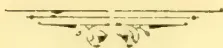

OBSERVER G/S ENGINE PROPS.

1035------------------------------------------------

<!-- stage4: FAINT old-images-only -->

[Faint page: no legible print of its own could be verified; text withheld (stage 4 review list)]

This image is a scan of a blank page. The paper has a light beige or cream-colored tint. There are a few very small, dark specks scattered across the surface, which appear to be scanning artifacts or dust particles. No text, lines, or other markings are present on the page.

1036------------------------------------------------

# TEA, COFFEE, CINCHONA, COCOA, AND CARDAMOM SALES.

NO. 11.]

COLOMBO, MARCH 15th, 1895.

PRICE:—12½ cents each; 3 copies.  
30 cents; 6 copies ½ rupee.

## COLOMBO SALES OF TEA.

### LARGE LOTS.

MR. A. M. GEPP

put up for sale at the Chamber of Commerce Sale-room on the 13th March, the undermentioned lots of tea (3,340 lb.), which sold as under:—

<table border="1">
<thead>
<tr>
<th>Lot</th>
<th>Box</th>
<th>Pkgs.</th>
<th>Name</th>
<th>lb.</th>
<th>c.</th>
</tr>
</thead>
<tbody>
<tr>
<td>1</td>
<td>Burnside</td>
<td>1 18</td>
<td>hf-ch. bro pek</td>
<td>900</td>
<td>58</td>
</tr>
<tr>
<td>2</td>
<td></td>
<td>3 50</td>
<td>do pekoe</td>
<td>1500</td>
<td>49</td>
</tr>
<tr>
<td>3</td>
<td></td>
<td>5 8</td>
<td>do pe sou</td>
<td>400</td>
<td>44</td>
</tr>
</tbody>
</table>

MESSRS. BENHAM & BREMNER

put up for sale at the Chamber of Commerce Sale-room on the 13th March, the undermentioned lots of tea (4,884 lb.), which sold as under:—

<table border="1">
<thead>
<tr>
<th>Lot</th>
<th>Box</th>
<th>Pkgs.</th>
<th>Name</th>
<th>lb.</th>
<th>c.</th>
</tr>
</thead>
<tbody>
<tr>
<td>1</td>
<td>Hornsey</td>
<td>22 14</td>
<td>ch pe sou</td>
<td>1400</td>
<td>55</td>
</tr>
<tr>
<td>4</td>
<td>Tavalam-tenne</td>
<td>25 8</td>
<td>do bro pe</td>
<td>880</td>
<td>63</td>
</tr>
<tr>
<td>5</td>
<td></td>
<td>30 5</td>
<td>do pekoe</td>
<td>500</td>
<td>55</td>
</tr>
<tr>
<td>12</td>
<td>Sutton</td>
<td>44 5</td>
<td>do fans</td>
<td>600</td>
<td>27 bid</td>
</tr>
<tr>
<td>13</td>
<td>Elston</td>
<td>21</td>
<td>do pek sou</td>
<td>1890</td>
<td>45</td>
</tr>
</tbody>
</table>

MESSRS. A. H. THOMPSON & CO.

put up for sale at the Chamber of Commerce Sale-room on the 13th March, the undermentioned lots of tea (59,244 lb.), which sold as under:—

<table border="1">
<thead>
<tr>
<th>Lot</th>
<th>Box</th>
<th>Pkgs.</th>
<th>Name</th>
<th>lb.</th>
<th>c.</th>
</tr>
</thead>
<tbody>
<tr>
<td>1</td>
<td>Vathalana</td>
<td>1 23</td>
<td>ch bro pek</td>
<td>2300</td>
<td>54</td>
</tr>
<tr>
<td>2</td>
<td></td>
<td>3 9</td>
<td>do pekoe</td>
<td>810</td>
<td>48</td>
</tr>
<tr>
<td>3</td>
<td>Kintyre</td>
<td>5 18</td>
<td>do bro pe sou</td>
<td>2250</td>
<td>45</td>
</tr>
<tr>
<td>4</td>
<td></td>
<td>7 5</td>
<td>hf-ch dust</td>
<td>450</td>
<td>28 bid</td>
</tr>
<tr>
<td>5</td>
<td>Ooloowatte</td>
<td>8 11</td>
<td>ch bro pek</td>
<td>1100</td>
<td>53 bid</td>
</tr>
<tr>
<td>6</td>
<td></td>
<td>10 9</td>
<td>do pekoe</td>
<td>810</td>
<td>49</td>
</tr>
<tr>
<td>9</td>
<td>Vogan</td>
<td>14 34</td>
<td>do bro pek</td>
<td>3400</td>
<td>64</td>
</tr>
<tr>
<td>10</td>
<td></td>
<td>16 24</td>
<td>do pekoe</td>
<td>2160</td>
<td>51</td>
</tr>
<tr>
<td>15</td>
<td>Dollewella</td>
<td>22 35</td>
<td>do bro or pe</td>
<td>3990</td>
<td>56</td>
</tr>
<tr>
<td>16</td>
<td></td>
<td>24 20</td>
<td>do bro pek</td>
<td>2100</td>
<td>49 bid</td>
</tr>
<tr>
<td>17</td>
<td></td>
<td>26 12</td>
<td>do pekoe</td>
<td>1115</td>
<td>46</td>
</tr>
<tr>
<td>18</td>
<td>Ugieside</td>
<td>28 3</td>
<td>do dust</td>
<td>420</td>
<td>27</td>
</tr>
<tr>
<td>19</td>
<td>Ambetenne</td>
<td>29 10</td>
<td>hf-ch bro mix</td>
<td>550</td>
<td>31</td>
</tr>
<tr>
<td>20</td>
<td>A</td>
<td>30 18</td>
<td>ch 1 hf-ch red leaf</td>
<td>1847</td>
<td>20</td>
</tr>
<tr>
<td>30</td>
<td>Comar</td>
<td>46 14</td>
<td>hf-ch bro or pe</td>
<td>700</td>
<td>58</td>
</tr>
<tr>
<td>31</td>
<td></td>
<td>48 20</td>
<td>do or pek</td>
<td>1000</td>
<td>58</td>
</tr>
<tr>
<td>32</td>
<td></td>
<td>50 14</td>
<td>do pekoe</td>
<td>700</td>
<td>47</td>
</tr>
<tr>
<td>33</td>
<td></td>
<td>52 10</td>
<td>do pe son</td>
<td>500</td>
<td>40</td>
</tr>
<tr>
<td>36</td>
<td>D</td>
<td>56 5</td>
<td>ch sou</td>
<td>500</td>
<td>28</td>
</tr>
<tr>
<td>39</td>
<td>Elgin</td>
<td>59 5</td>
<td>ch pe sou</td>
<td>450</td>
<td>51</td>
</tr>
<tr>
<td>41</td>
<td>Handro Kau-de</td>
<td>64 5</td>
<td>do pekoe</td>
<td>470</td>
<td>44</td>
</tr>
<tr>
<td>45</td>
<td></td>
<td>65 5</td>
<td>do pek sou</td>
<td>500</td>
<td>41</td>
</tr>
<tr>
<td>47</td>
<td>Myraganga</td>
<td>67 48</td>
<td>ch bro or pek</td>
<td>4800</td>
<td>54</td>
</tr>
<tr>
<td>48</td>
<td></td>
<td>69 35</td>
<td>do bro pek</td>
<td>4025</td>
<td>51 bid</td>
</tr>
<tr>
<td>49</td>
<td></td>
<td>71 32</td>
<td>do pekoe</td>
<td>3200</td>
<td>47 bid</td>
</tr>
<tr>
<td>50</td>
<td></td>
<td>73 23</td>
<td>do pe sou</td>
<td>2120</td>
<td>44</td>
</tr>
<tr>
<td>51</td>
<td></td>
<td>75 19</td>
<td>ch 1 hf-ch unas</td>
<td>1965</td>
<td>28 bid</td>
</tr>
<tr>
<td>52</td>
<td></td>
<td>77 12</td>
<td>ch dust</td>
<td>960</td>
<td>27</td>
</tr>
</tbody>
</table>

MESSRS. FORBES & WALKER

put up for sale at the Chamber of Commerce Sale-room on the 13th March, the undermentioned lots of tea (316,758 lb.), which sold as under:—

<table border="1">
<thead>
<tr>
<th>Lot</th>
<th>Box</th>
<th>Pkgs.</th>
<th>Name</th>
<th>lb.</th>
<th>c.</th>
</tr>
</thead>
<tbody>
<tr>
<td>3</td>
<td>ANK</td>
<td>816 6</td>
<td>hf-ch pe fans</td>
<td>420</td>
<td>29</td>
</tr>
<tr>
<td>5</td>
<td>Weligoda</td>
<td>820 6</td>
<td>do pekoe</td>
<td>570</td>
<td>40</td>
</tr>
<tr>
<td>6</td>
<td></td>
<td>822 5</td>
<td>do dust</td>
<td>800</td>
<td>26</td>
</tr>
<tr>
<td>9</td>
<td>K</td>
<td>828 14</td>
<td>ch pe sou</td>
<td>1400</td>
<td>34</td>
</tr>
<tr>
<td>13</td>
<td>Havilland</td>
<td>836 4</td>
<td>do bro mix</td>
<td>400</td>
<td>27</td>
</tr>
<tr>
<td>14</td>
<td></td>
<td>838 5</td>
<td>hf-ch dust</td>
<td>400</td>
<td>26</td>
</tr>
<tr>
<td>16</td>
<td>Elffindale</td>
<td>842 40</td>
<td>do unas</td>
<td>2000</td>
<td>39</td>
</tr>
<tr>
<td>17</td>
<td></td>
<td>844 28</td>
<td>do fans</td>
<td>1400</td>
<td>28 bid</td>
</tr>
<tr>
<td>18</td>
<td></td>
<td>846 10</td>
<td>do dust</td>
<td>500</td>
<td>27</td>
</tr>
</tbody>
</table>

<table border="1">
<thead>
<tr>
<th>Lot</th>
<th>Box</th>
<th>Pkgs.</th>
<th>Name</th>
<th>lb.</th>
<th>c.</th>
</tr>
</thead>
<tbody>
<tr>
<td>19</td>
<td>Evalgolla</td>
<td>848 28</td>
<td>ch pekoe</td>
<td>2520</td>
<td>49 bid</td>
</tr>
<tr>
<td>21</td>
<td>Augusta</td>
<td>852 11</td>
<td>do bro pe</td>
<td>1144</td>
<td>64</td>
</tr>
<tr>
<td>22</td>
<td></td>
<td>854 14</td>
<td>do pekoe</td>
<td>1120</td>
<td>50</td>
</tr>
<tr>
<td>23</td>
<td></td>
<td>856 20</td>
<td>do pe sou</td>
<td>1500</td>
<td>47</td>
</tr>
<tr>
<td>31</td>
<td>Fred's Ruhe</td>
<td>872 17</td>
<td>do bro pek</td>
<td>1870</td>
<td>63</td>
</tr>
<tr>
<td>32</td>
<td></td>
<td>874 16</td>
<td>do pekoe</td>
<td>1600</td>
<td>48</td>
</tr>
<tr>
<td>33</td>
<td></td>
<td>876 7</td>
<td>do pe sou</td>
<td>700</td>
<td>45</td>
</tr>
<tr>
<td>35</td>
<td>Ireby</td>
<td>880 25</td>
<td>ch or pe</td>
<td>2500</td>
<td>62</td>
</tr>
<tr>
<td>36</td>
<td></td>
<td>882 24</td>
<td>do pekoe</td>
<td>2400</td>
<td>51</td>
</tr>
<tr>
<td>37</td>
<td></td>
<td>884 17</td>
<td>do pe sou</td>
<td>1700</td>
<td>48</td>
</tr>
<tr>
<td>38</td>
<td>Frankland</td>
<td>886 6</td>
<td>ch bro pek</td>
<td>630</td>
<td>57</td>
</tr>
<tr>
<td>39</td>
<td></td>
<td>888 9</td>
<td>do pekoe</td>
<td>846</td>
<td>50</td>
</tr>
<tr>
<td>41</td>
<td>M</td>
<td>892 46</td>
<td>box pekoe</td>
<td>980</td>
<td>50 bid</td>
</tr>
<tr>
<td>42</td>
<td>Farnham</td>
<td>894 20</td>
<td>hf-ch or pek</td>
<td>1430</td>
<td>59</td>
</tr>
<tr>
<td>43</td>
<td></td>
<td>896 24</td>
<td>do pekoe</td>
<td>1392</td>
<td>53</td>
</tr>
<tr>
<td>44</td>
<td></td>
<td>898 5</td>
<td>ch fans</td>
<td>400</td>
<td>37</td>
</tr>
<tr>
<td>46</td>
<td>Verulupitiya</td>
<td>902 18</td>
<td>ch bro pe</td>
<td>1800</td>
<td>54</td>
</tr>
<tr>
<td>47</td>
<td></td>
<td>904 12</td>
<td>do pekoe</td>
<td>1080</td>
<td>47</td>
</tr>
<tr>
<td>48</td>
<td></td>
<td>906 10</td>
<td>do pe sou</td>
<td>900</td>
<td>45</td>
</tr>
<tr>
<td>49</td>
<td>Melrose</td>
<td>908 15</td>
<td>ch bro pek</td>
<td>1620</td>
<td>59</td>
</tr>
<tr>
<td>50</td>
<td></td>
<td>910 6</td>
<td>ch do</td>
<td>648</td>
<td>56</td>
</tr>
<tr>
<td>51</td>
<td></td>
<td>912 12</td>
<td>do pekoe</td>
<td>1200</td>
<td>51</td>
</tr>
<tr>
<td>52</td>
<td></td>
<td>914 16</td>
<td>do pe sou</td>
<td>1600</td>
<td>47</td>
</tr>
<tr>
<td>55</td>
<td>C R D</td>
<td>920 4</td>
<td>ch dust</td>
<td>440</td>
<td>28</td>
</tr>
<tr>
<td>56</td>
<td></td>
<td>922 4</td>
<td>do red leaf</td>
<td>400</td>
<td>25</td>
</tr>
<tr>
<td>57</td>
<td>Pansalatenne</td>
<td>924 24</td>
<td>do bro pek</td>
<td>2520</td>
<td>57</td>
</tr>
<tr>
<td>58</td>
<td></td>
<td>926 23</td>
<td>do pekoe</td>
<td>2300</td>
<td>49</td>
</tr>
<tr>
<td>59</td>
<td></td>
<td>928 19</td>
<td>do pe sou</td>
<td>950</td>
<td>45</td>
</tr>
<tr>
<td>63</td>
<td>Aigburth</td>
<td>936 6</td>
<td>do dust</td>
<td>660</td>
<td>32</td>
</tr>
<tr>
<td>69</td>
<td>N P</td>
<td>948 6</td>
<td>hf-ch pe fans</td>
<td>420</td>
<td>29</td>
</tr>
<tr>
<td>70</td>
<td>Geragama</td>
<td>950 4</td>
<td>ch bro pek</td>
<td>416</td>
<td>64</td>
</tr>
<tr>
<td>71</td>
<td></td>
<td>952 5</td>
<td>do pekoe</td>
<td>400</td>
<td>50</td>
</tr>
<tr>
<td>72</td>
<td></td>
<td>954 8</td>
<td>do pe sou</td>
<td>600</td>
<td>47</td>
</tr>
<tr>
<td>75</td>
<td>Dunkeld</td>
<td>960 25</td>
<td>ch bro pek</td>
<td>2750</td>
<td>55 bid</td>
</tr>
<tr>
<td>76</td>
<td></td>
<td>962 23</td>
<td>hf-ch or pek</td>
<td>1150</td>
<td>65</td>
</tr>
<tr>
<td>77</td>
<td></td>
<td>964 11</td>
<td>ch pekoe</td>
<td>2100</td>
<td>56</td>
</tr>
<tr>
<td>79</td>
<td>D K D</td>
<td>968 8</td>
<td>do pe fans</td>
<td>1240</td>
<td>28</td>
</tr>
<tr>
<td>81</td>
<td>Castlereagh</td>
<td>972 13</td>
<td>ch bro pek</td>
<td>1430</td>
<td>57 bid</td>
</tr>
<tr>
<td>82</td>
<td></td>
<td>974 18</td>
<td>do or pek</td>
<td>1620</td>
<td>54</td>
</tr>
<tr>
<td>83</td>
<td></td>
<td>976 11</td>
<td>do pekoe</td>
<td>990</td>
<td>49</td>
</tr>
<tr>
<td>84</td>
<td></td>
<td>978 13</td>
<td>do pe sou</td>
<td>1105</td>
<td>44</td>
</tr>
<tr>
<td>85</td>
<td>Aigburth</td>
<td>980 24</td>
<td>ch pe sou</td>
<td>2160</td>
<td>50</td>
</tr>
<tr>
<td>86</td>
<td></td>
<td>982 32</td>
<td>do do No. 2</td>
<td>3200</td>
<td>46</td>
</tr>
<tr>
<td>93</td>
<td>Ellekande</td>
<td>996 39</td>
<td>hf-ch bro pek</td>
<td>1950</td>
<td>56 bid</td>
</tr>
<tr>
<td>94</td>
<td></td>
<td>998 35</td>
<td>do pekoe</td>
<td>1750</td>
<td>46</td>
</tr>
<tr>
<td>95</td>
<td></td>
<td>1000 26</td>
<td>ch pe sou</td>
<td>1820</td>
<td>43</td>
</tr>
<tr>
<td>97</td>
<td></td>
<td>4 6</td>
<td>do congou</td>
<td>408</td>
<td>41</td>
</tr>
<tr>
<td>100</td>
<td>Weoya</td>
<td>10 8</td>
<td>hf-ch bro pek</td>
<td>1540</td>
<td>60</td>
</tr>
<tr>
<td>101</td>
<td></td>
<td>12 28</td>
<td>do pekoe</td>
<td>1400</td>
<td>47 bid</td>
</tr>
<tr>
<td>102</td>
<td></td>
<td>14 1</td>
<td>ch bro pe fan</td>
<td>600</td>
<td>48</td>
</tr>
<tr>
<td>107</td>
<td>Great Valley</td>
<td>24 23</td>
<td>do bro pe</td>
<td>2530</td>
<td>61</td>
</tr>
<tr>
<td>108</td>
<td></td>
<td>26 17</td>
<td>do pekoe</td>
<td>2700</td>
<td>51</td>
</tr>
<tr>
<td>109</td>
<td></td>
<td>28 12</td>
<td>do pesou</td>
<td>1140</td>
<td>46</td>
</tr>
<tr>
<td>110</td>
<td></td>
<td>30 5</td>
<td>do son</td>
<td>475</td>
<td>42</td>
</tr>
<tr>
<td>111</td>
<td></td>
<td>32 5</td>
<td>hf-ch dust</td>
<td>425</td>
<td>28</td>
</tr>
<tr>
<td>112</td>
<td>Harrington</td>
<td>34 26</td>
<td>do flowery pek</td>
<td>1170</td>
<td>68</td>
</tr>
<tr>
<td>113</td>
<td></td>
<td>36 21</td>
<td>ch bro or pek</td>
<td>2310</td>
<td>59</td>
</tr>
<tr>
<td>114</td>
<td></td>
<td>38 15</td>
<td>do pekoe</td>
<td>1350</td>
<td>52</td>
</tr>
<tr>
<td>115</td>
<td></td>
<td>40 10</td>
<td>do pe sou</td>
<td>900</td>
<td>47</td>
</tr>
<tr>
<td>118</td>
<td>Wattawella</td>
<td>46 2</td>
<td>do dust</td>
<td>525</td>
<td>28</td>
</tr>
<tr>
<td>120</td>
<td>Radella</td>
<td>50 58</td>
<td>do bro pek</td>
<td>5800</td>
<td>63 bid</td>
</tr>
<tr>
<td>121</td>
<td></td>
<td>52 27</td>
<td>do pekoe</td>
<td>2430</td>
<td>56</td>
</tr>
<tr>
<td>122</td>
<td></td>
<td>54 22</td>
<td>do pe sou</td>
<td>1980</td>
<td>50</td>
</tr>
<tr>
<td>127</td>
<td>S</td>
<td>64 8</td>
<td>ch dust</td>
<td>1200</td>
<td>27</td>
</tr>
<tr>
<td>130</td>
<td>Avoca</td>
<td>70 4</td>
<td>ch bro pek</td>
<td>400</td>
<td>62</td>
</tr>
<tr>
<td>131</td>
<td></td>
<td>72 7</td>
<td>do pekoe</td>
<td>700</td>
<td>58</td>
</tr>
<tr>
<td>134</td>
<td>Kelaneiya</td>
<td>78 22</td>
<td>do bro pek</td>
<td>1870</td>
<td>62 bid</td>
</tr>
<tr>
<td>135</td>
<td></td>
<td>80 27</td>
<td>do pekoe</td>
<td>2700</td>
<td>52</td>
</tr>
<tr>
<td>138</td>
<td>Kirrimettia</td>
<td>86 6</td>
<td>ch bro mix</td>
<td>600</td>
<td>45</td>
</tr>
<tr>
<td>139</td>
<td></td>
<td>88 4</td>
<td>do unas</td>
<td>600</td>
<td>49</td>
</tr>
<tr>
<td>144</td>
<td>Ingurugalla</td>
<td>98 7</td>
<td>do pe sou</td>
<td>630</td>
<td>45</td>
</tr>
<tr>
<td>145</td>
<td></td>
<td>100 6</td>
<td>do bro tea</td>
<td>720</td>
<td>31</td>
</tr>
<tr>
<td>148</td>
<td>S S S</td>
<td>106 11</td>
<td>ch bro pe</td>
<td>1210</td>
<td>85</td>
</tr>
<tr>
<td>149</td>
<td></td>
<td>108 13</td>
<td>do pekoe</td>
<td>1300</td>
<td>52 bid</td>
</tr>
<tr>
<td>151</td>
<td>J H S, in est. mark</td>
<td>112 10</td>
<td>ch or pek</td>
<td>1000</td>
<td>58</td>
</tr>
<tr>
<td>152</td>
<td></td>
<td>114 9</td>
<td>do pekoe</td>
<td>855</td>
<td>47 bid</td>
</tr>
<tr>
<td>153</td>
<td></td>
<td>116 14</td>
<td>do pe sou</td>
<td>1330</td>
<td>44 bid</td>
</tr>
<tr>
<td>155</td>
<td>Torwood</td>
<td>120 21</td>
<td>do bro pek</td>
<td>2295</td>
<td>67</td>
</tr>
<tr>
<td>156</td>
<td></td>
<td>122 22</td>
<td>do pekoe</td>
<td>3040</td>
<td>49 bid</td>
</tr>
<tr>
<td>157</td>
<td></td>
<td>124 7</td>
<td>do pe sou</td>
<td>700</td>
<td>46</td>
</tr>
<tr>
<td>158</td>
<td>Liskilleen</td>
<td>126 15</td>
<td>ch bro pek</td>
<td>1500</td>
<td>65</td>
</tr>
<tr>
<td>159</td>
<td></td>
<td>128 19</td>
<td>do pekoe</td>
<td>1710</td>
<td>51</td>
</tr>
<tr>
<td>160</td>
<td></td>
<td>130 6</td>
<td>do pe sou</td>
<td>600</td>
<td>44</td>
</tr>
<tr>
<td>162</td>
<td>Essex</td>
<td>134 54</td>
<td>hf-ch or pek</td>
<td>2700</td>
<td>58</td>
</tr>
<tr>
<td>163</td>
<td></td>
<td>136 44</td>
<td>box do</td>
<td>1000</td>
<td>60</td>
</tr>
</tbody>
</table>

1037------------------------------------------------

2CEYLON PRODUCE SALES LIST.

<table border="1">
<thead>
<tr>
<th>Lot</th>
<th>Box</th>
<th>Pkgs.</th>
<th>Name</th>
<th>lb.</th>
<th>c.</th>
</tr>
</thead>
<tbody>
<tr><td>164</td><td>138</td><td>12 ch</td><td>bro tea</td><td>1929</td><td>26</td></tr>
<tr><td>165</td><td>140</td><td>15 do</td><td>bro pek</td><td>1500</td><td>66</td></tr>
<tr><td>166</td><td>142</td><td>19 do</td><td>pekoe</td><td>1710</td><td>51</td></tr>
<tr><td>167</td><td>144</td><td>6 do</td><td>pe sou</td><td>600</td><td>44</td></tr>
<tr><td>169</td><td>145</td><td>15 hf-ch</td><td>bro pek</td><td>975</td><td>66</td></tr>
<tr><td>170</td><td>150</td><td>34 do</td><td>or pek</td><td>1870</td><td>71</td></tr>
<tr><td>171</td><td>152</td><td>13 ch</td><td>pek No. 1</td><td>1235</td><td>60</td></tr>
<tr><td>172</td><td>154</td><td>11 do</td><td>pek No. 2</td><td>1100</td><td>51</td></tr>
<tr><td>182</td><td>174</td><td>27 ch</td><td>bro pek</td><td>2070</td><td>59 bid</td></tr>
<tr><td>183</td><td>176</td><td>25 do</td><td>pekoe</td><td>2750</td><td>56</td></tr>
<tr><td>184</td><td>178</td><td>6 do</td><td>pe sou</td><td>600</td><td>49</td></tr>
<tr><td>185</td><td>180</td><td>36 do</td><td>or pek</td><td>3780</td><td>58 bid</td></tr>
<tr><td>186</td><td>182</td><td>22 do</td><td>pekoe</td><td>2310</td><td>54 bid</td></tr>
<tr><td>187</td><td>184</td><td>38 hf-ch</td><td>bro or pe</td><td>1900</td><td>62</td></tr>
<tr><td>188</td><td>186</td><td>40 do</td><td>bro pek</td><td>2090</td><td>61</td></tr>
<tr><td>189</td><td>188</td><td>42 ch</td><td>pekoe</td><td>3780</td><td>53</td></tr>
<tr><td>190</td><td>190</td><td>34 do</td><td>pe sou</td><td>3060</td><td>45 bid</td></tr>
<tr><td>191</td><td>192</td><td>15 do</td><td>bro pek</td><td>1650</td><td>53</td></tr>
<tr><td>192</td><td>194</td><td>34 do</td><td>pekoe</td><td>3230</td><td>48 bid</td></tr>
<tr><td>195</td><td>200</td><td>6 do</td><td>bro pek</td><td>690</td><td>42</td></tr>
<tr><td>193</td><td colspan="2">C L, in estate mark</td><td></td><td></td><td></td></tr>
<tr><td>199</td><td>206</td><td>29 ch</td><td>bro or pek</td><td>3190</td><td>60 bid</td></tr>
<tr><td>200</td><td>208</td><td>14 do</td><td>or pek</td><td>1400</td><td>61</td></tr>
<tr><td>201</td><td>210</td><td>34 do</td><td>pekoe</td><td>3060</td><td>53</td></tr>
<tr><td>202</td><td>212</td><td>8 do</td><td>pe sou</td><td>720</td><td>48</td></tr>
<tr><td>203</td><td>214</td><td>16 do</td><td>bro or pek</td><td>1568</td><td>52 bid</td></tr>
<tr><td>204</td><td>216</td><td>17 do</td><td>bro pek</td><td>1666</td><td>46 bid</td></tr>
<tr><td>205</td><td>218</td><td>35 do</td><td>pekoe</td><td>3185</td><td>42 bid</td></tr>
<tr><td>206</td><td>220</td><td>25 hf-ch</td><td>bro or pek</td><td>1375</td><td>60</td></tr>
<tr><td>207</td><td>222</td><td>19 ch</td><td>pekoe</td><td>1900</td><td>51</td></tr>
<tr><td>208</td><td>224</td><td>16 do</td><td>pe sou</td><td>1600</td><td>47</td></tr>
<tr><td>209</td><td>226</td><td>7 do</td><td>red leaf</td><td>602</td><td>24</td></tr>
<tr><td>210</td><td>228</td><td>15 do</td><td>bro pe sou</td><td>1584</td><td>29</td></tr>
<tr><td>211</td><td>230</td><td>15 do</td><td>fans</td><td>1800</td><td>26</td></tr>
<tr><td>212</td><td>232</td><td>5 do</td><td>bro tea</td><td>420</td><td>25</td></tr>
<tr><td>213</td><td>234</td><td>5 ch</td><td>bro pek</td><td>525</td><td>49</td></tr>
<tr><td>214</td><td>236</td><td>5 do</td><td>pekoe</td><td>500</td><td>43</td></tr>
<tr><td>216</td><td>238</td><td>5 do</td><td>pe sou</td><td>450</td><td>45</td></tr>
<tr><td>217</td><td>242</td><td>24 do</td><td>pek dust</td><td>1920</td><td>28</td></tr>
<tr><td>218</td><td>244</td><td>29 do</td><td>pekoe</td><td>2900</td><td>48 bid</td></tr>
<tr><td>219</td><td>270</td><td>36 hf-ch</td><td>bro pek</td><td>2340</td><td>62</td></tr>
<tr><td>221</td><td>272</td><td>21 do</td><td>pekoe</td><td>1260</td><td>52</td></tr>
<tr><td>222</td><td>274</td><td>22 do</td><td>pe sou</td><td>1210</td><td>44</td></tr>
<tr><td>223</td><td colspan="2">Walahanduw</td><td></td><td></td><td></td></tr>
<tr><td>225</td><td>278</td><td>7 ch</td><td>bro pek</td><td>700</td><td>60</td></tr>
<tr><td>226</td><td>280</td><td>14 do</td><td>pekoe</td><td>1400</td><td>47</td></tr>
<tr><td>227</td><td>282</td><td>14 do</td><td>pe sou</td><td>1330</td><td>45</td></tr>
<tr><td>228</td><td>302</td><td>4 ch</td><td></td><td></td><td></td></tr>
<tr><td>229</td><td>302</td><td>1 hf-ch</td><td>pekoe</td><td>450</td><td>46</td></tr>
<tr><td>230</td><td>304</td><td>5 ch</td><td>pe sou</td><td>445</td><td>44</td></tr>
<tr><td>231</td><td colspan="2">Horagas-kelle</td><td></td><td></td><td></td></tr>
<tr><td>232</td><td>342</td><td>10 hf-ch</td><td>pe sou</td><td>586</td><td>46</td></tr>
<tr><td>233</td><td>348</td><td>14 ch</td><td>bro pe</td><td>1400</td><td>60</td></tr>
<tr><td>234</td><td>350</td><td>12 do</td><td>pekoe</td><td>1200</td><td>48</td></tr>
<tr><td>235</td><td>352</td><td>12 do</td><td>pe sou</td><td>1200</td><td>44</td></tr>
<tr><td>236</td><td>360</td><td>8 hf-ch</td><td>bro pe</td><td>480</td><td>60 bid</td></tr>
<tr><td>237</td><td>362</td><td>19 do</td><td>pekoe</td><td>550</td><td>54</td></tr>
<tr><td>238</td><td>366</td><td>8 ch</td><td>bro pe</td><td>880</td><td>54</td></tr>
<tr><td>239</td><td>368</td><td>10 do</td><td>pekoe</td><td>1000</td><td>46</td></tr>
<tr><td>240</td><td>372</td><td>22 do</td><td>bro pek</td><td>2354</td><td>53 bid</td></tr>
<tr><td>241</td><td>374</td><td>16 do</td><td>pekoe</td><td>1440</td><td>48</td></tr>
<tr><td>242</td><td>376</td><td>6 do</td><td>pe sou</td><td>522</td><td>44</td></tr>
<tr><td>243</td><td>380</td><td>15 hf-ch</td><td>young hyson</td><td>900</td><td>50 bid</td></tr>
<tr><td>244</td><td>382</td><td>13 do</td><td>hyson</td><td>780</td><td>48 bid</td></tr>
<tr><td>245</td><td>384</td><td>14 do</td><td>hyson No. 2</td><td>770</td><td>45 bid</td></tr>
<tr><td>246</td><td>404</td><td>25 ch</td><td>bro pe</td><td>3000</td><td>82</td></tr>
<tr><td>247</td><td>406</td><td>30 do</td><td>pekoe</td><td>3000</td><td>60</td></tr>
<tr><td>248</td><td>410</td><td>26 do</td><td>bro pe</td><td>2600</td><td>54 bid</td></tr>
<tr><td>249</td><td>412</td><td>36 do</td><td>pekoe</td><td>3240</td><td>52</td></tr>
<tr><td>250</td><td>414</td><td>24 do</td><td>pek sou</td><td>216</td><td>46</td></tr>
<tr><td>251</td><td>422</td><td>18 hf-ch</td><td>flowery pe</td><td>1800</td><td>59</td></tr>
<tr><td>252</td><td>424</td><td>15 ch</td><td>pekoe</td><td>1500</td><td>52</td></tr>
<tr><td>253</td><td>430</td><td>5 do</td><td></td><td></td><td></td></tr>
<tr><td>254</td><td>432</td><td>1 hf-ch</td><td>bro pe</td><td>623</td><td>72</td></tr>
<tr><td>255</td><td>432</td><td>7 ch</td><td></td><td></td><td></td></tr>
<tr><td>256</td><td>436</td><td>3 ch</td><td>pekoe</td><td>675</td><td>52</td></tr>
<tr><td>257</td><td>440</td><td>7 do</td><td>dust</td><td>468</td><td>27</td></tr>
<tr><td>258</td><td>440</td><td>7 do</td><td>bro tea</td><td>770</td><td>31</td></tr>
<tr><td>259</td><td>442</td><td>6 do</td><td>bro pe</td><td>575</td><td>54</td></tr>
<tr><td>260</td><td>444</td><td>5 do</td><td>pekoe</td><td>440</td><td>51</td></tr>
<tr><td>261</td><td>446</td><td>4 do</td><td>pe sou</td><td>407</td><td>46</td></tr>
<tr><td>262</td><td>450</td><td>23 hf-ch</td><td>bro or pe</td><td>1540</td><td>53</td></tr>
<tr><td>263</td><td>452</td><td>13 ch</td><td>pe sou</td><td>140</td><td>45</td></tr>
</tbody>
</table>

MR. E. JOHN

put up for sale at the Chamber of Commerce Sale-room on the 13th March, the undermentioned lots of tea (95,725 lb.), which sold as under:—

<table border="1">
<thead>
<tr>
<th>Lot.</th>
<th>Box.</th>
<th>Pkgs.</th>
<th>Name.</th>
<th>lb.</th>
<th>c.</th>
</tr>
</thead>
<tbody>
<tr><td>1</td><td>Pati Rajah</td><td>206</td><td>6 ch</td><td>bro pe</td><td>635</td><td>52 bid</td></tr>
<tr><td>2</td><td></td><td>208</td><td>6 do</td><td>pekoe</td><td>600</td><td>45 bid</td></tr>
</tbody>
</table>

<table border="1">
<thead>
<tr>
<th>Lot</th>
<th>Box</th>
<th>Pkgs.</th>
<th>Name</th>
<th>lb.</th>
<th>c.</th>
</tr>
</thead>
<tbody>
<tr><td>6</td><td>Alnoor</td><td>216</td><td>28 hf-ch</td><td>bro pe</td><td>1540</td><td>56 bid</td></tr>
<tr><td>7</td><td></td><td>218</td><td>19 do</td><td>pekoe</td><td>950</td><td>51</td></tr>
<tr><td>8</td><td></td><td>220</td><td>22 do</td><td>pe sou</td><td>1100</td><td>46 bid</td></tr>
<tr><td>9</td><td></td><td>222</td><td>6 do</td><td>fans</td><td>430</td><td>39</td></tr>
<tr><td>10</td><td>Hunugalla</td><td>224</td><td>10 ch</td><td>bro pe</td><td>1000</td><td>54</td></tr>
<tr><td>11</td><td></td><td>226</td><td>20 do</td><td>pe sou</td><td>2000</td><td>41</td></tr>
<tr><td>12</td><td>Esperanza</td><td>228</td><td>40 hf-ch</td><td>pekoe</td><td>1840</td><td>45 bid</td></tr>
<tr><td>13</td><td></td><td>230</td><td>22 do</td><td>bro or pe</td><td>1144</td><td>56 bid</td></tr>
<tr><td>15</td><td>Wewesse</td><td>234</td><td>22 do</td><td>bro pe</td><td>1210</td><td>62 bid</td></tr>
<tr><td>16</td><td></td><td>236</td><td>24 do</td><td>pekoe</td><td>1320</td><td>55</td></tr>
<tr><td>17</td><td></td><td>238</td><td>24 do</td><td>pe sou</td><td>1320</td><td>47</td></tr>
<tr><td>13</td><td>T &amp; T Co., in estate mark</td><td>240</td><td>33 ch</td><td>bro pe</td><td>2640</td><td>54</td></tr>
<tr><td>19</td><td></td><td>242</td><td>41 do</td><td>pekoe</td><td>3090</td><td>47</td></tr>
<tr><td>20</td><td></td><td>244</td><td>13 do</td><td>pe sou</td><td>1170</td><td>45</td></tr>
<tr><td>22</td><td>Agar's Land</td><td>248</td><td>20 hf-ch</td><td>bro pe</td><td>1000</td><td rowspan="2">} with n</td></tr>
<tr><td>23</td><td></td><td>250</td><td>24 do</td><td>pekoe</td><td>1080</td></tr>
<tr><td>24</td><td></td><td>250</td><td>48 do</td><td>pe sou</td><td>2160</td><td>46</td></tr>
<tr><td>25</td><td></td><td>254</td><td>5 do</td><td>dust</td><td>400</td><td>28</td></tr>
<tr><td>26</td><td></td><td>256</td><td>15 do</td><td>bro pe No. 2</td><td>750</td><td rowspan="2">} with n</td></tr>
<tr><td>27</td><td></td><td>258</td><td>49 boxes</td><td>bro or pe</td><td>980</td></tr>
<tr><td>28</td><td>L</td><td>260</td><td>11 ch</td><td>pe sou</td><td>1045</td><td>49</td></tr>
<tr><td>29</td><td></td><td>262</td><td>4 hf-ch</td><td>dust</td><td>400</td><td>27</td></tr>
<tr><td>31</td><td>Eila</td><td>266</td><td>35 ch</td><td>bro pe</td><td>3500</td><td>53</td></tr>
<tr><td>32</td><td></td><td>268</td><td>24 do</td><td>pekoe</td><td>2400</td><td>45</td></tr>
<tr><td>33</td><td></td><td>270</td><td>13 do</td><td>pe sou</td><td>1170</td><td>45</td></tr>
<tr><td>34</td><td>Lameliere</td><td>272</td><td>23 do</td><td>bro pe</td><td>2906</td><td>68</td></tr>
<tr><td>35</td><td></td><td>274</td><td>26 do</td><td>pekoe</td><td>2500</td><td>57</td></tr>
<tr><td>36</td><td></td><td>276</td><td>15 do</td><td>pe sou</td><td>1470</td><td>54</td></tr>
<tr><td>39</td><td>Ottery and Stamford Hill</td><td>282</td><td>24 do</td><td>bro pe</td><td>2400</td><td>68</td></tr>
<tr><td>40</td><td></td><td>284</td><td>21 do</td><td>or pe</td><td>1785</td><td>74</td></tr>
<tr><td>41</td><td></td><td>286</td><td>51 do</td><td>pekoe</td><td>4590</td><td>57</td></tr>
<tr><td>44</td><td>Maria</td><td>302</td><td>7 do</td><td>bro pe</td><td>700</td><td>52 bid</td></tr>
<tr><td>45</td><td></td><td>304</td><td>11 do</td><td>pekoe</td><td>1100</td><td>47</td></tr>
<tr><td>46</td><td></td><td>306</td><td>5 do</td><td>pe sou</td><td>500</td><td>43</td></tr>
<tr><td>49</td><td>Yahala</td><td>312</td><td>3 do</td><td>dust</td><td>405</td><td>27</td></tr>
<tr><td>50</td><td>Mocha</td><td>314</td><td>30 do</td><td>bro pe</td><td>3390</td><td>68</td></tr>
<tr><td>51</td><td></td><td>316</td><td>27 do</td><td>pekoe</td><td>2700</td><td>57 bid</td></tr>
<tr><td>52</td><td></td><td>318</td><td>16 do</td><td>pe sou</td><td>1440</td><td>52</td></tr>
<tr><td>53</td><td></td><td>320</td><td>6 do</td><td>fans</td><td>840</td><td>34</td></tr>
<tr><td>54</td><td>Anchor, in estate mark</td><td>322</td><td>22 do</td><td>bro or pe</td><td>2530</td><td>out</td></tr>
<tr><td>55</td><td></td><td>324</td><td>16 do</td><td>or pe</td><td>1590</td><td>69 bid</td></tr>
<tr><td>56</td><td></td><td>326</td><td>14 do</td><td>pekoe</td><td>1330</td><td>56</td></tr>
<tr><td>57</td><td></td><td>328</td><td>8 do</td><td>pe sou</td><td>800</td><td>52</td></tr>
<tr><td>58</td><td></td><td>330</td><td>12 hf-ch</td><td>dust</td><td>1080</td><td>32</td></tr>
<tr><td>59</td><td>Diyagama</td><td>332</td><td>13 do</td><td>bro pe</td><td>550</td><td>54</td></tr>
<tr><td>60</td><td></td><td>334</td><td>12 ch</td><td>pekoe</td><td>1020</td><td>47</td></tr>
<tr><td>63</td><td>Ardlaw and Wishford</td><td>340</td><td>19 hf-ch</td><td>or pe</td><td>950</td><td>74</td></tr>
<tr><td>64</td><td></td><td>342</td><td>10 ch</td><td>bro or pe</td><td>1150</td><td>61</td></tr>
<tr><td>65</td><td></td><td>344</td><td>15 do</td><td>pekoe</td><td>1350</td><td>53 bid</td></tr>
<tr><td>66</td><td>A, in estate mark</td><td>346</td><td>17 do</td><td>unas</td><td>1836</td><td>46 bid</td></tr>
<tr><td>68</td><td>C</td><td>350</td><td>12 do</td><td>pekoe</td><td>1080</td><td>43 bid</td></tr>
<tr><td>72</td><td>Tientsin</td><td>17</td><td>16 do</td><td>or pe</td><td>1600</td><td>62 bid</td></tr>
<tr><td>73</td><td></td><td>19</td><td>21 hf-ch</td><td>bro pe</td><td>1260</td><td>70 bid</td></tr>
<tr><td>77</td><td>Eila</td><td>27</td><td>37 ch</td><td>bro pe</td><td>3700</td><td>53</td></tr>
<tr><td>79</td><td>Wewesse</td><td>31</td><td>19 hf-ch</td><td>bro pe</td><td>1045</td><td>63</td></tr>
<tr><td>80</td><td></td><td>33</td><td>25 do</td><td>pekoe</td><td>1375</td><td>56</td></tr>
<tr><td>81</td><td></td><td>35</td><td>32 do</td><td>pe sou</td><td>1760</td><td>47</td></tr>
<tr><td>82</td><td>D, in estate mark</td><td>37</td><td>10 do</td><td>bro pek</td><td>580</td><td>81 bid</td></tr>
<tr><td>83</td><td>B R S, in estate mark</td><td>39</td><td>10 ch</td><td>pekoe</td><td>1000</td><td>53 bid</td></tr>
</tbody>
</table>

MESSRS. SOMERVILLE & Co.

put up for sale at the Chamber of Commerce Sale-room on the 13th March, the undermentioned lots of tea (117,210 lb.), which sold as under:—

<table border="1">
<thead>
<tr>
<th>Lot</th>
<th>Box</th>
<th>Pkgs.</th>
<th>Name</th>
<th>lb.</th>
<th>c.</th>
</tr>
</thead>
<tbody>
<tr><td>5</td><td>Woodthorpe</td><td>12</td><td>7 ch</td><td>pe sou</td><td>525</td><td>45</td></tr>
<tr><td>8</td><td>Mahattenne</td><td>15</td><td>12 do</td><td>bro pe</td><td>1200</td><td>53 bid</td></tr>
<tr><td>9</td><td></td><td>16</td><td>13 do</td><td>pekoe</td><td>1300</td><td>48</td></tr>
<tr><td>10</td><td>Irex</td><td>17</td><td>12 do</td><td>bro pe</td><td>1200</td><td>57</td></tr>
<tr><td>11</td><td></td><td>18</td><td>18 do</td><td>pekoe</td><td>1800</td><td>48</td></tr>
<tr><td>13</td><td>Malvern</td><td>20</td><td>23 hf-ch</td><td>bro pe</td><td>1265</td><td>52 bid</td></tr>
<tr><td>14</td><td></td><td>21</td><td>32 do</td><td>pekoe</td><td>1760</td><td>48</td></tr>
<tr><td>15</td><td></td><td>22</td><td>9 do</td><td>pe sou</td><td>495</td><td>43</td></tr>
<tr><td>18</td><td>Citrus</td><td>25</td><td>7 ch</td><td>bro pe</td><td>770</td><td>53 bid</td></tr>
<tr><td>19</td><td></td><td>26</td><td>9 ch</td><td>pekoe</td><td>900</td><td>48</td></tr>
<tr><td>20</td><td></td><td>27</td><td>6 do</td><td>fans</td><td>600</td><td>41</td></tr>
<tr><td>24</td><td>Pelawatte</td><td>31</td><td>13 do</td><td>bro pe</td><td>1430</td><td>52 bid</td></tr>
<tr><td>25</td><td></td><td>32</td><td>13 do</td><td>pekoe</td><td>1365</td><td>52 bid</td></tr>
<tr><td>26</td><td></td><td>33</td><td>12 do</td><td>pe sou</td><td>1220</td><td>46</td></tr>
</tbody>
</table>

1038------------------------------------------------

CEYLON PRODUCE SALES LIST.

3

<table border="1">
<thead>
<tr>
<th>Lot.</th>
<th>Box</th>
<th>Pks.</th>
<th>Name.</th>
<th>lb.</th>
<th>c.</th>
</tr>
</thead>
<tbody>
<tr><td>28</td><td>Galkadua</td><td>35 20</td><td>ch bro pe</td><td>2000</td><td>62</td></tr>
<tr><td>29</td><td></td><td>36 17</td><td>do pekoe</td><td>1700</td><td>49</td></tr>
<tr><td>30</td><td></td><td>37 13</td><td>do pe sou</td><td>1300</td><td>42 bid</td></tr>
<tr><td>41</td><td>Kananka</td><td>48 22</td><td>do bro pe</td><td>2420</td><td>54 bid</td></tr>
<tr><td>42</td><td></td><td>49 49</td><td>do pekoe</td><td>4655</td><td>48</td></tr>
<tr><td>43</td><td></td><td>50 48</td><td>do pekoe</td><td>4560</td><td>48</td></tr>
<tr><td>44</td><td></td><td>51 10</td><td>do pe sou</td><td>3995</td><td>42 bid</td></tr>
<tr><td>45</td><td></td><td>52 8</td><td>do pe fans</td><td>1230</td><td>42</td></tr>
<tr><td>46</td><td></td><td>53 7</td><td>do sou</td><td>640</td><td>39</td></tr>
<tr><td>48</td><td>Warakamure</td><td>55 62</td><td>do bro tea</td><td>700</td><td>34</td></tr>
<tr><td>49</td><td></td><td>56 36</td><td>do bro pe</td><td>6200</td><td>53 bid</td></tr>
<tr><td>50</td><td></td><td>57 36</td><td>do pekoe</td><td>3420</td><td>49</td></tr>
<tr><td>53</td><td>Mousagalla</td><td>60 21</td><td>do pe sou</td><td>1980</td><td>44</td></tr>
<tr><td>54</td><td></td><td>61 13</td><td>do bro pe</td><td>2310</td><td>53</td></tr>
<tr><td>57</td><td>Friedland</td><td>64 36</td><td>boxes bro or pe</td><td>1300</td><td>48 bid</td></tr>
<tr><td>58</td><td></td><td>65 32</td><td>do or pe</td><td>720</td><td>75 bid</td></tr>
<tr><td>59</td><td></td><td>66 20</td><td>do pekoe</td><td>640</td><td>69 bid</td></tr>
<tr><td>60</td><td></td><td>67 22</td><td>do pekoe</td><td>1000</td><td>58 bid</td></tr>
<tr><td>61</td><td>Hopewell</td><td>68 8</td><td>do pe sou</td><td>1100</td><td>49 bid</td></tr>
<tr><td>62</td><td></td><td>69 16</td><td>do or pe</td><td>480</td><td>55 bid</td></tr>
<tr><td>63</td><td></td><td>70 23</td><td>do pekoe</td><td>900</td><td>48 bid</td></tr>
<tr><td>65</td><td>Naseby</td><td>72 17</td><td>do bro pe</td><td>1265</td><td>43 bid</td></tr>
<tr><td>66</td><td></td><td>73 26</td><td>do pekoe</td><td>850</td><td>84</td></tr>
<tr><td>70</td><td>Gallawatte</td><td>77 18</td><td>do pekoe</td><td>1300</td><td>(2)</td></tr>
<tr><td>72</td><td></td><td>79 12</td><td>do br pe bulked</td><td>900</td><td>55</td></tr>
<tr><td>76</td><td>LL</td><td>83 6</td><td>ch bro tea</td><td>600</td><td>47</td></tr>
<tr><td>77</td><td>Rayigam</td><td>84 10</td><td>do bro pe</td><td>1320</td><td>60 bid</td></tr>
<tr><td>78</td><td></td><td>85 18</td><td>do or pe</td><td>1800</td><td>53 bid</td></tr>
<tr><td>79</td><td></td><td>86 8</td><td>do pekoe</td><td>800</td><td>50</td></tr>
<tr><td>80</td><td></td><td>87 10</td><td>do pe sou</td><td>1000</td><td>48</td></tr>
<tr><td>81</td><td>T in est. mark</td><td>88 6</td><td>do unas</td><td>630</td><td>48</td></tr>
<tr><td>82</td><td></td><td>89 6</td><td>do bro mix</td><td>660</td><td>42</td></tr>
<tr><td>93</td><td>Forest Hill</td><td>100 14</td><td>ch bro pe</td><td>1540</td><td>57</td></tr>
<tr><td>94</td><td></td><td>101 20</td><td>do pekoe</td><td>2100</td><td>48</td></tr>
<tr><td>95</td><td></td><td>102 5</td><td>hf-ch dust</td><td>450</td><td>28</td></tr>
<tr><td>96</td><td>Mousakande</td><td>103 9</td><td>ch bro pe</td><td>990</td><td>58</td></tr>
<tr><td>97</td><td></td><td>104 14</td><td>do pekoe</td><td>1470</td><td>48</td></tr>
<tr><td>93</td><td>Goonambil</td><td>105 13</td><td>hf-ch bro pe</td><td>780</td><td>55</td></tr>
<tr><td>99</td><td></td><td>106 12</td><td>do pekoe</td><td>660</td><td>49</td></tr>
<tr><td>100</td><td></td><td>107 8</td><td>do pe sou</td><td>440</td><td>45</td></tr>
<tr><td>101</td><td>F A in estate mark</td><td>108 5</td><td>ch bro tea</td><td>575</td><td>40</td></tr>
<tr><td>102</td><td></td><td>109 5</td><td>do dust</td><td>750</td><td>27</td></tr>
<tr><td>103</td><td>Hagalla</td><td>110 23</td><td>hf-ch bro pe</td><td>1380</td><td>54 bid</td></tr>
<tr><td>104</td><td></td><td>111 19</td><td>do pekoe</td><td>950</td><td>49</td></tr>
<tr><td>105</td><td></td><td>112 8</td><td>ch pe sou</td><td>800</td><td>46</td></tr>
<tr><td>106</td><td></td><td>113 8</td><td>hf-ch bro mix</td><td>480</td><td>39</td></tr>
<tr><td>107</td><td>Lyndhurst No 1</td><td>114 15</td><td>ch bro pe</td><td>1500</td><td>56</td></tr>
<tr><td>108</td><td></td><td>115 22</td><td>do pekoe</td><td>1980</td><td>53</td></tr>
<tr><td>109</td><td></td><td>116 6</td><td>do pe sou</td><td>510</td><td>45</td></tr>
<tr><td>110</td><td>Lyndhurst</td><td>117 15</td><td>do bro pe</td><td>1500</td><td>54 bid</td></tr>
<tr><td>111</td><td></td><td>118 20</td><td>do pekoe</td><td>1800</td><td>50</td></tr>
<tr><td>112</td><td></td><td>119 6</td><td>do pe sou</td><td>510</td><td>44</td></tr>
<tr><td>115</td><td>Allakolla</td><td>122 43</td><td>hf-ch bro pe</td><td>2365</td><td>56 bid</td></tr>
<tr><td>116</td><td></td><td>123 29</td><td>ch pekoe</td><td>2755</td><td>50</td></tr>
<tr><td>117</td><td></td><td>124 17</td><td>ch pekoe sou</td><td>1580</td><td>46</td></tr>
<tr><td>120</td><td>Hatdowa</td><td>127 13</td><td>do bro pe</td><td>1300</td><td>55 bid</td></tr>
<tr><td>121</td><td></td><td>128 22</td><td>do pekoe</td><td>1870</td><td>49</td></tr>
<tr><td>122</td><td></td><td>129 17</td><td>do pe sou</td><td>1360</td><td>43 bid</td></tr>
</tbody>
</table>

SMALL LOTS.

MR. A. M. GEPP.

<table border="1">
<thead>
<tr>
<th>Lot</th>
<th>Box</th>
<th>Pkgs.</th>
<th>Name</th>
<th>lb.</th>
<th>c.</th>
</tr>
</thead>
<tbody>
<tr><td>4</td><td>Burnside</td><td>7 1</td><td>hf-ch dust</td><td>60</td><td>27</td></tr>
<tr><td>5</td><td>MT, in estate mark</td><td>9 3</td><td>ch bro or pek</td><td>360</td><td>out</td></tr>
<tr><td>6</td><td></td><td>11 1</td><td>do pek dust</td><td>120</td><td>25</td></tr>
</tbody>
</table>

MESSRS. BENHAM & BREMNER.

<table border="1">
<thead>
<tr>
<th>Lot</th>
<th>Box</th>
<th>Pkgs.</th>
<th>Name</th>
<th>lb.</th>
<th>c.</th>
</tr>
</thead>
<tbody>
<tr><td>2</td><td>Hornsey</td><td>24 1</td><td>ch bro tea</td><td>100</td><td>32</td></tr>
<tr><td>3</td><td></td><td>26 4</td><td>do fans</td><td>360</td><td>29</td></tr>
<tr><td>6</td><td>Tawalamtenne</td><td>32 3</td><td>do pe sou</td><td>300</td><td>47</td></tr>
<tr><td>7</td><td></td><td>34 1</td><td>do dust</td><td>150</td><td>28</td></tr>
<tr><td>8</td><td>Ulapana</td><td>36 4</td><td>do sou</td><td>236</td><td>40</td></tr>
<tr><td>9</td><td></td><td>38 2</td><td>do dust</td><td>150</td><td>28</td></tr>
<tr><td>10</td><td></td><td>40 1</td><td>do red leaf</td><td>83</td><td>29</td></tr>
<tr><td>11</td><td>Sutton</td><td>42 1</td><td>do pe sou</td><td>105</td><td>44</td></tr>
</tbody>
</table>

MESSRS. A. H. THOMPSON & Co.

<table border="1">
<thead>
<tr>
<th>Lot.</th>
<th>Box.</th>
<th>Pkgs.</th>
<th>Name</th>
<th>lb.</th>
<th>c.</th>
</tr>
</thead>
<tbody>
<tr><td>7</td><td>Ooloowatte</td><td>12 2</td><td>ch bro mix</td><td>180</td><td>37</td></tr>
<tr><td>8</td><td></td><td>13 1</td><td>do dust</td><td>50</td><td>29</td></tr>
<tr><td>11</td><td>R W T</td><td>18 2</td><td>do fans</td><td>200</td><td>35</td></tr>
<tr><td>12</td><td></td><td>19 1</td><td>do dust</td><td>130</td><td>27</td></tr>
<tr><td>21</td><td>A</td><td>32 2</td><td>do dust</td><td>144</td><td>27</td></tr>
<tr><td>34</td><td>Comar</td><td>54 2</td><td>hf-ch bro sou</td><td>100</td><td>26</td></tr>
<tr><td>35</td><td></td><td>55 2</td><td>do dust</td><td>100</td><td>27</td></tr>
<tr><td>37</td><td>Warwick</td><td>57 1</td><td>hf-ch sou</td><td>50</td><td>46</td></tr>
<tr><td>38</td><td></td><td>58 3</td><td>do dust</td><td>210</td><td>35</td></tr>
<tr><td>40</td><td>Elgin</td><td>60 2</td><td>ch dust</td><td>280</td><td>38</td></tr>
<tr><td>41</td><td>Mandara Newera</td><td>61 3</td><td>hf-ch bro pek</td><td>180</td><td>63</td></tr>
<tr><td>42</td><td></td><td>62 2</td><td>do pekoe</td><td>112</td><td>52</td></tr>
<tr><td>43</td><td>Handro Kand</td><td>63 2</td><td>ch bro pek</td><td>200</td><td>56</td></tr>
<tr><td>46</td><td></td><td>66 1</td><td>do bro tea</td><td>86</td><td>31</td></tr>
</tbody>
</table>

MESSRS. FORBES & WALKER.

<table border="1">
<thead>
<tr>
<th>Lot</th>
<th>Box</th>
<th>Pkgs.</th>
<th>Name</th>
<th>lb.</th>
<th>c.</th>
</tr>
</thead>
<tbody>
<tr><td>1</td><td>A N K</td><td>812 3</td><td>hf-ch bro pek</td><td>168</td><td>49</td></tr>
<tr><td>2</td><td></td><td>814 4</td><td>do pekoe</td><td>200</td><td>34</td></tr>
<tr><td>4</td><td>Weligoda</td><td>818 2</td><td>ch bro pek</td><td>230</td><td>29</td></tr>
<tr><td>7</td><td>K</td><td>824 2</td><td>do bro pek</td><td>220</td><td>43</td></tr>
<tr><td>8</td><td></td><td>826 1</td><td>do pekoe</td><td>110</td><td>30</td></tr>
<tr><td>10</td><td></td><td>830 1</td><td>do sou</td><td>90</td><td>28</td></tr>
<tr><td>11</td><td></td><td>832 1</td><td>ch bro mixed No. 1</td><td>100</td><td>29</td></tr>
<tr><td>12</td><td></td><td>834 1</td><td>do bro mixed No. 2</td><td>90</td><td>24</td></tr>
<tr><td>15</td><td>Elfindale</td><td>840 3</td><td>hf-ch pekoe</td><td>150</td><td>43</td></tr>
<tr><td>20</td><td>Evalgolla</td><td>850 4</td><td>ch pe sou</td><td>360</td><td>45</td></tr>
<tr><td>24</td><td>Augusta</td><td>858 5</td><td>do sou</td><td>320</td><td>43</td></tr>
<tr><td>25</td><td></td><td>860 2</td><td>hf-ch dust</td><td>150</td><td>27</td></tr>
<tr><td>26</td><td></td><td>862 1</td><td>ch red leaf</td><td>77</td><td>29</td></tr>
<tr><td>34</td><td>W A</td><td>878 2</td><td>ch bro mix</td><td>200</td><td>37</td></tr>
<tr><td>40</td><td>Franklands</td><td>890 1</td><td>do dust</td><td>150</td><td>27</td></tr>
<tr><td>45</td><td>Farnham</td><td>900 1</td><td>do dust</td><td>100</td><td>27</td></tr>
<tr><td>53</td><td>Melrose</td><td>916 3</td><td>hf-ch bro pe fan</td><td>180</td><td>47</td></tr>
<tr><td>54</td><td></td><td>918 2</td><td>ch sou</td><td>180</td><td>39</td></tr>
<tr><td>60</td><td>Pansalattenne</td><td>930 2</td><td>do congou</td><td>200</td><td>35</td></tr>
<tr><td>61</td><td></td><td>932 2</td><td>hf-ch dust</td><td>150</td><td>27</td></tr>
<tr><td>62</td><td>Aigburth</td><td>934 3</td><td>ch congou</td><td>270</td><td>38</td></tr>
<tr><td>68</td><td>Moneragalla</td><td>945 2</td><td>ch pe fans</td><td>140</td><td>28</td></tr>
<tr><td>73</td><td>Geragama</td><td>956 3</td><td>ch sou</td><td>192</td><td>40</td></tr>
<tr><td>74</td><td></td><td>958 1</td><td>hf-ch dust</td><td>57</td><td>27</td></tr>
<tr><td>78</td><td>D K D</td><td>936 2</td><td>ch person</td><td>200</td><td>45</td></tr>
<tr><td>80</td><td></td><td>970 3</td><td>do red leaf</td><td>300</td><td>29</td></tr>
<tr><td>96</td><td>Ellekande</td><td>2 4</td><td>do unas</td><td>392</td><td>48</td></tr>
<tr><td>98</td><td></td><td>6 1</td><td>do dust</td><td>137</td><td>27</td></tr>
<tr><td>99</td><td></td><td>8 3</td><td>hf-ch red leaf</td><td>141</td><td>26</td></tr>
<tr><td>103</td><td>M M</td><td>16 1</td><td>do bro or pe</td><td>69</td><td>56</td></tr>
<tr><td>104</td><td></td><td>18 1</td><td>do or pek</td><td>55</td><td>68</td></tr>
<tr><td>105</td><td></td><td>20 1</td><td>do pekoe</td><td>55</td><td>56</td></tr>
<tr><td>106</td><td></td><td>22 1</td><td>do pe sou</td><td>55</td><td>48</td></tr>
<tr><td>116</td><td>Harrington</td><td>42 1</td><td>hf-ch sou</td><td>33</td><td>45</td></tr>
<tr><td>117</td><td></td><td>44 2</td><td>ch dust</td><td>309</td><td>27</td></tr>
<tr><td>119</td><td>Wattawella</td><td>48 2</td><td>do bro mix</td><td>210</td><td>36</td></tr>
<tr><td>123</td><td>Radella</td><td>56 2</td><td>do dust</td><td>260</td><td>27</td></tr>
<tr><td>124</td><td>S</td><td>58 1</td><td>ch bro pek</td><td>105</td><td>39</td></tr>
<tr><td>125</td><td></td><td>60 3</td><td>do pe sou</td><td>250</td><td>30</td></tr>
<tr><td>126</td><td></td><td>62 4</td><td>do mixed</td><td>360</td><td>25</td></tr>
<tr><td>132</td><td>Avoca</td><td>74 1</td><td>ch pe sou</td><td>116</td><td>47</td></tr>
<tr><td>133</td><td></td><td>76 1</td><td>hf-ch dust</td><td>65</td><td>30</td></tr>
<tr><td>136</td><td>Kelaneiya</td><td>82 3</td><td>ch sou</td><td>300</td><td>40</td></tr>
<tr><td>137</td><td></td><td>84 2</td><td>do dust</td><td>230</td><td>27</td></tr>
<tr><td>140</td><td>Kirrimettia</td><td>90 2</td><td>do fans</td><td>228</td><td>34</td></tr>
<tr><td>141</td><td></td><td>92 1</td><td>do bro pe dust</td><td>153</td><td>27</td></tr>
<tr><td>142</td><td>Ingurugalla</td><td>94 2</td><td>ch bro pek</td><td>200</td><td>55</td></tr>
<tr><td>143</td><td></td><td>96 2</td><td>do pekoe</td><td>180</td><td>44</td></tr>
<tr><td>146</td><td>T</td><td>102 1</td><td>do bro pek</td><td>90</td><td>43</td></tr>
<tr><td>147</td><td></td><td>104 2</td><td>do pekoe</td><td>190</td><td>44</td></tr>
<tr><td>150</td><td>S S S</td><td>110 3</td><td>do red leaf</td><td>261</td><td>32</td></tr>
<tr><td>154</td><td>J H S, in estate mark</td><td>118 1</td><td>ch bro tea</td><td>110</td><td>27</td></tr>
<tr><td>161</td><td>Liskilleen</td><td>132 2</td><td>do dust</td><td>200</td><td>27</td></tr>
<tr><td>168</td><td>Clyde</td><td>146 2</td><td>do dust</td><td>200</td><td>27</td></tr>
<tr><td>181</td><td>K</td><td>172 3</td><td>ch bro pek</td><td>330</td><td>45</td></tr>
<tr><td>193</td><td>Makalo</td><td>196 3</td><td>ch sou</td><td>285</td><td>40</td></tr>
<tr><td>194</td><td></td><td>198 3</td><td>hf-ch dust</td><td>255</td><td>37</td></tr>
<tr><td>196</td><td>S E M</td><td>202 4</td><td>ch bro sou</td><td>372</td><td>30</td></tr>
<tr><td>197</td><td></td><td>204 2</td><td>do dust</td><td>280</td><td>27</td></tr>
<tr><td>215</td><td>Venture</td><td>240 3</td><td>do dust</td><td>390</td><td>27</td></tr>
<tr><td>233</td><td>Stisted</td><td>276 3</td><td>do dust</td><td>240</td><td>28</td></tr>
<tr><td>237</td><td>Walahan-duwa</td><td>284 2</td><td>ch congou</td><td>180</td><td>38</td></tr>
<tr><td>238</td><td></td><td>286 2</td><td>do fans</td><td>100</td><td>40</td></tr>
<tr><td>239</td><td></td><td>288 1</td><td>do red leaf</td><td>95</td><td>27</td></tr>
<tr><td>240</td><td></td><td>300 1</td><td>do dust</td><td>150</td><td>27</td></tr>
</tbody>
</table>

1039------------------------------------------------

4CEYLON PRODUCE SALES LIST

<table border="1">
<thead>
<tr>
<th>Lot.</th>
<th>Pox.</th>
<th>Pkgs.</th>
<th>Name.</th>
<th>lb.</th>
<th>c.</th>
</tr>
</thead>
<tbody>
<tr>
<td>241 S P A</td>
<td>292</td>
<td>1 ch</td>
<td>bro pek</td>
<td>100</td>
<td>57</td>
</tr>
<tr>
<td>242</td>
<td>294</td>
<td>3 do</td>
<td></td>
<td></td>
<td></td>
</tr>
<tr>
<td></td>
<td></td>
<td>1 hf-ch</td>
<td>pekoe</td>
<td>350</td>
<td>44</td>
</tr>
<tr>
<td>243</td>
<td>296</td>
<td>3 ch</td>
<td>pek sou</td>
<td>25</td>
<td>41</td>
</tr>
<tr>
<td>244</td>
<td>298</td>
<td>1 do</td>
<td>congou</td>
<td>66</td>
<td>39</td>
</tr>
<tr>
<td>245 Vilpita</td>
<td>300</td>
<td>3 do</td>
<td>bro pek</td>
<td>270</td>
<td>54</td>
</tr>
<tr>
<td>248</td>
<td>306</td>
<td>1 do</td>
<td>congou</td>
<td>95</td>
<td>38</td>
</tr>
<tr>
<td>249</td>
<td>308</td>
<td>1 do</td>
<td>red leaf</td>
<td>90</td>
<td>29</td>
</tr>
<tr>
<td>250</td>
<td>310</td>
<td>1 do</td>
<td>fans</td>
<td>100</td>
<td>31</td>
</tr>
<tr>
<td>264 Horagas'helle</td>
<td>338</td>
<td>5 hf-ch</td>
<td>bro pe</td>
<td>304</td>
<td>53</td>
</tr>
<tr>
<td>265</td>
<td>340</td>
<td>6 do</td>
<td>pekoe</td>
<td>328</td>
<td>45</td>
</tr>
<tr>
<td>267</td>
<td>344</td>
<td>1 do</td>
<td>congou</td>
<td>56</td>
<td>33</td>
</tr>
<tr>
<td>268</td>
<td>346</td>
<td>1 do</td>
<td>bro mix</td>
<td>60</td>
<td>27</td>
</tr>
<tr>
<td>272 Goraka</td>
<td>354</td>
<td>2 ch</td>
<td>bro pe</td>
<td>200</td>
<td>60</td>
</tr>
<tr>
<td>273</td>
<td>356</td>
<td>2 do</td>
<td>pekoe</td>
<td>200</td>
<td>46</td>
</tr>
<tr>
<td>274</td>
<td>358</td>
<td>2 do</td>
<td>pe sou</td>
<td>200</td>
<td>43</td>
</tr>
<tr>
<td>277 R W R</td>
<td>364</td>
<td>3 hf-ch</td>
<td>pe sou</td>
<td>165</td>
<td>45</td>
</tr>
<tr>
<td>280 Andradeniya</td>
<td>370</td>
<td>2 ch</td>
<td>pe sou</td>
<td>200</td>
<td>44</td>
</tr>
<tr>
<td>284 Choughleigh</td>
<td>378</td>
<td>2 do</td>
<td>pe fans</td>
<td>268</td>
<td>26</td>
</tr>
<tr>
<td>288 Brunswick</td>
<td>386</td>
<td>2 hf-ch</td>
<td>twanky</td>
<td>150</td>
<td>24</td>
</tr>
<tr>
<td>299 Annfield</td>
<td>408</td>
<td>1 ch</td>
<td>bro pe</td>
<td>120</td>
<td>56</td>
</tr>
<tr>
<td>303 Blackstone</td>
<td>416</td>
<td>3 hf-ch</td>
<td>bro pe</td>
<td>10</td>
<td>64 bid</td>
</tr>
<tr>
<td>304</td>
<td>418</td>
<td>5 do</td>
<td>or pe</td>
<td>200</td>
<td>60 bid</td>
</tr>
<tr>
<td>305</td>
<td>420</td>
<td>5 do</td>
<td>pekoe</td>
<td>200</td>
<td>60</td>
</tr>
<tr>
<td>308 Queensland</td>
<td>426</td>
<td>3 ch</td>
<td>unas</td>
<td>300</td>
<td>42</td>
</tr>
<tr>
<td>308a</td>
<td></td>
<td>1 do</td>
<td>unas</td>
<td>100</td>
<td>34</td>
</tr>
<tr>
<td>309</td>
<td>428</td>
<td>2 do</td>
<td>pe fans</td>
<td>260</td>
<td>27</td>
</tr>
<tr>
<td>312 N W D</td>
<td>434</td>
<td>1 do</td>
<td>sou</td>
<td>115</td>
<td>40</td>
</tr>
<tr>
<td>314</td>
<td>438</td>
<td>1 do</td>
<td>bro tea</td>
<td>90</td>
<td>27</td>
</tr>
<tr>
<td>319 Nugahena</td>
<td>448</td>
<td>1 hf-ch</td>
<td>dust</td>
<td>64</td>
<td>27</td>
</tr>
</tbody>
</table>

MESSRS. SOMERVILLE & CO.

<table border="1">
<thead>
<tr>
<th>Lot</th>
<th>Box</th>
<th>Pkgs.</th>
<th>Name</th>
<th>lb.</th>
<th>c.</th>
</tr>
</thead>
<tbody>
<tr>
<td>Wewelmedde</td>
<td>8</td>
<td>3 chest</td>
<td>dust</td>
<td>395</td>
<td>27</td>
</tr>
<tr>
<td></td>
<td></td>
<td>1 hf-ch</td>
<td></td>
<td></td>
<td></td>
</tr>
<tr>
<td>2</td>
<td>9</td>
<td>1 hf-ch</td>
<td>red leaf</td>
<td>45</td>
<td>24</td>
</tr>
<tr>
<td>3 Woodthorpe</td>
<td>10</td>
<td>7 do</td>
<td>bro pe</td>
<td>335</td>
<td>61 bid</td>
</tr>
<tr>
<td>4</td>
<td>11</td>
<td>4 ch</td>
<td>pekoe</td>
<td>320</td>
<td>55</td>
</tr>
<tr>
<td>6</td>
<td>13</td>
<td>2 do</td>
<td>sou</td>
<td>128</td>
<td>40</td>
</tr>
<tr>
<td>7</td>
<td>14</td>
<td>1 do</td>
<td>dust</td>
<td>72</td>
<td>27</td>
</tr>
<tr>
<td>12 Irex</td>
<td>19</td>
<td>1 do</td>
<td>pek sou</td>
<td>80</td>
<td>25</td>
</tr>
<tr>
<td>16 Malvern</td>
<td>23</td>
<td>1 hf-ch</td>
<td>sou</td>
<td>55</td>
<td>35</td>
</tr>
<tr>
<td>17</td>
<td>24</td>
<td>7 do</td>
<td>fans</td>
<td>385</td>
<td>39</td>
</tr>
<tr>
<td>21 Citrus</td>
<td>28</td>
<td>1 ch</td>
<td>dust</td>
<td>220</td>
<td>27</td>
</tr>
<tr>
<td></td>
<td></td>
<td>f-c</td>
<td></td>
<td></td>
<td></td>
</tr>
<tr>
<td>22 H A</td>
<td>29</td>
<td>2 ch</td>
<td>fans</td>
<td>210</td>
<td>36</td>
</tr>
<tr>
<td>22A</td>
<td>29A</td>
<td>1 do</td>
<td>bro tea</td>
<td>88</td>
<td>31</td>
</tr>
<tr>
<td>23 P D A</td>
<td>30</td>
<td>1 do</td>
<td>unas</td>
<td>98</td>
<td>41</td>
</tr>
<tr>
<td>27 D C S</td>
<td>34</td>
<td>1 do</td>
<td>pekoe</td>
<td>91</td>
<td>50</td>
</tr>
<tr>
<td>31 Galkadua</td>
<td>38</td>
<td>1 hf-ch</td>
<td>sou</td>
<td>50</td>
<td>35</td>
</tr>
<tr>
<td>32 G</td>
<td>39</td>
<td>3 ch</td>
<td>bro pe</td>
<td>282</td>
<td>51</td>
</tr>
<tr>
<td>33</td>
<td>40</td>
<td>2 do</td>
<td>pekoe</td>
<td>200</td>
<td>46</td>
</tr>
<tr>
<td>34</td>
<td>41</td>
<td>2 do</td>
<td>pe sou</td>
<td>200</td>
<td>40</td>
</tr>
<tr>
<td>35 A</td>
<td>42</td>
<td>1 hf-ch</td>
<td>bro tea</td>
<td>50</td>
<td>28</td>
</tr>
<tr>
<td>36</td>
<td>43</td>
<td>1 do</td>
<td>dust</td>
<td>80</td>
<td>27</td>
</tr>
<tr>
<td>37 S</td>
<td>44</td>
<td>1 do</td>
<td>bro tea</td>
<td>50</td>
<td>25</td>
</tr>
<tr>
<td>38</td>
<td>45</td>
<td>2 do</td>
<td>dust</td>
<td>160</td>
<td>27</td>
</tr>
<tr>
<td>39 Hatton</td>
<td>46</td>
<td>2 do</td>
<td>dust</td>
<td>160</td>
<td>27</td>
</tr>
<tr>
<td>40</td>
<td>47</td>
<td>1 do</td>
<td>bro tea</td>
<td>50</td>
<td>26</td>
</tr>
<tr>
<td>47 Kananka</td>
<td>54</td>
<td>1 ch</td>
<td>dust</td>
<td>131</td>
<td>26</td>
</tr>
<tr>
<td>51 Warakamure</td>
<td>58</td>
<td>3 ch</td>
<td>bro mix</td>
<td>357</td>
<td>33</td>
</tr>
<tr>
<td>52</td>
<td>59</td>
<td>3 do</td>
<td>fan</td>
<td>396</td>
<td>19</td>
</tr>
<tr>
<td>55 Monsagalla</td>
<td>62</td>
<td>1 do</td>
<td>pe sou</td>
<td>91</td>
<td>38</td>
</tr>
<tr>
<td>56</td>
<td>63</td>
<td>2 do</td>
<td>dust</td>
<td>205</td>
<td>27</td>
</tr>
<tr>
<td>64 Hopewell</td>
<td>71</td>
<td>2 do</td>
<td>pe dust</td>
<td>170</td>
<td>27</td>
</tr>
<tr>
<td>67 S L G</td>
<td>74</td>
<td>6 hf-ch</td>
<td>congou</td>
<td>330</td>
<td>30</td>
</tr>
<tr>
<td>68</td>
<td>75</td>
<td>5 do</td>
<td>sou</td>
<td>276</td>
<td>38</td>
</tr>
<tr>
<td>69</td>
<td>76</td>
<td>3 do</td>
<td>dust</td>
<td>270</td>
<td>28</td>
</tr>
<tr>
<td>71 Gallawatte</td>
<td>78</td>
<td>6 do</td>
<td>bro pe</td>
<td>300</td>
<td>54</td>
</tr>
<tr>
<td>72</td>
<td>79</td>
<td>12 hf-ch</td>
<td>pe bulked</td>
<td>600</td>
<td>47</td>
</tr>
<tr>
<td>73</td>
<td>80</td>
<td>7 do</td>
<td>pekoe</td>
<td>350</td>
<td>47</td>
</tr>
<tr>
<td>74</td>
<td>81</td>
<td>3 do</td>
<td>pe sou</td>
<td>150</td>
<td>42</td>
</tr>
<tr>
<td></td>
<td></td>
<td>3 do</td>
<td>pek sou</td>
<td>150</td>
<td>42</td>
</tr>
<tr>
<td>75</td>
<td>82</td>
<td>5 do</td>
<td>bro tea</td>
<td>250</td>
<td>32</td>
</tr>
<tr>
<td>83 T in est. mark</td>
<td>90</td>
<td>2 hf-ch</td>
<td>dust</td>
<td>160</td>
<td>27</td>
</tr>
<tr>
<td>92 Beverly</td>
<td>99</td>
<td>6 hf-ch</td>
<td>pe dust</td>
<td>590</td>
<td>29</td>
</tr>
<tr>
<td>113 Lyndhurst</td>
<td>120</td>
<td>2 ch</td>
<td>souchong</td>
<td>170</td>
<td>38</td>
</tr>
<tr>
<td>114</td>
<td>121</td>
<td>3 do</td>
<td>dust</td>
<td>300</td>
<td>27</td>
</tr>
<tr>
<td>118 Allakolla</td>
<td>125</td>
<td>1 hf-ch</td>
<td>dust</td>
<td>95</td>
<td>29</td>
</tr>
<tr>
<td>119 S</td>
<td>126</td>
<td>1 ch</td>
<td>bro pe</td>
<td>364</td>
<td></td>
</tr>
<tr>
<td></td>
<td></td>
<td>4 hf-ch</td>
<td></td>
<td></td>
<td>47</td>
</tr>
<tr>
<td>12 Hatdowa</td>
<td>130</td>
<td>1 ch</td>
<td>bro tea</td>
<td>115</td>
<td>28</td>
</tr>
<tr>
<td>124</td>
<td>131</td>
<td>1 do</td>
<td>dust</td>
<td>135</td>
<td>27</td>
</tr>
</tbody>
</table>

MR. E. JOHN.

<table border="1">
<thead>
<tr>
<th>Lot.</th>
<th>Box.</th>
<th>Pkgs.</th>
<th>Name.</th>
<th>lb.</th>
<th>c.</th>
</tr>
</thead>
<tbody>
<tr>
<td>3 Pati Rajah</td>
<td>210</td>
<td>4 ch</td>
<td>pek sou</td>
<td>375</td>
<td>42</td>
</tr>
<tr>
<td>4</td>
<td>212</td>
<td>1 do</td>
<td>dust</td>
<td>140</td>
<td>27</td>
</tr>
<tr>
<td>5</td>
<td>214</td>
<td>1 do</td>
<td>fans</td>
<td>116</td>
<td>29</td>
</tr>
</tbody>
</table>

<table border="1">
<thead>
<tr>
<th>Lot</th>
<th>Box</th>
<th>Pkgs.</th>
<th>Name.</th>
<th>lb.</th>
<th>c.</th>
</tr>
</thead>
<tbody>
<tr>
<td>14 Esperanza</td>
<td>332</td>
<td>1 hf-ch</td>
<td>dust</td>
<td>65</td>
<td>28</td>
</tr>
<tr>
<td>21 T T &amp; Co in estate mark</td>
<td></td>
<td></td>
<td></td>
<td></td>
<td></td>
</tr>
<tr>
<td>30 L</td>
<td>246</td>
<td>2 ch</td>
<td>dust</td>
<td>230</td>
<td>28</td>
</tr>
<tr>
<td>37 Lameliere</td>
<td>264</td>
<td>1 do</td>
<td>red leaf</td>
<td>90</td>
<td>26</td>
</tr>
<tr>
<td>38 Bowhill</td>
<td>278</td>
<td>4 do</td>
<td>pe fans</td>
<td>340</td>
<td>30</td>
</tr>
<tr>
<td>38 Bowhill</td>
<td>280</td>
<td>2 do</td>
<td>sou</td>
<td>224</td>
<td>38</td>
</tr>
<tr>
<td>42 Ottery &amp; Stamford Hill</td>
<td></td>
<td></td>
<td></td>
<td></td>
<td></td>
</tr>
<tr>
<td>43</td>
<td>288</td>
<td>1 do</td>
<td>sou</td>
<td>100</td>
<td>40</td>
</tr>
<tr>
<td></td>
<td>290</td>
<td>1 do</td>
<td>dust</td>
<td>123</td>
<td>38</td>
</tr>
<tr>
<td>47 Maria</td>
<td>308</td>
<td>2 do</td>
<td>dust</td>
<td>200</td>
<td>27</td>
</tr>
<tr>
<td>48 Yahalakelle</td>
<td>310</td>
<td>3 do</td>
<td>bro tea</td>
<td>225</td>
<td>33</td>
</tr>
<tr>
<td>49</td>
<td>312</td>
<td>3 do</td>
<td>dust</td>
<td>465</td>
<td>27</td>
</tr>
<tr>
<td>61 Diyagama</td>
<td>336</td>
<td>1 do</td>
<td>sou</td>
<td>80</td>
<td>35</td>
</tr>
<tr>
<td>62</td>
<td>338</td>
<td>1 do</td>
<td>dust</td>
<td>150</td>
<td>27</td>
</tr>
<tr>
<td>67 N</td>
<td>348</td>
<td>2 do</td>
<td>pe sou</td>
<td>200</td>
<td>37</td>
</tr>
<tr>
<td>69 K</td>
<td>11</td>
<td>6 hf-ch</td>
<td>pek sou</td>
<td>240</td>
<td>28</td>
</tr>
<tr>
<td>70</td>
<td>13</td>
<td>1 do</td>
<td>fans</td>
<td>40</td>
<td>25</td>
</tr>
<tr>
<td>71 KBT in est. mark</td>
<td>15</td>
<td>2 do</td>
<td>bro tea</td>
<td>60</td>
<td>26</td>
</tr>
<tr>
<td>74 Tientsin</td>
<td>21</td>
<td>3 ch</td>
<td>pek sou</td>
<td>360</td>
<td>49</td>
</tr>
<tr>
<td>75</td>
<td>23</td>
<td>1 do</td>
<td>sou</td>
<td>121</td>
<td>41</td>
</tr>
<tr>
<td>76</td>
<td>25</td>
<td>4 hf-ch</td>
<td>dust</td>
<td>320</td>
<td>34</td>
</tr>
<tr>
<td>78 Farm</td>
<td>29</td>
<td>3 ch</td>
<td>dust</td>
<td>240</td>
<td>28</td>
</tr>
</tbody>
</table>

CEYLON COFFEE SALES IN LONDON.

(From Our Commercial Correspondent).

MINCING LANE. Feb. 22nd, 1895.

Marks and prices of CEYLON COFFEE sold in Mincing Lane up to 22nd February:—

Ex "Logician"—Tuncountry, 1c 1b 119s; 7c 1b 114s; 5c 108s; 3c 109s; 2c 137s 6d. (T.T.), 2c 98s. Dunsinane, 1c 1b 120s; 4c 1b 114s 6d; 6c 10s; 1c 93s; 1c 134s. (DNT), 1c 92s 6d.

CEYLON COCOA SALES IN LONDON.

(From our Commercial Correspondent).

MINCING LANE. February 22nd, 1895.

Ex "Staffordshire"—Old Holoya A, 18 bags 50s. Tyrells, 17 bags 49s; 10 bags 30s; 4 40s 6d.

Ex "Lancashire"—SMR, 12 bags 50s; 2 bags 26s 6d. Tyrells, 32 bags 47s 6d. PT, 21 bags 45s.

Ex "Oolong"—Periwatte, 12 bags 24s.

Ex "Golconda"—Bolugalla, 24 bags 54s 6d.

Ex "Cheshire"—Tyrells, 26 bags 52s. Periwatte, 28 bags 43s.

Ex "Shropshire"—Tyrells, 40 bags 45s. PT, 21 bags 47s 6d. Lowlands, 7 bags 50s 6d. Periwatte, 46 bags 45s.

CEYLON CARDAMOM SALES IN LONDON.

(From Our Commercial Correspondent).

MINCING LANE, February 22nd, 1895.

Ex "Himlaya"—(MCV), 3c 1s 3d.

Ex "Yorkshire"—Leanapalla, 1s 1d.

Ex "Glengyle"—(G), 2s 7d. AL, Malabar, 20s 10d; 6s 9d; 3s 11d; 18s 8d; 15s 7d; 4s 2s; 1s 2s 11d. Tona-combe, 34s 2d; 11s 2s.

Ex "Bohemia"—Mombassa, 6s 10d.

Ex "Staffordshire"—(A&C), 2s 8d.

Ex "Senator"—Kandenewera, 2s 2d.

Ex "Glengyle"—Naranghena (OBE), 9s 11d; 6s 8d; 1s 6d.

OBSERVER CAST ENGINE PRESS.

1040------------------------------------------------

# TEA, COFFEE, CINCHONA, COCOA, AND CARDAMOM SALES.

**NO. 12.]**

COLOMBO, MARCH 21st, 1895.

PRICE:—12½ cents each; 3 copies.  
30 cents; 6 copies ½ rupee.

## COLOMBO SALES OF TEA.

### LARGE LOTS.

#### MESSRS. FORBES & WALKER

put up for sale at the Chamber of Commerce Sale-room on the 20th March, the undermentioned lots of tea (268,213 lb.), which sold as under:—

<table border="1">
<thead>
<tr>
<th>Lot</th>
<th>Box</th>
<th>Pkgs.</th>
<th>Name</th>
<th>lb.</th>
<th>c.</th>
</tr>
</thead>
<tbody>
<tr>
<td>3 P CH Galle in est. mark</td>
<td>458</td>
<td>5 ch</td>
<td>bro pek</td>
<td>500</td>
<td>51 bid</td>
</tr>
<tr>
<td>4</td>
<td>460</td>
<td>4 do</td>
<td>pekoe</td>
<td>400</td>
<td>44</td>
</tr>
<tr>
<td>5</td>
<td>462</td>
<td>6 do</td>
<td>pesou</td>
<td>600</td>
<td>40</td>
</tr>
<tr>
<td>8 DGT</td>
<td>463</td>
<td>5 do</td>
<td>pekoe</td>
<td>560</td>
<td>55</td>
</tr>
<tr>
<td></td>
<td></td>
<td>1 hf-ch</td>
<td></td>
<td></td>
<td></td>
</tr>
<tr>
<td>13 Udagoda</td>
<td>473</td>
<td>12 do</td>
<td>bro pek</td>
<td>1260</td>
<td>47</td>
</tr>
<tr>
<td>14</td>
<td>480</td>
<td>21 do</td>
<td>pekoe</td>
<td>2100</td>
<td>out</td>
</tr>
<tr>
<td>17 New Anga-mana</td>
<td>486</td>
<td>9 hf-ch</td>
<td>bro pek</td>
<td>495</td>
<td>52</td>
</tr>
<tr>
<td>18</td>
<td>483</td>
<td>10 do</td>
<td>pekoe</td>
<td>535</td>
<td>46</td>
</tr>
<tr>
<td>19</td>
<td>490</td>
<td>9 do</td>
<td>pe sou</td>
<td>443</td>
<td>42</td>
</tr>
<tr>
<td>22 Sinnapittia</td>
<td>496</td>
<td>5 ch</td>
<td>bro mix</td>
<td>450</td>
<td>39</td>
</tr>
<tr>
<td>24 Macaldenia</td>
<td>509</td>
<td>32 hf-ch</td>
<td>bro pek</td>
<td>1600</td>
<td>63</td>
</tr>
<tr>
<td>25</td>
<td>502</td>
<td>19 do</td>
<td>pekoe</td>
<td>950</td>
<td>52</td>
</tr>
<tr>
<td>26</td>
<td>504</td>
<td>15 hf-ch</td>
<td>do No. 2</td>
<td>1500</td>
<td>48</td>
</tr>
<tr>
<td>27</td>
<td>503</td>
<td>19 do</td>
<td>pe fans</td>
<td>500</td>
<td>41</td>
</tr>
<tr>
<td>28 H. A. T. in est. mark</td>
<td>503</td>
<td>10 do</td>
<td>bro pek</td>
<td>600</td>
<td>48</td>
</tr>
<tr>
<td>32 F &amp; H</td>
<td>516</td>
<td>4 ch</td>
<td>bro pek</td>
<td>440</td>
<td>62</td>
</tr>
<tr>
<td>33</td>
<td>518</td>
<td>7 do</td>
<td>pekoe</td>
<td>665</td>
<td>58</td>
</tr>
<tr>
<td>35 Amblakanda</td>
<td>522</td>
<td>11 do</td>
<td>bro pek</td>
<td>990</td>
<td>57</td>
</tr>
<tr>
<td>36</td>
<td>424</td>
<td>13 do</td>
<td>pekoe</td>
<td>1040</td>
<td>48</td>
</tr>
<tr>
<td>37</td>
<td>526</td>
<td>8 do</td>
<td>pe sou</td>
<td>720</td>
<td>45</td>
</tr>
<tr>
<td>38 Nugagalla</td>
<td>528</td>
<td>13 hf-ch</td>
<td>bro pek</td>
<td>650</td>
<td>70</td>
</tr>
<tr>
<td>39</td>
<td>530</td>
<td>42 do</td>
<td>pekoe</td>
<td>2100</td>
<td>50</td>
</tr>
<tr>
<td>40</td>
<td>532</td>
<td>9 do</td>
<td>pek sou</td>
<td>450</td>
<td>45</td>
</tr>
<tr>
<td>42 Waitalawa</td>
<td>536</td>
<td>36 do</td>
<td>bro pe</td>
<td>1800</td>
<td>82</td>
</tr>
<tr>
<td>43</td>
<td>538</td>
<td>75 do</td>
<td>pekoe</td>
<td>3750</td>
<td>51</td>
</tr>
<tr>
<td>44</td>
<td>540</td>
<td>25 do</td>
<td>pe sou</td>
<td>1250</td>
<td>45</td>
</tr>
<tr>
<td>50 Hethersett</td>
<td>552</td>
<td>11 ch</td>
<td>or pe</td>
<td>957</td>
<td>80 bid</td>
</tr>
<tr>
<td>51</td>
<td>554</td>
<td>do</td>
<td>bro or pe</td>
<td>976</td>
<td>66 bid</td>
</tr>
<tr>
<td>52</td>
<td>556</td>
<td>10 do</td>
<td>bro pe</td>
<td>1180</td>
<td>74</td>
</tr>
<tr>
<td>53</td>
<td>558</td>
<td>10 do</td>
<td>pekoe</td>
<td>930</td>
<td>53</td>
</tr>
<tr>
<td>54</td>
<td>561</td>
<td>5 do</td>
<td>pe sou</td>
<td>450</td>
<td>57</td>
</tr>
<tr>
<td>55</td>
<td>562</td>
<td>3 do</td>
<td>pe fans</td>
<td>510</td>
<td>35</td>
</tr>
<tr>
<td>56 H in est. mark</td>
<td>564</td>
<td>9 do</td>
<td>bro pe</td>
<td>990</td>
<td>out</td>
</tr>
<tr>
<td>57</td>
<td>566</td>
<td>6 do</td>
<td>pekoe</td>
<td>630</td>
<td>43</td>
</tr>
<tr>
<td>60 Polatagama</td>
<td>572</td>
<td>56 hf-ch</td>
<td>bro pe</td>
<td>3880</td>
<td>55</td>
</tr>
<tr>
<td>61</td>
<td>574</td>
<td>26 ch</td>
<td>pekoe</td>
<td>2600</td>
<td>46</td>
</tr>
<tr>
<td>62</td>
<td>576</td>
<td>20 do</td>
<td>pe sou</td>
<td>2000</td>
<td>42 bid</td>
</tr>
<tr>
<td>63</td>
<td>578</td>
<td>7 hf-ch</td>
<td>fans</td>
<td>420</td>
<td>43</td>
</tr>
<tr>
<td>64 Bloomfield</td>
<td>580</td>
<td>37 ch</td>
<td>flowery pe</td>
<td>3700</td>
<td>58 bid</td>
</tr>
<tr>
<td>65</td>
<td>582</td>
<td>33 do</td>
<td>pekoe</td>
<td>3300</td>
<td>50 bid</td>
</tr>
<tr>
<td>66</td>
<td>584</td>
<td>4 do</td>
<td>unus</td>
<td>400</td>
<td>45</td>
</tr>
<tr>
<td>68 Caskieben</td>
<td>588</td>
<td>31 do</td>
<td>flowery pe</td>
<td>3100</td>
<td>58 bid</td>
</tr>
<tr>
<td>69</td>
<td>590</td>
<td>27 do</td>
<td>pekoe</td>
<td>2700</td>
<td>49 bid</td>
</tr>
<tr>
<td>77 Maha Uva</td>
<td>606</td>
<td>67 hf-ch</td>
<td>bro pe</td>
<td>3655</td>
<td>59 bid</td>
</tr>
<tr>
<td>78</td>
<td>608</td>
<td>21 ch</td>
<td>pekoe</td>
<td>2100</td>
<td>51 bid</td>
</tr>
<tr>
<td>79</td>
<td>610</td>
<td>10 do</td>
<td>pek sou</td>
<td>1600</td>
<td>47</td>
</tr>
<tr>
<td>82 Ederapolla</td>
<td>616</td>
<td>28 hf-ch</td>
<td>bro pek</td>
<td>1400</td>
<td>50 bid</td>
</tr>
<tr>
<td>83</td>
<td>618</td>
<td>10 do</td>
<td>pekoe</td>
<td>750</td>
<td>43 bid</td>
</tr>
<tr>
<td>84</td>
<td>620</td>
<td>14 do</td>
<td>pe sou</td>
<td>1350</td>
<td>31 bid</td>
</tr>
<tr>
<td>87 P D M</td>
<td>626</td>
<td>5 ch</td>
<td>pe sou</td>
<td>475</td>
<td>46</td>
</tr>
<tr>
<td>83 Ascot</td>
<td>628</td>
<td>27 do</td>
<td>bro pe</td>
<td>2700</td>
<td>55</td>
</tr>
<tr>
<td>89</td>
<td>630</td>
<td>41 do</td>
<td>pekoe</td>
<td>4100</td>
<td>45</td>
</tr>
<tr>
<td>91</td>
<td>634</td>
<td>3 do</td>
<td>dust</td>
<td>450</td>
<td>26</td>
</tr>
<tr>
<td>92 Deaculla</td>
<td>636</td>
<td>34 hf-ch</td>
<td>bro pe</td>
<td>2040</td>
<td>62</td>
</tr>
<tr>
<td>93</td>
<td>638</td>
<td>63 do</td>
<td>pekoe</td>
<td>4725</td>
<td>52</td>
</tr>
<tr>
<td>94</td>
<td>640</td>
<td>7 do</td>
<td>pe sou</td>
<td>525</td>
<td>45</td>
</tr>
<tr>
<td>100 Therberton</td>
<td>652</td>
<td>44 hf-ch</td>
<td>bro pe</td>
<td>2200</td>
<td>61</td>
</tr>
<tr>
<td>101</td>
<td>654</td>
<td>39 do</td>
<td>pekoe</td>
<td>1950</td>
<td>45</td>
</tr>
<tr>
<td>104 Lyegrove</td>
<td>650</td>
<td>38 ch</td>
<td>bro pe</td>
<td>3960</td>
<td>52</td>
</tr>
<tr>
<td>105</td>
<td>692</td>
<td>7 do</td>
<td>pekoe</td>
<td>700</td>
<td>44 bid</td>
</tr>
<tr>
<td>106</td>
<td>694</td>
<td>5 do</td>
<td>pe sou</td>
<td>500</td>
<td>42</td>
</tr>
<tr>
<td>108 Burkendale</td>
<td>698</td>
<td>12 hf-ch</td>
<td>bro pe</td>
<td>672</td>
<td>75</td>
</tr>
<tr>
<td>109</td>
<td>670</td>
<td>2 ch</td>
<td>pekoe</td>
<td>1900</td>
<td>50</td>
</tr>
<tr>
<td>112 Pedro</td>
<td>676</td>
<td>18 ch</td>
<td>bro or pe</td>
<td>1760</td>
<td>83</td>
</tr>
<tr>
<td>113</td>
<td>678</td>
<td>16 do</td>
<td>pekoe</td>
<td>1440</td>
<td>60 bid</td>
</tr>
<tr>
<td>114</td>
<td>630</td>
<td>13 do</td>
<td>pe sou</td>
<td>975</td>
<td>54</td>
</tr>
<tr>
<td>115</td>
<td>632</td>
<td>3 do</td>
<td>dust</td>
<td>450</td>
<td>34 bid</td>
</tr>
<tr>
<td>116 Condegalla</td>
<td>631</td>
<td>17 do</td>
<td>pe sou</td>
<td>1123</td>
<td>43</td>
</tr>
<tr>
<td>117</td>
<td>636</td>
<td>11 hf-ch</td>
<td>bro pe fans</td>
<td>770</td>
<td>43</td>
</tr>
<tr>
<td>118 C, in estate</td>
<td></td>
<td></td>
<td></td>
<td></td>
<td></td>
</tr>
</tbody>
</table>

<table border="1">
<thead>
<tr>
<th>Lot.</th>
<th>Box.</th>
<th>Pkgs.</th>
<th>Name.</th>
<th>lb.</th>
<th>c.</th>
</tr>
</thead>
<tbody>
<tr>
<td>121 mark L, in estate mark</td>
<td>638</td>
<td>10 ch</td>
<td>bro tea</td>
<td>1000</td>
<td>43</td>
</tr>
<tr>
<td>122 V O</td>
<td>694</td>
<td>11 do</td>
<td>bro tea</td>
<td>1320</td>
<td>43</td>
</tr>
<tr>
<td>123</td>
<td>696</td>
<td>17 do</td>
<td>or pe</td>
<td>1700</td>
<td>65</td>
</tr>
<tr>
<td>124</td>
<td>698</td>
<td>43 do</td>
<td>pekoe</td>
<td>4035</td>
<td>44 bid</td>
</tr>
<tr>
<td>125</td>
<td>700</td>
<td>4 do</td>
<td>dust</td>
<td>480</td>
<td>28</td>
</tr>
<tr>
<td>129 Beausijour</td>
<td>702</td>
<td>5 do</td>
<td>bro tea</td>
<td>550</td>
<td>30</td>
</tr>
<tr>
<td>130</td>
<td>710</td>
<td>20 do</td>
<td>bro pe</td>
<td>2000</td>
<td>53</td>
</tr>
<tr>
<td>131 Kirrimettia</td>
<td>712</td>
<td>12 do</td>
<td>pekoe</td>
<td>1140</td>
<td>45</td>
</tr>
<tr>
<td>132</td>
<td>714</td>
<td>14 hf-ch</td>
<td>bro pe</td>
<td>700</td>
<td>58</td>
</tr>
<tr>
<td>135 A</td>
<td>716</td>
<td>21 do</td>
<td>pekoe</td>
<td>1050</td>
<td>40</td>
</tr>
<tr>
<td>136</td>
<td>722</td>
<td>13 do</td>
<td>bro pe</td>
<td>1300</td>
<td>28</td>
</tr>
<tr>
<td>138</td>
<td>724</td>
<td>6 do</td>
<td>pekoe</td>
<td>600</td>
<td>37</td>
</tr>
<tr>
<td>139</td>
<td>728</td>
<td>8 do</td>
<td>fans</td>
<td>920</td>
<td>27</td>
</tr>
<tr>
<td>143 G</td>
<td>730</td>
<td>30 hf-ch</td>
<td>dust</td>
<td>2550</td>
<td>25</td>
</tr>
<tr>
<td>149 S</td>
<td>733</td>
<td>6 ch</td>
<td>sou</td>
<td>515</td>
<td>28</td>
</tr>
<tr>
<td>150 B G</td>
<td>750</td>
<td>5 do</td>
<td>dust</td>
<td>700</td>
<td>25</td>
</tr>
<tr>
<td>159 C, in estate mark</td>
<td>752</td>
<td>15 do</td>
<td>pe sou</td>
<td>1500</td>
<td>40</td>
</tr>
<tr>
<td>161 Pingarawa</td>
<td>770</td>
<td>13 do</td>
<td>bro sou</td>
<td>1130</td>
<td>30</td>
</tr>
<tr>
<td>163 A D</td>
<td>774</td>
<td>6 hf-ch</td>
<td>dust</td>
<td>450</td>
<td>27</td>
</tr>
<tr>
<td>164</td>
<td>778</td>
<td>17 ch</td>
<td>bro sou</td>
<td>1261</td>
<td>30</td>
</tr>
<tr>
<td>171 Sandringham</td>
<td>780</td>
<td>7 hf-ch</td>
<td>bro tea</td>
<td>490</td>
<td>28</td>
</tr>
<tr>
<td></td>
<td>794</td>
<td>8 ch</td>
<td></td>
<td></td>
<td></td>
</tr>
<tr>
<td>172</td>
<td>32 hf-ch</td>
<td></td>
<td>bro or pe</td>
<td>3240</td>
<td>53</td>
</tr>
<tr>
<td>173</td>
<td>706</td>
<td>26 ch</td>
<td>bro pe</td>
<td>2350</td>
<td>65 bid</td>
</tr>
<tr>
<td>174</td>
<td>798</td>
<td>44 do</td>
<td>pekoe</td>
<td>3360</td>
<td>54 bid</td>
</tr>
<tr>
<td>175</td>
<td>800</td>
<td>45 do</td>
<td>bro or pe</td>
<td>4950</td>
<td>64</td>
</tr>
<tr>
<td>176</td>
<td>802</td>
<td>62 do</td>
<td>pekoe</td>
<td>6200</td>
<td>51</td>
</tr>
<tr>
<td>178 Patingama</td>
<td>804</td>
<td>7 do</td>
<td>pe sou</td>
<td>700</td>
<td>46</td>
</tr>
<tr>
<td>179</td>
<td>803</td>
<td>18 do</td>
<td>bro or pe</td>
<td>1980</td>
<td>62</td>
</tr>
<tr>
<td>180</td>
<td>810</td>
<td>8 do</td>
<td>or pk</td>
<td>800</td>
<td>61</td>
</tr>
<tr>
<td>183 J H S, in estate mark</td>
<td>812</td>
<td>13 do</td>
<td>pekoe</td>
<td>1300</td>
<td>51</td>
</tr>
<tr>
<td>185 Kelameiya</td>
<td>818</td>
<td>14 do</td>
<td>pe sou</td>
<td>1330</td>
<td>42 bid</td>
</tr>
<tr>
<td>185 Dunbar</td>
<td>820</td>
<td>12 do</td>
<td>or pe</td>
<td>1020</td>
<td>63</td>
</tr>
<tr>
<td>186 Springkell</td>
<td>822</td>
<td>34 do</td>
<td>pe sou</td>
<td>3089</td>
<td>with'n</td>
</tr>
<tr>
<td>138</td>
<td>824</td>
<td>7 hf-ch</td>
<td>bro or pe</td>
<td>490</td>
<td>47</td>
</tr>
<tr>
<td>138</td>
<td>828</td>
<td>8 do</td>
<td>dust</td>
<td>640</td>
<td>31</td>
</tr>
<tr>
<td>190 Castleton</td>
<td>832</td>
<td>31 ch</td>
<td>bro or pe</td>
<td>2355</td>
<td>52 bid</td>
</tr>
<tr>
<td>191</td>
<td>834</td>
<td>30 do</td>
<td>bro pe</td>
<td>3300</td>
<td>53 bid</td>
</tr>
<tr>
<td>192</td>
<td>836</td>
<td>16 do</td>
<td>pekoe</td>
<td>1600</td>
<td>48 bid</td>
</tr>
<tr>
<td>193</td>
<td>838</td>
<td>18 do</td>
<td>pe sou</td>
<td>1600</td>
<td>34</td>
</tr>
<tr>
<td>194 L M</td>
<td>840</td>
<td>6 do</td>
<td>bro pe</td>
<td>660</td>
<td>49</td>
</tr>
<tr>
<td>195 R C W, in estate mark</td>
<td>842</td>
<td>9 do</td>
<td>bro pe</td>
<td>900</td>
<td>65 bid</td>
</tr>
<tr>
<td>193 Ederapolla</td>
<td>841</td>
<td>6 do</td>
<td>sou</td>
<td>480</td>
<td>32</td>
</tr>
<tr>
<td>197 B D W</td>
<td>846</td>
<td>10 do</td>
<td>pekoe</td>
<td>990</td>
<td>47</td>
</tr>
<tr>
<td>203 Blackstone</td>
<td>858</td>
<td>23 do</td>
<td>bro pe</td>
<td>2800</td>
<td>54</td>
</tr>
<tr>
<td>204</td>
<td>860</td>
<td>24 do</td>
<td>pekoe</td>
<td>2160</td>
<td>45 bid</td>
</tr>
<tr>
<td>205</td>
<td>862</td>
<td>18 do</td>
<td>pe sou</td>
<td>1620</td>
<td>43 bid</td>
</tr>
<tr>
<td>206</td>
<td>864</td>
<td>8 do</td>
<td>bro tea</td>
<td>760</td>
<td>35</td>
</tr>
<tr>
<td>207</td>
<td>866</td>
<td>10 do</td>
<td>pe dust</td>
<td>1000</td>
<td>29</td>
</tr>
<tr>
<td>213 Golconda</td>
<td>868</td>
<td>10 do</td>
<td>bro pe</td>
<td>1000</td>
<td>51</td>
</tr>
<tr>
<td>219</td>
<td>870</td>
<td>4 do</td>
<td>pekoe</td>
<td>400</td>
<td>47</td>
</tr>
<tr>
<td>210 Scrubs</td>
<td>872</td>
<td>9 do</td>
<td>or pe</td>
<td>945</td>
<td>79</td>
</tr>
<tr>
<td>211</td>
<td>874</td>
<td>22 do</td>
<td>bro pe</td>
<td>2420</td>
<td>65</td>
</tr>
<tr>
<td>212</td>
<td>876</td>
<td>23 do</td>
<td>pekoe</td>
<td>2663</td>
<td>56</td>
</tr>
<tr>
<td>213 G M P, in estate mark</td>
<td>878</td>
<td>8 hf-ch</td>
<td>bro or pe</td>
<td>480</td>
<td>85</td>
</tr>
<tr>
<td>214</td>
<td>880</td>
<td>8 do</td>
<td>or pe</td>
<td>450</td>
<td>82</td>
</tr>
<tr>
<td>215</td>
<td>882</td>
<td>13 do</td>
<td>pekoe</td>
<td>728</td>
<td>71</td>
</tr>
<tr>
<td>216</td>
<td>884</td>
<td>15 do</td>
<td>pekoe No. 2</td>
<td>840</td>
<td>56</td>
</tr>
<tr>
<td>217</td>
<td>886</td>
<td>9 do</td>
<td>sou</td>
<td>495</td>
<td>53</td>
</tr>
<tr>
<td>218 Manangoda</td>
<td>838</td>
<td>4 ch</td>
<td>bro pe</td>
<td>430</td>
<td>51</td>
</tr>
<tr>
<td>219</td>
<td>830</td>
<td>4 do</td>
<td>pekoe</td>
<td>400</td>
<td>43</td>
</tr>
<tr>
<td>221 M V</td>
<td>834</td>
<td>5 do</td>
<td>bro mixed</td>
<td>465</td>
<td>32</td>
</tr>
<tr>
<td>224 Langdale</td>
<td>903</td>
<td>23 do</td>
<td>bro pe</td>
<td>2760</td>
<td>66 bid</td>
</tr>
<tr>
<td>225</td>
<td>902</td>
<td>27 do</td>
<td>pekoe</td>
<td>2700</td>
<td>56</td>
</tr>
<tr>
<td>233 M C, in estate mark</td>
<td>918</td>
<td>5 do</td>
<td>bro pe</td>
<td>500</td>
<td>56</td>
</tr>
<tr>
<td>236</td>
<td>924</td>
<td>11 do</td>
<td>pe fans</td>
<td>1650</td>
<td>27</td>
</tr>
<tr>
<td>238 Denmark Hill</td>
<td>928</td>
<td>8 ch</td>
<td>or pe</td>
<td>696</td>
<td>87</td>
</tr>
<tr>
<td>239</td>
<td>930</td>
<td>6 do</td>
<td>bro oo pe</td>
<td>932</td>
<td>72 bid</td>
</tr>
<tr>
<td>240</td>
<td>932</td>
<td>8 do</td>
<td>bro pe</td>
<td>904</td>
<td>75</td>
</tr>
<tr>
<td>241</td>
<td>934</td>
<td>6 do</td>
<td>pekoe</td>
<td>588</td>
<td>58</td>
</tr>
<tr>
<td>242 Ambalawa</td>
<td>936</td>
<td>21 hf-ch</td>
<td>bro or pe</td>
<td>1155</td>
<td>52</td>
</tr>
<tr>
<td>243</td>
<td>938</td>
<td>9 ch</td>
<td>pekoe</td>
<td>810</td>
<td>44</td>
</tr>
<tr>
<td>244</td>
<td>940</td>
<td>8 do</td>
<td>pe sou</td>
<td>610</td>
<td>43</td>
</tr>
<tr>
<td>245</td>
<td>942</td>
<td>6 hf-ch</td>
<td>dust</td>
<td>480</td>
<td>26</td>
</tr>
<tr>
<td>243 Weligoda</td>
<td>944</td>
<td>4 ch</td>
<td>bro tea</td>
<td>400</td>
<td>30</td>
</tr>
<tr>
<td>247</td>
<td>946</td>
<td>5 do</td>
<td>dust</td>
<td>700</td>
<td>27</td>
</tr>
<tr>
<td>249 Glencorse</td>
<td>930</td>
<td>17 do</td>
<td>bro pe</td>
<td>1700</td>
<td>66</td>
</tr>
<tr>
<td>250</td>
<td>932</td>
<td>13 do</td>
<td>pekoe</td>
<td>1170</td>
<td>50</td>
</tr>
<tr>
<td>251</td>
<td>954</td>
<td>11 do</td>
<td>pe sou</td>
<td>880</td>
<td>44</td>
</tr>
<tr>
<td>257 Knavesmire</td>
<td>966</td>
<td>18 do</td>
<td>bro pe</td>
<td>1800</td>
<td>51 bid</td>
</tr>
<tr>
<td>258</td>
<td>963</td>
<td>30 do</td>
<td>prkoe</td>
<td>2700</td>
<td>46 bid</td>
</tr>
</tbody>
</table>

1041------------------------------------------------

2CEYLON PRODUCE SALES LIST.

<table border="1">
<thead>
<tr>
<th>Lot</th>
<th>Box</th>
<th>Pkgs.</th>
<th>Name</th>
<th>lb.</th>
<th>c.</th>
</tr>
</thead>
<tbody>
<tr>
<td>259</td>
<td>970</td>
<td>23 ch</td>
<td>pe sou</td>
<td>2070</td>
<td>42</td>
</tr>
<tr>
<td>263</td>
<td>G in est. mark</td>
<td>978 5 do</td>
<td>bro pe fans</td>
<td>540</td>
<td>32</td>
</tr>
<tr>
<td>268</td>
<td>Bittacy</td>
<td>988 4 do</td>
<td>pe sou</td>
<td>...</td>
<td>—</td>
</tr>
<tr>
<td>271</td>
<td>U O P in est. mark</td>
<td>994 34 do</td>
<td>pe sou</td>
<td>3271</td>
<td>38 bid</td>
</tr>
<tr>
<td>272</td>
<td></td>
<td>996 31 hf-ch</td>
<td>pe sou</td>
<td>1076</td>
<td>37 bid</td>
</tr>
</tbody>
</table>

MR. E. JOHN

put up for sale at the Chamber of Commerce Sale-room on the 20th March, the undermentioned lots of tea (130,968 lb.), which sold as under:—

<table border="1">
<thead>
<tr>
<th>Lot.</th>
<th>Box.</th>
<th>Pkgs.</th>
<th>Name.</th>
<th>lb.</th>
<th>c.</th>
</tr>
</thead>
<tbody>
<tr>
<td>6</td>
<td>Oakfield</td>
<td>51 21 ch</td>
<td>bro pek</td>
<td>2100</td>
<td>67</td>
</tr>
<tr>
<td>7</td>
<td></td>
<td>53 15 do</td>
<td>pekoe</td>
<td>1500</td>
<td>50</td>
</tr>
<tr>
<td>8</td>
<td></td>
<td>55 10 do</td>
<td>pe sou</td>
<td>1000</td>
<td>46</td>
</tr>
<tr>
<td>11</td>
<td>Gonavy</td>
<td>61 45 do</td>
<td>bro pek</td>
<td>5400</td>
<td>64</td>
</tr>
<tr>
<td>12</td>
<td></td>
<td>63 23 do</td>
<td>pekoe</td>
<td>2530</td>
<td>60</td>
</tr>
<tr>
<td>13</td>
<td></td>
<td>65 17 do</td>
<td>pe sou</td>
<td>1632</td>
<td>52</td>
</tr>
<tr>
<td>15</td>
<td>Agra Onvah</td>
<td>69 85 hf-ch</td>
<td>bro or pek</td>
<td>5100</td>
<td>66 bid</td>
</tr>
<tr>
<td>16</td>
<td></td>
<td>71 43 do</td>
<td>or pek</td>
<td>4300</td>
<td>74</td>
</tr>
<tr>
<td>17</td>
<td></td>
<td>73 29 do</td>
<td>pekoe</td>
<td>2900</td>
<td>54</td>
</tr>
<tr>
<td>18</td>
<td></td>
<td>75 9 do</td>
<td>pe sou</td>
<td>900</td>
<td>49</td>
</tr>
<tr>
<td>20</td>
<td>Kirkoswald</td>
<td>79 38 ch</td>
<td>do</td>
<td>3648</td>
<td>46 bid</td>
</tr>
<tr>
<td>21</td>
<td>Allington</td>
<td>81 15 hf-ch</td>
<td>bro or pe</td>
<td>825</td>
<td>out</td>
</tr>
<tr>
<td>22</td>
<td></td>
<td>83 18 do</td>
<td>bro pek</td>
<td>900</td>
<td>44 bid</td>
</tr>
<tr>
<td>23</td>
<td></td>
<td>85 22 do</td>
<td>pekoe</td>
<td>1100</td>
<td>43</td>
</tr>
<tr>
<td>24</td>
<td></td>
<td>87 16 do</td>
<td>pe sou</td>
<td>800</td>
<td>41</td>
</tr>
<tr>
<td>30</td>
<td>Logan</td>
<td>109 30 do</td>
<td>bro pek</td>
<td>3000</td>
<td>64</td>
</tr>
<tr>
<td>31</td>
<td></td>
<td>111 33 do</td>
<td>pekoe</td>
<td>2970</td>
<td>50</td>
</tr>
<tr>
<td>32</td>
<td></td>
<td>113 22 do</td>
<td>pe sou</td>
<td>1870</td>
<td>43</td>
</tr>
<tr>
<td>34</td>
<td>A in estate mark</td>
<td>117 17 do</td>
<td>unassorted</td>
<td>1836</td>
<td>43 bid</td>
</tr>
<tr>
<td>35</td>
<td>Pati Rajah</td>
<td>119 6 do</td>
<td>bro pek</td>
<td>635</td>
<td>54</td>
</tr>
<tr>
<td>36</td>
<td></td>
<td>121 6 do</td>
<td>pekoe</td>
<td>600</td>
<td>47</td>
</tr>
<tr>
<td>40</td>
<td>Hiralouvah</td>
<td>129 5 do</td>
<td>bro mix</td>
<td>522</td>
<td>33</td>
</tr>
<tr>
<td>42</td>
<td>New Tunis-galla</td>
<td>133 19 do</td>
<td>bro pek</td>
<td>1995</td>
<td>66</td>
</tr>
<tr>
<td>43</td>
<td></td>
<td>135 10 do</td>
<td>pekoe</td>
<td>900</td>
<td>49</td>
</tr>
<tr>
<td>45</td>
<td>Claremont</td>
<td>139 10 hf-ch</td>
<td>bro pe</td>
<td>600</td>
<td>58</td>
</tr>
<tr>
<td>46</td>
<td></td>
<td>141 11 do</td>
<td>do</td>
<td>660</td>
<td>58</td>
</tr>
<tr>
<td>47</td>
<td></td>
<td>143 16 do</td>
<td>pek No. 1</td>
<td>890</td>
<td>51</td>
</tr>
<tr>
<td>48</td>
<td></td>
<td>145 23 do</td>
<td>pekoe</td>
<td>1275</td>
<td>49</td>
</tr>
<tr>
<td>49</td>
<td></td>
<td>147 38 do</td>
<td>pe sau</td>
<td>1900</td>
<td>43</td>
</tr>
<tr>
<td>53</td>
<td>Peru</td>
<td>154 9 do</td>
<td>bro pe</td>
<td>540</td>
<td>64</td>
</tr>
<tr>
<td>54</td>
<td></td>
<td>156 7 do</td>
<td>pekoe</td>
<td>420</td>
<td>51</td>
</tr>
<tr>
<td>56</td>
<td>Tarf</td>
<td>160 5 ch</td>
<td>pek sou</td>
<td>525</td>
<td>49</td>
</tr>
<tr>
<td>57</td>
<td></td>
<td>162 10 hf-ch</td>
<td>dust</td>
<td>850</td>
<td>30</td>
</tr>
<tr>
<td>64</td>
<td>Glentilt</td>
<td>176 28 do</td>
<td>bro pek</td>
<td>2940</td>
<td>56 bid</td>
</tr>
<tr>
<td>65</td>
<td></td>
<td>178 22 do</td>
<td>pe sou</td>
<td>2200</td>
<td>46 bid</td>
</tr>
<tr>
<td>66</td>
<td>Anchor in estate mark</td>
<td>180 22 do</td>
<td>bro or pe</td>
<td>2530</td>
<td>59 bid</td>
</tr>
<tr>
<td>67</td>
<td>Kanangama</td>
<td>182 36 do</td>
<td>bro pek</td>
<td>3600</td>
<td>50</td>
</tr>
<tr>
<td>68</td>
<td></td>
<td>184 24 do</td>
<td>pekoe</td>
<td>2160</td>
<td>44</td>
</tr>
<tr>
<td>69</td>
<td></td>
<td>186 14 do</td>
<td>pe sou</td>
<td>1260</td>
<td>42</td>
</tr>
<tr>
<td>71</td>
<td>Cleveland</td>
<td>190 13 do</td>
<td>bro pek</td>
<td>1300</td>
<td>65</td>
</tr>
<tr>
<td>72</td>
<td></td>
<td>192 15 do</td>
<td>pekoe</td>
<td>1350</td>
<td>54</td>
</tr>
<tr>
<td>75</td>
<td>Templestowe</td>
<td>198 24 do</td>
<td>or pek</td>
<td>2400</td>
<td>58 bid</td>
</tr>
<tr>
<td>76</td>
<td></td>
<td>200 31 do</td>
<td>pekoe</td>
<td>2790</td>
<td>51</td>
</tr>
<tr>
<td>77</td>
<td></td>
<td>202 24 do</td>
<td>pe sou</td>
<td>2040</td>
<td>46</td>
</tr>
<tr>
<td>79</td>
<td>Glasgow</td>
<td>206 40 do</td>
<td>bro peo</td>
<td>3200</td>
<td>64 bid</td>
</tr>
<tr>
<td>80</td>
<td></td>
<td>208 22 hf-ch</td>
<td>or pek</td>
<td>1320</td>
<td>76</td>
</tr>
<tr>
<td>81</td>
<td></td>
<td>210 32 do</td>
<td>pekoe</td>
<td>3200</td>
<td>55</td>
</tr>
<tr>
<td>82</td>
<td></td>
<td>212 14 do</td>
<td>pe sou</td>
<td>1400</td>
<td>49</td>
</tr>
<tr>
<td>83</td>
<td>Talagalla</td>
<td>214 23 ch</td>
<td>bro pek</td>
<td>2415</td>
<td>57 bid</td>
</tr>
<tr>
<td>84</td>
<td>Alnoor</td>
<td>1 box</td>
<td>Golden tips</td>
<td>5 Rl</td>
<td>50 bid</td>
</tr>
<tr>
<td>85</td>
<td></td>
<td>216 24 hf-ch</td>
<td>bro pe</td>
<td>1320</td>
<td>62</td>
</tr>
<tr>
<td>86</td>
<td></td>
<td>218 18 do</td>
<td>pekoe</td>
<td>900</td>
<td>49</td>
</tr>
<tr>
<td>87</td>
<td></td>
<td>220 20 do</td>
<td>pe sou</td>
<td>1000</td>
<td>46</td>
</tr>
<tr>
<td>88</td>
<td></td>
<td>222 6 do</td>
<td>fannings</td>
<td>420</td>
<td>35</td>
</tr>
<tr>
<td>89</td>
<td>Meeriatenne</td>
<td>224 13 do</td>
<td>bro pek</td>
<td>780</td>
<td>55</td>
</tr>
<tr>
<td>90</td>
<td></td>
<td>226 14 do</td>
<td>pekoe</td>
<td>784</td>
<td>48</td>
</tr>
<tr>
<td>100</td>
<td>Blackburn</td>
<td>246 15 do</td>
<td>bro pe</td>
<td>1650</td>
<td>47 bid</td>
</tr>
<tr>
<td>101</td>
<td></td>
<td>248 21 do</td>
<td>pekoe</td>
<td>2310</td>
<td>41 bid</td>
</tr>
</tbody>
</table>

MESSRS. SOMERVILLE & Co.

put up for sale at the Chamber of Commerce Sale-room on the 20th March, the undermentioned lots of tea (96,906 lb.), which sold as under:—

<table border="1">
<thead>
<tr>
<th>Lot</th>
<th>Box</th>
<th>Pkgs.</th>
<th>Name</th>
<th>lb.</th>
<th>c.</th>
</tr>
</thead>
<tbody>
<tr>
<td>1</td>
<td>J S</td>
<td>132 8 ch</td>
<td>sou</td>
<td>760</td>
<td>45</td>
</tr>
<tr>
<td>3</td>
<td>Y S P A</td>
<td>134 9 ch</td>
<td>dust</td>
<td>1350</td>
<td>28 bid</td>
</tr>
<tr>
<td>4</td>
<td>Gallawatte</td>
<td>135 13 hf-ch</td>
<td>bro pek</td>
<td>650</td>
<td>54</td>
</tr>
<tr>
<td>5</td>
<td></td>
<td>136 8 do</td>
<td>pekoe</td>
<td>400</td>
<td>47</td>
</tr>
<tr>
<td>8</td>
<td>Eilandhu</td>
<td>139 12 ch</td>
<td>bro pek</td>
<td>960</td>
<td>60</td>
</tr>
<tr>
<td>9</td>
<td></td>
<td>140 15 do</td>
<td>pekoe</td>
<td>1200</td>
<td>44</td>
</tr>
<tr>
<td>11</td>
<td>Inchastelly</td>
<td>142 10 do</td>
<td>bro pek</td>
<td>983</td>
<td>47 bid</td>
</tr>
</tbody>
</table>

<table border="1">
<thead>
<tr>
<th>Lot.</th>
<th>Box</th>
<th>Pkgs.</th>
<th>Name</th>
<th>lb.</th>
<th>c.</th>
</tr>
</thead>
<tbody>
<tr>
<td>12</td>
<td>143 14 ch</td>
<td>pekoe</td>
<td>1364</td>
<td>42 bid</td>
</tr>
<tr>
<td>13</td>
<td>144 5 do</td>
<td>pek sou</td>
<td>500</td>
<td>39</td>
</tr>
<tr>
<td>16</td>
<td>H</td>
<td>147 8 hf-ch</td>
<td>bro pek</td>
<td>400</td>
<td>54</td>
</tr>
<tr>
<td>17</td>
<td>Deniyaya</td>
<td>148 11 ch</td>
<td>bro pek</td>
<td>1210</td>
<td>56</td>
</tr>
<tr>
<td>18</td>
<td></td>
<td>149 13 hf-ch</td>
<td>pekoe</td>
<td>650</td>
<td>48 bid</td>
</tr>
<tr>
<td>21</td>
<td>Benveula</td>
<td>152 17 ch</td>
<td>bro pek</td>
<td>1700</td>
<td>56 bid</td>
</tr>
<tr>
<td>22</td>
<td></td>
<td>153 21 do</td>
<td>pekoe</td>
<td>2100</td>
<td>47</td>
</tr>
<tr>
<td>23</td>
<td></td>
<td>154 7 do</td>
<td>pek sou</td>
<td>700</td>
<td>43</td>
</tr>
<tr>
<td>25</td>
<td>Harangalla</td>
<td>156 24 do</td>
<td>bro pek</td>
<td>2300</td>
<td>55 bid</td>
</tr>
<tr>
<td>26</td>
<td></td>
<td>157 21 do</td>
<td>pekoe</td>
<td>1800</td>
<td>48 bid</td>
</tr>
<tr>
<td>27</td>
<td></td>
<td>158 22 do</td>
<td>pek sou</td>
<td>1760</td>
<td>44</td>
</tr>
<tr>
<td>28</td>
<td></td>
<td>159 4 do</td>
<td>dust</td>
<td>560</td>
<td>29</td>
</tr>
<tr>
<td>29</td>
<td>Narangoda</td>
<td>160 9 do</td>
<td>bro pek</td>
<td>1035</td>
<td>48 bid</td>
</tr>
<tr>
<td>30</td>
<td></td>
<td>161 11 do</td>
<td>pekoe</td>
<td>1155</td>
<td>45</td>
</tr>
<tr>
<td>31</td>
<td></td>
<td>162 4 do</td>
<td>pek sou</td>
<td>400</td>
<td>41</td>
</tr>
<tr>
<td>34</td>
<td>Depedene</td>
<td>165 38 hf-ch</td>
<td>bro or pek</td>
<td>2000</td>
<td>52</td>
</tr>
<tr>
<td>35</td>
<td></td>
<td>166 48 do</td>
<td>bro pek</td>
<td>2400</td>
<td>48</td>
</tr>
<tr>
<td>36</td>
<td></td>
<td>167 53 do</td>
<td>pekoe</td>
<td>2650</td>
<td>44</td>
</tr>
<tr>
<td>37</td>
<td></td>
<td>168 40 do</td>
<td>pek sou</td>
<td>2000</td>
<td>40</td>
</tr>
<tr>
<td>40</td>
<td>A P, in estate mark</td>
<td>171 6 ch</td>
<td>red leaf</td>
<td>600</td>
<td>25 bid</td>
</tr>
<tr>
<td>47</td>
<td>Galphele</td>
<td>178 15 hf-ch</td>
<td>bro pek</td>
<td>900</td>
<td>67</td>
</tr>
<tr>
<td>48</td>
<td></td>
<td>179 17 do</td>
<td>pekoe</td>
<td>850</td>
<td>52</td>
</tr>
<tr>
<td>49</td>
<td></td>
<td>180 17 do</td>
<td>pek sou</td>
<td>850</td>
<td>46</td>
</tr>
<tr>
<td>54</td>
<td>Yellebende</td>
<td>185 6 ch</td>
<td>or pek</td>
<td>540</td>
<td>70</td>
</tr>
<tr>
<td>55</td>
<td></td>
<td>186 5 do</td>
<td>bro pek</td>
<td>550</td>
<td>51 bid</td>
</tr>
<tr>
<td>56</td>
<td></td>
<td>187 16 do</td>
<td>pekoe</td>
<td>1440</td>
<td>50</td>
</tr>
<tr>
<td>57</td>
<td></td>
<td>188 7 do</td>
<td>pek sou</td>
<td>700</td>
<td>44</td>
</tr>
<tr>
<td>58</td>
<td>I N G, in estate mark</td>
<td>189 16 do</td>
<td>bro pek</td>
<td>1600</td>
<td>51 bid</td>
</tr>
<tr>
<td>59</td>
<td></td>
<td>190 10 do</td>
<td>pekoe</td>
<td>950</td>
<td>46</td>
</tr>
<tr>
<td>60</td>
<td></td>
<td>191 11 do</td>
<td>pe sou</td>
<td>900</td>
<td>42</td>
</tr>
<tr>
<td>61</td>
<td></td>
<td>192 7 do</td>
<td>dust</td>
<td>525</td>
<td>28</td>
</tr>
<tr>
<td>62</td>
<td>Peria Kande-kettiy</td>
<td>193 22 do</td>
<td>bro pek</td>
<td>2750</td>
<td>56</td>
</tr>
<tr>
<td>63</td>
<td></td>
<td>194 10 do</td>
<td>pekoe</td>
<td>1150</td>
<td>48</td>
</tr>
<tr>
<td>64</td>
<td></td>
<td>195 14 do</td>
<td>pek sou</td>
<td>1680</td>
<td>46</td>
</tr>
<tr>
<td>70</td>
<td>Friedland</td>
<td>1 box</td>
<td>bro or pek</td>
<td>720</td>
<td>65 bid</td>
</tr>
<tr>
<td>71</td>
<td></td>
<td>2 32 do</td>
<td>or pek</td>
<td>640</td>
<td>67 bid</td>
</tr>
<tr>
<td>72</td>
<td></td>
<td>3 20 hf-ch</td>
<td>pekoe</td>
<td>1000</td>
<td>58</td>
</tr>
<tr>
<td>73</td>
<td></td>
<td>4 22 do</td>
<td>pek sou</td>
<td>1100</td>
<td>48 bid</td>
</tr>
<tr>
<td>74</td>
<td>Glenalla</td>
<td>5 13 ch</td>
<td>bro or pek</td>
<td>1300</td>
<td>50 bid</td>
</tr>
<tr>
<td>75</td>
<td></td>
<td>6 14 do</td>
<td>or pek</td>
<td>1200</td>
<td>48 bid</td>
</tr>
<tr>
<td>76</td>
<td></td>
<td>7 27 do</td>
<td>pekoe</td>
<td>2430</td>
<td>46 bid</td>
</tr>
<tr>
<td>77</td>
<td></td>
<td>8 25 do</td>
<td>pek sou</td>
<td>2520</td>
<td>41 bid</td>
</tr>
<tr>
<td>79</td>
<td>Morningside</td>
<td>10 16 do</td>
<td>bro pek</td>
<td>1600</td>
<td>52 bid</td>
</tr>
<tr>
<td>80</td>
<td></td>
<td>11 12 do</td>
<td>pekoe</td>
<td>1200</td>
<td>53 bid</td>
</tr>
<tr>
<td>81</td>
<td></td>
<td>12 9 do</td>
<td>pek sou</td>
<td>855</td>
<td>49 bid</td>
</tr>
<tr>
<td>84</td>
<td>T T</td>
<td>15 15 do</td>
<td>bro pek</td>
<td>1200</td>
<td>62</td>
</tr>
<tr>
<td>85</td>
<td></td>
<td>16 17 do</td>
<td>pekoe</td>
<td>1275</td>
<td>47 bid</td>
</tr>
<tr>
<td>86</td>
<td></td>
<td>17 23 do</td>
<td>pek sou</td>
<td>2070</td>
<td>41 bid</td>
</tr>
<tr>
<td>88</td>
<td></td>
<td>19 3 do</td>
<td>dust</td>
<td>408</td>
<td>27 bid</td>
</tr>
<tr>
<td>90</td>
<td>F A, in estate mark</td>
<td>21 4 do</td>
<td>dust</td>
<td>600</td>
<td>27</td>
</tr>
<tr>
<td>91</td>
<td>Gampolawatte</td>
<td>22 5 do</td>
<td>bro pek</td>
<td>500</td>
<td>50 bid</td>
</tr>
<tr>
<td>92</td>
<td></td>
<td>23 8 do</td>
<td>pekoe</td>
<td>760</td>
<td>44</td>
</tr>
<tr>
<td>93</td>
<td></td>
<td>24 6 do</td>
<td>dust</td>
<td>450</td>
<td>28</td>
</tr>
<tr>
<td>95</td>
<td>St. Columbkille</td>
<td>26 20 hf-ch</td>
<td>bro pek</td>
<td>1000</td>
<td>59</td>
</tr>
<tr>
<td>96</td>
<td></td>
<td>27 12 ch</td>
<td>pekoe</td>
<td>1200</td>
<td>50</td>
</tr>
<tr>
<td>97</td>
<td></td>
<td>28 10 do</td>
<td>pek sou</td>
<td>950</td>
<td>47</td>
</tr>
<tr>
<td>99</td>
<td></td>
<td>30 5 do</td>
<td>sou</td>
<td>475</td>
<td>38</td>
</tr>
<tr>
<td>100</td>
<td>M P, in estate mark Ceylon</td>
<td>31 9 hf-ch</td>
<td>bro pek</td>
<td>504</td>
<td>56</td>
</tr>
<tr>
<td>101</td>
<td></td>
<td>32 8 do</td>
<td>pekoe</td>
<td>432</td>
<td>48</td>
</tr>
<tr>
<td>102</td>
<td></td>
<td>33 15 do</td>
<td>pek sou</td>
<td>710</td>
<td>40</td>
</tr>
<tr>
<td>105</td>
<td>X X</td>
<td>36 5 ch</td>
<td>pek fans</td>
<td>643</td>
<td>27</td>
</tr>
<tr>
<td>106</td>
<td>Peurith</td>
<td>37 18 do</td>
<td>pekoe</td>
<td>1980</td>
<td>65</td>
</tr>
<tr>
<td>107</td>
<td></td>
<td>38 18 do</td>
<td>pekoe</td>
<td>1530</td>
<td>50</td>
</tr>
<tr>
<td>108</td>
<td></td>
<td>39 11 do</td>
<td>pek sou</td>
<td>990</td>
<td>45</td>
</tr>
</tbody>
</table>

MESSRS. A. H. THOMPSON & Co.

put up for sale at the Chamber of Commerce Sale-room on the 20th March, the undermentioned lots of tea (84,332 lb.), which sold as under:—

<table border="1">
<thead>
<tr>
<th>Lot</th>
<th>Box</th>
<th>Pkgs.</th>
<th>Name</th>
<th>lb.</th>
<th>c.</th>
</tr>
</thead>
<tbody>
<tr>
<td>1</td>
<td>Portwood</td>
<td>1 10 ch</td>
<td>sou</td>
<td>870</td>
<td>54</td>
</tr>
<tr>
<td>2</td>
<td></td>
<td>3 5 hf-ch</td>
<td>dust</td>
<td>400</td>
<td>40</td>
</tr>
<tr>
<td>3</td>
<td>St. Leonards</td>
<td>4 11 ch</td>
<td>bro pek</td>
<td>1100</td>
<td>46</td>
</tr>
<tr>
<td>4</td>
<td></td>
<td>6 5 do</td>
<td>pekoe</td>
<td>475</td>
<td>43 bid</td>
</tr>
<tr>
<td>5</td>
<td></td>
<td>7 4 do</td>
<td>pek fans</td>
<td>400</td>
<td>29</td>
</tr>
<tr>
<td>6</td>
<td>Kennington</td>
<td>8 10 do</td>
<td>sou</td>
<td>950</td>
<td>36</td>
</tr>
<tr>
<td>8</td>
<td></td>
<td>11 6 hf-ch</td>
<td>dust</td>
<td>450</td>
<td>27</td>
</tr>
<tr>
<td>9</td>
<td>Bogahagoda-watta</td>
<td>12 8 do</td>
<td>bro pek</td>
<td>480</td>
<td>51</td>
</tr>
<tr>
<td>11</td>
<td></td>
<td>14 11 do</td>
<td>pekoe</td>
<td>605</td>
<td>41</td>
</tr>
<tr>
<td>21</td>
<td>Woodead]</td>
<td>30 24 do</td>
<td>bro or pek</td>
<td>2400</td>
<td>60 bid</td>
</tr>
<tr>
<td>22</td>
<td></td>
<td>32 13 do</td>
<td>bro pe</td>
<td>1105</td>
<td>46 bid</td>
</tr>
<tr>
<td>23</td>
<td></td>
<td>34 22 do</td>
<td>pekoe</td>
<td>2200</td>
<td>45 bid</td>
</tr>
<tr>
<td>24</td>
<td></td>
<td>36 26 do</td>
<td>pekoe</td>
<td>2600</td>
<td>45 bid</td>
</tr>
</tbody>
</table>

1042------------------------------------------------

CEYLON PRODUCE SALES LIST.

3

<table border="1">
<thead>
<tr>
<th>Lot.</th>
<th>Box</th>
<th>Pkgs.</th>
<th>Name</th>
<th>lb.</th>
<th>c.</th>
</tr>
</thead>
<tbody>
<tr><td>25</td><td>38</td><td>2</td><td>hf-ch pek sou</td><td>1800</td><td>43</td></tr>
<tr><td>27</td><td>41</td><td>12</td><td>do bro tea</td><td>1020</td><td>30 bid</td></tr>
<tr><td>29 Agro Oya</td><td>43</td><td>29</td><td>do bro pek</td><td>3045</td><td>58</td></tr>
<tr><td>30</td><td>45</td><td>41</td><td>do pekoe</td><td>4100</td><td>49</td></tr>
<tr><td>31</td><td>47</td><td>21</td><td>do pek sou</td><td>2100</td><td>44</td></tr>
<tr><td>32</td><td>49</td><td>4</td><td>do bro mix</td><td>400</td><td>23</td></tr>
<tr><td>34 Hemingford</td><td>51</td><td>26</td><td>do bro or pek</td><td>1560</td><td>59 bid</td></tr>
<tr><td>35</td><td>53</td><td>50</td><td>do bro pek</td><td>2500</td><td>15 bid</td></tr>
<tr><td>36</td><td>55</td><td>52</td><td>ch pekoe</td><td>3900</td><td>45</td></tr>
<tr><td>37</td><td>57</td><td>29</td><td>do pe sou</td><td>2175</td><td>43</td></tr>
<tr><td>38</td><td>59</td><td>7</td><td>do sou</td><td>525</td><td>37</td></tr>
<tr><td>39</td><td>60</td><td>13</td><td>hf-ch dust</td><td>975</td><td>20</td></tr>
<tr><td>41 X, in estate mark</td><td>63</td><td>5</td><td>ch congou</td><td>575</td><td>29</td></tr>
<tr><td>43 F M</td><td>65</td><td>6</td><td>do pek sou</td><td>480</td><td>40</td></tr>
<tr><td>44 Manickwatte</td><td>66</td><td>5</td><td>do bro pek</td><td>500</td><td>50</td></tr>
<tr><td>47 P</td><td>70</td><td>37</td><td>do pek sou</td><td>3315</td><td>46</td></tr>
<tr><td>48</td><td>72</td><td>5</td><td>do fans</td><td>640</td><td>32 bid</td></tr>
<tr><td>50 Relugas</td><td>74</td><td>5</td><td>do dust</td><td>675</td><td>26</td></tr>
<tr><td>52 Pambagama</td><td>76</td><td>8</td><td>do dust</td><td>720</td><td>27</td></tr>
<tr><td>55 K</td><td>79</td><td>5</td><td>hf-ch dust</td><td>450</td><td>26 bid</td></tr>
<tr><td>56 Sapitiyagode</td><td>80</td><td>29</td><td>ch bro pek</td><td>3190</td><td>67</td></tr>
<tr><td>57</td><td>82</td><td>23</td><td>do or pek</td><td>2300</td><td>58</td></tr>
<tr><td>58</td><td>84</td><td>32</td><td>do pekoe</td><td>3140</td><td>48 bid</td></tr>
<tr><td>65 Belgravia</td><td>97</td><td>11</td><td>do pek sou</td><td>990</td><td>54</td></tr>
<tr><td>67 B and D</td><td>101</td><td>5</td><td>do dust</td><td>800</td><td>27</td></tr>
<tr><td>68 Sapitiyagode</td><td>102</td><td>22</td><td>boxes or pek</td><td>440</td><td>66</td></tr>
<tr><td>69</td><td>103</td><td>42</td><td>ch bro pek</td><td>4620</td><td>68</td></tr>
<tr><td>70</td><td>105</td><td>32</td><td>do pekoe</td><td>3200</td><td>56</td></tr>
<tr><td>71</td><td>107</td><td>13</td><td>do pekoe</td><td>1300</td><td>48 bid</td></tr>
<tr><td>74 Court Lodge</td><td>111</td><td>6</td><td>hf-ch bro or pek</td><td>414</td><td>75 bid</td></tr>
<tr><td>75</td><td>112</td><td>13</td><td>do or pek</td><td>585</td><td>67</td></tr>
<tr><td>76</td><td>114</td><td>30</td><td>do bro pek</td><td>1950</td><td>62</td></tr>
<tr><td>77</td><td>116</td><td>17</td><td>do pekoe</td><td>985</td><td>52</td></tr>
<tr><td>78</td><td>118</td><td>7</td><td>ch pek sou</td><td>595</td><td>52</td></tr>
<tr><td>79 H and D H, in estate mark</td><td>120</td><td>24</td><td>do</td><td></td><td></td></tr>
<tr><td></td><td></td><td>1</td><td>hf-ch</td><td>2028</td><td>87</td></tr>
<tr><td>80 S</td><td>122</td><td>5</td><td>ch fans</td><td>600</td><td>29</td></tr>
<tr><td>81 Lauderdale</td><td>123</td><td>5</td><td>ch fans</td><td>550</td><td>29</td></tr>
<tr><td>82</td><td>124</td><td>4</td><td>do dust</td><td>520</td><td>27</td></tr>
<tr><td>83 Halloowella</td><td>125</td><td>5</td><td>do bro pe</td><td>500</td><td>59</td></tr>
<tr><td>84</td><td>127</td><td>4</td><td>do pekoe</td><td>400</td><td>50</td></tr>
<tr><td>85</td><td>129</td><td>4</td><td>do pe sou</td><td>400</td><td>47</td></tr>
<tr><td>88 Vogam</td><td>133</td><td>20</td><td>do bro pe</td><td>2000</td><td>67</td></tr>
<tr><td>89</td><td>135</td><td>20</td><td>do pekoe</td><td>2000</td><td>59</td></tr>
<tr><td>90</td><td>137</td><td>28</td><td>do pe sou</td><td>2520</td><td>45</td></tr>
<tr><td>91</td><td>139</td><td>10</td><td>do dust</td><td>1300</td><td>28</td></tr>
</tbody>
</table>

SMALL LOTS.

MR. E. JOHN

<table border="1">
<thead>
<tr>
<th>Lot</th>
<th>Box</th>
<th>Pkgs.</th>
<th>Name</th>
<th>lb.</th>
<th>c.</th>
</tr>
</thead>
<tbody>
<tr><td>1 K</td><td>41</td><td>1</td><td>hf-ch fannings</td><td>40</td><td>21</td></tr>
<tr><td>2 K, B T in estate mark</td><td>43</td><td>2</td><td>do bro tea</td><td>80</td><td>25</td></tr>
<tr><td>3 Weymouth</td><td>45</td><td>4</td><td>do bro pek</td><td>200</td><td>51 bid</td></tr>
<tr><td>4</td><td>47</td><td>5</td><td>do pekoe</td><td>350</td><td>44</td></tr>
<tr><td>5</td><td>49</td><td>3</td><td>do pek sou</td><td>210</td><td>42</td></tr>
<tr><td>9 Oakfield</td><td>57</td><td>1</td><td>ch unassorted</td><td>100</td><td>46</td></tr>
<tr><td>10</td><td>59</td><td>1</td><td>do pe dust</td><td>150</td><td>32 bid</td></tr>
<tr><td>14 Gonavy</td><td>67</td><td>1</td><td>do pe fannings</td><td>146</td><td>34</td></tr>
<tr><td>19 Agra Ouvah</td><td>77</td><td>3</td><td>hf-ch do</td><td>240</td><td>33</td></tr>
<tr><td>25 Allington</td><td>89</td><td>2</td><td>do dust</td><td>160</td><td>27</td></tr>
<tr><td>33 Logan</td><td>115</td><td>4</td><td>hf-ch dust</td><td>280</td><td>27</td></tr>
<tr><td>37 Maryland</td><td>123</td><td>2</td><td>ch bro pek</td><td>219</td><td>47</td></tr>
<tr><td>38</td><td>125</td><td>2</td><td>do pekoe</td><td>210</td><td>41</td></tr>
<tr><td>39 Hiralouvah</td><td>127</td><td>2</td><td>do fannings</td><td>239</td><td>41</td></tr>
<tr><td>41</td><td>131</td><td>3</td><td>do dust</td><td>224</td><td>31</td></tr>
<tr><td>44 New Tunis-galla</td><td>137</td><td>4</td><td>do pe sou</td><td>360</td><td>42</td></tr>
<tr><td>51 Claremont</td><td>149</td><td>1</td><td>hf-ch fannings</td><td>60</td><td>39</td></tr>
<tr><td>52</td><td>151</td><td>2</td><td>do bro tea</td><td>100</td><td>25</td></tr>
<tr><td>55</td><td>153</td><td>3</td><td>do dust</td><td>180</td><td>28</td></tr>
<tr><td>58 Peru</td><td>158</td><td>2</td><td>do pe sou</td><td>100</td><td>47</td></tr>
<tr><td>59 T K</td><td>164</td><td>2</td><td>ch bro mix</td><td>200</td><td>30</td></tr>
<tr><td>70 Kanagama</td><td>183</td><td>3</td><td>do do</td><td>420</td><td>27</td></tr>
<tr><td>73 Cleveland</td><td>194</td><td>3</td><td>do pe sou</td><td>300</td><td>49</td></tr>
<tr><td>74</td><td>196</td><td>2</td><td>do son</td><td>180</td><td>36</td></tr>
<tr><td>75 Templestowe</td><td>201</td><td>3</td><td>do dust</td><td>429</td><td>31</td></tr>
<tr><td>91 Meeriatenne</td><td>228</td><td>1</td><td>hf-ch bro mix</td><td>62</td><td>28</td></tr>
<tr><td>92</td><td>230</td><td>1</td><td>do dust</td><td>80</td><td>27</td></tr>
<tr><td>102 B B</td><td>250</td><td>1</td><td>do pe sou</td><td>110</td><td>35</td></tr>
<tr><td>103</td><td>252</td><td>1</td><td>do bro tea</td><td>100</td><td>25</td></tr>
<tr><td>104</td><td>254</td><td>1</td><td>do dust</td><td>150</td><td>23</td></tr>
</tbody>
</table>

MESSRS. FORBES & WALKER.

<table border="1">
<thead>
<tr>
<th>Lot</th>
<th>Box</th>
<th>Pkgs.</th>
<th>Name</th>
<th>lb.</th>
<th>c.</th>
</tr>
</thead>
<tbody>
<tr><td>1 B B B</td><td>454</td><td>1</td><td>hf-ch dust</td><td>95</td><td>26</td></tr>
<tr><td>2</td><td>456</td><td>1</td><td>do bro mix</td><td>55</td><td>24</td></tr>
<tr><td>6 P C H Galle in est. mark</td><td>464</td><td>1</td><td>ch congou</td><td>95</td><td>34</td></tr>
<tr><td>7 D G T</td><td>466</td><td>3</td><td>do bro pek</td><td>300</td><td>52</td></tr>
<tr><td>9</td><td>470</td><td>1</td><td>hf-ch pe sou</td><td>60</td><td>50</td></tr>
<tr><td>10</td><td>472</td><td>1</td><td>do dust</td><td>65</td><td>33</td></tr>
<tr><td>11 Dambagas-talawa</td><td>474</td><td>3</td><td>ch pe sou</td><td>300</td><td>55</td></tr>
<tr><td>12</td><td>476</td><td>5</td><td>hf-ch dust</td><td>300</td><td>43</td></tr>
<tr><td>15 Udagoda</td><td>482</td><td>4</td><td>ch pe sou</td><td>350</td><td>32 bid</td></tr>
<tr><td>16</td><td>484</td><td>1</td><td>do bro tea</td><td>105</td><td>31</td></tr>
<tr><td>20 New Anga-mana</td><td>492</td><td>1</td><td>hf-ch dust</td><td>80</td><td>23</td></tr>
<tr><td>23 Sinnapittia</td><td>493</td><td>1</td><td>do dust</td><td>110</td><td>30</td></tr>
<tr><td>29 H. A. T. in est. mark</td><td>510</td><td>2</td><td>do pe sou</td><td>160</td><td>43</td></tr>
<tr><td>30</td><td>512</td><td>2</td><td>hf-ch dust</td><td>148</td><td>27</td></tr>
<tr><td>31 F &amp; H</td><td>514</td><td>3</td><td>ch or pe</td><td>315</td><td>71</td></tr>
<tr><td>34</td><td>520</td><td>3</td><td>do pe sou</td><td>285</td><td>55</td></tr>
<tr><td>41 Nugagalla</td><td>534</td><td>3</td><td>hf-ch dust</td><td>240</td><td>31</td></tr>
<tr><td>45 Waitalawa</td><td>542</td><td>4</td><td>do dust</td><td>360</td><td>29</td></tr>
<tr><td>46 H N K</td><td>544</td><td>4</td><td>hf-ch bro pe</td><td>230</td><td>44</td></tr>
<tr><td>47</td><td>546</td><td>5</td><td>do pekoe</td><td>250</td><td>36</td></tr>
<tr><td>48</td><td>543</td><td>4</td><td>do sou</td><td>200</td><td>34</td></tr>
<tr><td>49</td><td>550</td><td>4</td><td>do dust</td><td>340</td><td>23</td></tr>
<tr><td>58 H in est. mark</td><td>563</td><td>1</td><td>ch pekoe</td><td>87</td><td>40</td></tr>
<tr><td>59</td><td>570</td><td>1</td><td>hf-ch dust</td><td>82</td><td>26</td></tr>
<tr><td>67 Bloomfield</td><td>586</td><td>2</td><td>ch pe fans</td><td>260</td><td>30</td></tr>
<tr><td>70 Caskieben</td><td>492</td><td>2</td><td>do umas</td><td>200</td><td>44</td></tr>
<tr><td>71</td><td>574</td><td>2</td><td>do pe fans</td><td>260</td><td>33</td></tr>
<tr><td>72 F O in estate mark</td><td>596</td><td>1</td><td>do dust</td><td>96</td><td>23</td></tr>
<tr><td>73</td><td>598</td><td>1</td><td>do bro mix</td><td>105</td><td>29</td></tr>
<tr><td>74</td><td>600</td><td>1</td><td>do pe No. 2</td><td>109</td><td>34</td></tr>
<tr><td>75</td><td>602</td><td>2</td><td>hf-ch pe No. 1</td><td>126</td><td>40</td></tr>
<tr><td>76</td><td>604</td><td>1</td><td>ch bro pe</td><td>100</td><td>47</td></tr>
<tr><td>80 Maha Uva</td><td>612</td><td>2</td><td>hf-ch dust</td><td>150</td><td>31</td></tr>
<tr><td>81 R A H</td><td>614</td><td>3</td><td>ch dust</td><td>352</td><td>26</td></tr>
<tr><td>85 Ederapolla</td><td>622</td><td>2</td><td>hf-ch dust</td><td>150</td><td>27</td></tr>
<tr><td>86</td><td>624</td><td>1</td><td>ch fans</td><td>100</td><td>33</td></tr>
<tr><td>90 Ascot</td><td>632</td><td>2</td><td>do congou</td><td>200</td><td>38</td></tr>
<tr><td>95 Deaculla</td><td>642</td><td>3</td><td>hf-ch dust</td><td>240</td><td>28</td></tr>
<tr><td>102 Theberton</td><td>656</td><td>4</td><td>hf-ch pek fans</td><td>200</td><td>31</td></tr>
<tr><td>103</td><td>658</td><td>3</td><td>do pe dust</td><td>150</td><td>26</td></tr>
<tr><td>107 Leyegrove</td><td>666</td><td>1</td><td>ch dust</td><td>150</td><td>26</td></tr>
<tr><td>110 Barkindale</td><td>672</td><td>1</td><td>do sou</td><td>110</td><td>42</td></tr>
<tr><td>111</td><td>674</td><td>2</td><td>do bro mix</td><td>160</td><td>28</td></tr>
<tr><td>126 D</td><td>704</td><td>2</td><td>ch bro tea</td><td>232</td><td>30</td></tr>
<tr><td>127 Udahena</td><td>706</td><td>1</td><td>hf-ch red leaf</td><td>50</td><td>35</td></tr>
<tr><td>128 Lunugalla</td><td>708</td><td>1</td><td>hf-ch red leaf</td><td>50</td><td>33</td></tr>
<tr><td>133 Kirrimettia</td><td>713</td><td>4</td><td>do fans</td><td>220</td><td>37</td></tr>
<tr><td>134</td><td>720</td><td>2</td><td>ch dust</td><td>250</td><td>23</td></tr>
<tr><td>137 A</td><td>726</td><td>4</td><td>do sou</td><td>340</td><td>33</td></tr>
<tr><td>140 O</td><td>732</td><td>2</td><td>do bro pe</td><td>226</td><td>35</td></tr>
<tr><td>141</td><td>734</td><td>2</td><td>do pekoe</td><td>174</td><td>37</td></tr>
<tr><td>142</td><td>736</td><td>2</td><td>do red leaf</td><td>192</td><td>20</td></tr>
<tr><td>144</td><td>740</td><td>1</td><td>hf-ch fans</td><td>56</td><td>22</td></tr>
<tr><td>145</td><td>742</td><td>1</td><td>ch dust</td><td>175</td><td>25</td></tr>
<tr><td>146 S</td><td>744</td><td>2</td><td>do bro pe</td><td>180</td><td>35</td></tr>
<tr><td>147</td><td>746</td><td>2</td><td>do fans</td><td>166</td><td>23</td></tr>
<tr><td>148</td><td>748</td><td>2</td><td>do red leaf</td><td>180</td><td>23</td></tr>
<tr><td>151 B G</td><td>754</td><td>2</td><td>hf-ch dust</td><td>140</td><td>26</td></tr>
<tr><td>152 B T N</td><td>756</td><td>6</td><td>do bro pe</td><td>360</td><td>48</td></tr>
<tr><td>153</td><td>758</td><td>3</td><td>do pekoe</td><td>150</td><td>42</td></tr>
<tr><td>154</td><td>760</td><td>1</td><td>do sou</td><td>42</td><td>33</td></tr>
<tr><td>155</td><td>762</td><td>1</td><td>do dust</td><td>41</td><td>27</td></tr>
<tr><td>156 Ramboedde</td><td>764</td><td>4</td><td>do congou</td><td>180</td><td>46</td></tr>
<tr><td>157</td><td>766</td><td>1</td><td>do bro pe dust</td><td>70</td><td>43</td></tr>
<tr><td>158</td><td>768</td><td>1</td><td>do fans</td><td>65</td><td>34</td></tr>
<tr><td>160 Midlands</td><td>772</td><td>3</td><td>hf-ch pe dust</td><td>225</td><td>30</td></tr>
<tr><td>162 R G L</td><td>776</td><td>1</td><td>ch dust</td><td>120</td><td>27</td></tr>
<tr><td>165 Loversleap</td><td>782</td><td>1</td><td>do bro pe</td><td>84</td><td>63</td></tr>
<tr><td>196</td><td>784</td><td>1</td><td>hf-ch or pe</td><td>57</td><td>56</td></tr>
<tr><td>167</td><td>786</td><td>1</td><td>do pe sou</td><td>56</td><td>57</td></tr>
<tr><td>168</td><td>788</td><td>1</td><td>do bro mix</td><td>63</td><td>38</td></tr>
<tr><td>169</td><td>790</td><td>2</td><td>do fans</td><td>150</td><td>37</td></tr>
<tr><td>170</td><td>792</td><td>4</td><td>hf-ch dust</td><td>344</td><td>36</td></tr>
<tr><td></td><td></td><td>1</td><td>box</td><td></td><td></td></tr>
<tr><td>177 Bagdad</td><td>806</td><td>1</td><td>ch bro tea</td><td>110</td><td>30</td></tr>
<tr><td>181 Patagama</td><td>814</td><td>1</td><td>do pe sou</td><td>100</td><td>47</td></tr>
<tr><td>182</td><td>816</td><td>1</td><td>do dust</td><td>150</td><td>28</td></tr>
<tr><td>187 Springkell</td><td>826</td><td>2</td><td>hf-ch bro mixed</td><td>140</td><td>24</td></tr>
<tr><td>189</td><td>830</td><td>2</td><td>do pe fans</td><td>300</td><td>37</td></tr>
<tr><td>220 Manangodu</td><td>892</td><td>2</td><td>ch pe sou</td><td>220</td><td>38</td></tr>
<tr><td>222 M V</td><td>896</td><td>5</td><td>hf-ch fans</td><td>375</td><td>27</td></tr>
<tr><td>223</td><td>898</td><td>4</td><td>do dust</td><td>330</td><td>26</td></tr>
<tr><td>226 Langdale</td><td>904</td><td>4</td><td>ch pe sou</td><td>380</td><td>53</td></tr>
<tr><td>227</td><td>906</td><td>1</td><td>hf-ch fans</td><td>80</td><td>36</td></tr>
</tbody>
</table>

1043------------------------------------------------

4CEYLON PRODUCE SALES LIST

<table border="1">
<thead>
<tr>
<th>Lot</th>
<th>Box</th>
<th>Pkgs.</th>
<th>Name</th>
<th>lb.</th>
<th>c.</th>
</tr>
</thead>
<tbody>
<tr>
<td>228</td>
<td>9 8</td>
<td>1 ch</td>
<td>dust</td>
<td>165</td>
<td>28</td>
</tr>
<tr>
<td>234</td>
<td colspan="5">M C, in estate</td>
</tr>
<tr>
<td></td>
<td>920</td>
<td>2 hf-ch</td>
<td>bro pe</td>
<td>112</td>
<td>52</td>
</tr>
<tr>
<td>235</td>
<td>922</td>
<td>4 do</td>
<td>pekoe</td>
<td>220</td>
<td>42</td>
</tr>
<tr>
<td>237</td>
<td>926</td>
<td>1 do</td>
<td>dust</td>
<td>75</td>
<td>26</td>
</tr>
<tr>
<td>248</td>
<td>948</td>
<td>14 boxes</td>
<td>bro or pe</td>
<td>280</td>
<td>51 bid</td>
</tr>
<tr>
<td>252</td>
<td>956</td>
<td>1 ch</td>
<td>sou</td>
<td>110</td>
<td>30</td>
</tr>
<tr>
<td>260</td>
<td>972</td>
<td>2 hf-ch</td>
<td>sou</td>
<td>100</td>
<td>35</td>
</tr>
<tr>
<td>262</td>
<td>976</td>
<td>2 do</td>
<td>or pe</td>
<td>85</td>
<td>26</td>
</tr>
<tr>
<td>264</td>
<td>989</td>
<td>3 ch</td>
<td>bro pek</td>
<td>330</td>
<td>71</td>
</tr>
<tr>
<td>265</td>
<td>982</td>
<td>4 do</td>
<td>pekoe</td>
<td>360</td>
<td>52</td>
</tr>
<tr>
<td>266</td>
<td>984</td>
<td>2 do</td>
<td>pe sou</td>
<td>180</td>
<td>40</td>
</tr>
<tr>
<td>267</td>
<td>986</td>
<td>1 do</td>
<td>dust</td>
<td>90</td>
<td>27</td>
</tr>
<tr>
<td>268</td>
<td>988</td>
<td>4 do</td>
<td>pe sou</td>
<td>240</td>
<td>50</td>
</tr>
<tr>
<td>269</td>
<td>990</td>
<td>3 do</td>
<td>dust</td>
<td>255</td>
<td>51</td>
</tr>
<tr>
<td>270</td>
<td>992</td>
<td>2 do</td>
<td>bro mix</td>
<td>100</td>
<td>32</td>
</tr>
</tbody>
</table>

MESSRS. SOMERVILLE & Co.

<table border="1">
<thead>
<tr>
<th>Lot.</th>
<th>Box</th>
<th>Pks.</th>
<th>Name.</th>
<th>lb.</th>
<th>c.</th>
</tr>
</thead>
<tbody>
<tr>
<td>2</td>
<td>J S</td>
<td>133</td>
<td>3 hf-ch dust</td>
<td>204</td>
<td>20</td>
</tr>
<tr>
<td>6</td>
<td>Gallawatte</td>
<td>137</td>
<td>2 hf-ch pek sou</td>
<td>100</td>
<td>38</td>
</tr>
<tr>
<td>7</td>
<td></td>
<td>138</td>
<td>2 do bro mix</td>
<td>100</td>
<td>28</td>
</tr>
<tr>
<td>10</td>
<td>Eilandhu</td>
<td>141</td>
<td>1 ch bro tea</td>
<td>75</td>
<td>36</td>
</tr>
<tr>
<td>14</td>
<td>Inchstelly</td>
<td>145</td>
<td>1 ch</td>
<td></td>
<td></td>
</tr>
<tr>
<td></td>
<td></td>
<td>1 hf-ch</td>
<td>sou</td>
<td>143</td>
<td>33</td>
</tr>
<tr>
<td>15</td>
<td></td>
<td>146</td>
<td>7 do fans</td>
<td>385</td>
<td>out</td>
</tr>
<tr>
<td>19</td>
<td>Deniyaya</td>
<td>150</td>
<td>4 ch pek sou</td>
<td>380</td>
<td>45</td>
</tr>
<tr>
<td>20</td>
<td></td>
<td>151</td>
<td>3 do dust</td>
<td>340</td>
<td>27</td>
</tr>
<tr>
<td>32</td>
<td>Narangoda</td>
<td>163</td>
<td>1 do sou</td>
<td>100</td>
<td>35</td>
</tr>
<tr>
<td>24</td>
<td>Benevula</td>
<td>155</td>
<td>3 do bro mix</td>
<td>300</td>
<td>35</td>
</tr>
<tr>
<td>33</td>
<td></td>
<td>164</td>
<td>2 hf-ch dust</td>
<td>160</td>
<td>27</td>
</tr>
<tr>
<td>38</td>
<td>Depedene</td>
<td>169</td>
<td>3 do dust</td>
<td>240</td>
<td>27</td>
</tr>
<tr>
<td>39</td>
<td></td>
<td>170</td>
<td>2 do red leaf</td>
<td>110</td>
<td>20</td>
</tr>
<tr>
<td>41</td>
<td>Debatgama</td>
<td>172</td>
<td>1 do red leaf</td>
<td>90</td>
<td>25</td>
</tr>
<tr>
<td>42</td>
<td></td>
<td>173</td>
<td>1 do fans</td>
<td>120</td>
<td>27</td>
</tr>
<tr>
<td>43</td>
<td>Kelvin</td>
<td>174</td>
<td>1 hf-ch congou</td>
<td>40</td>
<td>24</td>
</tr>
<tr>
<td>50</td>
<td>Galphele</td>
<td>181</td>
<td>2 do sou</td>
<td>100</td>
<td>28</td>
</tr>
<tr>
<td>51</td>
<td></td>
<td>182</td>
<td>2 do dust</td>
<td>180</td>
<td>32</td>
</tr>
<tr>
<td>52</td>
<td>R X</td>
<td>183</td>
<td>1 ch sou</td>
<td>100</td>
<td>36</td>
</tr>
<tr>
<td>53</td>
<td></td>
<td>184</td>
<td>2 do dust</td>
<td>300</td>
<td>39</td>
</tr>
<tr>
<td>78</td>
<td>Glenalla</td>
<td>9</td>
<td>3 do fans</td>
<td>300</td>
<td>35</td>
</tr>
</tbody>
</table>

<table border="1">
<thead>
<tr>
<th>Lot.</th>
<th>Box.</th>
<th>pkgs</th>
<th>Name</th>
<th>lb.</th>
<th>c.</th>
</tr>
</thead>
<tbody>
<tr>
<td>82</td>
<td>Morningside</td>
<td>13</td>
<td>1 ch red leaf</td>
<td>95</td>
<td>20</td>
</tr>
<tr>
<td>83</td>
<td></td>
<td>14</td>
<td>2 do fans</td>
<td>220</td>
<td>30</td>
</tr>
<tr>
<td>87</td>
<td>T T</td>
<td>18</td>
<td>2 do sou</td>
<td>224</td>
<td>34 bid</td>
</tr>
<tr>
<td>89</td>
<td colspan="5">F A, in estate</td>
</tr>
<tr>
<td></td>
<td>mark</td>
<td>20</td>
<td>1 do bro pek</td>
<td>115</td>
<td>28</td>
</tr>
<tr>
<td>98</td>
<td>St. Columbkille</td>
<td>29</td>
<td>3 do bro mix</td>
<td>360</td>
<td>36</td>
</tr>
<tr>
<td>103</td>
<td colspan="5">M P, in estate</td>
</tr>
<tr>
<td></td>
<td>mark Ceylon</td>
<td>34</td>
<td>2 hf-ch sou</td>
<td>90</td>
<td>35</td>
</tr>
<tr>
<td>104</td>
<td></td>
<td>35</td>
<td>2 do bro pek fans</td>
<td>133</td>
<td>28</td>
</tr>
<tr>
<td>109</td>
<td></td>
<td>40</td>
<td>1 do dust</td>
<td>156</td>
<td></td>
</tr>
<tr>
<td>110</td>
<td>Penrith</td>
<td>41</td>
<td>1 do bro pe No. 2</td>
<td>61</td>
<td>51</td>
</tr>
<tr>
<td>111</td>
<td></td>
<td>42</td>
<td>1 do pek No. 2</td>
<td>50</td>
<td>40</td>
</tr>
<tr>
<td>112</td>
<td></td>
<td>43</td>
<td>1 do pe sou No. 2</td>
<td>60</td>
<td>46</td>
</tr>
</tbody>
</table>

MESSRS. A. H. THOMPSON & Co.

<table border="1">
<thead>
<tr>
<th>Lot.</th>
<th>Box.</th>
<th>Pkgs.</th>
<th>Name</th>
<th>lb.</th>
<th>c.</th>
</tr>
</thead>
<tbody>
<tr>
<td>7</td>
<td>Kennington</td>
<td>10</td>
<td>4 hf-ch bro tea</td>
<td>200</td>
<td>20</td>
</tr>
<tr>
<td>10</td>
<td colspan="5">Bogahagoda-</td>
</tr>
<tr>
<td></td>
<td>watte</td>
<td>13</td>
<td>6 do pekoe</td>
<td>360</td>
<td>43</td>
</tr>
<tr>
<td>12</td>
<td></td>
<td>16</td>
<td>2 do pek sou</td>
<td>100</td>
<td>37</td>
</tr>
<tr>
<td>13</td>
<td></td>
<td>17</td>
<td>1 do sou</td>
<td>55</td>
<td>35</td>
</tr>
<tr>
<td>14</td>
<td></td>
<td>18</td>
<td>2 do bro mix</td>
<td>150</td>
<td>26</td>
</tr>
<tr>
<td>15</td>
<td></td>
<td>19</td>
<td>1 do dust</td>
<td>68</td>
<td>26</td>
</tr>
<tr>
<td>26</td>
<td>Woodend</td>
<td>40</td>
<td>2 ch congou</td>
<td>190</td>
<td>30</td>
</tr>
<tr>
<td>28</td>
<td></td>
<td>42</td>
<td>2 do dust</td>
<td>300</td>
<td>26</td>
</tr>
<tr>
<td>33</td>
<td>Agra Oya</td>
<td>50</td>
<td>4 hf-ch dust</td>
<td>320</td>
<td>26</td>
</tr>
<tr>
<td>40</td>
<td colspan="5">F, in estate</td>
</tr>
<tr>
<td></td>
<td>mark</td>
<td>62</td>
<td>3 ch unas</td>
<td>270</td>
<td>35</td>
</tr>
<tr>
<td>42</td>
<td>FM</td>
<td>64</td>
<td>2 do dust</td>
<td>300</td>
<td>27</td>
</tr>
<tr>
<td>45</td>
<td>Manickwatte</td>
<td>68</td>
<td>1 do pekoe</td>
<td>100</td>
<td>43</td>
</tr>
<tr>
<td>46</td>
<td></td>
<td>69</td>
<td>1 do dust</td>
<td>100</td>
<td>26</td>
</tr>
<tr>
<td>49</td>
<td>P</td>
<td>73</td>
<td>2 do red leaf</td>
<td>210</td>
<td>27</td>
</tr>
<tr>
<td>51</td>
<td>Relugas</td>
<td>75</td>
<td>1 ch red leaf</td>
<td>70</td>
<td>24</td>
</tr>
<tr>
<td>53</td>
<td colspan="5">Ferudale Ran-</td>
</tr>
<tr>
<td></td>
<td>alla</td>
<td>77</td>
<td>3 do pek sou</td>
<td>190</td>
<td>45</td>
</tr>
<tr>
<td>54</td>
<td></td>
<td>78</td>
<td>3 do dust</td>
<td>225</td>
<td>29</td>
</tr>
<tr>
<td>59</td>
<td>Sapitiyagodde</td>
<td>86</td>
<td>2 do dust</td>
<td>300</td>
<td>27</td>
</tr>
<tr>
<td>56</td>
<td>Belgravia</td>
<td>90</td>
<td>1 do dust</td>
<td>90</td>
<td>31</td>
</tr>
<tr>
<td>72</td>
<td>Retni</td>
<td>109</td>
<td>2 do bro pek</td>
<td>200</td>
<td>52</td>
</tr>
<tr>
<td>73</td>
<td></td>
<td>101</td>
<td>3 do pekoe</td>
<td>300</td>
<td>45</td>
</tr>
<tr>
<td>86</td>
<td>Halloowella</td>
<td>131</td>
<td>3 do fans</td>
<td>390</td>
<td>48</td>
</tr>
<tr>
<td>87</td>
<td></td>
<td>132</td>
<td>1 do dust</td>
<td>150</td>
<td>26</td>
</tr>
</tbody>
</table>

OBSERVER GAS ENGINE PRESS.

1044------------------------------------------------

# TEA, COFFEE, CINCHONA, COCOA, AND CARDAMOM SALES.

NO. 13]

COLOMBO, MARCH 30th, 1895.

PRICE:—12½ cents each; 3 copies.  
30 cents; 6 copies ½ rupee.

## COLOMBO SALES OF TEA.

### LARGE LOTS.

#### MESSRS. BENHAM & BREMNER

put up for sale at the Chamber of Commerce Sale-room on the 27th March, the undermentioned lots of tea (15,877 lb.), which sold as under:—

<table border="1">
<thead>
<tr>
<th>Lot.</th>
<th>Box.</th>
<th>Pkgs</th>
<th>Name</th>
<th>lb.</th>
<th>c.</th>
</tr>
</thead>
<tbody>
<tr>
<td>1 Hornsey</td>
<td>24</td>
<td>16 ch</td>
<td>pek sou</td>
<td>1600</td>
<td>51</td>
</tr>
<tr>
<td>4 Acrawatte</td>
<td>30</td>
<td>13 do</td>
<td>pe sou</td>
<td>1300</td>
<td>47</td>
</tr>
<tr>
<td>5</td>
<td>32</td>
<td>21 do</td>
<td>pekoe</td>
<td>1890</td>
<td>50 bid</td>
</tr>
<tr>
<td>6</td>
<td>34</td>
<td>12 do</td>
<td>bro pek</td>
<td>1320</td>
<td>54</td>
</tr>
<tr>
<td>7</td>
<td>36</td>
<td>12 do</td>
<td>or pek</td>
<td>1030</td>
<td>60 bid</td>
</tr>
<tr>
<td>9 Battalgalla</td>
<td>40</td>
<td>18 do</td>
<td>pe sou</td>
<td>1800</td>
<td>50</td>
</tr>
<tr>
<td>15 F &amp; R</td>
<td>50</td>
<td>19 hf-ch</td>
<td>pek sou</td>
<td>950</td>
<td>42</td>
</tr>
<tr>
<td>15 Elston</td>
<td>52</td>
<td>7 ch</td>
<td>cougon</td>
<td>700</td>
<td>38</td>
</tr>
<tr>
<td>17</td>
<td>56</td>
<td>17 do</td>
<td>pe sou No. 2</td>
<td>1530</td>
<td>42</td>
</tr>
<tr>
<td>20 Battalgalla</td>
<td>62</td>
<td>15 do</td>
<td>pe sou</td>
<td>1500</td>
<td>49</td>
</tr>
<tr>
<td>21 Elston</td>
<td>21</td>
<td>do</td>
<td>do</td>
<td>1890</td>
<td>41</td>
</tr>
</tbody>
</table>

#### MESSRS. A. H. THOMPSON & CO.

put up for sale at the Chamber of Commerce Sale-room on the 27th March, the undermentioned lots of tea (78,106 lb.), which sold as under:—

<table border="1">
<thead>
<tr>
<th>Lot.</th>
<th>Box.</th>
<th>Pkgs.</th>
<th>Name</th>
<th>lb.</th>
<th>c.</th>
</tr>
</thead>
<tbody>
<tr>
<td>1 Ferndale, Rangalla</td>
<td>1</td>
<td>17 ch</td>
<td>bro pek</td>
<td>1700</td>
<td>58</td>
</tr>
<tr>
<td>2</td>
<td>3</td>
<td>27 do</td>
<td>pekoe</td>
<td>2430</td>
<td>51</td>
</tr>
<tr>
<td>5 Nahaveena</td>
<td>7</td>
<td>22 hf-ch</td>
<td>bro pe</td>
<td>1100</td>
<td>56</td>
</tr>
<tr>
<td>6</td>
<td>9</td>
<td>11 do</td>
<td>pekoe</td>
<td>550</td>
<td>48 bid</td>
</tr>
<tr>
<td>7</td>
<td>11</td>
<td>8 do</td>
<td>do No. 2</td>
<td>400</td>
<td>44</td>
</tr>
<tr>
<td>8</td>
<td>12</td>
<td>10 do</td>
<td>pe sou</td>
<td>500</td>
<td>41</td>
</tr>
<tr>
<td>10 Kalkande</td>
<td>15</td>
<td>20 do</td>
<td>sou</td>
<td>1000</td>
<td>40</td>
</tr>
<tr>
<td>11</td>
<td>17</td>
<td>20 do</td>
<td>pek sou</td>
<td>1000</td>
<td>42</td>
</tr>
<tr>
<td>12</td>
<td>19</td>
<td>20 do</td>
<td>pekoe</td>
<td>1000</td>
<td>45 bid</td>
</tr>
<tr>
<td>13</td>
<td>21</td>
<td>20 do</td>
<td>bro pek</td>
<td>1000</td>
<td>54 bid</td>
</tr>
<tr>
<td>14</td>
<td>23</td>
<td>15 do</td>
<td>bro or pek</td>
<td>750</td>
<td>60 bid</td>
</tr>
<tr>
<td>15 Osborne</td>
<td>25</td>
<td>4 ch</td>
<td>bro tea</td>
<td>420</td>
<td>20</td>
</tr>
<tr>
<td>16 Woodend</td>
<td>26</td>
<td>24 do</td>
<td>bro pe No. 1</td>
<td>2400</td>
<td>55 bid</td>
</tr>
<tr>
<td>17</td>
<td>28</td>
<td>13 do</td>
<td>do No. 2</td>
<td>1105</td>
<td>40 bid</td>
</tr>
<tr>
<td>18</td>
<td>30</td>
<td>22 do</td>
<td>pekoe</td>
<td>2200</td>
<td>44 bid</td>
</tr>
<tr>
<td>19</td>
<td>32</td>
<td>22 do</td>
<td>do</td>
<td>2600</td>
<td>44 bid</td>
</tr>
<tr>
<td>20 Ossington</td>
<td>34</td>
<td>12 do</td>
<td>bro tea</td>
<td>1020</td>
<td>30</td>
</tr>
<tr>
<td>21</td>
<td>36</td>
<td>15 ch</td>
<td>bro pek</td>
<td>1760</td>
<td>58</td>
</tr>
<tr>
<td>22</td>
<td>38</td>
<td>27 do</td>
<td>pekoe</td>
<td>2700</td>
<td>47</td>
</tr>
<tr>
<td>23 Woodend</td>
<td>40</td>
<td>13 do</td>
<td>pek sou</td>
<td>1300</td>
<td>41</td>
</tr>
<tr>
<td>26</td>
<td>44</td>
<td>10 do</td>
<td>bro pe</td>
<td>950</td>
<td>54 bid</td>
</tr>
<tr>
<td>27</td>
<td>46</td>
<td>12 do</td>
<td>pekoe</td>
<td>1140</td>
<td>45 bid</td>
</tr>
<tr>
<td>28</td>
<td>48</td>
<td>9 do</td>
<td>pek sou</td>
<td>810</td>
<td>42</td>
</tr>
<tr>
<td>30 Glengariffe</td>
<td>51</td>
<td>5 do</td>
<td>sou</td>
<td>500</td>
<td>40</td>
</tr>
<tr>
<td>32 Rosemount</td>
<td>54</td>
<td>53 hf-ch</td>
<td>bro pe</td>
<td>2915</td>
<td>57 bid</td>
</tr>
<tr>
<td>33</td>
<td>56</td>
<td>32 do</td>
<td>or pek</td>
<td>1920</td>
<td>51 bid</td>
</tr>
<tr>
<td>34 Myraganga</td>
<td>58</td>
<td>54 ch</td>
<td>bro or pe</td>
<td>6210</td>
<td>50 bid</td>
</tr>
<tr>
<td>35</td>
<td>60</td>
<td>44 do</td>
<td>bro pek</td>
<td>4840</td>
<td>48</td>
</tr>
<tr>
<td>37 Sapitiyagodde</td>
<td>64</td>
<td>25 box</td>
<td>or pek No. 1</td>
<td>500</td>
<td>70</td>
</tr>
<tr>
<td>38</td>
<td>66</td>
<td>36 ch</td>
<td>bro pek</td>
<td>3960</td>
<td>53 bid</td>
</tr>
<tr>
<td>39</td>
<td>68</td>
<td>52 do</td>
<td>or pek</td>
<td>5200</td>
<td>52 bid</td>
</tr>
<tr>
<td>41 Rakwana</td>
<td>72</td>
<td>23 do</td>
<td>bro pek</td>
<td>2300</td>
<td>45 bid</td>
</tr>
<tr>
<td>42</td>
<td>74</td>
<td>46 do</td>
<td>or pek</td>
<td>5060</td>
<td>44 bid</td>
</tr>
<tr>
<td>43</td>
<td>76</td>
<td>76 do</td>
<td>pek sou</td>
<td>1258</td>
<td>33</td>
</tr>
<tr>
<td>44</td>
<td>78</td>
<td>13 do</td>
<td>sou</td>
<td>1430</td>
<td>32</td>
</tr>
<tr>
<td>45</td>
<td>80</td>
<td>12 hf-ch</td>
<td>dust</td>
<td>840</td>
<td>27</td>
</tr>
<tr>
<td>46 Vogan</td>
<td>82</td>
<td>20 ch</td>
<td>pekoe</td>
<td>2000</td>
<td>49 bid</td>
</tr>
<tr>
<td>47 St. Leonards</td>
<td>84</td>
<td>5 do</td>
<td>pekoe</td>
<td>475</td>
<td>43</td>
</tr>
<tr>
<td>52 X X X</td>
<td>90</td>
<td>4 do</td>
<td>unas</td>
<td>480</td>
<td>24</td>
</tr>
</tbody>
</table>

#### MESSRS. FORBES & WALKER

put up for sale at the Chamber of Commerce Sale-room on the 27th March, the undermentioned lots of tea (234,222 lb.), which sold as under:—

<table border="1">
<thead>
<tr>
<th>Lot</th>
<th>Box</th>
<th>Pkgs.</th>
<th>Name</th>
<th>lb.</th>
<th>c.</th>
</tr>
</thead>
<tbody>
<tr>
<td>2 Bickley</td>
<td>1000</td>
<td>36 ch</td>
<td>bro pek</td>
<td>3960</td>
<td>60</td>
</tr>
<tr>
<td>3</td>
<td>2</td>
<td>27 do</td>
<td>pekoe</td>
<td>2700</td>
<td>53</td>
</tr>
<tr>
<td>4</td>
<td>4</td>
<td>15 do</td>
<td>bro sou</td>
<td>1500</td>
<td>44</td>
</tr>
<tr>
<td>5</td>
<td>6</td>
<td>3 do</td>
<td>dust</td>
<td>450</td>
<td>30</td>
</tr>
</tbody>
</table>

<table border="1">
<thead>
<tr>
<th>Lot</th>
<th>Box</th>
<th>Pkgs.</th>
<th>Name.</th>
<th>lb.</th>
<th>c.</th>
</tr>
</thead>
<tbody>
<tr>
<td>6 Ganapalla</td>
<td>8</td>
<td>75 hf-ch</td>
<td>bro pek</td>
<td>4500</td>
<td>51</td>
</tr>
<tr>
<td>7</td>
<td>10</td>
<td>55 do</td>
<td>pekoe</td>
<td>4950</td>
<td>43</td>
</tr>
<tr>
<td>8</td>
<td>12</td>
<td>41 ch</td>
<td>pek sou</td>
<td>3690</td>
<td>40</td>
</tr>
<tr>
<td>9</td>
<td>14</td>
<td>5 do</td>
<td>dust</td>
<td>450</td>
<td>27</td>
</tr>
<tr>
<td>10 Ivies</td>
<td>16</td>
<td>5 do</td>
<td>bro pek</td>
<td>500</td>
<td>55</td>
</tr>
<tr>
<td>11</td>
<td>18</td>
<td>25 do</td>
<td>pekoe</td>
<td>2250</td>
<td>46</td>
</tr>
<tr>
<td>12</td>
<td>20</td>
<td>11 do</td>
<td>pek sou</td>
<td>935</td>
<td>42</td>
</tr>
<tr>
<td>13</td>
<td>22</td>
<td>4 do</td>
<td>bro mix</td>
<td>468</td>
<td>39</td>
</tr>
<tr>
<td>26 St. Helen</td>
<td>48</td>
<td>49 do</td>
<td>bro pek</td>
<td>2793</td>
<td>48</td>
</tr>
<tr>
<td>27</td>
<td>50</td>
<td>28 do</td>
<td>pekoe</td>
<td>1316</td>
<td>43</td>
</tr>
<tr>
<td>28</td>
<td>52</td>
<td>18 do</td>
<td>pek sou</td>
<td>756</td>
<td>41</td>
</tr>
<tr>
<td>29 Nahaveena</td>
<td>54</td>
<td>110 do</td>
<td>bro pek</td>
<td>5590</td>
<td>56</td>
</tr>
<tr>
<td>30</td>
<td>56</td>
<td>54 do</td>
<td>pekoe</td>
<td>2750</td>
<td>48 bid</td>
</tr>
<tr>
<td>31</td>
<td>58</td>
<td>55 do</td>
<td>pek No. 2</td>
<td>2750</td>
<td>45</td>
</tr>
<tr>
<td>32</td>
<td>60</td>
<td>50 do</td>
<td>pek sou</td>
<td>2500</td>
<td>43</td>
</tr>
<tr>
<td>33</td>
<td>62</td>
<td>5 ch</td>
<td>dust</td>
<td>450</td>
<td>27</td>
</tr>
<tr>
<td>35 A N K</td>
<td>66</td>
<td>6 do</td>
<td>pekoe</td>
<td>555</td>
<td>40</td>
</tr>
<tr>
<td>39 K</td>
<td>74</td>
<td>5 do</td>
<td>bro pek</td>
<td>500</td>
<td>27</td>
</tr>
<tr>
<td>40 Rasdale</td>
<td>75</td>
<td>13 do</td>
<td>bro pek</td>
<td>1300</td>
<td>52</td>
</tr>
<tr>
<td>41</td>
<td>78</td>
<td>24 do</td>
<td>pekoe</td>
<td>2400</td>
<td>56 bid</td>
</tr>
<tr>
<td>45 Anningkande</td>
<td>86</td>
<td>18 ch</td>
<td>bro pek</td>
<td>1980</td>
<td>52</td>
</tr>
<tr>
<td>46</td>
<td>88</td>
<td>15 do</td>
<td>pekoe</td>
<td>1500</td>
<td>46</td>
</tr>
<tr>
<td>47</td>
<td>90</td>
<td>12 do</td>
<td>pek sou</td>
<td>1200</td>
<td>43</td>
</tr>
<tr>
<td>48 Mehrose</td>
<td>92</td>
<td>9 ch</td>
<td>bro pek</td>
<td>972</td>
<td>52</td>
</tr>
<tr>
<td>49</td>
<td>94</td>
<td>8 do</td>
<td>pekoe</td>
<td>800</td>
<td>44</td>
</tr>
<tr>
<td>50</td>
<td>96</td>
<td>8 do</td>
<td>pek sou</td>
<td>800</td>
<td>42</td>
</tr>
<tr>
<td>58 A</td>
<td>112</td>
<td>6 ch</td>
<td>bro pe</td>
<td>600</td>
<td>67</td>
</tr>
<tr>
<td>59</td>
<td>114</td>
<td>6 do</td>
<td>pekoe</td>
<td>600</td>
<td>55</td>
</tr>
<tr>
<td>62 Park</td>
<td>120</td>
<td>11 hf-ch</td>
<td>bro pek</td>
<td>690</td>
<td>53</td>
</tr>
<tr>
<td>63</td>
<td>122</td>
<td>13 ch</td>
<td>pek No. 1</td>
<td>1300</td>
<td>51</td>
</tr>
<tr>
<td>64</td>
<td>124</td>
<td>6 do</td>
<td>pek No. 2</td>
<td>600</td>
<td>41</td>
</tr>
<tr>
<td>66 Castlereagh</td>
<td>128</td>
<td>17 do</td>
<td>bro pe</td>
<td>1370</td>
<td>66</td>
</tr>
<tr>
<td>67</td>
<td>130</td>
<td>23 do</td>
<td>or bek</td>
<td>2070</td>
<td>50</td>
</tr>
<tr>
<td>68</td>
<td>132</td>
<td>14 do</td>
<td>pekoe</td>
<td>1260</td>
<td>46</td>
</tr>
<tr>
<td>69</td>
<td>134</td>
<td>12 do</td>
<td>pek sou</td>
<td>1020</td>
<td>41 bid</td>
</tr>
<tr>
<td>70</td>
<td>136</td>
<td>5 do</td>
<td>dust</td>
<td>750</td>
<td>28</td>
</tr>
<tr>
<td>71 Sinnagolla</td>
<td>138</td>
<td>13 ch</td>
<td>bro pek</td>
<td>1365</td>
<td>50</td>
</tr>
<tr>
<td>72</td>
<td>140</td>
<td>18 hf-ch</td>
<td>pekoe</td>
<td>900</td>
<td>44</td>
</tr>
<tr>
<td>73</td>
<td>142</td>
<td>19 do</td>
<td>dust</td>
<td>1500</td>
<td>28</td>
</tr>
<tr>
<td>74 W</td>
<td>144</td>
<td>10 ch</td>
<td>pek dust</td>
<td>1500</td>
<td>28</td>
</tr>
<tr>
<td>75 C L, estate mark</td>
<td>146</td>
<td>33 ch</td>
<td>bro or pek</td>
<td>3630</td>
<td>58</td>
</tr>
<tr>
<td>76</td>
<td>148</td>
<td>17 do</td>
<td>or pek</td>
<td>1700</td>
<td>56</td>
</tr>
<tr>
<td>77</td>
<td>150</td>
<td>37 do</td>
<td>pekoe</td>
<td>3330</td>
<td>51</td>
</tr>
<tr>
<td>78</td>
<td>152</td>
<td>8 do</td>
<td>pek sou</td>
<td>720</td>
<td>47</td>
</tr>
<tr>
<td>79 Dunbar</td>
<td>154</td>
<td>18 hf-ch</td>
<td>bro or pe</td>
<td>900</td>
<td>58</td>
</tr>
<tr>
<td>80</td>
<td>156</td>
<td>20 do</td>
<td>bro pek</td>
<td>1000</td>
<td>57</td>
</tr>
<tr>
<td>81</td>
<td>158</td>
<td>23 ch</td>
<td>pekoe</td>
<td>2070</td>
<td>51</td>
</tr>
<tr>
<td>82</td>
<td>160</td>
<td>20 do</td>
<td>pek sou</td>
<td>1800</td>
<td>46</td>
</tr>
<tr>
<td>83 Great Valley</td>
<td>162</td>
<td>25 do</td>
<td>bro pek</td>
<td>2750</td>
<td>58</td>
</tr>
<tr>
<td>84</td>
<td>164</td>
<td>22 do</td>
<td>pekoe</td>
<td>2200</td>
<td>49</td>
</tr>
<tr>
<td>85</td>
<td>166</td>
<td>12 do</td>
<td>pek sou</td>
<td>1140</td>
<td>44</td>
</tr>
<tr>
<td>86 Chesterford</td>
<td>168</td>
<td>20 ch</td>
<td>bro pe</td>
<td>2000</td>
<td>63</td>
</tr>
<tr>
<td>87</td>
<td>170</td>
<td>16 do</td>
<td>pekoe</td>
<td>1600</td>
<td>43</td>
</tr>
<tr>
<td>88</td>
<td>172</td>
<td>15 do</td>
<td>pe sou</td>
<td>1500</td>
<td>40</td>
</tr>
<tr>
<td>89 M N C</td>
<td>174</td>
<td>4 do</td>
<td>bro tea</td>
<td>440</td>
<td>28</td>
</tr>
<tr>
<td>90 Udagoda</td>
<td>176</td>
<td>21 do</td>
<td>pekoe</td>
<td>2100</td>
<td>38</td>
</tr>
<tr>
<td>95 M C</td>
<td>186</td>
<td>17 ch</td>
<td>bro or pek</td>
<td>1700</td>
<td>44</td>
</tr>
<tr>
<td>96</td>
<td>188</td>
<td>14 do</td>
<td>pekoe</td>
<td>1274</td>
<td>40 bid</td>
</tr>
<tr>
<td>97</td>
<td>190</td>
<td>23 do</td>
<td>dust</td>
<td>3450</td>
<td>27</td>
</tr>
<tr>
<td>99 Essex</td>
<td>194</td>
<td>11 ch</td>
<td>or pek</td>
<td>1210</td>
<td>56</td>
</tr>
<tr>
<td>100</td>
<td>196</td>
<td>8 do</td>
<td>pekoe</td>
<td>840</td>
<td>59</td>
</tr>
<tr>
<td>101</td>
<td>198</td>
<td>13 do</td>
<td>bro mix</td>
<td>1495</td>
<td>43</td>
</tr>
<tr>
<td>102</td>
<td>200</td>
<td>3 do</td>
<td>dust</td>
<td>474</td>
<td>29</td>
</tr>
<tr>
<td>103</td>
<td>202</td>
<td>14 do</td>
<td>bro tea</td>
<td>1190</td>
<td>25</td>
</tr>
<tr>
<td>109 Sandringham</td>
<td>214</td>
<td>26 do</td>
<td>bro pek</td>
<td>2360</td>
<td>68</td>
</tr>
<tr>
<td>110</td>
<td>216</td>
<td>44 do</td>
<td>pe oe</td>
<td>2960</td>
<td>55</td>
</tr>
<tr>
<td>111 Wattagalla</td>
<td>218</td>
<td>22 do</td>
<td>bro pek</td>
<td>2420</td>
<td>56 bid</td>
</tr>
<tr>
<td>112</td>
<td>220</td>
<td>24 do</td>
<td>pekoe</td>
<td>2640</td>
<td>48 bid</td>
</tr>
<tr>
<td>113</td>
<td>222</td>
<td>9 do</td>
<td>pe sou</td>
<td>900</td>
<td>43</td>
</tr>
<tr>
<td>115 Gampaha</td>
<td>226</td>
<td>36 hf-ch</td>
<td>bro pe</td>
<td>2160</td>
<td>63 bid</td>
</tr>
<tr>
<td>116</td>
<td>228</td>
<td>21 ch</td>
<td>pekoe</td>
<td>2100</td>
<td>54</td>
</tr>
<tr>
<td>117</td>
<td>230</td>
<td>21 do</td>
<td>pe sou</td>
<td>2100</td>
<td>46</td>
</tr>
<tr>
<td>119 Bloomfield</td>
<td>234</td>
<td>33 do</td>
<td>pekoe</td>
<td>3300</td>
<td>48 bid</td>
</tr>
<tr>
<td>120 Caskieben</td>
<td>236</td>
<td>27 do</td>
<td>pekoe</td>
<td>2700</td>
<td>48 bid</td>
</tr>
<tr>
<td>121 Middleton</td>
<td>238</td>
<td>15 hf-ch</td>
<td>bro pek</td>
<td>975</td>
<td>62 bid</td>
</tr>
<tr>
<td>122</td>
<td>240</td>
<td>38 do</td>
<td>or pe</td>
<td>2080</td>
<td>67</td>
</tr>
<tr>
<td>123</td>
<td>242</td>
<td>12 ch</td>
<td>pek No. 1</td>
<td>1200</td>
<td>54</td>
</tr>
<tr>
<td>124</td>
<td>244</td>
<td>15 do</td>
<td>do No. 2</td>
<td>1500</td>
<td>49</td>
</tr>
<tr>
<td>125</td>
<td>246</td>
<td>13 do</td>
<td>pek sou</td>
<td>1235</td>
<td>46</td>
</tr>
<tr>
<td>126 Pedro</td>
<td>248</td>
<td>18 ch</td>
<td>bro or pe</td>
<td>1980</td>
<td>78</td>
</tr>
<tr>
<td>127</td>
<td>250</td>
<td>5 do</td>
<td>bro pe</td>
<td>600</td>
<td>56 bid</td>
</tr>
<tr>
<td>128</td>
<td>252</td>
<td>17 do</td>
<td>pekoe</td>
<td>1530</td>
<td>56</td>
</tr>
<tr>
<td>129</td>
<td>254</td>
<td>14 do</td>
<td>pek sou</td>
<td>1030</td>
<td>51</td>
</tr>
<tr>
<td>131 Trewardena</td>
<td>258</td>
<td>4 ch</td>
<td>bro pek</td>
<td>400</td>
<td>50</td>
</tr>
<tr>
<td>132</td>
<td>260</td>
<td>7 do</td>
<td></td>
<td></td>
<td></td>
</tr>
</tbody>
</table>

1045------------------------------------------------

2CEYLON PRODUCE SALES LIST.

<table border="1">
<thead>
<tr>
<th>Lot</th>
<th>Box</th>
<th>Pkgs.</th>
<th>Name</th>
<th>lb.</th>
<th>c.</th>
</tr>
</thead>
<tbody>
<tr>
<td>137</td>
<td>Maha Uva</td>
<td>27 21</td>
<td>1 hf-ch pekoe</td>
<td>750</td>
<td>40</td>
</tr>
<tr>
<td>138</td>
<td>G O</td>
<td>272 12</td>
<td>do do pekoe</td>
<td>2100</td>
<td>51 bid</td>
</tr>
<tr>
<td>140</td>
<td></td>
<td>276 5</td>
<td>hf-ch dust</td>
<td>1140</td>
<td>41</td>
</tr>
<tr>
<td>141</td>
<td>St. Helier's</td>
<td>278 24</td>
<td>do do pe sou</td>
<td>400</td>
<td>28</td>
</tr>
<tr>
<td>142</td>
<td></td>
<td>280 19</td>
<td>ch pekoe</td>
<td>1320</td>
<td>55</td>
</tr>
<tr>
<td>143</td>
<td></td>
<td>282 20</td>
<td>do do pe sou</td>
<td>1900</td>
<td>49</td>
</tr>
<tr>
<td>147</td>
<td>G O M</td>
<td>290 51</td>
<td>do do pekoe</td>
<td>2000</td>
<td>45</td>
</tr>
<tr>
<td>148</td>
<td></td>
<td>292 29</td>
<td>do do pe sou</td>
<td>5100</td>
<td>45</td>
</tr>
<tr>
<td>149</td>
<td></td>
<td>294 4</td>
<td>do do sou</td>
<td>2900</td>
<td>43</td>
</tr>
<tr>
<td>150</td>
<td></td>
<td>296 6</td>
<td>do do bro mix</td>
<td>400</td>
<td>41</td>
</tr>
<tr>
<td>158</td>
<td>Meemoraoya</td>
<td>312 21</td>
<td>hf-ch bro or pe</td>
<td>600</td>
<td>30</td>
</tr>
<tr>
<td>159</td>
<td></td>
<td>314 14</td>
<td>do do pekoe</td>
<td>1080</td>
<td>50</td>
</tr>
<tr>
<td>163</td>
<td>Lillywatte</td>
<td>322 12</td>
<td>ch congou (Acme chests)</td>
<td>630</td>
<td>41 bid</td>
</tr>
<tr>
<td>163</td>
<td>West Hapu-tale</td>
<td>328 10</td>
<td>hf-ch dust</td>
<td>1200</td>
<td>33</td>
</tr>
<tr>
<td>167</td>
<td>Katooloya</td>
<td>330 4</td>
<td>ch bro tea</td>
<td>800</td>
<td>31</td>
</tr>
<tr>
<td>168</td>
<td>Iddagodde</td>
<td>332 8</td>
<td>do do bro pek</td>
<td>400</td>
<td>20 bid</td>
</tr>
<tr>
<td>169</td>
<td></td>
<td>334 11</td>
<td>do do pekoe</td>
<td>800</td>
<td>58</td>
</tr>
<tr>
<td>174</td>
<td>Kagalla</td>
<td>344 5</td>
<td>hf-ch fans</td>
<td>990</td>
<td>50</td>
</tr>
<tr>
<td>176</td>
<td>B D W P</td>
<td>348 31</td>
<td>do do bro pek</td>
<td>400</td>
<td>27</td>
</tr>
<tr>
<td>182</td>
<td>B D W A</td>
<td>360 9</td>
<td>do do mixed</td>
<td>1550</td>
<td>55</td>
</tr>
<tr>
<td>184</td>
<td>Farnham</td>
<td>364 22</td>
<td>do do bro pek</td>
<td>630</td>
<td>47</td>
</tr>
<tr>
<td>185</td>
<td></td>
<td>366 21</td>
<td>do do pe sou</td>
<td>1384</td>
<td>62</td>
</tr>
<tr>
<td>186</td>
<td>Ascot</td>
<td>368 27</td>
<td>ch bro pek</td>
<td>945</td>
<td>44</td>
</tr>
<tr>
<td>187</td>
<td>Sana</td>
<td>370 27</td>
<td>hf-ch sou</td>
<td>2700</td>
<td>54 bid</td>
</tr>
<tr>
<td>193</td>
<td>Sankerland</td>
<td>382 7</td>
<td>ch or pek</td>
<td>1215</td>
<td>40</td>
</tr>
<tr>
<td>194</td>
<td></td>
<td>384 17</td>
<td>do do pekoe</td>
<td>805</td>
<td>54</td>
</tr>
<tr>
<td>195</td>
<td></td>
<td>386 9</td>
<td>do do pek sou</td>
<td>1700</td>
<td>47</td>
</tr>
<tr>
<td>196</td>
<td>Glenorchy</td>
<td>388 38</td>
<td>hf-ch bro pek</td>
<td>720</td>
<td>44</td>
</tr>
<tr>
<td>197</td>
<td></td>
<td>390 92</td>
<td>do do pekoe</td>
<td>2000</td>
<td>50 bid</td>
</tr>
<tr>
<td>204</td>
<td>Munamal</td>
<td>404 9</td>
<td>ch bro pek</td>
<td>4600</td>
<td>50 bid</td>
</tr>
<tr>
<td>211</td>
<td>Sorana</td>
<td>418 8</td>
<td>do do bro pek</td>
<td>938</td>
<td>44</td>
</tr>
<tr>
<td>212</td>
<td></td>
<td>420 8</td>
<td>ch 1 hf-ch pekoe</td>
<td>760</td>
<td>58</td>
</tr>
<tr>
<td>214</td>
<td>Hustpier-point</td>
<td>424 11</td>
<td>do do bro pek</td>
<td>766</td>
<td>46</td>
</tr>
<tr>
<td>215</td>
<td></td>
<td>426 9</td>
<td>do do pekoe</td>
<td>550</td>
<td>48</td>
</tr>
<tr>
<td>225</td>
<td>O G A, in est. mark</td>
<td>446 25</td>
<td>ch bro pe</td>
<td>450</td>
<td>43</td>
</tr>
<tr>
<td>226</td>
<td></td>
<td>448 29</td>
<td>do do pekoe</td>
<td>2800</td>
<td>56</td>
</tr>
<tr>
<td>227</td>
<td></td>
<td>450 19</td>
<td>do do pe sou</td>
<td>2360</td>
<td>46</td>
</tr>
<tr>
<td>228</td>
<td></td>
<td>452 8</td>
<td>do do dust</td>
<td>1520</td>
<td>44</td>
</tr>
<tr>
<td>247</td>
<td>Wevekellie</td>
<td>490 8</td>
<td>ch pe sou</td>
<td>430</td>
<td>28</td>
</tr>
<tr>
<td></td>
<td></td>
<td>490 8</td>
<td>ch 1 hf-ch pekoe</td>
<td>800</td>
<td>44</td>
</tr>
</tbody>
</table>

MR. E. JOHN

put up for sale at the Chamber of Commerce Sale-room on the 27th March, the undermentioned lots of tea (121,969 lb.), which sold as under:—

<table border="1">
<thead>
<tr>
<th>Lot.</th>
<th>Box.</th>
<th>Pkgs.</th>
<th>Name.</th>
<th>lb.</th>
<th>c.</th>
</tr>
</thead>
<tbody>
<tr>
<td>4</td>
<td>St. Catherine</td>
<td>262 25</td>
<td>hf-ch bro pek</td>
<td>1425</td>
<td>48 bid</td>
</tr>
<tr>
<td>5</td>
<td></td>
<td>264 16</td>
<td>do do pekoe</td>
<td>752</td>
<td>42 bid</td>
</tr>
<tr>
<td>8</td>
<td>Callender</td>
<td>270 23</td>
<td>do do bro or pek</td>
<td>1472</td>
<td>56 bid</td>
</tr>
<tr>
<td>9</td>
<td></td>
<td>272 13</td>
<td>do do pekoe</td>
<td>702</td>
<td>48 bid</td>
</tr>
<tr>
<td>10</td>
<td></td>
<td>274 13</td>
<td>do do pe sou</td>
<td>650</td>
<td>47 bid</td>
</tr>
<tr>
<td>11</td>
<td>Ardlaw and Wishford</td>
<td>276 23</td>
<td>ch bro or pe</td>
<td>2645</td>
<td>58 bid</td>
</tr>
<tr>
<td>12</td>
<td>A in estate mark</td>
<td>278 17</td>
<td>do pekoe</td>
<td>1530</td>
<td>50 bid</td>
</tr>
<tr>
<td>13</td>
<td>C N</td>
<td>280 8</td>
<td>do unassorted bro tea</td>
<td>1260</td>
<td>43</td>
</tr>
<tr>
<td>14</td>
<td></td>
<td>282 8</td>
<td>do do pekoe</td>
<td>800</td>
<td>31</td>
</tr>
<tr>
<td>15</td>
<td>Ella</td>
<td>286 20</td>
<td>do do pekoe</td>
<td>2000</td>
<td>42 bid</td>
</tr>
<tr>
<td>16</td>
<td></td>
<td>288 17</td>
<td>do do pe sou</td>
<td>1530</td>
<td>41</td>
</tr>
<tr>
<td>17</td>
<td></td>
<td>290 5</td>
<td>do fannings</td>
<td>650</td>
<td>33</td>
</tr>
<tr>
<td>18</td>
<td></td>
<td>302 5</td>
<td>do dust</td>
<td>650</td>
<td>28</td>
</tr>
<tr>
<td>19</td>
<td>Coslanda</td>
<td>304 32</td>
<td>do do bro pek</td>
<td>3200</td>
<td>63</td>
</tr>
<tr>
<td>20</td>
<td></td>
<td>306 25</td>
<td>do do pekoe</td>
<td>2500</td>
<td>48 bid</td>
</tr>
<tr>
<td>21</td>
<td></td>
<td>308 19</td>
<td>do do pe sou</td>
<td>1900</td>
<td>43 bid</td>
</tr>
<tr>
<td>24</td>
<td>Uvakelle</td>
<td>314 4</td>
<td>do do pe dust</td>
<td>600</td>
<td>31</td>
</tr>
<tr>
<td>25</td>
<td></td>
<td>316 27</td>
<td>do do bro pe</td>
<td>2700</td>
<td>60 bid</td>
</tr>
<tr>
<td>26</td>
<td></td>
<td>318 22</td>
<td>do do pekoe</td>
<td>1980</td>
<td>50 bid</td>
</tr>
<tr>
<td>27</td>
<td></td>
<td>320 23</td>
<td>do do pek sou</td>
<td>2070</td>
<td>46</td>
</tr>
<tr>
<td>29</td>
<td>Madooltenne</td>
<td>324 16</td>
<td>do do bro pek</td>
<td>1600</td>
<td>51</td>
</tr>
<tr>
<td>30</td>
<td></td>
<td>326 13</td>
<td>do do pekoe</td>
<td>1300</td>
<td>44</td>
</tr>
<tr>
<td>31</td>
<td></td>
<td>328 16</td>
<td>do do pe sou</td>
<td>1600</td>
<td>39</td>
</tr>
<tr>
<td>32</td>
<td>B A B</td>
<td>330 3</td>
<td>do dust</td>
<td>450</td>
<td>26</td>
</tr>
<tr>
<td>41</td>
<td>Maddagedera</td>
<td>348 31</td>
<td>do do bro pek</td>
<td>3410</td>
<td>51 bid</td>
</tr>
<tr>
<td>42</td>
<td></td>
<td>350 25</td>
<td>do do pekoe</td>
<td>2375</td>
<td>45</td>
</tr>
<tr>
<td>43</td>
<td></td>
<td>11 12</td>
<td>do do pe sou</td>
<td>1080</td>
<td>43</td>
</tr>
<tr>
<td>48</td>
<td>Agra Ouvah</td>
<td>21 52</td>
<td>hf-ch bro or pe</td>
<td>3120</td>
<td>75</td>
</tr>
<tr>
<td>49</td>
<td></td>
<td>23 51</td>
<td>do or pek</td>
<td>2805</td>
<td>63 bid</td>
</tr>
<tr>
<td>50</td>
<td></td>
<td>25 20</td>
<td>ch pekoe</td>
<td>2000</td>
<td>51</td>
</tr>
<tr>
<td>54</td>
<td>R L</td>
<td>33 14</td>
<td>hf-ch bro pe</td>
<td>910</td>
<td>53</td>
</tr>
<tr>
<td>55</td>
<td></td>
<td>35 8</td>
<td>do pekoe</td>
<td>400</td>
<td>48</td>
</tr>
<tr>
<td>57</td>
<td>Richland</td>
<td>39 10</td>
<td>do do bro pek</td>
<td>650</td>
<td>76</td>
</tr>
<tr>
<td>58</td>
<td></td>
<td>41 8</td>
<td>do do pekoe</td>
<td>496</td>
<td>57</td>
</tr>
<tr>
<td>69</td>
<td></td>
<td>43 6</td>
<td>do do pe sou</td>
<td>660</td>
<td>50</td>
</tr>
</tbody>
</table>

<table border="1">
<thead>
<tr>
<th>Lot</th>
<th>Box</th>
<th>Pkgs.</th>
<th>Name</th>
<th>lb.</th>
<th>c.</th>
</tr>
</thead>
<tbody>
<tr>
<td>66</td>
<td>Orange Field</td>
<td>56 6</td>
<td>ch bro pek</td>
<td>600</td>
<td>48</td>
</tr>
<tr>
<td>77</td>
<td></td>
<td>58 6</td>
<td>do pekoe</td>
<td>600</td>
<td>42</td>
</tr>
<tr>
<td>79</td>
<td>Kadella</td>
<td>64 20</td>
<td>do do bro pe</td>
<td>2000</td>
<td>51</td>
</tr>
<tr>
<td>71</td>
<td></td>
<td>66 23</td>
<td>do do pekoe</td>
<td>2070</td>
<td>46</td>
</tr>
<tr>
<td>72</td>
<td></td>
<td>68 14</td>
<td>do do pe sou</td>
<td>1120</td>
<td>42</td>
</tr>
<tr>
<td>74</td>
<td>Talagalla</td>
<td>72 12</td>
<td>do do bro pe</td>
<td>1250</td>
<td>56 bid</td>
</tr>
<tr>
<td>75</td>
<td></td>
<td>74 16</td>
<td>do do or pe</td>
<td>1520</td>
<td>50 bid</td>
</tr>
<tr>
<td>76</td>
<td></td>
<td>76 15</td>
<td>do do pekoe</td>
<td>1425</td>
<td>44 bid</td>
</tr>
<tr>
<td>78</td>
<td>Ettapolla</td>
<td>80 14</td>
<td>hf-ch bro pek</td>
<td>784</td>
<td>50 bid</td>
</tr>
<tr>
<td>79</td>
<td></td>
<td>82 22</td>
<td>do pekoe</td>
<td>1232</td>
<td>46 bid</td>
</tr>
<tr>
<td>80</td>
<td>Ottery and Stamford Hill</td>
<td>84 25</td>
<td>ch bro pek</td>
<td>2500</td>
<td>61</td>
</tr>
<tr>
<td>81</td>
<td></td>
<td>86 38</td>
<td>hf-ch or pek</td>
<td>1710</td>
<td>65 bid</td>
</tr>
<tr>
<td>82</td>
<td></td>
<td>88 53</td>
<td>ch pekoe</td>
<td>4770</td>
<td>52</td>
</tr>
<tr>
<td>85</td>
<td>Tientsin</td>
<td>104 22</td>
<td>hf-ch bro pe</td>
<td>1320</td>
<td>66 bid</td>
</tr>
<tr>
<td>86</td>
<td></td>
<td>106 14</td>
<td>ch or pe</td>
<td>1400</td>
<td>57</td>
</tr>
<tr>
<td>89</td>
<td>Mocha</td>
<td>112 37</td>
<td>do do bro pe</td>
<td>4070</td>
<td>67 bid</td>
</tr>
<tr>
<td>90</td>
<td></td>
<td>114 32</td>
<td>do do pekoe</td>
<td>3200</td>
<td>55</td>
</tr>
<tr>
<td>91</td>
<td></td>
<td>116 19</td>
<td>do do pek sou</td>
<td>1710</td>
<td>47 bid</td>
</tr>
<tr>
<td>92</td>
<td>Glenhos</td>
<td>118 11</td>
<td>do do bro pe</td>
<td>1100</td>
<td>61</td>
</tr>
<tr>
<td>93</td>
<td></td>
<td>120 21</td>
<td>do do pekoe</td>
<td>1785</td>
<td>48</td>
</tr>
<tr>
<td>94</td>
<td></td>
<td>122 6</td>
<td>do do pe tans</td>
<td>720</td>
<td>39 bid</td>
</tr>
<tr>
<td>95</td>
<td></td>
<td>124 5</td>
<td>do do pe sou</td>
<td>400</td>
<td>42</td>
</tr>
<tr>
<td>96</td>
<td>Ayr</td>
<td>126 31</td>
<td>hf-ch bro pe</td>
<td>1550</td>
<td>62</td>
</tr>
<tr>
<td>97</td>
<td></td>
<td>128 27</td>
<td>ch pekoe</td>
<td>3025</td>
<td>48</td>
</tr>
<tr>
<td>98</td>
<td></td>
<td>130 15</td>
<td>do do pe sou</td>
<td>1200</td>
<td>42 bid</td>
</tr>
<tr>
<td>100</td>
<td>D E</td>
<td>134 13</td>
<td>hf-ch pekoe</td>
<td>910</td>
<td>45 bid</td>
</tr>
<tr>
<td>101</td>
<td></td>
<td>136 12</td>
<td>do do sou</td>
<td>720</td>
<td>44</td>
</tr>
<tr>
<td>102</td>
<td>Tarf</td>
<td>138 12</td>
<td>ch bro pe</td>
<td>1260</td>
<td>40</td>
</tr>
<tr>
<td>103</td>
<td></td>
<td>140 26</td>
<td>do do pekoe</td>
<td>2000</td>
<td>59 bi</td>
</tr>
</tbody>
</table>

MESSRS. SOMERVILLE & Co.

put for sale at the Chamber of Commerce Sale-room on the 27th March, the undermentioned lots of tea (127,242 lb.), which sold as under:—

<table border="1">
<thead>
<tr>
<th>Lot.</th>
<th>Box</th>
<th>Pkgs.</th>
<th>Name</th>
<th>lb.</th>
<th>c.</th>
</tr>
</thead>
<tbody>
<tr>
<td>1</td>
<td>H J S</td>
<td>44 10</td>
<td>hf-ch bro pe</td>
<td>500</td>
<td>58</td>
</tr>
<tr>
<td>2</td>
<td></td>
<td>45 15</td>
<td>do pekoe</td>
<td>750</td>
<td>43</td>
</tr>
<tr>
<td>3</td>
<td></td>
<td>46 15</td>
<td>do do pe sou</td>
<td>750</td>
<td>41</td>
</tr>
<tr>
<td>4</td>
<td>Gallawatte</td>
<td>47 19</td>
<td>do do bro pe</td>
<td>950</td>
<td>52 bid</td>
</tr>
<tr>
<td>5</td>
<td></td>
<td>48 13</td>
<td>do do pekoe</td>
<td>650</td>
<td>44</td>
</tr>
<tr>
<td>8</td>
<td>Rayigam</td>
<td>51 8</td>
<td>ch bro pe</td>
<td>880</td>
<td>62</td>
</tr>
<tr>
<td>9</td>
<td></td>
<td>52 13</td>
<td>do or pe</td>
<td>1300</td>
<td>50 bid</td>
</tr>
<tr>
<td>10</td>
<td></td>
<td>53 10</td>
<td>do do pekoe</td>
<td>1000</td>
<td>48 bid</td>
</tr>
<tr>
<td>11</td>
<td>Ukuwela</td>
<td>54 9</td>
<td>do do pe sou</td>
<td>900</td>
<td>45</td>
</tr>
<tr>
<td>13</td>
<td></td>
<td>56 22</td>
<td>do do bro pe</td>
<td>2200</td>
<td>56</td>
</tr>
<tr>
<td>14</td>
<td></td>
<td>57 16</td>
<td>do do pekoe</td>
<td>1600</td>
<td>43 bid</td>
</tr>
<tr>
<td>15</td>
<td></td>
<td>58 14</td>
<td>do do pe sou</td>
<td>1330</td>
<td>41</td>
</tr>
<tr>
<td>16</td>
<td>Koorooloogala</td>
<td>59 20</td>
<td>do do bro pe</td>
<td>285</td>
<td>57 bid</td>
</tr>
<tr>
<td>17</td>
<td></td>
<td>60 14</td>
<td>do do pekoe</td>
<td>1400</td>
<td>46 bid</td>
</tr>
<tr>
<td>20</td>
<td>Lonach</td>
<td>72 23</td>
<td>hf-ch bro pe</td>
<td>1350</td>
<td>60</td>
</tr>
<tr>
<td>30</td>
<td></td>
<td>73 47</td>
<td>ch pekoe</td>
<td>4465</td>
<td>50</td>
</tr>
<tr>
<td>31</td>
<td></td>
<td>74 27</td>
<td>do do pe sou</td>
<td>2430</td>
<td>45</td>
</tr>
<tr>
<td>32</td>
<td>Moragalla</td>
<td>75 6</td>
<td>do do bro pe</td>
<td>600</td>
<td>56</td>
</tr>
<tr>
<td>33</td>
<td></td>
<td>76 6</td>
<td>do do pekoe</td>
<td>600</td>
<td>43</td>
</tr>
<tr>
<td>35</td>
<td>Monrovia</td>
<td>78 10</td>
<td>hf-ch bro pe</td>
<td>500</td>
<td>56</td>
</tr>
<tr>
<td>36</td>
<td></td>
<td>79 9</td>
<td>ch pekoe</td>
<td>900</td>
<td>44</td>
</tr>
<tr>
<td>40</td>
<td>Ketadola</td>
<td>83 8</td>
<td>do do bro pe</td>
<td>880</td>
<td>55</td>
</tr>
<tr>
<td>41</td>
<td></td>
<td>84 11</td>
<td>do do pekoe</td>
<td>1045</td>
<td>43</td>
</tr>
<tr>
<td>42</td>
<td></td>
<td>85 13</td>
<td>do do pe sou</td>
<td>1105</td>
<td>40</td>
</tr>
<tr>
<td>46</td>
<td>R T, in estate mark</td>
<td>89 7</td>
<td>do dust</td>
<td>903</td>
<td>26</td>
</tr>
<tr>
<td>49</td>
<td>Inchstelly</td>
<td>92 10</td>
<td>do do bro pe</td>
<td>983</td>
<td>50 bid</td>
</tr>
<tr>
<td>50</td>
<td></td>
<td>93 14</td>
<td>do do pekoe</td>
<td>1364</td>
<td>41 bid</td>
</tr>
<tr>
<td>52</td>
<td>T</td>
<td>95 11</td>
<td>do do bro pe</td>
<td>1210</td>
<td>58</td>
</tr>
<tr>
<td>53</td>
<td></td>
<td>96 18</td>
<td>do do pekoe</td>
<td>1620</td>
<td>44 bid</td>
</tr>
<tr>
<td>54</td>
<td></td>
<td>97 12</td>
<td>do do pe sou</td>
<td>1080</td>
<td>41 bid</td>
</tr>
<tr>
<td>55</td>
<td>Roseneath</td>
<td>98 36</td>
<td>hf-ch bro pe</td>
<td>1980</td>
<td>54</td>
</tr>
<tr>
<td>56</td>
<td></td>
<td>99 12</td>
<td>ch pekoe</td>
<td>1080</td>
<td>45</td>
</tr>
<tr>
<td>57</td>
<td></td>
<td>100 15</td>
<td>do do pe sou</td>
<td>1350</td>
<td>41</td>
</tr>
<tr>
<td>58</td>
<td>A L G</td>
<td>101 10</td>
<td>do or pe</td>
<td>1000</td>
<td>56 bid</td>
</tr>
<tr>
<td>59</td>
<td></td>
<td>102 12</td>
<td>do do pekoe</td>
<td>1320</td>
<td>45</td>
</tr>
<tr>
<td>60</td>
<td></td>
<td>103 11</td>
<td>do 1 hf-ch pe sou</td>
<td>1040</td>
<td>41 bid</td>
</tr>
<tr>
<td>61</td>
<td>Forest Hill</td>
<td>104 23</td>
<td>ch bro pe</td>
<td>2530</td>
<td>54 bid</td>
</tr>
<tr>
<td>62</td>
<td></td>
<td>105 17</td>
<td>do do pekoe</td>
<td>1785</td>
<td>46 bid</td>
</tr>
<tr>
<td>63</td>
<td></td>
<td>106 22</td>
<td>do do pekoe</td>
<td>2310</td>
<td>46 bid</td>
</tr>
<tr>
<td>64</td>
<td></td>
<td>107 15</td>
<td>do do pe sou</td>
<td>1575</td>
<td>43</td>
</tr>
<tr>
<td>65</td>
<td></td>
<td>108 5</td>
<td>hf-ch dust</td>
<td>450</td>
<td>30</td>
</tr>
<tr>
<td>70</td>
<td>Morningside</td>
<td>113 12</td>
<td>ch pekoe</td>
<td>1209</td>
<td>40 bid</td>
</tr>
<tr>
<td>71</td>
<td></td>
<td>114 9</td>
<td>do do pe sou</td>
<td>855</td>
<td>41 bid</td>
</tr>
<tr>
<td>72</td>
<td>Glenalla</td>
<td>115 13</td>
<td>do do bro or pe</td>
<td>1300</td>
<td>53 bid</td>
</tr>
<tr>
<td>73</td>
<td></td>
<td>116 14</td>
<td>do or pe</td>
<td>1260</td>
<td>48 bid</td>
</tr>
<tr>
<td>74</td>
<td></td>
<td>117 27</td>
<td>do do pekoe</td>
<td>2430</td>
<td>43 bid</td>
</tr>
<tr>
<td>75</td>
<td>Ovoca, A I</td>
<td>118 15</td>
<td>do do bro or pe</td>
<td>1725</td>
<td>60</td>
</tr>
<tr>
<td>76</td>
<td></td>
<td>119 13</td>
<td>do or pe</td>
<td>1235</td>
<td>64</td>
</tr>
<tr>
<td>77</td>
<td></td>
<td>120 15</td>
<td>do do pekoe</td>
<td>1500</td>
<td>51</td>
</tr>
<tr>
<td>78</td>
<td></td>
<td>121 12</td>
<td>do do pe sou</td>
<td>1200</td>
<td>46</td>
</tr>
</tbody>
</table>

1046------------------------------------------------

CEYLON PRODUCE SALES LIST.

3

<table border="1">
<thead>
<tr>
<th>Lot.</th>
<th>Box.</th>
<th>PFgs.</th>
<th>Name.</th>
<th>lb.</th>
<th>c.</th>
</tr>
</thead>
<tbody>
<tr><td>82 O</td><td>125</td><td>6 ch</td><td>bro pe</td><td>720</td><td>50 bid</td></tr>
<tr><td>83</td><td>126</td><td>17 do</td><td>pekoe</td><td>1275</td><td>45 bid</td></tr>
<tr><td>84</td><td>127</td><td>5 do</td><td>pe sou</td><td>575</td><td>36</td></tr>
<tr><td>85 Harangalla</td><td>128</td><td>28 do</td><td>bro pe</td><td>2800</td><td>56 bid</td></tr>
<tr><td>86</td><td>129</td><td>28 do</td><td>pekoe</td><td>2520</td><td>46 bid</td></tr>
<tr><td>87</td><td>130</td><td>9 do</td><td>pe sou</td><td>720</td><td>43</td></tr>
<tr><td>88 Naseby</td><td>131</td><td>7 do</td><td>bro pe</td><td>455</td><td>69 bid</td></tr>
<tr><td>89</td><td>132</td><td>27 do</td><td>pekoe</td><td>1620</td><td>60</td></tr>
<tr><td>90 L B K, in estate mark</td><td>133</td><td>25 do</td><td>pe sou</td><td>2500</td><td>44</td></tr>
<tr><td>91</td><td>134</td><td>14 do</td><td>sou</td><td>1400</td><td>40</td></tr>
<tr><td>92</td><td>135</td><td>4 do</td><td>dust</td><td>600</td><td>27</td></tr>
<tr><td>97 Ingeriya</td><td>140</td><td>16 hf-ch</td><td>bro pe</td><td>880</td><td>58</td></tr>
<tr><td>98</td><td>141</td><td>17 do</td><td>pekoe</td><td>850</td><td>48</td></tr>
<tr><td>99</td><td>142</td><td>19 do</td><td>pe sou</td><td>912</td><td>40</td></tr>
<tr><td>103 Vincit</td><td>146</td><td>8 ch</td><td>bro pe</td><td>800</td><td>50</td></tr>
<tr><td>104</td><td>147</td><td>8 do</td><td>pekoe</td><td>800</td><td>41</td></tr>
<tr><td>105</td><td>148</td><td>7 do</td><td>pe sou</td><td>700</td><td>39</td></tr>
<tr><td>112 Kosgahawella</td><td>155</td><td>7 hf-ch</td><td>bro pe</td><td>420</td><td>49</td></tr>
<tr><td>115 Shrisanda</td><td>158</td><td>14 do</td><td>bro pe</td><td>840</td><td>55</td></tr>
<tr><td>116</td><td>159</td><td>15 do</td><td>pekoe</td><td>800</td><td>45</td></tr>
<tr><td>117</td><td>160</td><td>18 do</td><td>pe sou</td><td>900</td><td>42</td></tr>
<tr><td>119 Penrith</td><td>162</td><td>21 ch</td><td>bro pe</td><td>2310</td><td>62</td></tr>
<tr><td>120</td><td>163</td><td>20 do</td><td>pekoe</td><td>1710</td><td>49</td></tr>
<tr><td>121</td><td>164</td><td>12 do</td><td>pe sou</td><td>1080</td><td>45</td></tr>
<tr><td>125 Bollagalla</td><td>168</td><td>26 hf-ch</td><td></td><td></td><td></td></tr>
<tr><td></td><td></td><td>1 ch</td><td>bro pe</td><td>1520</td><td>53</td></tr>
<tr><td>126</td><td>169</td><td>10 do</td><td>pekoe</td><td>900</td><td>45</td></tr>
<tr><td>127</td><td>170</td><td>12 do</td><td>pe sou</td><td>1080</td><td>41</td></tr>
<tr><td>130 Kelani</td><td>173</td><td>26 hf-ch</td><td>bro pe</td><td>1430</td><td>58 bid</td></tr>
<tr><td>131</td><td>174</td><td>39 do</td><td>pekoe</td><td>1950</td><td>46</td></tr>
<tr><td>131</td><td>175</td><td>56 do</td><td>pe sou</td><td>2520</td><td>42</td></tr>
<tr><td>136 Allakolla</td><td>179</td><td>40 do</td><td>bro pe</td><td>2280</td><td>55</td></tr>
<tr><td>137</td><td>180</td><td>24 ch</td><td>pekoe</td><td>2280</td><td>45</td></tr>
<tr><td>138</td><td>181</td><td>17 do</td><td>pe sou</td><td>1530</td><td>40</td></tr>
<tr><td>139 Harangalla</td><td>182</td><td>21 do</td><td>pekoe</td><td>1890</td><td>43</td></tr>
</tbody>
</table>

SMALL LOTS.

MESSRS. BENHAM & BREMNER.

<table border="1">
<thead>
<tr>
<th>Lot</th>
<th>Box</th>
<th>Pkgs.</th>
<th>Name</th>
<th>lb.</th>
<th>c.</th>
</tr>
</thead>
<tbody>
<tr><td>1 Hornsey</td><td>24</td><td>16 ch</td><td>pek sou</td><td>1600</td><td>27</td></tr>
<tr><td>3 Acrawatte</td><td>28</td><td>1 do</td><td>dust</td><td>75</td><td>23</td></tr>
<tr><td>8 Battalgalla</td><td>38</td><td>4 do</td><td>fans</td><td>360</td><td>23</td></tr>
<tr><td>15 Elston</td><td>54</td><td>3 ch</td><td>bro mix</td><td>300</td><td>37</td></tr>
<tr><td>18 Battalgalla</td><td>58</td><td>2 do</td><td>fans</td><td>180</td><td>27</td></tr>
<tr><td>9</td><td>60</td><td>2 do</td><td>bro tea</td><td>200</td><td>33</td></tr>
</tbody>
</table>

MESSRS. A. H. THOMPSON & Co.

<table border="1">
<thead>
<tr>
<th>Lot.</th>
<th>Box.</th>
<th>Pkgs.</th>
<th>Name.</th>
<th>lb.</th>
<th>c.</th>
</tr>
</thead>
<tbody>
<tr><td>3 Ferndale, Rangalla</td><td>5</td><td>4 ch</td><td>sou</td><td>360</td><td>41</td></tr>
<tr><td>4</td><td>6</td><td>2 do</td><td>dust</td><td>200</td><td>27</td></tr>
<tr><td>9 Nahaveena</td><td>14</td><td>1 hf-ch</td><td>dust</td><td>90</td><td>28</td></tr>
<tr><td>24 Ossington</td><td>42</td><td>1 ch</td><td>bro mix</td><td>9</td><td>22</td></tr>
<tr><td>25</td><td>43</td><td>2 do</td><td>dust</td><td>303</td><td>27</td></tr>
<tr><td>29 Woodend</td><td>50</td><td>1 do</td><td>fans</td><td>110</td><td>23</td></tr>
<tr><td>31 Glengariffe</td><td>53</td><td>2 do</td><td>dust</td><td>300</td><td>27</td></tr>
<tr><td>43 A G U</td><td>86</td><td>2 do</td><td>pe sou No. 2</td><td>180</td><td>35</td></tr>
<tr><td>49</td><td>87</td><td>3 do</td><td>bro tea</td><td>300</td><td>35</td></tr>
<tr><td>50</td><td>88</td><td>2 do</td><td>dust</td><td>300</td><td>27</td></tr>
<tr><td>51</td><td>89</td><td>1 do</td><td>pe fans</td><td>150</td><td>28</td></tr>
</tbody>
</table>

MESSRS. FORBES & WALKER.

<table border="1">
<thead>
<tr>
<th>Lot.</th>
<th>Box</th>
<th>Pks.</th>
<th>Name.</th>
<th>lb.</th>
<th>c.</th>
</tr>
</thead>
<tbody>
<tr><td>1 Bellwood</td><td>998</td><td>1 ch</td><td>bro mixed</td><td>70</td><td>36</td></tr>
<tr><td>14 Ivies</td><td>24</td><td>3 hf-ch</td><td>dust</td><td>225</td><td>26</td></tr>
<tr><td>25 K H L</td><td>46</td><td>2 ch</td><td>bro mix</td><td>180</td><td>25</td></tr>
<tr><td>34 A N K</td><td>64</td><td>2 do</td><td></td><td></td><td></td></tr>
<tr><td></td><td></td><td>1 hf-ch</td><td>or pek</td><td>267</td><td>40</td></tr>
<tr><td>36</td><td>68</td><td>4 ch</td><td>sou</td><td>320</td><td>33</td></tr>
<tr><td>37</td><td>70</td><td>1 do</td><td></td><td></td><td></td></tr>
<tr><td></td><td></td><td>1 hf-ch</td><td>pek fans</td><td>192</td><td>22</td></tr>
<tr><td>38</td><td>72</td><td>1 ch</td><td></td><td></td><td></td></tr>
<tr><td></td><td></td><td>1 hf-ch</td><td>dust</td><td>214</td><td>27</td></tr>
<tr><td>42 Easdale</td><td>80</td><td>3 ch</td><td>pek sou</td><td>300</td><td>51</td></tr>
<tr><td>43</td><td>82</td><td>3 hf-ch</td><td>dust</td><td>180</td><td>47</td></tr>
<tr><td>51 Melrose</td><td>98</td><td>2 do</td><td>sou</td><td>180</td><td>39</td></tr>
<tr><td>52</td><td>100</td><td>1 hf-ch</td><td>dust</td><td>80</td><td>26</td></tr>
<tr><td>53</td><td>102</td><td>4 do</td><td>fans</td><td>264</td><td>48</td></tr>
<tr><td>60 A</td><td>116</td><td>4 ch</td><td>pek sou</td><td>36</td><td>48</td></tr>
<tr><td>61</td><td>118</td><td>1 do</td><td>unas</td><td>56</td><td>43</td></tr>
<tr><td>65 Park</td><td>126</td><td>1 do</td><td>dust</td><td>80</td><td>29</td></tr>
<tr><td>61 Udagoda</td><td>178</td><td>4 do</td><td>pek sou</td><td>380</td><td>withd'n.</td></tr>
</tbody>
</table>

<table border="1">
<thead>
<tr>
<th>Lot.</th>
<th>Box.</th>
<th>Pkgs.</th>
<th>Name.</th>
<th>lb.</th>
<th>c.</th>
</tr>
</thead>
<tbody>
<tr><td>92 Doomo</td><td>180</td><td>1 ch</td><td>dust</td><td>100</td><td>31</td></tr>
<tr><td>93</td><td>182</td><td>2 do</td><td>fans</td><td>200</td><td>35</td></tr>
<tr><td>94</td><td>184</td><td>1 do</td><td>unas</td><td>100</td><td>39</td></tr>
<tr><td>98 M C</td><td>192</td><td>1 do</td><td>congou</td><td>104</td><td>32</td></tr>
<tr><td>104 M W</td><td>204</td><td>2 do</td><td>pek sou</td><td>180</td><td>32</td></tr>
<tr><td>105</td><td>206</td><td>2 do</td><td>dust</td><td>280</td><td>27</td></tr>
<tr><td>106</td><td>208</td><td>1 hf-ch</td><td>dust</td><td>80</td><td>26</td></tr>
<tr><td>114 Wattagalla</td><td>224</td><td>3 ch</td><td>pe dust</td><td>390</td><td>31</td></tr>
<tr><td>118 Gampaha</td><td>232</td><td>2 hf-ch</td><td>dust</td><td>199</td><td>32</td></tr>
<tr><td>130 I K V</td><td>236</td><td>1 ch</td><td>bro mix</td><td>112</td><td>31</td></tr>
<tr><td>133 Trewardena</td><td>262</td><td>3 do</td><td>pek sou</td><td>300</td><td>34</td></tr>
<tr><td>134</td><td>264</td><td>1 do</td><td>sou</td><td>80</td><td>32</td></tr>
<tr><td>135</td><td>266</td><td>2 do</td><td>bro tea</td><td>200</td><td>26</td></tr>
<tr><td>136</td><td>268</td><td>1 do</td><td>dust</td><td>60</td><td>27</td></tr>
<tr><td>139 G O</td><td>274</td><td>3 do</td><td>pek fan</td><td>275</td><td>30</td></tr>
<tr><td>144 T B</td><td>284</td><td>4 hf-ch</td><td>unas</td><td>50</td><td>30</td></tr>
<tr><td>145</td><td>286</td><td>2 do</td><td>dust</td><td>180</td><td>2</td></tr>
<tr><td>145</td><td>288</td><td>1 do</td><td>bro mix</td><td>55</td><td>32</td></tr>
<tr><td>151 Rambodde</td><td>298</td><td>7 do</td><td>bro pek</td><td>300</td><td>53</td></tr>
<tr><td>152</td><td>300</td><td>4 do</td><td>pekoe</td><td>200</td><td>45</td></tr>
<tr><td>153</td><td>302</td><td>3 do</td><td>pek sou</td><td>170</td><td>42</td></tr>
<tr><td>154</td><td>304</td><td>2 do</td><td>congou</td><td>50</td><td>41</td></tr>
<tr><td>155</td><td>306</td><td>1 do</td><td>bro pek dust</td><td>75</td><td>4</td></tr>
<tr><td>156</td><td>308</td><td>1 do</td><td>dust</td><td>20</td><td>35</td></tr>
<tr><td>157</td><td>310</td><td>1 do</td><td>red leaf</td><td>30</td><td>25</td></tr>
<tr><td>160 Meemoraoya</td><td>316</td><td>2 do</td><td>dust</td><td>140</td><td>29</td></tr>
<tr><td>161</td><td>318</td><td>2 do</td><td>sou</td><td>90</td><td>37</td></tr>
<tr><td>162 D, in estate mark</td><td>320</td><td>3 ch</td><td>pe dust</td><td>300</td><td>25</td></tr>
<tr><td>164 West Haputale</td><td>324</td><td>3 hf-ch</td><td>congou</td><td>150</td><td>42</td></tr>
<tr><td>165</td><td>326</td><td>1 do</td><td>red leaf</td><td>60</td><td>22</td></tr>
<tr><td>170 Iddagodda</td><td>336</td><td>4 ch</td><td>pek sou</td><td>340</td><td>43</td></tr>
<tr><td>171</td><td>338</td><td>2 do</td><td>bro pe sou</td><td>170</td><td>39</td></tr>
<tr><td>172</td><td>340</td><td>1 do</td><td>dust</td><td>130</td><td>28</td></tr>
<tr><td>173 Ragalla</td><td>342</td><td>1 hf-ch</td><td>red leaf</td><td>56</td><td>29</td></tr>
<tr><td>175</td><td>346</td><td>3 do</td><td>dust</td><td>270</td><td>28</td></tr>
<tr><td>177 B D W P</td><td>350</td><td>5 do</td><td>bro pek fan</td><td>300</td><td>47</td></tr>
<tr><td>178</td><td>352</td><td>3 do</td><td>dust</td><td>261</td><td>30</td></tr>
<tr><td>179 B D W G</td><td>354</td><td>3 do</td><td>dust</td><td>270</td><td>33</td></tr>
<tr><td>180 B D W A</td><td>355</td><td>5 do</td><td>bro or pek</td><td>250</td><td>58 bid</td></tr>
<tr><td>181</td><td>358</td><td>4 do</td><td>dust</td><td>330</td><td>23</td></tr>
<tr><td>138 Alton</td><td>372</td><td>3 do</td><td>pekoe</td><td>300</td><td>44</td></tr>
<tr><td>139</td><td>374</td><td>3 do</td><td></td><td></td><td></td></tr>
<tr><td></td><td></td><td>1 hf-ch</td><td>dust</td><td>356</td><td>27</td></tr>
<tr><td>190 K H L</td><td>376</td><td>1 ch</td><td>bro mix</td><td>89</td><td>32</td></tr>
<tr><td>191</td><td>378</td><td>1 hf-ch</td><td>do</td><td>71</td><td>32</td></tr>
<tr><td>192</td><td>380</td><td>1 ch</td><td>unas</td><td>125</td><td>32</td></tr>
<tr><td>198 Glenochy</td><td>392</td><td>3 hf-ch</td><td>pek sou</td><td>150</td><td>50</td></tr>
<tr><td>205 Munamal</td><td>405</td><td>1 ch</td><td>pekoe</td><td>107</td><td>39</td></tr>
<tr><td>206</td><td>408</td><td>1 do</td><td>pe sou</td><td>107</td><td>38</td></tr>
<tr><td>207</td><td>410</td><td>1 hf-ch</td><td>dust</td><td>75</td><td>27</td></tr>
<tr><td>208 Rosendhal</td><td>412</td><td>2 do</td><td>bro pek</td><td>100</td><td>53</td></tr>
<tr><td>209</td><td>414</td><td>3 do</td><td>pekoe</td><td>150</td><td>41</td></tr>
<tr><td>210</td><td>416</td><td>1 ch</td><td>bro tea</td><td>105</td><td>24</td></tr>
<tr><td>213 Sorana</td><td>422</td><td>4 do</td><td></td><td></td><td></td></tr>
<tr><td></td><td></td><td>1 hf-ch</td><td>pek sou</td><td>395</td><td>41</td></tr>
<tr><td>216 Hurstpier-point</td><td>428</td><td>3 do</td><td>pek sou</td><td>50</td><td>39</td></tr>
<tr><td>217</td><td>430</td><td>1 do</td><td>dust</td><td>60</td><td>26</td></tr>
<tr><td>218</td><td>432</td><td>1 do</td><td>congou</td><td>45</td><td>25</td></tr>
<tr><td>219 Wolleyfiele</td><td>434</td><td>1 ch</td><td>bro pek</td><td>95</td><td>50</td></tr>
<tr><td>220</td><td>436</td><td>1 do</td><td>pekoe</td><td>95</td><td>40</td></tr>
<tr><td>221</td><td>438</td><td>1 do</td><td>pek sou</td><td>95</td><td>36</td></tr>
<tr><td>222</td><td>440</td><td>2 do</td><td></td><td></td><td></td></tr>
<tr><td></td><td></td><td>1 hf-ch</td><td>sou</td><td>225</td><td>26</td></tr>
<tr><td>243 B, in estate mark</td><td>452</td><td>2 ch</td><td>bro pek</td><td>150</td><td>50</td></tr>
<tr><td>244</td><td>454</td><td>1 do</td><td>pekoe</td><td>95</td><td>35</td></tr>
<tr><td>245</td><td>456</td><td>1 do</td><td>pek sou</td><td>95</td><td>35</td></tr>
<tr><td>246</td><td>458</td><td>1 do</td><td>bro pe sou</td><td>95</td><td>33</td></tr>
<tr><td>248 Wevekelie</td><td>492</td><td>3 hf-ch</td><td>dust</td><td>270</td><td>29</td></tr>
</tbody>
</table>

MR. E. JOHN

<table border="1">
<thead>
<tr>
<th>Lot</th>
<th>Box</th>
<th>Pkgs.</th>
<th>Name</th>
<th>lb.</th>
<th>c.</th>
</tr>
</thead>
<tbody>
<tr><td>1 Nartnel</td><td>256</td><td>6 hf-ch</td><td>bro or pe</td><td>312</td><td>45</td></tr>
<tr><td>2</td><td>258</td><td>4 do</td><td>pekoe</td><td>176</td><td>37 bid</td></tr>
<tr><td>3</td><td>260</td><td>6 do</td><td>pe sou</td><td>264</td><td>34</td></tr>
<tr><td>6 St. Catherine</td><td>266</td><td>9 do</td><td>pe sou</td><td>378</td><td>39</td></tr>
<tr><td>7</td><td>268</td><td>2 do</td><td>pe fans</td><td>140</td><td>26</td></tr>
<tr><td>22 Coslanda</td><td>310</td><td>2 ch</td><td>bro mix</td><td>200</td><td>26</td></tr>
<tr><td>23</td><td>312</td><td>2 do</td><td>unas</td><td>200</td><td>46</td></tr>
<tr><td>28 Uvakelle</td><td>322</td><td>2 do</td><td>bro mix</td><td>300</td><td>28</td></tr>
<tr><td>32 B A B</td><td>330</td><td>3 do</td><td>dust</td><td>450</td><td>26</td></tr>
<tr><td>33</td><td>332</td><td>1 do</td><td>red leaf</td><td>100</td><td>21</td></tr>
<tr><td>34</td><td>334</td><td>3 hf-ch</td><td>bro or pe</td><td>180</td><td>43</td></tr>
<tr><td>44 Hanegaama</td><td>13</td><td>1 do</td><td>bro mix</td><td>115</td><td>35</td></tr>
<tr><td>45</td><td>15</td><td>2 do</td><td>dust</td><td>220</td><td>28</td></tr>
</tbody>
</table>

1047------------------------------------------------

4

CEYLON PRODUCE SALES LIST

<table border="1">
<thead>
<tr>
<th>Lot.</th>
<th>Box.</th>
<th>Pkgs.</th>
<th>Name.</th>
<th>lb.</th>
<th>c.</th>
</tr>
</thead>
<tbody>
<tr>
<td>46 M R</td>
<td>17</td>
<td>2 ch</td>
<td>dust</td>
<td>240</td>
<td>29</td>
</tr>
<tr>
<td>47</td>
<td>19</td>
<td>2 do</td>
<td>bro mix</td>
<td>200</td>
<td>26</td>
</tr>
<tr>
<td>52 Keenagaha Ella</td>
<td>29</td>
<td>1 do</td>
<td>sou</td>
<td>100</td>
<td>36</td>
</tr>
<tr>
<td>53</td>
<td>31</td>
<td>2 do</td>
<td>fans</td>
<td>240</td>
<td>33</td>
</tr>
<tr>
<td>56 R L</td>
<td>37</td>
<td>4 hf-ch</td>
<td>pe sou</td>
<td>180</td>
<td>43</td>
</tr>
<tr>
<td>60 Richlands</td>
<td>45</td>
<td>1 do</td>
<td>congou</td>
<td>110</td>
<td>33</td>
</tr>
<tr>
<td>61</td>
<td>47</td>
<td>4 hf-ch</td>
<td>dust</td>
<td>340</td>
<td>30</td>
</tr>
<tr>
<td>62 K</td>
<td>49</td>
<td>6 hf-ch</td>
<td>pek sou</td>
<td>240</td>
<td>33</td>
</tr>
<tr>
<td>63</td>
<td>51</td>
<td>1 do</td>
<td>fans</td>
<td>40</td>
<td>22</td>
</tr>
<tr>
<td>64 K B T in estate mark</td>
<td>52</td>
<td>2 do</td>
<td>bro tea</td>
<td>80</td>
<td>22</td>
</tr>
<tr>
<td>65 O</td>
<td>54</td>
<td>2 ch</td>
<td>bro pe</td>
<td>226</td>
<td>36</td>
</tr>
<tr>
<td>68 Orange Field</td>
<td>60</td>
<td>2 do</td>
<td>pe sou</td>
<td>200</td>
<td>33</td>
</tr>
<tr>
<td>69</td>
<td>62</td>
<td>1 do</td>
<td>bro tea</td>
<td>80</td>
<td>23</td>
</tr>
<tr>
<td>73 Ythanaside</td>
<td>70</td>
<td>4 do</td>
<td>red leaf</td>
<td>360</td>
<td>27</td>
</tr>
<tr>
<td>77 Talagalla</td>
<td>78</td>
<td>2 do</td>
<td>dust</td>
<td>320</td>
<td>29</td>
</tr>
<tr>
<td>83 Ottery and Stampford Hill</td>
<td>99</td>
<td>1 ch</td>
<td>pe sou</td>
<td>97</td>
<td>37</td>
</tr>
<tr>
<td>84</td>
<td>102</td>
<td>1 hf-ch</td>
<td>dust</td>
<td>85</td>
<td>30</td>
</tr>
<tr>
<td>87 Tientsin</td>
<td>108</td>
<td>1 ch</td>
<td>pek sou</td>
<td>128</td>
<td>44</td>
</tr>
<tr>
<td>88</td>
<td>110</td>
<td>3 hf-ch</td>
<td>dust</td>
<td>246</td>
<td>31</td>
</tr>
<tr>
<td>99 Ayr</td>
<td>132</td>
<td>3 do</td>
<td>dust</td>
<td>225</td>
<td>30</td>
</tr>
<tr>
<td>104 Tarf</td>
<td>142</td>
<td>2 ch</td>
<td>pe sou</td>
<td>190</td>
<td>34</td>
</tr>
</tbody>
</table>

MESSRS. SOMERVILLE & Co.

<table border="1">
<thead>
<tr>
<th>Lot.</th>
<th>Box</th>
<th>Pkgs.</th>
<th>Name</th>
<th>lb.</th>
<th>c.</th>
</tr>
</thead>
<tbody>
<tr>
<td>6 H J S</td>
<td>49</td>
<td>3 hf-ch</td>
<td>pe sou</td>
<td>150</td>
<td>38</td>
</tr>
<tr>
<td>7</td>
<td>50</td>
<td>2 do</td>
<td>bro tea</td>
<td>100</td>
<td>35</td>
</tr>
<tr>
<td>12 Rayigam</td>
<td>55</td>
<td>3 ch</td>
<td>sou</td>
<td>760</td>
<td>37</td>
</tr>
<tr>
<td>18 Koorooloogala</td>
<td>61</td>
<td>3 do</td>
<td>pe sou</td>
<td>285</td>
<td>41</td>
</tr>
<tr>
<td>19</td>
<td>62</td>
<td>2 do</td>
<td>fans</td>
<td>250</td>
<td>38</td>
</tr>
<tr>
<td>54 Moragalla</td>
<td>77</td>
<td>3 hf-ch</td>
<td>fans</td>
<td>360</td>
<td>32</td>
</tr>
<tr>
<td>37 Monrovia</td>
<td>89</td>
<td>4 do</td>
<td>pe sou</td>
<td>200</td>
<td>38</td>
</tr>
<tr>
<td>38</td>
<td>81</td>
<td>2 ch</td>
<td>fans</td>
<td>200</td>
<td>30</td>
</tr>
<tr>
<td>39</td>
<td>82</td>
<td>1 do</td>
<td>pe dust</td>
<td>200</td>
<td>28</td>
</tr>
<tr>
<td>43 Ketadola</td>
<td>86</td>
<td>3 ch</td>
<td>sou</td>
<td>235</td>
<td>27</td>
</tr>
<tr>
<td>44</td>
<td>87</td>
<td>1 do</td>
<td>pe fans</td>
<td>135</td>
<td>35</td>
</tr>
<tr>
<td>45</td>
<td>88</td>
<td>2 do</td>
<td>pe fans</td>
<td>175</td>
<td>35</td>
</tr>
<tr>
<td>47 R T, in estate mark</td>
<td>90</td>
<td>1 do</td>
<td>red leaf</td>
<td>95</td>
<td>8</td>
</tr>
<tr>
<td>51 Inchstelly</td>
<td>94</td>
<td>7 hf-ch</td>
<td>fans</td>
<td>385</td>
<td>37</td>
</tr>
<tr>
<td>79 New Valley</td>
<td>122</td>
<td>2 ch</td>
<td>dust</td>
<td>300</td>
<td>27</td>
</tr>
<tr>
<td>80</td>
<td>123</td>
<td>2 do</td>
<td>fans</td>
<td>210</td>
<td>43</td>
</tr>
<tr>
<td>81</td>
<td>124</td>
<td>1 do</td>
<td>red leaf</td>
<td>90</td>
<td>24</td>
</tr>
<tr>
<td>93 Pantiya</td>
<td>136</td>
<td>3 do</td>
<td>dust</td>
<td>390</td>
<td>27</td>
</tr>
<tr>
<td>94 E H K</td>
<td>137</td>
<td>1 hf-ch</td>
<td>bro pe</td>
<td>61</td>
<td>48</td>
</tr>
<tr>
<td>95</td>
<td>138</td>
<td>1 do</td>
<td>pekoe</td>
<td>53</td>
<td>39</td>
</tr>
<tr>
<td>96</td>
<td>139</td>
<td>1 do</td>
<td>pe sou</td>
<td>49</td>
<td>37</td>
</tr>
<tr>
<td>100</td>
<td>143</td>
<td>3 do</td>
<td>unas</td>
<td>150</td>
<td>43</td>
</tr>
<tr>
<td>101</td>
<td>144</td>
<td>3 do</td>
<td>bro mixed</td>
<td>163</td>
<td>37</td>
</tr>
<tr>
<td>102</td>
<td>145</td>
<td>2 do</td>
<td>bro tea</td>
<td>140</td>
<td>25</td>
</tr>
<tr>
<td>106 Vincit</td>
<td>140</td>
<td>1 ch</td>
<td>dust</td>
<td>100</td>
<td>28</td>
</tr>
<tr>
<td>107</td>
<td>150</td>
<td>1 do</td>
<td>bro tea</td>
<td>100</td>
<td>19</td>
</tr>
<tr>
<td>108 M C, in estate mark</td>
<td>151</td>
<td>2 do</td>
<td>bro pe</td>
<td>210</td>
<td>52</td>
</tr>
<tr>
<td>109</td>
<td>152</td>
<td>2 do</td>
<td>pekoe</td>
<td>210</td>
<td>42</td>
</tr>
<tr>
<td>110</td>
<td>153</td>
<td>1 hf-ch</td>
<td>pe No. 2</td>
<td>52</td>
<td>39</td>
</tr>
<tr>
<td>111</td>
<td>154</td>
<td>2 do</td>
<td>pe sou</td>
<td>112</td>
<td>23 bid</td>
</tr>
<tr>
<td>113 Kosgahawella</td>
<td>156</td>
<td>2 ch</td>
<td>pekoe</td>
<td>210</td>
<td>40</td>
</tr>
<tr>
<td>114 Shisanda</td>
<td>157</td>
<td>18 boxes</td>
<td>or pe</td>
<td>180</td>
<td>70 bid</td>
</tr>
<tr>
<td>122 Penrith</td>
<td>165</td>
<td>2 hf-ch</td>
<td>unas</td>
<td>118</td>
<td>41</td>
</tr>
<tr>
<td>123</td>
<td>166</td>
<td>1 ch</td>
<td>pe fans</td>
<td>115</td>
<td>31</td>
</tr>
<tr>
<td>124</td>
<td>167</td>
<td>1 do</td>
<td>dust</td>
<td>153</td>
<td>28</td>
</tr>
<tr>
<td>128 Boilagalla</td>
<td>171</td>
<td>1 do</td>
<td>bro mixed</td>
<td>90</td>
<td>20</td>
</tr>
<tr>
<td>129</td>
<td>172</td>
<td>1 hf-ch</td>
<td>dust</td>
<td>80</td>
<td>27</td>
</tr>
<tr>
<td>133 Kelani</td>
<td>176</td>
<td>7 do</td>
<td>fans</td>
<td>385</td>
<td>38</td>
</tr>
<tr>
<td>134</td>
<td>177</td>
<td>1 do</td>
<td>bro mixed</td>
<td>41</td>
<td>9</td>
</tr>
<tr>
<td>135</td>
<td>178</td>
<td>1 do</td>
<td>dust</td>
<td>76</td>
<td>28</td>
</tr>
<tr>
<td>140 Meddegoda</td>
<td>183</td>
<td>2 ch</td>
<td>bro pe</td>
<td>200</td>
<td>49</td>
</tr>
<tr>
<td>141</td>
<td>184</td>
<td>1 do</td>
<td>bro pe</td>
<td>100</td>
<td>47</td>
</tr>
</tbody>
</table>

CEYLON COFFEE SALES IN LONDON.

(From Our Commercial Correspondent).

MINCING LANE, March 1st, 1895.

Marks and prices of CEYLON COFFEE sold in Mincing Lane up to 1st March:-

Ex "Logician"—Kirkoswald, 1b 119s; 4c 1b 117s 6d; 5c 1b 109s; 1b 99s; 1c 138s; 1c 1b 96s; 3 bags 109s. Dessford, 2c 1b 121s 6d; 3c 112s; 1c 102s; 1b 138s; 1b 94s; 1 bag 116s. Tili-coultry, 1 bag 101s; 1b 95s; overtakers. Dunsinane, 1 bag 101s.

MINCING LANE, 8th March.

Ex "Logician"—Morar, 1b 120s; 2c 117s 6d; 5c 112; 1b 102s; 1 bag 116. PB, 1c 142. (MRT), 1c 95s.  
 Ex "Yorkshire"—Lawrence, 1b and 1c 105s 6d; 1b 95s; 1b 108s; 1 bag 102s. (LRT) 1b 98s. Perriee, 1b 115; 1c 106s; 1b 100s. PB, 1b 111s. (PTT), 1b 93s. PT, 1b 99s.  
 Ex "Ganges"—Shawlands, 1 sweeping 89s.  
 Ex "Glenartney"—Cranley, 4c 117s; 5c 1b 100s 6d; 1b 101s; 3 bags 108s 6d. PB, 1c 140s; 1b 101s; 1b 95s; 2b 116s 6d; 1b 92s 6d. Upper Cranley 1c 115s; 1c 1b 110s 6d; 1b 101s; 1 bag 10 s.  
 Ex "Wanderer"—Del Rey, 1b 117s 6d; 5c 112s 6d; 5c 106s 6d; 2c 1b 108s 6d; 1b 102s; 1 bag 105s 6d. PB, 2c 128s 6d; 1b 94s. St. Andrews, 2c 2t 107s; 2c 94s 6d; 2t 115s; 2b 89s 6d; 1 bag 103s. Ferham, 2c 2b 119s; 1b 101s; 1c 104s; 4c 2b 100s; 3b 96s; 1c 1b 125s; 1t 2b 92s; bag 103s.  
 Ex "Yorkshire"—Dessford, 1c 1b 105s; 1c 1b 116s 6d; 2c 104s; 1c 1b 135s 6d; 1c 98s; bags 108s.  
 Ex "City of Khios"—Middleton, Dimbula, 1t 110s; 1c 94s; 2c 120s; 1c 90s.  
 Ex "Yorkshire"—Walton, 1c and 6b 103s; 4c and 1b 98s 6d; 1c 95s; 1c 115s; 2t 88s 6d. Caledonia, Dambouka, 1c 115s; 3c and 1b 111s; 4c and 1t 106s; 1c 96s; 1c and 1b 100s 6d; 1 bag 103s. 1c 94s. CDT, Monsugalla, 1c 115s; 1c and 1b 106s; 1b 96s; 1b 98s.  
 Ex "Rewa"—Mahouwah; 1b 107s; 6c 102s; 4c and 1b 97s; 1c and 1b 92s; 1c and 1b 101s; 2c 85s 6d; 1 bag 90s.  
 Ex "City of Khios"—Ampitakande, 1c 106s; 4c 100s 6d; 1t 94s; 1b 111s; 1 bag 108s. T A K, 1b 98s. Annall, 1b 107s; 2c 105s; 3c 98s; 1b 91s; 1b 115s; 1t 98s; 1t 87s 6d; 2 bags 101s 6d; Elbedde, 1b 114s; 2c and 1b 105s 6d; 5c 103s 6d; 1b 95s; 1c and 1t 125s 6d; 1c and 1t 92s; 1 bag 105s.  
 Ex "Wanderer"—Size 1, 1c 111s 6d; 5c 1b 102s; 1t 93s; 1c 126s; 1b 87s. Thotula, 1c 98s. Thotula Gaha, 1t 85s. Galla, size O, P10, 1c and 1b 103s; 4c and 1b 117s 6d; 4c 106s 6d; 1b 92s; 1c 141s; 1b 92s 6d.  
 Ex "Yorkshire"—Large size, 1b 104s 6d; 3c 90s 6d; 4c 93s; 1b 1t 108s; 2c and 2t 85s; 2b 97s. Gomanotava, 1b 93s; 1c 107s 6d; 3c 102s; 1c 97s; 2b 112s; 1c 85s 6d; 2b 97s.  
 Ex "Clan Macdonald"—Kotmalie, 6c 86s 6d; 1b 90s.

CEYLON COCOA SALES IN LONDON.

(From our Commercial Correspondent).

MINCING LANE, March 1t, 1895.

Ex "Logician"—Pansalatenne, 6 45s; 1 24s; 17 48s; 1 37s 4 28s; 2 46s 6d. Wariagalla, 12 55s 6d; 2 39s. Pittakande, 14 55s; 1 41s; 1 40s. Wariapolla, 48 57s; 3 8D 51s 6d; 13 33s; 3 33s.  
 Ex "Staffordshire"—Turcoil, 2c 99s; 1 SD 48s.  
 Ex "Cheshire"—Forestrane, 1 bag 42s.

MINCING LANE, March 8th 1894.

Ex "Logician"—Palli, 16 30s; 2 48s.  
 Ex "Glenavon"—Udapalla, 20 bags 42s; 16 42s; 3 30s; 1 38s.  
 Ex "Yorkshire"—Pandappa, 22 bags 50s; 1 32s.

CEYLON CARDAMOM SALES

IN LONDON.

(From Our Commercial Correspondent).

MINCING LANE, March 8th, 1895.

Ex "Yorkshire"—Wewelmaulde, 1c 1s 11d; 2c 1s 10d; 2c 1s 5d; 1c 1s 4d; 1c 2s. Galaha, 4c 2s 3d; 9c 2s 4d; 2c 2s; 2c 1s 9d; 6c 1s 6d. Cottagamba, 1c 2s 7d; 4c 1s 10d; 5c 1s 9d; 4c 1s 7d; 2c 1s 8d; 1s 4d. Gallantenne, 1c 2s 10d; 1c 2s 3d; 1c 2s 2d; 4c 1s 8d; 1c 2s 1d; 8c 2s. Dambulgalla, 4c 1s 11d; 3c 1s 5d; 1c 1s 4d; 1c 2s. Wariagalla, Mysore, 6c 2s 2d; 6c 1s 11d; 4c 1s 4d; 1c 1s 8d; 1c 2s.  
 Ex "Glengyle"—MDS, 1c 2s 2d; 3c 2s 4d.  
 Ex "Shropshire"—Depetonova, 4c 2s 4d.  
 Ex "Manila"—Deanstone, Mysore, 3c 2s 3d.  
 Ex "Cheshire"—Periawatte, Malabar, 2c 1s 6d.  
 Ex "Staffordshire"—Dambulgalla, 2c 1s 11d.  
 Ex "Oroya"—PMA, Mysore, 1c 1s 4d; 1 bag 2s.

OBSERVER GAS ENGINE PRESS.

1048------------------------------------------------

# TEA, COFFEE, CINCHONA, COCOA, AND CARDAMOM SALES.

NO 14]

COLOMBO, APRIL 3rd, 1895.

PRICE:—12½ cents each; 3 copies  
30 cents; 6 copies ½ rupee.

## COLOMBO SALES OF TEA.

### LARGE LOTS.

#### MESSRS. BENHAM & BREMNER.

put up for sale at the Chamber of Commerce Sale-room on the 3rd April, the undermentioned lots of tea (8,517 lb.), which sold as under:—

<table border="1">
<thead>
<tr>
<th>Lot.</th>
<th>Box.</th>
<th>pkgs</th>
<th>Name</th>
<th>lb.</th>
<th>c.</th>
</tr>
</thead>
<tbody>
<tr>
<td>5</td>
<td>Panapitiya</td>
<td>34 19 ch</td>
<td>pekoe</td>
<td>950</td>
<td>42</td>
</tr>
<tr>
<td>6</td>
<td>X X X</td>
<td>36 17 do</td>
<td>sou</td>
<td>1261</td>
<td>32</td>
</tr>
<tr>
<td>7</td>
<td>Hiragalla</td>
<td>38 10 do</td>
<td>dust</td>
<td>1234</td>
<td>28</td>
</tr>
<tr>
<td>8</td>
<td></td>
<td>49 7 ch</td>
<td>fans</td>
<td>740</td>
<td>36</td>
</tr>
<tr>
<td>9</td>
<td></td>
<td>42 13 ch</td>
<td>pekoe</td>
<td>1300</td>
<td>40 bid</td>
</tr>
<tr>
<td>10</td>
<td></td>
<td>44 23 do</td>
<td>bro pek</td>
<td>2300</td>
<td>46</td>
</tr>
</tbody>
</table>

#### MESSRS. A. H. THOMPSON & CO.

put up for sale at the Chamber of Commerce Sale-room on the 3rd April, the undermentioned lots of tea (62,871 lb.), which sold as under:—

<table border="1">
<thead>
<tr>
<th>Lot.</th>
<th>Box.</th>
<th>pkgs</th>
<th>Name</th>
<th>lb.</th>
<th>c.</th>
</tr>
</thead>
<tbody>
<tr>
<td>1</td>
<td>Kalkande</td>
<td>1 10 hf-ch</td>
<td>pek fans</td>
<td>550</td>
<td>40</td>
</tr>
<tr>
<td>2</td>
<td></td>
<td>3 20 do</td>
<td>sou</td>
<td>1000</td>
<td>39</td>
</tr>
<tr>
<td>3</td>
<td></td>
<td>5 20 do</td>
<td>pek sou</td>
<td>1000</td>
<td>44</td>
</tr>
<tr>
<td>4</td>
<td></td>
<td>7 20 do</td>
<td>pekoe</td>
<td>1000</td>
<td>49</td>
</tr>
<tr>
<td>5</td>
<td></td>
<td>9 15 do</td>
<td>bro pek</td>
<td>750</td>
<td>56</td>
</tr>
<tr>
<td>6</td>
<td>Vathalana</td>
<td>11 25 ch</td>
<td>bro pek</td>
<td></td>
<td>53 bid</td>
</tr>
<tr>
<td>7</td>
<td></td>
<td>13 14 do</td>
<td>pekoe</td>
<td></td>
<td>43 bid</td>
</tr>
<tr>
<td>12</td>
<td>Myraganga</td>
<td>22 54 do</td>
<td>bro or pek</td>
<td>5940</td>
<td>49 bid</td>
</tr>
<tr>
<td>13</td>
<td>Agra Oya</td>
<td>24 30 hf-ch</td>
<td>bro pe</td>
<td>1650</td>
<td>51 bid</td>
</tr>
<tr>
<td>14</td>
<td></td>
<td>26 24 ch</td>
<td>pekoe</td>
<td>2400</td>
<td>47</td>
</tr>
<tr>
<td>15</td>
<td></td>
<td>28 10 do</td>
<td>pe sou</td>
<td>1000</td>
<td>40</td>
</tr>
<tr>
<td>16</td>
<td>Ugie side</td>
<td>30 3 do</td>
<td>dust</td>
<td>420</td>
<td>30</td>
</tr>
<tr>
<td>17</td>
<td></td>
<td>31 4 do</td>
<td>fans</td>
<td>440</td>
<td>36</td>
</tr>
<tr>
<td>18</td>
<td>A</td>
<td>32 20 do</td>
<td>red leaf</td>
<td>1956</td>
<td>24</td>
</tr>
<tr>
<td>20</td>
<td>D</td>
<td>53 3 do</td>
<td>dust</td>
<td>490</td>
<td>28</td>
</tr>
<tr>
<td>21</td>
<td>St. Leonards on Sea</td>
<td>36 13 do</td>
<td>bro pe</td>
<td>1300</td>
<td>50</td>
</tr>
<tr>
<td>22</td>
<td></td>
<td>38 17 hf-ch</td>
<td>pekoe</td>
<td>665</td>
<td>41</td>
</tr>
<tr>
<td>23</td>
<td>Ossington</td>
<td>40 27 ch</td>
<td>pekoe</td>
<td>2700</td>
<td>44 bid</td>
</tr>
<tr>
<td>24</td>
<td>Woodend</td>
<td>42 24 do</td>
<td>bro pe No. 1</td>
<td>2400</td>
<td>56 bid</td>
</tr>
<tr>
<td>25</td>
<td></td>
<td>44 13 do</td>
<td>do No. 2</td>
<td>1105</td>
<td>38 bid</td>
</tr>
<tr>
<td>26</td>
<td></td>
<td>46 22 do</td>
<td>pekoe</td>
<td>2200</td>
<td>43 bid</td>
</tr>
<tr>
<td>27</td>
<td></td>
<td>48 26 do</td>
<td>pekoe</td>
<td>2600</td>
<td>43 bid</td>
</tr>
<tr>
<td>28</td>
<td></td>
<td>50 10 ch</td>
<td>bro pek</td>
<td>950</td>
<td>54</td>
</tr>
<tr>
<td>29</td>
<td></td>
<td>52 12 do</td>
<td>pekoe</td>
<td>1140</td>
<td>44 bid</td>
</tr>
<tr>
<td>35</td>
<td>Elgin</td>
<td>62 5 ch</td>
<td>pe sou</td>
<td>450</td>
<td>48</td>
</tr>
<tr>
<td>36</td>
<td></td>
<td>63 3 do</td>
<td>dust</td>
<td>420</td>
<td>34</td>
</tr>
<tr>
<td>37</td>
<td>Hemingford</td>
<td>64 12 hf-ch</td>
<td>bro or pe</td>
<td>720</td>
<td>56</td>
</tr>
<tr>
<td>38</td>
<td></td>
<td>66 32 do</td>
<td>or pek</td>
<td>1600</td>
<td>48</td>
</tr>
<tr>
<td>39</td>
<td></td>
<td>68 23 do</td>
<td>pekoe</td>
<td>1725</td>
<td>42</td>
</tr>
<tr>
<td>40</td>
<td></td>
<td>70 20 do</td>
<td>pek sou</td>
<td>1500</td>
<td>39</td>
</tr>
<tr>
<td>43</td>
<td>Vogan</td>
<td>74 22 ch</td>
<td>bro pek</td>
<td>2200</td>
<td>60</td>
</tr>
<tr>
<td>44</td>
<td></td>
<td>76 21 do</td>
<td>pekoe</td>
<td>2100</td>
<td>48</td>
</tr>
<tr>
<td>45</td>
<td></td>
<td>78 16 do</td>
<td>pek sou</td>
<td>1440</td>
<td>44</td>
</tr>
<tr>
<td>46</td>
<td></td>
<td>80 15 do</td>
<td>sou</td>
<td>1350</td>
<td>39</td>
</tr>
<tr>
<td>49</td>
<td>Sapitiyagodde</td>
<td>84 22 ch</td>
<td>bro pek</td>
<td>2310</td>
<td>59 bid</td>
</tr>
<tr>
<td>50</td>
<td></td>
<td>86 24 do</td>
<td>pekoe</td>
<td>2750</td>
<td>51</td>
</tr>
<tr>
<td>54</td>
<td>D</td>
<td>91 4 do</td>
<td>dust</td>
<td></td>
<td></td>
</tr>
<tr>
<td></td>
<td></td>
<td>1 hf-ch</td>
<td>sou</td>
<td>440</td>
<td>24</td>
</tr>
</tbody>
</table>

#### MR. E. JOHN

put up for sale at the Chamber of Commerce Sale-room on the 3rd April, the undermentioned lots of tea (82,356 lb.), which sold as under:—

<table border="1">
<thead>
<tr>
<th>Lot.</th>
<th>Box.</th>
<th>Pkgs.</th>
<th>Name.</th>
<th>lb.</th>
<th>c.</th>
</tr>
</thead>
<tbody>
<tr>
<td>1</td>
<td>Glasgow</td>
<td>144 12 ch</td>
<td>dust</td>
<td>1200</td>
<td>34</td>
</tr>
<tr>
<td>2</td>
<td>Agra Ouvah</td>
<td>146 50 hf-ch</td>
<td>bro or pe</td>
<td>3000</td>
<td>67</td>
</tr>
<tr>
<td>3</td>
<td></td>
<td>148 25 ch</td>
<td>or pe</td>
<td>2500</td>
<td>59 bid</td>
</tr>
<tr>
<td>4</td>
<td></td>
<td>150 21 do</td>
<td>pekoe</td>
<td>2100</td>
<td>51</td>
</tr>
<tr>
<td>5</td>
<td>Overton</td>
<td>152 30 do</td>
<td>bro pek</td>
<td>3 00</td>
<td>59</td>
</tr>
<tr>
<td>6</td>
<td></td>
<td>154 24 do</td>
<td>pekoe</td>
<td>2400</td>
<td>47 bid</td>
</tr>
<tr>
<td>7</td>
<td>N B</td>
<td>156 9 do</td>
<td>dust</td>
<td>1350</td>
<td>33</td>
</tr>
</tbody>
</table>

<table border="1">
<thead>
<tr>
<th>Lot</th>
<th>Box</th>
<th>Pkgs.</th>
<th>Name</th>
<th>lb.</th>
<th>c.</th>
</tr>
</thead>
<tbody>
<tr>
<td>8</td>
<td>Nabavilla</td>
<td>158 15 ch</td>
<td>bro pek</td>
<td>1575</td>
<td>61</td>
</tr>
<tr>
<td>9</td>
<td></td>
<td>160 23 do</td>
<td>pekoe</td>
<td>2300</td>
<td>47 bid</td>
</tr>
<tr>
<td>10</td>
<td></td>
<td>162 6 do</td>
<td>pe sou</td>
<td>600</td>
<td>44</td>
</tr>
<tr>
<td>12</td>
<td>B E</td>
<td>166 13 hf-ch</td>
<td>pekoe</td>
<td>910</td>
<td>out</td>
</tr>
<tr>
<td>13</td>
<td>Agar's Land</td>
<td>168 27 do</td>
<td>bro or pek</td>
<td>1620</td>
<td>60</td>
</tr>
<tr>
<td>14</td>
<td></td>
<td>170 41 do</td>
<td>pekoe</td>
<td>1845</td>
<td>45 bid</td>
</tr>
<tr>
<td>15</td>
<td></td>
<td>172 56 do</td>
<td>pe sou</td>
<td>2520</td>
<td>40 bid</td>
</tr>
<tr>
<td>16</td>
<td></td>
<td>174 10 do</td>
<td>or pe dust</td>
<td>600</td>
<td>42</td>
</tr>
<tr>
<td>17</td>
<td></td>
<td>176 8 do</td>
<td>red leaf</td>
<td>400</td>
<td>22</td>
</tr>
<tr>
<td>18</td>
<td>Wewesse</td>
<td>178 48 hf-ch</td>
<td>bro pek</td>
<td>2640</td>
<td>50 bid</td>
</tr>
<tr>
<td>19</td>
<td></td>
<td>180 29 do</td>
<td>pekoe</td>
<td>1595</td>
<td>46</td>
</tr>
<tr>
<td>20</td>
<td></td>
<td>182 15 do</td>
<td>pe sou</td>
<td>825</td>
<td>43</td>
</tr>
<tr>
<td>21</td>
<td></td>
<td>184 42 do</td>
<td>unas</td>
<td>2100</td>
<td>40 bid</td>
</tr>
<tr>
<td>23</td>
<td>Hunugalla</td>
<td>188 3 ch</td>
<td>bro pe</td>
<td>800</td>
<td>50</td>
</tr>
<tr>
<td>24</td>
<td></td>
<td>190 18 do</td>
<td>pekoe</td>
<td>1800</td>
<td>44</td>
</tr>
<tr>
<td>25</td>
<td></td>
<td>192 8 do</td>
<td>pek sou</td>
<td>800</td>
<td>40</td>
</tr>
<tr>
<td>28</td>
<td>Esperanza</td>
<td>198 29 hf-ch</td>
<td>pekoe</td>
<td>1334</td>
<td>42</td>
</tr>
<tr>
<td>29</td>
<td></td>
<td>200 13 do</td>
<td>bro or pe</td>
<td>676</td>
<td>52</td>
</tr>
<tr>
<td>31</td>
<td>Coslanda</td>
<td>204 25 ch</td>
<td>pekoe</td>
<td>2500</td>
<td>47</td>
</tr>
<tr>
<td>32</td>
<td>Anchor, in estate mark</td>
<td>206 22 do</td>
<td>bro or pek</td>
<td>2574</td>
<td>60</td>
</tr>
<tr>
<td>33</td>
<td></td>
<td>208 18 do</td>
<td>or pek</td>
<td>1710</td>
<td>55 bid</td>
</tr>
<tr>
<td>34</td>
<td></td>
<td>210 14 do</td>
<td>pekoe</td>
<td>1400</td>
<td>49 bid</td>
</tr>
<tr>
<td>35</td>
<td></td>
<td>212 6 do</td>
<td>pek fans</td>
<td>750</td>
<td>44</td>
</tr>
<tr>
<td>38</td>
<td>Westhall</td>
<td>217 14 ch</td>
<td>bro mix</td>
<td>1260</td>
<td>29</td>
</tr>
<tr>
<td>39</td>
<td>Glasgow</td>
<td>219 30 do</td>
<td>bro pek</td>
<td>2400</td>
<td>62</td>
</tr>
<tr>
<td>40</td>
<td></td>
<td>221 27 do</td>
<td>or pek</td>
<td>1620</td>
<td>62</td>
</tr>
<tr>
<td>41</td>
<td></td>
<td>223 30 do</td>
<td>pekoe</td>
<td>3000</td>
<td>50</td>
</tr>
<tr>
<td>42</td>
<td>Faithlie</td>
<td>225 8 do</td>
<td>sou</td>
<td>720</td>
<td>40</td>
</tr>
<tr>
<td>43</td>
<td></td>
<td>227 11 hf-ch</td>
<td>fans</td>
<td>495</td>
<td>37</td>
</tr>
<tr>
<td>44</td>
<td></td>
<td>229 5 do</td>
<td>dust</td>
<td>450</td>
<td>30</td>
</tr>
<tr>
<td>45</td>
<td>Alnoor</td>
<td>231 55 do</td>
<td>bro pek</td>
<td>3025</td>
<td>59</td>
</tr>
<tr>
<td>46</td>
<td></td>
<td>233 37 do</td>
<td>pekoe</td>
<td>1850</td>
<td>47</td>
</tr>
<tr>
<td>47</td>
<td>Glentilt</td>
<td>235 29 ch</td>
<td>bro pek</td>
<td>3045</td>
<td>55</td>
</tr>
<tr>
<td>48</td>
<td></td>
<td>237 20 do</td>
<td>pe sou</td>
<td>2000</td>
<td>45</td>
</tr>
<tr>
<td>51</td>
<td>Patulpana</td>
<td>243 8 hf-ch</td>
<td>pek sou</td>
<td>400</td>
<td>37</td>
</tr>
<tr>
<td>54</td>
<td>Ardlaw and Wishford</td>
<td>249 17 ch</td>
<td>pekoe</td>
<td>1530</td>
<td>49</td>
</tr>
<tr>
<td>55</td>
<td>Callander</td>
<td>251 23 hf-ch</td>
<td>bro or pek</td>
<td>1472</td>
<td rowspan="2">with n</td>
</tr>
<tr>
<td>56</td>
<td></td>
<td>253 13 do</td>
<td>pe sou</td>
<td>650</td>
</tr>
<tr>
<td>57</td>
<td>Stinsford</td>
<td>255 24 do</td>
<td>bro pek</td>
<td>1320</td>
<td>55</td>
</tr>
<tr>
<td>58</td>
<td></td>
<td>257 19 do</td>
<td>pekoe</td>
<td>950</td>
<td>42</td>
</tr>
<tr>
<td>59</td>
<td></td>
<td>259 18 do</td>
<td>pe sou</td>
<td>900</td>
<td>43</td>
</tr>
<tr>
<td>60</td>
<td>Agra Ouvah</td>
<td>261 51 do</td>
<td>or pek</td>
<td>2805</td>
<td>63 bid</td>
</tr>
<tr>
<td>62</td>
<td>D</td>
<td>265 11 ch</td>
<td>pekoe</td>
<td>110</td>
<td>37 bid</td>
</tr>
</tbody>
</table>

#### MESSRS. FORBES & WALKER

put up for sale at the Chamber of Commerce Sale-room on the 3rd April, the undermentioned lots of tea (249,217 lb.), which sold as under:—

<table border="1">
<thead>
<tr>
<th>Lot</th>
<th>Box</th>
<th>Pkgs.</th>
<th>Name</th>
<th>lb.</th>
<th>c.</th>
</tr>
</thead>
<tbody>
<tr>
<td>1</td>
<td>St. Helen</td>
<td>494 37 hf-ch</td>
<td>bro pek</td>
<td>2109</td>
<td>46</td>
</tr>
<tr>
<td>2</td>
<td></td>
<td>496 25 do</td>
<td>pekoe</td>
<td>1175</td>
<td>45</td>
</tr>
<tr>
<td>4</td>
<td>Dunbar</td>
<td>509 5 ch</td>
<td>bro mix</td>
<td>500</td>
<td>30</td>
</tr>
<tr>
<td>6</td>
<td></td>
<td>504 4 do</td>
<td>fans</td>
<td>480</td>
<td>34</td>
</tr>
<tr>
<td>7</td>
<td>Theidden</td>
<td>506 15 do</td>
<td>bro pek</td>
<td>1650</td>
<td>55 bid</td>
</tr>
<tr>
<td>8</td>
<td></td>
<td>508 23 do</td>
<td>pekoe</td>
<td>2300</td>
<td>47</td>
</tr>
<tr>
<td>12</td>
<td>Rockside</td>
<td>516 11 do</td>
<td>pekoe</td>
<td>1100</td>
<td>54</td>
</tr>
<tr>
<td>13</td>
<td></td>
<td>518 7 do</td>
<td>pek sou</td>
<td>700</td>
<td>49</td>
</tr>
<tr>
<td>14</td>
<td></td>
<td>520 20 do</td>
<td>bro mix</td>
<td>2000</td>
<td>52</td>
</tr>
<tr>
<td>15</td>
<td></td>
<td>522 9 do</td>
<td>dust</td>
<td>1350</td>
<td>32</td>
</tr>
<tr>
<td>16</td>
<td>Langdale</td>
<td>524 20 ch</td>
<td>bro pek</td>
<td>2400</td>
<td>67 bid</td>
</tr>
<tr>
<td>17</td>
<td></td>
<td>526 21 do</td>
<td>pekoe</td>
<td>2100</td>
<td>53 bid</td>
</tr>
<tr>
<td>20</td>
<td>Carendon</td>
<td>532 5 do</td>
<td>bro pe</td>
<td>563</td>
<td>60</td>
</tr>
<tr>
<td>21</td>
<td></td>
<td>534 10 do</td>
<td>or pe</td>
<td>909</td>
<td>59</td>
</tr>
<tr>
<td>22</td>
<td></td>
<td>536 11 do</td>
<td>pekoe</td>
<td>963</td>
<td>49</td>
</tr>
<tr>
<td>23</td>
<td></td>
<td>538 11 do</td>
<td>pekoe</td>
<td>1085</td>
<td>46</td>
</tr>
<tr>
<td>24</td>
<td></td>
<td>540 10 do</td>
<td>pe sou</td>
<td>1016</td>
<td>43</td>
</tr>
<tr>
<td>27</td>
<td></td>
<td>546 4 do</td>
<td>fans</td>
<td>420</td>
<td>40</td>
</tr>
<tr>
<td>28</td>
<td>Kelanciya</td>
<td>548 20 do</td>
<td>bro pek</td>
<td>1700</td>
<td>60</td>
</tr>
<tr>
<td>29</td>
<td></td>
<td>550 20 do</td>
<td>pekoe</td>
<td>2000</td>
<td>50</td>
</tr>
<tr>
<td>30</td>
<td>Weoya</td>
<td>552 37 hf-ch</td>
<td>bro pek</td>
<td>2035</td>
<td>56</td>
</tr>
<tr>
<td>31</td>
<td></td>
<td>554 41 do</td>
<td>pekoe</td>
<td>2050</td>
<td>45</td>
</tr>
<tr>
<td>32</td>
<td></td>
<td>556 25 do</td>
<td>pek sou</td>
<td>1125</td>
<td>43</td>
</tr>
<tr>
<td>33</td>
<td></td>
<td>558 9 do</td>
<td>pek dust</td>
<td>630</td>
<td>27</td>
</tr>
<tr>
<td>34</td>
<td>Hethersett</td>
<td>560 14 ch</td>
<td>or pek</td>
<td>1208</td>
<td>83</td>
</tr>
<tr>
<td>35</td>
<td></td>
<td>562 9 do</td>
<td>bro or pe</td>
<td>1089</td>
<td>72 bid</td>
</tr>
<tr>
<td>36</td>
<td></td>
<td>564 11 do</td>
<td>bro pe</td>
<td>1232</td>
<td>60 bid</td>
</tr>
<tr>
<td>37</td>
<td></td>
<td>566 11 do</td>
<td>pekoe</td>
<td>1045</td>
<td>57</td>
</tr>
<tr>
<td>38</td>
<td></td>
<td>568 6 do</td>
<td>pe sou</td>
<td>540</td>
<td>51</td>
</tr>
<tr>
<td>40</td>
<td>Weligoda</td>
<td>572 4 do</td>
<td>dust</td>
<td>560</td>
<td>28</td>
</tr>
</tbody>
</table>

1049------------------------------------------------

2CEYLON PRODUCE SALES LIST.

<table border="1">
<thead>
<tr>
<th>Lot.</th>
<th>Box.</th>
<th>Pkgs.</th>
<th>Name</th>
<th>lb.</th>
<th>c.</th>
</tr>
</thead>
<tbody>
<tr><td>41</td><td>Bloomfield</td><td>574 42 ch</td><td>flowery pe</td><td>4200</td><td>58</td></tr>
<tr><td>42</td><td></td><td>576 32 do</td><td>pekoe</td><td>3200</td><td>47</td></tr>
<tr><td>43</td><td>Queensland</td><td>578 20 do</td><td>flowery pe</td><td>2000</td><td>55</td></tr>
<tr><td>44</td><td></td><td>580 16 do</td><td>pekoe</td><td>1600</td><td>47</td></tr>
<tr><td>45</td><td>Talgaswela</td><td>582 30 ch</td><td>bro pe</td><td>3000</td><td>63</td></tr>
<tr><td>46</td><td></td><td>584 30 do</td><td>pekoe</td><td>2700</td><td>45</td></tr>
<tr><td>47</td><td></td><td>586 15 do</td><td>pek sou</td><td>1350</td><td>45</td></tr>
<tr><td>48</td><td></td><td>588 4 do</td><td>dust</td><td>600</td><td>29</td></tr>
<tr><td>50</td><td>Dunkeld</td><td>592 32 do</td><td>bro pek</td><td>2520</td><td>53</td></tr>
<tr><td>51</td><td></td><td>594 46 hf-ch</td><td>or pek</td><td>2070</td><td>64</td></tr>
<tr><td>52</td><td></td><td>596 29 ch</td><td>pekoe</td><td>2900</td><td>47</td></tr>
<tr><td>53</td><td>Blairgowrie</td><td>598 22 do</td><td>bro pek</td><td>2156</td><td>61</td></tr>
<tr><td>54</td><td></td><td>600 31 do</td><td>pekoe</td><td>2821</td><td>48</td></tr>
<tr><td>55</td><td></td><td>602 7 do</td><td>pek sou</td><td>637</td><td>43</td></tr>
<tr><td>56</td><td>Castlereagh</td><td>604 21 ch</td><td>bro pek</td><td>2310</td><td>54 bid</td></tr>
<tr><td>57</td><td></td><td>606 28 do</td><td>or pek</td><td>2520</td><td>48</td></tr>
<tr><td>58</td><td></td><td>608 21 do</td><td>pekoe</td><td>1890</td><td>43 bid</td></tr>
<tr><td>59</td><td>SSS</td><td>61 11 do</td><td>bro pek</td><td>1210</td><td>65 bid</td></tr>
<tr><td>60</td><td></td><td>612 13 do</td><td>pekoe</td><td>1235</td><td>49</td></tr>
<tr><td>61</td><td>Koladenia</td><td>614 8 ch</td><td>bro or pe</td><td>784</td><td>49</td></tr>
<tr><td>62</td><td></td><td>616 8 do</td><td>bro pek</td><td>784</td><td>41 bid</td></tr>
<tr><td>63</td><td></td><td>618 17 do</td><td>pekoe</td><td>2547</td><td>39</td></tr>
<tr><td>65</td><td>AD</td><td>622 11 do</td><td>dust</td><td>1430</td><td>27</td></tr>
<tr><td>66</td><td>VO</td><td>624 16 ch</td><td>or pek</td><td>1600</td><td>57</td></tr>
<tr><td>67</td><td></td><td>626 43 do</td><td>pekoe</td><td>4085</td><td>43</td></tr>
<tr><td>69</td><td></td><td>630 6 do</td><td>bro tea</td><td>660</td><td>29</td></tr>
<tr><td>71</td><td>APK</td><td>634 5 do</td><td>dust</td><td>500</td><td>29</td></tr>
<tr><td>72</td><td>Laxapana-galla</td><td>636 32 hf-ch</td><td>bro pek</td><td>1600</td><td>51</td></tr>
<tr><td>73</td><td></td><td>638 22 do</td><td>pekoe</td><td>1100</td><td>48</td></tr>
<tr><td>74</td><td></td><td>640 23 do</td><td>pek sou</td><td>1150</td><td>42</td></tr>
<tr><td>79</td><td>JHS, in estate mark</td><td>650 14 ch</td><td>pek sou</td><td>1330</td><td>39 bid</td></tr>
<tr><td>80</td><td>St. Helier's</td><td>652 21 do</td><td>bro or pek</td><td>1155</td><td>56</td></tr>
<tr><td>81</td><td></td><td>654 12 do</td><td>pekoe</td><td>1200</td><td>47</td></tr>
<tr><td>82</td><td></td><td>656 10 do</td><td>pek sou</td><td>1000</td><td>44</td></tr>
<tr><td>83</td><td>Ambalakanda</td><td>655 9 do</td><td>bro pek</td><td>810</td><td>55</td></tr>
<tr><td>84</td><td></td><td>660 10 do</td><td>pekoe</td><td>800</td><td>48</td></tr>
<tr><td>85</td><td></td><td>662 7 do</td><td>pek sou</td><td>630</td><td>42</td></tr>
<tr><td>87</td><td>H &amp; H</td><td>666 5 ch</td><td>bro mix</td><td>550</td><td>32</td></tr>
<tr><td>88</td><td></td><td>668 6 do</td><td>dust</td><td>1020</td><td>29</td></tr>
<tr><td>89</td><td>CL, in estate mark</td><td>670 7 ch</td><td>sou</td><td>700</td><td>43</td></tr>
<tr><td>91</td><td></td><td>674 9 do</td><td>dust</td><td>720</td><td>28</td></tr>
<tr><td>94</td><td>Treby</td><td>680 16 do</td><td>bro pe</td><td>1760</td><td>66</td></tr>
<tr><td>95</td><td></td><td>682 15 do</td><td>or pek</td><td>1500</td><td>64</td></tr>
<tr><td>96</td><td></td><td>684 15 do</td><td>pe sou</td><td>1500</td><td>50</td></tr>
<tr><td>99</td><td>Shanon</td><td>690 31 do</td><td>bro pek</td><td>1705</td><td>52</td></tr>
<tr><td>100</td><td></td><td>692 35 do</td><td>pekoe</td><td>3150</td><td>44</td></tr>
<tr><td>101</td><td></td><td>694 38 do</td><td>pek sou</td><td>3420</td><td>39</td></tr>
<tr><td>103</td><td>North Cove</td><td>708 6 ch</td><td>pekoe</td><td>609</td><td>48</td></tr>
<tr><td>109</td><td></td><td>710 9 do</td><td>congou</td><td>900</td><td>40</td></tr>
<tr><td>110</td><td></td><td>712 7 hf-ch</td><td>dust</td><td>560</td><td>31</td></tr>
<tr><td>114</td><td>CRD</td><td>720 4 do</td><td>dust</td><td>400</td><td>31</td></tr>
<tr><td>115</td><td></td><td>722 4 do</td><td>red leaf</td><td>400</td><td>25</td></tr>
<tr><td>116</td><td>Farnham</td><td>724 26 hf-ch</td><td>or bek</td><td>1300</td><td>59</td></tr>
<tr><td>117</td><td></td><td>726 32 do</td><td>pekoe</td><td>1760</td><td>48</td></tr>
<tr><td>120</td><td>Doranakande</td><td>732 16 ch</td><td>bro pe</td><td>1600</td><td>61</td></tr>
<tr><td>121</td><td></td><td>734 14 do</td><td>pekoe</td><td>1260</td><td>45</td></tr>
<tr><td>122</td><td></td><td>736 14 do</td><td>pe sou</td><td>190</td><td></td></tr>
<tr><td>126</td><td>Clunes.—Erracht Division</td><td>744 99 hf-ch</td><td>bro pek</td><td>495</td><td>53</td></tr>
<tr><td>127</td><td></td><td>746 119 ch</td><td>pekoe</td><td>10115</td><td>44</td></tr>
<tr><td>128</td><td></td><td>748 9 do</td><td>pe sou</td><td>810</td><td>38</td></tr>
<tr><td>129</td><td>Tonacombe</td><td>750 39 do</td><td>bro pek</td><td>2340</td><td>63</td></tr>
<tr><td>130</td><td></td><td>752 46 do</td><td>pekoe</td><td>4140</td><td>50</td></tr>
<tr><td>131</td><td></td><td>754 14 do</td><td>pek No. 2</td><td>1470</td><td>49</td></tr>
<tr><td>132</td><td></td><td>756 10 do</td><td>pek sou</td><td>1000</td><td>48</td></tr>
<tr><td>134</td><td></td><td>760 9 do</td><td>pekoe</td><td>720</td><td>46</td></tr>
<tr><td>135</td><td>Lowlands</td><td>762 6 ch</td><td>bro pek</td><td>600</td><td>45</td></tr>
<tr><td>136</td><td></td><td>764 5 do</td><td>pekoe</td><td>450</td><td>40</td></tr>
<tr><td>140</td><td>Morankande</td><td>772 44 hf-ch</td><td>bro pe</td><td>2420</td><td>50</td></tr>
<tr><td>141</td><td></td><td>774 27 do</td><td>pekoe</td><td>2700</td><td>44</td></tr>
<tr><td>142</td><td></td><td>776 39 do</td><td>pek sou</td><td>3900</td><td>41</td></tr>
<tr><td>143</td><td></td><td>778 7 hf-ch</td><td>fans</td><td>525</td><td>34</td></tr>
<tr><td>144</td><td></td><td>780 4 ch</td><td>red leaf</td><td>480</td><td>24</td></tr>
<tr><td>145</td><td>Ganapalla</td><td>782 57 hf-ch</td><td>bro pek</td><td>3420</td><td>49</td></tr>
<tr><td>146</td><td></td><td>784 55 ch</td><td>pekoe</td><td>4950</td><td>41</td></tr>
<tr><td>147</td><td>Sandringham</td><td>786 23 do</td><td>bro pek</td><td>2530</td><td>73</td></tr>
<tr><td>148</td><td></td><td>788 15 do</td><td>bro or pe</td><td>1875</td><td>49</td></tr>
<tr><td>149</td><td></td><td>790 31 do</td><td>pekoe</td><td>2790</td><td>54</td></tr>
<tr><td>150</td><td></td><td>792 9 do</td><td>pe sou</td><td>810</td><td>53</td></tr>
<tr><td>151</td><td></td><td>794 6 do</td><td>dust</td><td>1020</td><td>31</td></tr>
<tr><td>152</td><td>Bloomfield</td><td>796 33 ch</td><td>pekoe</td><td>3300</td><td>47</td></tr>
<tr><td>153</td><td>Caskieben</td><td>798 27 ch</td><td>pekoe</td><td>2700</td><td>47</td></tr>
<tr><td>158</td><td>Essex</td><td>808 28 ch</td><td>bro pek</td><td>3220</td><td>59</td></tr>
<tr><td>159</td><td></td><td>810 12 do</td><td>or pek</td><td>1390</td><td>50 bid</td></tr>
<tr><td>160</td><td></td><td>812 11 do</td><td>pekoe</td><td>1155</td><td>49</td></tr>
<tr><td>161</td><td></td><td>814 4 do</td><td>bro mix</td><td>448</td><td>38</td></tr>
<tr><td>162</td><td></td><td>816 25 do</td><td>bro tea</td><td>2125</td><td>21</td></tr>
<tr><td>163</td><td></td><td>818 3 do</td><td>dust</td><td>480</td><td>39</td></tr>
<tr><td>166</td><td>Denmark Hill</td><td>824 9 do</td><td>or pek</td><td>733</td><td>83</td></tr>
</tbody>
</table>

<table border="1">
<thead>
<tr>
<th>Lot</th>
<th>Box</th>
<th>Pkgs.</th>
<th>Name</th>
<th>lb.</th>
<th>c.</th>
</tr>
</thead>
<tbody>
<tr><td>137</td><td>826</td><td>6 ch</td><td>bro or pek</td><td>6720</td><td>75 bid</td></tr>
<tr><td>168</td><td>828</td><td>6 do</td><td>bro pek</td><td>672</td><td>69 bid</td></tr>
<tr><td>169</td><td>830</td><td>8 do</td><td>pekoe</td><td>700</td><td>56</td></tr>
<tr><td>170</td><td>832</td><td>9 do</td><td>pe sou</td><td>310</td><td>50</td></tr>
<tr><td>179</td><td>O G A, in est. mark</td><td>850 11 ch</td><td>bro pek</td><td>1100</td><td>54</td></tr>
<tr><td>180</td><td></td><td>852 14 do</td><td>pekoe</td><td>1200</td><td>48</td></tr>
<tr><td>181</td><td></td><td>854 7 do</td><td>pek sou</td><td>560</td><td>44</td></tr>
<tr><td>182</td><td>Manangoda</td><td>856 8 ch</td><td>bro pek</td><td>900</td><td>51</td></tr>
<tr><td>183</td><td></td><td>858 6 do</td><td>pekoe</td><td>600</td><td>42</td></tr>
<tr><td>191</td><td>Kirimettia</td><td>874 10 hf-ch</td><td>bro pek</td><td>500</td><td>50</td></tr>
<tr><td>192</td><td></td><td>876 27 do</td><td>pekoe</td><td>1215</td><td>41</td></tr>
<tr><td>196</td><td>MP</td><td>884 3 ch</td><td>dust</td><td>450</td><td>29</td></tr>
<tr><td>197</td><td>Bandara Ella</td><td>886 32 hf-ch</td><td>bro pek</td><td>1920</td><td>65 bid</td></tr>
<tr><td>198</td><td></td><td>888 34 do</td><td>pekoe</td><td>1700</td><td>53</td></tr>
</tbody>
</table>

MESSRS. SOMERVILLE & Co.

put for sale at the Chamber of Commerce Sale-room on the 3rd April, the undermentioned lots of tea (75,460 lb.), which sold as under:—

<table border="1">
<thead>
<tr>
<th>Lot.</th>
<th>Box.</th>
<th>Pkgs.</th>
<th>Name</th>
<th>lb.</th>
<th>c.</th>
</tr>
</thead>
<tbody>
<tr><td>2</td><td>W'Tenne</td><td>184 5 hf-ch</td><td>pekoe</td><td>400</td><td>47</td></tr>
<tr><td>3</td><td></td><td>185 10 do</td><td>pe sou</td><td>800</td><td>44</td></tr>
<tr><td>7</td><td>CA, in estate mark</td><td>189 54 do</td><td>pe sou</td><td>2970</td><td>45</td></tr>
<tr><td>8</td><td></td><td>190 20 do</td><td>pe dust</td><td>1440</td><td>33</td></tr>
<tr><td>11</td><td>N</td><td>193 9 ch</td><td>mixed</td><td>765</td><td>36</td></tr>
<tr><td>13</td><td>Kudaganga</td><td>195 5 do</td><td>bro pe</td><td>550</td><td>58</td></tr>
<tr><td>14</td><td></td><td>196 8 do</td><td>pe sou</td><td>800</td><td>41</td></tr>
<tr><td>21</td><td>Gallawatte</td><td>3 15 hf-ch</td><td>bro pe</td><td>900</td><td>52</td></tr>
<tr><td>22</td><td></td><td>4 13 do</td><td>pekoe</td><td>650</td><td>44</td></tr>
<tr><td>25</td><td>Ardross</td><td>7 15 ch</td><td>bro pe</td><td>1500</td><td>49</td></tr>
<tr><td>26</td><td></td><td>8 19 do</td><td>or pe</td><td>1710</td><td>47</td></tr>
<tr><td>27</td><td></td><td>9 20 do</td><td>pe sou</td><td>1500</td><td>40</td></tr>
<tr><td>30</td><td>Rondura</td><td>12 24 do</td><td>bro pe</td><td>2520</td><td>56</td></tr>
<tr><td>31</td><td></td><td>13 17 do</td><td>pekoe</td><td>1700</td><td>45</td></tr>
<tr><td>32</td><td></td><td>14 9 do</td><td>pe sou</td><td>855</td><td>40</td></tr>
<tr><td>35</td><td>Rayigam</td><td>17 11 do</td><td>bro pe</td><td>1210</td><td>60</td></tr>
<tr><td>36</td><td></td><td>18 13 do</td><td>or pek</td><td>1300</td><td>48</td></tr>
<tr><td>37</td><td></td><td>19 8 do</td><td>pekoe</td><td>800</td><td>46</td></tr>
<tr><td>38</td><td></td><td>20 6 do</td><td>pe sou</td><td>600</td><td>42</td></tr>
<tr><td>39</td><td></td><td>21 5 do</td><td>dust</td><td>700</td><td>30</td></tr>
<tr><td>41</td><td>IP</td><td>23 37 do</td><td>pe sou</td><td>2775</td><td>40</td></tr>
<tr><td>42</td><td>Monrovia</td><td>24 14 do</td><td>bro pe</td><td>1400</td><td>58</td></tr>
<tr><td>43</td><td></td><td>25 19 do</td><td>pekoe</td><td>1900</td><td>43</td></tr>
<tr><td>49</td><td>Knutsford</td><td>31 19 hf-ch</td><td>pekoe</td><td>1120</td><td>40</td></tr>
<tr><td>62</td><td>Kosgahawella</td><td>44 5 ch</td><td>bro pe</td><td>550</td><td>48</td></tr>
<tr><td>69</td><td>Ukuwela</td><td>51 16 do</td><td>pekoe</td><td>1600</td><td>46</td></tr>
<tr><td>73</td><td>Koorooloogalla</td><td>55 14 do</td><td>pekoe</td><td>1400</td><td>45 bid</td></tr>
<tr><td>74</td><td>Friedland</td><td>56 42 boxes</td><td>bro or pe</td><td>840</td><td>67</td></tr>
<tr><td>75</td><td></td><td>57 47 do</td><td>or pe</td><td>943</td><td>61</td></tr>
<tr><td>76</td><td></td><td>58 20 hf-ch</td><td>pekoe</td><td>1000</td><td>52</td></tr>
<tr><td>77</td><td></td><td>59 19 do</td><td>pe sou</td><td>950</td><td>45</td></tr>
<tr><td>78</td><td>Alpitikande</td><td>60 20 do</td><td>bro pe</td><td>1200</td><td>57</td></tr>
<tr><td>79</td><td></td><td>61 31 do</td><td>pekoe</td><td>1736</td><td>47</td></tr>
<tr><td>81</td><td>Kuruwitty</td><td>63 10 do</td><td>bro pe</td><td>540</td><td>64</td></tr>
<tr><td>82</td><td></td><td>64 8 do</td><td>pekoe</td><td>400</td><td>50</td></tr>
<tr><td>83</td><td></td><td>65 12 do</td><td>pe sou</td><td>1176</td><td>46</td></tr>
<tr><td>85</td><td>N</td><td>67 5 ch</td><td>bro pe</td><td>525</td><td>43</td></tr>
<tr><td>86</td><td>M'Kande</td><td>68 36 do</td><td>bro pe</td><td>3960</td><td>53 bid</td></tr>
<tr><td>57</td><td></td><td>69 28 do</td><td>pekoe</td><td>2300</td><td>47 bid</td></tr>
<tr><td>88</td><td>Labugama</td><td>70 18 hf-ch</td><td>bro pe</td><td>990</td><td>60</td></tr>
<tr><td>89</td><td></td><td>71 14 do</td><td>pekoe</td><td>1260</td><td>47</td></tr>
<tr><td>90</td><td></td><td>72 13 do</td><td>pe sou</td><td>1170</td><td>42</td></tr>
<tr><td>92</td><td>R W, in estate mark</td><td>74 46 ch</td><td>bro pe</td><td>5060</td><td>54 bid</td></tr>
<tr><td>93</td><td></td><td>75 56 do</td><td>pekoe</td><td>4950</td><td>43 bid</td></tr>
<tr><td>94</td><td>CC</td><td>76 7 do</td><td>bro tea</td><td>665</td><td>24</td></tr>
<tr><td>95</td><td>I</td><td>77 14 do</td><td>pekoe</td><td>1364</td><td>42</td></tr>
</tbody>
</table>

SMALL LOTS.MESSRS. BENHAM & BREMNER.

<table border="1">
<thead>
<tr>
<th>Lot</th>
<th>Box</th>
<th>Pkgs.</th>
<th>Name</th>
<th>lb.</th>
<th>c.</th>
</tr>
</thead>
<tbody>
<tr><td>1</td><td>Hopewell</td><td>26 4 hf-ch</td><td>pe sou</td><td>301</td><td>36</td></tr>
<tr><td>2</td><td></td><td>28 2 do</td><td>pekoe</td><td>157</td><td>42</td></tr>
<tr><td>3</td><td></td><td>30 3 do</td><td>bro pe</td><td>215</td><td>59</td></tr>
<tr><td>4</td><td></td><td>32 1 do</td><td>do No. 2</td><td>59</td><td>51</td></tr>
</tbody>
</table>

MESSRS. A. H. THOMPSON & Co.

<table border="1">
<thead>
<tr>
<th>Lot.</th>
<th>Box.</th>
<th>Pkgs.</th>
<th>Name</th>
<th>lb.</th>
<th>c.</th>
</tr>
</thead>
<tbody>
<tr><td>19</td><td>A</td><td>34 1 do</td><td>dust</td><td>109</td><td>27</td></tr>
<tr><td>34</td><td>Warwick</td><td>61 4 ch</td><td>dust</td><td>280</td><td>30</td></tr>
<tr><td>41</td><td>Hemingford</td><td>72 1 do</td><td>sou</td><td>75</td><td>33</td></tr>
</tbody>
</table>

1050------------------------------------------------

CEYLON PRODUCE SALES LIST.3

<table border="1">
<thead>
<tr>
<th>Lot.</th>
<th>Box.</th>
<th>Pkgs.</th>
<th>Name.</th>
<th>lb.</th>
<th>c.</th>
</tr>
</thead>
<tbody>
<tr>
<td>42</td>
<td>73</td>
<td>2 hf-ch</td>
<td>dust</td>
<td>150</td>
<td>30</td>
</tr>
<tr>
<td>47 R, in estate mark</td>
<td>82</td>
<td>1 do</td>
<td>unas</td>
<td>59</td>
<td>37</td>
</tr>
<tr>
<td>48</td>
<td>83</td>
<td>1 do</td>
<td>dust</td>
<td>48</td>
<td>28</td>
</tr>
<tr>
<td>51 O-T</td>
<td>88</td>
<td>1, ch</td>
<td>bro pek</td>
<td>63</td>
<td>36</td>
</tr>
<tr>
<td>52</td>
<td>89</td>
<td>1 do</td>
<td>sou</td>
<td>61</td>
<td>30</td>
</tr>
<tr>
<td>53</td>
<td>90</td>
<td>1 do</td>
<td>dust</td>
<td>85</td>
<td>27</td>
</tr>
</tbody>
</table>

MR. E. JOHN

<table border="1">
<thead>
<tr>
<th>Lot</th>
<th>Box</th>
<th>Pkgs.</th>
<th>Name</th>
<th>lb.</th>
<th>c.</th>
</tr>
</thead>
<tbody>
<tr>
<td>11 Nahavilla</td>
<td>164</td>
<td>2 hf-ch</td>
<td>dust</td>
<td>180</td>
<td>29</td>
</tr>
<tr>
<td>22 Wewessa</td>
<td>186</td>
<td>4 do</td>
<td>dust</td>
<td>360</td>
<td>29</td>
</tr>
<tr>
<td>26 Hunugalla</td>
<td>194</td>
<td>1 ch</td>
<td>dust</td>
<td>140</td>
<td>29</td>
</tr>
<tr>
<td>27</td>
<td>196</td>
<td>1 do</td>
<td>bro mix</td>
<td>110</td>
<td>25</td>
</tr>
<tr>
<td>30 Esperanza</td>
<td>202</td>
<td>1 hf-ch</td>
<td>dust</td>
<td>85</td>
<td>27</td>
</tr>
<tr>
<td>36 K</td>
<td>214</td>
<td>1 do</td>
<td>fans</td>
<td>40</td>
<td>22</td>
</tr>
<tr>
<td>37 K, B T, in estate mark</td>
<td>216</td>
<td>1 do</td>
<td>bro tea</td>
<td>40</td>
<td>27</td>
</tr>
<tr>
<td>49 Patulpana</td>
<td>239</td>
<td>5 do</td>
<td>bro pek</td>
<td>250</td>
<td>52</td>
</tr>
<tr>
<td>51</td>
<td>241</td>
<td>7 do</td>
<td>pekoe</td>
<td>350</td>
<td>46</td>
</tr>
<tr>
<td>52</td>
<td>245</td>
<td>2 do</td>
<td>sou</td>
<td>90</td>
<td>35</td>
</tr>
<tr>
<td>53</td>
<td>247</td>
<td>1 do</td>
<td>fans</td>
<td>45</td>
<td>32</td>
</tr>
<tr>
<td>61 P T E</td>
<td>263</td>
<td>2 ch</td>
<td>dust</td>
<td>240</td>
<td>30</td>
</tr>
</tbody>
</table>

MESSRS. FORBES & WALKER.

<table border="1">
<thead>
<tr>
<th>Lot.</th>
<th>Box</th>
<th>Pks.</th>
<th>Name.</th>
<th>lb.</th>
<th>c.</th>
</tr>
</thead>
<tbody>
<tr>
<td>3 Dunbar</td>
<td>493</td>
<td>3 ch</td>
<td>dust</td>
<td>390</td>
<td>30</td>
</tr>
<tr>
<td>5</td>
<td>502</td>
<td>2 do</td>
<td>congou</td>
<td>180</td>
<td>36</td>
</tr>
<tr>
<td>9 Thedden</td>
<td>510</td>
<td>4 do</td>
<td>pe sou</td>
<td>360</td>
<td>39</td>
</tr>
<tr>
<td>10</td>
<td>512</td>
<td>1 do</td>
<td>dust</td>
<td>150</td>
<td>28</td>
</tr>
<tr>
<td>11</td>
<td>514</td>
<td>4 do</td>
<td>sou</td>
<td>360</td>
<td>30</td>
</tr>
<tr>
<td>18 Langdale</td>
<td>528</td>
<td>3 do</td>
<td>pek sou</td>
<td>300</td>
<td>47</td>
</tr>
<tr>
<td>19</td>
<td>530</td>
<td>2 do</td>
<td>dust</td>
<td>280</td>
<td>34</td>
</tr>
<tr>
<td>25 Carendon</td>
<td>542</td>
<td>2 do</td>
<td></td>
<td></td>
<td></td>
</tr>
<tr>
<td></td>
<td></td>
<td>1 hf-ch</td>
<td>congou</td>
<td>267</td>
<td>35</td>
</tr>
<tr>
<td>26</td>
<td>544</td>
<td>2 ch</td>
<td>dust</td>
<td>255</td>
<td>30</td>
</tr>
<tr>
<td>39 Weligode</td>
<td>570</td>
<td>2 ch</td>
<td>bro tea</td>
<td>200</td>
<td>28</td>
</tr>
<tr>
<td>49 Talgaswela</td>
<td>590</td>
<td>4 do</td>
<td>congou</td>
<td>360</td>
<td>35</td>
</tr>
<tr>
<td>64 Koladeniya</td>
<td>620</td>
<td>3 do</td>
<td>bro tea</td>
<td>378</td>
<td>29</td>
</tr>
<tr>
<td>68 V O</td>
<td>628</td>
<td>3 do</td>
<td>dust</td>
<td>360</td>
<td>28</td>
</tr>
<tr>
<td>70 AG</td>
<td>632</td>
<td>2 do</td>
<td>bro tea</td>
<td>170</td>
<td>35</td>
</tr>
<tr>
<td>75 Laxapana-galla</td>
<td>642</td>
<td>2 hf-ch</td>
<td>sou</td>
<td>100</td>
<td>33</td>
</tr>
<tr>
<td>76</td>
<td>644</td>
<td>2 do</td>
<td>dust</td>
<td>170</td>
<td>28</td>
</tr>
<tr>
<td>77 Carlaback</td>
<td>646</td>
<td>3 ch</td>
<td>pe sou</td>
<td>300</td>
<td>56</td>
</tr>
<tr>
<td>78</td>
<td>648</td>
<td>6 hf-ch</td>
<td>bro pek sou</td>
<td>390</td>
<td>50</td>
</tr>
<tr>
<td>86 Amblakanda</td>
<td>664</td>
<td>2 ch</td>
<td>sou</td>
<td>220</td>
<td>37</td>
</tr>
<tr>
<td>90 C L, in estate mark</td>
<td>672</td>
<td>2 ch</td>
<td>red leaf</td>
<td>180</td>
<td>28</td>
</tr>
<tr>
<td>92 W</td>
<td>676</td>
<td>2 hf-ch</td>
<td>bro pek</td>
<td>100</td>
<td>41</td>
</tr>
<tr>
<td>93</td>
<td>678</td>
<td>4 do</td>
<td>pekoe</td>
<td>200</td>
<td>35</td>
</tr>
<tr>
<td>97 G</td>
<td>686</td>
<td>1 ch</td>
<td>sou</td>
<td>95</td>
<td>36</td>
</tr>
<tr>
<td>98</td>
<td>688</td>
<td>1 do</td>
<td>dust</td>
<td>145</td>
<td>29</td>
</tr>
<tr>
<td>102 Shanon</td>
<td>696</td>
<td>1 do</td>
<td>dust</td>
<td>80</td>
<td>28</td>
</tr>
<tr>
<td>103</td>
<td>698</td>
<td>1 hf-ch</td>
<td>bro tea</td>
<td>50</td>
<td>26</td>
</tr>
<tr>
<td>111 K W D, in est. mark</td>
<td>714</td>
<td>4 do</td>
<td>dust</td>
<td>320</td>
<td>27</td>
</tr>
<tr>
<td>122</td>
<td>716</td>
<td>1 ch</td>
<td></td>
<td></td>
<td></td>
</tr>
<tr>
<td></td>
<td></td>
<td>1 hf-ch</td>
<td>bro tea</td>
<td>182</td>
<td>37</td>
</tr>
<tr>
<td>123 D K</td>
<td>738</td>
<td>2 ch</td>
<td>pe sou</td>
<td>170</td>
<td>36</td>
</tr>
<tr>
<td>124</td>
<td>740</td>
<td>4 do</td>
<td>fans</td>
<td>280</td>
<td>38</td>
</tr>
<tr>
<td>125</td>
<td>742</td>
<td>2 do</td>
<td>dust</td>
<td>170</td>
<td>29</td>
</tr>
<tr>
<td>133 Tonacombe</td>
<td>758</td>
<td>4 do</td>
<td>dust</td>
<td>340</td>
<td>31</td>
</tr>
<tr>
<td>137 Lowlands</td>
<td>766</td>
<td>4 ch</td>
<td>pek sou</td>
<td>320</td>
<td>41</td>
</tr>
<tr>
<td>138</td>
<td>768</td>
<td>1 do</td>
<td>dust</td>
<td>140</td>
<td>29</td>
</tr>
<tr>
<td>139</td>
<td>770</td>
<td>1 do</td>
<td>fans</td>
<td>120</td>
<td>33</td>
</tr>
</tbody>
</table>

<table border="1">
<thead>
<tr>
<th>Lot.</th>
<th>Box</th>
<th>Pkgs.</th>
<th>Name</th>
<th>lb.</th>
<th>c.</th>
</tr>
</thead>
<tbody>
<tr>
<td>164 Glendevan</td>
<td>820</td>
<td>1 ch</td>
<td>pek sou</td>
<td>63</td>
<td>47</td>
</tr>
<tr>
<td>165 D, in estate mark</td>
<td>822</td>
<td>1 hf-ch</td>
<td>pe sou</td>
<td>45</td>
<td>44</td>
</tr>
<tr>
<td>171 V A, in estate mark</td>
<td>834</td>
<td>1 ch</td>
<td>bro pek</td>
<td>90</td>
<td>51</td>
</tr>
<tr>
<td>172</td>
<td>836</td>
<td>1 do</td>
<td>pek sou</td>
<td>112</td>
<td>47</td>
</tr>
<tr>
<td>184 Manangoda</td>
<td>860</td>
<td>3 do</td>
<td>pek sou</td>
<td>330</td>
<td>37</td>
</tr>
<tr>
<td>185</td>
<td>962</td>
<td>2 do</td>
<td>fans</td>
<td>220</td>
<td>37</td>
</tr>
<tr>
<td>186</td>
<td>864</td>
<td>2 do</td>
<td>bro mix</td>
<td>200</td>
<td>39</td>
</tr>
<tr>
<td>187 Jambugaha</td>
<td>866</td>
<td>1 hf-ch</td>
<td>bro pek</td>
<td>60</td>
<td>56</td>
</tr>
<tr>
<td>188</td>
<td>868</td>
<td>2 do</td>
<td>pekoe</td>
<td>100</td>
<td>46</td>
</tr>
<tr>
<td>189</td>
<td>870</td>
<td>4 do</td>
<td>pek sou</td>
<td>220</td>
<td>37</td>
</tr>
<tr>
<td>190</td>
<td>872</td>
<td>6 do</td>
<td>sou</td>
<td>300</td>
<td>36</td>
</tr>
<tr>
<td>193 Kerimettia</td>
<td>878</td>
<td>1 do</td>
<td>bro pe dust</td>
<td>55</td>
<td>51</td>
</tr>
<tr>
<td>194</td>
<td>880</td>
<td>6 do</td>
<td>fans</td>
<td>300</td>
<td>36</td>
</tr>
<tr>
<td>195</td>
<td>882</td>
<td>3 do</td>
<td>dust</td>
<td>180</td>
<td>28</td>
</tr>
<tr>
<td>199 Bandara Eli-ya</td>
<td>890</td>
<td>4 do</td>
<td>dust</td>
<td>200</td>
<td>28</td>
</tr>
</tbody>
</table>

MESSRS. SOMERVILLE & CO.

<table border="1">
<thead>
<tr>
<th>Lot.</th>
<th>Box.</th>
<th>Pkgs.</th>
<th>Name.</th>
<th>lb.</th>
<th>c.</th>
</tr>
</thead>
<tbody>
<tr>
<td>1 W Tenne</td>
<td>183</td>
<td>6 hf-ch</td>
<td>bro pe</td>
<td>300</td>
<td>63</td>
</tr>
<tr>
<td>4</td>
<td>186</td>
<td>3 do</td>
<td>congou</td>
<td>145</td>
<td>33</td>
</tr>
<tr>
<td>5</td>
<td>187</td>
<td>1 do</td>
<td>fans</td>
<td>75</td>
<td>28</td>
</tr>
<tr>
<td>6</td>
<td>188</td>
<td>1 do</td>
<td>pe dust</td>
<td>77</td>
<td>27</td>
</tr>
<tr>
<td>9 C A, in estate mark</td>
<td>191</td>
<td>2 do</td>
<td>bro mix</td>
<td>120</td>
<td>32</td>
</tr>
<tr>
<td>10</td>
<td>192</td>
<td>2 do</td>
<td>red leaf</td>
<td>108</td>
<td>26</td>
</tr>
<tr>
<td>12 N</td>
<td>194</td>
<td>2 ch</td>
<td>bro mix</td>
<td>170</td>
<td>26</td>
</tr>
<tr>
<td>15 Kudaganga</td>
<td>197</td>
<td>1 do</td>
<td>congou</td>
<td>90</td>
<td>32</td>
</tr>
<tr>
<td>16</td>
<td>198</td>
<td>1 do</td>
<td>bro tea</td>
<td>120</td>
<td>30</td>
</tr>
<tr>
<td>17 G W</td>
<td>199</td>
<td>3 do</td>
<td>sou</td>
<td>240</td>
<td>37</td>
</tr>
<tr>
<td>18</td>
<td>200</td>
<td>3 do</td>
<td>fans</td>
<td>300</td>
<td>33</td>
</tr>
<tr>
<td>19</td>
<td>1</td>
<td>1 do</td>
<td>red leaf</td>
<td>60</td>
<td>29</td>
</tr>
<tr>
<td>20</td>
<td>2</td>
<td>3 hf-ch</td>
<td>dust</td>
<td>240</td>
<td>27</td>
</tr>
<tr>
<td>23 Gallawatte</td>
<td>5</td>
<td>3 do</td>
<td>pe sou</td>
<td>150</td>
<td>36</td>
</tr>
<tr>
<td>23</td>
<td>5a</td>
<td>2 do</td>
<td>pe sou a</td>
<td>100</td>
<td>36</td>
</tr>
<tr>
<td>24</td>
<td>6</td>
<td>1 do</td>
<td>bro tea</td>
<td>50</td>
<td>30</td>
</tr>
<tr>
<td>28 Ardross</td>
<td>10</td>
<td>2 ch</td>
<td>bro mix</td>
<td>160</td>
<td>31</td>
</tr>
<tr>
<td>29</td>
<td>11</td>
<td>1 do</td>
<td>dust</td>
<td>130</td>
<td>28</td>
</tr>
<tr>
<td>33 Rondura</td>
<td>15</td>
<td>2 do</td>
<td>fans</td>
<td>220</td>
<td>35</td>
</tr>
<tr>
<td>34</td>
<td>16</td>
<td>4 hf-ch</td>
<td>dust</td>
<td>320</td>
<td>28</td>
</tr>
<tr>
<td>40 Bathford</td>
<td>22</td>
<td>4 ch</td>
<td>dust</td>
<td>320</td>
<td>27</td>
</tr>
<tr>
<td>44 Monrovia</td>
<td>26</td>
<td>5 hf-ch</td>
<td>pe sou</td>
<td>250</td>
<td>37</td>
</tr>
<tr>
<td>45</td>
<td>27</td>
<td>2 ch</td>
<td>fans</td>
<td>200</td>
<td>32</td>
</tr>
<tr>
<td>46</td>
<td>28</td>
<td>1 do</td>
<td>pe dust</td>
<td>140</td>
<td>28</td>
</tr>
<tr>
<td>47 Knutsford</td>
<td>29</td>
<td>3 hf-ch</td>
<td>or pe</td>
<td>195</td>
<td>61</td>
</tr>
<tr>
<td>48</td>
<td>30</td>
<td>3 do</td>
<td>bro pe</td>
<td>184</td>
<td>53</td>
</tr>
<tr>
<td>50</td>
<td>32</td>
<td>2 do</td>
<td>pe sou</td>
<td>168</td>
<td>30</td>
</tr>
<tr>
<td>51</td>
<td>33</td>
<td>1 do</td>
<td>fans</td>
<td>82</td>
<td>27</td>
</tr>
<tr>
<td>56 Silver Valley</td>
<td>38</td>
<td>4 do</td>
<td>bro pe</td>
<td>200</td>
<td>48</td>
</tr>
<tr>
<td>57</td>
<td>39</td>
<td>2 do</td>
<td>pekoe</td>
<td>100</td>
<td>40</td>
</tr>
<tr>
<td>58</td>
<td>40</td>
<td>3 do</td>
<td>pe sou</td>
<td>150</td>
<td>36</td>
</tr>
<tr>
<td>59</td>
<td>41</td>
<td>1 do</td>
<td>red leaf</td>
<td>54</td>
<td>22</td>
</tr>
<tr>
<td>60</td>
<td>42</td>
<td>1 do</td>
<td>congou</td>
<td>45</td>
<td>32</td>
</tr>
<tr>
<td>61</td>
<td>43</td>
<td>1 do</td>
<td>dust</td>
<td>52</td>
<td>39</td>
</tr>
<tr>
<td>63 Kosgahawella</td>
<td>45</td>
<td>3 ch</td>
<td>bro pe No. 1</td>
<td>360</td>
<td>44</td>
</tr>
<tr>
<td>64 R V, K</td>
<td>46</td>
<td>1 do</td>
<td>bro pe</td>
<td>100</td>
<td>45</td>
</tr>
<tr>
<td>65</td>
<td>47</td>
<td>2 do</td>
<td>pe sou</td>
<td>188</td>
<td>35</td>
</tr>
<tr>
<td>66 J H W M</td>
<td>48</td>
<td>2 hf-ch</td>
<td>bro pe</td>
<td>124</td>
<td>47</td>
</tr>
<tr>
<td>67</td>
<td>49</td>
<td>3 do</td>
<td>pekoe</td>
<td>134</td>
<td>38</td>
</tr>
<tr>
<td>68 S</td>
<td>50</td>
<td>1 ch</td>
<td></td>
<td></td>
<td></td>
</tr>
<tr>
<td></td>
<td></td>
<td>1 hf-ch</td>
<td>bro pe</td>
<td>168</td>
<td>49</td>
</tr>
<tr>
<td>80 Alpitikande</td>
<td>62</td>
<td>3 do</td>
<td>pe sou</td>
<td>168</td>
<td>40</td>
</tr>
<tr>
<td>84 Kuruwitty</td>
<td>66</td>
<td>8 do</td>
<td>sou</td>
<td>384</td>
<td>38</td>
</tr>
<tr>
<td>91 Labugama</td>
<td>73</td>
<td>2 do</td>
<td>pe dust</td>
<td>170</td>
<td>28</td>
</tr>
<tr>
<td>96 Beverley</td>
<td>78</td>
<td>5 do</td>
<td>pe dust</td>
<td>327</td>
<td>29</td>
</tr>
</tbody>
</table>

OBSERVER GAS ENGINE PRESS.

1051------------------------------------------------

<!-- stage4: FAINT old-images-only -->

[Faint page: no legible print of its own could be verified; text withheld (stage 4 review list)]

1052------------------------------------------------

# TEA, COFFEE, CINCHONA, COCOA, AND CARDAMOM SALES.

NO 15]

COLOMBO, APRIL 13th, 1895.

PRICE:—12½ cents each; 3 copies  
30 cents; 6 copies ½ rupee.

## COLOMBO SALES OF TEA.

### LARGE LOTS.

#### MESSRS. BENHAM & BREMNER

put up for sale at the Chamber of Commerce Sale-room on the 9th April, the undermentioned lots of tea (9,148 lb.), which sold as under:—

<table border="1">
<thead>
<tr>
<th>Lot.</th>
<th>Box.</th>
<th>pkgs</th>
<th>Name</th>
<th>lb.</th>
<th>c.</th>
</tr>
</thead>
<tbody>
<tr>
<td>4</td>
<td>Sutton</td>
<td>34 4 ch</td>
<td>fans</td>
<td>532</td>
<td>31</td>
</tr>
<tr>
<td>5</td>
<td>Hornsey</td>
<td>36 14 do</td>
<td>pe sou</td>
<td>1400</td>
<td>50</td>
</tr>
<tr>
<td>11</td>
<td>Tavakambenne</td>
<td>48 5 do</td>
<td>pe sou</td>
<td>500</td>
<td>48 bid</td>
</tr>
<tr>
<td>12</td>
<td></td>
<td>59 7 do</td>
<td>bro pek</td>
<td>770</td>
<td>52</td>
</tr>
<tr>
<td>13</td>
<td>Elston</td>
<td>52 6 ch</td>
<td>congou</td>
<td>600</td>
<td>35</td>
</tr>
<tr>
<td>14</td>
<td></td>
<td>54 4 do</td>
<td>bro mix</td>
<td>400</td>
<td>30</td>
</tr>
<tr>
<td>15</td>
<td></td>
<td>56 40 do</td>
<td>sou</td>
<td>3600</td>
<td>39 bid</td>
</tr>
<tr>
<td>16</td>
<td>XXX</td>
<td>58 39 do</td>
<td>sou</td>
<td>3315</td>
<td>22 bid</td>
</tr>
</tbody>
</table>

#### MESSRS. A. H. THOMPSON & CO.

put up for sale at the Chamber of Commerce Sale-room on the 9th April, the undermentioned lots of tea (22,458 lb.), which sold as under:—

<table border="1">
<thead>
<tr>
<th>Lot.</th>
<th>Box.</th>
<th>pkgs</th>
<th>Name</th>
<th>lb.</th>
<th>c.</th>
</tr>
</thead>
<tbody>
<tr>
<td>3</td>
<td>Ahamud</td>
<td>4 10 hf-ch</td>
<td>bro pe</td>
<td>500</td>
<td>45</td>
</tr>
<tr>
<td>8</td>
<td>Comar</td>
<td>10 28 do</td>
<td>bro or pe</td>
<td>1368</td>
<td>45 bid</td>
</tr>
<tr>
<td>9</td>
<td></td>
<td>12 29 do</td>
<td>or pek</td>
<td>1450</td>
<td>43 bid</td>
</tr>
<tr>
<td>10</td>
<td></td>
<td>14 21 do</td>
<td>pe sou</td>
<td>1050</td>
<td>40</td>
</tr>
<tr>
<td>11</td>
<td></td>
<td>16 16 do</td>
<td>congou</td>
<td>800</td>
<td>35</td>
</tr>
<tr>
<td>15</td>
<td>Nahalma</td>
<td>21 7 ch</td>
<td>pe sou</td>
<td>805</td>
<td>36</td>
</tr>
<tr>
<td>16</td>
<td>Ossington</td>
<td>22 27 do</td>
<td>bro pe</td>
<td>2700</td>
<td>43 bid</td>
</tr>
<tr>
<td>17</td>
<td>V</td>
<td>24 25 do</td>
<td>bro pe</td>
<td>2500</td>
<td>50 bid</td>
</tr>
<tr>
<td>18</td>
<td></td>
<td>26 14 do</td>
<td>pe sou</td>
<td>1260</td>
<td>40 bid</td>
</tr>
<tr>
<td>19</td>
<td>RT</td>
<td>28 8 do</td>
<td>bro pek</td>
<td>800</td>
<td>44</td>
</tr>
<tr>
<td>20</td>
<td></td>
<td>30 5 do</td>
<td>pe sou</td>
<td>500</td>
<td>40</td>
</tr>
<tr>
<td>21</td>
<td></td>
<td>32 11 do</td>
<td>pe sou</td>
<td>1100</td>
<td>38</td>
</tr>
<tr>
<td>25</td>
<td>Charlie Hill</td>
<td>38 16 hf-ch</td>
<td>pe sou</td>
<td>800</td>
<td>38 bid</td>
</tr>
<tr>
<td>26</td>
<td></td>
<td>40 11 do</td>
<td>pe sou</td>
<td>550</td>
<td>47</td>
</tr>
<tr>
<td>27</td>
<td></td>
<td>41 8 do</td>
<td>bro pek</td>
<td>400</td>
<td>46</td>
</tr>
<tr>
<td>29</td>
<td>Portsmouth</td>
<td>43 22 ch</td>
<td>sou</td>
<td>1760</td>
<td>50</td>
</tr>
<tr>
<td>30</td>
<td></td>
<td>45 8 hf-ch</td>
<td>dust</td>
<td>640</td>
<td>39</td>
</tr>
</tbody>
</table>

#### MESSRS. FORBES & WALKER

put up for sale at the Chamber of Commerce Sale-room on the 9th April, the undermentioned lots of tea (264,558 lb.), which sold as under:—

<table border="1">
<thead>
<tr>
<th>Lot</th>
<th>Box</th>
<th>Pkgs.</th>
<th>Name</th>
<th>lb.</th>
<th>c.</th>
</tr>
</thead>
<tbody>
<tr>
<td>3</td>
<td>K S</td>
<td>992 5 ch</td>
<td>pe sou</td>
<td>480</td>
<td>32</td>
</tr>
<tr>
<td>6</td>
<td></td>
<td>508 7 do</td>
<td>dust</td>
<td>1050</td>
<td>26</td>
</tr>
<tr>
<td>7</td>
<td>Kirindi</td>
<td>910 10 do</td>
<td>bro pe</td>
<td>570</td>
<td>60</td>
</tr>
<tr>
<td>8</td>
<td></td>
<td>912 7 do</td>
<td>pe sou</td>
<td>560</td>
<td>45</td>
</tr>
<tr>
<td>9</td>
<td></td>
<td>914 10 do</td>
<td>pe sou</td>
<td>750</td>
<td>41</td>
</tr>
<tr>
<td>13</td>
<td>Augusta</td>
<td>922 13 ch</td>
<td>bro pek</td>
<td>741</td>
<td>60</td>
</tr>
<tr>
<td>14</td>
<td></td>
<td>924 9 do</td>
<td>pe sou</td>
<td>720</td>
<td>44</td>
</tr>
<tr>
<td>15</td>
<td></td>
<td>926 11 do</td>
<td>pe sou</td>
<td>825</td>
<td>41</td>
</tr>
<tr>
<td>19</td>
<td>Glencorse</td>
<td>934 27 do</td>
<td>bro pek</td>
<td>2700</td>
<td>52</td>
</tr>
<tr>
<td>20</td>
<td></td>
<td>936 13 do</td>
<td>pe sou</td>
<td>1700</td>
<td>45</td>
</tr>
<tr>
<td>21</td>
<td></td>
<td>938 9 do</td>
<td>pe sou</td>
<td>765</td>
<td>43</td>
</tr>
<tr>
<td>24</td>
<td>R W A</td>
<td>944 19 hf-ch</td>
<td>bro pek</td>
<td>1155</td>
<td>57</td>
</tr>
<tr>
<td>25</td>
<td></td>
<td>946 25 do</td>
<td>pe sou</td>
<td>1395</td>
<td>48</td>
</tr>
<tr>
<td>26</td>
<td></td>
<td>948 10 do</td>
<td>pe sou</td>
<td>555</td>
<td>45</td>
</tr>
<tr>
<td>28</td>
<td>Hethersett</td>
<td>952 14 ch</td>
<td>or pek</td>
<td>1162</td>
<td>81</td>
</tr>
<tr>
<td>29</td>
<td></td>
<td>954 10 do</td>
<td>bro or pe</td>
<td>1190</td>
<td>64 bid</td>
</tr>
<tr>
<td>30</td>
<td></td>
<td>956 10 do</td>
<td>bro pek</td>
<td>1120</td>
<td>59 bid</td>
</tr>
<tr>
<td>31</td>
<td></td>
<td>958 14 do</td>
<td>pe sou</td>
<td>1330</td>
<td>57</td>
</tr>
<tr>
<td>32</td>
<td></td>
<td>960 8 do</td>
<td>pe sou</td>
<td>672</td>
<td>49</td>
</tr>
<tr>
<td>33</td>
<td>Knivesmire</td>
<td>962 18 ch</td>
<td>bro pek</td>
<td>1800</td>
<td>46</td>
</tr>
<tr>
<td>34</td>
<td></td>
<td>964 28 do</td>
<td>pe sou</td>
<td>2520</td>
<td>45</td>
</tr>
<tr>
<td>35</td>
<td></td>
<td>966 15 do</td>
<td>pe sou</td>
<td>2350</td>
<td>39</td>
</tr>
<tr>
<td>37</td>
<td>Maha Uva</td>
<td>970 54 hf-ch</td>
<td>bro pek</td>
<td>2970</td>
<td>54 bid</td>
</tr>
<tr>
<td>38</td>
<td></td>
<td>972 22 ch</td>
<td>pe sou</td>
<td>2200</td>
<td>49</td>
</tr>
<tr>
<td>39</td>
<td></td>
<td>974 12 do</td>
<td>pe sou</td>
<td>1200</td>
<td>43</td>
</tr>
<tr>
<td>41</td>
<td>Drayton</td>
<td>978 38 hf-ch</td>
<td>bro pek</td>
<td>2470</td>
<td>67</td>
</tr>
<tr>
<td>42</td>
<td></td>
<td>980 25 ch</td>
<td>pe sou</td>
<td>2250</td>
<td>50</td>
</tr>
<tr>
<td>43</td>
<td></td>
<td>982 13 hf-ch</td>
<td>dust</td>
<td>910</td>
<td>28</td>
</tr>
<tr>
<td>44</td>
<td>Weoya</td>
<td>984 40 do</td>
<td>bro pek</td>
<td>2200</td>
<td>55</td>
</tr>
<tr>
<td>45</td>
<td></td>
<td>986 46 do</td>
<td>pe sou</td>
<td>2300</td>
<td>43</td>
</tr>
<tr>
<td>46</td>
<td></td>
<td>988 22 do</td>
<td>bro pek fan</td>
<td>1320</td>
<td>43</td>
</tr>
</tbody>
</table>

<table border="1">
<thead>
<tr>
<th>Lot.</th>
<th>Box.</th>
<th>PFgs.</th>
<th>Name.</th>
<th>lb.</th>
<th>c.</th>
</tr>
</thead>
<tbody>
<tr>
<td>47</td>
<td>MA</td>
<td>990 4 ch</td>
<td>bro tea</td>
<td>400</td>
<td>37</td>
</tr>
<tr>
<td>48</td>
<td></td>
<td>992 8 do</td>
<td>dust</td>
<td>1200</td>
<td>26</td>
</tr>
<tr>
<td>49</td>
<td>Scrubs</td>
<td>994 9 ch</td>
<td>or pek</td>
<td>945</td>
<td>50</td>
</tr>
<tr>
<td>50</td>
<td></td>
<td>996 27 do</td>
<td>bro pek</td>
<td>2970</td>
<td>63</td>
</tr>
<tr>
<td>51</td>
<td></td>
<td>998 32 do</td>
<td>pe sou</td>
<td>3040</td>
<td>55</td>
</tr>
<tr>
<td>52</td>
<td></td>
<td>1000 13 do</td>
<td>pe sou</td>
<td>1235</td>
<td>48</td>
</tr>
<tr>
<td>53</td>
<td>Beausijour</td>
<td>2 16 ch</td>
<td>bro pek</td>
<td>1600</td>
<td>47 bid</td>
</tr>
<tr>
<td>54</td>
<td></td>
<td>4 14 do</td>
<td>pe sou</td>
<td>1260</td>
<td>42 bid</td>
</tr>
<tr>
<td>55</td>
<td>B D V</td>
<td>6 14 do</td>
<td>fans</td>
<td>1330</td>
<td>33</td>
</tr>
<tr>
<td>56</td>
<td></td>
<td>8 14 do</td>
<td>dust</td>
<td>560</td>
<td>29</td>
</tr>
<tr>
<td>57</td>
<td>M C</td>
<td>10 15 do</td>
<td>bro or pe</td>
<td>1500</td>
<td>46</td>
</tr>
<tr>
<td>58</td>
<td></td>
<td>12 14 do</td>
<td>pe sou</td>
<td>1274</td>
<td>39</td>
</tr>
<tr>
<td>59</td>
<td></td>
<td>14 14 do</td>
<td>pe sou</td>
<td>1274</td>
<td>40</td>
</tr>
<tr>
<td>60</td>
<td>Dromoland</td>
<td>16 5 ch</td>
<td>bro or fan</td>
<td>600</td>
<td>31</td>
</tr>
<tr>
<td>61</td>
<td></td>
<td>18 5 ch</td>
<td>pe sou</td>
<td>960</td>
<td>40</td>
</tr>
<tr>
<td>64</td>
<td>Ingurugalla</td>
<td>24 5 ch</td>
<td>pe sou</td>
<td>450</td>
<td>42</td>
</tr>
<tr>
<td>65</td>
<td></td>
<td>26 5 do</td>
<td>bro tea</td>
<td>600</td>
<td>27</td>
</tr>
<tr>
<td>67</td>
<td>C B</td>
<td>30 5 do</td>
<td>pe sou</td>
<td>500</td>
<td>49</td>
</tr>
<tr>
<td>69</td>
<td>Castlereagh</td>
<td>34 13 do</td>
<td>bro pek</td>
<td>1430</td>
<td>55</td>
</tr>
<tr>
<td>70</td>
<td></td>
<td>36 33 do</td>
<td>pe sou</td>
<td>2970</td>
<td>17</td>
</tr>
<tr>
<td>71</td>
<td></td>
<td>38 8 do</td>
<td>pe sou</td>
<td>650</td>
<td>42</td>
</tr>
<tr>
<td>72</td>
<td></td>
<td>40 3 do</td>
<td>pe sou</td>
<td>450</td>
<td>27</td>
</tr>
<tr>
<td>74</td>
<td>Ederapolla</td>
<td>44 25 hf-ch</td>
<td>bro pek</td>
<td>1375</td>
<td>49</td>
</tr>
<tr>
<td>75</td>
<td></td>
<td>46 15 do</td>
<td>pe sou</td>
<td>1125</td>
<td>42</td>
</tr>
<tr>
<td>76</td>
<td></td>
<td>48 17 do</td>
<td>pe sou</td>
<td>1275</td>
<td>41</td>
</tr>
<tr>
<td>77</td>
<td>Atherfield</td>
<td>50 48 do</td>
<td>sou</td>
<td>2400</td>
<td>41</td>
</tr>
<tr>
<td>78</td>
<td></td>
<td>52 12 do</td>
<td>pe dust</td>
<td>720</td>
<td>32</td>
</tr>
<tr>
<td>79</td>
<td></td>
<td>54 5 do</td>
<td>dust</td>
<td>400</td>
<td>28</td>
</tr>
<tr>
<td>80</td>
<td></td>
<td>56 8 do</td>
<td>dust</td>
<td>400</td>
<td>35</td>
</tr>
<tr>
<td>81</td>
<td>Vernupitiya</td>
<td>58 35 ch</td>
<td>bro pek</td>
<td>3500</td>
<td>52</td>
</tr>
<tr>
<td>82</td>
<td></td>
<td>60 26 do</td>
<td>pe sou</td>
<td>2340</td>
<td>45</td>
</tr>
<tr>
<td>83</td>
<td></td>
<td>62 19 do</td>
<td>pe sou</td>
<td>1710</td>
<td>42</td>
</tr>
<tr>
<td>88</td>
<td>Theberton</td>
<td>72 30 hf-ch</td>
<td>bro pek</td>
<td>1500</td>
<td>51 bid</td>
</tr>
<tr>
<td>89</td>
<td></td>
<td>74 32 do</td>
<td>pe sou</td>
<td>1600</td>
<td>43</td>
</tr>
<tr>
<td>90</td>
<td>Aigburth</td>
<td>76 19 ch</td>
<td>bro mix</td>
<td>1900</td>
<td>41</td>
</tr>
<tr>
<td>91</td>
<td></td>
<td>78 15 do</td>
<td>pe sou</td>
<td>No. 2</td>
<td>1500</td>
</tr>
<tr>
<td>92</td>
<td>Ascot</td>
<td>80 12 do</td>
<td>bro pek</td>
<td>1200</td>
<td>50</td>
</tr>
<tr>
<td>93</td>
<td></td>
<td>82 13 do</td>
<td>pe sou</td>
<td>1300</td>
<td>42</td>
</tr>
<tr>
<td>97</td>
<td>Pansalatenne</td>
<td>90 17 do</td>
<td>bro pek</td>
<td>1785</td>
<td>52</td>
</tr>
<tr>
<td>98</td>
<td></td>
<td>92 16 do</td>
<td>pe sou</td>
<td>1600</td>
<td>43</td>
</tr>
<tr>
<td>99</td>
<td></td>
<td>94 7 do</td>
<td>pe sou</td>
<td>665</td>
<td>42</td>
</tr>
<tr>
<td>100</td>
<td>W'bedde</td>
<td>96 5 do</td>
<td>bro pe</td>
<td>600</td>
<td>39</td>
</tr>
<tr>
<td>101</td>
<td>Middleton</td>
<td>98 11 hf-ch</td>
<td>bro pek</td>
<td>715</td>
<td>65</td>
</tr>
<tr>
<td>102a</td>
<td></td>
<td>100 19 do</td>
<td>or pek</td>
<td>950</td>
<td>62</td>
</tr>
<tr>
<td>102</td>
<td></td>
<td>100 19 do</td>
<td>pe sou</td>
<td>1080</td>
<td>58</td>
</tr>
<tr>
<td>103</td>
<td></td>
<td>102 12 ch</td>
<td>pe sou</td>
<td>840</td>
<td>48</td>
</tr>
<tr>
<td>104</td>
<td></td>
<td>104 8 do</td>
<td>pe sou</td>
<td></td>
<td></td>
</tr>
<tr>
<td>106</td>
<td>R C W, in estate</td>
<td>108 6 ch</td>
<td>bro or pe</td>
<td>600</td>
<td>62 bid</td>
</tr>
<tr>
<td>107</td>
<td>B D W</td>
<td>110 20 hf-ch</td>
<td>bro pek</td>
<td>1100</td>
<td>52</td>
</tr>
<tr>
<td>112</td>
<td>Fred's ruhe</td>
<td>120 25 ch</td>
<td>bro pek</td>
<td>2750</td>
<td>55</td>
</tr>
<tr>
<td>113</td>
<td></td>
<td>122 20 do</td>
<td>pe sou</td>
<td>2000</td>
<td>43</td>
</tr>
<tr>
<td>114</td>
<td></td>
<td>124 6 do</td>
<td>pe sou</td>
<td>600</td>
<td>44</td>
</tr>
<tr>
<td>116</td>
<td>Kackiriskanda</td>
<td>128 13 hf-ch</td>
<td>bro pek</td>
<td>780</td>
<td>50</td>
</tr>
<tr>
<td>117</td>
<td></td>
<td>130 17 do</td>
<td>pe sou</td>
<td>941</td>
<td>40</td>
</tr>
<tr>
<td>118</td>
<td></td>
<td>132 10 do</td>
<td>pe sou</td>
<td>529</td>
<td>43</td>
</tr>
<tr>
<td>121</td>
<td>Polatagama</td>
<td>138 50 ch</td>
<td>bro pek</td>
<td>5030</td>
<td>54</td>
</tr>
<tr>
<td>122</td>
<td></td>
<td>140 42 do</td>
<td>pe sou</td>
<td>4200</td>
<td>43</td>
</tr>
<tr>
<td>123</td>
<td></td>
<td>142 49 do</td>
<td>pe sou</td>
<td>2960</td>
<td>42</td>
</tr>
<tr>
<td>124</td>
<td></td>
<td>144 16 do</td>
<td>pe sou</td>
<td>1600</td>
<td>47</td>
</tr>
<tr>
<td>125</td>
<td></td>
<td>146 8 do</td>
<td>fans</td>
<td>800</td>
<td>41</td>
</tr>
<tr>
<td>126</td>
<td></td>
<td>148 7 hf-ch</td>
<td>dust</td>
<td>595</td>
<td>29</td>
</tr>
<tr>
<td>127</td>
<td>Pedro</td>
<td>150 17 ch</td>
<td>bro or pek</td>
<td>1870</td>
<td>56</td>
</tr>
<tr>
<td>128</td>
<td></td>
<td>152 16 do</td>
<td>pe sou</td>
<td>1440</td>
<td>66</td>
</tr>
<tr>
<td>129</td>
<td></td>
<td>154 14 do</td>
<td>pe sou</td>
<td>1050</td>
<td>59</td>
</tr>
<tr>
<td>130</td>
<td>Stisted</td>
<td>156 49 hf-ch</td>
<td>bro pek</td>
<td>2400</td>
<td>54</td>
</tr>
<tr>
<td>131</td>
<td></td>
<td>158 34 do</td>
<td>pe sou</td>
<td>2040</td>
<td>45</td>
</tr>
<tr>
<td>132</td>
<td></td>
<td>160 26 do</td>
<td>pe sou</td>
<td>1450</td>
<td>42</td>
</tr>
<tr>
<td>133</td>
<td>C L, in estate</td>
<td>162 37 ch</td>
<td>bro or pek</td>
<td>4670</td>
<td>57</td>
</tr>
<tr>
<td>134</td>
<td>mark</td>
<td>164 18 do</td>
<td>or pek</td>
<td>1800</td>
<td>54</td>
</tr>
<tr>
<td>135</td>
<td></td>
<td>166 41 do</td>
<td>pe sou</td>
<td>3690</td>
<td>49</td>
</tr>
<tr>
<td>136</td>
<td></td>
<td>168 10 do</td>
<td>pe sou</td>
<td>900</td>
<td>4</td>
</tr>
<tr>
<td>140</td>
<td>Theidden</td>
<td>176 15 ch</td>
<td>bro pek</td>
<td>1650</td>
<td>51 bid</td>
</tr>
<tr>
<td>143</td>
<td>St. Helier's</td>
<td>182 8 hf-ch</td>
<td>bro or pek</td>
<td>900</td>
<td>60</td>
</tr>
<tr>
<td>144</td>
<td></td>
<td>184 13 ch</td>
<td>pe sou</td>
<td>1300</td>
<td>44</td>
</tr>
<tr>
<td>145</td>
<td></td>
<td>186 12 do</td>
<td>pe sou</td>
<td>1200</td>
<td>43</td>
</tr>
<tr>
<td>148</td>
<td>Blackstone</td>
<td>192 16 do</td>
<td>bro pek</td>
<td>1520</td>
<td>44</td>
</tr>
<tr>
<td>149</td>
<td></td>
<td>194 12 do</td>
<td>pe sou</td>
<td>1080</td>
<td>43</td>
</tr>
<tr>
<td>150</td>
<td></td>
<td>196 12 do</td>
<td>pe sou</td>
<td>1089</td>
<td>43</td>
</tr>
<tr>
<td>151</td>
<td>Ellekande</td>
<td>198 74 hf-ch</td>
<td>bro pek</td>
<td>370</td>
<td>2</td>
</tr>
<tr>
<td>152</td>
<td></td>
<td>200 28 do</td>
<td>pe sou</td>
<td>1288</td>
<td>44</td>
</tr>
<tr>
<td>153</td>
<td></td>
<td>202 49 ch</td>
<td>pe sou</td>
<td>3724</td>
<td>42</td>
</tr>
<tr>
<td>157</td>
<td>Clydesdale</td>
<td>210 28 ch</td>
<td>bro or pek</td>
<td>3220</td>
<td>57 bid</td>
</tr>
<tr>
<td>158</td>
<td></td>
<td>212 29 do</td>
<td>or pek</td>
<td>2000</td>
<td>4</td>
</tr>
</tbody>
</table>

1053------------------------------------------------

2

CEYLON PRODUCE SALES LIST.

<table border="1">
<thead>
<tr>
<th>Lot.</th>
<th>Box</th>
<th>Pkgs.</th>
<th>Name</th>
<th>lb.</th>
<th>c.</th>
</tr>
</thead>
<tbody>
<tr><td>159</td><td>214</td><td>19 ch</td><td>pekoe</td><td>1900</td><td>48</td></tr>
<tr><td>160 Sandringham</td><td>216</td><td>18 do</td><td>bro pek</td><td>1800</td><td>68</td></tr>
<tr><td>161</td><td>218</td><td>27 do</td><td>or pek</td><td>2430</td><td>68</td></tr>
<tr><td>162</td><td>220</td><td>16 do</td><td>pekoe</td><td>1440</td><td>50</td></tr>
<tr><td>163</td><td>222</td><td>17 do</td><td>fans</td><td>2125</td><td>49</td></tr>
<tr><td>199 Radella</td><td>294</td><td>54 ch</td><td>bro pek</td><td>5400</td><td>65</td></tr>
<tr><td>200</td><td>296</td><td>23 do</td><td>pekoe</td><td>2970</td><td>50</td></tr>
<tr><td>201</td><td>298</td><td>19 do</td><td>pe sou</td><td>1710</td><td>48</td></tr>
<tr><td>203 Langdale</td><td>302</td><td>7 do</td><td>bro pek</td><td>810</td><td>62</td></tr>
<tr><td>204</td><td>304</td><td>9 do</td><td>pekoe</td><td>500</td><td>49</td></tr>
<tr><td>211 Talagasweli</td><td>318</td><td>25 ch</td><td>bro pek</td><td>2800</td><td>78</td></tr>
<tr><td>212</td><td>320</td><td>22 do</td><td>pekoe</td><td>1980</td><td>45</td></tr>
<tr><td>213</td><td>322</td><td>7 do</td><td>pe sou</td><td>630</td><td>44</td></tr>
<tr><td>214 Dunbar</td><td>324</td><td>19 hf-ch</td><td>bro or pe</td><td>950</td><td>58</td></tr>
<tr><td>215</td><td>326</td><td>22 do</td><td>bro pek</td><td>1100</td><td>57</td></tr>
<tr><td>216</td><td>328</td><td>18 ch</td><td>pekoe</td><td>1620</td><td>48</td></tr>
<tr><td>217</td><td>330</td><td>15 do</td><td>pek sou</td><td>1350</td><td>44</td></tr>
<tr><td>218 Glencorse</td><td>332</td><td>10 do</td><td>bro pe</td><td>1000</td><td>53</td></tr>
<tr><td>217 Denmark Hill</td><td>370</td><td>9 do</td><td>or pe</td><td>747</td><td>81</td></tr>
<tr><td>238</td><td>372</td><td>6 do</td><td>bro or pe</td><td>714</td><td>60</td></tr>
<tr><td>239</td><td>374</td><td>8 do</td><td>bro pe</td><td>896</td><td>62</td></tr>
<tr><td>240</td><td>376</td><td>8 do</td><td>pekoe</td><td>760</td><td>57</td></tr>
<tr><td>241</td><td>378</td><td>5 do</td><td>pe sou</td><td>420</td><td>49</td></tr>
<tr><td>242 Deaculla</td><td>380</td><td>25 ch</td><td>pe oe</td><td>1875</td><td>48 bid</td></tr>
</tbody>
</table>

Mr. E. JOHN

put up for sale at the Chamber of Commerce Sale-room on the 9th April, the undermentioned lots of tea (110,267 lb.), which sold as under:—

<table border="1">
<thead>
<tr>
<th>Lot.</th>
<th>Box.</th>
<th>Pkgs.</th>
<th>Name</th>
<th>lb.</th>
<th>c.</th>
</tr>
</thead>
<tbody>
<tr><td>1 Dimbula</td><td>267</td><td>7 ch</td><td>bro tea</td><td>630</td><td>33</td></tr>
<tr><td>2 Mila</td><td>269</td><td>41 do</td><td>bro pe</td><td>4100</td><td>46 bid</td></tr>
<tr><td>3</td><td>271</td><td>24 do</td><td>pekoe</td><td>2410</td><td>49 bid</td></tr>
<tr><td>4</td><td>273</td><td>21 do</td><td>pe sou</td><td>1890</td><td>49</td></tr>
<tr><td>5</td><td>275</td><td>4 do</td><td>dust</td><td>520</td><td>28</td></tr>
<tr><td>6 Wewesse</td><td>277</td><td>58 hf-ch</td><td>bro pe</td><td>3190</td><td>47 bid</td></tr>
<tr><td>7</td><td>279</td><td>40 do</td><td>pekoe</td><td>2200</td><td>41 bid</td></tr>
<tr><td>8</td><td>281</td><td>47 do</td><td>pe sou</td><td>2585</td><td>41</td></tr>
<tr><td>10 Claremont</td><td>285</td><td>27 do</td><td>bro pe</td><td>1620</td><td>57 bid</td></tr>
<tr><td>11</td><td>287</td><td>28 do</td><td>pekoe</td><td>1540</td><td>46</td></tr>
<tr><td>12</td><td>290</td><td>28 do</td><td>pe sou</td><td>1400</td><td>45</td></tr>
<tr><td>15 Ardlaw &amp;</td><td>305</td><td>50 hf-ch</td><td>or pe</td><td>2800</td><td>61</td></tr>
<tr><td>16 Wishford</td><td>307</td><td>30 ch</td><td>bro or pe</td><td>3450</td><td>55 bid</td></tr>
<tr><td>17</td><td>309</td><td>31 do</td><td>pekoe</td><td>2790</td><td>48</td></tr>
<tr><td>18 O</td><td>311</td><td>15 do</td><td>unas</td><td>1620</td><td>43</td></tr>
<tr><td>19</td><td>313</td><td>3 hf-ch</td><td>dust</td><td>515</td><td>25</td></tr>
<tr><td>20</td><td>315</td><td>26 ch</td><td>pe sou</td><td>2340</td><td>45</td></tr>
<tr><td>21 T &amp; T Co. in estate mark</td><td>317</td><td>31 do</td><td>bro pe</td><td>2480</td><td>50</td></tr>
<tr><td>22</td><td>319</td><td>32 do</td><td>pekoe</td><td>2280</td><td>43</td></tr>
<tr><td>23</td><td>321</td><td>9 do</td><td>pe sou</td><td>810</td><td>41</td></tr>
<tr><td>24 Tarf</td><td>323</td><td>12 do</td><td>bro pe</td><td>1200</td><td>41</td></tr>
<tr><td>25</td><td>325</td><td>28 do</td><td>pekoe</td><td>2800</td><td>37</td></tr>
<tr><td>27 Gonakelle</td><td>329</td><td>3 do</td><td>sou</td><td>420</td><td>39</td></tr>
<tr><td>28 M. C.</td><td>331</td><td>5 do</td><td>red leaf</td><td>450</td><td>25</td></tr>
<tr><td>29 Pati Rajah</td><td>333</td><td>11 do</td><td>bro pe</td><td>1175</td><td>48</td></tr>
<tr><td>31</td><td>337</td><td>1 do</td><td>pekoe</td><td>500</td><td>44</td></tr>
<tr><td>32</td><td>337</td><td>8 do</td><td>pe sou</td><td>775</td><td>43</td></tr>
<tr><td>35 Lenawatte</td><td>345</td><td>3 hf-ch</td><td>bro pe</td><td>780</td><td>46</td></tr>
<tr><td>36</td><td>347</td><td>9 do</td><td>pekoe</td><td>495</td><td>42</td></tr>
<tr><td>39 Lameliere</td><td>12</td><td>31 ch</td><td>bro pe</td><td>3782</td><td>55 bid</td></tr>
<tr><td>40</td><td>14</td><td>3 do</td><td>pekoe</td><td>3100</td><td>50 bid</td></tr>
<tr><td>41</td><td>16</td><td>24 do</td><td>pe sou</td><td>2352</td><td>46</td></tr>
<tr><td>42</td><td>18</td><td>6 do</td><td>pe fans</td><td>510</td><td>34</td></tr>
<tr><td>49 Kanangama</td><td>32</td><td>53 do</td><td>bro pek</td><td>5300</td><td>44 bid</td></tr>
<tr><td>50</td><td>34</td><td>42 do</td><td>pekoe</td><td>3780</td><td>41</td></tr>
<tr><td>51</td><td>36</td><td>18 do</td><td>pe sou</td><td>1620</td><td>40</td></tr>
<tr><td>52</td><td>38</td><td>4 do</td><td>dust</td><td>560</td><td>29</td></tr>
<tr><td>57 Quensberry</td><td>48</td><td>10 do</td><td>pe sou</td><td>900</td><td>49</td></tr>
<tr><td>58 Ayr</td><td>50</td><td>31 hf-ch</td><td>bro pe</td><td>1550</td><td>63</td></tr>
<tr><td>59</td><td>52</td><td>28 ch</td><td>pekoe</td><td>2100</td><td>45</td></tr>
<tr><td>60</td><td>54</td><td>15 do</td><td>pe sou</td><td>1200</td><td>41</td></tr>
<tr><td>62 Logan</td><td>58</td><td>42 do</td><td>bro pe</td><td>4200</td><td>53</td></tr>
<tr><td>63</td><td>60</td><td>36 do</td><td>pekoe</td><td>3240</td><td>42</td></tr>
<tr><td>64</td><td>62</td><td>48 hf-ch</td><td>pe sou</td><td>1920</td><td>41</td></tr>
<tr><td>67 T &amp; T Co. in estate mark</td><td>68</td><td>15 ch</td><td>bro pe</td><td>1200</td><td>53</td></tr>
<tr><td>68</td><td>70</td><td>20 do</td><td>pekoe</td><td>1800</td><td>43</td></tr>
</tbody>
</table>

MESSRS. SOMERVILLE & Co.

put for sale at the Chamber of Commerce Sale-room on the 9th April, the undermentioned lots of tea (107,001 lb.), which sold as under:—

<table border="1">
<thead>
<tr>
<th>Lot.</th>
<th>Box.</th>
<th>Pkgs.</th>
<th>Name</th>
<th>lb.</th>
<th>c.</th>
</tr>
</thead>
<tbody>
<tr><td>7 Inchstelly</td><td>85</td><td>6 ch</td><td>pe sou</td><td>450</td><td>42</td></tr>
<tr><td>10 Deniyaya</td><td>88</td><td>23 do</td><td>bro pe</td><td>2530</td><td>54</td></tr>
<tr><td>11</td><td>89</td><td>18 hf-ch</td><td>pekoe</td><td>1400</td><td>47</td></tr>
</tbody>
</table>

<table border="1">
<thead>
<tr>
<th>Lot.</th>
<th>Box.</th>
<th>Pkgs.</th>
<th>Name</th>
<th>lb.</th>
<th>c.</th>
</tr>
</thead>
<tbody>
<tr><td>12</td><td>90</td><td>8 hf-ch</td><td>pe sou</td><td>810</td><td>42</td></tr>
<tr><td>14 Gallawatte</td><td>92</td><td>14 do</td><td>bro pe</td><td>700</td><td>51</td></tr>
<tr><td>15</td><td>93</td><td>4 ch</td><td>pekoe</td><td>500</td><td>43</td></tr>
<tr><td>18 Wewelmedde</td><td>96</td><td>4 ch</td><td>dust</td><td>400</td><td>28</td></tr>
<tr><td>19 Mousagalla</td><td>97</td><td>31 do</td><td>bro pe</td><td>3410</td><td>50</td></tr>
<tr><td>20</td><td>98</td><td>19 do</td><td>pekoe</td><td>1900</td><td>43</td></tr>
<tr><td>23 Malvern</td><td>101</td><td>2 hf-ch</td><td>bro pe</td><td>125</td><td>48 bid</td></tr>
<tr><td>24</td><td>102</td><td>35 do</td><td>pekoe</td><td>1925</td><td>45</td></tr>
<tr><td>27 Carney</td><td>105</td><td>49 do</td><td>bro pe</td><td>2000</td><td>45 bid</td></tr>
<tr><td>28</td><td>106</td><td>22 do</td><td>pekoe</td><td>1150</td><td>42</td></tr>
<tr><td>29</td><td>107</td><td>12 do</td><td>pe sou</td><td>2100</td><td>39</td></tr>
<tr><td>30</td><td>108</td><td>12 do</td><td>bro mixed</td><td>600</td><td>23 bid</td></tr>
<tr><td>31 J S</td><td>109</td><td>7 ch</td><td>sou</td><td>630</td><td>43</td></tr>
<tr><td>34 Nagur</td><td>112</td><td>5 do</td><td>pe sou</td><td>500</td><td>25</td></tr>
<tr><td>43 California</td><td>121</td><td>8 ch</td><td>bro pe</td><td>800</td><td>52</td></tr>
<tr><td>44</td><td>122</td><td>9 do</td><td>pekoe</td><td>900</td><td>49</td></tr>
<tr><td>45</td><td>123</td><td>5 do</td><td>pe sou</td><td>500</td><td>39</td></tr>
<tr><td>53 Penrith</td><td>131</td><td>26 ch</td><td>bro pe</td><td>2,30</td><td>58</td></tr>
<tr><td>54</td><td>132</td><td>21 do</td><td>pekoe</td><td>1722</td><td>47</td></tr>
<tr><td>55</td><td>132</td><td>14 do</td><td>pe sou</td><td>1260</td><td>44</td></tr>
<tr><td>59 Galphele</td><td>137</td><td>9 hf-ch</td><td>bro pe</td><td>540</td><td>57</td></tr>
<tr><td>60</td><td>138</td><td>16 do</td><td>pekoe</td><td>800</td><td>47</td></tr>
<tr><td>61</td><td>139</td><td>16 do</td><td>pe sou</td><td>800</td><td>44</td></tr>
<tr><td>63 Citrus</td><td>141</td><td>9 ch</td><td>bro pe</td><td>900</td><td>55</td></tr>
<tr><td>64</td><td>142</td><td>9 do</td><td>pekoe</td><td>900</td><td>43</td></tr>
<tr><td>65</td><td>143</td><td>5 do</td><td>fans</td><td>478</td><td>39</td></tr>
<tr><td>67 II, in estate mark</td><td>145</td><td>9 do</td><td>bro pe</td><td>882</td><td>56 bid</td></tr>
<tr><td>68</td><td>146</td><td>28 do</td><td>or pe</td><td>2530</td><td>48</td></tr>
<tr><td>69</td><td>147</td><td>11 do</td><td>pe sou</td><td>980</td><td>43</td></tr>
<tr><td>75 W G</td><td>153</td><td>14 do</td><td>sou</td><td>1260</td><td>36</td></tr>
<tr><td>76</td><td>154</td><td>9 do</td><td>pe dust</td><td>900</td><td>36 bid</td></tr>
<tr><td>77 G</td><td>155</td><td>8 hf-ch</td><td>red leaf</td><td>400</td><td>25</td></tr>
<tr><td>79 G L A</td><td>157</td><td>32 do</td><td>or pe</td><td>1600</td><td>45 bid</td></tr>
<tr><td>85 L L, in estate mark</td><td>163</td><td>21 ch</td><td>dust</td><td>2100</td><td>46 bid</td></tr>
<tr><td>86 S S</td><td>164</td><td>19 hf-ch</td><td>pekoe</td><td>950</td><td>42</td></tr>
<tr><td>87 Peria Kande-kettia</td><td>164</td><td>24 do</td><td>sou</td><td>1030</td><td>42</td></tr>
<tr><td>88</td><td>165</td><td>4 ch</td><td>bro pe</td><td>3000</td><td>50</td></tr>
<tr><td>89</td><td>166</td><td>9 do</td><td>pekoe</td><td>1035</td><td>45</td></tr>
<tr><td>90</td><td>167</td><td>8 do</td><td>pe sou</td><td>2160</td><td>42</td></tr>
<tr><td>91 K</td><td>168</td><td>4 do</td><td>bro mix</td><td>480</td><td>25</td></tr>
<tr><td>92 Galkadua</td><td>169</td><td>12 do</td><td>sou</td><td>1110</td><td>32 bid</td></tr>
<tr><td>93</td><td>170</td><td>18 do</td><td>bro pe</td><td>1800</td><td>55 bid</td></tr>
<tr><td>94</td><td>171</td><td>14 do</td><td>pekoe</td><td>1400</td><td>43</td></tr>
<tr><td>95</td><td>172</td><td>12 do</td><td>pe sou</td><td>1260</td><td>41 bid</td></tr>
<tr><td>99 Harangalla</td><td>177</td><td>31 do</td><td>bro pe</td><td>3100</td><td>51</td></tr>
<tr><td>100</td><td>178</td><td>34 do</td><td>pekoe</td><td>3060</td><td>45</td></tr>
<tr><td>101</td><td>179</td><td>35 do</td><td>pe sou</td><td>200</td><td>43</td></tr>
<tr><td>102</td><td>180</td><td>8 do</td><td>dust</td><td>1200</td><td>30</td></tr>
<tr><td>104 T, in estate mark</td><td>181</td><td>9 do</td><td>bro pe</td><td>900</td><td>54</td></tr>
<tr><td>105</td><td>182</td><td>8 do</td><td>pekoe</td><td>760</td><td>44</td></tr>
<tr><td>106</td><td>183</td><td>16 do</td><td>pe sou</td><td>1440</td><td>42</td></tr>
<tr><td>107</td><td>184</td><td>12 do</td><td>pe sou No. 2</td><td>1030</td><td>40</td></tr>
<tr><td>108</td><td>185</td><td>7 do</td><td>bro mix</td><td>770</td><td>34</td></tr>
<tr><td>111 Morningside</td><td>189</td><td>12 ch</td><td>pekoe</td><td>1200</td><td>41</td></tr>
<tr><td>112</td><td>190</td><td>9 do</td><td>pe sou</td><td>855</td><td>40</td></tr>
<tr><td>113 Glenalla</td><td>191</td><td>13 do</td><td>bro or pe</td><td>1300</td><td>49 bid</td></tr>
<tr><td>114</td><td>192</td><td>27 do</td><td>pekoe</td><td>2430</td><td>43</td></tr>
<tr><td>115 Penrith</td><td>193</td><td>6 do</td><td>bro pe</td><td>630</td><td>36</td></tr>
<tr><td>117</td><td>195</td><td>5 do</td><td>pe sou</td><td>450</td><td>41</td></tr>
<tr><td>119 Galatota</td><td>197</td><td>9 hf-ch</td><td>bro pe</td><td>520</td><td>45</td></tr>
<tr><td>120</td><td>198</td><td>11 do</td><td>pekoe</td><td>550</td><td>39</td></tr>
<tr><td>122 Polgahakande</td><td>200</td><td>29 ch</td><td>bro pe</td><td>3045</td><td>57</td></tr>
<tr><td>123</td><td>201</td><td>25 do</td><td>pekoe</td><td>2375</td><td>46</td></tr>
<tr><td>124</td><td>202</td><td>14 do</td><td>pe sou</td><td>1260</td><td>42</td></tr>
<tr><td>125 Mount Pleasant</td><td>203</td><td>8 hf-ch</td><td>bro pe</td><td>400</td><td></td></tr>
<tr><td>126</td><td>204</td><td>9 do</td><td>pekoe</td><td>423</td><td>f withd.</td></tr>
</tbody>
</table>

SMALL LOTS.

MESSRS. BENHAM & BREMNER

<table border="1">
<thead>
<tr>
<th>Lot</th>
<th>Box</th>
<th>Pkgs.</th>
<th>Name</th>
<th>lb.</th>
<th>c.</th>
</tr>
</thead>
<tbody>
<tr><td>1 Ulapane</td><td>28</td><td>1 ch</td><td>dust</td><td>61</td><td>28</td></tr>
<tr><td>2</td><td>30</td><td>2 do</td><td>sou</td><td>192</td><td>40</td></tr>
<tr><td>3 Sutton</td><td>32</td><td>2 do</td><td>pe sou</td><td>148</td><td>46</td></tr>
<tr><td>6 Hersony</td><td>38</td><td>3 do</td><td>fans</td><td>270</td><td>28</td></tr>
<tr><td>7 Airy Hill</td><td>40</td><td>4 hf-ch</td><td>pekoe</td><td>200</td><td>37</td></tr>
<tr><td>8</td><td>42</td><td>1 do</td><td>bro pe</td><td>25</td><td>50</td></tr>
<tr><td>9 Tavalantenne</td><td>44</td><td>1 ch</td><td>dust</td><td>150</td><td>32</td></tr>
<tr><td>10</td><td>46</td><td>3 do</td><td>pe sou</td><td>300</td><td>42</td></tr>
</tbody>
</table>

1054------------------------------------------------

CEYLON PRODUCE SALES LIST.

3

MESSRS. A. H. THOMPSON & Co.

<table border="1">
<thead>
<tr>
<th>Lot.</th>
<th>Box.</th>
<th>Pkgs.</th>
<th>Name.</th>
<th>lb.</th>
<th>c.</th>
</tr>
</thead>
<tbody>
<tr>
<td>4</td>
<td>6</td>
<td>6 hf-ch</td>
<td>pekoa</td>
<td>304</td>
<td>39</td>
</tr>
<tr>
<td>5</td>
<td>7</td>
<td>7 do</td>
<td>pe sou</td>
<td>351</td>
<td>36</td>
</tr>
<tr>
<td>6</td>
<td>8</td>
<td>1 do</td>
<td>dust</td>
<td>45</td>
<td>27</td>
</tr>
<tr>
<td>7</td>
<td>9</td>
<td>1 do</td>
<td>fans</td>
<td>65</td>
<td>23</td>
</tr>
<tr>
<td>12</td>
<td>18</td>
<td>3 hf-ch</td>
<td>bro sou</td>
<td>150</td>
<td>18</td>
</tr>
<tr>
<td>13</td>
<td>19</td>
<td>3 do</td>
<td>dust</td>
<td>150</td>
<td>27</td>
</tr>
<tr>
<td>22</td>
<td>34</td>
<td>2 ch</td>
<td>bro pek fan</td>
<td>200</td>
<td>26</td>
</tr>
<tr>
<td>23</td>
<td>36</td>
<td>4 hf-ch</td>
<td>pek fans</td>
<td>240</td>
<td>30</td>
</tr>
<tr>
<td>24</td>
<td>37</td>
<td>7 do</td>
<td>sou</td>
<td>330</td>
<td>32</td>
</tr>
<tr>
<td>25</td>
<td>42</td>
<td>4 do</td>
<td>bro or pe</td>
<td>200</td>
<td>55 bid</td>
</tr>
</tbody>
</table>

MESSRS. FORBES & WALKER.

<table border="1">
<thead>
<tr>
<th>Lot.</th>
<th>Box</th>
<th>Pks.</th>
<th>Name.</th>
<th>lb.</th>
<th>c.</th>
</tr>
</thead>
<tbody>
<tr>
<td>1</td>
<td>898</td>
<td>2 ch</td>
<td>bro pek</td>
<td>220</td>
<td>42</td>
</tr>
<tr>
<td>2</td>
<td>900</td>
<td>1 do</td>
<td>pekoe</td>
<td>95</td>
<td>37</td>
</tr>
<tr>
<td>4</td>
<td>904</td>
<td>2 do</td>
<td>fans No. 1</td>
<td>240</td>
<td>29</td>
</tr>
<tr>
<td>5</td>
<td>906</td>
<td>1 do</td>
<td>do ,, 2</td>
<td>125</td>
<td>26</td>
</tr>
<tr>
<td>10</td>
<td>916</td>
<td>2 do</td>
<td>sou</td>
<td>125</td>
<td>38</td>
</tr>
<tr>
<td>11</td>
<td>918</td>
<td>1 hf-ch</td>
<td>dust</td>
<td>75</td>
<td>28</td>
</tr>
<tr>
<td>12</td>
<td>920</td>
<td>1 do</td>
<td>red leaf</td>
<td>41</td>
<td>24</td>
</tr>
<tr>
<td>16</td>
<td>928</td>
<td>2 ch</td>
<td>sou</td>
<td>192</td>
<td>37</td>
</tr>
<tr>
<td>17</td>
<td>930</td>
<td>1 hf-ch</td>
<td>dust</td>
<td>75</td>
<td>28</td>
</tr>
<tr>
<td>18</td>
<td>932</td>
<td>1 do</td>
<td>red leaf</td>
<td>58</td>
<td>24</td>
</tr>
<tr>
<td>22</td>
<td>940</td>
<td>1 ch</td>
<td>dust</td>
<td>150</td>
<td>23</td>
</tr>
<tr>
<td>23</td>
<td>942</td>
<td>2 do</td>
<td>pe fans</td>
<td>250</td>
<td>35</td>
</tr>
<tr>
<td>27</td>
<td>950</td>
<td>1 do</td>
<td>dust</td>
<td>100</td>
<td>29</td>
</tr>
<tr>
<td>36</td>
<td>968</td>
<td>2 hf-ch</td>
<td>dust</td>
<td>150</td>
<td>27</td>
</tr>
<tr>
<td>40</td>
<td>976</td>
<td>2 hf-ch</td>
<td>dust</td>
<td>160</td>
<td>30</td>
</tr>
<tr>
<td>62</td>
<td>20</td>
<td>2 ch</td>
<td>bro pek</td>
<td>210</td>
<td>52</td>
</tr>
<tr>
<td>62</td>
<td>22</td>
<td>1 do</td>
<td>pekoe</td>
<td>80</td>
<td>40</td>
</tr>
<tr>
<td>63</td>
<td>23</td>
<td>3 do</td>
<td>bro pek</td>
<td>300</td>
<td>34</td>
</tr>
<tr>
<td>66</td>
<td>32</td>
<td>1 hf-ch</td>
<td>pe fans</td>
<td>70</td>
<td>35</td>
</tr>
<tr>
<td>68</td>
<td>32</td>
<td>1 ch</td>
<td>bro mix</td>
<td>90</td>
<td>24</td>
</tr>
<tr>
<td>73</td>
<td>42</td>
<td>1 ch</td>
<td>congou</td>
<td>100</td>
<td>55</td>
</tr>
<tr>
<td>94</td>
<td>84</td>
<td>1 do</td>
<td>dust</td>
<td>150</td>
<td>28</td>
</tr>
<tr>
<td>95</td>
<td>86</td>
<td>2 do</td>
<td>congou</td>
<td>200</td>
<td>33</td>
</tr>
<tr>
<td>96</td>
<td>88</td>
<td>2 do</td>
<td>fans</td>
<td>200</td>
<td>31</td>
</tr>
<tr>
<td>105</td>
<td>105</td>
<td>2 do</td>
<td>pe sou</td>
<td>200</td>
<td>52</td>
</tr>
<tr>
<td>108</td>
<td>112</td>
<td>2 do</td>
<td>pe sou</td>
<td>200</td>
<td>52</td>
</tr>
<tr>
<td>109</td>
<td>114</td>
<td>3 hf-ch</td>
<td>bro pek fan</td>
<td>180</td>
<td>48</td>
</tr>
<tr>
<td>115</td>
<td>126</td>
<td>2 do</td>
<td>bro mix</td>
<td>200</td>
<td>36</td>
</tr>
<tr>
<td>119</td>
<td>134</td>
<td>2 do</td>
<td>congou</td>
<td>192</td>
<td>37</td>
</tr>
<tr>
<td>120</td>
<td>136</td>
<td>3 do</td>
<td>dust</td>
<td>190</td>
<td>28</td>
</tr>
<tr>
<td>137</td>
<td>170</td>
<td>1 ch</td>
<td>sou</td>
<td>109</td>
<td>38</td>
</tr>
<tr>
<td>138</td>
<td>172</td>
<td>1 do</td>
<td>red leaf</td>
<td>90</td>
<td>39</td>
</tr>
<tr>
<td>139</td>
<td>174</td>
<td>3 hf-ch</td>
<td>dust</td>
<td>210</td>
<td>38</td>
</tr>
<tr>
<td>141</td>
<td>178</td>
<td>1 ch</td>
<td>sou</td>
<td>80</td>
<td>35</td>
</tr>
<tr>
<td>142</td>
<td>180</td>
<td>5 hf-ch</td>
<td>pek dust</td>
<td>375</td>
<td>33</td>
</tr>
<tr>
<td>146</td>
<td>188</td>
<td>2 ch</td>
<td>bro mix</td>
<td>230</td>
<td>25</td>
</tr>
<tr>
<td>147</td>
<td>190</td>
<td>2 hf-ch</td>
<td>dust</td>
<td>158</td>
<td>30</td>
</tr>
<tr>
<td>154</td>
<td>204</td>
<td>1 ch</td>
<td>red leaf</td>
<td>90</td>
<td>25</td>
</tr>
<tr>
<td>164</td>
<td>224</td>
<td>2 do</td>
<td>bro pek</td>
<td>210</td>
<td>49</td>
</tr>
<tr>
<td>165</td>
<td>226</td>
<td>2 do</td>
<td>pekoe</td>
<td>150</td>
<td>12</td>
</tr>
<tr>
<td>166</td>
<td>228</td>
<td>1 do</td>
<td>nek sou</td>
<td>90</td>
<td>40</td>
</tr>
<tr>
<td>167</td>
<td>230</td>
<td>1 hf-ch</td>
<td>dust</td>
<td>35</td>
<td>28</td>
</tr>
<tr>
<td>202</td>
<td>300</td>
<td>3 ch</td>
<td>dust</td>
<td>300</td>
<td>28</td>
</tr>
<tr>
<td>205</td>
<td>306</td>
<td>2 ch</td>
<td>pek sou</td>
<td>170</td>
<td>48</td>
</tr>
<tr>
<td>206</td>
<td>308</td>
<td>1 hf-ch</td>
<td>dust</td>
<td>79</td>
<td>28</td>
</tr>
<tr>
<td>207</td>
<td>310</td>
<td>2 ch</td>
<td>bro pek</td>
<td>200</td>
<td>50</td>
</tr>
<tr>
<td>208</td>
<td>312</td>
<td>2 do</td>
<td>pekoe</td>
<td>200</td>
<td>43</td>
</tr>
<tr>
<td>209</td>
<td>314</td>
<td>1 do</td>
<td>pek sou</td>
<td>100</td>
<td>40</td>
</tr>
<tr>
<td>210</td>
<td>316</td>
<td>1 hf-ch</td>
<td>dust</td>
<td>60</td>
<td>28</td>
</tr>
<tr>
<td>219</td>
<td>334</td>
<td>4 ch</td>
<td>pekoe</td>
<td>360</td>
<td>42</td>
</tr>
<tr>
<td>220</td>
<td>336</td>
<td>4 do</td>
<td>pek sou</td>
<td>310</td>
<td>46</td>
</tr>
<tr>
<td>221</td>
<td>338</td>
<td>1 ch</td>
<td>dust</td>
<td>160</td>
<td>37</td>
</tr>
<tr>
<td>222</td>
<td>340</td>
<td>1 do</td>
<td>sou</td>
<td>190</td>
<td>39</td>
</tr>
<tr>
<td>226</td>
<td>348</td>
<td>2 do</td>
<td>bro pek</td>
<td>230</td>
<td>44</td>
</tr>
<tr>
<td>227</td>
<td>350</td>
<td>1 do</td>
<td>sou</td>
<td>102</td>
<td>36</td>
</tr>
</tbody>
</table>

MR. E. JOHN

<table border="1">
<thead>
<tr>
<th>Lot</th>
<th>Box</th>
<th>Pkgs.</th>
<th>Name</th>
<th>lb.</th>
<th>c.</th>
</tr>
</thead>
<tbody>
<tr>
<td>9</td>
<td>283</td>
<td>2 hf-ch</td>
<td>dust</td>
<td>150</td>
<td>28</td>
</tr>
<tr>
<td>13</td>
<td>301</td>
<td>2 do</td>
<td>dust</td>
<td>354</td>
<td>31</td>
</tr>
<tr>
<td>14</td>
<td>303</td>
<td>2 do</td>
<td>red leaf</td>
<td>100</td>
<td>24</td>
</tr>
<tr>
<td>26</td>
<td>327</td>
<td>2 ch</td>
<td>pe sou</td>
<td>200</td>
<td>34</td>
</tr>
<tr>
<td>30</td>
<td>335</td>
<td>1 do</td>
<td>pe No</td>
<td>100</td>
<td>33</td>
</tr>
<tr>
<td>33</td>
<td>341</td>
<td>1 do</td>
<td>nek fans</td>
<td>200</td>
<td>33</td>
</tr>
<tr>
<td>34</td>
<td>343</td>
<td>1 do</td>
<td>dust</td>
<td>110</td>
<td>27</td>
</tr>
<tr>
<td>37</td>
<td>349</td>
<td>5 hf-ch</td>
<td>pek sou</td>
<td>300</td>
<td>38</td>
</tr>
<tr>
<td>38</td>
<td>10</td>
<td>1 do</td>
<td>pe dust</td>
<td>84</td>
<td>27</td>
</tr>
<tr>
<td>61</td>
<td>56</td>
<td>3 hf-ch</td>
<td>dust</td>
<td>225</td>
<td>30</td>
</tr>
<tr>
<td>65</td>
<td>64</td>
<td>3 do</td>
<td>dust</td>
<td>350</td>
<td>27</td>
</tr>
<tr>
<td>66</td>
<td>66</td>
<td>3 do</td>
<td>unas</td>
<td>132</td>
<td>37</td>
</tr>
</tbody>
</table>

<table border="1">
<thead>
<tr>
<th>Lot.</th>
<th>Box.</th>
<th>Pkgs.</th>
<th>Name.</th>
<th>lb.</th>
<th>c.</th>
</tr>
</thead>
<tbody>
<tr>
<td>69</td>
<td>T &amp; T Co.</td>
<td></td>
<td></td>
<td></td>
<td></td>
</tr>
<tr>
<td></td>
<td>in estate mark</td>
<td>72</td>
<td>4 ch</td>
<td>pe sou</td>
<td>360</td>
</tr>
<tr>
<td>70</td>
<td></td>
<td>74</td>
<td>2 do</td>
<td>bro pe fans</td>
<td>220</td>
</tr>
<tr>
<td>71</td>
<td>C N</td>
<td>76</td>
<td>3 ch</td>
<td>bro tea</td>
<td>300</td>
</tr>
</tbody>
</table>

MESSRS. SOMERVILLE & Co.

<table border="1">
<thead>
<tr>
<th>Lot.</th>
<th>Box.</th>
<th>Pkgs.</th>
<th>Name.</th>
<th>lb.</th>
<th>c.</th>
</tr>
</thead>
<tbody>
<tr>
<td>1</td>
<td>Woodthorpe</td>
<td>79</td>
<td>4 hf-ch</td>
<td>bro pe</td>
<td>228</td>
</tr>
<tr>
<td>2</td>
<td></td>
<td>80</td>
<td>2 ch</td>
<td>pekoe</td>
<td>160</td>
</tr>
<tr>
<td>3</td>
<td></td>
<td>81</td>
<td>4 do</td>
<td>pe sou</td>
<td>300</td>
</tr>
<tr>
<td>4</td>
<td></td>
<td>82</td>
<td>1 hf-ch</td>
<td>red leaf</td>
<td>53</td>
</tr>
<tr>
<td>5</td>
<td>Inchstelly</td>
<td>83</td>
<td>6 do</td>
<td>bro pe</td>
<td>342</td>
</tr>
<tr>
<td>6</td>
<td></td>
<td>84</td>
<td>4 ch</td>
<td>pekoe</td>
<td>320</td>
</tr>
<tr>
<td>8</td>
<td></td>
<td>86</td>
<td>2 do</td>
<td>sou</td>
<td>450</td>
</tr>
<tr>
<td>9</td>
<td></td>
<td>87</td>
<td>1 hf-ch</td>
<td>dust</td>
<td>72</td>
</tr>
<tr>
<td>13</td>
<td>Deniyaya</td>
<td>91</td>
<td>2 ch</td>
<td>dust</td>
<td>260</td>
</tr>
<tr>
<td>16</td>
<td>Gallawatte</td>
<td>94</td>
<td>3 hf-ch</td>
<td>pe sou</td>
<td>150</td>
</tr>
<tr>
<td></td>
<td></td>
<td>1</td>
<td>1 do</td>
<td>do</td>
<td>50</td>
</tr>
<tr>
<td>17</td>
<td></td>
<td>2</td>
<td>2 do</td>
<td>bro tea</td>
<td>100</td>
</tr>
<tr>
<td>21</td>
<td>Mousagalla</td>
<td>99</td>
<td>1 ch</td>
<td>pe sou</td>
<td>100</td>
</tr>
<tr>
<td>22</td>
<td></td>
<td>100</td>
<td>2 do</td>
<td>dust</td>
<td>205</td>
</tr>
<tr>
<td>25</td>
<td>Malvern</td>
<td>103</td>
<td>4 hf-ch</td>
<td>pe sou</td>
<td>220</td>
</tr>
<tr>
<td>26</td>
<td></td>
<td>104</td>
<td>6 do</td>
<td>fans</td>
<td>350</td>
</tr>
<tr>
<td>32</td>
<td>Nagur</td>
<td>110</td>
<td>5 do</td>
<td>bro pe</td>
<td>250</td>
</tr>
<tr>
<td>33</td>
<td></td>
<td>111</td>
<td>5 do</td>
<td>pekoe</td>
<td>266</td>
</tr>
<tr>
<td>35</td>
<td>D A F</td>
<td>113</td>
<td>2 ch</td>
<td>bro pe</td>
<td>200</td>
</tr>
<tr>
<td>36</td>
<td></td>
<td>114</td>
<td>2 do</td>
<td>pekoe</td>
<td>260</td>
</tr>
<tr>
<td>37</td>
<td></td>
<td>115</td>
<td>3 do</td>
<td>pe sou</td>
<td>300</td>
</tr>
<tr>
<td>38</td>
<td></td>
<td>116</td>
<td>1 do</td>
<td>congou</td>
<td>100</td>
</tr>
<tr>
<td>39</td>
<td>H H H</td>
<td>117</td>
<td>1 do</td>
<td>bro pe</td>
<td>115</td>
</tr>
<tr>
<td>40</td>
<td></td>
<td>118</td>
<td>1 do</td>
<td>bro pe A</td>
<td>81</td>
</tr>
<tr>
<td>41</td>
<td></td>
<td>119</td>
<td>1 do</td>
<td>pe sou</td>
<td>100</td>
</tr>
<tr>
<td>42</td>
<td></td>
<td>120</td>
<td>1 hf-ch</td>
<td>dust</td>
<td>40</td>
</tr>
<tr>
<td>46</td>
<td>California</td>
<td>124</td>
<td>2 ch</td>
<td>bro pe dust</td>
<td>250</td>
</tr>
<tr>
<td>47</td>
<td></td>
<td>125</td>
<td>1 hf-ch</td>
<td>bro tea</td>
<td>100</td>
</tr>
<tr>
<td>56</td>
<td>Penrith</td>
<td>131</td>
<td>1 hf-ch</td>
<td>dust</td>
<td>170</td>
</tr>
<tr>
<td>57</td>
<td>R X</td>
<td>135</td>
<td>1 ch</td>
<td>sou</td>
<td>160</td>
</tr>
<tr>
<td>58</td>
<td></td>
<td>136</td>
<td>1 do</td>
<td>dust</td>
<td>90</td>
</tr>
<tr>
<td>62</td>
<td>Galphele</td>
<td>140</td>
<td>2 hf-ch</td>
<td>sou</td>
<td>100</td>
</tr>
<tr>
<td>66</td>
<td>Citras</td>
<td>144</td>
<td>1 ch</td>
<td>dust</td>
<td>155</td>
</tr>
<tr>
<td>70</td>
<td>Radege</td>
<td>148</td>
<td>2 hf-ch</td>
<td>bro</td>
<td>100</td>
</tr>
<tr>
<td>71</td>
<td></td>
<td>149</td>
<td>3 do</td>
<td>pekoe</td>
<td>150</td>
</tr>
<tr>
<td>72</td>
<td></td>
<td>150</td>
<td>1 do</td>
<td>pe sou</td>
<td>50</td>
</tr>
<tr>
<td>108</td>
<td>T, in estate mark</td>
<td>186</td>
<td>3 ch</td>
<td>dust</td>
<td>246</td>
</tr>
<tr>
<td>116</td>
<td>Penrith</td>
<td>194</td>
<td>4 do</td>
<td>pekoe</td>
<td>328</td>
</tr>
<tr>
<td>118</td>
<td></td>
<td>196</td>
<td>1 do</td>
<td>pe fans</td>
<td>120</td>
</tr>
<tr>
<td>121</td>
<td>Gadatota</td>
<td>199</td>
<td>2 ch</td>
<td>pe sou</td>
<td>210</td>
</tr>
</tbody>
</table>

CEYLON COFFEE SALES IN LONDON.

(From Our Commercial Correspondent).

MINCING LANE. March 15th. 1895,

Marks and prices of CEYLON COFFEE sold in Mincing Lane up to 15th March:—

Ex "Wanderer"—Haputale, 2c 105s 6d; 6c 1b 101s; 1c 1b 95s; 1c 117s. Mahadewa, 2c 112s; 1c 104s; 1b 128s. Logie, 1c 1b 98s; 2c 1t 135s; 1c 1b 90s; 2c 91s.

Ex "Barrister"—East Gowankellie, 1b 111s, 2c 1t 1b 108s 6d; 5c 7t 104s; 3t 95s 6d; 1c 1t 136s; 2t 1b 90s 6d. Pittarat Malle, 1b 109s; 2c 106s; 7c 1t 101s; 1b 92s; 1t 111s; 2c 1t 91s.

Ex "Algeria"—Holbrook, 1c 141s.

Ex "Clan McDonald"—Wanargajah, 1b 4c 109s 6d.

Ex "Algeria"—Wakaha and Glenlyon, 1c 116s; 5c 110s; 5c 1t 110s; 100s 6d; 4c 102s 6d; 1c 95; 2c 1b 137s. Agra, 2c 1b 3c 102s 6d; 1b 92s; 1t 117s; 1b 110. Melton, 1b 110s; 1c 92s; 1c 1t 138s. Tangarawe, 1c 112s; 5c 102s 6d; 1c 1b 96s; 1b 127s. Kelburne, 1c 1t 107s; 6c 102s 6d; 1b 1t 121s.

Ex "Barrister"—Tillicoultry, 2c 114s; 5c 1b 110s; 3c 1b 105s; 1c 95s; 3c 1b 137s 6d; 1c 1t 91s. Holbrook, 1c 114s; 2c 1b 102s 6d; 1t 96s; 2c 138s 6d.

(From Our Commercial Correspondent).

MINCING LANE, March 22nd. 1895,

Marks and prices of CEYLON COFFEE sold in Mincing Lane up to 22nd March:—

Ex "Barrister"—Diyankakelle, 3c 105s; 1c 102s; 1c 1t 139s; 1t 87s; 2 bags 102s 6d. Fordyce, 1b 117s; 1b 99s; 1c 120s; 1c 1b 94s; 1 bag 101s. Monar, 1b 116s; 3c 113s; 1c 98s; 1 bag 101s. PB, 1 129s; 1c 117s; 1t 108s. (MRT), 1t 92s. Cranley 1t 91s, 3 bags 100s. T, 1t 98s.

1055------------------------------------------------

4CEYLON PRODUCE SALES LIST

Ex "Dunera",—Gowerekellie, 1b 113s; 1c 10s; 6c 1b 10s 1b 1c 96s 6d; 1c 1b 138s. (GKEF), 1c 90s; 1 bag 95s.

Ex "Bullmouth"—Bogawantalawa, 1c 1t 107s 6d; 4c 1t 102s 6d; 1b 93s; 1c 136s; 1t 88s; 1 bag 95s. Braemore, 3c 1t 106s 6d; 5c 103s; 2c 103s; 1t 93s; 1c 131s; 1c 118s; 1c 87s; 1 bag 95s.

## CEYLON COCOA SALES IN LONDON.

(From our Commercial Correspondent).

MINCING LANE, March 22nd, 1895.

Ex "Barrister"—Maismore, 2b 26s; 1b 54s. Periwatte, 4b 22s; 1b 12s; nibs 31s 1b.

Ex "Clan MacDonald"—Palli, 35 bags 24s; 2 bags 25s 6d. Amba, 20 bags 58s; 3 bags 21s; 1 bag 55s.

Ex "Clan McNab"—Bandarapola, 2 bags 39s. SD, 1 bag 29s.

## CEYLON CARDAMOM SALES IN LONDON.

MINCING LANE, March 22nd 1895.

Ex "Bullmouth"—Hunasgeria, 3c 1s 7d. Tonacombe, 6 2s 2d; 5 2s 3d; 7 2s 5d; 1 2s; 7 1s 11d. Cottaganga, 1 3s; 4 1s 11d; 2 1s 8d; 5 1s 5d. Kitooloya, 1 3s 5d; 3 2s 5d 2 2s; 4 1s 7d; 4 1s 8d. Kitoolmoola, 1 3s 5d; 2 2s 4d; 2 2s 6d; 1 1s 9d; 2 1s 8d; 2 1s 6d. Vedehette, 3 3s 9d; 9 2s 6d; 2 1s 8d; 1 1s 6d; 2 1s 7d; 8 1s 8d; 1 2s 1d. Gallantenne, 2 2s 6d; 2 2s 2d; 3 2s; 11 1s 9d. Delpotonoya, 1 2s 10d; 6 2s 9d; 5 2s 2d; 4 1s 9d; 1 1s 6d; 3 1s 8d; 1 1s 5d.

Ex "Shannon"—OVM, 1 1s 9d; 2 1s 8d; 1 1s 2d; 1 ba 2s 2d.

Ex "Macdonald"—WS (A and C) 2 1s 8d; 4 1s 9d; 1 2s 9d; 1 2s 10d; 2 2s 11d; 1 2s 10d; 1 1s 10d; 1 1s 11d.

Ex "Glenorchy"—(OBEC), 1 2s 2d; 2 2s 1d.

OBSERVER GAS ENGINE PRESS.

1056------------------------------------------------

# TEA, COFFEE, CINCHONA, COCOA, AND CARDAMOM SALES.

NO. 16]

COLOMBO, APRIL 24th, 1895.

PRICE:—12½ cents each; 3 copies 30 cents; 6 copies ½ rupee.

## COLOMBO SALES OF TEA.

### LARGE LOTS.

#### MR. A. M. GEPP

put up for sale at the Chamber of Commerce Sale-room on the 19th April, the undermentioned lots of tea (4,920 lb.), which sold as under:—

<table border="1">
<thead>
<tr>
<th>Lot</th>
<th>Box</th>
<th>Pkgs.</th>
<th>Name</th>
<th>lb.</th>
<th>c.</th>
</tr>
</thead>
<tbody>
<tr>
<td>1 Burnside ..</td>
<td>13</td>
<td>23 hf-ch</td>
<td>bro pek</td>
<td>1150</td>
<td>51 bid</td>
</tr>
<tr>
<td>2 ..</td>
<td>15</td>
<td>43 do</td>
<td>pekoe</td>
<td>2150</td>
<td>41 bid</td>
</tr>
<tr>
<td>3 ..</td>
<td>17</td>
<td>14 do</td>
<td>pe sou</td>
<td>700</td>
<td>37</td>
</tr>
<tr>
<td>5 P A T ..</td>
<td>21</td>
<td>8 ch</td>
<td>bro tea</td>
<td>860</td>
<td>23 bid</td>
</tr>
</tbody>
</table>

#### MESSRS. BENHAM & BREMNER

put up for sale at the Chamber of Commerce Sale-room on the 19th April, the undermentioned lots of tea (5,148 lb.), which sold as under:—

<table border="1">
<thead>
<tr>
<th>Lot.</th>
<th>Box.</th>
<th>pkgs</th>
<th>Name</th>
<th>lb.</th>
<th>c.</th>
</tr>
</thead>
<tbody>
<tr>
<td>1 Elston ..</td>
<td>30</td>
<td>24 ch</td>
<td>pe sou No. 2</td>
<td>2160</td>
<td>37 bid</td>
</tr>
<tr>
<td>4 Battalgalla ..</td>
<td>36</td>
<td>5 do</td>
<td>fans</td>
<td>450</td>
<td>27</td>
</tr>
<tr>
<td>5 ..</td>
<td>38</td>
<td>21 do</td>
<td>pek sou</td>
<td>2058</td>
<td>36</td>
</tr>
</tbody>
</table>

#### MESSRS. A. H. THOMPSON & CO.

put up for sale at the Chamber of Commerce Sale-room on the 19th April, the undermentioned lots of tea (49,396 lb.), which sold as under:—

<table border="1">
<thead>
<tr>
<th>Lot.</th>
<th>Box.</th>
<th>pkgs.</th>
<th>Name.</th>
<th>lb.</th>
<th>c.</th>
</tr>
</thead>
<tbody>
<tr>
<td>2 S Y, in estate mark ..</td>
<td>2</td>
<td>13 ch</td>
<td>fans</td>
<td>1300</td>
<td>20</td>
</tr>
<tr>
<td>3 Nahaveena ..</td>
<td>4</td>
<td>29 hf-ch</td>
<td>bro pek</td>
<td>1000</td>
<td>55 bid</td>
</tr>
<tr>
<td>4 ..</td>
<td>6</td>
<td>9 do</td>
<td>pekoe</td>
<td>450</td>
<td>45</td>
</tr>
<tr>
<td>5 ..</td>
<td>8</td>
<td>12 do</td>
<td>pe sou</td>
<td>600</td>
<td>40</td>
</tr>
<tr>
<td>6 Kennington..</td>
<td>10</td>
<td>6 ch</td>
<td>sou</td>
<td>570</td>
<td>34</td>
</tr>
<tr>
<td>9 Hemingford..</td>
<td>14</td>
<td>27 hf-ch</td>
<td>bro or pe</td>
<td>1620</td>
<td>55 bid</td>
</tr>
<tr>
<td>10 ..</td>
<td>16</td>
<td>36 do</td>
<td>or pe</td>
<td>1800</td>
<td>45 bid</td>
</tr>
<tr>
<td>11 ..</td>
<td>18</td>
<td>59 do</td>
<td>pekoe</td>
<td>2950</td>
<td>40</td>
</tr>
<tr>
<td>12 ..</td>
<td>20</td>
<td>16 ch</td>
<td>pe sou</td>
<td>1200</td>
<td>37 bid</td>
</tr>
<tr>
<td>13 ..</td>
<td>22</td>
<td>7 do</td>
<td>sou</td>
<td>525</td>
<td>34</td>
</tr>
<tr>
<td>14 ..</td>
<td>24</td>
<td>16 hf-ch</td>
<td>dust</td>
<td>1200</td>
<td>28</td>
</tr>
<tr>
<td>16 Agra Oya ..</td>
<td>27</td>
<td>41 do</td>
<td>bro pek</td>
<td>2255</td>
<td>50 bid</td>
</tr>
<tr>
<td>17 ..</td>
<td>29</td>
<td>27 ch</td>
<td>pekoe</td>
<td>2700</td>
<td>42 bid</td>
</tr>
<tr>
<td>18 ..</td>
<td>31</td>
<td>12 do</td>
<td>pe sou</td>
<td>1200</td>
<td>37</td>
</tr>
<tr>
<td>19 ..</td>
<td>33</td>
<td>5 do</td>
<td>bro mix</td>
<td>500</td>
<td>25</td>
</tr>
<tr>
<td>20 ..</td>
<td>34</td>
<td>5 do</td>
<td>dust</td>
<td>400</td>
<td>28</td>
</tr>
<tr>
<td>21 Relugas ..</td>
<td>35</td>
<td>4 do</td>
<td>dust</td>
<td>480</td>
<td>27</td>
</tr>
<tr>
<td>22 A ..</td>
<td>36</td>
<td>24 do</td>
<td>red leaf</td>
<td>2388</td>
<td>20</td>
</tr>
<tr>
<td>24 Manickwattie</td>
<td>39</td>
<td>7 ch</td>
<td>bro pek</td>
<td>700</td>
<td>47 bid</td>
</tr>
<tr>
<td>26 M F ..</td>
<td>42</td>
<td>13 do</td>
<td>pe sou</td>
<td>1040</td>
<td>36 bid</td>
</tr>
<tr>
<td>27 ..</td>
<td>44</td>
<td>3 do</td>
<td>dust</td>
<td>450</td>
<td>27</td>
</tr>
<tr>
<td>28 A G C ..</td>
<td>45</td>
<td>4 do</td>
<td>dust</td>
<td>600</td>
<td>27</td>
</tr>
<tr>
<td>30 A G C ..</td>
<td>47</td>
<td>4 do</td>
<td>dust</td>
<td>600</td>
<td>28</td>
</tr>
<tr>
<td>31 ..</td>
<td>48</td>
<td>5 do</td>
<td>bro mix</td>
<td>400</td>
<td>34</td>
</tr>
<tr>
<td>32 St. Leonard's on Sea ..</td>
<td>49</td>
<td>13 ch</td>
<td>bro pek</td>
<td>1300</td>
<td>45 bid</td>
</tr>
<tr>
<td>33 ..</td>
<td>51</td>
<td>8 do</td>
<td>pekoe</td>
<td>760</td>
<td>37 bid</td>
</tr>
<tr>
<td>35 Belgravia ..</td>
<td>54</td>
<td>6 do</td>
<td>pe sou</td>
<td>540</td>
<td>43 bid</td>
</tr>
<tr>
<td>37 Elgin ..</td>
<td>57</td>
<td>5 do</td>
<td>pe sou</td>
<td>450</td>
<td>41 bid</td>
</tr>
<tr>
<td>39 P ..</td>
<td>60</td>
<td>5 do</td>
<td>pe fan</td>
<td>750</td>
<td>31 bid</td>
</tr>
<tr>
<td>41 Myraganga, P T ..</td>
<td>63</td>
<td>4 ch</td>
<td>bro pek</td>
<td>460</td>
<td>48</td>
</tr>
<tr>
<td>43 Vogan ..</td>
<td>65</td>
<td>23 do</td>
<td>bro pek</td>
<td>2300</td>
<td>60</td>
</tr>
<tr>
<td>44 ..</td>
<td>67</td>
<td>24 do</td>
<td>pekoe</td>
<td>2400</td>
<td>48</td>
</tr>
<tr>
<td>45 ..</td>
<td>69</td>
<td>16 do</td>
<td>pe sou</td>
<td>1520</td>
<td>41</td>
</tr>
<tr>
<td>46 ..</td>
<td>71</td>
<td>9 do</td>
<td>dust</td>
<td>1170</td>
<td>27</td>
</tr>
<tr>
<td>47 Charlie Hill..</td>
<td>73</td>
<td>16 hf-ch</td>
<td>pe sou</td>
<td>800</td>
<td>37</td>
</tr>
<tr>
<td>48 Ferndale, Rangalla ..</td>
<td>75</td>
<td>23 ch</td>
<td>bro pek</td>
<td>2300</td>
<td>52 bid</td>
</tr>
<tr>
<td>49 ..</td>
<td>77</td>
<td>44 do</td>
<td>pekoe</td>
<td>3960</td>
<td>45</td>
</tr>
<tr>
<td>50 ..</td>
<td>79</td>
<td>13 do</td>
<td>sou</td>
<td>1170</td>
<td>36</td>
</tr>
<tr>
<td>52 Charlie Hill</td>
<td></td>
<td>5 hf-ch</td>
<td>dust</td>
<td>450</td>
<td>27</td>
</tr>
</tbody>
</table>

#### MESSRS. FORBES & WALKER

put up for sale at the Chamber of Commerce Sale-room on the 19th April, the undermentioned lots of tea (324,470 lb.), which sold as under:—

<table border="1">
<thead>
<tr>
<th>Lot</th>
<th>Box</th>
<th>Pkgs.</th>
<th>Name</th>
<th>lb.</th>
<th>c.</th>
</tr>
</thead>
<tbody>
<tr>
<td>1 Evalgolla ..</td>
<td>382</td>
<td>15 ch</td>
<td>pekoe</td>
<td>1350</td>
<td>46</td>
</tr>
<tr>
<td>2 ..</td>
<td>384</td>
<td>11 do</td>
<td>pek sou</td>
<td>990</td>
<td>38 bid</td>
</tr>
<tr>
<td>3 Daphne ..</td>
<td>386</td>
<td>46 box</td>
<td>bro pek</td>
<td>828</td>
<td>47 bid</td>
</tr>
<tr>
<td>4 ..</td>
<td>388</td>
<td>17 hf-ch</td>
<td>bro pek</td>
<td>935</td>
<td>48</td>
</tr>
</tbody>
</table>

<table border="1">
<thead>
<tr>
<th>Lot</th>
<th>Box</th>
<th>Pkgs.</th>
<th>Name</th>
<th>lb.</th>
<th>c.</th>
</tr>
</thead>
<tbody>
<tr>
<td>5</td>
<td>390</td>
<td>60 box</td>
<td>pekoe</td>
<td>1080</td>
<td>39 bid</td>
</tr>
<tr>
<td>6</td>
<td>392</td>
<td>31 hf-ch</td>
<td>pekoe</td>
<td>1550</td>
<td>40</td>
</tr>
<tr>
<td>7 D H ..</td>
<td>394</td>
<td>5 ch</td>
<td>bro tea</td>
<td>500</td>
<td>30</td>
</tr>
<tr>
<td>9 C P H, Galle in estate mark ..</td>
<td>395</td>
<td>5 ch</td>
<td>bro pek</td>
<td>462</td>
<td>47</td>
</tr>
<tr>
<td>18 M ..</td>
<td>416</td>
<td>4 do</td>
<td>dust</td>
<td>580</td>
<td>26</td>
</tr>
<tr>
<td>19 Tankerland ..</td>
<td>418</td>
<td>9 hf-ch</td>
<td>bro or pe</td>
<td>504</td>
<td>out</td>
</tr>
<tr>
<td>20 ..</td>
<td>420</td>
<td>6 ch</td>
<td>or pek</td>
<td>690</td>
<td>51 bid</td>
</tr>
<tr>
<td>21 ..</td>
<td>422</td>
<td>18 do</td>
<td>pekoe</td>
<td>1620</td>
<td>48</td>
</tr>
<tr>
<td>22 ..</td>
<td>424</td>
<td>10 do</td>
<td>pek sou</td>
<td>800</td>
<td>40</td>
</tr>
<tr>
<td>26 Walpita ..</td>
<td>432</td>
<td>8 hf-ch</td>
<td>bro pek</td>
<td>400</td>
<td>41</td>
</tr>
<tr>
<td>27 ..</td>
<td>434</td>
<td>8 do</td>
<td>pekoe</td>
<td>400</td>
<td>54 bid</td>
</tr>
<tr>
<td>30 Manangoda..</td>
<td>440</td>
<td>4 ch</td>
<td>bro pek</td>
<td>400</td>
<td>48</td>
</tr>
<tr>
<td>31 ..</td>
<td>442</td>
<td>4 do</td>
<td>pekoe</td>
<td>400</td>
<td>38</td>
</tr>
<tr>
<td>38 A N K ..</td>
<td>456</td>
<td>7 do</td>
<td>pekoe</td>
<td>630</td>
<td>38</td>
</tr>
<tr>
<td>42 C H ..</td>
<td>464</td>
<td>14 ch</td>
<td>pe dust</td>
<td>1120</td>
<td>28</td>
</tr>
<tr>
<td>43 M P ..</td>
<td>466</td>
<td>13 do</td>
<td>pekoe</td>
<td>1300</td>
<td>38 bid</td>
</tr>
<tr>
<td>44 Bickley ..</td>
<td>465</td>
<td>19 hf-ch</td>
<td>bro pek</td>
<td>1045</td>
<td>53</td>
</tr>
<tr>
<td>45 ..</td>
<td>470</td>
<td>11 do</td>
<td>pekoe</td>
<td>770</td>
<td>47</td>
</tr>
<tr>
<td>46 ..</td>
<td>472</td>
<td>10 do</td>
<td>pek sou</td>
<td>600</td>
<td>39</td>
</tr>
<tr>
<td>47 Hoolooganga</td>
<td>474</td>
<td>11 ch</td>
<td>bro pek</td>
<td>1210</td>
<td>out</td>
</tr>
<tr>
<td>48 ..</td>
<td>476</td>
<td>4 do</td>
<td>pekoe</td>
<td>420</td>
<td>40</td>
</tr>
<tr>
<td>50 ..</td>
<td>480</td>
<td>4 do</td>
<td>pe sou</td>
<td>460</td>
<td>37</td>
</tr>
<tr>
<td>52 Weoya ..</td>
<td>484</td>
<td>35 hf-ch</td>
<td>bro pek</td>
<td>1925</td>
<td>57</td>
</tr>
<tr>
<td>53 ..</td>
<td>486</td>
<td>46 do</td>
<td>pekoe</td>
<td>2300</td>
<td>40</td>
</tr>
<tr>
<td>54 ..</td>
<td>488</td>
<td>29 do</td>
<td>pe sou</td>
<td>1305</td>
<td>37 bid</td>
</tr>
<tr>
<td>55 ..</td>
<td>490</td>
<td>7 do</td>
<td>dust</td>
<td>490</td>
<td>27</td>
</tr>
<tr>
<td>56 A, in estate mark ..</td>
<td>492</td>
<td>4 ch</td>
<td>bro pek</td>
<td>430</td>
<td>44</td>
</tr>
<tr>
<td>57 ..</td>
<td>494</td>
<td>5 do</td>
<td>pekoe</td>
<td>435</td>
<td>38</td>
</tr>
<tr>
<td>58 ..</td>
<td>496</td>
<td>5 do</td>
<td>pe sou</td>
<td>425</td>
<td>34</td>
</tr>
<tr>
<td>61 Bismark ..</td>
<td>502</td>
<td>5 do</td>
<td>dust</td>
<td>740</td>
<td>30</td>
</tr>
<tr>
<td>62 ..</td>
<td>504</td>
<td>6 do</td>
<td>fans</td>
<td>648</td>
<td>36</td>
</tr>
<tr>
<td>64 Nugagalla ..</td>
<td>508</td>
<td>20 hf-ch</td>
<td>bro pek</td>
<td>1000</td>
<td>58 bid</td>
</tr>
<tr>
<td>65 ..</td>
<td>510</td>
<td>61 do</td>
<td>pekoe</td>
<td>3050</td>
<td>49</td>
</tr>
<tr>
<td>66 ..</td>
<td>512</td>
<td>8 do</td>
<td>pek sou</td>
<td>400</td>
<td>43</td>
</tr>
<tr>
<td>68 Waitalawa ..</td>
<td>516</td>
<td>46 hf-ch</td>
<td>bro pek</td>
<td>2300</td>
<td>54 bid</td>
</tr>
<tr>
<td>69 ..</td>
<td>518</td>
<td>93 do</td>
<td>pekoe</td>
<td>4650</td>
<td>46</td>
</tr>
<tr>
<td>70 ..</td>
<td>520</td>
<td>41 do</td>
<td>pe sou</td>
<td>2050</td>
<td>39</td>
</tr>
<tr>
<td>71 ..</td>
<td>522</td>
<td>6 do</td>
<td>dust</td>
<td>510</td>
<td>29 bid</td>
</tr>
<tr>
<td>72 Choughleigh</td>
<td>524</td>
<td>23 ch</td>
<td>bro pek</td>
<td>2300</td>
<td>46 bid</td>
</tr>
<tr>
<td>73 ..</td>
<td>526</td>
<td>16 do</td>
<td>pekoe</td>
<td>1296</td>
<td>41 bid</td>
</tr>
<tr>
<td>74 ..</td>
<td>528</td>
<td>7 do</td>
<td>pe sou</td>
<td>560</td>
<td>33 bid</td>
</tr>
<tr>
<td>76 Hethersett ..</td>
<td>532</td>
<td>14 ch</td>
<td>bro or pek</td>
<td>1190</td>
<td>81</td>
</tr>
<tr>
<td>77 ..</td>
<td>534</td>
<td>8 do</td>
<td>bro or pek</td>
<td>944</td>
<td>61 bid</td>
</tr>
<tr>
<td>78 ..</td>
<td>536</td>
<td>11 do</td>
<td>bro pek</td>
<td>1254</td>
<td>57 bid</td>
</tr>
<tr>
<td>79 ..</td>
<td>538</td>
<td>10 do</td>
<td>pekoe</td>
<td>950</td>
<td>56</td>
</tr>
<tr>
<td>80 ..</td>
<td>540</td>
<td>7 do</td>
<td>pek sou</td>
<td>588</td>
<td>45</td>
</tr>
<tr>
<td>81 St. Helen ..</td>
<td>542</td>
<td>36 hf-ch</td>
<td>bro pek</td>
<td>2052</td>
<td>48</td>
</tr>
<tr>
<td>82 ..</td>
<td>544</td>
<td>29 do</td>
<td>pekoe</td>
<td>1363</td>
<td>45</td>
</tr>
<tr>
<td>83 ..</td>
<td>546</td>
<td>18 do</td>
<td>pek sou</td>
<td>756</td>
<td>40</td>
</tr>
<tr>
<td>85 G E C ..</td>
<td>550</td>
<td>5 ch</td>
<td>pekoe</td>
<td>450</td>
<td>42</td>
</tr>
<tr>
<td>87 F &amp; H ..</td>
<td>554</td>
<td>4 do</td>
<td>or pek</td>
<td>400</td>
<td>66</td>
</tr>
<tr>
<td>88 ..</td>
<td>556</td>
<td>5 do</td>
<td>bro pek</td>
<td>550</td>
<td>60</td>
</tr>
<tr>
<td>89 ..</td>
<td>558</td>
<td>8 do</td>
<td>pekoe</td>
<td>760</td>
<td>out</td>
</tr>
<tr>
<td>92 Great Valley</td>
<td>564</td>
<td>43 do</td>
<td>bro pek</td>
<td>4730</td>
<td>51</td>
</tr>
<tr>
<td>93 ..</td>
<td>566</td>
<td>34 do</td>
<td>pekoe</td>
<td>3400</td>
<td>42</td>
</tr>
<tr>
<td>94 ..</td>
<td>568</td>
<td>20 do</td>
<td>pek sou</td>
<td>1900</td>
<td>40</td>
</tr>
<tr>
<td>95 ..</td>
<td>570</td>
<td>8 do</td>
<td>sou</td>
<td>760</td>
<td>31</td>
</tr>
<tr>
<td>96 ..</td>
<td>572</td>
<td>5 do</td>
<td>dust</td>
<td>425</td>
<td>27</td>
</tr>
<tr>
<td>99 Horagaskelle</td>
<td>578</td>
<td>8 hf-ch</td>
<td>pek sou</td>
<td>458</td>
<td>36</td>
</tr>
<tr>
<td>102 Kelaniya ..</td>
<td>584</td>
<td>19 ch</td>
<td>bro pe</td>
<td>1615</td>
<td>51 bid</td>
</tr>
<tr>
<td>103 ..</td>
<td>586</td>
<td>23 do</td>
<td>pekoe</td>
<td>2200</td>
<td>42 bid</td>
</tr>
<tr>
<td>107 Caskieben ..</td>
<td>594</td>
<td>44 do</td>
<td>flow pek</td>
<td>4400</td>
<td>47 bid</td>
</tr>
<tr>
<td>108 ..</td>
<td>596</td>
<td>35 do</td>
<td>pekoe</td>
<td>3500</td>
<td>41 bid</td>
</tr>
<tr>
<td>109 ..</td>
<td>598</td>
<td>4 do</td>
<td>unas</td>
<td>400</td>
<td>out</td>
</tr>
<tr>
<td>111 A D ..</td>
<td>602</td>
<td>29 ch</td>
<td>bro sou</td>
<td>2165</td>
<td>30 bid</td>
</tr>
<tr>
<td>115 Y ..</td>
<td>610</td>
<td>15 do</td>
<td>pekoe</td>
<td>840</td>
<td>38 bid</td>
</tr>
<tr>
<td>118 Barkindale</td>
<td>616</td>
<td>12 hf-ch</td>
<td>bro pek</td>
<td>672</td>
<td>65</td>
</tr>
<tr>
<td>119 ..</td>
<td>618</td>
<td>20 ch</td>
<td>pekoe</td>
<td>1900</td>
<td>46</td>
</tr>
<tr>
<td>122 Queensland</td>
<td>624</td>
<td>23 do</td>
<td>flow pek</td>
<td>2800</td>
<td>50 bid</td>
</tr>
<tr>
<td>123 ..</td>
<td>626</td>
<td>17 do</td>
<td>pekoe</td>
<td>1700</td>
<td>41 bid</td>
</tr>
<tr>
<td>124 ..</td>
<td>628</td>
<td>6 do</td>
<td>unas</td>
<td>600</td>
<td>37</td>
</tr>
<tr>
<td>126 Amblakande</td>
<td>632</td>
<td>14 ch</td>
<td>bro pek</td>
<td>1460</td>
<td>51 bid</td>
</tr>
<tr>
<td>127 ..</td>
<td>634</td>
<td>19 do</td>
<td>pekoe</td>
<td>1710</td>
<td>42</td>
</tr>
<tr>
<td>128 ..</td>
<td>636</td>
<td>11 do</td>
<td>pek sou</td>
<td>1100</td>
<td>40</td>
</tr>
<tr>
<td>129 Chalmers ..</td>
<td>638</td>
<td>62 do</td>
<td>bro pek</td>
<td>6299</td>
<td>50 bid</td>
</tr>
<tr>
<td>130 ..</td>
<td>640</td>
<td>66 do</td>
<td>pekoe</td>
<td>5610</td>
<td>44</td>
</tr>
<tr>
<td>131 ..</td>
<td>642</td>
<td>23 do</td>
<td>pek sou</td>
<td>1840</td>
<td>40</td>
</tr>
<tr>
<td>132 ..</td>
<td>644</td>
<td>7 do</td>
<td>pek sou</td>
<td>560</td>
<td>34</td>
</tr>
<tr>
<td>133 ..</td>
<td>646</td>
<td>3 do</td>
<td>dust</td>
<td>450</td>
<td>25</td>
</tr>
<tr>
<td>137 Udabage ..</td>
<td>654</td>
<td>30 hf-ch</td>
<td>pek sou</td>
<td>1650</td>
<td>34 bid</td>
</tr>
<tr>
<td>138 ..</td>
<td>656</td>
<td>8 do</td>
<td>dust</td>
<td>560</td>
<td>28</td>
</tr>
<tr>
<td>140 S M K ..</td>
<td>660</td>
<td>4 ch</td>
<td>bro pek</td>
<td>460</td>
<td>36 bid</td>
</tr>
<tr>
<td>142 ..</td>
<td>662</td>
<td>4 do</td>
<td>pe sou</td>
<td>440</td>
<td>25</td>
</tr>
</tbody>
</table>

1057------------------------------------------------

2

CEYLON PRODUCE SALES LIST.

<table border="1">
<thead>
<tr>
<th>Lot</th>
<th>Box</th>
<th>Pkgs.</th>
<th>Name</th>
<th>lb.</th>
<th>c.</th>
</tr>
</thead>
<tbody>
<tr><td>143</td><td>Nahaveena</td><td>686 70</td><td>hf-ch bro pe</td><td>3500</td><td>56</td></tr>
<tr><td>144</td><td></td><td>668 32</td><td>do pekoe</td><td>1600</td><td>47</td></tr>
<tr><td>145</td><td></td><td>670 43</td><td>do pek sou</td><td>2150</td><td>40 bid</td></tr>
<tr><td>146</td><td>Hethersett..</td><td>672 13</td><td>ch or pek</td><td>1105</td><td>79 bid</td></tr>
<tr><td>147</td><td></td><td>674 8</td><td>do bro or pek</td><td>944</td><td>61 bid</td></tr>
<tr><td>148</td><td></td><td>676 10</td><td>do bro pek</td><td>1110</td><td>58 bid</td></tr>
<tr><td>149</td><td></td><td>678 11</td><td>do pekoe</td><td>1023</td><td>56</td></tr>
<tr><td>150</td><td></td><td>680 6</td><td>do pe sou</td><td>480</td><td>45 bid</td></tr>
<tr><td>151</td><td>Stisted ..</td><td>682 32</td><td>hf-ch bro pek</td><td>2080</td><td>61</td></tr>
<tr><td>152</td><td></td><td>684 23</td><td>do pekoe</td><td>1380</td><td>45</td></tr>
<tr><td>153</td><td></td><td>686 23</td><td>do pe sou</td><td>1265</td><td>39</td></tr>
<tr><td>155</td><td>BT N ..</td><td>690 33</td><td>do bro pe</td><td>2046</td><td>46</td></tr>
<tr><td>156</td><td></td><td>692 12</td><td>do pekoe</td><td>600</td><td>40 bid</td></tr>
<tr><td>159</td><td>Castlereagh</td><td>698 22</td><td>ch bro pek</td><td>2420</td><td>53</td></tr>
<tr><td>160</td><td></td><td>700 34</td><td>do pekoe</td><td>3060</td><td>43 bid</td></tr>
<tr><td>161</td><td></td><td>702 18</td><td>ch pek sou</td><td>1530</td><td>37 bid</td></tr>
<tr><td>162</td><td></td><td>704 4</td><td>do dust</td><td>600</td><td>27</td></tr>
<tr><td>163</td><td>Wattagalla</td><td>706 20</td><td>ch 1 hf-ch</td><td>3360</td><td>51 bid</td></tr>
<tr><td>164</td><td></td><td>708 34</td><td>ch pekoe</td><td>3730</td><td>41 bid</td></tr>
<tr><td>165</td><td></td><td>710 14</td><td>do pe sou</td><td>1450</td><td>37 bid</td></tr>
<tr><td>171</td><td>Ganapalla ..</td><td>722 51</td><td>do bro pek</td><td>3060</td><td>46 bid</td></tr>
<tr><td>172</td><td></td><td>724 50</td><td>ch pekoe</td><td>4500</td><td>40 bid</td></tr>
<tr><td>173</td><td></td><td>726 36</td><td>do pe sou</td><td>3248</td><td>out</td></tr>
<tr><td>174</td><td></td><td>728 8</td><td>do dust</td><td>720</td><td>27</td></tr>
<tr><td>176</td><td>Battawatte</td><td>732 20</td><td>ch bro pek</td><td>1955</td><td>50 bid</td></tr>
<tr><td>177</td><td></td><td>734 25</td><td>do pekoe</td><td>2491</td><td>42 bid</td></tr>
<tr><td>178</td><td></td><td>736 12</td><td>do pek sou</td><td>1200</td><td>40 bid</td></tr>
<tr><td>181</td><td>Maha Uva ..</td><td>742 54</td><td>hf-ch bro pek</td><td>2970</td><td>49 bid</td></tr>
<tr><td>182</td><td></td><td>744 80</td><td>do do</td><td>4400</td><td>49 bid</td></tr>
<tr><td>183</td><td></td><td>746 31</td><td>ch pekoe</td><td>3100</td><td>44</td></tr>
<tr><td>184</td><td></td><td>748 15</td><td>do pek sou</td><td>1500</td><td>39 bid</td></tr>
<tr><td>187</td><td>Sorana ..</td><td>754 9</td><td>do bro pek</td><td>855</td><td>50 bid</td></tr>
<tr><td>188</td><td></td><td>756 16</td><td>do 1 hf-ch</td><td>945</td><td>43</td></tr>
<tr><td>192</td><td>Dunkeld ..</td><td>764 24</td><td>ch bro pek</td><td>2640</td><td>50 bid</td></tr>
<tr><td>193</td><td></td><td>766 33</td><td>hf-ch or pek</td><td>1455</td><td>60</td></tr>
<tr><td>194</td><td></td><td>768 20</td><td>ch pekoe</td><td>2000</td><td>42</td></tr>
<tr><td>195</td><td>Brunswick..</td><td>770 8</td><td>do unas</td><td>800</td><td>40</td></tr>
<tr><td>196</td><td></td><td>772 6</td><td>do pek fans</td><td>720</td><td>29</td></tr>
<tr><td>203</td><td>New Anga- mana ..</td><td>786 9</td><td>hf-ch pe sou</td><td>450</td><td>36</td></tr>
<tr><td>205</td><td>Blackstone</td><td>790 5</td><td>ch bro pek</td><td>475</td><td>54</td></tr>
<tr><td>206</td><td></td><td>792 14</td><td>do do No. 2</td><td>1400</td><td>45</td></tr>
<tr><td>207</td><td></td><td>794 6</td><td>do bro tea</td><td>600</td><td>32 bid</td></tr>
<tr><td>215</td><td>Patiagama..</td><td>810 22</td><td>ch bro or pe</td><td>2420</td><td>49 bid</td></tr>
<tr><td>216</td><td></td><td>812 10</td><td>do bro pek</td><td>1000</td><td>50</td></tr>
<tr><td>217</td><td></td><td>814 15</td><td>do pekoe</td><td>1500</td><td>44</td></tr>
<tr><td>220</td><td>Essex ..</td><td>820 28</td><td>do bro pe</td><td>3220</td><td>51 bid</td></tr>
<tr><td>221</td><td></td><td>822 13</td><td>do or pek</td><td>1365</td><td>48</td></tr>
<tr><td>222</td><td></td><td>824 14</td><td>do pekoe</td><td>1428</td><td>41</td></tr>
<tr><td>223</td><td></td><td>826 7</td><td>do bro mix</td><td>700</td><td>23</td></tr>
<tr><td>224</td><td>Torwood ..</td><td>828 28</td><td>ch or pek</td><td>2940</td><td>62</td></tr>
<tr><td>225</td><td></td><td>830 32</td><td>do pekoe</td><td>3136</td><td>43 bid</td></tr>
<tr><td>226</td><td></td><td>832 6</td><td>do pe sou</td><td>570</td><td>41</td></tr>
<tr><td>229</td><td>J H S, in est. mark ..</td><td>838 10</td><td>ch or pe</td><td>1050</td><td>53</td></tr>
<tr><td>230</td><td></td><td>840 10</td><td>do pekoe</td><td>1000</td><td>42</td></tr>
<tr><td>231</td><td></td><td>842 13</td><td>do pe sou</td><td>1300</td><td>37</td></tr>
<tr><td>232</td><td></td><td>844 14</td><td>do do</td><td>1330</td><td>37</td></tr>
<tr><td>238</td><td>Scrubs ..</td><td>852 7</td><td>ch dust</td><td>1915</td><td>34</td></tr>
<tr><td>239</td><td>Shannon ..</td><td>856 8</td><td>do pekoe</td><td>720</td><td>42</td></tr>
<tr><td>243</td><td>B D W ..</td><td>866 24</td><td>hf-ch bro pek</td><td>1320</td><td>49</td></tr>
<tr><td>244</td><td>Opalgalla..</td><td>868 5</td><td>ch red leaf</td><td>450</td><td>22</td></tr>
<tr><td>246</td><td>Farnham ..</td><td>872 18</td><td>hf-ch bro pek</td><td>1180</td><td>63</td></tr>
<tr><td>247</td><td></td><td>874 25</td><td>do pe sou</td><td>1125</td><td>39 bid</td></tr>
<tr><td>248</td><td>Erismere ..</td><td>876 11</td><td>ch bro pek</td><td>1210</td><td>56</td></tr>
<tr><td>249</td><td></td><td>878 12</td><td>do pekoe</td><td>1020</td><td>56</td></tr>
<tr><td>250</td><td></td><td>880 7</td><td>do pek sou</td><td>714</td><td>48</td></tr>
<tr><td>251</td><td>Lyegrove ..</td><td>882 52</td><td>ch bro pek</td><td>5720</td><td>46 bid</td></tr>
<tr><td>252</td><td></td><td>884 10</td><td>do pekoe</td><td>1000</td><td>38 bid</td></tr>
<tr><td>253</td><td></td><td>886 8</td><td>do pe sou</td><td>800</td><td>37 bid</td></tr>
<tr><td>257</td><td>Malvern</td><td>894 36</td><td>do bro pe</td><td>2160</td><td>56 bid</td></tr>
<tr><td>258</td><td></td><td>896 44</td><td>do pekoe</td><td>3300</td><td>46</td></tr>
<tr><td>259</td><td></td><td>898 10</td><td>do pe sou</td><td>750</td><td>40</td></tr>
<tr><td>260</td><td>Deaculla</td><td>900 25</td><td>do pekoe</td><td>1875</td><td>45</td></tr>
<tr><td>261</td><td>Clunes</td><td>902 65</td><td>do bro pek</td><td>3250</td><td>61</td></tr>
<tr><td>262</td><td></td><td>904 87</td><td>do pekoe</td><td>7395</td><td>43</td></tr>
<tr><td>263</td><td></td><td>906 10</td><td>do bro mix</td><td>900</td><td>30</td></tr>
<tr><td>264</td><td></td><td>908 9</td><td>do pe dust</td><td>1260</td><td>28</td></tr>
<tr><td>265</td><td>Ivies</td><td>910 11</td><td>ch bro pek</td><td>1100</td><td>51</td></tr>
<tr><td>266</td><td></td><td>912 32</td><td>do pekoe</td><td>3040</td><td>40</td></tr>
<tr><td>267</td><td></td><td>914 15</td><td>do pe sou</td><td>1200</td><td>38</td></tr>
<tr><td>271</td><td>Drayton</td><td>922 59</td><td>do bro pek</td><td>2655</td><td>60</td></tr>
<tr><td>272</td><td></td><td>924 25</td><td>ch pekoe</td><td>2250</td><td>52</td></tr>
<tr><td>273</td><td>Glencorse</td><td>926 16</td><td>do bro pek</td><td>1600</td><td>61</td></tr>
<tr><td>274</td><td></td><td>928 8</td><td>do pekoe</td><td>680</td><td>48</td></tr>
<tr><td>275</td><td></td><td>930 7</td><td>ch pe sou</td><td>560</td><td>37</td></tr>
<tr><td>276</td><td>Denmark Hill</td><td>932 10</td><td>do or pek</td><td>850</td><td>78 bid</td></tr>
</tbody>
</table>

<table border="1">
<tbody>
<tr><td>277</td><td></td><td>934 7</td><td>ch bro or pe</td><td>825</td><td>62 bid</td></tr>
<tr><td>278</td><td></td><td>936 7</td><td>do bro pe</td><td>795</td><td>58 bid</td></tr>
<tr><td>279</td><td></td><td>938 8</td><td>do pekoe</td><td>700</td><td>35 bid</td></tr>
<tr><td>280</td><td></td><td>940 5</td><td>do pe sou</td><td>420</td><td>46</td></tr>
<tr><td>281</td><td></td><td>942 4</td><td>do pe fans</td><td>680</td><td>32</td></tr>
<tr><td>283</td><td>Lillywatte</td><td>950 4</td><td>do congou</td><td>400</td><td>26</td></tr>
<tr><td>289</td><td>W</td><td>958 35</td><td>hf-ch bro pek</td><td>2100</td><td>46</td></tr>
<tr><td>290</td><td></td><td>960 27</td><td>do pekoe</td><td>1485</td><td>41 bid</td></tr>
<tr><td>291</td><td></td><td>962 12</td><td>do pek sou</td><td>606</td><td>38 bid</td></tr>
</tbody>
</table>

MR. E. JOHN

put up for sale at the Chamber of Commerce Sale-room on the 19th April, the undermentioned lots of tea (141,459 lb.), which sold as under:-

<table border="1">
<thead>
<tr>
<th>Lot.</th>
<th>Box.</th>
<th>Pkgs.</th>
<th>Name.</th>
<th>lb.</th>
<th>c.</th>
</tr>
</thead>
<tbody>
<tr><td>1</td><td>Peru</td><td>73 13</td><td>hf-ch bro pe</td><td>780</td><td>54</td></tr>
<tr><td>2</td><td></td><td>80 11</td><td>do pekoe</td><td>660</td><td>42</td></tr>
<tr><td>4</td><td>Hunugalla</td><td>84 11</td><td>ch bro pe</td><td>1100</td><td>50</td></tr>
<tr><td>5</td><td></td><td>86 14</td><td>do pekoe</td><td>1400</td><td>42</td></tr>
<tr><td>6</td><td></td><td>88 15</td><td>do pe sou</td><td>1500</td><td>37</td></tr>
<tr><td>10</td><td>Ottery and</td><td>106 19</td><td>do bro pe</td><td>1900</td><td>56 bid</td></tr>
<tr><td>11</td><td>Stamford Hill</td><td>108 16</td><td>do or pe</td><td>1360</td><td>72</td></tr>
<tr><td>12</td><td></td><td>110 80</td><td>do pekoe</td><td>3540</td><td>48</td></tr>
<tr><td>14</td><td>Suriakande</td><td>114 4</td><td>do dust</td><td>600</td><td>27</td></tr>
<tr><td>21</td><td>Callander</td><td>128 26</td><td>hf-ch bro or pe</td><td>1664</td><td>71</td></tr>
<tr><td>22</td><td></td><td>130 12</td><td>do pekoe</td><td>600</td><td>58</td></tr>
<tr><td>23</td><td></td><td>132 12</td><td>do pe sou</td><td>600</td><td>49</td></tr>
<tr><td>25</td><td>Mocha</td><td>136 35</td><td>ch bro pe</td><td>3850</td><td>52</td></tr>
<tr><td>26</td><td></td><td>138 29</td><td>do pekoe</td><td>2900</td><td>45 bid</td></tr>
<tr><td>27</td><td></td><td>140 20</td><td>do pe sou</td><td>1800</td><td>44</td></tr>
<tr><td>29</td><td>L</td><td>142 8</td><td>do fans</td><td>1120</td><td>50</td></tr>
<tr><td>29</td><td>L</td><td>144 21</td><td>do pe sou</td><td>1800</td><td>45</td></tr>
<tr><td>30</td><td></td><td>146 11</td><td>hf-ch dust</td><td>1100</td><td>58</td></tr>
<tr><td>31</td><td>Allington</td><td>148 23</td><td>do or pe</td><td>1265</td><td>59 bid</td></tr>
<tr><td>32</td><td></td><td>150 31</td><td>do bro pe</td><td>1570</td><td>41</td></tr>
<tr><td>34</td><td></td><td>152 32</td><td>do pekoe</td><td>1600</td><td>39</td></tr>
<tr><td>37</td><td>Madooltenne</td><td>154 24</td><td>do pe sou</td><td>1200</td><td>56</td></tr>
<tr><td>38</td><td></td><td>160 15</td><td>ch bro pe</td><td>1500</td><td>44 bid</td></tr>
<tr><td>39</td><td>B K</td><td>162 17</td><td>do pe sou</td><td>1700</td><td>33 bid</td></tr>
<tr><td>40</td><td></td><td>164 5</td><td>do bro tea</td><td>508</td><td>36 bid</td></tr>
<tr><td>41</td><td>Tientsin</td><td>166 6</td><td>hf-ch dust</td><td>580</td><td>28</td></tr>
<tr><td>42</td><td></td><td>168 28</td><td>do bro po</td><td>1680</td><td>61</td></tr>
<tr><td>45</td><td>Templestowe</td><td>170 23</td><td>ch or pe</td><td>2200</td><td>47 bid</td></tr>
<tr><td>46</td><td></td><td>176 35</td><td>do or pe</td><td>3500</td><td>out</td></tr>
<tr><td>47</td><td></td><td>178 39</td><td>do pekoe</td><td>3510</td><td>43</td></tr>
<tr><td>52</td><td>Coslanda</td><td>180 25</td><td>do pe sou</td><td>2125</td><td>39</td></tr>
<tr><td>53</td><td></td><td>190 30</td><td>do bro pe</td><td>3000</td><td>55 bid</td></tr>
<tr><td>54</td><td></td><td>192 34</td><td>do pekoe</td><td>3400</td><td>42 bid</td></tr>
<tr><td>55</td><td></td><td>194 22</td><td>do pe sou</td><td>2200</td><td>40 bid</td></tr>
<tr><td>57</td><td>Glentilt</td><td>196 3</td><td>do dust</td><td>450</td><td>30</td></tr>
<tr><td>58</td><td></td><td>200 29</td><td>do bro pe</td><td>3045</td><td>49 bid</td></tr>
<tr><td>59</td><td>Gonavy</td><td>202 20</td><td>do pe sou</td><td>2000</td><td>38 bid</td></tr>
<tr><td>60</td><td></td><td>204 8</td><td>do bro pe</td><td>1056</td><td>55</td></tr>
<tr><td>64</td><td>Talagalla</td><td>206 4</td><td>ch 2 hf-ch</td><td>484</td><td>49</td></tr>
<tr><td>66</td><td>Alnoor</td><td>218 21</td><td>ch bro pe</td><td>2205</td><td>60</td></tr>
<tr><td>67</td><td></td><td>218 22</td><td>hf-ch bro pekoe</td><td>1210</td><td>51 bid</td></tr>
<tr><td>68</td><td></td><td>218 14</td><td>do pekoe</td><td>700</td><td>45</td></tr>
<tr><td>69</td><td></td><td>220 50</td><td>do pe sou</td><td>2560</td><td>43</td></tr>
<tr><td>71</td><td>Maria</td><td>224 15</td><td>do fans</td><td>1050</td><td>29 bid</td></tr>
<tr><td>72</td><td></td><td>228 10</td><td>ch bro pe</td><td>1000</td><td rowspan="2">wth'n</td></tr>
<tr><td>73</td><td></td><td>230 13</td><td>do pekoe</td><td>1300</td></tr>
<tr><td>74</td><td>Wewesse</td><td>232 5</td><td>do pe sou</td><td>500</td><td></td></tr>
<tr><td>75</td><td></td><td>234 54</td><td>hf-ch bro pe</td><td>2970</td><td>49 bid</td></tr>
<tr><td>76</td><td></td><td>236 59</td><td>do pekoe</td><td>3245</td><td>40 bid</td></tr>
<tr><td>78</td><td></td><td>238 21</td><td>do pe sou</td><td>1050</td><td>36</td></tr>
<tr><td>79</td><td>Hiralouyah</td><td>244 5</td><td>hf-ch bro mixed</td><td>495</td><td>32</td></tr>
<tr><td>83</td><td>Lameliere</td><td>248 31</td><td>ch pekoe</td><td>3160</td><td>46 bid</td></tr>
<tr><td>85</td><td>Kanagaina</td><td>250 53</td><td>do bro pe</td><td>5300</td><td>41 bid</td></tr>
<tr><td>88</td><td>Overton</td><td>252 24</td><td>do pekoe</td><td>2400</td><td>50</td></tr>
<tr><td>84</td><td>Meeriatenne</td><td>254 12</td><td>hf-ch bro pe</td><td>720</td><td>46 bid</td></tr>
<tr><td>85</td><td></td><td>256 14</td><td>do pekoe</td><td>784</td><td>42 bid</td></tr>
<tr><td>88</td><td>D E</td><td>262 31</td><td>ch pekoe</td><td>2170</td><td>44</td></tr>
<tr><td>90</td><td></td><td>264 20</td><td>do sou</td><td>1300</td><td>43</td></tr>
<tr><td>91</td><td>G T</td><td>266 8</td><td>hf-ch dust</td><td>752</td><td>27</td></tr>
<tr><td>92</td><td>Tarf</td><td>268 15</td><td>ch congou</td><td>1425</td><td>38</td></tr>
<tr><td>93</td><td></td><td>270 5</td><td>do pe sou</td><td>525</td><td>40</td></tr>
<tr><td>94</td><td>N</td><td>272 11</td><td>hf-ch dust</td><td>880</td><td>28</td></tr>
<tr><td>95</td><td>H S in estate mark</td><td>274 23</td><td>ch pe sou</td><td>2300</td><td>33 bid</td></tr>
<tr><td>96</td><td></td><td>276 15</td><td>do bro pe</td><td>1575</td><td>48</td></tr>
<tr><td>97</td><td></td><td>278 5</td><td>do pekoe</td><td>525</td><td>40</td></tr>
<tr><td>98</td><td></td><td>280 6</td><td>do pe sou</td><td>540</td><td>38</td></tr>
<tr><td>99</td><td></td><td>282 22</td><td>do souchong</td><td>1760</td><td>36</td></tr>
<tr><td>100</td><td></td><td>284 8</td><td>bags red leaf</td><td>500</td><td>23</td></tr>
<tr><td>102</td><td>D E</td><td>286 2</td><td>hf-ch dust</td><td>1080</td><td>27</td></tr>
<tr><td>103</td><td>Agra Ouyah</td><td>290 13</td><td>do pekoe</td><td>910</td><td>43</td></tr>
<tr><td>105</td><td>Chicago</td><td>302 14</td><td>ch pe sou</td><td>1400</td><td>46</td></tr>
<tr><td>106</td><td></td><td>306 39</td><td>hf-ch bro pe</td><td>1950</td><td>wth'n</td></tr>
<tr><td>107</td><td></td><td>308 74</td><td>do pekoe</td><td>3700</td><td>36 bid</td></tr>
<tr><td>107</td><td></td><td>310 12</td><td>do pe sou</td><td>600</td><td>34 bid</td></tr>
</tbody>
</table>

1058------------------------------------------------

CEYLON PRODUCE SALES LIST.

3

<table border="1">
<thead>
<tr>
<th>Lot.</th>
<th>Box.</th>
<th>Pkgs.</th>
<th>Name</th>
<th>lb.</th>
<th>c.</th>
</tr>
</thead>
<tbody>
<tr>
<td>109</td>
<td>St. Catherine</td>
<td>314 27</td>
<td>hf-ch bro pe</td>
<td>1539</td>
<td>49</td>
</tr>
<tr>
<td>110</td>
<td></td>
<td>316 20</td>
<td>do do pekoe</td>
<td>940</td>
<td>40</td>
</tr>
<tr>
<td>114</td>
<td>Weymouth</td>
<td>324 6</td>
<td>ch pekoe</td>
<td>450</td>
<td>41</td>
</tr>
<tr>
<td>115</td>
<td></td>
<td>326 5</td>
<td>do pe sou</td>
<td>400</td>
<td>32</td>
</tr>
</tbody>
</table>

**MESSRS. SOMERVILLE & Co.**

put for sale at the Chamber of Commerce Sale-room on the 19th April, the undermentioned lots of tea (106,415 lb.), which sold as under:—

<table border="1">
<thead>
<tr>
<th>Lot.</th>
<th>Box.</th>
<th>Pkgs.</th>
<th>Name.</th>
<th>lb.</th>
<th>c.</th>
</tr>
</thead>
<tbody>
<tr>
<td>2</td>
<td>H J S</td>
<td>11 8</td>
<td>hf-ch pekoe</td>
<td>400</td>
<td>44</td>
</tr>
<tr>
<td>3</td>
<td></td>
<td>12 16</td>
<td>do do pe sou</td>
<td>800</td>
<td>39</td>
</tr>
<tr>
<td>4</td>
<td></td>
<td>13 10</td>
<td>do sou</td>
<td>500</td>
<td>37</td>
</tr>
<tr>
<td>6</td>
<td>Irex</td>
<td>15 8</td>
<td>ch bro pe</td>
<td>800</td>
<td>53</td>
</tr>
<tr>
<td>7</td>
<td></td>
<td>16 9</td>
<td>do pekoe</td>
<td>900</td>
<td>43</td>
</tr>
<tr>
<td>8</td>
<td>Mahattenne</td>
<td>17 10</td>
<td>do bro pe</td>
<td>1000</td>
<td>52</td>
</tr>
<tr>
<td>9</td>
<td></td>
<td>18 13</td>
<td>do pekoe</td>
<td>1300</td>
<td>42 bid</td>
</tr>
<tr>
<td>10</td>
<td>Benveula</td>
<td>19 17</td>
<td>do bro pe</td>
<td>1700</td>
<td>49</td>
</tr>
<tr>
<td>11</td>
<td></td>
<td>20 28</td>
<td>do pekoe</td>
<td>2800</td>
<td>44</td>
</tr>
<tr>
<td>12</td>
<td></td>
<td>21 5</td>
<td>do pe sou</td>
<td>500</td>
<td>37</td>
</tr>
<tr>
<td>15</td>
<td>Woodlands</td>
<td>24 43</td>
<td>hf-ch bro pe</td>
<td>2580</td>
<td>57</td>
</tr>
<tr>
<td>16</td>
<td></td>
<td>25 20</td>
<td>ch pekoe</td>
<td>2000</td>
<td>45</td>
</tr>
<tr>
<td>17</td>
<td></td>
<td>26 17</td>
<td>do pe sou</td>
<td>1615</td>
<td>39</td>
</tr>
<tr>
<td>25</td>
<td>Koorooloogalla</td>
<td>34 16</td>
<td>do bro pe</td>
<td>1760</td>
<td>56</td>
</tr>
<tr>
<td>26</td>
<td></td>
<td>35 19</td>
<td>do pekoe</td>
<td>1995</td>
<td>44</td>
</tr>
<tr>
<td>29</td>
<td>Glenalla</td>
<td>38 16</td>
<td>do bro or pe</td>
<td>1600</td>
<td>48 bid</td>
</tr>
<tr>
<td>30</td>
<td></td>
<td>39 18</td>
<td>do or pe</td>
<td>1620</td>
<td>47</td>
</tr>
<tr>
<td>31</td>
<td></td>
<td>40 26</td>
<td>do pekoe</td>
<td>2340</td>
<td>42</td>
</tr>
<tr>
<td>32</td>
<td></td>
<td>41 27</td>
<td>do pe sou</td>
<td>2430</td>
<td>36 bid</td>
</tr>
<tr>
<td>35</td>
<td>Gallawatte</td>
<td>44 16</td>
<td>hf-ch bro pe</td>
<td>800</td>
<td>out</td>
</tr>
<tr>
<td>36</td>
<td></td>
<td>45 10</td>
<td>do pekoe</td>
<td>500</td>
<td>42</td>
</tr>
<tr>
<td>39</td>
<td>S, in estate mark</td>
<td>48 10</td>
<td>do fans</td>
<td>550</td>
<td>34</td>
</tr>
<tr>
<td>40</td>
<td></td>
<td>49 7</td>
<td>do dust</td>
<td>560</td>
<td>28</td>
</tr>
<tr>
<td>41</td>
<td>L P G</td>
<td>50 4</td>
<td>ch red leaf</td>
<td>400</td>
<td>20</td>
</tr>
<tr>
<td>43</td>
<td>Gordon</td>
<td>52 9</td>
<td>hf-ch pekoe</td>
<td>450</td>
<td>45</td>
</tr>
<tr>
<td>50</td>
<td>R</td>
<td>59 5</td>
<td>ch pe sou</td>
<td>450</td>
<td>34</td>
</tr>
<tr>
<td>54</td>
<td>J S</td>
<td>63 8</td>
<td>do sou</td>
<td>760</td>
<td>42</td>
</tr>
<tr>
<td>55</td>
<td>Allakolla</td>
<td>64 31</td>
<td>hf-ch bro pe</td>
<td>1705</td>
<td>52</td>
</tr>
<tr>
<td>56</td>
<td></td>
<td>65 21</td>
<td>ch pekoe</td>
<td>1995</td>
<td>46</td>
</tr>
<tr>
<td>57</td>
<td></td>
<td>66 15</td>
<td>do pe sou</td>
<td>1350</td>
<td>38</td>
</tr>
<tr>
<td>59</td>
<td>Rayigam</td>
<td>68 13</td>
<td>do bro pe</td>
<td>1430</td>
<td>60</td>
</tr>
<tr>
<td>60</td>
<td></td>
<td>69 19</td>
<td>do or pe</td>
<td>1900</td>
<td>48</td>
</tr>
<tr>
<td>61</td>
<td></td>
<td>70 12</td>
<td>do pekoe</td>
<td>1200</td>
<td>42 bid</td>
</tr>
<tr>
<td>62</td>
<td></td>
<td>71 16</td>
<td>do pe sou</td>
<td>1600</td>
<td>39 bid</td>
</tr>
<tr>
<td>63</td>
<td>M C</td>
<td>72 12</td>
<td>hf-ch dust</td>
<td>1020</td>
<td>27</td>
</tr>
<tr>
<td>65</td>
<td></td>
<td>74 4</td>
<td>ch bro tea</td>
<td>400</td>
<td>23</td>
</tr>
<tr>
<td>70</td>
<td>Wattagalla, KV</td>
<td>79 9</td>
<td>do bro pe</td>
<td>900</td>
<td>52</td>
</tr>
<tr>
<td>71</td>
<td></td>
<td>80 5</td>
<td>do pekoe</td>
<td>500</td>
<td>45</td>
</tr>
<tr>
<td>72</td>
<td></td>
<td>81 10</td>
<td>do pe sou</td>
<td>950</td>
<td>38</td>
</tr>
<tr>
<td>76</td>
<td>Kelani</td>
<td>85 42</td>
<td>hf-ch bro pe</td>
<td>2310</td>
<td>54</td>
</tr>
<tr>
<td>77</td>
<td></td>
<td>86 40</td>
<td>do pekoe</td>
<td>2000</td>
<td>43</td>
</tr>
<tr>
<td>78</td>
<td></td>
<td>87 28</td>
<td>do pe sou</td>
<td>1260</td>
<td>38</td>
</tr>
<tr>
<td>83</td>
<td>H</td>
<td>92 9</td>
<td>ch bro pe</td>
<td>995</td>
<td>46 bid</td>
</tr>
<tr>
<td>83</td>
<td>Hatdowa</td>
<td>97 16</td>
<td>do bro pe</td>
<td>1600</td>
<td>51</td>
</tr>
<tr>
<td>89</td>
<td></td>
<td>98 24</td>
<td>do pekoe</td>
<td>2040</td>
<td>43</td>
</tr>
<tr>
<td>90</td>
<td></td>
<td>99 32</td>
<td>do pe sou</td>
<td>2560</td>
<td>37</td>
</tr>
<tr>
<td>91</td>
<td>Depedene</td>
<td>100 51</td>
<td>hf-ch bro or pe</td>
<td>2905</td>
<td>out</td>
</tr>
<tr>
<td>92</td>
<td></td>
<td>101 70</td>
<td>do bro pe</td>
<td>3500</td>
<td>36 bid</td>
</tr>
<tr>
<td>93</td>
<td></td>
<td>102 73</td>
<td>do pekoe</td>
<td>3650</td>
<td>36 bid</td>
</tr>
<tr>
<td>94</td>
<td></td>
<td>103 53</td>
<td>do pe sou</td>
<td>2650</td>
<td>36</td>
</tr>
<tr>
<td>95</td>
<td></td>
<td>104 7</td>
<td>do dust</td>
<td>560</td>
<td>29</td>
</tr>
<tr>
<td>98</td>
<td>Earlston</td>
<td>107 6</td>
<td>do dust</td>
<td>480</td>
<td>28</td>
</tr>
<tr>
<td>99</td>
<td>I N G, in estate mark</td>
<td>108 21</td>
<td>ch bro pe</td>
<td>2100</td>
<td>52</td>
</tr>
<tr>
<td>100</td>
<td></td>
<td>109 13</td>
<td>do pekoe</td>
<td>1235</td>
<td>44</td>
</tr>
<tr>
<td>101</td>
<td></td>
<td>110 17</td>
<td>do pe sou</td>
<td>1530</td>
<td>37 bid</td>
</tr>
<tr>
<td>102</td>
<td></td>
<td>111 6</td>
<td>do red leaf</td>
<td>600</td>
<td>24</td>
</tr>
<tr>
<td>103</td>
<td>Goonambil</td>
<td>112 12</td>
<td>hf-ch bro pe</td>
<td>720</td>
<td>49</td>
</tr>
<tr>
<td>104</td>
<td></td>
<td>113 8</td>
<td>do pekoe</td>
<td>440</td>
<td>42</td>
</tr>
<tr>
<td>105</td>
<td>D</td>
<td>114 20</td>
<td>do dust</td>
<td>1600</td>
<td>28</td>
</tr>
<tr>
<td>106</td>
<td></td>
<td>115 14</td>
<td>ch unas</td>
<td>1400</td>
<td>38</td>
</tr>
<tr>
<td>107</td>
<td>Penwith</td>
<td>116 23</td>
<td>do bro pe</td>
<td>2415</td>
<td>62</td>
</tr>
<tr>
<td>108</td>
<td></td>
<td>117 25</td>
<td>do pekoe</td>
<td>2050</td>
<td>45</td>
</tr>
<tr>
<td>109</td>
<td></td>
<td>118 22</td>
<td>do pe sou</td>
<td>1980</td>
<td>39</td>
</tr>
<tr>
<td>110</td>
<td>Naseby</td>
<td>119 11</td>
<td>hf-ch bro pe</td>
<td>610</td>
<td>67 bid</td>
</tr>
<tr>
<td>111</td>
<td></td>
<td>120 35</td>
<td>do pekoe</td>
<td>1850</td>
<td>54 bid</td>
</tr>
<tr>
<td>112</td>
<td>N I T</td>
<td>121 39</td>
<td>ch unas</td>
<td>2519</td>
<td>31</td>
</tr>
</tbody>
</table>

**SMALL LOTS.**

<table border="1">
<thead>
<tr>
<th>Lot</th>
<th>Box</th>
<th>Pkgs.</th>
<th>Name</th>
<th>lb.</th>
<th>c.</th>
</tr>
</thead>
<tbody>
<tr>
<td>4</td>
<td>Burnside</td>
<td>19 1</td>
<td>hf-ch dust</td>
<td>60</td>
<td>27</td>
</tr>
</tbody>
</table>

**MESSRS. BENHAM & BREMNER.**

<table border="1">
<thead>
<tr>
<th>Lot</th>
<th>Box</th>
<th>Pkgs.</th>
<th>Name</th>
<th>lb.</th>
<th>c.</th>
</tr>
</thead>
<tbody>
<tr>
<td>2</td>
<td>Elston</td>
<td>32 2</td>
<td>do bro mix</td>
<td>200</td>
<td>20</td>
</tr>
<tr>
<td></td>
<td></td>
<td>34 4</td>
<td>hf-ch dust</td>
<td>280</td>
<td>27</td>
</tr>
</tbody>
</table>

**MESSRS. A. H. THOMPSON & Co.**

<table border="1">
<thead>
<tr>
<th>Lot.</th>
<th>Box.</th>
<th>Pkgs.</th>
<th>Name.</th>
<th>lb.</th>
<th>c.</th>
</tr>
</thead>
<tbody>
<tr>
<td>1</td>
<td>S Y, in Estate mark</td>
<td>1 1</td>
<td>ch unas</td>
<td>112</td>
<td>32</td>
</tr>
<tr>
<td>7</td>
<td>Kennington</td>
<td>12 3</td>
<td>hf-ch bro tea</td>
<td>150</td>
<td>30</td>
</tr>
<tr>
<td>8</td>
<td></td>
<td>13 2</td>
<td>do dust</td>
<td>150</td>
<td>28</td>
</tr>
<tr>
<td>15</td>
<td>D</td>
<td>26 4</td>
<td>ch sou</td>
<td>235</td>
<td>27</td>
</tr>
<tr>
<td>23</td>
<td>A</td>
<td>38 2</td>
<td>do dust</td>
<td>160</td>
<td>27</td>
</tr>
<tr>
<td>25</td>
<td>Manickwatte</td>
<td>41 2</td>
<td>do pekoe</td>
<td>200</td>
<td>40</td>
</tr>
<tr>
<td>29</td>
<td>X X X</td>
<td>46 3</td>
<td>do unas</td>
<td>300</td>
<td>35</td>
</tr>
<tr>
<td>34</td>
<td>Gonakelle, Matu-ratta</td>
<td>53 1</td>
<td>do dust</td>
<td>100</td>
<td>27</td>
</tr>
<tr>
<td>36</td>
<td>Belgravia</td>
<td>56 1</td>
<td>do dust</td>
<td>95</td>
<td>31 bid</td>
</tr>
<tr>
<td>38</td>
<td>Elgin</td>
<td>59 2</td>
<td>do dust</td>
<td>250</td>
<td>31</td>
</tr>
<tr>
<td>40</td>
<td>P</td>
<td>62 1</td>
<td>do red leaf</td>
<td>96</td>
<td>25</td>
</tr>
<tr>
<td>42</td>
<td>Myraganga, PT</td>
<td>64 3</td>
<td>ch pekoe</td>
<td>390</td>
<td>40</td>
</tr>
<tr>
<td>51</td>
<td>Ferndalale, Ran-galla</td>
<td>81 3</td>
<td>do dust</td>
<td>300</td>
<td>28</td>
</tr>
<tr>
<td>52</td>
<td>Charlie Hill</td>
<td></td>
<td>3 hf-ch bro mix</td>
<td>180</td>
<td>30</td>
</tr>
<tr>
<td>54</td>
<td>B B</td>
<td></td>
<td>1 ch bro tea</td>
<td>91</td>
<td>21</td>
</tr>
</tbody>
</table>

**MESSRS. FORBES & WALKER.**

<table border="1">
<thead>
<tr>
<th>Lot.</th>
<th>Box</th>
<th>Pks.</th>
<th>Name.</th>
<th>lb.</th>
<th>c.</th>
</tr>
</thead>
<tbody>
<tr>
<td>8</td>
<td>D H</td>
<td>396 1</td>
<td>hf-ch pek dust</td>
<td>84</td>
<td>27</td>
</tr>
<tr>
<td>10</td>
<td>C P H Galle, in estate mark</td>
<td>400 3</td>
<td>ch pekoe</td>
<td>270</td>
<td>37</td>
</tr>
<tr>
<td>11</td>
<td></td>
<td>402 4</td>
<td>do pek sou</td>
<td>360</td>
<td>34</td>
</tr>
<tr>
<td>12</td>
<td></td>
<td>404 1</td>
<td>do congou</td>
<td>100</td>
<td>30</td>
</tr>
<tr>
<td>13</td>
<td>Digdola</td>
<td>406 1</td>
<td>do pekoe</td>
<td>91</td>
<td>41</td>
</tr>
<tr>
<td>14</td>
<td>Beverley</td>
<td>408 1</td>
<td>do bro pek</td>
<td>89</td>
<td>49</td>
</tr>
<tr>
<td>15</td>
<td>Doonevale</td>
<td>410 1</td>
<td>ch pekoe</td>
<td>75</td>
<td>36</td>
</tr>
<tr>
<td>16</td>
<td>M</td>
<td>412 2</td>
<td>do sou</td>
<td>180</td>
<td>23</td>
</tr>
<tr>
<td>47</td>
<td></td>
<td>414 1</td>
<td>do fans</td>
<td>120</td>
<td>27</td>
</tr>
<tr>
<td>23</td>
<td>Tankerland</td>
<td>426 6</td>
<td>hf-ch pe fans</td>
<td>300</td>
<td>36</td>
</tr>
<tr>
<td>24</td>
<td></td>
<td>428 1</td>
<td>ch dust</td>
<td>123</td>
<td>28</td>
</tr>
<tr>
<td>25</td>
<td>Walpita</td>
<td>430 5</td>
<td>hf-ch bro pe</td>
<td>250</td>
<td>47</td>
</tr>
<tr>
<td>28</td>
<td></td>
<td>436 1</td>
<td>do fans</td>
<td>60</td>
<td>33</td>
</tr>
<tr>
<td>29</td>
<td></td>
<td>438 1</td>
<td>do dust</td>
<td>85</td>
<td>28</td>
</tr>
<tr>
<td>32</td>
<td>Manangoda</td>
<td>444 2</td>
<td>ch pe sou</td>
<td>220</td>
<td>33</td>
</tr>
<tr>
<td>37</td>
<td>A N K</td>
<td>454 2</td>
<td>do bro pek</td>
<td>212</td>
<td>45</td>
</tr>
<tr>
<td>39</td>
<td></td>
<td>453 3</td>
<td>do sou</td>
<td>255</td>
<td>33</td>
</tr>
<tr>
<td>40</td>
<td></td>
<td>490 1</td>
<td>do pe fans</td>
<td>122</td>
<td>28</td>
</tr>
<tr>
<td>41</td>
<td>L K V</td>
<td>402 3</td>
<td>ch bro mix</td>
<td>336</td>
<td>24</td>
</tr>
<tr>
<td>49</td>
<td>Hooloogalla</td>
<td>478 1</td>
<td>do pekoe</td>
<td>80</td>
<td>40</td>
</tr>
<tr>
<td>51</td>
<td></td>
<td>482 1</td>
<td>do dust</td>
<td>100</td>
<td>27</td>
</tr>
<tr>
<td>59</td>
<td>A, in estate mark</td>
<td>493 2</td>
<td>ch sou</td>
<td>140</td>
<td>28</td>
</tr>
<tr>
<td>60</td>
<td></td>
<td>500 1</td>
<td>do pe fan</td>
<td>50</td>
<td>30</td>
</tr>
<tr>
<td>63</td>
<td>Bismark</td>
<td>506 1</td>
<td>do bro sou</td>
<td>105</td>
<td>32</td>
</tr>
<tr>
<td>67</td>
<td>Nugagalla</td>
<td>514 3</td>
<td>hf-ch dust</td>
<td>240</td>
<td>28</td>
</tr>
<tr>
<td>75</td>
<td>Choughleigh</td>
<td>530 2</td>
<td>ch pe fan</td>
<td>262</td>
<td>27</td>
</tr>
<tr>
<td>84</td>
<td>G E C</td>
<td>548 2</td>
<td>do bro pe</td>
<td>200</td>
<td>48</td>
</tr>
<tr>
<td>86</td>
<td></td>
<td>552 3</td>
<td>do pe sou</td>
<td>240</td>
<td>35 bid</td>
</tr>
<tr>
<td>90</td>
<td>F &amp; H</td>
<td>569 2</td>
<td>do pek sou</td>
<td>190</td>
<td>46</td>
</tr>
<tr>
<td>91</td>
<td></td>
<td>562 2</td>
<td>do dust</td>
<td>290</td>
<td>31</td>
</tr>
<tr>
<td>97</td>
<td>Horagaskelle</td>
<td>574 5</td>
<td>hf-ch bro pek</td>
<td>306</td>
<td>47</td>
</tr>
<tr>
<td>98</td>
<td></td>
<td>576 5</td>
<td>do pekoe</td>
<td>266</td>
<td>38</td>
</tr>
<tr>
<td>100</td>
<td></td>
<td>580 1</td>
<td>do congou</td>
<td>56</td>
<td>32</td>
</tr>
<tr>
<td>101</td>
<td></td>
<td>582 1</td>
<td>do bro mix</td>
<td>65</td>
<td>23</td>
</tr>
<tr>
<td>104</td>
<td>Kelaneiya</td>
<td>583 3</td>
<td>ch sou</td>
<td>300</td>
<td>34</td>
</tr>
<tr>
<td>105</td>
<td></td>
<td>590 1</td>
<td>do dust</td>
<td>115</td>
<td>27</td>
</tr>
<tr>
<td>106</td>
<td>Kaloogalla</td>
<td>592 2</td>
<td>do red leaf</td>
<td>170</td>
<td>23</td>
</tr>
<tr>
<td>110</td>
<td>Caskieben</td>
<td>600 3</td>
<td>do pe fans</td>
<td>300</td>
<td>30</td>
</tr>
<tr>
<td>112</td>
<td>Bittacy</td>
<td>604 2</td>
<td>hf-ch pe sou</td>
<td>120</td>
<td>41</td>
</tr>
<tr>
<td>113</td>
<td></td>
<td>606 3</td>
<td>do dust</td>
<td>225</td>
<td>28</td>
</tr>
<tr>
<td>114</td>
<td></td>
<td>608 2</td>
<td>do bromix</td>
<td>100</td>
<td>35</td>
</tr>
<tr>
<td>116</td>
<td>Y</td>
<td>612 4</td>
<td>do pe sou</td>
<td>200</td>
<td>26</td>
</tr>
<tr>
<td>117</td>
<td></td>
<td>614 5</td>
<td>do dust</td>
<td>350</td>
<td>27</td>
</tr>
<tr>
<td>120</td>
<td>Barkindale</td>
<td>620 2</td>
<td>do sou</td>
<td>120</td>
<td>25</td>
</tr>
<tr>
<td>121</td>
<td></td>
<td>622 2</td>
<td>do bro mix</td>
<td>160</td>
<td>27</td>
</tr>
<tr>
<td>125</td>
<td>Queensland</td>
<td>630 3</td>
<td>ch pe fans</td>
<td>300</td>
<td>29</td>
</tr>
<tr>
<td>134</td>
<td>Knuckles Group</td>
<td>648 2</td>
<td>ch bulk</td>
<td>134</td>
<td>36</td>
</tr>
<tr>
<td>135</td>
<td></td>
<td>650 1</td>
<td>do sou</td>
<td>60</td>
<td>30</td>
</tr>
<tr>
<td>136</td>
<td></td>
<td>652 2</td>
<td>do dust</td>
<td>320</td>
<td>29</td>
</tr>
<tr>
<td>139</td>
<td>Udabage</td>
<td>658 2</td>
<td>hf-ch bro mix</td>
<td>140</td>
<td>22</td>
</tr>
<tr>
<td>141</td>
<td>S M K</td>
<td>662 3</td>
<td>ch pekoe</td>
<td>324</td>
<td>32</td>
</tr>
<tr>
<td>154</td>
<td>Stisted</td>
<td>688 3</td>
<td>hf-ch dust</td>
<td>240</td>
<td>30</td>
</tr>
<tr>
<td>157</td>
<td>B T N</td>
<td>694 1</td>
<td>do sou</td>
<td>62</td>
<td>29</td>
</tr>
<tr>
<td>158</td>
<td></td>
<td>696 2</td>
<td>do dust</td>
<td>155</td>
<td>27</td>
</tr>
<tr>
<td>166</td>
<td>Wattagalla</td>
<td>712 2</td>
<td>ch pe dust</td>
<td>200</td>
<td>27</td>
</tr>
<tr>
<td>167</td>
<td></td>
<td>714 2</td>
<td>hf-ch red leaf</td>
<td>100</td>
<td>23</td>
</tr>
<tr>
<td>168</td>
<td></td>
<td>716 2</td>
<td>ch unas</td>
<td>296</td>
<td>33</td>
</tr>
<tr>
<td>169</td>
<td>Dea Ella</td>
<td>718 7</td>
<td>hf-ch pe sou</td>
<td>315</td>
<td>34</td>
</tr>
<tr>
<td>170</td>
<td></td>
<td>720 2</td>
<td>do dust</td>
<td>150</td>
<td>28</td>
</tr>
<tr>
<td>175</td>
<td>Kirklees</td>
<td>730 2</td>
<td>do dust</td>
<td>100</td>
<td>30</td>
</tr>
<tr>
<td>179</td>
<td>Battawatte</td>
<td>737 1</td>
<td>ch bro pek fan</td>
<td>100</td>
<td>34</td>
</tr>
<tr>
<td>180</td>
<td></td>
<td>740 1</td>
<td>do dust</td>
<td>150</td>
<td>27</td>
</tr>
<tr>
<td>185</td>
<td>Maha Uva</td>
<td>750 1</td>
<td>ch congou</td>
<td>76</td>
<td>30</td>
</tr>
<tr>
<td>186</td>
<td></td>
<td>752 4</td>
<td>hf-ch dust</td>
<td>320</td>
<td>28</td>
</tr>
</tbody>
</table>

1059------------------------------------------------

4

CEYLON PRODUCE SALES LIST

<table border="1">
<thead>
<tr>
<th>Lot.</th>
<th>Box.</th>
<th>Pkgs.</th>
<th>Name.</th>
<th>lb.</th>
<th>c.</th>
</tr>
</thead>
<tbody>
<tr>
<td>189</td>
<td>Sorana</td>
<td>758</td>
<td>4 ch</td>
<td>pe sou</td>
<td>340 35</td>
</tr>
<tr>
<td>190</td>
<td></td>
<td>760</td>
<td>1 hf-ch</td>
<td>bro mix</td>
<td>45 32</td>
</tr>
<tr>
<td>191</td>
<td></td>
<td>762</td>
<td>1 do</td>
<td>dust</td>
<td>70 28</td>
</tr>
<tr>
<td>201</td>
<td>New Anga-</td>
<td>782</td>
<td>4 do</td>
<td>bro pek</td>
<td>220 45</td>
</tr>
<tr>
<td></td>
<td>mana</td>
<td>784</td>
<td>7 do</td>
<td>pekoe</td>
<td>385 33</td>
</tr>
<tr>
<td>202</td>
<td></td>
<td>788</td>
<td>1 do</td>
<td>dust</td>
<td>75 27</td>
</tr>
<tr>
<td>203</td>
<td>Blackstone</td>
<td>796</td>
<td>2 ch</td>
<td>pe dust</td>
<td>200 27</td>
</tr>
<tr>
<td>218</td>
<td>Patiagama</td>
<td>816</td>
<td>2 ch</td>
<td>pek sou</td>
<td>200 35</td>
</tr>
<tr>
<td>219</td>
<td></td>
<td>818</td>
<td>1 do</td>
<td>dust</td>
<td>160 28</td>
</tr>
<tr>
<td>227</td>
<td>Torwood</td>
<td>834</td>
<td>1 do</td>
<td>congou</td>
<td>90 30</td>
</tr>
<tr>
<td>228</td>
<td></td>
<td>836</td>
<td>4 do</td>
<td>dust</td>
<td>320 28</td>
</tr>
<tr>
<td>233</td>
<td>J H S, in estate</td>
<td>846</td>
<td>1 ch</td>
<td>bro tea</td>
<td>120 24</td>
</tr>
<tr>
<td></td>
<td>mark</td>
<td>848</td>
<td>1 hf-ch</td>
<td>red leaf</td>
<td>60 28</td>
</tr>
<tr>
<td>234</td>
<td>Lumugalla</td>
<td>850</td>
<td>2 do</td>
<td>red leaf</td>
<td>120 28</td>
</tr>
<tr>
<td>235</td>
<td>Udahena</td>
<td>854</td>
<td>7 do</td>
<td>bro pek</td>
<td>385 50</td>
</tr>
<tr>
<td>237</td>
<td>Shanon</td>
<td>870</td>
<td>2 ch</td>
<td>congou</td>
<td>224 23</td>
</tr>
<tr>
<td>254</td>
<td>Opalgala</td>
<td>888</td>
<td>2 do</td>
<td>dust</td>
<td>250 27</td>
</tr>
<tr>
<td>263</td>
<td>Iyegrove</td>
<td>916</td>
<td>3 hf-ch</td>
<td>bro tea</td>
<td>210 27</td>
</tr>
<tr>
<td>269</td>
<td>Ivies</td>
<td>918</td>
<td>1 ch</td>
<td>dust</td>
<td>150 27</td>
</tr>
<tr>
<td>292</td>
<td>W</td>
<td>964</td>
<td>2 hf-ch</td>
<td>congou</td>
<td>100 30</td>
</tr>
<tr>
<td>293</td>
<td></td>
<td>966</td>
<td>3 do</td>
<td>dust</td>
<td>240 27</td>
</tr>
<tr>
<td>294</td>
<td></td>
<td>968</td>
<td>2 do</td>
<td>red leaf</td>
<td>90 24</td>
</tr>
</tbody>
</table>

MR. E. JOHN

<table border="1">
<thead>
<tr>
<th>Lot</th>
<th>Box</th>
<th>Pkgs.</th>
<th>Name</th>
<th>lb.</th>
<th>c.</th>
</tr>
</thead>
<tbody>
<tr>
<td>3</td>
<td>Peru</td>
<td>82</td>
<td>5 hf-ch</td>
<td>pe sou</td>
<td>250 37</td>
</tr>
<tr>
<td>7</td>
<td>Maryland</td>
<td>90</td>
<td>2 ch</td>
<td>bro pe</td>
<td>230 47</td>
</tr>
<tr>
<td>8</td>
<td></td>
<td>102</td>
<td>2 do</td>
<td>pekoe</td>
<td>210 39</td>
</tr>
<tr>
<td>9</td>
<td>Farm</td>
<td>104</td>
<td>2 hf-ch</td>
<td>dust</td>
<td>150 28</td>
</tr>
<tr>
<td>13</td>
<td>Ottery and</td>
<td></td>
<td></td>
<td></td>
<td></td>
</tr>
<tr>
<td></td>
<td>Stamford Hill</td>
<td>1 2</td>
<td>1 ch</td>
<td>dust</td>
<td>144 29</td>
</tr>
<tr>
<td>15</td>
<td>Smiakande</td>
<td>116</td>
<td>1 do</td>
<td>bro mix</td>
<td>100 21</td>
</tr>
<tr>
<td>16</td>
<td>Fernlands</td>
<td>118</td>
<td>2 do</td>
<td>red leaf</td>
<td>200 30</td>
</tr>
<tr>
<td>17</td>
<td>Nartnel</td>
<td>120</td>
<td>7 hf-ch</td>
<td>bro pe</td>
<td>364 33</td>
</tr>
<tr>
<td>18</td>
<td></td>
<td>122</td>
<td>5 do</td>
<td>pekoe</td>
<td>230 38</td>
</tr>
<tr>
<td>19</td>
<td></td>
<td>124</td>
<td>7 do</td>
<td>pe sou</td>
<td>308 35</td>
</tr>
<tr>
<td>20</td>
<td></td>
<td>126</td>
<td>1 do</td>
<td>fans</td>
<td>52 28</td>
</tr>
<tr>
<td>21</td>
<td>Callander</td>
<td>134</td>
<td>1 do</td>
<td>fans</td>
<td>50 31</td>
</tr>
<tr>
<td>35</td>
<td>Allington</td>
<td>156</td>
<td>3 do</td>
<td>dust</td>
<td>240 27</td>
</tr>
<tr>
<td>36</td>
<td></td>
<td>158</td>
<td>1 do</td>
<td>red leaf</td>
<td>55 23</td>
</tr>
<tr>
<td>43</td>
<td>Tientsin</td>
<td>172</td>
<td>2 ch</td>
<td>pe sou</td>
<td>240 38</td>
</tr>
<tr>
<td>44</td>
<td></td>
<td>174</td>
<td>2 hf-ch</td>
<td>dust</td>
<td>160 35</td>
</tr>
<tr>
<td>56</td>
<td>Coslanda</td>
<td>198</td>
<td>1 ch</td>
<td>bro mix</td>
<td>100 36</td>
</tr>
<tr>
<td>61</td>
<td>Gonavy</td>
<td>208</td>
<td>3 do</td>
<td>pe sou</td>
<td>303 38</td>
</tr>
<tr>
<td></td>
<td></td>
<td>2</td>
<td>hf-ch</td>
<td></td>
<td></td>
</tr>
<tr>
<td>62</td>
<td></td>
<td>210</td>
<td>2 ch</td>
<td>pe fans</td>
<td>292 30</td>
</tr>
<tr>
<td>63</td>
<td></td>
<td>212</td>
<td>1 hf-ch</td>
<td>dust</td>
<td>65 27</td>
</tr>
<tr>
<td>70</td>
<td>Alnoor</td>
<td>226</td>
<td>3 hf-ch</td>
<td>congou</td>
<td>151 34</td>
</tr>
<tr>
<td>77</td>
<td>Wewesse</td>
<td>240</td>
<td>3 do</td>
<td>fans</td>
<td>195 35</td>
</tr>
<tr>
<td>78</td>
<td>Hiralouvah</td>
<td>242</td>
<td>3 do</td>
<td>fans</td>
<td>268 30 bid</td>
</tr>
<tr>
<td>80</td>
<td></td>
<td>246</td>
<td>3 do</td>
<td>dust</td>
<td>226 27</td>
</tr>
<tr>
<td>86</td>
<td>Meeriatenne</td>
<td>258</td>
<td>1 do</td>
<td>bro mix</td>
<td>61 25</td>
</tr>
<tr>
<td>87</td>
<td></td>
<td>260</td>
<td>1 do</td>
<td>bro pe dust</td>
<td>75 28</td>
</tr>
<tr>
<td>101</td>
<td>H S in estate</td>
<td>260</td>
<td>1 do</td>
<td>bro pe dust</td>
<td>75 28</td>
</tr>
<tr>
<td></td>
<td>mark</td>
<td>260</td>
<td>3 ch</td>
<td>fans</td>
<td>360 33</td>
</tr>
<tr>
<td>104</td>
<td>Agra Ouvah</td>
<td>304</td>
<td>4 do</td>
<td>fans</td>
<td>320 29</td>
</tr>
<tr>
<td>108</td>
<td>Chicago</td>
<td>312</td>
<td>2 hf-ch</td>
<td>dust</td>
<td>130 27</td>
</tr>
<tr>
<td>111</td>
<td>St. Catherine</td>
<td>318</td>
<td>7 do</td>
<td>pe sou</td>
<td>294 33</td>
</tr>
<tr>
<td>112</td>
<td></td>
<td>321</td>
<td>1 do</td>
<td>pe fans</td>
<td>70 27</td>
</tr>
<tr>
<td>116</td>
<td>Weymouth</td>
<td>320</td>
<td>1 do</td>
<td>dust</td>
<td>75 27</td>
</tr>
</tbody>
</table>

MESSRS. SOMERVILLE & Co.

<table border="1">
<thead>
<tr>
<th>Lot.</th>
<th>Box.</th>
<th>Pkgs.</th>
<th>Name.</th>
<th>lb.</th>
<th>c.</th>
</tr>
</thead>
<tbody>
<tr>
<td>1</td>
<td>H J S</td>
<td>10</td>
<td>6 hf-ch</td>
<td>bro pe</td>
<td>300 53</td>
</tr>
<tr>
<td>5</td>
<td></td>
<td>14</td>
<td>4 ch</td>
<td>pe dust</td>
<td>300 27</td>
</tr>
<tr>
<td>13</td>
<td>Benveula</td>
<td>22</td>
<td>2 do</td>
<td>bro mixed</td>
<td>200 33</td>
</tr>
<tr>
<td>14</td>
<td></td>
<td>23</td>
<td>1 do</td>
<td>dust</td>
<td>100 27</td>
</tr>
<tr>
<td>18</td>
<td>Woodlands</td>
<td>27</td>
<td>1 hf-ch</td>
<td>dust</td>
<td>85 27</td>
</tr>
<tr>
<td>19</td>
<td>Hatton</td>
<td>28</td>
<td>1 do</td>
<td>bro tea</td>
<td>50 23</td>
</tr>
<tr>
<td>20</td>
<td></td>
<td>29</td>
<td>2 do</td>
<td>dust</td>
<td>160 28</td>
</tr>
<tr>
<td>21</td>
<td>A</td>
<td>30</td>
<td>1 do</td>
<td>dust</td>
<td>80 27</td>
</tr>
<tr>
<td>22</td>
<td></td>
<td>31</td>
<td>1 do</td>
<td>bro tea</td>
<td>50 25</td>
</tr>
<tr>
<td>23</td>
<td>S</td>
<td>32</td>
<td>1 do</td>
<td>bro tea</td>
<td>50 25</td>
</tr>
<tr>
<td>24</td>
<td></td>
<td>33</td>
<td>3 do</td>
<td>dust</td>
<td>240 27</td>
</tr>
<tr>
<td>27</td>
<td>Koorooloogalla</td>
<td>36</td>
<td>3 ch</td>
<td>pe sou</td>
<td>300 37</td>
</tr>
<tr>
<td>28</td>
<td></td>
<td>37</td>
<td>2 do</td>
<td>dust</td>
<td>266 28</td>
</tr>
<tr>
<td>33</td>
<td>Glenalla</td>
<td>42</td>
<td>2 do</td>
<td>dust</td>
<td>300 27</td>
</tr>
<tr>
<td>34</td>
<td></td>
<td>43</td>
<td>1 do</td>
<td>congou</td>
<td>90 30</td>
</tr>
<tr>
<td>37</td>
<td>Gallawatte</td>
<td>46</td>
<td>2 hf-ch</td>
<td>pe sou</td>
<td>100 35</td>
</tr>
<tr>
<td>38</td>
<td>S, in estate</td>
<td>47</td>
<td>5 do</td>
<td>bro tea</td>
<td>250 30</td>
</tr>
<tr>
<td>42</td>
<td>Gordon</td>
<td>51</td>
<td>6 do</td>
<td>bro pe</td>
<td>300 52</td>
</tr>
<tr>
<td>44</td>
<td></td>
<td>53</td>
<td>4 do</td>
<td>pe sou</td>
<td>200 36</td>
</tr>
<tr>
<td>45</td>
<td>A, in estate</td>
<td>54</td>
<td>2 do</td>
<td>bro pe</td>
<td>106 48</td>
</tr>
<tr>
<td></td>
<td>mark</td>
<td>55</td>
<td>3 do</td>
<td>pekoe</td>
<td>132 41</td>
</tr>
<tr>
<td>46</td>
<td></td>
<td>56</td>
<td>4 do</td>
<td>sou</td>
<td>176 30</td>
</tr>
<tr>
<td>47</td>
<td></td>
<td>57</td>
<td>2 do</td>
<td>congou</td>
<td>88 30</td>
</tr>
<tr>
<td>48</td>
<td></td>
<td>58</td>
<td>1 do</td>
<td>fans</td>
<td>62 29</td>
</tr>
</tbody>
</table>

<table border="1">
<thead>
<tr>
<th>Lot.</th>
<th>Box</th>
<th>Pkgs.</th>
<th>Name</th>
<th>lb.</th>
<th>c.</th>
</tr>
</thead>
<tbody>
<tr>
<td>51</td>
<td>R</td>
<td>60</td>
<td>1 ch</td>
<td>red leaf</td>
<td>99 23</td>
</tr>
<tr>
<td>52</td>
<td></td>
<td>61</td>
<td>2 do</td>
<td>congou</td>
<td>148 28</td>
</tr>
<tr>
<td>53</td>
<td></td>
<td>62</td>
<td>1 do</td>
<td>fans</td>
<td>108 27</td>
</tr>
<tr>
<td>58</td>
<td>Allakolla</td>
<td>67</td>
<td>2 hf-ch</td>
<td>dust</td>
<td>140 27</td>
</tr>
<tr>
<td>63</td>
<td>Rayigam</td>
<td>72</td>
<td>1 ch</td>
<td>pekoe</td>
<td>100 35</td>
</tr>
<tr>
<td>64</td>
<td>M C</td>
<td>73</td>
<td>2 do</td>
<td>sou</td>
<td>200 30</td>
</tr>
<tr>
<td>66</td>
<td>Nagur</td>
<td>75</td>
<td>1 do</td>
<td></td>
<td></td>
</tr>
<tr>
<td></td>
<td></td>
<td>1</td>
<td>hf-ch</td>
<td>bro pe</td>
<td>150 44</td>
</tr>
<tr>
<td>67</td>
<td></td>
<td>76</td>
<td>1 ch</td>
<td></td>
<td></td>
</tr>
<tr>
<td></td>
<td></td>
<td>1</td>
<td>hf-ch</td>
<td>pekoe</td>
<td>140 35 bid</td>
</tr>
<tr>
<td>68</td>
<td></td>
<td>77</td>
<td>2 ch</td>
<td></td>
<td></td>
</tr>
<tr>
<td></td>
<td></td>
<td>1</td>
<td>hf-ch</td>
<td>pe sou</td>
<td>134 32</td>
</tr>
<tr>
<td>69</td>
<td></td>
<td>78</td>
<td>1 do</td>
<td>bro mixed</td>
<td>45 29</td>
</tr>
<tr>
<td>73</td>
<td>Wattagalla, K V</td>
<td>82</td>
<td>2 ch</td>
<td></td>
<td></td>
</tr>
<tr>
<td></td>
<td></td>
<td>1</td>
<td>hf-ch</td>
<td>sou</td>
<td>240 32</td>
</tr>
<tr>
<td>74</td>
<td></td>
<td>83</td>
<td>1 do</td>
<td>dust</td>
<td>75 27</td>
</tr>
<tr>
<td>75</td>
<td></td>
<td>84</td>
<td>1 do</td>
<td>bro tea</td>
<td>50 26</td>
</tr>
<tr>
<td>79</td>
<td>Kelani</td>
<td>88</td>
<td>4 do</td>
<td>dust</td>
<td>300 27</td>
</tr>
<tr>
<td>80</td>
<td>Radege</td>
<td>89</td>
<td>1 ch</td>
<td>bro pe</td>
<td>100</td>
</tr>
<tr>
<td>81</td>
<td></td>
<td>90</td>
<td>2 do</td>
<td>pekoe</td>
<td>200</td>
</tr>
<tr>
<td>82</td>
<td></td>
<td>91</td>
<td>1 do</td>
<td></td>
<td>with'n</td>
</tr>
<tr>
<td></td>
<td></td>
<td>2</td>
<td>hf-ch</td>
<td>dust</td>
<td>240</td>
</tr>
<tr>
<td>96</td>
<td>Depedene</td>
<td>105</td>
<td>1 do</td>
<td>red leaf</td>
<td>55 26</td>
</tr>
<tr>
<td>97</td>
<td>Earlston</td>
<td>106</td>
<td>6 do</td>
<td>fans</td>
<td>360 40</td>
</tr>
<tr>
<td>113</td>
<td>N I T</td>
<td>122</td>
<td>4 do</td>
<td>dust</td>
<td>360 26</td>
</tr>
<tr>
<td>114</td>
<td></td>
<td>123</td>
<td>1 ch</td>
<td>fans</td>
<td>120 29</td>
</tr>
<tr>
<td>115</td>
<td></td>
<td>124</td>
<td>1 do</td>
<td>red leaf</td>
<td>90 18</td>
</tr>
<tr>
<td>116</td>
<td>Radege</td>
<td>125</td>
<td>1 hf-ch</td>
<td>bro pe</td>
<td>50 46</td>
</tr>
<tr>
<td>117</td>
<td></td>
<td>126</td>
<td>1 do</td>
<td>pekoe</td>
<td>50 36</td>
</tr>
<tr>
<td>118</td>
<td>K P</td>
<td>127</td>
<td>1 ch</td>
<td>pe sou</td>
<td>100 32</td>
</tr>
<tr>
<td>119</td>
<td></td>
<td>128</td>
<td>1 do</td>
<td>sou</td>
<td>100 18</td>
</tr>
<tr>
<td>120</td>
<td></td>
<td>129</td>
<td>1 do</td>
<td>bro pe fans</td>
<td>100 28</td>
</tr>
<tr>
<td>121</td>
<td></td>
<td>130</td>
<td>1 do</td>
<td>dust</td>
<td>130 27</td>
</tr>
</tbody>
</table>

CEYLON COFFEE SALES IN LONDON.

(From Our Commercial Correspondent).

MINCING LANE. March 29th, 1895.

Marks and prices of CEYLON COFFEE sold in Mincing Lane up to 29th March:—

- Ex "Barrister"—Bridwell, 1b 115s; 3c 1t 109s 6d; 5c 104s; 1b 97s; 2c 136s.
- Ex "Keemun"—Kirkoswald, 3c 1b 109s 6d; 4c 103s 6d; 1b 100s; 1c 1b 132s.
- Ex "Cheshire"—Tillicoultry, 1b 110s; 2c 109s 6d; 7c 1b 104s 6d; 1t 97s; 2c 1b 128s.
- Ex "Carthage"—Adderley, 11 bags 111s 6d; 110 bags 107s 6d.
- Ex "Senator"—Leangawella, 1b 103s; 3c 99s 6d; 1c 1t 93s 6d; 1b 107s. [L], 7 bags 84s 6d; 1 bag 85s. Meeriabedde, 1b 105s; 2c 103s; 1b 92s; 1b 111s.
- Ex "City of Oxford"—West Fassifern, 2c 109s; 1c 105s; 4c 1t 103s 6d; 1t 93s; 1c 1b 112s.
- Ex "Senator"—Elbedde, 1b 110s; 2c 110s; 3c 103s 6d; 1b 96s; 1b 123s.
- Ex "Keemun"—Milnathort, 9c 106s; 3c 1b 99s; 1b 93s; 1c 116s. Caledonia, Dimbula, 1c 110s; 3c 109s; 1t 94s.
- Ex "Orotava"—Deyanella, 1b 108s; 2c 1t 107s 6d; 1t 94s; 2b 92s; 1b 109s.
- Ex "Cheshire"—Pittarat Malle, 1c 1b 108s; 6c 1t 104s; 1t 93s 6d; 1t 118s 6d; 1c 1b 91s 6d.
- Ex "Keemun"—Pittarat Malle, 1b 111s; 2c 109s; 7c 1t 105s; 1t 99s; 2c 92s.
- Ex "City of Oxford"—Pittarat Malle, 1c 1b 108s 6d; 8c 105s; 1c 98s; 1c 1b 92s 6d.

CEYLON COCOA SALES IN LONDON.

(From our Commercial Correspondent).

MINCING LANE, March 29th, 1895.

- Ex "Dunera"—Warriapolla, 83 bags 58s; 157 bags 62s; 20 bags 29s 6d; 3 bags 30s 6d.
- Ex "Cheshire"—KRDG, 1 bag 44s.
- Ex "Clan McDonald"—Wiharagama, 20 bags 63s 6d; 44 bags 63s; 5 bags 35s 6d.
- Ex "Algeria"—Rajawelle, 40 bags 62s 6d; 40 bags 62s.
- Ex "Bullmouth"—Delgolla, 3 bags 48s. Isabel, 9 bags 45s; 3 bags 38s. Eadella, 9 bags 32s 6d.

OBSERVER GAS ENGINE PRESS.

1060------------------------------------------------

# TEA, COFFEE, CINCHONA, COCOA, AND CARDAMOM SALES.

NO. 17]

COLOMBO, APRIL 27th, 1895.

{ PRICE:—12½ cents each; 3 copies  
30 cents; 6 copies ½ rupee.

## COLOMBO SALES OF TEA.

### LARGE LOTS.

[MESSRS. BENHAM & BREMNER.—7,956 lb.]

<table border="1">
<thead>
<tr>
<th>Lot</th>
<th>Box</th>
<th>Pkgs.</th>
<th>Name</th>
<th>lb.</th>
<th>c.</th>
</tr>
</thead>
<tbody>
<tr>
<td>1 Battalgalla ..</td>
<td>32</td>
<td>13 ch</td>
<td>pe sou</td>
<td>1300</td>
<td>41</td>
</tr>
<tr>
<td>2 ..</td>
<td>34</td>
<td>5 do</td>
<td>bro tea</td>
<td>510</td>
<td>32</td>
</tr>
<tr>
<td>13 Hiragalla ..</td>
<td>56</td>
<td>9 ch</td>
<td>pe dust</td>
<td>1130</td>
<td>27 bid</td>
</tr>
<tr>
<td>14 ..</td>
<td>58</td>
<td>10 do</td>
<td>pe fan</td>
<td>1200</td>
<td>27 bid</td>
</tr>
<tr>
<td>15 ..</td>
<td>60</td>
<td>14 do</td>
<td>bro or pe</td>
<td>1470</td>
<td>32 bid</td>
</tr>
<tr>
<td>16 Alston ..</td>
<td>29</td>
<td>do</td>
<td>pe sou</td>
<td>2610</td>
<td>39</td>
</tr>
</tbody>
</table>

[MESSRS. A. H. THOMPSON & Co.—58,

<table border="1">
<thead>
<tr>
<th>Lot</th>
<th>Box</th>
<th>Pkgs.</th>
<th>Name</th>
<th>lb.</th>
<th>c.</th>
</tr>
</thead>
<tbody>
<tr>
<td>1 Court Lodge ..</td>
<td>1</td>
<td>45 hf-ch</td>
<td>bro or pe</td>
<td>2970</td>
<td>62</td>
</tr>
<tr>
<td>2 ..</td>
<td>3</td>
<td>22 do</td>
<td>or pek</td>
<td>1100</td>
<td>70</td>
</tr>
<tr>
<td>3 ..</td>
<td>5</td>
<td>24 do</td>
<td>pekoe</td>
<td>1248</td>
<td>50</td>
</tr>
<tr>
<td>4 ..</td>
<td>7</td>
<td>7 ch</td>
<td>pe sou</td>
<td>595</td>
<td>48</td>
</tr>
<tr>
<td>5 CLT Co. ..</td>
<td>9</td>
<td>20 hf-ch</td>
<td>bro or pe</td>
<td>1000</td>
<td>60 bid</td>
</tr>
<tr>
<td>6 ..</td>
<td>11</td>
<td>40 ch</td>
<td>bro pe</td>
<td>4400</td>
<td>50 bid</td>
</tr>
<tr>
<td>7 ..</td>
<td>13</td>
<td>60 hf-ch</td>
<td>pekoe</td>
<td>3000</td>
<td>46 bid</td>
</tr>
<tr>
<td>8 ..</td>
<td>15</td>
<td>50 do</td>
<td>pe sou</td>
<td>2500</td>
<td>40 bid</td>
</tr>
<tr>
<td>12 B &amp; D ..</td>
<td>20</td>
<td>5 ch</td>
<td>dust</td>
<td>750</td>
<td>27</td>
</tr>
<tr>
<td>13 Belgravia ..</td>
<td>21</td>
<td>6 do</td>
<td>pe sou</td>
<td>540</td>
<td>45</td>
</tr>
<tr>
<td>15 Elgin ..</td>
<td>23</td>
<td>5 do</td>
<td>pe sou</td>
<td>450</td>
<td>43</td>
</tr>
<tr>
<td>16 Ferndale, Ran- galla ..</td>
<td>24</td>
<td>23 ch</td>
<td>bro peo</td>
<td>2300</td>
<td>50 bid</td>
</tr>
<tr>
<td>17 F H M, in est. mark ..</td>
<td>26</td>
<td>10 ch</td>
<td>fans</td>
<td>800</td>
<td>25</td>
</tr>
<tr>
<td>20 Nahaveena ..</td>
<td>30</td>
<td>20 hf-ch</td>
<td>bro pek</td>
<td>1090</td>
<td>52 bid</td>
</tr>
<tr>
<td>21 Hemingford..</td>
<td>32</td>
<td>27 do</td>
<td>bro or pe</td>
<td>1620</td>
<td>out</td>
</tr>
<tr>
<td>22 ..</td>
<td>34</td>
<td>36 do</td>
<td>or pe</td>
<td>1800</td>
<td>44 bid</td>
</tr>
<tr>
<td>23 Agra Oya ..</td>
<td>36</td>
<td>41 do</td>
<td>bro pek</td>
<td>2255</td>
<td>47 bid</td>
</tr>
<tr>
<td>25 Manickwatte ..</td>
<td>38</td>
<td>27 ch</td>
<td>pekoe</td>
<td>2700</td>
<td>42</td>
</tr>
<tr>
<td>26 MF ..</td>
<td>40</td>
<td>7 do</td>
<td>bro pek</td>
<td>700</td>
<td>45 bid</td>
</tr>
<tr>
<td>27 P ..</td>
<td>42</td>
<td>13 ch</td>
<td>pe sou</td>
<td>1040</td>
<td>38</td>
</tr>
<tr>
<td>28 ..</td>
<td>44</td>
<td>27 do</td>
<td>pekoe</td>
<td>2700</td>
<td>40 bid</td>
</tr>
<tr>
<td>29 A ..</td>
<td>46</td>
<td>5 do</td>
<td>pe fans</td>
<td>750</td>
<td>29 bid</td>
</tr>
<tr>
<td>30 Glengariffe ..</td>
<td>47</td>
<td>14 do</td>
<td>red leaf</td>
<td>1400</td>
<td>19</td>
</tr>
<tr>
<td>31 ..</td>
<td>49</td>
<td>12 do</td>
<td>sou</td>
<td>900</td>
<td>38</td>
</tr>
<tr>
<td>32 Sapitiyagodde ..</td>
<td>51</td>
<td>6 do</td>
<td>dust</td>
<td>800</td>
<td>28</td>
</tr>
<tr>
<td>33 ..</td>
<td>53</td>
<td>37 ch</td>
<td>bro pek</td>
<td>4070</td>
<td>56 bid</td>
</tr>
<tr>
<td>34 ..</td>
<td>55</td>
<td>16 do</td>
<td>or pek</td>
<td>1600</td>
<td>54 bid</td>
</tr>
<tr>
<td>37 Myraganga ..</td>
<td>57</td>
<td>11 do</td>
<td>pekoe</td>
<td>1060</td>
<td>45</td>
</tr>
<tr>
<td>38 ..</td>
<td>61</td>
<td>36 do</td>
<td>bro or pe</td>
<td>3910</td>
<td>50 bid</td>
</tr>
<tr>
<td>39 ..</td>
<td>63</td>
<td>11 do</td>
<td>bro pek</td>
<td>1190</td>
<td>50 bid</td>
</tr>
<tr>
<td>40 R, in estate mark ..</td>
<td>65</td>
<td>30 do</td>
<td>pekoe</td>
<td>2700</td>
<td>41 bid</td>
</tr>
<tr>
<td>42 Mandara Newera ..</td>
<td>67</td>
<td>21 do</td>
<td>pekoe</td>
<td>2975</td>
<td>36 bid</td>
</tr>
<tr>
<td>..</td>
<td>70</td>
<td>9 hf-ch</td>
<td>bro pek</td>
<td>540</td>
<td></td>
</tr>
</tbody>
</table>

[MR. E. JOHN.—101,211 lb.]

<table border="1">
<thead>
<tr>
<th>Lot</th>
<th>Box</th>
<th>Pkgs.</th>
<th>Name</th>
<th>lb.</th>
<th>c.</th>
</tr>
</thead>
<tbody>
<tr>
<td>5 R L ..</td>
<td>324</td>
<td>24 hf-ch</td>
<td>bro pek</td>
<td>1560</td>
<td>53</td>
</tr>
<tr>
<td>6 ..</td>
<td>326</td>
<td>13 do</td>
<td>pekoe</td>
<td>650</td>
<td>46</td>
</tr>
<tr>
<td>8 Uvakelle ..</td>
<td>330</td>
<td>35 ch</td>
<td>bro pek</td>
<td>3500</td>
<td>58</td>
</tr>
<tr>
<td>9 ..</td>
<td>332</td>
<td>33 do</td>
<td>pekoe</td>
<td>2970</td>
<td>45 bid</td>
</tr>
<tr>
<td>10 ..</td>
<td>334</td>
<td>34 do</td>
<td>pe sou</td>
<td>3230</td>
<td>40</td>
</tr>
<tr>
<td>11 ..</td>
<td>336</td>
<td>3 do</td>
<td>bro mix</td>
<td>450</td>
<td>22 bid</td>
</tr>
<tr>
<td>12 Cleveland ..</td>
<td>338</td>
<td>14 ch</td>
<td>bro pek</td>
<td>1400</td>
<td>56</td>
</tr>
<tr>
<td>13 ..</td>
<td>340</td>
<td>20 do</td>
<td>pekoe</td>
<td>1800</td>
<td>47</td>
</tr>
<tr>
<td>14 ..</td>
<td>342</td>
<td>6 do</td>
<td>pe sou</td>
<td>540</td>
<td>43</td>
</tr>
<tr>
<td>17 Madooltenne ..</td>
<td>348</td>
<td>13 ch</td>
<td>bro pek</td>
<td>1300</td>
<td>46</td>
</tr>
<tr>
<td>18 ..</td>
<td>350</td>
<td>13 do</td>
<td>pekoe</td>
<td>1300</td>
<td>40</td>
</tr>
<tr>
<td>19 ..</td>
<td>11</td>
<td>14 do</td>
<td>pe sou</td>
<td>1400</td>
<td>38</td>
</tr>
<tr>
<td>22 Queensberry ..</td>
<td>17</td>
<td>25 do</td>
<td>pe sou</td>
<td>2250</td>
<td>42</td>
</tr>
<tr>
<td>23 Allington ..</td>
<td>19</td>
<td>25 hf-ch</td>
<td>bro or pe</td>
<td>1265</td>
<td>38 bid</td>
</tr>
<tr>
<td>24 Madooltenne ..</td>
<td>21</td>
<td>15 ch</td>
<td>bro pek</td>
<td>1500</td>
<td>48</td>
</tr>
<tr>
<td>25 ..</td>
<td>23</td>
<td>17 do</td>
<td>pe sou</td>
<td>1700</td>
<td>39</td>
</tr>
<tr>
<td>26 B K ..</td>
<td>25</td>
<td>5 ch</td>
<td>bro tea</td>
<td>508</td>
<td>28 bid</td>
</tr>
<tr>
<td>27 Glentilt ..</td>
<td>27</td>
<td>29 do</td>
<td>bro pe</td>
<td>3045</td>
<td>51</td>
</tr>
<tr>
<td>28 Anchor, in est. mark ..</td>
<td>29</td>
<td>28 ch</td>
<td>bro or pe</td>
<td>3080</td>
<td>57</td>
</tr>
<tr>
<td>29 ..</td>
<td>31</td>
<td>13 do</td>
<td>or pek</td>
<td>1170</td>
<td>52</td>
</tr>
<tr>
<td>..</td>
<td>32</td>
<td>19 do</td>
<td>pekoe</td>
<td>1900</td>
<td>50</td>
</tr>
<tr>
<td>31 ..</td>
<td>35</td>
<td>10 do</td>
<td>pe sou</td>
<td>950</td>
<td>43</td>
</tr>
<tr>
<td>32 ..</td>
<td>37</td>
<td>5 do</td>
<td>pe fans</td>
<td>600</td>
<td>34</td>
</tr>
<tr>
<td>33 ..</td>
<td>39</td>
<td>4 do</td>
<td>dust</td>
<td>600</td>
<td>28</td>
</tr>
<tr>
<td>34 Dimbula ..</td>
<td>41</td>
<td>15 ch</td>
<td>pe sou</td>
<td>1350</td>
<td>43 bid</td>
</tr>
</tbody>
</table>

<table border="1">
<thead>
<tr>
<th>Lot</th>
<th>Box</th>
<th>Pkgs.</th>
<th>Name</th>
<th>lb.</th>
<th>c.</th>
</tr>
</thead>
<tbody>
<tr>
<td>35 Ottery and Stamford Hill ..</td>
<td>43</td>
<td>20 ch</td>
<td>bro pek</td>
<td>2000</td>
<td>60</td>
</tr>
<tr>
<td>..</td>
<td>45</td>
<td>15 do</td>
<td>or pek</td>
<td>1275</td>
<td>66</td>
</tr>
<tr>
<td>36 ..</td>
<td>47</td>
<td>40 do</td>
<td>pekoe</td>
<td>3600</td>
<td>48</td>
</tr>
<tr>
<td>37 Wewessa ..</td>
<td>57</td>
<td>30 hf-ch</td>
<td>bro pek</td>
<td>1650</td>
<td>52</td>
</tr>
<tr>
<td>41 ..</td>
<td>59</td>
<td>23 do</td>
<td>pekoe</td>
<td>1265</td>
<td>42</td>
</tr>
<tr>
<td>42 ..</td>
<td>61</td>
<td>20 do</td>
<td>pe sou</td>
<td>1450</td>
<td>40</td>
</tr>
<tr>
<td>43 ..</td>
<td>63</td>
<td>8 do</td>
<td>fans</td>
<td>520</td>
<td>39</td>
</tr>
<tr>
<td>44 ..</td>
<td>65</td>
<td>27 ch</td>
<td>bro pek</td>
<td>2700</td>
<td>49</td>
</tr>
<tr>
<td>45 Eadella ..</td>
<td>67</td>
<td>29 do</td>
<td>pekoe</td>
<td>2610</td>
<td>42</td>
</tr>
<tr>
<td>46 ..</td>
<td>69</td>
<td>16 do</td>
<td>pe sou</td>
<td>1280</td>
<td>38</td>
</tr>
<tr>
<td>51 Chapelton ..</td>
<td>77</td>
<td>4 do</td>
<td>bro mix</td>
<td>400</td>
<td>24 bid</td>
</tr>
<tr>
<td>53 Meriatenne ..</td>
<td>81</td>
<td>14 hf-ch</td>
<td>pekoe</td>
<td>784</td>
<td>40 bid</td>
</tr>
<tr>
<td>55 Glasgow ..</td>
<td>85</td>
<td>28 ch</td>
<td>bro pek</td>
<td>2240</td>
<td>60 bid</td>
</tr>
<tr>
<td>56 ..</td>
<td>87</td>
<td>19 hf-ch</td>
<td>or pek</td>
<td>1140</td>
<td>60</td>
</tr>
<tr>
<td>57 ..</td>
<td>79</td>
<td>23 ch</td>
<td>pekoe</td>
<td>2300</td>
<td>47</td>
</tr>
<tr>
<td>50 Glasgow, G ..</td>
<td>101</td>
<td>30 do</td>
<td>bro pek</td>
<td>2400</td>
<td>60 bid</td>
</tr>
<tr>
<td>59 ..</td>
<td>103</td>
<td>23 hf-ch</td>
<td>or pek</td>
<td>1380</td>
<td>62</td>
</tr>
<tr>
<td>60 ..</td>
<td>105</td>
<td>22 ch</td>
<td>pekoe</td>
<td>2200</td>
<td>47</td>
</tr>
<tr>
<td>61 Talagalla ..</td>
<td>107</td>
<td>12 ch</td>
<td>bro pek</td>
<td>1260</td>
<td>54 bid</td>
</tr>
<tr>
<td>62 ..</td>
<td>109</td>
<td>16 do</td>
<td>or pek</td>
<td>1520</td>
<td>46</td>
</tr>
<tr>
<td>63 ..</td>
<td>111</td>
<td>15 do</td>
<td>pekoe</td>
<td>1425</td>
<td>43</td>
</tr>
<tr>
<td>64 ..</td>
<td>113</td>
<td>12 do</td>
<td>pe sou</td>
<td>1200</td>
<td>39</td>
</tr>
<tr>
<td>66 New Tunis- galla ..</td>
<td>117</td>
<td>16 ch</td>
<td>bro pek</td>
<td>1680</td>
<td>54</td>
</tr>
<tr>
<td>67 ..</td>
<td>119</td>
<td>8 do</td>
<td>pekoe</td>
<td>720</td>
<td>42 bid</td>
</tr>
<tr>
<td>70 Ahnoor ..</td>
<td>125</td>
<td>15 hf-ch</td>
<td>fans</td>
<td>1050</td>
<td>35</td>
</tr>
<tr>
<td>71 Chicago ..</td>
<td>127</td>
<td>74 do</td>
<td>pekoe</td>
<td>3700</td>
<td>39</td>
</tr>
<tr>
<td>72 ..</td>
<td>129</td>
<td>12 do</td>
<td>pek sou</td>
<td>600</td>
<td>37</td>
</tr>
<tr>
<td>73 Blackburn ..</td>
<td>131</td>
<td>17 ch</td>
<td>bro pek</td>
<td>1870</td>
<td>46</td>
</tr>
<tr>
<td>74 ..</td>
<td>133</td>
<td>21 do</td>
<td>pekoe</td>
<td>2310</td>
<td>40</td>
</tr>
</tbody>
</table>

[MESSRS. FORBES & WALKER.—227,825 lb.]

<table border="1">
<thead>
<tr>
<th>Lot</th>
<th>Box</th>
<th>Pkgs.</th>
<th>Name</th>
<th>lb.</th>
<th>c.</th>
</tr>
</thead>
<tbody>
<tr>
<td>1 Elfindale ..</td>
<td>970</td>
<td>16 hf-ch</td>
<td>fans</td>
<td>800</td>
<td>23 bid</td>
</tr>
<tr>
<td>2 A M B ..</td>
<td>972</td>
<td>19 ch</td>
<td>bro pe sou</td>
<td>1520</td>
<td>25</td>
</tr>
<tr>
<td>4 ..</td>
<td>976</td>
<td>13 do</td>
<td>fans</td>
<td>1455</td>
<td>23</td>
</tr>
<tr>
<td>5 Carendon ..</td>
<td>978</td>
<td>7 ch</td>
<td>bro pek</td>
<td>721</td>
<td>51</td>
</tr>
<tr>
<td>6 ..</td>
<td>980</td>
<td>5 do</td>
<td>pekoe</td>
<td>465</td>
<td>46</td>
</tr>
<tr>
<td>7 ..</td>
<td>982</td>
<td>10 do</td>
<td>pek sou</td>
<td>939</td>
<td>39</td>
</tr>
<tr>
<td>11 Weoya ..</td>
<td>990</td>
<td>35 hf-ch</td>
<td>bro pek</td>
<td>1815</td>
<td>50 bid</td>
</tr>
<tr>
<td>12 ..</td>
<td>992</td>
<td>49 do</td>
<td>pekoe</td>
<td>2459</td>
<td>39 bid</td>
</tr>
<tr>
<td>13 ..</td>
<td>994</td>
<td>22 do</td>
<td>bro pek fan</td>
<td>1320</td>
<td>37</td>
</tr>
<tr>
<td>14 ..</td>
<td>996</td>
<td>20 do</td>
<td>pek sou</td>
<td>900</td>
<td>35 bid</td>
</tr>
<tr>
<td>18 Gonawella ..</td>
<td>4</td>
<td>22 ch</td>
<td>bro pek</td>
<td>2200</td>
<td>47</td>
</tr>
<tr>
<td>19 ..</td>
<td>6</td>
<td>9 do</td>
<td>pekoe</td>
<td>810</td>
<td>41</td>
</tr>
<tr>
<td>20 ..</td>
<td>8</td>
<td>6 do</td>
<td>pek sou</td>
<td>540</td>
<td>37</td>
</tr>
<tr>
<td>21 Great Valley ..</td>
<td>10</td>
<td>29 ch</td>
<td>bro pek</td>
<td>3190</td>
<td>51 bid</td>
</tr>
<tr>
<td>22 ..</td>
<td>12</td>
<td>21 do</td>
<td>pekoe</td>
<td>2100</td>
<td>42 bid</td>
</tr>
<tr>
<td>23 ..</td>
<td>14</td>
<td>12 do</td>
<td>pe sou</td>
<td>1140</td>
<td>44</td>
</tr>
<tr>
<td>24 Kosgalla ..</td>
<td>16</td>
<td>36 hf-ch</td>
<td>bro pek</td>
<td>1525</td>
<td>50</td>
</tr>
<tr>
<td>25 ..</td>
<td>18</td>
<td>18 do</td>
<td>pekoe</td>
<td>949</td>
<td>40</td>
</tr>
<tr>
<td>26 ..</td>
<td>20</td>
<td>14 do</td>
<td>pek sou</td>
<td>750</td>
<td>38</td>
</tr>
<tr>
<td>28 Walahandn- wa ..</td>
<td>24</td>
<td>9 ch</td>
<td>bro pek</td>
<td>900</td>
<td>60</td>
</tr>
<tr>
<td>29 ..</td>
<td>26</td>
<td>9 do</td>
<td>pekoe</td>
<td>900</td>
<td>44</td>
</tr>
<tr>
<td>30 ..</td>
<td>28</td>
<td>12 do</td>
<td>pek sou</td>
<td>1150</td>
<td>41</td>
</tr>
<tr>
<td>40 Vilpita ..</td>
<td>48</td>
<td>6 ch</td>
<td>bro pek</td>
<td>600</td>
<td>48</td>
</tr>
<tr>
<td>41 ..</td>
<td>50</td>
<td>6 do</td>
<td>pekoe</td>
<td>560</td>
<td>41</td>
</tr>
<tr>
<td>42 ..</td>
<td>52</td>
<td>7 do</td>
<td>pe sou</td>
<td>634</td>
<td>39</td>
</tr>
<tr>
<td>45 Glendon ..</td>
<td>58</td>
<td>5 ch</td>
<td>pek sou</td>
<td>475</td>
<td>40</td>
</tr>
<tr>
<td>47 Palatagama ..</td>
<td>62</td>
<td>57 do</td>
<td>bro pek</td>
<td>5700</td>
<td>47 bid</td>
</tr>
<tr>
<td>48 ..</td>
<td>64</td>
<td>35 do</td>
<td>pekoe</td>
<td>3300</td>
<td>38 bid</td>
</tr>
<tr>
<td>49 ..</td>
<td>66</td>
<td>14 do</td>
<td>pek sou</td>
<td>1400</td>
<td>35 bid</td>
</tr>
<tr>
<td>50 Ascot ..</td>
<td>68</td>
<td>13 ch</td>
<td>bro pek</td>
<td>1300</td>
<td>49</td>
</tr>
<tr>
<td>51 ..</td>
<td>70</td>
<td>21 do</td>
<td>pekoe</td>
<td>2100</td>
<td>43 bid</td>
</tr>
<tr>
<td>54 Melrose ..</td>
<td>76</td>
<td>32 do</td>
<td>bro pek</td>
<td>2375</td>
<td>52</td>
</tr>
<tr>
<td>55 ..</td>
<td>78</td>
<td>16 do</td>
<td>pekoe</td>
<td>1600</td>
<td>45</td>
</tr>
<tr>
<td>56 ..</td>
<td>80</td>
<td>26 do</td>
<td>pe sou</td>
<td>2600</td>
<td>41</td>
</tr>
<tr>
<td>59 B D W ..</td>
<td>86</td>
<td>7 do</td>
<td>bro or pe</td>
<td>800</td>
<td>54</td>
</tr>
<tr>
<td>60 ..</td>
<td>88</td>
<td>19 hf-ch</td>
<td>pekoe</td>
<td>950</td>
<td>39 bid</td>
</tr>
<tr>
<td>62 W M V ..</td>
<td>92</td>
<td>4 ch</td>
<td>bro pek</td>
<td>450</td>
<td>32</td>
</tr>
<tr>
<td>..</td>
<td>94</td>
<td>5 ch</td>
<td>pekoe</td>
<td>450</td>
<td>36</td>
</tr>
<tr>
<td>63 Pedro ..</td>
<td>98</td>
<td>21 do</td>
<td>bro or pek</td>
<td>2310</td>
<td>83</td>
</tr>
<tr>
<td>65 ..</td>
<td>100</td>
<td>20 do</td>
<td>pekoe</td>
<td>1800</td>
<td>63</td>
</tr>
<tr>
<td>67 ..</td>
<td>102</td>
<td>17 do</td>
<td>pek sou</td>
<td>1275</td>
<td>50</td>
</tr>
<tr>
<td>68 ..</td>
<td>104</td>
<td>3 do</td>
<td>dust</td>
<td>450</td>
<td>33</td>
</tr>
<tr>
<td>69 Lowlands ..</td>
<td>106</td>
<td>5 ch</td>
<td>bro pek</td>
<td>500</td>
<td>47</td>
</tr>
<tr>
<td>74 R A W ..</td>
<td>116</td>
<td>8 hf-ch</td>
<td>dust</td>
<td>520</td>
<td>26</td>
</tr>
<tr>
<td>75 Kelameiya ..</td>
<td>118</td>
<td>19 ch</td>
<td>bro pek</td>
<td>1615</td>
<td>52</td>
</tr>
<tr>
<td>76 ..</td>
<td>120</td>
<td>22 do</td>
<td>pekoe</td>
<td>2200</td>
<td>43</td>
</tr>
</tbody>
</table>

1061------------------------------------------------

2

CEYLON PRODUCE SALES LIST.

<table border="1">
<thead>
<tr>
<th>Lot.</th>
<th>Box.</th>
<th>Pkgs.</th>
<th>Name.</th>
<th>lb.</th>
<th>c.</th>
</tr>
</thead>
<tbody>
<tr><td>77</td><td>St. Helier's ..</td><td>122</td><td>25 hf-ch</td><td>bro or pek</td><td>1250 57</td></tr>
<tr><td>78</td><td></td><td>124</td><td>18 ch</td><td>pekoe</td><td>1800 45</td></tr>
<tr><td>79</td><td></td><td>126</td><td>15 do</td><td>pe sou</td><td>1500 42</td></tr>
<tr><td>80</td><td>Queensland..</td><td>128</td><td>23 ch</td><td>flow pek</td><td>2300 51</td></tr>
<tr><td>81</td><td></td><td>130</td><td>17 do</td><td>pekoe</td><td>1700 41</td></tr>
<tr><td>82</td><td>Choughleigh</td><td>132</td><td>23 do</td><td>bro pek</td><td>2300 46 bid</td></tr>
<tr><td>83</td><td></td><td>134</td><td>16 do</td><td>pekoe</td><td>1206 42 bid</td></tr>
<tr><td>84</td><td></td><td>136</td><td>7 do</td><td>pe sou</td><td>560 39</td></tr>
<tr><td>85</td><td>A D</td><td>138</td><td>29 ch</td><td>bro sou</td><td>2165 31</td></tr>
<tr><td>89</td><td>W</td><td>146</td><td>35 hf-ch</td><td>bro pek</td><td>2100 48</td></tr>
<tr><td>91</td><td></td><td>148</td><td>27 do</td><td>pekoe</td><td>1455 41</td></tr>
<tr><td>92</td><td>Daphne ..</td><td>150</td><td>12 do</td><td>pek sou</td><td>660 37 bid</td></tr>
<tr><td>93</td><td>Munamal ..</td><td>152</td><td>60 box</td><td>pekoe</td><td>1080 39</td></tr>
<tr><td>98</td><td>Tankerland..</td><td>154</td><td>4 ch</td><td>bro pe</td><td>400 43</td></tr>
<tr><td>99</td><td>Hoolooganga</td><td>164</td><td>9 hf-ch</td><td>bro or pe</td><td>504 43 bid</td></tr>
<tr><td>100</td><td>R W A ..</td><td>166</td><td>11 ch</td><td>bro pek</td><td>1210 42 bid</td></tr>
<tr><td>101</td><td></td><td>168</td><td>20 hf-ch</td><td>bro pek</td><td>1200 53 bid</td></tr>
<tr><td></td><td></td><td>170</td><td>26 do</td><td>pekoe</td><td>1430 44</td></tr>
<tr><td>107</td><td>H M Y, in est. mark ..</td><td>182</td><td>11 ch</td><td>pe sou</td><td>990 38 bid</td></tr>
<tr><td>110</td><td>Weoya ..</td><td>188</td><td>46 hf-ch</td><td>pekoe</td><td>2300 40 bid</td></tr>
<tr><td>111</td><td></td><td>190</td><td>29 do</td><td>pekoe</td><td>1305 38</td></tr>
<tr><td>112</td><td>Waitalawa..</td><td>192</td><td>46 do</td><td>bro pek</td><td>2300 60</td></tr>
<tr><td>113</td><td></td><td>194</td><td>6 do</td><td>dust</td><td>510 32</td></tr>
<tr><td>114</td><td>Chesterford</td><td>196</td><td>24 ch</td><td>bro pek</td><td>2400 48</td></tr>
<tr><td>115</td><td></td><td>198</td><td>19 do</td><td>pekoe</td><td>1900 41</td></tr>
<tr><td>116</td><td></td><td>200</td><td>19 do</td><td>pe sou</td><td>1900 39</td></tr>
<tr><td>117</td><td></td><td>202</td><td>4 do</td><td>bro tea</td><td>440 23 bid</td></tr>
<tr><td>122</td><td>F &amp; H ..</td><td>212</td><td>8 do</td><td>pekoe</td><td>760 50</td></tr>
<tr><td>123</td><td>Chalners ..</td><td>214</td><td>62 ch</td><td>bro pek</td><td>6200 50 bid</td></tr>
<tr><td>124</td><td>Yoxford ..</td><td>216</td><td>7 do</td><td>pe sou</td><td>630 45</td></tr>
<tr><td>125</td><td></td><td>218</td><td>8 do</td><td>dust</td><td>1040 30</td></tr>
<tr><td>126</td><td>Castlereagh</td><td>220</td><td>22 ch</td><td>bro pek</td><td>2420 55</td></tr>
<tr><td>127</td><td></td><td>222</td><td>34 do</td><td>pekoe</td><td>3000 47</td></tr>
<tr><td>128</td><td></td><td>224</td><td>9 do</td><td>pek sou</td><td>765 38</td></tr>
<tr><td>130</td><td>Udabage ..</td><td>228</td><td>30 hf-ch</td><td>pek sou</td><td>1650 36</td></tr>
<tr><td>134</td><td>Maha Uva ..</td><td>236</td><td>54 do</td><td>bro pek</td><td>2370 51 bid</td></tr>
<tr><td>135</td><td></td><td>238</td><td>80 do</td><td>bro pek</td><td>4400 51 bid</td></tr>
<tr><td>136</td><td></td><td>240</td><td>15 ch</td><td>pek sou</td><td>1500 43</td></tr>
<tr><td>137</td><td>Middleton ..</td><td>242</td><td>18 hf-ch</td><td>bro pek</td><td>1080 62</td></tr>
<tr><td>138</td><td></td><td>244</td><td>39 do</td><td>or pek</td><td>1950 61</td></tr>
<tr><td>139</td><td></td><td>246</td><td>13 ch</td><td>pek No. 1</td><td>1235 50</td></tr>
<tr><td>140</td><td></td><td>248</td><td>8 do</td><td>do No. 2</td><td>840 43</td></tr>
<tr><td>144</td><td>Glencorse ..</td><td>256</td><td>13 ch</td><td>bro pek</td><td>1800 51</td></tr>
<tr><td>145</td><td></td><td>258</td><td>8 do</td><td>pekoe</td><td>680 42</td></tr>
<tr><td>146</td><td></td><td>260</td><td>7 do</td><td>pek sou</td><td>560 37</td></tr>
<tr><td>148</td><td>Dunkeld ..</td><td>264</td><td>24 do</td><td>bro pek</td><td>2640 53</td></tr>
<tr><td>149</td><td>Manangoda</td><td>266</td><td>11 hf-ch</td><td>bro pek</td><td>600 48</td></tr>
<tr><td>150</td><td></td><td>268</td><td>6 ch</td><td>hf-ch</td><td>pekoe 655 39</td></tr>
<tr><td>154</td><td>Danwela ..</td><td>276</td><td>19 ch</td><td>pekoe</td><td>1900 43</td></tr>
<tr><td>155</td><td>V</td><td>278</td><td>15 hf-ch</td><td>pekoe</td><td>840 40 bid</td></tr>
<tr><td>156</td><td>Liskillen ..</td><td>280</td><td>27 ch</td><td>bro pe</td><td>2700 59</td></tr>
<tr><td>157</td><td></td><td>282</td><td>31 do</td><td>pekoe</td><td>2790 44 bid</td></tr>
<tr><td>158</td><td></td><td>284</td><td>5 do</td><td>pe sou</td><td>500 37</td></tr>
<tr><td>164</td><td>Kelaneiya ..</td><td>296</td><td>28 do</td><td>or pek</td><td>2350 52 bid</td></tr>
<tr><td>165</td><td></td><td>298</td><td>22 do</td><td>pekoe</td><td>2200 41 bid</td></tr>
<tr><td>166</td><td>Evalgolla ..</td><td>300</td><td>11 do</td><td>pe sou</td><td>990 40</td></tr>
<tr><td>167</td><td>Clydesdale</td><td>302</td><td>6 do</td><td>pe sou</td><td>660 43</td></tr>
<tr><td>169</td><td></td><td>306</td><td>4 do</td><td>dust</td><td>672 28</td></tr>
<tr><td>170</td><td></td><td>308</td><td>8 do</td><td>bro pek</td><td>840 61</td></tr>
<tr><td>171</td><td></td><td>310</td><td>11 do</td><td>pekoe</td><td>935 47</td></tr>
<tr><td>172</td><td></td><td>312</td><td>5 do</td><td>fans</td><td>675 36</td></tr>
<tr><td>176</td><td>S M K ..</td><td>320</td><td>4 do</td><td>bro pek</td><td>460 35</td></tr>
<tr><td>178</td><td>Brunswick..</td><td>324</td><td>27 hf-ch</td><td>yong hyson</td><td>1621 61 bid</td></tr>
<tr><td>179</td><td></td><td>326</td><td>24 do</td><td>hyson</td><td>1440 out</td></tr>
<tr><td>180</td><td></td><td>328</td><td>22 do</td><td>do No. 2</td><td>1210 41 bid</td></tr>
<tr><td>182</td><td>Denmark</td><td>332</td><td>8 ch</td><td>or pek</td><td>680 72</td></tr>
<tr><td>183</td><td>Hill ..</td><td>334</td><td>4 do</td><td>bro or pek</td><td>472 66</td></tr>
<tr><td>184</td><td></td><td>336</td><td>6 do</td><td>bro pe</td><td>666 59</td></tr>
<tr><td>185</td><td></td><td>338</td><td>6 do</td><td>pekoe</td><td>558 54</td></tr>
<tr><td>186</td><td></td><td>340</td><td>5 do</td><td>pe sou</td><td>400 47</td></tr>
<tr><td>187</td><td>L, in estate mark ..</td><td>342</td><td>5 ch</td><td>pek fans</td><td>608 28 bid</td></tr>
<tr><td>188</td><td></td><td>344</td><td>7 do</td><td>fans</td><td>765 36</td></tr>
<tr><td>189</td><td></td><td>346</td><td>10 do</td><td>dust</td><td>800 28</td></tr>
<tr><td>190</td><td>P, in estate mark ..</td><td>348</td><td>26 ch</td><td>or pek</td><td>2600 46 bid</td></tr>
<tr><td>196</td><td>Torwood ..</td><td>360</td><td>32 ch</td><td>pekoe</td><td>3136 44 bid</td></tr>
<tr><td>197</td><td>Essex ..</td><td>362</td><td>14 do</td><td>pekoe</td><td>1428 42</td></tr>
<tr><td>198</td><td>Lyegrove ..</td><td>364</td><td>52 do</td><td>bro pek</td><td>5720 45</td></tr>
<tr><td>199</td><td></td><td>366</td><td>8 do</td><td>pe sou</td><td>800 38</td></tr>
<tr><td>200</td><td>Hethersett..</td><td>368</td><td>8 ch</td><td>bro or pe</td><td>944 65</td></tr>
<tr><td>201</td><td></td><td>370</td><td>8 do</td><td>do</td><td>944 65</td></tr>
<tr><td>202</td><td></td><td>372</td><td>7 do</td><td>pek sou</td><td>588 46</td></tr>
<tr><td>203</td><td></td><td>374</td><td>6 do</td><td>pek sou</td><td>480 46</td></tr>
<tr><td>204</td><td>Z, in estate mark ..</td><td>376</td><td>20 do</td><td>pekoe</td><td>2000 45</td></tr>
</tbody>
</table>

[MESSRS. SOMERVILLE & Co. 117,330 lb.]

<table border="1">
<thead>
<tr>
<th>Lot.</th>
<th>Box.</th>
<th>Pkgs.</th>
<th>Name.</th>
<th>lb.</th>
<th>c.</th>
</tr>
</thead>
<tbody>
<tr><td>2</td><td>Pantiye</td><td>132</td><td>5 ch</td><td>dust</td><td>656 28</td></tr>
<tr><td>3</td><td>Eilandhu</td><td>133</td><td>14 do</td><td>bro pek</td><td>1120 47 bid</td></tr>
<tr><td>4</td><td></td><td>134</td><td>12 do</td><td>pekoe</td><td>900 38</td></tr>
<tr><td>6</td><td>Penrith</td><td>136</td><td>17 do</td><td>bro pe</td><td>1755 57</td></tr>
<tr><td>7</td><td></td><td>137</td><td>19 do</td><td>pekoe</td><td>1533 46</td></tr>
<tr><td>8</td><td></td><td>138</td><td>17 do</td><td>pe sou</td><td>1530 41</td></tr>
<tr><td>10</td><td>Ukuwella</td><td>140</td><td>25 do</td><td>bro pek</td><td>2500 45 bid</td></tr>
<tr><td>11</td><td></td><td>141</td><td>21 do</td><td>pekoe</td><td>2100 41 bid</td></tr>
<tr><td>12</td><td></td><td>142</td><td>14 do</td><td>pe sou</td><td>1330 39</td></tr>
<tr><td>14</td><td>Gallawatte</td><td>144</td><td>26 hf-ch</td><td>bro pek</td><td>1320 47 bid</td></tr>
<tr><td>15</td><td></td><td>145</td><td>18 do</td><td>pekoe</td><td>900 42</td></tr>
<tr><td>18</td><td>Sirisanda</td><td>148</td><td>27 do</td><td>bro pe</td><td>1620 55</td></tr>
<tr><td>19</td><td></td><td>149</td><td>20 do</td><td>pekoe</td><td>1000 45</td></tr>
<tr><td>20</td><td></td><td>150</td><td>16 do</td><td>pe sou</td><td>800 40</td></tr>
<tr><td>25</td><td>Friedland</td><td>155</td><td>18 do</td><td>bro or pe</td><td>900 62 bid</td></tr>
<tr><td>26</td><td></td><td>156</td><td>18 do</td><td>or pe</td><td>900 50 bid</td></tr>
<tr><td>27</td><td></td><td>157</td><td>18 do</td><td>pekoe</td><td>900 48 bid</td></tr>
<tr><td>28</td><td></td><td>158</td><td>18 do</td><td>pe sou</td><td>900 45</td></tr>
<tr><td>31</td><td>G W</td><td>161</td><td>4 ch</td><td>fans</td><td>420 35</td></tr>
<tr><td>33</td><td>Kuruwitty</td><td>163</td><td>16 hf-ch</td><td>bro pe</td><td>864 58</td></tr>
<tr><td>35</td><td></td><td>165</td><td>11 do</td><td>pe sou</td><td>1078 41</td></tr>
<tr><td>36</td><td></td><td>167</td><td>12 ch</td><td>unas</td><td>1152 40</td></tr>
<tr><td>37</td><td>CV</td><td>167</td><td>15 hf-ch</td><td>bro pek</td><td>825 out</td></tr>
<tr><td>38</td><td></td><td>168</td><td>8 do</td><td>pekoe</td><td>400 41 bid</td></tr>
<tr><td>39</td><td></td><td>169</td><td>19 do</td><td>pe sou</td><td>950 35 bid</td></tr>
<tr><td>40</td><td></td><td>170</td><td>27 boxes</td><td>pekoe</td><td>459 41</td></tr>
<tr><td>44</td><td>Ratotta</td><td>174</td><td>19 ch</td><td>bro pe</td><td>1985 55</td></tr>
<tr><td>45</td><td></td><td>175</td><td>24 do</td><td>pekoe</td><td>2400 40 bid</td></tr>
<tr><td>46</td><td></td><td>176</td><td>12 do</td><td>pe sou</td><td>1290 39</td></tr>
<tr><td>48</td><td>K in est. mark</td><td>178</td><td>8 hf-ch</td><td>mixed</td><td>528 35</td></tr>
<tr><td>55</td><td>Lyndhurst</td><td>185</td><td>28 ch</td><td>bro pe</td><td>2800 15 bid</td></tr>
<tr><td>56</td><td></td><td>186</td><td>39 do</td><td>pekoe</td><td>3765 40</td></tr>
<tr><td>57</td><td>Depedene</td><td>187</td><td>51 hf-ch</td><td>bro or pe</td><td>2905 40 bid</td></tr>
<tr><td>58</td><td></td><td>188</td><td>70 do</td><td>bro pe</td><td>3500 38 bid</td></tr>
<tr><td>60</td><td>Harangalla</td><td>190</td><td>20 ch</td><td>bro pe</td><td>2000 35</td></tr>
<tr><td>61</td><td></td><td>191</td><td>20 do</td><td>pekoe</td><td>1710 45</td></tr>
<tr><td>62</td><td></td><td>192</td><td>12 do</td><td>do</td><td>90 f</td></tr>
<tr><td>66</td><td>Naseby</td><td>196</td><td>35 hf-ch</td><td>pe sou</td><td>990 41</td></tr>
<tr><td>67</td><td>Glenalla</td><td>197</td><td>16 ch</td><td>pekoe</td><td>1850 54 bid</td></tr>
<tr><td>68</td><td></td><td>198</td><td>27 do</td><td>bro or pe</td><td>1600 50 bid</td></tr>
<tr><td>69</td><td>Roseneath</td><td>199</td><td>41 hf-ch</td><td>pe sou</td><td>2430 40</td></tr>
<tr><td>70</td><td></td><td>200</td><td>14 ch</td><td>bro pek</td><td>2255 47</td></tr>
<tr><td>71</td><td></td><td>1</td><td>14 do</td><td>pekoe</td><td>1290 41</td></tr>
<tr><td>73</td><td>Ovoca A I</td><td>3</td><td>19 do</td><td>pek sou</td><td>1260 40</td></tr>
<tr><td>74</td><td></td><td>3</td><td>19 do</td><td>bro or pe</td><td>2185 63</td></tr>
<tr><td>75</td><td></td><td>4</td><td>22 do</td><td>or pe</td><td>2200 62 bid</td></tr>
<tr><td>76</td><td></td><td>5</td><td>15 do</td><td>pekoe</td><td>1500 46 bid</td></tr>
<tr><td>77</td><td></td><td>6</td><td>22 do</td><td>pe fans</td><td>1540 40</td></tr>
<tr><td>79</td><td>Barnagalla CK</td><td>9</td><td>9 hf-ch</td><td>dust</td><td>1235 27</td></tr>
<tr><td>80</td><td>Hagalla</td><td>10</td><td>28 do</td><td>bro pe</td><td>630 27</td></tr>
<tr><td>81</td><td></td><td>11</td><td>22 do</td><td>bro pe</td><td>1680 50</td></tr>
<tr><td>82</td><td></td><td>12</td><td>8 ch</td><td>pekoe</td><td>1100 43</td></tr>
<tr><td>83</td><td>Gampolawatte</td><td>13</td><td>5 do</td><td>pe sou</td><td>800 41</td></tr>
<tr><td>84</td><td></td><td>14</td><td>5 do</td><td>bro pe</td><td>500 44</td></tr>
<tr><td>88</td><td>M'Kande</td><td>18</td><td>39 do</td><td>pekoe</td><td>475 39</td></tr>
<tr><td>89</td><td>St. Columbille</td><td>19</td><td>25 do</td><td>pro pe</td><td>3930 45 bid</td></tr>
<tr><td>90</td><td></td><td>20</td><td>15 do</td><td>bro pe</td><td>2500 53</td></tr>
<tr><td>93</td><td>E A S in est. mark</td><td>23</td><td>17 do</td><td>pe sou</td><td>1425 41</td></tr>
<tr><td>94</td><td></td><td>24</td><td>54 do</td><td>do</td><td>380 f</td></tr>
<tr><td>95</td><td></td><td>25</td><td>10 do</td><td>or pe</td><td>1820 53 bid</td></tr>
<tr><td>96</td><td></td><td>26</td><td>10 do</td><td>bro or pe</td><td>6210 40 bid</td></tr>
<tr><td>97</td><td></td><td>26</td><td>10 do</td><td>or pe fans</td><td>1185 40 bid</td></tr>
<tr><td>98</td><td></td><td>27</td><td>17 do</td><td>pe fans</td><td>1200 34 bid</td></tr>
<tr><td>99</td><td>Allakolla</td><td>28</td><td>37 hf-ch</td><td>pek dust</td><td>1360 29</td></tr>
<tr><td>100</td><td></td><td>29</td><td>23 ch</td><td>bro pe</td><td>2035 49</td></tr>
<tr><td>101</td><td></td><td>30</td><td>17 do</td><td>pekoe</td><td>2185 42</td></tr>
<tr><td>102</td><td>Vincit</td><td>31</td><td>15 do</td><td>pe sou</td><td>1530 41</td></tr>
<tr><td>103</td><td></td><td>31</td><td>15 do</td><td>bro pe</td><td>1500 46</td></tr>
<tr><td>107</td><td>H</td><td>33</td><td>13 do</td><td>pekoe</td><td>1300 40</td></tr>
<tr><td></td><td></td><td>33</td><td>11 do</td><td>unas</td><td>1160 39</td></tr>
<tr><td></td><td></td><td>37</td><td>9 do</td><td>bro pe</td><td>995 46</td></tr>
</tbody>
</table>

SMALL LOTS.

MESSRS. BENHAM & BREMNER.

<table border="1">
<thead>
<tr>
<th>Lot</th>
<th>Box</th>
<th>Pkgs.</th>
<th>Name</th>
<th>lb.</th>
<th>c.</th>
</tr>
</thead>
<tbody>
<tr><td>3</td><td>Battalgalla</td><td>36</td><td>4 ch</td><td>fans</td><td>360 28</td></tr>
<tr><td>4</td><td>T P</td><td>38</td><td>3 hf-ch</td><td>bro pek</td><td>126 46 bid</td></tr>
<tr><td>5</td><td></td><td>40</td><td>3 do</td><td>pekoe</td><td>120 39</td></tr>
<tr><td>6</td><td></td><td>42</td><td>6 do</td><td>pe sou</td><td>240 38</td></tr>
<tr><td>7</td><td>B, in estate mark</td><td>44</td><td>4 hf-ch</td><td>bro pek</td><td>231 44 bid</td></tr>
<tr><td>10</td><td>Hope well</td><td>50</td><td>2 do</td><td>pe son</td><td>108 36</td></tr>
<tr><td>11</td><td></td><td>52</td><td>2 do</td><td>pekoe</td><td>148 41</td></tr>
<tr><td>12</td><td></td><td>54</td><td>2 do</td><td>bro pek</td><td>113 50</td></tr>
</tbody>
</table>

1062------------------------------------------------

CEYLON PRODUCE SALES LIST.

3

MESSRS. A. H. THOMPSON & Co.

<table border="1">
<thead>
<tr>
<th>Lot.</th>
<th>Box.</th>
<th>Pkgs</th>
<th>Name</th>
<th>lb.</th>
<th>c.</th>
</tr>
</thead>
<tbody>
<tr>
<td>9</td>
<td>Dikmukalana</td>
<td>17</td>
<td>4 hf-ch</td>
<td>congou</td>
<td>200 27</td>
</tr>
<tr>
<td>10</td>
<td></td>
<td>18</td>
<td>3 do</td>
<td>dust</td>
<td>150 26</td>
</tr>
<tr>
<td>11</td>
<td></td>
<td>19</td>
<td>1 do</td>
<td>red leaf</td>
<td>50 20</td>
</tr>
<tr>
<td>14</td>
<td>Belgravia</td>
<td>22</td>
<td>1 ch</td>
<td>dust</td>
<td>95 27 bid</td>
</tr>
<tr>
<td>18</td>
<td>F H M, in est.</td>
<td>28</td>
<td>3 ch</td>
<td>dust</td>
<td>180 25</td>
</tr>
<tr>
<td>19</td>
<td>P</td>
<td>29</td>
<td>3 do</td>
<td>bro pek</td>
<td>300 35</td>
</tr>
<tr>
<td>36</td>
<td>Sapitiagodde</td>
<td>60</td>
<td>2 do</td>
<td>dust</td>
<td>220 27 bid</td>
</tr>
<tr>
<td>41</td>
<td>R, in estate</td>
<td>69</td>
<td>5 hf-ch</td>
<td>fans</td>
<td>320 27 bid</td>
</tr>
<tr>
<td>43</td>
<td>Mandara Newera</td>
<td>72</td>
<td>1 ch</td>
<td>dust</td>
<td>110 27</td>
</tr>
</tbody>
</table>

MR. E. JOHN.

<table border="1">
<thead>
<tr>
<th>Lot</th>
<th>Box</th>
<th>Pkgs.</th>
<th>Name</th>
<th>lb.</th>
<th>c.</th>
</tr>
</thead>
<tbody>
<tr>
<td>7</td>
<td>R L</td>
<td>328</td>
<td>8 hf-ch</td>
<td>pek sou</td>
<td>360 38</td>
</tr>
<tr>
<td>15</td>
<td>Cleveland</td>
<td>344</td>
<td>3 ch</td>
<td>bro mix</td>
<td>270 27</td>
</tr>
<tr>
<td>16</td>
<td></td>
<td>346</td>
<td>1 hf-ch</td>
<td>dust</td>
<td>70 28</td>
</tr>
<tr>
<td>20</td>
<td>G K W</td>
<td>13</td>
<td>2 ch</td>
<td>pe sou</td>
<td>180 39</td>
</tr>
<tr>
<td>21</td>
<td></td>
<td>15</td>
<td>5 hf-ch</td>
<td>fans</td>
<td>300 38</td>
</tr>
<tr>
<td>38</td>
<td>Ottery and Stamford Hill</td>
<td>49</td>
<td>1 ch</td>
<td>sou</td>
<td>100 36</td>
</tr>
<tr>
<td>39</td>
<td></td>
<td>51</td>
<td>1 hf-ch</td>
<td>dust</td>
<td>85 27</td>
</tr>
<tr>
<td>40</td>
<td>R S</td>
<td>53</td>
<td>1 do</td>
<td>or pek</td>
<td>44 51</td>
</tr>
<tr>
<td>48</td>
<td>M R</td>
<td>71</td>
<td>2 ch</td>
<td>bro mix</td>
<td>200 21</td>
</tr>
<tr>
<td>49</td>
<td></td>
<td>73</td>
<td>2 do</td>
<td>dust</td>
<td>240 27</td>
</tr>
<tr>
<td>50</td>
<td>T Y</td>
<td>75</td>
<td>1 hf-ch</td>
<td>red leaf</td>
<td>50 24</td>
</tr>
<tr>
<td>52</td>
<td>Chapelton</td>
<td>79</td>
<td>3 do</td>
<td>dust</td>
<td>285 27</td>
</tr>
<tr>
<td>54</td>
<td>P H K</td>
<td>83</td>
<td>3 ch</td>
<td>unas</td>
<td>370 34</td>
</tr>
<tr>
<td>65</td>
<td>Tallagalla</td>
<td>115</td>
<td>1 ch</td>
<td>dust</td>
<td>160 27</td>
</tr>
<tr>
<td>68</td>
<td>New Tunis-galla</td>
<td>121</td>
<td>3 ch</td>
<td>pe sou</td>
<td>270 36</td>
</tr>
<tr>
<td>69</td>
<td></td>
<td>123</td>
<td>3 do</td>
<td>dust</td>
<td>285 27</td>
</tr>
<tr>
<td>75</td>
<td>B B</td>
<td>135</td>
<td>1 ch</td>
<td>pe sou</td>
<td>110 34</td>
</tr>
<tr>
<td>76</td>
<td></td>
<td>137</td>
<td>1 do</td>
<td>dust</td>
<td>150 27</td>
</tr>
</tbody>
</table>

MESSRS. FORBES & WALKER.

<table border="1">
<thead>
<tr>
<th>Lot.</th>
<th>Box</th>
<th>Pks.</th>
<th>Name.</th>
<th>lb.</th>
<th>c.</th>
</tr>
</thead>
<tbody>
<tr>
<td>3</td>
<td>A M B</td>
<td>974</td>
<td>3 ch</td>
<td>bro tea</td>
<td>237 23</td>
</tr>
<tr>
<td>8</td>
<td>Carandon</td>
<td>984</td>
<td>2 do</td>
<td>fans</td>
<td>205 36</td>
</tr>
<tr>
<td>9</td>
<td></td>
<td>986</td>
<td>1 do</td>
<td>congou</td>
<td>87 35</td>
</tr>
<tr>
<td>10</td>
<td></td>
<td>988</td>
<td>1 hf-ch</td>
<td>dust</td>
<td>51 27</td>
</tr>
<tr>
<td>15</td>
<td>Magastota</td>
<td>998</td>
<td>2 ch</td>
<td>bro pek</td>
<td>220 49</td>
</tr>
<tr>
<td>16</td>
<td></td>
<td>1000</td>
<td>3 do</td>
<td>pekoe</td>
<td>270 43</td>
</tr>
<tr>
<td>17</td>
<td></td>
<td>2</td>
<td>1 do</td>
<td>pe sou</td>
<td>80 39</td>
</tr>
<tr>
<td>27</td>
<td>Kosgalla</td>
<td>22</td>
<td>3 hf-ch</td>
<td>dust</td>
<td>215 27</td>
</tr>
<tr>
<td>31</td>
<td>Walahanduwa</td>
<td>30</td>
<td>3 ch</td>
<td>congou</td>
<td>250 36</td>
</tr>
<tr>
<td>32</td>
<td></td>
<td>32</td>
<td>1 do</td>
<td>red leaf</td>
<td>100 26</td>
</tr>
<tr>
<td>33</td>
<td></td>
<td>34</td>
<td>1 do</td>
<td>fans</td>
<td>90 35</td>
</tr>
<tr>
<td>34</td>
<td></td>
<td>6</td>
<td>1 do</td>
<td>dust</td>
<td>155 28</td>
</tr>
<tr>
<td>35</td>
<td></td>
<td>38</td>
<td>1 do</td>
<td>bro mix</td>
<td>105 32</td>
</tr>
<tr>
<td>36</td>
<td>Walesnulle</td>
<td>40</td>
<td>2 do</td>
<td>bro pek</td>
<td>160 50</td>
</tr>
<tr>
<td>37</td>
<td></td>
<td>42</td>
<td>2 do</td>
<td>pekoe</td>
<td>180 41</td>
</tr>
<tr>
<td>38</td>
<td></td>
<td>44</td>
<td>3 do</td>
<td>pe sou</td>
<td>245 37</td>
</tr>
<tr>
<td>39</td>
<td></td>
<td>46</td>
<td>1 do</td>
<td>fans</td>
<td>90 29</td>
</tr>
<tr>
<td>43</td>
<td>Vilpita</td>
<td>54</td>
<td>3 ch</td>
<td>congou</td>
<td>262 32</td>
</tr>
<tr>
<td>44</td>
<td></td>
<td>56</td>
<td>1 do</td>
<td>fans</td>
<td>100 32</td>
</tr>
<tr>
<td>46</td>
<td>Glendon</td>
<td>60</td>
<td>1 do</td>
<td>pe dust</td>
<td>145 28</td>
</tr>
<tr>
<td>52</td>
<td>Ascot</td>
<td>72</td>
<td>1 do</td>
<td>congou</td>
<td>100 35</td>
</tr>
<tr>
<td>53</td>
<td></td>
<td>74</td>
<td>1 do</td>
<td>dust</td>
<td>150 28</td>
</tr>
<tr>
<td>64</td>
<td>W M V</td>
<td>96</td>
<td>2 hf-ch</td>
<td>pe dust</td>
<td>134 27</td>
</tr>
<tr>
<td>70</td>
<td>Lowlands</td>
<td>108</td>
<td>4 ch</td>
<td>pekoe</td>
<td>360 41</td>
</tr>
<tr>
<td>71</td>
<td></td>
<td>110</td>
<td>3 do</td>
<td>pe sou</td>
<td>240 38</td>
</tr>
<tr>
<td>72</td>
<td>K B</td>
<td>112</td>
<td>2 do</td>
<td>sou</td>
<td>190 32</td>
</tr>
<tr>
<td>73</td>
<td></td>
<td>114</td>
<td>3 do</td>
<td>dust</td>
<td>390 26</td>
</tr>
<tr>
<td>94</td>
<td>Munamal</td>
<td>156</td>
<td>1 ch</td>
<td>pekoe</td>
<td>95 37</td>
</tr>
<tr>
<td>102</td>
<td>R W A</td>
<td>172</td>
<td>7 hf-ch</td>
<td>pe sou</td>
<td>385 38</td>
</tr>
<tr>
<td>103</td>
<td></td>
<td>174</td>
<td>1 ch</td>
<td>dust</td>
<td>110 27</td>
</tr>
<tr>
<td>104</td>
<td>N N</td>
<td>176</td>
<td>1 do</td>
<td>bromix</td>
<td>100 23</td>
</tr>
<tr>
<td>105</td>
<td></td>
<td>178</td>
<td>3 do</td>
<td>sou</td>
<td>300 36</td>
</tr>
<tr>
<td>106</td>
<td>D, in estate</td>
<td>180</td>
<td>2 do</td>
<td>pe dust</td>
<td>200 27</td>
</tr>
<tr>
<td>108</td>
<td>H M Y, in estate</td>
<td>184</td>
<td>1 ch</td>
<td>sou</td>
<td>80 24</td>
</tr>
<tr>
<td>109</td>
<td></td>
<td>186</td>
<td>3 hf-ch</td>
<td>dust</td>
<td>249 27</td>
</tr>
<tr>
<td>118</td>
<td>Goraka</td>
<td>204</td>
<td>2 ch</td>
<td>bro pek</td>
<td>200 47</td>
</tr>
<tr>
<td>119</td>
<td></td>
<td>206</td>
<td>2 do</td>
<td>pekoe</td>
<td>200 39</td>
</tr>
<tr>
<td>120</td>
<td>Goraka</td>
<td>208</td>
<td>2 do</td>
<td>pe sou</td>
<td>200 38</td>
</tr>
<tr>
<td>121</td>
<td></td>
<td>210</td>
<td>1 do</td>
<td>bro tea</td>
<td>110 25</td>
</tr>
<tr>
<td>129</td>
<td>Castlereagh</td>
<td>226</td>
<td>2 do</td>
<td>dust</td>
<td>300 27</td>
</tr>
<tr>
<td>131</td>
<td>R A H, in estate</td>
<td>230</td>
<td>2 ch</td>
<td>dust</td>
<td>200 26</td>
</tr>
<tr>
<td>132</td>
<td>R A H, in estate</td>
<td>232</td>
<td>2 do</td>
<td>dust</td>
<td>271 26</td>
</tr>
<tr>
<td>133</td>
<td>R W</td>
<td>234</td>
<td>1 box</td>
<td>pek</td>
<td>20 38</td>
</tr>
</tbody>
</table>

<table border="1">
<thead>
<tr>
<th>Lot.</th>
<th>Box.</th>
<th>Pkgs.</th>
<th>Name</th>
<th>lb.</th>
<th>c.</th>
</tr>
</thead>
<tbody>
<tr>
<td>147</td>
<td>Glencorse</td>
<td>262</td>
<td>2 ch</td>
<td>pe fan</td>
<td>250 31</td>
</tr>
<tr>
<td>151</td>
<td>Manangoda</td>
<td>270</td>
<td>6 hf-ch</td>
<td>pe sou</td>
<td>360 35</td>
</tr>
<tr>
<td>152</td>
<td></td>
<td>272</td>
<td>2 do</td>
<td>fans</td>
<td>100 31</td>
</tr>
<tr>
<td>153</td>
<td></td>
<td>274</td>
<td>1 do</td>
<td>dust</td>
<td>80 27</td>
</tr>
<tr>
<td>159</td>
<td>Liskilleen</td>
<td>286</td>
<td>2 ch</td>
<td>dust</td>
<td>200 27</td>
</tr>
<tr>
<td>168</td>
<td>Clydesdale</td>
<td>304</td>
<td>1 do</td>
<td>pe fans</td>
<td>120 28</td>
</tr>
<tr>
<td>173</td>
<td></td>
<td>314</td>
<td>1 do</td>
<td>pe sou</td>
<td>90 40</td>
</tr>
<tr>
<td>174</td>
<td></td>
<td>316</td>
<td>1 do</td>
<td>dust</td>
<td>170 27</td>
</tr>
<tr>
<td>175</td>
<td>A D</td>
<td>318</td>
<td>1 hf-ch</td>
<td>bro tea</td>
<td>70 24</td>
</tr>
<tr>
<td>177</td>
<td>Bloomfield</td>
<td>322</td>
<td>2 ch</td>
<td>twankey</td>
<td>160 25</td>
</tr>
<tr>
<td>181</td>
<td>Brunswick, in est.</td>
<td>330</td>
<td>3 hf-ch</td>
<td>twankey</td>
<td>240 25</td>
</tr>
</tbody>
</table>

MESSRS. SOMERVILLE & Co.

<table border="1">
<thead>
<tr>
<th>Lot</th>
<th>Box</th>
<th>Pkgs.</th>
<th>Name</th>
<th>lb.</th>
<th>c.</th>
</tr>
</thead>
<tbody>
<tr>
<td>1</td>
<td>Kelvin</td>
<td>131</td>
<td>1 ch</td>
<td>dust</td>
<td>180 26</td>
</tr>
<tr>
<td></td>
<td></td>
<td></td>
<td>1 hf-ch</td>
<td></td>
<td></td>
</tr>
<tr>
<td>5</td>
<td>Eilandhu</td>
<td>135</td>
<td>1 ch</td>
<td>bro tea</td>
<td>75 30</td>
</tr>
<tr>
<td>9</td>
<td>Penrith</td>
<td>139</td>
<td>1 do</td>
<td>dust</td>
<td>164 26</td>
</tr>
<tr>
<td>13</td>
<td>Ukuwella</td>
<td>143</td>
<td>1 do</td>
<td>dust</td>
<td>80 26</td>
</tr>
<tr>
<td>16</td>
<td>Gallawatte</td>
<td>146</td>
<td>4 hf-ch</td>
<td>pe sou</td>
<td>200 36</td>
</tr>
<tr>
<td>17</td>
<td></td>
<td>147</td>
<td>1 do</td>
<td>bro tea</td>
<td>50 22</td>
</tr>
<tr>
<td>21</td>
<td>Sirisanda</td>
<td>151</td>
<td>4 do</td>
<td>unas</td>
<td>20 39</td>
</tr>
<tr>
<td>22</td>
<td></td>
<td>152</td>
<td>2 ch</td>
<td>dust</td>
<td>325 27</td>
</tr>
<tr>
<td>23</td>
<td></td>
<td>153</td>
<td>1 do</td>
<td>fans</td>
<td>110 32</td>
</tr>
<tr>
<td>24</td>
<td></td>
<td>154</td>
<td>1 do</td>
<td>congou</td>
<td>117 30</td>
</tr>
<tr>
<td>29</td>
<td>G W</td>
<td>159</td>
<td>2 do</td>
<td>sou</td>
<td>160 36</td>
</tr>
<tr>
<td>30</td>
<td></td>
<td>160</td>
<td>1 do</td>
<td>red leaf</td>
<td>60 26</td>
</tr>
<tr>
<td>32</td>
<td></td>
<td>162</td>
<td>5 hf-ch</td>
<td>dust</td>
<td>390 27</td>
</tr>
<tr>
<td>34</td>
<td>Kuruwitty</td>
<td>164</td>
<td>8 do</td>
<td>pekoe</td>
<td>384 48</td>
</tr>
<tr>
<td>41</td>
<td>C V</td>
<td>171</td>
<td>19 boxes</td>
<td>pek sou</td>
<td>323 36</td>
</tr>
<tr>
<td>42</td>
<td>T in estate</td>
<td>172</td>
<td>1 ch</td>
<td>pe sou</td>
<td>90 35</td>
</tr>
<tr>
<td>43</td>
<td></td>
<td>173</td>
<td>3 hf-ch</td>
<td>dust</td>
<td>246 27</td>
</tr>
<tr>
<td>47</td>
<td>Ratotta</td>
<td>177</td>
<td>5 do</td>
<td>fans</td>
<td>325 28 bid</td>
</tr>
<tr>
<td>49</td>
<td>Kuruwitty</td>
<td>179</td>
<td>2 do</td>
<td>unas</td>
<td>116 37</td>
</tr>
<tr>
<td>50</td>
<td></td>
<td>180</td>
<td>ch</td>
<td>congou</td>
<td>60 30</td>
</tr>
<tr>
<td>51</td>
<td></td>
<td>181</td>
<td>1 do</td>
<td>dust</td>
<td>92 27</td>
</tr>
<tr>
<td>52</td>
<td>W G</td>
<td>182</td>
<td>2 hf-ch</td>
<td>pe sou</td>
<td>100 35</td>
</tr>
<tr>
<td></td>
<td></td>
<td></td>
<td>1 do</td>
<td>do</td>
<td>50 30</td>
</tr>
<tr>
<td>53</td>
<td></td>
<td>183</td>
<td>2 ch</td>
<td>congou</td>
<td>320 29 bid</td>
</tr>
<tr>
<td>54</td>
<td>Beverley</td>
<td>184</td>
<td>1 do</td>
<td>red leaf</td>
<td>90 23 bid</td>
</tr>
<tr>
<td>59</td>
<td></td>
<td>189</td>
<td>5 hf-ch</td>
<td>pek dust</td>
<td>325 27</td>
</tr>
<tr>
<td>61</td>
<td>Harangall</td>
<td>191</td>
<td>20 ch</td>
<td>pekoe</td>
<td>1800 91 out</td>
</tr>
<tr>
<td>63</td>
<td>S A</td>
<td>193</td>
<td>1 do</td>
<td>unas</td>
<td>79 27</td>
</tr>
<tr>
<td>72</td>
<td>Roseneath</td>
<td>2</td>
<td>1 do</td>
<td>bro tea</td>
<td>90 22</td>
</tr>
<tr>
<td>78</td>
<td>Ovoca A I</td>
<td>8</td>
<td>3 hf-ch</td>
<td>bro pek</td>
<td>180 28</td>
</tr>
<tr>
<td>85</td>
<td>CPD Chetnole</td>
<td>15</td>
<td>7 do</td>
<td>bro pe</td>
<td>385 47 bid</td>
</tr>
<tr>
<td>86</td>
<td></td>
<td>16</td>
<td>2 ch</td>
<td>pekoe</td>
<td>2 0 40</td>
</tr>
<tr>
<td>85</td>
<td></td>
<td>17</td>
<td>1 do</td>
<td>pek sou</td>
<td>100 35</td>
</tr>
<tr>
<td>90</td>
<td>St. Columbkille</td>
<td>20</td>
<td>15 do</td>
<td>pe sou</td>
<td>1805 34</td>
</tr>
<tr>
<td>90A</td>
<td></td>
<td>4</td>
<td>do</td>
<td>do</td>
<td>380 34</td>
</tr>
<tr>
<td>91</td>
<td></td>
<td>21</td>
<td>2 do</td>
<td>sou</td>
<td>170 33</td>
</tr>
<tr>
<td></td>
<td></td>
<td></td>
<td>1 do</td>
<td>do</td>
<td>85 out</td>
</tr>
<tr>
<td>92</td>
<td></td>
<td>22</td>
<td>3 do</td>
<td>bromix</td>
<td>360 24</td>
</tr>
<tr>
<td>104</td>
<td>Vincit</td>
<td>34</td>
<td>1 do</td>
<td>dust</td>
<td>160 27</td>
</tr>
<tr>
<td>105</td>
<td></td>
<td>35</td>
<td>2 do</td>
<td>red leaf</td>
<td>200 20</td>
</tr>
<tr>
<td>106</td>
<td></td>
<td>36</td>
<td>1 do</td>
<td>dust</td>
<td>100 34</td>
</tr>
</tbody>
</table>

CEYLON COFFEE SALES IN LONDON.

(From Our Commercial Correspondent).

MINCING LANE. April 5th, 1895,

Marks and prices of CEYLON COFFEE sold in Mincing Lane up to 5th April:—

Ex "Cheshire"—O C L, V G, O Sutton, 3c and it 113s; 5c 107s 6d; 3c 107s; it 109s 6d; it 91s 6d; 3 bags 102s 6d. OCL VGO Belgravia, 2c and it 103s; it and 1 bag 89s 6d; 4 bags 99s 6d.

Ex "Avoca"—Bogawantalawa, 3c 109s; 5c 104s 6d; 2c 105s; 1c 95s; 1c 127s; it 119s; it 89s; 1 bag 96s.

Ex "Keeman"—Berat, 2c 104s 6d; 4c and 1b 99s; 1c 90s; it 117s; 1c 87s; 1 bag 90s.

Ex "Barrister"—Morar, 5c 105s. Fordyce, 5c 100s 6d.

Ex "Ningchow"—Sarnia, 2c 105s 6d; 4c 99s; 1c and it 1b 95s; 1b 103s; 1c 86s; 1 bag 90s. ST and LCS, 2b 85s; 2 bags 90s 6d. ST and LCS, 5 bags 84s. ST and LCS, 9 bags 83s 6d.

Ex "Simla"—Morar, 1b 105s; 4c and it 105s; 1c 102s; 2t 120s; 1 bag 100s. MRT, 1 bag 92s. Maria, 1b and it 105s 6d; 2c and 1b 100s; 1b 102s; it 120s; 1 bag 100s. MAT, Fordyce, 1b 89s; 1c 89s; 1b 97s; 1b 89s; it 115s; 1c 109s; 1c 87s; 1 bag 100s.

1063------------------------------------------------

4CEYLON PRODUCE SALES LIST

Ex "Ningchow"—Agra, 4c and 1b 98s 6d; 1c and 1b 97s 6d; 1b 111s; 1t and 1b 109s; 1c 84s; 1 bag 100s; 5 bags 86s 6d. 2 bags 85s; SD. 2 bags 94s 6d. SD, 1 bag 92s. SD.  
 Ex "Keemun"—Kalupahani, 1c 107s; 2c and 1b 102s; 1b 119s; 1 bag 100s. KPT, 1c 85s; 1 bag 80s.  
 Ex "Simla"—Niabedda, 1b 105s; 3c 95s; 1t 115s. NB, 1b 81s. NB P, 1b 90s. Gowerkellie, 1b 110s; 1c 106s; 4c and 1b 100s; 1t 116s; 1 bag 84s. GKE, 1t 93s; 1 bag 92s.  
 Ex "Cheshire"—P D M, 2c 103s; 1c and 1b 99s; 1b 94s; 1b 114s; 1b 84s. P D, 1t 83s; 1b 91s; 1c 77s; 1b 85s.  
 Ex "Senator"—Rangbodde, 1b 105s. WHG, 1b 103s; 2c 94s; 1b 90s. (WHG), 1t and 1b 75s 6d; 1t 89s. (WHG), 1c and 1b 75s; 1c and 1b 93s 6d.

Ex "Clan McDonald"—MAC, 2 bags 32s.  
 Ex "Orotava"—MAC London, 2 bags 35s SD.  
 Ex "Senator"—Yattawatte, 41 bags 59s 6d; 1 29s; 1 49s; 1 39s 6d SD.  
 Ex "Keemun"—Dynevur, 45 bags 50s; 6 35s 6d; 1 45s; 2 21s 6d.  
 Ex "Orotava"—Mynetrees, 32 bags 53s 6d. Tyrells, 9 bags 44s.  
 Ex "City of Oxford"—Warriapolla, 2 bags 39s 6d SD.  
 Ex "Barrister"—Maismore, 37 bags 55s.

## CEYLON CARDAMOM SALES IN LONDON.

(From Our Commercial Correspondent).

MINCING LANE, April 5th, 1895.

## CEYLON COCOA SALES IN LONDON.

(From our Commercial Correspondent).

MINCING LANE, April 5th, 1895.

Ex "Arabia"—Horanakande, 1 bag 36s; 1 46s; 20 50s; 2 36s; 2 46s. (HK), 23 bags 49s; 2 30s 6d; 14 50s 6d; 2 36s. Pittakande, 13 bags 53s 6d; 1 37s; 2 46s.  
 Ex "Cheshire"—H Y L S, 6 bags 38s 6d. Hylton, 2 bags 40s. SD; 4 bags 38s 6d; 5 29s.  
 Ex "Bullmouth"—Elmhurst, 18 bags 50s; 1 36s; 6 20s. Victoria, 25 bags 59s; 1 39s; 2 29s. Hunasgeria, 11 bags 53s 6d; 1 39s. Glenalpin, 53 bags 50s; 4 46s 6d; 9 29.  
 Ex "Algeria"—Armagh, 2 bags 33s; 1 45s; 6 31s. Dynevur, 22 bags 37s.

Ex "Cheshire" at Colombo—Kuru, Malabar, 3 cases 1s 7d; 1 case 2s 4d.  
 Ex "Bullmouth" at Colombo—Knuckles, 1 case 3s 2d; 1 case 2s 9d; 1 2s 4d; 5 2s 1d; 3 1s 16d; 3 1s 9d; 5 1s 8d; 1 1s 5d; 1 1s 5d. St. Mldy, 3 cases 1s 6d.  
 Ex "Cheshire" at Colombo—Duckwari, 1 case 2s 10d; 4 cases 2s; 5 1s 8d.  
 Ex "City of Oxford" at Colombo—Quarton, 1 case 2s 8d; 5 cases 1s 11d; 2 1s 6d.  
 Ex "Cheshire"—Collagangee (GDE) 1 case 1s 6d; 3 1s 5d; 1 1s 4d; 1 1s 11d. Naranghe, 2 cases 1s 6d; 2 1s 5d. Pittakande, 7 cases 1s 10d; 2 1s 8d; 2 1s 7d; 1 1s 8d; 1 1s 4d.  
 Ex "Ningchow"—Elkadua, 1 case 1s 5d; 1 1s 3d; 1 2s; 1 1s 6d. Lebanon, 1 case 3s; 6 2s; 3 1s 8d; 2 1s 7d; 2 1s 6d; 5 1s 5d.

OBSERVER GAS ENGINE PRESS.

1064------------------------------------------------

# TEA, COFFEE, CINCHONA, COCOA, AND CARDAMOM SALES.

NO. 18.]

COLOMBO, MAY 6th, 1895.

PRICE:—12½ cents each; 3 copies  
30 cents; 6 copies ½ rupee.

## COLOMBO SALES OF TEA.

### LARGE LOTS.

(MESSRS. FORBES & WALKER.—279,812 lb.)

<table border="1">
<thead>
<tr>
<th>Lot</th>
<th>Box</th>
<th>Pkgs.</th>
<th>Name</th>
<th>lb.</th>
<th>c.</th>
</tr>
</thead>
<tbody>
<tr><td>1</td><td>Poonagalla</td><td>378 15 ch</td><td>bro pek</td><td>1670</td><td>50 bid</td></tr>
<tr><td>2</td><td></td><td>380 10 do</td><td>pekoe</td><td>1000</td><td>44</td></tr>
<tr><td>3</td><td></td><td>382 11 do</td><td>pek sou</td><td>1045</td><td>40 bid</td></tr>
<tr><td>4</td><td>Scrubs</td><td>384 13 do</td><td>or pek</td><td>1309</td><td>67 bid</td></tr>
<tr><td>5</td><td></td><td>386 26 do</td><td>bro pek</td><td>2360</td><td>60</td></tr>
<tr><td>6</td><td></td><td>388 34 do</td><td>pekoe</td><td>3230</td><td>51</td></tr>
<tr><td>7</td><td></td><td>390 11 do</td><td>pek sou</td><td>1045</td><td>43 bid</td></tr>
<tr><td>8</td><td>Laxapama</td><td>392 44 hf-ch</td><td>bro pek</td><td>2200</td><td>47 bid</td></tr>
<tr><td>9</td><td></td><td>394 25 do</td><td>pekoe</td><td>1250</td><td>44 bid</td></tr>
<tr><td>10</td><td></td><td>396 14 do</td><td>pek sou</td><td>700</td><td>40</td></tr>
<tr><td>17</td><td>N</td><td>410 8 ch</td><td>bro tea</td><td>1040</td><td>23</td></tr>
<tr><td>18</td><td></td><td>412 17 do</td><td>unas</td><td>1530</td><td>35</td></tr>
<tr><td>19</td><td>D</td><td>414 6 do</td><td>pek fan</td><td>720</td><td>23</td></tr>
<tr><td>20</td><td>Drayton</td><td>416 69 hf-ch</td><td>bro pek</td><td>3105</td><td>60</td></tr>
<tr><td>21</td><td></td><td>418 24 ch</td><td>pekoe</td><td>2160</td><td>52</td></tr>
<tr><td>22</td><td>Wevagoda</td><td>420 12 do</td><td>bro pek</td><td>900</td><td>49</td></tr>
<tr><td>23</td><td></td><td>422 25 do</td><td>pekoe</td><td>2500</td><td>36</td></tr>
<tr><td>24</td><td></td><td>424 8 do</td><td>pek fans</td><td>600</td><td>25</td></tr>
<tr><td>25</td><td>Golconda</td><td>428 14 do</td><td>bro pek</td><td>1400</td><td>44</td></tr>
<tr><td>27</td><td></td><td>430 4 do</td><td>pekoe</td><td>400</td><td>36</td></tr>
<tr><td>29</td><td>Ireby</td><td>434 16 do</td><td>or pek</td><td>1600</td><td>56</td></tr>
<tr><td>30</td><td></td><td>436 16 do</td><td>bro pek</td><td>1760</td><td>54</td></tr>
<tr><td>31</td><td></td><td>438 13 do</td><td>pekoe</td><td>1300</td><td>44 bid</td></tr>
<tr><td>32</td><td></td><td>440 12 do</td><td>pe sou</td><td>1200</td><td>37</td></tr>
<tr><td>36</td><td>B G</td><td>448 22 do</td><td>pek sou</td><td>2200</td><td>32</td></tr>
<tr><td>41</td><td>Langdale</td><td>458 17 do</td><td>bro pek</td><td>2040</td><td>70</td></tr>
<tr><td>42</td><td></td><td>460 22 do</td><td>pekoe</td><td>2200</td><td>50</td></tr>
<tr><td>49</td><td>A N K</td><td>474 4 do</td><td>dust</td><td>575</td><td>27</td></tr>
<tr><td>53</td><td>Queensland</td><td>482 22 do</td><td>flowery pe</td><td>2200</td><td>49 bid</td></tr>
<tr><td>54</td><td></td><td>484 16 do</td><td>pekoe</td><td>1600</td><td>40 bid</td></tr>
<tr><td>55</td><td>Macaldenia</td><td>486 20 hf-ch</td><td>bro pek</td><td>1900</td><td>53</td></tr>
<tr><td>56</td><td></td><td>488 9 do</td><td>pekoe</td><td>450</td><td>45</td></tr>
<tr><td>57</td><td></td><td>490 6 do</td><td>pek No. 2</td><td>600</td><td>41</td></tr>
<tr><td>59</td><td>H A T in est.</td><td>494 6 ch</td><td>bro pek</td><td>630</td><td>42 bid</td></tr>
<tr><td>62</td><td>Dunkeld</td><td>500 25 do</td><td>bro pek</td><td>2750</td><td>52 bid</td></tr>
<tr><td>63</td><td></td><td>502 36 hf-ch</td><td>or pek</td><td>1620</td><td>51 bid</td></tr>
<tr><td>64</td><td></td><td>504 22 ch</td><td>pekoe</td><td>2200</td><td>44</td></tr>
<tr><td>65</td><td></td><td>506 10 do</td><td>unas</td><td>1050</td><td>38</td></tr>
<tr><td>66</td><td></td><td>512 9 do</td><td>fans</td><td>1350</td><td>28</td></tr>
<tr><td>69</td><td>Ambalawa</td><td>514 39 hf-ch</td><td>bro or pe</td><td>2145</td><td>45</td></tr>
<tr><td>70</td><td></td><td>516 10 ch</td><td>pekoe</td><td>900</td><td>39</td></tr>
<tr><td>71</td><td></td><td>518 8 do</td><td>pek sou</td><td>640</td><td>36</td></tr>
<tr><td>74</td><td>Anningkande</td><td>524 25 ch</td><td>bro pek</td><td>2750</td><td>46 bid</td></tr>
<tr><td>75</td><td></td><td>526 19 do</td><td>pekoe</td><td>1900</td><td>41</td></tr>
<tr><td>76</td><td></td><td>528 14 do</td><td>pe sou</td><td>1400</td><td>38</td></tr>
<tr><td>77</td><td></td><td>530 4 do</td><td>con gou</td><td>400</td><td>33</td></tr>
<tr><td>78</td><td>Castlereagh</td><td>532 16 do</td><td>bro pek</td><td>1760</td><td>53</td></tr>
<tr><td>79</td><td></td><td>534 27 do</td><td>pekoe</td><td>2430</td><td>43 bid</td></tr>
<tr><td>80</td><td></td><td>536 7 do</td><td>pek sou</td><td>595</td><td>36</td></tr>
<tr><td>83</td><td>Iddago Idla</td><td>542 14 do</td><td>bro pek</td><td>1400</td><td>55</td></tr>
<tr><td>84</td><td></td><td>544 17 do</td><td>pekoe</td><td>1530</td><td>43 bid</td></tr>
<tr><td>85</td><td></td><td>546 10 do</td><td>pe sou</td><td>850</td><td>38 bid</td></tr>
<tr><td>89</td><td>Rugalla</td><td>554 11 hf-ch</td><td>fans</td><td>880</td><td>28</td></tr>
<tr><td>90</td><td></td><td>555 7 ch</td><td>dust</td><td>630</td><td>27</td></tr>
<tr><td>92</td><td>Glenorchy</td><td>559 82 do</td><td>bro pek</td><td>4510</td><td>61</td></tr>
<tr><td>93</td><td></td><td>562 90 do</td><td>pekoe</td><td>4500</td><td>48</td></tr>
<tr><td>94</td><td></td><td>90 do</td><td>pekoe</td><td>4500</td><td>48</td></tr>
<tr><td>98</td><td>Gulpitakande</td><td>570 13 ch</td><td>bro pek</td><td>1365</td><td>61</td></tr>
<tr><td>99</td><td></td><td>572 21 do</td><td>pekoe</td><td>2100</td><td>43</td></tr>
<tr><td>100</td><td></td><td>574 6 do</td><td>pek sou</td><td>600</td><td>37</td></tr>
<tr><td>102</td><td>Tourcombe</td><td>578 72 do</td><td>bro pek</td><td>4320</td><td>62</td></tr>
<tr><td>103</td><td></td><td>580 67 do</td><td>pekoe</td><td>6700</td><td>45</td></tr>
<tr><td>105</td><td></td><td>584 13 do</td><td>pe dust</td><td>1040</td><td>47</td></tr>
<tr><td>107</td><td></td><td>578 5 do</td><td>dust</td><td>400</td><td>23</td></tr>
<tr><td>108</td><td>Lyegrove</td><td>590 25 do</td><td>bro pek</td><td>2750</td><td>42</td></tr>
<tr><td>109</td><td></td><td>592 10 do</td><td>pekoe</td><td>1000</td><td>35</td></tr>
<tr><td>111</td><td>Ascot</td><td>595 21 do</td><td>pekoe</td><td>2100</td><td>41 bid</td></tr>
<tr><td>116</td><td>R W A</td><td>605 20 hf-ch</td><td>bro pek</td><td>1200</td><td>53</td></tr>
<tr><td>117</td><td>Dunbar</td><td>608 25 do</td><td>bro or pek</td><td>1250</td><td>57</td></tr>
<tr><td>118</td><td></td><td>610 26 do</td><td>bro pekoe</td><td>1300</td><td>52</td></tr>
<tr><td>119</td><td></td><td>612 22 ch</td><td>pekoe</td><td>1950</td><td>44</td></tr>
<tr><td>120</td><td></td><td>614 19 do</td><td>pek sou</td><td>1710</td><td>42</td></tr>
<tr><td>121</td><td>Chesterford</td><td>616 25 do</td><td>bro pek</td><td>2500</td><td>51</td></tr>
<tr><td>122</td><td></td><td>618 25 do</td><td>pekoe</td><td>2500</td><td>42</td></tr>
<tr><td>123</td><td></td><td>620 25 do</td><td>pe sou</td><td>2500</td><td>36 bid</td></tr>
<tr><td>125</td><td>Kelaneiya</td><td>624 28 do</td><td>bro pek</td><td>2380</td><td>55</td></tr>
<tr><td>123</td><td></td><td>626 22 do</td><td>pekoe</td><td>2200</td><td>42</td></tr>
<tr><td>131</td><td>Choughleigh</td><td>636 16 do</td><td>pekoe</td><td>1295</td><td>41 bid</td></tr>
</tbody>
</table>

<table border="1">
<thead>
<tr>
<th>Lot.</th>
<th>Box</th>
<th>Pkgs.</th>
<th>Name</th>
<th>lb.</th>
<th>c.</th>
</tr>
</thead>
<tbody>
<tr><td>132</td><td>Weyo</td><td>633 49 hf-ch</td><td>pekoe</td><td>2150</td><td>33 bid</td></tr>
<tr><td>133</td><td>Dummeria</td><td>640 40 do</td><td>bro or pek</td><td>4400</td><td>59</td></tr>
<tr><td>134</td><td></td><td>642 70 do</td><td>pekoe</td><td>7000</td><td>44</td></tr>
<tr><td>135</td><td></td><td>644 12 do</td><td>pek sou</td><td>1200</td><td>45</td></tr>
<tr><td>137</td><td></td><td>648 5 do</td><td>dust</td><td>5000</td><td>29</td></tr>
<tr><td>138</td><td>D M</td><td>650 7 hf-ch</td><td>bro or pek</td><td>420</td><td>out</td></tr>
<tr><td>139</td><td></td><td>652 6 ch</td><td>pekoe</td><td>600</td><td>33</td></tr>
<tr><td>140</td><td>Great Valley</td><td>654 29 do</td><td>bro pek</td><td>3190</td><td>50 bid</td></tr>
<tr><td>141</td><td></td><td>656 21 do</td><td>pekoe</td><td>2100</td><td>41 bid</td></tr>
<tr><td>142</td><td>Bagdad</td><td>658 27 do</td><td>or pek</td><td>2565</td><td>49</td></tr>
<tr><td>143</td><td></td><td>660 25 do</td><td>pekoe</td><td>2250</td><td>43 bid</td></tr>
<tr><td>145</td><td>Bloomfield</td><td>664 73 do</td><td>flow pek</td><td>7300</td><td>53</td></tr>
<tr><td>146</td><td></td><td>636 62 do</td><td>pekoe</td><td>6200</td><td>42</td></tr>
<tr><td>147</td><td>Weoya</td><td>663 42 hf-ch</td><td>bro pek</td><td>2310</td><td>45 bid</td></tr>
<tr><td>148</td><td></td><td>670 65 do</td><td>pekoe</td><td>3250</td><td>38 bid</td></tr>
<tr><td>149</td><td></td><td>672 43 do</td><td>pekoe</td><td>2300</td><td>38 bid</td></tr>
<tr><td>150</td><td></td><td>674 25 do</td><td>pek sou</td><td>1170</td><td>35 bid</td></tr>
<tr><td>151</td><td></td><td>675 8 do</td><td>pek dust</td><td>560</td><td>28</td></tr>
<tr><td>152</td><td></td><td>678 29 do</td><td>bro pe fans</td><td>1200</td><td>32</td></tr>
<tr><td>153</td><td>Polatagama</td><td>630 33 ch</td><td>pekoe</td><td>3300</td><td>33 bid</td></tr>
<tr><td>154</td><td>G P M in est.</td><td></td><td></td><td></td><td></td></tr>
<tr><td>155</td><td>mark</td><td>682 21 hf-ch</td><td>bro or pek</td><td>1230</td><td>64 bid</td></tr>
<tr><td>156</td><td></td><td>684 24 do</td><td>or pek</td><td>1440</td><td>67</td></tr>
<tr><td>157</td><td></td><td>686 41 do</td><td>pekoe</td><td>2460</td><td>55</td></tr>
<tr><td>158</td><td></td><td>688 40 do</td><td>pek No. 2</td><td>2320</td><td>49</td></tr>
<tr><td>159</td><td></td><td>690 44 do</td><td>sou</td><td>2394</td><td>45</td></tr>
<tr><td>160</td><td></td><td>694 9 ch</td><td>pe fans</td><td>900</td><td>35</td></tr>
<tr><td>172</td><td>Tankerland</td><td>718 21 hf-ch</td><td>bro or pe</td><td>1950</td><td>55</td></tr>
<tr><td>173</td><td></td><td>720 25 ch</td><td>pekoe</td><td>2250</td><td>43 bid</td></tr>
<tr><td>174</td><td></td><td>722 17 do</td><td>pek sou</td><td>1275</td><td>39</td></tr>
<tr><td>175</td><td>B D W G</td><td>730 5 hf-ch</td><td>dust</td><td>450</td><td>28</td></tr>
<tr><td>179</td><td>E H</td><td>732 12 ch</td><td>dust</td><td>1950</td><td>30</td></tr>
<tr><td>180</td><td>Clunes</td><td>734 29 do</td><td>bro pek</td><td>2755</td><td>55</td></tr>
<tr><td>181</td><td>(Erracht Division)</td><td>736 60 do</td><td>pekoe</td><td>5160</td><td>41</td></tr>
<tr><td>182</td><td></td><td>738 6 do</td><td>pek sou</td><td>540</td><td>35</td></tr>
<tr><td>183</td><td>Clunes</td><td>740 6 do</td><td>fans</td><td>600</td><td>32</td></tr>
<tr><td>184</td><td></td><td>742 20 hf-ch</td><td>bro pek</td><td>1000</td><td>57</td></tr>
<tr><td>185</td><td></td><td>744 27 ch</td><td>pekoe</td><td>2430</td><td>with'n</td></tr>
<tr><td>186</td><td></td><td>746 9 do</td><td>pe sou</td><td>855</td><td>36</td></tr>
<tr><td>187</td><td>Doranakande</td><td>748 34 do</td><td>bro pe</td><td>3400</td><td>52</td></tr>
<tr><td>188</td><td></td><td>750 15 do</td><td>pekoe</td><td>1350</td><td>38</td></tr>
<tr><td>189</td><td></td><td>752 13 do</td><td>pekoe sou</td><td>1105</td><td>35 bid</td></tr>
<tr><td>192</td><td>Glendon</td><td>758 42 do</td><td>bro pek</td><td>4200</td><td>45 bid</td></tr>
<tr><td>193</td><td></td><td>760 32 do</td><td>pekoe</td><td>3040</td><td>40 bid</td></tr>
<tr><td>194</td><td></td><td>762 7 do</td><td>pek sou</td><td>665</td><td>36</td></tr>
<tr><td>198</td><td>Castleton</td><td>770 14 do</td><td>bro pek</td><td>1540</td><td>40 bid</td></tr>
<tr><td>199</td><td></td><td>772 16 do</td><td>pekoe</td><td>1360</td><td>36 bid</td></tr>
<tr><td>200</td><td></td><td>774 18 do</td><td>pe sou</td><td>1400</td><td>34 bid</td></tr>
<tr><td>201</td><td></td><td>776 5 do</td><td>sou</td><td>480</td><td>32</td></tr>
<tr><td>202</td><td></td><td>778 10 do</td><td>fans</td><td>680</td><td>30</td></tr>
<tr><td>203</td><td></td><td>780 14 do</td><td>bro tea</td><td>1336</td><td>27 bid</td></tr>
<tr><td>294</td><td>Cabrawatte</td><td>782 17 do</td><td>or pek</td><td>1820</td><td>53 bid</td></tr>
<tr><td>205</td><td></td><td>784 10 do</td><td>pek fans</td><td>1200</td><td>33 bid</td></tr>
<tr><td>206</td><td></td><td>786 10 do</td><td>fans</td><td>1200</td><td>32 bid</td></tr>
<tr><td>207</td><td>L A in estate</td><td></td><td></td><td></td><td></td></tr>
<tr><td>208</td><td>mark</td><td>738 5 do</td><td>fans</td><td>608</td><td>30</td></tr>
<tr><td>209</td><td>H H in estate</td><td></td><td></td><td></td><td></td></tr>
<tr><td>210</td><td>mark</td><td>790 14 do</td><td>fans</td><td>1470</td><td>35 bid</td></tr>
<tr><td>209</td><td>E I in estate</td><td></td><td></td><td></td><td></td></tr>
<tr><td>210</td><td>mark</td><td>792 10 do</td><td>pe fans</td><td>1200</td><td>31 bid</td></tr>
<tr><td></td><td></td><td>794 9 do</td><td>pe dust</td><td>1130</td><td>28 bid</td></tr>
</tbody>
</table>

[MESSRS. SOMERVILLE & Co. 101,984 lb.]

<table border="1">
<thead>
<tr>
<th>Lot</th>
<th>Box</th>
<th>Pkgs.</th>
<th>Name</th>
<th>lb.</th>
<th>c.</th>
</tr>
</thead>
<tbody>
<tr><td>1</td><td>Malgatenne</td><td>38 8 hf-ch</td><td>bro pek</td><td>424</td><td>46</td></tr>
<tr><td>2</td><td></td><td>39 0 do</td><td>pekoe</td><td>450</td><td>38</td></tr>
<tr><td>3</td><td></td><td>40 9 do</td><td>pek sou</td><td>432</td><td>36</td></tr>
<tr><td>6</td><td>N</td><td>43 9 ch</td><td>mixed</td><td>765</td><td>31</td></tr>
<tr><td>10</td><td>J S</td><td>47 6 ch</td><td>sou</td><td>510</td><td>40</td></tr>
<tr><td>11</td><td>Gallawatte</td><td>48 23 hf-ch</td><td>bro pe (bu'ed)</td><td>1150</td><td>46</td></tr>
<tr><td>12</td><td></td><td>50 20 do</td><td>pek (bu'ed)</td><td>940</td><td>38</td></tr>
<tr><td>15</td><td>Mahatenne</td><td>52 13 ch</td><td>bro pek</td><td>1300</td><td>46</td></tr>
<tr><td>16</td><td></td><td>53 14 do</td><td>pek</td><td>1400</td><td>39</td></tr>
<tr><td>17</td><td>Louch</td><td>54 22 hf-ch</td><td>bro pek</td><td>1320</td><td>55</td></tr>
<tr><td>18</td><td></td><td>55 48 ch</td><td>pek</td><td>4500</td><td>43 bid</td></tr>
<tr><td>19</td><td></td><td>56 29 hf-ch</td><td>pek sou</td><td>2310</td><td>40</td></tr>
<tr><td>20</td><td>Neuchatel, Ceylon</td><td>57 27 ch</td><td>bro pek</td><td>2100</td><td>51</td></tr>
<tr><td>21</td><td></td><td>58 27 do</td><td>pek</td><td>1900</td><td>42</td></tr>
<tr><td>22</td><td></td><td>59 15 do</td><td>pek sou</td><td>1350</td><td>39</td></tr>
<tr><td>23</td><td></td><td>60 8 hf-ch</td><td>pek fans</td><td>630</td><td>31</td></tr>
<tr><td>25</td><td>Rondura</td><td>62 13 ch</td><td>bro pek</td><td>1365</td><td>48</td></tr>
<tr><td>26</td><td></td><td>63 15 do</td><td>pek</td><td>1500</td><td>49 bid</td></tr>
<tr><td>27</td><td></td><td>64 12 ch</td><td>pek sou</td><td>1140</td><td>38</td></tr>
</tbody>
</table>

1065------------------------------------------------

2CEYLON PRODUCE SALES LIST.

<table border="1">
<thead>
<tr>
<th>Lot</th>
<th>Box</th>
<th>Pkgs.</th>
<th>Name</th>
<th>lb.</th>
<th>c.</th>
</tr>
</thead>
<tbody>
<tr><td>28</td><td>Mousagalla</td><td>65 17</td><td>ch bro pek</td><td>1870</td><td>45</td></tr>
<tr><td>29</td><td></td><td>66 10</td><td>ch pek</td><td>1000</td><td>39</td></tr>
<tr><td>30</td><td>Kananka</td><td>67 22</td><td>ch bro pek</td><td>2498</td><td>51</td></tr>
<tr><td>31</td><td></td><td>68 42</td><td>do pek</td><td>4200</td><td>38 bid</td></tr>
<tr><td>32</td><td></td><td>69 42</td><td>do pek</td><td>4900</td><td>38 bid</td></tr>
<tr><td>33</td><td></td><td>70 8</td><td>d sou</td><td>3645</td><td>35</td></tr>
<tr><td>34</td><td></td><td>71 8</td><td>uo bro tea</td><td>704</td><td>34</td></tr>
<tr><td>35</td><td></td><td>72 14</td><td>do pek fans</td><td>800</td><td>30</td></tr>
<tr><td>36</td><td>Rayigam</td><td>74 12</td><td>ch bro pek</td><td>1572</td><td>34</td></tr>
<tr><td>39</td><td></td><td>75 17</td><td>do or pek</td><td>1320</td><td>60</td></tr>
<tr><td>40</td><td></td><td>76 9</td><td>do pek</td><td>1700</td><td>48</td></tr>
<tr><td>41</td><td>Friedland</td><td>77 10</td><td>do pek sou</td><td>900</td><td>44</td></tr>
<tr><td>42</td><td></td><td>78 18</td><td>hf-ch bro or pek</td><td>100</td><td>42</td></tr>
<tr><td>43</td><td></td><td>79 18</td><td>do pek</td><td>990</td><td>54 bid</td></tr>
<tr><td>45</td><td>I.P.</td><td>81 16</td><td>hf-ch dust</td><td>900</td><td>54</td></tr>
<tr><td>46</td><td>Harangalla</td><td>82 40</td><td>ch bro pek</td><td>1280</td><td>27</td></tr>
<tr><td>47</td><td></td><td>83 45</td><td>do pek</td><td>4000</td><td>50</td></tr>
<tr><td>48</td><td></td><td>84 31</td><td>do pek sou</td><td>4050</td><td>41 bid</td></tr>
<tr><td>48A</td><td></td><td>84A 4</td><td>do dust</td><td>2480</td><td>39</td></tr>
<tr><td>49</td><td>M.C.</td><td>85 11</td><td>ch. 1 hf-ch bro pek</td><td>60</td><td>31</td></tr>
<tr><td>50</td><td></td><td>86 4</td><td>ch pek</td><td>1262</td><td>43 bid</td></tr>
<tr><td>54</td><td>M.Kelle</td><td>90 15</td><td>hf-ch bro pek</td><td>460</td><td>37</td></tr>
<tr><td>55</td><td></td><td>91 18</td><td>do pek</td><td>825</td><td>49</td></tr>
<tr><td>56</td><td>Monrovia</td><td>92 25</td><td>ch bro pek</td><td>400</td><td>48</td></tr>
<tr><td>57</td><td></td><td>93 28</td><td>do pek</td><td>2500</td><td>48</td></tr>
<tr><td>58</td><td></td><td>94 7</td><td>do pek sou</td><td>2860</td><td>40</td></tr>
<tr><td>59</td><td></td><td>95 8</td><td>do fans</td><td>700</td><td>37</td></tr>
<tr><td>61</td><td>Ukuwela</td><td>97 25</td><td>ch bro pek</td><td>800</td><td>32</td></tr>
<tr><td>65</td><td>Ratotta</td><td>101 24</td><td>ch pek</td><td>2500</td><td>48</td></tr>
<tr><td>67</td><td>Penrith</td><td>103 28</td><td>ch bro pek</td><td>2400</td><td>42 bid</td></tr>
<tr><td>68</td><td></td><td>104 22</td><td>do pek</td><td>2940</td><td>58</td></tr>
<tr><td>69</td><td></td><td>105 19</td><td>do pek sou</td><td>1804</td><td>43</td></tr>
<tr><td>74</td><td>Ingeriya</td><td>110 18</td><td>hf-ch bro pek</td><td>1710</td><td>38</td></tr>
<tr><td>75</td><td></td><td>111 15</td><td>do pek</td><td>990</td><td>51</td></tr>
<tr><td>76</td><td></td><td>112 19</td><td>do pek sou</td><td>750</td><td>42</td></tr>
<tr><td>80</td><td>Polgahakande</td><td>116 38</td><td>ch bro pek</td><td>912</td><td>38</td></tr>
<tr><td>82</td><td></td><td>117 23</td><td>do pek</td><td>3800</td><td>48</td></tr>
<tr><td>83</td><td></td><td>118 14</td><td>do pek sou</td><td>2185</td><td>40 bid</td></tr>
<tr><td>87</td><td>Pelawatte</td><td>119 3</td><td>do dust</td><td>1260</td><td>40</td></tr>
<tr><td>88</td><td></td><td>123 11</td><td>ch bro pek</td><td>420</td><td>27</td></tr>
<tr><td>89</td><td></td><td>124 11</td><td>do pek</td><td>1210</td><td>46 bid</td></tr>
<tr><td></td><td></td><td>125 8</td><td>do pek sou</td><td>1155</td><td>37 bid</td></tr>
<tr><td></td><td></td><td></td><td></td><td>805</td><td>36</td></tr>
</tbody>
</table>

[MESSRS. BENHAM & BREMNER 10,145 lb.]

<table border="1">
<thead>
<tr>
<th>Lot.</th>
<th>Box.</th>
<th>pkgs</th>
<th>Name</th>
<th>lb.</th>
<th>c.</th>
</tr>
</thead>
<tbody>
<tr><td>1</td><td>F &amp; R</td><td>34 15</td><td>hf-ch pek sou</td><td>750</td><td>36</td></tr>
<tr><td>2</td><td>Carfax</td><td>38 12</td><td>ch bro or pek</td><td>1320</td><td>out</td></tr>
<tr><td>4</td><td></td><td>40 22</td><td>do or pek</td><td>2200</td><td>44 bid</td></tr>
<tr><td>5</td><td></td><td>42 20</td><td>do pek</td><td>2000</td><td>37 bid</td></tr>
<tr><td>6</td><td>Cinest. mark</td><td>44 21</td><td>ch sou</td><td>2075</td><td>33 bid</td></tr>
<tr><td>7</td><td>Hornsey</td><td>46 5</td><td>ch fans</td><td>450</td><td>29</td></tr>
<tr><td>8</td><td></td><td>48 12</td><td>do pek sou</td><td>1200</td><td>38 bid</td></tr>
</tbody>
</table>

[MESSRS. A. H. THOMPSON & Co.—51,052.]

<table border="1">
<thead>
<tr>
<th>Lot.</th>
<th>Box.</th>
<th>Pkgs.</th>
<th>Name.</th>
<th>lb.</th>
<th>c.</th>
</tr>
</thead>
<tbody>
<tr><td>4</td><td>Dehiowita</td><td>4 6</td><td>ch cngou</td><td>540</td><td>25</td></tr>
<tr><td>5</td><td></td><td>5 5</td><td>do bro tea</td><td>475</td><td>22</td></tr>
<tr><td>6</td><td></td><td>6 4</td><td>do dust</td><td>600</td><td>27</td></tr>
<tr><td>8</td><td>A and F.L.</td><td>8 5</td><td>hf-ch pek fans</td><td>400</td><td>32</td></tr>
<tr><td>9</td><td>Hemingford</td><td>9 42</td><td>do bro or pek</td><td>2520</td><td>54</td></tr>
<tr><td>10</td><td></td><td>11 68</td><td>do or pek</td><td>3400</td><td>44 bid</td></tr>
<tr><td>11</td><td></td><td>14 48</td><td>do pekoe</td><td>2160</td><td>40</td></tr>
<tr><td>12</td><td></td><td>15 17</td><td>ch pe son</td><td>1275</td><td>37</td></tr>
<tr><td>13</td><td>Woodend</td><td>17 63</td><td>do bro pek</td><td>6300</td><td>50 bid</td></tr>
<tr><td>14</td><td></td><td>19 33</td><td>do pekoe</td><td>3300</td><td>40 bid</td></tr>
<tr><td>15</td><td></td><td>21 51</td><td>do pekoe</td><td>5100</td><td>40 bid</td></tr>
<tr><td>16</td><td></td><td>23 22</td><td>do pe sou</td><td>2090</td><td>37</td></tr>
<tr><td>21</td><td>Glenavah</td><td>29 40</td><td>hf-ch bro pek</td><td>220</td><td>48 bid</td></tr>
<tr><td>25</td><td>D</td><td>34 5</td><td>ch dust</td><td>750</td><td>26</td></tr>
<tr><td>27</td><td>Court Lodge</td><td>37 11</td><td>hf-ch bro or pek</td><td>748</td><td>65</td></tr>
<tr><td>28</td><td></td><td>39 18</td><td>do or pek</td><td>828</td><td>67</td></tr>
<tr><td>29</td><td></td><td>41 33</td><td>do bro pek</td><td>2046</td><td>59 bid</td></tr>
<tr><td>30</td><td></td><td>43 10</td><td>ch pekoe</td><td>900</td><td>53</td></tr>
<tr><td>33</td><td>St. Leonards on Sea</td><td>47 15</td><td>ch bro pek</td><td>1425</td><td>46</td></tr>
<tr><td>34</td><td></td><td>49 11</td><td>do pekoe</td><td>935</td><td>37 b</td></tr>
<tr><td>35</td><td></td><td>51 4</td><td>do fans</td><td>400</td><td>30</td></tr>
<tr><td>36</td><td></td><td>52 4</td><td>do bro mix</td><td>400</td><td>25</td></tr>
<tr><td>37</td><td>Vogan</td><td>53 30</td><td>do bro pek</td><td>3000</td><td>58</td></tr>
<tr><td>38</td><td></td><td>55 29</td><td>do pekoe</td><td>2900</td><td>46</td></tr>
<tr><td>39</td><td></td><td>57 18</td><td>do pek sou</td><td>1710</td><td>41</td></tr>
<tr><td>40</td><td></td><td>59 12</td><td>do sou</td><td>1680</td><td>39</td></tr>
</tbody>
</table>

[MR. E. JOHN.—107,646 lb.]

<table border="1">
<thead>
<tr>
<th>Lot.</th>
<th>Box.</th>
<th>Pkgs.</th>
<th>Name</th>
<th>lb.</th>
<th>c.</th>
</tr>
</thead>
<tbody>
<tr><td>2</td><td>Gonavy</td><td>141 19</td><td>ch pek sou</td><td>1824</td><td>46</td></tr>
<tr><td>4</td><td>Oakfield</td><td>145 18</td><td>hf-ch bro pek</td><td>900</td><td>38</td></tr>
<tr><td>5</td><td></td><td>147 18</td><td>do pekoe</td><td>900</td><td>44 bid</td></tr>
<tr><td>6</td><td></td><td>149 18</td><td>do pe sou</td><td>900</td><td>38 bid</td></tr>
<tr><td>8</td><td>T &amp; T Co., in estate mark</td><td>153 20</td><td>ch bro pek</td><td>1100</td><td>47</td></tr>
<tr><td>9</td><td></td><td>155 16</td><td>do pekoe</td><td>1350</td><td>42</td></tr>
<tr><td>10</td><td></td><td>157 5</td><td>do pe sou</td><td>450</td><td>with'n</td></tr>
<tr><td>11</td><td>Mocha</td><td>159 39</td><td>do bro pek</td><td>4200</td><td>59</td></tr>
<tr><td>12</td><td></td><td>161 30</td><td>do pekoe</td><td>3000</td><td>52</td></tr>
<tr><td>13</td><td></td><td>163 17</td><td>do pe sou</td><td>1539</td><td>45</td></tr>
<tr><td>14</td><td>Fils.</td><td>165 39</td><td>do bro pek</td><td>3900</td><td>46</td></tr>
<tr><td>15</td><td></td><td>167 16</td><td>do pe sou</td><td>1440</td><td>38</td></tr>
<tr><td>16</td><td>Uvakelle</td><td>169 20</td><td>do bro pe</td><td>2000</td><td>56 bid</td></tr>
<tr><td>17</td><td></td><td>171 16</td><td>do pekoe</td><td>1440</td><td>50</td></tr>
<tr><td>18</td><td></td><td>173 16</td><td>do pe sou</td><td>1440</td><td>39 bid</td></tr>
<tr><td>19</td><td>Whyddon</td><td>175 15</td><td>do bro pe</td><td>1725</td><td>62</td></tr>
<tr><td>20</td><td></td><td>177 17</td><td>do pekoe</td><td>1870</td><td>49</td></tr>
<tr><td>21</td><td></td><td>179 16</td><td>do pek sou</td><td>1600</td><td>41</td></tr>
<tr><td>23</td><td>Hunugalla</td><td>183 11</td><td>do bro pe</td><td>1100</td><td>46</td></tr>
<tr><td>24</td><td></td><td>185 13</td><td>do pekoe</td><td>1300</td><td>42</td></tr>
<tr><td>25</td><td></td><td>187 13</td><td>do pek sou</td><td>1300</td><td>37</td></tr>
<tr><td>27</td><td>Razeen</td><td>191 7</td><td>hf-ch bro bek</td><td>427</td><td>52</td></tr>
<tr><td>28</td><td></td><td>193 14</td><td>do pekoe</td><td>868</td><td>47</td></tr>
<tr><td>29</td><td></td><td>195 9</td><td>do pek sou</td><td>477</td><td>41</td></tr>
<tr><td>31</td><td>Alnoor</td><td>199 37</td><td>do bro pek</td><td>2035</td><td>48 bid</td></tr>
<tr><td>32</td><td></td><td>201 23</td><td>do pekoe</td><td>1150</td><td>43</td></tr>
<tr><td>33</td><td></td><td>203 26</td><td>do pek sou</td><td>1300</td><td>39</td></tr>
<tr><td>34</td><td></td><td>205 8</td><td>do fans</td><td>500</td><td>35</td></tr>
<tr><td>36</td><td>Yahalekelle</td><td>209 4</td><td>ch dust</td><td>620</td><td>28</td></tr>
<tr><td>37</td><td>Mocha</td><td>211 20</td><td>do pek sou</td><td>1500</td><td>45</td></tr>
<tr><td>38</td><td>Tallagalla</td><td>213 12</td><td>do bro pek</td><td>1260</td><td>53 bid</td></tr>
<tr><td>39</td><td>Agra Ouyah</td><td>215 51</td><td>hf-ch bro or pe</td><td>3000</td><td>64 bid</td></tr>
<tr><td>40</td><td></td><td>217 64</td><td>do or pek</td><td>3520</td><td>59</td></tr>
<tr><td>41</td><td></td><td>219 38</td><td>ch pekoe</td><td>2000</td><td>45</td></tr>
<tr><td>42</td><td>Glasgow</td><td>221 20</td><td>do bro pek</td><td>2240</td><td>out</td></tr>
<tr><td>43</td><td>Alliady</td><td>323 4</td><td>do bro pek</td><td>460</td><td>44</td></tr>
<tr><td>44</td><td></td><td>325 7</td><td>do pekoe</td><td>805</td><td>37</td></tr>
<tr><td>47</td><td>Ayr</td><td>331 26</td><td>hf-ch bro pek</td><td>130</td><td>53 bid</td></tr>
<tr><td>48</td><td></td><td>333 22</td><td>ch pekoe</td><td>1650</td><td>43 bid</td></tr>
<tr><td>49</td><td></td><td>335 14</td><td>do pe sou</td><td>1120</td><td>40 bid</td></tr>
<tr><td>51</td><td>Troup</td><td>339 5</td><td>do pek sou</td><td>500</td><td>43</td></tr>
<tr><td>53</td><td>Logan</td><td>343 13</td><td>do bro pek</td><td>1365</td><td>48 bid</td></tr>
<tr><td>54</td><td></td><td>345 29</td><td>do pekoe</td><td>2610</td><td>37 bid</td></tr>
<tr><td>55</td><td></td><td>347 25</td><td>do pek sou</td><td>2125</td><td>36 bid</td></tr>
<tr><td>56</td><td>Glentilt</td><td>349 34</td><td>do bro pek</td><td>3570</td><td>51 bid</td></tr>
<tr><td>57</td><td></td><td>10 24</td><td>do pek sou</td><td>2400</td><td>40</td></tr>
<tr><td>58</td><td>Madooltenne</td><td>12 12</td><td>do bro pek</td><td>1200</td><td>46 bid</td></tr>
<tr><td>59</td><td></td><td>14 12</td><td>do pek sou</td><td>1200</td><td>35 bid</td></tr>
<tr><td>60</td><td>Stinsford</td><td>16 20</td><td>hf-ch or pek</td><td>1000</td><td>44</td></tr>
<tr><td>61</td><td></td><td>18 42</td><td>do bro pek</td><td>2520</td><td>47 bid</td></tr>
<tr><td>62</td><td></td><td>20 60</td><td>do pekoe</td><td>3000</td><td>38 bid</td></tr>
<tr><td>63</td><td></td><td>22 63</td><td>do pe sou</td><td>3150</td><td>37</td></tr>
<tr><td>65</td><td>St. Catherine</td><td>26 31</td><td>do bro pek</td><td>1767</td><td>42 bid</td></tr>
<tr><td>66</td><td></td><td>28 22</td><td>do pekoe</td><td>1034</td><td>39</td></tr>
<tr><td>67</td><td></td><td>30 11</td><td>do pek sou</td><td>462</td><td>36</td></tr>
<tr><td>69</td><td>Agar's Land</td><td>34 68</td><td>do pek sou</td><td>3060</td><td>37 bid</td></tr>
<tr><td>71</td><td>Tarif</td><td>38 10</td><td>ch bro pek</td><td>1050</td><td>35 bid</td></tr>
<tr><td>72</td><td></td><td>40 27</td><td>do pekoe</td><td>2700</td><td>out</td></tr>
<tr><td>73</td><td></td><td>42 6</td><td>do pek sou</td><td>570</td><td>35</td></tr>
<tr><td>74</td><td>Meddagedera</td><td>44 31</td><td>do bro pek</td><td>3410</td><td>47 bid</td></tr>
<tr><td>75</td><td></td><td>46 27</td><td>do pekoe</td><td>2565</td><td>40 bid</td></tr>
<tr><td>76</td><td></td><td>48 13</td><td>do pek sou</td><td>1170</td><td>36 bid</td></tr>
</tbody>
</table>

SMALL LOTS.MESSRS. A. H. THOMPSON & Co.

<table border="1">
<thead>
<tr>
<th>Lot.</th>
<th>Box.</th>
<th>Pkgs.</th>
<th>Name.</th>
<th>lb.</th>
<th>c.</th>
</tr>
</thead>
<tbody>
<tr><td>1</td><td>Retni, in estate mark</td><td>1 4</td><td>hf-ch bro pek</td><td>208</td><td>52</td></tr>
<tr><td>2</td><td></td><td>2 7</td><td>do pekoe</td><td>350</td><td>46</td></tr>
<tr><td>3</td><td></td><td>3 1</td><td>do dust</td><td>60</td><td>27</td></tr>
<tr><td>7</td><td>Dikmukalana</td><td>7 6</td><td>do congou</td><td>300</td><td>32</td></tr>
<tr><td>17</td><td>Woodend</td><td>25 2</td><td>ch congou</td><td>180</td><td>28</td></tr>
<tr><td>18</td><td></td><td>26 1</td><td>do bro mix</td><td>85</td><td>32</td></tr>
<tr><td>19</td><td></td><td>27 3</td><td>do dust</td><td>450</td><td>26</td></tr>
<tr><td>20</td><td></td><td>28 1</td><td>do red leaf</td><td>85</td><td>22</td></tr>
<tr><td>24</td><td>D</td><td>33 1</td><td>ch red leaf</td><td>70</td><td>23</td></tr>
<tr><td>25</td><td>D</td><td>36 3</td><td>do sou</td><td>300</td><td>24</td></tr>
<tr><td>31</td><td>Court Lodge</td><td>45 4</td><td>do pek sou</td><td>340</td><td>46 bid</td></tr>
<tr><td>32</td><td></td><td>46 3</td><td>do pek fans</td><td>270</td><td>32</td></tr>
</tbody>
</table>

1066------------------------------------------------

**CEYLON PRODUCE SALES LIST.**

<table border="1">
<thead>
<tr>
<th colspan="7">MR. E. JOHN.</th>
</tr>
<tr>
<th>Lot</th>
<th>Box</th>
<th>Pkgs.</th>
<th>Name</th>
<th>lb.</th>
<th>c.</th>
<th></th>
</tr>
</thead>
<tbody>
<tr>
<td></td>
<td></td>
<td></td>
<td>tea</td>
<td>206</td>
<td>26</td>
<td></td>
</tr>
<tr>
<td>3</td>
<td>Gonary</td>
<td>143</td>
<td>4 hf-ch pek fans</td>
<td>296</td>
<td>28</td>
<td></td>
</tr>
<tr>
<td>7</td>
<td>Oakfield</td>
<td>151</td>
<td>1 ch dust</td>
<td>150</td>
<td>33</td>
<td></td>
</tr>
<tr>
<td>22</td>
<td>Whyddon</td>
<td>181</td>
<td>1 do dust</td>
<td>130</td>
<td>28</td>
<td></td>
</tr>
<tr>
<td>26</td>
<td>Hunugalla</td>
<td>189</td>
<td>2 do mixed</td>
<td>200</td>
<td>32</td>
<td></td>
</tr>
<tr>
<td>30</td>
<td>Razeen</td>
<td>197</td>
<td>2 hf-ch fans</td>
<td>146</td>
<td>24</td>
<td></td>
</tr>
<tr>
<td>35</td>
<td>Yahalekelle</td>
<td>207</td>
<td>2 ch bro tea</td>
<td>149</td>
<td>33</td>
<td></td>
</tr>
<tr>
<td>45</td>
<td>Alliady</td>
<td>327</td>
<td>1 do sou</td>
<td>100</td>
<td>33</td>
<td></td>
</tr>
<tr>
<td>46</td>
<td></td>
<td>329</td>
<td>1 do dust</td>
<td>116</td>
<td>27</td>
<td></td>
</tr>
<tr>
<td>50</td>
<td>Ayr</td>
<td>337</td>
<td>2 hf-ch dust</td>
<td>150</td>
<td>28</td>
<td></td>
</tr>
<tr>
<td>52</td>
<td>Troup</td>
<td>341</td>
<td>1 ch bro mix</td>
<td>100</td>
<td>24</td>
<td></td>
</tr>
<tr>
<td>64</td>
<td>Stinsford</td>
<td>24</td>
<td>4 hf-ch pek fans</td>
<td>280</td>
<td>42</td>
<td></td>
</tr>
<tr>
<td>67</td>
<td>St. Catherine</td>
<td>32</td>
<td>2 do pek fans</td>
<td>140</td>
<td>28</td>
<td></td>
</tr>
<tr>
<td>70</td>
<td>H V</td>
<td>36</td>
<td>7 do unas</td>
<td>379</td>
<td>49</td>
<td></td>
</tr>
<tr>
<td>77</td>
<td>Henegama</td>
<td>50</td>
<td>1 ch bro mix</td>
<td>130</td>
<td>34</td>
<td></td>
</tr>
<tr>
<td>78</td>
<td></td>
<td>52</td>
<td>1 do dust</td>
<td>150</td>
<td>27</td>
<td></td>
</tr>
<tr>
<td>79</td>
<td>K, B T, in es.</td>
<td></td>
<td></td>
<td></td>
<td></td>
<td></td>
</tr>
<tr>
<td></td>
<td>late mark</td>
<td>54</td>
<td>2 hf ch bro tea</td>
<td>80</td>
<td>23</td>
<td></td>
</tr>
<tr>
<td>80</td>
<td></td>
<td>56</td>
<td>1 do fans</td>
<td>40</td>
<td>23</td>
<td></td>
</tr>
<tr>
<td>81</td>
<td></td>
<td>58</td>
<td>7 do pek sou</td>
<td>230</td>
<td>25</td>
<td></td>
</tr>
</tbody>
</table>

**MESSRS. FORBES & WALKER.**

<table border="1">
<thead>
<tr>
<th>Lot.</th>
<th>Box.</th>
<th>Pkgs.</th>
<th>Name.</th>
<th>lb.</th>
<th>c.</th>
<th></th>
</tr>
</thead>
<tbody>
<tr>
<td>11</td>
<td>Laxapanagalla</td>
<td>398</td>
<td>1 hf-ch sou</td>
<td>50</td>
<td>30</td>
<td></td>
</tr>
<tr>
<td>12</td>
<td></td>
<td>400</td>
<td>3 do dust</td>
<td>255</td>
<td>27</td>
<td></td>
</tr>
<tr>
<td>13</td>
<td>G in est. mark</td>
<td>402</td>
<td>1 ch bro pek</td>
<td>124</td>
<td></td>
<td></td>
</tr>
<tr>
<td>14</td>
<td></td>
<td>404</td>
<td>1 do pekoe</td>
<td>196</td>
<td></td>
<td></td>
</tr>
<tr>
<td>15</td>
<td></td>
<td>406</td>
<td>3 do bro fans</td>
<td>375</td>
<td>29</td>
<td></td>
</tr>
<tr>
<td>16</td>
<td></td>
<td>408</td>
<td>2 do red leaf</td>
<td>220</td>
<td>24</td>
<td></td>
</tr>
<tr>
<td>20</td>
<td>Drayton</td>
<td>416</td>
<td>70 hf-ch bro pek</td>
<td>2160</td>
<td>27</td>
<td></td>
</tr>
<tr>
<td>21</td>
<td></td>
<td>418</td>
<td>24 ch pekoe</td>
<td>2160</td>
<td>26</td>
<td></td>
</tr>
<tr>
<td>25</td>
<td>Wevagoda</td>
<td>426</td>
<td>2 do pe dust</td>
<td>200</td>
<td>27</td>
<td></td>
</tr>
<tr>
<td></td>
<td>Golconda</td>
<td>432</td>
<td>1 do dust</td>
<td>100</td>
<td>26</td>
<td></td>
</tr>
<tr>
<td>43</td>
<td>Langdale</td>
<td>462</td>
<td>3 ch pe sou</td>
<td>250</td>
<td>44</td>
<td></td>
</tr>
<tr>
<td>44</td>
<td></td>
<td>464</td>
<td>1 do dust</td>
<td>150</td>
<td>29</td>
<td></td>
</tr>
<tr>
<td>45</td>
<td></td>
<td>466</td>
<td>1 hf-ch fans</td>
<td>70</td>
<td>31</td>
<td></td>
</tr>
<tr>
<td>46</td>
<td>A N K</td>
<td>468</td>
<td>2 ch bro pe</td>
<td>200</td>
<td>38</td>
<td></td>
</tr>
<tr>
<td>47</td>
<td></td>
<td>470</td>
<td>3 do pekoe</td>
<td>300</td>
<td>38</td>
<td></td>
</tr>
<tr>
<td>48</td>
<td></td>
<td>472</td>
<td>3 do sou</td>
<td>261</td>
<td>24</td>
<td></td>
</tr>
<tr>
<td>50</td>
<td>K</td>
<td>476</td>
<td>1 do bro pek</td>
<td>115</td>
<td>27</td>
<td></td>
</tr>
<tr>
<td>51</td>
<td></td>
<td>478</td>
<td>1 hf-ch bro pek</td>
<td>54</td>
<td>27</td>
<td></td>
</tr>
<tr>
<td>52</td>
<td></td>
<td>480</td>
<td>1 ch sou</td>
<td>8</td>
<td>24</td>
<td></td>
</tr>
<tr>
<td>53</td>
<td>Macaldenia</td>
<td>492</td>
<td>1 hf-ch fans</td>
<td>69</td>
<td>38</td>
<td></td>
</tr>
<tr>
<td>60</td>
<td>H A T in est. mark</td>
<td>496</td>
<td>4 ch pe sou</td>
<td>260</td>
<td>35</td>
<td></td>
</tr>
<tr>
<td></td>
<td></td>
<td>498</td>
<td>3 hf-ch dust</td>
<td>222</td>
<td>28</td>
<td></td>
</tr>
<tr>
<td>66</td>
<td>Dunkeld</td>
<td>508</td>
<td>3 ch pe sou</td>
<td>255</td>
<td>38</td>
<td></td>
</tr>
<tr>
<td>67</td>
<td></td>
<td>510</td>
<td>2 do red leaf</td>
<td>190</td>
<td>25</td>
<td></td>
</tr>
<tr>
<td>81</td>
<td>Castlereagh</td>
<td>538</td>
<td>2 do dust</td>
<td>300</td>
<td>27</td>
<td></td>
</tr>
<tr>
<td>82</td>
<td>Marlborough</td>
<td>540</td>
<td>1 ch bro tea</td>
<td>119</td>
<td>35</td>
<td></td>
</tr>
<tr>
<td>86</td>
<td>Uddagodda</td>
<td>548</td>
<td>3 do bro pe sou</td>
<td>255</td>
<td>34</td>
<td></td>
</tr>
<tr>
<td>87</td>
<td></td>
<td>550</td>
<td>2 do dust</td>
<td>280</td>
<td>29</td>
<td></td>
</tr>
<tr>
<td>88</td>
<td>Ragalla</td>
<td>552</td>
<td>1 hf-ch red leaf</td>
<td>77</td>
<td>29</td>
<td></td>
</tr>
<tr>
<td>91</td>
<td>R G L</td>
<td>558</td>
<td>2 ch dust</td>
<td>240</td>
<td>37</td>
<td></td>
</tr>
<tr>
<td>95</td>
<td>Glenorchy</td>
<td>564</td>
<td>7 hf-ch pek sou</td>
<td>350</td>
<td>39</td>
<td></td>
</tr>
<tr>
<td>96</td>
<td></td>
<td>566</td>
<td>2 do red leaf</td>
<td>100</td>
<td>24</td>
<td></td>
</tr>
<tr>
<td>97</td>
<td></td>
<td>568</td>
<td>2 do dust</td>
<td>190</td>
<td>28</td>
<td></td>
</tr>
<tr>
<td>101</td>
<td>Galpitakanda</td>
<td>576</td>
<td>2 ch dust</td>
<td>180</td>
<td>20</td>
<td></td>
</tr>
<tr>
<td>104</td>
<td>Tonacombe</td>
<td>582</td>
<td>3 do pe sou</td>
<td>300</td>
<td>40</td>
<td></td>
</tr>
<tr>
<td>106</td>
<td></td>
<td>586</td>
<td>3 do bro mix</td>
<td>185</td>
<td>24</td>
<td></td>
</tr>
<tr>
<td>710</td>
<td>Lye Grove</td>
<td>594</td>
<td>1 do dust</td>
<td>100</td>
<td>27</td>
<td></td>
</tr>
<tr>
<td>115</td>
<td>Adams Peak</td>
<td>604</td>
<td>1 do pekoe</td>
<td>100</td>
<td>42</td>
<td></td>
</tr>
<tr>
<td>124</td>
<td>Chesterford</td>
<td>622</td>
<td>3 do bro tea</td>
<td>330</td>
<td>33</td>
<td></td>
</tr>
<tr>
<td>127</td>
<td>Rambodda</td>
<td>628</td>
<td>4 hf-ch congou</td>
<td>180</td>
<td>37</td>
<td></td>
</tr>
<tr>
<td>128</td>
<td></td>
<td>630</td>
<td>1 do dust</td>
<td>85</td>
<td>27</td>
<td></td>
</tr>
<tr>
<td>129</td>
<td></td>
<td>632</td>
<td>1 do bro pe dust</td>
<td>75</td>
<td>45</td>
<td></td>
</tr>
<tr>
<td>130</td>
<td></td>
<td>634</td>
<td>1 do fans</td>
<td>70</td>
<td>33</td>
<td></td>
</tr>
<tr>
<td>136</td>
<td>Dummeria</td>
<td>646</td>
<td>2 ch sou</td>
<td>200</td>
<td>35</td>
<td></td>
</tr>
<tr>
<td>144</td>
<td>Bagdad</td>
<td>662</td>
<td>2 hf-ch dust</td>
<td>160</td>
<td>27</td>
<td></td>
</tr>
<tr>
<td>150</td>
<td>G P M</td>
<td>692</td>
<td>3 do bro pe fans</td>
<td>231</td>
<td>43</td>
<td></td>
</tr>
</tbody>
</table>

<table border="1">
<thead>
<tr>
<th>Lot.</th>
<th>Box</th>
<th>Pks.</th>
<th>Name.</th>
<th>lb.</th>
<th>c.</th>
</tr>
</thead>
<tbody>
<tr>
<td>161</td>
<td>Wollyfield</td>
<td>696</td>
<td>1 ch bro pek</td>
<td>95</td>
<td>49</td>
</tr>
<tr>
<td>162</td>
<td></td>
<td>698</td>
<td>2 do pekoe</td>
<td>170</td>
<td>37</td>
</tr>
<tr>
<td>163</td>
<td></td>
<td>700</td>
<td>1 do pe sou</td>
<td>85</td>
<td>33</td>
</tr>
<tr>
<td>164</td>
<td></td>
<td>702</td>
<td>3 do sou</td>
<td>255</td>
<td>28</td>
</tr>
<tr>
<td>165</td>
<td></td>
<td>704</td>
<td>1 hf-ch red leaf</td>
<td>45</td>
<td>23</td>
</tr>
<tr>
<td>175</td>
<td>B D W A</td>
<td>724</td>
<td>1 hf-ch bro or pe</td>
<td>65</td>
<td>50</td>
</tr>
<tr>
<td>176</td>
<td></td>
<td>726</td>
<td>5 do mixed</td>
<td>350</td>
<td>41</td>
</tr>
<tr>
<td>177</td>
<td></td>
<td>728</td>
<td>2 do dust</td>
<td>165</td>
<td>34</td>
</tr>
<tr>
<td>190</td>
<td>D K</td>
<td>754</td>
<td>4 do fans</td>
<td>260</td>
<td>28</td>
</tr>
<tr>
<td>191</td>
<td></td>
<td>556</td>
<td>2 do dust</td>
<td>130</td>
<td>27</td>
</tr>
<tr>
<td>195</td>
<td>Glendon</td>
<td>764</td>
<td>2 do pe dust</td>
<td>280</td>
<td>29</td>
</tr>
<tr>
<td>196</td>
<td>G</td>
<td>766</td>
<td>1 do sou</td>
<td>95</td>
<td>34</td>
</tr>
<tr>
<td>197</td>
<td></td>
<td>768</td>
<td>2 do dust</td>
<td>290</td>
<td>28</td>
</tr>
<tr>
<td>211</td>
<td>0000 in est. mark</td>
<td>796</td>
<td>2 hf-ch pekoe</td>
<td>129</td>
<td>34</td>
</tr>
<tr>
<td>212</td>
<td></td>
<td>798</td>
<td>3 ch pe sou</td>
<td>290</td>
<td>30</td>
</tr>
<tr>
<td>213</td>
<td>Rahanwatte</td>
<td>800</td>
<td>1 hf-ch unas</td>
<td>29</td>
<td>44</td>
</tr>
</tbody>
</table>

**MESSRS. SOMERVILLE & Co.**

<table border="1">
<thead>
<tr>
<th>Lot.</th>
<th>Box.</th>
<th>Pkgs.</th>
<th>Name.</th>
<th>lb.</th>
<th>c.</th>
</tr>
</thead>
<tbody>
<tr>
<td>4</td>
<td>Maligatenne</td>
<td>41</td>
<td>2 hf-ch bro sou</td>
<td>100</td>
<td>33</td>
</tr>
<tr>
<td>5</td>
<td></td>
<td>42</td>
<td>1 do dust</td>
<td>69</td>
<td>27</td>
</tr>
<tr>
<td>7</td>
<td>N</td>
<td>44</td>
<td>1 ch bro mixed</td>
<td>85</td>
<td>24</td>
</tr>
<tr>
<td>8</td>
<td></td>
<td>45</td>
<td>4 hf-ch dust</td>
<td>340</td>
<td>28</td>
</tr>
<tr>
<td>9</td>
<td>J S</td>
<td>46</td>
<td>4 ch pek sou</td>
<td>380</td>
<td>40</td>
</tr>
<tr>
<td>13</td>
<td>Gallawatte</td>
<td>50</td>
<td>2 hf-ch pek sou</td>
<td>100</td>
<td>35</td>
</tr>
<tr>
<td>14</td>
<td></td>
<td>51</td>
<td>1 do bro tea</td>
<td>50</td>
<td>22</td>
</tr>
<tr>
<td>24</td>
<td>Neuchatel, Ceylon</td>
<td>61</td>
<td>1 hf-ch bro tea</td>
<td>75</td>
<td>23</td>
</tr>
<tr>
<td>37</td>
<td>Kananka</td>
<td>73</td>
<td>1 ch dust</td>
<td>125</td>
<td>28</td>
</tr>
<tr>
<td>44</td>
<td>W</td>
<td>80</td>
<td>2 ch bro or pek</td>
<td>30</td>
<td>36</td>
</tr>
<tr>
<td>51</td>
<td>M C</td>
<td>87</td>
<td>1 ch pek sou</td>
<td>100</td>
<td>27</td>
</tr>
<tr>
<td>52</td>
<td></td>
<td>88</td>
<td>1 do sou</td>
<td>85</td>
<td>22</td>
</tr>
<tr>
<td>53</td>
<td></td>
<td>89</td>
<td>2 do dust</td>
<td>300</td>
<td>27</td>
</tr>
<tr>
<td>60</td>
<td>Monrovia</td>
<td>96</td>
<td>2 ch pek dust</td>
<td>280</td>
<td>27</td>
</tr>
<tr>
<td>62</td>
<td>R V, K</td>
<td>98</td>
<td>2 ch bro pek</td>
<td>188</td>
<td>41</td>
</tr>
<tr>
<td>63</td>
<td></td>
<td>99</td>
<td>1 do pek</td>
<td>100</td>
<td>38</td>
</tr>
<tr>
<td>64</td>
<td></td>
<td>100</td>
<td>4 do pek sou</td>
<td>380</td>
<td>34</td>
</tr>
<tr>
<td>65</td>
<td>C P T Hatton</td>
<td>102</td>
<td>2 ch pek</td>
<td>200</td>
<td>45</td>
</tr>
<tr>
<td>70</td>
<td>Penrith</td>
<td>106</td>
<td>2 ch dust</td>
<td>325</td>
<td>29</td>
</tr>
<tr>
<td>71</td>
<td>E H K</td>
<td>107</td>
<td>1 hf-ch bro pek</td>
<td>45</td>
<td>46</td>
</tr>
<tr>
<td>72</td>
<td></td>
<td>108</td>
<td>1 do pek</td>
<td>41</td>
<td>39</td>
</tr>
<tr>
<td>73</td>
<td></td>
<td>109</td>
<td>1 do bro tea</td>
<td>33</td>
<td>22</td>
</tr>
<tr>
<td>77</td>
<td>Ingeriya</td>
<td>113</td>
<td>4 hf-ch bro mixed</td>
<td>240</td>
<td>31</td>
</tr>
<tr>
<td>78</td>
<td></td>
<td>114</td>
<td>4 do bro tea</td>
<td>296</td>
<td>27</td>
</tr>
<tr>
<td>79</td>
<td></td>
<td>115</td>
<td>3 do dust</td>
<td>252</td>
<td>27</td>
</tr>
<tr>
<td>84</td>
<td>H H H</td>
<td>120</td>
<td>1 hf-ch bro pek</td>
<td>53</td>
<td>41</td>
</tr>
<tr>
<td>85</td>
<td></td>
<td>121</td>
<td>6 do pek</td>
<td>300</td>
<td>40</td>
</tr>
<tr>
<td>86</td>
<td></td>
<td>122</td>
<td>1 ch pek sou</td>
<td>87</td>
<td>33</td>
</tr>
</tbody>
</table>

**MESSRS. BENHAM & BREMNER.**

<table border="1">
<tr>
<td>2 F and R</td>
<td>36</td>
<td>3 hf-ch dust</td>
<td>150</td>
<td>27</td>
</tr>
</table>

**CEYLON COFFEE SALES IN LONDON.**

*(From Our Commercial Correspondent).*

MINCING LANE. April 12th, 1895.

Marks and prices of CEYLON COFFEE sold in Mincing Lane up to 12th April:—

- Ex "Simla"—Cranley, 4c 106s; 8c 1t 99s; 1c 96s; 2c 1t 106s 6d; 6c 99s 6d; 2b 96s 6d. PB, 2c 117s; 1t 3b 117s; 1c 111s.
- Fordyce, 1c 1b 106s 6d; 2c 1b 98s. Venture, 1b 104s; 4c 106s 6d; 6c 1b 98s; 1b 95s; 1c 100s. Derry Clare, 2c 1t 106s 6d; 4c 98s; 3c 98s 6d.
- Ex "Algeria"—Melton, 3c 1t 100s 6d.
- Ex "Shropshire"—St. George, 3b 91s 6d.
- Ex "Simla"—Keenakelle, 1b 1c 95s; 1c 1t 91s; 1b 104s; 1t 84s.

OBSERVER GAS ENGINE PRESS.

1067------------------------------------------------

<!-- stage4: FAINT old-images-only -->

[Faint page: no legible print of its own could be verified; text withheld (stage 4 review list)]

This image is a scan of a blank page. The paper has a light beige or cream-colored tint. There are several small, dark specks scattered across the surface, which appear to be scanning artifacts or dust particles. No text, lines, or other markings are visible on the page.

1068------------------------------------------------

# TEA, COFFEE, CINCHONA, COCOA, AND CARDAMOM SALES.

NO. 19.]

COLOMBO, MAY 11th, 1895.

PRICE:—12½ cents each; 3 copies  
30 cents; 6 copies ½ rupee.

## COLOMBO SALES OF TEA.

### LARGE LOTS.

[MESSRS. BENHAM & BREMNER 7,895 lb.]

<table border="1">
<thead>
<tr>
<th>Lot.</th>
<th>Box.</th>
<th>Pkgs.</th>
<th>Name</th>
<th>lb.</th>
<th>c.</th>
</tr>
</thead>
<tbody>
<tr>
<td>1</td>
<td>Elston</td>
<td>36 16 ch</td>
<td>pe sou No. 2</td>
<td>1440</td>
<td>36</td>
</tr>
<tr>
<td>4</td>
<td></td>
<td>42 4 do</td>
<td>congou</td>
<td>400</td>
<td>20</td>
</tr>
<tr>
<td>5</td>
<td>Tavalamtenne</td>
<td>44 10 do</td>
<td>bro pek</td>
<td>1100</td>
<td>51</td>
</tr>
<tr>
<td>6</td>
<td></td>
<td>46 7 do</td>
<td>pekoe</td>
<td>709</td>
<td>42</td>
</tr>
<tr>
<td>7</td>
<td></td>
<td>48 5 do</td>
<td>pek sou</td>
<td>500</td>
<td>36</td>
</tr>
<tr>
<td>13</td>
<td>Ulapane</td>
<td>60 4 do</td>
<td>bro pe No. 2</td>
<td>420</td>
<td>42</td>
</tr>
<tr>
<td>14</td>
<td>Carfax</td>
<td>62 22 do</td>
<td>or pek</td>
<td>2200</td>
<td>42</td>
</tr>
</tbody>
</table>

[MESSRS. A. H. THOMPSON & Co.—58,915 lb.]

<table border="1">
<thead>
<tr>
<th>Lot.</th>
<th>Box.</th>
<th>Pkgs.</th>
<th>Name</th>
<th>lb.</th>
<th>c.</th>
</tr>
</thead>
<tbody>
<tr>
<td>11</td>
<td>Agra Oya</td>
<td>14 21 do</td>
<td>bro pek</td>
<td>4460</td>
<td>49 bid</td>
</tr>
<tr>
<td>12</td>
<td></td>
<td>16 30 ch</td>
<td>pekoe</td>
<td>3000</td>
<td>41 bid</td>
</tr>
<tr>
<td>13</td>
<td></td>
<td>18 11 do</td>
<td>pe son</td>
<td>1160</td>
<td>37</td>
</tr>
<tr>
<td>14</td>
<td>Sapitiyagodde</td>
<td>27 31 do</td>
<td>or pek</td>
<td>3100</td>
<td>47 bid</td>
</tr>
<tr>
<td>15</td>
<td></td>
<td>22 63 do</td>
<td>bro pek</td>
<td>6930</td>
<td>46 bid</td>
</tr>
<tr>
<td>16</td>
<td></td>
<td>24 24 do</td>
<td>pekoe</td>
<td>2400</td>
<td>37</td>
</tr>
<tr>
<td>18</td>
<td>Gonakelle</td>
<td>27 9 hf-ch</td>
<td>pe sou</td>
<td>495</td>
<td>37</td>
</tr>
<tr>
<td>22</td>
<td>Bogahagode-watta</td>
<td>31 10 do</td>
<td>bro pek</td>
<td>600</td>
<td>44</td>
</tr>
<tr>
<td>23</td>
<td></td>
<td>33 32 do</td>
<td>pekoe</td>
<td>1760</td>
<td>35</td>
</tr>
<tr>
<td>32</td>
<td>A G C</td>
<td>45 9 do</td>
<td>dust</td>
<td>1350</td>
<td></td>
</tr>
<tr>
<td>34</td>
<td>M F</td>
<td>48 3 do</td>
<td>dust</td>
<td>450</td>
<td>26</td>
</tr>
<tr>
<td>35</td>
<td></td>
<td>49 8 do</td>
<td>pek sou</td>
<td>640</td>
<td></td>
</tr>
<tr>
<td>44</td>
<td>Myraganga, P T</td>
<td>62 27 ch</td>
<td></td>
<td></td>
<td></td>
</tr>
<tr>
<td></td>
<td></td>
<td>1 hf-ch</td>
<td>bro or pek</td>
<td>3040</td>
<td>45 bid</td>
</tr>
<tr>
<td>45</td>
<td></td>
<td>64 13 ch</td>
<td></td>
<td></td>
<td></td>
</tr>
<tr>
<td></td>
<td></td>
<td>1 hf-ch</td>
<td>bro tea</td>
<td>1230</td>
<td>23 bid</td>
</tr>
<tr>
<td>46</td>
<td></td>
<td>66 3 ch</td>
<td></td>
<td></td>
<td></td>
</tr>
<tr>
<td></td>
<td></td>
<td>1 hf-ch</td>
<td>bro tea</td>
<td>410</td>
<td>19 bid</td>
</tr>
<tr>
<td>47</td>
<td>Glengariff</td>
<td>67 8 ch</td>
<td>sou</td>
<td>640</td>
<td>30</td>
</tr>
<tr>
<td>48</td>
<td>Ahamud</td>
<td>69 12 hf-ch</td>
<td>bro pek</td>
<td>600</td>
<td>45 bid</td>
</tr>
<tr>
<td>49</td>
<td></td>
<td>71 8 do</td>
<td>pekoe</td>
<td>400</td>
<td>35</td>
</tr>
<tr>
<td>50</td>
<td></td>
<td>73 10 ds</td>
<td>pe sou</td>
<td>500</td>
<td>30</td>
</tr>
<tr>
<td>51</td>
<td></td>
<td>75 2 do</td>
<td>fans</td>
<td>100</td>
<td>22</td>
</tr>
<tr>
<td>52</td>
<td></td>
<td>76 1 do</td>
<td>congou</td>
<td>50</td>
<td>21</td>
</tr>
<tr>
<td>53</td>
<td></td>
<td>77 1 do</td>
<td>dust</td>
<td>75</td>
<td>25</td>
</tr>
</tbody>
</table>

[MESSRS. FORBES & WALKER.—258,683 lb.]

<table border="1">
<thead>
<tr>
<th>Lot</th>
<th>Box</th>
<th>Pkgs.</th>
<th>Name</th>
<th>lb.</th>
<th>c.</th>
</tr>
</thead>
<tbody>
<tr>
<td>1</td>
<td>R R R</td>
<td>802 6 ch</td>
<td>bro pek</td>
<td>690</td>
<td>25</td>
</tr>
<tr>
<td>2</td>
<td></td>
<td>804 7 do</td>
<td>pekoe</td>
<td>700</td>
<td>34</td>
</tr>
<tr>
<td>4</td>
<td>Knavesmire</td>
<td>808 27 ch</td>
<td>bro pek</td>
<td>2700</td>
<td>47 bid</td>
</tr>
<tr>
<td>5</td>
<td></td>
<td>810 38 do</td>
<td>pekoe</td>
<td>3420</td>
<td>49 bid</td>
</tr>
<tr>
<td>6</td>
<td></td>
<td>812 23 do</td>
<td>pek sou</td>
<td>2070</td>
<td>44 bid</td>
</tr>
<tr>
<td>9</td>
<td>Rockside</td>
<td>818 4 do</td>
<td>pekoe</td>
<td>400</td>
<td>44</td>
</tr>
<tr>
<td>10</td>
<td></td>
<td>820 6 do</td>
<td>pek No. 2</td>
<td>600</td>
<td>42</td>
</tr>
<tr>
<td>12</td>
<td></td>
<td>824 4 do</td>
<td>bro mix</td>
<td>400</td>
<td>27</td>
</tr>
<tr>
<td>18</td>
<td>Chesterford</td>
<td>836 16 do</td>
<td>bro pek</td>
<td>1600</td>
<td>48</td>
</tr>
<tr>
<td>19</td>
<td></td>
<td>838 24 do</td>
<td>pekoe</td>
<td>2400</td>
<td>38</td>
</tr>
<tr>
<td>26</td>
<td>B T N</td>
<td>852 25 hf-ch</td>
<td>bro pek</td>
<td>1612</td>
<td>40</td>
</tr>
<tr>
<td>27</td>
<td></td>
<td>854 13 do</td>
<td>pekoe</td>
<td>715</td>
<td>33</td>
</tr>
<tr>
<td>30</td>
<td>Talgaswela</td>
<td>860 31 ch</td>
<td>bro pek</td>
<td>3100</td>
<td>60</td>
</tr>
<tr>
<td>31</td>
<td></td>
<td>862 25 do</td>
<td>pekoe</td>
<td>2250</td>
<td>45</td>
</tr>
<tr>
<td>32</td>
<td></td>
<td>864 12 do</td>
<td>pek sou</td>
<td>1080</td>
<td>41</td>
</tr>
<tr>
<td>33</td>
<td>Ederapolla</td>
<td>866 56 hf-ch</td>
<td>bro pek</td>
<td>3080</td>
<td>41</td>
</tr>
<tr>
<td>34</td>
<td></td>
<td>868 32 ch</td>
<td>pekoe</td>
<td>2560</td>
<td>34 bid</td>
</tr>
<tr>
<td>35</td>
<td></td>
<td>870 4 do</td>
<td>fans</td>
<td>400</td>
<td>37</td>
</tr>
<tr>
<td>37</td>
<td></td>
<td>874 5 do</td>
<td>dust</td>
<td>425</td>
<td>23</td>
</tr>
<tr>
<td>38</td>
<td>Aigburth</td>
<td>876 29 do</td>
<td>pe sou No. 2</td>
<td>2900</td>
<td>36 bid</td>
</tr>
<tr>
<td>39</td>
<td></td>
<td>878 25 do</td>
<td>dust</td>
<td>2670</td>
<td>31</td>
</tr>
<tr>
<td>40</td>
<td>Theberton</td>
<td>880 41 hf-ch</td>
<td>bro pek</td>
<td>2050</td>
<td>46</td>
</tr>
<tr>
<td>41</td>
<td></td>
<td>882 33 do</td>
<td>pekoe</td>
<td>1650</td>
<td>38 bid</td>
</tr>
<tr>
<td>44</td>
<td>Shannon</td>
<td>888 15 ch</td>
<td>bro pek</td>
<td>1500</td>
<td>39</td>
</tr>
<tr>
<td>45</td>
<td></td>
<td>890 20 ch</td>
<td>pekoe</td>
<td>1900</td>
<td>34 bid</td>
</tr>
<tr>
<td>46</td>
<td></td>
<td>892 5 do</td>
<td>pe sou</td>
<td>450</td>
<td>30</td>
</tr>
<tr>
<td>47</td>
<td>C R D</td>
<td>894 4 do</td>
<td>dust</td>
<td>490</td>
<td>27</td>
</tr>
<tr>
<td>48</td>
<td></td>
<td>896 5 do</td>
<td>red leaf</td>
<td>500</td>
<td>22</td>
</tr>
<tr>
<td>49</td>
<td>Melrose</td>
<td>898 11 do</td>
<td>bro pek</td>
<td>1188</td>
<td>46</td>
</tr>
<tr>
<td>50</td>
<td></td>
<td>900 5 do</td>
<td>pekoe</td>
<td>500</td>
<td>47</td>
</tr>
<tr>
<td>51</td>
<td></td>
<td>902 6 do</td>
<td>pek sou</td>
<td>600</td>
<td>36</td>
</tr>
<tr>
<td>52</td>
<td></td>
<td>904 5 do</td>
<td>bro pe fan</td>
<td>465</td>
<td>37</td>
</tr>
<tr>
<td>54</td>
<td>Erismere</td>
<td>908 16 do</td>
<td>bro pek</td>
<td>1500</td>
<td>90</td>
</tr>
</tbody>
</table>

<table border="1">
<thead>
<tr>
<th>Lot</th>
<th>Box</th>
<th>Pkgs.</th>
<th>Name</th>
<th>lb.</th>
<th>c.</th>
</tr>
</thead>
<tbody>
<tr>
<td>55</td>
<td>910</td>
<td>13 ch</td>
<td>pekoe</td>
<td>1105</td>
<td>55</td>
</tr>
<tr>
<td>56</td>
<td>912</td>
<td>12 do</td>
<td>pek sou</td>
<td>1140</td>
<td>46</td>
</tr>
<tr>
<td>58</td>
<td>Maha Uva</td>
<td>916 56 hf-ch</td>
<td>bro pek</td>
<td>3050</td>
<td>53</td>
</tr>
<tr>
<td>59</td>
<td>918</td>
<td>21 ch</td>
<td>pekoe</td>
<td>2100</td>
<td>44</td>
</tr>
<tr>
<td>60</td>
<td>920</td>
<td>11 do</td>
<td>pe sou</td>
<td>1045</td>
<td>42</td>
</tr>
<tr>
<td>62</td>
<td>Meemora Oya</td>
<td>924 26 hf-ch</td>
<td>bro pek</td>
<td>1170</td>
<td>43</td>
</tr>
<tr>
<td>63</td>
<td></td>
<td>926 16 do</td>
<td>pekoe</td>
<td>720</td>
<td>36</td>
</tr>
<tr>
<td>66</td>
<td>A G</td>
<td>932 5 ch</td>
<td>bro pek</td>
<td>535</td>
<td>45</td>
</tr>
<tr>
<td>67</td>
<td></td>
<td>934 7 do</td>
<td>pekoe</td>
<td>574</td>
<td>38</td>
</tr>
<tr>
<td>75</td>
<td>Beausijour</td>
<td>950 20 do</td>
<td>bro pek</td>
<td>2000</td>
<td>41 bid</td>
</tr>
<tr>
<td>76</td>
<td></td>
<td>952 12 do</td>
<td>pekoe</td>
<td>1080</td>
<td>33 bid</td>
</tr>
<tr>
<td>77</td>
<td>Kirrimettia</td>
<td>954 5 do</td>
<td>fans</td>
<td>586</td>
<td>25</td>
</tr>
<tr>
<td>78</td>
<td></td>
<td>956 4 do</td>
<td>bro pe dust</td>
<td>644</td>
<td>26</td>
</tr>
<tr>
<td>83</td>
<td>Hethersett</td>
<td>966 18 do</td>
<td>or pek</td>
<td>1512</td>
<td>85</td>
</tr>
<tr>
<td>84</td>
<td></td>
<td>968 9 do</td>
<td>bro pek</td>
<td>990</td>
<td>55</td>
</tr>
<tr>
<td>87</td>
<td>Udabage</td>
<td>974 15 do</td>
<td>bro pek</td>
<td>1575</td>
<td>39</td>
</tr>
<tr>
<td>88</td>
<td></td>
<td>976 39 do</td>
<td>pekoe</td>
<td>3000</td>
<td>30</td>
</tr>
<tr>
<td>89</td>
<td></td>
<td>978 6 do</td>
<td>pek sou</td>
<td>570</td>
<td>29</td>
</tr>
<tr>
<td>93</td>
<td>Walpita</td>
<td>986 11 hf-ch</td>
<td>pek sou</td>
<td>550</td>
<td>34</td>
</tr>
<tr>
<td>96</td>
<td>Poonagalla</td>
<td>992 11 ch</td>
<td>pek sou</td>
<td>1045</td>
<td>38 bid</td>
</tr>
<tr>
<td>97</td>
<td>Queensland</td>
<td>994 16 do</td>
<td>pekoe</td>
<td>1600</td>
<td>40</td>
</tr>
<tr>
<td>98</td>
<td>Chesterford</td>
<td>996 25 do</td>
<td>pek sou</td>
<td>2500</td>
<td>35 bid</td>
</tr>
<tr>
<td>99</td>
<td>Great Valley</td>
<td>998 29 do</td>
<td>bro pek</td>
<td>3190</td>
<td>48 bid</td>
</tr>
<tr>
<td>100</td>
<td>Dunkeld</td>
<td>1000 23 ch</td>
<td>bro pek</td>
<td>2530</td>
<td>50 bid</td>
</tr>
<tr>
<td>101</td>
<td></td>
<td>2 25 do</td>
<td>bro pek</td>
<td>2750</td>
<td>50 bid</td>
</tr>
<tr>
<td>102</td>
<td></td>
<td>4 15 do</td>
<td>pekoe</td>
<td>1500</td>
<td>42</td>
</tr>
<tr>
<td>103</td>
<td>Castlereagh</td>
<td>6 18 ch</td>
<td>bro pek</td>
<td>1980</td>
<td>51</td>
</tr>
<tr>
<td>104</td>
<td></td>
<td>8 31 do</td>
<td>pekoe</td>
<td>2790</td>
<td>41</td>
</tr>
<tr>
<td>105</td>
<td></td>
<td>10 10 do</td>
<td>pe sou</td>
<td>850</td>
<td>34</td>
</tr>
<tr>
<td>106</td>
<td></td>
<td>12 3 do</td>
<td>dust</td>
<td>450</td>
<td>26</td>
</tr>
<tr>
<td>107</td>
<td>Sandringham</td>
<td>14 8 ch</td>
<td>pe sou</td>
<td>720</td>
<td>40</td>
</tr>
<tr>
<td>110</td>
<td>Pedro</td>
<td>20 17 do</td>
<td>bro or pek</td>
<td>1870</td>
<td>74</td>
</tr>
<tr>
<td>111</td>
<td></td>
<td>22 18 do</td>
<td>pekoe</td>
<td>1620</td>
<td>60</td>
</tr>
<tr>
<td>112</td>
<td></td>
<td>24 14 do</td>
<td>pe sou</td>
<td>1050</td>
<td>44</td>
</tr>
<tr>
<td>113</td>
<td>A M B</td>
<td>26 27 ch</td>
<td>bro pe sou</td>
<td>2160</td>
<td>21</td>
</tr>
<tr>
<td>114</td>
<td></td>
<td>28 12 do</td>
<td>fans</td>
<td>1224</td>
<td>23</td>
</tr>
<tr>
<td>115</td>
<td>Weoya</td>
<td>30 42 hf-ch</td>
<td>bro pe</td>
<td>2310</td>
<td>44 bid</td>
</tr>
<tr>
<td>116</td>
<td></td>
<td>32 65 do</td>
<td>pekoe</td>
<td>3250</td>
<td>36 bid</td>
</tr>
<tr>
<td>117</td>
<td></td>
<td>34 46 do</td>
<td>do</td>
<td>2360</td>
<td>36 bid</td>
</tr>
<tr>
<td>118</td>
<td></td>
<td>36 49 do</td>
<td>do</td>
<td>2450</td>
<td>36 bid</td>
</tr>
<tr>
<td>119</td>
<td></td>
<td>38 26 do</td>
<td>pe sou</td>
<td>1170</td>
<td>34</td>
</tr>
<tr>
<td>120</td>
<td>Dunbar</td>
<td>40 18 do</td>
<td>bro or pek</td>
<td>900</td>
<td>34</td>
</tr>
<tr>
<td>121</td>
<td></td>
<td>42 20 do</td>
<td>bro pek</td>
<td>1000</td>
<td>52</td>
</tr>
<tr>
<td>122</td>
<td></td>
<td>44 17 ch</td>
<td>pekoe</td>
<td>1530</td>
<td>49</td>
</tr>
<tr>
<td>123</td>
<td></td>
<td>46 16 do</td>
<td>pe sou</td>
<td>1440</td>
<td>34</td>
</tr>
<tr>
<td>134</td>
<td>Clyde</td>
<td>68 18 ch</td>
<td>bro pek</td>
<td>1800</td>
<td>63</td>
</tr>
<tr>
<td>135</td>
<td></td>
<td>70 12 do</td>
<td>pekoe</td>
<td>1089</td>
<td>46</td>
</tr>
<tr>
<td>136</td>
<td></td>
<td>72 9 do</td>
<td>pe sou</td>
<td>900</td>
<td>38</td>
</tr>
<tr>
<td>141</td>
<td>R W A</td>
<td>82 18 do</td>
<td>bro pek</td>
<td>1105</td>
<td>50</td>
</tr>
<tr>
<td>142</td>
<td></td>
<td>84 25 do</td>
<td>pekoe</td>
<td>1375</td>
<td>35</td>
</tr>
<tr>
<td>144</td>
<td>Essex</td>
<td>88 42 ch</td>
<td>or pek</td>
<td>4410</td>
<td>56</td>
</tr>
<tr>
<td>145</td>
<td></td>
<td>90 20 do</td>
<td>pekoe</td>
<td>2000</td>
<td>42</td>
</tr>
<tr>
<td>146</td>
<td></td>
<td>92 17 do</td>
<td>bro mix</td>
<td>1530</td>
<td>22</td>
</tr>
<tr>
<td>147</td>
<td>Blairgowrie</td>
<td>94 25 do</td>
<td>bro pek</td>
<td>2450</td>
<td>70</td>
</tr>
<tr>
<td>148</td>
<td></td>
<td>96 32 do</td>
<td>pekoe</td>
<td>2912</td>
<td>40</td>
</tr>
<tr>
<td>149</td>
<td></td>
<td>98 6 do</td>
<td>pek sou</td>
<td>546</td>
<td>46</td>
</tr>
<tr>
<td>150</td>
<td>G P M in estate mark</td>
<td>100 21 hf-ch</td>
<td>bro or pek</td>
<td>1260</td>
<td>65</td>
</tr>
<tr>
<td>151</td>
<td>K D M</td>
<td>102 11 do</td>
<td>bro pek</td>
<td>700</td>
<td>46</td>
</tr>
<tr>
<td>152</td>
<td></td>
<td>104 11 do</td>
<td>pekoe</td>
<td>550</td>
<td>35</td>
</tr>
<tr>
<td>156</td>
<td>Kirindi</td>
<td>112 11 ch</td>
<td>bro pek</td>
<td>1100</td>
<td>49</td>
</tr>
<tr>
<td>157</td>
<td></td>
<td>114 4 do</td>
<td>do No 2</td>
<td>420</td>
<td>46</td>
</tr>
<tr>
<td>158</td>
<td></td>
<td>116 20 do</td>
<td>pekoe</td>
<td>1500</td>
<td>39</td>
</tr>
<tr>
<td>159</td>
<td></td>
<td>118 20 do</td>
<td>pe sou</td>
<td>1500</td>
<td>37</td>
</tr>
<tr>
<td>162</td>
<td>Augusta</td>
<td>124 18 do</td>
<td>bro pek</td>
<td>1800</td>
<td>63</td>
</tr>
<tr>
<td>163</td>
<td></td>
<td>126 7 do</td>
<td>do No. 2</td>
<td>735</td>
<td>44</td>
</tr>
<tr>
<td>164</td>
<td></td>
<td>628 29 do</td>
<td>pekoe</td>
<td>2175</td>
<td>35</td>
</tr>
<tr>
<td>165</td>
<td></td>
<td>130 29 do</td>
<td>pe sou</td>
<td>2175</td>
<td>37</td>
</tr>
<tr>
<td>169</td>
<td>G E C</td>
<td>138 12 ch</td>
<td>bro pe</td>
<td>1320</td>
<td>46 bid</td>
</tr>
<tr>
<td>170</td>
<td></td>
<td>140 10 do</td>
<td>pekoe</td>
<td>1000</td>
<td>40</td>
</tr>
<tr>
<td>171</td>
<td></td>
<td>142 7 do</td>
<td>pekoe sou</td>
<td>630</td>
<td>36</td>
</tr>
<tr>
<td>172</td>
<td>Torwood</td>
<td>144 32 ch</td>
<td>pekoe</td>
<td>3136</td>
<td>42</td>
</tr>
<tr>
<td>173</td>
<td>Pansalatennue</td>
<td>146 48 do</td>
<td>bro pek</td>
<td>5040</td>
<td>46 bid</td>
</tr>
<tr>
<td>174</td>
<td></td>
<td>148 29 do</td>
<td>pekoe</td>
<td>2900</td>
<td>38</td>
</tr>
<tr>
<td>175</td>
<td></td>
<td>150 11 do</td>
<td>pe sou</td>
<td>1045</td>
<td>36</td>
</tr>
<tr>
<td>176</td>
<td></td>
<td>152 7 hf-ch</td>
<td>dust</td>
<td>525</td>
<td>27</td>
</tr>
<tr>
<td>177</td>
<td>P</td>
<td>154 27 ch</td>
<td>pekoe</td>
<td>2430</td>
<td>38 bid</td>
</tr>
<tr>
<td>178</td>
<td>Farnham</td>
<td>176 32 box</td>
<td>bro or pek</td>
<td>640</td>
<td>65 bid</td>
</tr>
<tr>
<td>179</td>
<td></td>
<td>178 36 hf-ch</td>
<td>or pek</td>
<td>1860</td>
<td>50</td>
</tr>
<tr>
<td>180</td>
<td></td>
<td>179 44 do</td>
<td>pekoe</td>
<td>2464</td>
<td>43</td>
</tr>
<tr>
<td>181</td>
<td>Middleton</td>
<td>162 19 do</td>
<td>bro pe</td>
<td>1140</td>
<td>60</td>
</tr>
<tr>
<td>182</td>
<td></td>
<td>164 34 do</td>
<td>or pek</td>
<td>1750</td>
<td>57</td>
</tr>
<tr>
<td>183</td>
<td></td>
<td>166 16 ch</td>
<td>pek No. 1</td>
<td>1440</td>
<td>40</td>
</tr>
<tr>
<td>184</td>
<td></td>
<td>168 12 do</td>
<td>pek No. 2</td>
<td>1200</td>
<td>44</td>
</tr>
<tr>
<td>186</td>
<td>Polatagama</td>
<td>172 68 do</td>
<td>bro pek</td>
<td>630</td>
<td>48 bid</td>
</tr>
<tr>
<td>187</td>
<td></td>
<td>174 55 do</td>
<td>pekoe</td>
<td>5500</td>
<td>33</td>
</tr>
<tr>
<td>188</td>
<td></td>
<td>176 33 do</td>
<td>pe sou</td>
<td>3300</td>
<td>33 bid</td>
</tr>
</tbody>
</table>

1069------------------------------------------------

2

CEYLON PRODUCE SALES LIST.

<table border="1">
<thead>
<tr>
<th>Lot.</th>
<th>Box.</th>
<th>Pkgs.</th>
<th>Name.</th>
<th>lb.</th>
<th>c.</th>
</tr>
</thead>
<tbody>
<tr><td>189</td><td>178</td><td>20</td><td>ch fans</td><td>2000</td><td>34</td></tr>
<tr><td>190</td><td>180</td><td>6</td><td>do dust</td><td>780</td><td>26</td></tr>
<tr><td>191 Munamai</td><td>182</td><td>15</td><td>do bro pek</td><td>1488</td><td>38</td></tr>
<tr><td>194 Glencorse</td><td>188</td><td>30</td><td>ch bro pek</td><td>3000</td><td>55</td></tr>
<tr><td>195</td><td>190</td><td>17</td><td>do pekoe</td><td>1530</td><td>43</td></tr>
<tr><td>196</td><td>192</td><td>15</td><td>do pe sou</td><td>1240</td><td>38</td></tr>
<tr><td>200 Scrubs</td><td>200</td><td>14</td><td>do or pek</td><td>1470</td><td>67 bid</td></tr>
<tr><td>201</td><td>202</td><td>22</td><td>do bro pek</td><td>2420</td><td>56</td></tr>
<tr><td>202</td><td>204</td><td>25</td><td>do pekoe</td><td>2375</td><td>50</td></tr>
<tr><td>203</td><td>206</td><td>10</td><td>do pe sou</td><td>950</td><td>47</td></tr>
<tr><td>204 Demark hill</td><td>208</td><td>7</td><td>ch broor pek</td><td>826</td><td>64 bid</td></tr>
<tr><td>205</td><td>210</td><td>7</td><td>do bro pek</td><td>798</td><td>53 bid</td></tr>
<tr><td>206</td><td>212</td><td>15</td><td>do or pek</td><td>1266</td><td>88</td></tr>
<tr><td>207</td><td>214</td><td>8</td><td>do bro or pe</td><td>960</td><td>64</td></tr>
<tr><td>208</td><td>216</td><td>7</td><td>do bro pek</td><td>770</td><td>54 bid</td></tr>
<tr><td>209</td><td>218</td><td>8</td><td>do pekoe</td><td>744</td><td>51 bid</td></tr>
<tr><td>210 Sorana</td><td>220</td><td>12</td><td>do bro pek</td><td>1140</td><td>51 bid</td></tr>
<tr><td>211</td><td>222</td><td>13</td><td>do pekoe</td><td>1170</td><td>36</td></tr>
<tr><td>213</td><td>226</td><td>6</td><td>do pe sou</td><td>510</td><td>34</td></tr>
<tr><td>214 Deaculla</td><td>228</td><td>20</td><td>ch bro pek</td><td>1200</td><td>62</td></tr>
<tr><td>215</td><td>230</td><td>25</td><td>do pekoe</td><td>1875</td><td>44</td></tr>
</tbody>
</table>

[MESSRS. SOMERVILLE & Co. 134,714 lb.]

<table border="1">
<thead>
<tr>
<th>Lot.</th>
<th>Box</th>
<th>Pkgs.</th>
<th>Name</th>
<th>lb.</th>
<th>c.</th>
</tr>
</thead>
<tbody>
<tr><td>1 Naseby</td><td>128</td><td>8 hf-ch</td><td>bro pe</td><td>400</td><td>60</td></tr>
<tr><td>2</td><td>127</td><td>19 do</td><td>pekoe</td><td>1090</td><td>56</td></tr>
<tr><td>3 Sirisanda</td><td>123</td><td>15 do</td><td>bro pek</td><td>900</td><td>50</td></tr>
<tr><td>4</td><td>129</td><td>30 do</td><td>pekoe</td><td>1500</td><td>39</td></tr>
<tr><td>5</td><td>130</td><td>18 do</td><td>pek sou</td><td>900</td><td>36</td></tr>
<tr><td>8 T in est. mark</td><td>133</td><td>12 ch</td><td>pek sou</td><td>1089</td><td>37</td></tr>
<tr><td>9</td><td>134</td><td>5 do</td><td>bro mixed</td><td>550</td><td>29</td></tr>
<tr><td>12 Kelani</td><td>137</td><td>37 hf-ch</td><td>bro pek</td><td>2220</td><td>44 bid</td></tr>
<tr><td>13</td><td>138</td><td>42 do</td><td>pek</td><td>2109</td><td>36 bid</td></tr>
<tr><td>14</td><td>139</td><td>23 do</td><td>pek sou</td><td>1035</td><td>34</td></tr>
<tr><td>15</td><td>140</td><td>14 do</td><td>fans</td><td>770</td><td>34</td></tr>
<tr><td>17 Kananka</td><td>142</td><td>42 ch</td><td>pek</td><td>4200</td><td>37 bid</td></tr>
<tr><td>18</td><td>143</td><td>42 do</td><td>do</td><td>4200</td><td>37 bid</td></tr>
<tr><td>19 Gallawatte</td><td>144</td><td>15 hf-ch</td><td>bro pe (bul'd)</td><td>750</td><td>44 bid</td></tr>
<tr><td>20</td><td>144</td><td>13 do</td><td>pek do</td><td>650</td><td>36 bid</td></tr>
<tr><td>23 Pelawatte</td><td>147</td><td>11 do</td><td>bro pek</td><td>1210</td><td>45 bid</td></tr>
<tr><td>24</td><td>148</td><td>11 do</td><td>pek</td><td>1155</td><td>39</td></tr>
<tr><td>28 G L A</td><td>152</td><td>15 do</td><td>bro sou</td><td>1125</td><td>27 bid</td></tr>
<tr><td>29 X</td><td>152</td><td>12 do</td><td>pek sou</td><td>1110</td><td>28 bid</td></tr>
<tr><td>30 Polgahakande</td><td>153</td><td>38 ch</td><td>bro pek</td><td>3800</td><td>48 bid</td></tr>
<tr><td>31</td><td>155</td><td>23 do</td><td>pek</td><td>2185</td><td>41</td></tr>
<tr><td>32 Ukuwela</td><td>156</td><td>30 do</td><td>bro pek</td><td>3000</td><td>46 bid</td></tr>
<tr><td>33</td><td>157</td><td>13 do</td><td>pek</td><td>1800</td><td>37 bid</td></tr>
<tr><td>34</td><td>158</td><td>14 do</td><td>pek sou</td><td>1830</td><td>35</td></tr>
<tr><td>35 Lonach</td><td>159</td><td>48 do</td><td>pek</td><td>4560</td><td>47 bid</td></tr>
<tr><td>36 Benveula</td><td>160</td><td>14 do</td><td>bro pek</td><td>1400</td><td>42 bid</td></tr>
<tr><td>37</td><td>161</td><td>18 do</td><td>pek</td><td>1800</td><td>37 bid</td></tr>
<tr><td>38</td><td>162</td><td>6 do</td><td>pek sou</td><td>600</td><td>36</td></tr>
<tr><td>41 Galkadua</td><td>165</td><td>17 do</td><td>bro pek</td><td>1700</td><td>46 bid</td></tr>
<tr><td>42</td><td>166</td><td>15 do</td><td>pek</td><td>1500</td><td>36 bid</td></tr>
<tr><td>43</td><td>167</td><td>13 do</td><td>pek sou</td><td>1300</td><td>35 bid</td></tr>
<tr><td>40 Roseneath</td><td>174</td><td>48 hf-ch</td><td>bro pek</td><td>2640</td><td>43 bid</td></tr>
<tr><td>51</td><td>175</td><td>15 ch</td><td>pekoe</td><td>1350</td><td>35 bid</td></tr>
<tr><td>52</td><td>176</td><td>16 do</td><td>pek sou</td><td>1440</td><td>34</td></tr>
<tr><td>53 Deniyaya</td><td>177</td><td>29 do</td><td>bro pek</td><td>3190</td><td>40</td></tr>
<tr><td>57 Warakamure</td><td>181</td><td>8 do</td><td>bro pek</td><td>800</td><td>40 bid</td></tr>
<tr><td>62 Warakamure</td><td>186</td><td>22 do</td><td>bro pek</td><td>2200</td><td>43 bid</td></tr>
<tr><td>63</td><td>187</td><td>15 do</td><td>pek</td><td>1425</td><td>34 bid</td></tr>
<tr><td>64</td><td>188</td><td>19 do</td><td>pek sou</td><td>810</td><td>24 bid</td></tr>
<tr><td>67 California</td><td>191</td><td>7 do</td><td>bro pek</td><td>700</td><td>48</td></tr>
<tr><td>68</td><td>192</td><td>7 do</td><td>pek</td><td>700</td><td>36</td></tr>
<tr><td>69</td><td>193</td><td>6 do</td><td>pek sou</td><td>600</td><td>33 bid</td></tr>
<tr><td>72 Friedland</td><td>196</td><td>18 hf-ch</td><td>bro or pek</td><td>990</td><td>55 bid</td></tr>
<tr><td>73</td><td>197</td><td>13 do</td><td>or pek</td><td>900</td><td>53 bid</td></tr>
<tr><td>74</td><td>198</td><td>13 do</td><td>pek</td><td>900</td><td>47</td></tr>
<tr><td>75</td><td>199</td><td>18 do</td><td>pek sou</td><td>900</td><td>50</td></tr>
<tr><td>82 Inchstelly</td><td>6</td><td>4 do</td><td>bro pek</td><td>400</td><td>42 bid</td></tr>
<tr><td>83</td><td>7</td><td>7 do</td><td>pek</td><td>525</td><td>36 bid</td></tr>
<tr><td>84</td><td>8</td><td>7 do</td><td>pe sou</td><td>525</td><td>36</td></tr>
<tr><td>107 S in est. mark</td><td>31</td><td>6 ch</td><td>dust</td><td>480</td><td>52</td></tr>
<tr><td>108</td><td>32</td><td>14 hf-ch</td><td>fans</td><td>840</td><td>38</td></tr>
<tr><td>109 Labugama</td><td>33</td><td>20 do</td><td>bro pek</td><td>1100</td><td>52</td></tr>
<tr><td>110</td><td>34</td><td>14 ch</td><td>pek</td><td>1260</td><td>38</td></tr>
<tr><td>111</td><td>35</td><td>14 do</td><td>pek sou</td><td>1260</td><td>36</td></tr>
<tr><td>112 Forest Hill</td><td>36</td><td>17 do</td><td>bro pek</td><td>1370</td><td>46 bid</td></tr>
<tr><td>113</td><td>37</td><td>28 do</td><td>pek</td><td>2800</td><td>36 bid</td></tr>
<tr><td>114</td><td>38</td><td>7 hf-ch</td><td>dust</td><td>630</td><td>27</td></tr>
<tr><td>115 Mousakanda</td><td>39</td><td>12 ch</td><td>bro pek</td><td>1320</td><td>44 bid</td></tr>
<tr><td>116</td><td>40</td><td>24 do</td><td>pek</td><td>2400</td><td>36</td></tr>
<tr><td>118 B G E in est. mark</td><td>42</td><td>1 hf-ch</td><td>pek</td><td>670</td><td>34 bid</td></tr>
<tr><td>121 M</td><td>45</td><td>11 do</td><td>bro pek</td><td>1362</td><td>48</td></tr>
<tr><td>122 Penrith</td><td>46</td><td>34 ch</td><td>ropek</td><td>3570</td><td>40 bid</td></tr>
<tr><td>23</td><td>47</td><td>22 do</td><td>pek</td><td>1804</td><td>37</td></tr>
</tbody>
</table>

<table border="1">
<thead>
<tr>
<th>Lot.</th>
<th>Box.</th>
<th>Pkgs.</th>
<th>Name.</th>
<th>lb.</th>
<th>c.</th>
</tr>
</thead>
<tbody>
<tr><td>124</td><td>43</td><td>11 ch</td><td>pek sou</td><td>900</td><td>37</td></tr>
<tr><td>146 Comillah</td><td>70</td><td>17 do</td><td>bro pek</td><td>1700</td><td>44</td></tr>
<tr><td>147</td><td>71</td><td>9 do</td><td>pekoe</td><td>900</td><td>36</td></tr>
<tr><td>148</td><td>72</td><td>6 do</td><td>pek sou</td><td>600</td><td>35</td></tr>
<tr><td>156 Bollagalla</td><td>80</td><td>49 hf-ch</td><td>bro pek</td><td>2955</td><td>41 bid</td></tr>
<tr><td>157</td><td>81</td><td>16 ch</td><td>pekoe</td><td>1350</td><td>35</td></tr>
<tr><td>158</td><td>82</td><td>16 do</td><td>pek sou</td><td>1440</td><td>54 bid</td></tr>
</tbody>
</table>

[MR. E. JOHN.—117,387 lb.]

<table border="1">
<thead>
<tr>
<th>Lot.</th>
<th>Box</th>
<th>Pkgs.</th>
<th>Name</th>
<th>lb.</th>
<th>c.</th>
</tr>
</thead>
<tbody>
<tr><td>5 Esperanza</td><td>68</td><td>18 hf-ch</td><td>bro or pe</td><td>936</td><td>48 bid</td></tr>
<tr><td>6</td><td>70</td><td>40 do</td><td>pekoe</td><td>1840</td><td>29 bid</td></tr>
<tr><td>8 Wewesse</td><td>74</td><td>30 do</td><td>bro pe</td><td>1650</td><td>49</td></tr>
<tr><td>9</td><td>76</td><td>30 do</td><td>pekoe</td><td>1650</td><td>49 bid</td></tr>
<tr><td>10</td><td>78</td><td>34 do</td><td>pe sou</td><td>1700</td><td>37</td></tr>
<tr><td>11</td><td>80</td><td>9 do</td><td>fans</td><td>585</td><td>37</td></tr>
<tr><td>11 Claremont</td><td>82</td><td>44 do</td><td>bro pe</td><td>2420</td><td>49 bid</td></tr>
<tr><td>12</td><td>84</td><td>17 do</td><td>pekoe</td><td>935</td><td>40 bid</td></tr>
<tr><td>13</td><td>86</td><td>22 do</td><td>pe sou</td><td>1100</td><td>37</td></tr>
<tr><td>14 Overton</td><td>102</td><td>30 ch</td><td>bro pe</td><td>2000</td><td>51 bid</td></tr>
<tr><td>17</td><td>104</td><td>16 do</td><td>pekoe</td><td>1600</td><td>41 bid</td></tr>
<tr><td>18 Agra Ouvah</td><td>110</td><td>37 hf-ch</td><td>bro or pe</td><td>2325</td><td>66</td></tr>
<tr><td>21</td><td>112</td><td>43 do</td><td>or pe</td><td>2305</td><td>62</td></tr>
<tr><td>22 Madoultenne</td><td>122</td><td>12 ch</td><td>bro pe</td><td>1290</td><td>45 bid</td></tr>
<tr><td>27 Stinsford</td><td>124</td><td>42 hf-ch</td><td>bro pe</td><td>2520</td><td>44 bid</td></tr>
<tr><td>28</td><td>126</td><td>60 do</td><td>pekoe</td><td>3600</td><td>36 bid</td></tr>
<tr><td>29 Kanangama</td><td>128</td><td>45 ch</td><td>bro pe</td><td>4500</td><td>42</td></tr>
<tr><td>30</td><td>130</td><td>31 do</td><td>pekoe</td><td>2790</td><td>35 bid</td></tr>
<tr><td>31</td><td>132</td><td>14 do</td><td>pe sou</td><td>1280</td><td>32</td></tr>
<tr><td>32</td><td>134</td><td>3 do</td><td>dust</td><td>420</td><td>27</td></tr>
<tr><td>33 Queensberry</td><td>136</td><td>13 do</td><td>pe sou</td><td>1170</td><td>42 bid</td></tr>
<tr><td>34 Dimbula</td><td>138</td><td>16 do</td><td>pe sou</td><td>1280</td><td>48</td></tr>
<tr><td>35 Tientsin</td><td>140</td><td>26 hf-ch</td><td>bro pe</td><td>1560</td><td>59 bid</td></tr>
<tr><td>36</td><td>142</td><td>22 ch</td><td>or pe</td><td>2200</td><td>54</td></tr>
<tr><td>37 Templestowe</td><td>150</td><td>29 do</td><td>or pe</td><td>2900</td><td>51 bid</td></tr>
<tr><td>41</td><td>152</td><td>32 do</td><td>pekoe</td><td>2880</td><td>42</td></tr>
<tr><td>42</td><td>154</td><td>19 do</td><td>pe sou</td><td>1615</td><td>39</td></tr>
<tr><td>43</td><td>156</td><td>3 do</td><td>dust</td><td>420</td><td>27</td></tr>
<tr><td>44 St. Catherine</td><td>162</td><td>31 hf-ch</td><td>bro pe</td><td>1767</td><td>44</td></tr>
<tr><td>47 Ayr</td><td>164</td><td>22 ch</td><td>pekoe</td><td>1650</td><td>42 bid</td></tr>
<tr><td>48 Glasgow</td><td>166</td><td>28 do</td><td>bro pe</td><td>2240</td><td>60</td></tr>
<tr><td>49 Eadella</td><td>168</td><td>28 do</td><td>bro pe</td><td>2800</td><td>43 bid</td></tr>
<tr><td>50</td><td>170</td><td>25 do</td><td>pekoe</td><td>2250</td><td>37 bid</td></tr>
<tr><td>51</td><td>172</td><td>12 do</td><td>pe sou</td><td>960</td><td>36</td></tr>
<tr><td>52 Glanrhos</td><td>174</td><td>28 do</td><td>bro pe</td><td>2800</td><td>58</td></tr>
<tr><td>53</td><td>176</td><td>53 do</td><td>pekoe</td><td>4505</td><td>43</td></tr>
<tr><td>54</td><td>178</td><td>15 do</td><td>pe sou</td><td>1275</td><td>39</td></tr>
<tr><td>55</td><td>180</td><td>14 do</td><td>pe fans</td><td>1680</td><td>39</td></tr>
<tr><td>56</td><td>182</td><td>3 do</td><td>dust</td><td>420</td><td>27</td></tr>
<tr><td>57 Ottery and Stamford Hill</td><td>186</td><td>25 do</td><td>bro pe</td><td>2500</td><td>52 bid</td></tr>
<tr><td>60</td><td>288</td><td>20 do</td><td>or pe</td><td>1700</td><td>66</td></tr>
<tr><td>61</td><td>190</td><td>49 do</td><td>pekoe</td><td>4410</td><td>46</td></tr>
<tr><td>64 N B</td><td>196</td><td>12 do</td><td>sou</td><td>1200</td><td>46</td></tr>
<tr><td>65 Anchor, in estate mark</td><td>198</td><td>23 do</td><td>bro or pek</td><td>2530</td><td>51 bid</td></tr>
<tr><td>66</td><td>200</td><td>16 do</td><td>or pe</td><td>1440</td><td>52</td></tr>
<tr><td>67</td><td>202</td><td>13 do</td><td>pekoe</td><td>1235</td><td>49</td></tr>
<tr><td>68</td><td>204</td><td>11 do</td><td>pe sou</td><td>1045</td><td>41</td></tr>
<tr><td>69 Glentilt</td><td>206</td><td>21 do</td><td>bro pe</td><td>2205</td><td>51</td></tr>
<tr><td>70</td><td>203</td><td>18 do</td><td>pe sou</td><td>1300</td><td>38</td></tr>
<tr><td>71 Talagalla</td><td>210</td><td>28 do</td><td>bro pe</td><td>2940</td><td>48 bid</td></tr>
<tr><td>72</td><td>212</td><td>16 do</td><td>or pe</td><td>1520</td><td>41 bid</td></tr>
<tr><td>73</td><td>214</td><td>15 do</td><td>pekoe</td><td>1425</td><td>41</td></tr>
<tr><td>74</td><td>216</td><td>12 do</td><td>bro pe</td><td>1200</td><td>46 bid</td></tr>
</tbody>
</table>

SMALL LOTS.

MESSRS. BENHAM & BREMNER.

<table border="1">
<thead>
<tr>
<th>Lot.</th>
<th>Box</th>
<th>Pks.</th>
<th>Name.</th>
<th>lb.</th>
<th>c.</th>
</tr>
</thead>
<tbody>
<tr><td>8 Tavalamtenn</td><td>50</td><td>1 do</td><td>dust</td><td>150</td><td>26</td></tr>
<tr><td>11 Ulapana</td><td>56</td><td>4 ch</td><td>sou</td><td>256</td><td>30</td></tr>
<tr><td>12</td><td>58</td><td>2 do</td><td>dust</td><td>148</td><td>32</td></tr>
</tbody>
</table>

MESSRS. A. H. THOMPSON & Co.

<table border="1">
<thead>
<tr>
<th>Lot.</th>
<th>Box.</th>
<th>Pkgs.</th>
<th>Name.</th>
<th>lb.</th>
<th>c.</th>
</tr>
</thead>
<tbody>
<tr><td>1 M</td><td>1</td><td>5 hf-ch</td><td>pe sou</td><td>305</td><td>30</td></tr>
<tr><td>2</td><td>2</td><td>5 do</td><td>sou</td><td>246</td><td>29</td></tr>
<tr><td>3</td><td>3</td><td>2 do</td><td>dust</td><td>160</td><td>24</td></tr>
<tr><td>4</td><td>4</td><td>2 ch</td><td>red leaf</td><td>190</td><td>17</td></tr>
<tr><td>5</td><td>5</td><td>2 do</td><td>do No. 2</td><td>200</td><td>17</td></tr>
<tr><td>17 Sapitiyagodde</td><td>26</td><td>2 ch</td><td>dust</td><td>300</td><td>25</td></tr>
<tr><td>19 Elgin</td><td>28</td><td>3 do</td><td>pek fans</td><td>270</td><td>40</td></tr>
<tr><td>20</td><td>29</td><td>1 do</td><td>dust</td><td>140</td><td>28</td></tr>
</tbody>
</table>

1070------------------------------------------------

CEYLON PRODUCE SALES LIST.

3

<table border="1">
<thead>
<tr>
<th>Lot</th>
<th>Box</th>
<th>Pkgs.</th>
<th>Name</th>
<th>lb.</th>
<th>c.</th>
</tr>
</thead>
<tbody>
<tr>
<td>24 Bogahagode-watta</td>
<td>35</td>
<td>3 hf-ch</td>
<td>sou</td>
<td>165</td>
<td>27</td>
</tr>
<tr>
<td>25</td>
<td>36</td>
<td>2 do</td>
<td>fans</td>
<td>140</td>
<td>24</td>
</tr>
<tr>
<td>28 Mandara-newera</td>
<td>41</td>
<td>1 do</td>
<td>bro pe</td>
<td>60</td>
<td>48</td>
</tr>
<tr>
<td>29</td>
<td>42</td>
<td>7 do</td>
<td>pekoe</td>
<td>392</td>
<td>40</td>
</tr>
<tr>
<td>30</td>
<td>43</td>
<td>1 do</td>
<td>bro tea</td>
<td>75</td>
<td>28</td>
</tr>
<tr>
<td>31</td>
<td>44</td>
<td>1 do</td>
<td>dust</td>
<td>95</td>
<td>26</td>
</tr>
<tr>
<td>33 X X X</td>
<td>47</td>
<td>1 ch</td>
<td>unas</td>
<td>100</td>
<td>34</td>
</tr>
</tbody>
</table>

MESSRS. FORBES & WALKER.

<table border="1">
<thead>
<tr>
<th>Lot.</th>
<th>Box.</th>
<th>Pkgs.</th>
<th>Name.</th>
<th>lb.</th>
<th>c.</th>
</tr>
</thead>
<tbody>
<tr>
<td>3 RRR</td>
<td>806</td>
<td>2 ch</td>
<td>pe sou</td>
<td>200</td>
<td>45</td>
</tr>
<tr>
<td>7 Knavesmire</td>
<td>814</td>
<td>2 hf-ch</td>
<td>dust</td>
<td>160</td>
<td>26</td>
</tr>
<tr>
<td>11 Rockside</td>
<td>822</td>
<td>3 ch</td>
<td>pe sou</td>
<td>300</td>
<td>37</td>
</tr>
<tr>
<td>14 Rosendhal</td>
<td>828</td>
<td>2 hf-ch</td>
<td>bro pek</td>
<td>100</td>
<td>46</td>
</tr>
<tr>
<td>15</td>
<td>830</td>
<td>3 do</td>
<td>pekoe</td>
<td>150</td>
<td>32</td>
</tr>
<tr>
<td>16</td>
<td>832</td>
<td>1 do</td>
<td>dust</td>
<td>50</td>
<td>25</td>
</tr>
<tr>
<td>21 Chesterford</td>
<td>842</td>
<td>1 ch</td>
<td>congou</td>
<td>100</td>
<td>30</td>
</tr>
<tr>
<td>22 Goraka</td>
<td>844</td>
<td>2 do</td>
<td>bro pek</td>
<td>200</td>
<td>45</td>
</tr>
<tr>
<td>23</td>
<td>846</td>
<td>3 do</td>
<td>pekoe</td>
<td>300</td>
<td>36 bid</td>
</tr>
<tr>
<td>24</td>
<td>848</td>
<td>3 do</td>
<td>pe sou</td>
<td>300</td>
<td>33</td>
</tr>
<tr>
<td>25</td>
<td>850</td>
<td>1 do</td>
<td>congou</td>
<td>100</td>
<td>28</td>
</tr>
<tr>
<td>28 B T N</td>
<td>856</td>
<td>1 hf-ch</td>
<td>sou</td>
<td>59</td>
<td>31</td>
</tr>
<tr>
<td>29</td>
<td>858</td>
<td>1 do</td>
<td>dust</td>
<td>92</td>
<td>26</td>
</tr>
<tr>
<td>36 Ederapolla</td>
<td>872</td>
<td>4 ch</td>
<td>sou</td>
<td>360</td>
<td>30</td>
</tr>
<tr>
<td>42 Theberton</td>
<td>884</td>
<td>4 hf-ch</td>
<td>fans</td>
<td>200</td>
<td>28</td>
</tr>
<tr>
<td>43</td>
<td>886</td>
<td>5 do</td>
<td>dust</td>
<td>250</td>
<td>26</td>
</tr>
<tr>
<td>53 Melrose</td>
<td>906</td>
<td>4 ch</td>
<td>sou</td>
<td>380</td>
<td>30</td>
</tr>
<tr>
<td>57 D M</td>
<td>914</td>
<td>2 hf-ch</td>
<td>congou</td>
<td>90</td>
<td>30</td>
</tr>
<tr>
<td>61 Maha Uva</td>
<td>922</td>
<td>2 do</td>
<td>dust</td>
<td>160</td>
<td>26</td>
</tr>
<tr>
<td>64 Meemora Oya</td>
<td>928</td>
<td>2 do</td>
<td>sou</td>
<td>90</td>
<td>32</td>
</tr>
<tr>
<td>65</td>
<td>930</td>
<td>2 do</td>
<td>dust</td>
<td>140</td>
<td>27</td>
</tr>
<tr>
<td>68 A G</td>
<td>936</td>
<td>1 ch</td>
<td>dust</td>
<td>135</td>
<td>27</td>
</tr>
<tr>
<td>69</td>
<td>938</td>
<td>1 do</td>
<td>bro tea</td>
<td>87</td>
<td>31</td>
</tr>
<tr>
<td>70 D</td>
<td>940</td>
<td>5 hf-ch</td>
<td>bro pek</td>
<td>250</td>
<td>46</td>
</tr>
<tr>
<td>71</td>
<td>942</td>
<td>2 do</td>
<td>pekoe</td>
<td>100</td>
<td>37</td>
</tr>
<tr>
<td>72</td>
<td>944</td>
<td>2 do</td>
<td>pek sou</td>
<td>100</td>
<td>34</td>
</tr>
<tr>
<td>72</td>
<td>946</td>
<td>3 ch</td>
<td>bro tea</td>
<td>378</td>
<td>26</td>
</tr>
<tr>
<td>73</td>
<td>948</td>
<td>1 do</td>
<td>red leaf</td>
<td>100</td>
<td>20</td>
</tr>
<tr>
<td>79 Kirrimettia</td>
<td>958</td>
<td>2 do</td>
<td>pe dust</td>
<td>259</td>
<td>25</td>
</tr>
<tr>
<td>90 Udabage</td>
<td>980</td>
<td>1 do</td>
<td>bro tea</td>
<td>105</td>
<td>25</td>
</tr>
<tr>
<td>91 Walpita</td>
<td>982</td>
<td>3 hf-ch</td>
<td>bro pe</td>
<td>180</td>
<td>48</td>
</tr>
<tr>
<td>92</td>
<td>984</td>
<td>3 do</td>
<td>pekde</td>
<td>165</td>
<td>34</td>
</tr>
<tr>
<td>94</td>
<td>988</td>
<td>2 do</td>
<td>sou</td>
<td>100</td>
<td>30</td>
</tr>
<tr>
<td>95</td>
<td>990</td>
<td>3 do</td>
<td>fans</td>
<td>180</td>
<td>32</td>
</tr>
<tr>
<td>108 Deanstone</td>
<td>16</td>
<td>3 do</td>
<td>pe sou</td>
<td>165</td>
<td>35</td>
</tr>
<tr>
<td>109</td>
<td>18</td>
<td>2 do</td>
<td>dust</td>
<td>160</td>
<td>25</td>
</tr>
<tr>
<td>124 Dunbar</td>
<td>48</td>
<td>2 ch</td>
<td>congou</td>
<td>180</td>
<td>30</td>
</tr>
<tr>
<td>125</td>
<td>50</td>
<td>2 do</td>
<td>dust</td>
<td>260</td>
<td>27</td>
</tr>
<tr>
<td>126</td>
<td>52</td>
<td>2 do</td>
<td>fans</td>
<td>240</td>
<td>27</td>
</tr>
<tr>
<td>127</td>
<td>54</td>
<td>1 do</td>
<td>bro mix</td>
<td>100</td>
<td>22</td>
</tr>
<tr>
<td>132 K H L</td>
<td>64</td>
<td>1 do</td>
<td>pekoe</td>
<td>94</td>
<td>20</td>
</tr>
<tr>
<td>133</td>
<td>66</td>
<td>2 do</td>
<td></td>
<td></td>
<td></td>
</tr>
<tr>
<td>137 Clyde</td>
<td>74</td>
<td>1 hf-ch</td>
<td>bro mix</td>
<td>216</td>
<td>23</td>
</tr>
<tr>
<td>143 R A W</td>
<td>86</td>
<td>2 hf-ch</td>
<td>dust</td>
<td>140</td>
<td>26</td>
</tr>
<tr>
<td>154 K D M</td>
<td>108</td>
<td>1 do</td>
<td>pe sou</td>
<td>110</td>
<td>38</td>
</tr>
<tr>
<td>155</td>
<td>110</td>
<td>1 do</td>
<td>sou</td>
<td>50</td>
<td>30</td>
</tr>
<tr>
<td>160 Kirindi</td>
<td>120</td>
<td>4 ch</td>
<td>dust</td>
<td>65</td>
<td>27</td>
</tr>
<tr>
<td>161</td>
<td>122</td>
<td>2 ch</td>
<td>sou</td>
<td>256</td>
<td>30</td>
</tr>
<tr>
<td>166 Augusta</td>
<td>132</td>
<td>2 do</td>
<td>dust</td>
<td>130</td>
<td>26</td>
</tr>
<tr>
<td>167</td>
<td>134</td>
<td>6 do</td>
<td>sou</td>
<td>384</td>
<td>31</td>
</tr>
<tr>
<td>168</td>
<td>136</td>
<td>1 do</td>
<td>red leaf</td>
<td>82</td>
<td>23</td>
</tr>
<tr>
<td>197 Glencorse</td>
<td>194</td>
<td>3 do</td>
<td>dust</td>
<td>225</td>
<td>26</td>
</tr>
<tr>
<td>198</td>
<td>196</td>
<td>2 ch</td>
<td>dust</td>
<td>300</td>
<td>26</td>
</tr>
<tr>
<td>199</td>
<td>198</td>
<td>2 do</td>
<td>pe fans</td>
<td>245</td>
<td>27</td>
</tr>
<tr>
<td>212 Sorana</td>
<td>193</td>
<td>1 do</td>
<td>sou</td>
<td>115</td>
<td>24</td>
</tr>
<tr>
<td></td>
<td>224</td>
<td>1 do</td>
<td>pek No. 2</td>
<td>90</td>
<td>35</td>
</tr>
</tbody>
</table>

MR. E. JOHN.

<table border="1">
<thead>
<tr>
<th>Lot</th>
<th>Box</th>
<th>Pkgs.</th>
<th>Name</th>
<th>lb.</th>
<th>c.</th>
</tr>
</thead>
<tbody>
<tr>
<td>1 Keenagaha Ella</td>
<td>60</td>
<td>1 ch</td>
<td>sou</td>
<td>100</td>
<td>34</td>
</tr>
<tr>
<td>2</td>
<td>62</td>
<td>1 do</td>
<td>dust</td>
<td>170</td>
<td>26</td>
</tr>
<tr>
<td>3</td>
<td>64</td>
<td>1 do</td>
<td>fans</td>
<td>130</td>
<td>27</td>
</tr>
<tr>
<td>4</td>
<td>66</td>
<td>1 do</td>
<td>unas</td>
<td>110</td>
<td>30</td>
</tr>
</tbody>
</table>

<table border="1">
<thead>
<tr>
<th>Lot</th>
<th>Box</th>
<th>Pkgs.</th>
<th>Name</th>
<th>lb.</th>
<th>c.</th>
</tr>
</thead>
<tbody>
<tr>
<td>7 Esperanza</td>
<td>72</td>
<td>1 hf-ch</td>
<td>dust</td>
<td>85</td>
<td>26</td>
</tr>
<tr>
<td>15 Claremont</td>
<td>88</td>
<td>2 do</td>
<td>bro tea</td>
<td>100</td>
<td>22</td>
</tr>
<tr>
<td>16</td>
<td>90</td>
<td>1 do</td>
<td>dust</td>
<td>70</td>
<td>27</td>
</tr>
<tr>
<td>19 Overton</td>
<td>106</td>
<td>3 ch</td>
<td>pe sou</td>
<td>312</td>
<td>26</td>
</tr>
<tr>
<td>20 P T E</td>
<td>108</td>
<td>2 do</td>
<td>dust</td>
<td>240</td>
<td>27</td>
</tr>
<tr>
<td>38 Tientsin</td>
<td>144</td>
<td>1 do</td>
<td>pe sou</td>
<td>120</td>
<td>36</td>
</tr>
<tr>
<td>39</td>
<td>146</td>
<td>4 hf-ch</td>
<td>dust</td>
<td>330</td>
<td>28</td>
</tr>
<tr>
<td>40</td>
<td>148</td>
<td>1 ch</td>
<td>sou</td>
<td>124</td>
<td>33 bid</td>
</tr>
<tr>
<td>58 Glanrhos</td>
<td>184</td>
<td>2 do</td>
<td>bro tea</td>
<td>190</td>
<td>26</td>
</tr>
<tr>
<td>62 Ottery and Stamford Hill</td>
<td>192</td>
<td>1 do</td>
<td>sou</td>
<td>84</td>
<td>31</td>
</tr>
<tr>
<td>63</td>
<td>194</td>
<td>1 do</td>
<td>dust</td>
<td>154</td>
<td>26</td>
</tr>
</tbody>
</table>

MESSRS. SOMERVILLE & Co.

<table border="1">
<thead>
<tr>
<th>Lot.</th>
<th>Box.</th>
<th>Pkgs.</th>
<th>Name.</th>
<th>lb.</th>
<th>c.</th>
</tr>
</thead>
<tbody>
<tr>
<td>6 Sirisanda</td>
<td>131</td>
<td>2 ch</td>
<td>dust</td>
<td>295</td>
<td>25</td>
</tr>
<tr>
<td>7 T in est. mark</td>
<td>132</td>
<td>3 do</td>
<td>unas</td>
<td>300</td>
<td>33</td>
</tr>
<tr>
<td>10</td>
<td>135</td>
<td>2 hf-ch</td>
<td>dust</td>
<td>130</td>
<td>27</td>
</tr>
<tr>
<td>16 Kelani</td>
<td>141</td>
<td>2 do</td>
<td>dust</td>
<td>150</td>
<td>26</td>
</tr>
<tr>
<td>22 Gallawatta</td>
<td>146</td>
<td>1 do</td>
<td>bro tea</td>
<td>50</td>
<td>20</td>
</tr>
<tr>
<td>25 Marymount</td>
<td>149</td>
<td>7 do</td>
<td>bro pe</td>
<td>350</td>
<td>35</td>
</tr>
<tr>
<td>26</td>
<td>150</td>
<td>7 do</td>
<td>pekoe</td>
<td>350</td>
<td>30</td>
</tr>
<tr>
<td>27</td>
<td>151</td>
<td>1 do</td>
<td>dust</td>
<td>74</td>
<td>25</td>
</tr>
<tr>
<td>39 Benveula</td>
<td>163</td>
<td>3 do</td>
<td>bro mixed</td>
<td>300</td>
<td>26</td>
</tr>
<tr>
<td>40</td>
<td>164</td>
<td>1 do</td>
<td>dust</td>
<td>100</td>
<td>25</td>
</tr>
<tr>
<td>44 G</td>
<td>168</td>
<td>1 hf-ch</td>
<td>pekoe</td>
<td>50</td>
<td>33</td>
</tr>
<tr>
<td>45</td>
<td>169</td>
<td>1 ch</td>
<td>pek sou</td>
<td>90</td>
<td>30</td>
</tr>
<tr>
<td>46</td>
<td>170</td>
<td>1 do</td>
<td>sou</td>
<td>78</td>
<td>31</td>
</tr>
<tr>
<td>47 Nagur</td>
<td>171</td>
<td>1 do</td>
<td>bro pek</td>
<td>90</td>
<td>41</td>
</tr>
<tr>
<td>48</td>
<td>172</td>
<td>1 do</td>
<td>pekoe</td>
<td>145</td>
<td>23</td>
</tr>
<tr>
<td>49</td>
<td>173</td>
<td>3 ch</td>
<td>pek sou</td>
<td>232</td>
<td>22</td>
</tr>
<tr>
<td>58 Warakanure</td>
<td>182</td>
<td>4 do</td>
<td>pekoe</td>
<td>380</td>
<td>34 bid</td>
</tr>
<tr>
<td>59</td>
<td>183</td>
<td>4 do</td>
<td>pek sou</td>
<td>360</td>
<td>21 bid</td>
</tr>
<tr>
<td>60</td>
<td>184</td>
<td>3 do</td>
<td>bro mix</td>
<td>339</td>
<td>24</td>
</tr>
<tr>
<td>65</td>
<td>189</td>
<td>2 do</td>
<td>bro mix</td>
<td>246</td>
<td>24</td>
</tr>
<tr>
<td>66</td>
<td>190</td>
<td>2 do</td>
<td>dust</td>
<td>284</td>
<td>26</td>
</tr>
<tr>
<td>70 California</td>
<td>194</td>
<td>1 do</td>
<td>br pek dust</td>
<td>135</td>
<td>25</td>
</tr>
<tr>
<td>71</td>
<td>194</td>
<td>1 hf-ch</td>
<td>bro tea</td>
<td>50</td>
<td>25</td>
</tr>
<tr>
<td>76 S</td>
<td>200</td>
<td>3 do</td>
<td>dust</td>
<td>240</td>
<td>30</td>
</tr>
<tr>
<td>85 Inchstelly</td>
<td>9</td>
<td>1 hf-ch</td>
<td>sou</td>
<td>64</td>
<td>30</td>
</tr>
<tr>
<td>86</td>
<td>10</td>
<td>1 do</td>
<td>dust</td>
<td>75</td>
<td>21</td>
</tr>
<tr>
<td>87</td>
<td>11</td>
<td>1 do</td>
<td>red leaf</td>
<td>58</td>
<td>40</td>
</tr>
<tr>
<td>89 Woodthorpe</td>
<td>13</td>
<td>3 do</td>
<td>bro pe</td>
<td>300</td>
<td>48 bid</td>
</tr>
<tr>
<td>92</td>
<td>16</td>
<td>1 do</td>
<td>sou</td>
<td>64</td>
<td>27</td>
</tr>
<tr>
<td>93</td>
<td>17</td>
<td>1 do</td>
<td>dust</td>
<td>73</td>
<td>26</td>
</tr>
<tr>
<td>94</td>
<td>18</td>
<td>1 do</td>
<td>br pe No 2</td>
<td>105</td>
<td>40</td>
</tr>
<tr>
<td>119 BGE in est. mark</td>
<td>43</td>
<td>3 do</td>
<td>pek sou</td>
<td>285</td>
<td>31</td>
</tr>
<tr>
<td>120</td>
<td>44</td>
<td>1 hf-ch</td>
<td>dust</td>
<td>75</td>
<td>26</td>
</tr>
<tr>
<td>125 Penrith</td>
<td>49</td>
<td>1 ch</td>
<td>pek fans</td>
<td>117</td>
<td>26</td>
</tr>
<tr>
<td>126</td>
<td>50</td>
<td>1 do</td>
<td>dust</td>
<td>165</td>
<td>25</td>
</tr>
<tr>
<td>127 Silver Valley</td>
<td>51</td>
<td>2 hf-ch</td>
<td>or pek</td>
<td>100</td>
<td>49</td>
</tr>
<tr>
<td>128</td>
<td>52</td>
<td>5 do</td>
<td>pekoe</td>
<td>250</td>
<td>35</td>
</tr>
<tr>
<td>129</td>
<td>53</td>
<td>6 do</td>
<td>pek sou</td>
<td>300</td>
<td>34</td>
</tr>
<tr>
<td>137 W in est. mark</td>
<td>61</td>
<td>1 hf-ch</td>
<td>bro pe</td>
<td>44</td>
<td>42</td>
</tr>
<tr>
<td>138</td>
<td>62</td>
<td>1 do</td>
<td>pekoe</td>
<td>66</td>
<td>36</td>
</tr>
<tr>
<td>139</td>
<td>63</td>
<td>1 ch</td>
<td>pek sou</td>
<td>100</td>
<td>27</td>
</tr>
<tr>
<td>140</td>
<td>64</td>
<td>1 hf-ch</td>
<td>fans</td>
<td>33</td>
<td>26</td>
</tr>
<tr>
<td>141 D</td>
<td>65</td>
<td>2 ch</td>
<td>bro or pek</td>
<td>300</td>
<td>30 bid</td>
</tr>
<tr>
<td></td>
<td></td>
<td>1 hf-ch</td>
<td></td>
<td></td>
<td></td>
</tr>
<tr>
<td>142 A</td>
<td>66</td>
<td>1 hf-ch</td>
<td>bro pek</td>
<td>46</td>
<td>32</td>
</tr>
<tr>
<td>143</td>
<td>67</td>
<td>1 do</td>
<td>pekoe</td>
<td>71</td>
<td>32</td>
</tr>
<tr>
<td>144</td>
<td>68</td>
<td>1 do</td>
<td>dust</td>
<td>44</td>
<td>25</td>
</tr>
<tr>
<td>149 Comillah</td>
<td>73</td>
<td>1 ch</td>
<td>dust</td>
<td>100</td>
<td>25</td>
</tr>
<tr>
<td>159 Bollagalla</td>
<td>83</td>
<td>2 do</td>
<td>bro mix</td>
<td>150</td>
<td>22</td>
</tr>
</tbody>
</table>

CEYLON COFFEE SALES IN LONDON.

(From Our Commercial Correspondent).

MINCING LANE. April 19th, 1895,

Marks and prices of CEYLON COFFEE sold in Mincing Lane up to 19th April:—  
 Ex "Simla"—Mansagalla, 1c 102s; 1t 90s; 1b 109s,  
 Ex "Manora"—ME&Co., Ab

OBSERVER GAS ENGINE PRESS.

1071------------------------------------------------

<!-- stage4: FAINT old-images-only -->

[Faint page: no legible print of its own could be verified; text withheld (stage 4 review list)]

This image shows a blank page with a light beige or cream-colored background. There are faint, vertical, slightly irregular lines running down the page, which appear to be artifacts from the scanning process or the texture of the paper. In the upper left quadrant, there is a small, dark, illegible mark that could be a stamp or a handwritten note. The overall appearance is that of an old, slightly worn piece of paper.

1072------------------------------------------------

# TEA, COFFEE, CINCHONA, COCOA, AND CARDAMOM SALES.

NO. 20.]

COLOMBO, MAY 16th, 1895.

PRICE:—12½ cents each; 3 copies  
30 cents; 6 copies ½ rupee.

## COLOMBO SALES OF TEA.

### LARGE LOTS.

[MESSRS. BENHAM & BREMNER 7,517 lb.]

<table border="1">
<thead>
<tr>
<th>Lot.</th>
<th>Box.</th>
<th>Pkgs.</th>
<th>Name.</th>
<th>lb.</th>
<th>c.</th>
</tr>
</thead>
<tbody>
<tr>
<td>1</td>
<td>Battalgalla</td>
<td>38 15 ch</td>
<td>pek sou</td>
<td>1500</td>
<td>39</td>
</tr>
<tr>
<td>2</td>
<td></td>
<td>40 4 do</td>
<td>bro tea</td>
<td>400</td>
<td>32</td>
</tr>
<tr>
<td>6</td>
<td>Elston</td>
<td>48 10 do</td>
<td>pe sou No. 2</td>
<td>900</td>
<td>31 bid</td>
</tr>
<tr>
<td>10</td>
<td>Lauderdale</td>
<td>56 10 ch</td>
<td>fans</td>
<td>11 0</td>
<td>34</td>
</tr>
<tr>
<td>11</td>
<td></td>
<td>58 7 do</td>
<td>dust</td>
<td>91</td>
<td>26</td>
</tr>
<tr>
<td>13</td>
<td>Hornsey</td>
<td>62 13 do</td>
<td>pe sou</td>
<td>1306</td>
<td>40</td>
</tr>
</tbody>
</table>

[MESSRS. A. H. THOMPSON & Co.—66,211 lb.]

<table border="1">
<thead>
<tr>
<th>Lot.</th>
<th>Box.</th>
<th>Pkgs</th>
<th>Name</th>
<th>lb.</th>
<th>c.</th>
</tr>
</thead>
<tbody>
<tr>
<td>1</td>
<td>Kennington</td>
<td>1 8 ch</td>
<td>sou</td>
<td>760</td>
<td>32</td>
</tr>
<tr>
<td>3</td>
<td></td>
<td>4 7 hf-ch</td>
<td>dust</td>
<td>560</td>
<td>28</td>
</tr>
<tr>
<td>4</td>
<td>A</td>
<td>5 12 do</td>
<td>bro pek</td>
<td>600</td>
<td>40</td>
</tr>
<tr>
<td>5</td>
<td>B</td>
<td>7 10 do</td>
<td>bro pek</td>
<td>600</td>
<td>44</td>
</tr>
<tr>
<td>8</td>
<td>A</td>
<td>11 33 ch</td>
<td>fans</td>
<td>3288</td>
<td>out</td>
</tr>
<tr>
<td>9</td>
<td></td>
<td>13 5 do</td>
<td>dust</td>
<td>400</td>
<td>26</td>
</tr>
<tr>
<td>12</td>
<td>Agra Oya</td>
<td>16 21 ch</td>
<td>bro pek</td>
<td>4460</td>
<td>45 bid</td>
</tr>
<tr>
<td>13</td>
<td></td>
<td>41 hf-ch</td>
<td>pekoe</td>
<td>3900</td>
<td>38 bid</td>
</tr>
<tr>
<td>14</td>
<td>M F</td>
<td>20 3 ch</td>
<td>dust</td>
<td>450</td>
<td>25 bid</td>
</tr>
<tr>
<td>15</td>
<td></td>
<td>21 8 do</td>
<td>pek sou</td>
<td>640</td>
<td>35 bid</td>
</tr>
<tr>
<td>18</td>
<td>Comar</td>
<td>25 21 hf-ch</td>
<td>bro or pek</td>
<td>1050</td>
<td>46 bid</td>
</tr>
<tr>
<td>19</td>
<td></td>
<td>27 22 do</td>
<td>or pek</td>
<td>1100</td>
<td>40 bid</td>
</tr>
<tr>
<td>20</td>
<td></td>
<td>29 13 ch</td>
<td>pekoe</td>
<td>650</td>
<td>35 bid</td>
</tr>
<tr>
<td>21</td>
<td></td>
<td>31 20 do</td>
<td>pe sou</td>
<td>800</td>
<td>30 bid</td>
</tr>
<tr>
<td>32</td>
<td>Manickwatte</td>
<td>48 9 ch</td>
<td>bro pek</td>
<td>900</td>
<td>42 bid</td>
</tr>
<tr>
<td>34</td>
<td>D</td>
<td>51 9 do</td>
<td>pe sou</td>
<td>877</td>
<td>30</td>
</tr>
<tr>
<td>37</td>
<td>Belgravia</td>
<td>55 8 do</td>
<td>pe sou</td>
<td>640</td>
<td>43</td>
</tr>
<tr>
<td>39</td>
<td>Kaikande</td>
<td>58 20 hf-ch</td>
<td>bro pe</td>
<td>1000</td>
<td>42 bid</td>
</tr>
<tr>
<td>40</td>
<td></td>
<td>60 37 do</td>
<td>pekoe</td>
<td>1850</td>
<td>40 bid</td>
</tr>
<tr>
<td>41</td>
<td></td>
<td>62 20 do</td>
<td>pe sou</td>
<td>1000</td>
<td>30 bid</td>
</tr>
<tr>
<td>53</td>
<td>Hemingford</td>
<td>82 27 hf-ch</td>
<td>bro or pek</td>
<td>1620</td>
<td>50 bid</td>
</tr>
<tr>
<td>54</td>
<td></td>
<td>84 42 do</td>
<td>or pek</td>
<td>2100</td>
<td>41 bid</td>
</tr>
<tr>
<td>55</td>
<td></td>
<td>86 39 ch</td>
<td>pekoe</td>
<td>2730</td>
<td>38 bid</td>
</tr>
<tr>
<td>56</td>
<td></td>
<td>88 21 do</td>
<td>pe sou</td>
<td>1575</td>
<td>34 bid</td>
</tr>
<tr>
<td>57</td>
<td></td>
<td>90 8 do</td>
<td>sou</td>
<td>600</td>
<td>27 bid</td>
</tr>
<tr>
<td>58</td>
<td></td>
<td>92 15 hf-ch</td>
<td>dust</td>
<td>725</td>
<td>28</td>
</tr>
<tr>
<td>59</td>
<td>Portsmouth No. 5</td>
<td></td>
<td></td>
<td></td>
<td></td>
</tr>
<tr>
<td></td>
<td>Break</td>
<td>94 11 ch</td>
<td>sou</td>
<td>880</td>
<td>48</td>
</tr>
<tr>
<td>61</td>
<td>Portsmouth No. 6</td>
<td></td>
<td></td>
<td></td>
<td></td>
</tr>
<tr>
<td></td>
<td>Break</td>
<td>97 14 ch</td>
<td>sou</td>
<td>1120</td>
<td>49</td>
</tr>
<tr>
<td>62</td>
<td></td>
<td>99 5 hf-ch</td>
<td>dust</td>
<td>400</td>
<td>39</td>
</tr>
<tr>
<td>63</td>
<td>Portsmouth No. 7</td>
<td></td>
<td></td>
<td></td>
<td></td>
</tr>
<tr>
<td></td>
<td>Break</td>
<td>100 10 ch</td>
<td>sou</td>
<td>800</td>
<td>49</td>
</tr>
<tr>
<td>68</td>
<td>Charlie Hill</td>
<td>106 10 hf-ch</td>
<td>bro pek</td>
<td>500</td>
<td>44</td>
</tr>
<tr>
<td>69</td>
<td></td>
<td>108 12 do</td>
<td>pekoe</td>
<td>600</td>
<td>38</td>
</tr>
<tr>
<td>70</td>
<td></td>
<td>110 17 do</td>
<td>sou</td>
<td>650</td>
<td>33</td>
</tr>
<tr>
<td>71</td>
<td></td>
<td>112 13 do</td>
<td>pe sou</td>
<td>300</td>
<td>27</td>
</tr>
<tr>
<td>75</td>
<td>Vogan</td>
<td>28 ch</td>
<td>bro pek</td>
<td>2800</td>
<td>50 bid</td>
</tr>
<tr>
<td>76</td>
<td></td>
<td>29 do</td>
<td>pekoe</td>
<td>2755</td>
<td>40 bid</td>
</tr>
<tr>
<td>77</td>
<td></td>
<td>20 do</td>
<td>pek sou</td>
<td>1800</td>
<td>36 bid</td>
</tr>
<tr>
<td>78</td>
<td></td>
<td>8 do</td>
<td>dust</td>
<td>1040</td>
<td>25</td>
</tr>
</tbody>
</table>

[MESSRS. FORBES & WALKER.—306,091 lb.]

<table border="1">
<thead>
<tr>
<th>Lot</th>
<th>Box</th>
<th>Pkgs.</th>
<th>Name</th>
<th>lb.</th>
<th>c.</th>
</tr>
</thead>
<tbody>
<tr>
<td>1</td>
<td>Freds Ruhe</td>
<td>232 18 ch</td>
<td>bro pek</td>
<td>1980</td>
<td>50</td>
</tr>
<tr>
<td>2</td>
<td></td>
<td>234 15 do</td>
<td>pekoe</td>
<td>1500</td>
<td>42</td>
</tr>
<tr>
<td>3</td>
<td></td>
<td>236 6 do</td>
<td>pek sou</td>
<td>600</td>
<td>34</td>
</tr>
<tr>
<td>6</td>
<td>Langdale</td>
<td>242 22 do</td>
<td>bro pek</td>
<td>2040</td>
<td>62</td>
</tr>
<tr>
<td>7</td>
<td></td>
<td>244 19 do</td>
<td>pekoe</td>
<td>1900</td>
<td>56</td>
</tr>
<tr>
<td>10</td>
<td>Daphne</td>
<td>250 20 hf-ch</td>
<td>bro pek</td>
<td>1 00</td>
<td>47</td>
</tr>
<tr>
<td>11</td>
<td></td>
<td>252 24 do</td>
<td>pekoe</td>
<td>1200</td>
<td>35</td>
</tr>
<tr>
<td>12</td>
<td>D H</td>
<td>254 5 ch</td>
<td>bro tea</td>
<td>525</td>
<td>25</td>
</tr>
<tr>
<td>14</td>
<td>Poonagalla</td>
<td>258 13 do</td>
<td>bro pek</td>
<td>1430</td>
<td>46</td>
</tr>
<tr>
<td>15</td>
<td></td>
<td>260 7 do</td>
<td>pekoe</td>
<td>700</td>
<td>37</td>
</tr>
<tr>
<td>16</td>
<td></td>
<td>262 7 do</td>
<td>pe sou</td>
<td>665</td>
<td>35</td>
</tr>
<tr>
<td>20</td>
<td>N P</td>
<td>270 17 ch</td>
<td>pe fans</td>
<td>1190</td>
<td>27</td>
</tr>
<tr>
<td>21</td>
<td>Andradeniya</td>
<td>272 12 do</td>
<td>bro pek</td>
<td>1320</td>
<td>44</td>
</tr>
<tr>
<td>22</td>
<td></td>
<td>274 14 do</td>
<td>pekoe</td>
<td>1400</td>
<td>36</td>
</tr>
<tr>
<td>24</td>
<td>Weoya</td>
<td>278 30 hf-ch</td>
<td>bro pek</td>
<td>1650</td>
<td>44</td>
</tr>
<tr>
<td>25</td>
<td></td>
<td>280 38 do</td>
<td>pekoe</td>
<td>1900</td>
<td>35</td>
</tr>
<tr>
<td>26</td>
<td></td>
<td>282 19 do</td>
<td>pek sou</td>
<td>855</td>
<td>32</td>
</tr>
<tr>
<td>27</td>
<td></td>
<td>284 17 do</td>
<td>bro pe fan</td>
<td>1020</td>
<td>30</td>
</tr>
</tbody>
</table>

<table border="1">
<thead>
<tr>
<th>Lot.</th>
<th>Box.</th>
<th>Pkgs.</th>
<th>Name.</th>
<th>lb.</th>
<th>c.</th>
</tr>
</thead>
<tbody>
<tr>
<td>28</td>
<td>Bickley</td>
<td>286 53 ch</td>
<td>bro pek</td>
<td>2915</td>
<td>50 bid</td>
</tr>
<tr>
<td>29</td>
<td></td>
<td>288 19 do</td>
<td>pekoe</td>
<td>1330</td>
<td>44</td>
</tr>
<tr>
<td>30</td>
<td></td>
<td>290 13 do</td>
<td>pek sou</td>
<td>780</td>
<td>38</td>
</tr>
<tr>
<td>33</td>
<td>Kelaneiya</td>
<td>296 27 do</td>
<td>bro pek</td>
<td>2295</td>
<td>53</td>
</tr>
<tr>
<td>34</td>
<td></td>
<td>298 25 do</td>
<td>pekoe</td>
<td>2500</td>
<td>38</td>
</tr>
<tr>
<td>37</td>
<td>Thedden</td>
<td>304 19 ch</td>
<td>bro pek</td>
<td>2090</td>
<td>46 bid</td>
</tr>
<tr>
<td>38</td>
<td></td>
<td>306 27 do</td>
<td>pekoe</td>
<td>2760</td>
<td>37</td>
</tr>
<tr>
<td>42</td>
<td>St. Helier's</td>
<td>314 19 hf-ch</td>
<td>bro or pe</td>
<td>1045</td>
<td>52</td>
</tr>
<tr>
<td>43</td>
<td></td>
<td>316 13 ch</td>
<td>pekoe</td>
<td>1300</td>
<td>40</td>
</tr>
<tr>
<td>44</td>
<td></td>
<td>318 14 do</td>
<td>pek sou</td>
<td>1400</td>
<td>35</td>
</tr>
<tr>
<td>45</td>
<td>Great Valley</td>
<td>220 35 do</td>
<td>bro pek</td>
<td>3850</td>
<td>46 bid</td>
</tr>
<tr>
<td>46</td>
<td></td>
<td>322 25 do</td>
<td>pekoe</td>
<td>2500</td>
<td>49</td>
</tr>
<tr>
<td>47</td>
<td></td>
<td>324 16 do</td>
<td>pek sou</td>
<td>1520</td>
<td>37</td>
</tr>
<tr>
<td>48</td>
<td></td>
<td>326 6 do</td>
<td>sou</td>
<td>570</td>
<td>31</td>
</tr>
<tr>
<td>49</td>
<td>Shannon</td>
<td>328 13 do</td>
<td>bro pek</td>
<td>1300</td>
<td>38</td>
</tr>
<tr>
<td>50</td>
<td></td>
<td>330 21 do</td>
<td>pekoe</td>
<td>1995</td>
<td>34</td>
</tr>
<tr>
<td>51</td>
<td></td>
<td>332 6 do</td>
<td>pek sou</td>
<td>540</td>
<td>30</td>
</tr>
<tr>
<td>52</td>
<td>Choughleigh</td>
<td>334 34 do</td>
<td>bro pek</td>
<td>3400</td>
<td>40 bid</td>
</tr>
<tr>
<td>53</td>
<td></td>
<td>336 22 do</td>
<td>pekoe</td>
<td>1936</td>
<td>34 bid</td>
</tr>
<tr>
<td>54</td>
<td></td>
<td>338 10 do</td>
<td>pe sou</td>
<td>800</td>
<td>30 bid</td>
</tr>
<tr>
<td>56</td>
<td>Amblakande</td>
<td>342 14 ch</td>
<td>bro pek</td>
<td>1400</td>
<td>45</td>
</tr>
<tr>
<td>57</td>
<td></td>
<td>344 16 do</td>
<td>pekoe</td>
<td>1440</td>
<td>36</td>
</tr>
<tr>
<td>58</td>
<td></td>
<td>346 13 do</td>
<td>pek sou</td>
<td>1170</td>
<td>34</td>
</tr>
<tr>
<td>59</td>
<td>B D V</td>
<td>348 22 do</td>
<td>fans</td>
<td>2090</td>
<td>29</td>
</tr>
<tr>
<td>60</td>
<td></td>
<td>350 7 do</td>
<td>dust</td>
<td>980</td>
<td>27</td>
</tr>
<tr>
<td>61</td>
<td>Ingurugalla</td>
<td>352 4 do</td>
<td>bro pek</td>
<td>400</td>
<td>42</td>
</tr>
<tr>
<td>63</td>
<td>Torwood</td>
<td>256 30 ch</td>
<td>bro pek</td>
<td>3150</td>
<td>63</td>
</tr>
<tr>
<td>64</td>
<td></td>
<td>358 48 do</td>
<td>pekoe</td>
<td>4560</td>
<td>43</td>
</tr>
<tr>
<td>65</td>
<td></td>
<td>360 19 do</td>
<td>pek sou</td>
<td>950</td>
<td>36</td>
</tr>
<tr>
<td>66</td>
<td></td>
<td>362 6 do</td>
<td>dust</td>
<td>480</td>
<td>28</td>
</tr>
<tr>
<td>67</td>
<td>M O</td>
<td>364 6 ch</td>
<td>bro pek</td>
<td>600</td>
<td>47 bid</td>
</tr>
<tr>
<td>68</td>
<td></td>
<td>366 8 do</td>
<td>or pek</td>
<td>800</td>
<td>41 bid</td>
</tr>
<tr>
<td>69</td>
<td></td>
<td>368 20 do</td>
<td>pekoe</td>
<td>1800</td>
<td>39</td>
</tr>
<tr>
<td>70</td>
<td></td>
<td>370 10 do</td>
<td>bro pek sou</td>
<td>900</td>
<td>30 bid</td>
</tr>
<tr>
<td>72</td>
<td>J H S, in estate</td>
<td></td>
<td></td>
<td></td>
<td></td>
</tr>
<tr>
<td></td>
<td>mark</td>
<td>374 8 ch</td>
<td>or pek</td>
<td>810</td>
<td>53</td>
</tr>
<tr>
<td>73</td>
<td></td>
<td>376 10 do</td>
<td>pekoe</td>
<td>1000</td>
<td>41</td>
</tr>
<tr>
<td>74</td>
<td></td>
<td>378 15 do</td>
<td>pe sou</td>
<td>1275</td>
<td>33</td>
</tr>
<tr>
<td>76</td>
<td>Becherton</td>
<td>382 22 do</td>
<td>bro pek</td>
<td>2200</td>
<td>60</td>
</tr>
<tr>
<td>77</td>
<td></td>
<td>384 25 do</td>
<td>pekoe</td>
<td>2250</td>
<td>43</td>
</tr>
<tr>
<td>78</td>
<td></td>
<td>386 5 do</td>
<td>pek sou</td>
<td>500</td>
<td>33</td>
</tr>
<tr>
<td>80</td>
<td>Castlereagh</td>
<td>390 21 ch</td>
<td>bro pek</td>
<td>2310</td>
<td>49</td>
</tr>
<tr>
<td>81</td>
<td></td>
<td>392 36 do</td>
<td>pekoe</td>
<td>3240</td>
<td>40 bid</td>
</tr>
<tr>
<td>82</td>
<td></td>
<td>394 15 do</td>
<td>pe sou</td>
<td>1200</td>
<td>34</td>
</tr>
<tr>
<td>83</td>
<td></td>
<td>396 3 do</td>
<td>dust</td>
<td>450</td>
<td>27</td>
</tr>
<tr>
<td>84</td>
<td>Waitalawa</td>
<td>398 82 hf-ch</td>
<td>bro pek</td>
<td>4100</td>
<td>55</td>
</tr>
<tr>
<td>85</td>
<td></td>
<td>400 122 do</td>
<td>pekoe</td>
<td>6100</td>
<td>40</td>
</tr>
<tr>
<td>86</td>
<td></td>
<td>402 42 do</td>
<td>pek sou</td>
<td>2 00</td>
<td>34</td>
</tr>
<tr>
<td>87</td>
<td></td>
<td>404 9 do</td>
<td>dust</td>
<td>765</td>
<td>29</td>
</tr>
<tr>
<td>92</td>
<td>M Kelle</td>
<td>414 13 ch</td>
<td>bro pek</td>
<td>1550</td>
<td>40</td>
</tr>
<tr>
<td>94</td>
<td>Ascot</td>
<td>418 32 do</td>
<td>bro pek</td>
<td>3200</td>
<td>44</td>
</tr>
<tr>
<td>95</td>
<td></td>
<td>420 33 do</td>
<td>pekoe</td>
<td>3300</td>
<td>34</td>
</tr>
<tr>
<td>97</td>
<td>Ederapolla</td>
<td>424 43 hf-ch</td>
<td>bro pek</td>
<td>2365</td>
<td>41</td>
</tr>
<tr>
<td>98</td>
<td></td>
<td>426 32 do</td>
<td>pekoe</td>
<td>2560</td>
<td>withd'n.</td>
</tr>
<tr>
<td>99</td>
<td></td>
<td>428 15 do</td>
<td>pekoe</td>
<td>1230</td>
<td>33</td>
</tr>
<tr>
<td>100</td>
<td></td>
<td>430 31 do</td>
<td>pe sou</td>
<td>3235</td>
<td>31</td>
</tr>
<tr>
<td>103</td>
<td>Aigburth</td>
<td>436 29 ch</td>
<td>pe sou</td>
<td>2900</td>
<td>37</td>
</tr>
<tr>
<td>104</td>
<td>Theberton</td>
<td>438 33 hf-ch</td>
<td>pekoe</td>
<td>1350</td>
<td>withd'n.</td>
</tr>
<tr>
<td>105</td>
<td>Lyegrove</td>
<td>440 33 ch</td>
<td>bro pek</td>
<td>3610</td>
<td>42</td>
</tr>
<tr>
<td>106</td>
<td></td>
<td>442 11 do</td>
<td>pekoe</td>
<td>1100</td>
<td>32</td>
</tr>
<tr>
<td>108</td>
<td>Verulupittiya</td>
<td>446 31 do</td>
<td>bro pek</td>
<td>3100</td>
<td>54</td>
</tr>
<tr>
<td>109</td>
<td></td>
<td>448 24 do</td>
<td>pekoe</td>
<td>2160</td>
<td>39</td>
</tr>
<tr>
<td>110</td>
<td></td>
<td>450 21 do</td>
<td>pe sou</td>
<td>1890</td>
<td>36</td>
</tr>
<tr>
<td>111</td>
<td>Atherfield</td>
<td>452 66 hf-ch</td>
<td>sou</td>
<td>3300</td>
<td>33</td>
</tr>
<tr>
<td>112</td>
<td></td>
<td>454 11 do</td>
<td>pe dust</td>
<td>660</td>
<td>29</td>
</tr>
<tr>
<td>113</td>
<td></td>
<td>456 5 do</td>
<td>dust</td>
<td>400</td>
<td>27</td>
</tr>
<tr>
<td>114</td>
<td>Pedro</td>
<td>458 18 ch</td>
<td>bro or pek</td>
<td>1950</td>
<td>81</td>
</tr>
<tr>
<td>115</td>
<td></td>
<td>460 5 do</td>
<td>bro pe</td>
<td>600</td>
<td>51</td>
</tr>
<tr>
<td>116</td>
<td></td>
<td>462 18 do</td>
<td>pekoe</td>
<td>1620</td>
<td>61</td>
</tr>
<tr>
<td>117</td>
<td></td>
<td>464 15 do</td>
<td>pe sou</td>
<td>1125</td>
<td>50</td>
</tr>
<tr>
<td>118</td>
<td></td>
<td>466 3 do</td>
<td>dust</td>
<td>450</td>
<td>36</td>
</tr>
<tr>
<td>126</td>
<td>Lillywatte</td>
<td>482 18 do</td>
<td>congou</td>
<td>150</td>
<td>27</td>
</tr>
<tr>
<td>128</td>
<td>A N K</td>
<td>486 4 ch</td>
<td>hf-ch</td>
<td>bro pek</td>
<td>436</td>
<td>40</td>
</tr>
<tr>
<td>136</td>
<td>Daphne</td>
<td>502 15 do</td>
<td>pekoe</td>
<td>900</td>
<td>33</td>
</tr>
<tr>
<td>137</td>
<td>D H</td>
<td>504 5 ch</td>
<td>bro tea</td>
<td>500</td>
<td>25</td>
</tr>
<tr>
<td>139</td>
<td>Evalgolla</td>
<td>508 15 do</td>
<td>pekoe</td>
<td>1350</td>
<td>36</td>
</tr>
<tr>
<td>140</td>
<td></td>
<td>510 18 do</td>
<td>pe sou</td>
<td>1620</td>
<td>33</td>
</tr>
<tr>
<td>143</td>
<td>M A F</td>
<td>516 13 ch</td>
<td>pe sou</td>
<td>1183</td>
<td>42</td>
</tr>
<tr>
<td>144</td>
<td></td>
<td>518 7 do</td>
<td>congou</td>
<td>700</td>
<td>32</td>
</tr>
<tr>
<td>145</td>
<td></td>
<td>520 10 do</td>
<td>dust</td>
<td>1500</td>
<td>31</td>
</tr>
<tr>
<td>153</td>
<td>Chesterford</td>
<td>536 25 do</td>
<td>pe sou</td>
<td>2300</td>
<td>33 bid</td>
</tr>
<tr>
<td>154</td>
<td>Ireby</td>
<td>538 14 ch</td>
<td>or pek</td>
<td>1100</td>
<td>59</td>
</tr>
<tr>
<td>155</td>
<td></td>
<td>540 9 do</td>
<td>bro pe</td>
<td>900</td>
<td>52</td>
</tr>
<tr>
<td>156</td>
<td></td>
<td>542 17 do</td>
<td>pekoe</td>
<td>1700</td>
<td>43</td>
</tr>
<tr>
<td>157</td>
<td></td>
<td>544 12 do</td>
<td>pe sou</td>
<td>1200</td>
<td>37</td>
</tr>
</tbody>
</table>

1073------------------------------------------------

2CEYLON PRODUCE SALES LIST.

<table border="1">
<thead>
<tr>
<th>Lot</th>
<th>Box</th>
<th>Pkgs.</th>
<th>Name</th>
<th>lb.</th>
<th>c.</th>
</tr>
</thead>
<tbody>
<tr><td>153</td><td>St. Helen</td><td>546</td><td>50 hf-ch</td><td>bro pek</td><td>2350 41</td></tr>
<tr><td>159</td><td></td><td>548</td><td>46 do</td><td>pekoe</td><td>2162 36</td></tr>
<tr><td>160</td><td></td><td>550</td><td>23 do</td><td>pe sou</td><td>966 35</td></tr>
<tr><td>161</td><td></td><td>552</td><td>15 do</td><td>pe fans</td><td>1125 27</td></tr>
<tr><td>162</td><td>Scrubs</td><td>554</td><td>22 ch</td><td>bro pek</td><td>2420 55 bid</td></tr>
<tr><td>164</td><td>F &amp; H</td><td>558</td><td>8 do</td><td>or pek</td><td>800 76</td></tr>
<tr><td>165</td><td></td><td>560</td><td>10 do</td><td>bro pe</td><td>1100 59</td></tr>
<tr><td>166</td><td></td><td>562</td><td>14 do</td><td>pekoe</td><td>1330 57</td></tr>
<tr><td>169</td><td>Tankerland</td><td>568</td><td>16 do</td><td>or pek</td><td>960 63</td></tr>
<tr><td>170</td><td></td><td>570</td><td>25 do</td><td>pekoe</td><td>2250 49</td></tr>
<tr><td>171</td><td></td><td>572</td><td>15 do</td><td>pe sou</td><td>1275 36</td></tr>
<tr><td>180</td><td>Stisted</td><td>590</td><td>56 do</td><td>bro pek</td><td>3640 49</td></tr>
<tr><td>181</td><td></td><td>592</td><td>40 do</td><td>pekoe</td><td>2200 39</td></tr>
<tr><td>182</td><td></td><td>594</td><td>23 do</td><td>pe sou</td><td>1265 34</td></tr>
<tr><td>183</td><td>Queensland</td><td>596</td><td>27 ch</td><td>flow pe</td><td>2700 47 bid</td></tr>
<tr><td>184</td><td></td><td>598</td><td>22 do</td><td>pekoe</td><td>2200 36</td></tr>
<tr><td>185</td><td></td><td>600</td><td>5 do</td><td>unas</td><td>500 30 bid</td></tr>
<tr><td>187</td><td>Scrubs</td><td>604</td><td>5 do</td><td>dust</td><td>750 37</td></tr>
<tr><td>188</td><td>Blackstone</td><td>606</td><td>37 do</td><td>bro pek</td><td>3515 47 bid</td></tr>
<tr><td>189</td><td></td><td>608</td><td>27 do</td><td>pekoe</td><td>2295 34 bid</td></tr>
<tr><td>190</td><td></td><td>610</td><td>15 do</td><td>do No 2</td><td>1275 33</td></tr>
<tr><td>191</td><td></td><td>612</td><td>14 do</td><td>pe sou</td><td>1190 31</td></tr>
<tr><td>192</td><td></td><td>614</td><td>11 do</td><td>bro tea</td><td>1045 30</td></tr>
<tr><td>196</td><td>Brunswick</td><td>622</td><td>10 ch</td><td>pe fans</td><td>1300 26</td></tr>
<tr><td>201</td><td>Bagdad</td><td>632</td><td>25 do</td><td>pekoe</td><td>2250 42 bid</td></tr>
<tr><td>203</td><td>Caskieben</td><td>636</td><td>50 ch</td><td>flow pe</td><td>5000 46 bid</td></tr>
<tr><td>204</td><td></td><td>638</td><td>42 do</td><td>pekoe</td><td>4200 35 bid</td></tr>
<tr><td>205</td><td></td><td>640</td><td>9 do</td><td>unas</td><td>900 30</td></tr>
<tr><td>210</td><td>Dunkeld</td><td>650</td><td>23 do</td><td>bro pek</td><td>2530 50 bid</td></tr>
<tr><td>210</td><td></td><td>652</td><td>25 do</td><td>do</td><td>2750 50 bid</td></tr>
<tr><td>212</td><td>Clunes</td><td>654</td><td>38 hf-ch</td><td>bro pek</td><td>1500 50 bid</td></tr>
<tr><td>213</td><td></td><td>656</td><td>26 do</td><td>pekoe</td><td>2340 36 bid</td></tr>
<tr><td>215</td><td>Nugahena</td><td>660</td><td>15 ch</td><td>bro pe</td><td>1530 44</td></tr>
<tr><td>216</td><td></td><td>662</td><td>14 do</td><td></td><td></td></tr>
<tr><td>217</td><td></td><td>664</td><td>1 hf-ch</td><td>pekoe</td><td>1282 36</td></tr>
<tr><td>217</td><td></td><td>664</td><td>7 ch</td><td></td><td></td></tr>
<tr><td>217</td><td></td><td>664</td><td>1 hf-ch</td><td>pek sou</td><td>755 33</td></tr>
<tr><td>233</td><td>Carendon</td><td>696</td><td>8 ch</td><td>bro pe</td><td>804 49</td></tr>
<tr><td>234</td><td></td><td>698</td><td>6 do</td><td>bro or pek</td><td>550 35</td></tr>
<tr><td>235</td><td></td><td>700</td><td>8 do</td><td>pekoe</td><td>737 34</td></tr>
<tr><td>236</td><td></td><td>702</td><td>7 do</td><td>pe sou</td><td>667 33</td></tr>
<tr><td>237</td><td></td><td>704</td><td>5 do</td><td>fans</td><td>513 35</td></tr>
<tr><td>238</td><td></td><td>706</td><td>5 do</td><td>congou</td><td>410 30</td></tr>
<tr><td>240</td><td>O G A, in est.</td><td>710</td><td>16 ch</td><td>bro pe</td><td>1600 46 bid</td></tr>
<tr><td>241</td><td>mark</td><td>712</td><td>16 do</td><td>pekoe</td><td>1440 37</td></tr>
<tr><td>242</td><td></td><td>714</td><td>14 do</td><td>pe sou</td><td>1120 34</td></tr>
<tr><td>243</td><td></td><td>716</td><td>3 do</td><td>dust</td><td>450 27</td></tr>
<tr><td>247</td><td>Muammal</td><td>724</td><td>4 ch</td><td>unas</td><td>410 32</td></tr>
<tr><td>263</td><td>Beausijour</td><td>756</td><td>20 ch</td><td>bro pek</td><td>2090 40 bid</td></tr>
<tr><td>264</td><td></td><td>758</td><td>12 do</td><td>pekoe</td><td>1080 33</td></tr>
<tr><td>268</td><td>M W</td><td>766</td><td>6 ch</td><td>pe sou</td><td>570 20</td></tr>
<tr><td>272</td><td>Ellekande</td><td>774</td><td>101 hf-ch</td><td>bro pek</td><td>5050 56</td></tr>
<tr><td>273</td><td></td><td>776</td><td>33 do</td><td>pekoe</td><td>1518 39</td></tr>
<tr><td>274</td><td></td><td>778</td><td>52 ch</td><td>pe sou</td><td>3952 33 bid</td></tr>
<tr><td>276</td><td>Chesterford</td><td>782</td><td>16 do</td><td>bro pek</td><td>1600 48</td></tr>
<tr><td>277</td><td></td><td>784</td><td>16 do</td><td>pe sou</td><td>1600 33 bid</td></tr>
<tr><td>278</td><td>Great Valley</td><td>786</td><td>29 ch</td><td>bro pek</td><td>3190 48 bid</td></tr>
</tbody>
</table>

[MR. E. JOHN.—120,982 lb.]

<table border="1">
<thead>
<tr>
<th>Lot.</th>
<th>Box</th>
<th>Pkgs.</th>
<th>Name</th>
<th>lb.</th>
<th>c.</th>
</tr>
</thead>
<tbody>
<tr><td>5</td><td>Pati Rajah</td><td>226</td><td>9 ch</td><td>bro pe</td><td>970 46</td></tr>
<tr><td>7</td><td></td><td>230</td><td>11 do</td><td>pekoe</td><td>1190 34 bid</td></tr>
<tr><td>8</td><td></td><td>232</td><td>9 do</td><td>pek sou</td><td>900 33 bid</td></tr>
<tr><td>9</td><td></td><td>234</td><td>6 do</td><td>fans</td><td>660 30</td></tr>
<tr><td>11</td><td>Esperanza</td><td>238</td><td>13 hf-ch</td><td>bro or pe</td><td>676 50</td></tr>
<tr><td>12</td><td></td><td>240</td><td>32 do</td><td>pekoe</td><td>1472 37</td></tr>
<tr><td>14</td><td>Maryland</td><td>244</td><td>4 ch</td><td>bro pe</td><td>440 44</td></tr>
<tr><td>15</td><td></td><td>246</td><td>4 do</td><td>pekoe</td><td>420 35</td></tr>
<tr><td>16</td><td>Lameliere</td><td>248</td><td>32 do</td><td>bro pe</td><td>3094 48 bid</td></tr>
<tr><td>17</td><td></td><td>250</td><td>29 do</td><td>pekoe</td><td>290 40 bid</td></tr>
<tr><td>18</td><td></td><td>252</td><td>30 do</td><td>pek sou</td><td>2940 36 bid</td></tr>
<tr><td>19</td><td></td><td>254</td><td>6 hf-ch</td><td>pe fans</td><td>510 27</td></tr>
<tr><td>20</td><td>Eila</td><td>256</td><td>58 ch</td><td>bro pe</td><td>5220 43</td></tr>
<tr><td>21</td><td></td><td>258</td><td>26 do</td><td>pe sou</td><td>2340 33 bid</td></tr>
<tr><td>22</td><td>Madooltenne</td><td>260</td><td>14 do</td><td>bro pe</td><td>1400 43 bid</td></tr>
<tr><td>23</td><td></td><td>262</td><td>16 do</td><td>pekoe</td><td>1600 35</td></tr>
<tr><td>28</td><td>Glasgow</td><td>272</td><td>33 do</td><td>bro pe</td><td>2475 63</td></tr>
<tr><td>29</td><td></td><td>274</td><td>20 hf-ch</td><td>or pe</td><td>1200 60</td></tr>
<tr><td>30</td><td></td><td>276</td><td>27 ch</td><td>pekoe</td><td>2430 45</td></tr>
<tr><td>31</td><td></td><td>278</td><td>12 do</td><td>pe sou</td><td>1200 43</td></tr>
<tr><td>32</td><td>T &amp; T Co., in</td><td>280</td><td>49 do</td><td>bro pe</td><td>2695 44</td></tr>
<tr><td>33</td><td>estate mark</td><td>282</td><td>38 do</td><td>pekoe</td><td>3420 35 bid</td></tr>
<tr><td>34</td><td></td><td>284</td><td>13 do</td><td>pe sou</td><td>1170 33</td></tr>
<tr><td>36</td><td>G B</td><td>288</td><td>17 do</td><td>sou</td><td>1530 37 bid</td></tr>
<tr><td>37</td><td></td><td>290</td><td>9 hf-ch</td><td>fans</td><td>810 28</td></tr>
<tr><td>42</td><td>Tientsin</td><td>310</td><td>18 do</td><td>bro pe</td><td>1080 69</td></tr>
<tr><td>43</td><td></td><td>312</td><td>17 do</td><td>or pe</td><td>1700 58</td></tr>
</tbody>
</table>

<table border="1">
<thead>
<tr>
<th>Lot</th>
<th>Box</th>
<th>Pkgs.</th>
<th>Name</th>
<th>lb.</th>
<th>c.</th>
</tr>
</thead>
<tbody>
<tr><td>43</td><td>Edella</td><td>322</td><td>13 ch</td><td>bro pe</td><td>1900 42</td></tr>
<tr><td>49</td><td></td><td>324</td><td>34 do</td><td>pekoe</td><td>2000 37</td></tr>
<tr><td>50</td><td></td><td>326</td><td>7 do</td><td>pe sou</td><td>600 32 bid</td></tr>
<tr><td>51</td><td></td><td>328</td><td>11 do</td><td>fans</td><td>1320 33</td></tr>
<tr><td>52</td><td></td><td>330</td><td>6 do</td><td>dust</td><td>700 26</td></tr>
<tr><td>54</td><td>Agra Ouvah</td><td>334</td><td>61 hf-ch</td><td>bro or pe</td><td>3965 65</td></tr>
<tr><td>55</td><td></td><td>336</td><td>66 do</td><td>or pe</td><td>3900 61</td></tr>
<tr><td>56</td><td></td><td>338</td><td>37 ch</td><td>pekoe</td><td>3700 47</td></tr>
<tr><td>57</td><td></td><td>340</td><td>21 do</td><td>pe sou</td><td>2160 45</td></tr>
<tr><td>58</td><td></td><td>342</td><td>6 hf-ch</td><td>pe fans</td><td>540 31</td></tr>
<tr><td>59</td><td>Glasgow</td><td>344</td><td>38 ch</td><td>bro pe</td><td>2850 62</td></tr>
<tr><td>60</td><td></td><td>346</td><td>32 hf-ch</td><td>or pe</td><td>1920 59</td></tr>
<tr><td>61</td><td></td><td>348</td><td>35 ch</td><td>pekoe</td><td>3150 45</td></tr>
<tr><td>62</td><td></td><td>350</td><td>14 do</td><td>dust</td><td>1400 37</td></tr>
<tr><td>67</td><td>Glentilt</td><td>19</td><td>18 do</td><td>bro pe</td><td>1890 49</td></tr>
<tr><td>68</td><td></td><td>21</td><td>12 do</td><td>pe sou</td><td>1200 37</td></tr>
<tr><td>69</td><td>Alnoor</td><td>23</td><td>38 hf-ch</td><td>bro pe</td><td>2040 47 bid</td></tr>
<tr><td>70</td><td></td><td>25</td><td>25 do</td><td>pekoe</td><td>1250 39</td></tr>
<tr><td>71</td><td></td><td>27</td><td>31 do</td><td>pe sou</td><td>1550 36</td></tr>
<tr><td>72</td><td></td><td>29</td><td>7 do</td><td>fans</td><td>490 29</td></tr>
<tr><td>73</td><td>Murraythwaite</td><td>31</td><td>12 do</td><td>bro pe</td><td>600 45 bid</td></tr>
<tr><td>74</td><td></td><td>33</td><td>12 ch</td><td>pekoe</td><td>1020 36 bid</td></tr>
<tr><td>79</td><td>Stinsford</td><td>43</td><td>42 hf-ch</td><td>bro pe</td><td>2520 43 bid</td></tr>
<tr><td>80</td><td>Ayr</td><td>45</td><td>32 do</td><td>bro pe</td><td>1600 53 bid</td></tr>
<tr><td>81</td><td></td><td>47</td><td>30 ch</td><td>pekoe</td><td>2250 39 bid</td></tr>
<tr><td>82</td><td></td><td>49</td><td>18 do</td><td>pe sou</td><td>1440 36</td></tr>
<tr><td>83</td><td>Peru</td><td>51</td><td>9 hf-ch</td><td>bro pe</td><td>560 48 bid</td></tr>
<tr><td>84</td><td></td><td>53</td><td>8 do</td><td>pekoe</td><td>480 36 bid</td></tr>
<tr><td>87</td><td>Indian Walk</td><td>59</td><td>39 do</td><td>bro pe</td><td>2145 43 bid</td></tr>
<tr><td>88</td><td></td><td>61</td><td>32 ch</td><td>pekoe</td><td>2860 35 bid</td></tr>
<tr><td>89</td><td></td><td>63</td><td>7 do</td><td>pe sou</td><td>700 33</td></tr>
</tbody>
</table>

[MESSRS. SOMERVILLE & Co. 145,048 lb.]

<table border="1">
<thead>
<tr>
<th>Lot</th>
<th>Box</th>
<th>Pkgs.</th>
<th>Name</th>
<th>lb.</th>
<th>c.</th>
</tr>
</thead>
<tbody>
<tr><td>3</td><td>S in est. mark</td><td>89</td><td>6 hf-ch</td><td>dust</td><td>480 27</td></tr>
<tr><td>4</td><td></td><td>90</td><td>14 hf-ch</td><td>fans</td><td>840 30</td></tr>
<tr><td>11</td><td>Deniyaya</td><td>97</td><td>29 ch</td><td>bro pek</td><td>3190 39 bid</td></tr>
<tr><td>12</td><td></td><td>98</td><td>16 do</td><td>pek</td><td>1600 33 bid</td></tr>
<tr><td>13</td><td></td><td>99</td><td>8 do</td><td>pek sou</td><td>760 32 bid</td></tr>
<tr><td>15</td><td>Lonach</td><td>101</td><td>28 hf-ch</td><td>bro pek</td><td>1630 51</td></tr>
<tr><td>16</td><td></td><td>102</td><td>60 ch</td><td>pekoe</td><td>5700 57 bid</td></tr>
<tr><td>17</td><td></td><td>103</td><td>39 do</td><td>pek sou</td><td>3510 36</td></tr>
<tr><td>18</td><td>L</td><td>104</td><td>14 hf-ch</td><td>dust</td><td>1190 26</td></tr>
<tr><td>19</td><td></td><td>105</td><td>12 ch</td><td>bro mixed</td><td>1140 21 bid</td></tr>
<tr><td>20</td><td>Carney</td><td>106</td><td>20 hf-ch</td><td>bro pek</td><td>1000 41 bid</td></tr>
<tr><td>21</td><td></td><td>107</td><td>10 do</td><td>pekoe</td><td>500 31 bid</td></tr>
<tr><td>22</td><td></td><td>108</td><td>19 do</td><td>pe sou</td><td>950 31</td></tr>
<tr><td>25</td><td>Ukuwela</td><td>111</td><td>42 ch</td><td>bro pek</td><td>4200 46</td></tr>
<tr><td>26</td><td></td><td>112</td><td>33 do</td><td>pekoe</td><td>3300 33 bid</td></tr>
<tr><td>27</td><td></td><td>113</td><td>22 do</td><td>pe sou</td><td>2090 32 bid</td></tr>
<tr><td>29</td><td>Mahattenne</td><td>115</td><td>16 do</td><td>bro pek</td><td>1600 46</td></tr>
<tr><td>30</td><td></td><td>116</td><td>20 do</td><td>pekoe</td><td>2000 36</td></tr>
<tr><td>31</td><td>Irex</td><td>117</td><td>14 do</td><td>bro pek</td><td>1400 46</td></tr>
<tr><td>32</td><td></td><td>118</td><td>17 do</td><td>pekoe</td><td>1700 38</td></tr>
<tr><td>33</td><td>Mousagalla</td><td>119</td><td>51 do</td><td>bro pek</td><td>3410 42</td></tr>
<tr><td>34</td><td></td><td>120</td><td>21 do</td><td>pekoe</td><td>2100 35 bid</td></tr>
<tr><td>37</td><td>Wevemadde</td><td>123</td><td>4 do</td><td>dust</td><td>535 25</td></tr>
<tr><td>39</td><td>Gallawatte</td><td>125</td><td>22 hf-ch</td><td>bro pe (bul'd)</td><td>1100 45</td></tr>
<tr><td>40</td><td></td><td>126</td><td>21 do</td><td>pek do</td><td>1005 34 bid</td></tr>
<tr><td>44</td><td>Chetnole</td><td>130</td><td>6 do</td><td>dust</td><td>450 26</td></tr>
<tr><td>46</td><td>Morningside</td><td>131</td><td>18 ch</td><td>bro pek</td><td>1800 46 bid</td></tr>
<tr><td>47</td><td></td><td>132</td><td>12 do</td><td>pek</td><td>1200 39 bid</td></tr>
<tr><td>48</td><td></td><td>133</td><td>8 do</td><td>do sou</td><td>800 32 bid</td></tr>
<tr><td>51</td><td>N I T</td><td>134</td><td>15 do</td><td>pe sou No. 2</td><td>1425 33 bid</td></tr>
<tr><td>55</td><td>Peria Kande-</td><td>137</td><td>30 do</td><td>unas</td><td>2700 23</td></tr>
<tr><td>56</td><td>kettia</td><td>141</td><td>30 do</td><td>bro pek</td><td>3750 44</td></tr>
<tr><td>56</td><td></td><td>142</td><td>10 do</td><td>pekoe</td><td>1150 36 bid</td></tr>
<tr><td>62</td><td>Penrith</td><td>113</td><td>18 do</td><td>pek sou</td><td>2160 34 bid</td></tr>
<tr><td>62</td><td></td><td>148</td><td>26 do</td><td>bro pek</td><td>2860 52</td></tr>
<tr><td>63</td><td></td><td>149</td><td>34 do</td><td>do</td><td>3370 43 bid</td></tr>
<tr><td>64</td><td></td><td>150</td><td>23 do</td><td>pekoe</td><td>1955 42</td></tr>
<tr><td>65</td><td></td><td>151</td><td>14 do</td><td>pek sou</td><td>1260 36</td></tr>
<tr><td>66</td><td>Galkadua</td><td>152</td><td>17 do</td><td>bro pek</td><td>1700 49</td></tr>
<tr><td>67</td><td></td><td>153</td><td>15 do</td><td>pekoe</td><td>1500 36</td></tr>
<tr><td>68</td><td>Lonach</td><td>154</td><td>48 do</td><td>pekoe</td><td>4560 43</td></tr>
<tr><td>72</td><td>Udakanda</td><td>158</td><td>22 hf-ch</td><td>bro pek</td><td>1210 44 bid</td></tr>
<tr><td>73</td><td></td><td>159</td><td>8 do</td><td>pek sou</td><td>440 32</td></tr>
<tr><td>74</td><td>Kelani</td><td>160</td><td>42 do</td><td>pekoe</td><td>2100 36</td></tr>
<tr><td>80</td><td>Citrus</td><td>166</td><td>8 ch</td><td>bro pek</td><td>800 46</td></tr>
<tr><td>81</td><td></td><td>167</td><td>9 do</td><td>pek</td><td>900 34 bid</td></tr>
<tr><td>82</td><td></td><td>168</td><td>4 do</td><td>fans</td><td>400 26</td></tr>
<tr><td>86</td><td>Warakamure</td><td>172</td><td>8 do</td><td>bro pek</td><td>800 40 bid</td></tr>
<tr><td>90</td><td>Knutsford</td><td>176</td><td>23 hf-ch</td><td>pekoe</td><td>1340 33</td></tr>
<tr><td>91</td><td>Hatdowa</td><td>177</td><td>24 ch</td><td>bro pek</td><td>2400 42 bid</td></tr>
<tr><td>92</td><td></td><td>178</td><td>36 do</td><td>pek</td><td>3060 35</td></tr>
<tr><td>93</td><td></td><td>179</td><td>57 do</td><td>pek sou</td><td>4560 32</td></tr>
<tr><td>102</td><td>Benveula</td><td>188</td><td>14 ch</td><td>bro pek</td><td>1400 44</td></tr>
<tr><td>103</td><td></td><td>189</td><td>18 do</td><td>pek</td><td>1800 39</td></tr>
</tbody>
</table>

1074------------------------------------------------

CEYLON PRODUCE SALES LIST.

3

<table border="1">
<thead>
<tr>
<th>Lot</th>
<th>Box</th>
<th>Pkgs.</th>
<th>Name</th>
<th>lb.</th>
<th>c.</th>
</tr>
</thead>
<tbody>
<tr>
<td>104</td>
<td>Roseneath</td>
<td>190</td>
<td>44 hf-ch</td>
<td>bro pek</td>
<td>2420 42</td>
</tr>
<tr>
<td>105</td>
<td></td>
<td>191</td>
<td>13 ch</td>
<td>pekoe</td>
<td>1170 35 bid</td>
</tr>
<tr>
<td>106</td>
<td></td>
<td>192</td>
<td>14 do</td>
<td>pek sou</td>
<td>1260 32</td>
</tr>
<tr>
<td>107</td>
<td>Warakamure</td>
<td>193</td>
<td>15 do</td>
<td>pek</td>
<td>1425 35 bid</td>
</tr>
<tr>
<td>108</td>
<td>No. 2</td>
<td>194</td>
<td>9 do</td>
<td>pek sou</td>
<td>810 30 bid</td>
</tr>
<tr>
<td>113</td>
<td>Forest Hill</td>
<td>199</td>
<td>12 ch</td>
<td>pek sou</td>
<td>1200 34 bid</td>
</tr>
<tr>
<td>114</td>
<td>G L A</td>
<td>200</td>
<td>15 do</td>
<td>bro sou</td>
<td>1125 18 bid</td>
</tr>
<tr>
<td>115</td>
<td>X</td>
<td>1</td>
<td>12 do</td>
<td>pek sou</td>
<td>1110 25 bid</td>
</tr>
<tr>
<td>116</td>
<td>Yellebende</td>
<td>2</td>
<td>7 do</td>
<td>or pek</td>
<td>680 63</td>
</tr>
<tr>
<td></td>
<td></td>
<td></td>
<td>1 hf-ch</td>
<td></td>
<td></td>
</tr>
<tr>
<td>117</td>
<td></td>
<td>3</td>
<td>8 ch</td>
<td>bro pek</td>
<td>880 49 bid</td>
</tr>
<tr>
<td>118</td>
<td></td>
<td>4</td>
<td>17 do</td>
<td>pek</td>
<td>1530 42</td>
</tr>
<tr>
<td>119</td>
<td></td>
<td>5</td>
<td>9 do</td>
<td>pek sou</td>
<td>901 35 bid</td>
</tr>
<tr>
<td>123</td>
<td>I N G in est. mark</td>
<td>9</td>
<td>25 do</td>
<td>bro pek</td>
<td>2500 42 bid</td>
</tr>
<tr>
<td>124</td>
<td></td>
<td>10</td>
<td>11 do</td>
<td>pek</td>
<td>1045 36</td>
</tr>
<tr>
<td>125</td>
<td></td>
<td>11</td>
<td>11 do</td>
<td>pek sou</td>
<td>990 33 bid</td>
</tr>
<tr>
<td>126</td>
<td>C A</td>
<td>12</td>
<td>81 hf-ch</td>
<td>bro pek</td>
<td>4374 out</td>
</tr>
<tr>
<td>127</td>
<td></td>
<td>13</td>
<td>119 do</td>
<td>pekoe</td>
<td>5950 30 bid</td>
</tr>
<tr>
<td>128</td>
<td>Allakolla</td>
<td>14</td>
<td>58 do</td>
<td>bro pek</td>
<td>3190 45</td>
</tr>
<tr>
<td>129</td>
<td></td>
<td>15</td>
<td>34 ch</td>
<td>pek</td>
<td>3230 37 bid</td>
</tr>
<tr>
<td>130</td>
<td></td>
<td>16</td>
<td>16 do</td>
<td>pek sou</td>
<td>1440 32</td>
</tr>
<tr>
<td>134</td>
<td>H</td>
<td>20</td>
<td>4 do</td>
<td>dust</td>
<td>600 29</td>
</tr>
<tr>
<td>135</td>
<td>J</td>
<td>21</td>
<td>4 do</td>
<td>bro pek</td>
<td>430 41 bid</td>
</tr>
<tr>
<td>138</td>
<td>Salawe</td>
<td>24</td>
<td>13 do</td>
<td>bro pek</td>
<td>1300 49</td>
</tr>
<tr>
<td>139</td>
<td></td>
<td>25</td>
<td>12 do</td>
<td>pek</td>
<td>1140 39</td>
</tr>
<tr>
<td>140</td>
<td></td>
<td>26</td>
<td>21 do</td>
<td>pek sou</td>
<td>1890 35</td>
</tr>
</tbody>
</table>

SMALL LOTS.

MR. E. JOHN.

<table border="1">
<thead>
<tr>
<th>Lot</th>
<th>Box</th>
<th>Pkgs.</th>
<th>Name</th>
<th>lb.</th>
<th>c.</th>
</tr>
</thead>
<tbody>
<tr>
<td>6</td>
<td>Pati Rajah</td>
<td>228</td>
<td>2 ch</td>
<td>pek No. 1</td>
<td>200 36</td>
</tr>
<tr>
<td>10</td>
<td></td>
<td>236</td>
<td>1 do</td>
<td>dust</td>
<td>100 25</td>
</tr>
<tr>
<td>13</td>
<td>Esperanza</td>
<td>242</td>
<td>1 hf-ch</td>
<td>dust</td>
<td>85 26</td>
</tr>
<tr>
<td>35</td>
<td>T &amp; T Co., in estate mark</td>
<td>286</td>
<td>2 ch</td>
<td>dust</td>
<td>280 25</td>
</tr>
<tr>
<td>44</td>
<td>Tientsin</td>
<td>314</td>
<td>1 do</td>
<td>sou</td>
<td>120 42</td>
</tr>
<tr>
<td>45</td>
<td></td>
<td>316</td>
<td>1 hf-ch</td>
<td>dust</td>
<td>80 33</td>
</tr>
<tr>
<td>46</td>
<td></td>
<td>318</td>
<td>2 ch</td>
<td>red leaf</td>
<td>184 32</td>
</tr>
<tr>
<td>47</td>
<td></td>
<td>320</td>
<td>1 hf-ch</td>
<td>red leaf</td>
<td>46 20</td>
</tr>
<tr>
<td>53</td>
<td>Eadella</td>
<td>332</td>
<td>4 do</td>
<td>red leaf</td>
<td>320 19</td>
</tr>
<tr>
<td>66</td>
<td>L, in estate mark</td>
<td>17</td>
<td>3 do</td>
<td>unas</td>
<td>150 34</td>
</tr>
<tr>
<td>75</td>
<td>Patulpana</td>
<td>35</td>
<td>4 do</td>
<td>pe sou</td>
<td>200 31</td>
</tr>
<tr>
<td>76</td>
<td></td>
<td>37</td>
<td>2 do</td>
<td>pekoe</td>
<td>100 33</td>
</tr>
<tr>
<td>77</td>
<td></td>
<td>39</td>
<td>2 do</td>
<td>bro pe</td>
<td>100 41</td>
</tr>
<tr>
<td>78</td>
<td></td>
<td>41</td>
<td>2 do</td>
<td>sou</td>
<td>90 27</td>
</tr>
<tr>
<td>85</td>
<td>Peru</td>
<td>55</td>
<td>2 hf-ch</td>
<td>pe sou</td>
<td>100 34</td>
</tr>
<tr>
<td>86</td>
<td></td>
<td>57</td>
<td>2 hf-ch</td>
<td>pe dust</td>
<td>200 26</td>
</tr>
</tbody>
</table>

MESSRS. BENHAM & BREMNER.

<table border="1">
<thead>
<tr>
<th>Lot.</th>
<th>Box</th>
<th>Pks.</th>
<th>Name.</th>
<th>lb.</th>
<th>c.</th>
</tr>
</thead>
<tbody>
<tr>
<td>3</td>
<td>Battalgalla</td>
<td>42</td>
<td>3 ch</td>
<td>fans</td>
<td>270 28</td>
</tr>
<tr>
<td>4</td>
<td>Sutton</td>
<td>44</td>
<td>1 do</td>
<td>pe sou</td>
<td>102 38</td>
</tr>
<tr>
<td>5</td>
<td></td>
<td>46</td>
<td>3 do</td>
<td>fans</td>
<td>309 26</td>
</tr>
<tr>
<td>7</td>
<td>Hopewe</td>
<td>59</td>
<td>2 hf-ch</td>
<td>pe sou</td>
<td>126 30</td>
</tr>
<tr>
<td>8</td>
<td></td>
<td>52</td>
<td>2 do</td>
<td>pekoe</td>
<td>150 35</td>
</tr>
<tr>
<td>9</td>
<td></td>
<td>54</td>
<td>2 do</td>
<td>bro pek</td>
<td>160 44</td>
</tr>
<tr>
<td>12</td>
<td>Lauderdale</td>
<td>60</td>
<td>1 ch</td>
<td>congou</td>
<td>90 29</td>
</tr>
<tr>
<td>14</td>
<td>F &amp; R</td>
<td>64</td>
<td>4 hf-ch</td>
<td>pe sou</td>
<td>200 32</td>
</tr>
</tbody>
</table>

MESSRS. A. H. THOMPSON & CO.

<table border="1">
<thead>
<tr>
<th>Lot.</th>
<th>Box.</th>
<th>Pkgs.</th>
<th>Name.</th>
<th>lb.</th>
<th>c.</th>
</tr>
</thead>
<tbody>
<tr>
<td>9</td>
<td>Kennington</td>
<td>3</td>
<td>2 hf-ch</td>
<td>bro tea</td>
<td>110 22</td>
</tr>
<tr>
<td>22</td>
<td>Comar</td>
<td>33</td>
<td>4 hf-ch</td>
<td>bro sou</td>
<td>180 18</td>
</tr>
<tr>
<td>23</td>
<td></td>
<td>34</td>
<td>2 do</td>
<td>dust</td>
<td>100 27</td>
</tr>
<tr>
<td>33</td>
<td>Manickwatte</td>
<td>12</td>
<td>3 ch</td>
<td>pekoe</td>
<td>300 36 bid</td>
</tr>
<tr>
<td>35</td>
<td>D</td>
<td>53</td>
<td>3 do</td>
<td>sou</td>
<td>300 18</td>
</tr>
<tr>
<td>38</td>
<td>Belgravie</td>
<td>57</td>
<td>1 do</td>
<td>dust</td>
<td>100 27</td>
</tr>
<tr>
<td>52</td>
<td>Hemingford</td>
<td>81</td>
<td>3 box</td>
<td>golden tips</td>
<td>15 Rl 50 bid</td>
</tr>
<tr>
<td>60</td>
<td>Portswold No. 5 Break</td>
<td>96</td>
<td>4 hf-ch</td>
<td>dust</td>
<td>320 39</td>
</tr>
<tr>
<td>64</td>
<td>Portswold No. 6 Break</td>
<td>102</td>
<td>2 do</td>
<td>dust</td>
<td>240 39</td>
</tr>
<tr>
<td>65</td>
<td>Mandara Newera</td>
<td>104</td>
<td>1 hf-ch</td>
<td>bro pe</td>
<td>60 50</td>
</tr>
<tr>
<td>66</td>
<td></td>
<td>104</td>
<td>1 do</td>
<td>pe sou</td>
<td>60 34</td>
</tr>
<tr>
<td>67</td>
<td>Charlie</td>
<td>105</td>
<td>3 do</td>
<td>bro or pek</td>
<td>150 42 bid</td>
</tr>
<tr>
<td>72</td>
<td></td>
<td>114</td>
<td>5 do</td>
<td>fans</td>
<td>300 31</td>
</tr>
</tbody>
</table>

<table border="1">
<thead>
<tr>
<th>Lot</th>
<th>Box</th>
<th>Pkgs.</th>
<th>Name</th>
<th>lb.</th>
<th>c.</th>
</tr>
</thead>
<tbody>
<tr>
<td>73</td>
<td>Charlie Hill</td>
<td>115</td>
<td>2 ch</td>
<td>unas</td>
<td>100 34</td>
</tr>
<tr>
<td>74</td>
<td>R, in estate mark</td>
<td>116</td>
<td>4 do 1 hf-ch</td>
<td>fans</td>
<td>320 bid</td>
</tr>
</tbody>
</table>

MESSRS. SOMERVILLE & Co.

<table border="1">
<thead>
<tr>
<th>Lot.</th>
<th>Box.</th>
<th>Pkgs.</th>
<th>Name.</th>
<th>lb.</th>
<th>c.</th>
</tr>
</thead>
<tbody>
<tr>
<td>1</td>
<td>Rondura</td>
<td>87</td>
<td>4 ch</td>
<td>dust</td>
<td>320 26</td>
</tr>
<tr>
<td>2</td>
<td></td>
<td>88</td>
<td>6 do</td>
<td>fans</td>
<td>390 32</td>
</tr>
<tr>
<td>5</td>
<td>S</td>
<td>91</td>
<td>3 hf-ch</td>
<td>dust</td>
<td>240 26</td>
</tr>
<tr>
<td>6</td>
<td></td>
<td>92</td>
<td>2 do</td>
<td>bro tea</td>
<td>100 22</td>
</tr>
<tr>
<td>7</td>
<td>A</td>
<td>93</td>
<td>2 do</td>
<td>dust</td>
<td>160 26</td>
</tr>
<tr>
<td>8</td>
<td></td>
<td>94</td>
<td>2 do</td>
<td>bro tea</td>
<td>100 22</td>
</tr>
<tr>
<td>9</td>
<td>Hatton</td>
<td>95</td>
<td>3 do</td>
<td>dust</td>
<td>240 26</td>
</tr>
<tr>
<td>10</td>
<td></td>
<td>96</td>
<td>2 do</td>
<td>bro tea</td>
<td>100 22</td>
</tr>
<tr>
<td>14</td>
<td>Deniyaya</td>
<td>100</td>
<td>3 ch</td>
<td>dust</td>
<td>390 28</td>
</tr>
<tr>
<td>23</td>
<td>Carney</td>
<td>109</td>
<td>3 hf-ch</td>
<td>bro mix</td>
<td>151 18</td>
</tr>
<tr>
<td>24</td>
<td></td>
<td>110</td>
<td>4 do</td>
<td>dust</td>
<td>200 25</td>
</tr>
<tr>
<td>28</td>
<td>Ukuwela</td>
<td>114</td>
<td>1 ch</td>
<td>dust</td>
<td>80 27</td>
</tr>
<tr>
<td>35</td>
<td>Mousagalla</td>
<td>121</td>
<td>2 do</td>
<td>souchong</td>
<td>200 28</td>
</tr>
<tr>
<td>36</td>
<td></td>
<td>122</td>
<td>3 do</td>
<td>dust</td>
<td>309 26</td>
</tr>
<tr>
<td>38</td>
<td>Wevelmadde</td>
<td>124</td>
<td>1 do</td>
<td>red leaf</td>
<td>63 16</td>
</tr>
<tr>
<td>41</td>
<td>Gallawatte</td>
<td>127</td>
<td>4 hf-ch</td>
<td>pe sou blk'd</td>
<td>200 32</td>
</tr>
<tr>
<td>42</td>
<td></td>
<td>127A</td>
<td>1 do</td>
<td>do A</td>
<td>50 32</td>
</tr>
<tr>
<td>43</td>
<td>Chethole</td>
<td>128</td>
<td>1 do</td>
<td>bro tea</td>
<td>50 17</td>
</tr>
<tr>
<td>49</td>
<td>Morningside</td>
<td>120</td>
<td>6 do</td>
<td>congou</td>
<td>300 25</td>
</tr>
<tr>
<td>50</td>
<td></td>
<td>135</td>
<td>1 ch</td>
<td>congou</td>
<td>90 24</td>
</tr>
<tr>
<td>52</td>
<td></td>
<td>136</td>
<td>2 do</td>
<td>fans</td>
<td>220 24</td>
</tr>
<tr>
<td>53</td>
<td>N I T</td>
<td>138</td>
<td>2 do</td>
<td>fans</td>
<td>240 32</td>
</tr>
<tr>
<td>54</td>
<td></td>
<td>139</td>
<td>2 do</td>
<td>dust</td>
<td>200 25</td>
</tr>
<tr>
<td>53</td>
<td></td>
<td>140</td>
<td>2 do</td>
<td>red leaf</td>
<td>160 15</td>
</tr>
<tr>
<td>83</td>
<td>Citrus</td>
<td>169</td>
<td>1 ch</td>
<td>pek dust</td>
<td>147 26</td>
</tr>
<tr>
<td>84</td>
<td>P D A</td>
<td>170</td>
<td>1 do</td>
<td>unas</td>
<td>100 33</td>
</tr>
<tr>
<td>85</td>
<td>H A</td>
<td>171</td>
<td>1 do</td>
<td>fans</td>
<td>95 26</td>
</tr>
<tr>
<td>87</td>
<td>Warakamure</td>
<td>173</td>
<td>4 do</td>
<td>pek sou</td>
<td>360 29 bid</td>
</tr>
<tr>
<td>88</td>
<td>Knutsford</td>
<td>174</td>
<td>5 hf-ch</td>
<td>or pek</td>
<td>321 52</td>
</tr>
<tr>
<td>89</td>
<td></td>
<td>175</td>
<td>7 do</td>
<td>bro pek</td>
<td>378 39</td>
</tr>
<tr>
<td>94</td>
<td>Hatdowa</td>
<td>180</td>
<td>2 ch</td>
<td>dust</td>
<td>300 25</td>
</tr>
<tr>
<td>95</td>
<td></td>
<td>181</td>
<td>1 do</td>
<td>bro mix</td>
<td>115 23</td>
</tr>
<tr>
<td>120</td>
<td>Yellebende</td>
<td>6</td>
<td>1 ch</td>
<td>sou</td>
<td>150 30</td>
</tr>
<tr>
<td></td>
<td></td>
<td></td>
<td>1 hf-ch</td>
<td></td>
<td></td>
</tr>
<tr>
<td>121</td>
<td></td>
<td>7</td>
<td>2 ch</td>
<td>pek dust</td>
<td>216 25</td>
</tr>
<tr>
<td>122</td>
<td></td>
<td>8</td>
<td>2 hf-ch</td>
<td>red leaf</td>
<td>167 20</td>
</tr>
<tr>
<td>131</td>
<td>Allakolla</td>
<td>17</td>
<td>2 ch</td>
<td>red leaf</td>
<td>170 16</td>
</tr>
<tr>
<td>132</td>
<td></td>
<td>18</td>
<td>2 hf-ch</td>
<td>dust</td>
<td>160 25</td>
</tr>
<tr>
<td>133</td>
<td>D</td>
<td>19</td>
<td>2 ch</td>
<td>bro or pek</td>
<td>300 out</td>
</tr>
<tr>
<td></td>
<td></td>
<td></td>
<td>1 hf-ch</td>
<td></td>
<td></td>
</tr>
<tr>
<td>136</td>
<td>J</td>
<td>22</td>
<td>1 do</td>
<td>pekoe</td>
<td>80 30 bid</td>
</tr>
<tr>
<td>137</td>
<td></td>
<td>23</td>
<td>2 do</td>
<td>unas</td>
<td>224 29 bid</td>
</tr>
<tr>
<td></td>
<td></td>
<td></td>
<td>1 hf-ch</td>
<td></td>
<td></td>
</tr>
<tr>
<td>141</td>
<td>R V K</td>
<td>27</td>
<td>1 ch</td>
<td>bro pek</td>
<td>91 37</td>
</tr>
</tbody>
</table>

MESSRS. FORBES & WALKER.

<table border="1">
<thead>
<tr>
<th>Lot.</th>
<th>Box.</th>
<th>Pkgs.</th>
<th>Name.</th>
<th>lb.</th>
<th>c.</th>
</tr>
</thead>
<tbody>
<tr>
<td>4</td>
<td>WA</td>
<td>238</td>
<td>1 ch</td>
<td>bro mix</td>
<td>105 33</td>
</tr>
<tr>
<td>5</td>
<td></td>
<td>240</td>
<td>5 hf-ch</td>
<td>unas</td>
<td>310 36</td>
</tr>
<tr>
<td>8</td>
<td>Langdale</td>
<td>246</td>
<td>2 ch</td>
<td>pe sou</td>
<td>209 45</td>
</tr>
<tr>
<td>9</td>
<td></td>
<td>248</td>
<td>2 do</td>
<td>dust</td>
<td>280 35</td>
</tr>
<tr>
<td>13</td>
<td>D H</td>
<td>256</td>
<td>1 do</td>
<td>pe dust</td>
<td>140 25</td>
</tr>
<tr>
<td>17</td>
<td>Poonagalla</td>
<td>264</td>
<td>2 do</td>
<td>dust</td>
<td>250 26</td>
</tr>
<tr>
<td>18</td>
<td>Moneragalla</td>
<td>266</td>
<td>2 do</td>
<td>pe fans</td>
<td>140 27</td>
</tr>
<tr>
<td>19</td>
<td>N P</td>
<td>268</td>
<td>1 do</td>
<td>bro mix</td>
<td>45 21</td>
</tr>
<tr>
<td>23</td>
<td>Andradeniya</td>
<td>276</td>
<td>3 ch</td>
<td>pe sou</td>
<td>300 33</td>
</tr>
<tr>
<td>31</td>
<td>Bickley</td>
<td>292</td>
<td>5 hf-ch</td>
<td>sou</td>
<td>275 33</td>
</tr>
<tr>
<td>32</td>
<td></td>
<td>294</td>
<td>2 do</td>
<td>dust</td>
<td>130 26</td>
</tr>
<tr>
<td>35</td>
<td>Kelaneiya</td>
<td>300</td>
<td>2 ch</td>
<td>dust</td>
<td>230 25</td>
</tr>
<tr>
<td>36</td>
<td></td>
<td>302</td>
<td>2 do</td>
<td>sou</td>
<td>200 24</td>
</tr>
<tr>
<td>39</td>
<td>Thedden</td>
<td>308</td>
<td>3 do</td>
<td>pek sou</td>
<td>270 32</td>
</tr>
<tr>
<td>40</td>
<td></td>
<td>310</td>
<td>2 do</td>
<td>dust</td>
<td>300 26</td>
</tr>
<tr>
<td>41</td>
<td></td>
<td>312</td>
<td>3 do</td>
<td>sou</td>
<td>270 20</td>
</tr>
<tr>
<td>55</td>
<td>Choughleigh</td>
<td>340</td>
<td>5 hf-ch</td>
<td>dust</td>
<td>350 26</td>
</tr>
<tr>
<td>62</td>
<td>Ingurugalla</td>
<td>354</td>
<td>4 ch</td>
<td>pekoe</td>
<td>360 34</td>
</tr>
<tr>
<td>71</td>
<td>M O</td>
<td>372</td>
<td>3 do</td>
<td>fans</td>
<td>378 36</td>
</tr>
<tr>
<td>75</td>
<td>J H S in estate mark</td>
<td>330</td>
<td>1 do</td>
<td>bro tea</td>
<td>100</td>
</tr>
<tr>
<td>79</td>
<td>Becherton</td>
<td>388</td>
<td>3 do</td>
<td>dust</td>
<td>300 27</td>
</tr>
<tr>
<td>93</td>
<td>M'kelle</td>
<td>416</td>
<td>3 ch</td>
<td>pek sou</td>
<td>225 34</td>
</tr>
<tr>
<td>96</td>
<td>Ascot</td>
<td>422</td>
<td>2 do</td>
<td>dust</td>
<td>300 25</td>
</tr>
<tr>
<td>102</td>
<td>M A H</td>
<td>434</td>
<td>2 do</td>
<td>congou</td>
<td>200 28</td>
</tr>
<tr>
<td>107</td>
<td>Lyegrove</td>
<td>444</td>
<td>2 do</td>
<td>dust</td>
<td>200 25</td>
</tr>
<tr>
<td>119</td>
<td>W K</td>
<td>468</td>
<td>4 hf-ch</td>
<td>bro pek</td>
<td>240 39</td>
</tr>
<tr>
<td>120</td>
<td></td>
<td>470</td>
<td>4 do</td>
<td>pekoe</td>
<td>240 30</td>
</tr>
<tr>
<td>121</td>
<td></td>
<td>472</td>
<td>5 do</td>
<td>pek sou</td>
<td>250 22</td>
</tr>
<tr>
<td>122</td>
<td>Turin</td>
<td>474</td>
<td>2 ch</td>
<td>bro pek</td>
<td>250 12</td>
</tr>
<tr>
<td>123</td>
<td></td>
<td>476</td>
<td>3 do</td>
<td>pekoe</td>
<td>300 33</td>
</tr>
<tr>
<td>124</td>
<td></td>
<td>478</td>
<td>3 do</td>
<td>pek sou</td>
<td>300 27</td>
</tr>
<tr>
<td>125</td>
<td></td>
<td>480</td>
<td>1 hf-ch</td>
<td>dust</td>
<td>60 27</td>
</tr>
</tbody>
</table>

1075------------------------------------------------

4CEYLON PRODUCE SALES LIST

<table border="1">
<thead>
<tr>
<th>Lot</th>
<th>Box</th>
<th>Pkgs.</th>
<th>Name</th>
<th>lb.</th>
<th>c.</th>
</tr>
</thead>
<tbody>
<tr><td>127</td><td>Goraka</td><td>484</td><td>2 ch bro pek</td><td>200</td><td>45</td></tr>
<tr><td>129</td><td>A N K</td><td>488</td><td>6 hf-ch pekoe</td><td>294</td><td>34</td></tr>
<tr><td>130</td><td></td><td>490</td><td>3 ch sou</td><td>270</td><td>30</td></tr>
<tr><td>131</td><td></td><td>492</td><td>2 hf-hh fans</td><td>104</td><td>29</td></tr>
<tr><td>132</td><td></td><td>494</td><td>1 ch congou</td><td>85</td><td>22</td></tr>
<tr><td>133</td><td></td><td>496</td><td>1 do bro mix</td><td>100</td><td>21</td></tr>
<tr><td>134</td><td></td><td>498</td><td>3 do red leaf</td><td>240</td><td>19</td></tr>
<tr><td>135</td><td>A N</td><td>500</td><td>2 do bro pek</td><td>250</td><td>36</td></tr>
<tr><td></td><td></td><td></td><td>1 hf-ch</td><td></td><td></td></tr>
<tr><td>138</td><td>D H</td><td>506</td><td>1 ch dust</td><td>120</td><td>25</td></tr>
<tr><td>141</td><td>M A F</td><td>512</td><td>2 do bro pek</td><td>196</td><td>48</td></tr>
<tr><td>142</td><td></td><td>514</td><td>2 do pekoe</td><td>182</td><td>40</td></tr>
<tr><td>146</td><td></td><td>522</td><td>2 do red leaf</td><td>200</td><td>22</td></tr>
<tr><td>147</td><td>Kosgahahena</td><td>524</td><td>2 do bro pek</td><td>140</td><td>44</td></tr>
<tr><td>148</td><td></td><td>526</td><td>4 do pekoe</td><td>230</td><td>35</td></tr>
<tr><td>149</td><td></td><td>528</td><td>4 do pek sou</td><td>220</td><td>33</td></tr>
<tr><td>150</td><td></td><td>530</td><td>3 do sou</td><td>165</td><td>28</td></tr>
<tr><td>151</td><td></td><td>532</td><td>2 do congou</td><td>105</td><td>24</td></tr>
<tr><td>152</td><td></td><td>534</td><td>1 do bro tea</td><td>50</td><td>30</td></tr>
<tr><td>167</td><td>F &amp; H</td><td>564</td><td>4 do pek sou</td><td>380</td><td>43</td></tr>
<tr><td>168</td><td></td><td>566</td><td>2 do dust</td><td>300</td><td>31</td></tr>
<tr><td>172</td><td>Tankerland</td><td>574</td><td>1 do dust</td><td>151</td><td>26</td></tr>
<tr><td>173</td><td>W W</td><td>576</td><td>2 do bro pek</td><td>250</td><td>43</td></tr>
<tr><td>174</td><td></td><td>578</td><td>1 do pekoe</td><td>102</td><td>32</td></tr>
<tr><td>175</td><td>Downside</td><td>580</td><td>3 hf-ch sou</td><td>150</td><td>30</td></tr>
<tr><td>176</td><td></td><td>582</td><td>3 do dust</td><td>225</td><td>25</td></tr>
<tr><td>177</td><td>P C H Galle</td><td></td><td></td><td></td><td></td></tr>
<tr><td></td><td>in estate mark</td><td>584</td><td>2 ch bro pek</td><td>250</td><td>44</td></tr>
<tr><td></td><td></td><td></td><td>1 hf-ch</td><td></td><td></td></tr>
<tr><td>178</td><td></td><td>586</td><td>2 do pekoe</td><td>190</td><td>35</td></tr>
<tr><td>179</td><td>C P H Galle,</td><td></td><td></td><td></td><td></td></tr>
<tr><td></td><td>in estate mark</td><td>588</td><td>3 ch pe sou</td><td>270</td><td>29</td></tr>
<tr><td></td><td></td><td></td><td>5 hf-ch do</td><td>250</td><td>28</td></tr>
<tr><td>186</td><td>Queensland</td><td>602</td><td>3 ch pe fan</td><td>390</td><td>25</td></tr>
<tr><td>193</td><td>Plackstone</td><td>616</td><td>3 do pek dust</td><td>300</td><td>26</td></tr>
<tr><td>194</td><td>Benagalla</td><td>618</td><td>3 hf-ch red leaf</td><td>180</td><td>21</td></tr>
<tr><td>195</td><td>Brunswick</td><td>620</td><td>1 ch unas</td><td>100</td><td>33</td></tr>
<tr><td>197</td><td></td><td>624</td><td>2 hf-ch youn hyson</td><td>120</td><td>31</td></tr>
<tr><td>198</td><td></td><td>626</td><td>2 do hyson</td><td>120</td><td>29</td></tr>
<tr><td>199</td><td></td><td>628</td><td>2 do do No. 2</td><td>120</td><td>27</td></tr>
<tr><td>200</td><td>Kirklees</td><td>630</td><td>2 hf-ch dust</td><td>190</td><td>with'n.</td></tr>
<tr><td>202</td><td>Bagdad</td><td>634</td><td>1 ch bro tea</td><td>104</td><td>32</td></tr>
<tr><td>206</td><td>Caskieben</td><td>642</td><td>3 do pe fan</td><td>390</td><td>26</td></tr>
<tr><td>207</td><td>Killarney</td><td>644</td><td>1 do pekoe</td><td>126</td><td>35</td></tr>
<tr><td>208</td><td></td><td>646</td><td>1 hf-ch pe sou</td><td>94</td><td>24</td></tr>
<tr><td>209</td><td></td><td>648</td><td>1 do dust</td><td>96</td><td>26</td></tr>
<tr><td>214</td><td>Clunes</td><td>658</td><td>4 ch pe sou</td><td>380</td><td>31 bid</td></tr>
<tr><td>218</td><td>Nugohena</td><td>666</td><td>2 hf-ch dust</td><td>180</td><td>25</td></tr>
<tr><td>239</td><td>Carendon</td><td>708</td><td>1 do dust</td><td>150</td><td>26</td></tr>
<tr><td>244</td><td>Munammal</td><td>718</td><td>2 do bro pek</td><td>222</td><td>38</td></tr>
</tbody>
</table>

<table border="1">
<thead>
<tr>
<th>Lot</th>
<th>Box</th>
<th>Pkgs.</th>
<th>Name</th>
<th>lb.</th>
<th>c.</th>
</tr>
</thead>
<tbody>
<tr><td>245</td><td>720</td><td>1 ch</td><td>pekoe</td><td>105</td><td>35</td></tr>
<tr><td>246</td><td>722</td><td>1 do</td><td>pe sou</td><td>100</td><td>26</td></tr>
<tr><td>248</td><td>724</td><td>2 do</td><td>congou</td><td>182</td><td>23</td></tr>
<tr><td>249</td><td>728</td><td>1 hf-ch</td><td>red leaf</td><td>50</td><td>22</td></tr>
<tr><td>250</td><td>730</td><td>1 ch</td><td>dust</td><td>183</td><td>35</td></tr>
<tr><td>267</td><td>M W</td><td>764</td><td>1 ch pekoe</td><td>100</td><td>20</td></tr>
<tr><td>269</td><td></td><td>768</td><td>1 do dust</td><td>140</td><td>25</td></tr>
<tr><td>270</td><td></td><td>770</td><td>2 hf-ch dust</td><td>160</td><td>25</td></tr>
<tr><td>271</td><td>Pedro</td><td>772</td><td>2 ch dust</td><td>200</td><td>35</td></tr>
<tr><td>275</td><td>Ellekande</td><td>780</td><td>2 do red leaf</td><td>196</td><td>21</td></tr>
</tbody>
</table>

CEYLON COFFEE SALES IN LONDON.

(From Our Commercial Correspondent).

MINCING LANE, April 26th, 1895.

Marks and prices of CEYLON COFFEE sold in Mincing Lane up to 26th April:—

Ex "Cuzco"—Ingestre, 2b 99s 6d; 1b 98s; 1b 111s.

Ex "Jelunga"—Kahagalla, 2t 104s 6d; 3c 1b 100s 6d; 1c 92s; 1t 116s. Ravenswood, 1c 96s; 1b 90s; 1b 112s. Dunsinane, 1b 108s; 1c 104s; 5c 101s; 1b 118s. Caledonia, Dimboola, 1b 107s; 1c 1b 104s 6d; 4c 99s 6d; 1t 93s 1c 112s.

Ex "Shropshire"—Mausagalla, 1c 108s; 2c 109s; 1t 92s; 1b 115s.

Ex "Musician"—Agraouyah, 1c 1b 102s; 1t 109s.

Ex "Manori"—Delrey, 1b 113s; 2c 1b 116s 6d; 5c 1t 101s 6d; 1b 95s. P.B., 1c 1b 120s. T. 2c 85s 6d. Delrey, 1b 79s.

Ex "Jelunga"—Lawrence, 1t 2c 98s; 1b 91s; 1t 112s; 1c 78s; 1b 90s.

Ex "Capella"—Deyanellkelle, 5c 108s 6d; 5b 105s 6d; 1b 94s; 4c 1t 101s 6d; 1c 1b 93s 6d; 3c 119s 6d.

Ex "Oruba"—Gowerakelle, 1b 111s; 1c 1t 107s; 4c 102; 1b 94s; 1t 121s.

CEYLON COCOA SALES IN LONDON.

(From our Commercial Correspondent).

MINCING LANE, April 26th, 1895.

Ex "Arabia"—Wiluragama, 5b 43s; 2 bags 32s. Isabel, 32 55s; 2 33s; 7 bags 40s. Delgolla, 2 33s.

Ex "Bullmouth"—Eadella, 3 bags 32s

OBSERVER GAS ENGINE PRESS.

1076------------------------------------------------

# TEA, COFFEE, CINCHONA, COCOA, AND CARDAMOM SALES.

NO. 21.]

COLOMBO, MAY 27th, 1895.

PRICE:—12½ cents each; 3 copies  
30 cents; 6 copies ½ rupee.

## COLOMBO SALES OF TEA.

### LARGE LOTS.

[MR. A. M. GEPP.—5,165 lb.]

<table border="1">
<thead>
<tr>
<th>Lot</th>
<th>Box</th>
<th>Pkgs.</th>
<th>Name</th>
<th>lb.</th>
<th>c.</th>
</tr>
</thead>
<tbody>
<tr>
<td>1 Burnside</td>
<td>1</td>
<td>26 hf-ch</td>
<td>bro pek</td>
<td>1300</td>
<td>45 bid</td>
</tr>
<tr>
<td>2</td>
<td>3</td>
<td>42 do</td>
<td>pekoe</td>
<td>2100</td>
<td>38</td>
</tr>
<tr>
<td>3</td>
<td>5</td>
<td>13 do</td>
<td>pe sou</td>
<td>650</td>
<td>34</td>
</tr>
<tr>
<td>5 D; in estate mark</td>
<td>9</td>
<td>10 ch 1 hf-ch</td>
<td>bro sou</td>
<td>995</td>
<td>24 bid</td>
</tr>
</tbody>
</table>

[MESSRS. BENHAM & BREMNER.—6,310 lb.]

<table border="1">
<thead>
<tr>
<th>Lot.</th>
<th>Box</th>
<th>Pkgs.</th>
<th>Name.</th>
<th>lb.</th>
<th>c.</th>
</tr>
</thead>
<tbody>
<tr>
<td>1 Elston</td>
<td>40</td>
<td>44 ch</td>
<td>pe sou No. 2</td>
<td>3960</td>
<td>31</td>
</tr>
<tr>
<td>2</td>
<td>42</td>
<td>7 do</td>
<td>bro mix</td>
<td>700</td>
<td>25</td>
</tr>
<tr>
<td>4</td>
<td>46</td>
<td>13 do</td>
<td>congou</td>
<td>1300</td>
<td>26</td>
</tr>
</tbody>
</table>

[MESSRS. A. H. THOMPSON & CO.—101,384 lb.]

<table border="1">
<thead>
<tr>
<th>Lot.</th>
<th>Box.</th>
<th>pkgs</th>
<th>Name</th>
<th>lb.</th>
<th>c.</th>
</tr>
</thead>
<tbody>
<tr>
<td>3 Mahagode</td>
<td>5</td>
<td>6 ch</td>
<td>bro pe</td>
<td>550</td>
<td>46</td>
</tr>
<tr>
<td>4</td>
<td>7</td>
<td>13 do</td>
<td>pekoe</td>
<td>1250</td>
<td>33 bid</td>
</tr>
<tr>
<td>8 M L C</td>
<td>12</td>
<td>26 hf-ch</td>
<td>sou</td>
<td>1040</td>
<td>31</td>
</tr>
<tr>
<td>9</td>
<td>14</td>
<td>10 do</td>
<td>dust</td>
<td>750</td>
<td>26</td>
</tr>
<tr>
<td>10 M L C</td>
<td>15</td>
<td>9 hf-ch</td>
<td>red leaf</td>
<td>405</td>
<td>25</td>
</tr>
<tr>
<td>11 Court Lodge</td>
<td>16</td>
<td>13 hf-ch</td>
<td>bro or pe</td>
<td>884</td>
<td>6½ bid</td>
</tr>
<tr>
<td>12</td>
<td>18</td>
<td>25 ch</td>
<td>bro pek</td>
<td>2875</td>
<td>59</td>
</tr>
<tr>
<td>13</td>
<td>20</td>
<td>11 do</td>
<td>or pek</td>
<td>990</td>
<td>71</td>
</tr>
<tr>
<td>14</td>
<td>22</td>
<td>13 do</td>
<td>pekoe</td>
<td>1235</td>
<td>65</td>
</tr>
<tr>
<td>15</td>
<td>24</td>
<td>8 do</td>
<td>pe sou</td>
<td>840</td>
<td>45</td>
</tr>
<tr>
<td>16 St. Leonards on Sea</td>
<td>26</td>
<td>17 ch</td>
<td>bro pek</td>
<td>1615</td>
<td>40</td>
</tr>
<tr>
<td>17</td>
<td>28</td>
<td>18 do</td>
<td>pekoe</td>
<td>1440</td>
<td>32</td>
</tr>
<tr>
<td>18</td>
<td>30</td>
<td>1 do</td>
<td>dust</td>
<td>400</td>
<td>26</td>
</tr>
<tr>
<td>19 Myraganga</td>
<td>31</td>
<td>25 ch</td>
<td>bro or pek</td>
<td>2750</td>
<td>52 bid</td>
</tr>
<tr>
<td>20</td>
<td>33</td>
<td>60 do</td>
<td>pekoe</td>
<td>6000</td>
<td>48</td>
</tr>
<tr>
<td>21</td>
<td>35</td>
<td>30 do</td>
<td>bro pek</td>
<td>3 00</td>
<td>43 bid</td>
</tr>
<tr>
<td>22</td>
<td>37</td>
<td>51 do</td>
<td>pekoe</td>
<td>4590</td>
<td>38</td>
</tr>
<tr>
<td>23</td>
<td>39</td>
<td>46 do</td>
<td>pe sou</td>
<td>4140</td>
<td>34 bid</td>
</tr>
<tr>
<td>24</td>
<td>41</td>
<td>6 do</td>
<td>pe fans</td>
<td>780</td>
<td>29</td>
</tr>
<tr>
<td>26 Myraganga, PT</td>
<td>44</td>
<td>27 ch</td>
<td>bro pek</td>
<td>2970</td>
<td>30 bid</td>
</tr>
<tr>
<td>27</td>
<td>46</td>
<td>18 do</td>
<td>pekoe</td>
<td>1710</td>
<td>30 bid</td>
</tr>
<tr>
<td>28 Relugas</td>
<td>48</td>
<td>4 do</td>
<td>dust</td>
<td>480</td>
<td>26</td>
</tr>
<tr>
<td>30 Woodend</td>
<td>50</td>
<td>28 do</td>
<td>bro pe</td>
<td>2800</td>
<td>50 bid</td>
</tr>
<tr>
<td>31</td>
<td>52</td>
<td>46 do</td>
<td>pekoe</td>
<td>4600</td>
<td>39 bid</td>
</tr>
<tr>
<td>32</td>
<td>54</td>
<td>8 do</td>
<td>pe sou</td>
<td>720</td>
<td>35 bid</td>
</tr>
<tr>
<td>36 A G C</td>
<td>59</td>
<td>12 ch</td>
<td>pe sou No. 2</td>
<td>1200</td>
<td>28</td>
</tr>
<tr>
<td>37</td>
<td>61</td>
<td>12 do</td>
<td>dust</td>
<td>1560</td>
<td>30</td>
</tr>
<tr>
<td>38 M F</td>
<td>62</td>
<td>3 do</td>
<td>dust</td>
<td>450</td>
<td>26</td>
</tr>
<tr>
<td>39</td>
<td>63</td>
<td>4 do</td>
<td>pe sou</td>
<td>640</td>
<td>35</td>
</tr>
<tr>
<td>40 Comar</td>
<td>64</td>
<td>21 hf-ch</td>
<td>bro or pek</td>
<td>1050</td>
<td>42 bid</td>
</tr>
<tr>
<td>41</td>
<td>66</td>
<td>22 do</td>
<td>or pek</td>
<td>1100</td>
<td>39 bid</td>
</tr>
<tr>
<td>42</td>
<td>68</td>
<td>13 do</td>
<td>pekoe</td>
<td>670</td>
<td>34 bid</td>
</tr>
<tr>
<td>43</td>
<td>70</td>
<td>20 do</td>
<td>pe sou</td>
<td>800</td>
<td>30</td>
</tr>
<tr>
<td>44 Agra Oya</td>
<td>72</td>
<td>24 ch</td>
<td>bro pe</td>
<td>2520</td>
<td>48 bid</td>
</tr>
<tr>
<td>45</td>
<td>74</td>
<td>24 do</td>
<td>pekoe</td>
<td>2400</td>
<td>37 bid</td>
</tr>
<tr>
<td>46</td>
<td>76</td>
<td>13 do</td>
<td>pe son</td>
<td>1300</td>
<td>32 bid</td>
</tr>
<tr>
<td>47</td>
<td>78</td>
<td>5 do</td>
<td>dust</td>
<td>400</td>
<td>27</td>
</tr>
<tr>
<td>48</td>
<td>79</td>
<td>5 do</td>
<td>bro mix</td>
<td>500</td>
<td>20</td>
</tr>
<tr>
<td>49 Manickwatte</td>
<td>80</td>
<td>9 ch</td>
<td>bro pek</td>
<td>900</td>
<td>40 bid</td>
</tr>
<tr>
<td>51 Nabalma</td>
<td>83</td>
<td>5 do</td>
<td>congou</td>
<td>575</td>
<td>28</td>
</tr>
<tr>
<td>52 Hurdenhuish</td>
<td>84</td>
<td>42 do</td>
<td>pe sou</td>
<td>2940</td>
<td>33 bid</td>
</tr>
<tr>
<td>53</td>
<td>86</td>
<td>5 do</td>
<td>dust</td>
<td>450</td>
<td>26</td>
</tr>
<tr>
<td>54</td>
<td>87</td>
<td>24 do</td>
<td>pe fans</td>
<td>2256</td>
<td>27 bid</td>
</tr>
<tr>
<td>55 Pambagama</td>
<td>89</td>
<td>6 hf-ch</td>
<td>dust</td>
<td>540</td>
<td>26</td>
</tr>
<tr>
<td>56</td>
<td>90</td>
<td>4 ch</td>
<td>fans</td>
<td>440</td>
<td>26</td>
</tr>
<tr>
<td>58 Hemingford</td>
<td>92</td>
<td>27 hf-ch</td>
<td>bro or pek</td>
<td>1620</td>
<td>52</td>
</tr>
<tr>
<td>59</td>
<td>94</td>
<td>42 do</td>
<td>or pek</td>
<td>2100</td>
<td>42</td>
</tr>
<tr>
<td>60</td>
<td>96</td>
<td>39 ch</td>
<td>pekoe</td>
<td>2730</td>
<td>36 bid</td>
</tr>
<tr>
<td>61</td>
<td>98</td>
<td>21 do</td>
<td>pe sou</td>
<td>1575</td>
<td>32 bid</td>
</tr>
<tr>
<td>64 Sapitiyagodde</td>
<td>101</td>
<td>6 ch</td>
<td>bro tea</td>
<td>560</td>
<td>25</td>
</tr>
<tr>
<td>66 A K A C, in estate mark</td>
<td>101</td>
<td>20 hf-ch</td>
<td>bro pek</td>
<td>1000</td>
<td>52</td>
</tr>
<tr>
<td>68 Gonakelle</td>
<td>106</td>
<td>15 do</td>
<td>pek sou</td>
<td>825</td>
<td>40 bid</td>
</tr>
<tr>
<td>70 B &amp; D</td>
<td>109</td>
<td>6 do</td>
<td>dust</td>
<td>900</td>
<td>26</td>
</tr>
</tbody>
</table>

<table border="1">
<thead>
<tr>
<th>Lot.</th>
<th>Box</th>
<th>Pks.</th>
<th>Name.</th>
<th>lb.</th>
<th>c.</th>
</tr>
</thead>
<tbody>
<tr>
<td>71 Kalkande</td>
<td>110</td>
<td>20 ht-ch</td>
<td>bro pek</td>
<td>1000</td>
<td>46</td>
</tr>
<tr>
<td>72</td>
<td>12</td>
<td>37 do</td>
<td>pekoe</td>
<td>1850</td>
<td>37</td>
</tr>
<tr>
<td>73</td>
<td>114</td>
<td>20 do</td>
<td>pe sou</td>
<td>1000</td>
<td>32</td>
</tr>
<tr>
<td>77 Adross</td>
<td>118</td>
<td>15 ch</td>
<td>bro pe</td>
<td>1500</td>
<td>44 bid</td>
</tr>
<tr>
<td>78</td>
<td>119</td>
<td>15 do</td>
<td>pekoe</td>
<td>1350</td>
<td>37</td>
</tr>
<tr>
<td>79</td>
<td>120</td>
<td>17 do</td>
<td>pek sou</td>
<td>1530</td>
<td>32</td>
</tr>
<tr>
<td>82 Vogan</td>
<td>123</td>
<td>28 ch</td>
<td>bro pe</td>
<td>2800</td>
<td>56</td>
</tr>
<tr>
<td>85</td>
<td>125</td>
<td>20 do</td>
<td>pe sou</td>
<td>1800</td>
<td>36</td>
</tr>
<tr>
<td>84 R</td>
<td>127</td>
<td>6 do</td>
<td>dust</td>
<td>720</td>
<td>26 bid</td>
</tr>
</tbody>
</table>

[MESSRS. FORBES & WALKER.—319,117 lb.]

<table border="1">
<thead>
<tr>
<th>Lot</th>
<th>Box</th>
<th>Pkgs.</th>
<th>Name</th>
<th>lb</th>
<th>c.</th>
</tr>
</thead>
<tbody>
<tr>
<td>1 H &amp; H</td>
<td>788</td>
<td>7 ch</td>
<td>dust</td>
<td>1190</td>
<td>26</td>
</tr>
<tr>
<td>2 Y</td>
<td>799</td>
<td>10 ch</td>
<td>dust</td>
<td>700</td>
<td>27</td>
</tr>
<tr>
<td>3 D G T</td>
<td>792</td>
<td>11 do</td>
<td>bro pek</td>
<td>1100</td>
<td>51</td>
</tr>
<tr>
<td>4</td>
<td>794</td>
<td>13 do</td>
<td>pekoe</td>
<td>1300</td>
<td>44 bid</td>
</tr>
<tr>
<td>5 Easdale</td>
<td>796</td>
<td>27 ch</td>
<td>bro pek</td>
<td>2700</td>
<td>64</td>
</tr>
<tr>
<td>6</td>
<td>798</td>
<td>31 do</td>
<td>pekoe</td>
<td>3100</td>
<td>54</td>
</tr>
<tr>
<td>7</td>
<td>800</td>
<td>4 do</td>
<td>pek sou</td>
<td>400</td>
<td>47</td>
</tr>
<tr>
<td>9 Kirimettiā</td>
<td>804</td>
<td>11 hf-ch</td>
<td>bro pe</td>
<td>550</td>
<td>43</td>
</tr>
<tr>
<td>10</td>
<td>806</td>
<td>23 do</td>
<td>pekoe</td>
<td>1035</td>
<td>36</td>
</tr>
<tr>
<td>14</td>
<td>814</td>
<td>10 do</td>
<td>red leaf</td>
<td>500</td>
<td>24</td>
</tr>
<tr>
<td>15 New Anga-mana</td>
<td>816</td>
<td>17 do</td>
<td>bro pek</td>
<td>935</td>
<td>45</td>
</tr>
<tr>
<td>16</td>
<td>818</td>
<td>24 do</td>
<td>pekoe</td>
<td>1320</td>
<td>36</td>
</tr>
<tr>
<td>17</td>
<td>820</td>
<td>15 do</td>
<td>pek sou</td>
<td>750</td>
<td>34</td>
</tr>
<tr>
<td>21 Nugagalla</td>
<td>828</td>
<td>26 hf-ch</td>
<td>bro pek</td>
<td>1300</td>
<td>75</td>
</tr>
<tr>
<td>22</td>
<td>830</td>
<td>72 do</td>
<td>pekoe</td>
<td>3600</td>
<td>41</td>
</tr>
<tr>
<td>23</td>
<td>832</td>
<td>13 do</td>
<td>pe sou</td>
<td>650</td>
<td>34</td>
</tr>
<tr>
<td>25 Barkindale</td>
<td>836</td>
<td>12 hf-ch</td>
<td>bro pe</td>
<td>672</td>
<td>72</td>
</tr>
<tr>
<td>26</td>
<td>838</td>
<td>19 ch</td>
<td>1 hf-ch</td>
<td>1852</td>
<td></td>
</tr>
<tr>
<td>29 Clunes.—(Erra-cht Division)</td>
<td>844</td>
<td>34 do</td>
<td>bro pek</td>
<td>1700</td>
<td>45 bid</td>
</tr>
<tr>
<td>30</td>
<td>846</td>
<td>40 ch</td>
<td>pekoe</td>
<td>3400</td>
<td>54</td>
</tr>
<tr>
<td>31 Rockside</td>
<td>848</td>
<td>15 do</td>
<td>bro pek</td>
<td>1800</td>
<td>38</td>
</tr>
<tr>
<td>32</td>
<td>850</td>
<td>13 do</td>
<td>pekoe</td>
<td>1300</td>
<td>48</td>
</tr>
<tr>
<td>33</td>
<td>852</td>
<td>8 do</td>
<td>bro mix</td>
<td>800</td>
<td>35</td>
</tr>
<tr>
<td>34</td>
<td>854</td>
<td>7 do</td>
<td>dust</td>
<td>1650</td>
<td>27</td>
</tr>
<tr>
<td>35 Great Valley</td>
<td>856</td>
<td>28 ch</td>
<td>bro pek</td>
<td>3080</td>
<td>44</td>
</tr>
<tr>
<td>36</td>
<td>858</td>
<td>15 do</td>
<td>pekoe</td>
<td>1500</td>
<td>38</td>
</tr>
<tr>
<td>37</td>
<td>860</td>
<td>21 do</td>
<td>pek sou</td>
<td>1995</td>
<td>34</td>
</tr>
<tr>
<td>38</td>
<td>862</td>
<td>5 do</td>
<td>dust</td>
<td>425</td>
<td>26</td>
</tr>
<tr>
<td>39 Radella</td>
<td>864</td>
<td>47 ch</td>
<td>bro pek</td>
<td>4700</td>
<td>75</td>
</tr>
<tr>
<td>40</td>
<td>866</td>
<td>14 do</td>
<td>pekoe</td>
<td>1260</td>
<td>55</td>
</tr>
<tr>
<td>41</td>
<td>868</td>
<td>12 do</td>
<td>pek sou</td>
<td>1090</td>
<td>43</td>
</tr>
<tr>
<td>43 Hethersett</td>
<td>872</td>
<td>22 ch</td>
<td>or pek</td>
<td>1892</td>
<td>86</td>
</tr>
<tr>
<td>44</td>
<td>874</td>
<td>11 do</td>
<td>bro pek</td>
<td>1210</td>
<td>61 bid</td>
</tr>
<tr>
<td>45</td>
<td>876</td>
<td>12 do</td>
<td>pekoe</td>
<td>1164</td>
<td>58</td>
</tr>
<tr>
<td>46</td>
<td>878</td>
<td>8 do</td>
<td>pe sou</td>
<td>680</td>
<td>47</td>
</tr>
<tr>
<td>47</td>
<td>880</td>
<td>4 do</td>
<td>pek fans</td>
<td>680</td>
<td>33</td>
</tr>
<tr>
<td>48 H A B</td>
<td>882</td>
<td>9 do</td>
<td>bro pek</td>
<td>900</td>
<td>46</td>
</tr>
<tr>
<td>49</td>
<td>884</td>
<td>16 do</td>
<td>pekoe</td>
<td>1600</td>
<td>36</td>
</tr>
<tr>
<td>50</td>
<td>886</td>
<td>8 do</td>
<td>pe sou</td>
<td>760</td>
<td>32 bid</td>
</tr>
<tr>
<td>51 Gingranoya</td>
<td>888</td>
<td>14 ch</td>
<td>pe sou</td>
<td>1330</td>
<td>30</td>
</tr>
<tr>
<td>52</td>
<td>890</td>
<td>4 do</td>
<td>fans</td>
<td>500</td>
<td>27 bid</td>
</tr>
<tr>
<td>54 Langdale</td>
<td>894</td>
<td>13 do</td>
<td>bro pek</td>
<td>1560</td>
<td>70</td>
</tr>
<tr>
<td>55</td>
<td>896</td>
<td>16 do</td>
<td>pekoe</td>
<td>1600</td>
<td>53</td>
</tr>
<tr>
<td>57 N</td>
<td>900</td>
<td>4 do</td>
<td>bro pek sou</td>
<td>400</td>
<td>23</td>
</tr>
<tr>
<td>58</td>
<td>902</td>
<td>9 hf-ch</td>
<td>dust</td>
<td>720</td>
<td>26</td>
</tr>
<tr>
<td>62 Patiagama</td>
<td>910</td>
<td>41 ch</td>
<td>bro or pek</td>
<td>4510</td>
<td>48 bid</td>
</tr>
<tr>
<td>63</td>
<td>912</td>
<td>17 do</td>
<td>do do</td>
<td>1870</td>
<td>45 bid</td>
</tr>
<tr>
<td>64</td>
<td>914</td>
<td>21 do</td>
<td>bro pek</td>
<td>2100</td>
<td>45</td>
</tr>
<tr>
<td>65</td>
<td>916</td>
<td>31 do</td>
<td>pekoe</td>
<td>3100</td>
<td>40 bid</td>
</tr>
<tr>
<td>66</td>
<td>918</td>
<td>4 do</td>
<td>pe sou</td>
<td>400</td>
<td>26</td>
</tr>
<tr>
<td>67</td>
<td>920</td>
<td>3 do</td>
<td>dust</td>
<td>450</td>
<td>26</td>
</tr>
<tr>
<td>68 Walhanduwa</td>
<td>922</td>
<td>11 ch</td>
<td>bro pek</td>
<td>1100</td>
<td>60</td>
</tr>
<tr>
<td>69</td>
<td>924</td>
<td>14 do</td>
<td>pekoe</td>
<td>1400</td>
<td>36</td>
</tr>
<tr>
<td>70</td>
<td>926</td>
<td>9 do</td>
<td>pek sou</td>
<td>810</td>
<td>32</td>
</tr>
<tr>
<td>79 Vilpita</td>
<td>944</td>
<td>7 ch</td>
<td>bro pek</td>
<td>700</td>
<td>35</td>
</tr>
<tr>
<td>80</td>
<td>946</td>
<td>7 do</td>
<td>pekoe</td>
<td>622</td>
<td>34</td>
</tr>
<tr>
<td>84 Kakiriskande</td>
<td>954</td>
<td>12 hf-ch</td>
<td>bro pek</td>
<td>710</td>
<td>66</td>
</tr>
<tr>
<td>85</td>
<td>956</td>
<td>14 do</td>
<td>pekoe</td>
<td>784</td>
<td>36</td>
</tr>
<tr>
<td>86</td>
<td>958</td>
<td>9 do</td>
<td>pek sou</td>
<td>450</td>
<td>31</td>
</tr>
<tr>
<td>88 Knavesmire</td>
<td>962</td>
<td>24 ch</td>
<td>bro pek</td>
<td>2400</td>
<td>42</td>
</tr>
<tr>
<td>89</td>
<td>964</td>
<td>41 do</td>
<td>pekoe</td>
<td>3690</td>
<td>50 bid</td>
</tr>
<tr>
<td>90</td>
<td>966</td>
<td>22 do</td>
<td>pe sou</td>
<td>1980</td>
<td>31</td>
</tr>
<tr>
<td>94 Dunkeld</td>
<td>974</td>
<td>23 ch</td>
<td>bro pek</td>
<td>2330</td>
<td>31</td>
</tr>
<tr>
<td>95</td>
<td>976</td>
<td>20 do</td>
<td>or pek</td>
<td>2700</td>
<td>37</td>
</tr>
<tr>
<td>96</td>
<td>978</td>
<td>17 do</td>
<td>pekoe</td>
<td>1700</td>
<td>31</td>
</tr>
<tr>
<td>97 D K D</td>
<td>980</td>
<td>18 ch</td>
<td>bro pek</td>
<td>1980</td>
<td>31</td>
</tr>
<tr>
<td>98</td>
<td>982</td>
<td>5 do</td>
<td>pe fans</td>
<td>77</td>
<td>31</td>
</tr>
</tbody>
</table>

1077------------------------------------------------

2

CEYLON PRODUCE SALES LIST.

<table border="1">
<thead>
<tr>
<th>Lot</th>
<th>Box.</th>
<th>Pkgs.</th>
<th>Name.</th>
<th>lb.</th>
<th>c.</th>
</tr>
</thead>
<tbody>
<tr><td>99</td><td>Deaculla</td><td>984</td><td>22 hf-ch</td><td>bro pek</td><td>1320 63</td></tr>
<tr><td>100</td><td></td><td>986</td><td>47 do</td><td>pekoe</td><td>3525 43</td></tr>
<tr><td>101</td><td></td><td>988</td><td>9 do</td><td>pek son</td><td>675 37</td></tr>
<tr><td>102</td><td></td><td>990</td><td>7 do</td><td>dust</td><td>595 27</td></tr>
<tr><td>103</td><td>Ederapolla</td><td>992</td><td>26 ch</td><td>pek son</td><td>1950 39</td></tr>
<tr><td>104</td><td></td><td>1000</td><td>91 do</td><td>pek son</td><td>1575 31</td></tr>
<tr><td>105</td><td></td><td>2</td><td>27 hf-ch</td><td>pekoe</td><td>2160 34</td></tr>
<tr><td>106</td><td></td><td>4</td><td>43 do</td><td>bro pek</td><td>2365 40</td></tr>
<tr><td>110</td><td>CO HH</td><td>6</td><td>26 ch</td><td>bro pek</td><td>2860 42</td></tr>
<tr><td>111</td><td></td><td>8</td><td>19 do</td><td>pekoe</td><td>1805 33</td></tr>
<tr><td>112</td><td></td><td>10</td><td>9 do</td><td>pek son</td><td>720 31</td></tr>
<tr><td>114</td><td>Farnham</td><td>14</td><td>32 box</td><td>bro or pe</td><td>640 61</td></tr>
<tr><td>115</td><td></td><td>16</td><td>35 hf-ch</td><td>bro pek</td><td>2100 63</td></tr>
<tr><td>116</td><td></td><td>18</td><td>35 do</td><td>pek son</td><td>1750 36</td></tr>
<tr><td>117</td><td>Melrose</td><td>20</td><td>11 hf-ch</td><td>bro pe fan</td><td>660 42</td></tr>
<tr><td>118</td><td>P D M</td><td>22</td><td>7 ch</td><td>bro pek fan</td><td>490 36</td></tr>
<tr><td>129</td><td>Essex</td><td>26</td><td>36 do</td><td>bro tea</td><td>2676 20</td></tr>
<tr><td>127</td><td>Castlereigh</td><td>40</td><td>16 do</td><td>bro pek</td><td>1760 50 bid</td></tr>
<tr><td>128</td><td></td><td>42</td><td>40 do</td><td>pekoe</td><td>3600 39</td></tr>
<tr><td>129</td><td></td><td>44</td><td>8 do</td><td>pe son</td><td>680 34</td></tr>
<tr><td>131</td><td>St. Helier's</td><td>48</td><td>23 do</td><td>bro or pek</td><td>1285 50</td></tr>
<tr><td>132</td><td></td><td>50</td><td>19 ch</td><td>pekoe</td><td>1900 41</td></tr>
<tr><td>133</td><td></td><td>52</td><td>18 do</td><td>pek son</td><td>1800 36</td></tr>
<tr><td>138</td><td>Midlands</td><td>62</td><td>8 hf-ch</td><td>pe dust</td><td>450 29</td></tr>
<tr><td>139</td><td>Ragalla</td><td>64</td><td>12 do</td><td>fans</td><td>960 31 bid</td></tr>
<tr><td>140</td><td></td><td>66</td><td>6 do</td><td>dust</td><td>540 27</td></tr>
<tr><td>141</td><td>St. Mary</td><td>68</td><td>5 ch</td><td>dust</td><td>570 27</td></tr>
<tr><td>142</td><td>K H L</td><td>70</td><td>22 do</td><td>bro pek</td><td>2420 ont</td></tr>
<tr><td>143</td><td></td><td>72</td><td>24 do</td><td>pekoe</td><td>2160 30 bid</td></tr>
<tr><td>144</td><td>Kelaneiya</td><td>74</td><td>21 do</td><td>bro pek</td><td>1785 60</td></tr>
<tr><td>145</td><td></td><td>76</td><td>20 do</td><td>pekoe</td><td>2000 43</td></tr>
<tr><td>146</td><td>Dunbar</td><td>78</td><td>20 hf-ch</td><td>bro or pek</td><td>1000 52</td></tr>
<tr><td>147</td><td></td><td>80</td><td>26 do</td><td>bro pek</td><td>1300 48</td></tr>
<tr><td>148</td><td></td><td>82</td><td>23 ch</td><td>pekoe</td><td>2070 42</td></tr>
<tr><td>149</td><td></td><td>84</td><td>19 do</td><td>pe son</td><td>1710 37</td></tr>
<tr><td>150</td><td>Brechin</td><td>86</td><td>18 ch</td><td>bro pe</td><td>1980 60</td></tr>
<tr><td>151</td><td></td><td>88</td><td>12 do</td><td>pekoe</td><td>1200 44</td></tr>
<tr><td>156</td><td>Clunes</td><td>98</td><td>30 hf-ch</td><td>bro pe</td><td>1500 55</td></tr>
<tr><td>157</td><td></td><td>100</td><td>26 ch</td><td>pekoe</td><td>2340 38</td></tr>
<tr><td>160</td><td>Doranakande</td><td>106</td><td>19 do</td><td>pekoe</td><td>1675 37</td></tr>
<tr><td>161</td><td></td><td>108</td><td>18 do</td><td>pe son</td><td>1330 34</td></tr>
<tr><td>165</td><td>Wattagalla</td><td>116</td><td>29 do</td><td>bro pek</td><td>3190 60</td></tr>
<tr><td>166</td><td></td><td>118</td><td>32 do</td><td>pekoe</td><td>3550 39 bid</td></tr>
<tr><td>167</td><td></td><td>120</td><td>12 do</td><td>pe fans</td><td>1200 35 bid</td></tr>
<tr><td>168</td><td>Morankande</td><td>122</td><td>45 ch</td><td>bro pek</td><td>4725 40 bid</td></tr>
<tr><td>169</td><td></td><td>124</td><td>32 do</td><td>pekoe</td><td>3200 35</td></tr>
<tr><td>170</td><td></td><td>126</td><td>24 do</td><td>pe son</td><td>2400 35</td></tr>
<tr><td>171</td><td>Kirklees</td><td>128</td><td>42 hf-ch</td><td>bro pe</td><td>2520 60</td></tr>
<tr><td>172</td><td></td><td>130</td><td>25 do</td><td>pekoe</td><td>2500 47</td></tr>
<tr><td>173</td><td></td><td>132</td><td>25 do</td><td>pe son</td><td>2500 40</td></tr>
<tr><td>177</td><td>Bagdad</td><td>140</td><td>25 ch</td><td>pekoe</td><td>2250 45</td></tr>
<tr><td>178</td><td>Gampaha</td><td>142</td><td>42 hf-ch</td><td>bro pek</td><td>2520 60</td></tr>
<tr><td>179</td><td></td><td>144</td><td>25 ch</td><td>pekoe</td><td>2500 48</td></tr>
<tr><td>180</td><td></td><td>146</td><td>25 do</td><td>pe son</td><td>2500 40</td></tr>
<tr><td>182</td><td>Polwatte</td><td>150</td><td>5 ch</td><td>bro pek</td><td>500 51</td></tr>
<tr><td>183</td><td></td><td>152</td><td>5 do</td><td>pekoe</td><td>450 36</td></tr>
<tr><td>186</td><td>Talgaswella</td><td>158</td><td>15 do</td><td>bro pek</td><td>1500 60</td></tr>
<tr><td>187</td><td></td><td>160</td><td>15 do</td><td>pekoe</td><td>1350 42</td></tr>
<tr><td>188</td><td></td><td>162</td><td>10 do</td><td>pe son</td><td>900 36</td></tr>
<tr><td>189</td><td>B F B</td><td>164</td><td>22 hf-ch</td><td>dust</td><td>1870 26</td></tr>
<tr><td>191</td><td></td><td>168</td><td>5 ch</td><td>unas</td><td>480 28</td></tr>
<tr><td>193</td><td>E C</td><td>172</td><td>12 do</td><td></td><td></td></tr>
<tr><td></td><td></td><td></td><td>1 hf-ch</td><td>congou</td><td>985 27</td></tr>
<tr><td>194</td><td></td><td>174</td><td>5 ch</td><td>red leaf</td><td>450 22</td></tr>
<tr><td>195</td><td>G P F</td><td>176</td><td>12 hf-ch</td><td>bro pe fans</td><td>877 35</td></tr>
<tr><td>196</td><td>Bagdad</td><td>178</td><td>20 ch</td><td>pekoe</td><td>1500 41 bid</td></tr>
<tr><td>197</td><td>Hoolooganga</td><td>180</td><td>14 do</td><td>bro pe</td><td>1540 41 bid</td></tr>
<tr><td>198</td><td></td><td>182</td><td>8 do</td><td>pekoe</td><td>840 35</td></tr>
<tr><td>199</td><td></td><td>184</td><td>7 do</td><td>pe son</td><td>760 31 bid</td></tr>
<tr><td>206</td><td>R W A</td><td>198</td><td>22 do</td><td>bro pek</td><td>1320</td></tr>
<tr><td>207</td><td></td><td>200</td><td>25 do</td><td>pekoe</td><td>1375 } with'd'n</td></tr>
<tr><td>208</td><td></td><td>202</td><td>19 do</td><td>pe son</td><td>1045 }</td></tr>
<tr><td>210</td><td>H M Y, in est.</td><td>206</td><td>9 do</td><td>pe son</td><td>810 31</td></tr>
<tr><td></td><td>mark</td><td>214</td><td>9 ch</td><td>pekoe</td><td>837 21</td></tr>
<tr><td>214</td><td>M W</td><td>218</td><td>41 do</td><td>or pek</td><td>4592 57</td></tr>
<tr><td>216</td><td>Essex</td><td>220</td><td>22 do</td><td>pekoe</td><td>2376 41</td></tr>
<tr><td>217</td><td></td><td>222</td><td>26 do</td><td>bro mix</td><td>2340 18</td></tr>
<tr><td>218</td><td></td><td>224</td><td>11 do</td><td>bro pe</td><td>1100 43</td></tr>
<tr><td>220</td><td>Lowlands</td><td>226</td><td>11 do</td><td>pekoe</td><td>990 35</td></tr>
<tr><td>221</td><td></td><td>228</td><td>6 do</td><td>pe son</td><td>480 32</td></tr>
<tr><td>225</td><td>Middleton</td><td>236</td><td>40 do</td><td>bro pek</td><td>2400 62 bid</td></tr>
<tr><td>226</td><td></td><td>238</td><td>35 box</td><td>scented or</td><td></td></tr>
<tr><td></td><td></td><td></td><td></td><td>pekoe</td><td>700 66</td></tr>
<tr><td>227</td><td></td><td>240</td><td>19 ch</td><td>pek No. 1</td><td>1710 51</td></tr>
<tr><td>228</td><td></td><td>242</td><td>14 do</td><td>do No 2</td><td>1400 46</td></tr>
<tr><td>229</td><td>Shanon</td><td>244</td><td>12 do</td><td>bro pe</td><td>1200 40</td></tr>
<tr><td>230</td><td></td><td>246</td><td>26 do</td><td>pekoe</td><td>2470 33</td></tr>
<tr><td>239</td><td>Manangoda</td><td>264</td><td>13 do</td><td>bro pek</td><td>1300 51</td></tr>
<tr><td>240</td><td></td><td>266</td><td>14 do</td><td>pekoe</td><td>1400 35</td></tr>
<tr><td>241</td><td></td><td>268</td><td>8 do</td><td>pek son</td><td>880 31</td></tr>
<tr><td>248</td><td>Sorana</td><td>282</td><td>8 do</td><td>bro pe</td><td>760 50</td></tr>
</tbody>
</table>

<table border="1">
<tbody>
<tr><td>250</td><td></td><td>286</td><td>10 ch</td><td>pekoe</td><td>850 49</td></tr>
<tr><td>251</td><td></td><td>288</td><td>6 do</td><td>pe sou</td><td>466 33</td></tr>
<tr><td>261</td><td>Caskichen</td><td>288</td><td>17 do</td><td>pekoe</td><td>4200 86</td></tr>
<tr><td>264</td><td>Denmark Hill</td><td>314</td><td>14 ch</td><td>or pek</td><td>1204 66</td></tr>
<tr><td>265</td><td></td><td>316</td><td>6 do</td><td>bro or pek</td><td>744 67 bid</td></tr>
<tr><td>273</td><td></td><td>317</td><td>9 do</td><td>bro pek</td><td>390 67 bid</td></tr>
<tr><td>267</td><td></td><td>320</td><td>8 do</td><td>pekoe</td><td>776 59</td></tr>
<tr><td>268</td><td></td><td>322</td><td>10 do</td><td>pe son</td><td>850 47</td></tr>
<tr><td>269</td><td>Ganapalla</td><td>324</td><td>47 hf-ch</td><td>bro pe</td><td>2930 44</td></tr>
<tr><td>270</td><td></td><td>326</td><td>52 ch</td><td>pekoe</td><td>4680 35 bid</td></tr>
<tr><td>271</td><td></td><td>328</td><td>44 do</td><td>pe son</td><td>3060 32 bid</td></tr>
<tr><td>272</td><td></td><td>330</td><td>11 hf-ch</td><td>dust</td><td>990 26</td></tr>
<tr><td>273</td><td>Polatagama</td><td>332</td><td>61 ch</td><td>bro pe</td><td>6100 46</td></tr>
<tr><td>274</td><td></td><td>334</td><td>38 do</td><td>pekoe</td><td>8500 37</td></tr>
<tr><td>275</td><td></td><td>336</td><td>15 do</td><td>pe son</td><td>1500 33 bid</td></tr>
<tr><td>276</td><td></td><td>338</td><td>8 do</td><td>fans</td><td>800 32 bid</td></tr>
<tr><td>278</td><td>Pannapitiya</td><td>342</td><td>12 hf-ch</td><td>pekoe</td><td>600 32</td></tr>
<tr><td>279</td><td>Glenorchy</td><td>344</td><td>71 do</td><td>bro pe</td><td>3900 67</td></tr>
<tr><td>280</td><td></td><td>346</td><td>76 do</td><td>pekoe</td><td>3800 44 bid</td></tr>
<tr><td>281</td><td></td><td>77</td><td>do</td><td>do</td><td>2850 44 bid</td></tr>
</tbody>
</table>

[MESSRS. SOMERVILLE & Co. 179,030 lb.]

<table border="1">
<thead>
<tr>
<th>Lot</th>
<th>Box</th>
<th>Pkgs.</th>
<th>Name</th>
<th>lb.</th>
<th>c.</th>
</tr>
</thead>
<tbody>
<tr><td>1</td><td>J S</td><td>28</td><td>11 ch</td><td>sou</td><td>990 35</td></tr>
<tr><td>3</td><td>H J S</td><td>30</td><td>8 hf-ch</td><td>bro pek</td><td>400 42</td></tr>
<tr><td>4</td><td></td><td>31</td><td>16 do</td><td>pek</td><td>870 34</td></tr>
<tr><td>5</td><td></td><td>32</td><td>20 do</td><td>pek son</td><td>1000 33</td></tr>
<tr><td>7</td><td>Sirisanda</td><td>34</td><td>15 do</td><td>bro pek</td><td>1080 54</td></tr>
<tr><td>8</td><td></td><td>35</td><td>25 do</td><td>pekoe</td><td>1250 36</td></tr>
<tr><td>9</td><td></td><td>36</td><td>22 do</td><td>pek son</td><td>1100 33</td></tr>
<tr><td>12</td><td>Galkadua</td><td>39</td><td>10 ch</td><td>bro pek</td><td>1000 51</td></tr>
<tr><td>13</td><td></td><td>40</td><td>9 do</td><td>pekoe</td><td>900 37</td></tr>
<tr><td>14</td><td></td><td>41</td><td>9 do</td><td>pe son</td><td>900 32</td></tr>
<tr><td>22</td><td>Rayigam</td><td>48</td><td>12 do</td><td>bro pek</td><td>1320 60</td></tr>
<tr><td>23</td><td></td><td>49</td><td>16 do</td><td>or pek</td><td>1604 44</td></tr>
<tr><td>24</td><td></td><td>50</td><td>9 do</td><td>pekoe</td><td>900 41</td></tr>
<tr><td>25</td><td></td><td>51</td><td>9 do</td><td>pek son</td><td>900 36 bid</td></tr>
<tr><td>26</td><td>St. Columbille</td><td>52</td><td>4 do</td><td>souchong</td><td>400 31</td></tr>
<tr><td>27</td><td></td><td>53</td><td>22 hf-ch</td><td>bro pek</td><td>1100 46</td></tr>
<tr><td>27a</td><td></td><td>54</td><td>15 ch</td><td>pekoe</td><td>1500 43</td></tr>
<tr><td>33</td><td>Koorooloogalla</td><td>54a</td><td>5 do</td><td>pek son</td><td>450 35</td></tr>
<tr><td>38</td><td></td><td>60</td><td>13 do</td><td>bro or pek</td><td>1300 46</td></tr>
<tr><td>34</td><td></td><td>61</td><td>12 do</td><td>bro pek</td><td>1260 53</td></tr>
<tr><td>35</td><td></td><td>62</td><td>20 do</td><td>pekoe</td><td>2000 38</td></tr>
<tr><td>42</td><td>Alpitikande</td><td>63</td><td>44 do</td><td>bro pek</td><td>2940 42 bid</td></tr>
<tr><td>43</td><td></td><td>70</td><td>37 do</td><td>pek</td><td>2072 36 bid</td></tr>
<tr><td>46</td><td>Demiyaya</td><td>73</td><td>14 do</td><td>bro pek</td><td>1540 43</td></tr>
<tr><td>47</td><td></td><td>74</td><td>9 do</td><td>pekoe</td><td>900 36</td></tr>
<tr><td>48</td><td>Malvern</td><td>75</td><td>46 do</td><td>bro pek</td><td>2580 43</td></tr>
<tr><td>49</td><td></td><td>76</td><td>63 do</td><td>pekoe</td><td>3465 34</td></tr>
<tr><td>52</td><td></td><td>79</td><td>9 do</td><td>fans</td><td>495 30</td></tr>
<tr><td>53</td><td>Ukuwella</td><td>80</td><td>17 ch</td><td>bro pek</td><td>1700 45</td></tr>
<tr><td>54</td><td></td><td>81</td><td>14 do</td><td>pek</td><td>1400 36</td></tr>
<tr><td>55</td><td></td><td>82</td><td>12 do</td><td>pek son</td><td>1140 32</td></tr>
<tr><td>56</td><td>Benveula</td><td>83</td><td>13 do</td><td>bro pek</td><td>1800 40 bid</td></tr>
<tr><td>57</td><td></td><td>84</td><td>20 do</td><td>pek</td><td>2000 35</td></tr>
<tr><td>58</td><td></td><td>85</td><td>6 do</td><td>pek son</td><td>600 31</td></tr>
<tr><td>66</td><td>Kelani</td><td>93</td><td>86 do</td><td>bro pek</td><td>4730 40</td></tr>
<tr><td>67</td><td></td><td>94</td><td>52 do</td><td>pekoe</td><td>2600 33</td></tr>
<tr><td>68</td><td></td><td>95</td><td>44 do</td><td>pek son</td><td>1980 30</td></tr>
<tr><td>73</td><td>Bollagalla</td><td>100</td><td>21 hf-ch</td><td>bro pek</td><td>1155 40 bid</td></tr>
<tr><td>74</td><td></td><td>101</td><td>9 ch</td><td>pek</td><td>810 35</td></tr>
<tr><td>75</td><td></td><td>102</td><td>15 do</td><td>pek</td><td>1350 31</td></tr>
<tr><td>76</td><td>Maligatenne</td><td>103</td><td>8 hf-ch</td><td>bro pek</td><td>440 43</td></tr>
<tr><td>77</td><td></td><td>104</td><td>8 do</td><td>pek</td><td>400 33</td></tr>
<tr><td>79</td><td></td><td>106</td><td>9 do</td><td>pe son</td><td>450 29</td></tr>
<tr><td>85</td><td>Mount Pleasant</td><td>112</td><td>8 do</td><td>bro pek</td><td>400 40</td></tr>
<tr><td>86</td><td></td><td>113</td><td>9 do</td><td>pekoe</td><td>423 33</td></tr>
<tr><td>95</td><td>Alutkele</td><td>122</td><td>8 hf-ch</td><td>bro pek</td><td>480 41</td></tr>
<tr><td>96</td><td></td><td>123</td><td>11 do</td><td>pekoe</td><td>550 35</td></tr>
<tr><td>97</td><td></td><td>124</td><td>9 do</td><td>pek son</td><td>450 30</td></tr>
<tr><td>99</td><td>Narangoda</td><td>126</td><td>9 ch</td><td>bro pek</td><td>1080 42</td></tr>
<tr><td>100</td><td></td><td>127</td><td>14 do</td><td>pekoe</td><td>1505 37</td></tr>
<tr><td>102</td><td>Lyndhurst</td><td>129</td><td>27 do</td><td>bro pek</td><td>2700 43</td></tr>
<tr><td>103</td><td></td><td>130</td><td>17 do</td><td>pekoe</td><td>1530 35</td></tr>
<tr><td>104</td><td></td><td>131</td><td>27 do</td><td>pek son</td><td>2295 31</td></tr>
<tr><td>105</td><td></td><td>132</td><td>6 do</td><td>sou</td><td>510 29</td></tr>
<tr><td>106</td><td>O G</td><td>133</td><td>15 do</td><td>pekoe</td><td>1425 43 bid</td></tr>
<tr><td>107</td><td>Hagalla</td><td>134</td><td>42 hf-ch</td><td>bro pek</td><td>2520 43</td></tr>
<tr><td>108</td><td></td><td>135</td><td>33 do</td><td>pek</td><td>1650 35</td></tr>
<tr><td>109</td><td></td><td>136</td><td>9 ch</td><td>pek son</td><td>900 32</td></tr>
<tr><td>110</td><td>Goonambill</td><td>137</td><td>19 hf-ch</td><td>bro pek</td><td>1149 45</td></tr>
<tr><td>111</td><td></td><td>138</td><td>22 do</td><td>pekoe</td><td>1210 37</td></tr>
<tr><td>114</td><td>I N G in est.</td><td>141</td><td>17 ch</td><td>bro pek</td><td>1700 44</td></tr>
<tr><td></td><td>mark</td><td>142</td><td>12 do</td><td>pek</td><td>1140 34 bid</td></tr>
<tr><td>115</td><td></td><td>143</td><td>18 do</td><td>pek son</td><td>1620 32</td></tr>
<tr><td>116</td><td></td><td>154</td><td>4 do</td><td>dust</td><td>1000 25</td></tr>
<tr><td>117</td><td></td><td></td><td>8 hf-ch</td><td></td><td></td></tr>
<tr><td>118</td><td></td><td>145</td><td>4 ch</td><td>red leaf</td><td>400 20</td></tr>
</tbody>
</table>

1078------------------------------------------------

CEYLON PRODUCE SALES LIST.3

<table border="1">
<thead>
<tr>
<th>Lot</th>
<th>Box</th>
<th>Pkgs.</th>
<th>Name</th>
<th>lb.</th>
<th>c.</th>
</tr>
</thead>
<tbody>
<tr>
<td>119 Naseby</td>
<td>146</td>
<td>10 hf-ch</td>
<td>bro pek</td>
<td>600</td>
<td>78</td>
</tr>
<tr>
<td>120</td>
<td>147</td>
<td>27 do</td>
<td>pekoe</td>
<td>1620</td>
<td>55</td>
</tr>
<tr>
<td>122 R T in est. mark</td>
<td>149</td>
<td>5 do</td>
<td>dust</td>
<td>700</td>
<td>25</td>
</tr>
<tr>
<td>123 Galphele</td>
<td>150</td>
<td>19 hf-ch</td>
<td>bro pek</td>
<td>1140</td>
<td>52</td>
</tr>
<tr>
<td>124</td>
<td>151</td>
<td>22 do</td>
<td>pekoe</td>
<td>1100</td>
<td>47</td>
</tr>
<tr>
<td>125</td>
<td>152</td>
<td>27 do</td>
<td>pek sou</td>
<td>1350</td>
<td>40</td>
</tr>
<tr>
<td>130</td>
<td>157</td>
<td>6 do</td>
<td>dust</td>
<td>462</td>
<td>23</td>
</tr>
<tr>
<td>133 Monrovia</td>
<td>160</td>
<td>17 do</td>
<td>bro pek</td>
<td>1700</td>
<td>41</td>
</tr>
<tr>
<td>134</td>
<td>161</td>
<td>21 do</td>
<td>pekoe</td>
<td>2100</td>
<td>33</td>
</tr>
<tr>
<td>135</td>
<td>162</td>
<td>10 hf-ch</td>
<td>pek sou</td>
<td>500</td>
<td>31</td>
</tr>
<tr>
<td>136</td>
<td>163</td>
<td>4 ch</td>
<td>fans</td>
<td>400</td>
<td>27</td>
</tr>
<tr>
<td>145 GL A</td>
<td>172</td>
<td>32 hf-ch</td>
<td>or pek</td>
<td>1600</td>
<td>55</td>
</tr>
<tr>
<td>116 Glenalla</td>
<td>173</td>
<td>26 ch</td>
<td>bro or pek</td>
<td>2600</td>
<td>45 bid</td>
</tr>
<tr>
<td>147</td>
<td>174</td>
<td>22 do</td>
<td>or pek</td>
<td>1980</td>
<td>40 bid</td>
</tr>
<tr>
<td>148</td>
<td>175</td>
<td>41 do</td>
<td>pekoe</td>
<td>3690</td>
<td>31 bid</td>
</tr>
<tr>
<td>149</td>
<td>176</td>
<td>44 do</td>
<td>pek sou</td>
<td>3960</td>
<td>32</td>
</tr>
<tr>
<td>150</td>
<td>177</td>
<td>3 do</td>
<td>dust</td>
<td>450</td>
<td>25</td>
</tr>
<tr>
<td>153 Lonach</td>
<td>180</td>
<td>60 do</td>
<td>pekoe</td>
<td>5700</td>
<td>37 bid</td>
</tr>
<tr>
<td>154 Carney</td>
<td>181</td>
<td>20 hf-ch</td>
<td>bro pek</td>
<td>1000</td>
<td>40 bid</td>
</tr>
<tr>
<td>155</td>
<td>182</td>
<td>10 do</td>
<td>pekoe</td>
<td>500</td>
<td>32 bid</td>
</tr>
<tr>
<td>156 Morningside</td>
<td>183</td>
<td>18 ch</td>
<td>bro pek</td>
<td>1800</td>
<td>45 bid</td>
</tr>
<tr>
<td>157</td>
<td>184</td>
<td>12 do</td>
<td>pekoe</td>
<td>1200</td>
<td>38</td>
</tr>
<tr>
<td>158</td>
<td>185</td>
<td>8 do</td>
<td>pe sou No. 1</td>
<td>800</td>
<td>33 bid</td>
</tr>
<tr>
<td>159 Hapugasmulle</td>
<td>186</td>
<td>11 do</td>
<td>bro pek</td>
<td>1100</td>
<td>45</td>
</tr>
<tr>
<td>161</td>
<td>188</td>
<td>14 do</td>
<td>pek sou</td>
<td>1260</td>
<td>35</td>
</tr>
<tr>
<td>162</td>
<td>189</td>
<td>5 do</td>
<td>unas</td>
<td>500</td>
<td>35</td>
</tr>
<tr>
<td>166 Kuruwitty</td>
<td>193</td>
<td>6 do</td>
<td>bro pek</td>
<td>624</td>
<td>39</td>
</tr>
<tr>
<td>167</td>
<td>194</td>
<td>5 do</td>
<td>pekoe</td>
<td>480</td>
<td>40</td>
</tr>
<tr>
<td>168</td>
<td>195</td>
<td>14 do</td>
<td>pek sou</td>
<td>1344</td>
<td>35</td>
</tr>
<tr>
<td>169 J</td>
<td>196</td>
<td>4 do</td>
<td>bro pek</td>
<td>430</td>
<td>40</td>
</tr>
<tr>
<td>9 Gurdon</td>
<td></td>
<td>hf-ch</td>
<td>Pekoe</td>
<td>450</td>
<td>33</td>
</tr>
<tr>
<td>26 Telligallakanda</td>
<td></td>
<td>do</td>
<td>unas</td>
<td>1560</td>
<td>29 bid</td>
</tr>
</tbody>
</table>

[MR. E. JOHN.—174,886 lb.]

<table border="1">
<thead>
<tr>
<th>Lot.</th>
<th>Box</th>
<th>Pkgs.</th>
<th>Name</th>
<th>lb.</th>
<th>c.</th>
</tr>
</thead>
<tbody>
<tr>
<td>4 Weymouth</td>
<td>71</td>
<td>5 ch</td>
<td>pek sou</td>
<td>400</td>
<td>34</td>
</tr>
<tr>
<td>14 Talagalla</td>
<td>191</td>
<td>17 do</td>
<td>bro pek</td>
<td>1785</td>
<td>48</td>
</tr>
<tr>
<td>15 Agar's Land</td>
<td>103</td>
<td>90 hf-ch</td>
<td>pek sou</td>
<td>4050</td>
<td>34</td>
</tr>
<tr>
<td>16</td>
<td>105</td>
<td>9 hf-ch</td>
<td>dust</td>
<td>720</td>
<td>26</td>
</tr>
<tr>
<td>17 Gonavy</td>
<td>107</td>
<td>41 ch</td>
<td>pek</td>
<td>4510</td>
<td>49</td>
</tr>
<tr>
<td>18</td>
<td>109</td>
<td>36 ch</td>
<td>pek sou</td>
<td>3456</td>
<td>42</td>
</tr>
<tr>
<td>19 Ardlaw and Wishford</td>
<td>111</td>
<td>44 hf-ch</td>
<td>or pe</td>
<td>2200</td>
<td>74</td>
</tr>
<tr>
<td>20</td>
<td>113</td>
<td>57 ch</td>
<td>bro or pek</td>
<td>6555</td>
<td>withd'n</td>
</tr>
<tr>
<td>21</td>
<td>115</td>
<td>32 do</td>
<td>pek</td>
<td>2880</td>
<td>50</td>
</tr>
<tr>
<td>22 O</td>
<td>117</td>
<td>19 do</td>
<td>unas</td>
<td>1900</td>
<td>39</td>
</tr>
<tr>
<td>24 Talagalla</td>
<td>421</td>
<td>27 do</td>
<td>bro pek</td>
<td>2835</td>
<td>50 bid</td>
</tr>
<tr>
<td>25</td>
<td>123</td>
<td>20 do</td>
<td>or pek</td>
<td>1500</td>
<td>43</td>
</tr>
<tr>
<td>26</td>
<td>125</td>
<td>20 do</td>
<td>pe</td>
<td>1800</td>
<td>36</td>
</tr>
<tr>
<td>27 Hunugalla</td>
<td>127</td>
<td>13 do</td>
<td>bro pek</td>
<td>1300</td>
<td>42</td>
</tr>
<tr>
<td>28</td>
<td>129</td>
<td>14 do</td>
<td>pek</td>
<td>1400</td>
<td>34</td>
</tr>
<tr>
<td>29</td>
<td>131</td>
<td>12 do</td>
<td>pek sou</td>
<td>1200</td>
<td>30</td>
</tr>
<tr>
<td>31 T &amp; T Co., in estate mark</td>
<td>135</td>
<td>33 ch</td>
<td>pek</td>
<td>3420</td>
<td>35</td>
</tr>
<tr>
<td>33 Mocha</td>
<td>139</td>
<td>36 ch</td>
<td>bro pek</td>
<td>3960</td>
<td>57</td>
</tr>
<tr>
<td>34</td>
<td>141</td>
<td>29 ch</td>
<td>pek</td>
<td>2980</td>
<td>56</td>
</tr>
<tr>
<td>35</td>
<td>143</td>
<td>21 ch</td>
<td>pek sou</td>
<td>1890</td>
<td>44</td>
</tr>
<tr>
<td>36</td>
<td>145</td>
<td>7 ch</td>
<td>fans</td>
<td>980</td>
<td>29</td>
</tr>
<tr>
<td>37 Allington</td>
<td>147</td>
<td>24 hf-ch</td>
<td>bro or pek</td>
<td>1045</td>
<td>39 bid</td>
</tr>
<tr>
<td>38</td>
<td>149</td>
<td>31 hf-ch</td>
<td>bro pek</td>
<td>1300</td>
<td>40</td>
</tr>
<tr>
<td>39</td>
<td>151</td>
<td>20 hf-ch</td>
<td>pek</td>
<td>1000</td>
<td>36</td>
</tr>
<tr>
<td>40</td>
<td>153</td>
<td>14 hf-ch</td>
<td>pek sou</td>
<td>700</td>
<td>32</td>
</tr>
<tr>
<td>43 Kanangama</td>
<td>159</td>
<td>42 ch</td>
<td>bro pek</td>
<td>3990</td>
<td>40</td>
</tr>
<tr>
<td>44</td>
<td>161</td>
<td>37 do</td>
<td>pek</td>
<td>3330</td>
<td>33</td>
</tr>
<tr>
<td>45</td>
<td>163</td>
<td>19 do</td>
<td>pek sou</td>
<td>1710</td>
<td>31</td>
</tr>
<tr>
<td>46</td>
<td>165</td>
<td>5 do</td>
<td>dust</td>
<td>700</td>
<td>25</td>
</tr>
<tr>
<td>47 Whyddon</td>
<td>167</td>
<td>12 ch</td>
<td>bro pek</td>
<td>1200</td>
<td>61</td>
</tr>
<tr>
<td>48</td>
<td>169</td>
<td>20 do</td>
<td>pek</td>
<td>2200</td>
<td>44</td>
</tr>
<tr>
<td>49 Ivies</td>
<td>171</td>
<td>12 ch</td>
<td>bro pek</td>
<td>1200</td>
<td>45</td>
</tr>
<tr>
<td>50</td>
<td>173</td>
<td>29 do</td>
<td>pek</td>
<td>2755</td>
<td>37</td>
</tr>
<tr>
<td>51</td>
<td>175</td>
<td>16 do</td>
<td>pek sou</td>
<td>1440</td>
<td>35</td>
</tr>
<tr>
<td>54 Cleveland</td>
<td>181</td>
<td>15 ch</td>
<td>bro pek</td>
<td>1500</td>
<td>55</td>
</tr>
<tr>
<td>55</td>
<td>183</td>
<td>29 do</td>
<td>pek</td>
<td>1800</td>
<td>41</td>
</tr>
<tr>
<td>56</td>
<td>185</td>
<td>5 do</td>
<td>pek sou</td>
<td>450</td>
<td>39</td>
</tr>
<tr>
<td>59 Ottery &amp; Stamford Hill</td>
<td>191</td>
<td>22 ch</td>
<td>bro pek</td>
<td>2200</td>
<td>62</td>
</tr>
<tr>
<td>60</td>
<td>193</td>
<td>19 do</td>
<td>or pek</td>
<td>1615</td>
<td>78</td>
</tr>
<tr>
<td>61</td>
<td>195</td>
<td>35 do</td>
<td>pek</td>
<td>3150</td>
<td>47</td>
</tr>
<tr>
<td>64 Blackburn</td>
<td>201</td>
<td>19 ch</td>
<td>bro pek</td>
<td>2090</td>
<td>44</td>
</tr>
<tr>
<td>65</td>
<td>203</td>
<td>21 do</td>
<td>pek</td>
<td>2310</td>
<td>33</td>
</tr>
<tr>
<td>66 D E</td>
<td>205</td>
<td>18 ch</td>
<td>pek</td>
<td>1170</td>
<td>49</td>
</tr>
<tr>
<td>67</td>
<td>207</td>
<td>8 do</td>
<td>sou</td>
<td>560</td>
<td>36</td>
</tr>
<tr>
<td>68 N</td>
<td>209</td>
<td>17 ch</td>
<td>pek sou</td>
<td>1700</td>
<td>39</td>
</tr>
<tr>
<td>69 Logan</td>
<td>211</td>
<td>28 ch</td>
<td>bro pek</td>
<td>2800</td>
<td>44</td>
</tr>
<tr>
<td>70</td>
<td>213</td>
<td>45 do</td>
<td>pek</td>
<td>4050</td>
<td>31 bid</td>
</tr>
<tr>
<td>71</td>
<td>215</td>
<td>20 do</td>
<td>pek sou</td>
<td>1700</td>
<td>37</td>
</tr>
<tr>
<td>72 Maddagedera</td>
<td>217</td>
<td>33 ch</td>
<td>bro pek</td>
<td>3630</td>
<td>45</td>
</tr>
<tr>
<td>73</td>
<td>219</td>
<td>25 do</td>
<td>pek</td>
<td>2375</td>
<td>36</td>
</tr>
<tr>
<td>74</td>
<td>221</td>
<td>29 do</td>
<td>pek sou</td>
<td>1800</td>
<td>31</td>
</tr>
<tr>
<td>77 H S in estate</td>
<td></td>
<td></td>
<td></td>
<td></td>
<td></td>
</tr>
</tbody>
</table>

<table border="1">
<thead>
<tr>
<th>Lot</th>
<th>Box</th>
<th>Pkgs.</th>
<th>Name</th>
<th>lb.</th>
<th>c.</th>
</tr>
</thead>
<tbody>
<tr>
<td>78 mark</td>
<td>227</td>
<td>18 ch</td>
<td>bro pek</td>
<td>1800</td>
<td>46</td>
</tr>
<tr>
<td>79</td>
<td>229</td>
<td>16 do</td>
<td>pek</td>
<td>1600</td>
<td>36</td>
</tr>
<tr>
<td>80</td>
<td>231</td>
<td>6 do</td>
<td>pek sou</td>
<td>540</td>
<td>33</td>
</tr>
<tr>
<td>82 H S in estate mark</td>
<td>233</td>
<td>12 do</td>
<td>sou</td>
<td>960</td>
<td>32</td>
</tr>
<tr>
<td>83</td>
<td>237</td>
<td>13 hf-ch</td>
<td>dust</td>
<td>1170</td>
<td>26</td>
</tr>
<tr>
<td>85 Richlands</td>
<td>239</td>
<td>4 ch</td>
<td>fans</td>
<td>480</td>
<td>32</td>
</tr>
<tr>
<td>88 Templestowe</td>
<td>243</td>
<td>10 hf-ch</td>
<td>pek sou</td>
<td>600</td>
<td>52</td>
</tr>
<tr>
<td>89</td>
<td>249</td>
<td>26 ch</td>
<td>or pek</td>
<td>2600</td>
<td>52</td>
</tr>
<tr>
<td>90</td>
<td>251</td>
<td>31 do</td>
<td>pekoe</td>
<td>2790</td>
<td>40</td>
</tr>
<tr>
<td>91 Dimbula</td>
<td>253</td>
<td>17 do</td>
<td>pek sou</td>
<td>1445</td>
<td>36</td>
</tr>
<tr>
<td>92 Bowhill</td>
<td>255</td>
<td>13 do</td>
<td>pek sou</td>
<td>1040</td>
<td>41</td>
</tr>
<tr>
<td></td>
<td>257</td>
<td>4 do</td>
<td></td>
<td></td>
<td></td>
</tr>
<tr>
<td>94 S G</td>
<td>261</td>
<td>10 ch</td>
<td>souchong</td>
<td>608</td>
<td>30</td>
</tr>
<tr>
<td>97 Tarf</td>
<td>267</td>
<td>6 do</td>
<td>unas</td>
<td>1000</td>
<td>31 bid</td>
</tr>
<tr>
<td>98</td>
<td>269</td>
<td>8 hf-ch</td>
<td>pek sou</td>
<td>582</td>
<td>36</td>
</tr>
<tr>
<td>99 Chapelton</td>
<td>271</td>
<td>7 ch</td>
<td>dust</td>
<td>680</td>
<td>28</td>
</tr>
<tr>
<td>101 R L</td>
<td>273</td>
<td>8 ch</td>
<td>bro mixed</td>
<td>700</td>
<td>25 bid</td>
</tr>
<tr>
<td>103</td>
<td>275</td>
<td>34 hf-ch</td>
<td>bro pek</td>
<td>2074</td>
<td>37</td>
</tr>
<tr>
<td>110 Lenawatte</td>
<td>279</td>
<td>14 do</td>
<td>pek sou</td>
<td>630</td>
<td>34</td>
</tr>
<tr>
<td>111</td>
<td>303</td>
<td>17 hf-ch</td>
<td>bro pek</td>
<td>935</td>
<td>46</td>
</tr>
<tr>
<td>112</td>
<td>305</td>
<td>15 do</td>
<td>pekoe</td>
<td>675</td>
<td>34</td>
</tr>
<tr>
<td>113 E T K</td>
<td>307</td>
<td>9 do</td>
<td>pek sou</td>
<td>465</td>
<td>31 bid</td>
</tr>
<tr>
<td>114</td>
<td>309</td>
<td>10 hf-ch</td>
<td>pek fans</td>
<td>700</td>
<td>33 bid</td>
</tr>
<tr>
<td>115</td>
<td>311</td>
<td>4 ch</td>
<td>bro mix</td>
<td>420</td>
<td>32 bid</td>
</tr>
<tr>
<td>116</td>
<td>313</td>
<td>13 hf-ch</td>
<td>dust</td>
<td>1105</td>
<td>26</td>
</tr>
<tr>
<td>117</td>
<td>315</td>
<td>10 ch</td>
<td>ed leaf</td>
<td>1000</td>
<td>24</td>
</tr>
<tr>
<td>118 Stinsford</td>
<td>317</td>
<td>21 hf-ch</td>
<td>or pek</td>
<td>1050</td>
<td>42</td>
</tr>
<tr>
<td>119</td>
<td>319</td>
<td>34 do</td>
<td>bro pek</td>
<td>1870</td>
<td>42</td>
</tr>
<tr>
<td>120</td>
<td>320</td>
<td>42 do</td>
<td>bro pek</td>
<td>2520</td>
<td>42</td>
</tr>
<tr>
<td>121</td>
<td>321</td>
<td>46 do</td>
<td>pekoe</td>
<td>2300</td>
<td>34</td>
</tr>
<tr>
<td>123</td>
<td>323</td>
<td>30 do</td>
<td>pek sou</td>
<td>1500</td>
<td>32</td>
</tr>
<tr>
<td>124 Glentilt</td>
<td>327</td>
<td>8 do</td>
<td>dust</td>
<td>560</td>
<td>26</td>
</tr>
<tr>
<td>125</td>
<td>329</td>
<td>18 ch</td>
<td>bro pek</td>
<td>1890</td>
<td>49</td>
</tr>
<tr>
<td>126 L</td>
<td>331</td>
<td>14 do</td>
<td>pek sou</td>
<td>1400</td>
<td>35 bid</td>
</tr>
<tr>
<td>127</td>
<td>333</td>
<td>13 do</td>
<td>pek sou</td>
<td>1170</td>
<td>37 bid</td>
</tr>
<tr>
<td>132 Logan</td>
<td>335</td>
<td>15 hf-ch</td>
<td>dust</td>
<td>1425</td>
<td>26</td>
</tr>
<tr>
<td>133</td>
<td>345</td>
<td>13 ch</td>
<td>bro pek</td>
<td>1365</td>
<td>43 bid</td>
</tr>
<tr>
<td>134</td>
<td>347</td>
<td>29 do</td>
<td>pekoe</td>
<td>2610</td>
<td>34 bid</td>
</tr>
<tr>
<td></td>
<td>349</td>
<td>25 do</td>
<td>pek sou</td>
<td>2125</td>
<td>32</td>
</tr>
</tbody>
</table>

SMALL LOTS.

The following is the result of the sale of smaller lots of tea at yesterday's auction which we were unable to give in our last evening's issue:—

MR A. M. GEPP.

<table border="1">
<thead>
<tr>
<th>Lot</th>
<th>Box</th>
<th>Pkgs.</th>
<th>Name</th>
<th>lb.</th>
<th>c.</th>
</tr>
</thead>
<tbody>
<tr>
<td>4 Burnside</td>
<td>7</td>
<td>2 hf-ch</td>
<td>dust</td>
<td>120</td>
<td>26</td>
</tr>
</tbody>
</table>

MESSRS. BENHAM & BREMNER.

<table border="1">
<thead>
<tr>
<th>Lot</th>
<th>Box</th>
<th>Pkgs.</th>
<th>Name</th>
<th>lb.</th>
<th>c.</th>
</tr>
</thead>
<tbody>
<tr>
<td>3 Elston</td>
<td>44</td>
<td>5 hf-ch</td>
<td>dust</td>
<td>350</td>
<td>25</td>
</tr>
</tbody>
</table>

MESSRS. A. H. THOMPSON & CO.

<table border="1">
<thead>
<tr>
<th>Lot.</th>
<th>Box.</th>
<th>pkgs.</th>
<th>Name.</th>
<th>lb.</th>
<th>c.</th>
</tr>
</thead>
<tbody>
<tr>
<td>5 Mahagode</td>
<td>9</td>
<td>2 ch</td>
<td>fans</td>
<td>220</td>
<td>20</td>
</tr>
<tr>
<td>6</td>
<td>10</td>
<td>1 do</td>
<td>dust</td>
<td>65</td>
<td>25</td>
</tr>
<tr>
<td>7</td>
<td>11</td>
<td>1 do</td>
<td>red leaf</td>
<td>105</td>
<td>19</td>
</tr>
<tr>
<td>25 Myraganga</td>
<td>43</td>
<td>1 ch</td>
<td>red leaf</td>
<td>93</td>
<td>18</td>
</tr>
<tr>
<td>29 Relugas</td>
<td>49</td>
<td>1 do</td>
<td>red leaf</td>
<td>57</td>
<td>19</td>
</tr>
<tr>
<td>33 Woodend</td>
<td>56</td>
<td>2 do</td>
<td>congou</td>
<td>140</td>
<td>25</td>
</tr>
<tr>
<td>34</td>
<td>57</td>
<td>3 do</td>
<td>bro tea</td>
<td>240</td>
<td>20</td>
</tr>
<tr>
<td>35</td>
<td>58</td>
<td>2 do</td>
<td>dust</td>
<td>264</td>
<td>25</td>
</tr>
<tr>
<td>50 Manickwatte</td>
<td>82</td>
<td>3 do</td>
<td>pekoe</td>
<td>300</td>
<td>34 bid</td>
</tr>
<tr>
<td>57 Hamingford</td>
<td>91</td>
<td>3 box</td>
<td>golden tips</td>
<td>15</td>
<td>withd'n.</td>
</tr>
<tr>
<td>62 P B</td>
<td>99</td>
<td>4 ch</td>
<td>dust</td>
<td>360</td>
<td>25</td>
</tr>
<tr>
<td>63</td>
<td>100</td>
<td>2 do</td>
<td>fans</td>
<td>180</td>
<td>25 bid</td>
</tr>
<tr>
<td>65 R</td>
<td>102</td>
<td>5 hf-ch</td>
<td>fans</td>
<td>320</td>
<td>26 bid</td>
</tr>
<tr>
<td>67 A K A C, in est. mark</td>
<td>105</td>
<td>4 do</td>
<td>dust</td>
<td>320</td>
<td>26</td>
</tr>
<tr>
<td>69 Gomakelle</td>
<td>108</td>
<td>2 ch</td>
<td>dust</td>
<td>200</td>
<td>25 bid</td>
</tr>
<tr>
<td>74 Edgin</td>
<td>115</td>
<td>3 ch</td>
<td>pe sou</td>
<td>270</td>
<td>38 bid</td>
</tr>
<tr>
<td>75</td>
<td>116</td>
<td>2 do</td>
<td>dust</td>
<td>230</td>
<td>26</td>
</tr>
<tr>
<td>76 Charlie Hill</td>
<td>117</td>
<td>3 hf-ch</td>
<td>bro or pe</td>
<td>150</td>
<td>42</td>
</tr>
<tr>
<td>80 Adross</td>
<td>121</td>
<td>1 ch</td>
<td>dust</td>
<td>140</td>
<td>25</td>
</tr>
<tr>
<td>81</td>
<td>123</td>
<td>2 do</td>
<td>bro mix</td>
<td>160</td>
<td>20</td>
</tr>
</tbody>
</table>

1079------------------------------------------------

4

CEYLON PRODUCE SALES LIST

MR. E. JOHN.

<table border="1">
<thead>
<tr>
<th>Lot.</th>
<th>Box.</th>
<th>Pkgs.</th>
<th>Name.</th>
<th>lb.</th>
<th>c.</th>
</tr>
</thead>
<tbody>
<tr>
<td>1 C N</td>
<td>65</td>
<td>2 ch</td>
<td>bro tea</td>
<td>300</td>
<td>24</td>
</tr>
<tr>
<td>2 Weymouth</td>
<td>67</td>
<td>6 hf-ch</td>
<td>bro pek</td>
<td>300</td>
<td>57</td>
</tr>
<tr>
<td>3</td>
<td>69</td>
<td>5 ch</td>
<td>pek</td>
<td>375</td>
<td>37</td>
</tr>
<tr>
<td>23 O</td>
<td>119</td>
<td>1 ch</td>
<td>dust</td>
<td>150</td>
<td>26</td>
</tr>
<tr>
<td>30 Hunugalla</td>
<td>133</td>
<td>1 ch</td>
<td>dust</td>
<td>160</td>
<td>25</td>
</tr>
<tr>
<td>41 Allington</td>
<td>155</td>
<td>2 hf-ch</td>
<td>dust</td>
<td>160</td>
<td>25</td>
</tr>
<tr>
<td>52 Ivies</td>
<td>77</td>
<td>2 ch</td>
<td>bro tea</td>
<td>240</td>
<td>24</td>
</tr>
<tr>
<td>53</td>
<td>179</td>
<td>2 hf-ch</td>
<td>dust</td>
<td>180</td>
<td>25</td>
</tr>
<tr>
<td>57 Cleveland</td>
<td>187</td>
<td>4 ch</td>
<td>bro mix</td>
<td>360</td>
<td>26</td>
</tr>
<tr>
<td>58</td>
<td>189</td>
<td>1 do</td>
<td>dust</td>
<td>100</td>
<td>26</td>
</tr>
<tr>
<td>62 Ottery &amp; Stamford Hill</td>
<td>197</td>
<td>1 hf-ch</td>
<td>sou</td>
<td>53</td>
<td>30</td>
</tr>
<tr>
<td>63</td>
<td>199</td>
<td>1 ch</td>
<td>dust</td>
<td>130</td>
<td>25</td>
</tr>
<tr>
<td>75 Henegama</td>
<td>223</td>
<td>1 ch</td>
<td>bro mix</td>
<td>125</td>
<td>24</td>
</tr>
<tr>
<td>76</td>
<td>225</td>
<td>2 hf-ch</td>
<td>dust</td>
<td>160</td>
<td>26</td>
</tr>
<tr>
<td>81 H S in trade mark</td>
<td>235</td>
<td>3 bags</td>
<td>red leaf</td>
<td>210</td>
<td>16</td>
</tr>
<tr>
<td>84 Farm</td>
<td>241</td>
<td>3 hf-ch</td>
<td>dust</td>
<td>210</td>
<td>25</td>
</tr>
<tr>
<td>86 Richlands</td>
<td>245</td>
<td>3 do</td>
<td>congou</td>
<td>180</td>
<td>32</td>
</tr>
<tr>
<td>87</td>
<td>247</td>
<td>4 do</td>
<td>dust</td>
<td>340</td>
<td>27</td>
</tr>
<tr>
<td>93 Bowhill</td>
<td>259</td>
<td>1 ch</td>
<td>pek dus</td>
<td>100</td>
<td>25</td>
</tr>
<tr>
<td>95 S G</td>
<td>263</td>
<td>2 do</td>
<td>souchong</td>
<td>200</td>
<td>30</td>
</tr>
<tr>
<td>96</td>
<td>265</td>
<td>1 hf-ch</td>
<td>dust</td>
<td>65</td>
<td>36</td>
</tr>
<tr>
<td>100 Chapelton</td>
<td>273</td>
<td>2 do</td>
<td>dust</td>
<td>180</td>
<td>25</td>
</tr>
<tr>
<td>102 R L</td>
<td>277</td>
<td>6 do</td>
<td>pekoe</td>
<td>300</td>
<td>35</td>
</tr>
<tr>
<td>104 M R</td>
<td>281</td>
<td>3 ch</td>
<td>dust</td>
<td>360</td>
<td>26</td>
</tr>
<tr>
<td>122 Stinsford</td>
<td>325</td>
<td>3 hf-ch</td>
<td>pek fanns</td>
<td>210</td>
<td>28 bid</td>
</tr>
<tr>
<td>123 K</td>
<td>337</td>
<td>1 do</td>
<td>fanns</td>
<td>40</td>
<td>26</td>
</tr>
<tr>
<td>129 K B T in estate mark</td>
<td>339</td>
<td>2 do</td>
<td>bro tea</td>
<td>80</td>
<td>20</td>
</tr>
<tr>
<td>130 Bowhill</td>
<td>341</td>
<td>1 do</td>
<td>bro pek</td>
<td>56</td>
<td>46</td>
</tr>
<tr>
<td>131</td>
<td>343</td>
<td>box</td>
<td>pek sou</td>
<td>38</td>
<td>32</td>
</tr>
<tr>
<td>135 Esperanza</td>
<td>10</td>
<td>1 hf-ch</td>
<td>dust</td>
<td>85</td>
<td>withd'n</td>
</tr>
</tbody>
</table>

MESSRS. SOMERVILLE & Co.

<table border="1">
<tbody>
<tr>
<td>2 J S</td>
<td>29</td>
<td>3 hf-ch</td>
<td>dust</td>
<td>270</td>
<td>26</td>
</tr>
<tr>
<td>6 H J S</td>
<td>33</td>
<td>6 do</td>
<td>red leaf</td>
<td>240</td>
<td>20</td>
</tr>
<tr>
<td>10 Sirisanda</td>
<td>37</td>
<td>1 ch</td>
<td>congou</td>
<td>110</td>
<td>27</td>
</tr>
<tr>
<td>11</td>
<td>38</td>
<td>2 do</td>
<td>dust</td>
<td>314</td>
<td>27</td>
</tr>
<tr>
<td>28 St. Columbkille</td>
<td>55</td>
<td>4 do</td>
<td>pek sou</td>
<td>370</td>
<td>31</td>
</tr>
<tr>
<td>29</td>
<td>56</td>
<td>4 do</td>
<td>sou</td>
<td>340</td>
<td>28</td>
</tr>
<tr>
<td>36 K G</td>
<td>63</td>
<td>3 do</td>
<td>bro tea</td>
<td>330</td>
<td>22</td>
</tr>
<tr>
<td>37</td>
<td>64</td>
<td>1 do</td>
<td>pek dust</td>
<td>160</td>
<td>26</td>
</tr>
<tr>
<td>44 Alpitikande</td>
<td>71</td>
<td>4 do</td>
<td>pek sou</td>
<td>224</td>
<td>26 bid</td>
</tr>
<tr>
<td>45 Pantiya</td>
<td>72</td>
<td>3 ch</td>
<td>dust</td>
<td>390</td>
<td>26</td>
</tr>
<tr>
<td>50 Malvern</td>
<td>77</td>
<td>7 hf-ch</td>
<td>souchong</td>
<td>385</td>
<td>29</td>
</tr>
<tr>
<td>51 Malvern</td>
<td>78</td>
<td>2 hf-ch</td>
<td>souchong</td>
<td>110</td>
<td>27</td>
</tr>
<tr>
<td>59 Beneula</td>
<td>86</td>
<td>3 ch</td>
<td>bro mix</td>
<td>300</td>
<td>27</td>
</tr>
<tr>
<td>69 Kelani</td>
<td>96</td>
<td>8 do</td>
<td>bro mix</td>
<td>320</td>
<td>25</td>
</tr>
<tr>
<td>70</td>
<td>97</td>
<td>5 do</td>
<td>dust</td>
<td>575</td>
<td>26</td>
</tr>
<tr>
<td>78 Maligatenne</td>
<td>105</td>
<td>2 do</td>
<td>pek No. 1</td>
<td>96</td>
<td>28</td>
</tr>
<tr>
<td>80</td>
<td>107</td>
<td>4 do</td>
<td>pek sou No. 1</td>
<td>176</td>
<td>27</td>
</tr>
<tr>
<td>81</td>
<td>108</td>
<td>3 do</td>
<td>bro sou</td>
<td>135</td>
<td>28</td>
</tr>
<tr>
<td>82</td>
<td>109</td>
<td>1 do</td>
<td>bro mix</td>
<td>57</td>
<td>25</td>
</tr>
<tr>
<td>83</td>
<td>110</td>
<td>1 do</td>
<td>bro mix No. 1</td>
<td>55</td>
<td>22</td>
</tr>
<tr>
<td>84</td>
<td>111</td>
<td>1 do</td>
<td>dust</td>
<td>67</td>
<td>25</td>
</tr>
<tr>
<td>87 Mount Pleasant</td>
<td>114</td>
<td>7 do</td>
<td>sou</td>
<td>322</td>
<td>30</td>
</tr>
<tr>
<td>88</td>
<td>115</td>
<td>1 do</td>
<td>congou</td>
<td>44</td>
<td>27</td>
</tr>
<tr>
<td>89</td>
<td>116</td>
<td>2 do</td>
<td>red leaf</td>
<td>92</td>
<td>22</td>
</tr>
<tr>
<td>90</td>
<td>117</td>
<td>3 do</td>
<td>fans</td>
<td>138</td>
<td>25</td>
</tr>
<tr>
<td>91</td>
<td>118</td>
<td>2 do</td>
<td>dust</td>
<td>124</td>
<td>26</td>
</tr>
<tr>
<td>98 Alutkele</td>
<td>125</td>
<td>1 do</td>
<td>bro pek dust</td>
<td>90</td>
<td>26</td>
</tr>
<tr>
<td>101 Narangoda</td>
<td>128</td>
<td>3 ch</td>
<td>pek sou</td>
<td>290</td>
<td>32</td>
</tr>
<tr>
<td>112 Goonambil</td>
<td>139</td>
<td>6 hf-ch</td>
<td>pek sou</td>
<td>320</td>
<td>30</td>
</tr>
<tr>
<td>113</td>
<td>140</td>
<td>5 do</td>
<td>dust</td>
<td>296</td>
<td>26</td>
</tr>
<tr>
<td>21 R T in estate mark</td>
<td>148</td>
<td>4 ch</td>
<td>pek sou</td>
<td>360</td>
<td>29</td>
</tr>
<tr>
<td>126 Galphele</td>
<td>153</td>
<td>1 hf-ch</td>
<td>souchong</td>
<td>50</td>
<td>30</td>
</tr>
<tr>
<td>127</td>
<td>154</td>
<td>2 do</td>
<td>dust</td>
<td>160</td>
<td>27</td>
</tr>
<tr>
<td>128 D B G</td>
<td>155</td>
<td>4 do</td>
<td>dust</td>
<td>340</td>
<td>25</td>
</tr>
<tr>
<td>129 B F</td>
<td>156</td>
<td>5 do</td>
<td>pek fans</td>
<td>295</td>
<td>29</td>
</tr>
<tr>
<td>130</td>
<td>157</td>
<td>6 hf-ch</td>
<td>dust</td>
<td>462</td>
<td>29</td>
</tr>
<tr>
<td>131 R X</td>
<td>158</td>
<td>2 do</td>
<td>souchong</td>
<td>100</td>
<td>29</td>
</tr>
<tr>
<td>132</td>
<td>159</td>
<td>3 do</td>
<td>dust</td>
<td>240</td>
<td>26</td>
</tr>
<tr>
<td>137 Monrovia</td>
<td>164</td>
<td>2 ch</td>
<td>pek dust</td>
<td>280</td>
<td>25</td>
</tr>
<tr>
<td>151 Glenalla</td>
<td>178</td>
<td>3 do</td>
<td>fans</td>
<td>270</td>
<td>28</td>
</tr>
<tr>
<td>152</td>
<td>179</td>
<td>2 do</td>
<td>bro mix</td>
<td>160</td>
<td>23</td>
</tr>
<tr>
<td>160 Hapugasmulle</td>
<td>187</td>
<td>4 do</td>
<td>pekoe</td>
<td>372</td>
<td>39</td>
</tr>
<tr>
<td>163</td>
<td>190</td>
<td>2 do</td>
<td>souchong</td>
<td>188</td>
<td>29</td>
</tr>
<tr>
<td>164</td>
<td>191</td>
<td>2 do</td>
<td>fans</td>
<td>200</td>
<td>78</td>
</tr>
<tr>
<td>165</td>
<td>192</td>
<td>2 do</td>
<td>dust</td>
<td>290</td>
<td>26</td>
</tr>
<tr>
<td>170 J</td>
<td>197</td>
<td>1 do</td>
<td>pekoe</td>
<td>80</td>
<td>28</td>
</tr>
<tr>
<td>171</td>
<td>198</td>
<td>2 do</td>
<td>unas</td>
<td>224</td>
<td>26</td>
</tr>
<tr>
<td>172</td>
<td>1</td>
<td>hf-ch</td>
<td></td>
<td></td>
<td></td>
</tr>
<tr>
<td>173 Gordon</td>
<td>199</td>
<td>5 hf-ch</td>
<td>bro pek</td>
<td>250</td>
<td>43</td>
</tr>
<tr>
<td>174</td>
<td>200</td>
<td>9 do</td>
<td>pekoe</td>
<td>450</td>
<td></td>
</tr>
<tr>
<td>175</td>
<td>201</td>
<td>7 do</td>
<td>pek sou</td>
<td>350</td>
<td></td>
</tr>
<tr>
<td>176</td>
<td>202</td>
<td>1 ch</td>
<td>dust</td>
<td>65</td>
<td>29</td>
</tr>
<tr>
<td>Telligallakande</td>
<td>203</td>
<td>26 do</td>
<td>bro mix</td>
<td>1660</td>
<td>24</td>
</tr>
<tr>
<td>177</td>
<td>204</td>
<td>2 do</td>
<td>fans</td>
<td>100</td>
<td>23</td>
</tr>
</tbody>
</table>

CEYLON COFFEE SALES IN LONDON.

(From Our Commercial Correspondent).

MINCING LANE, May 3rd, 1895.

Marks and prices of CEYLON COFFEE sold in Mincing Lane up to 3rd May:—  
 Ex "Port Chalmers"—Middleton, Dimbula, 1c 92s; 1c 112s; 1c 81s. Dimbula MD, 1c 1t 1b 92s 6d; 1t 1b 85s; 1b 74s; 1c 110s; 1t 77s. MD, 1c 81s; 1b 86s. Blink Bonny, 4c 107s; 10c 99s 6d; 3c 1b 99s 6d; 1c 1t 99s 6d; 1c 1b 118s 6d; 1c 1b 115s 1c 81s; 2b 100s.  
 Ex "Lancashire"—Kew, 3c 107s; 5c 99s 6d; 2c 100s; 1b 115s; 1b 91s; 2b 101s. T, 1c 1b 88s 6d. PB, 1c 114s; 1b 98s (K). 1t 91s.  
 Ex "Port Chalmers"—Galloola, 1b 1t 94s; 1b 101s; 1b 81s. Melton, 1t 91s; 1t 100s; 1t 81s; 1c 1t 98s; 2c 94s.  
 Ex "Lancashire"—FSA, 1c 1b 83s 6d. PB, 1b 85s; 1b 69s. Gonamotava, 1t 1b 101s; 4c 1t 96s 6d; 2c 1b 93s 6d. PB, 1b 117s. Gonamotava, 1t 112s; 2c 1b 86s. Gonamotava P, 3b 97s.  
 Ex "Cuzco"—Mousa Ella, 4c 1t 111s; 5c 105s; 3c 1b 104s 6d; 1c 1t 96s 6d; 1c 1t 88s.  
 Ex "Shropshire"—Dickoya, 5c 97s; 1c 1b 97s; 1c 1b 92s; 1c 1b 111s.  
 Ex "City of Cambridge"—Darrawella (OBEC), 1c 106s; 1c 102s; 5c 1t 99s; 1c 92s; 1c 117s; 2b 73s. D (OBEC) N PB, 1b 79s; 1b 93s. Darrawella (OBEC), 1b 95s. Craggie Lea (OBEC) 1c 105s; 1c 102s; 4c 96s; 1c 90s; 1c 115s; 1c 81s; 1 bag 93s. COL (OBEC), 1b 95s; 1b 87s; 1b 79s; 1b 97s. Naranghena (OBEC), 2b 103s 6d; 1c 1b 97s 6d; 1b 87s; 1b 107s; 1b 78s; 2 bags 79s.  
 Ex "Port Chalmers"—Kallebokka, 1c 95s; 1 bag 80s; 1c 93s; 1b 97s; 1b 84s. Size PB, 1b 98s.

CEYLON COCOA SALES IN LONDON.

(From our Commercial Correspondent).

MINCING LANE, May 3rd, 1895.

Ex "Musician"—Yattawatte, 84b 60s 6d; 2b 31s; 3b 53s. Maismore, 2b 30s 6d; 22b 55s. MA DMA&Co. K, 63b 45s. Delgolla, 62b 59s; 2b 38s.  
 Ex "Scindia"—Maousava, 13b 53s 6d; 10b 54s 6d; 1b 44s; 1b 31s; 3b 27s.  
 Ex "Ningchow"—Longford, 3b 50s; 6b 38s; 2b 27s.  
 Ex "Shropshire"—KPG No. 11 B, 7b 38s.  
 Ex "Barrister"—Periawate, 6b 52s 6d.  
 Ex "Oruba"—Periawate, 8b 39s 6d.  
 Ex "Goorkha"—Ross, 24b 60s; 2b 28s.  
 Ex "Jelunga"—Kondesalle (OBEC), 2b 53s; 30b 59s 3b 30s 6d.

CEYLON CARDAMOM SALES IN LONDON.

(From Our Commercial Correspondent).

MINCING LANE, May 3rd, 1895.

Ex "Musician"—Malabar, 14c 1s 10d. AL, 2c 1s 8d; 3c 1s 5d; 1c 2s 11d; 1c 2s 1d.  
 Ex "Tencer"—N, 7c 1s 11d; 6c 1s 9d; 3c 1s 8d; 3c 1s 5d.  
 Ex "City of Oxford"—Duckwari, 1c 1s 6d; 1c 1s 4d; 1c 1s 5d; 3c 2s 2d; 5c 1s 10d; 2c 1s 5d; 1c 1s 4d; 2c 1s 5d. Knuckles Group, 2c 2s 3d; 4c 1s 10d; 3c 1s 6d; 5c 1s 5d; 1c 2s 11d; 1c 2s 4d; 1c 1s 10d; 1c 1s 6d; 1c 1s 4d; 1c 1s 5d.  
 Ex "Musician"—XM(F/C), 1c 1s 2d; 3c 1s 6d; 3c 1s 8d. Tonacombe, 2c 2s 6d; 4c 2s 5d; 1c 2s 4d; 1c 2s 5d; 7c 2s 4d; 5c 1s 10d; 3c 1s 9d; 1c 1s 4d; 3c 1s 5d. Deanstone, Mysore, 4c 1s 10d; 2c 1s 11d; 1c 1s 6d; 3c 1s 4d.  
 Ex "Shropshire"—Gahala, 2c 3s 2d; 2c 2s 9d; 2c 1s 10d 2c 1s 8d; 4c 1s 5d; 1c 2s.  
 Ex "Scindia"—Vedehette, 2c 3s 3d; 2c 1s 10d; 1c 1s 7d; 2c 1s 5d. Kitoolmoola, 1c 3s 1d; 2c 2s 3d; 2c 1s 10d; 2c 1s 9d; 1c 1s 5d.  
 Ex "Jelunga"—Dazakande, 2c 1s 4d; 1c 1s 6d; 1c 1s 11d; 1b 2s 1d.  
 Ex "Lancashire"—Pilakande, 4c 1s 8d.  
 Ex "Simla"—Gaumpha, 2c 1s 8d; 1c 1s 5d; 1c 1s 3d; 1b 1s; 1c 2s. GCF Mysore, 2c 1s 8d; 6c 1s 9d; 2c 1s 11d; 2c 1s 7d; 2c 1s 5d; 2c 1s 4d; 1c 1s 2d; 1c 1s 3d; 1b 1s 11d; 3c 1s 5d; 1c 1s 3d; 2c 1s 2d. PMA Malabar, 2c 1s 5d; 8c 1s 7d; 3c 1s 4d; 1b 1s 4d.  
 Ex "Oruba"—Alulmawatte, 2c 1s 10d; 4c 1s 9d; 2c 1s 10d; 6c 1s 9d; 4c 1s 10d; 6c 1s 9d; 3c 1s 5d; 1c 1s 4d; 1c 1s 11d.

OBSERVER GAS ENGINE PRESS.

1080------------------------------------------------

# TEA, COFFEE, CINCHONA, COCOA, AND CARDAMOM SALES.

NO. 22.]

COLOMBO, MAY 31st, 1895.

PRICE:—12½ cents each; 3 copies 30 cents; 6 copies ½ rupee.

## COLOMBO SALES OF TEA.

### SMALL LOTS.

Concluded from List No 21.

MESSRS. FORBES & WALKER.

<table border="1">
<thead>
<tr>
<th>Lot.</th>
<th>Box.</th>
<th>Pkgs.</th>
<th>Name.</th>
<th>lb.</th>
<th>c.</th>
</tr>
</thead>
<tbody>
<tr><td>8</td><td>Easdale</td><td>802</td><td>5 hf-ch</td><td>bro pe fans</td><td>325 31</td></tr>
<tr><td>11</td><td>Kirimettia</td><td>808</td><td>7 do</td><td>fans</td><td>350 33</td></tr>
<tr><td>12</td><td></td><td>810</td><td>4 do</td><td>dust</td><td>240 25</td></tr>
<tr><td>13</td><td></td><td>812</td><td>3 do</td><td>bro mix</td><td>150 24</td></tr>
<tr><td>18</td><td>New Anga-mana</td><td>822</td><td>2 do</td><td>fans</td><td>125 30</td></tr>
<tr><td>19</td><td>Bismark</td><td>824</td><td>2 ch</td><td>dust</td><td>296 28</td></tr>
<tr><td>20</td><td></td><td>826</td><td>3 do</td><td>pe fans</td><td>315 24</td></tr>
<tr><td>24</td><td>Nugagalla</td><td>834</td><td>4 hf-ch</td><td>dust</td><td>320 25</td></tr>
<tr><td>27</td><td>Barkindale</td><td>840</td><td>3 do</td><td>pe sou</td><td>162 22</td></tr>
<tr><td>28</td><td></td><td>842</td><td>1 do</td><td>bro mix</td><td>83 27</td></tr>
<tr><td>42</td><td>Radella</td><td>870</td><td>1 ch</td><td>dust</td><td>130 26</td></tr>
<tr><td>53</td><td>Gingranoya</td><td>892</td><td>3 hf-ch</td><td>dust</td><td>255 26</td></tr>
<tr><td>56</td><td>Langdale</td><td>898</td><td>2 ch</td><td>pe sou</td><td>200 47</td></tr>
<tr><td>59</td><td>M S</td><td>904</td><td>1 do</td><td>bro pe No. 1</td><td>113 50</td></tr>
<tr><td>60</td><td></td><td>906</td><td>3 do</td><td>pe No. 1</td><td>276 30</td></tr>
<tr><td>61</td><td></td><td>908</td><td>2 do</td><td>pe sou</td><td>211 26</td></tr>
<tr><td>71</td><td>S P A</td><td>928</td><td>3 do</td><td>sou</td><td>231 29</td></tr>
<tr><td>72</td><td></td><td>930</td><td>1 do</td><td>pe fans</td><td>110 26</td></tr>
<tr><td>73</td><td></td><td>932</td><td>1 do</td><td>dust</td><td>162 25</td></tr>
<tr><td>74</td><td>Wallesmulle</td><td>934</td><td>2 do</td><td>bro mix</td><td>230 25</td></tr>
<tr><td>75</td><td></td><td>936</td><td>2 ch</td><td>bro pe</td><td>150 28</td></tr>
<tr><td>76</td><td></td><td>938</td><td>2 do</td><td>pe koe</td><td>200 26</td></tr>
<tr><td>77</td><td></td><td>940</td><td>2 do</td><td>pe sou</td><td>140 30</td></tr>
<tr><td>78</td><td></td><td>942</td><td>1 do</td><td>bro mix</td><td>62 25</td></tr>
<tr><td>81</td><td>Vilpita</td><td>948</td><td>4 ch</td><td>pek sou</td><td>321 29</td></tr>
<tr><td>82</td><td></td><td>950</td><td>2 do</td><td>sou</td><td>149 27</td></tr>
<tr><td>83</td><td></td><td>952</td><td>1 do</td><td>dust</td><td>100 26</td></tr>
<tr><td>87</td><td>Kakiriskande</td><td>960</td><td>2 hf-ch</td><td>dust</td><td>163 26</td></tr>
<tr><td>91</td><td>Knavesmire</td><td>968</td><td>1 do</td><td>sou</td><td>60 26</td></tr>
<tr><td>92</td><td></td><td>970</td><td>2 do</td><td>dust</td><td>160 26</td></tr>
<tr><td>93</td><td>S M K</td><td>972</td><td>1 box</td><td></td><td></td></tr>
<tr><td>104</td><td>Ederapolla</td><td>994</td><td>5 hf-ch</td><td>pekoe</td><td>267 32</td></tr>
<tr><td>105</td><td></td><td>996</td><td>2 ch</td><td>sou</td><td>150 29</td></tr>
<tr><td>106</td><td></td><td>998</td><td>4 do</td><td>fans</td><td>360 26</td></tr>
<tr><td>113</td><td>C O H H</td><td>12</td><td>1 do</td><td>dust</td><td>320 25</td></tr>
<tr><td>119</td><td>P D M</td><td>24</td><td>1 ch</td><td></td><td></td></tr>
<tr><td>121</td><td>Essex</td><td>28</td><td>1 hf-ch</td><td>bro mix</td><td>225 24</td></tr>
<tr><td>130</td><td>Castlereagh</td><td>46</td><td>2 ch</td><td>dust</td><td>760 23</td></tr>
<tr><td>134</td><td>Iddagodda</td><td>54</td><td>2 do</td><td>bro pe sou</td><td>300 32</td></tr>
<tr><td>135</td><td></td><td>56</td><td>2 do</td><td>dust</td><td>255 32</td></tr>
<tr><td>136</td><td>K B</td><td>58</td><td>1 ch</td><td>sou</td><td>260 25</td></tr>
<tr><td>137</td><td></td><td>60</td><td>2 do</td><td>dust</td><td>95 29</td></tr>
<tr><td>152</td><td>Brechin</td><td>90</td><td>4 do</td><td>pe sou</td><td>360 33</td></tr>
<tr><td>153</td><td></td><td>92</td><td>1 hf-ch</td><td>dust</td><td>260 25</td></tr>
<tr><td>154</td><td>Pitakande</td><td>94</td><td>1 ch</td><td>bro pek</td><td>70 26</td></tr>
<tr><td>155</td><td></td><td>96</td><td>1 do</td><td>pe koe</td><td>100 22</td></tr>
<tr><td>158</td><td>Clunes</td><td>102</td><td>4 do</td><td>pe sou</td><td>380 30</td></tr>
<tr><td>160</td><td>Doranakande</td><td>104</td><td>2 do</td><td>bro or pe</td><td>200 30</td></tr>
<tr><td>126</td><td>D K</td><td>110</td><td>2 ch</td><td>bro pek</td><td>290 47</td></tr>
<tr><td>163</td><td></td><td>112</td><td>1 hf-ch</td><td>fans</td><td>200 27</td></tr>
<tr><td>164</td><td></td><td>114</td><td>2 do</td><td>dust</td><td>150 25</td></tr>
<tr><td>174</td><td>Kirklees</td><td>134</td><td>2 hf-ch</td><td>dust</td><td>190 26</td></tr>
<tr><td>175</td><td>S</td><td>136</td><td>2 ch</td><td>red leaf</td><td>220 24</td></tr>
<tr><td>176</td><td></td><td>138</td><td>1 do</td><td>do</td><td>110 27 bid</td></tr>
<tr><td>181</td><td>Gampaha</td><td>148</td><td>2 hf-ch</td><td>con gou</td><td>98 26</td></tr>
<tr><td>184</td><td>Polwatte</td><td>154</td><td>2 ch</td><td>dust</td><td>190 26</td></tr>
<tr><td>184</td><td></td><td>156</td><td>1 do</td><td>pek sou</td><td>148 22</td></tr>
<tr><td>190</td><td>B F B</td><td>166</td><td>4 hf-ch</td><td>dust</td><td>80 25</td></tr>
<tr><td>192</td><td></td><td>170</td><td>2 ch</td><td>fans</td><td>276 29</td></tr>
<tr><td>200</td><td>Hoolooganga</td><td>186</td><td>1 ch</td><td>red leaf</td><td>146 29</td></tr>
<tr><td>203</td><td>Bandara</td><td></td><td>1 do</td><td>dust</td><td>124 25</td></tr>
<tr><td>204</td><td>Ehiya</td><td>192</td><td>6 hf-ch</td><td>or pek</td><td>380 R 25</td></tr>
<tr><td>205</td><td></td><td>194</td><td>5 do</td><td>pek No. 1</td><td>225 24</td></tr>
<tr><td>211</td><td></td><td>196</td><td>6 do</td><td>pe koe</td><td>255 29</td></tr>
<tr><td>215</td><td>H M Y, in estate mark</td><td>208</td><td>2 ch</td><td>sou</td><td>160 22</td></tr>
<tr><td>212</td><td></td><td>210</td><td>1 hf-ch</td><td>dust</td><td>80 27</td></tr>
<tr><td>213</td><td>M W</td><td>212</td><td>1 ch</td><td></td><td></td></tr>
<tr><td>215</td><td></td><td>216</td><td>1 ch</td><td>bro pe</td><td>157 34</td></tr>
<tr><td>222</td><td></td><td>220</td><td>4 ch</td><td>pe sou</td><td>300 25</td></tr>
<tr><td>223</td><td>Lowlands</td><td>230</td><td>2 do</td><td>fans</td><td>240 30</td></tr>
<tr><td>23</td><td></td><td>232</td><td>1 do</td><td>dust</td><td>140 25</td></tr>
<tr><td>24</td><td></td><td>234</td><td>1 hf-ch</td><td>red leaf</td><td>80 29</td></tr>
</tbody>
</table>

<table border="1">
<thead>
<tr>
<th>Lot.</th>
<th>Box.</th>
<th>Pkgs.</th>
<th>Name.</th>
<th>lb.</th>
<th>c.</th>
</tr>
</thead>
<tbody>
<tr><td>231</td><td>Shanon</td><td>248</td><td>2 ch</td><td>pek sou</td><td>180 27</td></tr>
<tr><td>232</td><td>Rosendhal</td><td>250</td><td>3 hf-ch</td><td>bro pek</td><td>150 46</td></tr>
<tr><td>233</td><td></td><td>252</td><td>4 do</td><td>pekoe</td><td>200 32</td></tr>
<tr><td>234</td><td></td><td>254</td><td>1 do</td><td>congou</td><td>40 24</td></tr>
<tr><td>235</td><td>I K V</td><td>256</td><td>1 ch</td><td>bro mix</td><td>112 24</td></tr>
<tr><td>242</td><td>Manangoda</td><td>270</td><td>2 ch</td><td>fans</td><td>178 26</td></tr>
<tr><td>243</td><td></td><td>272</td><td>1 do</td><td>dust</td><td>103 26</td></tr>
<tr><td>249</td><td>Sorana</td><td>294</td><td>1 hf-ch</td><td>bro ke No. 2</td><td>42 48</td></tr>
<tr><td>252</td><td></td><td>290</td><td>1 ch</td><td>bro mix</td><td>63 24</td></tr>
<tr><td>253</td><td></td><td>292</td><td>1 hf-ch</td><td>dust</td><td>71 25</td></tr>
<tr><td>254</td><td>Munamal</td><td>294</td><td>4 ch</td><td>bro pek</td><td>387 38</td></tr>
<tr><td>255</td><td></td><td>296</td><td>3 do</td><td>pekoe</td><td>267 32</td></tr>
<tr><td>256</td><td></td><td>298</td><td>2 do</td><td>pe sou</td><td>169 28</td></tr>
<tr><td>257</td><td></td><td>300</td><td>1 do</td><td>congou</td><td>90 28</td></tr>
<tr><td>258</td><td></td><td>302</td><td>1 do</td><td>dust</td><td>140 26</td></tr>
<tr><td>259</td><td></td><td>304</td><td>1 do</td><td>unas</td><td>60 32</td></tr>
<tr><td>260</td><td></td><td>306</td><td>1 do</td><td>red leaf</td><td>53 24</td></tr>
<tr><td>277</td><td>Panapitiya</td><td>340</td><td>6 hf-ch</td><td>bro pe</td><td>300 34</td></tr>
<tr><td>282</td><td>Glenorchy</td><td>348</td><td>5 do</td><td>pek sou</td><td>250 34</td></tr>
<tr><td>283</td><td></td><td>350</td><td>2 do</td><td>red leaf</td><td>100 24</td></tr>
<tr><td>884</td><td></td><td>352</td><td>2 do</td><td>dust</td><td>160 27</td></tr>
</tbody>
</table>

### LARGE LOTS.

[MESSRS. BENHAM & BREMNER.—8,155 lb.]

<table border="1">
<thead>
<tr>
<th>Lot</th>
<th>Box</th>
<th>Pkgs.</th>
<th>Name</th>
<th>lb.</th>
<th>c.</th>
</tr>
</thead>
<tbody>
<tr><td>1</td><td>F &amp; R</td><td>42</td><td>8 hf-ch</td><td>pe sou</td><td>400 39</td></tr>
<tr><td>3</td><td>Tawalamtenne</td><td>46</td><td>9 ch</td><td>pekoe</td><td>900 34 bid</td></tr>
<tr><td>4</td><td></td><td>48</td><td>11 do</td><td>bro pe</td><td>1155 40 bid</td></tr>
</tbody>
</table>

[MESSRS. A. H. THOMPSON & Co.—92,259 lb.]

<table border="1">
<thead>
<tr>
<th>Lot</th>
<th>Box</th>
<th>Pkgs.</th>
<th>Name</th>
<th>lb.</th>
<th>c.</th>
</tr>
</thead>
<tbody>
<tr><td>1</td><td>Glengariff</td><td>1 14 ch</td><td>sou</td><td>1120 32</td></tr>
<tr><td>3</td><td>Kalkande</td><td>4 25 hf-ch</td><td>bro pek</td><td>1250 45</td></tr>
<tr><td>4</td><td></td><td>6 29 do</td><td>pekoe</td><td>1450 37</td></tr>
<tr><td>5</td><td></td><td>8 35 do</td><td>pe sou</td><td>1500 33</td></tr>
<tr><td>6</td><td></td><td>10 10 do</td><td>dust</td><td>1050 27</td></tr>
<tr><td>7</td><td></td><td>12 40 do</td><td>sou</td><td>2000 29</td></tr>
<tr><td>9</td><td></td><td>15 8 do</td><td>bro mix</td><td>400 22</td></tr>
<tr><td>10</td><td></td><td>16 10 do</td><td>red leaf</td><td>500 21</td></tr>
<tr><td>13</td><td>Coloowatte</td><td>21 15 ch</td><td></td><td></td></tr>
<tr><td>14</td><td></td><td>23 4 hf-ch</td><td>bro pe</td><td>1540 40 bid</td></tr>
<tr><td>15</td><td>S L</td><td>25 18 ch</td><td>pekoe</td><td>1440 32</td></tr>
<tr><td>16</td><td>Mahagoda</td><td>27 13 do</td><td>pekoe</td><td>1250 32</td></tr>
<tr><td>17</td><td>Ardross</td><td>29 15 do</td><td>bro pek</td><td>1500 44</td></tr>
<tr><td>18</td><td>Manickwatte</td><td>31 9 do</td><td>bro pek</td><td>900 42</td></tr>
<tr><td>20</td><td>Hardenhuish</td><td>34 42 ch</td><td>pe sou</td><td>2940 33</td></tr>
<tr><td>21</td><td>Hemingford</td><td>36 39 do</td><td>pekoe</td><td>2730 36</td></tr>
<tr><td>22</td><td></td><td>38 21 do</td><td>pe sou</td><td>1575 34</td></tr>
<tr><td>24</td><td>Myraganga</td><td>41 25 do</td><td>bro or pek</td><td>2750 51 bid</td></tr>
<tr><td>25</td><td></td><td>40 38 do</td><td>bro pe</td><td>3000 40</td></tr>
<tr><td>26</td><td></td><td>45 46 do</td><td>pe sou</td><td>4140 35</td></tr>
<tr><td>27</td><td>A G C</td><td>47 12 ch</td><td>dust</td><td>1560 with 10.</td></tr>
<tr><td>28</td><td>Comar</td><td>49 21 hf-ch</td><td>bro or pek</td><td>1050 42</td></tr>
<tr><td>29</td><td></td><td>51 22 do</td><td>or pek</td><td>1100 40</td></tr>
<tr><td>30</td><td></td><td>53 13 do</td><td>pekoe</td><td>650 34</td></tr>
<tr><td>31</td><td>Sapitiyagodde</td><td>55 25 ch</td><td>or pek</td><td>500 50 bid</td></tr>
<tr><td>32</td><td></td><td>57 27 do</td><td>do</td><td>2700 45</td></tr>
<tr><td>33</td><td></td><td>59 68 do</td><td>bro pek</td><td>7260 48 bid</td></tr>
<tr><td>39</td><td>A</td><td>70 11 ch</td><td>pe fan</td><td>1040 29</td></tr>
<tr><td>41</td><td>D</td><td>73 5 do</td><td>sou</td><td>450 24</td></tr>
<tr><td>42</td><td>Nahaveena</td><td>74 36 hf-ch</td><td>bro pe</td><td>1800 55 bid</td></tr>
<tr><td>43</td><td></td><td>76 16 do</td><td>pekoe</td><td>800 43</td></tr>
<tr><td>44</td><td></td><td>78 20 do</td><td>pe son</td><td>1000 36</td></tr>
<tr><td>46</td><td>N</td><td>81 31 ch</td><td>bro pk</td><td>3100 14 bid</td></tr>
<tr><td>47</td><td>Court Lodge</td><td>83 22 hf-ch</td><td>bro or pek</td><td>1540 24</td></tr>
<tr><td>48</td><td></td><td>85 29 do</td><td>bro pek</td><td>1320 56 bid</td></tr>
<tr><td>49</td><td></td><td>87 26 do</td><td>or pek</td><td>1300 65 bid</td></tr>
<tr><td>50</td><td></td><td>89 20 do</td><td>pekoe</td><td>1140 59</td></tr>
<tr><td>51</td><td></td><td>91 33 do</td><td>pe sou</td><td>1842 15 bid</td></tr>
<tr><td>52</td><td></td><td>93 13 do</td><td>bro or pe</td><td>884 62</td></tr>
<tr><td>53</td><td>Gouakelle</td><td>95 15 do</td><td>pe sou</td><td>825 37 bid</td></tr>
<tr><td>60</td><td>A G C</td><td>108 6 do</td><td>dust</td><td>900 26 bid</td></tr>
<tr><td>61</td><td>X X X</td><td>109 4 do</td><td>unas</td><td>440 29</td></tr>
<tr><td>62</td><td>Munda Newe-ra</td><td>110 9 hf-ch</td><td>bro pek</td><td>540 46 bid</td></tr>
<tr><td>63</td><td></td><td>112 9 do</td><td>pekoe</td><td>540 35 bid</td></tr>
</tbody>
</table>

1081------------------------------------------------

2CEYLON PRODUCE SALES LIST.(MESSRS. FORBES & WALKER.—332,461 lb.)

<table border="1">
<thead>
<tr>
<th>Lot</th>
<th>Box</th>
<th>Pkgs.</th>
<th>Name</th>
<th>lb.</th>
<th>c.</th>
</tr>
</thead>
<tbody>
<tr>
<td>2 S E M</td>
<td>356</td>
<td>5 ch</td>
<td></td>
<td></td>
<td></td>
</tr>
<tr>
<td></td>
<td></td>
<td>1 hf-ch</td>
<td>pek sou</td>
<td>632</td>
<td>25</td>
</tr>
<tr>
<td>4 Springkell</td>
<td>360</td>
<td>9 do</td>
<td>dust</td>
<td>720</td>
<td>26</td>
</tr>
<tr>
<td>5</td>
<td>362</td>
<td>14 do</td>
<td>pe fans</td>
<td>980</td>
<td>26</td>
</tr>
<tr>
<td>7 K S</td>
<td>366</td>
<td>5 ch</td>
<td>pe sou</td>
<td>500</td>
<td>25 bid</td>
</tr>
<tr>
<td>16 A, in estate mark</td>
<td>384</td>
<td>6 do</td>
<td>pe sou</td>
<td>480</td>
<td>28</td>
</tr>
<tr>
<td>21 St. Helem</td>
<td>394</td>
<td>22 hf-ch</td>
<td>bro pek</td>
<td>1254</td>
<td>44</td>
</tr>
<tr>
<td>22</td>
<td>396</td>
<td>21 do</td>
<td>pekoe</td>
<td>987</td>
<td>34</td>
</tr>
<tr>
<td>23 Macaldenia</td>
<td>398</td>
<td>52 do</td>
<td>bro pe</td>
<td>2600</td>
<td>54</td>
</tr>
<tr>
<td>24</td>
<td>400</td>
<td>20 do</td>
<td>pekoe</td>
<td>1600</td>
<td>41</td>
</tr>
<tr>
<td>25</td>
<td>402</td>
<td>13 ch</td>
<td>do No. 2</td>
<td>1300</td>
<td>35</td>
</tr>
<tr>
<td>26 H A T, in est. mark</td>
<td>404</td>
<td>27 hf-ch</td>
<td>bro pe</td>
<td>1350</td>
<td>27</td>
</tr>
<tr>
<td>28</td>
<td>408</td>
<td>6 do</td>
<td>dust</td>
<td>444</td>
<td>26</td>
</tr>
<tr>
<td>35 MV</td>
<td>422</td>
<td>8 hf-ch</td>
<td>fans</td>
<td>640</td>
<td>27</td>
</tr>
<tr>
<td>36</td>
<td>424</td>
<td>3 do</td>
<td></td>
<td></td>
<td></td>
</tr>
<tr>
<td></td>
<td></td>
<td>1 ch</td>
<td>dust</td>
<td>425</td>
<td>26</td>
</tr>
<tr>
<td>37</td>
<td>426</td>
<td>5 do</td>
<td>bro mix</td>
<td>500</td>
<td>28</td>
</tr>
<tr>
<td>33</td>
<td>428</td>
<td>27 do</td>
<td>bro pe</td>
<td>2970</td>
<td>46 bid</td>
</tr>
<tr>
<td>39</td>
<td>430</td>
<td>37 do</td>
<td>pekoe</td>
<td>3700</td>
<td>36 bid</td>
</tr>
<tr>
<td>43 Nahaveena</td>
<td>438</td>
<td>126 hf-ch</td>
<td>bro pek</td>
<td>6300</td>
<td>57</td>
</tr>
<tr>
<td>44</td>
<td>440</td>
<td>56 do</td>
<td>pekoe</td>
<td>2300</td>
<td>42 bid</td>
</tr>
<tr>
<td>45</td>
<td>442</td>
<td>70 do</td>
<td>pe sou</td>
<td>3500</td>
<td>36</td>
</tr>
<tr>
<td>46</td>
<td>444</td>
<td>7 do</td>
<td>dust</td>
<td>560</td>
<td>26</td>
</tr>
<tr>
<td>47 Ambalawa</td>
<td>446</td>
<td>60 do</td>
<td>bro or pek</td>
<td>3300</td>
<td>43</td>
</tr>
<tr>
<td>48</td>
<td>448</td>
<td>17 ch</td>
<td>pekoe</td>
<td>1445</td>
<td>35</td>
</tr>
<tr>
<td>49</td>
<td>450</td>
<td>14 do</td>
<td>pek sou</td>
<td>1120</td>
<td>33</td>
</tr>
<tr>
<td>52</td>
<td>456</td>
<td>7 hf-ch</td>
<td>ust</td>
<td>560</td>
<td>26</td>
</tr>
<tr>
<td>53 Weoya</td>
<td>458</td>
<td>61 do</td>
<td>bro pe</td>
<td>3355</td>
<td>45</td>
</tr>
<tr>
<td>54</td>
<td>460</td>
<td>67 do</td>
<td>pekoe</td>
<td>3350</td>
<td>36</td>
</tr>
<tr>
<td>55</td>
<td>462</td>
<td>20 do</td>
<td>pe sou</td>
<td>900</td>
<td>32</td>
</tr>
<tr>
<td>56</td>
<td>464</td>
<td>15 do</td>
<td>bro pe fans</td>
<td>900</td>
<td>35</td>
</tr>
<tr>
<td>57</td>
<td>466</td>
<td>8 do</td>
<td>pe dust</td>
<td>560</td>
<td>26</td>
</tr>
<tr>
<td>62 Golconda</td>
<td>476</td>
<td>17 ch</td>
<td>bro pek</td>
<td>1700</td>
<td>43</td>
</tr>
<tr>
<td>63</td>
<td>478</td>
<td>6 do</td>
<td>pekoe</td>
<td>600</td>
<td>35 bid</td>
</tr>
<tr>
<td>67 Digdola</td>
<td>486</td>
<td>11 ch</td>
<td>bro pe</td>
<td>1100</td>
<td>58</td>
</tr>
<tr>
<td>66</td>
<td>488</td>
<td>12 do</td>
<td>pekoe</td>
<td>1080</td>
<td>39</td>
</tr>
<tr>
<td>69</td>
<td>490</td>
<td>10 do</td>
<td>pe sou</td>
<td>900</td>
<td>34</td>
</tr>
<tr>
<td>70 G P M, estate mark</td>
<td>492</td>
<td>26 hf-ch</td>
<td>bro or pek</td>
<td>1560</td>
<td>69</td>
</tr>
<tr>
<td>71</td>
<td>494</td>
<td>26 do</td>
<td>or pek</td>
<td>1456</td>
<td>67</td>
</tr>
<tr>
<td>72</td>
<td>496</td>
<td>41 do</td>
<td>pekoe</td>
<td>2296</td>
<td>59</td>
</tr>
<tr>
<td>73</td>
<td>498</td>
<td>60 do</td>
<td>do No. 2</td>
<td>3390</td>
<td>48 bid</td>
</tr>
<tr>
<td>74</td>
<td>500</td>
<td>42 do</td>
<td>sou</td>
<td>2226</td>
<td>43</td>
</tr>
<tr>
<td>76 N</td>
<td>504</td>
<td>18 ch</td>
<td>bro tea</td>
<td>234</td>
<td>27 bid</td>
</tr>
<tr>
<td>77</td>
<td>506</td>
<td>13 do</td>
<td>mas</td>
<td>1170</td>
<td>34</td>
</tr>
<tr>
<td>78 A N K</td>
<td>508</td>
<td>9 do</td>
<td>bro pe</td>
<td>990</td>
<td>38</td>
</tr>
<tr>
<td>56 Harrington</td>
<td>524</td>
<td>19 hf-ch</td>
<td>or pek</td>
<td>1140</td>
<td>67 bid</td>
</tr>
<tr>
<td>87</td>
<td>526</td>
<td>34 ch</td>
<td>pekoe</td>
<td>3060</td>
<td>51 bid</td>
</tr>
<tr>
<td>88</td>
<td>528</td>
<td>15 do</td>
<td>pe sou</td>
<td>1275</td>
<td>40 bid</td>
</tr>
<tr>
<td>89 Pedro</td>
<td>530</td>
<td>22 do</td>
<td>bro or pek</td>
<td>2420</td>
<td>81</td>
</tr>
<tr>
<td>90</td>
<td>532</td>
<td>21 do</td>
<td>pekoe</td>
<td>1890</td>
<td>65</td>
</tr>
<tr>
<td>91</td>
<td>534</td>
<td>21 do</td>
<td>pe sou</td>
<td>1575</td>
<td>49</td>
</tr>
<tr>
<td>92 Shannon</td>
<td>536</td>
<td>12 ch</td>
<td>bro pek</td>
<td>1200</td>
<td>40</td>
</tr>
<tr>
<td>93</td>
<td>538</td>
<td>20 do</td>
<td>pekoe</td>
<td>1900</td>
<td>31</td>
</tr>
<tr>
<td>94</td>
<td>540</td>
<td>8 do</td>
<td>pe sou</td>
<td>720</td>
<td>30</td>
</tr>
<tr>
<td>95 Theberton</td>
<td>542</td>
<td>26 hf-ch</td>
<td>pekoe</td>
<td>1300</td>
<td>35</td>
</tr>
<tr>
<td>98 Elamana</td>
<td>548</td>
<td>7 ch</td>
<td>pekoe</td>
<td>700</td>
<td>39</td>
</tr>
<tr>
<td>99</td>
<td>550</td>
<td>6 do</td>
<td>pe sou</td>
<td>600</td>
<td>33</td>
</tr>
<tr>
<td>101</td>
<td>554</td>
<td>4 do</td>
<td>fans</td>
<td>400</td>
<td>27</td>
</tr>
<tr>
<td>102 Anningkande</td>
<td>556</td>
<td>30 ch</td>
<td>bro pek</td>
<td>3300</td>
<td>52</td>
</tr>
<tr>
<td>103</td>
<td>558</td>
<td>22 do</td>
<td>pekoe</td>
<td>2200</td>
<td>42</td>
</tr>
<tr>
<td>104</td>
<td>560</td>
<td>16 do</td>
<td>pe sou</td>
<td>1600</td>
<td>34</td>
</tr>
<tr>
<td>105</td>
<td>562</td>
<td>7 do</td>
<td>dust</td>
<td>525</td>
<td>26</td>
</tr>
<tr>
<td>106 C R D</td>
<td>564</td>
<td>4 ch</td>
<td>dust</td>
<td>409</td>
<td>26</td>
</tr>
<tr>
<td>110 Lyegrove</td>
<td>572</td>
<td>18 do</td>
<td>bro pek</td>
<td>1980</td>
<td>43</td>
</tr>
<tr>
<td>111</td>
<td>574</td>
<td>9 do</td>
<td>pekoe</td>
<td>900</td>
<td>34</td>
</tr>
<tr>
<td>113 Castlereagh</td>
<td>576</td>
<td>9 ch</td>
<td>bro pek</td>
<td>990</td>
<td>56</td>
</tr>
<tr>
<td>114</td>
<td>580</td>
<td>22 do</td>
<td>or pek</td>
<td>1980</td>
<td>53</td>
</tr>
<tr>
<td>115</td>
<td>582</td>
<td>23 do</td>
<td>pekoe</td>
<td>2070</td>
<td>38</td>
</tr>
<tr>
<td>116</td>
<td>584</td>
<td>6 do</td>
<td>pe sou</td>
<td>510</td>
<td>34</td>
</tr>
<tr>
<td>121 Dromoland</td>
<td>594</td>
<td>5 ch</td>
<td>pek sou</td>
<td>600</td>
<td>28 bid</td>
</tr>
<tr>
<td>122</td>
<td>596</td>
<td>7 do</td>
<td>bro or fan</td>
<td>840</td>
<td>38</td>
</tr>
<tr>
<td>123 Koladenia</td>
<td>598</td>
<td>4 do</td>
<td>bro tea</td>
<td>504</td>
<td>26</td>
</tr>
<tr>
<td>125 Labookelle</td>
<td>602</td>
<td>5 ch</td>
<td>pe sou</td>
<td>462</td>
<td>36</td>
</tr>
<tr>
<td>126 L, in estate mark</td>
<td>604</td>
<td>7 do</td>
<td>bro tea</td>
<td>840</td>
<td>32</td>
</tr>
<tr>
<td>130 N W D</td>
<td>612</td>
<td>5 do</td>
<td>dust</td>
<td>810</td>
<td>26</td>
</tr>
<tr>
<td>131 C B</td>
<td>614</td>
<td>25 do</td>
<td>bro pe</td>
<td>2500</td>
<td>45 bid</td>
</tr>
<tr>
<td>132</td>
<td>616</td>
<td>22 do</td>
<td>pekoe</td>
<td>2200</td>
<td>40</td>
</tr>
<tr>
<td>133 Laxapanagalla</td>
<td>618</td>
<td>42 hf-ch</td>
<td>bro pek</td>
<td>2100</td>
<td>47</td>
</tr>
<tr>
<td>134</td>
<td>620</td>
<td>23 do</td>
<td>pekoe</td>
<td>1150</td>
<td>42</td>
</tr>
<tr>
<td>135</td>
<td>622</td>
<td>12 do</td>
<td>pek sou</td>
<td>600</td>
<td>35</td>
</tr>
<tr>
<td>138 Beausijour</td>
<td>628</td>
<td>11 ch</td>
<td>bro pek</td>
<td>1100</td>
<td>42 bid</td>
</tr>
<tr>
<td>139</td>
<td>630</td>
<td>10 do</td>
<td>pekoe</td>
<td>960</td>
<td>34</td>
</tr>
<tr>
<td>141 Liskilleen</td>
<td>634</td>
<td>23 ch</td>
<td>bro pe</td>
<td>2900</td>
<td>62</td>
</tr>
<tr>
<td>142</td>
<td>636</td>
<td>24 do</td>
<td>pekoe</td>
<td>2160</td>
<td>42</td>
</tr>
<tr>
<td>143</td>
<td>638</td>
<td>5 do</td>
<td>pesou</td>
<td>500</td>
<td>33</td>
</tr>
<tr>
<td>144</td>
<td>640</td>
<td>4 do</td>
<td>dust</td>
<td>400</td>
<td>26</td>
</tr>
</tbody>
</table>

<table border="1">
<thead>
<tr>
<th>Lot</th>
<th>Box</th>
<th>Pkgs.</th>
<th>Name</th>
<th>lb</th>
<th>c.</th>
</tr>
</thead>
<tbody>
<tr>
<td>145 V O</td>
<td>642</td>
<td>10 ch</td>
<td>dust</td>
<td>1200</td>
<td>27</td>
</tr>
<tr>
<td>146</td>
<td>644</td>
<td>13 do</td>
<td>bro tea</td>
<td>1300</td>
<td>22</td>
</tr>
<tr>
<td>147 Pathagama</td>
<td>646</td>
<td>41 do</td>
<td>bro or pe</td>
<td>4510</td>
<td>48</td>
</tr>
<tr>
<td>148</td>
<td>648</td>
<td>17 do</td>
<td>do</td>
<td>1870</td>
<td>with n.</td>
</tr>
<tr>
<td>149 Dammeria</td>
<td>650</td>
<td>65 ch</td>
<td>bro or pe</td>
<td>7150</td>
<td>52 bid</td>
</tr>
<tr>
<td>150</td>
<td>652</td>
<td>73 do</td>
<td>pekoe</td>
<td>7300</td>
<td>43 bid</td>
</tr>
<tr>
<td>151</td>
<td>654</td>
<td>16 do</td>
<td>pe sou</td>
<td>1600</td>
<td>40</td>
</tr>
<tr>
<td>152 Battawatte</td>
<td>656</td>
<td>30 do</td>
<td>bro pek</td>
<td>3000</td>
<td>54 bid</td>
</tr>
<tr>
<td>153</td>
<td>658</td>
<td>35 do</td>
<td>pekoe</td>
<td>3500</td>
<td>42 bid</td>
</tr>
<tr>
<td>154</td>
<td>660</td>
<td>19 do</td>
<td>pe sou</td>
<td>1900</td>
<td>35 bid</td>
</tr>
<tr>
<td>157 Bloomfield</td>
<td>666</td>
<td>74 ch</td>
<td>flowery pek</td>
<td>7400</td>
<td>50</td>
</tr>
<tr>
<td>158</td>
<td>668</td>
<td>68 do</td>
<td>pekoe</td>
<td>6800</td>
<td>38</td>
</tr>
<tr>
<td>159 Polatagama</td>
<td>670</td>
<td>15 do</td>
<td>pe sou</td>
<td>1500</td>
<td>34</td>
</tr>
<tr>
<td>166 M A F</td>
<td>684</td>
<td>5 ch</td>
<td>pekoe</td>
<td>455</td>
<td>40</td>
</tr>
<tr>
<td>167</td>
<td>686</td>
<td>6 do</td>
<td>pe sou</td>
<td>546</td>
<td>34</td>
</tr>
<tr>
<td>169</td>
<td>690</td>
<td>6 do</td>
<td>dust</td>
<td>900</td>
<td>27</td>
</tr>
<tr>
<td>171 A M B</td>
<td>694</td>
<td>63 ch</td>
<td>bro pe sou</td>
<td>5220</td>
<td>24</td>
</tr>
<tr>
<td>172</td>
<td>696</td>
<td>17 do</td>
<td>fans</td>
<td>1904</td>
<td>25</td>
</tr>
<tr>
<td>173 Chalmers</td>
<td>698</td>
<td>36 do</td>
<td>bro pek</td>
<td>3600</td>
<td>49 bid</td>
</tr>
<tr>
<td>174</td>
<td>700</td>
<td>26 do</td>
<td>pekoe</td>
<td>2210</td>
<td>40 bid</td>
</tr>
<tr>
<td>175</td>
<td>702</td>
<td>11 do</td>
<td>pe sou</td>
<td>850</td>
<td>33 bid</td>
</tr>
<tr>
<td>180 Calrawatte</td>
<td>712</td>
<td>38 do</td>
<td>pe sou</td>
<td>3620</td>
<td>32</td>
</tr>
<tr>
<td>181 Dunkeld</td>
<td>714</td>
<td>18 ch</td>
<td>bro pe</td>
<td>1580</td>
<td>51 bid</td>
</tr>
<tr>
<td>182</td>
<td>716</td>
<td>27 hf-ch</td>
<td>or pek</td>
<td>1550</td>
<td>51 bid</td>
</tr>
<tr>
<td>183</td>
<td>718</td>
<td>16 ch</td>
<td>pekoe</td>
<td>1000</td>
<td>37</td>
</tr>
<tr>
<td>186 Barkindale</td>
<td>724</td>
<td>19 do</td>
<td></td>
<td></td>
<td></td>
</tr>
<tr>
<td></td>
<td></td>
<td>1 hf-ch</td>
<td>pekoe</td>
<td>1852</td>
<td>42 bid</td>
</tr>
<tr>
<td>188 Dea Ella</td>
<td>728</td>
<td>6 do</td>
<td>dust</td>
<td>480</td>
<td>27 bid</td>
</tr>
<tr>
<td>189 Ganapalla</td>
<td>730</td>
<td>52 ch</td>
<td>pekoe</td>
<td>4980</td>
<td>34 bid</td>
</tr>
<tr>
<td>190</td>
<td>732</td>
<td>44 do</td>
<td>pe sou</td>
<td>3660</td>
<td>30 bid</td>
</tr>
<tr>
<td>191 Bagdad</td>
<td>734</td>
<td>20 do</td>
<td>pekoe</td>
<td>1500</td>
<td>42</td>
</tr>
<tr>
<td>200 B L, in estate mark</td>
<td>752</td>
<td>23 ch</td>
<td>pekoe</td>
<td>2300</td>
<td>15</td>
</tr>
<tr>
<td>205 Glencorse</td>
<td>762</td>
<td>18 do</td>
<td>bro pe</td>
<td>1500</td>
<td>48</td>
</tr>
<tr>
<td>206</td>
<td>764</td>
<td>12 do</td>
<td>pekoe</td>
<td>1080</td>
<td>36</td>
</tr>
<tr>
<td>207</td>
<td>766</td>
<td>12 do</td>
<td>pek sou</td>
<td>960</td>
<td>34</td>
</tr>
<tr>
<td>218 Glencorse</td>
<td>786</td>
<td>26 do</td>
<td>bro pek</td>
<td>2340</td>
<td>46</td>
</tr>
<tr>
<td>219</td>
<td>790</td>
<td>12 do</td>
<td>pekoe</td>
<td>1020</td>
<td>35</td>
</tr>
<tr>
<td>220</td>
<td>792</td>
<td>12 do</td>
<td>pe sou</td>
<td>960</td>
<td>33</td>
</tr>
<tr>
<td>222 H &amp; H</td>
<td>796</td>
<td>11 ch</td>
<td>bro mix</td>
<td>1100</td>
<td>28</td>
</tr>
<tr>
<td>223 C H, in estate mark</td>
<td>798</td>
<td>7 do</td>
<td>sou</td>
<td>700</td>
<td>29 bid</td>
</tr>
<tr>
<td>224 W H R</td>
<td>800</td>
<td>5 ch</td>
<td>bro pek</td>
<td>575</td>
<td>42</td>
</tr>
<tr>
<td>225</td>
<td>802</td>
<td>5 do</td>
<td>pekoe</td>
<td>475</td>
<td>34 bid</td>
</tr>
<tr>
<td>227</td>
<td>806</td>
<td>5 do</td>
<td>dust</td>
<td>800</td>
<td>26</td>
</tr>
<tr>
<td>228 Scrubs</td>
<td>808</td>
<td>7 do</td>
<td>or pek</td>
<td>665</td>
<td>77</td>
</tr>
<tr>
<td>229</td>
<td>810</td>
<td>6 do</td>
<td>bro or pe</td>
<td>630</td>
<td>77</td>
</tr>
<tr>
<td>230</td>
<td>812</td>
<td>33 do</td>
<td>bro pek</td>
<td>3630</td>
<td>52 bid</td>
</tr>
<tr>
<td>231</td>
<td>814</td>
<td>22 do</td>
<td>do</td>
<td>2420</td>
<td>52 bid</td>
</tr>
<tr>
<td>232</td>
<td>816</td>
<td>35 do</td>
<td>pekoe</td>
<td>3325</td>
<td>55</td>
</tr>
<tr>
<td>233</td>
<td>818</td>
<td>11 do</td>
<td>pek sou</td>
<td>1045</td>
<td>49</td>
</tr>
<tr>
<td>234 W'kelle</td>
<td>820</td>
<td>12 hf-ch</td>
<td>bro or pe</td>
<td>840</td>
<td>44</td>
</tr>
<tr>
<td>239 B D W A</td>
<td>830</td>
<td>40 ch</td>
<td>sou</td>
<td>3600</td>
<td>31</td>
</tr>
<tr>
<td>240</td>
<td>832</td>
<td>6 do</td>
<td>bro mix</td>
<td>540</td>
<td>20</td>
</tr>
<tr>
<td>241</td>
<td>834</td>
<td>9 do</td>
<td>mix leaf</td>
<td>870</td>
<td>29</td>
</tr>
<tr>
<td>242</td>
<td>836</td>
<td>12 hf-ch</td>
<td>mix tea</td>
<td>840</td>
<td>33</td>
</tr>
<tr>
<td>244</td>
<td>840</td>
<td>7 do</td>
<td>dust</td>
<td>585</td>
<td>27</td>
</tr>
<tr>
<td>246 B D W P</td>
<td>844</td>
<td>38 do</td>
<td>bro pek</td>
<td>1940</td>
<td>43 bid</td>
</tr>
<tr>
<td>247</td>
<td>846</td>
<td>18 do</td>
<td>bro pek fan</td>
<td>1089</td>
<td>38</td>
</tr>
<tr>
<td>248</td>
<td>848</td>
<td>7 do</td>
<td>dust</td>
<td>609</td>
<td>26</td>
</tr>
<tr>
<td>250 Clyde</td>
<td>852</td>
<td>22 ch</td>
<td>bro pek</td>
<td>2310</td>
<td>62</td>
</tr>
<tr>
<td>251</td>
<td>854</td>
<td>10 do</td>
<td>pekoe</td>
<td>1000</td>
<td>44</td>
</tr>
<tr>
<td>252</td>
<td>856</td>
<td>16 do</td>
<td>pek sou</td>
<td>1600</td>
<td>36</td>
</tr>
<tr>
<td>254 K H L</td>
<td>860</td>
<td>22 do</td>
<td>bro pek</td>
<td>2420</td>
<td>28</td>
</tr>
<tr>
<td>255</td>
<td>862</td>
<td>24 do</td>
<td>pekoe</td>
<td>2160</td>
<td>31</td>
</tr>
<tr>
<td>256 Clunes.—(Erra- cht Division)</td>
<td>864</td>
<td>40 hf-ch</td>
<td>bro pek</td>
<td>2000</td>
<td>55</td>
</tr>
<tr>
<td>257</td>
<td>866</td>
<td>38 ch</td>
<td>pekoe</td>
<td>3230</td>
<td>39</td>
</tr>
<tr>
<td>258</td>
<td>868</td>
<td>20 do</td>
<td>bro mix</td>
<td>1800</td>
<td>21</td>
</tr>
<tr>
<td>259</td>
<td>870</td>
<td>5 do</td>
<td>dust</td>
<td>750</td>
<td>25 bid</td>
</tr>
<tr>
<td>263 D</td>
<td>878</td>
<td>19 ch</td>
<td>pe sou</td>
<td>1710</td>
<td>37</td>
</tr>
</tbody>
</table>

[MESSRS. SOMERVILLE & Co. 173,024 lb.]

<table border="1">
<thead>
<tr>
<th>Lot</th>
<th>Box</th>
<th>Pkgs.</th>
<th>Name</th>
<th>lb.</th>
<th>c.</th>
</tr>
</thead>
<tbody>
<tr>
<td>1 J S</td>
<td>5</td>
<td>7 ch</td>
<td>sou</td>
<td>630</td>
<td>35 bid</td>
</tr>
<tr>
<td>3 Wattagalla</td>
<td>7</td>
<td>10 do</td>
<td>bro pek</td>
<td>1000</td>
<td>43</td>
</tr>
<tr>
<td>4</td>
<td>8</td>
<td>5 do</td>
<td>pekoe</td>
<td>500</td>
<td>34</td>
</tr>
<tr>
<td>5</td>
<td>9</td>
<td>12 do</td>
<td>pek sou</td>
<td>1140</td>
<td>34</td>
</tr>
<tr>
<td>9 Ketadola</td>
<td>13</td>
<td>13 hf-ch</td>
<td>bro pek</td>
<td>845</td>
<td>48</td>
</tr>
<tr>
<td>10</td>
<td>14</td>
<td>19 do</td>
<td>pekoe</td>
<td>1044</td>
<td>36</td>
</tr>
<tr>
<td>11</td>
<td>15</td>
<td>18 do</td>
<td>pek sou</td>
<td>860</td>
<td>35</td>
</tr>
<tr>
<td>14 Kudaganga</td>
<td>18</td>
<td>15 ch</td>
<td>bro pek</td>
<td>1800</td>
<td>58</td>
</tr>
<tr>
<td>16</td>
<td>20</td>
<td>22 do</td>
<td>pek sou</td>
<td>2310</td>
<td>34</td>
</tr>
<tr>
<td>20 Arslena</td>
<td>24</td>
<td>48 hf-ch</td>
<td>bro pek</td>
<td>2400</td>
<td>54</td>
</tr>
<tr>
<td>21</td>
<td>25</td>
<td>43 do</td>
<td>pekoe</td>
<td>2150</td>
<td>40</td>
</tr>
<tr>
<td>22</td>
<td>26</td>
<td>48 do</td>
<td>pek sou</td>
<td>2400</td>
<td>36</td>
</tr>
<tr>
<td>23 Rondura</td>
<td>27</td>
<td>15 do</td>
<td>bro pek</td>
<td>1575</td>
<td>47</td>
</tr>
<tr>
<td>24</td>
<td>28</td>
<td>17 do</td>
<td>pekoe</td>
<td>1700</td>
<td>38</td>
</tr>
<tr>
<td>25</td>
<td>29</td>
<td>15 do</td>
<td>pek sou</td>
<td>1425</td>
<td>34</td>
</tr>
</tbody>
</table>

1082------------------------------------------------

CEYLON PRODUCE SALES LIST.3

<table border="1">
<thead>
<tr>
<th>Lot</th>
<th>Box</th>
<th>Pkgs.</th>
<th>Name</th>
<th>lb.</th>
<th>c.</th>
<th>Lot</th>
<th>Box</th>
<th>Pkgs.</th>
<th>Name</th>
<th>lb.</th>
<th>c.</th>
</tr>
</thead>
<tbody>
<tr><td>26</td><td>Harangalla</td><td>39 16</td><td>ch bro pek</td><td>1600</td><td>51</td><td>11</td><td>Dromore</td><td>30 7</td><td>ch bro pek</td><td>700</td><td>56 bid</td></tr>
<tr><td>27</td><td></td><td>31 18</td><td>do pekoe</td><td>1620</td><td>42</td><td>12</td><td></td><td>32 9</td><td>do pekoe</td><td>900</td><td>42</td></tr>
<tr><td>28</td><td></td><td>32 10</td><td>do pek sou</td><td>800</td><td>36</td><td>13</td><td></td><td>34 7</td><td>do pek sou</td><td>700</td><td>37</td></tr>
<tr><td>29</td><td>Mahattenne</td><td>33 21</td><td>do bro pek</td><td>2000</td><td>45</td><td>15</td><td>Nartnel</td><td>38 20</td><td>hf-ch pekoe</td><td>1,000</td><td>33 bid</td></tr>
<tr><td>30</td><td></td><td>34 31</td><td>do pekoe</td><td>31 0</td><td>36</td><td>18</td><td>Callander</td><td>44 26</td><td>do bro or pek</td><td>1,612</td><td>83</td></tr>
<tr><td>31</td><td>Ukuwela</td><td>35 31</td><td>do bro pek</td><td>3100</td><td>45</td><td>19</td><td></td><td>46 14</td><td>do pek</td><td>700</td><td>55</td></tr>
<tr><td>32</td><td></td><td>36 24</td><td>do pekoe</td><td>2400</td><td>36 bid</td><td>20</td><td></td><td>48 13</td><td>do pek sou</td><td>611</td><td>42 bid</td></tr>
<tr><td>33</td><td></td><td>37 21</td><td>do pek sou</td><td>1995</td><td>34</td><td>27</td><td>Ferndale</td><td>50 30</td><td>ch bro pek</td><td>3,000</td><td>62 bid</td></tr>
<tr><td>41</td><td>Depedene</td><td>45 45</td><td>hf-ch bro or pek</td><td>2475</td><td>39 bid</td><td>28</td><td></td><td>62 33</td><td>do pek</td><td>2,970</td><td>46 bid</td></tr>
<tr><td>42</td><td></td><td>46 60</td><td>do bro pek</td><td>3000</td><td>39</td><td>29</td><td></td><td>64 13</td><td>do pek sou</td><td>1170</td><td>38</td></tr>
<tr><td>43</td><td></td><td>47 70</td><td>do pekoe</td><td>35 0</td><td>36</td><td>31</td><td>Wewesse</td><td>68 62</td><td>hf-ch bro pek</td><td>3410</td><td>47 bid</td></tr>
<tr><td>44</td><td></td><td>48 50</td><td>do pek sou</td><td>2500</td><td>32</td><td>32</td><td></td><td>70 74</td><td>do pek</td><td>4070</td><td>39</td></tr>
<tr><td>45</td><td></td><td>49 8</td><td>do dust</td><td>606</td><td>76</td><td>33</td><td></td><td>72 63</td><td>do pek sou</td><td>3400</td><td>40</td></tr>
<tr><td>47</td><td>Gallawatte</td><td>51 15</td><td>do bro pek</td><td>750</td><td>44</td><td>34</td><td></td><td>74 14</td><td>do fans</td><td>910</td><td>37</td></tr>
<tr><td>48</td><td></td><td>52 12</td><td>do pekoe</td><td>540</td><td>35</td><td>35</td><td>Hunugalla</td><td>76 11</td><td>ch bro pek</td><td>1100</td><td>42</td></tr>
<tr><td>51</td><td>Galla watte</td><td>55 12</td><td>do bro pek</td><td>600</td><td>43</td><td>36</td><td></td><td>78 11</td><td>do pek</td><td>1100</td><td>34</td></tr>
<tr><td>52</td><td></td><td>56 12</td><td>do pekoe</td><td>540</td><td>35</td><td>37</td><td></td><td>80 18</td><td>do pek sou</td><td>1800</td><td>32</td></tr>
<tr><td>54</td><td>A C</td><td>58 17</td><td>do pekoe</td><td>850</td><td>36</td><td>38</td><td>St. Catherine</td><td>82 27</td><td>hf-ch bro pek</td><td>1539</td><td>42</td></tr>
<tr><td>55</td><td></td><td>59 95</td><td>do pek sou</td><td>4655</td><td>23</td><td>39</td><td></td><td>84 19</td><td>do pek</td><td>893</td><td>34</td></tr>
<tr><td>56</td><td>G W</td><td>60 6</td><td>ch sou</td><td>580</td><td>31</td><td>40</td><td></td><td>86 10</td><td>do pek sou</td><td>420</td><td>32</td></tr>
<tr><td>58</td><td></td><td>62 5</td><td>do fans</td><td>535</td><td>29</td><td>42</td><td>Dartry</td><td>90 6</td><td>ch bro pek</td><td>600</td><td>41</td></tr>
<tr><td>62</td><td>Nagur</td><td>66 6</td><td>hf-ch pe. sou</td><td>538</td><td>24</td><td>44</td><td></td><td>104 5</td><td>do pek</td><td>500</td><td>34 bid</td></tr>
<tr><td>66</td><td>Polgahakande</td><td>70 22</td><td>ch bro pek</td><td>2200</td><td>47</td><td>46</td><td></td><td>108 5</td><td>do bro tea</td><td>550</td><td>28</td></tr>
<tr><td>67</td><td></td><td>71 14</td><td>do pekoe</td><td>1336</td><td>36 bid</td><td>47</td><td>Tientsin</td><td>110 19</td><td>hf-ch bro pek</td><td>1140</td><td>80</td></tr>
<tr><td>68</td><td></td><td>72 7</td><td>do pek sou</td><td>630</td><td>38</td><td>48</td><td></td><td>112 21</td><td>ch or pek</td><td>2100</td><td>49 bid</td></tr>
<tr><td>70</td><td>Narangoda</td><td>74 9</td><td>do bro pek</td><td>900</td><td>42</td><td>51</td><td>Madultenna</td><td>118 13</td><td>do bro pek</td><td>1300</td><td>44</td></tr>
<tr><td>71</td><td></td><td>75 16</td><td>do pekoe</td><td>1520</td><td>35</td><td>52</td><td></td><td>120 16</td><td>do pek</td><td>1600</td><td>36</td></tr>
<tr><td>73</td><td>Allakolla</td><td>77 41</td><td>hf-ch bro pek</td><td>2255</td><td>46</td><td>53</td><td></td><td>121 16</td><td>do pek sou</td><td>1600</td><td>32</td></tr>
<tr><td>74</td><td></td><td>78 26</td><td>ch pekoe</td><td>2470</td><td>37 bid</td><td>54</td><td>Eila</td><td>122 65</td><td>do pek</td><td>6500</td><td>35</td></tr>
<tr><td>75</td><td></td><td>79 18</td><td>do pek sou</td><td>1620</td><td>34</td><td>55</td><td></td><td>124 60</td><td>do pek sou</td><td>5400</td><td>32</td></tr>
<tr><td>77</td><td>L</td><td>81 5</td><td>do sou</td><td>450</td><td>26 bid</td><td>56</td><td>anchor in es-</td><td></td><td></td><td></td><td></td></tr>
<tr><td>78</td><td>Eilandhu</td><td>82 16</td><td>do bro pek</td><td>1280</td><td>46</td><td>57</td><td>tate mark</td><td>126 21</td><td>do bro or pek</td><td>2310</td><td>52</td></tr>
<tr><td>79</td><td></td><td>83 21</td><td>do pekoe</td><td>1680</td><td>35</td><td>58</td><td></td><td>128 9</td><td>do or pe.</td><td>855</td><td>47</td></tr>
<tr><td>81</td><td>Friedland</td><td>85 18</td><td>hf-ch bro or pek</td><td>990</td><td></td><td>59</td><td></td><td>130 21</td><td>do pek</td><td>1890</td><td>44</td></tr>
<tr><td>82</td><td></td><td>86 13</td><td>do or pek</td><td>900</td><td></td><td>60</td><td></td><td>132 16</td><td>do pek sou</td><td>1440</td><td>39</td></tr>
<tr><td>83</td><td></td><td>87 18</td><td>do pekoe</td><td>900</td><td>withd'n</td><td>60</td><td></td><td>134 7</td><td>do pek fans</td><td>840</td><td>38</td></tr>
<tr><td>84</td><td></td><td>88 18</td><td>do pek sou</td><td>900</td><td></td><td>62</td><td>Allington</td><td>138 12</td><td>hf-ch pek</td><td>600</td><td>32 bid</td></tr>
<tr><td>85</td><td></td><td>89 18</td><td>do sou</td><td>1080</td><td></td><td>65</td><td>Templestowe</td><td>144 17</td><td>ch bro sou</td><td>1445</td><td>28</td></tr>
<tr><td>86</td><td>L P G</td><td>90 19</td><td>ch sou</td><td>1900</td><td>31</td><td>66</td><td>Alliady</td><td>146 4</td><td>do bro pek</td><td>440</td><td>37</td></tr>
<tr><td>87</td><td>Yspa</td><td>91 11</td><td>do dust</td><td>1650</td><td>27 bid</td><td>67</td><td></td><td>148 6</td><td>do pek</td><td>660</td><td>34</td></tr>
<tr><td>92</td><td>Penrith</td><td>95 37</td><td>do bro pek</td><td>3885</td><td>50</td><td>70</td><td>Meeriattanne</td><td>154 14</td><td>hf-ch bro pek</td><td>840</td><td>56</td></tr>
<tr><td>93</td><td></td><td>96 32</td><td>do pekoe</td><td>2336</td><td>41</td><td>71</td><td></td><td>156 16</td><td>do pek</td><td>885</td><td>38</td></tr>
<tr><td>94</td><td></td><td>97 25</td><td>do pek sou</td><td>2000</td><td>36</td><td>72</td><td>Tarf</td><td>158 9</td><td>ch bro pek</td><td>1035</td><td>34 bid</td></tr>
<tr><td>95</td><td></td><td>98 5</td><td>do dust</td><td>820</td><td>26</td><td>73</td><td></td><td>160 16</td><td>do pek</td><td>1680</td><td>33 bid</td></tr>
<tr><td>96</td><td>Ingeriya</td><td>99 17</td><td>hf-ch bro pek</td><td>935</td><td>52</td><td>74</td><td></td><td>162 6</td><td>do pek sou</td><td>532</td><td>33 bid</td></tr>
<tr><td>97</td><td></td><td>100 14</td><td>do pekoe</td><td>700</td><td>39</td><td>75</td><td>Verelapatna</td><td>164 8</td><td>hf-ch dust</td><td>640</td><td>27</td></tr>
<tr><td>98</td><td></td><td>101 23</td><td>do pek sou</td><td>104</td><td>55</td><td>76</td><td>Radella</td><td>168 23</td><td>ch bro pek</td><td>2300</td><td>46</td></tr>
<tr><td>102</td><td></td><td>105 40</td><td>ch pek sou</td><td>3200</td><td>38</td><td>77</td><td></td><td>170 19</td><td>do pek</td><td>1710</td><td>38</td></tr>
<tr><td>103</td><td>Vindt</td><td>106 17</td><td>do bro pek</td><td>1700</td><td>46</td><td>78</td><td></td><td>172 16</td><td>do pek sou</td><td>1280</td><td>34</td></tr>
<tr><td>104</td><td></td><td>107 13</td><td>do pekoe</td><td>1300</td><td>34</td><td>79</td><td>Ayr</td><td>174 13</td><td>hf-ch bro pek</td><td>900</td><td>57</td></tr>
<tr><td>105</td><td></td><td>108 15</td><td>do pek sou</td><td>1500</td><td>35</td><td>80</td><td></td><td>176 14</td><td>ch pe</td><td>1050</td><td>38</td></tr>
<tr><td>108</td><td>Ovaca, A I</td><td>111 31</td><td>hf-ch bro or pek</td><td>2015</td><td>59 bid</td><td>81</td><td></td><td>178 10</td><td>do pek sou</td><td>800</td><td>33</td></tr>
<tr><td>109</td><td></td><td>112 40</td><td>do or pek</td><td>2200</td><td>63</td><td>83</td><td>Ayr</td><td>182 6</td><td>hf-ch dust</td><td>450</td><td>26</td></tr>
<tr><td>110</td><td></td><td>113 20</td><td>ch pekoe</td><td>2000</td><td>48</td><td>84</td><td>Glasgow</td><td>184 38</td><td>ch bro pek</td><td>2550</td><td>62</td></tr>
<tr><td>111</td><td></td><td>114 6</td><td>do unas</td><td>660</td><td>36</td><td>85</td><td></td><td>186 37</td><td>hf-ch or pek</td><td>2220</td><td>60</td></tr>
<tr><td>112</td><td></td><td>115 10</td><td>do pek fans</td><td>1200</td><td>34</td><td>86</td><td></td><td>188 38</td><td>ch pe</td><td>3420</td><td>47</td></tr>
<tr><td>113</td><td>T, in estate</td><td></td><td></td><td></td><td></td><td>87</td><td>Agra Ouvah</td><td>190 50</td><td>hf-ch bro or pek</td><td>3250</td><td>72</td></tr>
<tr><td></td><td>mark</td><td>116 8</td><td>do pek sou</td><td>720</td><td>38</td><td>88</td><td></td><td>192 55</td><td>do or pek</td><td>3300</td><td>62</td></tr>
<tr><td>114</td><td></td><td>1 7 13</td><td>do sou</td><td>1170</td><td>26</td><td>89</td><td></td><td>194 25</td><td>ch pek</td><td>2500</td><td>48 bid</td></tr>
<tr><td>115</td><td></td><td>118 5</td><td>do bro mix</td><td>500</td><td>30</td><td>90</td><td>Alnoor</td><td>196 36</td><td>hf-ch bro pek</td><td>1980</td><td>47 bid</td></tr>
<tr><td>118</td><td>HagaNa</td><td>121 32</td><td>hf-ch bro pek</td><td>1920</td><td>45</td><td>91</td><td></td><td>198 27</td><td>do pekoe</td><td>1350</td><td>38</td></tr>
<tr><td>119</td><td></td><td>122 24</td><td>do pekoe</td><td>1200</td><td>30</td><td>92</td><td></td><td>200 36</td><td>do pek sou</td><td>1800</td><td>34</td></tr>
<tr><td>120</td><td>Benveula</td><td>123 18</td><td>do bro pek</td><td>1800</td><td>42</td><td>93</td><td></td><td>202 10</td><td>do fans</td><td>700</td><td>30</td></tr>
<tr><td>121</td><td>Mousakanda</td><td>124 12</td><td>do bro pek</td><td>1200</td><td>46</td><td>94</td><td>Coslanda</td><td>204 40</td><td>ch bro pek</td><td>4000</td><td>64</td></tr>
<tr><td>122</td><td></td><td>125 20</td><td>do pekoe</td><td>1900</td><td>39</td><td>95</td><td></td><td>206 35</td><td>do pek</td><td>2500</td><td>43</td></tr>
<tr><td>123</td><td></td><td>126 13</td><td>ch pek sou</td><td>1170</td><td>33</td><td>96</td><td></td><td>208 19</td><td>do pek sou</td><td>1900</td><td>36</td></tr>
<tr><td>124</td><td></td><td>127 5</td><td>hf-ch dust</td><td>450</td><td>26</td><td>98</td><td></td><td>212 3</td><td>do pek dus</td><td>450</td><td>28</td></tr>
<tr><td>125</td><td>Forest Hill</td><td>128 20</td><td>ch bro pek</td><td>2 60</td><td>46</td><td>99</td><td>Stinsford</td><td>214 28</td><td>do bro pek</td><td>1541</td><td>42 bid</td></tr>
<tr><td>126</td><td></td><td>129 33</td><td>do pekoe</td><td>3135</td><td>37 bid</td><td>100</td><td></td><td>216 32</td><td>do pek</td><td>1600</td><td>37</td></tr>
<tr><td>127</td><td>Glenalla</td><td>130 26</td><td>do bro or pek</td><td>2600</td><td>46</td><td>101</td><td>Mocha</td><td>218 38</td><td>ch bro pek</td><td>4180</td><td>66</td></tr>
<tr><td>128</td><td></td><td>131 22</td><td>do or pek</td><td>1980</td><td>44 bid</td><td>102</td><td></td><td>220 33</td><td>do pek</td><td>3300</td><td>57</td></tr>
<tr><td>129</td><td>O G</td><td>132 29</td><td>do pekoe</td><td>2755</td><td>42 bid</td><td>103</td><td></td><td>222 20</td><td>do peksou</td><td>1800</td><td>51</td></tr>
<tr><td>130</td><td>Silver Valley</td><td>133 10</td><td>hf-ch unas</td><td>480</td><td>33</td><td>104</td><td>Faithlie</td><td>224 7</td><td>do souchong</td><td>665</td><td>32</td></tr>
<tr><td>133</td><td>Alptiakande</td><td>136 12</td><td>do bro pek</td><td>720</td><td>42 bid</td><td>107</td><td></td><td>230 7</td><td>hf-ch dust</td><td>490</td><td>28</td></tr>
<tr><td>134</td><td></td><td>137 18</td><td>do pekoe</td><td>1008</td><td>35 bid</td><td>108</td><td>Ettepolla</td><td>232 24</td><td>do bro pek</td><td>1334</td><td>40 bid</td></tr>
<tr><td>136</td><td>Hanagama</td><td>139 22</td><td>ch bro pek</td><td>2508</td><td>50</td><td>109</td><td></td><td>234 38</td><td>do do</td><td>2128</td><td>35 bid</td></tr>
<tr><td>137</td><td></td><td>140 40</td><td>do pekoe</td><td>4000</td><td>35 bid</td><td>110</td><td>V</td><td>236 10</td><td>ch 1 hf-ch</td><td>bro sou</td><td>995 23</td></tr>
<tr><td>138</td><td></td><td>140 39</td><td>do pekoe</td><td>3900</td><td>35</td><td></td><td></td><td></td><td></td><td></td><td></td></tr>
<tr><td>139</td><td></td><td>141 41</td><td>do pek sou</td><td>3600</td><td>33</td><td></td><td></td><td></td><td></td><td></td><td></td></tr>
<tr><td>140</td><td></td><td>142 6</td><td>do sou</td><td>540</td><td>31</td><td></td><td></td><td></td><td></td><td></td><td></td></tr>
<tr><td>141</td><td></td><td>143 10</td><td>do pek fans</td><td>1200</td><td>30 bid</td><td></td><td></td><td></td><td></td><td></td><td></td></tr>
<tr><td>142</td><td></td><td>144 6</td><td>do Lro tea</td><td>600</td><td>38</td><td></td><td></td><td></td><td></td><td></td><td></td></tr>
</tbody>
</table>

[MR. E. JOHN.—146,685 lb.]

<table border="1">
<thead>
<tr>
<th>Lot.</th>
<th>Box.</th>
<th>Pkgs.</th>
<th>Names.</th>
<th>lb.</th>
<th>c.</th>
</tr>
</thead>
<tbody>
<tr><td>1</td><td>Caledonia</td><td>10 9</td><td>ch bro pek</td><td>855</td><td>43</td></tr>
<tr><td>2</td><td></td><td>12 10</td><td>do pekoe</td><td>900</td><td>24</td></tr>
<tr><td>5</td><td></td><td>14 6</td><td>do pek sou</td><td>540</td><td>20</td></tr>
<tr><td>6</td><td>Oakfield</td><td>20 27</td><td>hf-ch bro pek</td><td>1,350</td><td>63</td></tr>
<tr><td>7</td><td></td><td>22 21</td><td>do pek</td><td>1,050</td><td>44</td></tr>
<tr><td>8</td><td></td><td>24 13</td><td>do pek sou</td><td>900</td><td>38</td></tr>
</tbody>
</table>

<table border="1">
<thead>
<tr>
<th>Lot.</th>
<th>Box.</th>
<th>Pkgs.</th>
<th>Name.</th>
<th>lb.</th>
<th>c.</th>
</tr>
</thead>
<tbody>
<tr><td>2</td><td>F &amp; R</td><td>44 5</td><td>hf-ch dust</td><td>250</td><td>26</td></tr>
<tr><td>2</td><td>Glengariff</td><td>3 2</td><td>ch dust</td><td>300</td><td>26</td></tr>
</tbody>
</table>

SMALL LOTS.MESSRS. BENHAM & BREMNER.

<table border="1">
<thead>
<tr>
<th>Lot.</th>
<th>Box.</th>
<th>Pkgs.</th>
<th>Name.</th>
<th>lb.</th>
<th>c.</th>
</tr>
</thead>
<tbody>
<tr><td>2</td><td>F &amp; R</td><td>44 5</td><td>hf-ch dust</td><td>250</td><td>26</td></tr>
</tbody>
</table>

MESSRS. A. H. THOMPSON & CO.

<table border="1">
<thead>
<tr>
<th>Lot.</th>
<th>Box.</th>
<th>Pks.</th>
<th>Name.</th>
<th>lb.</th>
<th>c.</th>
</tr>
</thead>
<tbody>
<tr><td>2</td><td>Glengariff</td><td>3 2</td><td>ch dust</td><td>300</td><td>26</td></tr>
</tbody>
</table>

1083------------------------------------------------

4

CEYLON PRODUCE SALES LIST

<table border="1">
<thead>
<tr>
<th>Lot.</th>
<th>Box.</th>
<th>Pkgs.</th>
<th>Name.</th>
<th>lb.</th>
<th>c.</th>
</tr>
</thead>
<tbody>
<tr>
<td>8 Kalkande</td>
<td>14</td>
<td>5 hf-ch</td>
<td>fans</td>
<td>250</td>
<td>31</td>
</tr>
<tr>
<td>19 Manickwatte</td>
<td>33</td>
<td>3 ch</td>
<td>pekoe</td>
<td>300</td>
<td>33</td>
</tr>
<tr>
<td>23 PB</td>
<td>40</td>
<td>2 ch</td>
<td>fans</td>
<td>180</td>
<td>25</td>
</tr>
<tr>
<td>40 A</td>
<td>72</td>
<td>5 do</td>
<td>dust</td>
<td>350</td>
<td>26</td>
</tr>
<tr>
<td>45 Nahaveena</td>
<td>80</td>
<td>2 hf-ch</td>
<td>dust</td>
<td>160</td>
<td>26</td>
</tr>
<tr>
<td>54 Gomakelle</td>
<td>97</td>
<td>2 ch</td>
<td>dust</td>
<td>200</td>
<td>25</td>
</tr>
<tr>
<td>64 Manda Newe- ra</td>
<td>114</td>
<td>6 hf-ch</td>
<td>pe sou</td>
<td>360</td>
<td>32</td>
</tr>
<tr>
<td>65 R, in estate mark</td>
<td>116</td>
<td>1 do</td>
<td>bro pek</td>
<td>65</td>
<td>43</td>
</tr>
<tr>
<td>66</td>
<td>117</td>
<td>1 do</td>
<td>pek sou</td>
<td>30</td>
<td>32</td>
</tr>
<tr>
<td>29</td>
<td>118</td>
<td>1 do</td>
<td>dust</td>
<td>38</td>
<td>26</td>
</tr>
</tbody>
</table>

MESSRS. FORBES & WALKER.

<table border="1">
<thead>
<tr>
<th>Lot.</th>
<th>Box</th>
<th>Pkgs.</th>
<th>Name</th>
<th>lb.</th>
<th>c.</th>
</tr>
</thead>
<tbody>
<tr>
<td>1 S E M</td>
<td>354</td>
<td>2 ch</td>
<td>bro pek</td>
<td>216</td>
<td>36</td>
</tr>
<tr>
<td>3 Springkell</td>
<td>358</td>
<td>4 hf-ch</td>
<td>bro mix</td>
<td>200</td>
<td>24</td>
</tr>
<tr>
<td>6 K S</td>
<td>364</td>
<td>3 ch</td>
<td>pekoe</td>
<td>290</td>
<td>28</td>
</tr>
<tr>
<td>8</td>
<td>368</td>
<td>3 do</td>
<td>bro mix</td>
<td>330</td>
<td>29</td>
</tr>
<tr>
<td>9</td>
<td>370</td>
<td>1 do</td>
<td>fans</td>
<td>105</td>
<td>27</td>
</tr>
<tr>
<td>10 B B B</td>
<td>372</td>
<td>2 ch</td>
<td>dust</td>
<td>180</td>
<td>25</td>
</tr>
<tr>
<td>11</td>
<td>374</td>
<td>1 hf-ch</td>
<td>bro mix</td>
<td>40</td>
<td>20</td>
</tr>
<tr>
<td>12 A, in estate mark</td>
<td>376</td>
<td>2 ch</td>
<td>bro pek</td>
<td>200</td>
<td>42</td>
</tr>
<tr>
<td>13</td>
<td>378</td>
<td>8 box</td>
<td>bro pek</td>
<td>40</td>
<td>43</td>
</tr>
<tr>
<td>14</td>
<td>380</td>
<td>2 ch</td>
<td>pekoe</td>
<td>190</td>
<td>33</td>
</tr>
<tr>
<td>15</td>
<td>382</td>
<td>11 box</td>
<td>do</td>
<td>95</td>
<td>34</td>
</tr>
<tr>
<td>17</td>
<td>386</td>
<td>1 ch</td>
<td>sou</td>
<td>70</td>
<td>28</td>
</tr>
<tr>
<td>18</td>
<td>388</td>
<td>2 do</td>
<td>fans</td>
<td>70</td>
<td>29</td>
</tr>
<tr>
<td>19</td>
<td>390</td>
<td>1 hf-ch</td>
<td>red leaf</td>
<td>55</td>
<td>21</td>
</tr>
<tr>
<td>20 D, in estate mark</td>
<td>392</td>
<td>3 ch</td>
<td>pe dust</td>
<td>300</td>
<td>26</td>
</tr>
<tr>
<td>27 H A T, in estate mark</td>
<td>486</td>
<td>1 do</td>
<td>pe sou</td>
<td>100</td>
<td>30</td>
</tr>
<tr>
<td>32 M</td>
<td>416</td>
<td>1 do</td>
<td>bro pek</td>
<td>70</td>
<td>50</td>
</tr>
<tr>
<td>33</td>
<td>418</td>
<td>1 do</td>
<td>peke</td>
<td>73</td>
<td>40</td>
</tr>
<tr>
<td>34</td>
<td>420</td>
<td>1 do</td>
<td>pek sou</td>
<td>104</td>
<td>30</td>
</tr>
<tr>
<td>40 Thedden</td>
<td>432</td>
<td>4 do</td>
<td>pek sou</td>
<td>360</td>
<td>33</td>
</tr>
<tr>
<td>41</td>
<td>434</td>
<td>2 do</td>
<td>dust</td>
<td>300</td>
<td>27</td>
</tr>
<tr>
<td>42</td>
<td>436</td>
<td>1 do</td>
<td>sou</td>
<td>60</td>
<td>23</td>
</tr>
<tr>
<td>50 Ambalawa</td>
<td>452</td>
<td>3 do</td>
<td>sou</td>
<td>255</td>
<td>30</td>
</tr>
<tr>
<td>51</td>
<td>454</td>
<td>1 hf-ch</td>
<td>bro tea</td>
<td>55</td>
<td>21</td>
</tr>
<tr>
<td>64 Golconda</td>
<td>480</td>
<td>1 do</td>
<td>dust</td>
<td>100</td>
<td>27</td>
</tr>
<tr>
<td>75 G P N, in estate mark</td>
<td>501</td>
<td>3 hf-ch</td>
<td>bro pek fans</td>
<td>231</td>
<td>48</td>
</tr>
<tr>
<td>89 A N K</td>
<td>510</td>
<td>1 do</td>
<td>bro pek</td>
<td>53</td>
<td>36</td>
</tr>
<tr>
<td>70</td>
<td>512</td>
<td>2 ch</td>
<td>pekoe</td>
<td>190</td>
<td>33</td>
</tr>
<tr>
<td>81</td>
<td>514</td>
<td>2 do</td>
<td>pe sou</td>
<td>190</td>
<td>28</td>
</tr>
<tr>
<td>82</td>
<td>516</td>
<td>2 do</td>
<td>sou</td>
<td>290</td>
<td>32</td>
</tr>
<tr>
<td>83</td>
<td>518</td>
<td>2 do</td>
<td>sou No. 2</td>
<td>120</td>
<td>22</td>
</tr>
<tr>
<td>84</td>
<td>520</td>
<td>1 do</td>
<td>fans</td>
<td>130</td>
<td>26</td>
</tr>
<tr>
<td>85</td>
<td>522</td>
<td>3 do</td>
<td>con gou</td>
<td>300</td>
<td>27</td>
</tr>
<tr>
<td>96 Theberton</td>
<td>544</td>
<td>3 hf-ch</td>
<td>bro mix</td>
<td>150</td>
<td>26</td>
</tr>
<tr>
<td>97</td>
<td>546</td>
<td>2 do</td>
<td>pe dust</td>
<td>100</td>
<td>26</td>
</tr>
<tr>
<td>100 Elamana</td>
<td>552</td>
<td>3 ch</td>
<td>sou</td>
<td>300</td>
<td>31</td>
</tr>
<tr>
<td>107 C R D</td>
<td>566</td>
<td>4 do</td>
<td>red leaf</td>
<td>360</td>
<td>26</td>
</tr>
<tr>
<td>112 Lyegrove</td>
<td>576</td>
<td>1 ch</td>
<td>dust</td>
<td>190</td>
<td>26</td>
</tr>
<tr>
<td>117 Castlereagh</td>
<td>586</td>
<td>2 do</td>
<td>dust</td>
<td>300</td>
<td>27</td>
</tr>
<tr>
<td>118</td>
<td>588</td>
<td>1 do</td>
<td>bro mix</td>
<td>100</td>
<td>23</td>
</tr>
<tr>
<td>119 Dromoland</td>
<td>590</td>
<td>1 ch</td>
<td>or pek</td>
<td>108</td>
<td>48</td>
</tr>
<tr>
<td>120 Dromoland</td>
<td>592</td>
<td>1 ch</td>
<td>pekoe</td>
<td>90</td>
<td>35</td>
</tr>
<tr>
<td>124 A G</td>
<td>600</td>
<td>3 do</td>
<td>bro tea</td>
<td>258</td>
<td>33</td>
</tr>
<tr>
<td>126a L, in estate mark</td>
<td>604</td>
<td>3 ch</td>
<td>bro tea</td>
<td>278</td>
<td>25</td>
</tr>
<tr>
<td>127 Labokellie</td>
<td>606</td>
<td>4 ch</td>
<td>bro pe fans</td>
<td>336</td>
<td>44</td>
</tr>
<tr>
<td>128 M C</td>
<td>608</td>
<td>2 do</td>
<td>con gou</td>
<td>156</td>
<td>30</td>
</tr>
<tr>
<td>129 N W D</td>
<td>610</td>
<td>2 do</td>
<td>sou</td>
<td>190</td>
<td>31</td>
</tr>
<tr>
<td>136 Laxpanagalla</td>
<td>624</td>
<td>1 hf-ch</td>
<td>dust</td>
<td>85</td>
<td>25</td>
</tr>
<tr>
<td>137</td>
<td>626</td>
<td>2 do</td>
<td>bro tea</td>
<td>86</td>
<td>16</td>
</tr>
<tr>
<td>140 Wevekellie</td>
<td>632</td>
<td>3 ch</td>
<td>dust</td>
<td>270</td>
<td>26</td>
</tr>
<tr>
<td>155 Battawatte</td>
<td>662</td>
<td>3 do</td>
<td>dust</td>
<td>300</td>
<td>25</td>
</tr>
<tr>
<td>156</td>
<td>664</td>
<td>3 hf-ch</td>
<td>bro pe fan</td>
<td>300</td>
<td>34</td>
</tr>
<tr>
<td>165 M A F</td>
<td>682</td>
<td>2 do</td>
<td>bro pek</td>
<td>196</td>
<td>37</td>
</tr>
<tr>
<td>168</td>
<td>688</td>
<td>3 do</td>
<td>bro pe fan</td>
<td>360</td>
<td>43</td>
</tr>
<tr>
<td>179 S M K</td>
<td>692</td>
<td>6 hf-ch</td>
<td>bro pe</td>
<td>300</td>
<td>43</td>
</tr>
<tr>
<td>184 D K D</td>
<td>720</td>
<td>3 ch</td>
<td>red leaf</td>
<td>270</td>
<td>22</td>
</tr>
<tr>
<td>185</td>
<td>722</td>
<td>2 do</td>
<td>pe sou</td>
<td>100</td>
<td>31</td>
</tr>
<tr>
<td>187 Dea Ella</td>
<td>726</td>
<td>6 hf-ch</td>
<td>fans</td>
<td>360</td>
<td>31</td>
</tr>
<tr>
<td>201 Wewalkande</td>
<td>754</td>
<td>4 do</td>
<td>bro pek</td>
<td>260</td>
<td>51</td>
</tr>
<tr>
<td>202</td>
<td>756</td>
<td>4 do</td>
<td>pekoe</td>
<td>192</td>
<td>41</td>
</tr>
<tr>
<td>203</td>
<td>758</td>
<td>7 do</td>
<td>pe sou</td>
<td>320</td>
<td>33</td>
</tr>
<tr>
<td>204</td>
<td>760</td>
<td>1 do</td>
<td>con gou</td>
<td>45</td>
<td>29</td>
</tr>
<tr>
<td>208 Wollyfield</td>
<td>768</td>
<td>1 do</td>
<td>bro pek</td>
<td>100</td>
<td>46</td>
</tr>
<tr>
<td>209</td>
<td>770</td>
<td>3 do</td>
<td>pekoe</td>
<td>240</td>
<td>43</td>
</tr>
<tr>
<td>210</td>
<td>772</td>
<td>2 do</td>
<td>pek sou</td>
<td>120</td>
<td>32</td>
</tr>
<tr>
<td>211</td>
<td>774</td>
<td>3 do</td>
<td>bro mix</td>
<td>210</td>
<td>27</td>
</tr>
<tr>
<td>212 Munamal</td>
<td>776</td>
<td>1 ch</td>
<td>bro pe</td>
<td>98</td>
<td>40</td>
</tr>
<tr>
<td>213</td>
<td>778</td>
<td>1 hf-ch</td>
<td>pekoe</td>
<td>42</td>
<td>33</td>
</tr>
<tr>
<td>214</td>
<td>780</td>
<td>1 do</td>
<td>sou No. 2</td>
<td>44</td>
<td>31</td>
</tr>
<tr>
<td>215</td>
<td>782</td>
<td>2 ch</td>
<td>unas</td>
<td>205</td>
<td>38</td>
</tr>
</tbody>
</table>

<table border="1">
<thead>
<tr>
<th>Lot.</th>
<th>Box.</th>
<th>Pkgs.</th>
<th>Name</th>
<th>lb.</th>
<th>c.</th>
</tr>
</thead>
<tbody>
<tr>
<td>216</td>
<td>784</td>
<td>1 do</td>
<td>bro mix</td>
<td>65</td>
<td>30</td>
</tr>
<tr>
<td>217</td>
<td>786</td>
<td>1 do</td>
<td>dust</td>
<td>60</td>
<td>36</td>
</tr>
<tr>
<td>221 Glencorse</td>
<td>794</td>
<td>3 ch</td>
<td>pek fans</td>
<td>360</td>
<td>28</td>
</tr>
<tr>
<td>226 W H R</td>
<td>804</td>
<td>2 do</td>
<td>pe sou</td>
<td>100</td>
<td>32</td>
</tr>
<tr>
<td>235 N P</td>
<td>822</td>
<td>1 do</td>
<td>bro pek</td>
<td>30</td>
<td>42</td>
</tr>
<tr>
<td>236</td>
<td>824</td>
<td>1 do</td>
<td>pek sou</td>
<td>88</td>
<td>33</td>
</tr>
<tr>
<td>237</td>
<td>826</td>
<td>1 do</td>
<td>sou</td>
<td>78</td>
<td>25</td>
</tr>
<tr>
<td>243 B D W A</td>
<td>838</td>
<td>1 ch</td>
<td>dust</td>
<td>90</td>
<td>26</td>
</tr>
<tr>
<td>245</td>
<td>842</td>
<td>1 do</td>
<td>bro or pek</td>
<td>175</td>
<td>47</td>
</tr>
<tr>
<td>249 B D W G</td>
<td>850</td>
<td>4 do</td>
<td>dust</td>
<td>300</td>
<td>30</td>
</tr>
<tr>
<td>253 Clyde</td>
<td>858</td>
<td>2 ch</td>
<td>sou</td>
<td>440</td>
<td>28</td>
</tr>
</tbody>
</table>

MR. E. JOHN.

<table border="1">
<thead>
<tr>
<th>Lot.</th>
<th>Box.</th>
<th>Pkgs.</th>
<th>Name.</th>
<th>lb.</th>
<th>c.</th>
</tr>
</thead>
<tbody>
<tr>
<td>4 Caledonia</td>
<td>15</td>
<td>1 ch</td>
<td>pek dust</td>
<td>115</td>
<td>25</td>
</tr>
<tr>
<td>5</td>
<td>15</td>
<td>1 do</td>
<td>red leaf</td>
<td>94</td>
<td>19</td>
</tr>
<tr>
<td>9 Oakfield</td>
<td>26</td>
<td>5 hf-ch</td>
<td>dust</td>
<td>240</td>
<td>30 bid</td>
</tr>
<tr>
<td>10</td>
<td>28</td>
<td>1 ch</td>
<td>unassorted</td>
<td>109</td>
<td>33</td>
</tr>
<tr>
<td>14 Dromore</td>
<td>36</td>
<td>1 do</td>
<td>dust</td>
<td>110</td>
<td>26</td>
</tr>
<tr>
<td>16 Nartnel</td>
<td>40</td>
<td>7 hf-ch</td>
<td>pek sou</td>
<td>336</td>
<td>28</td>
</tr>
<tr>
<td>17</td>
<td>42</td>
<td>2 do</td>
<td>fans</td>
<td>104</td>
<td>26</td>
</tr>
<tr>
<td>25 Claremont</td>
<td>56</td>
<td>3 do</td>
<td>bro tea</td>
<td>150</td>
<td>36</td>
</tr>
<tr>
<td>30 Ferndale</td>
<td>66</td>
<td>2 do</td>
<td>dust</td>
<td>200</td>
<td>30</td>
</tr>
<tr>
<td>41 St. Catherine</td>
<td>88</td>
<td>1 do</td>
<td>fans</td>
<td>70</td>
<td>25</td>
</tr>
<tr>
<td>43 Darry</td>
<td>102</td>
<td>1 do</td>
<td>bro mix</td>
<td>45</td>
<td>26</td>
</tr>
<tr>
<td>45</td>
<td>106</td>
<td>3 ch</td>
<td>pek sou</td>
<td>264</td>
<td>32</td>
</tr>
<tr>
<td>49 Tientsin</td>
<td>114</td>
<td>1 do</td>
<td>pek sou</td>
<td>120</td>
<td>35</td>
</tr>
<tr>
<td>50</td>
<td>116</td>
<td>1 hf-ch</td>
<td>dust</td>
<td>80</td>
<td>27</td>
</tr>
<tr>
<td>61 Allington</td>
<td>136</td>
<td>5 do</td>
<td>bro pek</td>
<td>250</td>
<td>37</td>
</tr>
<tr>
<td>63</td>
<td>140</td>
<td>6 do</td>
<td>pek sou</td>
<td>300</td>
<td>30</td>
</tr>
<tr>
<td>64</td>
<td>142</td>
<td>1 do</td>
<td>red leaf</td>
<td>55</td>
<td>23</td>
</tr>
<tr>
<td>68 Allandy</td>
<td>150</td>
<td>1 ch</td>
<td>unassorted</td>
<td>110</td>
<td>30</td>
</tr>
<tr>
<td>69</td>
<td>152</td>
<td>1 do</td>
<td>souchong</td>
<td>100</td>
<td>27</td>
</tr>
<tr>
<td>82 Ayr</td>
<td>180</td>
<td>1 hf-ch</td>
<td>bro pe fan</td>
<td>60</td>
<td>27</td>
</tr>
<tr>
<td>97 Coslande</td>
<td>210</td>
<td>2 ch</td>
<td>bro mix</td>
<td>300</td>
<td>32</td>
</tr>
<tr>
<td>106 Faithlie</td>
<td>226</td>
<td>5 hf-ch</td>
<td>pe fans</td>
<td>250</td>
<td>28</td>
</tr>
<tr>
<td>111 Patulpana</td>
<td>238</td>
<td>4 do</td>
<td>bro pek</td>
<td>208</td>
<td>45</td>
</tr>
<tr>
<td>112</td>
<td>240</td>
<td>5 do</td>
<td>pekoe</td>
<td>220</td>
<td>41</td>
</tr>
<tr>
<td>113</td>
<td>242</td>
<td>5 do</td>
<td>pe sou</td>
<td>250</td>
<td>33</td>
</tr>
<tr>
<td>114</td>
<td>244</td>
<td>2 do</td>
<td>sou</td>
<td>94</td>
<td>28</td>
</tr>
<tr>
<td>115</td>
<td>246</td>
<td>2 do</td>
<td>No. 1 pekoe (assorted)</td>
<td>100</td>
<td>33</td>
</tr>
</tbody>
</table>

CEYLON COFFEE SALES IN LONDON.

(From Our Commercial Correspondent).

MINCING LANE, May 10th, 1895.

Marks and prices of CEYLON COFFEE sold in Mincing Lane up to 10th May:—

Ex "Port Chalmers"—Bogawanne, 1b 110s; 1c 1b 108s 6d; 4c 100s; It 98s; It 121s; 1 bag 99s. (BWT), 1b 84s. BW, 1b 82s. Eton, 2c 1b 111s 6d; 2c It 104s 6d; 7c 100s 6d; 1c 96s 6d. 1c 1b 116s 6d; 1c 1b 89s; 4b bags 90s 6d. ET, 2b It 79s; 1b 87s.

Ex "Austral"—Cranley, 3c 106s; 5c 1b 99s; It 98s; 1c 111s; It .00s; 1c 88s; 3 bags 99s.

Ex "Lancashire"—Bridwell, 1b 110s; 2c 1b 1 9s; 4c 102s 6d; 1b 98s; 1c 122s; 1b 110s; 1b 110s; It 88s; 2 bags 108s. Kirkoswald, 1c 1b 105s 6d; 2c It 100s; 1b 99s; 1c 118s; 1b 88s; 1b 108s; 1b 88s; 1 bag 97s.

Ex "Teucer"—Logie, 2c 1b 111s 6d; 2c 106s 6d; 6c 1b 101s; 1c 1b 121s 6d; 3 bags 101s. East Fassifern, 1c 103s; 1c 100s; 2c 98s; 1b 92s; It 117s; It 89s; 2b 83s; 1b 101s; 1 bag 99s. EF O, 1 bag 95s.

Ex "Simla"—Denford, 1c 106s; 2c 102s 6d; 1c 1b 99s; 1b 119s; 1b 84s; 1 bag 97s.

Ex "Capella"—Dambattenne, 1c 1b 105s; 2c 102s 6d; 6c 98s; It 94s; 1c 122s; 1c 88s 6d; 1 bag 96s; 1 bag 97s 8d.

CEYLON COCOA SALES IN LONDON.

(From our Commercial Correspondent).

MINCING LANE, May 10th, 1895.

Ex "Lancashire"—KPG, 22b 55s; 10b 25s 6d. Coodagalla, Cl, 15b 57s; 2b 36s 6d; 1b 35s. Cl, 5b 35s; 16b 24s. Keenakelle, 50b 57s; 7b 39s. KK A, 21b 28s 6d. Pandappa, 30b 57s 6d; 1b 49s; 2b 27s. Armagh, 15b 54s 6d; 2b 30s 6d. Yattawatte, 49b 60s; 2b 32s 6d. Broken, 2b 50s. Dynevor, 28b 60s; 4b 32s 6d; 1b 22s. Nibs, 1b 50s.

Ex "Musician"—The Bandarapola, Ceylon Co., Ltd., 8b 52s 6d; 1b 32s; 1b 34s.

Ex "Shropshire"—KPG No. 11, 10b 82s 6d.

Ex "Port Chalmers"—Elmhurst, 33b 57s 6d; 3b s d, Cl, 38s; 1 ditto C3, 38s; 2b 34s; 4b 24s 6d; 1b s d, Cl, 24s 6d; 3b 15s.

Ex "Ningchow"—Warriapolla, 10b 58s, 39b 62s; 7b 36s 6d; 7b 28s.

Ex "Cheshire"—Udapolla, 2b s d, C3, 38s 6d; 4b 35s 6d 4b 26s; 3b 25s; 18b s d, C3, 25s; 1b 31s.

OBSERVER GAS ENGINE PRESS.

1084------------------------------------------------

Supplement to "CEYLON OBSERVER."

## THE DEVELOPMENT OF NEW MARKETS FOR INDIAN AND CEYLON TEA.

DEAR SIRS,

The growing of Tea in British Dependencies is gradually revolutionizing the Tea trade of the world. The change of taste in favour of Indian and Ceylon Teas, which commenced in Great Britain, has been gradually but steadily extending to other countries.

This development of the trade in markets outside Great Britain has now become sufficiently extensive to afford considerable relief to the London market, and to exercise a most important effect upon prices.

We are so impressed with *the absolute necessity which exists* for continuing to encourage foreign demand, that we again bring the matter forward without apology.

We are, DEAR SIRS,  
Yours faithfully,  
GOW, WILSON & STANTON,  
*Tea Brokers.*

13, Rood Lane, London, E.C., June, 1895.

### INDIAN AND CEYLON TEA TAKEN BY COUNTRIES OUTSIDE THE UNITED KINGDOM DURING EACH OF THE PAST FIVE YEARS.

GOW, WILSON & STANTON,  
13, Rood Lane, London, E.C.

![A stacked bar chart showing the volume of Indian and Ceylon tea taken by various countries from 1890 to 1894. The chart is divided into five bars, one for each year. Each bar is divided into segments representing different countries: Australia (bottom, yellow), U.S.A. (pink), Turkey & Persia (pink), Canada (pink), Russia & Germany (pink), and All Other Places (top, pink). The total volume for each year is shown at the bottom of each bar. A legend at the bottom indicates that red represents Indian tea and yellow represents Ceylon tea.](5de904a642b22795b10d62976f6fd4eb_10_img.webp)

<table border="1">
<thead>
<tr>
<th>Year</th>
<th>Australia</th>
<th>U.S.A.</th>
<th>Turkey &amp; Persia</th>
<th>Canada</th>
<th>Russia &amp; Germany</th>
<th>All Other Places</th>
<th>Total (LBS)</th>
</tr>
</thead>
<tbody>
<tr>
<td>1890</td>
<td>13,400,000</td>
<td>1,000,000</td>
<td>1,000,000</td>
<td>1,000,000</td>
<td>1,000,000</td>
<td>1,000,000</td>
<td>13,400,000</td>
</tr>
<tr>
<td>1891</td>
<td>19,100,000</td>
<td>1,000,000</td>
<td>1,000,000</td>
<td>1,000,000</td>
<td>1,000,000</td>
<td>1,000,000</td>
<td>19,100,000</td>
</tr>
<tr>
<td>1892</td>
<td>19,300,000</td>
<td>1,000,000</td>
<td>1,000,000</td>
<td>1,000,000</td>
<td>1,000,000</td>
<td>1,000,000</td>
<td>19,300,000</td>
</tr>
<tr>
<td>1893</td>
<td>27,000,000</td>
<td>1,000,000</td>
<td>1,000,000</td>
<td>1,000,000</td>
<td>1,000,000</td>
<td>1,000,000</td>
<td>27,000,000</td>
</tr>
<tr>
<td>1894</td>
<td>28,400,000</td>
<td>1,000,000</td>
<td>1,000,000</td>
<td>1,000,000</td>
<td>1,000,000</td>
<td>1,000,000</td>
<td>28,400,000</td>
</tr>
</tbody>
</table>

TOTAL IN LBS } 13,400,000      19,100,000      19,300,000      27,000,000      28,400,000

EACH BLOCK REPRESENTS 100,000 LBS. TEA.      INDIAN IS SHOWN IN RED      CEYLON IN YELLOW

1085------------------------------------------------

2

The diagram on the front page shows the progress made in the principal external markets during the past five years, giving also, as nearly as can be ascertained, the total quantities of both Indian and Ceylon Tea used outside the United Kingdom. The progress made is remarkable, and indications point to a still more rapid and important development in some of the chief markets, in the near future.

With the coming crop from India estimated at about 140,000,000 lbs., and that from Ceylon at about 91,000,000 lbs., the importance of using every available means for increasing the consumption of British Grown Tea becomes so great that no efforts should be neglected by which new fields may be opened up.

The prosperity of the Tea trade depends mainly upon the creation of sufficient demand to cope with the ever increasing production; and unless constant attention is bestowed upon the discovery of new outlets and the extension of existing markets, the danger of over production which has been the ruin of so many flourishing industries, might prove equally disastrous to the Tea producer.

Looking at the diagram, it is clear that many markets which five years ago were comparatively insignificant, have since attained sufficient importance to exercise considerable influence upon the course of prices.

Approximate quantities of British Grown Tea used outside the United Kingdom.

<table>
<thead>
<tr>
<th></th>
<th>1890.</th>
<th>1891.</th>
<th>1892.</th>
<th>1893.</th>
<th>1894.</th>
</tr>
</thead>
<tbody>
<tr>
<td>Australasia ....</td>
<td>7,500,000</td>
<td>7,700,000</td>
<td>9,000,000</td>
<td>13,200,000</td>
<td>12,300,000</td>
</tr>
<tr>
<td>U. S. A. ....</td>
<td>1,300,000</td>
<td>1,400,000</td>
<td>1,600,000</td>
<td>2,500,000</td>
<td>3,300,000</td>
</tr>
<tr>
<td>Turkey and Persia ....</td>
<td>1,100,000</td>
<td>5,200,000</td>
<td>2,200,000</td>
<td>4,200,000</td>
<td>4,300,000</td>
</tr>
<tr>
<td>Canada ....</td>
<td>800,000</td>
<td>1,100,000</td>
<td>1,500,000</td>
<td>1,600,000</td>
<td>1,900,000</td>
</tr>
<tr>
<td>Russia and Germany ....</td>
<td>600,000</td>
<td>800,000</td>
<td>1,500,000</td>
<td>2,000,000</td>
<td>2,500,000</td>
</tr>
<tr>
<td>All other places ....</td>
<td>2,100,000</td>
<td>2,900,000</td>
<td>3,500,000</td>
<td>3,500,000</td>
<td>4,100,000</td>
</tr>
<tr>
<td></td>
<td><u>13,400,000</u></td>
<td><u>19,100,000</u></td>
<td><u>19,300,000</u></td>
<td><u>27,000,000</u></td>
<td><u>28,400,000</u></td>
</tr>
</tbody>
</table>

Indian and Ceylon Tea shown separately.

<table>
<thead>
<tr>
<th colspan="6">INDIAN.</th>
<th colspan="6">CEYLON.</th>
</tr>
<tr>
<th></th>
<th>1890.</th>
<th>1891.</th>
<th>1892.</th>
<th>1893.</th>
<th>1894.</th>
<th></th>
<th>1890.</th>
<th>1891.</th>
<th>1892.</th>
<th>1893.</th>
<th>1894.</th>
</tr>
</thead>
<tbody>
<tr>
<td>Australasia ... bs.</td>
<td>5,000,000</td>
<td>4,500,000</td>
<td>3,900,000</td>
<td>6,200,000</td>
<td>4,900,000</td>
<td>Australasia ... lbs.</td>
<td>2,500,000</td>
<td>3,200,000</td>
<td>5,100,000</td>
<td>7,000,000</td>
<td>7,400,000</td>
</tr>
<tr>
<td>U. S. A. ...</td>
<td>800,000</td>
<td>800,000</td>
<td>800,000</td>
<td>1,500,000</td>
<td>2,000,000</td>
<td>U. S. A. ...</td>
<td>500,000</td>
<td>600,000</td>
<td>800,000</td>
<td>1,000,000</td>
<td>1,300,000</td>
</tr>
<tr>
<td>Turkey &amp; Persia ...</td>
<td>1,000,000</td>
<td>4,600,000</td>
<td>1,700,000</td>
<td>3,200,000</td>
<td>3,400,000</td>
<td>Turkey &amp; Persia ...</td>
<td>100,000</td>
<td>600,000</td>
<td>500,000</td>
<td>1,000,000</td>
<td>900,000</td>
</tr>
<tr>
<td>Canada... ..</td>
<td>600,000</td>
<td>600,000</td>
<td>800,000</td>
<td>800,000</td>
<td>800,000</td>
<td>Canada ... ..</td>
<td>200,000</td>
<td>500,000</td>
<td>700,000</td>
<td>800,000</td>
<td>1,100,000</td>
</tr>
<tr>
<td>Russia &amp; Germany ...</td>
<td>100,000</td>
<td>200,000</td>
<td>300,000</td>
<td>300,000</td>
<td>400,000</td>
<td>Russia &amp; Germany ...</td>
<td>500,000</td>
<td>600,000</td>
<td>1,200,000</td>
<td>1,700,000</td>
<td>2,100,000</td>
</tr>
<tr>
<td>All other places ...</td>
<td>1,400,000</td>
<td>1,800,000</td>
<td>2,100,000</td>
<td>1,800,000</td>
<td>2,100,000</td>
<td>All other places ...</td>
<td>700,000</td>
<td>1,100,000</td>
<td>1,400,000</td>
<td>1,700,000</td>
<td>2,000,000</td>
</tr>
<tr>
<td></td>
<td><u>8,900,000</u></td>
<td><u>12,500,000</u></td>
<td><u>9,600,000</u></td>
<td><u>13,800,000</u></td>
<td><u>13,600,000</u></td>
<td></td>
<td><u>4,500,000</u></td>
<td><u>6,600,000</u></td>
<td><u>9,700,000</u></td>
<td><u>13,200,000</u></td>
<td><u>14,800,000</u></td>
</tr>
</tbody>
</table>

Taking the most important market of all, namely:—

THE AUSTRALIAN COLONIES. One is surprised at the rapidity with which the taste has altered in favour of Indian and Ceylon Tea. In these Colonies the annual consumption of Tea amounts to about 30,000,000 lbs., and the quantity taken per head of population each year reaches about 7.66 lbs. Five years ago India and Ceylon contributed some 25 per cent., while at the present moment they supply about 45 per cent. of the total consumption.

Considering the similarity of race to ourselves, and the progress already made, there seems little reason to doubt that these Colonies will follow the example of the mother country in using almost entirely the Teas of our own dependencies.

1086------------------------------------------------

3

**NORTH AMERICA.** The next market in point of size is that of North America, comprising the United States and Canada, in the former of which large amounts of money have been spent in endeavouring to foster a taste for both Indian and Ceylon Teas. The progress made has been slow, but after several years of anxious work and costly expenditure, an appreciable change has at length taken place in the public taste, and—as will be seen by the diagram—the quantity of both Indian and Ceylon Tea recently used has shown a remarkable increase.

So many different agencies are now at work for developing this extremely important market that it seems quite beyond doubt that the corner has at last been turned, and that an increasing outlet will in the near future be found in this locality.

**RUSSIA.** The expansion which has taken place in Russia in the use of Ceylon Tea during recent years is most encouraging, and affords almost a positive proof of its establishment in this large market, where some 70,000,000 lbs. of Tea are annually consumed. There is also a moderate sale for the more delicate liquoring kinds of Indian Tea.

Bearing in mind the strong demand which exists for fine China Teas and also for flavory Ceylons—the time seems to have arrived for Indian Tea proprietors to turn their attention to the conquest of this market. Ceylon has for years had a representative in Russia and has derived unquestionable benefit from his labours.

So much Tea reaches Russia through Germany, that exact figures cannot be obtained; the two countries are in consequence shown together in the diagram.

**PERSIA AND TURKEY** continue to use a large quantity of Indian Tea, and this market has also become a very useful outlet.

In addition to the above markets, there are various others which, in the aggregate, show important and encouraging results.

**THE INDIAN TEA LEVY.** The necessity for impressing upon Indian Tea proprietors the urgent need of continued subscriptions towards the fund for opening new markets cannot be too strongly insisted upon. Unless a liberal response is forthcoming to the appeal which has been made, there is danger lest the encouraging progress recently made in foreign markets should meet with an unfortunate check; an eventuality which, at the present juncture, would be essentially undesirable.

**COARSE PLUCKING.** A word of warning may be addressed to planters against the temptation to send home Tea of inferior quality, owing to the high prices ruling for the lower grades during the past season. Such a policy would probably lead to results most damaging to the general industry.

**PROSPECTS OF TEA CULTIVATION.** The cultivation of the Tea plant in India and Ceylon has been successfully carried on for a number of years, and has proved a source of considerable revenue to the proprietors. In both countries the industry has existed so long, and has proved so free from serious depredations, that it may be looked upon as fully suited to those lands, and as a thoroughly established agricultural product.

1087------------------------------------------------

4

In India it has already a history of over 50 years, and has never been attacked by any serious blight or enemy of any sort; but its production has continued steadily to increase as the demand for it extended, until at present about 380,000 acres are under Tea culture, and a capital of some £15,000,000 is embarked in the enterprise.

In Ceylon, although the industry only dates back some 15 years, its progress has been one of uninterrupted success, and the climatic and geological conditions of the Island have proved most favourable to its profitable cultivation. About 280,000 acres are at present under Tea, representing a capital of some £11,000,000.

The fall in the value of Silver, the introduction of machinery, and improved means of communication have considerably assisted the Tea planter, and enabled him to gradually reduce the cost of production, and consequently to maintain, and in some cases even increase his profits, while the price obtained for his produce was declining.

At the present time the industry has every appearance of being thoroughly established upon a firm basis, and likely to continue a steady source of revenue, although like all agricultural products subject to good and bad seasons; still the Indian and Ceylon Tea industries have never yet been confronted with the evil of over production, and do not appear in serious danger of such a calamity, with the markets of the world before them and no other countries besides China and Japan and Java producing any appreciable quantity of Tea.

If only Tea proprietors will make up their minds as to the absolute necessity of strenuous exertions in the direction of fostering these outside demands, there seems little danger to the immediate future of the industry.

Now that so much attention is being bestowed by the public upon Tea investments it is more necessary than ever that no precaution should be left untaken which will conduce towards the prosperity of an enterprise gradually becoming more and more popular among investors, and one which has already done so much towards providing lucrative employment for many of our fellow countrymen, as well as natives of the Eastern dependencies of the British Empire.

GOW, WILSON & STANTON,

*Tea Brokers.*

13, Rood Lane, London, E.C.

J. W. Parkins, Colour Printer, Bury Street, St. Mary Axe, London.

1088------------------------------------------------

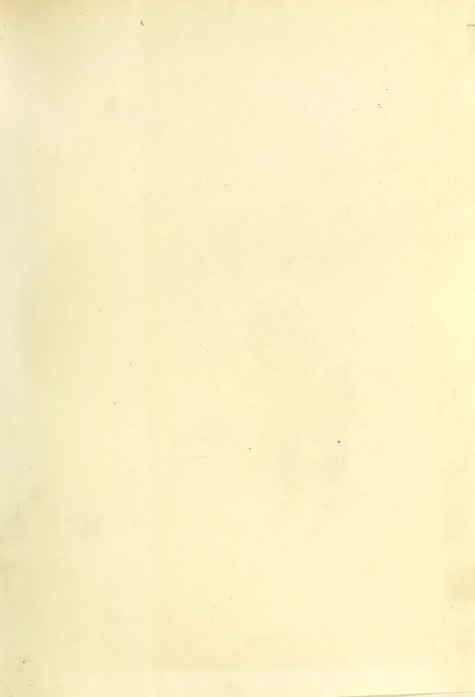This image shows a blank, aged, cream-colored page, likely an endpaper or flyleaf from an old book. The paper has a slightly textured appearance with some minor discoloration and faint smudges, particularly along the right edge. There is no text or other markings on the page.

1089------------------------------------------------

1090------------------------------------------------

This image shows a blank, aged, cream-colored page, likely an endpaper or flyleaf from an old book. The paper has a slightly textured appearance with some minor creases and discoloration, particularly along the left edge where it appears to be the binding. There is no text or other markings on the page.

1091------------------------------------------------

